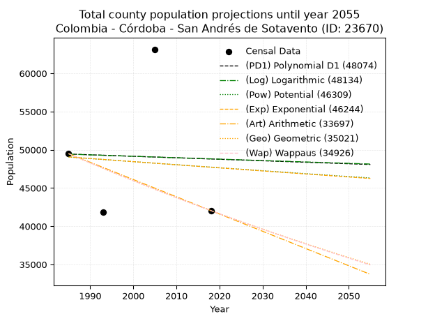
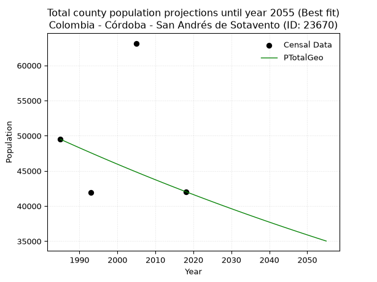
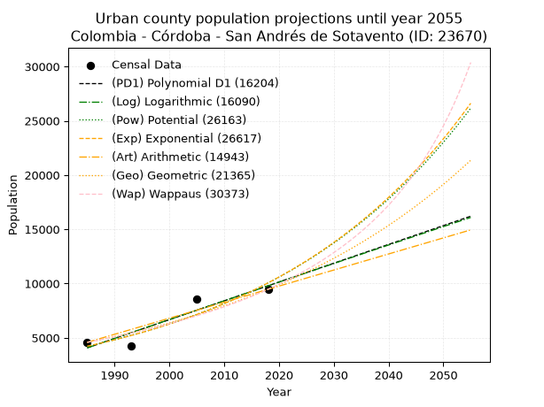
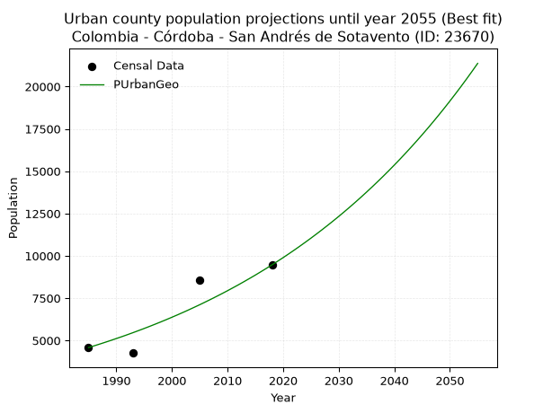
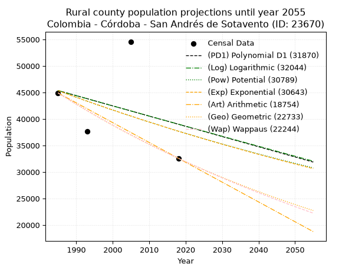
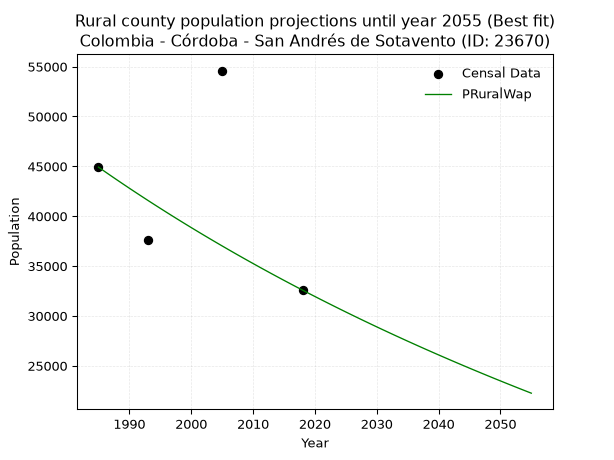

<div align="center">


</div>

# _“Population and Public Services Demand Projections (PPSD) until Year 2050 for Colombia - Córdoba - San Andrés Sotavento (1) (3) (ID: 23670)”_
Keywords: `population` `public-service` `projection` `lineal` `polynomial` `logarithmic` `potential` `exponential` `arithmetic` `geometric` `wappaus` `dane` `colombia` `south-america`

PPSD are analytical estimates used by governments and planners to anticipate future changes in population size, age distribution, and the resulting community needs for utilities, healthcare, education, and infrastructure as sizing future water treatment facilities, electrical grids, and road networks based on spatial growth.

> **General running parameters**: • app_version: _v20260806_. • Python version: _3.14.7_. • Pandas version: _3.0.5_. • NumPy version: _2.5.1_. • Creates, save and include plots into reports (create_plot): _False_. • Projection until year: _2050_. • Process polynomial degree 2 and up: _False_. • Process Wappaus: _True_. • Process Wappaus: _True_. • Set negative values to zero: _True_. • Set infinite values to zero: _True_. • Drop dataset notes: _True_. 
<div align="center">

Dynamic map: [:earth_americas:Google](http://maps.google.com/maps?q=9.145447531,-75.5087904) [:earth_americas:OSM](https://www.openstreetmap.org/#map=18/9.145447531/-75.5087904&layers=P) [:earth_americas:Bing](https://www.bing.com/maps?cp=9.145447531~-75.5087904&lvl=18) [:earth_americas:Apple](https://maps.apple.com/frame?center=9.145447531%2C-75.5087904&span=0.003%2C0.006)

</div>


<div align="center">

```geojson
{
  "type": "Feature",
  "geometry": {
    "type": "Point", 
    "coordinates": [-75.5087904, 9.145447531]
  }, 
  "properties": {
    "Name": "Colombia - Córdoba - San Andrés Sotavento (1) (3) (ID: 23670)"
  }
}
```

</div>


## 0. Census Data (4 records)

Census data are official statistics collected by a government about the people and housing in a country. They usually include counts of total population, age, sex, race, income, education, and jobs.

📅Global census file: [Population.xlsx](../data/Population.xlsx)

| Source   |   Year |   CountryID | CountryName   |   StateID | StateName   |   CountyID | CountyName                   |   PTotal |   PUrban |   PRural |
|:---------|-------:|------------:|:--------------|----------:|:------------|-----------:|:-----------------------------|---------:|---------:|---------:|
| DANE     |   1985 |          57 | Colombia      |        23 | Córdoba     |      23670 | San Andrés Sotavento (1) (3) |    49492 |     4579 |    44913 |
| DANE     |   1993 |          57 | Colombia      |        23 | Córdoba     |      23670 | San Andrés De Sotavento      |    41885 |     4258 |    37627 |
| DANE     |   2005 |          57 | Colombia      |        23 | Córdoba     |      23670 | San Andrés Sotavento         |    63147 |     8555 |    54592 |
| DANE     |   2018 |          57 | Colombia      |        23 | Córdoba     |      23670 | San Andrés De Sotavento      |    42046 |     9465 |    32581 |

> 🔥Some records could had specific notes about the registered values or the corresponding urban or rural distribution.

## 1. Total

### 1.1. Coefficients and Parameters

* (PD1) Polynomial Deg 1: -19.51746286630699, 88182.30509833056 (lineal)
* (Log) Logarithmic: -37318.38448197401, 332799.8394982495
* (Pow) Potential: -1.6615259833505467, 10.169991009668355
* (Exp) Exponential: -0.0008459554311953747, 263055.3464809506
* (Art) Arithmetic: Year diff. 2018 - 1985 = 33, Population diff. 42046 - 49492 = -7446, Annual growth = -225.63636363636363
* (Geo) Geometric: Year diff. 2018 - 1985 = 33, Population diff. 42046 - 49492 = -7446, Annual growth % = -0.004928625883104831
* (Wap) Wappaus: i = -0.49298949864835073, Condition values only valid for < 200)

<sub>
Wappaus condition values: ['-0.00', '-0.49', '-0.99', '-1.48', '-1.97', '-2.46', '-2.96', '-3.45', '-3.94', '-4.44', '-4.93', '-5.42', '-5.92', '-6.41', '-6.90', '-7.39', '-7.89', '-8.38', '-8.87', '-9.37', '-9.86', '-10.35', '-10.85', '-11.34', '-11.83', '-12.32', '-12.82', '-13.31', '-13.80', '-14.30', '-14.79', '-15.28', '-15.78', '-16.27', '-16.76', '-17.25', '-17.75', '-18.24', '-18.73', '-19.23', '-19.72', '-20.21', '-20.71', '-21.20', '-21.69', '-22.18', '-22.68', '-23.17', '-23.66', '-24.16', '-24.65', '-25.14', '-25.64', '-26.13', '-26.62', '-27.11', '-27.61', '-28.10', '-28.59', '-29.09', '-29.58', '-30.07', '-30.57', '-31.06', '-31.55', '-32.04']
</sub>


### 1.2. Projected Dataset

|   Year |   CountyID |   PTotalPD1 |   PTotalLog |   PTotalPow |   PTotalExp |   PTotalArt |   PTotalGeo |   PTotalWap |
|-------:|-----------:|------------:|------------:|------------:|------------:|------------:|------------:|------------:|
|   1985 |      23670 |       49440 |       49427 |       49054 |       49065 |       49492 |       49492 |       49492 |
|   1986 |      23670 |       49421 |       49409 |       49013 |       49023 |       49266 |       49248 |       49249 |
|   1987 |      23670 |       49401 |       49390 |       48972 |       48982 |       49041 |       49005 |       49006 |
|   1988 |      23670 |       49382 |       49371 |       48931 |       48940 |       48815 |       48764 |       48765 |
|   1989 |      23670 |       49362 |       49352 |       48890 |       48899 |       48589 |       48523 |       48526 |
|   1990 |      23670 |       49343 |       49333 |       48850 |       48858 |       48364 |       48284 |       48287 |
|   1991 |      23670 |       49323 |       49315 |       48809 |       48816 |       48138 |       48046 |       48049 |
|   1992 |      23670 |       49304 |       49296 |       48768 |       48775 |       47913 |       47810 |       47813 |
|   1993 |      23670 |       49284 |       49277 |       48727 |       48734 |       47687 |       47574 |       47578 |
|   1994 |      23670 |       49264 |       49259 |       48687 |       48693 |       47461 |       47339 |       47344 |
|   1995 |      23670 |       49245 |       49240 |       48646 |       48652 |       47236 |       47106 |       47111 |
|   1996 |      23670 |       49225 |       49221 |       48606 |       48610 |       47010 |       46874 |       46879 |
|   1997 |      23670 |       49206 |       49202 |       48565 |       48569 |       46784 |       46643 |       46648 |
|   1998 |      23670 |       49186 |       49184 |       48525 |       48528 |       46559 |       46413 |       46419 |
|   1999 |      23670 |       49167 |       49165 |       48485 |       48487 |       46333 |       46184 |       46190 |
|   2000 |      23670 |       49147 |       49146 |       48444 |       48446 |       46107 |       45957 |       45963 |
|   2001 |      23670 |       49128 |       49128 |       48404 |       48405 |       45882 |       45730 |       45736 |
|   2002 |      23670 |       49108 |       49109 |       48364 |       48364 |       45656 |       45505 |       45511 |
|   2003 |      23670 |       49089 |       49091 |       48324 |       48323 |       45431 |       45280 |       45287 |
|   2004 |      23670 |       49069 |       49072 |       48284 |       48283 |       45205 |       45057 |       45064 |
|   2005 |      23670 |       49050 |       49053 |       48244 |       48242 |       44979 |       44835 |       44841 |
|   2006 |      23670 |       49030 |       49035 |       48204 |       48201 |       44754 |       44614 |       44620 |
|   2007 |      23670 |       49011 |       49016 |       48164 |       48160 |       44528 |       44394 |       44400 |
|   2008 |      23670 |       48991 |       48997 |       48124 |       48119 |       44302 |       44176 |       44181 |
|   2009 |      23670 |       48972 |       48979 |       48084 |       48079 |       44077 |       43958 |       43963 |
|   2010 |      23670 |       48952 |       48960 |       48045 |       48038 |       43851 |       43741 |       43746 |
|   2011 |      23670 |       48933 |       48942 |       48005 |       47997 |       43625 |       43526 |       43530 |
|   2012 |      23670 |       48913 |       48923 |       47965 |       47957 |       43400 |       43311 |       43315 |
|   2013 |      23670 |       48894 |       48905 |       47926 |       47916 |       43174 |       43098 |       43101 |
|   2014 |      23670 |       48874 |       48886 |       47886 |       47876 |       42949 |       42885 |       42888 |
|   2015 |      23670 |       48855 |       48868 |       47847 |       47835 |       42723 |       42674 |       42676 |
|   2016 |      23670 |       48835 |       48849 |       47807 |       47795 |       42497 |       42464 |       42465 |
|   2017 |      23670 |       48816 |       48831 |       47768 |       47754 |       42272 |       42254 |       42255 |
|   2018 |      23670 |       48796 |       48812 |       47729 |       47714 |       42046 |       42046 |       42046 |
|   2019 |      23670 |       48777 |       48794 |       47689 |       47674 |       41820 |       41839 |       41838 |
|   2020 |      23670 |       48757 |       48775 |       47650 |       47633 |       41595 |       41633 |       41631 |
|   2021 |      23670 |       48738 |       48757 |       47611 |       47593 |       41369 |       41427 |       41424 |
|   2022 |      23670 |       48718 |       48738 |       47572 |       47553 |       41143 |       41223 |       41219 |
|   2023 |      23670 |       48698 |       48720 |       47533 |       47513 |       40918 |       41020 |       41014 |
|   2024 |      23670 |       48679 |       48701 |       47494 |       47473 |       40692 |       40818 |       40811 |
|   2025 |      23670 |       48659 |       48683 |       47455 |       47432 |       40467 |       40617 |       40608 |
|   2026 |      23670 |       48640 |       48664 |       47416 |       47392 |       40241 |       40416 |       40407 |
|   2027 |      23670 |       48620 |       48646 |       47377 |       47352 |       40015 |       40217 |       40206 |
|   2028 |      23670 |       48601 |       48628 |       47338 |       47312 |       39790 |       40019 |       40006 |
|   2029 |      23670 |       48581 |       48609 |       47299 |       47272 |       39564 |       39822 |       39807 |
|   2030 |      23670 |       48562 |       48591 |       47261 |       47232 |       39338 |       39626 |       39609 |
|   2031 |      23670 |       48542 |       48572 |       47222 |       47192 |       39113 |       39430 |       39411 |
|   2032 |      23670 |       48523 |       48554 |       47183 |       47152 |       38887 |       39236 |       39215 |
|   2033 |      23670 |       48503 |       48536 |       47145 |       47112 |       38661 |       39043 |       39020 |
|   2034 |      23670 |       48484 |       48517 |       47106 |       47073 |       38436 |       38850 |       38825 |
|   2035 |      23670 |       48464 |       48499 |       47068 |       47033 |       38210 |       38659 |       38631 |
|   2036 |      23670 |       48445 |       48481 |       47030 |       46993 |       37985 |       38468 |       38438 |
|   2037 |      23670 |       48425 |       48462 |       46991 |       46953 |       37759 |       38279 |       38246 |
|   2038 |      23670 |       48406 |       48444 |       46953 |       46914 |       37533 |       38090 |       38055 |
|   2039 |      23670 |       48386 |       48426 |       46915 |       46874 |       37308 |       37902 |       37864 |
|   2040 |      23670 |       48367 |       48407 |       46876 |       46834 |       37082 |       37715 |       37675 |
|   2041 |      23670 |       48347 |       48389 |       46838 |       46795 |       36856 |       37529 |       37486 |
|   2042 |      23670 |       48328 |       48371 |       46800 |       46755 |       36631 |       37344 |       37298 |
|   2043 |      23670 |       48308 |       48353 |       46762 |       46716 |       36405 |       37160 |       37111 |
|   2044 |      23670 |       48289 |       48334 |       46724 |       46676 |       36179 |       36977 |       36924 |
|   2045 |      23670 |       48269 |       48316 |       46686 |       46637 |       35954 |       36795 |       36739 |
|   2046 |      23670 |       48250 |       48298 |       46648 |       46597 |       35728 |       36614 |       36554 |
|   2047 |      23670 |       48230 |       48280 |       46610 |       46558 |       35503 |       36433 |       36370 |
|   2048 |      23670 |       48211 |       48261 |       46573 |       46518 |       35277 |       36254 |       36187 |
|   2049 |      23670 |       48191 |       48243 |       46535 |       46479 |       35051 |       36075 |       36004 |
|   2050 |      23670 |       48172 |       48225 |       46497 |       46440 |       34826 |       35897 |       35823 |
<div align="center">

</img>

</div>


### 1.3. Best fit with absolute and relative error (%)

Relative error puts that difference into context by dividing the absolute error by the true value, creating a unitless ratio or percentage that shows the scale of the mistake.

Absolute and relative error

|   Year | Source   |   CountryID | CountryName   |   StateID | StateName   |   CountyID_x | CountyName                   |   PTotal |   PUrban |   PRural |   CountyID_y |   PTotalPD1 |   PTotalLog |   PTotalPow |   PTotalExp |   PTotalArt |   PTotalGeo |   PTotalWap |   PTotalPD1AbsError |   PTotalLogAbsError |   PTotalPowAbsError |   PTotalExpAbsError |   PTotalArtAbsError |   PTotalGeoAbsError |   PTotalWapAbsError |   PTotalPD1RelError |   PTotalLogRelError |   PTotalPowRelError |   PTotalExpRelError |   PTotalArtRelError |   PTotalGeoRelError |   PTotalWapRelError |
|-------:|:---------|------------:|:--------------|----------:|:------------|-------------:|:-----------------------------|---------:|---------:|---------:|-------------:|------------:|------------:|------------:|------------:|------------:|------------:|------------:|--------------------:|--------------------:|--------------------:|--------------------:|--------------------:|--------------------:|--------------------:|--------------------:|--------------------:|--------------------:|--------------------:|--------------------:|--------------------:|--------------------:|
|   1985 | DANE     |          57 | Colombia      |        23 | Córdoba     |        23670 | San Andrés Sotavento (1) (3) |    49492 |     4579 |    44913 |        23670 |       49440 |       49427 |       49054 |       49065 |       49492 |       49492 |       49492 |                  52 |                  65 |                 438 |                 427 |                   0 |                   0 |                   0 |            0.105067 |            0.131334 |            0.884992 |            0.862766 |              0      |              0      |              0      |
|   1993 | DANE     |          57 | Colombia      |        23 | Córdoba     |        23670 | San Andrés De Sotavento      |    41885 |     4258 |    37627 |        23670 |       49284 |       49277 |       48727 |       48734 |       47687 |       47574 |       47578 |                7399 |                7392 |                6842 |                6849 |                5802 |                5689 |                5693 |           17.665    |           17.6483   |           16.3352   |           16.3519   |             13.8522 |             13.5824 |             13.592  |
|   2005 | DANE     |          57 | Colombia      |        23 | Córdoba     |        23670 | San Andrés Sotavento         |    63147 |     8555 |    54592 |        23670 |       49050 |       49053 |       48244 |       48242 |       44979 |       44835 |       44841 |               14097 |               14094 |               14903 |               14905 |               18168 |               18312 |               18306 |           22.3241   |           22.3194   |           23.6005   |           23.6037   |             28.771  |             28.999  |             28.9895 |
|   2018 | DANE     |          57 | Colombia      |        23 | Córdoba     |        23670 | San Andrés De Sotavento      |    42046 |     9465 |    32581 |        23670 |       48796 |       48812 |       47729 |       47714 |       42046 |       42046 |       42046 |                6750 |                6766 |                5683 |                5668 |                   0 |                   0 |                   0 |           16.0538   |           16.0919   |           13.5161   |           13.4805   |              0      |              0      |              0      |

Relative error mean

| Method    |   RelError | Best   |
|:----------|-----------:|:-------|
| PTotalPD1 |    14.037  |        |
| PTotalLog |    14.0477 |        |
| PTotalPow |    13.5842 |        |
| PTotalExp |    13.5747 |        |
| PTotalArt |    10.6558 |        |
| PTotalGeo |    10.6454 | True   |
| PTotalWap |    10.6454 |        |

💙Best method: _**PTotalGeo**_
<div align="center">

</img>

</div>


### 1.4. Fresh water supply demand in liters per capita per day (lpcd)

The fresh water supply demand typically ranges from 100 to 300 liters per capita per day (lpcd) for standard domestic and municipal planning, though absolute survival minimums set by the World Health Organization are as low as 7.5 to 20 liters per day, and total consumption in high-income nations can exceed 400 liters.

> `CZ`: Level in meters above the sea level (masl).<br> `WS`: Fresh water supply demand in liters per capita per day (lpcd or l/h/d).<br> `WSAll`: Zonal fresh water supply demand in liters per second (l/s).<br> `A`: Zonal area in square meters.

Reference values (RAS Colombia)

|    CZ |   WS |
|------:|-----:|
|  1000 |  120 |
|  2000 |  130 |
| 99999 |  140 |

County shapefile geometry properties and water supply values

|   CountyID |      ATotal |   CZTotal |   WSTotal |
|-----------:|------------:|----------:|----------:|
|      23670 | 2.06744e+08 |    66.137 |       120 |

Projected values for best method: PTotalGeo

|   CountyID |   Year |   PTotalGeo |   WSTotal |   WSTotalAll |
|-----------:|-------:|------------:|----------:|-------------:|
|      23670 |   1985 |       49492 |       120 |      68.7389 |
|      23670 |   1986 |       49248 |       120 |      68.4    |
|      23670 |   1987 |       49005 |       120 |      68.0625 |
|      23670 |   1988 |       48764 |       120 |      67.7278 |
|      23670 |   1989 |       48523 |       120 |      67.3931 |
|      23670 |   1990 |       48284 |       120 |      67.0611 |
|      23670 |   1991 |       48046 |       120 |      66.7306 |
|      23670 |   1992 |       47810 |       120 |      66.4028 |
|      23670 |   1993 |       47574 |       120 |      66.075  |
|      23670 |   1994 |       47339 |       120 |      65.7486 |
|      23670 |   1995 |       47106 |       120 |      65.425  |
|      23670 |   1996 |       46874 |       120 |      65.1028 |
|      23670 |   1997 |       46643 |       120 |      64.7819 |
|      23670 |   1998 |       46413 |       120 |      64.4625 |
|      23670 |   1999 |       46184 |       120 |      64.1444 |
|      23670 |   2000 |       45957 |       120 |      63.8292 |
|      23670 |   2001 |       45730 |       120 |      63.5139 |
|      23670 |   2002 |       45505 |       120 |      63.2014 |
|      23670 |   2003 |       45280 |       120 |      62.8889 |
|      23670 |   2004 |       45057 |       120 |      62.5792 |
|      23670 |   2005 |       44835 |       120 |      62.2708 |
|      23670 |   2006 |       44614 |       120 |      61.9639 |
|      23670 |   2007 |       44394 |       120 |      61.6583 |
|      23670 |   2008 |       44176 |       120 |      61.3556 |
|      23670 |   2009 |       43958 |       120 |      61.0528 |
|      23670 |   2010 |       43741 |       120 |      60.7514 |
|      23670 |   2011 |       43526 |       120 |      60.4528 |
|      23670 |   2012 |       43311 |       120 |      60.1542 |
|      23670 |   2013 |       43098 |       120 |      59.8583 |
|      23670 |   2014 |       42885 |       120 |      59.5625 |
|      23670 |   2015 |       42674 |       120 |      59.2694 |
|      23670 |   2016 |       42464 |       120 |      58.9778 |
|      23670 |   2017 |       42254 |       120 |      58.6861 |
|      23670 |   2018 |       42046 |       120 |      58.3972 |
|      23670 |   2019 |       41839 |       120 |      58.1097 |
|      23670 |   2020 |       41633 |       120 |      57.8236 |
|      23670 |   2021 |       41427 |       120 |      57.5375 |
|      23670 |   2022 |       41223 |       120 |      57.2542 |
|      23670 |   2023 |       41020 |       120 |      56.9722 |
|      23670 |   2024 |       40818 |       120 |      56.6917 |
|      23670 |   2025 |       40617 |       120 |      56.4125 |
|      23670 |   2026 |       40416 |       120 |      56.1333 |
|      23670 |   2027 |       40217 |       120 |      55.8569 |
|      23670 |   2028 |       40019 |       120 |      55.5819 |
|      23670 |   2029 |       39822 |       120 |      55.3083 |
|      23670 |   2030 |       39626 |       120 |      55.0361 |
|      23670 |   2031 |       39430 |       120 |      54.7639 |
|      23670 |   2032 |       39236 |       120 |      54.4944 |
|      23670 |   2033 |       39043 |       120 |      54.2264 |
|      23670 |   2034 |       38850 |       120 |      53.9583 |
|      23670 |   2035 |       38659 |       120 |      53.6931 |
|      23670 |   2036 |       38468 |       120 |      53.4278 |
|      23670 |   2037 |       38279 |       120 |      53.1653 |
|      23670 |   2038 |       38090 |       120 |      52.9028 |
|      23670 |   2039 |       37902 |       120 |      52.6417 |
|      23670 |   2040 |       37715 |       120 |      52.3819 |
|      23670 |   2041 |       37529 |       120 |      52.1236 |
|      23670 |   2042 |       37344 |       120 |      51.8667 |
|      23670 |   2043 |       37160 |       120 |      51.6111 |
|      23670 |   2044 |       36977 |       120 |      51.3569 |
|      23670 |   2045 |       36795 |       120 |      51.1042 |
|      23670 |   2046 |       36614 |       120 |      50.8528 |
|      23670 |   2047 |       36433 |       120 |      50.6014 |
|      23670 |   2048 |       36254 |       120 |      50.3528 |
|      23670 |   2049 |       36075 |       120 |      50.1042 |
|      23670 |   2050 |       35897 |       120 |      49.8569 |

## 2. Urban

### 2.1. Coefficients and Parameters

* (PD1) Polynomial Deg 1: 173.32757928542668, -339984.2404656748 (lineal)
* (Log) Logarithmic: 346955.0549789764, -2630493.90321852
* (Pow) Potential: 52.66760383710112, -170.06017519478814
* (Exp) Exponential: 0.026309896374407907, 8.795024281287488e-20
* (Art) Arithmetic: Year diff. 2018 - 1985 = 33, Population diff. 9465 - 4579 = 4886, Annual growth = 148.06060606060606
* (Geo) Geometric: Year diff. 2018 - 1985 = 33, Population diff. 9465 - 4579 = 4886, Annual growth % = 0.022247506404455386
* (Wap) Wappaus: i = 2.108524723164427, Condition values only valid for < 200)

<sub>
Wappaus condition values: ['0.00', '2.11', '4.22', '6.33', '8.43', '10.54', '12.65', '14.76', '16.87', '18.98', '21.09', '23.19', '25.30', '27.41', '29.52', '31.63', '33.74', '35.84', '37.95', '40.06', '42.17', '44.28', '46.39', '48.50', '50.60', '52.71', '54.82', '56.93', '59.04', '61.15', '63.26', '65.36', '67.47', '69.58', '71.69', '73.80', '75.91', '78.02', '80.12', '82.23', '84.34', '86.45', '88.56', '90.67', '92.78', '94.88', '96.99', '99.10', '101.21', '103.32', '105.43', '107.53', '109.64', '111.75', '113.86', '115.97', '118.08', '120.19', '122.29', '124.40', '126.51', '128.62', '130.73', '132.84', '134.95', '137.05']
</sub>


### 2.2. Projected Dataset

|   Year |   CountyID |   PUrbanPD1 |   PUrbanLog |   PUrbanPow |   PUrbanExp |   PUrbanArt |   PUrbanGeo |   PUrbanWap |
|-------:|-----------:|------------:|------------:|------------:|------------:|------------:|------------:|------------:|
|   1985 |      23670 |        4071 |        4066 |        4217 |        4220 |        4579 |        4579 |        4579 |
|   1986 |      23670 |        4244 |        4240 |        4330 |        4333 |        4727 |        4681 |        4677 |
|   1987 |      23670 |        4418 |        4415 |        4446 |        4448 |        4875 |        4785 |        4776 |
|   1988 |      23670 |        4591 |        4590 |        4566 |        4567 |        5023 |        4891 |        4878 |
|   1989 |      23670 |        4764 |        4764 |        4688 |        4689 |        5171 |        5000 |        4982 |
|   1990 |      23670 |        4938 |        4939 |        4814 |        4813 |        5319 |        5112 |        5089 |
|   1991 |      23670 |        5111 |        5113 |        4943 |        4942 |        5467 |        5225 |        5197 |
|   1992 |      23670 |        5284 |        5287 |        5076 |        5074 |        5615 |        5341 |        5309 |
|   1993 |      23670 |        5458 |        5461 |        5212 |        5209 |        5763 |        5460 |        5423 |
|   1994 |      23670 |        5631 |        5635 |        5351 |        5348 |        5912 |        5582 |        5539 |
|   1995 |      23670 |        5804 |        5809 |        5494 |        5490 |        6060 |        5706 |        5658 |
|   1996 |      23670 |        5978 |        5983 |        5641 |        5637 |        6208 |        5833 |        5780 |
|   1997 |      23670 |        6151 |        6157 |        5792 |        5787 |        6356 |        5963 |        5905 |
|   1998 |      23670 |        6324 |        6330 |        5947 |        5941 |        6504 |        6095 |        6033 |
|   1999 |      23670 |        6498 |        6504 |        6106 |        6100 |        6652 |        6231 |        6165 |
|   2000 |      23670 |        6671 |        6678 |        6269 |        6262 |        6800 |        6370 |        6299 |
|   2001 |      23670 |        6844 |        6851 |        6436 |        6429 |        6948 |        6511 |        6437 |
|   2002 |      23670 |        7018 |        7024 |        6607 |        6600 |        7096 |        6656 |        6579 |
|   2003 |      23670 |        7191 |        7198 |        6783 |        6776 |        7244 |        6804 |        6724 |
|   2004 |      23670 |        7364 |        7371 |        6964 |        6957 |        7392 |        6956 |        6873 |
|   2005 |      23670 |        7538 |        7544 |        7150 |        7143 |        7540 |        7110 |        7026 |
|   2006 |      23670 |        7711 |        7717 |        7340 |        7333 |        7688 |        7269 |        7183 |
|   2007 |      23670 |        7884 |        7890 |        7535 |        7528 |        7836 |        7430 |        7345 |
|   2008 |      23670 |        8058 |        8063 |        7735 |        7729 |        7984 |        7596 |        7510 |
|   2009 |      23670 |        8231 |        8235 |        7941 |        7935 |        8132 |        7765 |        7681 |
|   2010 |      23670 |        8404 |        8408 |        8152 |        8147 |        8281 |        7937 |        7857 |
|   2011 |      23670 |        8578 |        8581 |        8368 |        8364 |        8429 |        8114 |        8037 |
|   2012 |      23670 |        8751 |        8753 |        8590 |        8587 |        8577 |        8294 |        8223 |
|   2013 |      23670 |        8924 |        8926 |        8818 |        8816 |        8725 |        8479 |        8415 |
|   2014 |      23670 |        9098 |        9098 |        9051 |        9051 |        8873 |        8668 |        8612 |
|   2015 |      23670 |        9271 |        9270 |        9291 |        9292 |        9021 |        8860 |        8815 |
|   2016 |      23670 |        9444 |        9442 |        9537 |        9540 |        9169 |        9058 |        9025 |
|   2017 |      23670 |        9617 |        9614 |        9790 |        9794 |        9317 |        9259 |        9242 |
|   2018 |      23670 |        9791 |        9786 |       10049 |       10055 |        9465 |        9465 |        9465 |
|   2019 |      23670 |        9964 |        9958 |       10314 |       10323 |        9613 |        9676 |        9696 |
|   2020 |      23670 |       10137 |       10130 |       10587 |       10599 |        9761 |        9891 |        9934 |
|   2021 |      23670 |       10311 |       10302 |       10866 |       10881 |        9909 |       10111 |       10181 |
|   2022 |      23670 |       10484 |       10473 |       11153 |       11171 |       10057 |       10336 |       10436 |
|   2023 |      23670 |       10657 |       10645 |       11447 |       11469 |       10205 |       10566 |       10700 |
|   2024 |      23670 |       10831 |       10816 |       11749 |       11775 |       10353 |       10801 |       10974 |
|   2025 |      23670 |       11004 |       10988 |       12059 |       12089 |       10501 |       11041 |       11257 |
|   2026 |      23670 |       11177 |       11159 |       12377 |       12411 |       10649 |       11287 |       11551 |
|   2027 |      23670 |       11351 |       11330 |       12702 |       12742 |       10798 |       11538 |       11856 |
|   2028 |      23670 |       11524 |       11501 |       13037 |       13081 |       10946 |       11795 |       12173 |
|   2029 |      23670 |       11697 |       11672 |       13380 |       13430 |       11094 |       12057 |       12503 |
|   2030 |      23670 |       11871 |       11843 |       13731 |       13788 |       11242 |       12325 |       12845 |
|   2031 |      23670 |       12044 |       12014 |       14092 |       14156 |       11390 |       12599 |       13202 |
|   2032 |      23670 |       12217 |       12185 |       14462 |       14533 |       11538 |       12880 |       13574 |
|   2033 |      23670 |       12391 |       12356 |       14842 |       14921 |       11686 |       13166 |       13961 |
|   2034 |      23670 |       12564 |       12526 |       15231 |       15318 |       11834 |       13459 |       14366 |
|   2035 |      23670 |       12737 |       12697 |       15631 |       15727 |       11982 |       13759 |       14788 |
|   2036 |      23670 |       12911 |       12867 |       16041 |       16146 |       12130 |       14065 |       15230 |
|   2037 |      23670 |       13084 |       13038 |       16461 |       16577 |       12278 |       14378 |       15692 |
|   2038 |      23670 |       13257 |       13208 |       16892 |       17018 |       12426 |       14697 |       16176 |
|   2039 |      23670 |       13431 |       13378 |       17334 |       17472 |       12574 |       15024 |       16684 |
|   2040 |      23670 |       13604 |       13548 |       17788 |       17938 |       12722 |       15359 |       17218 |
|   2041 |      23670 |       13777 |       13718 |       18253 |       18416 |       12870 |       15700 |       17779 |
|   2042 |      23670 |       13951 |       13888 |       18730 |       18907 |       13018 |       16050 |       18369 |
|   2043 |      23670 |       14124 |       14058 |       19219 |       19411 |       13167 |       16407 |       18992 |
|   2044 |      23670 |       14297 |       14228 |       19721 |       19929 |       13315 |       16772 |       19649 |
|   2045 |      23670 |       14471 |       14398 |       20235 |       20460 |       13463 |       17145 |       20345 |
|   2046 |      23670 |       14644 |       14567 |       20763 |       21005 |       13611 |       17526 |       21081 |
|   2047 |      23670 |       14817 |       14737 |       21304 |       21565 |       13759 |       17916 |       21862 |
|   2048 |      23670 |       14991 |       14906 |       21859 |       22140 |       13907 |       18315 |       22692 |
|   2049 |      23670 |       15164 |       15076 |       22429 |       22730 |       14055 |       18722 |       23576 |
|   2050 |      23670 |       15337 |       15245 |       23013 |       23336 |       14203 |       19139 |       24519 |
<div align="center">

</img>

</div>


### 2.3. Best fit with absolute and relative error (%)

Relative error puts that difference into context by dividing the absolute error by the true value, creating a unitless ratio or percentage that shows the scale of the mistake.

Absolute and relative error

|   Year | Source   |   CountryID | CountryName   |   StateID | StateName   |   CountyID_x | CountyName                   |   PTotal |   PUrban |   PRural |   CountyID_y |   PUrbanPD1 |   PUrbanLog |   PUrbanPow |   PUrbanExp |   PUrbanArt |   PUrbanGeo |   PUrbanWap |   PUrbanPD1AbsError |   PUrbanLogAbsError |   PUrbanPowAbsError |   PUrbanExpAbsError |   PUrbanArtAbsError |   PUrbanGeoAbsError |   PUrbanWapAbsError |   PUrbanPD1RelError |   PUrbanLogRelError |   PUrbanPowRelError |   PUrbanExpRelError |   PUrbanArtRelError |   PUrbanGeoRelError |   PUrbanWapRelError |
|-------:|:---------|------------:|:--------------|----------:|:------------|-------------:|:-----------------------------|---------:|---------:|---------:|-------------:|------------:|------------:|------------:|------------:|------------:|------------:|------------:|--------------------:|--------------------:|--------------------:|--------------------:|--------------------:|--------------------:|--------------------:|--------------------:|--------------------:|--------------------:|--------------------:|--------------------:|--------------------:|--------------------:|
|   1985 | DANE     |          57 | Colombia      |        23 | Córdoba     |        23670 | San Andrés Sotavento (1) (3) |    49492 |     4579 |    44913 |        23670 |        4071 |        4066 |        4217 |        4220 |        4579 |        4579 |        4579 |                 508 |                 513 |                 362 |                 359 |                   0 |                   0 |                   0 |            11.0941  |            11.2033  |             7.90566 |             7.84014 |              0      |              0      |              0      |
|   1993 | DANE     |          57 | Colombia      |        23 | Córdoba     |        23670 | San Andrés De Sotavento      |    41885 |     4258 |    37627 |        23670 |        5458 |        5461 |        5212 |        5209 |        5763 |        5460 |        5423 |                1200 |                1203 |                 954 |                 951 |                1505 |                1202 |                1165 |            28.1822  |            28.2527  |            22.4049  |            22.3344  |             35.3452 |             28.2292 |             27.3603 |
|   2005 | DANE     |          57 | Colombia      |        23 | Córdoba     |        23670 | San Andrés Sotavento         |    63147 |     8555 |    54592 |        23670 |        7538 |        7544 |        7150 |        7143 |        7540 |        7110 |        7026 |                1017 |                1011 |                1405 |                1412 |                1015 |                1445 |                1529 |            11.8878  |            11.8177  |            16.4231  |            16.505   |             11.8644 |             16.8907 |             17.8726 |
|   2018 | DANE     |          57 | Colombia      |        23 | Córdoba     |        23670 | San Andrés De Sotavento      |    42046 |     9465 |    32581 |        23670 |        9791 |        9786 |       10049 |       10055 |        9465 |        9465 |        9465 |                 326 |                 321 |                 584 |                 590 |                   0 |                   0 |                   0 |             3.44427 |             3.39144 |             6.1701  |             6.23349 |              0      |              0      |              0      |

Relative error mean

| Method    |   RelError | Best   |
|:----------|-----------:|:-------|
| PUrbanPD1 |    13.6521 |        |
| PUrbanLog |    13.6663 |        |
| PUrbanPow |    13.2259 |        |
| PUrbanExp |    13.2283 |        |
| PUrbanArt |    11.8024 |        |
| PUrbanGeo |    11.28   | True   |
| PUrbanWap |    11.3082 |        |

💙Best method: _**PUrbanGeo**_
<div align="center">

</img>

</div>


### 2.4. Fresh water supply demand in liters per capita per day (lpcd)

The fresh water supply demand typically ranges from 100 to 300 liters per capita per day (lpcd) for standard domestic and municipal planning, though absolute survival minimums set by the World Health Organization are as low as 7.5 to 20 liters per day, and total consumption in high-income nations can exceed 400 liters.

> `CZ`: Level in meters above the sea level (masl).<br> `WS`: Fresh water supply demand in liters per capita per day (lpcd or l/h/d).<br> `WSAll`: Zonal fresh water supply demand in liters per second (l/s).<br> `A`: Zonal area in square meters.

Reference values (RAS Colombia)

|    CZ |   WS |
|------:|-----:|
|  1000 |  120 |
|  2000 |  130 |
| 99999 |  140 |

County shapefile geometry properties and water supply values

|   CountyID |      AUrban |   CZUrban |   WSUrban |
|-----------:|------------:|----------:|----------:|
|      23670 | 1.42839e+06 |   104.273 |       120 |

Projected values for best method: PUrbanGeo

|   CountyID |   Year |   PUrbanGeo |   WSUrban |   WSUrbanAll |
|-----------:|-------:|------------:|----------:|-------------:|
|      23670 |   1985 |        4579 |       120 |      6.35972 |
|      23670 |   1986 |        4681 |       120 |      6.50139 |
|      23670 |   1987 |        4785 |       120 |      6.64583 |
|      23670 |   1988 |        4891 |       120 |      6.79306 |
|      23670 |   1989 |        5000 |       120 |      6.94444 |
|      23670 |   1990 |        5112 |       120 |      7.1     |
|      23670 |   1991 |        5225 |       120 |      7.25694 |
|      23670 |   1992 |        5341 |       120 |      7.41806 |
|      23670 |   1993 |        5460 |       120 |      7.58333 |
|      23670 |   1994 |        5582 |       120 |      7.75278 |
|      23670 |   1995 |        5706 |       120 |      7.925   |
|      23670 |   1996 |        5833 |       120 |      8.10139 |
|      23670 |   1997 |        5963 |       120 |      8.28194 |
|      23670 |   1998 |        6095 |       120 |      8.46528 |
|      23670 |   1999 |        6231 |       120 |      8.65417 |
|      23670 |   2000 |        6370 |       120 |      8.84722 |
|      23670 |   2001 |        6511 |       120 |      9.04306 |
|      23670 |   2002 |        6656 |       120 |      9.24444 |
|      23670 |   2003 |        6804 |       120 |      9.45    |
|      23670 |   2004 |        6956 |       120 |      9.66111 |
|      23670 |   2005 |        7110 |       120 |      9.875   |
|      23670 |   2006 |        7269 |       120 |     10.0958  |
|      23670 |   2007 |        7430 |       120 |     10.3194  |
|      23670 |   2008 |        7596 |       120 |     10.55    |
|      23670 |   2009 |        7765 |       120 |     10.7847  |
|      23670 |   2010 |        7937 |       120 |     11.0236  |
|      23670 |   2011 |        8114 |       120 |     11.2694  |
|      23670 |   2012 |        8294 |       120 |     11.5194  |
|      23670 |   2013 |        8479 |       120 |     11.7764  |
|      23670 |   2014 |        8668 |       120 |     12.0389  |
|      23670 |   2015 |        8860 |       120 |     12.3056  |
|      23670 |   2016 |        9058 |       120 |     12.5806  |
|      23670 |   2017 |        9259 |       120 |     12.8597  |
|      23670 |   2018 |        9465 |       120 |     13.1458  |
|      23670 |   2019 |        9676 |       120 |     13.4389  |
|      23670 |   2020 |        9891 |       120 |     13.7375  |
|      23670 |   2021 |       10111 |       120 |     14.0431  |
|      23670 |   2022 |       10336 |       120 |     14.3556  |
|      23670 |   2023 |       10566 |       120 |     14.675   |
|      23670 |   2024 |       10801 |       120 |     15.0014  |
|      23670 |   2025 |       11041 |       120 |     15.3347  |
|      23670 |   2026 |       11287 |       120 |     15.6764  |
|      23670 |   2027 |       11538 |       120 |     16.025   |
|      23670 |   2028 |       11795 |       120 |     16.3819  |
|      23670 |   2029 |       12057 |       120 |     16.7458  |
|      23670 |   2030 |       12325 |       120 |     17.1181  |
|      23670 |   2031 |       12599 |       120 |     17.4986  |
|      23670 |   2032 |       12880 |       120 |     17.8889  |
|      23670 |   2033 |       13166 |       120 |     18.2861  |
|      23670 |   2034 |       13459 |       120 |     18.6931  |
|      23670 |   2035 |       13759 |       120 |     19.1097  |
|      23670 |   2036 |       14065 |       120 |     19.5347  |
|      23670 |   2037 |       14378 |       120 |     19.9694  |
|      23670 |   2038 |       14697 |       120 |     20.4125  |
|      23670 |   2039 |       15024 |       120 |     20.8667  |
|      23670 |   2040 |       15359 |       120 |     21.3319  |
|      23670 |   2041 |       15700 |       120 |     21.8056  |
|      23670 |   2042 |       16050 |       120 |     22.2917  |
|      23670 |   2043 |       16407 |       120 |     22.7875  |
|      23670 |   2044 |       16772 |       120 |     23.2944  |
|      23670 |   2045 |       17145 |       120 |     23.8125  |
|      23670 |   2046 |       17526 |       120 |     24.3417  |
|      23670 |   2047 |       17916 |       120 |     24.8833  |
|      23670 |   2048 |       18315 |       120 |     25.4375  |
|      23670 |   2049 |       18722 |       120 |     26.0028  |
|      23670 |   2050 |       19139 |       120 |     26.5819  |

## 3. Rural

### 3.1. Coefficients and Parameters

* (PD1) Polynomial Deg 1: -192.8450421517334, 428166.5455640048 (lineal)
* (Log) Logarithmic: -384273.43946095055, 2963293.7427167706
* (Pow) Potential: -11.169942357589129, 41.49231808753027
* (Exp) Exponential: -0.005600023733867233, 3049425976.5613236
* (Art) Arithmetic: Year diff. 2018 - 1985 = 33, Population diff. 32581 - 44913 = -12332, Annual growth = -373.6969696969697
* (Geo) Geometric: Year diff. 2018 - 1985 = 33, Population diff. 32581 - 44913 = -12332, Annual growth % = -0.009680055479604488
* (Wap) Wappaus: i = -0.9644539440394604, Condition values only valid for < 200)

<sub>
Wappaus condition values: ['-0.00', '-0.96', '-1.93', '-2.89', '-3.86', '-4.82', '-5.79', '-6.75', '-7.72', '-8.68', '-9.64', '-10.61', '-11.57', '-12.54', '-13.50', '-14.47', '-15.43', '-16.40', '-17.36', '-18.32', '-19.29', '-20.25', '-21.22', '-22.18', '-23.15', '-24.11', '-25.08', '-26.04', '-27.00', '-27.97', '-28.93', '-29.90', '-30.86', '-31.83', '-32.79', '-33.76', '-34.72', '-35.68', '-36.65', '-37.61', '-38.58', '-39.54', '-40.51', '-41.47', '-42.44', '-43.40', '-44.36', '-45.33', '-46.29', '-47.26', '-48.22', '-49.19', '-50.15', '-51.12', '-52.08', '-53.04', '-54.01', '-54.97', '-55.94', '-56.90', '-57.87', '-58.83', '-59.80', '-60.76', '-61.73', '-62.69']
</sub>


### 3.2. Projected Dataset

|   Year |   CountyID |   PRuralPD1 |   PRuralLog |   PRuralPow |   PRuralExp |   PRuralArt |   PRuralGeo |   PRuralWap |
|-------:|-----------:|------------:|------------:|------------:|------------:|------------:|------------:|------------:|
|   1985 |      23670 |       45369 |       45362 |       45344 |       45350 |       44913 |       44913 |       44913 |
|   1986 |      23670 |       45176 |       45168 |       45090 |       45097 |       44539 |       44478 |       44482 |
|   1987 |      23670 |       44983 |       44975 |       44837 |       44845 |       44166 |       44048 |       44055 |
|   1988 |      23670 |       44791 |       44781 |       44586 |       44595 |       43792 |       43621 |       43632 |
|   1989 |      23670 |       44598 |       44588 |       44336 |       44346 |       43418 |       43199 |       43213 |
|   1990 |      23670 |       44405 |       44395 |       44088 |       44098 |       43045 |       42781 |       42798 |
|   1991 |      23670 |       44212 |       44202 |       43841 |       43852 |       42671 |       42367 |       42387 |
|   1992 |      23670 |       44019 |       44009 |       43596 |       43607 |       42297 |       41957 |       41980 |
|   1993 |      23670 |       43826 |       43816 |       43352 |       43363 |       41923 |       41551 |       41576 |
|   1994 |      23670 |       43634 |       43623 |       43110 |       43121 |       41550 |       41148 |       41177 |
|   1995 |      23670 |       43441 |       43431 |       42869 |       42880 |       41176 |       40750 |       40781 |
|   1996 |      23670 |       43248 |       43238 |       42630 |       42641 |       40802 |       40356 |       40388 |
|   1997 |      23670 |       43055 |       43046 |       42392 |       42403 |       40429 |       39965 |       39999 |
|   1998 |      23670 |       42862 |       42853 |       42156 |       42166 |       40055 |       39578 |       39614 |
|   1999 |      23670 |       42669 |       42661 |       41921 |       41931 |       39681 |       39195 |       39232 |
|   2000 |      23670 |       42476 |       42469 |       41687 |       41696 |       39308 |       38815 |       38854 |
|   2001 |      23670 |       42284 |       42277 |       41455 |       41464 |       38934 |       38440 |       38479 |
|   2002 |      23670 |       42091 |       42085 |       41224 |       41232 |       38560 |       38068 |       38107 |
|   2003 |      23670 |       41898 |       41893 |       40995 |       41002 |       38186 |       37699 |       37739 |
|   2004 |      23670 |       41705 |       41701 |       40767 |       40773 |       37813 |       37334 |       37374 |
|   2005 |      23670 |       41512 |       41509 |       40541 |       40545 |       37439 |       36973 |       37012 |
|   2006 |      23670 |       41319 |       41318 |       40315 |       40319 |       37065 |       36615 |       36653 |
|   2007 |      23670 |       41127 |       41126 |       40092 |       40094 |       36692 |       36260 |       36297 |
|   2008 |      23670 |       40934 |       40935 |       39869 |       39870 |       36318 |       35909 |       35945 |
|   2009 |      23670 |       40741 |       40743 |       39648 |       39647 |       35944 |       35562 |       35595 |
|   2010 |      23670 |       40548 |       40552 |       39428 |       39426 |       35571 |       35218 |       35249 |
|   2011 |      23670 |       40355 |       40361 |       39210 |       39205 |       35197 |       34877 |       34905 |
|   2012 |      23670 |       40162 |       40170 |       38993 |       38987 |       34823 |       34539 |       34565 |
|   2013 |      23670 |       39969 |       39979 |       38777 |       38769 |       34449 |       34205 |       34227 |
|   2014 |      23670 |       39777 |       39788 |       38562 |       38552 |       34076 |       33874 |       33892 |
|   2015 |      23670 |       39584 |       39598 |       38349 |       38337 |       33702 |       33546 |       33560 |
|   2016 |      23670 |       39391 |       39407 |       38137 |       38123 |       33328 |       33221 |       33231 |
|   2017 |      23670 |       39198 |       39216 |       37927 |       37910 |       32955 |       32899 |       32905 |
|   2018 |      23670 |       39005 |       39026 |       37717 |       37698 |       32581 |       32581 |       32581 |
|   2019 |      23670 |       38812 |       38835 |       37509 |       37488 |       32207 |       32266 |       32260 |
|   2020 |      23670 |       38620 |       38645 |       37302 |       37278 |       31834 |       31953 |       31942 |
|   2021 |      23670 |       38427 |       38455 |       37096 |       37070 |       31460 |       31644 |       31626 |
|   2022 |      23670 |       38234 |       38265 |       36892 |       36863 |       31086 |       31338 |       31313 |
|   2023 |      23670 |       38041 |       38075 |       36689 |       36657 |       30713 |       31034 |       31002 |
|   2024 |      23670 |       37848 |       37885 |       36487 |       36453 |       30339 |       30734 |       30694 |
|   2025 |      23670 |       37655 |       37695 |       36286 |       36249 |       29965 |       30436 |       30388 |
|   2026 |      23670 |       37462 |       37505 |       36087 |       36047 |       29591 |       30142 |       30085 |
|   2027 |      23670 |       37270 |       37316 |       35888 |       35845 |       29218 |       29850 |       29784 |
|   2028 |      23670 |       37077 |       37126 |       35691 |       35645 |       28844 |       29561 |       29486 |
|   2029 |      23670 |       36884 |       36937 |       35495 |       35446 |       28470 |       29275 |       29190 |
|   2030 |      23670 |       36691 |       36748 |       35300 |       35248 |       28097 |       28992 |       28896 |
|   2031 |      23670 |       36498 |       36558 |       35107 |       35051 |       27723 |       28711 |       28605 |
|   2032 |      23670 |       36305 |       36369 |       34914 |       34856 |       27349 |       28433 |       28316 |
|   2033 |      23670 |       36113 |       36180 |       34723 |       34661 |       26976 |       28158 |       28029 |
|   2034 |      23670 |       35920 |       35991 |       34533 |       34467 |       26602 |       27885 |       27745 |
|   2035 |      23670 |       35727 |       35802 |       34343 |       34275 |       26228 |       27615 |       27462 |
|   2036 |      23670 |       35534 |       35613 |       34156 |       34084 |       25854 |       27348 |       27182 |
|   2037 |      23670 |       35341 |       35425 |       33969 |       33893 |       25481 |       27083 |       26904 |
|   2038 |      23670 |       35148 |       35236 |       33783 |       33704 |       25107 |       26821 |       26628 |
|   2039 |      23670 |       34956 |       35048 |       33598 |       33516 |       24733 |       26561 |       26355 |
|   2040 |      23670 |       34763 |       34859 |       33415 |       33329 |       24360 |       26304 |       26083 |
|   2041 |      23670 |       34570 |       34671 |       33232 |       33142 |       23986 |       26050 |       25814 |
|   2042 |      23670 |       34377 |       34483 |       33051 |       32957 |       23612 |       25797 |       25546 |
|   2043 |      23670 |       34184 |       34294 |       32871 |       32773 |       23239 |       25548 |       25280 |
|   2044 |      23670 |       33991 |       34106 |       32692 |       32590 |       22865 |       25300 |       25017 |
|   2045 |      23670 |       33798 |       33918 |       32514 |       32408 |       22491 |       25056 |       24755 |
|   2046 |      23670 |       33606 |       33731 |       32337 |       32227 |       22117 |       24813 |       24496 |
|   2047 |      23670 |       33413 |       33543 |       32160 |       32047 |       21744 |       24573 |       24238 |
|   2048 |      23670 |       33220 |       33355 |       31986 |       31868 |       21370 |       24335 |       23982 |
|   2049 |      23670 |       33027 |       33168 |       31812 |       31690 |       20996 |       24099 |       23728 |
|   2050 |      23670 |       32834 |       32980 |       31639 |       31513 |       20623 |       23866 |       23476 |
<div align="center">

</img>

</div>


### 3.3. Best fit with absolute and relative error (%)

Relative error puts that difference into context by dividing the absolute error by the true value, creating a unitless ratio or percentage that shows the scale of the mistake.

Absolute and relative error

|   Year | Source   |   CountryID | CountryName   |   StateID | StateName   |   CountyID_x | CountyName                   |   PTotal |   PUrban |   PRural |   CountyID_y |   PRuralPD1 |   PRuralLog |   PRuralPow |   PRuralExp |   PRuralArt |   PRuralGeo |   PRuralWap |   PRuralPD1AbsError |   PRuralLogAbsError |   PRuralPowAbsError |   PRuralExpAbsError |   PRuralArtAbsError |   PRuralGeoAbsError |   PRuralWapAbsError |   PRuralPD1RelError |   PRuralLogRelError |   PRuralPowRelError |   PRuralExpRelError |   PRuralArtRelError |   PRuralGeoRelError |   PRuralWapRelError |
|-------:|:---------|------------:|:--------------|----------:|:------------|-------------:|:-----------------------------|---------:|---------:|---------:|-------------:|------------:|------------:|------------:|------------:|------------:|------------:|------------:|--------------------:|--------------------:|--------------------:|--------------------:|--------------------:|--------------------:|--------------------:|--------------------:|--------------------:|--------------------:|--------------------:|--------------------:|--------------------:|--------------------:|
|   1985 | DANE     |          57 | Colombia      |        23 | Córdoba     |        23670 | San Andrés Sotavento (1) (3) |    49492 |     4579 |    44913 |        23670 |       45369 |       45362 |       45344 |       45350 |       44913 |       44913 |       44913 |                 456 |                 449 |                 431 |                 437 |                   0 |                   0 |                   0 |              1.0153 |            0.999711 |            0.959633 |            0.972992 |              0      |              0      |              0      |
|   1993 | DANE     |          57 | Colombia      |        23 | Córdoba     |        23670 | San Andrés De Sotavento      |    41885 |     4258 |    37627 |        23670 |       43826 |       43816 |       43352 |       43363 |       41923 |       41551 |       41576 |                6199 |                6189 |                5725 |                5736 |                4296 |                3924 |                3949 |             16.4749 |           16.4483   |           15.2151   |           15.2444   |             11.4173 |             10.4287 |             10.4951 |
|   2005 | DANE     |          57 | Colombia      |        23 | Córdoba     |        23670 | San Andrés Sotavento         |    63147 |     8555 |    54592 |        23670 |       41512 |       41509 |       40541 |       40545 |       37439 |       36973 |       37012 |               13080 |               13083 |               14051 |               14047 |               17153 |               17619 |               17580 |             23.9596 |           23.965    |           25.7382   |           25.7309   |             31.4204 |             32.274  |             32.2025 |
|   2018 | DANE     |          57 | Colombia      |        23 | Córdoba     |        23670 | San Andrés De Sotavento      |    42046 |     9465 |    32581 |        23670 |       39005 |       39026 |       37717 |       37698 |       32581 |       32581 |       32581 |                6424 |                6445 |                5136 |                5117 |                   0 |                   0 |                   0 |             19.717  |           19.7815   |           15.7638   |           15.7055   |              0      |              0      |              0      |

Relative error mean

| Method    |   RelError | Best   |
|:----------|-----------:|:-------|
| PRuralPD1 |    15.2917 |        |
| PRuralLog |    15.2986 |        |
| PRuralPow |    14.4192 |        |
| PRuralExp |    14.4134 |        |
| PRuralArt |    10.7094 |        |
| PRuralGeo |    10.6757 |        |
| PRuralWap |    10.6744 | True   |

💙Best method: _**PRuralWap**_
<div align="center">

</img>

</div>


### 3.4. Fresh water supply demand in liters per capita per day (lpcd)

The fresh water supply demand typically ranges from 100 to 300 liters per capita per day (lpcd) for standard domestic and municipal planning, though absolute survival minimums set by the World Health Organization are as low as 7.5 to 20 liters per day, and total consumption in high-income nations can exceed 400 liters.

> `CZ`: Level in meters above the sea level (masl).<br> `WS`: Fresh water supply demand in liters per capita per day (lpcd or l/h/d).<br> `WSAll`: Zonal fresh water supply demand in liters per second (l/s).<br> `A`: Zonal area in square meters.

Reference values (RAS Colombia)

|    CZ |   WS |
|------:|-----:|
|  1000 |  120 |
|  2000 |  130 |
| 99999 |  140 |

County shapefile geometry properties and water supply values

|   CountyID |      ARural |   CZRural |   WSRural |
|-----------:|------------:|----------:|----------:|
|      23670 | 2.05315e+08 |   65.8641 |       120 |

Projected values for best method: PRuralWap

|   CountyID |   Year |   PRuralWap |   WSRural |   WSRuralAll |
|-----------:|-------:|------------:|----------:|-------------:|
|      23670 |   1985 |       44913 |       120 |      62.3792 |
|      23670 |   1986 |       44482 |       120 |      61.7806 |
|      23670 |   1987 |       44055 |       120 |      61.1875 |
|      23670 |   1988 |       43632 |       120 |      60.6    |
|      23670 |   1989 |       43213 |       120 |      60.0181 |
|      23670 |   1990 |       42798 |       120 |      59.4417 |
|      23670 |   1991 |       42387 |       120 |      58.8708 |
|      23670 |   1992 |       41980 |       120 |      58.3056 |
|      23670 |   1993 |       41576 |       120 |      57.7444 |
|      23670 |   1994 |       41177 |       120 |      57.1903 |
|      23670 |   1995 |       40781 |       120 |      56.6403 |
|      23670 |   1996 |       40388 |       120 |      56.0944 |
|      23670 |   1997 |       39999 |       120 |      55.5542 |
|      23670 |   1998 |       39614 |       120 |      55.0194 |
|      23670 |   1999 |       39232 |       120 |      54.4889 |
|      23670 |   2000 |       38854 |       120 |      53.9639 |
|      23670 |   2001 |       38479 |       120 |      53.4431 |
|      23670 |   2002 |       38107 |       120 |      52.9264 |
|      23670 |   2003 |       37739 |       120 |      52.4153 |
|      23670 |   2004 |       37374 |       120 |      51.9083 |
|      23670 |   2005 |       37012 |       120 |      51.4056 |
|      23670 |   2006 |       36653 |       120 |      50.9069 |
|      23670 |   2007 |       36297 |       120 |      50.4125 |
|      23670 |   2008 |       35945 |       120 |      49.9236 |
|      23670 |   2009 |       35595 |       120 |      49.4375 |
|      23670 |   2010 |       35249 |       120 |      48.9569 |
|      23670 |   2011 |       34905 |       120 |      48.4792 |
|      23670 |   2012 |       34565 |       120 |      48.0069 |
|      23670 |   2013 |       34227 |       120 |      47.5375 |
|      23670 |   2014 |       33892 |       120 |      47.0722 |
|      23670 |   2015 |       33560 |       120 |      46.6111 |
|      23670 |   2016 |       33231 |       120 |      46.1542 |
|      23670 |   2017 |       32905 |       120 |      45.7014 |
|      23670 |   2018 |       32581 |       120 |      45.2514 |
|      23670 |   2019 |       32260 |       120 |      44.8056 |
|      23670 |   2020 |       31942 |       120 |      44.3639 |
|      23670 |   2021 |       31626 |       120 |      43.925  |
|      23670 |   2022 |       31313 |       120 |      43.4903 |
|      23670 |   2023 |       31002 |       120 |      43.0583 |
|      23670 |   2024 |       30694 |       120 |      42.6306 |
|      23670 |   2025 |       30388 |       120 |      42.2056 |
|      23670 |   2026 |       30085 |       120 |      41.7847 |
|      23670 |   2027 |       29784 |       120 |      41.3667 |
|      23670 |   2028 |       29486 |       120 |      40.9528 |
|      23670 |   2029 |       29190 |       120 |      40.5417 |
|      23670 |   2030 |       28896 |       120 |      40.1333 |
|      23670 |   2031 |       28605 |       120 |      39.7292 |
|      23670 |   2032 |       28316 |       120 |      39.3278 |
|      23670 |   2033 |       28029 |       120 |      38.9292 |
|      23670 |   2034 |       27745 |       120 |      38.5347 |
|      23670 |   2035 |       27462 |       120 |      38.1417 |
|      23670 |   2036 |       27182 |       120 |      37.7528 |
|      23670 |   2037 |       26904 |       120 |      37.3667 |
|      23670 |   2038 |       26628 |       120 |      36.9833 |
|      23670 |   2039 |       26355 |       120 |      36.6042 |
|      23670 |   2040 |       26083 |       120 |      36.2264 |
|      23670 |   2041 |       25814 |       120 |      35.8528 |
|      23670 |   2042 |       25546 |       120 |      35.4806 |
|      23670 |   2043 |       25280 |       120 |      35.1111 |
|      23670 |   2044 |       25017 |       120 |      34.7458 |
|      23670 |   2045 |       24755 |       120 |      34.3819 |
|      23670 |   2046 |       24496 |       120 |      34.0222 |
|      23670 |   2047 |       24238 |       120 |      33.6639 |
|      23670 |   2048 |       23982 |       120 |      33.3083 |
|      23670 |   2049 |       23728 |       120 |      32.9556 |
|      23670 |   2050 |       23476 |       120 |      32.6056 |

<div align="center"><br><sub>Share this research</sub></div><br>

<sub>**APPS & TOOLS & CONTENT DISCLAIMER**: • NO WARRANTY - This content and software is provided by <a href="https://github.com/rcfdtools" target="_blank">github.com/rcfdtools</a> "as is", without any express or implied warranty, including warranties of merchantability, fitness for a particular purpose, or non-infringement. There is no guarantee that the software will be error-free or operate without interruption. • LIMITATION OF LIABILITY - Neither the authors nor copyright holders will be liable for claims or damages arising from the software or its use. You are responsible for determining if the software is appropriate for your use and assume all associated risks, including errors, legal compliance, and data loss. • NO PROFESSIONAL ADVICE - The software provides general information and does not offer professional advice. It should not replace consultation with professional advisors. [Clauses and global license for rcfdtools use.](https://github.com/rcfdtools/rcfdtools/blob/main/LICENSE.md)</sub>