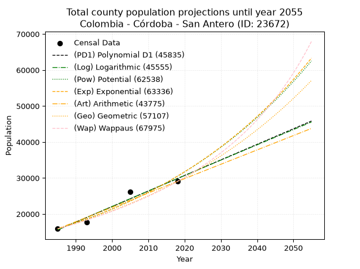
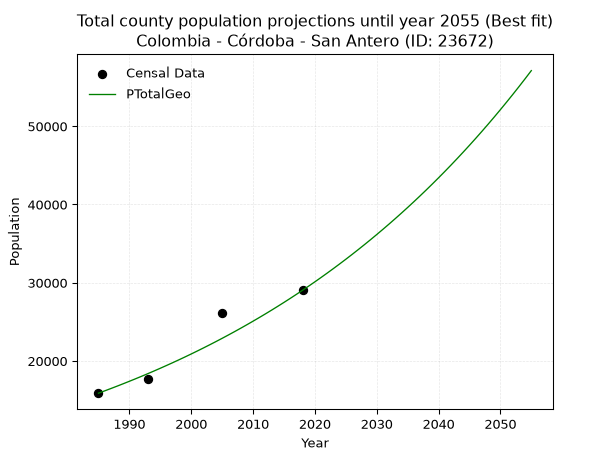
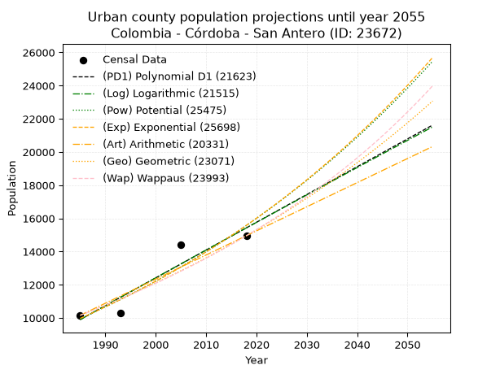
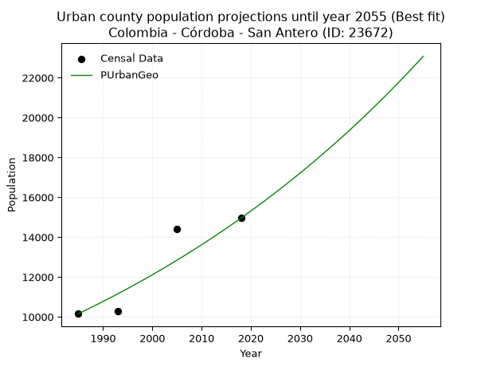
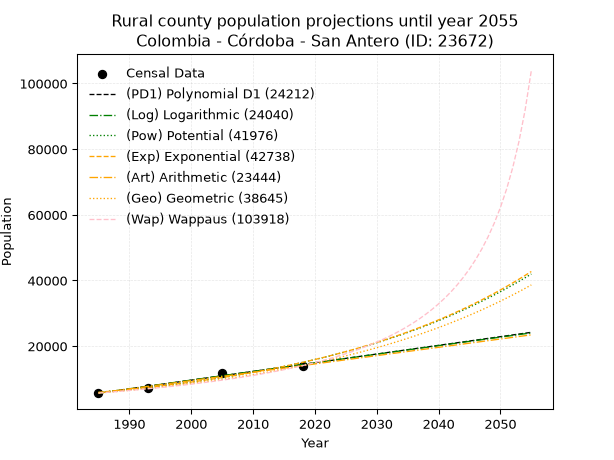
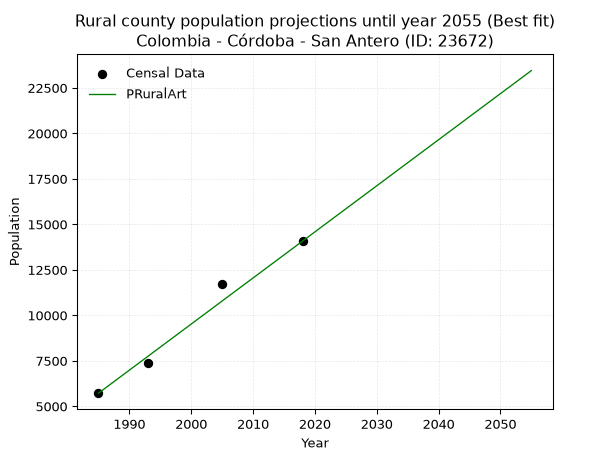

<div align="center">


</div>

# 📜 _“Population and Public Services Demand Projections (PPSD) until Year 2050 for Colombia - Córdoba - San Antero (ID: 23672)”_
Keywords: `population` `public-service` `projection` `lineal` `polynomial` `logarithmic` `potential` `exponential` `arithmetic` `geometric` `wappaus` `dane` `colombia` `south-america`

PPSD are analytical estimates used by governments and planners to anticipate future changes in population size, age distribution, and the resulting community needs for utilities, healthcare, education, and infrastructure as sizing future water treatment facilities, electrical grids, and road networks based on spatial growth.

<div align="center">

</img>

</div>


> **General running parameters**: • app_version: _v20260806_. • Python version: _3.14.7_. • Pandas version: _3.0.5_. • NumPy version: _2.5.1_. • Creates, save and include plots into reports (create_plot): _False_. • Projection until year: _2050_. • Process polynomial degree 2 and up: _False_. • Process Wappaus: _True_. • Process Wappaus: _True_. • Set negative values to zero: _True_. • Set infinite values to zero: _True_. • Drop dataset notes: _True_. 
<div align="center">

Dynamic map: [:earth_americas:Google](http://maps.google.com/maps?q=9.37643422,-75.7611202) [:earth_americas:OSM](https://www.openstreetmap.org/#map=18/9.37643422/-75.7611202&layers=P) [:earth_americas:Bing](https://www.bing.com/maps?cp=9.37643422~-75.7611202&lvl=18) [:earth_americas:Apple](https://maps.apple.com/frame?center=9.37643422%2C-75.7611202&span=0.003%2C0.006)

</div>


<div align="center">

```geojson
{
  "type": "Feature",
  "geometry": {
    "type": "Point", 
    "coordinates": [-75.7611202, 9.37643422]
  }, 
  "properties": {
    "Name": "Colombia - Córdoba - San Antero (ID: 23672)"
  }
}
```

</div>


## 0. Census Data (4 records)

Census data are official statistics collected by a government about the people and housing in a country. They usually include counts of total population, age, sex, race, income, education, and jobs.

📅Global census file: [Population.xlsx](../data/Population.xlsx)

| Source   |   Year |   CountryID | CountryName   |   StateID | StateName   |   CountyID | CountyName   |   PTotal |   PUrban |   PRural |
|:---------|-------:|------------:|:--------------|----------:|:------------|-----------:|:-------------|---------:|---------:|---------:|
| DANE     |   1985 |          57 | Colombia      |        23 | Córdoba     |      23672 | San Antero   |    15875 |    10158 |     5717 |
| DANE     |   1993 |          57 | Colombia      |        23 | Córdoba     |      23672 | San Antero   |    17669 |    10297 |     7372 |
| DANE     |   2005 |          57 | Colombia      |        23 | Córdoba     |      23672 | San Antero   |    26123 |    14406 |    11717 |
| DANE     |   2018 |          57 | Colombia      |        23 | Córdoba     |      23672 | San Antero   |    29028 |    14954 |    14074 |

> 🔥Some records could had specific notes about the registered values or the corresponding urban or rural distribution.

📅[SUI-RUPS](https://www.datos.gov.co/Hacienda-y-Cr-dito-P-blico/Registro-nico-de-Prestadores-de-Servicios-P-blicos/4qkq-csdn/about_data) - Local public utility companies: [RUPS.csv](../data/RUPS.xlsx)

 | SERVICIO       | ESTADO    | NOMBRE                            | NIT         | DEPARTAMENTO_DOMICILIO   | MUNICIPIO_DOMICILIO   | DIRECCION                       |   TELEFONO | EMAIL                                            | TIPO_PRESTADOR                             | CLASIFICACION                 |
|:---------------|:----------|:----------------------------------|:------------|:-------------------------|:----------------------|:--------------------------------|-----------:|:-------------------------------------------------|:-------------------------------------------|:------------------------------|
| ACUEDUCTO      | OPERATIVA | AGUAS DEL SINU S.A E.S.P          | 900218174-5 | CORDOBA                  | LORICA                | CRA 26  # 14 - 06 B/ SAN PEDRO  |    7731744 | coordinacionfacturacion@aguasdelsinusaesp.com.co | SOCIEDADES (EMPRESA DE SERVICIOS PUBLICOS) | MAYOR O IGUAL A 5001 USUARIOS |
| ALCANTARILLADO | OPERATIVA | AGUAS DEL SINU S.A E.S.P          | 900218174-5 | CORDOBA                  | LORICA                | CRA 26  # 14 - 06 B/ SAN PEDRO  |    7731744 | coordinacionfacturacion@aguasdelsinusaesp.com.co | SOCIEDADES (EMPRESA DE SERVICIOS PUBLICOS) | MAYOR O IGUAL A 5001 USUARIOS |
| ACUEDUCTO      | OPERATIVA | AQUALIA LATINOAMERICA S.A. E.S.P. | 901362452-7 | CORDOBA                  | CERETE                | calle 39 n° 15-60 barrio  venus |    7641602 | jhosett.navas@aqualia.com                        | SOCIEDADES (EMPRESA DE SERVICIOS PUBLICOS) | MAYOR O IGUAL A 5001 USUARIOS |
| ALCANTARILLADO | OPERATIVA | AQUALIA LATINOAMERICA S.A. E.S.P. | 901362452-7 | CORDOBA                  | CERETE                | calle 39 n° 15-60 barrio  venus |    7641602 | jhosett.navas@aqualia.com                        | SOCIEDADES (EMPRESA DE SERVICIOS PUBLICOS) | MAYOR O IGUAL A 5001 USUARIOS |

## 1. Total

### 1.1. Coefficients and Parameters

* (PD1) Polynomial Deg 1: 432.17543155359056, -842285.1569650696 (lineal)
* (Log) Logarithmic: 865225.9225253832, -6554415.420600843
* (Pow) Potential: 39.553589882654165, -126.23745836734679
* (Exp) Exponential: 0.01975432042790198, 1.4839250224803383e-13
* (Art) Arithmetic: Year diff. 2018 - 1985 = 33, Population diff. 29028 - 15875 = 13153, Annual growth = 398.57575757575756
* (Geo) Geometric: Year diff. 2018 - 1985 = 33, Population diff. 29028 - 15875 = 13153, Annual growth % = 0.018456599431179388
* (Wap) Wappaus: i = 1.7752745142897248, Condition values only valid for < 200)

<sub>
Wappaus condition values: ['0.00', '1.78', '3.55', '5.33', '7.10', '8.88', '10.65', '12.43', '14.20', '15.98', '17.75', '19.53', '21.30', '23.08', '24.85', '26.63', '28.40', '30.18', '31.95', '33.73', '35.51', '37.28', '39.06', '40.83', '42.61', '44.38', '46.16', '47.93', '49.71', '51.48', '53.26', '55.03', '56.81', '58.58', '60.36', '62.13', '63.91', '65.69', '67.46', '69.24', '71.01', '72.79', '74.56', '76.34', '78.11', '79.89', '81.66', '83.44', '85.21', '86.99', '88.76', '90.54', '92.31', '94.09', '95.86', '97.64', '99.42', '101.19', '102.97', '104.74', '106.52', '108.29', '110.07', '111.84', '113.62', '115.39']
</sub>


### 1.2. Projected Dataset

|   Year |   CountyID |   PTotalPD1 |   PTotalLog |   PTotalPow |   PTotalExp |   PTotalArt |   PTotalGeo |   PTotalWap |
|-------:|-----------:|------------:|------------:|------------:|------------:|------------:|------------:|------------:|
|   1985 |      23672 |       15583 |       15569 |       15878 |       15889 |       15875 |       15875 |       15875 |
|   1986 |      23672 |       16015 |       16005 |       16198 |       16206 |       16274 |       16168 |       16159 |
|   1987 |      23672 |       16447 |       16440 |       16524 |       16530 |       16672 |       16466 |       16449 |
|   1988 |      23672 |       16880 |       16875 |       16856 |       16860 |       17071 |       16770 |       16744 |
|   1989 |      23672 |       17312 |       17311 |       17194 |       17196 |       17469 |       17080 |       17044 |
|   1990 |      23672 |       17744 |       17745 |       17540 |       17539 |       17868 |       17395 |       17350 |
|   1991 |      23672 |       18176 |       18180 |       17892 |       17889 |       18266 |       17716 |       17661 |
|   1992 |      23672 |       18608 |       18615 |       18251 |       18246 |       18665 |       18043 |       17978 |
|   1993 |      23672 |       19040 |       19049 |       18617 |       18610 |       19064 |       18376 |       18302 |
|   1994 |      23672 |       19473 |       19483 |       18990 |       18981 |       19462 |       18715 |       18632 |
|   1995 |      23672 |       19905 |       19917 |       19370 |       19360 |       19861 |       19061 |       18968 |
|   1996 |      23672 |       20337 |       20350 |       19758 |       19746 |       20259 |       19413 |       19311 |
|   1997 |      23672 |       20769 |       20784 |       20153 |       20140 |       20658 |       19771 |       19660 |
|   1998 |      23672 |       21201 |       21217 |       20556 |       20542 |       21056 |       20136 |       20017 |
|   1999 |      23672 |       21634 |       21650 |       20967 |       20952 |       21455 |       20507 |       20380 |
|   2000 |      23672 |       22066 |       22082 |       21386 |       21370 |       21854 |       20886 |       20752 |
|   2001 |      23672 |       22498 |       22515 |       21813 |       21796 |       22252 |       21271 |       21131 |
|   2002 |      23672 |       22930 |       22947 |       22248 |       22231 |       22651 |       21664 |       21517 |
|   2003 |      23672 |       23362 |       23379 |       22692 |       22674 |       23049 |       22064 |       21912 |
|   2004 |      23672 |       23794 |       23811 |       23145 |       23127 |       23448 |       22471 |       22316 |
|   2005 |      23672 |       24227 |       24243 |       23606 |       23588 |       23847 |       22886 |       22728 |
|   2006 |      23672 |       24659 |       24674 |       24076 |       24059 |       24245 |       23308 |       23149 |
|   2007 |      23672 |       25091 |       25105 |       24555 |       24539 |       24644 |       23738 |       23580 |
|   2008 |      23672 |       25523 |       25536 |       25044 |       25028 |       25042 |       24176 |       24020 |
|   2009 |      23672 |       25955 |       25967 |       25542 |       25528 |       25441 |       24623 |       24470 |
|   2010 |      23672 |       26387 |       26398 |       26050 |       26037 |       25839 |       25077 |       24930 |
|   2011 |      23672 |       26820 |       26828 |       26567 |       26556 |       26238 |       25540 |       25401 |
|   2012 |      23672 |       27252 |       27258 |       27095 |       27086 |       26637 |       26011 |       25883 |
|   2013 |      23672 |       27684 |       27688 |       27633 |       27627 |       27035 |       26491 |       26376 |
|   2014 |      23672 |       28116 |       28118 |       28181 |       28178 |       27434 |       26980 |       26881 |
|   2015 |      23672 |       28548 |       28547 |       28740 |       28740 |       27832 |       27478 |       27398 |
|   2016 |      23672 |       28981 |       28977 |       29309 |       29313 |       28231 |       27985 |       27928 |
|   2017 |      23672 |       29413 |       29406 |       29890 |       29898 |       28629 |       28502 |       28471 |
|   2018 |      23672 |       29845 |       29835 |       30482 |       30495 |       29028 |       29028 |       29028 |
|   2019 |      23672 |       30277 |       30263 |       31085 |       31103 |       29427 |       29564 |       29599 |
|   2020 |      23672 |       30709 |       30692 |       31700 |       31723 |       29825 |       30109 |       30184 |
|   2021 |      23672 |       31141 |       31120 |       32326 |       32356 |       30224 |       30665 |       30785 |
|   2022 |      23672 |       31574 |       31548 |       32965 |       33002 |       30622 |       31231 |       31402 |
|   2023 |      23672 |       32006 |       31976 |       33616 |       33660 |       31021 |       31808 |       32035 |
|   2024 |      23672 |       32438 |       32403 |       34280 |       34332 |       31419 |       32395 |       32686 |
|   2025 |      23672 |       32870 |       32831 |       34956 |       35017 |       31818 |       32992 |       33354 |
|   2026 |      23672 |       33302 |       33258 |       35645 |       35715 |       32217 |       33601 |       34041 |
|   2027 |      23672 |       33734 |       33685 |       36348 |       36428 |       32615 |       34222 |       34747 |
|   2028 |      23672 |       34167 |       34112 |       37064 |       37155 |       33014 |       34853 |       35474 |
|   2029 |      23672 |       34599 |       34538 |       37794 |       37896 |       33412 |       35496 |       36222 |
|   2030 |      23672 |       35031 |       34964 |       38537 |       38652 |       33811 |       36152 |       36992 |
|   2031 |      23672 |       35463 |       35391 |       39296 |       39423 |       34209 |       36819 |       37785 |
|   2032 |      23672 |       35895 |       35816 |       40068 |       40210 |       34608 |       37498 |       38602 |
|   2033 |      23672 |       36327 |       36242 |       40856 |       41012 |       35007 |       38190 |       39445 |
|   2034 |      23672 |       36760 |       36668 |       41658 |       41830 |       35405 |       38895 |       40314 |
|   2035 |      23672 |       37192 |       37093 |       42476 |       42665 |       35804 |       39613 |       41211 |
|   2036 |      23672 |       37624 |       37518 |       43309 |       43516 |       36202 |       40344 |       42137 |
|   2037 |      23672 |       38056 |       37943 |       44159 |       44384 |       36601 |       41089 |       43093 |
|   2038 |      23672 |       38488 |       38367 |       45024 |       45270 |       37000 |       41847 |       44081 |
|   2039 |      23672 |       38921 |       38792 |       45906 |       46173 |       37398 |       42620 |       45103 |
|   2040 |      23672 |       39353 |       39216 |       46805 |       47094 |       37797 |       43406 |       46161 |
|   2041 |      23672 |       39785 |       39640 |       47722 |       48033 |       38195 |       44207 |       47256 |
|   2042 |      23672 |       40217 |       40064 |       48655 |       48992 |       38594 |       45023 |       48390 |
|   2043 |      23672 |       40649 |       40488 |       49607 |       49969 |       38992 |       45854 |       49566 |
|   2044 |      23672 |       41081 |       40911 |       50576 |       50966 |       39391 |       46701 |       50786 |
|   2045 |      23672 |       41514 |       41334 |       51564 |       51983 |       39790 |       47563 |       52051 |
|   2046 |      23672 |       41946 |       41757 |       52571 |       53020 |       40188 |       48440 |       53366 |
|   2047 |      23672 |       42378 |       42180 |       53597 |       54078 |       40587 |       49334 |       54733 |
|   2048 |      23672 |       42810 |       42603 |       54642 |       55157 |       40985 |       50245 |       56155 |
|   2049 |      23672 |       43242 |       43025 |       55708 |       56257 |       41384 |       51172 |       57635 |
|   2050 |      23672 |       43674 |       43447 |       56793 |       57379 |       41782 |       52117 |       59178 |
<div align="center">

</img>

</div>


### 1.3. Best fit with absolute and relative error (%)

Relative error puts that difference into context by dividing the absolute error by the true value, creating a unitless ratio or percentage that shows the scale of the mistake.

Absolute and relative error

|   Year | Source   |   CountryID | CountryName   |   StateID | StateName   |   CountyID_x | CountyName   |   PTotal |   PUrban |   PRural |   CountyID_y |   PTotalPD1 |   PTotalLog |   PTotalPow |   PTotalExp |   PTotalArt |   PTotalGeo |   PTotalWap |   PTotalPD1AbsError |   PTotalLogAbsError |   PTotalPowAbsError |   PTotalExpAbsError |   PTotalArtAbsError |   PTotalGeoAbsError |   PTotalWapAbsError |   PTotalPD1RelError |   PTotalLogRelError |   PTotalPowRelError |   PTotalExpRelError |   PTotalArtRelError |   PTotalGeoRelError |   PTotalWapRelError |
|-------:|:---------|------------:|:--------------|----------:|:------------|-------------:|:-------------|---------:|---------:|---------:|-------------:|------------:|------------:|------------:|------------:|------------:|------------:|------------:|--------------------:|--------------------:|--------------------:|--------------------:|--------------------:|--------------------:|--------------------:|--------------------:|--------------------:|--------------------:|--------------------:|--------------------:|--------------------:|--------------------:|
|   1985 | DANE     |          57 | Colombia      |        23 | Córdoba     |        23672 | San Antero   |    15875 |    10158 |     5717 |        23672 |       15583 |       15569 |       15878 |       15889 |       15875 |       15875 |       15875 |                 292 |                 306 |                   3 |                  14 |                   0 |                   0 |                   0 |             1.83937 |             1.92756 |           0.0188976 |            0.088189 |             0       |             0       |             0       |
|   1993 | DANE     |          57 | Colombia      |        23 | Córdoba     |        23672 | San Antero   |    17669 |    10297 |     7372 |        23672 |       19040 |       19049 |       18617 |       18610 |       19064 |       18376 |       18302 |                1371 |                1380 |                 948 |                 941 |                1395 |                 707 |                 633 |             7.75935 |             7.81029 |           5.36533   |            5.32571  |             7.89518 |             4.00136 |             3.58255 |
|   2005 | DANE     |          57 | Colombia      |        23 | Córdoba     |        23672 | San Antero   |    26123 |    14406 |    11717 |        23672 |       24227 |       24243 |       23606 |       23588 |       23847 |       22886 |       22728 |                1896 |                1880 |                2517 |                2535 |                2276 |                3237 |                3395 |             7.25797 |             7.19672 |           9.63519   |            9.70409  |             8.71263 |            12.3914  |            12.9962  |
|   2018 | DANE     |          57 | Colombia      |        23 | Córdoba     |        23672 | San Antero   |    29028 |    14954 |    14074 |        23672 |       29845 |       29835 |       30482 |       30495 |       29028 |       29028 |       29028 |                 817 |                 807 |                1454 |                1467 |                   0 |                   0 |                   0 |             2.81452 |             2.78007 |           5.00896   |            5.05374  |             0       |             0       |             0       |

Relative error mean

| Method    |   RelError | Best   |
|:----------|-----------:|:-------|
| PTotalPD1 |    4.9178  |        |
| PTotalLog |    4.92866 |        |
| PTotalPow |    5.00709 |        |
| PTotalExp |    5.04293 |        |
| PTotalArt |    4.15195 |        |
| PTotalGeo |    4.09818 | True   |
| PTotalWap |    4.14469 |        |

💙Best method: _**PTotalGeo**_
<div align="center">

</img>

</div>


### 1.4. Fresh water supply demand in liters per capita per day (lpcd)

The fresh water supply demand typically ranges from 100 to 300 liters per capita per day (lpcd) for standard domestic and municipal planning, though absolute survival minimums set by the World Health Organization are as low as 7.5 to 20 liters per day, and total consumption in high-income nations can exceed 400 liters.

> `CZ`: Level in meters above the sea level (masl)<br> `WS`: Fresh water supply demand in liters per capita per day (lpcd or l/h/d)<br> `WSAll`: Zonal fresh water supply demand in liters per second (l/s)<br> `A`: Zonal area in square meters<br> `DP`: Population density (people/hectare or p/ha)

Reference values (RAS Colombia)

|    CZ |   WS |
|------:|-----:|
|  1000 |  120 |
|  2000 |  130 |
| 99999 |  140 |

County shapefile geometry properties and water supply values

|   CountyID |      ATotal |   CZTotal |   WSTotal |
|-----------:|------------:|----------:|----------:|
|      23672 | 2.08107e+08 |   36.1029 |       120 |

Projected values for best method: PTotalGeo

|   CountyID |   Year |   PTotalGeo |   DPTotal |   WSTotal |   WSTotalAll |
|-----------:|-------:|------------:|----------:|----------:|-------------:|
|      23672 |   1985 |       15875 |      0.76 |       120 |      22.0486 |
|      23672 |   1986 |       16168 |      0.78 |       120 |      22.4556 |
|      23672 |   1987 |       16466 |      0.79 |       120 |      22.8694 |
|      23672 |   1988 |       16770 |      0.81 |       120 |      23.2917 |
|      23672 |   1989 |       17080 |      0.82 |       120 |      23.7222 |
|      23672 |   1990 |       17395 |      0.84 |       120 |      24.1597 |
|      23672 |   1991 |       17716 |      0.85 |       120 |      24.6056 |
|      23672 |   1992 |       18043 |      0.87 |       120 |      25.0597 |
|      23672 |   1993 |       18376 |      0.88 |       120 |      25.5222 |
|      23672 |   1994 |       18715 |      0.9  |       120 |      25.9931 |
|      23672 |   1995 |       19061 |      0.92 |       120 |      26.4736 |
|      23672 |   1996 |       19413 |      0.93 |       120 |      26.9625 |
|      23672 |   1997 |       19771 |      0.95 |       120 |      27.4597 |
|      23672 |   1998 |       20136 |      0.97 |       120 |      27.9667 |
|      23672 |   1999 |       20507 |      0.99 |       120 |      28.4819 |
|      23672 |   2000 |       20886 |      1    |       120 |      29.0083 |
|      23672 |   2001 |       21271 |      1.02 |       120 |      29.5431 |
|      23672 |   2002 |       21664 |      1.04 |       120 |      30.0889 |
|      23672 |   2003 |       22064 |      1.06 |       120 |      30.6444 |
|      23672 |   2004 |       22471 |      1.08 |       120 |      31.2097 |
|      23672 |   2005 |       22886 |      1.1  |       120 |      31.7861 |
|      23672 |   2006 |       23308 |      1.12 |       120 |      32.3722 |
|      23672 |   2007 |       23738 |      1.14 |       120 |      32.9694 |
|      23672 |   2008 |       24176 |      1.16 |       120 |      33.5778 |
|      23672 |   2009 |       24623 |      1.18 |       120 |      34.1986 |
|      23672 |   2010 |       25077 |      1.21 |       120 |      34.8292 |
|      23672 |   2011 |       25540 |      1.23 |       120 |      35.4722 |
|      23672 |   2012 |       26011 |      1.25 |       120 |      36.1264 |
|      23672 |   2013 |       26491 |      1.27 |       120 |      36.7931 |
|      23672 |   2014 |       26980 |      1.3  |       120 |      37.4722 |
|      23672 |   2015 |       27478 |      1.32 |       120 |      38.1639 |
|      23672 |   2016 |       27985 |      1.34 |       120 |      38.8681 |
|      23672 |   2017 |       28502 |      1.37 |       120 |      39.5861 |
|      23672 |   2018 |       29028 |      1.39 |       120 |      40.3167 |
|      23672 |   2019 |       29564 |      1.42 |       120 |      41.0611 |
|      23672 |   2020 |       30109 |      1.45 |       120 |      41.8181 |
|      23672 |   2021 |       30665 |      1.47 |       120 |      42.5903 |
|      23672 |   2022 |       31231 |      1.5  |       120 |      43.3764 |
|      23672 |   2023 |       31808 |      1.53 |       120 |      44.1778 |
|      23672 |   2024 |       32395 |      1.56 |       120 |      44.9931 |
|      23672 |   2025 |       32992 |      1.59 |       120 |      45.8222 |
|      23672 |   2026 |       33601 |      1.61 |       120 |      46.6681 |
|      23672 |   2027 |       34222 |      1.64 |       120 |      47.5306 |
|      23672 |   2028 |       34853 |      1.67 |       120 |      48.4069 |
|      23672 |   2029 |       35496 |      1.71 |       120 |      49.3    |
|      23672 |   2030 |       36152 |      1.74 |       120 |      50.2111 |
|      23672 |   2031 |       36819 |      1.77 |       120 |      51.1375 |
|      23672 |   2032 |       37498 |      1.8  |       120 |      52.0806 |
|      23672 |   2033 |       38190 |      1.84 |       120 |      53.0417 |
|      23672 |   2034 |       38895 |      1.87 |       120 |      54.0208 |
|      23672 |   2035 |       39613 |      1.9  |       120 |      55.0181 |
|      23672 |   2036 |       40344 |      1.94 |       120 |      56.0333 |
|      23672 |   2037 |       41089 |      1.97 |       120 |      57.0681 |
|      23672 |   2038 |       41847 |      2.01 |       120 |      58.1208 |
|      23672 |   2039 |       42620 |      2.05 |       120 |      59.1944 |
|      23672 |   2040 |       43406 |      2.09 |       120 |      60.2861 |
|      23672 |   2041 |       44207 |      2.12 |       120 |      61.3986 |
|      23672 |   2042 |       45023 |      2.16 |       120 |      62.5319 |
|      23672 |   2043 |       45854 |      2.2  |       120 |      63.6861 |
|      23672 |   2044 |       46701 |      2.24 |       120 |      64.8625 |
|      23672 |   2045 |       47563 |      2.29 |       120 |      66.0597 |
|      23672 |   2046 |       48440 |      2.33 |       120 |      67.2778 |
|      23672 |   2047 |       49334 |      2.37 |       120 |      68.5194 |
|      23672 |   2048 |       50245 |      2.41 |       120 |      69.7847 |
|      23672 |   2049 |       51172 |      2.46 |       120 |      71.0722 |
|      23672 |   2050 |       52117 |      2.5  |       120 |      72.3847 |

## 2. Urban

### 2.1. Coefficients and Parameters

* (PD1) Polynomial Deg 1: 167.4817342432753, -322551.5889201114 (lineal)
* (Log) Logarithmic: 335324.3444963231, -2536349.2796372073
* (Pow) Potential: 27.088365038832944, -85.33254237097789
* (Exp) Exponential: 0.01352913139349997, 2.1651191533098133e-08
* (Art) Arithmetic: Year diff. 2018 - 1985 = 33, Population diff. 14954 - 10158 = 4796, Annual growth = 145.33333333333334
* (Geo) Geometric: Year diff. 2018 - 1985 = 33, Population diff. 14954 - 10158 = 4796, Annual growth % = 0.011787637575074505
* (Wap) Wappaus: i = 1.1574811511096952, Condition values only valid for < 200)

<sub>
Wappaus condition values: ['0.00', '1.16', '2.31', '3.47', '4.63', '5.79', '6.94', '8.10', '9.26', '10.42', '11.57', '12.73', '13.89', '15.05', '16.20', '17.36', '18.52', '19.68', '20.83', '21.99', '23.15', '24.31', '25.46', '26.62', '27.78', '28.94', '30.09', '31.25', '32.41', '33.57', '34.72', '35.88', '37.04', '38.20', '39.35', '40.51', '41.67', '42.83', '43.98', '45.14', '46.30', '47.46', '48.61', '49.77', '50.93', '52.09', '53.24', '54.40', '55.56', '56.72', '57.87', '59.03', '60.19', '61.35', '62.50', '63.66', '64.82', '65.98', '67.13', '68.29', '69.45', '70.61', '71.76', '72.92', '74.08', '75.24']
</sub>


### 2.2. Projected Dataset

|   Year |   CountyID |   PUrbanPD1 |   PUrbanLog |   PUrbanPow |   PUrbanExp |   PUrbanArt |   PUrbanGeo |   PUrbanWap |
|-------:|-----------:|------------:|------------:|------------:|------------:|------------:|------------:|------------:|
|   1985 |      23672 |        9900 |        9894 |        9963 |        9968 |       10158 |       10158 |       10158 |
|   1986 |      23672 |       10067 |       10063 |       10100 |       10104 |       10303 |       10278 |       10276 |
|   1987 |      23672 |       10235 |       10232 |       10239 |       10241 |       10449 |       10399 |       10396 |
|   1988 |      23672 |       10402 |       10400 |       10379 |       10381 |       10594 |       10521 |       10517 |
|   1989 |      23672 |       10570 |       10569 |       10522 |       10522 |       10739 |       10645 |       10639 |
|   1990 |      23672 |       10737 |       10738 |       10666 |       10665 |       10885 |       10771 |       10763 |
|   1991 |      23672 |       10905 |       10906 |       10812 |       10811 |       11030 |       10898 |       10889 |
|   1992 |      23672 |       11072 |       11074 |       10960 |       10958 |       11175 |       11026 |       11016 |
|   1993 |      23672 |       11240 |       11243 |       11110 |       11107 |       11321 |       11156 |       11144 |
|   1994 |      23672 |       11407 |       11411 |       11262 |       11259 |       11466 |       11288 |       11274 |
|   1995 |      23672 |       11574 |       11579 |       11416 |       11412 |       11611 |       11421 |       11406 |
|   1996 |      23672 |       11742 |       11747 |       11572 |       11567 |       11757 |       11556 |       11539 |
|   1997 |      23672 |       11909 |       11915 |       11730 |       11725 |       11902 |       11692 |       11674 |
|   1998 |      23672 |       12077 |       12083 |       11890 |       11885 |       12047 |       11830 |       11811 |
|   1999 |      23672 |       12244 |       12251 |       12053 |       12046 |       12193 |       11969 |       11949 |
|   2000 |      23672 |       12412 |       12418 |       12217 |       12211 |       12338 |       12110 |       12089 |
|   2001 |      23672 |       12579 |       12586 |       12384 |       12377 |       12483 |       12253 |       12231 |
|   2002 |      23672 |       12747 |       12754 |       12552 |       12545 |       12629 |       12397 |       12375 |
|   2003 |      23672 |       12914 |       12921 |       12723 |       12716 |       12774 |       12543 |       12520 |
|   2004 |      23672 |       13082 |       13088 |       12896 |       12890 |       12919 |       12691 |       12668 |
|   2005 |      23672 |       13249 |       13256 |       13072 |       13065 |       13065 |       12841 |       12817 |
|   2006 |      23672 |       13417 |       13423 |       13250 |       13243 |       13210 |       12992 |       12969 |
|   2007 |      23672 |       13584 |       13590 |       13430 |       13423 |       13355 |       13145 |       13122 |
|   2008 |      23672 |       13752 |       13757 |       13612 |       13606 |       13501 |       13300 |       13278 |
|   2009 |      23672 |       13919 |       13924 |       13797 |       13792 |       13646 |       13457 |       13435 |
|   2010 |      23672 |       14087 |       14091 |       13984 |       13980 |       13791 |       13616 |       13595 |
|   2011 |      23672 |       14254 |       14258 |       14174 |       14170 |       13937 |       13776 |       13756 |
|   2012 |      23672 |       14422 |       14424 |       14366 |       14363 |       14082 |       13939 |       13921 |
|   2013 |      23672 |       14589 |       14591 |       14561 |       14559 |       14227 |       14103 |       14087 |
|   2014 |      23672 |       14757 |       14757 |       14758 |       14757 |       14373 |       14269 |       14255 |
|   2015 |      23672 |       14924 |       14924 |       14958 |       14958 |       14518 |       14437 |       14426 |
|   2016 |      23672 |       15092 |       15090 |       15160 |       15162 |       14663 |       14608 |       14600 |
|   2017 |      23672 |       15259 |       15257 |       15365 |       15368 |       14809 |       14780 |       14776 |
|   2018 |      23672 |       15427 |       15423 |       15573 |       15577 |       14954 |       14954 |       14954 |
|   2019 |      23672 |       15594 |       15589 |       15783 |       15790 |       15099 |       15130 |       15135 |
|   2020 |      23672 |       15762 |       15755 |       15996 |       16005 |       15245 |       15309 |       15318 |
|   2021 |      23672 |       15929 |       15921 |       16212 |       16223 |       15390 |       15489 |       15505 |
|   2022 |      23672 |       16096 |       16087 |       16431 |       16444 |       15535 |       15672 |       15694 |
|   2023 |      23672 |       16264 |       16253 |       16653 |       16668 |       15681 |       15856 |       15886 |
|   2024 |      23672 |       16431 |       16418 |       16877 |       16895 |       15826 |       16043 |       16080 |
|   2025 |      23672 |       16599 |       16584 |       17104 |       17125 |       15971 |       16232 |       16278 |
|   2026 |      23672 |       16766 |       16749 |       17335 |       17358 |       16117 |       16424 |       16478 |
|   2027 |      23672 |       16934 |       16915 |       17568 |       17595 |       16262 |       16617 |       16682 |
|   2028 |      23672 |       17101 |       17080 |       17804 |       17834 |       16407 |       16813 |       16889 |
|   2029 |      23672 |       17269 |       17246 |       18044 |       18077 |       16553 |       17011 |       17099 |
|   2030 |      23672 |       17436 |       17411 |       18286 |       18323 |       16698 |       17212 |       17312 |
|   2031 |      23672 |       17604 |       17576 |       18532 |       18573 |       16843 |       17415 |       17529 |
|   2032 |      23672 |       17771 |       17741 |       18780 |       18826 |       16989 |       17620 |       17749 |
|   2033 |      23672 |       17939 |       17906 |       19032 |       19082 |       17134 |       17828 |       17973 |
|   2034 |      23672 |       18106 |       18071 |       19287 |       19342 |       17279 |       18038 |       18200 |
|   2035 |      23672 |       18274 |       18236 |       19546 |       19606 |       17425 |       18251 |       18431 |
|   2036 |      23672 |       18441 |       18401 |       19808 |       19873 |       17570 |       18466 |       18665 |
|   2037 |      23672 |       18609 |       18565 |       20073 |       20143 |       17715 |       18683 |       18904 |
|   2038 |      23672 |       18776 |       18730 |       20342 |       20418 |       17861 |       18904 |       19147 |
|   2039 |      23672 |       18944 |       18894 |       20614 |       20696 |       18006 |       19126 |       19393 |
|   2040 |      23672 |       19111 |       19059 |       20889 |       20978 |       18151 |       19352 |       19644 |
|   2041 |      23672 |       19279 |       19223 |       21169 |       21264 |       18297 |       19580 |       19899 |
|   2042 |      23672 |       19446 |       19387 |       21451 |       21553 |       18442 |       19811 |       20159 |
|   2043 |      23672 |       19614 |       19551 |       21738 |       21847 |       18587 |       20044 |       20423 |
|   2044 |      23672 |       19781 |       19716 |       22028 |       22144 |       18733 |       20281 |       20692 |
|   2045 |      23672 |       19949 |       19880 |       22322 |       22446 |       18878 |       20520 |       20965 |
|   2046 |      23672 |       20116 |       20043 |       22619 |       22752 |       19023 |       20762 |       21244 |
|   2047 |      23672 |       20284 |       20207 |       22921 |       23062 |       19169 |       21006 |       21527 |
|   2048 |      23672 |       20451 |       20371 |       23226 |       23376 |       19314 |       21254 |       21816 |
|   2049 |      23672 |       20618 |       20535 |       23535 |       23694 |       19459 |       21504 |       22110 |
|   2050 |      23672 |       20786 |       20698 |       23848 |       24017 |       19605 |       21758 |       22409 |
<div align="center">

</img>

</div>


### 2.3. Best fit with absolute and relative error (%)

Relative error puts that difference into context by dividing the absolute error by the true value, creating a unitless ratio or percentage that shows the scale of the mistake.

Absolute and relative error

|   Year | Source   |   CountryID | CountryName   |   StateID | StateName   |   CountyID_x | CountyName   |   PTotal |   PUrban |   PRural |   CountyID_y |   PUrbanPD1 |   PUrbanLog |   PUrbanPow |   PUrbanExp |   PUrbanArt |   PUrbanGeo |   PUrbanWap |   PUrbanPD1AbsError |   PUrbanLogAbsError |   PUrbanPowAbsError |   PUrbanExpAbsError |   PUrbanArtAbsError |   PUrbanGeoAbsError |   PUrbanWapAbsError |   PUrbanPD1RelError |   PUrbanLogRelError |   PUrbanPowRelError |   PUrbanExpRelError |   PUrbanArtRelError |   PUrbanGeoRelError |   PUrbanWapRelError |
|-------:|:---------|------------:|:--------------|----------:|:------------|-------------:|:-------------|---------:|---------:|---------:|-------------:|------------:|------------:|------------:|------------:|------------:|------------:|------------:|--------------------:|--------------------:|--------------------:|--------------------:|--------------------:|--------------------:|--------------------:|--------------------:|--------------------:|--------------------:|--------------------:|--------------------:|--------------------:|--------------------:|
|   1985 | DANE     |          57 | Colombia      |        23 | Córdoba     |        23672 | San Antero   |    15875 |    10158 |     5717 |        23672 |        9900 |        9894 |        9963 |        9968 |       10158 |       10158 |       10158 |                 258 |                 264 |                 195 |                 190 |                   0 |                   0 |                   0 |             2.53987 |             2.59894 |             1.91967 |             1.87045 |             0       |             0       |              0      |
|   1993 | DANE     |          57 | Colombia      |        23 | Córdoba     |        23672 | San Antero   |    17669 |    10297 |     7372 |        23672 |       11240 |       11243 |       11110 |       11107 |       11321 |       11156 |       11144 |                 943 |                 946 |                 813 |                 810 |                1024 |                 859 |                 847 |             9.15801 |             9.18714 |             7.8955  |             7.86637 |             9.94464 |             8.34224 |              8.2257 |
|   2005 | DANE     |          57 | Colombia      |        23 | Córdoba     |        23672 | San Antero   |    26123 |    14406 |    11717 |        23672 |       13249 |       13256 |       13072 |       13065 |       13065 |       12841 |       12817 |                1157 |                1150 |                1334 |                1341 |                1341 |                1565 |                1589 |             8.03138 |             7.98278 |             9.26003 |             9.30862 |             9.30862 |            10.8635  |             11.0301 |
|   2018 | DANE     |          57 | Colombia      |        23 | Córdoba     |        23672 | San Antero   |    29028 |    14954 |    14074 |        23672 |       15427 |       15423 |       15573 |       15577 |       14954 |       14954 |       14954 |                 473 |                 469 |                 619 |                 623 |                   0 |                   0 |                   0 |             3.16303 |             3.13628 |             4.13936 |             4.16611 |             0       |             0       |              0      |

Relative error mean

| Method    |   RelError | Best   |
|:----------|-----------:|:-------|
| PUrbanPD1 |    5.72307 |        |
| PUrbanLog |    5.72629 |        |
| PUrbanPow |    5.80364 |        |
| PUrbanExp |    5.80289 |        |
| PUrbanArt |    4.81332 |        |
| PUrbanGeo |    4.80144 | True   |
| PUrbanWap |    4.81396 |        |

💙Best method: _**PUrbanGeo**_
<div align="center">

</img>

</div>


### 2.4. Fresh water supply demand in liters per capita per day (lpcd)

The fresh water supply demand typically ranges from 100 to 300 liters per capita per day (lpcd) for standard domestic and municipal planning, though absolute survival minimums set by the World Health Organization are as low as 7.5 to 20 liters per day, and total consumption in high-income nations can exceed 400 liters.

> `CZ`: Level in meters above the sea level (masl)<br> `WS`: Fresh water supply demand in liters per capita per day (lpcd or l/h/d)<br> `WSAll`: Zonal fresh water supply demand in liters per second (l/s)<br> `A`: Zonal area in square meters<br> `DP`: Population density (people/hectare or p/ha)

Reference values (RAS Colombia)

|    CZ |   WS |
|------:|-----:|
|  1000 |  120 |
|  2000 |  130 |
| 99999 |  140 |

County shapefile geometry properties and water supply values

|   CountyID |      AUrban |   CZUrban |   WSUrban |
|-----------:|------------:|----------:|----------:|
|      23672 | 3.76757e+06 |   34.7626 |       120 |

Projected values for best method: PUrbanGeo

|   CountyID |   Year |   PUrbanGeo |   DPUrban |   WSUrban |   WSUrbanAll |
|-----------:|-------:|------------:|----------:|----------:|-------------:|
|      23672 |   1985 |       10158 |     26.96 |       120 |      14.1083 |
|      23672 |   1986 |       10278 |     27.28 |       120 |      14.275  |
|      23672 |   1987 |       10399 |     27.6  |       120 |      14.4431 |
|      23672 |   1988 |       10521 |     27.93 |       120 |      14.6125 |
|      23672 |   1989 |       10645 |     28.25 |       120 |      14.7847 |
|      23672 |   1990 |       10771 |     28.59 |       120 |      14.9597 |
|      23672 |   1991 |       10898 |     28.93 |       120 |      15.1361 |
|      23672 |   1992 |       11026 |     29.27 |       120 |      15.3139 |
|      23672 |   1993 |       11156 |     29.61 |       120 |      15.4944 |
|      23672 |   1994 |       11288 |     29.96 |       120 |      15.6778 |
|      23672 |   1995 |       11421 |     30.31 |       120 |      15.8625 |
|      23672 |   1996 |       11556 |     30.67 |       120 |      16.05   |
|      23672 |   1997 |       11692 |     31.03 |       120 |      16.2389 |
|      23672 |   1998 |       11830 |     31.4  |       120 |      16.4306 |
|      23672 |   1999 |       11969 |     31.77 |       120 |      16.6236 |
|      23672 |   2000 |       12110 |     32.14 |       120 |      16.8194 |
|      23672 |   2001 |       12253 |     32.52 |       120 |      17.0181 |
|      23672 |   2002 |       12397 |     32.9  |       120 |      17.2181 |
|      23672 |   2003 |       12543 |     33.29 |       120 |      17.4208 |
|      23672 |   2004 |       12691 |     33.68 |       120 |      17.6264 |
|      23672 |   2005 |       12841 |     34.08 |       120 |      17.8347 |
|      23672 |   2006 |       12992 |     34.48 |       120 |      18.0444 |
|      23672 |   2007 |       13145 |     34.89 |       120 |      18.2569 |
|      23672 |   2008 |       13300 |     35.3  |       120 |      18.4722 |
|      23672 |   2009 |       13457 |     35.72 |       120 |      18.6903 |
|      23672 |   2010 |       13616 |     36.14 |       120 |      18.9111 |
|      23672 |   2011 |       13776 |     36.56 |       120 |      19.1333 |
|      23672 |   2012 |       13939 |     37    |       120 |      19.3597 |
|      23672 |   2013 |       14103 |     37.43 |       120 |      19.5875 |
|      23672 |   2014 |       14269 |     37.87 |       120 |      19.8181 |
|      23672 |   2015 |       14437 |     38.32 |       120 |      20.0514 |
|      23672 |   2016 |       14608 |     38.77 |       120 |      20.2889 |
|      23672 |   2017 |       14780 |     39.23 |       120 |      20.5278 |
|      23672 |   2018 |       14954 |     39.69 |       120 |      20.7694 |
|      23672 |   2019 |       15130 |     40.16 |       120 |      21.0139 |
|      23672 |   2020 |       15309 |     40.63 |       120 |      21.2625 |
|      23672 |   2021 |       15489 |     41.11 |       120 |      21.5125 |
|      23672 |   2022 |       15672 |     41.6  |       120 |      21.7667 |
|      23672 |   2023 |       15856 |     42.09 |       120 |      22.0222 |
|      23672 |   2024 |       16043 |     42.58 |       120 |      22.2819 |
|      23672 |   2025 |       16232 |     43.08 |       120 |      22.5444 |
|      23672 |   2026 |       16424 |     43.59 |       120 |      22.8111 |
|      23672 |   2027 |       16617 |     44.11 |       120 |      23.0792 |
|      23672 |   2028 |       16813 |     44.63 |       120 |      23.3514 |
|      23672 |   2029 |       17011 |     45.15 |       120 |      23.6264 |
|      23672 |   2030 |       17212 |     45.68 |       120 |      23.9056 |
|      23672 |   2031 |       17415 |     46.22 |       120 |      24.1875 |
|      23672 |   2032 |       17620 |     46.77 |       120 |      24.4722 |
|      23672 |   2033 |       17828 |     47.32 |       120 |      24.7611 |
|      23672 |   2034 |       18038 |     47.88 |       120 |      25.0528 |
|      23672 |   2035 |       18251 |     48.44 |       120 |      25.3486 |
|      23672 |   2036 |       18466 |     49.01 |       120 |      25.6472 |
|      23672 |   2037 |       18683 |     49.59 |       120 |      25.9486 |
|      23672 |   2038 |       18904 |     50.18 |       120 |      26.2556 |
|      23672 |   2039 |       19126 |     50.76 |       120 |      26.5639 |
|      23672 |   2040 |       19352 |     51.36 |       120 |      26.8778 |
|      23672 |   2041 |       19580 |     51.97 |       120 |      27.1944 |
|      23672 |   2042 |       19811 |     52.58 |       120 |      27.5153 |
|      23672 |   2043 |       20044 |     53.2  |       120 |      27.8389 |
|      23672 |   2044 |       20281 |     53.83 |       120 |      28.1681 |
|      23672 |   2045 |       20520 |     54.46 |       120 |      28.5    |
|      23672 |   2046 |       20762 |     55.11 |       120 |      28.8361 |
|      23672 |   2047 |       21006 |     55.75 |       120 |      29.175  |
|      23672 |   2048 |       21254 |     56.41 |       120 |      29.5194 |
|      23672 |   2049 |       21504 |     57.08 |       120 |      29.8667 |
|      23672 |   2050 |       21758 |     57.75 |       120 |      30.2194 |

## 3. Rural

### 3.1. Coefficients and Parameters

* (PD1) Polynomial Deg 1: 264.6936973103154, -519733.56804495835 (lineal)
* (Log) Logarithmic: 529901.57802906, -4018066.140963633
* (Pow) Potential: 56.450469532244746, -182.38678409562206
* (Exp) Exponential: 0.028191113883208257, 2.957642417935556e-21
* (Art) Arithmetic: Year diff. 2018 - 1985 = 33, Population diff. 14074 - 5717 = 8357, Annual growth = 253.24242424242425
* (Geo) Geometric: Year diff. 2018 - 1985 = 33, Population diff. 14074 - 5717 = 8357, Annual growth % = 0.02767559007451692
* (Wap) Wappaus: i = 2.5591675432512178, Condition values only valid for < 200)

<sub>
Wappaus condition values: ['0.00', '2.56', '5.12', '7.68', '10.24', '12.80', '15.36', '17.91', '20.47', '23.03', '25.59', '28.15', '30.71', '33.27', '35.83', '38.39', '40.95', '43.51', '46.07', '48.62', '51.18', '53.74', '56.30', '58.86', '61.42', '63.98', '66.54', '69.10', '71.66', '74.22', '76.78', '79.33', '81.89', '84.45', '87.01', '89.57', '92.13', '94.69', '97.25', '99.81', '102.37', '104.93', '107.49', '110.04', '112.60', '115.16', '117.72', '120.28', '122.84', '125.40', '127.96', '130.52', '133.08', '135.64', '138.20', '140.75', '143.31', '145.87', '148.43', '150.99', '153.55', '156.11', '158.67', '161.23', '163.79', '166.35']
</sub>


### 3.2. Projected Dataset

|   Year |   CountyID |   PRuralPD1 |   PRuralLog |   PRuralPow |   PRuralExp |   PRuralArt |   PRuralGeo |   PRuralWap |
|-------:|-----------:|------------:|------------:|------------:|------------:|------------:|------------:|------------:|
|   1985 |      23672 |        5683 |        5675 |        5934 |        5940 |        5717 |        5717 |        5717 |
|   1986 |      23672 |        5948 |        5942 |        6105 |        6110 |        5970 |        5875 |        5865 |
|   1987 |      23672 |        6213 |        6208 |        6281 |        6285 |        6223 |        6038 |        6017 |
|   1988 |      23672 |        6478 |        6475 |        6462 |        6464 |        6477 |        6205 |        6173 |
|   1989 |      23672 |        6742 |        6742 |        6648 |        6649 |        6730 |        6377 |        6334 |
|   1990 |      23672 |        7007 |        7008 |        6839 |        6839 |        6983 |        6553 |        6499 |
|   1991 |      23672 |        7272 |        7274 |        7036 |        7035 |        7236 |        6734 |        6668 |
|   1992 |      23672 |        7536 |        7540 |        7238 |        7236 |        7490 |        6921 |        6842 |
|   1993 |      23672 |        7801 |        7806 |        7446 |        7443 |        7743 |        7112 |        7021 |
|   1994 |      23672 |        8066 |        8072 |        7660 |        7656 |        7996 |        7309 |        7205 |
|   1995 |      23672 |        8330 |        8338 |        7880 |        7874 |        8249 |        7512 |        7395 |
|   1996 |      23672 |        8595 |        8603 |        8106 |        8100 |        8503 |        7719 |        7590 |
|   1997 |      23672 |        8860 |        8869 |        8339 |        8331 |        8756 |        7933 |        7791 |
|   1998 |      23672 |        9124 |        9134 |        8578 |        8569 |        9009 |        8153 |        7999 |
|   1999 |      23672 |        9389 |        9399 |        8824 |        8814 |        9262 |        8378 |        8212 |
|   2000 |      23672 |        9654 |        9664 |        9076 |        9066 |        9516 |        8610 |        8433 |
|   2001 |      23672 |        9919 |        9929 |        9336 |        9326 |        9769 |        8848 |        8661 |
|   2002 |      23672 |       10183 |       10194 |        9603 |        9592 |       10022 |        9093 |        8896 |
|   2003 |      23672 |       10448 |       10458 |        9878 |        9867 |       10275 |        9345 |        9139 |
|   2004 |      23672 |       10713 |       10723 |       10160 |       10149 |       10529 |        9604 |        9390 |
|   2005 |      23672 |       10977 |       10987 |       10450 |       10439 |       10782 |        9869 |        9650 |
|   2006 |      23672 |       11242 |       11251 |       10748 |       10737 |       11035 |       10143 |        9918 |
|   2007 |      23672 |       11507 |       11515 |       11055 |       11044 |       11288 |       10423 |       10197 |
|   2008 |      23672 |       11771 |       11779 |       11370 |       11360 |       11542 |       10712 |       10485 |
|   2009 |      23672 |       12036 |       12043 |       11695 |       11685 |       11795 |       11008 |       10785 |
|   2010 |      23672 |       12301 |       12307 |       12028 |       12019 |       12048 |       11313 |       11095 |
|   2011 |      23672 |       12565 |       12571 |       12370 |       12363 |       12301 |       11626 |       11418 |
|   2012 |      23672 |       12830 |       12834 |       12722 |       12716 |       12555 |       11948 |       11752 |
|   2013 |      23672 |       13095 |       13097 |       13084 |       13080 |       12808 |       12278 |       12101 |
|   2014 |      23672 |       13360 |       13360 |       13456 |       13454 |       13061 |       12618 |       12463 |
|   2015 |      23672 |       13624 |       13623 |       13839 |       13838 |       13314 |       12967 |       12841 |
|   2016 |      23672 |       13889 |       13886 |       14232 |       14234 |       13568 |       13326 |       13235 |
|   2017 |      23672 |       14154 |       14149 |       14636 |       14641 |       13821 |       13695 |       13645 |
|   2018 |      23672 |       14418 |       14412 |       15051 |       15060 |       14074 |       14074 |       14074 |
|   2019 |      23672 |       14683 |       14674 |       15478 |       15490 |       14327 |       14464 |       14522 |
|   2020 |      23672 |       14948 |       14937 |       15917 |       15933 |       14580 |       14864 |       14991 |
|   2021 |      23672 |       15212 |       15199 |       16368 |       16389 |       14834 |       15275 |       15483 |
|   2022 |      23672 |       15477 |       15461 |       16831 |       16857 |       15087 |       15698 |       15998 |
|   2023 |      23672 |       15742 |       15723 |       17308 |       17339 |       15340 |       16132 |       16539 |
|   2024 |      23672 |       16006 |       15985 |       17797 |       17835 |       15593 |       16579 |       17107 |
|   2025 |      23672 |       16271 |       16247 |       18300 |       18345 |       15847 |       17038 |       17705 |
|   2026 |      23672 |       16536 |       16508 |       18818 |       18870 |       16100 |       17509 |       18336 |
|   2027 |      23672 |       16801 |       16770 |       19349 |       19409 |       16353 |       17994 |       19001 |
|   2028 |      23672 |       17065 |       17031 |       19895 |       19964 |       16606 |       18492 |       19704 |
|   2029 |      23672 |       17330 |       17292 |       20457 |       20535 |       16860 |       19004 |       20449 |
|   2030 |      23672 |       17595 |       17554 |       21034 |       21122 |       17113 |       19529 |       21238 |
|   2031 |      23672 |       17859 |       17815 |       21627 |       21726 |       17366 |       20070 |       22076 |
|   2032 |      23672 |       18124 |       18075 |       22236 |       22347 |       17619 |       20625 |       22969 |
|   2033 |      23672 |       18389 |       18336 |       22863 |       22986 |       17873 |       21196 |       23920 |
|   2034 |      23672 |       18653 |       18597 |       23506 |       23643 |       18126 |       21783 |       24937 |
|   2035 |      23672 |       18918 |       18857 |       24167 |       24319 |       18379 |       22386 |       26026 |
|   2036 |      23672 |       19183 |       19117 |       24847 |       25015 |       18632 |       23005 |       27195 |
|   2037 |      23672 |       19447 |       19378 |       25545 |       25730 |       18886 |       23642 |       28453 |
|   2038 |      23672 |       19712 |       19638 |       26263 |       26465 |       19139 |       24296 |       29812 |
|   2039 |      23672 |       19977 |       19898 |       27001 |       27222 |       19392 |       24969 |       31283 |
|   2040 |      23672 |       20242 |       20158 |       27758 |       28001 |       19645 |       25660 |       32882 |
|   2041 |      23672 |       20506 |       20417 |       28537 |       28801 |       19899 |       26370 |       34624 |
|   2042 |      23672 |       20771 |       20677 |       29337 |       29625 |       20152 |       27100 |       36531 |
|   2043 |      23672 |       21036 |       20936 |       30159 |       30472 |       20405 |       27850 |       38628 |
|   2044 |      23672 |       21300 |       21196 |       31004 |       31343 |       20658 |       28620 |       40944 |
|   2045 |      23672 |       21565 |       21455 |       31872 |       32239 |       20912 |       29412 |       43514 |
|   2046 |      23672 |       21830 |       21714 |       32764 |       33161 |       21165 |       30226 |       46385 |
|   2047 |      23672 |       22094 |       21973 |       33680 |       34109 |       21418 |       31063 |       49611 |
|   2048 |      23672 |       22359 |       22231 |       34622 |       35084 |       21671 |       31923 |       53263 |
|   2049 |      23672 |       22624 |       22490 |       35589 |       36087 |       21925 |       32806 |       57431 |
|   2050 |      23672 |       22889 |       22749 |       36583 |       37119 |       22178 |       33714 |       62233 |
<div align="center">

</img>

</div>


### 3.3. Best fit with absolute and relative error (%)

Relative error puts that difference into context by dividing the absolute error by the true value, creating a unitless ratio or percentage that shows the scale of the mistake.

Absolute and relative error

|   Year | Source   |   CountryID | CountryName   |   StateID | StateName   |   CountyID_x | CountyName   |   PTotal |   PUrban |   PRural |   CountyID_y |   PRuralPD1 |   PRuralLog |   PRuralPow |   PRuralExp |   PRuralArt |   PRuralGeo |   PRuralWap |   PRuralPD1AbsError |   PRuralLogAbsError |   PRuralPowAbsError |   PRuralExpAbsError |   PRuralArtAbsError |   PRuralGeoAbsError |   PRuralWapAbsError |   PRuralPD1RelError |   PRuralLogRelError |   PRuralPowRelError |   PRuralExpRelError |   PRuralArtRelError |   PRuralGeoRelError |   PRuralWapRelError |
|-------:|:---------|------------:|:--------------|----------:|:------------|-------------:|:-------------|---------:|---------:|---------:|-------------:|------------:|------------:|------------:|------------:|------------:|------------:|------------:|--------------------:|--------------------:|--------------------:|--------------------:|--------------------:|--------------------:|--------------------:|--------------------:|--------------------:|--------------------:|--------------------:|--------------------:|--------------------:|--------------------:|
|   1985 | DANE     |          57 | Colombia      |        23 | Córdoba     |        23672 | San Antero   |    15875 |    10158 |     5717 |        23672 |        5683 |        5675 |        5934 |        5940 |        5717 |        5717 |        5717 |                  34 |                  42 |                 217 |                 223 |                   0 |                   0 |                   0 |            0.594718 |            0.734651 |             3.7957  |            3.90065  |             0       |             0       |             0       |
|   1993 | DANE     |          57 | Colombia      |        23 | Córdoba     |        23672 | San Antero   |    17669 |    10297 |     7372 |        23672 |        7801 |        7806 |        7446 |        7443 |        7743 |        7112 |        7021 |                 429 |                 434 |                  74 |                  71 |                 371 |                 260 |                 351 |            5.81932  |            5.88714  |             1.0038  |            0.963104 |             5.03256 |             3.52686 |             4.76126 |
|   2005 | DANE     |          57 | Colombia      |        23 | Córdoba     |        23672 | San Antero   |    26123 |    14406 |    11717 |        23672 |       10977 |       10987 |       10450 |       10439 |       10782 |        9869 |        9650 |                 740 |                 730 |                1267 |                1278 |                 935 |                1848 |                2067 |            6.31561  |            6.23026  |            10.8133  |           10.9072   |             7.97986 |            15.772   |            17.641   |
|   2018 | DANE     |          57 | Colombia      |        23 | Córdoba     |        23672 | San Antero   |    29028 |    14954 |    14074 |        23672 |       14418 |       14412 |       15051 |       15060 |       14074 |       14074 |       14074 |                 344 |                 338 |                 977 |                 986 |                   0 |                   0 |                   0 |            2.44422  |            2.40159  |             6.94188 |            7.00583  |             0       |             0       |             0       |

Relative error mean

| Method    |   RelError | Best   |
|:----------|-----------:|:-------|
| PRuralPD1 |    3.79347 |        |
| PRuralLog |    3.81341 |        |
| PRuralPow |    5.63868 |        |
| PRuralExp |    5.6942  |        |
| PRuralArt |    3.2531  | True   |
| PRuralGeo |    4.8247  |        |
| PRuralWap |    5.60057 |        |

💙Best method: _**PRuralArt**_
<div align="center">

</img>

</div>


### 3.4. Fresh water supply demand in liters per capita per day (lpcd)

The fresh water supply demand typically ranges from 100 to 300 liters per capita per day (lpcd) for standard domestic and municipal planning, though absolute survival minimums set by the World Health Organization are as low as 7.5 to 20 liters per day, and total consumption in high-income nations can exceed 400 liters.

> `CZ`: Level in meters above the sea level (masl)<br> `WS`: Fresh water supply demand in liters per capita per day (lpcd or l/h/d)<br> `WSAll`: Zonal fresh water supply demand in liters per second (l/s)<br> `A`: Zonal area in square meters<br> `DP`: Population density (people/hectare or p/ha)

Reference values (RAS Colombia)

|    CZ |   WS |
|------:|-----:|
|  1000 |  120 |
|  2000 |  130 |
| 99999 |  140 |

County shapefile geometry properties and water supply values

|   CountyID |      ARural |   CZRural |   WSRural |
|-----------:|------------:|----------:|----------:|
|      23672 | 2.04339e+08 |   36.1964 |       120 |

Projected values for best method: PRuralArt

|   CountyID |   Year |   PRuralArt |   DPRural |   WSRural |   WSRuralAll |
|-----------:|-------:|------------:|----------:|----------:|-------------:|
|      23672 |   1985 |        5717 |      0.28 |       120 |      7.94028 |
|      23672 |   1986 |        5970 |      0.29 |       120 |      8.29167 |
|      23672 |   1987 |        6223 |      0.3  |       120 |      8.64306 |
|      23672 |   1988 |        6477 |      0.32 |       120 |      8.99583 |
|      23672 |   1989 |        6730 |      0.33 |       120 |      9.34722 |
|      23672 |   1990 |        6983 |      0.34 |       120 |      9.69861 |
|      23672 |   1991 |        7236 |      0.35 |       120 |     10.05    |
|      23672 |   1992 |        7490 |      0.37 |       120 |     10.4028  |
|      23672 |   1993 |        7743 |      0.38 |       120 |     10.7542  |
|      23672 |   1994 |        7996 |      0.39 |       120 |     11.1056  |
|      23672 |   1995 |        8249 |      0.4  |       120 |     11.4569  |
|      23672 |   1996 |        8503 |      0.42 |       120 |     11.8097  |
|      23672 |   1997 |        8756 |      0.43 |       120 |     12.1611  |
|      23672 |   1998 |        9009 |      0.44 |       120 |     12.5125  |
|      23672 |   1999 |        9262 |      0.45 |       120 |     12.8639  |
|      23672 |   2000 |        9516 |      0.47 |       120 |     13.2167  |
|      23672 |   2001 |        9769 |      0.48 |       120 |     13.5681  |
|      23672 |   2002 |       10022 |      0.49 |       120 |     13.9194  |
|      23672 |   2003 |       10275 |      0.5  |       120 |     14.2708  |
|      23672 |   2004 |       10529 |      0.52 |       120 |     14.6236  |
|      23672 |   2005 |       10782 |      0.53 |       120 |     14.975   |
|      23672 |   2006 |       11035 |      0.54 |       120 |     15.3264  |
|      23672 |   2007 |       11288 |      0.55 |       120 |     15.6778  |
|      23672 |   2008 |       11542 |      0.56 |       120 |     16.0306  |
|      23672 |   2009 |       11795 |      0.58 |       120 |     16.3819  |
|      23672 |   2010 |       12048 |      0.59 |       120 |     16.7333  |
|      23672 |   2011 |       12301 |      0.6  |       120 |     17.0847  |
|      23672 |   2012 |       12555 |      0.61 |       120 |     17.4375  |
|      23672 |   2013 |       12808 |      0.63 |       120 |     17.7889  |
|      23672 |   2014 |       13061 |      0.64 |       120 |     18.1403  |
|      23672 |   2015 |       13314 |      0.65 |       120 |     18.4917  |
|      23672 |   2016 |       13568 |      0.66 |       120 |     18.8444  |
|      23672 |   2017 |       13821 |      0.68 |       120 |     19.1958  |
|      23672 |   2018 |       14074 |      0.69 |       120 |     19.5472  |
|      23672 |   2019 |       14327 |      0.7  |       120 |     19.8986  |
|      23672 |   2020 |       14580 |      0.71 |       120 |     20.25    |
|      23672 |   2021 |       14834 |      0.73 |       120 |     20.6028  |
|      23672 |   2022 |       15087 |      0.74 |       120 |     20.9542  |
|      23672 |   2023 |       15340 |      0.75 |       120 |     21.3056  |
|      23672 |   2024 |       15593 |      0.76 |       120 |     21.6569  |
|      23672 |   2025 |       15847 |      0.78 |       120 |     22.0097  |
|      23672 |   2026 |       16100 |      0.79 |       120 |     22.3611  |
|      23672 |   2027 |       16353 |      0.8  |       120 |     22.7125  |
|      23672 |   2028 |       16606 |      0.81 |       120 |     23.0639  |
|      23672 |   2029 |       16860 |      0.83 |       120 |     23.4167  |
|      23672 |   2030 |       17113 |      0.84 |       120 |     23.7681  |
|      23672 |   2031 |       17366 |      0.85 |       120 |     24.1194  |
|      23672 |   2032 |       17619 |      0.86 |       120 |     24.4708  |
|      23672 |   2033 |       17873 |      0.87 |       120 |     24.8236  |
|      23672 |   2034 |       18126 |      0.89 |       120 |     25.175   |
|      23672 |   2035 |       18379 |      0.9  |       120 |     25.5264  |
|      23672 |   2036 |       18632 |      0.91 |       120 |     25.8778  |
|      23672 |   2037 |       18886 |      0.92 |       120 |     26.2306  |
|      23672 |   2038 |       19139 |      0.94 |       120 |     26.5819  |
|      23672 |   2039 |       19392 |      0.95 |       120 |     26.9333  |
|      23672 |   2040 |       19645 |      0.96 |       120 |     27.2847  |
|      23672 |   2041 |       19899 |      0.97 |       120 |     27.6375  |
|      23672 |   2042 |       20152 |      0.99 |       120 |     27.9889  |
|      23672 |   2043 |       20405 |      1    |       120 |     28.3403  |
|      23672 |   2044 |       20658 |      1.01 |       120 |     28.6917  |
|      23672 |   2045 |       20912 |      1.02 |       120 |     29.0444  |
|      23672 |   2046 |       21165 |      1.04 |       120 |     29.3958  |
|      23672 |   2047 |       21418 |      1.05 |       120 |     29.7472  |
|      23672 |   2048 |       21671 |      1.06 |       120 |     30.0986  |
|      23672 |   2049 |       21925 |      1.07 |       120 |     30.4514  |
|      23672 |   2050 |       22178 |      1.09 |       120 |     30.8028  |

#

<div align="center"><br><sub>Share this research</sub></div><br>

<sub>**APPS & TOOLS & CONTENT DISCLAIMER**: • NO WARRANTY - This content and software is provided by <a href="https://github.com/rcfdtools" target="_blank">github.com/rcfdtools</a> "as is", without any express or implied warranty, including warranties of merchantability, fitness for a particular purpose, or non-infringement. There is no guarantee that the software will be error-free or operate without interruption. • LIMITATION OF LIABILITY - Neither the authors nor copyright holders will be liable for claims or damages arising from the software or its use. You are responsible for determining if the software is appropriate for your use and assume all associated risks, including errors, legal compliance, and data loss. • NO PROFESSIONAL ADVICE - The software provides general information and does not offer professional advice. It should not replace consultation with professional advisors. [Clauses and global license for rcfdtools use.](https://github.com/rcfdtools/rcfdtools/blob/main/LICENSE.md)</sub>

| [:house: Home](Readme.md)  | [:beginner: Help / Collab](https://github.com/rcfdtools/R.HydroTools/discussions/31) |
|----------------------------|-------------------------------------------------------------------------------------------|