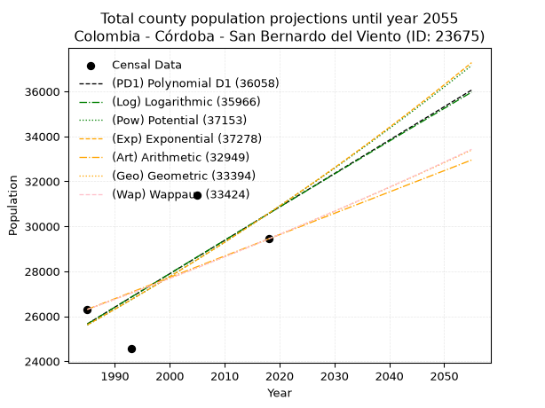
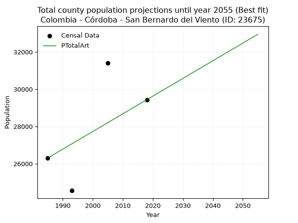
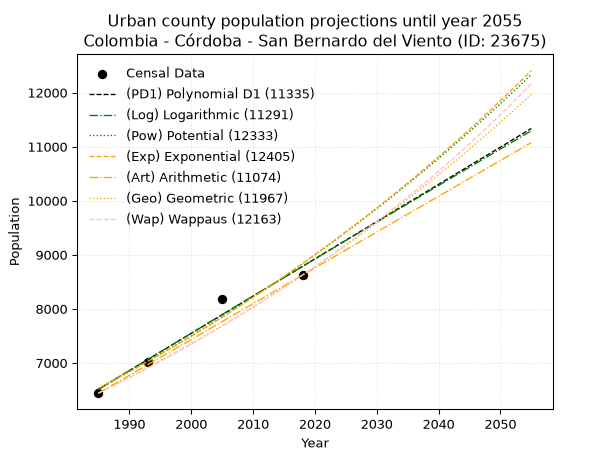
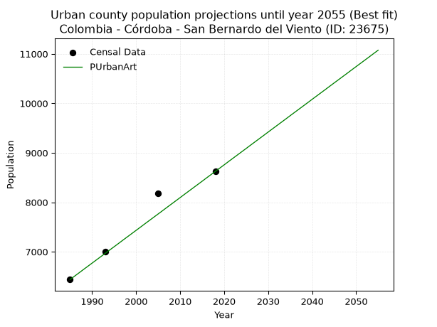
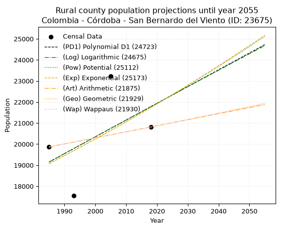
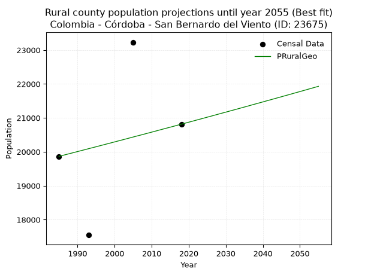

<div align="center">


</div>

# 📜 _“Population and Public Services Demand Projections (PPSD) until Year 2050 for Colombia - Córdoba - San Bernardo del Viento (ID: 23675)”_
Keywords: `population` `public-service` `projection` `lineal` `polynomial` `logarithmic` `potential` `exponential` `arithmetic` `geometric` `wappaus` `dane` `colombia` `south-america`

PPSD are analytical estimates used by governments and planners to anticipate future changes in population size, age distribution, and the resulting community needs for utilities, healthcare, education, and infrastructure as sizing future water treatment facilities, electrical grids, and road networks based on spatial growth.

<div align="center">

</img>

</div>


> **General running parameters**: • app_version: _v20260806_. • Python version: _3.14.7_. • Pandas version: _3.0.5_. • NumPy version: _2.5.1_. • Creates, save and include plots into reports (create_plot): _False_. • Projection until year: _2050_. • Process polynomial degree 2 and up: _False_. • Process Wappaus: _True_. • Process Wappaus: _True_. • Set negative values to zero: _True_. • Set infinite values to zero: _True_. • Drop dataset notes: _True_. 
<div align="center">

Maps & GIS Layers: [:earth_americas:Google](http://maps.google.com/maps?q=9.352469754,-75.9551074) [:earth_americas:OSM](https://www.openstreetmap.org/#map=18/9.352469754/-75.9551074&layers=P) [:earth_americas:Bing](https://www.bing.com/maps?cp=9.352469754~-75.9551074&lvl=18) [:earth_americas:Apple](https://maps.apple.com/frame?center=9.352469754%2C-75.9551074&span=0.003%2C0.006) [:earth_americas:GISMobile](https://github.com/rcfdtools/R.GISMobile/blob/main/file/gis/CountyLayer_CO/Readme.md)

</div>


<div align="center">

```geojson
{
  "type": "Feature",
  "geometry": {
    "type": "Point", 
    "coordinates": [-75.9551074, 9.352469754]
  }, 
  "properties": {
    "Name": "Colombia - Córdoba - San Bernardo del Viento (ID: 23675)"
  }
}
```

</div>


## 0. Census Data (4 records)

Census data are official statistics collected by a government about the people and housing in a country. They usually include counts of total population, age, sex, race, income, education, and jobs.

📅Global census file: [Population.xlsx](../data/Population.xlsx)

| Source   |   Year |   CountryID | CountryName   |   StateID | StateName   |   CountyID | CountyName              |   PTotal |   PUrban |   PRural |
|:---------|-------:|------------:|:--------------|----------:|:------------|-----------:|:------------------------|---------:|---------:|---------:|
| DANE     |   1985 |          57 | Colombia      |        23 | Córdoba     |      23675 | San Bernardo del Viento |    26305 |     6439 |    19866 |
| DANE     |   1993 |          57 | Colombia      |        23 | Córdoba     |      23675 | San Bernardo del Viento |    24555 |     7008 |    17547 |
| DANE     |   2005 |          57 | Colombia      |        23 | Córdoba     |      23675 | San Bernardo del Viento |    31405 |     8177 |    23228 |
| DANE     |   2018 |          57 | Colombia      |        23 | Córdoba     |      23675 | San Bernardo del Viento |    29437 |     8624 |    20813 |

> 🔥Some records could had specific notes about the registered values or the corresponding urban or rural distribution.

📅[SUI-RUPS](https://www.datos.gov.co/Hacienda-y-Cr-dito-P-blico/Registro-nico-de-Prestadores-de-Servicios-P-blicos/4qkq-csdn/about_data) - Local public utility companies: [RUPS.csv](../data/RUPS.csv)

 | SERVICIO       | ESTADO    | NOMBRE                                                                                                                                                | NIT         | DEPARTAMENTO_DOMICILIO   | MUNICIPIO_DOMICILIO     | DIRECCION                        |   TELEFONO | EMAIL                       | TIPO_PRESTADOR          | CLASIFICACION                  |
|:---------------|:----------|:------------------------------------------------------------------------------------------------------------------------------------------------------|:------------|:-------------------------|:------------------------|:---------------------------------|-----------:|:----------------------------|:------------------------|:-------------------------------|
| ACUEDUCTO      | OPERATIVA | ADMINISTRACION PÚBLICA COOPERATIVA DE SERVICIOS PÚBLICOS DOMICILIARIOS DE SAN BERNARDO DEL VIENTO                                                     | 900394616-1 | CORDOBA                  | SAN BERNARDO DEL VIENTO | Calle 8 No. 8 - 12 Barrio Centro |    8985045 | ing.romerobarrios@gmail.com | ORGANIZACION AUTORIZADA | DESDE 2501 HASTA 5000 USUARIOS |
| ALCANTARILLADO | OPERATIVA | ADMINISTRACION PÚBLICA COOPERATIVA DE SERVICIOS PÚBLICOS DOMICILIARIOS DE SAN BERNARDO DEL VIENTO                                                     | 900394616-1 | CORDOBA                  | SAN BERNARDO DEL VIENTO | Calle 8 No. 8 - 12 Barrio Centro |    8985045 | ing.romerobarrios@gmail.com | ORGANIZACION AUTORIZADA | MENOR O IGUAL A 2500 USUARIOS  |
| ACUEDUCTO      | OPERATIVA | ADMINISTRACION PUBLICA COOPERATIVA REGIONAL DE SERVICIOS PÚBLICOS DE ACUEDUCTO, ALCANTARILLADO, ASEO Y OTROS  SERVICIOS PUBLICOS - COOPSERVICOSTA APC | 901424626-9 | CORDOBA                  | SAN BERNARDO DEL VIENTO | Carrera 8 # 6-23                 |    3135182 | ivangestion@hotmail.com     | ORGANIZACION AUTORIZADA | DESDE 2501 HASTA 5000 USUARIOS |
| ALCANTARILLADO | OPERATIVA | ADMINISTRACION PUBLICA COOPERATIVA REGIONAL DE SERVICIOS PÚBLICOS DE ACUEDUCTO, ALCANTARILLADO, ASEO Y OTROS  SERVICIOS PUBLICOS - COOPSERVICOSTA APC | 901424626-9 | CORDOBA                  | SAN BERNARDO DEL VIENTO | Carrera 8 # 6-23                 |    3135182 | ivangestion@hotmail.com     | ORGANIZACION AUTORIZADA | DESDE 2501 HASTA 5000 USUARIOS |

## 1. Total

### 1.1. Coefficients and Parameters

* (PD1) Polynomial Deg 1: 148.5435568044971, -269198.7494981953 (lineal)
* (Log) Logarithmic: 297536.94960252754, -2233655.2382402886
* (Pow) Potential: 10.734039221723405, -30.989859862453844
* (Exp) Exponential: 0.005359471702901563, 0.6141264143408912
* (Art) Arithmetic: Year diff. 2018 - 1985 = 33, Population diff. 29437 - 26305 = 3132, Annual growth = 94.9090909090909
* (Geo) Geometric: Year diff. 2018 - 1985 = 33, Population diff. 29437 - 26305 = 3132, Annual growth % = 0.003414706305083115
* (Wap) Wappaus: i = 0.340529908898464, Condition values only valid for < 200)

<sub>
Wappaus condition values: ['0.00', '0.34', '0.68', '1.02', '1.36', '1.70', '2.04', '2.38', '2.72', '3.06', '3.41', '3.75', '4.09', '4.43', '4.77', '5.11', '5.45', '5.79', '6.13', '6.47', '6.81', '7.15', '7.49', '7.83', '8.17', '8.51', '8.85', '9.19', '9.53', '9.88', '10.22', '10.56', '10.90', '11.24', '11.58', '11.92', '12.26', '12.60', '12.94', '13.28', '13.62', '13.96', '14.30', '14.64', '14.98', '15.32', '15.66', '16.00', '16.35', '16.69', '17.03', '17.37', '17.71', '18.05', '18.39', '18.73', '19.07', '19.41', '19.75', '20.09', '20.43', '20.77', '21.11', '21.45', '21.79', '22.13']
</sub>


### 1.2. Projected Dataset

|   Year |   CountyID |   PTotalPD1 |   PTotalLog |   PTotalPow |   PTotalExp |   PTotalArt |   PTotalGeo |   PTotalWap |
|-------:|-----------:|------------:|------------:|------------:|------------:|------------:|------------:|------------:|
|   1985 |      23675 |       25660 |       25654 |       25611 |       25617 |       26305 |       26305 |       26305 |
|   1986 |      23675 |       25809 |       25804 |       25750 |       25754 |       26400 |       26395 |       26395 |
|   1987 |      23675 |       25957 |       25954 |       25890 |       25893 |       26495 |       26485 |       26485 |
|   1988 |      23675 |       26106 |       26103 |       26030 |       26032 |       26590 |       26575 |       26575 |
|   1989 |      23675 |       26254 |       26253 |       26171 |       26172 |       26685 |       26666 |       26666 |
|   1990 |      23675 |       26403 |       26403 |       26312 |       26312 |       26780 |       26757 |       26757 |
|   1991 |      23675 |       26551 |       26552 |       26455 |       26454 |       26874 |       26849 |       26848 |
|   1992 |      23675 |       26700 |       26702 |       26598 |       26596 |       26969 |       26940 |       26940 |
|   1993 |      23675 |       26849 |       26851 |       26741 |       26739 |       27064 |       27032 |       27032 |
|   1994 |      23675 |       26997 |       27000 |       26886 |       26883 |       27159 |       27125 |       27124 |
|   1995 |      23675 |       27146 |       27149 |       27031 |       27027 |       27254 |       27217 |       27216 |
|   1996 |      23675 |       27294 |       27298 |       27176 |       27172 |       27349 |       27310 |       27309 |
|   1997 |      23675 |       27443 |       27447 |       27323 |       27318 |       27444 |       27403 |       27402 |
|   1998 |      23675 |       27591 |       27596 |       27470 |       27465 |       27539 |       27497 |       27496 |
|   1999 |      23675 |       27740 |       27745 |       27618 |       27613 |       27634 |       27591 |       27590 |
|   2000 |      23675 |       27888 |       27894 |       27767 |       27761 |       27729 |       27685 |       27684 |
|   2001 |      23675 |       28037 |       28043 |       27916 |       27910 |       27824 |       27780 |       27778 |
|   2002 |      23675 |       28185 |       28191 |       28066 |       28060 |       27918 |       27874 |       27873 |
|   2003 |      23675 |       28334 |       28340 |       28217 |       28211 |       28013 |       27970 |       27968 |
|   2004 |      23675 |       28483 |       28489 |       28369 |       28363 |       28108 |       28065 |       28064 |
|   2005 |      23675 |       28631 |       28637 |       28521 |       28515 |       28203 |       28161 |       28160 |
|   2006 |      23675 |       28780 |       28785 |       28674 |       28668 |       28298 |       28257 |       28256 |
|   2007 |      23675 |       28928 |       28934 |       28828 |       28822 |       28393 |       28354 |       28352 |
|   2008 |      23675 |       29077 |       29082 |       28982 |       28977 |       28488 |       28450 |       28449 |
|   2009 |      23675 |       29225 |       29230 |       29138 |       29133 |       28583 |       28548 |       28546 |
|   2010 |      23675 |       29374 |       29378 |       29294 |       29289 |       28678 |       28645 |       28644 |
|   2011 |      23675 |       29522 |       29526 |       29451 |       29447 |       28773 |       28743 |       28742 |
|   2012 |      23675 |       29671 |       29674 |       29608 |       29605 |       28868 |       28841 |       28840 |
|   2013 |      23675 |       29819 |       29822 |       29767 |       29764 |       28962 |       28940 |       28939 |
|   2014 |      23675 |       29968 |       29970 |       29926 |       29924 |       29057 |       29038 |       29038 |
|   2015 |      23675 |       30117 |       30117 |       30086 |       30085 |       29152 |       29137 |       29137 |
|   2016 |      23675 |       30265 |       30265 |       30246 |       30247 |       29247 |       29237 |       29237 |
|   2017 |      23675 |       30414 |       30412 |       30408 |       30409 |       29342 |       29337 |       29337 |
|   2018 |      23675 |       30562 |       30560 |       30570 |       30573 |       29437 |       29437 |       29437 |
|   2019 |      23675 |       30711 |       30707 |       30733 |       30737 |       29532 |       29538 |       29538 |
|   2020 |      23675 |       30859 |       30855 |       30897 |       30902 |       29627 |       29638 |       29639 |
|   2021 |      23675 |       31008 |       31002 |       31061 |       31068 |       29722 |       29740 |       29740 |
|   2022 |      23675 |       31156 |       31149 |       31227 |       31235 |       29817 |       29841 |       29842 |
|   2023 |      23675 |       31305 |       31296 |       31393 |       31403 |       29912 |       29943 |       29944 |
|   2024 |      23675 |       31453 |       31443 |       31560 |       31572 |       30006 |       30045 |       30047 |
|   2025 |      23675 |       31602 |       31590 |       31728 |       31741 |       30101 |       30148 |       30150 |
|   2026 |      23675 |       31750 |       31737 |       31896 |       31912 |       30196 |       30251 |       30253 |
|   2027 |      23675 |       31899 |       31884 |       32065 |       32083 |       30291 |       30354 |       30357 |
|   2028 |      23675 |       32048 |       32031 |       32236 |       32256 |       30386 |       30458 |       30461 |
|   2029 |      23675 |       32196 |       32177 |       32407 |       32429 |       30481 |       30562 |       30566 |
|   2030 |      23675 |       32345 |       32324 |       32579 |       32603 |       30576 |       30666 |       30670 |
|   2031 |      23675 |       32493 |       32471 |       32751 |       32779 |       30671 |       30771 |       30776 |
|   2032 |      23675 |       32642 |       32617 |       32925 |       32955 |       30766 |       30876 |       30881 |
|   2033 |      23675 |       32790 |       32763 |       33099 |       33132 |       30861 |       30981 |       30987 |
|   2034 |      23675 |       32939 |       32910 |       33274 |       33310 |       30956 |       31087 |       31094 |
|   2035 |      23675 |       33087 |       33056 |       33450 |       33489 |       31050 |       31193 |       31201 |
|   2036 |      23675 |       33236 |       33202 |       33627 |       33669 |       31145 |       31300 |       31308 |
|   2037 |      23675 |       33384 |       33348 |       33805 |       33850 |       31240 |       31407 |       31415 |
|   2038 |      23675 |       33533 |       33494 |       33983 |       34032 |       31335 |       31514 |       31523 |
|   2039 |      23675 |       33682 |       33640 |       34163 |       34215 |       31430 |       31622 |       31632 |
|   2040 |      23675 |       33830 |       33786 |       34343 |       34398 |       31525 |       31730 |       31741 |
|   2041 |      23675 |       33979 |       33932 |       34524 |       34583 |       31620 |       31838 |       31850 |
|   2042 |      23675 |       34127 |       34078 |       34706 |       34769 |       31715 |       31947 |       31960 |
|   2043 |      23675 |       34276 |       34223 |       34889 |       34956 |       31810 |       32056 |       32070 |
|   2044 |      23675 |       34424 |       34369 |       35073 |       35144 |       31905 |       32165 |       32180 |
|   2045 |      23675 |       34573 |       34514 |       35258 |       35333 |       32000 |       32275 |       32291 |
|   2046 |      23675 |       34721 |       34660 |       35443 |       35523 |       32094 |       32385 |       32402 |
|   2047 |      23675 |       34870 |       34805 |       35629 |       35714 |       32189 |       32496 |       32514 |
|   2048 |      23675 |       35018 |       34951 |       35817 |       35905 |       32284 |       32607 |       32626 |
|   2049 |      23675 |       35167 |       35096 |       36005 |       36098 |       32379 |       32718 |       32739 |
|   2050 |      23675 |       35316 |       35241 |       36194 |       36292 |       32474 |       32830 |       32852 |
<div align="center">

</img>

</div>


### 1.3. Best fit with absolute and relative error (%)

Relative error puts that difference into context by dividing the absolute error by the true value, creating a unitless ratio or percentage that shows the scale of the mistake.

Absolute and relative error

|   Year | Source   |   CountryID | CountryName   |   StateID | StateName   |   CountyID_x | CountyName              |   PTotal |   PUrban |   PRural |   CountyID_y |   PTotalPD1 |   PTotalLog |   PTotalPow |   PTotalExp |   PTotalArt |   PTotalGeo |   PTotalWap |   PTotalPD1AbsError |   PTotalLogAbsError |   PTotalPowAbsError |   PTotalExpAbsError |   PTotalArtAbsError |   PTotalGeoAbsError |   PTotalWapAbsError |   PTotalPD1RelError |   PTotalLogRelError |   PTotalPowRelError |   PTotalExpRelError |   PTotalArtRelError |   PTotalGeoRelError |   PTotalWapRelError |
|-------:|:---------|------------:|:--------------|----------:|:------------|-------------:|:------------------------|---------:|---------:|---------:|-------------:|------------:|------------:|------------:|------------:|------------:|------------:|------------:|--------------------:|--------------------:|--------------------:|--------------------:|--------------------:|--------------------:|--------------------:|--------------------:|--------------------:|--------------------:|--------------------:|--------------------:|--------------------:|--------------------:|
|   1985 | DANE     |          57 | Colombia      |        23 | Córdoba     |        23675 | San Bernardo del Viento |    26305 |     6439 |    19866 |        23675 |       25660 |       25654 |       25611 |       25617 |       26305 |       26305 |       26305 |                 645 |                 651 |                 694 |                 688 |                   0 |                   0 |                   0 |             2.45201 |             2.47481 |             2.63828 |             2.61547 |              0      |              0      |              0      |
|   1993 | DANE     |          57 | Colombia      |        23 | Córdoba     |        23675 | San Bernardo del Viento |    24555 |     7008 |    17547 |        23675 |       26849 |       26851 |       26741 |       26739 |       27064 |       27032 |       27032 |                2294 |                2296 |                2186 |                2184 |                2509 |                2477 |                2477 |             9.34229 |             9.35044 |             8.90246 |             8.89432 |             10.2179 |             10.0876 |             10.0876 |
|   2005 | DANE     |          57 | Colombia      |        23 | Córdoba     |        23675 | San Bernardo del Viento |    31405 |     8177 |    23228 |        23675 |       28631 |       28637 |       28521 |       28515 |       28203 |       28161 |       28160 |                2774 |                2768 |                2884 |                2890 |                3202 |                3244 |                3245 |             8.83299 |             8.81388 |             9.18325 |             9.20236 |             10.1958 |             10.3296 |             10.3327 |
|   2018 | DANE     |          57 | Colombia      |        23 | Córdoba     |        23675 | San Bernardo del Viento |    29437 |     8624 |    20813 |        23675 |       30562 |       30560 |       30570 |       30573 |       29437 |       29437 |       29437 |                1125 |                1123 |                1133 |                1136 |                   0 |                   0 |                   0 |             3.82172 |             3.81493 |             3.8489  |             3.85909 |              0      |              0      |              0      |

Relative error mean

| Method    |   RelError | Best   |
|:----------|-----------:|:-------|
| PTotalPD1 |    6.11225 |        |
| PTotalLog |    6.11352 |        |
| PTotalPow |    6.14322 |        |
| PTotalExp |    6.14281 |        |
| PTotalArt |    5.10343 | True   |
| PTotalGeo |    5.10428 |        |
| PTotalWap |    5.10508 |        |

💙Best method: _**PTotalArt**_
<div align="center">

</img>

</div>


### 1.4. Fresh water supply demand in liters per capita per day (lpcd)

The fresh water supply demand typically ranges from 100 to 300 liters per capita per day (lpcd) for standard domestic and municipal planning, though absolute survival minimums set by the World Health Organization are as low as 7.5 to 20 liters per day, and total consumption in high-income nations can exceed 400 liters.

> `CZ`: Level in meters above the sea level (masl)<br> `WS`: Fresh water supply demand in liters per capita per day (lpcd or l/h/d)<br> `WSAll`: Zonal fresh water supply demand in liters per second (l/s)<br> `A`: Zonal area in square meters<br> `DP`: Population density (people/hectare or p/ha)

Reference values (RAS Colombia)

|    CZ |   WS |
|------:|-----:|
|  1000 |  120 |
|  2000 |  130 |
| 99999 |  140 |

County shapefile geometry properties and water supply values

|   CountyID |      ATotal |   CZTotal |   WSTotal |
|-----------:|------------:|----------:|----------:|
|      23675 | 3.15798e+08 |   13.4928 |       120 |

Projected values for best method: PTotalArt

|   CountyID |   Year |   PTotalArt |   DPTotal |   WSTotal |   WSTotalAll |
|-----------:|-------:|------------:|----------:|----------:|-------------:|
|      23675 |   1985 |       26305 |      0.83 |       120 |      36.5347 |
|      23675 |   1986 |       26400 |      0.84 |       120 |      36.6667 |
|      23675 |   1987 |       26495 |      0.84 |       120 |      36.7986 |
|      23675 |   1988 |       26590 |      0.84 |       120 |      36.9306 |
|      23675 |   1989 |       26685 |      0.85 |       120 |      37.0625 |
|      23675 |   1990 |       26780 |      0.85 |       120 |      37.1944 |
|      23675 |   1991 |       26874 |      0.85 |       120 |      37.325  |
|      23675 |   1992 |       26969 |      0.85 |       120 |      37.4569 |
|      23675 |   1993 |       27064 |      0.86 |       120 |      37.5889 |
|      23675 |   1994 |       27159 |      0.86 |       120 |      37.7208 |
|      23675 |   1995 |       27254 |      0.86 |       120 |      37.8528 |
|      23675 |   1996 |       27349 |      0.87 |       120 |      37.9847 |
|      23675 |   1997 |       27444 |      0.87 |       120 |      38.1167 |
|      23675 |   1998 |       27539 |      0.87 |       120 |      38.2486 |
|      23675 |   1999 |       27634 |      0.88 |       120 |      38.3806 |
|      23675 |   2000 |       27729 |      0.88 |       120 |      38.5125 |
|      23675 |   2001 |       27824 |      0.88 |       120 |      38.6444 |
|      23675 |   2002 |       27918 |      0.88 |       120 |      38.775  |
|      23675 |   2003 |       28013 |      0.89 |       120 |      38.9069 |
|      23675 |   2004 |       28108 |      0.89 |       120 |      39.0389 |
|      23675 |   2005 |       28203 |      0.89 |       120 |      39.1708 |
|      23675 |   2006 |       28298 |      0.9  |       120 |      39.3028 |
|      23675 |   2007 |       28393 |      0.9  |       120 |      39.4347 |
|      23675 |   2008 |       28488 |      0.9  |       120 |      39.5667 |
|      23675 |   2009 |       28583 |      0.91 |       120 |      39.6986 |
|      23675 |   2010 |       28678 |      0.91 |       120 |      39.8306 |
|      23675 |   2011 |       28773 |      0.91 |       120 |      39.9625 |
|      23675 |   2012 |       28868 |      0.91 |       120 |      40.0944 |
|      23675 |   2013 |       28962 |      0.92 |       120 |      40.225  |
|      23675 |   2014 |       29057 |      0.92 |       120 |      40.3569 |
|      23675 |   2015 |       29152 |      0.92 |       120 |      40.4889 |
|      23675 |   2016 |       29247 |      0.93 |       120 |      40.6208 |
|      23675 |   2017 |       29342 |      0.93 |       120 |      40.7528 |
|      23675 |   2018 |       29437 |      0.93 |       120 |      40.8847 |
|      23675 |   2019 |       29532 |      0.94 |       120 |      41.0167 |
|      23675 |   2020 |       29627 |      0.94 |       120 |      41.1486 |
|      23675 |   2021 |       29722 |      0.94 |       120 |      41.2806 |
|      23675 |   2022 |       29817 |      0.94 |       120 |      41.4125 |
|      23675 |   2023 |       29912 |      0.95 |       120 |      41.5444 |
|      23675 |   2024 |       30006 |      0.95 |       120 |      41.675  |
|      23675 |   2025 |       30101 |      0.95 |       120 |      41.8069 |
|      23675 |   2026 |       30196 |      0.96 |       120 |      41.9389 |
|      23675 |   2027 |       30291 |      0.96 |       120 |      42.0708 |
|      23675 |   2028 |       30386 |      0.96 |       120 |      42.2028 |
|      23675 |   2029 |       30481 |      0.97 |       120 |      42.3347 |
|      23675 |   2030 |       30576 |      0.97 |       120 |      42.4667 |
|      23675 |   2031 |       30671 |      0.97 |       120 |      42.5986 |
|      23675 |   2032 |       30766 |      0.97 |       120 |      42.7306 |
|      23675 |   2033 |       30861 |      0.98 |       120 |      42.8625 |
|      23675 |   2034 |       30956 |      0.98 |       120 |      42.9944 |
|      23675 |   2035 |       31050 |      0.98 |       120 |      43.125  |
|      23675 |   2036 |       31145 |      0.99 |       120 |      43.2569 |
|      23675 |   2037 |       31240 |      0.99 |       120 |      43.3889 |
|      23675 |   2038 |       31335 |      0.99 |       120 |      43.5208 |
|      23675 |   2039 |       31430 |      1    |       120 |      43.6528 |
|      23675 |   2040 |       31525 |      1    |       120 |      43.7847 |
|      23675 |   2041 |       31620 |      1    |       120 |      43.9167 |
|      23675 |   2042 |       31715 |      1    |       120 |      44.0486 |
|      23675 |   2043 |       31810 |      1.01 |       120 |      44.1806 |
|      23675 |   2044 |       31905 |      1.01 |       120 |      44.3125 |
|      23675 |   2045 |       32000 |      1.01 |       120 |      44.4444 |
|      23675 |   2046 |       32094 |      1.02 |       120 |      44.575  |
|      23675 |   2047 |       32189 |      1.02 |       120 |      44.7069 |
|      23675 |   2048 |       32284 |      1.02 |       120 |      44.8389 |
|      23675 |   2049 |       32379 |      1.03 |       120 |      44.9708 |
|      23675 |   2050 |       32474 |      1.03 |       120 |      45.1028 |

## 2. Urban

### 2.1. Coefficients and Parameters

* (PD1) Polynomial Deg 1: 68.91047771979093, -130276.18305901183 (lineal)
* (Log) Logarithmic: 137983.8759522692, -1041254.5468465853
* (Pow) Potential: 18.35213072889891, -56.70609649368468
* (Exp) Exponential: 0.009164542335183082, 8.21227450489358e-05
* (Art) Arithmetic: Year diff. 2018 - 1985 = 33, Population diff. 8624 - 6439 = 2185, Annual growth = 66.21212121212122
* (Geo) Geometric: Year diff. 2018 - 1985 = 33, Population diff. 8624 - 6439 = 2185, Annual growth % = 0.008893121995914743
* (Wap) Wappaus: i = 0.8791359119978917, Condition values only valid for < 200)

<sub>
Wappaus condition values: ['0.00', '0.88', '1.76', '2.64', '3.52', '4.40', '5.27', '6.15', '7.03', '7.91', '8.79', '9.67', '10.55', '11.43', '12.31', '13.19', '14.07', '14.95', '15.82', '16.70', '17.58', '18.46', '19.34', '20.22', '21.10', '21.98', '22.86', '23.74', '24.62', '25.49', '26.37', '27.25', '28.13', '29.01', '29.89', '30.77', '31.65', '32.53', '33.41', '34.29', '35.17', '36.04', '36.92', '37.80', '38.68', '39.56', '40.44', '41.32', '42.20', '43.08', '43.96', '44.84', '45.72', '46.59', '47.47', '48.35', '49.23', '50.11', '50.99', '51.87', '52.75', '53.63', '54.51', '55.39', '56.26', '57.14']
</sub>


### 2.2. Projected Dataset

|   Year |   CountyID |   PUrbanPD1 |   PUrbanLog |   PUrbanPow |   PUrbanExp |   PUrbanArt |   PUrbanGeo |   PUrbanWap |
|-------:|-----------:|------------:|------------:|------------:|------------:|------------:|------------:|------------:|
|   1985 |      23675 |        6511 |        6509 |        6529 |        6531 |        6439 |        6439 |        6439 |
|   1986 |      23675 |        6580 |        6578 |        6589 |        6591 |        6505 |        6496 |        6496 |
|   1987 |      23675 |        6649 |        6648 |        6651 |        6652 |        6571 |        6554 |        6553 |
|   1988 |      23675 |        6718 |        6717 |        6712 |        6713 |        6638 |        6612 |        6611 |
|   1989 |      23675 |        6787 |        6786 |        6775 |        6775 |        6704 |        6671 |        6669 |
|   1990 |      23675 |        6856 |        6856 |        6837 |        6837 |        6770 |        6730 |        6728 |
|   1991 |      23675 |        6925 |        6925 |        6901 |        6900 |        6836 |        6790 |        6788 |
|   1992 |      23675 |        6993 |        6994 |        6965 |        6964 |        6902 |        6851 |        6848 |
|   1993 |      23675 |        7062 |        7064 |        7029 |        7028 |        6969 |        6912 |        6908 |
|   1994 |      23675 |        7131 |        7133 |        7094 |        7093 |        7035 |        6973 |        6969 |
|   1995 |      23675 |        7200 |        7202 |        7160 |        7158 |        7101 |        7035 |        7031 |
|   1996 |      23675 |        7269 |        7271 |        7226 |        7224 |        7167 |        7098 |        7093 |
|   1997 |      23675 |        7338 |        7340 |        7292 |        7290 |        7234 |        7161 |        7156 |
|   1998 |      23675 |        7407 |        7409 |        7360 |        7357 |        7300 |        7224 |        7219 |
|   1999 |      23675 |        7476 |        7478 |        7428 |        7425 |        7366 |        7289 |        7283 |
|   2000 |      23675 |        7545 |        7547 |        7496 |        7493 |        7432 |        7354 |        7348 |
|   2001 |      23675 |        7614 |        7616 |        7565 |        7562 |        7498 |        7419 |        7413 |
|   2002 |      23675 |        7683 |        7685 |        7635 |        7632 |        7565 |        7485 |        7479 |
|   2003 |      23675 |        7752 |        7754 |        7705 |        7702 |        7631 |        7551 |        7545 |
|   2004 |      23675 |        7820 |        7823 |        7776 |        7773 |        7697 |        7619 |        7613 |
|   2005 |      23675 |        7889 |        7892 |        7848 |        7845 |        7763 |        7686 |        7680 |
|   2006 |      23675 |        7958 |        7961 |        7920 |        7917 |        7829 |        7755 |        7749 |
|   2007 |      23675 |        8027 |        8030 |        7993 |        7990 |        7896 |        7824 |        7818 |
|   2008 |      23675 |        8096 |        8098 |        8066 |        8064 |        7962 |        7893 |        7887 |
|   2009 |      23675 |        8165 |        8167 |        8140 |        8138 |        8028 |        7963 |        7958 |
|   2010 |      23675 |        8234 |        8236 |        8215 |        8213 |        8094 |        8034 |        8029 |
|   2011 |      23675 |        8303 |        8304 |        8290 |        8288 |        8161 |        8106 |        8101 |
|   2012 |      23675 |        8372 |        8373 |        8366 |        8365 |        8227 |        8178 |        8173 |
|   2013 |      23675 |        8441 |        8441 |        8443 |        8442 |        8293 |        8251 |        8246 |
|   2014 |      23675 |        8510 |        8510 |        8520 |        8519 |        8359 |        8324 |        8320 |
|   2015 |      23675 |        8578 |        8578 |        8598 |        8598 |        8425 |        8398 |        8395 |
|   2016 |      23675 |        8647 |        8647 |        8677 |        8677 |        8492 |        8473 |        8471 |
|   2017 |      23675 |        8716 |        8715 |        8756 |        8757 |        8558 |        8548 |        8547 |
|   2018 |      23675 |        8785 |        8784 |        8836 |        8837 |        8624 |        8624 |        8624 |
|   2019 |      23675 |        8854 |        8852 |        8917 |        8919 |        8690 |        8701 |        8702 |
|   2020 |      23675 |        8923 |        8920 |        8998 |        9001 |        8756 |        8778 |        8781 |
|   2021 |      23675 |        8992 |        8989 |        9080 |        9084 |        8823 |        8856 |        8860 |
|   2022 |      23675 |        9061 |        9057 |        9163 |        9167 |        8889 |        8935 |        8940 |
|   2023 |      23675 |        9130 |        9125 |        9246 |        9252 |        8955 |        9014 |        9021 |
|   2024 |      23675 |        9199 |        9193 |        9331 |        9337 |        9021 |        9095 |        9103 |
|   2025 |      23675 |        9268 |        9262 |        9416 |        9423 |        9087 |        9175 |        9186 |
|   2026 |      23675 |        9336 |        9330 |        9501 |        9510 |        9154 |        9257 |        9270 |
|   2027 |      23675 |        9405 |        9398 |        9588 |        9597 |        9220 |        9339 |        9355 |
|   2028 |      23675 |        9474 |        9466 |        9675 |        9686 |        9286 |        9422 |        9440 |
|   2029 |      23675 |        9543 |        9534 |        9763 |        9775 |        9352 |        9506 |        9527 |
|   2030 |      23675 |        9612 |        9602 |        9852 |        9865 |        9419 |        9591 |        9614 |
|   2031 |      23675 |        9681 |        9670 |        9941 |        9956 |        9485 |        9676 |        9703 |
|   2032 |      23675 |        9750 |        9738 |       10031 |       10047 |        9551 |        9762 |        9792 |
|   2033 |      23675 |        9819 |        9806 |       10122 |       10140 |        9617 |        9849 |        9883 |
|   2034 |      23675 |        9888 |        9873 |       10214 |       10233 |        9683 |        9936 |        9974 |
|   2035 |      23675 |        9957 |        9941 |       10306 |       10327 |        9750 |       10025 |       10067 |
|   2036 |      23675 |       10026 |       10009 |       10400 |       10422 |        9816 |       10114 |       10160 |
|   2037 |      23675 |       10094 |       10077 |       10494 |       10518 |        9882 |       10204 |       10255 |
|   2038 |      23675 |       10163 |       10145 |       10589 |       10615 |        9948 |       10295 |       10350 |
|   2039 |      23675 |       10232 |       10212 |       10685 |       10713 |       10014 |       10386 |       10447 |
|   2040 |      23675 |       10301 |       10280 |       10781 |       10812 |       10081 |       10479 |       10545 |
|   2041 |      23675 |       10370 |       10348 |       10879 |       10911 |       10147 |       10572 |       10644 |
|   2042 |      23675 |       10439 |       10415 |       10977 |       11012 |       10213 |       10666 |       10744 |
|   2043 |      23675 |       10508 |       10483 |       11076 |       11113 |       10279 |       10761 |       10846 |
|   2044 |      23675 |       10577 |       10550 |       11176 |       11215 |       10346 |       10856 |       10948 |
|   2045 |      23675 |       10646 |       10618 |       11277 |       11318 |       10412 |       10953 |       11052 |
|   2046 |      23675 |       10715 |       10685 |       11378 |       11423 |       10478 |       11050 |       11157 |
|   2047 |      23675 |       10784 |       10753 |       11481 |       11528 |       10544 |       11149 |       11264 |
|   2048 |      23675 |       10852 |       10820 |       11584 |       11634 |       10610 |       11248 |       11371 |
|   2049 |      23675 |       10921 |       10887 |       11688 |       11741 |       10677 |       11348 |       11480 |
|   2050 |      23675 |       10990 |       10955 |       11794 |       11849 |       10743 |       11449 |       11590 |
<div align="center">

</img>

</div>


### 2.3. Best fit with absolute and relative error (%)

Relative error puts that difference into context by dividing the absolute error by the true value, creating a unitless ratio or percentage that shows the scale of the mistake.

Absolute and relative error

|   Year | Source   |   CountryID | CountryName   |   StateID | StateName   |   CountyID_x | CountyName              |   PTotal |   PUrban |   PRural |   CountyID_y |   PUrbanPD1 |   PUrbanLog |   PUrbanPow |   PUrbanExp |   PUrbanArt |   PUrbanGeo |   PUrbanWap |   PUrbanPD1AbsError |   PUrbanLogAbsError |   PUrbanPowAbsError |   PUrbanExpAbsError |   PUrbanArtAbsError |   PUrbanGeoAbsError |   PUrbanWapAbsError |   PUrbanPD1RelError |   PUrbanLogRelError |   PUrbanPowRelError |   PUrbanExpRelError |   PUrbanArtRelError |   PUrbanGeoRelError |   PUrbanWapRelError |
|-------:|:---------|------------:|:--------------|----------:|:------------|-------------:|:------------------------|---------:|---------:|---------:|-------------:|------------:|------------:|------------:|------------:|------------:|------------:|------------:|--------------------:|--------------------:|--------------------:|--------------------:|--------------------:|--------------------:|--------------------:|--------------------:|--------------------:|--------------------:|--------------------:|--------------------:|--------------------:|--------------------:|
|   1985 | DANE     |          57 | Colombia      |        23 | Córdoba     |        23675 | San Bernardo del Viento |    26305 |     6439 |    19866 |        23675 |        6511 |        6509 |        6529 |        6531 |        6439 |        6439 |        6439 |                  72 |                  70 |                  90 |                  92 |                   0 |                   0 |                   0 |            1.11819  |            1.08713  |            1.39773  |            1.42879  |            0        |             0       |             0       |
|   1993 | DANE     |          57 | Colombia      |        23 | Córdoba     |        23675 | San Bernardo del Viento |    24555 |     7008 |    17547 |        23675 |        7062 |        7064 |        7029 |        7028 |        6969 |        6912 |        6908 |                  54 |                  56 |                  21 |                  20 |                  39 |                  96 |                 100 |            0.770548 |            0.799087 |            0.299658 |            0.285388 |            0.556507 |             1.36986 |             1.42694 |
|   2005 | DANE     |          57 | Colombia      |        23 | Córdoba     |        23675 | San Bernardo del Viento |    31405 |     8177 |    23228 |        23675 |        7889 |        7892 |        7848 |        7845 |        7763 |        7686 |        7680 |                 288 |                 285 |                 329 |                 332 |                 414 |                 491 |                 497 |            3.52207  |            3.48539  |            4.02348  |            4.06017  |            5.06298  |             6.00465 |             6.07802 |
|   2018 | DANE     |          57 | Colombia      |        23 | Córdoba     |        23675 | San Bernardo del Viento |    29437 |     8624 |    20813 |        23675 |        8785 |        8784 |        8836 |        8837 |        8624 |        8624 |        8624 |                 161 |                 160 |                 212 |                 213 |                   0 |                   0 |                   0 |            1.86688  |            1.85529  |            2.45826  |            2.46985  |            0        |             0       |             0       |

Relative error mean

| Method    |   RelError | Best   |
|:----------|-----------:|:-------|
| PUrbanPD1 |    1.81942 |        |
| PUrbanLog |    1.80672 |        |
| PUrbanPow |    2.04478 |        |
| PUrbanExp |    2.06105 |        |
| PUrbanArt |    1.40487 | True   |
| PUrbanGeo |    1.84363 |        |
| PUrbanWap |    1.87624 |        |

💙Best method: _**PUrbanArt**_
<div align="center">

</img>

</div>


### 2.4. Fresh water supply demand in liters per capita per day (lpcd)

The fresh water supply demand typically ranges from 100 to 300 liters per capita per day (lpcd) for standard domestic and municipal planning, though absolute survival minimums set by the World Health Organization are as low as 7.5 to 20 liters per day, and total consumption in high-income nations can exceed 400 liters.

> `CZ`: Level in meters above the sea level (masl)<br> `WS`: Fresh water supply demand in liters per capita per day (lpcd or l/h/d)<br> `WSAll`: Zonal fresh water supply demand in liters per second (l/s)<br> `A`: Zonal area in square meters<br> `DP`: Population density (people/hectare or p/ha)

Reference values (RAS Colombia)

|    CZ |   WS |
|------:|-----:|
|  1000 |  120 |
|  2000 |  130 |
| 99999 |  140 |

County shapefile geometry properties and water supply values

|   CountyID |      AUrban |   CZUrban |   WSUrban |
|-----------:|------------:|----------:|----------:|
|      23675 | 2.51637e+06 |   4.76846 |       120 |

Projected values for best method: PUrbanArt

|   CountyID |   Year |   PUrbanArt |   DPUrban |   WSUrban |   WSUrbanAll |
|-----------:|-------:|------------:|----------:|----------:|-------------:|
|      23675 |   1985 |        6439 |     25.59 |       120 |      8.94306 |
|      23675 |   1986 |        6505 |     25.85 |       120 |      9.03472 |
|      23675 |   1987 |        6571 |     26.11 |       120 |      9.12639 |
|      23675 |   1988 |        6638 |     26.38 |       120 |      9.21944 |
|      23675 |   1989 |        6704 |     26.64 |       120 |      9.31111 |
|      23675 |   1990 |        6770 |     26.9  |       120 |      9.40278 |
|      23675 |   1991 |        6836 |     27.17 |       120 |      9.49444 |
|      23675 |   1992 |        6902 |     27.43 |       120 |      9.58611 |
|      23675 |   1993 |        6969 |     27.69 |       120 |      9.67917 |
|      23675 |   1994 |        7035 |     27.96 |       120 |      9.77083 |
|      23675 |   1995 |        7101 |     28.22 |       120 |      9.8625  |
|      23675 |   1996 |        7167 |     28.48 |       120 |      9.95417 |
|      23675 |   1997 |        7234 |     28.75 |       120 |     10.0472  |
|      23675 |   1998 |        7300 |     29.01 |       120 |     10.1389  |
|      23675 |   1999 |        7366 |     29.27 |       120 |     10.2306  |
|      23675 |   2000 |        7432 |     29.53 |       120 |     10.3222  |
|      23675 |   2001 |        7498 |     29.8  |       120 |     10.4139  |
|      23675 |   2002 |        7565 |     30.06 |       120 |     10.5069  |
|      23675 |   2003 |        7631 |     30.33 |       120 |     10.5986  |
|      23675 |   2004 |        7697 |     30.59 |       120 |     10.6903  |
|      23675 |   2005 |        7763 |     30.85 |       120 |     10.7819  |
|      23675 |   2006 |        7829 |     31.11 |       120 |     10.8736  |
|      23675 |   2007 |        7896 |     31.38 |       120 |     10.9667  |
|      23675 |   2008 |        7962 |     31.64 |       120 |     11.0583  |
|      23675 |   2009 |        8028 |     31.9  |       120 |     11.15    |
|      23675 |   2010 |        8094 |     32.17 |       120 |     11.2417  |
|      23675 |   2011 |        8161 |     32.43 |       120 |     11.3347  |
|      23675 |   2012 |        8227 |     32.69 |       120 |     11.4264  |
|      23675 |   2013 |        8293 |     32.96 |       120 |     11.5181  |
|      23675 |   2014 |        8359 |     33.22 |       120 |     11.6097  |
|      23675 |   2015 |        8425 |     33.48 |       120 |     11.7014  |
|      23675 |   2016 |        8492 |     33.75 |       120 |     11.7944  |
|      23675 |   2017 |        8558 |     34.01 |       120 |     11.8861  |
|      23675 |   2018 |        8624 |     34.27 |       120 |     11.9778  |
|      23675 |   2019 |        8690 |     34.53 |       120 |     12.0694  |
|      23675 |   2020 |        8756 |     34.8  |       120 |     12.1611  |
|      23675 |   2021 |        8823 |     35.06 |       120 |     12.2542  |
|      23675 |   2022 |        8889 |     35.32 |       120 |     12.3458  |
|      23675 |   2023 |        8955 |     35.59 |       120 |     12.4375  |
|      23675 |   2024 |        9021 |     35.85 |       120 |     12.5292  |
|      23675 |   2025 |        9087 |     36.11 |       120 |     12.6208  |
|      23675 |   2026 |        9154 |     36.38 |       120 |     12.7139  |
|      23675 |   2027 |        9220 |     36.64 |       120 |     12.8056  |
|      23675 |   2028 |        9286 |     36.9  |       120 |     12.8972  |
|      23675 |   2029 |        9352 |     37.16 |       120 |     12.9889  |
|      23675 |   2030 |        9419 |     37.43 |       120 |     13.0819  |
|      23675 |   2031 |        9485 |     37.69 |       120 |     13.1736  |
|      23675 |   2032 |        9551 |     37.96 |       120 |     13.2653  |
|      23675 |   2033 |        9617 |     38.22 |       120 |     13.3569  |
|      23675 |   2034 |        9683 |     38.48 |       120 |     13.4486  |
|      23675 |   2035 |        9750 |     38.75 |       120 |     13.5417  |
|      23675 |   2036 |        9816 |     39.01 |       120 |     13.6333  |
|      23675 |   2037 |        9882 |     39.27 |       120 |     13.725   |
|      23675 |   2038 |        9948 |     39.53 |       120 |     13.8167  |
|      23675 |   2039 |       10014 |     39.8  |       120 |     13.9083  |
|      23675 |   2040 |       10081 |     40.06 |       120 |     14.0014  |
|      23675 |   2041 |       10147 |     40.32 |       120 |     14.0931  |
|      23675 |   2042 |       10213 |     40.59 |       120 |     14.1847  |
|      23675 |   2043 |       10279 |     40.85 |       120 |     14.2764  |
|      23675 |   2044 |       10346 |     41.11 |       120 |     14.3694  |
|      23675 |   2045 |       10412 |     41.38 |       120 |     14.4611  |
|      23675 |   2046 |       10478 |     41.64 |       120 |     14.5528  |
|      23675 |   2047 |       10544 |     41.9  |       120 |     14.6444  |
|      23675 |   2048 |       10610 |     42.16 |       120 |     14.7361  |
|      23675 |   2049 |       10677 |     42.43 |       120 |     14.8292  |
|      23675 |   2050 |       10743 |     42.69 |       120 |     14.9208  |

## 3. Rural

### 3.1. Coefficients and Parameters

* (PD1) Polynomial Deg 1: 79.63307908470615, -138922.5664391835 (lineal)
* (Log) Logarithmic: 159553.07365025778, -1192400.6913936988
* (Pow) Potential: 7.942315961358414, -21.911522358962117
* (Exp) Exponential: 0.0039649271149604145, 7.283540364196176
* (Art) Arithmetic: Year diff. 2018 - 1985 = 33, Population diff. 20813 - 19866 = 947, Annual growth = 28.696969696969695
* (Geo) Geometric: Year diff. 2018 - 1985 = 33, Population diff. 20813 - 19866 = 947, Annual growth % = 0.0014121495904768633
* (Wap) Wappaus: i = 0.1410898483097898, Condition values only valid for < 200)

<sub>
Wappaus condition values: ['0.00', '0.14', '0.28', '0.42', '0.56', '0.71', '0.85', '0.99', '1.13', '1.27', '1.41', '1.55', '1.69', '1.83', '1.98', '2.12', '2.26', '2.40', '2.54', '2.68', '2.82', '2.96', '3.10', '3.25', '3.39', '3.53', '3.67', '3.81', '3.95', '4.09', '4.23', '4.37', '4.51', '4.66', '4.80', '4.94', '5.08', '5.22', '5.36', '5.50', '5.64', '5.78', '5.93', '6.07', '6.21', '6.35', '6.49', '6.63', '6.77', '6.91', '7.05', '7.20', '7.34', '7.48', '7.62', '7.76', '7.90', '8.04', '8.18', '8.32', '8.47', '8.61', '8.75', '8.89', '9.03', '9.17']
</sub>


### 3.2. Projected Dataset

|   Year |   CountyID |   PRuralPD1 |   PRuralLog |   PRuralPow |   PRuralExp |   PRuralArt |   PRuralGeo |   PRuralWap |
|-------:|-----------:|------------:|------------:|------------:|------------:|------------:|------------:|------------:|
|   1985 |      23675 |       19149 |       19146 |       19069 |       19072 |       19866 |       19866 |       19866 |
|   1986 |      23675 |       19229 |       19226 |       19146 |       19148 |       19895 |       19894 |       19894 |
|   1987 |      23675 |       19308 |       19306 |       19222 |       19224 |       19923 |       19922 |       19922 |
|   1988 |      23675 |       19388 |       19386 |       19299 |       19301 |       19952 |       19950 |       19950 |
|   1989 |      23675 |       19468 |       19467 |       19377 |       19377 |       19981 |       19978 |       19978 |
|   1990 |      23675 |       19547 |       19547 |       19454 |       19454 |       20009 |       20007 |       20007 |
|   1991 |      23675 |       19627 |       19627 |       19532 |       19532 |       20038 |       20035 |       20035 |
|   1992 |      23675 |       19707 |       19707 |       19610 |       19609 |       20067 |       20063 |       20063 |
|   1993 |      23675 |       19786 |       19787 |       19688 |       19687 |       20096 |       20092 |       20092 |
|   1994 |      23675 |       19866 |       19867 |       19767 |       19765 |       20124 |       20120 |       20120 |
|   1995 |      23675 |       19945 |       19947 |       19846 |       19844 |       20153 |       20148 |       20148 |
|   1996 |      23675 |       20025 |       20027 |       19925 |       19923 |       20182 |       20177 |       20177 |
|   1997 |      23675 |       20105 |       20107 |       20004 |       20002 |       20210 |       20205 |       20205 |
|   1998 |      23675 |       20184 |       20187 |       20084 |       20081 |       20239 |       20234 |       20234 |
|   1999 |      23675 |       20264 |       20267 |       20164 |       20161 |       20268 |       20262 |       20262 |
|   2000 |      23675 |       20344 |       20347 |       20244 |       20241 |       20296 |       20291 |       20291 |
|   2001 |      23675 |       20423 |       20426 |       20325 |       20322 |       20325 |       20320 |       20320 |
|   2002 |      23675 |       20503 |       20506 |       20406 |       20402 |       20354 |       20348 |       20348 |
|   2003 |      23675 |       20582 |       20586 |       20487 |       20483 |       20383 |       20377 |       20377 |
|   2004 |      23675 |       20662 |       20665 |       20568 |       20565 |       20411 |       20406 |       20406 |
|   2005 |      23675 |       20742 |       20745 |       20650 |       20646 |       20440 |       20435 |       20435 |
|   2006 |      23675 |       20821 |       20825 |       20732 |       20728 |       20469 |       20464 |       20463 |
|   2007 |      23675 |       20901 |       20904 |       20814 |       20811 |       20497 |       20492 |       20492 |
|   2008 |      23675 |       20981 |       20984 |       20896 |       20893 |       20526 |       20521 |       20521 |
|   2009 |      23675 |       21060 |       21063 |       20979 |       20976 |       20555 |       20550 |       20550 |
|   2010 |      23675 |       21140 |       21142 |       21062 |       21060 |       20583 |       20579 |       20579 |
|   2011 |      23675 |       21220 |       21222 |       21146 |       21143 |       20612 |       20608 |       20608 |
|   2012 |      23675 |       21299 |       21301 |       21229 |       21227 |       20641 |       20638 |       20637 |
|   2013 |      23675 |       21379 |       21380 |       21313 |       21312 |       20670 |       20667 |       20667 |
|   2014 |      23675 |       21458 |       21460 |       21397 |       21396 |       20698 |       20696 |       20696 |
|   2015 |      23675 |       21538 |       21539 |       21482 |       21481 |       20727 |       20725 |       20725 |
|   2016 |      23675 |       21618 |       21618 |       21567 |       21567 |       20756 |       20754 |       20754 |
|   2017 |      23675 |       21697 |       21697 |       21652 |       21652 |       20784 |       20784 |       20784 |
|   2018 |      23675 |       21777 |       21776 |       21737 |       21738 |       20813 |       20813 |       20813 |
|   2019 |      23675 |       21857 |       21855 |       21823 |       21825 |       20842 |       20842 |       20842 |
|   2020 |      23675 |       21936 |       21934 |       21909 |       21912 |       20870 |       20872 |       20872 |
|   2021 |      23675 |       22016 |       22013 |       21995 |       21999 |       20899 |       20901 |       20901 |
|   2022 |      23675 |       22096 |       22092 |       22082 |       22086 |       20928 |       20931 |       20931 |
|   2023 |      23675 |       22175 |       22171 |       22169 |       22174 |       20956 |       20960 |       20960 |
|   2024 |      23675 |       22255 |       22250 |       22256 |       22262 |       20985 |       20990 |       20990 |
|   2025 |      23675 |       22334 |       22329 |       22343 |       22350 |       21014 |       21020 |       21020 |
|   2026 |      23675 |       22414 |       22407 |       22431 |       22439 |       21043 |       21049 |       21049 |
|   2027 |      23675 |       22494 |       22486 |       22519 |       22528 |       21071 |       21079 |       21079 |
|   2028 |      23675 |       22573 |       22565 |       22608 |       22618 |       21100 |       21109 |       21109 |
|   2029 |      23675 |       22653 |       22644 |       22696 |       22708 |       21129 |       21139 |       21139 |
|   2030 |      23675 |       22733 |       22722 |       22785 |       22798 |       21157 |       21168 |       21169 |
|   2031 |      23675 |       22812 |       22801 |       22875 |       22888 |       21186 |       21198 |       21199 |
|   2032 |      23675 |       22892 |       22879 |       22964 |       22979 |       21215 |       21228 |       21229 |
|   2033 |      23675 |       22971 |       22958 |       23054 |       23071 |       21243 |       21258 |       21259 |
|   2034 |      23675 |       23051 |       23036 |       23144 |       23162 |       21272 |       21288 |       21289 |
|   2035 |      23675 |       23131 |       23115 |       23235 |       23254 |       21301 |       21318 |       21319 |
|   2036 |      23675 |       23210 |       23193 |       23326 |       23347 |       21330 |       21348 |       21349 |
|   2037 |      23675 |       23290 |       23271 |       23417 |       23439 |       21358 |       21379 |       21379 |
|   2038 |      23675 |       23370 |       23350 |       23508 |       23533 |       21387 |       21409 |       21409 |
|   2039 |      23675 |       23449 |       23428 |       23600 |       23626 |       21416 |       21439 |       21440 |
|   2040 |      23675 |       23529 |       23506 |       23692 |       23720 |       21444 |       21469 |       21470 |
|   2041 |      23675 |       23609 |       23584 |       23785 |       23814 |       21473 |       21500 |       21500 |
|   2042 |      23675 |       23688 |       23663 |       23877 |       23909 |       21502 |       21530 |       21531 |
|   2043 |      23675 |       23768 |       23741 |       23970 |       24004 |       21530 |       21560 |       21561 |
|   2044 |      23675 |       23847 |       23819 |       24064 |       24099 |       21559 |       21591 |       21592 |
|   2045 |      23675 |       23927 |       23897 |       24157 |       24195 |       21588 |       21621 |       21622 |
|   2046 |      23675 |       24007 |       23975 |       24251 |       24291 |       21617 |       21652 |       21653 |
|   2047 |      23675 |       24086 |       24053 |       24346 |       24387 |       21645 |       21682 |       21683 |
|   2048 |      23675 |       24166 |       24131 |       24440 |       24484 |       21674 |       21713 |       21714 |
|   2049 |      23675 |       24246 |       24209 |       24535 |       24582 |       21703 |       21744 |       21745 |
|   2050 |      23675 |       24325 |       24286 |       24630 |       24679 |       21731 |       21774 |       21775 |
<div align="center">

</img>

</div>


### 3.3. Best fit with absolute and relative error (%)

Relative error puts that difference into context by dividing the absolute error by the true value, creating a unitless ratio or percentage that shows the scale of the mistake.

Absolute and relative error

|   Year | Source   |   CountryID | CountryName   |   StateID | StateName   |   CountyID_x | CountyName              |   PTotal |   PUrban |   PRural |   CountyID_y |   PRuralPD1 |   PRuralLog |   PRuralPow |   PRuralExp |   PRuralArt |   PRuralGeo |   PRuralWap |   PRuralPD1AbsError |   PRuralLogAbsError |   PRuralPowAbsError |   PRuralExpAbsError |   PRuralArtAbsError |   PRuralGeoAbsError |   PRuralWapAbsError |   PRuralPD1RelError |   PRuralLogRelError |   PRuralPowRelError |   PRuralExpRelError |   PRuralArtRelError |   PRuralGeoRelError |   PRuralWapRelError |
|-------:|:---------|------------:|:--------------|----------:|:------------|-------------:|:------------------------|---------:|---------:|---------:|-------------:|------------:|------------:|------------:|------------:|------------:|------------:|------------:|--------------------:|--------------------:|--------------------:|--------------------:|--------------------:|--------------------:|--------------------:|--------------------:|--------------------:|--------------------:|--------------------:|--------------------:|--------------------:|--------------------:|
|   1985 | DANE     |          57 | Colombia      |        23 | Córdoba     |        23675 | San Bernardo del Viento |    26305 |     6439 |    19866 |        23675 |       19149 |       19146 |       19069 |       19072 |       19866 |       19866 |       19866 |                 717 |                 720 |                 797 |                 794 |                   0 |                   0 |                   0 |             3.60918 |             3.62428 |             4.01188 |             3.99678 |              0      |              0      |              0      |
|   1993 | DANE     |          57 | Colombia      |        23 | Córdoba     |        23675 | San Bernardo del Viento |    24555 |     7008 |    17547 |        23675 |       19786 |       19787 |       19688 |       19687 |       20096 |       20092 |       20092 |                2239 |                2240 |                2141 |                2140 |                2549 |                2545 |                2545 |            12.76    |            12.7657  |            12.2015  |            12.1958  |             14.5267 |             14.5039 |             14.5039 |
|   2005 | DANE     |          57 | Colombia      |        23 | Córdoba     |        23675 | San Bernardo del Viento |    31405 |     8177 |    23228 |        23675 |       20742 |       20745 |       20650 |       20646 |       20440 |       20435 |       20435 |                2486 |                2483 |                2578 |                2582 |                2788 |                2793 |                2793 |            10.7026  |            10.6897  |            11.0987  |            11.1159  |             12.0028 |             12.0243 |             12.0243 |
|   2018 | DANE     |          57 | Colombia      |        23 | Córdoba     |        23675 | San Bernardo del Viento |    29437 |     8624 |    20813 |        23675 |       21777 |       21776 |       21737 |       21738 |       20813 |       20813 |       20813 |                 964 |                 963 |                 924 |                 925 |                   0 |                   0 |                   0 |             4.63172 |             4.62692 |             4.43953 |             4.44434 |              0      |              0      |              0      |

Relative error mean

| Method    |   RelError | Best   |
|:----------|-----------:|:-------|
| PRuralPD1 |    7.92588 |        |
| PRuralLog |    7.92665 |        |
| PRuralPow |    7.9379  |        |
| PRuralExp |    7.93821 |        |
| PRuralArt |    6.63236 |        |
| PRuralGeo |    6.63205 | True   |
| PRuralWap |    6.63205 | True   |

💙Best method: _**PRuralGeo**_
<div align="center">

</img>

</div>


### 3.4. Fresh water supply demand in liters per capita per day (lpcd)

The fresh water supply demand typically ranges from 100 to 300 liters per capita per day (lpcd) for standard domestic and municipal planning, though absolute survival minimums set by the World Health Organization are as low as 7.5 to 20 liters per day, and total consumption in high-income nations can exceed 400 liters.

> `CZ`: Level in meters above the sea level (masl)<br> `WS`: Fresh water supply demand in liters per capita per day (lpcd or l/h/d)<br> `WSAll`: Zonal fresh water supply demand in liters per second (l/s)<br> `A`: Zonal area in square meters<br> `DP`: Population density (people/hectare or p/ha)

Reference values (RAS Colombia)

|    CZ |   WS |
|------:|-----:|
|  1000 |  120 |
|  2000 |  130 |
| 99999 |  140 |

County shapefile geometry properties and water supply values

|   CountyID |      ARural |   CZRural |   WSRural |
|-----------:|------------:|----------:|----------:|
|      23675 | 3.13281e+08 |   13.5617 |       120 |

Projected values for best method: PRuralGeo

|   CountyID |   Year |   PRuralGeo |   DPRural |   WSRural |   WSRuralAll |
|-----------:|-------:|------------:|----------:|----------:|-------------:|
|      23675 |   1985 |       19866 |      0.63 |       120 |      27.5917 |
|      23675 |   1986 |       19894 |      0.64 |       120 |      27.6306 |
|      23675 |   1987 |       19922 |      0.64 |       120 |      27.6694 |
|      23675 |   1988 |       19950 |      0.64 |       120 |      27.7083 |
|      23675 |   1989 |       19978 |      0.64 |       120 |      27.7472 |
|      23675 |   1990 |       20007 |      0.64 |       120 |      27.7875 |
|      23675 |   1991 |       20035 |      0.64 |       120 |      27.8264 |
|      23675 |   1992 |       20063 |      0.64 |       120 |      27.8653 |
|      23675 |   1993 |       20092 |      0.64 |       120 |      27.9056 |
|      23675 |   1994 |       20120 |      0.64 |       120 |      27.9444 |
|      23675 |   1995 |       20148 |      0.64 |       120 |      27.9833 |
|      23675 |   1996 |       20177 |      0.64 |       120 |      28.0236 |
|      23675 |   1997 |       20205 |      0.64 |       120 |      28.0625 |
|      23675 |   1998 |       20234 |      0.65 |       120 |      28.1028 |
|      23675 |   1999 |       20262 |      0.65 |       120 |      28.1417 |
|      23675 |   2000 |       20291 |      0.65 |       120 |      28.1819 |
|      23675 |   2001 |       20320 |      0.65 |       120 |      28.2222 |
|      23675 |   2002 |       20348 |      0.65 |       120 |      28.2611 |
|      23675 |   2003 |       20377 |      0.65 |       120 |      28.3014 |
|      23675 |   2004 |       20406 |      0.65 |       120 |      28.3417 |
|      23675 |   2005 |       20435 |      0.65 |       120 |      28.3819 |
|      23675 |   2006 |       20464 |      0.65 |       120 |      28.4222 |
|      23675 |   2007 |       20492 |      0.65 |       120 |      28.4611 |
|      23675 |   2008 |       20521 |      0.66 |       120 |      28.5014 |
|      23675 |   2009 |       20550 |      0.66 |       120 |      28.5417 |
|      23675 |   2010 |       20579 |      0.66 |       120 |      28.5819 |
|      23675 |   2011 |       20608 |      0.66 |       120 |      28.6222 |
|      23675 |   2012 |       20638 |      0.66 |       120 |      28.6639 |
|      23675 |   2013 |       20667 |      0.66 |       120 |      28.7042 |
|      23675 |   2014 |       20696 |      0.66 |       120 |      28.7444 |
|      23675 |   2015 |       20725 |      0.66 |       120 |      28.7847 |
|      23675 |   2016 |       20754 |      0.66 |       120 |      28.825  |
|      23675 |   2017 |       20784 |      0.66 |       120 |      28.8667 |
|      23675 |   2018 |       20813 |      0.66 |       120 |      28.9069 |
|      23675 |   2019 |       20842 |      0.67 |       120 |      28.9472 |
|      23675 |   2020 |       20872 |      0.67 |       120 |      28.9889 |
|      23675 |   2021 |       20901 |      0.67 |       120 |      29.0292 |
|      23675 |   2022 |       20931 |      0.67 |       120 |      29.0708 |
|      23675 |   2023 |       20960 |      0.67 |       120 |      29.1111 |
|      23675 |   2024 |       20990 |      0.67 |       120 |      29.1528 |
|      23675 |   2025 |       21020 |      0.67 |       120 |      29.1944 |
|      23675 |   2026 |       21049 |      0.67 |       120 |      29.2347 |
|      23675 |   2027 |       21079 |      0.67 |       120 |      29.2764 |
|      23675 |   2028 |       21109 |      0.67 |       120 |      29.3181 |
|      23675 |   2029 |       21139 |      0.67 |       120 |      29.3597 |
|      23675 |   2030 |       21168 |      0.68 |       120 |      29.4    |
|      23675 |   2031 |       21198 |      0.68 |       120 |      29.4417 |
|      23675 |   2032 |       21228 |      0.68 |       120 |      29.4833 |
|      23675 |   2033 |       21258 |      0.68 |       120 |      29.525  |
|      23675 |   2034 |       21288 |      0.68 |       120 |      29.5667 |
|      23675 |   2035 |       21318 |      0.68 |       120 |      29.6083 |
|      23675 |   2036 |       21348 |      0.68 |       120 |      29.65   |
|      23675 |   2037 |       21379 |      0.68 |       120 |      29.6931 |
|      23675 |   2038 |       21409 |      0.68 |       120 |      29.7347 |
|      23675 |   2039 |       21439 |      0.68 |       120 |      29.7764 |
|      23675 |   2040 |       21469 |      0.69 |       120 |      29.8181 |
|      23675 |   2041 |       21500 |      0.69 |       120 |      29.8611 |
|      23675 |   2042 |       21530 |      0.69 |       120 |      29.9028 |
|      23675 |   2043 |       21560 |      0.69 |       120 |      29.9444 |
|      23675 |   2044 |       21591 |      0.69 |       120 |      29.9875 |
|      23675 |   2045 |       21621 |      0.69 |       120 |      30.0292 |
|      23675 |   2046 |       21652 |      0.69 |       120 |      30.0722 |
|      23675 |   2047 |       21682 |      0.69 |       120 |      30.1139 |
|      23675 |   2048 |       21713 |      0.69 |       120 |      30.1569 |
|      23675 |   2049 |       21744 |      0.69 |       120 |      30.2    |
|      23675 |   2050 |       21774 |      0.7  |       120 |      30.2417 |

#

<div align="center"><br><sub>Share this research</sub></div><br>

<sub>**APPS & TOOLS & CONTENT DISCLAIMER**: • NO WARRANTY - This content and software is provided by <a href="https://github.com/rcfdtools" target="_blank">github.com/rcfdtools</a> "as is", without any express or implied warranty, including warranties of merchantability, fitness for a particular purpose, or non-infringement. There is no guarantee that the software will be error-free or operate without interruption. • LIMITATION OF LIABILITY - Neither the authors nor copyright holders will be liable for claims or damages arising from the software or its use. You are responsible for determining if the software is appropriate for your use and assume all associated risks, including errors, legal compliance, and data loss. • NO PROFESSIONAL ADVICE - The software provides general information and does not offer professional advice. It should not replace consultation with professional advisors. [Clauses and global license for rcfdtools use.](https://github.com/rcfdtools/rcfdtools/blob/main/LICENSE.md)</sub>

| [:house: Home](Readme.md)  | [:beginner: Help / Collab](https://github.com/rcfdtools/R.HydroTools/discussions/31) |
|----------------------------|-------------------------------------------------------------------------------------------|