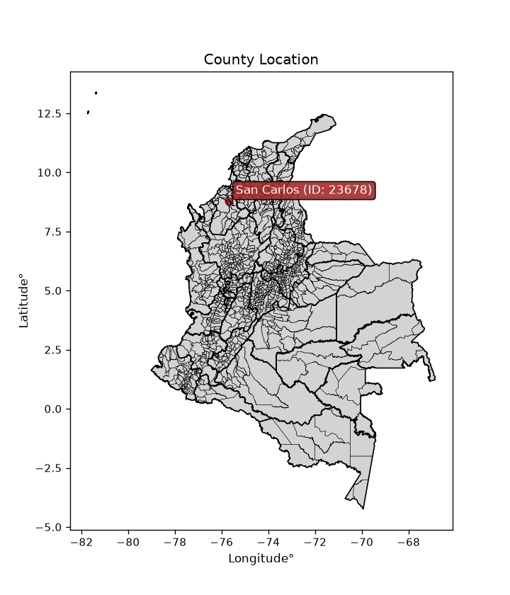
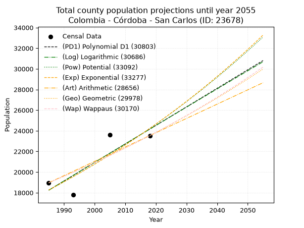
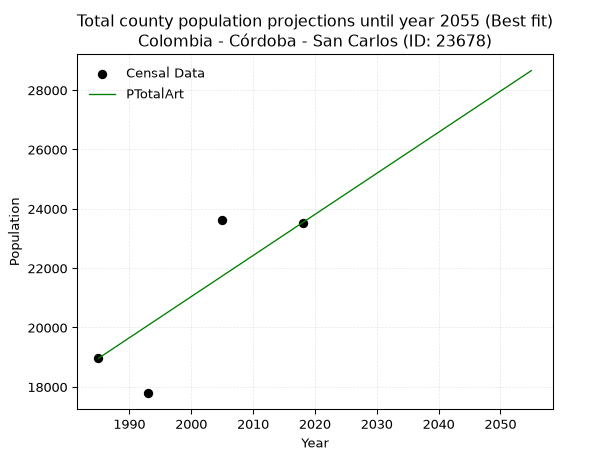
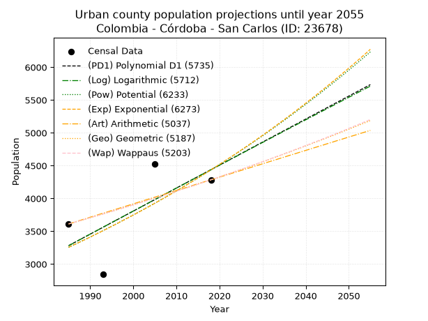
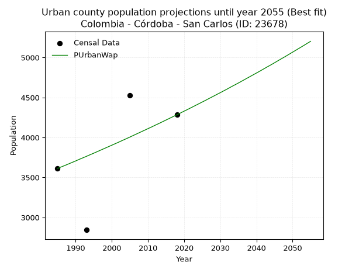
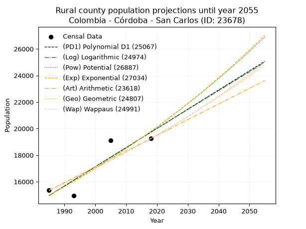
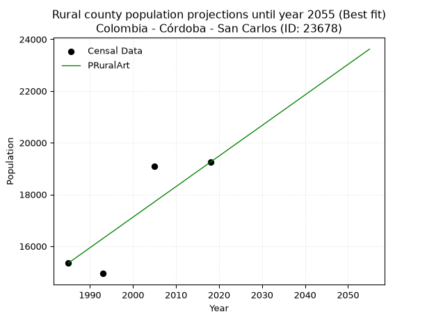

<div align="center">


</div>

# _“Population and Public Services Demand Projections (PPSD) until Year 2050 for Colombia - Córdoba - San Carlos (ID: 23678)”_
Keywords: `population` `public-service` `projection` `lineal` `polynomial` `logarithmic` `potential` `exponential` `arithmetic` `geometric` `wappaus` `dane` `colombia` `south-america`

PPSD are analytical estimates used by governments and planners to anticipate future changes in population size, age distribution, and the resulting community needs for utilities, healthcare, education, and infrastructure as sizing future water treatment facilities, electrical grids, and road networks based on spatial growth.

<div align="center">

</img>

</div>


> **General running parameters**: • app_version: _v20260806_. • Python version: _3.14.7_. • Pandas version: _3.0.5_. • NumPy version: _2.5.1_. • Creates, save and include plots into reports (create_plot): _False_. • Projection until year: _2050_. • Process polynomial degree 2 and up: _False_. • Process Wappaus: _True_. • Process Wappaus: _True_. • Set negative values to zero: _True_. • Set infinite values to zero: _True_. • Drop dataset notes: _True_. 
<div align="center">

Dynamic map: [:earth_americas:Google](http://maps.google.com/maps?q=8.799282296,-75.6987985) [:earth_americas:OSM](https://www.openstreetmap.org/#map=18/8.799282296/-75.6987985&layers=P) [:earth_americas:Bing](https://www.bing.com/maps?cp=8.799282296~-75.6987985&lvl=18) [:earth_americas:Apple](https://maps.apple.com/frame?center=8.799282296%2C-75.6987985&span=0.003%2C0.006)

</div>


<div align="center">

```geojson
{
  "type": "Feature",
  "geometry": {
    "type": "Point", 
    "coordinates": [-75.6987985, 8.799282296]
  }, 
  "properties": {
    "Name": "Colombia - Córdoba - San Carlos (ID: 23678)"
  }
}
```

</div>


## 0. Census Data (4 records)

Census data are official statistics collected by a government about the people and housing in a country. They usually include counts of total population, age, sex, race, income, education, and jobs.

📅Global census file: [Population.xlsx](../data/Population.xlsx)

| Source   |   Year |   CountryID | CountryName   |   StateID | StateName   |   CountyID | CountyName   |   PTotal |   PUrban |   PRural |
|:---------|-------:|------------:|:--------------|----------:|:------------|-----------:|:-------------|---------:|---------:|---------:|
| DANE     |   1985 |          57 | Colombia      |        23 | Córdoba     |      23678 | San Carlos   |    18962 |     3612 |    15350 |
| DANE     |   1993 |          57 | Colombia      |        23 | Córdoba     |      23678 | San Carlos   |    17786 |     2843 |    14943 |
| DANE     |   2005 |          57 | Colombia      |        23 | Córdoba     |      23678 | San Carlos   |    23622 |     4524 |    19098 |
| DANE     |   2018 |          57 | Colombia      |        23 | Córdoba     |      23678 | San Carlos   |    23532 |     4284 |    19248 |

> 🔥Some records could had specific notes about the registered values or the corresponding urban or rural distribution.

📅   [RUPS](https://www.datos.gov.co/Hacienda-y-Cr-dito-P-blico/Registro-nico-de-Prestadores-de-Servicios-P-blicos/4qkq-csdn/about_data) - Local public utility companies: [RUPS.csv](../data/RUPS.xlsx)

 | SERVICIO       | ESTADO    | NOMBRE                            | NIT         | DEPARTAMENTO_DOMICILIO   | MUNICIPIO_DOMICILIO   | DIRECCION                       |   TELEFONO | EMAIL                     | TIPO_PRESTADOR                             | CLASIFICACION                 |
|:---------------|:----------|:----------------------------------|:------------|:-------------------------|:----------------------|:--------------------------------|-----------:|:--------------------------|:-------------------------------------------|:------------------------------|
| ACUEDUCTO      | OPERATIVA | UNIAGUAS S.A. E.S.P.              | 830139722-9 | CORDOBA                  | CERETE                | Cll 39 No. 15 60                |    7741602 | fmartinez3105@hotmail.com | SOCIEDADES (EMPRESA DE SERVICIOS PUBLICOS) | MAYOR O IGUAL A 5001 USUARIOS |
| ALCANTARILLADO | OPERATIVA | UNIAGUAS S.A. E.S.P.              | 830139722-9 | CORDOBA                  | CERETE                | Cll 39 No. 15 60                |    7741602 | fmartinez3105@hotmail.com | SOCIEDADES (EMPRESA DE SERVICIOS PUBLICOS) | MAYOR O IGUAL A 5001 USUARIOS |
| ACUEDUCTO      | OPERATIVA | AQUALIA LATINOAMERICA S.A. E.S.P. | 901362452-7 | CORDOBA                  | CERETE                | calle 39 n° 15-60 barrio  venus |    7641602 | jhosett.navas@aqualia.com | SOCIEDADES (EMPRESA DE SERVICIOS PUBLICOS) | MAYOR O IGUAL A 5001 USUARIOS |

## 1. Total

### 1.1. Coefficients and Parameters

* (PD1) Polynomial Deg 1: 179.49177037334368, -338052.91368928074 (lineal)
* (Log) Logarithmic: 359344.4551708752, -2710404.5833595647
* (Pow) Potential: 17.16829294055026, -52.35560250762952
* (Exp) Exponential: 0.008575850367391549, 0.0007386086479998918
* (Art) Arithmetic: Year diff. 2018 - 1985 = 33, Population diff. 23532 - 18962 = 4570, Annual growth = 138.4848484848485
* (Geo) Geometric: Year diff. 2018 - 1985 = 33, Population diff. 23532 - 18962 = 4570, Annual growth % = 0.006564611421851385
* (Wap) Wappaus: i = 0.6517854213999552, Condition values only valid for < 200)

<sub>
Wappaus condition values: ['0.00', '0.65', '1.30', '1.96', '2.61', '3.26', '3.91', '4.56', '5.21', '5.87', '6.52', '7.17', '7.82', '8.47', '9.12', '9.78', '10.43', '11.08', '11.73', '12.38', '13.04', '13.69', '14.34', '14.99', '15.64', '16.29', '16.95', '17.60', '18.25', '18.90', '19.55', '20.21', '20.86', '21.51', '22.16', '22.81', '23.46', '24.12', '24.77', '25.42', '26.07', '26.72', '27.37', '28.03', '28.68', '29.33', '29.98', '30.63', '31.29', '31.94', '32.59', '33.24', '33.89', '34.54', '35.20', '35.85', '36.50', '37.15', '37.80', '38.46', '39.11', '39.76', '40.41', '41.06', '41.71', '42.37']
</sub>


### 1.2. Projected Dataset

|   Year |   CountyID |   PTotalPD1 |   PTotalLog |   PTotalPow |   PTotalExp |   PTotalArt |   PTotalGeo |   PTotalWap |
|-------:|-----------:|------------:|------------:|------------:|------------:|------------:|------------:|------------:|
|   1985 |      23678 |       18238 |       18232 |       18252 |       18257 |       18962 |       18962 |       18962 |
|   1986 |      23678 |       18418 |       18413 |       18411 |       18415 |       19100 |       19086 |       19086 |
|   1987 |      23678 |       18597 |       18594 |       18571 |       18573 |       19239 |       19212 |       19211 |
|   1988 |      23678 |       18777 |       18775 |       18732 |       18733 |       19377 |       19338 |       19336 |
|   1989 |      23678 |       18956 |       18956 |       18894 |       18894 |       19516 |       19465 |       19463 |
|   1990 |      23678 |       19136 |       19136 |       19058 |       19057 |       19654 |       19593 |       19590 |
|   1991 |      23678 |       19315 |       19317 |       19223 |       19221 |       19793 |       19721 |       19718 |
|   1992 |      23678 |       19495 |       19497 |       19389 |       19387 |       19931 |       19851 |       19847 |
|   1993 |      23678 |       19674 |       19678 |       19557 |       19554 |       20070 |       19981 |       19977 |
|   1994 |      23678 |       19854 |       19858 |       19726 |       19722 |       20208 |       20112 |       20108 |
|   1995 |      23678 |       20033 |       20038 |       19897 |       19892 |       20347 |       20244 |       20240 |
|   1996 |      23678 |       20213 |       20218 |       20069 |       20063 |       20485 |       20377 |       20372 |
|   1997 |      23678 |       20392 |       20398 |       20242 |       20236 |       20624 |       20511 |       20505 |
|   1998 |      23678 |       20572 |       20578 |       20417 |       20411 |       20762 |       20646 |       20640 |
|   1999 |      23678 |       20751 |       20758 |       20593 |       20586 |       20901 |       20781 |       20775 |
|   2000 |      23678 |       20931 |       20938 |       20771 |       20764 |       21039 |       20917 |       20911 |
|   2001 |      23678 |       21110 |       21117 |       20950 |       20942 |       21178 |       21055 |       21048 |
|   2002 |      23678 |       21290 |       21297 |       21130 |       21123 |       21316 |       21193 |       21186 |
|   2003 |      23678 |       21469 |       21476 |       21312 |       21305 |       21455 |       21332 |       21325 |
|   2004 |      23678 |       21649 |       21656 |       21495 |       21488 |       21593 |       21472 |       21465 |
|   2005 |      23678 |       21828 |       21835 |       21680 |       21673 |       21732 |       21613 |       21606 |
|   2006 |      23678 |       22008 |       22014 |       21867 |       21860 |       21870 |       21755 |       21748 |
|   2007 |      23678 |       22187 |       22193 |       22055 |       22048 |       22009 |       21898 |       21891 |
|   2008 |      23678 |       22367 |       22372 |       22244 |       22238 |       22147 |       22042 |       22035 |
|   2009 |      23678 |       22546 |       22551 |       22435 |       22430 |       22286 |       22186 |       22180 |
|   2010 |      23678 |       22726 |       22730 |       22627 |       22623 |       22424 |       22332 |       22326 |
|   2011 |      23678 |       22905 |       22909 |       22821 |       22818 |       22563 |       22478 |       22473 |
|   2012 |      23678 |       23085 |       23087 |       23017 |       23014 |       22701 |       22626 |       22621 |
|   2013 |      23678 |       23264 |       23266 |       23214 |       23212 |       22840 |       22775 |       22770 |
|   2014 |      23678 |       23444 |       23444 |       23413 |       23412 |       22978 |       22924 |       22920 |
|   2015 |      23678 |       23623 |       23623 |       23613 |       23614 |       23117 |       23075 |       23072 |
|   2016 |      23678 |       23802 |       23801 |       23815 |       23817 |       23255 |       23226 |       23224 |
|   2017 |      23678 |       23982 |       23979 |       24019 |       24023 |       23394 |       23379 |       23377 |
|   2018 |      23678 |       24161 |       24157 |       24224 |       24229 |       23532 |       23532 |       23532 |
|   2019 |      23678 |       24341 |       24335 |       24431 |       24438 |       23670 |       23686 |       23688 |
|   2020 |      23678 |       24520 |       24513 |       24640 |       24649 |       23809 |       23842 |       23845 |
|   2021 |      23678 |       24700 |       24691 |       24850 |       24861 |       23947 |       23998 |       24003 |
|   2022 |      23678 |       24879 |       24869 |       25062 |       25075 |       24086 |       24156 |       24162 |
|   2023 |      23678 |       25059 |       25046 |       25276 |       25291 |       24224 |       24315 |       24322 |
|   2024 |      23678 |       25238 |       25224 |       25491 |       25509 |       24363 |       24474 |       24484 |
|   2025 |      23678 |       25418 |       25402 |       25708 |       25729 |       24501 |       24635 |       24647 |
|   2026 |      23678 |       25597 |       25579 |       25927 |       25950 |       24640 |       24797 |       24811 |
|   2027 |      23678 |       25777 |       25756 |       26148 |       26174 |       24778 |       24959 |       24976 |
|   2028 |      23678 |       25956 |       25934 |       26370 |       26399 |       24917 |       25123 |       25143 |
|   2029 |      23678 |       26136 |       26111 |       26594 |       26626 |       25055 |       25288 |       25310 |
|   2030 |      23678 |       26315 |       26288 |       26820 |       26856 |       25194 |       25454 |       25479 |
|   2031 |      23678 |       26495 |       26465 |       27048 |       27087 |       25332 |       25621 |       25650 |
|   2032 |      23678 |       26674 |       26642 |       27277 |       27320 |       25471 |       25789 |       25821 |
|   2033 |      23678 |       26854 |       26818 |       27509 |       27556 |       25609 |       25959 |       25994 |
|   2034 |      23678 |       27033 |       26995 |       27742 |       27793 |       25748 |       26129 |       26169 |
|   2035 |      23678 |       27213 |       27172 |       27977 |       28032 |       25886 |       26301 |       26345 |
|   2036 |      23678 |       27392 |       27348 |       28214 |       28274 |       26025 |       26473 |       26522 |
|   2037 |      23678 |       27572 |       27525 |       28453 |       28517 |       26163 |       26647 |       26700 |
|   2038 |      23678 |       27751 |       27701 |       28694 |       28763 |       26302 |       26822 |       26880 |
|   2039 |      23678 |       27931 |       27877 |       28936 |       29011 |       26440 |       26998 |       27061 |
|   2040 |      23678 |       28110 |       28054 |       29181 |       29260 |       26579 |       27175 |       27244 |
|   2041 |      23678 |       28290 |       28230 |       29427 |       29512 |       26717 |       27354 |       27428 |
|   2042 |      23678 |       28469 |       28406 |       29676 |       29767 |       26856 |       27533 |       27614 |
|   2043 |      23678 |       28649 |       28582 |       29926 |       30023 |       26994 |       27714 |       27801 |
|   2044 |      23678 |       28828 |       28757 |       30179 |       30282 |       27133 |       27896 |       27990 |
|   2045 |      23678 |       29008 |       28933 |       30433 |       30542 |       27271 |       28079 |       28180 |
|   2046 |      23678 |       29187 |       29109 |       30690 |       30805 |       27410 |       28263 |       28372 |
|   2047 |      23678 |       29367 |       29284 |       30948 |       31071 |       27548 |       28449 |       28565 |
|   2048 |      23678 |       29546 |       29460 |       31209 |       31338 |       27687 |       28636 |       28760 |
|   2049 |      23678 |       29726 |       29635 |       31472 |       31608 |       27825 |       28824 |       28956 |
|   2050 |      23678 |       29905 |       29811 |       31736 |       31881 |       27964 |       29013 |       29155 |
<div align="center">

</img>

</div>


### 1.3. Best fit with absolute and relative error (%)

Relative error puts that difference into context by dividing the absolute error by the true value, creating a unitless ratio or percentage that shows the scale of the mistake.

Absolute and relative error

|   Year | Source   |   CountryID | CountryName   |   StateID | StateName   |   CountyID_x | CountyName   |   PTotal |   PUrban |   PRural |   CountyID_y |   PTotalPD1 |   PTotalLog |   PTotalPow |   PTotalExp |   PTotalArt |   PTotalGeo |   PTotalWap |   PTotalPD1AbsError |   PTotalLogAbsError |   PTotalPowAbsError |   PTotalExpAbsError |   PTotalArtAbsError |   PTotalGeoAbsError |   PTotalWapAbsError |   PTotalPD1RelError |   PTotalLogRelError |   PTotalPowRelError |   PTotalExpRelError |   PTotalArtRelError |   PTotalGeoRelError |   PTotalWapRelError |
|-------:|:---------|------------:|:--------------|----------:|:------------|-------------:|:-------------|---------:|---------:|---------:|-------------:|------------:|------------:|------------:|------------:|------------:|------------:|------------:|--------------------:|--------------------:|--------------------:|--------------------:|--------------------:|--------------------:|--------------------:|--------------------:|--------------------:|--------------------:|--------------------:|--------------------:|--------------------:|--------------------:|
|   1985 | DANE     |          57 | Colombia      |        23 | Córdoba     |        23678 | San Carlos   |    18962 |     3612 |    15350 |        23678 |       18238 |       18232 |       18252 |       18257 |       18962 |       18962 |       18962 |                 724 |                 730 |                 710 |                 705 |                   0 |                   0 |                   0 |             3.81816 |             3.8498  |             3.74433 |             3.71796 |             0       |             0       |             0       |
|   1993 | DANE     |          57 | Colombia      |        23 | Córdoba     |        23678 | San Carlos   |    17786 |     2843 |    14943 |        23678 |       19674 |       19678 |       19557 |       19554 |       20070 |       19981 |       19977 |                1888 |                1892 |                1771 |                1768 |                2284 |                2195 |                2191 |            10.6151  |            10.6376  |             9.95727 |             9.9404  |            12.8416  |            12.3412  |            12.3187  |
|   2005 | DANE     |          57 | Colombia      |        23 | Córdoba     |        23678 | San Carlos   |    23622 |     4524 |    19098 |        23678 |       21828 |       21835 |       21680 |       21673 |       21732 |       21613 |       21606 |                1794 |                1787 |                1942 |                1949 |                1890 |                2009 |                2016 |             7.59462 |             7.56498 |             8.22115 |             8.25078 |             8.00102 |             8.50478 |             8.53442 |
|   2018 | DANE     |          57 | Colombia      |        23 | Córdoba     |        23678 | San Carlos   |    23532 |     4284 |    19248 |        23678 |       24161 |       24157 |       24224 |       24229 |       23532 |       23532 |       23532 |                 629 |                 625 |                 692 |                 697 |                   0 |                   0 |                   0 |             2.67296 |             2.65596 |             2.94068 |             2.96192 |             0       |             0       |             0       |

Relative error mean

| Method    |   RelError | Best   |
|:----------|-----------:|:-------|
| PTotalPD1 |    6.17521 |        |
| PTotalLog |    6.17708 |        |
| PTotalPow |    6.21586 |        |
| PTotalExp |    6.21777 |        |
| PTotalArt |    5.21064 | True   |
| PTotalGeo |    5.21149 |        |
| PTotalWap |    5.21327 |        |

💙Best method: _**PTotalArt**_
<div align="center">

</img>

</div>


### 1.4. Fresh water supply demand in liters per capita per day (lpcd)

The fresh water supply demand typically ranges from 100 to 300 liters per capita per day (lpcd) for standard domestic and municipal planning, though absolute survival minimums set by the World Health Organization are as low as 7.5 to 20 liters per day, and total consumption in high-income nations can exceed 400 liters.

> `CZ`: Level in meters above the sea level (masl)<br> `WS`: Fresh water supply demand in liters per capita per day (lpcd or l/h/d)<br> `WSAll`: Zonal fresh water supply demand in liters per second (l/s)<br> `A`: Zonal area in square meters<br> `DP`: Population density (people/hectare or p/ha)

Reference values (RAS Colombia)

|    CZ |   WS |
|------:|-----:|
|  1000 |  120 |
|  2000 |  130 |
| 99999 |  140 |

County shapefile geometry properties and water supply values

|   CountyID |     ATotal |   CZTotal |   WSTotal |
|-----------:|-----------:|----------:|----------:|
|      23678 | 4.4644e+08 |   64.5459 |       120 |

Projected values for best method: PTotalArt

|   CountyID |   Year |   PTotalArt |   DPTotal |   WSTotal |   WSTotalAll |
|-----------:|-------:|------------:|----------:|----------:|-------------:|
|      23678 |   1985 |       18962 |      0.42 |       120 |      26.3361 |
|      23678 |   1986 |       19100 |      0.43 |       120 |      26.5278 |
|      23678 |   1987 |       19239 |      0.43 |       120 |      26.7208 |
|      23678 |   1988 |       19377 |      0.43 |       120 |      26.9125 |
|      23678 |   1989 |       19516 |      0.44 |       120 |      27.1056 |
|      23678 |   1990 |       19654 |      0.44 |       120 |      27.2972 |
|      23678 |   1991 |       19793 |      0.44 |       120 |      27.4903 |
|      23678 |   1992 |       19931 |      0.45 |       120 |      27.6819 |
|      23678 |   1993 |       20070 |      0.45 |       120 |      27.875  |
|      23678 |   1994 |       20208 |      0.45 |       120 |      28.0667 |
|      23678 |   1995 |       20347 |      0.46 |       120 |      28.2597 |
|      23678 |   1996 |       20485 |      0.46 |       120 |      28.4514 |
|      23678 |   1997 |       20624 |      0.46 |       120 |      28.6444 |
|      23678 |   1998 |       20762 |      0.47 |       120 |      28.8361 |
|      23678 |   1999 |       20901 |      0.47 |       120 |      29.0292 |
|      23678 |   2000 |       21039 |      0.47 |       120 |      29.2208 |
|      23678 |   2001 |       21178 |      0.47 |       120 |      29.4139 |
|      23678 |   2002 |       21316 |      0.48 |       120 |      29.6056 |
|      23678 |   2003 |       21455 |      0.48 |       120 |      29.7986 |
|      23678 |   2004 |       21593 |      0.48 |       120 |      29.9903 |
|      23678 |   2005 |       21732 |      0.49 |       120 |      30.1833 |
|      23678 |   2006 |       21870 |      0.49 |       120 |      30.375  |
|      23678 |   2007 |       22009 |      0.49 |       120 |      30.5681 |
|      23678 |   2008 |       22147 |      0.5  |       120 |      30.7597 |
|      23678 |   2009 |       22286 |      0.5  |       120 |      30.9528 |
|      23678 |   2010 |       22424 |      0.5  |       120 |      31.1444 |
|      23678 |   2011 |       22563 |      0.51 |       120 |      31.3375 |
|      23678 |   2012 |       22701 |      0.51 |       120 |      31.5292 |
|      23678 |   2013 |       22840 |      0.51 |       120 |      31.7222 |
|      23678 |   2014 |       22978 |      0.51 |       120 |      31.9139 |
|      23678 |   2015 |       23117 |      0.52 |       120 |      32.1069 |
|      23678 |   2016 |       23255 |      0.52 |       120 |      32.2986 |
|      23678 |   2017 |       23394 |      0.52 |       120 |      32.4917 |
|      23678 |   2018 |       23532 |      0.53 |       120 |      32.6833 |
|      23678 |   2019 |       23670 |      0.53 |       120 |      32.875  |
|      23678 |   2020 |       23809 |      0.53 |       120 |      33.0681 |
|      23678 |   2021 |       23947 |      0.54 |       120 |      33.2597 |
|      23678 |   2022 |       24086 |      0.54 |       120 |      33.4528 |
|      23678 |   2023 |       24224 |      0.54 |       120 |      33.6444 |
|      23678 |   2024 |       24363 |      0.55 |       120 |      33.8375 |
|      23678 |   2025 |       24501 |      0.55 |       120 |      34.0292 |
|      23678 |   2026 |       24640 |      0.55 |       120 |      34.2222 |
|      23678 |   2027 |       24778 |      0.56 |       120 |      34.4139 |
|      23678 |   2028 |       24917 |      0.56 |       120 |      34.6069 |
|      23678 |   2029 |       25055 |      0.56 |       120 |      34.7986 |
|      23678 |   2030 |       25194 |      0.56 |       120 |      34.9917 |
|      23678 |   2031 |       25332 |      0.57 |       120 |      35.1833 |
|      23678 |   2032 |       25471 |      0.57 |       120 |      35.3764 |
|      23678 |   2033 |       25609 |      0.57 |       120 |      35.5681 |
|      23678 |   2034 |       25748 |      0.58 |       120 |      35.7611 |
|      23678 |   2035 |       25886 |      0.58 |       120 |      35.9528 |
|      23678 |   2036 |       26025 |      0.58 |       120 |      36.1458 |
|      23678 |   2037 |       26163 |      0.59 |       120 |      36.3375 |
|      23678 |   2038 |       26302 |      0.59 |       120 |      36.5306 |
|      23678 |   2039 |       26440 |      0.59 |       120 |      36.7222 |
|      23678 |   2040 |       26579 |      0.6  |       120 |      36.9153 |
|      23678 |   2041 |       26717 |      0.6  |       120 |      37.1069 |
|      23678 |   2042 |       26856 |      0.6  |       120 |      37.3    |
|      23678 |   2043 |       26994 |      0.6  |       120 |      37.4917 |
|      23678 |   2044 |       27133 |      0.61 |       120 |      37.6847 |
|      23678 |   2045 |       27271 |      0.61 |       120 |      37.8764 |
|      23678 |   2046 |       27410 |      0.61 |       120 |      38.0694 |
|      23678 |   2047 |       27548 |      0.62 |       120 |      38.2611 |
|      23678 |   2048 |       27687 |      0.62 |       120 |      38.4542 |
|      23678 |   2049 |       27825 |      0.62 |       120 |      38.6458 |
|      23678 |   2050 |       27964 |      0.63 |       120 |      38.8389 |

## 2. Urban

### 2.1. Coefficients and Parameters

* (PD1) Polynomial Deg 1: 35.062625451625905, -66318.26655961473 (lineal)
* (Log) Logarithmic: 70179.31886534214, -529617.8150772324
* (Pow) Potential: 18.74593496328935, -58.307028787429346
* (Exp) Exponential: 0.009367574277060654, 2.7361220044272985e-05
* (Art) Arithmetic: Year diff. 2018 - 1985 = 33, Population diff. 4284 - 3612 = 672, Annual growth = 20.363636363636363
* (Geo) Geometric: Year diff. 2018 - 1985 = 33, Population diff. 4284 - 3612 = 672, Annual growth % = 0.005183860161662057
* (Wap) Wappaus: i = 0.5157962604771116, Condition values only valid for < 200)

<sub>
Wappaus condition values: ['0.00', '0.52', '1.03', '1.55', '2.06', '2.58', '3.09', '3.61', '4.13', '4.64', '5.16', '5.67', '6.19', '6.71', '7.22', '7.74', '8.25', '8.77', '9.28', '9.80', '10.32', '10.83', '11.35', '11.86', '12.38', '12.89', '13.41', '13.93', '14.44', '14.96', '15.47', '15.99', '16.51', '17.02', '17.54', '18.05', '18.57', '19.08', '19.60', '20.12', '20.63', '21.15', '21.66', '22.18', '22.70', '23.21', '23.73', '24.24', '24.76', '25.27', '25.79', '26.31', '26.82', '27.34', '27.85', '28.37', '28.88', '29.40', '29.92', '30.43', '30.95', '31.46', '31.98', '32.50', '33.01', '33.53']
</sub>


### 2.2. Projected Dataset

|   Year |   CountyID |   PUrbanPD1 |   PUrbanLog |   PUrbanPow |   PUrbanExp |   PUrbanArt |   PUrbanGeo |   PUrbanWap |
|-------:|-----------:|------------:|------------:|------------:|------------:|------------:|------------:|------------:|
|   1985 |      23678 |        3281 |        3280 |        3255 |        3256 |        3612 |        3612 |        3612 |
|   1986 |      23678 |        3316 |        3315 |        3286 |        3287 |        3632 |        3631 |        3631 |
|   1987 |      23678 |        3351 |        3351 |        3317 |        3318 |        3653 |        3650 |        3649 |
|   1988 |      23678 |        3386 |        3386 |        3349 |        3349 |        3673 |        3668 |        3668 |
|   1989 |      23678 |        3421 |        3421 |        3380 |        3380 |        3693 |        3687 |        3687 |
|   1990 |      23678 |        3456 |        3457 |        3412 |        3412 |        3714 |        3707 |        3706 |
|   1991 |      23678 |        3491 |        3492 |        3445 |        3444 |        3734 |        3726 |        3726 |
|   1992 |      23678 |        3526 |        3527 |        3477 |        3477 |        3755 |        3745 |        3745 |
|   1993 |      23678 |        3562 |        3562 |        3510 |        3509 |        3775 |        3765 |        3764 |
|   1994 |      23678 |        3597 |        3597 |        3543 |        3542 |        3795 |        3784 |        3784 |
|   1995 |      23678 |        3632 |        3633 |        3577 |        3576 |        3816 |        3804 |        3803 |
|   1996 |      23678 |        3667 |        3668 |        3610 |        3609 |        3836 |        3823 |        3823 |
|   1997 |      23678 |        3702 |        3703 |        3645 |        3643 |        3856 |        3843 |        3843 |
|   1998 |      23678 |        3737 |        3738 |        3679 |        3678 |        3877 |        3863 |        3863 |
|   1999 |      23678 |        3772 |        3773 |        3714 |        3712 |        3897 |        3883 |        3883 |
|   2000 |      23678 |        3807 |        3808 |        3749 |        3747 |        3917 |        3903 |        3903 |
|   2001 |      23678 |        3842 |        3843 |        3784 |        3782 |        3938 |        3924 |        3923 |
|   2002 |      23678 |        3877 |        3878 |        3819 |        3818 |        3958 |        3944 |        3943 |
|   2003 |      23678 |        3912 |        3914 |        3855 |        3854 |        3979 |        3964 |        3964 |
|   2004 |      23678 |        3947 |        3949 |        3892 |        3890 |        3999 |        3985 |        3984 |
|   2005 |      23678 |        3982 |        3984 |        3928 |        3927 |        4019 |        4006 |        4005 |
|   2006 |      23678 |        4017 |        4019 |        3965 |        3964 |        4040 |        4026 |        4026 |
|   2007 |      23678 |        4052 |        4054 |        4002 |        4001 |        4060 |        4047 |        4047 |
|   2008 |      23678 |        4087 |        4088 |        4040 |        4039 |        4080 |        4068 |        4068 |
|   2009 |      23678 |        4123 |        4123 |        4078 |        4077 |        4101 |        4089 |        4089 |
|   2010 |      23678 |        4158 |        4158 |        4116 |        4115 |        4121 |        4110 |        4110 |
|   2011 |      23678 |        4193 |        4193 |        4155 |        4154 |        4141 |        4132 |        4131 |
|   2012 |      23678 |        4228 |        4228 |        4193 |        4193 |        4162 |        4153 |        4153 |
|   2013 |      23678 |        4263 |        4263 |        4233 |        4232 |        4182 |        4175 |        4174 |
|   2014 |      23678 |        4298 |        4298 |        4272 |        4272 |        4203 |        4196 |        4196 |
|   2015 |      23678 |        4333 |        4333 |        4312 |        4313 |        4223 |        4218 |        4218 |
|   2016 |      23678 |        4368 |        4368 |        4352 |        4353 |        4243 |        4240 |        4240 |
|   2017 |      23678 |        4403 |        4402 |        4393 |        4394 |        4264 |        4262 |        4262 |
|   2018 |      23678 |        4438 |        4437 |        4434 |        4435 |        4284 |        4284 |        4284 |
|   2019 |      23678 |        4473 |        4472 |        4476 |        4477 |        4304 |        4306 |        4306 |
|   2020 |      23678 |        4508 |        4507 |        4517 |        4519 |        4325 |        4329 |        4329 |
|   2021 |      23678 |        4543 |        4541 |        4559 |        4562 |        4345 |        4351 |        4351 |
|   2022 |      23678 |        4578 |        4576 |        4602 |        4605 |        4365 |        4374 |        4374 |
|   2023 |      23678 |        4613 |        4611 |        4645 |        4648 |        4386 |        4396 |        4397 |
|   2024 |      23678 |        4648 |        4645 |        4688 |        4692 |        4406 |        4419 |        4420 |
|   2025 |      23678 |        4684 |        4680 |        4732 |        4736 |        4427 |        4442 |        4443 |
|   2026 |      23678 |        4719 |        4715 |        4776 |        4781 |        4447 |        4465 |        4466 |
|   2027 |      23678 |        4754 |        4749 |        4820 |        4826 |        4467 |        4488 |        4490 |
|   2028 |      23678 |        4789 |        4784 |        4865 |        4871 |        4488 |        4511 |        4513 |
|   2029 |      23678 |        4824 |        4819 |        4910 |        4917 |        4508 |        4535 |        4537 |
|   2030 |      23678 |        4859 |        4853 |        4955 |        4963 |        4528 |        4558 |        4560 |
|   2031 |      23678 |        4894 |        4888 |        5001 |        5010 |        4549 |        4582 |        4584 |
|   2032 |      23678 |        4929 |        4922 |        5048 |        5057 |        4569 |        4606 |        4608 |
|   2033 |      23678 |        4964 |        4957 |        5094 |        5105 |        4589 |        4629 |        4633 |
|   2034 |      23678 |        4999 |        4991 |        5142 |        5153 |        4610 |        4653 |        4657 |
|   2035 |      23678 |        5034 |        5026 |        5189 |        5201 |        4630 |        4678 |        4681 |
|   2036 |      23678 |        5069 |        5060 |        5237 |        5250 |        4651 |        4702 |        4706 |
|   2037 |      23678 |        5104 |        5095 |        5286 |        5299 |        4671 |        4726 |        4731 |
|   2038 |      23678 |        5139 |        5129 |        5335 |        5349 |        4691 |        4751 |        4756 |
|   2039 |      23678 |        5174 |        5164 |        5384 |        5400 |        4712 |        4775 |        4781 |
|   2040 |      23678 |        5209 |        5198 |        5434 |        5451 |        4732 |        4800 |        4806 |
|   2041 |      23678 |        5245 |        5232 |        5484 |        5502 |        4752 |        4825 |        4831 |
|   2042 |      23678 |        5280 |        5267 |        5534 |        5554 |        4773 |        4850 |        4857 |
|   2043 |      23678 |        5315 |        5301 |        5585 |        5606 |        4793 |        4875 |        4883 |
|   2044 |      23678 |        5350 |        5336 |        5637 |        5659 |        4813 |        4900 |        4908 |
|   2045 |      23678 |        5385 |        5370 |        5689 |        5712 |        4834 |        4926 |        4934 |
|   2046 |      23678 |        5420 |        5404 |        5741 |        5766 |        4854 |        4951 |        4961 |
|   2047 |      23678 |        5455 |        5438 |        5794 |        5820 |        4875 |        4977 |        4987 |
|   2048 |      23678 |        5490 |        5473 |        5847 |        5875 |        4895 |        5003 |        5013 |
|   2049 |      23678 |        5525 |        5507 |        5901 |        5930 |        4915 |        5029 |        5040 |
|   2050 |      23678 |        5560 |        5541 |        5955 |        5986 |        4936 |        5055 |        5067 |
<div align="center">

</img>

</div>


### 2.3. Best fit with absolute and relative error (%)

Relative error puts that difference into context by dividing the absolute error by the true value, creating a unitless ratio or percentage that shows the scale of the mistake.

Absolute and relative error

|   Year | Source   |   CountryID | CountryName   |   StateID | StateName   |   CountyID_x | CountyName   |   PTotal |   PUrban |   PRural |   CountyID_y |   PUrbanPD1 |   PUrbanLog |   PUrbanPow |   PUrbanExp |   PUrbanArt |   PUrbanGeo |   PUrbanWap |   PUrbanPD1AbsError |   PUrbanLogAbsError |   PUrbanPowAbsError |   PUrbanExpAbsError |   PUrbanArtAbsError |   PUrbanGeoAbsError |   PUrbanWapAbsError |   PUrbanPD1RelError |   PUrbanLogRelError |   PUrbanPowRelError |   PUrbanExpRelError |   PUrbanArtRelError |   PUrbanGeoRelError |   PUrbanWapRelError |
|-------:|:---------|------------:|:--------------|----------:|:------------|-------------:|:-------------|---------:|---------:|---------:|-------------:|------------:|------------:|------------:|------------:|------------:|------------:|------------:|--------------------:|--------------------:|--------------------:|--------------------:|--------------------:|--------------------:|--------------------:|--------------------:|--------------------:|--------------------:|--------------------:|--------------------:|--------------------:|--------------------:|
|   1985 | DANE     |          57 | Colombia      |        23 | Córdoba     |        23678 | San Carlos   |    18962 |     3612 |    15350 |        23678 |        3281 |        3280 |        3255 |        3256 |        3612 |        3612 |        3612 |                 331 |                 332 |                 357 |                 356 |                   0 |                   0 |                   0 |             9.1639  |             9.19158 |             9.88372 |             9.85604 |              0      |              0      |              0      |
|   1993 | DANE     |          57 | Colombia      |        23 | Córdoba     |        23678 | San Carlos   |    17786 |     2843 |    14943 |        23678 |        3562 |        3562 |        3510 |        3509 |        3775 |        3765 |        3764 |                 719 |                 719 |                 667 |                 666 |                 932 |                 922 |                 921 |            25.2902  |            25.2902  |            23.4611  |            23.426   |             32.7823 |             32.4305 |             32.3954 |
|   2005 | DANE     |          57 | Colombia      |        23 | Córdoba     |        23678 | San Carlos   |    23622 |     4524 |    19098 |        23678 |        3982 |        3984 |        3928 |        3927 |        4019 |        4006 |        4005 |                 542 |                 540 |                 596 |                 597 |                 505 |                 518 |                 519 |            11.9805  |            11.9363  |            13.1742  |            13.1963  |             11.1627 |             11.45   |             11.4721 |
|   2018 | DANE     |          57 | Colombia      |        23 | Córdoba     |        23678 | San Carlos   |    23532 |     4284 |    19248 |        23678 |        4438 |        4437 |        4434 |        4435 |        4284 |        4284 |        4284 |                 154 |                 153 |                 150 |                 151 |                   0 |                   0 |                   0 |             3.59477 |             3.57143 |             3.5014  |             3.52474 |              0      |              0      |              0      |

Relative error mean

| Method    |   RelError | Best   |
|:----------|-----------:|:-------|
| PUrbanPD1 |    12.5074 |        |
| PUrbanLog |    12.4974 |        |
| PUrbanPow |    12.5051 |        |
| PUrbanExp |    12.5008 |        |
| PUrbanArt |    10.9862 |        |
| PUrbanGeo |    10.9701 |        |
| PUrbanWap |    10.9669 | True   |

💙Best method: _**PUrbanWap**_
<div align="center">

</img>

</div>


### 2.4. Fresh water supply demand in liters per capita per day (lpcd)

The fresh water supply demand typically ranges from 100 to 300 liters per capita per day (lpcd) for standard domestic and municipal planning, though absolute survival minimums set by the World Health Organization are as low as 7.5 to 20 liters per day, and total consumption in high-income nations can exceed 400 liters.

> `CZ`: Level in meters above the sea level (masl)<br> `WS`: Fresh water supply demand in liters per capita per day (lpcd or l/h/d)<br> `WSAll`: Zonal fresh water supply demand in liters per second (l/s)<br> `A`: Zonal area in square meters<br> `DP`: Population density (people/hectare or p/ha)

Reference values (RAS Colombia)

|    CZ |   WS |
|------:|-----:|
|  1000 |  120 |
|  2000 |  130 |
| 99999 |  140 |

County shapefile geometry properties and water supply values

|   CountyID |      AUrban |   CZUrban |   WSUrban |
|-----------:|------------:|----------:|----------:|
|      23678 | 1.16001e+06 |   12.7577 |       120 |

Projected values for best method: PUrbanWap

|   CountyID |   Year |   PUrbanWap |   DPUrban |   WSUrban |   WSUrbanAll |
|-----------:|-------:|------------:|----------:|----------:|-------------:|
|      23678 |   1985 |        3612 |     31.14 |       120 |      5.01667 |
|      23678 |   1986 |        3631 |     31.3  |       120 |      5.04306 |
|      23678 |   1987 |        3649 |     31.46 |       120 |      5.06806 |
|      23678 |   1988 |        3668 |     31.62 |       120 |      5.09444 |
|      23678 |   1989 |        3687 |     31.78 |       120 |      5.12083 |
|      23678 |   1990 |        3706 |     31.95 |       120 |      5.14722 |
|      23678 |   1991 |        3726 |     32.12 |       120 |      5.175   |
|      23678 |   1992 |        3745 |     32.28 |       120 |      5.20139 |
|      23678 |   1993 |        3764 |     32.45 |       120 |      5.22778 |
|      23678 |   1994 |        3784 |     32.62 |       120 |      5.25556 |
|      23678 |   1995 |        3803 |     32.78 |       120 |      5.28194 |
|      23678 |   1996 |        3823 |     32.96 |       120 |      5.30972 |
|      23678 |   1997 |        3843 |     33.13 |       120 |      5.3375  |
|      23678 |   1998 |        3863 |     33.3  |       120 |      5.36528 |
|      23678 |   1999 |        3883 |     33.47 |       120 |      5.39306 |
|      23678 |   2000 |        3903 |     33.65 |       120 |      5.42083 |
|      23678 |   2001 |        3923 |     33.82 |       120 |      5.44861 |
|      23678 |   2002 |        3943 |     33.99 |       120 |      5.47639 |
|      23678 |   2003 |        3964 |     34.17 |       120 |      5.50556 |
|      23678 |   2004 |        3984 |     34.34 |       120 |      5.53333 |
|      23678 |   2005 |        4005 |     34.53 |       120 |      5.5625  |
|      23678 |   2006 |        4026 |     34.71 |       120 |      5.59167 |
|      23678 |   2007 |        4047 |     34.89 |       120 |      5.62083 |
|      23678 |   2008 |        4068 |     35.07 |       120 |      5.65    |
|      23678 |   2009 |        4089 |     35.25 |       120 |      5.67917 |
|      23678 |   2010 |        4110 |     35.43 |       120 |      5.70833 |
|      23678 |   2011 |        4131 |     35.61 |       120 |      5.7375  |
|      23678 |   2012 |        4153 |     35.8  |       120 |      5.76806 |
|      23678 |   2013 |        4174 |     35.98 |       120 |      5.79722 |
|      23678 |   2014 |        4196 |     36.17 |       120 |      5.82778 |
|      23678 |   2015 |        4218 |     36.36 |       120 |      5.85833 |
|      23678 |   2016 |        4240 |     36.55 |       120 |      5.88889 |
|      23678 |   2017 |        4262 |     36.74 |       120 |      5.91944 |
|      23678 |   2018 |        4284 |     36.93 |       120 |      5.95    |
|      23678 |   2019 |        4306 |     37.12 |       120 |      5.98056 |
|      23678 |   2020 |        4329 |     37.32 |       120 |      6.0125  |
|      23678 |   2021 |        4351 |     37.51 |       120 |      6.04306 |
|      23678 |   2022 |        4374 |     37.71 |       120 |      6.075   |
|      23678 |   2023 |        4397 |     37.9  |       120 |      6.10694 |
|      23678 |   2024 |        4420 |     38.1  |       120 |      6.13889 |
|      23678 |   2025 |        4443 |     38.3  |       120 |      6.17083 |
|      23678 |   2026 |        4466 |     38.5  |       120 |      6.20278 |
|      23678 |   2027 |        4490 |     38.71 |       120 |      6.23611 |
|      23678 |   2028 |        4513 |     38.9  |       120 |      6.26806 |
|      23678 |   2029 |        4537 |     39.11 |       120 |      6.30139 |
|      23678 |   2030 |        4560 |     39.31 |       120 |      6.33333 |
|      23678 |   2031 |        4584 |     39.52 |       120 |      6.36667 |
|      23678 |   2032 |        4608 |     39.72 |       120 |      6.4     |
|      23678 |   2033 |        4633 |     39.94 |       120 |      6.43472 |
|      23678 |   2034 |        4657 |     40.15 |       120 |      6.46806 |
|      23678 |   2035 |        4681 |     40.35 |       120 |      6.50139 |
|      23678 |   2036 |        4706 |     40.57 |       120 |      6.53611 |
|      23678 |   2037 |        4731 |     40.78 |       120 |      6.57083 |
|      23678 |   2038 |        4756 |     41    |       120 |      6.60556 |
|      23678 |   2039 |        4781 |     41.22 |       120 |      6.64028 |
|      23678 |   2040 |        4806 |     41.43 |       120 |      6.675   |
|      23678 |   2041 |        4831 |     41.65 |       120 |      6.70972 |
|      23678 |   2042 |        4857 |     41.87 |       120 |      6.74583 |
|      23678 |   2043 |        4883 |     42.09 |       120 |      6.78194 |
|      23678 |   2044 |        4908 |     42.31 |       120 |      6.81667 |
|      23678 |   2045 |        4934 |     42.53 |       120 |      6.85278 |
|      23678 |   2046 |        4961 |     42.77 |       120 |      6.89028 |
|      23678 |   2047 |        4987 |     42.99 |       120 |      6.92639 |
|      23678 |   2048 |        5013 |     43.22 |       120 |      6.9625  |
|      23678 |   2049 |        5040 |     43.45 |       120 |      7       |
|      23678 |   2050 |        5067 |     43.68 |       120 |      7.0375  |

## 3. Rural

### 3.1. Coefficients and Parameters

* (PD1) Polynomial Deg 1: 144.4291449217179, -271734.64712966623 (lineal)
* (Log) Logarithmic: 289165.1363055332, -2180786.7682823325
* (Pow) Potential: 16.87598876036782, -51.47743880628805
* (Exp) Exponential: 0.008429107668600184, 0.0008112128928124533
* (Art) Arithmetic: Year diff. 2018 - 1985 = 33, Population diff. 19248 - 15350 = 3898, Annual growth = 118.12121212121212
* (Geo) Geometric: Year diff. 2018 - 1985 = 33, Population diff. 19248 - 15350 = 3898, Annual growth % = 0.006880889072841123
* (Wap) Wappaus: i = 0.6828210423793983, Condition values only valid for < 200)

<sub>
Wappaus condition values: ['0.00', '0.68', '1.37', '2.05', '2.73', '3.41', '4.10', '4.78', '5.46', '6.15', '6.83', '7.51', '8.19', '8.88', '9.56', '10.24', '10.93', '11.61', '12.29', '12.97', '13.66', '14.34', '15.02', '15.70', '16.39', '17.07', '17.75', '18.44', '19.12', '19.80', '20.48', '21.17', '21.85', '22.53', '23.22', '23.90', '24.58', '25.26', '25.95', '26.63', '27.31', '28.00', '28.68', '29.36', '30.04', '30.73', '31.41', '32.09', '32.78', '33.46', '34.14', '34.82', '35.51', '36.19', '36.87', '37.56', '38.24', '38.92', '39.60', '40.29', '40.97', '41.65', '42.33', '43.02', '43.70', '44.38']
</sub>


### 3.2. Projected Dataset

|   Year |   CountyID |   PRuralPD1 |   PRuralLog |   PRuralPow |   PRuralExp |   PRuralArt |   PRuralGeo |   PRuralWap |
|-------:|-----------:|------------:|------------:|------------:|------------:|------------:|------------:|------------:|
|   1985 |      23678 |       14957 |       14952 |       14981 |       14985 |       15350 |       15350 |       15350 |
|   1986 |      23678 |       15102 |       15098 |       15109 |       15112 |       15468 |       15456 |       15455 |
|   1987 |      23678 |       15246 |       15244 |       15237 |       15240 |       15586 |       15562 |       15561 |
|   1988 |      23678 |       15390 |       15389 |       15367 |       15369 |       15704 |       15669 |       15668 |
|   1989 |      23678 |       15535 |       15534 |       15498 |       15499 |       15822 |       15777 |       15775 |
|   1990 |      23678 |       15679 |       15680 |       15630 |       15630 |       15941 |       15885 |       15883 |
|   1991 |      23678 |       15824 |       15825 |       15763 |       15762 |       16059 |       15995 |       15992 |
|   1992 |      23678 |       15968 |       15970 |       15898 |       15896 |       16177 |       16105 |       16102 |
|   1993 |      23678 |       16113 |       16115 |       16033 |       16030 |       16295 |       16216 |       16212 |
|   1994 |      23678 |       16257 |       16260 |       16169 |       16166 |       16413 |       16327 |       16323 |
|   1995 |      23678 |       16401 |       16405 |       16306 |       16303 |       16531 |       16440 |       16435 |
|   1996 |      23678 |       16546 |       16550 |       16445 |       16441 |       16649 |       16553 |       16548 |
|   1997 |      23678 |       16690 |       16695 |       16585 |       16580 |       16767 |       16667 |       16661 |
|   1998 |      23678 |       16835 |       16840 |       16725 |       16720 |       16886 |       16781 |       16776 |
|   1999 |      23678 |       16979 |       16985 |       16867 |       16862 |       17004 |       16897 |       16891 |
|   2000 |      23678 |       17124 |       17129 |       17010 |       17005 |       17122 |       17013 |       17007 |
|   2001 |      23678 |       17268 |       17274 |       17154 |       17148 |       17240 |       17130 |       17124 |
|   2002 |      23678 |       17413 |       17418 |       17299 |       17294 |       17358 |       17248 |       17242 |
|   2003 |      23678 |       17557 |       17563 |       17446 |       17440 |       17476 |       17367 |       17360 |
|   2004 |      23678 |       17701 |       17707 |       17593 |       17588 |       17594 |       17486 |       17480 |
|   2005 |      23678 |       17846 |       17851 |       17742 |       17737 |       17712 |       17606 |       17600 |
|   2006 |      23678 |       17990 |       17995 |       17892 |       17887 |       17831 |       17728 |       17721 |
|   2007 |      23678 |       18135 |       18140 |       18043 |       18038 |       17949 |       17850 |       17843 |
|   2008 |      23678 |       18279 |       18284 |       18196 |       18191 |       18067 |       17972 |       17966 |
|   2009 |      23678 |       18424 |       18428 |       18349 |       18345 |       18185 |       18096 |       18090 |
|   2010 |      23678 |       18568 |       18571 |       18504 |       18500 |       18303 |       18221 |       18215 |
|   2011 |      23678 |       18712 |       18715 |       18660 |       18657 |       18421 |       18346 |       18341 |
|   2012 |      23678 |       18857 |       18859 |       18817 |       18815 |       18539 |       18472 |       18467 |
|   2013 |      23678 |       19001 |       19003 |       18975 |       18974 |       18657 |       18599 |       18595 |
|   2014 |      23678 |       19146 |       19146 |       19135 |       19134 |       18776 |       18727 |       18724 |
|   2015 |      23678 |       19290 |       19290 |       19296 |       19296 |       18894 |       18856 |       18853 |
|   2016 |      23678 |       19435 |       19433 |       19458 |       19460 |       19012 |       18986 |       18984 |
|   2017 |      23678 |       19579 |       19577 |       19622 |       19624 |       19130 |       19116 |       19115 |
|   2018 |      23678 |       19723 |       19720 |       19787 |       19791 |       19248 |       19248 |       19248 |
|   2019 |      23678 |       19868 |       19863 |       19953 |       19958 |       19366 |       19380 |       19382 |
|   2020 |      23678 |       20012 |       20007 |       20120 |       20127 |       19484 |       19514 |       19516 |
|   2021 |      23678 |       20157 |       20150 |       20289 |       20297 |       19602 |       19648 |       19652 |
|   2022 |      23678 |       20301 |       20293 |       20459 |       20469 |       19720 |       19783 |       19789 |
|   2023 |      23678 |       20446 |       20436 |       20631 |       20642 |       19839 |       19919 |       19927 |
|   2024 |      23678 |       20590 |       20579 |       20803 |       20817 |       19957 |       20056 |       20066 |
|   2025 |      23678 |       20734 |       20721 |       20977 |       20993 |       20075 |       20194 |       20206 |
|   2026 |      23678 |       20879 |       20864 |       21153 |       21171 |       20193 |       20333 |       20347 |
|   2027 |      23678 |       21023 |       21007 |       21330 |       21350 |       20311 |       20473 |       20489 |
|   2028 |      23678 |       21168 |       21149 |       21508 |       21531 |       20429 |       20614 |       20632 |
|   2029 |      23678 |       21312 |       21292 |       21688 |       21713 |       20547 |       20756 |       20777 |
|   2030 |      23678 |       21457 |       21434 |       21869 |       21897 |       20665 |       20899 |       20923 |
|   2031 |      23678 |       21601 |       21577 |       22051 |       22082 |       20784 |       21043 |       21070 |
|   2032 |      23678 |       21745 |       21719 |       22235 |       22269 |       20902 |       21187 |       21218 |
|   2033 |      23678 |       21890 |       21862 |       22421 |       22458 |       21020 |       21333 |       21367 |
|   2034 |      23678 |       22034 |       22004 |       22608 |       22648 |       21138 |       21480 |       21518 |
|   2035 |      23678 |       22179 |       22146 |       22796 |       22840 |       21256 |       21628 |       21669 |
|   2036 |      23678 |       22323 |       22288 |       22986 |       23033 |       21374 |       21777 |       21822 |
|   2037 |      23678 |       22468 |       22430 |       23177 |       23228 |       21492 |       21927 |       21977 |
|   2038 |      23678 |       22612 |       22572 |       23370 |       23425 |       21610 |       22077 |       22132 |
|   2039 |      23678 |       22756 |       22714 |       23564 |       23623 |       21729 |       22229 |       22289 |
|   2040 |      23678 |       22901 |       22855 |       23760 |       23823 |       21847 |       22382 |       22447 |
|   2041 |      23678 |       23045 |       22997 |       23957 |       24024 |       21965 |       22536 |       22607 |
|   2042 |      23678 |       23190 |       23139 |       24156 |       24228 |       22083 |       22691 |       22768 |
|   2043 |      23678 |       23334 |       23280 |       24356 |       24433 |       22201 |       22847 |       22930 |
|   2044 |      23678 |       23479 |       23422 |       24558 |       24640 |       22319 |       23005 |       23094 |
|   2045 |      23678 |       23623 |       23563 |       24762 |       24848 |       22437 |       23163 |       23259 |
|   2046 |      23678 |       23767 |       23705 |       24967 |       25059 |       22555 |       23322 |       23425 |
|   2047 |      23678 |       23912 |       23846 |       25174 |       25271 |       22674 |       23483 |       23593 |
|   2048 |      23678 |       24056 |       23987 |       25382 |       25485 |       22792 |       23644 |       23763 |
|   2049 |      23678 |       24201 |       24128 |       25592 |       25700 |       22910 |       23807 |       23934 |
|   2050 |      23678 |       24345 |       24269 |       25804 |       25918 |       23028 |       23971 |       24106 |
<div align="center">

</img>

</div>


### 3.3. Best fit with absolute and relative error (%)

Relative error puts that difference into context by dividing the absolute error by the true value, creating a unitless ratio or percentage that shows the scale of the mistake.

Absolute and relative error

|   Year | Source   |   CountryID | CountryName   |   StateID | StateName   |   CountyID_x | CountyName   |   PTotal |   PUrban |   PRural |   CountyID_y |   PRuralPD1 |   PRuralLog |   PRuralPow |   PRuralExp |   PRuralArt |   PRuralGeo |   PRuralWap |   PRuralPD1AbsError |   PRuralLogAbsError |   PRuralPowAbsError |   PRuralExpAbsError |   PRuralArtAbsError |   PRuralGeoAbsError |   PRuralWapAbsError |   PRuralPD1RelError |   PRuralLogRelError |   PRuralPowRelError |   PRuralExpRelError |   PRuralArtRelError |   PRuralGeoRelError |   PRuralWapRelError |
|-------:|:---------|------------:|:--------------|----------:|:------------|-------------:|:-------------|---------:|---------:|---------:|-------------:|------------:|------------:|------------:|------------:|------------:|------------:|------------:|--------------------:|--------------------:|--------------------:|--------------------:|--------------------:|--------------------:|--------------------:|--------------------:|--------------------:|--------------------:|--------------------:|--------------------:|--------------------:|--------------------:|
|   1985 | DANE     |          57 | Colombia      |        23 | Córdoba     |        23678 | San Carlos   |    18962 |     3612 |    15350 |        23678 |       14957 |       14952 |       14981 |       14985 |       15350 |       15350 |       15350 |                 393 |                 398 |                 369 |                 365 |                   0 |                   0 |                   0 |             2.56026 |             2.59283 |             2.40391 |             2.37785 |             0       |             0       |             0       |
|   1993 | DANE     |          57 | Colombia      |        23 | Córdoba     |        23678 | San Carlos   |    17786 |     2843 |    14943 |        23678 |       16113 |       16115 |       16033 |       16030 |       16295 |       16216 |       16212 |                1170 |                1172 |                1090 |                1087 |                1352 |                1273 |                1269 |             7.82975 |             7.84314 |             7.29439 |             7.27431 |             9.04771 |             8.51904 |             8.49227 |
|   2005 | DANE     |          57 | Colombia      |        23 | Córdoba     |        23678 | San Carlos   |    23622 |     4524 |    19098 |        23678 |       17846 |       17851 |       17742 |       17737 |       17712 |       17606 |       17600 |                1252 |                1247 |                1356 |                1361 |                1386 |                1492 |                1498 |             6.55566 |             6.52948 |             7.10022 |             7.1264  |             7.2573  |             7.81234 |             7.84375 |
|   2018 | DANE     |          57 | Colombia      |        23 | Córdoba     |        23678 | San Carlos   |    23532 |     4284 |    19248 |        23678 |       19723 |       19720 |       19787 |       19791 |       19248 |       19248 |       19248 |                 475 |                 472 |                 539 |                 543 |                   0 |                   0 |                   0 |             2.46779 |             2.4522  |             2.80029 |             2.82107 |             0       |             0       |             0       |

Relative error mean

| Method    |   RelError | Best   |
|:----------|-----------:|:-------|
| PRuralPD1 |    4.85337 |        |
| PRuralLog |    4.85441 |        |
| PRuralPow |    4.8997  |        |
| PRuralExp |    4.89991 |        |
| PRuralArt |    4.07625 | True   |
| PRuralGeo |    4.08284 |        |
| PRuralWap |    4.08401 |        |

💙Best method: _**PRuralArt**_
<div align="center">

</img>

</div>


### 3.4. Fresh water supply demand in liters per capita per day (lpcd)

The fresh water supply demand typically ranges from 100 to 300 liters per capita per day (lpcd) for standard domestic and municipal planning, though absolute survival minimums set by the World Health Organization are as low as 7.5 to 20 liters per day, and total consumption in high-income nations can exceed 400 liters.

> `CZ`: Level in meters above the sea level (masl)<br> `WS`: Fresh water supply demand in liters per capita per day (lpcd or l/h/d)<br> `WSAll`: Zonal fresh water supply demand in liters per second (l/s)<br> `A`: Zonal area in square meters<br> `DP`: Population density (people/hectare or p/ha)

Reference values (RAS Colombia)

|    CZ |   WS |
|------:|-----:|
|  1000 |  120 |
|  2000 |  130 |
| 99999 |  140 |

County shapefile geometry properties and water supply values

|   CountyID |     ARural |   CZRural |   WSRural |
|-----------:|-----------:|----------:|----------:|
|      23678 | 4.4528e+08 |   64.6796 |       120 |

Projected values for best method: PRuralArt

|   CountyID |   Year |   PRuralArt |   DPRural |   WSRural |   WSRuralAll |
|-----------:|-------:|------------:|----------:|----------:|-------------:|
|      23678 |   1985 |       15350 |      0.34 |       120 |      21.3194 |
|      23678 |   1986 |       15468 |      0.35 |       120 |      21.4833 |
|      23678 |   1987 |       15586 |      0.35 |       120 |      21.6472 |
|      23678 |   1988 |       15704 |      0.35 |       120 |      21.8111 |
|      23678 |   1989 |       15822 |      0.36 |       120 |      21.975  |
|      23678 |   1990 |       15941 |      0.36 |       120 |      22.1403 |
|      23678 |   1991 |       16059 |      0.36 |       120 |      22.3042 |
|      23678 |   1992 |       16177 |      0.36 |       120 |      22.4681 |
|      23678 |   1993 |       16295 |      0.37 |       120 |      22.6319 |
|      23678 |   1994 |       16413 |      0.37 |       120 |      22.7958 |
|      23678 |   1995 |       16531 |      0.37 |       120 |      22.9597 |
|      23678 |   1996 |       16649 |      0.37 |       120 |      23.1236 |
|      23678 |   1997 |       16767 |      0.38 |       120 |      23.2875 |
|      23678 |   1998 |       16886 |      0.38 |       120 |      23.4528 |
|      23678 |   1999 |       17004 |      0.38 |       120 |      23.6167 |
|      23678 |   2000 |       17122 |      0.38 |       120 |      23.7806 |
|      23678 |   2001 |       17240 |      0.39 |       120 |      23.9444 |
|      23678 |   2002 |       17358 |      0.39 |       120 |      24.1083 |
|      23678 |   2003 |       17476 |      0.39 |       120 |      24.2722 |
|      23678 |   2004 |       17594 |      0.4  |       120 |      24.4361 |
|      23678 |   2005 |       17712 |      0.4  |       120 |      24.6    |
|      23678 |   2006 |       17831 |      0.4  |       120 |      24.7653 |
|      23678 |   2007 |       17949 |      0.4  |       120 |      24.9292 |
|      23678 |   2008 |       18067 |      0.41 |       120 |      25.0931 |
|      23678 |   2009 |       18185 |      0.41 |       120 |      25.2569 |
|      23678 |   2010 |       18303 |      0.41 |       120 |      25.4208 |
|      23678 |   2011 |       18421 |      0.41 |       120 |      25.5847 |
|      23678 |   2012 |       18539 |      0.42 |       120 |      25.7486 |
|      23678 |   2013 |       18657 |      0.42 |       120 |      25.9125 |
|      23678 |   2014 |       18776 |      0.42 |       120 |      26.0778 |
|      23678 |   2015 |       18894 |      0.42 |       120 |      26.2417 |
|      23678 |   2016 |       19012 |      0.43 |       120 |      26.4056 |
|      23678 |   2017 |       19130 |      0.43 |       120 |      26.5694 |
|      23678 |   2018 |       19248 |      0.43 |       120 |      26.7333 |
|      23678 |   2019 |       19366 |      0.43 |       120 |      26.8972 |
|      23678 |   2020 |       19484 |      0.44 |       120 |      27.0611 |
|      23678 |   2021 |       19602 |      0.44 |       120 |      27.225  |
|      23678 |   2022 |       19720 |      0.44 |       120 |      27.3889 |
|      23678 |   2023 |       19839 |      0.45 |       120 |      27.5542 |
|      23678 |   2024 |       19957 |      0.45 |       120 |      27.7181 |
|      23678 |   2025 |       20075 |      0.45 |       120 |      27.8819 |
|      23678 |   2026 |       20193 |      0.45 |       120 |      28.0458 |
|      23678 |   2027 |       20311 |      0.46 |       120 |      28.2097 |
|      23678 |   2028 |       20429 |      0.46 |       120 |      28.3736 |
|      23678 |   2029 |       20547 |      0.46 |       120 |      28.5375 |
|      23678 |   2030 |       20665 |      0.46 |       120 |      28.7014 |
|      23678 |   2031 |       20784 |      0.47 |       120 |      28.8667 |
|      23678 |   2032 |       20902 |      0.47 |       120 |      29.0306 |
|      23678 |   2033 |       21020 |      0.47 |       120 |      29.1944 |
|      23678 |   2034 |       21138 |      0.47 |       120 |      29.3583 |
|      23678 |   2035 |       21256 |      0.48 |       120 |      29.5222 |
|      23678 |   2036 |       21374 |      0.48 |       120 |      29.6861 |
|      23678 |   2037 |       21492 |      0.48 |       120 |      29.85   |
|      23678 |   2038 |       21610 |      0.49 |       120 |      30.0139 |
|      23678 |   2039 |       21729 |      0.49 |       120 |      30.1792 |
|      23678 |   2040 |       21847 |      0.49 |       120 |      30.3431 |
|      23678 |   2041 |       21965 |      0.49 |       120 |      30.5069 |
|      23678 |   2042 |       22083 |      0.5  |       120 |      30.6708 |
|      23678 |   2043 |       22201 |      0.5  |       120 |      30.8347 |
|      23678 |   2044 |       22319 |      0.5  |       120 |      30.9986 |
|      23678 |   2045 |       22437 |      0.5  |       120 |      31.1625 |
|      23678 |   2046 |       22555 |      0.51 |       120 |      31.3264 |
|      23678 |   2047 |       22674 |      0.51 |       120 |      31.4917 |
|      23678 |   2048 |       22792 |      0.51 |       120 |      31.6556 |
|      23678 |   2049 |       22910 |      0.51 |       120 |      31.8194 |
|      23678 |   2050 |       23028 |      0.52 |       120 |      31.9833 |

<div align="center"><br><sub>Share this research</sub></div><br>

<sub>**APPS & TOOLS & CONTENT DISCLAIMER**: • NO WARRANTY - This content and software is provided by <a href="https://github.com/rcfdtools" target="_blank">github.com/rcfdtools</a> "as is", without any express or implied warranty, including warranties of merchantability, fitness for a particular purpose, or non-infringement. There is no guarantee that the software will be error-free or operate without interruption. • LIMITATION OF LIABILITY - Neither the authors nor copyright holders will be liable for claims or damages arising from the software or its use. You are responsible for determining if the software is appropriate for your use and assume all associated risks, including errors, legal compliance, and data loss. • NO PROFESSIONAL ADVICE - The software provides general information and does not offer professional advice. It should not replace consultation with professional advisors. [Clauses and global license for rcfdtools use.](https://github.com/rcfdtools/rcfdtools/blob/main/LICENSE.md)</sub>

| [:house: Home](Readme.md)  | [:beginner: Help / Collab](https://github.com/rcfdtools/R.HydroTools/discussions/31) |
|----------------------------|-------------------------------------------------------------------------------------------|