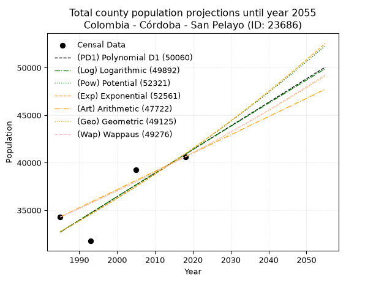
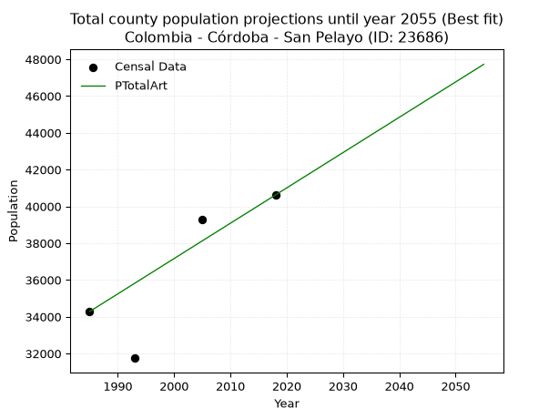
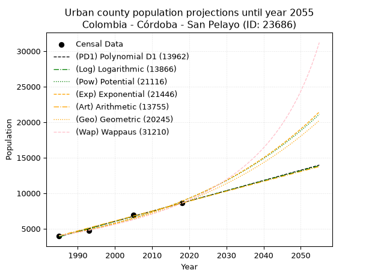
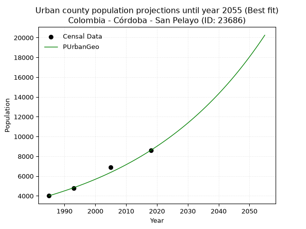
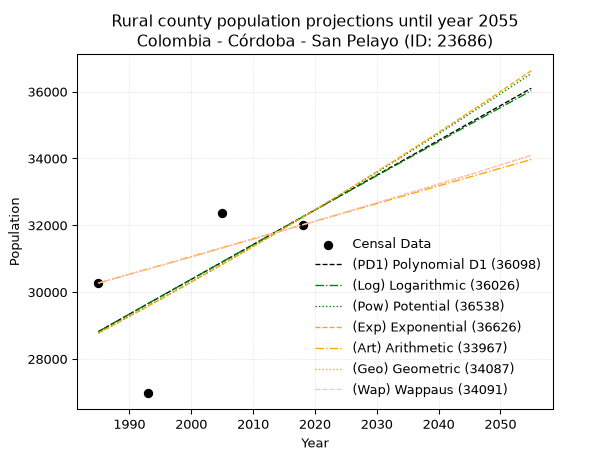
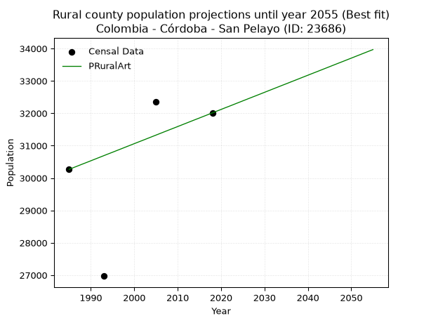

<div align="center">


</div>

# _“Population and Public Services Demand Projections (PPSD) until Year 2050 for Colombia - Córdoba - San Pelayo (ID: 23686)”_
Keywords: `population` `public-service` `projection` `lineal` `polynomial` `logarithmic` `potential` `exponential` `arithmetic` `geometric` `wappaus` `dane` `colombia` `south-america`

PPSD are analytical estimates used by governments and planners to anticipate future changes in population size, age distribution, and the resulting community needs for utilities, healthcare, education, and infrastructure as sizing future water treatment facilities, electrical grids, and road networks based on spatial growth.

> **General running parameters**: • app_version: _v20260806_. • Python version: _3.14.7_. • Pandas version: _3.0.5_. • NumPy version: _2.5.1_. • Creates, save and include plots into reports (create_plot): _False_. • Projection until year: _2050_. • Process polynomial degree 2 and up: _False_. • Process Wappaus: _True_. • Process Wappaus: _True_. • Set negative values to zero: _True_. • Set infinite values to zero: _True_. • Drop dataset notes: _True_. 
<div align="center">

Dynamic map: [:earth_americas:Google](http://maps.google.com/maps?q=8.958436459,-75.8356152) [:earth_americas:OSM](https://www.openstreetmap.org/#map=18/8.958436459/-75.8356152&layers=P) [:earth_americas:Bing](https://www.bing.com/maps?cp=8.958436459~-75.8356152&lvl=18) [:earth_americas:Apple](https://maps.apple.com/frame?center=8.958436459%2C-75.8356152&span=0.003%2C0.006)

</div>


<div align="center">

```geojson
{
  "type": "Feature",
  "geometry": {
    "type": "Point", 
    "coordinates": [-75.8356152, 8.958436459]
  }, 
  "properties": {
    "Name": "Colombia - Córdoba - San Pelayo (ID: 23686)"
  }
}
```

</div>


## 0. Census Data (4 records)

Census data are official statistics collected by a government about the people and housing in a country. They usually include counts of total population, age, sex, race, income, education, and jobs.

📅Global census file: [Population.xlsx](../data/Population.xlsx)

| Source   |   Year |   CountryID | CountryName   |   StateID | StateName   |   CountyID | CountyName   |   PTotal |   PUrban |   PRural |
|:---------|-------:|------------:|:--------------|----------:|:------------|-----------:|:-------------|---------:|---------:|---------:|
| DANE     |   1985 |          57 | Colombia      |        23 | Córdoba     |      23686 | San Pelayo   |    34280 |     4012 |    30268 |
| DANE     |   1993 |          57 | Colombia      |        23 | Córdoba     |      23686 | San Pelayo   |    31746 |     4775 |    26971 |
| DANE     |   2005 |          57 | Colombia      |        23 | Córdoba     |      23686 | San Pelayo   |    39260 |     6902 |    32358 |
| DANE     |   2018 |          57 | Colombia      |        23 | Córdoba     |      23686 | San Pelayo   |    40617 |     8605 |    32012 |

> 🔥Some records could had specific notes about the registered values or the corresponding urban or rural distribution.

**Local public utility companies (RUPS)**

 | SERVICIO       | ESTADO    | NOMBRE                                                        | NIT         | DEPARTAMENTO_DOMICILIO   | MUNICIPIO_DOMICILIO   | DIRECCION                         |   TELEFONO | EMAIL                           | TIPO_INSCRIPCION    | REPRESENTANTE_LEGAL             | TIPO_PRESTADOR                             | CLASIFICACION                  |
|:---------------|:----------|:--------------------------------------------------------------|:------------|:-------------------------|:----------------------|:----------------------------------|-----------:|:--------------------------------|:--------------------|:--------------------------------|:-------------------------------------------|:-------------------------------|
| ACUEDUCTO      | OPERATIVA | EMPRESAS PUBLICAS MUNICIPALES DE SAN PELAYO                   | 900044218-2 | CORDOBA                  | SAN PELAYO            | CARRERA 7 No.11-17 BRR EL PARAISO |    7633173 | oliviapetro@hotmail.com         | Registro por la ESP | OLIVIA ISABEL PETRO PETRO       | EMPRESA INDUSTRIAL Y COMERCIAL DEL ESTADO  | DESDE 2501 HASTA 5000 USUARIOS |
| ALCANTARILLADO | OPERATIVA | EMPRESAS PUBLICAS MUNICIPALES DE SAN PELAYO                   | 900044218-2 | CORDOBA                  | SAN PELAYO            | CARRERA 7 No.11-17 BRR EL PARAISO |    7633173 | oliviapetro@hotmail.com         | Registro por la ESP | OLIVIA ISABEL PETRO PETRO       | EMPRESA INDUSTRIAL Y COMERCIAL DEL ESTADO  | MENOR O IGUAL A 2500 USUARIOS  |
| ASEO           | OPERATIVA | URBASER COLOMBIA S.A. E.S.P.                                  | 830024104-2 | BOGOTA, D.C.             | BOGOTA, D.C.          | CALLE 100 No. 19 A 10 PISO 9      |    5802145 | sspd@superservicios.gov.co      | Registro por la ESP | HUMBERTO ENRIQUE RODRIGUEZ COBO | SOCIEDADES (EMPRESA DE SERVICIOS PUBLICOS) | MAYOR O IGUAL A 5001 USUARIOS  |
| ACUEDUCTO      | OPERATIVA | JUNTA ADMINISTRADORA DEL ACUEDUCTO DE LA MADERA               | 812006363-1 | CORDOBA                  | SAN PELAYO            | PALACIO MUNICIPAL                 |    3135008 | juanamartinezcorrea@hotmail.com | Registro por la ESP | JUANA MARTINEZ CORREA           | ORGANIZACION AUTORIZADA                    | HASTA 2500 SUSCRIPTORES        |
| ASEO           | OPERATIVA | SERVICIOS AMBIENTALES DE CORDOBA S.A.S. E.S.P.                | 900190990-5 | CORDOBA                  | MONTERIA              | CLL 58 12 31 BRR LA CASTELLANA    |    7851302 | fmartinez3105@hotmail.com       | Registro por la ESP | RAFI FARAH CARBONELL            | SOCIEDADES (EMPRESA DE SERVICIOS PUBLICOS) | MAYOR O IGUAL A 5001 USUARIOS  |
| ASEO           | OPERATIVA | ASOCIACIÓN DE DE RECICLADORES Y RECUPERADORES DE COLOMBIA ARC | 901378548-5 | CORDOBA                  | MONTERIA              | cr 3 w 11-398                     |    3017191 | arcmonteria.esp.pqr@gmail.com   | Registro por la ESP | EDWIN EDUARDO ORTEGA PINTO      | ORGANIZACION AUTORIZADA                    | MAYOR O IGUAL A 5001 USUARIOS  |

> [📅RUPS Database: Registro Único de Prestadores de Servicios Públicos de Colombia Suramérica - RUPS](https://www.datos.gov.co/Hacienda-y-Cr-dito-P-blico/Registro-nico-de-Prestadores-de-Servicios-P-blicos/4qkq-csdn/about_data)

## 1. Total

### 1.1. Coefficients and Parameters

* (PD1) Polynomial Deg 1: 248.10638297872202, -459799.04255318874 (lineal)
* (Log) Logarithmic: 496477.6969693327, -3737255.203186473
* (Pow) Potential: 13.533784422926825, -40.116201753065106
* (Exp) Exponential: 0.006763408342079137, 0.04836050412908493
* (Art) Arithmetic: Year diff. 2018 - 1985 = 33, Population diff. 40617 - 34280 = 6337, Annual growth = 192.03030303030303
* (Geo) Geometric: Year diff. 2018 - 1985 = 33, Population diff. 40617 - 34280 = 6337, Annual growth % = 0.005153372709771453
* (Wap) Wappaus: i = 0.5127850328592681, Condition values only valid for < 200)

<sub>
Wappaus condition values: ['0.00', '0.51', '1.03', '1.54', '2.05', '2.56', '3.08', '3.59', '4.10', '4.62', '5.13', '5.64', '6.15', '6.67', '7.18', '7.69', '8.20', '8.72', '9.23', '9.74', '10.26', '10.77', '11.28', '11.79', '12.31', '12.82', '13.33', '13.85', '14.36', '14.87', '15.38', '15.90', '16.41', '16.92', '17.43', '17.95', '18.46', '18.97', '19.49', '20.00', '20.51', '21.02', '21.54', '22.05', '22.56', '23.08', '23.59', '24.10', '24.61', '25.13', '25.64', '26.15', '26.66', '27.18', '27.69', '28.20', '28.72', '29.23', '29.74', '30.25', '30.77', '31.28', '31.79', '32.31', '32.82', '33.33']
</sub>


### 1.2. Projected Dataset

|   Year |   CountyID |   PTotalPD1 |   PTotalLog |   PTotalPow |   PTotalExp |   PTotalArt |   PTotalGeo |   PTotalWap |
|-------:|-----------:|------------:|------------:|------------:|------------:|------------:|------------:|------------:|
|   1985 |      23686 |       32692 |       32686 |       32732 |       32738 |       34280 |       34280 |       34280 |
|   1986 |      23686 |       32940 |       32936 |       32956 |       32960 |       34472 |       34457 |       34456 |
|   1987 |      23686 |       33188 |       33186 |       33182 |       33184 |       34664 |       34634 |       34633 |
|   1988 |      23686 |       33436 |       33436 |       33408 |       33409 |       34856 |       34813 |       34811 |
|   1989 |      23686 |       33685 |       33685 |       33636 |       33636 |       35048 |       34992 |       34990 |
|   1990 |      23686 |       33933 |       33935 |       33866 |       33864 |       35240 |       35172 |       35170 |
|   1991 |      23686 |       34181 |       34184 |       34097 |       34094 |       35432 |       35354 |       35351 |
|   1992 |      23686 |       34429 |       34433 |       34330 |       34325 |       35624 |       35536 |       35533 |
|   1993 |      23686 |       34677 |       34683 |       34564 |       34558 |       35816 |       35719 |       35716 |
|   1994 |      23686 |       34925 |       34932 |       34799 |       34793 |       36008 |       35903 |       35899 |
|   1995 |      23686 |       35173 |       35181 |       35036 |       35029 |       36200 |       36088 |       36084 |
|   1996 |      23686 |       35421 |       35429 |       35274 |       35267 |       36392 |       36274 |       36270 |
|   1997 |      23686 |       35669 |       35678 |       35514 |       35506 |       36584 |       36461 |       36456 |
|   1998 |      23686 |       35918 |       35927 |       35756 |       35747 |       36776 |       36649 |       36644 |
|   1999 |      23686 |       36166 |       36175 |       35999 |       35989 |       36968 |       36838 |       36833 |
|   2000 |      23686 |       36414 |       36423 |       36243 |       36234 |       37160 |       37028 |       37022 |
|   2001 |      23686 |       36662 |       36672 |       36489 |       36480 |       37352 |       37218 |       37213 |
|   2002 |      23686 |       36910 |       36920 |       36737 |       36727 |       37545 |       37410 |       37404 |
|   2003 |      23686 |       37158 |       37168 |       36986 |       36976 |       37737 |       37603 |       37597 |
|   2004 |      23686 |       37406 |       37415 |       37237 |       37227 |       37929 |       37797 |       37791 |
|   2005 |      23686 |       37654 |       37663 |       37489 |       37480 |       38121 |       37992 |       37986 |
|   2006 |      23686 |       37902 |       37911 |       37743 |       37734 |       38313 |       38187 |       38182 |
|   2007 |      23686 |       38150 |       38158 |       37998 |       37990 |       38505 |       38384 |       38378 |
|   2008 |      23686 |       38399 |       38405 |       38255 |       38248 |       38697 |       38582 |       38576 |
|   2009 |      23686 |       38647 |       38652 |       38514 |       38508 |       38889 |       38781 |       38775 |
|   2010 |      23686 |       38895 |       38900 |       38774 |       38769 |       39081 |       38981 |       38976 |
|   2011 |      23686 |       39143 |       39146 |       39036 |       39032 |       39273 |       39182 |       39177 |
|   2012 |      23686 |       39391 |       39393 |       39300 |       39297 |       39465 |       39383 |       39379 |
|   2013 |      23686 |       39639 |       39640 |       39565 |       39564 |       39657 |       39586 |       39583 |
|   2014 |      23686 |       39887 |       39887 |       39832 |       39832 |       39849 |       39790 |       39787 |
|   2015 |      23686 |       40135 |       40133 |       40100 |       40103 |       40041 |       39995 |       39993 |
|   2016 |      23686 |       40383 |       40379 |       40370 |       40375 |       40233 |       40202 |       40200 |
|   2017 |      23686 |       40632 |       40626 |       40642 |       40649 |       40425 |       40409 |       40408 |
|   2018 |      23686 |       40880 |       40872 |       40916 |       40925 |       40617 |       40617 |       40617 |
|   2019 |      23686 |       41128 |       41118 |       41191 |       41202 |       40809 |       40826 |       40827 |
|   2020 |      23686 |       41376 |       41363 |       41468 |       41482 |       41001 |       41037 |       41039 |
|   2021 |      23686 |       41624 |       41609 |       41747 |       41763 |       41193 |       41248 |       41252 |
|   2022 |      23686 |       41872 |       41855 |       42027 |       42047 |       41385 |       41461 |       41466 |
|   2023 |      23686 |       42120 |       42100 |       42309 |       42332 |       41577 |       41674 |       41681 |
|   2024 |      23686 |       42368 |       42346 |       42593 |       42619 |       41769 |       41889 |       41897 |
|   2025 |      23686 |       42616 |       42591 |       42879 |       42909 |       41961 |       42105 |       42115 |
|   2026 |      23686 |       42864 |       42836 |       43166 |       43200 |       42153 |       42322 |       42334 |
|   2027 |      23686 |       43113 |       43081 |       43455 |       43493 |       42345 |       42540 |       42554 |
|   2028 |      23686 |       43361 |       43326 |       43746 |       43788 |       42537 |       42759 |       42775 |
|   2029 |      23686 |       43609 |       43571 |       44039 |       44085 |       42729 |       42980 |       42998 |
|   2030 |      23686 |       43857 |       43815 |       44334 |       44385 |       42921 |       43201 |       43222 |
|   2031 |      23686 |       44105 |       44060 |       44630 |       44686 |       43113 |       43424 |       43447 |
|   2032 |      23686 |       44353 |       44304 |       44929 |       44989 |       43305 |       43648 |       43674 |
|   2033 |      23686 |       44601 |       44548 |       45229 |       45294 |       43497 |       43873 |       43902 |
|   2034 |      23686 |       44849 |       44793 |       45531 |       45602 |       43689 |       44099 |       44131 |
|   2035 |      23686 |       45097 |       45037 |       45835 |       45911 |       43882 |       44326 |       44362 |
|   2036 |      23686 |       45346 |       45280 |       46141 |       46223 |       44074 |       44554 |       44594 |
|   2037 |      23686 |       45594 |       45524 |       46448 |       46536 |       44266 |       44784 |       44827 |
|   2038 |      23686 |       45842 |       45768 |       46758 |       46852 |       44458 |       45015 |       45062 |
|   2039 |      23686 |       46090 |       46011 |       47069 |       47170 |       44650 |       45247 |       45298 |
|   2040 |      23686 |       46338 |       46255 |       47383 |       47490 |       44842 |       45480 |       45535 |
|   2041 |      23686 |       46586 |       46498 |       47698 |       47813 |       45034 |       45714 |       45774 |
|   2042 |      23686 |       46834 |       46741 |       48015 |       48137 |       45226 |       45950 |       46015 |
|   2043 |      23686 |       47082 |       46984 |       48334 |       48464 |       45418 |       46187 |       46256 |
|   2044 |      23686 |       47330 |       47227 |       48656 |       48793 |       45610 |       46425 |       46500 |
|   2045 |      23686 |       47579 |       47470 |       48979 |       49124 |       45802 |       46664 |       46744 |
|   2046 |      23686 |       47827 |       47713 |       49304 |       49457 |       45994 |       46904 |       46991 |
|   2047 |      23686 |       48075 |       47956 |       49631 |       49793 |       46186 |       47146 |       47238 |
|   2048 |      23686 |       48323 |       48198 |       49960 |       50131 |       46378 |       47389 |       47488 |
|   2049 |      23686 |       48571 |       48440 |       50291 |       50471 |       46570 |       47633 |       47739 |
|   2050 |      23686 |       48819 |       48683 |       50625 |       50813 |       46762 |       47879 |       47991 |
<div align="center">

</img>

</div>


### 1.3. Best fit with absolute and relative error (%)

Relative error puts that difference into context by dividing the absolute error by the true value, creating a unitless ratio or percentage that shows the scale of the mistake.

Absolute and relative error

|   Year | Source   |   CountryID | CountryName   |   StateID | StateName   |   CountyID_x | CountyName   |   PTotal |   PUrban |   PRural |   CountyID_y |   PTotalPD1 |   PTotalLog |   PTotalPow |   PTotalExp |   PTotalArt |   PTotalGeo |   PTotalWap |   PTotalPD1AbsError |   PTotalLogAbsError |   PTotalPowAbsError |   PTotalExpAbsError |   PTotalArtAbsError |   PTotalGeoAbsError |   PTotalWapAbsError |   PTotalPD1RelError |   PTotalLogRelError |   PTotalPowRelError |   PTotalExpRelError |   PTotalArtRelError |   PTotalGeoRelError |   PTotalWapRelError |
|-------:|:---------|------------:|:--------------|----------:|:------------|-------------:|:-------------|---------:|---------:|---------:|-------------:|------------:|------------:|------------:|------------:|------------:|------------:|------------:|--------------------:|--------------------:|--------------------:|--------------------:|--------------------:|--------------------:|--------------------:|--------------------:|--------------------:|--------------------:|--------------------:|--------------------:|--------------------:|--------------------:|
|   1985 | DANE     |          57 | Colombia      |        23 | Córdoba     |        23686 | San Pelayo   |    34280 |     4012 |    30268 |        23686 |       32692 |       32686 |       32732 |       32738 |       34280 |       34280 |       34280 |                1588 |                1594 |                1548 |                1542 |                   0 |                   0 |                   0 |            4.63244  |            4.64994  |            4.51575  |            4.49825  |             0       |             0       |             0       |
|   1993 | DANE     |          57 | Colombia      |        23 | Córdoba     |        23686 | San Pelayo   |    31746 |     4775 |    26971 |        23686 |       34677 |       34683 |       34564 |       34558 |       35816 |       35719 |       35716 |                2931 |                2937 |                2818 |                2812 |                4070 |                3973 |                3970 |            9.23266  |            9.25156  |            8.87671  |            8.85781  |            12.8205  |            12.515   |            12.5055  |
|   2005 | DANE     |          57 | Colombia      |        23 | Córdoba     |        23686 | San Pelayo   |    39260 |     6902 |    32358 |        23686 |       37654 |       37663 |       37489 |       37480 |       38121 |       37992 |       37986 |                1606 |                1597 |                1771 |                1780 |                1139 |                1268 |                1274 |            4.09068  |            4.06775  |            4.51095  |            4.53388  |             2.90117 |             3.22975 |             3.24503 |
|   2018 | DANE     |          57 | Colombia      |        23 | Córdoba     |        23686 | San Pelayo   |    40617 |     8605 |    32012 |        23686 |       40880 |       40872 |       40916 |       40925 |       40617 |       40617 |       40617 |                 263 |                 255 |                 299 |                 308 |                   0 |                   0 |                   0 |            0.647512 |            0.627816 |            0.736145 |            0.758303 |             0       |             0       |             0       |

Relative error mean

| Method    |   RelError | Best   |
|:----------|-----------:|:-------|
| PTotalPD1 |    4.65082 |        |
| PTotalLog |    4.64927 |        |
| PTotalPow |    4.65989 |        |
| PTotalExp |    4.66206 |        |
| PTotalArt |    3.93042 | True   |
| PTotalGeo |    3.93618 |        |
| PTotalWap |    3.93764 |        |

💙Best method: _**PTotalArt**_
<div align="center">

</img>

</div>


### 1.4. Fresh water supply demand in liters per capita per day (lpcd)

The fresh water supply demand typically ranges from 100 to 300 liters per capita per day (lpcd) for standard domestic and municipal planning, though absolute survival minimums set by the World Health Organization are as low as 7.5 to 20 liters per day, and total consumption in high-income nations can exceed 400 liters.

> `CZ`: Level in meters above the sea level (masl)<br> `WS`: Fresh water supply demand in liters per capita per day (lpcd or l/h/d)<br> `WSAll`: Zonal fresh water supply demand in liters per second (l/s)<br> `A`: Zonal area in square meters<br> `DP`: Population density (people/hectare or p/ha)

Reference values (RAS Colombia)

|    CZ |   WS |
|------:|-----:|
|  1000 |  120 |
|  2000 |  130 |
| 99999 |  140 |

County shapefile geometry properties and water supply values

|   CountyID |      ATotal |   CZTotal |   WSTotal |
|-----------:|------------:|----------:|----------:|
|      23686 | 4.45585e+08 |   38.2107 |       120 |

Projected values for best method: PTotalArt

|   CountyID |   Year |   PTotalArt |   DPTotal |   WSTotal |   WSTotalAll |
|-----------:|-------:|------------:|----------:|----------:|-------------:|
|      23686 |   1985 |       34280 |      0.77 |       120 |      47.6111 |
|      23686 |   1986 |       34472 |      0.77 |       120 |      47.8778 |
|      23686 |   1987 |       34664 |      0.78 |       120 |      48.1444 |
|      23686 |   1988 |       34856 |      0.78 |       120 |      48.4111 |
|      23686 |   1989 |       35048 |      0.79 |       120 |      48.6778 |
|      23686 |   1990 |       35240 |      0.79 |       120 |      48.9444 |
|      23686 |   1991 |       35432 |      0.8  |       120 |      49.2111 |
|      23686 |   1992 |       35624 |      0.8  |       120 |      49.4778 |
|      23686 |   1993 |       35816 |      0.8  |       120 |      49.7444 |
|      23686 |   1994 |       36008 |      0.81 |       120 |      50.0111 |
|      23686 |   1995 |       36200 |      0.81 |       120 |      50.2778 |
|      23686 |   1996 |       36392 |      0.82 |       120 |      50.5444 |
|      23686 |   1997 |       36584 |      0.82 |       120 |      50.8111 |
|      23686 |   1998 |       36776 |      0.83 |       120 |      51.0778 |
|      23686 |   1999 |       36968 |      0.83 |       120 |      51.3444 |
|      23686 |   2000 |       37160 |      0.83 |       120 |      51.6111 |
|      23686 |   2001 |       37352 |      0.84 |       120 |      51.8778 |
|      23686 |   2002 |       37545 |      0.84 |       120 |      52.1458 |
|      23686 |   2003 |       37737 |      0.85 |       120 |      52.4125 |
|      23686 |   2004 |       37929 |      0.85 |       120 |      52.6792 |
|      23686 |   2005 |       38121 |      0.86 |       120 |      52.9458 |
|      23686 |   2006 |       38313 |      0.86 |       120 |      53.2125 |
|      23686 |   2007 |       38505 |      0.86 |       120 |      53.4792 |
|      23686 |   2008 |       38697 |      0.87 |       120 |      53.7458 |
|      23686 |   2009 |       38889 |      0.87 |       120 |      54.0125 |
|      23686 |   2010 |       39081 |      0.88 |       120 |      54.2792 |
|      23686 |   2011 |       39273 |      0.88 |       120 |      54.5458 |
|      23686 |   2012 |       39465 |      0.89 |       120 |      54.8125 |
|      23686 |   2013 |       39657 |      0.89 |       120 |      55.0792 |
|      23686 |   2014 |       39849 |      0.89 |       120 |      55.3458 |
|      23686 |   2015 |       40041 |      0.9  |       120 |      55.6125 |
|      23686 |   2016 |       40233 |      0.9  |       120 |      55.8792 |
|      23686 |   2017 |       40425 |      0.91 |       120 |      56.1458 |
|      23686 |   2018 |       40617 |      0.91 |       120 |      56.4125 |
|      23686 |   2019 |       40809 |      0.92 |       120 |      56.6792 |
|      23686 |   2020 |       41001 |      0.92 |       120 |      56.9458 |
|      23686 |   2021 |       41193 |      0.92 |       120 |      57.2125 |
|      23686 |   2022 |       41385 |      0.93 |       120 |      57.4792 |
|      23686 |   2023 |       41577 |      0.93 |       120 |      57.7458 |
|      23686 |   2024 |       41769 |      0.94 |       120 |      58.0125 |
|      23686 |   2025 |       41961 |      0.94 |       120 |      58.2792 |
|      23686 |   2026 |       42153 |      0.95 |       120 |      58.5458 |
|      23686 |   2027 |       42345 |      0.95 |       120 |      58.8125 |
|      23686 |   2028 |       42537 |      0.95 |       120 |      59.0792 |
|      23686 |   2029 |       42729 |      0.96 |       120 |      59.3458 |
|      23686 |   2030 |       42921 |      0.96 |       120 |      59.6125 |
|      23686 |   2031 |       43113 |      0.97 |       120 |      59.8792 |
|      23686 |   2032 |       43305 |      0.97 |       120 |      60.1458 |
|      23686 |   2033 |       43497 |      0.98 |       120 |      60.4125 |
|      23686 |   2034 |       43689 |      0.98 |       120 |      60.6792 |
|      23686 |   2035 |       43882 |      0.98 |       120 |      60.9472 |
|      23686 |   2036 |       44074 |      0.99 |       120 |      61.2139 |
|      23686 |   2037 |       44266 |      0.99 |       120 |      61.4806 |
|      23686 |   2038 |       44458 |      1    |       120 |      61.7472 |
|      23686 |   2039 |       44650 |      1    |       120 |      62.0139 |
|      23686 |   2040 |       44842 |      1.01 |       120 |      62.2806 |
|      23686 |   2041 |       45034 |      1.01 |       120 |      62.5472 |
|      23686 |   2042 |       45226 |      1.01 |       120 |      62.8139 |
|      23686 |   2043 |       45418 |      1.02 |       120 |      63.0806 |
|      23686 |   2044 |       45610 |      1.02 |       120 |      63.3472 |
|      23686 |   2045 |       45802 |      1.03 |       120 |      63.6139 |
|      23686 |   2046 |       45994 |      1.03 |       120 |      63.8806 |
|      23686 |   2047 |       46186 |      1.04 |       120 |      64.1472 |
|      23686 |   2048 |       46378 |      1.04 |       120 |      64.4139 |
|      23686 |   2049 |       46570 |      1.05 |       120 |      64.6806 |
|      23686 |   2050 |       46762 |      1.05 |       120 |      64.9472 |

## 2. Urban

### 2.1. Coefficients and Parameters

* (PD1) Polynomial Deg 1: 144.07306302689562, -282108.644319548 (lineal)
* (Log) Logarithmic: 288368.7962957048, -2185820.031486159
* (Pow) Potential: 47.76769972432661, -153.92078432441676
* (Exp) Exponential: 0.02386017240257707, 1.0882834476261295e-17
* (Art) Arithmetic: Year diff. 2018 - 1985 = 33, Population diff. 8605 - 4012 = 4593, Annual growth = 139.1818181818182
* (Geo) Geometric: Year diff. 2018 - 1985 = 33, Population diff. 8605 - 4012 = 4593, Annual growth % = 0.023392240354197735
* (Wap) Wappaus: i = 2.2062585112438486, Condition values only valid for < 200)

<sub>
Wappaus condition values: ['0.00', '2.21', '4.41', '6.62', '8.83', '11.03', '13.24', '15.44', '17.65', '19.86', '22.06', '24.27', '26.48', '28.68', '30.89', '33.09', '35.30', '37.51', '39.71', '41.92', '44.13', '46.33', '48.54', '50.74', '52.95', '55.16', '57.36', '59.57', '61.78', '63.98', '66.19', '68.39', '70.60', '72.81', '75.01', '77.22', '79.43', '81.63', '83.84', '86.04', '88.25', '90.46', '92.66', '94.87', '97.08', '99.28', '101.49', '103.69', '105.90', '108.11', '110.31', '112.52', '114.73', '116.93', '119.14', '121.34', '123.55', '125.76', '127.96', '130.17', '132.38', '134.58', '136.79', '138.99', '141.20', '143.41']
</sub>


### 2.2. Projected Dataset

|   Year |   CountyID |   PUrbanPD1 |   PUrbanLog |   PUrbanPow |   PUrbanExp |   PUrbanArt |   PUrbanGeo |   PUrbanWap |
|-------:|-----------:|------------:|------------:|------------:|------------:|------------:|------------:|------------:|
|   1985 |      23686 |        3876 |        3872 |        4033 |        4036 |        4012 |        4012 |        4012 |
|   1986 |      23686 |        4020 |        4017 |        4131 |        4134 |        4151 |        4106 |        4102 |
|   1987 |      23686 |        4165 |        4163 |        4232 |        4234 |        4290 |        4202 |        4193 |
|   1988 |      23686 |        4309 |        4308 |        4335 |        4336 |        4430 |        4300 |        4287 |
|   1989 |      23686 |        4453 |        4453 |        4440 |        4441 |        4569 |        4401 |        4382 |
|   1990 |      23686 |        4597 |        4598 |        4548 |        4548 |        4708 |        4504 |        4480 |
|   1991 |      23686 |        4741 |        4742 |        4659 |        4658 |        4847 |        4609 |        4581 |
|   1992 |      23686 |        4885 |        4887 |        4772 |        4770 |        4986 |        4717 |        4683 |
|   1993 |      23686 |        5029 |        5032 |        4888 |        4885 |        5125 |        4827 |        4789 |
|   1994 |      23686 |        5173 |        5177 |        5006 |        5003 |        5265 |        4940 |        4896 |
|   1995 |      23686 |        5317 |        5321 |        5127 |        5124 |        5404 |        5056 |        5007 |
|   1996 |      23686 |        5461 |        5466 |        5252 |        5248 |        5543 |        5174 |        5120 |
|   1997 |      23686 |        5605 |        5610 |        5379 |        5374 |        5682 |        5295 |        5236 |
|   1998 |      23686 |        5749 |        5755 |        5509 |        5504 |        5821 |        5419 |        5355 |
|   1999 |      23686 |        5893 |        5899 |        5642 |        5637 |        5961 |        5546 |        5478 |
|   2000 |      23686 |        6037 |        6043 |        5779 |        5773 |        6100 |        5675 |        5603 |
|   2001 |      23686 |        6182 |        6187 |        5918 |        5913 |        6239 |        5808 |        5732 |
|   2002 |      23686 |        6326 |        6331 |        6061 |        6055 |        6378 |        5944 |        5864 |
|   2003 |      23686 |        6470 |        6475 |        6208 |        6202 |        6517 |        6083 |        6000 |
|   2004 |      23686 |        6614 |        6619 |        6357 |        6351 |        6656 |        6225 |        6140 |
|   2005 |      23686 |        6758 |        6763 |        6511 |        6505 |        6796 |        6371 |        6283 |
|   2006 |      23686 |        6902 |        6907 |        6668 |        6662 |        6935 |        6520 |        6431 |
|   2007 |      23686 |        7046 |        7051 |        6828 |        6823 |        7074 |        6672 |        6583 |
|   2008 |      23686 |        7190 |        7194 |        6993 |        6988 |        7213 |        6829 |        6740 |
|   2009 |      23686 |        7334 |        7338 |        7161 |        7156 |        7352 |        6988 |        6901 |
|   2010 |      23686 |        7478 |        7481 |        7333 |        7329 |        7492 |        7152 |        7068 |
|   2011 |      23686 |        7622 |        7625 |        7510 |        7506 |        7631 |        7319 |        7239 |
|   2012 |      23686 |        7766 |        7768 |        7690 |        7687 |        7770 |        7490 |        7416 |
|   2013 |      23686 |        7910 |        7911 |        7875 |        7873 |        7909 |        7665 |        7598 |
|   2014 |      23686 |        8055 |        8055 |        8064 |        8063 |        8048 |        7845 |        7786 |
|   2015 |      23686 |        8199 |        8198 |        8257 |        8258 |        8187 |        8028 |        7981 |
|   2016 |      23686 |        8343 |        8341 |        8455 |        8457 |        8327 |        8216 |        8182 |
|   2017 |      23686 |        8487 |        8484 |        8658 |        8661 |        8466 |        8408 |        8390 |
|   2018 |      23686 |        8631 |        8627 |        8865 |        8870 |        8605 |        8605 |        8605 |
|   2019 |      23686 |        8775 |        8770 |        9078 |        9085 |        8744 |        8806 |        8828 |
|   2020 |      23686 |        8919 |        8912 |        9295 |        9304 |        8883 |        9012 |        9058 |
|   2021 |      23686 |        9063 |        9055 |        9517 |        9529 |        9023 |        9223 |        9298 |
|   2022 |      23686 |        9207 |        9198 |        9745 |        9759 |        9162 |        9439 |        9546 |
|   2023 |      23686 |        9351 |        9340 |        9978 |        9994 |        9301 |        9660 |        9803 |
|   2024 |      23686 |        9495 |        9483 |       10216 |       10236 |        9440 |        9886 |       10071 |
|   2025 |      23686 |        9639 |        9625 |       10460 |       10483 |        9579 |       10117 |       10349 |
|   2026 |      23686 |        9783 |        9768 |       10710 |       10736 |        9718 |       10354 |       10638 |
|   2027 |      23686 |        9927 |        9910 |       10965 |       10995 |        9858 |       10596 |       10939 |
|   2028 |      23686 |       10072 |       10052 |       11227 |       11261 |        9997 |       10844 |       11253 |
|   2029 |      23686 |       10216 |       10194 |       11494 |       11533 |       10136 |       11097 |       11580 |
|   2030 |      23686 |       10360 |       10336 |       11768 |       11811 |       10275 |       11357 |       11922 |
|   2031 |      23686 |       10504 |       10478 |       12048 |       12096 |       10414 |       11622 |       12278 |
|   2032 |      23686 |       10648 |       10620 |       12335 |       12389 |       10554 |       11894 |       12652 |
|   2033 |      23686 |       10792 |       10762 |       12628 |       12688 |       10693 |       12173 |       13042 |
|   2034 |      23686 |       10936 |       10904 |       12928 |       12994 |       10832 |       12457 |       13452 |
|   2035 |      23686 |       11080 |       11046 |       13235 |       13308 |       10971 |       12749 |       13881 |
|   2036 |      23686 |       11224 |       11188 |       13549 |       13629 |       11110 |       13047 |       14333 |
|   2037 |      23686 |       11368 |       11329 |       13871 |       13958 |       11249 |       13352 |       14807 |
|   2038 |      23686 |       11512 |       11471 |       14200 |       14295 |       11389 |       13664 |       15307 |
|   2039 |      23686 |       11656 |       11612 |       14537 |       14640 |       11528 |       13984 |       15834 |
|   2040 |      23686 |       11800 |       11754 |       14881 |       14994 |       11667 |       14311 |       16391 |
|   2041 |      23686 |       11944 |       11895 |       15234 |       15356 |       11806 |       14646 |       16980 |
|   2042 |      23686 |       12089 |       12036 |       15594 |       15727 |       11945 |       14989 |       17603 |
|   2043 |      23686 |       12233 |       12177 |       15963 |       16107 |       12085 |       15339 |       18265 |
|   2044 |      23686 |       12377 |       12318 |       16341 |       16496 |       12224 |       15698 |       18969 |
|   2045 |      23686 |       12521 |       12459 |       16727 |       16894 |       12363 |       16065 |       19719 |
|   2046 |      23686 |       12665 |       12600 |       17122 |       17302 |       12502 |       16441 |       20519 |
|   2047 |      23686 |       12809 |       12741 |       17527 |       17720 |       12641 |       16826 |       21376 |
|   2048 |      23686 |       12953 |       12882 |       17940 |       18148 |       12780 |       17219 |       22294 |
|   2049 |      23686 |       13097 |       13023 |       18364 |       18586 |       12920 |       17622 |       23281 |
|   2050 |      23686 |       13241 |       13164 |       18797 |       19035 |       13059 |       18034 |       24345 |
<div align="center">

</img>

</div>


### 2.3. Best fit with absolute and relative error (%)

Relative error puts that difference into context by dividing the absolute error by the true value, creating a unitless ratio or percentage that shows the scale of the mistake.

Absolute and relative error

|   Year | Source   |   CountryID | CountryName   |   StateID | StateName   |   CountyID_x | CountyName   |   PTotal |   PUrban |   PRural |   CountyID_y |   PUrbanPD1 |   PUrbanLog |   PUrbanPow |   PUrbanExp |   PUrbanArt |   PUrbanGeo |   PUrbanWap |   PUrbanPD1AbsError |   PUrbanLogAbsError |   PUrbanPowAbsError |   PUrbanExpAbsError |   PUrbanArtAbsError |   PUrbanGeoAbsError |   PUrbanWapAbsError |   PUrbanPD1RelError |   PUrbanLogRelError |   PUrbanPowRelError |   PUrbanExpRelError |   PUrbanArtRelError |   PUrbanGeoRelError |   PUrbanWapRelError |
|-------:|:---------|------------:|:--------------|----------:|:------------|-------------:|:-------------|---------:|---------:|---------:|-------------:|------------:|------------:|------------:|------------:|------------:|------------:|------------:|--------------------:|--------------------:|--------------------:|--------------------:|--------------------:|--------------------:|--------------------:|--------------------:|--------------------:|--------------------:|--------------------:|--------------------:|--------------------:|--------------------:|
|   1985 | DANE     |          57 | Colombia      |        23 | Córdoba     |        23686 | San Pelayo   |    34280 |     4012 |    30268 |        23686 |        3876 |        3872 |        4033 |        4036 |        4012 |        4012 |        4012 |                 136 |                 140 |                  21 |                  24 |                   0 |                   0 |                   0 |             3.38983 |            3.48953  |             0.52343 |            0.598205 |             0       |             0       |            0        |
|   1993 | DANE     |          57 | Colombia      |        23 | Córdoba     |        23686 | San Pelayo   |    31746 |     4775 |    26971 |        23686 |        5029 |        5032 |        4888 |        4885 |        5125 |        4827 |        4789 |                 254 |                 257 |                 113 |                 110 |                 350 |                  52 |                  14 |             5.31937 |            5.3822   |             2.36649 |            2.30366  |             7.32984 |             1.08901 |            0.293194 |
|   2005 | DANE     |          57 | Colombia      |        23 | Córdoba     |        23686 | San Pelayo   |    39260 |     6902 |    32358 |        23686 |        6758 |        6763 |        6511 |        6505 |        6796 |        6371 |        6283 |                 144 |                 139 |                 391 |                 397 |                 106 |                 531 |                 619 |             2.08635 |            2.01391  |             5.66502 |            5.75196  |             1.53579 |             7.69342 |            8.96841  |
|   2018 | DANE     |          57 | Colombia      |        23 | Córdoba     |        23686 | San Pelayo   |    40617 |     8605 |    32012 |        23686 |        8631 |        8627 |        8865 |        8870 |        8605 |        8605 |        8605 |                  26 |                  22 |                 260 |                 265 |                   0 |                   0 |                   0 |             0.30215 |            0.255665 |             3.0215  |            3.0796   |             0       |             0       |            0        |

Relative error mean

| Method    |   RelError | Best   |
|:----------|-----------:|:-------|
| PUrbanPD1 |    2.77443 |        |
| PUrbanLog |    2.78533 |        |
| PUrbanPow |    2.89411 |        |
| PUrbanExp |    2.93336 |        |
| PUrbanArt |    2.21641 |        |
| PUrbanGeo |    2.19561 | True   |
| PUrbanWap |    2.3154  |        |

💙Best method: _**PUrbanGeo**_
<div align="center">

</img>

</div>


### 2.4. Fresh water supply demand in liters per capita per day (lpcd)

The fresh water supply demand typically ranges from 100 to 300 liters per capita per day (lpcd) for standard domestic and municipal planning, though absolute survival minimums set by the World Health Organization are as low as 7.5 to 20 liters per day, and total consumption in high-income nations can exceed 400 liters.

> `CZ`: Level in meters above the sea level (masl)<br> `WS`: Fresh water supply demand in liters per capita per day (lpcd or l/h/d)<br> `WSAll`: Zonal fresh water supply demand in liters per second (l/s)<br> `A`: Zonal area in square meters<br> `DP`: Population density (people/hectare or p/ha)

Reference values (RAS Colombia)

|    CZ |   WS |
|------:|-----:|
|  1000 |  120 |
|  2000 |  130 |
| 99999 |  140 |

County shapefile geometry properties and water supply values

|   CountyID |      AUrban |   CZUrban |   WSUrban |
|-----------:|------------:|----------:|----------:|
|      23686 | 3.77229e+06 |   9.96539 |       120 |

Projected values for best method: PUrbanGeo

|   CountyID |   Year |   PUrbanGeo |   DPUrban |   WSUrban |   WSUrbanAll |
|-----------:|-------:|------------:|----------:|----------:|-------------:|
|      23686 |   1985 |        4012 |     10.64 |       120 |      5.57222 |
|      23686 |   1986 |        4106 |     10.88 |       120 |      5.70278 |
|      23686 |   1987 |        4202 |     11.14 |       120 |      5.83611 |
|      23686 |   1988 |        4300 |     11.4  |       120 |      5.97222 |
|      23686 |   1989 |        4401 |     11.67 |       120 |      6.1125  |
|      23686 |   1990 |        4504 |     11.94 |       120 |      6.25556 |
|      23686 |   1991 |        4609 |     12.22 |       120 |      6.40139 |
|      23686 |   1992 |        4717 |     12.5  |       120 |      6.55139 |
|      23686 |   1993 |        4827 |     12.8  |       120 |      6.70417 |
|      23686 |   1994 |        4940 |     13.1  |       120 |      6.86111 |
|      23686 |   1995 |        5056 |     13.4  |       120 |      7.02222 |
|      23686 |   1996 |        5174 |     13.72 |       120 |      7.18611 |
|      23686 |   1997 |        5295 |     14.04 |       120 |      7.35417 |
|      23686 |   1998 |        5419 |     14.37 |       120 |      7.52639 |
|      23686 |   1999 |        5546 |     14.7  |       120 |      7.70278 |
|      23686 |   2000 |        5675 |     15.04 |       120 |      7.88194 |
|      23686 |   2001 |        5808 |     15.4  |       120 |      8.06667 |
|      23686 |   2002 |        5944 |     15.76 |       120 |      8.25556 |
|      23686 |   2003 |        6083 |     16.13 |       120 |      8.44861 |
|      23686 |   2004 |        6225 |     16.5  |       120 |      8.64583 |
|      23686 |   2005 |        6371 |     16.89 |       120 |      8.84861 |
|      23686 |   2006 |        6520 |     17.28 |       120 |      9.05556 |
|      23686 |   2007 |        6672 |     17.69 |       120 |      9.26667 |
|      23686 |   2008 |        6829 |     18.1  |       120 |      9.48472 |
|      23686 |   2009 |        6988 |     18.52 |       120 |      9.70556 |
|      23686 |   2010 |        7152 |     18.96 |       120 |      9.93333 |
|      23686 |   2011 |        7319 |     19.4  |       120 |     10.1653  |
|      23686 |   2012 |        7490 |     19.86 |       120 |     10.4028  |
|      23686 |   2013 |        7665 |     20.32 |       120 |     10.6458  |
|      23686 |   2014 |        7845 |     20.8  |       120 |     10.8958  |
|      23686 |   2015 |        8028 |     21.28 |       120 |     11.15    |
|      23686 |   2016 |        8216 |     21.78 |       120 |     11.4111  |
|      23686 |   2017 |        8408 |     22.29 |       120 |     11.6778  |
|      23686 |   2018 |        8605 |     22.81 |       120 |     11.9514  |
|      23686 |   2019 |        8806 |     23.34 |       120 |     12.2306  |
|      23686 |   2020 |        9012 |     23.89 |       120 |     12.5167  |
|      23686 |   2021 |        9223 |     24.45 |       120 |     12.8097  |
|      23686 |   2022 |        9439 |     25.02 |       120 |     13.1097  |
|      23686 |   2023 |        9660 |     25.61 |       120 |     13.4167  |
|      23686 |   2024 |        9886 |     26.21 |       120 |     13.7306  |
|      23686 |   2025 |       10117 |     26.82 |       120 |     14.0514  |
|      23686 |   2026 |       10354 |     27.45 |       120 |     14.3806  |
|      23686 |   2027 |       10596 |     28.09 |       120 |     14.7167  |
|      23686 |   2028 |       10844 |     28.75 |       120 |     15.0611  |
|      23686 |   2029 |       11097 |     29.42 |       120 |     15.4125  |
|      23686 |   2030 |       11357 |     30.11 |       120 |     15.7736  |
|      23686 |   2031 |       11622 |     30.81 |       120 |     16.1417  |
|      23686 |   2032 |       11894 |     31.53 |       120 |     16.5194  |
|      23686 |   2033 |       12173 |     32.27 |       120 |     16.9069  |
|      23686 |   2034 |       12457 |     33.02 |       120 |     17.3014  |
|      23686 |   2035 |       12749 |     33.8  |       120 |     17.7069  |
|      23686 |   2036 |       13047 |     34.59 |       120 |     18.1208  |
|      23686 |   2037 |       13352 |     35.39 |       120 |     18.5444  |
|      23686 |   2038 |       13664 |     36.22 |       120 |     18.9778  |
|      23686 |   2039 |       13984 |     37.07 |       120 |     19.4222  |
|      23686 |   2040 |       14311 |     37.94 |       120 |     19.8764  |
|      23686 |   2041 |       14646 |     38.83 |       120 |     20.3417  |
|      23686 |   2042 |       14989 |     39.73 |       120 |     20.8181  |
|      23686 |   2043 |       15339 |     40.66 |       120 |     21.3042  |
|      23686 |   2044 |       15698 |     41.61 |       120 |     21.8028  |
|      23686 |   2045 |       16065 |     42.59 |       120 |     22.3125  |
|      23686 |   2046 |       16441 |     43.58 |       120 |     22.8347  |
|      23686 |   2047 |       16826 |     44.6  |       120 |     23.3694  |
|      23686 |   2048 |       17219 |     45.65 |       120 |     23.9153  |
|      23686 |   2049 |       17622 |     46.71 |       120 |     24.475   |
|      23686 |   2050 |       18034 |     47.81 |       120 |     25.0472  |

## 3. Rural

### 3.1. Coefficients and Parameters

* (PD1) Polynomial Deg 1: 104.0333199518264, -177690.39823364074 (lineal)
* (Log) Logarithmic: 208108.9006736287, -1551435.1717003195
* (Pow) Potential: 6.898150960050706, -18.289525642030142
* (Exp) Exponential: 0.0034486452544645217, 30.617108503605
* (Art) Arithmetic: Year diff. 2018 - 1985 = 33, Population diff. 32012 - 30268 = 1744, Annual growth = 52.84848484848485
* (Geo) Geometric: Year diff. 2018 - 1985 = 33, Population diff. 32012 - 30268 = 1744, Annual growth % = 0.0016990108884678001
* (Wap) Wappaus: i = 0.16971253965473618, Condition values only valid for < 200)

<sub>
Wappaus condition values: ['0.00', '0.17', '0.34', '0.51', '0.68', '0.85', '1.02', '1.19', '1.36', '1.53', '1.70', '1.87', '2.04', '2.21', '2.38', '2.55', '2.72', '2.89', '3.05', '3.22', '3.39', '3.56', '3.73', '3.90', '4.07', '4.24', '4.41', '4.58', '4.75', '4.92', '5.09', '5.26', '5.43', '5.60', '5.77', '5.94', '6.11', '6.28', '6.45', '6.62', '6.79', '6.96', '7.13', '7.30', '7.47', '7.64', '7.81', '7.98', '8.15', '8.32', '8.49', '8.66', '8.83', '8.99', '9.16', '9.33', '9.50', '9.67', '9.84', '10.01', '10.18', '10.35', '10.52', '10.69', '10.86', '11.03']
</sub>


### 3.2. Projected Dataset

|   Year |   CountyID |   PRuralPD1 |   PRuralLog |   PRuralPow |   PRuralExp |   PRuralArt |   PRuralGeo |   PRuralWap |
|-------:|-----------:|------------:|------------:|------------:|------------:|------------:|------------:|------------:|
|   1985 |      23686 |       28816 |       28814 |       28769 |       28771 |       30268 |       30268 |       30268 |
|   1986 |      23686 |       28920 |       28918 |       28869 |       28870 |       30321 |       30319 |       30319 |
|   1987 |      23686 |       29024 |       29023 |       28970 |       28970 |       30374 |       30371 |       30371 |
|   1988 |      23686 |       29128 |       29128 |       29070 |       29070 |       30427 |       30423 |       30422 |
|   1989 |      23686 |       29232 |       29233 |       29171 |       29171 |       30479 |       30474 |       30474 |
|   1990 |      23686 |       29336 |       29337 |       29273 |       29271 |       30532 |       30526 |       30526 |
|   1991 |      23686 |       29440 |       29442 |       29374 |       29372 |       30585 |       30578 |       30578 |
|   1992 |      23686 |       29544 |       29546 |       29476 |       29474 |       30638 |       30630 |       30630 |
|   1993 |      23686 |       29648 |       29651 |       29578 |       29576 |       30691 |       30682 |       30682 |
|   1994 |      23686 |       29752 |       29755 |       29681 |       29678 |       30744 |       30734 |       30734 |
|   1995 |      23686 |       29856 |       29859 |       29784 |       29780 |       30796 |       30786 |       30786 |
|   1996 |      23686 |       29960 |       29964 |       29887 |       29883 |       30849 |       30839 |       30838 |
|   1997 |      23686 |       30064 |       30068 |       29990 |       29987 |       30902 |       30891 |       30891 |
|   1998 |      23686 |       30168 |       30172 |       30094 |       30090 |       30955 |       30943 |       30943 |
|   1999 |      23686 |       30272 |       30276 |       30198 |       30194 |       31008 |       30996 |       30996 |
|   2000 |      23686 |       30376 |       30380 |       30302 |       30298 |       31061 |       31049 |       31048 |
|   2001 |      23686 |       30480 |       30484 |       30407 |       30403 |       31114 |       31101 |       31101 |
|   2002 |      23686 |       30584 |       30588 |       30512 |       30508 |       31166 |       31154 |       31154 |
|   2003 |      23686 |       30688 |       30692 |       30617 |       30613 |       31219 |       31207 |       31207 |
|   2004 |      23686 |       30792 |       30796 |       30723 |       30719 |       31272 |       31260 |       31260 |
|   2005 |      23686 |       30896 |       30900 |       30829 |       30825 |       31325 |       31313 |       31313 |
|   2006 |      23686 |       31000 |       31004 |       30935 |       30932 |       31378 |       31366 |       31366 |
|   2007 |      23686 |       31104 |       31107 |       31042 |       31039 |       31431 |       31420 |       31420 |
|   2008 |      23686 |       31209 |       31211 |       31148 |       31146 |       31484 |       31473 |       31473 |
|   2009 |      23686 |       31313 |       31315 |       31256 |       31254 |       31536 |       31527 |       31526 |
|   2010 |      23686 |       31417 |       31418 |       31363 |       31361 |       31589 |       31580 |       31580 |
|   2011 |      23686 |       31521 |       31522 |       31471 |       31470 |       31642 |       31634 |       31634 |
|   2012 |      23686 |       31625 |       31625 |       31579 |       31579 |       31695 |       31688 |       31687 |
|   2013 |      23686 |       31729 |       31729 |       31687 |       31688 |       31748 |       31741 |       31741 |
|   2014 |      23686 |       31833 |       31832 |       31796 |       31797 |       31801 |       31795 |       31795 |
|   2015 |      23686 |       31937 |       31935 |       31905 |       31907 |       31853 |       31849 |       31849 |
|   2016 |      23686 |       32041 |       32039 |       32015 |       32017 |       31906 |       31903 |       31903 |
|   2017 |      23686 |       32145 |       32142 |       32124 |       32128 |       31959 |       31958 |       31958 |
|   2018 |      23686 |       32249 |       32245 |       32234 |       32239 |       32012 |       32012 |       32012 |
|   2019 |      23686 |       32353 |       32348 |       32345 |       32350 |       32065 |       32066 |       32066 |
|   2020 |      23686 |       32457 |       32451 |       32455 |       32462 |       32118 |       32121 |       32121 |
|   2021 |      23686 |       32561 |       32554 |       32566 |       32574 |       32171 |       32175 |       32176 |
|   2022 |      23686 |       32665 |       32657 |       32678 |       32687 |       32223 |       32230 |       32230 |
|   2023 |      23686 |       32769 |       32760 |       32789 |       32799 |       32276 |       32285 |       32285 |
|   2024 |      23686 |       32873 |       32863 |       32901 |       32913 |       32329 |       32340 |       32340 |
|   2025 |      23686 |       32977 |       32966 |       33014 |       33027 |       32382 |       32395 |       32395 |
|   2026 |      23686 |       33081 |       33068 |       33126 |       33141 |       32435 |       32450 |       32450 |
|   2027 |      23686 |       33185 |       33171 |       33239 |       33255 |       32488 |       32505 |       32505 |
|   2028 |      23686 |       33289 |       33274 |       33352 |       33370 |       32540 |       32560 |       32560 |
|   2029 |      23686 |       33393 |       33376 |       33466 |       33485 |       32593 |       32615 |       32616 |
|   2030 |      23686 |       33497 |       33479 |       33580 |       33601 |       32646 |       32671 |       32671 |
|   2031 |      23686 |       33601 |       33581 |       33694 |       33717 |       32699 |       32726 |       32727 |
|   2032 |      23686 |       33705 |       33684 |       33809 |       33833 |       32752 |       32782 |       32783 |
|   2033 |      23686 |       33809 |       33786 |       33924 |       33950 |       32805 |       32838 |       32838 |
|   2034 |      23686 |       33913 |       33888 |       34039 |       34068 |       32858 |       32893 |       32894 |
|   2035 |      23686 |       34017 |       33991 |       34155 |       34185 |       32910 |       32949 |       32950 |
|   2036 |      23686 |       34121 |       34093 |       34271 |       34303 |       32963 |       33005 |       33006 |
|   2037 |      23686 |       34225 |       34195 |       34387 |       34422 |       33016 |       33061 |       33062 |
|   2038 |      23686 |       34330 |       34297 |       34504 |       34541 |       33069 |       33118 |       33119 |
|   2039 |      23686 |       34434 |       34399 |       34621 |       34660 |       33122 |       33174 |       33175 |
|   2040 |      23686 |       34538 |       34501 |       34738 |       34780 |       33175 |       33230 |       33232 |
|   2041 |      23686 |       34642 |       34603 |       34855 |       34900 |       33228 |       33287 |       33288 |
|   2042 |      23686 |       34746 |       34705 |       34973 |       35021 |       33280 |       33343 |       33345 |
|   2043 |      23686 |       34850 |       34807 |       35092 |       35142 |       33333 |       33400 |       33402 |
|   2044 |      23686 |       34954 |       34909 |       35210 |       35263 |       33386 |       33457 |       33458 |
|   2045 |      23686 |       35058 |       35011 |       35329 |       35385 |       33439 |       33513 |       33515 |
|   2046 |      23686 |       35162 |       35113 |       35449 |       35507 |       33492 |       33570 |       33573 |
|   2047 |      23686 |       35266 |       35214 |       35568 |       35630 |       33545 |       33627 |       33630 |
|   2048 |      23686 |       35370 |       35316 |       35688 |       35753 |       33597 |       33685 |       33687 |
|   2049 |      23686 |       35474 |       35417 |       35809 |       35876 |       33650 |       33742 |       33744 |
|   2050 |      23686 |       35578 |       35519 |       35930 |       36000 |       33703 |       33799 |       33802 |
<div align="center">

</img>

</div>


### 3.3. Best fit with absolute and relative error (%)

Relative error puts that difference into context by dividing the absolute error by the true value, creating a unitless ratio or percentage that shows the scale of the mistake.

Absolute and relative error

|   Year | Source   |   CountryID | CountryName   |   StateID | StateName   |   CountyID_x | CountyName   |   PTotal |   PUrban |   PRural |   CountyID_y |   PRuralPD1 |   PRuralLog |   PRuralPow |   PRuralExp |   PRuralArt |   PRuralGeo |   PRuralWap |   PRuralPD1AbsError |   PRuralLogAbsError |   PRuralPowAbsError |   PRuralExpAbsError |   PRuralArtAbsError |   PRuralGeoAbsError |   PRuralWapAbsError |   PRuralPD1RelError |   PRuralLogRelError |   PRuralPowRelError |   PRuralExpRelError |   PRuralArtRelError |   PRuralGeoRelError |   PRuralWapRelError |
|-------:|:---------|------------:|:--------------|----------:|:------------|-------------:|:-------------|---------:|---------:|---------:|-------------:|------------:|------------:|------------:|------------:|------------:|------------:|------------:|--------------------:|--------------------:|--------------------:|--------------------:|--------------------:|--------------------:|--------------------:|--------------------:|--------------------:|--------------------:|--------------------:|--------------------:|--------------------:|--------------------:|
|   1985 | DANE     |          57 | Colombia      |        23 | Córdoba     |        23686 | San Pelayo   |    34280 |     4012 |    30268 |        23686 |       28816 |       28814 |       28769 |       28771 |       30268 |       30268 |       30268 |                1452 |                1454 |                1499 |                1497 |                   0 |                   0 |                   0 |            4.79715  |            4.80375  |             4.95243 |            4.94582  |             0       |              0      |              0      |
|   1993 | DANE     |          57 | Colombia      |        23 | Córdoba     |        23686 | San Pelayo   |    31746 |     4775 |    26971 |        23686 |       29648 |       29651 |       29578 |       29576 |       30691 |       30682 |       30682 |                2677 |                2680 |                2607 |                2605 |                3720 |                3711 |                3711 |            9.92548  |            9.9366   |             9.66594 |            9.65852  |            13.7926  |             13.7592 |             13.7592 |
|   2005 | DANE     |          57 | Colombia      |        23 | Córdoba     |        23686 | San Pelayo   |    39260 |     6902 |    32358 |        23686 |       30896 |       30900 |       30829 |       30825 |       31325 |       31313 |       31313 |                1462 |                1458 |                1529 |                1533 |                1033 |                1045 |                1045 |            4.5182   |            4.50584  |             4.72526 |            4.73762  |             3.19241 |              3.2295 |              3.2295 |
|   2018 | DANE     |          57 | Colombia      |        23 | Córdoba     |        23686 | San Pelayo   |    40617 |     8605 |    32012 |        23686 |       32249 |       32245 |       32234 |       32239 |       32012 |       32012 |       32012 |                 237 |                 233 |                 222 |                 227 |                   0 |                   0 |                   0 |            0.740347 |            0.727852 |             0.69349 |            0.709109 |             0       |              0      |              0      |

Relative error mean

| Method    |   RelError | Best   |
|:----------|-----------:|:-------|
| PRuralPD1 |    4.99529 |        |
| PRuralLog |    4.99351 |        |
| PRuralPow |    5.00928 |        |
| PRuralExp |    5.01277 |        |
| PRuralArt |    4.24625 | True   |
| PRuralGeo |    4.24718 |        |
| PRuralWap |    4.24718 |        |

💙Best method: _**PRuralArt**_
<div align="center">

</img>

</div>


### 3.4. Fresh water supply demand in liters per capita per day (lpcd)

The fresh water supply demand typically ranges from 100 to 300 liters per capita per day (lpcd) for standard domestic and municipal planning, though absolute survival minimums set by the World Health Organization are as low as 7.5 to 20 liters per day, and total consumption in high-income nations can exceed 400 liters.

> `CZ`: Level in meters above the sea level (masl)<br> `WS`: Fresh water supply demand in liters per capita per day (lpcd or l/h/d)<br> `WSAll`: Zonal fresh water supply demand in liters per second (l/s)<br> `A`: Zonal area in square meters<br> `DP`: Population density (people/hectare or p/ha)

Reference values (RAS Colombia)

|    CZ |   WS |
|------:|-----:|
|  1000 |  120 |
|  2000 |  130 |
| 99999 |  140 |

County shapefile geometry properties and water supply values

|   CountyID |      ARural |   CZRural |   WSRural |
|-----------:|------------:|----------:|----------:|
|      23686 | 4.41813e+08 |   38.4523 |       120 |

Projected values for best method: PRuralArt

|   CountyID |   Year |   PRuralArt |   DPRural |   WSRural |   WSRuralAll |
|-----------:|-------:|------------:|----------:|----------:|-------------:|
|      23686 |   1985 |       30268 |      0.69 |       120 |      42.0389 |
|      23686 |   1986 |       30321 |      0.69 |       120 |      42.1125 |
|      23686 |   1987 |       30374 |      0.69 |       120 |      42.1861 |
|      23686 |   1988 |       30427 |      0.69 |       120 |      42.2597 |
|      23686 |   1989 |       30479 |      0.69 |       120 |      42.3319 |
|      23686 |   1990 |       30532 |      0.69 |       120 |      42.4056 |
|      23686 |   1991 |       30585 |      0.69 |       120 |      42.4792 |
|      23686 |   1992 |       30638 |      0.69 |       120 |      42.5528 |
|      23686 |   1993 |       30691 |      0.69 |       120 |      42.6264 |
|      23686 |   1994 |       30744 |      0.7  |       120 |      42.7    |
|      23686 |   1995 |       30796 |      0.7  |       120 |      42.7722 |
|      23686 |   1996 |       30849 |      0.7  |       120 |      42.8458 |
|      23686 |   1997 |       30902 |      0.7  |       120 |      42.9194 |
|      23686 |   1998 |       30955 |      0.7  |       120 |      42.9931 |
|      23686 |   1999 |       31008 |      0.7  |       120 |      43.0667 |
|      23686 |   2000 |       31061 |      0.7  |       120 |      43.1403 |
|      23686 |   2001 |       31114 |      0.7  |       120 |      43.2139 |
|      23686 |   2002 |       31166 |      0.71 |       120 |      43.2861 |
|      23686 |   2003 |       31219 |      0.71 |       120 |      43.3597 |
|      23686 |   2004 |       31272 |      0.71 |       120 |      43.4333 |
|      23686 |   2005 |       31325 |      0.71 |       120 |      43.5069 |
|      23686 |   2006 |       31378 |      0.71 |       120 |      43.5806 |
|      23686 |   2007 |       31431 |      0.71 |       120 |      43.6542 |
|      23686 |   2008 |       31484 |      0.71 |       120 |      43.7278 |
|      23686 |   2009 |       31536 |      0.71 |       120 |      43.8    |
|      23686 |   2010 |       31589 |      0.71 |       120 |      43.8736 |
|      23686 |   2011 |       31642 |      0.72 |       120 |      43.9472 |
|      23686 |   2012 |       31695 |      0.72 |       120 |      44.0208 |
|      23686 |   2013 |       31748 |      0.72 |       120 |      44.0944 |
|      23686 |   2014 |       31801 |      0.72 |       120 |      44.1681 |
|      23686 |   2015 |       31853 |      0.72 |       120 |      44.2403 |
|      23686 |   2016 |       31906 |      0.72 |       120 |      44.3139 |
|      23686 |   2017 |       31959 |      0.72 |       120 |      44.3875 |
|      23686 |   2018 |       32012 |      0.72 |       120 |      44.4611 |
|      23686 |   2019 |       32065 |      0.73 |       120 |      44.5347 |
|      23686 |   2020 |       32118 |      0.73 |       120 |      44.6083 |
|      23686 |   2021 |       32171 |      0.73 |       120 |      44.6819 |
|      23686 |   2022 |       32223 |      0.73 |       120 |      44.7542 |
|      23686 |   2023 |       32276 |      0.73 |       120 |      44.8278 |
|      23686 |   2024 |       32329 |      0.73 |       120 |      44.9014 |
|      23686 |   2025 |       32382 |      0.73 |       120 |      44.975  |
|      23686 |   2026 |       32435 |      0.73 |       120 |      45.0486 |
|      23686 |   2027 |       32488 |      0.74 |       120 |      45.1222 |
|      23686 |   2028 |       32540 |      0.74 |       120 |      45.1944 |
|      23686 |   2029 |       32593 |      0.74 |       120 |      45.2681 |
|      23686 |   2030 |       32646 |      0.74 |       120 |      45.3417 |
|      23686 |   2031 |       32699 |      0.74 |       120 |      45.4153 |
|      23686 |   2032 |       32752 |      0.74 |       120 |      45.4889 |
|      23686 |   2033 |       32805 |      0.74 |       120 |      45.5625 |
|      23686 |   2034 |       32858 |      0.74 |       120 |      45.6361 |
|      23686 |   2035 |       32910 |      0.74 |       120 |      45.7083 |
|      23686 |   2036 |       32963 |      0.75 |       120 |      45.7819 |
|      23686 |   2037 |       33016 |      0.75 |       120 |      45.8556 |
|      23686 |   2038 |       33069 |      0.75 |       120 |      45.9292 |
|      23686 |   2039 |       33122 |      0.75 |       120 |      46.0028 |
|      23686 |   2040 |       33175 |      0.75 |       120 |      46.0764 |
|      23686 |   2041 |       33228 |      0.75 |       120 |      46.15   |
|      23686 |   2042 |       33280 |      0.75 |       120 |      46.2222 |
|      23686 |   2043 |       33333 |      0.75 |       120 |      46.2958 |
|      23686 |   2044 |       33386 |      0.76 |       120 |      46.3694 |
|      23686 |   2045 |       33439 |      0.76 |       120 |      46.4431 |
|      23686 |   2046 |       33492 |      0.76 |       120 |      46.5167 |
|      23686 |   2047 |       33545 |      0.76 |       120 |      46.5903 |
|      23686 |   2048 |       33597 |      0.76 |       120 |      46.6625 |
|      23686 |   2049 |       33650 |      0.76 |       120 |      46.7361 |
|      23686 |   2050 |       33703 |      0.76 |       120 |      46.8097 |

<div align="center"><br><sub>Share this research</sub></div><br>

<sub>**APPS & TOOLS & CONTENT DISCLAIMER**: • NO WARRANTY - This content and software is provided by <a href="https://github.com/rcfdtools" target="_blank">github.com/rcfdtools</a> "as is", without any express or implied warranty, including warranties of merchantability, fitness for a particular purpose, or non-infringement. There is no guarantee that the software will be error-free or operate without interruption. • LIMITATION OF LIABILITY - Neither the authors nor copyright holders will be liable for claims or damages arising from the software or its use. You are responsible for determining if the software is appropriate for your use and assume all associated risks, including errors, legal compliance, and data loss. • NO PROFESSIONAL ADVICE - The software provides general information and does not offer professional advice. It should not replace consultation with professional advisors. [Clauses and global license for rcfdtools use.](https://github.com/rcfdtools/rcfdtools/blob/main/LICENSE.md)</sub>

| [:house: Home](Readme.md)  | [:beginner: Help / Collaborate](https://github.com/rcfdtools/R.HydroTools/discussions/31) |
|----------------------------|-------------------------------------------------------------------------------------------|