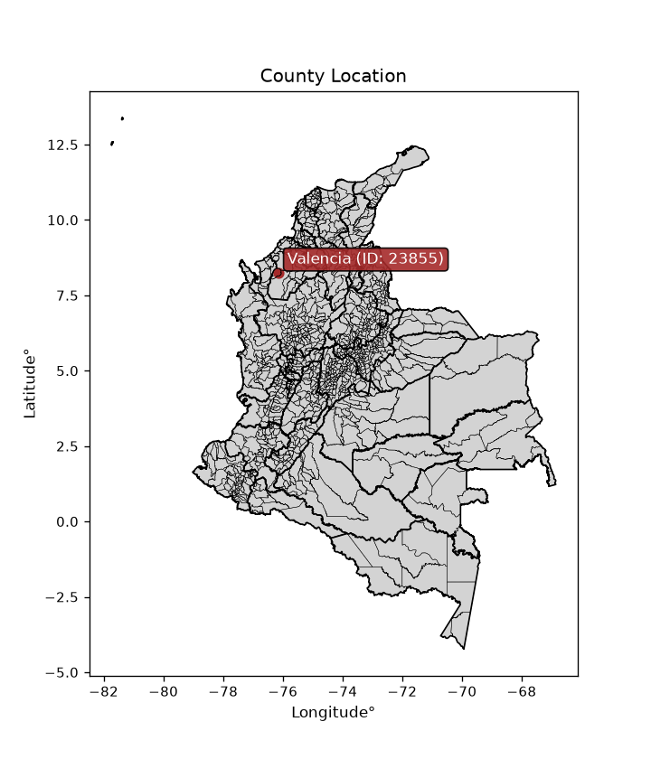
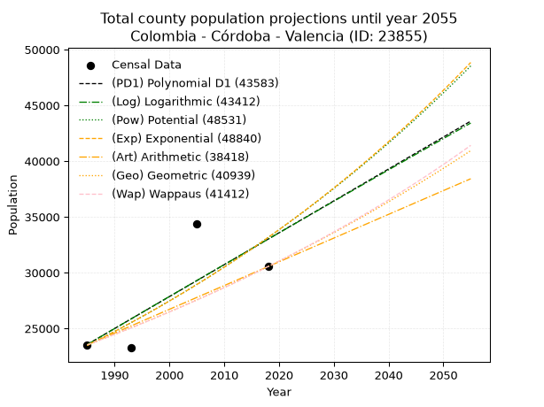
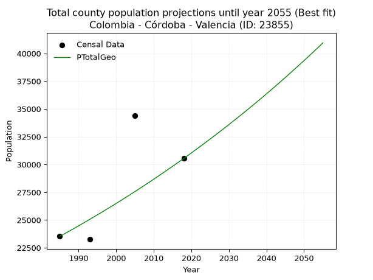
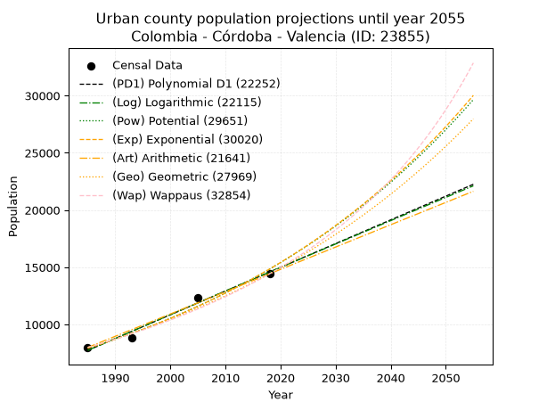
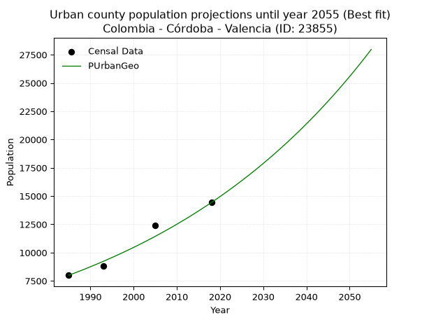
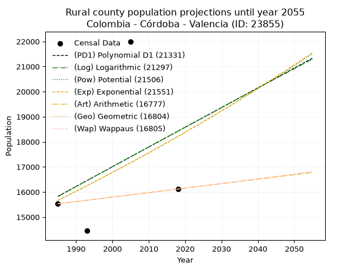
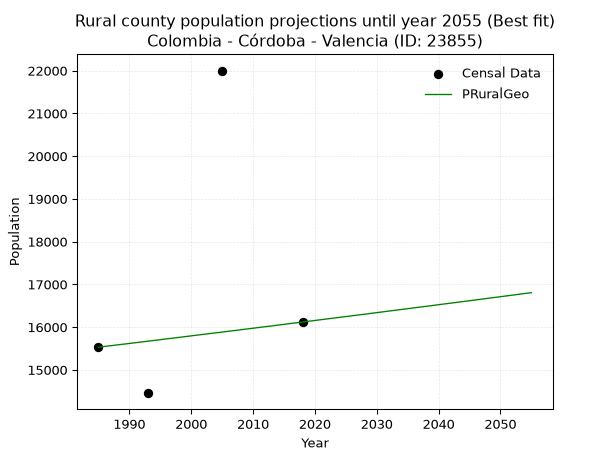

<div align="center">


</div>

# _“Population and Public Services Demand Projections (PPSD) until Year 2050 for Colombia - Córdoba - Valencia (ID: 23855)”_
Keywords: `population` `public-service` `projection` `lineal` `polynomial` `logarithmic` `potential` `exponential` `arithmetic` `geometric` `wappaus` `dane` `colombia` `south-america`

PPSD are analytical estimates used by governments and planners to anticipate future changes in population size, age distribution, and the resulting community needs for utilities, healthcare, education, and infrastructure as sizing future water treatment facilities, electrical grids, and road networks based on spatial growth.

<div align="center">

</img>

</div>


> **General running parameters**: • app_version: _v20260806_. • Python version: _3.14.7_. • Pandas version: _3.0.5_. • NumPy version: _2.5.1_. • Creates, save and include plots into reports (create_plot): _False_. • Projection until year: _2050_. • Process polynomial degree 2 and up: _False_. • Process Wappaus: _True_. • Process Wappaus: _True_. • Set negative values to zero: _True_. • Set infinite values to zero: _True_. • Drop dataset notes: _True_. 
<div align="center">

Dynamic map: [:earth_americas:Google](http://maps.google.com/maps?q=8.255015912,-76.1507558) [:earth_americas:OSM](https://www.openstreetmap.org/#map=18/8.255015912/-76.1507558&layers=P) [:earth_americas:Bing](https://www.bing.com/maps?cp=8.255015912~-76.1507558&lvl=18) [:earth_americas:Apple](https://maps.apple.com/frame?center=8.255015912%2C-76.1507558&span=0.003%2C0.006)

</div>


<div align="center">

```geojson
{
  "type": "Feature",
  "geometry": {
    "type": "Point", 
    "coordinates": [-76.1507558, 8.255015912]
  }, 
  "properties": {
    "Name": "Colombia - Córdoba - Valencia (ID: 23855)"
  }
}
```

</div>


## 0. Census Data (4 records)

Census data are official statistics collected by a government about the people and housing in a country. They usually include counts of total population, age, sex, race, income, education, and jobs.

📅Global census file: [Population.xlsx](../data/Population.xlsx)

| Source   |   Year |   CountryID | CountryName   |   StateID | StateName   |   CountyID | CountyName   |   PTotal |   PUrban |   PRural |
|:---------|-------:|------------:|:--------------|----------:|:------------|-----------:|:-------------|---------:|---------:|---------:|
| DANE     |   1985 |          57 | Colombia      |        23 | Córdoba     |      23855 | Valencia     |    23523 |     7995 |    15528 |
| DANE     |   1993 |          57 | Colombia      |        23 | Córdoba     |      23855 | Valencia     |    23257 |     8805 |    14452 |
| DANE     |   2005 |          57 | Colombia      |        23 | Córdoba     |      23855 | Valencia     |    34373 |    12374 |    21999 |
| DANE     |   2018 |          57 | Colombia      |        23 | Córdoba     |      23855 | Valencia     |    30545 |    14428 |    16117 |

> 🔥Some records could had specific notes about the registered values or the corresponding urban or rural distribution.

📅   [RUPS](https://www.datos.gov.co/Hacienda-y-Cr-dito-P-blico/Registro-nico-de-Prestadores-de-Servicios-P-blicos/4qkq-csdn/about_data) - Local public utility companies: [RUPS.csv](../data/RUPS.xlsx)

 | SERVICIO       | ESTADO      | NOMBRE                                                  | NIT         | DEPARTAMENTO_DOMICILIO   | MUNICIPIO_DOMICILIO   | DIRECCION             |   TELEFONO | EMAIL                            | TIPO_PRESTADOR                             | CLASIFICACION                  |
|:---------------|:------------|:--------------------------------------------------------|:------------|:-------------------------|:----------------------|:----------------------|-----------:|:---------------------------------|:-------------------------------------------|:-------------------------------|
| ACUEDUCTO      | CANCELACION | EMPRESAS VARIAS MUNICIPALES DE VALENCIA CORDOBA E.S.P.  | 800216032-6 | CORDOBA                  | VALENCIA              | Carrera 15 No.11 - 10 |    7773071 | empovalcoesp@gmail.com           | nan                                        | nan                            |
| ALCANTARILLADO | CANCELACION | EMPRESAS VARIAS MUNICIPALES DE VALENCIA CORDOBA E.S.P.  | 800216032-6 | CORDOBA                  | VALENCIA              | Carrera 15 No.11 - 10 |    7773071 | empovalcoesp@gmail.com           | nan                                        | nan                            |
| ACUEDUCTO      | OPERATIVA   | EMPRESA DE SERVICIOS PUBLICOS AGUAS DE VALENCIA SAS ESP | 901308226-1 | CORDOBA                  | VALENCIA              | KR 12 CL 11-63        |    7787308 | aguasdevalenciasasesp1@gmail.com | SOCIEDADES (EMPRESA DE SERVICIOS PUBLICOS) | DESDE 2501 HASTA 5000 USUARIOS |
| ALCANTARILLADO | OPERATIVA   | EMPRESA DE SERVICIOS PUBLICOS AGUAS DE VALENCIA SAS ESP | 901308226-1 | CORDOBA                  | VALENCIA              | KR 12 CL 11-63        |    7787308 | aguasdevalenciasasesp1@gmail.com | SOCIEDADES (EMPRESA DE SERVICIOS PUBLICOS) | DESDE 2501 HASTA 5000 USUARIOS |

## 1. Total

### 1.1. Coefficients and Parameters

* (PD1) Polynomial Deg 1: 286.0000000000016, -544147.0000000033 (lineal)
* (Log) Logarithmic: 573107.235619663, -4328268.190538219
* (Pow) Potential: 20.97987050948735, -64.81634261345732
* (Exp) Exponential: 0.010470955516531343, 2.20651924937759e-05
* (Art) Arithmetic: Year diff. 2018 - 1985 = 33, Population diff. 30545 - 23523 = 7022, Annual growth = 212.78787878787878
* (Geo) Geometric: Year diff. 2018 - 1985 = 33, Population diff. 30545 - 23523 = 7022, Annual growth % = 0.007947241492735513
* (Wap) Wappaus: i = 0.7871120765993889, Condition values only valid for < 200)

<sub>
Wappaus condition values: ['0.00', '0.79', '1.57', '2.36', '3.15', '3.94', '4.72', '5.51', '6.30', '7.08', '7.87', '8.66', '9.45', '10.23', '11.02', '11.81', '12.59', '13.38', '14.17', '14.96', '15.74', '16.53', '17.32', '18.10', '18.89', '19.68', '20.46', '21.25', '22.04', '22.83', '23.61', '24.40', '25.19', '25.97', '26.76', '27.55', '28.34', '29.12', '29.91', '30.70', '31.48', '32.27', '33.06', '33.85', '34.63', '35.42', '36.21', '36.99', '37.78', '38.57', '39.36', '40.14', '40.93', '41.72', '42.50', '43.29', '44.08', '44.87', '45.65', '46.44', '47.23', '48.01', '48.80', '49.59', '50.38', '51.16']
</sub>


### 1.2. Projected Dataset

|   Year |   CountyID |   PTotalPD1 |   PTotalLog |   PTotalPow |   PTotalExp |   PTotalArt |   PTotalGeo |   PTotalWap |
|-------:|-----------:|------------:|------------:|------------:|------------:|------------:|------------:|------------:|
|   1985 |      23855 |       23563 |       23550 |       23456 |       23467 |       23523 |       23523 |       23523 |
|   1986 |      23855 |       23849 |       23838 |       23705 |       23714 |       23736 |       23710 |       23709 |
|   1987 |      23855 |       24135 |       24127 |       23956 |       23963 |       23949 |       23898 |       23896 |
|   1988 |      23855 |       24421 |       24415 |       24211 |       24216 |       24161 |       24088 |       24085 |
|   1989 |      23855 |       24707 |       24703 |       24467 |       24470 |       24374 |       24280 |       24275 |
|   1990 |      23855 |       24993 |       24991 |       24727 |       24728 |       24587 |       24473 |       24467 |
|   1991 |      23855 |       25279 |       25279 |       24989 |       24988 |       24800 |       24667 |       24661 |
|   1992 |      23855 |       25565 |       25567 |       25253 |       25251 |       25013 |       24863 |       24856 |
|   1993 |      23855 |       25851 |       25855 |       25521 |       25517 |       25225 |       25061 |       25052 |
|   1994 |      23855 |       26137 |       26142 |       25791 |       25786 |       25438 |       25260 |       25251 |
|   1995 |      23855 |       26423 |       26429 |       26063 |       26057 |       25651 |       25461 |       25450 |
|   1996 |      23855 |       26709 |       26717 |       26339 |       26331 |       25864 |       25663 |       25652 |
|   1997 |      23855 |       26995 |       27004 |       26617 |       26609 |       26076 |       25867 |       25855 |
|   1998 |      23855 |       27281 |       27291 |       26898 |       26889 |       26289 |       26073 |       26060 |
|   1999 |      23855 |       27567 |       27577 |       27182 |       27172 |       26502 |       26280 |       26266 |
|   2000 |      23855 |       27853 |       27864 |       27469 |       27458 |       26715 |       26489 |       26475 |
|   2001 |      23855 |       28139 |       28150 |       27758 |       27747 |       26928 |       26699 |       26685 |
|   2002 |      23855 |       28425 |       28437 |       28051 |       28039 |       27140 |       26911 |       26896 |
|   2003 |      23855 |       28711 |       28723 |       28346 |       28334 |       27353 |       27125 |       27110 |
|   2004 |      23855 |       28997 |       29009 |       28645 |       28632 |       27566 |       27341 |       27325 |
|   2005 |      23855 |       29283 |       29295 |       28946 |       28934 |       27779 |       27558 |       27542 |
|   2006 |      23855 |       29569 |       29581 |       29250 |       29238 |       27992 |       27777 |       27761 |
|   2007 |      23855 |       29855 |       29866 |       29558 |       29546 |       28204 |       27998 |       27982 |
|   2008 |      23855 |       30141 |       30152 |       29868 |       29857 |       28417 |       28220 |       28205 |
|   2009 |      23855 |       30427 |       30437 |       30182 |       30171 |       28630 |       28445 |       28430 |
|   2010 |      23855 |       30713 |       30722 |       30499 |       30489 |       28843 |       28671 |       28657 |
|   2011 |      23855 |       30999 |       31007 |       30819 |       30810 |       29055 |       28899 |       28886 |
|   2012 |      23855 |       31285 |       31292 |       31142 |       31134 |       29268 |       29128 |       29116 |
|   2013 |      23855 |       31571 |       31577 |       31468 |       31462 |       29481 |       29360 |       29349 |
|   2014 |      23855 |       31857 |       31862 |       31798 |       31793 |       29694 |       29593 |       29584 |
|   2015 |      23855 |       32143 |       32146 |       32131 |       32127 |       29907 |       29828 |       29821 |
|   2016 |      23855 |       32429 |       32431 |       32467 |       32466 |       30119 |       30065 |       30060 |
|   2017 |      23855 |       32715 |       32715 |       32806 |       32807 |       30332 |       30304 |       30302 |
|   2018 |      23855 |       33001 |       32999 |       33149 |       33153 |       30545 |       30545 |       30545 |
|   2019 |      23855 |       33287 |       33283 |       33496 |       33502 |       30758 |       30788 |       30791 |
|   2020 |      23855 |       33573 |       33567 |       33846 |       33854 |       30971 |       31032 |       31039 |
|   2021 |      23855 |       33859 |       33850 |       34199 |       34211 |       31183 |       31279 |       31289 |
|   2022 |      23855 |       34145 |       34134 |       34556 |       34571 |       31396 |       31528 |       31541 |
|   2023 |      23855 |       34431 |       34417 |       34916 |       34935 |       31609 |       31778 |       31796 |
|   2024 |      23855 |       34717 |       34700 |       35280 |       35302 |       31822 |       32031 |       32053 |
|   2025 |      23855 |       35003 |       34983 |       35647 |       35674 |       32035 |       32285 |       32313 |
|   2026 |      23855 |       35289 |       35266 |       36018 |       36049 |       32247 |       32542 |       32575 |
|   2027 |      23855 |       35575 |       35549 |       36393 |       36429 |       32460 |       32800 |       32839 |
|   2028 |      23855 |       35861 |       35832 |       36772 |       36812 |       32673 |       33061 |       33106 |
|   2029 |      23855 |       36147 |       36114 |       37154 |       37200 |       32886 |       33324 |       33376 |
|   2030 |      23855 |       36433 |       36397 |       37540 |       37591 |       33098 |       33589 |       33648 |
|   2031 |      23855 |       36719 |       36679 |       37930 |       37987 |       33311 |       33856 |       33923 |
|   2032 |      23855 |       37005 |       36961 |       38324 |       38387 |       33524 |       34125 |       34200 |
|   2033 |      23855 |       37291 |       37243 |       38721 |       38791 |       33737 |       34396 |       34480 |
|   2034 |      23855 |       37577 |       37525 |       39123 |       39199 |       33950 |       34669 |       34763 |
|   2035 |      23855 |       37863 |       37807 |       39529 |       39612 |       34162 |       34945 |       35049 |
|   2036 |      23855 |       38149 |       38088 |       39938 |       40029 |       34375 |       35223 |       35337 |
|   2037 |      23855 |       38435 |       38370 |       40352 |       40450 |       34588 |       35502 |       35628 |
|   2038 |      23855 |       38721 |       38651 |       40769 |       40876 |       34801 |       35785 |       35922 |
|   2039 |      23855 |       39007 |       38932 |       41191 |       41306 |       35014 |       36069 |       36219 |
|   2040 |      23855 |       39293 |       39213 |       41617 |       41741 |       35226 |       36356 |       36520 |
|   2041 |      23855 |       39579 |       39494 |       42047 |       42180 |       35439 |       36645 |       36823 |
|   2042 |      23855 |       39865 |       39775 |       42481 |       42624 |       35652 |       36936 |       37129 |
|   2043 |      23855 |       40151 |       40055 |       42920 |       43073 |       35865 |       37229 |       37438 |
|   2044 |      23855 |       40437 |       40336 |       43363 |       43526 |       36077 |       37525 |       37751 |
|   2045 |      23855 |       40723 |       40616 |       43810 |       43985 |       36290 |       37823 |       38066 |
|   2046 |      23855 |       41009 |       40896 |       44262 |       44448 |       36503 |       38124 |       38385 |
|   2047 |      23855 |       41295 |       41176 |       44718 |       44915 |       36716 |       38427 |       38708 |
|   2048 |      23855 |       41581 |       41456 |       45178 |       45388 |       36929 |       38732 |       39033 |
|   2049 |      23855 |       41867 |       41736 |       45643 |       45866 |       37141 |       39040 |       39362 |
|   2050 |      23855 |       42153 |       42016 |       46113 |       46349 |       37354 |       39350 |       39695 |
<div align="center">

</img>

</div>


### 1.3. Best fit with absolute and relative error (%)

Relative error puts that difference into context by dividing the absolute error by the true value, creating a unitless ratio or percentage that shows the scale of the mistake.

Absolute and relative error

|   Year | Source   |   CountryID | CountryName   |   StateID | StateName   |   CountyID_x | CountyName   |   PTotal |   PUrban |   PRural |   CountyID_y |   PTotalPD1 |   PTotalLog |   PTotalPow |   PTotalExp |   PTotalArt |   PTotalGeo |   PTotalWap |   PTotalPD1AbsError |   PTotalLogAbsError |   PTotalPowAbsError |   PTotalExpAbsError |   PTotalArtAbsError |   PTotalGeoAbsError |   PTotalWapAbsError |   PTotalPD1RelError |   PTotalLogRelError |   PTotalPowRelError |   PTotalExpRelError |   PTotalArtRelError |   PTotalGeoRelError |   PTotalWapRelError |
|-------:|:---------|------------:|:--------------|----------:|:------------|-------------:|:-------------|---------:|---------:|---------:|-------------:|------------:|------------:|------------:|------------:|------------:|------------:|------------:|--------------------:|--------------------:|--------------------:|--------------------:|--------------------:|--------------------:|--------------------:|--------------------:|--------------------:|--------------------:|--------------------:|--------------------:|--------------------:|--------------------:|
|   1985 | DANE     |          57 | Colombia      |        23 | Córdoba     |        23855 | Valencia     |    23523 |     7995 |    15528 |        23855 |       23563 |       23550 |       23456 |       23467 |       23523 |       23523 |       23523 |                  40 |                  27 |                  67 |                  56 |                   0 |                   0 |                   0 |            0.170046 |            0.114781 |            0.284828 |            0.238065 |             0       |              0      |             0       |
|   1993 | DANE     |          57 | Colombia      |        23 | Córdoba     |        23855 | Valencia     |    23257 |     8805 |    14452 |        23855 |       25851 |       25855 |       25521 |       25517 |       25225 |       25061 |       25052 |                2594 |                2598 |                2264 |                2260 |                1968 |                1804 |                1795 |           11.1536   |           11.1708   |            9.7347   |            9.7175   |             8.46197 |              7.7568 |             7.71811 |
|   2005 | DANE     |          57 | Colombia      |        23 | Córdoba     |        23855 | Valencia     |    34373 |    12374 |    21999 |        23855 |       29283 |       29295 |       28946 |       28934 |       27779 |       27558 |       27542 |                5090 |                5078 |                5427 |                5439 |                6594 |                6815 |                6831 |           14.8081   |           14.7732   |           15.7886   |           15.8235   |            19.1837  |             19.8266 |            19.8732  |
|   2018 | DANE     |          57 | Colombia      |        23 | Córdoba     |        23855 | Valencia     |    30545 |    14428 |    16117 |        23855 |       33001 |       32999 |       33149 |       33153 |       30545 |       30545 |       30545 |                2456 |                2454 |                2604 |                2608 |                   0 |                   0 |                   0 |            8.0406   |            8.03405  |            8.52513  |            8.53822  |             0       |              0      |             0       |

Relative error mean

| Method    |   RelError | Best   |
|:----------|-----------:|:-------|
| PTotalPD1 |    8.5431  |        |
| PTotalLog |    8.52322 |        |
| PTotalPow |    8.5833  |        |
| PTotalExp |    8.57931 |        |
| PTotalArt |    6.91141 |        |
| PTotalGeo |    6.89585 | True   |
| PTotalWap |    6.89782 |        |

💙Best method: _**PTotalGeo**_
<div align="center">

</img>

</div>


### 1.4. Fresh water supply demand in liters per capita per day (lpcd)

The fresh water supply demand typically ranges from 100 to 300 liters per capita per day (lpcd) for standard domestic and municipal planning, though absolute survival minimums set by the World Health Organization are as low as 7.5 to 20 liters per day, and total consumption in high-income nations can exceed 400 liters.

> `CZ`: Level in meters above the sea level (masl)<br> `WS`: Fresh water supply demand in liters per capita per day (lpcd or l/h/d)<br> `WSAll`: Zonal fresh water supply demand in liters per second (l/s)<br> `A`: Zonal area in square meters<br> `DP`: Population density (people/hectare or p/ha)

Reference values (RAS Colombia)

|    CZ |   WS |
|------:|-----:|
|  1000 |  120 |
|  2000 |  130 |
| 99999 |  140 |

County shapefile geometry properties and water supply values

|   CountyID |      ATotal |   CZTotal |   WSTotal |
|-----------:|------------:|----------:|----------:|
|      23855 | 9.19221e+08 |   146.986 |       120 |

Projected values for best method: PTotalGeo

|   CountyID |   Year |   PTotalGeo |   DPTotal |   WSTotal |   WSTotalAll |
|-----------:|-------:|------------:|----------:|----------:|-------------:|
|      23855 |   1985 |       23523 |      0.26 |       120 |      32.6708 |
|      23855 |   1986 |       23710 |      0.26 |       120 |      32.9306 |
|      23855 |   1987 |       23898 |      0.26 |       120 |      33.1917 |
|      23855 |   1988 |       24088 |      0.26 |       120 |      33.4556 |
|      23855 |   1989 |       24280 |      0.26 |       120 |      33.7222 |
|      23855 |   1990 |       24473 |      0.27 |       120 |      33.9903 |
|      23855 |   1991 |       24667 |      0.27 |       120 |      34.2597 |
|      23855 |   1992 |       24863 |      0.27 |       120 |      34.5319 |
|      23855 |   1993 |       25061 |      0.27 |       120 |      34.8069 |
|      23855 |   1994 |       25260 |      0.27 |       120 |      35.0833 |
|      23855 |   1995 |       25461 |      0.28 |       120 |      35.3625 |
|      23855 |   1996 |       25663 |      0.28 |       120 |      35.6431 |
|      23855 |   1997 |       25867 |      0.28 |       120 |      35.9264 |
|      23855 |   1998 |       26073 |      0.28 |       120 |      36.2125 |
|      23855 |   1999 |       26280 |      0.29 |       120 |      36.5    |
|      23855 |   2000 |       26489 |      0.29 |       120 |      36.7903 |
|      23855 |   2001 |       26699 |      0.29 |       120 |      37.0819 |
|      23855 |   2002 |       26911 |      0.29 |       120 |      37.3764 |
|      23855 |   2003 |       27125 |      0.3  |       120 |      37.6736 |
|      23855 |   2004 |       27341 |      0.3  |       120 |      37.9736 |
|      23855 |   2005 |       27558 |      0.3  |       120 |      38.275  |
|      23855 |   2006 |       27777 |      0.3  |       120 |      38.5792 |
|      23855 |   2007 |       27998 |      0.3  |       120 |      38.8861 |
|      23855 |   2008 |       28220 |      0.31 |       120 |      39.1944 |
|      23855 |   2009 |       28445 |      0.31 |       120 |      39.5069 |
|      23855 |   2010 |       28671 |      0.31 |       120 |      39.8208 |
|      23855 |   2011 |       28899 |      0.31 |       120 |      40.1375 |
|      23855 |   2012 |       29128 |      0.32 |       120 |      40.4556 |
|      23855 |   2013 |       29360 |      0.32 |       120 |      40.7778 |
|      23855 |   2014 |       29593 |      0.32 |       120 |      41.1014 |
|      23855 |   2015 |       29828 |      0.32 |       120 |      41.4278 |
|      23855 |   2016 |       30065 |      0.33 |       120 |      41.7569 |
|      23855 |   2017 |       30304 |      0.33 |       120 |      42.0889 |
|      23855 |   2018 |       30545 |      0.33 |       120 |      42.4236 |
|      23855 |   2019 |       30788 |      0.33 |       120 |      42.7611 |
|      23855 |   2020 |       31032 |      0.34 |       120 |      43.1    |
|      23855 |   2021 |       31279 |      0.34 |       120 |      43.4431 |
|      23855 |   2022 |       31528 |      0.34 |       120 |      43.7889 |
|      23855 |   2023 |       31778 |      0.35 |       120 |      44.1361 |
|      23855 |   2024 |       32031 |      0.35 |       120 |      44.4875 |
|      23855 |   2025 |       32285 |      0.35 |       120 |      44.8403 |
|      23855 |   2026 |       32542 |      0.35 |       120 |      45.1972 |
|      23855 |   2027 |       32800 |      0.36 |       120 |      45.5556 |
|      23855 |   2028 |       33061 |      0.36 |       120 |      45.9181 |
|      23855 |   2029 |       33324 |      0.36 |       120 |      46.2833 |
|      23855 |   2030 |       33589 |      0.37 |       120 |      46.6514 |
|      23855 |   2031 |       33856 |      0.37 |       120 |      47.0222 |
|      23855 |   2032 |       34125 |      0.37 |       120 |      47.3958 |
|      23855 |   2033 |       34396 |      0.37 |       120 |      47.7722 |
|      23855 |   2034 |       34669 |      0.38 |       120 |      48.1514 |
|      23855 |   2035 |       34945 |      0.38 |       120 |      48.5347 |
|      23855 |   2036 |       35223 |      0.38 |       120 |      48.9208 |
|      23855 |   2037 |       35502 |      0.39 |       120 |      49.3083 |
|      23855 |   2038 |       35785 |      0.39 |       120 |      49.7014 |
|      23855 |   2039 |       36069 |      0.39 |       120 |      50.0958 |
|      23855 |   2040 |       36356 |      0.4  |       120 |      50.4944 |
|      23855 |   2041 |       36645 |      0.4  |       120 |      50.8958 |
|      23855 |   2042 |       36936 |      0.4  |       120 |      51.3    |
|      23855 |   2043 |       37229 |      0.41 |       120 |      51.7069 |
|      23855 |   2044 |       37525 |      0.41 |       120 |      52.1181 |
|      23855 |   2045 |       37823 |      0.41 |       120 |      52.5319 |
|      23855 |   2046 |       38124 |      0.41 |       120 |      52.95   |
|      23855 |   2047 |       38427 |      0.42 |       120 |      53.3708 |
|      23855 |   2048 |       38732 |      0.42 |       120 |      53.7944 |
|      23855 |   2049 |       39040 |      0.42 |       120 |      54.2222 |
|      23855 |   2050 |       39350 |      0.43 |       120 |      54.6528 |

## 2. Urban

### 2.1. Coefficients and Parameters

* (PD1) Polynomial Deg 1: 207.32798073062878, -403807.29345644027 (lineal)
* (Log) Logarithmic: 414998.5027420274, -3143506.4449314396
* (Pow) Potential: 38.1064031297905, -121.76731059455989
* (Exp) Exponential: 0.01903468766802919, 3.0862401405214565e-13
* (Art) Arithmetic: Year diff. 2018 - 1985 = 33, Population diff. 14428 - 7995 = 6433, Annual growth = 194.93939393939394
* (Geo) Geometric: Year diff. 2018 - 1985 = 33, Population diff. 14428 - 7995 = 6433, Annual growth % = 0.018050503878602964
* (Wap) Wappaus: i = 1.7387449845194125, Condition values only valid for < 200)

<sub>
Wappaus condition values: ['0.00', '1.74', '3.48', '5.22', '6.95', '8.69', '10.43', '12.17', '13.91', '15.65', '17.39', '19.13', '20.86', '22.60', '24.34', '26.08', '27.82', '29.56', '31.30', '33.04', '34.77', '36.51', '38.25', '39.99', '41.73', '43.47', '45.21', '46.95', '48.68', '50.42', '52.16', '53.90', '55.64', '57.38', '59.12', '60.86', '62.59', '64.33', '66.07', '67.81', '69.55', '71.29', '73.03', '74.77', '76.50', '78.24', '79.98', '81.72', '83.46', '85.20', '86.94', '88.68', '90.41', '92.15', '93.89', '95.63', '97.37', '99.11', '100.85', '102.59', '104.32', '106.06', '107.80', '109.54', '111.28', '113.02']
</sub>


### 2.2. Projected Dataset

|   Year |   CountyID |   PUrbanPD1 |   PUrbanLog |   PUrbanPow |   PUrbanExp |   PUrbanArt |   PUrbanGeo |   PUrbanWap |
|-------:|-----------:|------------:|------------:|------------:|------------:|------------:|------------:|------------:|
|   1985 |      23855 |        7739 |        7732 |        7916 |        7920 |        7995 |        7995 |        7995 |
|   1986 |      23855 |        7946 |        7941 |        8069 |        8073 |        8190 |        8139 |        8135 |
|   1987 |      23855 |        8153 |        8150 |        8225 |        8228 |        8385 |        8286 |        8278 |
|   1988 |      23855 |        8361 |        8359 |        8384 |        8386 |        8580 |        8436 |        8423 |
|   1989 |      23855 |        8568 |        8568 |        8547 |        8547 |        8775 |        8588 |        8571 |
|   1990 |      23855 |        8775 |        8776 |        8712 |        8711 |        8970 |        8743 |        8722 |
|   1991 |      23855 |        8983 |        8985 |        8880 |        8879 |        9165 |        8901 |        8875 |
|   1992 |      23855 |        9190 |        9193 |        9052 |        9049 |        9360 |        9062 |        9031 |
|   1993 |      23855 |        9397 |        9402 |        9227 |        9223 |        9555 |        9225 |        9190 |
|   1994 |      23855 |        9605 |        9610 |        9405 |        9400 |        9749 |        9392 |        9352 |
|   1995 |      23855 |        9812 |        9818 |        9586 |        9581 |        9944 |        9561 |        9517 |
|   1996 |      23855 |       10019 |       10026 |        9771 |        9765 |       10139 |        9734 |        9686 |
|   1997 |      23855 |       10227 |       10234 |        9959 |        9953 |       10334 |        9909 |        9857 |
|   1998 |      23855 |       10434 |       10441 |       10151 |       10144 |       10529 |       10088 |       10032 |
|   1999 |      23855 |       10641 |       10649 |       10346 |       10339 |       10724 |       10270 |       10211 |
|   2000 |      23855 |       10849 |       10857 |       10546 |       10538 |       10919 |       10456 |       10393 |
|   2001 |      23855 |       11056 |       11064 |       10748 |       10740 |       11114 |       10645 |       10579 |
|   2002 |      23855 |       11263 |       11271 |       10955 |       10947 |       11309 |       10837 |       10768 |
|   2003 |      23855 |       11471 |       11479 |       11165 |       11157 |       11504 |       11032 |       10961 |
|   2004 |      23855 |       11678 |       11686 |       11380 |       11371 |       11699 |       11231 |       11159 |
|   2005 |      23855 |       11885 |       11893 |       11598 |       11590 |       11894 |       11434 |       11360 |
|   2006 |      23855 |       12093 |       12100 |       11821 |       11813 |       12089 |       11641 |       11566 |
|   2007 |      23855 |       12300 |       12307 |       12047 |       12040 |       12284 |       11851 |       11777 |
|   2008 |      23855 |       12507 |       12513 |       12278 |       12271 |       12479 |       12065 |       11991 |
|   2009 |      23855 |       12715 |       12720 |       12513 |       12507 |       12674 |       12282 |       12211 |
|   2010 |      23855 |       12922 |       12927 |       12753 |       12747 |       12868 |       12504 |       12435 |
|   2011 |      23855 |       13129 |       13133 |       12997 |       12992 |       13063 |       12730 |       12665 |
|   2012 |      23855 |       13337 |       13339 |       13246 |       13242 |       13258 |       12960 |       12900 |
|   2013 |      23855 |       13544 |       13545 |       13499 |       13496 |       13453 |       13193 |       13140 |
|   2014 |      23855 |       13751 |       13752 |       13757 |       13756 |       13648 |       13432 |       13385 |
|   2015 |      23855 |       13959 |       13958 |       14019 |       14020 |       13843 |       13674 |       13637 |
|   2016 |      23855 |       14166 |       14163 |       14287 |       14289 |       14038 |       13921 |       13894 |
|   2017 |      23855 |       14373 |       14369 |       14559 |       14564 |       14233 |       14172 |       14158 |
|   2018 |      23855 |       14581 |       14575 |       14837 |       14844 |       14428 |       14428 |       14428 |
|   2019 |      23855 |       14788 |       14781 |       15120 |       15129 |       14623 |       14688 |       14705 |
|   2020 |      23855 |       14995 |       14986 |       15408 |       15420 |       14818 |       14954 |       14988 |
|   2021 |      23855 |       15203 |       15191 |       15701 |       15716 |       15013 |       15223 |       15279 |
|   2022 |      23855 |       15410 |       15397 |       16000 |       16018 |       15208 |       15498 |       15578 |
|   2023 |      23855 |       15617 |       15602 |       16304 |       16326 |       15403 |       15778 |       15884 |
|   2024 |      23855 |       15825 |       15807 |       16614 |       16640 |       15598 |       16063 |       16198 |
|   2025 |      23855 |       16032 |       16012 |       16930 |       16960 |       15793 |       16353 |       16520 |
|   2026 |      23855 |       16239 |       16217 |       17251 |       17286 |       15988 |       16648 |       16851 |
|   2027 |      23855 |       16447 |       16422 |       17579 |       17618 |       16182 |       16948 |       17192 |
|   2028 |      23855 |       16654 |       16626 |       17912 |       17956 |       16377 |       17254 |       17541 |
|   2029 |      23855 |       16861 |       16831 |       18252 |       18301 |       16572 |       17566 |       17901 |
|   2030 |      23855 |       17069 |       17035 |       18598 |       18653 |       16767 |       17883 |       18271 |
|   2031 |      23855 |       17276 |       17240 |       18950 |       19011 |       16962 |       18206 |       18651 |
|   2032 |      23855 |       17483 |       17444 |       19309 |       19377 |       17157 |       18534 |       19043 |
|   2033 |      23855 |       17690 |       17648 |       19675 |       19749 |       17352 |       18869 |       19446 |
|   2034 |      23855 |       17898 |       17852 |       20047 |       20129 |       17547 |       19209 |       19862 |
|   2035 |      23855 |       18105 |       18056 |       20426 |       20516 |       17742 |       19556 |       20290 |
|   2036 |      23855 |       18312 |       18260 |       20812 |       20910 |       17937 |       19909 |       20732 |
|   2037 |      23855 |       18520 |       18464 |       21205 |       21312 |       18132 |       20269 |       21188 |
|   2038 |      23855 |       18727 |       18668 |       21605 |       21721 |       18327 |       20634 |       21658 |
|   2039 |      23855 |       18934 |       18871 |       22013 |       22139 |       18522 |       21007 |       22144 |
|   2040 |      23855 |       19142 |       19075 |       22428 |       22564 |       18717 |       21386 |       22646 |
|   2041 |      23855 |       19349 |       19278 |       22851 |       22998 |       18912 |       21772 |       23165 |
|   2042 |      23855 |       19556 |       19481 |       23281 |       23440 |       19107 |       22165 |       23702 |
|   2043 |      23855 |       19764 |       19685 |       23720 |       23890 |       19301 |       22565 |       24258 |
|   2044 |      23855 |       19971 |       19888 |       24166 |       24349 |       19496 |       22973 |       24834 |
|   2045 |      23855 |       20178 |       20091 |       24621 |       24817 |       19691 |       23387 |       25431 |
|   2046 |      23855 |       20386 |       20294 |       25084 |       25294 |       19886 |       23809 |       26049 |
|   2047 |      23855 |       20593 |       20496 |       25555 |       25780 |       20081 |       24239 |       26691 |
|   2048 |      23855 |       20800 |       20699 |       26035 |       26275 |       20276 |       24677 |       27358 |
|   2049 |      23855 |       21008 |       20902 |       26524 |       26780 |       20471 |       25122 |       28051 |
|   2050 |      23855 |       21215 |       21104 |       27022 |       27295 |       20666 |       25576 |       28771 |
<div align="center">

</img>

</div>


### 2.3. Best fit with absolute and relative error (%)

Relative error puts that difference into context by dividing the absolute error by the true value, creating a unitless ratio or percentage that shows the scale of the mistake.

Absolute and relative error

|   Year | Source   |   CountryID | CountryName   |   StateID | StateName   |   CountyID_x | CountyName   |   PTotal |   PUrban |   PRural |   CountyID_y |   PUrbanPD1 |   PUrbanLog |   PUrbanPow |   PUrbanExp |   PUrbanArt |   PUrbanGeo |   PUrbanWap |   PUrbanPD1AbsError |   PUrbanLogAbsError |   PUrbanPowAbsError |   PUrbanExpAbsError |   PUrbanArtAbsError |   PUrbanGeoAbsError |   PUrbanWapAbsError |   PUrbanPD1RelError |   PUrbanLogRelError |   PUrbanPowRelError |   PUrbanExpRelError |   PUrbanArtRelError |   PUrbanGeoRelError |   PUrbanWapRelError |
|-------:|:---------|------------:|:--------------|----------:|:------------|-------------:|:-------------|---------:|---------:|---------:|-------------:|------------:|------------:|------------:|------------:|------------:|------------:|------------:|--------------------:|--------------------:|--------------------:|--------------------:|--------------------:|--------------------:|--------------------:|--------------------:|--------------------:|--------------------:|--------------------:|--------------------:|--------------------:|--------------------:|
|   1985 | DANE     |          57 | Colombia      |        23 | Córdoba     |        23855 | Valencia     |    23523 |     7995 |    15528 |        23855 |        7739 |        7732 |        7916 |        7920 |        7995 |        7995 |        7995 |                 256 |                 263 |                  79 |                  75 |                   0 |                   0 |                   0 |             3.202   |             3.28956 |            0.988118 |            0.938086 |             0       |             0       |             0       |
|   1993 | DANE     |          57 | Colombia      |        23 | Córdoba     |        23855 | Valencia     |    23257 |     8805 |    14452 |        23855 |        9397 |        9402 |        9227 |        9223 |        9555 |        9225 |        9190 |                 592 |                 597 |                 422 |                 418 |                 750 |                 420 |                 385 |             6.72345 |             6.78024 |            4.79273  |            4.7473   |             8.51789 |             4.77002 |             4.37252 |
|   2005 | DANE     |          57 | Colombia      |        23 | Córdoba     |        23855 | Valencia     |    34373 |    12374 |    21999 |        23855 |       11885 |       11893 |       11598 |       11590 |       11894 |       11434 |       11360 |                 489 |                 481 |                 776 |                 784 |                 480 |                 940 |                1014 |             3.95183 |             3.88718 |            6.27121  |            6.33587  |             3.8791  |             7.59657 |             8.1946  |
|   2018 | DANE     |          57 | Colombia      |        23 | Córdoba     |        23855 | Valencia     |    30545 |    14428 |    16117 |        23855 |       14581 |       14575 |       14837 |       14844 |       14428 |       14428 |       14428 |                 153 |                 147 |                 409 |                 416 |                   0 |                   0 |                   0 |             1.06044 |             1.01885 |            2.83477  |            2.88328  |             0       |             0       |             0       |

Relative error mean

| Method    |   RelError | Best   |
|:----------|-----------:|:-------|
| PUrbanPD1 |    3.73443 |        |
| PUrbanLog |    3.74396 |        |
| PUrbanPow |    3.72171 |        |
| PUrbanExp |    3.72613 |        |
| PUrbanArt |    3.09925 |        |
| PUrbanGeo |    3.09165 | True   |
| PUrbanWap |    3.14178 |        |

💙Best method: _**PUrbanGeo**_
<div align="center">

</img>

</div>


### 2.4. Fresh water supply demand in liters per capita per day (lpcd)

The fresh water supply demand typically ranges from 100 to 300 liters per capita per day (lpcd) for standard domestic and municipal planning, though absolute survival minimums set by the World Health Organization are as low as 7.5 to 20 liters per day, and total consumption in high-income nations can exceed 400 liters.

> `CZ`: Level in meters above the sea level (masl)<br> `WS`: Fresh water supply demand in liters per capita per day (lpcd or l/h/d)<br> `WSAll`: Zonal fresh water supply demand in liters per second (l/s)<br> `A`: Zonal area in square meters<br> `DP`: Population density (people/hectare or p/ha)

Reference values (RAS Colombia)

|    CZ |   WS |
|------:|-----:|
|  1000 |  120 |
|  2000 |  130 |
| 99999 |  140 |

County shapefile geometry properties and water supply values

|   CountyID |      AUrban |   CZUrban |   WSUrban |
|-----------:|------------:|----------:|----------:|
|      23855 | 7.42021e+06 |   61.9396 |       120 |

Projected values for best method: PUrbanGeo

|   CountyID |   Year |   PUrbanGeo |   DPUrban |   WSUrban |   WSUrbanAll |
|-----------:|-------:|------------:|----------:|----------:|-------------:|
|      23855 |   1985 |        7995 |     10.77 |       120 |      11.1042 |
|      23855 |   1986 |        8139 |     10.97 |       120 |      11.3042 |
|      23855 |   1987 |        8286 |     11.17 |       120 |      11.5083 |
|      23855 |   1988 |        8436 |     11.37 |       120 |      11.7167 |
|      23855 |   1989 |        8588 |     11.57 |       120 |      11.9278 |
|      23855 |   1990 |        8743 |     11.78 |       120 |      12.1431 |
|      23855 |   1991 |        8901 |     12    |       120 |      12.3625 |
|      23855 |   1992 |        9062 |     12.21 |       120 |      12.5861 |
|      23855 |   1993 |        9225 |     12.43 |       120 |      12.8125 |
|      23855 |   1994 |        9392 |     12.66 |       120 |      13.0444 |
|      23855 |   1995 |        9561 |     12.89 |       120 |      13.2792 |
|      23855 |   1996 |        9734 |     13.12 |       120 |      13.5194 |
|      23855 |   1997 |        9909 |     13.35 |       120 |      13.7625 |
|      23855 |   1998 |       10088 |     13.6  |       120 |      14.0111 |
|      23855 |   1999 |       10270 |     13.84 |       120 |      14.2639 |
|      23855 |   2000 |       10456 |     14.09 |       120 |      14.5222 |
|      23855 |   2001 |       10645 |     14.35 |       120 |      14.7847 |
|      23855 |   2002 |       10837 |     14.6  |       120 |      15.0514 |
|      23855 |   2003 |       11032 |     14.87 |       120 |      15.3222 |
|      23855 |   2004 |       11231 |     15.14 |       120 |      15.5986 |
|      23855 |   2005 |       11434 |     15.41 |       120 |      15.8806 |
|      23855 |   2006 |       11641 |     15.69 |       120 |      16.1681 |
|      23855 |   2007 |       11851 |     15.97 |       120 |      16.4597 |
|      23855 |   2008 |       12065 |     16.26 |       120 |      16.7569 |
|      23855 |   2009 |       12282 |     16.55 |       120 |      17.0583 |
|      23855 |   2010 |       12504 |     16.85 |       120 |      17.3667 |
|      23855 |   2011 |       12730 |     17.16 |       120 |      17.6806 |
|      23855 |   2012 |       12960 |     17.47 |       120 |      18      |
|      23855 |   2013 |       13193 |     17.78 |       120 |      18.3236 |
|      23855 |   2014 |       13432 |     18.1  |       120 |      18.6556 |
|      23855 |   2015 |       13674 |     18.43 |       120 |      18.9917 |
|      23855 |   2016 |       13921 |     18.76 |       120 |      19.3347 |
|      23855 |   2017 |       14172 |     19.1  |       120 |      19.6833 |
|      23855 |   2018 |       14428 |     19.44 |       120 |      20.0389 |
|      23855 |   2019 |       14688 |     19.79 |       120 |      20.4    |
|      23855 |   2020 |       14954 |     20.15 |       120 |      20.7694 |
|      23855 |   2021 |       15223 |     20.52 |       120 |      21.1431 |
|      23855 |   2022 |       15498 |     20.89 |       120 |      21.525  |
|      23855 |   2023 |       15778 |     21.26 |       120 |      21.9139 |
|      23855 |   2024 |       16063 |     21.65 |       120 |      22.3097 |
|      23855 |   2025 |       16353 |     22.04 |       120 |      22.7125 |
|      23855 |   2026 |       16648 |     22.44 |       120 |      23.1222 |
|      23855 |   2027 |       16948 |     22.84 |       120 |      23.5389 |
|      23855 |   2028 |       17254 |     23.25 |       120 |      23.9639 |
|      23855 |   2029 |       17566 |     23.67 |       120 |      24.3972 |
|      23855 |   2030 |       17883 |     24.1  |       120 |      24.8375 |
|      23855 |   2031 |       18206 |     24.54 |       120 |      25.2861 |
|      23855 |   2032 |       18534 |     24.98 |       120 |      25.7417 |
|      23855 |   2033 |       18869 |     25.43 |       120 |      26.2069 |
|      23855 |   2034 |       19209 |     25.89 |       120 |      26.6792 |
|      23855 |   2035 |       19556 |     26.36 |       120 |      27.1611 |
|      23855 |   2036 |       19909 |     26.83 |       120 |      27.6514 |
|      23855 |   2037 |       20269 |     27.32 |       120 |      28.1514 |
|      23855 |   2038 |       20634 |     27.81 |       120 |      28.6583 |
|      23855 |   2039 |       21007 |     28.31 |       120 |      29.1764 |
|      23855 |   2040 |       21386 |     28.82 |       120 |      29.7028 |
|      23855 |   2041 |       21772 |     29.34 |       120 |      30.2389 |
|      23855 |   2042 |       22165 |     29.87 |       120 |      30.7847 |
|      23855 |   2043 |       22565 |     30.41 |       120 |      31.3403 |
|      23855 |   2044 |       22973 |     30.96 |       120 |      31.9069 |
|      23855 |   2045 |       23387 |     31.52 |       120 |      32.4819 |
|      23855 |   2046 |       23809 |     32.09 |       120 |      33.0681 |
|      23855 |   2047 |       24239 |     32.67 |       120 |      33.6653 |
|      23855 |   2048 |       24677 |     33.26 |       120 |      34.2736 |
|      23855 |   2049 |       25122 |     33.86 |       120 |      34.8917 |
|      23855 |   2050 |       25576 |     34.47 |       120 |      35.5222 |

## 3. Rural

### 3.1. Coefficients and Parameters

* (PD1) Polynomial Deg 1: 78.67201926937287, -140339.7065435631 (lineal)
* (Log) Logarithmic: 158108.7328776363, -1184761.7456067826
* (Pow) Potential: 9.148708671790493, -25.97539848247604
* (Exp) Exponential: 0.004554216570875819, 1.8575731936218265
* (Art) Arithmetic: Year diff. 2018 - 1985 = 33, Population diff. 16117 - 15528 = 589, Annual growth = 17.848484848484848
* (Geo) Geometric: Year diff. 2018 - 1985 = 33, Population diff. 16117 - 15528 = 589, Annual growth % = 0.0011288114672223237
* (Wap) Wappaus: i = 0.11280445472260925, Condition values only valid for < 200)

<sub>
Wappaus condition values: ['0.00', '0.11', '0.23', '0.34', '0.45', '0.56', '0.68', '0.79', '0.90', '1.02', '1.13', '1.24', '1.35', '1.47', '1.58', '1.69', '1.80', '1.92', '2.03', '2.14', '2.26', '2.37', '2.48', '2.59', '2.71', '2.82', '2.93', '3.05', '3.16', '3.27', '3.38', '3.50', '3.61', '3.72', '3.84', '3.95', '4.06', '4.17', '4.29', '4.40', '4.51', '4.62', '4.74', '4.85', '4.96', '5.08', '5.19', '5.30', '5.41', '5.53', '5.64', '5.75', '5.87', '5.98', '6.09', '6.20', '6.32', '6.43', '6.54', '6.66', '6.77', '6.88', '6.99', '7.11', '7.22', '7.33']
</sub>


### 3.2. Projected Dataset

|   Year |   CountyID |   PRuralPD1 |   PRuralLog |   PRuralPow |   PRuralExp |   PRuralArt |   PRuralGeo |   PRuralWap |
|-------:|-----------:|------------:|------------:|------------:|------------:|------------:|------------:|------------:|
|   1985 |      23855 |       15824 |       15817 |       15662 |       15668 |       15528 |       15528 |       15528 |
|   1986 |      23855 |       15903 |       15897 |       15734 |       15740 |       15546 |       15546 |       15546 |
|   1987 |      23855 |       15982 |       15976 |       15807 |       15812 |       15564 |       15563 |       15563 |
|   1988 |      23855 |       16060 |       16056 |       15880 |       15884 |       15582 |       15581 |       15581 |
|   1989 |      23855 |       16139 |       16135 |       15953 |       15956 |       15599 |       15598 |       15598 |
|   1990 |      23855 |       16218 |       16215 |       16027 |       16029 |       15617 |       15616 |       15616 |
|   1991 |      23855 |       16296 |       16294 |       16101 |       16102 |       15635 |       15633 |       15633 |
|   1992 |      23855 |       16375 |       16374 |       16175 |       16176 |       15653 |       15651 |       15651 |
|   1993 |      23855 |       16454 |       16453 |       16249 |       16250 |       15671 |       15669 |       15669 |
|   1994 |      23855 |       16532 |       16532 |       16324 |       16324 |       15689 |       15686 |       15686 |
|   1995 |      23855 |       16611 |       16612 |       16399 |       16398 |       15706 |       15704 |       15704 |
|   1996 |      23855 |       16690 |       16691 |       16474 |       16473 |       15724 |       15722 |       15722 |
|   1997 |      23855 |       16768 |       16770 |       16550 |       16548 |       15742 |       15740 |       15740 |
|   1998 |      23855 |       16847 |       16849 |       16626 |       16624 |       15760 |       15757 |       15757 |
|   1999 |      23855 |       16926 |       16928 |       16702 |       16700 |       15778 |       15775 |       15775 |
|   2000 |      23855 |       17004 |       17007 |       16779 |       16776 |       15796 |       15793 |       15793 |
|   2001 |      23855 |       17083 |       17086 |       16856 |       16853 |       15814 |       15811 |       15811 |
|   2002 |      23855 |       17162 |       17165 |       16933 |       16929 |       15831 |       15829 |       15829 |
|   2003 |      23855 |       17240 |       17244 |       17011 |       17007 |       15849 |       15847 |       15847 |
|   2004 |      23855 |       17319 |       17323 |       17088 |       17084 |       15867 |       15864 |       15864 |
|   2005 |      23855 |       17398 |       17402 |       17167 |       17162 |       15885 |       15882 |       15882 |
|   2006 |      23855 |       17476 |       17481 |       17245 |       17241 |       15903 |       15900 |       15900 |
|   2007 |      23855 |       17555 |       17560 |       17324 |       17319 |       15921 |       15918 |       15918 |
|   2008 |      23855 |       17634 |       17638 |       17403 |       17398 |       15939 |       15936 |       15936 |
|   2009 |      23855 |       17712 |       17717 |       17482 |       17478 |       15956 |       15954 |       15954 |
|   2010 |      23855 |       17791 |       17796 |       17562 |       17558 |       15974 |       15972 |       15972 |
|   2011 |      23855 |       17870 |       17875 |       17642 |       17638 |       15992 |       15990 |       15990 |
|   2012 |      23855 |       17948 |       17953 |       17723 |       17718 |       16010 |       16008 |       16008 |
|   2013 |      23855 |       18027 |       18032 |       17804 |       17799 |       16028 |       16026 |       16026 |
|   2014 |      23855 |       18106 |       18110 |       17885 |       17880 |       16046 |       16044 |       16044 |
|   2015 |      23855 |       18184 |       18189 |       17966 |       17962 |       16063 |       16063 |       16063 |
|   2016 |      23855 |       18263 |       18267 |       18048 |       18044 |       16081 |       16081 |       16081 |
|   2017 |      23855 |       18342 |       18346 |       18130 |       18126 |       16099 |       16099 |       16099 |
|   2018 |      23855 |       18420 |       18424 |       18212 |       18209 |       16117 |       16117 |       16117 |
|   2019 |      23855 |       18499 |       18502 |       18295 |       18292 |       16135 |       16135 |       16135 |
|   2020 |      23855 |       18578 |       18581 |       18378 |       18376 |       16153 |       16153 |       16153 |
|   2021 |      23855 |       18656 |       18659 |       18461 |       18460 |       16171 |       16172 |       16172 |
|   2022 |      23855 |       18735 |       18737 |       18545 |       18544 |       16188 |       16190 |       16190 |
|   2023 |      23855 |       18814 |       18815 |       18629 |       18629 |       16206 |       16208 |       16208 |
|   2024 |      23855 |       18892 |       18893 |       18714 |       18714 |       16224 |       16226 |       16226 |
|   2025 |      23855 |       18971 |       18971 |       18798 |       18799 |       16242 |       16245 |       16245 |
|   2026 |      23855 |       19050 |       19049 |       18883 |       18885 |       16260 |       16263 |       16263 |
|   2027 |      23855 |       19128 |       19127 |       18969 |       18971 |       16278 |       16281 |       16282 |
|   2028 |      23855 |       19207 |       19205 |       19055 |       19058 |       16295 |       16300 |       16300 |
|   2029 |      23855 |       19286 |       19283 |       19141 |       19145 |       16313 |       16318 |       16318 |
|   2030 |      23855 |       19364 |       19361 |       19227 |       19232 |       16331 |       16337 |       16337 |
|   2031 |      23855 |       19443 |       19439 |       19314 |       19320 |       16349 |       16355 |       16355 |
|   2032 |      23855 |       19522 |       19517 |       19401 |       19408 |       16367 |       16374 |       16374 |
|   2033 |      23855 |       19601 |       19595 |       19489 |       19497 |       16385 |       16392 |       16392 |
|   2034 |      23855 |       19679 |       19673 |       19577 |       19586 |       16403 |       16411 |       16411 |
|   2035 |      23855 |       19758 |       19750 |       19665 |       19675 |       16420 |       16429 |       16429 |
|   2036 |      23855 |       19837 |       19828 |       19754 |       19765 |       16438 |       16448 |       16448 |
|   2037 |      23855 |       19915 |       19906 |       19843 |       19855 |       16456 |       16466 |       16466 |
|   2038 |      23855 |       19994 |       19983 |       19932 |       19946 |       16474 |       16485 |       16485 |
|   2039 |      23855 |       20073 |       20061 |       20021 |       20037 |       16492 |       16503 |       16504 |
|   2040 |      23855 |       20151 |       20138 |       20111 |       20128 |       16510 |       16522 |       16522 |
|   2041 |      23855 |       20230 |       20216 |       20202 |       20220 |       16528 |       16541 |       16541 |
|   2042 |      23855 |       20309 |       20293 |       20293 |       20312 |       16545 |       16559 |       16560 |
|   2043 |      23855 |       20387 |       20371 |       20384 |       20405 |       16563 |       16578 |       16578 |
|   2044 |      23855 |       20466 |       20448 |       20475 |       20498 |       16581 |       16597 |       16597 |
|   2045 |      23855 |       20545 |       20525 |       20567 |       20592 |       16599 |       16615 |       16616 |
|   2046 |      23855 |       20623 |       20603 |       20659 |       20686 |       16617 |       16634 |       16635 |
|   2047 |      23855 |       20702 |       20680 |       20752 |       20780 |       16635 |       16653 |       16653 |
|   2048 |      23855 |       20781 |       20757 |       20845 |       20875 |       16652 |       16672 |       16672 |
|   2049 |      23855 |       20859 |       20834 |       20938 |       20970 |       16670 |       16691 |       16691 |
|   2050 |      23855 |       20938 |       20911 |       21032 |       21066 |       16688 |       16709 |       16710 |
<div align="center">

</img>

</div>


### 3.3. Best fit with absolute and relative error (%)

Relative error puts that difference into context by dividing the absolute error by the true value, creating a unitless ratio or percentage that shows the scale of the mistake.

Absolute and relative error

|   Year | Source   |   CountryID | CountryName   |   StateID | StateName   |   CountyID_x | CountyName   |   PTotal |   PUrban |   PRural |   CountyID_y |   PRuralPD1 |   PRuralLog |   PRuralPow |   PRuralExp |   PRuralArt |   PRuralGeo |   PRuralWap |   PRuralPD1AbsError |   PRuralLogAbsError |   PRuralPowAbsError |   PRuralExpAbsError |   PRuralArtAbsError |   PRuralGeoAbsError |   PRuralWapAbsError |   PRuralPD1RelError |   PRuralLogRelError |   PRuralPowRelError |   PRuralExpRelError |   PRuralArtRelError |   PRuralGeoRelError |   PRuralWapRelError |
|-------:|:---------|------------:|:--------------|----------:|:------------|-------------:|:-------------|---------:|---------:|---------:|-------------:|------------:|------------:|------------:|------------:|------------:|------------:|------------:|--------------------:|--------------------:|--------------------:|--------------------:|--------------------:|--------------------:|--------------------:|--------------------:|--------------------:|--------------------:|--------------------:|--------------------:|--------------------:|--------------------:|
|   1985 | DANE     |          57 | Colombia      |        23 | Córdoba     |        23855 | Valencia     |    23523 |     7995 |    15528 |        23855 |       15824 |       15817 |       15662 |       15668 |       15528 |       15528 |       15528 |                 296 |                 289 |                 134 |                 140 |                   0 |                   0 |                   0 |             1.90623 |             1.86115 |            0.862957 |            0.901597 |             0       |             0       |             0       |
|   1993 | DANE     |          57 | Colombia      |        23 | Córdoba     |        23855 | Valencia     |    23257 |     8805 |    14452 |        23855 |       16454 |       16453 |       16249 |       16250 |       15671 |       15669 |       15669 |                2002 |                2001 |                1797 |                1798 |                1219 |                1217 |                1217 |            13.8528  |            13.8458  |           12.4343   |           12.4412   |             8.43482 |             8.42098 |             8.42098 |
|   2005 | DANE     |          57 | Colombia      |        23 | Córdoba     |        23855 | Valencia     |    34373 |    12374 |    21999 |        23855 |       17398 |       17402 |       17167 |       17162 |       15885 |       15882 |       15882 |                4601 |                4597 |                4832 |                4837 |                6114 |                6117 |                6117 |            20.9146  |            20.8964  |           21.9646   |           21.9874   |            27.7922  |            27.8058  |            27.8058  |
|   2018 | DANE     |          57 | Colombia      |        23 | Córdoba     |        23855 | Valencia     |    30545 |    14428 |    16117 |        23855 |       18420 |       18424 |       18212 |       18209 |       16117 |       16117 |       16117 |                2303 |                2307 |                2095 |                2092 |                   0 |                   0 |                   0 |            14.2893  |            14.3141  |           12.9987   |           12.9801   |             0       |             0       |             0       |

Relative error mean

| Method    |   RelError | Best   |
|:----------|-----------:|:-------|
| PRuralPD1 |   12.7407  |        |
| PRuralLog |   12.7294  |        |
| PRuralPow |   12.0651  |        |
| PRuralExp |   12.0776  |        |
| PRuralArt |    9.05675 |        |
| PRuralGeo |    9.0567  | True   |
| PRuralWap |    9.0567  | True   |

💙Best method: _**PRuralGeo**_
<div align="center">

</img>

</div>


### 3.4. Fresh water supply demand in liters per capita per day (lpcd)

The fresh water supply demand typically ranges from 100 to 300 liters per capita per day (lpcd) for standard domestic and municipal planning, though absolute survival minimums set by the World Health Organization are as low as 7.5 to 20 liters per day, and total consumption in high-income nations can exceed 400 liters.

> `CZ`: Level in meters above the sea level (masl)<br> `WS`: Fresh water supply demand in liters per capita per day (lpcd or l/h/d)<br> `WSAll`: Zonal fresh water supply demand in liters per second (l/s)<br> `A`: Zonal area in square meters<br> `DP`: Population density (people/hectare or p/ha)

Reference values (RAS Colombia)

|    CZ |   WS |
|------:|-----:|
|  1000 |  120 |
|  2000 |  130 |
| 99999 |  140 |

County shapefile geometry properties and water supply values

|   CountyID |    ARural |   CZRural |   WSRural |
|-----------:|----------:|----------:|----------:|
|      23855 | 9.118e+08 |   147.677 |       120 |

Projected values for best method: PRuralGeo

|   CountyID |   Year |   PRuralGeo |   DPRural |   WSRural |   WSRuralAll |
|-----------:|-------:|------------:|----------:|----------:|-------------:|
|      23855 |   1985 |       15528 |      0.17 |       120 |      21.5667 |
|      23855 |   1986 |       15546 |      0.17 |       120 |      21.5917 |
|      23855 |   1987 |       15563 |      0.17 |       120 |      21.6153 |
|      23855 |   1988 |       15581 |      0.17 |       120 |      21.6403 |
|      23855 |   1989 |       15598 |      0.17 |       120 |      21.6639 |
|      23855 |   1990 |       15616 |      0.17 |       120 |      21.6889 |
|      23855 |   1991 |       15633 |      0.17 |       120 |      21.7125 |
|      23855 |   1992 |       15651 |      0.17 |       120 |      21.7375 |
|      23855 |   1993 |       15669 |      0.17 |       120 |      21.7625 |
|      23855 |   1994 |       15686 |      0.17 |       120 |      21.7861 |
|      23855 |   1995 |       15704 |      0.17 |       120 |      21.8111 |
|      23855 |   1996 |       15722 |      0.17 |       120 |      21.8361 |
|      23855 |   1997 |       15740 |      0.17 |       120 |      21.8611 |
|      23855 |   1998 |       15757 |      0.17 |       120 |      21.8847 |
|      23855 |   1999 |       15775 |      0.17 |       120 |      21.9097 |
|      23855 |   2000 |       15793 |      0.17 |       120 |      21.9347 |
|      23855 |   2001 |       15811 |      0.17 |       120 |      21.9597 |
|      23855 |   2002 |       15829 |      0.17 |       120 |      21.9847 |
|      23855 |   2003 |       15847 |      0.17 |       120 |      22.0097 |
|      23855 |   2004 |       15864 |      0.17 |       120 |      22.0333 |
|      23855 |   2005 |       15882 |      0.17 |       120 |      22.0583 |
|      23855 |   2006 |       15900 |      0.17 |       120 |      22.0833 |
|      23855 |   2007 |       15918 |      0.17 |       120 |      22.1083 |
|      23855 |   2008 |       15936 |      0.17 |       120 |      22.1333 |
|      23855 |   2009 |       15954 |      0.17 |       120 |      22.1583 |
|      23855 |   2010 |       15972 |      0.18 |       120 |      22.1833 |
|      23855 |   2011 |       15990 |      0.18 |       120 |      22.2083 |
|      23855 |   2012 |       16008 |      0.18 |       120 |      22.2333 |
|      23855 |   2013 |       16026 |      0.18 |       120 |      22.2583 |
|      23855 |   2014 |       16044 |      0.18 |       120 |      22.2833 |
|      23855 |   2015 |       16063 |      0.18 |       120 |      22.3097 |
|      23855 |   2016 |       16081 |      0.18 |       120 |      22.3347 |
|      23855 |   2017 |       16099 |      0.18 |       120 |      22.3597 |
|      23855 |   2018 |       16117 |      0.18 |       120 |      22.3847 |
|      23855 |   2019 |       16135 |      0.18 |       120 |      22.4097 |
|      23855 |   2020 |       16153 |      0.18 |       120 |      22.4347 |
|      23855 |   2021 |       16172 |      0.18 |       120 |      22.4611 |
|      23855 |   2022 |       16190 |      0.18 |       120 |      22.4861 |
|      23855 |   2023 |       16208 |      0.18 |       120 |      22.5111 |
|      23855 |   2024 |       16226 |      0.18 |       120 |      22.5361 |
|      23855 |   2025 |       16245 |      0.18 |       120 |      22.5625 |
|      23855 |   2026 |       16263 |      0.18 |       120 |      22.5875 |
|      23855 |   2027 |       16281 |      0.18 |       120 |      22.6125 |
|      23855 |   2028 |       16300 |      0.18 |       120 |      22.6389 |
|      23855 |   2029 |       16318 |      0.18 |       120 |      22.6639 |
|      23855 |   2030 |       16337 |      0.18 |       120 |      22.6903 |
|      23855 |   2031 |       16355 |      0.18 |       120 |      22.7153 |
|      23855 |   2032 |       16374 |      0.18 |       120 |      22.7417 |
|      23855 |   2033 |       16392 |      0.18 |       120 |      22.7667 |
|      23855 |   2034 |       16411 |      0.18 |       120 |      22.7931 |
|      23855 |   2035 |       16429 |      0.18 |       120 |      22.8181 |
|      23855 |   2036 |       16448 |      0.18 |       120 |      22.8444 |
|      23855 |   2037 |       16466 |      0.18 |       120 |      22.8694 |
|      23855 |   2038 |       16485 |      0.18 |       120 |      22.8958 |
|      23855 |   2039 |       16503 |      0.18 |       120 |      22.9208 |
|      23855 |   2040 |       16522 |      0.18 |       120 |      22.9472 |
|      23855 |   2041 |       16541 |      0.18 |       120 |      22.9736 |
|      23855 |   2042 |       16559 |      0.18 |       120 |      22.9986 |
|      23855 |   2043 |       16578 |      0.18 |       120 |      23.025  |
|      23855 |   2044 |       16597 |      0.18 |       120 |      23.0514 |
|      23855 |   2045 |       16615 |      0.18 |       120 |      23.0764 |
|      23855 |   2046 |       16634 |      0.18 |       120 |      23.1028 |
|      23855 |   2047 |       16653 |      0.18 |       120 |      23.1292 |
|      23855 |   2048 |       16672 |      0.18 |       120 |      23.1556 |
|      23855 |   2049 |       16691 |      0.18 |       120 |      23.1819 |
|      23855 |   2050 |       16709 |      0.18 |       120 |      23.2069 |

<div align="center"><br><sub>Share this research</sub></div><br>

<sub>**APPS & TOOLS & CONTENT DISCLAIMER**: • NO WARRANTY - This content and software is provided by <a href="https://github.com/rcfdtools" target="_blank">github.com/rcfdtools</a> "as is", without any express or implied warranty, including warranties of merchantability, fitness for a particular purpose, or non-infringement. There is no guarantee that the software will be error-free or operate without interruption. • LIMITATION OF LIABILITY - Neither the authors nor copyright holders will be liable for claims or damages arising from the software or its use. You are responsible for determining if the software is appropriate for your use and assume all associated risks, including errors, legal compliance, and data loss. • NO PROFESSIONAL ADVICE - The software provides general information and does not offer professional advice. It should not replace consultation with professional advisors. [Clauses and global license for rcfdtools use.](https://github.com/rcfdtools/rcfdtools/blob/main/LICENSE.md)</sub>

| [:house: Home](Readme.md)  | [:beginner: Help / Collab](https://github.com/rcfdtools/R.HydroTools/discussions/31) |
|----------------------------|-------------------------------------------------------------------------------------------|