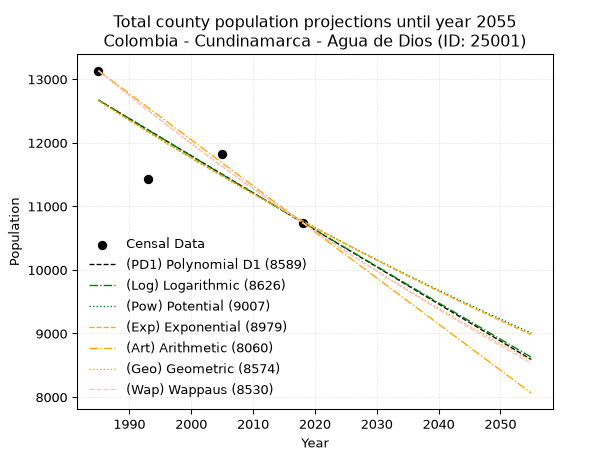
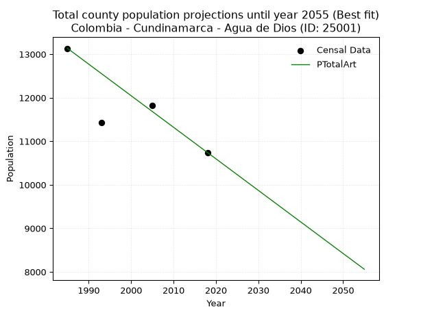
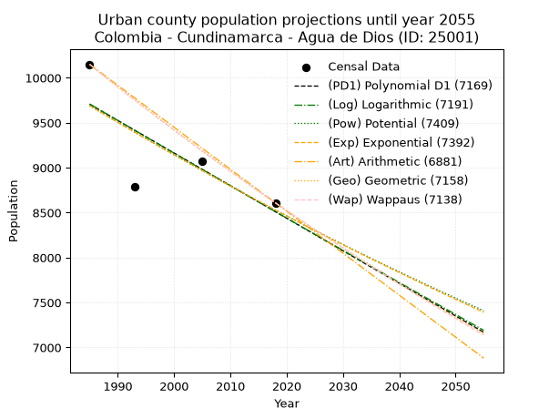
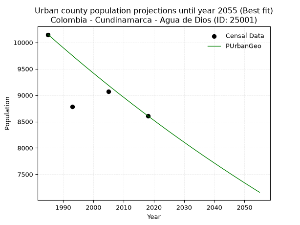
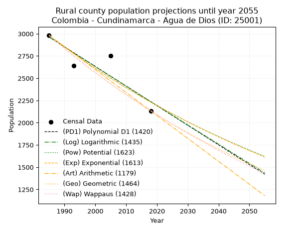
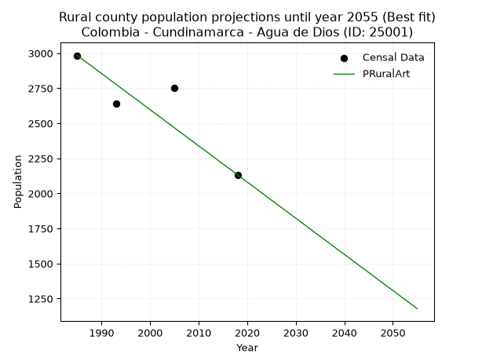

<div align="center">


</div>

# 📜 _“Population and Public Services Demand Projections (PPSD) until Year 2050 for Colombia - Cundinamarca - Agua de Dios (ID: 25001)”_
Keywords: `population` `public-service` `projection` `lineal` `polynomial` `logarithmic` `potential` `exponential` `arithmetic` `geometric` `wappaus` `dane` `colombia` `south-america`

PPSD are analytical estimates used by governments and planners to anticipate future changes in population size, age distribution, and the resulting community needs for utilities, healthcare, education, and infrastructure as sizing future water treatment facilities, electrical grids, and road networks based on spatial growth.

<div align="center">

</img>

</div>


> **General running parameters**: • app_version: _v20260806_. • Python version: _3.14.7_. • Pandas version: _3.0.5_. • NumPy version: _2.5.1_. • Creates, save and include plots into reports (create_plot): _False_. • Projection until year: _2050_. • Process polynomial degree 2 and up: _False_. • Process Wappaus: _True_. • Process Wappaus: _True_. • Set negative values to zero: _True_. • Set infinite values to zero: _True_. • Drop dataset notes: _True_. 
<div align="center">

Maps & GIS Layers: [:earth_americas:Google](http://maps.google.com/maps?q=4.375309182,-74.6692211) [:earth_americas:OSM](https://www.openstreetmap.org/#map=18/4.375309182/-74.6692211&layers=P) [:earth_americas:Bing](https://www.bing.com/maps?cp=4.375309182~-74.6692211&lvl=18) [:earth_americas:Apple](https://maps.apple.com/frame?center=4.375309182%2C-74.6692211&span=0.003%2C0.006) [:earth_americas:GISMobile](https://github.com/rcfdtools/R.GISMobile/blob/main/file/gis/CountyLayer_CO/Readme.md)

</div>


<div align="center">

```geojson
{
  "type": "Feature",
  "geometry": {
    "type": "Point", 
    "coordinates": [-74.6692211, 4.375309182]
  }, 
  "properties": {
    "Name": "Colombia - Cundinamarca - Agua de Dios (ID: 25001)"
  }
}
```

</div>


## 0. Census Data (4 records)

Census data are official statistics collected by a government about the people and housing in a country. They usually include counts of total population, age, sex, race, income, education, and jobs.

📅Global census file: [Population.xlsx](../data/Population.xlsx)

| Source   |   Year |   CountryID | CountryName   |   StateID | StateName    |   CountyID | CountyName   |   PTotal |   PUrban |   PRural |
|:---------|-------:|------------:|:--------------|----------:|:-------------|-----------:|:-------------|---------:|---------:|---------:|
| DANE     |   1985 |          57 | Colombia      |        25 | Cundinamarca |      25001 | Agua de Dios |    13134 |    10150 |     2984 |
| DANE     |   1993 |          57 | Colombia      |        25 | Cundinamarca |      25001 | Agua de Dios |    11426 |     8785 |     2641 |
| DANE     |   2005 |          57 | Colombia      |        25 | Cundinamarca |      25001 | Agua de Dios |    11822 |     9072 |     2750 |
| DANE     |   2018 |          57 | Colombia      |        25 | Cundinamarca |      25001 | Agua de Dios |    10742 |     8609 |     2133 |

> 🔥Some records could had specific notes about the registered values or the corresponding urban or rural distribution.

📅[SUI-RUPS](https://www.datos.gov.co/Hacienda-y-Cr-dito-P-blico/Registro-nico-de-Prestadores-de-Servicios-P-blicos/4qkq-csdn/about_data) - Local public utility companies: [RUPS.csv](../data/RUPS.csv)

 | SERVICIO       | ESTADO    | NOMBRE                                | NIT         | DEPARTAMENTO_DOMICILIO   | MUNICIPIO_DOMICILIO   | DIRECCION       |   TELEFONO | EMAIL             | TIPO_PRESTADOR                             | CLASIFICACION                 |
|:---------------|:----------|:--------------------------------------|:------------|:-------------------------|:----------------------|:----------------|-----------:|:------------------|:-------------------------------------------|:------------------------------|
| ACUEDUCTO      | OPERATIVA | INGENIERIA Y GESTION DEL AGUA SAS ESP | 900546589-4 | CUNDINAMARCA             | TOCAIMA               | CALLE 4 N° 6-31 |    8367562 | sippdbg@gmail.com | SOCIEDADES (EMPRESA DE SERVICIOS PUBLICOS) | MAYOR O IGUAL A 5001 USUARIOS |
| ALCANTARILLADO | OPERATIVA | INGENIERIA Y GESTION DEL AGUA SAS ESP | 900546589-4 | CUNDINAMARCA             | TOCAIMA               | CALLE 4 N° 6-31 |    8367562 | sippdbg@gmail.com | SOCIEDADES (EMPRESA DE SERVICIOS PUBLICOS) | MAYOR O IGUAL A 5001 USUARIOS |

## 1. Total

### 1.1. Coefficients and Parameters

* (PD1) Polynomial Deg 1: -58.301083902046706, 128397.74307506894 (lineal)
* (Log) Logarithmic: -116755.61368009137, 899241.3552031437
* (Pow) Potential: -9.834265658708789, 36.53367357589916
* (Exp) Exponential: -0.004911112148417406, 216914139.85651654
* (Art) Arithmetic: Year diff. 2018 - 1985 = 33, Population diff. 10742 - 13134 = -2392, Annual growth = -72.48484848484848
* (Geo) Geometric: Year diff. 2018 - 1985 = 33, Population diff. 10742 - 13134 = -2392, Annual growth % = -0.006073692113201634
* (Wap) Wappaus: i = -0.6071774877269935, Condition values only valid for < 200)

<sub>
Wappaus condition values: ['-0.00', '-0.61', '-1.21', '-1.82', '-2.43', '-3.04', '-3.64', '-4.25', '-4.86', '-5.46', '-6.07', '-6.68', '-7.29', '-7.89', '-8.50', '-9.11', '-9.71', '-10.32', '-10.93', '-11.54', '-12.14', '-12.75', '-13.36', '-13.97', '-14.57', '-15.18', '-15.79', '-16.39', '-17.00', '-17.61', '-18.22', '-18.82', '-19.43', '-20.04', '-20.64', '-21.25', '-21.86', '-22.47', '-23.07', '-23.68', '-24.29', '-24.89', '-25.50', '-26.11', '-26.72', '-27.32', '-27.93', '-28.54', '-29.14', '-29.75', '-30.36', '-30.97', '-31.57', '-32.18', '-32.79', '-33.39', '-34.00', '-34.61', '-35.22', '-35.82', '-36.43', '-37.04', '-37.65', '-38.25', '-38.86', '-39.47']
</sub>


### 1.2. Projected Dataset

|   Year |   CountyID |   PTotalPD1 |   PTotalLog |   PTotalPow |   PTotalExp |   PTotalArt |   PTotalGeo |   PTotalWap |
|-------:|-----------:|------------:|------------:|------------:|------------:|------------:|------------:|------------:|
|   1985 |      25001 |       12670 |       12672 |       12665 |       12663 |       13134 |       13134 |       13134 |
|   1986 |      25001 |       12612 |       12613 |       12603 |       12601 |       13062 |       13054 |       13054 |
|   1987 |      25001 |       12553 |       12555 |       12541 |       12539 |       12989 |       12975 |       12975 |
|   1988 |      25001 |       12495 |       12496 |       12479 |       12478 |       12917 |       12896 |       12897 |
|   1989 |      25001 |       12437 |       12437 |       12417 |       12417 |       12844 |       12818 |       12819 |
|   1990 |      25001 |       12379 |       12379 |       12356 |       12356 |       12772 |       12740 |       12741 |
|   1991 |      25001 |       12320 |       12320 |       12295 |       12295 |       12699 |       12663 |       12664 |
|   1992 |      25001 |       12262 |       12261 |       12234 |       12235 |       12627 |       12586 |       12587 |
|   1993 |      25001 |       12204 |       12203 |       12174 |       12175 |       12554 |       12509 |       12511 |
|   1994 |      25001 |       12145 |       12144 |       12114 |       12116 |       12482 |       12433 |       12435 |
|   1995 |      25001 |       12087 |       12086 |       12055 |       12056 |       12409 |       12358 |       12360 |
|   1996 |      25001 |       12029 |       12027 |       11995 |       11997 |       12337 |       12283 |       12285 |
|   1997 |      25001 |       11970 |       11969 |       11937 |       11938 |       12264 |       12208 |       12211 |
|   1998 |      25001 |       11912 |       11910 |       11878 |       11880 |       12192 |       12134 |       12137 |
|   1999 |      25001 |       11854 |       11852 |       11820 |       11822 |       12119 |       12060 |       12063 |
|   2000 |      25001 |       11796 |       11793 |       11762 |       11764 |       12047 |       11987 |       11990 |
|   2001 |      25001 |       11737 |       11735 |       11704 |       11706 |       11974 |       11914 |       11917 |
|   2002 |      25001 |       11679 |       11677 |       11647 |       11649 |       11902 |       11842 |       11845 |
|   2003 |      25001 |       11621 |       11618 |       11590 |       11592 |       11829 |       11770 |       11773 |
|   2004 |      25001 |       11562 |       11560 |       11533 |       11535 |       11757 |       11698 |       11701 |
|   2005 |      25001 |       11504 |       11502 |       11476 |       11479 |       11684 |       11627 |       11630 |
|   2006 |      25001 |       11446 |       11444 |       11420 |       11422 |       11612 |       11557 |       11560 |
|   2007 |      25001 |       11387 |       11385 |       11364 |       11366 |       11539 |       11487 |       11489 |
|   2008 |      25001 |       11329 |       11327 |       11309 |       11311 |       11467 |       11417 |       11420 |
|   2009 |      25001 |       11271 |       11269 |       11254 |       11255 |       11394 |       11347 |       11350 |
|   2010 |      25001 |       11213 |       11211 |       11199 |       11200 |       11322 |       11279 |       11281 |
|   2011 |      25001 |       11154 |       11153 |       11144 |       11145 |       11249 |       11210 |       11212 |
|   2012 |      25001 |       11096 |       11095 |       11090 |       11091 |       11177 |       11142 |       11144 |
|   2013 |      25001 |       11038 |       11037 |       11036 |       11036 |       11104 |       11074 |       11076 |
|   2014 |      25001 |       10979 |       10979 |       10982 |       10982 |       11032 |       11007 |       11008 |
|   2015 |      25001 |       10921 |       10921 |       10928 |       10928 |       10959 |       10940 |       10941 |
|   2016 |      25001 |       10863 |       10863 |       10875 |       10875 |       10887 |       10874 |       10874 |
|   2017 |      25001 |       10804 |       10805 |       10822 |       10822 |       10814 |       10808 |       10808 |
|   2018 |      25001 |       10746 |       10747 |       10770 |       10769 |       10742 |       10742 |       10742 |
|   2019 |      25001 |       10688 |       10689 |       10717 |       10716 |       10670 |       10677 |       10676 |
|   2020 |      25001 |       10630 |       10632 |       10665 |       10663 |       10597 |       10612 |       10611 |
|   2021 |      25001 |       10571 |       10574 |       10613 |       10611 |       10525 |       10547 |       10546 |
|   2022 |      25001 |       10513 |       10516 |       10562 |       10559 |       10452 |       10483 |       10481 |
|   2023 |      25001 |       10455 |       10458 |       10511 |       10507 |       10380 |       10420 |       10417 |
|   2024 |      25001 |       10396 |       10401 |       10460 |       10456 |       10307 |       10356 |       10353 |
|   2025 |      25001 |       10338 |       10343 |       10409 |       10405 |       10235 |       10294 |       10290 |
|   2026 |      25001 |       10280 |       10285 |       10359 |       10354 |       10162 |       10231 |       10226 |
|   2027 |      25001 |       10221 |       10228 |       10308 |       10303 |       10090 |       10169 |       10163 |
|   2028 |      25001 |       10163 |       10170 |       10259 |       10252 |       10017 |       10107 |       10101 |
|   2029 |      25001 |       10105 |       10113 |       10209 |       10202 |        9945 |       10046 |       10039 |
|   2030 |      25001 |       10047 |       10055 |       10160 |       10152 |        9872 |        9985 |        9977 |
|   2031 |      25001 |        9988 |        9997 |       10111 |       10103 |        9800 |        9924 |        9915 |
|   2032 |      25001 |        9930 |        9940 |       10062 |       10053 |        9727 |        9864 |        9854 |
|   2033 |      25001 |        9872 |        9883 |       10013 |       10004 |        9655 |        9804 |        9793 |
|   2034 |      25001 |        9813 |        9825 |        9965 |        9955 |        9582 |        9744 |        9732 |
|   2035 |      25001 |        9755 |        9768 |        9917 |        9906 |        9510 |        9685 |        9672 |
|   2036 |      25001 |        9697 |        9710 |        9869 |        9857 |        9437 |        9626 |        9612 |
|   2037 |      25001 |        9638 |        9653 |        9821 |        9809 |        9365 |        9568 |        9553 |
|   2038 |      25001 |        9580 |        9596 |        9774 |        9761 |        9292 |        9510 |        9493 |
|   2039 |      25001 |        9522 |        9539 |        9727 |        9713 |        9220 |        9452 |        9434 |
|   2040 |      25001 |        9464 |        9481 |        9680 |        9666 |        9147 |        9395 |        9376 |
|   2041 |      25001 |        9405 |        9424 |        9634 |        9618 |        9075 |        9338 |        9317 |
|   2042 |      25001 |        9347 |        9367 |        9588 |        9571 |        9002 |        9281 |        9259 |
|   2043 |      25001 |        9289 |        9310 |        9541 |        9524 |        8930 |        9224 |        9201 |
|   2044 |      25001 |        9230 |        9253 |        9496 |        9478 |        8857 |        9168 |        9144 |
|   2045 |      25001 |        9172 |        9195 |        9450 |        9431 |        8785 |        9113 |        9086 |
|   2046 |      25001 |        9114 |        9138 |        9405 |        9385 |        8712 |        9057 |        9030 |
|   2047 |      25001 |        9055 |        9081 |        9360 |        9339 |        8640 |        9002 |        8973 |
|   2048 |      25001 |        8997 |        9024 |        9315 |        9293 |        8567 |        8948 |        8917 |
|   2049 |      25001 |        8939 |        8967 |        9270 |        9248 |        8495 |        8893 |        8861 |
|   2050 |      25001 |        8881 |        8910 |        9226 |        9203 |        8422 |        8839 |        8805 |
<div align="center">

</img>

</div>


### 1.3. Best fit with absolute and relative error (%)

Relative error puts that difference into context by dividing the absolute error by the true value, creating a unitless ratio or percentage that shows the scale of the mistake.

Absolute and relative error

|   Year | Source   |   CountryID | CountryName   |   StateID | StateName    |   CountyID_x | CountyName   |   PTotal |   PUrban |   PRural |   CountyID_y |   PTotalPD1 |   PTotalLog |   PTotalPow |   PTotalExp |   PTotalArt |   PTotalGeo |   PTotalWap |   PTotalPD1AbsError |   PTotalLogAbsError |   PTotalPowAbsError |   PTotalExpAbsError |   PTotalArtAbsError |   PTotalGeoAbsError |   PTotalWapAbsError |   PTotalPD1RelError |   PTotalLogRelError |   PTotalPowRelError |   PTotalExpRelError |   PTotalArtRelError |   PTotalGeoRelError |   PTotalWapRelError |
|-------:|:---------|------------:|:--------------|----------:|:-------------|-------------:|:-------------|---------:|---------:|---------:|-------------:|------------:|------------:|------------:|------------:|------------:|------------:|------------:|--------------------:|--------------------:|--------------------:|--------------------:|--------------------:|--------------------:|--------------------:|--------------------:|--------------------:|--------------------:|--------------------:|--------------------:|--------------------:|--------------------:|
|   1985 | DANE     |          57 | Colombia      |        25 | Cundinamarca |        25001 | Agua de Dios |    13134 |    10150 |     2984 |        25001 |       12670 |       12672 |       12665 |       12663 |       13134 |       13134 |       13134 |                 464 |                 462 |                 469 |                 471 |                   0 |                   0 |                   0 |            3.53282  |           3.51759   |            3.57088  |             3.58611 |             0       |             0       |             0       |
|   1993 | DANE     |          57 | Colombia      |        25 | Cundinamarca |        25001 | Agua de Dios |    11426 |     8785 |     2641 |        25001 |       12204 |       12203 |       12174 |       12175 |       12554 |       12509 |       12511 |                 778 |                 777 |                 748 |                 749 |                1128 |                1083 |                1085 |            6.80903  |           6.80028   |            6.54647  |             6.55522 |             9.87222 |             9.47838 |             9.49589 |
|   2005 | DANE     |          57 | Colombia      |        25 | Cundinamarca |        25001 | Agua de Dios |    11822 |     9072 |     2750 |        25001 |       11504 |       11502 |       11476 |       11479 |       11684 |       11627 |       11630 |                 318 |                 320 |                 346 |                 343 |                 138 |                 195 |                 192 |            2.6899   |           2.70682   |            2.92675  |             2.90137 |             1.16732 |             1.64947 |             1.62409 |
|   2018 | DANE     |          57 | Colombia      |        25 | Cundinamarca |        25001 | Agua de Dios |    10742 |     8609 |     2133 |        25001 |       10746 |       10747 |       10770 |       10769 |       10742 |       10742 |       10742 |                   4 |                   5 |                  28 |                  27 |                   0 |                   0 |                   0 |            0.037237 |           0.0465463 |            0.260659 |             0.25135 |             0       |             0       |             0       |

Relative error mean

| Method    |   RelError | Best   |
|:----------|-----------:|:-------|
| PTotalPD1 |    3.26725 |        |
| PTotalLog |    3.26781 |        |
| PTotalPow |    3.32619 |        |
| PTotalExp |    3.32351 |        |
| PTotalArt |    2.75988 | True   |
| PTotalGeo |    2.78196 |        |
| PTotalWap |    2.77999 |        |

💙Best method: _**PTotalArt**_
<div align="center">

</img>

</div>


### 1.4. Fresh water supply demand in liters per capita per day (lpcd)

The fresh water supply demand typically ranges from 100 to 300 liters per capita per day (lpcd) for standard domestic and municipal planning, though absolute survival minimums set by the World Health Organization are as low as 7.5 to 20 liters per day, and total consumption in high-income nations can exceed 400 liters.

> `CZ`: Level in meters above the sea level (masl)<br> `WS`: Fresh water supply demand in liters per capita per day (lpcd or l/h/d)<br> `WSAll`: Zonal fresh water supply demand in liters per second (l/s)<br> `A`: Zonal area in square meters<br> `DP`: Population density (people/hectare or p/ha)

Reference values (RAS Colombia)

|    CZ |   WS |
|------:|-----:|
|  1000 |  120 |
|  2000 |  130 |
| 99999 |  140 |

County shapefile geometry properties and water supply values

|   CountyID |      ATotal |   CZTotal |   WSTotal |
|-----------:|------------:|----------:|----------:|
|      25001 | 8.58851e+07 |   412.808 |       120 |

Projected values for best method: PTotalArt

|   CountyID |   Year |   PTotalArt |   DPTotal |   WSTotal |   WSTotalAll |
|-----------:|-------:|------------:|----------:|----------:|-------------:|
|      25001 |   1985 |       13134 |      1.53 |       120 |      18.2417 |
|      25001 |   1986 |       13062 |      1.52 |       120 |      18.1417 |
|      25001 |   1987 |       12989 |      1.51 |       120 |      18.0403 |
|      25001 |   1988 |       12917 |      1.5  |       120 |      17.9403 |
|      25001 |   1989 |       12844 |      1.5  |       120 |      17.8389 |
|      25001 |   1990 |       12772 |      1.49 |       120 |      17.7389 |
|      25001 |   1991 |       12699 |      1.48 |       120 |      17.6375 |
|      25001 |   1992 |       12627 |      1.47 |       120 |      17.5375 |
|      25001 |   1993 |       12554 |      1.46 |       120 |      17.4361 |
|      25001 |   1994 |       12482 |      1.45 |       120 |      17.3361 |
|      25001 |   1995 |       12409 |      1.44 |       120 |      17.2347 |
|      25001 |   1996 |       12337 |      1.44 |       120 |      17.1347 |
|      25001 |   1997 |       12264 |      1.43 |       120 |      17.0333 |
|      25001 |   1998 |       12192 |      1.42 |       120 |      16.9333 |
|      25001 |   1999 |       12119 |      1.41 |       120 |      16.8319 |
|      25001 |   2000 |       12047 |      1.4  |       120 |      16.7319 |
|      25001 |   2001 |       11974 |      1.39 |       120 |      16.6306 |
|      25001 |   2002 |       11902 |      1.39 |       120 |      16.5306 |
|      25001 |   2003 |       11829 |      1.38 |       120 |      16.4292 |
|      25001 |   2004 |       11757 |      1.37 |       120 |      16.3292 |
|      25001 |   2005 |       11684 |      1.36 |       120 |      16.2278 |
|      25001 |   2006 |       11612 |      1.35 |       120 |      16.1278 |
|      25001 |   2007 |       11539 |      1.34 |       120 |      16.0264 |
|      25001 |   2008 |       11467 |      1.34 |       120 |      15.9264 |
|      25001 |   2009 |       11394 |      1.33 |       120 |      15.825  |
|      25001 |   2010 |       11322 |      1.32 |       120 |      15.725  |
|      25001 |   2011 |       11249 |      1.31 |       120 |      15.6236 |
|      25001 |   2012 |       11177 |      1.3  |       120 |      15.5236 |
|      25001 |   2013 |       11104 |      1.29 |       120 |      15.4222 |
|      25001 |   2014 |       11032 |      1.28 |       120 |      15.3222 |
|      25001 |   2015 |       10959 |      1.28 |       120 |      15.2208 |
|      25001 |   2016 |       10887 |      1.27 |       120 |      15.1208 |
|      25001 |   2017 |       10814 |      1.26 |       120 |      15.0194 |
|      25001 |   2018 |       10742 |      1.25 |       120 |      14.9194 |
|      25001 |   2019 |       10670 |      1.24 |       120 |      14.8194 |
|      25001 |   2020 |       10597 |      1.23 |       120 |      14.7181 |
|      25001 |   2021 |       10525 |      1.23 |       120 |      14.6181 |
|      25001 |   2022 |       10452 |      1.22 |       120 |      14.5167 |
|      25001 |   2023 |       10380 |      1.21 |       120 |      14.4167 |
|      25001 |   2024 |       10307 |      1.2  |       120 |      14.3153 |
|      25001 |   2025 |       10235 |      1.19 |       120 |      14.2153 |
|      25001 |   2026 |       10162 |      1.18 |       120 |      14.1139 |
|      25001 |   2027 |       10090 |      1.17 |       120 |      14.0139 |
|      25001 |   2028 |       10017 |      1.17 |       120 |      13.9125 |
|      25001 |   2029 |        9945 |      1.16 |       120 |      13.8125 |
|      25001 |   2030 |        9872 |      1.15 |       120 |      13.7111 |
|      25001 |   2031 |        9800 |      1.14 |       120 |      13.6111 |
|      25001 |   2032 |        9727 |      1.13 |       120 |      13.5097 |
|      25001 |   2033 |        9655 |      1.12 |       120 |      13.4097 |
|      25001 |   2034 |        9582 |      1.12 |       120 |      13.3083 |
|      25001 |   2035 |        9510 |      1.11 |       120 |      13.2083 |
|      25001 |   2036 |        9437 |      1.1  |       120 |      13.1069 |
|      25001 |   2037 |        9365 |      1.09 |       120 |      13.0069 |
|      25001 |   2038 |        9292 |      1.08 |       120 |      12.9056 |
|      25001 |   2039 |        9220 |      1.07 |       120 |      12.8056 |
|      25001 |   2040 |        9147 |      1.07 |       120 |      12.7042 |
|      25001 |   2041 |        9075 |      1.06 |       120 |      12.6042 |
|      25001 |   2042 |        9002 |      1.05 |       120 |      12.5028 |
|      25001 |   2043 |        8930 |      1.04 |       120 |      12.4028 |
|      25001 |   2044 |        8857 |      1.03 |       120 |      12.3014 |
|      25001 |   2045 |        8785 |      1.02 |       120 |      12.2014 |
|      25001 |   2046 |        8712 |      1.01 |       120 |      12.1    |
|      25001 |   2047 |        8640 |      1.01 |       120 |      12      |
|      25001 |   2048 |        8567 |      1    |       120 |      11.8986 |
|      25001 |   2049 |        8495 |      0.99 |       120 |      11.7986 |
|      25001 |   2050 |        8422 |      0.98 |       120 |      11.6972 |

## 2. Urban

### 2.1. Coefficients and Parameters

* (PD1) Polynomial Deg 1: -36.25371336812493, 81670.49016459187 (lineal)
* (Log) Logarithmic: -72649.13902403292, 561360.6878953378
* (Pow) Potential: -7.751493022258584, 29.548982207086354
* (Exp) Exponential: -0.003868398179278412, 20949992.001257535
* (Art) Arithmetic: Year diff. 2018 - 1985 = 33, Population diff. 8609 - 10150 = -1541, Annual growth = -46.696969696969695
* (Geo) Geometric: Year diff. 2018 - 1985 = 33, Population diff. 8609 - 10150 = -1541, Annual growth % = -0.004977436088003273
* (Wap) Wappaus: i = -0.4978620363235748, Condition values only valid for < 200)

<sub>
Wappaus condition values: ['-0.00', '-0.50', '-1.00', '-1.49', '-1.99', '-2.49', '-2.99', '-3.49', '-3.98', '-4.48', '-4.98', '-5.48', '-5.97', '-6.47', '-6.97', '-7.47', '-7.97', '-8.46', '-8.96', '-9.46', '-9.96', '-10.46', '-10.95', '-11.45', '-11.95', '-12.45', '-12.94', '-13.44', '-13.94', '-14.44', '-14.94', '-15.43', '-15.93', '-16.43', '-16.93', '-17.43', '-17.92', '-18.42', '-18.92', '-19.42', '-19.91', '-20.41', '-20.91', '-21.41', '-21.91', '-22.40', '-22.90', '-23.40', '-23.90', '-24.40', '-24.89', '-25.39', '-25.89', '-26.39', '-26.88', '-27.38', '-27.88', '-28.38', '-28.88', '-29.37', '-29.87', '-30.37', '-30.87', '-31.37', '-31.86', '-32.36']
</sub>


### 2.2. Projected Dataset

|   Year |   CountyID |   PUrbanPD1 |   PUrbanLog |   PUrbanPow |   PUrbanExp |   PUrbanArt |   PUrbanGeo |   PUrbanWap |
|-------:|-----------:|------------:|------------:|------------:|------------:|------------:|------------:|------------:|
|   1985 |      25001 |        9707 |        9709 |        9692 |        9690 |       10150 |       10150 |       10150 |
|   1986 |      25001 |        9671 |        9672 |        9654 |        9653 |       10103 |       10099 |       10100 |
|   1987 |      25001 |        9634 |        9635 |        9617 |        9616 |       10057 |       10049 |       10049 |
|   1988 |      25001 |        9598 |        9599 |        9579 |        9578 |       10010 |        9999 |       10000 |
|   1989 |      25001 |        9562 |        9562 |        9542 |        9541 |        9963 |        9949 |        9950 |
|   1990 |      25001 |        9526 |        9526 |        9505 |        9505 |        9917 |        9900 |        9900 |
|   1991 |      25001 |        9489 |        9489 |        9468 |        9468 |        9870 |        9851 |        9851 |
|   1992 |      25001 |        9453 |        9453 |        9431 |        9431 |        9823 |        9802 |        9802 |
|   1993 |      25001 |        9417 |        9416 |        9395 |        9395 |        9776 |        9753 |        9754 |
|   1994 |      25001 |        9381 |        9380 |        9358 |        9359 |        9730 |        9704 |        9705 |
|   1995 |      25001 |        9344 |        9344 |        9322 |        9323 |        9683 |        9656 |        9657 |
|   1996 |      25001 |        9308 |        9307 |        9286 |        9287 |        9636 |        9608 |        9609 |
|   1997 |      25001 |        9272 |        9271 |        9250 |        9251 |        9590 |        9560 |        9561 |
|   1998 |      25001 |        9236 |        9234 |        9214 |        9215 |        9543 |        9512 |        9514 |
|   1999 |      25001 |        9199 |        9198 |        9178 |        9179 |        9496 |        9465 |        9466 |
|   2000 |      25001 |        9163 |        9162 |        9143 |        9144 |        9450 |        9418 |        9419 |
|   2001 |      25001 |        9127 |        9125 |        9107 |        9109 |        9403 |        9371 |        9372 |
|   2002 |      25001 |        9091 |        9089 |        9072 |        9074 |        9356 |        9325 |        9326 |
|   2003 |      25001 |        9054 |        9053 |        9037 |        9038 |        9309 |        9278 |        9279 |
|   2004 |      25001 |        9018 |        9017 |        9002 |        9004 |        9263 |        9232 |        9233 |
|   2005 |      25001 |        8982 |        8980 |        8967 |        8969 |        9216 |        9186 |        9187 |
|   2006 |      25001 |        8946 |        8944 |        8933 |        8934 |        9169 |        9140 |        9142 |
|   2007 |      25001 |        8909 |        8908 |        8898 |        8900 |        9123 |        9095 |        9096 |
|   2008 |      25001 |        8873 |        8872 |        8864 |        8865 |        9076 |        9049 |        9051 |
|   2009 |      25001 |        8837 |        8835 |        8830 |        8831 |        9029 |        9004 |        9006 |
|   2010 |      25001 |        8801 |        8799 |        8796 |        8797 |        8983 |        8960 |        8961 |
|   2011 |      25001 |        8764 |        8763 |        8762 |        8763 |        8936 |        8915 |        8916 |
|   2012 |      25001 |        8728 |        8727 |        8728 |        8729 |        8889 |        8871 |        8872 |
|   2013 |      25001 |        8692 |        8691 |        8695 |        8696 |        8842 |        8826 |        8827 |
|   2014 |      25001 |        8656 |        8655 |        8661 |        8662 |        8796 |        8783 |        8783 |
|   2015 |      25001 |        8619 |        8619 |        8628 |        8629 |        8749 |        8739 |        8739 |
|   2016 |      25001 |        8583 |        8583 |        8595 |        8595 |        8702 |        8695 |        8696 |
|   2017 |      25001 |        8547 |        8547 |        8562 |        8562 |        8656 |        8652 |        8652 |
|   2018 |      25001 |        8510 |        8511 |        8529 |        8529 |        8609 |        8609 |        8609 |
|   2019 |      25001 |        8474 |        8475 |        8497 |        8496 |        8562 |        8566 |        8566 |
|   2020 |      25001 |        8438 |        8439 |        8464 |        8463 |        8516 |        8524 |        8523 |
|   2021 |      25001 |        8402 |        8403 |        8432 |        8431 |        8469 |        8481 |        8480 |
|   2022 |      25001 |        8365 |        8367 |        8399 |        8398 |        8422 |        8439 |        8438 |
|   2023 |      25001 |        8329 |        8331 |        8367 |        8366 |        8376 |        8397 |        8396 |
|   2024 |      25001 |        8293 |        8295 |        8335 |        8333 |        8329 |        8355 |        8354 |
|   2025 |      25001 |        8257 |        8259 |        8303 |        8301 |        8282 |        8313 |        8312 |
|   2026 |      25001 |        8220 |        8223 |        8272 |        8269 |        8235 |        8272 |        8270 |
|   2027 |      25001 |        8184 |        8187 |        8240 |        8237 |        8189 |        8231 |        8229 |
|   2028 |      25001 |        8148 |        8152 |        8209 |        8205 |        8142 |        8190 |        8187 |
|   2029 |      25001 |        8112 |        8116 |        8177 |        8174 |        8095 |        8149 |        8146 |
|   2030 |      25001 |        8075 |        8080 |        8146 |        8142 |        8049 |        8109 |        8105 |
|   2031 |      25001 |        8039 |        8044 |        8115 |        8111 |        8002 |        8068 |        8064 |
|   2032 |      25001 |        8003 |        8008 |        8084 |        8079 |        7955 |        8028 |        8024 |
|   2033 |      25001 |        7967 |        7973 |        8053 |        8048 |        7909 |        7988 |        7983 |
|   2034 |      25001 |        7930 |        7937 |        8023 |        8017 |        7862 |        7948 |        7943 |
|   2035 |      25001 |        7894 |        7901 |        7992 |        7986 |        7815 |        7909 |        7903 |
|   2036 |      25001 |        7858 |        7866 |        7962 |        7955 |        7768 |        7869 |        7863 |
|   2037 |      25001 |        7822 |        7830 |        7932 |        7925 |        7722 |        7830 |        7823 |
|   2038 |      25001 |        7785 |        7794 |        7901 |        7894 |        7675 |        7791 |        7784 |
|   2039 |      25001 |        7749 |        7759 |        7872 |        7863 |        7628 |        7753 |        7745 |
|   2040 |      25001 |        7713 |        7723 |        7842 |        7833 |        7582 |        7714 |        7705 |
|   2041 |      25001 |        7677 |        7687 |        7812 |        7803 |        7535 |        7676 |        7666 |
|   2042 |      25001 |        7640 |        7652 |        7782 |        7773 |        7488 |        7637 |        7628 |
|   2043 |      25001 |        7604 |        7616 |        7753 |        7743 |        7442 |        7599 |        7589 |
|   2044 |      25001 |        7568 |        7581 |        7723 |        7713 |        7395 |        7562 |        7550 |
|   2045 |      25001 |        7532 |        7545 |        7694 |        7683 |        7348 |        7524 |        7512 |
|   2046 |      25001 |        7495 |        7510 |        7665 |        7653 |        7301 |        7486 |        7474 |
|   2047 |      25001 |        7459 |        7474 |        7636 |        7624 |        7255 |        7449 |        7436 |
|   2048 |      25001 |        7423 |        7439 |        7607 |        7594 |        7208 |        7412 |        7398 |
|   2049 |      25001 |        7387 |        7403 |        7579 |        7565 |        7161 |        7375 |        7360 |
|   2050 |      25001 |        7350 |        7368 |        7550 |        7536 |        7115 |        7338 |        7323 |
<div align="center">

</img>

</div>


### 2.3. Best fit with absolute and relative error (%)

Relative error puts that difference into context by dividing the absolute error by the true value, creating a unitless ratio or percentage that shows the scale of the mistake.

Absolute and relative error

|   Year | Source   |   CountryID | CountryName   |   StateID | StateName    |   CountyID_x | CountyName   |   PTotal |   PUrban |   PRural |   CountyID_y |   PUrbanPD1 |   PUrbanLog |   PUrbanPow |   PUrbanExp |   PUrbanArt |   PUrbanGeo |   PUrbanWap |   PUrbanPD1AbsError |   PUrbanLogAbsError |   PUrbanPowAbsError |   PUrbanExpAbsError |   PUrbanArtAbsError |   PUrbanGeoAbsError |   PUrbanWapAbsError |   PUrbanPD1RelError |   PUrbanLogRelError |   PUrbanPowRelError |   PUrbanExpRelError |   PUrbanArtRelError |   PUrbanGeoRelError |   PUrbanWapRelError |
|-------:|:---------|------------:|:--------------|----------:|:-------------|-------------:|:-------------|---------:|---------:|---------:|-------------:|------------:|------------:|------------:|------------:|------------:|------------:|------------:|--------------------:|--------------------:|--------------------:|--------------------:|--------------------:|--------------------:|--------------------:|--------------------:|--------------------:|--------------------:|--------------------:|--------------------:|--------------------:|--------------------:|
|   1985 | DANE     |          57 | Colombia      |        25 | Cundinamarca |        25001 | Agua de Dios |    13134 |    10150 |     2984 |        25001 |        9707 |        9709 |        9692 |        9690 |       10150 |       10150 |       10150 |                 443 |                 441 |                 458 |                 460 |                   0 |                   0 |                   0 |            4.36453  |             4.34483 |             4.51232 |             4.53202 |              0      |             0       |             0       |
|   1993 | DANE     |          57 | Colombia      |        25 | Cundinamarca |        25001 | Agua de Dios |    11426 |     8785 |     2641 |        25001 |        9417 |        9416 |        9395 |        9395 |        9776 |        9753 |        9754 |                 632 |                 631 |                 610 |                 610 |                 991 |                 968 |                 969 |            7.19408  |             7.1827  |             6.94365 |             6.94365 |             11.2806 |            11.0188  |            11.0302  |
|   2005 | DANE     |          57 | Colombia      |        25 | Cundinamarca |        25001 | Agua de Dios |    11822 |     9072 |     2750 |        25001 |        8982 |        8980 |        8967 |        8969 |        9216 |        9186 |        9187 |                  90 |                  92 |                 105 |                 103 |                 144 |                 114 |                 115 |            0.992063 |             1.01411 |             1.15741 |             1.13536 |              1.5873 |             1.25661 |             1.26764 |
|   2018 | DANE     |          57 | Colombia      |        25 | Cundinamarca |        25001 | Agua de Dios |    10742 |     8609 |     2133 |        25001 |        8510 |        8511 |        8529 |        8529 |        8609 |        8609 |        8609 |                  99 |                  98 |                  80 |                  80 |                   0 |                   0 |                   0 |            1.14996  |             1.13834 |             0.92926 |             0.92926 |              0      |             0       |             0       |

Relative error mean

| Method    |   RelError | Best   |
|:----------|-----------:|:-------|
| PUrbanPD1 |    3.42516 |        |
| PUrbanLog |    3.41999 |        |
| PUrbanPow |    3.38566 |        |
| PUrbanExp |    3.38507 |        |
| PUrbanArt |    3.21697 |        |
| PUrbanGeo |    3.06885 | True   |
| PUrbanWap |    3.07445 |        |

💙Best method: _**PUrbanGeo**_
<div align="center">

</img>

</div>


### 2.4. Fresh water supply demand in liters per capita per day (lpcd)

The fresh water supply demand typically ranges from 100 to 300 liters per capita per day (lpcd) for standard domestic and municipal planning, though absolute survival minimums set by the World Health Organization are as low as 7.5 to 20 liters per day, and total consumption in high-income nations can exceed 400 liters.

> `CZ`: Level in meters above the sea level (masl)<br> `WS`: Fresh water supply demand in liters per capita per day (lpcd or l/h/d)<br> `WSAll`: Zonal fresh water supply demand in liters per second (l/s)<br> `A`: Zonal area in square meters<br> `DP`: Population density (people/hectare or p/ha)

Reference values (RAS Colombia)

|    CZ |   WS |
|------:|-----:|
|  1000 |  120 |
|  2000 |  130 |
| 99999 |  140 |

County shapefile geometry properties and water supply values

|   CountyID |     AUrban |   CZUrban |   WSUrban |
|-----------:|-----------:|----------:|----------:|
|      25001 | 3.8768e+06 |   384.665 |       120 |

Projected values for best method: PUrbanGeo

|   CountyID |   Year |   PUrbanGeo |   DPUrban |   WSUrban |   WSUrbanAll |
|-----------:|-------:|------------:|----------:|----------:|-------------:|
|      25001 |   1985 |       10150 |     26.18 |       120 |      14.0972 |
|      25001 |   1986 |       10099 |     26.05 |       120 |      14.0264 |
|      25001 |   1987 |       10049 |     25.92 |       120 |      13.9569 |
|      25001 |   1988 |        9999 |     25.79 |       120 |      13.8875 |
|      25001 |   1989 |        9949 |     25.66 |       120 |      13.8181 |
|      25001 |   1990 |        9900 |     25.54 |       120 |      13.75   |
|      25001 |   1991 |        9851 |     25.41 |       120 |      13.6819 |
|      25001 |   1992 |        9802 |     25.28 |       120 |      13.6139 |
|      25001 |   1993 |        9753 |     25.16 |       120 |      13.5458 |
|      25001 |   1994 |        9704 |     25.03 |       120 |      13.4778 |
|      25001 |   1995 |        9656 |     24.91 |       120 |      13.4111 |
|      25001 |   1996 |        9608 |     24.78 |       120 |      13.3444 |
|      25001 |   1997 |        9560 |     24.66 |       120 |      13.2778 |
|      25001 |   1998 |        9512 |     24.54 |       120 |      13.2111 |
|      25001 |   1999 |        9465 |     24.41 |       120 |      13.1458 |
|      25001 |   2000 |        9418 |     24.29 |       120 |      13.0806 |
|      25001 |   2001 |        9371 |     24.17 |       120 |      13.0153 |
|      25001 |   2002 |        9325 |     24.05 |       120 |      12.9514 |
|      25001 |   2003 |        9278 |     23.93 |       120 |      12.8861 |
|      25001 |   2004 |        9232 |     23.81 |       120 |      12.8222 |
|      25001 |   2005 |        9186 |     23.69 |       120 |      12.7583 |
|      25001 |   2006 |        9140 |     23.58 |       120 |      12.6944 |
|      25001 |   2007 |        9095 |     23.46 |       120 |      12.6319 |
|      25001 |   2008 |        9049 |     23.34 |       120 |      12.5681 |
|      25001 |   2009 |        9004 |     23.23 |       120 |      12.5056 |
|      25001 |   2010 |        8960 |     23.11 |       120 |      12.4444 |
|      25001 |   2011 |        8915 |     23    |       120 |      12.3819 |
|      25001 |   2012 |        8871 |     22.88 |       120 |      12.3208 |
|      25001 |   2013 |        8826 |     22.77 |       120 |      12.2583 |
|      25001 |   2014 |        8783 |     22.66 |       120 |      12.1986 |
|      25001 |   2015 |        8739 |     22.54 |       120 |      12.1375 |
|      25001 |   2016 |        8695 |     22.43 |       120 |      12.0764 |
|      25001 |   2017 |        8652 |     22.32 |       120 |      12.0167 |
|      25001 |   2018 |        8609 |     22.21 |       120 |      11.9569 |
|      25001 |   2019 |        8566 |     22.1  |       120 |      11.8972 |
|      25001 |   2020 |        8524 |     21.99 |       120 |      11.8389 |
|      25001 |   2021 |        8481 |     21.88 |       120 |      11.7792 |
|      25001 |   2022 |        8439 |     21.77 |       120 |      11.7208 |
|      25001 |   2023 |        8397 |     21.66 |       120 |      11.6625 |
|      25001 |   2024 |        8355 |     21.55 |       120 |      11.6042 |
|      25001 |   2025 |        8313 |     21.44 |       120 |      11.5458 |
|      25001 |   2026 |        8272 |     21.34 |       120 |      11.4889 |
|      25001 |   2027 |        8231 |     21.23 |       120 |      11.4319 |
|      25001 |   2028 |        8190 |     21.13 |       120 |      11.375  |
|      25001 |   2029 |        8149 |     21.02 |       120 |      11.3181 |
|      25001 |   2030 |        8109 |     20.92 |       120 |      11.2625 |
|      25001 |   2031 |        8068 |     20.81 |       120 |      11.2056 |
|      25001 |   2032 |        8028 |     20.71 |       120 |      11.15   |
|      25001 |   2033 |        7988 |     20.6  |       120 |      11.0944 |
|      25001 |   2034 |        7948 |     20.5  |       120 |      11.0389 |
|      25001 |   2035 |        7909 |     20.4  |       120 |      10.9847 |
|      25001 |   2036 |        7869 |     20.3  |       120 |      10.9292 |
|      25001 |   2037 |        7830 |     20.2  |       120 |      10.875  |
|      25001 |   2038 |        7791 |     20.1  |       120 |      10.8208 |
|      25001 |   2039 |        7753 |     20    |       120 |      10.7681 |
|      25001 |   2040 |        7714 |     19.9  |       120 |      10.7139 |
|      25001 |   2041 |        7676 |     19.8  |       120 |      10.6611 |
|      25001 |   2042 |        7637 |     19.7  |       120 |      10.6069 |
|      25001 |   2043 |        7599 |     19.6  |       120 |      10.5542 |
|      25001 |   2044 |        7562 |     19.51 |       120 |      10.5028 |
|      25001 |   2045 |        7524 |     19.41 |       120 |      10.45   |
|      25001 |   2046 |        7486 |     19.31 |       120 |      10.3972 |
|      25001 |   2047 |        7449 |     19.21 |       120 |      10.3458 |
|      25001 |   2048 |        7412 |     19.12 |       120 |      10.2944 |
|      25001 |   2049 |        7375 |     19.02 |       120 |      10.2431 |
|      25001 |   2050 |        7338 |     18.93 |       120 |      10.1917 |

## 3. Rural

### 3.1. Coefficients and Parameters

* (PD1) Polynomial Deg 1: -22.047370533921757, 46727.252910477 (lineal)
* (Log) Logarithmic: -44106.4746560586, 337880.66730780725
* (Pow) Potential: -17.543931384436334, 61.33007067435089
* (Exp) Exponential: -0.008770658154693531, 108460557621.9071
* (Art) Arithmetic: Year diff. 2018 - 1985 = 33, Population diff. 2133 - 2984 = -851, Annual growth = -25.78787878787879
* (Geo) Geometric: Year diff. 2018 - 1985 = 33, Population diff. 2133 - 2984 = -851, Annual growth % = -0.010122217246014364
* (Wap) Wappaus: i = -1.0079295989008712, Condition values only valid for < 200)

<sub>
Wappaus condition values: ['-0.00', '-1.01', '-2.02', '-3.02', '-4.03', '-5.04', '-6.05', '-7.06', '-8.06', '-9.07', '-10.08', '-11.09', '-12.10', '-13.10', '-14.11', '-15.12', '-16.13', '-17.13', '-18.14', '-19.15', '-20.16', '-21.17', '-22.17', '-23.18', '-24.19', '-25.20', '-26.21', '-27.21', '-28.22', '-29.23', '-30.24', '-31.25', '-32.25', '-33.26', '-34.27', '-35.28', '-36.29', '-37.29', '-38.30', '-39.31', '-40.32', '-41.33', '-42.33', '-43.34', '-44.35', '-45.36', '-46.36', '-47.37', '-48.38', '-49.39', '-50.40', '-51.40', '-52.41', '-53.42', '-54.43', '-55.44', '-56.44', '-57.45', '-58.46', '-59.47', '-60.48', '-61.48', '-62.49', '-63.50', '-64.51', '-65.52']
</sub>


### 3.2. Projected Dataset

|   Year |   CountyID |   PRuralPD1 |   PRuralLog |   PRuralPow |   PRuralExp |   PRuralArt |   PRuralGeo |   PRuralWap |
|-------:|-----------:|------------:|------------:|------------:|------------:|------------:|------------:|------------:|
|   1985 |      25001 |        2963 |        2964 |        2981 |        2981 |        2984 |        2984 |        2984 |
|   1986 |      25001 |        2941 |        2941 |        2955 |        2955 |        2958 |        2954 |        2954 |
|   1987 |      25001 |        2919 |        2919 |        2929 |        2929 |        2932 |        2924 |        2924 |
|   1988 |      25001 |        2897 |        2897 |        2903 |        2903 |        2907 |        2894 |        2895 |
|   1989 |      25001 |        2875 |        2875 |        2878 |        2878 |        2881 |        2865 |        2866 |
|   1990 |      25001 |        2853 |        2853 |        2852 |        2853 |        2855 |        2836 |        2837 |
|   1991 |      25001 |        2831 |        2831 |        2827 |        2828 |        2829 |        2807 |        2809 |
|   1992 |      25001 |        2809 |        2808 |        2803 |        2803 |        2803 |        2779 |        2781 |
|   1993 |      25001 |        2787 |        2786 |        2778 |        2779 |        2778 |        2751 |        2753 |
|   1994 |      25001 |        2765 |        2764 |        2754 |        2754 |        2752 |        2723 |        2725 |
|   1995 |      25001 |        2743 |        2742 |        2730 |        2730 |        2726 |        2695 |        2698 |
|   1996 |      25001 |        2721 |        2720 |        2706 |        2707 |        2700 |        2668 |        2671 |
|   1997 |      25001 |        2699 |        2698 |        2682 |        2683 |        2675 |        2641 |        2644 |
|   1998 |      25001 |        2677 |        2676 |        2659 |        2659 |        2649 |        2614 |        2617 |
|   1999 |      25001 |        2655 |        2654 |        2635 |        2636 |        2623 |        2588 |        2591 |
|   2000 |      25001 |        2633 |        2632 |        2612 |        2613 |        2597 |        2562 |        2565 |
|   2001 |      25001 |        2610 |        2610 |        2590 |        2590 |        2571 |        2536 |        2539 |
|   2002 |      25001 |        2588 |        2588 |        2567 |        2568 |        2546 |        2510 |        2513 |
|   2003 |      25001 |        2566 |        2566 |        2545 |        2545 |        2520 |        2485 |        2488 |
|   2004 |      25001 |        2544 |        2544 |        2522 |        2523 |        2494 |        2460 |        2462 |
|   2005 |      25001 |        2522 |        2522 |        2500 |        2501 |        2468 |        2435 |        2438 |
|   2006 |      25001 |        2500 |        2500 |        2479 |        2479 |        2442 |        2410 |        2413 |
|   2007 |      25001 |        2478 |        2478 |        2457 |        2458 |        2417 |        2386 |        2388 |
|   2008 |      25001 |        2456 |        2456 |        2436 |        2436 |        2391 |        2361 |        2364 |
|   2009 |      25001 |        2434 |        2434 |        2414 |        2415 |        2365 |        2338 |        2340 |
|   2010 |      25001 |        2412 |        2412 |        2393 |        2394 |        2339 |        2314 |        2316 |
|   2011 |      25001 |        2390 |        2390 |        2373 |        2373 |        2314 |        2290 |        2293 |
|   2012 |      25001 |        2368 |        2368 |        2352 |        2352 |        2288 |        2267 |        2269 |
|   2013 |      25001 |        2346 |        2346 |        2332 |        2332 |        2262 |        2244 |        2246 |
|   2014 |      25001 |        2324 |        2324 |        2311 |        2311 |        2236 |        2222 |        2223 |
|   2015 |      25001 |        2302 |        2302 |        2291 |        2291 |        2210 |        2199 |        2200 |
|   2016 |      25001 |        2280 |        2280 |        2272 |        2271 |        2185 |        2177 |        2178 |
|   2017 |      25001 |        2258 |        2258 |        2252 |        2251 |        2159 |        2155 |        2155 |
|   2018 |      25001 |        2236 |        2236 |        2232 |        2232 |        2133 |        2133 |        2133 |
|   2019 |      25001 |        2214 |        2215 |        2213 |        2212 |        2107 |        2111 |        2111 |
|   2020 |      25001 |        2192 |        2193 |        2194 |        2193 |        2081 |        2090 |        2089 |
|   2021 |      25001 |        2170 |        2171 |        2175 |        2174 |        2056 |        2069 |        2068 |
|   2022 |      25001 |        2147 |        2149 |        2156 |        2155 |        2030 |        2048 |        2046 |
|   2023 |      25001 |        2125 |        2127 |        2137 |        2136 |        2004 |        2027 |        2025 |
|   2024 |      25001 |        2103 |        2106 |        2119 |        2117 |        1978 |        2007 |        2004 |
|   2025 |      25001 |        2081 |        2084 |        2101 |        2099 |        1952 |        1986 |        1983 |
|   2026 |      25001 |        2059 |        2062 |        2083 |        2080 |        1927 |        1966 |        1962 |
|   2027 |      25001 |        2037 |        2040 |        2065 |        2062 |        1901 |        1946 |        1941 |
|   2028 |      25001 |        2015 |        2018 |        2047 |        2044 |        1875 |        1927 |        1921 |
|   2029 |      25001 |        1993 |        1997 |        2029 |        2026 |        1849 |        1907 |        1901 |
|   2030 |      25001 |        1971 |        1975 |        2012 |        2009 |        1824 |        1888 |        1881 |
|   2031 |      25001 |        1949 |        1953 |        1995 |        1991 |        1798 |        1869 |        1861 |
|   2032 |      25001 |        1927 |        1932 |        1977 |        1974 |        1772 |        1850 |        1841 |
|   2033 |      25001 |        1905 |        1910 |        1960 |        1956 |        1746 |        1831 |        1822 |
|   2034 |      25001 |        1883 |        1888 |        1944 |        1939 |        1720 |        1813 |        1802 |
|   2035 |      25001 |        1861 |        1866 |        1927 |        1922 |        1695 |        1794 |        1783 |
|   2036 |      25001 |        1839 |        1845 |        1910 |        1906 |        1669 |        1776 |        1764 |
|   2037 |      25001 |        1817 |        1823 |        1894 |        1889 |        1643 |        1758 |        1745 |
|   2038 |      25001 |        1795 |        1801 |        1878 |        1873 |        1617 |        1740 |        1726 |
|   2039 |      25001 |        1773 |        1780 |        1862 |        1856 |        1591 |        1723 |        1707 |
|   2040 |      25001 |        1751 |        1758 |        1846 |        1840 |        1566 |        1705 |        1689 |
|   2041 |      25001 |        1729 |        1737 |        1830 |        1824 |        1540 |        1688 |        1670 |
|   2042 |      25001 |        1707 |        1715 |        1814 |        1808 |        1514 |        1671 |        1652 |
|   2043 |      25001 |        1684 |        1693 |        1799 |        1792 |        1488 |        1654 |        1634 |
|   2044 |      25001 |        1662 |        1672 |        1783 |        1777 |        1463 |        1637 |        1616 |
|   2045 |      25001 |        1640 |        1650 |        1768 |        1761 |        1437 |        1621 |        1598 |
|   2046 |      25001 |        1618 |        1629 |        1753 |        1746 |        1411 |        1604 |        1581 |
|   2047 |      25001 |        1596 |        1607 |        1738 |        1730 |        1385 |        1588 |        1563 |
|   2048 |      25001 |        1574 |        1586 |        1723 |        1715 |        1359 |        1572 |        1546 |
|   2049 |      25001 |        1552 |        1564 |        1708 |        1700 |        1334 |        1556 |        1529 |
|   2050 |      25001 |        1530 |        1543 |        1694 |        1685 |        1308 |        1540 |        1511 |
<div align="center">

</img>

</div>


### 3.3. Best fit with absolute and relative error (%)

Relative error puts that difference into context by dividing the absolute error by the true value, creating a unitless ratio or percentage that shows the scale of the mistake.

Absolute and relative error

|   Year | Source   |   CountryID | CountryName   |   StateID | StateName    |   CountyID_x | CountyName   |   PTotal |   PUrban |   PRural |   CountyID_y |   PRuralPD1 |   PRuralLog |   PRuralPow |   PRuralExp |   PRuralArt |   PRuralGeo |   PRuralWap |   PRuralPD1AbsError |   PRuralLogAbsError |   PRuralPowAbsError |   PRuralExpAbsError |   PRuralArtAbsError |   PRuralGeoAbsError |   PRuralWapAbsError |   PRuralPD1RelError |   PRuralLogRelError |   PRuralPowRelError |   PRuralExpRelError |   PRuralArtRelError |   PRuralGeoRelError |   PRuralWapRelError |
|-------:|:---------|------------:|:--------------|----------:|:-------------|-------------:|:-------------|---------:|---------:|---------:|-------------:|------------:|------------:|------------:|------------:|------------:|------------:|------------:|--------------------:|--------------------:|--------------------:|--------------------:|--------------------:|--------------------:|--------------------:|--------------------:|--------------------:|--------------------:|--------------------:|--------------------:|--------------------:|--------------------:|
|   1985 | DANE     |          57 | Colombia      |        25 | Cundinamarca |        25001 | Agua de Dios |    13134 |    10150 |     2984 |        25001 |        2963 |        2964 |        2981 |        2981 |        2984 |        2984 |        2984 |                  21 |                  20 |                   3 |                   3 |                   0 |                   0 |                   0 |            0.703753 |            0.670241 |            0.100536 |            0.100536 |             0       |             0       |             0       |
|   1993 | DANE     |          57 | Colombia      |        25 | Cundinamarca |        25001 | Agua de Dios |    11426 |     8785 |     2641 |        25001 |        2787 |        2786 |        2778 |        2779 |        2778 |        2751 |        2753 |                 146 |                 145 |                 137 |                 138 |                 137 |                 110 |                 112 |            5.52821  |            5.49034  |            5.18743  |            5.22529  |             5.18743 |             4.16509 |             4.24082 |
|   2005 | DANE     |          57 | Colombia      |        25 | Cundinamarca |        25001 | Agua de Dios |    11822 |     9072 |     2750 |        25001 |        2522 |        2522 |        2500 |        2501 |        2468 |        2435 |        2438 |                 228 |                 228 |                 250 |                 249 |                 282 |                 315 |                 312 |            8.29091  |            8.29091  |            9.09091  |            9.05455  |            10.2545  |            11.4545  |            11.3455  |
|   2018 | DANE     |          57 | Colombia      |        25 | Cundinamarca |        25001 | Agua de Dios |    10742 |     8609 |     2133 |        25001 |        2236 |        2236 |        2232 |        2232 |        2133 |        2133 |        2133 |                 103 |                 103 |                  99 |                  99 |                   0 |                   0 |                   0 |            4.82888  |            4.82888  |            4.64135  |            4.64135  |             0       |             0       |             0       |

Relative error mean

| Method    |   RelError | Best   |
|:----------|-----------:|:-------|
| PRuralPD1 |    4.83794 |        |
| PRuralLog |    4.82009 |        |
| PRuralPow |    4.75506 |        |
| PRuralExp |    4.75543 |        |
| PRuralArt |    3.86049 | True   |
| PRuralGeo |    3.90491 |        |
| PRuralWap |    3.89657 |        |

💙Best method: _**PRuralArt**_
<div align="center">

</img>

</div>


### 3.4. Fresh water supply demand in liters per capita per day (lpcd)

The fresh water supply demand typically ranges from 100 to 300 liters per capita per day (lpcd) for standard domestic and municipal planning, though absolute survival minimums set by the World Health Organization are as low as 7.5 to 20 liters per day, and total consumption in high-income nations can exceed 400 liters.

> `CZ`: Level in meters above the sea level (masl)<br> `WS`: Fresh water supply demand in liters per capita per day (lpcd or l/h/d)<br> `WSAll`: Zonal fresh water supply demand in liters per second (l/s)<br> `A`: Zonal area in square meters<br> `DP`: Population density (people/hectare or p/ha)

Reference values (RAS Colombia)

|    CZ |   WS |
|------:|-----:|
|  1000 |  120 |
|  2000 |  130 |
| 99999 |  140 |

County shapefile geometry properties and water supply values

|   CountyID |      ARural |   CZRural |   WSRural |
|-----------:|------------:|----------:|----------:|
|      25001 | 8.20083e+07 |   414.158 |       120 |

Projected values for best method: PRuralArt

|   CountyID |   Year |   PRuralArt |   DPRural |   WSRural |   WSRuralAll |
|-----------:|-------:|------------:|----------:|----------:|-------------:|
|      25001 |   1985 |        2984 |      0.36 |       120 |      4.14444 |
|      25001 |   1986 |        2958 |      0.36 |       120 |      4.10833 |
|      25001 |   1987 |        2932 |      0.36 |       120 |      4.07222 |
|      25001 |   1988 |        2907 |      0.35 |       120 |      4.0375  |
|      25001 |   1989 |        2881 |      0.35 |       120 |      4.00139 |
|      25001 |   1990 |        2855 |      0.35 |       120 |      3.96528 |
|      25001 |   1991 |        2829 |      0.34 |       120 |      3.92917 |
|      25001 |   1992 |        2803 |      0.34 |       120 |      3.89306 |
|      25001 |   1993 |        2778 |      0.34 |       120 |      3.85833 |
|      25001 |   1994 |        2752 |      0.34 |       120 |      3.82222 |
|      25001 |   1995 |        2726 |      0.33 |       120 |      3.78611 |
|      25001 |   1996 |        2700 |      0.33 |       120 |      3.75    |
|      25001 |   1997 |        2675 |      0.33 |       120 |      3.71528 |
|      25001 |   1998 |        2649 |      0.32 |       120 |      3.67917 |
|      25001 |   1999 |        2623 |      0.32 |       120 |      3.64306 |
|      25001 |   2000 |        2597 |      0.32 |       120 |      3.60694 |
|      25001 |   2001 |        2571 |      0.31 |       120 |      3.57083 |
|      25001 |   2002 |        2546 |      0.31 |       120 |      3.53611 |
|      25001 |   2003 |        2520 |      0.31 |       120 |      3.5     |
|      25001 |   2004 |        2494 |      0.3  |       120 |      3.46389 |
|      25001 |   2005 |        2468 |      0.3  |       120 |      3.42778 |
|      25001 |   2006 |        2442 |      0.3  |       120 |      3.39167 |
|      25001 |   2007 |        2417 |      0.29 |       120 |      3.35694 |
|      25001 |   2008 |        2391 |      0.29 |       120 |      3.32083 |
|      25001 |   2009 |        2365 |      0.29 |       120 |      3.28472 |
|      25001 |   2010 |        2339 |      0.29 |       120 |      3.24861 |
|      25001 |   2011 |        2314 |      0.28 |       120 |      3.21389 |
|      25001 |   2012 |        2288 |      0.28 |       120 |      3.17778 |
|      25001 |   2013 |        2262 |      0.28 |       120 |      3.14167 |
|      25001 |   2014 |        2236 |      0.27 |       120 |      3.10556 |
|      25001 |   2015 |        2210 |      0.27 |       120 |      3.06944 |
|      25001 |   2016 |        2185 |      0.27 |       120 |      3.03472 |
|      25001 |   2017 |        2159 |      0.26 |       120 |      2.99861 |
|      25001 |   2018 |        2133 |      0.26 |       120 |      2.9625  |
|      25001 |   2019 |        2107 |      0.26 |       120 |      2.92639 |
|      25001 |   2020 |        2081 |      0.25 |       120 |      2.89028 |
|      25001 |   2021 |        2056 |      0.25 |       120 |      2.85556 |
|      25001 |   2022 |        2030 |      0.25 |       120 |      2.81944 |
|      25001 |   2023 |        2004 |      0.24 |       120 |      2.78333 |
|      25001 |   2024 |        1978 |      0.24 |       120 |      2.74722 |
|      25001 |   2025 |        1952 |      0.24 |       120 |      2.71111 |
|      25001 |   2026 |        1927 |      0.23 |       120 |      2.67639 |
|      25001 |   2027 |        1901 |      0.23 |       120 |      2.64028 |
|      25001 |   2028 |        1875 |      0.23 |       120 |      2.60417 |
|      25001 |   2029 |        1849 |      0.23 |       120 |      2.56806 |
|      25001 |   2030 |        1824 |      0.22 |       120 |      2.53333 |
|      25001 |   2031 |        1798 |      0.22 |       120 |      2.49722 |
|      25001 |   2032 |        1772 |      0.22 |       120 |      2.46111 |
|      25001 |   2033 |        1746 |      0.21 |       120 |      2.425   |
|      25001 |   2034 |        1720 |      0.21 |       120 |      2.38889 |
|      25001 |   2035 |        1695 |      0.21 |       120 |      2.35417 |
|      25001 |   2036 |        1669 |      0.2  |       120 |      2.31806 |
|      25001 |   2037 |        1643 |      0.2  |       120 |      2.28194 |
|      25001 |   2038 |        1617 |      0.2  |       120 |      2.24583 |
|      25001 |   2039 |        1591 |      0.19 |       120 |      2.20972 |
|      25001 |   2040 |        1566 |      0.19 |       120 |      2.175   |
|      25001 |   2041 |        1540 |      0.19 |       120 |      2.13889 |
|      25001 |   2042 |        1514 |      0.18 |       120 |      2.10278 |
|      25001 |   2043 |        1488 |      0.18 |       120 |      2.06667 |
|      25001 |   2044 |        1463 |      0.18 |       120 |      2.03194 |
|      25001 |   2045 |        1437 |      0.18 |       120 |      1.99583 |
|      25001 |   2046 |        1411 |      0.17 |       120 |      1.95972 |
|      25001 |   2047 |        1385 |      0.17 |       120 |      1.92361 |
|      25001 |   2048 |        1359 |      0.17 |       120 |      1.8875  |
|      25001 |   2049 |        1334 |      0.16 |       120 |      1.85278 |
|      25001 |   2050 |        1308 |      0.16 |       120 |      1.81667 |

#

<div align="center"><br><sub>Share this research</sub></div><br>

<sub>**APPS & TOOLS & CONTENT DISCLAIMER**: • NO WARRANTY - This content and software is provided by <a href="https://github.com/rcfdtools" target="_blank">github.com/rcfdtools</a> "as is", without any express or implied warranty, including warranties of merchantability, fitness for a particular purpose, or non-infringement. There is no guarantee that the software will be error-free or operate without interruption. • LIMITATION OF LIABILITY - Neither the authors nor copyright holders will be liable for claims or damages arising from the software or its use. You are responsible for determining if the software is appropriate for your use and assume all associated risks, including errors, legal compliance, and data loss. • NO PROFESSIONAL ADVICE - The software provides general information and does not offer professional advice. It should not replace consultation with professional advisors. [Clauses and global license for rcfdtools use.](https://github.com/rcfdtools/rcfdtools/blob/main/LICENSE.md)</sub>

| [:house: Home](Readme.md)  | [:beginner: Help / Collab](https://github.com/rcfdtools/R.HydroTools/discussions/31) |
|----------------------------|-------------------------------------------------------------------------------------------|