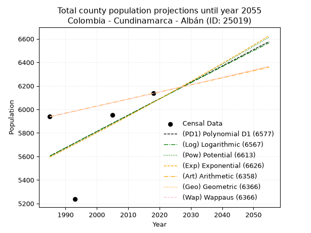
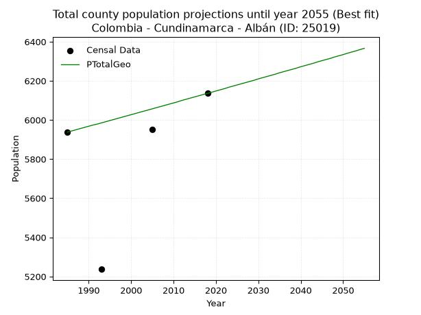
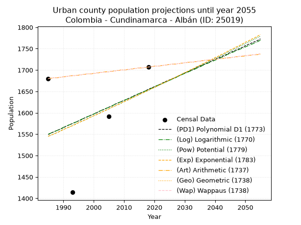
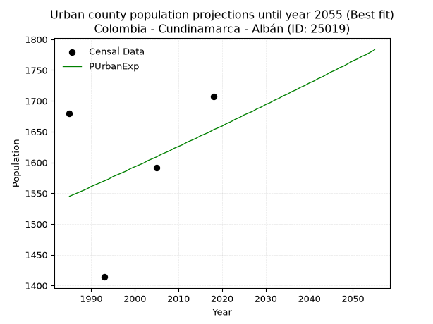
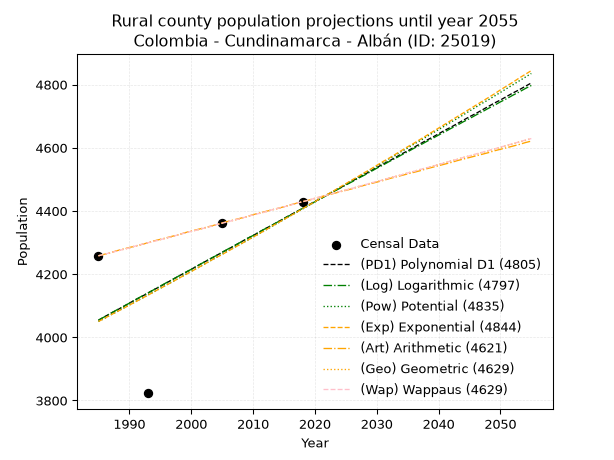
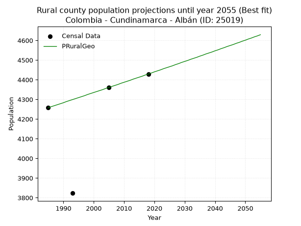

<div align="center">


</div>

# _“Population and Public Services Demand Projections (PPSD) until Year 2050 for Colombia - Cundinamarca - Albán (ID: 25019)”_
Keywords: `population` `public-service` `projection` `lineal` `polynomial` `logarithmic` `potential` `exponential` `arithmetic` `geometric` `wappaus` `dane` `colombia` `south-america`

PPSD are analytical estimates used by governments and planners to anticipate future changes in population size, age distribution, and the resulting community needs for utilities, healthcare, education, and infrastructure as sizing future water treatment facilities, electrical grids, and road networks based on spatial growth.

> **General running parameters**: • app_version: _v20260806_. • Python version: _3.14.7_. • Pandas version: _3.0.5_. • NumPy version: _2.5.1_. • Creates, save and include plots into reports (create_plot): _False_. • Projection until year: _2050_. • Process polynomial degree 2 and up: _False_. • Process Wappaus: _True_. • Process Wappaus: _True_. • Set negative values to zero: _True_. • Set infinite values to zero: _True_. • Drop dataset notes: _True_. 
<div align="center">

Dynamic map: [:earth_americas:Google](http://maps.google.com/maps?q=4.878022123,-74.438261) [:earth_americas:OSM](https://www.openstreetmap.org/#map=18/4.878022123/-74.438261&layers=P) [:earth_americas:Bing](https://www.bing.com/maps?cp=4.878022123~-74.438261&lvl=18) [:earth_americas:Apple](https://maps.apple.com/frame?center=4.878022123%2C-74.438261&span=0.003%2C0.006)

</div>


<div align="center">

```geojson
{
  "type": "Feature",
  "geometry": {
    "type": "Point", 
    "coordinates": [-74.438261, 4.878022123]
  }, 
  "properties": {
    "Name": "Colombia - Cundinamarca - Albán (ID: 25019)"
  }
}
```

</div>


## 0. Census Data (4 records)

Census data are official statistics collected by a government about the people and housing in a country. They usually include counts of total population, age, sex, race, income, education, and jobs.

📅Global census file: [Population.xlsx](../data/Population.xlsx)

| Source   |   Year |   CountryID | CountryName   |   StateID | StateName    |   CountyID | CountyName   |   PTotal |   PUrban |   PRural |
|:---------|-------:|------------:|:--------------|----------:|:-------------|-----------:|:-------------|---------:|---------:|---------:|
| DANE     |   1985 |          57 | Colombia      |        25 | Cundinamarca |      25019 | Albán        |     5938 |     1680 |     4258 |
| DANE     |   1993 |          57 | Colombia      |        25 | Cundinamarca |      25019 | Albán        |     5237 |     1414 |     3823 |
| DANE     |   2005 |          57 | Colombia      |        25 | Cundinamarca |      25019 | Albán        |     5952 |     1591 |     4361 |
| DANE     |   2018 |          57 | Colombia      |        25 | Cundinamarca |      25019 | Albán        |     6136 |     1707 |     4429 |

> 🔥Some records could had specific notes about the registered values or the corresponding urban or rural distribution.

## 1. Total

### 1.1. Coefficients and Parameters

* (PD1) Polynomial Deg 1: 13.911280610196554, -22010.289040545656 (lineal)
* (Log) Logarithmic: 27782.7727566389, -205361.3283603806
* (Pow) Potential: 4.823691164447433, -12.159552588739698
* (Exp) Exponential: 0.0024153655564986454, 46.301562735277166
* (Art) Arithmetic: Year diff. 2018 - 1985 = 33, Population diff. 6136 - 5938 = 198, Annual growth = 6.0
* (Geo) Geometric: Year diff. 2018 - 1985 = 33, Population diff. 6136 - 5938 = 198, Annual growth % = 0.0009944543762210323
* (Wap) Wappaus: i = 0.09938711280437303, Condition values only valid for < 200)

<sub>
Wappaus condition values: ['0.00', '0.10', '0.20', '0.30', '0.40', '0.50', '0.60', '0.70', '0.80', '0.89', '0.99', '1.09', '1.19', '1.29', '1.39', '1.49', '1.59', '1.69', '1.79', '1.89', '1.99', '2.09', '2.19', '2.29', '2.39', '2.48', '2.58', '2.68', '2.78', '2.88', '2.98', '3.08', '3.18', '3.28', '3.38', '3.48', '3.58', '3.68', '3.78', '3.88', '3.98', '4.07', '4.17', '4.27', '4.37', '4.47', '4.57', '4.67', '4.77', '4.87', '4.97', '5.07', '5.17', '5.27', '5.37', '5.47', '5.57', '5.67', '5.76', '5.86', '5.96', '6.06', '6.16', '6.26', '6.36', '6.46']
</sub>


### 1.2. Projected Dataset

|   Year |   CountyID |   PTotalPD1 |   PTotalLog |   PTotalPow |   PTotalExp |   PTotalArt |   PTotalGeo |   PTotalWap |
|-------:|-----------:|------------:|------------:|------------:|------------:|------------:|------------:|------------:|
|   1985 |      25019 |        5604 |        5604 |        5595 |        5595 |        5938 |        5938 |        5938 |
|   1986 |      25019 |        5618 |        5618 |        5609 |        5609 |        5944 |        5944 |        5944 |
|   1987 |      25019 |        5631 |        5632 |        5623 |        5622 |        5950 |        5950 |        5950 |
|   1988 |      25019 |        5645 |        5646 |        5636 |        5636 |        5956 |        5956 |        5956 |
|   1989 |      25019 |        5659 |        5660 |        5650 |        5650 |        5962 |        5962 |        5962 |
|   1990 |      25019 |        5673 |        5674 |        5664 |        5663 |        5968 |        5968 |        5968 |
|   1991 |      25019 |        5687 |        5688 |        5677 |        5677 |        5974 |        5974 |        5974 |
|   1992 |      25019 |        5701 |        5701 |        5691 |        5691 |        5980 |        5979 |        5979 |
|   1993 |      25019 |        5715 |        5715 |        5705 |        5704 |        5986 |        5985 |        5985 |
|   1994 |      25019 |        5729 |        5729 |        5719 |        5718 |        5992 |        5991 |        5991 |
|   1995 |      25019 |        5743 |        5743 |        5733 |        5732 |        5998 |        5997 |        5997 |
|   1996 |      25019 |        5757 |        5757 |        5746 |        5746 |        6004 |        6003 |        6003 |
|   1997 |      25019 |        5771 |        5771 |        5760 |        5760 |        6010 |        6009 |        6009 |
|   1998 |      25019 |        5784 |        5785 |        5774 |        5774 |        6016 |        6015 |        6015 |
|   1999 |      25019 |        5798 |        5799 |        5788 |        5788 |        6022 |        6021 |        6021 |
|   2000 |      25019 |        5812 |        5813 |        5802 |        5802 |        6028 |        6027 |        6027 |
|   2001 |      25019 |        5826 |        5827 |        5816 |        5816 |        6034 |        6033 |        6033 |
|   2002 |      25019 |        5840 |        5841 |        5830 |        5830 |        6040 |        6039 |        6039 |
|   2003 |      25019 |        5854 |        5854 |        5844 |        5844 |        6046 |        6045 |        6045 |
|   2004 |      25019 |        5868 |        5868 |        5858 |        5858 |        6052 |        6051 |        6051 |
|   2005 |      25019 |        5882 |        5882 |        5873 |        5872 |        6058 |        6057 |        6057 |
|   2006 |      25019 |        5896 |        5896 |        5887 |        5886 |        6064 |        6063 |        6063 |
|   2007 |      25019 |        5910 |        5910 |        5901 |        5901 |        6070 |        6069 |        6069 |
|   2008 |      25019 |        5924 |        5924 |        5915 |        5915 |        6076 |        6075 |        6075 |
|   2009 |      25019 |        5937 |        5938 |        5929 |        5929 |        6082 |        6081 |        6081 |
|   2010 |      25019 |        5951 |        5951 |        5944 |        5944 |        6088 |        6087 |        6087 |
|   2011 |      25019 |        5965 |        5965 |        5958 |        5958 |        6094 |        6093 |        6093 |
|   2012 |      25019 |        5979 |        5979 |        5972 |        5972 |        6100 |        6100 |        6100 |
|   2013 |      25019 |        5993 |        5993 |        5986 |        5987 |        6106 |        6106 |        6106 |
|   2014 |      25019 |        6007 |        6007 |        6001 |        6001 |        6112 |        6112 |        6112 |
|   2015 |      25019 |        6021 |        6020 |        6015 |        6016 |        6118 |        6118 |        6118 |
|   2016 |      25019 |        6035 |        6034 |        6030 |        6030 |        6124 |        6124 |        6124 |
|   2017 |      25019 |        6049 |        6048 |        6044 |        6045 |        6130 |        6130 |        6130 |
|   2018 |      25019 |        6063 |        6062 |        6059 |        6060 |        6136 |        6136 |        6136 |
|   2019 |      25019 |        6077 |        6076 |        6073 |        6074 |        6142 |        6142 |        6142 |
|   2020 |      25019 |        6090 |        6089 |        6088 |        6089 |        6148 |        6148 |        6148 |
|   2021 |      25019 |        6104 |        6103 |        6102 |        6104 |        6154 |        6154 |        6154 |
|   2022 |      25019 |        6118 |        6117 |        6117 |        6118 |        6160 |        6160 |        6160 |
|   2023 |      25019 |        6132 |        6130 |        6131 |        6133 |        6166 |        6167 |        6167 |
|   2024 |      25019 |        6146 |        6144 |        6146 |        6148 |        6172 |        6173 |        6173 |
|   2025 |      25019 |        6160 |        6158 |        6161 |        6163 |        6178 |        6179 |        6179 |
|   2026 |      25019 |        6174 |        6172 |        6175 |        6178 |        6184 |        6185 |        6185 |
|   2027 |      25019 |        6188 |        6185 |        6190 |        6193 |        6190 |        6191 |        6191 |
|   2028 |      25019 |        6202 |        6199 |        6205 |        6208 |        6196 |        6197 |        6197 |
|   2029 |      25019 |        6216 |        6213 |        6219 |        6223 |        6202 |        6203 |        6203 |
|   2030 |      25019 |        6230 |        6226 |        6234 |        6238 |        6208 |        6210 |        6210 |
|   2031 |      25019 |        6244 |        6240 |        6249 |        6253 |        6214 |        6216 |        6216 |
|   2032 |      25019 |        6257 |        6254 |        6264 |        6268 |        6220 |        6222 |        6222 |
|   2033 |      25019 |        6271 |        6267 |        6279 |        6283 |        6226 |        6228 |        6228 |
|   2034 |      25019 |        6285 |        6281 |        6294 |        6298 |        6232 |        6234 |        6234 |
|   2035 |      25019 |        6299 |        6295 |        6309 |        6313 |        6238 |        6241 |        6241 |
|   2036 |      25019 |        6313 |        6308 |        6324 |        6329 |        6244 |        6247 |        6247 |
|   2037 |      25019 |        6327 |        6322 |        6339 |        6344 |        6250 |        6253 |        6253 |
|   2038 |      25019 |        6341 |        6336 |        6354 |        6359 |        6256 |        6259 |        6259 |
|   2039 |      25019 |        6355 |        6349 |        6369 |        6375 |        6262 |        6265 |        6265 |
|   2040 |      25019 |        6369 |        6363 |        6384 |        6390 |        6268 |        6272 |        6272 |
|   2041 |      25019 |        6383 |        6377 |        6399 |        6406 |        6274 |        6278 |        6278 |
|   2042 |      25019 |        6397 |        6390 |        6414 |        6421 |        6280 |        6284 |        6284 |
|   2043 |      25019 |        6410 |        6404 |        6429 |        6437 |        6286 |        6290 |        6290 |
|   2044 |      25019 |        6424 |        6417 |        6444 |        6452 |        6292 |        6297 |        6297 |
|   2045 |      25019 |        6438 |        6431 |        6460 |        6468 |        6298 |        6303 |        6303 |
|   2046 |      25019 |        6452 |        6445 |        6475 |        6483 |        6304 |        6309 |        6309 |
|   2047 |      25019 |        6466 |        6458 |        6490 |        6499 |        6310 |        6315 |        6316 |
|   2048 |      25019 |        6480 |        6472 |        6505 |        6515 |        6316 |        6322 |        6322 |
|   2049 |      25019 |        6494 |        6485 |        6521 |        6531 |        6322 |        6328 |        6328 |
|   2050 |      25019 |        6508 |        6499 |        6536 |        6546 |        6328 |        6334 |        6334 |
<div align="center">

</img>

</div>


### 1.3. Best fit with absolute and relative error (%)

Relative error puts that difference into context by dividing the absolute error by the true value, creating a unitless ratio or percentage that shows the scale of the mistake.

Absolute and relative error

|   Year | Source   |   CountryID | CountryName   |   StateID | StateName    |   CountyID_x | CountyName   |   PTotal |   PUrban |   PRural |   CountyID_y |   PTotalPD1 |   PTotalLog |   PTotalPow |   PTotalExp |   PTotalArt |   PTotalGeo |   PTotalWap |   PTotalPD1AbsError |   PTotalLogAbsError |   PTotalPowAbsError |   PTotalExpAbsError |   PTotalArtAbsError |   PTotalGeoAbsError |   PTotalWapAbsError |   PTotalPD1RelError |   PTotalLogRelError |   PTotalPowRelError |   PTotalExpRelError |   PTotalArtRelError |   PTotalGeoRelError |   PTotalWapRelError |
|-------:|:---------|------------:|:--------------|----------:|:-------------|-------------:|:-------------|---------:|---------:|---------:|-------------:|------------:|------------:|------------:|------------:|------------:|------------:|------------:|--------------------:|--------------------:|--------------------:|--------------------:|--------------------:|--------------------:|--------------------:|--------------------:|--------------------:|--------------------:|--------------------:|--------------------:|--------------------:|--------------------:|
|   1985 | DANE     |          57 | Colombia      |        25 | Cundinamarca |        25019 | Albán        |     5938 |     1680 |     4258 |        25019 |        5604 |        5604 |        5595 |        5595 |        5938 |        5938 |        5938 |                 334 |                 334 |                 343 |                 343 |                   0 |                   0 |                   0 |             5.62479 |             5.62479 |             5.77636 |             5.77636 |             0       |             0       |             0       |
|   1993 | DANE     |          57 | Colombia      |        25 | Cundinamarca |        25019 | Albán        |     5237 |     1414 |     3823 |        25019 |        5715 |        5715 |        5705 |        5704 |        5986 |        5985 |        5985 |                 478 |                 478 |                 468 |                 467 |                 749 |                 748 |                 748 |             9.12736 |             9.12736 |             8.93641 |             8.91732 |            14.3021  |            14.283   |            14.283   |
|   2005 | DANE     |          57 | Colombia      |        25 | Cundinamarca |        25019 | Albán        |     5952 |     1591 |     4361 |        25019 |        5882 |        5882 |        5873 |        5872 |        6058 |        6057 |        6057 |                  70 |                  70 |                  79 |                  80 |                 106 |                 105 |                 105 |             1.17608 |             1.17608 |             1.32728 |             1.34409 |             1.78091 |             1.76411 |             1.76411 |
|   2018 | DANE     |          57 | Colombia      |        25 | Cundinamarca |        25019 | Albán        |     6136 |     1707 |     4429 |        25019 |        6063 |        6062 |        6059 |        6060 |        6136 |        6136 |        6136 |                  73 |                  74 |                  77 |                  76 |                   0 |                   0 |                   0 |             1.1897  |             1.206   |             1.25489 |             1.23859 |             0       |             0       |             0       |

Relative error mean

| Method    |   RelError | Best   |
|:----------|-----------:|:-------|
| PTotalPD1 |    4.27948 |        |
| PTotalLog |    4.28356 |        |
| PTotalPow |    4.32374 |        |
| PTotalExp |    4.31909 |        |
| PTotalArt |    4.02075 |        |
| PTotalGeo |    4.01177 | True   |
| PTotalWap |    4.01177 | True   |

💙Best method: _**PTotalGeo**_
<div align="center">

</img>

</div>


### 1.4. Fresh water supply demand in liters per capita per day (lpcd)

The fresh water supply demand typically ranges from 100 to 300 liters per capita per day (lpcd) for standard domestic and municipal planning, though absolute survival minimums set by the World Health Organization are as low as 7.5 to 20 liters per day, and total consumption in high-income nations can exceed 400 liters.

> `CZ`: Level in meters above the sea level (masl).<br> `WS`: Fresh water supply demand in liters per capita per day (lpcd or l/h/d).<br> `WSAll`: Zonal fresh water supply demand in liters per second (l/s).<br> `A`: Zonal area in square meters.

Reference values (RAS Colombia)

|    CZ |   WS |
|------:|-----:|
|  1000 |  120 |
|  2000 |  130 |
| 99999 |  140 |

County shapefile geometry properties and water supply values

|   CountyID |     ATotal |   CZTotal |   WSTotal |
|-----------:|-----------:|----------:|----------:|
|      25019 | 5.0751e+07 |   2023.97 |       140 |

Projected values for best method: PTotalGeo

|   CountyID |   Year |   PTotalGeo |   WSTotal |   WSTotalAll |
|-----------:|-------:|------------:|----------:|-------------:|
|      25019 |   1985 |        5938 |       140 |      9.62176 |
|      25019 |   1986 |        5944 |       140 |      9.63148 |
|      25019 |   1987 |        5950 |       140 |      9.6412  |
|      25019 |   1988 |        5956 |       140 |      9.65093 |
|      25019 |   1989 |        5962 |       140 |      9.66065 |
|      25019 |   1990 |        5968 |       140 |      9.67037 |
|      25019 |   1991 |        5974 |       140 |      9.68009 |
|      25019 |   1992 |        5979 |       140 |      9.68819 |
|      25019 |   1993 |        5985 |       140 |      9.69792 |
|      25019 |   1994 |        5991 |       140 |      9.70764 |
|      25019 |   1995 |        5997 |       140 |      9.71736 |
|      25019 |   1996 |        6003 |       140 |      9.72708 |
|      25019 |   1997 |        6009 |       140 |      9.73681 |
|      25019 |   1998 |        6015 |       140 |      9.74653 |
|      25019 |   1999 |        6021 |       140 |      9.75625 |
|      25019 |   2000 |        6027 |       140 |      9.76597 |
|      25019 |   2001 |        6033 |       140 |      9.77569 |
|      25019 |   2002 |        6039 |       140 |      9.78542 |
|      25019 |   2003 |        6045 |       140 |      9.79514 |
|      25019 |   2004 |        6051 |       140 |      9.80486 |
|      25019 |   2005 |        6057 |       140 |      9.81458 |
|      25019 |   2006 |        6063 |       140 |      9.82431 |
|      25019 |   2007 |        6069 |       140 |      9.83403 |
|      25019 |   2008 |        6075 |       140 |      9.84375 |
|      25019 |   2009 |        6081 |       140 |      9.85347 |
|      25019 |   2010 |        6087 |       140 |      9.86319 |
|      25019 |   2011 |        6093 |       140 |      9.87292 |
|      25019 |   2012 |        6100 |       140 |      9.88426 |
|      25019 |   2013 |        6106 |       140 |      9.89398 |
|      25019 |   2014 |        6112 |       140 |      9.9037  |
|      25019 |   2015 |        6118 |       140 |      9.91343 |
|      25019 |   2016 |        6124 |       140 |      9.92315 |
|      25019 |   2017 |        6130 |       140 |      9.93287 |
|      25019 |   2018 |        6136 |       140 |      9.94259 |
|      25019 |   2019 |        6142 |       140 |      9.95231 |
|      25019 |   2020 |        6148 |       140 |      9.96204 |
|      25019 |   2021 |        6154 |       140 |      9.97176 |
|      25019 |   2022 |        6160 |       140 |      9.98148 |
|      25019 |   2023 |        6167 |       140 |      9.99282 |
|      25019 |   2024 |        6173 |       140 |     10.0025  |
|      25019 |   2025 |        6179 |       140 |     10.0123  |
|      25019 |   2026 |        6185 |       140 |     10.022   |
|      25019 |   2027 |        6191 |       140 |     10.0317  |
|      25019 |   2028 |        6197 |       140 |     10.0414  |
|      25019 |   2029 |        6203 |       140 |     10.0512  |
|      25019 |   2030 |        6210 |       140 |     10.0625  |
|      25019 |   2031 |        6216 |       140 |     10.0722  |
|      25019 |   2032 |        6222 |       140 |     10.0819  |
|      25019 |   2033 |        6228 |       140 |     10.0917  |
|      25019 |   2034 |        6234 |       140 |     10.1014  |
|      25019 |   2035 |        6241 |       140 |     10.1127  |
|      25019 |   2036 |        6247 |       140 |     10.1225  |
|      25019 |   2037 |        6253 |       140 |     10.1322  |
|      25019 |   2038 |        6259 |       140 |     10.1419  |
|      25019 |   2039 |        6265 |       140 |     10.1516  |
|      25019 |   2040 |        6272 |       140 |     10.163   |
|      25019 |   2041 |        6278 |       140 |     10.1727  |
|      25019 |   2042 |        6284 |       140 |     10.1824  |
|      25019 |   2043 |        6290 |       140 |     10.1921  |
|      25019 |   2044 |        6297 |       140 |     10.2035  |
|      25019 |   2045 |        6303 |       140 |     10.2132  |
|      25019 |   2046 |        6309 |       140 |     10.2229  |
|      25019 |   2047 |        6315 |       140 |     10.2326  |
|      25019 |   2048 |        6322 |       140 |     10.244   |
|      25019 |   2049 |        6328 |       140 |     10.2537  |
|      25019 |   2050 |        6334 |       140 |     10.2634  |

## 2. Urban

### 2.1. Coefficients and Parameters

* (PD1) Polynomial Deg 1: 3.187474909674749, -4777.746688076916 (lineal)
* (Log) Logarithmic: 6349.585770524065, -46665.252324140456
* (Pow) Potential: 4.076039766494223, -10.252900786507388
* (Exp) Exponential: 0.0020459955412880197, 26.611190851967944
* (Art) Arithmetic: Year diff. 2018 - 1985 = 33, Population diff. 1707 - 1680 = 27, Annual growth = 0.8181818181818182
* (Geo) Geometric: Year diff. 2018 - 1985 = 33, Population diff. 1707 - 1680 = 27, Annual growth % = 0.0004832576524986809
* (Wap) Wappaus: i = 0.04831306868507931, Condition values only valid for < 200)

<sub>
Wappaus condition values: ['0.00', '0.05', '0.10', '0.14', '0.19', '0.24', '0.29', '0.34', '0.39', '0.43', '0.48', '0.53', '0.58', '0.63', '0.68', '0.72', '0.77', '0.82', '0.87', '0.92', '0.97', '1.01', '1.06', '1.11', '1.16', '1.21', '1.26', '1.30', '1.35', '1.40', '1.45', '1.50', '1.55', '1.59', '1.64', '1.69', '1.74', '1.79', '1.84', '1.88', '1.93', '1.98', '2.03', '2.08', '2.13', '2.17', '2.22', '2.27', '2.32', '2.37', '2.42', '2.46', '2.51', '2.56', '2.61', '2.66', '2.71', '2.75', '2.80', '2.85', '2.90', '2.95', '3.00', '3.04', '3.09', '3.14']
</sub>


### 2.2. Projected Dataset

|   Year |   CountyID |   PUrbanPD1 |   PUrbanLog |   PUrbanPow |   PUrbanExp |   PUrbanArt |   PUrbanGeo |   PUrbanWap |
|-------:|-----------:|------------:|------------:|------------:|------------:|------------:|------------:|------------:|
|   1985 |      25019 |        1549 |        1550 |        1545 |        1545 |        1680 |        1680 |        1680 |
|   1986 |      25019 |        1553 |        1553 |        1548 |        1548 |        1681 |        1681 |        1681 |
|   1987 |      25019 |        1556 |        1556 |        1551 |        1551 |        1682 |        1682 |        1682 |
|   1988 |      25019 |        1559 |        1559 |        1554 |        1554 |        1682 |        1682 |        1682 |
|   1989 |      25019 |        1562 |        1562 |        1558 |        1557 |        1683 |        1683 |        1683 |
|   1990 |      25019 |        1565 |        1566 |        1561 |        1561 |        1684 |        1684 |        1684 |
|   1991 |      25019 |        1569 |        1569 |        1564 |        1564 |        1685 |        1685 |        1685 |
|   1992 |      25019 |        1572 |        1572 |        1567 |        1567 |        1686 |        1686 |        1686 |
|   1993 |      25019 |        1575 |        1575 |        1570 |        1570 |        1687 |        1687 |        1687 |
|   1994 |      25019 |        1578 |        1578 |        1574 |        1573 |        1687 |        1687 |        1687 |
|   1995 |      25019 |        1581 |        1581 |        1577 |        1577 |        1688 |        1688 |        1688 |
|   1996 |      25019 |        1584 |        1585 |        1580 |        1580 |        1689 |        1689 |        1689 |
|   1997 |      25019 |        1588 |        1588 |        1583 |        1583 |        1690 |        1690 |        1690 |
|   1998 |      25019 |        1591 |        1591 |        1587 |        1586 |        1691 |        1691 |        1691 |
|   1999 |      25019 |        1594 |        1594 |        1590 |        1590 |        1691 |        1691 |        1691 |
|   2000 |      25019 |        1597 |        1597 |        1593 |        1593 |        1692 |        1692 |        1692 |
|   2001 |      25019 |        1600 |        1601 |        1596 |        1596 |        1693 |        1693 |        1693 |
|   2002 |      25019 |        1604 |        1604 |        1600 |        1599 |        1694 |        1694 |        1694 |
|   2003 |      25019 |        1607 |        1607 |        1603 |        1603 |        1695 |        1695 |        1695 |
|   2004 |      25019 |        1610 |        1610 |        1606 |        1606 |        1696 |        1695 |        1695 |
|   2005 |      25019 |        1613 |        1613 |        1609 |        1609 |        1696 |        1696 |        1696 |
|   2006 |      25019 |        1616 |        1616 |        1613 |        1613 |        1697 |        1697 |        1697 |
|   2007 |      25019 |        1620 |        1620 |        1616 |        1616 |        1698 |        1698 |        1698 |
|   2008 |      25019 |        1623 |        1623 |        1619 |        1619 |        1699 |        1699 |        1699 |
|   2009 |      25019 |        1626 |        1626 |        1622 |        1623 |        1700 |        1700 |        1700 |
|   2010 |      25019 |        1629 |        1629 |        1626 |        1626 |        1700 |        1700 |        1700 |
|   2011 |      25019 |        1632 |        1632 |        1629 |        1629 |        1701 |        1701 |        1701 |
|   2012 |      25019 |        1635 |        1635 |        1632 |        1633 |        1702 |        1702 |        1702 |
|   2013 |      25019 |        1639 |        1638 |        1636 |        1636 |        1703 |        1703 |        1703 |
|   2014 |      25019 |        1642 |        1642 |        1639 |        1639 |        1704 |        1704 |        1704 |
|   2015 |      25019 |        1645 |        1645 |        1642 |        1643 |        1705 |        1705 |        1705 |
|   2016 |      25019 |        1648 |        1648 |        1646 |        1646 |        1705 |        1705 |        1705 |
|   2017 |      25019 |        1651 |        1651 |        1649 |        1649 |        1706 |        1706 |        1706 |
|   2018 |      25019 |        1655 |        1654 |        1652 |        1653 |        1707 |        1707 |        1707 |
|   2019 |      25019 |        1658 |        1657 |        1656 |        1656 |        1708 |        1708 |        1708 |
|   2020 |      25019 |        1661 |        1661 |        1659 |        1659 |        1709 |        1709 |        1709 |
|   2021 |      25019 |        1664 |        1664 |        1662 |        1663 |        1709 |        1709 |        1709 |
|   2022 |      25019 |        1667 |        1667 |        1666 |        1666 |        1710 |        1710 |        1710 |
|   2023 |      25019 |        1671 |        1670 |        1669 |        1670 |        1711 |        1711 |        1711 |
|   2024 |      25019 |        1674 |        1673 |        1672 |        1673 |        1712 |        1712 |        1712 |
|   2025 |      25019 |        1677 |        1676 |        1676 |        1677 |        1713 |        1713 |        1713 |
|   2026 |      25019 |        1680 |        1679 |        1679 |        1680 |        1714 |        1714 |        1714 |
|   2027 |      25019 |        1683 |        1682 |        1683 |        1683 |        1714 |        1714 |        1714 |
|   2028 |      25019 |        1686 |        1686 |        1686 |        1687 |        1715 |        1715 |        1715 |
|   2029 |      25019 |        1690 |        1689 |        1689 |        1690 |        1716 |        1716 |        1716 |
|   2030 |      25019 |        1693 |        1692 |        1693 |        1694 |        1717 |        1717 |        1717 |
|   2031 |      25019 |        1696 |        1695 |        1696 |        1697 |        1718 |        1718 |        1718 |
|   2032 |      25019 |        1699 |        1698 |        1700 |        1701 |        1718 |        1719 |        1719 |
|   2033 |      25019 |        1702 |        1701 |        1703 |        1704 |        1719 |        1719 |        1719 |
|   2034 |      25019 |        1706 |        1704 |        1706 |        1708 |        1720 |        1720 |        1720 |
|   2035 |      25019 |        1709 |        1707 |        1710 |        1711 |        1721 |        1721 |        1721 |
|   2036 |      25019 |        1712 |        1711 |        1713 |        1715 |        1722 |        1722 |        1722 |
|   2037 |      25019 |        1715 |        1714 |        1717 |        1718 |        1723 |        1723 |        1723 |
|   2038 |      25019 |        1718 |        1717 |        1720 |        1722 |        1723 |        1724 |        1724 |
|   2039 |      25019 |        1722 |        1720 |        1724 |        1725 |        1724 |        1724 |        1724 |
|   2040 |      25019 |        1725 |        1723 |        1727 |        1729 |        1725 |        1725 |        1725 |
|   2041 |      25019 |        1728 |        1726 |        1730 |        1732 |        1726 |        1726 |        1726 |
|   2042 |      25019 |        1731 |        1729 |        1734 |        1736 |        1727 |        1727 |        1727 |
|   2043 |      25019 |        1734 |        1732 |        1737 |        1739 |        1727 |        1728 |        1728 |
|   2044 |      25019 |        1737 |        1736 |        1741 |        1743 |        1728 |        1729 |        1729 |
|   2045 |      25019 |        1741 |        1739 |        1744 |        1747 |        1729 |        1729 |        1729 |
|   2046 |      25019 |        1744 |        1742 |        1748 |        1750 |        1730 |        1730 |        1730 |
|   2047 |      25019 |        1747 |        1745 |        1751 |        1754 |        1731 |        1731 |        1731 |
|   2048 |      25019 |        1750 |        1748 |        1755 |        1757 |        1732 |        1732 |        1732 |
|   2049 |      25019 |        1753 |        1751 |        1758 |        1761 |        1732 |        1733 |        1733 |
|   2050 |      25019 |        1757 |        1754 |        1762 |        1765 |        1733 |        1734 |        1734 |
<div align="center">

</img>

</div>


### 2.3. Best fit with absolute and relative error (%)

Relative error puts that difference into context by dividing the absolute error by the true value, creating a unitless ratio or percentage that shows the scale of the mistake.

Absolute and relative error

|   Year | Source   |   CountryID | CountryName   |   StateID | StateName    |   CountyID_x | CountyName   |   PTotal |   PUrban |   PRural |   CountyID_y |   PUrbanPD1 |   PUrbanLog |   PUrbanPow |   PUrbanExp |   PUrbanArt |   PUrbanGeo |   PUrbanWap |   PUrbanPD1AbsError |   PUrbanLogAbsError |   PUrbanPowAbsError |   PUrbanExpAbsError |   PUrbanArtAbsError |   PUrbanGeoAbsError |   PUrbanWapAbsError |   PUrbanPD1RelError |   PUrbanLogRelError |   PUrbanPowRelError |   PUrbanExpRelError |   PUrbanArtRelError |   PUrbanGeoRelError |   PUrbanWapRelError |
|-------:|:---------|------------:|:--------------|----------:|:-------------|-------------:|:-------------|---------:|---------:|---------:|-------------:|------------:|------------:|------------:|------------:|------------:|------------:|------------:|--------------------:|--------------------:|--------------------:|--------------------:|--------------------:|--------------------:|--------------------:|--------------------:|--------------------:|--------------------:|--------------------:|--------------------:|--------------------:|--------------------:|
|   1985 | DANE     |          57 | Colombia      |        25 | Cundinamarca |        25019 | Albán        |     5938 |     1680 |     4258 |        25019 |        1549 |        1550 |        1545 |        1545 |        1680 |        1680 |        1680 |                 131 |                 130 |                 135 |                 135 |                   0 |                   0 |                   0 |             7.79762 |             7.7381  |             8.03571 |             8.03571 |             0       |             0       |             0       |
|   1993 | DANE     |          57 | Colombia      |        25 | Cundinamarca |        25019 | Albán        |     5237 |     1414 |     3823 |        25019 |        1575 |        1575 |        1570 |        1570 |        1687 |        1687 |        1687 |                 161 |                 161 |                 156 |                 156 |                 273 |                 273 |                 273 |            11.3861  |            11.3861  |            11.0325  |            11.0325  |            19.3069  |            19.3069  |            19.3069  |
|   2005 | DANE     |          57 | Colombia      |        25 | Cundinamarca |        25019 | Albán        |     5952 |     1591 |     4361 |        25019 |        1613 |        1613 |        1609 |        1609 |        1696 |        1696 |        1696 |                  22 |                  22 |                  18 |                  18 |                 105 |                 105 |                 105 |             1.38278 |             1.38278 |             1.13136 |             1.13136 |             6.59962 |             6.59962 |             6.59962 |
|   2018 | DANE     |          57 | Colombia      |        25 | Cundinamarca |        25019 | Albán        |     6136 |     1707 |     4429 |        25019 |        1655 |        1654 |        1652 |        1653 |        1707 |        1707 |        1707 |                  52 |                  53 |                  55 |                  54 |                   0 |                   0 |                   0 |             3.04628 |             3.10486 |             3.22203 |             3.16344 |             0       |             0       |             0       |

Relative error mean

| Method    |   RelError | Best   |
|:----------|-----------:|:-------|
| PUrbanPD1 |    5.9032  |        |
| PUrbanLog |    5.90297 |        |
| PUrbanPow |    5.85541 |        |
| PUrbanExp |    5.84076 | True   |
| PUrbanArt |    6.47664 |        |
| PUrbanGeo |    6.47664 |        |
| PUrbanWap |    6.47664 |        |

💙Best method: _**PUrbanExp**_
<div align="center">

</img>

</div>


### 2.4. Fresh water supply demand in liters per capita per day (lpcd)

The fresh water supply demand typically ranges from 100 to 300 liters per capita per day (lpcd) for standard domestic and municipal planning, though absolute survival minimums set by the World Health Organization are as low as 7.5 to 20 liters per day, and total consumption in high-income nations can exceed 400 liters.

> `CZ`: Level in meters above the sea level (masl).<br> `WS`: Fresh water supply demand in liters per capita per day (lpcd or l/h/d).<br> `WSAll`: Zonal fresh water supply demand in liters per second (l/s).<br> `A`: Zonal area in square meters.

Reference values (RAS Colombia)

|    CZ |   WS |
|------:|-----:|
|  1000 |  120 |
|  2000 |  130 |
| 99999 |  140 |

County shapefile geometry properties and water supply values

|   CountyID |   AUrban |   CZUrban |   WSUrban |
|-----------:|---------:|----------:|----------:|
|      25019 |   451485 |   2239.31 |       140 |

Projected values for best method: PUrbanExp

|   CountyID |   Year |   PUrbanExp |   WSUrban |   WSUrbanAll |
|-----------:|-------:|------------:|----------:|-------------:|
|      25019 |   1985 |        1545 |       140 |      2.50347 |
|      25019 |   1986 |        1548 |       140 |      2.50833 |
|      25019 |   1987 |        1551 |       140 |      2.51319 |
|      25019 |   1988 |        1554 |       140 |      2.51806 |
|      25019 |   1989 |        1557 |       140 |      2.52292 |
|      25019 |   1990 |        1561 |       140 |      2.5294  |
|      25019 |   1991 |        1564 |       140 |      2.53426 |
|      25019 |   1992 |        1567 |       140 |      2.53912 |
|      25019 |   1993 |        1570 |       140 |      2.54398 |
|      25019 |   1994 |        1573 |       140 |      2.54884 |
|      25019 |   1995 |        1577 |       140 |      2.55532 |
|      25019 |   1996 |        1580 |       140 |      2.56019 |
|      25019 |   1997 |        1583 |       140 |      2.56505 |
|      25019 |   1998 |        1586 |       140 |      2.56991 |
|      25019 |   1999 |        1590 |       140 |      2.57639 |
|      25019 |   2000 |        1593 |       140 |      2.58125 |
|      25019 |   2001 |        1596 |       140 |      2.58611 |
|      25019 |   2002 |        1599 |       140 |      2.59097 |
|      25019 |   2003 |        1603 |       140 |      2.59745 |
|      25019 |   2004 |        1606 |       140 |      2.60231 |
|      25019 |   2005 |        1609 |       140 |      2.60718 |
|      25019 |   2006 |        1613 |       140 |      2.61366 |
|      25019 |   2007 |        1616 |       140 |      2.61852 |
|      25019 |   2008 |        1619 |       140 |      2.62338 |
|      25019 |   2009 |        1623 |       140 |      2.62986 |
|      25019 |   2010 |        1626 |       140 |      2.63472 |
|      25019 |   2011 |        1629 |       140 |      2.63958 |
|      25019 |   2012 |        1633 |       140 |      2.64606 |
|      25019 |   2013 |        1636 |       140 |      2.65093 |
|      25019 |   2014 |        1639 |       140 |      2.65579 |
|      25019 |   2015 |        1643 |       140 |      2.66227 |
|      25019 |   2016 |        1646 |       140 |      2.66713 |
|      25019 |   2017 |        1649 |       140 |      2.67199 |
|      25019 |   2018 |        1653 |       140 |      2.67847 |
|      25019 |   2019 |        1656 |       140 |      2.68333 |
|      25019 |   2020 |        1659 |       140 |      2.68819 |
|      25019 |   2021 |        1663 |       140 |      2.69468 |
|      25019 |   2022 |        1666 |       140 |      2.69954 |
|      25019 |   2023 |        1670 |       140 |      2.70602 |
|      25019 |   2024 |        1673 |       140 |      2.71088 |
|      25019 |   2025 |        1677 |       140 |      2.71736 |
|      25019 |   2026 |        1680 |       140 |      2.72222 |
|      25019 |   2027 |        1683 |       140 |      2.72708 |
|      25019 |   2028 |        1687 |       140 |      2.73356 |
|      25019 |   2029 |        1690 |       140 |      2.73843 |
|      25019 |   2030 |        1694 |       140 |      2.74491 |
|      25019 |   2031 |        1697 |       140 |      2.74977 |
|      25019 |   2032 |        1701 |       140 |      2.75625 |
|      25019 |   2033 |        1704 |       140 |      2.76111 |
|      25019 |   2034 |        1708 |       140 |      2.76759 |
|      25019 |   2035 |        1711 |       140 |      2.77245 |
|      25019 |   2036 |        1715 |       140 |      2.77894 |
|      25019 |   2037 |        1718 |       140 |      2.7838  |
|      25019 |   2038 |        1722 |       140 |      2.79028 |
|      25019 |   2039 |        1725 |       140 |      2.79514 |
|      25019 |   2040 |        1729 |       140 |      2.80162 |
|      25019 |   2041 |        1732 |       140 |      2.80648 |
|      25019 |   2042 |        1736 |       140 |      2.81296 |
|      25019 |   2043 |        1739 |       140 |      2.81782 |
|      25019 |   2044 |        1743 |       140 |      2.82431 |
|      25019 |   2045 |        1747 |       140 |      2.83079 |
|      25019 |   2046 |        1750 |       140 |      2.83565 |
|      25019 |   2047 |        1754 |       140 |      2.84213 |
|      25019 |   2048 |        1757 |       140 |      2.84699 |
|      25019 |   2049 |        1761 |       140 |      2.85347 |
|      25019 |   2050 |        1765 |       140 |      2.85995 |

## 3. Rural

### 3.1. Coefficients and Parameters

* (PD1) Polynomial Deg 1: 10.723805700521815, -17232.542352468758 (lineal)
* (Log) Logarithmic: 21433.186986114786, -158696.07603623986
* (Pow) Potential: 5.114658808887641, -13.259501178838029
* (Exp) Exponential: 0.002559159461141992, 25.19068102627575
* (Art) Arithmetic: Year diff. 2018 - 1985 = 33, Population diff. 4429 - 4258 = 171, Annual growth = 5.181818181818182
* (Geo) Geometric: Year diff. 2018 - 1985 = 33, Population diff. 4429 - 4258 = 171, Annual growth % = 0.0011938714453705312
* (Wap) Wappaus: i = 0.11930052220140858, Condition values only valid for < 200)

<sub>
Wappaus condition values: ['0.00', '0.12', '0.24', '0.36', '0.48', '0.60', '0.72', '0.84', '0.95', '1.07', '1.19', '1.31', '1.43', '1.55', '1.67', '1.79', '1.91', '2.03', '2.15', '2.27', '2.39', '2.51', '2.62', '2.74', '2.86', '2.98', '3.10', '3.22', '3.34', '3.46', '3.58', '3.70', '3.82', '3.94', '4.06', '4.18', '4.29', '4.41', '4.53', '4.65', '4.77', '4.89', '5.01', '5.13', '5.25', '5.37', '5.49', '5.61', '5.73', '5.85', '5.97', '6.08', '6.20', '6.32', '6.44', '6.56', '6.68', '6.80', '6.92', '7.04', '7.16', '7.28', '7.40', '7.52', '7.64', '7.75']
</sub>


### 3.2. Projected Dataset

|   Year |   CountyID |   PRuralPD1 |   PRuralLog |   PRuralPow |   PRuralExp |   PRuralArt |   PRuralGeo |   PRuralWap |
|-------:|-----------:|------------:|------------:|------------:|------------:|------------:|------------:|------------:|
|   1985 |      25019 |        4054 |        4054 |        4050 |        4050 |        4258 |        4258 |        4258 |
|   1986 |      25019 |        4065 |        4065 |        4060 |        4060 |        4263 |        4263 |        4263 |
|   1987 |      25019 |        4076 |        4076 |        4071 |        4071 |        4268 |        4268 |        4268 |
|   1988 |      25019 |        4086 |        4087 |        4081 |        4081 |        4274 |        4273 |        4273 |
|   1989 |      25019 |        4097 |        4097 |        4092 |        4091 |        4279 |        4278 |        4278 |
|   1990 |      25019 |        4108 |        4108 |        4102 |        4102 |        4284 |        4283 |        4283 |
|   1991 |      25019 |        4119 |        4119 |        4113 |        4112 |        4289 |        4289 |        4289 |
|   1992 |      25019 |        4129 |        4130 |        4123 |        4123 |        4294 |        4294 |        4294 |
|   1993 |      25019 |        4140 |        4140 |        4134 |        4133 |        4299 |        4299 |        4299 |
|   1994 |      25019 |        4151 |        4151 |        4144 |        4144 |        4305 |        4304 |        4304 |
|   1995 |      25019 |        4161 |        4162 |        4155 |        4155 |        4310 |        4309 |        4309 |
|   1996 |      25019 |        4172 |        4173 |        4166 |        4165 |        4315 |        4314 |        4314 |
|   1997 |      25019 |        4183 |        4183 |        4176 |        4176 |        4320 |        4319 |        4319 |
|   1998 |      25019 |        4194 |        4194 |        4187 |        4187 |        4325 |        4325 |        4325 |
|   1999 |      25019 |        4204 |        4205 |        4198 |        4197 |        4331 |        4330 |        4330 |
|   2000 |      25019 |        4215 |        4215 |        4209 |        4208 |        4336 |        4335 |        4335 |
|   2001 |      25019 |        4226 |        4226 |        4219 |        4219 |        4341 |        4340 |        4340 |
|   2002 |      25019 |        4237 |        4237 |        4230 |        4230 |        4346 |        4345 |        4345 |
|   2003 |      25019 |        4247 |        4248 |        4241 |        4241 |        4351 |        4350 |        4350 |
|   2004 |      25019 |        4258 |        4258 |        4252 |        4252 |        4356 |        4356 |        4356 |
|   2005 |      25019 |        4269 |        4269 |        4263 |        4262 |        4362 |        4361 |        4361 |
|   2006 |      25019 |        4279 |        4280 |        4274 |        4273 |        4367 |        4366 |        4366 |
|   2007 |      25019 |        4290 |        4290 |        4285 |        4284 |        4372 |        4371 |        4371 |
|   2008 |      25019 |        4301 |        4301 |        4295 |        4295 |        4377 |        4376 |        4376 |
|   2009 |      25019 |        4312 |        4312 |        4306 |        4306 |        4382 |        4382 |        4382 |
|   2010 |      25019 |        4322 |        4322 |        4317 |        4317 |        4388 |        4387 |        4387 |
|   2011 |      25019 |        4333 |        4333 |        4328 |        4328 |        4393 |        4392 |        4392 |
|   2012 |      25019 |        4344 |        4344 |        4339 |        4339 |        4398 |        4397 |        4397 |
|   2013 |      25019 |        4354 |        4354 |        4350 |        4351 |        4403 |        4403 |        4403 |
|   2014 |      25019 |        4365 |        4365 |        4361 |        4362 |        4408 |        4408 |        4408 |
|   2015 |      25019 |        4376 |        4376 |        4373 |        4373 |        4413 |        4413 |        4413 |
|   2016 |      25019 |        4387 |        4386 |        4384 |        4384 |        4419 |        4418 |        4418 |
|   2017 |      25019 |        4397 |        4397 |        4395 |        4395 |        4424 |        4424 |        4424 |
|   2018 |      25019 |        4408 |        4408 |        4406 |        4407 |        4429 |        4429 |        4429 |
|   2019 |      25019 |        4419 |        4418 |        4417 |        4418 |        4434 |        4434 |        4434 |
|   2020 |      25019 |        4430 |        4429 |        4428 |        4429 |        4439 |        4440 |        4440 |
|   2021 |      25019 |        4440 |        4439 |        4440 |        4441 |        4445 |        4445 |        4445 |
|   2022 |      25019 |        4451 |        4450 |        4451 |        4452 |        4450 |        4450 |        4450 |
|   2023 |      25019 |        4462 |        4461 |        4462 |        4463 |        4455 |        4456 |        4456 |
|   2024 |      25019 |        4472 |        4471 |        4473 |        4475 |        4460 |        4461 |        4461 |
|   2025 |      25019 |        4483 |        4482 |        4485 |        4486 |        4465 |        4466 |        4466 |
|   2026 |      25019 |        4494 |        4492 |        4496 |        4498 |        4470 |        4471 |        4471 |
|   2027 |      25019 |        4505 |        4503 |        4507 |        4509 |        4476 |        4477 |        4477 |
|   2028 |      25019 |        4515 |        4513 |        4519 |        4521 |        4481 |        4482 |        4482 |
|   2029 |      25019 |        4526 |        4524 |        4530 |        4532 |        4486 |        4488 |        4488 |
|   2030 |      25019 |        4537 |        4535 |        4542 |        4544 |        4491 |        4493 |        4493 |
|   2031 |      25019 |        4548 |        4545 |        4553 |        4556 |        4496 |        4498 |        4498 |
|   2032 |      25019 |        4558 |        4556 |        4565 |        4567 |        4502 |        4504 |        4504 |
|   2033 |      25019 |        4569 |        4566 |        4576 |        4579 |        4507 |        4509 |        4509 |
|   2034 |      25019 |        4580 |        4577 |        4588 |        4591 |        4512 |        4514 |        4514 |
|   2035 |      25019 |        4590 |        4587 |        4599 |        4603 |        4517 |        4520 |        4520 |
|   2036 |      25019 |        4601 |        4598 |        4611 |        4614 |        4522 |        4525 |        4525 |
|   2037 |      25019 |        4612 |        4608 |        4622 |        4626 |        4527 |        4531 |        4531 |
|   2038 |      25019 |        4623 |        4619 |        4634 |        4638 |        4533 |        4536 |        4536 |
|   2039 |      25019 |        4633 |        4629 |        4646 |        4650 |        4538 |        4541 |        4541 |
|   2040 |      25019 |        4644 |        4640 |        4657 |        4662 |        4543 |        4547 |        4547 |
|   2041 |      25019 |        4655 |        4650 |        4669 |        4674 |        4548 |        4552 |        4552 |
|   2042 |      25019 |        4665 |        4661 |        4681 |        4686 |        4553 |        4558 |        4558 |
|   2043 |      25019 |        4676 |        4671 |        4692 |        4698 |        4559 |        4563 |        4563 |
|   2044 |      25019 |        4687 |        4682 |        4704 |        4710 |        4564 |        4569 |        4569 |
|   2045 |      25019 |        4698 |        4692 |        4716 |        4722 |        4569 |        4574 |        4574 |
|   2046 |      25019 |        4708 |        4703 |        4728 |        4734 |        4574 |        4579 |        4580 |
|   2047 |      25019 |        4719 |        4713 |        4740 |        4746 |        4579 |        4585 |        4585 |
|   2048 |      25019 |        4730 |        4724 |        4751 |        4758 |        4584 |        4590 |        4591 |
|   2049 |      25019 |        4741 |        4734 |        4763 |        4770 |        4590 |        4596 |        4596 |
|   2050 |      25019 |        4751 |        4745 |        4775 |        4783 |        4595 |        4601 |        4602 |
<div align="center">

</img>

</div>


### 3.3. Best fit with absolute and relative error (%)

Relative error puts that difference into context by dividing the absolute error by the true value, creating a unitless ratio or percentage that shows the scale of the mistake.

Absolute and relative error

|   Year | Source   |   CountryID | CountryName   |   StateID | StateName    |   CountyID_x | CountyName   |   PTotal |   PUrban |   PRural |   CountyID_y |   PRuralPD1 |   PRuralLog |   PRuralPow |   PRuralExp |   PRuralArt |   PRuralGeo |   PRuralWap |   PRuralPD1AbsError |   PRuralLogAbsError |   PRuralPowAbsError |   PRuralExpAbsError |   PRuralArtAbsError |   PRuralGeoAbsError |   PRuralWapAbsError |   PRuralPD1RelError |   PRuralLogRelError |   PRuralPowRelError |   PRuralExpRelError |   PRuralArtRelError |   PRuralGeoRelError |   PRuralWapRelError |
|-------:|:---------|------------:|:--------------|----------:|:-------------|-------------:|:-------------|---------:|---------:|---------:|-------------:|------------:|------------:|------------:|------------:|------------:|------------:|------------:|--------------------:|--------------------:|--------------------:|--------------------:|--------------------:|--------------------:|--------------------:|--------------------:|--------------------:|--------------------:|--------------------:|--------------------:|--------------------:|--------------------:|
|   1985 | DANE     |          57 | Colombia      |        25 | Cundinamarca |        25019 | Albán        |     5938 |     1680 |     4258 |        25019 |        4054 |        4054 |        4050 |        4050 |        4258 |        4258 |        4258 |                 204 |                 204 |                 208 |                 208 |                   0 |                   0 |                   0 |            4.79098  |            4.79098  |            4.88492  |            4.88492  |           0         |               0     |               0     |
|   1993 | DANE     |          57 | Colombia      |        25 | Cundinamarca |        25019 | Albán        |     5237 |     1414 |     3823 |        25019 |        4140 |        4140 |        4134 |        4133 |        4299 |        4299 |        4299 |                 317 |                 317 |                 311 |                 310 |                 476 |                 476 |                 476 |            8.29192  |            8.29192  |            8.13497  |            8.10882  |          12.451     |              12.451 |              12.451 |
|   2005 | DANE     |          57 | Colombia      |        25 | Cundinamarca |        25019 | Albán        |     5952 |     1591 |     4361 |        25019 |        4269 |        4269 |        4263 |        4262 |        4362 |        4361 |        4361 |                  92 |                  92 |                  98 |                  99 |                   1 |                   0 |                   0 |            2.10961  |            2.10961  |            2.24719  |            2.27012  |           0.0229305 |               0     |               0     |
|   2018 | DANE     |          57 | Colombia      |        25 | Cundinamarca |        25019 | Albán        |     6136 |     1707 |     4429 |        25019 |        4408 |        4408 |        4406 |        4407 |        4429 |        4429 |        4429 |                  21 |                  21 |                  23 |                  22 |                   0 |                   0 |                   0 |            0.474148 |            0.474148 |            0.519305 |            0.496726 |           0         |               0     |               0     |

Relative error mean

| Method    |   RelError | Best   |
|:----------|-----------:|:-------|
| PRuralPD1 |    3.91666 |        |
| PRuralLog |    3.91666 |        |
| PRuralPow |    3.9466  |        |
| PRuralExp |    3.94015 |        |
| PRuralArt |    3.11847 |        |
| PRuralGeo |    3.11274 | True   |
| PRuralWap |    3.11274 | True   |

💙Best method: _**PRuralGeo**_
<div align="center">

</img>

</div>


### 3.4. Fresh water supply demand in liters per capita per day (lpcd)

The fresh water supply demand typically ranges from 100 to 300 liters per capita per day (lpcd) for standard domestic and municipal planning, though absolute survival minimums set by the World Health Organization are as low as 7.5 to 20 liters per day, and total consumption in high-income nations can exceed 400 liters.

> `CZ`: Level in meters above the sea level (masl).<br> `WS`: Fresh water supply demand in liters per capita per day (lpcd or l/h/d).<br> `WSAll`: Zonal fresh water supply demand in liters per second (l/s).<br> `A`: Zonal area in square meters.

Reference values (RAS Colombia)

|    CZ |   WS |
|------:|-----:|
|  1000 |  120 |
|  2000 |  130 |
| 99999 |  140 |

County shapefile geometry properties and water supply values

|   CountyID |      ARural |   CZRural |   WSRural |
|-----------:|------------:|----------:|----------:|
|      25019 | 5.02995e+07 |   2022.08 |       140 |

Projected values for best method: PRuralGeo

|   CountyID |   Year |   PRuralGeo |   WSRural |   WSRuralAll |
|-----------:|-------:|------------:|----------:|-------------:|
|      25019 |   1985 |        4258 |       140 |      6.89954 |
|      25019 |   1986 |        4263 |       140 |      6.90764 |
|      25019 |   1987 |        4268 |       140 |      6.91574 |
|      25019 |   1988 |        4273 |       140 |      6.92384 |
|      25019 |   1989 |        4278 |       140 |      6.93194 |
|      25019 |   1990 |        4283 |       140 |      6.94005 |
|      25019 |   1991 |        4289 |       140 |      6.94977 |
|      25019 |   1992 |        4294 |       140 |      6.95787 |
|      25019 |   1993 |        4299 |       140 |      6.96597 |
|      25019 |   1994 |        4304 |       140 |      6.97407 |
|      25019 |   1995 |        4309 |       140 |      6.98218 |
|      25019 |   1996 |        4314 |       140 |      6.99028 |
|      25019 |   1997 |        4319 |       140 |      6.99838 |
|      25019 |   1998 |        4325 |       140 |      7.0081  |
|      25019 |   1999 |        4330 |       140 |      7.0162  |
|      25019 |   2000 |        4335 |       140 |      7.02431 |
|      25019 |   2001 |        4340 |       140 |      7.03241 |
|      25019 |   2002 |        4345 |       140 |      7.04051 |
|      25019 |   2003 |        4350 |       140 |      7.04861 |
|      25019 |   2004 |        4356 |       140 |      7.05833 |
|      25019 |   2005 |        4361 |       140 |      7.06644 |
|      25019 |   2006 |        4366 |       140 |      7.07454 |
|      25019 |   2007 |        4371 |       140 |      7.08264 |
|      25019 |   2008 |        4376 |       140 |      7.09074 |
|      25019 |   2009 |        4382 |       140 |      7.10046 |
|      25019 |   2010 |        4387 |       140 |      7.10856 |
|      25019 |   2011 |        4392 |       140 |      7.11667 |
|      25019 |   2012 |        4397 |       140 |      7.12477 |
|      25019 |   2013 |        4403 |       140 |      7.13449 |
|      25019 |   2014 |        4408 |       140 |      7.14259 |
|      25019 |   2015 |        4413 |       140 |      7.15069 |
|      25019 |   2016 |        4418 |       140 |      7.1588  |
|      25019 |   2017 |        4424 |       140 |      7.16852 |
|      25019 |   2018 |        4429 |       140 |      7.17662 |
|      25019 |   2019 |        4434 |       140 |      7.18472 |
|      25019 |   2020 |        4440 |       140 |      7.19444 |
|      25019 |   2021 |        4445 |       140 |      7.20255 |
|      25019 |   2022 |        4450 |       140 |      7.21065 |
|      25019 |   2023 |        4456 |       140 |      7.22037 |
|      25019 |   2024 |        4461 |       140 |      7.22847 |
|      25019 |   2025 |        4466 |       140 |      7.23657 |
|      25019 |   2026 |        4471 |       140 |      7.24468 |
|      25019 |   2027 |        4477 |       140 |      7.2544  |
|      25019 |   2028 |        4482 |       140 |      7.2625  |
|      25019 |   2029 |        4488 |       140 |      7.27222 |
|      25019 |   2030 |        4493 |       140 |      7.28032 |
|      25019 |   2031 |        4498 |       140 |      7.28843 |
|      25019 |   2032 |        4504 |       140 |      7.29815 |
|      25019 |   2033 |        4509 |       140 |      7.30625 |
|      25019 |   2034 |        4514 |       140 |      7.31435 |
|      25019 |   2035 |        4520 |       140 |      7.32407 |
|      25019 |   2036 |        4525 |       140 |      7.33218 |
|      25019 |   2037 |        4531 |       140 |      7.3419  |
|      25019 |   2038 |        4536 |       140 |      7.35    |
|      25019 |   2039 |        4541 |       140 |      7.3581  |
|      25019 |   2040 |        4547 |       140 |      7.36782 |
|      25019 |   2041 |        4552 |       140 |      7.37593 |
|      25019 |   2042 |        4558 |       140 |      7.38565 |
|      25019 |   2043 |        4563 |       140 |      7.39375 |
|      25019 |   2044 |        4569 |       140 |      7.40347 |
|      25019 |   2045 |        4574 |       140 |      7.41157 |
|      25019 |   2046 |        4579 |       140 |      7.41968 |
|      25019 |   2047 |        4585 |       140 |      7.4294  |
|      25019 |   2048 |        4590 |       140 |      7.4375  |
|      25019 |   2049 |        4596 |       140 |      7.44722 |
|      25019 |   2050 |        4601 |       140 |      7.45532 |

<div align="center"><br><sub>Share this research</sub></div><br>

<sub>**APPS & TOOLS & CONTENT DISCLAIMER**: • NO WARRANTY - This content and software is provided by <a href="https://github.com/rcfdtools" target="_blank">github.com/rcfdtools</a> "as is", without any express or implied warranty, including warranties of merchantability, fitness for a particular purpose, or non-infringement. There is no guarantee that the software will be error-free or operate without interruption. • LIMITATION OF LIABILITY - Neither the authors nor copyright holders will be liable for claims or damages arising from the software or its use. You are responsible for determining if the software is appropriate for your use and assume all associated risks, including errors, legal compliance, and data loss. • NO PROFESSIONAL ADVICE - The software provides general information and does not offer professional advice. It should not replace consultation with professional advisors. [Clauses and global license for rcfdtools use.](https://github.com/rcfdtools/rcfdtools/blob/main/LICENSE.md)</sub>