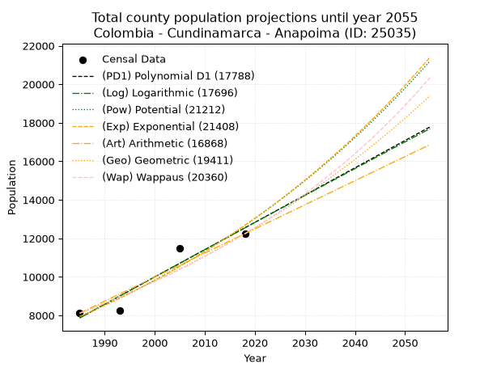
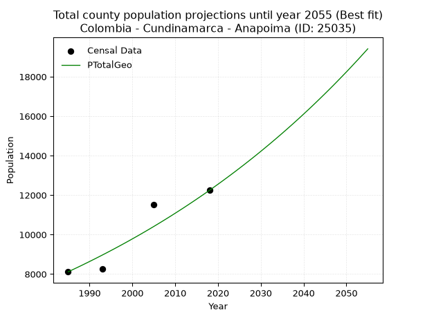
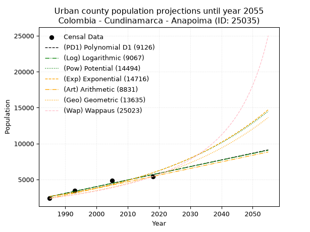
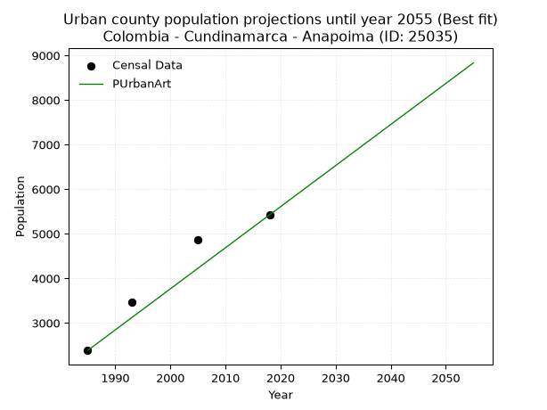
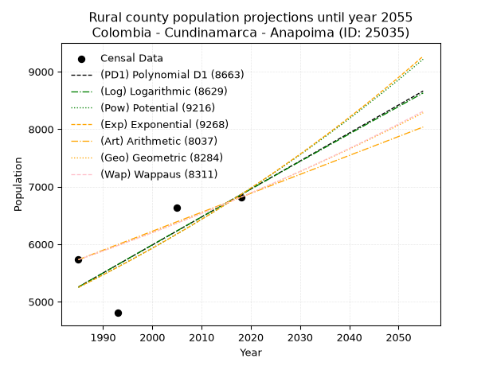
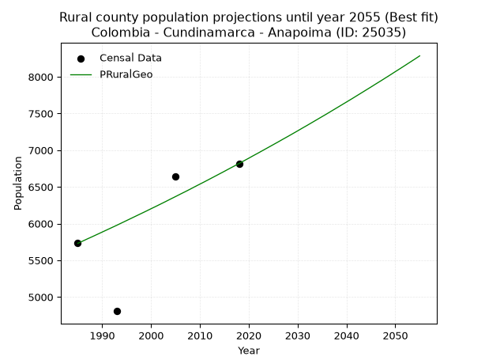

<div align="center">


</div>

# _“Population and Public Services Demand Projections (PPSD) until Year 2050 for Colombia - Cundinamarca - Anapoima (ID: 25035)”_
Keywords: `population` `public-service` `projection` `lineal` `polynomial` `logarithmic` `potential` `exponential` `arithmetic` `geometric` `wappaus` `dane` `colombia` `south-america`

PPSD are analytical estimates used by governments and planners to anticipate future changes in population size, age distribution, and the resulting community needs for utilities, healthcare, education, and infrastructure as sizing future water treatment facilities, electrical grids, and road networks based on spatial growth.

> **General running parameters**: • app_version: _v20260806_. • Python version: _3.14.7_. • Pandas version: _3.0.5_. • NumPy version: _2.5.1_. • Creates, save and include plots into reports (create_plot): _False_. • Projection until year: _2050_. • Process polynomial degree 2 and up: _False_. • Process Wappaus: _True_. • Process Wappaus: _True_. • Set negative values to zero: _True_. • Set infinite values to zero: _True_. • Drop dataset notes: _True_. 
<div align="center">

Dynamic map: [:earth_americas:Google](http://maps.google.com/maps?q=4.562737143,-74.5286762) [:earth_americas:OSM](https://www.openstreetmap.org/#map=18/4.562737143/-74.5286762&layers=P) [:earth_americas:Bing](https://www.bing.com/maps?cp=4.562737143~-74.5286762&lvl=18) [:earth_americas:Apple](https://maps.apple.com/frame?center=4.562737143%2C-74.5286762&span=0.003%2C0.006)

</div>


<div align="center">

```geojson
{
  "type": "Feature",
  "geometry": {
    "type": "Point", 
    "coordinates": [-74.5286762, 4.562737143]
  }, 
  "properties": {
    "Name": "Colombia - Cundinamarca - Anapoima (ID: 25035)"
  }
}
```

</div>


## 0. Census Data (4 records)

Census data are official statistics collected by a government about the people and housing in a country. They usually include counts of total population, age, sex, race, income, education, and jobs.

📅Global census file: [Population.xlsx](../data/Population.xlsx)

| Source   |   Year |   CountryID | CountryName   |   StateID | StateName    |   CountyID | CountyName   |   PTotal |   PUrban |   PRural |
|:---------|-------:|------------:|:--------------|----------:|:-------------|-----------:|:-------------|---------:|---------:|---------:|
| DANE     |   1985 |          57 | Colombia      |        25 | Cundinamarca |      25035 | Anapoima     |     8114 |     2383 |     5731 |
| DANE     |   1993 |          57 | Colombia      |        25 | Cundinamarca |      25035 | Anapoima     |     8269 |     3462 |     4807 |
| DANE     |   2005 |          57 | Colombia      |        25 | Cundinamarca |      25035 | Anapoima     |    11503 |     4865 |     6638 |
| DANE     |   2018 |          57 | Colombia      |        25 | Cundinamarca |      25035 | Anapoima     |    12241 |     5423 |     6818 |

> 🔥Some records could had specific notes about the registered values or the corresponding urban or rural distribution.

## 1. Total

### 1.1. Coefficients and Parameters

* (PD1) Polynomial Deg 1: 141.67523083099093, -273354.1304696896 (lineal)
* (Log) Logarithmic: 283628.0890224602, -2145827.627512583
* (Pow) Potential: 28.35348131018451, -89.60316304928
* (Exp) Exponential: 0.014162089877837361, 4.911977870617517e-09
* (Art) Arithmetic: Year diff. 2018 - 1985 = 33, Population diff. 12241 - 8114 = 4127, Annual growth = 125.06060606060606
* (Geo) Geometric: Year diff. 2018 - 1985 = 33, Population diff. 12241 - 8114 = 4127, Annual growth % = 0.012538563127122426
* (Wap) Wappaus: i = 1.2287949502393127, Condition values only valid for < 200)

<sub>
Wappaus condition values: ['0.00', '1.23', '2.46', '3.69', '4.92', '6.14', '7.37', '8.60', '9.83', '11.06', '12.29', '13.52', '14.75', '15.97', '17.20', '18.43', '19.66', '20.89', '22.12', '23.35', '24.58', '25.80', '27.03', '28.26', '29.49', '30.72', '31.95', '33.18', '34.41', '35.64', '36.86', '38.09', '39.32', '40.55', '41.78', '43.01', '44.24', '45.47', '46.69', '47.92', '49.15', '50.38', '51.61', '52.84', '54.07', '55.30', '56.52', '57.75', '58.98', '60.21', '61.44', '62.67', '63.90', '65.13', '66.35', '67.58', '68.81', '70.04', '71.27', '72.50', '73.73', '74.96', '76.19', '77.41', '78.64', '79.87']
</sub>


### 1.2. Projected Dataset

|   Year |   CountyID |   PTotalPD1 |   PTotalLog |   PTotalPow |   PTotalExp |   PTotalArt |   PTotalGeo |   PTotalWap |
|-------:|-----------:|------------:|------------:|------------:|------------:|------------:|------------:|------------:|
|   1985 |      25035 |        7871 |        7867 |        7940 |        7944 |        8114 |        8114 |        8114 |
|   1986 |      25035 |        8013 |        8009 |        8054 |        8057 |        8239 |        8216 |        8214 |
|   1987 |      25035 |        8155 |        8152 |        8170 |        8172 |        8364 |        8319 |        8316 |
|   1988 |      25035 |        8296 |        8295 |        8288 |        8289 |        8489 |        8423 |        8419 |
|   1989 |      25035 |        8438 |        8438 |        8407 |        8407 |        8614 |        8529 |        8523 |
|   1990 |      25035 |        8580 |        8580 |        8527 |        8527 |        8739 |        8636 |        8628 |
|   1991 |      25035 |        8721 |        8723 |        8650 |        8648 |        8864 |        8744 |        8735 |
|   1992 |      25035 |        8863 |        8865 |        8774 |        8772 |        8989 |        8854 |        8843 |
|   1993 |      25035 |        9005 |        9007 |        8899 |        8897 |        9114 |        8965 |        8953 |
|   1994 |      25035 |        9146 |        9150 |        9027 |        9024 |        9240 |        9077 |        9064 |
|   1995 |      25035 |        9288 |        9292 |        9156 |        9152 |        9365 |        9191 |        9176 |
|   1996 |      25035 |        9430 |        9434 |        9287 |        9283 |        9490 |        9306 |        9290 |
|   1997 |      25035 |        9571 |        9576 |        9420 |        9415 |        9615 |        9423 |        9406 |
|   1998 |      25035 |        9713 |        9718 |        9555 |        9550 |        9740 |        9541 |        9523 |
|   1999 |      25035 |        9855 |        9860 |        9691 |        9686 |        9865 |        9660 |        9641 |
|   2000 |      25035 |        9996 |       10002 |        9829 |        9824 |        9990 |        9782 |        9761 |
|   2001 |      25035 |       10138 |       10144 |        9970 |        9964 |       10115 |        9904 |        9883 |
|   2002 |      25035 |       10280 |       10285 |       10112 |       10106 |       10240 |       10028 |       10007 |
|   2003 |      25035 |       10421 |       10427 |       10256 |       10250 |       10365 |       10154 |       10132 |
|   2004 |      25035 |       10563 |       10569 |       10402 |       10397 |       10490 |       10281 |       10259 |
|   2005 |      25035 |       10705 |       10710 |       10551 |       10545 |       10615 |       10410 |       10387 |
|   2006 |      25035 |       10846 |       10851 |       10701 |       10695 |       10740 |       10541 |       10518 |
|   2007 |      25035 |       10988 |       10993 |       10853 |       10848 |       10865 |       10673 |       10650 |
|   2008 |      25035 |       11130 |       11134 |       11007 |       11003 |       10990 |       10807 |       10785 |
|   2009 |      25035 |       11271 |       11275 |       11164 |       11160 |       11115 |       10942 |       10921 |
|   2010 |      25035 |       11413 |       11416 |       11323 |       11319 |       11241 |       11080 |       11059 |
|   2011 |      25035 |       11555 |       11557 |       11483 |       11480 |       11366 |       11219 |       11199 |
|   2012 |      25035 |       11696 |       11698 |       11646 |       11644 |       11491 |       11359 |       11341 |
|   2013 |      25035 |       11838 |       11839 |       11812 |       11810 |       11616 |       11502 |       11486 |
|   2014 |      25035 |       11980 |       11980 |       11979 |       11978 |       11741 |       11646 |       11632 |
|   2015 |      25035 |       12121 |       12121 |       12149 |       12149 |       11866 |       11792 |       11781 |
|   2016 |      25035 |       12263 |       12262 |       12321 |       12323 |       11991 |       11940 |       11932 |
|   2017 |      25035 |       12405 |       12402 |       12496 |       12498 |       12116 |       12089 |       12085 |
|   2018 |      25035 |       12546 |       12543 |       12672 |       12677 |       12241 |       12241 |       12241 |
|   2019 |      25035 |       12688 |       12684 |       12852 |       12857 |       12366 |       12394 |       12399 |
|   2020 |      25035 |       12830 |       12824 |       13033 |       13041 |       12491 |       12550 |       12560 |
|   2021 |      25035 |       12972 |       12964 |       13218 |       13227 |       12616 |       12707 |       12723 |
|   2022 |      25035 |       13113 |       13105 |       13404 |       13415 |       12741 |       12867 |       12888 |
|   2023 |      25035 |       13255 |       13245 |       13593 |       13607 |       12866 |       13028 |       13057 |
|   2024 |      25035 |       13397 |       13385 |       13785 |       13801 |       12991 |       13191 |       13228 |
|   2025 |      25035 |       13538 |       13525 |       13980 |       13998 |       13116 |       13357 |       13402 |
|   2026 |      25035 |       13680 |       13665 |       14177 |       14197 |       13241 |       13524 |       13578 |
|   2027 |      25035 |       13822 |       13805 |       14376 |       14400 |       13367 |       13694 |       13758 |
|   2028 |      25035 |       13963 |       13945 |       14579 |       14605 |       13492 |       13865 |       13941 |
|   2029 |      25035 |       14105 |       14085 |       14784 |       14813 |       13617 |       14039 |       14126 |
|   2030 |      25035 |       14247 |       14225 |       14992 |       15025 |       13742 |       14215 |       14315 |
|   2031 |      25035 |       14388 |       14364 |       15203 |       15239 |       13867 |       14394 |       14507 |
|   2032 |      25035 |       14530 |       14504 |       15417 |       15456 |       13992 |       14574 |       14703 |
|   2033 |      25035 |       14672 |       14643 |       15633 |       15677 |       14117 |       14757 |       14902 |
|   2034 |      25035 |       14813 |       14783 |       15853 |       15900 |       14242 |       14942 |       15104 |
|   2035 |      25035 |       14955 |       14922 |       16075 |       16127 |       14367 |       15129 |       15310 |
|   2036 |      25035 |       15097 |       15062 |       16301 |       16357 |       14492 |       15319 |       15519 |
|   2037 |      25035 |       15238 |       15201 |       16529 |       16591 |       14617 |       15511 |       15733 |
|   2038 |      25035 |       15380 |       15340 |       16761 |       16827 |       14742 |       15705 |       15950 |
|   2039 |      25035 |       15522 |       15479 |       16996 |       17067 |       14867 |       15902 |       16171 |
|   2040 |      25035 |       15663 |       15618 |       17234 |       17311 |       14992 |       16102 |       16397 |
|   2041 |      25035 |       15805 |       15757 |       17475 |       17557 |       15117 |       16304 |       16626 |
|   2042 |      25035 |       15947 |       15896 |       17719 |       17808 |       15242 |       16508 |       16860 |
|   2043 |      25035 |       16088 |       16035 |       17967 |       18062 |       15368 |       16715 |       17098 |
|   2044 |      25035 |       16230 |       16174 |       18218 |       18320 |       15493 |       16925 |       17341 |
|   2045 |      25035 |       16372 |       16313 |       18472 |       18581 |       15618 |       17137 |       17589 |
|   2046 |      25035 |       16513 |       16451 |       18730 |       18846 |       15743 |       17352 |       17842 |
|   2047 |      25035 |       16655 |       16590 |       18991 |       19115 |       15868 |       17569 |       18099 |
|   2048 |      25035 |       16797 |       16728 |       19256 |       19387 |       15993 |       17790 |       18362 |
|   2049 |      25035 |       16938 |       16867 |       19525 |       19664 |       16118 |       18013 |       18630 |
|   2050 |      25035 |       17080 |       17005 |       19796 |       19944 |       16243 |       18238 |       18904 |
<div align="center">

</img>

</div>


### 1.3. Best fit with absolute and relative error (%)

Relative error puts that difference into context by dividing the absolute error by the true value, creating a unitless ratio or percentage that shows the scale of the mistake.

Absolute and relative error

|   Year | Source   |   CountryID | CountryName   |   StateID | StateName    |   CountyID_x | CountyName   |   PTotal |   PUrban |   PRural |   CountyID_y |   PTotalPD1 |   PTotalLog |   PTotalPow |   PTotalExp |   PTotalArt |   PTotalGeo |   PTotalWap |   PTotalPD1AbsError |   PTotalLogAbsError |   PTotalPowAbsError |   PTotalExpAbsError |   PTotalArtAbsError |   PTotalGeoAbsError |   PTotalWapAbsError |   PTotalPD1RelError |   PTotalLogRelError |   PTotalPowRelError |   PTotalExpRelError |   PTotalArtRelError |   PTotalGeoRelError |   PTotalWapRelError |
|-------:|:---------|------------:|:--------------|----------:|:-------------|-------------:|:-------------|---------:|---------:|---------:|-------------:|------------:|------------:|------------:|------------:|------------:|------------:|------------:|--------------------:|--------------------:|--------------------:|--------------------:|--------------------:|--------------------:|--------------------:|--------------------:|--------------------:|--------------------:|--------------------:|--------------------:|--------------------:|--------------------:|
|   1985 | DANE     |          57 | Colombia      |        25 | Cundinamarca |        25035 | Anapoima     |     8114 |     2383 |     5731 |        25035 |        7871 |        7867 |        7940 |        7944 |        8114 |        8114 |        8114 |                 243 |                 247 |                 174 |                 170 |                   0 |                   0 |                   0 |             2.99482 |             3.04412 |             2.14444 |             2.09514 |             0       |             0       |             0       |
|   1993 | DANE     |          57 | Colombia      |        25 | Cundinamarca |        25035 | Anapoima     |     8269 |     3462 |     4807 |        25035 |        9005 |        9007 |        8899 |        8897 |        9114 |        8965 |        8953 |                 736 |                 738 |                 630 |                 628 |                 845 |                 696 |                 684 |             8.90071 |             8.9249  |             7.61882 |             7.59463 |            10.2189  |             8.41698 |             8.27186 |
|   2005 | DANE     |          57 | Colombia      |        25 | Cundinamarca |        25035 | Anapoima     |    11503 |     4865 |     6638 |        25035 |       10705 |       10710 |       10551 |       10545 |       10615 |       10410 |       10387 |                 798 |                 793 |                 952 |                 958 |                 888 |                1093 |                1116 |             6.93732 |             6.89385 |             8.2761  |             8.32826 |             7.71973 |             9.50187 |             9.70182 |
|   2018 | DANE     |          57 | Colombia      |        25 | Cundinamarca |        25035 | Anapoima     |    12241 |     5423 |     6818 |        25035 |       12546 |       12543 |       12672 |       12677 |       12241 |       12241 |       12241 |                 305 |                 302 |                 431 |                 436 |                   0 |                   0 |                   0 |             2.49163 |             2.46712 |             3.52095 |             3.5618  |             0       |             0       |             0       |

Relative error mean

| Method    |   RelError | Best   |
|:----------|-----------:|:-------|
| PTotalPD1 |    5.33112 |        |
| PTotalLog |    5.3325  |        |
| PTotalPow |    5.39008 |        |
| PTotalExp |    5.39496 |        |
| PTotalArt |    4.48465 |        |
| PTotalGeo |    4.47971 | True   |
| PTotalWap |    4.49342 |        |

💙Best method: _**PTotalGeo**_
<div align="center">

</img>

</div>


### 1.4. Fresh water supply demand in liters per capita per day (lpcd)

The fresh water supply demand typically ranges from 100 to 300 liters per capita per day (lpcd) for standard domestic and municipal planning, though absolute survival minimums set by the World Health Organization are as low as 7.5 to 20 liters per day, and total consumption in high-income nations can exceed 400 liters.

> `CZ`: Level in meters above the sea level (masl).<br> `WS`: Fresh water supply demand in liters per capita per day (lpcd or l/h/d).<br> `WSAll`: Zonal fresh water supply demand in liters per second (l/s).<br> `A`: Zonal area in square meters.

Reference values (RAS Colombia)

|    CZ |   WS |
|------:|-----:|
|  1000 |  120 |
|  2000 |  130 |
| 99999 |  140 |

County shapefile geometry properties and water supply values

|   CountyID |      ATotal |   CZTotal |   WSTotal |
|-----------:|------------:|----------:|----------:|
|      25035 | 1.23837e+08 |   756.234 |       120 |

Projected values for best method: PTotalGeo

|   CountyID |   Year |   PTotalGeo |   WSTotal |   WSTotalAll |
|-----------:|-------:|------------:|----------:|-------------:|
|      25035 |   1985 |        8114 |       120 |      11.2694 |
|      25035 |   1986 |        8216 |       120 |      11.4111 |
|      25035 |   1987 |        8319 |       120 |      11.5542 |
|      25035 |   1988 |        8423 |       120 |      11.6986 |
|      25035 |   1989 |        8529 |       120 |      11.8458 |
|      25035 |   1990 |        8636 |       120 |      11.9944 |
|      25035 |   1991 |        8744 |       120 |      12.1444 |
|      25035 |   1992 |        8854 |       120 |      12.2972 |
|      25035 |   1993 |        8965 |       120 |      12.4514 |
|      25035 |   1994 |        9077 |       120 |      12.6069 |
|      25035 |   1995 |        9191 |       120 |      12.7653 |
|      25035 |   1996 |        9306 |       120 |      12.925  |
|      25035 |   1997 |        9423 |       120 |      13.0875 |
|      25035 |   1998 |        9541 |       120 |      13.2514 |
|      25035 |   1999 |        9660 |       120 |      13.4167 |
|      25035 |   2000 |        9782 |       120 |      13.5861 |
|      25035 |   2001 |        9904 |       120 |      13.7556 |
|      25035 |   2002 |       10028 |       120 |      13.9278 |
|      25035 |   2003 |       10154 |       120 |      14.1028 |
|      25035 |   2004 |       10281 |       120 |      14.2792 |
|      25035 |   2005 |       10410 |       120 |      14.4583 |
|      25035 |   2006 |       10541 |       120 |      14.6403 |
|      25035 |   2007 |       10673 |       120 |      14.8236 |
|      25035 |   2008 |       10807 |       120 |      15.0097 |
|      25035 |   2009 |       10942 |       120 |      15.1972 |
|      25035 |   2010 |       11080 |       120 |      15.3889 |
|      25035 |   2011 |       11219 |       120 |      15.5819 |
|      25035 |   2012 |       11359 |       120 |      15.7764 |
|      25035 |   2013 |       11502 |       120 |      15.975  |
|      25035 |   2014 |       11646 |       120 |      16.175  |
|      25035 |   2015 |       11792 |       120 |      16.3778 |
|      25035 |   2016 |       11940 |       120 |      16.5833 |
|      25035 |   2017 |       12089 |       120 |      16.7903 |
|      25035 |   2018 |       12241 |       120 |      17.0014 |
|      25035 |   2019 |       12394 |       120 |      17.2139 |
|      25035 |   2020 |       12550 |       120 |      17.4306 |
|      25035 |   2021 |       12707 |       120 |      17.6486 |
|      25035 |   2022 |       12867 |       120 |      17.8708 |
|      25035 |   2023 |       13028 |       120 |      18.0944 |
|      25035 |   2024 |       13191 |       120 |      18.3208 |
|      25035 |   2025 |       13357 |       120 |      18.5514 |
|      25035 |   2026 |       13524 |       120 |      18.7833 |
|      25035 |   2027 |       13694 |       120 |      19.0194 |
|      25035 |   2028 |       13865 |       120 |      19.2569 |
|      25035 |   2029 |       14039 |       120 |      19.4986 |
|      25035 |   2030 |       14215 |       120 |      19.7431 |
|      25035 |   2031 |       14394 |       120 |      19.9917 |
|      25035 |   2032 |       14574 |       120 |      20.2417 |
|      25035 |   2033 |       14757 |       120 |      20.4958 |
|      25035 |   2034 |       14942 |       120 |      20.7528 |
|      25035 |   2035 |       15129 |       120 |      21.0125 |
|      25035 |   2036 |       15319 |       120 |      21.2764 |
|      25035 |   2037 |       15511 |       120 |      21.5431 |
|      25035 |   2038 |       15705 |       120 |      21.8125 |
|      25035 |   2039 |       15902 |       120 |      22.0861 |
|      25035 |   2040 |       16102 |       120 |      22.3639 |
|      25035 |   2041 |       16304 |       120 |      22.6444 |
|      25035 |   2042 |       16508 |       120 |      22.9278 |
|      25035 |   2043 |       16715 |       120 |      23.2153 |
|      25035 |   2044 |       16925 |       120 |      23.5069 |
|      25035 |   2045 |       17137 |       120 |      23.8014 |
|      25035 |   2046 |       17352 |       120 |      24.1    |
|      25035 |   2047 |       17569 |       120 |      24.4014 |
|      25035 |   2048 |       17790 |       120 |      24.7083 |
|      25035 |   2049 |       18013 |       120 |      25.0181 |
|      25035 |   2050 |       18238 |       120 |      25.3306 |

## 2. Urban

### 2.1. Coefficients and Parameters

* (PD1) Polynomial Deg 1: 93.01766358891967, -182025.33159373657 (lineal)
* (Log) Logarithmic: 186284.01328238175, -1411913.0277457803
* (Pow) Potential: 49.14277182490348, -158.63957325373002
* (Exp) Exponential: 0.024533054670463808, 1.8734375078643244e-18
* (Art) Arithmetic: Year diff. 2018 - 1985 = 33, Population diff. 5423 - 2383 = 3040, Annual growth = 92.12121212121212
* (Geo) Geometric: Year diff. 2018 - 1985 = 33, Population diff. 5423 - 2383 = 3040, Annual growth % = 0.02523089185350158
* (Wap) Wappaus: i = 2.3602667722575488, Condition values only valid for < 200)

<sub>
Wappaus condition values: ['0.00', '2.36', '4.72', '7.08', '9.44', '11.80', '14.16', '16.52', '18.88', '21.24', '23.60', '25.96', '28.32', '30.68', '33.04', '35.40', '37.76', '40.12', '42.48', '44.85', '47.21', '49.57', '51.93', '54.29', '56.65', '59.01', '61.37', '63.73', '66.09', '68.45', '70.81', '73.17', '75.53', '77.89', '80.25', '82.61', '84.97', '87.33', '89.69', '92.05', '94.41', '96.77', '99.13', '101.49', '103.85', '106.21', '108.57', '110.93', '113.29', '115.65', '118.01', '120.37', '122.73', '125.09', '127.45', '129.81', '132.17', '134.54', '136.90', '139.26', '141.62', '143.98', '146.34', '148.70', '151.06', '153.42']
</sub>


### 2.2. Projected Dataset

|   Year |   CountyID |   PUrbanPD1 |   PUrbanLog |   PUrbanPow |   PUrbanExp |   PUrbanArt |   PUrbanGeo |   PUrbanWap |
|-------:|-----------:|------------:|------------:|------------:|------------:|------------:|------------:|------------:|
|   1985 |      25035 |        2615 |        2611 |        2639 |        2642 |        2383 |        2383 |        2383 |
|   1986 |      25035 |        2708 |        2705 |        2706 |        2708 |        2475 |        2443 |        2440 |
|   1987 |      25035 |        2801 |        2799 |        2773 |        2775 |        2567 |        2505 |        2498 |
|   1988 |      25035 |        2894 |        2893 |        2843 |        2844 |        2659 |        2568 |        2558 |
|   1989 |      25035 |        2987 |        2986 |        2914 |        2915 |        2751 |        2633 |        2619 |
|   1990 |      25035 |        3080 |        3080 |        2987 |        2987 |        2844 |        2699 |        2682 |
|   1991 |      25035 |        3173 |        3173 |        3061 |        3061 |        2936 |        2767 |        2746 |
|   1992 |      25035 |        3266 |        3267 |        3138 |        3137 |        3028 |        2837 |        2812 |
|   1993 |      25035 |        3359 |        3360 |        3216 |        3215 |        3120 |        2909 |        2880 |
|   1994 |      25035 |        3452 |        3454 |        3297 |        3295 |        3212 |        2982 |        2949 |
|   1995 |      25035 |        3545 |        3547 |        3379 |        3377 |        3304 |        3057 |        3021 |
|   1996 |      25035 |        3638 |        3641 |        3463 |        3461 |        3396 |        3134 |        3094 |
|   1997 |      25035 |        3731 |        3734 |        3549 |        3547 |        3488 |        3214 |        3169 |
|   1998 |      25035 |        3824 |        3827 |        3638 |        3635 |        3581 |        3295 |        3247 |
|   1999 |      25035 |        3917 |        3920 |        3728 |        3725 |        3673 |        3378 |        3326 |
|   2000 |      25035 |        4010 |        4014 |        3821 |        3818 |        3765 |        3463 |        3408 |
|   2001 |      25035 |        4103 |        4107 |        3916 |        3912 |        3857 |        3550 |        3492 |
|   2002 |      25035 |        4196 |        4200 |        4013 |        4009 |        3949 |        3640 |        3579 |
|   2003 |      25035 |        4289 |        4293 |        4113 |        4109 |        4041 |        3732 |        3668 |
|   2004 |      25035 |        4382 |        4386 |        4215 |        4211 |        4133 |        3826 |        3761 |
|   2005 |      25035 |        4475 |        4479 |        4320 |        4316 |        4225 |        3922 |        3855 |
|   2006 |      25035 |        4568 |        4572 |        4427 |        4423 |        4318 |        4021 |        3953 |
|   2007 |      25035 |        4661 |        4664 |        4537 |        4533 |        4410 |        4123 |        4054 |
|   2008 |      25035 |        4754 |        4757 |        4649 |        4645 |        4502 |        4227 |        4159 |
|   2009 |      25035 |        4847 |        4850 |        4764 |        4761 |        4594 |        4334 |        4266 |
|   2010 |      25035 |        4940 |        4943 |        4882 |        4879 |        4686 |        4443 |        4378 |
|   2011 |      25035 |        5033 |        5035 |        5003 |        5000 |        4778 |        4555 |        4493 |
|   2012 |      25035 |        5126 |        5128 |        5127 |        5124 |        4870 |        4670 |        4612 |
|   2013 |      25035 |        5219 |        5221 |        5254 |        5252 |        4962 |        4788 |        4735 |
|   2014 |      25035 |        5312 |        5313 |        5384 |        5382 |        5055 |        4909 |        4863 |
|   2015 |      25035 |        5405 |        5406 |        5516 |        5516 |        5147 |        5032 |        4995 |
|   2016 |      25035 |        5498 |        5498 |        5653 |        5653 |        5239 |        5159 |        5132 |
|   2017 |      25035 |        5591 |        5590 |        5792 |        5793 |        5331 |        5290 |        5275 |
|   2018 |      25035 |        5684 |        5683 |        5935 |        5937 |        5423 |        5423 |        5423 |
|   2019 |      25035 |        5777 |        5775 |        6081 |        6084 |        5515 |        5560 |        5577 |
|   2020 |      25035 |        5870 |        5867 |        6231 |        6235 |        5607 |        5700 |        5737 |
|   2021 |      25035 |        5963 |        5959 |        6384 |        6390 |        5699 |        5844 |        5904 |
|   2022 |      25035 |        6056 |        6052 |        6541 |        6549 |        5791 |        5991 |        6077 |
|   2023 |      25035 |        6149 |        6144 |        6702 |        6712 |        5884 |        6143 |        6258 |
|   2024 |      25035 |        6242 |        6236 |        6867 |        6878 |        5976 |        6298 |        6447 |
|   2025 |      25035 |        6335 |        6328 |        7036 |        7049 |        6068 |        6456 |        6644 |
|   2026 |      25035 |        6428 |        6420 |        7209 |        7224 |        6160 |        6619 |        6851 |
|   2027 |      25035 |        6521 |        6512 |        7386 |        7404 |        6252 |        6786 |        7067 |
|   2028 |      25035 |        6614 |        6603 |        7567 |        7588 |        6344 |        6958 |        7293 |
|   2029 |      25035 |        6708 |        6695 |        7752 |        7776 |        6436 |        7133 |        7531 |
|   2030 |      25035 |        6801 |        6787 |        7942 |        7969 |        6528 |        7313 |        7780 |
|   2031 |      25035 |        6894 |        6879 |        8137 |        8167 |        6621 |        7498 |        8043 |
|   2032 |      25035 |        6987 |        6971 |        8336 |        8370 |        6713 |        7687 |        8319 |
|   2033 |      25035 |        7080 |        7062 |        8540 |        8578 |        6805 |        7881 |        8610 |
|   2034 |      25035 |        7173 |        7154 |        8749 |        8791 |        6897 |        8080 |        8918 |
|   2035 |      25035 |        7266 |        7245 |        8963 |        9009 |        6989 |        8283 |        9243 |
|   2036 |      25035 |        7359 |        7337 |        9182 |        9233 |        7081 |        8492 |        9588 |
|   2037 |      25035 |        7452 |        7428 |        9406 |        9462 |        7173 |        8707 |        9954 |
|   2038 |      25035 |        7545 |        7520 |        9636 |        9697 |        7265 |        8926 |       10342 |
|   2039 |      25035 |        7638 |        7611 |        9871 |        9938 |        7358 |        9152 |       10756 |
|   2040 |      25035 |        7731 |        7702 |       10112 |       10185 |        7450 |        9382 |       11198 |
|   2041 |      25035 |        7824 |        7794 |       10358 |       10438 |        7542 |        9619 |       11671 |
|   2042 |      25035 |        7917 |        7885 |       10611 |       10697 |        7634 |        9862 |       12177 |
|   2043 |      25035 |        8010 |        7976 |       10869 |       10963 |        7726 |       10111 |       12722 |
|   2044 |      25035 |        8103 |        8067 |       11134 |       11235 |        7818 |       10366 |       13309 |
|   2045 |      25035 |        8196 |        8159 |       11404 |       11514 |        7910 |       10627 |       13943 |
|   2046 |      25035 |        8289 |        8250 |       11682 |       11800 |        8002 |       10895 |       14631 |
|   2047 |      25035 |        8382 |        8341 |       11966 |       12093 |        8095 |       11170 |       15380 |
|   2048 |      25035 |        8475 |        8432 |       12256 |       12394 |        8187 |       11452 |       16197 |
|   2049 |      25035 |        8568 |        8523 |       12554 |       12701 |        8279 |       11741 |       17093 |
|   2050 |      25035 |        8661 |        8613 |       12859 |       13017 |        8371 |       12037 |       18080 |
<div align="center">

</img>

</div>


### 2.3. Best fit with absolute and relative error (%)

Relative error puts that difference into context by dividing the absolute error by the true value, creating a unitless ratio or percentage that shows the scale of the mistake.

Absolute and relative error

|   Year | Source   |   CountryID | CountryName   |   StateID | StateName    |   CountyID_x | CountyName   |   PTotal |   PUrban |   PRural |   CountyID_y |   PUrbanPD1 |   PUrbanLog |   PUrbanPow |   PUrbanExp |   PUrbanArt |   PUrbanGeo |   PUrbanWap |   PUrbanPD1AbsError |   PUrbanLogAbsError |   PUrbanPowAbsError |   PUrbanExpAbsError |   PUrbanArtAbsError |   PUrbanGeoAbsError |   PUrbanWapAbsError |   PUrbanPD1RelError |   PUrbanLogRelError |   PUrbanPowRelError |   PUrbanExpRelError |   PUrbanArtRelError |   PUrbanGeoRelError |   PUrbanWapRelError |
|-------:|:---------|------------:|:--------------|----------:|:-------------|-------------:|:-------------|---------:|---------:|---------:|-------------:|------------:|------------:|------------:|------------:|------------:|------------:|------------:|--------------------:|--------------------:|--------------------:|--------------------:|--------------------:|--------------------:|--------------------:|--------------------:|--------------------:|--------------------:|--------------------:|--------------------:|--------------------:|--------------------:|
|   1985 | DANE     |          57 | Colombia      |        25 | Cundinamarca |        25035 | Anapoima     |     8114 |     2383 |     5731 |        25035 |        2615 |        2611 |        2639 |        2642 |        2383 |        2383 |        2383 |                 232 |                 228 |                 256 |                 259 |                   0 |                   0 |                   0 |             9.73563 |             9.56777 |            10.7428  |            10.8687  |             0       |              0      |              0      |
|   1993 | DANE     |          57 | Colombia      |        25 | Cundinamarca |        25035 | Anapoima     |     8269 |     3462 |     4807 |        25035 |        3359 |        3360 |        3216 |        3215 |        3120 |        2909 |        2880 |                 103 |                 102 |                 246 |                 247 |                 342 |                 553 |                 582 |             2.97516 |             2.94627 |             7.10572 |             7.1346  |             9.87868 |             15.9734 |             16.8111 |
|   2005 | DANE     |          57 | Colombia      |        25 | Cundinamarca |        25035 | Anapoima     |    11503 |     4865 |     6638 |        25035 |        4475 |        4479 |        4320 |        4316 |        4225 |        3922 |        3855 |                 390 |                 386 |                 545 |                 549 |                 640 |                 943 |                1010 |             8.01644 |             7.93422 |            11.2025  |            11.2847  |            13.1552  |             19.3834 |             20.7605 |
|   2018 | DANE     |          57 | Colombia      |        25 | Cundinamarca |        25035 | Anapoima     |    12241 |     5423 |     6818 |        25035 |        5684 |        5683 |        5935 |        5937 |        5423 |        5423 |        5423 |                 261 |                 260 |                 512 |                 514 |                   0 |                   0 |                   0 |             4.81283 |             4.79439 |             9.44127 |             9.47815 |             0       |              0      |              0      |

Relative error mean

| Method    |   RelError | Best   |
|:----------|-----------:|:-------|
| PUrbanPD1 |    6.38502 |        |
| PUrbanLog |    6.31067 |        |
| PUrbanPow |    9.62305 |        |
| PUrbanExp |    9.69152 |        |
| PUrbanArt |    5.75847 | True   |
| PUrbanGeo |    8.83919 |        |
| PUrbanWap |    9.39291 |        |

💙Best method: _**PUrbanArt**_
<div align="center">

</img>

</div>


### 2.4. Fresh water supply demand in liters per capita per day (lpcd)

The fresh water supply demand typically ranges from 100 to 300 liters per capita per day (lpcd) for standard domestic and municipal planning, though absolute survival minimums set by the World Health Organization are as low as 7.5 to 20 liters per day, and total consumption in high-income nations can exceed 400 liters.

> `CZ`: Level in meters above the sea level (masl).<br> `WS`: Fresh water supply demand in liters per capita per day (lpcd or l/h/d).<br> `WSAll`: Zonal fresh water supply demand in liters per second (l/s).<br> `A`: Zonal area in square meters.

Reference values (RAS Colombia)

|    CZ |   WS |
|------:|-----:|
|  1000 |  120 |
|  2000 |  130 |
| 99999 |  140 |

County shapefile geometry properties and water supply values

|   CountyID |      AUrban |   CZUrban |   WSUrban |
|-----------:|------------:|----------:|----------:|
|      25035 | 5.50167e+06 |    721.58 |       120 |

Projected values for best method: PUrbanArt

|   CountyID |   Year |   PUrbanArt |   WSUrban |   WSUrbanAll |
|-----------:|-------:|------------:|----------:|-------------:|
|      25035 |   1985 |        2383 |       120 |      3.30972 |
|      25035 |   1986 |        2475 |       120 |      3.4375  |
|      25035 |   1987 |        2567 |       120 |      3.56528 |
|      25035 |   1988 |        2659 |       120 |      3.69306 |
|      25035 |   1989 |        2751 |       120 |      3.82083 |
|      25035 |   1990 |        2844 |       120 |      3.95    |
|      25035 |   1991 |        2936 |       120 |      4.07778 |
|      25035 |   1992 |        3028 |       120 |      4.20556 |
|      25035 |   1993 |        3120 |       120 |      4.33333 |
|      25035 |   1994 |        3212 |       120 |      4.46111 |
|      25035 |   1995 |        3304 |       120 |      4.58889 |
|      25035 |   1996 |        3396 |       120 |      4.71667 |
|      25035 |   1997 |        3488 |       120 |      4.84444 |
|      25035 |   1998 |        3581 |       120 |      4.97361 |
|      25035 |   1999 |        3673 |       120 |      5.10139 |
|      25035 |   2000 |        3765 |       120 |      5.22917 |
|      25035 |   2001 |        3857 |       120 |      5.35694 |
|      25035 |   2002 |        3949 |       120 |      5.48472 |
|      25035 |   2003 |        4041 |       120 |      5.6125  |
|      25035 |   2004 |        4133 |       120 |      5.74028 |
|      25035 |   2005 |        4225 |       120 |      5.86806 |
|      25035 |   2006 |        4318 |       120 |      5.99722 |
|      25035 |   2007 |        4410 |       120 |      6.125   |
|      25035 |   2008 |        4502 |       120 |      6.25278 |
|      25035 |   2009 |        4594 |       120 |      6.38056 |
|      25035 |   2010 |        4686 |       120 |      6.50833 |
|      25035 |   2011 |        4778 |       120 |      6.63611 |
|      25035 |   2012 |        4870 |       120 |      6.76389 |
|      25035 |   2013 |        4962 |       120 |      6.89167 |
|      25035 |   2014 |        5055 |       120 |      7.02083 |
|      25035 |   2015 |        5147 |       120 |      7.14861 |
|      25035 |   2016 |        5239 |       120 |      7.27639 |
|      25035 |   2017 |        5331 |       120 |      7.40417 |
|      25035 |   2018 |        5423 |       120 |      7.53194 |
|      25035 |   2019 |        5515 |       120 |      7.65972 |
|      25035 |   2020 |        5607 |       120 |      7.7875  |
|      25035 |   2021 |        5699 |       120 |      7.91528 |
|      25035 |   2022 |        5791 |       120 |      8.04306 |
|      25035 |   2023 |        5884 |       120 |      8.17222 |
|      25035 |   2024 |        5976 |       120 |      8.3     |
|      25035 |   2025 |        6068 |       120 |      8.42778 |
|      25035 |   2026 |        6160 |       120 |      8.55556 |
|      25035 |   2027 |        6252 |       120 |      8.68333 |
|      25035 |   2028 |        6344 |       120 |      8.81111 |
|      25035 |   2029 |        6436 |       120 |      8.93889 |
|      25035 |   2030 |        6528 |       120 |      9.06667 |
|      25035 |   2031 |        6621 |       120 |      9.19583 |
|      25035 |   2032 |        6713 |       120 |      9.32361 |
|      25035 |   2033 |        6805 |       120 |      9.45139 |
|      25035 |   2034 |        6897 |       120 |      9.57917 |
|      25035 |   2035 |        6989 |       120 |      9.70694 |
|      25035 |   2036 |        7081 |       120 |      9.83472 |
|      25035 |   2037 |        7173 |       120 |      9.9625  |
|      25035 |   2038 |        7265 |       120 |     10.0903  |
|      25035 |   2039 |        7358 |       120 |     10.2194  |
|      25035 |   2040 |        7450 |       120 |     10.3472  |
|      25035 |   2041 |        7542 |       120 |     10.475   |
|      25035 |   2042 |        7634 |       120 |     10.6028  |
|      25035 |   2043 |        7726 |       120 |     10.7306  |
|      25035 |   2044 |        7818 |       120 |     10.8583  |
|      25035 |   2045 |        7910 |       120 |     10.9861  |
|      25035 |   2046 |        8002 |       120 |     11.1139  |
|      25035 |   2047 |        8095 |       120 |     11.2431  |
|      25035 |   2048 |        8187 |       120 |     11.3708  |
|      25035 |   2049 |        8279 |       120 |     11.4986  |
|      25035 |   2050 |        8371 |       120 |     11.6264  |

## 3. Rural

### 3.1. Coefficients and Parameters

* (PD1) Polynomial Deg 1: 48.6575672420712, -91328.79887595294 (lineal)
* (Log) Logarithmic: 97344.07574007842, -733914.5997668029
* (Pow) Potential: 16.23893639284448, -49.83201085377697
* (Exp) Exponential: 0.008117698610311004, 0.0005273815126473812
* (Art) Arithmetic: Year diff. 2018 - 1985 = 33, Population diff. 6818 - 5731 = 1087, Annual growth = 32.93939393939394
* (Geo) Geometric: Year diff. 2018 - 1985 = 33, Population diff. 6818 - 5731 = 1087, Annual growth % = 0.005276786732823169
* (Wap) Wappaus: i = 0.5249724111784834, Condition values only valid for < 200)

<sub>
Wappaus condition values: ['0.00', '0.52', '1.05', '1.57', '2.10', '2.62', '3.15', '3.67', '4.20', '4.72', '5.25', '5.77', '6.30', '6.82', '7.35', '7.87', '8.40', '8.92', '9.45', '9.97', '10.50', '11.02', '11.55', '12.07', '12.60', '13.12', '13.65', '14.17', '14.70', '15.22', '15.75', '16.27', '16.80', '17.32', '17.85', '18.37', '18.90', '19.42', '19.95', '20.47', '21.00', '21.52', '22.05', '22.57', '23.10', '23.62', '24.15', '24.67', '25.20', '25.72', '26.25', '26.77', '27.30', '27.82', '28.35', '28.87', '29.40', '29.92', '30.45', '30.97', '31.50', '32.02', '32.55', '33.07', '33.60', '34.12']
</sub>


### 3.2. Projected Dataset

|   Year |   CountyID |   PRuralPD1 |   PRuralLog |   PRuralPow |   PRuralExp |   PRuralArt |   PRuralGeo |   PRuralWap |
|-------:|-----------:|------------:|------------:|------------:|------------:|------------:|------------:|------------:|
|   1985 |      25035 |        5256 |        5255 |        5249 |        5250 |        5731 |        5731 |        5731 |
|   1986 |      25035 |        5305 |        5304 |        5293 |        5293 |        5764 |        5761 |        5761 |
|   1987 |      25035 |        5354 |        5353 |        5336 |        5336 |        5797 |        5792 |        5791 |
|   1988 |      25035 |        5402 |        5402 |        5380 |        5380 |        5830 |        5822 |        5822 |
|   1989 |      25035 |        5451 |        5451 |        5424 |        5424 |        5863 |        5853 |        5853 |
|   1990 |      25035 |        5500 |        5500 |        5468 |        5468 |        5896 |        5884 |        5883 |
|   1991 |      25035 |        5548 |        5549 |        5513 |        5512 |        5929 |        5915 |        5914 |
|   1992 |      25035 |        5597 |        5598 |        5558 |        5557 |        5962 |        5946 |        5946 |
|   1993 |      25035 |        5646 |        5647 |        5604 |        5603 |        5995 |        5977 |        5977 |
|   1994 |      25035 |        5694 |        5696 |        5650 |        5648 |        6027 |        6009 |        6008 |
|   1995 |      25035 |        5743 |        5745 |        5696 |        5694 |        6060 |        6041 |        6040 |
|   1996 |      25035 |        5792 |        5793 |        5742 |        5741 |        6093 |        6073 |        6072 |
|   1997 |      25035 |        5840 |        5842 |        5789 |        5788 |        6126 |        6105 |        6104 |
|   1998 |      25035 |        5889 |        5891 |        5836 |        5835 |        6159 |        6137 |        6136 |
|   1999 |      25035 |        5938 |        5940 |        5884 |        5882 |        6192 |        6169 |        6168 |
|   2000 |      25035 |        5986 |        5988 |        5932 |        5930 |        6225 |        6202 |        6201 |
|   2001 |      25035 |        6035 |        6037 |        5980 |        5979 |        6258 |        6234 |        6233 |
|   2002 |      25035 |        6084 |        6086 |        6029 |        6027 |        6291 |        6267 |        6266 |
|   2003 |      25035 |        6132 |        6134 |        6078 |        6076 |        6324 |        6300 |        6299 |
|   2004 |      25035 |        6181 |        6183 |        6128 |        6126 |        6357 |        6334 |        6333 |
|   2005 |      25035 |        6230 |        6231 |        6178 |        6176 |        6390 |        6367 |        6366 |
|   2006 |      25035 |        6278 |        6280 |        6228 |        6226 |        6423 |        6401 |        6400 |
|   2007 |      25035 |        6327 |        6328 |        6278 |        6277 |        6456 |        6434 |        6433 |
|   2008 |      25035 |        6376 |        6377 |        6329 |        6328 |        6489 |        6468 |        6467 |
|   2009 |      25035 |        6424 |        6425 |        6381 |        6380 |        6522 |        6503 |        6502 |
|   2010 |      25035 |        6473 |        6474 |        6433 |        6432 |        6554 |        6537 |        6536 |
|   2011 |      25035 |        6522 |        6522 |        6485 |        6484 |        6587 |        6571 |        6571 |
|   2012 |      25035 |        6570 |        6571 |        6537 |        6537 |        6620 |        6606 |        6605 |
|   2013 |      25035 |        6619 |        6619 |        6590 |        6590 |        6653 |        6641 |        6640 |
|   2014 |      25035 |        6668 |        6667 |        6644 |        6644 |        6686 |        6676 |        6675 |
|   2015 |      25035 |        6716 |        6716 |        6697 |        6698 |        6719 |        6711 |        6711 |
|   2016 |      25035 |        6765 |        6764 |        6752 |        6753 |        6752 |        6747 |        6746 |
|   2017 |      25035 |        6814 |        6812 |        6806 |        6808 |        6785 |        6782 |        6782 |
|   2018 |      25035 |        6862 |        6860 |        6861 |        6863 |        6818 |        6818 |        6818 |
|   2019 |      25035 |        6911 |        6909 |        6917 |        6919 |        6851 |        6854 |        6854 |
|   2020 |      25035 |        6959 |        6957 |        6972 |        6976 |        6884 |        6890 |        6891 |
|   2021 |      25035 |        7008 |        7005 |        7029 |        7032 |        6917 |        6927 |        6927 |
|   2022 |      25035 |        7057 |        7053 |        7085 |        7090 |        6950 |        6963 |        6964 |
|   2023 |      25035 |        7105 |        7101 |        7142 |        7148 |        6983 |        7000 |        7001 |
|   2024 |      25035 |        7154 |        7149 |        7200 |        7206 |        7016 |        7037 |        7038 |
|   2025 |      25035 |        7203 |        7197 |        7258 |        7264 |        7049 |        7074 |        7076 |
|   2026 |      25035 |        7251 |        7246 |        7316 |        7324 |        7082 |        7111 |        7113 |
|   2027 |      25035 |        7300 |        7294 |        7375 |        7383 |        7114 |        7149 |        7151 |
|   2028 |      25035 |        7349 |        7342 |        7435 |        7444 |        7147 |        7186 |        7189 |
|   2029 |      25035 |        7397 |        7390 |        7494 |        7504 |        7180 |        7224 |        7228 |
|   2030 |      25035 |        7446 |        7438 |        7555 |        7565 |        7213 |        7262 |        7266 |
|   2031 |      25035 |        7495 |        7485 |        7615 |        7627 |        7246 |        7301 |        7305 |
|   2032 |      25035 |        7543 |        7533 |        7676 |        7689 |        7279 |        7339 |        7344 |
|   2033 |      25035 |        7592 |        7581 |        7738 |        7752 |        7312 |        7378 |        7383 |
|   2034 |      25035 |        7641 |        7629 |        7800 |        7815 |        7345 |        7417 |        7423 |
|   2035 |      25035 |        7689 |        7677 |        7862 |        7879 |        7378 |        7456 |        7463 |
|   2036 |      25035 |        7738 |        7725 |        7925 |        7943 |        7411 |        7495 |        7503 |
|   2037 |      25035 |        7787 |        7773 |        7989 |        8008 |        7444 |        7535 |        7543 |
|   2038 |      25035 |        7835 |        7820 |        8053 |        8073 |        7477 |        7575 |        7583 |
|   2039 |      25035 |        7884 |        7868 |        8117 |        8139 |        7510 |        7615 |        7624 |
|   2040 |      25035 |        7933 |        7916 |        8182 |        8205 |        7543 |        7655 |        7665 |
|   2041 |      25035 |        7981 |        7964 |        8247 |        8272 |        7576 |        7695 |        7706 |
|   2042 |      25035 |        8030 |        8011 |        8313 |        8339 |        7609 |        7736 |        7748 |
|   2043 |      25035 |        8079 |        8059 |        8380 |        8407 |        7641 |        7777 |        7789 |
|   2044 |      25035 |        8127 |        8107 |        8447 |        8476 |        7674 |        7818 |        7831 |
|   2045 |      25035 |        8176 |        8154 |        8514 |        8545 |        7707 |        7859 |        7874 |
|   2046 |      25035 |        8225 |        8202 |        8582 |        8615 |        7740 |        7901 |        7916 |
|   2047 |      25035 |        8273 |        8249 |        8650 |        8685 |        7773 |        7942 |        7959 |
|   2048 |      25035 |        8322 |        8297 |        8719 |        8756 |        7806 |        7984 |        8002 |
|   2049 |      25035 |        8371 |        8344 |        8788 |        8827 |        7839 |        8026 |        8045 |
|   2050 |      25035 |        8419 |        8392 |        8858 |        8899 |        7872 |        8069 |        8089 |
<div align="center">

</img>

</div>


### 3.3. Best fit with absolute and relative error (%)

Relative error puts that difference into context by dividing the absolute error by the true value, creating a unitless ratio or percentage that shows the scale of the mistake.

Absolute and relative error

|   Year | Source   |   CountryID | CountryName   |   StateID | StateName    |   CountyID_x | CountyName   |   PTotal |   PUrban |   PRural |   CountyID_y |   PRuralPD1 |   PRuralLog |   PRuralPow |   PRuralExp |   PRuralArt |   PRuralGeo |   PRuralWap |   PRuralPD1AbsError |   PRuralLogAbsError |   PRuralPowAbsError |   PRuralExpAbsError |   PRuralArtAbsError |   PRuralGeoAbsError |   PRuralWapAbsError |   PRuralPD1RelError |   PRuralLogRelError |   PRuralPowRelError |   PRuralExpRelError |   PRuralArtRelError |   PRuralGeoRelError |   PRuralWapRelError |
|-------:|:---------|------------:|:--------------|----------:|:-------------|-------------:|:-------------|---------:|---------:|---------:|-------------:|------------:|------------:|------------:|------------:|------------:|------------:|------------:|--------------------:|--------------------:|--------------------:|--------------------:|--------------------:|--------------------:|--------------------:|--------------------:|--------------------:|--------------------:|--------------------:|--------------------:|--------------------:|--------------------:|
|   1985 | DANE     |          57 | Colombia      |        25 | Cundinamarca |        25035 | Anapoima     |     8114 |     2383 |     5731 |        25035 |        5256 |        5255 |        5249 |        5250 |        5731 |        5731 |        5731 |                 475 |                 476 |                 482 |                 481 |                   0 |                   0 |                   0 |            8.28826  |            8.30571  |            8.4104   |            8.39295  |             0       |             0       |             0       |
|   1993 | DANE     |          57 | Colombia      |        25 | Cundinamarca |        25035 | Anapoima     |     8269 |     3462 |     4807 |        25035 |        5646 |        5647 |        5604 |        5603 |        5995 |        5977 |        5977 |                 839 |                 840 |                 797 |                 796 |                1188 |                1170 |                1170 |           17.4537   |           17.4745   |           16.58     |           16.5592   |            24.714   |            24.3395  |            24.3395  |
|   2005 | DANE     |          57 | Colombia      |        25 | Cundinamarca |        25035 | Anapoima     |    11503 |     4865 |     6638 |        25035 |        6230 |        6231 |        6178 |        6176 |        6390 |        6367 |        6366 |                 408 |                 407 |                 460 |                 462 |                 248 |                 271 |                 272 |            6.14643  |            6.13136  |            6.9298   |            6.95993  |             3.73607 |             4.08255 |             4.09762 |
|   2018 | DANE     |          57 | Colombia      |        25 | Cundinamarca |        25035 | Anapoima     |    12241 |     5423 |     6818 |        25035 |        6862 |        6860 |        6861 |        6863 |        6818 |        6818 |        6818 |                  44 |                  42 |                  43 |                  45 |                   0 |                   0 |                   0 |            0.645351 |            0.616016 |            0.630683 |            0.660018 |             0       |             0       |             0       |

Relative error mean

| Method    |   RelError | Best   |
|:----------|-----------:|:-------|
| PRuralPD1 |    8.13344 |        |
| PRuralLog |    8.1319  |        |
| PRuralPow |    8.13772 |        |
| PRuralExp |    8.14302 |        |
| PRuralArt |    7.11251 |        |
| PRuralGeo |    7.10551 | True   |
| PRuralWap |    7.10928 |        |

💙Best method: _**PRuralGeo**_
<div align="center">

</img>

</div>


### 3.4. Fresh water supply demand in liters per capita per day (lpcd)

The fresh water supply demand typically ranges from 100 to 300 liters per capita per day (lpcd) for standard domestic and municipal planning, though absolute survival minimums set by the World Health Organization are as low as 7.5 to 20 liters per day, and total consumption in high-income nations can exceed 400 liters.

> `CZ`: Level in meters above the sea level (masl).<br> `WS`: Fresh water supply demand in liters per capita per day (lpcd or l/h/d).<br> `WSAll`: Zonal fresh water supply demand in liters per second (l/s).<br> `A`: Zonal area in square meters.

Reference values (RAS Colombia)

|    CZ |   WS |
|------:|-----:|
|  1000 |  120 |
|  2000 |  130 |
| 99999 |  140 |

County shapefile geometry properties and water supply values

|   CountyID |      ARural |   CZRural |   WSRural |
|-----------:|------------:|----------:|----------:|
|      25035 | 1.18336e+08 |   757.842 |       120 |

Projected values for best method: PRuralGeo

|   CountyID |   Year |   PRuralGeo |   WSRural |   WSRuralAll |
|-----------:|-------:|------------:|----------:|-------------:|
|      25035 |   1985 |        5731 |       120 |      7.95972 |
|      25035 |   1986 |        5761 |       120 |      8.00139 |
|      25035 |   1987 |        5792 |       120 |      8.04444 |
|      25035 |   1988 |        5822 |       120 |      8.08611 |
|      25035 |   1989 |        5853 |       120 |      8.12917 |
|      25035 |   1990 |        5884 |       120 |      8.17222 |
|      25035 |   1991 |        5915 |       120 |      8.21528 |
|      25035 |   1992 |        5946 |       120 |      8.25833 |
|      25035 |   1993 |        5977 |       120 |      8.30139 |
|      25035 |   1994 |        6009 |       120 |      8.34583 |
|      25035 |   1995 |        6041 |       120 |      8.39028 |
|      25035 |   1996 |        6073 |       120 |      8.43472 |
|      25035 |   1997 |        6105 |       120 |      8.47917 |
|      25035 |   1998 |        6137 |       120 |      8.52361 |
|      25035 |   1999 |        6169 |       120 |      8.56806 |
|      25035 |   2000 |        6202 |       120 |      8.61389 |
|      25035 |   2001 |        6234 |       120 |      8.65833 |
|      25035 |   2002 |        6267 |       120 |      8.70417 |
|      25035 |   2003 |        6300 |       120 |      8.75    |
|      25035 |   2004 |        6334 |       120 |      8.79722 |
|      25035 |   2005 |        6367 |       120 |      8.84306 |
|      25035 |   2006 |        6401 |       120 |      8.89028 |
|      25035 |   2007 |        6434 |       120 |      8.93611 |
|      25035 |   2008 |        6468 |       120 |      8.98333 |
|      25035 |   2009 |        6503 |       120 |      9.03194 |
|      25035 |   2010 |        6537 |       120 |      9.07917 |
|      25035 |   2011 |        6571 |       120 |      9.12639 |
|      25035 |   2012 |        6606 |       120 |      9.175   |
|      25035 |   2013 |        6641 |       120 |      9.22361 |
|      25035 |   2014 |        6676 |       120 |      9.27222 |
|      25035 |   2015 |        6711 |       120 |      9.32083 |
|      25035 |   2016 |        6747 |       120 |      9.37083 |
|      25035 |   2017 |        6782 |       120 |      9.41944 |
|      25035 |   2018 |        6818 |       120 |      9.46944 |
|      25035 |   2019 |        6854 |       120 |      9.51944 |
|      25035 |   2020 |        6890 |       120 |      9.56944 |
|      25035 |   2021 |        6927 |       120 |      9.62083 |
|      25035 |   2022 |        6963 |       120 |      9.67083 |
|      25035 |   2023 |        7000 |       120 |      9.72222 |
|      25035 |   2024 |        7037 |       120 |      9.77361 |
|      25035 |   2025 |        7074 |       120 |      9.825   |
|      25035 |   2026 |        7111 |       120 |      9.87639 |
|      25035 |   2027 |        7149 |       120 |      9.92917 |
|      25035 |   2028 |        7186 |       120 |      9.98056 |
|      25035 |   2029 |        7224 |       120 |     10.0333  |
|      25035 |   2030 |        7262 |       120 |     10.0861  |
|      25035 |   2031 |        7301 |       120 |     10.1403  |
|      25035 |   2032 |        7339 |       120 |     10.1931  |
|      25035 |   2033 |        7378 |       120 |     10.2472  |
|      25035 |   2034 |        7417 |       120 |     10.3014  |
|      25035 |   2035 |        7456 |       120 |     10.3556  |
|      25035 |   2036 |        7495 |       120 |     10.4097  |
|      25035 |   2037 |        7535 |       120 |     10.4653  |
|      25035 |   2038 |        7575 |       120 |     10.5208  |
|      25035 |   2039 |        7615 |       120 |     10.5764  |
|      25035 |   2040 |        7655 |       120 |     10.6319  |
|      25035 |   2041 |        7695 |       120 |     10.6875  |
|      25035 |   2042 |        7736 |       120 |     10.7444  |
|      25035 |   2043 |        7777 |       120 |     10.8014  |
|      25035 |   2044 |        7818 |       120 |     10.8583  |
|      25035 |   2045 |        7859 |       120 |     10.9153  |
|      25035 |   2046 |        7901 |       120 |     10.9736  |
|      25035 |   2047 |        7942 |       120 |     11.0306  |
|      25035 |   2048 |        7984 |       120 |     11.0889  |
|      25035 |   2049 |        8026 |       120 |     11.1472  |
|      25035 |   2050 |        8069 |       120 |     11.2069  |

<div align="center"><br><sub>Share this research</sub></div><br>

<sub>**APPS & TOOLS & CONTENT DISCLAIMER**: • NO WARRANTY - This content and software is provided by <a href="https://github.com/rcfdtools" target="_blank">github.com/rcfdtools</a> "as is", without any express or implied warranty, including warranties of merchantability, fitness for a particular purpose, or non-infringement. There is no guarantee that the software will be error-free or operate without interruption. • LIMITATION OF LIABILITY - Neither the authors nor copyright holders will be liable for claims or damages arising from the software or its use. You are responsible for determining if the software is appropriate for your use and assume all associated risks, including errors, legal compliance, and data loss. • NO PROFESSIONAL ADVICE - The software provides general information and does not offer professional advice. It should not replace consultation with professional advisors. [Clauses and global license for rcfdtools use.](https://github.com/rcfdtools/rcfdtools/blob/main/LICENSE.md)</sub>

| [:house: Home](Readme.md)  | [:beginner: Help / Collaborate](https://github.com/rcfdtools/R.HydroTools/discussions/31) |
|----------------------------|-------------------------------------------------------------------------------------------|