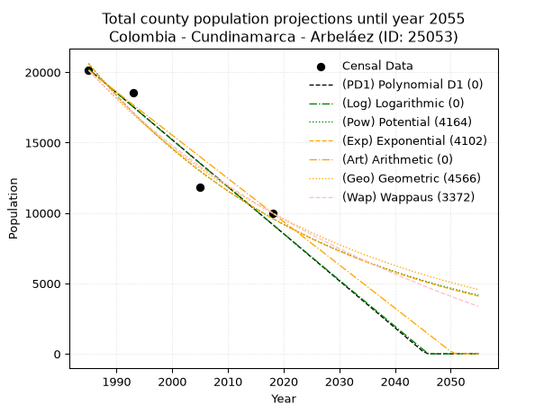
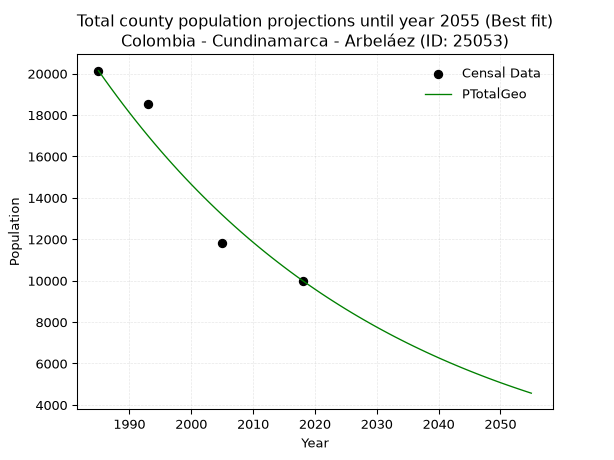
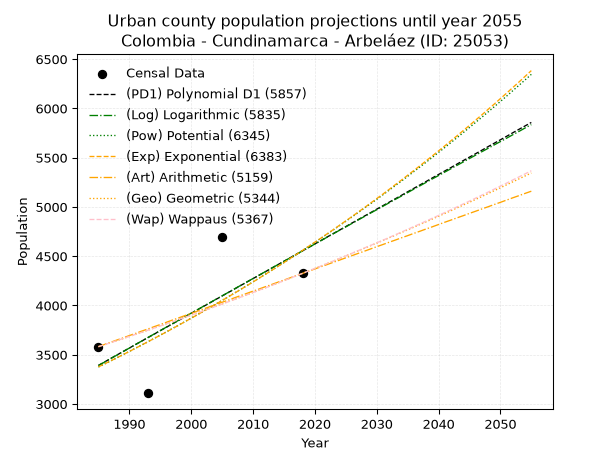
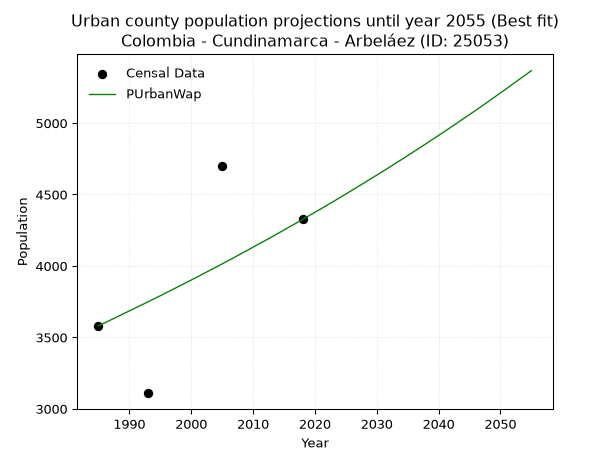
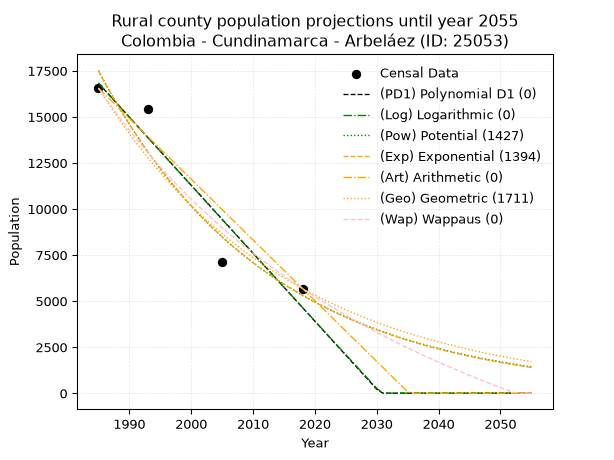
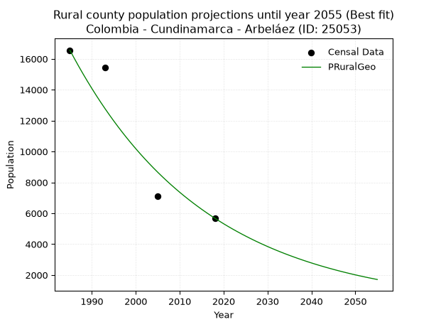

<div align="center">


</div>

# 📜 _“Population and Public Services Demand Projections (PPSD) until Year 2050 for Colombia - Cundinamarca - Arbeláez (ID: 25053)”_
Keywords: `population` `public-service` `projection` `lineal` `polynomial` `logarithmic` `potential` `exponential` `arithmetic` `geometric` `wappaus` `dane` `colombia` `south-america`

PPSD are analytical estimates used by governments and planners to anticipate future changes in population size, age distribution, and the resulting community needs for utilities, healthcare, education, and infrastructure as sizing future water treatment facilities, electrical grids, and road networks based on spatial growth.

<div align="center">

</img>

</div>


> **General running parameters**: • app_version: _v20260806_. • Python version: _3.14.7_. • Pandas version: _3.0.5_. • NumPy version: _2.5.1_. • Creates, save and include plots into reports (create_plot): _False_. • Projection until year: _2050_. • Process polynomial degree 2 and up: _False_. • Process Wappaus: _True_. • Process Wappaus: _True_. • Set negative values to zero: _True_. • Set infinite values to zero: _True_. • Drop dataset notes: _True_. 
<div align="center">

Maps & GIS Layers: [:earth_americas:Google](http://maps.google.com/maps?q=4.272534362,-74.4149014) [:earth_americas:OSM](https://www.openstreetmap.org/#map=18/4.272534362/-74.4149014&layers=P) [:earth_americas:Bing](https://www.bing.com/maps?cp=4.272534362~-74.4149014&lvl=18) [:earth_americas:Apple](https://maps.apple.com/frame?center=4.272534362%2C-74.4149014&span=0.003%2C0.006) [:earth_americas:GISMobile](https://github.com/rcfdtools/R.GISMobile/blob/main/file/gis/CountyLayer_CO/Readme.md)

</div>


<div align="center">

```geojson
{
  "type": "Feature",
  "geometry": {
    "type": "Point", 
    "coordinates": [-74.4149014, 4.272534362]
  }, 
  "properties": {
    "Name": "Colombia - Cundinamarca - Arbeláez (ID: 25053)"
  }
}
```

</div>


## 0. Census Data (4 records)

Census data are official statistics collected by a government about the people and housing in a country. They usually include counts of total population, age, sex, race, income, education, and jobs.

📅Global census file: [Population.xlsx](../data/Population.xlsx)

| Source   |   Year |   CountryID | CountryName   |   StateID | StateName    |   CountyID | CountyName   |   PTotal |   PUrban |   PRural |
|:---------|-------:|------------:|:--------------|----------:|:-------------|-----------:|:-------------|---------:|---------:|---------:|
| DANE     |   1985 |          57 | Colombia      |        25 | Cundinamarca |      25053 | Arbeláez     |    20141 |     3581 |    16560 |
| DANE     |   1993 |          57 | Colombia      |        25 | Cundinamarca |      25053 | Arbeláez     |    18545 |     3109 |    15436 |
| DANE     |   2005 |          57 | Colombia      |        25 | Cundinamarca |      25053 | Arbeláez     |    11806 |     4699 |     7107 |
| DANE     |   2018 |          57 | Colombia      |        25 | Cundinamarca |      25053 | Arbeláez     |    10005 |     4325 |     5680 |

> 🔥Some records could had specific notes about the registered values or the corresponding urban or rural distribution.

📅[SUI-RUPS](https://www.datos.gov.co/Hacienda-y-Cr-dito-P-blico/Registro-nico-de-Prestadores-de-Servicios-P-blicos/4qkq-csdn/about_data) - Local public utility companies: [RUPS.csv](../data/RUPS.csv)

 | SERVICIO       | ESTADO    | NOMBRE                                                                                                                                      | NIT         | DEPARTAMENTO_DOMICILIO   | MUNICIPIO_DOMICILIO   | DIRECCION           |   TELEFONO | EMAIL                       | TIPO_PRESTADOR                 | CLASIFICACION                 |
|:---------------|:----------|:--------------------------------------------------------------------------------------------------------------------------------------------|:------------|:-------------------------|:----------------------|:--------------------|-----------:|:----------------------------|:-------------------------------|:------------------------------|
| ACUEDUCTO      | OPERATIVA | JUNTA DE SERVICIOS PUBLICOS DE ARBELAEZ                                                                                                     | 800093386-8 | CUNDINAMARCA             | ARBELAEZ              | Calle  4 No. 6 - 15 |    8686028 | wperezcaicedo@hotmail.com   | MUNICIPIO (PRESTACIÓN DIRECTA) | MENOR O IGUAL A 2500 USUARIOS |
| ALCANTARILLADO | OPERATIVA | JUNTA DE SERVICIOS PUBLICOS DE ARBELAEZ                                                                                                     | 800093386-8 | CUNDINAMARCA             | ARBELAEZ              | Calle  4 No. 6 - 15 |    8686028 | wperezcaicedo@hotmail.com   | MUNICIPIO (PRESTACIÓN DIRECTA) | MENOR O IGUAL A 2500 USUARIOS |
| ACUEDUCTO      | OPERATIVA | ASOCIACION DE ACUEDUCTO REGIONAL VEREDAS SAN MIGUEL, SANTA ROSA, SAN JOSE                                                                   | 808001121-9 | CUNDINAMARCA             | ARBELAEZ              | cra 8 no. 8-27      |    8686139 | burgosesn@hotmail.com       | ORGANIZACION AUTORIZADA        | MENOR O IGUAL A 2500 USUARIOS |
| ACUEDUCTO      | OPERATIVA | ASOCIACION DE USUARIOS DEL ACUEDUCTO REGIONAL  PORTONES HATO VIEJO Y OTRAS DE LOS  MUNICIPIOS DE SAN BERNARDO Y ARBELAEZ CUNDINAMARCA E.S.P | 800239597-4 | CUNDINAMARCA             | SAN BERNARDO          | vereda portones     |    4709525 | acueductoportones@yahoo.es  | ORGANIZACION AUTORIZADA        | HASTA 2500 SUSCRIPTORES       |
| ACUEDUCTO      | OPERATIVA | ACUEDUCTO VEREDAL SAN ANTONIO-SANTA BARBARA ARBELAEZ                                                                                        | 800059233-6 | CUNDINAMARCA             | ARBELAEZ              | Cr7 5 38            |    8686192 | ACUE.STABARBARA@HOTMAIL.COM | ORGANIZACION AUTORIZADA        | MENOR O IGUAL A 2500 USUARIOS |

## 1. Total

### 1.1. Coefficients and Parameters

* (PD1) Polynomial Deg 1: -333.8968285828968, 683001.3813729394 (lineal)
* (Log) Logarithmic: -668535.0200832442, 5096664.294956171
* (Pow) Potential: -46.15565389175829, 156.52447074534157
* (Exp) Exponential: -0.023055573494642424, 1.5469520542072832e+24
* (Art) Arithmetic: Year diff. 2018 - 1985 = 33, Population diff. 10005 - 20141 = -10136, Annual growth = -307.1515151515151
* (Geo) Geometric: Year diff. 2018 - 1985 = 33, Population diff. 10005 - 20141 = -10136, Annual growth % = -0.020979012612401093
* (Wap) Wappaus: i = -2.0377596706131174, Condition values only valid for < 200)

<sub>
Wappaus condition values: ['-0.00', '-2.04', '-4.08', '-6.11', '-8.15', '-10.19', '-12.23', '-14.26', '-16.30', '-18.34', '-20.38', '-22.42', '-24.45', '-26.49', '-28.53', '-30.57', '-32.60', '-34.64', '-36.68', '-38.72', '-40.76', '-42.79', '-44.83', '-46.87', '-48.91', '-50.94', '-52.98', '-55.02', '-57.06', '-59.10', '-61.13', '-63.17', '-65.21', '-67.25', '-69.28', '-71.32', '-73.36', '-75.40', '-77.43', '-79.47', '-81.51', '-83.55', '-85.59', '-87.62', '-89.66', '-91.70', '-93.74', '-95.77', '-97.81', '-99.85', '-101.89', '-103.93', '-105.96', '-108.00', '-110.04', '-112.08', '-114.11', '-116.15', '-118.19', '-120.23', '-122.27', '-124.30', '-126.34', '-128.38', '-130.42', '-132.45']
</sub>


### 1.2. Projected Dataset

|   Year |   CountyID |   PTotalPD1 |   PTotalLog |   PTotalPow |   PTotalExp |   PTotalArt |   PTotalGeo |   PTotalWap |
|-------:|-----------:|------------:|------------:|------------:|------------:|------------:|------------:|------------:|
|   1985 |      25053 |       20216 |       20228 |       20615 |       20599 |       20141 |       20141 |       20141 |
|   1986 |      25053 |       19882 |       19891 |       20141 |       20130 |       19834 |       19718 |       19735 |
|   1987 |      25053 |       19548 |       19554 |       19678 |       19671 |       19527 |       19305 |       19337 |
|   1988 |      25053 |       19214 |       19218 |       19227 |       19223 |       19220 |       18900 |       18946 |
|   1989 |      25053 |       18881 |       18882 |       18786 |       18785 |       18912 |       18503 |       18564 |
|   1990 |      25053 |       18547 |       18546 |       18355 |       18356 |       18605 |       18115 |       18188 |
|   1991 |      25053 |       18213 |       18210 |       17934 |       17938 |       18298 |       17735 |       17820 |
|   1992 |      25053 |       17879 |       17874 |       17523 |       17529 |       17991 |       17363 |       17459 |
|   1993 |      25053 |       17545 |       17539 |       17122 |       17130 |       17684 |       16999 |       17105 |
|   1994 |      25053 |       17211 |       17203 |       16730 |       16739 |       17377 |       16642 |       16757 |
|   1995 |      25053 |       16877 |       16868 |       16347 |       16358 |       17069 |       16293 |       16416 |
|   1996 |      25053 |       16543 |       16533 |       15974 |       15985 |       16762 |       15951 |       16081 |
|   1997 |      25053 |       16209 |       16198 |       15609 |       15621 |       16455 |       15617 |       15752 |
|   1998 |      25053 |       15876 |       15864 |       15252 |       15265 |       16148 |       15289 |       15430 |
|   1999 |      25053 |       15542 |       15529 |       14904 |       14917 |       15841 |       14968 |       15112 |
|   2000 |      25053 |       15208 |       15195 |       14564 |       14577 |       15534 |       14654 |       14801 |
|   2001 |      25053 |       14874 |       14861 |       14232 |       14245 |       15227 |       14347 |       14495 |
|   2002 |      25053 |       14540 |       14527 |       13907 |       13920 |       14919 |       14046 |       14194 |
|   2003 |      25053 |       14206 |       14193 |       13590 |       13603 |       14612 |       13751 |       13898 |
|   2004 |      25053 |       13872 |       13859 |       13281 |       13293 |       14305 |       13463 |       13608 |
|   2005 |      25053 |       13538 |       13526 |       12978 |       12990 |       13998 |       13180 |       13322 |
|   2006 |      25053 |       13204 |       13192 |       12683 |       12694 |       13691 |       12904 |       13041 |
|   2007 |      25053 |       12870 |       12859 |       12395 |       12404 |       13384 |       12633 |       12765 |
|   2008 |      25053 |       12537 |       12526 |       12113 |       12122 |       13077 |       12368 |       12493 |
|   2009 |      25053 |       12203 |       12193 |       11838 |       11845 |       12769 |       12108 |       12226 |
|   2010 |      25053 |       11869 |       11860 |       11569 |       11575 |       12462 |       11854 |       11963 |
|   2011 |      25053 |       11535 |       11528 |       11306 |       11311 |       12155 |       11606 |       11705 |
|   2012 |      25053 |       11201 |       11196 |       11050 |       11054 |       11848 |       11362 |       11450 |
|   2013 |      25053 |       10867 |       10863 |       10799 |       10802 |       11541 |       11124 |       11200 |
|   2014 |      25053 |       10533 |       10531 |       10555 |       10556 |       11234 |       10891 |       10953 |
|   2015 |      25053 |       10199 |       10200 |       10316 |       10315 |       10926 |       10662 |       10711 |
|   2016 |      25053 |        9865 |        9868 |       10082 |       10080 |       10619 |       10438 |       10472 |
|   2017 |      25053 |        9531 |        9536 |        9854 |        9850 |       10312 |       10219 |       10237 |
|   2018 |      25053 |        9198 |        9205 |        9631 |        9626 |       10005 |       10005 |       10005 |
|   2019 |      25053 |        8864 |        8874 |        9413 |        9406 |        9698 |        9795 |        9777 |
|   2020 |      25053 |        8530 |        8543 |        9201 |        9192 |        9391 |        9590 |        9552 |
|   2021 |      25053 |        8196 |        8212 |        8993 |        8982 |        9084 |        9388 |        9331 |
|   2022 |      25053 |        7862 |        7881 |        8790 |        8778 |        8776 |        9191 |        9113 |
|   2023 |      25053 |        7528 |        7551 |        8592 |        8578 |        8469 |        8999 |        8898 |
|   2024 |      25053 |        7194 |        7220 |        8398 |        8382 |        8162 |        8810 |        8686 |
|   2025 |      25053 |        6860 |        6890 |        8208 |        8191 |        7855 |        8625 |        8477 |
|   2026 |      25053 |        6526 |        6560 |        8024 |        8004 |        7548 |        8444 |        8272 |
|   2027 |      25053 |        6193 |        6230 |        7843 |        7822 |        7241 |        8267 |        8069 |
|   2028 |      25053 |        5859 |        5900 |        7666 |        7644 |        6933 |        8094 |        7869 |
|   2029 |      25053 |        5525 |        5571 |        7494 |        7469 |        6626 |        7924 |        7672 |
|   2030 |      25053 |        5191 |        5241 |        7325 |        7299 |        6319 |        7757 |        7478 |
|   2031 |      25053 |        4857 |        4912 |        7161 |        7133 |        6012 |        7595 |        7286 |
|   2032 |      25053 |        4523 |        4583 |        7000 |        6970 |        5705 |        7435 |        7097 |
|   2033 |      25053 |        4189 |        4254 |        6843 |        6811 |        5398 |        7279 |        6911 |
|   2034 |      25053 |        3855 |        3925 |        6689 |        6656 |        5091 |        7127 |        6727 |
|   2035 |      25053 |        3521 |        3597 |        6539 |        6504 |        4783 |        6977 |        6546 |
|   2036 |      25053 |        3187 |        3268 |        6392 |        6356 |        4476 |        6831 |        6367 |
|   2037 |      25053 |        2854 |        2940 |        6249 |        6211 |        4169 |        6688 |        6190 |
|   2038 |      25053 |        2520 |        2612 |        6109 |        6070 |        3862 |        6547 |        6016 |
|   2039 |      25053 |        2186 |        2284 |        5972 |        5931 |        3555 |        6410 |        5844 |
|   2040 |      25053 |        1852 |        1956 |        5839 |        5796 |        3248 |        6275 |        5674 |
|   2041 |      25053 |        1518 |        1628 |        5708 |        5664 |        2941 |        6144 |        5507 |
|   2042 |      25053 |        1184 |        1301 |        5581 |        5535 |        2633 |        6015 |        5342 |
|   2043 |      25053 |         850 |         974 |        5456 |        5409 |        2326 |        5889 |        5178 |
|   2044 |      25053 |         516 |         646 |        5334 |        5286 |        2019 |        5765 |        5017 |
|   2045 |      25053 |         182 |         320 |        5215 |        5165 |        1712 |        5644 |        4858 |
|   2046 |      25053 |           0 |           0 |        5099 |        5047 |        1405 |        5526 |        4701 |
|   2047 |      25053 |           0 |           0 |        4985 |        4932 |        1098 |        5410 |        4546 |
|   2048 |      25053 |           0 |           0 |        4874 |        4820 |         790 |        5296 |        4393 |
|   2049 |      25053 |           0 |           0 |        4765 |        4710 |         483 |        5185 |        4242 |
|   2050 |      25053 |           0 |           0 |        4659 |        4603 |         176 |        5076 |        4092 |
<div align="center">

</img>

</div>


### 1.3. Best fit with absolute and relative error (%)

Relative error puts that difference into context by dividing the absolute error by the true value, creating a unitless ratio or percentage that shows the scale of the mistake.

Absolute and relative error

|   Year | Source   |   CountryID | CountryName   |   StateID | StateName    |   CountyID_x | CountyName   |   PTotal |   PUrban |   PRural |   CountyID_y |   PTotalPD1 |   PTotalLog |   PTotalPow |   PTotalExp |   PTotalArt |   PTotalGeo |   PTotalWap |   PTotalPD1AbsError |   PTotalLogAbsError |   PTotalPowAbsError |   PTotalExpAbsError |   PTotalArtAbsError |   PTotalGeoAbsError |   PTotalWapAbsError |   PTotalPD1RelError |   PTotalLogRelError |   PTotalPowRelError |   PTotalExpRelError |   PTotalArtRelError |   PTotalGeoRelError |   PTotalWapRelError |
|-------:|:---------|------------:|:--------------|----------:|:-------------|-------------:|:-------------|---------:|---------:|---------:|-------------:|------------:|------------:|------------:|------------:|------------:|------------:|------------:|--------------------:|--------------------:|--------------------:|--------------------:|--------------------:|--------------------:|--------------------:|--------------------:|--------------------:|--------------------:|--------------------:|--------------------:|--------------------:|--------------------:|
|   1985 | DANE     |          57 | Colombia      |        25 | Cundinamarca |        25053 | Arbeláez     |    20141 |     3581 |    16560 |        25053 |       20216 |       20228 |       20615 |       20599 |       20141 |       20141 |       20141 |                  75 |                  87 |                 474 |                 458 |                   0 |                   0 |                   0 |            0.372375 |            0.431955 |             2.35341 |             2.27397 |             0       |             0       |              0      |
|   1993 | DANE     |          57 | Colombia      |        25 | Cundinamarca |        25053 | Arbeláez     |    18545 |     3109 |    15436 |        25053 |       17545 |       17539 |       17122 |       17130 |       17684 |       16999 |       17105 |                1000 |                1006 |                1423 |                1415 |                 861 |                1546 |                1440 |            5.39229  |            5.42464  |             7.67323 |             7.63009 |             4.64276 |             8.33648 |              7.7649 |
|   2005 | DANE     |          57 | Colombia      |        25 | Cundinamarca |        25053 | Arbeláez     |    11806 |     4699 |     7107 |        25053 |       13538 |       13526 |       12978 |       12990 |       13998 |       13180 |       13322 |                1732 |                1720 |                1172 |                1184 |                2192 |                1374 |                1516 |           14.6705   |           14.5689   |             9.92716 |            10.0288  |            18.5668  |            11.6382  |             12.8409 |
|   2018 | DANE     |          57 | Colombia      |        25 | Cundinamarca |        25053 | Arbeláez     |    10005 |     4325 |     5680 |        25053 |        9198 |        9205 |        9631 |        9626 |       10005 |       10005 |       10005 |                 807 |                 800 |                 374 |                 379 |                   0 |                   0 |                   0 |            8.06597  |            7.996    |             3.73813 |             3.78811 |             0       |             0       |              0      |

Relative error mean

| Method    |   RelError | Best   |
|:----------|-----------:|:-------|
| PTotalPD1 |    7.12528 |        |
| PTotalLog |    7.10537 |        |
| PTotalPow |    5.92298 |        |
| PTotalExp |    5.93024 |        |
| PTotalArt |    5.8024  |        |
| PTotalGeo |    4.99366 | True   |
| PTotalWap |    5.15146 |        |

💙Best method: _**PTotalGeo**_
<div align="center">

</img>

</div>


### 1.4. Fresh water supply demand in liters per capita per day (lpcd)

The fresh water supply demand typically ranges from 100 to 300 liters per capita per day (lpcd) for standard domestic and municipal planning, though absolute survival minimums set by the World Health Organization are as low as 7.5 to 20 liters per day, and total consumption in high-income nations can exceed 400 liters.

> `CZ`: Level in meters above the sea level (masl)<br> `WS`: Fresh water supply demand in liters per capita per day (lpcd or l/h/d)<br> `WSAll`: Zonal fresh water supply demand in liters per second (l/s)<br> `A`: Zonal area in square meters<br> `DP`: Population density (people/hectare or p/ha)

Reference values (RAS Colombia)

|    CZ |   WS |
|------:|-----:|
|  1000 |  120 |
|  2000 |  130 |
| 99999 |  140 |

County shapefile geometry properties and water supply values

|   CountyID |      ATotal |   CZTotal |   WSTotal |
|-----------:|------------:|----------:|----------:|
|      25053 | 1.42312e+08 |   1991.19 |       130 |

Projected values for best method: PTotalGeo

|   CountyID |   Year |   PTotalGeo |   DPTotal |   WSTotal |   WSTotalAll |
|-----------:|-------:|------------:|----------:|----------:|-------------:|
|      25053 |   1985 |       20141 |      1.42 |       130 |     30.3047  |
|      25053 |   1986 |       19718 |      1.39 |       130 |     29.6683  |
|      25053 |   1987 |       19305 |      1.36 |       130 |     29.0469  |
|      25053 |   1988 |       18900 |      1.33 |       130 |     28.4375  |
|      25053 |   1989 |       18503 |      1.3  |       130 |     27.8402  |
|      25053 |   1990 |       18115 |      1.27 |       130 |     27.2564  |
|      25053 |   1991 |       17735 |      1.25 |       130 |     26.6846  |
|      25053 |   1992 |       17363 |      1.22 |       130 |     26.1249  |
|      25053 |   1993 |       16999 |      1.19 |       130 |     25.5772  |
|      25053 |   1994 |       16642 |      1.17 |       130 |     25.04    |
|      25053 |   1995 |       16293 |      1.14 |       130 |     24.5149  |
|      25053 |   1996 |       15951 |      1.12 |       130 |     24.0003  |
|      25053 |   1997 |       15617 |      1.1  |       130 |     23.4978  |
|      25053 |   1998 |       15289 |      1.07 |       130 |     23.0043  |
|      25053 |   1999 |       14968 |      1.05 |       130 |     22.5213  |
|      25053 |   2000 |       14654 |      1.03 |       130 |     22.0488  |
|      25053 |   2001 |       14347 |      1.01 |       130 |     21.5869  |
|      25053 |   2002 |       14046 |      0.99 |       130 |     21.134   |
|      25053 |   2003 |       13751 |      0.97 |       130 |     20.6902  |
|      25053 |   2004 |       13463 |      0.95 |       130 |     20.2568  |
|      25053 |   2005 |       13180 |      0.93 |       130 |     19.831   |
|      25053 |   2006 |       12904 |      0.91 |       130 |     19.4157  |
|      25053 |   2007 |       12633 |      0.89 |       130 |     19.008   |
|      25053 |   2008 |       12368 |      0.87 |       130 |     18.6093  |
|      25053 |   2009 |       12108 |      0.85 |       130 |     18.2181  |
|      25053 |   2010 |       11854 |      0.83 |       130 |     17.8359  |
|      25053 |   2011 |       11606 |      0.82 |       130 |     17.4627  |
|      25053 |   2012 |       11362 |      0.8  |       130 |     17.0956  |
|      25053 |   2013 |       11124 |      0.78 |       130 |     16.7375  |
|      25053 |   2014 |       10891 |      0.77 |       130 |     16.3869  |
|      25053 |   2015 |       10662 |      0.75 |       130 |     16.0424  |
|      25053 |   2016 |       10438 |      0.73 |       130 |     15.7053  |
|      25053 |   2017 |       10219 |      0.72 |       130 |     15.3758  |
|      25053 |   2018 |       10005 |      0.7  |       130 |     15.0538  |
|      25053 |   2019 |        9795 |      0.69 |       130 |     14.7378  |
|      25053 |   2020 |        9590 |      0.67 |       130 |     14.4294  |
|      25053 |   2021 |        9388 |      0.66 |       130 |     14.1255  |
|      25053 |   2022 |        9191 |      0.65 |       130 |     13.8291  |
|      25053 |   2023 |        8999 |      0.63 |       130 |     13.5402  |
|      25053 |   2024 |        8810 |      0.62 |       130 |     13.2558  |
|      25053 |   2025 |        8625 |      0.61 |       130 |     12.9774  |
|      25053 |   2026 |        8444 |      0.59 |       130 |     12.7051  |
|      25053 |   2027 |        8267 |      0.58 |       130 |     12.4388  |
|      25053 |   2028 |        8094 |      0.57 |       130 |     12.1785  |
|      25053 |   2029 |        7924 |      0.56 |       130 |     11.9227  |
|      25053 |   2030 |        7757 |      0.55 |       130 |     11.6714  |
|      25053 |   2031 |        7595 |      0.53 |       130 |     11.4277  |
|      25053 |   2032 |        7435 |      0.52 |       130 |     11.1869  |
|      25053 |   2033 |        7279 |      0.51 |       130 |     10.9522  |
|      25053 |   2034 |        7127 |      0.5  |       130 |     10.7235  |
|      25053 |   2035 |        6977 |      0.49 |       130 |     10.4978  |
|      25053 |   2036 |        6831 |      0.48 |       130 |     10.2781  |
|      25053 |   2037 |        6688 |      0.47 |       130 |     10.063   |
|      25053 |   2038 |        6547 |      0.46 |       130 |      9.85081 |
|      25053 |   2039 |        6410 |      0.45 |       130 |      9.64468 |
|      25053 |   2040 |        6275 |      0.44 |       130 |      9.44155 |
|      25053 |   2041 |        6144 |      0.43 |       130 |      9.24444 |
|      25053 |   2042 |        6015 |      0.42 |       130 |      9.05035 |
|      25053 |   2043 |        5889 |      0.41 |       130 |      8.86076 |
|      25053 |   2044 |        5765 |      0.41 |       130 |      8.67419 |
|      25053 |   2045 |        5644 |      0.4  |       130 |      8.49213 |
|      25053 |   2046 |        5526 |      0.39 |       130 |      8.31458 |
|      25053 |   2047 |        5410 |      0.38 |       130 |      8.14005 |
|      25053 |   2048 |        5296 |      0.37 |       130 |      7.96852 |
|      25053 |   2049 |        5185 |      0.36 |       130 |      7.8015  |
|      25053 |   2050 |        5076 |      0.36 |       130 |      7.6375  |

## 2. Urban

### 2.1. Coefficients and Parameters

* (PD1) Polynomial Deg 1: 35.22842232035339, -66537.15174628687 (lineal)
* (Log) Logarithmic: 70548.87485938749, -532314.0631494072
* (Pow) Potential: 18.217480851435635, -56.548631702705556
* (Exp) Exponential: 0.00909835660230016, 4.840989881803901e-05
* (Art) Arithmetic: Year diff. 2018 - 1985 = 33, Population diff. 4325 - 3581 = 744, Annual growth = 22.545454545454547
* (Geo) Geometric: Year diff. 2018 - 1985 = 33, Population diff. 4325 - 3581 = 744, Annual growth % = 0.005736696709413902
* (Wap) Wappaus: i = 0.5703378331761838, Condition values only valid for < 200)

<sub>
Wappaus condition values: ['0.00', '0.57', '1.14', '1.71', '2.28', '2.85', '3.42', '3.99', '4.56', '5.13', '5.70', '6.27', '6.84', '7.41', '7.98', '8.56', '9.13', '9.70', '10.27', '10.84', '11.41', '11.98', '12.55', '13.12', '13.69', '14.26', '14.83', '15.40', '15.97', '16.54', '17.11', '17.68', '18.25', '18.82', '19.39', '19.96', '20.53', '21.10', '21.67', '22.24', '22.81', '23.38', '23.95', '24.52', '25.09', '25.67', '26.24', '26.81', '27.38', '27.95', '28.52', '29.09', '29.66', '30.23', '30.80', '31.37', '31.94', '32.51', '33.08', '33.65', '34.22', '34.79', '35.36', '35.93', '36.50', '37.07']
</sub>


### 2.2. Projected Dataset

|   Year |   CountyID |   PUrbanPD1 |   PUrbanLog |   PUrbanPow |   PUrbanExp |   PUrbanArt |   PUrbanGeo |   PUrbanWap |
|-------:|-----------:|------------:|------------:|------------:|------------:|------------:|------------:|------------:|
|   1985 |      25053 |        3391 |        3390 |        3375 |        3376 |        3581 |        3581 |        3581 |
|   1986 |      25053 |        3426 |        3425 |        3406 |        3407 |        3604 |        3602 |        3601 |
|   1987 |      25053 |        3462 |        3461 |        3437 |        3438 |        3626 |        3622 |        3622 |
|   1988 |      25053 |        3497 |        3496 |        3469 |        3469 |        3649 |        3643 |        3643 |
|   1989 |      25053 |        3532 |        3532 |        3501 |        3501 |        3671 |        3664 |        3664 |
|   1990 |      25053 |        3567 |        3567 |        3533 |        3533 |        3694 |        3685 |        3685 |
|   1991 |      25053 |        3603 |        3603 |        3566 |        3565 |        3716 |        3706 |        3706 |
|   1992 |      25053 |        3638 |        3638 |        3598 |        3598 |        3739 |        3727 |        3727 |
|   1993 |      25053 |        3673 |        3674 |        3631 |        3631 |        3761 |        3749 |        3748 |
|   1994 |      25053 |        3708 |        3709 |        3665 |        3664 |        3784 |        3770 |        3770 |
|   1995 |      25053 |        3744 |        3744 |        3698 |        3698 |        3806 |        3792 |        3791 |
|   1996 |      25053 |        3779 |        3780 |        3732 |        3731 |        3829 |        3814 |        3813 |
|   1997 |      25053 |        3814 |        3815 |        3767 |        3765 |        3852 |        3835 |        3835 |
|   1998 |      25053 |        3849 |        3850 |        3801 |        3800 |        3874 |        3857 |        3857 |
|   1999 |      25053 |        3884 |        3886 |        3836 |        3835 |        3897 |        3880 |        3879 |
|   2000 |      25053 |        3920 |        3921 |        3871 |        3870 |        3919 |        3902 |        3901 |
|   2001 |      25053 |        3955 |        3956 |        3906 |        3905 |        3942 |        3924 |        3923 |
|   2002 |      25053 |        3990 |        3992 |        3942 |        3941 |        3964 |        3947 |        3946 |
|   2003 |      25053 |        4025 |        4027 |        3978 |        3977 |        3987 |        3969 |        3969 |
|   2004 |      25053 |        4061 |        4062 |        4014 |        4013 |        4009 |        3992 |        3991 |
|   2005 |      25053 |        4096 |        4097 |        4051 |        4050 |        4032 |        4015 |        4014 |
|   2006 |      25053 |        4131 |        4132 |        4088 |        4087 |        4054 |        4038 |        4037 |
|   2007 |      25053 |        4166 |        4168 |        4125 |        4124 |        4077 |        4061 |        4060 |
|   2008 |      25053 |        4202 |        4203 |        4163 |        4162 |        4100 |        4085 |        4084 |
|   2009 |      25053 |        4237 |        4238 |        4201 |        4200 |        4122 |        4108 |        4107 |
|   2010 |      25053 |        4272 |        4273 |        4239 |        4238 |        4145 |        4132 |        4131 |
|   2011 |      25053 |        4307 |        4308 |        4278 |        4277 |        4167 |        4155 |        4155 |
|   2012 |      25053 |        4342 |        4343 |        4317 |        4316 |        4190 |        4179 |        4178 |
|   2013 |      25053 |        4378 |        4378 |        4356 |        4355 |        4212 |        4203 |        4202 |
|   2014 |      25053 |        4413 |        4413 |        4396 |        4395 |        4235 |        4227 |        4227 |
|   2015 |      25053 |        4448 |        4448 |        4435 |        4435 |        4257 |        4251 |        4251 |
|   2016 |      25053 |        4483 |        4483 |        4476 |        4476 |        4280 |        4276 |        4276 |
|   2017 |      25053 |        4519 |        4518 |        4516 |        4517 |        4302 |        4300 |        4300 |
|   2018 |      25053 |        4554 |        4553 |        4557 |        4558 |        4325 |        4325 |        4325 |
|   2019 |      25053 |        4589 |        4588 |        4599 |        4600 |        4348 |        4350 |        4350 |
|   2020 |      25053 |        4624 |        4623 |        4640 |        4642 |        4370 |        4375 |        4375 |
|   2021 |      25053 |        4659 |        4658 |        4682 |        4684 |        4393 |        4400 |        4400 |
|   2022 |      25053 |        4695 |        4693 |        4725 |        4727 |        4415 |        4425 |        4426 |
|   2023 |      25053 |        4730 |        4728 |        4767 |        4770 |        4438 |        4450 |        4451 |
|   2024 |      25053 |        4765 |        4763 |        4811 |        4814 |        4460 |        4476 |        4477 |
|   2025 |      25053 |        4800 |        4797 |        4854 |        4858 |        4483 |        4502 |        4503 |
|   2026 |      25053 |        4836 |        4832 |        4898 |        4902 |        4505 |        4528 |        4529 |
|   2027 |      25053 |        4871 |        4867 |        4942 |        4947 |        4528 |        4553 |        4556 |
|   2028 |      25053 |        4906 |        4902 |        4987 |        4992 |        4550 |        4580 |        4582 |
|   2029 |      25053 |        4941 |        4937 |        5032 |        5038 |        4573 |        4606 |        4609 |
|   2030 |      25053 |        4977 |        4971 |        5077 |        5084 |        4596 |        4632 |        4635 |
|   2031 |      25053 |        5012 |        5006 |        5123 |        5130 |        4618 |        4659 |        4662 |
|   2032 |      25053 |        5047 |        5041 |        5169 |        5177 |        4641 |        4686 |        4689 |
|   2033 |      25053 |        5082 |        5076 |        5216 |        5225 |        4663 |        4712 |        4717 |
|   2034 |      25053 |        5117 |        5110 |        5262 |        5272 |        4686 |        4740 |        4744 |
|   2035 |      25053 |        5153 |        5145 |        5310 |        5321 |        4708 |        4767 |        4772 |
|   2036 |      25053 |        5188 |        5180 |        5358 |        5369 |        4731 |        4794 |        4800 |
|   2037 |      25053 |        5223 |        5214 |        5406 |        5418 |        4753 |        4822 |        4828 |
|   2038 |      25053 |        5258 |        5249 |        5454 |        5468 |        4776 |        4849 |        4856 |
|   2039 |      25053 |        5294 |        5284 |        5503 |        5518 |        4798 |        4877 |        4885 |
|   2040 |      25053 |        5329 |        5318 |        5553 |        5568 |        4821 |        4905 |        4913 |
|   2041 |      25053 |        5364 |        5353 |        5602 |        5619 |        4844 |        4933 |        4942 |
|   2042 |      25053 |        5399 |        5387 |        5653 |        5671 |        4866 |        4961 |        4971 |
|   2043 |      25053 |        5435 |        5422 |        5703 |        5722 |        4889 |        4990 |        5000 |
|   2044 |      25053 |        5470 |        5456 |        5754 |        5775 |        4911 |        5019 |        5030 |
|   2045 |      25053 |        5505 |        5491 |        5806 |        5827 |        4934 |        5047 |        5059 |
|   2046 |      25053 |        5540 |        5525 |        5858 |        5881 |        4956 |        5076 |        5089 |
|   2047 |      25053 |        5575 |        5560 |        5910 |        5934 |        4979 |        5105 |        5119 |
|   2048 |      25053 |        5611 |        5594 |        5963 |        5989 |        5001 |        5135 |        5149 |
|   2049 |      25053 |        5646 |        5629 |        6016 |        6043 |        5024 |        5164 |        5180 |
|   2050 |      25053 |        5681 |        5663 |        6070 |        6099 |        5046 |        5194 |        5211 |
<div align="center">

</img>

</div>


### 2.3. Best fit with absolute and relative error (%)

Relative error puts that difference into context by dividing the absolute error by the true value, creating a unitless ratio or percentage that shows the scale of the mistake.

Absolute and relative error

|   Year | Source   |   CountryID | CountryName   |   StateID | StateName    |   CountyID_x | CountyName   |   PTotal |   PUrban |   PRural |   CountyID_y |   PUrbanPD1 |   PUrbanLog |   PUrbanPow |   PUrbanExp |   PUrbanArt |   PUrbanGeo |   PUrbanWap |   PUrbanPD1AbsError |   PUrbanLogAbsError |   PUrbanPowAbsError |   PUrbanExpAbsError |   PUrbanArtAbsError |   PUrbanGeoAbsError |   PUrbanWapAbsError |   PUrbanPD1RelError |   PUrbanLogRelError |   PUrbanPowRelError |   PUrbanExpRelError |   PUrbanArtRelError |   PUrbanGeoRelError |   PUrbanWapRelError |
|-------:|:---------|------------:|:--------------|----------:|:-------------|-------------:|:-------------|---------:|---------:|---------:|-------------:|------------:|------------:|------------:|------------:|------------:|------------:|------------:|--------------------:|--------------------:|--------------------:|--------------------:|--------------------:|--------------------:|--------------------:|--------------------:|--------------------:|--------------------:|--------------------:|--------------------:|--------------------:|--------------------:|
|   1985 | DANE     |          57 | Colombia      |        25 | Cundinamarca |        25053 | Arbeláez     |    20141 |     3581 |    16560 |        25053 |        3391 |        3390 |        3375 |        3376 |        3581 |        3581 |        3581 |                 190 |                 191 |                 206 |                 205 |                   0 |                   0 |                   0 |             5.30578 |             5.33371 |             5.75258 |             5.72466 |              0      |              0      |              0      |
|   1993 | DANE     |          57 | Colombia      |        25 | Cundinamarca |        25053 | Arbeláez     |    18545 |     3109 |    15436 |        25053 |        3673 |        3674 |        3631 |        3631 |        3761 |        3749 |        3748 |                 564 |                 565 |                 522 |                 522 |                 652 |                 640 |                 639 |            18.1409  |            18.173   |            16.79    |            16.79    |             20.9714 |             20.5854 |             20.5532 |
|   2005 | DANE     |          57 | Colombia      |        25 | Cundinamarca |        25053 | Arbeláez     |    11806 |     4699 |     7107 |        25053 |        4096 |        4097 |        4051 |        4050 |        4032 |        4015 |        4014 |                 603 |                 602 |                 648 |                 649 |                 667 |                 684 |                 685 |            12.8325  |            12.8112  |            13.7902  |            13.8114  |             14.1945 |             14.5563 |             14.5776 |
|   2018 | DANE     |          57 | Colombia      |        25 | Cundinamarca |        25053 | Arbeláez     |    10005 |     4325 |     5680 |        25053 |        4554 |        4553 |        4557 |        4558 |        4325 |        4325 |        4325 |                 229 |                 228 |                 232 |                 233 |                   0 |                   0 |                   0 |             5.2948  |             5.27168 |             5.36416 |             5.38728 |              0      |              0      |              0      |

Relative error mean

| Method    |   RelError | Best   |
|:----------|-----------:|:-------|
| PUrbanPD1 |   10.3935  |        |
| PUrbanLog |   10.3974  |        |
| PUrbanPow |   10.4242  |        |
| PUrbanExp |   10.4283  |        |
| PUrbanArt |    8.79147 |        |
| PUrbanGeo |    8.78542 |        |
| PUrbanWap |    8.7827  | True   |

💙Best method: _**PUrbanWap**_
<div align="center">

</img>

</div>


### 2.4. Fresh water supply demand in liters per capita per day (lpcd)

The fresh water supply demand typically ranges from 100 to 300 liters per capita per day (lpcd) for standard domestic and municipal planning, though absolute survival minimums set by the World Health Organization are as low as 7.5 to 20 liters per day, and total consumption in high-income nations can exceed 400 liters.

> `CZ`: Level in meters above the sea level (masl)<br> `WS`: Fresh water supply demand in liters per capita per day (lpcd or l/h/d)<br> `WSAll`: Zonal fresh water supply demand in liters per second (l/s)<br> `A`: Zonal area in square meters<br> `DP`: Population density (people/hectare or p/ha)

Reference values (RAS Colombia)

|    CZ |   WS |
|------:|-----:|
|  1000 |  120 |
|  2000 |  130 |
| 99999 |  140 |

County shapefile geometry properties and water supply values

|   CountyID |      AUrban |   CZUrban |   WSUrban |
|-----------:|------------:|----------:|----------:|
|      25053 | 1.35483e+06 |    1366.1 |       130 |

Projected values for best method: PUrbanWap

|   CountyID |   Year |   PUrbanWap |   DPUrban |   WSUrban |   WSUrbanAll |
|-----------:|-------:|------------:|----------:|----------:|-------------:|
|      25053 |   1985 |        3581 |     26.43 |       130 |      5.38808 |
|      25053 |   1986 |        3601 |     26.58 |       130 |      5.41817 |
|      25053 |   1987 |        3622 |     26.73 |       130 |      5.44977 |
|      25053 |   1988 |        3643 |     26.89 |       130 |      5.48137 |
|      25053 |   1989 |        3664 |     27.04 |       130 |      5.51296 |
|      25053 |   1990 |        3685 |     27.2  |       130 |      5.54456 |
|      25053 |   1991 |        3706 |     27.35 |       130 |      5.57616 |
|      25053 |   1992 |        3727 |     27.51 |       130 |      5.60775 |
|      25053 |   1993 |        3748 |     27.66 |       130 |      5.63935 |
|      25053 |   1994 |        3770 |     27.83 |       130 |      5.67245 |
|      25053 |   1995 |        3791 |     27.98 |       130 |      5.70405 |
|      25053 |   1996 |        3813 |     28.14 |       130 |      5.73715 |
|      25053 |   1997 |        3835 |     28.31 |       130 |      5.77025 |
|      25053 |   1998 |        3857 |     28.47 |       130 |      5.80336 |
|      25053 |   1999 |        3879 |     28.63 |       130 |      5.83646 |
|      25053 |   2000 |        3901 |     28.79 |       130 |      5.86956 |
|      25053 |   2001 |        3923 |     28.96 |       130 |      5.90266 |
|      25053 |   2002 |        3946 |     29.13 |       130 |      5.93727 |
|      25053 |   2003 |        3969 |     29.3  |       130 |      5.97187 |
|      25053 |   2004 |        3991 |     29.46 |       130 |      6.00498 |
|      25053 |   2005 |        4014 |     29.63 |       130 |      6.03958 |
|      25053 |   2006 |        4037 |     29.8  |       130 |      6.07419 |
|      25053 |   2007 |        4060 |     29.97 |       130 |      6.1088  |
|      25053 |   2008 |        4084 |     30.14 |       130 |      6.14491 |
|      25053 |   2009 |        4107 |     30.31 |       130 |      6.17951 |
|      25053 |   2010 |        4131 |     30.49 |       130 |      6.21563 |
|      25053 |   2011 |        4155 |     30.67 |       130 |      6.25174 |
|      25053 |   2012 |        4178 |     30.84 |       130 |      6.28634 |
|      25053 |   2013 |        4202 |     31.01 |       130 |      6.32245 |
|      25053 |   2014 |        4227 |     31.2  |       130 |      6.36007 |
|      25053 |   2015 |        4251 |     31.38 |       130 |      6.39618 |
|      25053 |   2016 |        4276 |     31.56 |       130 |      6.4338  |
|      25053 |   2017 |        4300 |     31.74 |       130 |      6.46991 |
|      25053 |   2018 |        4325 |     31.92 |       130 |      6.50752 |
|      25053 |   2019 |        4350 |     32.11 |       130 |      6.54514 |
|      25053 |   2020 |        4375 |     32.29 |       130 |      6.58275 |
|      25053 |   2021 |        4400 |     32.48 |       130 |      6.62037 |
|      25053 |   2022 |        4426 |     32.67 |       130 |      6.65949 |
|      25053 |   2023 |        4451 |     32.85 |       130 |      6.69711 |
|      25053 |   2024 |        4477 |     33.04 |       130 |      6.73623 |
|      25053 |   2025 |        4503 |     33.24 |       130 |      6.77535 |
|      25053 |   2026 |        4529 |     33.43 |       130 |      6.81447 |
|      25053 |   2027 |        4556 |     33.63 |       130 |      6.85509 |
|      25053 |   2028 |        4582 |     33.82 |       130 |      6.89421 |
|      25053 |   2029 |        4609 |     34.02 |       130 |      6.93484 |
|      25053 |   2030 |        4635 |     34.21 |       130 |      6.97396 |
|      25053 |   2031 |        4662 |     34.41 |       130 |      7.01458 |
|      25053 |   2032 |        4689 |     34.61 |       130 |      7.05521 |
|      25053 |   2033 |        4717 |     34.82 |       130 |      7.09734 |
|      25053 |   2034 |        4744 |     35.02 |       130 |      7.13796 |
|      25053 |   2035 |        4772 |     35.22 |       130 |      7.18009 |
|      25053 |   2036 |        4800 |     35.43 |       130 |      7.22222 |
|      25053 |   2037 |        4828 |     35.64 |       130 |      7.26435 |
|      25053 |   2038 |        4856 |     35.84 |       130 |      7.30648 |
|      25053 |   2039 |        4885 |     36.06 |       130 |      7.35012 |
|      25053 |   2040 |        4913 |     36.26 |       130 |      7.39225 |
|      25053 |   2041 |        4942 |     36.48 |       130 |      7.43588 |
|      25053 |   2042 |        4971 |     36.69 |       130 |      7.47951 |
|      25053 |   2043 |        5000 |     36.91 |       130 |      7.52315 |
|      25053 |   2044 |        5030 |     37.13 |       130 |      7.56829 |
|      25053 |   2045 |        5059 |     37.34 |       130 |      7.61192 |
|      25053 |   2046 |        5089 |     37.56 |       130 |      7.65706 |
|      25053 |   2047 |        5119 |     37.78 |       130 |      7.7022  |
|      25053 |   2048 |        5149 |     38    |       130 |      7.74734 |
|      25053 |   2049 |        5180 |     38.23 |       130 |      7.79398 |
|      25053 |   2050 |        5211 |     38.46 |       130 |      7.84063 |

## 3. Rural

### 3.1. Coefficients and Parameters

* (PD1) Polynomial Deg 1: -369.1252509032503, 749538.5331192265 (lineal)
* (Log) Logarithmic: -739083.8949426318, 5628978.358105578
* (Pow) Potential: -72.33468484771075, 242.7856877780392
* (Exp) Exponential: -0.036132761286981785, 2.4651774636698136e+35
* (Art) Arithmetic: Year diff. 2018 - 1985 = 33, Population diff. 5680 - 16560 = -10880, Annual growth = -329.6969696969697
* (Geo) Geometric: Year diff. 2018 - 1985 = 33, Population diff. 5680 - 16560 = -10880, Annual growth % = -0.031905354011562914
* (Wap) Wappaus: i = -2.9649008066274254, Condition values only valid for < 200)

<sub>
Wappaus condition values: ['-0.00', '-2.96', '-5.93', '-8.89', '-11.86', '-14.82', '-17.79', '-20.75', '-23.72', '-26.68', '-29.65', '-32.61', '-35.58', '-38.54', '-41.51', '-44.47', '-47.44', '-50.40', '-53.37', '-56.33', '-59.30', '-62.26', '-65.23', '-68.19', '-71.16', '-74.12', '-77.09', '-80.05', '-83.02', '-85.98', '-88.95', '-91.91', '-94.88', '-97.84', '-100.81', '-103.77', '-106.74', '-109.70', '-112.67', '-115.63', '-118.60', '-121.56', '-124.53', '-127.49', '-130.46', '-133.42', '-136.39', '-139.35', '-142.32', '-145.28', '-148.25', '-151.21', '-154.17', '-157.14', '-160.10', '-163.07', '-166.03', '-169.00', '-171.96', '-174.93', '-177.89', '-180.86', '-183.82', '-186.79', '-189.75', '-192.72']
</sub>


### 3.2. Projected Dataset

|   Year |   CountyID |   PRuralPD1 |   PRuralLog |   PRuralPow |   PRuralExp |   PRuralArt |   PRuralGeo |   PRuralWap |
|-------:|-----------:|------------:|------------:|------------:|------------:|------------:|------------:|------------:|
|   1985 |      25053 |       16825 |       16838 |       17507 |       17487 |       16560 |       16560 |       16560 |
|   1986 |      25053 |       16456 |       16466 |       16881 |       16866 |       16230 |       16032 |       16076 |
|   1987 |      25053 |       16087 |       16093 |       16277 |       16268 |       15901 |       15520 |       15606 |
|   1988 |      25053 |       15718 |       15722 |       15696 |       15691 |       15571 |       15025 |       15150 |
|   1989 |      25053 |       15348 |       15350 |       15135 |       15134 |       15241 |       14546 |       14706 |
|   1990 |      25053 |       14979 |       14978 |       14595 |       14597 |       14912 |       14082 |       14274 |
|   1991 |      25053 |       14610 |       14607 |       14074 |       14079 |       14582 |       13632 |       13855 |
|   1992 |      25053 |       14241 |       14236 |       13572 |       13579 |       14252 |       13197 |       13446 |
|   1993 |      25053 |       13872 |       13865 |       13088 |       13097 |       13922 |       12776 |       13049 |
|   1994 |      25053 |       13503 |       13494 |       12621 |       12632 |       13593 |       12369 |       12661 |
|   1995 |      25053 |       13134 |       13124 |       12172 |       12184 |       13263 |       11974 |       12284 |
|   1996 |      25053 |       12765 |       12753 |       11739 |       11752 |       12933 |       11592 |       11916 |
|   1997 |      25053 |       12395 |       12383 |       11321 |       11335 |       12604 |       11222 |       11558 |
|   1998 |      25053 |       12026 |       12013 |       10918 |       10932 |       12274 |       10864 |       11208 |
|   1999 |      25053 |       11657 |       11643 |       10530 |       10544 |       11944 |       10517 |       10868 |
|   2000 |      25053 |       11288 |       11274 |       10156 |       10170 |       11615 |       10182 |       10535 |
|   2001 |      25053 |       10919 |       10904 |        9795 |        9809 |       11285 |        9857 |       10210 |
|   2002 |      25053 |       10550 |       10535 |        9448 |        9461 |       10955 |        9543 |        9893 |
|   2003 |      25053 |       10181 |       10166 |        9112 |        9125 |       10625 |        9238 |        9584 |
|   2004 |      25053 |        9812 |        9797 |        8789 |        8802 |       10296 |        8943 |        9281 |
|   2005 |      25053 |        9442 |        9428 |        8478 |        8489 |        9966 |        8658 |        8986 |
|   2006 |      25053 |        9073 |        9060 |        8178 |        8188 |        9636 |        8382 |        8697 |
|   2007 |      25053 |        8704 |        8691 |        7888 |        7897 |        9307 |        8114 |        8415 |
|   2008 |      25053 |        8335 |        8323 |        7609 |        7617 |        8977 |        7855 |        8139 |
|   2009 |      25053 |        7966 |        7955 |        7340 |        7347 |        8647 |        7605 |        7869 |
|   2010 |      25053 |        7597 |        7588 |        7080 |        7086 |        8318 |        7362 |        7604 |
|   2011 |      25053 |        7228 |        7220 |        6830 |        6835 |        7988 |        7127 |        7346 |
|   2012 |      25053 |        6859 |        6853 |        6589 |        6592 |        7658 |        6900 |        7093 |
|   2013 |      25053 |        6489 |        6485 |        6356 |        6358 |        7328 |        6680 |        6845 |
|   2014 |      25053 |        6120 |        6118 |        6132 |        6133 |        6999 |        6467 |        6602 |
|   2015 |      25053 |        5751 |        5751 |        5916 |        5915 |        6669 |        6260 |        6365 |
|   2016 |      25053 |        5382 |        5385 |        5707 |        5705 |        6339 |        6061 |        6132 |
|   2017 |      25053 |        5013 |        5018 |        5506 |        5503 |        6010 |        5867 |        5904 |
|   2018 |      25053 |        4644 |        4652 |        5312 |        5307 |        5680 |        5680 |        5680 |
|   2019 |      25053 |        4275 |        4286 |        5125 |        5119 |        5350 |        5499 |        5461 |
|   2020 |      25053 |        3906 |        3920 |        4945 |        4937 |        5021 |        5323 |        5246 |
|   2021 |      25053 |        3536 |        3554 |        4771 |        4762 |        4691 |        5153 |        5035 |
|   2022 |      25053 |        3167 |        3188 |        4603 |        4593 |        4361 |        4989 |        4828 |
|   2023 |      25053 |        2798 |        2823 |        4441 |        4430 |        4032 |        4830 |        4626 |
|   2024 |      25053 |        2429 |        2458 |        4285 |        4273 |        3702 |        4676 |        4427 |
|   2025 |      25053 |        2060 |        2092 |        4135 |        4121 |        3372 |        4527 |        4231 |
|   2026 |      25053 |        1691 |        1728 |        3990 |        3975 |        3042 |        4382 |        4040 |
|   2027 |      25053 |        1322 |        1363 |        3850 |        3834 |        2713 |        4242 |        3851 |
|   2028 |      25053 |         953 |         998 |        3715 |        3698 |        2383 |        4107 |        3667 |
|   2029 |      25053 |         583 |         634 |        3585 |        3567 |        2053 |        3976 |        3485 |
|   2030 |      25053 |         214 |         270 |        3459 |        3440 |        1724 |        3849 |        3307 |
|   2031 |      25053 |           0 |           0 |        3338 |        3318 |        1394 |        3726 |        3132 |
|   2032 |      25053 |           0 |           0 |        3222 |        3200 |        1064 |        3607 |        2960 |
|   2033 |      25053 |           0 |           0 |        3109 |        3087 |         735 |        3492 |        2791 |
|   2034 |      25053 |           0 |           0 |        3000 |        2977 |         405 |        3381 |        2624 |
|   2035 |      25053 |           0 |           0 |        2896 |        2871 |          75 |        3273 |        2461 |
|   2036 |      25053 |           0 |           0 |        2794 |        2770 |           0 |        3169 |        2301 |
|   2037 |      25053 |           0 |           0 |        2697 |        2671 |           0 |        3068 |        2143 |
|   2038 |      25053 |           0 |           0 |        2603 |        2576 |           0 |        2970 |        1987 |
|   2039 |      25053 |           0 |           0 |        2512 |        2485 |           0 |        2875 |        1835 |
|   2040 |      25053 |           0 |           0 |        2425 |        2397 |           0 |        2783 |        1684 |
|   2041 |      25053 |           0 |           0 |        2340 |        2312 |           0 |        2694 |        1537 |
|   2042 |      25053 |           0 |           0 |        2259 |        2230 |           0 |        2608 |        1391 |
|   2043 |      25053 |           0 |           0 |        2180 |        2151 |           0 |        2525 |        1248 |
|   2044 |      25053 |           0 |           0 |        2104 |        2074 |           0 |        2445 |        1107 |
|   2045 |      25053 |           0 |           0 |        2031 |        2001 |           0 |        2367 |         969 |
|   2046 |      25053 |           0 |           0 |        1961 |        1930 |           0 |        2291 |         832 |
|   2047 |      25053 |           0 |           0 |        1892 |        1861 |           0 |        2218 |         698 |
|   2048 |      25053 |           0 |           0 |        1827 |        1795 |           0 |        2147 |         566 |
|   2049 |      25053 |           0 |           0 |        1763 |        1731 |           0 |        2079 |         435 |
|   2050 |      25053 |           0 |           0 |        1702 |        1670 |           0 |        2012 |         307 |
<div align="center">

</img>

</div>


### 3.3. Best fit with absolute and relative error (%)

Relative error puts that difference into context by dividing the absolute error by the true value, creating a unitless ratio or percentage that shows the scale of the mistake.

Absolute and relative error

|   Year | Source   |   CountryID | CountryName   |   StateID | StateName    |   CountyID_x | CountyName   |   PTotal |   PUrban |   PRural |   CountyID_y |   PRuralPD1 |   PRuralLog |   PRuralPow |   PRuralExp |   PRuralArt |   PRuralGeo |   PRuralWap |   PRuralPD1AbsError |   PRuralLogAbsError |   PRuralPowAbsError |   PRuralExpAbsError |   PRuralArtAbsError |   PRuralGeoAbsError |   PRuralWapAbsError |   PRuralPD1RelError |   PRuralLogRelError |   PRuralPowRelError |   PRuralExpRelError |   PRuralArtRelError |   PRuralGeoRelError |   PRuralWapRelError |
|-------:|:---------|------------:|:--------------|----------:|:-------------|-------------:|:-------------|---------:|---------:|---------:|-------------:|------------:|------------:|------------:|------------:|------------:|------------:|------------:|--------------------:|--------------------:|--------------------:|--------------------:|--------------------:|--------------------:|--------------------:|--------------------:|--------------------:|--------------------:|--------------------:|--------------------:|--------------------:|--------------------:|
|   1985 | DANE     |          57 | Colombia      |        25 | Cundinamarca |        25053 | Arbeláez     |    20141 |     3581 |    16560 |        25053 |       16825 |       16838 |       17507 |       17487 |       16560 |       16560 |       16560 |                 265 |                 278 |                 947 |                 927 |                   0 |                   0 |                   0 |             1.60024 |             1.67874 |             5.7186  |             5.59783 |             0       |              0      |              0      |
|   1993 | DANE     |          57 | Colombia      |        25 | Cundinamarca |        25053 | Arbeláez     |    18545 |     3109 |    15436 |        25053 |       13872 |       13865 |       13088 |       13097 |       13922 |       12776 |       13049 |                1564 |                1571 |                2348 |                2339 |                1514 |                2660 |                2387 |            10.1322  |            10.1775  |            15.2112  |            15.1529  |             9.80824 |             17.2324 |             15.4639 |
|   2005 | DANE     |          57 | Colombia      |        25 | Cundinamarca |        25053 | Arbeláez     |    11806 |     4699 |     7107 |        25053 |        9442 |        9428 |        8478 |        8489 |        9966 |        8658 |        8986 |                2335 |                2321 |                1371 |                1382 |                2859 |                1551 |                1879 |            32.8549  |            32.6579  |            19.2908  |            19.4456  |            40.2279  |             21.8236 |             26.4387 |
|   2018 | DANE     |          57 | Colombia      |        25 | Cundinamarca |        25053 | Arbeláez     |    10005 |     4325 |     5680 |        25053 |        4644 |        4652 |        5312 |        5307 |        5680 |        5680 |        5680 |                1036 |                1028 |                 368 |                 373 |                   0 |                   0 |                   0 |            18.2394  |            18.0986  |             6.47887 |             6.5669  |             0       |              0      |              0      |

Relative error mean

| Method    |   RelError | Best   |
|:----------|-----------:|:-------|
| PRuralPD1 |    15.7067 |        |
| PRuralLog |    15.6532 |        |
| PRuralPow |    11.6749 |        |
| PRuralExp |    11.6908 |        |
| PRuralArt |    12.509  |        |
| PRuralGeo |     9.764  | True   |
| PRuralWap |    10.4756 |        |

💙Best method: _**PRuralGeo**_
<div align="center">

</img>

</div>


### 3.4. Fresh water supply demand in liters per capita per day (lpcd)

The fresh water supply demand typically ranges from 100 to 300 liters per capita per day (lpcd) for standard domestic and municipal planning, though absolute survival minimums set by the World Health Organization are as low as 7.5 to 20 liters per day, and total consumption in high-income nations can exceed 400 liters.

> `CZ`: Level in meters above the sea level (masl)<br> `WS`: Fresh water supply demand in liters per capita per day (lpcd or l/h/d)<br> `WSAll`: Zonal fresh water supply demand in liters per second (l/s)<br> `A`: Zonal area in square meters<br> `DP`: Population density (people/hectare or p/ha)

Reference values (RAS Colombia)

|    CZ |   WS |
|------:|-----:|
|  1000 |  120 |
|  2000 |  130 |
| 99999 |  140 |

County shapefile geometry properties and water supply values

|   CountyID |      ARural |   CZRural |   WSRural |
|-----------:|------------:|----------:|----------:|
|      25053 | 1.40957e+08 |   1997.24 |       130 |

Projected values for best method: PRuralGeo

|   CountyID |   Year |   PRuralGeo |   DPRural |   WSRural |   WSRuralAll |
|-----------:|-------:|------------:|----------:|----------:|-------------:|
|      25053 |   1985 |       16560 |      1.17 |       130 |     24.9167  |
|      25053 |   1986 |       16032 |      1.14 |       130 |     24.1222  |
|      25053 |   1987 |       15520 |      1.1  |       130 |     23.3519  |
|      25053 |   1988 |       15025 |      1.07 |       130 |     22.6071  |
|      25053 |   1989 |       14546 |      1.03 |       130 |     21.8863  |
|      25053 |   1990 |       14082 |      1    |       130 |     21.1882  |
|      25053 |   1991 |       13632 |      0.97 |       130 |     20.5111  |
|      25053 |   1992 |       13197 |      0.94 |       130 |     19.8566  |
|      25053 |   1993 |       12776 |      0.91 |       130 |     19.2231  |
|      25053 |   1994 |       12369 |      0.88 |       130 |     18.6108  |
|      25053 |   1995 |       11974 |      0.85 |       130 |     18.0164  |
|      25053 |   1996 |       11592 |      0.82 |       130 |     17.4417  |
|      25053 |   1997 |       11222 |      0.8  |       130 |     16.885   |
|      25053 |   1998 |       10864 |      0.77 |       130 |     16.3463  |
|      25053 |   1999 |       10517 |      0.75 |       130 |     15.8242  |
|      25053 |   2000 |       10182 |      0.72 |       130 |     15.3201  |
|      25053 |   2001 |        9857 |      0.7  |       130 |     14.8311  |
|      25053 |   2002 |        9543 |      0.68 |       130 |     14.3587  |
|      25053 |   2003 |        9238 |      0.66 |       130 |     13.8998  |
|      25053 |   2004 |        8943 |      0.63 |       130 |     13.4559  |
|      25053 |   2005 |        8658 |      0.61 |       130 |     13.0271  |
|      25053 |   2006 |        8382 |      0.59 |       130 |     12.6118  |
|      25053 |   2007 |        8114 |      0.58 |       130 |     12.2086  |
|      25053 |   2008 |        7855 |      0.56 |       130 |     11.8189  |
|      25053 |   2009 |        7605 |      0.54 |       130 |     11.4427  |
|      25053 |   2010 |        7362 |      0.52 |       130 |     11.0771  |
|      25053 |   2011 |        7127 |      0.51 |       130 |     10.7235  |
|      25053 |   2012 |        6900 |      0.49 |       130 |     10.3819  |
|      25053 |   2013 |        6680 |      0.47 |       130 |     10.0509  |
|      25053 |   2014 |        6467 |      0.46 |       130 |      9.73044 |
|      25053 |   2015 |        6260 |      0.44 |       130 |      9.41898 |
|      25053 |   2016 |        6061 |      0.43 |       130 |      9.11956 |
|      25053 |   2017 |        5867 |      0.42 |       130 |      8.82766 |
|      25053 |   2018 |        5680 |      0.4  |       130 |      8.5463  |
|      25053 |   2019 |        5499 |      0.39 |       130 |      8.27396 |
|      25053 |   2020 |        5323 |      0.38 |       130 |      8.00914 |
|      25053 |   2021 |        5153 |      0.37 |       130 |      7.75336 |
|      25053 |   2022 |        4989 |      0.35 |       130 |      7.5066  |
|      25053 |   2023 |        4830 |      0.34 |       130 |      7.26736 |
|      25053 |   2024 |        4676 |      0.33 |       130 |      7.03565 |
|      25053 |   2025 |        4527 |      0.32 |       130 |      6.81146 |
|      25053 |   2026 |        4382 |      0.31 |       130 |      6.59329 |
|      25053 |   2027 |        4242 |      0.3  |       130 |      6.38264 |
|      25053 |   2028 |        4107 |      0.29 |       130 |      6.17951 |
|      25053 |   2029 |        3976 |      0.28 |       130 |      5.98241 |
|      25053 |   2030 |        3849 |      0.27 |       130 |      5.79132 |
|      25053 |   2031 |        3726 |      0.26 |       130 |      5.60625 |
|      25053 |   2032 |        3607 |      0.26 |       130 |      5.4272  |
|      25053 |   2033 |        3492 |      0.25 |       130 |      5.25417 |
|      25053 |   2034 |        3381 |      0.24 |       130 |      5.08715 |
|      25053 |   2035 |        3273 |      0.23 |       130 |      4.92465 |
|      25053 |   2036 |        3169 |      0.22 |       130 |      4.76817 |
|      25053 |   2037 |        3068 |      0.22 |       130 |      4.6162  |
|      25053 |   2038 |        2970 |      0.21 |       130 |      4.46875 |
|      25053 |   2039 |        2875 |      0.2  |       130 |      4.32581 |
|      25053 |   2040 |        2783 |      0.2  |       130 |      4.18738 |
|      25053 |   2041 |        2694 |      0.19 |       130 |      4.05347 |
|      25053 |   2042 |        2608 |      0.19 |       130 |      3.92407 |
|      25053 |   2043 |        2525 |      0.18 |       130 |      3.79919 |
|      25053 |   2044 |        2445 |      0.17 |       130 |      3.67882 |
|      25053 |   2045 |        2367 |      0.17 |       130 |      3.56146 |
|      25053 |   2046 |        2291 |      0.16 |       130 |      3.44711 |
|      25053 |   2047 |        2218 |      0.16 |       130 |      3.33727 |
|      25053 |   2048 |        2147 |      0.15 |       130 |      3.23044 |
|      25053 |   2049 |        2079 |      0.15 |       130 |      3.12812 |
|      25053 |   2050 |        2012 |      0.14 |       130 |      3.02731 |

#

<div align="center"><br><sub>Share this research</sub></div><br>

<sub>**APPS & TOOLS & CONTENT DISCLAIMER**: • NO WARRANTY - This content and software is provided by <a href="https://github.com/rcfdtools" target="_blank">github.com/rcfdtools</a> "as is", without any express or implied warranty, including warranties of merchantability, fitness for a particular purpose, or non-infringement. There is no guarantee that the software will be error-free or operate without interruption. • LIMITATION OF LIABILITY - Neither the authors nor copyright holders will be liable for claims or damages arising from the software or its use. You are responsible for determining if the software is appropriate for your use and assume all associated risks, including errors, legal compliance, and data loss. • NO PROFESSIONAL ADVICE - The software provides general information and does not offer professional advice. It should not replace consultation with professional advisors. [Clauses and global license for rcfdtools use.](https://github.com/rcfdtools/rcfdtools/blob/main/LICENSE.md)</sub>

| [:house: Home](Readme.md)  | [:beginner: Help / Collab](https://github.com/rcfdtools/R.HydroTools/discussions/31) |
|----------------------------|-------------------------------------------------------------------------------------------|