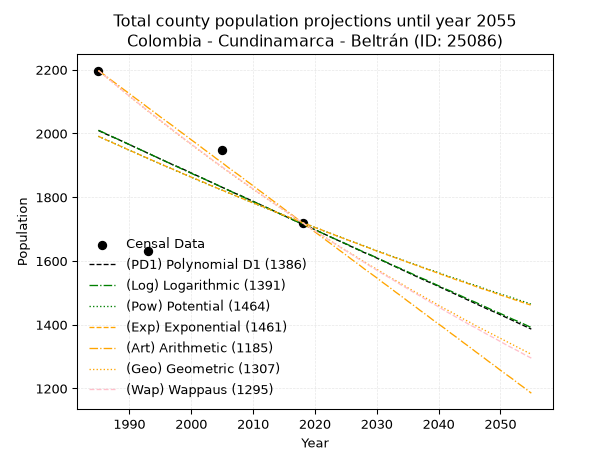
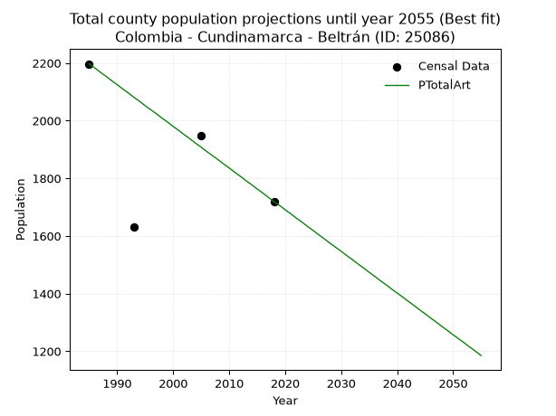
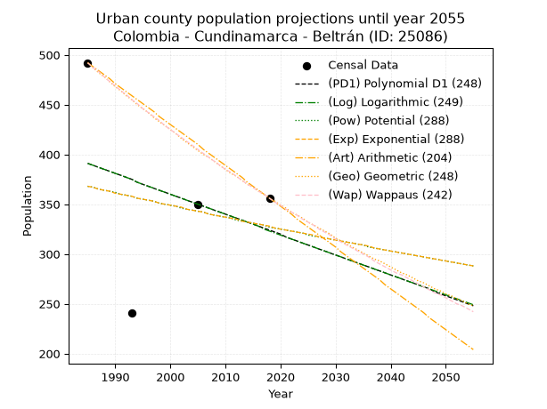
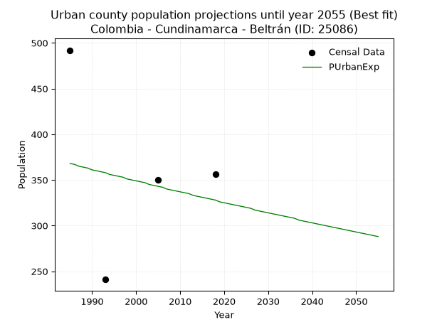
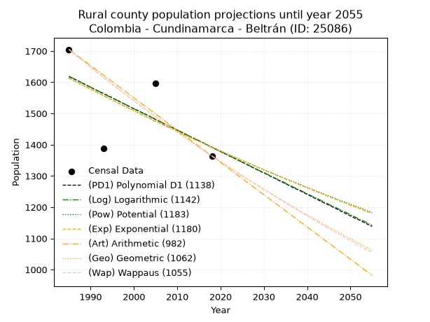
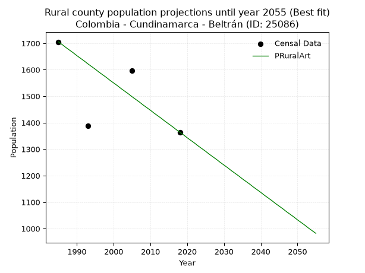

<div align="center">


</div>

# _“Population and Public Services Demand Projections (PPSD) until Year 2050 for Colombia - Cundinamarca - Beltrán (ID: 25086)”_
Keywords: `population` `public-service` `projection` `lineal` `polynomial` `logarithmic` `potential` `exponential` `arithmetic` `geometric` `wappaus` `dane` `colombia` `south-america`

PPSD are analytical estimates used by governments and planners to anticipate future changes in population size, age distribution, and the resulting community needs for utilities, healthcare, education, and infrastructure as sizing future water treatment facilities, electrical grids, and road networks based on spatial growth.

> **General running parameters**: • app_version: _v20260806_. • Python version: _3.14.7_. • Pandas version: _3.0.5_. • NumPy version: _2.5.1_. • Creates, save and include plots into reports (create_plot): _True_. • Projection until year: _2050_. • Process polynomial degree 2 and up: _False_. • Process Wappaus: _True_. • Process Wappaus: _True_. • Set negative values to zero: _True_. • Set infinite values to zero: _True_. • Drop dataset notes: _True_. 
<div align="center">

Dynamic map: [:earth_americas:Google](http://maps.google.com/maps?q=4.802832033,-74.7416663) [:earth_americas:OSM](https://www.openstreetmap.org/#map=18/4.802832033/-74.7416663&layers=P) [:earth_americas:Bing](https://www.bing.com/maps?cp=4.802832033~-74.7416663&lvl=18) [:earth_americas:Apple](https://maps.apple.com/frame?center=4.802832033%2C-74.7416663&span=0.003%2C0.006)

</div>


<div align="center">

```geojson
{
  "type": "Feature",
  "geometry": {
    "type": "Point", 
    "coordinates": [-74.7416663, 4.802832033]
  }, 
  "properties": {
    "Name": "Colombia - Cundinamarca - Beltrán (ID: 25086)"
  }
}
```

</div>


## 0. Census Data (4 records)

Census data are official statistics collected by a government about the people and housing in a country. They usually include counts of total population, age, sex, race, income, education, and jobs.

📅Global census file: [Population.xlsx](../data/Population.xlsx)

| Source   |   Year |   CountryID | CountryName   |   StateID | StateName    |   CountyID | CountyName   |   PTotal |   PUrban |   PRural |
|:---------|-------:|------------:|:--------------|----------:|:-------------|-----------:|:-------------|---------:|---------:|---------:|
| DANE     |   1985 |          57 | Colombia      |        25 | Cundinamarca |      25086 | Beltrán      |     2197 |      492 |     1705 |
| DANE     |   1993 |          57 | Colombia      |        25 | Cundinamarca |      25086 | Beltrán      |     1630 |      241 |     1389 |
| DANE     |   2005 |          57 | Colombia      |        25 | Cundinamarca |      25086 | Beltrán      |     1947 |      350 |     1597 |
| DANE     |   2018 |          57 | Colombia      |        25 | Cundinamarca |      25086 | Beltrán      |     1720 |      356 |     1364 |

> 🔥Some records has specific notes about the registered values or the corresponding urban or rural distribution.

## 1. Total

### 1.1. Coefficients and Parameters

* (PD1) Polynomial Deg 1: -8.90164592533107, 19679.017262143476 (lineal)
* (Log) Logarithmic: -17843.186437504482, 137499.70309779394
* (Pow) Potential: -8.865265413118587, 32.53464146023109
* (Exp) Exponential: -0.004422702279116898, 12933575.230567154
* (Art) Arithmetic: Year diff. 2018 - 1985 = 33, Population diff. 1720 - 2197 = -477, Annual growth = -14.454545454545455
* (Geo) Geometric: Year diff. 2018 - 1985 = 33, Population diff. 1720 - 2197 = -477, Annual growth % = -0.007389787604227038
* (Wap) Wappaus: i = -0.7380416366885604, Condition values only valid for < 200)

<sub>
Wappaus condition values: ['-0.00', '-0.74', '-1.48', '-2.21', '-2.95', '-3.69', '-4.43', '-5.17', '-5.90', '-6.64', '-7.38', '-8.12', '-8.86', '-9.59', '-10.33', '-11.07', '-11.81', '-12.55', '-13.28', '-14.02', '-14.76', '-15.50', '-16.24', '-16.97', '-17.71', '-18.45', '-19.19', '-19.93', '-20.67', '-21.40', '-22.14', '-22.88', '-23.62', '-24.36', '-25.09', '-25.83', '-26.57', '-27.31', '-28.05', '-28.78', '-29.52', '-30.26', '-31.00', '-31.74', '-32.47', '-33.21', '-33.95', '-34.69', '-35.43', '-36.16', '-36.90', '-37.64', '-38.38', '-39.12', '-39.85', '-40.59', '-41.33', '-42.07', '-42.81', '-43.54', '-44.28', '-45.02', '-45.76', '-46.50', '-47.23', '-47.97']
</sub>


### 1.2. Projected Dataset

|   Year |   CountyID |   PTotalPD1 |   PTotalLog |   PTotalPow |   PTotalExp |   PTotalArt |   PTotalGeo |   PTotalWap |
|-------:|-----------:|------------:|------------:|------------:|------------:|------------:|------------:|------------:|
|   1985 |      25086 |        2009 |        2010 |        1991 |        1991 |        2197 |        2197 |        2197 |
|   1986 |      25086 |        2000 |        2001 |        1982 |        1982 |        2183 |        2181 |        2181 |
|   1987 |      25086 |        1991 |        1992 |        1974 |        1973 |        2168 |        2165 |        2165 |
|   1988 |      25086 |        1983 |        1983 |        1965 |        1965 |        2154 |        2149 |        2149 |
|   1989 |      25086 |        1974 |        1974 |        1956 |        1956 |        2139 |        2133 |        2133 |
|   1990 |      25086 |        1965 |        1965 |        1947 |        1947 |        2125 |        2117 |        2117 |
|   1991 |      25086 |        1956 |        1956 |        1939 |        1939 |        2110 |        2101 |        2102 |
|   1992 |      25086 |        1947 |        1947 |        1930 |        1930 |        2096 |        2086 |        2086 |
|   1993 |      25086 |        1938 |        1938 |        1921 |        1922 |        2081 |        2070 |        2071 |
|   1994 |      25086 |        1929 |        1929 |        1913 |        1913 |        2067 |        2055 |        2056 |
|   1995 |      25086 |        1920 |        1920 |        1904 |        1905 |        2052 |        2040 |        2041 |
|   1996 |      25086 |        1911 |        1911 |        1896 |        1896 |        2038 |        2025 |        2026 |
|   1997 |      25086 |        1902 |        1902 |        1888 |        1888 |        2024 |        2010 |        2011 |
|   1998 |      25086 |        1894 |        1893 |        1879 |        1880 |        2009 |        1995 |        1996 |
|   1999 |      25086 |        1885 |        1884 |        1871 |        1871 |        1995 |        1980 |        1981 |
|   2000 |      25086 |        1876 |        1875 |        1863 |        1863 |        1980 |        1966 |        1967 |
|   2001 |      25086 |        1867 |        1866 |        1854 |        1855 |        1966 |        1951 |        1952 |
|   2002 |      25086 |        1858 |        1858 |        1846 |        1847 |        1951 |        1937 |        1938 |
|   2003 |      25086 |        1849 |        1849 |        1838 |        1838 |        1937 |        1922 |        1923 |
|   2004 |      25086 |        1840 |        1840 |        1830 |        1830 |        1922 |        1908 |        1909 |
|   2005 |      25086 |        1831 |        1831 |        1822 |        1822 |        1908 |        1894 |        1895 |
|   2006 |      25086 |        1822 |        1822 |        1814 |        1814 |        1893 |        1880 |        1881 |
|   2007 |      25086 |        1813 |        1813 |        1806 |        1806 |        1879 |        1866 |        1867 |
|   2008 |      25086 |        1805 |        1804 |        1798 |        1798 |        1865 |        1852 |        1853 |
|   2009 |      25086 |        1796 |        1795 |        1790 |        1790 |        1850 |        1839 |        1840 |
|   2010 |      25086 |        1787 |        1786 |        1782 |        1782 |        1836 |        1825 |        1826 |
|   2011 |      25086 |        1778 |        1778 |        1774 |        1775 |        1821 |        1812 |        1812 |
|   2012 |      25086 |        1769 |        1769 |        1766 |        1767 |        1807 |        1798 |        1799 |
|   2013 |      25086 |        1760 |        1760 |        1759 |        1759 |        1792 |        1785 |        1786 |
|   2014 |      25086 |        1751 |        1751 |        1751 |        1751 |        1778 |        1772 |        1772 |
|   2015 |      25086 |        1742 |        1742 |        1743 |        1743 |        1763 |        1759 |        1759 |
|   2016 |      25086 |        1733 |        1733 |        1736 |        1736 |        1749 |        1746 |        1746 |
|   2017 |      25086 |        1724 |        1724 |        1728 |        1728 |        1734 |        1733 |        1733 |
|   2018 |      25086 |        1715 |        1716 |        1720 |        1720 |        1720 |        1720 |        1720 |
|   2019 |      25086 |        1707 |        1707 |        1713 |        1713 |        1706 |        1707 |        1707 |
|   2020 |      25086 |        1698 |        1698 |        1705 |        1705 |        1691 |        1695 |        1694 |
|   2021 |      25086 |        1689 |        1689 |        1698 |        1698 |        1677 |        1682 |        1682 |
|   2022 |      25086 |        1680 |        1680 |        1690 |        1690 |        1662 |        1670 |        1669 |
|   2023 |      25086 |        1671 |        1671 |        1683 |        1683 |        1648 |        1657 |        1657 |
|   2024 |      25086 |        1662 |        1663 |        1676 |        1675 |        1633 |        1645 |        1644 |
|   2025 |      25086 |        1653 |        1654 |        1668 |        1668 |        1619 |        1633 |        1632 |
|   2026 |      25086 |        1644 |        1645 |        1661 |        1661 |        1604 |        1621 |        1620 |
|   2027 |      25086 |        1635 |        1636 |        1654 |        1653 |        1590 |        1609 |        1607 |
|   2028 |      25086 |        1626 |        1627 |        1647 |        1646 |        1575 |        1597 |        1595 |
|   2029 |      25086 |        1618 |        1619 |        1639 |        1639 |        1561 |        1585 |        1583 |
|   2030 |      25086 |        1609 |        1610 |        1632 |        1631 |        1547 |        1574 |        1571 |
|   2031 |      25086 |        1600 |        1601 |        1625 |        1624 |        1532 |        1562 |        1559 |
|   2032 |      25086 |        1591 |        1592 |        1618 |        1617 |        1518 |        1550 |        1548 |
|   2033 |      25086 |        1582 |        1583 |        1611 |        1610 |        1503 |        1539 |        1536 |
|   2034 |      25086 |        1573 |        1575 |        1604 |        1603 |        1489 |        1528 |        1524 |
|   2035 |      25086 |        1564 |        1566 |        1597 |        1596 |        1474 |        1516 |        1513 |
|   2036 |      25086 |        1555 |        1557 |        1590 |        1589 |        1460 |        1505 |        1501 |
|   2037 |      25086 |        1546 |        1548 |        1583 |        1582 |        1445 |        1494 |        1490 |
|   2038 |      25086 |        1537 |        1540 |        1576 |        1575 |        1431 |        1483 |        1478 |
|   2039 |      25086 |        1529 |        1531 |        1570 |        1568 |        1416 |        1472 |        1467 |
|   2040 |      25086 |        1520 |        1522 |        1563 |        1561 |        1402 |        1461 |        1456 |
|   2041 |      25086 |        1511 |        1513 |        1556 |        1554 |        1388 |        1450 |        1444 |
|   2042 |      25086 |        1502 |        1505 |        1549 |        1547 |        1373 |        1440 |        1433 |
|   2043 |      25086 |        1493 |        1496 |        1543 |        1540 |        1359 |        1429 |        1422 |
|   2044 |      25086 |        1484 |        1487 |        1536 |        1534 |        1344 |        1418 |        1411 |
|   2045 |      25086 |        1475 |        1478 |        1529 |        1527 |        1330 |        1408 |        1400 |
|   2046 |      25086 |        1466 |        1470 |        1523 |        1520 |        1315 |        1397 |        1390 |
|   2047 |      25086 |        1457 |        1461 |        1516 |        1513 |        1301 |        1387 |        1379 |
|   2048 |      25086 |        1448 |        1452 |        1509 |        1507 |        1286 |        1377 |        1368 |
|   2049 |      25086 |        1440 |        1443 |        1503 |        1500 |        1272 |        1367 |        1358 |
|   2050 |      25086 |        1431 |        1435 |        1496 |        1493 |        1257 |        1357 |        1347 |
<div align="center">

</img>

</div>


### 1.3. Best fit with absolute error and relative error (%)

Relative error puts that difference into context by dividing the absolute error by the true value, creating a unitless ratio or percentage that shows the scale of the mistake.

Absolute and relative error

|   Year | Source   |   CountryID | CountryName   |   StateID | StateName    |   CountyID_x | CountyName   |   PTotal |   PUrban |   PRural |   CountyID_y |   PTotalPD1 |   PTotalLog |   PTotalPow |   PTotalExp |   PTotalArt |   PTotalGeo |   PTotalWap |   PTotalPD1AbsError |   PTotalLogAbsError |   PTotalPowAbsError |   PTotalExpAbsError |   PTotalArtAbsError |   PTotalGeoAbsError |   PTotalWapAbsError |   PTotalPD1RelError |   PTotalLogRelError |   PTotalPowRelError |   PTotalExpRelError |   PTotalArtRelError |   PTotalGeoRelError |   PTotalWapRelError |
|-------:|:---------|------------:|:--------------|----------:|:-------------|-------------:|:-------------|---------:|---------:|---------:|-------------:|------------:|------------:|------------:|------------:|------------:|------------:|------------:|--------------------:|--------------------:|--------------------:|--------------------:|--------------------:|--------------------:|--------------------:|--------------------:|--------------------:|--------------------:|--------------------:|--------------------:|--------------------:|--------------------:|
|   1985 | DANE     |          57 | Colombia      |        25 | Cundinamarca |        25086 | Beltrán      |     2197 |      492 |     1705 |        25086 |        2009 |        2010 |        1991 |        1991 |        2197 |        2197 |        2197 |                 188 |                 187 |                 206 |                 206 |                   0 |                   0 |                   0 |            8.55712  |            8.51161  |             9.37642 |             9.37642 |             0       |             0       |             0       |
|   1993 | DANE     |          57 | Colombia      |        25 | Cundinamarca |        25086 | Beltrán      |     1630 |      241 |     1389 |        25086 |        1938 |        1938 |        1921 |        1922 |        2081 |        2070 |        2071 |                 308 |                 308 |                 291 |                 292 |                 451 |                 440 |                 441 |           18.8957   |           18.8957   |            17.8528  |            17.9141  |            27.6687  |            26.9939  |            27.0552  |
|   2005 | DANE     |          57 | Colombia      |        25 | Cundinamarca |        25086 | Beltrán      |     1947 |      350 |     1597 |        25086 |        1831 |        1831 |        1822 |        1822 |        1908 |        1894 |        1895 |                 116 |                 116 |                 125 |                 125 |                  39 |                  53 |                  52 |            5.95788  |            5.95788  |             6.42013 |             6.42013 |             2.00308 |             2.72214 |             2.67078 |
|   2018 | DANE     |          57 | Colombia      |        25 | Cundinamarca |        25086 | Beltrán      |     1720 |      356 |     1364 |        25086 |        1715 |        1716 |        1720 |        1720 |        1720 |        1720 |        1720 |                   5 |                   4 |                   0 |                   0 |                   0 |                   0 |                   0 |            0.290698 |            0.232558 |             0       |             0       |             0       |             0       |             0       |

Relative error mean

| Method    |   RelError | Best   |
|:----------|-----------:|:-------|
| PTotalPD1 |    8.42535 |        |
| PTotalLog |    8.39944 |        |
| PTotalPow |    8.41233 |        |
| PTotalExp |    8.42767 |        |
| PTotalArt |    7.41795 | True   |
| PTotalGeo |    7.429   |        |
| PTotalWap |    7.4315  |        |

💙Best method: _**PTotalArt**_
<div align="center">

</img>

</div>


### 1.4. Fresh water supply demand in liters per capita per day (lpcd)

The fresh water supply demand typically ranges from 100 to 300 liters per capita per day (lpcd) for standard domestic and municipal planning, though absolute survival minimums set by the World Health Organization are as low as 7.5 to 20 liters per day, and total consumption in high-income nations can exceed 400 liters.

> `CZ`: Level in meters above the sea level (masl).<br> `WS`: Fresh water supply demand in liters per capita per day (lpcd or l/h/d).<br> `WSAll`: Zonal fresh water supply demand in liters per second (l/s).<br> `A`: Zonal area in square meters.

Reference values (RAS Colombia)

|    CZ |   WS |
|------:|-----:|
|  1000 |  120 |
|  2000 |  130 |
| 99999 |  140 |

County shapefile geometry properties and water supply values

|   CountyID |      ATotal |   CZTotal |   WSTotal |
|-----------:|------------:|----------:|----------:|
|      25086 | 1.76727e+08 |   432.471 |       120 |

Projected values for best method: PTotalArt

|   CountyID |   Year |   PTotalArt |   WSTotal |   WSTotalAll |
|-----------:|-------:|------------:|----------:|-------------:|
|      25086 |   1985 |        2197 |       120 |      3.05139 |
|      25086 |   1986 |        2183 |       120 |      3.03194 |
|      25086 |   1987 |        2168 |       120 |      3.01111 |
|      25086 |   1988 |        2154 |       120 |      2.99167 |
|      25086 |   1989 |        2139 |       120 |      2.97083 |
|      25086 |   1990 |        2125 |       120 |      2.95139 |
|      25086 |   1991 |        2110 |       120 |      2.93056 |
|      25086 |   1992 |        2096 |       120 |      2.91111 |
|      25086 |   1993 |        2081 |       120 |      2.89028 |
|      25086 |   1994 |        2067 |       120 |      2.87083 |
|      25086 |   1995 |        2052 |       120 |      2.85    |
|      25086 |   1996 |        2038 |       120 |      2.83056 |
|      25086 |   1997 |        2024 |       120 |      2.81111 |
|      25086 |   1998 |        2009 |       120 |      2.79028 |
|      25086 |   1999 |        1995 |       120 |      2.77083 |
|      25086 |   2000 |        1980 |       120 |      2.75    |
|      25086 |   2001 |        1966 |       120 |      2.73056 |
|      25086 |   2002 |        1951 |       120 |      2.70972 |
|      25086 |   2003 |        1937 |       120 |      2.69028 |
|      25086 |   2004 |        1922 |       120 |      2.66944 |
|      25086 |   2005 |        1908 |       120 |      2.65    |
|      25086 |   2006 |        1893 |       120 |      2.62917 |
|      25086 |   2007 |        1879 |       120 |      2.60972 |
|      25086 |   2008 |        1865 |       120 |      2.59028 |
|      25086 |   2009 |        1850 |       120 |      2.56944 |
|      25086 |   2010 |        1836 |       120 |      2.55    |
|      25086 |   2011 |        1821 |       120 |      2.52917 |
|      25086 |   2012 |        1807 |       120 |      2.50972 |
|      25086 |   2013 |        1792 |       120 |      2.48889 |
|      25086 |   2014 |        1778 |       120 |      2.46944 |
|      25086 |   2015 |        1763 |       120 |      2.44861 |
|      25086 |   2016 |        1749 |       120 |      2.42917 |
|      25086 |   2017 |        1734 |       120 |      2.40833 |
|      25086 |   2018 |        1720 |       120 |      2.38889 |
|      25086 |   2019 |        1706 |       120 |      2.36944 |
|      25086 |   2020 |        1691 |       120 |      2.34861 |
|      25086 |   2021 |        1677 |       120 |      2.32917 |
|      25086 |   2022 |        1662 |       120 |      2.30833 |
|      25086 |   2023 |        1648 |       120 |      2.28889 |
|      25086 |   2024 |        1633 |       120 |      2.26806 |
|      25086 |   2025 |        1619 |       120 |      2.24861 |
|      25086 |   2026 |        1604 |       120 |      2.22778 |
|      25086 |   2027 |        1590 |       120 |      2.20833 |
|      25086 |   2028 |        1575 |       120 |      2.1875  |
|      25086 |   2029 |        1561 |       120 |      2.16806 |
|      25086 |   2030 |        1547 |       120 |      2.14861 |
|      25086 |   2031 |        1532 |       120 |      2.12778 |
|      25086 |   2032 |        1518 |       120 |      2.10833 |
|      25086 |   2033 |        1503 |       120 |      2.0875  |
|      25086 |   2034 |        1489 |       120 |      2.06806 |
|      25086 |   2035 |        1474 |       120 |      2.04722 |
|      25086 |   2036 |        1460 |       120 |      2.02778 |
|      25086 |   2037 |        1445 |       120 |      2.00694 |
|      25086 |   2038 |        1431 |       120 |      1.9875  |
|      25086 |   2039 |        1416 |       120 |      1.96667 |
|      25086 |   2040 |        1402 |       120 |      1.94722 |
|      25086 |   2041 |        1388 |       120 |      1.92778 |
|      25086 |   2042 |        1373 |       120 |      1.90694 |
|      25086 |   2043 |        1359 |       120 |      1.8875  |
|      25086 |   2044 |        1344 |       120 |      1.86667 |
|      25086 |   2045 |        1330 |       120 |      1.84722 |
|      25086 |   2046 |        1315 |       120 |      1.82639 |
|      25086 |   2047 |        1301 |       120 |      1.80694 |
|      25086 |   2048 |        1286 |       120 |      1.78611 |
|      25086 |   2049 |        1272 |       120 |      1.76667 |
|      25086 |   2050 |        1257 |       120 |      1.74583 |

## 2. Urban

### 2.1. Coefficients and Parameters

* (PD1) Polynomial Deg 1: -2.0373344038538783, 4434.92814130872 (lineal)
* (Log) Logarithmic: -4099.490894675309, 31520.01314168534
* (Pow) Potential: -7.086647457428354, 25.935935735134045
* (Exp) Exponential: -0.0035108394024809557, 391050.2700640679
* (Art) Arithmetic: Year diff. 2018 - 1985 = 33, Population diff. 356 - 492 = -136, Annual growth = -4.121212121212121
* (Geo) Geometric: Year diff. 2018 - 1985 = 33, Population diff. 356 - 492 = -136, Annual growth % = -0.009756577152539192
* (Wap) Wappaus: i = -0.9719839908519153, Condition values only valid for < 200)

<sub>
Wappaus condition values: ['-0.00', '-0.97', '-1.94', '-2.92', '-3.89', '-4.86', '-5.83', '-6.80', '-7.78', '-8.75', '-9.72', '-10.69', '-11.66', '-12.64', '-13.61', '-14.58', '-15.55', '-16.52', '-17.50', '-18.47', '-19.44', '-20.41', '-21.38', '-22.36', '-23.33', '-24.30', '-25.27', '-26.24', '-27.22', '-28.19', '-29.16', '-30.13', '-31.10', '-32.08', '-33.05', '-34.02', '-34.99', '-35.96', '-36.94', '-37.91', '-38.88', '-39.85', '-40.82', '-41.80', '-42.77', '-43.74', '-44.71', '-45.68', '-46.66', '-47.63', '-48.60', '-49.57', '-50.54', '-51.52', '-52.49', '-53.46', '-54.43', '-55.40', '-56.38', '-57.35', '-58.32', '-59.29', '-60.26', '-61.23', '-62.21', '-63.18']
</sub>


### 2.2. Projected Dataset

|   Year |   CountyID |   PUrbanPD1 |   PUrbanLog |   PUrbanPow |   PUrbanExp |   PUrbanArt |   PUrbanGeo |   PUrbanWap |
|-------:|-----------:|------------:|------------:|------------:|------------:|------------:|------------:|------------:|
|   1985 |      25086 |         391 |         391 |         368 |         368 |         492 |         492 |         492 |
|   1986 |      25086 |         389 |         389 |         367 |         367 |         488 |         487 |         487 |
|   1987 |      25086 |         387 |         387 |         365 |         365 |         484 |         482 |         483 |
|   1988 |      25086 |         385 |         385 |         364 |         364 |         480 |         478 |         478 |
|   1989 |      25086 |         383 |         383 |         363 |         363 |         476 |         473 |         473 |
|   1990 |      25086 |         381 |         381 |         362 |         361 |         471 |         468 |         469 |
|   1991 |      25086 |         379 |         379 |         360 |         360 |         467 |         464 |         464 |
|   1992 |      25086 |         377 |         377 |         359 |         359 |         463 |         459 |         460 |
|   1993 |      25086 |         375 |         375 |         358 |         358 |         459 |         455 |         455 |
|   1994 |      25086 |         372 |         372 |         356 |         356 |         455 |         450 |         451 |
|   1995 |      25086 |         370 |         370 |         355 |         355 |         451 |         446 |         446 |
|   1996 |      25086 |         368 |         368 |         354 |         354 |         447 |         442 |         442 |
|   1997 |      25086 |         366 |         366 |         353 |         353 |         443 |         437 |         438 |
|   1998 |      25086 |         364 |         364 |         351 |         351 |         438 |         433 |         434 |
|   1999 |      25086 |         362 |         362 |         350 |         350 |         434 |         429 |         429 |
|   2000 |      25086 |         360 |         360 |         349 |         349 |         430 |         425 |         425 |
|   2001 |      25086 |         358 |         358 |         348 |         348 |         426 |         421 |         421 |
|   2002 |      25086 |         356 |         356 |         346 |         347 |         422 |         416 |         417 |
|   2003 |      25086 |         354 |         354 |         345 |         345 |         418 |         412 |         413 |
|   2004 |      25086 |         352 |         352 |         344 |         344 |         414 |         408 |         409 |
|   2005 |      25086 |         350 |         350 |         343 |         343 |         410 |         404 |         405 |
|   2006 |      25086 |         348 |         348 |         342 |         342 |         405 |         400 |         401 |
|   2007 |      25086 |         346 |         346 |         340 |         340 |         401 |         397 |         397 |
|   2008 |      25086 |         344 |         344 |         339 |         339 |         397 |         393 |         393 |
|   2009 |      25086 |         342 |         342 |         338 |         338 |         393 |         389 |         389 |
|   2010 |      25086 |         340 |         340 |         337 |         337 |         389 |         385 |         385 |
|   2011 |      25086 |         338 |         338 |         336 |         336 |         385 |         381 |         382 |
|   2012 |      25086 |         336 |         336 |         334 |         335 |         381 |         378 |         378 |
|   2013 |      25086 |         334 |         334 |         333 |         333 |         377 |         374 |         374 |
|   2014 |      25086 |         332 |         332 |         332 |         332 |         372 |         370 |         370 |
|   2015 |      25086 |         330 |         330 |         331 |         331 |         368 |         367 |         367 |
|   2016 |      25086 |         328 |         328 |         330 |         330 |         364 |         363 |         363 |
|   2017 |      25086 |         326 |         325 |         329 |         329 |         360 |         360 |         360 |
|   2018 |      25086 |         324 |         323 |         327 |         328 |         356 |         356 |         356 |
|   2019 |      25086 |         322 |         321 |         326 |         326 |         352 |         353 |         352 |
|   2020 |      25086 |         320 |         319 |         325 |         325 |         348 |         349 |         349 |
|   2021 |      25086 |         317 |         317 |         324 |         324 |         344 |         346 |         345 |
|   2022 |      25086 |         315 |         315 |         323 |         323 |         340 |         342 |         342 |
|   2023 |      25086 |         313 |         313 |         322 |         322 |         335 |         339 |         339 |
|   2024 |      25086 |         311 |         311 |         321 |         321 |         331 |         336 |         335 |
|   2025 |      25086 |         309 |         309 |         319 |         320 |         327 |         332 |         332 |
|   2026 |      25086 |         307 |         307 |         318 |         319 |         323 |         329 |         329 |
|   2027 |      25086 |         305 |         305 |         317 |         317 |         319 |         326 |         325 |
|   2028 |      25086 |         303 |         303 |         316 |         316 |         315 |         323 |         322 |
|   2029 |      25086 |         301 |         301 |         315 |         315 |         311 |         320 |         319 |
|   2030 |      25086 |         299 |         299 |         314 |         314 |         307 |         316 |         315 |
|   2031 |      25086 |         297 |         297 |         313 |         313 |         302 |         313 |         312 |
|   2032 |      25086 |         295 |         295 |         312 |         312 |         298 |         310 |         309 |
|   2033 |      25086 |         293 |         293 |         311 |         311 |         294 |         307 |         306 |
|   2034 |      25086 |         291 |         291 |         310 |         310 |         290 |         304 |         303 |
|   2035 |      25086 |         289 |         289 |         309 |         309 |         286 |         301 |         300 |
|   2036 |      25086 |         287 |         287 |         307 |         308 |         282 |         298 |         297 |
|   2037 |      25086 |         285 |         285 |         306 |         306 |         278 |         295 |         293 |
|   2038 |      25086 |         283 |         283 |         305 |         305 |         274 |         293 |         290 |
|   2039 |      25086 |         281 |         281 |         304 |         304 |         269 |         290 |         287 |
|   2040 |      25086 |         279 |         279 |         303 |         303 |         265 |         287 |         284 |
|   2041 |      25086 |         277 |         277 |         302 |         302 |         261 |         284 |         281 |
|   2042 |      25086 |         275 |         275 |         301 |         301 |         257 |         281 |         279 |
|   2043 |      25086 |         273 |         273 |         300 |         300 |         253 |         279 |         276 |
|   2044 |      25086 |         271 |         271 |         299 |         299 |         249 |         276 |         273 |
|   2045 |      25086 |         269 |         269 |         298 |         298 |         245 |         273 |         270 |
|   2046 |      25086 |         267 |         267 |         297 |         297 |         241 |         271 |         267 |
|   2047 |      25086 |         265 |         265 |         296 |         296 |         236 |         268 |         264 |
|   2048 |      25086 |         262 |         263 |         295 |         295 |         232 |         265 |         261 |
|   2049 |      25086 |         260 |         261 |         294 |         294 |         228 |         263 |         259 |
|   2050 |      25086 |         258 |         259 |         293 |         293 |         224 |         260 |         256 |
<div align="center">

</img>

</div>


### 2.3. Best fit with absolute error and relative error (%)

Relative error puts that difference into context by dividing the absolute error by the true value, creating a unitless ratio or percentage that shows the scale of the mistake.

Absolute and relative error

|   Year | Source   |   CountryID | CountryName   |   StateID | StateName    |   CountyID_x | CountyName   |   PTotal |   PUrban |   PRural |   CountyID_y |   PUrbanPD1 |   PUrbanLog |   PUrbanPow |   PUrbanExp |   PUrbanArt |   PUrbanGeo |   PUrbanWap |   PUrbanPD1AbsError |   PUrbanLogAbsError |   PUrbanPowAbsError |   PUrbanExpAbsError |   PUrbanArtAbsError |   PUrbanGeoAbsError |   PUrbanWapAbsError |   PUrbanPD1RelError |   PUrbanLogRelError |   PUrbanPowRelError |   PUrbanExpRelError |   PUrbanArtRelError |   PUrbanGeoRelError |   PUrbanWapRelError |
|-------:|:---------|------------:|:--------------|----------:|:-------------|-------------:|:-------------|---------:|---------:|---------:|-------------:|------------:|------------:|------------:|------------:|------------:|------------:|------------:|--------------------:|--------------------:|--------------------:|--------------------:|--------------------:|--------------------:|--------------------:|--------------------:|--------------------:|--------------------:|--------------------:|--------------------:|--------------------:|--------------------:|
|   1985 | DANE     |          57 | Colombia      |        25 | Cundinamarca |        25086 | Beltrán      |     2197 |      492 |     1705 |        25086 |         391 |         391 |         368 |         368 |         492 |         492 |         492 |                 101 |                 101 |                 124 |                 124 |                   0 |                   0 |                   0 |            20.5285  |            20.5285  |            25.2033  |            25.2033  |              0      |              0      |              0      |
|   1993 | DANE     |          57 | Colombia      |        25 | Cundinamarca |        25086 | Beltrán      |     1630 |      241 |     1389 |        25086 |         375 |         375 |         358 |         358 |         459 |         455 |         455 |                 134 |                 134 |                 117 |                 117 |                 218 |                 214 |                 214 |            55.6017  |            55.6017  |            48.5477  |            48.5477  |             90.4564 |             88.7967 |             88.7967 |
|   2005 | DANE     |          57 | Colombia      |        25 | Cundinamarca |        25086 | Beltrán      |     1947 |      350 |     1597 |        25086 |         350 |         350 |         343 |         343 |         410 |         404 |         405 |                   0 |                   0 |                   7 |                   7 |                  60 |                  54 |                  55 |             0       |             0       |             2       |             2       |             17.1429 |             15.4286 |             15.7143 |
|   2018 | DANE     |          57 | Colombia      |        25 | Cundinamarca |        25086 | Beltrán      |     1720 |      356 |     1364 |        25086 |         324 |         323 |         327 |         328 |         356 |         356 |         356 |                  32 |                  33 |                  29 |                  28 |                   0 |                   0 |                   0 |             8.98876 |             9.26966 |             8.14607 |             7.86517 |              0      |              0      |              0      |

Relative error mean

| Method    |   RelError | Best   |
|:----------|-----------:|:-------|
| PUrbanPD1 |    21.2797 |        |
| PUrbanLog |    21.3499 |        |
| PUrbanPow |    20.9743 |        |
| PUrbanExp |    20.904  | True   |
| PUrbanArt |    26.8998 |        |
| PUrbanGeo |    26.0563 |        |
| PUrbanWap |    26.1277 |        |

💙Best method: _**PUrbanExp**_
<div align="center">

</img>

</div>


### 2.4. Fresh water supply demand in liters per capita per day (lpcd)

The fresh water supply demand typically ranges from 100 to 300 liters per capita per day (lpcd) for standard domestic and municipal planning, though absolute survival minimums set by the World Health Organization are as low as 7.5 to 20 liters per day, and total consumption in high-income nations can exceed 400 liters.

> `CZ`: Level in meters above the sea level (masl).<br> `WS`: Fresh water supply demand in liters per capita per day (lpcd or l/h/d).<br> `WSAll`: Zonal fresh water supply demand in liters per second (l/s).<br> `A`: Zonal area in square meters.

Reference values (RAS Colombia)

|    CZ |   WS |
|------:|-----:|
|  1000 |  120 |
|  2000 |  130 |
| 99999 |  140 |

County shapefile geometry properties and water supply values

|   CountyID |   AUrban |   CZUrban |   WSUrban |
|-----------:|---------:|----------:|----------:|
|      25086 |   577449 |   231.875 |       120 |

Projected values for best method: PUrbanExp

|   CountyID |   Year |   PUrbanExp |   WSUrban |   WSUrbanAll |
|-----------:|-------:|------------:|----------:|-------------:|
|      25086 |   1985 |         368 |       120 |     0.511111 |
|      25086 |   1986 |         367 |       120 |     0.509722 |
|      25086 |   1987 |         365 |       120 |     0.506944 |
|      25086 |   1988 |         364 |       120 |     0.505556 |
|      25086 |   1989 |         363 |       120 |     0.504167 |
|      25086 |   1990 |         361 |       120 |     0.501389 |
|      25086 |   1991 |         360 |       120 |     0.5      |
|      25086 |   1992 |         359 |       120 |     0.498611 |
|      25086 |   1993 |         358 |       120 |     0.497222 |
|      25086 |   1994 |         356 |       120 |     0.494444 |
|      25086 |   1995 |         355 |       120 |     0.493056 |
|      25086 |   1996 |         354 |       120 |     0.491667 |
|      25086 |   1997 |         353 |       120 |     0.490278 |
|      25086 |   1998 |         351 |       120 |     0.4875   |
|      25086 |   1999 |         350 |       120 |     0.486111 |
|      25086 |   2000 |         349 |       120 |     0.484722 |
|      25086 |   2001 |         348 |       120 |     0.483333 |
|      25086 |   2002 |         347 |       120 |     0.481944 |
|      25086 |   2003 |         345 |       120 |     0.479167 |
|      25086 |   2004 |         344 |       120 |     0.477778 |
|      25086 |   2005 |         343 |       120 |     0.476389 |
|      25086 |   2006 |         342 |       120 |     0.475    |
|      25086 |   2007 |         340 |       120 |     0.472222 |
|      25086 |   2008 |         339 |       120 |     0.470833 |
|      25086 |   2009 |         338 |       120 |     0.469444 |
|      25086 |   2010 |         337 |       120 |     0.468056 |
|      25086 |   2011 |         336 |       120 |     0.466667 |
|      25086 |   2012 |         335 |       120 |     0.465278 |
|      25086 |   2013 |         333 |       120 |     0.4625   |
|      25086 |   2014 |         332 |       120 |     0.461111 |
|      25086 |   2015 |         331 |       120 |     0.459722 |
|      25086 |   2016 |         330 |       120 |     0.458333 |
|      25086 |   2017 |         329 |       120 |     0.456944 |
|      25086 |   2018 |         328 |       120 |     0.455556 |
|      25086 |   2019 |         326 |       120 |     0.452778 |
|      25086 |   2020 |         325 |       120 |     0.451389 |
|      25086 |   2021 |         324 |       120 |     0.45     |
|      25086 |   2022 |         323 |       120 |     0.448611 |
|      25086 |   2023 |         322 |       120 |     0.447222 |
|      25086 |   2024 |         321 |       120 |     0.445833 |
|      25086 |   2025 |         320 |       120 |     0.444444 |
|      25086 |   2026 |         319 |       120 |     0.443056 |
|      25086 |   2027 |         317 |       120 |     0.440278 |
|      25086 |   2028 |         316 |       120 |     0.438889 |
|      25086 |   2029 |         315 |       120 |     0.4375   |
|      25086 |   2030 |         314 |       120 |     0.436111 |
|      25086 |   2031 |         313 |       120 |     0.434722 |
|      25086 |   2032 |         312 |       120 |     0.433333 |
|      25086 |   2033 |         311 |       120 |     0.431944 |
|      25086 |   2034 |         310 |       120 |     0.430556 |
|      25086 |   2035 |         309 |       120 |     0.429167 |
|      25086 |   2036 |         308 |       120 |     0.427778 |
|      25086 |   2037 |         306 |       120 |     0.425    |
|      25086 |   2038 |         305 |       120 |     0.423611 |
|      25086 |   2039 |         304 |       120 |     0.422222 |
|      25086 |   2040 |         303 |       120 |     0.420833 |
|      25086 |   2041 |         302 |       120 |     0.419444 |
|      25086 |   2042 |         301 |       120 |     0.418056 |
|      25086 |   2043 |         300 |       120 |     0.416667 |
|      25086 |   2044 |         299 |       120 |     0.415278 |
|      25086 |   2045 |         298 |       120 |     0.413889 |
|      25086 |   2046 |         297 |       120 |     0.4125   |
|      25086 |   2047 |         296 |       120 |     0.411111 |
|      25086 |   2048 |         295 |       120 |     0.409722 |
|      25086 |   2049 |         294 |       120 |     0.408333 |
|      25086 |   2050 |         293 |       120 |     0.406944 |

## 3. Rural

### 3.1. Coefficients and Parameters

* (PD1) Polynomial Deg 1: -6.864311521477186, 15244.08912083474 (lineal)
* (Log) Logarithmic: -13743.695542829173, 105979.68995610863
* (Pow) Potential: -8.954957114879779, 32.739129033652354
* (Exp) Exponential: -0.004472929895593446, 11581362.737272356
* (Art) Arithmetic: Year diff. 2018 - 1985 = 33, Population diff. 1364 - 1705 = -341, Annual growth = -10.333333333333334
* (Geo) Geometric: Year diff. 2018 - 1985 = 33, Population diff. 1364 - 1705 = -341, Annual growth % = -0.006739115420140052
* (Wap) Wappaus: i = -0.6734006734006734, Condition values only valid for < 200)

<sub>
Wappaus condition values: ['-0.00', '-0.67', '-1.35', '-2.02', '-2.69', '-3.37', '-4.04', '-4.71', '-5.39', '-6.06', '-6.73', '-7.41', '-8.08', '-8.75', '-9.43', '-10.10', '-10.77', '-11.45', '-12.12', '-12.79', '-13.47', '-14.14', '-14.81', '-15.49', '-16.16', '-16.84', '-17.51', '-18.18', '-18.86', '-19.53', '-20.20', '-20.88', '-21.55', '-22.22', '-22.90', '-23.57', '-24.24', '-24.92', '-25.59', '-26.26', '-26.94', '-27.61', '-28.28', '-28.96', '-29.63', '-30.30', '-30.98', '-31.65', '-32.32', '-33.00', '-33.67', '-34.34', '-35.02', '-35.69', '-36.36', '-37.04', '-37.71', '-38.38', '-39.06', '-39.73', '-40.40', '-41.08', '-41.75', '-42.42', '-43.10', '-43.77']
</sub>


### 3.2. Projected Dataset

|   Year |   CountyID |   PRuralPD1 |   PRuralLog |   PRuralPow |   PRuralExp |   PRuralArt |   PRuralGeo |   PRuralWap |
|-------:|-----------:|------------:|------------:|------------:|------------:|------------:|------------:|------------:|
|   1985 |      25086 |        1618 |        1619 |        1614 |        1613 |        1705 |        1705 |        1705 |
|   1986 |      25086 |        1612 |        1612 |        1606 |        1606 |        1695 |        1694 |        1694 |
|   1987 |      25086 |        1605 |        1605 |        1599 |        1599 |        1684 |        1682 |        1682 |
|   1988 |      25086 |        1598 |        1598 |        1592 |        1592 |        1674 |        1671 |        1671 |
|   1989 |      25086 |        1591 |        1591 |        1585 |        1585 |        1664 |        1660 |        1660 |
|   1990 |      25086 |        1584 |        1584 |        1578 |        1578 |        1653 |        1648 |        1649 |
|   1991 |      25086 |        1577 |        1577 |        1571 |        1571 |        1643 |        1637 |        1637 |
|   1992 |      25086 |        1570 |        1570 |        1564 |        1564 |        1633 |        1626 |        1626 |
|   1993 |      25086 |        1564 |        1563 |        1557 |        1557 |        1622 |        1615 |        1616 |
|   1994 |      25086 |        1557 |        1556 |        1550 |        1550 |        1612 |        1604 |        1605 |
|   1995 |      25086 |        1550 |        1550 |        1543 |        1543 |        1602 |        1594 |        1594 |
|   1996 |      25086 |        1543 |        1543 |        1536 |        1536 |        1591 |        1583 |        1583 |
|   1997 |      25086 |        1536 |        1536 |        1529 |        1529 |        1581 |        1572 |        1573 |
|   1998 |      25086 |        1529 |        1529 |        1522 |        1522 |        1571 |        1562 |        1562 |
|   1999 |      25086 |        1522 |        1522 |        1515 |        1516 |        1560 |        1551 |        1551 |
|   2000 |      25086 |        1515 |        1515 |        1509 |        1509 |        1550 |        1541 |        1541 |
|   2001 |      25086 |        1509 |        1508 |        1502 |        1502 |        1540 |        1530 |        1531 |
|   2002 |      25086 |        1502 |        1501 |        1495 |        1495 |        1529 |        1520 |        1520 |
|   2003 |      25086 |        1495 |        1495 |        1488 |        1489 |        1519 |        1510 |        1510 |
|   2004 |      25086 |        1488 |        1488 |        1482 |        1482 |        1509 |        1499 |        1500 |
|   2005 |      25086 |        1481 |        1481 |        1475 |        1475 |        1498 |        1489 |        1490 |
|   2006 |      25086 |        1474 |        1474 |        1469 |        1469 |        1488 |        1479 |        1480 |
|   2007 |      25086 |        1467 |        1467 |        1462 |        1462 |        1478 |        1469 |        1470 |
|   2008 |      25086 |        1461 |        1460 |        1456 |        1456 |        1467 |        1459 |        1460 |
|   2009 |      25086 |        1454 |        1453 |        1449 |        1449 |        1457 |        1450 |        1450 |
|   2010 |      25086 |        1447 |        1447 |        1443 |        1443 |        1447 |        1440 |        1440 |
|   2011 |      25086 |        1440 |        1440 |        1436 |        1436 |        1436 |        1430 |        1431 |
|   2012 |      25086 |        1433 |        1433 |        1430 |        1430 |        1426 |        1420 |        1421 |
|   2013 |      25086 |        1426 |        1426 |        1423 |        1424 |        1416 |        1411 |        1411 |
|   2014 |      25086 |        1419 |        1419 |        1417 |        1417 |        1405 |        1401 |        1402 |
|   2015 |      25086 |        1413 |        1413 |        1411 |        1411 |        1395 |        1392 |        1392 |
|   2016 |      25086 |        1406 |        1406 |        1405 |        1405 |        1385 |        1383 |        1383 |
|   2017 |      25086 |        1399 |        1399 |        1398 |        1398 |        1374 |        1373 |        1373 |
|   2018 |      25086 |        1392 |        1392 |        1392 |        1392 |        1364 |        1364 |        1364 |
|   2019 |      25086 |        1385 |        1385 |        1386 |        1386 |        1354 |        1355 |        1355 |
|   2020 |      25086 |        1378 |        1378 |        1380 |        1380 |        1343 |        1346 |        1346 |
|   2021 |      25086 |        1371 |        1372 |        1374 |        1373 |        1333 |        1337 |        1336 |
|   2022 |      25086 |        1364 |        1365 |        1368 |        1367 |        1323 |        1328 |        1327 |
|   2023 |      25086 |        1358 |        1358 |        1362 |        1361 |        1312 |        1319 |        1318 |
|   2024 |      25086 |        1351 |        1351 |        1356 |        1355 |        1302 |        1310 |        1309 |
|   2025 |      25086 |        1344 |        1344 |        1350 |        1349 |        1292 |        1301 |        1300 |
|   2026 |      25086 |        1337 |        1338 |        1344 |        1343 |        1281 |        1292 |        1291 |
|   2027 |      25086 |        1330 |        1331 |        1338 |        1337 |        1271 |        1283 |        1283 |
|   2028 |      25086 |        1323 |        1324 |        1332 |        1331 |        1261 |        1275 |        1274 |
|   2029 |      25086 |        1316 |        1317 |        1326 |        1325 |        1250 |        1266 |        1265 |
|   2030 |      25086 |        1310 |        1311 |        1320 |        1319 |        1240 |        1258 |        1256 |
|   2031 |      25086 |        1303 |        1304 |        1314 |        1313 |        1230 |        1249 |        1248 |
|   2032 |      25086 |        1296 |        1297 |        1309 |        1308 |        1219 |        1241 |        1239 |
|   2033 |      25086 |        1289 |        1290 |        1303 |        1302 |        1209 |        1232 |        1231 |
|   2034 |      25086 |        1282 |        1284 |        1297 |        1296 |        1199 |        1224 |        1222 |
|   2035 |      25086 |        1275 |        1277 |        1291 |        1290 |        1188 |        1216 |        1214 |
|   2036 |      25086 |        1268 |        1270 |        1286 |        1284 |        1178 |        1208 |        1205 |
|   2037 |      25086 |        1261 |        1263 |        1280 |        1279 |        1168 |        1200 |        1197 |
|   2038 |      25086 |        1255 |        1257 |        1275 |        1273 |        1157 |        1191 |        1189 |
|   2039 |      25086 |        1248 |        1250 |        1269 |        1267 |        1147 |        1183 |        1180 |
|   2040 |      25086 |        1241 |        1243 |        1263 |        1262 |        1137 |        1175 |        1172 |
|   2041 |      25086 |        1234 |        1236 |        1258 |        1256 |        1126 |        1168 |        1164 |
|   2042 |      25086 |        1227 |        1230 |        1252 |        1250 |        1116 |        1160 |        1156 |
|   2043 |      25086 |        1220 |        1223 |        1247 |        1245 |        1106 |        1152 |        1148 |
|   2044 |      25086 |        1213 |        1216 |        1241 |        1239 |        1095 |        1144 |        1140 |
|   2045 |      25086 |        1207 |        1209 |        1236 |        1234 |        1085 |        1136 |        1132 |
|   2046 |      25086 |        1200 |        1203 |        1231 |        1228 |        1075 |        1129 |        1124 |
|   2047 |      25086 |        1193 |        1196 |        1225 |        1223 |        1064 |        1121 |        1116 |
|   2048 |      25086 |        1186 |        1189 |        1220 |        1217 |        1054 |        1114 |        1108 |
|   2049 |      25086 |        1179 |        1183 |        1215 |        1212 |        1044 |        1106 |        1100 |
|   2050 |      25086 |        1172 |        1176 |        1209 |        1206 |        1033 |        1099 |        1093 |
<div align="center">

</img>

</div>


### 3.3. Best fit with absolute error and relative error (%)

Relative error puts that difference into context by dividing the absolute error by the true value, creating a unitless ratio or percentage that shows the scale of the mistake.

Absolute and relative error

|   Year | Source   |   CountryID | CountryName   |   StateID | StateName    |   CountyID_x | CountyName   |   PTotal |   PUrban |   PRural |   CountyID_y |   PRuralPD1 |   PRuralLog |   PRuralPow |   PRuralExp |   PRuralArt |   PRuralGeo |   PRuralWap |   PRuralPD1AbsError |   PRuralLogAbsError |   PRuralPowAbsError |   PRuralExpAbsError |   PRuralArtAbsError |   PRuralGeoAbsError |   PRuralWapAbsError |   PRuralPD1RelError |   PRuralLogRelError |   PRuralPowRelError |   PRuralExpRelError |   PRuralArtRelError |   PRuralGeoRelError |   PRuralWapRelError |
|-------:|:---------|------------:|:--------------|----------:|:-------------|-------------:|:-------------|---------:|---------:|---------:|-------------:|------------:|------------:|------------:|------------:|------------:|------------:|------------:|--------------------:|--------------------:|--------------------:|--------------------:|--------------------:|--------------------:|--------------------:|--------------------:|--------------------:|--------------------:|--------------------:|--------------------:|--------------------:|--------------------:|
|   1985 | DANE     |          57 | Colombia      |        25 | Cundinamarca |        25086 | Beltrán      |     2197 |      492 |     1705 |        25086 |        1618 |        1619 |        1614 |        1613 |        1705 |        1705 |        1705 |                  87 |                  86 |                  91 |                  92 |                   0 |                   0 |                   0 |             5.10264 |             5.04399 |             5.33724 |             5.39589 |             0       |             0       |             0       |
|   1993 | DANE     |          57 | Colombia      |        25 | Cundinamarca |        25086 | Beltrán      |     1630 |      241 |     1389 |        25086 |        1564 |        1563 |        1557 |        1557 |        1622 |        1615 |        1616 |                 175 |                 174 |                 168 |                 168 |                 233 |                 226 |                 227 |            12.599   |            12.527   |            12.095   |            12.095   |            16.7747  |            16.2707  |            16.3427  |
|   2005 | DANE     |          57 | Colombia      |        25 | Cundinamarca |        25086 | Beltrán      |     1947 |      350 |     1597 |        25086 |        1481 |        1481 |        1475 |        1475 |        1498 |        1489 |        1490 |                 116 |                 116 |                 122 |                 122 |                  99 |                 108 |                 107 |             7.26362 |             7.26362 |             7.63932 |             7.63932 |             6.19912 |             6.76268 |             6.70006 |
|   2018 | DANE     |          57 | Colombia      |        25 | Cundinamarca |        25086 | Beltrán      |     1720 |      356 |     1364 |        25086 |        1392 |        1392 |        1392 |        1392 |        1364 |        1364 |        1364 |                  28 |                  28 |                  28 |                  28 |                   0 |                   0 |                   0 |             2.05279 |             2.05279 |             2.05279 |             2.05279 |             0       |             0       |             0       |

Relative error mean

| Method    |   RelError | Best   |
|:----------|-----------:|:-------|
| PRuralPD1 |    6.75451 |        |
| PRuralLog |    6.72185 |        |
| PRuralPow |    6.7811  |        |
| PRuralExp |    6.79576 |        |
| PRuralArt |    5.74345 | True   |
| PRuralGeo |    5.75834 |        |
| PRuralWap |    5.76069 |        |

💙Best method: _**PRuralArt**_
<div align="center">

</img>

</div>


### 3.4. Fresh water supply demand in liters per capita per day (lpcd)

The fresh water supply demand typically ranges from 100 to 300 liters per capita per day (lpcd) for standard domestic and municipal planning, though absolute survival minimums set by the World Health Organization are as low as 7.5 to 20 liters per day, and total consumption in high-income nations can exceed 400 liters.

> `CZ`: Level in meters above the sea level (masl).<br> `WS`: Fresh water supply demand in liters per capita per day (lpcd or l/h/d).<br> `WSAll`: Zonal fresh water supply demand in liters per second (l/s).<br> `A`: Zonal area in square meters.

Reference values (RAS Colombia)

|    CZ |   WS |
|------:|-----:|
|  1000 |  120 |
|  2000 |  130 |
| 99999 |  140 |

County shapefile geometry properties and water supply values

|   CountyID |      ARural |   CZRural |   WSRural |
|-----------:|------------:|----------:|----------:|
|      25086 | 1.76149e+08 |    433.16 |       120 |

Projected values for best method: PRuralArt

|   CountyID |   Year |   PRuralArt |   WSRural |   WSRuralAll |
|-----------:|-------:|------------:|----------:|-------------:|
|      25086 |   1985 |        1705 |       120 |      2.36806 |
|      25086 |   1986 |        1695 |       120 |      2.35417 |
|      25086 |   1987 |        1684 |       120 |      2.33889 |
|      25086 |   1988 |        1674 |       120 |      2.325   |
|      25086 |   1989 |        1664 |       120 |      2.31111 |
|      25086 |   1990 |        1653 |       120 |      2.29583 |
|      25086 |   1991 |        1643 |       120 |      2.28194 |
|      25086 |   1992 |        1633 |       120 |      2.26806 |
|      25086 |   1993 |        1622 |       120 |      2.25278 |
|      25086 |   1994 |        1612 |       120 |      2.23889 |
|      25086 |   1995 |        1602 |       120 |      2.225   |
|      25086 |   1996 |        1591 |       120 |      2.20972 |
|      25086 |   1997 |        1581 |       120 |      2.19583 |
|      25086 |   1998 |        1571 |       120 |      2.18194 |
|      25086 |   1999 |        1560 |       120 |      2.16667 |
|      25086 |   2000 |        1550 |       120 |      2.15278 |
|      25086 |   2001 |        1540 |       120 |      2.13889 |
|      25086 |   2002 |        1529 |       120 |      2.12361 |
|      25086 |   2003 |        1519 |       120 |      2.10972 |
|      25086 |   2004 |        1509 |       120 |      2.09583 |
|      25086 |   2005 |        1498 |       120 |      2.08056 |
|      25086 |   2006 |        1488 |       120 |      2.06667 |
|      25086 |   2007 |        1478 |       120 |      2.05278 |
|      25086 |   2008 |        1467 |       120 |      2.0375  |
|      25086 |   2009 |        1457 |       120 |      2.02361 |
|      25086 |   2010 |        1447 |       120 |      2.00972 |
|      25086 |   2011 |        1436 |       120 |      1.99444 |
|      25086 |   2012 |        1426 |       120 |      1.98056 |
|      25086 |   2013 |        1416 |       120 |      1.96667 |
|      25086 |   2014 |        1405 |       120 |      1.95139 |
|      25086 |   2015 |        1395 |       120 |      1.9375  |
|      25086 |   2016 |        1385 |       120 |      1.92361 |
|      25086 |   2017 |        1374 |       120 |      1.90833 |
|      25086 |   2018 |        1364 |       120 |      1.89444 |
|      25086 |   2019 |        1354 |       120 |      1.88056 |
|      25086 |   2020 |        1343 |       120 |      1.86528 |
|      25086 |   2021 |        1333 |       120 |      1.85139 |
|      25086 |   2022 |        1323 |       120 |      1.8375  |
|      25086 |   2023 |        1312 |       120 |      1.82222 |
|      25086 |   2024 |        1302 |       120 |      1.80833 |
|      25086 |   2025 |        1292 |       120 |      1.79444 |
|      25086 |   2026 |        1281 |       120 |      1.77917 |
|      25086 |   2027 |        1271 |       120 |      1.76528 |
|      25086 |   2028 |        1261 |       120 |      1.75139 |
|      25086 |   2029 |        1250 |       120 |      1.73611 |
|      25086 |   2030 |        1240 |       120 |      1.72222 |
|      25086 |   2031 |        1230 |       120 |      1.70833 |
|      25086 |   2032 |        1219 |       120 |      1.69306 |
|      25086 |   2033 |        1209 |       120 |      1.67917 |
|      25086 |   2034 |        1199 |       120 |      1.66528 |
|      25086 |   2035 |        1188 |       120 |      1.65    |
|      25086 |   2036 |        1178 |       120 |      1.63611 |
|      25086 |   2037 |        1168 |       120 |      1.62222 |
|      25086 |   2038 |        1157 |       120 |      1.60694 |
|      25086 |   2039 |        1147 |       120 |      1.59306 |
|      25086 |   2040 |        1137 |       120 |      1.57917 |
|      25086 |   2041 |        1126 |       120 |      1.56389 |
|      25086 |   2042 |        1116 |       120 |      1.55    |
|      25086 |   2043 |        1106 |       120 |      1.53611 |
|      25086 |   2044 |        1095 |       120 |      1.52083 |
|      25086 |   2045 |        1085 |       120 |      1.50694 |
|      25086 |   2046 |        1075 |       120 |      1.49306 |
|      25086 |   2047 |        1064 |       120 |      1.47778 |
|      25086 |   2048 |        1054 |       120 |      1.46389 |
|      25086 |   2049 |        1044 |       120 |      1.45    |
|      25086 |   2050 |        1033 |       120 |      1.43472 |

<div align="center"><br><sub>Share this research</sub></div><br>

<sub>**APPS & TOOLS & CONTENT DISCLAIMER**: • NO WARRANTY - This content and software is provided by <a href="https://github.com/rcfdtools" target="_blank">github.com/rcfdtools</a> "as is", without any express or implied warranty, including warranties of merchantability, fitness for a particular purpose, or non-infringement. There is no guarantee that the software will be error-free or operate without interruption. • LIMITATION OF LIABILITY - Neither the authors nor copyright holders will be liable for claims or damages arising from the software or its use. You are responsible for determining if the software is appropriate for your use and assume all associated risks, including errors, legal compliance, and data loss. • NO PROFESSIONAL ADVICE - The software provides general information and does not offer professional advice. It should not replace consultation with professional advisors. [Clauses and global license for rcfdtools use.](https://github.com/rcfdtools/rcfdtools/blob/main/LICENSE.md)</sub>