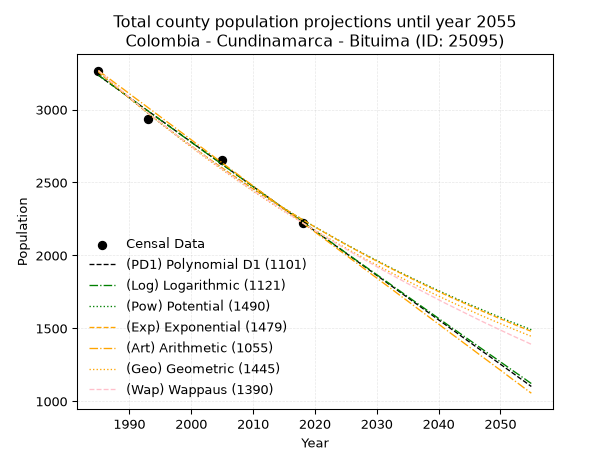
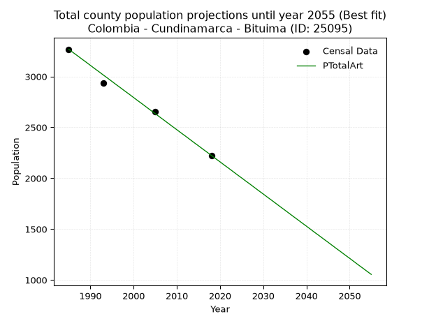
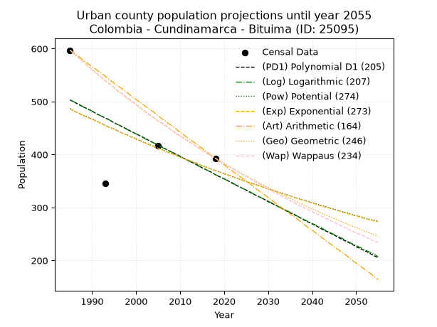
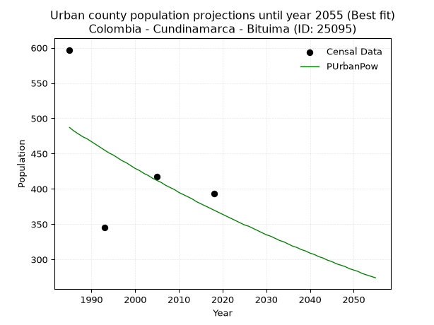
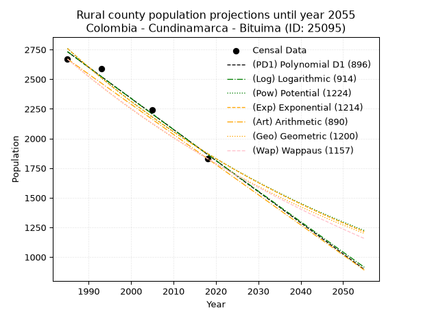
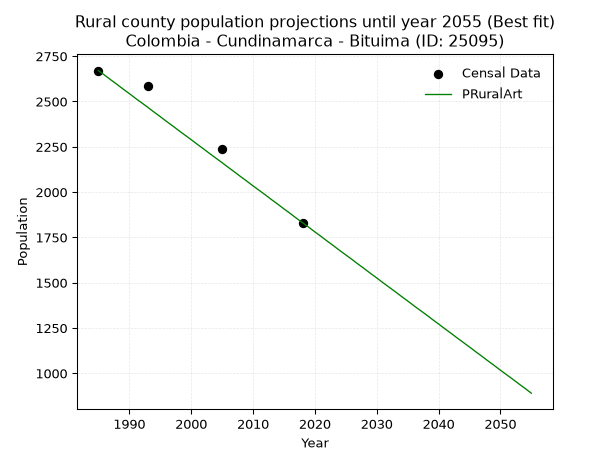

<div align="center">


</div>

# _“Population and Public Services Demand Projections (PPSD) until Year 2050 for Colombia - Cundinamarca - Bituima (ID: 25095)”_
Keywords: `population` `public-service` `projection` `lineal` `polynomial` `logarithmic` `potential` `exponential` `arithmetic` `geometric` `wappaus` `dane` `colombia` `south-america`

PPSD are analytical estimates used by governments and planners to anticipate future changes in population size, age distribution, and the resulting community needs for utilities, healthcare, education, and infrastructure as sizing future water treatment facilities, electrical grids, and road networks based on spatial growth.

> **General running parameters**: • app_version: _v20260806_. • Python version: _3.14.7_. • Pandas version: _3.0.5_. • NumPy version: _2.5.1_. • Creates, save and include plots into reports (create_plot): _True_. • Projection until year: _2050_. • Process polynomial degree 2 and up: _False_. • Process Wappaus: _True_. • Process Wappaus: _True_. • Set negative values to zero: _True_. • Set infinite values to zero: _True_. • Drop dataset notes: _True_. 
<div align="center">

Dynamic map: [:earth_americas:Google](http://maps.google.com/maps?q=4.872171133,-74.5396089) [:earth_americas:OSM](https://www.openstreetmap.org/#map=18/4.872171133/-74.5396089&layers=P) [:earth_americas:Bing](https://www.bing.com/maps?cp=4.872171133~-74.5396089&lvl=18) [:earth_americas:Apple](https://maps.apple.com/frame?center=4.872171133%2C-74.5396089&span=0.003%2C0.006)

</div>


<div align="center">

```geojson
{
  "type": "Feature",
  "geometry": {
    "type": "Point", 
    "coordinates": [-74.5396089, 4.872171133]
  }, 
  "properties": {
    "Name": "Colombia - Cundinamarca - Bituima (ID: 25095)"
  }
}
```

</div>


## 0. Census Data (4 records)

Census data are official statistics collected by a government about the people and housing in a country. They usually include counts of total population, age, sex, race, income, education, and jobs.

📅Global census file: [Population.xlsx](../data/Population.xlsx)

| Source   |   Year |   CountryID | CountryName   |   StateID | StateName    |   CountyID | CountyName   |   PTotal |   PUrban |   PRural |
|:---------|-------:|------------:|:--------------|----------:|:-------------|-----------:|:-------------|---------:|---------:|---------:|
| DANE     |   1985 |          57 | Colombia      |        25 | Cundinamarca |      25095 | Bituima      |     3267 |      597 |     2670 |
| DANE     |   1993 |          57 | Colombia      |        25 | Cundinamarca |      25095 | Bituima      |     2932 |      345 |     2587 |
| DANE     |   2005 |          57 | Colombia      |        25 | Cundinamarca |      25095 | Bituima      |     2657 |      417 |     2240 |
| DANE     |   2018 |          57 | Colombia      |        25 | Cundinamarca |      25095 | Bituima      |     2224 |      393 |     1831 |

> 🔥Some records has specific notes about the registered values or the corresponding urban or rural distribution.

## 1. Total

### 1.1. Coefficients and Parameters

* (PD1) Polynomial Deg 1: -30.480931352870044, 63739.48293857831 (lineal)
* (Log) Logarithmic: -61014.13803899802, 466538.95217104093
* (Pow) Potential: -22.572159446176627, 77.95061999983203
* (Exp) Exponential: -0.01127799254681439, 17193892692910.213
* (Art) Arithmetic: Year diff. 2018 - 1985 = 33, Population diff. 2224 - 3267 = -1043, Annual growth = -31.606060606060606
* (Geo) Geometric: Year diff. 2018 - 1985 = 33, Population diff. 2224 - 3267 = -1043, Annual growth % = -0.011585838690315375
* (Wap) Wappaus: i = -1.1511950685143182, Condition values only valid for < 200)

<sub>
Wappaus condition values: ['-0.00', '-1.15', '-2.30', '-3.45', '-4.60', '-5.76', '-6.91', '-8.06', '-9.21', '-10.36', '-11.51', '-12.66', '-13.81', '-14.97', '-16.12', '-17.27', '-18.42', '-19.57', '-20.72', '-21.87', '-23.02', '-24.18', '-25.33', '-26.48', '-27.63', '-28.78', '-29.93', '-31.08', '-32.23', '-33.38', '-34.54', '-35.69', '-36.84', '-37.99', '-39.14', '-40.29', '-41.44', '-42.59', '-43.75', '-44.90', '-46.05', '-47.20', '-48.35', '-49.50', '-50.65', '-51.80', '-52.95', '-54.11', '-55.26', '-56.41', '-57.56', '-58.71', '-59.86', '-61.01', '-62.16', '-63.32', '-64.47', '-65.62', '-66.77', '-67.92', '-69.07', '-70.22', '-71.37', '-72.53', '-73.68', '-74.83']
</sub>


### 1.2. Projected Dataset

|   Year |   CountyID |   PTotalPD1 |   PTotalLog |   PTotalPow |   PTotalExp |   PTotalArt |   PTotalGeo |   PTotalWap |
|-------:|-----------:|------------:|------------:|------------:|------------:|------------:|------------:|------------:|
|   1985 |      25095 |        3235 |        3236 |        3259 |        3258 |        3267 |        3267 |        3267 |
|   1986 |      25095 |        3204 |        3205 |        3222 |        3221 |        3235 |        3229 |        3230 |
|   1987 |      25095 |        3174 |        3174 |        3185 |        3185 |        3204 |        3192 |        3193 |
|   1988 |      25095 |        3143 |        3144 |        3149 |        3149 |        3172 |        3155 |        3156 |
|   1989 |      25095 |        3113 |        3113 |        3114 |        3114 |        3141 |        3118 |        3120 |
|   1990 |      25095 |        3082 |        3082 |        3079 |        3079 |        3109 |        3082 |        3084 |
|   1991 |      25095 |        3052 |        3052 |        3044 |        3045 |        3077 |        3046 |        3049 |
|   1992 |      25095 |        3021 |        3021 |        3010 |        3010 |        3046 |        3011 |        3014 |
|   1993 |      25095 |        2991 |        2990 |        2976 |        2977 |        3014 |        2976 |        2979 |
|   1994 |      25095 |        2961 |        2960 |        2942 |        2943 |        2983 |        2942 |        2945 |
|   1995 |      25095 |        2930 |        2929 |        2909 |        2910 |        2951 |        2908 |        2911 |
|   1996 |      25095 |        2900 |        2899 |        2877 |        2878 |        2919 |        2874 |        2878 |
|   1997 |      25095 |        2869 |        2868 |        2844 |        2845 |        2888 |        2841 |        2845 |
|   1998 |      25095 |        2839 |        2837 |        2812 |        2813 |        2856 |        2808 |        2812 |
|   1999 |      25095 |        2808 |        2807 |        2781 |        2782 |        2825 |        2775 |        2780 |
|   2000 |      25095 |        2778 |        2776 |        2749 |        2751 |        2793 |        2743 |        2748 |
|   2001 |      25095 |        2747 |        2746 |        2719 |        2720 |        2761 |        2711 |        2716 |
|   2002 |      25095 |        2717 |        2715 |        2688 |        2689 |        2730 |        2680 |        2685 |
|   2003 |      25095 |        2686 |        2685 |        2658 |        2659 |        2698 |        2649 |        2654 |
|   2004 |      25095 |        2656 |        2655 |        2628 |        2629 |        2666 |        2618 |        2623 |
|   2005 |      25095 |        2625 |        2624 |        2599 |        2600 |        2635 |        2588 |        2592 |
|   2006 |      25095 |        2595 |        2594 |        2570 |        2571 |        2603 |        2558 |        2562 |
|   2007 |      25095 |        2564 |        2563 |        2541 |        2542 |        2572 |        2528 |        2533 |
|   2008 |      25095 |        2534 |        2533 |        2513 |        2513 |        2540 |        2499 |        2503 |
|   2009 |      25095 |        2503 |        2502 |        2484 |        2485 |        2508 |        2470 |        2474 |
|   2010 |      25095 |        2473 |        2472 |        2457 |        2457 |        2477 |        2441 |        2445 |
|   2011 |      25095 |        2442 |        2442 |        2429 |        2430 |        2445 |        2413 |        2416 |
|   2012 |      25095 |        2412 |        2411 |        2402 |        2402 |        2414 |        2385 |        2388 |
|   2013 |      25095 |        2381 |        2381 |        2375 |        2376 |        2382 |        2357 |        2360 |
|   2014 |      25095 |        2351 |        2351 |        2349 |        2349 |        2350 |        2330 |        2332 |
|   2015 |      25095 |        2320 |        2321 |        2323 |        2323 |        2319 |        2303 |        2305 |
|   2016 |      25095 |        2290 |        2290 |        2297 |        2297 |        2287 |        2276 |        2278 |
|   2017 |      25095 |        2259 |        2260 |        2271 |        2271 |        2256 |        2250 |        2251 |
|   2018 |      25095 |        2229 |        2230 |        2246 |        2245 |        2224 |        2224 |        2224 |
|   2019 |      25095 |        2198 |        2200 |        2221 |        2220 |        2192 |        2198 |        2198 |
|   2020 |      25095 |        2168 |        2169 |        2196 |        2195 |        2161 |        2173 |        2171 |
|   2021 |      25095 |        2138 |        2139 |        2172 |        2171 |        2129 |        2148 |        2145 |
|   2022 |      25095 |        2107 |        2109 |        2148 |        2146 |        2098 |        2123 |        2120 |
|   2023 |      25095 |        2077 |        2079 |        2124 |        2122 |        2066 |        2098 |        2094 |
|   2024 |      25095 |        2046 |        2049 |        2100 |        2098 |        2034 |        2074 |        2069 |
|   2025 |      25095 |        2016 |        2018 |        2077 |        2075 |        2003 |        2050 |        2044 |
|   2026 |      25095 |        1985 |        1988 |        2054 |        2052 |        1971 |        2026 |        2019 |
|   2027 |      25095 |        1955 |        1958 |        2031 |        2029 |        1940 |        2003 |        1995 |
|   2028 |      25095 |        1924 |        1928 |        2009 |        2006 |        1908 |        1979 |        1971 |
|   2029 |      25095 |        1894 |        1898 |        1987 |        1983 |        1876 |        1956 |        1947 |
|   2030 |      25095 |        1863 |        1868 |        1965 |        1961 |        1845 |        1934 |        1923 |
|   2031 |      25095 |        1833 |        1838 |        1943 |        1939 |        1813 |        1911 |        1899 |
|   2032 |      25095 |        1802 |        1808 |        1921 |        1917 |        1782 |        1889 |        1876 |
|   2033 |      25095 |        1772 |        1778 |        1900 |        1896 |        1750 |        1867 |        1853 |
|   2034 |      25095 |        1741 |        1748 |        1879 |        1875 |        1718 |        1846 |        1830 |
|   2035 |      25095 |        1711 |        1718 |        1859 |        1854 |        1687 |        1824 |        1807 |
|   2036 |      25095 |        1680 |        1688 |        1838 |        1833 |        1655 |        1803 |        1784 |
|   2037 |      25095 |        1650 |        1658 |        1818 |        1812 |        1623 |        1782 |        1762 |
|   2038 |      25095 |        1619 |        1628 |        1798 |        1792 |        1592 |        1762 |        1740 |
|   2039 |      25095 |        1589 |        1598 |        1778 |        1772 |        1560 |        1741 |        1718 |
|   2040 |      25095 |        1558 |        1568 |        1758 |        1752 |        1529 |        1721 |        1696 |
|   2041 |      25095 |        1528 |        1538 |        1739 |        1732 |        1497 |        1701 |        1674 |
|   2042 |      25095 |        1497 |        1508 |        1720 |        1713 |        1465 |        1681 |        1653 |
|   2043 |      25095 |        1467 |        1479 |        1701 |        1694 |        1434 |        1662 |        1632 |
|   2044 |      25095 |        1436 |        1449 |        1682 |        1675 |        1402 |        1643 |        1611 |
|   2045 |      25095 |        1406 |        1419 |        1664 |        1656 |        1371 |        1624 |        1590 |
|   2046 |      25095 |        1375 |        1389 |        1646 |        1637 |        1339 |        1605 |        1569 |
|   2047 |      25095 |        1345 |        1359 |        1628 |        1619 |        1307 |        1586 |        1548 |
|   2048 |      25095 |        1315 |        1329 |        1610 |        1601 |        1276 |        1568 |        1528 |
|   2049 |      25095 |        1284 |        1300 |        1592 |        1583 |        1244 |        1550 |        1508 |
|   2050 |      25095 |        1254 |        1270 |        1575 |        1565 |        1213 |        1532 |        1488 |
<div align="center">

</img>

</div>


### 1.3. Best fit with absolute error and relative error (%)

Relative error puts that difference into context by dividing the absolute error by the true value, creating a unitless ratio or percentage that shows the scale of the mistake.

Absolute and relative error

|   Year | Source   |   CountryID | CountryName   |   StateID | StateName    |   CountyID_x | CountyName   |   PTotal |   PUrban |   PRural |   CountyID_y |   PTotalPD1 |   PTotalLog |   PTotalPow |   PTotalExp |   PTotalArt |   PTotalGeo |   PTotalWap |   PTotalPD1AbsError |   PTotalLogAbsError |   PTotalPowAbsError |   PTotalExpAbsError |   PTotalArtAbsError |   PTotalGeoAbsError |   PTotalWapAbsError |   PTotalPD1RelError |   PTotalLogRelError |   PTotalPowRelError |   PTotalExpRelError |   PTotalArtRelError |   PTotalGeoRelError |   PTotalWapRelError |
|-------:|:---------|------------:|:--------------|----------:|:-------------|-------------:|:-------------|---------:|---------:|---------:|-------------:|------------:|------------:|------------:|------------:|------------:|------------:|------------:|--------------------:|--------------------:|--------------------:|--------------------:|--------------------:|--------------------:|--------------------:|--------------------:|--------------------:|--------------------:|--------------------:|--------------------:|--------------------:|--------------------:|
|   1985 | DANE     |          57 | Colombia      |        25 | Cundinamarca |        25095 | Bituima      |     3267 |      597 |     2670 |        25095 |        3235 |        3236 |        3259 |        3258 |        3267 |        3267 |        3267 |                  32 |                  31 |                   8 |                   9 |                   0 |                   0 |                   0 |            0.979492 |            0.948883 |            0.244873 |            0.275482 |            0        |             0       |             0       |
|   1993 | DANE     |          57 | Colombia      |        25 | Cundinamarca |        25095 | Bituima      |     2932 |      345 |     2587 |        25095 |        2991 |        2990 |        2976 |        2977 |        3014 |        2976 |        2979 |                  59 |                  58 |                  44 |                  45 |                  82 |                  44 |                  47 |            2.01228  |            1.97817  |            1.50068  |            1.53479  |            2.79673  |             1.50068 |             1.603   |
|   2005 | DANE     |          57 | Colombia      |        25 | Cundinamarca |        25095 | Bituima      |     2657 |      417 |     2240 |        25095 |        2625 |        2624 |        2599 |        2600 |        2635 |        2588 |        2592 |                  32 |                  33 |                  58 |                  57 |                  22 |                  69 |                  65 |            1.20437  |            1.242    |            2.18291  |            2.14528  |            0.828002 |             2.59691 |             2.44637 |
|   2018 | DANE     |          57 | Colombia      |        25 | Cundinamarca |        25095 | Bituima      |     2224 |      393 |     1831 |        25095 |        2229 |        2230 |        2246 |        2245 |        2224 |        2224 |        2224 |                   5 |                   6 |                  22 |                  21 |                   0 |                   0 |                   0 |            0.22482  |            0.269784 |            0.989209 |            0.944245 |            0        |             0       |             0       |

Relative error mean

| Method    |   RelError | Best   |
|:----------|-----------:|:-------|
| PTotalPD1 |   1.10524  |        |
| PTotalLog |   1.10971  |        |
| PTotalPow |   1.22942  |        |
| PTotalExp |   1.22495  |        |
| PTotalArt |   0.906182 | True   |
| PTotalGeo |   1.0244   |        |
| PTotalWap |   1.01234  |        |

💙Best method: _**PTotalArt**_
<div align="center">

</img>

</div>


### 1.4. Fresh water supply demand in liters per capita per day (lpcd)

The fresh water supply demand typically ranges from 100 to 300 liters per capita per day (lpcd) for standard domestic and municipal planning, though absolute survival minimums set by the World Health Organization are as low as 7.5 to 20 liters per day, and total consumption in high-income nations can exceed 400 liters.

> `CZ`: Level in meters above the sea level (masl).<br> `WS`: Fresh water supply demand in liters per capita per day (lpcd or l/h/d).<br> `WSAll`: Zonal fresh water supply demand in liters per second (l/s).<br> `A`: Zonal area in square meters.

Reference values (RAS Colombia)

|    CZ |   WS |
|------:|-----:|
|  1000 |  120 |
|  2000 |  130 |
| 99999 |  140 |

County shapefile geometry properties and water supply values

|   CountyID |      ATotal |   CZTotal |   WSTotal |
|-----------:|------------:|----------:|----------:|
|      25095 | 6.10169e+07 |   1482.18 |       130 |

Projected values for best method: PTotalArt

|   CountyID |   Year |   PTotalArt |   WSTotal |   WSTotalAll |
|-----------:|-------:|------------:|----------:|-------------:|
|      25095 |   1985 |        3267 |       130 |      4.91563 |
|      25095 |   1986 |        3235 |       130 |      4.86748 |
|      25095 |   1987 |        3204 |       130 |      4.82083 |
|      25095 |   1988 |        3172 |       130 |      4.77269 |
|      25095 |   1989 |        3141 |       130 |      4.72604 |
|      25095 |   1990 |        3109 |       130 |      4.67789 |
|      25095 |   1991 |        3077 |       130 |      4.62975 |
|      25095 |   1992 |        3046 |       130 |      4.5831  |
|      25095 |   1993 |        3014 |       130 |      4.53495 |
|      25095 |   1994 |        2983 |       130 |      4.48831 |
|      25095 |   1995 |        2951 |       130 |      4.44016 |
|      25095 |   1996 |        2919 |       130 |      4.39201 |
|      25095 |   1997 |        2888 |       130 |      4.34537 |
|      25095 |   1998 |        2856 |       130 |      4.29722 |
|      25095 |   1999 |        2825 |       130 |      4.25058 |
|      25095 |   2000 |        2793 |       130 |      4.20243 |
|      25095 |   2001 |        2761 |       130 |      4.15428 |
|      25095 |   2002 |        2730 |       130 |      4.10764 |
|      25095 |   2003 |        2698 |       130 |      4.05949 |
|      25095 |   2004 |        2666 |       130 |      4.01134 |
|      25095 |   2005 |        2635 |       130 |      3.9647  |
|      25095 |   2006 |        2603 |       130 |      3.91655 |
|      25095 |   2007 |        2572 |       130 |      3.86991 |
|      25095 |   2008 |        2540 |       130 |      3.82176 |
|      25095 |   2009 |        2508 |       130 |      3.77361 |
|      25095 |   2010 |        2477 |       130 |      3.72697 |
|      25095 |   2011 |        2445 |       130 |      3.67882 |
|      25095 |   2012 |        2414 |       130 |      3.63218 |
|      25095 |   2013 |        2382 |       130 |      3.58403 |
|      25095 |   2014 |        2350 |       130 |      3.53588 |
|      25095 |   2015 |        2319 |       130 |      3.48924 |
|      25095 |   2016 |        2287 |       130 |      3.44109 |
|      25095 |   2017 |        2256 |       130 |      3.39444 |
|      25095 |   2018 |        2224 |       130 |      3.3463  |
|      25095 |   2019 |        2192 |       130 |      3.29815 |
|      25095 |   2020 |        2161 |       130 |      3.2515  |
|      25095 |   2021 |        2129 |       130 |      3.20336 |
|      25095 |   2022 |        2098 |       130 |      3.15671 |
|      25095 |   2023 |        2066 |       130 |      3.10856 |
|      25095 |   2024 |        2034 |       130 |      3.06042 |
|      25095 |   2025 |        2003 |       130 |      3.01377 |
|      25095 |   2026 |        1971 |       130 |      2.96563 |
|      25095 |   2027 |        1940 |       130 |      2.91898 |
|      25095 |   2028 |        1908 |       130 |      2.87083 |
|      25095 |   2029 |        1876 |       130 |      2.82269 |
|      25095 |   2030 |        1845 |       130 |      2.77604 |
|      25095 |   2031 |        1813 |       130 |      2.72789 |
|      25095 |   2032 |        1782 |       130 |      2.68125 |
|      25095 |   2033 |        1750 |       130 |      2.6331  |
|      25095 |   2034 |        1718 |       130 |      2.58495 |
|      25095 |   2035 |        1687 |       130 |      2.53831 |
|      25095 |   2036 |        1655 |       130 |      2.49016 |
|      25095 |   2037 |        1623 |       130 |      2.44201 |
|      25095 |   2038 |        1592 |       130 |      2.39537 |
|      25095 |   2039 |        1560 |       130 |      2.34722 |
|      25095 |   2040 |        1529 |       130 |      2.30058 |
|      25095 |   2041 |        1497 |       130 |      2.25243 |
|      25095 |   2042 |        1465 |       130 |      2.20428 |
|      25095 |   2043 |        1434 |       130 |      2.15764 |
|      25095 |   2044 |        1402 |       130 |      2.10949 |
|      25095 |   2045 |        1371 |       130 |      2.06285 |
|      25095 |   2046 |        1339 |       130 |      2.0147  |
|      25095 |   2047 |        1307 |       130 |      1.96655 |
|      25095 |   2048 |        1276 |       130 |      1.91991 |
|      25095 |   2049 |        1244 |       130 |      1.87176 |
|      25095 |   2050 |        1213 |       130 |      1.82512 |

## 2. Urban

### 2.1. Coefficients and Parameters

* (PD1) Polynomial Deg 1: -4.253713368125237, 8946.490164592507 (lineal)
* (Log) Logarithmic: -8534.432463820425, 65308.28954814869
* (Pow) Potential: -16.595594704755772, 57.41539719112702
* (Exp) Exponential: -0.008270016601350245, 6549732511.847702
* (Art) Arithmetic: Year diff. 2018 - 1985 = 33, Population diff. 393 - 597 = -204, Annual growth = -6.181818181818182
* (Geo) Geometric: Year diff. 2018 - 1985 = 33, Population diff. 393 - 597 = -204, Annual growth % = -0.012589998704307437
* (Wap) Wappaus: i = -1.2488521579430671, Condition values only valid for < 200)

<sub>
Wappaus condition values: ['-0.00', '-1.25', '-2.50', '-3.75', '-5.00', '-6.24', '-7.49', '-8.74', '-9.99', '-11.24', '-12.49', '-13.74', '-14.99', '-16.24', '-17.48', '-18.73', '-19.98', '-21.23', '-22.48', '-23.73', '-24.98', '-26.23', '-27.47', '-28.72', '-29.97', '-31.22', '-32.47', '-33.72', '-34.97', '-36.22', '-37.47', '-38.71', '-39.96', '-41.21', '-42.46', '-43.71', '-44.96', '-46.21', '-47.46', '-48.71', '-49.95', '-51.20', '-52.45', '-53.70', '-54.95', '-56.20', '-57.45', '-58.70', '-59.94', '-61.19', '-62.44', '-63.69', '-64.94', '-66.19', '-67.44', '-68.69', '-69.94', '-71.18', '-72.43', '-73.68', '-74.93', '-76.18', '-77.43', '-78.68', '-79.93', '-81.18']
</sub>


### 2.2. Projected Dataset

|   Year |   CountyID |   PUrbanPD1 |   PUrbanLog |   PUrbanPow |   PUrbanExp |   PUrbanArt |   PUrbanGeo |   PUrbanWap |
|-------:|-----------:|------------:|------------:|------------:|------------:|------------:|------------:|------------:|
|   1985 |      25095 |         503 |         503 |         487 |         486 |         597 |         597 |         597 |
|   1986 |      25095 |         499 |         499 |         482 |         482 |         591 |         589 |         590 |
|   1987 |      25095 |         494 |         495 |         478 |         478 |         585 |         582 |         582 |
|   1988 |      25095 |         490 |         490 |         474 |         474 |         578 |         575 |         575 |
|   1989 |      25095 |         486 |         486 |         471 |         470 |         572 |         567 |         568 |
|   1990 |      25095 |         482 |         482 |         467 |         467 |         566 |         560 |         561 |
|   1991 |      25095 |         477 |         477 |         463 |         463 |         560 |         553 |         554 |
|   1992 |      25095 |         473 |         473 |         459 |         459 |         554 |         546 |         547 |
|   1993 |      25095 |         469 |         469 |         455 |         455 |         548 |         539 |         540 |
|   1994 |      25095 |         465 |         465 |         451 |         451 |         541 |         533 |         533 |
|   1995 |      25095 |         460 |         460 |         448 |         448 |         535 |         526 |         527 |
|   1996 |      25095 |         456 |         456 |         444 |         444 |         529 |         519 |         520 |
|   1997 |      25095 |         452 |         452 |         440 |         440 |         523 |         513 |         514 |
|   1998 |      25095 |         448 |         447 |         437 |         437 |         517 |         506 |         507 |
|   1999 |      25095 |         443 |         443 |         433 |         433 |         510 |         500 |         501 |
|   2000 |      25095 |         439 |         439 |         429 |         430 |         504 |         494 |         495 |
|   2001 |      25095 |         435 |         435 |         426 |         426 |         498 |         487 |         489 |
|   2002 |      25095 |         431 |         430 |         422 |         422 |         492 |         481 |         482 |
|   2003 |      25095 |         426 |         426 |         419 |         419 |         486 |         475 |         476 |
|   2004 |      25095 |         422 |         422 |         415 |         416 |         480 |         469 |         470 |
|   2005 |      25095 |         418 |         418 |         412 |         412 |         473 |         463 |         464 |
|   2006 |      25095 |         414 |         413 |         409 |         409 |         467 |         458 |         459 |
|   2007 |      25095 |         409 |         409 |         405 |         405 |         461 |         452 |         453 |
|   2008 |      25095 |         405 |         405 |         402 |         402 |         455 |         446 |         447 |
|   2009 |      25095 |         401 |         401 |         399 |         399 |         449 |         440 |         441 |
|   2010 |      25095 |         397 |         396 |         395 |         395 |         442 |         435 |         436 |
|   2011 |      25095 |         392 |         392 |         392 |         392 |         436 |         429 |         430 |
|   2012 |      25095 |         388 |         388 |         389 |         389 |         430 |         424 |         425 |
|   2013 |      25095 |         384 |         384 |         386 |         386 |         424 |         419 |         419 |
|   2014 |      25095 |         380 |         379 |         382 |         383 |         418 |         413 |         414 |
|   2015 |      25095 |         375 |         375 |         379 |         379 |         412 |         408 |         409 |
|   2016 |      25095 |         371 |         371 |         376 |         376 |         405 |         403 |         403 |
|   2017 |      25095 |         367 |         367 |         373 |         373 |         399 |         398 |         398 |
|   2018 |      25095 |         362 |         362 |         370 |         370 |         393 |         393 |         393 |
|   2019 |      25095 |         358 |         358 |         367 |         367 |         387 |         388 |         388 |
|   2020 |      25095 |         354 |         354 |         364 |         364 |         381 |         383 |         383 |
|   2021 |      25095 |         350 |         350 |         361 |         361 |         374 |         378 |         378 |
|   2022 |      25095 |         345 |         346 |         358 |         358 |         368 |         374 |         373 |
|   2023 |      25095 |         341 |         341 |         355 |         355 |         362 |         369 |         368 |
|   2024 |      25095 |         337 |         337 |         352 |         352 |         356 |         364 |         363 |
|   2025 |      25095 |         333 |         333 |         349 |         349 |         350 |         360 |         358 |
|   2026 |      25095 |         328 |         329 |         347 |         346 |         344 |         355 |         354 |
|   2027 |      25095 |         324 |         324 |         344 |         344 |         337 |         351 |         349 |
|   2028 |      25095 |         320 |         320 |         341 |         341 |         331 |         346 |         344 |
|   2029 |      25095 |         316 |         316 |         338 |         338 |         325 |         342 |         340 |
|   2030 |      25095 |         311 |         312 |         335 |         335 |         319 |         338 |         335 |
|   2031 |      25095 |         307 |         308 |         333 |         332 |         313 |         333 |         331 |
|   2032 |      25095 |         303 |         303 |         330 |         330 |         306 |         329 |         326 |
|   2033 |      25095 |         299 |         299 |         327 |         327 |         300 |         325 |         322 |
|   2034 |      25095 |         294 |         295 |         325 |         324 |         294 |         321 |         317 |
|   2035 |      25095 |         290 |         291 |         322 |         322 |         288 |         317 |         313 |
|   2036 |      25095 |         286 |         287 |         319 |         319 |         282 |         313 |         309 |
|   2037 |      25095 |         282 |         282 |         317 |         316 |         276 |         309 |         304 |
|   2038 |      25095 |         277 |         278 |         314 |         314 |         269 |         305 |         300 |
|   2039 |      25095 |         273 |         274 |         312 |         311 |         263 |         301 |         296 |
|   2040 |      25095 |         269 |         270 |         309 |         309 |         257 |         297 |         292 |
|   2041 |      25095 |         265 |         266 |         307 |         306 |         251 |         294 |         288 |
|   2042 |      25095 |         260 |         262 |         304 |         303 |         245 |         290 |         284 |
|   2043 |      25095 |         256 |         257 |         302 |         301 |         238 |         286 |         280 |
|   2044 |      25095 |         252 |         253 |         299 |         299 |         232 |         283 |         276 |
|   2045 |      25095 |         248 |         249 |         297 |         296 |         226 |         279 |         272 |
|   2046 |      25095 |         243 |         245 |         294 |         294 |         220 |         276 |         268 |
|   2047 |      25095 |         239 |         241 |         292 |         291 |         214 |         272 |         264 |
|   2048 |      25095 |         235 |         236 |         290 |         289 |         208 |         269 |         260 |
|   2049 |      25095 |         231 |         232 |         287 |         286 |         201 |         265 |         256 |
|   2050 |      25095 |         226 |         228 |         285 |         284 |         195 |         262 |         252 |
<div align="center">

</img>

</div>


### 2.3. Best fit with absolute error and relative error (%)

Relative error puts that difference into context by dividing the absolute error by the true value, creating a unitless ratio or percentage that shows the scale of the mistake.

Absolute and relative error

|   Year | Source   |   CountryID | CountryName   |   StateID | StateName    |   CountyID_x | CountyName   |   PTotal |   PUrban |   PRural |   CountyID_y |   PUrbanPD1 |   PUrbanLog |   PUrbanPow |   PUrbanExp |   PUrbanArt |   PUrbanGeo |   PUrbanWap |   PUrbanPD1AbsError |   PUrbanLogAbsError |   PUrbanPowAbsError |   PUrbanExpAbsError |   PUrbanArtAbsError |   PUrbanGeoAbsError |   PUrbanWapAbsError |   PUrbanPD1RelError |   PUrbanLogRelError |   PUrbanPowRelError |   PUrbanExpRelError |   PUrbanArtRelError |   PUrbanGeoRelError |   PUrbanWapRelError |
|-------:|:---------|------------:|:--------------|----------:|:-------------|-------------:|:-------------|---------:|---------:|---------:|-------------:|------------:|------------:|------------:|------------:|------------:|------------:|------------:|--------------------:|--------------------:|--------------------:|--------------------:|--------------------:|--------------------:|--------------------:|--------------------:|--------------------:|--------------------:|--------------------:|--------------------:|--------------------:|--------------------:|
|   1985 | DANE     |          57 | Colombia      |        25 | Cundinamarca |        25095 | Bituima      |     3267 |      597 |     2670 |        25095 |         503 |         503 |         487 |         486 |         597 |         597 |         597 |                  94 |                  94 |                 110 |                 111 |                   0 |                   0 |                   0 |           15.7454   |           15.7454   |            18.4255  |            18.593   |              0      |              0      |              0      |
|   1993 | DANE     |          57 | Colombia      |        25 | Cundinamarca |        25095 | Bituima      |     2932 |      345 |     2587 |        25095 |         469 |         469 |         455 |         455 |         548 |         539 |         540 |                 124 |                 124 |                 110 |                 110 |                 203 |                 194 |                 195 |           35.942    |           35.942    |            31.8841  |            31.8841  |             58.8406 |             56.2319 |             56.5217 |
|   2005 | DANE     |          57 | Colombia      |        25 | Cundinamarca |        25095 | Bituima      |     2657 |      417 |     2240 |        25095 |         418 |         418 |         412 |         412 |         473 |         463 |         464 |                   1 |                   1 |                   5 |                   5 |                  56 |                  46 |                  47 |            0.239808 |            0.239808 |             1.19904 |             1.19904 |             13.4293 |             11.0312 |             11.271  |
|   2018 | DANE     |          57 | Colombia      |        25 | Cundinamarca |        25095 | Bituima      |     2224 |      393 |     1831 |        25095 |         362 |         362 |         370 |         370 |         393 |         393 |         393 |                  31 |                  31 |                  23 |                  23 |                   0 |                   0 |                   0 |            7.88804  |            7.88804  |             5.85242 |             5.85242 |              0      |              0      |              0      |

Relative error mean

| Method    |   RelError | Best   |
|:----------|-----------:|:-------|
| PUrbanPD1 |    14.9538 |        |
| PUrbanLog |    14.9538 |        |
| PUrbanPow |    14.3402 | True   |
| PUrbanExp |    14.3821 |        |
| PUrbanArt |    18.0675 |        |
| PUrbanGeo |    16.8158 |        |
| PUrbanWap |    16.9482 |        |

💙Best method: _**PUrbanPow**_
<div align="center">

</img>

</div>


### 2.4. Fresh water supply demand in liters per capita per day (lpcd)

The fresh water supply demand typically ranges from 100 to 300 liters per capita per day (lpcd) for standard domestic and municipal planning, though absolute survival minimums set by the World Health Organization are as low as 7.5 to 20 liters per day, and total consumption in high-income nations can exceed 400 liters.

> `CZ`: Level in meters above the sea level (masl).<br> `WS`: Fresh water supply demand in liters per capita per day (lpcd or l/h/d).<br> `WSAll`: Zonal fresh water supply demand in liters per second (l/s).<br> `A`: Zonal area in square meters.

Reference values (RAS Colombia)

|    CZ |   WS |
|------:|-----:|
|  1000 |  120 |
|  2000 |  130 |
| 99999 |  140 |

County shapefile geometry properties and water supply values

|   CountyID |   AUrban |   CZUrban |   WSUrban |
|-----------:|---------:|----------:|----------:|
|      25095 |   180801 |   1371.43 |       130 |

Projected values for best method: PUrbanPow

|   CountyID |   Year |   PUrbanPow |   WSUrban |   WSUrbanAll |
|-----------:|-------:|------------:|----------:|-------------:|
|      25095 |   1985 |         487 |       130 |     0.732755 |
|      25095 |   1986 |         482 |       130 |     0.725231 |
|      25095 |   1987 |         478 |       130 |     0.719213 |
|      25095 |   1988 |         474 |       130 |     0.713194 |
|      25095 |   1989 |         471 |       130 |     0.708681 |
|      25095 |   1990 |         467 |       130 |     0.702662 |
|      25095 |   1991 |         463 |       130 |     0.696644 |
|      25095 |   1992 |         459 |       130 |     0.690625 |
|      25095 |   1993 |         455 |       130 |     0.684606 |
|      25095 |   1994 |         451 |       130 |     0.678588 |
|      25095 |   1995 |         448 |       130 |     0.674074 |
|      25095 |   1996 |         444 |       130 |     0.668056 |
|      25095 |   1997 |         440 |       130 |     0.662037 |
|      25095 |   1998 |         437 |       130 |     0.657523 |
|      25095 |   1999 |         433 |       130 |     0.651505 |
|      25095 |   2000 |         429 |       130 |     0.645486 |
|      25095 |   2001 |         426 |       130 |     0.640972 |
|      25095 |   2002 |         422 |       130 |     0.634954 |
|      25095 |   2003 |         419 |       130 |     0.63044  |
|      25095 |   2004 |         415 |       130 |     0.624421 |
|      25095 |   2005 |         412 |       130 |     0.619907 |
|      25095 |   2006 |         409 |       130 |     0.615394 |
|      25095 |   2007 |         405 |       130 |     0.609375 |
|      25095 |   2008 |         402 |       130 |     0.604861 |
|      25095 |   2009 |         399 |       130 |     0.600347 |
|      25095 |   2010 |         395 |       130 |     0.594329 |
|      25095 |   2011 |         392 |       130 |     0.589815 |
|      25095 |   2012 |         389 |       130 |     0.585301 |
|      25095 |   2013 |         386 |       130 |     0.580787 |
|      25095 |   2014 |         382 |       130 |     0.574769 |
|      25095 |   2015 |         379 |       130 |     0.570255 |
|      25095 |   2016 |         376 |       130 |     0.565741 |
|      25095 |   2017 |         373 |       130 |     0.561227 |
|      25095 |   2018 |         370 |       130 |     0.556713 |
|      25095 |   2019 |         367 |       130 |     0.552199 |
|      25095 |   2020 |         364 |       130 |     0.547685 |
|      25095 |   2021 |         361 |       130 |     0.543171 |
|      25095 |   2022 |         358 |       130 |     0.538657 |
|      25095 |   2023 |         355 |       130 |     0.534144 |
|      25095 |   2024 |         352 |       130 |     0.52963  |
|      25095 |   2025 |         349 |       130 |     0.525116 |
|      25095 |   2026 |         347 |       130 |     0.522106 |
|      25095 |   2027 |         344 |       130 |     0.517593 |
|      25095 |   2028 |         341 |       130 |     0.513079 |
|      25095 |   2029 |         338 |       130 |     0.508565 |
|      25095 |   2030 |         335 |       130 |     0.504051 |
|      25095 |   2031 |         333 |       130 |     0.501042 |
|      25095 |   2032 |         330 |       130 |     0.496528 |
|      25095 |   2033 |         327 |       130 |     0.492014 |
|      25095 |   2034 |         325 |       130 |     0.489005 |
|      25095 |   2035 |         322 |       130 |     0.484491 |
|      25095 |   2036 |         319 |       130 |     0.479977 |
|      25095 |   2037 |         317 |       130 |     0.476968 |
|      25095 |   2038 |         314 |       130 |     0.472454 |
|      25095 |   2039 |         312 |       130 |     0.469444 |
|      25095 |   2040 |         309 |       130 |     0.464931 |
|      25095 |   2041 |         307 |       130 |     0.461921 |
|      25095 |   2042 |         304 |       130 |     0.457407 |
|      25095 |   2043 |         302 |       130 |     0.454398 |
|      25095 |   2044 |         299 |       130 |     0.449884 |
|      25095 |   2045 |         297 |       130 |     0.446875 |
|      25095 |   2046 |         294 |       130 |     0.442361 |
|      25095 |   2047 |         292 |       130 |     0.439352 |
|      25095 |   2048 |         290 |       130 |     0.436343 |
|      25095 |   2049 |         287 |       130 |     0.431829 |
|      25095 |   2050 |         285 |       130 |     0.428819 |

## 3. Rural

### 3.1. Coefficients and Parameters

* (PD1) Polynomial Deg 1: -26.22721798474482, 54792.99277398582 (lineal)
* (Log) Logarithmic: -52479.705575177664, 401230.66262289276
* (Pow) Potential: -23.45558822794902, 80.79173655893429
* (Exp) Exponential: -0.011723401322530627, 35249330467190.445
* (Art) Arithmetic: Year diff. 2018 - 1985 = 33, Population diff. 1831 - 2670 = -839, Annual growth = -25.424242424242426
* (Geo) Geometric: Year diff. 2018 - 1985 = 33, Population diff. 1831 - 2670 = -839, Annual growth % = -0.011365710836322318
* (Wap) Wappaus: i = -1.1297152821258576, Condition values only valid for < 200)

<sub>
Wappaus condition values: ['-0.00', '-1.13', '-2.26', '-3.39', '-4.52', '-5.65', '-6.78', '-7.91', '-9.04', '-10.17', '-11.30', '-12.43', '-13.56', '-14.69', '-15.82', '-16.95', '-18.08', '-19.21', '-20.33', '-21.46', '-22.59', '-23.72', '-24.85', '-25.98', '-27.11', '-28.24', '-29.37', '-30.50', '-31.63', '-32.76', '-33.89', '-35.02', '-36.15', '-37.28', '-38.41', '-39.54', '-40.67', '-41.80', '-42.93', '-44.06', '-45.19', '-46.32', '-47.45', '-48.58', '-49.71', '-50.84', '-51.97', '-53.10', '-54.23', '-55.36', '-56.49', '-57.62', '-58.75', '-59.87', '-61.00', '-62.13', '-63.26', '-64.39', '-65.52', '-66.65', '-67.78', '-68.91', '-70.04', '-71.17', '-72.30', '-73.43']
</sub>


### 3.2. Projected Dataset

|   Year |   CountyID |   PRuralPD1 |   PRuralLog |   PRuralPow |   PRuralExp |   PRuralArt |   PRuralGeo |   PRuralWap |
|-------:|-----------:|------------:|------------:|------------:|------------:|------------:|------------:|------------:|
|   1985 |      25095 |        2732 |        2733 |        2759 |        2759 |        2670 |        2670 |        2670 |
|   1986 |      25095 |        2706 |        2706 |        2727 |        2727 |        2645 |        2640 |        2640 |
|   1987 |      25095 |        2680 |        2680 |        2695 |        2695 |        2619 |        2610 |        2610 |
|   1988 |      25095 |        2653 |        2653 |        2663 |        2663 |        2594 |        2580 |        2581 |
|   1989 |      25095 |        2627 |        2627 |        2632 |        2632 |        2568 |        2551 |        2552 |
|   1990 |      25095 |        2601 |        2601 |        2601 |        2602 |        2543 |        2522 |        2523 |
|   1991 |      25095 |        2575 |        2574 |        2571 |        2571 |        2517 |        2493 |        2495 |
|   1992 |      25095 |        2548 |        2548 |        2541 |        2541 |        2492 |        2465 |        2467 |
|   1993 |      25095 |        2522 |        2522 |        2511 |        2512 |        2467 |        2437 |        2439 |
|   1994 |      25095 |        2496 |        2495 |        2482 |        2482 |        2441 |        2409 |        2412 |
|   1995 |      25095 |        2470 |        2469 |        2453 |        2454 |        2416 |        2382 |        2384 |
|   1996 |      25095 |        2443 |        2443 |        2424 |        2425 |        2390 |        2355 |        2358 |
|   1997 |      25095 |        2417 |        2416 |        2396 |        2397 |        2365 |        2328 |        2331 |
|   1998 |      25095 |        2391 |        2390 |        2368 |        2369 |        2339 |        2301 |        2305 |
|   1999 |      25095 |        2365 |        2364 |        2340 |        2341 |        2314 |        2275 |        2279 |
|   2000 |      25095 |        2339 |        2338 |        2313 |        2314 |        2289 |        2249 |        2253 |
|   2001 |      25095 |        2312 |        2311 |        2286 |        2287 |        2263 |        2224 |        2227 |
|   2002 |      25095 |        2286 |        2285 |        2259 |        2260 |        2238 |        2198 |        2202 |
|   2003 |      25095 |        2260 |        2259 |        2233 |        2234 |        2212 |        2173 |        2177 |
|   2004 |      25095 |        2234 |        2233 |        2207 |        2208 |        2187 |        2149 |        2152 |
|   2005 |      25095 |        2207 |        2207 |        2181 |        2182 |        2162 |        2124 |        2128 |
|   2006 |      25095 |        2181 |        2180 |        2156 |        2157 |        2136 |        2100 |        2104 |
|   2007 |      25095 |        2155 |        2154 |        2131 |        2132 |        2111 |        2076 |        2080 |
|   2008 |      25095 |        2129 |        2128 |        2106 |        2107 |        2085 |        2053 |        2056 |
|   2009 |      25095 |        2103 |        2102 |        2082 |        2082 |        2060 |        2029 |        2033 |
|   2010 |      25095 |        2076 |        2076 |        2057 |        2058 |        2034 |        2006 |        2009 |
|   2011 |      25095 |        2050 |        2050 |        2034 |        2034 |        2009 |        1984 |        1986 |
|   2012 |      25095 |        2024 |        2024 |        2010 |        2010 |        1984 |        1961 |        1963 |
|   2013 |      25095 |        1998 |        1998 |        1987 |        1987 |        1958 |        1939 |        1941 |
|   2014 |      25095 |        1971 |        1971 |        1964 |        1964 |        1933 |        1917 |        1918 |
|   2015 |      25095 |        1945 |        1945 |        1941 |        1941 |        1907 |        1895 |        1896 |
|   2016 |      25095 |        1919 |        1919 |        1919 |        1918 |        1882 |        1873 |        1874 |
|   2017 |      25095 |        1893 |        1893 |        1896 |        1896 |        1856 |        1852 |        1853 |
|   2018 |      25095 |        1866 |        1867 |        1874 |        1874 |        1831 |        1831 |        1831 |
|   2019 |      25095 |        1840 |        1841 |        1853 |        1852 |        1806 |        1810 |        1810 |
|   2020 |      25095 |        1814 |        1815 |        1831 |        1830 |        1780 |        1790 |        1789 |
|   2021 |      25095 |        1788 |        1789 |        1810 |        1809 |        1755 |        1769 |        1768 |
|   2022 |      25095 |        1762 |        1763 |        1789 |        1788 |        1729 |        1749 |        1747 |
|   2023 |      25095 |        1735 |        1737 |        1769 |        1767 |        1704 |        1729 |        1726 |
|   2024 |      25095 |        1709 |        1712 |        1748 |        1746 |        1678 |        1710 |        1706 |
|   2025 |      25095 |        1683 |        1686 |        1728 |        1726 |        1653 |        1690 |        1686 |
|   2026 |      25095 |        1657 |        1660 |        1708 |        1706 |        1628 |        1671 |        1666 |
|   2027 |      25095 |        1630 |        1634 |        1689 |        1686 |        1602 |        1652 |        1646 |
|   2028 |      25095 |        1604 |        1608 |        1669 |        1666 |        1577 |        1633 |        1626 |
|   2029 |      25095 |        1578 |        1582 |        1650 |        1647 |        1551 |        1615 |        1607 |
|   2030 |      25095 |        1552 |        1556 |        1631 |        1628 |        1526 |        1596 |        1588 |
|   2031 |      25095 |        1526 |        1530 |        1612 |        1609 |        1500 |        1578 |        1569 |
|   2032 |      25095 |        1499 |        1505 |        1594 |        1590 |        1475 |        1560 |        1550 |
|   2033 |      25095 |        1473 |        1479 |        1576 |        1572 |        1450 |        1542 |        1531 |
|   2034 |      25095 |        1447 |        1453 |        1557 |        1553 |        1424 |        1525 |        1512 |
|   2035 |      25095 |        1421 |        1427 |        1540 |        1535 |        1399 |        1508 |        1494 |
|   2036 |      25095 |        1394 |        1401 |        1522 |        1517 |        1373 |        1490 |        1476 |
|   2037 |      25095 |        1368 |        1376 |        1505 |        1500 |        1348 |        1474 |        1458 |
|   2038 |      25095 |        1342 |        1350 |        1487 |        1482 |        1323 |        1457 |        1440 |
|   2039 |      25095 |        1316 |        1324 |        1470 |        1465 |        1297 |        1440 |        1422 |
|   2040 |      25095 |        1289 |        1298 |        1453 |        1448 |        1272 |        1424 |        1404 |
|   2041 |      25095 |        1263 |        1273 |        1437 |        1431 |        1246 |        1408 |        1387 |
|   2042 |      25095 |        1237 |        1247 |        1420 |        1414 |        1221 |        1392 |        1369 |
|   2043 |      25095 |        1211 |        1221 |        1404 |        1398 |        1195 |        1376 |        1352 |
|   2044 |      25095 |        1185 |        1196 |        1388 |        1381 |        1170 |        1360 |        1335 |
|   2045 |      25095 |        1158 |        1170 |        1372 |        1365 |        1145 |        1345 |        1318 |
|   2046 |      25095 |        1132 |        1144 |        1357 |        1349 |        1119 |        1329 |        1302 |
|   2047 |      25095 |        1106 |        1119 |        1341 |        1334 |        1094 |        1314 |        1285 |
|   2048 |      25095 |        1080 |        1093 |        1326 |        1318 |        1068 |        1299 |        1268 |
|   2049 |      25095 |        1053 |        1067 |        1311 |        1303 |        1043 |        1285 |        1252 |
|   2050 |      25095 |        1027 |        1042 |        1296 |        1288 |        1017 |        1270 |        1236 |
<div align="center">

</img>

</div>


### 3.3. Best fit with absolute error and relative error (%)

Relative error puts that difference into context by dividing the absolute error by the true value, creating a unitless ratio or percentage that shows the scale of the mistake.

Absolute and relative error

|   Year | Source   |   CountryID | CountryName   |   StateID | StateName    |   CountyID_x | CountyName   |   PTotal |   PUrban |   PRural |   CountyID_y |   PRuralPD1 |   PRuralLog |   PRuralPow |   PRuralExp |   PRuralArt |   PRuralGeo |   PRuralWap |   PRuralPD1AbsError |   PRuralLogAbsError |   PRuralPowAbsError |   PRuralExpAbsError |   PRuralArtAbsError |   PRuralGeoAbsError |   PRuralWapAbsError |   PRuralPD1RelError |   PRuralLogRelError |   PRuralPowRelError |   PRuralExpRelError |   PRuralArtRelError |   PRuralGeoRelError |   PRuralWapRelError |
|-------:|:---------|------------:|:--------------|----------:|:-------------|-------------:|:-------------|---------:|---------:|---------:|-------------:|------------:|------------:|------------:|------------:|------------:|------------:|------------:|--------------------:|--------------------:|--------------------:|--------------------:|--------------------:|--------------------:|--------------------:|--------------------:|--------------------:|--------------------:|--------------------:|--------------------:|--------------------:|--------------------:|
|   1985 | DANE     |          57 | Colombia      |        25 | Cundinamarca |        25095 | Bituima      |     3267 |      597 |     2670 |        25095 |        2732 |        2733 |        2759 |        2759 |        2670 |        2670 |        2670 |                  62 |                  63 |                  89 |                  89 |                   0 |                   0 |                   0 |             2.3221  |             2.35955 |             3.33333 |             3.33333 |             0       |             0       |             0       |
|   1993 | DANE     |          57 | Colombia      |        25 | Cundinamarca |        25095 | Bituima      |     2932 |      345 |     2587 |        25095 |        2522 |        2522 |        2511 |        2512 |        2467 |        2437 |        2439 |                  65 |                  65 |                  76 |                  75 |                 120 |                 150 |                 148 |             2.51256 |             2.51256 |             2.93777 |             2.89911 |             4.63858 |             5.79822 |             5.72091 |
|   2005 | DANE     |          57 | Colombia      |        25 | Cundinamarca |        25095 | Bituima      |     2657 |      417 |     2240 |        25095 |        2207 |        2207 |        2181 |        2182 |        2162 |        2124 |        2128 |                  33 |                  33 |                  59 |                  58 |                  78 |                 116 |                 112 |             1.47321 |             1.47321 |             2.63393 |             2.58929 |             3.48214 |             5.17857 |             5       |
|   2018 | DANE     |          57 | Colombia      |        25 | Cundinamarca |        25095 | Bituima      |     2224 |      393 |     1831 |        25095 |        1866 |        1867 |        1874 |        1874 |        1831 |        1831 |        1831 |                  35 |                  36 |                  43 |                  43 |                   0 |                   0 |                   0 |             1.91152 |             1.96614 |             2.34844 |             2.34844 |             0       |             0       |             0       |

Relative error mean

| Method    |   RelError | Best   |
|:----------|-----------:|:-------|
| PRuralPD1 |    2.05485 |        |
| PRuralLog |    2.07787 |        |
| PRuralPow |    2.81337 |        |
| PRuralExp |    2.79254 |        |
| PRuralArt |    2.03018 | True   |
| PRuralGeo |    2.7442  |        |
| PRuralWap |    2.68023 |        |

💙Best method: _**PRuralArt**_
<div align="center">

</img>

</div>


### 3.4. Fresh water supply demand in liters per capita per day (lpcd)

The fresh water supply demand typically ranges from 100 to 300 liters per capita per day (lpcd) for standard domestic and municipal planning, though absolute survival minimums set by the World Health Organization are as low as 7.5 to 20 liters per day, and total consumption in high-income nations can exceed 400 liters.

> `CZ`: Level in meters above the sea level (masl).<br> `WS`: Fresh water supply demand in liters per capita per day (lpcd or l/h/d).<br> `WSAll`: Zonal fresh water supply demand in liters per second (l/s).<br> `A`: Zonal area in square meters.

Reference values (RAS Colombia)

|    CZ |   WS |
|------:|-----:|
|  1000 |  120 |
|  2000 |  130 |
| 99999 |  140 |

County shapefile geometry properties and water supply values

|   CountyID |      ARural |   CZRural |   WSRural |
|-----------:|------------:|----------:|----------:|
|      25095 | 6.08361e+07 |    1482.5 |       130 |

Projected values for best method: PRuralArt

|   CountyID |   Year |   PRuralArt |   WSRural |   WSRuralAll |
|-----------:|-------:|------------:|----------:|-------------:|
|      25095 |   1985 |        2670 |       130 |      4.01736 |
|      25095 |   1986 |        2645 |       130 |      3.97975 |
|      25095 |   1987 |        2619 |       130 |      3.94062 |
|      25095 |   1988 |        2594 |       130 |      3.90301 |
|      25095 |   1989 |        2568 |       130 |      3.86389 |
|      25095 |   1990 |        2543 |       130 |      3.82627 |
|      25095 |   1991 |        2517 |       130 |      3.78715 |
|      25095 |   1992 |        2492 |       130 |      3.74954 |
|      25095 |   1993 |        2467 |       130 |      3.71192 |
|      25095 |   1994 |        2441 |       130 |      3.6728  |
|      25095 |   1995 |        2416 |       130 |      3.63519 |
|      25095 |   1996 |        2390 |       130 |      3.59606 |
|      25095 |   1997 |        2365 |       130 |      3.55845 |
|      25095 |   1998 |        2339 |       130 |      3.51933 |
|      25095 |   1999 |        2314 |       130 |      3.48171 |
|      25095 |   2000 |        2289 |       130 |      3.4441  |
|      25095 |   2001 |        2263 |       130 |      3.40498 |
|      25095 |   2002 |        2238 |       130 |      3.36736 |
|      25095 |   2003 |        2212 |       130 |      3.32824 |
|      25095 |   2004 |        2187 |       130 |      3.29062 |
|      25095 |   2005 |        2162 |       130 |      3.25301 |
|      25095 |   2006 |        2136 |       130 |      3.21389 |
|      25095 |   2007 |        2111 |       130 |      3.17627 |
|      25095 |   2008 |        2085 |       130 |      3.13715 |
|      25095 |   2009 |        2060 |       130 |      3.09954 |
|      25095 |   2010 |        2034 |       130 |      3.06042 |
|      25095 |   2011 |        2009 |       130 |      3.0228  |
|      25095 |   2012 |        1984 |       130 |      2.98519 |
|      25095 |   2013 |        1958 |       130 |      2.94606 |
|      25095 |   2014 |        1933 |       130 |      2.90845 |
|      25095 |   2015 |        1907 |       130 |      2.86933 |
|      25095 |   2016 |        1882 |       130 |      2.83171 |
|      25095 |   2017 |        1856 |       130 |      2.79259 |
|      25095 |   2018 |        1831 |       130 |      2.75498 |
|      25095 |   2019 |        1806 |       130 |      2.71736 |
|      25095 |   2020 |        1780 |       130 |      2.67824 |
|      25095 |   2021 |        1755 |       130 |      2.64062 |
|      25095 |   2022 |        1729 |       130 |      2.6015  |
|      25095 |   2023 |        1704 |       130 |      2.56389 |
|      25095 |   2024 |        1678 |       130 |      2.52477 |
|      25095 |   2025 |        1653 |       130 |      2.48715 |
|      25095 |   2026 |        1628 |       130 |      2.44954 |
|      25095 |   2027 |        1602 |       130 |      2.41042 |
|      25095 |   2028 |        1577 |       130 |      2.3728  |
|      25095 |   2029 |        1551 |       130 |      2.33368 |
|      25095 |   2030 |        1526 |       130 |      2.29606 |
|      25095 |   2031 |        1500 |       130 |      2.25694 |
|      25095 |   2032 |        1475 |       130 |      2.21933 |
|      25095 |   2033 |        1450 |       130 |      2.18171 |
|      25095 |   2034 |        1424 |       130 |      2.14259 |
|      25095 |   2035 |        1399 |       130 |      2.10498 |
|      25095 |   2036 |        1373 |       130 |      2.06586 |
|      25095 |   2037 |        1348 |       130 |      2.02824 |
|      25095 |   2038 |        1323 |       130 |      1.99063 |
|      25095 |   2039 |        1297 |       130 |      1.9515  |
|      25095 |   2040 |        1272 |       130 |      1.91389 |
|      25095 |   2041 |        1246 |       130 |      1.87477 |
|      25095 |   2042 |        1221 |       130 |      1.83715 |
|      25095 |   2043 |        1195 |       130 |      1.79803 |
|      25095 |   2044 |        1170 |       130 |      1.76042 |
|      25095 |   2045 |        1145 |       130 |      1.7228  |
|      25095 |   2046 |        1119 |       130 |      1.68368 |
|      25095 |   2047 |        1094 |       130 |      1.64606 |
|      25095 |   2048 |        1068 |       130 |      1.60694 |
|      25095 |   2049 |        1043 |       130 |      1.56933 |
|      25095 |   2050 |        1017 |       130 |      1.53021 |

<div align="center"><br><sub>Share this research</sub></div><br>

<sub>**APPS & TOOLS & CONTENT DISCLAIMER**: • NO WARRANTY - This content and software is provided by <a href="https://github.com/rcfdtools" target="_blank">github.com/rcfdtools</a> "as is", without any express or implied warranty, including warranties of merchantability, fitness for a particular purpose, or non-infringement. There is no guarantee that the software will be error-free or operate without interruption. • LIMITATION OF LIABILITY - Neither the authors nor copyright holders will be liable for claims or damages arising from the software or its use. You are responsible for determining if the software is appropriate for your use and assume all associated risks, including errors, legal compliance, and data loss. • NO PROFESSIONAL ADVICE - The software provides general information and does not offer professional advice. It should not replace consultation with professional advisors. [Clauses and global license for rcfdtools use.](https://github.com/rcfdtools/rcfdtools/blob/main/LICENSE.md)</sub>