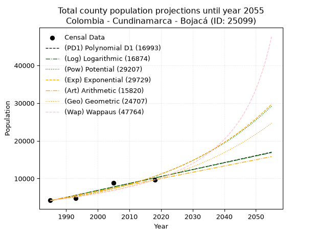
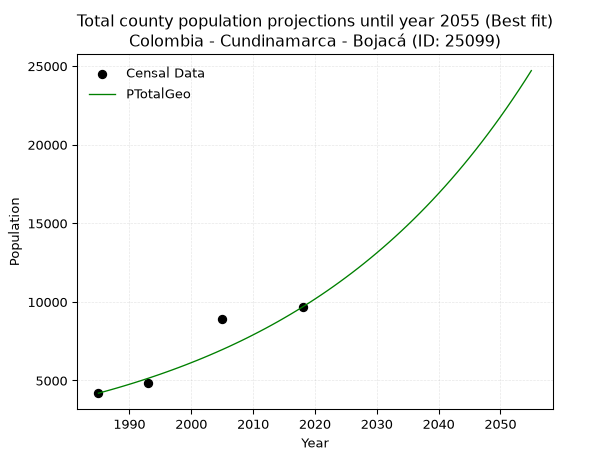
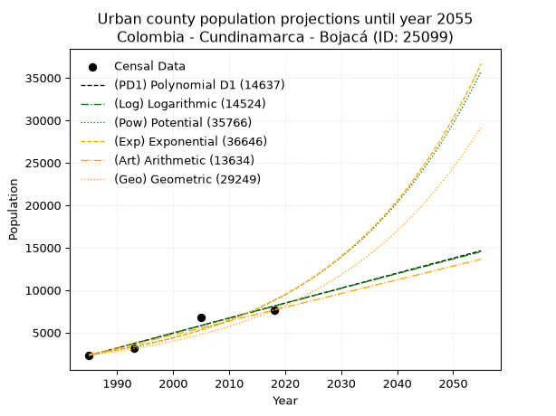
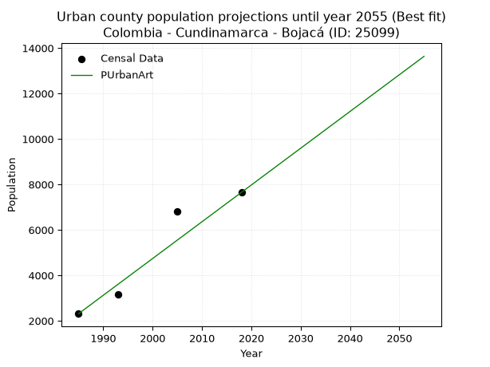
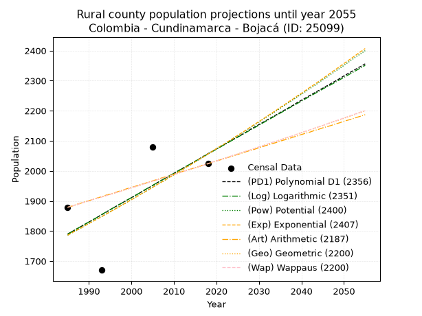
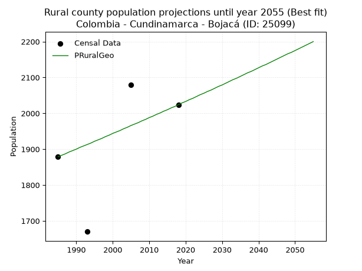

<div align="center">


</div>

# _“Population and Public Services Demand Projections (PPSD) until Year 2050 for Colombia - Cundinamarca - Bojacá (ID: 25099)”_
Keywords: `population` `public-service` `projection` `lineal` `polynomial` `logarithmic` `potential` `exponential` `arithmetic` `geometric` `wappaus` `dane` `colombia` `south-america`

PPSD are analytical estimates used by governments and planners to anticipate future changes in population size, age distribution, and the resulting community needs for utilities, healthcare, education, and infrastructure as sizing future water treatment facilities, electrical grids, and road networks based on spatial growth.

> **General running parameters**: • app_version: _v20260806_. • Python version: _3.14.7_. • Pandas version: _3.0.5_. • NumPy version: _2.5.1_. • Creates, save and include plots into reports (create_plot): _False_. • Projection until year: _2050_. • Process polynomial degree 2 and up: _False_. • Process Wappaus: _True_. • Process Wappaus: _True_. • Set negative values to zero: _True_. • Set infinite values to zero: _True_. • Drop dataset notes: _True_. 
<div align="center">

Dynamic map: [:earth_americas:Google](http://maps.google.com/maps?q=4.737205076,-74.3445939) [:earth_americas:OSM](https://www.openstreetmap.org/#map=18/4.737205076/-74.3445939&layers=P) [:earth_americas:Bing](https://www.bing.com/maps?cp=4.737205076~-74.3445939&lvl=18) [:earth_americas:Apple](https://maps.apple.com/frame?center=4.737205076%2C-74.3445939&span=0.003%2C0.006)

</div>


<div align="center">

```geojson
{
  "type": "Feature",
  "geometry": {
    "type": "Point", 
    "coordinates": [-74.3445939, 4.737205076]
  }, 
  "properties": {
    "Name": "Colombia - Cundinamarca - Bojacá (ID: 25099)"
  }
}
```

</div>


## 0. Census Data (4 records)

Census data are official statistics collected by a government about the people and housing in a country. They usually include counts of total population, age, sex, race, income, education, and jobs.

📅Global census file: [Population.xlsx](../data/Population.xlsx)

| Source   |   Year |   CountryID | CountryName   |   StateID | StateName    |   CountyID | CountyName   |   PTotal |   PUrban |   PRural |
|:---------|-------:|------------:|:--------------|----------:|:-------------|-----------:|:-------------|---------:|---------:|---------:|
| DANE     |   1985 |          57 | Colombia      |        25 | Cundinamarca |      25099 | Bojacá       |     4192 |     2313 |     1879 |
| DANE     |   1993 |          57 | Colombia      |        25 | Cundinamarca |      25099 | Bojacá       |     4846 |     3176 |     1670 |
| DANE     |   2005 |          57 | Colombia      |        25 | Cundinamarca |      25099 | Bojacá       |     8879 |     6800 |     2079 |
| DANE     |   2018 |          57 | Colombia      |        25 | Cundinamarca |      25099 | Bojacá       |     9674 |     7650 |     2024 |

> 🔥Some records has specific notes about the registered values or the corresponding urban or rural distribution.

## 1. Total

### 1.1. Coefficients and Parameters

* (PD1) Polynomial Deg 1: 184.3873946206335, -361923.13608992216 (lineal)
* (Log) Logarithmic: 369189.01903093146, -2799310.9421492363
* (Pow) Potential: 55.81476388372004, -180.43832470786757
* (Exp) Exponential: 0.02787240188190718, 3.960562113468293e-21
* (Art) Arithmetic: Year diff. 2018 - 1985 = 33, Population diff. 9674 - 4192 = 5482, Annual growth = 166.12121212121212
* (Geo) Geometric: Year diff. 2018 - 1985 = 33, Population diff. 9674 - 4192 = 5482, Annual growth % = 0.025665152230944566
* (Wap) Wappaus: i = 2.396094217816416, Condition values only valid for < 200)

<sub>
Wappaus condition values: ['0.00', '2.40', '4.79', '7.19', '9.58', '11.98', '14.38', '16.77', '19.17', '21.56', '23.96', '26.36', '28.75', '31.15', '33.55', '35.94', '38.34', '40.73', '43.13', '45.53', '47.92', '50.32', '52.71', '55.11', '57.51', '59.90', '62.30', '64.69', '67.09', '69.49', '71.88', '74.28', '76.68', '79.07', '81.47', '83.86', '86.26', '88.66', '91.05', '93.45', '95.84', '98.24', '100.64', '103.03', '105.43', '107.82', '110.22', '112.62', '115.01', '117.41', '119.80', '122.20', '124.60', '126.99', '129.39', '131.79', '134.18', '136.58', '138.97', '141.37', '143.77', '146.16', '148.56', '150.95', '153.35', '155.75']
</sub>


### 1.2. Projected Dataset

|   Year |   CountyID |   PTotalPD1 |   PTotalLog |   PTotalPow |   PTotalExp |   PTotalArt |   PTotalGeo |   PTotalWap |
|-------:|-----------:|------------:|------------:|------------:|------------:|------------:|------------:|------------:|
|   1985 |      25099 |        4086 |        4079 |        4221 |        4225 |        4192 |        4192 |        4192 |
|   1986 |      25099 |        4270 |        4265 |        4341 |        4345 |        4358 |        4300 |        4294 |
|   1987 |      25099 |        4455 |        4451 |        4465 |        4467 |        4524 |        4410 |        4398 |
|   1988 |      25099 |        4639 |        4637 |        4592 |        4594 |        4690 |        4523 |        4505 |
|   1989 |      25099 |        4823 |        4823 |        4723 |        4724 |        4856 |        4639 |        4614 |
|   1990 |      25099 |        5008 |        5008 |        4857 |        4857 |        5023 |        4758 |        4726 |
|   1991 |      25099 |        5192 |        5194 |        4995 |        4994 |        5189 |        4880 |        4841 |
|   1992 |      25099 |        5377 |        5379 |        5137 |        5135 |        5355 |        5006 |        4959 |
|   1993 |      25099 |        5561 |        5564 |        5283 |        5281 |        5521 |        5134 |        5081 |
|   1994 |      25099 |        5745 |        5750 |        5433 |        5430 |        5687 |        5266 |        5205 |
|   1995 |      25099 |        5930 |        5935 |        5587 |        5583 |        5853 |        5401 |        5333 |
|   1996 |      25099 |        6114 |        6120 |        5746 |        5741 |        6019 |        5540 |        5465 |
|   1997 |      25099 |        6298 |        6305 |        5909 |        5903 |        6185 |        5682 |        5600 |
|   1998 |      25099 |        6483 |        6489 |        6076 |        6070 |        6352 |        5828 |        5739 |
|   1999 |      25099 |        6667 |        6674 |        6248 |        6242 |        6518 |        5977 |        5882 |
|   2000 |      25099 |        6852 |        6859 |        6425 |        6418 |        6684 |        6131 |        6029 |
|   2001 |      25099 |        7036 |        7043 |        6607 |        6600 |        6850 |        6288 |        6180 |
|   2002 |      25099 |        7220 |        7228 |        6794 |        6786 |        7016 |        6449 |        6336 |
|   2003 |      25099 |        7405 |        7412 |        6986 |        6978 |        7182 |        6615 |        6497 |
|   2004 |      25099 |        7589 |        7596 |        7183 |        7175 |        7348 |        6785 |        6663 |
|   2005 |      25099 |        7774 |        7781 |        7386 |        7378 |        7514 |        6959 |        6834 |
|   2006 |      25099 |        7958 |        7965 |        7594 |        7587 |        7681 |        7137 |        7010 |
|   2007 |      25099 |        8142 |        8149 |        7809 |        7801 |        7847 |        7321 |        7193 |
|   2008 |      25099 |        8327 |        8333 |        8029 |        8022 |        8013 |        7508 |        7381 |
|   2009 |      25099 |        8511 |        8516 |        8255 |        8248 |        8179 |        7701 |        7576 |
|   2010 |      25099 |        8696 |        8700 |        8488 |        8481 |        8345 |        7899 |        7777 |
|   2011 |      25099 |        8880 |        8884 |        8726 |        8721 |        8511 |        8102 |        7985 |
|   2012 |      25099 |        9064 |        9067 |        8972 |        8968 |        8677 |        8309 |        8201 |
|   2013 |      25099 |        9249 |        9251 |        9224 |        9221 |        8843 |        8523 |        8424 |
|   2014 |      25099 |        9433 |        9434 |        9484 |        9482 |        9010 |        8741 |        8656 |
|   2015 |      25099 |        9617 |        9617 |        9750 |        9750 |        9176 |        8966 |        8896 |
|   2016 |      25099 |        9802 |        9801 |       10024 |       10025 |        9342 |        9196 |        9145 |
|   2017 |      25099 |        9986 |        9984 |       10305 |       10309 |        9508 |        9432 |        9405 |
|   2018 |      25099 |       10171 |       10167 |       10594 |       10600 |        9674 |        9674 |        9674 |
|   2019 |      25099 |       10355 |       10350 |       10891 |       10900 |        9840 |        9922 |        9954 |
|   2020 |      25099 |       10539 |       10532 |       11196 |       11208 |       10006 |       10177 |       10246 |
|   2021 |      25099 |       10724 |       10715 |       11510 |       11524 |       10172 |       10438 |       10550 |
|   2022 |      25099 |       10908 |       10898 |       11832 |       11850 |       10338 |       10706 |       10868 |
|   2023 |      25099 |       11093 |       11080 |       12163 |       12185 |       10505 |       10981 |       11199 |
|   2024 |      25099 |       11277 |       11263 |       12504 |       12529 |       10671 |       11263 |       11545 |
|   2025 |      25099 |       11461 |       11445 |       12853 |       12884 |       10837 |       11552 |       11907 |
|   2026 |      25099 |       11646 |       11627 |       13212 |       13248 |       11003 |       11848 |       12286 |
|   2027 |      25099 |       11830 |       11809 |       13581 |       13622 |       11169 |       12152 |       12683 |
|   2028 |      25099 |       12015 |       11992 |       13960 |       14007 |       11335 |       12464 |       13100 |
|   2029 |      25099 |       12199 |       12174 |       14350 |       14403 |       11501 |       12784 |       13538 |
|   2030 |      25099 |       12383 |       12355 |       14750 |       14810 |       11667 |       13112 |       13999 |
|   2031 |      25099 |       12568 |       12537 |       15161 |       15229 |       11834 |       13449 |       14485 |
|   2032 |      25099 |       12752 |       12719 |       15583 |       15659 |       12000 |       13794 |       14997 |
|   2033 |      25099 |       12936 |       12901 |       16017 |       16102 |       12166 |       14148 |       15538 |
|   2034 |      25099 |       13121 |       13082 |       16463 |       16557 |       12332 |       14511 |       16110 |
|   2035 |      25099 |       13305 |       13264 |       16921 |       17025 |       12498 |       14883 |       16717 |
|   2036 |      25099 |       13490 |       13445 |       17391 |       17506 |       12664 |       15265 |       17361 |
|   2037 |      25099 |       13674 |       13626 |       17874 |       18001 |       12830 |       15657 |       18046 |
|   2038 |      25099 |       13858 |       13808 |       18371 |       18510 |       12996 |       16059 |       18776 |
|   2039 |      25099 |       14043 |       13989 |       18881 |       19033 |       13163 |       16471 |       19555 |
|   2040 |      25099 |       14227 |       14170 |       19404 |       19571 |       13329 |       16894 |       20389 |
|   2041 |      25099 |       14412 |       14351 |       19943 |       20124 |       13495 |       17327 |       21284 |
|   2042 |      25099 |       14596 |       14531 |       20495 |       20693 |       13661 |       17772 |       22247 |
|   2043 |      25099 |       14780 |       14712 |       21063 |       21278 |       13827 |       18228 |       23285 |
|   2044 |      25099 |       14965 |       14893 |       21646 |       21879 |       13993 |       18696 |       24407 |
|   2045 |      25099 |       15149 |       15073 |       22245 |       22498 |       14159 |       19176 |       25626 |
|   2046 |      25099 |       15333 |       15254 |       22861 |       23133 |       14325 |       19668 |       26953 |
|   2047 |      25099 |       15518 |       15434 |       23493 |       23787 |       14492 |       20173 |       28404 |
|   2048 |      25099 |       15702 |       15615 |       24142 |       24460 |       14658 |       20691 |       29996 |
|   2049 |      25099 |       15887 |       15795 |       24809 |       25151 |       14824 |       21222 |       31752 |
|   2050 |      25099 |       16071 |       15975 |       25494 |       25862 |       14990 |       21766 |       33698 |
<div align="center">

</img>

</div>


### 1.3. Best fit with absolute error and relative error (%)

Relative error puts that difference into context by dividing the absolute error by the true value, creating a unitless ratio or percentage that shows the scale of the mistake.

Absolute and relative error

|   Year | Source   |   CountryID | CountryName   |   StateID | StateName    |   CountyID_x | CountyName   |   PTotal |   PUrban |   PRural |   CountyID_y |   PTotalPD1 |   PTotalLog |   PTotalPow |   PTotalExp |   PTotalArt |   PTotalGeo |   PTotalWap |   PTotalPD1AbsError |   PTotalLogAbsError |   PTotalPowAbsError |   PTotalExpAbsError |   PTotalArtAbsError |   PTotalGeoAbsError |   PTotalWapAbsError |   PTotalPD1RelError |   PTotalLogRelError |   PTotalPowRelError |   PTotalExpRelError |   PTotalArtRelError |   PTotalGeoRelError |   PTotalWapRelError |
|-------:|:---------|------------:|:--------------|----------:|:-------------|-------------:|:-------------|---------:|---------:|---------:|-------------:|------------:|------------:|------------:|------------:|------------:|------------:|------------:|--------------------:|--------------------:|--------------------:|--------------------:|--------------------:|--------------------:|--------------------:|--------------------:|--------------------:|--------------------:|--------------------:|--------------------:|--------------------:|--------------------:|
|   1985 | DANE     |          57 | Colombia      |        25 | Cundinamarca |        25099 | Bojacá       |     4192 |     2313 |     1879 |        25099 |        4086 |        4079 |        4221 |        4225 |        4192 |        4192 |        4192 |                 106 |                 113 |                  29 |                  33 |                   0 |                   0 |                   0 |             2.52863 |             2.69561 |            0.691794 |            0.787214 |              0      |             0       |             0       |
|   1993 | DANE     |          57 | Colombia      |        25 | Cundinamarca |        25099 | Bojacá       |     4846 |     3176 |     1670 |        25099 |        5561 |        5564 |        5283 |        5281 |        5521 |        5134 |        5081 |                 715 |                 718 |                 437 |                 435 |                 675 |                 288 |                 235 |            14.7544  |            14.8163  |            9.01775  |            8.97648  |             13.929  |             5.94305 |             4.84936 |
|   2005 | DANE     |          57 | Colombia      |        25 | Cundinamarca |        25099 | Bojacá       |     8879 |     6800 |     2079 |        25099 |        7774 |        7781 |        7386 |        7378 |        7514 |        6959 |        6834 |                1105 |                1098 |                1493 |                1501 |                1365 |                1920 |                2045 |            12.4451  |            12.3663  |           16.815    |           16.9051   |             15.3734 |            21.6241  |            23.0319  |
|   2018 | DANE     |          57 | Colombia      |        25 | Cundinamarca |        25099 | Bojacá       |     9674 |     7650 |     2024 |        25099 |       10171 |       10167 |       10594 |       10600 |        9674 |        9674 |        9674 |                 497 |                 493 |                 920 |                 926 |                   0 |                   0 |                   0 |             5.13748 |             5.09613 |            9.51003  |            9.57205  |              0      |             0       |             0       |

Relative error mean

| Method    |   RelError | Best   |
|:----------|-----------:|:-------|
| PTotalPD1 |    8.71641 |        |
| PTotalLog |    8.74359 |        |
| PTotalPow |    9.00863 |        |
| PTotalExp |    9.0602  |        |
| PTotalArt |    7.32559 |        |
| PTotalGeo |    6.89178 | True   |
| PTotalWap |    6.97031 |        |

💙Best method: _**PTotalGeo**_
<div align="center">

</img>

</div>


### 1.4. Fresh water supply demand in liters per capita per day (lpcd)

The fresh water supply demand typically ranges from 100 to 300 liters per capita per day (lpcd) for standard domestic and municipal planning, though absolute survival minimums set by the World Health Organization are as low as 7.5 to 20 liters per day, and total consumption in high-income nations can exceed 400 liters.

> `CZ`: Level in meters above the sea level (masl).<br> `WS`: Fresh water supply demand in liters per capita per day (lpcd or l/h/d).<br> `WSAll`: Zonal fresh water supply demand in liters per second (l/s).<br> `A`: Zonal area in square meters.

Reference values (RAS Colombia)

|    CZ |   WS |
|------:|-----:|
|  1000 |  120 |
|  2000 |  130 |
| 99999 |  140 |

County shapefile geometry properties and water supply values

|   CountyID |      ATotal |   CZTotal |   WSTotal |
|-----------:|------------:|----------:|----------:|
|      25099 | 1.02207e+08 |    2572.5 |       140 |

Projected values for best method: PTotalGeo

|   CountyID |   Year |   PTotalGeo |   WSTotal |   WSTotalAll |
|-----------:|-------:|------------:|----------:|-------------:|
|      25099 |   1985 |        4192 |       140 |      6.79259 |
|      25099 |   1986 |        4300 |       140 |      6.96759 |
|      25099 |   1987 |        4410 |       140 |      7.14583 |
|      25099 |   1988 |        4523 |       140 |      7.32894 |
|      25099 |   1989 |        4639 |       140 |      7.5169  |
|      25099 |   1990 |        4758 |       140 |      7.70972 |
|      25099 |   1991 |        4880 |       140 |      7.90741 |
|      25099 |   1992 |        5006 |       140 |      8.11157 |
|      25099 |   1993 |        5134 |       140 |      8.31898 |
|      25099 |   1994 |        5266 |       140 |      8.53287 |
|      25099 |   1995 |        5401 |       140 |      8.75162 |
|      25099 |   1996 |        5540 |       140 |      8.97685 |
|      25099 |   1997 |        5682 |       140 |      9.20694 |
|      25099 |   1998 |        5828 |       140 |      9.44352 |
|      25099 |   1999 |        5977 |       140 |      9.68495 |
|      25099 |   2000 |        6131 |       140 |      9.93449 |
|      25099 |   2001 |        6288 |       140 |     10.1889  |
|      25099 |   2002 |        6449 |       140 |     10.4498  |
|      25099 |   2003 |        6615 |       140 |     10.7188  |
|      25099 |   2004 |        6785 |       140 |     10.9942  |
|      25099 |   2005 |        6959 |       140 |     11.2762  |
|      25099 |   2006 |        7137 |       140 |     11.5646  |
|      25099 |   2007 |        7321 |       140 |     11.8627  |
|      25099 |   2008 |        7508 |       140 |     12.1657  |
|      25099 |   2009 |        7701 |       140 |     12.4785  |
|      25099 |   2010 |        7899 |       140 |     12.7993  |
|      25099 |   2011 |        8102 |       140 |     13.1282  |
|      25099 |   2012 |        8309 |       140 |     13.4637  |
|      25099 |   2013 |        8523 |       140 |     13.8104  |
|      25099 |   2014 |        8741 |       140 |     14.1637  |
|      25099 |   2015 |        8966 |       140 |     14.5282  |
|      25099 |   2016 |        9196 |       140 |     14.9009  |
|      25099 |   2017 |        9432 |       140 |     15.2833  |
|      25099 |   2018 |        9674 |       140 |     15.6755  |
|      25099 |   2019 |        9922 |       140 |     16.0773  |
|      25099 |   2020 |       10177 |       140 |     16.4905  |
|      25099 |   2021 |       10438 |       140 |     16.9134  |
|      25099 |   2022 |       10706 |       140 |     17.3477  |
|      25099 |   2023 |       10981 |       140 |     17.7933  |
|      25099 |   2024 |       11263 |       140 |     18.2502  |
|      25099 |   2025 |       11552 |       140 |     18.7185  |
|      25099 |   2026 |       11848 |       140 |     19.1981  |
|      25099 |   2027 |       12152 |       140 |     19.6907  |
|      25099 |   2028 |       12464 |       140 |     20.1963  |
|      25099 |   2029 |       12784 |       140 |     20.7148  |
|      25099 |   2030 |       13112 |       140 |     21.2463  |
|      25099 |   2031 |       13449 |       140 |     21.7924  |
|      25099 |   2032 |       13794 |       140 |     22.3514  |
|      25099 |   2033 |       14148 |       140 |     22.925   |
|      25099 |   2034 |       14511 |       140 |     23.5132  |
|      25099 |   2035 |       14883 |       140 |     24.116   |
|      25099 |   2036 |       15265 |       140 |     24.735   |
|      25099 |   2037 |       15657 |       140 |     25.3701  |
|      25099 |   2038 |       16059 |       140 |     26.0215  |
|      25099 |   2039 |       16471 |       140 |     26.6891  |
|      25099 |   2040 |       16894 |       140 |     27.3745  |
|      25099 |   2041 |       17327 |       140 |     28.0762  |
|      25099 |   2042 |       17772 |       140 |     28.7972  |
|      25099 |   2043 |       18228 |       140 |     29.5361  |
|      25099 |   2044 |       18696 |       140 |     30.2944  |
|      25099 |   2045 |       19176 |       140 |     31.0722  |
|      25099 |   2046 |       19668 |       140 |     31.8694  |
|      25099 |   2047 |       20173 |       140 |     32.6877  |
|      25099 |   2048 |       20691 |       140 |     33.5271  |
|      25099 |   2049 |       21222 |       140 |     34.3875  |
|      25099 |   2050 |       21766 |       140 |     35.269   |

## 2. Urban

### 2.1. Coefficients and Parameters

* (PD1) Polynomial Deg 1: 176.2958651144111, -347651.05419510085 (lineal)
* (Log) Logarithmic: 352995.93183952966, -2678140.156644134
* (Pow) Potential: 77.36110296399626, -251.72931111222178
* (Exp) Exponential: 0.038627582694347254, 1.2299024177801997e-30
* (Art) Arithmetic: Year diff. 2018 - 1985 = 33, Population diff. 7650 - 2313 = 5337, Annual growth = 161.72727272727272
* (Geo) Geometric: Year diff. 2018 - 1985 = 33, Population diff. 7650 - 2313 = 5337, Annual growth % = 0.03691222321829035
* (Wap) Wappaus: i = 3.2465577181024337, Condition values only valid for < 200)

<sub>
Wappaus condition values: ['0.00', '3.25', '6.49', '9.74', '12.99', '16.23', '19.48', '22.73', '25.97', '29.22', '32.47', '35.71', '38.96', '42.21', '45.45', '48.70', '51.94', '55.19', '58.44', '61.68', '64.93', '68.18', '71.42', '74.67', '77.92', '81.16', '84.41', '87.66', '90.90', '94.15', '97.40', '100.64', '103.89', '107.14', '110.38', '113.63', '116.88', '120.12', '123.37', '126.62', '129.86', '133.11', '136.36', '139.60', '142.85', '146.10', '149.34', '152.59', '155.83', '159.08', '162.33', '165.57', '168.82', '172.07', '175.31', '178.56', '181.81', '185.05', '188.30', '191.55', '194.79', '198.04', '201.29', '204.53', '207.78', '211.03']
</sub>


### 2.2. Projected Dataset

|   Year |   CountyID |   PUrbanPD1 |   PUrbanLog |   PUrbanPow |   PUrbanExp |   PUrbanArt |   PUrbanGeo |
|-------:|-----------:|------------:|------------:|------------:|------------:|------------:|------------:|
|   1985 |      25099 |        2296 |        2290 |        2450 |        2453 |        2313 |        2313 |
|   1986 |      25099 |        2473 |        2468 |        2547 |        2550 |        2475 |        2398 |
|   1987 |      25099 |        2649 |        2646 |        2648 |        2650 |        2636 |        2487 |
|   1988 |      25099 |        2825 |        2823 |        2753 |        2755 |        2798 |        2579 |
|   1989 |      25099 |        3001 |        3001 |        2862 |        2863 |        2960 |        2674 |
|   1990 |      25099 |        3178 |        3178 |        2976 |        2976 |        3122 |        2773 |
|   1991 |      25099 |        3354 |        3355 |        3094 |        3093 |        3283 |        2875 |
|   1992 |      25099 |        3530 |        3533 |        3216 |        3215 |        3445 |        2981 |
|   1993 |      25099 |        3707 |        3710 |        3344 |        3341 |        3607 |        3091 |
|   1994 |      25099 |        3883 |        3887 |        3476 |        3473 |        3769 |        3205 |
|   1995 |      25099 |        4059 |        4064 |        3613 |        3610 |        3930 |        3323 |
|   1996 |      25099 |        4235 |        4241 |        3756 |        3752 |        4092 |        3446 |
|   1997 |      25099 |        4412 |        4418 |        3905 |        3900 |        4254 |        3573 |
|   1998 |      25099 |        4588 |        4594 |        4059 |        4053 |        4415 |        3705 |
|   1999 |      25099 |        4764 |        4771 |        4219 |        4213 |        4577 |        3842 |
|   2000 |      25099 |        4941 |        4947 |        4385 |        4379 |        4739 |        3984 |
|   2001 |      25099 |        5117 |        5124 |        4558 |        4551 |        4901 |        4131 |
|   2002 |      25099 |        5293 |        5300 |        4738 |        4731 |        5062 |        4283 |
|   2003 |      25099 |        5470 |        5477 |        4925 |        4917 |        5224 |        4442 |
|   2004 |      25099 |        5646 |        5653 |        5118 |        5111 |        5386 |        4605 |
|   2005 |      25099 |        5822 |        5829 |        5320 |        5312 |        5548 |        4775 |
|   2006 |      25099 |        5998 |        6005 |        5529 |        5521 |        5709 |        4952 |
|   2007 |      25099 |        6175 |        6181 |        5746 |        5738 |        5871 |        5135 |
|   2008 |      25099 |        6351 |        6357 |        5972 |        5964 |        6033 |        5324 |
|   2009 |      25099 |        6527 |        6532 |        6207 |        6199 |        6194 |        5521 |
|   2010 |      25099 |        6704 |        6708 |        6450 |        6443 |        6356 |        5724 |
|   2011 |      25099 |        6880 |        6884 |        6703 |        6697 |        6518 |        5936 |
|   2012 |      25099 |        7056 |        7059 |        6966 |        6961 |        6680 |        6155 |
|   2013 |      25099 |        7233 |        7235 |        7239 |        7235 |        6841 |        6382 |
|   2014 |      25099 |        7409 |        7410 |        7523 |        7520 |        7003 |        6617 |
|   2015 |      25099 |        7585 |        7585 |        7817 |        7816 |        7165 |        6862 |
|   2016 |      25099 |        7761 |        7760 |        8123 |        8124 |        7327 |        7115 |
|   2017 |      25099 |        7938 |        7935 |        8441 |        8444 |        7488 |        7378 |
|   2018 |      25099 |        8114 |        8110 |        8771 |        8777 |        7650 |        7650 |
|   2019 |      25099 |        8290 |        8285 |        9113 |        9122 |        7812 |        7932 |
|   2020 |      25099 |        8467 |        8460 |        9469 |        9482 |        7973 |        8225 |
|   2021 |      25099 |        8643 |        8635 |        9839 |        9855 |        8135 |        8529 |
|   2022 |      25099 |        8819 |        8809 |       10223 |       10243 |        8297 |        8844 |
|   2023 |      25099 |        8995 |        8984 |       10621 |       10646 |        8459 |        9170 |
|   2024 |      25099 |        9172 |        9158 |       11035 |       11066 |        8620 |        9509 |
|   2025 |      25099 |        9348 |        9333 |       11465 |       11502 |        8782 |        9860 |
|   2026 |      25099 |        9524 |        9507 |       11911 |       11955 |        8944 |       10223 |
|   2027 |      25099 |        9701 |        9681 |       12375 |       12425 |        9106 |       10601 |
|   2028 |      25099 |        9877 |        9855 |       12856 |       12915 |        9267 |       10992 |
|   2029 |      25099 |       10053 |       10029 |       13356 |       13423 |        9429 |       11398 |
|   2030 |      25099 |       10230 |       10203 |       13875 |       13952 |        9591 |       11819 |
|   2031 |      25099 |       10406 |       10377 |       14414 |       14501 |        9752 |       12255 |
|   2032 |      25099 |       10582 |       10551 |       14973 |       15073 |        9914 |       12707 |
|   2033 |      25099 |       10758 |       10724 |       15554 |       15666 |       10076 |       13176 |
|   2034 |      25099 |       10935 |       10898 |       16157 |       16283 |       10238 |       13663 |
|   2035 |      25099 |       11111 |       11071 |       16783 |       16924 |       10399 |       14167 |
|   2036 |      25099 |       11287 |       11245 |       17434 |       17591 |       10561 |       14690 |
|   2037 |      25099 |       11464 |       11418 |       18109 |       18284 |       10723 |       15232 |
|   2038 |      25099 |       11640 |       11591 |       18809 |       19004 |       10885 |       15794 |
|   2039 |      25099 |       11816 |       11765 |       19537 |       19752 |       11046 |       16377 |
|   2040 |      25099 |       11993 |       11938 |       20292 |       20530 |       11208 |       16982 |
|   2041 |      25099 |       12169 |       12111 |       21076 |       21339 |       11370 |       17609 |
|   2042 |      25099 |       12345 |       12284 |       21890 |       22179 |       11531 |       18259 |
|   2043 |      25099 |       12521 |       12456 |       22735 |       23053 |       11693 |       18933 |
|   2044 |      25099 |       12698 |       12629 |       23613 |       23960 |       11855 |       19631 |
|   2045 |      25099 |       12874 |       12802 |       24523 |       24904 |       12017 |       20356 |
|   2046 |      25099 |       13050 |       12974 |       25468 |       25885 |       12178 |       21108 |
|   2047 |      25099 |       13227 |       13147 |       26449 |       26904 |       12340 |       21887 |
|   2048 |      25099 |       13403 |       13319 |       27468 |       27964 |       12502 |       22695 |
|   2049 |      25099 |       13579 |       13492 |       28525 |       29065 |       12664 |       23532 |
|   2050 |      25099 |       13755 |       13664 |       29622 |       30210 |       12825 |       24401 |
<div align="center">

</img>

</div>


### 2.3. Best fit with absolute error and relative error (%)

Relative error puts that difference into context by dividing the absolute error by the true value, creating a unitless ratio or percentage that shows the scale of the mistake.

Absolute and relative error

|   Year | Source   |   CountryID | CountryName   |   StateID | StateName    |   CountyID_x | CountyName   |   PTotal |   PUrban |   PRural |   CountyID_y |   PUrbanPD1 |   PUrbanLog |   PUrbanPow |   PUrbanExp |   PUrbanArt |   PUrbanGeo |   PUrbanPD1AbsError |   PUrbanLogAbsError |   PUrbanPowAbsError |   PUrbanExpAbsError |   PUrbanArtAbsError |   PUrbanGeoAbsError |   PUrbanPD1RelError |   PUrbanLogRelError |   PUrbanPowRelError |   PUrbanExpRelError |   PUrbanArtRelError |   PUrbanGeoRelError |
|-------:|:---------|------------:|:--------------|----------:|:-------------|-------------:|:-------------|---------:|---------:|---------:|-------------:|------------:|------------:|------------:|------------:|------------:|------------:|--------------------:|--------------------:|--------------------:|--------------------:|--------------------:|--------------------:|--------------------:|--------------------:|--------------------:|--------------------:|--------------------:|--------------------:|
|   1985 | DANE     |          57 | Colombia      |        25 | Cundinamarca |        25099 | Bojacá       |     4192 |     2313 |     1879 |        25099 |        2296 |        2290 |        2450 |        2453 |        2313 |        2313 |                  17 |                  23 |                 137 |                 140 |                   0 |                   0 |            0.734976 |             0.99438 |             5.92304 |             6.05275 |              0      |             0       |
|   1993 | DANE     |          57 | Colombia      |        25 | Cundinamarca |        25099 | Bojacá       |     4846 |     3176 |     1670 |        25099 |        3707 |        3710 |        3344 |        3341 |        3607 |        3091 |                 531 |                 534 |                 168 |                 165 |                 431 |                  85 |           16.7191   |            16.8136  |             5.28967 |             5.19521 |             13.5705 |             2.67632 |
|   2005 | DANE     |          57 | Colombia      |        25 | Cundinamarca |        25099 | Bojacá       |     8879 |     6800 |     2079 |        25099 |        5822 |        5829 |        5320 |        5312 |        5548 |        4775 |                 978 |                 971 |                1480 |                1488 |                1252 |                2025 |           14.3824   |            14.2794  |            21.7647  |            21.8824  |             18.4118 |            29.7794  |
|   2018 | DANE     |          57 | Colombia      |        25 | Cundinamarca |        25099 | Bojacá       |     9674 |     7650 |     2024 |        25099 |        8114 |        8110 |        8771 |        8777 |        7650 |        7650 |                 464 |                 460 |                1121 |                1127 |                   0 |                   0 |            6.06536  |             6.01307 |            14.6536  |            14.732   |              0      |             0       |

Relative error mean

| Method    |   RelError | Best   |
|:----------|-----------:|:-------|
| PUrbanPD1 |    9.47546 |        |
| PUrbanLog |    9.52512 |        |
| PUrbanPow |   11.9078  |        |
| PUrbanExp |   11.9656  |        |
| PUrbanArt |    7.99557 | True   |
| PUrbanGeo |    8.11393 |        |

💙Best method: _**PUrbanArt**_
<div align="center">

</img>

</div>


### 2.4. Fresh water supply demand in liters per capita per day (lpcd)

The fresh water supply demand typically ranges from 100 to 300 liters per capita per day (lpcd) for standard domestic and municipal planning, though absolute survival minimums set by the World Health Organization are as low as 7.5 to 20 liters per day, and total consumption in high-income nations can exceed 400 liters.

> `CZ`: Level in meters above the sea level (masl).<br> `WS`: Fresh water supply demand in liters per capita per day (lpcd or l/h/d).<br> `WSAll`: Zonal fresh water supply demand in liters per second (l/s).<br> `A`: Zonal area in square meters.

Reference values (RAS Colombia)

|    CZ |   WS |
|------:|-----:|
|  1000 |  120 |
|  2000 |  130 |
| 99999 |  140 |

County shapefile geometry properties and water supply values

|   CountyID |      AUrban |   CZUrban |   WSUrban |
|-----------:|------------:|----------:|----------:|
|      25099 | 1.18009e+06 |   2581.69 |       140 |

Projected values for best method: PUrbanArt

|   CountyID |   Year |   PUrbanArt |   WSUrban |   WSUrbanAll |
|-----------:|-------:|------------:|----------:|-------------:|
|      25099 |   1985 |        2313 |       140 |      3.74792 |
|      25099 |   1986 |        2475 |       140 |      4.01042 |
|      25099 |   1987 |        2636 |       140 |      4.2713  |
|      25099 |   1988 |        2798 |       140 |      4.5338  |
|      25099 |   1989 |        2960 |       140 |      4.7963  |
|      25099 |   1990 |        3122 |       140 |      5.0588  |
|      25099 |   1991 |        3283 |       140 |      5.31968 |
|      25099 |   1992 |        3445 |       140 |      5.58218 |
|      25099 |   1993 |        3607 |       140 |      5.84468 |
|      25099 |   1994 |        3769 |       140 |      6.10718 |
|      25099 |   1995 |        3930 |       140 |      6.36806 |
|      25099 |   1996 |        4092 |       140 |      6.63056 |
|      25099 |   1997 |        4254 |       140 |      6.89306 |
|      25099 |   1998 |        4415 |       140 |      7.15394 |
|      25099 |   1999 |        4577 |       140 |      7.41644 |
|      25099 |   2000 |        4739 |       140 |      7.67894 |
|      25099 |   2001 |        4901 |       140 |      7.94144 |
|      25099 |   2002 |        5062 |       140 |      8.20231 |
|      25099 |   2003 |        5224 |       140 |      8.46481 |
|      25099 |   2004 |        5386 |       140 |      8.72731 |
|      25099 |   2005 |        5548 |       140 |      8.98981 |
|      25099 |   2006 |        5709 |       140 |      9.25069 |
|      25099 |   2007 |        5871 |       140 |      9.51319 |
|      25099 |   2008 |        6033 |       140 |      9.77569 |
|      25099 |   2009 |        6194 |       140 |     10.0366  |
|      25099 |   2010 |        6356 |       140 |     10.2991  |
|      25099 |   2011 |        6518 |       140 |     10.5616  |
|      25099 |   2012 |        6680 |       140 |     10.8241  |
|      25099 |   2013 |        6841 |       140 |     11.085   |
|      25099 |   2014 |        7003 |       140 |     11.3475  |
|      25099 |   2015 |        7165 |       140 |     11.61    |
|      25099 |   2016 |        7327 |       140 |     11.8725  |
|      25099 |   2017 |        7488 |       140 |     12.1333  |
|      25099 |   2018 |        7650 |       140 |     12.3958  |
|      25099 |   2019 |        7812 |       140 |     12.6583  |
|      25099 |   2020 |        7973 |       140 |     12.9192  |
|      25099 |   2021 |        8135 |       140 |     13.1817  |
|      25099 |   2022 |        8297 |       140 |     13.4442  |
|      25099 |   2023 |        8459 |       140 |     13.7067  |
|      25099 |   2024 |        8620 |       140 |     13.9676  |
|      25099 |   2025 |        8782 |       140 |     14.2301  |
|      25099 |   2026 |        8944 |       140 |     14.4926  |
|      25099 |   2027 |        9106 |       140 |     14.7551  |
|      25099 |   2028 |        9267 |       140 |     15.016   |
|      25099 |   2029 |        9429 |       140 |     15.2785  |
|      25099 |   2030 |        9591 |       140 |     15.541   |
|      25099 |   2031 |        9752 |       140 |     15.8019  |
|      25099 |   2032 |        9914 |       140 |     16.0644  |
|      25099 |   2033 |       10076 |       140 |     16.3269  |
|      25099 |   2034 |       10238 |       140 |     16.5894  |
|      25099 |   2035 |       10399 |       140 |     16.8502  |
|      25099 |   2036 |       10561 |       140 |     17.1127  |
|      25099 |   2037 |       10723 |       140 |     17.3752  |
|      25099 |   2038 |       10885 |       140 |     17.6377  |
|      25099 |   2039 |       11046 |       140 |     17.8986  |
|      25099 |   2040 |       11208 |       140 |     18.1611  |
|      25099 |   2041 |       11370 |       140 |     18.4236  |
|      25099 |   2042 |       11531 |       140 |     18.6845  |
|      25099 |   2043 |       11693 |       140 |     18.947   |
|      25099 |   2044 |       11855 |       140 |     19.2095  |
|      25099 |   2045 |       12017 |       140 |     19.472   |
|      25099 |   2046 |       12178 |       140 |     19.7329  |
|      25099 |   2047 |       12340 |       140 |     19.9954  |
|      25099 |   2048 |       12502 |       140 |     20.2579  |
|      25099 |   2049 |       12664 |       140 |     20.5204  |
|      25099 |   2050 |       12825 |       140 |     20.7812  |

## 3. Rural

### 3.1. Coefficients and Parameters

* (PD1) Polynomial Deg 1: 8.09152950622241, -14272.081894821376 (lineal)
* (Log) Logarithmic: 16193.08719140174, -121170.78550510156
* (Pow) Potential: 8.530519765247712, -24.879715613323825
* (Exp) Exponential: 0.004263036293492577, 0.377474772520605
* (Art) Arithmetic: Year diff. 2018 - 1985 = 33, Population diff. 2024 - 1879 = 145, Annual growth = 4.393939393939394
* (Geo) Geometric: Year diff. 2018 - 1985 = 33, Population diff. 2024 - 1879 = 145, Annual growth % = 0.002255146025080146
* (Wap) Wappaus: i = 0.22515702761667405, Condition values only valid for < 200)

<sub>
Wappaus condition values: ['0.00', '0.23', '0.45', '0.68', '0.90', '1.13', '1.35', '1.58', '1.80', '2.03', '2.25', '2.48', '2.70', '2.93', '3.15', '3.38', '3.60', '3.83', '4.05', '4.28', '4.50', '4.73', '4.95', '5.18', '5.40', '5.63', '5.85', '6.08', '6.30', '6.53', '6.75', '6.98', '7.21', '7.43', '7.66', '7.88', '8.11', '8.33', '8.56', '8.78', '9.01', '9.23', '9.46', '9.68', '9.91', '10.13', '10.36', '10.58', '10.81', '11.03', '11.26', '11.48', '11.71', '11.93', '12.16', '12.38', '12.61', '12.83', '13.06', '13.28', '13.51', '13.73', '13.96', '14.18', '14.41', '14.64']
</sub>


### 3.2. Projected Dataset

|   Year |   CountyID |   PRuralPD1 |   PRuralLog |   PRuralPow |   PRuralExp |   PRuralArt |   PRuralGeo |   PRuralWap |
|-------:|-----------:|------------:|------------:|------------:|------------:|------------:|------------:|------------:|
|   1985 |      25099 |        1790 |        1789 |        1786 |        1786 |        1879 |        1879 |        1879 |
|   1986 |      25099 |        1798 |        1798 |        1794 |        1794 |        1883 |        1883 |        1883 |
|   1987 |      25099 |        1806 |        1806 |        1801 |        1802 |        1888 |        1887 |        1887 |
|   1988 |      25099 |        1814 |        1814 |        1809 |        1809 |        1892 |        1892 |        1892 |
|   1989 |      25099 |        1822 |        1822 |        1817 |        1817 |        1897 |        1896 |        1896 |
|   1990 |      25099 |        1830 |        1830 |        1825 |        1825 |        1901 |        1900 |        1900 |
|   1991 |      25099 |        1838 |        1838 |        1833 |        1833 |        1905 |        1905 |        1905 |
|   1992 |      25099 |        1846 |        1846 |        1841 |        1840 |        1910 |        1909 |        1909 |
|   1993 |      25099 |        1854 |        1855 |        1848 |        1848 |        1914 |        1913 |        1913 |
|   1994 |      25099 |        1862 |        1863 |        1856 |        1856 |        1919 |        1917 |        1917 |
|   1995 |      25099 |        1871 |        1871 |        1864 |        1864 |        1923 |        1922 |        1922 |
|   1996 |      25099 |        1879 |        1879 |        1872 |        1872 |        1927 |        1926 |        1926 |
|   1997 |      25099 |        1887 |        1887 |        1880 |        1880 |        1932 |        1930 |        1930 |
|   1998 |      25099 |        1895 |        1895 |        1888 |        1888 |        1936 |        1935 |        1935 |
|   1999 |      25099 |        1903 |        1903 |        1896 |        1896 |        1941 |        1939 |        1939 |
|   2000 |      25099 |        1911 |        1911 |        1905 |        1904 |        1945 |        1944 |        1944 |
|   2001 |      25099 |        1919 |        1919 |        1913 |        1912 |        1949 |        1948 |        1948 |
|   2002 |      25099 |        1927 |        1927 |        1921 |        1921 |        1954 |        1952 |        1952 |
|   2003 |      25099 |        1935 |        1936 |        1929 |        1929 |        1958 |        1957 |        1957 |
|   2004 |      25099 |        1943 |        1944 |        1937 |        1937 |        1962 |        1961 |        1961 |
|   2005 |      25099 |        1951 |        1952 |        1946 |        1945 |        1967 |        1966 |        1966 |
|   2006 |      25099 |        1960 |        1960 |        1954 |        1954 |        1971 |        1970 |        1970 |
|   2007 |      25099 |        1968 |        1968 |        1962 |        1962 |        1976 |        1974 |        1974 |
|   2008 |      25099 |        1976 |        1976 |        1970 |        1970 |        1980 |        1979 |        1979 |
|   2009 |      25099 |        1984 |        1984 |        1979 |        1979 |        1984 |        1983 |        1983 |
|   2010 |      25099 |        1992 |        1992 |        1987 |        1987 |        1989 |        1988 |        1988 |
|   2011 |      25099 |        2000 |        2000 |        1996 |        1996 |        1993 |        1992 |        1992 |
|   2012 |      25099 |        2008 |        2008 |        2004 |        2004 |        1998 |        1997 |        1997 |
|   2013 |      25099 |        2016 |        2016 |        2013 |        2013 |        2002 |        2001 |        2001 |
|   2014 |      25099 |        2024 |        2024 |        2021 |        2021 |        2006 |        2006 |        2006 |
|   2015 |      25099 |        2032 |        2032 |        2030 |        2030 |        2011 |        2010 |        2010 |
|   2016 |      25099 |        2040 |        2040 |        2038 |        2039 |        2015 |        2015 |        2015 |
|   2017 |      25099 |        2049 |        2048 |        2047 |        2047 |        2020 |        2019 |        2019 |
|   2018 |      25099 |        2057 |        2056 |        2056 |        2056 |        2024 |        2024 |        2024 |
|   2019 |      25099 |        2065 |        2064 |        2065 |        2065 |        2028 |        2029 |        2029 |
|   2020 |      25099 |        2073 |        2072 |        2073 |        2074 |        2033 |        2033 |        2033 |
|   2021 |      25099 |        2081 |        2080 |        2082 |        2083 |        2037 |        2038 |        2038 |
|   2022 |      25099 |        2089 |        2088 |        2091 |        2091 |        2042 |        2042 |        2042 |
|   2023 |      25099 |        2097 |        2096 |        2100 |        2100 |        2046 |        2047 |        2047 |
|   2024 |      25099 |        2105 |        2104 |        2109 |        2109 |        2050 |        2052 |        2052 |
|   2025 |      25099 |        2113 |        2112 |        2117 |        2118 |        2055 |        2056 |        2056 |
|   2026 |      25099 |        2121 |        2120 |        2126 |        2127 |        2059 |        2061 |        2061 |
|   2027 |      25099 |        2129 |        2128 |        2135 |        2136 |        2064 |        2065 |        2066 |
|   2028 |      25099 |        2138 |        2136 |        2144 |        2146 |        2068 |        2070 |        2070 |
|   2029 |      25099 |        2146 |        2144 |        2153 |        2155 |        2072 |        2075 |        2075 |
|   2030 |      25099 |        2154 |        2152 |        2162 |        2164 |        2077 |        2079 |        2080 |
|   2031 |      25099 |        2162 |        2160 |        2172 |        2173 |        2081 |        2084 |        2084 |
|   2032 |      25099 |        2170 |        2168 |        2181 |        2183 |        2086 |        2089 |        2089 |
|   2033 |      25099 |        2178 |        2176 |        2190 |        2192 |        2090 |        2094 |        2094 |
|   2034 |      25099 |        2186 |        2184 |        2199 |        2201 |        2094 |        2098 |        2098 |
|   2035 |      25099 |        2194 |        2192 |        2208 |        2211 |        2099 |        2103 |        2103 |
|   2036 |      25099 |        2202 |        2200 |        2218 |        2220 |        2103 |        2108 |        2108 |
|   2037 |      25099 |        2210 |        2208 |        2227 |        2230 |        2107 |        2113 |        2113 |
|   2038 |      25099 |        2218 |        2216 |        2236 |        2239 |        2112 |        2117 |        2117 |
|   2039 |      25099 |        2227 |        2224 |        2246 |        2249 |        2116 |        2122 |        2122 |
|   2040 |      25099 |        2235 |        2232 |        2255 |        2258 |        2121 |        2127 |        2127 |
|   2041 |      25099 |        2243 |        2240 |        2264 |        2268 |        2125 |        2132 |        2132 |
|   2042 |      25099 |        2251 |        2248 |        2274 |        2278 |        2129 |        2136 |        2137 |
|   2043 |      25099 |        2259 |        2256 |        2283 |        2287 |        2134 |        2141 |        2142 |
|   2044 |      25099 |        2267 |        2264 |        2293 |        2297 |        2138 |        2146 |        2146 |
|   2045 |      25099 |        2275 |        2272 |        2303 |        2307 |        2143 |        2151 |        2151 |
|   2046 |      25099 |        2283 |        2280 |        2312 |        2317 |        2147 |        2156 |        2156 |
|   2047 |      25099 |        2291 |        2287 |        2322 |        2327 |        2151 |        2161 |        2161 |
|   2048 |      25099 |        2299 |        2295 |        2332 |        2337 |        2156 |        2166 |        2166 |
|   2049 |      25099 |        2307 |        2303 |        2341 |        2347 |        2160 |        2170 |        2171 |
|   2050 |      25099 |        2316 |        2311 |        2351 |        2357 |        2165 |        2175 |        2176 |
<div align="center">

</img>

</div>


### 3.3. Best fit with absolute error and relative error (%)

Relative error puts that difference into context by dividing the absolute error by the true value, creating a unitless ratio or percentage that shows the scale of the mistake.

Absolute and relative error

|   Year | Source   |   CountryID | CountryName   |   StateID | StateName    |   CountyID_x | CountyName   |   PTotal |   PUrban |   PRural |   CountyID_y |   PRuralPD1 |   PRuralLog |   PRuralPow |   PRuralExp |   PRuralArt |   PRuralGeo |   PRuralWap |   PRuralPD1AbsError |   PRuralLogAbsError |   PRuralPowAbsError |   PRuralExpAbsError |   PRuralArtAbsError |   PRuralGeoAbsError |   PRuralWapAbsError |   PRuralPD1RelError |   PRuralLogRelError |   PRuralPowRelError |   PRuralExpRelError |   PRuralArtRelError |   PRuralGeoRelError |   PRuralWapRelError |
|-------:|:---------|------------:|:--------------|----------:|:-------------|-------------:|:-------------|---------:|---------:|---------:|-------------:|------------:|------------:|------------:|------------:|------------:|------------:|------------:|--------------------:|--------------------:|--------------------:|--------------------:|--------------------:|--------------------:|--------------------:|--------------------:|--------------------:|--------------------:|--------------------:|--------------------:|--------------------:|--------------------:|
|   1985 | DANE     |          57 | Colombia      |        25 | Cundinamarca |        25099 | Bojacá       |     4192 |     2313 |     1879 |        25099 |        1790 |        1789 |        1786 |        1786 |        1879 |        1879 |        1879 |                  89 |                  90 |                  93 |                  93 |                   0 |                   0 |                   0 |             4.73656 |             4.78978 |             4.94944 |             4.94944 |             0       |             0       |             0       |
|   1993 | DANE     |          57 | Colombia      |        25 | Cundinamarca |        25099 | Bojacá       |     4846 |     3176 |     1670 |        25099 |        1854 |        1855 |        1848 |        1848 |        1914 |        1913 |        1913 |                 184 |                 185 |                 178 |                 178 |                 244 |                 243 |                 243 |            11.018   |            11.0778  |            10.6587  |            10.6587  |            14.6108  |            14.5509  |            14.5509  |
|   2005 | DANE     |          57 | Colombia      |        25 | Cundinamarca |        25099 | Bojacá       |     8879 |     6800 |     2079 |        25099 |        1951 |        1952 |        1946 |        1945 |        1967 |        1966 |        1966 |                 128 |                 127 |                 133 |                 134 |                 112 |                 113 |                 113 |             6.15681 |             6.10871 |             6.39731 |             6.44541 |             5.38721 |             5.43531 |             5.43531 |
|   2018 | DANE     |          57 | Colombia      |        25 | Cundinamarca |        25099 | Bojacá       |     9674 |     7650 |     2024 |        25099 |        2057 |        2056 |        2056 |        2056 |        2024 |        2024 |        2024 |                  33 |                  32 |                  32 |                  32 |                   0 |                   0 |                   0 |             1.63043 |             1.58103 |             1.58103 |             1.58103 |             0       |             0       |             0       |

Relative error mean

| Method    |   RelError | Best   |
|:----------|-----------:|:-------|
| PRuralPD1 |    5.88544 |        |
| PRuralLog |    5.88934 |        |
| PRuralPow |    5.89661 |        |
| PRuralExp |    5.90864 |        |
| PRuralArt |    4.9995  |        |
| PRuralGeo |    4.99655 | True   |
| PRuralWap |    4.99655 | True   |

💙Best method: _**PRuralGeo**_
<div align="center">

</img>

</div>


### 3.4. Fresh water supply demand in liters per capita per day (lpcd)

The fresh water supply demand typically ranges from 100 to 300 liters per capita per day (lpcd) for standard domestic and municipal planning, though absolute survival minimums set by the World Health Organization are as low as 7.5 to 20 liters per day, and total consumption in high-income nations can exceed 400 liters.

> `CZ`: Level in meters above the sea level (masl).<br> `WS`: Fresh water supply demand in liters per capita per day (lpcd or l/h/d).<br> `WSAll`: Zonal fresh water supply demand in liters per second (l/s).<br> `A`: Zonal area in square meters.

Reference values (RAS Colombia)

|    CZ |   WS |
|------:|-----:|
|  1000 |  120 |
|  2000 |  130 |
| 99999 |  140 |

County shapefile geometry properties and water supply values

|   CountyID |      ARural |   CZRural |   WSRural |
|-----------:|------------:|----------:|----------:|
|      25099 | 1.01027e+08 |   2572.39 |       140 |

Projected values for best method: PRuralGeo

|   CountyID |   Year |   PRuralGeo |   WSRural |   WSRuralAll |
|-----------:|-------:|------------:|----------:|-------------:|
|      25099 |   1985 |        1879 |       140 |      3.04468 |
|      25099 |   1986 |        1883 |       140 |      3.05116 |
|      25099 |   1987 |        1887 |       140 |      3.05764 |
|      25099 |   1988 |        1892 |       140 |      3.06574 |
|      25099 |   1989 |        1896 |       140 |      3.07222 |
|      25099 |   1990 |        1900 |       140 |      3.0787  |
|      25099 |   1991 |        1905 |       140 |      3.08681 |
|      25099 |   1992 |        1909 |       140 |      3.09329 |
|      25099 |   1993 |        1913 |       140 |      3.09977 |
|      25099 |   1994 |        1917 |       140 |      3.10625 |
|      25099 |   1995 |        1922 |       140 |      3.11435 |
|      25099 |   1996 |        1926 |       140 |      3.12083 |
|      25099 |   1997 |        1930 |       140 |      3.12731 |
|      25099 |   1998 |        1935 |       140 |      3.13542 |
|      25099 |   1999 |        1939 |       140 |      3.1419  |
|      25099 |   2000 |        1944 |       140 |      3.15    |
|      25099 |   2001 |        1948 |       140 |      3.15648 |
|      25099 |   2002 |        1952 |       140 |      3.16296 |
|      25099 |   2003 |        1957 |       140 |      3.17106 |
|      25099 |   2004 |        1961 |       140 |      3.17755 |
|      25099 |   2005 |        1966 |       140 |      3.18565 |
|      25099 |   2006 |        1970 |       140 |      3.19213 |
|      25099 |   2007 |        1974 |       140 |      3.19861 |
|      25099 |   2008 |        1979 |       140 |      3.20671 |
|      25099 |   2009 |        1983 |       140 |      3.21319 |
|      25099 |   2010 |        1988 |       140 |      3.2213  |
|      25099 |   2011 |        1992 |       140 |      3.22778 |
|      25099 |   2012 |        1997 |       140 |      3.23588 |
|      25099 |   2013 |        2001 |       140 |      3.24236 |
|      25099 |   2014 |        2006 |       140 |      3.25046 |
|      25099 |   2015 |        2010 |       140 |      3.25694 |
|      25099 |   2016 |        2015 |       140 |      3.26505 |
|      25099 |   2017 |        2019 |       140 |      3.27153 |
|      25099 |   2018 |        2024 |       140 |      3.27963 |
|      25099 |   2019 |        2029 |       140 |      3.28773 |
|      25099 |   2020 |        2033 |       140 |      3.29421 |
|      25099 |   2021 |        2038 |       140 |      3.30231 |
|      25099 |   2022 |        2042 |       140 |      3.3088  |
|      25099 |   2023 |        2047 |       140 |      3.3169  |
|      25099 |   2024 |        2052 |       140 |      3.325   |
|      25099 |   2025 |        2056 |       140 |      3.33148 |
|      25099 |   2026 |        2061 |       140 |      3.33958 |
|      25099 |   2027 |        2065 |       140 |      3.34606 |
|      25099 |   2028 |        2070 |       140 |      3.35417 |
|      25099 |   2029 |        2075 |       140 |      3.36227 |
|      25099 |   2030 |        2079 |       140 |      3.36875 |
|      25099 |   2031 |        2084 |       140 |      3.37685 |
|      25099 |   2032 |        2089 |       140 |      3.38495 |
|      25099 |   2033 |        2094 |       140 |      3.39306 |
|      25099 |   2034 |        2098 |       140 |      3.39954 |
|      25099 |   2035 |        2103 |       140 |      3.40764 |
|      25099 |   2036 |        2108 |       140 |      3.41574 |
|      25099 |   2037 |        2113 |       140 |      3.42384 |
|      25099 |   2038 |        2117 |       140 |      3.43032 |
|      25099 |   2039 |        2122 |       140 |      3.43843 |
|      25099 |   2040 |        2127 |       140 |      3.44653 |
|      25099 |   2041 |        2132 |       140 |      3.45463 |
|      25099 |   2042 |        2136 |       140 |      3.46111 |
|      25099 |   2043 |        2141 |       140 |      3.46921 |
|      25099 |   2044 |        2146 |       140 |      3.47731 |
|      25099 |   2045 |        2151 |       140 |      3.48542 |
|      25099 |   2046 |        2156 |       140 |      3.49352 |
|      25099 |   2047 |        2161 |       140 |      3.50162 |
|      25099 |   2048 |        2166 |       140 |      3.50972 |
|      25099 |   2049 |        2170 |       140 |      3.5162  |
|      25099 |   2050 |        2175 |       140 |      3.52431 |

<div align="center"><br><sub>Share this research</sub></div><br>

<sub>**APPS & TOOLS & CONTENT DISCLAIMER**: • NO WARRANTY - This content and software is provided by <a href="https://github.com/rcfdtools" target="_blank">github.com/rcfdtools</a> "as is", without any express or implied warranty, including warranties of merchantability, fitness for a particular purpose, or non-infringement. There is no guarantee that the software will be error-free or operate without interruption. • LIMITATION OF LIABILITY - Neither the authors nor copyright holders will be liable for claims or damages arising from the software or its use. You are responsible for determining if the software is appropriate for your use and assume all associated risks, including errors, legal compliance, and data loss. • NO PROFESSIONAL ADVICE - The software provides general information and does not offer professional advice. It should not replace consultation with professional advisors. [Clauses and global license for rcfdtools use.](https://github.com/rcfdtools/rcfdtools/blob/main/LICENSE.md)</sub>