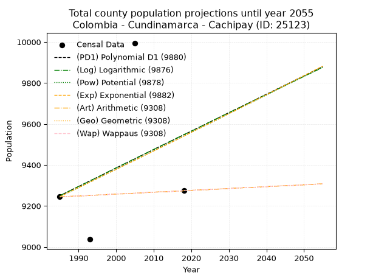
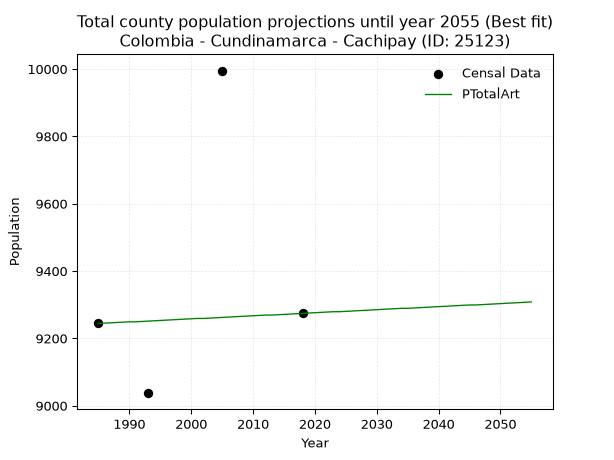
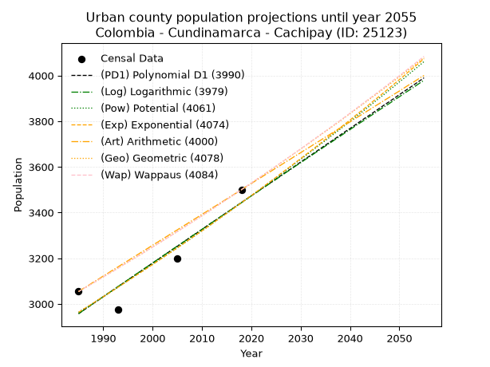
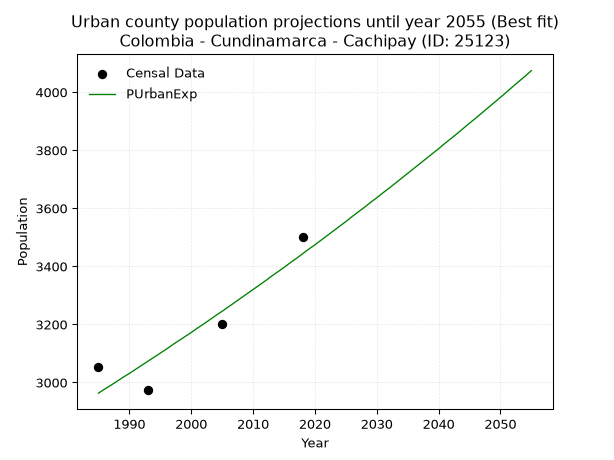
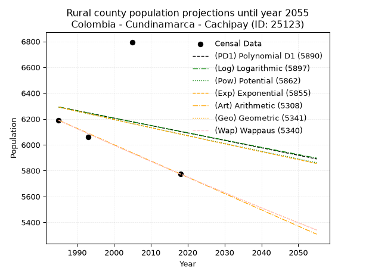
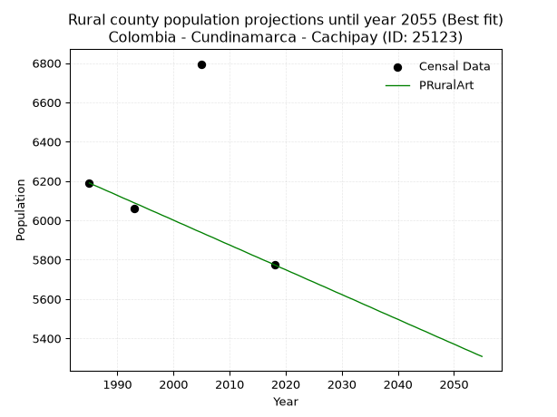

<div align="center">


</div>

# 📜 _“Population and Public Services Demand Projections (PPSD) until Year 2050 for Colombia - Cundinamarca - Cachipay (ID: 25123)”_
Keywords: `population` `public-service` `projection` `lineal` `polynomial` `logarithmic` `potential` `exponential` `arithmetic` `geometric` `wappaus` `dane` `colombia` `south-america`

PPSD are analytical estimates used by governments and planners to anticipate future changes in population size, age distribution, and the resulting community needs for utilities, healthcare, education, and infrastructure as sizing future water treatment facilities, electrical grids, and road networks based on spatial growth.

<div align="center">

</img>

</div>


> **General running parameters**: • app_version: _v20260806_. • Python version: _3.14.7_. • Pandas version: _3.0.5_. • NumPy version: _2.5.1_. • Creates, save and include plots into reports (create_plot): _False_. • Projection until year: _2050_. • Process polynomial degree 2 and up: _False_. • Process Wappaus: _True_. • Process Wappaus: _True_. • Set negative values to zero: _True_. • Set infinite values to zero: _True_. • Drop dataset notes: _True_. 
<div align="center">

Maps & GIS Layers: [:earth_americas:Google](http://maps.google.com/maps?q=4.730956571,-74.4357105) [:earth_americas:OSM](https://www.openstreetmap.org/#map=18/4.730956571/-74.4357105&layers=P) [:earth_americas:Bing](https://www.bing.com/maps?cp=4.730956571~-74.4357105&lvl=18) [:earth_americas:Apple](https://maps.apple.com/frame?center=4.730956571%2C-74.4357105&span=0.003%2C0.006) [:earth_americas:GISMobile](https://github.com/rcfdtools/R.GISMobile/blob/main/file/gis/CountyLayer_CO/Readme.md)

</div>


<div align="center">

```geojson
{
  "type": "Feature",
  "geometry": {
    "type": "Point", 
    "coordinates": [-74.4357105, 4.730956571]
  }, 
  "properties": {
    "Name": "Colombia - Cundinamarca - Cachipay (ID: 25123)"
  }
}
```

</div>


## 0. Census Data (4 records)

Census data are official statistics collected by a government about the people and housing in a country. They usually include counts of total population, age, sex, race, income, education, and jobs.

📅Global census file: [Population.xlsx](../data/Population.xlsx)

| Source   |   Year |   CountryID | CountryName   |   StateID | StateName    |   CountyID | CountyName   |   PTotal |   PUrban |   PRural |
|:---------|-------:|------------:|:--------------|----------:|:-------------|-----------:|:-------------|---------:|---------:|---------:|
| DANE     |   1985 |          57 | Colombia      |        25 | Cundinamarca |      25123 | Cachipay     |     9244 |     3054 |     6190 |
| DANE     |   1993 |          57 | Colombia      |        25 | Cundinamarca |      25123 | Cachipay     |     9037 |     2975 |     6062 |
| DANE     |   2005 |          57 | Colombia      |        25 | Cundinamarca |      25123 | Cachipay     |     9995 |     3200 |     6795 |
| DANE     |   2018 |          57 | Colombia      |        25 | Cundinamarca |      25123 | Cachipay     |     9274 |     3500 |     5774 |

> 🔥Some records could had specific notes about the registered values or the corresponding urban or rural distribution.

📅[SUI-RUPS](https://www.datos.gov.co/Hacienda-y-Cr-dito-P-blico/Registro-nico-de-Prestadores-de-Servicios-P-blicos/4qkq-csdn/about_data) - Local public utility companies: [RUPS.csv](../data/RUPS.csv)

 | SERVICIO       | ESTADO    | NOMBRE                                                                                                                          | NIT         | DEPARTAMENTO_DOMICILIO   | MUNICIPIO_DOMICILIO   | DIRECCION                                                 |   TELEFONO | EMAIL                                           | TIPO_PRESTADOR                 | CLASIFICACION                 |
|:---------------|:----------|:--------------------------------------------------------------------------------------------------------------------------------|:------------|:-------------------------|:----------------------|:----------------------------------------------------------|-----------:|:------------------------------------------------|:-------------------------------|:------------------------------|
| ACUEDUCTO      | OPERATIVA | OFICINA DE SERVICIOS PUBLICOS DOMICILIARIOS  DE ACUEDUCTO, ALCANTARILLADO Y ASEO DEL MUNICIPIO DE CACHIPAY                      | 800081091-9 | CUNDINAMARCA             | CACHIPAY              | Carrera 5A Calle 4A Esquina                               |    8443057 | servicios.publicos@cachipay-cundinamarca.gov.co | MUNICIPIO (PRESTACIÓN DIRECTA) | MENOR O IGUAL A 2500 USUARIOS |
| ALCANTARILLADO | OPERATIVA | OFICINA DE SERVICIOS PUBLICOS DOMICILIARIOS  DE ACUEDUCTO, ALCANTARILLADO Y ASEO DEL MUNICIPIO DE CACHIPAY                      | 800081091-9 | CUNDINAMARCA             | CACHIPAY              | Carrera 5A Calle 4A Esquina                               |    8443057 | servicios.publicos@cachipay-cundinamarca.gov.co | MUNICIPIO (PRESTACIÓN DIRECTA) | MENOR O IGUAL A 2500 USUARIOS |
| ACUEDUCTO      | OPERATIVA | ASOCIACION DE USUARIOS DEL ACUEDUCTO REGIONAL ZIPACON CACHIPAY LA MESA ACUAZICAME                                               | 832003369-4 | CUNDINAMARCA             | CACHIPAY              | CRA 3 N 2 40                                              |    3124621 | INGERAMIREZ92@GMAIL.COM                         | ORGANIZACION AUTORIZADA        | MENOR O IGUAL A 2500 USUARIOS |
| ACUEDUCTO      | OPERATIVA | FUNDACIÓN FONDO ACUEDUCTO INTERVEREDAL MESITAS DE SANTA INES Y SAN MATEO                                                        | 832007534-1 | CUNDINAMARCA             | CACHIPAY              | CRA 6 4 27 PRIMER PISO EDIFICIO JAMACO                    |    4310407 | FAIMSYS@YAHOO.COM                               | ORGANIZACION AUTORIZADA        | MENOR O IGUAL A 2500 USUARIOS |
| ACUEDUCTO      | OPERATIVA | ACUEDUCTO SAN JOSÉ MULTIVEREDAL                                                                                                 | 832001733-3 | CUNDINAMARCA             | CACHIPAY              | Calle 3 No.4-13 oficina 303 P 3                           |    8443835 | acuasanjose@gmail.com                           | ORGANIZACION AUTORIZADA        | MENOR O IGUAL A 2500 USUARIOS |
| ACUEDUCTO      | OPERATIVA | ASOCIACION DE SUSCRIPTORES DEL ACUEDUCTO REGIONAL DE PEÑA NEGRA MUNICIPIO DE CACHIPAY Y DE LOS MUNICIPIOS DE ANOLAIMA Y LA MESA | 832004186-8 | CUNDINAMARCA             | CACHIPAY              | INSPECCION PEÑA NEGRA                                     |    2047182 | acuapenegra@gmail.com                           | ORGANIZACION AUTORIZADA        | MENOR O IGUAL A 2500 USUARIOS |
| ACUEDUCTO      | OPERATIVA | ASOCIACION DE USUARIOS DEL ACUEDUCTO DE LAS VEREDAS TOCAREMA Y EL RETIRO DEL MUNICIPIO DE CACHIPAY                              | 832008310-3 | CUNDINAMARCA             | CACHIPAY              | CALLE 3 Nº 4-12 OFICINA 305                               |    3115019 | acuatocarema@yahoo.com                          | ORGANIZACION AUTORIZADA        | MENOR O IGUAL A 2500 USUARIOS |
| ACUEDUCTO      | OPERATIVA | ACUEDUCTO SAN PEDRO DE CACHIPAY                                                                                                 | 832003244-2 | CUNDINAMARCA             | CACHIPAY              | VEREDA SAN PEDRO MUNICIPIO DE CACHIPAY FINCA SANTA MONICA |    3124482 | acuesanpedrocachipay@hotmail.com                | ORGANIZACION AUTORIZADA        | MENOR O IGUAL A 2500 USUARIOS |

## 1. Total

### 1.1. Coefficients and Parameters

* (PD1) Polynomial Deg 1: 8.993175431553952, -8601.099156965793 (lineal)
* (Log) Logarithmic: 18072.75740044047, -127983.67382673667
* (Pow) Potential: 1.912515548997931, -2.341125339722437
* (Exp) Exponential: 0.0009517934127251676, 1397.6966797692087
* (Art) Arithmetic: Year diff. 2018 - 1985 = 33, Population diff. 9274 - 9244 = 30, Annual growth = 0.9090909090909091
* (Geo) Geometric: Year diff. 2018 - 1985 = 33, Population diff. 9274 - 9244 = 30, Annual growth % = 9.818947351725171e-05
* (Wap) Wappaus: i = 0.009818456734970397, Condition values only valid for < 200)

<sub>
Wappaus condition values: ['0.00', '0.01', '0.02', '0.03', '0.04', '0.05', '0.06', '0.07', '0.08', '0.09', '0.10', '0.11', '0.12', '0.13', '0.14', '0.15', '0.16', '0.17', '0.18', '0.19', '0.20', '0.21', '0.22', '0.23', '0.24', '0.25', '0.26', '0.27', '0.27', '0.28', '0.29', '0.30', '0.31', '0.32', '0.33', '0.34', '0.35', '0.36', '0.37', '0.38', '0.39', '0.40', '0.41', '0.42', '0.43', '0.44', '0.45', '0.46', '0.47', '0.48', '0.49', '0.50', '0.51', '0.52', '0.53', '0.54', '0.55', '0.56', '0.57', '0.58', '0.59', '0.60', '0.61', '0.62', '0.63', '0.64']
</sub>


### 1.2. Projected Dataset

|   Year |   CountyID |   PTotalPD1 |   PTotalLog |   PTotalPow |   PTotalExp |   PTotalArt |   PTotalGeo |   PTotalWap |
|-------:|-----------:|------------:|------------:|------------:|------------:|------------:|------------:|------------:|
|   1985 |      25123 |        9250 |        9250 |        9245 |        9245 |        9244 |        9244 |        9244 |
|   1986 |      25123 |        9259 |        9259 |        9254 |        9254 |        9245 |        9245 |        9245 |
|   1987 |      25123 |        9268 |        9268 |        9263 |        9263 |        9246 |        9246 |        9246 |
|   1988 |      25123 |        9277 |        9277 |        9271 |        9272 |        9247 |        9247 |        9247 |
|   1989 |      25123 |        9286 |        9286 |        9280 |        9281 |        9248 |        9248 |        9248 |
|   1990 |      25123 |        9295 |        9295 |        9289 |        9290 |        9249 |        9249 |        9249 |
|   1991 |      25123 |        9304 |        9304 |        9298 |        9298 |        9249 |        9249 |        9249 |
|   1992 |      25123 |        9313 |        9313 |        9307 |        9307 |        9250 |        9250 |        9250 |
|   1993 |      25123 |        9322 |        9322 |        9316 |        9316 |        9251 |        9251 |        9251 |
|   1994 |      25123 |        9331 |        9331 |        9325 |        9325 |        9252 |        9252 |        9252 |
|   1995 |      25123 |        9340 |        9340 |        9334 |        9334 |        9253 |        9253 |        9253 |
|   1996 |      25123 |        9349 |        9349 |        9343 |        9343 |        9254 |        9254 |        9254 |
|   1997 |      25123 |        9358 |        9358 |        9352 |        9352 |        9255 |        9255 |        9255 |
|   1998 |      25123 |        9367 |        9368 |        9361 |        9361 |        9256 |        9256 |        9256 |
|   1999 |      25123 |        9376 |        9377 |        9370 |        9370 |        9257 |        9257 |        9257 |
|   2000 |      25123 |        9385 |        9386 |        9379 |        9378 |        9258 |        9258 |        9258 |
|   2001 |      25123 |        9394 |        9395 |        9388 |        9387 |        9259 |        9259 |        9259 |
|   2002 |      25123 |        9403 |        9404 |        9397 |        9396 |        9259 |        9259 |        9259 |
|   2003 |      25123 |        9412 |        9413 |        9406 |        9405 |        9260 |        9260 |        9260 |
|   2004 |      25123 |        9421 |        9422 |        9415 |        9414 |        9261 |        9261 |        9261 |
|   2005 |      25123 |        9430 |        9431 |        9424 |        9423 |        9262 |        9262 |        9262 |
|   2006 |      25123 |        9439 |        9440 |        9433 |        9432 |        9263 |        9263 |        9263 |
|   2007 |      25123 |        9448 |        9449 |        9442 |        9441 |        9264 |        9264 |        9264 |
|   2008 |      25123 |        9457 |        9458 |        9451 |        9450 |        9265 |        9265 |        9265 |
|   2009 |      25123 |        9466 |        9467 |        9460 |        9459 |        9266 |        9266 |        9266 |
|   2010 |      25123 |        9475 |        9476 |        9469 |        9468 |        9267 |        9267 |        9267 |
|   2011 |      25123 |        9484 |        9485 |        9478 |        9477 |        9268 |        9268 |        9268 |
|   2012 |      25123 |        9493 |        9494 |        9487 |        9486 |        9269 |        9269 |        9269 |
|   2013 |      25123 |        9502 |        9503 |        9496 |        9495 |        9269 |        9269 |        9269 |
|   2014 |      25123 |        9511 |        9512 |        9505 |        9504 |        9270 |        9270 |        9270 |
|   2015 |      25123 |        9520 |        9521 |        9514 |        9513 |        9271 |        9271 |        9271 |
|   2016 |      25123 |        9529 |        9530 |        9523 |        9522 |        9272 |        9272 |        9272 |
|   2017 |      25123 |        9538 |        9539 |        9532 |        9531 |        9273 |        9273 |        9273 |
|   2018 |      25123 |        9547 |        9548 |        9541 |        9540 |        9274 |        9274 |        9274 |
|   2019 |      25123 |        9556 |        9556 |        9550 |        9550 |        9275 |        9275 |        9275 |
|   2020 |      25123 |        9565 |        9565 |        9559 |        9559 |        9276 |        9276 |        9276 |
|   2021 |      25123 |        9574 |        9574 |        9568 |        9568 |        9277 |        9277 |        9277 |
|   2022 |      25123 |        9583 |        9583 |        9577 |        9577 |        9278 |        9278 |        9278 |
|   2023 |      25123 |        9592 |        9592 |        9586 |        9586 |        9279 |        9279 |        9279 |
|   2024 |      25123 |        9601 |        9601 |        9595 |        9595 |        9279 |        9279 |        9279 |
|   2025 |      25123 |        9610 |        9610 |        9604 |        9604 |        9280 |        9280 |        9280 |
|   2026 |      25123 |        9619 |        9619 |        9613 |        9613 |        9281 |        9281 |        9281 |
|   2027 |      25123 |        9628 |        9628 |        9622 |        9623 |        9282 |        9282 |        9282 |
|   2028 |      25123 |        9637 |        9637 |        9631 |        9632 |        9283 |        9283 |        9283 |
|   2029 |      25123 |        9646 |        9646 |        9641 |        9641 |        9284 |        9284 |        9284 |
|   2030 |      25123 |        9655 |        9655 |        9650 |        9650 |        9285 |        9285 |        9285 |
|   2031 |      25123 |        9664 |        9664 |        9659 |        9659 |        9286 |        9286 |        9286 |
|   2032 |      25123 |        9673 |        9672 |        9668 |        9668 |        9287 |        9287 |        9287 |
|   2033 |      25123 |        9682 |        9681 |        9677 |        9678 |        9288 |        9288 |        9288 |
|   2034 |      25123 |        9691 |        9690 |        9686 |        9687 |        9289 |        9289 |        9289 |
|   2035 |      25123 |        9700 |        9699 |        9695 |        9696 |        9289 |        9289 |        9289 |
|   2036 |      25123 |        9709 |        9708 |        9704 |        9705 |        9290 |        9290 |        9290 |
|   2037 |      25123 |        9718 |        9717 |        9713 |        9715 |        9291 |        9291 |        9291 |
|   2038 |      25123 |        9727 |        9726 |        9723 |        9724 |        9292 |        9292 |        9292 |
|   2039 |      25123 |        9736 |        9735 |        9732 |        9733 |        9293 |        9293 |        9293 |
|   2040 |      25123 |        9745 |        9743 |        9741 |        9742 |        9294 |        9294 |        9294 |
|   2041 |      25123 |        9754 |        9752 |        9750 |        9752 |        9295 |        9295 |        9295 |
|   2042 |      25123 |        9763 |        9761 |        9759 |        9761 |        9296 |        9296 |        9296 |
|   2043 |      25123 |        9772 |        9770 |        9768 |        9770 |        9297 |        9297 |        9297 |
|   2044 |      25123 |        9781 |        9779 |        9777 |        9780 |        9298 |        9298 |        9298 |
|   2045 |      25123 |        9790 |        9788 |        9786 |        9789 |        9299 |        9299 |        9299 |
|   2046 |      25123 |        9799 |        9797 |        9796 |        9798 |        9299 |        9300 |        9300 |
|   2047 |      25123 |        9808 |        9805 |        9805 |        9807 |        9300 |        9300 |        9300 |
|   2048 |      25123 |        9817 |        9814 |        9814 |        9817 |        9301 |        9301 |        9301 |
|   2049 |      25123 |        9826 |        9823 |        9823 |        9826 |        9302 |        9302 |        9302 |
|   2050 |      25123 |        9835 |        9832 |        9832 |        9836 |        9303 |        9303 |        9303 |
<div align="center">

</img>

</div>


### 1.3. Best fit with absolute and relative error (%)

Relative error puts that difference into context by dividing the absolute error by the true value, creating a unitless ratio or percentage that shows the scale of the mistake.

Absolute and relative error

|   Year | Source   |   CountryID | CountryName   |   StateID | StateName    |   CountyID_x | CountyName   |   PTotal |   PUrban |   PRural |   CountyID_y |   PTotalPD1 |   PTotalLog |   PTotalPow |   PTotalExp |   PTotalArt |   PTotalGeo |   PTotalWap |   PTotalPD1AbsError |   PTotalLogAbsError |   PTotalPowAbsError |   PTotalExpAbsError |   PTotalArtAbsError |   PTotalGeoAbsError |   PTotalWapAbsError |   PTotalPD1RelError |   PTotalLogRelError |   PTotalPowRelError |   PTotalExpRelError |   PTotalArtRelError |   PTotalGeoRelError |   PTotalWapRelError |
|-------:|:---------|------------:|:--------------|----------:|:-------------|-------------:|:-------------|---------:|---------:|---------:|-------------:|------------:|------------:|------------:|------------:|------------:|------------:|------------:|--------------------:|--------------------:|--------------------:|--------------------:|--------------------:|--------------------:|--------------------:|--------------------:|--------------------:|--------------------:|--------------------:|--------------------:|--------------------:|--------------------:|
|   1985 | DANE     |          57 | Colombia      |        25 | Cundinamarca |        25123 | Cachipay     |     9244 |     3054 |     6190 |        25123 |        9250 |        9250 |        9245 |        9245 |        9244 |        9244 |        9244 |                   6 |                   6 |                   1 |                   1 |                   0 |                   0 |                   0 |            0.064907 |            0.064907 |           0.0108178 |           0.0108178 |             0       |             0       |             0       |
|   1993 | DANE     |          57 | Colombia      |        25 | Cundinamarca |        25123 | Cachipay     |     9037 |     2975 |     6062 |        25123 |        9322 |        9322 |        9316 |        9316 |        9251 |        9251 |        9251 |                 285 |                 285 |                 279 |                 279 |                 214 |                 214 |                 214 |            3.1537   |            3.1537   |           3.08731   |           3.08731   |             2.36804 |             2.36804 |             2.36804 |
|   2005 | DANE     |          57 | Colombia      |        25 | Cundinamarca |        25123 | Cachipay     |     9995 |     3200 |     6795 |        25123 |        9430 |        9431 |        9424 |        9423 |        9262 |        9262 |        9262 |                 565 |                 564 |                 571 |                 572 |                 733 |                 733 |                 733 |            5.65283  |            5.64282  |           5.71286   |           5.72286   |             7.33367 |             7.33367 |             7.33367 |
|   2018 | DANE     |          57 | Colombia      |        25 | Cundinamarca |        25123 | Cachipay     |     9274 |     3500 |     5774 |        25123 |        9547 |        9548 |        9541 |        9540 |        9274 |        9274 |        9274 |                 273 |                 274 |                 267 |                 266 |                   0 |                   0 |                   0 |            2.94371  |            2.9545   |           2.87902   |           2.86823   |             0       |             0       |             0       |

Relative error mean

| Method    |   RelError | Best   |
|:----------|-----------:|:-------|
| PTotalPD1 |    2.95379 |        |
| PTotalLog |    2.95398 |        |
| PTotalPow |    2.9225  |        |
| PTotalExp |    2.92231 |        |
| PTotalArt |    2.42543 | True   |
| PTotalGeo |    2.42543 | True   |
| PTotalWap |    2.42543 | True   |

💙Best method: _**PTotalArt**_
<div align="center">

</img>

</div>


### 1.4. Fresh water supply demand in liters per capita per day (lpcd)

The fresh water supply demand typically ranges from 100 to 300 liters per capita per day (lpcd) for standard domestic and municipal planning, though absolute survival minimums set by the World Health Organization are as low as 7.5 to 20 liters per day, and total consumption in high-income nations can exceed 400 liters.

> `CZ`: Level in meters above the sea level (masl)<br> `WS`: Fresh water supply demand in liters per capita per day (lpcd or l/h/d)<br> `WSAll`: Zonal fresh water supply demand in liters per second (l/s)<br> `A`: Zonal area in square meters<br> `DP`: Population density (people/hectare or p/ha)

Reference values (RAS Colombia)

|    CZ |   WS |
|------:|-----:|
|  1000 |  120 |
|  2000 |  130 |
| 99999 |  140 |

County shapefile geometry properties and water supply values

|   CountyID |      ATotal |   CZTotal |   WSTotal |
|-----------:|------------:|----------:|----------:|
|      25123 | 5.33958e+07 |   1395.01 |       130 |

Projected values for best method: PTotalArt

|   CountyID |   Year |   PTotalArt |   DPTotal |   WSTotal |   WSTotalAll |
|-----------:|-------:|------------:|----------:|----------:|-------------:|
|      25123 |   1985 |        9244 |      1.73 |       130 |      13.9088 |
|      25123 |   1986 |        9245 |      1.73 |       130 |      13.9103 |
|      25123 |   1987 |        9246 |      1.73 |       130 |      13.9118 |
|      25123 |   1988 |        9247 |      1.73 |       130 |      13.9133 |
|      25123 |   1989 |        9248 |      1.73 |       130 |      13.9148 |
|      25123 |   1990 |        9249 |      1.73 |       130 |      13.9163 |
|      25123 |   1991 |        9249 |      1.73 |       130 |      13.9163 |
|      25123 |   1992 |        9250 |      1.73 |       130 |      13.9178 |
|      25123 |   1993 |        9251 |      1.73 |       130 |      13.9193 |
|      25123 |   1994 |        9252 |      1.73 |       130 |      13.9208 |
|      25123 |   1995 |        9253 |      1.73 |       130 |      13.9223 |
|      25123 |   1996 |        9254 |      1.73 |       130 |      13.9238 |
|      25123 |   1997 |        9255 |      1.73 |       130 |      13.9253 |
|      25123 |   1998 |        9256 |      1.73 |       130 |      13.9269 |
|      25123 |   1999 |        9257 |      1.73 |       130 |      13.9284 |
|      25123 |   2000 |        9258 |      1.73 |       130 |      13.9299 |
|      25123 |   2001 |        9259 |      1.73 |       130 |      13.9314 |
|      25123 |   2002 |        9259 |      1.73 |       130 |      13.9314 |
|      25123 |   2003 |        9260 |      1.73 |       130 |      13.9329 |
|      25123 |   2004 |        9261 |      1.73 |       130 |      13.9344 |
|      25123 |   2005 |        9262 |      1.73 |       130 |      13.9359 |
|      25123 |   2006 |        9263 |      1.73 |       130 |      13.9374 |
|      25123 |   2007 |        9264 |      1.73 |       130 |      13.9389 |
|      25123 |   2008 |        9265 |      1.74 |       130 |      13.9404 |
|      25123 |   2009 |        9266 |      1.74 |       130 |      13.9419 |
|      25123 |   2010 |        9267 |      1.74 |       130 |      13.9434 |
|      25123 |   2011 |        9268 |      1.74 |       130 |      13.9449 |
|      25123 |   2012 |        9269 |      1.74 |       130 |      13.9464 |
|      25123 |   2013 |        9269 |      1.74 |       130 |      13.9464 |
|      25123 |   2014 |        9270 |      1.74 |       130 |      13.9479 |
|      25123 |   2015 |        9271 |      1.74 |       130 |      13.9494 |
|      25123 |   2016 |        9272 |      1.74 |       130 |      13.9509 |
|      25123 |   2017 |        9273 |      1.74 |       130 |      13.9524 |
|      25123 |   2018 |        9274 |      1.74 |       130 |      13.9539 |
|      25123 |   2019 |        9275 |      1.74 |       130 |      13.9554 |
|      25123 |   2020 |        9276 |      1.74 |       130 |      13.9569 |
|      25123 |   2021 |        9277 |      1.74 |       130 |      13.9584 |
|      25123 |   2022 |        9278 |      1.74 |       130 |      13.96   |
|      25123 |   2023 |        9279 |      1.74 |       130 |      13.9615 |
|      25123 |   2024 |        9279 |      1.74 |       130 |      13.9615 |
|      25123 |   2025 |        9280 |      1.74 |       130 |      13.963  |
|      25123 |   2026 |        9281 |      1.74 |       130 |      13.9645 |
|      25123 |   2027 |        9282 |      1.74 |       130 |      13.966  |
|      25123 |   2028 |        9283 |      1.74 |       130 |      13.9675 |
|      25123 |   2029 |        9284 |      1.74 |       130 |      13.969  |
|      25123 |   2030 |        9285 |      1.74 |       130 |      13.9705 |
|      25123 |   2031 |        9286 |      1.74 |       130 |      13.972  |
|      25123 |   2032 |        9287 |      1.74 |       130 |      13.9735 |
|      25123 |   2033 |        9288 |      1.74 |       130 |      13.975  |
|      25123 |   2034 |        9289 |      1.74 |       130 |      13.9765 |
|      25123 |   2035 |        9289 |      1.74 |       130 |      13.9765 |
|      25123 |   2036 |        9290 |      1.74 |       130 |      13.978  |
|      25123 |   2037 |        9291 |      1.74 |       130 |      13.9795 |
|      25123 |   2038 |        9292 |      1.74 |       130 |      13.981  |
|      25123 |   2039 |        9293 |      1.74 |       130 |      13.9825 |
|      25123 |   2040 |        9294 |      1.74 |       130 |      13.984  |
|      25123 |   2041 |        9295 |      1.74 |       130 |      13.9855 |
|      25123 |   2042 |        9296 |      1.74 |       130 |      13.987  |
|      25123 |   2043 |        9297 |      1.74 |       130 |      13.9885 |
|      25123 |   2044 |        9298 |      1.74 |       130 |      13.99   |
|      25123 |   2045 |        9299 |      1.74 |       130 |      13.9916 |
|      25123 |   2046 |        9299 |      1.74 |       130 |      13.9916 |
|      25123 |   2047 |        9300 |      1.74 |       130 |      13.9931 |
|      25123 |   2048 |        9301 |      1.74 |       130 |      13.9946 |
|      25123 |   2049 |        9302 |      1.74 |       130 |      13.9961 |
|      25123 |   2050 |        9303 |      1.74 |       130 |      13.9976 |

## 2. Urban

### 2.1. Coefficients and Parameters

* (PD1) Polynomial Deg 1: 14.745483741469078, -26312.403853873526 (lineal)
* (Log) Logarithmic: 29487.80040211847, -220954.75715690493
* (Pow) Potential: 9.092237678031209, -26.51227259833877
* (Exp) Exponential: 0.004546517223591239, 0.356734564169114
* (Art) Arithmetic: Year diff. 2018 - 1985 = 33, Population diff. 3500 - 3054 = 446, Annual growth = 13.515151515151516
* (Geo) Geometric: Year diff. 2018 - 1985 = 33, Population diff. 3500 - 3054 = 446, Annual growth % = 0.004139171949286702
* (Wap) Wappaus: i = 0.41242451983983874, Condition values only valid for < 200)

<sub>
Wappaus condition values: ['0.00', '0.41', '0.82', '1.24', '1.65', '2.06', '2.47', '2.89', '3.30', '3.71', '4.12', '4.54', '4.95', '5.36', '5.77', '6.19', '6.60', '7.01', '7.42', '7.84', '8.25', '8.66', '9.07', '9.49', '9.90', '10.31', '10.72', '11.14', '11.55', '11.96', '12.37', '12.79', '13.20', '13.61', '14.02', '14.43', '14.85', '15.26', '15.67', '16.08', '16.50', '16.91', '17.32', '17.73', '18.15', '18.56', '18.97', '19.38', '19.80', '20.21', '20.62', '21.03', '21.45', '21.86', '22.27', '22.68', '23.10', '23.51', '23.92', '24.33', '24.75', '25.16', '25.57', '25.98', '26.40', '26.81']
</sub>


### 2.2. Projected Dataset

|   Year |   CountyID |   PUrbanPD1 |   PUrbanLog |   PUrbanPow |   PUrbanExp |   PUrbanArt |   PUrbanGeo |   PUrbanWap |
|-------:|-----------:|------------:|------------:|------------:|------------:|------------:|------------:|------------:|
|   1985 |      25123 |        2957 |        2957 |        2963 |        2963 |        3054 |        3054 |        3054 |
|   1986 |      25123 |        2972 |        2972 |        2977 |        2977 |        3068 |        3067 |        3067 |
|   1987 |      25123 |        2987 |        2987 |        2990 |        2990 |        3081 |        3079 |        3079 |
|   1988 |      25123 |        3002 |        3002 |        3004 |        3004 |        3095 |        3092 |        3092 |
|   1989 |      25123 |        3016 |        3017 |        3018 |        3018 |        3108 |        3105 |        3105 |
|   1990 |      25123 |        3031 |        3031 |        3032 |        3031 |        3122 |        3118 |        3118 |
|   1991 |      25123 |        3046 |        3046 |        3046 |        3045 |        3135 |        3131 |        3131 |
|   1992 |      25123 |        3061 |        3061 |        3059 |        3059 |        3149 |        3144 |        3143 |
|   1993 |      25123 |        3075 |        3076 |        3073 |        3073 |        3162 |        3157 |        3156 |
|   1994 |      25123 |        3090 |        3091 |        3088 |        3087 |        3176 |        3170 |        3170 |
|   1995 |      25123 |        3105 |        3105 |        3102 |        3101 |        3189 |        3183 |        3183 |
|   1996 |      25123 |        3120 |        3120 |        3116 |        3115 |        3203 |        3196 |        3196 |
|   1997 |      25123 |        3134 |        3135 |        3130 |        3130 |        3216 |        3209 |        3209 |
|   1998 |      25123 |        3149 |        3150 |        3144 |        3144 |        3230 |        3222 |        3222 |
|   1999 |      25123 |        3164 |        3164 |        3159 |        3158 |        3243 |        3236 |        3236 |
|   2000 |      25123 |        3179 |        3179 |        3173 |        3172 |        3257 |        3249 |        3249 |
|   2001 |      25123 |        3193 |        3194 |        3188 |        3187 |        3270 |        3263 |        3262 |
|   2002 |      25123 |        3208 |        3209 |        3202 |        3201 |        3284 |        3276 |        3276 |
|   2003 |      25123 |        3223 |        3223 |        3217 |        3216 |        3297 |        3290 |        3289 |
|   2004 |      25123 |        3238 |        3238 |        3231 |        3231 |        3311 |        3303 |        3303 |
|   2005 |      25123 |        3252 |        3253 |        3246 |        3245 |        3324 |        3317 |        3317 |
|   2006 |      25123 |        3267 |        3267 |        3261 |        3260 |        3338 |        3331 |        3330 |
|   2007 |      25123 |        3282 |        3282 |        3275 |        3275 |        3351 |        3345 |        3344 |
|   2008 |      25123 |        3297 |        3297 |        3290 |        3290 |        3365 |        3358 |        3358 |
|   2009 |      25123 |        3311 |        3312 |        3305 |        3305 |        3378 |        3372 |        3372 |
|   2010 |      25123 |        3326 |        3326 |        3320 |        3320 |        3392 |        3386 |        3386 |
|   2011 |      25123 |        3341 |        3341 |        3335 |        3335 |        3405 |        3400 |        3400 |
|   2012 |      25123 |        3356 |        3356 |        3350 |        3350 |        3419 |        3414 |        3414 |
|   2013 |      25123 |        3370 |        3370 |        3366 |        3366 |        3432 |        3428 |        3428 |
|   2014 |      25123 |        3385 |        3385 |        3381 |        3381 |        3446 |        3443 |        3443 |
|   2015 |      25123 |        3400 |        3399 |        3396 |        3396 |        3459 |        3457 |        3457 |
|   2016 |      25123 |        3414 |        3414 |        3411 |        3412 |        3473 |        3471 |        3471 |
|   2017 |      25123 |        3429 |        3429 |        3427 |        3427 |        3486 |        3486 |        3486 |
|   2018 |      25123 |        3444 |        3443 |        3442 |        3443 |        3500 |        3500 |        3500 |
|   2019 |      25123 |        3459 |        3458 |        3458 |        3459 |        3514 |        3514 |        3515 |
|   2020 |      25123 |        3473 |        3473 |        3474 |        3474 |        3527 |        3529 |        3529 |
|   2021 |      25123 |        3488 |        3487 |        3489 |        3490 |        3541 |        3544 |        3544 |
|   2022 |      25123 |        3503 |        3502 |        3505 |        3506 |        3554 |        3558 |        3559 |
|   2023 |      25123 |        3518 |        3516 |        3521 |        3522 |        3568 |        3573 |        3573 |
|   2024 |      25123 |        3532 |        3531 |        3537 |        3538 |        3581 |        3588 |        3588 |
|   2025 |      25123 |        3547 |        3545 |        3552 |        3554 |        3595 |        3603 |        3603 |
|   2026 |      25123 |        3562 |        3560 |        3568 |        3571 |        3608 |        3618 |        3618 |
|   2027 |      25123 |        3577 |        3575 |        3584 |        3587 |        3622 |        3633 |        3633 |
|   2028 |      25123 |        3591 |        3589 |        3601 |        3603 |        3635 |        3648 |        3648 |
|   2029 |      25123 |        3606 |        3604 |        3617 |        3620 |        3649 |        3663 |        3664 |
|   2030 |      25123 |        3621 |        3618 |        3633 |        3636 |        3662 |        3678 |        3679 |
|   2031 |      25123 |        3636 |        3633 |        3649 |        3653 |        3676 |        3693 |        3694 |
|   2032 |      25123 |        3650 |        3647 |        3666 |        3669 |        3689 |        3708 |        3710 |
|   2033 |      25123 |        3665 |        3662 |        3682 |        3686 |        3703 |        3724 |        3725 |
|   2034 |      25123 |        3680 |        3676 |        3699 |        3703 |        3716 |        3739 |        3741 |
|   2035 |      25123 |        3695 |        3691 |        3715 |        3720 |        3730 |        3755 |        3756 |
|   2036 |      25123 |        3709 |        3705 |        3732 |        3737 |        3743 |        3770 |        3772 |
|   2037 |      25123 |        3724 |        3720 |        3749 |        3754 |        3757 |        3786 |        3788 |
|   2038 |      25123 |        3739 |        3734 |        3765 |        3771 |        3770 |        3801 |        3803 |
|   2039 |      25123 |        3754 |        3749 |        3782 |        3788 |        3784 |        3817 |        3819 |
|   2040 |      25123 |        3768 |        3763 |        3799 |        3805 |        3797 |        3833 |        3835 |
|   2041 |      25123 |        3783 |        3778 |        3816 |        3823 |        3811 |        3849 |        3851 |
|   2042 |      25123 |        3798 |        3792 |        3833 |        3840 |        3824 |        3865 |        3868 |
|   2043 |      25123 |        3813 |        3806 |        3850 |        3857 |        3838 |        3881 |        3884 |
|   2044 |      25123 |        3827 |        3821 |        3867 |        3875 |        3851 |        3897 |        3900 |
|   2045 |      25123 |        3842 |        3835 |        3885 |        3893 |        3865 |        3913 |        3916 |
|   2046 |      25123 |        3857 |        3850 |        3902 |        3910 |        3878 |        3929 |        3933 |
|   2047 |      25123 |        3872 |        3864 |        3919 |        3928 |        3892 |        3945 |        3949 |
|   2048 |      25123 |        3886 |        3878 |        3937 |        3946 |        3905 |        3962 |        3966 |
|   2049 |      25123 |        3901 |        3893 |        3954 |        3964 |        3919 |        3978 |        3983 |
|   2050 |      25123 |        3916 |        3907 |        3972 |        3982 |        3932 |        3995 |        3999 |
<div align="center">

</img>

</div>


### 2.3. Best fit with absolute and relative error (%)

Relative error puts that difference into context by dividing the absolute error by the true value, creating a unitless ratio or percentage that shows the scale of the mistake.

Absolute and relative error

|   Year | Source   |   CountryID | CountryName   |   StateID | StateName    |   CountyID_x | CountyName   |   PTotal |   PUrban |   PRural |   CountyID_y |   PUrbanPD1 |   PUrbanLog |   PUrbanPow |   PUrbanExp |   PUrbanArt |   PUrbanGeo |   PUrbanWap |   PUrbanPD1AbsError |   PUrbanLogAbsError |   PUrbanPowAbsError |   PUrbanExpAbsError |   PUrbanArtAbsError |   PUrbanGeoAbsError |   PUrbanWapAbsError |   PUrbanPD1RelError |   PUrbanLogRelError |   PUrbanPowRelError |   PUrbanExpRelError |   PUrbanArtRelError |   PUrbanGeoRelError |   PUrbanWapRelError |
|-------:|:---------|------------:|:--------------|----------:|:-------------|-------------:|:-------------|---------:|---------:|---------:|-------------:|------------:|------------:|------------:|------------:|------------:|------------:|------------:|--------------------:|--------------------:|--------------------:|--------------------:|--------------------:|--------------------:|--------------------:|--------------------:|--------------------:|--------------------:|--------------------:|--------------------:|--------------------:|--------------------:|
|   1985 | DANE     |          57 | Colombia      |        25 | Cundinamarca |        25123 | Cachipay     |     9244 |     3054 |     6190 |        25123 |        2957 |        2957 |        2963 |        2963 |        3054 |        3054 |        3054 |                  97 |                  97 |                  91 |                  91 |                   0 |                   0 |                   0 |             3.17616 |             3.17616 |             2.9797  |             2.9797  |             0       |             0       |             0       |
|   1993 | DANE     |          57 | Colombia      |        25 | Cundinamarca |        25123 | Cachipay     |     9037 |     2975 |     6062 |        25123 |        3075 |        3076 |        3073 |        3073 |        3162 |        3157 |        3156 |                 100 |                 101 |                  98 |                  98 |                 187 |                 182 |                 181 |             3.36134 |             3.39496 |             3.29412 |             3.29412 |             6.28571 |             6.11765 |             6.08403 |
|   2005 | DANE     |          57 | Colombia      |        25 | Cundinamarca |        25123 | Cachipay     |     9995 |     3200 |     6795 |        25123 |        3252 |        3253 |        3246 |        3245 |        3324 |        3317 |        3317 |                  52 |                  53 |                  46 |                  45 |                 124 |                 117 |                 117 |             1.625   |             1.65625 |             1.4375  |             1.40625 |             3.875   |             3.65625 |             3.65625 |
|   2018 | DANE     |          57 | Colombia      |        25 | Cundinamarca |        25123 | Cachipay     |     9274 |     3500 |     5774 |        25123 |        3444 |        3443 |        3442 |        3443 |        3500 |        3500 |        3500 |                  56 |                  57 |                  58 |                  57 |                   0 |                   0 |                   0 |             1.6     |             1.62857 |             1.65714 |             1.62857 |             0       |             0       |             0       |

Relative error mean

| Method    |   RelError | Best   |
|:----------|-----------:|:-------|
| PUrbanPD1 |    2.44063 |        |
| PUrbanLog |    2.46399 |        |
| PUrbanPow |    2.34211 |        |
| PUrbanExp |    2.32716 | True   |
| PUrbanArt |    2.54018 |        |
| PUrbanGeo |    2.44347 |        |
| PUrbanWap |    2.43507 |        |

💙Best method: _**PUrbanExp**_
<div align="center">

</img>

</div>


### 2.4. Fresh water supply demand in liters per capita per day (lpcd)

The fresh water supply demand typically ranges from 100 to 300 liters per capita per day (lpcd) for standard domestic and municipal planning, though absolute survival minimums set by the World Health Organization are as low as 7.5 to 20 liters per day, and total consumption in high-income nations can exceed 400 liters.

> `CZ`: Level in meters above the sea level (masl)<br> `WS`: Fresh water supply demand in liters per capita per day (lpcd or l/h/d)<br> `WSAll`: Zonal fresh water supply demand in liters per second (l/s)<br> `A`: Zonal area in square meters<br> `DP`: Population density (people/hectare or p/ha)

Reference values (RAS Colombia)

|    CZ |   WS |
|------:|-----:|
|  1000 |  120 |
|  2000 |  130 |
| 99999 |  140 |

County shapefile geometry properties and water supply values

|   CountyID |   AUrban |   CZUrban |   WSUrban |
|-----------:|---------:|----------:|----------:|
|      25123 |   760298 |    1613.8 |       130 |

Projected values for best method: PUrbanExp

|   CountyID |   Year |   PUrbanExp |   DPUrban |   WSUrban |   WSUrbanAll |
|-----------:|-------:|------------:|----------:|----------:|-------------:|
|      25123 |   1985 |        2963 |     38.97 |       130 |      4.45822 |
|      25123 |   1986 |        2977 |     39.16 |       130 |      4.47928 |
|      25123 |   1987 |        2990 |     39.33 |       130 |      4.49884 |
|      25123 |   1988 |        3004 |     39.51 |       130 |      4.51991 |
|      25123 |   1989 |        3018 |     39.69 |       130 |      4.54097 |
|      25123 |   1990 |        3031 |     39.87 |       130 |      4.56053 |
|      25123 |   1991 |        3045 |     40.05 |       130 |      4.5816  |
|      25123 |   1992 |        3059 |     40.23 |       130 |      4.60266 |
|      25123 |   1993 |        3073 |     40.42 |       130 |      4.62373 |
|      25123 |   1994 |        3087 |     40.6  |       130 |      4.64479 |
|      25123 |   1995 |        3101 |     40.79 |       130 |      4.66586 |
|      25123 |   1996 |        3115 |     40.97 |       130 |      4.68692 |
|      25123 |   1997 |        3130 |     41.17 |       130 |      4.70949 |
|      25123 |   1998 |        3144 |     41.35 |       130 |      4.73056 |
|      25123 |   1999 |        3158 |     41.54 |       130 |      4.75162 |
|      25123 |   2000 |        3172 |     41.72 |       130 |      4.77269 |
|      25123 |   2001 |        3187 |     41.92 |       130 |      4.79525 |
|      25123 |   2002 |        3201 |     42.1  |       130 |      4.81632 |
|      25123 |   2003 |        3216 |     42.3  |       130 |      4.83889 |
|      25123 |   2004 |        3231 |     42.5  |       130 |      4.86146 |
|      25123 |   2005 |        3245 |     42.68 |       130 |      4.88252 |
|      25123 |   2006 |        3260 |     42.88 |       130 |      4.90509 |
|      25123 |   2007 |        3275 |     43.08 |       130 |      4.92766 |
|      25123 |   2008 |        3290 |     43.27 |       130 |      4.95023 |
|      25123 |   2009 |        3305 |     43.47 |       130 |      4.9728  |
|      25123 |   2010 |        3320 |     43.67 |       130 |      4.99537 |
|      25123 |   2011 |        3335 |     43.86 |       130 |      5.01794 |
|      25123 |   2012 |        3350 |     44.06 |       130 |      5.04051 |
|      25123 |   2013 |        3366 |     44.27 |       130 |      5.06458 |
|      25123 |   2014 |        3381 |     44.47 |       130 |      5.08715 |
|      25123 |   2015 |        3396 |     44.67 |       130 |      5.10972 |
|      25123 |   2016 |        3412 |     44.88 |       130 |      5.1338  |
|      25123 |   2017 |        3427 |     45.07 |       130 |      5.15637 |
|      25123 |   2018 |        3443 |     45.28 |       130 |      5.18044 |
|      25123 |   2019 |        3459 |     45.5  |       130 |      5.20451 |
|      25123 |   2020 |        3474 |     45.69 |       130 |      5.22708 |
|      25123 |   2021 |        3490 |     45.9  |       130 |      5.25116 |
|      25123 |   2022 |        3506 |     46.11 |       130 |      5.27523 |
|      25123 |   2023 |        3522 |     46.32 |       130 |      5.29931 |
|      25123 |   2024 |        3538 |     46.53 |       130 |      5.32338 |
|      25123 |   2025 |        3554 |     46.74 |       130 |      5.34745 |
|      25123 |   2026 |        3571 |     46.97 |       130 |      5.37303 |
|      25123 |   2027 |        3587 |     47.18 |       130 |      5.39711 |
|      25123 |   2028 |        3603 |     47.39 |       130 |      5.42118 |
|      25123 |   2029 |        3620 |     47.61 |       130 |      5.44676 |
|      25123 |   2030 |        3636 |     47.82 |       130 |      5.47083 |
|      25123 |   2031 |        3653 |     48.05 |       130 |      5.49641 |
|      25123 |   2032 |        3669 |     48.26 |       130 |      5.52049 |
|      25123 |   2033 |        3686 |     48.48 |       130 |      5.54606 |
|      25123 |   2034 |        3703 |     48.7  |       130 |      5.57164 |
|      25123 |   2035 |        3720 |     48.93 |       130 |      5.59722 |
|      25123 |   2036 |        3737 |     49.15 |       130 |      5.6228  |
|      25123 |   2037 |        3754 |     49.38 |       130 |      5.64838 |
|      25123 |   2038 |        3771 |     49.6  |       130 |      5.67396 |
|      25123 |   2039 |        3788 |     49.82 |       130 |      5.69954 |
|      25123 |   2040 |        3805 |     50.05 |       130 |      5.72512 |
|      25123 |   2041 |        3823 |     50.28 |       130 |      5.7522  |
|      25123 |   2042 |        3840 |     50.51 |       130 |      5.77778 |
|      25123 |   2043 |        3857 |     50.73 |       130 |      5.80336 |
|      25123 |   2044 |        3875 |     50.97 |       130 |      5.83044 |
|      25123 |   2045 |        3893 |     51.2  |       130 |      5.85752 |
|      25123 |   2046 |        3910 |     51.43 |       130 |      5.8831  |
|      25123 |   2047 |        3928 |     51.66 |       130 |      5.91019 |
|      25123 |   2048 |        3946 |     51.9  |       130 |      5.93727 |
|      25123 |   2049 |        3964 |     52.14 |       130 |      5.96435 |
|      25123 |   2050 |        3982 |     52.37 |       130 |      5.99144 |

## 3. Rural

### 3.1. Coefficients and Parameters

* (PD1) Polynomial Deg 1: -5.752308309915115, 17711.30469690771 (lineal)
* (Log) Logarithmic: -11415.043001678017, 92971.08333016836
* (Pow) Potential: -2.0428046592384135, 10.535446306074563
* (Exp) Exponential: -0.001028389882122575, 48456.60282454392
* (Art) Arithmetic: Year diff. 2018 - 1985 = 33, Population diff. 5774 - 6190 = -416, Annual growth = -12.606060606060606
* (Geo) Geometric: Year diff. 2018 - 1985 = 33, Population diff. 5774 - 6190 = -416, Annual growth % = -0.002105961328659145
* (Wap) Wappaus: i = -0.2107332097302007, Condition values only valid for < 200)

<sub>
Wappaus condition values: ['-0.00', '-0.21', '-0.42', '-0.63', '-0.84', '-1.05', '-1.26', '-1.48', '-1.69', '-1.90', '-2.11', '-2.32', '-2.53', '-2.74', '-2.95', '-3.16', '-3.37', '-3.58', '-3.79', '-4.00', '-4.21', '-4.43', '-4.64', '-4.85', '-5.06', '-5.27', '-5.48', '-5.69', '-5.90', '-6.11', '-6.32', '-6.53', '-6.74', '-6.95', '-7.16', '-7.38', '-7.59', '-7.80', '-8.01', '-8.22', '-8.43', '-8.64', '-8.85', '-9.06', '-9.27', '-9.48', '-9.69', '-9.90', '-10.12', '-10.33', '-10.54', '-10.75', '-10.96', '-11.17', '-11.38', '-11.59', '-11.80', '-12.01', '-12.22', '-12.43', '-12.64', '-12.85', '-13.07', '-13.28', '-13.49', '-13.70']
</sub>


### 3.2. Projected Dataset

|   Year |   CountyID |   PRuralPD1 |   PRuralLog |   PRuralPow |   PRuralExp |   PRuralArt |   PRuralGeo |   PRuralWap |
|-------:|-----------:|------------:|------------:|------------:|------------:|------------:|------------:|------------:|
|   1985 |      25123 |        6293 |        6292 |        6292 |        6292 |        6190 |        6190 |        6190 |
|   1986 |      25123 |        6287 |        6287 |        6285 |        6286 |        6177 |        6177 |        6177 |
|   1987 |      25123 |        6281 |        6281 |        6279 |        6279 |        6165 |        6164 |        6164 |
|   1988 |      25123 |        6276 |        6275 |        6272 |        6273 |        6152 |        6151 |        6151 |
|   1989 |      25123 |        6270 |        6269 |        6266 |        6266 |        6140 |        6138 |        6138 |
|   1990 |      25123 |        6264 |        6264 |        6259 |        6260 |        6127 |        6125 |        6125 |
|   1991 |      25123 |        6258 |        6258 |        6253 |        6254 |        6114 |        6112 |        6112 |
|   1992 |      25123 |        6253 |        6252 |        6247 |        6247 |        6102 |        6099 |        6099 |
|   1993 |      25123 |        6247 |        6246 |        6240 |        6241 |        6089 |        6086 |        6087 |
|   1994 |      25123 |        6241 |        6241 |        6234 |        6234 |        6077 |        6074 |        6074 |
|   1995 |      25123 |        6235 |        6235 |        6227 |        6228 |        6064 |        6061 |        6061 |
|   1996 |      25123 |        6230 |        6229 |        6221 |        6221 |        6051 |        6048 |        6048 |
|   1997 |      25123 |        6224 |        6224 |        6215 |        6215 |        6039 |        6035 |        6035 |
|   1998 |      25123 |        6218 |        6218 |        6208 |        6209 |        6026 |        6023 |        6023 |
|   1999 |      25123 |        6212 |        6212 |        6202 |        6202 |        6014 |        6010 |        6010 |
|   2000 |      25123 |        6207 |        6206 |        6196 |        6196 |        6001 |        5997 |        5997 |
|   2001 |      25123 |        6201 |        6201 |        6189 |        6190 |        5988 |        5985 |        5985 |
|   2002 |      25123 |        6195 |        6195 |        6183 |        6183 |        5976 |        5972 |        5972 |
|   2003 |      25123 |        6189 |        6189 |        6177 |        6177 |        5963 |        5960 |        5960 |
|   2004 |      25123 |        6184 |        6184 |        6170 |        6170 |        5950 |        5947 |        5947 |
|   2005 |      25123 |        6178 |        6178 |        6164 |        6164 |        5938 |        5934 |        5934 |
|   2006 |      25123 |        6172 |        6172 |        6158 |        6158 |        5925 |        5922 |        5922 |
|   2007 |      25123 |        6166 |        6167 |        6152 |        6151 |        5913 |        5909 |        5910 |
|   2008 |      25123 |        6161 |        6161 |        6145 |        6145 |        5900 |        5897 |        5897 |
|   2009 |      25123 |        6155 |        6155 |        6139 |        6139 |        5887 |        5885 |        5885 |
|   2010 |      25123 |        6149 |        6150 |        6133 |        6133 |        5875 |        5872 |        5872 |
|   2011 |      25123 |        6143 |        6144 |        6127 |        6126 |        5862 |        5860 |        5860 |
|   2012 |      25123 |        6138 |        6138 |        6120 |        6120 |        5850 |        5847 |        5848 |
|   2013 |      25123 |        6132 |        6132 |        6114 |        6114 |        5837 |        5835 |        5835 |
|   2014 |      25123 |        6126 |        6127 |        6108 |        6107 |        5824 |        5823 |        5823 |
|   2015 |      25123 |        6120 |        6121 |        6102 |        6101 |        5812 |        5811 |        5811 |
|   2016 |      25123 |        6115 |        6115 |        6096 |        6095 |        5799 |        5798 |        5798 |
|   2017 |      25123 |        6109 |        6110 |        6089 |        6089 |        5787 |        5786 |        5786 |
|   2018 |      25123 |        6103 |        6104 |        6083 |        6082 |        5774 |        5774 |        5774 |
|   2019 |      25123 |        6097 |        6099 |        6077 |        6076 |        5761 |        5762 |        5762 |
|   2020 |      25123 |        6092 |        6093 |        6071 |        6070 |        5749 |        5750 |        5750 |
|   2021 |      25123 |        6086 |        6087 |        6065 |        6064 |        5736 |        5738 |        5738 |
|   2022 |      25123 |        6080 |        6082 |        6059 |        6057 |        5724 |        5726 |        5725 |
|   2023 |      25123 |        6074 |        6076 |        6053 |        6051 |        5711 |        5713 |        5713 |
|   2024 |      25123 |        6069 |        6070 |        6047 |        6045 |        5698 |        5701 |        5701 |
|   2025 |      25123 |        6063 |        6065 |        6040 |        6039 |        5686 |        5689 |        5689 |
|   2026 |      25123 |        6057 |        6059 |        6034 |        6032 |        5673 |        5677 |        5677 |
|   2027 |      25123 |        6051 |        6053 |        6028 |        6026 |        5661 |        5665 |        5665 |
|   2028 |      25123 |        6046 |        6048 |        6022 |        6020 |        5648 |        5654 |        5653 |
|   2029 |      25123 |        6040 |        6042 |        6016 |        6014 |        5635 |        5642 |        5641 |
|   2030 |      25123 |        6034 |        6037 |        6010 |        6008 |        5623 |        5630 |        5630 |
|   2031 |      25123 |        6028 |        6031 |        6004 |        6001 |        5610 |        5618 |        5618 |
|   2032 |      25123 |        6023 |        6025 |        5998 |        5995 |        5598 |        5606 |        5606 |
|   2033 |      25123 |        6017 |        6020 |        5992 |        5989 |        5585 |        5594 |        5594 |
|   2034 |      25123 |        6011 |        6014 |        5986 |        5983 |        5572 |        5582 |        5582 |
|   2035 |      25123 |        6005 |        6008 |        5980 |        5977 |        5560 |        5571 |        5570 |
|   2036 |      25123 |        6000 |        6003 |        5974 |        5971 |        5547 |        5559 |        5559 |
|   2037 |      25123 |        5994 |        5997 |        5968 |        5965 |        5534 |        5547 |        5547 |
|   2038 |      25123 |        5988 |        5992 |        5962 |        5958 |        5522 |        5536 |        5535 |
|   2039 |      25123 |        5982 |        5986 |        5956 |        5952 |        5509 |        5524 |        5524 |
|   2040 |      25123 |        5977 |        5980 |        5950 |        5946 |        5497 |        5512 |        5512 |
|   2041 |      25123 |        5971 |        5975 |        5944 |        5940 |        5484 |        5501 |        5500 |
|   2042 |      25123 |        5965 |        5969 |        5938 |        5934 |        5471 |        5489 |        5489 |
|   2043 |      25123 |        5959 |        5964 |        5932 |        5928 |        5459 |        5478 |        5477 |
|   2044 |      25123 |        5954 |        5958 |        5926 |        5922 |        5446 |        5466 |        5465 |
|   2045 |      25123 |        5948 |        5952 |        5920 |        5916 |        5434 |        5455 |        5454 |
|   2046 |      25123 |        5942 |        5947 |        5914 |        5910 |        5421 |        5443 |        5442 |
|   2047 |      25123 |        5936 |        5941 |        5909 |        5904 |        5408 |        5432 |        5431 |
|   2048 |      25123 |        5931 |        5936 |        5903 |        5897 |        5396 |        5420 |        5419 |
|   2049 |      25123 |        5925 |        5930 |        5897 |        5891 |        5383 |        5409 |        5408 |
|   2050 |      25123 |        5919 |        5925 |        5891 |        5885 |        5371 |        5397 |        5396 |
<div align="center">

</img>

</div>


### 3.3. Best fit with absolute and relative error (%)

Relative error puts that difference into context by dividing the absolute error by the true value, creating a unitless ratio or percentage that shows the scale of the mistake.

Absolute and relative error

|   Year | Source   |   CountryID | CountryName   |   StateID | StateName    |   CountyID_x | CountyName   |   PTotal |   PUrban |   PRural |   CountyID_y |   PRuralPD1 |   PRuralLog |   PRuralPow |   PRuralExp |   PRuralArt |   PRuralGeo |   PRuralWap |   PRuralPD1AbsError |   PRuralLogAbsError |   PRuralPowAbsError |   PRuralExpAbsError |   PRuralArtAbsError |   PRuralGeoAbsError |   PRuralWapAbsError |   PRuralPD1RelError |   PRuralLogRelError |   PRuralPowRelError |   PRuralExpRelError |   PRuralArtRelError |   PRuralGeoRelError |   PRuralWapRelError |
|-------:|:---------|------------:|:--------------|----------:|:-------------|-------------:|:-------------|---------:|---------:|---------:|-------------:|------------:|------------:|------------:|------------:|------------:|------------:|------------:|--------------------:|--------------------:|--------------------:|--------------------:|--------------------:|--------------------:|--------------------:|--------------------:|--------------------:|--------------------:|--------------------:|--------------------:|--------------------:|--------------------:|
|   1985 | DANE     |          57 | Colombia      |        25 | Cundinamarca |        25123 | Cachipay     |     9244 |     3054 |     6190 |        25123 |        6293 |        6292 |        6292 |        6292 |        6190 |        6190 |        6190 |                 103 |                 102 |                 102 |                 102 |                   0 |                   0 |                   0 |             1.66397 |             1.64782 |             1.64782 |             1.64782 |            0        |            0        |            0        |
|   1993 | DANE     |          57 | Colombia      |        25 | Cundinamarca |        25123 | Cachipay     |     9037 |     2975 |     6062 |        25123 |        6247 |        6246 |        6240 |        6241 |        6089 |        6086 |        6087 |                 185 |                 184 |                 178 |                 179 |                  27 |                  24 |                  25 |             3.0518  |             3.0353  |             2.93632 |             2.95282 |            0.445398 |            0.395909 |            0.412405 |
|   2005 | DANE     |          57 | Colombia      |        25 | Cundinamarca |        25123 | Cachipay     |     9995 |     3200 |     6795 |        25123 |        6178 |        6178 |        6164 |        6164 |        5938 |        5934 |        5934 |                 617 |                 617 |                 631 |                 631 |                 857 |                 861 |                 861 |             9.08021 |             9.08021 |             9.28624 |             9.28624 |           12.6122   |           12.6711   |           12.6711   |
|   2018 | DANE     |          57 | Colombia      |        25 | Cundinamarca |        25123 | Cachipay     |     9274 |     3500 |     5774 |        25123 |        6103 |        6104 |        6083 |        6082 |        5774 |        5774 |        5774 |                 329 |                 330 |                 309 |                 308 |                   0 |                   0 |                   0 |             5.69796 |             5.71528 |             5.35158 |             5.33426 |            0        |            0        |            0        |

Relative error mean

| Method    |   RelError | Best   |
|:----------|-----------:|:-------|
| PRuralPD1 |    4.87348 |        |
| PRuralLog |    4.86965 |        |
| PRuralPow |    4.80549 |        |
| PRuralExp |    4.80528 |        |
| PRuralArt |    3.2644  | True   |
| PRuralGeo |    3.26675 |        |
| PRuralWap |    3.27087 |        |

💙Best method: _**PRuralArt**_
<div align="center">

</img>

</div>


### 3.4. Fresh water supply demand in liters per capita per day (lpcd)

The fresh water supply demand typically ranges from 100 to 300 liters per capita per day (lpcd) for standard domestic and municipal planning, though absolute survival minimums set by the World Health Organization are as low as 7.5 to 20 liters per day, and total consumption in high-income nations can exceed 400 liters.

> `CZ`: Level in meters above the sea level (masl)<br> `WS`: Fresh water supply demand in liters per capita per day (lpcd or l/h/d)<br> `WSAll`: Zonal fresh water supply demand in liters per second (l/s)<br> `A`: Zonal area in square meters<br> `DP`: Population density (people/hectare or p/ha)

Reference values (RAS Colombia)

|    CZ |   WS |
|------:|-----:|
|  1000 |  120 |
|  2000 |  130 |
| 99999 |  140 |

County shapefile geometry properties and water supply values

|   CountyID |      ARural |   CZRural |   WSRural |
|-----------:|------------:|----------:|----------:|
|      25123 | 5.26355e+07 |   1391.83 |       130 |

Projected values for best method: PRuralArt

|   CountyID |   Year |   PRuralArt |   DPRural |   WSRural |   WSRuralAll |
|-----------:|-------:|------------:|----------:|----------:|-------------:|
|      25123 |   1985 |        6190 |      1.18 |       130 |      9.31366 |
|      25123 |   1986 |        6177 |      1.17 |       130 |      9.2941  |
|      25123 |   1987 |        6165 |      1.17 |       130 |      9.27604 |
|      25123 |   1988 |        6152 |      1.17 |       130 |      9.25648 |
|      25123 |   1989 |        6140 |      1.17 |       130 |      9.23843 |
|      25123 |   1990 |        6127 |      1.16 |       130 |      9.21887 |
|      25123 |   1991 |        6114 |      1.16 |       130 |      9.19931 |
|      25123 |   1992 |        6102 |      1.16 |       130 |      9.18125 |
|      25123 |   1993 |        6089 |      1.16 |       130 |      9.16169 |
|      25123 |   1994 |        6077 |      1.15 |       130 |      9.14363 |
|      25123 |   1995 |        6064 |      1.15 |       130 |      9.12407 |
|      25123 |   1996 |        6051 |      1.15 |       130 |      9.10451 |
|      25123 |   1997 |        6039 |      1.15 |       130 |      9.08646 |
|      25123 |   1998 |        6026 |      1.14 |       130 |      9.0669  |
|      25123 |   1999 |        6014 |      1.14 |       130 |      9.04884 |
|      25123 |   2000 |        6001 |      1.14 |       130 |      9.02928 |
|      25123 |   2001 |        5988 |      1.14 |       130 |      9.00972 |
|      25123 |   2002 |        5976 |      1.14 |       130 |      8.99167 |
|      25123 |   2003 |        5963 |      1.13 |       130 |      8.97211 |
|      25123 |   2004 |        5950 |      1.13 |       130 |      8.95255 |
|      25123 |   2005 |        5938 |      1.13 |       130 |      8.93449 |
|      25123 |   2006 |        5925 |      1.13 |       130 |      8.91493 |
|      25123 |   2007 |        5913 |      1.12 |       130 |      8.89687 |
|      25123 |   2008 |        5900 |      1.12 |       130 |      8.87731 |
|      25123 |   2009 |        5887 |      1.12 |       130 |      8.85775 |
|      25123 |   2010 |        5875 |      1.12 |       130 |      8.8397  |
|      25123 |   2011 |        5862 |      1.11 |       130 |      8.82014 |
|      25123 |   2012 |        5850 |      1.11 |       130 |      8.80208 |
|      25123 |   2013 |        5837 |      1.11 |       130 |      8.78252 |
|      25123 |   2014 |        5824 |      1.11 |       130 |      8.76296 |
|      25123 |   2015 |        5812 |      1.1  |       130 |      8.74491 |
|      25123 |   2016 |        5799 |      1.1  |       130 |      8.72535 |
|      25123 |   2017 |        5787 |      1.1  |       130 |      8.70729 |
|      25123 |   2018 |        5774 |      1.1  |       130 |      8.68773 |
|      25123 |   2019 |        5761 |      1.09 |       130 |      8.66817 |
|      25123 |   2020 |        5749 |      1.09 |       130 |      8.65012 |
|      25123 |   2021 |        5736 |      1.09 |       130 |      8.63056 |
|      25123 |   2022 |        5724 |      1.09 |       130 |      8.6125  |
|      25123 |   2023 |        5711 |      1.09 |       130 |      8.59294 |
|      25123 |   2024 |        5698 |      1.08 |       130 |      8.57338 |
|      25123 |   2025 |        5686 |      1.08 |       130 |      8.55532 |
|      25123 |   2026 |        5673 |      1.08 |       130 |      8.53576 |
|      25123 |   2027 |        5661 |      1.08 |       130 |      8.51771 |
|      25123 |   2028 |        5648 |      1.07 |       130 |      8.49815 |
|      25123 |   2029 |        5635 |      1.07 |       130 |      8.47859 |
|      25123 |   2030 |        5623 |      1.07 |       130 |      8.46053 |
|      25123 |   2031 |        5610 |      1.07 |       130 |      8.44097 |
|      25123 |   2032 |        5598 |      1.06 |       130 |      8.42292 |
|      25123 |   2033 |        5585 |      1.06 |       130 |      8.40336 |
|      25123 |   2034 |        5572 |      1.06 |       130 |      8.3838  |
|      25123 |   2035 |        5560 |      1.06 |       130 |      8.36574 |
|      25123 |   2036 |        5547 |      1.05 |       130 |      8.34618 |
|      25123 |   2037 |        5534 |      1.05 |       130 |      8.32662 |
|      25123 |   2038 |        5522 |      1.05 |       130 |      8.30856 |
|      25123 |   2039 |        5509 |      1.05 |       130 |      8.289   |
|      25123 |   2040 |        5497 |      1.04 |       130 |      8.27095 |
|      25123 |   2041 |        5484 |      1.04 |       130 |      8.25139 |
|      25123 |   2042 |        5471 |      1.04 |       130 |      8.23183 |
|      25123 |   2043 |        5459 |      1.04 |       130 |      8.21377 |
|      25123 |   2044 |        5446 |      1.03 |       130 |      8.19421 |
|      25123 |   2045 |        5434 |      1.03 |       130 |      8.17616 |
|      25123 |   2046 |        5421 |      1.03 |       130 |      8.1566  |
|      25123 |   2047 |        5408 |      1.03 |       130 |      8.13704 |
|      25123 |   2048 |        5396 |      1.03 |       130 |      8.11898 |
|      25123 |   2049 |        5383 |      1.02 |       130 |      8.09942 |
|      25123 |   2050 |        5371 |      1.02 |       130 |      8.08137 |

#

<div align="center"><br><sub>Share this research</sub></div><br>

<sub>**APPS & TOOLS & CONTENT DISCLAIMER**: • NO WARRANTY - This content and software is provided by <a href="https://github.com/rcfdtools" target="_blank">github.com/rcfdtools</a> "as is", without any express or implied warranty, including warranties of merchantability, fitness for a particular purpose, or non-infringement. There is no guarantee that the software will be error-free or operate without interruption. • LIMITATION OF LIABILITY - Neither the authors nor copyright holders will be liable for claims or damages arising from the software or its use. You are responsible for determining if the software is appropriate for your use and assume all associated risks, including errors, legal compliance, and data loss. • NO PROFESSIONAL ADVICE - The software provides general information and does not offer professional advice. It should not replace consultation with professional advisors. [Clauses and global license for rcfdtools use.](https://github.com/rcfdtools/rcfdtools/blob/main/LICENSE.md)</sub>

| [:house: Home](Readme.md)  | [:beginner: Help / Collab](https://github.com/rcfdtools/R.HydroTools/discussions/31) |
|----------------------------|-------------------------------------------------------------------------------------------|