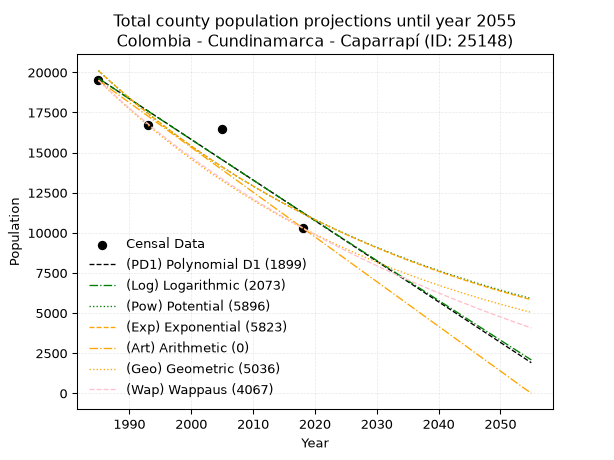
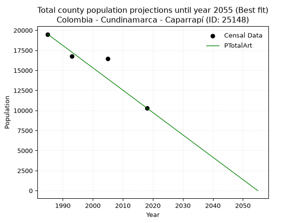
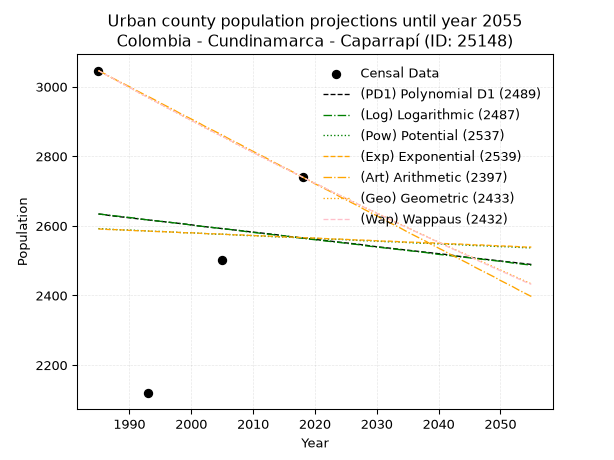
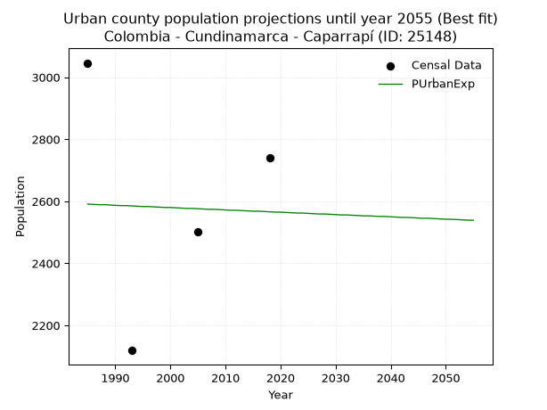
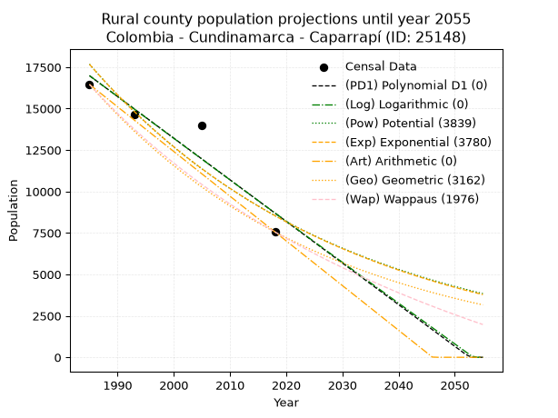
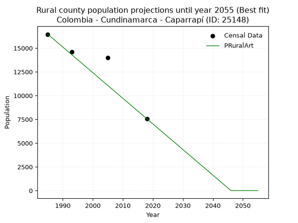

<div align="center">


</div>

# _“Population and Public Services Demand Projections (PPSD) until Year 2050 for Colombia - Cundinamarca - Caparrapí (ID: 25148)”_
Keywords: `population` `public-service` `projection` `lineal` `polynomial` `logarithmic` `potential` `exponential` `arithmetic` `geometric` `wappaus` `dane` `colombia` `south-america`

PPSD are analytical estimates used by governments and planners to anticipate future changes in population size, age distribution, and the resulting community needs for utilities, healthcare, education, and infrastructure as sizing future water treatment facilities, electrical grids, and road networks based on spatial growth.

> **General running parameters**: • app_version: _v20260806_. • Python version: _3.14.7_. • Pandas version: _3.0.5_. • NumPy version: _2.5.1_. • Creates, save and include plots into reports (create_plot): _False_. • Projection until year: _2050_. • Process polynomial degree 2 and up: _False_. • Process Wappaus: _True_. • Process Wappaus: _True_. • Set negative values to zero: _True_. • Set infinite values to zero: _True_. • Drop dataset notes: _True_. 
<div align="center">

Dynamic map: [:earth_americas:Google](http://maps.google.com/maps?q=5.34757959,-74.4910451) [:earth_americas:OSM](https://www.openstreetmap.org/#map=18/5.34757959/-74.4910451&layers=P) [:earth_americas:Bing](https://www.bing.com/maps?cp=5.34757959~-74.4910451&lvl=18) [:earth_americas:Apple](https://maps.apple.com/frame?center=5.34757959%2C-74.4910451&span=0.003%2C0.006)

</div>


<div align="center">

```geojson
{
  "type": "Feature",
  "geometry": {
    "type": "Point", 
    "coordinates": [-74.4910451, 5.34757959]
  }, 
  "properties": {
    "Name": "Colombia - Cundinamarca - Caparrapí (ID: 25148)"
  }
}
```

</div>


## 0. Census Data (4 records)

Census data are official statistics collected by a government about the people and housing in a country. They usually include counts of total population, age, sex, race, income, education, and jobs.

📅Global census file: [Population.xlsx](../data/Population.xlsx)

| Source   |   Year |   CountryID | CountryName   |   StateID | StateName    |   CountyID | CountyName   |   PTotal |   PUrban |   PRural |
|:---------|-------:|------------:|:--------------|----------:|:-------------|-----------:|:-------------|---------:|---------:|---------:|
| DANE     |   1985 |          57 | Colombia      |        25 | Cundinamarca |      25148 | Caparrapí    |    19502 |     3046 |    16456 |
| DANE     |   1993 |          57 | Colombia      |        25 | Cundinamarca |      25148 | Caparrapí    |    16738 |     2119 |    14619 |
| DANE     |   2005 |          57 | Colombia      |        25 | Cundinamarca |      25148 | Caparrapí    |    16483 |     2503 |    13980 |
| DANE     |   2018 |          57 | Colombia      |        25 | Cundinamarca |      25148 | Caparrapí    |    10301 |     2740 |     7561 |

> 🔥Some records could had specific notes about the registered values or the corresponding urban or rural distribution.

## 1. Total

### 1.1. Coefficients and Parameters

* (PD1) Polynomial Deg 1: -253.10156563628684, 522022.4066639827 (lineal)
* (Log) Logarithmic: -506348.4130139153, 3864514.3449402987
* (Pow) Potential: -35.39502465380766, 121.02758523087078
* (Exp) Exponential: -0.017696079323425196, 3.6179713273623364e+19
* (Art) Arithmetic: Year diff. 2018 - 1985 = 33, Population diff. 10301 - 19502 = -9201, Annual growth = -278.8181818181818
* (Geo) Geometric: Year diff. 2018 - 1985 = 33, Population diff. 10301 - 19502 = -9201, Annual growth % = -0.019155847881271004
* (Wap) Wappaus: i = -1.8710746020077296, Condition values only valid for < 200)

<sub>
Wappaus condition values: ['-0.00', '-1.87', '-3.74', '-5.61', '-7.48', '-9.36', '-11.23', '-13.10', '-14.97', '-16.84', '-18.71', '-20.58', '-22.45', '-24.32', '-26.20', '-28.07', '-29.94', '-31.81', '-33.68', '-35.55', '-37.42', '-39.29', '-41.16', '-43.03', '-44.91', '-46.78', '-48.65', '-50.52', '-52.39', '-54.26', '-56.13', '-58.00', '-59.87', '-61.75', '-63.62', '-65.49', '-67.36', '-69.23', '-71.10', '-72.97', '-74.84', '-76.71', '-78.59', '-80.46', '-82.33', '-84.20', '-86.07', '-87.94', '-89.81', '-91.68', '-93.55', '-95.42', '-97.30', '-99.17', '-101.04', '-102.91', '-104.78', '-106.65', '-108.52', '-110.39', '-112.26', '-114.14', '-116.01', '-117.88', '-119.75', '-121.62']
</sub>


### 1.2. Projected Dataset

|   Year |   CountyID |   PTotalPD1 |   PTotalLog |   PTotalPow |   PTotalExp |   PTotalArt |   PTotalGeo |   PTotalWap |
|-------:|-----------:|------------:|------------:|------------:|------------:|------------:|------------:|------------:|
|   1985 |      25148 |       19616 |       19621 |       20103 |       20097 |       19502 |       19502 |       19502 |
|   1986 |      25148 |       19363 |       19366 |       19748 |       19744 |       19223 |       19128 |       19140 |
|   1987 |      25148 |       19110 |       19111 |       19399 |       19398 |       18944 |       18762 |       18786 |
|   1988 |      25148 |       18856 |       18857 |       19057 |       19058 |       18666 |       18403 |       18437 |
|   1989 |      25148 |       18603 |       18602 |       18721 |       18723 |       18387 |       18050 |       18095 |
|   1990 |      25148 |       18350 |       18348 |       18391 |       18395 |       18108 |       17704 |       17759 |
|   1991 |      25148 |       18097 |       18093 |       18067 |       18072 |       17829 |       17365 |       17429 |
|   1992 |      25148 |       17844 |       17839 |       17748 |       17755 |       17550 |       17033 |       17105 |
|   1993 |      25148 |       17591 |       17585 |       17436 |       17444 |       17271 |       16706 |       16786 |
|   1994 |      25148 |       17338 |       17331 |       17129 |       17138 |       16993 |       16386 |       16473 |
|   1995 |      25148 |       17085 |       17077 |       16828 |       16837 |       16714 |       16072 |       16165 |
|   1996 |      25148 |       16832 |       16823 |       16532 |       16542 |       16435 |       15764 |       15863 |
|   1997 |      25148 |       16579 |       16570 |       16241 |       16252 |       16156 |       15462 |       15565 |
|   1998 |      25148 |       16325 |       16316 |       15956 |       15967 |       15877 |       15166 |       15273 |
|   1999 |      25148 |       16072 |       16063 |       15676 |       15687 |       15599 |       14876 |       14985 |
|   2000 |      25148 |       15819 |       15809 |       15401 |       15412 |       15320 |       14591 |       14702 |
|   2001 |      25148 |       15566 |       15556 |       15131 |       15141 |       15041 |       14311 |       14424 |
|   2002 |      25148 |       15313 |       15303 |       14866 |       14876 |       14762 |       14037 |       14150 |
|   2003 |      25148 |       15060 |       15050 |       14605 |       14615 |       14483 |       13768 |       13880 |
|   2004 |      25148 |       14807 |       14798 |       14349 |       14358 |       14204 |       13505 |       13615 |
|   2005 |      25148 |       14554 |       14545 |       14098 |       14107 |       13926 |       13246 |       13354 |
|   2006 |      25148 |       14301 |       14293 |       13852 |       13859 |       13647 |       12992 |       13097 |
|   2007 |      25148 |       14048 |       14040 |       13609 |       13616 |       13368 |       12743 |       12845 |
|   2008 |      25148 |       13794 |       13788 |       13372 |       13377 |       13089 |       12499 |       12595 |
|   2009 |      25148 |       13541 |       13536 |       13138 |       13143 |       12810 |       12260 |       12350 |
|   2010 |      25148 |       13288 |       13284 |       12909 |       12912 |       12532 |       12025 |       12109 |
|   2011 |      25148 |       13035 |       13032 |       12683 |       12685 |       12253 |       11794 |       11871 |
|   2012 |      25148 |       12782 |       12780 |       12462 |       12463 |       11974 |       11569 |       11637 |
|   2013 |      25148 |       12529 |       12529 |       12245 |       12244 |       11695 |       11347 |       11406 |
|   2014 |      25148 |       12276 |       12277 |       12031 |       12030 |       11416 |       11130 |       11178 |
|   2015 |      25148 |       12023 |       12026 |       11822 |       11819 |       11137 |       10916 |       10954 |
|   2016 |      25148 |       11770 |       11775 |       11616 |       11611 |       10859 |       10707 |       10733 |
|   2017 |      25148 |       11517 |       11524 |       11414 |       11408 |       10580 |       10502 |       10516 |
|   2018 |      25148 |       11263 |       11273 |       11216 |       11208 |       10301 |       10301 |       10301 |
|   2019 |      25148 |       11010 |       11022 |       11021 |       11011 |       10022 |       10104 |       10089 |
|   2020 |      25148 |       10757 |       10771 |       10829 |       10818 |        9743 |        9910 |        9881 |
|   2021 |      25148 |       10504 |       10521 |       10641 |       10628 |        9465 |        9720 |        9675 |
|   2022 |      25148 |       10251 |       10270 |       10456 |       10442 |        9186 |        9534 |        9473 |
|   2023 |      25148 |        9998 |       10020 |       10275 |       10258 |        8907 |        9351 |        9273 |
|   2024 |      25148 |        9745 |        9769 |       10097 |       10079 |        8628 |        9172 |        9075 |
|   2025 |      25148 |        9492 |        9519 |        9922 |        9902 |        8349 |        8997 |        8881 |
|   2026 |      25148 |        9239 |        9269 |        9750 |        9728 |        8070 |        8824 |        8689 |
|   2027 |      25148 |        8986 |        9019 |        9581 |        9557 |        7792 |        8655 |        8499 |
|   2028 |      25148 |        8732 |        8770 |        9415 |        9390 |        7513 |        8489 |        8313 |
|   2029 |      25148 |        8479 |        8520 |        9252 |        9225 |        7234 |        8327 |        8128 |
|   2030 |      25148 |        8226 |        8271 |        9092 |        9063 |        6955 |        8167 |        7946 |
|   2031 |      25148 |        7973 |        8021 |        8935 |        8904 |        6676 |        8011 |        7767 |
|   2032 |      25148 |        7720 |        7772 |        8781 |        8748 |        6398 |        7857 |        7590 |
|   2033 |      25148 |        7467 |        7523 |        8629 |        8595 |        6119 |        7707 |        7415 |
|   2034 |      25148 |        7214 |        7274 |        8481 |        8444 |        5840 |        7559 |        7242 |
|   2035 |      25148 |        6961 |        7025 |        8334 |        8296 |        5561 |        7414 |        7072 |
|   2036 |      25148 |        6708 |        6776 |        8191 |        8150 |        5282 |        7272 |        6903 |
|   2037 |      25148 |        6455 |        6528 |        8049 |        8007 |        5003 |        7133 |        6737 |
|   2038 |      25148 |        6201 |        6279 |        7911 |        7867 |        4725 |        6996 |        6573 |
|   2039 |      25148 |        5948 |        6031 |        7775 |        7729 |        4446 |        6862 |        6411 |
|   2040 |      25148 |        5695 |        5782 |        7641 |        7593 |        4167 |        6731 |        6251 |
|   2041 |      25148 |        5442 |        5534 |        7509 |        7460 |        3888 |        6602 |        6093 |
|   2042 |      25148 |        5189 |        5286 |        7380 |        7329 |        3609 |        6476 |        5937 |
|   2043 |      25148 |        4936 |        5038 |        7254 |        7201 |        3331 |        6352 |        5782 |
|   2044 |      25148 |        4683 |        4791 |        7129 |        7074 |        3052 |        6230 |        5630 |
|   2045 |      25148 |        4430 |        4543 |        7007 |        6950 |        2773 |        6111 |        5479 |
|   2046 |      25148 |        4177 |        4295 |        6887 |        6828 |        2494 |        5993 |        5331 |
|   2047 |      25148 |        3924 |        4048 |        6768 |        6709 |        2215 |        5879 |        5184 |
|   2048 |      25148 |        3670 |        3801 |        6652 |        6591 |        1936 |        5766 |        5038 |
|   2049 |      25148 |        3417 |        3553 |        6538 |        6475 |        1658 |        5656 |        4895 |
|   2050 |      25148 |        3164 |        3306 |        6427 |        6362 |        1379 |        5547 |        4753 |
<div align="center">

</img>

</div>


### 1.3. Best fit with absolute and relative error (%)

Relative error puts that difference into context by dividing the absolute error by the true value, creating a unitless ratio or percentage that shows the scale of the mistake.

Absolute and relative error

|   Year | Source   |   CountryID | CountryName   |   StateID | StateName    |   CountyID_x | CountyName   |   PTotal |   PUrban |   PRural |   CountyID_y |   PTotalPD1 |   PTotalLog |   PTotalPow |   PTotalExp |   PTotalArt |   PTotalGeo |   PTotalWap |   PTotalPD1AbsError |   PTotalLogAbsError |   PTotalPowAbsError |   PTotalExpAbsError |   PTotalArtAbsError |   PTotalGeoAbsError |   PTotalWapAbsError |   PTotalPD1RelError |   PTotalLogRelError |   PTotalPowRelError |   PTotalExpRelError |   PTotalArtRelError |   PTotalGeoRelError |   PTotalWapRelError |
|-------:|:---------|------------:|:--------------|----------:|:-------------|-------------:|:-------------|---------:|---------:|---------:|-------------:|------------:|------------:|------------:|------------:|------------:|------------:|------------:|--------------------:|--------------------:|--------------------:|--------------------:|--------------------:|--------------------:|--------------------:|--------------------:|--------------------:|--------------------:|--------------------:|--------------------:|--------------------:|--------------------:|
|   1985 | DANE     |          57 | Colombia      |        25 | Cundinamarca |        25148 | Caparrapí    |    19502 |     3046 |    16456 |        25148 |       19616 |       19621 |       20103 |       20097 |       19502 |       19502 |       19502 |                 114 |                 119 |                 601 |                 595 |                   0 |                   0 |                   0 |            0.584555 |            0.610194 |             3.08174 |             3.05097 |             0       |            0        |            0        |
|   1993 | DANE     |          57 | Colombia      |        25 | Cundinamarca |        25148 | Caparrapí    |    16738 |     2119 |    14619 |        25148 |       17591 |       17585 |       17436 |       17444 |       17271 |       16706 |       16786 |                 853 |                 847 |                 698 |                 706 |                 533 |                  32 |                  48 |            5.09619  |            5.06034  |             4.17015 |             4.21795 |             3.18437 |            0.191182 |            0.286773 |
|   2005 | DANE     |          57 | Colombia      |        25 | Cundinamarca |        25148 | Caparrapí    |    16483 |     2503 |    13980 |        25148 |       14554 |       14545 |       14098 |       14107 |       13926 |       13246 |       13354 |                1929 |                1938 |                2385 |                2376 |                2557 |                3237 |                3129 |           11.703    |           11.7576   |            14.4695  |            14.4149  |            15.513   |           19.6384   |           18.9832   |
|   2018 | DANE     |          57 | Colombia      |        25 | Cundinamarca |        25148 | Caparrapí    |    10301 |     2740 |     7561 |        25148 |       11263 |       11273 |       11216 |       11208 |       10301 |       10301 |       10301 |                 962 |                 972 |                 915 |                 907 |                   0 |                   0 |                   0 |            9.3389   |            9.43598  |             8.88263 |             8.80497 |             0       |            0        |            0        |

Relative error mean

| Method    |   RelError | Best   |
|:----------|-----------:|:-------|
| PTotalPD1 |    6.68065 |        |
| PTotalLog |    6.71602 |        |
| PTotalPow |    7.65099 |        |
| PTotalExp |    7.62218 |        |
| PTotalArt |    4.67433 | True   |
| PTotalGeo |    4.9574  |        |
| PTotalWap |    4.81749 |        |

💙Best method: _**PTotalArt**_
<div align="center">

</img>

</div>


### 1.4. Fresh water supply demand in liters per capita per day (lpcd)

The fresh water supply demand typically ranges from 100 to 300 liters per capita per day (lpcd) for standard domestic and municipal planning, though absolute survival minimums set by the World Health Organization are as low as 7.5 to 20 liters per day, and total consumption in high-income nations can exceed 400 liters.

> `CZ`: Level in meters above the sea level (masl).<br> `WS`: Fresh water supply demand in liters per capita per day (lpcd or l/h/d).<br> `WSAll`: Zonal fresh water supply demand in liters per second (l/s).<br> `A`: Zonal area in square meters.

Reference values (RAS Colombia)

|    CZ |   WS |
|------:|-----:|
|  1000 |  120 |
|  2000 |  130 |
| 99999 |  140 |

County shapefile geometry properties and water supply values

|   CountyID |     ATotal |   CZTotal |   WSTotal |
|-----------:|-----------:|----------:|----------:|
|      25148 | 6.1508e+08 |   870.817 |       120 |

Projected values for best method: PTotalArt

|   CountyID |   Year |   PTotalArt |   WSTotal |   WSTotalAll |
|-----------:|-------:|------------:|----------:|-------------:|
|      25148 |   1985 |       19502 |       120 |     27.0861  |
|      25148 |   1986 |       19223 |       120 |     26.6986  |
|      25148 |   1987 |       18944 |       120 |     26.3111  |
|      25148 |   1988 |       18666 |       120 |     25.925   |
|      25148 |   1989 |       18387 |       120 |     25.5375  |
|      25148 |   1990 |       18108 |       120 |     25.15    |
|      25148 |   1991 |       17829 |       120 |     24.7625  |
|      25148 |   1992 |       17550 |       120 |     24.375   |
|      25148 |   1993 |       17271 |       120 |     23.9875  |
|      25148 |   1994 |       16993 |       120 |     23.6014  |
|      25148 |   1995 |       16714 |       120 |     23.2139  |
|      25148 |   1996 |       16435 |       120 |     22.8264  |
|      25148 |   1997 |       16156 |       120 |     22.4389  |
|      25148 |   1998 |       15877 |       120 |     22.0514  |
|      25148 |   1999 |       15599 |       120 |     21.6653  |
|      25148 |   2000 |       15320 |       120 |     21.2778  |
|      25148 |   2001 |       15041 |       120 |     20.8903  |
|      25148 |   2002 |       14762 |       120 |     20.5028  |
|      25148 |   2003 |       14483 |       120 |     20.1153  |
|      25148 |   2004 |       14204 |       120 |     19.7278  |
|      25148 |   2005 |       13926 |       120 |     19.3417  |
|      25148 |   2006 |       13647 |       120 |     18.9542  |
|      25148 |   2007 |       13368 |       120 |     18.5667  |
|      25148 |   2008 |       13089 |       120 |     18.1792  |
|      25148 |   2009 |       12810 |       120 |     17.7917  |
|      25148 |   2010 |       12532 |       120 |     17.4056  |
|      25148 |   2011 |       12253 |       120 |     17.0181  |
|      25148 |   2012 |       11974 |       120 |     16.6306  |
|      25148 |   2013 |       11695 |       120 |     16.2431  |
|      25148 |   2014 |       11416 |       120 |     15.8556  |
|      25148 |   2015 |       11137 |       120 |     15.4681  |
|      25148 |   2016 |       10859 |       120 |     15.0819  |
|      25148 |   2017 |       10580 |       120 |     14.6944  |
|      25148 |   2018 |       10301 |       120 |     14.3069  |
|      25148 |   2019 |       10022 |       120 |     13.9194  |
|      25148 |   2020 |        9743 |       120 |     13.5319  |
|      25148 |   2021 |        9465 |       120 |     13.1458  |
|      25148 |   2022 |        9186 |       120 |     12.7583  |
|      25148 |   2023 |        8907 |       120 |     12.3708  |
|      25148 |   2024 |        8628 |       120 |     11.9833  |
|      25148 |   2025 |        8349 |       120 |     11.5958  |
|      25148 |   2026 |        8070 |       120 |     11.2083  |
|      25148 |   2027 |        7792 |       120 |     10.8222  |
|      25148 |   2028 |        7513 |       120 |     10.4347  |
|      25148 |   2029 |        7234 |       120 |     10.0472  |
|      25148 |   2030 |        6955 |       120 |      9.65972 |
|      25148 |   2031 |        6676 |       120 |      9.27222 |
|      25148 |   2032 |        6398 |       120 |      8.88611 |
|      25148 |   2033 |        6119 |       120 |      8.49861 |
|      25148 |   2034 |        5840 |       120 |      8.11111 |
|      25148 |   2035 |        5561 |       120 |      7.72361 |
|      25148 |   2036 |        5282 |       120 |      7.33611 |
|      25148 |   2037 |        5003 |       120 |      6.94861 |
|      25148 |   2038 |        4725 |       120 |      6.5625  |
|      25148 |   2039 |        4446 |       120 |      6.175   |
|      25148 |   2040 |        4167 |       120 |      5.7875  |
|      25148 |   2041 |        3888 |       120 |      5.4     |
|      25148 |   2042 |        3609 |       120 |      5.0125  |
|      25148 |   2043 |        3331 |       120 |      4.62639 |
|      25148 |   2044 |        3052 |       120 |      4.23889 |
|      25148 |   2045 |        2773 |       120 |      3.85139 |
|      25148 |   2046 |        2494 |       120 |      3.46389 |
|      25148 |   2047 |        2215 |       120 |      3.07639 |
|      25148 |   2048 |        1936 |       120 |      2.68889 |
|      25148 |   2049 |        1658 |       120 |      2.30278 |
|      25148 |   2050 |        1379 |       120 |      1.91528 |

## 2. Urban

### 2.1. Coefficients and Parameters

* (PD1) Polynomial Deg 1: -2.071457246086051, 6745.432356483623 (lineal)
* (Log) Logarithmic: -4245.076380127749, 34868.8595832582
* (Pow) Potential: -0.6194668179589231, 5.456425011724039
* (Exp) Exponential: -0.00029050423011179086, 4611.884012086675
* (Art) Arithmetic: Year diff. 2018 - 1985 = 33, Population diff. 2740 - 3046 = -306, Annual growth = -9.272727272727273
* (Geo) Geometric: Year diff. 2018 - 1985 = 33, Population diff. 2740 - 3046 = -306, Annual growth % = -0.0032030813987787843
* (Wap) Wappaus: i = -0.32052289224774533, Condition values only valid for < 200)

<sub>
Wappaus condition values: ['-0.00', '-0.32', '-0.64', '-0.96', '-1.28', '-1.60', '-1.92', '-2.24', '-2.56', '-2.88', '-3.21', '-3.53', '-3.85', '-4.17', '-4.49', '-4.81', '-5.13', '-5.45', '-5.77', '-6.09', '-6.41', '-6.73', '-7.05', '-7.37', '-7.69', '-8.01', '-8.33', '-8.65', '-8.97', '-9.30', '-9.62', '-9.94', '-10.26', '-10.58', '-10.90', '-11.22', '-11.54', '-11.86', '-12.18', '-12.50', '-12.82', '-13.14', '-13.46', '-13.78', '-14.10', '-14.42', '-14.74', '-15.06', '-15.39', '-15.71', '-16.03', '-16.35', '-16.67', '-16.99', '-17.31', '-17.63', '-17.95', '-18.27', '-18.59', '-18.91', '-19.23', '-19.55', '-19.87', '-20.19', '-20.51', '-20.83']
</sub>


### 2.2. Projected Dataset

|   Year |   CountyID |   PUrbanPD1 |   PUrbanLog |   PUrbanPow |   PUrbanExp |   PUrbanArt |   PUrbanGeo |   PUrbanWap |
|-------:|-----------:|------------:|------------:|------------:|------------:|------------:|------------:|------------:|
|   1985 |      25148 |        2634 |        2634 |        2592 |        2591 |        3046 |        3046 |        3046 |
|   1986 |      25148 |        2632 |        2632 |        2591 |        2590 |        3037 |        3036 |        3036 |
|   1987 |      25148 |        2629 |        2630 |        2590 |        2589 |        3027 |        3027 |        3027 |
|   1988 |      25148 |        2627 |        2628 |        2589 |        2589 |        3018 |        3017 |        3017 |
|   1989 |      25148 |        2625 |        2626 |        2588 |        2588 |        3009 |        3007 |        3007 |
|   1990 |      25148 |        2623 |        2624 |        2588 |        2587 |        3000 |        2998 |        2998 |
|   1991 |      25148 |        2621 |        2622 |        2587 |        2586 |        2990 |        2988 |        2988 |
|   1992 |      25148 |        2619 |        2619 |        2586 |        2586 |        2981 |        2978 |        2978 |
|   1993 |      25148 |        2617 |        2617 |        2585 |        2585 |        2972 |        2969 |        2969 |
|   1994 |      25148 |        2615 |        2615 |        2584 |        2584 |        2963 |        2959 |        2959 |
|   1995 |      25148 |        2613 |        2613 |        2584 |        2583 |        2953 |        2950 |        2950 |
|   1996 |      25148 |        2611 |        2611 |        2583 |        2583 |        2944 |        2940 |        2940 |
|   1997 |      25148 |        2609 |        2609 |        2582 |        2582 |        2935 |        2931 |        2931 |
|   1998 |      25148 |        2607 |        2607 |        2581 |        2581 |        2925 |        2922 |        2922 |
|   1999 |      25148 |        2605 |        2605 |        2580 |        2580 |        2916 |        2912 |        2912 |
|   2000 |      25148 |        2603 |        2602 |        2580 |        2580 |        2907 |        2903 |        2903 |
|   2001 |      25148 |        2600 |        2600 |        2579 |        2579 |        2898 |        2894 |        2894 |
|   2002 |      25148 |        2598 |        2598 |        2578 |        2578 |        2888 |        2884 |        2884 |
|   2003 |      25148 |        2596 |        2596 |        2577 |        2577 |        2879 |        2875 |        2875 |
|   2004 |      25148 |        2594 |        2594 |        2576 |        2577 |        2870 |        2866 |        2866 |
|   2005 |      25148 |        2592 |        2592 |        2576 |        2576 |        2861 |        2857 |        2857 |
|   2006 |      25148 |        2590 |        2590 |        2575 |        2575 |        2851 |        2848 |        2848 |
|   2007 |      25148 |        2588 |        2588 |        2574 |        2574 |        2842 |        2838 |        2839 |
|   2008 |      25148 |        2586 |        2586 |        2573 |        2574 |        2833 |        2829 |        2829 |
|   2009 |      25148 |        2584 |        2583 |        2572 |        2573 |        2823 |        2820 |        2820 |
|   2010 |      25148 |        2582 |        2581 |        2572 |        2572 |        2814 |        2811 |        2811 |
|   2011 |      25148 |        2580 |        2579 |        2571 |        2571 |        2805 |        2802 |        2802 |
|   2012 |      25148 |        2578 |        2577 |        2570 |        2571 |        2796 |        2793 |        2793 |
|   2013 |      25148 |        2576 |        2575 |        2569 |        2570 |        2786 |        2784 |        2784 |
|   2014 |      25148 |        2574 |        2573 |        2568 |        2569 |        2777 |        2775 |        2775 |
|   2015 |      25148 |        2571 |        2571 |        2568 |        2568 |        2768 |        2766 |        2767 |
|   2016 |      25148 |        2569 |        2569 |        2567 |        2568 |        2759 |        2758 |        2758 |
|   2017 |      25148 |        2567 |        2567 |        2566 |        2567 |        2749 |        2749 |        2749 |
|   2018 |      25148 |        2565 |        2564 |        2565 |        2566 |        2740 |        2740 |        2740 |
|   2019 |      25148 |        2563 |        2562 |        2565 |        2565 |        2731 |        2731 |        2731 |
|   2020 |      25148 |        2561 |        2560 |        2564 |        2565 |        2721 |        2722 |        2722 |
|   2021 |      25148 |        2559 |        2558 |        2563 |        2564 |        2712 |        2714 |        2714 |
|   2022 |      25148 |        2557 |        2556 |        2562 |        2563 |        2703 |        2705 |        2705 |
|   2023 |      25148 |        2555 |        2554 |        2561 |        2562 |        2694 |        2696 |        2696 |
|   2024 |      25148 |        2553 |        2552 |        2561 |        2562 |        2684 |        2688 |        2688 |
|   2025 |      25148 |        2551 |        2550 |        2560 |        2561 |        2675 |        2679 |        2679 |
|   2026 |      25148 |        2549 |        2548 |        2559 |        2560 |        2666 |        2671 |        2670 |
|   2027 |      25148 |        2547 |        2546 |        2558 |        2559 |        2657 |        2662 |        2662 |
|   2028 |      25148 |        2545 |        2543 |        2557 |        2559 |        2647 |        2653 |        2653 |
|   2029 |      25148 |        2542 |        2541 |        2557 |        2558 |        2638 |        2645 |        2645 |
|   2030 |      25148 |        2540 |        2539 |        2556 |        2557 |        2629 |        2637 |        2636 |
|   2031 |      25148 |        2538 |        2537 |        2555 |        2556 |        2619 |        2628 |        2628 |
|   2032 |      25148 |        2536 |        2535 |        2554 |        2556 |        2610 |        2620 |        2619 |
|   2033 |      25148 |        2534 |        2533 |        2554 |        2555 |        2601 |        2611 |        2611 |
|   2034 |      25148 |        2532 |        2531 |        2553 |        2554 |        2592 |        2603 |        2602 |
|   2035 |      25148 |        2530 |        2529 |        2552 |        2553 |        2582 |        2595 |        2594 |
|   2036 |      25148 |        2528 |        2527 |        2551 |        2553 |        2573 |        2586 |        2586 |
|   2037 |      25148 |        2526 |        2525 |        2550 |        2552 |        2564 |        2578 |        2577 |
|   2038 |      25148 |        2524 |        2523 |        2550 |        2551 |        2555 |        2570 |        2569 |
|   2039 |      25148 |        2522 |        2520 |        2549 |        2551 |        2545 |        2561 |        2561 |
|   2040 |      25148 |        2520 |        2518 |        2548 |        2550 |        2536 |        2553 |        2553 |
|   2041 |      25148 |        2518 |        2516 |        2547 |        2549 |        2527 |        2545 |        2544 |
|   2042 |      25148 |        2516 |        2514 |        2547 |        2548 |        2517 |        2537 |        2536 |
|   2043 |      25148 |        2513 |        2512 |        2546 |        2548 |        2508 |        2529 |        2528 |
|   2044 |      25148 |        2511 |        2510 |        2545 |        2547 |        2499 |        2521 |        2520 |
|   2045 |      25148 |        2509 |        2508 |        2544 |        2546 |        2490 |        2513 |        2512 |
|   2046 |      25148 |        2507 |        2506 |        2543 |        2545 |        2480 |        2505 |        2503 |
|   2047 |      25148 |        2505 |        2504 |        2543 |        2545 |        2471 |        2497 |        2495 |
|   2048 |      25148 |        2503 |        2502 |        2542 |        2544 |        2462 |        2489 |        2487 |
|   2049 |      25148 |        2501 |        2500 |        2541 |        2543 |        2453 |        2481 |        2479 |
|   2050 |      25148 |        2499 |        2498 |        2540 |        2542 |        2443 |        2473 |        2471 |
<div align="center">

</img>

</div>


### 2.3. Best fit with absolute and relative error (%)

Relative error puts that difference into context by dividing the absolute error by the true value, creating a unitless ratio or percentage that shows the scale of the mistake.

Absolute and relative error

|   Year | Source   |   CountryID | CountryName   |   StateID | StateName    |   CountyID_x | CountyName   |   PTotal |   PUrban |   PRural |   CountyID_y |   PUrbanPD1 |   PUrbanLog |   PUrbanPow |   PUrbanExp |   PUrbanArt |   PUrbanGeo |   PUrbanWap |   PUrbanPD1AbsError |   PUrbanLogAbsError |   PUrbanPowAbsError |   PUrbanExpAbsError |   PUrbanArtAbsError |   PUrbanGeoAbsError |   PUrbanWapAbsError |   PUrbanPD1RelError |   PUrbanLogRelError |   PUrbanPowRelError |   PUrbanExpRelError |   PUrbanArtRelError |   PUrbanGeoRelError |   PUrbanWapRelError |
|-------:|:---------|------------:|:--------------|----------:|:-------------|-------------:|:-------------|---------:|---------:|---------:|-------------:|------------:|------------:|------------:|------------:|------------:|------------:|------------:|--------------------:|--------------------:|--------------------:|--------------------:|--------------------:|--------------------:|--------------------:|--------------------:|--------------------:|--------------------:|--------------------:|--------------------:|--------------------:|--------------------:|
|   1985 | DANE     |          57 | Colombia      |        25 | Cundinamarca |        25148 | Caparrapí    |    19502 |     3046 |    16456 |        25148 |        2634 |        2634 |        2592 |        2591 |        3046 |        3046 |        3046 |                 412 |                 412 |                 454 |                 455 |                   0 |                   0 |                   0 |            13.5259  |            13.5259  |            14.9048  |            14.9376  |              0      |              0      |              0      |
|   1993 | DANE     |          57 | Colombia      |        25 | Cundinamarca |        25148 | Caparrapí    |    16738 |     2119 |    14619 |        25148 |        2617 |        2617 |        2585 |        2585 |        2972 |        2969 |        2969 |                 498 |                 498 |                 466 |                 466 |                 853 |                 850 |                 850 |            23.5017  |            23.5017  |            21.9915  |            21.9915  |             40.2548 |             40.1133 |             40.1133 |
|   2005 | DANE     |          57 | Colombia      |        25 | Cundinamarca |        25148 | Caparrapí    |    16483 |     2503 |    13980 |        25148 |        2592 |        2592 |        2576 |        2576 |        2861 |        2857 |        2857 |                  89 |                  89 |                  73 |                  73 |                 358 |                 354 |                 354 |             3.55573 |             3.55573 |             2.9165  |             2.9165  |             14.3028 |             14.143  |             14.143  |
|   2018 | DANE     |          57 | Colombia      |        25 | Cundinamarca |        25148 | Caparrapí    |    10301 |     2740 |     7561 |        25148 |        2565 |        2564 |        2565 |        2566 |        2740 |        2740 |        2740 |                 175 |                 176 |                 175 |                 174 |                   0 |                   0 |                   0 |             6.38686 |             6.42336 |             6.38686 |             6.35036 |              0      |              0      |              0      |

Relative error mean

| Method    |   RelError | Best   |
|:----------|-----------:|:-------|
| PUrbanPD1 |    11.7425 |        |
| PUrbanLog |    11.7517 |        |
| PUrbanPow |    11.5499 |        |
| PUrbanExp |    11.549  | True   |
| PUrbanArt |    13.6394 |        |
| PUrbanGeo |    13.5641 |        |
| PUrbanWap |    13.5641 |        |

💙Best method: _**PUrbanExp**_
<div align="center">

</img>

</div>


### 2.4. Fresh water supply demand in liters per capita per day (lpcd)

The fresh water supply demand typically ranges from 100 to 300 liters per capita per day (lpcd) for standard domestic and municipal planning, though absolute survival minimums set by the World Health Organization are as low as 7.5 to 20 liters per day, and total consumption in high-income nations can exceed 400 liters.

> `CZ`: Level in meters above the sea level (masl).<br> `WS`: Fresh water supply demand in liters per capita per day (lpcd or l/h/d).<br> `WSAll`: Zonal fresh water supply demand in liters per second (l/s).<br> `A`: Zonal area in square meters.

Reference values (RAS Colombia)

|    CZ |   WS |
|------:|-----:|
|  1000 |  120 |
|  2000 |  130 |
| 99999 |  140 |

County shapefile geometry properties and water supply values

|   CountyID |   AUrban |   CZUrban |   WSUrban |
|-----------:|---------:|----------:|----------:|
|      25148 |   515837 |   1271.82 |       130 |

Projected values for best method: PUrbanExp

|   CountyID |   Year |   PUrbanExp |   WSUrban |   WSUrbanAll |
|-----------:|-------:|------------:|----------:|-------------:|
|      25148 |   1985 |        2591 |       130 |      3.8985  |
|      25148 |   1986 |        2590 |       130 |      3.89699 |
|      25148 |   1987 |        2589 |       130 |      3.89549 |
|      25148 |   1988 |        2589 |       130 |      3.89549 |
|      25148 |   1989 |        2588 |       130 |      3.89398 |
|      25148 |   1990 |        2587 |       130 |      3.89248 |
|      25148 |   1991 |        2586 |       130 |      3.89097 |
|      25148 |   1992 |        2586 |       130 |      3.89097 |
|      25148 |   1993 |        2585 |       130 |      3.88947 |
|      25148 |   1994 |        2584 |       130 |      3.88796 |
|      25148 |   1995 |        2583 |       130 |      3.88646 |
|      25148 |   1996 |        2583 |       130 |      3.88646 |
|      25148 |   1997 |        2582 |       130 |      3.88495 |
|      25148 |   1998 |        2581 |       130 |      3.88345 |
|      25148 |   1999 |        2580 |       130 |      3.88194 |
|      25148 |   2000 |        2580 |       130 |      3.88194 |
|      25148 |   2001 |        2579 |       130 |      3.88044 |
|      25148 |   2002 |        2578 |       130 |      3.87894 |
|      25148 |   2003 |        2577 |       130 |      3.87743 |
|      25148 |   2004 |        2577 |       130 |      3.87743 |
|      25148 |   2005 |        2576 |       130 |      3.87593 |
|      25148 |   2006 |        2575 |       130 |      3.87442 |
|      25148 |   2007 |        2574 |       130 |      3.87292 |
|      25148 |   2008 |        2574 |       130 |      3.87292 |
|      25148 |   2009 |        2573 |       130 |      3.87141 |
|      25148 |   2010 |        2572 |       130 |      3.86991 |
|      25148 |   2011 |        2571 |       130 |      3.8684  |
|      25148 |   2012 |        2571 |       130 |      3.8684  |
|      25148 |   2013 |        2570 |       130 |      3.8669  |
|      25148 |   2014 |        2569 |       130 |      3.86539 |
|      25148 |   2015 |        2568 |       130 |      3.86389 |
|      25148 |   2016 |        2568 |       130 |      3.86389 |
|      25148 |   2017 |        2567 |       130 |      3.86238 |
|      25148 |   2018 |        2566 |       130 |      3.86088 |
|      25148 |   2019 |        2565 |       130 |      3.85938 |
|      25148 |   2020 |        2565 |       130 |      3.85938 |
|      25148 |   2021 |        2564 |       130 |      3.85787 |
|      25148 |   2022 |        2563 |       130 |      3.85637 |
|      25148 |   2023 |        2562 |       130 |      3.85486 |
|      25148 |   2024 |        2562 |       130 |      3.85486 |
|      25148 |   2025 |        2561 |       130 |      3.85336 |
|      25148 |   2026 |        2560 |       130 |      3.85185 |
|      25148 |   2027 |        2559 |       130 |      3.85035 |
|      25148 |   2028 |        2559 |       130 |      3.85035 |
|      25148 |   2029 |        2558 |       130 |      3.84884 |
|      25148 |   2030 |        2557 |       130 |      3.84734 |
|      25148 |   2031 |        2556 |       130 |      3.84583 |
|      25148 |   2032 |        2556 |       130 |      3.84583 |
|      25148 |   2033 |        2555 |       130 |      3.84433 |
|      25148 |   2034 |        2554 |       130 |      3.84282 |
|      25148 |   2035 |        2553 |       130 |      3.84132 |
|      25148 |   2036 |        2553 |       130 |      3.84132 |
|      25148 |   2037 |        2552 |       130 |      3.83981 |
|      25148 |   2038 |        2551 |       130 |      3.83831 |
|      25148 |   2039 |        2551 |       130 |      3.83831 |
|      25148 |   2040 |        2550 |       130 |      3.83681 |
|      25148 |   2041 |        2549 |       130 |      3.8353  |
|      25148 |   2042 |        2548 |       130 |      3.8338  |
|      25148 |   2043 |        2548 |       130 |      3.8338  |
|      25148 |   2044 |        2547 |       130 |      3.83229 |
|      25148 |   2045 |        2546 |       130 |      3.83079 |
|      25148 |   2046 |        2545 |       130 |      3.82928 |
|      25148 |   2047 |        2545 |       130 |      3.82928 |
|      25148 |   2048 |        2544 |       130 |      3.82778 |
|      25148 |   2049 |        2543 |       130 |      3.82627 |
|      25148 |   2050 |        2542 |       130 |      3.82477 |

## 3. Rural

### 3.1. Coefficients and Parameters

* (PD1) Polynomial Deg 1: -251.0301083902006, 515276.9743074988 (lineal)
* (Log) Logarithmic: -502103.3366337877, 3829645.4853570424
* (Pow) Potential: -44.05846014110167, 149.54165028301668
* (Exp) Exponential: -0.022031821116230747, 1.739085112312895e+23
* (Art) Arithmetic: Year diff. 2018 - 1985 = 33, Population diff. 7561 - 16456 = -8895, Annual growth = -269.54545454545456
* (Geo) Geometric: Year diff. 2018 - 1985 = 33, Population diff. 7561 - 16456 = -8895, Annual growth % = -0.023290747657164435
* (Wap) Wappaus: i = -2.244622180500933, Condition values only valid for < 200)

<sub>
Wappaus condition values: ['-0.00', '-2.24', '-4.49', '-6.73', '-8.98', '-11.22', '-13.47', '-15.71', '-17.96', '-20.20', '-22.45', '-24.69', '-26.94', '-29.18', '-31.42', '-33.67', '-35.91', '-38.16', '-40.40', '-42.65', '-44.89', '-47.14', '-49.38', '-51.63', '-53.87', '-56.12', '-58.36', '-60.60', '-62.85', '-65.09', '-67.34', '-69.58', '-71.83', '-74.07', '-76.32', '-78.56', '-80.81', '-83.05', '-85.30', '-87.54', '-89.78', '-92.03', '-94.27', '-96.52', '-98.76', '-101.01', '-103.25', '-105.50', '-107.74', '-109.99', '-112.23', '-114.48', '-116.72', '-118.96', '-121.21', '-123.45', '-125.70', '-127.94', '-130.19', '-132.43', '-134.68', '-136.92', '-139.17', '-141.41', '-143.66', '-145.90']
</sub>


### 3.2. Projected Dataset

|   Year |   CountyID |   PRuralPD1 |   PRuralLog |   PRuralPow |   PRuralExp |   PRuralArt |   PRuralGeo |   PRuralWap |
|-------:|-----------:|------------:|------------:|------------:|------------:|------------:|------------:|------------:|
|   1985 |      25148 |       16982 |       16987 |       17677 |       17670 |       16456 |       16456 |       16456 |
|   1986 |      25148 |       16731 |       16734 |       17289 |       17285 |       16186 |       16073 |       16091 |
|   1987 |      25148 |       16480 |       16481 |       16910 |       16909 |       15917 |       15698 |       15733 |
|   1988 |      25148 |       16229 |       16229 |       16539 |       16540 |       15647 |       15333 |       15384 |
|   1989 |      25148 |       15978 |       15976 |       16176 |       16180 |       15378 |       14976 |       15042 |
|   1990 |      25148 |       15727 |       15724 |       15822 |       15827 |       15108 |       14627 |       14707 |
|   1991 |      25148 |       15476 |       15472 |       15476 |       15482 |       14839 |       14286 |       14380 |
|   1992 |      25148 |       15225 |       15219 |       15137 |       15145 |       14569 |       13953 |       14059 |
|   1993 |      25148 |       14974 |       14967 |       14806 |       14815 |       14300 |       13628 |       13744 |
|   1994 |      25148 |       14723 |       14716 |       14482 |       14492 |       14030 |       13311 |       13437 |
|   1995 |      25148 |       14472 |       14464 |       14166 |       14176 |       13761 |       13001 |       13135 |
|   1996 |      25148 |       14221 |       14212 |       13857 |       13867 |       13491 |       12698 |       12839 |
|   1997 |      25148 |       13970 |       13961 |       13554 |       13565 |       13221 |       12402 |       12550 |
|   1998 |      25148 |       13719 |       13709 |       13259 |       13270 |       12952 |       12114 |       12266 |
|   1999 |      25148 |       13468 |       13458 |       12969 |       12981 |       12682 |       11831 |       11987 |
|   2000 |      25148 |       13217 |       13207 |       12687 |       12698 |       12413 |       11556 |       11714 |
|   2001 |      25148 |       12966 |       12956 |       12410 |       12421 |       12143 |       11287 |       11446 |
|   2002 |      25148 |       12715 |       12705 |       12140 |       12150 |       11874 |       11024 |       11183 |
|   2003 |      25148 |       12464 |       12454 |       11876 |       11886 |       11604 |       10767 |       10925 |
|   2004 |      25148 |       12213 |       12204 |       11618 |       11627 |       11335 |       10516 |       10671 |
|   2005 |      25148 |       11962 |       11953 |       11365 |       11373 |       11065 |       10271 |       10423 |
|   2006 |      25148 |       11711 |       11703 |       11118 |       11125 |       10796 |       10032 |       10179 |
|   2007 |      25148 |       11460 |       11453 |       10877 |       10883 |       10526 |        9799 |        9939 |
|   2008 |      25148 |       11209 |       11203 |       10641 |       10646 |       10256 |        9570 |        9703 |
|   2009 |      25148 |       10957 |       10953 |       10410 |       10414 |        9987 |        9347 |        9472 |
|   2010 |      25148 |       10706 |       10703 |       10184 |       10187 |        9717 |        9130 |        9245 |
|   2011 |      25148 |       10455 |       10453 |        9963 |        9965 |        9448 |        8917 |        9022 |
|   2012 |      25148 |       10204 |       10203 |        9747 |        9748 |        9178 |        8709 |        8802 |
|   2013 |      25148 |        9953 |        9954 |        9536 |        9535 |        8909 |        8507 |        8586 |
|   2014 |      25148 |        9702 |        9705 |        9330 |        9328 |        8639 |        8308 |        8374 |
|   2015 |      25148 |        9451 |        9455 |        9128 |        9124 |        8370 |        8115 |        8166 |
|   2016 |      25148 |        9200 |        9206 |        8931 |        8925 |        8100 |        7926 |        7961 |
|   2017 |      25148 |        8949 |        8957 |        8738 |        8731 |        7831 |        7741 |        7759 |
|   2018 |      25148 |        8698 |        8708 |        8549 |        8541 |        7561 |        7561 |        7561 |
|   2019 |      25148 |        8447 |        8460 |        8364 |        8355 |        7291 |        7385 |        7366 |
|   2020 |      25148 |        8196 |        8211 |        8184 |        8173 |        7022 |        7213 |        7174 |
|   2021 |      25148 |        7945 |        7962 |        8007 |        7994 |        6752 |        7045 |        6985 |
|   2022 |      25148 |        7694 |        7714 |        7835 |        7820 |        6483 |        6881 |        6799 |
|   2023 |      25148 |        7443 |        7466 |        7666 |        7650 |        6213 |        6721 |        6616 |
|   2024 |      25148 |        7192 |        7218 |        7501 |        7483 |        5944 |        6564 |        6436 |
|   2025 |      25148 |        6941 |        6970 |        7339 |        7320 |        5674 |        6411 |        6259 |
|   2026 |      25148 |        6690 |        6722 |        7181 |        7161 |        5405 |        6262 |        6084 |
|   2027 |      25148 |        6439 |        6474 |        7027 |        7005 |        5135 |        6116 |        5912 |
|   2028 |      25148 |        6188 |        6226 |        6876 |        6852 |        4866 |        5974 |        5743 |
|   2029 |      25148 |        5937 |        5979 |        6728 |        6703 |        4596 |        5834 |        5576 |
|   2030 |      25148 |        5686 |        5731 |        6584 |        6557 |        4326 |        5699 |        5412 |
|   2031 |      25148 |        5435 |        5484 |        6442 |        6414 |        4057 |        5566 |        5250 |
|   2032 |      25148 |        5184 |        5237 |        6304 |        6274 |        3787 |        5436 |        5091 |
|   2033 |      25148 |        4933 |        4990 |        6169 |        6137 |        3518 |        5310 |        4933 |
|   2034 |      25148 |        4682 |        4743 |        6037 |        6003 |        3248 |        5186 |        4778 |
|   2035 |      25148 |        4431 |        4496 |        5907 |        5873 |        2979 |        5065 |        4626 |
|   2036 |      25148 |        4180 |        4250 |        5781 |        5745 |        2709 |        4947 |        4475 |
|   2037 |      25148 |        3929 |        4003 |        5657 |        5619 |        2440 |        4832 |        4327 |
|   2038 |      25148 |        3678 |        3757 |        5536 |        5497 |        2170 |        4719 |        4181 |
|   2039 |      25148 |        3427 |        3510 |        5418 |        5377 |        1901 |        4609 |        4037 |
|   2040 |      25148 |        3176 |        3264 |        5302 |        5260 |        1631 |        4502 |        3894 |
|   2041 |      25148 |        2925 |        3018 |        5189 |        5145 |        1361 |        4397 |        3754 |
|   2042 |      25148 |        2673 |        2772 |        5078 |        5033 |        1092 |        4295 |        3616 |
|   2043 |      25148 |        2422 |        2526 |        4970 |        4924 |         822 |        4195 |        3479 |
|   2044 |      25148 |        2171 |        2280 |        4864 |        4816 |         553 |        4097 |        3345 |
|   2045 |      25148 |        1920 |        2035 |        4760 |        4711 |         283 |        4002 |        3212 |
|   2046 |      25148 |        1669 |        1789 |        4659 |        4609 |          14 |        3908 |        3081 |
|   2047 |      25148 |        1418 |        1544 |        4559 |        4508 |           0 |        3817 |        2952 |
|   2048 |      25148 |        1167 |        1299 |        4462 |        4410 |           0 |        3729 |        2824 |
|   2049 |      25148 |         916 |        1054 |        4367 |        4314 |           0 |        3642 |        2698 |
|   2050 |      25148 |         665 |         809 |        4274 |        4220 |           0 |        3557 |        2574 |
<div align="center">

</img>

</div>


### 3.3. Best fit with absolute and relative error (%)

Relative error puts that difference into context by dividing the absolute error by the true value, creating a unitless ratio or percentage that shows the scale of the mistake.

Absolute and relative error

|   Year | Source   |   CountryID | CountryName   |   StateID | StateName    |   CountyID_x | CountyName   |   PTotal |   PUrban |   PRural |   CountyID_y |   PRuralPD1 |   PRuralLog |   PRuralPow |   PRuralExp |   PRuralArt |   PRuralGeo |   PRuralWap |   PRuralPD1AbsError |   PRuralLogAbsError |   PRuralPowAbsError |   PRuralExpAbsError |   PRuralArtAbsError |   PRuralGeoAbsError |   PRuralWapAbsError |   PRuralPD1RelError |   PRuralLogRelError |   PRuralPowRelError |   PRuralExpRelError |   PRuralArtRelError |   PRuralGeoRelError |   PRuralWapRelError |
|-------:|:---------|------------:|:--------------|----------:|:-------------|-------------:|:-------------|---------:|---------:|---------:|-------------:|------------:|------------:|------------:|------------:|------------:|------------:|------------:|--------------------:|--------------------:|--------------------:|--------------------:|--------------------:|--------------------:|--------------------:|--------------------:|--------------------:|--------------------:|--------------------:|--------------------:|--------------------:|--------------------:|
|   1985 | DANE     |          57 | Colombia      |        25 | Cundinamarca |        25148 | Caparrapí    |    19502 |     3046 |    16456 |        25148 |       16982 |       16987 |       17677 |       17670 |       16456 |       16456 |       16456 |                 526 |                 531 |                1221 |                1214 |                   0 |                   0 |                   0 |             3.1964  |             3.22679 |             7.41979 |             7.37725 |             0       |             0       |             0       |
|   1993 | DANE     |          57 | Colombia      |        25 | Cundinamarca |        25148 | Caparrapí    |    16738 |     2119 |    14619 |        25148 |       14974 |       14967 |       14806 |       14815 |       14300 |       13628 |       13744 |                 355 |                 348 |                 187 |                 196 |                 319 |                 991 |                 875 |             2.42835 |             2.38046 |             1.27916 |             1.34072 |             2.18209 |             6.77885 |             5.98536 |
|   2005 | DANE     |          57 | Colombia      |        25 | Cundinamarca |        25148 | Caparrapí    |    16483 |     2503 |    13980 |        25148 |       11962 |       11953 |       11365 |       11373 |       11065 |       10271 |       10423 |                2018 |                2027 |                2615 |                2607 |                2915 |                3709 |                3557 |            14.4349  |            14.4993  |            18.7053  |            18.6481  |            20.8512  |            26.5308  |            25.4435  |
|   2018 | DANE     |          57 | Colombia      |        25 | Cundinamarca |        25148 | Caparrapí    |    10301 |     2740 |     7561 |        25148 |        8698 |        8708 |        8549 |        8541 |        7561 |        7561 |        7561 |                1137 |                1147 |                 988 |                 980 |                   0 |                   0 |                   0 |            15.0377  |            15.17    |            13.0671  |            12.9612  |             0       |             0       |             0       |

Relative error mean

| Method    |   RelError | Best   |
|:----------|-----------:|:-------|
| PRuralPD1 |    8.77434 |        |
| PRuralLog |    8.81912 |        |
| PRuralPow |   10.1178  |        |
| PRuralExp |   10.0818  |        |
| PRuralArt |    5.75833 | True   |
| PRuralGeo |    8.3274  |        |
| PRuralWap |    7.85721 |        |

💙Best method: _**PRuralArt**_
<div align="center">

</img>

</div>


### 3.4. Fresh water supply demand in liters per capita per day (lpcd)

The fresh water supply demand typically ranges from 100 to 300 liters per capita per day (lpcd) for standard domestic and municipal planning, though absolute survival minimums set by the World Health Organization are as low as 7.5 to 20 liters per day, and total consumption in high-income nations can exceed 400 liters.

> `CZ`: Level in meters above the sea level (masl).<br> `WS`: Fresh water supply demand in liters per capita per day (lpcd or l/h/d).<br> `WSAll`: Zonal fresh water supply demand in liters per second (l/s).<br> `A`: Zonal area in square meters.

Reference values (RAS Colombia)

|    CZ |   WS |
|------:|-----:|
|  1000 |  120 |
|  2000 |  130 |
| 99999 |  140 |

County shapefile geometry properties and water supply values

|   CountyID |      ARural |   CZRural |   WSRural |
|-----------:|------------:|----------:|----------:|
|      25148 | 6.14565e+08 |   870.473 |       120 |

Projected values for best method: PRuralArt

|   CountyID |   Year |   PRuralArt |   WSRural |   WSRuralAll |
|-----------:|-------:|------------:|----------:|-------------:|
|      25148 |   1985 |       16456 |       120 |   22.8556    |
|      25148 |   1986 |       16186 |       120 |   22.4806    |
|      25148 |   1987 |       15917 |       120 |   22.1069    |
|      25148 |   1988 |       15647 |       120 |   21.7319    |
|      25148 |   1989 |       15378 |       120 |   21.3583    |
|      25148 |   1990 |       15108 |       120 |   20.9833    |
|      25148 |   1991 |       14839 |       120 |   20.6097    |
|      25148 |   1992 |       14569 |       120 |   20.2347    |
|      25148 |   1993 |       14300 |       120 |   19.8611    |
|      25148 |   1994 |       14030 |       120 |   19.4861    |
|      25148 |   1995 |       13761 |       120 |   19.1125    |
|      25148 |   1996 |       13491 |       120 |   18.7375    |
|      25148 |   1997 |       13221 |       120 |   18.3625    |
|      25148 |   1998 |       12952 |       120 |   17.9889    |
|      25148 |   1999 |       12682 |       120 |   17.6139    |
|      25148 |   2000 |       12413 |       120 |   17.2403    |
|      25148 |   2001 |       12143 |       120 |   16.8653    |
|      25148 |   2002 |       11874 |       120 |   16.4917    |
|      25148 |   2003 |       11604 |       120 |   16.1167    |
|      25148 |   2004 |       11335 |       120 |   15.7431    |
|      25148 |   2005 |       11065 |       120 |   15.3681    |
|      25148 |   2006 |       10796 |       120 |   14.9944    |
|      25148 |   2007 |       10526 |       120 |   14.6194    |
|      25148 |   2008 |       10256 |       120 |   14.2444    |
|      25148 |   2009 |        9987 |       120 |   13.8708    |
|      25148 |   2010 |        9717 |       120 |   13.4958    |
|      25148 |   2011 |        9448 |       120 |   13.1222    |
|      25148 |   2012 |        9178 |       120 |   12.7472    |
|      25148 |   2013 |        8909 |       120 |   12.3736    |
|      25148 |   2014 |        8639 |       120 |   11.9986    |
|      25148 |   2015 |        8370 |       120 |   11.625     |
|      25148 |   2016 |        8100 |       120 |   11.25      |
|      25148 |   2017 |        7831 |       120 |   10.8764    |
|      25148 |   2018 |        7561 |       120 |   10.5014    |
|      25148 |   2019 |        7291 |       120 |   10.1264    |
|      25148 |   2020 |        7022 |       120 |    9.75278   |
|      25148 |   2021 |        6752 |       120 |    9.37778   |
|      25148 |   2022 |        6483 |       120 |    9.00417   |
|      25148 |   2023 |        6213 |       120 |    8.62917   |
|      25148 |   2024 |        5944 |       120 |    8.25556   |
|      25148 |   2025 |        5674 |       120 |    7.88056   |
|      25148 |   2026 |        5405 |       120 |    7.50694   |
|      25148 |   2027 |        5135 |       120 |    7.13194   |
|      25148 |   2028 |        4866 |       120 |    6.75833   |
|      25148 |   2029 |        4596 |       120 |    6.38333   |
|      25148 |   2030 |        4326 |       120 |    6.00833   |
|      25148 |   2031 |        4057 |       120 |    5.63472   |
|      25148 |   2032 |        3787 |       120 |    5.25972   |
|      25148 |   2033 |        3518 |       120 |    4.88611   |
|      25148 |   2034 |        3248 |       120 |    4.51111   |
|      25148 |   2035 |        2979 |       120 |    4.1375    |
|      25148 |   2036 |        2709 |       120 |    3.7625    |
|      25148 |   2037 |        2440 |       120 |    3.38889   |
|      25148 |   2038 |        2170 |       120 |    3.01389   |
|      25148 |   2039 |        1901 |       120 |    2.64028   |
|      25148 |   2040 |        1631 |       120 |    2.26528   |
|      25148 |   2041 |        1361 |       120 |    1.89028   |
|      25148 |   2042 |        1092 |       120 |    1.51667   |
|      25148 |   2043 |         822 |       120 |    1.14167   |
|      25148 |   2044 |         553 |       120 |    0.768056  |
|      25148 |   2045 |         283 |       120 |    0.393056  |
|      25148 |   2046 |          14 |       120 |    0.0194444 |
|      25148 |   2047 |           0 |       120 |    0         |
|      25148 |   2048 |           0 |       120 |    0         |
|      25148 |   2049 |           0 |       120 |    0         |
|      25148 |   2050 |           0 |       120 |    0         |

<div align="center"><br><sub>Share this research</sub></div><br>

<sub>**APPS & TOOLS & CONTENT DISCLAIMER**: • NO WARRANTY - This content and software is provided by <a href="https://github.com/rcfdtools" target="_blank">github.com/rcfdtools</a> "as is", without any express or implied warranty, including warranties of merchantability, fitness for a particular purpose, or non-infringement. There is no guarantee that the software will be error-free or operate without interruption. • LIMITATION OF LIABILITY - Neither the authors nor copyright holders will be liable for claims or damages arising from the software or its use. You are responsible for determining if the software is appropriate for your use and assume all associated risks, including errors, legal compliance, and data loss. • NO PROFESSIONAL ADVICE - The software provides general information and does not offer professional advice. It should not replace consultation with professional advisors. [Clauses and global license for rcfdtools use.](https://github.com/rcfdtools/rcfdtools/blob/main/LICENSE.md)</sub>