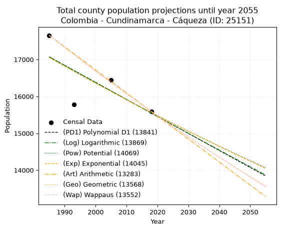
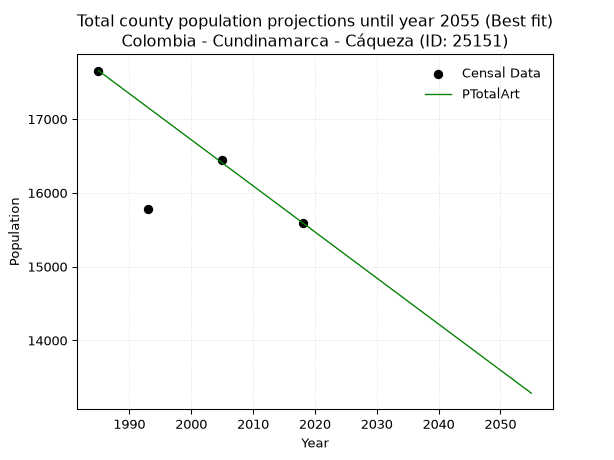
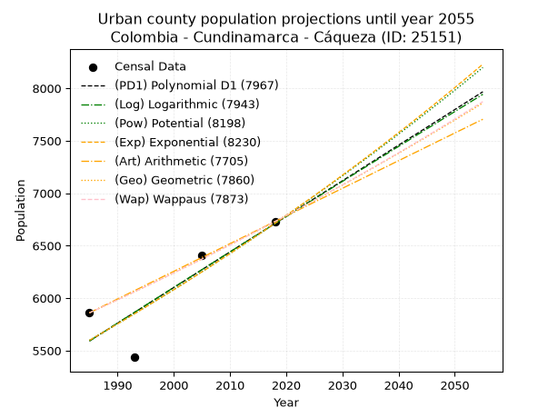
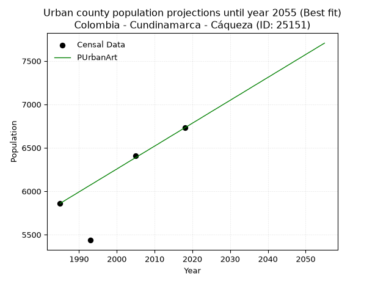
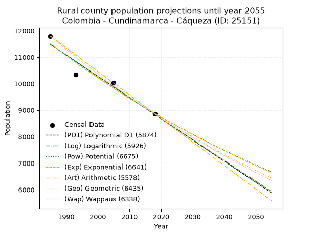
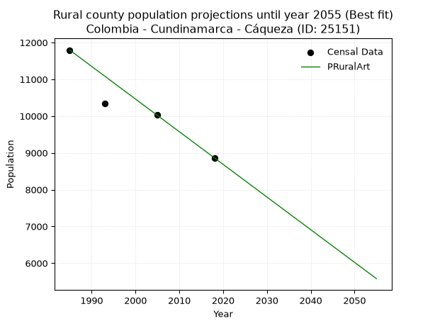

<div align="center">


</div>

# _“Population and Public Services Demand Projections (PPSD) until Year 2050 for Colombia - Cundinamarca - Caqueza (ID: 25151)”_
Keywords: `population` `public-service` `projection` `lineal` `polynomial` `logarithmic` `potential` `exponential` `arithmetic` `geometric` `wappaus` `dane` `colombia` `south-america`

PPSD are analytical estimates used by governments and planners to anticipate future changes in population size, age distribution, and the resulting community needs for utilities, healthcare, education, and infrastructure as sizing future water treatment facilities, electrical grids, and road networks based on spatial growth.

> **General running parameters**: • app_version: _v20260806_. • Python version: _3.14.7_. • Pandas version: _3.0.5_. • NumPy version: _2.5.1_. • Creates, save and include plots into reports (create_plot): _False_. • Projection until year: _2050_. • Process polynomial degree 2 and up: _False_. • Process Wappaus: _True_. • Process Wappaus: _True_. • Set negative values to zero: _True_. • Set infinite values to zero: _True_. • Drop dataset notes: _True_. 
<div align="center">

Dynamic map: [:earth_americas:Google](http://maps.google.com/maps?q=4.404111653,-73.9464733) [:earth_americas:OSM](https://www.openstreetmap.org/#map=18/4.404111653/-73.9464733&layers=P) [:earth_americas:Bing](https://www.bing.com/maps?cp=4.404111653~-73.9464733&lvl=18) [:earth_americas:Apple](https://maps.apple.com/frame?center=4.404111653%2C-73.9464733&span=0.003%2C0.006)

</div>


<div align="center">

```geojson
{
  "type": "Feature",
  "geometry": {
    "type": "Point", 
    "coordinates": [-73.9464733, 4.404111653]
  }, 
  "properties": {
    "Name": "Colombia - Cundinamarca - Caqueza (ID: 25151)"
  }
}
```

</div>


## 0. Census Data (4 records)

Census data are official statistics collected by a government about the people and housing in a country. They usually include counts of total population, age, sex, race, income, education, and jobs.

📅Global census file: [Population.xlsx](../data/Population.xlsx)

| Source   |   Year |   CountryID | CountryName   |   StateID | StateName    |   CountyID | CountyName   |   PTotal |   PUrban |   PRural |
|:---------|-------:|------------:|:--------------|----------:|:-------------|-----------:|:-------------|---------:|---------:|---------:|
| DANE     |   1985 |          57 | Colombia      |        25 | Cundinamarca |      25151 | Caqueza      |    17655 |     5860 |    11795 |
| DANE     |   1993 |          57 | Colombia      |        25 | Cundinamarca |      25151 | Cáqueza      |    15778 |     5436 |    10342 |
| DANE     |   2005 |          57 | Colombia      |        25 | Cundinamarca |      25151 | Caqueza      |    16442 |     6410 |    10032 |
| DANE     |   2018 |          57 | Colombia      |        25 | Cundinamarca |      25151 | Cáqueza      |    15594 |     6730 |     8864 |

> 🔥Some records has specific notes about the registered values or the corresponding urban or rural distribution.

## 1. Total

### 1.1. Coefficients and Parameters

* (PD1) Polynomial Deg 1: -46.144118827779366, 108667.02368526568 (lineal)
* (Log) Logarithmic: -92450.51647204907, 719084.3665559888
* (Pow) Potential: -5.5544027745915105, 22.54896275092602
* (Exp) Exponential: -0.0027724518277159036, 4186779.0004273243
* (Art) Arithmetic: Year diff. 2018 - 1985 = 33, Population diff. 15594 - 17655 = -2061, Annual growth = -62.45454545454545
* (Geo) Geometric: Year diff. 2018 - 1985 = 33, Population diff. 15594 - 17655 = -2061, Annual growth % = -0.0037545341809002153
* (Wap) Wappaus: i = -0.37567773740290206, Condition values only valid for < 200)

<sub>
Wappaus condition values: ['-0.00', '-0.38', '-0.75', '-1.13', '-1.50', '-1.88', '-2.25', '-2.63', '-3.01', '-3.38', '-3.76', '-4.13', '-4.51', '-4.88', '-5.26', '-5.64', '-6.01', '-6.39', '-6.76', '-7.14', '-7.51', '-7.89', '-8.26', '-8.64', '-9.02', '-9.39', '-9.77', '-10.14', '-10.52', '-10.89', '-11.27', '-11.65', '-12.02', '-12.40', '-12.77', '-13.15', '-13.52', '-13.90', '-14.28', '-14.65', '-15.03', '-15.40', '-15.78', '-16.15', '-16.53', '-16.91', '-17.28', '-17.66', '-18.03', '-18.41', '-18.78', '-19.16', '-19.54', '-19.91', '-20.29', '-20.66', '-21.04', '-21.41', '-21.79', '-22.16', '-22.54', '-22.92', '-23.29', '-23.67', '-24.04', '-24.42']
</sub>


### 1.2. Projected Dataset

|   Year |   CountyID |   PTotalPD1 |   PTotalLog |   PTotalPow |   PTotalExp |   PTotalArt |   PTotalGeo |   PTotalWap |
|-------:|-----------:|------------:|------------:|------------:|------------:|------------:|------------:|------------:|
|   1985 |      25151 |       17071 |       17073 |       17056 |       17054 |       17655 |       17655 |       17655 |
|   1986 |      25151 |       17025 |       17026 |       17008 |       17007 |       17593 |       17589 |       17589 |
|   1987 |      25151 |       16979 |       16980 |       16961 |       16959 |       17530 |       17523 |       17523 |
|   1988 |      25151 |       16933 |       16933 |       16913 |       16912 |       17468 |       17457 |       17457 |
|   1989 |      25151 |       16886 |       16887 |       16866 |       16866 |       17405 |       17391 |       17392 |
|   1990 |      25151 |       16840 |       16840 |       16819 |       16819 |       17343 |       17326 |       17326 |
|   1991 |      25151 |       16794 |       16794 |       16772 |       16772 |       17280 |       17261 |       17261 |
|   1992 |      25151 |       16748 |       16748 |       16726 |       16726 |       17218 |       17196 |       17197 |
|   1993 |      25151 |       16702 |       16701 |       16679 |       16680 |       17155 |       17132 |       17132 |
|   1994 |      25151 |       16656 |       16655 |       16633 |       16633 |       17093 |       17067 |       17068 |
|   1995 |      25151 |       16610 |       16608 |       16586 |       16587 |       17030 |       17003 |       17004 |
|   1996 |      25151 |       16563 |       16562 |       16540 |       16542 |       16968 |       16939 |       16940 |
|   1997 |      25151 |       16517 |       16516 |       16494 |       16496 |       16906 |       16876 |       16877 |
|   1998 |      25151 |       16471 |       16470 |       16448 |       16450 |       16843 |       16812 |       16813 |
|   1999 |      25151 |       16425 |       16423 |       16403 |       16405 |       16781 |       16749 |       16750 |
|   2000 |      25151 |       16379 |       16377 |       16357 |       16359 |       16718 |       16686 |       16687 |
|   2001 |      25151 |       16333 |       16331 |       16312 |       16314 |       16656 |       16624 |       16625 |
|   2002 |      25151 |       16286 |       16285 |       16267 |       16269 |       16593 |       16561 |       16562 |
|   2003 |      25151 |       16240 |       16238 |       16222 |       16224 |       16531 |       16499 |       16500 |
|   2004 |      25151 |       16194 |       16192 |       16177 |       16179 |       16468 |       16437 |       16438 |
|   2005 |      25151 |       16148 |       16146 |       16132 |       16134 |       16406 |       16376 |       16377 |
|   2006 |      25151 |       16102 |       16100 |       16087 |       16089 |       16343 |       16314 |       16315 |
|   2007 |      25151 |       16056 |       16054 |       16043 |       16045 |       16281 |       16253 |       16254 |
|   2008 |      25151 |       16010 |       16008 |       15999 |       16000 |       16219 |       16192 |       16193 |
|   2009 |      25151 |       15963 |       15962 |       15954 |       15956 |       16156 |       16131 |       16132 |
|   2010 |      25151 |       15917 |       15916 |       15910 |       15912 |       16094 |       16070 |       16071 |
|   2011 |      25151 |       15871 |       15870 |       15867 |       15868 |       16031 |       16010 |       16011 |
|   2012 |      25151 |       15825 |       15824 |       15823 |       15824 |       15969 |       15950 |       15951 |
|   2013 |      25151 |       15779 |       15778 |       15779 |       15780 |       15906 |       15890 |       15891 |
|   2014 |      25151 |       15733 |       15732 |       15736 |       15736 |       15844 |       15830 |       15831 |
|   2015 |      25151 |       15687 |       15686 |       15692 |       15693 |       15781 |       15771 |       15771 |
|   2016 |      25151 |       15640 |       15640 |       15649 |       15649 |       15719 |       15712 |       15712 |
|   2017 |      25151 |       15594 |       15595 |       15606 |       15606 |       15656 |       15653 |       15653 |
|   2018 |      25151 |       15548 |       15549 |       15563 |       15563 |       15594 |       15594 |       15594 |
|   2019 |      25151 |       15502 |       15503 |       15520 |       15520 |       15532 |       15535 |       15535 |
|   2020 |      25151 |       15456 |       15457 |       15478 |       15477 |       15469 |       15477 |       15477 |
|   2021 |      25151 |       15410 |       15411 |       15435 |       15434 |       15407 |       15419 |       15419 |
|   2022 |      25151 |       15364 |       15366 |       15393 |       15391 |       15344 |       15361 |       15360 |
|   2023 |      25151 |       15317 |       15320 |       15351 |       15348 |       15282 |       15303 |       15303 |
|   2024 |      25151 |       15271 |       15274 |       15309 |       15306 |       15219 |       15246 |       15245 |
|   2025 |      25151 |       15225 |       15229 |       15267 |       15264 |       15157 |       15189 |       15187 |
|   2026 |      25151 |       15179 |       15183 |       15225 |       15221 |       15094 |       15132 |       15130 |
|   2027 |      25151 |       15133 |       15137 |       15183 |       15179 |       15032 |       15075 |       15073 |
|   2028 |      25151 |       15087 |       15092 |       15142 |       15137 |       14969 |       15018 |       15016 |
|   2029 |      25151 |       15041 |       15046 |       15100 |       15095 |       14907 |       14962 |       14959 |
|   2030 |      25151 |       14994 |       15001 |       15059 |       15053 |       14845 |       14906 |       14903 |
|   2031 |      25151 |       14948 |       14955 |       15018 |       15012 |       14782 |       14850 |       14847 |
|   2032 |      25151 |       14902 |       14910 |       14977 |       14970 |       14720 |       14794 |       14791 |
|   2033 |      25151 |       14856 |       14864 |       14936 |       14929 |       14657 |       14738 |       14735 |
|   2034 |      25151 |       14810 |       14819 |       14895 |       14887 |       14595 |       14683 |       14679 |
|   2035 |      25151 |       14764 |       14773 |       14855 |       14846 |       14532 |       14628 |       14623 |
|   2036 |      25151 |       14718 |       14728 |       14814 |       14805 |       14470 |       14573 |       14568 |
|   2037 |      25151 |       14671 |       14682 |       14774 |       14764 |       14407 |       14518 |       14513 |
|   2038 |      25151 |       14625 |       14637 |       14734 |       14723 |       14345 |       14464 |       14458 |
|   2039 |      25151 |       14579 |       14592 |       14694 |       14683 |       14282 |       14410 |       14403 |
|   2040 |      25151 |       14533 |       14546 |       14654 |       14642 |       14220 |       14355 |       14349 |
|   2041 |      25151 |       14487 |       14501 |       14614 |       14601 |       14158 |       14302 |       14294 |
|   2042 |      25151 |       14441 |       14456 |       14574 |       14561 |       14095 |       14248 |       14240 |
|   2043 |      25151 |       14395 |       14410 |       14534 |       14521 |       14033 |       14194 |       14186 |
|   2044 |      25151 |       14348 |       14365 |       14495 |       14480 |       13970 |       14141 |       14132 |
|   2045 |      25151 |       14302 |       14320 |       14456 |       14440 |       13908 |       14088 |       14079 |
|   2046 |      25151 |       14256 |       14275 |       14416 |       14400 |       13845 |       14035 |       14025 |
|   2047 |      25151 |       14210 |       14230 |       14377 |       14360 |       13783 |       13982 |       13972 |
|   2048 |      25151 |       14164 |       14184 |       14338 |       14321 |       13720 |       13930 |       13919 |
|   2049 |      25151 |       14118 |       14139 |       14300 |       14281 |       13658 |       13878 |       13866 |
|   2050 |      25151 |       14072 |       14094 |       14261 |       14242 |       13595 |       13826 |       13813 |
<div align="center">

</img>

</div>


### 1.3. Best fit with absolute error and relative error (%)

Relative error puts that difference into context by dividing the absolute error by the true value, creating a unitless ratio or percentage that shows the scale of the mistake.

Absolute and relative error

|   Year | Source   |   CountryID | CountryName   |   StateID | StateName    |   CountyID_x | CountyName   |   PTotal |   PUrban |   PRural |   CountyID_y |   PTotalPD1 |   PTotalLog |   PTotalPow |   PTotalExp |   PTotalArt |   PTotalGeo |   PTotalWap |   PTotalPD1AbsError |   PTotalLogAbsError |   PTotalPowAbsError |   PTotalExpAbsError |   PTotalArtAbsError |   PTotalGeoAbsError |   PTotalWapAbsError |   PTotalPD1RelError |   PTotalLogRelError |   PTotalPowRelError |   PTotalExpRelError |   PTotalArtRelError |   PTotalGeoRelError |   PTotalWapRelError |
|-------:|:---------|------------:|:--------------|----------:|:-------------|-------------:|:-------------|---------:|---------:|---------:|-------------:|------------:|------------:|------------:|------------:|------------:|------------:|------------:|--------------------:|--------------------:|--------------------:|--------------------:|--------------------:|--------------------:|--------------------:|--------------------:|--------------------:|--------------------:|--------------------:|--------------------:|--------------------:|--------------------:|
|   1985 | DANE     |          57 | Colombia      |        25 | Cundinamarca |        25151 | Caqueza      |    17655 |     5860 |    11795 |        25151 |       17071 |       17073 |       17056 |       17054 |       17655 |       17655 |       17655 |                 584 |                 582 |                 599 |                 601 |                   0 |                   0 |                   0 |            3.30784  |            3.29652  |            3.39281  |            3.40413  |            0        |            0        |            0        |
|   1993 | DANE     |          57 | Colombia      |        25 | Cundinamarca |        25151 | Cáqueza      |    15778 |     5436 |    10342 |        25151 |       16702 |       16701 |       16679 |       16680 |       17155 |       17132 |       17132 |                 924 |                 923 |                 901 |                 902 |                1377 |                1354 |                1354 |            5.85626  |            5.84992  |            5.71048  |            5.71682  |            8.72734  |            8.58157  |            8.58157  |
|   2005 | DANE     |          57 | Colombia      |        25 | Cundinamarca |        25151 | Caqueza      |    16442 |     6410 |    10032 |        25151 |       16148 |       16146 |       16132 |       16134 |       16406 |       16376 |       16377 |                 294 |                 296 |                 310 |                 308 |                  36 |                  66 |                  65 |            1.7881   |            1.80027  |            1.88542  |            1.87325  |            0.218951 |            0.401411 |            0.395329 |
|   2018 | DANE     |          57 | Colombia      |        25 | Cundinamarca |        25151 | Cáqueza      |    15594 |     6730 |     8864 |        25151 |       15548 |       15549 |       15563 |       15563 |       15594 |       15594 |       15594 |                  46 |                  45 |                  31 |                  31 |                   0 |                   0 |                   0 |            0.294985 |            0.288573 |            0.198794 |            0.198794 |            0        |            0        |            0        |

Relative error mean

| Method    |   RelError | Best   |
|:----------|-----------:|:-------|
| PTotalPD1 |    2.8118  |        |
| PTotalLog |    2.80882 |        |
| PTotalPow |    2.79687 |        |
| PTotalExp |    2.79825 |        |
| PTotalArt |    2.23657 | True   |
| PTotalGeo |    2.24575 |        |
| PTotalWap |    2.24422 |        |

💙Best method: _**PTotalArt**_
<div align="center">

</img>

</div>


### 1.4. Fresh water supply demand in liters per capita per day (lpcd)

The fresh water supply demand typically ranges from 100 to 300 liters per capita per day (lpcd) for standard domestic and municipal planning, though absolute survival minimums set by the World Health Organization are as low as 7.5 to 20 liters per day, and total consumption in high-income nations can exceed 400 liters.

> `CZ`: Level in meters above the sea level (masl).<br> `WS`: Fresh water supply demand in liters per capita per day (lpcd or l/h/d).<br> `WSAll`: Zonal fresh water supply demand in liters per second (l/s).<br> `A`: Zonal area in square meters.

Reference values (RAS Colombia)

|    CZ |   WS |
|------:|-----:|
|  1000 |  120 |
|  2000 |  130 |
| 99999 |  140 |

County shapefile geometry properties and water supply values

|   CountyID |      ATotal |   CZTotal |   WSTotal |
|-----------:|------------:|----------:|----------:|
|      25151 | 1.11405e+08 |    2029.2 |       140 |

Projected values for best method: PTotalArt

|   CountyID |   Year |   PTotalArt |   WSTotal |   WSTotalAll |
|-----------:|-------:|------------:|----------:|-------------:|
|      25151 |   1985 |       17655 |       140 |      28.6076 |
|      25151 |   1986 |       17593 |       140 |      28.5072 |
|      25151 |   1987 |       17530 |       140 |      28.4051 |
|      25151 |   1988 |       17468 |       140 |      28.3046 |
|      25151 |   1989 |       17405 |       140 |      28.2025 |
|      25151 |   1990 |       17343 |       140 |      28.1021 |
|      25151 |   1991 |       17280 |       140 |      28      |
|      25151 |   1992 |       17218 |       140 |      27.8995 |
|      25151 |   1993 |       17155 |       140 |      27.7975 |
|      25151 |   1994 |       17093 |       140 |      27.697  |
|      25151 |   1995 |       17030 |       140 |      27.5949 |
|      25151 |   1996 |       16968 |       140 |      27.4944 |
|      25151 |   1997 |       16906 |       140 |      27.394  |
|      25151 |   1998 |       16843 |       140 |      27.2919 |
|      25151 |   1999 |       16781 |       140 |      27.1914 |
|      25151 |   2000 |       16718 |       140 |      27.0894 |
|      25151 |   2001 |       16656 |       140 |      26.9889 |
|      25151 |   2002 |       16593 |       140 |      26.8868 |
|      25151 |   2003 |       16531 |       140 |      26.7863 |
|      25151 |   2004 |       16468 |       140 |      26.6843 |
|      25151 |   2005 |       16406 |       140 |      26.5838 |
|      25151 |   2006 |       16343 |       140 |      26.4817 |
|      25151 |   2007 |       16281 |       140 |      26.3813 |
|      25151 |   2008 |       16219 |       140 |      26.2808 |
|      25151 |   2009 |       16156 |       140 |      26.1787 |
|      25151 |   2010 |       16094 |       140 |      26.0782 |
|      25151 |   2011 |       16031 |       140 |      25.9762 |
|      25151 |   2012 |       15969 |       140 |      25.8757 |
|      25151 |   2013 |       15906 |       140 |      25.7736 |
|      25151 |   2014 |       15844 |       140 |      25.6731 |
|      25151 |   2015 |       15781 |       140 |      25.5711 |
|      25151 |   2016 |       15719 |       140 |      25.4706 |
|      25151 |   2017 |       15656 |       140 |      25.3685 |
|      25151 |   2018 |       15594 |       140 |      25.2681 |
|      25151 |   2019 |       15532 |       140 |      25.1676 |
|      25151 |   2020 |       15469 |       140 |      25.0655 |
|      25151 |   2021 |       15407 |       140 |      24.965  |
|      25151 |   2022 |       15344 |       140 |      24.863  |
|      25151 |   2023 |       15282 |       140 |      24.7625 |
|      25151 |   2024 |       15219 |       140 |      24.6604 |
|      25151 |   2025 |       15157 |       140 |      24.56   |
|      25151 |   2026 |       15094 |       140 |      24.4579 |
|      25151 |   2027 |       15032 |       140 |      24.3574 |
|      25151 |   2028 |       14969 |       140 |      24.2553 |
|      25151 |   2029 |       14907 |       140 |      24.1549 |
|      25151 |   2030 |       14845 |       140 |      24.0544 |
|      25151 |   2031 |       14782 |       140 |      23.9523 |
|      25151 |   2032 |       14720 |       140 |      23.8519 |
|      25151 |   2033 |       14657 |       140 |      23.7498 |
|      25151 |   2034 |       14595 |       140 |      23.6493 |
|      25151 |   2035 |       14532 |       140 |      23.5472 |
|      25151 |   2036 |       14470 |       140 |      23.4468 |
|      25151 |   2037 |       14407 |       140 |      23.3447 |
|      25151 |   2038 |       14345 |       140 |      23.2442 |
|      25151 |   2039 |       14282 |       140 |      23.1421 |
|      25151 |   2040 |       14220 |       140 |      23.0417 |
|      25151 |   2041 |       14158 |       140 |      22.9412 |
|      25151 |   2042 |       14095 |       140 |      22.8391 |
|      25151 |   2043 |       14033 |       140 |      22.7387 |
|      25151 |   2044 |       13970 |       140 |      22.6366 |
|      25151 |   2045 |       13908 |       140 |      22.5361 |
|      25151 |   2046 |       13845 |       140 |      22.434  |
|      25151 |   2047 |       13783 |       140 |      22.3336 |
|      25151 |   2048 |       13720 |       140 |      22.2315 |
|      25151 |   2049 |       13658 |       140 |      22.131  |
|      25151 |   2050 |       13595 |       140 |      22.0289 |

## 2. Urban

### 2.1. Coefficients and Parameters

* (PD1) Polynomial Deg 1: 33.92854275391383, -61756.567643516144 (lineal)
* (Log) Logarithmic: 67872.46354832094, -509790.13932657597
* (Pow) Potential: 11.010616573500451, -32.562367783606454
* (Exp) Exponential: 0.0055041245026245566, 0.10071476375067209
* (Art) Arithmetic: Year diff. 2018 - 1985 = 33, Population diff. 6730 - 5860 = 870, Annual growth = 26.363636363636363
* (Geo) Geometric: Year diff. 2018 - 1985 = 33, Population diff. 6730 - 5860 = 870, Annual growth % = 0.004203523459709757
* (Wap) Wappaus: i = 0.41880280164632827, Condition values only valid for < 200)

<sub>
Wappaus condition values: ['0.00', '0.42', '0.84', '1.26', '1.68', '2.09', '2.51', '2.93', '3.35', '3.77', '4.19', '4.61', '5.03', '5.44', '5.86', '6.28', '6.70', '7.12', '7.54', '7.96', '8.38', '8.79', '9.21', '9.63', '10.05', '10.47', '10.89', '11.31', '11.73', '12.15', '12.56', '12.98', '13.40', '13.82', '14.24', '14.66', '15.08', '15.50', '15.91', '16.33', '16.75', '17.17', '17.59', '18.01', '18.43', '18.85', '19.26', '19.68', '20.10', '20.52', '20.94', '21.36', '21.78', '22.20', '22.62', '23.03', '23.45', '23.87', '24.29', '24.71', '25.13', '25.55', '25.97', '26.38', '26.80', '27.22']
</sub>


### 2.2. Projected Dataset

|   Year |   CountyID |   PUrbanPD1 |   PUrbanLog |   PUrbanPow |   PUrbanExp |   PUrbanArt |   PUrbanGeo |   PUrbanWap |
|-------:|-----------:|------------:|------------:|------------:|------------:|------------:|------------:|------------:|
|   1985 |      25151 |        5592 |        5591 |        5598 |        5598 |        5860 |        5860 |        5860 |
|   1986 |      25151 |        5626 |        5625 |        5629 |        5629 |        5886 |        5885 |        5885 |
|   1987 |      25151 |        5659 |        5659 |        5660 |        5660 |        5913 |        5909 |        5909 |
|   1988 |      25151 |        5693 |        5693 |        5692 |        5692 |        5939 |        5934 |        5934 |
|   1989 |      25151 |        5727 |        5728 |        5723 |        5723 |        5965 |        5959 |        5959 |
|   1990 |      25151 |        5761 |        5762 |        5755 |        5755 |        5992 |        5984 |        5984 |
|   1991 |      25151 |        5795 |        5796 |        5787 |        5786 |        6018 |        6009 |        6009 |
|   1992 |      25151 |        5829 |        5830 |        5819 |        5818 |        6045 |        6035 |        6034 |
|   1993 |      25151 |        5863 |        5864 |        5851 |        5850 |        6071 |        6060 |        6060 |
|   1994 |      25151 |        5897 |        5898 |        5884 |        5883 |        6097 |        6085 |        6085 |
|   1995 |      25151 |        5931 |        5932 |        5916 |        5915 |        6124 |        6111 |        6111 |
|   1996 |      25151 |        5965 |        5966 |        5949 |        5948 |        6150 |        6137 |        6136 |
|   1997 |      25151 |        5999 |        6000 |        5982 |        5981 |        6176 |        6163 |        6162 |
|   1998 |      25151 |        6033 |        6034 |        6015 |        6014 |        6203 |        6188 |        6188 |
|   1999 |      25151 |        6067 |        6068 |        6048 |        6047 |        6229 |        6214 |        6214 |
|   2000 |      25151 |        6101 |        6102 |        6081 |        6080 |        6255 |        6241 |        6240 |
|   2001 |      25151 |        6134 |        6136 |        6115 |        6114 |        6282 |        6267 |        6266 |
|   2002 |      25151 |        6168 |        6170 |        6149 |        6147 |        6308 |        6293 |        6293 |
|   2003 |      25151 |        6202 |        6204 |        6183 |        6181 |        6335 |        6320 |        6319 |
|   2004 |      25151 |        6236 |        6237 |        6217 |        6216 |        6361 |        6346 |        6346 |
|   2005 |      25151 |        6270 |        6271 |        6251 |        6250 |        6387 |        6373 |        6372 |
|   2006 |      25151 |        6304 |        6305 |        6285 |        6284 |        6414 |        6400 |        6399 |
|   2007 |      25151 |        6338 |        6339 |        6320 |        6319 |        6440 |        6427 |        6426 |
|   2008 |      25151 |        6372 |        6373 |        6355 |        6354 |        6466 |        6454 |        6453 |
|   2009 |      25151 |        6406 |        6407 |        6390 |        6389 |        6493 |        6481 |        6480 |
|   2010 |      25151 |        6440 |        6440 |        6425 |        6424 |        6519 |        6508 |        6507 |
|   2011 |      25151 |        6474 |        6474 |        6460 |        6460 |        6545 |        6535 |        6535 |
|   2012 |      25151 |        6508 |        6508 |        6496 |        6495 |        6572 |        6563 |        6562 |
|   2013 |      25151 |        6542 |        6542 |        6531 |        6531 |        6598 |        6590 |        6590 |
|   2014 |      25151 |        6576 |        6575 |        6567 |        6567 |        6625 |        6618 |        6618 |
|   2015 |      25151 |        6609 |        6609 |        6603 |        6603 |        6651 |        6646 |        6646 |
|   2016 |      25151 |        6643 |        6643 |        6639 |        6640 |        6677 |        6674 |        6674 |
|   2017 |      25151 |        6677 |        6676 |        6675 |        6677 |        6704 |        6702 |        6702 |
|   2018 |      25151 |        6711 |        6710 |        6712 |        6713 |        6730 |        6730 |        6730 |
|   2019 |      25151 |        6745 |        6744 |        6749 |        6750 |        6756 |        6758 |        6758 |
|   2020 |      25151 |        6779 |        6777 |        6786 |        6788 |        6783 |        6787 |        6787 |
|   2021 |      25151 |        6813 |        6811 |        6823 |        6825 |        6809 |        6815 |        6816 |
|   2022 |      25151 |        6847 |        6844 |        6860 |        6863 |        6835 |        6844 |        6844 |
|   2023 |      25151 |        6881 |        6878 |        6897 |        6901 |        6862 |        6873 |        6873 |
|   2024 |      25151 |        6915 |        6911 |        6935 |        6939 |        6888 |        6902 |        6902 |
|   2025 |      25151 |        6949 |        6945 |        6973 |        6977 |        6915 |        6931 |        6931 |
|   2026 |      25151 |        6983 |        6978 |        7011 |        7016 |        6941 |        6960 |        6961 |
|   2027 |      25151 |        7017 |        7012 |        7049 |        7054 |        6967 |        6989 |        6990 |
|   2028 |      25151 |        7051 |        7045 |        7087 |        7093 |        6994 |        7018 |        7020 |
|   2029 |      25151 |        7084 |        7079 |        7126 |        7132 |        7020 |        7048 |        7049 |
|   2030 |      25151 |        7118 |        7112 |        7165 |        7172 |        7046 |        7077 |        7079 |
|   2031 |      25151 |        7152 |        7146 |        7204 |        7211 |        7073 |        7107 |        7109 |
|   2032 |      25151 |        7186 |        7179 |        7243 |        7251 |        7099 |        7137 |        7139 |
|   2033 |      25151 |        7220 |        7213 |        7282 |        7291 |        7125 |        7167 |        7170 |
|   2034 |      25151 |        7254 |        7246 |        7322 |        7331 |        7152 |        7197 |        7200 |
|   2035 |      25151 |        7288 |        7279 |        7362 |        7372 |        7178 |        7227 |        7231 |
|   2036 |      25151 |        7322 |        7313 |        7401 |        7413 |        7205 |        7258 |        7261 |
|   2037 |      25151 |        7356 |        7346 |        7442 |        7453 |        7231 |        7288 |        7292 |
|   2038 |      25151 |        7390 |        7379 |        7482 |        7495 |        7257 |        7319 |        7323 |
|   2039 |      25151 |        7424 |        7413 |        7522 |        7536 |        7284 |        7350 |        7354 |
|   2040 |      25151 |        7458 |        7446 |        7563 |        7578 |        7310 |        7381 |        7385 |
|   2041 |      25151 |        7492 |        7479 |        7604 |        7619 |        7336 |        7412 |        7417 |
|   2042 |      25151 |        7526 |        7512 |        7645 |        7661 |        7363 |        7443 |        7448 |
|   2043 |      25151 |        7559 |        7546 |        7686 |        7704 |        7389 |        7474 |        7480 |
|   2044 |      25151 |        7593 |        7579 |        7728 |        7746 |        7415 |        7506 |        7512 |
|   2045 |      25151 |        7627 |        7612 |        7770 |        7789 |        7442 |        7537 |        7544 |
|   2046 |      25151 |        7661 |        7645 |        7812 |        7832 |        7468 |        7569 |        7576 |
|   2047 |      25151 |        7695 |        7678 |        7854 |        7875 |        7495 |        7601 |        7609 |
|   2048 |      25151 |        7729 |        7712 |        7896 |        7919 |        7521 |        7633 |        7641 |
|   2049 |      25151 |        7763 |        7745 |        7939 |        7962 |        7547 |        7665 |        7674 |
|   2050 |      25151 |        7797 |        7778 |        7981 |        8006 |        7574 |        7697 |        7707 |
<div align="center">

</img>

</div>


### 2.3. Best fit with absolute error and relative error (%)

Relative error puts that difference into context by dividing the absolute error by the true value, creating a unitless ratio or percentage that shows the scale of the mistake.

Absolute and relative error

|   Year | Source   |   CountryID | CountryName   |   StateID | StateName    |   CountyID_x | CountyName   |   PTotal |   PUrban |   PRural |   CountyID_y |   PUrbanPD1 |   PUrbanLog |   PUrbanPow |   PUrbanExp |   PUrbanArt |   PUrbanGeo |   PUrbanWap |   PUrbanPD1AbsError |   PUrbanLogAbsError |   PUrbanPowAbsError |   PUrbanExpAbsError |   PUrbanArtAbsError |   PUrbanGeoAbsError |   PUrbanWapAbsError |   PUrbanPD1RelError |   PUrbanLogRelError |   PUrbanPowRelError |   PUrbanExpRelError |   PUrbanArtRelError |   PUrbanGeoRelError |   PUrbanWapRelError |
|-------:|:---------|------------:|:--------------|----------:|:-------------|-------------:|:-------------|---------:|---------:|---------:|-------------:|------------:|------------:|------------:|------------:|------------:|------------:|------------:|--------------------:|--------------------:|--------------------:|--------------------:|--------------------:|--------------------:|--------------------:|--------------------:|--------------------:|--------------------:|--------------------:|--------------------:|--------------------:|--------------------:|
|   1985 | DANE     |          57 | Colombia      |        25 | Cundinamarca |        25151 | Caqueza      |    17655 |     5860 |    11795 |        25151 |        5592 |        5591 |        5598 |        5598 |        5860 |        5860 |        5860 |                 268 |                 269 |                 262 |                 262 |                   0 |                   0 |                   0 |            4.57338  |            4.59044  |            4.47099  |             4.47099 |            0        |            0        |            0        |
|   1993 | DANE     |          57 | Colombia      |        25 | Cundinamarca |        25151 | Cáqueza      |    15778 |     5436 |    10342 |        25151 |        5863 |        5864 |        5851 |        5850 |        6071 |        6060 |        6060 |                 427 |                 428 |                 415 |                 414 |                 635 |                 624 |                 624 |            7.85504  |            7.87344  |            7.63429  |             7.61589 |           11.6814   |           11.479    |           11.479    |
|   2005 | DANE     |          57 | Colombia      |        25 | Cundinamarca |        25151 | Caqueza      |    16442 |     6410 |    10032 |        25151 |        6270 |        6271 |        6251 |        6250 |        6387 |        6373 |        6372 |                 140 |                 139 |                 159 |                 160 |                  23 |                  37 |                  38 |            2.18409  |            2.16849  |            2.4805   |             2.4961  |            0.358814 |            0.577223 |            0.592824 |
|   2018 | DANE     |          57 | Colombia      |        25 | Cundinamarca |        25151 | Cáqueza      |    15594 |     6730 |     8864 |        25151 |        6711 |        6710 |        6712 |        6713 |        6730 |        6730 |        6730 |                  19 |                  20 |                  18 |                  17 |                   0 |                   0 |                   0 |            0.282318 |            0.297177 |            0.267459 |             0.2526  |            0        |            0        |            0        |

Relative error mean

| Method    |   RelError | Best   |
|:----------|-----------:|:-------|
| PUrbanPD1 |    3.72371 |        |
| PUrbanLog |    3.73239 |        |
| PUrbanPow |    3.71331 |        |
| PUrbanExp |    3.7089  |        |
| PUrbanArt |    3.01005 | True   |
| PUrbanGeo |    3.01406 |        |
| PUrbanWap |    3.01796 |        |

💙Best method: _**PUrbanArt**_
<div align="center">

</img>

</div>


### 2.4. Fresh water supply demand in liters per capita per day (lpcd)

The fresh water supply demand typically ranges from 100 to 300 liters per capita per day (lpcd) for standard domestic and municipal planning, though absolute survival minimums set by the World Health Organization are as low as 7.5 to 20 liters per day, and total consumption in high-income nations can exceed 400 liters.

> `CZ`: Level in meters above the sea level (masl).<br> `WS`: Fresh water supply demand in liters per capita per day (lpcd or l/h/d).<br> `WSAll`: Zonal fresh water supply demand in liters per second (l/s).<br> `A`: Zonal area in square meters.

Reference values (RAS Colombia)

|    CZ |   WS |
|------:|-----:|
|  1000 |  120 |
|  2000 |  130 |
| 99999 |  140 |

County shapefile geometry properties and water supply values

|   CountyID |   AUrban |   CZUrban |   WSUrban |
|-----------:|---------:|----------:|----------:|
|      25151 |   943566 |   1706.87 |       130 |

Projected values for best method: PUrbanArt

|   CountyID |   Year |   PUrbanArt |   WSUrban |   WSUrbanAll |
|-----------:|-------:|------------:|----------:|-------------:|
|      25151 |   1985 |        5860 |       130 |      8.81713 |
|      25151 |   1986 |        5886 |       130 |      8.85625 |
|      25151 |   1987 |        5913 |       130 |      8.89687 |
|      25151 |   1988 |        5939 |       130 |      8.936   |
|      25151 |   1989 |        5965 |       130 |      8.97512 |
|      25151 |   1990 |        5992 |       130 |      9.01574 |
|      25151 |   1991 |        6018 |       130 |      9.05486 |
|      25151 |   1992 |        6045 |       130 |      9.09549 |
|      25151 |   1993 |        6071 |       130 |      9.13461 |
|      25151 |   1994 |        6097 |       130 |      9.17373 |
|      25151 |   1995 |        6124 |       130 |      9.21435 |
|      25151 |   1996 |        6150 |       130 |      9.25347 |
|      25151 |   1997 |        6176 |       130 |      9.29259 |
|      25151 |   1998 |        6203 |       130 |      9.33322 |
|      25151 |   1999 |        6229 |       130 |      9.37234 |
|      25151 |   2000 |        6255 |       130 |      9.41146 |
|      25151 |   2001 |        6282 |       130 |      9.45208 |
|      25151 |   2002 |        6308 |       130 |      9.4912  |
|      25151 |   2003 |        6335 |       130 |      9.53183 |
|      25151 |   2004 |        6361 |       130 |      9.57095 |
|      25151 |   2005 |        6387 |       130 |      9.61007 |
|      25151 |   2006 |        6414 |       130 |      9.65069 |
|      25151 |   2007 |        6440 |       130 |      9.68981 |
|      25151 |   2008 |        6466 |       130 |      9.72894 |
|      25151 |   2009 |        6493 |       130 |      9.76956 |
|      25151 |   2010 |        6519 |       130 |      9.80868 |
|      25151 |   2011 |        6545 |       130 |      9.8478  |
|      25151 |   2012 |        6572 |       130 |      9.88843 |
|      25151 |   2013 |        6598 |       130 |      9.92755 |
|      25151 |   2014 |        6625 |       130 |      9.96817 |
|      25151 |   2015 |        6651 |       130 |     10.0073  |
|      25151 |   2016 |        6677 |       130 |     10.0464  |
|      25151 |   2017 |        6704 |       130 |     10.087   |
|      25151 |   2018 |        6730 |       130 |     10.1262  |
|      25151 |   2019 |        6756 |       130 |     10.1653  |
|      25151 |   2020 |        6783 |       130 |     10.2059  |
|      25151 |   2021 |        6809 |       130 |     10.245   |
|      25151 |   2022 |        6835 |       130 |     10.2841  |
|      25151 |   2023 |        6862 |       130 |     10.3248  |
|      25151 |   2024 |        6888 |       130 |     10.3639  |
|      25151 |   2025 |        6915 |       130 |     10.4045  |
|      25151 |   2026 |        6941 |       130 |     10.4436  |
|      25151 |   2027 |        6967 |       130 |     10.4828  |
|      25151 |   2028 |        6994 |       130 |     10.5234  |
|      25151 |   2029 |        7020 |       130 |     10.5625  |
|      25151 |   2030 |        7046 |       130 |     10.6016  |
|      25151 |   2031 |        7073 |       130 |     10.6422  |
|      25151 |   2032 |        7099 |       130 |     10.6814  |
|      25151 |   2033 |        7125 |       130 |     10.7205  |
|      25151 |   2034 |        7152 |       130 |     10.7611  |
|      25151 |   2035 |        7178 |       130 |     10.8002  |
|      25151 |   2036 |        7205 |       130 |     10.8409  |
|      25151 |   2037 |        7231 |       130 |     10.88    |
|      25151 |   2038 |        7257 |       130 |     10.9191  |
|      25151 |   2039 |        7284 |       130 |     10.9597  |
|      25151 |   2040 |        7310 |       130 |     10.9988  |
|      25151 |   2041 |        7336 |       130 |     11.038   |
|      25151 |   2042 |        7363 |       130 |     11.0786  |
|      25151 |   2043 |        7389 |       130 |     11.1177  |
|      25151 |   2044 |        7415 |       130 |     11.1568  |
|      25151 |   2045 |        7442 |       130 |     11.1975  |
|      25151 |   2046 |        7468 |       130 |     11.2366  |
|      25151 |   2047 |        7495 |       130 |     11.2772  |
|      25151 |   2048 |        7521 |       130 |     11.3163  |
|      25151 |   2049 |        7547 |       130 |     11.3554  |
|      25151 |   2050 |        7574 |       130 |     11.3961  |

## 3. Rural

### 3.1. Coefficients and Parameters

* (PD1) Polynomial Deg 1: -80.07266158169338, 170423.59132878217 (lineal)
* (Log) Logarithmic: -160322.98002037013, 1228874.5058825654
* (Pow) Potential: -15.709411389337214, 55.86678829079499
* (Exp) Exponential: -0.007846935570218365, 66902684377.091866
* (Art) Arithmetic: Year diff. 2018 - 1985 = 33, Population diff. 8864 - 11795 = -2931, Annual growth = -88.81818181818181
* (Geo) Geometric: Year diff. 2018 - 1985 = 33, Population diff. 8864 - 11795 = -2931, Annual growth % = -0.008619533415776037
* (Wap) Wappaus: i = -0.8598497683158122, Condition values only valid for < 200)

<sub>
Wappaus condition values: ['-0.00', '-0.86', '-1.72', '-2.58', '-3.44', '-4.30', '-5.16', '-6.02', '-6.88', '-7.74', '-8.60', '-9.46', '-10.32', '-11.18', '-12.04', '-12.90', '-13.76', '-14.62', '-15.48', '-16.34', '-17.20', '-18.06', '-18.92', '-19.78', '-20.64', '-21.50', '-22.36', '-23.22', '-24.08', '-24.94', '-25.80', '-26.66', '-27.52', '-28.38', '-29.23', '-30.09', '-30.95', '-31.81', '-32.67', '-33.53', '-34.39', '-35.25', '-36.11', '-36.97', '-37.83', '-38.69', '-39.55', '-40.41', '-41.27', '-42.13', '-42.99', '-43.85', '-44.71', '-45.57', '-46.43', '-47.29', '-48.15', '-49.01', '-49.87', '-50.73', '-51.59', '-52.45', '-53.31', '-54.17', '-55.03', '-55.89']
</sub>


### 3.2. Projected Dataset

|   Year |   CountyID |   PRuralPD1 |   PRuralLog |   PRuralPow |   PRuralExp |   PRuralArt |   PRuralGeo |   PRuralWap |
|-------:|-----------:|------------:|------------:|------------:|------------:|------------:|------------:|------------:|
|   1985 |      25151 |       11479 |       11482 |       11506 |       11503 |       11795 |       11795 |       11795 |
|   1986 |      25151 |       11399 |       11401 |       11415 |       11413 |       11706 |       11693 |       11694 |
|   1987 |      25151 |       11319 |       11321 |       11325 |       11324 |       11617 |       11593 |       11594 |
|   1988 |      25151 |       11239 |       11240 |       11236 |       11235 |       11529 |       11493 |       11495 |
|   1989 |      25151 |       11159 |       11159 |       11147 |       11147 |       11440 |       11394 |       11396 |
|   1990 |      25151 |       11079 |       11079 |       11060 |       11060 |       11351 |       11295 |       11299 |
|   1991 |      25151 |       10999 |       10998 |       10973 |       10974 |       11262 |       11198 |       11202 |
|   1992 |      25151 |       10919 |       10918 |       10887 |       10888 |       11173 |       11101 |       11106 |
|   1993 |      25151 |       10839 |       10837 |       10801 |       10803 |       11084 |       11006 |       11011 |
|   1994 |      25151 |       10759 |       10757 |       10716 |       10718 |       10996 |       10911 |       10916 |
|   1995 |      25151 |       10679 |       10676 |       10632 |       10635 |       10907 |       10817 |       10823 |
|   1996 |      25151 |       10599 |       10596 |       10549 |       10551 |       10818 |       10724 |       10730 |
|   1997 |      25151 |       10518 |       10516 |       10466 |       10469 |       10729 |       10631 |       10638 |
|   1998 |      25151 |       10438 |       10436 |       10384 |       10387 |       10640 |       10540 |       10546 |
|   1999 |      25151 |       10358 |       10355 |       10303 |       10306 |       10552 |       10449 |       10456 |
|   2000 |      25151 |       10278 |       10275 |       10222 |       10225 |       10463 |       10359 |       10366 |
|   2001 |      25151 |       10198 |       10195 |       10142 |       10146 |       10374 |       10269 |       10277 |
|   2002 |      25151 |       10118 |       10115 |       10063 |       10066 |       10285 |       10181 |       10188 |
|   2003 |      25151 |       10038 |       10035 |        9984 |        9988 |       10196 |       10093 |       10101 |
|   2004 |      25151 |        9958 |        9955 |        9906 |        9909 |       10107 |       10006 |       10014 |
|   2005 |      25151 |        9878 |        9875 |        9829 |        9832 |       10019 |        9920 |        9927 |
|   2006 |      25151 |        9798 |        9795 |        9752 |        9755 |        9930 |        9834 |        9842 |
|   2007 |      25151 |        9718 |        9715 |        9676 |        9679 |        9841 |        9750 |        9757 |
|   2008 |      25151 |        9638 |        9635 |        9601 |        9603 |        9752 |        9666 |        9672 |
|   2009 |      25151 |        9558 |        9555 |        9526 |        9528 |        9663 |        9582 |        9589 |
|   2010 |      25151 |        9478 |        9476 |        9452 |        9454 |        9575 |        9500 |        9506 |
|   2011 |      25151 |        9397 |        9396 |        9378 |        9380 |        9486 |        9418 |        9423 |
|   2012 |      25151 |        9317 |        9316 |        9305 |        9307 |        9397 |        9337 |        9341 |
|   2013 |      25151 |        9237 |        9236 |        9233 |        9234 |        9308 |        9256 |        9260 |
|   2014 |      25151 |        9157 |        9157 |        9161 |        9162 |        9219 |        9176 |        9180 |
|   2015 |      25151 |        9077 |        9077 |        9090 |        9090 |        9130 |        9097 |        9100 |
|   2016 |      25151 |        8997 |        8998 |        9020 |        9019 |        9042 |        9019 |        9021 |
|   2017 |      25151 |        8917 |        8918 |        8950 |        8948 |        8953 |        8941 |        8942 |
|   2018 |      25151 |        8837 |        8839 |        8880 |        8879 |        8864 |        8864 |        8864 |
|   2019 |      25151 |        8757 |        8759 |        8811 |        8809 |        8775 |        8788 |        8787 |
|   2020 |      25151 |        8677 |        8680 |        8743 |        8740 |        8686 |        8712 |        8710 |
|   2021 |      25151 |        8597 |        8601 |        8675 |        8672 |        8598 |        8637 |        8633 |
|   2022 |      25151 |        8517 |        8521 |        8608 |        8604 |        8509 |        8562 |        8557 |
|   2023 |      25151 |        8437 |        8442 |        8542 |        8537 |        8420 |        8489 |        8482 |
|   2024 |      25151 |        8357 |        8363 |        8476 |        8470 |        8331 |        8415 |        8408 |
|   2025 |      25151 |        8276 |        8284 |        8410 |        8404 |        8242 |        8343 |        8334 |
|   2026 |      25151 |        8196 |        8204 |        8345 |        8338 |        8153 |        8271 |        8260 |
|   2027 |      25151 |        8116 |        8125 |        8281 |        8273 |        8065 |        8200 |        8187 |
|   2028 |      25151 |        8036 |        8046 |        8217 |        8208 |        7976 |        8129 |        8114 |
|   2029 |      25151 |        7956 |        7967 |        8153 |        8144 |        7887 |        8059 |        8042 |
|   2030 |      25151 |        7876 |        7888 |        8090 |        8081 |        7798 |        7989 |        7971 |
|   2031 |      25151 |        7796 |        7809 |        8028 |        8017 |        7709 |        7921 |        7900 |
|   2032 |      25151 |        7716 |        7730 |        7966 |        7955 |        7621 |        7852 |        7830 |
|   2033 |      25151 |        7636 |        7651 |        7905 |        7893 |        7532 |        7785 |        7760 |
|   2034 |      25151 |        7556 |        7573 |        7844 |        7831 |        7443 |        7717 |        7690 |
|   2035 |      25151 |        7476 |        7494 |        7784 |        7770 |        7354 |        7651 |        7621 |
|   2036 |      25151 |        7396 |        7415 |        7724 |        7709 |        7265 |        7585 |        7553 |
|   2037 |      25151 |        7316 |        7336 |        7665 |        7649 |        7176 |        7520 |        7485 |
|   2038 |      25151 |        7236 |        7258 |        7606 |        7589 |        7088 |        7455 |        7417 |
|   2039 |      25151 |        7155 |        7179 |        7547 |        7530 |        6999 |        7391 |        7350 |
|   2040 |      25151 |        7075 |        7100 |        7489 |        7471 |        6910 |        7327 |        7284 |
|   2041 |      25151 |        6995 |        7022 |        7432 |        7412 |        6821 |        7264 |        7218 |
|   2042 |      25151 |        6915 |        6943 |        7375 |        7354 |        6732 |        7201 |        7152 |
|   2043 |      25151 |        6835 |        6865 |        7318 |        7297 |        6644 |        7139 |        7087 |
|   2044 |      25151 |        6755 |        6786 |        7262 |        7240 |        6555 |        7077 |        7022 |
|   2045 |      25151 |        6675 |        6708 |        7207 |        7183 |        6466 |        7016 |        6958 |
|   2046 |      25151 |        6595 |        6630 |        7152 |        7127 |        6377 |        6956 |        6894 |
|   2047 |      25151 |        6515 |        6551 |        7097 |        7071 |        6288 |        6896 |        6830 |
|   2048 |      25151 |        6435 |        6473 |        7043 |        7016 |        6199 |        6837 |        6767 |
|   2049 |      25151 |        6355 |        6395 |        6989 |        6961 |        6111 |        6778 |        6705 |
|   2050 |      25151 |        6275 |        6316 |        6936 |        6907 |        6022 |        6719 |        6643 |
<div align="center">

</img>

</div>


### 3.3. Best fit with absolute error and relative error (%)

Relative error puts that difference into context by dividing the absolute error by the true value, creating a unitless ratio or percentage that shows the scale of the mistake.

Absolute and relative error

|   Year | Source   |   CountryID | CountryName   |   StateID | StateName    |   CountyID_x | CountyName   |   PTotal |   PUrban |   PRural |   CountyID_y |   PRuralPD1 |   PRuralLog |   PRuralPow |   PRuralExp |   PRuralArt |   PRuralGeo |   PRuralWap |   PRuralPD1AbsError |   PRuralLogAbsError |   PRuralPowAbsError |   PRuralExpAbsError |   PRuralArtAbsError |   PRuralGeoAbsError |   PRuralWapAbsError |   PRuralPD1RelError |   PRuralLogRelError |   PRuralPowRelError |   PRuralExpRelError |   PRuralArtRelError |   PRuralGeoRelError |   PRuralWapRelError |
|-------:|:---------|------------:|:--------------|----------:|:-------------|-------------:|:-------------|---------:|---------:|---------:|-------------:|------------:|------------:|------------:|------------:|------------:|------------:|------------:|--------------------:|--------------------:|--------------------:|--------------------:|--------------------:|--------------------:|--------------------:|--------------------:|--------------------:|--------------------:|--------------------:|--------------------:|--------------------:|--------------------:|
|   1985 | DANE     |          57 | Colombia      |        25 | Cundinamarca |        25151 | Caqueza      |    17655 |     5860 |    11795 |        25151 |       11479 |       11482 |       11506 |       11503 |       11795 |       11795 |       11795 |                 316 |                 313 |                 289 |                 292 |                   0 |                   0 |                   0 |            2.6791   |             2.65367 |            2.45019  |            2.47563  |            0        |             0       |             0       |
|   1993 | DANE     |          57 | Colombia      |        25 | Cundinamarca |        25151 | Cáqueza      |    15778 |     5436 |    10342 |        25151 |       10839 |       10837 |       10801 |       10803 |       11084 |       11006 |       11011 |                 497 |                 495 |                 459 |                 461 |                 742 |                 664 |                 669 |            4.80565  |             4.78631 |            4.43821  |            4.45755  |            7.17463  |             6.42042 |             6.46877 |
|   2005 | DANE     |          57 | Colombia      |        25 | Cundinamarca |        25151 | Caqueza      |    16442 |     6410 |    10032 |        25151 |        9878 |        9875 |        9829 |        9832 |       10019 |        9920 |        9927 |                 154 |                 157 |                 203 |                 200 |                  13 |                 112 |                 105 |            1.53509  |             1.56499 |            2.02352  |            1.99362  |            0.129585 |             1.11643 |             1.04665 |
|   2018 | DANE     |          57 | Colombia      |        25 | Cundinamarca |        25151 | Cáqueza      |    15594 |     6730 |     8864 |        25151 |        8837 |        8839 |        8880 |        8879 |        8864 |        8864 |        8864 |                  27 |                  25 |                  16 |                  15 |                   0 |                   0 |                   0 |            0.304603 |             0.28204 |            0.180505 |            0.169224 |            0        |             0       |             0       |

Relative error mean

| Method    |   RelError | Best   |
|:----------|-----------:|:-------|
| PRuralPD1 |    2.33111 |        |
| PRuralLog |    2.32175 |        |
| PRuralPow |    2.27311 |        |
| PRuralExp |    2.27401 |        |
| PRuralArt |    1.82605 | True   |
| PRuralGeo |    1.88421 |        |
| PRuralWap |    1.87885 |        |

💙Best method: _**PRuralArt**_
<div align="center">

</img>

</div>


### 3.4. Fresh water supply demand in liters per capita per day (lpcd)

The fresh water supply demand typically ranges from 100 to 300 liters per capita per day (lpcd) for standard domestic and municipal planning, though absolute survival minimums set by the World Health Organization are as low as 7.5 to 20 liters per day, and total consumption in high-income nations can exceed 400 liters.

> `CZ`: Level in meters above the sea level (masl).<br> `WS`: Fresh water supply demand in liters per capita per day (lpcd or l/h/d).<br> `WSAll`: Zonal fresh water supply demand in liters per second (l/s).<br> `A`: Zonal area in square meters.

Reference values (RAS Colombia)

|    CZ |   WS |
|------:|-----:|
|  1000 |  120 |
|  2000 |  130 |
| 99999 |  140 |

County shapefile geometry properties and water supply values

|   CountyID |      ARural |   CZRural |   WSRural |
|-----------:|------------:|----------:|----------:|
|      25151 | 1.10462e+08 |   2031.95 |       140 |

Projected values for best method: PRuralArt

|   CountyID |   Year |   PRuralArt |   WSRural |   WSRuralAll |
|-----------:|-------:|------------:|----------:|-------------:|
|      25151 |   1985 |       11795 |       140 |     19.1123  |
|      25151 |   1986 |       11706 |       140 |     18.9681  |
|      25151 |   1987 |       11617 |       140 |     18.8238  |
|      25151 |   1988 |       11529 |       140 |     18.6812  |
|      25151 |   1989 |       11440 |       140 |     18.537   |
|      25151 |   1990 |       11351 |       140 |     18.3928  |
|      25151 |   1991 |       11262 |       140 |     18.2486  |
|      25151 |   1992 |       11173 |       140 |     18.1044  |
|      25151 |   1993 |       11084 |       140 |     17.9602  |
|      25151 |   1994 |       10996 |       140 |     17.8176  |
|      25151 |   1995 |       10907 |       140 |     17.6734  |
|      25151 |   1996 |       10818 |       140 |     17.5292  |
|      25151 |   1997 |       10729 |       140 |     17.385   |
|      25151 |   1998 |       10640 |       140 |     17.2407  |
|      25151 |   1999 |       10552 |       140 |     17.0981  |
|      25151 |   2000 |       10463 |       140 |     16.9539  |
|      25151 |   2001 |       10374 |       140 |     16.8097  |
|      25151 |   2002 |       10285 |       140 |     16.6655  |
|      25151 |   2003 |       10196 |       140 |     16.5213  |
|      25151 |   2004 |       10107 |       140 |     16.3771  |
|      25151 |   2005 |       10019 |       140 |     16.2345  |
|      25151 |   2006 |        9930 |       140 |     16.0903  |
|      25151 |   2007 |        9841 |       140 |     15.9461  |
|      25151 |   2008 |        9752 |       140 |     15.8019  |
|      25151 |   2009 |        9663 |       140 |     15.6576  |
|      25151 |   2010 |        9575 |       140 |     15.515   |
|      25151 |   2011 |        9486 |       140 |     15.3708  |
|      25151 |   2012 |        9397 |       140 |     15.2266  |
|      25151 |   2013 |        9308 |       140 |     15.0824  |
|      25151 |   2014 |        9219 |       140 |     14.9382  |
|      25151 |   2015 |        9130 |       140 |     14.794   |
|      25151 |   2016 |        9042 |       140 |     14.6514  |
|      25151 |   2017 |        8953 |       140 |     14.5072  |
|      25151 |   2018 |        8864 |       140 |     14.363   |
|      25151 |   2019 |        8775 |       140 |     14.2188  |
|      25151 |   2020 |        8686 |       140 |     14.0745  |
|      25151 |   2021 |        8598 |       140 |     13.9319  |
|      25151 |   2022 |        8509 |       140 |     13.7877  |
|      25151 |   2023 |        8420 |       140 |     13.6435  |
|      25151 |   2024 |        8331 |       140 |     13.4993  |
|      25151 |   2025 |        8242 |       140 |     13.3551  |
|      25151 |   2026 |        8153 |       140 |     13.2109  |
|      25151 |   2027 |        8065 |       140 |     13.0683  |
|      25151 |   2028 |        7976 |       140 |     12.9241  |
|      25151 |   2029 |        7887 |       140 |     12.7799  |
|      25151 |   2030 |        7798 |       140 |     12.6356  |
|      25151 |   2031 |        7709 |       140 |     12.4914  |
|      25151 |   2032 |        7621 |       140 |     12.3488  |
|      25151 |   2033 |        7532 |       140 |     12.2046  |
|      25151 |   2034 |        7443 |       140 |     12.0604  |
|      25151 |   2035 |        7354 |       140 |     11.9162  |
|      25151 |   2036 |        7265 |       140 |     11.772   |
|      25151 |   2037 |        7176 |       140 |     11.6278  |
|      25151 |   2038 |        7088 |       140 |     11.4852  |
|      25151 |   2039 |        6999 |       140 |     11.341   |
|      25151 |   2040 |        6910 |       140 |     11.1968  |
|      25151 |   2041 |        6821 |       140 |     11.0525  |
|      25151 |   2042 |        6732 |       140 |     10.9083  |
|      25151 |   2043 |        6644 |       140 |     10.7657  |
|      25151 |   2044 |        6555 |       140 |     10.6215  |
|      25151 |   2045 |        6466 |       140 |     10.4773  |
|      25151 |   2046 |        6377 |       140 |     10.3331  |
|      25151 |   2047 |        6288 |       140 |     10.1889  |
|      25151 |   2048 |        6199 |       140 |     10.0447  |
|      25151 |   2049 |        6111 |       140 |      9.90208 |
|      25151 |   2050 |        6022 |       140 |      9.75787 |

<div align="center"><br><sub>Share this research</sub></div><br>

<sub>**APPS & TOOLS & CONTENT DISCLAIMER**: • NO WARRANTY - This content and software is provided by <a href="https://github.com/rcfdtools" target="_blank">github.com/rcfdtools</a> "as is", without any express or implied warranty, including warranties of merchantability, fitness for a particular purpose, or non-infringement. There is no guarantee that the software will be error-free or operate without interruption. • LIMITATION OF LIABILITY - Neither the authors nor copyright holders will be liable for claims or damages arising from the software or its use. You are responsible for determining if the software is appropriate for your use and assume all associated risks, including errors, legal compliance, and data loss. • NO PROFESSIONAL ADVICE - The software provides general information and does not offer professional advice. It should not replace consultation with professional advisors. [Clauses and global license for rcfdtools use.](https://github.com/rcfdtools/rcfdtools/blob/main/LICENSE.md)</sub>