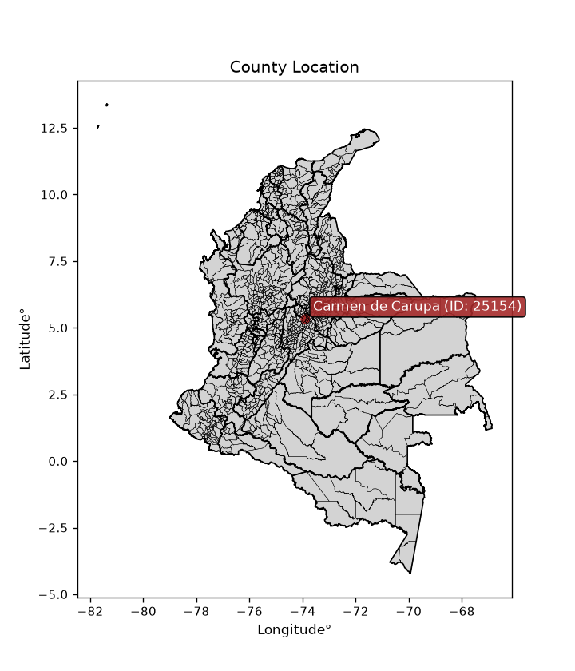
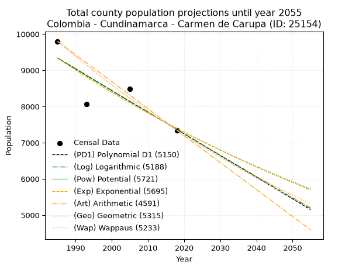
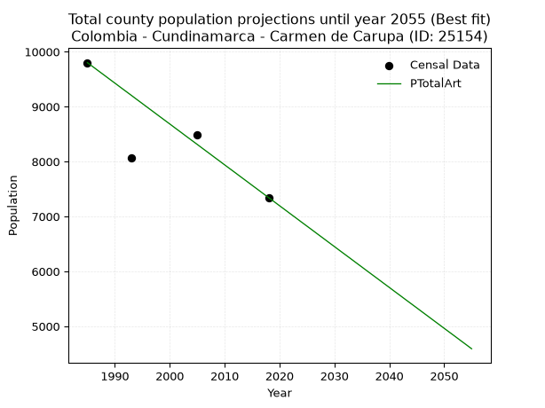
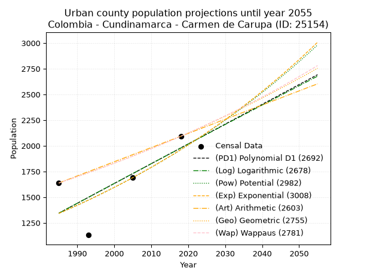
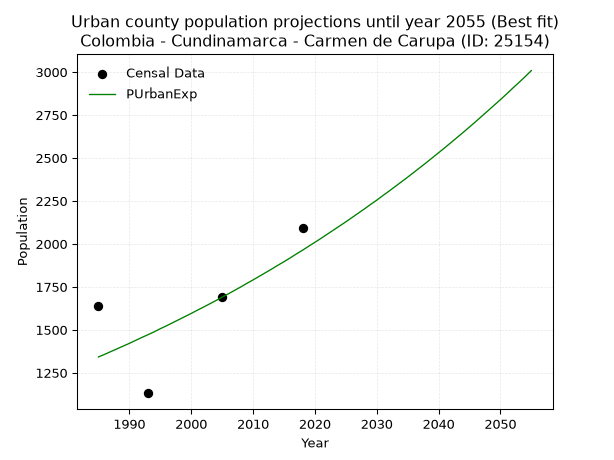
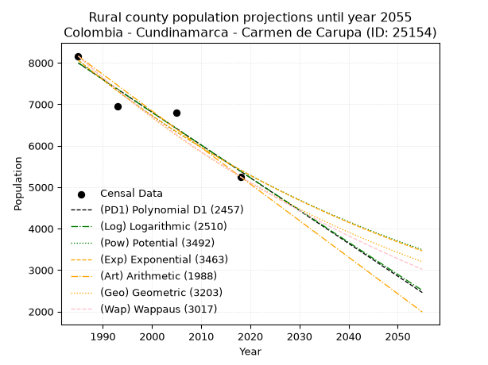
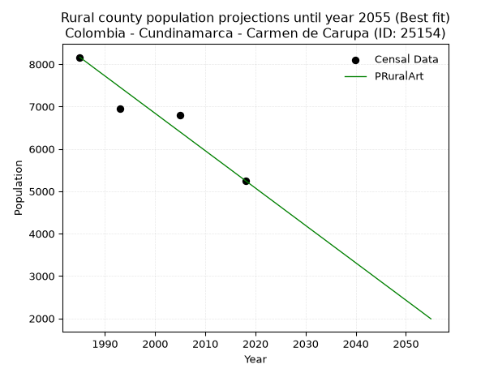

<div align="center">


</div>

# _“Population and Public Services Demand Projections (PPSD) until Year 2050 for Colombia - Cundinamarca - Carmen de Carupa (ID: 25154)”_
Keywords: `population` `public-service` `projection` `lineal` `polynomial` `logarithmic` `potential` `exponential` `arithmetic` `geometric` `wappaus` `dane` `colombia` `south-america`

PPSD are analytical estimates used by governments and planners to anticipate future changes in population size, age distribution, and the resulting community needs for utilities, healthcare, education, and infrastructure as sizing future water treatment facilities, electrical grids, and road networks based on spatial growth.

<div align="center">

</img>

</div>


> **General running parameters**: • app_version: _v20260806_. • Python version: _3.14.7_. • Pandas version: _3.0.5_. • NumPy version: _2.5.1_. • Creates, save and include plots into reports (create_plot): _False_. • Projection until year: _2050_. • Process polynomial degree 2 and up: _False_. • Process Wappaus: _True_. • Process Wappaus: _True_. • Set negative values to zero: _True_. • Set infinite values to zero: _True_. • Drop dataset notes: _True_. 
<div align="center">

Dynamic map: [:earth_americas:Google](http://maps.google.com/maps?q=5.34911852,-73.9013567) [:earth_americas:OSM](https://www.openstreetmap.org/#map=18/5.34911852/-73.9013567&layers=P) [:earth_americas:Bing](https://www.bing.com/maps?cp=5.34911852~-73.9013567&lvl=18) [:earth_americas:Apple](https://maps.apple.com/frame?center=5.34911852%2C-73.9013567&span=0.003%2C0.006)

</div>


<div align="center">

```geojson
{
  "type": "Feature",
  "geometry": {
    "type": "Point", 
    "coordinates": [-73.9013567, 5.34911852]
  }, 
  "properties": {
    "Name": "Colombia - Cundinamarca - Carmen de Carupa (ID: 25154)"
  }
}
```

</div>


## 0. Census Data (4 records)

Census data are official statistics collected by a government about the people and housing in a country. They usually include counts of total population, age, sex, race, income, education, and jobs.

📅Global census file: [Population.xlsx](../data/Population.xlsx)

| Source   |   Year |   CountryID | CountryName   |   StateID | StateName    |   CountyID | CountyName       |   PTotal |   PUrban |   PRural |
|:---------|-------:|------------:|:--------------|----------:|:-------------|-----------:|:-----------------|---------:|---------:|---------:|
| DANE     |   1985 |          57 | Colombia      |        25 | Cundinamarca |      25154 | Carmen de Carupa |     9801 |     1638 |     8163 |
| DANE     |   1993 |          57 | Colombia      |        25 | Cundinamarca |      25154 | Carmen de Carupa |     8072 |     1131 |     6941 |
| DANE     |   2005 |          57 | Colombia      |        25 | Cundinamarca |      25154 | Carmen de Carupa |     8491 |     1689 |     6802 |
| DANE     |   2018 |          57 | Colombia      |        25 | Cundinamarca |      25154 | Carmen de Carupa |     7345 |     2093 |     5252 |

> 🔥Some records could had specific notes about the registered values or the corresponding urban or rural distribution.

📅   [RUPS](https://www.datos.gov.co/Hacienda-y-Cr-dito-P-blico/Registro-nico-de-Prestadores-de-Servicios-P-blicos/4qkq-csdn/about_data) - Local public utility companies: [RUPS.csv](../data/RUPS.xlsx)

 | SERVICIO       | ESTADO    | NOMBRE                                                                   | NIT         | DEPARTAMENTO_DOMICILIO   | MUNICIPIO_DOMICILIO   | DIRECCION          |   TELEFONO | EMAIL                                                | TIPO_PRESTADOR                 | CLASIFICACION                 |
|:---------------|:----------|:-------------------------------------------------------------------------|:------------|:-------------------------|:----------------------|:-------------------|-----------:|:-----------------------------------------------------|:-------------------------------|:------------------------------|
| ACUEDUCTO      | OPERATIVA | JUNTA DIRECTIVA  DE  SERVICIOS PUBLICOS DEL MUNICIPIO CARMEN  DE  CARUPA | 899999367-7 | CUNDINAMARCA             | CARMEN DE CARUPA      | Carrera 3 No. 2-04 |    8554127 | serviciospublicos@carmendecarupa-cundinamarca.gov.co | MUNICIPIO (PRESTACIÓN DIRECTA) | MENOR O IGUAL A 2500 USUARIOS |
| ALCANTARILLADO | OPERATIVA | JUNTA DIRECTIVA  DE  SERVICIOS PUBLICOS DEL MUNICIPIO CARMEN  DE  CARUPA | 899999367-7 | CUNDINAMARCA             | CARMEN DE CARUPA      | Carrera 3 No. 2-04 |    8554127 | serviciospublicos@carmendecarupa-cundinamarca.gov.co | MUNICIPIO (PRESTACIÓN DIRECTA) | MENOR O IGUAL A 2500 USUARIOS |

## 1. Total

### 1.1. Coefficients and Parameters

* (PD1) Polynomial Deg 1: -59.865515857084795, 128173.24809313387 (lineal)
* (Log) Logarithmic: -119882.58622780965, 919655.7485963358
* (Pow) Potential: -14.129753387276622, 50.566688037685324
* (Exp) Exponential: -0.0070568653642052465, 11313112599.84828
* (Art) Arithmetic: Year diff. 2018 - 1985 = 33, Population diff. 7345 - 9801 = -2456, Annual growth = -74.42424242424242
* (Geo) Geometric: Year diff. 2018 - 1985 = 33, Population diff. 7345 - 9801 = -2456, Annual growth % = -0.00870325733233479
* (Wap) Wappaus: i = -0.8681236722762443, Condition values only valid for < 200)

<sub>
Wappaus condition values: ['-0.00', '-0.87', '-1.74', '-2.60', '-3.47', '-4.34', '-5.21', '-6.08', '-6.94', '-7.81', '-8.68', '-9.55', '-10.42', '-11.29', '-12.15', '-13.02', '-13.89', '-14.76', '-15.63', '-16.49', '-17.36', '-18.23', '-19.10', '-19.97', '-20.83', '-21.70', '-22.57', '-23.44', '-24.31', '-25.18', '-26.04', '-26.91', '-27.78', '-28.65', '-29.52', '-30.38', '-31.25', '-32.12', '-32.99', '-33.86', '-34.72', '-35.59', '-36.46', '-37.33', '-38.20', '-39.07', '-39.93', '-40.80', '-41.67', '-42.54', '-43.41', '-44.27', '-45.14', '-46.01', '-46.88', '-47.75', '-48.61', '-49.48', '-50.35', '-51.22', '-52.09', '-52.96', '-53.82', '-54.69', '-55.56', '-56.43']
</sub>


### 1.2. Projected Dataset

|   Year |   CountyID |   PTotalPD1 |   PTotalLog |   PTotalPow |   PTotalExp |   PTotalArt |   PTotalGeo |   PTotalWap |
|-------:|-----------:|------------:|------------:|------------:|------------:|------------:|------------:|------------:|
|   1985 |      25154 |        9340 |        9342 |        9336 |        9333 |        9801 |        9801 |        9801 |
|   1986 |      25154 |        9280 |        9282 |        9269 |        9268 |        9727 |        9716 |        9716 |
|   1987 |      25154 |        9220 |        9222 |        9204 |        9203 |        9652 |        9631 |        9632 |
|   1988 |      25154 |        9161 |        9161 |        9139 |        9138 |        9578 |        9547 |        9549 |
|   1989 |      25154 |        9101 |        9101 |        9074 |        9074 |        9503 |        9464 |        9466 |
|   1990 |      25154 |        9041 |        9041 |        9010 |        9010 |        9429 |        9382 |        9385 |
|   1991 |      25154 |        8981 |        8981 |        8946 |        8946 |        9354 |        9300 |        9303 |
|   1992 |      25154 |        8921 |        8920 |        8883 |        8884 |        9280 |        9219 |        9223 |
|   1993 |      25154 |        8861 |        8860 |        8820 |        8821 |        9206 |        9139 |        9143 |
|   1994 |      25154 |        8801 |        8800 |        8758 |        8759 |        9131 |        9059 |        9064 |
|   1995 |      25154 |        8742 |        8740 |        8696 |        8697 |        9057 |        8981 |        8986 |
|   1996 |      25154 |        8682 |        8680 |        8634 |        8636 |        8982 |        8902 |        8908 |
|   1997 |      25154 |        8622 |        8620 |        8574 |        8576 |        8908 |        8825 |        8831 |
|   1998 |      25154 |        8562 |        8560 |        8513 |        8515 |        8833 |        8748 |        8754 |
|   1999 |      25154 |        8502 |        8500 |        8453 |        8455 |        8759 |        8672 |        8678 |
|   2000 |      25154 |        8442 |        8440 |        8394 |        8396 |        8685 |        8597 |        8603 |
|   2001 |      25154 |        8382 |        8380 |        8335 |        8337 |        8610 |        8522 |        8528 |
|   2002 |      25154 |        8322 |        8320 |        8276 |        8278 |        8536 |        8448 |        8454 |
|   2003 |      25154 |        8263 |        8260 |        8218 |        8220 |        8461 |        8374 |        8380 |
|   2004 |      25154 |        8203 |        8200 |        8160 |        8162 |        8387 |        8301 |        8308 |
|   2005 |      25154 |        8143 |        8141 |        8103 |        8105 |        8313 |        8229 |        8235 |
|   2006 |      25154 |        8083 |        8081 |        8046 |        8048 |        8238 |        8157 |        8163 |
|   2007 |      25154 |        8023 |        8021 |        7989 |        7991 |        8164 |        8086 |        8092 |
|   2008 |      25154 |        7963 |        7961 |        7933 |        7935 |        8089 |        8016 |        8022 |
|   2009 |      25154 |        7903 |        7902 |        7878 |        7879 |        8015 |        7946 |        7952 |
|   2010 |      25154 |        7844 |        7842 |        7822 |        7824 |        7940 |        7877 |        7882 |
|   2011 |      25154 |        7784 |        7782 |        7768 |        7769 |        7866 |        7808 |        7813 |
|   2012 |      25154 |        7724 |        7723 |        7713 |        7714 |        7792 |        7741 |        7745 |
|   2013 |      25154 |        7664 |        7663 |        7659 |        7660 |        7717 |        7673 |        7677 |
|   2014 |      25154 |        7604 |        7604 |        7606 |        7606 |        7643 |        7606 |        7609 |
|   2015 |      25154 |        7544 |        7544 |        7553 |        7553 |        7568 |        7540 |        7543 |
|   2016 |      25154 |        7484 |        7485 |        7500 |        7499 |        7494 |        7475 |        7476 |
|   2017 |      25154 |        7425 |        7425 |        7447 |        7447 |        7419 |        7409 |        7410 |
|   2018 |      25154 |        7365 |        7366 |        7395 |        7394 |        7345 |        7345 |        7345 |
|   2019 |      25154 |        7305 |        7306 |        7344 |        7342 |        7271 |        7281 |        7280 |
|   2020 |      25154 |        7245 |        7247 |        7293 |        7291 |        7196 |        7218 |        7216 |
|   2021 |      25154 |        7185 |        7188 |        7242 |        7239 |        7122 |        7155 |        7152 |
|   2022 |      25154 |        7125 |        7128 |        7191 |        7189 |        7047 |        7093 |        7088 |
|   2023 |      25154 |        7065 |        7069 |        7141 |        7138 |        6973 |        7031 |        7026 |
|   2024 |      25154 |        7005 |        7010 |        7092 |        7088 |        6898 |        6970 |        6963 |
|   2025 |      25154 |        6946 |        6951 |        7042 |        7038 |        6824 |        6909 |        6901 |
|   2026 |      25154 |        6886 |        6891 |        6993 |        6988 |        6750 |        6849 |        6840 |
|   2027 |      25154 |        6826 |        6832 |        6945 |        6939 |        6675 |        6789 |        6778 |
|   2028 |      25154 |        6766 |        6773 |        6897 |        6891 |        6601 |        6730 |        6718 |
|   2029 |      25154 |        6706 |        6714 |        6849 |        6842 |        6526 |        6672 |        6658 |
|   2030 |      25154 |        6646 |        6655 |        6801 |        6794 |        6452 |        6614 |        6598 |
|   2031 |      25154 |        6586 |        6596 |        6754 |        6746 |        6377 |        6556 |        6539 |
|   2032 |      25154 |        6527 |        6537 |        6707 |        6699 |        6303 |        6499 |        6480 |
|   2033 |      25154 |        6467 |        6478 |        6661 |        6652 |        6229 |        6442 |        6421 |
|   2034 |      25154 |        6407 |        6419 |        6615 |        6605 |        6154 |        6386 |        6363 |
|   2035 |      25154 |        6347 |        6360 |        6569 |        6558 |        6080 |        6331 |        6305 |
|   2036 |      25154 |        6287 |        6301 |        6523 |        6512 |        6005 |        6276 |        6248 |
|   2037 |      25154 |        6227 |        6242 |        6478 |        6467 |        5931 |        6221 |        6191 |
|   2038 |      25154 |        6167 |        6184 |        6434 |        6421 |        5857 |        6167 |        6135 |
|   2039 |      25154 |        6107 |        6125 |        6389 |        6376 |        5782 |        6113 |        6079 |
|   2040 |      25154 |        6048 |        6066 |        6345 |        6331 |        5708 |        6060 |        6023 |
|   2041 |      25154 |        5988 |        6007 |        6301 |        6287 |        5633 |        6007 |        5968 |
|   2042 |      25154 |        5928 |        5948 |        6258 |        6242 |        5559 |        5955 |        5913 |
|   2043 |      25154 |        5868 |        5890 |        6215 |        6198 |        5484 |        5903 |        5859 |
|   2044 |      25154 |        5808 |        5831 |        6172 |        6155 |        5410 |        5852 |        5804 |
|   2045 |      25154 |        5748 |        5772 |        6129 |        6112 |        5336 |        5801 |        5751 |
|   2046 |      25154 |        5688 |        5714 |        6087 |        6069 |        5261 |        5750 |        5697 |
|   2047 |      25154 |        5629 |        5655 |        6045 |        6026 |        5187 |        5700 |        5644 |
|   2048 |      25154 |        5569 |        5597 |        6004 |        5984 |        5112 |        5651 |        5592 |
|   2049 |      25154 |        5509 |        5538 |        5962 |        5941 |        5038 |        5602 |        5539 |
|   2050 |      25154 |        5449 |        5480 |        5921 |        5900 |        4963 |        5553 |        5487 |
<div align="center">

</img>

</div>


### 1.3. Best fit with absolute and relative error (%)

Relative error puts that difference into context by dividing the absolute error by the true value, creating a unitless ratio or percentage that shows the scale of the mistake.

Absolute and relative error

|   Year | Source   |   CountryID | CountryName   |   StateID | StateName    |   CountyID_x | CountyName       |   PTotal |   PUrban |   PRural |   CountyID_y |   PTotalPD1 |   PTotalLog |   PTotalPow |   PTotalExp |   PTotalArt |   PTotalGeo |   PTotalWap |   PTotalPD1AbsError |   PTotalLogAbsError |   PTotalPowAbsError |   PTotalExpAbsError |   PTotalArtAbsError |   PTotalGeoAbsError |   PTotalWapAbsError |   PTotalPD1RelError |   PTotalLogRelError |   PTotalPowRelError |   PTotalExpRelError |   PTotalArtRelError |   PTotalGeoRelError |   PTotalWapRelError |
|-------:|:---------|------------:|:--------------|----------:|:-------------|-------------:|:-----------------|---------:|---------:|---------:|-------------:|------------:|------------:|------------:|------------:|------------:|------------:|------------:|--------------------:|--------------------:|--------------------:|--------------------:|--------------------:|--------------------:|--------------------:|--------------------:|--------------------:|--------------------:|--------------------:|--------------------:|--------------------:|--------------------:|
|   1985 | DANE     |          57 | Colombia      |        25 | Cundinamarca |        25154 | Carmen de Carupa |     9801 |     1638 |     8163 |        25154 |        9340 |        9342 |        9336 |        9333 |        9801 |        9801 |        9801 |                 461 |                 459 |                 465 |                 468 |                   0 |                   0 |                   0 |            4.7036   |            4.6832   |            4.74441  |             4.77502 |             0       |             0       |             0       |
|   1993 | DANE     |          57 | Colombia      |        25 | Cundinamarca |        25154 | Carmen de Carupa |     8072 |     1131 |     6941 |        25154 |        8861 |        8860 |        8820 |        8821 |        9206 |        9139 |        9143 |                 789 |                 788 |                 748 |                 749 |                1134 |                1067 |                1071 |            9.77453  |            9.76214  |            9.2666   |             9.27899 |            14.0486  |            13.2185  |            13.2681  |
|   2005 | DANE     |          57 | Colombia      |        25 | Cundinamarca |        25154 | Carmen de Carupa |     8491 |     1689 |     6802 |        25154 |        8143 |        8141 |        8103 |        8105 |        8313 |        8229 |        8235 |                 348 |                 350 |                 388 |                 386 |                 178 |                 262 |                 256 |            4.09846  |            4.12201  |            4.56954  |             4.54599 |             2.09634 |             3.08562 |             3.01496 |
|   2018 | DANE     |          57 | Colombia      |        25 | Cundinamarca |        25154 | Carmen de Carupa |     7345 |     2093 |     5252 |        25154 |        7365 |        7366 |        7395 |        7394 |        7345 |        7345 |        7345 |                  20 |                  21 |                  50 |                  49 |                   0 |                   0 |                   0 |            0.272294 |            0.285909 |            0.680735 |             0.66712 |             0       |             0       |             0       |

Relative error mean

| Method    |   RelError | Best   |
|:----------|-----------:|:-------|
| PTotalPD1 |    4.71222 |        |
| PTotalLog |    4.71331 |        |
| PTotalPow |    4.81532 |        |
| PTotalExp |    4.81678 |        |
| PTotalArt |    4.03623 | True   |
| PTotalGeo |    4.07604 |        |
| PTotalWap |    4.07076 |        |

💙Best method: _**PTotalArt**_
<div align="center">

</img>

</div>


### 1.4. Fresh water supply demand in liters per capita per day (lpcd)

The fresh water supply demand typically ranges from 100 to 300 liters per capita per day (lpcd) for standard domestic and municipal planning, though absolute survival minimums set by the World Health Organization are as low as 7.5 to 20 liters per day, and total consumption in high-income nations can exceed 400 liters.

> `CZ`: Level in meters above the sea level (masl)<br> `WS`: Fresh water supply demand in liters per capita per day (lpcd or l/h/d)<br> `WSAll`: Zonal fresh water supply demand in liters per second (l/s)<br> `A`: Zonal area in square meters<br> `DP`: Population density (people/hectare or p/ha)

Reference values (RAS Colombia)

|    CZ |   WS |
|------:|-----:|
|  1000 |  120 |
|  2000 |  130 |
| 99999 |  140 |

County shapefile geometry properties and water supply values

|   CountyID |      ATotal |   CZTotal |   WSTotal |
|-----------:|------------:|----------:|----------:|
|      25154 | 2.98148e+08 |   3078.12 |       140 |

Projected values for best method: PTotalArt

|   CountyID |   Year |   PTotalArt |   DPTotal |   WSTotal |   WSTotalAll |
|-----------:|-------:|------------:|----------:|----------:|-------------:|
|      25154 |   1985 |        9801 |      0.33 |       140 |     15.8812  |
|      25154 |   1986 |        9727 |      0.33 |       140 |     15.7613  |
|      25154 |   1987 |        9652 |      0.32 |       140 |     15.6398  |
|      25154 |   1988 |        9578 |      0.32 |       140 |     15.5199  |
|      25154 |   1989 |        9503 |      0.32 |       140 |     15.3984  |
|      25154 |   1990 |        9429 |      0.32 |       140 |     15.2785  |
|      25154 |   1991 |        9354 |      0.31 |       140 |     15.1569  |
|      25154 |   1992 |        9280 |      0.31 |       140 |     15.037   |
|      25154 |   1993 |        9206 |      0.31 |       140 |     14.9171  |
|      25154 |   1994 |        9131 |      0.31 |       140 |     14.7956  |
|      25154 |   1995 |        9057 |      0.3  |       140 |     14.6757  |
|      25154 |   1996 |        8982 |      0.3  |       140 |     14.5542  |
|      25154 |   1997 |        8908 |      0.3  |       140 |     14.4343  |
|      25154 |   1998 |        8833 |      0.3  |       140 |     14.3127  |
|      25154 |   1999 |        8759 |      0.29 |       140 |     14.1928  |
|      25154 |   2000 |        8685 |      0.29 |       140 |     14.0729  |
|      25154 |   2001 |        8610 |      0.29 |       140 |     13.9514  |
|      25154 |   2002 |        8536 |      0.29 |       140 |     13.8315  |
|      25154 |   2003 |        8461 |      0.28 |       140 |     13.71    |
|      25154 |   2004 |        8387 |      0.28 |       140 |     13.59    |
|      25154 |   2005 |        8313 |      0.28 |       140 |     13.4701  |
|      25154 |   2006 |        8238 |      0.28 |       140 |     13.3486  |
|      25154 |   2007 |        8164 |      0.27 |       140 |     13.2287  |
|      25154 |   2008 |        8089 |      0.27 |       140 |     13.1072  |
|      25154 |   2009 |        8015 |      0.27 |       140 |     12.9873  |
|      25154 |   2010 |        7940 |      0.27 |       140 |     12.8657  |
|      25154 |   2011 |        7866 |      0.26 |       140 |     12.7458  |
|      25154 |   2012 |        7792 |      0.26 |       140 |     12.6259  |
|      25154 |   2013 |        7717 |      0.26 |       140 |     12.5044  |
|      25154 |   2014 |        7643 |      0.26 |       140 |     12.3845  |
|      25154 |   2015 |        7568 |      0.25 |       140 |     12.263   |
|      25154 |   2016 |        7494 |      0.25 |       140 |     12.1431  |
|      25154 |   2017 |        7419 |      0.25 |       140 |     12.0215  |
|      25154 |   2018 |        7345 |      0.25 |       140 |     11.9016  |
|      25154 |   2019 |        7271 |      0.24 |       140 |     11.7817  |
|      25154 |   2020 |        7196 |      0.24 |       140 |     11.6602  |
|      25154 |   2021 |        7122 |      0.24 |       140 |     11.5403  |
|      25154 |   2022 |        7047 |      0.24 |       140 |     11.4187  |
|      25154 |   2023 |        6973 |      0.23 |       140 |     11.2988  |
|      25154 |   2024 |        6898 |      0.23 |       140 |     11.1773  |
|      25154 |   2025 |        6824 |      0.23 |       140 |     11.0574  |
|      25154 |   2026 |        6750 |      0.23 |       140 |     10.9375  |
|      25154 |   2027 |        6675 |      0.22 |       140 |     10.816   |
|      25154 |   2028 |        6601 |      0.22 |       140 |     10.6961  |
|      25154 |   2029 |        6526 |      0.22 |       140 |     10.5745  |
|      25154 |   2030 |        6452 |      0.22 |       140 |     10.4546  |
|      25154 |   2031 |        6377 |      0.21 |       140 |     10.3331  |
|      25154 |   2032 |        6303 |      0.21 |       140 |     10.2132  |
|      25154 |   2033 |        6229 |      0.21 |       140 |     10.0933  |
|      25154 |   2034 |        6154 |      0.21 |       140 |      9.97176 |
|      25154 |   2035 |        6080 |      0.2  |       140 |      9.85185 |
|      25154 |   2036 |        6005 |      0.2  |       140 |      9.73032 |
|      25154 |   2037 |        5931 |      0.2  |       140 |      9.61042 |
|      25154 |   2038 |        5857 |      0.2  |       140 |      9.49051 |
|      25154 |   2039 |        5782 |      0.19 |       140 |      9.36898 |
|      25154 |   2040 |        5708 |      0.19 |       140 |      9.24907 |
|      25154 |   2041 |        5633 |      0.19 |       140 |      9.12755 |
|      25154 |   2042 |        5559 |      0.19 |       140 |      9.00764 |
|      25154 |   2043 |        5484 |      0.18 |       140 |      8.88611 |
|      25154 |   2044 |        5410 |      0.18 |       140 |      8.7662  |
|      25154 |   2045 |        5336 |      0.18 |       140 |      8.6463  |
|      25154 |   2046 |        5261 |      0.18 |       140 |      8.52477 |
|      25154 |   2047 |        5187 |      0.17 |       140 |      8.40486 |
|      25154 |   2048 |        5112 |      0.17 |       140 |      8.28333 |
|      25154 |   2049 |        5038 |      0.17 |       140 |      8.16343 |
|      25154 |   2050 |        4963 |      0.17 |       140 |      8.0419  |

## 2. Urban

### 2.1. Coefficients and Parameters

* (PD1) Polynomial Deg 1: 19.260136491368637, -36887.33801686012 (lineal)
* (Log) Logarithmic: 38483.971512534, -290879.2258579643
* (Pow) Potential: 23.04091828413529, -72.85577476876844
* (Exp) Exponential: 0.011532351174810268, 1.5343300073975805e-07
* (Art) Arithmetic: Year diff. 2018 - 1985 = 33, Population diff. 2093 - 1638 = 455, Annual growth = 13.787878787878787
* (Geo) Geometric: Year diff. 2018 - 1985 = 33, Population diff. 2093 - 1638 = 455, Annual growth % = 0.00745560895126518
* (Wap) Wappaus: i = 0.7390983000739099, Condition values only valid for < 200)

<sub>
Wappaus condition values: ['0.00', '0.74', '1.48', '2.22', '2.96', '3.70', '4.43', '5.17', '5.91', '6.65', '7.39', '8.13', '8.87', '9.61', '10.35', '11.09', '11.83', '12.56', '13.30', '14.04', '14.78', '15.52', '16.26', '17.00', '17.74', '18.48', '19.22', '19.96', '20.69', '21.43', '22.17', '22.91', '23.65', '24.39', '25.13', '25.87', '26.61', '27.35', '28.09', '28.82', '29.56', '30.30', '31.04', '31.78', '32.52', '33.26', '34.00', '34.74', '35.48', '36.22', '36.95', '37.69', '38.43', '39.17', '39.91', '40.65', '41.39', '42.13', '42.87', '43.61', '44.35', '45.08', '45.82', '46.56', '47.30', '48.04']
</sub>


### 2.2. Projected Dataset

|   Year |   CountyID |   PUrbanPD1 |   PUrbanLog |   PUrbanPow |   PUrbanExp |   PUrbanArt |   PUrbanGeo |   PUrbanWap |
|-------:|-----------:|------------:|------------:|------------:|------------:|------------:|------------:|------------:|
|   1985 |      25154 |        1344 |        1344 |        1342 |        1342 |        1638 |        1638 |        1638 |
|   1986 |      25154 |        1363 |        1363 |        1357 |        1357 |        1652 |        1650 |        1650 |
|   1987 |      25154 |        1383 |        1383 |        1373 |        1373 |        1666 |        1663 |        1662 |
|   1988 |      25154 |        1402 |        1402 |        1389 |        1389 |        1679 |        1675 |        1675 |
|   1989 |      25154 |        1421 |        1421 |        1405 |        1405 |        1693 |        1687 |        1687 |
|   1990 |      25154 |        1440 |        1441 |        1422 |        1421 |        1707 |        1700 |        1700 |
|   1991 |      25154 |        1460 |        1460 |        1438 |        1438 |        1721 |        1713 |        1712 |
|   1992 |      25154 |        1479 |        1479 |        1455 |        1455 |        1735 |        1725 |        1725 |
|   1993 |      25154 |        1498 |        1499 |        1472 |        1471 |        1748 |        1738 |        1738 |
|   1994 |      25154 |        1517 |        1518 |        1489 |        1488 |        1762 |        1751 |        1751 |
|   1995 |      25154 |        1537 |        1537 |        1506 |        1506 |        1776 |        1764 |        1764 |
|   1996 |      25154 |        1556 |        1557 |        1524 |        1523 |        1790 |        1777 |        1777 |
|   1997 |      25154 |        1575 |        1576 |        1542 |        1541 |        1803 |        1791 |        1790 |
|   1998 |      25154 |        1594 |        1595 |        1559 |        1559 |        1817 |        1804 |        1803 |
|   1999 |      25154 |        1614 |        1614 |        1578 |        1577 |        1831 |        1818 |        1817 |
|   2000 |      25154 |        1633 |        1634 |        1596 |        1595 |        1845 |        1831 |        1830 |
|   2001 |      25154 |        1652 |        1653 |        1614 |        1614 |        1859 |        1845 |        1844 |
|   2002 |      25154 |        1671 |        1672 |        1633 |        1632 |        1872 |        1858 |        1858 |
|   2003 |      25154 |        1691 |        1691 |        1652 |        1651 |        1886 |        1872 |        1871 |
|   2004 |      25154 |        1710 |        1711 |        1671 |        1670 |        1900 |        1886 |        1885 |
|   2005 |      25154 |        1729 |        1730 |        1690 |        1690 |        1914 |        1900 |        1899 |
|   2006 |      25154 |        1748 |        1749 |        1710 |        1709 |        1928 |        1915 |        1914 |
|   2007 |      25154 |        1768 |        1768 |        1730 |        1729 |        1941 |        1929 |        1928 |
|   2008 |      25154 |        1787 |        1787 |        1750 |        1749 |        1955 |        1943 |        1942 |
|   2009 |      25154 |        1806 |        1806 |        1770 |        1770 |        1969 |        1958 |        1957 |
|   2010 |      25154 |        1826 |        1826 |        1790 |        1790 |        1983 |        1972 |        1971 |
|   2011 |      25154 |        1845 |        1845 |        1811 |        1811 |        1996 |        1987 |        1986 |
|   2012 |      25154 |        1864 |        1864 |        1832 |        1832 |        2010 |        2002 |        2001 |
|   2013 |      25154 |        1883 |        1883 |        1853 |        1853 |        2024 |        2017 |        2016 |
|   2014 |      25154 |        1903 |        1902 |        1874 |        1875 |        2038 |        2032 |        2031 |
|   2015 |      25154 |        1922 |        1921 |        1896 |        1896 |        2052 |        2047 |        2046 |
|   2016 |      25154 |        1941 |        1940 |        1917 |        1918 |        2065 |        2062 |        2062 |
|   2017 |      25154 |        1960 |        1959 |        1939 |        1941 |        2079 |        2078 |        2077 |
|   2018 |      25154 |        1980 |        1978 |        1962 |        1963 |        2093 |        2093 |        2093 |
|   2019 |      25154 |        1999 |        1998 |        1984 |        1986 |        2107 |        2109 |        2109 |
|   2020 |      25154 |        2018 |        2017 |        2007 |        2009 |        2121 |        2124 |        2125 |
|   2021 |      25154 |        2037 |        2036 |        2030 |        2032 |        2134 |        2140 |        2141 |
|   2022 |      25154 |        2057 |        2055 |        2053 |        2056 |        2148 |        2156 |        2157 |
|   2023 |      25154 |        2076 |        2074 |        2077 |        2080 |        2162 |        2172 |        2173 |
|   2024 |      25154 |        2095 |        2093 |        2101 |        2104 |        2176 |        2188 |        2190 |
|   2025 |      25154 |        2114 |        2112 |        2125 |        2128 |        2190 |        2205 |        2206 |
|   2026 |      25154 |        2134 |        2131 |        2149 |        2153 |        2203 |        2221 |        2223 |
|   2027 |      25154 |        2153 |        2150 |        2174 |        2178 |        2217 |        2238 |        2240 |
|   2028 |      25154 |        2172 |        2169 |        2198 |        2203 |        2231 |        2254 |        2257 |
|   2029 |      25154 |        2191 |        2188 |        2224 |        2229 |        2245 |        2271 |        2274 |
|   2030 |      25154 |        2211 |        2207 |        2249 |        2254 |        2258 |        2288 |        2291 |
|   2031 |      25154 |        2230 |        2226 |        2275 |        2281 |        2272 |        2305 |        2309 |
|   2032 |      25154 |        2249 |        2245 |        2301 |        2307 |        2286 |        2322 |        2327 |
|   2033 |      25154 |        2269 |        2263 |        2327 |        2334 |        2300 |        2340 |        2344 |
|   2034 |      25154 |        2288 |        2282 |        2353 |        2361 |        2314 |        2357 |        2362 |
|   2035 |      25154 |        2307 |        2301 |        2380 |        2388 |        2327 |        2375 |        2381 |
|   2036 |      25154 |        2326 |        2320 |        2407 |        2416 |        2341 |        2392 |        2399 |
|   2037 |      25154 |        2346 |        2339 |        2435 |        2444 |        2355 |        2410 |        2417 |
|   2038 |      25154 |        2365 |        2358 |        2462 |        2472 |        2369 |        2428 |        2436 |
|   2039 |      25154 |        2384 |        2377 |        2490 |        2501 |        2383 |        2446 |        2455 |
|   2040 |      25154 |        2403 |        2396 |        2519 |        2530 |        2396 |        2465 |        2474 |
|   2041 |      25154 |        2423 |        2415 |        2547 |        2559 |        2410 |        2483 |        2493 |
|   2042 |      25154 |        2442 |        2433 |        2576 |        2589 |        2424 |        2501 |        2512 |
|   2043 |      25154 |        2461 |        2452 |        2605 |        2619 |        2438 |        2520 |        2532 |
|   2044 |      25154 |        2480 |        2471 |        2635 |        2649 |        2451 |        2539 |        2551 |
|   2045 |      25154 |        2500 |        2490 |        2665 |        2680 |        2465 |        2558 |        2571 |
|   2046 |      25154 |        2519 |        2509 |        2695 |        2711 |        2479 |        2577 |        2591 |
|   2047 |      25154 |        2538 |        2528 |        2725 |        2743 |        2493 |        2596 |        2612 |
|   2048 |      25154 |        2557 |        2546 |        2756 |        2775 |        2507 |        2615 |        2632 |
|   2049 |      25154 |        2577 |        2565 |        2787 |        2807 |        2520 |        2635 |        2653 |
|   2050 |      25154 |        2596 |        2584 |        2819 |        2839 |        2534 |        2655 |        2674 |
<div align="center">

</img>

</div>


### 2.3. Best fit with absolute and relative error (%)

Relative error puts that difference into context by dividing the absolute error by the true value, creating a unitless ratio or percentage that shows the scale of the mistake.

Absolute and relative error

|   Year | Source   |   CountryID | CountryName   |   StateID | StateName    |   CountyID_x | CountyName       |   PTotal |   PUrban |   PRural |   CountyID_y |   PUrbanPD1 |   PUrbanLog |   PUrbanPow |   PUrbanExp |   PUrbanArt |   PUrbanGeo |   PUrbanWap |   PUrbanPD1AbsError |   PUrbanLogAbsError |   PUrbanPowAbsError |   PUrbanExpAbsError |   PUrbanArtAbsError |   PUrbanGeoAbsError |   PUrbanWapAbsError |   PUrbanPD1RelError |   PUrbanLogRelError |   PUrbanPowRelError |   PUrbanExpRelError |   PUrbanArtRelError |   PUrbanGeoRelError |   PUrbanWapRelError |
|-------:|:---------|------------:|:--------------|----------:|:-------------|-------------:|:-----------------|---------:|---------:|---------:|-------------:|------------:|------------:|------------:|------------:|------------:|------------:|------------:|--------------------:|--------------------:|--------------------:|--------------------:|--------------------:|--------------------:|--------------------:|--------------------:|--------------------:|--------------------:|--------------------:|--------------------:|--------------------:|--------------------:|
|   1985 | DANE     |          57 | Colombia      |        25 | Cundinamarca |        25154 | Carmen de Carupa |     9801 |     1638 |     8163 |        25154 |        1344 |        1344 |        1342 |        1342 |        1638 |        1638 |        1638 |                 294 |                 294 |                 296 |                 296 |                   0 |                   0 |                   0 |            17.9487  |            17.9487  |          18.0708    |          18.0708    |              0      |              0      |              0      |
|   1993 | DANE     |          57 | Colombia      |        25 | Cundinamarca |        25154 | Carmen de Carupa |     8072 |     1131 |     6941 |        25154 |        1498 |        1499 |        1472 |        1471 |        1748 |        1738 |        1738 |                 367 |                 368 |                 341 |                 340 |                 617 |                 607 |                 607 |            32.4492  |            32.5376  |          30.1503    |          30.0619    |             54.5535 |             53.6693 |             53.6693 |
|   2005 | DANE     |          57 | Colombia      |        25 | Cundinamarca |        25154 | Carmen de Carupa |     8491 |     1689 |     6802 |        25154 |        1729 |        1730 |        1690 |        1690 |        1914 |        1900 |        1899 |                  40 |                  41 |                   1 |                   1 |                 225 |                 211 |                 210 |             2.36827 |             2.42747 |           0.0592066 |           0.0592066 |             13.3215 |             12.4926 |             12.4334 |
|   2018 | DANE     |          57 | Colombia      |        25 | Cundinamarca |        25154 | Carmen de Carupa |     7345 |     2093 |     5252 |        25154 |        1980 |        1978 |        1962 |        1963 |        2093 |        2093 |        2093 |                 113 |                 115 |                 131 |                 130 |                   0 |                   0 |                   0 |             5.39895 |             5.49451 |           6.25896   |           6.21118   |              0      |              0      |              0      |

Relative error mean

| Method    |   RelError | Best   |
|:----------|-----------:|:-------|
| PUrbanPD1 |    14.5413 |        |
| PUrbanLog |    14.6021 |        |
| PUrbanPow |    13.6348 |        |
| PUrbanExp |    13.6008 | True   |
| PUrbanArt |    16.9687 |        |
| PUrbanGeo |    16.5405 |        |
| PUrbanWap |    16.5257 |        |

💙Best method: _**PUrbanExp**_
<div align="center">

</img>

</div>


### 2.4. Fresh water supply demand in liters per capita per day (lpcd)

The fresh water supply demand typically ranges from 100 to 300 liters per capita per day (lpcd) for standard domestic and municipal planning, though absolute survival minimums set by the World Health Organization are as low as 7.5 to 20 liters per day, and total consumption in high-income nations can exceed 400 liters.

> `CZ`: Level in meters above the sea level (masl)<br> `WS`: Fresh water supply demand in liters per capita per day (lpcd or l/h/d)<br> `WSAll`: Zonal fresh water supply demand in liters per second (l/s)<br> `A`: Zonal area in square meters<br> `DP`: Population density (people/hectare or p/ha)

Reference values (RAS Colombia)

|    CZ |   WS |
|------:|-----:|
|  1000 |  120 |
|  2000 |  130 |
| 99999 |  140 |

County shapefile geometry properties and water supply values

|   CountyID |   AUrban |   CZUrban |   WSUrban |
|-----------:|---------:|----------:|----------:|
|      25154 |   442961 |   2961.21 |       140 |

Projected values for best method: PUrbanExp

|   CountyID |   Year |   PUrbanExp |   DPUrban |   WSUrban |   WSUrbanAll |
|-----------:|-------:|------------:|----------:|----------:|-------------:|
|      25154 |   1985 |        1342 |     30.3  |       140 |      2.17454 |
|      25154 |   1986 |        1357 |     30.63 |       140 |      2.19884 |
|      25154 |   1987 |        1373 |     31    |       140 |      2.22477 |
|      25154 |   1988 |        1389 |     31.36 |       140 |      2.25069 |
|      25154 |   1989 |        1405 |     31.72 |       140 |      2.27662 |
|      25154 |   1990 |        1421 |     32.08 |       140 |      2.30255 |
|      25154 |   1991 |        1438 |     32.46 |       140 |      2.33009 |
|      25154 |   1992 |        1455 |     32.85 |       140 |      2.35764 |
|      25154 |   1993 |        1471 |     33.21 |       140 |      2.38356 |
|      25154 |   1994 |        1488 |     33.59 |       140 |      2.41111 |
|      25154 |   1995 |        1506 |     34    |       140 |      2.44028 |
|      25154 |   1996 |        1523 |     34.38 |       140 |      2.46782 |
|      25154 |   1997 |        1541 |     34.79 |       140 |      2.49699 |
|      25154 |   1998 |        1559 |     35.19 |       140 |      2.52616 |
|      25154 |   1999 |        1577 |     35.6  |       140 |      2.55532 |
|      25154 |   2000 |        1595 |     36.01 |       140 |      2.58449 |
|      25154 |   2001 |        1614 |     36.44 |       140 |      2.61528 |
|      25154 |   2002 |        1632 |     36.84 |       140 |      2.64444 |
|      25154 |   2003 |        1651 |     37.27 |       140 |      2.67523 |
|      25154 |   2004 |        1670 |     37.7  |       140 |      2.70602 |
|      25154 |   2005 |        1690 |     38.15 |       140 |      2.73843 |
|      25154 |   2006 |        1709 |     38.58 |       140 |      2.76921 |
|      25154 |   2007 |        1729 |     39.03 |       140 |      2.80162 |
|      25154 |   2008 |        1749 |     39.48 |       140 |      2.83403 |
|      25154 |   2009 |        1770 |     39.96 |       140 |      2.86806 |
|      25154 |   2010 |        1790 |     40.41 |       140 |      2.90046 |
|      25154 |   2011 |        1811 |     40.88 |       140 |      2.93449 |
|      25154 |   2012 |        1832 |     41.36 |       140 |      2.96852 |
|      25154 |   2013 |        1853 |     41.83 |       140 |      3.00255 |
|      25154 |   2014 |        1875 |     42.33 |       140 |      3.03819 |
|      25154 |   2015 |        1896 |     42.8  |       140 |      3.07222 |
|      25154 |   2016 |        1918 |     43.3  |       140 |      3.10787 |
|      25154 |   2017 |        1941 |     43.82 |       140 |      3.14514 |
|      25154 |   2018 |        1963 |     44.32 |       140 |      3.18079 |
|      25154 |   2019 |        1986 |     44.83 |       140 |      3.21806 |
|      25154 |   2020 |        2009 |     45.35 |       140 |      3.25532 |
|      25154 |   2021 |        2032 |     45.87 |       140 |      3.29259 |
|      25154 |   2022 |        2056 |     46.41 |       140 |      3.33148 |
|      25154 |   2023 |        2080 |     46.96 |       140 |      3.37037 |
|      25154 |   2024 |        2104 |     47.5  |       140 |      3.40926 |
|      25154 |   2025 |        2128 |     48.04 |       140 |      3.44815 |
|      25154 |   2026 |        2153 |     48.6  |       140 |      3.48866 |
|      25154 |   2027 |        2178 |     49.17 |       140 |      3.52917 |
|      25154 |   2028 |        2203 |     49.73 |       140 |      3.56968 |
|      25154 |   2029 |        2229 |     50.32 |       140 |      3.61181 |
|      25154 |   2030 |        2254 |     50.88 |       140 |      3.65231 |
|      25154 |   2031 |        2281 |     51.49 |       140 |      3.69606 |
|      25154 |   2032 |        2307 |     52.08 |       140 |      3.73819 |
|      25154 |   2033 |        2334 |     52.69 |       140 |      3.78194 |
|      25154 |   2034 |        2361 |     53.3  |       140 |      3.82569 |
|      25154 |   2035 |        2388 |     53.91 |       140 |      3.86944 |
|      25154 |   2036 |        2416 |     54.54 |       140 |      3.91481 |
|      25154 |   2037 |        2444 |     55.17 |       140 |      3.96019 |
|      25154 |   2038 |        2472 |     55.81 |       140 |      4.00556 |
|      25154 |   2039 |        2501 |     56.46 |       140 |      4.05255 |
|      25154 |   2040 |        2530 |     57.12 |       140 |      4.09954 |
|      25154 |   2041 |        2559 |     57.77 |       140 |      4.14653 |
|      25154 |   2042 |        2589 |     58.45 |       140 |      4.19514 |
|      25154 |   2043 |        2619 |     59.12 |       140 |      4.24375 |
|      25154 |   2044 |        2649 |     59.8  |       140 |      4.29236 |
|      25154 |   2045 |        2680 |     60.5  |       140 |      4.34259 |
|      25154 |   2046 |        2711 |     61.2  |       140 |      4.39282 |
|      25154 |   2047 |        2743 |     61.92 |       140 |      4.44468 |
|      25154 |   2048 |        2775 |     62.65 |       140 |      4.49653 |
|      25154 |   2049 |        2807 |     63.37 |       140 |      4.54838 |
|      25154 |   2050 |        2839 |     64.09 |       140 |      4.60023 |

## 3. Rural

### 3.1. Coefficients and Parameters

* (PD1) Polynomial Deg 1: -79.12565234845347, 165060.5861099941 (lineal)
* (Log) Logarithmic: -158366.55774034382, 1210534.9744543014
* (Pow) Potential: -24.15931570968565, 83.57829162814322
* (Exp) Exponential: -0.012073020288476026, 206234486835060.9
* (Art) Arithmetic: Year diff. 2018 - 1985 = 33, Population diff. 5252 - 8163 = -2911, Annual growth = -88.21212121212122
* (Geo) Geometric: Year diff. 2018 - 1985 = 33, Population diff. 5252 - 8163 = -2911, Annual growth % = -0.013274822895114058
* (Wap) Wappaus: i = -1.315126667344334, Condition values only valid for < 200)

<sub>
Wappaus condition values: ['-0.00', '-1.32', '-2.63', '-3.95', '-5.26', '-6.58', '-7.89', '-9.21', '-10.52', '-11.84', '-13.15', '-14.47', '-15.78', '-17.10', '-18.41', '-19.73', '-21.04', '-22.36', '-23.67', '-24.99', '-26.30', '-27.62', '-28.93', '-30.25', '-31.56', '-32.88', '-34.19', '-35.51', '-36.82', '-38.14', '-39.45', '-40.77', '-42.08', '-43.40', '-44.71', '-46.03', '-47.34', '-48.66', '-49.97', '-51.29', '-52.61', '-53.92', '-55.24', '-56.55', '-57.87', '-59.18', '-60.50', '-61.81', '-63.13', '-64.44', '-65.76', '-67.07', '-68.39', '-69.70', '-71.02', '-72.33', '-73.65', '-74.96', '-76.28', '-77.59', '-78.91', '-80.22', '-81.54', '-82.85', '-84.17', '-85.48']
</sub>


### 3.2. Projected Dataset

|   Year |   CountyID |   PRuralPD1 |   PRuralLog |   PRuralPow |   PRuralExp |   PRuralArt |   PRuralGeo |   PRuralWap |
|-------:|-----------:|------------:|------------:|------------:|------------:|------------:|------------:|------------:|
|   1985 |      25154 |        7996 |        7998 |        8066 |        8063 |        8163 |        8163 |        8163 |
|   1986 |      25154 |        7917 |        7919 |        7968 |        7967 |        8075 |        8055 |        8056 |
|   1987 |      25154 |        7838 |        7839 |        7872 |        7871 |        7987 |        7948 |        7951 |
|   1988 |      25154 |        7759 |        7759 |        7777 |        7777 |        7898 |        7842 |        7847 |
|   1989 |      25154 |        7680 |        7680 |        7683 |        7683 |        7810 |        7738 |        7745 |
|   1990 |      25154 |        7601 |        7600 |        7590 |        7591 |        7722 |        7635 |        7643 |
|   1991 |      25154 |        7521 |        7520 |        7499 |        7500 |        7634 |        7534 |        7543 |
|   1992 |      25154 |        7442 |        7441 |        7408 |        7410 |        7546 |        7434 |        7445 |
|   1993 |      25154 |        7363 |        7361 |        7319 |        7321 |        7457 |        7335 |        7347 |
|   1994 |      25154 |        7284 |        7282 |        7231 |        7233 |        7369 |        7238 |        7251 |
|   1995 |      25154 |        7205 |        7203 |        7144 |        7146 |        7281 |        7142 |        7156 |
|   1996 |      25154 |        7126 |        7123 |        7058 |        7061 |        7193 |        7047 |        7062 |
|   1997 |      25154 |        7047 |        7044 |        6973 |        6976 |        7104 |        6954 |        6969 |
|   1998 |      25154 |        6968 |        6965 |        6889 |        6892 |        7016 |        6861 |        6877 |
|   1999 |      25154 |        6888 |        6885 |        6806 |        6809 |        6928 |        6770 |        6787 |
|   2000 |      25154 |        6809 |        6806 |        6725 |        6728 |        6840 |        6680 |        6697 |
|   2001 |      25154 |        6730 |        6727 |        6644 |        6647 |        6752 |        6592 |        6609 |
|   2002 |      25154 |        6651 |        6648 |        6564 |        6567 |        6663 |        6504 |        6521 |
|   2003 |      25154 |        6572 |        6569 |        6485 |        6488 |        6575 |        6418 |        6435 |
|   2004 |      25154 |        6493 |        6490 |        6408 |        6411 |        6487 |        6333 |        6350 |
|   2005 |      25154 |        6414 |        6411 |        6331 |        6334 |        6399 |        6248 |        6265 |
|   2006 |      25154 |        6335 |        6332 |        6255 |        6258 |        6311 |        6166 |        6182 |
|   2007 |      25154 |        6255 |        6253 |        6180 |        6183 |        6222 |        6084 |        6100 |
|   2008 |      25154 |        6176 |        6174 |        6106 |        6108 |        6134 |        6003 |        6018 |
|   2009 |      25154 |        6097 |        6095 |        6033 |        6035 |        6046 |        5923 |        5938 |
|   2010 |      25154 |        6018 |        6016 |        5961 |        5963 |        5958 |        5845 |        5858 |
|   2011 |      25154 |        5939 |        5938 |        5890 |        5891 |        5869 |        5767 |        5779 |
|   2012 |      25154 |        5860 |        5859 |        5820 |        5820 |        5781 |        5690 |        5701 |
|   2013 |      25154 |        5781 |        5780 |        5750 |        5751 |        5693 |        5615 |        5624 |
|   2014 |      25154 |        5702 |        5702 |        5682 |        5682 |        5605 |        5540 |        5548 |
|   2015 |      25154 |        5622 |        5623 |        5614 |        5613 |        5517 |        5467 |        5473 |
|   2016 |      25154 |        5543 |        5544 |        5547 |        5546 |        5428 |        5394 |        5399 |
|   2017 |      25154 |        5464 |        5466 |        5481 |        5479 |        5340 |        5323 |        5325 |
|   2018 |      25154 |        5385 |        5387 |        5416 |        5414 |        5252 |        5252 |        5252 |
|   2019 |      25154 |        5306 |        5309 |        5351 |        5349 |        5164 |        5182 |        5180 |
|   2020 |      25154 |        5227 |        5230 |        5288 |        5285 |        5076 |        5113 |        5109 |
|   2021 |      25154 |        5148 |        5152 |        5225 |        5221 |        4987 |        5046 |        5038 |
|   2022 |      25154 |        5069 |        5074 |        5163 |        5158 |        4899 |        4979 |        4968 |
|   2023 |      25154 |        4989 |        4995 |        5101 |        5097 |        4811 |        4913 |        4899 |
|   2024 |      25154 |        4910 |        4917 |        5041 |        5035 |        4723 |        4847 |        4831 |
|   2025 |      25154 |        4831 |        4839 |        4981 |        4975 |        4635 |        4783 |        4763 |
|   2026 |      25154 |        4752 |        4761 |        4922 |        4915 |        4546 |        4719 |        4696 |
|   2027 |      25154 |        4673 |        4683 |        4864 |        4856 |        4458 |        4657 |        4630 |
|   2028 |      25154 |        4594 |        4604 |        4806 |        4798 |        4370 |        4595 |        4564 |
|   2029 |      25154 |        4515 |        4526 |        4749 |        4740 |        4282 |        4534 |        4499 |
|   2030 |      25154 |        4436 |        4448 |        4693 |        4684 |        4193 |        4474 |        4435 |
|   2031 |      25154 |        4356 |        4370 |        4637 |        4627 |        4105 |        4414 |        4372 |
|   2032 |      25154 |        4277 |        4292 |        4583 |        4572 |        4017 |        4356 |        4309 |
|   2033 |      25154 |        4198 |        4214 |        4529 |        4517 |        3929 |        4298 |        4246 |
|   2034 |      25154 |        4119 |        4137 |        4475 |        4463 |        3841 |        4241 |        4185 |
|   2035 |      25154 |        4040 |        4059 |        4422 |        4409 |        3752 |        4185 |        4123 |
|   2036 |      25154 |        3961 |        3981 |        4370 |        4356 |        3664 |        4129 |        4063 |
|   2037 |      25154 |        3882 |        3903 |        4318 |        4304 |        3576 |        4074 |        4003 |
|   2038 |      25154 |        3803 |        3825 |        4268 |        4252 |        3488 |        4020 |        3944 |
|   2039 |      25154 |        3723 |        3748 |        4217 |        4201 |        3400 |        3967 |        3885 |
|   2040 |      25154 |        3644 |        3670 |        4168 |        4151 |        3311 |        3914 |        3827 |
|   2041 |      25154 |        3565 |        3593 |        4119 |        4101 |        3223 |        3862 |        3769 |
|   2042 |      25154 |        3486 |        3515 |        4070 |        4052 |        3135 |        3811 |        3712 |
|   2043 |      25154 |        3407 |        3437 |        4022 |        4003 |        3047 |        3760 |        3656 |
|   2044 |      25154 |        3328 |        3360 |        3975 |        3955 |        2958 |        3710 |        3600 |
|   2045 |      25154 |        3249 |        3282 |        3928 |        3908 |        2870 |        3661 |        3544 |
|   2046 |      25154 |        3170 |        3205 |        3882 |        3861 |        2782 |        3613 |        3489 |
|   2047 |      25154 |        3090 |        3128 |        3837 |        3814 |        2694 |        3565 |        3435 |
|   2048 |      25154 |        3011 |        3050 |        3792 |        3769 |        2606 |        3517 |        3381 |
|   2049 |      25154 |        2932 |        2973 |        3747 |        3723 |        2517 |        3471 |        3327 |
|   2050 |      25154 |        2853 |        2896 |        3703 |        3679 |        2429 |        3425 |        3274 |
<div align="center">

</img>

</div>


### 3.3. Best fit with absolute and relative error (%)

Relative error puts that difference into context by dividing the absolute error by the true value, creating a unitless ratio or percentage that shows the scale of the mistake.

Absolute and relative error

|   Year | Source   |   CountryID | CountryName   |   StateID | StateName    |   CountyID_x | CountyName       |   PTotal |   PUrban |   PRural |   CountyID_y |   PRuralPD1 |   PRuralLog |   PRuralPow |   PRuralExp |   PRuralArt |   PRuralGeo |   PRuralWap |   PRuralPD1AbsError |   PRuralLogAbsError |   PRuralPowAbsError |   PRuralExpAbsError |   PRuralArtAbsError |   PRuralGeoAbsError |   PRuralWapAbsError |   PRuralPD1RelError |   PRuralLogRelError |   PRuralPowRelError |   PRuralExpRelError |   PRuralArtRelError |   PRuralGeoRelError |   PRuralWapRelError |
|-------:|:---------|------------:|:--------------|----------:|:-------------|-------------:|:-----------------|---------:|---------:|---------:|-------------:|------------:|------------:|------------:|------------:|------------:|------------:|------------:|--------------------:|--------------------:|--------------------:|--------------------:|--------------------:|--------------------:|--------------------:|--------------------:|--------------------:|--------------------:|--------------------:|--------------------:|--------------------:|--------------------:|
|   1985 | DANE     |          57 | Colombia      |        25 | Cundinamarca |        25154 | Carmen de Carupa |     9801 |     1638 |     8163 |        25154 |        7996 |        7998 |        8066 |        8063 |        8163 |        8163 |        8163 |                 167 |                 165 |                  97 |                 100 |                   0 |                   0 |                   0 |             2.04582 |             2.02132 |             1.18829 |             1.22504 |             0       |             0       |             0       |
|   1993 | DANE     |          57 | Colombia      |        25 | Cundinamarca |        25154 | Carmen de Carupa |     8072 |     1131 |     6941 |        25154 |        7363 |        7361 |        7319 |        7321 |        7457 |        7335 |        7347 |                 422 |                 420 |                 378 |                 380 |                 516 |                 394 |                 406 |             6.07982 |             6.051   |             5.4459  |             5.47472 |             7.43409 |             5.67642 |             5.8493  |
|   2005 | DANE     |          57 | Colombia      |        25 | Cundinamarca |        25154 | Carmen de Carupa |     8491 |     1689 |     6802 |        25154 |        6414 |        6411 |        6331 |        6334 |        6399 |        6248 |        6265 |                 388 |                 391 |                 471 |                 468 |                 403 |                 554 |                 537 |             5.7042  |             5.74831 |             6.92443 |             6.88033 |             5.92473 |             8.14466 |             7.89474 |
|   2018 | DANE     |          57 | Colombia      |        25 | Cundinamarca |        25154 | Carmen de Carupa |     7345 |     2093 |     5252 |        25154 |        5385 |        5387 |        5416 |        5414 |        5252 |        5252 |        5252 |                 133 |                 135 |                 164 |                 162 |                   0 |                   0 |                   0 |             2.53237 |             2.57045 |             3.12262 |             3.08454 |             0       |             0       |             0       |

Relative error mean

| Method    |   RelError | Best   |
|:----------|-----------:|:-------|
| PRuralPD1 |    4.09055 |        |
| PRuralLog |    4.09777 |        |
| PRuralPow |    4.17031 |        |
| PRuralExp |    4.16616 |        |
| PRuralArt |    3.3397  | True   |
| PRuralGeo |    3.45527 |        |
| PRuralWap |    3.43601 |        |

💙Best method: _**PRuralArt**_
<div align="center">

</img>

</div>


### 3.4. Fresh water supply demand in liters per capita per day (lpcd)

The fresh water supply demand typically ranges from 100 to 300 liters per capita per day (lpcd) for standard domestic and municipal planning, though absolute survival minimums set by the World Health Organization are as low as 7.5 to 20 liters per day, and total consumption in high-income nations can exceed 400 liters.

> `CZ`: Level in meters above the sea level (masl)<br> `WS`: Fresh water supply demand in liters per capita per day (lpcd or l/h/d)<br> `WSAll`: Zonal fresh water supply demand in liters per second (l/s)<br> `A`: Zonal area in square meters<br> `DP`: Population density (people/hectare or p/ha)

Reference values (RAS Colombia)

|    CZ |   WS |
|------:|-----:|
|  1000 |  120 |
|  2000 |  130 |
| 99999 |  140 |

County shapefile geometry properties and water supply values

|   CountyID |      ARural |   CZRural |   WSRural |
|-----------:|------------:|----------:|----------:|
|      25154 | 2.97705e+08 |    3078.3 |       140 |

Projected values for best method: PRuralArt

|   CountyID |   Year |   PRuralArt |   DPRural |   WSRural |   WSRuralAll |
|-----------:|-------:|------------:|----------:|----------:|-------------:|
|      25154 |   1985 |        8163 |      0.27 |       140 |     13.2271  |
|      25154 |   1986 |        8075 |      0.27 |       140 |     13.0845  |
|      25154 |   1987 |        7987 |      0.27 |       140 |     12.9419  |
|      25154 |   1988 |        7898 |      0.27 |       140 |     12.7977  |
|      25154 |   1989 |        7810 |      0.26 |       140 |     12.6551  |
|      25154 |   1990 |        7722 |      0.26 |       140 |     12.5125  |
|      25154 |   1991 |        7634 |      0.26 |       140 |     12.3699  |
|      25154 |   1992 |        7546 |      0.25 |       140 |     12.2273  |
|      25154 |   1993 |        7457 |      0.25 |       140 |     12.0831  |
|      25154 |   1994 |        7369 |      0.25 |       140 |     11.9405  |
|      25154 |   1995 |        7281 |      0.24 |       140 |     11.7979  |
|      25154 |   1996 |        7193 |      0.24 |       140 |     11.6553  |
|      25154 |   1997 |        7104 |      0.24 |       140 |     11.5111  |
|      25154 |   1998 |        7016 |      0.24 |       140 |     11.3685  |
|      25154 |   1999 |        6928 |      0.23 |       140 |     11.2259  |
|      25154 |   2000 |        6840 |      0.23 |       140 |     11.0833  |
|      25154 |   2001 |        6752 |      0.23 |       140 |     10.9407  |
|      25154 |   2002 |        6663 |      0.22 |       140 |     10.7965  |
|      25154 |   2003 |        6575 |      0.22 |       140 |     10.6539  |
|      25154 |   2004 |        6487 |      0.22 |       140 |     10.5113  |
|      25154 |   2005 |        6399 |      0.21 |       140 |     10.3688  |
|      25154 |   2006 |        6311 |      0.21 |       140 |     10.2262  |
|      25154 |   2007 |        6222 |      0.21 |       140 |     10.0819  |
|      25154 |   2008 |        6134 |      0.21 |       140 |      9.93935 |
|      25154 |   2009 |        6046 |      0.2  |       140 |      9.79676 |
|      25154 |   2010 |        5958 |      0.2  |       140 |      9.65417 |
|      25154 |   2011 |        5869 |      0.2  |       140 |      9.50995 |
|      25154 |   2012 |        5781 |      0.19 |       140 |      9.36736 |
|      25154 |   2013 |        5693 |      0.19 |       140 |      9.22477 |
|      25154 |   2014 |        5605 |      0.19 |       140 |      9.08218 |
|      25154 |   2015 |        5517 |      0.19 |       140 |      8.93958 |
|      25154 |   2016 |        5428 |      0.18 |       140 |      8.79537 |
|      25154 |   2017 |        5340 |      0.18 |       140 |      8.65278 |
|      25154 |   2018 |        5252 |      0.18 |       140 |      8.51019 |
|      25154 |   2019 |        5164 |      0.17 |       140 |      8.36759 |
|      25154 |   2020 |        5076 |      0.17 |       140 |      8.225   |
|      25154 |   2021 |        4987 |      0.17 |       140 |      8.08079 |
|      25154 |   2022 |        4899 |      0.16 |       140 |      7.93819 |
|      25154 |   2023 |        4811 |      0.16 |       140 |      7.7956  |
|      25154 |   2024 |        4723 |      0.16 |       140 |      7.65301 |
|      25154 |   2025 |        4635 |      0.16 |       140 |      7.51042 |
|      25154 |   2026 |        4546 |      0.15 |       140 |      7.3662  |
|      25154 |   2027 |        4458 |      0.15 |       140 |      7.22361 |
|      25154 |   2028 |        4370 |      0.15 |       140 |      7.08102 |
|      25154 |   2029 |        4282 |      0.14 |       140 |      6.93843 |
|      25154 |   2030 |        4193 |      0.14 |       140 |      6.79421 |
|      25154 |   2031 |        4105 |      0.14 |       140 |      6.65162 |
|      25154 |   2032 |        4017 |      0.13 |       140 |      6.50903 |
|      25154 |   2033 |        3929 |      0.13 |       140 |      6.36644 |
|      25154 |   2034 |        3841 |      0.13 |       140 |      6.22384 |
|      25154 |   2035 |        3752 |      0.13 |       140 |      6.07963 |
|      25154 |   2036 |        3664 |      0.12 |       140 |      5.93704 |
|      25154 |   2037 |        3576 |      0.12 |       140 |      5.79444 |
|      25154 |   2038 |        3488 |      0.12 |       140 |      5.65185 |
|      25154 |   2039 |        3400 |      0.11 |       140 |      5.50926 |
|      25154 |   2040 |        3311 |      0.11 |       140 |      5.36505 |
|      25154 |   2041 |        3223 |      0.11 |       140 |      5.22245 |
|      25154 |   2042 |        3135 |      0.11 |       140 |      5.07986 |
|      25154 |   2043 |        3047 |      0.1  |       140 |      4.93727 |
|      25154 |   2044 |        2958 |      0.1  |       140 |      4.79306 |
|      25154 |   2045 |        2870 |      0.1  |       140 |      4.65046 |
|      25154 |   2046 |        2782 |      0.09 |       140 |      4.50787 |
|      25154 |   2047 |        2694 |      0.09 |       140 |      4.36528 |
|      25154 |   2048 |        2606 |      0.09 |       140 |      4.22269 |
|      25154 |   2049 |        2517 |      0.08 |       140 |      4.07847 |
|      25154 |   2050 |        2429 |      0.08 |       140 |      3.93588 |

<div align="center"><br><sub>Share this research</sub></div><br>

<sub>**APPS & TOOLS & CONTENT DISCLAIMER**: • NO WARRANTY - This content and software is provided by <a href="https://github.com/rcfdtools" target="_blank">github.com/rcfdtools</a> "as is", without any express or implied warranty, including warranties of merchantability, fitness for a particular purpose, or non-infringement. There is no guarantee that the software will be error-free or operate without interruption. • LIMITATION OF LIABILITY - Neither the authors nor copyright holders will be liable for claims or damages arising from the software or its use. You are responsible for determining if the software is appropriate for your use and assume all associated risks, including errors, legal compliance, and data loss. • NO PROFESSIONAL ADVICE - The software provides general information and does not offer professional advice. It should not replace consultation with professional advisors. [Clauses and global license for rcfdtools use.](https://github.com/rcfdtools/rcfdtools/blob/main/LICENSE.md)</sub>

| [:house: Home](Readme.md)  | [:beginner: Help / Collab](https://github.com/rcfdtools/R.HydroTools/discussions/31) |
|----------------------------|-------------------------------------------------------------------------------------------|