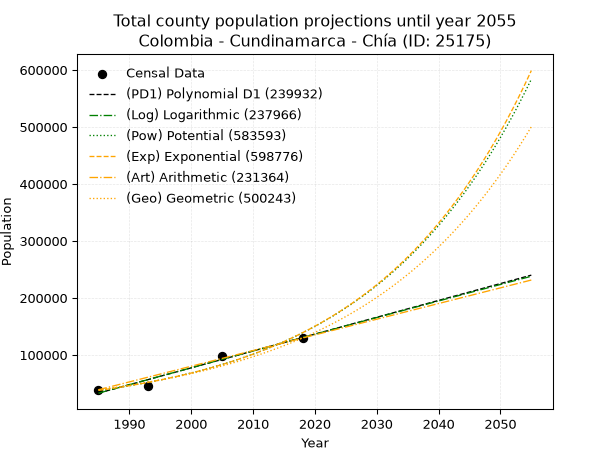
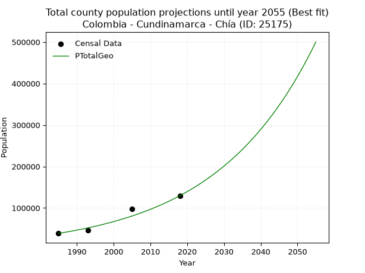
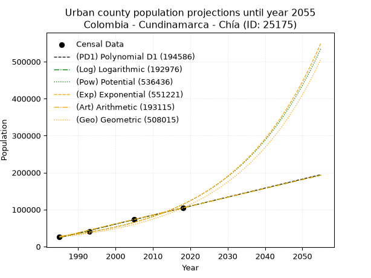
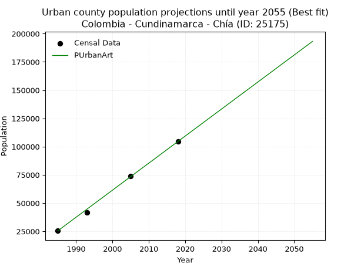
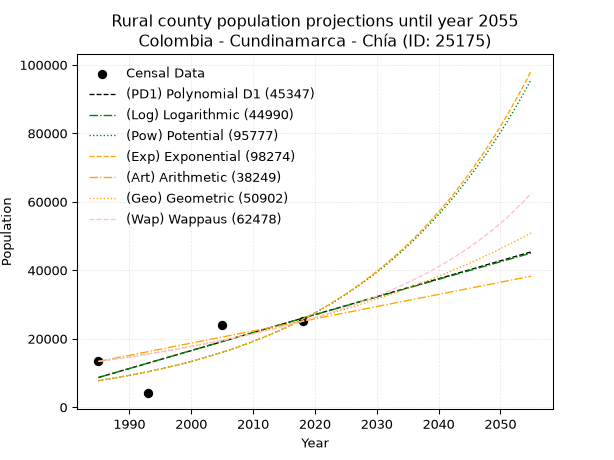
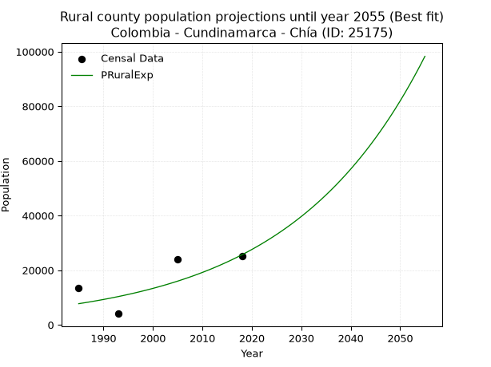

<div align="center">


</div>

# _“Population and Public Services Demand Projections (PPSD) until Year 2050 for Colombia - Cundinamarca - Chía (ID: 25175)”_
Keywords: `population` `public-service` `projection` `lineal` `polynomial` `logarithmic` `potential` `exponential` `arithmetic` `geometric` `wappaus` `dane` `colombia` `south-america`

PPSD are analytical estimates used by governments and planners to anticipate future changes in population size, age distribution, and the resulting community needs for utilities, healthcare, education, and infrastructure as sizing future water treatment facilities, electrical grids, and road networks based on spatial growth.

> **General running parameters**: • app_version: _v20260806_. • Python version: _3.14.7_. • Pandas version: _3.0.5_. • NumPy version: _2.5.1_. • Creates, save and include plots into reports (create_plot): _False_. • Projection until year: _2050_. • Process polynomial degree 2 and up: _False_. • Process Wappaus: _True_. • Process Wappaus: _True_. • Set negative values to zero: _True_. • Set infinite values to zero: _True_. • Drop dataset notes: _True_. 
<div align="center">

Dynamic map: [:earth_americas:Google](http://maps.google.com/maps?q=4.866507515,-74.0499995) [:earth_americas:OSM](https://www.openstreetmap.org/#map=18/4.866507515/-74.0499995&layers=P) [:earth_americas:Bing](https://www.bing.com/maps?cp=4.866507515~-74.0499995&lvl=18) [:earth_americas:Apple](https://maps.apple.com/frame?center=4.866507515%2C-74.0499995&span=0.003%2C0.006)

</div>


<div align="center">

```geojson
{
  "type": "Feature",
  "geometry": {
    "type": "Point", 
    "coordinates": [-74.0499995, 4.866507515]
  }, 
  "properties": {
    "Name": "Colombia - Cundinamarca - Chía (ID: 25175)"
  }
}
```

</div>


## 0. Census Data (4 records)

Census data are official statistics collected by a government about the people and housing in a country. They usually include counts of total population, age, sex, race, income, education, and jobs.

📅Global census file: [Population.xlsx](../data/Population.xlsx)

| Source   |   Year |   CountryID | CountryName   |   StateID | StateName    |   CountyID | CountyName   |   PTotal |   PUrban |   PRural |
|:---------|-------:|------------:|:--------------|----------:|:-------------|-----------:|:-------------|---------:|---------:|---------:|
| DANE     |   1985 |          57 | Colombia      |        25 | Cundinamarca |      25175 | Chía         |    38862 |    25516 |    13346 |
| DANE     |   1993 |          57 | Colombia      |        25 | Cundinamarca |      25175 | Chía         |    45696 |    41632 |     4064 |
| DANE     |   2005 |          57 | Colombia      |        25 | Cundinamarca |      25175 | Chía         |    97896 |    73841 |    24055 |
| DANE     |   2018 |          57 | Colombia      |        25 | Cundinamarca |      25175 | Chía         |   129613 |   104527 |    25086 |

> 🔥Some records could had specific notes about the registered values or the corresponding urban or rural distribution.

📅   [RUPS](https://www.datos.gov.co/Hacienda-y-Cr-dito-P-blico/Registro-nico-de-Prestadores-de-Servicios-P-blicos/4qkq-csdn/about_data) - Local public utility companies: [RUPS.csv](../data/RUPS.xlsx)

 | SERVICIO       | ESTADO    | NOMBRE                                                              | NIT         | DEPARTAMENTO_DOMICILIO   | MUNICIPIO_DOMICILIO   | DIRECCION              |   TELEFONO | EMAIL                     | TIPO_INSCRIPCION    | REPRESENTANTE_LEGAL        | TIPO_PRESTADOR                            | CLASIFICACION                 |
|:---------------|:----------|:--------------------------------------------------------------------|:------------|:-------------------------|:----------------------|:-----------------------|-----------:|:--------------------------|:--------------------|:---------------------------|:------------------------------------------|:------------------------------|
| ACUEDUCTO      | OPERATIVA | EMPRESA DE SERVICIOS PUBLICOS DE CHIA EMSERCHIA E.S.P.              | 899999714-1 | CUNDINAMARCA             | CHIA                  | CALLE 11 No 17-00      |    8630248 | gerencia@emserchia.gov.co | Registro por la ESP | ANDREA CASTILLO GALEANO    | EMPRESA INDUSTRIAL Y COMERCIAL DEL ESTADO | MAYOR O IGUAL A 5001 USUARIOS |
| ALCANTARILLADO | OPERATIVA | EMPRESA DE SERVICIOS PUBLICOS DE CHIA EMSERCHIA E.S.P.              | 899999714-1 | CUNDINAMARCA             | CHIA                  | CALLE 11 No 17-00      |    8630248 | gerencia@emserchia.gov.co | Registro por la ESP | ANDREA CASTILLO GALEANO    | EMPRESA INDUSTRIAL Y COMERCIAL DEL ESTADO | MAYOR O IGUAL A 5001 USUARIOS |
| ACUEDUCTO      | OPERATIVA | ASOCIACION DE USUARIOS PRESTADORA DE SERVICIOS PUBLICOS DEL TEUSACA | 832002062-4 | CUNDINAMARCA             | CHIA                  | CENTRO CHIA LOCAL 2021 |    8616917 | gerencia@progresaresp.com | Registro por la ESP | JORGE ENRIQUE BAENA BOTERO | ORGANIZACION AUTORIZADA                   | MENOR O IGUAL A 2500 USUARIOS |

## 1. Total

### 1.1. Coefficients and Parameters

* (PD1) Polynomial Deg 1: 2957.358892011218, -5837440.373745438 (lineal)
* (Log) Logarithmic: 5918974.911188961, -44912158.98163545
* (Pow) Potential: 79.06498949644977, -256.1613221816034
* (Exp) Exponential: 0.03949342979832501, 3.3912437034808966e-30
* (Art) Arithmetic: Year diff. 2018 - 1985 = 33, Population diff. 129613 - 38862 = 90751, Annual growth = 2750.030303030303
* (Geo) Geometric: Year diff. 2018 - 1985 = 33, Population diff. 129613 - 38862 = 90751, Annual growth % = 0.03717544107887161
* (Wap) Wappaus: i = 3.264615287764123, Condition values only valid for < 200)

<sub>
Wappaus condition values: ['0.00', '3.26', '6.53', '9.79', '13.06', '16.32', '19.59', '22.85', '26.12', '29.38', '32.65', '35.91', '39.18', '42.44', '45.70', '48.97', '52.23', '55.50', '58.76', '62.03', '65.29', '68.56', '71.82', '75.09', '78.35', '81.62', '84.88', '88.14', '91.41', '94.67', '97.94', '101.20', '104.47', '107.73', '111.00', '114.26', '117.53', '120.79', '124.06', '127.32', '130.58', '133.85', '137.11', '140.38', '143.64', '146.91', '150.17', '153.44', '156.70', '159.97', '163.23', '166.50', '169.76', '173.02', '176.29', '179.55', '182.82', '186.08', '189.35', '192.61', '195.88', '199.14', '202.41', '205.67', '208.94', '212.20']
</sub>


### 1.2. Projected Dataset

|   Year |   CountyID |   PTotalPD1 |   PTotalLog |   PTotalPow |   PTotalExp |   PTotalArt |   PTotalGeo |
|-------:|-----------:|------------:|------------:|------------:|------------:|------------:|------------:|
|   1985 |      25175 |       32917 |       32832 |       37677 |       37726 |       38862 |       38862 |
|   1986 |      25175 |       35874 |       35813 |       39208 |       39246 |       41612 |       40307 |
|   1987 |      25175 |       38832 |       38793 |       40800 |       40827 |       44362 |       41805 |
|   1988 |      25175 |       41789 |       41771 |       42456 |       42471 |       47112 |       43359 |
|   1989 |      25175 |       44746 |       44748 |       44178 |       44182 |       49862 |       44971 |
|   1990 |      25175 |       47704 |       47723 |       45969 |       45962 |       52612 |       46643 |
|   1991 |      25175 |       50661 |       50696 |       47831 |       47813 |       55362 |       48377 |
|   1992 |      25175 |       53619 |       53669 |       49768 |       49740 |       58112 |       50175 |
|   1993 |      25175 |       56576 |       56639 |       51783 |       51743 |       60862 |       52041 |
|   1994 |      25175 |       59533 |       59608 |       53878 |       53828 |       63612 |       53975 |
|   1995 |      25175 |       62491 |       62576 |       56057 |       55996 |       66362 |       55982 |
|   1996 |      25175 |       65448 |       65542 |       58322 |       58252 |       69112 |       58063 |
|   1997 |      25175 |       68405 |       68507 |       60679 |       60598 |       71862 |       60222 |
|   1998 |      25175 |       71363 |       71470 |       63128 |       63039 |       74612 |       62460 |
|   1999 |      25175 |       74320 |       74432 |       65676 |       65579 |       77362 |       64782 |
|   2000 |      25175 |       77277 |       77392 |       68325 |       68221 |       80112 |       67191 |
|   2001 |      25175 |       80235 |       80351 |       71079 |       70969 |       82862 |       69688 |
|   2002 |      25175 |       83192 |       83308 |       73944 |       73828 |       85613 |       72279 |
|   2003 |      25175 |       86149 |       86264 |       76921 |       76802 |       88363 |       74966 |
|   2004 |      25175 |       89107 |       89218 |       80018 |       79896 |       91113 |       77753 |
|   2005 |      25175 |       92064 |       92171 |       83237 |       83114 |       93863 |       80644 |
|   2006 |      25175 |       95022 |       95122 |       86584 |       86462 |       96613 |       83642 |
|   2007 |      25175 |       97979 |       98072 |       90064 |       89945 |       99363 |       86751 |
|   2008 |      25175 |      100936 |      101021 |       93682 |       93569 |      102113 |       89976 |
|   2009 |      25175 |      103894 |      103968 |       97443 |       97338 |      104863 |       93321 |
|   2010 |      25175 |      106851 |      106913 |      101354 |      101259 |      107613 |       96790 |
|   2011 |      25175 |      109808 |      109857 |      105419 |      105338 |      110363 |      100388 |
|   2012 |      25175 |      112766 |      112800 |      109645 |      109582 |      113113 |      104120 |
|   2013 |      25175 |      115723 |      115741 |      114038 |      113996 |      115863 |      107991 |
|   2014 |      25175 |      118680 |      118680 |      118605 |      118588 |      118613 |      112006 |
|   2015 |      25175 |      121638 |      121619 |      123353 |      123365 |      121363 |      116169 |
|   2016 |      25175 |      124595 |      124555 |      128288 |      128335 |      124113 |      120488 |
|   2017 |      25175 |      127553 |      127491 |      133418 |      133505 |      126863 |      124967 |
|   2018 |      25175 |      130510 |      130424 |      138751 |      138883 |      129613 |      129613 |
|   2019 |      25175 |      133467 |      133357 |      144293 |      144477 |      132363 |      134431 |
|   2020 |      25175 |      136425 |      136288 |      150055 |      150298 |      135113 |      139429 |
|   2021 |      25175 |      139382 |      139217 |      156043 |      156352 |      137863 |      144612 |
|   2022 |      25175 |      142339 |      142145 |      162267 |      162650 |      140613 |      149988 |
|   2023 |      25175 |      145297 |      145072 |      168736 |      169203 |      143363 |      155564 |
|   2024 |      25175 |      148254 |      147997 |      175460 |      176019 |      146113 |      161347 |
|   2025 |      25175 |      151211 |      150921 |      182447 |      183109 |      148863 |      167346 |
|   2026 |      25175 |      154169 |      153843 |      189710 |      190486 |      151613 |      173567 |
|   2027 |      25175 |      157126 |      156764 |      197258 |      198159 |      154363 |      180019 |
|   2028 |      25175 |      160083 |      159683 |      205102 |      206142 |      157113 |      186711 |
|   2029 |      25175 |      163041 |      162601 |      213254 |      214446 |      159863 |      193652 |
|   2030 |      25175 |      165998 |      165517 |      221726 |      223085 |      162613 |      200852 |
|   2031 |      25175 |      168956 |      168432 |      230530 |      232071 |      165363 |      208318 |
|   2032 |      25175 |      171913 |      171346 |      239679 |      241420 |      168113 |      216063 |
|   2033 |      25175 |      174870 |      174258 |      249187 |      251145 |      170863 |      224095 |
|   2034 |      25175 |      177828 |      177169 |      259066 |      261262 |      173613 |      232426 |
|   2035 |      25175 |      180785 |      180078 |      269332 |      271787 |      176364 |      241066 |
|   2036 |      25175 |      183742 |      182986 |      280000 |      282735 |      179114 |      250028 |
|   2037 |      25175 |      186700 |      185892 |      291084 |      294125 |      181864 |      259323 |
|   2038 |      25175 |      189657 |      188797 |      302602 |      305974 |      184614 |      268963 |
|   2039 |      25175 |      192614 |      191701 |      314569 |      318299 |      187364 |      278962 |
|   2040 |      25175 |      195572 |      194603 |      327003 |      331122 |      190114 |      289333 |
|   2041 |      25175 |      198529 |      197504 |      339923 |      344460 |      192864 |      300089 |
|   2042 |      25175 |      201486 |      200403 |      353346 |      358336 |      195614 |      311245 |
|   2043 |      25175 |      204444 |      203301 |      367292 |      372772 |      198364 |      322815 |
|   2044 |      25175 |      207401 |      206198 |      381781 |      387788 |      201114 |      334816 |
|   2045 |      25175 |      210359 |      209093 |      396835 |      403410 |      203864 |      347263 |
|   2046 |      25175 |      213316 |      211986 |      412474 |      419660 |      206614 |      360173 |
|   2047 |      25175 |      216273 |      214879 |      428722 |      436566 |      209364 |      373562 |
|   2048 |      25175 |      219231 |      217770 |      445601 |      454152 |      212114 |      387450 |
|   2049 |      25175 |      222188 |      220659 |      463135 |      472447 |      214864 |      401853 |
|   2050 |      25175 |      225145 |      223547 |      481351 |      491479 |      217614 |      416792 |
<div align="center">

</img>

</div>


### 1.3. Best fit with absolute and relative error (%)

Relative error puts that difference into context by dividing the absolute error by the true value, creating a unitless ratio or percentage that shows the scale of the mistake.

Absolute and relative error

|   Year | Source   |   CountryID | CountryName   |   StateID | StateName    |   CountyID_x | CountyName   |   PTotal |   PUrban |   PRural |   CountyID_y |   PTotalPD1 |   PTotalLog |   PTotalPow |   PTotalExp |   PTotalArt |   PTotalGeo |   PTotalPD1AbsError |   PTotalLogAbsError |   PTotalPowAbsError |   PTotalExpAbsError |   PTotalArtAbsError |   PTotalGeoAbsError |   PTotalPD1RelError |   PTotalLogRelError |   PTotalPowRelError |   PTotalExpRelError |   PTotalArtRelError |   PTotalGeoRelError |
|-------:|:---------|------------:|:--------------|----------:|:-------------|-------------:|:-------------|---------:|---------:|---------:|-------------:|------------:|------------:|------------:|------------:|------------:|------------:|--------------------:|--------------------:|--------------------:|--------------------:|--------------------:|--------------------:|--------------------:|--------------------:|--------------------:|--------------------:|--------------------:|--------------------:|
|   1985 | DANE     |          57 | Colombia      |        25 | Cundinamarca |        25175 | Chía         |    38862 |    25516 |    13346 |        25175 |       32917 |       32832 |       37677 |       37726 |       38862 |       38862 |                5945 |                6030 |                1185 |                1136 |                   0 |                   0 |            15.2977  |           15.5164   |             3.04925 |             2.92316 |             0       |              0      |
|   1993 | DANE     |          57 | Colombia      |        25 | Cundinamarca |        25175 | Chía         |    45696 |    41632 |     4064 |        25175 |       56576 |       56639 |       51783 |       51743 |       60862 |       52041 |               10880 |               10943 |                6087 |                6047 |               15166 |                6345 |            23.8095  |           23.9474   |            13.3206  |            13.2331  |            33.1889  |             13.8852 |
|   2005 | DANE     |          57 | Colombia      |        25 | Cundinamarca |        25175 | Chía         |    97896 |    73841 |    24055 |        25175 |       92064 |       92171 |       83237 |       83114 |       93863 |       80644 |                5832 |                5725 |               14659 |               14782 |                4033 |               17252 |             5.95734 |            5.84804  |            14.9741  |            15.0997  |             4.11968 |             17.6228 |
|   2018 | DANE     |          57 | Colombia      |        25 | Cundinamarca |        25175 | Chía         |   129613 |   104527 |    25086 |        25175 |      130510 |      130424 |      138751 |      138883 |      129613 |      129613 |                 897 |                 811 |                9138 |                9270 |                   0 |                   0 |             0.69206 |            0.625709 |             7.05022 |             7.15206 |             0       |              0      |

Relative error mean

| Method    |   RelError | Best   |
|:----------|-----------:|:-------|
| PTotalPD1 |   11.4392  |        |
| PTotalLog |   11.4844  |        |
| PTotalPow |    9.59854 |        |
| PTotalExp |    9.60201 |        |
| PTotalArt |    9.32714 |        |
| PTotalGeo |    7.87701 | True   |

💙Best method: _**PTotalGeo**_
<div align="center">

</img>

</div>


### 1.4. Fresh water supply demand in liters per capita per day (lpcd)

The fresh water supply demand typically ranges from 100 to 300 liters per capita per day (lpcd) for standard domestic and municipal planning, though absolute survival minimums set by the World Health Organization are as low as 7.5 to 20 liters per day, and total consumption in high-income nations can exceed 400 liters.

> `CZ`: Level in meters above the sea level (masl)<br> `WS`: Fresh water supply demand in liters per capita per day (lpcd or l/h/d)<br> `WSAll`: Zonal fresh water supply demand in liters per second (l/s)<br> `A`: Zonal area in square meters<br> `DP`: Population density (people/hectare or p/ha)

Reference values (RAS Colombia)

|    CZ |   WS |
|------:|-----:|
|  1000 |  120 |
|  2000 |  130 |
| 99999 |  140 |

County shapefile geometry properties and water supply values

|   CountyID |      ATotal |   CZTotal |   WSTotal |
|-----------:|------------:|----------:|----------:|
|      25175 | 8.00516e+07 |   2658.99 |       140 |

Projected values for best method: PTotalGeo

|   CountyID |   Year |   PTotalGeo |   DPTotal |   WSTotal |   WSTotalAll |
|-----------:|-------:|------------:|----------:|----------:|-------------:|
|      25175 |   1985 |       38862 |      4.85 |       140 |      62.9708 |
|      25175 |   1986 |       40307 |      5.04 |       140 |      65.3123 |
|      25175 |   1987 |       41805 |      5.22 |       140 |      67.7396 |
|      25175 |   1988 |       43359 |      5.42 |       140 |      70.2576 |
|      25175 |   1989 |       44971 |      5.62 |       140 |      72.8697 |
|      25175 |   1990 |       46643 |      5.83 |       140 |      75.5789 |
|      25175 |   1991 |       48377 |      6.04 |       140 |      78.3887 |
|      25175 |   1992 |       50175 |      6.27 |       140 |      81.3021 |
|      25175 |   1993 |       52041 |      6.5  |       140 |      84.3257 |
|      25175 |   1994 |       53975 |      6.74 |       140 |      87.4595 |
|      25175 |   1995 |       55982 |      6.99 |       140 |      90.7116 |
|      25175 |   1996 |       58063 |      7.25 |       140 |      94.0836 |
|      25175 |   1997 |       60222 |      7.52 |       140 |      97.5819 |
|      25175 |   1998 |       62460 |      7.8  |       140 |     101.208  |
|      25175 |   1999 |       64782 |      8.09 |       140 |     104.971  |
|      25175 |   2000 |       67191 |      8.39 |       140 |     108.874  |
|      25175 |   2001 |       69688 |      8.71 |       140 |     112.92   |
|      25175 |   2002 |       72279 |      9.03 |       140 |     117.119  |
|      25175 |   2003 |       74966 |      9.36 |       140 |     121.473  |
|      25175 |   2004 |       77753 |      9.71 |       140 |     125.989  |
|      25175 |   2005 |       80644 |     10.07 |       140 |     130.673  |
|      25175 |   2006 |       83642 |     10.45 |       140 |     135.531  |
|      25175 |   2007 |       86751 |     10.84 |       140 |     140.569  |
|      25175 |   2008 |       89976 |     11.24 |       140 |     145.794  |
|      25175 |   2009 |       93321 |     11.66 |       140 |     151.215  |
|      25175 |   2010 |       96790 |     12.09 |       140 |     156.836  |
|      25175 |   2011 |      100388 |     12.54 |       140 |     162.666  |
|      25175 |   2012 |      104120 |     13.01 |       140 |     168.713  |
|      25175 |   2013 |      107991 |     13.49 |       140 |     174.985  |
|      25175 |   2014 |      112006 |     13.99 |       140 |     181.491  |
|      25175 |   2015 |      116169 |     14.51 |       140 |     188.237  |
|      25175 |   2016 |      120488 |     15.05 |       140 |     195.235  |
|      25175 |   2017 |      124967 |     15.61 |       140 |     202.493  |
|      25175 |   2018 |      129613 |     16.19 |       140 |     210.021  |
|      25175 |   2019 |      134431 |     16.79 |       140 |     217.828  |
|      25175 |   2020 |      139429 |     17.42 |       140 |     225.927  |
|      25175 |   2021 |      144612 |     18.06 |       140 |     234.325  |
|      25175 |   2022 |      149988 |     18.74 |       140 |     243.036  |
|      25175 |   2023 |      155564 |     19.43 |       140 |     252.071  |
|      25175 |   2024 |      161347 |     20.16 |       140 |     261.442  |
|      25175 |   2025 |      167346 |     20.9  |       140 |     271.163  |
|      25175 |   2026 |      173567 |     21.68 |       140 |     281.243  |
|      25175 |   2027 |      180019 |     22.49 |       140 |     291.697  |
|      25175 |   2028 |      186711 |     23.32 |       140 |     302.541  |
|      25175 |   2029 |      193652 |     24.19 |       140 |     313.788  |
|      25175 |   2030 |      200852 |     25.09 |       140 |     325.455  |
|      25175 |   2031 |      208318 |     26.02 |       140 |     337.552  |
|      25175 |   2032 |      216063 |     26.99 |       140 |     350.102  |
|      25175 |   2033 |      224095 |     27.99 |       140 |     363.117  |
|      25175 |   2034 |      232426 |     29.03 |       140 |     376.616  |
|      25175 |   2035 |      241066 |     30.11 |       140 |     390.616  |
|      25175 |   2036 |      250028 |     31.23 |       140 |     405.138  |
|      25175 |   2037 |      259323 |     32.39 |       140 |     420.199  |
|      25175 |   2038 |      268963 |     33.6  |       140 |     435.82   |
|      25175 |   2039 |      278962 |     34.85 |       140 |     452.022  |
|      25175 |   2040 |      289333 |     36.14 |       140 |     468.827  |
|      25175 |   2041 |      300089 |     37.49 |       140 |     486.255  |
|      25175 |   2042 |      311245 |     38.88 |       140 |     504.332  |
|      25175 |   2043 |      322815 |     40.33 |       140 |     523.08   |
|      25175 |   2044 |      334816 |     41.83 |       140 |     542.526  |
|      25175 |   2045 |      347263 |     43.38 |       140 |     562.695  |
|      25175 |   2046 |      360173 |     44.99 |       140 |     583.614  |
|      25175 |   2047 |      373562 |     46.67 |       140 |     605.309  |
|      25175 |   2048 |      387450 |     48.4  |       140 |     627.812  |
|      25175 |   2049 |      401853 |     50.2  |       140 |     651.151  |
|      25175 |   2050 |      416792 |     52.07 |       140 |     675.357  |

## 2. Urban

### 2.1. Coefficients and Parameters

* (PD1) Polynomial Deg 1: 2432.9955841027486, -4805220.417101522 (lineal)
* (Log) Logarithmic: 4869783.860570576, -36953887.148195684
* (Pow) Potential: 85.2997356403587, -276.85245475790265
* (Exp) Exponential: 0.04259820982184936, 5.29031473247802e-33
* (Art) Arithmetic: Year diff. 2018 - 1985 = 33, Population diff. 104527 - 25516 = 79011, Annual growth = 2394.2727272727275
* (Geo) Geometric: Year diff. 2018 - 1985 = 33, Population diff. 104527 - 25516 = 79011, Annual growth % = 0.04365764163123953
* (Wap) Wappaus: i = 3.6822785190632747, Condition values only valid for < 200)

<sub>
Wappaus condition values: ['0.00', '3.68', '7.36', '11.05', '14.73', '18.41', '22.09', '25.78', '29.46', '33.14', '36.82', '40.51', '44.19', '47.87', '51.55', '55.23', '58.92', '62.60', '66.28', '69.96', '73.65', '77.33', '81.01', '84.69', '88.37', '92.06', '95.74', '99.42', '103.10', '106.79', '110.47', '114.15', '117.83', '121.52', '125.20', '128.88', '132.56', '136.24', '139.93', '143.61', '147.29', '150.97', '154.66', '158.34', '162.02', '165.70', '169.38', '173.07', '176.75', '180.43', '184.11', '187.80', '191.48', '195.16', '198.84', '202.53', '206.21', '209.89', '213.57', '217.25', '220.94', '224.62', '228.30', '231.98', '235.67', '239.35']
</sub>


### 2.2. Projected Dataset

|   Year |   CountyID |   PUrbanPD1 |   PUrbanLog |   PUrbanPow |   PUrbanExp |   PUrbanArt |   PUrbanGeo |
|-------:|-----------:|------------:|------------:|------------:|------------:|------------:|------------:|
|   1985 |      25175 |       24276 |       24204 |       27903 |       27946 |       25516 |       25516 |
|   1986 |      25175 |       26709 |       26657 |       29127 |       29162 |       27910 |       26630 |
|   1987 |      25175 |       29142 |       29108 |       30405 |       30431 |       30305 |       27793 |
|   1988 |      25175 |       31575 |       31558 |       31739 |       31755 |       32699 |       29006 |
|   1989 |      25175 |       34008 |       34007 |       33130 |       33137 |       35093 |       30272 |
|   1990 |      25175 |       36441 |       36455 |       34581 |       34579 |       37487 |       31594 |
|   1991 |      25175 |       38874 |       38901 |       36095 |       36084 |       39882 |       32973 |
|   1992 |      25175 |       41307 |       41347 |       37675 |       37654 |       42276 |       34413 |
|   1993 |      25175 |       43740 |       43791 |       39323 |       39293 |       44670 |       35915 |
|   1994 |      25175 |       46173 |       46234 |       41042 |       41003 |       47064 |       37483 |
|   1995 |      25175 |       48606 |       48675 |       42835 |       42787 |       49459 |       39119 |
|   1996 |      25175 |       51039 |       51116 |       44706 |       44649 |       51853 |       40827 |
|   1997 |      25175 |       53472 |       53555 |       46658 |       46592 |       54247 |       42610 |
|   1998 |      25175 |       55905 |       55993 |       48693 |       48620 |       56642 |       44470 |
|   1999 |      25175 |       58338 |       58429 |       50816 |       50736 |       59036 |       46411 |
|   2000 |      25175 |       60771 |       60865 |       53031 |       52944 |       61430 |       48438 |
|   2001 |      25175 |       63204 |       63299 |       55341 |       55248 |       63824 |       50552 |
|   2002 |      25175 |       65637 |       65732 |       57751 |       57652 |       66219 |       52759 |
|   2003 |      25175 |       68070 |       68164 |       60264 |       60161 |       68613 |       55063 |
|   2004 |      25175 |       70503 |       70595 |       62885 |       62779 |       71007 |       57467 |
|   2005 |      25175 |       72936 |       73024 |       65619 |       65511 |       73401 |       59975 |
|   2006 |      25175 |       75369 |       75452 |       68470 |       68362 |       75796 |       62594 |
|   2007 |      25175 |       77802 |       77879 |       71444 |       71337 |       78190 |       65327 |
|   2008 |      25175 |       80235 |       80305 |       74545 |       74442 |       80584 |       68179 |
|   2009 |      25175 |       82668 |       82730 |       77779 |       77682 |       82979 |       71155 |
|   2010 |      25175 |       85101 |       85153 |       81151 |       81062 |       85373 |       74262 |
|   2011 |      25175 |       87534 |       87575 |       84668 |       84590 |       87767 |       77504 |
|   2012 |      25175 |       89967 |       89996 |       88336 |       88271 |       90161 |       80887 |
|   2013 |      25175 |       92400 |       92416 |       92161 |       92113 |       92556 |       84419 |
|   2014 |      25175 |       94833 |       94835 |       96149 |       96121 |       94950 |       88104 |
|   2015 |      25175 |       97266 |       97252 |      100308 |      100304 |       97344 |       91951 |
|   2016 |      25175 |       99699 |       99668 |      104644 |      104669 |       99738 |       95965 |
|   2017 |      25175 |      102132 |      102083 |      109165 |      109224 |      102133 |      100154 |
|   2018 |      25175 |      104565 |      104497 |      113880 |      113978 |      104527 |      104527 |
|   2019 |      25175 |      106998 |      106910 |      118795 |      118938 |      106921 |      109090 |
|   2020 |      25175 |      109431 |      109321 |      123921 |      124114 |      109316 |      113853 |
|   2021 |      25175 |      111864 |      111731 |      129264 |      129515 |      111710 |      118824 |
|   2022 |      25175 |      114297 |      114140 |      134835 |      135151 |      114104 |      124011 |
|   2023 |      25175 |      116730 |      116548 |      140644 |      141033 |      116498 |      129425 |
|   2024 |      25175 |      119163 |      118955 |      146699 |      147170 |      118893 |      135076 |
|   2025 |      25175 |      121596 |      121360 |      153012 |      153575 |      121287 |      140973 |
|   2026 |      25175 |      124029 |      123764 |      159594 |      160258 |      123681 |      147127 |
|   2027 |      25175 |      126462 |      126167 |      166455 |      167233 |      126075 |      153550 |
|   2028 |      25175 |      128895 |      128569 |      173607 |      174510 |      128470 |      160254 |
|   2029 |      25175 |      131328 |      130970 |      181063 |      182105 |      130864 |      167250 |
|   2030 |      25175 |      133761 |      133369 |      188835 |      190030 |      133258 |      174552 |
|   2031 |      25175 |      136194 |      135768 |      196937 |      198300 |      135653 |      182173 |
|   2032 |      25175 |      138627 |      138165 |      205382 |      206929 |      138047 |      190126 |
|   2033 |      25175 |      141060 |      140561 |      214185 |      215934 |      140441 |      198426 |
|   2034 |      25175 |      143493 |      142955 |      223361 |      225332 |      142835 |      207089 |
|   2035 |      25175 |      145926 |      145349 |      232924 |      235138 |      145230 |      216130 |
|   2036 |      25175 |      148359 |      147742 |      242893 |      245371 |      147624 |      225566 |
|   2037 |      25175 |      150792 |      150133 |      253283 |      256049 |      150018 |      235414 |
|   2038 |      25175 |      153225 |      152523 |      264111 |      267192 |      152412 |      245691 |
|   2039 |      25175 |      155658 |      154912 |      275397 |      278819 |      154807 |      256418 |
|   2040 |      25175 |      158091 |      157299 |      287160 |      290953 |      157201 |      267612 |
|   2041 |      25175 |      160524 |      159686 |      299418 |      303615 |      159595 |      279295 |
|   2042 |      25175 |      162957 |      162071 |      312194 |      316828 |      161990 |      291489 |
|   2043 |      25175 |      165390 |      164456 |      325508 |      330616 |      164384 |      304215 |
|   2044 |      25175 |      167823 |      166839 |      339383 |      345004 |      166778 |      317496 |
|   2045 |      25175 |      170256 |      169221 |      353842 |      360018 |      169172 |      331357 |
|   2046 |      25175 |      172689 |      171601 |      368910 |      375685 |      171567 |      345823 |
|   2047 |      25175 |      175122 |      173981 |      384611 |      392035 |      173961 |      360921 |
|   2048 |      25175 |      177555 |      176359 |      400973 |      409095 |      176355 |      376678 |
|   2049 |      25175 |      179988 |      178737 |      418022 |      426899 |      178749 |      393123 |
|   2050 |      25175 |      182421 |      181113 |      435787 |      445477 |      181144 |      410286 |
<div align="center">

</img>

</div>


### 2.3. Best fit with absolute and relative error (%)

Relative error puts that difference into context by dividing the absolute error by the true value, creating a unitless ratio or percentage that shows the scale of the mistake.

Absolute and relative error

|   Year | Source   |   CountryID | CountryName   |   StateID | StateName    |   CountyID_x | CountyName   |   PTotal |   PUrban |   PRural |   CountyID_y |   PUrbanPD1 |   PUrbanLog |   PUrbanPow |   PUrbanExp |   PUrbanArt |   PUrbanGeo |   PUrbanPD1AbsError |   PUrbanLogAbsError |   PUrbanPowAbsError |   PUrbanExpAbsError |   PUrbanArtAbsError |   PUrbanGeoAbsError |   PUrbanPD1RelError |   PUrbanLogRelError |   PUrbanPowRelError |   PUrbanExpRelError |   PUrbanArtRelError |   PUrbanGeoRelError |
|-------:|:---------|------------:|:--------------|----------:|:-------------|-------------:|:-------------|---------:|---------:|---------:|-------------:|------------:|------------:|------------:|------------:|------------:|------------:|--------------------:|--------------------:|--------------------:|--------------------:|--------------------:|--------------------:|--------------------:|--------------------:|--------------------:|--------------------:|--------------------:|--------------------:|
|   1985 | DANE     |          57 | Colombia      |        25 | Cundinamarca |        25175 | Chía         |    38862 |    25516 |    13346 |        25175 |       24276 |       24204 |       27903 |       27946 |       25516 |       25516 |                1240 |                1312 |                2387 |                2430 |                   0 |                   0 |           4.8597    |           5.14187   |             9.35491 |             9.52344 |            0        |              0      |
|   1993 | DANE     |          57 | Colombia      |        25 | Cundinamarca |        25175 | Chía         |    45696 |    41632 |     4064 |        25175 |       43740 |       43791 |       39323 |       39293 |       44670 |       35915 |                2108 |                2159 |                2309 |                2339 |                3038 |                5717 |           5.06341   |           5.18591   |             5.54621 |             5.61827 |            7.29727  |             13.7322 |
|   2005 | DANE     |          57 | Colombia      |        25 | Cundinamarca |        25175 | Chía         |    97896 |    73841 |    24055 |        25175 |       72936 |       73024 |       65619 |       65511 |       73401 |       59975 |                 905 |                 817 |                8222 |                8330 |                 440 |               13866 |           1.22561   |           1.10643   |            11.1347  |            11.281   |            0.595875 |             18.7782 |
|   2018 | DANE     |          57 | Colombia      |        25 | Cundinamarca |        25175 | Chía         |   129613 |   104527 |    25086 |        25175 |      104565 |      104497 |      113880 |      113978 |      104527 |      104527 |                  38 |                  30 |                9353 |                9451 |                   0 |                   0 |           0.0363542 |           0.0287007 |             8.94793 |             9.04168 |            0        |              0      |

Relative error mean

| Method    |   RelError | Best   |
|:----------|-----------:|:-------|
| PUrbanPD1 |    2.79627 |        |
| PUrbanLog |    2.86573 |        |
| PUrbanPow |    8.74595 |        |
| PUrbanExp |    8.8661  |        |
| PUrbanArt |    1.97329 | True   |
| PUrbanGeo |    8.1276  |        |

💙Best method: _**PUrbanArt**_
<div align="center">

</img>

</div>


### 2.4. Fresh water supply demand in liters per capita per day (lpcd)

The fresh water supply demand typically ranges from 100 to 300 liters per capita per day (lpcd) for standard domestic and municipal planning, though absolute survival minimums set by the World Health Organization are as low as 7.5 to 20 liters per day, and total consumption in high-income nations can exceed 400 liters.

> `CZ`: Level in meters above the sea level (masl)<br> `WS`: Fresh water supply demand in liters per capita per day (lpcd or l/h/d)<br> `WSAll`: Zonal fresh water supply demand in liters per second (l/s)<br> `A`: Zonal area in square meters<br> `DP`: Population density (people/hectare or p/ha)

Reference values (RAS Colombia)

|    CZ |   WS |
|------:|-----:|
|  1000 |  120 |
|  2000 |  130 |
| 99999 |  140 |

County shapefile geometry properties and water supply values

|   CountyID |     AUrban |   CZUrban |   WSUrban |
|-----------:|-----------:|----------:|----------:|
|      25175 | 1.9906e+07 |    2555.2 |       140 |

Projected values for best method: PUrbanArt

|   CountyID |   Year |   PUrbanArt |   DPUrban |   WSUrban |   WSUrbanAll |
|-----------:|-------:|------------:|----------:|----------:|-------------:|
|      25175 |   1985 |       25516 |     12.82 |       140 |      41.3454 |
|      25175 |   1986 |       27910 |     14.02 |       140 |      45.2245 |
|      25175 |   1987 |       30305 |     15.22 |       140 |      49.1053 |
|      25175 |   1988 |       32699 |     16.43 |       140 |      52.9845 |
|      25175 |   1989 |       35093 |     17.63 |       140 |      56.8637 |
|      25175 |   1990 |       37487 |     18.83 |       140 |      60.7428 |
|      25175 |   1991 |       39882 |     20.04 |       140 |      64.6236 |
|      25175 |   1992 |       42276 |     21.24 |       140 |      68.5028 |
|      25175 |   1993 |       44670 |     22.44 |       140 |      72.3819 |
|      25175 |   1994 |       47064 |     23.64 |       140 |      76.2611 |
|      25175 |   1995 |       49459 |     24.85 |       140 |      80.1419 |
|      25175 |   1996 |       51853 |     26.05 |       140 |      84.0211 |
|      25175 |   1997 |       54247 |     27.25 |       140 |      87.9002 |
|      25175 |   1998 |       56642 |     28.45 |       140 |      91.781  |
|      25175 |   1999 |       59036 |     29.66 |       140 |      95.6602 |
|      25175 |   2000 |       61430 |     30.86 |       140 |      99.5394 |
|      25175 |   2001 |       63824 |     32.06 |       140 |     103.419  |
|      25175 |   2002 |       66219 |     33.27 |       140 |     107.299  |
|      25175 |   2003 |       68613 |     34.47 |       140 |     111.178  |
|      25175 |   2004 |       71007 |     35.67 |       140 |     115.058  |
|      25175 |   2005 |       73401 |     36.87 |       140 |     118.937  |
|      25175 |   2006 |       75796 |     38.08 |       140 |     122.818  |
|      25175 |   2007 |       78190 |     39.28 |       140 |     126.697  |
|      25175 |   2008 |       80584 |     40.48 |       140 |     130.576  |
|      25175 |   2009 |       82979 |     41.69 |       140 |     134.457  |
|      25175 |   2010 |       85373 |     42.89 |       140 |     138.336  |
|      25175 |   2011 |       87767 |     44.09 |       140 |     142.215  |
|      25175 |   2012 |       90161 |     45.29 |       140 |     146.094  |
|      25175 |   2013 |       92556 |     46.5  |       140 |     149.975  |
|      25175 |   2014 |       94950 |     47.7  |       140 |     153.854  |
|      25175 |   2015 |       97344 |     48.9  |       140 |     157.733  |
|      25175 |   2016 |       99738 |     50.1  |       140 |     161.613  |
|      25175 |   2017 |      102133 |     51.31 |       140 |     165.493  |
|      25175 |   2018 |      104527 |     52.51 |       140 |     169.372  |
|      25175 |   2019 |      106921 |     53.71 |       140 |     173.252  |
|      25175 |   2020 |      109316 |     54.92 |       140 |     177.132  |
|      25175 |   2021 |      111710 |     56.12 |       140 |     181.012  |
|      25175 |   2022 |      114104 |     57.32 |       140 |     184.891  |
|      25175 |   2023 |      116498 |     58.52 |       140 |     188.77   |
|      25175 |   2024 |      118893 |     59.73 |       140 |     192.651  |
|      25175 |   2025 |      121287 |     60.93 |       140 |     196.53   |
|      25175 |   2026 |      123681 |     62.13 |       140 |     200.409  |
|      25175 |   2027 |      126075 |     63.34 |       140 |     204.288  |
|      25175 |   2028 |      128470 |     64.54 |       140 |     208.169  |
|      25175 |   2029 |      130864 |     65.74 |       140 |     212.048  |
|      25175 |   2030 |      133258 |     66.94 |       140 |     215.927  |
|      25175 |   2031 |      135653 |     68.15 |       140 |     219.808  |
|      25175 |   2032 |      138047 |     69.35 |       140 |     223.687  |
|      25175 |   2033 |      140441 |     70.55 |       140 |     227.566  |
|      25175 |   2034 |      142835 |     71.75 |       140 |     231.446  |
|      25175 |   2035 |      145230 |     72.96 |       140 |     235.326  |
|      25175 |   2036 |      147624 |     74.16 |       140 |     239.206  |
|      25175 |   2037 |      150018 |     75.36 |       140 |     243.085  |
|      25175 |   2038 |      152412 |     76.57 |       140 |     246.964  |
|      25175 |   2039 |      154807 |     77.77 |       140 |     250.845  |
|      25175 |   2040 |      157201 |     78.97 |       140 |     254.724  |
|      25175 |   2041 |      159595 |     80.17 |       140 |     258.603  |
|      25175 |   2042 |      161990 |     81.38 |       140 |     262.484  |
|      25175 |   2043 |      164384 |     82.58 |       140 |     266.363  |
|      25175 |   2044 |      166778 |     83.78 |       140 |     270.242  |
|      25175 |   2045 |      169172 |     84.99 |       140 |     274.121  |
|      25175 |   2046 |      171567 |     86.19 |       140 |     278.002  |
|      25175 |   2047 |      173961 |     87.39 |       140 |     281.881  |
|      25175 |   2048 |      176355 |     88.59 |       140 |     285.76   |
|      25175 |   2049 |      178749 |     89.8  |       140 |     289.64   |
|      25175 |   2050 |      181144 |     91    |       140 |     293.52   |

## 3. Rural

### 3.1. Coefficients and Parameters

* (PD1) Polynomial Deg 1: 524.3633079084686, -1032219.9566439146 (lineal)
* (Log) Logarithmic: 1049191.0506183873, -7958271.833439783
* (Pow) Potential: 72.64205899727672, -235.66821031802408
* (Exp) Exponential: 0.0363241412606493, 3.7501042199377623e-28
* (Art) Arithmetic: Year diff. 2018 - 1985 = 33, Population diff. 25086 - 13346 = 11740, Annual growth = 355.75757575757575
* (Geo) Geometric: Year diff. 2018 - 1985 = 33, Population diff. 25086 - 13346 = 11740, Annual growth % = 0.019308072263332754
* (Wap) Wappaus: i = 1.851361239371231, Condition values only valid for < 200)

<sub>
Wappaus condition values: ['0.00', '1.85', '3.70', '5.55', '7.41', '9.26', '11.11', '12.96', '14.81', '16.66', '18.51', '20.36', '22.22', '24.07', '25.92', '27.77', '29.62', '31.47', '33.32', '35.18', '37.03', '38.88', '40.73', '42.58', '44.43', '46.28', '48.14', '49.99', '51.84', '53.69', '55.54', '57.39', '59.24', '61.09', '62.95', '64.80', '66.65', '68.50', '70.35', '72.20', '74.05', '75.91', '77.76', '79.61', '81.46', '83.31', '85.16', '87.01', '88.87', '90.72', '92.57', '94.42', '96.27', '98.12', '99.97', '101.82', '103.68', '105.53', '107.38', '109.23', '111.08', '112.93', '114.78', '116.64', '118.49', '120.34']
</sub>


### 3.2. Projected Dataset

|   Year |   CountyID |   PRuralPD1 |   PRuralLog |   PRuralPow |   PRuralExp |   PRuralArt |   PRuralGeo |   PRuralWap |
|-------:|-----------:|------------:|------------:|------------:|------------:|------------:|------------:|------------:|
|   1985 |      25175 |        8641 |        8628 |        7725 |        7730 |       13346 |       13346 |       13346 |
|   1986 |      25175 |        9166 |        9157 |        8013 |        8016 |       13702 |       13604 |       13595 |
|   1987 |      25175 |        9690 |        9685 |        8311 |        8312 |       14058 |       13866 |       13849 |
|   1988 |      25175 |       10214 |       10213 |        8621 |        8620 |       14413 |       14134 |       14108 |
|   1989 |      25175 |       10739 |       10741 |        8942 |        8938 |       14769 |       14407 |       14372 |
|   1990 |      25175 |       11263 |       11268 |        9274 |        9269 |       15125 |       14685 |       14641 |
|   1991 |      25175 |       11787 |       11795 |        9619 |        9612 |       15481 |       14969 |       14916 |
|   1992 |      25175 |       12312 |       12322 |        9976 |        9968 |       15836 |       15258 |       15195 |
|   1993 |      25175 |       12836 |       12848 |       10347 |       10336 |       16192 |       15552 |       15481 |
|   1994 |      25175 |       13360 |       13375 |       10730 |       10719 |       16548 |       15853 |       15772 |
|   1995 |      25175 |       13885 |       13901 |       11128 |       11115 |       16904 |       16159 |       16069 |
|   1996 |      25175 |       14409 |       14427 |       11541 |       11526 |       17259 |       16471 |       16372 |
|   1997 |      25175 |       14934 |       14952 |       11969 |       11953 |       17615 |       16789 |       16682 |
|   1998 |      25175 |       15458 |       15477 |       12412 |       12395 |       17971 |       17113 |       16997 |
|   1999 |      25175 |       15982 |       16002 |       12871 |       12853 |       18327 |       17443 |       17320 |
|   2000 |      25175 |       16507 |       16527 |       13348 |       13329 |       18682 |       17780 |       17650 |
|   2001 |      25175 |       17031 |       17051 |       13841 |       13822 |       19038 |       18123 |       17987 |
|   2002 |      25175 |       17555 |       17576 |       14353 |       14333 |       19394 |       18473 |       18331 |
|   2003 |      25175 |       18080 |       18100 |       14883 |       14863 |       19750 |       18830 |       18683 |
|   2004 |      25175 |       18604 |       18623 |       15433 |       15413 |       20105 |       19194 |       19042 |
|   2005 |      25175 |       19128 |       19147 |       16002 |       15983 |       20461 |       19564 |       19410 |
|   2006 |      25175 |       19653 |       19670 |       16592 |       16575 |       20817 |       19942 |       19787 |
|   2007 |      25175 |       20177 |       20193 |       17204 |       17188 |       21173 |       20327 |       20172 |
|   2008 |      25175 |       20702 |       20715 |       17838 |       17824 |       21528 |       20719 |       20566 |
|   2009 |      25175 |       21226 |       21238 |       18495 |       18483 |       21884 |       21119 |       20970 |
|   2010 |      25175 |       21750 |       21760 |       19176 |       19167 |       22240 |       21527 |       21383 |
|   2011 |      25175 |       22275 |       22282 |       19881 |       19876 |       22596 |       21943 |       21806 |
|   2012 |      25175 |       22799 |       22803 |       20612 |       20611 |       22951 |       22367 |       22240 |
|   2013 |      25175 |       23323 |       23325 |       21370 |       21373 |       23307 |       22798 |       22685 |
|   2014 |      25175 |       23848 |       23846 |       22155 |       22164 |       23663 |       23239 |       23141 |
|   2015 |      25175 |       24372 |       24367 |       22969 |       22984 |       24019 |       23687 |       23608 |
|   2016 |      25175 |       24896 |       24887 |       23811 |       23834 |       24374 |       24145 |       24088 |
|   2017 |      25175 |       25421 |       25407 |       24685 |       24716 |       24730 |       24611 |       24581 |
|   2018 |      25175 |       25945 |       25927 |       25590 |       25630 |       25086 |       25086 |       25086 |
|   2019 |      25175 |       26470 |       26447 |       26528 |       26578 |       25442 |       25570 |       25605 |
|   2020 |      25175 |       26994 |       26967 |       27499 |       27561 |       25798 |       26064 |       26139 |
|   2021 |      25175 |       27518 |       27486 |       28506 |       28581 |       26153 |       26567 |       26687 |
|   2022 |      25175 |       28043 |       28005 |       29549 |       29638 |       26509 |       27080 |       27250 |
|   2023 |      25175 |       28567 |       28524 |       30629 |       30734 |       26865 |       27603 |       27830 |
|   2024 |      25175 |       29091 |       29042 |       31749 |       31871 |       27221 |       28136 |       28427 |
|   2025 |      25175 |       29616 |       29561 |       32909 |       33050 |       27576 |       28679 |       29041 |
|   2026 |      25175 |       30140 |       30079 |       34110 |       34273 |       27932 |       29233 |       29673 |
|   2027 |      25175 |       30664 |       30596 |       35355 |       35541 |       28288 |       29798 |       30324 |
|   2028 |      25175 |       31189 |       31114 |       36645 |       36855 |       28644 |       30373 |       30996 |
|   2029 |      25175 |       31713 |       31631 |       37981 |       38219 |       28999 |       30959 |       31689 |
|   2030 |      25175 |       32238 |       32148 |       39365 |       39633 |       29355 |       31557 |       32403 |
|   2031 |      25175 |       32762 |       32665 |       40799 |       41099 |       29711 |       32166 |       33141 |
|   2032 |      25175 |       33286 |       33181 |       42284 |       42619 |       30067 |       32787 |       33902 |
|   2033 |      25175 |       33811 |       33697 |       43823 |       44196 |       30422 |       33421 |       34689 |
|   2034 |      25175 |       34335 |       34213 |       45417 |       45830 |       30778 |       34066 |       35503 |
|   2035 |      25175 |       34859 |       34729 |       47067 |       47526 |       31134 |       34724 |       36345 |
|   2036 |      25175 |       35384 |       35244 |       48778 |       49284 |       31490 |       35394 |       37216 |
|   2037 |      25175 |       35908 |       35760 |       50549 |       51107 |       31845 |       36077 |       38119 |
|   2038 |      25175 |       36432 |       36275 |       52384 |       52998 |       32201 |       36774 |       39054 |
|   2039 |      25175 |       36957 |       36789 |       54284 |       54958 |       32557 |       37484 |       40024 |
|   2040 |      25175 |       37481 |       37304 |       56252 |       56991 |       32913 |       38208 |       41030 |
|   2041 |      25175 |       38006 |       37818 |       58291 |       59099 |       33268 |       38945 |       42075 |
|   2042 |      25175 |       38530 |       38332 |       60402 |       61285 |       33624 |       39697 |       43162 |
|   2043 |      25175 |       39054 |       38846 |       62589 |       63553 |       33980 |       40464 |       44291 |
|   2044 |      25175 |       39579 |       39359 |       64854 |       65903 |       34336 |       41245 |       45467 |
|   2045 |      25175 |       40103 |       39872 |       67200 |       68341 |       34691 |       42042 |       46691 |
|   2046 |      25175 |       40627 |       40385 |       69629 |       70869 |       35047 |       42853 |       47968 |
|   2047 |      25175 |       41152 |       40898 |       72145 |       73491 |       35403 |       43681 |       49300 |
|   2048 |      25175 |       41676 |       41410 |       74751 |       76210 |       35759 |       44524 |       50691 |
|   2049 |      25175 |       42200 |       41922 |       77449 |       79029 |       36114 |       45384 |       52145 |
|   2050 |      25175 |       42725 |       42434 |       80243 |       81952 |       36470 |       46260 |       53668 |
<div align="center">

</img>

</div>


### 3.3. Best fit with absolute and relative error (%)

Relative error puts that difference into context by dividing the absolute error by the true value, creating a unitless ratio or percentage that shows the scale of the mistake.

Absolute and relative error

|   Year | Source   |   CountryID | CountryName   |   StateID | StateName    |   CountyID_x | CountyName   |   PTotal |   PUrban |   PRural |   CountyID_y |   PRuralPD1 |   PRuralLog |   PRuralPow |   PRuralExp |   PRuralArt |   PRuralGeo |   PRuralWap |   PRuralPD1AbsError |   PRuralLogAbsError |   PRuralPowAbsError |   PRuralExpAbsError |   PRuralArtAbsError |   PRuralGeoAbsError |   PRuralWapAbsError |   PRuralPD1RelError |   PRuralLogRelError |   PRuralPowRelError |   PRuralExpRelError |   PRuralArtRelError |   PRuralGeoRelError |   PRuralWapRelError |
|-------:|:---------|------------:|:--------------|----------:|:-------------|-------------:|:-------------|---------:|---------:|---------:|-------------:|------------:|------------:|------------:|------------:|------------:|------------:|------------:|--------------------:|--------------------:|--------------------:|--------------------:|--------------------:|--------------------:|--------------------:|--------------------:|--------------------:|--------------------:|--------------------:|--------------------:|--------------------:|--------------------:|
|   1985 | DANE     |          57 | Colombia      |        25 | Cundinamarca |        25175 | Chía         |    38862 |    25516 |    13346 |        25175 |        8641 |        8628 |        7725 |        7730 |       13346 |       13346 |       13346 |                4705 |                4718 |                5621 |                5616 |                   0 |                   0 |                   0 |            35.254   |            35.3514  |            42.1175  |            42.08    |              0      |              0      |              0      |
|   1993 | DANE     |          57 | Colombia      |        25 | Cundinamarca |        25175 | Chía         |    45696 |    41632 |     4064 |        25175 |       12836 |       12848 |       10347 |       10336 |       16192 |       15552 |       15481 |                8772 |                8784 |                6283 |                6272 |               12128 |               11488 |               11417 |           215.846   |           216.142   |           154.601   |           154.331   |            298.425  |            282.677  |            280.93   |
|   2005 | DANE     |          57 | Colombia      |        25 | Cundinamarca |        25175 | Chía         |    97896 |    73841 |    24055 |        25175 |       19128 |       19147 |       16002 |       15983 |       20461 |       19564 |       19410 |                4927 |                4908 |                8053 |                8072 |                3594 |                4491 |                4645 |            20.4822  |            20.4032  |            33.4774  |            33.5564  |             14.9408 |             18.6697 |             19.3099 |
|   2018 | DANE     |          57 | Colombia      |        25 | Cundinamarca |        25175 | Chía         |   129613 |   104527 |    25086 |        25175 |       25945 |       25927 |       25590 |       25630 |       25086 |       25086 |       25086 |                 859 |                 841 |                 504 |                 544 |                   0 |                   0 |                   0 |             3.42422 |             3.35247 |             2.00909 |             2.16854 |              0      |              0      |              0      |

Relative error mean

| Method    |   RelError | Best   |
|:----------|-----------:|:-------|
| PRuralPD1 |    68.7517 |        |
| PRuralLog |    68.8122 |        |
| PRuralPow |    58.0514 |        |
| PRuralExp |    58.0339 | True   |
| PRuralArt |    78.3415 |        |
| PRuralGeo |    75.3367 |        |
| PRuralWap |    75.06   |        |

💙Best method: _**PRuralExp**_
<div align="center">

</img>

</div>


### 3.4. Fresh water supply demand in liters per capita per day (lpcd)

The fresh water supply demand typically ranges from 100 to 300 liters per capita per day (lpcd) for standard domestic and municipal planning, though absolute survival minimums set by the World Health Organization are as low as 7.5 to 20 liters per day, and total consumption in high-income nations can exceed 400 liters.

> `CZ`: Level in meters above the sea level (masl)<br> `WS`: Fresh water supply demand in liters per capita per day (lpcd or l/h/d)<br> `WSAll`: Zonal fresh water supply demand in liters per second (l/s)<br> `A`: Zonal area in square meters<br> `DP`: Population density (people/hectare or p/ha)

Reference values (RAS Colombia)

|    CZ |   WS |
|------:|-----:|
|  1000 |  120 |
|  2000 |  130 |
| 99999 |  140 |

County shapefile geometry properties and water supply values

|   CountyID |      ARural |   CZRural |   WSRural |
|-----------:|------------:|----------:|----------:|
|      25175 | 6.01456e+07 |   2692.46 |       140 |

Projected values for best method: PRuralExp

|   CountyID |   Year |   PRuralExp |   DPRural |   WSRural |   WSRuralAll |
|-----------:|-------:|------------:|----------:|----------:|-------------:|
|      25175 |   1985 |        7730 |      1.29 |       140 |      12.5255 |
|      25175 |   1986 |        8016 |      1.33 |       140 |      12.9889 |
|      25175 |   1987 |        8312 |      1.38 |       140 |      13.4685 |
|      25175 |   1988 |        8620 |      1.43 |       140 |      13.9676 |
|      25175 |   1989 |        8938 |      1.49 |       140 |      14.4829 |
|      25175 |   1990 |        9269 |      1.54 |       140 |      15.0192 |
|      25175 |   1991 |        9612 |      1.6  |       140 |      15.575  |
|      25175 |   1992 |        9968 |      1.66 |       140 |      16.1519 |
|      25175 |   1993 |       10336 |      1.72 |       140 |      16.7481 |
|      25175 |   1994 |       10719 |      1.78 |       140 |      17.3687 |
|      25175 |   1995 |       11115 |      1.85 |       140 |      18.0104 |
|      25175 |   1996 |       11526 |      1.92 |       140 |      18.6764 |
|      25175 |   1997 |       11953 |      1.99 |       140 |      19.3683 |
|      25175 |   1998 |       12395 |      2.06 |       140 |      20.0845 |
|      25175 |   1999 |       12853 |      2.14 |       140 |      20.8266 |
|      25175 |   2000 |       13329 |      2.22 |       140 |      21.5979 |
|      25175 |   2001 |       13822 |      2.3  |       140 |      22.3968 |
|      25175 |   2002 |       14333 |      2.38 |       140 |      23.2248 |
|      25175 |   2003 |       14863 |      2.47 |       140 |      24.0836 |
|      25175 |   2004 |       15413 |      2.56 |       140 |      24.9748 |
|      25175 |   2005 |       15983 |      2.66 |       140 |      25.8984 |
|      25175 |   2006 |       16575 |      2.76 |       140 |      26.8576 |
|      25175 |   2007 |       17188 |      2.86 |       140 |      27.8509 |
|      25175 |   2008 |       17824 |      2.96 |       140 |      28.8815 |
|      25175 |   2009 |       18483 |      3.07 |       140 |      29.9493 |
|      25175 |   2010 |       19167 |      3.19 |       140 |      31.0576 |
|      25175 |   2011 |       19876 |      3.3  |       140 |      32.2065 |
|      25175 |   2012 |       20611 |      3.43 |       140 |      33.3975 |
|      25175 |   2013 |       21373 |      3.55 |       140 |      34.6322 |
|      25175 |   2014 |       22164 |      3.69 |       140 |      35.9139 |
|      25175 |   2015 |       22984 |      3.82 |       140 |      37.2426 |
|      25175 |   2016 |       23834 |      3.96 |       140 |      38.6199 |
|      25175 |   2017 |       24716 |      4.11 |       140 |      40.0491 |
|      25175 |   2018 |       25630 |      4.26 |       140 |      41.5301 |
|      25175 |   2019 |       26578 |      4.42 |       140 |      43.0662 |
|      25175 |   2020 |       27561 |      4.58 |       140 |      44.659  |
|      25175 |   2021 |       28581 |      4.75 |       140 |      46.3118 |
|      25175 |   2022 |       29638 |      4.93 |       140 |      48.0245 |
|      25175 |   2023 |       30734 |      5.11 |       140 |      49.8005 |
|      25175 |   2024 |       31871 |      5.3  |       140 |      51.6428 |
|      25175 |   2025 |       33050 |      5.49 |       140 |      53.5532 |
|      25175 |   2026 |       34273 |      5.7  |       140 |      55.535  |
|      25175 |   2027 |       35541 |      5.91 |       140 |      57.5896 |
|      25175 |   2028 |       36855 |      6.13 |       140 |      59.7188 |
|      25175 |   2029 |       38219 |      6.35 |       140 |      61.9289 |
|      25175 |   2030 |       39633 |      6.59 |       140 |      64.2201 |
|      25175 |   2031 |       41099 |      6.83 |       140 |      66.5956 |
|      25175 |   2032 |       42619 |      7.09 |       140 |      69.0586 |
|      25175 |   2033 |       44196 |      7.35 |       140 |      71.6139 |
|      25175 |   2034 |       45830 |      7.62 |       140 |      74.2616 |
|      25175 |   2035 |       47526 |      7.9  |       140 |      77.0097 |
|      25175 |   2036 |       49284 |      8.19 |       140 |      79.8583 |
|      25175 |   2037 |       51107 |      8.5  |       140 |      82.8123 |
|      25175 |   2038 |       52998 |      8.81 |       140 |      85.8764 |
|      25175 |   2039 |       54958 |      9.14 |       140 |      89.0523 |
|      25175 |   2040 |       56991 |      9.48 |       140 |      92.3465 |
|      25175 |   2041 |       59099 |      9.83 |       140 |      95.7623 |
|      25175 |   2042 |       61285 |     10.19 |       140 |      99.3044 |
|      25175 |   2043 |       63553 |     10.57 |       140 |     102.979  |
|      25175 |   2044 |       65903 |     10.96 |       140 |     106.787  |
|      25175 |   2045 |       68341 |     11.36 |       140 |     110.738  |
|      25175 |   2046 |       70869 |     11.78 |       140 |     114.834  |
|      25175 |   2047 |       73491 |     12.22 |       140 |     119.083  |
|      25175 |   2048 |       76210 |     12.67 |       140 |     123.488  |
|      25175 |   2049 |       79029 |     13.14 |       140 |     128.056  |
|      25175 |   2050 |       81952 |     13.63 |       140 |     132.793  |

<div align="center"><br><sub>Share this research</sub></div><br>

<sub>**APPS & TOOLS & CONTENT DISCLAIMER**: • NO WARRANTY - This content and software is provided by <a href="https://github.com/rcfdtools" target="_blank">github.com/rcfdtools</a> "as is", without any express or implied warranty, including warranties of merchantability, fitness for a particular purpose, or non-infringement. There is no guarantee that the software will be error-free or operate without interruption. • LIMITATION OF LIABILITY - Neither the authors nor copyright holders will be liable for claims or damages arising from the software or its use. You are responsible for determining if the software is appropriate for your use and assume all associated risks, including errors, legal compliance, and data loss. • NO PROFESSIONAL ADVICE - The software provides general information and does not offer professional advice. It should not replace consultation with professional advisors. [Clauses and global license for rcfdtools use.](https://github.com/rcfdtools/rcfdtools/blob/main/LICENSE.md)</sub>

| [:house: Home](Readme.md)  | [:beginner: Help / Collaborate](https://github.com/rcfdtools/R.HydroTools/discussions/31) |
|----------------------------|-------------------------------------------------------------------------------------------|