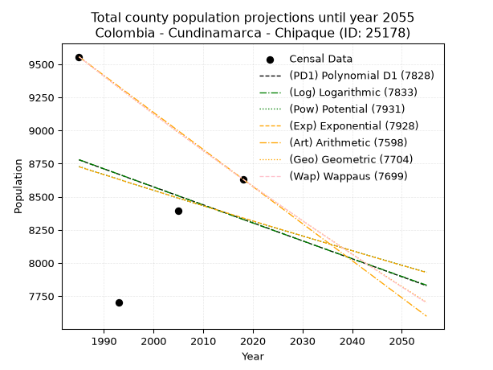
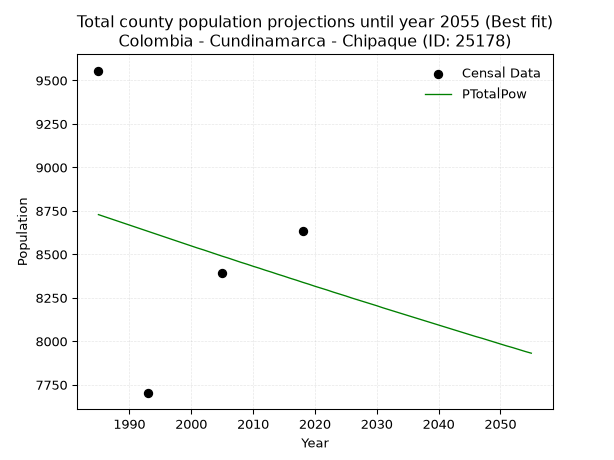
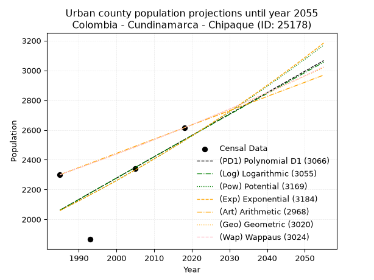
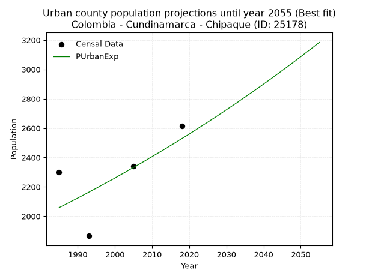
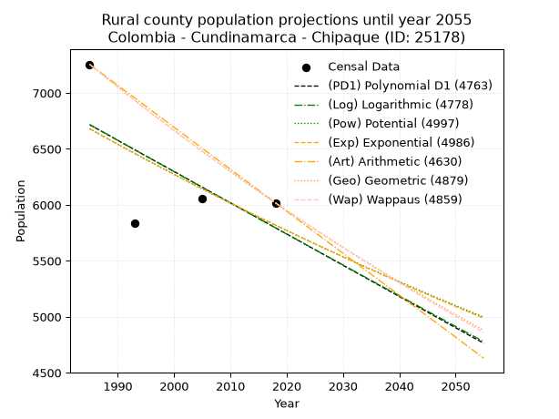
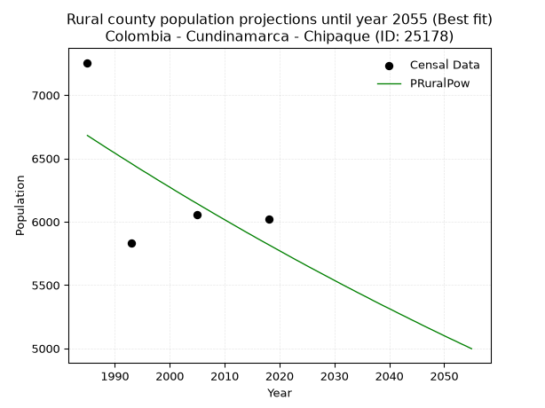

<div align="center">


</div>

# 📜 _“Population and Public Services Demand Projections (PPSD) until Year 2050 for Colombia - Cundinamarca - Chipaque (ID: 25178)”_
Keywords: `population` `public-service` `projection` `lineal` `polynomial` `logarithmic` `potential` `exponential` `arithmetic` `geometric` `wappaus` `dane` `colombia` `south-america`

PPSD are analytical estimates used by governments and planners to anticipate future changes in population size, age distribution, and the resulting community needs for utilities, healthcare, education, and infrastructure as sizing future water treatment facilities, electrical grids, and road networks based on spatial growth.

<div align="center">

</img>

</div>


> **General running parameters**: • app_version: _v20260806_. • Python version: _3.14.7_. • Pandas version: _3.0.5_. • NumPy version: _2.5.1_. • Creates, save and include plots into reports (create_plot): _False_. • Projection until year: _2050_. • Process polynomial degree 2 and up: _False_. • Process Wappaus: _True_. • Process Wappaus: _True_. • Set negative values to zero: _True_. • Set infinite values to zero: _True_. • Drop dataset notes: _True_. 
<div align="center">

Maps & GIS Layers: [:earth_americas:Google](http://maps.google.com/maps?q=4.442671016,-74.0448756) [:earth_americas:OSM](https://www.openstreetmap.org/#map=18/4.442671016/-74.0448756&layers=P) [:earth_americas:Bing](https://www.bing.com/maps?cp=4.442671016~-74.0448756&lvl=18) [:earth_americas:Apple](https://maps.apple.com/frame?center=4.442671016%2C-74.0448756&span=0.003%2C0.006) [:earth_americas:GISMobile](https://github.com/rcfdtools/R.GISMobile/blob/main/file/gis/CountyLayer_CO/Readme.md)

</div>


<div align="center">

```geojson
{
  "type": "Feature",
  "geometry": {
    "type": "Point", 
    "coordinates": [-74.0448756, 4.442671016]
  }, 
  "properties": {
    "Name": "Colombia - Cundinamarca - Chipaque (ID: 25178)"
  }
}
```

</div>


## 0. Census Data (4 records)

Census data are official statistics collected by a government about the people and housing in a country. They usually include counts of total population, age, sex, race, income, education, and jobs.

📅Global census file: [Population.xlsx](../data/Population.xlsx)

| Source   |   Year |   CountryID | CountryName   |   StateID | StateName    |   CountyID | CountyName   |   PTotal |   PUrban |   PRural |
|:---------|-------:|------------:|:--------------|----------:|:-------------|-----------:|:-------------|---------:|---------:|---------:|
| DANE     |   1985 |          57 | Colombia      |        25 | Cundinamarca |      25178 | Chipaque     |     9556 |     2300 |     7256 |
| DANE     |   1993 |          57 | Colombia      |        25 | Cundinamarca |      25178 | Chipaque     |     7701 |     1866 |     5835 |
| DANE     |   2005 |          57 | Colombia      |        25 | Cundinamarca |      25178 | Chipaque     |     8395 |     2341 |     6054 |
| DANE     |   2018 |          57 | Colombia      |        25 | Cundinamarca |      25178 | Chipaque     |     8633 |     2615 |     6018 |

> 🔥Some records could had specific notes about the registered values or the corresponding urban or rural distribution.

📅[SUI-RUPS](https://www.datos.gov.co/Hacienda-y-Cr-dito-P-blico/Registro-nico-de-Prestadores-de-Servicios-P-blicos/4qkq-csdn/about_data) - Local public utility companies: [RUPS.csv](../data/RUPS.csv)

 | SERVICIO       | ESTADO    | NOMBRE                                                                                            | NIT         | DEPARTAMENTO_DOMICILIO   | MUNICIPIO_DOMICILIO   | DIRECCION                  |   TELEFONO | EMAIL                                 | TIPO_PRESTADOR                 | CLASIFICACION                 |
|:---------------|:----------|:--------------------------------------------------------------------------------------------------|:------------|:-------------------------|:----------------------|:---------------------------|-----------:|:--------------------------------------|:-------------------------------|:------------------------------|
| ACUEDUCTO      | OPERATIVA | OFICINA DE SERVICIOS PUBLICOS DE ACUEDUCTO ALCANTARILLADO Y ASEO DEL MUNICIPIO DE CHIPAQUE        | 899999467-5 | CUNDINAMARCA             | CHIPAQUE              | Cll 5 No 4-16              |    8484266 | alcaldia@chipaque-cundinamarca.gov.co | MUNICIPIO (PRESTACIÓN DIRECTA) | MENOR O IGUAL A 2500 USUARIOS |
| ALCANTARILLADO | OPERATIVA | OFICINA DE SERVICIOS PUBLICOS DE ACUEDUCTO ALCANTARILLADO Y ASEO DEL MUNICIPIO DE CHIPAQUE        | 899999467-5 | CUNDINAMARCA             | CHIPAQUE              | Cll 5 No 4-16              |    8484266 | alcaldia@chipaque-cundinamarca.gov.co | MUNICIPIO (PRESTACIÓN DIRECTA) | MENOR O IGUAL A 2500 USUARIOS |
| ACUEDUCTO      | OPERATIVA | ASOCIACION DE SUSCRIPTORES DEL ACUEDUCTO RURAL DE LAS VEREDAS MUNAR, QUERENTE Y LLANO DE CHIPAQUE | 800235546-0 | CUNDINAMARCA             | CHIPAQUE              | CARRERA 4 No 5 - 30 Of 202 |    8484121 | willi.rey@hotmail.com                 | ORGANIZACION AUTORIZADA        | MENOR O IGUAL A 2500 USUARIOS |
| ACUEDUCTO      | OPERATIVA | ASOCIACION DE SUSCRIPTORES DEL ACUEDUCTO VEREDAL CALDERA, SIECHA Y CUMBA                          | 901074233-5 | CUNDINAMARCA             | CHIPAQUE              | CALLE 5 NUMERO 4-16        |    8484266 | willi.rey@hotmail.com                 | ORGANIZACION AUTORIZADA        | MENOR O IGUAL A 2500 USUARIOS |

## 1. Total

### 1.1. Coefficients and Parameters

* (PD1) Polynomial Deg 1: -13.567643516660121, 35709.92894419941 (lineal)
* (Log) Logarithmic: -27336.598299422505, 216356.95273566112
* (Pow) Potential: -2.764291264913224, 13.056886527952589
* (Exp) Exponential: -0.0013706752655088604, 132572.56352745902
* (Art) Arithmetic: Year diff. 2018 - 1985 = 33, Population diff. 8633 - 9556 = -923, Annual growth = -27.96969696969697
* (Geo) Geometric: Year diff. 2018 - 1985 = 33, Population diff. 8633 - 9556 = -923, Annual growth % = -0.003073363284099462
* (Wap) Wappaus: i = -0.30754518631807104, Condition values only valid for < 200)

<sub>
Wappaus condition values: ['-0.00', '-0.31', '-0.62', '-0.92', '-1.23', '-1.54', '-1.85', '-2.15', '-2.46', '-2.77', '-3.08', '-3.38', '-3.69', '-4.00', '-4.31', '-4.61', '-4.92', '-5.23', '-5.54', '-5.84', '-6.15', '-6.46', '-6.77', '-7.07', '-7.38', '-7.69', '-8.00', '-8.30', '-8.61', '-8.92', '-9.23', '-9.53', '-9.84', '-10.15', '-10.46', '-10.76', '-11.07', '-11.38', '-11.69', '-11.99', '-12.30', '-12.61', '-12.92', '-13.22', '-13.53', '-13.84', '-14.15', '-14.45', '-14.76', '-15.07', '-15.38', '-15.68', '-15.99', '-16.30', '-16.61', '-16.91', '-17.22', '-17.53', '-17.84', '-18.15', '-18.45', '-18.76', '-19.07', '-19.38', '-19.68', '-19.99']
</sub>


### 1.2. Projected Dataset

|   Year |   CountyID |   PTotalPD1 |   PTotalLog |   PTotalPow |   PTotalExp |   PTotalArt |   PTotalGeo |   PTotalWap |
|-------:|-----------:|------------:|------------:|------------:|------------:|------------:|------------:|------------:|
|   1985 |      25178 |        8778 |        8780 |        8728 |        8726 |        9556 |        9556 |        9556 |
|   1986 |      25178 |        8765 |        8766 |        8716 |        8714 |        9528 |        9527 |        9527 |
|   1987 |      25178 |        8751 |        8752 |        8704 |        8702 |        9500 |        9497 |        9497 |
|   1988 |      25178 |        8737 |        8739 |        8692 |        8690 |        9472 |        9468 |        9468 |
|   1989 |      25178 |        8724 |        8725 |        8680 |        8679 |        9444 |        9439 |        9439 |
|   1990 |      25178 |        8710 |        8711 |        8668 |        8667 |        9416 |        9410 |        9410 |
|   1991 |      25178 |        8697 |        8697 |        8656 |        8655 |        9388 |        9381 |        9381 |
|   1992 |      25178 |        8683 |        8684 |        8644 |        8643 |        9360 |        9352 |        9352 |
|   1993 |      25178 |        8670 |        8670 |        8632 |        8631 |        9332 |        9324 |        9324 |
|   1994 |      25178 |        8656 |        8656 |        8620 |        8619 |        9304 |        9295 |        9295 |
|   1995 |      25178 |        8642 |        8643 |        8608 |        8607 |        9276 |        9266 |        9267 |
|   1996 |      25178 |        8629 |        8629 |        8596 |        8596 |        9248 |        9238 |        9238 |
|   1997 |      25178 |        8615 |        8615 |        8584 |        8584 |        9220 |        9209 |        9210 |
|   1998 |      25178 |        8602 |        8601 |        8572 |        8572 |        9192 |        9181 |        9181 |
|   1999 |      25178 |        8588 |        8588 |        8560 |        8560 |        9164 |        9153 |        9153 |
|   2000 |      25178 |        8575 |        8574 |        8548 |        8549 |        9136 |        9125 |        9125 |
|   2001 |      25178 |        8561 |        8560 |        8536 |        8537 |        9108 |        9097 |        9097 |
|   2002 |      25178 |        8548 |        8547 |        8525 |        8525 |        9081 |        9069 |        9069 |
|   2003 |      25178 |        8534 |        8533 |        8513 |        8514 |        9053 |        9041 |        9041 |
|   2004 |      25178 |        8520 |        8520 |        8501 |        8502 |        9025 |        9013 |        9013 |
|   2005 |      25178 |        8507 |        8506 |        8489 |        8490 |        8997 |        8985 |        8986 |
|   2006 |      25178 |        8493 |        8492 |        8478 |        8479 |        8969 |        8958 |        8958 |
|   2007 |      25178 |        8480 |        8479 |        8466 |        8467 |        8941 |        8930 |        8931 |
|   2008 |      25178 |        8466 |        8465 |        8454 |        8455 |        8913 |        8903 |        8903 |
|   2009 |      25178 |        8453 |        8451 |        8443 |        8444 |        8885 |        8876 |        8876 |
|   2010 |      25178 |        8439 |        8438 |        8431 |        8432 |        8857 |        8848 |        8848 |
|   2011 |      25178 |        8425 |        8424 |        8420 |        8421 |        8829 |        8821 |        8821 |
|   2012 |      25178 |        8412 |        8411 |        8408 |        8409 |        8801 |        8794 |        8794 |
|   2013 |      25178 |        8398 |        8397 |        8397 |        8398 |        8773 |        8767 |        8767 |
|   2014 |      25178 |        8385 |        8383 |        8385 |        8386 |        8745 |        8740 |        8740 |
|   2015 |      25178 |        8371 |        8370 |        8374 |        8375 |        8717 |        8713 |        8713 |
|   2016 |      25178 |        8358 |        8356 |        8362 |        8363 |        8689 |        8686 |        8686 |
|   2017 |      25178 |        8344 |        8343 |        8351 |        8352 |        8661 |        8660 |        8660 |
|   2018 |      25178 |        8330 |        8329 |        8339 |        8340 |        8633 |        8633 |        8633 |
|   2019 |      25178 |        8317 |        8316 |        8328 |        8329 |        8605 |        8606 |        8606 |
|   2020 |      25178 |        8303 |        8302 |        8316 |        8318 |        8577 |        8580 |        8580 |
|   2021 |      25178 |        8290 |        8289 |        8305 |        8306 |        8549 |        8554 |        8553 |
|   2022 |      25178 |        8276 |        8275 |        8294 |        8295 |        8521 |        8527 |        8527 |
|   2023 |      25178 |        8263 |        8262 |        8282 |        8283 |        8493 |        8501 |        8501 |
|   2024 |      25178 |        8249 |        8248 |        8271 |        8272 |        8465 |        8475 |        8475 |
|   2025 |      25178 |        8235 |        8235 |        8260 |        8261 |        8437 |        8449 |        8449 |
|   2026 |      25178 |        8222 |        8221 |        8248 |        8249 |        8409 |        8423 |        8423 |
|   2027 |      25178 |        8208 |        8208 |        8237 |        8238 |        8381 |        8397 |        8397 |
|   2028 |      25178 |        8195 |        8194 |        8226 |        8227 |        8353 |        8371 |        8371 |
|   2029 |      25178 |        8181 |        8181 |        8215 |        8216 |        8325 |        8346 |        8345 |
|   2030 |      25178 |        8168 |        8167 |        8204 |        8204 |        8297 |        8320 |        8319 |
|   2031 |      25178 |        8154 |        8154 |        8192 |        8193 |        8269 |        8294 |        8293 |
|   2032 |      25178 |        8140 |        8140 |        8181 |        8182 |        8241 |        8269 |        8268 |
|   2033 |      25178 |        8127 |        8127 |        8170 |        8171 |        8213 |        8243 |        8242 |
|   2034 |      25178 |        8113 |        8113 |        8159 |        8159 |        8185 |        8218 |        8217 |
|   2035 |      25178 |        8100 |        8100 |        8148 |        8148 |        8158 |        8193 |        8191 |
|   2036 |      25178 |        8086 |        8086 |        8137 |        8137 |        8130 |        8168 |        8166 |
|   2037 |      25178 |        8073 |        8073 |        8126 |        8126 |        8102 |        8143 |        8141 |
|   2038 |      25178 |        8059 |        8060 |        8115 |        8115 |        8074 |        8118 |        8116 |
|   2039 |      25178 |        8046 |        8046 |        8104 |        8104 |        8046 |        8093 |        8091 |
|   2040 |      25178 |        8032 |        8033 |        8093 |        8093 |        8018 |        8068 |        8066 |
|   2041 |      25178 |        8018 |        8019 |        8082 |        8082 |        7990 |        8043 |        8041 |
|   2042 |      25178 |        8005 |        8006 |        8071 |        8070 |        7962 |        8018 |        8016 |
|   2043 |      25178 |        7991 |        7993 |        8060 |        8059 |        7934 |        7994 |        7991 |
|   2044 |      25178 |        7978 |        7979 |        8049 |        8048 |        7906 |        7969 |        7966 |
|   2045 |      25178 |        7964 |        7966 |        8038 |        8037 |        7878 |        7945 |        7942 |
|   2046 |      25178 |        7951 |        7953 |        8027 |        8026 |        7850 |        7920 |        7917 |
|   2047 |      25178 |        7937 |        7939 |        8017 |        8015 |        7822 |        7896 |        7892 |
|   2048 |      25178 |        7923 |        7926 |        8006 |        8004 |        7794 |        7872 |        7868 |
|   2049 |      25178 |        7910 |        7912 |        7995 |        7993 |        7766 |        7847 |        7844 |
|   2050 |      25178 |        7896 |        7899 |        7984 |        7982 |        7738 |        7823 |        7819 |
<div align="center">

</img>

</div>


### 1.3. Best fit with absolute and relative error (%)

Relative error puts that difference into context by dividing the absolute error by the true value, creating a unitless ratio or percentage that shows the scale of the mistake.

Absolute and relative error

|   Year | Source   |   CountryID | CountryName   |   StateID | StateName    |   CountyID_x | CountyName   |   PTotal |   PUrban |   PRural |   CountyID_y |   PTotalPD1 |   PTotalLog |   PTotalPow |   PTotalExp |   PTotalArt |   PTotalGeo |   PTotalWap |   PTotalPD1AbsError |   PTotalLogAbsError |   PTotalPowAbsError |   PTotalExpAbsError |   PTotalArtAbsError |   PTotalGeoAbsError |   PTotalWapAbsError |   PTotalPD1RelError |   PTotalLogRelError |   PTotalPowRelError |   PTotalExpRelError |   PTotalArtRelError |   PTotalGeoRelError |   PTotalWapRelError |
|-------:|:---------|------------:|:--------------|----------:|:-------------|-------------:|:-------------|---------:|---------:|---------:|-------------:|------------:|------------:|------------:|------------:|------------:|------------:|------------:|--------------------:|--------------------:|--------------------:|--------------------:|--------------------:|--------------------:|--------------------:|--------------------:|--------------------:|--------------------:|--------------------:|--------------------:|--------------------:|--------------------:|
|   1985 | DANE     |          57 | Colombia      |        25 | Cundinamarca |        25178 | Chipaque     |     9556 |     2300 |     7256 |        25178 |        8778 |        8780 |        8728 |        8726 |        9556 |        9556 |        9556 |                 778 |                 776 |                 828 |                 830 |                   0 |                   0 |                   0 |             8.14148 |             8.12055 |             8.66471 |             8.68564 |             0       |             0       |              0      |
|   1993 | DANE     |          57 | Colombia      |        25 | Cundinamarca |        25178 | Chipaque     |     7701 |     1866 |     5835 |        25178 |        8670 |        8670 |        8632 |        8631 |        9332 |        9324 |        9324 |                 969 |                 969 |                 931 |                 930 |                1631 |                1623 |                1623 |            12.5828  |            12.5828  |            12.0893  |            12.0764  |            21.1791  |            21.0752  |             21.0752 |
|   2005 | DANE     |          57 | Colombia      |        25 | Cundinamarca |        25178 | Chipaque     |     8395 |     2341 |     6054 |        25178 |        8507 |        8506 |        8489 |        8490 |        8997 |        8985 |        8986 |                 112 |                 111 |                  94 |                  95 |                 602 |                 590 |                 591 |             1.33413 |             1.32222 |             1.11971 |             1.13163 |             7.17094 |             7.02799 |              7.0399 |
|   2018 | DANE     |          57 | Colombia      |        25 | Cundinamarca |        25178 | Chipaque     |     8633 |     2615 |     6018 |        25178 |        8330 |        8329 |        8339 |        8340 |        8633 |        8633 |        8633 |                 303 |                 304 |                 294 |                 293 |                   0 |                   0 |                   0 |             3.50979 |             3.52137 |             3.40554 |             3.39395 |             0       |             0       |              0      |

Relative error mean

| Method    |   RelError | Best   |
|:----------|-----------:|:-------|
| PTotalPD1 |    6.39204 |        |
| PTotalLog |    6.38673 |        |
| PTotalPow |    6.31983 | True   |
| PTotalExp |    6.32189 |        |
| PTotalArt |    7.0875  |        |
| PTotalGeo |    7.02579 |        |
| PTotalWap |    7.02877 |        |

💙Best method: _**PTotalPow**_
<div align="center">

</img>

</div>


### 1.4. Fresh water supply demand in liters per capita per day (lpcd)

The fresh water supply demand typically ranges from 100 to 300 liters per capita per day (lpcd) for standard domestic and municipal planning, though absolute survival minimums set by the World Health Organization are as low as 7.5 to 20 liters per day, and total consumption in high-income nations can exceed 400 liters.

> `CZ`: Level in meters above the sea level (masl)<br> `WS`: Fresh water supply demand in liters per capita per day (lpcd or l/h/d)<br> `WSAll`: Zonal fresh water supply demand in liters per second (l/s)<br> `A`: Zonal area in square meters<br> `DP`: Population density (people/hectare or p/ha)

Reference values (RAS Colombia)

|    CZ |   WS |
|------:|-----:|
|  1000 |  120 |
|  2000 |  130 |
| 99999 |  140 |

County shapefile geometry properties and water supply values

|   CountyID |     ATotal |   CZTotal |   WSTotal |
|-----------:|-----------:|----------:|----------:|
|      25178 | 1.5036e+08 |   2891.28 |       140 |

Projected values for best method: PTotalPow

|   CountyID |   Year |   PTotalPow |   DPTotal |   WSTotal |   WSTotalAll |
|-----------:|-------:|------------:|----------:|----------:|-------------:|
|      25178 |   1985 |        8728 |      0.58 |       140 |      14.1426 |
|      25178 |   1986 |        8716 |      0.58 |       140 |      14.1231 |
|      25178 |   1987 |        8704 |      0.58 |       140 |      14.1037 |
|      25178 |   1988 |        8692 |      0.58 |       140 |      14.0843 |
|      25178 |   1989 |        8680 |      0.58 |       140 |      14.0648 |
|      25178 |   1990 |        8668 |      0.58 |       140 |      14.0454 |
|      25178 |   1991 |        8656 |      0.58 |       140 |      14.0259 |
|      25178 |   1992 |        8644 |      0.57 |       140 |      14.0065 |
|      25178 |   1993 |        8632 |      0.57 |       140 |      13.987  |
|      25178 |   1994 |        8620 |      0.57 |       140 |      13.9676 |
|      25178 |   1995 |        8608 |      0.57 |       140 |      13.9481 |
|      25178 |   1996 |        8596 |      0.57 |       140 |      13.9287 |
|      25178 |   1997 |        8584 |      0.57 |       140 |      13.9093 |
|      25178 |   1998 |        8572 |      0.57 |       140 |      13.8898 |
|      25178 |   1999 |        8560 |      0.57 |       140 |      13.8704 |
|      25178 |   2000 |        8548 |      0.57 |       140 |      13.8509 |
|      25178 |   2001 |        8536 |      0.57 |       140 |      13.8315 |
|      25178 |   2002 |        8525 |      0.57 |       140 |      13.8137 |
|      25178 |   2003 |        8513 |      0.57 |       140 |      13.7942 |
|      25178 |   2004 |        8501 |      0.57 |       140 |      13.7748 |
|      25178 |   2005 |        8489 |      0.56 |       140 |      13.7553 |
|      25178 |   2006 |        8478 |      0.56 |       140 |      13.7375 |
|      25178 |   2007 |        8466 |      0.56 |       140 |      13.7181 |
|      25178 |   2008 |        8454 |      0.56 |       140 |      13.6986 |
|      25178 |   2009 |        8443 |      0.56 |       140 |      13.6808 |
|      25178 |   2010 |        8431 |      0.56 |       140 |      13.6613 |
|      25178 |   2011 |        8420 |      0.56 |       140 |      13.6435 |
|      25178 |   2012 |        8408 |      0.56 |       140 |      13.6241 |
|      25178 |   2013 |        8397 |      0.56 |       140 |      13.6062 |
|      25178 |   2014 |        8385 |      0.56 |       140 |      13.5868 |
|      25178 |   2015 |        8374 |      0.56 |       140 |      13.569  |
|      25178 |   2016 |        8362 |      0.56 |       140 |      13.5495 |
|      25178 |   2017 |        8351 |      0.56 |       140 |      13.5317 |
|      25178 |   2018 |        8339 |      0.55 |       140 |      13.5123 |
|      25178 |   2019 |        8328 |      0.55 |       140 |      13.4944 |
|      25178 |   2020 |        8316 |      0.55 |       140 |      13.475  |
|      25178 |   2021 |        8305 |      0.55 |       140 |      13.4572 |
|      25178 |   2022 |        8294 |      0.55 |       140 |      13.4394 |
|      25178 |   2023 |        8282 |      0.55 |       140 |      13.4199 |
|      25178 |   2024 |        8271 |      0.55 |       140 |      13.4021 |
|      25178 |   2025 |        8260 |      0.55 |       140 |      13.3843 |
|      25178 |   2026 |        8248 |      0.55 |       140 |      13.3648 |
|      25178 |   2027 |        8237 |      0.55 |       140 |      13.347  |
|      25178 |   2028 |        8226 |      0.55 |       140 |      13.3292 |
|      25178 |   2029 |        8215 |      0.55 |       140 |      13.3113 |
|      25178 |   2030 |        8204 |      0.55 |       140 |      13.2935 |
|      25178 |   2031 |        8192 |      0.54 |       140 |      13.2741 |
|      25178 |   2032 |        8181 |      0.54 |       140 |      13.2562 |
|      25178 |   2033 |        8170 |      0.54 |       140 |      13.2384 |
|      25178 |   2034 |        8159 |      0.54 |       140 |      13.2206 |
|      25178 |   2035 |        8148 |      0.54 |       140 |      13.2028 |
|      25178 |   2036 |        8137 |      0.54 |       140 |      13.185  |
|      25178 |   2037 |        8126 |      0.54 |       140 |      13.1671 |
|      25178 |   2038 |        8115 |      0.54 |       140 |      13.1493 |
|      25178 |   2039 |        8104 |      0.54 |       140 |      13.1315 |
|      25178 |   2040 |        8093 |      0.54 |       140 |      13.1137 |
|      25178 |   2041 |        8082 |      0.54 |       140 |      13.0958 |
|      25178 |   2042 |        8071 |      0.54 |       140 |      13.078  |
|      25178 |   2043 |        8060 |      0.54 |       140 |      13.0602 |
|      25178 |   2044 |        8049 |      0.54 |       140 |      13.0424 |
|      25178 |   2045 |        8038 |      0.53 |       140 |      13.0245 |
|      25178 |   2046 |        8027 |      0.53 |       140 |      13.0067 |
|      25178 |   2047 |        8017 |      0.53 |       140 |      12.9905 |
|      25178 |   2048 |        8006 |      0.53 |       140 |      12.9727 |
|      25178 |   2049 |        7995 |      0.53 |       140 |      12.9549 |
|      25178 |   2050 |        7984 |      0.53 |       140 |      12.937  |

## 2. Urban

### 2.1. Coefficients and Parameters

* (PD1) Polynomial Deg 1: 14.343637093536536, -26410.360096346452 (lineal)
* (Log) Logarithmic: 28658.92011187125, -215556.181428506
* (Pow) Potential: 12.44240187303699, -37.71843403378673
* (Exp) Exponential: 0.006227685281410891, 0.008808526753952862
* (Art) Arithmetic: Year diff. 2018 - 1985 = 33, Population diff. 2615 - 2300 = 315, Annual growth = 9.545454545454545
* (Geo) Geometric: Year diff. 2018 - 1985 = 33, Population diff. 2615 - 2300 = 315, Annual growth % = 0.0038971187799661244
* (Wap) Wappaus: i = 0.3884213446777028, Condition values only valid for < 200)

<sub>
Wappaus condition values: ['0.00', '0.39', '0.78', '1.17', '1.55', '1.94', '2.33', '2.72', '3.11', '3.50', '3.88', '4.27', '4.66', '5.05', '5.44', '5.83', '6.21', '6.60', '6.99', '7.38', '7.77', '8.16', '8.55', '8.93', '9.32', '9.71', '10.10', '10.49', '10.88', '11.26', '11.65', '12.04', '12.43', '12.82', '13.21', '13.59', '13.98', '14.37', '14.76', '15.15', '15.54', '15.93', '16.31', '16.70', '17.09', '17.48', '17.87', '18.26', '18.64', '19.03', '19.42', '19.81', '20.20', '20.59', '20.97', '21.36', '21.75', '22.14', '22.53', '22.92', '23.31', '23.69', '24.08', '24.47', '24.86', '25.25']
</sub>


### 2.2. Projected Dataset

|   Year |   CountyID |   PUrbanPD1 |   PUrbanLog |   PUrbanPow |   PUrbanExp |   PUrbanArt |   PUrbanGeo |   PUrbanWap |
|-------:|-----------:|------------:|------------:|------------:|------------:|------------:|------------:|------------:|
|   1985 |      25178 |        2062 |        2062 |        2059 |        2059 |        2300 |        2300 |        2300 |
|   1986 |      25178 |        2076 |        2076 |        2072 |        2072 |        2310 |        2309 |        2309 |
|   1987 |      25178 |        2090 |        2091 |        2085 |        2085 |        2319 |        2318 |        2318 |
|   1988 |      25178 |        2105 |        2105 |        2098 |        2098 |        2329 |        2327 |        2327 |
|   1989 |      25178 |        2119 |        2119 |        2111 |        2111 |        2338 |        2336 |        2336 |
|   1990 |      25178 |        2133 |        2134 |        2124 |        2124 |        2348 |        2345 |        2345 |
|   1991 |      25178 |        2148 |        2148 |        2138 |        2137 |        2357 |        2354 |        2354 |
|   1992 |      25178 |        2162 |        2163 |        2151 |        2151 |        2367 |        2363 |        2363 |
|   1993 |      25178 |        2177 |        2177 |        2165 |        2164 |        2376 |        2373 |        2373 |
|   1994 |      25178 |        2191 |        2191 |        2178 |        2178 |        2386 |        2382 |        2382 |
|   1995 |      25178 |        2205 |        2206 |        2192 |        2191 |        2395 |        2391 |        2391 |
|   1996 |      25178 |        2220 |        2220 |        2205 |        2205 |        2405 |        2401 |        2400 |
|   1997 |      25178 |        2234 |        2234 |        2219 |        2219 |        2415 |        2410 |        2410 |
|   1998 |      25178 |        2248 |        2249 |        2233 |        2233 |        2424 |        2419 |        2419 |
|   1999 |      25178 |        2263 |        2263 |        2247 |        2246 |        2434 |        2429 |        2429 |
|   2000 |      25178 |        2277 |        2277 |        2261 |        2260 |        2443 |        2438 |        2438 |
|   2001 |      25178 |        2291 |        2292 |        2275 |        2275 |        2453 |        2448 |        2448 |
|   2002 |      25178 |        2306 |        2306 |        2289 |        2289 |        2462 |        2457 |        2457 |
|   2003 |      25178 |        2320 |        2320 |        2304 |        2303 |        2472 |        2467 |        2467 |
|   2004 |      25178 |        2334 |        2335 |        2318 |        2318 |        2481 |        2476 |        2476 |
|   2005 |      25178 |        2349 |        2349 |        2332 |        2332 |        2491 |        2486 |        2486 |
|   2006 |      25178 |        2363 |        2363 |        2347 |        2347 |        2500 |        2496 |        2496 |
|   2007 |      25178 |        2377 |        2378 |        2361 |        2361 |        2510 |        2505 |        2505 |
|   2008 |      25178 |        2392 |        2392 |        2376 |        2376 |        2520 |        2515 |        2515 |
|   2009 |      25178 |        2406 |        2406 |        2391 |        2391 |        2529 |        2525 |        2525 |
|   2010 |      25178 |        2420 |        2420 |        2406 |        2406 |        2539 |        2535 |        2535 |
|   2011 |      25178 |        2435 |        2435 |        2421 |        2421 |        2548 |        2545 |        2545 |
|   2012 |      25178 |        2449 |        2449 |        2436 |        2436 |        2558 |        2555 |        2555 |
|   2013 |      25178 |        2463 |        2463 |        2451 |        2451 |        2567 |        2565 |        2565 |
|   2014 |      25178 |        2478 |        2477 |        2466 |        2466 |        2577 |        2575 |        2575 |
|   2015 |      25178 |        2492 |        2492 |        2481 |        2482 |        2586 |        2585 |        2585 |
|   2016 |      25178 |        2506 |        2506 |        2497 |        2497 |        2596 |        2595 |        2595 |
|   2017 |      25178 |        2521 |        2520 |        2512 |        2513 |        2605 |        2605 |        2605 |
|   2018 |      25178 |        2535 |        2534 |        2528 |        2529 |        2615 |        2615 |        2615 |
|   2019 |      25178 |        2549 |        2548 |        2543 |        2544 |        2625 |        2625 |        2625 |
|   2020 |      25178 |        2564 |        2563 |        2559 |        2560 |        2634 |        2635 |        2635 |
|   2021 |      25178 |        2578 |        2577 |        2575 |        2576 |        2644 |        2646 |        2646 |
|   2022 |      25178 |        2592 |        2591 |        2591 |        2592 |        2653 |        2656 |        2656 |
|   2023 |      25178 |        2607 |        2605 |        2607 |        2609 |        2663 |        2666 |        2667 |
|   2024 |      25178 |        2621 |        2619 |        2623 |        2625 |        2672 |        2677 |        2677 |
|   2025 |      25178 |        2636 |        2633 |        2639 |        2641 |        2682 |        2687 |        2687 |
|   2026 |      25178 |        2650 |        2648 |        2655 |        2658 |        2691 |        2698 |        2698 |
|   2027 |      25178 |        2664 |        2662 |        2672 |        2674 |        2701 |        2708 |        2709 |
|   2028 |      25178 |        2679 |        2676 |        2688 |        2691 |        2710 |        2719 |        2719 |
|   2029 |      25178 |        2693 |        2690 |        2705 |        2708 |        2720 |        2729 |        2730 |
|   2030 |      25178 |        2707 |        2704 |        2721 |        2725 |        2730 |        2740 |        2741 |
|   2031 |      25178 |        2722 |        2718 |        2738 |        2742 |        2739 |        2751 |        2751 |
|   2032 |      25178 |        2736 |        2732 |        2755 |        2759 |        2749 |        2761 |        2762 |
|   2033 |      25178 |        2750 |        2746 |        2772 |        2776 |        2758 |        2772 |        2773 |
|   2034 |      25178 |        2765 |        2761 |        2789 |        2794 |        2768 |        2783 |        2784 |
|   2035 |      25178 |        2779 |        2775 |        2806 |        2811 |        2777 |        2794 |        2795 |
|   2036 |      25178 |        2793 |        2789 |        2823 |        2829 |        2787 |        2805 |        2806 |
|   2037 |      25178 |        2808 |        2803 |        2840 |        2846 |        2796 |        2816 |        2817 |
|   2038 |      25178 |        2822 |        2817 |        2858 |        2864 |        2806 |        2827 |        2828 |
|   2039 |      25178 |        2836 |        2831 |        2875 |        2882 |        2815 |        2838 |        2839 |
|   2040 |      25178 |        2851 |        2845 |        2893 |        2900 |        2825 |        2849 |        2850 |
|   2041 |      25178 |        2865 |        2859 |        2910 |        2918 |        2835 |        2860 |        2861 |
|   2042 |      25178 |        2879 |        2873 |        2928 |        2936 |        2844 |        2871 |        2873 |
|   2043 |      25178 |        2894 |        2887 |        2946 |        2955 |        2854 |        2882 |        2884 |
|   2044 |      25178 |        2908 |        2901 |        2964 |        2973 |        2863 |        2893 |        2895 |
|   2045 |      25178 |        2922 |        2915 |        2982 |        2992 |        2873 |        2905 |        2907 |
|   2046 |      25178 |        2937 |        2929 |        3000 |        3010 |        2882 |        2916 |        2918 |
|   2047 |      25178 |        2951 |        2943 |        3019 |        3029 |        2892 |        2927 |        2930 |
|   2048 |      25178 |        2965 |        2957 |        3037 |        3048 |        2901 |        2939 |        2941 |
|   2049 |      25178 |        2980 |        2971 |        3056 |        3067 |        2911 |        2950 |        2953 |
|   2050 |      25178 |        2994 |        2985 |        3074 |        3086 |        2920 |        2962 |        2965 |
<div align="center">

</img>

</div>


### 2.3. Best fit with absolute and relative error (%)

Relative error puts that difference into context by dividing the absolute error by the true value, creating a unitless ratio or percentage that shows the scale of the mistake.

Absolute and relative error

|   Year | Source   |   CountryID | CountryName   |   StateID | StateName    |   CountyID_x | CountyName   |   PTotal |   PUrban |   PRural |   CountyID_y |   PUrbanPD1 |   PUrbanLog |   PUrbanPow |   PUrbanExp |   PUrbanArt |   PUrbanGeo |   PUrbanWap |   PUrbanPD1AbsError |   PUrbanLogAbsError |   PUrbanPowAbsError |   PUrbanExpAbsError |   PUrbanArtAbsError |   PUrbanGeoAbsError |   PUrbanWapAbsError |   PUrbanPD1RelError |   PUrbanLogRelError |   PUrbanPowRelError |   PUrbanExpRelError |   PUrbanArtRelError |   PUrbanGeoRelError |   PUrbanWapRelError |
|-------:|:---------|------------:|:--------------|----------:|:-------------|-------------:|:-------------|---------:|---------:|---------:|-------------:|------------:|------------:|------------:|------------:|------------:|------------:|------------:|--------------------:|--------------------:|--------------------:|--------------------:|--------------------:|--------------------:|--------------------:|--------------------:|--------------------:|--------------------:|--------------------:|--------------------:|--------------------:|--------------------:|
|   1985 | DANE     |          57 | Colombia      |        25 | Cundinamarca |        25178 | Chipaque     |     9556 |     2300 |     7256 |        25178 |        2062 |        2062 |        2059 |        2059 |        2300 |        2300 |        2300 |                 238 |                 238 |                 241 |                 241 |                   0 |                   0 |                   0 |           10.3478   |           10.3478   |           10.4783   |           10.4783   |             0       |             0       |             0       |
|   1993 | DANE     |          57 | Colombia      |        25 | Cundinamarca |        25178 | Chipaque     |     7701 |     1866 |     5835 |        25178 |        2177 |        2177 |        2165 |        2164 |        2376 |        2373 |        2373 |                 311 |                 311 |                 299 |                 298 |                 510 |                 507 |                 507 |           16.6667   |           16.6667   |           16.0236   |           15.97     |            27.3312  |            27.1704  |            27.1704  |
|   2005 | DANE     |          57 | Colombia      |        25 | Cundinamarca |        25178 | Chipaque     |     8395 |     2341 |     6054 |        25178 |        2349 |        2349 |        2332 |        2332 |        2491 |        2486 |        2486 |                   8 |                   8 |                   9 |                   9 |                 150 |                 145 |                 145 |            0.341734 |            0.341734 |            0.384451 |            0.384451 |             6.40752 |             6.19393 |             6.19393 |
|   2018 | DANE     |          57 | Colombia      |        25 | Cundinamarca |        25178 | Chipaque     |     8633 |     2615 |     6018 |        25178 |        2535 |        2534 |        2528 |        2529 |        2615 |        2615 |        2615 |                  80 |                  81 |                  87 |                  86 |                   0 |                   0 |                   0 |            3.05927  |            3.09751  |            3.32696  |            3.28872  |             0       |             0       |             0       |

Relative error mean

| Method    |   RelError | Best   |
|:----------|-----------:|:-------|
| PUrbanPD1 |    7.60388 |        |
| PUrbanLog |    7.61344 |        |
| PUrbanPow |    7.55331 |        |
| PUrbanExp |    7.53036 | True   |
| PUrbanArt |    8.43468 |        |
| PUrbanGeo |    8.34109 |        |
| PUrbanWap |    8.34109 |        |

💙Best method: _**PUrbanExp**_
<div align="center">

</img>

</div>


### 2.4. Fresh water supply demand in liters per capita per day (lpcd)

The fresh water supply demand typically ranges from 100 to 300 liters per capita per day (lpcd) for standard domestic and municipal planning, though absolute survival minimums set by the World Health Organization are as low as 7.5 to 20 liters per day, and total consumption in high-income nations can exceed 400 liters.

> `CZ`: Level in meters above the sea level (masl)<br> `WS`: Fresh water supply demand in liters per capita per day (lpcd or l/h/d)<br> `WSAll`: Zonal fresh water supply demand in liters per second (l/s)<br> `A`: Zonal area in square meters<br> `DP`: Population density (people/hectare or p/ha)

Reference values (RAS Colombia)

|    CZ |   WS |
|------:|-----:|
|  1000 |  120 |
|  2000 |  130 |
| 99999 |  140 |

County shapefile geometry properties and water supply values

|   CountyID |   AUrban |   CZUrban |   WSUrban |
|-----------:|---------:|----------:|----------:|
|      25178 |   304739 |   2442.81 |       140 |

Projected values for best method: PUrbanExp

|   CountyID |   Year |   PUrbanExp |   DPUrban |   WSUrban |   WSUrbanAll |
|-----------:|-------:|------------:|----------:|----------:|-------------:|
|      25178 |   1985 |        2059 |     67.57 |       140 |      3.33634 |
|      25178 |   1986 |        2072 |     67.99 |       140 |      3.35741 |
|      25178 |   1987 |        2085 |     68.42 |       140 |      3.37847 |
|      25178 |   1988 |        2098 |     68.85 |       140 |      3.39954 |
|      25178 |   1989 |        2111 |     69.27 |       140 |      3.4206  |
|      25178 |   1990 |        2124 |     69.7  |       140 |      3.44167 |
|      25178 |   1991 |        2137 |     70.13 |       140 |      3.46273 |
|      25178 |   1992 |        2151 |     70.59 |       140 |      3.48542 |
|      25178 |   1993 |        2164 |     71.01 |       140 |      3.50648 |
|      25178 |   1994 |        2178 |     71.47 |       140 |      3.52917 |
|      25178 |   1995 |        2191 |     71.9  |       140 |      3.55023 |
|      25178 |   1996 |        2205 |     72.36 |       140 |      3.57292 |
|      25178 |   1997 |        2219 |     72.82 |       140 |      3.5956  |
|      25178 |   1998 |        2233 |     73.28 |       140 |      3.61829 |
|      25178 |   1999 |        2246 |     73.7  |       140 |      3.63935 |
|      25178 |   2000 |        2260 |     74.16 |       140 |      3.66204 |
|      25178 |   2001 |        2275 |     74.65 |       140 |      3.68634 |
|      25178 |   2002 |        2289 |     75.11 |       140 |      3.70903 |
|      25178 |   2003 |        2303 |     75.57 |       140 |      3.73171 |
|      25178 |   2004 |        2318 |     76.07 |       140 |      3.75602 |
|      25178 |   2005 |        2332 |     76.52 |       140 |      3.7787  |
|      25178 |   2006 |        2347 |     77.02 |       140 |      3.80301 |
|      25178 |   2007 |        2361 |     77.48 |       140 |      3.82569 |
|      25178 |   2008 |        2376 |     77.97 |       140 |      3.85    |
|      25178 |   2009 |        2391 |     78.46 |       140 |      3.87431 |
|      25178 |   2010 |        2406 |     78.95 |       140 |      3.89861 |
|      25178 |   2011 |        2421 |     79.45 |       140 |      3.92292 |
|      25178 |   2012 |        2436 |     79.94 |       140 |      3.94722 |
|      25178 |   2013 |        2451 |     80.43 |       140 |      3.97153 |
|      25178 |   2014 |        2466 |     80.92 |       140 |      3.99583 |
|      25178 |   2015 |        2482 |     81.45 |       140 |      4.02176 |
|      25178 |   2016 |        2497 |     81.94 |       140 |      4.04606 |
|      25178 |   2017 |        2513 |     82.46 |       140 |      4.07199 |
|      25178 |   2018 |        2529 |     82.99 |       140 |      4.09792 |
|      25178 |   2019 |        2544 |     83.48 |       140 |      4.12222 |
|      25178 |   2020 |        2560 |     84.01 |       140 |      4.14815 |
|      25178 |   2021 |        2576 |     84.53 |       140 |      4.17407 |
|      25178 |   2022 |        2592 |     85.06 |       140 |      4.2     |
|      25178 |   2023 |        2609 |     85.61 |       140 |      4.22755 |
|      25178 |   2024 |        2625 |     86.14 |       140 |      4.25347 |
|      25178 |   2025 |        2641 |     86.66 |       140 |      4.2794  |
|      25178 |   2026 |        2658 |     87.22 |       140 |      4.30694 |
|      25178 |   2027 |        2674 |     87.75 |       140 |      4.33287 |
|      25178 |   2028 |        2691 |     88.31 |       140 |      4.36042 |
|      25178 |   2029 |        2708 |     88.86 |       140 |      4.38796 |
|      25178 |   2030 |        2725 |     89.42 |       140 |      4.41551 |
|      25178 |   2031 |        2742 |     89.98 |       140 |      4.44306 |
|      25178 |   2032 |        2759 |     90.54 |       140 |      4.4706  |
|      25178 |   2033 |        2776 |     91.09 |       140 |      4.49815 |
|      25178 |   2034 |        2794 |     91.69 |       140 |      4.52731 |
|      25178 |   2035 |        2811 |     92.24 |       140 |      4.55486 |
|      25178 |   2036 |        2829 |     92.83 |       140 |      4.58403 |
|      25178 |   2037 |        2846 |     93.39 |       140 |      4.61157 |
|      25178 |   2038 |        2864 |     93.98 |       140 |      4.64074 |
|      25178 |   2039 |        2882 |     94.57 |       140 |      4.66991 |
|      25178 |   2040 |        2900 |     95.16 |       140 |      4.69907 |
|      25178 |   2041 |        2918 |     95.75 |       140 |      4.72824 |
|      25178 |   2042 |        2936 |     96.34 |       140 |      4.75741 |
|      25178 |   2043 |        2955 |     96.97 |       140 |      4.78819 |
|      25178 |   2044 |        2973 |     97.56 |       140 |      4.81736 |
|      25178 |   2045 |        2992 |     98.18 |       140 |      4.84815 |
|      25178 |   2046 |        3010 |     98.77 |       140 |      4.87731 |
|      25178 |   2047 |        3029 |     99.4  |       140 |      4.9081  |
|      25178 |   2048 |        3048 |    100.02 |       140 |      4.93889 |
|      25178 |   2049 |        3067 |    100.64 |       140 |      4.96968 |
|      25178 |   2050 |        3086 |    101.27 |       140 |      5.00046 |

## 3. Rural

### 3.1. Coefficients and Parameters

* (PD1) Polynomial Deg 1: -27.911280610196652, 62120.28904054586 (lineal)
* (Log) Logarithmic: -55995.51841129391, 431913.1341641682
* (Pow) Potential: -8.378398693662259, 31.454787665390914
* (Exp) Exponential: -0.004176088612545759, 26595984.881826967
* (Art) Arithmetic: Year diff. 2018 - 1985 = 33, Population diff. 6018 - 7256 = -1238, Annual growth = -37.515151515151516
* (Geo) Geometric: Year diff. 2018 - 1985 = 33, Population diff. 6018 - 7256 = -1238, Annual growth % = -0.005652863149152587
* (Wap) Wappaus: i = -0.5652426023075413, Condition values only valid for < 200)

<sub>
Wappaus condition values: ['-0.00', '-0.57', '-1.13', '-1.70', '-2.26', '-2.83', '-3.39', '-3.96', '-4.52', '-5.09', '-5.65', '-6.22', '-6.78', '-7.35', '-7.91', '-8.48', '-9.04', '-9.61', '-10.17', '-10.74', '-11.30', '-11.87', '-12.44', '-13.00', '-13.57', '-14.13', '-14.70', '-15.26', '-15.83', '-16.39', '-16.96', '-17.52', '-18.09', '-18.65', '-19.22', '-19.78', '-20.35', '-20.91', '-21.48', '-22.04', '-22.61', '-23.17', '-23.74', '-24.31', '-24.87', '-25.44', '-26.00', '-26.57', '-27.13', '-27.70', '-28.26', '-28.83', '-29.39', '-29.96', '-30.52', '-31.09', '-31.65', '-32.22', '-32.78', '-33.35', '-33.91', '-34.48', '-35.05', '-35.61', '-36.18', '-36.74']
</sub>


### 3.2. Projected Dataset

|   Year |   CountyID |   PRuralPD1 |   PRuralLog |   PRuralPow |   PRuralExp |   PRuralArt |   PRuralGeo |   PRuralWap |
|-------:|-----------:|------------:|------------:|------------:|------------:|------------:|------------:|------------:|
|   1985 |      25178 |        6716 |        6718 |        6681 |        6679 |        7256 |        7256 |        7256 |
|   1986 |      25178 |        6688 |        6690 |        6653 |        6651 |        7218 |        7215 |        7215 |
|   1987 |      25178 |        6661 |        6662 |        6625 |        6624 |        7181 |        7174 |        7174 |
|   1988 |      25178 |        6633 |        6634 |        6597 |        6596 |        7143 |        7134 |        7134 |
|   1989 |      25178 |        6605 |        6605 |        6569 |        6568 |        7106 |        7093 |        7094 |
|   1990 |      25178 |        6577 |        6577 |        6542 |        6541 |        7068 |        7053 |        7054 |
|   1991 |      25178 |        6549 |        6549 |        6514 |        6514 |        7031 |        7013 |        7014 |
|   1992 |      25178 |        6521 |        6521 |        6487 |        6487 |        6993 |        6974 |        6974 |
|   1993 |      25178 |        6493 |        6493 |        6460 |        6460 |        6956 |        6934 |        6935 |
|   1994 |      25178 |        6465 |        6465 |        6432 |        6433 |        6918 |        6895 |        6896 |
|   1995 |      25178 |        6437 |        6437 |        6405 |        6406 |        6881 |        6856 |        6857 |
|   1996 |      25178 |        6409 |        6409 |        6379 |        6379 |        6843 |        6817 |        6818 |
|   1997 |      25178 |        6381 |        6381 |        6352 |        6353 |        6806 |        6779 |        6780 |
|   1998 |      25178 |        6354 |        6353 |        6325 |        6326 |        6768 |        6740 |        6742 |
|   1999 |      25178 |        6326 |        6325 |        6299 |        6300 |        6731 |        6702 |        6704 |
|   2000 |      25178 |        6298 |        6297 |        6273 |        6274 |        6693 |        6665 |        6666 |
|   2001 |      25178 |        6270 |        6269 |        6246 |        6247 |        6656 |        6627 |        6628 |
|   2002 |      25178 |        6242 |        6241 |        6220 |        6221 |        6618 |        6589 |        6591 |
|   2003 |      25178 |        6214 |        6213 |        6194 |        6195 |        6581 |        6552 |        6553 |
|   2004 |      25178 |        6186 |        6185 |        6168 |        6170 |        6543 |        6515 |        6516 |
|   2005 |      25178 |        6158 |        6157 |        6143 |        6144 |        6506 |        6478 |        6480 |
|   2006 |      25178 |        6130 |        6129 |        6117 |        6118 |        6468 |        6442 |        6443 |
|   2007 |      25178 |        6102 |        6101 |        6092 |        6093 |        6431 |        6405 |        6407 |
|   2008 |      25178 |        6074 |        6073 |        6066 |        6067 |        6393 |        6369 |        6370 |
|   2009 |      25178 |        6047 |        6045 |        6041 |        6042 |        6356 |        6333 |        6334 |
|   2010 |      25178 |        6019 |        6017 |        6016 |        6017 |        6318 |        6297 |        6298 |
|   2011 |      25178 |        5991 |        5990 |        5991 |        5992 |        6281 |        6262 |        6263 |
|   2012 |      25178 |        5963 |        5962 |        5966 |        5967 |        6243 |        6226 |        6227 |
|   2013 |      25178 |        5935 |        5934 |        5941 |        5942 |        6206 |        6191 |        6192 |
|   2014 |      25178 |        5907 |        5906 |        5916 |        5917 |        6168 |        6156 |        6157 |
|   2015 |      25178 |        5879 |        5878 |        5892 |        5893 |        6131 |        6121 |        6122 |
|   2016 |      25178 |        5851 |        5850 |        5867 |        5868 |        6093 |        6087 |        6087 |
|   2017 |      25178 |        5823 |        5823 |        5843 |        5844 |        6056 |        6052 |        6052 |
|   2018 |      25178 |        5795 |        5795 |        5819 |        5819 |        6018 |        6018 |        6018 |
|   2019 |      25178 |        5767 |        5767 |        5795 |        5795 |        5980 |        5984 |        5984 |
|   2020 |      25178 |        5740 |        5739 |        5771 |        5771 |        5943 |        5950 |        5950 |
|   2021 |      25178 |        5712 |        5712 |        5747 |        5747 |        5905 |        5917 |        5916 |
|   2022 |      25178 |        5684 |        5684 |        5723 |        5723 |        5868 |        5883 |        5882 |
|   2023 |      25178 |        5656 |        5656 |        5699 |        5699 |        5830 |        5850 |        5849 |
|   2024 |      25178 |        5628 |        5629 |        5676 |        5675 |        5793 |        5817 |        5815 |
|   2025 |      25178 |        5600 |        5601 |        5652 |        5652 |        5755 |        5784 |        5782 |
|   2026 |      25178 |        5572 |        5573 |        5629 |        5628 |        5718 |        5751 |        5749 |
|   2027 |      25178 |        5544 |        5546 |        5606 |        5605 |        5680 |        5719 |        5716 |
|   2028 |      25178 |        5516 |        5518 |        5583 |        5581 |        5643 |        5686 |        5683 |
|   2029 |      25178 |        5488 |        5491 |        5560 |        5558 |        5605 |        5654 |        5651 |
|   2030 |      25178 |        5460 |        5463 |        5537 |        5535 |        5568 |        5622 |        5619 |
|   2031 |      25178 |        5432 |        5435 |        5514 |        5512 |        5530 |        5590 |        5586 |
|   2032 |      25178 |        5405 |        5408 |        5491 |        5489 |        5493 |        5559 |        5554 |
|   2033 |      25178 |        5377 |        5380 |        5469 |        5466 |        5455 |        5527 |        5522 |
|   2034 |      25178 |        5349 |        5353 |        5446 |        5443 |        5418 |        5496 |        5491 |
|   2035 |      25178 |        5321 |        5325 |        5424 |        5420 |        5380 |        5465 |        5459 |
|   2036 |      25178 |        5293 |        5298 |        5402 |        5398 |        5343 |        5434 |        5428 |
|   2037 |      25178 |        5265 |        5270 |        5379 |        5375 |        5305 |        5403 |        5397 |
|   2038 |      25178 |        5237 |        5243 |        5357 |        5353 |        5268 |        5373 |        5365 |
|   2039 |      25178 |        5209 |        5215 |        5335 |        5331 |        5230 |        5343 |        5334 |
|   2040 |      25178 |        5181 |        5188 |        5314 |        5308 |        5193 |        5312 |        5304 |
|   2041 |      25178 |        5153 |        5160 |        5292 |        5286 |        5155 |        5282 |        5273 |
|   2042 |      25178 |        5125 |        5133 |        5270 |        5264 |        5118 |        5252 |        5243 |
|   2043 |      25178 |        5098 |        5106 |        5249 |        5242 |        5080 |        5223 |        5212 |
|   2044 |      25178 |        5070 |        5078 |        5227 |        5220 |        5043 |        5193 |        5182 |
|   2045 |      25178 |        5042 |        5051 |        5206 |        5199 |        5005 |        5164 |        5152 |
|   2046 |      25178 |        5014 |        5023 |        5184 |        5177 |        4968 |        5135 |        5122 |
|   2047 |      25178 |        4986 |        4996 |        5163 |        5155 |        4930 |        5106 |        5092 |
|   2048 |      25178 |        4958 |        4969 |        5142 |        5134 |        4893 |        5077 |        5063 |
|   2049 |      25178 |        4930 |        4941 |        5121 |        5113 |        4855 |        5048 |        5033 |
|   2050 |      25178 |        4902 |        4914 |        5100 |        5091 |        4818 |        5020 |        5004 |
<div align="center">

</img>

</div>


### 3.3. Best fit with absolute and relative error (%)

Relative error puts that difference into context by dividing the absolute error by the true value, creating a unitless ratio or percentage that shows the scale of the mistake.

Absolute and relative error

|   Year | Source   |   CountryID | CountryName   |   StateID | StateName    |   CountyID_x | CountyName   |   PTotal |   PUrban |   PRural |   CountyID_y |   PRuralPD1 |   PRuralLog |   PRuralPow |   PRuralExp |   PRuralArt |   PRuralGeo |   PRuralWap |   PRuralPD1AbsError |   PRuralLogAbsError |   PRuralPowAbsError |   PRuralExpAbsError |   PRuralArtAbsError |   PRuralGeoAbsError |   PRuralWapAbsError |   PRuralPD1RelError |   PRuralLogRelError |   PRuralPowRelError |   PRuralExpRelError |   PRuralArtRelError |   PRuralGeoRelError |   PRuralWapRelError |
|-------:|:---------|------------:|:--------------|----------:|:-------------|-------------:|:-------------|---------:|---------:|---------:|-------------:|------------:|------------:|------------:|------------:|------------:|------------:|------------:|--------------------:|--------------------:|--------------------:|--------------------:|--------------------:|--------------------:|--------------------:|--------------------:|--------------------:|--------------------:|--------------------:|--------------------:|--------------------:|--------------------:|
|   1985 | DANE     |          57 | Colombia      |        25 | Cundinamarca |        25178 | Chipaque     |     9556 |     2300 |     7256 |        25178 |        6716 |        6718 |        6681 |        6679 |        7256 |        7256 |        7256 |                 540 |                 538 |                 575 |                 577 |                   0 |                   0 |                   0 |             7.44212 |             7.41455 |             7.92448 |             7.95204 |             0       |             0       |             0       |
|   1993 | DANE     |          57 | Colombia      |        25 | Cundinamarca |        25178 | Chipaque     |     7701 |     1866 |     5835 |        25178 |        6493 |        6493 |        6460 |        6460 |        6956 |        6934 |        6935 |                 658 |                 658 |                 625 |                 625 |                1121 |                1099 |                1100 |            11.2768  |            11.2768  |            10.7112  |            10.7112  |            19.2117  |            18.8346  |            18.8518  |
|   2005 | DANE     |          57 | Colombia      |        25 | Cundinamarca |        25178 | Chipaque     |     8395 |     2341 |     6054 |        25178 |        6158 |        6157 |        6143 |        6144 |        6506 |        6478 |        6480 |                 104 |                 103 |                  89 |                  90 |                 452 |                 424 |                 426 |             1.71787 |             1.70135 |             1.4701  |             1.48662 |             7.46614 |             7.00363 |             7.03667 |
|   2018 | DANE     |          57 | Colombia      |        25 | Cundinamarca |        25178 | Chipaque     |     8633 |     2615 |     6018 |        25178 |        5795 |        5795 |        5819 |        5819 |        6018 |        6018 |        6018 |                 223 |                 223 |                 199 |                 199 |                   0 |                   0 |                   0 |             3.70555 |             3.70555 |             3.30675 |             3.30675 |             0       |             0       |             0       |

Relative error mean

| Method    |   RelError | Best   |
|:----------|-----------:|:-------|
| PRuralPD1 |    6.03558 |        |
| PRuralLog |    6.02456 |        |
| PRuralPow |    5.85314 | True   |
| PRuralExp |    5.86416 |        |
| PRuralArt |    6.66945 |        |
| PRuralGeo |    6.45956 |        |
| PRuralWap |    6.47211 |        |

💙Best method: _**PRuralPow**_
<div align="center">

</img>

</div>


### 3.4. Fresh water supply demand in liters per capita per day (lpcd)

The fresh water supply demand typically ranges from 100 to 300 liters per capita per day (lpcd) for standard domestic and municipal planning, though absolute survival minimums set by the World Health Organization are as low as 7.5 to 20 liters per day, and total consumption in high-income nations can exceed 400 liters.

> `CZ`: Level in meters above the sea level (masl)<br> `WS`: Fresh water supply demand in liters per capita per day (lpcd or l/h/d)<br> `WSAll`: Zonal fresh water supply demand in liters per second (l/s)<br> `A`: Zonal area in square meters<br> `DP`: Population density (people/hectare or p/ha)

Reference values (RAS Colombia)

|    CZ |   WS |
|------:|-----:|
|  1000 |  120 |
|  2000 |  130 |
| 99999 |  140 |

County shapefile geometry properties and water supply values

|   CountyID |      ARural |   CZRural |   WSRural |
|-----------:|------------:|----------:|----------:|
|      25178 | 1.50055e+08 |   2892.17 |       140 |

Projected values for best method: PRuralPow

|   CountyID |   Year |   PRuralPow |   DPRural |   WSRural |   WSRuralAll |
|-----------:|-------:|------------:|----------:|----------:|-------------:|
|      25178 |   1985 |        6681 |      0.45 |       140 |     10.8257  |
|      25178 |   1986 |        6653 |      0.44 |       140 |     10.7803  |
|      25178 |   1987 |        6625 |      0.44 |       140 |     10.735   |
|      25178 |   1988 |        6597 |      0.44 |       140 |     10.6896  |
|      25178 |   1989 |        6569 |      0.44 |       140 |     10.6442  |
|      25178 |   1990 |        6542 |      0.44 |       140 |     10.6005  |
|      25178 |   1991 |        6514 |      0.43 |       140 |     10.5551  |
|      25178 |   1992 |        6487 |      0.43 |       140 |     10.5113  |
|      25178 |   1993 |        6460 |      0.43 |       140 |     10.4676  |
|      25178 |   1994 |        6432 |      0.43 |       140 |     10.4222  |
|      25178 |   1995 |        6405 |      0.43 |       140 |     10.3785  |
|      25178 |   1996 |        6379 |      0.43 |       140 |     10.3363  |
|      25178 |   1997 |        6352 |      0.42 |       140 |     10.2926  |
|      25178 |   1998 |        6325 |      0.42 |       140 |     10.2488  |
|      25178 |   1999 |        6299 |      0.42 |       140 |     10.2067  |
|      25178 |   2000 |        6273 |      0.42 |       140 |     10.1646  |
|      25178 |   2001 |        6246 |      0.42 |       140 |     10.1208  |
|      25178 |   2002 |        6220 |      0.41 |       140 |     10.0787  |
|      25178 |   2003 |        6194 |      0.41 |       140 |     10.0366  |
|      25178 |   2004 |        6168 |      0.41 |       140 |      9.99444 |
|      25178 |   2005 |        6143 |      0.41 |       140 |      9.95394 |
|      25178 |   2006 |        6117 |      0.41 |       140 |      9.91181 |
|      25178 |   2007 |        6092 |      0.41 |       140 |      9.8713  |
|      25178 |   2008 |        6066 |      0.4  |       140 |      9.82917 |
|      25178 |   2009 |        6041 |      0.4  |       140 |      9.78866 |
|      25178 |   2010 |        6016 |      0.4  |       140 |      9.74815 |
|      25178 |   2011 |        5991 |      0.4  |       140 |      9.70764 |
|      25178 |   2012 |        5966 |      0.4  |       140 |      9.66713 |
|      25178 |   2013 |        5941 |      0.4  |       140 |      9.62662 |
|      25178 |   2014 |        5916 |      0.39 |       140 |      9.58611 |
|      25178 |   2015 |        5892 |      0.39 |       140 |      9.54722 |
|      25178 |   2016 |        5867 |      0.39 |       140 |      9.50671 |
|      25178 |   2017 |        5843 |      0.39 |       140 |      9.46782 |
|      25178 |   2018 |        5819 |      0.39 |       140 |      9.42894 |
|      25178 |   2019 |        5795 |      0.39 |       140 |      9.39005 |
|      25178 |   2020 |        5771 |      0.38 |       140 |      9.35116 |
|      25178 |   2021 |        5747 |      0.38 |       140 |      9.31227 |
|      25178 |   2022 |        5723 |      0.38 |       140 |      9.27338 |
|      25178 |   2023 |        5699 |      0.38 |       140 |      9.23449 |
|      25178 |   2024 |        5676 |      0.38 |       140 |      9.19722 |
|      25178 |   2025 |        5652 |      0.38 |       140 |      9.15833 |
|      25178 |   2026 |        5629 |      0.38 |       140 |      9.12106 |
|      25178 |   2027 |        5606 |      0.37 |       140 |      9.0838  |
|      25178 |   2028 |        5583 |      0.37 |       140 |      9.04653 |
|      25178 |   2029 |        5560 |      0.37 |       140 |      9.00926 |
|      25178 |   2030 |        5537 |      0.37 |       140 |      8.97199 |
|      25178 |   2031 |        5514 |      0.37 |       140 |      8.93472 |
|      25178 |   2032 |        5491 |      0.37 |       140 |      8.89745 |
|      25178 |   2033 |        5469 |      0.36 |       140 |      8.86181 |
|      25178 |   2034 |        5446 |      0.36 |       140 |      8.82454 |
|      25178 |   2035 |        5424 |      0.36 |       140 |      8.78889 |
|      25178 |   2036 |        5402 |      0.36 |       140 |      8.75324 |
|      25178 |   2037 |        5379 |      0.36 |       140 |      8.71597 |
|      25178 |   2038 |        5357 |      0.36 |       140 |      8.68032 |
|      25178 |   2039 |        5335 |      0.36 |       140 |      8.64468 |
|      25178 |   2040 |        5314 |      0.35 |       140 |      8.61065 |
|      25178 |   2041 |        5292 |      0.35 |       140 |      8.575   |
|      25178 |   2042 |        5270 |      0.35 |       140 |      8.53935 |
|      25178 |   2043 |        5249 |      0.35 |       140 |      8.50532 |
|      25178 |   2044 |        5227 |      0.35 |       140 |      8.46968 |
|      25178 |   2045 |        5206 |      0.35 |       140 |      8.43565 |
|      25178 |   2046 |        5184 |      0.35 |       140 |      8.4     |
|      25178 |   2047 |        5163 |      0.34 |       140 |      8.36597 |
|      25178 |   2048 |        5142 |      0.34 |       140 |      8.33194 |
|      25178 |   2049 |        5121 |      0.34 |       140 |      8.29792 |
|      25178 |   2050 |        5100 |      0.34 |       140 |      8.26389 |

#

<div align="center"><br><sub>Share this research</sub></div><br>

<sub>**APPS & TOOLS & CONTENT DISCLAIMER**: • NO WARRANTY - This content and software is provided by <a href="https://github.com/rcfdtools" target="_blank">github.com/rcfdtools</a> "as is", without any express or implied warranty, including warranties of merchantability, fitness for a particular purpose, or non-infringement. There is no guarantee that the software will be error-free or operate without interruption. • LIMITATION OF LIABILITY - Neither the authors nor copyright holders will be liable for claims or damages arising from the software or its use. You are responsible for determining if the software is appropriate for your use and assume all associated risks, including errors, legal compliance, and data loss. • NO PROFESSIONAL ADVICE - The software provides general information and does not offer professional advice. It should not replace consultation with professional advisors. [Clauses and global license for rcfdtools use.](https://github.com/rcfdtools/rcfdtools/blob/main/LICENSE.md)</sub>

| [:house: Home](Readme.md)  | [:beginner: Help / Collab](https://github.com/rcfdtools/R.HydroTools/discussions/31) |
|----------------------------|-------------------------------------------------------------------------------------------|