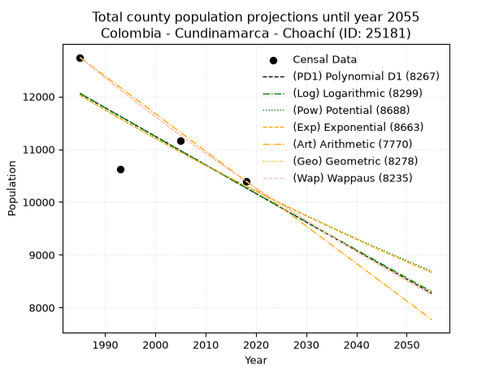
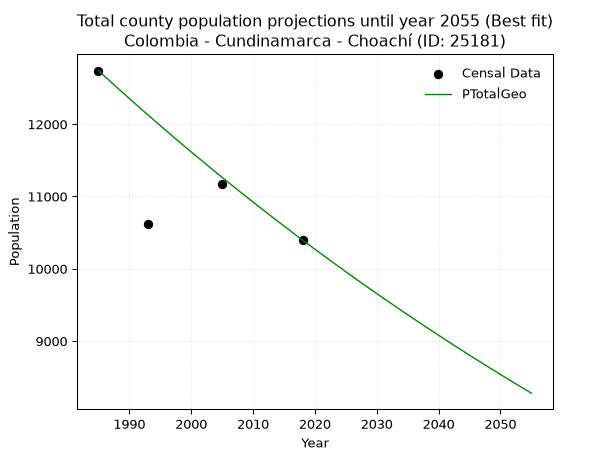
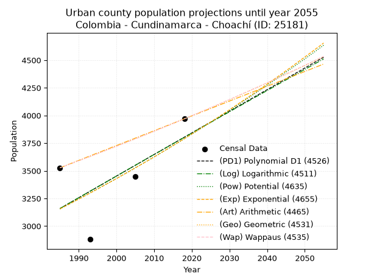
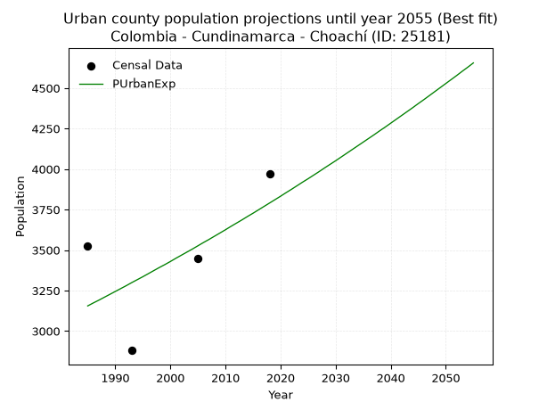
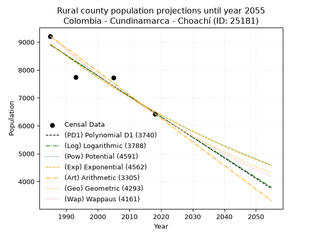
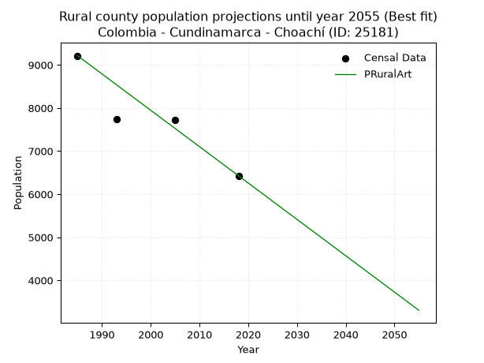

<div align="center">


</div>

# 📜 _“Population and Public Services Demand Projections (PPSD) until Year 2050 for Colombia - Cundinamarca - Choachí (ID: 25181)”_
Keywords: `population` `public-service` `projection` `lineal` `polynomial` `logarithmic` `potential` `exponential` `arithmetic` `geometric` `wappaus` `dane` `colombia` `south-america`

PPSD are analytical estimates used by governments and planners to anticipate future changes in population size, age distribution, and the resulting community needs for utilities, healthcare, education, and infrastructure as sizing future water treatment facilities, electrical grids, and road networks based on spatial growth.

<div align="center">

</img>

</div>


> **General running parameters**: • app_version: _v20260806_. • Python version: _3.14.7_. • Pandas version: _3.0.5_. • NumPy version: _2.5.1_. • Creates, save and include plots into reports (create_plot): _False_. • Projection until year: _2050_. • Process polynomial degree 2 and up: _False_. • Process Wappaus: _True_. • Process Wappaus: _True_. • Set negative values to zero: _True_. • Set infinite values to zero: _True_. • Drop dataset notes: _True_. 
<div align="center">

Dynamic map: [:earth_americas:Google](http://maps.google.com/maps?q=4.52704792,-73.9228944) [:earth_americas:OSM](https://www.openstreetmap.org/#map=18/4.52704792/-73.9228944&layers=P) [:earth_americas:Bing](https://www.bing.com/maps?cp=4.52704792~-73.9228944&lvl=18) [:earth_americas:Apple](https://maps.apple.com/frame?center=4.52704792%2C-73.9228944&span=0.003%2C0.006)

</div>


<div align="center">

```geojson
{
  "type": "Feature",
  "geometry": {
    "type": "Point", 
    "coordinates": [-73.9228944, 4.52704792]
  }, 
  "properties": {
    "Name": "Colombia - Cundinamarca - Choachí (ID: 25181)"
  }
}
```

</div>


## 0. Census Data (4 records)

Census data are official statistics collected by a government about the people and housing in a country. They usually include counts of total population, age, sex, race, income, education, and jobs.

📅Global census file: [Population.xlsx](../data/Population.xlsx)

| Source   |   Year |   CountryID | CountryName   |   StateID | StateName    |   CountyID | CountyName   |   PTotal |   PUrban |   PRural |
|:---------|-------:|------------:|:--------------|----------:|:-------------|-----------:|:-------------|---------:|---------:|---------:|
| DANE     |   1985 |          57 | Colombia      |        25 | Cundinamarca |      25181 | Choachí      |    12740 |     3527 |     9213 |
| DANE     |   1993 |          57 | Colombia      |        25 | Cundinamarca |      25181 | Choachí      |    10623 |     2880 |     7743 |
| DANE     |   2005 |          57 | Colombia      |        25 | Cundinamarca |      25181 | Choachí      |    11165 |     3450 |     7715 |
| DANE     |   2018 |          57 | Colombia      |        25 | Cundinamarca |      25181 | Choachí      |    10397 |     3969 |     6428 |

> 🔥Some records could had specific notes about the registered values or the corresponding urban or rural distribution.

📅[SUI-RUPS](https://www.datos.gov.co/Hacienda-y-Cr-dito-P-blico/Registro-nico-de-Prestadores-de-Servicios-P-blicos/4qkq-csdn/about_data) - Local public utility companies: [RUPS.csv](../data/RUPS.csv)

 | SERVICIO       | ESTADO    | NOMBRE                                                                                     | NIT         | DEPARTAMENTO_DOMICILIO   | MUNICIPIO_DOMICILIO   | DIRECCION              |   TELEFONO | EMAIL                    | TIPO_PRESTADOR                            | CLASIFICACION                 |
|:---------------|:----------|:-------------------------------------------------------------------------------------------|:------------|:-------------------------|:----------------------|:-----------------------|-----------:|:-------------------------|:------------------------------------------|:------------------------------|
| ACUEDUCTO      | OPERATIVA | EMPRESA DE SERVICIOS PUBLICOS DE ACUEDUCTO, ALCANTARILLADO Y ASEO DEL MUNICIPIO DE CHOACHI | 832003470-0 | CUNDINAMARCA             | CHOACHI               | CARRERA 4 No 5-29      |    8486465 | yennypotes11@hotmail.com | EMPRESA INDUSTRIAL Y COMERCIAL DEL ESTADO | MENOR O IGUAL A 2500 USUARIOS |
| ALCANTARILLADO | OPERATIVA | EMPRESA DE SERVICIOS PUBLICOS DE ACUEDUCTO, ALCANTARILLADO Y ASEO DEL MUNICIPIO DE CHOACHI | 832003470-0 | CUNDINAMARCA             | CHOACHI               | CARRERA 4 No 5-29      |    8486465 | yennypotes11@hotmail.com | EMPRESA INDUSTRIAL Y COMERCIAL DEL ESTADO | MENOR O IGUAL A 2500 USUARIOS |
| ACUEDUCTO      | OPERATIVA | ASOCIACION DE USUARIOS DEL ACUEDUCTO POTRERO GRANDE LA YERBABUENA Y AGUADAS                | 900156819-1 | CUNDINAMARCA             | CHOACHI               | Vereda Potrero Grande  |    2716968 | joviriga@gmail.com       | ORGANIZACION AUTORIZADA                   | MENOR O IGUAL A 2500 USUARIOS |
| ACUEDUCTO      | OPERATIVA | UBOCAR                                                                                     | 900114344-3 | CUNDINAMARCA             | CHOACHI               | cra 3 No 3-46 local 04 |    8486074 | ubocarchoachi@yahoo.com  | ORGANIZACION AUTORIZADA                   | MENOR O IGUAL A 2500 USUARIOS |
| ACUEDUCTO      | OPERATIVA | Asociación de Suscriptores del Servicio de Acueducto de las Veredas Villa Nueva Bobadillas | 900947409-8 | CUNDINAMARCA             | CHOACHI               | Cr 1 No 1 09           |    8486929 | joviriga@gmail.com       | ORGANIZACION AUTORIZADA                   | MENOR O IGUAL A 2500 USUARIOS |

## 1. Total

### 1.1. Coefficients and Parameters

* (PD1) Polynomial Deg 1: -54.14893617021235, 119542.65957446727 (lineal)
* (Log) Logarithmic: -108507.00759876306, 835993.8842787866
* (Pow) Potential: -9.384403089484257, 35.027672130119505
* (Exp) Exponential: -0.004683478810786377, 131090842.53662896
* (Art) Arithmetic: Year diff. 2018 - 1985 = 33, Population diff. 10397 - 12740 = -2343, Annual growth = -71.0
* (Geo) Geometric: Year diff. 2018 - 1985 = 33, Population diff. 10397 - 12740 = -2343, Annual growth % = -0.006139540587624337
* (Wap) Wappaus: i = -0.6137355750529455, Condition values only valid for < 200)

<sub>
Wappaus condition values: ['-0.00', '-0.61', '-1.23', '-1.84', '-2.45', '-3.07', '-3.68', '-4.30', '-4.91', '-5.52', '-6.14', '-6.75', '-7.36', '-7.98', '-8.59', '-9.21', '-9.82', '-10.43', '-11.05', '-11.66', '-12.27', '-12.89', '-13.50', '-14.12', '-14.73', '-15.34', '-15.96', '-16.57', '-17.18', '-17.80', '-18.41', '-19.03', '-19.64', '-20.25', '-20.87', '-21.48', '-22.09', '-22.71', '-23.32', '-23.94', '-24.55', '-25.16', '-25.78', '-26.39', '-27.00', '-27.62', '-28.23', '-28.85', '-29.46', '-30.07', '-30.69', '-31.30', '-31.91', '-32.53', '-33.14', '-33.76', '-34.37', '-34.98', '-35.60', '-36.21', '-36.82', '-37.44', '-38.05', '-38.67', '-39.28', '-39.89']
</sub>


### 1.2. Projected Dataset

|   Year |   CountyID |   PTotalPD1 |   PTotalLog |   PTotalPow |   PTotalExp |   PTotalArt |   PTotalGeo |   PTotalWap |
|-------:|-----------:|------------:|------------:|------------:|------------:|------------:|------------:|------------:|
|   1985 |      25181 |       12057 |       12060 |       12027 |       12024 |       12740 |       12740 |       12740 |
|   1986 |      25181 |       12003 |       12005 |       11970 |       11968 |       12669 |       12662 |       12662 |
|   1987 |      25181 |       11949 |       11950 |       11914 |       11912 |       12598 |       12584 |       12585 |
|   1988 |      25181 |       11895 |       11896 |       11858 |       11857 |       12527 |       12507 |       12508 |
|   1989 |      25181 |       11840 |       11841 |       11802 |       11801 |       12456 |       12430 |       12431 |
|   1990 |      25181 |       11786 |       11787 |       11746 |       11746 |       12385 |       12354 |       12355 |
|   1991 |      25181 |       11732 |       11732 |       11691 |       11691 |       12314 |       12278 |       12279 |
|   1992 |      25181 |       11678 |       11678 |       11636 |       11637 |       12243 |       12202 |       12204 |
|   1993 |      25181 |       11624 |       11623 |       11582 |       11582 |       12172 |       12128 |       12129 |
|   1994 |      25181 |       11570 |       11569 |       11527 |       11528 |       12101 |       12053 |       12055 |
|   1995 |      25181 |       11516 |       11514 |       11473 |       11474 |       12030 |       11979 |       11981 |
|   1996 |      25181 |       11461 |       11460 |       11419 |       11421 |       11959 |       11906 |       11908 |
|   1997 |      25181 |       11407 |       11406 |       11366 |       11367 |       11888 |       11832 |       11835 |
|   1998 |      25181 |       11353 |       11351 |       11312 |       11314 |       11817 |       11760 |       11763 |
|   1999 |      25181 |       11299 |       11297 |       11259 |       11261 |       11746 |       11688 |       11690 |
|   2000 |      25181 |       11245 |       11243 |       11207 |       11209 |       11675 |       11616 |       11619 |
|   2001 |      25181 |       11191 |       11188 |       11154 |       11156 |       11604 |       11545 |       11548 |
|   2002 |      25181 |       11136 |       11134 |       11102 |       11104 |       11533 |       11474 |       11477 |
|   2003 |      25181 |       11082 |       11080 |       11050 |       11052 |       11462 |       11403 |       11406 |
|   2004 |      25181 |       11028 |       11026 |       10998 |       11001 |       11391 |       11333 |       11336 |
|   2005 |      25181 |       10974 |       10972 |       10947 |       10949 |       11320 |       11264 |       11267 |
|   2006 |      25181 |       10920 |       10918 |       10896 |       10898 |       11249 |       11194 |       11197 |
|   2007 |      25181 |       10866 |       10864 |       10845 |       10847 |       11178 |       11126 |       11129 |
|   2008 |      25181 |       10812 |       10810 |       10795 |       10796 |       11107 |       11057 |       11060 |
|   2009 |      25181 |       10757 |       10756 |       10744 |       10746 |       11036 |       10990 |       10992 |
|   2010 |      25181 |       10703 |       10702 |       10694 |       10696 |       10965 |       10922 |       10925 |
|   2011 |      25181 |       10649 |       10648 |       10644 |       10646 |       10894 |       10855 |       10857 |
|   2012 |      25181 |       10595 |       10594 |       10595 |       10596 |       10823 |       10788 |       10790 |
|   2013 |      25181 |       10541 |       10540 |       10546 |       10547 |       10752 |       10722 |       10724 |
|   2014 |      25181 |       10487 |       10486 |       10497 |       10497 |       10681 |       10656 |       10658 |
|   2015 |      25181 |       10433 |       10432 |       10448 |       10448 |       10610 |       10591 |       10592 |
|   2016 |      25181 |       10378 |       10378 |       10399 |       10399 |       10539 |       10526 |       10527 |
|   2017 |      25181 |       10324 |       10324 |       10351 |       10351 |       10468 |       10461 |       10462 |
|   2018 |      25181 |       10270 |       10271 |       10303 |       10302 |       10397 |       10397 |       10397 |
|   2019 |      25181 |       10216 |       10217 |       10255 |       10254 |       10326 |       10333 |       10333 |
|   2020 |      25181 |       10162 |       10163 |       10208 |       10206 |       10255 |       10270 |       10269 |
|   2021 |      25181 |       10108 |       10109 |       10160 |       10159 |       10184 |       10207 |       10205 |
|   2022 |      25181 |       10054 |       10056 |       10113 |       10111 |       10113 |       10144 |       10142 |
|   2023 |      25181 |        9999 |       10002 |       10066 |       10064 |       10042 |       10082 |       10079 |
|   2024 |      25181 |        9945 |        9948 |       10020 |       10017 |        9971 |       10020 |       10017 |
|   2025 |      25181 |        9891 |        9895 |        9973 |        9970 |        9900 |        9958 |        9954 |
|   2026 |      25181 |        9837 |        9841 |        9927 |        9924 |        9829 |        9897 |        9892 |
|   2027 |      25181 |        9783 |        9788 |        9882 |        9877 |        9758 |        9836 |        9831 |
|   2028 |      25181 |        9729 |        9734 |        9836 |        9831 |        9687 |        9776 |        9770 |
|   2029 |      25181 |        9674 |        9681 |        9790 |        9785 |        9616 |        9716 |        9709 |
|   2030 |      25181 |        9620 |        9627 |        9745 |        9739 |        9545 |        9656 |        9648 |
|   2031 |      25181 |        9566 |        9574 |        9700 |        9694 |        9474 |        9597 |        9588 |
|   2032 |      25181 |        9512 |        9520 |        9656 |        9649 |        9403 |        9538 |        9528 |
|   2033 |      25181 |        9458 |        9467 |        9611 |        9604 |        9332 |        9480 |        9469 |
|   2034 |      25181 |        9404 |        9414 |        9567 |        9559 |        9261 |        9421 |        9409 |
|   2035 |      25181 |        9350 |        9360 |        9523 |        9514 |        9190 |        9364 |        9351 |
|   2036 |      25181 |        9295 |        9307 |        9479 |        9470 |        9119 |        9306 |        9292 |
|   2037 |      25181 |        9241 |        9254 |        9436 |        9425 |        9048 |        9249 |        9234 |
|   2038 |      25181 |        9187 |        9200 |        9392 |        9381 |        8977 |        9192 |        9176 |
|   2039 |      25181 |        9133 |        9147 |        9349 |        9337 |        8906 |        9136 |        9118 |
|   2040 |      25181 |        9079 |        9094 |        9306 |        9294 |        8835 |        9080 |        9061 |
|   2041 |      25181 |        9025 |        9041 |        9263 |        9250 |        8764 |        9024 |        9003 |
|   2042 |      25181 |        8971 |        8988 |        9221 |        9207 |        8693 |        8968 |        8947 |
|   2043 |      25181 |        8916 |        8935 |        9179 |        9164 |        8622 |        8913 |        8890 |
|   2044 |      25181 |        8862 |        8881 |        9137 |        9121 |        8551 |        8859 |        8834 |
|   2045 |      25181 |        8808 |        8828 |        9095 |        9079 |        8480 |        8804 |        8778 |
|   2046 |      25181 |        8754 |        8775 |        9053 |        9036 |        8409 |        8750 |        8722 |
|   2047 |      25181 |        8700 |        8722 |        9012 |        8994 |        8338 |        8697 |        8667 |
|   2048 |      25181 |        8646 |        8669 |        8971 |        8952 |        8267 |        8643 |        8612 |
|   2049 |      25181 |        8591 |        8616 |        8930 |        8910 |        8196 |        8590 |        8557 |
|   2050 |      25181 |        8537 |        8563 |        8889 |        8869 |        8125 |        8537 |        8503 |
<div align="center">

</img>

</div>


### 1.3. Best fit with absolute and relative error (%)

Relative error puts that difference into context by dividing the absolute error by the true value, creating a unitless ratio or percentage that shows the scale of the mistake.

Absolute and relative error

|   Year | Source   |   CountryID | CountryName   |   StateID | StateName    |   CountyID_x | CountyName   |   PTotal |   PUrban |   PRural |   CountyID_y |   PTotalPD1 |   PTotalLog |   PTotalPow |   PTotalExp |   PTotalArt |   PTotalGeo |   PTotalWap |   PTotalPD1AbsError |   PTotalLogAbsError |   PTotalPowAbsError |   PTotalExpAbsError |   PTotalArtAbsError |   PTotalGeoAbsError |   PTotalWapAbsError |   PTotalPD1RelError |   PTotalLogRelError |   PTotalPowRelError |   PTotalExpRelError |   PTotalArtRelError |   PTotalGeoRelError |   PTotalWapRelError |
|-------:|:---------|------------:|:--------------|----------:|:-------------|-------------:|:-------------|---------:|---------:|---------:|-------------:|------------:|------------:|------------:|------------:|------------:|------------:|------------:|--------------------:|--------------------:|--------------------:|--------------------:|--------------------:|--------------------:|--------------------:|--------------------:|--------------------:|--------------------:|--------------------:|--------------------:|--------------------:|--------------------:|
|   1985 | DANE     |          57 | Colombia      |        25 | Cundinamarca |        25181 | Choachí      |    12740 |     3527 |     9213 |        25181 |       12057 |       12060 |       12027 |       12024 |       12740 |       12740 |       12740 |                 683 |                 680 |                 713 |                 716 |                   0 |                   0 |                   0 |             5.36107 |             5.33752 |            5.59655  |            5.62009  |             0       |              0      |            0        |
|   1993 | DANE     |          57 | Colombia      |        25 | Cundinamarca |        25181 | Choachí      |    10623 |     2880 |     7743 |        25181 |       11624 |       11623 |       11582 |       11582 |       12172 |       12128 |       12129 |                1001 |                1000 |                 959 |                 959 |                1549 |                1505 |                1506 |             9.42295 |             9.41354 |            9.02758  |            9.02758  |            14.5816  |             14.1674 |           14.1768   |
|   2005 | DANE     |          57 | Colombia      |        25 | Cundinamarca |        25181 | Choachí      |    11165 |     3450 |     7715 |        25181 |       10974 |       10972 |       10947 |       10949 |       11320 |       11264 |       11267 |                 191 |                 193 |                 218 |                 216 |                 155 |                  99 |                 102 |             1.7107  |             1.72862 |            1.95253  |            1.93462  |             1.38827 |              0.8867 |            0.913569 |
|   2018 | DANE     |          57 | Colombia      |        25 | Cundinamarca |        25181 | Choachí      |    10397 |     3969 |     6428 |        25181 |       10270 |       10271 |       10303 |       10302 |       10397 |       10397 |       10397 |                 127 |                 126 |                  94 |                  95 |                   0 |                   0 |                   0 |             1.22151 |             1.21189 |            0.904107 |            0.913725 |             0       |              0      |            0        |

Relative error mean

| Method    |   RelError | Best   |
|:----------|-----------:|:-------|
| PTotalPD1 |    4.42906 |        |
| PTotalLog |    4.42289 |        |
| PTotalPow |    4.37019 |        |
| PTotalExp |    4.374   |        |
| PTotalArt |    3.99246 |        |
| PTotalGeo |    3.76352 | True   |
| PTotalWap |    3.77259 |        |

💙Best method: _**PTotalGeo**_
<div align="center">

</img>

</div>


### 1.4. Fresh water supply demand in liters per capita per day (lpcd)

The fresh water supply demand typically ranges from 100 to 300 liters per capita per day (lpcd) for standard domestic and municipal planning, though absolute survival minimums set by the World Health Organization are as low as 7.5 to 20 liters per day, and total consumption in high-income nations can exceed 400 liters.

> `CZ`: Level in meters above the sea level (masl)<br> `WS`: Fresh water supply demand in liters per capita per day (lpcd or l/h/d)<br> `WSAll`: Zonal fresh water supply demand in liters per second (l/s)<br> `A`: Zonal area in square meters<br> `DP`: Population density (people/hectare or p/ha)

Reference values (RAS Colombia)

|    CZ |   WS |
|------:|-----:|
|  1000 |  120 |
|  2000 |  130 |
| 99999 |  140 |

County shapefile geometry properties and water supply values

|   CountyID |      ATotal |   CZTotal |   WSTotal |
|-----------:|------------:|----------:|----------:|
|      25181 | 2.12132e+08 |   2708.98 |       140 |

Projected values for best method: PTotalGeo

|   CountyID |   Year |   PTotalGeo |   DPTotal |   WSTotal |   WSTotalAll |
|-----------:|-------:|------------:|----------:|----------:|-------------:|
|      25181 |   1985 |       12740 |      0.6  |       140 |      20.6435 |
|      25181 |   1986 |       12662 |      0.6  |       140 |      20.5171 |
|      25181 |   1987 |       12584 |      0.59 |       140 |      20.3907 |
|      25181 |   1988 |       12507 |      0.59 |       140 |      20.266  |
|      25181 |   1989 |       12430 |      0.59 |       140 |      20.1412 |
|      25181 |   1990 |       12354 |      0.58 |       140 |      20.0181 |
|      25181 |   1991 |       12278 |      0.58 |       140 |      19.8949 |
|      25181 |   1992 |       12202 |      0.58 |       140 |      19.7718 |
|      25181 |   1993 |       12128 |      0.57 |       140 |      19.6519 |
|      25181 |   1994 |       12053 |      0.57 |       140 |      19.5303 |
|      25181 |   1995 |       11979 |      0.56 |       140 |      19.4104 |
|      25181 |   1996 |       11906 |      0.56 |       140 |      19.2921 |
|      25181 |   1997 |       11832 |      0.56 |       140 |      19.1722 |
|      25181 |   1998 |       11760 |      0.55 |       140 |      19.0556 |
|      25181 |   1999 |       11688 |      0.55 |       140 |      18.9389 |
|      25181 |   2000 |       11616 |      0.55 |       140 |      18.8222 |
|      25181 |   2001 |       11545 |      0.54 |       140 |      18.7072 |
|      25181 |   2002 |       11474 |      0.54 |       140 |      18.5921 |
|      25181 |   2003 |       11403 |      0.54 |       140 |      18.4771 |
|      25181 |   2004 |       11333 |      0.53 |       140 |      18.3637 |
|      25181 |   2005 |       11264 |      0.53 |       140 |      18.2519 |
|      25181 |   2006 |       11194 |      0.53 |       140 |      18.1384 |
|      25181 |   2007 |       11126 |      0.52 |       140 |      18.0282 |
|      25181 |   2008 |       11057 |      0.52 |       140 |      17.9164 |
|      25181 |   2009 |       10990 |      0.52 |       140 |      17.8079 |
|      25181 |   2010 |       10922 |      0.51 |       140 |      17.6977 |
|      25181 |   2011 |       10855 |      0.51 |       140 |      17.5891 |
|      25181 |   2012 |       10788 |      0.51 |       140 |      17.4806 |
|      25181 |   2013 |       10722 |      0.51 |       140 |      17.3736 |
|      25181 |   2014 |       10656 |      0.5  |       140 |      17.2667 |
|      25181 |   2015 |       10591 |      0.5  |       140 |      17.1613 |
|      25181 |   2016 |       10526 |      0.5  |       140 |      17.056  |
|      25181 |   2017 |       10461 |      0.49 |       140 |      16.9507 |
|      25181 |   2018 |       10397 |      0.49 |       140 |      16.847  |
|      25181 |   2019 |       10333 |      0.49 |       140 |      16.7433 |
|      25181 |   2020 |       10270 |      0.48 |       140 |      16.6412 |
|      25181 |   2021 |       10207 |      0.48 |       140 |      16.5391 |
|      25181 |   2022 |       10144 |      0.48 |       140 |      16.437  |
|      25181 |   2023 |       10082 |      0.48 |       140 |      16.3366 |
|      25181 |   2024 |       10020 |      0.47 |       140 |      16.2361 |
|      25181 |   2025 |        9958 |      0.47 |       140 |      16.1356 |
|      25181 |   2026 |        9897 |      0.47 |       140 |      16.0368 |
|      25181 |   2027 |        9836 |      0.46 |       140 |      15.938  |
|      25181 |   2028 |        9776 |      0.46 |       140 |      15.8407 |
|      25181 |   2029 |        9716 |      0.46 |       140 |      15.7435 |
|      25181 |   2030 |        9656 |      0.46 |       140 |      15.6463 |
|      25181 |   2031 |        9597 |      0.45 |       140 |      15.5507 |
|      25181 |   2032 |        9538 |      0.45 |       140 |      15.4551 |
|      25181 |   2033 |        9480 |      0.45 |       140 |      15.3611 |
|      25181 |   2034 |        9421 |      0.44 |       140 |      15.2655 |
|      25181 |   2035 |        9364 |      0.44 |       140 |      15.1731 |
|      25181 |   2036 |        9306 |      0.44 |       140 |      15.0792 |
|      25181 |   2037 |        9249 |      0.44 |       140 |      14.9868 |
|      25181 |   2038 |        9192 |      0.43 |       140 |      14.8944 |
|      25181 |   2039 |        9136 |      0.43 |       140 |      14.8037 |
|      25181 |   2040 |        9080 |      0.43 |       140 |      14.713  |
|      25181 |   2041 |        9024 |      0.43 |       140 |      14.6222 |
|      25181 |   2042 |        8968 |      0.42 |       140 |      14.5315 |
|      25181 |   2043 |        8913 |      0.42 |       140 |      14.4424 |
|      25181 |   2044 |        8859 |      0.42 |       140 |      14.3549 |
|      25181 |   2045 |        8804 |      0.42 |       140 |      14.2657 |
|      25181 |   2046 |        8750 |      0.41 |       140 |      14.1782 |
|      25181 |   2047 |        8697 |      0.41 |       140 |      14.0924 |
|      25181 |   2048 |        8643 |      0.41 |       140 |      14.0049 |
|      25181 |   2049 |        8590 |      0.4  |       140 |      13.919  |
|      25181 |   2050 |        8537 |      0.4  |       140 |      13.8331 |

## 2. Urban

### 2.1. Coefficients and Parameters

* (PD1) Polynomial Deg 1: 19.543155359293113, -35634.696507426044 (lineal)
* (Log) Logarithmic: 39027.24086485945, -293189.87055847736
* (Pow) Potential: 11.094919574336032, -33.08934638676877
* (Exp) Exponential: 0.005556158760702996, 0.051192118488753255
* (Art) Arithmetic: Year diff. 2018 - 1985 = 33, Population diff. 3969 - 3527 = 442, Annual growth = 13.393939393939394
* (Geo) Geometric: Year diff. 2018 - 1985 = 33, Population diff. 3969 - 3527 = 442, Annual growth % = 0.00358418128149518
* (Wap) Wappaus: i = 0.3573623104039326, Condition values only valid for < 200)

<sub>
Wappaus condition values: ['0.00', '0.36', '0.71', '1.07', '1.43', '1.79', '2.14', '2.50', '2.86', '3.22', '3.57', '3.93', '4.29', '4.65', '5.00', '5.36', '5.72', '6.08', '6.43', '6.79', '7.15', '7.50', '7.86', '8.22', '8.58', '8.93', '9.29', '9.65', '10.01', '10.36', '10.72', '11.08', '11.44', '11.79', '12.15', '12.51', '12.87', '13.22', '13.58', '13.94', '14.29', '14.65', '15.01', '15.37', '15.72', '16.08', '16.44', '16.80', '17.15', '17.51', '17.87', '18.23', '18.58', '18.94', '19.30', '19.65', '20.01', '20.37', '20.73', '21.08', '21.44', '21.80', '22.16', '22.51', '22.87', '23.23']
</sub>


### 2.2. Projected Dataset

|   Year |   CountyID |   PUrbanPD1 |   PUrbanLog |   PUrbanPow |   PUrbanExp |   PUrbanArt |   PUrbanGeo |   PUrbanWap |
|-------:|-----------:|------------:|------------:|------------:|------------:|------------:|------------:|------------:|
|   1985 |      25181 |        3158 |        3159 |        3155 |        3155 |        3527 |        3527 |        3527 |
|   1986 |      25181 |        3178 |        3178 |        3173 |        3173 |        3540 |        3540 |        3540 |
|   1987 |      25181 |        3198 |        3198 |        3191 |        3190 |        3554 |        3552 |        3552 |
|   1988 |      25181 |        3217 |        3218 |        3209 |        3208 |        3567 |        3565 |        3565 |
|   1989 |      25181 |        3237 |        3237 |        3227 |        3226 |        3581 |        3578 |        3578 |
|   1990 |      25181 |        3256 |        3257 |        3245 |        3244 |        3594 |        3591 |        3591 |
|   1991 |      25181 |        3276 |        3276 |        3263 |        3262 |        3607 |        3604 |        3603 |
|   1992 |      25181 |        3295 |        3296 |        3281 |        3280 |        3621 |        3616 |        3616 |
|   1993 |      25181 |        3315 |        3316 |        3299 |        3299 |        3634 |        3629 |        3629 |
|   1994 |      25181 |        3334 |        3335 |        3318 |        3317 |        3648 |        3642 |        3642 |
|   1995 |      25181 |        3354 |        3355 |        3336 |        3335 |        3661 |        3655 |        3655 |
|   1996 |      25181 |        3373 |        3374 |        3355 |        3354 |        3674 |        3669 |        3668 |
|   1997 |      25181 |        3393 |        3394 |        3374 |        3373 |        3688 |        3682 |        3682 |
|   1998 |      25181 |        3413 |        3413 |        3392 |        3392 |        3701 |        3695 |        3695 |
|   1999 |      25181 |        3432 |        3433 |        3411 |        3410 |        3715 |        3708 |        3708 |
|   2000 |      25181 |        3452 |        3452 |        3430 |        3429 |        3728 |        3721 |        3721 |
|   2001 |      25181 |        3471 |        3472 |        3449 |        3449 |        3741 |        3735 |        3735 |
|   2002 |      25181 |        3491 |        3491 |        3468 |        3468 |        3755 |        3748 |        3748 |
|   2003 |      25181 |        3510 |        3511 |        3488 |        3487 |        3768 |        3762 |        3761 |
|   2004 |      25181 |        3530 |        3530 |        3507 |        3506 |        3781 |        3775 |        3775 |
|   2005 |      25181 |        3549 |        3550 |        3527 |        3526 |        3795 |        3789 |        3788 |
|   2006 |      25181 |        3569 |        3569 |        3546 |        3546 |        3808 |        3802 |        3802 |
|   2007 |      25181 |        3588 |        3589 |        3566 |        3565 |        3822 |        3816 |        3816 |
|   2008 |      25181 |        3608 |        3608 |        3586 |        3585 |        3835 |        3830 |        3829 |
|   2009 |      25181 |        3628 |        3628 |        3605 |        3605 |        3848 |        3843 |        3843 |
|   2010 |      25181 |        3647 |        3647 |        3625 |        3625 |        3862 |        3857 |        3857 |
|   2011 |      25181 |        3667 |        3666 |        3645 |        3646 |        3875 |        3871 |        3871 |
|   2012 |      25181 |        3686 |        3686 |        3666 |        3666 |        3889 |        3885 |        3885 |
|   2013 |      25181 |        3706 |        3705 |        3686 |        3686 |        3902 |        3899 |        3899 |
|   2014 |      25181 |        3725 |        3725 |        3706 |        3707 |        3915 |        3913 |        3912 |
|   2015 |      25181 |        3745 |        3744 |        3727 |        3727 |        3929 |        3927 |        3927 |
|   2016 |      25181 |        3764 |        3763 |        3747 |        3748 |        3942 |        3941 |        3941 |
|   2017 |      25181 |        3784 |        3783 |        3768 |        3769 |        3956 |        3955 |        3955 |
|   2018 |      25181 |        3803 |        3802 |        3789 |        3790 |        3969 |        3969 |        3969 |
|   2019 |      25181 |        3823 |        3821 |        3810 |        3811 |        3982 |        3983 |        3983 |
|   2020 |      25181 |        3842 |        3841 |        3831 |        3832 |        3996 |        3998 |        3998 |
|   2021 |      25181 |        3862 |        3860 |        3852 |        3854 |        4009 |        4012 |        4012 |
|   2022 |      25181 |        3882 |        3879 |        3873 |        3875 |        4023 |        4026 |        4026 |
|   2023 |      25181 |        3901 |        3899 |        3894 |        3897 |        4036 |        4041 |        4041 |
|   2024 |      25181 |        3921 |        3918 |        3916 |        3919 |        4049 |        4055 |        4055 |
|   2025 |      25181 |        3940 |        3937 |        3937 |        3940 |        4063 |        4070 |        4070 |
|   2026 |      25181 |        3960 |        3956 |        3959 |        3962 |        4076 |        4084 |        4085 |
|   2027 |      25181 |        3979 |        3976 |        3980 |        3984 |        4090 |        4099 |        4099 |
|   2028 |      25181 |        3999 |        3995 |        4002 |        4007 |        4103 |        4114 |        4114 |
|   2029 |      25181 |        4018 |        4014 |        4024 |        4029 |        4116 |        4128 |        4129 |
|   2030 |      25181 |        4038 |        4033 |        4046 |        4051 |        4130 |        4143 |        4144 |
|   2031 |      25181 |        4057 |        4053 |        4068 |        4074 |        4143 |        4158 |        4159 |
|   2032 |      25181 |        4077 |        4072 |        4091 |        4097 |        4157 |        4173 |        4174 |
|   2033 |      25181 |        4097 |        4091 |        4113 |        4120 |        4170 |        4188 |        4189 |
|   2034 |      25181 |        4116 |        4110 |        4136 |        4143 |        4183 |        4203 |        4204 |
|   2035 |      25181 |        4136 |        4129 |        4158 |        4166 |        4197 |        4218 |        4219 |
|   2036 |      25181 |        4155 |        4149 |        4181 |        4189 |        4210 |        4233 |        4234 |
|   2037 |      25181 |        4175 |        4168 |        4204 |        4212 |        4223 |        4248 |        4250 |
|   2038 |      25181 |        4194 |        4187 |        4227 |        4236 |        4237 |        4263 |        4265 |
|   2039 |      25181 |        4214 |        4206 |        4250 |        4259 |        4250 |        4279 |        4280 |
|   2040 |      25181 |        4233 |        4225 |        4273 |        4283 |        4264 |        4294 |        4296 |
|   2041 |      25181 |        4253 |        4244 |        4296 |        4307 |        4277 |        4309 |        4311 |
|   2042 |      25181 |        4272 |        4263 |        4320 |        4331 |        4290 |        4325 |        4327 |
|   2043 |      25181 |        4292 |        4283 |        4343 |        4355 |        4304 |        4340 |        4343 |
|   2044 |      25181 |        4312 |        4302 |        4367 |        4379 |        4317 |        4356 |        4358 |
|   2045 |      25181 |        4331 |        4321 |        4391 |        4404 |        4331 |        4372 |        4374 |
|   2046 |      25181 |        4351 |        4340 |        4415 |        4428 |        4344 |        4387 |        4390 |
|   2047 |      25181 |        4370 |        4359 |        4439 |        4453 |        4357 |        4403 |        4406 |
|   2048 |      25181 |        4390 |        4378 |        4463 |        4478 |        4371 |        4419 |        4422 |
|   2049 |      25181 |        4409 |        4397 |        4487 |        4503 |        4384 |        4435 |        4438 |
|   2050 |      25181 |        4429 |        4416 |        4511 |        4528 |        4398 |        4450 |        4454 |
<div align="center">

</img>

</div>


### 2.3. Best fit with absolute and relative error (%)

Relative error puts that difference into context by dividing the absolute error by the true value, creating a unitless ratio or percentage that shows the scale of the mistake.

Absolute and relative error

|   Year | Source   |   CountryID | CountryName   |   StateID | StateName    |   CountyID_x | CountyName   |   PTotal |   PUrban |   PRural |   CountyID_y |   PUrbanPD1 |   PUrbanLog |   PUrbanPow |   PUrbanExp |   PUrbanArt |   PUrbanGeo |   PUrbanWap |   PUrbanPD1AbsError |   PUrbanLogAbsError |   PUrbanPowAbsError |   PUrbanExpAbsError |   PUrbanArtAbsError |   PUrbanGeoAbsError |   PUrbanWapAbsError |   PUrbanPD1RelError |   PUrbanLogRelError |   PUrbanPowRelError |   PUrbanExpRelError |   PUrbanArtRelError |   PUrbanGeoRelError |   PUrbanWapRelError |
|-------:|:---------|------------:|:--------------|----------:|:-------------|-------------:|:-------------|---------:|---------:|---------:|-------------:|------------:|------------:|------------:|------------:|------------:|------------:|------------:|--------------------:|--------------------:|--------------------:|--------------------:|--------------------:|--------------------:|--------------------:|--------------------:|--------------------:|--------------------:|--------------------:|--------------------:|--------------------:|--------------------:|
|   1985 | DANE     |          57 | Colombia      |        25 | Cundinamarca |        25181 | Choachí      |    12740 |     3527 |     9213 |        25181 |        3158 |        3159 |        3155 |        3155 |        3527 |        3527 |        3527 |                 369 |                 368 |                 372 |                 372 |                   0 |                   0 |                   0 |            10.4621  |            10.4338  |            10.5472  |            10.5472  |              0      |             0       |              0      |
|   1993 | DANE     |          57 | Colombia      |        25 | Cundinamarca |        25181 | Choachí      |    10623 |     2880 |     7743 |        25181 |        3315 |        3316 |        3299 |        3299 |        3634 |        3629 |        3629 |                 435 |                 436 |                 419 |                 419 |                 754 |                 749 |                 749 |            15.1042  |            15.1389  |            14.5486  |            14.5486  |             26.1806 |            26.0069  |             26.0069 |
|   2005 | DANE     |          57 | Colombia      |        25 | Cundinamarca |        25181 | Choachí      |    11165 |     3450 |     7715 |        25181 |        3549 |        3550 |        3527 |        3526 |        3795 |        3789 |        3788 |                  99 |                 100 |                  77 |                  76 |                 345 |                 339 |                 338 |             2.86957 |             2.89855 |             2.23188 |             2.2029  |             10      |             9.82609 |              9.7971 |
|   2018 | DANE     |          57 | Colombia      |        25 | Cundinamarca |        25181 | Choachí      |    10397 |     3969 |     6428 |        25181 |        3803 |        3802 |        3789 |        3790 |        3969 |        3969 |        3969 |                 166 |                 167 |                 180 |                 179 |                   0 |                   0 |                   0 |             4.18241 |             4.20761 |             4.53515 |             4.50995 |              0      |             0       |              0      |

Relative error mean

| Method    |   RelError | Best   |
|:----------|-----------:|:-------|
| PUrbanPD1 |    8.15457 |        |
| PUrbanLog |    8.16971 |        |
| PUrbanPow |    7.96571 |        |
| PUrbanExp |    7.95217 | True   |
| PUrbanArt |    9.04514 |        |
| PUrbanGeo |    8.95826 |        |
| PUrbanWap |    8.95101 |        |

💙Best method: _**PUrbanExp**_
<div align="center">

</img>

</div>


### 2.4. Fresh water supply demand in liters per capita per day (lpcd)

The fresh water supply demand typically ranges from 100 to 300 liters per capita per day (lpcd) for standard domestic and municipal planning, though absolute survival minimums set by the World Health Organization are as low as 7.5 to 20 liters per day, and total consumption in high-income nations can exceed 400 liters.

> `CZ`: Level in meters above the sea level (masl)<br> `WS`: Fresh water supply demand in liters per capita per day (lpcd or l/h/d)<br> `WSAll`: Zonal fresh water supply demand in liters per second (l/s)<br> `A`: Zonal area in square meters<br> `DP`: Population density (people/hectare or p/ha)

Reference values (RAS Colombia)

|    CZ |   WS |
|------:|-----:|
|  1000 |  120 |
|  2000 |  130 |
| 99999 |  140 |

County shapefile geometry properties and water supply values

|   CountyID |      AUrban |   CZUrban |   WSUrban |
|-----------:|------------:|----------:|----------:|
|      25181 | 1.11331e+06 |   1922.35 |       130 |

Projected values for best method: PUrbanExp

|   CountyID |   Year |   PUrbanExp |   DPUrban |   WSUrban |   WSUrbanAll |
|-----------:|-------:|------------:|----------:|----------:|-------------:|
|      25181 |   1985 |        3155 |     28.34 |       130 |      4.74711 |
|      25181 |   1986 |        3173 |     28.5  |       130 |      4.77419 |
|      25181 |   1987 |        3190 |     28.65 |       130 |      4.79977 |
|      25181 |   1988 |        3208 |     28.82 |       130 |      4.82685 |
|      25181 |   1989 |        3226 |     28.98 |       130 |      4.85394 |
|      25181 |   1990 |        3244 |     29.14 |       130 |      4.88102 |
|      25181 |   1991 |        3262 |     29.3  |       130 |      4.9081  |
|      25181 |   1992 |        3280 |     29.46 |       130 |      4.93519 |
|      25181 |   1993 |        3299 |     29.63 |       130 |      4.96377 |
|      25181 |   1994 |        3317 |     29.79 |       130 |      4.99086 |
|      25181 |   1995 |        3335 |     29.96 |       130 |      5.01794 |
|      25181 |   1996 |        3354 |     30.13 |       130 |      5.04653 |
|      25181 |   1997 |        3373 |     30.3  |       130 |      5.07512 |
|      25181 |   1998 |        3392 |     30.47 |       130 |      5.1037  |
|      25181 |   1999 |        3410 |     30.63 |       130 |      5.13079 |
|      25181 |   2000 |        3429 |     30.8  |       130 |      5.15937 |
|      25181 |   2001 |        3449 |     30.98 |       130 |      5.18947 |
|      25181 |   2002 |        3468 |     31.15 |       130 |      5.21806 |
|      25181 |   2003 |        3487 |     31.32 |       130 |      5.24664 |
|      25181 |   2004 |        3506 |     31.49 |       130 |      5.27523 |
|      25181 |   2005 |        3526 |     31.67 |       130 |      5.30532 |
|      25181 |   2006 |        3546 |     31.85 |       130 |      5.33542 |
|      25181 |   2007 |        3565 |     32.02 |       130 |      5.364   |
|      25181 |   2008 |        3585 |     32.2  |       130 |      5.3941  |
|      25181 |   2009 |        3605 |     32.38 |       130 |      5.42419 |
|      25181 |   2010 |        3625 |     32.56 |       130 |      5.45428 |
|      25181 |   2011 |        3646 |     32.75 |       130 |      5.48588 |
|      25181 |   2012 |        3666 |     32.93 |       130 |      5.51597 |
|      25181 |   2013 |        3686 |     33.11 |       130 |      5.54606 |
|      25181 |   2014 |        3707 |     33.3  |       130 |      5.57766 |
|      25181 |   2015 |        3727 |     33.48 |       130 |      5.60775 |
|      25181 |   2016 |        3748 |     33.67 |       130 |      5.63935 |
|      25181 |   2017 |        3769 |     33.85 |       130 |      5.67095 |
|      25181 |   2018 |        3790 |     34.04 |       130 |      5.70255 |
|      25181 |   2019 |        3811 |     34.23 |       130 |      5.73414 |
|      25181 |   2020 |        3832 |     34.42 |       130 |      5.76574 |
|      25181 |   2021 |        3854 |     34.62 |       130 |      5.79884 |
|      25181 |   2022 |        3875 |     34.81 |       130 |      5.83044 |
|      25181 |   2023 |        3897 |     35    |       130 |      5.86354 |
|      25181 |   2024 |        3919 |     35.2  |       130 |      5.89664 |
|      25181 |   2025 |        3940 |     35.39 |       130 |      5.92824 |
|      25181 |   2026 |        3962 |     35.59 |       130 |      5.96134 |
|      25181 |   2027 |        3984 |     35.79 |       130 |      5.99444 |
|      25181 |   2028 |        4007 |     35.99 |       130 |      6.02905 |
|      25181 |   2029 |        4029 |     36.19 |       130 |      6.06215 |
|      25181 |   2030 |        4051 |     36.39 |       130 |      6.09525 |
|      25181 |   2031 |        4074 |     36.59 |       130 |      6.12986 |
|      25181 |   2032 |        4097 |     36.8  |       130 |      6.16447 |
|      25181 |   2033 |        4120 |     37.01 |       130 |      6.19907 |
|      25181 |   2034 |        4143 |     37.21 |       130 |      6.23368 |
|      25181 |   2035 |        4166 |     37.42 |       130 |      6.26829 |
|      25181 |   2036 |        4189 |     37.63 |       130 |      6.30289 |
|      25181 |   2037 |        4212 |     37.83 |       130 |      6.3375  |
|      25181 |   2038 |        4236 |     38.05 |       130 |      6.37361 |
|      25181 |   2039 |        4259 |     38.26 |       130 |      6.40822 |
|      25181 |   2040 |        4283 |     38.47 |       130 |      6.44433 |
|      25181 |   2041 |        4307 |     38.69 |       130 |      6.48044 |
|      25181 |   2042 |        4331 |     38.9  |       130 |      6.51655 |
|      25181 |   2043 |        4355 |     39.12 |       130 |      6.55266 |
|      25181 |   2044 |        4379 |     39.33 |       130 |      6.58877 |
|      25181 |   2045 |        4404 |     39.56 |       130 |      6.62639 |
|      25181 |   2046 |        4428 |     39.77 |       130 |      6.6625  |
|      25181 |   2047 |        4453 |     40    |       130 |      6.70012 |
|      25181 |   2048 |        4478 |     40.22 |       130 |      6.73773 |
|      25181 |   2049 |        4503 |     40.45 |       130 |      6.77535 |
|      25181 |   2050 |        4528 |     40.67 |       130 |      6.81296 |

## 3. Rural

### 3.1. Coefficients and Parameters

* (PD1) Polynomial Deg 1: -73.69209152950542, 155177.35608189326 (lineal)
* (Log) Logarithmic: -147534.24846362232, 1129183.7548372624
* (Pow) Potential: -19.195301783685334, 67.2523274374273
* (Exp) Exponential: -0.009589388350395809, 1649903628501.9922
* (Art) Arithmetic: Year diff. 2018 - 1985 = 33, Population diff. 6428 - 9213 = -2785, Annual growth = -84.39393939393939
* (Geo) Geometric: Year diff. 2018 - 1985 = 33, Population diff. 6428 - 9213 = -2785, Annual growth % = -0.010848366267145138
* (Wap) Wappaus: i = -1.0791373875575654, Condition values only valid for < 200)

<sub>
Wappaus condition values: ['-0.00', '-1.08', '-2.16', '-3.24', '-4.32', '-5.40', '-6.47', '-7.55', '-8.63', '-9.71', '-10.79', '-11.87', '-12.95', '-14.03', '-15.11', '-16.19', '-17.27', '-18.35', '-19.42', '-20.50', '-21.58', '-22.66', '-23.74', '-24.82', '-25.90', '-26.98', '-28.06', '-29.14', '-30.22', '-31.29', '-32.37', '-33.45', '-34.53', '-35.61', '-36.69', '-37.77', '-38.85', '-39.93', '-41.01', '-42.09', '-43.17', '-44.24', '-45.32', '-46.40', '-47.48', '-48.56', '-49.64', '-50.72', '-51.80', '-52.88', '-53.96', '-55.04', '-56.12', '-57.19', '-58.27', '-59.35', '-60.43', '-61.51', '-62.59', '-63.67', '-64.75', '-65.83', '-66.91', '-67.99', '-69.06', '-70.14']
</sub>


### 3.2. Projected Dataset

|   Year |   CountyID |   PRuralPD1 |   PRuralLog |   PRuralPow |   PRuralExp |   PRuralArt |   PRuralGeo |   PRuralWap |
|-------:|-----------:|------------:|------------:|------------:|------------:|------------:|------------:|------------:|
|   1985 |      25181 |        8899 |        8901 |        8929 |        8927 |        9213 |        9213 |        9213 |
|   1986 |      25181 |        8825 |        8827 |        8843 |        8842 |        9129 |        9113 |        9114 |
|   1987 |      25181 |        8751 |        8752 |        8758 |        8757 |        9044 |        9014 |        9016 |
|   1988 |      25181 |        8677 |        8678 |        8674 |        8674 |        8960 |        8916 |        8919 |
|   1989 |      25181 |        8604 |        8604 |        8591 |        8591 |        8875 |        8820 |        8824 |
|   1990 |      25181 |        8530 |        8530 |        8508 |        8509 |        8791 |        8724 |        8729 |
|   1991 |      25181 |        8456 |        8456 |        8427 |        8428 |        8707 |        8629 |        8635 |
|   1992 |      25181 |        8383 |        8382 |        8346 |        8347 |        8622 |        8536 |        8542 |
|   1993 |      25181 |        8309 |        8308 |        8266 |        8267 |        8538 |        8443 |        8451 |
|   1994 |      25181 |        8235 |        8234 |        8187 |        8189 |        8453 |        8352 |        8360 |
|   1995 |      25181 |        8162 |        8160 |        8108 |        8110 |        8369 |        8261 |        8270 |
|   1996 |      25181 |        8088 |        8086 |        8031 |        8033 |        8285 |        8171 |        8181 |
|   1997 |      25181 |        8014 |        8012 |        7954 |        7956 |        8200 |        8083 |        8092 |
|   1998 |      25181 |        7941 |        7938 |        7878 |        7880 |        8116 |        7995 |        8005 |
|   1999 |      25181 |        7867 |        7864 |        7802 |        7805 |        8031 |        7908 |        7919 |
|   2000 |      25181 |        7793 |        7790 |        7728 |        7731 |        7947 |        7822 |        7833 |
|   2001 |      25181 |        7719 |        7717 |        7654 |        7657 |        7863 |        7738 |        7749 |
|   2002 |      25181 |        7646 |        7643 |        7581 |        7584 |        7778 |        7654 |        7665 |
|   2003 |      25181 |        7572 |        7569 |        7509 |        7512 |        7694 |        7571 |        7582 |
|   2004 |      25181 |        7498 |        7496 |        7437 |        7440 |        7610 |        7489 |        7500 |
|   2005 |      25181 |        7425 |        7422 |        7366 |        7369 |        7525 |        7407 |        7418 |
|   2006 |      25181 |        7351 |        7348 |        7296 |        7299 |        7441 |        7327 |        7338 |
|   2007 |      25181 |        7277 |        7275 |        7227 |        7229 |        7356 |        7247 |        7258 |
|   2008 |      25181 |        7204 |        7201 |        7158 |        7160 |        7272 |        7169 |        7179 |
|   2009 |      25181 |        7130 |        7128 |        7090 |        7092 |        7188 |        7091 |        7100 |
|   2010 |      25181 |        7056 |        7054 |        7022 |        7024 |        7103 |        7014 |        7023 |
|   2011 |      25181 |        6983 |        6981 |        6956 |        6957 |        7019 |        6938 |        6946 |
|   2012 |      25181 |        6909 |        6908 |        6890 |        6890 |        6934 |        6863 |        6870 |
|   2013 |      25181 |        6835 |        6834 |        6824 |        6825 |        6850 |        6788 |        6795 |
|   2014 |      25181 |        6761 |        6761 |        6759 |        6760 |        6766 |        6715 |        6720 |
|   2015 |      25181 |        6688 |        6688 |        6695 |        6695 |        6681 |        6642 |        6646 |
|   2016 |      25181 |        6614 |        6615 |        6632 |        6631 |        6597 |        6570 |        6573 |
|   2017 |      25181 |        6540 |        6542 |        6569 |        6568 |        6512 |        6498 |        6500 |
|   2018 |      25181 |        6467 |        6468 |        6507 |        6505 |        6428 |        6428 |        6428 |
|   2019 |      25181 |        6393 |        6395 |        6445 |        6443 |        6344 |        6358 |        6357 |
|   2020 |      25181 |        6319 |        6322 |        6384 |        6382 |        6259 |        6289 |        6286 |
|   2021 |      25181 |        6246 |        6249 |        6324 |        6321 |        6175 |        6221 |        6216 |
|   2022 |      25181 |        6172 |        6176 |        6264 |        6260 |        6090 |        6154 |        6147 |
|   2023 |      25181 |        6098 |        6103 |        6205 |        6201 |        6006 |        6087 |        6078 |
|   2024 |      25181 |        6025 |        6030 |        6146 |        6141 |        5922 |        6021 |        6010 |
|   2025 |      25181 |        5951 |        5958 |        6088 |        6083 |        5837 |        5955 |        5942 |
|   2026 |      25181 |        5877 |        5885 |        6031 |        6025 |        5753 |        5891 |        5875 |
|   2027 |      25181 |        5803 |        5812 |        5974 |        5967 |        5668 |        5827 |        5809 |
|   2028 |      25181 |        5730 |        5739 |        5918 |        5910 |        5584 |        5764 |        5743 |
|   2029 |      25181 |        5656 |        5666 |        5862 |        5854 |        5500 |        5701 |        5678 |
|   2030 |      25181 |        5582 |        5594 |        5807 |        5798 |        5415 |        5639 |        5613 |
|   2031 |      25181 |        5509 |        5521 |        5752 |        5743 |        5331 |        5578 |        5549 |
|   2032 |      25181 |        5435 |        5448 |        5698 |        5688 |        5246 |        5518 |        5486 |
|   2033 |      25181 |        5361 |        5376 |        5645 |        5634 |        5162 |        5458 |        5423 |
|   2034 |      25181 |        5288 |        5303 |        5592 |        5580 |        5078 |        5399 |        5360 |
|   2035 |      25181 |        5214 |        5231 |        5539 |        5527 |        4993 |        5340 |        5298 |
|   2036 |      25181 |        5140 |        5158 |        5487 |        5474 |        4909 |        5282 |        5237 |
|   2037 |      25181 |        5067 |        5086 |        5436 |        5422 |        4825 |        5225 |        5176 |
|   2038 |      25181 |        4993 |        5013 |        5385 |        5370 |        4740 |        5168 |        5115 |
|   2039 |      25181 |        4919 |        4941 |        5334 |        5319 |        4656 |        5112 |        5056 |
|   2040 |      25181 |        4845 |        4869 |        5284 |        5268 |        4571 |        5057 |        4996 |
|   2041 |      25181 |        4772 |        4796 |        5235 |        5218 |        4487 |        5002 |        4937 |
|   2042 |      25181 |        4698 |        4724 |        5186 |        5168 |        4403 |        4947 |        4879 |
|   2043 |      25181 |        4624 |        4652 |        5137 |        5119 |        4318 |        4894 |        4821 |
|   2044 |      25181 |        4551 |        4580 |        5089 |        5070 |        4234 |        4841 |        4764 |
|   2045 |      25181 |        4477 |        4508 |        5042 |        5021 |        4149 |        4788 |        4707 |
|   2046 |      25181 |        4403 |        4435 |        4995 |        4973 |        4065 |        4736 |        4650 |
|   2047 |      25181 |        4330 |        4363 |        4948 |        4926 |        3981 |        4685 |        4594 |
|   2048 |      25181 |        4256 |        4291 |        4902 |        4879 |        3896 |        4634 |        4538 |
|   2049 |      25181 |        4182 |        4219 |        4856 |        4832 |        3812 |        4584 |        4483 |
|   2050 |      25181 |        4109 |        4147 |        4811 |        4786 |        3727 |        4534 |        4429 |
<div align="center">

</img>

</div>


### 3.3. Best fit with absolute and relative error (%)

Relative error puts that difference into context by dividing the absolute error by the true value, creating a unitless ratio or percentage that shows the scale of the mistake.

Absolute and relative error

|   Year | Source   |   CountryID | CountryName   |   StateID | StateName    |   CountyID_x | CountyName   |   PTotal |   PUrban |   PRural |   CountyID_y |   PRuralPD1 |   PRuralLog |   PRuralPow |   PRuralExp |   PRuralArt |   PRuralGeo |   PRuralWap |   PRuralPD1AbsError |   PRuralLogAbsError |   PRuralPowAbsError |   PRuralExpAbsError |   PRuralArtAbsError |   PRuralGeoAbsError |   PRuralWapAbsError |   PRuralPD1RelError |   PRuralLogRelError |   PRuralPowRelError |   PRuralExpRelError |   PRuralArtRelError |   PRuralGeoRelError |   PRuralWapRelError |
|-------:|:---------|------------:|:--------------|----------:|:-------------|-------------:|:-------------|---------:|---------:|---------:|-------------:|------------:|------------:|------------:|------------:|------------:|------------:|------------:|--------------------:|--------------------:|--------------------:|--------------------:|--------------------:|--------------------:|--------------------:|--------------------:|--------------------:|--------------------:|--------------------:|--------------------:|--------------------:|--------------------:|
|   1985 | DANE     |          57 | Colombia      |        25 | Cundinamarca |        25181 | Choachí      |    12740 |     3527 |     9213 |        25181 |        8899 |        8901 |        8929 |        8927 |        9213 |        9213 |        9213 |                 314 |                 312 |                 284 |                 286 |                   0 |                   0 |                   0 |            3.40823  |            3.38652  |             3.0826  |             3.10431 |             0       |             0       |             0       |
|   1993 | DANE     |          57 | Colombia      |        25 | Cundinamarca |        25181 | Choachí      |    10623 |     2880 |     7743 |        25181 |        8309 |        8308 |        8266 |        8267 |        8538 |        8443 |        8451 |                 566 |                 565 |                 523 |                 524 |                 795 |                 700 |                 708 |            7.30983  |            7.29691  |             6.75449 |             6.7674  |            10.2673  |             9.04042 |             9.14374 |
|   2005 | DANE     |          57 | Colombia      |        25 | Cundinamarca |        25181 | Choachí      |    11165 |     3450 |     7715 |        25181 |        7425 |        7422 |        7366 |        7369 |        7525 |        7407 |        7418 |                 290 |                 293 |                 349 |                 346 |                 190 |                 308 |                 297 |            3.75891  |            3.7978   |             4.52366 |             4.48477 |             2.46273 |             3.99222 |             3.84964 |
|   2018 | DANE     |          57 | Colombia      |        25 | Cundinamarca |        25181 | Choachí      |    10397 |     3969 |     6428 |        25181 |        6467 |        6468 |        6507 |        6505 |        6428 |        6428 |        6428 |                  39 |                  40 |                  79 |                  77 |                   0 |                   0 |                   0 |            0.606721 |            0.622278 |             1.229   |             1.19788 |             0       |             0       |             0       |

Relative error mean

| Method    |   RelError | Best   |
|:----------|-----------:|:-------|
| PRuralPD1 |    3.77092 |        |
| PRuralLog |    3.77588 |        |
| PRuralPow |    3.89744 |        |
| PRuralExp |    3.88859 |        |
| PRuralArt |    3.18252 | True   |
| PRuralGeo |    3.25816 |        |
| PRuralWap |    3.24835 |        |

💙Best method: _**PRuralArt**_
<div align="center">

</img>

</div>


### 3.4. Fresh water supply demand in liters per capita per day (lpcd)

The fresh water supply demand typically ranges from 100 to 300 liters per capita per day (lpcd) for standard domestic and municipal planning, though absolute survival minimums set by the World Health Organization are as low as 7.5 to 20 liters per day, and total consumption in high-income nations can exceed 400 liters.

> `CZ`: Level in meters above the sea level (masl)<br> `WS`: Fresh water supply demand in liters per capita per day (lpcd or l/h/d)<br> `WSAll`: Zonal fresh water supply demand in liters per second (l/s)<br> `A`: Zonal area in square meters<br> `DP`: Population density (people/hectare or p/ha)

Reference values (RAS Colombia)

|    CZ |   WS |
|------:|-----:|
|  1000 |  120 |
|  2000 |  130 |
| 99999 |  140 |

County shapefile geometry properties and water supply values

|   CountyID |      ARural |   CZRural |   WSRural |
|-----------:|------------:|----------:|----------:|
|      25181 | 2.11019e+08 |   2713.13 |       140 |

Projected values for best method: PRuralArt

|   CountyID |   Year |   PRuralArt |   DPRural |   WSRural |   WSRuralAll |
|-----------:|-------:|------------:|----------:|----------:|-------------:|
|      25181 |   1985 |        9213 |      0.44 |       140 |     14.9285  |
|      25181 |   1986 |        9129 |      0.43 |       140 |     14.7924  |
|      25181 |   1987 |        9044 |      0.43 |       140 |     14.6546  |
|      25181 |   1988 |        8960 |      0.42 |       140 |     14.5185  |
|      25181 |   1989 |        8875 |      0.42 |       140 |     14.3808  |
|      25181 |   1990 |        8791 |      0.42 |       140 |     14.2447  |
|      25181 |   1991 |        8707 |      0.41 |       140 |     14.1086  |
|      25181 |   1992 |        8622 |      0.41 |       140 |     13.9708  |
|      25181 |   1993 |        8538 |      0.4  |       140 |     13.8347  |
|      25181 |   1994 |        8453 |      0.4  |       140 |     13.697   |
|      25181 |   1995 |        8369 |      0.4  |       140 |     13.5609  |
|      25181 |   1996 |        8285 |      0.39 |       140 |     13.4248  |
|      25181 |   1997 |        8200 |      0.39 |       140 |     13.287   |
|      25181 |   1998 |        8116 |      0.38 |       140 |     13.1509  |
|      25181 |   1999 |        8031 |      0.38 |       140 |     13.0132  |
|      25181 |   2000 |        7947 |      0.38 |       140 |     12.8771  |
|      25181 |   2001 |        7863 |      0.37 |       140 |     12.741   |
|      25181 |   2002 |        7778 |      0.37 |       140 |     12.6032  |
|      25181 |   2003 |        7694 |      0.36 |       140 |     12.4671  |
|      25181 |   2004 |        7610 |      0.36 |       140 |     12.331   |
|      25181 |   2005 |        7525 |      0.36 |       140 |     12.1933  |
|      25181 |   2006 |        7441 |      0.35 |       140 |     12.0572  |
|      25181 |   2007 |        7356 |      0.35 |       140 |     11.9194  |
|      25181 |   2008 |        7272 |      0.34 |       140 |     11.7833  |
|      25181 |   2009 |        7188 |      0.34 |       140 |     11.6472  |
|      25181 |   2010 |        7103 |      0.34 |       140 |     11.5095  |
|      25181 |   2011 |        7019 |      0.33 |       140 |     11.3734  |
|      25181 |   2012 |        6934 |      0.33 |       140 |     11.2356  |
|      25181 |   2013 |        6850 |      0.32 |       140 |     11.0995  |
|      25181 |   2014 |        6766 |      0.32 |       140 |     10.9634  |
|      25181 |   2015 |        6681 |      0.32 |       140 |     10.8257  |
|      25181 |   2016 |        6597 |      0.31 |       140 |     10.6896  |
|      25181 |   2017 |        6512 |      0.31 |       140 |     10.5519  |
|      25181 |   2018 |        6428 |      0.3  |       140 |     10.4157  |
|      25181 |   2019 |        6344 |      0.3  |       140 |     10.2796  |
|      25181 |   2020 |        6259 |      0.3  |       140 |     10.1419  |
|      25181 |   2021 |        6175 |      0.29 |       140 |     10.0058  |
|      25181 |   2022 |        6090 |      0.29 |       140 |      9.86806 |
|      25181 |   2023 |        6006 |      0.28 |       140 |      9.73194 |
|      25181 |   2024 |        5922 |      0.28 |       140 |      9.59583 |
|      25181 |   2025 |        5837 |      0.28 |       140 |      9.4581  |
|      25181 |   2026 |        5753 |      0.27 |       140 |      9.32199 |
|      25181 |   2027 |        5668 |      0.27 |       140 |      9.18426 |
|      25181 |   2028 |        5584 |      0.26 |       140 |      9.04815 |
|      25181 |   2029 |        5500 |      0.26 |       140 |      8.91204 |
|      25181 |   2030 |        5415 |      0.26 |       140 |      8.77431 |
|      25181 |   2031 |        5331 |      0.25 |       140 |      8.63819 |
|      25181 |   2032 |        5246 |      0.25 |       140 |      8.50046 |
|      25181 |   2033 |        5162 |      0.24 |       140 |      8.36435 |
|      25181 |   2034 |        5078 |      0.24 |       140 |      8.22824 |
|      25181 |   2035 |        4993 |      0.24 |       140 |      8.09051 |
|      25181 |   2036 |        4909 |      0.23 |       140 |      7.9544  |
|      25181 |   2037 |        4825 |      0.23 |       140 |      7.81829 |
|      25181 |   2038 |        4740 |      0.22 |       140 |      7.68056 |
|      25181 |   2039 |        4656 |      0.22 |       140 |      7.54444 |
|      25181 |   2040 |        4571 |      0.22 |       140 |      7.40671 |
|      25181 |   2041 |        4487 |      0.21 |       140 |      7.2706  |
|      25181 |   2042 |        4403 |      0.21 |       140 |      7.13449 |
|      25181 |   2043 |        4318 |      0.2  |       140 |      6.99676 |
|      25181 |   2044 |        4234 |      0.2  |       140 |      6.86065 |
|      25181 |   2045 |        4149 |      0.2  |       140 |      6.72292 |
|      25181 |   2046 |        4065 |      0.19 |       140 |      6.58681 |
|      25181 |   2047 |        3981 |      0.19 |       140 |      6.45069 |
|      25181 |   2048 |        3896 |      0.18 |       140 |      6.31296 |
|      25181 |   2049 |        3812 |      0.18 |       140 |      6.17685 |
|      25181 |   2050 |        3727 |      0.18 |       140 |      6.03912 |

#

<div align="center"><br><sub>Share this research</sub></div><br>

<sub>**APPS & TOOLS & CONTENT DISCLAIMER**: • NO WARRANTY - This content and software is provided by <a href="https://github.com/rcfdtools" target="_blank">github.com/rcfdtools</a> "as is", without any express or implied warranty, including warranties of merchantability, fitness for a particular purpose, or non-infringement. There is no guarantee that the software will be error-free or operate without interruption. • LIMITATION OF LIABILITY - Neither the authors nor copyright holders will be liable for claims or damages arising from the software or its use. You are responsible for determining if the software is appropriate for your use and assume all associated risks, including errors, legal compliance, and data loss. • NO PROFESSIONAL ADVICE - The software provides general information and does not offer professional advice. It should not replace consultation with professional advisors. [Clauses and global license for rcfdtools use.](https://github.com/rcfdtools/rcfdtools/blob/main/LICENSE.md)</sub>

| [:house: Home](Readme.md)  | [:beginner: Help / Collab](https://github.com/rcfdtools/R.HydroTools/discussions/31) |
|----------------------------|-------------------------------------------------------------------------------------------|