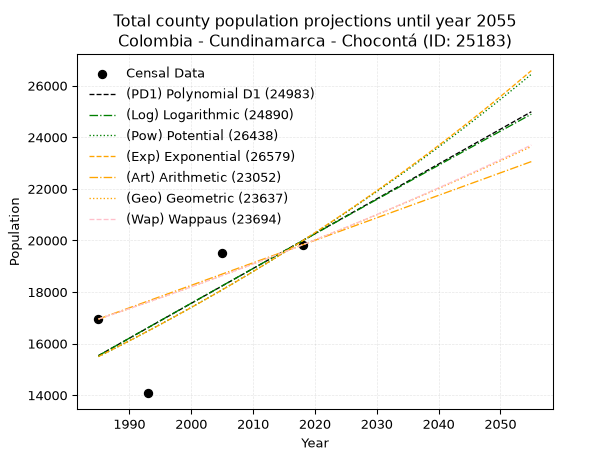
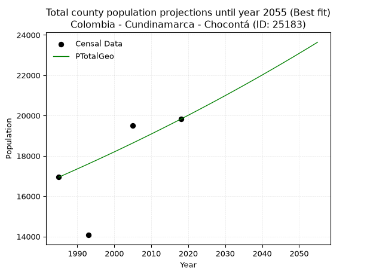
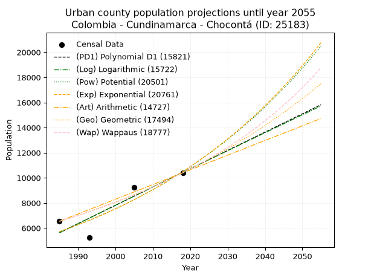
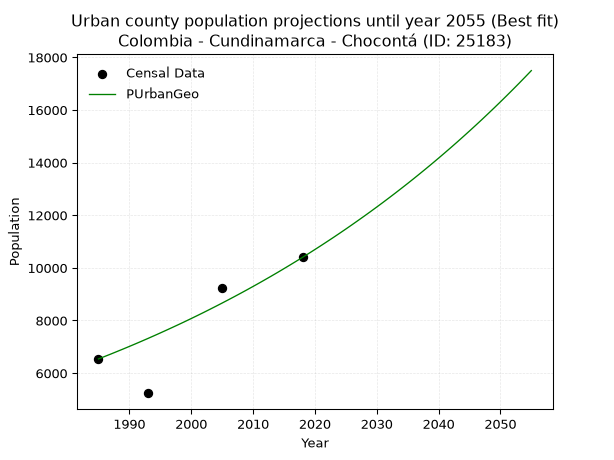
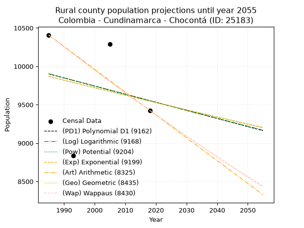
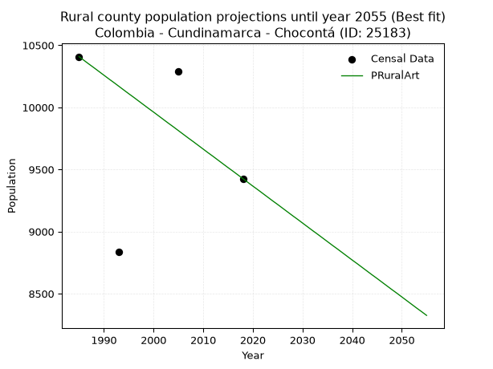

<div align="center">


</div>

# _“Population and Public Services Demand Projections (PPSD) until Year 2050 for Colombia - Cundinamarca - Chocontá (ID: 25183)”_
Keywords: `population` `public-service` `projection` `lineal` `polynomial` `logarithmic` `potential` `exponential` `arithmetic` `geometric` `wappaus` `dane` `colombia` `south-america`

PPSD are analytical estimates used by governments and planners to anticipate future changes in population size, age distribution, and the resulting community needs for utilities, healthcare, education, and infrastructure as sizing future water treatment facilities, electrical grids, and road networks based on spatial growth.

> **General running parameters**: • app_version: _v20260806_. • Python version: _3.14.7_. • Pandas version: _3.0.5_. • NumPy version: _2.5.1_. • Creates, save and include plots into reports (create_plot): _False_. • Projection until year: _2050_. • Process polynomial degree 2 and up: _False_. • Process Wappaus: _True_. • Process Wappaus: _True_. • Set negative values to zero: _True_. • Set infinite values to zero: _True_. • Drop dataset notes: _True_. 
<div align="center">

Dynamic map: [:earth_americas:Google](http://maps.google.com/maps?q=5.145224135,-73.6835326) [:earth_americas:OSM](https://www.openstreetmap.org/#map=18/5.145224135/-73.6835326&layers=P) [:earth_americas:Bing](https://www.bing.com/maps?cp=5.145224135~-73.6835326&lvl=18) [:earth_americas:Apple](https://maps.apple.com/frame?center=5.145224135%2C-73.6835326&span=0.003%2C0.006)

</div>


<div align="center">

```geojson
{
  "type": "Feature",
  "geometry": {
    "type": "Point", 
    "coordinates": [-73.6835326, 5.145224135]
  }, 
  "properties": {
    "Name": "Colombia - Cundinamarca - Chocontá (ID: 25183)"
  }
}
```

</div>


## 0. Census Data (4 records)

Census data are official statistics collected by a government about the people and housing in a country. They usually include counts of total population, age, sex, race, income, education, and jobs.

📅Global census file: [Population.xlsx](../data/Population.xlsx)

| Source   |   Year |   CountryID | CountryName   |   StateID | StateName    |   CountyID | CountyName   |   PTotal |   PUrban |   PRural |
|:---------|-------:|------------:|:--------------|----------:|:-------------|-----------:|:-------------|---------:|---------:|---------:|
| DANE     |   1985 |          57 | Colombia      |        25 | Cundinamarca |      25183 | Chocontá     |    16947 |     6539 |    10408 |
| DANE     |   1993 |          57 | Colombia      |        25 | Cundinamarca |      25183 | Chocontá     |    14074 |     5238 |     8836 |
| DANE     |   2005 |          57 | Colombia      |        25 | Cundinamarca |      25183 | Chocontá     |    19512 |     9220 |    10292 |
| DANE     |   2018 |          57 | Colombia      |        25 | Cundinamarca |      25183 | Chocontá     |    19825 |    10399 |     9426 |

> 🔥Some records could had specific notes about the registered values or the corresponding urban or rural distribution.

📅   [RUPS](https://www.datos.gov.co/Hacienda-y-Cr-dito-P-blico/Registro-nico-de-Prestadores-de-Servicios-P-blicos/4qkq-csdn/about_data) - Local public utility companies: [RUPS.csv](../data/RUPS.xlsx)

 | SERVICIO       | ESTADO    | NOMBRE                                                                                                                                  | NIT         | DEPARTAMENTO_DOMICILIO   | MUNICIPIO_DOMICILIO   | DIRECCION                                            |   TELEFONO | EMAIL                                      | TIPO_INSCRIPCION    | REPRESENTANTE_LEGAL                   | TIPO_PRESTADOR                 | CLASIFICACION                 |
|:---------------|:----------|:----------------------------------------------------------------------------------------------------------------------------------------|:------------|:-------------------------|:----------------------|:-----------------------------------------------------|-----------:|:-------------------------------------------|:--------------------|:--------------------------------------|:-------------------------------|:------------------------------|
| ACUEDUCTO      | OPERATIVA | JUNTA DE SERVICIOS PUBLICOS DEL MUNICIPIO DE CHOCONTA                                                                                   | 899999357-3 | CUNDINAMARCA             | CHOCONTA              | CARRERA 5 No. 5-19                                   |    8562125 | servipublicos@choconta-cundinamarca.gov.co | Registro por la ESP | RODRIGO ARMANDO CHICUASUQUE FERNANDEZ | MUNICIPIO (PRESTACIÓN DIRECTA) | MENOR O IGUAL A 2500 USUARIOS |
| ALCANTARILLADO | OPERATIVA | JUNTA DE SERVICIOS PUBLICOS DEL MUNICIPIO DE CHOCONTA                                                                                   | 899999357-3 | CUNDINAMARCA             | CHOCONTA              | CARRERA 5 No. 5-19                                   |    8562125 | servipublicos@choconta-cundinamarca.gov.co | Registro por la ESP | RODRIGO ARMANDO CHICUASUQUE FERNANDEZ | MUNICIPIO (PRESTACIÓN DIRECTA) | MENOR O IGUAL A 2500 USUARIOS |
| ACUEDUCTO      | OPERATIVA | ASOCIACION DE SUSCRIPTORES DEL SERVICIO DE ACUEDUCTO,  ALCANTARILLADO  Y ASEO DE LAVEREDA TEJAR DEL MUNICIPIO DE CHOCONTA  ASOTEJAR ESP | 832004837-4 | CUNDINAMARCA             | CHOCONTA              | VEREDA EL TEJAR                                      |    8562196 | ASOTEJAR_ASOTEJAR@HOTMAIL.COM              | Registro por la ESP | CECILIA MARIA CUESTAS GOMEZ           | ORGANIZACION AUTORIZADA        | HASTA 2500 SUSCRIPTORES       |
| ACUEDUCTO      | OPERATIVA | ASOCIACION DE USUARIOS DEL ACUEDUCTO VEREDA RETIRO DE BLANCOS Y VEREDA RETIRO DE INDIOS  DEL MUNICIPIO DE CHOCONTA                      | 832004195-4 | CUNDINAMARCA             | CHOCONTA              | VEREDA RETIRO DE INDIOS                              |    6765358 | asoacueducto.retiros@gmail.com             | Registro por la ESP | MAURICIO ALVAREZ MATEUS               | ORGANIZACION AUTORIZADA        | HASTA 2500 SUSCRIPTORES       |
| ACUEDUCTO      | OPERATIVA | ASOCIACION DE USUARIOS DEL ACUEDUCTO DE LA VEREDA AGUA CALIENTE PARTE BAJA MUNICIPIO DE CHOCONTA                                        | 900399510-2 | CUNDINAMARCA             | CHOCONTA              | VEREDA AGUA CALIENTE                                 |    4355444 | luzmamed2@hotmail.com                      | Registro por la ESP | ANGEL MARIA QUINTERO MONTENEGRO       | ORGANIZACION AUTORIZADA        | HASTA 2500 SUSCRIPTORES       |
| ACUEDUCTO      | OPERATIVA | ASOCIACION DE USUARIOS DEL ACUEDUCTO DE LAS VEREDAS BOQUERON ALTO Y BOQUERON BAJO DEL MUNICIPIO DE CHOCONTA                             | 832010101-7 | CUNDINAMARCA             | CHOCONTA              | CONCENTRACION EL ROSARIO KM 100 VEREDA BOQUERON ALTO |    7479164 | chocontaacueboqueron@gmail.com             | Registro por la ESP | SALOMON PENA CASTANEDA                | ORGANIZACION AUTORIZADA        | MENOR O IGUAL A 2500 USUARIOS |

## 1. Total

### 1.1. Coefficients and Parameters

* (PD1) Polynomial Deg 1: 135.042151746286, -252528.56403050863 (lineal)
* (Log) Logarithmic: 270161.81187574315, -2035912.5970084143
* (Pow) Potential: 15.419669011501037, -46.66024045107466
* (Exp) Exponential: 0.007708344448362819, 0.003507813538493093
* (Art) Arithmetic: Year diff. 2018 - 1985 = 33, Population diff. 19825 - 16947 = 2878, Annual growth = 87.21212121212122
* (Geo) Geometric: Year diff. 2018 - 1985 = 33, Population diff. 19825 - 16947 = 2878, Annual growth % = 0.004764433399924384
* (Wap) Wappaus: i = 0.47433983037159366, Condition values only valid for < 200)

<sub>
Wappaus condition values: ['0.00', '0.47', '0.95', '1.42', '1.90', '2.37', '2.85', '3.32', '3.79', '4.27', '4.74', '5.22', '5.69', '6.17', '6.64', '7.12', '7.59', '8.06', '8.54', '9.01', '9.49', '9.96', '10.44', '10.91', '11.38', '11.86', '12.33', '12.81', '13.28', '13.76', '14.23', '14.70', '15.18', '15.65', '16.13', '16.60', '17.08', '17.55', '18.02', '18.50', '18.97', '19.45', '19.92', '20.40', '20.87', '21.35', '21.82', '22.29', '22.77', '23.24', '23.72', '24.19', '24.67', '25.14', '25.61', '26.09', '26.56', '27.04', '27.51', '27.99', '28.46', '28.93', '29.41', '29.88', '30.36', '30.83']
</sub>


### 1.2. Projected Dataset

|   Year |   CountyID |   PTotalPD1 |   PTotalLog |   PTotalPow |   PTotalExp |   PTotalArt |   PTotalGeo |   PTotalWap |
|-------:|-----------:|------------:|------------:|------------:|------------:|------------:|------------:|------------:|
|   1985 |      25183 |       15530 |       15527 |       15493 |       15495 |       16947 |       16947 |       16947 |
|   1986 |      25183 |       15665 |       15663 |       15614 |       15615 |       17034 |       17028 |       17028 |
|   1987 |      25183 |       15800 |       15799 |       15735 |       15736 |       17121 |       17109 |       17109 |
|   1988 |      25183 |       15935 |       15935 |       15858 |       15858 |       17209 |       17190 |       17190 |
|   1989 |      25183 |       16070 |       16071 |       15981 |       15981 |       17296 |       17272 |       17272 |
|   1990 |      25183 |       16205 |       16207 |       16106 |       16104 |       17383 |       17355 |       17354 |
|   1991 |      25183 |       16340 |       16343 |       16231 |       16229 |       17470 |       17437 |       17436 |
|   1992 |      25183 |       16475 |       16478 |       16357 |       16355 |       17557 |       17520 |       17519 |
|   1993 |      25183 |       16610 |       16614 |       16484 |       16481 |       17645 |       17604 |       17603 |
|   1994 |      25183 |       16745 |       16749 |       16612 |       16609 |       17732 |       17688 |       17686 |
|   1995 |      25183 |       16881 |       16885 |       16741 |       16737 |       17819 |       17772 |       17770 |
|   1996 |      25183 |       17016 |       17020 |       16871 |       16867 |       17906 |       17857 |       17855 |
|   1997 |      25183 |       17151 |       17155 |       17002 |       16997 |       17994 |       17942 |       17940 |
|   1998 |      25183 |       17286 |       17291 |       17134 |       17129 |       18081 |       18027 |       18025 |
|   1999 |      25183 |       17421 |       17426 |       17266 |       17261 |       18168 |       18113 |       18111 |
|   2000 |      25183 |       17556 |       17561 |       17400 |       17395 |       18255 |       18199 |       18197 |
|   2001 |      25183 |       17691 |       17696 |       17535 |       17529 |       18342 |       18286 |       18284 |
|   2002 |      25183 |       17826 |       17831 |       17670 |       17665 |       18430 |       18373 |       18371 |
|   2003 |      25183 |       17961 |       17966 |       17807 |       17802 |       18517 |       18461 |       18458 |
|   2004 |      25183 |       18096 |       18101 |       17944 |       17939 |       18604 |       18549 |       18546 |
|   2005 |      25183 |       18231 |       18236 |       18083 |       18078 |       18691 |       18637 |       18635 |
|   2006 |      25183 |       18366 |       18370 |       18223 |       18218 |       18778 |       18726 |       18724 |
|   2007 |      25183 |       18501 |       18505 |       18363 |       18359 |       18866 |       18815 |       18813 |
|   2008 |      25183 |       18636 |       18639 |       18505 |       18501 |       18953 |       18905 |       18903 |
|   2009 |      25183 |       18771 |       18774 |       18647 |       18644 |       19040 |       18995 |       18993 |
|   2010 |      25183 |       18906 |       18908 |       18791 |       18789 |       19127 |       19085 |       19083 |
|   2011 |      25183 |       19041 |       19043 |       18936 |       18934 |       19215 |       19176 |       19174 |
|   2012 |      25183 |       19176 |       19177 |       19081 |       19081 |       19302 |       19268 |       19266 |
|   2013 |      25183 |       19311 |       19311 |       19228 |       19228 |       19389 |       19359 |       19358 |
|   2014 |      25183 |       19446 |       19446 |       19376 |       19377 |       19476 |       19452 |       19450 |
|   2015 |      25183 |       19581 |       19580 |       19525 |       19527 |       19563 |       19544 |       19543 |
|   2016 |      25183 |       19716 |       19714 |       19675 |       19678 |       19651 |       19637 |       19637 |
|   2017 |      25183 |       19851 |       19848 |       19826 |       19830 |       19738 |       19731 |       19731 |
|   2018 |      25183 |       19986 |       19982 |       19978 |       19984 |       19825 |       19825 |       19825 |
|   2019 |      25183 |       20122 |       20115 |       20131 |       20138 |       19912 |       19919 |       19920 |
|   2020 |      25183 |       20257 |       20249 |       20285 |       20294 |       19999 |       20014 |       20015 |
|   2021 |      25183 |       20392 |       20383 |       20441 |       20451 |       20087 |       20110 |       20111 |
|   2022 |      25183 |       20527 |       20517 |       20597 |       20610 |       20174 |       20206 |       20207 |
|   2023 |      25183 |       20662 |       20650 |       20755 |       20769 |       20261 |       20302 |       20304 |
|   2024 |      25183 |       20797 |       20784 |       20914 |       20930 |       20348 |       20399 |       20402 |
|   2025 |      25183 |       20932 |       20917 |       21074 |       21092 |       20435 |       20496 |       20499 |
|   2026 |      25183 |       21067 |       21050 |       21235 |       21255 |       20523 |       20593 |       20598 |
|   2027 |      25183 |       21202 |       21184 |       21397 |       21419 |       20610 |       20691 |       20697 |
|   2028 |      25183 |       21337 |       21317 |       21560 |       21585 |       20697 |       20790 |       20796 |
|   2029 |      25183 |       21472 |       21450 |       21725 |       21752 |       20784 |       20889 |       20896 |
|   2030 |      25183 |       21607 |       21583 |       21890 |       21920 |       20872 |       20989 |       20997 |
|   2031 |      25183 |       21742 |       21716 |       22057 |       22090 |       20959 |       21089 |       21098 |
|   2032 |      25183 |       21877 |       21849 |       22225 |       22261 |       21046 |       21189 |       21199 |
|   2033 |      25183 |       22012 |       21982 |       22395 |       22433 |       21133 |       21290 |       21301 |
|   2034 |      25183 |       22147 |       22115 |       22565 |       22607 |       21220 |       21392 |       21404 |
|   2035 |      25183 |       22282 |       22248 |       22737 |       22782 |       21308 |       21493 |       21507 |
|   2036 |      25183 |       22417 |       22381 |       22910 |       22958 |       21395 |       21596 |       21611 |
|   2037 |      25183 |       22552 |       22513 |       23084 |       23136 |       21482 |       21699 |       21715 |
|   2038 |      25183 |       22687 |       22646 |       23259 |       23315 |       21569 |       21802 |       21820 |
|   2039 |      25183 |       22822 |       22778 |       23436 |       23495 |       21656 |       21906 |       21925 |
|   2040 |      25183 |       22957 |       22911 |       23614 |       23677 |       21744 |       22010 |       22031 |
|   2041 |      25183 |       23092 |       23043 |       23793 |       23860 |       21831 |       22115 |       22138 |
|   2042 |      25183 |       23228 |       23176 |       23973 |       24045 |       21918 |       22221 |       22245 |
|   2043 |      25183 |       23363 |       23308 |       24155 |       24231 |       22005 |       22326 |       22353 |
|   2044 |      25183 |       23498 |       23440 |       24338 |       24418 |       22093 |       22433 |       22461 |
|   2045 |      25183 |       23633 |       23572 |       24522 |       24607 |       22180 |       22540 |       22570 |
|   2046 |      25183 |       23768 |       23704 |       24707 |       24798 |       22267 |       22647 |       22680 |
|   2047 |      25183 |       23903 |       23836 |       24894 |       24990 |       22354 |       22755 |       22790 |
|   2048 |      25183 |       24038 |       23968 |       25083 |       25183 |       22441 |       22863 |       22901 |
|   2049 |      25183 |       24173 |       24100 |       25272 |       25378 |       22529 |       22972 |       23012 |
|   2050 |      25183 |       24308 |       24232 |       25463 |       25574 |       22616 |       23082 |       23124 |
<div align="center">

</img>

</div>


### 1.3. Best fit with absolute and relative error (%)

Relative error puts that difference into context by dividing the absolute error by the true value, creating a unitless ratio or percentage that shows the scale of the mistake.

Absolute and relative error

|   Year | Source   |   CountryID | CountryName   |   StateID | StateName    |   CountyID_x | CountyName   |   PTotal |   PUrban |   PRural |   CountyID_y |   PTotalPD1 |   PTotalLog |   PTotalPow |   PTotalExp |   PTotalArt |   PTotalGeo |   PTotalWap |   PTotalPD1AbsError |   PTotalLogAbsError |   PTotalPowAbsError |   PTotalExpAbsError |   PTotalArtAbsError |   PTotalGeoAbsError |   PTotalWapAbsError |   PTotalPD1RelError |   PTotalLogRelError |   PTotalPowRelError |   PTotalExpRelError |   PTotalArtRelError |   PTotalGeoRelError |   PTotalWapRelError |
|-------:|:---------|------------:|:--------------|----------:|:-------------|-------------:|:-------------|---------:|---------:|---------:|-------------:|------------:|------------:|------------:|------------:|------------:|------------:|------------:|--------------------:|--------------------:|--------------------:|--------------------:|--------------------:|--------------------:|--------------------:|--------------------:|--------------------:|--------------------:|--------------------:|--------------------:|--------------------:|--------------------:|
|   1985 | DANE     |          57 | Colombia      |        25 | Cundinamarca |        25183 | Chocontá     |    16947 |     6539 |    10408 |        25183 |       15530 |       15527 |       15493 |       15495 |       16947 |       16947 |       16947 |                1417 |                1420 |                1454 |                1452 |                   0 |                   0 |                   0 |            8.36136  |            8.37906  |            8.57969  |            8.56789  |             0       |             0       |             0       |
|   1993 | DANE     |          57 | Colombia      |        25 | Cundinamarca |        25183 | Chocontá     |    14074 |     5238 |     8836 |        25183 |       16610 |       16614 |       16484 |       16481 |       17645 |       17604 |       17603 |                2536 |                2540 |                2410 |                2407 |                3571 |                3530 |                3529 |           18.019    |           18.0475   |           17.1238   |           17.1025   |            25.373   |            25.0817  |            25.0746  |
|   2005 | DANE     |          57 | Colombia      |        25 | Cundinamarca |        25183 | Chocontá     |    19512 |     9220 |    10292 |        25183 |       18231 |       18236 |       18083 |       18078 |       18691 |       18637 |       18635 |                1281 |                1276 |                1429 |                1434 |                 821 |                 875 |                 877 |            6.56519  |            6.53957  |            7.3237   |            7.34932  |             4.20767 |             4.48442 |             4.49467 |
|   2018 | DANE     |          57 | Colombia      |        25 | Cundinamarca |        25183 | Chocontá     |    19825 |    10399 |     9426 |        25183 |       19986 |       19982 |       19978 |       19984 |       19825 |       19825 |       19825 |                 161 |                 157 |                 153 |                 159 |                   0 |                   0 |                   0 |            0.812106 |            0.791929 |            0.771753 |            0.802018 |             0       |             0       |             0       |

Relative error mean

| Method    |   RelError | Best   |
|:----------|-----------:|:-------|
| PTotalPD1 |    8.43943 |        |
| PTotalLog |    8.43951 |        |
| PTotalPow |    8.44973 |        |
| PTotalExp |    8.45542 |        |
| PTotalArt |    7.39517 |        |
| PTotalGeo |    7.39153 | True   |
| PTotalWap |    7.39232 |        |

💙Best method: _**PTotalGeo**_
<div align="center">

</img>

</div>


### 1.4. Fresh water supply demand in liters per capita per day (lpcd)

The fresh water supply demand typically ranges from 100 to 300 liters per capita per day (lpcd) for standard domestic and municipal planning, though absolute survival minimums set by the World Health Organization are as low as 7.5 to 20 liters per day, and total consumption in high-income nations can exceed 400 liters.

> `CZ`: Level in meters above the sea level (masl)<br> `WS`: Fresh water supply demand in liters per capita per day (lpcd or l/h/d)<br> `WSAll`: Zonal fresh water supply demand in liters per second (l/s)<br> `A`: Zonal area in square meters<br> `DP`: Population density (people/hectare or p/ha)

Reference values (RAS Colombia)

|    CZ |   WS |
|------:|-----:|
|  1000 |  120 |
|  2000 |  130 |
| 99999 |  140 |

County shapefile geometry properties and water supply values

|   CountyID |      ATotal |   CZTotal |   WSTotal |
|-----------:|------------:|----------:|----------:|
|      25183 | 2.99656e+08 |    2824.5 |       140 |

Projected values for best method: PTotalGeo

|   CountyID |   Year |   PTotalGeo |   DPTotal |   WSTotal |   WSTotalAll |
|-----------:|-------:|------------:|----------:|----------:|-------------:|
|      25183 |   1985 |       16947 |      0.57 |       140 |      27.4604 |
|      25183 |   1986 |       17028 |      0.57 |       140 |      27.5917 |
|      25183 |   1987 |       17109 |      0.57 |       140 |      27.7229 |
|      25183 |   1988 |       17190 |      0.57 |       140 |      27.8542 |
|      25183 |   1989 |       17272 |      0.58 |       140 |      27.987  |
|      25183 |   1990 |       17355 |      0.58 |       140 |      28.1215 |
|      25183 |   1991 |       17437 |      0.58 |       140 |      28.2544 |
|      25183 |   1992 |       17520 |      0.58 |       140 |      28.3889 |
|      25183 |   1993 |       17604 |      0.59 |       140 |      28.525  |
|      25183 |   1994 |       17688 |      0.59 |       140 |      28.6611 |
|      25183 |   1995 |       17772 |      0.59 |       140 |      28.7972 |
|      25183 |   1996 |       17857 |      0.6  |       140 |      28.935  |
|      25183 |   1997 |       17942 |      0.6  |       140 |      29.0727 |
|      25183 |   1998 |       18027 |      0.6  |       140 |      29.2104 |
|      25183 |   1999 |       18113 |      0.6  |       140 |      29.3498 |
|      25183 |   2000 |       18199 |      0.61 |       140 |      29.4891 |
|      25183 |   2001 |       18286 |      0.61 |       140 |      29.6301 |
|      25183 |   2002 |       18373 |      0.61 |       140 |      29.7711 |
|      25183 |   2003 |       18461 |      0.62 |       140 |      29.9137 |
|      25183 |   2004 |       18549 |      0.62 |       140 |      30.0562 |
|      25183 |   2005 |       18637 |      0.62 |       140 |      30.1988 |
|      25183 |   2006 |       18726 |      0.62 |       140 |      30.3431 |
|      25183 |   2007 |       18815 |      0.63 |       140 |      30.4873 |
|      25183 |   2008 |       18905 |      0.63 |       140 |      30.6331 |
|      25183 |   2009 |       18995 |      0.63 |       140 |      30.7789 |
|      25183 |   2010 |       19085 |      0.64 |       140 |      30.9248 |
|      25183 |   2011 |       19176 |      0.64 |       140 |      31.0722 |
|      25183 |   2012 |       19268 |      0.64 |       140 |      31.2213 |
|      25183 |   2013 |       19359 |      0.65 |       140 |      31.3687 |
|      25183 |   2014 |       19452 |      0.65 |       140 |      31.5194 |
|      25183 |   2015 |       19544 |      0.65 |       140 |      31.6685 |
|      25183 |   2016 |       19637 |      0.66 |       140 |      31.8192 |
|      25183 |   2017 |       19731 |      0.66 |       140 |      31.9715 |
|      25183 |   2018 |       19825 |      0.66 |       140 |      32.1238 |
|      25183 |   2019 |       19919 |      0.66 |       140 |      32.2762 |
|      25183 |   2020 |       20014 |      0.67 |       140 |      32.4301 |
|      25183 |   2021 |       20110 |      0.67 |       140 |      32.5856 |
|      25183 |   2022 |       20206 |      0.67 |       140 |      32.7412 |
|      25183 |   2023 |       20302 |      0.68 |       140 |      32.8968 |
|      25183 |   2024 |       20399 |      0.68 |       140 |      33.0539 |
|      25183 |   2025 |       20496 |      0.68 |       140 |      33.2111 |
|      25183 |   2026 |       20593 |      0.69 |       140 |      33.3683 |
|      25183 |   2027 |       20691 |      0.69 |       140 |      33.5271 |
|      25183 |   2028 |       20790 |      0.69 |       140 |      33.6875 |
|      25183 |   2029 |       20889 |      0.7  |       140 |      33.8479 |
|      25183 |   2030 |       20989 |      0.7  |       140 |      34.01   |
|      25183 |   2031 |       21089 |      0.7  |       140 |      34.172  |
|      25183 |   2032 |       21189 |      0.71 |       140 |      34.334  |
|      25183 |   2033 |       21290 |      0.71 |       140 |      34.4977 |
|      25183 |   2034 |       21392 |      0.71 |       140 |      34.663  |
|      25183 |   2035 |       21493 |      0.72 |       140 |      34.8266 |
|      25183 |   2036 |       21596 |      0.72 |       140 |      34.9935 |
|      25183 |   2037 |       21699 |      0.72 |       140 |      35.1604 |
|      25183 |   2038 |       21802 |      0.73 |       140 |      35.3273 |
|      25183 |   2039 |       21906 |      0.73 |       140 |      35.4958 |
|      25183 |   2040 |       22010 |      0.73 |       140 |      35.6644 |
|      25183 |   2041 |       22115 |      0.74 |       140 |      35.8345 |
|      25183 |   2042 |       22221 |      0.74 |       140 |      36.0063 |
|      25183 |   2043 |       22326 |      0.75 |       140 |      36.1764 |
|      25183 |   2044 |       22433 |      0.75 |       140 |      36.3498 |
|      25183 |   2045 |       22540 |      0.75 |       140 |      36.5231 |
|      25183 |   2046 |       22647 |      0.76 |       140 |      36.6965 |
|      25183 |   2047 |       22755 |      0.76 |       140 |      36.8715 |
|      25183 |   2048 |       22863 |      0.76 |       140 |      37.0465 |
|      25183 |   2049 |       22972 |      0.77 |       140 |      37.2231 |
|      25183 |   2050 |       23082 |      0.77 |       140 |      37.4014 |

## 2. Urban

### 2.1. Coefficients and Parameters

* (PD1) Polynomial Deg 1: 145.61541549578385, -283418.23484544165 (lineal)
* (Log) Logarithmic: 291358.01699694316, -2206765.621990383
* (Pow) Potential: 36.86794150614686, -117.82477103924576
* (Exp) Exponential: 0.01842650297034863, 7.448041347447987e-13
* (Art) Arithmetic: Year diff. 2018 - 1985 = 33, Population diff. 10399 - 6539 = 3860, Annual growth = 116.96969696969697
* (Geo) Geometric: Year diff. 2018 - 1985 = 33, Population diff. 10399 - 6539 = 3860, Annual growth % = 0.014157628672468503
* (Wap) Wappaus: i = 1.3811512217463333, Condition values only valid for < 200)

<sub>
Wappaus condition values: ['0.00', '1.38', '2.76', '4.14', '5.52', '6.91', '8.29', '9.67', '11.05', '12.43', '13.81', '15.19', '16.57', '17.95', '19.34', '20.72', '22.10', '23.48', '24.86', '26.24', '27.62', '29.00', '30.39', '31.77', '33.15', '34.53', '35.91', '37.29', '38.67', '40.05', '41.43', '42.82', '44.20', '45.58', '46.96', '48.34', '49.72', '51.10', '52.48', '53.86', '55.25', '56.63', '58.01', '59.39', '60.77', '62.15', '63.53', '64.91', '66.30', '67.68', '69.06', '70.44', '71.82', '73.20', '74.58', '75.96', '77.34', '78.73', '80.11', '81.49', '82.87', '84.25', '85.63', '87.01', '88.39', '89.77']
</sub>


### 2.2. Projected Dataset

|   Year |   CountyID |   PUrbanPD1 |   PUrbanLog |   PUrbanPow |   PUrbanExp |   PUrbanArt |   PUrbanGeo |   PUrbanWap |
|-------:|-----------:|------------:|------------:|------------:|------------:|------------:|------------:|------------:|
|   1985 |      25183 |        5628 |        5625 |        5713 |        5716 |        6539 |        6539 |        6539 |
|   1986 |      25183 |        5774 |        5772 |        5820 |        5822 |        6656 |        6632 |        6630 |
|   1987 |      25183 |        5920 |        5918 |        5929 |        5930 |        6773 |        6725 |        6722 |
|   1988 |      25183 |        6065 |        6065 |        6040 |        6040 |        6890 |        6821 |        6816 |
|   1989 |      25183 |        6211 |        6211 |        6153 |        6153 |        7007 |        6917 |        6911 |
|   1990 |      25183 |        6356 |        6358 |        6268 |        6267 |        7124 |        7015 |        7007 |
|   1991 |      25183 |        6502 |        6504 |        6386 |        6384 |        7241 |        7114 |        7104 |
|   1992 |      25183 |        6648 |        6650 |        6505 |        6502 |        7358 |        7215 |        7203 |
|   1993 |      25183 |        6793 |        6797 |        6626 |        6623 |        7475 |        7317 |        7304 |
|   1994 |      25183 |        6939 |        6943 |        6750 |        6747 |        7592 |        7421 |        7406 |
|   1995 |      25183 |        7085 |        7089 |        6876 |        6872 |        7709 |        7526 |        7509 |
|   1996 |      25183 |        7230 |        7235 |        7004 |        7000 |        7826 |        7633 |        7614 |
|   1997 |      25183 |        7376 |        7381 |        7135 |        7130 |        7943 |        7741 |        7721 |
|   1998 |      25183 |        7521 |        7527 |        7268 |        7263 |        8060 |        7850 |        7829 |
|   1999 |      25183 |        7667 |        7673 |        7403 |        7398 |        8177 |        7961 |        7939 |
|   2000 |      25183 |        7813 |        7818 |        7541 |        7535 |        8294 |        8074 |        8050 |
|   2001 |      25183 |        7958 |        7964 |        7681 |        7675 |        8411 |        8188 |        8164 |
|   2002 |      25183 |        8104 |        8109 |        7824 |        7818 |        8527 |        8304 |        8279 |
|   2003 |      25183 |        8249 |        8255 |        7969 |        7964 |        8644 |        8422 |        8395 |
|   2004 |      25183 |        8395 |        8400 |        8117 |        8112 |        8761 |        8541 |        8514 |
|   2005 |      25183 |        8541 |        8546 |        8268 |        8263 |        8878 |        8662 |        8635 |
|   2006 |      25183 |        8686 |        8691 |        8421 |        8416 |        8995 |        8785 |        8757 |
|   2007 |      25183 |        8832 |        8836 |        8577 |        8573 |        9112 |        8909 |        8882 |
|   2008 |      25183 |        8978 |        8981 |        8736 |        8732 |        9229 |        9035 |        9008 |
|   2009 |      25183 |        9123 |        9126 |        8898 |        8895 |        9346 |        9163 |        9137 |
|   2010 |      25183 |        9269 |        9271 |        9063 |        9060 |        9463 |        9293 |        9268 |
|   2011 |      25183 |        9414 |        9416 |        9231 |        9228 |        9580 |        9424 |        9401 |
|   2012 |      25183 |        9560 |        9561 |        9401 |        9400 |        9697 |        9558 |        9536 |
|   2013 |      25183 |        9706 |        9706 |        9575 |        9575 |        9814 |        9693 |        9674 |
|   2014 |      25183 |        9851 |        9851 |        9752 |        9753 |        9931 |        9830 |        9814 |
|   2015 |      25183 |        9997 |        9995 |        9932 |        9934 |       10048 |        9970 |        9956 |
|   2016 |      25183 |       10142 |       10140 |       10116 |       10119 |       10165 |       10111 |       10101 |
|   2017 |      25183 |       10288 |       10284 |       10302 |       10307 |       10282 |       10254 |       10249 |
|   2018 |      25183 |       10434 |       10429 |       10492 |       10499 |       10399 |       10399 |       10399 |
|   2019 |      25183 |       10579 |       10573 |       10686 |       10694 |       10516 |       10546 |       10552 |
|   2020 |      25183 |       10725 |       10717 |       10883 |       10893 |       10633 |       10696 |       10708 |
|   2021 |      25183 |       10871 |       10862 |       11083 |       11096 |       10750 |       10847 |       10866 |
|   2022 |      25183 |       11016 |       11006 |       11287 |       11302 |       10867 |       11001 |       11027 |
|   2023 |      25183 |       11162 |       11150 |       11495 |       11512 |       10984 |       11156 |       11192 |
|   2024 |      25183 |       11307 |       11294 |       11706 |       11726 |       11101 |       11314 |       11360 |
|   2025 |      25183 |       11453 |       11438 |       11921 |       11944 |       11218 |       11474 |       11530 |
|   2026 |      25183 |       11599 |       11581 |       12140 |       12166 |       11335 |       11637 |       11704 |
|   2027 |      25183 |       11744 |       11725 |       12363 |       12393 |       11452 |       11802 |       11882 |
|   2028 |      25183 |       11890 |       11869 |       12590 |       12623 |       11569 |       11969 |       12063 |
|   2029 |      25183 |       12035 |       12013 |       12821 |       12858 |       11686 |       12138 |       12247 |
|   2030 |      25183 |       12181 |       12156 |       13056 |       13097 |       11803 |       12310 |       12435 |
|   2031 |      25183 |       12327 |       12300 |       13295 |       13341 |       11920 |       12484 |       12628 |
|   2032 |      25183 |       12472 |       12443 |       13538 |       13589 |       12037 |       12661 |       12823 |
|   2033 |      25183 |       12618 |       12586 |       13786 |       13841 |       12154 |       12840 |       13024 |
|   2034 |      25183 |       12764 |       12730 |       14038 |       14099 |       12271 |       13022 |       13228 |
|   2035 |      25183 |       12909 |       12873 |       14295 |       14361 |       12387 |       13206 |       13436 |
|   2036 |      25183 |       13055 |       13016 |       14556 |       14628 |       12504 |       13393 |       13649 |
|   2037 |      25183 |       13200 |       13159 |       14822 |       14900 |       12621 |       13583 |       13867 |
|   2038 |      25183 |       13346 |       13302 |       15093 |       15177 |       12738 |       13775 |       14089 |
|   2039 |      25183 |       13492 |       13445 |       15368 |       15460 |       12855 |       13970 |       14316 |
|   2040 |      25183 |       13637 |       13588 |       15649 |       15747 |       12972 |       14168 |       14548 |
|   2041 |      25183 |       13783 |       13731 |       15934 |       16040 |       13089 |       14369 |       14786 |
|   2042 |      25183 |       13928 |       13873 |       16224 |       16338 |       13206 |       14572 |       15029 |
|   2043 |      25183 |       14074 |       14016 |       16520 |       16642 |       13323 |       14778 |       15277 |
|   2044 |      25183 |       14220 |       14159 |       16821 |       16952 |       13440 |       14988 |       15531 |
|   2045 |      25183 |       14365 |       14301 |       17127 |       17267 |       13557 |       15200 |       15792 |
|   2046 |      25183 |       14511 |       14444 |       17438 |       17588 |       13674 |       15415 |       16058 |
|   2047 |      25183 |       14657 |       14586 |       17755 |       17915 |       13791 |       15633 |       16331 |
|   2048 |      25183 |       14802 |       14728 |       18078 |       18248 |       13908 |       15855 |       16610 |
|   2049 |      25183 |       14948 |       14870 |       18406 |       18588 |       14025 |       16079 |       16897 |
|   2050 |      25183 |       15093 |       15013 |       18740 |       18933 |       14142 |       16307 |       17191 |
<div align="center">

</img>

</div>


### 2.3. Best fit with absolute and relative error (%)

Relative error puts that difference into context by dividing the absolute error by the true value, creating a unitless ratio or percentage that shows the scale of the mistake.

Absolute and relative error

|   Year | Source   |   CountryID | CountryName   |   StateID | StateName    |   CountyID_x | CountyName   |   PTotal |   PUrban |   PRural |   CountyID_y |   PUrbanPD1 |   PUrbanLog |   PUrbanPow |   PUrbanExp |   PUrbanArt |   PUrbanGeo |   PUrbanWap |   PUrbanPD1AbsError |   PUrbanLogAbsError |   PUrbanPowAbsError |   PUrbanExpAbsError |   PUrbanArtAbsError |   PUrbanGeoAbsError |   PUrbanWapAbsError |   PUrbanPD1RelError |   PUrbanLogRelError |   PUrbanPowRelError |   PUrbanExpRelError |   PUrbanArtRelError |   PUrbanGeoRelError |   PUrbanWapRelError |
|-------:|:---------|------------:|:--------------|----------:|:-------------|-------------:|:-------------|---------:|---------:|---------:|-------------:|------------:|------------:|------------:|------------:|------------:|------------:|------------:|--------------------:|--------------------:|--------------------:|--------------------:|--------------------:|--------------------:|--------------------:|--------------------:|--------------------:|--------------------:|--------------------:|--------------------:|--------------------:|--------------------:|
|   1985 | DANE     |          57 | Colombia      |        25 | Cundinamarca |        25183 | Chocontá     |    16947 |     6539 |    10408 |        25183 |        5628 |        5625 |        5713 |        5716 |        6539 |        6539 |        6539 |                 911 |                 914 |                 826 |                 823 |                   0 |                   0 |                   0 |           13.9318   |           13.9777   |           12.6319   |           12.586    |             0       |             0       |              0      |
|   1993 | DANE     |          57 | Colombia      |        25 | Cundinamarca |        25183 | Chocontá     |    14074 |     5238 |     8836 |        25183 |        6793 |        6797 |        6626 |        6623 |        7475 |        7317 |        7304 |                1555 |                1559 |                1388 |                1385 |                2237 |                2079 |                2066 |           29.6869   |           29.7633   |           26.4987   |           26.4414   |            42.7071  |            39.6907  |             39.4425 |
|   2005 | DANE     |          57 | Colombia      |        25 | Cundinamarca |        25183 | Chocontá     |    19512 |     9220 |    10292 |        25183 |        8541 |        8546 |        8268 |        8263 |        8878 |        8662 |        8635 |                 679 |                 674 |                 952 |                 957 |                 342 |                 558 |                 585 |            7.36443  |            7.3102   |           10.3254   |           10.3796   |             3.70933 |             6.05206 |              6.3449 |
|   2018 | DANE     |          57 | Colombia      |        25 | Cundinamarca |        25183 | Chocontá     |    19825 |    10399 |     9426 |        25183 |       10434 |       10429 |       10492 |       10499 |       10399 |       10399 |       10399 |                  35 |                  30 |                  93 |                 100 |                   0 |                   0 |                   0 |            0.336571 |            0.288489 |            0.894317 |            0.961631 |             0       |             0       |              0      |

Relative error mean

| Method    |   RelError | Best   |
|:----------|-----------:|:-------|
| PUrbanPD1 |    12.8299 |        |
| PUrbanLog |    12.8349 |        |
| PUrbanPow |    12.5876 |        |
| PUrbanExp |    12.5922 |        |
| PUrbanArt |    11.6041 |        |
| PUrbanGeo |    11.4357 | True   |
| PUrbanWap |    11.4469 |        |

💙Best method: _**PUrbanGeo**_
<div align="center">

</img>

</div>


### 2.4. Fresh water supply demand in liters per capita per day (lpcd)

The fresh water supply demand typically ranges from 100 to 300 liters per capita per day (lpcd) for standard domestic and municipal planning, though absolute survival minimums set by the World Health Organization are as low as 7.5 to 20 liters per day, and total consumption in high-income nations can exceed 400 liters.

> `CZ`: Level in meters above the sea level (masl)<br> `WS`: Fresh water supply demand in liters per capita per day (lpcd or l/h/d)<br> `WSAll`: Zonal fresh water supply demand in liters per second (l/s)<br> `A`: Zonal area in square meters<br> `DP`: Population density (people/hectare or p/ha)

Reference values (RAS Colombia)

|    CZ |   WS |
|------:|-----:|
|  1000 |  120 |
|  2000 |  130 |
| 99999 |  140 |

County shapefile geometry properties and water supply values

|   CountyID |      AUrban |   CZUrban |   WSUrban |
|-----------:|------------:|----------:|----------:|
|      25183 | 1.57415e+06 |   2656.41 |       140 |

Projected values for best method: PUrbanGeo

|   CountyID |   Year |   PUrbanGeo |   DPUrban |   WSUrban |   WSUrbanAll |
|-----------:|-------:|------------:|----------:|----------:|-------------:|
|      25183 |   1985 |        6539 |     41.54 |       140 |      10.5956 |
|      25183 |   1986 |        6632 |     42.13 |       140 |      10.7463 |
|      25183 |   1987 |        6725 |     42.72 |       140 |      10.897  |
|      25183 |   1988 |        6821 |     43.33 |       140 |      11.0525 |
|      25183 |   1989 |        6917 |     43.94 |       140 |      11.2081 |
|      25183 |   1990 |        7015 |     44.56 |       140 |      11.3669 |
|      25183 |   1991 |        7114 |     45.19 |       140 |      11.5273 |
|      25183 |   1992 |        7215 |     45.83 |       140 |      11.691  |
|      25183 |   1993 |        7317 |     46.48 |       140 |      11.8562 |
|      25183 |   1994 |        7421 |     47.14 |       140 |      12.0248 |
|      25183 |   1995 |        7526 |     47.81 |       140 |      12.1949 |
|      25183 |   1996 |        7633 |     48.49 |       140 |      12.3683 |
|      25183 |   1997 |        7741 |     49.18 |       140 |      12.5433 |
|      25183 |   1998 |        7850 |     49.87 |       140 |      12.7199 |
|      25183 |   1999 |        7961 |     50.57 |       140 |      12.8998 |
|      25183 |   2000 |        8074 |     51.29 |       140 |      13.0829 |
|      25183 |   2001 |        8188 |     52.02 |       140 |      13.2676 |
|      25183 |   2002 |        8304 |     52.75 |       140 |      13.4556 |
|      25183 |   2003 |        8422 |     53.5  |       140 |      13.6468 |
|      25183 |   2004 |        8541 |     54.26 |       140 |      13.8396 |
|      25183 |   2005 |        8662 |     55.03 |       140 |      14.0356 |
|      25183 |   2006 |        8785 |     55.81 |       140 |      14.235  |
|      25183 |   2007 |        8909 |     56.6  |       140 |      14.4359 |
|      25183 |   2008 |        9035 |     57.4  |       140 |      14.64   |
|      25183 |   2009 |        9163 |     58.21 |       140 |      14.8475 |
|      25183 |   2010 |        9293 |     59.03 |       140 |      15.0581 |
|      25183 |   2011 |        9424 |     59.87 |       140 |      15.2704 |
|      25183 |   2012 |        9558 |     60.72 |       140 |      15.4875 |
|      25183 |   2013 |        9693 |     61.58 |       140 |      15.7063 |
|      25183 |   2014 |        9830 |     62.45 |       140 |      15.9282 |
|      25183 |   2015 |        9970 |     63.34 |       140 |      16.1551 |
|      25183 |   2016 |       10111 |     64.23 |       140 |      16.3836 |
|      25183 |   2017 |       10254 |     65.14 |       140 |      16.6153 |
|      25183 |   2018 |       10399 |     66.06 |       140 |      16.8502 |
|      25183 |   2019 |       10546 |     66.99 |       140 |      17.0884 |
|      25183 |   2020 |       10696 |     67.95 |       140 |      17.3315 |
|      25183 |   2021 |       10847 |     68.91 |       140 |      17.5762 |
|      25183 |   2022 |       11001 |     69.89 |       140 |      17.8257 |
|      25183 |   2023 |       11156 |     70.87 |       140 |      18.0769 |
|      25183 |   2024 |       11314 |     71.87 |       140 |      18.3329 |
|      25183 |   2025 |       11474 |     72.89 |       140 |      18.5921 |
|      25183 |   2026 |       11637 |     73.93 |       140 |      18.8562 |
|      25183 |   2027 |       11802 |     74.97 |       140 |      19.1236 |
|      25183 |   2028 |       11969 |     76.03 |       140 |      19.3942 |
|      25183 |   2029 |       12138 |     77.11 |       140 |      19.6681 |
|      25183 |   2030 |       12310 |     78.2  |       140 |      19.9468 |
|      25183 |   2031 |       12484 |     79.31 |       140 |      20.2287 |
|      25183 |   2032 |       12661 |     80.43 |       140 |      20.5155 |
|      25183 |   2033 |       12840 |     81.57 |       140 |      20.8056 |
|      25183 |   2034 |       13022 |     82.72 |       140 |      21.1005 |
|      25183 |   2035 |       13206 |     83.89 |       140 |      21.3986 |
|      25183 |   2036 |       13393 |     85.08 |       140 |      21.7016 |
|      25183 |   2037 |       13583 |     86.29 |       140 |      22.0095 |
|      25183 |   2038 |       13775 |     87.51 |       140 |      22.3206 |
|      25183 |   2039 |       13970 |     88.75 |       140 |      22.6366 |
|      25183 |   2040 |       14168 |     90    |       140 |      22.9574 |
|      25183 |   2041 |       14369 |     91.28 |       140 |      23.2831 |
|      25183 |   2042 |       14572 |     92.57 |       140 |      23.612  |
|      25183 |   2043 |       14778 |     93.88 |       140 |      23.9458 |
|      25183 |   2044 |       14988 |     95.21 |       140 |      24.2861 |
|      25183 |   2045 |       15200 |     96.56 |       140 |      24.6296 |
|      25183 |   2046 |       15415 |     97.93 |       140 |      24.978  |
|      25183 |   2047 |       15633 |     99.31 |       140 |      25.3313 |
|      25183 |   2048 |       15855 |    100.72 |       140 |      25.691  |
|      25183 |   2049 |       16079 |    102.14 |       140 |      26.0539 |
|      25183 |   2050 |       16307 |    103.59 |       140 |      26.4234 |

## 3. Rural

### 3.1. Coefficients and Parameters

* (PD1) Polynomial Deg 1: -10.57326374949771, 30889.670814932797 (lineal)
* (Log) Logarithmic: -21196.20512120014, 170853.0249819701
* (Pow) Potential: -2.013046263119971, 10.632830929207692
* (Exp) Exponential: -0.00100392720892045, 72397.17918253172
* (Art) Arithmetic: Year diff. 2018 - 1985 = 33, Population diff. 9426 - 10408 = -982, Annual growth = -29.757575757575758
* (Geo) Geometric: Year diff. 2018 - 1985 = 33, Population diff. 9426 - 10408 = -982, Annual growth % = -0.00299861371702681
* (Wap) Wappaus: i = -0.3000663079315898, Condition values only valid for < 200)

<sub>
Wappaus condition values: ['-0.00', '-0.30', '-0.60', '-0.90', '-1.20', '-1.50', '-1.80', '-2.10', '-2.40', '-2.70', '-3.00', '-3.30', '-3.60', '-3.90', '-4.20', '-4.50', '-4.80', '-5.10', '-5.40', '-5.70', '-6.00', '-6.30', '-6.60', '-6.90', '-7.20', '-7.50', '-7.80', '-8.10', '-8.40', '-8.70', '-9.00', '-9.30', '-9.60', '-9.90', '-10.20', '-10.50', '-10.80', '-11.10', '-11.40', '-11.70', '-12.00', '-12.30', '-12.60', '-12.90', '-13.20', '-13.50', '-13.80', '-14.10', '-14.40', '-14.70', '-15.00', '-15.30', '-15.60', '-15.90', '-16.20', '-16.50', '-16.80', '-17.10', '-17.40', '-17.70', '-18.00', '-18.30', '-18.60', '-18.90', '-19.20', '-19.50']
</sub>


### 3.2. Projected Dataset

|   Year |   CountyID |   PRuralPD1 |   PRuralLog |   PRuralPow |   PRuralExp |   PRuralArt |   PRuralGeo |   PRuralWap |
|-------:|-----------:|------------:|------------:|------------:|------------:|------------:|------------:|------------:|
|   1985 |      25183 |        9902 |        9902 |        9869 |        9869 |       10408 |       10408 |       10408 |
|   1986 |      25183 |        9891 |        9892 |        9859 |        9859 |       10378 |       10377 |       10377 |
|   1987 |      25183 |        9881 |        9881 |        9849 |        9849 |       10348 |       10346 |       10346 |
|   1988 |      25183 |        9870 |        9870 |        9839 |        9839 |       10319 |       10315 |       10315 |
|   1989 |      25183 |        9859 |        9860 |        9829 |        9829 |       10289 |       10284 |       10284 |
|   1990 |      25183 |        9849 |        9849 |        9819 |        9819 |       10259 |       10253 |       10253 |
|   1991 |      25183 |        9838 |        9838 |        9810 |        9809 |       10229 |       10222 |       10222 |
|   1992 |      25183 |        9828 |        9828 |        9800 |        9800 |       10200 |       10191 |       10192 |
|   1993 |      25183 |        9817 |        9817 |        9790 |        9790 |       10170 |       10161 |       10161 |
|   1994 |      25183 |        9807 |        9806 |        9780 |        9780 |       10140 |       10130 |       10131 |
|   1995 |      25183 |        9796 |        9796 |        9770 |        9770 |       10110 |       10100 |       10100 |
|   1996 |      25183 |        9785 |        9785 |        9760 |        9760 |       10081 |       10070 |       10070 |
|   1997 |      25183 |        9775 |        9775 |        9750 |        9751 |       10051 |       10040 |       10040 |
|   1998 |      25183 |        9764 |        9764 |        9740 |        9741 |       10021 |       10009 |       10010 |
|   1999 |      25183 |        9754 |        9753 |        9731 |        9731 |        9991 |        9979 |        9980 |
|   2000 |      25183 |        9743 |        9743 |        9721 |        9721 |        9962 |        9950 |        9950 |
|   2001 |      25183 |        9733 |        9732 |        9711 |        9711 |        9932 |        9920 |        9920 |
|   2002 |      25183 |        9722 |        9722 |        9701 |        9702 |        9902 |        9890 |        9890 |
|   2003 |      25183 |        9711 |        9711 |        9692 |        9692 |        9872 |        9860 |        9861 |
|   2004 |      25183 |        9701 |        9700 |        9682 |        9682 |        9843 |        9831 |        9831 |
|   2005 |      25183 |        9690 |        9690 |        9672 |        9673 |        9813 |        9801 |        9802 |
|   2006 |      25183 |        9680 |        9679 |        9662 |        9663 |        9783 |        9772 |        9772 |
|   2007 |      25183 |        9669 |        9669 |        9653 |        9653 |        9753 |        9743 |        9743 |
|   2008 |      25183 |        9659 |        9658 |        9643 |        9643 |        9724 |        9713 |        9714 |
|   2009 |      25183 |        9648 |        9648 |        9633 |        9634 |        9694 |        9684 |        9685 |
|   2010 |      25183 |        9637 |        9637 |        9624 |        9624 |        9664 |        9655 |        9655 |
|   2011 |      25183 |        9627 |        9626 |        9614 |        9614 |        9634 |        9626 |        9626 |
|   2012 |      25183 |        9616 |        9616 |        9605 |        9605 |        9605 |        9597 |        9598 |
|   2013 |      25183 |        9606 |        9605 |        9595 |        9595 |        9575 |        9569 |        9569 |
|   2014 |      25183 |        9595 |        9595 |        9585 |        9586 |        9545 |        9540 |        9540 |
|   2015 |      25183 |        9585 |        9584 |        9576 |        9576 |        9515 |        9511 |        9511 |
|   2016 |      25183 |        9574 |        9574 |        9566 |        9566 |        9486 |        9483 |        9483 |
|   2017 |      25183 |        9563 |        9563 |        9557 |        9557 |        9456 |        9454 |        9454 |
|   2018 |      25183 |        9553 |        9553 |        9547 |        9547 |        9426 |        9426 |        9426 |
|   2019 |      25183 |        9542 |        9542 |        9538 |        9538 |        9396 |        9398 |        9398 |
|   2020 |      25183 |        9532 |        9532 |        9528 |        9528 |        9366 |        9370 |        9369 |
|   2021 |      25183 |        9521 |        9521 |        9519 |        9518 |        9337 |        9341 |        9341 |
|   2022 |      25183 |        9511 |        9511 |        9509 |        9509 |        9307 |        9313 |        9313 |
|   2023 |      25183 |        9500 |        9500 |        9500 |        9499 |        9277 |        9286 |        9285 |
|   2024 |      25183 |        9489 |        9490 |        9490 |        9490 |        9247 |        9258 |        9257 |
|   2025 |      25183 |        9479 |        9479 |        9481 |        9480 |        9218 |        9230 |        9229 |
|   2026 |      25183 |        9468 |        9469 |        9471 |        9471 |        9188 |        9202 |        9202 |
|   2027 |      25183 |        9458 |        9459 |        9462 |        9461 |        9158 |        9175 |        9174 |
|   2028 |      25183 |        9447 |        9448 |        9453 |        9452 |        9128 |        9147 |        9146 |
|   2029 |      25183 |        9437 |        9438 |        9443 |        9442 |        9099 |        9120 |        9119 |
|   2030 |      25183 |        9426 |        9427 |        9434 |        9433 |        9069 |        9092 |        9091 |
|   2031 |      25183 |        9415 |        9417 |        9424 |        9423 |        9039 |        9065 |        9064 |
|   2032 |      25183 |        9405 |        9406 |        9415 |        9414 |        9009 |        9038 |        9037 |
|   2033 |      25183 |        9394 |        9396 |        9406 |        9404 |        8980 |        9011 |        9010 |
|   2034 |      25183 |        9384 |        9385 |        9397 |        9395 |        8950 |        8984 |        8982 |
|   2035 |      25183 |        9373 |        9375 |        9387 |        9386 |        8920 |        8957 |        8955 |
|   2036 |      25183 |        9363 |        9365 |        9378 |        9376 |        8890 |        8930 |        8928 |
|   2037 |      25183 |        9352 |        9354 |        9369 |        9367 |        8861 |        8903 |        8902 |
|   2038 |      25183 |        9341 |        9344 |        9359 |        9357 |        8831 |        8877 |        8875 |
|   2039 |      25183 |        9331 |        9333 |        9350 |        9348 |        8801 |        8850 |        8848 |
|   2040 |      25183 |        9320 |        9323 |        9341 |        9339 |        8771 |        8823 |        8821 |
|   2041 |      25183 |        9310 |        9313 |        9332 |        9329 |        8742 |        8797 |        8795 |
|   2042 |      25183 |        9299 |        9302 |        9323 |        9320 |        8712 |        8771 |        8768 |
|   2043 |      25183 |        9288 |        9292 |        9313 |        9311 |        8682 |        8744 |        8742 |
|   2044 |      25183 |        9278 |        9281 |        9304 |        9301 |        8652 |        8718 |        8715 |
|   2045 |      25183 |        9267 |        9271 |        9295 |        9292 |        8623 |        8692 |        8689 |
|   2046 |      25183 |        9257 |        9261 |        9286 |        9283 |        8593 |        8666 |        8663 |
|   2047 |      25183 |        9246 |        9250 |        9277 |        9273 |        8563 |        8640 |        8636 |
|   2048 |      25183 |        9236 |        9240 |        9268 |        9264 |        8533 |        8614 |        8610 |
|   2049 |      25183 |        9225 |        9230 |        9259 |        9255 |        8504 |        8588 |        8584 |
|   2050 |      25183 |        9214 |        9219 |        9249 |        9245 |        8474 |        8562 |        8558 |
<div align="center">

</img>

</div>


### 3.3. Best fit with absolute and relative error (%)

Relative error puts that difference into context by dividing the absolute error by the true value, creating a unitless ratio or percentage that shows the scale of the mistake.

Absolute and relative error

|   Year | Source   |   CountryID | CountryName   |   StateID | StateName    |   CountyID_x | CountyName   |   PTotal |   PUrban |   PRural |   CountyID_y |   PRuralPD1 |   PRuralLog |   PRuralPow |   PRuralExp |   PRuralArt |   PRuralGeo |   PRuralWap |   PRuralPD1AbsError |   PRuralLogAbsError |   PRuralPowAbsError |   PRuralExpAbsError |   PRuralArtAbsError |   PRuralGeoAbsError |   PRuralWapAbsError |   PRuralPD1RelError |   PRuralLogRelError |   PRuralPowRelError |   PRuralExpRelError |   PRuralArtRelError |   PRuralGeoRelError |   PRuralWapRelError |
|-------:|:---------|------------:|:--------------|----------:|:-------------|-------------:|:-------------|---------:|---------:|---------:|-------------:|------------:|------------:|------------:|------------:|------------:|------------:|------------:|--------------------:|--------------------:|--------------------:|--------------------:|--------------------:|--------------------:|--------------------:|--------------------:|--------------------:|--------------------:|--------------------:|--------------------:|--------------------:|--------------------:|
|   1985 | DANE     |          57 | Colombia      |        25 | Cundinamarca |        25183 | Chocontá     |    16947 |     6539 |    10408 |        25183 |        9902 |        9902 |        9869 |        9869 |       10408 |       10408 |       10408 |                 506 |                 506 |                 539 |                 539 |                   0 |                   0 |                   0 |             4.86164 |             4.86164 |             5.17871 |             5.17871 |              0      |              0      |             0       |
|   1993 | DANE     |          57 | Colombia      |        25 | Cundinamarca |        25183 | Chocontá     |    14074 |     5238 |     8836 |        25183 |        9817 |        9817 |        9790 |        9790 |       10170 |       10161 |       10161 |                 981 |                 981 |                 954 |                 954 |                1334 |                1325 |                1325 |            11.1023  |            11.1023  |            10.7967  |            10.7967  |             15.0973 |             14.9955 |            14.9955  |
|   2005 | DANE     |          57 | Colombia      |        25 | Cundinamarca |        25183 | Chocontá     |    19512 |     9220 |    10292 |        25183 |        9690 |        9690 |        9672 |        9673 |        9813 |        9801 |        9802 |                 602 |                 602 |                 620 |                 619 |                 479 |                 491 |                 490 |             5.8492  |             5.8492  |             6.0241  |             6.01438 |              4.6541 |              4.7707 |             4.76098 |
|   2018 | DANE     |          57 | Colombia      |        25 | Cundinamarca |        25183 | Chocontá     |    19825 |    10399 |     9426 |        25183 |        9553 |        9553 |        9547 |        9547 |        9426 |        9426 |        9426 |                 127 |                 127 |                 121 |                 121 |                   0 |                   0 |                   0 |             1.34734 |             1.34734 |             1.28368 |             1.28368 |              0      |              0      |             0       |

Relative error mean

| Method    |   RelError | Best   |
|:----------|-----------:|:-------|
| PRuralPD1 |    5.79012 |        |
| PRuralLog |    5.79012 |        |
| PRuralPow |    5.82081 |        |
| PRuralExp |    5.81838 |        |
| PRuralArt |    4.93786 | True   |
| PRuralGeo |    4.94154 |        |
| PRuralWap |    4.93911 |        |

💙Best method: _**PRuralArt**_
<div align="center">

</img>

</div>


### 3.4. Fresh water supply demand in liters per capita per day (lpcd)

The fresh water supply demand typically ranges from 100 to 300 liters per capita per day (lpcd) for standard domestic and municipal planning, though absolute survival minimums set by the World Health Organization are as low as 7.5 to 20 liters per day, and total consumption in high-income nations can exceed 400 liters.

> `CZ`: Level in meters above the sea level (masl)<br> `WS`: Fresh water supply demand in liters per capita per day (lpcd or l/h/d)<br> `WSAll`: Zonal fresh water supply demand in liters per second (l/s)<br> `A`: Zonal area in square meters<br> `DP`: Population density (people/hectare or p/ha)

Reference values (RAS Colombia)

|    CZ |   WS |
|------:|-----:|
|  1000 |  120 |
|  2000 |  130 |
| 99999 |  140 |

County shapefile geometry properties and water supply values

|   CountyID |      ARural |   CZRural |   WSRural |
|-----------:|------------:|----------:|----------:|
|      25183 | 2.98082e+08 |   2825.39 |       140 |

Projected values for best method: PRuralArt

|   CountyID |   Year |   PRuralArt |   DPRural |   WSRural |   WSRuralAll |
|-----------:|-------:|------------:|----------:|----------:|-------------:|
|      25183 |   1985 |       10408 |      0.35 |       140 |      16.8648 |
|      25183 |   1986 |       10378 |      0.35 |       140 |      16.8162 |
|      25183 |   1987 |       10348 |      0.35 |       140 |      16.7676 |
|      25183 |   1988 |       10319 |      0.35 |       140 |      16.7206 |
|      25183 |   1989 |       10289 |      0.35 |       140 |      16.672  |
|      25183 |   1990 |       10259 |      0.34 |       140 |      16.6234 |
|      25183 |   1991 |       10229 |      0.34 |       140 |      16.5748 |
|      25183 |   1992 |       10200 |      0.34 |       140 |      16.5278 |
|      25183 |   1993 |       10170 |      0.34 |       140 |      16.4792 |
|      25183 |   1994 |       10140 |      0.34 |       140 |      16.4306 |
|      25183 |   1995 |       10110 |      0.34 |       140 |      16.3819 |
|      25183 |   1996 |       10081 |      0.34 |       140 |      16.335  |
|      25183 |   1997 |       10051 |      0.34 |       140 |      16.2863 |
|      25183 |   1998 |       10021 |      0.34 |       140 |      16.2377 |
|      25183 |   1999 |        9991 |      0.34 |       140 |      16.1891 |
|      25183 |   2000 |        9962 |      0.33 |       140 |      16.1421 |
|      25183 |   2001 |        9932 |      0.33 |       140 |      16.0935 |
|      25183 |   2002 |        9902 |      0.33 |       140 |      16.0449 |
|      25183 |   2003 |        9872 |      0.33 |       140 |      15.9963 |
|      25183 |   2004 |        9843 |      0.33 |       140 |      15.9493 |
|      25183 |   2005 |        9813 |      0.33 |       140 |      15.9007 |
|      25183 |   2006 |        9783 |      0.33 |       140 |      15.8521 |
|      25183 |   2007 |        9753 |      0.33 |       140 |      15.8035 |
|      25183 |   2008 |        9724 |      0.33 |       140 |      15.7565 |
|      25183 |   2009 |        9694 |      0.33 |       140 |      15.7079 |
|      25183 |   2010 |        9664 |      0.32 |       140 |      15.6593 |
|      25183 |   2011 |        9634 |      0.32 |       140 |      15.6106 |
|      25183 |   2012 |        9605 |      0.32 |       140 |      15.5637 |
|      25183 |   2013 |        9575 |      0.32 |       140 |      15.515  |
|      25183 |   2014 |        9545 |      0.32 |       140 |      15.4664 |
|      25183 |   2015 |        9515 |      0.32 |       140 |      15.4178 |
|      25183 |   2016 |        9486 |      0.32 |       140 |      15.3708 |
|      25183 |   2017 |        9456 |      0.32 |       140 |      15.3222 |
|      25183 |   2018 |        9426 |      0.32 |       140 |      15.2736 |
|      25183 |   2019 |        9396 |      0.32 |       140 |      15.225  |
|      25183 |   2020 |        9366 |      0.31 |       140 |      15.1764 |
|      25183 |   2021 |        9337 |      0.31 |       140 |      15.1294 |
|      25183 |   2022 |        9307 |      0.31 |       140 |      15.0808 |
|      25183 |   2023 |        9277 |      0.31 |       140 |      15.0322 |
|      25183 |   2024 |        9247 |      0.31 |       140 |      14.9836 |
|      25183 |   2025 |        9218 |      0.31 |       140 |      14.9366 |
|      25183 |   2026 |        9188 |      0.31 |       140 |      14.888  |
|      25183 |   2027 |        9158 |      0.31 |       140 |      14.8394 |
|      25183 |   2028 |        9128 |      0.31 |       140 |      14.7907 |
|      25183 |   2029 |        9099 |      0.31 |       140 |      14.7438 |
|      25183 |   2030 |        9069 |      0.3  |       140 |      14.6951 |
|      25183 |   2031 |        9039 |      0.3  |       140 |      14.6465 |
|      25183 |   2032 |        9009 |      0.3  |       140 |      14.5979 |
|      25183 |   2033 |        8980 |      0.3  |       140 |      14.5509 |
|      25183 |   2034 |        8950 |      0.3  |       140 |      14.5023 |
|      25183 |   2035 |        8920 |      0.3  |       140 |      14.4537 |
|      25183 |   2036 |        8890 |      0.3  |       140 |      14.4051 |
|      25183 |   2037 |        8861 |      0.3  |       140 |      14.3581 |
|      25183 |   2038 |        8831 |      0.3  |       140 |      14.3095 |
|      25183 |   2039 |        8801 |      0.3  |       140 |      14.2609 |
|      25183 |   2040 |        8771 |      0.29 |       140 |      14.2123 |
|      25183 |   2041 |        8742 |      0.29 |       140 |      14.1653 |
|      25183 |   2042 |        8712 |      0.29 |       140 |      14.1167 |
|      25183 |   2043 |        8682 |      0.29 |       140 |      14.0681 |
|      25183 |   2044 |        8652 |      0.29 |       140 |      14.0194 |
|      25183 |   2045 |        8623 |      0.29 |       140 |      13.9725 |
|      25183 |   2046 |        8593 |      0.29 |       140 |      13.9238 |
|      25183 |   2047 |        8563 |      0.29 |       140 |      13.8752 |
|      25183 |   2048 |        8533 |      0.29 |       140 |      13.8266 |
|      25183 |   2049 |        8504 |      0.29 |       140 |      13.7796 |
|      25183 |   2050 |        8474 |      0.28 |       140 |      13.731  |

<div align="center"><br><sub>Share this research</sub></div><br>

<sub>**APPS & TOOLS & CONTENT DISCLAIMER**: • NO WARRANTY - This content and software is provided by <a href="https://github.com/rcfdtools" target="_blank">github.com/rcfdtools</a> "as is", without any express or implied warranty, including warranties of merchantability, fitness for a particular purpose, or non-infringement. There is no guarantee that the software will be error-free or operate without interruption. • LIMITATION OF LIABILITY - Neither the authors nor copyright holders will be liable for claims or damages arising from the software or its use. You are responsible for determining if the software is appropriate for your use and assume all associated risks, including errors, legal compliance, and data loss. • NO PROFESSIONAL ADVICE - The software provides general information and does not offer professional advice. It should not replace consultation with professional advisors. [Clauses and global license for rcfdtools use.](https://github.com/rcfdtools/rcfdtools/blob/main/LICENSE.md)</sub>

| [:house: Home](Readme.md)  | [:beginner: Help / Collaborate](https://github.com/rcfdtools/R.HydroTools/discussions/31) |
|----------------------------|-------------------------------------------------------------------------------------------|