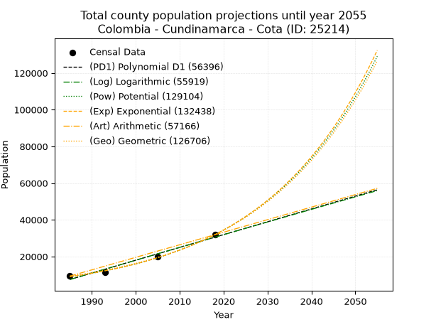
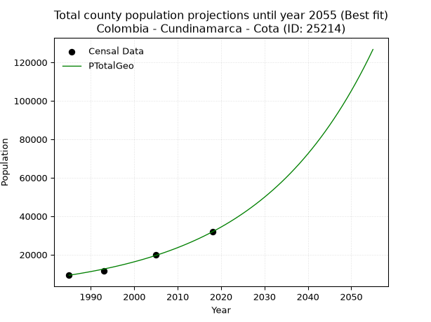
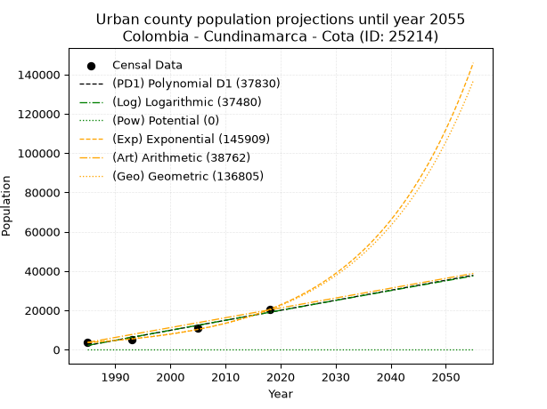
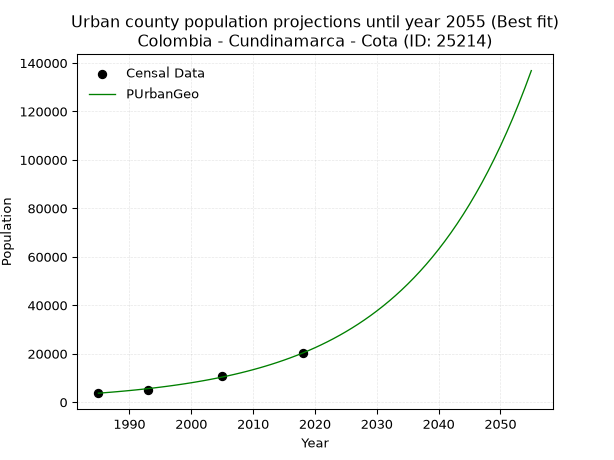
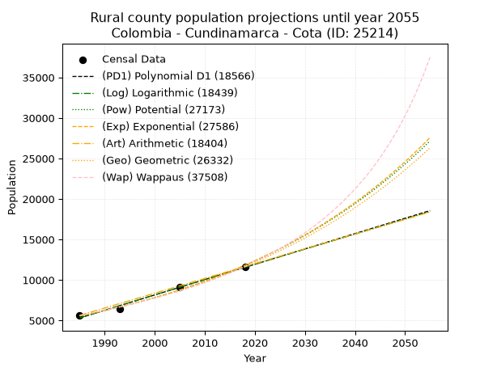
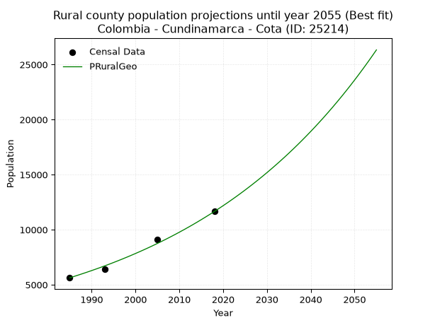

<div align="center">


</div>

# 📜 _“Population and Public Services Demand Projections (PPSD) until Year 2050 for Colombia - Cundinamarca - Cota (ID: 25214)”_
Keywords: `population` `public-service` `projection` `lineal` `polynomial` `logarithmic` `potential` `exponential` `arithmetic` `geometric` `wappaus` `dane` `colombia` `south-america`

PPSD are analytical estimates used by governments and planners to anticipate future changes in population size, age distribution, and the resulting community needs for utilities, healthcare, education, and infrastructure as sizing future water treatment facilities, electrical grids, and road networks based on spatial growth.

<div align="center">

</img>

</div>


> **General running parameters**: • app_version: _v20260806_. • Python version: _3.14.7_. • Pandas version: _3.0.5_. • NumPy version: _2.5.1_. • Creates, save and include plots into reports (create_plot): _False_. • Projection until year: _2050_. • Process polynomial degree 2 and up: _False_. • Process Wappaus: _True_. • Process Wappaus: _True_. • Set negative values to zero: _True_. • Set infinite values to zero: _True_. • Drop dataset notes: _True_. 
<div align="center">

Maps & GIS Layers: [:earth_americas:Google](http://maps.google.com/maps?q=4.812563552,-74.1025688) [:earth_americas:OSM](https://www.openstreetmap.org/#map=18/4.812563552/-74.1025688&layers=P) [:earth_americas:Bing](https://www.bing.com/maps?cp=4.812563552~-74.1025688&lvl=18) [:earth_americas:Apple](https://maps.apple.com/frame?center=4.812563552%2C-74.1025688&span=0.003%2C0.006) [:earth_americas:GISMobile](https://github.com/rcfdtools/R.GISMobile/blob/main/file/gis/CountyLayer_CO/Readme.md)

</div>


<div align="center">

```geojson
{
  "type": "Feature",
  "geometry": {
    "type": "Point", 
    "coordinates": [-74.1025688, 4.812563552]
  }, 
  "properties": {
    "Name": "Colombia - Cundinamarca - Cota (ID: 25214)"
  }
}
```

</div>


## 0. Census Data (4 records)

Census data are official statistics collected by a government about the people and housing in a country. They usually include counts of total population, age, sex, race, income, education, and jobs.

📅Global census file: [Population.xlsx](../data/Population.xlsx)

| Source   |   Year |   CountryID | CountryName   |   StateID | StateName    |   CountyID | CountyName   |   PTotal |   PUrban |   PRural |
|:---------|-------:|------------:|:--------------|----------:|:-------------|-----------:|:-------------|---------:|---------:|---------:|
| DANE     |   1985 |          57 | Colombia      |        25 | Cundinamarca |      25214 | Cota         |     9305 |     3673 |     5632 |
| DANE     |   1993 |          57 | Colombia      |        25 | Cundinamarca |      25214 | Cota         |    11471 |     5071 |     6400 |
| DANE     |   2005 |          57 | Colombia      |        25 | Cundinamarca |      25214 | Cota         |    19909 |    10787 |     9122 |
| DANE     |   2018 |          57 | Colombia      |        25 | Cundinamarca |      25214 | Cota         |    31868 |    20215 |    11653 |

> 🔥Some records could had specific notes about the registered values or the corresponding urban or rural distribution.

📅[SUI-RUPS](https://www.datos.gov.co/Hacienda-y-Cr-dito-P-blico/Registro-nico-de-Prestadores-de-Servicios-P-blicos/4qkq-csdn/about_data) - Local public utility companies: [RUPS.csv](../data/RUPS.csv)

 | SERVICIO       | ESTADO    | NOMBRE                                                            | NIT         | DEPARTAMENTO_DOMICILIO   | MUNICIPIO_DOMICILIO   | DIRECCION                                             |   TELEFONO | EMAIL                           | TIPO_PRESTADOR                                     | CLASIFICACION                 |
|:---------------|:----------|:------------------------------------------------------------------|:------------|:-------------------------|:----------------------|:------------------------------------------------------|-----------:|:--------------------------------|:---------------------------------------------------|:------------------------------|
| ACUEDUCTO      | OPERATIVA | ASOCIACION DE USUARIOS DEL ACUEDUCTO DE LA VEREDA DE ROZO DE COTA | 832000136-1 | CUNDINAMARCA             | COTA                  | VEREDA ROZO FINCA LA GIOCONDA                         |    8777040 | asacor13@gmail.com              | ORGANIZACION AUTORIZADA                            | MENOR O IGUAL A 2500 USUARIOS |
| ACUEDUCTO      | OPERATIVA | JUNTA DE ACCION COMUNAL LA MOYA - SERVICIO ACUEDUCTO VEREDAL      | 832002672-7 | CUNDINAMARCA             | COTA                  | VEREDA LA MOYA                                        |    8641676 | avargas287@hotmail.com          | ORGANIZACION AUTORIZADA                            | MENOR O IGUAL A 2500 USUARIOS |
| ACUEDUCTO      | OPERATIVA | EMSERCOTA S.A.  E.S.P.                                            | 900124654-4 | CUNDINAMARCA             | COTA                  | CALLE 12 No 4-35                                      |    8641425 | administrativa@emsercota.gov.co | SOCIEDADES (EMPRESA DE SERVICIOS PUBLICOS)         | MAYOR O IGUAL A 5001 USUARIOS |
| ALCANTARILLADO | OPERATIVA | EMSERCOTA S.A.  E.S.P.                                            | 900124654-4 | CUNDINAMARCA             | COTA                  | CALLE 12 No 4-35                                      |    8641425 | administrativa@emsercota.gov.co | SOCIEDADES (EMPRESA DE SERVICIOS PUBLICOS)         | MAYOR O IGUAL A 5001 USUARIOS |
| ACUEDUCTO      | OPERATIVA | AGUAS DE  LA SABANA DE BOGOTA S.A.  E.S.P.                        | 900021737-4 | CUNDINAMARCA             | COTA                  | AUT MEDELLIN KM 3.9 CTRO EMPRESARIAL METROPOLITANO P5 |    8415892 | algora00@gmail.com              | SOCIEDADES (EMPRESA DE SERVICIOS PUBLICOS)         | MENOR O IGUAL A 2500 USUARIOS |
| ALCANTARILLADO | OPERATIVA | AGUAS DE  LA SABANA DE BOGOTA S.A.  E.S.P.                        | 900021737-4 | CUNDINAMARCA             | COTA                  | AUT MEDELLIN KM 3.9 CTRO EMPRESARIAL METROPOLITANO P5 |    8415892 | algora00@gmail.com              | SOCIEDADES (EMPRESA DE SERVICIOS PUBLICOS)         | MENOR O IGUAL A 2500 USUARIOS |
| ALCANTARILLADO | OPERATIVA | COJARDIN SA ESP                                                   | 830131572-4 | BOGOTA, D.C.             | BOGOTA, D.C.          | Carrera 54 # 221-89                                   |    7441106 | info@cojardinsa.com             | SOCIEDADES (EMPRESA DE SERVICIOS PUBLICOS)         | MENOR O IGUAL A 2500 USUARIOS |
| ACUEDUCTO      | OPERATIVA | COJARDIN SA ESP                                                   | 830131572-4 | BOGOTA, D.C.             | BOGOTA, D.C.          | Carrera 54 # 221-89                                   |    7441106 | info@cojardinsa.com             | SOCIEDADES (EMPRESA DE SERVICIOS PUBLICOS)         | MENOR O IGUAL A 2500 USUARIOS |
| ACUEDUCTO      | OPERATIVA | IGLESIA CRISTIANA DE LOS TESTIGOS DE JEHOVA                       | 832000957-1 | CUNDINAMARCA             | FACATATIVA            | AV. CUNDINAMARCA KM. 1 VIA ECOPETROL                  |    8911530 | mnt.co@bethel.jw.org            | PRODUCTOR MARGINAL, INDEPENDIENTE O USO PARTICULAR | MENOR O IGUAL A 2500 USUARIOS |
| ALCANTARILLADO | OPERATIVA | IGLESIA CRISTIANA DE LOS TESTIGOS DE JEHOVA                       | 832000957-1 | CUNDINAMARCA             | FACATATIVA            | AV. CUNDINAMARCA KM. 1 VIA ECOPETROL                  |    8911530 | mnt.co@bethel.jw.org            | PRODUCTOR MARGINAL, INDEPENDIENTE O USO PARTICULAR | MENOR O IGUAL A 2500 USUARIOS |

## 1. Total

### 1.1. Coefficients and Parameters

* (PD1) Polynomial Deg 1: 698.7695704536252, -1379575.5832998636 (lineal)
* (Log) Logarithmic: 1398090.9106404523, -10608761.96537551
* (Pow) Potential: 76.9649808929356, -249.85955825539222
* (Exp) Exponential: 0.03845344350843812, 6.357242772255875e-30
* (Art) Arithmetic: Year diff. 2018 - 1985 = 33, Population diff. 31868 - 9305 = 22563, Annual growth = 683.7272727272727
* (Geo) Geometric: Year diff. 2018 - 1985 = 33, Population diff. 31868 - 9305 = 22563, Annual growth % = 0.038009108800797
* (Wap) Wappaus: i = 3.32124097212869, Condition values only valid for < 200)

<sub>
Wappaus condition values: ['0.00', '3.32', '6.64', '9.96', '13.28', '16.61', '19.93', '23.25', '26.57', '29.89', '33.21', '36.53', '39.85', '43.18', '46.50', '49.82', '53.14', '56.46', '59.78', '63.10', '66.42', '69.75', '73.07', '76.39', '79.71', '83.03', '86.35', '89.67', '92.99', '96.32', '99.64', '102.96', '106.28', '109.60', '112.92', '116.24', '119.56', '122.89', '126.21', '129.53', '132.85', '136.17', '139.49', '142.81', '146.13', '149.46', '152.78', '156.10', '159.42', '162.74', '166.06', '169.38', '172.70', '176.03', '179.35', '182.67', '185.99', '189.31', '192.63', '195.95', '199.27', '202.60', '205.92', '209.24', '212.56', '215.88']
</sub>


### 1.2. Projected Dataset

|   Year |   CountyID |   PTotalPD1 |   PTotalLog |   PTotalPow |   PTotalExp |   PTotalArt |   PTotalGeo |
|-------:|-----------:|------------:|------------:|------------:|------------:|------------:|------------:|
|   1985 |      25214 |        7482 |        7465 |        8964 |        8974 |        9305 |        9305 |
|   1986 |      25214 |        8181 |        8170 |        9319 |        9326 |        9989 |        9659 |
|   1987 |      25214 |        8880 |        8873 |        9687 |        9692 |       10672 |       10026 |
|   1988 |      25214 |        9578 |        9577 |       10069 |       10072 |       11356 |       10407 |
|   1989 |      25214 |       10277 |       10280 |       10467 |       10467 |       12040 |       10802 |
|   1990 |      25214 |       10976 |       10983 |       10879 |       10877 |       12724 |       11213 |
|   1991 |      25214 |       11675 |       11685 |       11308 |       11303 |       13407 |       11639 |
|   1992 |      25214 |       12373 |       12387 |       11754 |       11746 |       14091 |       12082 |
|   1993 |      25214 |       13072 |       13089 |       12217 |       12207 |       14775 |       12541 |
|   1994 |      25214 |       13771 |       13790 |       12698 |       12685 |       15459 |       13017 |
|   1995 |      25214 |       14470 |       14491 |       13197 |       13183 |       16142 |       13512 |
|   1996 |      25214 |       15168 |       15192 |       13716 |       13700 |       16826 |       14026 |
|   1997 |      25214 |       15867 |       15892 |       14255 |       14237 |       17510 |       14559 |
|   1998 |      25214 |       16566 |       16592 |       14815 |       14795 |       18193 |       15112 |
|   1999 |      25214 |       17265 |       17291 |       15397 |       15375 |       18877 |       15687 |
|   2000 |      25214 |       17964 |       17991 |       16001 |       15977 |       19561 |       16283 |
|   2001 |      25214 |       18662 |       18690 |       16629 |       16604 |       20245 |       16902 |
|   2002 |      25214 |       19361 |       19388 |       17281 |       17255 |       20928 |       17544 |
|   2003 |      25214 |       20060 |       20086 |       17958 |       17931 |       21612 |       18211 |
|   2004 |      25214 |       20759 |       20784 |       18661 |       18634 |       22296 |       18903 |
|   2005 |      25214 |       21457 |       21482 |       19392 |       19364 |       22980 |       19622 |
|   2006 |      25214 |       22156 |       22179 |       20150 |       20124 |       23663 |       20368 |
|   2007 |      25214 |       22855 |       22875 |       20938 |       20913 |       24347 |       21142 |
|   2008 |      25214 |       23554 |       23572 |       21756 |       21732 |       25031 |       21945 |
|   2009 |      25214 |       24252 |       24268 |       22606 |       22584 |       25714 |       22780 |
|   2010 |      25214 |       24951 |       24964 |       23489 |       23470 |       26398 |       23645 |
|   2011 |      25214 |       25650 |       25659 |       24406 |       24390 |       27082 |       24544 |
|   2012 |      25214 |       26349 |       26354 |       25357 |       25346 |       27766 |       25477 |
|   2013 |      25214 |       27048 |       27049 |       26346 |       26339 |       28449 |       26445 |
|   2014 |      25214 |       27746 |       27743 |       27373 |       27372 |       29133 |       27450 |
|   2015 |      25214 |       28445 |       28437 |       28439 |       28445 |       29817 |       28494 |
|   2016 |      25214 |       29144 |       29131 |       29546 |       29560 |       30501 |       29577 |
|   2017 |      25214 |       29843 |       29824 |       30695 |       30719 |       31184 |       30701 |
|   2018 |      25214 |       30541 |       30517 |       31889 |       31923 |       31868 |       31868 |
|   2019 |      25214 |       31240 |       31210 |       33128 |       33175 |       32552 |       33079 |
|   2020 |      25214 |       31939 |       31902 |       34415 |       34475 |       33235 |       34337 |
|   2021 |      25214 |       32638 |       32594 |       35751 |       35827 |       33919 |       35642 |
|   2022 |      25214 |       33336 |       33286 |       37139 |       37231 |       34603 |       36996 |
|   2023 |      25214 |       34035 |       33977 |       38579 |       38691 |       35287 |       38403 |
|   2024 |      25214 |       34734 |       34668 |       40075 |       40208 |       35970 |       39862 |
|   2025 |      25214 |       35433 |       35358 |       41628 |       41784 |       36654 |       41377 |
|   2026 |      25214 |       36132 |       36049 |       43240 |       43422 |       37338 |       42950 |
|   2027 |      25214 |       36830 |       36739 |       44914 |       45124 |       38022 |       44583 |
|   2028 |      25214 |       37529 |       37428 |       46651 |       46893 |       38705 |       46277 |
|   2029 |      25214 |       38228 |       38117 |       48455 |       48731 |       39389 |       48036 |
|   2030 |      25214 |       38927 |       38806 |       50328 |       50642 |       40073 |       49862 |
|   2031 |      25214 |       39625 |       39495 |       52272 |       52627 |       40756 |       51757 |
|   2032 |      25214 |       40324 |       40183 |       54291 |       54690 |       41440 |       53724 |
|   2033 |      25214 |       41023 |       40871 |       56386 |       56834 |       42124 |       55766 |
|   2034 |      25214 |       41722 |       41558 |       58561 |       59062 |       42808 |       57886 |
|   2035 |      25214 |       42420 |       42246 |       60819 |       61378 |       43491 |       60086 |
|   2036 |      25214 |       43119 |       42933 |       63163 |       63784 |       44175 |       62370 |
|   2037 |      25214 |       43818 |       43619 |       65595 |       66284 |       44859 |       64741 |
|   2038 |      25214 |       44517 |       44305 |       68121 |       68883 |       45543 |       67201 |
|   2039 |      25214 |       45216 |       44991 |       70742 |       71583 |       46226 |       69756 |
|   2040 |      25214 |       45914 |       45677 |       73462 |       74389 |       46910 |       72407 |
|   2041 |      25214 |       46613 |       46362 |       76286 |       77305 |       47594 |       75159 |
|   2042 |      25214 |       47312 |       47047 |       79217 |       80336 |       48277 |       78016 |
|   2043 |      25214 |       48011 |       47731 |       82259 |       83485 |       48961 |       80981 |
|   2044 |      25214 |       48709 |       48415 |       85416 |       86758 |       49645 |       84059 |
|   2045 |      25214 |       49408 |       49099 |       88693 |       90159 |       50329 |       87254 |
|   2046 |      25214 |       50107 |       49783 |       92094 |       93694 |       51012 |       90571 |
|   2047 |      25214 |       50806 |       50466 |       95623 |       97367 |       51696 |       94013 |
|   2048 |      25214 |       51504 |       51149 |       99286 |      101184 |       52380 |       97587 |
|   2049 |      25214 |       52203 |       51831 |      103087 |      105150 |       53064 |      101296 |
|   2050 |      25214 |       52902 |       52513 |      107032 |      109273 |       53747 |      105146 |
<div align="center">

</img>

</div>


### 1.3. Best fit with absolute and relative error (%)

Relative error puts that difference into context by dividing the absolute error by the true value, creating a unitless ratio or percentage that shows the scale of the mistake.

Absolute and relative error

|   Year | Source   |   CountryID | CountryName   |   StateID | StateName    |   CountyID_x | CountyName   |   PTotal |   PUrban |   PRural |   CountyID_y |   PTotalPD1 |   PTotalLog |   PTotalPow |   PTotalExp |   PTotalArt |   PTotalGeo |   PTotalPD1AbsError |   PTotalLogAbsError |   PTotalPowAbsError |   PTotalExpAbsError |   PTotalArtAbsError |   PTotalGeoAbsError |   PTotalPD1RelError |   PTotalLogRelError |   PTotalPowRelError |   PTotalExpRelError |   PTotalArtRelError |   PTotalGeoRelError |
|-------:|:---------|------------:|:--------------|----------:|:-------------|-------------:|:-------------|---------:|---------:|---------:|-------------:|------------:|------------:|------------:|------------:|------------:|------------:|--------------------:|--------------------:|--------------------:|--------------------:|--------------------:|--------------------:|--------------------:|--------------------:|--------------------:|--------------------:|--------------------:|--------------------:|
|   1985 | DANE     |          57 | Colombia      |        25 | Cundinamarca |        25214 | Cota         |     9305 |     3673 |     5632 |        25214 |        7482 |        7465 |        8964 |        8974 |        9305 |        9305 |                1823 |                1840 |                 341 |                 331 |                   0 |                   0 |            19.5916  |            19.7743  |           3.6647    |            3.55723  |              0      |             0       |
|   1993 | DANE     |          57 | Colombia      |        25 | Cundinamarca |        25214 | Cota         |    11471 |     5071 |     6400 |        25214 |       13072 |       13089 |       12217 |       12207 |       14775 |       12541 |                1601 |                1618 |                 746 |                 736 |                3304 |                1070 |            13.9569  |            14.1051  |           6.50336   |            6.41618  |             28.8031 |             9.32787 |
|   2005 | DANE     |          57 | Colombia      |        25 | Cundinamarca |        25214 | Cota         |    19909 |    10787 |     9122 |        25214 |       21457 |       21482 |       19392 |       19364 |       22980 |       19622 |                1548 |                1573 |                 517 |                 545 |                3071 |                 287 |             7.77538 |             7.90095 |           2.59682   |            2.73746  |             15.4252 |             1.44156 |
|   2018 | DANE     |          57 | Colombia      |        25 | Cundinamarca |        25214 | Cota         |    31868 |    20215 |    11653 |        25214 |       30541 |       30517 |       31889 |       31923 |       31868 |       31868 |                1327 |                1351 |                  21 |                  55 |                   0 |                   0 |             4.16405 |             4.23936 |           0.0658968 |            0.172587 |              0      |             0       |

Relative error mean

| Method    |   RelError | Best   |
|:----------|-----------:|:-------|
| PTotalPD1 |   11.372   |        |
| PTotalLog |   11.5049  |        |
| PTotalPow |    3.20769 |        |
| PTotalExp |    3.22086 |        |
| PTotalArt |   11.0571  |        |
| PTotalGeo |    2.69236 | True   |

💙Best method: _**PTotalGeo**_
<div align="center">

</img>

</div>


### 1.4. Fresh water supply demand in liters per capita per day (lpcd)

The fresh water supply demand typically ranges from 100 to 300 liters per capita per day (lpcd) for standard domestic and municipal planning, though absolute survival minimums set by the World Health Organization are as low as 7.5 to 20 liters per day, and total consumption in high-income nations can exceed 400 liters.

> `CZ`: Level in meters above the sea level (masl)<br> `WS`: Fresh water supply demand in liters per capita per day (lpcd or l/h/d)<br> `WSAll`: Zonal fresh water supply demand in liters per second (l/s)<br> `A`: Zonal area in square meters<br> `DP`: Population density (people/hectare or p/ha)

Reference values (RAS Colombia)

|    CZ |   WS |
|------:|-----:|
|  1000 |  120 |
|  2000 |  130 |
| 99999 |  140 |

County shapefile geometry properties and water supply values

|   CountyID |      ATotal |   CZTotal |   WSTotal |
|-----------:|------------:|----------:|----------:|
|      25214 | 5.36795e+07 |   2601.61 |       140 |

Projected values for best method: PTotalGeo

|   CountyID |   Year |   PTotalGeo |   DPTotal |   WSTotal |   WSTotalAll |
|-----------:|-------:|------------:|----------:|----------:|-------------:|
|      25214 |   1985 |        9305 |      1.73 |       140 |      15.0775 |
|      25214 |   1986 |        9659 |      1.8  |       140 |      15.6512 |
|      25214 |   1987 |       10026 |      1.87 |       140 |      16.2458 |
|      25214 |   1988 |       10407 |      1.94 |       140 |      16.8632 |
|      25214 |   1989 |       10802 |      2.01 |       140 |      17.5032 |
|      25214 |   1990 |       11213 |      2.09 |       140 |      18.1692 |
|      25214 |   1991 |       11639 |      2.17 |       140 |      18.8595 |
|      25214 |   1992 |       12082 |      2.25 |       140 |      19.5773 |
|      25214 |   1993 |       12541 |      2.34 |       140 |      20.3211 |
|      25214 |   1994 |       13017 |      2.42 |       140 |      21.0924 |
|      25214 |   1995 |       13512 |      2.52 |       140 |      21.8944 |
|      25214 |   1996 |       14026 |      2.61 |       140 |      22.7273 |
|      25214 |   1997 |       14559 |      2.71 |       140 |      23.591  |
|      25214 |   1998 |       15112 |      2.82 |       140 |      24.487  |
|      25214 |   1999 |       15687 |      2.92 |       140 |      25.4187 |
|      25214 |   2000 |       16283 |      3.03 |       140 |      26.3845 |
|      25214 |   2001 |       16902 |      3.15 |       140 |      27.3875 |
|      25214 |   2002 |       17544 |      3.27 |       140 |      28.4278 |
|      25214 |   2003 |       18211 |      3.39 |       140 |      29.5086 |
|      25214 |   2004 |       18903 |      3.52 |       140 |      30.6299 |
|      25214 |   2005 |       19622 |      3.66 |       140 |      31.7949 |
|      25214 |   2006 |       20368 |      3.79 |       140 |      33.0037 |
|      25214 |   2007 |       21142 |      3.94 |       140 |      34.2579 |
|      25214 |   2008 |       21945 |      4.09 |       140 |      35.559  |
|      25214 |   2009 |       22780 |      4.24 |       140 |      36.912  |
|      25214 |   2010 |       23645 |      4.4  |       140 |      38.3137 |
|      25214 |   2011 |       24544 |      4.57 |       140 |      39.7704 |
|      25214 |   2012 |       25477 |      4.75 |       140 |      41.2822 |
|      25214 |   2013 |       26445 |      4.93 |       140 |      42.8507 |
|      25214 |   2014 |       27450 |      5.11 |       140 |      44.4792 |
|      25214 |   2015 |       28494 |      5.31 |       140 |      46.1708 |
|      25214 |   2016 |       29577 |      5.51 |       140 |      47.9257 |
|      25214 |   2017 |       30701 |      5.72 |       140 |      49.747  |
|      25214 |   2018 |       31868 |      5.94 |       140 |      51.638  |
|      25214 |   2019 |       33079 |      6.16 |       140 |      53.6002 |
|      25214 |   2020 |       34337 |      6.4  |       140 |      55.6387 |
|      25214 |   2021 |       35642 |      6.64 |       140 |      57.7532 |
|      25214 |   2022 |       36996 |      6.89 |       140 |      59.9472 |
|      25214 |   2023 |       38403 |      7.15 |       140 |      62.2271 |
|      25214 |   2024 |       39862 |      7.43 |       140 |      64.5912 |
|      25214 |   2025 |       41377 |      7.71 |       140 |      67.0461 |
|      25214 |   2026 |       42950 |      8    |       140 |      69.5949 |
|      25214 |   2027 |       44583 |      8.31 |       140 |      72.241  |
|      25214 |   2028 |       46277 |      8.62 |       140 |      74.9859 |
|      25214 |   2029 |       48036 |      8.95 |       140 |      77.8361 |
|      25214 |   2030 |       49862 |      9.29 |       140 |      80.7949 |
|      25214 |   2031 |       51757 |      9.64 |       140 |      83.8655 |
|      25214 |   2032 |       53724 |     10.01 |       140 |      87.0528 |
|      25214 |   2033 |       55766 |     10.39 |       140 |      90.3616 |
|      25214 |   2034 |       57886 |     10.78 |       140 |      93.7968 |
|      25214 |   2035 |       60086 |     11.19 |       140 |      97.3616 |
|      25214 |   2036 |       62370 |     11.62 |       140 |     101.062  |
|      25214 |   2037 |       64741 |     12.06 |       140 |     104.904  |
|      25214 |   2038 |       67201 |     12.52 |       140 |     108.891  |
|      25214 |   2039 |       69756 |     12.99 |       140 |     113.031  |
|      25214 |   2040 |       72407 |     13.49 |       140 |     117.326  |
|      25214 |   2041 |       75159 |     14    |       140 |     121.785  |
|      25214 |   2042 |       78016 |     14.53 |       140 |     126.415  |
|      25214 |   2043 |       80981 |     15.09 |       140 |     131.219  |
|      25214 |   2044 |       84059 |     15.66 |       140 |     136.207  |
|      25214 |   2045 |       87254 |     16.25 |       140 |     141.384  |
|      25214 |   2046 |       90571 |     16.87 |       140 |     146.759  |
|      25214 |   2047 |       94013 |     17.51 |       140 |     152.336  |
|      25214 |   2048 |       97587 |     18.18 |       140 |     158.127  |
|      25214 |   2049 |      101296 |     18.87 |       140 |     164.137  |
|      25214 |   2050 |      105146 |     19.59 |       140 |     170.375  |

## 2. Urban

### 2.1. Coefficients and Parameters

* (PD1) Polynomial Deg 1: 509.476515455634, -1009143.900040132 (lineal)
* (Log) Logarithmic: 1019262.7488654258, -7737487.821985164
* (Pow) Potential: 106.22763477826571, -346.76330616481016
* (Exp) Exponential: 0.05307126562721505, 6.29933177255385e-43
* (Art) Arithmetic: Year diff. 2018 - 1985 = 33, Population diff. 20215 - 3673 = 16542, Annual growth = 501.27272727272725
* (Geo) Geometric: Year diff. 2018 - 1985 = 33, Population diff. 20215 - 3673 = 16542, Annual growth % = 0.053037954704721946
* (Wap) Wappaus: i = 4.1968580649089695, Condition values only valid for < 200)

<sub>
Wappaus condition values: ['0.00', '4.20', '8.39', '12.59', '16.79', '20.98', '25.18', '29.38', '33.57', '37.77', '41.97', '46.17', '50.36', '54.56', '58.76', '62.95', '67.15', '71.35', '75.54', '79.74', '83.94', '88.13', '92.33', '96.53', '100.72', '104.92', '109.12', '113.32', '117.51', '121.71', '125.91', '130.10', '134.30', '138.50', '142.69', '146.89', '151.09', '155.28', '159.48', '163.68', '167.87', '172.07', '176.27', '180.46', '184.66', '188.86', '193.06', '197.25', '201.45', '205.65', '209.84', '214.04', '218.24', '222.43', '226.63', '230.83', '235.02', '239.22', '243.42', '247.61', '251.81', '256.01', '260.21', '264.40', '268.60', '272.80']
</sub>


### 2.2. Projected Dataset

|   Year |   CountyID |   PUrbanPD1 |   PUrbanLog |   PUrbanPow |   PUrbanExp |   PUrbanArt |   PUrbanGeo |
|-------:|-----------:|------------:|------------:|------------:|------------:|------------:|------------:|
|   1985 |      25214 |        2167 |        2156 |           0 |        3554 |        3673 |        3673 |
|   1986 |      25214 |        2676 |        2669 |           0 |        3747 |        4174 |        3868 |
|   1987 |      25214 |        3186 |        3182 |           0 |        3952 |        4676 |        4073 |
|   1988 |      25214 |        3695 |        3695 |           0 |        4167 |        5177 |        4289 |
|   1989 |      25214 |        4205 |        4207 |           0 |        4394 |        5678 |        4516 |
|   1990 |      25214 |        4714 |        4720 |           0 |        4634 |        6179 |        4756 |
|   1991 |      25214 |        5224 |        5232 |           0 |        4886 |        6681 |        5008 |
|   1992 |      25214 |        5733 |        5744 |           0 |        5153 |        7182 |        5274 |
|   1993 |      25214 |        6243 |        6255 |           0 |        5433 |        7683 |        5554 |
|   1994 |      25214 |        6752 |        6767 |           0 |        5730 |        8184 |        5848 |
|   1995 |      25214 |        7262 |        7278 |           0 |        6042 |        8686 |        6158 |
|   1996 |      25214 |        7771 |        7788 |           0 |        6371 |        9187 |        6485 |
|   1997 |      25214 |        8281 |        8299 |           0 |        6718 |        9688 |        6829 |
|   1998 |      25214 |        8790 |        8809 |           0 |        7085 |       10190 |        7191 |
|   1999 |      25214 |        9300 |        9319 |           0 |        7471 |       10691 |        7572 |
|   2000 |      25214 |        9809 |        9829 |           0 |        7878 |       11192 |        7974 |
|   2001 |      25214 |       10319 |       10338 |           0 |        8307 |       11693 |        8397 |
|   2002 |      25214 |       10828 |       10848 |           0 |        8760 |       12195 |        8842 |
|   2003 |      25214 |       11338 |       11357 |           0 |        9238 |       12696 |        9311 |
|   2004 |      25214 |       11847 |       11865 |           0 |        9741 |       13197 |        9805 |
|   2005 |      25214 |       12357 |       12374 |           0 |       10272 |       13698 |       10325 |
|   2006 |      25214 |       12866 |       12882 |           0 |       10832 |       14200 |       10873 |
|   2007 |      25214 |       13375 |       13390 |           0 |       11422 |       14701 |       11450 |
|   2008 |      25214 |       13885 |       13898 |           0 |       12045 |       15202 |       12057 |
|   2009 |      25214 |       14394 |       14405 |           0 |       12701 |       15704 |       12696 |
|   2010 |      25214 |       14904 |       14913 |           0 |       13394 |       16205 |       13370 |
|   2011 |      25214 |       15413 |       15419 |           0 |       14124 |       16706 |       14079 |
|   2012 |      25214 |       15923 |       15926 |           0 |       14893 |       17207 |       14826 |
|   2013 |      25214 |       16432 |       16433 |           0 |       15705 |       17709 |       15612 |
|   2014 |      25214 |       16942 |       16939 |           0 |       16561 |       18210 |       16440 |
|   2015 |      25214 |       17451 |       17445 |           0 |       17464 |       18711 |       17312 |
|   2016 |      25214 |       17961 |       17951 |           0 |       18416 |       19212 |       18230 |
|   2017 |      25214 |       18470 |       18456 |           0 |       19419 |       19714 |       19197 |
|   2018 |      25214 |       18980 |       18961 |           0 |       20478 |       20215 |       20215 |
|   2019 |      25214 |       19489 |       19466 |           0 |       21594 |       20716 |       21287 |
|   2020 |      25214 |       19999 |       19971 |           0 |       22771 |       21218 |       22416 |
|   2021 |      25214 |       20508 |       20475 |           0 |       24012 |       21719 |       23605 |
|   2022 |      25214 |       21018 |       20980 |           0 |       25321 |       22220 |       24857 |
|   2023 |      25214 |       21527 |       21484 |           0 |       26701 |       22721 |       26175 |
|   2024 |      25214 |       22037 |       21987 |           0 |       28156 |       23223 |       27564 |
|   2025 |      25214 |       22546 |       22491 |           0 |       29691 |       23724 |       29026 |
|   2026 |      25214 |       23056 |       22994 |           0 |       31309 |       24225 |       30565 |
|   2027 |      25214 |       23565 |       23497 |           0 |       33016 |       24726 |       32186 |
|   2028 |      25214 |       24074 |       24000 |           0 |       34815 |       25228 |       33893 |
|   2029 |      25214 |       24584 |       24502 |           0 |       36713 |       25729 |       35691 |
|   2030 |      25214 |       25093 |       25004 |           0 |       38714 |       26230 |       37584 |
|   2031 |      25214 |       25603 |       25506 |           0 |       40824 |       26732 |       39577 |
|   2032 |      25214 |       26112 |       26008 |           0 |       43049 |       27233 |       41676 |
|   2033 |      25214 |       26622 |       26510 |           0 |       45395 |       27734 |       43887 |
|   2034 |      25214 |       27131 |       27011 |           0 |       47870 |       28235 |       46214 |
|   2035 |      25214 |       27641 |       27512 |           0 |       50479 |       28737 |       48666 |
|   2036 |      25214 |       28150 |       28012 |           0 |       53230 |       29238 |       51247 |
|   2037 |      25214 |       28660 |       28513 |           0 |       56132 |       29739 |       53965 |
|   2038 |      25214 |       29169 |       29013 |           0 |       59191 |       30240 |       56827 |
|   2039 |      25214 |       29679 |       29513 |           0 |       62417 |       30742 |       59841 |
|   2040 |      25214 |       30188 |       30013 |           0 |       65819 |       31243 |       63015 |
|   2041 |      25214 |       30698 |       30513 |           0 |       69407 |       31744 |       66357 |
|   2042 |      25214 |       31207 |       31012 |           0 |       73190 |       32246 |       69876 |
|   2043 |      25214 |       31717 |       31511 |           0 |       77179 |       32747 |       73582 |
|   2044 |      25214 |       32226 |       32010 |           0 |       81385 |       33248 |       77485 |
|   2045 |      25214 |       32736 |       32508 |           0 |       85821 |       33749 |       81595 |
|   2046 |      25214 |       33245 |       33006 |           0 |       90499 |       34251 |       85922 |
|   2047 |      25214 |       33755 |       33504 |           0 |       95432 |       34752 |       90480 |
|   2048 |      25214 |       34264 |       34002 |           0 |      100633 |       35253 |       95278 |
|   2049 |      25214 |       34773 |       34500 |           0 |      106118 |       35754 |      100332 |
|   2050 |      25214 |       35283 |       34997 |           0 |      111902 |       36256 |      105653 |
<div align="center">

</img>

</div>


### 2.3. Best fit with absolute and relative error (%)

Relative error puts that difference into context by dividing the absolute error by the true value, creating a unitless ratio or percentage that shows the scale of the mistake.

Absolute and relative error

|   Year | Source   |   CountryID | CountryName   |   StateID | StateName    |   CountyID_x | CountyName   |   PTotal |   PUrban |   PRural |   CountyID_y |   PUrbanPD1 |   PUrbanLog |   PUrbanPow |   PUrbanExp |   PUrbanArt |   PUrbanGeo |   PUrbanPD1AbsError |   PUrbanLogAbsError |   PUrbanPowAbsError |   PUrbanExpAbsError |   PUrbanArtAbsError |   PUrbanGeoAbsError |   PUrbanPD1RelError |   PUrbanLogRelError |   PUrbanPowRelError |   PUrbanExpRelError |   PUrbanArtRelError |   PUrbanGeoRelError |
|-------:|:---------|------------:|:--------------|----------:|:-------------|-------------:|:-------------|---------:|---------:|---------:|-------------:|------------:|------------:|------------:|------------:|------------:|------------:|--------------------:|--------------------:|--------------------:|--------------------:|--------------------:|--------------------:|--------------------:|--------------------:|--------------------:|--------------------:|--------------------:|--------------------:|
|   1985 | DANE     |          57 | Colombia      |        25 | Cundinamarca |        25214 | Cota         |     9305 |     3673 |     5632 |        25214 |        2167 |        2156 |           0 |        3554 |        3673 |        3673 |                1506 |                1517 |                3673 |                 119 |                   0 |                   0 |            41.0019  |            41.3014  |                 100 |             3.23986 |              0      |             0       |
|   1993 | DANE     |          57 | Colombia      |        25 | Cundinamarca |        25214 | Cota         |    11471 |     5071 |     6400 |        25214 |        6243 |        6255 |           0 |        5433 |        7683 |        5554 |                1172 |                1184 |                5071 |                 362 |                2612 |                 483 |            23.1118  |            23.3485  |                 100 |             7.13863 |             51.5086 |             9.52475 |
|   2005 | DANE     |          57 | Colombia      |        25 | Cundinamarca |        25214 | Cota         |    19909 |    10787 |     9122 |        25214 |       12357 |       12374 |           0 |       10272 |       13698 |       10325 |                1570 |                1587 |               10787 |                 515 |                2911 |                 462 |            14.5546  |            14.7122  |                 100 |             4.77427 |             26.9862 |             4.28293 |
|   2018 | DANE     |          57 | Colombia      |        25 | Cundinamarca |        25214 | Cota         |    31868 |    20215 |    11653 |        25214 |       18980 |       18961 |           0 |       20478 |       20215 |       20215 |                1235 |                1254 |               20215 |                 263 |                   0 |                   0 |             6.10932 |             6.20331 |                 100 |             1.30101 |              0      |             0       |

Relative error mean

| Method    |   RelError | Best   |
|:----------|-----------:|:-------|
| PUrbanPD1 |   21.1944  |        |
| PUrbanLog |   21.3913  |        |
| PUrbanPow |  100       |        |
| PUrbanExp |    4.11344 |        |
| PUrbanArt |   19.6237  |        |
| PUrbanGeo |    3.45192 | True   |

💙Best method: _**PUrbanGeo**_
<div align="center">

</img>

</div>


### 2.4. Fresh water supply demand in liters per capita per day (lpcd)

The fresh water supply demand typically ranges from 100 to 300 liters per capita per day (lpcd) for standard domestic and municipal planning, though absolute survival minimums set by the World Health Organization are as low as 7.5 to 20 liters per day, and total consumption in high-income nations can exceed 400 liters.

> `CZ`: Level in meters above the sea level (masl)<br> `WS`: Fresh water supply demand in liters per capita per day (lpcd or l/h/d)<br> `WSAll`: Zonal fresh water supply demand in liters per second (l/s)<br> `A`: Zonal area in square meters<br> `DP`: Population density (people/hectare or p/ha)

Reference values (RAS Colombia)

|    CZ |   WS |
|------:|-----:|
|  1000 |  120 |
|  2000 |  130 |
| 99999 |  140 |

County shapefile geometry properties and water supply values

|   CountyID |      AUrban |   CZUrban |   WSUrban |
|-----------:|------------:|----------:|----------:|
|      25214 | 3.30536e+06 |   2563.37 |       140 |

Projected values for best method: PUrbanGeo

|   CountyID |   Year |   PUrbanGeo |   DPUrban |   WSUrban |   WSUrbanAll |
|-----------:|-------:|------------:|----------:|----------:|-------------:|
|      25214 |   1985 |        3673 |     11.11 |       140 |      5.95162 |
|      25214 |   1986 |        3868 |     11.7  |       140 |      6.26759 |
|      25214 |   1987 |        4073 |     12.32 |       140 |      6.59977 |
|      25214 |   1988 |        4289 |     12.98 |       140 |      6.94977 |
|      25214 |   1989 |        4516 |     13.66 |       140 |      7.31759 |
|      25214 |   1990 |        4756 |     14.39 |       140 |      7.70648 |
|      25214 |   1991 |        5008 |     15.15 |       140 |      8.11481 |
|      25214 |   1992 |        5274 |     15.96 |       140 |      8.54583 |
|      25214 |   1993 |        5554 |     16.8  |       140 |      8.99954 |
|      25214 |   1994 |        5848 |     17.69 |       140 |      9.47593 |
|      25214 |   1995 |        6158 |     18.63 |       140 |      9.97824 |
|      25214 |   1996 |        6485 |     19.62 |       140 |     10.5081  |
|      25214 |   1997 |        6829 |     20.66 |       140 |     11.0655  |
|      25214 |   1998 |        7191 |     21.76 |       140 |     11.6521  |
|      25214 |   1999 |        7572 |     22.91 |       140 |     12.2694  |
|      25214 |   2000 |        7974 |     24.12 |       140 |     12.9208  |
|      25214 |   2001 |        8397 |     25.4  |       140 |     13.6062  |
|      25214 |   2002 |        8842 |     26.75 |       140 |     14.3273  |
|      25214 |   2003 |        9311 |     28.17 |       140 |     15.0873  |
|      25214 |   2004 |        9805 |     29.66 |       140 |     15.8877  |
|      25214 |   2005 |       10325 |     31.24 |       140 |     16.7303  |
|      25214 |   2006 |       10873 |     32.9  |       140 |     17.6183  |
|      25214 |   2007 |       11450 |     34.64 |       140 |     18.5532  |
|      25214 |   2008 |       12057 |     36.48 |       140 |     19.5368  |
|      25214 |   2009 |       12696 |     38.41 |       140 |     20.5722  |
|      25214 |   2010 |       13370 |     40.45 |       140 |     21.6644  |
|      25214 |   2011 |       14079 |     42.59 |       140 |     22.8132  |
|      25214 |   2012 |       14826 |     44.85 |       140 |     24.0236  |
|      25214 |   2013 |       15612 |     47.23 |       140 |     25.2972  |
|      25214 |   2014 |       16440 |     49.74 |       140 |     26.6389  |
|      25214 |   2015 |       17312 |     52.38 |       140 |     28.0519  |
|      25214 |   2016 |       18230 |     55.15 |       140 |     29.5394  |
|      25214 |   2017 |       19197 |     58.08 |       140 |     31.1062  |
|      25214 |   2018 |       20215 |     61.16 |       140 |     32.7558  |
|      25214 |   2019 |       21287 |     64.4  |       140 |     34.4928  |
|      25214 |   2020 |       22416 |     67.82 |       140 |     36.3222  |
|      25214 |   2021 |       23605 |     71.41 |       140 |     38.2488  |
|      25214 |   2022 |       24857 |     75.2  |       140 |     40.2775  |
|      25214 |   2023 |       26175 |     79.19 |       140 |     42.4132  |
|      25214 |   2024 |       27564 |     83.39 |       140 |     44.6639  |
|      25214 |   2025 |       29026 |     87.81 |       140 |     47.0329  |
|      25214 |   2026 |       30565 |     92.47 |       140 |     49.5266  |
|      25214 |   2027 |       32186 |     97.38 |       140 |     52.1532  |
|      25214 |   2028 |       33893 |    102.54 |       140 |     54.9192  |
|      25214 |   2029 |       35691 |    107.98 |       140 |     57.8326  |
|      25214 |   2030 |       37584 |    113.71 |       140 |     60.9     |
|      25214 |   2031 |       39577 |    119.74 |       140 |     64.1294  |
|      25214 |   2032 |       41676 |    126.09 |       140 |     67.5306  |
|      25214 |   2033 |       43887 |    132.78 |       140 |     71.1132  |
|      25214 |   2034 |       46214 |    139.82 |       140 |     74.8838  |
|      25214 |   2035 |       48666 |    147.23 |       140 |     78.8569  |
|      25214 |   2036 |       51247 |    155.04 |       140 |     83.0391  |
|      25214 |   2037 |       53965 |    163.27 |       140 |     87.4433  |
|      25214 |   2038 |       56827 |    171.92 |       140 |     92.0808  |
|      25214 |   2039 |       59841 |    181.04 |       140 |     96.9646  |
|      25214 |   2040 |       63015 |    190.64 |       140 |    102.108   |
|      25214 |   2041 |       66357 |    200.76 |       140 |    107.523   |
|      25214 |   2042 |       69876 |    211.4  |       140 |    113.225   |
|      25214 |   2043 |       73582 |    222.61 |       140 |    119.23    |
|      25214 |   2044 |       77485 |    234.42 |       140 |    125.554   |
|      25214 |   2045 |       81595 |    246.86 |       140 |    132.214   |
|      25214 |   2046 |       85922 |    259.95 |       140 |    139.225   |
|      25214 |   2047 |       90480 |    273.74 |       140 |    146.611   |
|      25214 |   2048 |       95278 |    288.25 |       140 |    154.386   |
|      25214 |   2049 |      100332 |    303.54 |       140 |    162.575   |
|      25214 |   2050 |      105653 |    319.64 |       140 |    171.197   |

## 3. Rural

### 3.1. Coefficients and Parameters

* (PD1) Polynomial Deg 1: 189.29305499799096, -370431.68325973145 (lineal)
* (Log) Logarithmic: 378828.16177502647, -2871274.143390344
* (Pow) Potential: 45.867081159358925, -147.5148707277889
* (Exp) Exponential: 0.022914142394888377, 9.781006284026276e-17
* (Art) Arithmetic: Year diff. 2018 - 1985 = 33, Population diff. 11653 - 5632 = 6021, Annual growth = 182.45454545454547
* (Geo) Geometric: Year diff. 2018 - 1985 = 33, Population diff. 11653 - 5632 = 6021, Annual growth % = 0.02227783005300621
* (Wap) Wappaus: i = 2.111131564414758, Condition values only valid for < 200)

<sub>
Wappaus condition values: ['0.00', '2.11', '4.22', '6.33', '8.44', '10.56', '12.67', '14.78', '16.89', '19.00', '21.11', '23.22', '25.33', '27.44', '29.56', '31.67', '33.78', '35.89', '38.00', '40.11', '42.22', '44.33', '46.44', '48.56', '50.67', '52.78', '54.89', '57.00', '59.11', '61.22', '63.33', '65.45', '67.56', '69.67', '71.78', '73.89', '76.00', '78.11', '80.22', '82.33', '84.45', '86.56', '88.67', '90.78', '92.89', '95.00', '97.11', '99.22', '101.33', '103.45', '105.56', '107.67', '109.78', '111.89', '114.00', '116.11', '118.22', '120.33', '122.45', '124.56', '126.67', '128.78', '130.89', '133.00', '135.11', '137.22']
</sub>


### 3.2. Projected Dataset

|   Year |   CountyID |   PRuralPD1 |   PRuralLog |   PRuralPow |   PRuralExp |   PRuralArt |   PRuralGeo |   PRuralWap |
|-------:|-----------:|------------:|------------:|------------:|------------:|------------:|------------:|------------:|
|   1985 |      25214 |        5315 |        5310 |        5543 |        5547 |        5632 |        5632 |        5632 |
|   1986 |      25214 |        5504 |        5501 |        5673 |        5676 |        5814 |        5757 |        5752 |
|   1987 |      25214 |        5694 |        5691 |        5805 |        5807 |        5997 |        5886 |        5875 |
|   1988 |      25214 |        5883 |        5882 |        5941 |        5942 |        6179 |        6017 |        6000 |
|   1989 |      25214 |        6072 |        6072 |        6080 |        6080 |        6362 |        6151 |        6129 |
|   1990 |      25214 |        6261 |        6263 |        6221 |        6221 |        6544 |        6288 |        6260 |
|   1991 |      25214 |        6451 |        6453 |        6366 |        6365 |        6727 |        6428 |        6394 |
|   1992 |      25214 |        6640 |        6643 |        6515 |        6512 |        6909 |        6571 |        6531 |
|   1993 |      25214 |        6829 |        6834 |        6667 |        6663 |        7092 |        6718 |        6671 |
|   1994 |      25214 |        7019 |        7024 |        6822 |        6818 |        7274 |        6867 |        6814 |
|   1995 |      25214 |        7208 |        7214 |        6980 |        6976 |        7457 |        7020 |        6961 |
|   1996 |      25214 |        7397 |        7403 |        7143 |        7138 |        7639 |        7177 |        7112 |
|   1997 |      25214 |        7587 |        7593 |        7309 |        7303 |        7821 |        7337 |        7266 |
|   1998 |      25214 |        7776 |        7783 |        7478 |        7472 |        8004 |        7500 |        7424 |
|   1999 |      25214 |        7965 |        7972 |        7652 |        7645 |        8186 |        7667 |        7585 |
|   2000 |      25214 |        8154 |        8162 |        7830 |        7823 |        8369 |        7838 |        7751 |
|   2001 |      25214 |        8344 |        8351 |        8011 |        8004 |        8551 |        8012 |        7921 |
|   2002 |      25214 |        8533 |        8540 |        8197 |        8190 |        8734 |        8191 |        8095 |
|   2003 |      25214 |        8722 |        8730 |        8387 |        8379 |        8916 |        8373 |        8274 |
|   2004 |      25214 |        8912 |        8919 |        8581 |        8574 |        9099 |        8560 |        8458 |
|   2005 |      25214 |        9101 |        9108 |        8780 |        8772 |        9281 |        8751 |        8646 |
|   2006 |      25214 |        9290 |        9297 |        8983 |        8976 |        9464 |        8946 |        8840 |
|   2007 |      25214 |        9479 |        9485 |        9190 |        9184 |        9646 |        9145 |        9039 |
|   2008 |      25214 |        9669 |        9674 |        9403 |        9397 |        9828 |        9349 |        9243 |
|   2009 |      25214 |        9858 |        9863 |        9620 |        9614 |       10011 |        9557 |        9454 |
|   2010 |      25214 |       10047 |       10051 |        9842 |        9837 |       10193 |        9770 |        9670 |
|   2011 |      25214 |       10237 |       10240 |       10069 |       10065 |       10376 |        9987 |        9893 |
|   2012 |      25214 |       10426 |       10428 |       10302 |       10298 |       10558 |       10210 |       10122 |
|   2013 |      25214 |       10615 |       10616 |       10539 |       10537 |       10741 |       10437 |       10358 |
|   2014 |      25214 |       10805 |       10804 |       10782 |       10781 |       10923 |       10670 |       10601 |
|   2015 |      25214 |       10994 |       10992 |       11030 |       11031 |       11106 |       10908 |       10852 |
|   2016 |      25214 |       11183 |       11180 |       11284 |       11287 |       11288 |       11151 |       11111 |
|   2017 |      25214 |       11372 |       11368 |       11544 |       11549 |       11471 |       11399 |       11377 |
|   2018 |      25214 |       11562 |       11556 |       11809 |       11816 |       11653 |       11653 |       11653 |
|   2019 |      25214 |       11751 |       11744 |       12081 |       12090 |       11835 |       11913 |       11938 |
|   2020 |      25214 |       11940 |       11931 |       12358 |       12370 |       12018 |       12178 |       12232 |
|   2021 |      25214 |       12130 |       12119 |       12642 |       12657 |       12200 |       12449 |       12536 |
|   2022 |      25214 |       12319 |       12306 |       12932 |       12951 |       12383 |       12727 |       12851 |
|   2023 |      25214 |       12508 |       12493 |       13229 |       13251 |       12565 |       13010 |       13176 |
|   2024 |      25214 |       12697 |       12681 |       13532 |       13558 |       12748 |       13300 |       13514 |
|   2025 |      25214 |       12887 |       12868 |       13842 |       13872 |       12930 |       13596 |       13864 |
|   2026 |      25214 |       13076 |       13055 |       14159 |       14194 |       13113 |       13899 |       14226 |
|   2027 |      25214 |       13265 |       13242 |       14483 |       14523 |       13295 |       14209 |       14603 |
|   2028 |      25214 |       13455 |       13429 |       14814 |       14859 |       13478 |       14525 |       14994 |
|   2029 |      25214 |       13644 |       13615 |       15153 |       15204 |       13660 |       14849 |       15401 |
|   2030 |      25214 |       13833 |       13802 |       15500 |       15556 |       13842 |       15180 |       15823 |
|   2031 |      25214 |       14023 |       13989 |       15854 |       15917 |       14025 |       15518 |       16264 |
|   2032 |      25214 |       14212 |       14175 |       16216 |       16286 |       14207 |       15864 |       16722 |
|   2033 |      25214 |       14401 |       14361 |       16586 |       16663 |       14390 |       16217 |       17201 |
|   2034 |      25214 |       14590 |       14548 |       16964 |       17049 |       14572 |       16578 |       17700 |
|   2035 |      25214 |       14780 |       14734 |       17351 |       17444 |       14755 |       16948 |       18221 |
|   2036 |      25214 |       14969 |       14920 |       17746 |       17849 |       14937 |       17325 |       18767 |
|   2037 |      25214 |       15158 |       15106 |       18151 |       18262 |       15120 |       17711 |       19338 |
|   2038 |      25214 |       15348 |       15292 |       18564 |       18686 |       15302 |       18106 |       19936 |
|   2039 |      25214 |       15537 |       15478 |       18986 |       19119 |       15485 |       18509 |       20564 |
|   2040 |      25214 |       15726 |       15664 |       19418 |       19562 |       15667 |       18921 |       21223 |
|   2041 |      25214 |       15915 |       15849 |       19859 |       20015 |       15849 |       19343 |       21916 |
|   2042 |      25214 |       16105 |       16035 |       20311 |       20479 |       16032 |       19774 |       22646 |
|   2043 |      25214 |       16294 |       16220 |       20772 |       20954 |       16214 |       20214 |       23416 |
|   2044 |      25214 |       16483 |       16406 |       21243 |       21440 |       16397 |       20665 |       24229 |
|   2045 |      25214 |       16673 |       16591 |       21725 |       21937 |       16579 |       21125 |       25089 |
|   2046 |      25214 |       16862 |       16776 |       22218 |       22445 |       16762 |       21596 |       25999 |
|   2047 |      25214 |       17051 |       16961 |       22722 |       22965 |       16944 |       22077 |       26965 |
|   2048 |      25214 |       17240 |       17146 |       23236 |       23498 |       17127 |       22569 |       27993 |
|   2049 |      25214 |       17430 |       17331 |       23763 |       24042 |       17309 |       23071 |       29087 |
|   2050 |      25214 |       17619 |       17516 |       24300 |       24600 |       17492 |       23585 |       30254 |
<div align="center">

</img>

</div>


### 3.3. Best fit with absolute and relative error (%)

Relative error puts that difference into context by dividing the absolute error by the true value, creating a unitless ratio or percentage that shows the scale of the mistake.

Absolute and relative error

|   Year | Source   |   CountryID | CountryName   |   StateID | StateName    |   CountyID_x | CountyName   |   PTotal |   PUrban |   PRural |   CountyID_y |   PRuralPD1 |   PRuralLog |   PRuralPow |   PRuralExp |   PRuralArt |   PRuralGeo |   PRuralWap |   PRuralPD1AbsError |   PRuralLogAbsError |   PRuralPowAbsError |   PRuralExpAbsError |   PRuralArtAbsError |   PRuralGeoAbsError |   PRuralWapAbsError |   PRuralPD1RelError |   PRuralLogRelError |   PRuralPowRelError |   PRuralExpRelError |   PRuralArtRelError |   PRuralGeoRelError |   PRuralWapRelError |
|-------:|:---------|------------:|:--------------|----------:|:-------------|-------------:|:-------------|---------:|---------:|---------:|-------------:|------------:|------------:|------------:|------------:|------------:|------------:|------------:|--------------------:|--------------------:|--------------------:|--------------------:|--------------------:|--------------------:|--------------------:|--------------------:|--------------------:|--------------------:|--------------------:|--------------------:|--------------------:|--------------------:|
|   1985 | DANE     |          57 | Colombia      |        25 | Cundinamarca |        25214 | Cota         |     9305 |     3673 |     5632 |        25214 |        5315 |        5310 |        5543 |        5547 |        5632 |        5632 |        5632 |                 317 |                 322 |                  89 |                  85 |                   0 |                   0 |                   0 |            5.62855  |            5.71733  |             1.58026 |             1.50923 |             0       |             0       |             0       |
|   1993 | DANE     |          57 | Colombia      |        25 | Cundinamarca |        25214 | Cota         |    11471 |     5071 |     6400 |        25214 |        6829 |        6834 |        6667 |        6663 |        7092 |        6718 |        6671 |                 429 |                 434 |                 267 |                 263 |                 692 |                 318 |                 271 |            6.70312  |            6.78125  |             4.17188 |             4.10938 |            10.8125  |             4.96875 |             4.23438 |
|   2005 | DANE     |          57 | Colombia      |        25 | Cundinamarca |        25214 | Cota         |    19909 |    10787 |     9122 |        25214 |        9101 |        9108 |        8780 |        8772 |        9281 |        8751 |        8646 |                  21 |                  14 |                 342 |                 350 |                 159 |                 371 |                 476 |            0.230213 |            0.153475 |             3.74918 |             3.83688 |             1.74304 |             4.06709 |             5.21815 |
|   2018 | DANE     |          57 | Colombia      |        25 | Cundinamarca |        25214 | Cota         |    31868 |    20215 |    11653 |        25214 |       11562 |       11556 |       11809 |       11816 |       11653 |       11653 |       11653 |                  91 |                  97 |                 156 |                 163 |                   0 |                   0 |                   0 |            0.780915 |            0.832404 |             1.33871 |             1.39878 |             0       |             0       |             0       |

Relative error mean

| Method    |   RelError | Best   |
|:----------|-----------:|:-------|
| PRuralPD1 |    3.3357  |        |
| PRuralLog |    3.37111 |        |
| PRuralPow |    2.71    |        |
| PRuralExp |    2.71357 |        |
| PRuralArt |    3.13888 |        |
| PRuralGeo |    2.25896 | True   |
| PRuralWap |    2.36313 |        |

💙Best method: _**PRuralGeo**_
<div align="center">

</img>

</div>


### 3.4. Fresh water supply demand in liters per capita per day (lpcd)

The fresh water supply demand typically ranges from 100 to 300 liters per capita per day (lpcd) for standard domestic and municipal planning, though absolute survival minimums set by the World Health Organization are as low as 7.5 to 20 liters per day, and total consumption in high-income nations can exceed 400 liters.

> `CZ`: Level in meters above the sea level (masl)<br> `WS`: Fresh water supply demand in liters per capita per day (lpcd or l/h/d)<br> `WSAll`: Zonal fresh water supply demand in liters per second (l/s)<br> `A`: Zonal area in square meters<br> `DP`: Population density (people/hectare or p/ha)

Reference values (RAS Colombia)

|    CZ |   WS |
|------:|-----:|
|  1000 |  120 |
|  2000 |  130 |
| 99999 |  140 |

County shapefile geometry properties and water supply values

|   CountyID |      ARural |   CZRural |   WSRural |
|-----------:|------------:|----------:|----------:|
|      25214 | 5.03741e+07 |    2604.3 |       140 |

Projected values for best method: PRuralGeo

|   CountyID |   Year |   PRuralGeo |   DPRural |   WSRural |   WSRuralAll |
|-----------:|-------:|------------:|----------:|----------:|-------------:|
|      25214 |   1985 |        5632 |      1.12 |       140 |      9.12593 |
|      25214 |   1986 |        5757 |      1.14 |       140 |      9.32847 |
|      25214 |   1987 |        5886 |      1.17 |       140 |      9.5375  |
|      25214 |   1988 |        6017 |      1.19 |       140 |      9.74977 |
|      25214 |   1989 |        6151 |      1.22 |       140 |      9.9669  |
|      25214 |   1990 |        6288 |      1.25 |       140 |     10.1889  |
|      25214 |   1991 |        6428 |      1.28 |       140 |     10.4157  |
|      25214 |   1992 |        6571 |      1.3  |       140 |     10.6475  |
|      25214 |   1993 |        6718 |      1.33 |       140 |     10.8856  |
|      25214 |   1994 |        6867 |      1.36 |       140 |     11.1271  |
|      25214 |   1995 |        7020 |      1.39 |       140 |     11.375   |
|      25214 |   1996 |        7177 |      1.42 |       140 |     11.6294  |
|      25214 |   1997 |        7337 |      1.46 |       140 |     11.8887  |
|      25214 |   1998 |        7500 |      1.49 |       140 |     12.1528  |
|      25214 |   1999 |        7667 |      1.52 |       140 |     12.4234  |
|      25214 |   2000 |        7838 |      1.56 |       140 |     12.7005  |
|      25214 |   2001 |        8012 |      1.59 |       140 |     12.9824  |
|      25214 |   2002 |        8191 |      1.63 |       140 |     13.2725  |
|      25214 |   2003 |        8373 |      1.66 |       140 |     13.5674  |
|      25214 |   2004 |        8560 |      1.7  |       140 |     13.8704  |
|      25214 |   2005 |        8751 |      1.74 |       140 |     14.1799  |
|      25214 |   2006 |        8946 |      1.78 |       140 |     14.4958  |
|      25214 |   2007 |        9145 |      1.82 |       140 |     14.8183  |
|      25214 |   2008 |        9349 |      1.86 |       140 |     15.1488  |
|      25214 |   2009 |        9557 |      1.9  |       140 |     15.4859  |
|      25214 |   2010 |        9770 |      1.94 |       140 |     15.831   |
|      25214 |   2011 |        9987 |      1.98 |       140 |     16.1826  |
|      25214 |   2012 |       10210 |      2.03 |       140 |     16.544   |
|      25214 |   2013 |       10437 |      2.07 |       140 |     16.9118  |
|      25214 |   2014 |       10670 |      2.12 |       140 |     17.2894  |
|      25214 |   2015 |       10908 |      2.17 |       140 |     17.675   |
|      25214 |   2016 |       11151 |      2.21 |       140 |     18.0688  |
|      25214 |   2017 |       11399 |      2.26 |       140 |     18.4706  |
|      25214 |   2018 |       11653 |      2.31 |       140 |     18.8822  |
|      25214 |   2019 |       11913 |      2.36 |       140 |     19.3035  |
|      25214 |   2020 |       12178 |      2.42 |       140 |     19.7329  |
|      25214 |   2021 |       12449 |      2.47 |       140 |     20.172   |
|      25214 |   2022 |       12727 |      2.53 |       140 |     20.6225  |
|      25214 |   2023 |       13010 |      2.58 |       140 |     21.081   |
|      25214 |   2024 |       13300 |      2.64 |       140 |     21.5509  |
|      25214 |   2025 |       13596 |      2.7  |       140 |     22.0306  |
|      25214 |   2026 |       13899 |      2.76 |       140 |     22.5215  |
|      25214 |   2027 |       14209 |      2.82 |       140 |     23.0238  |
|      25214 |   2028 |       14525 |      2.88 |       140 |     23.5359  |
|      25214 |   2029 |       14849 |      2.95 |       140 |     24.0609  |
|      25214 |   2030 |       15180 |      3.01 |       140 |     24.5972  |
|      25214 |   2031 |       15518 |      3.08 |       140 |     25.1449  |
|      25214 |   2032 |       15864 |      3.15 |       140 |     25.7056  |
|      25214 |   2033 |       16217 |      3.22 |       140 |     26.2775  |
|      25214 |   2034 |       16578 |      3.29 |       140 |     26.8625  |
|      25214 |   2035 |       16948 |      3.36 |       140 |     27.462   |
|      25214 |   2036 |       17325 |      3.44 |       140 |     28.0729  |
|      25214 |   2037 |       17711 |      3.52 |       140 |     28.6984  |
|      25214 |   2038 |       18106 |      3.59 |       140 |     29.3384  |
|      25214 |   2039 |       18509 |      3.67 |       140 |     29.9914  |
|      25214 |   2040 |       18921 |      3.76 |       140 |     30.659   |
|      25214 |   2041 |       19343 |      3.84 |       140 |     31.3428  |
|      25214 |   2042 |       19774 |      3.93 |       140 |     32.0412  |
|      25214 |   2043 |       20214 |      4.01 |       140 |     32.7542  |
|      25214 |   2044 |       20665 |      4.1  |       140 |     33.485   |
|      25214 |   2045 |       21125 |      4.19 |       140 |     34.2303  |
|      25214 |   2046 |       21596 |      4.29 |       140 |     34.9935  |
|      25214 |   2047 |       22077 |      4.38 |       140 |     35.7729  |
|      25214 |   2048 |       22569 |      4.48 |       140 |     36.5701  |
|      25214 |   2049 |       23071 |      4.58 |       140 |     37.3836  |
|      25214 |   2050 |       23585 |      4.68 |       140 |     38.2164  |

#

<div align="center"><br><sub>Share this research</sub></div><br>

<sub>**APPS & TOOLS & CONTENT DISCLAIMER**: • NO WARRANTY - This content and software is provided by <a href="https://github.com/rcfdtools" target="_blank">github.com/rcfdtools</a> "as is", without any express or implied warranty, including warranties of merchantability, fitness for a particular purpose, or non-infringement. There is no guarantee that the software will be error-free or operate without interruption. • LIMITATION OF LIABILITY - Neither the authors nor copyright holders will be liable for claims or damages arising from the software or its use. You are responsible for determining if the software is appropriate for your use and assume all associated risks, including errors, legal compliance, and data loss. • NO PROFESSIONAL ADVICE - The software provides general information and does not offer professional advice. It should not replace consultation with professional advisors. [Clauses and global license for rcfdtools use.](https://github.com/rcfdtools/rcfdtools/blob/main/LICENSE.md)</sub>

| [:house: Home](Readme.md)  | [:beginner: Help / Collab](https://github.com/rcfdtools/R.HydroTools/discussions/31) |
|----------------------------|-------------------------------------------------------------------------------------------|