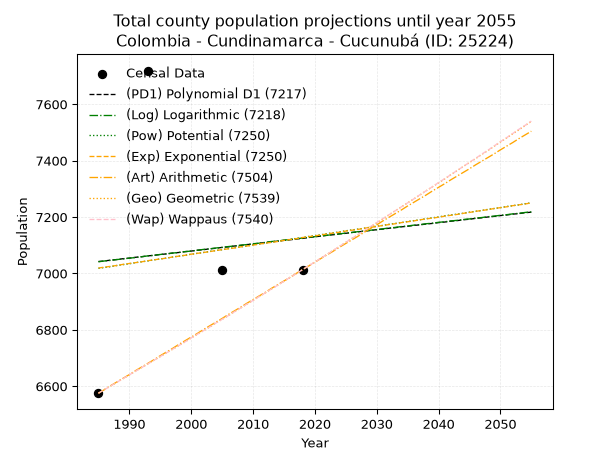
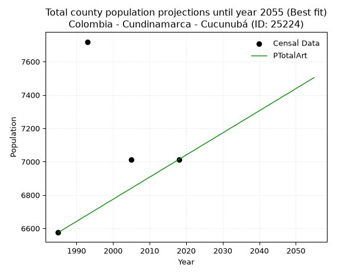
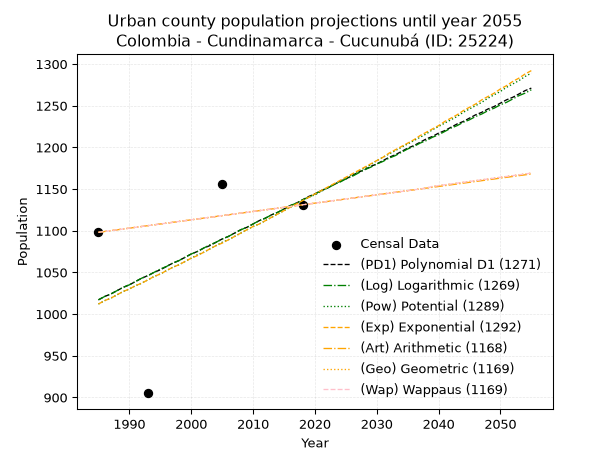
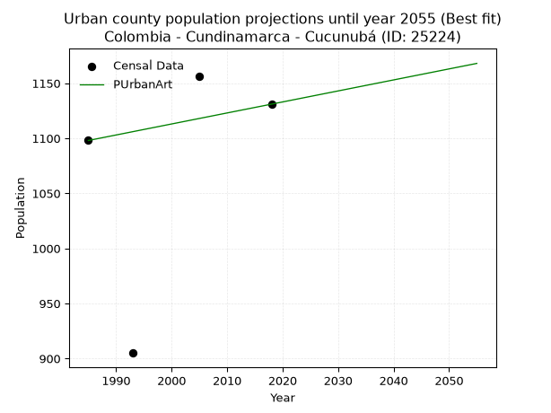
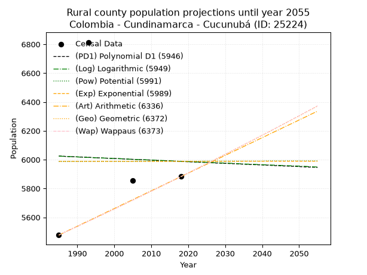
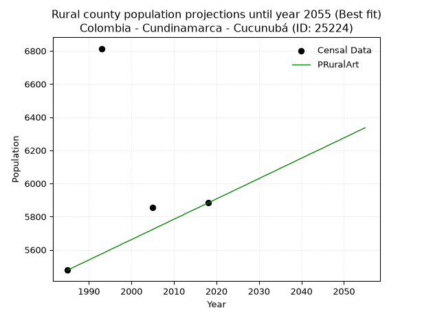

<div align="center">


</div>

# 📜 _“Population and Public Services Demand Projections (PPSD) until Year 2050 for Colombia - Cundinamarca - Cucunubá (ID: 25224)”_
Keywords: `population` `public-service` `projection` `lineal` `polynomial` `logarithmic` `potential` `exponential` `arithmetic` `geometric` `wappaus` `dane` `colombia` `south-america`

PPSD are analytical estimates used by governments and planners to anticipate future changes in population size, age distribution, and the resulting community needs for utilities, healthcare, education, and infrastructure as sizing future water treatment facilities, electrical grids, and road networks based on spatial growth.

<div align="center">

</img>

</div>


> **General running parameters**: • app_version: _v20260806_. • Python version: _3.14.7_. • Pandas version: _3.0.5_. • NumPy version: _2.5.1_. • Creates, save and include plots into reports (create_plot): _False_. • Projection until year: _2050_. • Process polynomial degree 2 and up: _False_. • Process Wappaus: _True_. • Process Wappaus: _True_. • Set negative values to zero: _True_. • Set infinite values to zero: _True_. • Drop dataset notes: _True_. 
<div align="center">

Dynamic map: [:earth_americas:Google](http://maps.google.com/maps?q=5.249794921,-73.7661127) [:earth_americas:OSM](https://www.openstreetmap.org/#map=18/5.249794921/-73.7661127&layers=P) [:earth_americas:Bing](https://www.bing.com/maps?cp=5.249794921~-73.7661127&lvl=18) [:earth_americas:Apple](https://maps.apple.com/frame?center=5.249794921%2C-73.7661127&span=0.003%2C0.006)

</div>


<div align="center">

```geojson
{
  "type": "Feature",
  "geometry": {
    "type": "Point", 
    "coordinates": [-73.7661127, 5.249794921]
  }, 
  "properties": {
    "Name": "Colombia - Cundinamarca - Cucunubá (ID: 25224)"
  }
}
```

</div>


## 0. Census Data (4 records)

Census data are official statistics collected by a government about the people and housing in a country. They usually include counts of total population, age, sex, race, income, education, and jobs.

📅Global census file: [Population.xlsx](../data/Population.xlsx)

| Source   |   Year |   CountryID | CountryName   |   StateID | StateName    |   CountyID | CountyName   |   PTotal |   PUrban |   PRural |
|:---------|-------:|------------:|:--------------|----------:|:-------------|-----------:|:-------------|---------:|---------:|---------:|
| DANE     |   1985 |          57 | Colombia      |        25 | Cundinamarca |      25224 | Cucunubá     |     6575 |     1098 |     5477 |
| DANE     |   1993 |          57 | Colombia      |        25 | Cundinamarca |      25224 | Cucunubá     |     7719 |      905 |     6814 |
| DANE     |   2005 |          57 | Colombia      |        25 | Cundinamarca |      25224 | Cucunubá     |     7013 |     1156 |     5857 |
| DANE     |   2018 |          57 | Colombia      |        25 | Cundinamarca |      25224 | Cucunubá     |     7013 |     1131 |     5882 |

> 🔥Some records could had specific notes about the registered values or the corresponding urban or rural distribution.

📅[SUI-RUPS](https://www.datos.gov.co/Hacienda-y-Cr-dito-P-blico/Registro-nico-de-Prestadores-de-Servicios-P-blicos/4qkq-csdn/about_data) - Local public utility companies: [RUPS.csv](../data/RUPS.csv)

 | SERVICIO       | ESTADO    | NOMBRE                                                                                                                        | NIT         | DEPARTAMENTO_DOMICILIO   | MUNICIPIO_DOMICILIO         | DIRECCION                     |   TELEFONO | EMAIL                           | TIPO_PRESTADOR                             | CLASIFICACION                  |
|:---------------|:----------|:------------------------------------------------------------------------------------------------------------------------------|:------------|:-------------------------|:----------------------------|:------------------------------|-----------:|:--------------------------------|:-------------------------------------------|:-------------------------------|
| ACUEDUCTO      | OPERATIVA | ASOCIACION DE USUARIOS DE ACUEDUCTO REGIONAL DE RASGATA Y OTRAS DE LOS MUNICIPIOS DE TAUSA,NEMOCON,CUCUNUBA,SUTATAUSA Y COGUA | 800095463-6 | CUNDINAMARCA             | VILLA DE SAN DIEGO DE UBATE | CARRERA 9 No. 11-105 APTO 401 |    8826800 | sucuneta@gmail.com              | ORGANIZACION AUTORIZADA                    | DESDE 2501 HASTA 5000 USUARIOS |
| ACUEDUCTO      | OPERATIVA | EMPRESA DE SERVICIOS PÚBLICOS DE EL MUNICIPIO DE CUCUNUBÁ SAS ESP                                                             | 900481517-3 | CUNDINAMARCA             | CUCUNUBA                    | C 3 2 33                      |    8580024 | CONSULTORESPCOMERCIAL@GMAIL.COM | SOCIEDADES (EMPRESA DE SERVICIOS PUBLICOS) | MENOR O IGUAL A 2500 USUARIOS  |
| ALCANTARILLADO | OPERATIVA | EMPRESA DE SERVICIOS PÚBLICOS DE EL MUNICIPIO DE CUCUNUBÁ SAS ESP                                                             | 900481517-3 | CUNDINAMARCA             | CUCUNUBA                    | C 3 2 33                      |    8580024 | CONSULTORESPCOMERCIAL@GMAIL.COM | SOCIEDADES (EMPRESA DE SERVICIOS PUBLICOS) | MENOR O IGUAL A 2500 USUARIOS  |

## 1. Total

### 1.1. Coefficients and Parameters

* (PD1) Polynomial Deg 1: 2.5066238458450627, 2066.125652348414 (lineal)
* (Log) Logarithmic: 5106.699373136366, -31736.062857730034
* (Pow) Potential: 0.9385407644590076, 0.7511218792231151
* (Exp) Exponential: 0.0004625821601654878, 2802.0258373595593
* (Art) Arithmetic: Year diff. 2018 - 1985 = 33, Population diff. 7013 - 6575 = 438, Annual growth = 13.272727272727273
* (Geo) Geometric: Year diff. 2018 - 1985 = 33, Population diff. 7013 - 6575 = 438, Annual growth % = 0.0019561833044263732
* (Wap) Wappaus: i = 0.19535954184173202, Condition values only valid for < 200)

<sub>
Wappaus condition values: ['0.00', '0.20', '0.39', '0.59', '0.78', '0.98', '1.17', '1.37', '1.56', '1.76', '1.95', '2.15', '2.34', '2.54', '2.74', '2.93', '3.13', '3.32', '3.52', '3.71', '3.91', '4.10', '4.30', '4.49', '4.69', '4.88', '5.08', '5.27', '5.47', '5.67', '5.86', '6.06', '6.25', '6.45', '6.64', '6.84', '7.03', '7.23', '7.42', '7.62', '7.81', '8.01', '8.21', '8.40', '8.60', '8.79', '8.99', '9.18', '9.38', '9.57', '9.77', '9.96', '10.16', '10.35', '10.55', '10.74', '10.94', '11.14', '11.33', '11.53', '11.72', '11.92', '12.11', '12.31', '12.50', '12.70']
</sub>


### 1.2. Projected Dataset

|   Year |   CountyID |   PTotalPD1 |   PTotalLog |   PTotalPow |   PTotalExp |   PTotalArt |   PTotalGeo |   PTotalWap |
|-------:|-----------:|------------:|------------:|------------:|------------:|------------:|------------:|------------:|
|   1985 |      25224 |        7042 |        7041 |        7018 |        7019 |        6575 |        6575 |        6575 |
|   1986 |      25224 |        7044 |        7044 |        7021 |        7022 |        6588 |        6588 |        6588 |
|   1987 |      25224 |        7047 |        7046 |        7024 |        7025 |        6602 |        6601 |        6601 |
|   1988 |      25224 |        7049 |        7049 |        7028 |        7028 |        6615 |        6614 |        6614 |
|   1989 |      25224 |        7052 |        7051 |        7031 |        7032 |        6628 |        6627 |        6627 |
|   1990 |      25224 |        7054 |        7054 |        7034 |        7035 |        6641 |        6640 |        6640 |
|   1991 |      25224 |        7057 |        7056 |        7038 |        7038 |        6655 |        6653 |        6653 |
|   1992 |      25224 |        7059 |        7059 |        7041 |        7041 |        6668 |        6666 |        6666 |
|   1993 |      25224 |        7062 |        7062 |        7044 |        7045 |        6681 |        6679 |        6679 |
|   1994 |      25224 |        7064 |        7064 |        7048 |        7048 |        6694 |        6692 |        6692 |
|   1995 |      25224 |        7067 |        7067 |        7051 |        7051 |        6708 |        6705 |        6705 |
|   1996 |      25224 |        7069 |        7069 |        7054 |        7054 |        6721 |        6718 |        6718 |
|   1997 |      25224 |        7072 |        7072 |        7058 |        7058 |        6734 |        6731 |        6731 |
|   1998 |      25224 |        7074 |        7074 |        7061 |        7061 |        6748 |        6744 |        6744 |
|   1999 |      25224 |        7077 |        7077 |        7064 |        7064 |        6761 |        6757 |        6757 |
|   2000 |      25224 |        7079 |        7079 |        7068 |        7068 |        6774 |        6771 |        6771 |
|   2001 |      25224 |        7082 |        7082 |        7071 |        7071 |        6787 |        6784 |        6784 |
|   2002 |      25224 |        7084 |        7085 |        7074 |        7074 |        6801 |        6797 |        6797 |
|   2003 |      25224 |        7087 |        7087 |        7078 |        7077 |        6814 |        6810 |        6810 |
|   2004 |      25224 |        7089 |        7090 |        7081 |        7081 |        6827 |        6824 |        6824 |
|   2005 |      25224 |        7092 |        7092 |        7084 |        7084 |        6840 |        6837 |        6837 |
|   2006 |      25224 |        7094 |        7095 |        7088 |        7087 |        6854 |        6850 |        6850 |
|   2007 |      25224 |        7097 |        7097 |        7091 |        7090 |        6867 |        6864 |        6864 |
|   2008 |      25224 |        7099 |        7100 |        7094 |        7094 |        6880 |        6877 |        6877 |
|   2009 |      25224 |        7102 |        7102 |        7097 |        7097 |        6894 |        6891 |        6891 |
|   2010 |      25224 |        7104 |        7105 |        7101 |        7100 |        6907 |        6904 |        6904 |
|   2011 |      25224 |        7107 |        7107 |        7104 |        7104 |        6920 |        6918 |        6918 |
|   2012 |      25224 |        7109 |        7110 |        7107 |        7107 |        6933 |        6931 |        6931 |
|   2013 |      25224 |        7112 |        7113 |        7111 |        7110 |        6947 |        6945 |        6945 |
|   2014 |      25224 |        7114 |        7115 |        7114 |        7113 |        6960 |        6958 |        6958 |
|   2015 |      25224 |        7117 |        7118 |        7117 |        7117 |        6973 |        6972 |        6972 |
|   2016 |      25224 |        7119 |        7120 |        7121 |        7120 |        6986 |        6986 |        6986 |
|   2017 |      25224 |        7122 |        7123 |        7124 |        7123 |        7000 |        6999 |        6999 |
|   2018 |      25224 |        7124 |        7125 |        7127 |        7127 |        7013 |        7013 |        7013 |
|   2019 |      25224 |        7127 |        7128 |        7131 |        7130 |        7026 |        7027 |        7027 |
|   2020 |      25224 |        7130 |        7130 |        7134 |        7133 |        7040 |        7040 |        7040 |
|   2021 |      25224 |        7132 |        7133 |        7137 |        7136 |        7053 |        7054 |        7054 |
|   2022 |      25224 |        7135 |        7135 |        7141 |        7140 |        7066 |        7068 |        7068 |
|   2023 |      25224 |        7137 |        7138 |        7144 |        7143 |        7079 |        7082 |        7082 |
|   2024 |      25224 |        7140 |        7140 |        7147 |        7146 |        7093 |        7096 |        7096 |
|   2025 |      25224 |        7142 |        7143 |        7151 |        7150 |        7106 |        7110 |        7110 |
|   2026 |      25224 |        7145 |        7145 |        7154 |        7153 |        7119 |        7124 |        7124 |
|   2027 |      25224 |        7147 |        7148 |        7157 |        7156 |        7132 |        7137 |        7138 |
|   2028 |      25224 |        7150 |        7150 |        7160 |        7160 |        7146 |        7151 |        7152 |
|   2029 |      25224 |        7152 |        7153 |        7164 |        7163 |        7159 |        7165 |        7166 |
|   2030 |      25224 |        7155 |        7155 |        7167 |        7166 |        7172 |        7179 |        7180 |
|   2031 |      25224 |        7157 |        7158 |        7170 |        7170 |        7186 |        7193 |        7194 |
|   2032 |      25224 |        7160 |        7161 |        7174 |        7173 |        7199 |        7208 |        7208 |
|   2033 |      25224 |        7162 |        7163 |        7177 |        7176 |        7212 |        7222 |        7222 |
|   2034 |      25224 |        7165 |        7166 |        7180 |        7180 |        7225 |        7236 |        7236 |
|   2035 |      25224 |        7167 |        7168 |        7184 |        7183 |        7239 |        7250 |        7250 |
|   2036 |      25224 |        7170 |        7171 |        7187 |        7186 |        7252 |        7264 |        7264 |
|   2037 |      25224 |        7172 |        7173 |        7190 |        7190 |        7265 |        7278 |        7279 |
|   2038 |      25224 |        7175 |        7176 |        7194 |        7193 |        7278 |        7293 |        7293 |
|   2039 |      25224 |        7177 |        7178 |        7197 |        7196 |        7292 |        7307 |        7307 |
|   2040 |      25224 |        7180 |        7181 |        7200 |        7199 |        7305 |        7321 |        7322 |
|   2041 |      25224 |        7182 |        7183 |        7204 |        7203 |        7318 |        7335 |        7336 |
|   2042 |      25224 |        7185 |        7186 |        7207 |        7206 |        7332 |        7350 |        7350 |
|   2043 |      25224 |        7187 |        7188 |        7210 |        7209 |        7345 |        7364 |        7365 |
|   2044 |      25224 |        7190 |        7191 |        7213 |        7213 |        7358 |        7379 |        7379 |
|   2045 |      25224 |        7192 |        7193 |        7217 |        7216 |        7371 |        7393 |        7394 |
|   2046 |      25224 |        7195 |        7196 |        7220 |        7220 |        7385 |        7407 |        7408 |
|   2047 |      25224 |        7197 |        7198 |        7223 |        7223 |        7398 |        7422 |        7423 |
|   2048 |      25224 |        7200 |        7201 |        7227 |        7226 |        7411 |        7436 |        7437 |
|   2049 |      25224 |        7202 |        7203 |        7230 |        7230 |        7424 |        7451 |        7452 |
|   2050 |      25224 |        7205 |        7206 |        7233 |        7233 |        7438 |        7466 |        7467 |
<div align="center">

</img>

</div>


### 1.3. Best fit with absolute and relative error (%)

Relative error puts that difference into context by dividing the absolute error by the true value, creating a unitless ratio or percentage that shows the scale of the mistake.

Absolute and relative error

|   Year | Source   |   CountryID | CountryName   |   StateID | StateName    |   CountyID_x | CountyName   |   PTotal |   PUrban |   PRural |   CountyID_y |   PTotalPD1 |   PTotalLog |   PTotalPow |   PTotalExp |   PTotalArt |   PTotalGeo |   PTotalWap |   PTotalPD1AbsError |   PTotalLogAbsError |   PTotalPowAbsError |   PTotalExpAbsError |   PTotalArtAbsError |   PTotalGeoAbsError |   PTotalWapAbsError |   PTotalPD1RelError |   PTotalLogRelError |   PTotalPowRelError |   PTotalExpRelError |   PTotalArtRelError |   PTotalGeoRelError |   PTotalWapRelError |
|-------:|:---------|------------:|:--------------|----------:|:-------------|-------------:|:-------------|---------:|---------:|---------:|-------------:|------------:|------------:|------------:|------------:|------------:|------------:|------------:|--------------------:|--------------------:|--------------------:|--------------------:|--------------------:|--------------------:|--------------------:|--------------------:|--------------------:|--------------------:|--------------------:|--------------------:|--------------------:|--------------------:|
|   1985 | DANE     |          57 | Colombia      |        25 | Cundinamarca |        25224 | Cucunubá     |     6575 |     1098 |     5477 |        25224 |        7042 |        7041 |        7018 |        7019 |        6575 |        6575 |        6575 |                 467 |                 466 |                 443 |                 444 |                   0 |                   0 |                   0 |             7.10266 |             7.08745 |             6.73764 |             6.75285 |             0       |             0       |             0       |
|   1993 | DANE     |          57 | Colombia      |        25 | Cundinamarca |        25224 | Cucunubá     |     7719 |      905 |     6814 |        25224 |        7062 |        7062 |        7044 |        7045 |        6681 |        6679 |        6679 |                 657 |                 657 |                 675 |                 674 |                1038 |                1040 |                1040 |             8.51147 |             8.51147 |             8.74466 |             8.7317  |            13.4473  |            13.4732  |            13.4732  |
|   2005 | DANE     |          57 | Colombia      |        25 | Cundinamarca |        25224 | Cucunubá     |     7013 |     1156 |     5857 |        25224 |        7092 |        7092 |        7084 |        7084 |        6840 |        6837 |        6837 |                  79 |                  79 |                  71 |                  71 |                 173 |                 176 |                 176 |             1.12648 |             1.12648 |             1.01241 |             1.01241 |             2.46685 |             2.50962 |             2.50962 |
|   2018 | DANE     |          57 | Colombia      |        25 | Cundinamarca |        25224 | Cucunubá     |     7013 |     1131 |     5882 |        25224 |        7124 |        7125 |        7127 |        7127 |        7013 |        7013 |        7013 |                 111 |                 112 |                 114 |                 114 |                   0 |                   0 |                   0 |             1.58277 |             1.59703 |             1.62555 |             1.62555 |             0       |             0       |             0       |

Relative error mean

| Method    |   RelError | Best   |
|:----------|-----------:|:-------|
| PTotalPD1 |    4.58085 |        |
| PTotalLog |    4.58061 |        |
| PTotalPow |    4.53006 |        |
| PTotalExp |    4.53063 |        |
| PTotalArt |    3.97855 | True   |
| PTotalGeo |    3.99572 |        |
| PTotalWap |    3.99572 |        |

💙Best method: _**PTotalArt**_
<div align="center">

</img>

</div>


### 1.4. Fresh water supply demand in liters per capita per day (lpcd)

The fresh water supply demand typically ranges from 100 to 300 liters per capita per day (lpcd) for standard domestic and municipal planning, though absolute survival minimums set by the World Health Organization are as low as 7.5 to 20 liters per day, and total consumption in high-income nations can exceed 400 liters.

> `CZ`: Level in meters above the sea level (masl)<br> `WS`: Fresh water supply demand in liters per capita per day (lpcd or l/h/d)<br> `WSAll`: Zonal fresh water supply demand in liters per second (l/s)<br> `A`: Zonal area in square meters<br> `DP`: Population density (people/hectare or p/ha)

Reference values (RAS Colombia)

|    CZ |   WS |
|------:|-----:|
|  1000 |  120 |
|  2000 |  130 |
| 99999 |  140 |

County shapefile geometry properties and water supply values

|   CountyID |      ATotal |   CZTotal |   WSTotal |
|-----------:|------------:|----------:|----------:|
|      25224 | 1.09647e+08 |   2829.32 |       140 |

Projected values for best method: PTotalArt

|   CountyID |   Year |   PTotalArt |   DPTotal |   WSTotal |   WSTotalAll |
|-----------:|-------:|------------:|----------:|----------:|-------------:|
|      25224 |   1985 |        6575 |      0.6  |       140 |      10.6539 |
|      25224 |   1986 |        6588 |      0.6  |       140 |      10.675  |
|      25224 |   1987 |        6602 |      0.6  |       140 |      10.6977 |
|      25224 |   1988 |        6615 |      0.6  |       140 |      10.7188 |
|      25224 |   1989 |        6628 |      0.6  |       140 |      10.7398 |
|      25224 |   1990 |        6641 |      0.61 |       140 |      10.7609 |
|      25224 |   1991 |        6655 |      0.61 |       140 |      10.7836 |
|      25224 |   1992 |        6668 |      0.61 |       140 |      10.8046 |
|      25224 |   1993 |        6681 |      0.61 |       140 |      10.8257 |
|      25224 |   1994 |        6694 |      0.61 |       140 |      10.8468 |
|      25224 |   1995 |        6708 |      0.61 |       140 |      10.8694 |
|      25224 |   1996 |        6721 |      0.61 |       140 |      10.8905 |
|      25224 |   1997 |        6734 |      0.61 |       140 |      10.9116 |
|      25224 |   1998 |        6748 |      0.62 |       140 |      10.9343 |
|      25224 |   1999 |        6761 |      0.62 |       140 |      10.9553 |
|      25224 |   2000 |        6774 |      0.62 |       140 |      10.9764 |
|      25224 |   2001 |        6787 |      0.62 |       140 |      10.9975 |
|      25224 |   2002 |        6801 |      0.62 |       140 |      11.0201 |
|      25224 |   2003 |        6814 |      0.62 |       140 |      11.0412 |
|      25224 |   2004 |        6827 |      0.62 |       140 |      11.0623 |
|      25224 |   2005 |        6840 |      0.62 |       140 |      11.0833 |
|      25224 |   2006 |        6854 |      0.63 |       140 |      11.106  |
|      25224 |   2007 |        6867 |      0.63 |       140 |      11.1271 |
|      25224 |   2008 |        6880 |      0.63 |       140 |      11.1481 |
|      25224 |   2009 |        6894 |      0.63 |       140 |      11.1708 |
|      25224 |   2010 |        6907 |      0.63 |       140 |      11.1919 |
|      25224 |   2011 |        6920 |      0.63 |       140 |      11.213  |
|      25224 |   2012 |        6933 |      0.63 |       140 |      11.234  |
|      25224 |   2013 |        6947 |      0.63 |       140 |      11.2567 |
|      25224 |   2014 |        6960 |      0.63 |       140 |      11.2778 |
|      25224 |   2015 |        6973 |      0.64 |       140 |      11.2988 |
|      25224 |   2016 |        6986 |      0.64 |       140 |      11.3199 |
|      25224 |   2017 |        7000 |      0.64 |       140 |      11.3426 |
|      25224 |   2018 |        7013 |      0.64 |       140 |      11.3637 |
|      25224 |   2019 |        7026 |      0.64 |       140 |      11.3847 |
|      25224 |   2020 |        7040 |      0.64 |       140 |      11.4074 |
|      25224 |   2021 |        7053 |      0.64 |       140 |      11.4285 |
|      25224 |   2022 |        7066 |      0.64 |       140 |      11.4495 |
|      25224 |   2023 |        7079 |      0.65 |       140 |      11.4706 |
|      25224 |   2024 |        7093 |      0.65 |       140 |      11.4933 |
|      25224 |   2025 |        7106 |      0.65 |       140 |      11.5144 |
|      25224 |   2026 |        7119 |      0.65 |       140 |      11.5354 |
|      25224 |   2027 |        7132 |      0.65 |       140 |      11.5565 |
|      25224 |   2028 |        7146 |      0.65 |       140 |      11.5792 |
|      25224 |   2029 |        7159 |      0.65 |       140 |      11.6002 |
|      25224 |   2030 |        7172 |      0.65 |       140 |      11.6213 |
|      25224 |   2031 |        7186 |      0.66 |       140 |      11.644  |
|      25224 |   2032 |        7199 |      0.66 |       140 |      11.665  |
|      25224 |   2033 |        7212 |      0.66 |       140 |      11.6861 |
|      25224 |   2034 |        7225 |      0.66 |       140 |      11.7072 |
|      25224 |   2035 |        7239 |      0.66 |       140 |      11.7299 |
|      25224 |   2036 |        7252 |      0.66 |       140 |      11.7509 |
|      25224 |   2037 |        7265 |      0.66 |       140 |      11.772  |
|      25224 |   2038 |        7278 |      0.66 |       140 |      11.7931 |
|      25224 |   2039 |        7292 |      0.67 |       140 |      11.8157 |
|      25224 |   2040 |        7305 |      0.67 |       140 |      11.8368 |
|      25224 |   2041 |        7318 |      0.67 |       140 |      11.8579 |
|      25224 |   2042 |        7332 |      0.67 |       140 |      11.8806 |
|      25224 |   2043 |        7345 |      0.67 |       140 |      11.9016 |
|      25224 |   2044 |        7358 |      0.67 |       140 |      11.9227 |
|      25224 |   2045 |        7371 |      0.67 |       140 |      11.9437 |
|      25224 |   2046 |        7385 |      0.67 |       140 |      11.9664 |
|      25224 |   2047 |        7398 |      0.67 |       140 |      11.9875 |
|      25224 |   2048 |        7411 |      0.68 |       140 |      12.0086 |
|      25224 |   2049 |        7424 |      0.68 |       140 |      12.0296 |
|      25224 |   2050 |        7438 |      0.68 |       140 |      12.0523 |

## 2. Urban

### 2.1. Coefficients and Parameters

* (PD1) Polynomial Deg 1: 3.629867523083105, -6188.142513046982 (lineal)
* (Log) Logarithmic: 7256.6969047227185, -54085.71132431685
* (Pow) Potential: 6.970534226588942, -19.981844267936346
* (Exp) Exponential: 0.003487147501454401, 0.998024936006156
* (Art) Arithmetic: Year diff. 2018 - 1985 = 33, Population diff. 1131 - 1098 = 33, Annual growth = 1.0
* (Geo) Geometric: Year diff. 2018 - 1985 = 33, Population diff. 1131 - 1098 = 33, Annual growth % = 0.0008977316305396332
* (Wap) Wappaus: i = 0.08972633467922836, Condition values only valid for < 200)

<sub>
Wappaus condition values: ['0.00', '0.09', '0.18', '0.27', '0.36', '0.45', '0.54', '0.63', '0.72', '0.81', '0.90', '0.99', '1.08', '1.17', '1.26', '1.35', '1.44', '1.53', '1.62', '1.70', '1.79', '1.88', '1.97', '2.06', '2.15', '2.24', '2.33', '2.42', '2.51', '2.60', '2.69', '2.78', '2.87', '2.96', '3.05', '3.14', '3.23', '3.32', '3.41', '3.50', '3.59', '3.68', '3.77', '3.86', '3.95', '4.04', '4.13', '4.22', '4.31', '4.40', '4.49', '4.58', '4.67', '4.76', '4.85', '4.93', '5.02', '5.11', '5.20', '5.29', '5.38', '5.47', '5.56', '5.65', '5.74', '5.83']
</sub>


### 2.2. Projected Dataset

|   Year |   CountyID |   PUrbanPD1 |   PUrbanLog |   PUrbanPow |   PUrbanExp |   PUrbanArt |   PUrbanGeo |   PUrbanWap |
|-------:|-----------:|------------:|------------:|------------:|------------:|------------:|------------:|------------:|
|   1985 |      25224 |        1017 |        1017 |        1012 |        1012 |        1098 |        1098 |        1098 |
|   1986 |      25224 |        1021 |        1021 |        1016 |        1016 |        1099 |        1099 |        1099 |
|   1987 |      25224 |        1024 |        1024 |        1019 |        1019 |        1100 |        1100 |        1100 |
|   1988 |      25224 |        1028 |        1028 |        1023 |        1023 |        1101 |        1101 |        1101 |
|   1989 |      25224 |        1032 |        1032 |        1027 |        1027 |        1102 |        1102 |        1102 |
|   1990 |      25224 |        1035 |        1035 |        1030 |        1030 |        1103 |        1103 |        1103 |
|   1991 |      25224 |        1039 |        1039 |        1034 |        1034 |        1104 |        1104 |        1104 |
|   1992 |      25224 |        1043 |        1043 |        1037 |        1037 |        1105 |        1105 |        1105 |
|   1993 |      25224 |        1046 |        1046 |        1041 |        1041 |        1106 |        1106 |        1106 |
|   1994 |      25224 |        1050 |        1050 |        1045 |        1045 |        1107 |        1107 |        1107 |
|   1995 |      25224 |        1053 |        1054 |        1048 |        1048 |        1108 |        1108 |        1108 |
|   1996 |      25224 |        1057 |        1057 |        1052 |        1052 |        1109 |        1109 |        1109 |
|   1997 |      25224 |        1061 |        1061 |        1056 |        1056 |        1110 |        1110 |        1110 |
|   1998 |      25224 |        1064 |        1064 |        1059 |        1059 |        1111 |        1111 |        1111 |
|   1999 |      25224 |        1068 |        1068 |        1063 |        1063 |        1112 |        1112 |        1112 |
|   2000 |      25224 |        1072 |        1072 |        1067 |        1067 |        1113 |        1113 |        1113 |
|   2001 |      25224 |        1075 |        1075 |        1071 |        1070 |        1114 |        1114 |        1114 |
|   2002 |      25224 |        1079 |        1079 |        1074 |        1074 |        1115 |        1115 |        1115 |
|   2003 |      25224 |        1082 |        1083 |        1078 |        1078 |        1116 |        1116 |        1116 |
|   2004 |      25224 |        1086 |        1086 |        1082 |        1082 |        1117 |        1117 |        1117 |
|   2005 |      25224 |        1090 |        1090 |        1086 |        1085 |        1118 |        1118 |        1118 |
|   2006 |      25224 |        1093 |        1093 |        1089 |        1089 |        1119 |        1119 |        1119 |
|   2007 |      25224 |        1097 |        1097 |        1093 |        1093 |        1120 |        1120 |        1120 |
|   2008 |      25224 |        1101 |        1101 |        1097 |        1097 |        1121 |        1121 |        1121 |
|   2009 |      25224 |        1104 |        1104 |        1101 |        1101 |        1122 |        1122 |        1122 |
|   2010 |      25224 |        1108 |        1108 |        1105 |        1105 |        1123 |        1123 |        1123 |
|   2011 |      25224 |        1112 |        1112 |        1108 |        1108 |        1124 |        1124 |        1124 |
|   2012 |      25224 |        1115 |        1115 |        1112 |        1112 |        1125 |        1125 |        1125 |
|   2013 |      25224 |        1119 |        1119 |        1116 |        1116 |        1126 |        1126 |        1126 |
|   2014 |      25224 |        1122 |        1122 |        1120 |        1120 |        1127 |        1127 |        1127 |
|   2015 |      25224 |        1126 |        1126 |        1124 |        1124 |        1128 |        1128 |        1128 |
|   2016 |      25224 |        1130 |        1130 |        1128 |        1128 |        1129 |        1129 |        1129 |
|   2017 |      25224 |        1133 |        1133 |        1132 |        1132 |        1130 |        1130 |        1130 |
|   2018 |      25224 |        1137 |        1137 |        1136 |        1136 |        1131 |        1131 |        1131 |
|   2019 |      25224 |        1141 |        1140 |        1140 |        1140 |        1132 |        1132 |        1132 |
|   2020 |      25224 |        1144 |        1144 |        1143 |        1144 |        1133 |        1133 |        1133 |
|   2021 |      25224 |        1148 |        1148 |        1147 |        1148 |        1134 |        1134 |        1134 |
|   2022 |      25224 |        1151 |        1151 |        1151 |        1152 |        1135 |        1135 |        1135 |
|   2023 |      25224 |        1155 |        1155 |        1155 |        1156 |        1136 |        1136 |        1136 |
|   2024 |      25224 |        1159 |        1158 |        1159 |        1160 |        1137 |        1137 |        1137 |
|   2025 |      25224 |        1162 |        1162 |        1163 |        1164 |        1138 |        1138 |        1138 |
|   2026 |      25224 |        1166 |        1165 |        1167 |        1168 |        1139 |        1139 |        1139 |
|   2027 |      25224 |        1170 |        1169 |        1171 |        1172 |        1140 |        1140 |        1140 |
|   2028 |      25224 |        1173 |        1173 |        1175 |        1176 |        1141 |        1141 |        1141 |
|   2029 |      25224 |        1177 |        1176 |        1179 |        1180 |        1142 |        1142 |        1142 |
|   2030 |      25224 |        1180 |        1180 |        1184 |        1184 |        1143 |        1143 |        1143 |
|   2031 |      25224 |        1184 |        1183 |        1188 |        1188 |        1144 |        1144 |        1144 |
|   2032 |      25224 |        1188 |        1187 |        1192 |        1193 |        1145 |        1145 |        1145 |
|   2033 |      25224 |        1191 |        1190 |        1196 |        1197 |        1146 |        1146 |        1146 |
|   2034 |      25224 |        1195 |        1194 |        1200 |        1201 |        1147 |        1147 |        1147 |
|   2035 |      25224 |        1199 |        1198 |        1204 |        1205 |        1148 |        1148 |        1148 |
|   2036 |      25224 |        1202 |        1201 |        1208 |        1209 |        1149 |        1149 |        1149 |
|   2037 |      25224 |        1206 |        1205 |        1212 |        1214 |        1150 |        1150 |        1150 |
|   2038 |      25224 |        1210 |        1208 |        1216 |        1218 |        1151 |        1151 |        1151 |
|   2039 |      25224 |        1213 |        1212 |        1221 |        1222 |        1152 |        1153 |        1153 |
|   2040 |      25224 |        1217 |        1215 |        1225 |        1226 |        1153 |        1154 |        1154 |
|   2041 |      25224 |        1220 |        1219 |        1229 |        1231 |        1154 |        1155 |        1155 |
|   2042 |      25224 |        1224 |        1223 |        1233 |        1235 |        1155 |        1156 |        1156 |
|   2043 |      25224 |        1228 |        1226 |        1237 |        1239 |        1156 |        1157 |        1157 |
|   2044 |      25224 |        1231 |        1230 |        1242 |        1244 |        1157 |        1158 |        1158 |
|   2045 |      25224 |        1235 |        1233 |        1246 |        1248 |        1158 |        1159 |        1159 |
|   2046 |      25224 |        1239 |        1237 |        1250 |        1252 |        1159 |        1160 |        1160 |
|   2047 |      25224 |        1242 |        1240 |        1254 |        1257 |        1160 |        1161 |        1161 |
|   2048 |      25224 |        1246 |        1244 |        1259 |        1261 |        1161 |        1162 |        1162 |
|   2049 |      25224 |        1249 |        1247 |        1263 |        1265 |        1162 |        1163 |        1163 |
|   2050 |      25224 |        1253 |        1251 |        1267 |        1270 |        1163 |        1164 |        1164 |
<div align="center">

</img>

</div>


### 2.3. Best fit with absolute and relative error (%)

Relative error puts that difference into context by dividing the absolute error by the true value, creating a unitless ratio or percentage that shows the scale of the mistake.

Absolute and relative error

|   Year | Source   |   CountryID | CountryName   |   StateID | StateName    |   CountyID_x | CountyName   |   PTotal |   PUrban |   PRural |   CountyID_y |   PUrbanPD1 |   PUrbanLog |   PUrbanPow |   PUrbanExp |   PUrbanArt |   PUrbanGeo |   PUrbanWap |   PUrbanPD1AbsError |   PUrbanLogAbsError |   PUrbanPowAbsError |   PUrbanExpAbsError |   PUrbanArtAbsError |   PUrbanGeoAbsError |   PUrbanWapAbsError |   PUrbanPD1RelError |   PUrbanLogRelError |   PUrbanPowRelError |   PUrbanExpRelError |   PUrbanArtRelError |   PUrbanGeoRelError |   PUrbanWapRelError |
|-------:|:---------|------------:|:--------------|----------:|:-------------|-------------:|:-------------|---------:|---------:|---------:|-------------:|------------:|------------:|------------:|------------:|------------:|------------:|------------:|--------------------:|--------------------:|--------------------:|--------------------:|--------------------:|--------------------:|--------------------:|--------------------:|--------------------:|--------------------:|--------------------:|--------------------:|--------------------:|--------------------:|
|   1985 | DANE     |          57 | Colombia      |        25 | Cundinamarca |        25224 | Cucunubá     |     6575 |     1098 |     5477 |        25224 |        1017 |        1017 |        1012 |        1012 |        1098 |        1098 |        1098 |                  81 |                  81 |                  86 |                  86 |                   0 |                   0 |                   0 |            7.37705  |            7.37705  |            7.83242  |            7.83242  |              0      |              0      |              0      |
|   1993 | DANE     |          57 | Colombia      |        25 | Cundinamarca |        25224 | Cucunubá     |     7719 |      905 |     6814 |        25224 |        1046 |        1046 |        1041 |        1041 |        1106 |        1106 |        1106 |                 141 |                 141 |                 136 |                 136 |                 201 |                 201 |                 201 |           15.5801   |           15.5801   |           15.0276   |           15.0276   |             22.2099 |             22.2099 |             22.2099 |
|   2005 | DANE     |          57 | Colombia      |        25 | Cundinamarca |        25224 | Cucunubá     |     7013 |     1156 |     5857 |        25224 |        1090 |        1090 |        1086 |        1085 |        1118 |        1118 |        1118 |                  66 |                  66 |                  70 |                  71 |                  38 |                  38 |                  38 |            5.70934  |            5.70934  |            6.05536  |            6.14187  |              3.2872 |              3.2872 |              3.2872 |
|   2018 | DANE     |          57 | Colombia      |        25 | Cundinamarca |        25224 | Cucunubá     |     7013 |     1131 |     5882 |        25224 |        1137 |        1137 |        1136 |        1136 |        1131 |        1131 |        1131 |                   6 |                   6 |                   5 |                   5 |                   0 |                   0 |                   0 |            0.530504 |            0.530504 |            0.442087 |            0.442087 |              0      |              0      |              0      |

Relative error mean

| Method    |   RelError | Best   |
|:----------|-----------:|:-------|
| PUrbanPD1 |    7.29925 |        |
| PUrbanLog |    7.29925 |        |
| PUrbanPow |    7.33937 |        |
| PUrbanExp |    7.361   |        |
| PUrbanArt |    6.37429 | True   |
| PUrbanGeo |    6.37429 | True   |
| PUrbanWap |    6.37429 | True   |

💙Best method: _**PUrbanArt**_
<div align="center">

</img>

</div>


### 2.4. Fresh water supply demand in liters per capita per day (lpcd)

The fresh water supply demand typically ranges from 100 to 300 liters per capita per day (lpcd) for standard domestic and municipal planning, though absolute survival minimums set by the World Health Organization are as low as 7.5 to 20 liters per day, and total consumption in high-income nations can exceed 400 liters.

> `CZ`: Level in meters above the sea level (masl)<br> `WS`: Fresh water supply demand in liters per capita per day (lpcd or l/h/d)<br> `WSAll`: Zonal fresh water supply demand in liters per second (l/s)<br> `A`: Zonal area in square meters<br> `DP`: Population density (people/hectare or p/ha)

Reference values (RAS Colombia)

|    CZ |   WS |
|------:|-----:|
|  1000 |  120 |
|  2000 |  130 |
| 99999 |  140 |

County shapefile geometry properties and water supply values

|   CountyID |   AUrban |   CZUrban |   WSUrban |
|-----------:|---------:|----------:|----------:|
|      25224 |   370832 |    2581.2 |       140 |

Projected values for best method: PUrbanArt

|   CountyID |   Year |   PUrbanArt |   DPUrban |   WSUrban |   WSUrbanAll |
|-----------:|-------:|------------:|----------:|----------:|-------------:|
|      25224 |   1985 |        1098 |     29.61 |       140 |      1.77917 |
|      25224 |   1986 |        1099 |     29.64 |       140 |      1.78079 |
|      25224 |   1987 |        1100 |     29.66 |       140 |      1.78241 |
|      25224 |   1988 |        1101 |     29.69 |       140 |      1.78403 |
|      25224 |   1989 |        1102 |     29.72 |       140 |      1.78565 |
|      25224 |   1990 |        1103 |     29.74 |       140 |      1.78727 |
|      25224 |   1991 |        1104 |     29.77 |       140 |      1.78889 |
|      25224 |   1992 |        1105 |     29.8  |       140 |      1.79051 |
|      25224 |   1993 |        1106 |     29.82 |       140 |      1.79213 |
|      25224 |   1994 |        1107 |     29.85 |       140 |      1.79375 |
|      25224 |   1995 |        1108 |     29.88 |       140 |      1.79537 |
|      25224 |   1996 |        1109 |     29.91 |       140 |      1.79699 |
|      25224 |   1997 |        1110 |     29.93 |       140 |      1.79861 |
|      25224 |   1998 |        1111 |     29.96 |       140 |      1.80023 |
|      25224 |   1999 |        1112 |     29.99 |       140 |      1.80185 |
|      25224 |   2000 |        1113 |     30.01 |       140 |      1.80347 |
|      25224 |   2001 |        1114 |     30.04 |       140 |      1.80509 |
|      25224 |   2002 |        1115 |     30.07 |       140 |      1.80671 |
|      25224 |   2003 |        1116 |     30.09 |       140 |      1.80833 |
|      25224 |   2004 |        1117 |     30.12 |       140 |      1.80995 |
|      25224 |   2005 |        1118 |     30.15 |       140 |      1.81157 |
|      25224 |   2006 |        1119 |     30.18 |       140 |      1.81319 |
|      25224 |   2007 |        1120 |     30.2  |       140 |      1.81481 |
|      25224 |   2008 |        1121 |     30.23 |       140 |      1.81644 |
|      25224 |   2009 |        1122 |     30.26 |       140 |      1.81806 |
|      25224 |   2010 |        1123 |     30.28 |       140 |      1.81968 |
|      25224 |   2011 |        1124 |     30.31 |       140 |      1.8213  |
|      25224 |   2012 |        1125 |     30.34 |       140 |      1.82292 |
|      25224 |   2013 |        1126 |     30.36 |       140 |      1.82454 |
|      25224 |   2014 |        1127 |     30.39 |       140 |      1.82616 |
|      25224 |   2015 |        1128 |     30.42 |       140 |      1.82778 |
|      25224 |   2016 |        1129 |     30.45 |       140 |      1.8294  |
|      25224 |   2017 |        1130 |     30.47 |       140 |      1.83102 |
|      25224 |   2018 |        1131 |     30.5  |       140 |      1.83264 |
|      25224 |   2019 |        1132 |     30.53 |       140 |      1.83426 |
|      25224 |   2020 |        1133 |     30.55 |       140 |      1.83588 |
|      25224 |   2021 |        1134 |     30.58 |       140 |      1.8375  |
|      25224 |   2022 |        1135 |     30.61 |       140 |      1.83912 |
|      25224 |   2023 |        1136 |     30.63 |       140 |      1.84074 |
|      25224 |   2024 |        1137 |     30.66 |       140 |      1.84236 |
|      25224 |   2025 |        1138 |     30.69 |       140 |      1.84398 |
|      25224 |   2026 |        1139 |     30.71 |       140 |      1.8456  |
|      25224 |   2027 |        1140 |     30.74 |       140 |      1.84722 |
|      25224 |   2028 |        1141 |     30.77 |       140 |      1.84884 |
|      25224 |   2029 |        1142 |     30.8  |       140 |      1.85046 |
|      25224 |   2030 |        1143 |     30.82 |       140 |      1.85208 |
|      25224 |   2031 |        1144 |     30.85 |       140 |      1.8537  |
|      25224 |   2032 |        1145 |     30.88 |       140 |      1.85532 |
|      25224 |   2033 |        1146 |     30.9  |       140 |      1.85694 |
|      25224 |   2034 |        1147 |     30.93 |       140 |      1.85856 |
|      25224 |   2035 |        1148 |     30.96 |       140 |      1.86019 |
|      25224 |   2036 |        1149 |     30.98 |       140 |      1.86181 |
|      25224 |   2037 |        1150 |     31.01 |       140 |      1.86343 |
|      25224 |   2038 |        1151 |     31.04 |       140 |      1.86505 |
|      25224 |   2039 |        1152 |     31.07 |       140 |      1.86667 |
|      25224 |   2040 |        1153 |     31.09 |       140 |      1.86829 |
|      25224 |   2041 |        1154 |     31.12 |       140 |      1.86991 |
|      25224 |   2042 |        1155 |     31.15 |       140 |      1.87153 |
|      25224 |   2043 |        1156 |     31.17 |       140 |      1.87315 |
|      25224 |   2044 |        1157 |     31.2  |       140 |      1.87477 |
|      25224 |   2045 |        1158 |     31.23 |       140 |      1.87639 |
|      25224 |   2046 |        1159 |     31.25 |       140 |      1.87801 |
|      25224 |   2047 |        1160 |     31.28 |       140 |      1.87963 |
|      25224 |   2048 |        1161 |     31.31 |       140 |      1.88125 |
|      25224 |   2049 |        1162 |     31.33 |       140 |      1.88287 |
|      25224 |   2050 |        1163 |     31.36 |       140 |      1.88449 |

## 3. Rural

### 3.1. Coefficients and Parameters

* (PD1) Polynomial Deg 1: -1.1232436772380203, 8254.26816539535 (lineal)
* (Log) Logarithmic: -2149.9975315862407, 22349.64846658595
* (Pow) Potential: 0.020519592141789035, 3.7095495487821886
* (Exp) Exponential: 2.15999702219062e-06, 5962.246049486368
* (Art) Arithmetic: Year diff. 2018 - 1985 = 33, Population diff. 5882 - 5477 = 405, Annual growth = 12.272727272727273
* (Geo) Geometric: Year diff. 2018 - 1985 = 33, Population diff. 5882 - 5477 = 405, Annual growth % = 0.0021641363800488644
* (Wap) Wappaus: i = 0.21608816397090014, Condition values only valid for < 200)

<sub>
Wappaus condition values: ['0.00', '0.22', '0.43', '0.65', '0.86', '1.08', '1.30', '1.51', '1.73', '1.94', '2.16', '2.38', '2.59', '2.81', '3.03', '3.24', '3.46', '3.67', '3.89', '4.11', '4.32', '4.54', '4.75', '4.97', '5.19', '5.40', '5.62', '5.83', '6.05', '6.27', '6.48', '6.70', '6.91', '7.13', '7.35', '7.56', '7.78', '8.00', '8.21', '8.43', '8.64', '8.86', '9.08', '9.29', '9.51', '9.72', '9.94', '10.16', '10.37', '10.59', '10.80', '11.02', '11.24', '11.45', '11.67', '11.88', '12.10', '12.32', '12.53', '12.75', '12.97', '13.18', '13.40', '13.61', '13.83', '14.05']
</sub>


### 3.2. Projected Dataset

|   Year |   CountyID |   PRuralPD1 |   PRuralLog |   PRuralPow |   PRuralExp |   PRuralArt |   PRuralGeo |   PRuralWap |
|-------:|-----------:|------------:|------------:|------------:|------------:|------------:|------------:|------------:|
|   1985 |      25224 |        6025 |        6024 |        5987 |        5988 |        5477 |        5477 |        5477 |
|   1986 |      25224 |        6024 |        6023 |        5987 |        5988 |        5489 |        5489 |        5489 |
|   1987 |      25224 |        6022 |        6022 |        5987 |        5988 |        5502 |        5501 |        5501 |
|   1988 |      25224 |        6021 |        6021 |        5987 |        5988 |        5514 |        5513 |        5513 |
|   1989 |      25224 |        6020 |        6020 |        5987 |        5988 |        5526 |        5525 |        5525 |
|   1990 |      25224 |        6019 |        6019 |        5987 |        5988 |        5538 |        5537 |        5536 |
|   1991 |      25224 |        6018 |        6017 |        5987 |        5988 |        5551 |        5549 |        5548 |
|   1992 |      25224 |        6017 |        6016 |        5988 |        5988 |        5563 |        5561 |        5560 |
|   1993 |      25224 |        6016 |        6015 |        5988 |        5988 |        5575 |        5573 |        5573 |
|   1994 |      25224 |        6015 |        6014 |        5988 |        5988 |        5587 |        5585 |        5585 |
|   1995 |      25224 |        6013 |        6013 |        5988 |        5988 |        5600 |        5597 |        5597 |
|   1996 |      25224 |        6012 |        6012 |        5988 |        5988 |        5612 |        5609 |        5609 |
|   1997 |      25224 |        6011 |        6011 |        5988 |        5988 |        5624 |        5621 |        5621 |
|   1998 |      25224 |        6010 |        6010 |        5988 |        5988 |        5637 |        5633 |        5633 |
|   1999 |      25224 |        6009 |        6009 |        5988 |        5988 |        5649 |        5645 |        5645 |
|   2000 |      25224 |        6008 |        6008 |        5988 |        5988 |        5661 |        5658 |        5657 |
|   2001 |      25224 |        6007 |        6007 |        5988 |        5988 |        5673 |        5670 |        5670 |
|   2002 |      25224 |        6006 |        6006 |        5988 |        5988 |        5686 |        5682 |        5682 |
|   2003 |      25224 |        6004 |        6005 |        5988 |        5988 |        5698 |        5694 |        5694 |
|   2004 |      25224 |        6003 |        6003 |        5988 |        5988 |        5710 |        5707 |        5707 |
|   2005 |      25224 |        6002 |        6002 |        5988 |        5988 |        5722 |        5719 |        5719 |
|   2006 |      25224 |        6001 |        6001 |        5988 |        5988 |        5735 |        5731 |        5731 |
|   2007 |      25224 |        6000 |        6000 |        5988 |        5988 |        5747 |        5744 |        5744 |
|   2008 |      25224 |        5999 |        5999 |        5989 |        5988 |        5759 |        5756 |        5756 |
|   2009 |      25224 |        5998 |        5998 |        5989 |        5988 |        5772 |        5769 |        5769 |
|   2010 |      25224 |        5997 |        5997 |        5989 |        5988 |        5784 |        5781 |        5781 |
|   2011 |      25224 |        5995 |        5996 |        5989 |        5988 |        5796 |        5794 |        5794 |
|   2012 |      25224 |        5994 |        5995 |        5989 |        5988 |        5808 |        5806 |        5806 |
|   2013 |      25224 |        5993 |        5994 |        5989 |        5988 |        5821 |        5819 |        5819 |
|   2014 |      25224 |        5992 |        5993 |        5989 |        5988 |        5833 |        5831 |        5831 |
|   2015 |      25224 |        5991 |        5992 |        5989 |        5988 |        5845 |        5844 |        5844 |
|   2016 |      25224 |        5990 |        5991 |        5989 |        5988 |        5857 |        5857 |        5857 |
|   2017 |      25224 |        5989 |        5990 |        5989 |        5988 |        5870 |        5869 |        5869 |
|   2018 |      25224 |        5988 |        5988 |        5989 |        5988 |        5882 |        5882 |        5882 |
|   2019 |      25224 |        5986 |        5987 |        5989 |        5988 |        5894 |        5895 |        5895 |
|   2020 |      25224 |        5985 |        5986 |        5989 |        5988 |        5907 |        5907 |        5908 |
|   2021 |      25224 |        5984 |        5985 |        5989 |        5988 |        5919 |        5920 |        5920 |
|   2022 |      25224 |        5983 |        5984 |        5989 |        5988 |        5931 |        5933 |        5933 |
|   2023 |      25224 |        5982 |        5983 |        5989 |        5988 |        5943 |        5946 |        5946 |
|   2024 |      25224 |        5981 |        5982 |        5990 |        5988 |        5956 |        5959 |        5959 |
|   2025 |      25224 |        5980 |        5981 |        5990 |        5988 |        5968 |        5972 |        5972 |
|   2026 |      25224 |        5979 |        5980 |        5990 |        5988 |        5980 |        5985 |        5985 |
|   2027 |      25224 |        5977 |        5979 |        5990 |        5988 |        5992 |        5998 |        5998 |
|   2028 |      25224 |        5976 |        5978 |        5990 |        5988 |        6005 |        6011 |        6011 |
|   2029 |      25224 |        5975 |        5977 |        5990 |        5988 |        6017 |        6024 |        6024 |
|   2030 |      25224 |        5974 |        5976 |        5990 |        5988 |        6029 |        6037 |        6037 |
|   2031 |      25224 |        5973 |        5975 |        5990 |        5988 |        6042 |        6050 |        6050 |
|   2032 |      25224 |        5972 |        5974 |        5990 |        5988 |        6054 |        6063 |        6063 |
|   2033 |      25224 |        5971 |        5973 |        5990 |        5988 |        6066 |        6076 |        6076 |
|   2034 |      25224 |        5970 |        5971 |        5990 |        5988 |        6078 |        6089 |        6089 |
|   2035 |      25224 |        5968 |        5970 |        5990 |        5989 |        6091 |        6102 |        6103 |
|   2036 |      25224 |        5967 |        5969 |        5990 |        5989 |        6103 |        6115 |        6116 |
|   2037 |      25224 |        5966 |        5968 |        5990 |        5989 |        6115 |        6129 |        6129 |
|   2038 |      25224 |        5965 |        5967 |        5990 |        5989 |        6127 |        6142 |        6142 |
|   2039 |      25224 |        5964 |        5966 |        5990 |        5989 |        6140 |        6155 |        6156 |
|   2040 |      25224 |        5963 |        5965 |        5990 |        5989 |        6152 |        6169 |        6169 |
|   2041 |      25224 |        5962 |        5964 |        5991 |        5989 |        6164 |        6182 |        6182 |
|   2042 |      25224 |        5961 |        5963 |        5991 |        5989 |        6177 |        6195 |        6196 |
|   2043 |      25224 |        5959 |        5962 |        5991 |        5989 |        6189 |        6209 |        6209 |
|   2044 |      25224 |        5958 |        5961 |        5991 |        5989 |        6201 |        6222 |        6223 |
|   2045 |      25224 |        5957 |        5960 |        5991 |        5989 |        6213 |        6236 |        6236 |
|   2046 |      25224 |        5956 |        5959 |        5991 |        5989 |        6226 |        6249 |        6250 |
|   2047 |      25224 |        5955 |        5958 |        5991 |        5989 |        6238 |        6263 |        6263 |
|   2048 |      25224 |        5954 |        5957 |        5991 |        5989 |        6250 |        6276 |        6277 |
|   2049 |      25224 |        5953 |        5956 |        5991 |        5989 |        6262 |        6290 |        6291 |
|   2050 |      25224 |        5952 |        5955 |        5991 |        5989 |        6275 |        6303 |        6304 |
<div align="center">

</img>

</div>


### 3.3. Best fit with absolute and relative error (%)

Relative error puts that difference into context by dividing the absolute error by the true value, creating a unitless ratio or percentage that shows the scale of the mistake.

Absolute and relative error

|   Year | Source   |   CountryID | CountryName   |   StateID | StateName    |   CountyID_x | CountyName   |   PTotal |   PUrban |   PRural |   CountyID_y |   PRuralPD1 |   PRuralLog |   PRuralPow |   PRuralExp |   PRuralArt |   PRuralGeo |   PRuralWap |   PRuralPD1AbsError |   PRuralLogAbsError |   PRuralPowAbsError |   PRuralExpAbsError |   PRuralArtAbsError |   PRuralGeoAbsError |   PRuralWapAbsError |   PRuralPD1RelError |   PRuralLogRelError |   PRuralPowRelError |   PRuralExpRelError |   PRuralArtRelError |   PRuralGeoRelError |   PRuralWapRelError |
|-------:|:---------|------------:|:--------------|----------:|:-------------|-------------:|:-------------|---------:|---------:|---------:|-------------:|------------:|------------:|------------:|------------:|------------:|------------:|------------:|--------------------:|--------------------:|--------------------:|--------------------:|--------------------:|--------------------:|--------------------:|--------------------:|--------------------:|--------------------:|--------------------:|--------------------:|--------------------:|--------------------:|
|   1985 | DANE     |          57 | Colombia      |        25 | Cundinamarca |        25224 | Cucunubá     |     6575 |     1098 |     5477 |        25224 |        6025 |        6024 |        5987 |        5988 |        5477 |        5477 |        5477 |                 548 |                 547 |                 510 |                 511 |                   0 |                   0 |                   0 |            10.0055  |             9.98722 |             9.31167 |             9.32993 |             0       |             0       |             0       |
|   1993 | DANE     |          57 | Colombia      |        25 | Cundinamarca |        25224 | Cucunubá     |     7719 |      905 |     6814 |        25224 |        6016 |        6015 |        5988 |        5988 |        5575 |        5573 |        5573 |                 798 |                 799 |                 826 |                 826 |                1239 |                1241 |                1241 |            11.7112  |            11.7259  |            12.1221  |            12.1221  |            18.1832  |            18.2125  |            18.2125  |
|   2005 | DANE     |          57 | Colombia      |        25 | Cundinamarca |        25224 | Cucunubá     |     7013 |     1156 |     5857 |        25224 |        6002 |        6002 |        5988 |        5988 |        5722 |        5719 |        5719 |                 145 |                 145 |                 131 |                 131 |                 135 |                 138 |                 138 |             2.47567 |             2.47567 |             2.23664 |             2.23664 |             2.30493 |             2.35616 |             2.35616 |
|   2018 | DANE     |          57 | Colombia      |        25 | Cundinamarca |        25224 | Cucunubá     |     7013 |     1131 |     5882 |        25224 |        5988 |        5988 |        5989 |        5988 |        5882 |        5882 |        5882 |                 106 |                 106 |                 107 |                 106 |                   0 |                   0 |                   0 |             1.80211 |             1.80211 |             1.81911 |             1.80211 |             0       |             0       |             0       |

Relative error mean

| Method    |   RelError | Best   |
|:----------|-----------:|:-------|
| PRuralPD1 |    6.49861 |        |
| PRuralLog |    6.49771 |        |
| PRuralPow |    6.37238 |        |
| PRuralExp |    6.37269 |        |
| PRuralArt |    5.12202 | True   |
| PRuralGeo |    5.14216 |        |
| PRuralWap |    5.14216 |        |

💙Best method: _**PRuralArt**_
<div align="center">

</img>

</div>


### 3.4. Fresh water supply demand in liters per capita per day (lpcd)

The fresh water supply demand typically ranges from 100 to 300 liters per capita per day (lpcd) for standard domestic and municipal planning, though absolute survival minimums set by the World Health Organization are as low as 7.5 to 20 liters per day, and total consumption in high-income nations can exceed 400 liters.

> `CZ`: Level in meters above the sea level (masl)<br> `WS`: Fresh water supply demand in liters per capita per day (lpcd or l/h/d)<br> `WSAll`: Zonal fresh water supply demand in liters per second (l/s)<br> `A`: Zonal area in square meters<br> `DP`: Population density (people/hectare or p/ha)

Reference values (RAS Colombia)

|    CZ |   WS |
|------:|-----:|
|  1000 |  120 |
|  2000 |  130 |
| 99999 |  140 |

County shapefile geometry properties and water supply values

|   CountyID |      ARural |   CZRural |   WSRural |
|-----------:|------------:|----------:|----------:|
|      25224 | 1.09276e+08 |   2830.15 |       140 |

Projected values for best method: PRuralArt

|   CountyID |   Year |   PRuralArt |   DPRural |   WSRural |   WSRuralAll |
|-----------:|-------:|------------:|----------:|----------:|-------------:|
|      25224 |   1985 |        5477 |      0.5  |       140 |      8.87477 |
|      25224 |   1986 |        5489 |      0.5  |       140 |      8.89421 |
|      25224 |   1987 |        5502 |      0.5  |       140 |      8.91528 |
|      25224 |   1988 |        5514 |      0.5  |       140 |      8.93472 |
|      25224 |   1989 |        5526 |      0.51 |       140 |      8.95417 |
|      25224 |   1990 |        5538 |      0.51 |       140 |      8.97361 |
|      25224 |   1991 |        5551 |      0.51 |       140 |      8.99468 |
|      25224 |   1992 |        5563 |      0.51 |       140 |      9.01412 |
|      25224 |   1993 |        5575 |      0.51 |       140 |      9.03356 |
|      25224 |   1994 |        5587 |      0.51 |       140 |      9.05301 |
|      25224 |   1995 |        5600 |      0.51 |       140 |      9.07407 |
|      25224 |   1996 |        5612 |      0.51 |       140 |      9.09352 |
|      25224 |   1997 |        5624 |      0.51 |       140 |      9.11296 |
|      25224 |   1998 |        5637 |      0.52 |       140 |      9.13403 |
|      25224 |   1999 |        5649 |      0.52 |       140 |      9.15347 |
|      25224 |   2000 |        5661 |      0.52 |       140 |      9.17292 |
|      25224 |   2001 |        5673 |      0.52 |       140 |      9.19236 |
|      25224 |   2002 |        5686 |      0.52 |       140 |      9.21343 |
|      25224 |   2003 |        5698 |      0.52 |       140 |      9.23287 |
|      25224 |   2004 |        5710 |      0.52 |       140 |      9.25231 |
|      25224 |   2005 |        5722 |      0.52 |       140 |      9.27176 |
|      25224 |   2006 |        5735 |      0.52 |       140 |      9.29282 |
|      25224 |   2007 |        5747 |      0.53 |       140 |      9.31227 |
|      25224 |   2008 |        5759 |      0.53 |       140 |      9.33171 |
|      25224 |   2009 |        5772 |      0.53 |       140 |      9.35278 |
|      25224 |   2010 |        5784 |      0.53 |       140 |      9.37222 |
|      25224 |   2011 |        5796 |      0.53 |       140 |      9.39167 |
|      25224 |   2012 |        5808 |      0.53 |       140 |      9.41111 |
|      25224 |   2013 |        5821 |      0.53 |       140 |      9.43218 |
|      25224 |   2014 |        5833 |      0.53 |       140 |      9.45162 |
|      25224 |   2015 |        5845 |      0.53 |       140 |      9.47106 |
|      25224 |   2016 |        5857 |      0.54 |       140 |      9.49051 |
|      25224 |   2017 |        5870 |      0.54 |       140 |      9.51157 |
|      25224 |   2018 |        5882 |      0.54 |       140 |      9.53102 |
|      25224 |   2019 |        5894 |      0.54 |       140 |      9.55046 |
|      25224 |   2020 |        5907 |      0.54 |       140 |      9.57153 |
|      25224 |   2021 |        5919 |      0.54 |       140 |      9.59097 |
|      25224 |   2022 |        5931 |      0.54 |       140 |      9.61042 |
|      25224 |   2023 |        5943 |      0.54 |       140 |      9.62986 |
|      25224 |   2024 |        5956 |      0.55 |       140 |      9.65093 |
|      25224 |   2025 |        5968 |      0.55 |       140 |      9.67037 |
|      25224 |   2026 |        5980 |      0.55 |       140 |      9.68981 |
|      25224 |   2027 |        5992 |      0.55 |       140 |      9.70926 |
|      25224 |   2028 |        6005 |      0.55 |       140 |      9.73032 |
|      25224 |   2029 |        6017 |      0.55 |       140 |      9.74977 |
|      25224 |   2030 |        6029 |      0.55 |       140 |      9.76921 |
|      25224 |   2031 |        6042 |      0.55 |       140 |      9.79028 |
|      25224 |   2032 |        6054 |      0.55 |       140 |      9.80972 |
|      25224 |   2033 |        6066 |      0.56 |       140 |      9.82917 |
|      25224 |   2034 |        6078 |      0.56 |       140 |      9.84861 |
|      25224 |   2035 |        6091 |      0.56 |       140 |      9.86968 |
|      25224 |   2036 |        6103 |      0.56 |       140 |      9.88912 |
|      25224 |   2037 |        6115 |      0.56 |       140 |      9.90856 |
|      25224 |   2038 |        6127 |      0.56 |       140 |      9.92801 |
|      25224 |   2039 |        6140 |      0.56 |       140 |      9.94907 |
|      25224 |   2040 |        6152 |      0.56 |       140 |      9.96852 |
|      25224 |   2041 |        6164 |      0.56 |       140 |      9.98796 |
|      25224 |   2042 |        6177 |      0.57 |       140 |     10.009   |
|      25224 |   2043 |        6189 |      0.57 |       140 |     10.0285  |
|      25224 |   2044 |        6201 |      0.57 |       140 |     10.0479  |
|      25224 |   2045 |        6213 |      0.57 |       140 |     10.0674  |
|      25224 |   2046 |        6226 |      0.57 |       140 |     10.0884  |
|      25224 |   2047 |        6238 |      0.57 |       140 |     10.1079  |
|      25224 |   2048 |        6250 |      0.57 |       140 |     10.1273  |
|      25224 |   2049 |        6262 |      0.57 |       140 |     10.1468  |
|      25224 |   2050 |        6275 |      0.57 |       140 |     10.1678  |

#

<div align="center"><br><sub>Share this research</sub></div><br>

<sub>**APPS & TOOLS & CONTENT DISCLAIMER**: • NO WARRANTY - This content and software is provided by <a href="https://github.com/rcfdtools" target="_blank">github.com/rcfdtools</a> "as is", without any express or implied warranty, including warranties of merchantability, fitness for a particular purpose, or non-infringement. There is no guarantee that the software will be error-free or operate without interruption. • LIMITATION OF LIABILITY - Neither the authors nor copyright holders will be liable for claims or damages arising from the software or its use. You are responsible for determining if the software is appropriate for your use and assume all associated risks, including errors, legal compliance, and data loss. • NO PROFESSIONAL ADVICE - The software provides general information and does not offer professional advice. It should not replace consultation with professional advisors. [Clauses and global license for rcfdtools use.](https://github.com/rcfdtools/rcfdtools/blob/main/LICENSE.md)</sub>

| [:house: Home](Readme.md)  | [:beginner: Help / Collab](https://github.com/rcfdtools/R.HydroTools/discussions/31) |
|----------------------------|-------------------------------------------------------------------------------------------|