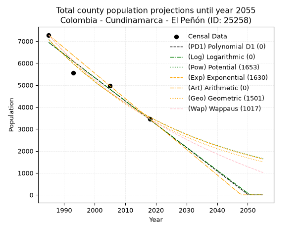
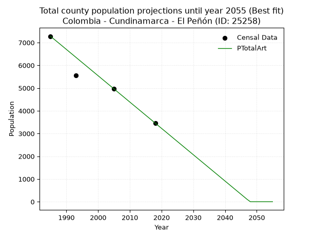
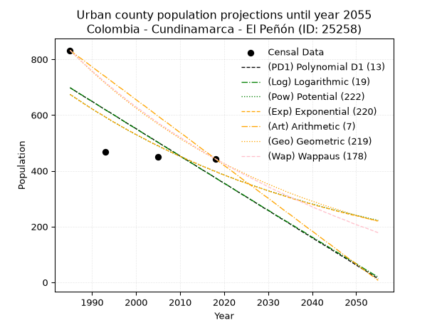
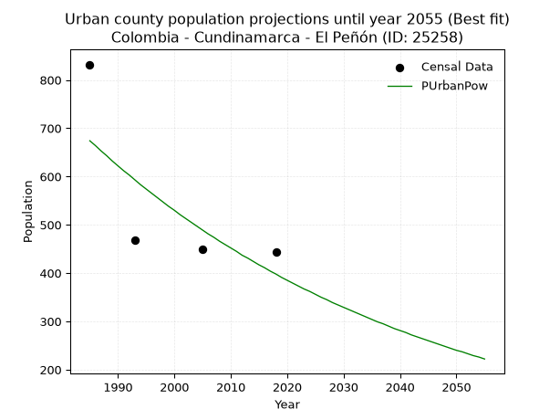
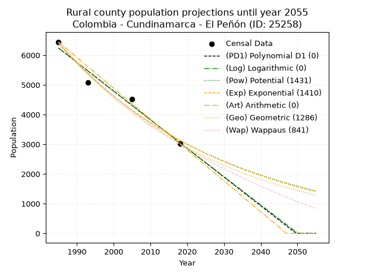
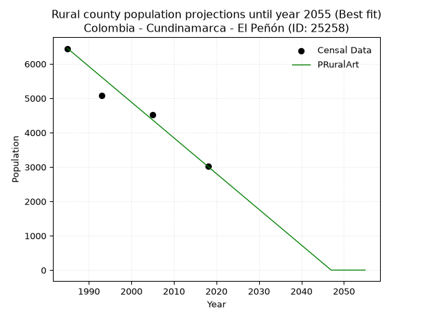

<div align="center">


</div>

# _“Population and Public Services Demand Projections (PPSD) until Year 2050 for Colombia - Cundinamarca - El Peñón (ID: 25258)”_
Keywords: `population` `public-service` `projection` `lineal` `polynomial` `logarithmic` `potential` `exponential` `arithmetic` `geometric` `wappaus` `dane` `colombia` `south-america`

PPSD are analytical estimates used by governments and planners to anticipate future changes in population size, age distribution, and the resulting community needs for utilities, healthcare, education, and infrastructure as sizing future water treatment facilities, electrical grids, and road networks based on spatial growth.

> **General running parameters**: • app_version: _v20260806_. • Python version: _3.14.7_. • Pandas version: _3.0.5_. • NumPy version: _2.5.1_. • Creates, save and include plots into reports (create_plot): _False_. • Projection until year: _2050_. • Process polynomial degree 2 and up: _False_. • Process Wappaus: _True_. • Process Wappaus: _True_. • Set negative values to zero: _True_. • Set infinite values to zero: _True_. • Drop dataset notes: _True_. 
<div align="center">

Dynamic map: [:earth_americas:Google](http://maps.google.com/maps?q=5.248746932,-74.290207) [:earth_americas:OSM](https://www.openstreetmap.org/#map=18/5.248746932/-74.290207&layers=P) [:earth_americas:Bing](https://www.bing.com/maps?cp=5.248746932~-74.290207&lvl=18) [:earth_americas:Apple](https://maps.apple.com/frame?center=5.248746932%2C-74.290207&span=0.003%2C0.006)

</div>


<div align="center">

```geojson
{
  "type": "Feature",
  "geometry": {
    "type": "Point", 
    "coordinates": [-74.290207, 5.248746932]
  }, 
  "properties": {
    "Name": "Colombia - Cundinamarca - El Peñón (ID: 25258)"
  }
}
```

</div>


## 0. Census Data (4 records)

Census data are official statistics collected by a government about the people and housing in a country. They usually include counts of total population, age, sex, race, income, education, and jobs.

📅Global census file: [Population.xlsx](../data/Population.xlsx)

| Source   |   Year |   CountryID | CountryName   |   StateID | StateName    |   CountyID | CountyName   |   PTotal |   PUrban |   PRural |
|:---------|-------:|------------:|:--------------|----------:|:-------------|-----------:|:-------------|---------:|---------:|---------:|
| DANE     |   1985 |          57 | Colombia      |        25 | Cundinamarca |      25258 | El Peñón     |     7278 |      832 |     6446 |
| DANE     |   1993 |          57 | Colombia      |        25 | Cundinamarca |      25258 | El Peñón     |     5554 |      469 |     5085 |
| DANE     |   2005 |          57 | Colombia      |        25 | Cundinamarca |      25258 | El Peñón     |     4977 |      450 |     4527 |
| DANE     |   2018 |          57 | Colombia      |        25 | Cundinamarca |      25258 | El Peñón     |     3458 |      443 |     3015 |

> 🔥Some records could had specific notes about the registered values or the corresponding urban or rural distribution.

## 1. Total

### 1.1. Coefficients and Parameters

* (PD1) Polynomial Deg 1: -106.36009634684764, 218063.532717782 (lineal)
* (Log) Logarithmic: -212944.05865632847, 1623906.246273345
* (Pow) Potential: -41.955767112691035, 142.20977168447845
* (Exp) Exponential: -0.02096207111001651, 8.323427321752581e+21
* (Art) Arithmetic: Year diff. 2018 - 1985 = 33, Population diff. 3458 - 7278 = -3820, Annual growth = -115.75757575757575
* (Geo) Geometric: Year diff. 2018 - 1985 = 33, Population diff. 3458 - 7278 = -3820, Annual growth % = -0.022298114648964806
* (Wap) Wappaus: i = -2.156437700401933, Condition values only valid for < 200)

<sub>
Wappaus condition values: ['-0.00', '-2.16', '-4.31', '-6.47', '-8.63', '-10.78', '-12.94', '-15.10', '-17.25', '-19.41', '-21.56', '-23.72', '-25.88', '-28.03', '-30.19', '-32.35', '-34.50', '-36.66', '-38.82', '-40.97', '-43.13', '-45.29', '-47.44', '-49.60', '-51.75', '-53.91', '-56.07', '-58.22', '-60.38', '-62.54', '-64.69', '-66.85', '-69.01', '-71.16', '-73.32', '-75.48', '-77.63', '-79.79', '-81.94', '-84.10', '-86.26', '-88.41', '-90.57', '-92.73', '-94.88', '-97.04', '-99.20', '-101.35', '-103.51', '-105.67', '-107.82', '-109.98', '-112.13', '-114.29', '-116.45', '-118.60', '-120.76', '-122.92', '-125.07', '-127.23', '-129.39', '-131.54', '-133.70', '-135.86', '-138.01', '-140.17']
</sub>


### 1.2. Projected Dataset

|   Year |   CountyID |   PTotalPD1 |   PTotalLog |   PTotalPow |   PTotalExp |   PTotalArt |   PTotalGeo |   PTotalWap |
|-------:|-----------:|------------:|------------:|------------:|------------:|------------:|------------:|------------:|
|   1985 |      25258 |        6939 |        6942 |        7075 |        7070 |        7278 |        7278 |        7278 |
|   1986 |      25258 |        6832 |        6835 |        6927 |        6924 |        7162 |        7116 |        7123 |
|   1987 |      25258 |        6726 |        6728 |        6782 |        6780 |        7046 |        6957 |        6971 |
|   1988 |      25258 |        6620 |        6621 |        6640 |        6639 |        6931 |        6802 |        6822 |
|   1989 |      25258 |        6513 |        6514 |        6502 |        6502 |        6815 |        6650 |        6676 |
|   1990 |      25258 |        6407 |        6407 |        6366 |        6367 |        6699 |        6502 |        6533 |
|   1991 |      25258 |        6301 |        6300 |        6233 |        6235 |        6583 |        6357 |        6394 |
|   1992 |      25258 |        6194 |        6193 |        6103 |        6105 |        6468 |        6215 |        6256 |
|   1993 |      25258 |        6088 |        6086 |        5976 |        5979 |        6352 |        6077 |        6122 |
|   1994 |      25258 |        5982 |        5979 |        5852 |        5855 |        6236 |        5941 |        5990 |
|   1995 |      25258 |        5875 |        5872 |        5730 |        5733 |        6120 |        5809 |        5861 |
|   1996 |      25258 |        5769 |        5766 |        5611 |        5614 |        6005 |        5679 |        5735 |
|   1997 |      25258 |        5662 |        5659 |        5494 |        5498 |        5889 |        5553 |        5610 |
|   1998 |      25258 |        5556 |        5552 |        5380 |        5384 |        5773 |        5429 |        5489 |
|   1999 |      25258 |        5450 |        5446 |        5268 |        5272 |        5657 |        5308 |        5369 |
|   2000 |      25258 |        5343 |        5339 |        5159 |        5163 |        5542 |        5189 |        5252 |
|   2001 |      25258 |        5237 |        5233 |        5051 |        5056 |        5426 |        5074 |        5136 |
|   2002 |      25258 |        5131 |        5126 |        4947 |        4951 |        5310 |        4960 |        5023 |
|   2003 |      25258 |        5024 |        5020 |        4844 |        4848 |        5194 |        4850 |        4912 |
|   2004 |      25258 |        4918 |        4914 |        4744 |        4747 |        5079 |        4742 |        4803 |
|   2005 |      25258 |        4812 |        4808 |        4645 |        4649 |        4963 |        4636 |        4696 |
|   2006 |      25258 |        4705 |        4701 |        4549 |        4553 |        4847 |        4533 |        4591 |
|   2007 |      25258 |        4599 |        4595 |        4455 |        4458 |        4731 |        4432 |        4487 |
|   2008 |      25258 |        4492 |        4489 |        4363 |        4366 |        4616 |        4333 |        4386 |
|   2009 |      25258 |        4386 |        4383 |        4273 |        4275 |        4500 |        4236 |        4286 |
|   2010 |      25258 |        4280 |        4277 |        4185 |        4186 |        4384 |        4142 |        4187 |
|   2011 |      25258 |        4173 |        4171 |        4098 |        4100 |        4268 |        4049 |        4091 |
|   2012 |      25258 |        4067 |        4065 |        4014 |        4015 |        4153 |        3959 |        3996 |
|   2013 |      25258 |        3961 |        3960 |        3931 |        3931 |        4037 |        3871 |        3903 |
|   2014 |      25258 |        3854 |        3854 |        3850 |        3850 |        3921 |        3784 |        3811 |
|   2015 |      25258 |        3748 |        3748 |        3770 |        3770 |        3805 |        3700 |        3720 |
|   2016 |      25258 |        3642 |        3642 |        3693 |        3692 |        3690 |        3618 |        3632 |
|   2017 |      25258 |        3535 |        3537 |        3617 |        3615 |        3574 |        3537 |        3544 |
|   2018 |      25258 |        3429 |        3431 |        3542 |        3540 |        3458 |        3458 |        3458 |
|   2019 |      25258 |        3322 |        3326 |        3469 |        3467 |        3342 |        3381 |        3373 |
|   2020 |      25258 |        3216 |        3220 |        3398 |        3395 |        3226 |        3306 |        3290 |
|   2021 |      25258 |        3110 |        3115 |        3328 |        3324 |        3111 |        3232 |        3208 |
|   2022 |      25258 |        3003 |        3010 |        3260 |        3255 |        2995 |        3160 |        3127 |
|   2023 |      25258 |        2897 |        2904 |        3193 |        3188 |        2879 |        3089 |        3047 |
|   2024 |      25258 |        2791 |        2799 |        3127 |        3122 |        2763 |        3020 |        2969 |
|   2025 |      25258 |        2684 |        2694 |        3063 |        3057 |        2648 |        2953 |        2892 |
|   2026 |      25258 |        2578 |        2589 |        3000 |        2994 |        2532 |        2887 |        2816 |
|   2027 |      25258 |        2472 |        2484 |        2939 |        2931 |        2416 |        2823 |        2741 |
|   2028 |      25258 |        2365 |        2379 |        2879 |        2871 |        2300 |        2760 |        2667 |
|   2029 |      25258 |        2259 |        2274 |        2820 |        2811 |        2185 |        2698 |        2594 |
|   2030 |      25258 |        2153 |        2169 |        2762 |        2753 |        2069 |        2638 |        2523 |
|   2031 |      25258 |        2046 |        2064 |        2706 |        2696 |        1953 |        2579 |        2452 |
|   2032 |      25258 |        1940 |        1959 |        2650 |        2640 |        1837 |        2522 |        2382 |
|   2033 |      25258 |        1833 |        1854 |        2596 |        2585 |        1722 |        2466 |        2314 |
|   2034 |      25258 |        1727 |        1750 |        2543 |        2531 |        1606 |        2411 |        2246 |
|   2035 |      25258 |        1621 |        1645 |        2491 |        2479 |        1490 |        2357 |        2179 |
|   2036 |      25258 |        1514 |        1540 |        2440 |        2427 |        1374 |        2304 |        2114 |
|   2037 |      25258 |        1408 |        1436 |        2391 |        2377 |        1259 |        2253 |        2049 |
|   2038 |      25258 |        1302 |        1331 |        2342 |        2328 |        1143 |        2203 |        1985 |
|   2039 |      25258 |        1195 |        1227 |        2294 |        2279 |        1027 |        2154 |        1922 |
|   2040 |      25258 |        1089 |        1122 |        2247 |        2232 |         911 |        2106 |        1859 |
|   2041 |      25258 |         983 |        1018 |        2202 |        2186 |         796 |        2059 |        1798 |
|   2042 |      25258 |         876 |         914 |        2157 |        2141 |         680 |        2013 |        1737 |
|   2043 |      25258 |         770 |         809 |        2113 |        2096 |         564 |        1968 |        1678 |
|   2044 |      25258 |         663 |         705 |        2070 |        2053 |         448 |        1924 |        1618 |
|   2045 |      25258 |         557 |         601 |        2028 |        2010 |         333 |        1881 |        1560 |
|   2046 |      25258 |         451 |         497 |        1987 |        1968 |         217 |        1839 |        1503 |
|   2047 |      25258 |         344 |         393 |        1947 |        1928 |         101 |        1798 |        1446 |
|   2048 |      25258 |         238 |         289 |        1907 |        1888 |           0 |        1758 |        1390 |
|   2049 |      25258 |         132 |         185 |        1868 |        1848 |           0 |        1719 |        1335 |
|   2050 |      25258 |          25 |          81 |        1831 |        1810 |           0 |        1680 |        1280 |
<div align="center">

</img>

</div>


### 1.3. Best fit with absolute and relative error (%)

Relative error puts that difference into context by dividing the absolute error by the true value, creating a unitless ratio or percentage that shows the scale of the mistake.

Absolute and relative error

|   Year | Source   |   CountryID | CountryName   |   StateID | StateName    |   CountyID_x | CountyName   |   PTotal |   PUrban |   PRural |   CountyID_y |   PTotalPD1 |   PTotalLog |   PTotalPow |   PTotalExp |   PTotalArt |   PTotalGeo |   PTotalWap |   PTotalPD1AbsError |   PTotalLogAbsError |   PTotalPowAbsError |   PTotalExpAbsError |   PTotalArtAbsError |   PTotalGeoAbsError |   PTotalWapAbsError |   PTotalPD1RelError |   PTotalLogRelError |   PTotalPowRelError |   PTotalExpRelError |   PTotalArtRelError |   PTotalGeoRelError |   PTotalWapRelError |
|-------:|:---------|------------:|:--------------|----------:|:-------------|-------------:|:-------------|---------:|---------:|---------:|-------------:|------------:|------------:|------------:|------------:|------------:|------------:|------------:|--------------------:|--------------------:|--------------------:|--------------------:|--------------------:|--------------------:|--------------------:|--------------------:|--------------------:|--------------------:|--------------------:|--------------------:|--------------------:|--------------------:|
|   1985 | DANE     |          57 | Colombia      |        25 | Cundinamarca |        25258 | El Peñón     |     7278 |      832 |     6446 |        25258 |        6939 |        6942 |        7075 |        7070 |        7278 |        7278 |        7278 |                 339 |                 336 |                 203 |                 208 |                   0 |                   0 |                   0 |            4.65787  |            4.61665  |             2.78923 |             2.85793 |            0        |             0       |             0       |
|   1993 | DANE     |          57 | Colombia      |        25 | Cundinamarca |        25258 | El Peñón     |     5554 |      469 |     5085 |        25258 |        6088 |        6086 |        5976 |        5979 |        6352 |        6077 |        6122 |                 534 |                 532 |                 422 |                 425 |                 798 |                 523 |                 568 |            9.61469  |            9.57868  |             7.59813 |             7.65214 |           14.368    |             9.41664 |            10.2269  |
|   2005 | DANE     |          57 | Colombia      |        25 | Cundinamarca |        25258 | El Peñón     |     4977 |      450 |     4527 |        25258 |        4812 |        4808 |        4645 |        4649 |        4963 |        4636 |        4696 |                 165 |                 169 |                 332 |                 328 |                  14 |                 341 |                 281 |            3.31525  |            3.39562  |             6.67069 |             6.59032 |            0.281294 |             6.85152 |             5.64597 |
|   2018 | DANE     |          57 | Colombia      |        25 | Cundinamarca |        25258 | El Peñón     |     3458 |      443 |     3015 |        25258 |        3429 |        3431 |        3542 |        3540 |        3458 |        3458 |        3458 |                  29 |                  27 |                  84 |                  82 |                   0 |                   0 |                   0 |            0.838635 |            0.780798 |             2.42915 |             2.37131 |            0        |             0       |             0       |

Relative error mean

| Method    |   RelError | Best   |
|:----------|-----------:|:-------|
| PTotalPD1 |    4.60661 |        |
| PTotalLog |    4.59294 |        |
| PTotalPow |    4.8718  |        |
| PTotalExp |    4.86792 |        |
| PTotalArt |    3.66233 | True   |
| PTotalGeo |    4.06704 |        |
| PTotalWap |    3.96821 |        |

💙Best method: _**PTotalArt**_
<div align="center">

</img>

</div>


### 1.4. Fresh water supply demand in liters per capita per day (lpcd)

The fresh water supply demand typically ranges from 100 to 300 liters per capita per day (lpcd) for standard domestic and municipal planning, though absolute survival minimums set by the World Health Organization are as low as 7.5 to 20 liters per day, and total consumption in high-income nations can exceed 400 liters.

> `CZ`: Level in meters above the sea level (masl).<br> `WS`: Fresh water supply demand in liters per capita per day (lpcd or l/h/d).<br> `WSAll`: Zonal fresh water supply demand in liters per second (l/s).<br> `A`: Zonal area in square meters.

Reference values (RAS Colombia)

|    CZ |   WS |
|------:|-----:|
|  1000 |  120 |
|  2000 |  130 |
| 99999 |  140 |

County shapefile geometry properties and water supply values

|   CountyID |      ATotal |   CZTotal |   WSTotal |
|-----------:|------------:|----------:|----------:|
|      25258 | 1.33944e+08 |   1317.85 |       130 |

Projected values for best method: PTotalArt

|   CountyID |   Year |   PTotalArt |   WSTotal |   WSTotalAll |
|-----------:|-------:|------------:|----------:|-------------:|
|      25258 |   1985 |        7278 |       130 |    10.9507   |
|      25258 |   1986 |        7162 |       130 |    10.7762   |
|      25258 |   1987 |        7046 |       130 |    10.6016   |
|      25258 |   1988 |        6931 |       130 |    10.4286   |
|      25258 |   1989 |        6815 |       130 |    10.2541   |
|      25258 |   1990 |        6699 |       130 |    10.0795   |
|      25258 |   1991 |        6583 |       130 |     9.90498  |
|      25258 |   1992 |        6468 |       130 |     9.73194  |
|      25258 |   1993 |        6352 |       130 |     9.55741  |
|      25258 |   1994 |        6236 |       130 |     9.38287  |
|      25258 |   1995 |        6120 |       130 |     9.20833  |
|      25258 |   1996 |        6005 |       130 |     9.0353   |
|      25258 |   1997 |        5889 |       130 |     8.86076  |
|      25258 |   1998 |        5773 |       130 |     8.68623  |
|      25258 |   1999 |        5657 |       130 |     8.51169  |
|      25258 |   2000 |        5542 |       130 |     8.33866  |
|      25258 |   2001 |        5426 |       130 |     8.16412  |
|      25258 |   2002 |        5310 |       130 |     7.98958  |
|      25258 |   2003 |        5194 |       130 |     7.81505  |
|      25258 |   2004 |        5079 |       130 |     7.64201  |
|      25258 |   2005 |        4963 |       130 |     7.46748  |
|      25258 |   2006 |        4847 |       130 |     7.29294  |
|      25258 |   2007 |        4731 |       130 |     7.1184   |
|      25258 |   2008 |        4616 |       130 |     6.94537  |
|      25258 |   2009 |        4500 |       130 |     6.77083  |
|      25258 |   2010 |        4384 |       130 |     6.5963   |
|      25258 |   2011 |        4268 |       130 |     6.42176  |
|      25258 |   2012 |        4153 |       130 |     6.24873  |
|      25258 |   2013 |        4037 |       130 |     6.07419  |
|      25258 |   2014 |        3921 |       130 |     5.89965  |
|      25258 |   2015 |        3805 |       130 |     5.72512  |
|      25258 |   2016 |        3690 |       130 |     5.55208  |
|      25258 |   2017 |        3574 |       130 |     5.37755  |
|      25258 |   2018 |        3458 |       130 |     5.20301  |
|      25258 |   2019 |        3342 |       130 |     5.02847  |
|      25258 |   2020 |        3226 |       130 |     4.85394  |
|      25258 |   2021 |        3111 |       130 |     4.6809   |
|      25258 |   2022 |        2995 |       130 |     4.50637  |
|      25258 |   2023 |        2879 |       130 |     4.33183  |
|      25258 |   2024 |        2763 |       130 |     4.15729  |
|      25258 |   2025 |        2648 |       130 |     3.98426  |
|      25258 |   2026 |        2532 |       130 |     3.80972  |
|      25258 |   2027 |        2416 |       130 |     3.63519  |
|      25258 |   2028 |        2300 |       130 |     3.46065  |
|      25258 |   2029 |        2185 |       130 |     3.28762  |
|      25258 |   2030 |        2069 |       130 |     3.11308  |
|      25258 |   2031 |        1953 |       130 |     2.93854  |
|      25258 |   2032 |        1837 |       130 |     2.764    |
|      25258 |   2033 |        1722 |       130 |     2.59097  |
|      25258 |   2034 |        1606 |       130 |     2.41644  |
|      25258 |   2035 |        1490 |       130 |     2.2419   |
|      25258 |   2036 |        1374 |       130 |     2.06736  |
|      25258 |   2037 |        1259 |       130 |     1.89433  |
|      25258 |   2038 |        1143 |       130 |     1.71979  |
|      25258 |   2039 |        1027 |       130 |     1.54525  |
|      25258 |   2040 |         911 |       130 |     1.37072  |
|      25258 |   2041 |         796 |       130 |     1.19769  |
|      25258 |   2042 |         680 |       130 |     1.02315  |
|      25258 |   2043 |         564 |       130 |     0.848611 |
|      25258 |   2044 |         448 |       130 |     0.674074 |
|      25258 |   2045 |         333 |       130 |     0.501042 |
|      25258 |   2046 |         217 |       130 |     0.326505 |
|      25258 |   2047 |         101 |       130 |     0.151968 |
|      25258 |   2048 |           0 |       130 |     0        |
|      25258 |   2049 |           0 |       130 |     0        |
|      25258 |   2050 |           0 |       130 |     0        |

## 2. Urban

### 2.1. Coefficients and Parameters

* (PD1) Polynomial Deg 1: -9.775190686471287, 20101.325170614193 (lineal)
* (Log) Logarithmic: -19601.301876373247, 149538.15263728844
* (Pow) Potential: -32.037952788463144, 108.48243992445346
* (Exp) Exponential: -0.015978362677361795, 4.009520259022258e+16
* (Art) Arithmetic: Year diff. 2018 - 1985 = 33, Population diff. 443 - 832 = -389, Annual growth = -11.787878787878787
* (Geo) Geometric: Year diff. 2018 - 1985 = 33, Population diff. 443 - 832 = -389, Annual growth % = -0.018917640999128738
* (Wap) Wappaus: i = -1.8490790255496137, Condition values only valid for < 200)

<sub>
Wappaus condition values: ['-0.00', '-1.85', '-3.70', '-5.55', '-7.40', '-9.25', '-11.09', '-12.94', '-14.79', '-16.64', '-18.49', '-20.34', '-22.19', '-24.04', '-25.89', '-27.74', '-29.59', '-31.43', '-33.28', '-35.13', '-36.98', '-38.83', '-40.68', '-42.53', '-44.38', '-46.23', '-48.08', '-49.93', '-51.77', '-53.62', '-55.47', '-57.32', '-59.17', '-61.02', '-62.87', '-64.72', '-66.57', '-68.42', '-70.27', '-72.11', '-73.96', '-75.81', '-77.66', '-79.51', '-81.36', '-83.21', '-85.06', '-86.91', '-88.76', '-90.60', '-92.45', '-94.30', '-96.15', '-98.00', '-99.85', '-101.70', '-103.55', '-105.40', '-107.25', '-109.10', '-110.94', '-112.79', '-114.64', '-116.49', '-118.34', '-120.19']
</sub>


### 2.2. Projected Dataset

|   Year |   CountyID |   PUrbanPD1 |   PUrbanLog |   PUrbanPow |   PUrbanExp |   PUrbanArt |   PUrbanGeo |   PUrbanWap |
|-------:|-----------:|------------:|------------:|------------:|------------:|------------:|------------:|------------:|
|   1985 |      25258 |         698 |         698 |         674 |         674 |         832 |         832 |         832 |
|   1986 |      25258 |         688 |         688 |         664 |         663 |         820 |         816 |         817 |
|   1987 |      25258 |         678 |         678 |         653 |         653 |         808 |         801 |         802 |
|   1988 |      25258 |         668 |         669 |         643 |         642 |         797 |         786 |         787 |
|   1989 |      25258 |         658 |         659 |         632 |         632 |         785 |         771 |         773 |
|   1990 |      25258 |         649 |         649 |         622 |         622 |         773 |         756 |         758 |
|   1991 |      25258 |         639 |         639 |         612 |         612 |         761 |         742 |         745 |
|   1992 |      25258 |         629 |         629 |         603 |         603 |         749 |         728 |         731 |
|   1993 |      25258 |         619 |         619 |         593 |         593 |         738 |         714 |         717 |
|   1994 |      25258 |         610 |         609 |         583 |         584 |         726 |         701 |         704 |
|   1995 |      25258 |         600 |         600 |         574 |         574 |         714 |         687 |         691 |
|   1996 |      25258 |         590 |         590 |         565 |         565 |         702 |         674 |         678 |
|   1997 |      25258 |         580 |         580 |         556 |         556 |         691 |         662 |         666 |
|   1998 |      25258 |         570 |         570 |         547 |         547 |         679 |         649 |         653 |
|   1999 |      25258 |         561 |         560 |         538 |         539 |         667 |         637 |         641 |
|   2000 |      25258 |         551 |         551 |         530 |         530 |         655 |         625 |         629 |
|   2001 |      25258 |         541 |         541 |         521 |         522 |         643 |         613 |         618 |
|   2002 |      25258 |         531 |         531 |         513 |         514 |         632 |         601 |         606 |
|   2003 |      25258 |         522 |         521 |         505 |         505 |         620 |         590 |         595 |
|   2004 |      25258 |         512 |         511 |         497 |         497 |         608 |         579 |         583 |
|   2005 |      25258 |         502 |         502 |         489 |         490 |         596 |         568 |         572 |
|   2006 |      25258 |         492 |         492 |         481 |         482 |         584 |         557 |         561 |
|   2007 |      25258 |         483 |         482 |         474 |         474 |         573 |         547 |         551 |
|   2008 |      25258 |         473 |         472 |         466 |         467 |         561 |         536 |         540 |
|   2009 |      25258 |         463 |         463 |         459 |         459 |         549 |         526 |         530 |
|   2010 |      25258 |         453 |         453 |         452 |         452 |         537 |         516 |         520 |
|   2011 |      25258 |         443 |         443 |         445 |         445 |         526 |         506 |         510 |
|   2012 |      25258 |         434 |         433 |         437 |         438 |         514 |         497 |         500 |
|   2013 |      25258 |         424 |         424 |         431 |         431 |         502 |         487 |         490 |
|   2014 |      25258 |         414 |         414 |         424 |         424 |         490 |         478 |         480 |
|   2015 |      25258 |         404 |         404 |         417 |         417 |         478 |         469 |         471 |
|   2016 |      25258 |         395 |         394 |         411 |         411 |         467 |         460 |         461 |
|   2017 |      25258 |         385 |         385 |         404 |         404 |         455 |         452 |         452 |
|   2018 |      25258 |         375 |         375 |         398 |         398 |         443 |         443 |         443 |
|   2019 |      25258 |         365 |         365 |         391 |         391 |         431 |         435 |         434 |
|   2020 |      25258 |         355 |         356 |         385 |         385 |         419 |         426 |         425 |
|   2021 |      25258 |         346 |         346 |         379 |         379 |         408 |         418 |         416 |
|   2022 |      25258 |         336 |         336 |         373 |         373 |         396 |         410 |         408 |
|   2023 |      25258 |         326 |         326 |         367 |         367 |         384 |         403 |         399 |
|   2024 |      25258 |         316 |         317 |         362 |         361 |         372 |         395 |         391 |
|   2025 |      25258 |         307 |         307 |         356 |         356 |         360 |         388 |         383 |
|   2026 |      25258 |         297 |         297 |         350 |         350 |         349 |         380 |         375 |
|   2027 |      25258 |         287 |         288 |         345 |         344 |         337 |         373 |         367 |
|   2028 |      25258 |         277 |         278 |         339 |         339 |         325 |         366 |         359 |
|   2029 |      25258 |         267 |         268 |         334 |         334 |         313 |         359 |         351 |
|   2030 |      25258 |         258 |         259 |         329 |         328 |         302 |         352 |         343 |
|   2031 |      25258 |         248 |         249 |         324 |         323 |         290 |         346 |         335 |
|   2032 |      25258 |         238 |         239 |         319 |         318 |         278 |         339 |         328 |
|   2033 |      25258 |         228 |         230 |         314 |         313 |         266 |         333 |         321 |
|   2034 |      25258 |         219 |         220 |         309 |         308 |         254 |         326 |         313 |
|   2035 |      25258 |         209 |         211 |         304 |         303 |         243 |         320 |         306 |
|   2036 |      25258 |         199 |         201 |         299 |         298 |         231 |         314 |         299 |
|   2037 |      25258 |         189 |         191 |         295 |         294 |         219 |         308 |         292 |
|   2038 |      25258 |         179 |         182 |         290 |         289 |         207 |         302 |         285 |
|   2039 |      25258 |         170 |         172 |         285 |         284 |         195 |         297 |         278 |
|   2040 |      25258 |         160 |         162 |         281 |         280 |         184 |         291 |         271 |
|   2041 |      25258 |         150 |         153 |         277 |         275 |         172 |         286 |         264 |
|   2042 |      25258 |         140 |         143 |         272 |         271 |         160 |         280 |         258 |
|   2043 |      25258 |         131 |         134 |         268 |         267 |         148 |         275 |         251 |
|   2044 |      25258 |         121 |         124 |         264 |         263 |         137 |         270 |         245 |
|   2045 |      25258 |         111 |         114 |         260 |         258 |         125 |         265 |         238 |
|   2046 |      25258 |         101 |         105 |         256 |         254 |         113 |         260 |         232 |
|   2047 |      25258 |          92 |          95 |         252 |         250 |         101 |         255 |         226 |
|   2048 |      25258 |          82 |          86 |         248 |         246 |          89 |         250 |         220 |
|   2049 |      25258 |          72 |          76 |         244 |         242 |          78 |         245 |         213 |
|   2050 |      25258 |          62 |          67 |         240 |         239 |          66 |         240 |         207 |
<div align="center">

</img>

</div>


### 2.3. Best fit with absolute and relative error (%)

Relative error puts that difference into context by dividing the absolute error by the true value, creating a unitless ratio or percentage that shows the scale of the mistake.

Absolute and relative error

|   Year | Source   |   CountryID | CountryName   |   StateID | StateName    |   CountyID_x | CountyName   |   PTotal |   PUrban |   PRural |   CountyID_y |   PUrbanPD1 |   PUrbanLog |   PUrbanPow |   PUrbanExp |   PUrbanArt |   PUrbanGeo |   PUrbanWap |   PUrbanPD1AbsError |   PUrbanLogAbsError |   PUrbanPowAbsError |   PUrbanExpAbsError |   PUrbanArtAbsError |   PUrbanGeoAbsError |   PUrbanWapAbsError |   PUrbanPD1RelError |   PUrbanLogRelError |   PUrbanPowRelError |   PUrbanExpRelError |   PUrbanArtRelError |   PUrbanGeoRelError |   PUrbanWapRelError |
|-------:|:---------|------------:|:--------------|----------:|:-------------|-------------:|:-------------|---------:|---------:|---------:|-------------:|------------:|------------:|------------:|------------:|------------:|------------:|------------:|--------------------:|--------------------:|--------------------:|--------------------:|--------------------:|--------------------:|--------------------:|--------------------:|--------------------:|--------------------:|--------------------:|--------------------:|--------------------:|--------------------:|
|   1985 | DANE     |          57 | Colombia      |        25 | Cundinamarca |        25258 | El Peñón     |     7278 |      832 |     6446 |        25258 |         698 |         698 |         674 |         674 |         832 |         832 |         832 |                 134 |                 134 |                 158 |                 158 |                   0 |                   0 |                   0 |             16.1058 |             16.1058 |            18.9904  |            18.9904  |              0      |              0      |              0      |
|   1993 | DANE     |          57 | Colombia      |        25 | Cundinamarca |        25258 | El Peñón     |     5554 |      469 |     5085 |        25258 |         619 |         619 |         593 |         593 |         738 |         714 |         717 |                 150 |                 150 |                 124 |                 124 |                 269 |                 245 |                 248 |             31.9829 |             31.9829 |            26.4392  |            26.4392  |             57.3561 |             52.2388 |             52.8785 |
|   2005 | DANE     |          57 | Colombia      |        25 | Cundinamarca |        25258 | El Peñón     |     4977 |      450 |     4527 |        25258 |         502 |         502 |         489 |         490 |         596 |         568 |         572 |                  52 |                  52 |                  39 |                  40 |                 146 |                 118 |                 122 |             11.5556 |             11.5556 |             8.66667 |             8.88889 |             32.4444 |             26.2222 |             27.1111 |
|   2018 | DANE     |          57 | Colombia      |        25 | Cundinamarca |        25258 | El Peñón     |     3458 |      443 |     3015 |        25258 |         375 |         375 |         398 |         398 |         443 |         443 |         443 |                  68 |                  68 |                  45 |                  45 |                   0 |                   0 |                   0 |             15.3499 |             15.3499 |            10.158   |            10.158   |              0      |              0      |              0      |

Relative error mean

| Method    |   RelError | Best   |
|:----------|-----------:|:-------|
| PUrbanPD1 |    18.7485 |        |
| PUrbanLog |    18.7485 |        |
| PUrbanPow |    16.0636 | True   |
| PUrbanExp |    16.1191 |        |
| PUrbanArt |    22.4501 |        |
| PUrbanGeo |    19.6153 |        |
| PUrbanWap |    19.9974 |        |

💙Best method: _**PUrbanPow**_
<div align="center">

</img>

</div>


### 2.4. Fresh water supply demand in liters per capita per day (lpcd)

The fresh water supply demand typically ranges from 100 to 300 liters per capita per day (lpcd) for standard domestic and municipal planning, though absolute survival minimums set by the World Health Organization are as low as 7.5 to 20 liters per day, and total consumption in high-income nations can exceed 400 liters.

> `CZ`: Level in meters above the sea level (masl).<br> `WS`: Fresh water supply demand in liters per capita per day (lpcd or l/h/d).<br> `WSAll`: Zonal fresh water supply demand in liters per second (l/s).<br> `A`: Zonal area in square meters.

Reference values (RAS Colombia)

|    CZ |   WS |
|------:|-----:|
|  1000 |  120 |
|  2000 |  130 |
| 99999 |  140 |

County shapefile geometry properties and water supply values

|   CountyID |   AUrban |   CZUrban |   WSUrban |
|-----------:|---------:|----------:|----------:|
|      25258 |   115250 |   1341.65 |       130 |

Projected values for best method: PUrbanPow

|   CountyID |   Year |   PUrbanPow |   WSUrban |   WSUrbanAll |
|-----------:|-------:|------------:|----------:|-------------:|
|      25258 |   1985 |         674 |       130 |     1.01412  |
|      25258 |   1986 |         664 |       130 |     0.999074 |
|      25258 |   1987 |         653 |       130 |     0.982523 |
|      25258 |   1988 |         643 |       130 |     0.967477 |
|      25258 |   1989 |         632 |       130 |     0.950926 |
|      25258 |   1990 |         622 |       130 |     0.93588  |
|      25258 |   1991 |         612 |       130 |     0.920833 |
|      25258 |   1992 |         603 |       130 |     0.907292 |
|      25258 |   1993 |         593 |       130 |     0.892245 |
|      25258 |   1994 |         583 |       130 |     0.877199 |
|      25258 |   1995 |         574 |       130 |     0.863657 |
|      25258 |   1996 |         565 |       130 |     0.850116 |
|      25258 |   1997 |         556 |       130 |     0.836574 |
|      25258 |   1998 |         547 |       130 |     0.823032 |
|      25258 |   1999 |         538 |       130 |     0.809491 |
|      25258 |   2000 |         530 |       130 |     0.797454 |
|      25258 |   2001 |         521 |       130 |     0.783912 |
|      25258 |   2002 |         513 |       130 |     0.771875 |
|      25258 |   2003 |         505 |       130 |     0.759838 |
|      25258 |   2004 |         497 |       130 |     0.747801 |
|      25258 |   2005 |         489 |       130 |     0.735764 |
|      25258 |   2006 |         481 |       130 |     0.723727 |
|      25258 |   2007 |         474 |       130 |     0.713194 |
|      25258 |   2008 |         466 |       130 |     0.701157 |
|      25258 |   2009 |         459 |       130 |     0.690625 |
|      25258 |   2010 |         452 |       130 |     0.680093 |
|      25258 |   2011 |         445 |       130 |     0.66956  |
|      25258 |   2012 |         437 |       130 |     0.657523 |
|      25258 |   2013 |         431 |       130 |     0.648495 |
|      25258 |   2014 |         424 |       130 |     0.637963 |
|      25258 |   2015 |         417 |       130 |     0.627431 |
|      25258 |   2016 |         411 |       130 |     0.618403 |
|      25258 |   2017 |         404 |       130 |     0.60787  |
|      25258 |   2018 |         398 |       130 |     0.598843 |
|      25258 |   2019 |         391 |       130 |     0.58831  |
|      25258 |   2020 |         385 |       130 |     0.579282 |
|      25258 |   2021 |         379 |       130 |     0.570255 |
|      25258 |   2022 |         373 |       130 |     0.561227 |
|      25258 |   2023 |         367 |       130 |     0.552199 |
|      25258 |   2024 |         362 |       130 |     0.544676 |
|      25258 |   2025 |         356 |       130 |     0.535648 |
|      25258 |   2026 |         350 |       130 |     0.52662  |
|      25258 |   2027 |         345 |       130 |     0.519097 |
|      25258 |   2028 |         339 |       130 |     0.510069 |
|      25258 |   2029 |         334 |       130 |     0.502546 |
|      25258 |   2030 |         329 |       130 |     0.495023 |
|      25258 |   2031 |         324 |       130 |     0.4875   |
|      25258 |   2032 |         319 |       130 |     0.479977 |
|      25258 |   2033 |         314 |       130 |     0.472454 |
|      25258 |   2034 |         309 |       130 |     0.464931 |
|      25258 |   2035 |         304 |       130 |     0.457407 |
|      25258 |   2036 |         299 |       130 |     0.449884 |
|      25258 |   2037 |         295 |       130 |     0.443866 |
|      25258 |   2038 |         290 |       130 |     0.436343 |
|      25258 |   2039 |         285 |       130 |     0.428819 |
|      25258 |   2040 |         281 |       130 |     0.422801 |
|      25258 |   2041 |         277 |       130 |     0.416782 |
|      25258 |   2042 |         272 |       130 |     0.409259 |
|      25258 |   2043 |         268 |       130 |     0.403241 |
|      25258 |   2044 |         264 |       130 |     0.397222 |
|      25258 |   2045 |         260 |       130 |     0.391204 |
|      25258 |   2046 |         256 |       130 |     0.385185 |
|      25258 |   2047 |         252 |       130 |     0.379167 |
|      25258 |   2048 |         248 |       130 |     0.373148 |
|      25258 |   2049 |         244 |       130 |     0.36713  |
|      25258 |   2050 |         240 |       130 |     0.361111 |

## 3. Rural

### 3.1. Coefficients and Parameters

* (PD1) Polynomial Deg 1: -96.58490566037636, 197962.20754716784 (lineal)
* (Log) Logarithmic: -193342.75677995535, 1474368.0936360578
* (Pow) Potential: -43.21091160170684, 146.30516595758337
* (Exp) Exponential: -0.0215924868724048, 2.630328195381262e+22
* (Art) Arithmetic: Year diff. 2018 - 1985 = 33, Population diff. 3015 - 6446 = -3431, Annual growth = -103.96969696969697
* (Geo) Geometric: Year diff. 2018 - 1985 = 33, Population diff. 3015 - 6446 = -3431, Annual growth % = -0.022762982561994494
* (Wap) Wappaus: i = -2.1978585132585766, Condition values only valid for < 200)

<sub>
Wappaus condition values: ['-0.00', '-2.20', '-4.40', '-6.59', '-8.79', '-10.99', '-13.19', '-15.39', '-17.58', '-19.78', '-21.98', '-24.18', '-26.37', '-28.57', '-30.77', '-32.97', '-35.17', '-37.36', '-39.56', '-41.76', '-43.96', '-46.16', '-48.35', '-50.55', '-52.75', '-54.95', '-57.14', '-59.34', '-61.54', '-63.74', '-65.94', '-68.13', '-70.33', '-72.53', '-74.73', '-76.93', '-79.12', '-81.32', '-83.52', '-85.72', '-87.91', '-90.11', '-92.31', '-94.51', '-96.71', '-98.90', '-101.10', '-103.30', '-105.50', '-107.70', '-109.89', '-112.09', '-114.29', '-116.49', '-118.68', '-120.88', '-123.08', '-125.28', '-127.48', '-129.67', '-131.87', '-134.07', '-136.27', '-138.47', '-140.66', '-142.86']
</sub>


### 3.2. Projected Dataset

|   Year |   CountyID |   PRuralPD1 |   PRuralLog |   PRuralPow |   PRuralExp |   PRuralArt |   PRuralGeo |   PRuralWap |
|-------:|-----------:|------------:|------------:|------------:|------------:|------------:|------------:|------------:|
|   1985 |      25258 |        6241 |        6244 |        6396 |        6393 |        6446 |        6446 |        6446 |
|   1986 |      25258 |        6145 |        6147 |        6259 |        6256 |        6342 |        6299 |        6306 |
|   1987 |      25258 |        6048 |        6049 |        6124 |        6122 |        6238 |        6156 |        6169 |
|   1988 |      25258 |        5951 |        5952 |        5992 |        5992 |        6134 |        6016 |        6035 |
|   1989 |      25258 |        5855 |        5855 |        5863 |        5864 |        6030 |        5879 |        5903 |
|   1990 |      25258 |        5758 |        5758 |        5737 |        5738 |        5926 |        5745 |        5775 |
|   1991 |      25258 |        5662 |        5661 |        5614 |        5616 |        5822 |        5614 |        5649 |
|   1992 |      25258 |        5565 |        5564 |        5494 |        5496 |        5718 |        5486 |        5525 |
|   1993 |      25258 |        5468 |        5467 |        5376 |        5378 |        5614 |        5362 |        5404 |
|   1994 |      25258 |        5372 |        5370 |        5261 |        5264 |        5510 |        5239 |        5286 |
|   1995 |      25258 |        5275 |        5273 |        5148 |        5151 |        5406 |        5120 |        5170 |
|   1996 |      25258 |        5179 |        5176 |        5038 |        5041 |        5302 |        5004 |        5056 |
|   1997 |      25258 |        5082 |        5079 |        4930 |        4933 |        5198 |        4890 |        4944 |
|   1998 |      25258 |        4986 |        4982 |        4824 |        4828 |        5094 |        4778 |        4834 |
|   1999 |      25258 |        4889 |        4885 |        4721 |        4725 |        4990 |        4670 |        4727 |
|   2000 |      25258 |        4792 |        4789 |        4620 |        4624 |        4886 |        4563 |        4622 |
|   2001 |      25258 |        4696 |        4692 |        4521 |        4525 |        4782 |        4460 |        4518 |
|   2002 |      25258 |        4599 |        4595 |        4425 |        4429 |        4679 |        4358 |        4417 |
|   2003 |      25258 |        4503 |        4499 |        4330 |        4334 |        4575 |        4259 |        4317 |
|   2004 |      25258 |        4406 |        4402 |        4238 |        4241 |        4471 |        4162 |        4219 |
|   2005 |      25258 |        4309 |        4306 |        4148 |        4151 |        4367 |        4067 |        4123 |
|   2006 |      25258 |        4213 |        4209 |        4059 |        4062 |        4263 |        3975 |        4029 |
|   2007 |      25258 |        4116 |        4113 |        3973 |        3975 |        4159 |        3884 |        3936 |
|   2008 |      25258 |        4020 |        4017 |        3888 |        3890 |        4055 |        3796 |        3845 |
|   2009 |      25258 |        3923 |        3921 |        3805 |        3807 |        3951 |        3709 |        3755 |
|   2010 |      25258 |        3827 |        3824 |        3724 |        3726 |        3847 |        3625 |        3667 |
|   2011 |      25258 |        3730 |        3728 |        3645 |        3646 |        3743 |        3542 |        3581 |
|   2012 |      25258 |        3633 |        3632 |        3568 |        3568 |        3639 |        3462 |        3496 |
|   2013 |      25258 |        3537 |        3536 |        3492 |        3492 |        3535 |        3383 |        3413 |
|   2014 |      25258 |        3440 |        3440 |        3418 |        3418 |        3431 |        3306 |        3330 |
|   2015 |      25258 |        3344 |        3344 |        3345 |        3345 |        3327 |        3231 |        3250 |
|   2016 |      25258 |        3247 |        3248 |        3274 |        3273 |        3223 |        3157 |        3170 |
|   2017 |      25258 |        3150 |        3152 |        3205 |        3203 |        3119 |        3085 |        3092 |
|   2018 |      25258 |        3054 |        3056 |        3137 |        3135 |        3015 |        3015 |        3015 |
|   2019 |      25258 |        2957 |        2961 |        3071 |        3068 |        2911 |        2946 |        2939 |
|   2020 |      25258 |        2861 |        2865 |        3006 |        3002 |        2807 |        2879 |        2865 |
|   2021 |      25258 |        2764 |        2769 |        2942 |        2938 |        2703 |        2814 |        2792 |
|   2022 |      25258 |        2668 |        2673 |        2880 |        2875 |        2599 |        2750 |        2719 |
|   2023 |      25258 |        2571 |        2578 |        2819 |        2814 |        2495 |        2687 |        2648 |
|   2024 |      25258 |        2474 |        2482 |        2759 |        2754 |        2391 |        2626 |        2578 |
|   2025 |      25258 |        2378 |        2387 |        2701 |        2695 |        2287 |        2566 |        2509 |
|   2026 |      25258 |        2281 |        2291 |        2644 |        2638 |        2183 |        2508 |        2442 |
|   2027 |      25258 |        2185 |        2196 |        2588 |        2581 |        2079 |        2451 |        2375 |
|   2028 |      25258 |        2088 |        2101 |        2534 |        2526 |        1975 |        2395 |        2309 |
|   2029 |      25258 |        1991 |        2005 |        2480 |        2472 |        1871 |        2340 |        2244 |
|   2030 |      25258 |        1895 |        1910 |        2428 |        2419 |        1767 |        2287 |        2180 |
|   2031 |      25258 |        1798 |        1815 |        2377 |        2368 |        1663 |        2235 |        2117 |
|   2032 |      25258 |        1702 |        1720 |        2327 |        2317 |        1559 |        2184 |        2055 |
|   2033 |      25258 |        1605 |        1625 |        2278 |        2268 |        1455 |        2134 |        1994 |
|   2034 |      25258 |        1509 |        1529 |        2230 |        2219 |        1351 |        2086 |        1934 |
|   2035 |      25258 |        1412 |        1434 |        2183 |        2172 |        1248 |        2038 |        1874 |
|   2036 |      25258 |        1315 |        1339 |        2137 |        2125 |        1144 |        1992 |        1816 |
|   2037 |      25258 |        1219 |        1245 |        2092 |        2080 |        1040 |        1947 |        1758 |
|   2038 |      25258 |        1122 |        1150 |        2049 |        2035 |         936 |        1902 |        1701 |
|   2039 |      25258 |        1026 |        1055 |        2006 |        1992 |         832 |        1859 |        1645 |
|   2040 |      25258 |         929 |         960 |        1963 |        1949 |         728 |        1817 |        1589 |
|   2041 |      25258 |         832 |         865 |        1922 |        1908 |         624 |        1775 |        1535 |
|   2042 |      25258 |         736 |         771 |        1882 |        1867 |         520 |        1735 |        1481 |
|   2043 |      25258 |         639 |         676 |        1843 |        1827 |         416 |        1695 |        1428 |
|   2044 |      25258 |         543 |         581 |        1804 |        1788 |         312 |        1657 |        1375 |
|   2045 |      25258 |         446 |         487 |        1766 |        1750 |         208 |        1619 |        1323 |
|   2046 |      25258 |         349 |         392 |        1729 |        1713 |         104 |        1582 |        1272 |
|   2047 |      25258 |         253 |         298 |        1693 |        1676 |          -0 |        1546 |        1222 |
|   2048 |      25258 |         156 |         203 |        1658 |        1640 |           0 |        1511 |        1172 |
|   2049 |      25258 |          60 |         109 |        1623 |        1605 |           0 |        1477 |        1123 |
|   2050 |      25258 |           0 |          15 |        1590 |        1571 |           0 |        1443 |        1074 |
<div align="center">

</img>

</div>


### 3.3. Best fit with absolute and relative error (%)

Relative error puts that difference into context by dividing the absolute error by the true value, creating a unitless ratio or percentage that shows the scale of the mistake.

Absolute and relative error

|   Year | Source   |   CountryID | CountryName   |   StateID | StateName    |   CountyID_x | CountyName   |   PTotal |   PUrban |   PRural |   CountyID_y |   PRuralPD1 |   PRuralLog |   PRuralPow |   PRuralExp |   PRuralArt |   PRuralGeo |   PRuralWap |   PRuralPD1AbsError |   PRuralLogAbsError |   PRuralPowAbsError |   PRuralExpAbsError |   PRuralArtAbsError |   PRuralGeoAbsError |   PRuralWapAbsError |   PRuralPD1RelError |   PRuralLogRelError |   PRuralPowRelError |   PRuralExpRelError |   PRuralArtRelError |   PRuralGeoRelError |   PRuralWapRelError |
|-------:|:---------|------------:|:--------------|----------:|:-------------|-------------:|:-------------|---------:|---------:|---------:|-------------:|------------:|------------:|------------:|------------:|------------:|------------:|------------:|--------------------:|--------------------:|--------------------:|--------------------:|--------------------:|--------------------:|--------------------:|--------------------:|--------------------:|--------------------:|--------------------:|--------------------:|--------------------:|--------------------:|
|   1985 | DANE     |          57 | Colombia      |        25 | Cundinamarca |        25258 | El Peñón     |     7278 |      832 |     6446 |        25258 |        6241 |        6244 |        6396 |        6393 |        6446 |        6446 |        6446 |                 205 |                 202 |                  50 |                  53 |                   0 |                   0 |                   0 |             3.18027 |             3.13373 |            0.775675 |            0.822215 |             0       |             0       |             0       |
|   1993 | DANE     |          57 | Colombia      |        25 | Cundinamarca |        25258 | El Peñón     |     5554 |      469 |     5085 |        25258 |        5468 |        5467 |        5376 |        5378 |        5614 |        5362 |        5404 |                 383 |                 382 |                 291 |                 293 |                 529 |                 277 |                 319 |             7.53196 |             7.51229 |            5.72271  |            5.76205  |            10.4031  |             5.44739 |             6.27335 |
|   2005 | DANE     |          57 | Colombia      |        25 | Cundinamarca |        25258 | El Peñón     |     4977 |      450 |     4527 |        25258 |        4309 |        4306 |        4148 |        4151 |        4367 |        4067 |        4123 |                 218 |                 221 |                 379 |                 376 |                 160 |                 460 |                 404 |             4.81555 |             4.88182 |            8.37199  |            8.30572  |             3.53435 |            10.1613  |             8.92423 |
|   2018 | DANE     |          57 | Colombia      |        25 | Cundinamarca |        25258 | El Peñón     |     3458 |      443 |     3015 |        25258 |        3054 |        3056 |        3137 |        3135 |        3015 |        3015 |        3015 |                  39 |                  41 |                 122 |                 120 |                   0 |                   0 |                   0 |             1.29353 |             1.35987 |            4.04643  |            3.9801   |             0       |             0       |             0       |

Relative error mean

| Method    |   RelError | Best   |
|:----------|-----------:|:-------|
| PRuralPD1 |    4.20533 |        |
| PRuralLog |    4.22193 |        |
| PRuralPow |    4.7292  |        |
| PRuralExp |    4.71752 |        |
| PRuralArt |    3.48437 | True   |
| PRuralGeo |    3.90216 |        |
| PRuralWap |    3.7994  |        |

💙Best method: _**PRuralArt**_
<div align="center">

</img>

</div>


### 3.4. Fresh water supply demand in liters per capita per day (lpcd)

The fresh water supply demand typically ranges from 100 to 300 liters per capita per day (lpcd) for standard domestic and municipal planning, though absolute survival minimums set by the World Health Organization are as low as 7.5 to 20 liters per day, and total consumption in high-income nations can exceed 400 liters.

> `CZ`: Level in meters above the sea level (masl).<br> `WS`: Fresh water supply demand in liters per capita per day (lpcd or l/h/d).<br> `WSAll`: Zonal fresh water supply demand in liters per second (l/s).<br> `A`: Zonal area in square meters.

Reference values (RAS Colombia)

|    CZ |   WS |
|------:|-----:|
|  1000 |  120 |
|  2000 |  130 |
| 99999 |  140 |

County shapefile geometry properties and water supply values

|   CountyID |      ARural |   CZRural |   WSRural |
|-----------:|------------:|----------:|----------:|
|      25258 | 1.33829e+08 |   1317.83 |       130 |

Projected values for best method: PRuralArt

|   CountyID |   Year |   PRuralArt |   WSRural |   WSRuralAll |
|-----------:|-------:|------------:|----------:|-------------:|
|      25258 |   1985 |        6446 |       130 |     9.69884  |
|      25258 |   1986 |        6342 |       130 |     9.54236  |
|      25258 |   1987 |        6238 |       130 |     9.38588  |
|      25258 |   1988 |        6134 |       130 |     9.2294   |
|      25258 |   1989 |        6030 |       130 |     9.07292  |
|      25258 |   1990 |        5926 |       130 |     8.91644  |
|      25258 |   1991 |        5822 |       130 |     8.75995  |
|      25258 |   1992 |        5718 |       130 |     8.60347  |
|      25258 |   1993 |        5614 |       130 |     8.44699  |
|      25258 |   1994 |        5510 |       130 |     8.29051  |
|      25258 |   1995 |        5406 |       130 |     8.13403  |
|      25258 |   1996 |        5302 |       130 |     7.97755  |
|      25258 |   1997 |        5198 |       130 |     7.82106  |
|      25258 |   1998 |        5094 |       130 |     7.66458  |
|      25258 |   1999 |        4990 |       130 |     7.5081   |
|      25258 |   2000 |        4886 |       130 |     7.35162  |
|      25258 |   2001 |        4782 |       130 |     7.19514  |
|      25258 |   2002 |        4679 |       130 |     7.04016  |
|      25258 |   2003 |        4575 |       130 |     6.88368  |
|      25258 |   2004 |        4471 |       130 |     6.7272   |
|      25258 |   2005 |        4367 |       130 |     6.57072  |
|      25258 |   2006 |        4263 |       130 |     6.41424  |
|      25258 |   2007 |        4159 |       130 |     6.25775  |
|      25258 |   2008 |        4055 |       130 |     6.10127  |
|      25258 |   2009 |        3951 |       130 |     5.94479  |
|      25258 |   2010 |        3847 |       130 |     5.78831  |
|      25258 |   2011 |        3743 |       130 |     5.63183  |
|      25258 |   2012 |        3639 |       130 |     5.47535  |
|      25258 |   2013 |        3535 |       130 |     5.31887  |
|      25258 |   2014 |        3431 |       130 |     5.16238  |
|      25258 |   2015 |        3327 |       130 |     5.0059   |
|      25258 |   2016 |        3223 |       130 |     4.84942  |
|      25258 |   2017 |        3119 |       130 |     4.69294  |
|      25258 |   2018 |        3015 |       130 |     4.53646  |
|      25258 |   2019 |        2911 |       130 |     4.37998  |
|      25258 |   2020 |        2807 |       130 |     4.2235   |
|      25258 |   2021 |        2703 |       130 |     4.06701  |
|      25258 |   2022 |        2599 |       130 |     3.91053  |
|      25258 |   2023 |        2495 |       130 |     3.75405  |
|      25258 |   2024 |        2391 |       130 |     3.59757  |
|      25258 |   2025 |        2287 |       130 |     3.44109  |
|      25258 |   2026 |        2183 |       130 |     3.28461  |
|      25258 |   2027 |        2079 |       130 |     3.12812  |
|      25258 |   2028 |        1975 |       130 |     2.97164  |
|      25258 |   2029 |        1871 |       130 |     2.81516  |
|      25258 |   2030 |        1767 |       130 |     2.65868  |
|      25258 |   2031 |        1663 |       130 |     2.5022   |
|      25258 |   2032 |        1559 |       130 |     2.34572  |
|      25258 |   2033 |        1455 |       130 |     2.18924  |
|      25258 |   2034 |        1351 |       130 |     2.03275  |
|      25258 |   2035 |        1248 |       130 |     1.87778  |
|      25258 |   2036 |        1144 |       130 |     1.7213   |
|      25258 |   2037 |        1040 |       130 |     1.56481  |
|      25258 |   2038 |         936 |       130 |     1.40833  |
|      25258 |   2039 |         832 |       130 |     1.25185  |
|      25258 |   2040 |         728 |       130 |     1.09537  |
|      25258 |   2041 |         624 |       130 |     0.938889 |
|      25258 |   2042 |         520 |       130 |     0.782407 |
|      25258 |   2043 |         416 |       130 |     0.625926 |
|      25258 |   2044 |         312 |       130 |     0.469444 |
|      25258 |   2045 |         208 |       130 |     0.312963 |
|      25258 |   2046 |         104 |       130 |     0.156481 |
|      25258 |   2047 |          -0 |       130 |    -0        |
|      25258 |   2048 |           0 |       130 |     0        |
|      25258 |   2049 |           0 |       130 |     0        |
|      25258 |   2050 |           0 |       130 |     0        |

<div align="center"><br><sub>Share this research</sub></div><br>

<sub>**APPS & TOOLS & CONTENT DISCLAIMER**: • NO WARRANTY - This content and software is provided by <a href="https://github.com/rcfdtools" target="_blank">github.com/rcfdtools</a> "as is", without any express or implied warranty, including warranties of merchantability, fitness for a particular purpose, or non-infringement. There is no guarantee that the software will be error-free or operate without interruption. • LIMITATION OF LIABILITY - Neither the authors nor copyright holders will be liable for claims or damages arising from the software or its use. You are responsible for determining if the software is appropriate for your use and assume all associated risks, including errors, legal compliance, and data loss. • NO PROFESSIONAL ADVICE - The software provides general information and does not offer professional advice. It should not replace consultation with professional advisors. [Clauses and global license for rcfdtools use.](https://github.com/rcfdtools/rcfdtools/blob/main/LICENSE.md)</sub>