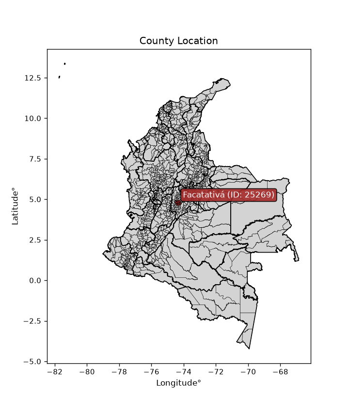
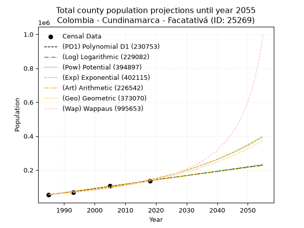
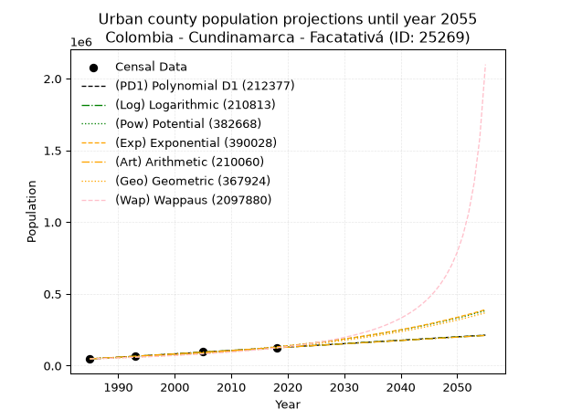
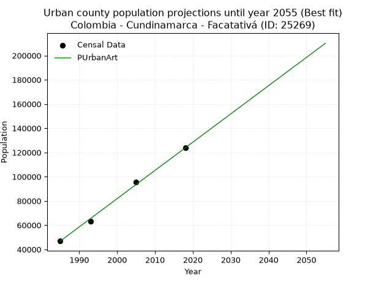
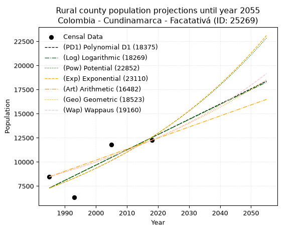
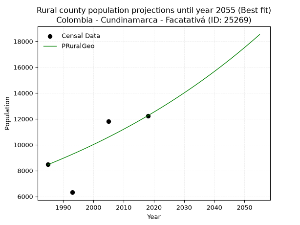

<div align="center">


</div>

# _“Population and Public Services Demand Projections (PPSD) until Year 2050 for Colombia - Cundinamarca - Facatativá (ID: 25269)”_
Keywords: `population` `public-service` `projection` `lineal` `polynomial` `logarithmic` `potential` `exponential` `arithmetic` `geometric` `wappaus` `dane` `colombia` `south-america`

PPSD are analytical estimates used by governments and planners to anticipate future changes in population size, age distribution, and the resulting community needs for utilities, healthcare, education, and infrastructure as sizing future water treatment facilities, electrical grids, and road networks based on spatial growth.

<div align="center">

</img>

</div>


> **General running parameters**: • app_version: _v20260806_. • Python version: _3.14.7_. • Pandas version: _3.0.5_. • NumPy version: _2.5.1_. • Creates, save and include plots into reports (create_plot): _False_. • Projection until year: _2050_. • Process polynomial degree 2 and up: _False_. • Process Wappaus: _True_. • Process Wappaus: _True_. • Set negative values to zero: _True_. • Set infinite values to zero: _True_. • Drop dataset notes: _True_. 
<div align="center">

Dynamic map: [:earth_americas:Google](http://maps.google.com/maps?q=4.813352665,-74.350085) [:earth_americas:OSM](https://www.openstreetmap.org/#map=18/4.813352665/-74.350085&layers=P) [:earth_americas:Bing](https://www.bing.com/maps?cp=4.813352665~-74.350085&lvl=18) [:earth_americas:Apple](https://maps.apple.com/frame?center=4.813352665%2C-74.350085&span=0.003%2C0.006)

</div>


<div align="center">

```geojson
{
  "type": "Feature",
  "geometry": {
    "type": "Point", 
    "coordinates": [-74.350085, 4.813352665]
  }, 
  "properties": {
    "Name": "Colombia - Cundinamarca - Facatativá (ID: 25269)"
  }
}
```

</div>


## 0. Census Data (4 records)

Census data are official statistics collected by a government about the people and housing in a country. They usually include counts of total population, age, sex, race, income, education, and jobs.

📅Global census file: [Population.xlsx](../data/Population.xlsx)

| Source   |   Year |   CountryID | CountryName   |   StateID | StateName    |   CountyID | CountyName   |   PTotal |   PUrban |   PRural |
|:---------|-------:|------------:|:--------------|----------:|:-------------|-----------:|:-------------|---------:|---------:|---------:|
| DANE     |   1985 |          57 | Colombia      |        25 | Cundinamarca |      25269 | Facatativá   |    55324 |    46860 |     8464 |
| DANE     |   1993 |          57 | Colombia      |        25 | Cundinamarca |      25269 | Facatativá   |    69552 |    63237 |     6315 |
| DANE     |   2005 |          57 | Colombia      |        25 | Cundinamarca |      25269 | Facatativá   |   107452 |    95640 |    11812 |
| DANE     |   2018 |          57 | Colombia      |        25 | Cundinamarca |      25269 | Facatativá   |   136041 |   123797 |    12244 |

> 🔥Some records could had specific notes about the registered values or the corresponding urban or rural distribution.

📅[SUI-RUPS](https://www.datos.gov.co/Hacienda-y-Cr-dito-P-blico/Registro-nico-de-Prestadores-de-Servicios-P-blicos/4qkq-csdn/about_data) - Local public utility companies: [RUPS.csv](../data/RUPS.xlsx)

 | SERVICIO       | ESTADO    | NOMBRE                                                                                                            | NIT         | DEPARTAMENTO_DOMICILIO   | MUNICIPIO_DOMICILIO   | DIRECCION                                                       |   TELEFONO | EMAIL                                 | TIPO_PRESTADOR                                     | CLASIFICACION                 |
|:---------------|:----------|:------------------------------------------------------------------------------------------------------------------|:------------|:-------------------------|:----------------------|:----------------------------------------------------------------|-----------:|:--------------------------------------|:---------------------------------------------------|:------------------------------|
| ACUEDUCTO      | OPERATIVA | EMPRESA AGUAS DE FACATATIVA ACUEDUCTO ALCANTARILLADO ASEO Y SERVICIOS COMPLEMENTARIOS  E.A.F. S.A.S. E.S.P.       | 800188660-0 | CUNDINAMARCA             | FACATATIVA            | Carrera 1 Sur Calle 16                                          |    8425999 | gerencia@acueductofacatativa.com      | SOCIEDADES (EMPRESA DE SERVICIOS PUBLICOS)         | MAYOR O IGUAL A 5001 USUARIOS |
| ALCANTARILLADO | OPERATIVA | EMPRESA AGUAS DE FACATATIVA ACUEDUCTO ALCANTARILLADO ASEO Y SERVICIOS COMPLEMENTARIOS  E.A.F. S.A.S. E.S.P.       | 800188660-0 | CUNDINAMARCA             | FACATATIVA            | Carrera 1 Sur Calle 16                                          |    8425999 | gerencia@acueductofacatativa.com      | SOCIEDADES (EMPRESA DE SERVICIOS PUBLICOS)         | MAYOR O IGUAL A 5001 USUARIOS |
| ACUEDUCTO      | OPERATIVA | ASOCIACION DE SOCIOS SUSCRIPTORES DEL SERVICIO DE ACUEDUCTO ALCANTARILLADO Y ASEO DEL BARRIO CARTAGENA FACATATIVA | 832001989-1 | CUNDINAMARCA             | FACATATIVA            | Calle 3 Sur No.2-78 Barrio Cartagena                            |    8430911 | aaacartagena@tripleafacatativa.com.co | ORGANIZACION AUTORIZADA                            | MENOR O IGUAL A 2500 USUARIOS |
| ALCANTARILLADO | OPERATIVA | ASOCIACION DE SOCIOS SUSCRIPTORES DEL SERVICIO DE ACUEDUCTO ALCANTARILLADO Y ASEO DEL BARRIO CARTAGENA FACATATIVA | 832001989-1 | CUNDINAMARCA             | FACATATIVA            | Calle 3 Sur No.2-78 Barrio Cartagena                            |    8430911 | aaacartagena@tripleafacatativa.com.co | ORGANIZACION AUTORIZADA                            | MENOR O IGUAL A 2500 USUARIOS |
| ACUEDUCTO      | OPERATIVA | ASOCIACION DE USUARIOS DE ACUEDUCTO Y SANEAMIENTO BASICO VEREDA CUATRO ESQUINAS DE BERMEO                         | 832010162-6 | CUNDINAMARCA             | FACATATIVA            | FINCA SAN ERNESTO                                               |    2179976 | acueductoasobermeo@yahoo.es           | PRODUCTOR MARGINAL, INDEPENDIENTE O USO PARTICULAR | HASTA 2500 SUSCRIPTORES       |
| ACUEDUCTO      | OPERATIVA | IGLESIA CRISTIANA DE LOS TESTIGOS DE JEHOVA                                                                       | 832000957-1 | CUNDINAMARCA             | FACATATIVA            | AV. CUNDINAMARCA KM. 1 VIA ECOPETROL                            |    8911530 | mnt.co@bethel.jw.org                  | PRODUCTOR MARGINAL, INDEPENDIENTE O USO PARTICULAR | MENOR O IGUAL A 2500 USUARIOS |
| ACUEDUCTO      | OPERATIVA | ASOCIACION DE USUARIOS ACUEDUCTO Y ALCANTARILLADO VEREDA TIERRA MORADA FACATATIVA                                 | 901061388-1 | CUNDINAMARCA             | FACATATIVA            | km 25 autopista a Medellin vereda tierra morada finca el Jardin |    0000000 | mayoli-12@hotmail.com                 | ORGANIZACION AUTORIZADA                            | MENOR O IGUAL A 2500 USUARIOS |

## 1. Total

### 1.1. Coefficients and Parameters

* (PD1) Polynomial Deg 1: 2532.608189482116, -4973757.281011602 (lineal)
* (Log) Logarithmic: 5069342.586759892, -38440021.375123955
* (Pow) Potential: 56.148380266396444, -180.41253451466764
* (Exp) Exponential: 0.028044141931701207, 3.7640019809392696e-20
* (Art) Arithmetic: Year diff. 2018 - 1985 = 33, Population diff. 136041 - 55324 = 80717, Annual growth = 2445.969696969697
* (Geo) Geometric: Year diff. 2018 - 1985 = 33, Population diff. 136041 - 55324 = 80717, Annual growth % = 0.027640231444617358
* (Wap) Wappaus: i = 2.556339661870976, Condition values only valid for < 200)

<sub>
Wappaus condition values: ['0.00', '2.56', '5.11', '7.67', '10.23', '12.78', '15.34', '17.89', '20.45', '23.01', '25.56', '28.12', '30.68', '33.23', '35.79', '38.35', '40.90', '43.46', '46.01', '48.57', '51.13', '53.68', '56.24', '58.80', '61.35', '63.91', '66.46', '69.02', '71.58', '74.13', '76.69', '79.25', '81.80', '84.36', '86.92', '89.47', '92.03', '94.58', '97.14', '99.70', '102.25', '104.81', '107.37', '109.92', '112.48', '115.04', '117.59', '120.15', '122.70', '125.26', '127.82', '130.37', '132.93', '135.49', '138.04', '140.60', '143.16', '145.71', '148.27', '150.82', '153.38', '155.94', '158.49', '161.05', '163.61', '166.16']
</sub>


### 1.2. Projected Dataset

|   Year |   CountyID |   PTotalPD1 |   PTotalLog |   PTotalPow |   PTotalExp |   PTotalArt |   PTotalGeo |   PTotalWap |
|-------:|-----------:|------------:|------------:|------------:|------------:|------------:|------------:|------------:|
|   1985 |      25269 |       53470 |       53394 |       56413 |       56466 |       55324 |       55324 |       55324 |
|   1986 |      25269 |       56003 |       55947 |       58031 |       58072 |       57770 |       56853 |       56757 |
|   1987 |      25269 |       58535 |       58499 |       59694 |       59724 |       60216 |       58425 |       58227 |
|   1988 |      25269 |       61068 |       61049 |       61405 |       61423 |       62662 |       60039 |       59736 |
|   1989 |      25269 |       63600 |       63599 |       63163 |       63170 |       65108 |       61699 |       61286 |
|   1990 |      25269 |       66133 |       66147 |       64971 |       64966 |       67554 |       63404 |       62878 |
|   1991 |      25269 |       68666 |       68694 |       66830 |       66814 |       70000 |       65157 |       64514 |
|   1992 |      25269 |       71198 |       71239 |       68741 |       68714 |       72446 |       66958 |       66197 |
|   1993 |      25269 |       73731 |       73783 |       70706 |       70669 |       74892 |       68809 |       67927 |
|   1994 |      25269 |       76263 |       76326 |       72726 |       72678 |       77338 |       70710 |       69707 |
|   1995 |      25269 |       78796 |       78868 |       74802 |       74745 |       79784 |       72665 |       71539 |
|   1996 |      25269 |       81329 |       81408 |       76937 |       76871 |       82230 |       74673 |       73426 |
|   1997 |      25269 |       83861 |       83947 |       79131 |       79058 |       84676 |       76737 |       75370 |
|   1998 |      25269 |       86394 |       86485 |       81387 |       81306 |       87122 |       78858 |       77373 |
|   1999 |      25269 |       88926 |       89022 |       83706 |       83619 |       89568 |       81038 |       79439 |
|   2000 |      25269 |       91459 |       91557 |       86090 |       85997 |       92014 |       83278 |       81570 |
|   2001 |      25269 |       93992 |       94091 |       88541 |       88443 |       94460 |       85580 |       83770 |
|   2002 |      25269 |       96524 |       96624 |       91060 |       90958 |       96905 |       87945 |       86041 |
|   2003 |      25269 |       99057 |       99155 |       93649 |       93545 |       99351 |       90376 |       88388 |
|   2004 |      25269 |      101590 |      101686 |       96311 |       96205 |      101797 |       92874 |       90814 |
|   2005 |      25269 |      104122 |      104215 |       99047 |       98942 |      104243 |       95441 |       93323 |
|   2006 |      25269 |      106655 |      106742 |      101859 |      101756 |      106689 |       98079 |       95920 |
|   2007 |      25269 |      109187 |      109269 |      104749 |      104650 |      109135 |      100790 |       98610 |
|   2008 |      25269 |      111720 |      111794 |      107720 |      107626 |      111581 |      103576 |      101397 |
|   2009 |      25269 |      114253 |      114318 |      110774 |      110687 |      114027 |      106439 |      104286 |
|   2010 |      25269 |      116785 |      116841 |      113913 |      113835 |      116473 |      109381 |      107284 |
|   2011 |      25269 |      119318 |      119362 |      117139 |      117073 |      118919 |      112404 |      110397 |
|   2012 |      25269 |      121850 |      121882 |      120455 |      120402 |      121365 |      115511 |      113632 |
|   2013 |      25269 |      124383 |      124401 |      123863 |      123827 |      123811 |      118704 |      116995 |
|   2014 |      25269 |      126916 |      126919 |      127366 |      127349 |      126257 |      121985 |      120495 |
|   2015 |      25269 |      129448 |      129435 |      130966 |      130970 |      128703 |      125356 |      124139 |
|   2016 |      25269 |      131981 |      131951 |      134665 |      134695 |      131149 |      128821 |      127939 |
|   2017 |      25269 |      134513 |      134464 |      138468 |      138526 |      133595 |      132382 |      131902 |
|   2018 |      25269 |      137046 |      136977 |      142376 |      142466 |      136041 |      136041 |      136041 |
|   2019 |      25269 |      139579 |      139489 |      146392 |      146518 |      138487 |      139801 |      140367 |
|   2020 |      25269 |      142111 |      141999 |      150519 |      150685 |      140933 |      143665 |      144893 |
|   2021 |      25269 |      144644 |      144508 |      154760 |      154971 |      143379 |      147636 |      149633 |
|   2022 |      25269 |      147176 |      147015 |      159119 |      159378 |      145825 |      151717 |      154604 |
|   2023 |      25269 |      149709 |      149522 |      163599 |      163911 |      148271 |      155910 |      159821 |
|   2024 |      25269 |      152242 |      152027 |      168202 |      168573 |      150717 |      160220 |      165304 |
|   2025 |      25269 |      154774 |      154531 |      172932 |      173367 |      153163 |      164648 |      171074 |
|   2026 |      25269 |      157307 |      157034 |      177793 |      178298 |      155609 |      169199 |      177154 |
|   2027 |      25269 |      159840 |      159535 |      182788 |      183369 |      158055 |      173876 |      183570 |
|   2028 |      25269 |      162372 |      162036 |      187921 |      188584 |      160501 |      178682 |      190349 |
|   2029 |      25269 |      164905 |      164535 |      193195 |      193948 |      162947 |      183621 |      197525 |
|   2030 |      25269 |      167437 |      167033 |      198614 |      199464 |      165393 |      188696 |      205132 |
|   2031 |      25269 |      169970 |      169529 |      204183 |      205137 |      167839 |      193912 |      213212 |
|   2032 |      25269 |      172503 |      172025 |      209905 |      210971 |      170285 |      199272 |      221809 |
|   2033 |      25269 |      175035 |      174519 |      215785 |      216972 |      172731 |      204779 |      230974 |
|   2034 |      25269 |      177568 |      177012 |      221826 |      223142 |      175177 |      210440 |      240766 |
|   2035 |      25269 |      180100 |      179503 |      228033 |      229489 |      177622 |      216256 |      251252 |
|   2036 |      25269 |      182633 |      181994 |      234411 |      236016 |      180068 |      222234 |      262508 |
|   2037 |      25269 |      185166 |      184483 |      240964 |      242728 |      182514 |      228376 |      274622 |
|   2038 |      25269 |      187698 |      186971 |      247697 |      249632 |      184960 |      234688 |      287696 |
|   2039 |      25269 |      190231 |      189458 |      254614 |      256732 |      187406 |      241175 |      301849 |
|   2040 |      25269 |      192763 |      191943 |      261721 |      264033 |      189852 |      247841 |      317220 |
|   2041 |      25269 |      195296 |      194428 |      269023 |      271543 |      192298 |      254692 |      333973 |
|   2042 |      25269 |      197829 |      196911 |      276525 |      279266 |      194744 |      261732 |      352305 |
|   2043 |      25269 |      200361 |      199393 |      284232 |      287208 |      197190 |      268966 |      372447 |
|   2044 |      25269 |      202894 |      201874 |      292150 |      295377 |      199636 |      276400 |      394685 |
|   2045 |      25269 |      205426 |      204353 |      300284 |      303778 |      202082 |      284040 |      419360 |
|   2046 |      25269 |      207959 |      206831 |      308641 |      312417 |      204528 |      291891 |      446899 |
|   2047 |      25269 |      210492 |      209308 |      317226 |      321303 |      206974 |      299959 |      477830 |
|   2048 |      25269 |      213024 |      211784 |      326046 |      330441 |      209420 |      308250 |      512821 |
|   2049 |      25269 |      215557 |      214259 |      335106 |      339839 |      211866 |      316770 |      552728 |
|   2050 |      25269 |      218090 |      216732 |      344414 |      349505 |      214312 |      325525 |      598664 |
<div align="center">

</img>

</div>


### 1.3. Best fit with absolute and relative error (%)

Relative error puts that difference into context by dividing the absolute error by the true value, creating a unitless ratio or percentage that shows the scale of the mistake.

Absolute and relative error

|   Year | Source   |   CountryID | CountryName   |   StateID | StateName    |   CountyID_x | CountyName   |   PTotal |   PUrban |   PRural |   CountyID_y |   PTotalPD1 |   PTotalLog |   PTotalPow |   PTotalExp |   PTotalArt |   PTotalGeo |   PTotalWap |   PTotalPD1AbsError |   PTotalLogAbsError |   PTotalPowAbsError |   PTotalExpAbsError |   PTotalArtAbsError |   PTotalGeoAbsError |   PTotalWapAbsError |   PTotalPD1RelError |   PTotalLogRelError |   PTotalPowRelError |   PTotalExpRelError |   PTotalArtRelError |   PTotalGeoRelError |   PTotalWapRelError |
|-------:|:---------|------------:|:--------------|----------:|:-------------|-------------:|:-------------|---------:|---------:|---------:|-------------:|------------:|------------:|------------:|------------:|------------:|------------:|------------:|--------------------:|--------------------:|--------------------:|--------------------:|--------------------:|--------------------:|--------------------:|--------------------:|--------------------:|--------------------:|--------------------:|--------------------:|--------------------:|--------------------:|
|   1985 | DANE     |          57 | Colombia      |        25 | Cundinamarca |        25269 | Facatativá   |    55324 |    46860 |     8464 |        25269 |       53470 |       53394 |       56413 |       56466 |       55324 |       55324 |       55324 |                1854 |                1930 |                1089 |                1142 |                   0 |                   0 |                   0 |            3.35117  |            3.48854  |             1.9684  |             2.0642  |             0       |             0       |             0       |
|   1993 | DANE     |          57 | Colombia      |        25 | Cundinamarca |        25269 | Facatativá   |    69552 |    63237 |     6315 |        25269 |       73731 |       73783 |       70706 |       70669 |       74892 |       68809 |       67927 |                4179 |                4231 |                1154 |                1117 |                5340 |                 743 |                1625 |            6.00845  |            6.08322  |             1.65919 |             1.60599 |             7.67771 |             1.06827 |             2.33638 |
|   2005 | DANE     |          57 | Colombia      |        25 | Cundinamarca |        25269 | Facatativá   |   107452 |    95640 |    11812 |        25269 |      104122 |      104215 |       99047 |       98942 |      104243 |       95441 |       93323 |                3330 |                3237 |                8405 |                8510 |                3209 |               12011 |               14129 |            3.09906  |            3.01251  |             7.8221  |             7.91982 |             2.98645 |            11.178   |            13.1491  |
|   2018 | DANE     |          57 | Colombia      |        25 | Cundinamarca |        25269 | Facatativá   |   136041 |   123797 |    12244 |        25269 |      137046 |      136977 |      142376 |      142466 |      136041 |      136041 |      136041 |                1005 |                 936 |                6335 |                6425 |                   0 |                   0 |                   0 |            0.738748 |            0.688028 |             4.65668 |             4.72284 |             0       |             0       |             0       |

Relative error mean

| Method    |   RelError | Best   |
|:----------|-----------:|:-------|
| PTotalPD1 |    3.29936 |        |
| PTotalLog |    3.31807 |        |
| PTotalPow |    4.02659 |        |
| PTotalExp |    4.07821 |        |
| PTotalArt |    2.66604 | True   |
| PTotalGeo |    3.06157 |        |
| PTotalWap |    3.87138 |        |

💙Best method: _**PTotalArt**_
<div align="center">

</img>

</div>


### 1.4. Fresh water supply demand in liters per capita per day (lpcd)

The fresh water supply demand typically ranges from 100 to 300 liters per capita per day (lpcd) for standard domestic and municipal planning, though absolute survival minimums set by the World Health Organization are as low as 7.5 to 20 liters per day, and total consumption in high-income nations can exceed 400 liters.

> `CZ`: Level in meters above the sea level (masl)<br> `WS`: Fresh water supply demand in liters per capita per day (lpcd or l/h/d)<br> `WSAll`: Zonal fresh water supply demand in liters per second (l/s)<br> `A`: Zonal area in square meters<br> `DP`: Population density (people/hectare or p/ha)

Reference values (RAS Colombia)

|    CZ |   WS |
|------:|-----:|
|  1000 |  120 |
|  2000 |  130 |
| 99999 |  140 |

County shapefile geometry properties and water supply values

|   CountyID |      ATotal |   CZTotal |   WSTotal |
|-----------:|------------:|----------:|----------:|
|      25269 | 1.57879e+08 |   2700.87 |       140 |

Projected values for best method: PTotalArt

|   CountyID |   Year |   PTotalArt |   DPTotal |   WSTotal |   WSTotalAll |
|-----------:|-------:|------------:|----------:|----------:|-------------:|
|      25269 |   1985 |       55324 |      3.5  |       140 |      89.6454 |
|      25269 |   1986 |       57770 |      3.66 |       140 |      93.6088 |
|      25269 |   1987 |       60216 |      3.81 |       140 |      97.5722 |
|      25269 |   1988 |       62662 |      3.97 |       140 |     101.536  |
|      25269 |   1989 |       65108 |      4.12 |       140 |     105.499  |
|      25269 |   1990 |       67554 |      4.28 |       140 |     109.463  |
|      25269 |   1991 |       70000 |      4.43 |       140 |     113.426  |
|      25269 |   1992 |       72446 |      4.59 |       140 |     117.389  |
|      25269 |   1993 |       74892 |      4.74 |       140 |     121.353  |
|      25269 |   1994 |       77338 |      4.9  |       140 |     125.316  |
|      25269 |   1995 |       79784 |      5.05 |       140 |     129.28   |
|      25269 |   1996 |       82230 |      5.21 |       140 |     133.243  |
|      25269 |   1997 |       84676 |      5.36 |       140 |     137.206  |
|      25269 |   1998 |       87122 |      5.52 |       140 |     141.17   |
|      25269 |   1999 |       89568 |      5.67 |       140 |     145.133  |
|      25269 |   2000 |       92014 |      5.83 |       140 |     149.097  |
|      25269 |   2001 |       94460 |      5.98 |       140 |     153.06   |
|      25269 |   2002 |       96905 |      6.14 |       140 |     157.022  |
|      25269 |   2003 |       99351 |      6.29 |       140 |     160.985  |
|      25269 |   2004 |      101797 |      6.45 |       140 |     164.949  |
|      25269 |   2005 |      104243 |      6.6  |       140 |     168.912  |
|      25269 |   2006 |      106689 |      6.76 |       140 |     172.876  |
|      25269 |   2007 |      109135 |      6.91 |       140 |     176.839  |
|      25269 |   2008 |      111581 |      7.07 |       140 |     180.803  |
|      25269 |   2009 |      114027 |      7.22 |       140 |     184.766  |
|      25269 |   2010 |      116473 |      7.38 |       140 |     188.729  |
|      25269 |   2011 |      118919 |      7.53 |       140 |     192.693  |
|      25269 |   2012 |      121365 |      7.69 |       140 |     196.656  |
|      25269 |   2013 |      123811 |      7.84 |       140 |     200.62   |
|      25269 |   2014 |      126257 |      8    |       140 |     204.583  |
|      25269 |   2015 |      128703 |      8.15 |       140 |     208.547  |
|      25269 |   2016 |      131149 |      8.31 |       140 |     212.51   |
|      25269 |   2017 |      133595 |      8.46 |       140 |     216.473  |
|      25269 |   2018 |      136041 |      8.62 |       140 |     220.437  |
|      25269 |   2019 |      138487 |      8.77 |       140 |     224.4    |
|      25269 |   2020 |      140933 |      8.93 |       140 |     228.364  |
|      25269 |   2021 |      143379 |      9.08 |       140 |     232.327  |
|      25269 |   2022 |      145825 |      9.24 |       140 |     236.291  |
|      25269 |   2023 |      148271 |      9.39 |       140 |     240.254  |
|      25269 |   2024 |      150717 |      9.55 |       140 |     244.217  |
|      25269 |   2025 |      153163 |      9.7  |       140 |     248.181  |
|      25269 |   2026 |      155609 |      9.86 |       140 |     252.144  |
|      25269 |   2027 |      158055 |     10.01 |       140 |     256.108  |
|      25269 |   2028 |      160501 |     10.17 |       140 |     260.071  |
|      25269 |   2029 |      162947 |     10.32 |       140 |     264.034  |
|      25269 |   2030 |      165393 |     10.48 |       140 |     267.998  |
|      25269 |   2031 |      167839 |     10.63 |       140 |     271.961  |
|      25269 |   2032 |      170285 |     10.79 |       140 |     275.925  |
|      25269 |   2033 |      172731 |     10.94 |       140 |     279.888  |
|      25269 |   2034 |      175177 |     11.1  |       140 |     283.852  |
|      25269 |   2035 |      177622 |     11.25 |       140 |     287.813  |
|      25269 |   2036 |      180068 |     11.41 |       140 |     291.777  |
|      25269 |   2037 |      182514 |     11.56 |       140 |     295.74   |
|      25269 |   2038 |      184960 |     11.72 |       140 |     299.704  |
|      25269 |   2039 |      187406 |     11.87 |       140 |     303.667  |
|      25269 |   2040 |      189852 |     12.03 |       140 |     307.631  |
|      25269 |   2041 |      192298 |     12.18 |       140 |     311.594  |
|      25269 |   2042 |      194744 |     12.34 |       140 |     315.557  |
|      25269 |   2043 |      197190 |     12.49 |       140 |     319.521  |
|      25269 |   2044 |      199636 |     12.64 |       140 |     323.484  |
|      25269 |   2045 |      202082 |     12.8  |       140 |     327.448  |
|      25269 |   2046 |      204528 |     12.95 |       140 |     331.411  |
|      25269 |   2047 |      206974 |     13.11 |       140 |     335.375  |
|      25269 |   2048 |      209420 |     13.26 |       140 |     339.338  |
|      25269 |   2049 |      211866 |     13.42 |       140 |     343.301  |
|      25269 |   2050 |      214312 |     13.57 |       140 |     347.265  |

## 2. Urban

### 2.1. Coefficients and Parameters

* (PD1) Polynomial Deg 1: 2374.3131272581095, -4666836.332798034 (lineal)
* (Log) Logarithmic: 4752575.84441522, -36041983.57815274
* (Pow) Potential: 59.35084019395949, -191.03534367199
* (Exp) Exponential: 0.029641937261195857, 1.3689982857578577e-21
* (Art) Arithmetic: Year diff. 2018 - 1985 = 33, Population diff. 123797 - 46860 = 76937, Annual growth = 2331.4242424242425
* (Geo) Geometric: Year diff. 2018 - 1985 = 33, Population diff. 123797 - 46860 = 76937, Annual growth % = 0.029876351873315166
* (Wap) Wappaus: i = 2.732292542848219, Condition values only valid for < 200)

<sub>
Wappaus condition values: ['0.00', '2.73', '5.46', '8.20', '10.93', '13.66', '16.39', '19.13', '21.86', '24.59', '27.32', '30.06', '32.79', '35.52', '38.25', '40.98', '43.72', '46.45', '49.18', '51.91', '54.65', '57.38', '60.11', '62.84', '65.58', '68.31', '71.04', '73.77', '76.50', '79.24', '81.97', '84.70', '87.43', '90.17', '92.90', '95.63', '98.36', '101.09', '103.83', '106.56', '109.29', '112.02', '114.76', '117.49', '120.22', '122.95', '125.69', '128.42', '131.15', '133.88', '136.61', '139.35', '142.08', '144.81', '147.54', '150.28', '153.01', '155.74', '158.47', '161.21', '163.94', '166.67', '169.40', '172.13', '174.87', '177.60']
</sub>


### 2.2. Projected Dataset

|   Year |   CountyID |   PUrbanPD1 |   PUrbanLog |   PUrbanPow |   PUrbanExp |   PUrbanArt |   PUrbanGeo |   PUrbanWap |
|-------:|-----------:|------------:|------------:|------------:|------------:|------------:|------------:|------------:|
|   1985 |      25269 |       46175 |       46103 |       48923 |       48974 |       46860 |       46860 |       46860 |
|   1986 |      25269 |       48550 |       48497 |       50408 |       50447 |       49191 |       48260 |       48158 |
|   1987 |      25269 |       50924 |       50889 |       51936 |       51965 |       51523 |       49702 |       49493 |
|   1988 |      25269 |       53298 |       53281 |       53511 |       53528 |       53854 |       51187 |       50865 |
|   1989 |      25269 |       55672 |       55671 |       55132 |       55139 |       56186 |       52716 |       52277 |
|   1990 |      25269 |       58047 |       58059 |       56801 |       56797 |       58517 |       54291 |       53731 |
|   1991 |      25269 |       60421 |       60447 |       58520 |       58506 |       60849 |       55913 |       55228 |
|   1992 |      25269 |       62795 |       62833 |       60291 |       60266 |       63180 |       57583 |       56770 |
|   1993 |      25269 |       65170 |       65219 |       62114 |       62080 |       65511 |       59304 |       58360 |
|   1994 |      25269 |       67544 |       67603 |       63991 |       63947 |       67843 |       61076 |       59999 |
|   1995 |      25269 |       69918 |       69986 |       65923 |       65871 |       70174 |       62900 |       61689 |
|   1996 |      25269 |       72293 |       72367 |       67914 |       67853 |       72506 |       64780 |       63435 |
|   1997 |      25269 |       74667 |       74748 |       69963 |       69894 |       74837 |       66715 |       65237 |
|   1998 |      25269 |       77041 |       77127 |       72073 |       71997 |       77169 |       68708 |       67099 |
|   1999 |      25269 |       79416 |       79505 |       74245 |       74163 |       79500 |       70761 |       69024 |
|   2000 |      25269 |       81790 |       81882 |       76482 |       76395 |       81831 |       72875 |       71015 |
|   2001 |      25269 |       84164 |       84258 |       78785 |       78693 |       84163 |       75052 |       73076 |
|   2002 |      25269 |       86539 |       86632 |       81156 |       81060 |       86494 |       77295 |       75210 |
|   2003 |      25269 |       88913 |       89005 |       83598 |       83499 |       88826 |       79604 |       77422 |
|   2004 |      25269 |       91287 |       91378 |       86111 |       86011 |       91157 |       81982 |       79715 |
|   2005 |      25269 |       93661 |       93748 |       88699 |       88599 |       93488 |       84431 |       82094 |
|   2006 |      25269 |       96036 |       96118 |       91363 |       91265 |       95820 |       86954 |       84564 |
|   2007 |      25269 |       98410 |       98487 |       94106 |       94010 |       98151 |       89552 |       87131 |
|   2008 |      25269 |      100784 |      100854 |       96930 |       96839 |      100483 |       92227 |       89801 |
|   2009 |      25269 |      103159 |      103220 |       99837 |       99752 |      102814 |       94983 |       92578 |
|   2010 |      25269 |      105533 |      105586 |      102829 |      102753 |      105146 |       97820 |       95471 |
|   2011 |      25269 |      107907 |      107949 |      105910 |      105845 |      107477 |      100743 |       98487 |
|   2012 |      25269 |      110282 |      110312 |      109082 |      109029 |      109808 |      103753 |      101633 |
|   2013 |      25269 |      112656 |      112674 |      112347 |      112309 |      112140 |      106853 |      104918 |
|   2014 |      25269 |      115030 |      115034 |      115708 |      115688 |      114471 |      110045 |      108352 |
|   2015 |      25269 |      117405 |      117393 |      119167 |      119169 |      116803 |      113333 |      111945 |
|   2016 |      25269 |      119779 |      119751 |      122729 |      122754 |      119134 |      116719 |      115709 |
|   2017 |      25269 |      122153 |      122108 |      126394 |      126447 |      121466 |      120206 |      119655 |
|   2018 |      25269 |      124528 |      124464 |      130168 |      130251 |      123797 |      123797 |      123797 |
|   2019 |      25269 |      126902 |      126818 |      134052 |      134170 |      126128 |      127496 |      128151 |
|   2020 |      25269 |      129276 |      129172 |      138050 |      138207 |      128460 |      131305 |      132732 |
|   2021 |      25269 |      131650 |      131524 |      142166 |      142365 |      130791 |      135228 |      137560 |
|   2022 |      25269 |      134025 |      133875 |      146401 |      146648 |      133123 |      139268 |      142655 |
|   2023 |      25269 |      136399 |      136225 |      150761 |      151060 |      135454 |      143429 |      148039 |
|   2024 |      25269 |      138773 |      138573 |      155249 |      155605 |      137786 |      147714 |      153738 |
|   2025 |      25269 |      141148 |      140921 |      159867 |      160286 |      140117 |      152127 |      159780 |
|   2026 |      25269 |      143522 |      143267 |      164621 |      165108 |      142448 |      156672 |      166198 |
|   2027 |      25269 |      145896 |      145612 |      169514 |      170076 |      144780 |      161353 |      173027 |
|   2028 |      25269 |      148271 |      147956 |      174549 |      175193 |      147111 |      166173 |      180309 |
|   2029 |      25269 |      150645 |      150299 |      179732 |      180463 |      149443 |      171138 |      188089 |
|   2030 |      25269 |      153019 |      152641 |      185065 |      185893 |      151774 |      176251 |      196421 |
|   2031 |      25269 |      155394 |      154982 |      190555 |      191485 |      154106 |      181517 |      205365 |
|   2032 |      25269 |      157768 |      157321 |      196204 |      197246 |      156437 |      186940 |      214993 |
|   2033 |      25269 |      160142 |      159659 |      202018 |      203181 |      158768 |      192525 |      225384 |
|   2034 |      25269 |      162517 |      161997 |      208001 |      209293 |      161100 |      198277 |      236635 |
|   2035 |      25269 |      164891 |      164333 |      214158 |      215590 |      163431 |      204200 |      248855 |
|   2036 |      25269 |      167265 |      166667 |      220494 |      222076 |      165763 |      210301 |      262176 |
|   2037 |      25269 |      169640 |      169001 |      227015 |      228758 |      168094 |      216584 |      276754 |
|   2038 |      25269 |      172014 |      171334 |      233725 |      235640 |      170425 |      223055 |      292776 |
|   2039 |      25269 |      174388 |      173665 |      240630 |      242729 |      172757 |      229719 |      310467 |
|   2040 |      25269 |      176762 |      175995 |      247735 |      250032 |      175088 |      236582 |      330102 |
|   2041 |      25269 |      179137 |      178324 |      255047 |      257554 |      177420 |      243650 |      352020 |
|   2042 |      25269 |      181511 |      180652 |      262570 |      265303 |      179751 |      250930 |      376644 |
|   2043 |      25269 |      183885 |      182979 |      270312 |      273285 |      182083 |      258427 |      404509 |
|   2044 |      25269 |      186260 |      185305 |      278278 |      281507 |      184414 |      266147 |      436298 |
|   2045 |      25269 |      188634 |      187630 |      286475 |      289976 |      186745 |      274099 |      472905 |
|   2046 |      25269 |      191008 |      189953 |      294908 |      298700 |      189077 |      282288 |      515514 |
|   2047 |      25269 |      193383 |      192275 |      303586 |      307687 |      191408 |      290722 |      565732 |
|   2048 |      25269 |      195757 |      194596 |      312515 |      316944 |      193740 |      299408 |      625798 |
|   2049 |      25269 |      198131 |      196916 |      321702 |      326479 |      196071 |      308353 |      698924 |
|   2050 |      25269 |      200506 |      199235 |      331154 |      336302 |      198403 |      317565 |      789889 |
<div align="center">

</img>

</div>


### 2.3. Best fit with absolute and relative error (%)

Relative error puts that difference into context by dividing the absolute error by the true value, creating a unitless ratio or percentage that shows the scale of the mistake.

Absolute and relative error

|   Year | Source   |   CountryID | CountryName   |   StateID | StateName    |   CountyID_x | CountyName   |   PTotal |   PUrban |   PRural |   CountyID_y |   PUrbanPD1 |   PUrbanLog |   PUrbanPow |   PUrbanExp |   PUrbanArt |   PUrbanGeo |   PUrbanWap |   PUrbanPD1AbsError |   PUrbanLogAbsError |   PUrbanPowAbsError |   PUrbanExpAbsError |   PUrbanArtAbsError |   PUrbanGeoAbsError |   PUrbanWapAbsError |   PUrbanPD1RelError |   PUrbanLogRelError |   PUrbanPowRelError |   PUrbanExpRelError |   PUrbanArtRelError |   PUrbanGeoRelError |   PUrbanWapRelError |
|-------:|:---------|------------:|:--------------|----------:|:-------------|-------------:|:-------------|---------:|---------:|---------:|-------------:|------------:|------------:|------------:|------------:|------------:|------------:|------------:|--------------------:|--------------------:|--------------------:|--------------------:|--------------------:|--------------------:|--------------------:|--------------------:|--------------------:|--------------------:|--------------------:|--------------------:|--------------------:|--------------------:|
|   1985 | DANE     |          57 | Colombia      |        25 | Cundinamarca |        25269 | Facatativá   |    55324 |    46860 |     8464 |        25269 |       46175 |       46103 |       48923 |       48974 |       46860 |       46860 |       46860 |                 685 |                 757 |                2063 |                2114 |                   0 |                   0 |                   0 |            1.4618   |            1.61545  |             4.40248 |             4.51131 |              0      |             0       |             0       |
|   1993 | DANE     |          57 | Colombia      |        25 | Cundinamarca |        25269 | Facatativá   |    69552 |    63237 |     6315 |        25269 |       65170 |       65219 |       62114 |       62080 |       65511 |       59304 |       58360 |                1933 |                1982 |                1123 |                1157 |                2274 |                3933 |                4877 |            3.05675  |            3.13424  |             1.77586 |             1.82963 |              3.596  |             6.21946 |             7.71226 |
|   2005 | DANE     |          57 | Colombia      |        25 | Cundinamarca |        25269 | Facatativá   |   107452 |    95640 |    11812 |        25269 |       93661 |       93748 |       88699 |       88599 |       93488 |       84431 |       82094 |                1979 |                1892 |                6941 |                7041 |                2152 |               11209 |               13546 |            2.06922  |            1.97825  |             7.25742 |             7.36198 |              2.2501 |            11.72    |            14.1635  |
|   2018 | DANE     |          57 | Colombia      |        25 | Cundinamarca |        25269 | Facatativá   |   136041 |   123797 |    12244 |        25269 |      124528 |      124464 |      130168 |      130251 |      123797 |      123797 |      123797 |                 731 |                 667 |                6371 |                6454 |                   0 |                   0 |                   0 |            0.590483 |            0.538785 |             5.14633 |             5.21337 |              0      |             0       |             0       |

Relative error mean

| Method    |   RelError | Best   |
|:----------|-----------:|:-------|
| PUrbanPD1 |    1.79456 |        |
| PUrbanLog |    1.81668 |        |
| PUrbanPow |    4.64552 |        |
| PUrbanExp |    4.72907 |        |
| PUrbanArt |    1.46153 | True   |
| PUrbanGeo |    4.48486 |        |
| PUrbanWap |    5.46895 |        |

💙Best method: _**PUrbanArt**_
<div align="center">

</img>

</div>


### 2.4. Fresh water supply demand in liters per capita per day (lpcd)

The fresh water supply demand typically ranges from 100 to 300 liters per capita per day (lpcd) for standard domestic and municipal planning, though absolute survival minimums set by the World Health Organization are as low as 7.5 to 20 liters per day, and total consumption in high-income nations can exceed 400 liters.

> `CZ`: Level in meters above the sea level (masl)<br> `WS`: Fresh water supply demand in liters per capita per day (lpcd or l/h/d)<br> `WSAll`: Zonal fresh water supply demand in liters per second (l/s)<br> `A`: Zonal area in square meters<br> `DP`: Population density (people/hectare or p/ha)

Reference values (RAS Colombia)

|    CZ |   WS |
|------:|-----:|
|  1000 |  120 |
|  2000 |  130 |
| 99999 |  140 |

County shapefile geometry properties and water supply values

|   CountyID |      AUrban |   CZUrban |   WSUrban |
|-----------:|------------:|----------:|----------:|
|      25269 | 7.87497e+06 |   2602.84 |       140 |

Projected values for best method: PUrbanArt

|   CountyID |   Year |   PUrbanArt |   DPUrban |   WSUrban |   WSUrbanAll |
|-----------:|-------:|------------:|----------:|----------:|-------------:|
|      25269 |   1985 |       46860 |     59.51 |       140 |      75.9306 |
|      25269 |   1986 |       49191 |     62.47 |       140 |      79.7076 |
|      25269 |   1987 |       51523 |     65.43 |       140 |      83.4863 |
|      25269 |   1988 |       53854 |     68.39 |       140 |      87.2634 |
|      25269 |   1989 |       56186 |     71.35 |       140 |      91.0421 |
|      25269 |   1990 |       58517 |     74.31 |       140 |      94.8192 |
|      25269 |   1991 |       60849 |     77.27 |       140 |      98.5979 |
|      25269 |   1992 |       63180 |     80.23 |       140 |     102.375  |
|      25269 |   1993 |       65511 |     83.19 |       140 |     106.152  |
|      25269 |   1994 |       67843 |     86.15 |       140 |     109.931  |
|      25269 |   1995 |       70174 |     89.11 |       140 |     113.708  |
|      25269 |   1996 |       72506 |     92.07 |       140 |     117.487  |
|      25269 |   1997 |       74837 |     95.03 |       140 |     121.264  |
|      25269 |   1998 |       77169 |     97.99 |       140 |     125.042  |
|      25269 |   1999 |       79500 |    100.95 |       140 |     128.819  |
|      25269 |   2000 |       81831 |    103.91 |       140 |     132.597  |
|      25269 |   2001 |       84163 |    106.87 |       140 |     136.375  |
|      25269 |   2002 |       86494 |    109.83 |       140 |     140.152  |
|      25269 |   2003 |       88826 |    112.8  |       140 |     143.931  |
|      25269 |   2004 |       91157 |    115.76 |       140 |     147.708  |
|      25269 |   2005 |       93488 |    118.72 |       140 |     151.485  |
|      25269 |   2006 |       95820 |    121.68 |       140 |     155.264  |
|      25269 |   2007 |       98151 |    124.64 |       140 |     159.041  |
|      25269 |   2008 |      100483 |    127.6  |       140 |     162.82   |
|      25269 |   2009 |      102814 |    130.56 |       140 |     166.597  |
|      25269 |   2010 |      105146 |    133.52 |       140 |     170.375  |
|      25269 |   2011 |      107477 |    136.48 |       140 |     174.153  |
|      25269 |   2012 |      109808 |    139.44 |       140 |     177.93   |
|      25269 |   2013 |      112140 |    142.4  |       140 |     181.708  |
|      25269 |   2014 |      114471 |    145.36 |       140 |     185.485  |
|      25269 |   2015 |      116803 |    148.32 |       140 |     189.264  |
|      25269 |   2016 |      119134 |    151.28 |       140 |     193.041  |
|      25269 |   2017 |      121466 |    154.24 |       140 |     196.82   |
|      25269 |   2018 |      123797 |    157.2  |       140 |     200.597  |
|      25269 |   2019 |      126128 |    160.16 |       140 |     204.374  |
|      25269 |   2020 |      128460 |    163.12 |       140 |     208.153  |
|      25269 |   2021 |      130791 |    166.08 |       140 |     211.93   |
|      25269 |   2022 |      133123 |    169.05 |       140 |     215.709  |
|      25269 |   2023 |      135454 |    172.01 |       140 |     219.486  |
|      25269 |   2024 |      137786 |    174.97 |       140 |     223.264  |
|      25269 |   2025 |      140117 |    177.93 |       140 |     227.041  |
|      25269 |   2026 |      142448 |    180.89 |       140 |     230.819  |
|      25269 |   2027 |      144780 |    183.85 |       140 |     234.597  |
|      25269 |   2028 |      147111 |    186.81 |       140 |     238.374  |
|      25269 |   2029 |      149443 |    189.77 |       140 |     242.153  |
|      25269 |   2030 |      151774 |    192.73 |       140 |     245.93   |
|      25269 |   2031 |      154106 |    195.69 |       140 |     249.709  |
|      25269 |   2032 |      156437 |    198.65 |       140 |     253.486  |
|      25269 |   2033 |      158768 |    201.61 |       140 |     257.263  |
|      25269 |   2034 |      161100 |    204.57 |       140 |     261.042  |
|      25269 |   2035 |      163431 |    207.53 |       140 |     264.819  |
|      25269 |   2036 |      165763 |    210.49 |       140 |     268.597  |
|      25269 |   2037 |      168094 |    213.45 |       140 |     272.375  |
|      25269 |   2038 |      170425 |    216.41 |       140 |     276.152  |
|      25269 |   2039 |      172757 |    219.37 |       140 |     279.93   |
|      25269 |   2040 |      175088 |    222.33 |       140 |     283.707  |
|      25269 |   2041 |      177420 |    225.3  |       140 |     287.486  |
|      25269 |   2042 |      179751 |    228.26 |       140 |     291.263  |
|      25269 |   2043 |      182083 |    231.22 |       140 |     295.042  |
|      25269 |   2044 |      184414 |    234.18 |       140 |     298.819  |
|      25269 |   2045 |      186745 |    237.14 |       140 |     302.596  |
|      25269 |   2046 |      189077 |    240.1  |       140 |     306.375  |
|      25269 |   2047 |      191408 |    243.06 |       140 |     310.152  |
|      25269 |   2048 |      193740 |    246.02 |       140 |     313.931  |
|      25269 |   2049 |      196071 |    248.98 |       140 |     317.708  |
|      25269 |   2050 |      198403 |    251.94 |       140 |     321.486  |

## 3. Rural

### 3.1. Coefficients and Parameters

* (PD1) Polynomial Deg 1: 158.2950622240058, -306920.9482135676 (lineal)
* (Log) Logarithmic: 316766.7423446681, -2398037.7969711865
* (Pow) Potential: 32.96530682059528, -104.84892886797037
* (Exp) Exponential: 0.016475600766885805, 4.5680950134257614e-11
* (Art) Arithmetic: Year diff. 2018 - 1985 = 33, Population diff. 12244 - 8464 = 3780, Annual growth = 114.54545454545455
* (Geo) Geometric: Year diff. 2018 - 1985 = 33, Population diff. 12244 - 8464 = 3780, Annual growth % = 0.011251130641828588
* (Wap) Wappaus: i = 1.1062918151965864, Condition values only valid for < 200)

<sub>
Wappaus condition values: ['0.00', '1.11', '2.21', '3.32', '4.43', '5.53', '6.64', '7.74', '8.85', '9.96', '11.06', '12.17', '13.28', '14.38', '15.49', '16.59', '17.70', '18.81', '19.91', '21.02', '22.13', '23.23', '24.34', '25.44', '26.55', '27.66', '28.76', '29.87', '30.98', '32.08', '33.19', '34.30', '35.40', '36.51', '37.61', '38.72', '39.83', '40.93', '42.04', '43.15', '44.25', '45.36', '46.46', '47.57', '48.68', '49.78', '50.89', '52.00', '53.10', '54.21', '55.31', '56.42', '57.53', '58.63', '59.74', '60.85', '61.95', '63.06', '64.16', '65.27', '66.38', '67.48', '68.59', '69.70', '70.80', '71.91']
</sub>


### 3.2. Projected Dataset

|   Year |   CountyID |   PRuralPD1 |   PRuralLog |   PRuralPow |   PRuralExp |   PRuralArt |   PRuralGeo |   PRuralWap |
|-------:|-----------:|------------:|------------:|------------:|------------:|------------:|------------:|------------:|
|   1985 |      25269 |        7295 |        7291 |        7291 |        7293 |        8464 |        8464 |        8464 |
|   1986 |      25269 |        7453 |        7450 |        7413 |        7415 |        8579 |        8559 |        8558 |
|   1987 |      25269 |        7611 |        7610 |        7537 |        7538 |        8693 |        8656 |        8653 |
|   1988 |      25269 |        7770 |        7769 |        7663 |        7663 |        8808 |        8753 |        8750 |
|   1989 |      25269 |        7928 |        7928 |        7791 |        7790 |        8922 |        8851 |        8847 |
|   1990 |      25269 |        8086 |        8088 |        7921 |        7920 |        9037 |        8951 |        8945 |
|   1991 |      25269 |        8245 |        8247 |        8053 |        8051 |        9151 |        9052 |        9045 |
|   1992 |      25269 |        8403 |        8406 |        8188 |        8185 |        9266 |        9154 |        9146 |
|   1993 |      25269 |        8561 |        8565 |        8324 |        8321 |        9380 |        9257 |        9248 |
|   1994 |      25269 |        8719 |        8724 |        8463 |        8459 |        9495 |        9361 |        9351 |
|   1995 |      25269 |        8878 |        8882 |        8604 |        8600 |        9609 |        9466 |        9455 |
|   1996 |      25269 |        9036 |        9041 |        8747 |        8743 |        9724 |        9572 |        9561 |
|   1997 |      25269 |        9194 |        9200 |        8893 |        8888 |        9839 |        9680 |        9668 |
|   1998 |      25269 |        9353 |        9358 |        9041 |        9035 |        9953 |        9789 |        9776 |
|   1999 |      25269 |        9511 |        9517 |        9191 |        9186 |       10068 |        9899 |        9885 |
|   2000 |      25269 |        9669 |        9675 |        9344 |        9338 |       10182 |       10011 |        9996 |
|   2001 |      25269 |        9827 |        9834 |        9499 |        9493 |       10297 |       10123 |       10108 |
|   2002 |      25269 |        9986 |        9992 |        9657 |        9651 |       10411 |       10237 |       10221 |
|   2003 |      25269 |       10144 |       10150 |        9817 |        9811 |       10526 |       10352 |       10336 |
|   2004 |      25269 |       10302 |       10308 |        9980 |        9974 |       10640 |       10469 |       10452 |
|   2005 |      25269 |       10461 |       10466 |       10146 |       10140 |       10755 |       10587 |       10570 |
|   2006 |      25269 |       10619 |       10624 |       10314 |       10308 |       10869 |       10706 |       10689 |
|   2007 |      25269 |       10777 |       10782 |       10485 |       10480 |       10984 |       10826 |       10809 |
|   2008 |      25269 |       10936 |       10940 |       10658 |       10654 |       11099 |       10948 |       10932 |
|   2009 |      25269 |       11094 |       11098 |       10835 |       10831 |       11213 |       11071 |       11055 |
|   2010 |      25269 |       11252 |       11255 |       11014 |       11011 |       11328 |       11196 |       11181 |
|   2011 |      25269 |       11410 |       11413 |       11196 |       11194 |       11442 |       11322 |       11307 |
|   2012 |      25269 |       11569 |       11570 |       11381 |       11380 |       11557 |       11449 |       11436 |
|   2013 |      25269 |       11727 |       11728 |       11569 |       11569 |       11671 |       11578 |       11566 |
|   2014 |      25269 |       11885 |       11885 |       11760 |       11761 |       11786 |       11708 |       11698 |
|   2015 |      25269 |       12044 |       12042 |       11954 |       11956 |       11900 |       11840 |       11832 |
|   2016 |      25269 |       12202 |       12199 |       12151 |       12155 |       12015 |       11973 |       11967 |
|   2017 |      25269 |       12360 |       12356 |       12351 |       12357 |       12129 |       12108 |       12105 |
|   2018 |      25269 |       12518 |       12513 |       12555 |       12562 |       12244 |       12244 |       12244 |
|   2019 |      25269 |       12677 |       12670 |       12762 |       12771 |       12359 |       12382 |       12385 |
|   2020 |      25269 |       12835 |       12827 |       12972 |       12983 |       12473 |       12521 |       12528 |
|   2021 |      25269 |       12993 |       12984 |       13185 |       13198 |       12588 |       12662 |       12673 |
|   2022 |      25269 |       13152 |       13141 |       13402 |       13418 |       12702 |       12804 |       12820 |
|   2023 |      25269 |       13310 |       13297 |       13622 |       13641 |       12817 |       12948 |       12969 |
|   2024 |      25269 |       13468 |       13454 |       13846 |       13867 |       12931 |       13094 |       13120 |
|   2025 |      25269 |       13627 |       13610 |       14073 |       14097 |       13046 |       13241 |       13274 |
|   2026 |      25269 |       13785 |       13767 |       14304 |       14332 |       13160 |       13390 |       13429 |
|   2027 |      25269 |       13943 |       13923 |       14538 |       14570 |       13275 |       13541 |       13587 |
|   2028 |      25269 |       14101 |       14079 |       14777 |       14812 |       13389 |       13693 |       13747 |
|   2029 |      25269 |       14260 |       14235 |       15019 |       15058 |       13504 |       13848 |       13909 |
|   2030 |      25269 |       14418 |       14392 |       15265 |       15308 |       13619 |       14003 |       14074 |
|   2031 |      25269 |       14576 |       14548 |       15515 |       15562 |       13733 |       14161 |       14241 |
|   2032 |      25269 |       14735 |       14703 |       15769 |       15821 |       13848 |       14320 |       14411 |
|   2033 |      25269 |       14893 |       14859 |       16026 |       16084 |       13962 |       14481 |       14583 |
|   2034 |      25269 |       15051 |       15015 |       16288 |       16351 |       14077 |       14644 |       14758 |
|   2035 |      25269 |       15210 |       15171 |       16554 |       16622 |       14191 |       14809 |       14936 |
|   2036 |      25269 |       15368 |       15326 |       16825 |       16899 |       14306 |       14976 |       15116 |
|   2037 |      25269 |       15526 |       15482 |       17099 |       17179 |       14420 |       15144 |       15299 |
|   2038 |      25269 |       15684 |       15637 |       17378 |       17465 |       14535 |       15315 |       15485 |
|   2039 |      25269 |       15843 |       15793 |       17661 |       17755 |       14649 |       15487 |       15674 |
|   2040 |      25269 |       16001 |       15948 |       17949 |       18050 |       14764 |       15661 |       15866 |
|   2041 |      25269 |       16159 |       16103 |       18242 |       18350 |       14879 |       15837 |       16061 |
|   2042 |      25269 |       16318 |       16259 |       18538 |       18654 |       14993 |       16015 |       16259 |
|   2043 |      25269 |       16476 |       16414 |       18840 |       18964 |       15108 |       16196 |       16460 |
|   2044 |      25269 |       16634 |       16569 |       19147 |       19279 |       15222 |       16378 |       16665 |
|   2045 |      25269 |       16792 |       16724 |       19458 |       19600 |       15337 |       16562 |       16873 |
|   2046 |      25269 |       16951 |       16878 |       19774 |       19925 |       15451 |       16748 |       17085 |
|   2047 |      25269 |       17109 |       17033 |       20095 |       20256 |       15566 |       16937 |       17300 |
|   2048 |      25269 |       17267 |       17188 |       20421 |       20593 |       15680 |       17127 |       17518 |
|   2049 |      25269 |       17426 |       17343 |       20752 |       20935 |       15795 |       17320 |       17741 |
|   2050 |      25269 |       17584 |       17497 |       21089 |       21283 |       15909 |       17515 |       17967 |
<div align="center">

</img>

</div>


### 3.3. Best fit with absolute and relative error (%)

Relative error puts that difference into context by dividing the absolute error by the true value, creating a unitless ratio or percentage that shows the scale of the mistake.

Absolute and relative error

|   Year | Source   |   CountryID | CountryName   |   StateID | StateName    |   CountyID_x | CountyName   |   PTotal |   PUrban |   PRural |   CountyID_y |   PRuralPD1 |   PRuralLog |   PRuralPow |   PRuralExp |   PRuralArt |   PRuralGeo |   PRuralWap |   PRuralPD1AbsError |   PRuralLogAbsError |   PRuralPowAbsError |   PRuralExpAbsError |   PRuralArtAbsError |   PRuralGeoAbsError |   PRuralWapAbsError |   PRuralPD1RelError |   PRuralLogRelError |   PRuralPowRelError |   PRuralExpRelError |   PRuralArtRelError |   PRuralGeoRelError |   PRuralWapRelError |
|-------:|:---------|------------:|:--------------|----------:|:-------------|-------------:|:-------------|---------:|---------:|---------:|-------------:|------------:|------------:|------------:|------------:|------------:|------------:|------------:|--------------------:|--------------------:|--------------------:|--------------------:|--------------------:|--------------------:|--------------------:|--------------------:|--------------------:|--------------------:|--------------------:|--------------------:|--------------------:|--------------------:|
|   1985 | DANE     |          57 | Colombia      |        25 | Cundinamarca |        25269 | Facatativá   |    55324 |    46860 |     8464 |        25269 |        7295 |        7291 |        7291 |        7293 |        8464 |        8464 |        8464 |                1169 |                1173 |                1173 |                1171 |                   0 |                   0 |                   0 |            13.8114  |            13.8587  |            13.8587  |            13.8351  |             0       |              0      |              0      |
|   1993 | DANE     |          57 | Colombia      |        25 | Cundinamarca |        25269 | Facatativá   |    69552 |    63237 |     6315 |        25269 |        8561 |        8565 |        8324 |        8321 |        9380 |        9257 |        9248 |                2246 |                2250 |                2009 |                2006 |                3065 |                2942 |                2933 |            35.5661  |            35.6295  |            31.8131  |            31.7656  |            48.5352  |             46.5875 |             46.445  |
|   2005 | DANE     |          57 | Colombia      |        25 | Cundinamarca |        25269 | Facatativá   |   107452 |    95640 |    11812 |        25269 |       10461 |       10466 |       10146 |       10140 |       10755 |       10587 |       10570 |                1351 |                1346 |                1666 |                1672 |                1057 |                1225 |                1242 |            11.4375  |            11.3952  |            14.1043  |            14.1551  |             8.94853 |             10.3708 |             10.5147 |
|   2018 | DANE     |          57 | Colombia      |        25 | Cundinamarca |        25269 | Facatativá   |   136041 |   123797 |    12244 |        25269 |       12518 |       12513 |       12555 |       12562 |       12244 |       12244 |       12244 |                 274 |                 269 |                 311 |                 318 |                   0 |                   0 |                   0 |             2.23783 |             2.19699 |             2.54002 |             2.59719 |             0       |              0      |              0      |

Relative error mean

| Method    |   RelError | Best   |
|:----------|-----------:|:-------|
| PRuralPD1 |    15.7632 |        |
| PRuralLog |    15.7701 |        |
| PRuralPow |    15.579  |        |
| PRuralExp |    15.5882 |        |
| PRuralArt |    14.3709 |        |
| PRuralGeo |    14.2396 | True   |
| PRuralWap |    14.2399 |        |

💙Best method: _**PRuralGeo**_
<div align="center">

</img>

</div>


### 3.4. Fresh water supply demand in liters per capita per day (lpcd)

The fresh water supply demand typically ranges from 100 to 300 liters per capita per day (lpcd) for standard domestic and municipal planning, though absolute survival minimums set by the World Health Organization are as low as 7.5 to 20 liters per day, and total consumption in high-income nations can exceed 400 liters.

> `CZ`: Level in meters above the sea level (masl)<br> `WS`: Fresh water supply demand in liters per capita per day (lpcd or l/h/d)<br> `WSAll`: Zonal fresh water supply demand in liters per second (l/s)<br> `A`: Zonal area in square meters<br> `DP`: Population density (people/hectare or p/ha)

Reference values (RAS Colombia)

|    CZ |   WS |
|------:|-----:|
|  1000 |  120 |
|  2000 |  130 |
| 99999 |  140 |

County shapefile geometry properties and water supply values

|   CountyID |      ARural |   CZRural |   WSRural |
|-----------:|------------:|----------:|----------:|
|      25269 | 1.50004e+08 |      2706 |       140 |

Projected values for best method: PRuralGeo

|   CountyID |   Year |   PRuralGeo |   DPRural |   WSRural |   WSRuralAll |
|-----------:|-------:|------------:|----------:|----------:|-------------:|
|      25269 |   1985 |        8464 |      0.56 |       140 |      13.7148 |
|      25269 |   1986 |        8559 |      0.57 |       140 |      13.8688 |
|      25269 |   1987 |        8656 |      0.58 |       140 |      14.0259 |
|      25269 |   1988 |        8753 |      0.58 |       140 |      14.1831 |
|      25269 |   1989 |        8851 |      0.59 |       140 |      14.3419 |
|      25269 |   1990 |        8951 |      0.6  |       140 |      14.5039 |
|      25269 |   1991 |        9052 |      0.6  |       140 |      14.6676 |
|      25269 |   1992 |        9154 |      0.61 |       140 |      14.8329 |
|      25269 |   1993 |        9257 |      0.62 |       140 |      14.9998 |
|      25269 |   1994 |        9361 |      0.62 |       140 |      15.1683 |
|      25269 |   1995 |        9466 |      0.63 |       140 |      15.3384 |
|      25269 |   1996 |        9572 |      0.64 |       140 |      15.5102 |
|      25269 |   1997 |        9680 |      0.65 |       140 |      15.6852 |
|      25269 |   1998 |        9789 |      0.65 |       140 |      15.8618 |
|      25269 |   1999 |        9899 |      0.66 |       140 |      16.04   |
|      25269 |   2000 |       10011 |      0.67 |       140 |      16.2215 |
|      25269 |   2001 |       10123 |      0.67 |       140 |      16.403  |
|      25269 |   2002 |       10237 |      0.68 |       140 |      16.5877 |
|      25269 |   2003 |       10352 |      0.69 |       140 |      16.7741 |
|      25269 |   2004 |       10469 |      0.7  |       140 |      16.9637 |
|      25269 |   2005 |       10587 |      0.71 |       140 |      17.1549 |
|      25269 |   2006 |       10706 |      0.71 |       140 |      17.3477 |
|      25269 |   2007 |       10826 |      0.72 |       140 |      17.5421 |
|      25269 |   2008 |       10948 |      0.73 |       140 |      17.7398 |
|      25269 |   2009 |       11071 |      0.74 |       140 |      17.9391 |
|      25269 |   2010 |       11196 |      0.75 |       140 |      18.1417 |
|      25269 |   2011 |       11322 |      0.75 |       140 |      18.3458 |
|      25269 |   2012 |       11449 |      0.76 |       140 |      18.5516 |
|      25269 |   2013 |       11578 |      0.77 |       140 |      18.7606 |
|      25269 |   2014 |       11708 |      0.78 |       140 |      18.9713 |
|      25269 |   2015 |       11840 |      0.79 |       140 |      19.1852 |
|      25269 |   2016 |       11973 |      0.8  |       140 |      19.4007 |
|      25269 |   2017 |       12108 |      0.81 |       140 |      19.6194 |
|      25269 |   2018 |       12244 |      0.82 |       140 |      19.8398 |
|      25269 |   2019 |       12382 |      0.83 |       140 |      20.0634 |
|      25269 |   2020 |       12521 |      0.83 |       140 |      20.2887 |
|      25269 |   2021 |       12662 |      0.84 |       140 |      20.5171 |
|      25269 |   2022 |       12804 |      0.85 |       140 |      20.7472 |
|      25269 |   2023 |       12948 |      0.86 |       140 |      20.9806 |
|      25269 |   2024 |       13094 |      0.87 |       140 |      21.2171 |
|      25269 |   2025 |       13241 |      0.88 |       140 |      21.4553 |
|      25269 |   2026 |       13390 |      0.89 |       140 |      21.6968 |
|      25269 |   2027 |       13541 |      0.9  |       140 |      21.9414 |
|      25269 |   2028 |       13693 |      0.91 |       140 |      22.1877 |
|      25269 |   2029 |       13848 |      0.92 |       140 |      22.4389 |
|      25269 |   2030 |       14003 |      0.93 |       140 |      22.69   |
|      25269 |   2031 |       14161 |      0.94 |       140 |      22.9461 |
|      25269 |   2032 |       14320 |      0.95 |       140 |      23.2037 |
|      25269 |   2033 |       14481 |      0.97 |       140 |      23.4646 |
|      25269 |   2034 |       14644 |      0.98 |       140 |      23.7287 |
|      25269 |   2035 |       14809 |      0.99 |       140 |      23.9961 |
|      25269 |   2036 |       14976 |      1    |       140 |      24.2667 |
|      25269 |   2037 |       15144 |      1.01 |       140 |      24.5389 |
|      25269 |   2038 |       15315 |      1.02 |       140 |      24.816  |
|      25269 |   2039 |       15487 |      1.03 |       140 |      25.0947 |
|      25269 |   2040 |       15661 |      1.04 |       140 |      25.3766 |
|      25269 |   2041 |       15837 |      1.06 |       140 |      25.6618 |
|      25269 |   2042 |       16015 |      1.07 |       140 |      25.9502 |
|      25269 |   2043 |       16196 |      1.08 |       140 |      26.2435 |
|      25269 |   2044 |       16378 |      1.09 |       140 |      26.5384 |
|      25269 |   2045 |       16562 |      1.1  |       140 |      26.8366 |
|      25269 |   2046 |       16748 |      1.12 |       140 |      27.138  |
|      25269 |   2047 |       16937 |      1.13 |       140 |      27.4442 |
|      25269 |   2048 |       17127 |      1.14 |       140 |      27.7521 |
|      25269 |   2049 |       17320 |      1.15 |       140 |      28.0648 |
|      25269 |   2050 |       17515 |      1.17 |       140 |      28.3808 |

#

<div align="center"><br><sub>Share this research</sub></div><br>

<sub>**APPS & TOOLS & CONTENT DISCLAIMER**: • NO WARRANTY - This content and software is provided by <a href="https://github.com/rcfdtools" target="_blank">github.com/rcfdtools</a> "as is", without any express or implied warranty, including warranties of merchantability, fitness for a particular purpose, or non-infringement. There is no guarantee that the software will be error-free or operate without interruption. • LIMITATION OF LIABILITY - Neither the authors nor copyright holders will be liable for claims or damages arising from the software or its use. You are responsible for determining if the software is appropriate for your use and assume all associated risks, including errors, legal compliance, and data loss. • NO PROFESSIONAL ADVICE - The software provides general information and does not offer professional advice. It should not replace consultation with professional advisors. [Clauses and global license for rcfdtools use.](https://github.com/rcfdtools/rcfdtools/blob/main/LICENSE.md)</sub>

| [:house: Home](Readme.md)  | [:beginner: Help / Collab](https://github.com/rcfdtools/R.HydroTools/discussions/31) |
|----------------------------|-------------------------------------------------------------------------------------------|