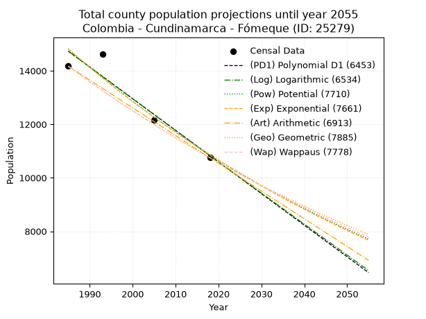
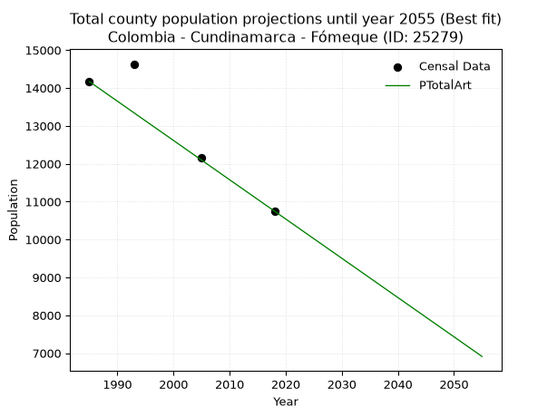
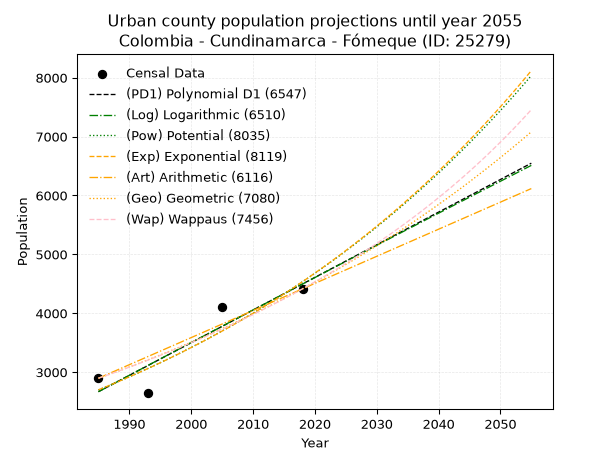
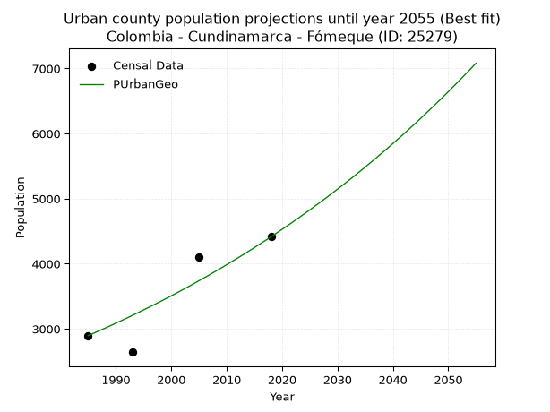
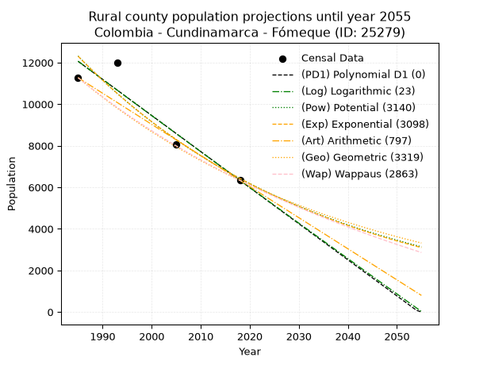
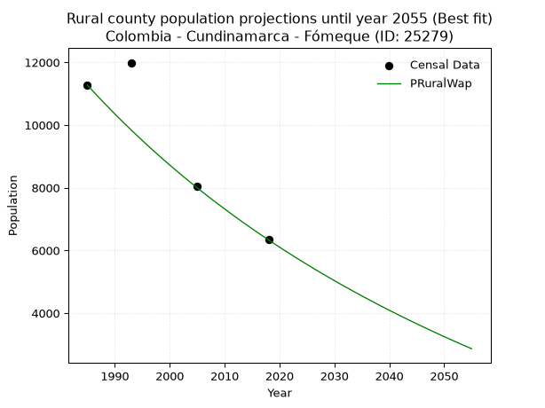

<div align="center">


</div>

# 📜 _“Population and Public Services Demand Projections (PPSD) until Year 2050 for Colombia - Cundinamarca - Fómeque (ID: 25279)”_
Keywords: `population` `public-service` `projection` `lineal` `polynomial` `logarithmic` `potential` `exponential` `arithmetic` `geometric` `wappaus` `dane` `colombia` `south-america`

PPSD are analytical estimates used by governments and planners to anticipate future changes in population size, age distribution, and the resulting community needs for utilities, healthcare, education, and infrastructure as sizing future water treatment facilities, electrical grids, and road networks based on spatial growth.

<div align="center">

</img>

</div>


> **General running parameters**: • app_version: _v20260806_. • Python version: _3.14.7_. • Pandas version: _3.0.5_. • NumPy version: _2.5.1_. • Creates, save and include plots into reports (create_plot): _False_. • Projection until year: _2050_. • Process polynomial degree 2 and up: _False_. • Process Wappaus: _True_. • Process Wappaus: _True_. • Set negative values to zero: _True_. • Set infinite values to zero: _True_. • Drop dataset notes: _True_. 
<div align="center">

Maps & GIS Layers: [:earth_americas:Google](http://maps.google.com/maps?q=4.485474344,-73.8925225) [:earth_americas:OSM](https://www.openstreetmap.org/#map=18/4.485474344/-73.8925225&layers=P) [:earth_americas:Bing](https://www.bing.com/maps?cp=4.485474344~-73.8925225&lvl=18) [:earth_americas:Apple](https://maps.apple.com/frame?center=4.485474344%2C-73.8925225&span=0.003%2C0.006) [:earth_americas:GISMobile](https://github.com/rcfdtools/R.GISMobile/blob/main/file/gis/CountyLayer_CO/Readme.md)

</div>


<div align="center">

```geojson
{
  "type": "Feature",
  "geometry": {
    "type": "Point", 
    "coordinates": [-73.8925225, 4.485474344]
  }, 
  "properties": {
    "Name": "Colombia - Cundinamarca - Fómeque (ID: 25279)"
  }
}
```

</div>


## 0. Census Data (4 records)

Census data are official statistics collected by a government about the people and housing in a country. They usually include counts of total population, age, sex, race, income, education, and jobs.

📅Global census file: [Population.xlsx](../data/Population.xlsx)

| Source   |   Year |   CountryID | CountryName   |   StateID | StateName    |   CountyID | CountyName   |   PTotal |   PUrban |   PRural |
|:---------|-------:|------------:|:--------------|----------:|:-------------|-----------:|:-------------|---------:|---------:|---------:|
| DANE     |   1985 |          57 | Colombia      |        25 | Cundinamarca |      25279 | Fómeque      |    14170 |     2896 |    11274 |
| DANE     |   1993 |          57 | Colombia      |        25 | Cundinamarca |      25279 | Fómeque      |    14632 |     2642 |    11990 |
| DANE     |   2005 |          57 | Colombia      |        25 | Cundinamarca |      25279 | Fómeque      |    12157 |     4101 |     8056 |
| DANE     |   2018 |          57 | Colombia      |        25 | Cundinamarca |      25279 | Fómeque      |    10749 |     4414 |     6335 |

> 🔥Some records could had specific notes about the registered values or the corresponding urban or rural distribution.

📅[SUI-RUPS](https://www.datos.gov.co/Hacienda-y-Cr-dito-P-blico/Registro-nico-de-Prestadores-de-Servicios-P-blicos/4qkq-csdn/about_data) - Local public utility companies: [RUPS.csv](../data/RUPS.csv)

 | SERVICIO       | ESTADO    | NOMBRE                                                             | NIT         | DEPARTAMENTO_DOMICILIO   | MUNICIPIO_DOMICILIO   | DIRECCION            |   TELEFONO | EMAIL                                | TIPO_PRESTADOR                 | CLASIFICACION                  |
|:---------------|:----------|:-------------------------------------------------------------------|:------------|:-------------------------|:----------------------|:---------------------|-----------:|:-------------------------------------|:-------------------------------|:-------------------------------|
| ACUEDUCTO      | OPERATIVA | SECRETARIA DE SERVICIOS PUBLICOS DOMICILIARIOS DE FOMEQUE          | 899999364-5 | CUNDINAMARCA             | FOMEQUE               | Carrera 2 No. 5 - 41 |    8485007 | alcaldia@fomeque-cundinamarca.gov.co | MUNICIPIO (PRESTACIÓN DIRECTA) | DESDE 2501 HASTA 5000 USUARIOS |
| ALCANTARILLADO | OPERATIVA | SECRETARIA DE SERVICIOS PUBLICOS DOMICILIARIOS DE FOMEQUE          | 899999364-5 | CUNDINAMARCA             | FOMEQUE               | Carrera 2 No. 5 - 41 |    8485007 | alcaldia@fomeque-cundinamarca.gov.co | MUNICIPIO (PRESTACIÓN DIRECTA) | MENOR O IGUAL A 2500 USUARIOS  |
| ACUEDUCTO      | OPERATIVA | ASOCIACIÓN DE USUARIOS DE ACUEDUCTO REGIONAL DE GUACHAVITA Y OTROS | 800061670-8 | CUNDINAMARCA             | FOMEQUE               | calle 3 N° 2 48      |    8485503 | guillermina123@gmail.com             | ORGANIZACION AUTORIZADA        | HASTA 2500 SUSCRIPTORES        |

## 1. Total

### 1.1. Coefficients and Parameters

* (PD1) Polynomial Deg 1: -118.24006423123134, 249436.6884785205 (lineal)
* (Log) Logarithmic: -236578.68285588484, 1811163.464210165
* (Pow) Potential: -18.842774665943693, 66.30964516045081
* (Exp) Exponential: -0.009417890608258058, 1947670044228.426
* (Art) Arithmetic: Year diff. 2018 - 1985 = 33, Population diff. 10749 - 14170 = -3421, Annual growth = -103.66666666666667
* (Geo) Geometric: Year diff. 2018 - 1985 = 33, Population diff. 10749 - 14170 = -3421, Annual growth % = -0.008338204135151295
* (Wap) Wappaus: i = -0.8320291076420937, Condition values only valid for < 200)

<sub>
Wappaus condition values: ['-0.00', '-0.83', '-1.66', '-2.50', '-3.33', '-4.16', '-4.99', '-5.82', '-6.66', '-7.49', '-8.32', '-9.15', '-9.98', '-10.82', '-11.65', '-12.48', '-13.31', '-14.14', '-14.98', '-15.81', '-16.64', '-17.47', '-18.30', '-19.14', '-19.97', '-20.80', '-21.63', '-22.46', '-23.30', '-24.13', '-24.96', '-25.79', '-26.62', '-27.46', '-28.29', '-29.12', '-29.95', '-30.79', '-31.62', '-32.45', '-33.28', '-34.11', '-34.95', '-35.78', '-36.61', '-37.44', '-38.27', '-39.11', '-39.94', '-40.77', '-41.60', '-42.43', '-43.27', '-44.10', '-44.93', '-45.76', '-46.59', '-47.43', '-48.26', '-49.09', '-49.92', '-50.75', '-51.59', '-52.42', '-53.25', '-54.08']
</sub>


### 1.2. Projected Dataset

|   Year |   CountyID |   PTotalPD1 |   PTotalLog |   PTotalPow |   PTotalExp |   PTotalArt |   PTotalGeo |   PTotalWap |
|-------:|-----------:|------------:|------------:|------------:|------------:|------------:|------------:|------------:|
|   1985 |      25279 |       14730 |       14733 |       14814 |       14811 |       14170 |       14170 |       14170 |
|   1986 |      25279 |       14612 |       14614 |       14675 |       14672 |       14066 |       14052 |       14053 |
|   1987 |      25279 |       14494 |       14495 |       14536 |       14535 |       13963 |       13935 |       13936 |
|   1988 |      25279 |       14375 |       14376 |       14399 |       14399 |       13859 |       13818 |       13821 |
|   1989 |      25279 |       14257 |       14257 |       14263 |       14264 |       13755 |       13703 |       13706 |
|   1990 |      25279 |       14139 |       14138 |       14129 |       14130 |       13652 |       13589 |       13593 |
|   1991 |      25279 |       14021 |       14019 |       13996 |       13998 |       13548 |       13476 |       13480 |
|   1992 |      25279 |       13902 |       13900 |       13864 |       13866 |       13444 |       13363 |       13368 |
|   1993 |      25279 |       13784 |       13781 |       13733 |       13736 |       13341 |       13252 |       13257 |
|   1994 |      25279 |       13666 |       13663 |       13604 |       13608 |       13237 |       13141 |       13147 |
|   1995 |      25279 |       13548 |       13544 |       13476 |       13480 |       13133 |       13032 |       13038 |
|   1996 |      25279 |       13430 |       13426 |       13349 |       13354 |       13030 |       12923 |       12930 |
|   1997 |      25279 |       13311 |       13307 |       13224 |       13228 |       12926 |       12815 |       12822 |
|   1998 |      25279 |       13193 |       13189 |       13100 |       13104 |       12822 |       12709 |       12716 |
|   1999 |      25279 |       13075 |       13070 |       12977 |       12982 |       12719 |       12603 |       12610 |
|   2000 |      25279 |       12957 |       12952 |       12855 |       12860 |       12615 |       12498 |       12505 |
|   2001 |      25279 |       12838 |       12834 |       12735 |       12739 |       12511 |       12393 |       12401 |
|   2002 |      25279 |       12720 |       12716 |       12615 |       12620 |       12408 |       12290 |       12298 |
|   2003 |      25279 |       12602 |       12597 |       12497 |       12502 |       12304 |       12187 |       12196 |
|   2004 |      25279 |       12484 |       12479 |       12380 |       12385 |       12200 |       12086 |       12094 |
|   2005 |      25279 |       12365 |       12361 |       12264 |       12268 |       12097 |       11985 |       11993 |
|   2006 |      25279 |       12247 |       12243 |       12150 |       12153 |       11993 |       11885 |       11893 |
|   2007 |      25279 |       12129 |       12125 |       12036 |       12040 |       11889 |       11786 |       11794 |
|   2008 |      25279 |       12011 |       12008 |       11924 |       11927 |       11786 |       11688 |       11695 |
|   2009 |      25279 |       11892 |       11890 |       11812 |       11815 |       11682 |       11590 |       11597 |
|   2010 |      25279 |       11774 |       11772 |       11702 |       11704 |       11578 |       11494 |       11500 |
|   2011 |      25279 |       11656 |       11654 |       11593 |       11594 |       11475 |       11398 |       11404 |
|   2012 |      25279 |       11538 |       11537 |       11485 |       11486 |       11371 |       11303 |       11308 |
|   2013 |      25279 |       11419 |       11419 |       11378 |       11378 |       11267 |       11209 |       11213 |
|   2014 |      25279 |       11301 |       11302 |       11272 |       11271 |       11164 |       11115 |       11119 |
|   2015 |      25279 |       11183 |       11184 |       11167 |       11166 |       11060 |       11022 |       11025 |
|   2016 |      25279 |       11065 |       11067 |       11063 |       11061 |       10956 |       10931 |       10933 |
|   2017 |      25279 |       10946 |       10950 |       10960 |       10957 |       10853 |       10839 |       10840 |
|   2018 |      25279 |       10828 |       10832 |       10858 |       10855 |       10749 |       10749 |       10749 |
|   2019 |      25279 |       10710 |       10715 |       10757 |       10753 |       10645 |       10659 |       10658 |
|   2020 |      25279 |       10592 |       10598 |       10657 |       10652 |       10542 |       10570 |       10568 |
|   2021 |      25279 |       10474 |       10481 |       10559 |       10552 |       10438 |       10482 |       10479 |
|   2022 |      25279 |       10355 |       10364 |       10461 |       10453 |       10334 |       10395 |       10390 |
|   2023 |      25279 |       10237 |       10247 |       10364 |       10355 |       10231 |       10308 |       10301 |
|   2024 |      25279 |       10119 |       10130 |       10268 |       10258 |       10127 |       10222 |       10214 |
|   2025 |      25279 |       10001 |       10013 |       10172 |       10162 |       10023 |       10137 |       10127 |
|   2026 |      25279 |        9882 |        9896 |       10078 |       10067 |        9920 |       10053 |       10041 |
|   2027 |      25279 |        9764 |        9780 |        9985 |        9973 |        9816 |        9969 |        9955 |
|   2028 |      25279 |        9646 |        9663 |        9893 |        9879 |        9712 |        9886 |        9870 |
|   2029 |      25279 |        9528 |        9546 |        9801 |        9786 |        9609 |        9803 |        9785 |
|   2030 |      25279 |        9409 |        9430 |        9711 |        9695 |        9505 |        9721 |        9701 |
|   2031 |      25279 |        9291 |        9313 |        9621 |        9604 |        9401 |        9640 |        9618 |
|   2032 |      25279 |        9173 |        9197 |        9532 |        9514 |        9298 |        9560 |        9535 |
|   2033 |      25279 |        9055 |        9080 |        9444 |        9425 |        9194 |        9480 |        9453 |
|   2034 |      25279 |        8936 |        8964 |        9357 |        9336 |        9090 |        9401 |        9371 |
|   2035 |      25279 |        8818 |        8848 |        9271 |        9249 |        8987 |        9323 |        9290 |
|   2036 |      25279 |        8700 |        8731 |        9185 |        9162 |        8883 |        9245 |        9210 |
|   2037 |      25279 |        8582 |        8615 |        9101 |        9076 |        8779 |        9168 |        9130 |
|   2038 |      25279 |        8463 |        8499 |        9017 |        8991 |        8676 |        9092 |        9050 |
|   2039 |      25279 |        8345 |        8383 |        8934 |        8907 |        8572 |        9016 |        8971 |
|   2040 |      25279 |        8227 |        8267 |        8852 |        8823 |        8468 |        8941 |        8893 |
|   2041 |      25279 |        8109 |        8151 |        8770 |        8741 |        8365 |        8866 |        8815 |
|   2042 |      25279 |        7990 |        8035 |        8690 |        8659 |        8261 |        8792 |        8738 |
|   2043 |      25279 |        7872 |        7919 |        8610 |        8578 |        8157 |        8719 |        8661 |
|   2044 |      25279 |        7754 |        7804 |        8531 |        8497 |        8054 |        8646 |        8585 |
|   2045 |      25279 |        7636 |        7688 |        8453 |        8418 |        7950 |        8574 |        8509 |
|   2046 |      25279 |        7518 |        7572 |        8375 |        8339 |        7846 |        8503 |        8434 |
|   2047 |      25279 |        7399 |        7457 |        8298 |        8260 |        7743 |        8432 |        8359 |
|   2048 |      25279 |        7281 |        7341 |        8222 |        8183 |        7639 |        8361 |        8285 |
|   2049 |      25279 |        7163 |        7226 |        8147 |        8106 |        7535 |        8292 |        8211 |
|   2050 |      25279 |        7045 |        7110 |        8073 |        8030 |        7432 |        8222 |        8138 |
<div align="center">

</img>

</div>


### 1.3. Best fit with absolute and relative error (%)

Relative error puts that difference into context by dividing the absolute error by the true value, creating a unitless ratio or percentage that shows the scale of the mistake.

Absolute and relative error

|   Year | Source   |   CountryID | CountryName   |   StateID | StateName    |   CountyID_x | CountyName   |   PTotal |   PUrban |   PRural |   CountyID_y |   PTotalPD1 |   PTotalLog |   PTotalPow |   PTotalExp |   PTotalArt |   PTotalGeo |   PTotalWap |   PTotalPD1AbsError |   PTotalLogAbsError |   PTotalPowAbsError |   PTotalExpAbsError |   PTotalArtAbsError |   PTotalGeoAbsError |   PTotalWapAbsError |   PTotalPD1RelError |   PTotalLogRelError |   PTotalPowRelError |   PTotalExpRelError |   PTotalArtRelError |   PTotalGeoRelError |   PTotalWapRelError |
|-------:|:---------|------------:|:--------------|----------:|:-------------|-------------:|:-------------|---------:|---------:|---------:|-------------:|------------:|------------:|------------:|------------:|------------:|------------:|------------:|--------------------:|--------------------:|--------------------:|--------------------:|--------------------:|--------------------:|--------------------:|--------------------:|--------------------:|--------------------:|--------------------:|--------------------:|--------------------:|--------------------:|
|   1985 | DANE     |          57 | Colombia      |        25 | Cundinamarca |        25279 | Fómeque      |    14170 |     2896 |    11274 |        25279 |       14730 |       14733 |       14814 |       14811 |       14170 |       14170 |       14170 |                 560 |                 563 |                 644 |                 641 |                   0 |                   0 |                   0 |            3.95201  |            3.97318  |            4.54481  |            4.52364  |            0        |             0       |             0       |
|   1993 | DANE     |          57 | Colombia      |        25 | Cundinamarca |        25279 | Fómeque      |    14632 |     2642 |    11990 |        25279 |       13784 |       13781 |       13733 |       13736 |       13341 |       13252 |       13257 |                 848 |                 851 |                 899 |                 896 |                1291 |                1380 |                1375 |            5.79552  |            5.81602  |            6.14407  |            6.12356  |            8.82313  |             9.43138 |             9.39721 |
|   2005 | DANE     |          57 | Colombia      |        25 | Cundinamarca |        25279 | Fómeque      |    12157 |     4101 |     8056 |        25279 |       12365 |       12361 |       12264 |       12268 |       12097 |       11985 |       11993 |                 208 |                 204 |                 107 |                 111 |                  60 |                 172 |                 164 |            1.71095  |            1.67805  |            0.880151 |            0.913054 |            0.493543 |             1.41482 |             1.34902 |
|   2018 | DANE     |          57 | Colombia      |        25 | Cundinamarca |        25279 | Fómeque      |    10749 |     4414 |     6335 |        25279 |       10828 |       10832 |       10858 |       10855 |       10749 |       10749 |       10749 |                  79 |                  83 |                 109 |                 106 |                   0 |                   0 |                   0 |            0.734952 |            0.772165 |            1.01405  |            0.986138 |            0        |             0       |             0       |

Relative error mean

| Method    |   RelError | Best   |
|:----------|-----------:|:-------|
| PTotalPD1 |    3.04836 |        |
| PTotalLog |    3.05985 |        |
| PTotalPow |    3.14577 |        |
| PTotalExp |    3.1366  |        |
| PTotalArt |    2.32917 | True   |
| PTotalGeo |    2.71155 |        |
| PTotalWap |    2.68656 |        |

💙Best method: _**PTotalArt**_
<div align="center">

</img>

</div>


### 1.4. Fresh water supply demand in liters per capita per day (lpcd)

The fresh water supply demand typically ranges from 100 to 300 liters per capita per day (lpcd) for standard domestic and municipal planning, though absolute survival minimums set by the World Health Organization are as low as 7.5 to 20 liters per day, and total consumption in high-income nations can exceed 400 liters.

> `CZ`: Level in meters above the sea level (masl)<br> `WS`: Fresh water supply demand in liters per capita per day (lpcd or l/h/d)<br> `WSAll`: Zonal fresh water supply demand in liters per second (l/s)<br> `A`: Zonal area in square meters<br> `DP`: Population density (people/hectare or p/ha)

Reference values (RAS Colombia)

|    CZ |   WS |
|------:|-----:|
|  1000 |  120 |
|  2000 |  130 |
| 99999 |  140 |

County shapefile geometry properties and water supply values

|   CountyID |      ATotal |   CZTotal |   WSTotal |
|-----------:|------------:|----------:|----------:|
|      25279 | 4.59517e+08 |   2921.77 |       140 |

Projected values for best method: PTotalArt

|   CountyID |   Year |   PTotalArt |   DPTotal |   WSTotal |   WSTotalAll |
|-----------:|-------:|------------:|----------:|----------:|-------------:|
|      25279 |   1985 |       14170 |      0.31 |       140 |      22.9606 |
|      25279 |   1986 |       14066 |      0.31 |       140 |      22.7921 |
|      25279 |   1987 |       13963 |      0.3  |       140 |      22.6252 |
|      25279 |   1988 |       13859 |      0.3  |       140 |      22.4567 |
|      25279 |   1989 |       13755 |      0.3  |       140 |      22.2882 |
|      25279 |   1990 |       13652 |      0.3  |       140 |      22.1213 |
|      25279 |   1991 |       13548 |      0.29 |       140 |      21.9528 |
|      25279 |   1992 |       13444 |      0.29 |       140 |      21.7843 |
|      25279 |   1993 |       13341 |      0.29 |       140 |      21.6174 |
|      25279 |   1994 |       13237 |      0.29 |       140 |      21.4488 |
|      25279 |   1995 |       13133 |      0.29 |       140 |      21.2803 |
|      25279 |   1996 |       13030 |      0.28 |       140 |      21.1134 |
|      25279 |   1997 |       12926 |      0.28 |       140 |      20.9449 |
|      25279 |   1998 |       12822 |      0.28 |       140 |      20.7764 |
|      25279 |   1999 |       12719 |      0.28 |       140 |      20.6095 |
|      25279 |   2000 |       12615 |      0.27 |       140 |      20.441  |
|      25279 |   2001 |       12511 |      0.27 |       140 |      20.2725 |
|      25279 |   2002 |       12408 |      0.27 |       140 |      20.1056 |
|      25279 |   2003 |       12304 |      0.27 |       140 |      19.937  |
|      25279 |   2004 |       12200 |      0.27 |       140 |      19.7685 |
|      25279 |   2005 |       12097 |      0.26 |       140 |      19.6016 |
|      25279 |   2006 |       11993 |      0.26 |       140 |      19.4331 |
|      25279 |   2007 |       11889 |      0.26 |       140 |      19.2646 |
|      25279 |   2008 |       11786 |      0.26 |       140 |      19.0977 |
|      25279 |   2009 |       11682 |      0.25 |       140 |      18.9292 |
|      25279 |   2010 |       11578 |      0.25 |       140 |      18.7606 |
|      25279 |   2011 |       11475 |      0.25 |       140 |      18.5938 |
|      25279 |   2012 |       11371 |      0.25 |       140 |      18.4252 |
|      25279 |   2013 |       11267 |      0.25 |       140 |      18.2567 |
|      25279 |   2014 |       11164 |      0.24 |       140 |      18.0898 |
|      25279 |   2015 |       11060 |      0.24 |       140 |      17.9213 |
|      25279 |   2016 |       10956 |      0.24 |       140 |      17.7528 |
|      25279 |   2017 |       10853 |      0.24 |       140 |      17.5859 |
|      25279 |   2018 |       10749 |      0.23 |       140 |      17.4174 |
|      25279 |   2019 |       10645 |      0.23 |       140 |      17.2488 |
|      25279 |   2020 |       10542 |      0.23 |       140 |      17.0819 |
|      25279 |   2021 |       10438 |      0.23 |       140 |      16.9134 |
|      25279 |   2022 |       10334 |      0.22 |       140 |      16.7449 |
|      25279 |   2023 |       10231 |      0.22 |       140 |      16.578  |
|      25279 |   2024 |       10127 |      0.22 |       140 |      16.4095 |
|      25279 |   2025 |       10023 |      0.22 |       140 |      16.241  |
|      25279 |   2026 |        9920 |      0.22 |       140 |      16.0741 |
|      25279 |   2027 |        9816 |      0.21 |       140 |      15.9056 |
|      25279 |   2028 |        9712 |      0.21 |       140 |      15.737  |
|      25279 |   2029 |        9609 |      0.21 |       140 |      15.5701 |
|      25279 |   2030 |        9505 |      0.21 |       140 |      15.4016 |
|      25279 |   2031 |        9401 |      0.2  |       140 |      15.2331 |
|      25279 |   2032 |        9298 |      0.2  |       140 |      15.0662 |
|      25279 |   2033 |        9194 |      0.2  |       140 |      14.8977 |
|      25279 |   2034 |        9090 |      0.2  |       140 |      14.7292 |
|      25279 |   2035 |        8987 |      0.2  |       140 |      14.5623 |
|      25279 |   2036 |        8883 |      0.19 |       140 |      14.3938 |
|      25279 |   2037 |        8779 |      0.19 |       140 |      14.2252 |
|      25279 |   2038 |        8676 |      0.19 |       140 |      14.0583 |
|      25279 |   2039 |        8572 |      0.19 |       140 |      13.8898 |
|      25279 |   2040 |        8468 |      0.18 |       140 |      13.7213 |
|      25279 |   2041 |        8365 |      0.18 |       140 |      13.5544 |
|      25279 |   2042 |        8261 |      0.18 |       140 |      13.3859 |
|      25279 |   2043 |        8157 |      0.18 |       140 |      13.2174 |
|      25279 |   2044 |        8054 |      0.18 |       140 |      13.0505 |
|      25279 |   2045 |        7950 |      0.17 |       140 |      12.8819 |
|      25279 |   2046 |        7846 |      0.17 |       140 |      12.7134 |
|      25279 |   2047 |        7743 |      0.17 |       140 |      12.5465 |
|      25279 |   2048 |        7639 |      0.17 |       140 |      12.378  |
|      25279 |   2049 |        7535 |      0.16 |       140 |      12.2095 |
|      25279 |   2050 |        7432 |      0.16 |       140 |      12.0426 |

## 2. Urban

### 2.1. Coefficients and Parameters

* (PD1) Polynomial Deg 1: 55.41509433962234, -107330.79245282958 (lineal)
* (Log) Logarithmic: 110912.06673757145, -839530.2580658036
* (Pow) Potential: 31.49286023123018, -100.42495658527343
* (Exp) Exponential: 0.01573470494388018, 7.356376194688692e-11
* (Art) Arithmetic: Year diff. 2018 - 1985 = 33, Population diff. 4414 - 2896 = 1518, Annual growth = 46.0
* (Geo) Geometric: Year diff. 2018 - 1985 = 33, Population diff. 4414 - 2896 = 1518, Annual growth % = 0.012853137910771029
* (Wap) Wappaus: i = 1.2585499316005473, Condition values only valid for < 200)

<sub>
Wappaus condition values: ['0.00', '1.26', '2.52', '3.78', '5.03', '6.29', '7.55', '8.81', '10.07', '11.33', '12.59', '13.84', '15.10', '16.36', '17.62', '18.88', '20.14', '21.40', '22.65', '23.91', '25.17', '26.43', '27.69', '28.95', '30.21', '31.46', '32.72', '33.98', '35.24', '36.50', '37.76', '39.02', '40.27', '41.53', '42.79', '44.05', '45.31', '46.57', '47.82', '49.08', '50.34', '51.60', '52.86', '54.12', '55.38', '56.63', '57.89', '59.15', '60.41', '61.67', '62.93', '64.19', '65.44', '66.70', '67.96', '69.22', '70.48', '71.74', '73.00', '74.25', '75.51', '76.77', '78.03', '79.29', '80.55', '81.81']
</sub>


### 2.2. Projected Dataset

|   Year |   CountyID |   PUrbanPD1 |   PUrbanLog |   PUrbanPow |   PUrbanExp |   PUrbanArt |   PUrbanGeo |   PUrbanWap |
|-------:|-----------:|------------:|------------:|------------:|------------:|------------:|------------:|------------:|
|   1985 |      25279 |        2668 |        2667 |        2697 |        2699 |        2896 |        2896 |        2896 |
|   1986 |      25279 |        2724 |        2722 |        2741 |        2741 |        2942 |        2933 |        2933 |
|   1987 |      25279 |        2779 |        2778 |        2784 |        2785 |        2988 |        2971 |        2970 |
|   1988 |      25279 |        2834 |        2834 |        2829 |        2829 |        3034 |        3009 |        3007 |
|   1989 |      25279 |        2890 |        2890 |        2874 |        2874 |        3080 |        3048 |        3046 |
|   1990 |      25279 |        2945 |        2946 |        2920 |        2920 |        3126 |        3087 |        3084 |
|   1991 |      25279 |        3001 |        3001 |        2966 |        2966 |        3172 |        3127 |        3123 |
|   1992 |      25279 |        3056 |        3057 |        3014 |        3013 |        3218 |        3167 |        3163 |
|   1993 |      25279 |        3111 |        3113 |        3062 |        3061 |        3264 |        3208 |        3203 |
|   1994 |      25279 |        3167 |        3168 |        3110 |        3109 |        3310 |        3249 |        3244 |
|   1995 |      25279 |        3222 |        3224 |        3160 |        3159 |        3356 |        3291 |        3285 |
|   1996 |      25279 |        3278 |        3279 |        3210 |        3209 |        3402 |        3333 |        3327 |
|   1997 |      25279 |        3333 |        3335 |        3261 |        3260 |        3448 |        3376 |        3369 |
|   1998 |      25279 |        3389 |        3391 |        3313 |        3311 |        3494 |        3419 |        3412 |
|   1999 |      25279 |        3444 |        3446 |        3366 |        3364 |        3540 |        3463 |        3456 |
|   2000 |      25279 |        3499 |        3502 |        3419 |        3417 |        3586 |        3507 |        3500 |
|   2001 |      25279 |        3555 |        3557 |        3473 |        3471 |        3632 |        3553 |        3544 |
|   2002 |      25279 |        3610 |        3612 |        3528 |        3526 |        3678 |        3598 |        3590 |
|   2003 |      25279 |        3666 |        3668 |        3584 |        3582 |        3724 |        3644 |        3636 |
|   2004 |      25279 |        3721 |        3723 |        3641 |        3639 |        3770 |        3691 |        3683 |
|   2005 |      25279 |        3776 |        3778 |        3699 |        3697 |        3816 |        3739 |        3730 |
|   2006 |      25279 |        3832 |        3834 |        3757 |        3755 |        3862 |        3787 |        3778 |
|   2007 |      25279 |        3887 |        3889 |        3817 |        3815 |        3908 |        3835 |        3827 |
|   2008 |      25279 |        3943 |        3944 |        3877 |        3875 |        3954 |        3885 |        3876 |
|   2009 |      25279 |        3998 |        4000 |        3938 |        3937 |        4000 |        3935 |        3926 |
|   2010 |      25279 |        4054 |        4055 |        4001 |        3999 |        4046 |        3985 |        3977 |
|   2011 |      25279 |        4109 |        4110 |        4064 |        4063 |        4092 |        4037 |        4029 |
|   2012 |      25279 |        4164 |        4165 |        4128 |        4127 |        4138 |        4088 |        4082 |
|   2013 |      25279 |        4220 |        4220 |        4193 |        4193 |        4184 |        4141 |        4135 |
|   2014 |      25279 |        4275 |        4275 |        4259 |        4259 |        4230 |        4194 |        4189 |
|   2015 |      25279 |        4331 |        4330 |        4326 |        4327 |        4276 |        4248 |        4244 |
|   2016 |      25279 |        4386 |        4385 |        4394 |        4395 |        4322 |        4303 |        4300 |
|   2017 |      25279 |        4441 |        4440 |        4464 |        4465 |        4368 |        4358 |        4356 |
|   2018 |      25279 |        4497 |        4495 |        4534 |        4536 |        4414 |        4414 |        4414 |
|   2019 |      25279 |        4552 |        4550 |        4605 |        4608 |        4460 |        4471 |        4473 |
|   2020 |      25279 |        4608 |        4605 |        4677 |        4681 |        4506 |        4528 |        4532 |
|   2021 |      25279 |        4663 |        4660 |        4751 |        4755 |        4552 |        4586 |        4592 |
|   2022 |      25279 |        4719 |        4715 |        4826 |        4830 |        4598 |        4645 |        4654 |
|   2023 |      25279 |        4774 |        4770 |        4901 |        4907 |        4644 |        4705 |        4716 |
|   2024 |      25279 |        4829 |        4825 |        4978 |        4985 |        4690 |        4766 |        4780 |
|   2025 |      25279 |        4885 |        4879 |        5056 |        5064 |        4736 |        4827 |        4844 |
|   2026 |      25279 |        4940 |        4934 |        5135 |        5144 |        4782 |        4889 |        4910 |
|   2027 |      25279 |        4996 |        4989 |        5216 |        5226 |        4828 |        4952 |        4977 |
|   2028 |      25279 |        5051 |        5044 |        5298 |        5309 |        4874 |        5015 |        5045 |
|   2029 |      25279 |        5106 |        5098 |        5380 |        5393 |        4920 |        5080 |        5114 |
|   2030 |      25279 |        5162 |        5153 |        5465 |        5478 |        4966 |        5145 |        5184 |
|   2031 |      25279 |        5217 |        5207 |        5550 |        5565 |        5012 |        5211 |        5256 |
|   2032 |      25279 |        5273 |        5262 |        5637 |        5654 |        5058 |        5278 |        5328 |
|   2033 |      25279 |        5328 |        5317 |        5725 |        5743 |        5104 |        5346 |        5403 |
|   2034 |      25279 |        5384 |        5371 |        5814 |        5834 |        5150 |        5415 |        5478 |
|   2035 |      25279 |        5439 |        5426 |        5905 |        5927 |        5196 |        5484 |        5555 |
|   2036 |      25279 |        5494 |        5480 |        5997 |        6021 |        5242 |        5555 |        5633 |
|   2037 |      25279 |        5550 |        5535 |        6090 |        6116 |        5288 |        5626 |        5713 |
|   2038 |      25279 |        5605 |        5589 |        6185 |        6213 |        5334 |        5699 |        5794 |
|   2039 |      25279 |        5661 |        5644 |        6281 |        6312 |        5380 |        5772 |        5877 |
|   2040 |      25279 |        5716 |        5698 |        6379 |        6412 |        5426 |        5846 |        5962 |
|   2041 |      25279 |        5771 |        5752 |        6478 |        6514 |        5472 |        5921 |        6048 |
|   2042 |      25279 |        5827 |        5807 |        6579 |        6617 |        5518 |        5997 |        6135 |
|   2043 |      25279 |        5882 |        5861 |        6681 |        6722 |        5564 |        6074 |        6225 |
|   2044 |      25279 |        5938 |        5915 |        6785 |        6829 |        5610 |        6152 |        6316 |
|   2045 |      25279 |        5993 |        5969 |        6890 |        6937 |        5656 |        6231 |        6409 |
|   2046 |      25279 |        6048 |        6024 |        6997 |        7047 |        5702 |        6312 |        6504 |
|   2047 |      25279 |        6104 |        6078 |        7106 |        7159 |        5748 |        6393 |        6601 |
|   2048 |      25279 |        6159 |        6132 |        7216 |        7272 |        5794 |        6475 |        6700 |
|   2049 |      25279 |        6215 |        6186 |        7328 |        7387 |        5840 |        6558 |        6802 |
|   2050 |      25279 |        6270 |        6240 |        7441 |        7505 |        5886 |        6642 |        6905 |
<div align="center">

</img>

</div>


### 2.3. Best fit with absolute and relative error (%)

Relative error puts that difference into context by dividing the absolute error by the true value, creating a unitless ratio or percentage that shows the scale of the mistake.

Absolute and relative error

|   Year | Source   |   CountryID | CountryName   |   StateID | StateName    |   CountyID_x | CountyName   |   PTotal |   PUrban |   PRural |   CountyID_y |   PUrbanPD1 |   PUrbanLog |   PUrbanPow |   PUrbanExp |   PUrbanArt |   PUrbanGeo |   PUrbanWap |   PUrbanPD1AbsError |   PUrbanLogAbsError |   PUrbanPowAbsError |   PUrbanExpAbsError |   PUrbanArtAbsError |   PUrbanGeoAbsError |   PUrbanWapAbsError |   PUrbanPD1RelError |   PUrbanLogRelError |   PUrbanPowRelError |   PUrbanExpRelError |   PUrbanArtRelError |   PUrbanGeoRelError |   PUrbanWapRelError |
|-------:|:---------|------------:|:--------------|----------:|:-------------|-------------:|:-------------|---------:|---------:|---------:|-------------:|------------:|------------:|------------:|------------:|------------:|------------:|------------:|--------------------:|--------------------:|--------------------:|--------------------:|--------------------:|--------------------:|--------------------:|--------------------:|--------------------:|--------------------:|--------------------:|--------------------:|--------------------:|--------------------:|
|   1985 | DANE     |          57 | Colombia      |        25 | Cundinamarca |        25279 | Fómeque      |    14170 |     2896 |    11274 |        25279 |        2668 |        2667 |        2697 |        2699 |        2896 |        2896 |        2896 |                 228 |                 229 |                 199 |                 197 |                   0 |                   0 |                   0 |             7.87293 |             7.90746 |             6.87155 |             6.80249 |             0       |             0       |             0       |
|   1993 | DANE     |          57 | Colombia      |        25 | Cundinamarca |        25279 | Fómeque      |    14632 |     2642 |    11990 |        25279 |        3111 |        3113 |        3062 |        3061 |        3264 |        3208 |        3203 |                 469 |                 471 |                 420 |                 419 |                 622 |                 566 |                 561 |            17.7517  |            17.8274  |            15.897   |            15.8592  |            23.5428  |            21.4232  |            21.2339  |
|   2005 | DANE     |          57 | Colombia      |        25 | Cundinamarca |        25279 | Fómeque      |    12157 |     4101 |     8056 |        25279 |        3776 |        3778 |        3699 |        3697 |        3816 |        3739 |        3730 |                 325 |                 323 |                 402 |                 404 |                 285 |                 362 |                 371 |             7.9249  |             7.87613 |             9.80249 |             9.85126 |             6.94952 |             8.82712 |             9.04657 |
|   2018 | DANE     |          57 | Colombia      |        25 | Cundinamarca |        25279 | Fómeque      |    10749 |     4414 |     6335 |        25279 |        4497 |        4495 |        4534 |        4536 |        4414 |        4414 |        4414 |                  83 |                  81 |                 120 |                 122 |                   0 |                   0 |                   0 |             1.88038 |             1.83507 |             2.71862 |             2.76393 |             0       |             0       |             0       |

Relative error mean

| Method    |   RelError | Best   |
|:----------|-----------:|:-------|
| PUrbanPD1 |    8.85748 |        |
| PUrbanLog |    8.86152 |        |
| PUrbanPow |    8.82243 |        |
| PUrbanExp |    8.81922 |        |
| PUrbanArt |    7.62307 |        |
| PUrbanGeo |    7.56257 | True   |
| PUrbanWap |    7.57012 |        |

💙Best method: _**PUrbanGeo**_
<div align="center">

</img>

</div>


### 2.4. Fresh water supply demand in liters per capita per day (lpcd)

The fresh water supply demand typically ranges from 100 to 300 liters per capita per day (lpcd) for standard domestic and municipal planning, though absolute survival minimums set by the World Health Organization are as low as 7.5 to 20 liters per day, and total consumption in high-income nations can exceed 400 liters.

> `CZ`: Level in meters above the sea level (masl)<br> `WS`: Fresh water supply demand in liters per capita per day (lpcd or l/h/d)<br> `WSAll`: Zonal fresh water supply demand in liters per second (l/s)<br> `A`: Zonal area in square meters<br> `DP`: Population density (people/hectare or p/ha)

Reference values (RAS Colombia)

|    CZ |   WS |
|------:|-----:|
|  1000 |  120 |
|  2000 |  130 |
| 99999 |  140 |

County shapefile geometry properties and water supply values

|   CountyID |      AUrban |   CZUrban |   WSUrban |
|-----------:|------------:|----------:|----------:|
|      25279 | 1.38073e+06 |    1911.5 |       130 |

Projected values for best method: PUrbanGeo

|   CountyID |   Year |   PUrbanGeo |   DPUrban |   WSUrban |   WSUrbanAll |
|-----------:|-------:|------------:|----------:|----------:|-------------:|
|      25279 |   1985 |        2896 |     20.97 |       130 |      4.35741 |
|      25279 |   1986 |        2933 |     21.24 |       130 |      4.41308 |
|      25279 |   1987 |        2971 |     21.52 |       130 |      4.47025 |
|      25279 |   1988 |        3009 |     21.79 |       130 |      4.52743 |
|      25279 |   1989 |        3048 |     22.08 |       130 |      4.58611 |
|      25279 |   1990 |        3087 |     22.36 |       130 |      4.64479 |
|      25279 |   1991 |        3127 |     22.65 |       130 |      4.70498 |
|      25279 |   1992 |        3167 |     22.94 |       130 |      4.76516 |
|      25279 |   1993 |        3208 |     23.23 |       130 |      4.82685 |
|      25279 |   1994 |        3249 |     23.53 |       130 |      4.88854 |
|      25279 |   1995 |        3291 |     23.84 |       130 |      4.95174 |
|      25279 |   1996 |        3333 |     24.14 |       130 |      5.01493 |
|      25279 |   1997 |        3376 |     24.45 |       130 |      5.07963 |
|      25279 |   1998 |        3419 |     24.76 |       130 |      5.14433 |
|      25279 |   1999 |        3463 |     25.08 |       130 |      5.21053 |
|      25279 |   2000 |        3507 |     25.4  |       130 |      5.27674 |
|      25279 |   2001 |        3553 |     25.73 |       130 |      5.34595 |
|      25279 |   2002 |        3598 |     26.06 |       130 |      5.41366 |
|      25279 |   2003 |        3644 |     26.39 |       130 |      5.48287 |
|      25279 |   2004 |        3691 |     26.73 |       130 |      5.55359 |
|      25279 |   2005 |        3739 |     27.08 |       130 |      5.62581 |
|      25279 |   2006 |        3787 |     27.43 |       130 |      5.69803 |
|      25279 |   2007 |        3835 |     27.78 |       130 |      5.77025 |
|      25279 |   2008 |        3885 |     28.14 |       130 |      5.84549 |
|      25279 |   2009 |        3935 |     28.5  |       130 |      5.92072 |
|      25279 |   2010 |        3985 |     28.86 |       130 |      5.99595 |
|      25279 |   2011 |        4037 |     29.24 |       130 |      6.07419 |
|      25279 |   2012 |        4088 |     29.61 |       130 |      6.15093 |
|      25279 |   2013 |        4141 |     29.99 |       130 |      6.23067 |
|      25279 |   2014 |        4194 |     30.38 |       130 |      6.31042 |
|      25279 |   2015 |        4248 |     30.77 |       130 |      6.39167 |
|      25279 |   2016 |        4303 |     31.16 |       130 |      6.47442 |
|      25279 |   2017 |        4358 |     31.56 |       130 |      6.55718 |
|      25279 |   2018 |        4414 |     31.97 |       130 |      6.64144 |
|      25279 |   2019 |        4471 |     32.38 |       130 |      6.7272  |
|      25279 |   2020 |        4528 |     32.79 |       130 |      6.81296 |
|      25279 |   2021 |        4586 |     33.21 |       130 |      6.90023 |
|      25279 |   2022 |        4645 |     33.64 |       130 |      6.989   |
|      25279 |   2023 |        4705 |     34.08 |       130 |      7.07928 |
|      25279 |   2024 |        4766 |     34.52 |       130 |      7.17106 |
|      25279 |   2025 |        4827 |     34.96 |       130 |      7.26285 |
|      25279 |   2026 |        4889 |     35.41 |       130 |      7.35613 |
|      25279 |   2027 |        4952 |     35.87 |       130 |      7.45093 |
|      25279 |   2028 |        5015 |     36.32 |       130 |      7.54572 |
|      25279 |   2029 |        5080 |     36.79 |       130 |      7.64352 |
|      25279 |   2030 |        5145 |     37.26 |       130 |      7.74132 |
|      25279 |   2031 |        5211 |     37.74 |       130 |      7.84063 |
|      25279 |   2032 |        5278 |     38.23 |       130 |      7.94144 |
|      25279 |   2033 |        5346 |     38.72 |       130 |      8.04375 |
|      25279 |   2034 |        5415 |     39.22 |       130 |      8.14757 |
|      25279 |   2035 |        5484 |     39.72 |       130 |      8.25139 |
|      25279 |   2036 |        5555 |     40.23 |       130 |      8.35822 |
|      25279 |   2037 |        5626 |     40.75 |       130 |      8.46505 |
|      25279 |   2038 |        5699 |     41.28 |       130 |      8.57488 |
|      25279 |   2039 |        5772 |     41.8  |       130 |      8.68472 |
|      25279 |   2040 |        5846 |     42.34 |       130 |      8.79606 |
|      25279 |   2041 |        5921 |     42.88 |       130 |      8.90891 |
|      25279 |   2042 |        5997 |     43.43 |       130 |      9.02326 |
|      25279 |   2043 |        6074 |     43.99 |       130 |      9.13912 |
|      25279 |   2044 |        6152 |     44.56 |       130 |      9.25648 |
|      25279 |   2045 |        6231 |     45.13 |       130 |      9.37535 |
|      25279 |   2046 |        6312 |     45.71 |       130 |      9.49722 |
|      25279 |   2047 |        6393 |     46.3  |       130 |      9.6191  |
|      25279 |   2048 |        6475 |     46.9  |       130 |      9.74248 |
|      25279 |   2049 |        6558 |     47.5  |       130 |      9.86736 |
|      25279 |   2050 |        6642 |     48.1  |       130 |      9.99375 |

## 3. Rural

### 3.1. Coefficients and Parameters

* (PD1) Polynomial Deg 1: -173.65515857085373, 356767.48093135015 (lineal)
* (Log) Logarithmic: -347490.749593456, 2650693.722275967
* (Pow) Potential: -39.43589992205151, 134.14058717209596
* (Exp) Exponential: -0.019709459630897642, 1.2057294479436884e+21
* (Art) Arithmetic: Year diff. 2018 - 1985 = 33, Population diff. 6335 - 11274 = -4939, Annual growth = -149.66666666666666
* (Geo) Geometric: Year diff. 2018 - 1985 = 33, Population diff. 6335 - 11274 = -4939, Annual growth % = -0.017315287912705535
* (Wap) Wappaus: i = -1.699888314687565, Condition values only valid for < 200)

<sub>
Wappaus condition values: ['-0.00', '-1.70', '-3.40', '-5.10', '-6.80', '-8.50', '-10.20', '-11.90', '-13.60', '-15.30', '-17.00', '-18.70', '-20.40', '-22.10', '-23.80', '-25.50', '-27.20', '-28.90', '-30.60', '-32.30', '-34.00', '-35.70', '-37.40', '-39.10', '-40.80', '-42.50', '-44.20', '-45.90', '-47.60', '-49.30', '-51.00', '-52.70', '-54.40', '-56.10', '-57.80', '-59.50', '-61.20', '-62.90', '-64.60', '-66.30', '-68.00', '-69.70', '-71.40', '-73.10', '-74.80', '-76.49', '-78.19', '-79.89', '-81.59', '-83.29', '-84.99', '-86.69', '-88.39', '-90.09', '-91.79', '-93.49', '-95.19', '-96.89', '-98.59', '-100.29', '-101.99', '-103.69', '-105.39', '-107.09', '-108.79', '-110.49']
</sub>


### 3.2. Projected Dataset

|   Year |   CountyID |   PRuralPD1 |   PRuralLog |   PRuralPow |   PRuralExp |   PRuralArt |   PRuralGeo |   PRuralWap |
|-------:|-----------:|------------:|------------:|------------:|------------:|------------:|------------:|------------:|
|   1985 |      25279 |       12062 |       12066 |       12315 |       12309 |       11274 |       11274 |       11274 |
|   1986 |      25279 |       11888 |       11891 |       12073 |       12069 |       11124 |       11079 |       11084 |
|   1987 |      25279 |       11715 |       11716 |       11835 |       11833 |       10975 |       10887 |       10897 |
|   1988 |      25279 |       11541 |       11542 |       11603 |       11602 |       10825 |       10698 |       10713 |
|   1989 |      25279 |       11367 |       11367 |       11375 |       11376 |       10675 |       10513 |       10533 |
|   1990 |      25279 |       11194 |       11192 |       11152 |       11154 |       10526 |       10331 |       10355 |
|   1991 |      25279 |       11020 |       11018 |       10933 |       10936 |       10376 |       10152 |       10180 |
|   1992 |      25279 |       10846 |       10843 |       10719 |       10723 |       10226 |        9976 |       10008 |
|   1993 |      25279 |       10673 |       10669 |       10509 |       10514 |       10077 |        9804 |        9838 |
|   1994 |      25279 |       10499 |       10494 |       10303 |       10308 |        9927 |        9634 |        9672 |
|   1995 |      25279 |       10325 |       10320 |       10101 |       10107 |        9777 |        9467 |        9508 |
|   1996 |      25279 |       10152 |       10146 |        9903 |        9910 |        9628 |        9303 |        9346 |
|   1997 |      25279 |        9978 |        9972 |        9710 |        9717 |        9478 |        9142 |        9187 |
|   1998 |      25279 |        9804 |        9798 |        9520 |        9527 |        9328 |        8984 |        9031 |
|   1999 |      25279 |        9631 |        9624 |        9334 |        9341 |        9179 |        8828 |        8876 |
|   2000 |      25279 |        9457 |        9450 |        9152 |        9159 |        9029 |        8675 |        8724 |
|   2001 |      25279 |        9284 |        9277 |        8973 |        8980 |        8879 |        8525 |        8575 |
|   2002 |      25279 |        9110 |        9103 |        8798 |        8805 |        8730 |        8378 |        8427 |
|   2003 |      25279 |        8936 |        8930 |        8626 |        8633 |        8580 |        8233 |        8282 |
|   2004 |      25279 |        8763 |        8756 |        8458 |        8464 |        8430 |        8090 |        8139 |
|   2005 |      25279 |        8589 |        8583 |        8293 |        8299 |        8281 |        7950 |        7998 |
|   2006 |      25279 |        8415 |        8410 |        8132 |        8137 |        8131 |        7812 |        7859 |
|   2007 |      25279 |        8242 |        8236 |        7974 |        7978 |        7981 |        7677 |        7722 |
|   2008 |      25279 |        8068 |        8063 |        7819 |        7823 |        7832 |        7544 |        7587 |
|   2009 |      25279 |        7894 |        7890 |        7667 |        7670 |        7682 |        7413 |        7454 |
|   2010 |      25279 |        7721 |        7717 |        7518 |        7520 |        7532 |        7285 |        7323 |
|   2011 |      25279 |        7547 |        7544 |        7372 |        7374 |        7383 |        7159 |        7193 |
|   2012 |      25279 |        7373 |        7372 |        7228 |        7230 |        7233 |        7035 |        7065 |
|   2013 |      25279 |        7200 |        7199 |        7088 |        7089 |        7083 |        6913 |        6939 |
|   2014 |      25279 |        7026 |        7026 |        6951 |        6950 |        6934 |        6793 |        6815 |
|   2015 |      25279 |        6852 |        6854 |        6816 |        6815 |        6784 |        6676 |        6693 |
|   2016 |      25279 |        6679 |        6682 |        6684 |        6682 |        6634 |        6560 |        6572 |
|   2017 |      25279 |        6505 |        6509 |        6554 |        6551 |        6485 |        6447 |        6453 |
|   2018 |      25279 |        6331 |        6337 |        6428 |        6423 |        6335 |        6335 |        6335 |
|   2019 |      25279 |        6158 |        6165 |        6303 |        6298 |        6185 |        6225 |        6219 |
|   2020 |      25279 |        5984 |        5993 |        6181 |        6175 |        6036 |        6118 |        6104 |
|   2021 |      25279 |        5810 |        5821 |        6062 |        6054 |        5886 |        6012 |        5991 |
|   2022 |      25279 |        5637 |        5649 |        5945 |        5936 |        5736 |        5907 |        5880 |
|   2023 |      25279 |        5463 |        5477 |        5830 |        5820 |        5587 |        5805 |        5769 |
|   2024 |      25279 |        5289 |        5305 |        5717 |        5707 |        5437 |        5705 |        5661 |
|   2025 |      25279 |        5116 |        5134 |        5607 |        5595 |        5287 |        5606 |        5553 |
|   2026 |      25279 |        4942 |        4962 |        5499 |        5486 |        5138 |        5509 |        5447 |
|   2027 |      25279 |        4768 |        4791 |        5393 |        5379 |        4988 |        5413 |        5342 |
|   2028 |      25279 |        4595 |        4619 |        5289 |        5274 |        4838 |        5320 |        5239 |
|   2029 |      25279 |        4421 |        4448 |        5187 |        5171 |        4689 |        5228 |        5137 |
|   2030 |      25279 |        4248 |        4277 |        5088 |        5070 |        4539 |        5137 |        5036 |
|   2031 |      25279 |        4074 |        4106 |        4990 |        4971 |        4389 |        5048 |        4936 |
|   2032 |      25279 |        3900 |        3935 |        4894 |        4874 |        4240 |        4961 |        4838 |
|   2033 |      25279 |        3727 |        3764 |        4800 |        4779 |        4090 |        4875 |        4741 |
|   2034 |      25279 |        3553 |        3593 |        4707 |        4686 |        3940 |        4790 |        4644 |
|   2035 |      25279 |        3379 |        3422 |        4617 |        4595 |        3791 |        4707 |        4549 |
|   2036 |      25279 |        3206 |        3251 |        4529 |        4505 |        3641 |        4626 |        4456 |
|   2037 |      25279 |        3032 |        3081 |        4442 |        4417 |        3491 |        4546 |        4363 |
|   2038 |      25279 |        2858 |        2910 |        4357 |        4331 |        3342 |        4467 |        4271 |
|   2039 |      25279 |        2685 |        2740 |        4273 |        4246 |        3192 |        4390 |        4181 |
|   2040 |      25279 |        2511 |        2569 |        4191 |        4163 |        3042 |        4314 |        4091 |
|   2041 |      25279 |        2337 |        2399 |        4111 |        4082 |        2893 |        4239 |        4003 |
|   2042 |      25279 |        2164 |        2229 |        4032 |        4002 |        2743 |        4166 |        3915 |
|   2043 |      25279 |        1990 |        2059 |        3955 |        3924 |        2593 |        4094 |        3829 |
|   2044 |      25279 |        1816 |        1889 |        3880 |        3848 |        2444 |        4023 |        3743 |
|   2045 |      25279 |        1643 |        1719 |        3806 |        3773 |        2294 |        3953 |        3659 |
|   2046 |      25279 |        1469 |        1549 |        3733 |        3699 |        2144 |        3885 |        3575 |
|   2047 |      25279 |        1295 |        1379 |        3662 |        3627 |        1995 |        3817 |        3493 |
|   2048 |      25279 |        1122 |        1209 |        3592 |        3556 |        1845 |        3751 |        3411 |
|   2049 |      25279 |         948 |        1040 |        3523 |        3487 |        1695 |        3686 |        3330 |
|   2050 |      25279 |         774 |         870 |        3456 |        3419 |        1546 |        3622 |        3250 |
<div align="center">

</img>

</div>


### 3.3. Best fit with absolute and relative error (%)

Relative error puts that difference into context by dividing the absolute error by the true value, creating a unitless ratio or percentage that shows the scale of the mistake.

Absolute and relative error

|   Year | Source   |   CountryID | CountryName   |   StateID | StateName    |   CountyID_x | CountyName   |   PTotal |   PUrban |   PRural |   CountyID_y |   PRuralPD1 |   PRuralLog |   PRuralPow |   PRuralExp |   PRuralArt |   PRuralGeo |   PRuralWap |   PRuralPD1AbsError |   PRuralLogAbsError |   PRuralPowAbsError |   PRuralExpAbsError |   PRuralArtAbsError |   PRuralGeoAbsError |   PRuralWapAbsError |   PRuralPD1RelError |   PRuralLogRelError |   PRuralPowRelError |   PRuralExpRelError |   PRuralArtRelError |   PRuralGeoRelError |   PRuralWapRelError |
|-------:|:---------|------------:|:--------------|----------:|:-------------|-------------:|:-------------|---------:|---------:|---------:|-------------:|------------:|------------:|------------:|------------:|------------:|------------:|------------:|--------------------:|--------------------:|--------------------:|--------------------:|--------------------:|--------------------:|--------------------:|--------------------:|--------------------:|--------------------:|--------------------:|--------------------:|--------------------:|--------------------:|
|   1985 | DANE     |          57 | Colombia      |        25 | Cundinamarca |        25279 | Fómeque      |    14170 |     2896 |    11274 |        25279 |       12062 |       12066 |       12315 |       12309 |       11274 |       11274 |       11274 |                 788 |                 792 |                1041 |                1035 |                   0 |                   0 |                   0 |           6.98953   |           7.02501   |             9.23363 |             9.18042 |             0       |             0       |             0       |
|   1993 | DANE     |          57 | Colombia      |        25 | Cundinamarca |        25279 | Fómeque      |    14632 |     2642 |    11990 |        25279 |       10673 |       10669 |       10509 |       10514 |       10077 |        9804 |        9838 |                1317 |                1321 |                1481 |                1476 |                1913 |                2186 |                2152 |          10.9842    |          11.0175    |            12.352   |            12.3103  |            15.955   |            18.2319  |            17.9483  |
|   2005 | DANE     |          57 | Colombia      |        25 | Cundinamarca |        25279 | Fómeque      |    12157 |     4101 |     8056 |        25279 |        8589 |        8583 |        8293 |        8299 |        8281 |        7950 |        7998 |                 533 |                 527 |                 237 |                 243 |                 225 |                 106 |                  58 |           6.61619   |           6.54171   |             2.94191 |             3.01639 |             2.79295 |             1.31579 |             0.71996 |
|   2018 | DANE     |          57 | Colombia      |        25 | Cundinamarca |        25279 | Fómeque      |    10749 |     4414 |     6335 |        25279 |        6331 |        6337 |        6428 |        6423 |        6335 |        6335 |        6335 |                   4 |                   2 |                  93 |                  88 |                   0 |                   0 |                   0 |           0.0631413 |           0.0315706 |             1.46803 |             1.38911 |             0       |             0       |             0       |

Relative error mean

| Method    |   RelError | Best   |
|:----------|-----------:|:-------|
| PRuralPD1 |    6.16325 |        |
| PRuralLog |    6.15395 |        |
| PRuralPow |    6.49888 |        |
| PRuralExp |    6.47404 |        |
| PRuralArt |    4.68698 |        |
| PRuralGeo |    4.88691 |        |
| PRuralWap |    4.66706 | True   |

💙Best method: _**PRuralWap**_
<div align="center">

</img>

</div>


### 3.4. Fresh water supply demand in liters per capita per day (lpcd)

The fresh water supply demand typically ranges from 100 to 300 liters per capita per day (lpcd) for standard domestic and municipal planning, though absolute survival minimums set by the World Health Organization are as low as 7.5 to 20 liters per day, and total consumption in high-income nations can exceed 400 liters.

> `CZ`: Level in meters above the sea level (masl)<br> `WS`: Fresh water supply demand in liters per capita per day (lpcd or l/h/d)<br> `WSAll`: Zonal fresh water supply demand in liters per second (l/s)<br> `A`: Zonal area in square meters<br> `DP`: Population density (people/hectare or p/ha)

Reference values (RAS Colombia)

|    CZ |   WS |
|------:|-----:|
|  1000 |  120 |
|  2000 |  130 |
| 99999 |  140 |

County shapefile geometry properties and water supply values

|   CountyID |      ARural |   CZRural |   WSRural |
|-----------:|------------:|----------:|----------:|
|      25279 | 4.58137e+08 |   2924.81 |       140 |

Projected values for best method: PRuralWap

|   CountyID |   Year |   PRuralWap |   DPRural |   WSRural |   WSRuralAll |
|-----------:|-------:|------------:|----------:|----------:|-------------:|
|      25279 |   1985 |       11274 |      0.25 |       140 |     18.2681  |
|      25279 |   1986 |       11084 |      0.24 |       140 |     17.9602  |
|      25279 |   1987 |       10897 |      0.24 |       140 |     17.6572  |
|      25279 |   1988 |       10713 |      0.23 |       140 |     17.359   |
|      25279 |   1989 |       10533 |      0.23 |       140 |     17.0674  |
|      25279 |   1990 |       10355 |      0.23 |       140 |     16.7789  |
|      25279 |   1991 |       10180 |      0.22 |       140 |     16.4954  |
|      25279 |   1992 |       10008 |      0.22 |       140 |     16.2167  |
|      25279 |   1993 |        9838 |      0.21 |       140 |     15.9412  |
|      25279 |   1994 |        9672 |      0.21 |       140 |     15.6722  |
|      25279 |   1995 |        9508 |      0.21 |       140 |     15.4065  |
|      25279 |   1996 |        9346 |      0.2  |       140 |     15.144   |
|      25279 |   1997 |        9187 |      0.2  |       140 |     14.8863  |
|      25279 |   1998 |        9031 |      0.2  |       140 |     14.6336  |
|      25279 |   1999 |        8876 |      0.19 |       140 |     14.3824  |
|      25279 |   2000 |        8724 |      0.19 |       140 |     14.1361  |
|      25279 |   2001 |        8575 |      0.19 |       140 |     13.8947  |
|      25279 |   2002 |        8427 |      0.18 |       140 |     13.6549  |
|      25279 |   2003 |        8282 |      0.18 |       140 |     13.4199  |
|      25279 |   2004 |        8139 |      0.18 |       140 |     13.1882  |
|      25279 |   2005 |        7998 |      0.17 |       140 |     12.9597  |
|      25279 |   2006 |        7859 |      0.17 |       140 |     12.7345  |
|      25279 |   2007 |        7722 |      0.17 |       140 |     12.5125  |
|      25279 |   2008 |        7587 |      0.17 |       140 |     12.2937  |
|      25279 |   2009 |        7454 |      0.16 |       140 |     12.0782  |
|      25279 |   2010 |        7323 |      0.16 |       140 |     11.866   |
|      25279 |   2011 |        7193 |      0.16 |       140 |     11.6553  |
|      25279 |   2012 |        7065 |      0.15 |       140 |     11.4479  |
|      25279 |   2013 |        6939 |      0.15 |       140 |     11.2438  |
|      25279 |   2014 |        6815 |      0.15 |       140 |     11.0428  |
|      25279 |   2015 |        6693 |      0.15 |       140 |     10.8451  |
|      25279 |   2016 |        6572 |      0.14 |       140 |     10.6491  |
|      25279 |   2017 |        6453 |      0.14 |       140 |     10.4563  |
|      25279 |   2018 |        6335 |      0.14 |       140 |     10.265   |
|      25279 |   2019 |        6219 |      0.14 |       140 |     10.0771  |
|      25279 |   2020 |        6104 |      0.13 |       140 |      9.89074 |
|      25279 |   2021 |        5991 |      0.13 |       140 |      9.70764 |
|      25279 |   2022 |        5880 |      0.13 |       140 |      9.52778 |
|      25279 |   2023 |        5769 |      0.13 |       140 |      9.34792 |
|      25279 |   2024 |        5661 |      0.12 |       140 |      9.17292 |
|      25279 |   2025 |        5553 |      0.12 |       140 |      8.99792 |
|      25279 |   2026 |        5447 |      0.12 |       140 |      8.82616 |
|      25279 |   2027 |        5342 |      0.12 |       140 |      8.65602 |
|      25279 |   2028 |        5239 |      0.11 |       140 |      8.48912 |
|      25279 |   2029 |        5137 |      0.11 |       140 |      8.32384 |
|      25279 |   2030 |        5036 |      0.11 |       140 |      8.16019 |
|      25279 |   2031 |        4936 |      0.11 |       140 |      7.99815 |
|      25279 |   2032 |        4838 |      0.11 |       140 |      7.83935 |
|      25279 |   2033 |        4741 |      0.1  |       140 |      7.68218 |
|      25279 |   2034 |        4644 |      0.1  |       140 |      7.525   |
|      25279 |   2035 |        4549 |      0.1  |       140 |      7.37106 |
|      25279 |   2036 |        4456 |      0.1  |       140 |      7.22037 |
|      25279 |   2037 |        4363 |      0.1  |       140 |      7.06968 |
|      25279 |   2038 |        4271 |      0.09 |       140 |      6.9206  |
|      25279 |   2039 |        4181 |      0.09 |       140 |      6.77477 |
|      25279 |   2040 |        4091 |      0.09 |       140 |      6.62894 |
|      25279 |   2041 |        4003 |      0.09 |       140 |      6.48634 |
|      25279 |   2042 |        3915 |      0.09 |       140 |      6.34375 |
|      25279 |   2043 |        3829 |      0.08 |       140 |      6.2044  |
|      25279 |   2044 |        3743 |      0.08 |       140 |      6.06505 |
|      25279 |   2045 |        3659 |      0.08 |       140 |      5.92894 |
|      25279 |   2046 |        3575 |      0.08 |       140 |      5.79282 |
|      25279 |   2047 |        3493 |      0.08 |       140 |      5.65995 |
|      25279 |   2048 |        3411 |      0.07 |       140 |      5.52708 |
|      25279 |   2049 |        3330 |      0.07 |       140 |      5.39583 |
|      25279 |   2050 |        3250 |      0.07 |       140 |      5.2662  |

#

<div align="center"><br><sub>Share this research</sub></div><br>

<sub>**APPS & TOOLS & CONTENT DISCLAIMER**: • NO WARRANTY - This content and software is provided by <a href="https://github.com/rcfdtools" target="_blank">github.com/rcfdtools</a> "as is", without any express or implied warranty, including warranties of merchantability, fitness for a particular purpose, or non-infringement. There is no guarantee that the software will be error-free or operate without interruption. • LIMITATION OF LIABILITY - Neither the authors nor copyright holders will be liable for claims or damages arising from the software or its use. You are responsible for determining if the software is appropriate for your use and assume all associated risks, including errors, legal compliance, and data loss. • NO PROFESSIONAL ADVICE - The software provides general information and does not offer professional advice. It should not replace consultation with professional advisors. [Clauses and global license for rcfdtools use.](https://github.com/rcfdtools/rcfdtools/blob/main/LICENSE.md)</sub>

| [:house: Home](Readme.md)  | [:beginner: Help / Collab](https://github.com/rcfdtools/R.HydroTools/discussions/31) |
|----------------------------|-------------------------------------------------------------------------------------------|