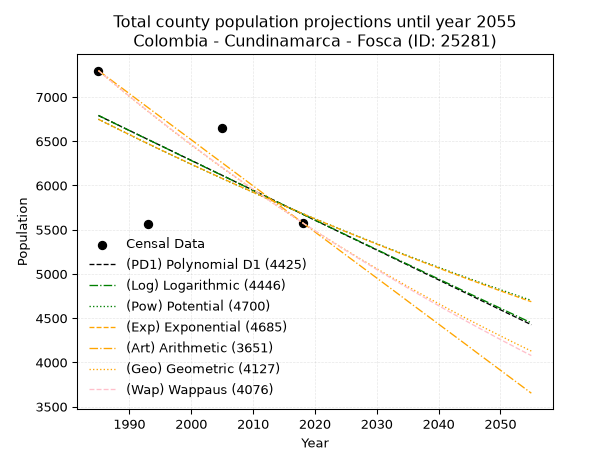
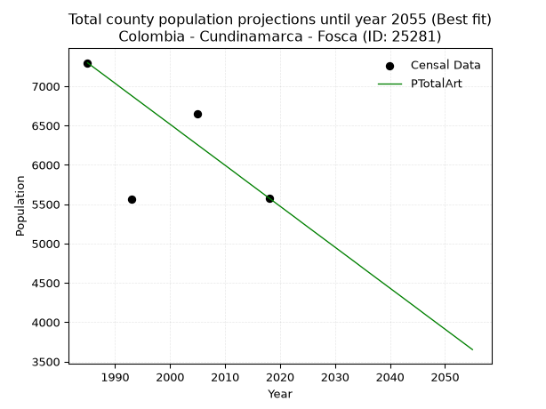
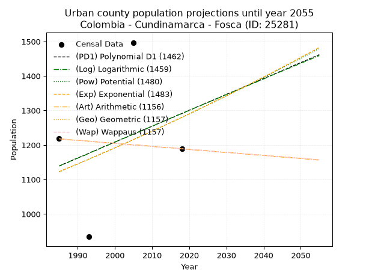
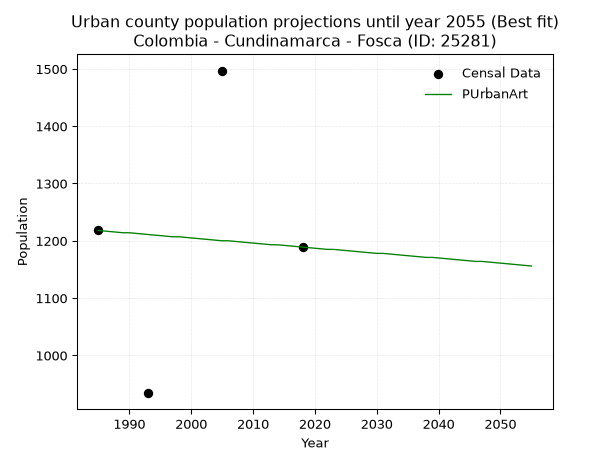
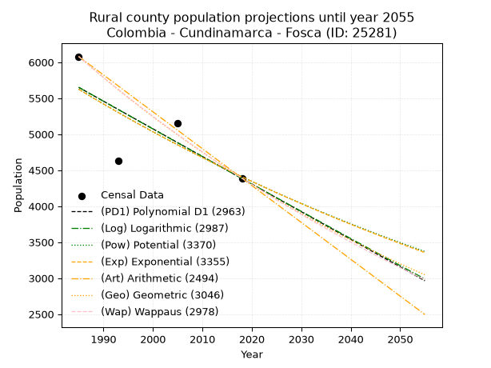
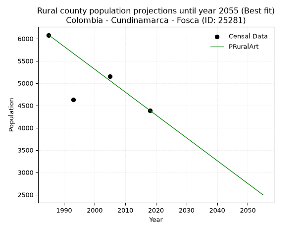

<div align="center">


</div>

# _“Population and Public Services Demand Projections (PPSD) until Year 2050 for Colombia - Cundinamarca - Fosca (ID: 25281)”_
Keywords: `population` `public-service` `projection` `lineal` `polynomial` `logarithmic` `potential` `exponential` `arithmetic` `geometric` `wappaus` `dane` `colombia` `south-america`

PPSD are analytical estimates used by governments and planners to anticipate future changes in population size, age distribution, and the resulting community needs for utilities, healthcare, education, and infrastructure as sizing future water treatment facilities, electrical grids, and road networks based on spatial growth.

> **General running parameters**: • app_version: _v20260806_. • Python version: _3.14.7_. • Pandas version: _3.0.5_. • NumPy version: _2.5.1_. • Creates, save and include plots into reports (create_plot): _False_. • Projection until year: _2050_. • Process polynomial degree 2 and up: _False_. • Process Wappaus: _True_. • Process Wappaus: _True_. • Set negative values to zero: _True_. • Set infinite values to zero: _True_. • Drop dataset notes: _True_. 
<div align="center">

Dynamic map: [:earth_americas:Google](http://maps.google.com/maps?q=4.339092844,-73.9390203) [:earth_americas:OSM](https://www.openstreetmap.org/#map=18/4.339092844/-73.9390203&layers=P) [:earth_americas:Bing](https://www.bing.com/maps?cp=4.339092844~-73.9390203&lvl=18) [:earth_americas:Apple](https://maps.apple.com/frame?center=4.339092844%2C-73.9390203&span=0.003%2C0.006)

</div>


<div align="center">

```geojson
{
  "type": "Feature",
  "geometry": {
    "type": "Point", 
    "coordinates": [-73.9390203, 4.339092844]
  }, 
  "properties": {
    "Name": "Colombia - Cundinamarca - Fosca (ID: 25281)"
  }
}
```

</div>


## 0. Census Data (4 records)

Census data are official statistics collected by a government about the people and housing in a country. They usually include counts of total population, age, sex, race, income, education, and jobs.

📅Global census file: [Population.xlsx](../data/Population.xlsx)

| Source   |   Year |   CountryID | CountryName   |   StateID | StateName    |   CountyID | CountyName   |   PTotal |   PUrban |   PRural |
|:---------|-------:|------------:|:--------------|----------:|:-------------|-----------:|:-------------|---------:|---------:|---------:|
| DANE     |   1985 |          57 | Colombia      |        25 | Cundinamarca |      25281 | Fosca        |     7297 |     1218 |     6079 |
| DANE     |   1993 |          57 | Colombia      |        25 | Cundinamarca |      25281 | Fosca        |     5568 |      934 |     4634 |
| DANE     |   2005 |          57 | Colombia      |        25 | Cundinamarca |      25281 | Fosca        |     6654 |     1497 |     5157 |
| DANE     |   2018 |          57 | Colombia      |        25 | Cundinamarca |      25281 | Fosca        |     5578 |     1189 |     4389 |

> 🔥Some records could had specific notes about the registered values or the corresponding urban or rural distribution.

📅   [RUPS](https://www.datos.gov.co/Hacienda-y-Cr-dito-P-blico/Registro-nico-de-Prestadores-de-Servicios-P-blicos/4qkq-csdn/about_data) - Local public utility companies: [RUPS.csv](../data/RUPS.xlsx)

 | SERVICIO       | ESTADO    | NOMBRE                                                                         | NIT         | DEPARTAMENTO_DOMICILIO   | MUNICIPIO_DOMICILIO   | DIRECCION                         |   TELEFONO | EMAIL                                       | TIPO_INSCRIPCION    | REPRESENTANTE_LEGAL      | TIPO_PRESTADOR                 | CLASIFICACION                 |
|:---------------|:----------|:-------------------------------------------------------------------------------|:------------|:-------------------------|:----------------------|:----------------------------------|-----------:|:--------------------------------------------|:--------------------|:-------------------------|:-------------------------------|:------------------------------|
| ACUEDUCTO      | OPERATIVA | UNIDAD DE SERVICIOS PUBLICOS DOMICILIARIOS DEL MUNICIPIO DE FOSCA CUNDINAMARCA | 899999420-1 | CUNDINAMARCA             | FOSCA                 | Calle 3 No. 1-20 Casa de Gobierno |    8490001 | serviciospublicos@fosca-cundinamarca.gov.co | Registro por la ESP | JOSE GILBERTO REY ROMERO | MUNICIPIO (PRESTACIÓN DIRECTA) | MENOR O IGUAL A 2500 USUARIOS |
| ALCANTARILLADO | OPERATIVA | UNIDAD DE SERVICIOS PUBLICOS DOMICILIARIOS DEL MUNICIPIO DE FOSCA CUNDINAMARCA | 899999420-1 | CUNDINAMARCA             | FOSCA                 | Calle 3 No. 1-20 Casa de Gobierno |    8490001 | serviciospublicos@fosca-cundinamarca.gov.co | Registro por la ESP | JOSE GILBERTO REY ROMERO | MUNICIPIO (PRESTACIÓN DIRECTA) | MENOR O IGUAL A 2500 USUARIOS |

## 1. Total

### 1.1. Coefficients and Parameters

* (PD1) Polynomial Deg 1: -33.771577679646164, 73825.84825371225 (lineal)
* (Log) Logarithmic: -67638.4282715872, 520394.48531268176
* (Pow) Potential: -10.437922535106406, 38.25097509066072
* (Exp) Exponential: -0.005212046347578632, 210035665.3750332
* (Art) Arithmetic: Year diff. 2018 - 1985 = 33, Population diff. 5578 - 7297 = -1719, Annual growth = -52.09090909090909
* (Geo) Geometric: Year diff. 2018 - 1985 = 33, Population diff. 5578 - 7297 = -1719, Annual growth % = -0.008107351123462614
* (Wap) Wappaus: i = -0.8091791703442189, Condition values only valid for < 200)

<sub>
Wappaus condition values: ['-0.00', '-0.81', '-1.62', '-2.43', '-3.24', '-4.05', '-4.86', '-5.66', '-6.47', '-7.28', '-8.09', '-8.90', '-9.71', '-10.52', '-11.33', '-12.14', '-12.95', '-13.76', '-14.57', '-15.37', '-16.18', '-16.99', '-17.80', '-18.61', '-19.42', '-20.23', '-21.04', '-21.85', '-22.66', '-23.47', '-24.28', '-25.08', '-25.89', '-26.70', '-27.51', '-28.32', '-29.13', '-29.94', '-30.75', '-31.56', '-32.37', '-33.18', '-33.99', '-34.79', '-35.60', '-36.41', '-37.22', '-38.03', '-38.84', '-39.65', '-40.46', '-41.27', '-42.08', '-42.89', '-43.70', '-44.50', '-45.31', '-46.12', '-46.93', '-47.74', '-48.55', '-49.36', '-50.17', '-50.98', '-51.79', '-52.60']
</sub>


### 1.2. Projected Dataset

|   Year |   CountyID |   PTotalPD1 |   PTotalLog |   PTotalPow |   PTotalExp |   PTotalArt |   PTotalGeo |   PTotalWap |
|-------:|-----------:|------------:|------------:|------------:|------------:|------------:|------------:|------------:|
|   1985 |      25281 |        6789 |        6791 |        6748 |        6747 |        7297 |        7297 |        7297 |
|   1986 |      25281 |        6755 |        6757 |        6713 |        6712 |        7245 |        7238 |        7238 |
|   1987 |      25281 |        6722 |        6722 |        6678 |        6677 |        7193 |        7179 |        7180 |
|   1988 |      25281 |        6688 |        6688 |        6643 |        6642 |        7141 |        7121 |        7122 |
|   1989 |      25281 |        6654 |        6654 |        6608 |        6608 |        7089 |        7063 |        7065 |
|   1990 |      25281 |        6620 |        6620 |        6574 |        6574 |        7037 |        7006 |        7008 |
|   1991 |      25281 |        6587 |        6586 |        6539 |        6539 |        6984 |        6949 |        6951 |
|   1992 |      25281 |        6553 |        6552 |        6505 |        6505 |        6932 |        6893 |        6895 |
|   1993 |      25281 |        6519 |        6519 |        6471 |        6472 |        6880 |        6837 |        6839 |
|   1994 |      25281 |        6485 |        6485 |        6437 |        6438 |        6828 |        6782 |        6784 |
|   1995 |      25281 |        6452 |        6451 |        6404 |        6404 |        6776 |        6727 |        6730 |
|   1996 |      25281 |        6418 |        6417 |        6370 |        6371 |        6724 |        6672 |        6675 |
|   1997 |      25281 |        6384 |        6383 |        6337 |        6338 |        6672 |        6618 |        6621 |
|   1998 |      25281 |        6350 |        6349 |        6304 |        6305 |        6620 |        6564 |        6568 |
|   1999 |      25281 |        6316 |        6315 |        6271 |        6272 |        6568 |        6511 |        6515 |
|   2000 |      25281 |        6283 |        6281 |        6238 |        6240 |        6516 |        6458 |        6462 |
|   2001 |      25281 |        6249 |        6248 |        6206 |        6207 |        6464 |        6406 |        6410 |
|   2002 |      25281 |        6215 |        6214 |        6174 |        6175 |        6411 |        6354 |        6358 |
|   2003 |      25281 |        6181 |        6180 |        6142 |        6143 |        6359 |        6302 |        6306 |
|   2004 |      25281 |        6148 |        6146 |        6110 |        6111 |        6307 |        6251 |        6255 |
|   2005 |      25281 |        6114 |        6113 |        6078 |        6079 |        6255 |        6201 |        6204 |
|   2006 |      25281 |        6080 |        6079 |        6046 |        6048 |        6203 |        6150 |        6154 |
|   2007 |      25281 |        6046 |        6045 |        6015 |        6016 |        6151 |        6101 |        6104 |
|   2008 |      25281 |        6013 |        6011 |        5984 |        5985 |        6099 |        6051 |        6055 |
|   2009 |      25281 |        5979 |        5978 |        5953 |        5954 |        6047 |        6002 |        6005 |
|   2010 |      25281 |        5945 |        5944 |        5922 |        5923 |        5995 |        5953 |        5956 |
|   2011 |      25281 |        5911 |        5910 |        5891 |        5892 |        5943 |        5905 |        5908 |
|   2012 |      25281 |        5877 |        5877 |        5861 |        5861 |        5891 |        5857 |        5860 |
|   2013 |      25281 |        5844 |        5843 |        5831 |        5831 |        5838 |        5810 |        5812 |
|   2014 |      25281 |        5810 |        5810 |        5800 |        5801 |        5786 |        5763 |        5764 |
|   2015 |      25281 |        5776 |        5776 |        5770 |        5771 |        5734 |        5716 |        5717 |
|   2016 |      25281 |        5742 |        5742 |        5741 |        5741 |        5682 |        5670 |        5671 |
|   2017 |      25281 |        5709 |        5709 |        5711 |        5711 |        5630 |        5624 |        5624 |
|   2018 |      25281 |        5675 |        5675 |        5682 |        5681 |        5578 |        5578 |        5578 |
|   2019 |      25281 |        5641 |        5642 |        5652 |        5651 |        5526 |        5533 |        5532 |
|   2020 |      25281 |        5607 |        5608 |        5623 |        5622 |        5474 |        5488 |        5487 |
|   2021 |      25281 |        5573 |        5575 |        5594 |        5593 |        5422 |        5443 |        5442 |
|   2022 |      25281 |        5540 |        5541 |        5565 |        5564 |        5370 |        5399 |        5397 |
|   2023 |      25281 |        5506 |        5508 |        5537 |        5535 |        5318 |        5356 |        5352 |
|   2024 |      25281 |        5472 |        5475 |        5508 |        5506 |        5265 |        5312 |        5308 |
|   2025 |      25281 |        5438 |        5441 |        5480 |        5477 |        5213 |        5269 |        5264 |
|   2026 |      25281 |        5405 |        5408 |        5452 |        5449 |        5161 |        5226 |        5221 |
|   2027 |      25281 |        5371 |        5374 |        5424 |        5421 |        5109 |        5184 |        5177 |
|   2028 |      25281 |        5337 |        5341 |        5396 |        5392 |        5057 |        5142 |        5134 |
|   2029 |      25281 |        5303 |        5308 |        5368 |        5364 |        5005 |        5100 |        5092 |
|   2030 |      25281 |        5270 |        5274 |        5341 |        5337 |        4953 |        5059 |        5049 |
|   2031 |      25281 |        5236 |        5241 |        5313 |        5309 |        4901 |        5018 |        5007 |
|   2032 |      25281 |        5202 |        5208 |        5286 |        5281 |        4849 |        4977 |        4965 |
|   2033 |      25281 |        5168 |        5174 |        5259 |        5254 |        4797 |        4937 |        4924 |
|   2034 |      25281 |        5134 |        5141 |        5232 |        5226 |        4745 |        4897 |        4882 |
|   2035 |      25281 |        5101 |        5108 |        5205 |        5199 |        4692 |        4857 |        4841 |
|   2036 |      25281 |        5067 |        5075 |        5179 |        5172 |        4640 |        4818 |        4801 |
|   2037 |      25281 |        5033 |        5042 |        5152 |        5145 |        4588 |        4779 |        4760 |
|   2038 |      25281 |        4999 |        5008 |        5126 |        5119 |        4536 |        4740 |        4720 |
|   2039 |      25281 |        4966 |        4975 |        5100 |        5092 |        4484 |        4702 |        4680 |
|   2040 |      25281 |        4932 |        4942 |        5074 |        5066 |        4432 |        4663 |        4641 |
|   2041 |      25281 |        4898 |        4909 |        5048 |        5039 |        4380 |        4626 |        4601 |
|   2042 |      25281 |        4864 |        4876 |        5022 |        5013 |        4328 |        4588 |        4562 |
|   2043 |      25281 |        4831 |        4843 |        4996 |        4987 |        4276 |        4551 |        4523 |
|   2044 |      25281 |        4797 |        4809 |        4971 |        4961 |        4224 |        4514 |        4485 |
|   2045 |      25281 |        4763 |        4776 |        4946 |        4935 |        4172 |        4477 |        4446 |
|   2046 |      25281 |        4729 |        4743 |        4920 |        4910 |        4119 |        4441 |        4408 |
|   2047 |      25281 |        4695 |        4710 |        4895 |        4884 |        4067 |        4405 |        4370 |
|   2048 |      25281 |        4662 |        4677 |        4870 |        4859 |        4015 |        4369 |        4333 |
|   2049 |      25281 |        4628 |        4644 |        4846 |        4833 |        3963 |        4334 |        4295 |
|   2050 |      25281 |        4594 |        4611 |        4821 |        4808 |        3911 |        4299 |        4258 |
<div align="center">

</img>

</div>


### 1.3. Best fit with absolute and relative error (%)

Relative error puts that difference into context by dividing the absolute error by the true value, creating a unitless ratio or percentage that shows the scale of the mistake.

Absolute and relative error

|   Year | Source   |   CountryID | CountryName   |   StateID | StateName    |   CountyID_x | CountyName   |   PTotal |   PUrban |   PRural |   CountyID_y |   PTotalPD1 |   PTotalLog |   PTotalPow |   PTotalExp |   PTotalArt |   PTotalGeo |   PTotalWap |   PTotalPD1AbsError |   PTotalLogAbsError |   PTotalPowAbsError |   PTotalExpAbsError |   PTotalArtAbsError |   PTotalGeoAbsError |   PTotalWapAbsError |   PTotalPD1RelError |   PTotalLogRelError |   PTotalPowRelError |   PTotalExpRelError |   PTotalArtRelError |   PTotalGeoRelError |   PTotalWapRelError |
|-------:|:---------|------------:|:--------------|----------:|:-------------|-------------:|:-------------|---------:|---------:|---------:|-------------:|------------:|------------:|------------:|------------:|------------:|------------:|------------:|--------------------:|--------------------:|--------------------:|--------------------:|--------------------:|--------------------:|--------------------:|--------------------:|--------------------:|--------------------:|--------------------:|--------------------:|--------------------:|--------------------:|
|   1985 | DANE     |          57 | Colombia      |        25 | Cundinamarca |        25281 | Fosca        |     7297 |     1218 |     6079 |        25281 |        6789 |        6791 |        6748 |        6747 |        7297 |        7297 |        7297 |                 508 |                 506 |                 549 |                 550 |                   0 |                   0 |                   0 |             6.96177 |             6.93436 |             7.52364 |             7.53734 |             0       |             0       |             0       |
|   1993 | DANE     |          57 | Colombia      |        25 | Cundinamarca |        25281 | Fosca        |     5568 |      934 |     4634 |        25281 |        6519 |        6519 |        6471 |        6472 |        6880 |        6837 |        6839 |                 951 |                 951 |                 903 |                 904 |                1312 |                1269 |                1271 |            17.0797  |            17.0797  |            16.2177  |            16.2356  |            23.5632  |            22.7909  |            22.8269  |
|   2005 | DANE     |          57 | Colombia      |        25 | Cundinamarca |        25281 | Fosca        |     6654 |     1497 |     5157 |        25281 |        6114 |        6113 |        6078 |        6079 |        6255 |        6201 |        6204 |                 540 |                 541 |                 576 |                 575 |                 399 |                 453 |                 450 |             8.11542 |             8.13045 |             8.65645 |             8.64142 |             5.99639 |             6.80794 |             6.76285 |
|   2018 | DANE     |          57 | Colombia      |        25 | Cundinamarca |        25281 | Fosca        |     5578 |     1189 |     4389 |        25281 |        5675 |        5675 |        5682 |        5681 |        5578 |        5578 |        5578 |                  97 |                  97 |                 104 |                 103 |                   0 |                   0 |                   0 |             1.73897 |             1.73897 |             1.86447 |             1.84654 |             0       |             0       |             0       |

Relative error mean

| Method    |   RelError | Best   |
|:----------|-----------:|:-------|
| PTotalPD1 |    8.47398 |        |
| PTotalLog |    8.47088 |        |
| PTotalPow |    8.56556 |        |
| PTotalExp |    8.56523 |        |
| PTotalArt |    7.3899  | True   |
| PTotalGeo |    7.39972 |        |
| PTotalWap |    7.39743 |        |

💙Best method: _**PTotalArt**_
<div align="center">

</img>

</div>


### 1.4. Fresh water supply demand in liters per capita per day (lpcd)

The fresh water supply demand typically ranges from 100 to 300 liters per capita per day (lpcd) for standard domestic and municipal planning, though absolute survival minimums set by the World Health Organization are as low as 7.5 to 20 liters per day, and total consumption in high-income nations can exceed 400 liters.

> `CZ`: Level in meters above the sea level (masl)<br> `WS`: Fresh water supply demand in liters per capita per day (lpcd or l/h/d)<br> `WSAll`: Zonal fresh water supply demand in liters per second (l/s)<br> `A`: Zonal area in square meters<br> `DP`: Population density (people/hectare or p/ha)

Reference values (RAS Colombia)

|    CZ |   WS |
|------:|-----:|
|  1000 |  120 |
|  2000 |  130 |
| 99999 |  140 |

County shapefile geometry properties and water supply values

|   CountyID |      ATotal |   CZTotal |   WSTotal |
|-----------:|------------:|----------:|----------:|
|      25281 | 1.11056e+08 |   2394.95 |       140 |

Projected values for best method: PTotalArt

|   CountyID |   Year |   PTotalArt |   DPTotal |   WSTotal |   WSTotalAll |
|-----------:|-------:|------------:|----------:|----------:|-------------:|
|      25281 |   1985 |        7297 |      0.66 |       140 |     11.8238  |
|      25281 |   1986 |        7245 |      0.65 |       140 |     11.7396  |
|      25281 |   1987 |        7193 |      0.65 |       140 |     11.6553  |
|      25281 |   1988 |        7141 |      0.64 |       140 |     11.5711  |
|      25281 |   1989 |        7089 |      0.64 |       140 |     11.4868  |
|      25281 |   1990 |        7037 |      0.63 |       140 |     11.4025  |
|      25281 |   1991 |        6984 |      0.63 |       140 |     11.3167  |
|      25281 |   1992 |        6932 |      0.62 |       140 |     11.2324  |
|      25281 |   1993 |        6880 |      0.62 |       140 |     11.1481  |
|      25281 |   1994 |        6828 |      0.61 |       140 |     11.0639  |
|      25281 |   1995 |        6776 |      0.61 |       140 |     10.9796  |
|      25281 |   1996 |        6724 |      0.61 |       140 |     10.8954  |
|      25281 |   1997 |        6672 |      0.6  |       140 |     10.8111  |
|      25281 |   1998 |        6620 |      0.6  |       140 |     10.7269  |
|      25281 |   1999 |        6568 |      0.59 |       140 |     10.6426  |
|      25281 |   2000 |        6516 |      0.59 |       140 |     10.5583  |
|      25281 |   2001 |        6464 |      0.58 |       140 |     10.4741  |
|      25281 |   2002 |        6411 |      0.58 |       140 |     10.3882  |
|      25281 |   2003 |        6359 |      0.57 |       140 |     10.3039  |
|      25281 |   2004 |        6307 |      0.57 |       140 |     10.2197  |
|      25281 |   2005 |        6255 |      0.56 |       140 |     10.1354  |
|      25281 |   2006 |        6203 |      0.56 |       140 |     10.0512  |
|      25281 |   2007 |        6151 |      0.55 |       140 |      9.9669  |
|      25281 |   2008 |        6099 |      0.55 |       140 |      9.88264 |
|      25281 |   2009 |        6047 |      0.54 |       140 |      9.79838 |
|      25281 |   2010 |        5995 |      0.54 |       140 |      9.71412 |
|      25281 |   2011 |        5943 |      0.54 |       140 |      9.62986 |
|      25281 |   2012 |        5891 |      0.53 |       140 |      9.5456  |
|      25281 |   2013 |        5838 |      0.53 |       140 |      9.45972 |
|      25281 |   2014 |        5786 |      0.52 |       140 |      9.37546 |
|      25281 |   2015 |        5734 |      0.52 |       140 |      9.2912  |
|      25281 |   2016 |        5682 |      0.51 |       140 |      9.20694 |
|      25281 |   2017 |        5630 |      0.51 |       140 |      9.12269 |
|      25281 |   2018 |        5578 |      0.5  |       140 |      9.03843 |
|      25281 |   2019 |        5526 |      0.5  |       140 |      8.95417 |
|      25281 |   2020 |        5474 |      0.49 |       140 |      8.86991 |
|      25281 |   2021 |        5422 |      0.49 |       140 |      8.78565 |
|      25281 |   2022 |        5370 |      0.48 |       140 |      8.70139 |
|      25281 |   2023 |        5318 |      0.48 |       140 |      8.61713 |
|      25281 |   2024 |        5265 |      0.47 |       140 |      8.53125 |
|      25281 |   2025 |        5213 |      0.47 |       140 |      8.44699 |
|      25281 |   2026 |        5161 |      0.46 |       140 |      8.36273 |
|      25281 |   2027 |        5109 |      0.46 |       140 |      8.27847 |
|      25281 |   2028 |        5057 |      0.46 |       140 |      8.19421 |
|      25281 |   2029 |        5005 |      0.45 |       140 |      8.10995 |
|      25281 |   2030 |        4953 |      0.45 |       140 |      8.02569 |
|      25281 |   2031 |        4901 |      0.44 |       140 |      7.94144 |
|      25281 |   2032 |        4849 |      0.44 |       140 |      7.85718 |
|      25281 |   2033 |        4797 |      0.43 |       140 |      7.77292 |
|      25281 |   2034 |        4745 |      0.43 |       140 |      7.68866 |
|      25281 |   2035 |        4692 |      0.42 |       140 |      7.60278 |
|      25281 |   2036 |        4640 |      0.42 |       140 |      7.51852 |
|      25281 |   2037 |        4588 |      0.41 |       140 |      7.43426 |
|      25281 |   2038 |        4536 |      0.41 |       140 |      7.35    |
|      25281 |   2039 |        4484 |      0.4  |       140 |      7.26574 |
|      25281 |   2040 |        4432 |      0.4  |       140 |      7.18148 |
|      25281 |   2041 |        4380 |      0.39 |       140 |      7.09722 |
|      25281 |   2042 |        4328 |      0.39 |       140 |      7.01296 |
|      25281 |   2043 |        4276 |      0.39 |       140 |      6.9287  |
|      25281 |   2044 |        4224 |      0.38 |       140 |      6.84444 |
|      25281 |   2045 |        4172 |      0.38 |       140 |      6.76019 |
|      25281 |   2046 |        4119 |      0.37 |       140 |      6.67431 |
|      25281 |   2047 |        4067 |      0.37 |       140 |      6.59005 |
|      25281 |   2048 |        4015 |      0.36 |       140 |      6.50579 |
|      25281 |   2049 |        3963 |      0.36 |       140 |      6.42153 |
|      25281 |   2050 |        3911 |      0.35 |       140 |      6.33727 |

## 2. Urban

### 2.1. Coefficients and Parameters

* (PD1) Polynomial Deg 1: 4.6077880369331154, -8007.228020875465 (lineal)
* (Log) Logarithmic: 9239.44420392948, -69019.58943432712
* (Pow) Potential: 7.969387465127636, -23.230952943259748
* (Exp) Exponential: 0.003977142077849032, 0.4184715386729239
* (Art) Arithmetic: Year diff. 2018 - 1985 = 33, Population diff. 1189 - 1218 = -29, Annual growth = -0.8787878787878788
* (Geo) Geometric: Year diff. 2018 - 1985 = 33, Population diff. 1189 - 1218 = -29, Annual growth % = -0.0007299622835381658
* (Wap) Wappaus: i = -0.07301935012778386, Condition values only valid for < 200)

<sub>
Wappaus condition values: ['-0.00', '-0.07', '-0.15', '-0.22', '-0.29', '-0.37', '-0.44', '-0.51', '-0.58', '-0.66', '-0.73', '-0.80', '-0.88', '-0.95', '-1.02', '-1.10', '-1.17', '-1.24', '-1.31', '-1.39', '-1.46', '-1.53', '-1.61', '-1.68', '-1.75', '-1.83', '-1.90', '-1.97', '-2.04', '-2.12', '-2.19', '-2.26', '-2.34', '-2.41', '-2.48', '-2.56', '-2.63', '-2.70', '-2.77', '-2.85', '-2.92', '-2.99', '-3.07', '-3.14', '-3.21', '-3.29', '-3.36', '-3.43', '-3.50', '-3.58', '-3.65', '-3.72', '-3.80', '-3.87', '-3.94', '-4.02', '-4.09', '-4.16', '-4.24', '-4.31', '-4.38', '-4.45', '-4.53', '-4.60', '-4.67', '-4.75']
</sub>


### 2.2. Projected Dataset

|   Year |   CountyID |   PUrbanPD1 |   PUrbanLog |   PUrbanPow |   PUrbanExp |   PUrbanArt |   PUrbanGeo |   PUrbanWap |
|-------:|-----------:|------------:|------------:|------------:|------------:|------------:|------------:|------------:|
|   1985 |      25281 |        1139 |        1139 |        1122 |        1123 |        1218 |        1218 |        1218 |
|   1986 |      25281 |        1144 |        1144 |        1127 |        1127 |        1217 |        1217 |        1217 |
|   1987 |      25281 |        1148 |        1148 |        1132 |        1132 |        1216 |        1216 |        1216 |
|   1988 |      25281 |        1153 |        1153 |        1136 |        1136 |        1215 |        1215 |        1215 |
|   1989 |      25281 |        1158 |        1158 |        1141 |        1141 |        1214 |        1214 |        1214 |
|   1990 |      25281 |        1162 |        1162 |        1145 |        1145 |        1214 |        1214 |        1214 |
|   1991 |      25281 |        1167 |        1167 |        1150 |        1150 |        1213 |        1213 |        1213 |
|   1992 |      25281 |        1171 |        1171 |        1154 |        1154 |        1212 |        1212 |        1212 |
|   1993 |      25281 |        1176 |        1176 |        1159 |        1159 |        1211 |        1211 |        1211 |
|   1994 |      25281 |        1181 |        1181 |        1164 |        1164 |        1210 |        1210 |        1210 |
|   1995 |      25281 |        1185 |        1185 |        1168 |        1168 |        1209 |        1209 |        1209 |
|   1996 |      25281 |        1190 |        1190 |        1173 |        1173 |        1208 |        1208 |        1208 |
|   1997 |      25281 |        1195 |        1195 |        1178 |        1178 |        1207 |        1207 |        1207 |
|   1998 |      25281 |        1199 |        1199 |        1182 |        1182 |        1207 |        1206 |        1206 |
|   1999 |      25281 |        1204 |        1204 |        1187 |        1187 |        1206 |        1206 |        1206 |
|   2000 |      25281 |        1208 |        1209 |        1192 |        1192 |        1205 |        1205 |        1205 |
|   2001 |      25281 |        1213 |        1213 |        1197 |        1196 |        1204 |        1204 |        1204 |
|   2002 |      25281 |        1218 |        1218 |        1201 |        1201 |        1203 |        1203 |        1203 |
|   2003 |      25281 |        1222 |        1222 |        1206 |        1206 |        1202 |        1202 |        1202 |
|   2004 |      25281 |        1227 |        1227 |        1211 |        1211 |        1201 |        1201 |        1201 |
|   2005 |      25281 |        1231 |        1232 |        1216 |        1216 |        1200 |        1200 |        1200 |
|   2006 |      25281 |        1236 |        1236 |        1221 |        1220 |        1200 |        1199 |        1199 |
|   2007 |      25281 |        1241 |        1241 |        1226 |        1225 |        1199 |        1199 |        1199 |
|   2008 |      25281 |        1245 |        1245 |        1230 |        1230 |        1198 |        1198 |        1198 |
|   2009 |      25281 |        1250 |        1250 |        1235 |        1235 |        1197 |        1197 |        1197 |
|   2010 |      25281 |        1254 |        1255 |        1240 |        1240 |        1196 |        1196 |        1196 |
|   2011 |      25281 |        1259 |        1259 |        1245 |        1245 |        1195 |        1195 |        1195 |
|   2012 |      25281 |        1264 |        1264 |        1250 |        1250 |        1194 |        1194 |        1194 |
|   2013 |      25281 |        1268 |        1268 |        1255 |        1255 |        1193 |        1193 |        1193 |
|   2014 |      25281 |        1273 |        1273 |        1260 |        1260 |        1193 |        1192 |        1192 |
|   2015 |      25281 |        1277 |        1278 |        1265 |        1265 |        1192 |        1192 |        1192 |
|   2016 |      25281 |        1282 |        1282 |        1270 |        1270 |        1191 |        1191 |        1191 |
|   2017 |      25281 |        1287 |        1287 |        1275 |        1275 |        1190 |        1190 |        1190 |
|   2018 |      25281 |        1291 |        1291 |        1280 |        1280 |        1189 |        1189 |        1189 |
|   2019 |      25281 |        1296 |        1296 |        1285 |        1285 |        1188 |        1188 |        1188 |
|   2020 |      25281 |        1301 |        1300 |        1290 |        1290 |        1187 |        1187 |        1187 |
|   2021 |      25281 |        1305 |        1305 |        1295 |        1296 |        1186 |        1186 |        1186 |
|   2022 |      25281 |        1310 |        1310 |        1300 |        1301 |        1185 |        1186 |        1186 |
|   2023 |      25281 |        1314 |        1314 |        1306 |        1306 |        1185 |        1185 |        1185 |
|   2024 |      25281 |        1319 |        1319 |        1311 |        1311 |        1184 |        1184 |        1184 |
|   2025 |      25281 |        1324 |        1323 |        1316 |        1316 |        1183 |        1183 |        1183 |
|   2026 |      25281 |        1328 |        1328 |        1321 |        1322 |        1182 |        1182 |        1182 |
|   2027 |      25281 |        1333 |        1332 |        1326 |        1327 |        1181 |        1181 |        1181 |
|   2028 |      25281 |        1337 |        1337 |        1332 |        1332 |        1180 |        1180 |        1180 |
|   2029 |      25281 |        1342 |        1342 |        1337 |        1337 |        1179 |        1179 |        1179 |
|   2030 |      25281 |        1347 |        1346 |        1342 |        1343 |        1178 |        1179 |        1179 |
|   2031 |      25281 |        1351 |        1351 |        1347 |        1348 |        1178 |        1178 |        1178 |
|   2032 |      25281 |        1356 |        1355 |        1353 |        1353 |        1177 |        1177 |        1177 |
|   2033 |      25281 |        1360 |        1360 |        1358 |        1359 |        1176 |        1176 |        1176 |
|   2034 |      25281 |        1365 |        1364 |        1363 |        1364 |        1175 |        1175 |        1175 |
|   2035 |      25281 |        1370 |        1369 |        1369 |        1370 |        1174 |        1174 |        1174 |
|   2036 |      25281 |        1374 |        1373 |        1374 |        1375 |        1173 |        1173 |        1173 |
|   2037 |      25281 |        1379 |        1378 |        1379 |        1381 |        1172 |        1173 |        1173 |
|   2038 |      25281 |        1383 |        1382 |        1385 |        1386 |        1171 |        1172 |        1172 |
|   2039 |      25281 |        1388 |        1387 |        1390 |        1392 |        1171 |        1171 |        1171 |
|   2040 |      25281 |        1393 |        1391 |        1396 |        1397 |        1170 |        1170 |        1170 |
|   2041 |      25281 |        1397 |        1396 |        1401 |        1403 |        1169 |        1169 |        1169 |
|   2042 |      25281 |        1402 |        1401 |        1407 |        1408 |        1168 |        1168 |        1168 |
|   2043 |      25281 |        1406 |        1405 |        1412 |        1414 |        1167 |        1167 |        1167 |
|   2044 |      25281 |        1411 |        1410 |        1418 |        1420 |        1166 |        1167 |        1167 |
|   2045 |      25281 |        1416 |        1414 |        1423 |        1425 |        1165 |        1166 |        1166 |
|   2046 |      25281 |        1420 |        1419 |        1429 |        1431 |        1164 |        1165 |        1165 |
|   2047 |      25281 |        1425 |        1423 |        1434 |        1437 |        1164 |        1164 |        1164 |
|   2048 |      25281 |        1430 |        1428 |        1440 |        1442 |        1163 |        1163 |        1163 |
|   2049 |      25281 |        1434 |        1432 |        1445 |        1448 |        1162 |        1162 |        1162 |
|   2050 |      25281 |        1439 |        1437 |        1451 |        1454 |        1161 |        1162 |        1162 |
<div align="center">

</img>

</div>


### 2.3. Best fit with absolute and relative error (%)

Relative error puts that difference into context by dividing the absolute error by the true value, creating a unitless ratio or percentage that shows the scale of the mistake.

Absolute and relative error

|   Year | Source   |   CountryID | CountryName   |   StateID | StateName    |   CountyID_x | CountyName   |   PTotal |   PUrban |   PRural |   CountyID_y |   PUrbanPD1 |   PUrbanLog |   PUrbanPow |   PUrbanExp |   PUrbanArt |   PUrbanGeo |   PUrbanWap |   PUrbanPD1AbsError |   PUrbanLogAbsError |   PUrbanPowAbsError |   PUrbanExpAbsError |   PUrbanArtAbsError |   PUrbanGeoAbsError |   PUrbanWapAbsError |   PUrbanPD1RelError |   PUrbanLogRelError |   PUrbanPowRelError |   PUrbanExpRelError |   PUrbanArtRelError |   PUrbanGeoRelError |   PUrbanWapRelError |
|-------:|:---------|------------:|:--------------|----------:|:-------------|-------------:|:-------------|---------:|---------:|---------:|-------------:|------------:|------------:|------------:|------------:|------------:|------------:|------------:|--------------------:|--------------------:|--------------------:|--------------------:|--------------------:|--------------------:|--------------------:|--------------------:|--------------------:|--------------------:|--------------------:|--------------------:|--------------------:|--------------------:|
|   1985 | DANE     |          57 | Colombia      |        25 | Cundinamarca |        25281 | Fosca        |     7297 |     1218 |     6079 |        25281 |        1139 |        1139 |        1122 |        1123 |        1218 |        1218 |        1218 |                  79 |                  79 |                  96 |                  95 |                   0 |                   0 |                   0 |             6.48604 |             6.48604 |             7.88177 |             7.79967 |              0      |              0      |              0      |
|   1993 | DANE     |          57 | Colombia      |        25 | Cundinamarca |        25281 | Fosca        |     5568 |      934 |     4634 |        25281 |        1176 |        1176 |        1159 |        1159 |        1211 |        1211 |        1211 |                 242 |                 242 |                 225 |                 225 |                 277 |                 277 |                 277 |            25.9101  |            25.9101  |            24.0899  |            24.0899  |             29.6574 |             29.6574 |             29.6574 |
|   2005 | DANE     |          57 | Colombia      |        25 | Cundinamarca |        25281 | Fosca        |     6654 |     1497 |     5157 |        25281 |        1231 |        1232 |        1216 |        1216 |        1200 |        1200 |        1200 |                 266 |                 265 |                 281 |                 281 |                 297 |                 297 |                 297 |            17.7689  |            17.7021  |            18.7709  |            18.7709  |             19.8397 |             19.8397 |             19.8397 |
|   2018 | DANE     |          57 | Colombia      |        25 | Cundinamarca |        25281 | Fosca        |     5578 |     1189 |     4389 |        25281 |        1291 |        1291 |        1280 |        1280 |        1189 |        1189 |        1189 |                 102 |                 102 |                  91 |                  91 |                   0 |                   0 |                   0 |             8.57864 |             8.57864 |             7.65349 |             7.65349 |              0      |              0      |              0      |

Relative error mean

| Method    |   RelError | Best   |
|:----------|-----------:|:-------|
| PUrbanPD1 |    14.6859 |        |
| PUrbanLog |    14.6692 |        |
| PUrbanPow |    14.599  |        |
| PUrbanExp |    14.5785 |        |
| PUrbanArt |    12.3743 | True   |
| PUrbanGeo |    12.3743 | True   |
| PUrbanWap |    12.3743 | True   |

💙Best method: _**PUrbanArt**_
<div align="center">

</img>

</div>


### 2.4. Fresh water supply demand in liters per capita per day (lpcd)

The fresh water supply demand typically ranges from 100 to 300 liters per capita per day (lpcd) for standard domestic and municipal planning, though absolute survival minimums set by the World Health Organization are as low as 7.5 to 20 liters per day, and total consumption in high-income nations can exceed 400 liters.

> `CZ`: Level in meters above the sea level (masl)<br> `WS`: Fresh water supply demand in liters per capita per day (lpcd or l/h/d)<br> `WSAll`: Zonal fresh water supply demand in liters per second (l/s)<br> `A`: Zonal area in square meters<br> `DP`: Population density (people/hectare or p/ha)

Reference values (RAS Colombia)

|    CZ |   WS |
|------:|-----:|
|  1000 |  120 |
|  2000 |  130 |
| 99999 |  140 |

County shapefile geometry properties and water supply values

|   CountyID |   AUrban |   CZUrban |   WSUrban |
|-----------:|---------:|----------:|----------:|
|      25281 |   235172 |   2111.23 |       140 |

Projected values for best method: PUrbanArt

|   CountyID |   Year |   PUrbanArt |   DPUrban |   WSUrban |   WSUrbanAll |
|-----------:|-------:|------------:|----------:|----------:|-------------:|
|      25281 |   1985 |        1218 |     51.79 |       140 |      1.97361 |
|      25281 |   1986 |        1217 |     51.75 |       140 |      1.97199 |
|      25281 |   1987 |        1216 |     51.71 |       140 |      1.97037 |
|      25281 |   1988 |        1215 |     51.66 |       140 |      1.96875 |
|      25281 |   1989 |        1214 |     51.62 |       140 |      1.96713 |
|      25281 |   1990 |        1214 |     51.62 |       140 |      1.96713 |
|      25281 |   1991 |        1213 |     51.58 |       140 |      1.96551 |
|      25281 |   1992 |        1212 |     51.54 |       140 |      1.96389 |
|      25281 |   1993 |        1211 |     51.49 |       140 |      1.96227 |
|      25281 |   1994 |        1210 |     51.45 |       140 |      1.96065 |
|      25281 |   1995 |        1209 |     51.41 |       140 |      1.95903 |
|      25281 |   1996 |        1208 |     51.37 |       140 |      1.95741 |
|      25281 |   1997 |        1207 |     51.32 |       140 |      1.95579 |
|      25281 |   1998 |        1207 |     51.32 |       140 |      1.95579 |
|      25281 |   1999 |        1206 |     51.28 |       140 |      1.95417 |
|      25281 |   2000 |        1205 |     51.24 |       140 |      1.95255 |
|      25281 |   2001 |        1204 |     51.2  |       140 |      1.95093 |
|      25281 |   2002 |        1203 |     51.15 |       140 |      1.94931 |
|      25281 |   2003 |        1202 |     51.11 |       140 |      1.94769 |
|      25281 |   2004 |        1201 |     51.07 |       140 |      1.94606 |
|      25281 |   2005 |        1200 |     51.03 |       140 |      1.94444 |
|      25281 |   2006 |        1200 |     51.03 |       140 |      1.94444 |
|      25281 |   2007 |        1199 |     50.98 |       140 |      1.94282 |
|      25281 |   2008 |        1198 |     50.94 |       140 |      1.9412  |
|      25281 |   2009 |        1197 |     50.9  |       140 |      1.93958 |
|      25281 |   2010 |        1196 |     50.86 |       140 |      1.93796 |
|      25281 |   2011 |        1195 |     50.81 |       140 |      1.93634 |
|      25281 |   2012 |        1194 |     50.77 |       140 |      1.93472 |
|      25281 |   2013 |        1193 |     50.73 |       140 |      1.9331  |
|      25281 |   2014 |        1193 |     50.73 |       140 |      1.9331  |
|      25281 |   2015 |        1192 |     50.69 |       140 |      1.93148 |
|      25281 |   2016 |        1191 |     50.64 |       140 |      1.92986 |
|      25281 |   2017 |        1190 |     50.6  |       140 |      1.92824 |
|      25281 |   2018 |        1189 |     50.56 |       140 |      1.92662 |
|      25281 |   2019 |        1188 |     50.52 |       140 |      1.925   |
|      25281 |   2020 |        1187 |     50.47 |       140 |      1.92338 |
|      25281 |   2021 |        1186 |     50.43 |       140 |      1.92176 |
|      25281 |   2022 |        1185 |     50.39 |       140 |      1.92014 |
|      25281 |   2023 |        1185 |     50.39 |       140 |      1.92014 |
|      25281 |   2024 |        1184 |     50.35 |       140 |      1.91852 |
|      25281 |   2025 |        1183 |     50.3  |       140 |      1.9169  |
|      25281 |   2026 |        1182 |     50.26 |       140 |      1.91528 |
|      25281 |   2027 |        1181 |     50.22 |       140 |      1.91366 |
|      25281 |   2028 |        1180 |     50.18 |       140 |      1.91204 |
|      25281 |   2029 |        1179 |     50.13 |       140 |      1.91042 |
|      25281 |   2030 |        1178 |     50.09 |       140 |      1.9088  |
|      25281 |   2031 |        1178 |     50.09 |       140 |      1.9088  |
|      25281 |   2032 |        1177 |     50.05 |       140 |      1.90718 |
|      25281 |   2033 |        1176 |     50.01 |       140 |      1.90556 |
|      25281 |   2034 |        1175 |     49.96 |       140 |      1.90394 |
|      25281 |   2035 |        1174 |     49.92 |       140 |      1.90231 |
|      25281 |   2036 |        1173 |     49.88 |       140 |      1.90069 |
|      25281 |   2037 |        1172 |     49.84 |       140 |      1.89907 |
|      25281 |   2038 |        1171 |     49.79 |       140 |      1.89745 |
|      25281 |   2039 |        1171 |     49.79 |       140 |      1.89745 |
|      25281 |   2040 |        1170 |     49.75 |       140 |      1.89583 |
|      25281 |   2041 |        1169 |     49.71 |       140 |      1.89421 |
|      25281 |   2042 |        1168 |     49.67 |       140 |      1.89259 |
|      25281 |   2043 |        1167 |     49.62 |       140 |      1.89097 |
|      25281 |   2044 |        1166 |     49.58 |       140 |      1.88935 |
|      25281 |   2045 |        1165 |     49.54 |       140 |      1.88773 |
|      25281 |   2046 |        1164 |     49.5  |       140 |      1.88611 |
|      25281 |   2047 |        1164 |     49.5  |       140 |      1.88611 |
|      25281 |   2048 |        1163 |     49.45 |       140 |      1.88449 |
|      25281 |   2049 |        1162 |     49.41 |       140 |      1.88287 |
|      25281 |   2050 |        1161 |     49.37 |       140 |      1.88125 |

## 3. Rural

### 3.1. Coefficients and Parameters

* (PD1) Polynomial Deg 1: -38.37936571657925, 81833.07627458766 (lineal)
* (Log) Logarithmic: -76877.8724755167, 589414.0747470091
* (Pow) Potential: -14.77923741423662, 52.48852124112182
* (Exp) Exponential: -0.007379164850508389, 12924092425.551416
* (Art) Arithmetic: Year diff. 2018 - 1985 = 33, Population diff. 4389 - 6079 = -1690, Annual growth = -51.21212121212121
* (Geo) Geometric: Year diff. 2018 - 1985 = 33, Population diff. 4389 - 6079 = -1690, Annual growth % = -0.009822315503412282
* (Wap) Wappaus: i = -0.978450921133382, Condition values only valid for < 200)

<sub>
Wappaus condition values: ['-0.00', '-0.98', '-1.96', '-2.94', '-3.91', '-4.89', '-5.87', '-6.85', '-7.83', '-8.81', '-9.78', '-10.76', '-11.74', '-12.72', '-13.70', '-14.68', '-15.66', '-16.63', '-17.61', '-18.59', '-19.57', '-20.55', '-21.53', '-22.50', '-23.48', '-24.46', '-25.44', '-26.42', '-27.40', '-28.38', '-29.35', '-30.33', '-31.31', '-32.29', '-33.27', '-34.25', '-35.22', '-36.20', '-37.18', '-38.16', '-39.14', '-40.12', '-41.09', '-42.07', '-43.05', '-44.03', '-45.01', '-45.99', '-46.97', '-47.94', '-48.92', '-49.90', '-50.88', '-51.86', '-52.84', '-53.81', '-54.79', '-55.77', '-56.75', '-57.73', '-58.71', '-59.69', '-60.66', '-61.64', '-62.62', '-63.60']
</sub>


### 3.2. Projected Dataset

|   Year |   CountyID |   PRuralPD1 |   PRuralLog |   PRuralPow |   PRuralExp |   PRuralArt |   PRuralGeo |   PRuralWap |
|-------:|-----------:|------------:|------------:|------------:|------------:|------------:|------------:|------------:|
|   1985 |      25281 |        5650 |        5652 |        5625 |        5624 |        6079 |        6079 |        6079 |
|   1986 |      25281 |        5612 |        5613 |        5583 |        5582 |        6028 |        6019 |        6020 |
|   1987 |      25281 |        5573 |        5574 |        5542 |        5541 |        5977 |        5960 |        5961 |
|   1988 |      25281 |        5535 |        5536 |        5501 |        5500 |        5925 |        5902 |        5903 |
|   1989 |      25281 |        5497 |        5497 |        5460 |        5460 |        5874 |        5844 |        5846 |
|   1990 |      25281 |        5458 |        5458 |        5420 |        5420 |        5823 |        5786 |        5789 |
|   1991 |      25281 |        5420 |        5420 |        5380 |        5380 |        5772 |        5729 |        5732 |
|   1992 |      25281 |        5381 |        5381 |        5340 |        5340 |        5721 |        5673 |        5676 |
|   1993 |      25281 |        5343 |        5342 |        5301 |        5301 |        5669 |        5617 |        5621 |
|   1994 |      25281 |        5305 |        5304 |        5261 |        5262 |        5618 |        5562 |        5566 |
|   1995 |      25281 |        5266 |        5265 |        5223 |        5224 |        5567 |        5508 |        5512 |
|   1996 |      25281 |        5228 |        5227 |        5184 |        5185 |        5516 |        5454 |        5458 |
|   1997 |      25281 |        5189 |        5188 |        5146 |        5147 |        5464 |        5400 |        5405 |
|   1998 |      25281 |        5151 |        5150 |        5108 |        5109 |        5413 |        5347 |        5352 |
|   1999 |      25281 |        5113 |        5111 |        5070 |        5072 |        5362 |        5294 |        5300 |
|   2000 |      25281 |        5074 |        5073 |        5033 |        5034 |        5311 |        5242 |        5248 |
|   2001 |      25281 |        5036 |        5034 |        4996 |        4997 |        5260 |        5191 |        5196 |
|   2002 |      25281 |        4998 |        4996 |        4959 |        4961 |        5208 |        5140 |        5145 |
|   2003 |      25281 |        4959 |        4958 |        4923 |        4924 |        5157 |        5089 |        5095 |
|   2004 |      25281 |        4921 |        4919 |        4886 |        4888 |        5106 |        5039 |        5045 |
|   2005 |      25281 |        4882 |        4881 |        4851 |        4852 |        5055 |        4990 |        4995 |
|   2006 |      25281 |        4844 |        4843 |        4815 |        4816 |        5004 |        4941 |        4946 |
|   2007 |      25281 |        4806 |        4804 |        4780 |        4781 |        4952 |        4892 |        4898 |
|   2008 |      25281 |        4767 |        4766 |        4745 |        4746 |        4901 |        4844 |        4849 |
|   2009 |      25281 |        4729 |        4728 |        4710 |        4711 |        4850 |        4797 |        4801 |
|   2010 |      25281 |        4691 |        4689 |        4675 |        4676 |        4799 |        4750 |        4754 |
|   2011 |      25281 |        4652 |        4651 |        4641 |        4642 |        4747 |        4703 |        4707 |
|   2012 |      25281 |        4614 |        4613 |        4607 |        4608 |        4696 |        4657 |        4660 |
|   2013 |      25281 |        4575 |        4575 |        4573 |        4574 |        4645 |        4611 |        4614 |
|   2014 |      25281 |        4537 |        4537 |        4540 |        4540 |        4594 |        4566 |        4568 |
|   2015 |      25281 |        4499 |        4498 |        4507 |        4507 |        4543 |        4521 |        4523 |
|   2016 |      25281 |        4460 |        4460 |        4474 |        4474 |        4491 |        4477 |        4478 |
|   2017 |      25281 |        4422 |        4422 |        4441 |        4441 |        4440 |        4433 |        4433 |
|   2018 |      25281 |        4384 |        4384 |        4409 |        4408 |        4389 |        4389 |        4389 |
|   2019 |      25281 |        4345 |        4346 |        4376 |        4376 |        4338 |        4346 |        4345 |
|   2020 |      25281 |        4307 |        4308 |        4345 |        4344 |        4287 |        4303 |        4302 |
|   2021 |      25281 |        4268 |        4270 |        4313 |        4312 |        4235 |        4261 |        4258 |
|   2022 |      25281 |        4230 |        4232 |        4282 |        4280 |        4184 |        4219 |        4216 |
|   2023 |      25281 |        4192 |        4194 |        4250 |        4248 |        4133 |        4178 |        4173 |
|   2024 |      25281 |        4153 |        4156 |        4219 |        4217 |        4082 |        4137 |        4131 |
|   2025 |      25281 |        4115 |        4118 |        4189 |        4186 |        4031 |        4096 |        4089 |
|   2026 |      25281 |        4076 |        4080 |        4158 |        4155 |        3979 |        4056 |        4048 |
|   2027 |      25281 |        4038 |        4042 |        4128 |        4125 |        3928 |        4016 |        4007 |
|   2028 |      25281 |        4000 |        4004 |        4098 |        4095 |        3877 |        3976 |        3966 |
|   2029 |      25281 |        3961 |        3966 |        4068 |        4064 |        3826 |        3937 |        3925 |
|   2030 |      25281 |        3923 |        3928 |        4039 |        4035 |        3774 |        3899 |        3885 |
|   2031 |      25281 |        3885 |        3890 |        4010 |        4005 |        3723 |        3860 |        3846 |
|   2032 |      25281 |        3846 |        3853 |        3980 |        3975 |        3672 |        3823 |        3806 |
|   2033 |      25281 |        3808 |        3815 |        3952 |        3946 |        3621 |        3785 |        3767 |
|   2034 |      25281 |        3769 |        3777 |        3923 |        3917 |        3570 |        3748 |        3728 |
|   2035 |      25281 |        3731 |        3739 |        3895 |        3888 |        3518 |        3711 |        3690 |
|   2036 |      25281 |        3693 |        3701 |        3866 |        3860 |        3467 |        3675 |        3651 |
|   2037 |      25281 |        3654 |        3664 |        3838 |        3831 |        3416 |        3638 |        3613 |
|   2038 |      25281 |        3616 |        3626 |        3811 |        3803 |        3365 |        3603 |        3576 |
|   2039 |      25281 |        3578 |        3588 |        3783 |        3775 |        3314 |        3567 |        3538 |
|   2040 |      25281 |        3539 |        3550 |        3756 |        3748 |        3262 |        3532 |        3501 |
|   2041 |      25281 |        3501 |        3513 |        3729 |        3720 |        3211 |        3498 |        3464 |
|   2042 |      25281 |        3462 |        3475 |        3702 |        3693 |        3160 |        3463 |        3428 |
|   2043 |      25281 |        3424 |        3438 |        3675 |        3666 |        3109 |        3429 |        3392 |
|   2044 |      25281 |        3386 |        3400 |        3649 |        3639 |        3057 |        3396 |        3356 |
|   2045 |      25281 |        3347 |        3362 |        3622 |        3612 |        3006 |        3362 |        3320 |
|   2046 |      25281 |        3309 |        3325 |        3596 |        3585 |        2955 |        3329 |        3285 |
|   2047 |      25281 |        3271 |        3287 |        3570 |        3559 |        2904 |        3296 |        3249 |
|   2048 |      25281 |        3232 |        3250 |        3545 |        3533 |        2853 |        3264 |        3215 |
|   2049 |      25281 |        3194 |        3212 |        3519 |        3507 |        2801 |        3232 |        3180 |
|   2050 |      25281 |        3155 |        3175 |        3494 |        3481 |        2750 |        3200 |        3146 |
<div align="center">

</img>

</div>


### 3.3. Best fit with absolute and relative error (%)

Relative error puts that difference into context by dividing the absolute error by the true value, creating a unitless ratio or percentage that shows the scale of the mistake.

Absolute and relative error

|   Year | Source   |   CountryID | CountryName   |   StateID | StateName    |   CountyID_x | CountyName   |   PTotal |   PUrban |   PRural |   CountyID_y |   PRuralPD1 |   PRuralLog |   PRuralPow |   PRuralExp |   PRuralArt |   PRuralGeo |   PRuralWap |   PRuralPD1AbsError |   PRuralLogAbsError |   PRuralPowAbsError |   PRuralExpAbsError |   PRuralArtAbsError |   PRuralGeoAbsError |   PRuralWapAbsError |   PRuralPD1RelError |   PRuralLogRelError |   PRuralPowRelError |   PRuralExpRelError |   PRuralArtRelError |   PRuralGeoRelError |   PRuralWapRelError |
|-------:|:---------|------------:|:--------------|----------:|:-------------|-------------:|:-------------|---------:|---------:|---------:|-------------:|------------:|------------:|------------:|------------:|------------:|------------:|------------:|--------------------:|--------------------:|--------------------:|--------------------:|--------------------:|--------------------:|--------------------:|--------------------:|--------------------:|--------------------:|--------------------:|--------------------:|--------------------:|--------------------:|
|   1985 | DANE     |          57 | Colombia      |        25 | Cundinamarca |        25281 | Fosca        |     7297 |     1218 |     6079 |        25281 |        5650 |        5652 |        5625 |        5624 |        6079 |        6079 |        6079 |                 429 |                 427 |                 454 |                 455 |                   0 |                   0 |                   0 |            7.05708  |            7.02418  |            7.46833  |             7.48478 |             0       |             0       |             0       |
|   1993 | DANE     |          57 | Colombia      |        25 | Cundinamarca |        25281 | Fosca        |     5568 |      934 |     4634 |        25281 |        5343 |        5342 |        5301 |        5301 |        5669 |        5617 |        5621 |                 709 |                 708 |                 667 |                 667 |                1035 |                 983 |                 987 |           15.3      |           15.2784   |           14.3936   |            14.3936  |            22.3349  |            21.2128  |            21.2991  |
|   2005 | DANE     |          57 | Colombia      |        25 | Cundinamarca |        25281 | Fosca        |     6654 |     1497 |     5157 |        25281 |        4882 |        4881 |        4851 |        4852 |        5055 |        4990 |        4995 |                 275 |                 276 |                 306 |                 305 |                 102 |                 167 |                 162 |            5.33256  |            5.35195  |            5.93368  |             5.91429 |             1.97789 |             3.23832 |             3.14136 |
|   2018 | DANE     |          57 | Colombia      |        25 | Cundinamarca |        25281 | Fosca        |     5578 |     1189 |     4389 |        25281 |        4384 |        4384 |        4409 |        4408 |        4389 |        4389 |        4389 |                   5 |                   5 |                  20 |                  19 |                   0 |                   0 |                   0 |            0.113921 |            0.113921 |            0.455685 |             0.4329  |             0       |             0       |             0       |

Relative error mean

| Method    |   RelError | Best   |
|:----------|-----------:|:-------|
| PRuralPD1 |    6.95088 |        |
| PRuralLog |    6.94211 |        |
| PRuralPow |    7.06283 |        |
| PRuralExp |    7.0564  |        |
| PRuralArt |    6.0782  | True   |
| PRuralGeo |    6.11277 |        |
| PRuralWap |    6.11011 |        |

💙Best method: _**PRuralArt**_
<div align="center">

</img>

</div>


### 3.4. Fresh water supply demand in liters per capita per day (lpcd)

The fresh water supply demand typically ranges from 100 to 300 liters per capita per day (lpcd) for standard domestic and municipal planning, though absolute survival minimums set by the World Health Organization are as low as 7.5 to 20 liters per day, and total consumption in high-income nations can exceed 400 liters.

> `CZ`: Level in meters above the sea level (masl)<br> `WS`: Fresh water supply demand in liters per capita per day (lpcd or l/h/d)<br> `WSAll`: Zonal fresh water supply demand in liters per second (l/s)<br> `A`: Zonal area in square meters<br> `DP`: Population density (people/hectare or p/ha)

Reference values (RAS Colombia)

|    CZ |   WS |
|------:|-----:|
|  1000 |  120 |
|  2000 |  130 |
| 99999 |  140 |

County shapefile geometry properties and water supply values

|   CountyID |      ARural |   CZRural |   WSRural |
|-----------:|------------:|----------:|----------:|
|      25281 | 1.10821e+08 |   2395.54 |       140 |

Projected values for best method: PRuralArt

|   CountyID |   Year |   PRuralArt |   DPRural |   WSRural |   WSRuralAll |
|-----------:|-------:|------------:|----------:|----------:|-------------:|
|      25281 |   1985 |        6079 |      0.55 |       140 |      9.85023 |
|      25281 |   1986 |        6028 |      0.54 |       140 |      9.76759 |
|      25281 |   1987 |        5977 |      0.54 |       140 |      9.68495 |
|      25281 |   1988 |        5925 |      0.53 |       140 |      9.60069 |
|      25281 |   1989 |        5874 |      0.53 |       140 |      9.51806 |
|      25281 |   1990 |        5823 |      0.53 |       140 |      9.43542 |
|      25281 |   1991 |        5772 |      0.52 |       140 |      9.35278 |
|      25281 |   1992 |        5721 |      0.52 |       140 |      9.27014 |
|      25281 |   1993 |        5669 |      0.51 |       140 |      9.18588 |
|      25281 |   1994 |        5618 |      0.51 |       140 |      9.10324 |
|      25281 |   1995 |        5567 |      0.5  |       140 |      9.0206  |
|      25281 |   1996 |        5516 |      0.5  |       140 |      8.93796 |
|      25281 |   1997 |        5464 |      0.49 |       140 |      8.8537  |
|      25281 |   1998 |        5413 |      0.49 |       140 |      8.77106 |
|      25281 |   1999 |        5362 |      0.48 |       140 |      8.68843 |
|      25281 |   2000 |        5311 |      0.48 |       140 |      8.60579 |
|      25281 |   2001 |        5260 |      0.47 |       140 |      8.52315 |
|      25281 |   2002 |        5208 |      0.47 |       140 |      8.43889 |
|      25281 |   2003 |        5157 |      0.47 |       140 |      8.35625 |
|      25281 |   2004 |        5106 |      0.46 |       140 |      8.27361 |
|      25281 |   2005 |        5055 |      0.46 |       140 |      8.19097 |
|      25281 |   2006 |        5004 |      0.45 |       140 |      8.10833 |
|      25281 |   2007 |        4952 |      0.45 |       140 |      8.02407 |
|      25281 |   2008 |        4901 |      0.44 |       140 |      7.94144 |
|      25281 |   2009 |        4850 |      0.44 |       140 |      7.8588  |
|      25281 |   2010 |        4799 |      0.43 |       140 |      7.77616 |
|      25281 |   2011 |        4747 |      0.43 |       140 |      7.6919  |
|      25281 |   2012 |        4696 |      0.42 |       140 |      7.60926 |
|      25281 |   2013 |        4645 |      0.42 |       140 |      7.52662 |
|      25281 |   2014 |        4594 |      0.41 |       140 |      7.44398 |
|      25281 |   2015 |        4543 |      0.41 |       140 |      7.36134 |
|      25281 |   2016 |        4491 |      0.41 |       140 |      7.27708 |
|      25281 |   2017 |        4440 |      0.4  |       140 |      7.19444 |
|      25281 |   2018 |        4389 |      0.4  |       140 |      7.11181 |
|      25281 |   2019 |        4338 |      0.39 |       140 |      7.02917 |
|      25281 |   2020 |        4287 |      0.39 |       140 |      6.94653 |
|      25281 |   2021 |        4235 |      0.38 |       140 |      6.86227 |
|      25281 |   2022 |        4184 |      0.38 |       140 |      6.77963 |
|      25281 |   2023 |        4133 |      0.37 |       140 |      6.69699 |
|      25281 |   2024 |        4082 |      0.37 |       140 |      6.61435 |
|      25281 |   2025 |        4031 |      0.36 |       140 |      6.53171 |
|      25281 |   2026 |        3979 |      0.36 |       140 |      6.44745 |
|      25281 |   2027 |        3928 |      0.35 |       140 |      6.36481 |
|      25281 |   2028 |        3877 |      0.35 |       140 |      6.28218 |
|      25281 |   2029 |        3826 |      0.35 |       140 |      6.19954 |
|      25281 |   2030 |        3774 |      0.34 |       140 |      6.11528 |
|      25281 |   2031 |        3723 |      0.34 |       140 |      6.03264 |
|      25281 |   2032 |        3672 |      0.33 |       140 |      5.95    |
|      25281 |   2033 |        3621 |      0.33 |       140 |      5.86736 |
|      25281 |   2034 |        3570 |      0.32 |       140 |      5.78472 |
|      25281 |   2035 |        3518 |      0.32 |       140 |      5.70046 |
|      25281 |   2036 |        3467 |      0.31 |       140 |      5.61782 |
|      25281 |   2037 |        3416 |      0.31 |       140 |      5.53519 |
|      25281 |   2038 |        3365 |      0.3  |       140 |      5.45255 |
|      25281 |   2039 |        3314 |      0.3  |       140 |      5.36991 |
|      25281 |   2040 |        3262 |      0.29 |       140 |      5.28565 |
|      25281 |   2041 |        3211 |      0.29 |       140 |      5.20301 |
|      25281 |   2042 |        3160 |      0.29 |       140 |      5.12037 |
|      25281 |   2043 |        3109 |      0.28 |       140 |      5.03773 |
|      25281 |   2044 |        3057 |      0.28 |       140 |      4.95347 |
|      25281 |   2045 |        3006 |      0.27 |       140 |      4.87083 |
|      25281 |   2046 |        2955 |      0.27 |       140 |      4.78819 |
|      25281 |   2047 |        2904 |      0.26 |       140 |      4.70556 |
|      25281 |   2048 |        2853 |      0.26 |       140 |      4.62292 |
|      25281 |   2049 |        2801 |      0.25 |       140 |      4.53866 |
|      25281 |   2050 |        2750 |      0.25 |       140 |      4.45602 |

<div align="center"><br><sub>Share this research</sub></div><br>

<sub>**APPS & TOOLS & CONTENT DISCLAIMER**: • NO WARRANTY - This content and software is provided by <a href="https://github.com/rcfdtools" target="_blank">github.com/rcfdtools</a> "as is", without any express or implied warranty, including warranties of merchantability, fitness for a particular purpose, or non-infringement. There is no guarantee that the software will be error-free or operate without interruption. • LIMITATION OF LIABILITY - Neither the authors nor copyright holders will be liable for claims or damages arising from the software or its use. You are responsible for determining if the software is appropriate for your use and assume all associated risks, including errors, legal compliance, and data loss. • NO PROFESSIONAL ADVICE - The software provides general information and does not offer professional advice. It should not replace consultation with professional advisors. [Clauses and global license for rcfdtools use.](https://github.com/rcfdtools/rcfdtools/blob/main/LICENSE.md)</sub>

| [:house: Home](Readme.md)  | [:beginner: Help / Collaborate](https://github.com/rcfdtools/R.HydroTools/discussions/31) |
|----------------------------|-------------------------------------------------------------------------------------------|