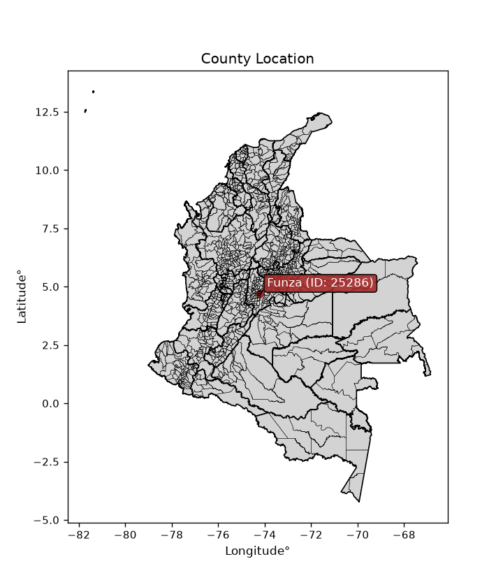
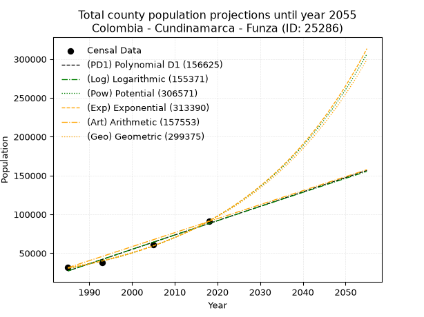
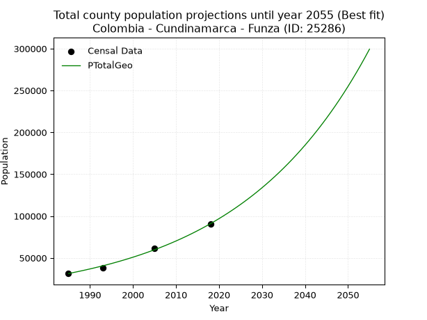
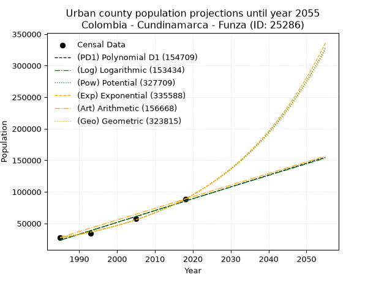
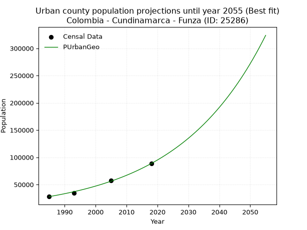
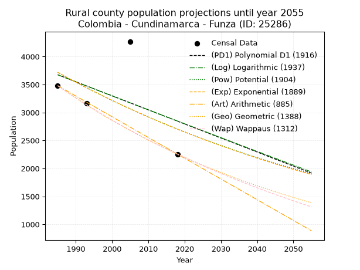
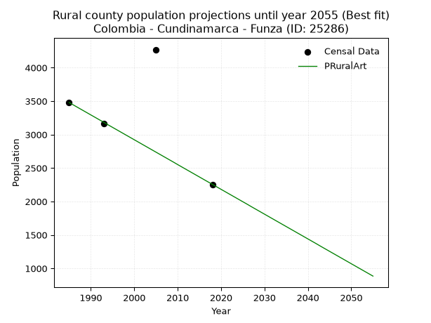

<div align="center">


</div>

# _“Population and Public Services Demand Projections (PPSD) until Year 2050 for Colombia - Cundinamarca - Funza (ID: 25286)”_
Keywords: `population` `public-service` `projection` `lineal` `polynomial` `logarithmic` `potential` `exponential` `arithmetic` `geometric` `wappaus` `dane` `colombia` `south-america`

PPSD are analytical estimates used by governments and planners to anticipate future changes in population size, age distribution, and the resulting community needs for utilities, healthcare, education, and infrastructure as sizing future water treatment facilities, electrical grids, and road networks based on spatial growth.

<div align="center">

</img>

</div>


> **General running parameters**: • app_version: _v20260806_. • Python version: _3.14.7_. • Pandas version: _3.0.5_. • NumPy version: _2.5.1_. • Creates, save and include plots into reports (create_plot): _False_. • Projection until year: _2050_. • Process polynomial degree 2 and up: _False_. • Process Wappaus: _True_. • Process Wappaus: _True_. • Set negative values to zero: _True_. • Set infinite values to zero: _True_. • Drop dataset notes: _True_. 
<div align="center">

Dynamic map: [:earth_americas:Google](http://maps.google.com/maps?q=4.710412213,-74.2015279) [:earth_americas:OSM](https://www.openstreetmap.org/#map=18/4.710412213/-74.2015279&layers=P) [:earth_americas:Bing](https://www.bing.com/maps?cp=4.710412213~-74.2015279&lvl=18) [:earth_americas:Apple](https://maps.apple.com/frame?center=4.710412213%2C-74.2015279&span=0.003%2C0.006)

</div>


<div align="center">

```geojson
{
  "type": "Feature",
  "geometry": {
    "type": "Point", 
    "coordinates": [-74.2015279, 4.710412213]
  }, 
  "properties": {
    "Name": "Colombia - Cundinamarca - Funza (ID: 25286)"
  }
}
```

</div>


## 0. Census Data (4 records)

Census data are official statistics collected by a government about the people and housing in a country. They usually include counts of total population, age, sex, race, income, education, and jobs.

📅Global census file: [Population.xlsx](../data/Population.xlsx)

| Source   |   Year |   CountryID | CountryName   |   StateID | StateName    |   CountyID | CountyName   |   PTotal |   PUrban |   PRural |
|:---------|-------:|------------:|:--------------|----------:|:-------------|-----------:|:-------------|---------:|---------:|---------:|
| DANE     |   1985 |          57 | Colombia      |        25 | Cundinamarca |      25286 | Funza        |    31366 |    27887 |     3479 |
| DANE     |   1993 |          57 | Colombia      |        25 | Cundinamarca |      25286 | Funza        |    37774 |    34612 |     3162 |
| DANE     |   2005 |          57 | Colombia      |        25 | Cundinamarca |      25286 | Funza        |    61380 |    57110 |     4270 |
| DANE     |   2018 |          57 | Colombia      |        25 | Cundinamarca |      25286 | Funza        |    90854 |    88598 |     2256 |

> 🔥Some records could had specific notes about the registered values or the corresponding urban or rural distribution.

📅[SUI-RUPS](https://www.datos.gov.co/Hacienda-y-Cr-dito-P-blico/Registro-nico-de-Prestadores-de-Servicios-P-blicos/4qkq-csdn/about_data) - Local public utility companies: [RUPS.csv](../data/RUPS.xlsx)

 | SERVICIO       | ESTADO    | NOMBRE                                                         | NIT         | DEPARTAMENTO_DOMICILIO   | MUNICIPIO_DOMICILIO   | DIRECCION                                             |   TELEFONO | EMAIL                     | TIPO_PRESTADOR                             | CLASIFICACION                 |
|:---------------|:----------|:---------------------------------------------------------------|:------------|:-------------------------|:----------------------|:------------------------------------------------------|-----------:|:--------------------------|:-------------------------------------------|:------------------------------|
| ACUEDUCTO      | OPERATIVA | EMPRESA MUNICIPAL DE ACUEDUCTO, ALCANTARILLADO Y ASEO DE FUNZA | 832000776-5 | CUNDINAMARCA             | FUNZA                 | CALLE 16 No 16 - 04                                   |    8221450 | gestioncivilsas@gmail.com | EMPRESA INDUSTRIAL Y COMERCIAL DEL ESTADO  | MAYOR O IGUAL A 5001 USUARIOS |
| ALCANTARILLADO | OPERATIVA | EMPRESA MUNICIPAL DE ACUEDUCTO, ALCANTARILLADO Y ASEO DE FUNZA | 832000776-5 | CUNDINAMARCA             | FUNZA                 | CALLE 16 No 16 - 04                                   |    8221450 | gestioncivilsas@gmail.com | EMPRESA INDUSTRIAL Y COMERCIAL DEL ESTADO  | MAYOR O IGUAL A 5001 USUARIOS |
| ACUEDUCTO      | OPERATIVA | AGUAS DE  LA SABANA DE BOGOTA S.A.  E.S.P.                     | 900021737-4 | CUNDINAMARCA             | COTA                  | AUT MEDELLIN KM 3.9 CTRO EMPRESARIAL METROPOLITANO P5 |    8415892 | algora00@gmail.com        | SOCIEDADES (EMPRESA DE SERVICIOS PUBLICOS) | MENOR O IGUAL A 2500 USUARIOS |
| ALCANTARILLADO | OPERATIVA | AGUAS DE  LA SABANA DE BOGOTA S.A.  E.S.P.                     | 900021737-4 | CUNDINAMARCA             | COTA                  | AUT MEDELLIN KM 3.9 CTRO EMPRESARIAL METROPOLITANO P5 |    8415892 | algora00@gmail.com        | SOCIEDADES (EMPRESA DE SERVICIOS PUBLICOS) | MENOR O IGUAL A 2500 USUARIOS |

## 1. Total

### 1.1. Coefficients and Parameters

* (PD1) Polynomial Deg 1: 1849.8924126856484, -3644903.798474468 (lineal)
* (Log) Logarithmic: 3701539.8760211957, -28080090.759916097
* (Pow) Potential: 66.59215620917946, -215.1207520440826
* (Exp) Exponential: 0.03326993720680753, 6.360529054637289e-25
* (Art) Arithmetic: Year diff. 2018 - 1985 = 33, Population diff. 90854 - 31366 = 59488, Annual growth = 1802.6666666666667
* (Geo) Geometric: Year diff. 2018 - 1985 = 33, Population diff. 90854 - 31366 = 59488, Annual growth % = 0.0327531125896674
* (Wap) Wappaus: i = 2.949871815851197, Condition values only valid for < 200)

<sub>
Wappaus condition values: ['0.00', '2.95', '5.90', '8.85', '11.80', '14.75', '17.70', '20.65', '23.60', '26.55', '29.50', '32.45', '35.40', '38.35', '41.30', '44.25', '47.20', '50.15', '53.10', '56.05', '59.00', '61.95', '64.90', '67.85', '70.80', '73.75', '76.70', '79.65', '82.60', '85.55', '88.50', '91.45', '94.40', '97.35', '100.30', '103.25', '106.20', '109.15', '112.10', '115.05', '117.99', '120.94', '123.89', '126.84', '129.79', '132.74', '135.69', '138.64', '141.59', '144.54', '147.49', '150.44', '153.39', '156.34', '159.29', '162.24', '165.19', '168.14', '171.09', '174.04', '176.99', '179.94', '182.89', '185.84', '188.79', '191.74']
</sub>


### 1.2. Projected Dataset

|   Year |   CountyID |   PTotalPD1 |   PTotalLog |   PTotalPow |   PTotalExp |   PTotalArt |   PTotalGeo |        PTotalWap |
|-------:|-----------:|------------:|------------:|------------:|------------:|------------:|------------:|-----------------:|
|   1985 |      25286 |       27133 |       27087 |       30495 |       30525 |       31366 |       31366 |  31366           |
|   1986 |      25286 |       28983 |       28951 |       31535 |       31558 |       33169 |       32393 |  32305           |
|   1987 |      25286 |       30832 |       30814 |       32610 |       32625 |       34971 |       33454 |  33273           |
|   1988 |      25286 |       32682 |       32677 |       33721 |       33729 |       36774 |       34550 |  34270           |
|   1989 |      25286 |       34532 |       34538 |       34870 |       34870 |       38577 |       35682 |  35299           |
|   1990 |      25286 |       36382 |       36399 |       36057 |       36050 |       40379 |       36850 |  36361           |
|   1991 |      25286 |       38232 |       38258 |       37283 |       37269 |       42182 |       38057 |  37457           |
|   1992 |      25286 |       40082 |       40117 |       38551 |       38530 |       43985 |       39304 |  38588           |
|   1993 |      25286 |       41932 |       41975 |       39861 |       39834 |       45787 |       40591 |  39758           |
|   1994 |      25286 |       43782 |       43831 |       41216 |       41181 |       47590 |       41921 |  40968           |
|   1995 |      25286 |       45632 |       45687 |       42615 |       42574 |       49393 |       43294 |  42219           |
|   1996 |      25286 |       47481 |       47542 |       44061 |       44015 |       51195 |       44712 |  43515           |
|   1997 |      25286 |       49331 |       49396 |       45555 |       45504 |       52998 |       46176 |  44857           |
|   1998 |      25286 |       51181 |       51249 |       47100 |       47043 |       54801 |       47689 |  46248           |
|   1999 |      25286 |       53031 |       53102 |       48696 |       48635 |       56603 |       49250 |  47690           |
|   2000 |      25286 |       54881 |       54953 |       50345 |       50280 |       58406 |       50864 |  49188           |
|   2001 |      25286 |       56731 |       56803 |       52049 |       51981 |       60209 |       52530 |  50743           |
|   2002 |      25286 |       58581 |       58652 |       53810 |       53739 |       62011 |       54250 |  52359           |
|   2003 |      25286 |       60431 |       60501 |       55629 |       55557 |       63814 |       56027 |  54040           |
|   2004 |      25286 |       62281 |       62348 |       57509 |       57437 |       65617 |       57862 |  55791           |
|   2005 |      25286 |       64130 |       64195 |       59452 |       59380 |       67419 |       59757 |  57614           |
|   2006 |      25286 |       65980 |       66041 |       61459 |       61389 |       69222 |       61714 |  59515           |
|   2007 |      25286 |       67830 |       67886 |       63533 |       63465 |       71025 |       63736 |  61500           |
|   2008 |      25286 |       69680 |       69729 |       65676 |       65612 |       72827 |       65823 |  63572           |
|   2009 |      25286 |       71530 |       71572 |       67890 |       67832 |       74630 |       67979 |  65740           |
|   2010 |      25286 |       73380 |       73414 |       70177 |       70127 |       76433 |       70206 |  68009           |
|   2011 |      25286 |       75230 |       75255 |       72541 |       72499 |       78235 |       72505 |  70386           |
|   2012 |      25286 |       77080 |       77096 |       74982 |       74952 |       80038 |       74880 |  72880           |
|   2013 |      25286 |       78930 |       78935 |       77505 |       77487 |       81841 |       77332 |  75500           |
|   2014 |      25286 |       80780 |       80773 |       80111 |       80109 |       83643 |       79865 |  78254           |
|   2015 |      25286 |       82629 |       82611 |       82803 |       82819 |       85446 |       82481 |  81154           |
|   2016 |      25286 |       84479 |       84447 |       85585 |       85620 |       87249 |       85183 |  84212           |
|   2017 |      25286 |       86329 |       86283 |       88458 |       88517 |       89051 |       87973 |  87440           |
|   2018 |      25286 |       88179 |       88118 |       91427 |       91511 |       90854 |       90854 |  90854           |
|   2019 |      25286 |       90029 |       89951 |       94494 |       94607 |       92657 |       93830 |  94470           |
|   2020 |      25286 |       91879 |       91784 |       97661 |       97808 |       94459 |       96903 |  98307           |
|   2021 |      25286 |       93729 |       93616 |      100934 |      101116 |       96262 |      100077 | 102384           |
|   2022 |      25286 |       95579 |       95447 |      104314 |      104537 |       98065 |      103355 | 106727           |
|   2023 |      25286 |       97429 |       97278 |      107806 |      108074 |       99867 |      106740 | 111361           |
|   2024 |      25286 |       99278 |       99107 |      111413 |      111730 |      101670 |      110236 | 116317           |
|   2025 |      25286 |      101128 |      100935 |      115138 |      115509 |      103473 |      113846 | 121629           |
|   2026 |      25286 |      102978 |      102763 |      118987 |      119417 |      105275 |      117575 | 127338           |
|   2027 |      25286 |      104828 |      104589 |      122962 |      123457 |      107078 |      121426 | 133490           |
|   2028 |      25286 |      106678 |      106415 |      127067 |      127633 |      108881 |      125403 | 140137           |
|   2029 |      25286 |      108528 |      108240 |      131308 |      131951 |      110683 |      129511 | 147343           |
|   2030 |      25286 |      110378 |      110064 |      135688 |      136415 |      112486 |      133753 | 155182           |
|   2031 |      25286 |      112228 |      111887 |      140212 |      141030 |      114289 |      138133 | 163739           |
|   2032 |      25286 |      114078 |      113709 |      144884 |      145801 |      116091 |      142658 | 173119           |
|   2033 |      25286 |      115927 |      115530 |      149709 |      150733 |      117894 |      147330 | 183447           |
|   2034 |      25286 |      117777 |      117350 |      154693 |      155832 |      119697 |      152156 | 194873           |
|   2035 |      25286 |      119627 |      119169 |      159840 |      161104 |      121499 |      157139 | 207584           |
|   2036 |      25286 |      121477 |      120988 |      165156 |      166554 |      123302 |      162286 | 221807           |
|   2037 |      25286 |      123327 |      122806 |      170646 |      172189 |      125105 |      167601 | 237832           |
|   2038 |      25286 |      125177 |      124622 |      176315 |      178014 |      126907 |      173091 | 256021           |
|   2039 |      25286 |      127027 |      126438 |      182170 |      184036 |      128710 |      178760 | 276847           |
|   2040 |      25286 |      128877 |      128253 |      188216 |      190262 |      130513 |      184615 | 300927           |
|   2041 |      25286 |      130727 |      130067 |      194460 |      196698 |      132315 |      190662 | 329088           |
|   2042 |      25286 |      132577 |      131880 |      200908 |      203352 |      134118 |      196907 | 362465           |
|   2043 |      25286 |      134426 |      133692 |      207566 |      210232 |      135921 |      203356 | 402654           |
|   2044 |      25286 |      136276 |      135504 |      214441 |      217344 |      137723 |      210016 | 451977           |
|   2045 |      25286 |      138126 |      137314 |      221541 |      224696 |      139526 |      216895 | 513947           |
|   2046 |      25286 |      139976 |      139124 |      228872 |      232298 |      141329 |      223999 | 594146           |
|   2047 |      25286 |      141826 |      140933 |      236442 |      240156 |      143131 |      231336 | 702001           |
|   2048 |      25286 |      143676 |      142740 |      244258 |      248281 |      144934 |      238913 | 854800           |
|   2049 |      25286 |      145526 |      144547 |      252329 |      256680 |      146737 |      246738 |      1.08803e+06 |
|   2050 |      25286 |      147376 |      146353 |      260662 |      265363 |      148539 |      254819 |      1.48788e+06 |
<div align="center">

</img>

</div>


### 1.3. Best fit with absolute and relative error (%)

Relative error puts that difference into context by dividing the absolute error by the true value, creating a unitless ratio or percentage that shows the scale of the mistake.

Absolute and relative error

|   Year | Source   |   CountryID | CountryName   |   StateID | StateName    |   CountyID_x | CountyName   |   PTotal |   PUrban |   PRural |   CountyID_y |   PTotalPD1 |   PTotalLog |   PTotalPow |   PTotalExp |   PTotalArt |   PTotalGeo |   PTotalWap |   PTotalPD1AbsError |   PTotalLogAbsError |   PTotalPowAbsError |   PTotalExpAbsError |   PTotalArtAbsError |   PTotalGeoAbsError |   PTotalWapAbsError |   PTotalPD1RelError |   PTotalLogRelError |   PTotalPowRelError |   PTotalExpRelError |   PTotalArtRelError |   PTotalGeoRelError |   PTotalWapRelError |
|-------:|:---------|------------:|:--------------|----------:|:-------------|-------------:|:-------------|---------:|---------:|---------:|-------------:|------------:|------------:|------------:|------------:|------------:|------------:|------------:|--------------------:|--------------------:|--------------------:|--------------------:|--------------------:|--------------------:|--------------------:|--------------------:|--------------------:|--------------------:|--------------------:|--------------------:|--------------------:|--------------------:|
|   1985 | DANE     |          57 | Colombia      |        25 | Cundinamarca |        25286 | Funza        |    31366 |    27887 |     3479 |        25286 |       27133 |       27087 |       30495 |       30525 |       31366 |       31366 |       31366 |                4233 |                4279 |                 871 |                 841 |                   0 |                   0 |                   0 |            13.4955  |            13.6422  |            2.77689  |            2.68125  |             0       |             0       |             0       |
|   1993 | DANE     |          57 | Colombia      |        25 | Cundinamarca |        25286 | Funza        |    37774 |    34612 |     3162 |        25286 |       41932 |       41975 |       39861 |       39834 |       45787 |       40591 |       39758 |                4158 |                4201 |                2087 |                2060 |                8013 |                2817 |                1984 |            11.0076  |            11.1214  |            5.52496  |            5.45349  |            21.213   |             7.45751 |             5.25229 |
|   2005 | DANE     |          57 | Colombia      |        25 | Cundinamarca |        25286 | Funza        |    61380 |    57110 |     4270 |        25286 |       64130 |       64195 |       59452 |       59380 |       67419 |       59757 |       57614 |                2750 |                2815 |                1928 |                2000 |                6039 |                1623 |                3766 |             4.48029 |             4.58618 |            3.14109  |            3.25839  |             9.83871 |             2.64418 |             6.13555 |
|   2018 | DANE     |          57 | Colombia      |        25 | Cundinamarca |        25286 | Funza        |    90854 |    88598 |     2256 |        25286 |       88179 |       88118 |       91427 |       91511 |       90854 |       90854 |       90854 |                2675 |                2736 |                 573 |                 657 |                   0 |                   0 |                   0 |             2.94428 |             3.01142 |            0.630682 |            0.723138 |             0       |             0       |             0       |

Relative error mean

| Method    |   RelError | Best   |
|:----------|-----------:|:-------|
| PTotalPD1 |    7.98191 |        |
| PTotalLog |    8.09029 |        |
| PTotalPow |    3.01841 |        |
| PTotalExp |    3.02907 |        |
| PTotalArt |    7.76293 |        |
| PTotalGeo |    2.52542 | True   |
| PTotalWap |    2.84696 |        |

💙Best method: _**PTotalGeo**_
<div align="center">

</img>

</div>


### 1.4. Fresh water supply demand in liters per capita per day (lpcd)

The fresh water supply demand typically ranges from 100 to 300 liters per capita per day (lpcd) for standard domestic and municipal planning, though absolute survival minimums set by the World Health Organization are as low as 7.5 to 20 liters per day, and total consumption in high-income nations can exceed 400 liters.

> `CZ`: Level in meters above the sea level (masl)<br> `WS`: Fresh water supply demand in liters per capita per day (lpcd or l/h/d)<br> `WSAll`: Zonal fresh water supply demand in liters per second (l/s)<br> `A`: Zonal area in square meters<br> `DP`: Population density (people/hectare or p/ha)

Reference values (RAS Colombia)

|    CZ |   WS |
|------:|-----:|
|  1000 |  120 |
|  2000 |  130 |
| 99999 |  140 |

County shapefile geometry properties and water supply values

|   CountyID |      ATotal |   CZTotal |   WSTotal |
|-----------:|------------:|----------:|----------:|
|      25286 | 6.99726e+07 |   2552.21 |       140 |

Projected values for best method: PTotalGeo

|   CountyID |   Year |   PTotalGeo |   DPTotal |   WSTotal |   WSTotalAll |
|-----------:|-------:|------------:|----------:|----------:|-------------:|
|      25286 |   1985 |       31366 |      4.48 |       140 |      50.8245 |
|      25286 |   1986 |       32393 |      4.63 |       140 |      52.4887 |
|      25286 |   1987 |       33454 |      4.78 |       140 |      54.2079 |
|      25286 |   1988 |       34550 |      4.94 |       140 |      55.9838 |
|      25286 |   1989 |       35682 |      5.1  |       140 |      57.8181 |
|      25286 |   1990 |       36850 |      5.27 |       140 |      59.7106 |
|      25286 |   1991 |       38057 |      5.44 |       140 |      61.6664 |
|      25286 |   1992 |       39304 |      5.62 |       140 |      63.687  |
|      25286 |   1993 |       40591 |      5.8  |       140 |      65.7725 |
|      25286 |   1994 |       41921 |      5.99 |       140 |      67.9275 |
|      25286 |   1995 |       43294 |      6.19 |       140 |      70.1523 |
|      25286 |   1996 |       44712 |      6.39 |       140 |      72.45   |
|      25286 |   1997 |       46176 |      6.6  |       140 |      74.8222 |
|      25286 |   1998 |       47689 |      6.82 |       140 |      77.2738 |
|      25286 |   1999 |       49250 |      7.04 |       140 |      79.8032 |
|      25286 |   2000 |       50864 |      7.27 |       140 |      82.4185 |
|      25286 |   2001 |       52530 |      7.51 |       140 |      85.1181 |
|      25286 |   2002 |       54250 |      7.75 |       140 |      87.9051 |
|      25286 |   2003 |       56027 |      8.01 |       140 |      90.7845 |
|      25286 |   2004 |       57862 |      8.27 |       140 |      93.7579 |
|      25286 |   2005 |       59757 |      8.54 |       140 |      96.8285 |
|      25286 |   2006 |       61714 |      8.82 |       140 |      99.9995 |
|      25286 |   2007 |       63736 |      9.11 |       140 |     103.276  |
|      25286 |   2008 |       65823 |      9.41 |       140 |     106.658  |
|      25286 |   2009 |       67979 |      9.72 |       140 |     110.151  |
|      25286 |   2010 |       70206 |     10.03 |       140 |     113.76   |
|      25286 |   2011 |       72505 |     10.36 |       140 |     117.485  |
|      25286 |   2012 |       74880 |     10.7  |       140 |     121.333  |
|      25286 |   2013 |       77332 |     11.05 |       140 |     125.306  |
|      25286 |   2014 |       79865 |     11.41 |       140 |     129.411  |
|      25286 |   2015 |       82481 |     11.79 |       140 |     133.65   |
|      25286 |   2016 |       85183 |     12.17 |       140 |     138.028  |
|      25286 |   2017 |       87973 |     12.57 |       140 |     142.549  |
|      25286 |   2018 |       90854 |     12.98 |       140 |     147.217  |
|      25286 |   2019 |       93830 |     13.41 |       140 |     152.039  |
|      25286 |   2020 |       96903 |     13.85 |       140 |     157.019  |
|      25286 |   2021 |      100077 |     14.3  |       140 |     162.162  |
|      25286 |   2022 |      103355 |     14.77 |       140 |     167.473  |
|      25286 |   2023 |      106740 |     15.25 |       140 |     172.958  |
|      25286 |   2024 |      110236 |     15.75 |       140 |     178.623  |
|      25286 |   2025 |      113846 |     16.27 |       140 |     184.473  |
|      25286 |   2026 |      117575 |     16.8  |       140 |     190.515  |
|      25286 |   2027 |      121426 |     17.35 |       140 |     196.755  |
|      25286 |   2028 |      125403 |     17.92 |       140 |     203.199  |
|      25286 |   2029 |      129511 |     18.51 |       140 |     209.856  |
|      25286 |   2030 |      133753 |     19.12 |       140 |     216.729  |
|      25286 |   2031 |      138133 |     19.74 |       140 |     223.827  |
|      25286 |   2032 |      142658 |     20.39 |       140 |     231.159  |
|      25286 |   2033 |      147330 |     21.06 |       140 |     238.729  |
|      25286 |   2034 |      152156 |     21.75 |       140 |     246.549  |
|      25286 |   2035 |      157139 |     22.46 |       140 |     254.623  |
|      25286 |   2036 |      162286 |     23.19 |       140 |     262.963  |
|      25286 |   2037 |      167601 |     23.95 |       140 |     271.576  |
|      25286 |   2038 |      173091 |     24.74 |       140 |     280.472  |
|      25286 |   2039 |      178760 |     25.55 |       140 |     289.657  |
|      25286 |   2040 |      184615 |     26.38 |       140 |     299.145  |
|      25286 |   2041 |      190662 |     27.25 |       140 |     308.943  |
|      25286 |   2042 |      196907 |     28.14 |       140 |     319.062  |
|      25286 |   2043 |      203356 |     29.06 |       140 |     329.512  |
|      25286 |   2044 |      210016 |     30.01 |       140 |     340.304  |
|      25286 |   2045 |      216895 |     31    |       140 |     351.45   |
|      25286 |   2046 |      223999 |     32.01 |       140 |     362.961  |
|      25286 |   2047 |      231336 |     33.06 |       140 |     374.85   |
|      25286 |   2048 |      238913 |     34.14 |       140 |     387.128  |
|      25286 |   2049 |      246738 |     35.26 |       140 |     399.807  |
|      25286 |   2050 |      254819 |     36.42 |       140 |     412.901  |

## 2. Urban

### 2.1. Coefficients and Parameters

* (PD1) Polynomial Deg 1: 1875.0272982737645, -3698471.6033720975 (lineal)
* (Log) Logarithmic: 3751671.728789151, -28464435.124536783
* (Pow) Potential: 71.85570221275476, -232.5289311944455
* (Exp) Exponential: 0.035899941103672804, 3.0619684536699483e-27
* (Art) Arithmetic: Year diff. 2018 - 1985 = 33, Population diff. 88598 - 27887 = 60711, Annual growth = 1839.7272727272727
* (Geo) Geometric: Year diff. 2018 - 1985 = 33, Population diff. 88598 - 27887 = 60711, Annual growth % = 0.03564948026810999
* (Wap) Wappaus: i = 3.1587367862424736, Condition values only valid for < 200)

<sub>
Wappaus condition values: ['0.00', '3.16', '6.32', '9.48', '12.63', '15.79', '18.95', '22.11', '25.27', '28.43', '31.59', '34.75', '37.90', '41.06', '44.22', '47.38', '50.54', '53.70', '56.86', '60.02', '63.17', '66.33', '69.49', '72.65', '75.81', '78.97', '82.13', '85.29', '88.44', '91.60', '94.76', '97.92', '101.08', '104.24', '107.40', '110.56', '113.71', '116.87', '120.03', '123.19', '126.35', '129.51', '132.67', '135.83', '138.98', '142.14', '145.30', '148.46', '151.62', '154.78', '157.94', '161.10', '164.25', '167.41', '170.57', '173.73', '176.89', '180.05', '183.21', '186.37', '189.52', '192.68', '195.84', '199.00', '202.16', '205.32']
</sub>


### 2.2. Projected Dataset

|   Year |   CountyID |   PUrbanPD1 |   PUrbanLog |   PUrbanPow |   PUrbanExp |   PUrbanArt |   PUrbanGeo |
|-------:|-----------:|------------:|------------:|------------:|------------:|------------:|------------:|
|   1985 |      25286 |       23458 |       23412 |       27162 |       27191 |       27887 |       27887 |
|   1986 |      25286 |       25333 |       25302 |       28163 |       28185 |       29727 |       28881 |
|   1987 |      25286 |       27208 |       27190 |       29201 |       29215 |       31566 |       29911 |
|   1988 |      25286 |       29083 |       29078 |       30276 |       30283 |       33406 |       30977 |
|   1989 |      25286 |       30958 |       30965 |       31390 |       31390 |       35246 |       32081 |
|   1990 |      25286 |       32833 |       32850 |       32544 |       32537 |       37086 |       33225 |
|   1991 |      25286 |       34708 |       34735 |       33740 |       33727 |       38925 |       34410 |
|   1992 |      25286 |       36583 |       36619 |       34980 |       34959 |       40765 |       35636 |
|   1993 |      25286 |       38458 |       38502 |       36265 |       36237 |       42605 |       36907 |
|   1994 |      25286 |       40333 |       40384 |       37596 |       37562 |       44445 |       38222 |
|   1995 |      25286 |       42208 |       42265 |       38975 |       38935 |       46284 |       39585 |
|   1996 |      25286 |       44083 |       44145 |       40404 |       40358 |       48124 |       40996 |
|   1997 |      25286 |       45958 |       46024 |       41884 |       41833 |       49964 |       42458 |
|   1998 |      25286 |       47833 |       47902 |       43419 |       43362 |       51803 |       43971 |
|   1999 |      25286 |       49708 |       49779 |       45008 |       44947 |       53643 |       45539 |
|   2000 |      25286 |       51583 |       51656 |       46655 |       46590 |       55483 |       47162 |
|   2001 |      25286 |       53458 |       53531 |       48361 |       48293 |       57323 |       48843 |
|   2002 |      25286 |       55333 |       55406 |       50129 |       50058 |       59162 |       50585 |
|   2003 |      25286 |       57208 |       57279 |       51960 |       51888 |       61002 |       52388 |
|   2004 |      25286 |       59083 |       59152 |       53858 |       53785 |       62842 |       54256 |
|   2005 |      25286 |       60958 |       61023 |       55823 |       55751 |       64682 |       56190 |
|   2006 |      25286 |       62833 |       62894 |       57860 |       57788 |       66521 |       58193 |
|   2007 |      25286 |       64708 |       64764 |       59969 |       59901 |       68361 |       60268 |
|   2008 |      25286 |       66583 |       66632 |       62155 |       62090 |       70201 |       62416 |
|   2009 |      25286 |       68458 |       68500 |       64419 |       64360 |       72040 |       64641 |
|   2010 |      25286 |       70333 |       70367 |       66764 |       66712 |       73880 |       66946 |
|   2011 |      25286 |       72208 |       72233 |       69193 |       69151 |       75720 |       69332 |
|   2012 |      25286 |       74083 |       74099 |       71710 |       71678 |       77560 |       71804 |
|   2013 |      25286 |       75958 |       75963 |       74316 |       74298 |       79399 |       74364 |
|   2014 |      25286 |       77833 |       77826 |       77016 |       77014 |       81239 |       77015 |
|   2015 |      25286 |       79708 |       79688 |       79813 |       79829 |       83079 |       79760 |
|   2016 |      25286 |       81583 |       81550 |       82710 |       82747 |       84919 |       82603 |
|   2017 |      25286 |       83458 |       83410 |       85710 |       85771 |       86758 |       85548 |
|   2018 |      25286 |       85333 |       85270 |       88818 |       88907 |       88598 |       88598 |
|   2019 |      25286 |       87209 |       87128 |       92036 |       92156 |       90438 |       91756 |
|   2020 |      25286 |       89084 |       88986 |       95370 |       95525 |       92277 |       95028 |
|   2021 |      25286 |       90959 |       90843 |       98823 |       99016 |       94117 |       98415 |
|   2022 |      25286 |       92834 |       92699 |      102399 |      102636 |       95957 |      101924 |
|   2023 |      25286 |       94709 |       94554 |      106102 |      106387 |       97797 |      105557 |
|   2024 |      25286 |       96584 |       96408 |      109938 |      110276 |       99636 |      109320 |
|   2025 |      25286 |       98459 |       98261 |      113910 |      114307 |      101476 |      113217 |
|   2026 |      25286 |      100334 |      100113 |      118023 |      118485 |      103316 |      117254 |
|   2027 |      25286 |      102209 |      101964 |      122283 |      122816 |      105156 |      121434 |
|   2028 |      25286 |      104084 |      103815 |      126695 |      127305 |      106995 |      125763 |
|   2029 |      25286 |      105959 |      105664 |      131263 |      131958 |      108835 |      130246 |
|   2030 |      25286 |      107834 |      107513 |      135994 |      136782 |      110675 |      134889 |
|   2031 |      25286 |      109709 |      109361 |      140893 |      141781 |      112514 |      139698 |
|   2032 |      25286 |      111584 |      111207 |      145965 |      146964 |      114354 |      144678 |
|   2033 |      25286 |      113459 |      113053 |      151218 |      152336 |      116194 |      149836 |
|   2034 |      25286 |      115334 |      114898 |      156657 |      157904 |      118034 |      155177 |
|   2035 |      25286 |      117209 |      116742 |      162289 |      163675 |      119873 |      160709 |
|   2036 |      25286 |      119084 |      118585 |      168120 |      169658 |      121713 |      166439 |
|   2037 |      25286 |      120959 |      120427 |      174158 |      175859 |      123553 |      172372 |
|   2038 |      25286 |      122834 |      122269 |      180409 |      182288 |      125393 |      178517 |
|   2039 |      25286 |      124709 |      124109 |      186882 |      188951 |      127232 |      184881 |
|   2040 |      25286 |      126584 |      125949 |      193584 |      195857 |      129072 |      191472 |
|   2041 |      25286 |      128459 |      127787 |      200522 |      203016 |      130912 |      198298 |
|   2042 |      25286 |      130334 |      129625 |      207706 |      210437 |      132751 |      205367 |
|   2043 |      25286 |      132209 |      131462 |      215143 |      218129 |      134591 |      212688 |
|   2044 |      25286 |      134084 |      133298 |      222842 |      226102 |      136431 |      220271 |
|   2045 |      25286 |      135959 |      135133 |      230814 |      234366 |      138271 |      228123 |
|   2046 |      25286 |      137834 |      136967 |      239066 |      242933 |      140110 |      236256 |
|   2047 |      25286 |      139709 |      138800 |      247609 |      251812 |      141950 |      244678 |
|   2048 |      25286 |      141584 |      140632 |      256453 |      261017 |      143790 |      253401 |
|   2049 |      25286 |      143459 |      142464 |      265608 |      270557 |      145630 |      262434 |
|   2050 |      25286 |      145334 |      144294 |      275086 |      280447 |      147469 |      271790 |
<div align="center">

</img>

</div>


### 2.3. Best fit with absolute and relative error (%)

Relative error puts that difference into context by dividing the absolute error by the true value, creating a unitless ratio or percentage that shows the scale of the mistake.

Absolute and relative error

|   Year | Source   |   CountryID | CountryName   |   StateID | StateName    |   CountyID_x | CountyName   |   PTotal |   PUrban |   PRural |   CountyID_y |   PUrbanPD1 |   PUrbanLog |   PUrbanPow |   PUrbanExp |   PUrbanArt |   PUrbanGeo |   PUrbanPD1AbsError |   PUrbanLogAbsError |   PUrbanPowAbsError |   PUrbanExpAbsError |   PUrbanArtAbsError |   PUrbanGeoAbsError |   PUrbanPD1RelError |   PUrbanLogRelError |   PUrbanPowRelError |   PUrbanExpRelError |   PUrbanArtRelError |   PUrbanGeoRelError |
|-------:|:---------|------------:|:--------------|----------:|:-------------|-------------:|:-------------|---------:|---------:|---------:|-------------:|------------:|------------:|------------:|------------:|------------:|------------:|--------------------:|--------------------:|--------------------:|--------------------:|--------------------:|--------------------:|--------------------:|--------------------:|--------------------:|--------------------:|--------------------:|--------------------:|
|   1985 | DANE     |          57 | Colombia      |        25 | Cundinamarca |        25286 | Funza        |    31366 |    27887 |     3479 |        25286 |       23458 |       23412 |       27162 |       27191 |       27887 |       27887 |                4429 |                4475 |                 725 |                 696 |                   0 |                   0 |            15.882   |            16.0469  |            2.59978  |            2.49579  |              0      |             0       |
|   1993 | DANE     |          57 | Colombia      |        25 | Cundinamarca |        25286 | Funza        |    37774 |    34612 |     3162 |        25286 |       38458 |       38502 |       36265 |       36237 |       42605 |       36907 |                3846 |                3890 |                1653 |                1625 |                7993 |                2295 |            11.1118  |            11.2389  |            4.7758   |            4.6949   |             23.0931 |             6.63065 |
|   2005 | DANE     |          57 | Colombia      |        25 | Cundinamarca |        25286 | Funza        |    61380 |    57110 |     4270 |        25286 |       60958 |       61023 |       55823 |       55751 |       64682 |       56190 |                3848 |                3913 |                1287 |                1359 |                7572 |                 920 |             6.73787 |             6.85169 |            2.25355  |            2.37962  |             13.2586 |             1.61093 |
|   2018 | DANE     |          57 | Colombia      |        25 | Cundinamarca |        25286 | Funza        |    90854 |    88598 |     2256 |        25286 |       85333 |       85270 |       88818 |       88907 |       88598 |       88598 |                3265 |                3328 |                 220 |                 309 |                   0 |                   0 |             3.68518 |             3.75629 |            0.248313 |            0.348766 |              0      |             0       |

Relative error mean

| Method    |   RelError | Best   |
|:----------|-----------:|:-------|
| PUrbanPD1 |    9.35419 |        |
| PUrbanLog |    9.47344 |        |
| PUrbanPow |    2.46936 |        |
| PUrbanExp |    2.47977 |        |
| PUrbanArt |    9.08794 |        |
| PUrbanGeo |    2.06039 | True   |

💙Best method: _**PUrbanGeo**_
<div align="center">

</img>

</div>


### 2.4. Fresh water supply demand in liters per capita per day (lpcd)

The fresh water supply demand typically ranges from 100 to 300 liters per capita per day (lpcd) for standard domestic and municipal planning, though absolute survival minimums set by the World Health Organization are as low as 7.5 to 20 liters per day, and total consumption in high-income nations can exceed 400 liters.

> `CZ`: Level in meters above the sea level (masl)<br> `WS`: Fresh water supply demand in liters per capita per day (lpcd or l/h/d)<br> `WSAll`: Zonal fresh water supply demand in liters per second (l/s)<br> `A`: Zonal area in square meters<br> `DP`: Population density (people/hectare or p/ha)

Reference values (RAS Colombia)

|    CZ |   WS |
|------:|-----:|
|  1000 |  120 |
|  2000 |  130 |
| 99999 |  140 |

County shapefile geometry properties and water supply values

|   CountyID |     AUrban |   CZUrban |   WSUrban |
|-----------:|-----------:|----------:|----------:|
|      25286 | 7.7848e+06 |   2547.82 |       140 |

Projected values for best method: PUrbanGeo

|   CountyID |   Year |   PUrbanGeo |   DPUrban |   WSUrban |   WSUrbanAll |
|-----------:|-------:|------------:|----------:|----------:|-------------:|
|      25286 |   1985 |       27887 |     35.82 |       140 |      45.1873 |
|      25286 |   1986 |       28881 |     37.1  |       140 |      46.7979 |
|      25286 |   1987 |       29911 |     38.42 |       140 |      48.4669 |
|      25286 |   1988 |       30977 |     39.79 |       140 |      50.1942 |
|      25286 |   1989 |       32081 |     41.21 |       140 |      51.9831 |
|      25286 |   1990 |       33225 |     42.68 |       140 |      53.8368 |
|      25286 |   1991 |       34410 |     44.2  |       140 |      55.7569 |
|      25286 |   1992 |       35636 |     45.78 |       140 |      57.7435 |
|      25286 |   1993 |       36907 |     47.41 |       140 |      59.803  |
|      25286 |   1994 |       38222 |     49.1  |       140 |      61.9338 |
|      25286 |   1995 |       39585 |     50.85 |       140 |      64.1424 |
|      25286 |   1996 |       40996 |     52.66 |       140 |      66.4287 |
|      25286 |   1997 |       42458 |     54.54 |       140 |      68.7977 |
|      25286 |   1998 |       43971 |     56.48 |       140 |      71.2493 |
|      25286 |   1999 |       45539 |     58.5  |       140 |      73.79   |
|      25286 |   2000 |       47162 |     60.58 |       140 |      76.4199 |
|      25286 |   2001 |       48843 |     62.74 |       140 |      79.1437 |
|      25286 |   2002 |       50585 |     64.98 |       140 |      81.9664 |
|      25286 |   2003 |       52388 |     67.3  |       140 |      84.888  |
|      25286 |   2004 |       54256 |     69.69 |       140 |      87.9148 |
|      25286 |   2005 |       56190 |     72.18 |       140 |      91.0486 |
|      25286 |   2006 |       58193 |     74.75 |       140 |      94.2942 |
|      25286 |   2007 |       60268 |     77.42 |       140 |      97.6565 |
|      25286 |   2008 |       62416 |     80.18 |       140 |     101.137  |
|      25286 |   2009 |       64641 |     83.03 |       140 |     104.742  |
|      25286 |   2010 |       66946 |     86    |       140 |     108.477  |
|      25286 |   2011 |       69332 |     89.06 |       140 |     112.344  |
|      25286 |   2012 |       71804 |     92.24 |       140 |     116.349  |
|      25286 |   2013 |       74364 |     95.52 |       140 |     120.497  |
|      25286 |   2014 |       77015 |     98.93 |       140 |     124.793  |
|      25286 |   2015 |       79760 |    102.46 |       140 |     129.241  |
|      25286 |   2016 |       82603 |    106.11 |       140 |     133.847  |
|      25286 |   2017 |       85548 |    109.89 |       140 |     138.619  |
|      25286 |   2018 |       88598 |    113.81 |       140 |     143.562  |
|      25286 |   2019 |       91756 |    117.87 |       140 |     148.679  |
|      25286 |   2020 |       95028 |    122.07 |       140 |     153.981  |
|      25286 |   2021 |       98415 |    126.42 |       140 |     159.469  |
|      25286 |   2022 |      101924 |    130.93 |       140 |     165.155  |
|      25286 |   2023 |      105557 |    135.59 |       140 |     171.041  |
|      25286 |   2024 |      109320 |    140.43 |       140 |     177.139  |
|      25286 |   2025 |      113217 |    145.43 |       140 |     183.453  |
|      25286 |   2026 |      117254 |    150.62 |       140 |     189.995  |
|      25286 |   2027 |      121434 |    155.99 |       140 |     196.768  |
|      25286 |   2028 |      125763 |    161.55 |       140 |     203.783  |
|      25286 |   2029 |      130246 |    167.31 |       140 |     211.047  |
|      25286 |   2030 |      134889 |    173.27 |       140 |     218.57   |
|      25286 |   2031 |      139698 |    179.45 |       140 |     226.363  |
|      25286 |   2032 |      144678 |    185.85 |       140 |     234.432  |
|      25286 |   2033 |      149836 |    192.47 |       140 |     242.79   |
|      25286 |   2034 |      155177 |    199.33 |       140 |     251.444  |
|      25286 |   2035 |      160709 |    206.44 |       140 |     260.408  |
|      25286 |   2036 |      166439 |    213.8  |       140 |     269.693  |
|      25286 |   2037 |      172372 |    221.42 |       140 |     279.306  |
|      25286 |   2038 |      178517 |    229.31 |       140 |     289.264  |
|      25286 |   2039 |      184881 |    237.49 |       140 |     299.576  |
|      25286 |   2040 |      191472 |    245.96 |       140 |     310.256  |
|      25286 |   2041 |      198298 |    254.72 |       140 |     321.316  |
|      25286 |   2042 |      205367 |    263.81 |       140 |     332.771  |
|      25286 |   2043 |      212688 |    273.21 |       140 |     344.633  |
|      25286 |   2044 |      220271 |    282.95 |       140 |     356.921  |
|      25286 |   2045 |      228123 |    293.04 |       140 |     369.644  |
|      25286 |   2046 |      236256 |    303.48 |       140 |     382.822  |
|      25286 |   2047 |      244678 |    314.3  |       140 |     396.469  |
|      25286 |   2048 |      253401 |    325.51 |       140 |     410.603  |
|      25286 |   2049 |      262434 |    337.11 |       140 |     425.24   |
|      25286 |   2050 |      271790 |    349.13 |       140 |     440.4    |

## 3. Rural

### 3.1. Coefficients and Parameters

* (PD1) Polynomial Deg 1: -25.134885588116042, 53567.80489762912 (lineal)
* (Log) Logarithmic: -50131.85276795659, 384344.3646206937
* (Pow) Potential: -19.302231114417513, 67.22442455133228
* (Exp) Exponential: -0.009671050455831096, 808190109814.7367
* (Art) Arithmetic: Year diff. 2018 - 1985 = 33, Population diff. 2256 - 3479 = -1223, Annual growth = -37.06060606060606
* (Geo) Geometric: Year diff. 2018 - 1985 = 33, Population diff. 2256 - 3479 = -1223, Annual growth % = -0.013040037214653188
* (Wap) Wappaus: i = -1.2924361311458086, Condition values only valid for < 200)

<sub>
Wappaus condition values: ['-0.00', '-1.29', '-2.58', '-3.88', '-5.17', '-6.46', '-7.75', '-9.05', '-10.34', '-11.63', '-12.92', '-14.22', '-15.51', '-16.80', '-18.09', '-19.39', '-20.68', '-21.97', '-23.26', '-24.56', '-25.85', '-27.14', '-28.43', '-29.73', '-31.02', '-32.31', '-33.60', '-34.90', '-36.19', '-37.48', '-38.77', '-40.07', '-41.36', '-42.65', '-43.94', '-45.24', '-46.53', '-47.82', '-49.11', '-50.41', '-51.70', '-52.99', '-54.28', '-55.57', '-56.87', '-58.16', '-59.45', '-60.74', '-62.04', '-63.33', '-64.62', '-65.91', '-67.21', '-68.50', '-69.79', '-71.08', '-72.38', '-73.67', '-74.96', '-76.25', '-77.55', '-78.84', '-80.13', '-81.42', '-82.72', '-84.01']
</sub>


### 3.2. Projected Dataset

|   Year |   CountyID |   PRuralPD1 |   PRuralLog |   PRuralPow |   PRuralExp |   PRuralArt |   PRuralGeo |   PRuralWap |
|-------:|-----------:|------------:|------------:|------------:|------------:|------------:|------------:|------------:|
|   1985 |      25286 |        3675 |        3674 |        3718 |        3718 |        3479 |        3479 |        3479 |
|   1986 |      25286 |        3650 |        3649 |        3682 |        3683 |        3442 |        3434 |        3434 |
|   1987 |      25286 |        3625 |        3624 |        3646 |        3647 |        3405 |        3389 |        3390 |
|   1988 |      25286 |        3600 |        3599 |        3611 |        3612 |        3368 |        3345 |        3347 |
|   1989 |      25286 |        3575 |        3574 |        3576 |        3577 |        3331 |        3301 |        3304 |
|   1990 |      25286 |        3549 |        3548 |        3542 |        3543 |        3294 |        3258 |        3261 |
|   1991 |      25286 |        3524 |        3523 |        3507 |        3509 |        3257 |        3216 |        3219 |
|   1992 |      25286 |        3499 |        3498 |        3474 |        3475 |        3220 |        3174 |        3178 |
|   1993 |      25286 |        3474 |        3473 |        3440 |        3441 |        3183 |        3132 |        3137 |
|   1994 |      25286 |        3449 |        3448 |        3407 |        3408 |        3145 |        3091 |        3097 |
|   1995 |      25286 |        3424 |        3423 |        3374 |        3376 |        3108 |        3051 |        3057 |
|   1996 |      25286 |        3399 |        3397 |        3342 |        3343 |        3071 |        3011 |        3017 |
|   1997 |      25286 |        3373 |        3372 |        3310 |        3311 |        3034 |        2972 |        2978 |
|   1998 |      25286 |        3348 |        3347 |        3278 |        3279 |        2997 |        2933 |        2940 |
|   1999 |      25286 |        3323 |        3322 |        3246 |        3247 |        2960 |        2895 |        2902 |
|   2000 |      25286 |        3298 |        3297 |        3215 |        3216 |        2923 |        2857 |        2864 |
|   2001 |      25286 |        3273 |        3272 |        3184 |        3185 |        2886 |        2820 |        2827 |
|   2002 |      25286 |        3248 |        3247 |        3154 |        3155 |        2849 |        2783 |        2790 |
|   2003 |      25286 |        3223 |        3222 |        3123 |        3124 |        2812 |        2747 |        2754 |
|   2004 |      25286 |        3197 |        3197 |        3093 |        3094 |        2775 |        2711 |        2718 |
|   2005 |      25286 |        3172 |        3172 |        3064 |        3064 |        2738 |        2676 |        2683 |
|   2006 |      25286 |        3147 |        3147 |        3034 |        3035 |        2701 |        2641 |        2648 |
|   2007 |      25286 |        3122 |        3122 |        3005 |        3006 |        2664 |        2606 |        2613 |
|   2008 |      25286 |        3097 |        3097 |        2977 |        2977 |        2627 |        2572 |        2579 |
|   2009 |      25286 |        3072 |        3072 |        2948 |        2948 |        2590 |        2539 |        2545 |
|   2010 |      25286 |        3047 |        3047 |        2920 |        2920 |        2552 |        2506 |        2511 |
|   2011 |      25286 |        3022 |        3022 |        2892 |        2892 |        2515 |        2473 |        2478 |
|   2012 |      25286 |        2996 |        2997 |        2864 |        2864 |        2478 |        2441 |        2445 |
|   2013 |      25286 |        2971 |        2972 |        2837 |        2836 |        2441 |        2409 |        2413 |
|   2014 |      25286 |        2946 |        2947 |        2810 |        2809 |        2404 |        2378 |        2381 |
|   2015 |      25286 |        2921 |        2922 |        2783 |        2782 |        2367 |        2347 |        2349 |
|   2016 |      25286 |        2896 |        2898 |        2757 |        2755 |        2330 |        2316 |        2318 |
|   2017 |      25286 |        2871 |        2873 |        2730 |        2729 |        2293 |        2286 |        2287 |
|   2018 |      25286 |        2846 |        2848 |        2704 |        2702 |        2256 |        2256 |        2256 |
|   2019 |      25286 |        2820 |        2823 |        2679 |        2676 |        2219 |        2227 |        2226 |
|   2020 |      25286 |        2795 |        2798 |        2653 |        2651 |        2182 |        2198 |        2196 |
|   2021 |      25286 |        2770 |        2773 |        2628 |        2625 |        2145 |        2169 |        2166 |
|   2022 |      25286 |        2745 |        2749 |        2603 |        2600 |        2108 |        2141 |        2136 |
|   2023 |      25286 |        2720 |        2724 |        2578 |        2575 |        2071 |        2113 |        2107 |
|   2024 |      25286 |        2695 |        2699 |        2554 |        2550 |        2034 |        2085 |        2078 |
|   2025 |      25286 |        2670 |        2674 |        2530 |        2525 |        1997 |        2058 |        2050 |
|   2026 |      25286 |        2645 |        2650 |        2506 |        2501 |        1960 |        2031 |        2022 |
|   2027 |      25286 |        2619 |        2625 |        2482 |        2477 |        1922 |        2005 |        1994 |
|   2028 |      25286 |        2594 |        2600 |        2458 |        2453 |        1885 |        1978 |        1966 |
|   2029 |      25286 |        2569 |        2575 |        2435 |        2430 |        1848 |        1953 |        1939 |
|   2030 |      25286 |        2544 |        2551 |        2412 |        2406 |        1811 |        1927 |        1911 |
|   2031 |      25286 |        2519 |        2526 |        2389 |        2383 |        1774 |        1902 |        1885 |
|   2032 |      25286 |        2494 |        2501 |        2367 |        2360 |        1737 |        1877 |        1858 |
|   2033 |      25286 |        2469 |        2477 |        2344 |        2337 |        1700 |        1853 |        1832 |
|   2034 |      25286 |        2443 |        2452 |        2322 |        2315 |        1663 |        1829 |        1806 |
|   2035 |      25286 |        2418 |        2427 |        2300 |        2293 |        1626 |        1805 |        1780 |
|   2036 |      25286 |        2393 |        2403 |        2278 |        2271 |        1589 |        1781 |        1754 |
|   2037 |      25286 |        2368 |        2378 |        2257 |        2249 |        1552 |        1758 |        1729 |
|   2038 |      25286 |        2343 |        2353 |        2236 |        2227 |        1515 |        1735 |        1704 |
|   2039 |      25286 |        2318 |        2329 |        2215 |        2206 |        1478 |        1712 |        1679 |
|   2040 |      25286 |        2293 |        2304 |        2194 |        2184 |        1441 |        1690 |        1654 |
|   2041 |      25286 |        2268 |        2280 |        2173 |        2163 |        1404 |        1668 |        1630 |
|   2042 |      25286 |        2242 |        2255 |        2153 |        2143 |        1367 |        1646 |        1606 |
|   2043 |      25286 |        2217 |        2231 |        2132 |        2122 |        1329 |        1625 |        1582 |
|   2044 |      25286 |        2192 |        2206 |        2112 |        2102 |        1292 |        1604 |        1558 |
|   2045 |      25286 |        2167 |        2182 |        2092 |        2081 |        1255 |        1583 |        1535 |
|   2046 |      25286 |        2142 |        2157 |        2073 |        2061 |        1218 |        1562 |        1512 |
|   2047 |      25286 |        2117 |        2133 |        2053 |        2041 |        1181 |        1542 |        1489 |
|   2048 |      25286 |        2092 |        2108 |        2034 |        2022 |        1144 |        1522 |        1466 |
|   2049 |      25286 |        2066 |        2084 |        2015 |        2002 |        1107 |        1502 |        1443 |
|   2050 |      25286 |        2041 |        2059 |        1996 |        1983 |        1070 |        1482 |        1421 |
<div align="center">

</img>

</div>


### 3.3. Best fit with absolute and relative error (%)

Relative error puts that difference into context by dividing the absolute error by the true value, creating a unitless ratio or percentage that shows the scale of the mistake.

Absolute and relative error

|   Year | Source   |   CountryID | CountryName   |   StateID | StateName    |   CountyID_x | CountyName   |   PTotal |   PUrban |   PRural |   CountyID_y |   PRuralPD1 |   PRuralLog |   PRuralPow |   PRuralExp |   PRuralArt |   PRuralGeo |   PRuralWap |   PRuralPD1AbsError |   PRuralLogAbsError |   PRuralPowAbsError |   PRuralExpAbsError |   PRuralArtAbsError |   PRuralGeoAbsError |   PRuralWapAbsError |   PRuralPD1RelError |   PRuralLogRelError |   PRuralPowRelError |   PRuralExpRelError |   PRuralArtRelError |   PRuralGeoRelError |   PRuralWapRelError |
|-------:|:---------|------------:|:--------------|----------:|:-------------|-------------:|:-------------|---------:|---------:|---------:|-------------:|------------:|------------:|------------:|------------:|------------:|------------:|------------:|--------------------:|--------------------:|--------------------:|--------------------:|--------------------:|--------------------:|--------------------:|--------------------:|--------------------:|--------------------:|--------------------:|--------------------:|--------------------:|--------------------:|
|   1985 | DANE     |          57 | Colombia      |        25 | Cundinamarca |        25286 | Funza        |    31366 |    27887 |     3479 |        25286 |        3675 |        3674 |        3718 |        3718 |        3479 |        3479 |        3479 |                 196 |                 195 |                 239 |                 239 |                   0 |                   0 |                   0 |             5.6338  |             5.60506 |             6.86979 |             6.86979 |            0        |            0        |            0        |
|   1993 | DANE     |          57 | Colombia      |        25 | Cundinamarca |        25286 | Funza        |    37774 |    34612 |     3162 |        25286 |        3474 |        3473 |        3440 |        3441 |        3183 |        3132 |        3137 |                 312 |                 311 |                 278 |                 279 |                  21 |                  30 |                  25 |             9.86717 |             9.83555 |             8.7919  |             8.82353 |            0.664137 |            0.948767 |            0.790639 |
|   2005 | DANE     |          57 | Colombia      |        25 | Cundinamarca |        25286 | Funza        |    61380 |    57110 |     4270 |        25286 |        3172 |        3172 |        3064 |        3064 |        2738 |        2676 |        2683 |                1098 |                1098 |                1206 |                1206 |                1532 |                1594 |                1587 |            25.7143  |            25.7143  |            28.2436  |            28.2436  |           35.8782   |           37.3302   |           37.1663   |
|   2018 | DANE     |          57 | Colombia      |        25 | Cundinamarca |        25286 | Funza        |    90854 |    88598 |     2256 |        25286 |        2846 |        2848 |        2704 |        2702 |        2256 |        2256 |        2256 |                 590 |                 592 |                 448 |                 446 |                   0 |                   0 |                   0 |            26.1525  |            26.2411  |            19.8582  |            19.7695  |            0        |            0        |            0        |

Relative error mean

| Method    |   RelError | Best   |
|:----------|-----------:|:-------|
| PRuralPD1 |   16.8419  |        |
| PRuralLog |   16.849   |        |
| PRuralPow |   15.9409  |        |
| PRuralExp |   15.9266  |        |
| PRuralArt |    9.13559 | True   |
| PRuralGeo |    9.56974 |        |
| PRuralWap |    9.48923 |        |

💙Best method: _**PRuralArt**_
<div align="center">

</img>

</div>


### 3.4. Fresh water supply demand in liters per capita per day (lpcd)

The fresh water supply demand typically ranges from 100 to 300 liters per capita per day (lpcd) for standard domestic and municipal planning, though absolute survival minimums set by the World Health Organization are as low as 7.5 to 20 liters per day, and total consumption in high-income nations can exceed 400 liters.

> `CZ`: Level in meters above the sea level (masl)<br> `WS`: Fresh water supply demand in liters per capita per day (lpcd or l/h/d)<br> `WSAll`: Zonal fresh water supply demand in liters per second (l/s)<br> `A`: Zonal area in square meters<br> `DP`: Population density (people/hectare or p/ha)

Reference values (RAS Colombia)

|    CZ |   WS |
|------:|-----:|
|  1000 |  120 |
|  2000 |  130 |
| 99999 |  140 |

County shapefile geometry properties and water supply values

|   CountyID |      ARural |   CZRural |   WSRural |
|-----------:|------------:|----------:|----------:|
|      25286 | 6.21878e+07 |   2553.06 |       140 |

Projected values for best method: PRuralArt

|   CountyID |   Year |   PRuralArt |   DPRural |   WSRural |   WSRuralAll |
|-----------:|-------:|------------:|----------:|----------:|-------------:|
|      25286 |   1985 |        3479 |      0.56 |       140 |      5.63727 |
|      25286 |   1986 |        3442 |      0.55 |       140 |      5.57731 |
|      25286 |   1987 |        3405 |      0.55 |       140 |      5.51736 |
|      25286 |   1988 |        3368 |      0.54 |       140 |      5.45741 |
|      25286 |   1989 |        3331 |      0.54 |       140 |      5.39745 |
|      25286 |   1990 |        3294 |      0.53 |       140 |      5.3375  |
|      25286 |   1991 |        3257 |      0.52 |       140 |      5.27755 |
|      25286 |   1992 |        3220 |      0.52 |       140 |      5.21759 |
|      25286 |   1993 |        3183 |      0.51 |       140 |      5.15764 |
|      25286 |   1994 |        3145 |      0.51 |       140 |      5.09606 |
|      25286 |   1995 |        3108 |      0.5  |       140 |      5.03611 |
|      25286 |   1996 |        3071 |      0.49 |       140 |      4.97616 |
|      25286 |   1997 |        3034 |      0.49 |       140 |      4.9162  |
|      25286 |   1998 |        2997 |      0.48 |       140 |      4.85625 |
|      25286 |   1999 |        2960 |      0.48 |       140 |      4.7963  |
|      25286 |   2000 |        2923 |      0.47 |       140 |      4.73634 |
|      25286 |   2001 |        2886 |      0.46 |       140 |      4.67639 |
|      25286 |   2002 |        2849 |      0.46 |       140 |      4.61644 |
|      25286 |   2003 |        2812 |      0.45 |       140 |      4.55648 |
|      25286 |   2004 |        2775 |      0.45 |       140 |      4.49653 |
|      25286 |   2005 |        2738 |      0.44 |       140 |      4.43657 |
|      25286 |   2006 |        2701 |      0.43 |       140 |      4.37662 |
|      25286 |   2007 |        2664 |      0.43 |       140 |      4.31667 |
|      25286 |   2008 |        2627 |      0.42 |       140 |      4.25671 |
|      25286 |   2009 |        2590 |      0.42 |       140 |      4.19676 |
|      25286 |   2010 |        2552 |      0.41 |       140 |      4.13519 |
|      25286 |   2011 |        2515 |      0.4  |       140 |      4.07523 |
|      25286 |   2012 |        2478 |      0.4  |       140 |      4.01528 |
|      25286 |   2013 |        2441 |      0.39 |       140 |      3.95532 |
|      25286 |   2014 |        2404 |      0.39 |       140 |      3.89537 |
|      25286 |   2015 |        2367 |      0.38 |       140 |      3.83542 |
|      25286 |   2016 |        2330 |      0.37 |       140 |      3.77546 |
|      25286 |   2017 |        2293 |      0.37 |       140 |      3.71551 |
|      25286 |   2018 |        2256 |      0.36 |       140 |      3.65556 |
|      25286 |   2019 |        2219 |      0.36 |       140 |      3.5956  |
|      25286 |   2020 |        2182 |      0.35 |       140 |      3.53565 |
|      25286 |   2021 |        2145 |      0.34 |       140 |      3.47569 |
|      25286 |   2022 |        2108 |      0.34 |       140 |      3.41574 |
|      25286 |   2023 |        2071 |      0.33 |       140 |      3.35579 |
|      25286 |   2024 |        2034 |      0.33 |       140 |      3.29583 |
|      25286 |   2025 |        1997 |      0.32 |       140 |      3.23588 |
|      25286 |   2026 |        1960 |      0.32 |       140 |      3.17593 |
|      25286 |   2027 |        1922 |      0.31 |       140 |      3.11435 |
|      25286 |   2028 |        1885 |      0.3  |       140 |      3.0544  |
|      25286 |   2029 |        1848 |      0.3  |       140 |      2.99444 |
|      25286 |   2030 |        1811 |      0.29 |       140 |      2.93449 |
|      25286 |   2031 |        1774 |      0.29 |       140 |      2.87454 |
|      25286 |   2032 |        1737 |      0.28 |       140 |      2.81458 |
|      25286 |   2033 |        1700 |      0.27 |       140 |      2.75463 |
|      25286 |   2034 |        1663 |      0.27 |       140 |      2.69468 |
|      25286 |   2035 |        1626 |      0.26 |       140 |      2.63472 |
|      25286 |   2036 |        1589 |      0.26 |       140 |      2.57477 |
|      25286 |   2037 |        1552 |      0.25 |       140 |      2.51481 |
|      25286 |   2038 |        1515 |      0.24 |       140 |      2.45486 |
|      25286 |   2039 |        1478 |      0.24 |       140 |      2.39491 |
|      25286 |   2040 |        1441 |      0.23 |       140 |      2.33495 |
|      25286 |   2041 |        1404 |      0.23 |       140 |      2.275   |
|      25286 |   2042 |        1367 |      0.22 |       140 |      2.21505 |
|      25286 |   2043 |        1329 |      0.21 |       140 |      2.15347 |
|      25286 |   2044 |        1292 |      0.21 |       140 |      2.09352 |
|      25286 |   2045 |        1255 |      0.2  |       140 |      2.03356 |
|      25286 |   2046 |        1218 |      0.2  |       140 |      1.97361 |
|      25286 |   2047 |        1181 |      0.19 |       140 |      1.91366 |
|      25286 |   2048 |        1144 |      0.18 |       140 |      1.8537  |
|      25286 |   2049 |        1107 |      0.18 |       140 |      1.79375 |
|      25286 |   2050 |        1070 |      0.17 |       140 |      1.7338  |

<div align="center"><br><sub>Share this research</sub></div><br>

<sub>**APPS & TOOLS & CONTENT DISCLAIMER**: • NO WARRANTY - This content and software is provided by <a href="https://github.com/rcfdtools" target="_blank">github.com/rcfdtools</a> "as is", without any express or implied warranty, including warranties of merchantability, fitness for a particular purpose, or non-infringement. There is no guarantee that the software will be error-free or operate without interruption. • LIMITATION OF LIABILITY - Neither the authors nor copyright holders will be liable for claims or damages arising from the software or its use. You are responsible for determining if the software is appropriate for your use and assume all associated risks, including errors, legal compliance, and data loss. • NO PROFESSIONAL ADVICE - The software provides general information and does not offer professional advice. It should not replace consultation with professional advisors. [Clauses and global license for rcfdtools use.](https://github.com/rcfdtools/rcfdtools/blob/main/LICENSE.md)</sub>

| [:house: Home](Readme.md)  | [:beginner: Help / Collab](https://github.com/rcfdtools/R.HydroTools/discussions/31) |
|----------------------------|-------------------------------------------------------------------------------------------|