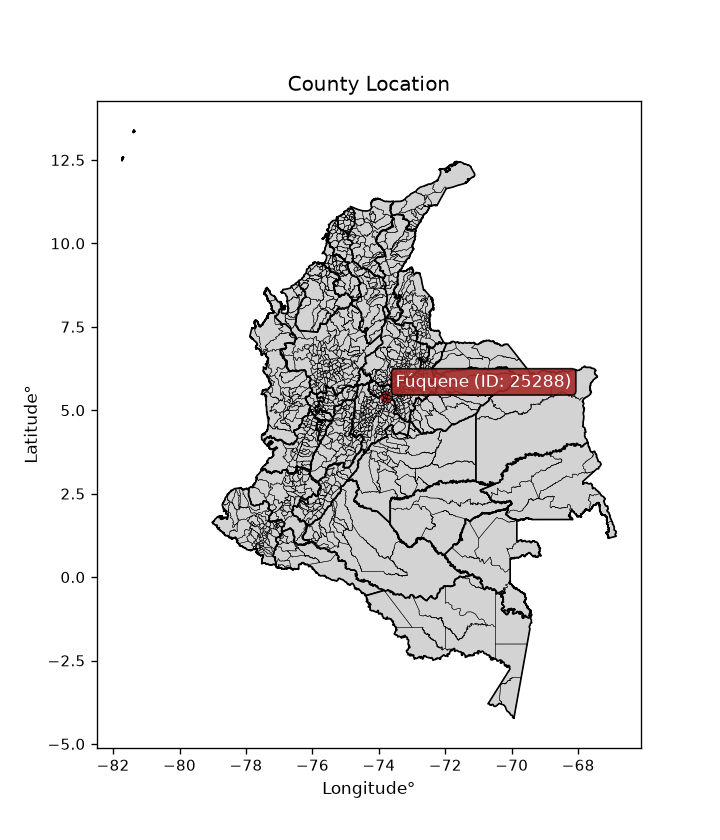
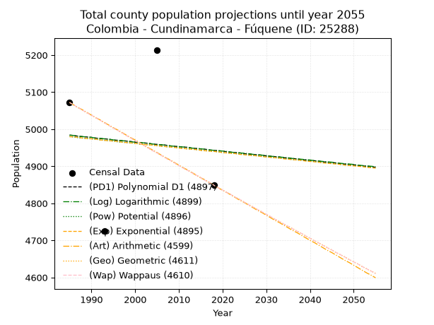
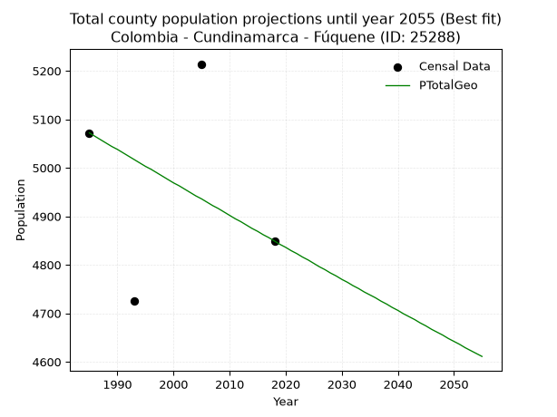
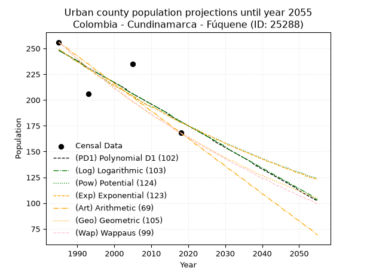
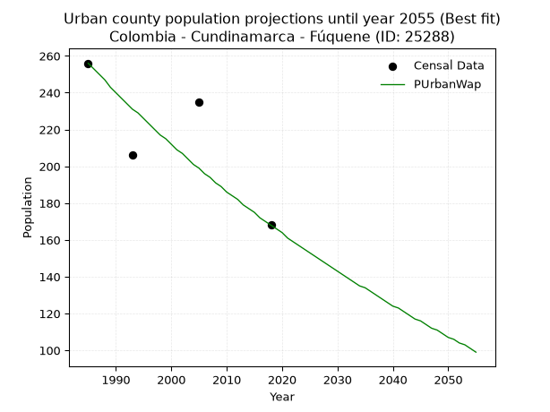
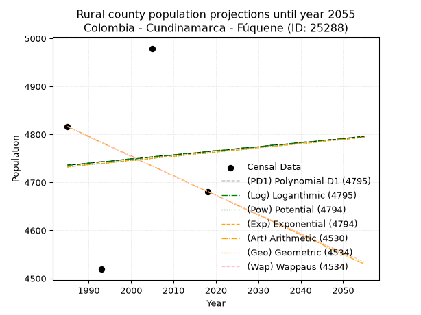
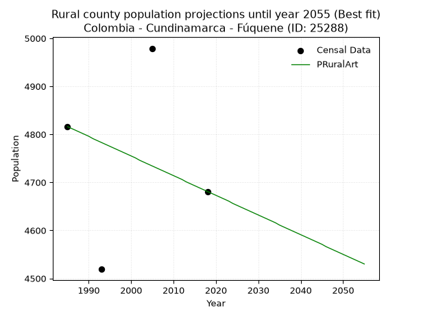

<div align="center">


</div>

# _“Population and Public Services Demand Projections (PPSD) until Year 2050 for Colombia - Cundinamarca - Fúquene (ID: 25288)”_
Keywords: `population` `public-service` `projection` `lineal` `polynomial` `logarithmic` `potential` `exponential` `arithmetic` `geometric` `wappaus` `dane` `colombia` `south-america`

PPSD are analytical estimates used by governments and planners to anticipate future changes in population size, age distribution, and the resulting community needs for utilities, healthcare, education, and infrastructure as sizing future water treatment facilities, electrical grids, and road networks based on spatial growth.

> **General running parameters**: • app_version: _v20260806_. • Python version: _3.14.7_. • Pandas version: _3.0.5_. • NumPy version: _2.5.1_. • Creates, save and include plots into reports (create_plot): _False_. • Projection until year: _2050_. • Process polynomial degree 2 and up: _False_. • Process Wappaus: _True_. • Process Wappaus: _True_. • Set negative values to zero: _True_. • Set infinite values to zero: _True_. • Drop dataset notes: _True_. 
<div align="center">

Dynamic map: [:earth_americas:Google](http://maps.google.com/maps?q=5.403996687,-73.7958551) [:earth_americas:OSM](https://www.openstreetmap.org/#map=18/5.403996687/-73.7958551&layers=P) [:earth_americas:Bing](https://www.bing.com/maps?cp=5.403996687~-73.7958551&lvl=18) [:earth_americas:Apple](https://maps.apple.com/frame?center=5.403996687%2C-73.7958551&span=0.003%2C0.006)

</div>


<div align="center">

```geojson
{
  "type": "Feature",
  "geometry": {
    "type": "Point", 
    "coordinates": [-73.7958551, 5.403996687]
  }, 
  "properties": {
    "Name": "Colombia - Cundinamarca - Fúquene (ID: 25288)"
  }
}
```

</div>


<div align="center">

</img>

</div>


## 0. Census Data (4 records)

Census data are official statistics collected by a government about the people and housing in a country. They usually include counts of total population, age, sex, race, income, education, and jobs.

📅Global census file: [Population.xlsx](../data/Population.xlsx)

| Source   |   Year |   CountryID | CountryName   |   StateID | StateName    |   CountyID | CountyName   |   PTotal |   PUrban |   PRural |
|:---------|-------:|------------:|:--------------|----------:|:-------------|-----------:|:-------------|---------:|---------:|---------:|
| DANE     |   1985 |          57 | Colombia      |        25 | Cundinamarca |      25288 | Fúquene      |     5072 |      256 |     4816 |
| DANE     |   1993 |          57 | Colombia      |        25 | Cundinamarca |      25288 | Fúquene      |     4725 |      206 |     4519 |
| DANE     |   2005 |          57 | Colombia      |        25 | Cundinamarca |      25288 | Fúquene      |     5214 |      235 |     4979 |
| DANE     |   2018 |          57 | Colombia      |        25 | Cundinamarca |      25288 | Fúquene      |     4849 |      168 |     4681 |

> 🔥Some records could had specific notes about the registered values or the corresponding urban or rural distribution.

📅   [RUPS](https://www.datos.gov.co/Hacienda-y-Cr-dito-P-blico/Registro-nico-de-Prestadores-de-Servicios-P-blicos/4qkq-csdn/about_data) - Local public utility companies: [RUPS.csv](../data/RUPS.xlsx)

 | SERVICIO       | ESTADO    | NOMBRE                                                          | NIT         | DEPARTAMENTO_DOMICILIO   | MUNICIPIO_DOMICILIO   | DIRECCION        |   TELEFONO | EMAIL                                         | TIPO_PRESTADOR                 | CLASIFICACION                 |
|:---------------|:----------|:----------------------------------------------------------------|:------------|:-------------------------|:----------------------|:-----------------|-----------:|:----------------------------------------------|:-------------------------------|:------------------------------|
| ACUEDUCTO      | OPERATIVA | UNIDAD DE SERVICIOS PÚBLICOS DE FÚQUENE                         | 899999323-3 | CUNDINAMARCA             | FUQUENE               | calle 6a No 2-39 |    8585009 | serviciospublicos@fuquene-cundinamarca.gov.co | MUNICIPIO (PRESTACIÓN DIRECTA) | MENOR O IGUAL A 2500 USUARIOS |
| ALCANTARILLADO | OPERATIVA | UNIDAD DE SERVICIOS PÚBLICOS DE FÚQUENE                         | 899999323-3 | CUNDINAMARCA             | FUQUENE               | calle 6a No 2-39 |    8585009 | serviciospublicos@fuquene-cundinamarca.gov.co | MUNICIPIO (PRESTACIÓN DIRECTA) | MENOR O IGUAL A 2500 USUARIOS |
| ACUEDUCTO      | OPERATIVA | JUNTA ADMINISTRADORA ACUEDUCTO EL LITORAL VEREDA CENTRO FUQUENE | 832011012-4 | CUNDINAMARCA             | FUQUENE               | cr 2   N 5 - 35  |    8553119 | cielopao1108@hotmail.com                      | ORGANIZACION AUTORIZADA        | HASTA 2500 SUSCRIPTORES       |

## 1. Total

### 1.1. Coefficients and Parameters

* (PD1) Polynomial Deg 1: -1.2332396627858437, 7431.787635487384 (lineal)
* (Log) Logarithmic: -2455.424040977384, 23628.697812002472
* (Pow) Potential: -0.48976584807012047, 5.312355274099194
* (Exp) Exponential: -0.00024590973552496244, 8113.761708531493
* (Art) Arithmetic: Year diff. 2018 - 1985 = 33, Population diff. 4849 - 5072 = -223, Annual growth = -6.757575757575758
* (Geo) Geometric: Year diff. 2018 - 1985 = 33, Population diff. 4849 - 5072 = -223, Annual growth % = -0.0013615788459724332
* (Wap) Wappaus: i = -0.13622771409284865, Condition values only valid for < 200)

<sub>
Wappaus condition values: ['-0.00', '-0.14', '-0.27', '-0.41', '-0.54', '-0.68', '-0.82', '-0.95', '-1.09', '-1.23', '-1.36', '-1.50', '-1.63', '-1.77', '-1.91', '-2.04', '-2.18', '-2.32', '-2.45', '-2.59', '-2.72', '-2.86', '-3.00', '-3.13', '-3.27', '-3.41', '-3.54', '-3.68', '-3.81', '-3.95', '-4.09', '-4.22', '-4.36', '-4.50', '-4.63', '-4.77', '-4.90', '-5.04', '-5.18', '-5.31', '-5.45', '-5.59', '-5.72', '-5.86', '-5.99', '-6.13', '-6.27', '-6.40', '-6.54', '-6.68', '-6.81', '-6.95', '-7.08', '-7.22', '-7.36', '-7.49', '-7.63', '-7.76', '-7.90', '-8.04', '-8.17', '-8.31', '-8.45', '-8.58', '-8.72', '-8.85']
</sub>


### 1.2. Projected Dataset

|   Year |   CountyID |   PTotalPD1 |   PTotalLog |   PTotalPow |   PTotalExp |   PTotalArt |   PTotalGeo |   PTotalWap |
|-------:|-----------:|------------:|------------:|------------:|------------:|------------:|------------:|------------:|
|   1985 |      25288 |        4984 |        4984 |        4980 |        4980 |        5072 |        5072 |        5072 |
|   1986 |      25288 |        4983 |        4983 |        4979 |        4979 |        5065 |        5065 |        5065 |
|   1987 |      25288 |        4981 |        4981 |        4977 |        4978 |        5058 |        5058 |        5058 |
|   1988 |      25288 |        4980 |        4980 |        4976 |        4976 |        5052 |        5051 |        5051 |
|   1989 |      25288 |        4979 |        4979 |        4975 |        4975 |        5045 |        5044 |        5044 |
|   1990 |      25288 |        4978 |        4978 |        4974 |        4974 |        5038 |        5038 |        5038 |
|   1991 |      25288 |        4976 |        4976 |        4973 |        4973 |        5031 |        5031 |        5031 |
|   1992 |      25288 |        4975 |        4975 |        4971 |        4971 |        5025 |        5024 |        5024 |
|   1993 |      25288 |        4974 |        4974 |        4970 |        4970 |        5018 |        5017 |        5017 |
|   1994 |      25288 |        4973 |        4973 |        4969 |        4969 |        5011 |        5010 |        5010 |
|   1995 |      25288 |        4971 |        4971 |        4968 |        4968 |        5004 |        5003 |        5003 |
|   1996 |      25288 |        4970 |        4970 |        4966 |        4967 |        4998 |        4997 |        4997 |
|   1997 |      25288 |        4969 |        4969 |        4965 |        4965 |        4991 |        4990 |        4990 |
|   1998 |      25288 |        4968 |        4968 |        4964 |        4964 |        4984 |        4983 |        4983 |
|   1999 |      25288 |        4967 |        4966 |        4963 |        4963 |        4977 |        4976 |        4976 |
|   2000 |      25288 |        4965 |        4965 |        4962 |        4962 |        4971 |        4969 |        4969 |
|   2001 |      25288 |        4964 |        4964 |        4960 |        4960 |        4964 |        4963 |        4963 |
|   2002 |      25288 |        4963 |        4963 |        4959 |        4959 |        4957 |        4956 |        4956 |
|   2003 |      25288 |        4962 |        4962 |        4958 |        4958 |        4950 |        4949 |        4949 |
|   2004 |      25288 |        4960 |        4960 |        4957 |        4957 |        4944 |        4942 |        4942 |
|   2005 |      25288 |        4959 |        4959 |        4956 |        4956 |        4937 |        4936 |        4936 |
|   2006 |      25288 |        4958 |        4958 |        4954 |        4954 |        4930 |        4929 |        4929 |
|   2007 |      25288 |        4957 |        4957 |        4953 |        4953 |        4923 |        4922 |        4922 |
|   2008 |      25288 |        4955 |        4955 |        4952 |        4952 |        4917 |        4916 |        4916 |
|   2009 |      25288 |        4954 |        4954 |        4951 |        4951 |        4910 |        4909 |        4909 |
|   2010 |      25288 |        4953 |        4953 |        4950 |        4949 |        4903 |        4902 |        4902 |
|   2011 |      25288 |        4952 |        4952 |        4948 |        4948 |        4896 |        4895 |        4895 |
|   2012 |      25288 |        4951 |        4951 |        4947 |        4947 |        4890 |        4889 |        4889 |
|   2013 |      25288 |        4949 |        4949 |        4946 |        4946 |        4883 |        4882 |        4882 |
|   2014 |      25288 |        4948 |        4948 |        4945 |        4945 |        4876 |        4875 |        4876 |
|   2015 |      25288 |        4947 |        4947 |        4943 |        4943 |        4869 |        4869 |        4869 |
|   2016 |      25288 |        4946 |        4946 |        4942 |        4942 |        4863 |        4862 |        4862 |
|   2017 |      25288 |        4944 |        4944 |        4941 |        4941 |        4856 |        4856 |        4856 |
|   2018 |      25288 |        4943 |        4943 |        4940 |        4940 |        4849 |        4849 |        4849 |
|   2019 |      25288 |        4942 |        4942 |        4939 |        4939 |        4842 |        4842 |        4842 |
|   2020 |      25288 |        4941 |        4941 |        4937 |        4937 |        4835 |        4836 |        4836 |
|   2021 |      25288 |        4939 |        4940 |        4936 |        4936 |        4829 |        4829 |        4829 |
|   2022 |      25288 |        4938 |        4938 |        4935 |        4935 |        4822 |        4823 |        4823 |
|   2023 |      25288 |        4937 |        4937 |        4934 |        4934 |        4815 |        4816 |        4816 |
|   2024 |      25288 |        4936 |        4936 |        4933 |        4932 |        4808 |        4810 |        4810 |
|   2025 |      25288 |        4934 |        4935 |        4932 |        4931 |        4802 |        4803 |        4803 |
|   2026 |      25288 |        4933 |        4934 |        4930 |        4930 |        4795 |        4796 |        4796 |
|   2027 |      25288 |        4932 |        4932 |        4929 |        4929 |        4788 |        4790 |        4790 |
|   2028 |      25288 |        4931 |        4931 |        4928 |        4928 |        4781 |        4783 |        4783 |
|   2029 |      25288 |        4930 |        4930 |        4927 |        4926 |        4775 |        4777 |        4777 |
|   2030 |      25288 |        4928 |        4929 |        4926 |        4925 |        4768 |        4770 |        4770 |
|   2031 |      25288 |        4927 |        4927 |        4924 |        4924 |        4761 |        4764 |        4764 |
|   2032 |      25288 |        4926 |        4926 |        4923 |        4923 |        4754 |        4757 |        4757 |
|   2033 |      25288 |        4925 |        4925 |        4922 |        4922 |        4748 |        4751 |        4751 |
|   2034 |      25288 |        4923 |        4924 |        4921 |        4920 |        4741 |        4744 |        4744 |
|   2035 |      25288 |        4922 |        4923 |        4920 |        4919 |        4734 |        4738 |        4738 |
|   2036 |      25288 |        4921 |        4921 |        4918 |        4918 |        4727 |        4732 |        4731 |
|   2037 |      25288 |        4920 |        4920 |        4917 |        4917 |        4721 |        4725 |        4725 |
|   2038 |      25288 |        4918 |        4919 |        4916 |        4916 |        4714 |        4719 |        4719 |
|   2039 |      25288 |        4917 |        4918 |        4915 |        4914 |        4707 |        4712 |        4712 |
|   2040 |      25288 |        4916 |        4917 |        4914 |        4913 |        4700 |        4706 |        4706 |
|   2041 |      25288 |        4915 |        4915 |        4913 |        4912 |        4694 |        4699 |        4699 |
|   2042 |      25288 |        4914 |        4914 |        4911 |        4911 |        4687 |        4693 |        4693 |
|   2043 |      25288 |        4912 |        4913 |        4910 |        4909 |        4680 |        4687 |        4686 |
|   2044 |      25288 |        4911 |        4912 |        4909 |        4908 |        4673 |        4680 |        4680 |
|   2045 |      25288 |        4910 |        4911 |        4908 |        4907 |        4667 |        4674 |        4674 |
|   2046 |      25288 |        4909 |        4909 |        4907 |        4906 |        4660 |        4667 |        4667 |
|   2047 |      25288 |        4907 |        4908 |        4905 |        4905 |        4653 |        4661 |        4661 |
|   2048 |      25288 |        4906 |        4907 |        4904 |        4903 |        4646 |        4655 |        4655 |
|   2049 |      25288 |        4905 |        4906 |        4903 |        4902 |        4640 |        4648 |        4648 |
|   2050 |      25288 |        4904 |        4905 |        4902 |        4901 |        4633 |        4642 |        4642 |
<div align="center">

</img>

</div>


### 1.3. Best fit with absolute and relative error (%)

Relative error puts that difference into context by dividing the absolute error by the true value, creating a unitless ratio or percentage that shows the scale of the mistake.

Absolute and relative error

|   Year | Source   |   CountryID | CountryName   |   StateID | StateName    |   CountyID_x | CountyName   |   PTotal |   PUrban |   PRural |   CountyID_y |   PTotalPD1 |   PTotalLog |   PTotalPow |   PTotalExp |   PTotalArt |   PTotalGeo |   PTotalWap |   PTotalPD1AbsError |   PTotalLogAbsError |   PTotalPowAbsError |   PTotalExpAbsError |   PTotalArtAbsError |   PTotalGeoAbsError |   PTotalWapAbsError |   PTotalPD1RelError |   PTotalLogRelError |   PTotalPowRelError |   PTotalExpRelError |   PTotalArtRelError |   PTotalGeoRelError |   PTotalWapRelError |
|-------:|:---------|------------:|:--------------|----------:|:-------------|-------------:|:-------------|---------:|---------:|---------:|-------------:|------------:|------------:|------------:|------------:|------------:|------------:|------------:|--------------------:|--------------------:|--------------------:|--------------------:|--------------------:|--------------------:|--------------------:|--------------------:|--------------------:|--------------------:|--------------------:|--------------------:|--------------------:|--------------------:|
|   1985 | DANE     |          57 | Colombia      |        25 | Cundinamarca |        25288 | Fúquene      |     5072 |      256 |     4816 |        25288 |        4984 |        4984 |        4980 |        4980 |        5072 |        5072 |        5072 |                  88 |                  88 |                  92 |                  92 |                   0 |                   0 |                   0 |             1.73502 |             1.73502 |             1.81388 |             1.81388 |             0       |             0       |             0       |
|   1993 | DANE     |          57 | Colombia      |        25 | Cundinamarca |        25288 | Fúquene      |     4725 |      206 |     4519 |        25288 |        4974 |        4974 |        4970 |        4970 |        5018 |        5017 |        5017 |                 249 |                 249 |                 245 |                 245 |                 293 |                 292 |                 292 |             5.26984 |             5.26984 |             5.18519 |             5.18519 |             6.20106 |             6.17989 |             6.17989 |
|   2005 | DANE     |          57 | Colombia      |        25 | Cundinamarca |        25288 | Fúquene      |     5214 |      235 |     4979 |        25288 |        4959 |        4959 |        4956 |        4956 |        4937 |        4936 |        4936 |                 255 |                 255 |                 258 |                 258 |                 277 |                 278 |                 278 |             4.89068 |             4.89068 |             4.94822 |             4.94822 |             5.31262 |             5.3318  |             5.3318  |
|   2018 | DANE     |          57 | Colombia      |        25 | Cundinamarca |        25288 | Fúquene      |     4849 |      168 |     4681 |        25288 |        4943 |        4943 |        4940 |        4940 |        4849 |        4849 |        4849 |                  94 |                  94 |                  91 |                  91 |                   0 |                   0 |                   0 |             1.93854 |             1.93854 |             1.87668 |             1.87668 |             0       |             0       |             0       |

Relative error mean

| Method    |   RelError | Best   |
|:----------|-----------:|:-------|
| PTotalPD1 |    3.45852 |        |
| PTotalLog |    3.45852 |        |
| PTotalPow |    3.45599 |        |
| PTotalExp |    3.45599 |        |
| PTotalArt |    2.87842 |        |
| PTotalGeo |    2.87792 | True   |
| PTotalWap |    2.87792 | True   |

💙Best method: _**PTotalGeo**_
<div align="center">

</img>

</div>


### 1.4. Fresh water supply demand in liters per capita per day (lpcd)

The fresh water supply demand typically ranges from 100 to 300 liters per capita per day (lpcd) for standard domestic and municipal planning, though absolute survival minimums set by the World Health Organization are as low as 7.5 to 20 liters per day, and total consumption in high-income nations can exceed 400 liters.

> `CZ`: Level in meters above the sea level (masl)<br> `WS`: Fresh water supply demand in liters per capita per day (lpcd or l/h/d)<br> `WSAll`: Zonal fresh water supply demand in liters per second (l/s)<br> `A`: Zonal area in square meters<br> `DP`: Population density (people/hectare or p/ha)

Reference values (RAS Colombia)

|    CZ |   WS |
|------:|-----:|
|  1000 |  120 |
|  2000 |  130 |
| 99999 |  140 |

County shapefile geometry properties and water supply values

|   CountyID |      ATotal |   CZTotal |   WSTotal |
|-----------:|------------:|----------:|----------:|
|      25288 | 7.73491e+07 |      2649 |       140 |

Projected values for best method: PTotalGeo

|   CountyID |   Year |   PTotalGeo |   DPTotal |   WSTotal |   WSTotalAll |
|-----------:|-------:|------------:|----------:|----------:|-------------:|
|      25288 |   1985 |        5072 |      0.66 |       140 |      8.21852 |
|      25288 |   1986 |        5065 |      0.65 |       140 |      8.20718 |
|      25288 |   1987 |        5058 |      0.65 |       140 |      8.19583 |
|      25288 |   1988 |        5051 |      0.65 |       140 |      8.18449 |
|      25288 |   1989 |        5044 |      0.65 |       140 |      8.17315 |
|      25288 |   1990 |        5038 |      0.65 |       140 |      8.16343 |
|      25288 |   1991 |        5031 |      0.65 |       140 |      8.15208 |
|      25288 |   1992 |        5024 |      0.65 |       140 |      8.14074 |
|      25288 |   1993 |        5017 |      0.65 |       140 |      8.1294  |
|      25288 |   1994 |        5010 |      0.65 |       140 |      8.11806 |
|      25288 |   1995 |        5003 |      0.65 |       140 |      8.10671 |
|      25288 |   1996 |        4997 |      0.65 |       140 |      8.09699 |
|      25288 |   1997 |        4990 |      0.65 |       140 |      8.08565 |
|      25288 |   1998 |        4983 |      0.64 |       140 |      8.07431 |
|      25288 |   1999 |        4976 |      0.64 |       140 |      8.06296 |
|      25288 |   2000 |        4969 |      0.64 |       140 |      8.05162 |
|      25288 |   2001 |        4963 |      0.64 |       140 |      8.0419  |
|      25288 |   2002 |        4956 |      0.64 |       140 |      8.03056 |
|      25288 |   2003 |        4949 |      0.64 |       140 |      8.01921 |
|      25288 |   2004 |        4942 |      0.64 |       140 |      8.00787 |
|      25288 |   2005 |        4936 |      0.64 |       140 |      7.99815 |
|      25288 |   2006 |        4929 |      0.64 |       140 |      7.98681 |
|      25288 |   2007 |        4922 |      0.64 |       140 |      7.97546 |
|      25288 |   2008 |        4916 |      0.64 |       140 |      7.96574 |
|      25288 |   2009 |        4909 |      0.63 |       140 |      7.9544  |
|      25288 |   2010 |        4902 |      0.63 |       140 |      7.94306 |
|      25288 |   2011 |        4895 |      0.63 |       140 |      7.93171 |
|      25288 |   2012 |        4889 |      0.63 |       140 |      7.92199 |
|      25288 |   2013 |        4882 |      0.63 |       140 |      7.91065 |
|      25288 |   2014 |        4875 |      0.63 |       140 |      7.89931 |
|      25288 |   2015 |        4869 |      0.63 |       140 |      7.88958 |
|      25288 |   2016 |        4862 |      0.63 |       140 |      7.87824 |
|      25288 |   2017 |        4856 |      0.63 |       140 |      7.86852 |
|      25288 |   2018 |        4849 |      0.63 |       140 |      7.85718 |
|      25288 |   2019 |        4842 |      0.63 |       140 |      7.84583 |
|      25288 |   2020 |        4836 |      0.63 |       140 |      7.83611 |
|      25288 |   2021 |        4829 |      0.62 |       140 |      7.82477 |
|      25288 |   2022 |        4823 |      0.62 |       140 |      7.81505 |
|      25288 |   2023 |        4816 |      0.62 |       140 |      7.8037  |
|      25288 |   2024 |        4810 |      0.62 |       140 |      7.79398 |
|      25288 |   2025 |        4803 |      0.62 |       140 |      7.78264 |
|      25288 |   2026 |        4796 |      0.62 |       140 |      7.7713  |
|      25288 |   2027 |        4790 |      0.62 |       140 |      7.76157 |
|      25288 |   2028 |        4783 |      0.62 |       140 |      7.75023 |
|      25288 |   2029 |        4777 |      0.62 |       140 |      7.74051 |
|      25288 |   2030 |        4770 |      0.62 |       140 |      7.72917 |
|      25288 |   2031 |        4764 |      0.62 |       140 |      7.71944 |
|      25288 |   2032 |        4757 |      0.62 |       140 |      7.7081  |
|      25288 |   2033 |        4751 |      0.61 |       140 |      7.69838 |
|      25288 |   2034 |        4744 |      0.61 |       140 |      7.68704 |
|      25288 |   2035 |        4738 |      0.61 |       140 |      7.67731 |
|      25288 |   2036 |        4732 |      0.61 |       140 |      7.66759 |
|      25288 |   2037 |        4725 |      0.61 |       140 |      7.65625 |
|      25288 |   2038 |        4719 |      0.61 |       140 |      7.64653 |
|      25288 |   2039 |        4712 |      0.61 |       140 |      7.63519 |
|      25288 |   2040 |        4706 |      0.61 |       140 |      7.62546 |
|      25288 |   2041 |        4699 |      0.61 |       140 |      7.61412 |
|      25288 |   2042 |        4693 |      0.61 |       140 |      7.6044  |
|      25288 |   2043 |        4687 |      0.61 |       140 |      7.59468 |
|      25288 |   2044 |        4680 |      0.61 |       140 |      7.58333 |
|      25288 |   2045 |        4674 |      0.6  |       140 |      7.57361 |
|      25288 |   2046 |        4667 |      0.6  |       140 |      7.56227 |
|      25288 |   2047 |        4661 |      0.6  |       140 |      7.55255 |
|      25288 |   2048 |        4655 |      0.6  |       140 |      7.54282 |
|      25288 |   2049 |        4648 |      0.6  |       140 |      7.53148 |
|      25288 |   2050 |        4642 |      0.6  |       140 |      7.52176 |

## 2. Urban

### 2.1. Coefficients and Parameters

* (PD1) Polynomial Deg 1: -2.0863107185868714, 4389.393014853389 (lineal)
* (Log) Logarithmic: -4174.1131302542, 31943.717352305557
* (Pow) Potential: -20.261610157832905, 69.21473279648214
* (Exp) Exponential: -0.01012872970765964, 134407541316.92682
* (Art) Arithmetic: Year diff. 2018 - 1985 = 33, Population diff. 168 - 256 = -88, Annual growth = -2.6666666666666665
* (Geo) Geometric: Year diff. 2018 - 1985 = 33, Population diff. 168 - 256 = -88, Annual growth % = -0.012682929466544146
* (Wap) Wappaus: i = -1.2578616352201257, Condition values only valid for < 200)

<sub>
Wappaus condition values: ['-0.00', '-1.26', '-2.52', '-3.77', '-5.03', '-6.29', '-7.55', '-8.81', '-10.06', '-11.32', '-12.58', '-13.84', '-15.09', '-16.35', '-17.61', '-18.87', '-20.13', '-21.38', '-22.64', '-23.90', '-25.16', '-26.42', '-27.67', '-28.93', '-30.19', '-31.45', '-32.70', '-33.96', '-35.22', '-36.48', '-37.74', '-38.99', '-40.25', '-41.51', '-42.77', '-44.03', '-45.28', '-46.54', '-47.80', '-49.06', '-50.31', '-51.57', '-52.83', '-54.09', '-55.35', '-56.60', '-57.86', '-59.12', '-60.38', '-61.64', '-62.89', '-64.15', '-65.41', '-66.67', '-67.92', '-69.18', '-70.44', '-71.70', '-72.96', '-74.21', '-75.47', '-76.73', '-77.99', '-79.25', '-80.50', '-81.76']
</sub>


### 2.2. Projected Dataset

|   Year |   CountyID |   PUrbanPD1 |   PUrbanLog |   PUrbanPow |   PUrbanExp |   PUrbanArt |   PUrbanGeo |   PUrbanWap |
|-------:|-----------:|------------:|------------:|------------:|------------:|------------:|------------:|------------:|
|   1985 |      25288 |         248 |         248 |         249 |         249 |         256 |         256 |         256 |
|   1986 |      25288 |         246 |         246 |         247 |         247 |         253 |         253 |         253 |
|   1987 |      25288 |         244 |         244 |         244 |         244 |         251 |         250 |         250 |
|   1988 |      25288 |         242 |         242 |         242 |         242 |         248 |         246 |         247 |
|   1989 |      25288 |         240 |         240 |         239 |         239 |         245 |         243 |         243 |
|   1990 |      25288 |         238 |         238 |         237 |         237 |         243 |         240 |         240 |
|   1991 |      25288 |         236 |         236 |         235 |         235 |         240 |         237 |         237 |
|   1992 |      25288 |         233 |         233 |         232 |         232 |         237 |         234 |         234 |
|   1993 |      25288 |         231 |         231 |         230 |         230 |         235 |         231 |         231 |
|   1994 |      25288 |         229 |         229 |         228 |         228 |         232 |         228 |         229 |
|   1995 |      25288 |         227 |         227 |         225 |         225 |         229 |         225 |         226 |
|   1996 |      25288 |         225 |         225 |         223 |         223 |         227 |         222 |         223 |
|   1997 |      25288 |         223 |         223 |         221 |         221 |         224 |         220 |         220 |
|   1998 |      25288 |         221 |         221 |         218 |         219 |         221 |         217 |         217 |
|   1999 |      25288 |         219 |         219 |         216 |         216 |         219 |         214 |         215 |
|   2000 |      25288 |         217 |         217 |         214 |         214 |         216 |         211 |         212 |
|   2001 |      25288 |         215 |         215 |         212 |         212 |         213 |         209 |         209 |
|   2002 |      25288 |         213 |         213 |         210 |         210 |         211 |         206 |         207 |
|   2003 |      25288 |         211 |         210 |         208 |         208 |         208 |         203 |         204 |
|   2004 |      25288 |         208 |         208 |         206 |         206 |         205 |         201 |         201 |
|   2005 |      25288 |         206 |         206 |         204 |         204 |         203 |         198 |         199 |
|   2006 |      25288 |         204 |         204 |         201 |         202 |         200 |         196 |         196 |
|   2007 |      25288 |         202 |         202 |         199 |         199 |         197 |         193 |         194 |
|   2008 |      25288 |         200 |         200 |         197 |         197 |         195 |         191 |         191 |
|   2009 |      25288 |         198 |         198 |         195 |         195 |         192 |         188 |         189 |
|   2010 |      25288 |         196 |         196 |         193 |         194 |         189 |         186 |         186 |
|   2011 |      25288 |         194 |         194 |         192 |         192 |         187 |         184 |         184 |
|   2012 |      25288 |         192 |         192 |         190 |         190 |         184 |         181 |         182 |
|   2013 |      25288 |         190 |         190 |         188 |         188 |         181 |         179 |         179 |
|   2014 |      25288 |         188 |         188 |         186 |         186 |         179 |         177 |         177 |
|   2015 |      25288 |         185 |         186 |         184 |         184 |         176 |         175 |         175 |
|   2016 |      25288 |         183 |         183 |         182 |         182 |         173 |         172 |         172 |
|   2017 |      25288 |         181 |         181 |         180 |         180 |         171 |         170 |         170 |
|   2018 |      25288 |         179 |         179 |         179 |         178 |         168 |         168 |         168 |
|   2019 |      25288 |         177 |         177 |         177 |         177 |         165 |         166 |         166 |
|   2020 |      25288 |         175 |         175 |         175 |         175 |         163 |         164 |         164 |
|   2021 |      25288 |         173 |         173 |         173 |         173 |         160 |         162 |         161 |
|   2022 |      25288 |         171 |         171 |         172 |         171 |         157 |         160 |         159 |
|   2023 |      25288 |         169 |         169 |         170 |         170 |         155 |         158 |         157 |
|   2024 |      25288 |         167 |         167 |         168 |         168 |         152 |         156 |         155 |
|   2025 |      25288 |         165 |         165 |         166 |         166 |         149 |         154 |         153 |
|   2026 |      25288 |         163 |         163 |         165 |         165 |         147 |         152 |         151 |
|   2027 |      25288 |         160 |         161 |         163 |         163 |         144 |         150 |         149 |
|   2028 |      25288 |         158 |         159 |         162 |         161 |         141 |         148 |         147 |
|   2029 |      25288 |         156 |         157 |         160 |         160 |         139 |         146 |         145 |
|   2030 |      25288 |         154 |         155 |         158 |         158 |         136 |         144 |         143 |
|   2031 |      25288 |         152 |         152 |         157 |         156 |         133 |         142 |         141 |
|   2032 |      25288 |         150 |         150 |         155 |         155 |         131 |         141 |         139 |
|   2033 |      25288 |         148 |         148 |         154 |         153 |         128 |         139 |         137 |
|   2034 |      25288 |         146 |         146 |         152 |         152 |         125 |         137 |         135 |
|   2035 |      25288 |         144 |         144 |         151 |         150 |         123 |         135 |         134 |
|   2036 |      25288 |         142 |         142 |         149 |         149 |         120 |         134 |         132 |
|   2037 |      25288 |         140 |         140 |         148 |         147 |         117 |         132 |         130 |
|   2038 |      25288 |         137 |         138 |         146 |         146 |         115 |         130 |         128 |
|   2039 |      25288 |         135 |         136 |         145 |         144 |         112 |         128 |         126 |
|   2040 |      25288 |         133 |         134 |         143 |         143 |         109 |         127 |         124 |
|   2041 |      25288 |         131 |         132 |         142 |         141 |         107 |         125 |         123 |
|   2042 |      25288 |         129 |         130 |         140 |         140 |         104 |         124 |         121 |
|   2043 |      25288 |         127 |         128 |         139 |         139 |         101 |         122 |         119 |
|   2044 |      25288 |         125 |         126 |         138 |         137 |          99 |         121 |         117 |
|   2045 |      25288 |         123 |         124 |         136 |         136 |          96 |         119 |         116 |
|   2046 |      25288 |         121 |         122 |         135 |         134 |          93 |         118 |         114 |
|   2047 |      25288 |         119 |         120 |         134 |         133 |          91 |         116 |         112 |
|   2048 |      25288 |         117 |         118 |         132 |         132 |          88 |         115 |         111 |
|   2049 |      25288 |         115 |         116 |         131 |         130 |          85 |         113 |         109 |
|   2050 |      25288 |         112 |         114 |         130 |         129 |          83 |         112 |         107 |
<div align="center">

</img>

</div>


### 2.3. Best fit with absolute and relative error (%)

Relative error puts that difference into context by dividing the absolute error by the true value, creating a unitless ratio or percentage that shows the scale of the mistake.

Absolute and relative error

|   Year | Source   |   CountryID | CountryName   |   StateID | StateName    |   CountyID_x | CountyName   |   PTotal |   PUrban |   PRural |   CountyID_y |   PUrbanPD1 |   PUrbanLog |   PUrbanPow |   PUrbanExp |   PUrbanArt |   PUrbanGeo |   PUrbanWap |   PUrbanPD1AbsError |   PUrbanLogAbsError |   PUrbanPowAbsError |   PUrbanExpAbsError |   PUrbanArtAbsError |   PUrbanGeoAbsError |   PUrbanWapAbsError |   PUrbanPD1RelError |   PUrbanLogRelError |   PUrbanPowRelError |   PUrbanExpRelError |   PUrbanArtRelError |   PUrbanGeoRelError |   PUrbanWapRelError |
|-------:|:---------|------------:|:--------------|----------:|:-------------|-------------:|:-------------|---------:|---------:|---------:|-------------:|------------:|------------:|------------:|------------:|------------:|------------:|------------:|--------------------:|--------------------:|--------------------:|--------------------:|--------------------:|--------------------:|--------------------:|--------------------:|--------------------:|--------------------:|--------------------:|--------------------:|--------------------:|--------------------:|
|   1985 | DANE     |          57 | Colombia      |        25 | Cundinamarca |        25288 | Fúquene      |     5072 |      256 |     4816 |        25288 |         248 |         248 |         249 |         249 |         256 |         256 |         256 |                   8 |                   8 |                   7 |                   7 |                   0 |                   0 |                   0 |             3.125   |             3.125   |             2.73438 |             2.73438 |              0      |              0      |              0      |
|   1993 | DANE     |          57 | Colombia      |        25 | Cundinamarca |        25288 | Fúquene      |     4725 |      206 |     4519 |        25288 |         231 |         231 |         230 |         230 |         235 |         231 |         231 |                  25 |                  25 |                  24 |                  24 |                  29 |                  25 |                  25 |            12.1359  |            12.1359  |            11.6505  |            11.6505  |             14.0777 |             12.1359 |             12.1359 |
|   2005 | DANE     |          57 | Colombia      |        25 | Cundinamarca |        25288 | Fúquene      |     5214 |      235 |     4979 |        25288 |         206 |         206 |         204 |         204 |         203 |         198 |         199 |                  29 |                  29 |                  31 |                  31 |                  32 |                  37 |                  36 |            12.3404  |            12.3404  |            13.1915  |            13.1915  |             13.617  |             15.7447 |             15.3191 |
|   2018 | DANE     |          57 | Colombia      |        25 | Cundinamarca |        25288 | Fúquene      |     4849 |      168 |     4681 |        25288 |         179 |         179 |         179 |         178 |         168 |         168 |         168 |                  11 |                  11 |                  11 |                  10 |                   0 |                   0 |                   0 |             6.54762 |             6.54762 |             6.54762 |             5.95238 |              0      |              0      |              0      |

Relative error mean

| Method    |   RelError | Best   |
|:----------|-----------:|:-------|
| PUrbanPD1 |    8.53724 |        |
| PUrbanLog |    8.53724 |        |
| PUrbanPow |    8.53099 |        |
| PUrbanExp |    8.38218 |        |
| PUrbanArt |    6.92367 |        |
| PUrbanGeo |    6.97015 |        |
| PUrbanWap |    6.86377 | True   |

💙Best method: _**PUrbanWap**_
<div align="center">

</img>

</div>


### 2.4. Fresh water supply demand in liters per capita per day (lpcd)

The fresh water supply demand typically ranges from 100 to 300 liters per capita per day (lpcd) for standard domestic and municipal planning, though absolute survival minimums set by the World Health Organization are as low as 7.5 to 20 liters per day, and total consumption in high-income nations can exceed 400 liters.

> `CZ`: Level in meters above the sea level (masl)<br> `WS`: Fresh water supply demand in liters per capita per day (lpcd or l/h/d)<br> `WSAll`: Zonal fresh water supply demand in liters per second (l/s)<br> `A`: Zonal area in square meters<br> `DP`: Population density (people/hectare or p/ha)

Reference values (RAS Colombia)

|    CZ |   WS |
|------:|-----:|
|  1000 |  120 |
|  2000 |  130 |
| 99999 |  140 |

County shapefile geometry properties and water supply values

|   CountyID |   AUrban |   CZUrban |   WSUrban |
|-----------:|---------:|----------:|----------:|
|      25288 |   192315 |    2856.5 |       140 |

Projected values for best method: PUrbanWap

|   CountyID |   Year |   PUrbanWap |   DPUrban |   WSUrban |   WSUrbanAll |
|-----------:|-------:|------------:|----------:|----------:|-------------:|
|      25288 |   1985 |         256 |     13.31 |       140 |     0.414815 |
|      25288 |   1986 |         253 |     13.16 |       140 |     0.409954 |
|      25288 |   1987 |         250 |     13    |       140 |     0.405093 |
|      25288 |   1988 |         247 |     12.84 |       140 |     0.400231 |
|      25288 |   1989 |         243 |     12.64 |       140 |     0.39375  |
|      25288 |   1990 |         240 |     12.48 |       140 |     0.388889 |
|      25288 |   1991 |         237 |     12.32 |       140 |     0.384028 |
|      25288 |   1992 |         234 |     12.17 |       140 |     0.379167 |
|      25288 |   1993 |         231 |     12.01 |       140 |     0.374306 |
|      25288 |   1994 |         229 |     11.91 |       140 |     0.371065 |
|      25288 |   1995 |         226 |     11.75 |       140 |     0.366204 |
|      25288 |   1996 |         223 |     11.6  |       140 |     0.361343 |
|      25288 |   1997 |         220 |     11.44 |       140 |     0.356481 |
|      25288 |   1998 |         217 |     11.28 |       140 |     0.35162  |
|      25288 |   1999 |         215 |     11.18 |       140 |     0.34838  |
|      25288 |   2000 |         212 |     11.02 |       140 |     0.343519 |
|      25288 |   2001 |         209 |     10.87 |       140 |     0.338657 |
|      25288 |   2002 |         207 |     10.76 |       140 |     0.335417 |
|      25288 |   2003 |         204 |     10.61 |       140 |     0.330556 |
|      25288 |   2004 |         201 |     10.45 |       140 |     0.325694 |
|      25288 |   2005 |         199 |     10.35 |       140 |     0.322454 |
|      25288 |   2006 |         196 |     10.19 |       140 |     0.317593 |
|      25288 |   2007 |         194 |     10.09 |       140 |     0.314352 |
|      25288 |   2008 |         191 |      9.93 |       140 |     0.309491 |
|      25288 |   2009 |         189 |      9.83 |       140 |     0.30625  |
|      25288 |   2010 |         186 |      9.67 |       140 |     0.301389 |
|      25288 |   2011 |         184 |      9.57 |       140 |     0.298148 |
|      25288 |   2012 |         182 |      9.46 |       140 |     0.294907 |
|      25288 |   2013 |         179 |      9.31 |       140 |     0.290046 |
|      25288 |   2014 |         177 |      9.2  |       140 |     0.286806 |
|      25288 |   2015 |         175 |      9.1  |       140 |     0.283565 |
|      25288 |   2016 |         172 |      8.94 |       140 |     0.278704 |
|      25288 |   2017 |         170 |      8.84 |       140 |     0.275463 |
|      25288 |   2018 |         168 |      8.74 |       140 |     0.272222 |
|      25288 |   2019 |         166 |      8.63 |       140 |     0.268981 |
|      25288 |   2020 |         164 |      8.53 |       140 |     0.265741 |
|      25288 |   2021 |         161 |      8.37 |       140 |     0.26088  |
|      25288 |   2022 |         159 |      8.27 |       140 |     0.257639 |
|      25288 |   2023 |         157 |      8.16 |       140 |     0.254398 |
|      25288 |   2024 |         155 |      8.06 |       140 |     0.251157 |
|      25288 |   2025 |         153 |      7.96 |       140 |     0.247917 |
|      25288 |   2026 |         151 |      7.85 |       140 |     0.244676 |
|      25288 |   2027 |         149 |      7.75 |       140 |     0.241435 |
|      25288 |   2028 |         147 |      7.64 |       140 |     0.238194 |
|      25288 |   2029 |         145 |      7.54 |       140 |     0.234954 |
|      25288 |   2030 |         143 |      7.44 |       140 |     0.231713 |
|      25288 |   2031 |         141 |      7.33 |       140 |     0.228472 |
|      25288 |   2032 |         139 |      7.23 |       140 |     0.225231 |
|      25288 |   2033 |         137 |      7.12 |       140 |     0.221991 |
|      25288 |   2034 |         135 |      7.02 |       140 |     0.21875  |
|      25288 |   2035 |         134 |      6.97 |       140 |     0.21713  |
|      25288 |   2036 |         132 |      6.86 |       140 |     0.213889 |
|      25288 |   2037 |         130 |      6.76 |       140 |     0.210648 |
|      25288 |   2038 |         128 |      6.66 |       140 |     0.207407 |
|      25288 |   2039 |         126 |      6.55 |       140 |     0.204167 |
|      25288 |   2040 |         124 |      6.45 |       140 |     0.200926 |
|      25288 |   2041 |         123 |      6.4  |       140 |     0.199306 |
|      25288 |   2042 |         121 |      6.29 |       140 |     0.196065 |
|      25288 |   2043 |         119 |      6.19 |       140 |     0.192824 |
|      25288 |   2044 |         117 |      6.08 |       140 |     0.189583 |
|      25288 |   2045 |         116 |      6.03 |       140 |     0.187963 |
|      25288 |   2046 |         114 |      5.93 |       140 |     0.184722 |
|      25288 |   2047 |         112 |      5.82 |       140 |     0.181481 |
|      25288 |   2048 |         111 |      5.77 |       140 |     0.179861 |
|      25288 |   2049 |         109 |      5.67 |       140 |     0.17662  |
|      25288 |   2050 |         107 |      5.56 |       140 |     0.17338  |

## 3. Rural

### 3.1. Coefficients and Parameters

* (PD1) Polynomial Deg 1: 0.8530710558010889, 3042.394620633871 (lineal)
* (Log) Logarithmic: 1718.6890892768586, -8315.019540303401
* (Pow) Potential: 0.371535059171876, 2.4498369902543238
* (Exp) Exponential: 0.00018454036100815782, 3280.8973260512075
* (Art) Arithmetic: Year diff. 2018 - 1985 = 33, Population diff. 4681 - 4816 = -135, Annual growth = -4.090909090909091
* (Geo) Geometric: Year diff. 2018 - 1985 = 33, Population diff. 4681 - 4816 = -135, Annual growth % = -0.0008612030633698975
* (Wap) Wappaus: i = -0.08615160768472341, Condition values only valid for < 200)

<sub>
Wappaus condition values: ['-0.00', '-0.09', '-0.17', '-0.26', '-0.34', '-0.43', '-0.52', '-0.60', '-0.69', '-0.78', '-0.86', '-0.95', '-1.03', '-1.12', '-1.21', '-1.29', '-1.38', '-1.46', '-1.55', '-1.64', '-1.72', '-1.81', '-1.90', '-1.98', '-2.07', '-2.15', '-2.24', '-2.33', '-2.41', '-2.50', '-2.58', '-2.67', '-2.76', '-2.84', '-2.93', '-3.02', '-3.10', '-3.19', '-3.27', '-3.36', '-3.45', '-3.53', '-3.62', '-3.70', '-3.79', '-3.88', '-3.96', '-4.05', '-4.14', '-4.22', '-4.31', '-4.39', '-4.48', '-4.57', '-4.65', '-4.74', '-4.82', '-4.91', '-5.00', '-5.08', '-5.17', '-5.26', '-5.34', '-5.43', '-5.51', '-5.60']
</sub>


### 3.2. Projected Dataset

|   Year |   CountyID |   PRuralPD1 |   PRuralLog |   PRuralPow |   PRuralExp |   PRuralArt |   PRuralGeo |   PRuralWap |
|-------:|-----------:|------------:|------------:|------------:|------------:|------------:|------------:|------------:|
|   1985 |      25288 |        4736 |        4736 |        4732 |        4732 |        4816 |        4816 |        4816 |
|   1986 |      25288 |        4737 |        4736 |        4733 |        4733 |        4812 |        4812 |        4812 |
|   1987 |      25288 |        4737 |        4737 |        4734 |        4734 |        4808 |        4808 |        4808 |
|   1988 |      25288 |        4738 |        4738 |        4735 |        4735 |        4804 |        4804 |        4804 |
|   1989 |      25288 |        4739 |        4739 |        4736 |        4736 |        4800 |        4799 |        4799 |
|   1990 |      25288 |        4740 |        4740 |        4737 |        4737 |        4796 |        4795 |        4795 |
|   1991 |      25288 |        4741 |        4741 |        4738 |        4738 |        4791 |        4791 |        4791 |
|   1992 |      25288 |        4742 |        4742 |        4738 |        4739 |        4787 |        4787 |        4787 |
|   1993 |      25288 |        4743 |        4743 |        4739 |        4739 |        4783 |        4783 |        4783 |
|   1994 |      25288 |        4743 |        4743 |        4740 |        4740 |        4779 |        4779 |        4779 |
|   1995 |      25288 |        4744 |        4744 |        4741 |        4741 |        4775 |        4775 |        4775 |
|   1996 |      25288 |        4745 |        4745 |        4742 |        4742 |        4771 |        4771 |        4771 |
|   1997 |      25288 |        4746 |        4746 |        4743 |        4743 |        4767 |        4766 |        4766 |
|   1998 |      25288 |        4747 |        4747 |        4744 |        4744 |        4763 |        4762 |        4762 |
|   1999 |      25288 |        4748 |        4748 |        4745 |        4745 |        4759 |        4758 |        4758 |
|   2000 |      25288 |        4749 |        4749 |        4746 |        4746 |        4755 |        4754 |        4754 |
|   2001 |      25288 |        4749 |        4749 |        4746 |        4746 |        4751 |        4750 |        4750 |
|   2002 |      25288 |        4750 |        4750 |        4747 |        4747 |        4746 |        4746 |        4746 |
|   2003 |      25288 |        4751 |        4751 |        4748 |        4748 |        4742 |        4742 |        4742 |
|   2004 |      25288 |        4752 |        4752 |        4749 |        4749 |        4738 |        4738 |        4738 |
|   2005 |      25288 |        4753 |        4753 |        4750 |        4750 |        4734 |        4734 |        4734 |
|   2006 |      25288 |        4754 |        4754 |        4751 |        4751 |        4730 |        4730 |        4730 |
|   2007 |      25288 |        4755 |        4755 |        4752 |        4752 |        4726 |        4726 |        4726 |
|   2008 |      25288 |        4755 |        4755 |        4753 |        4753 |        4722 |        4722 |        4722 |
|   2009 |      25288 |        4756 |        4756 |        4753 |        4753 |        4718 |        4717 |        4717 |
|   2010 |      25288 |        4757 |        4757 |        4754 |        4754 |        4714 |        4713 |        4713 |
|   2011 |      25288 |        4758 |        4758 |        4755 |        4755 |        4710 |        4709 |        4709 |
|   2012 |      25288 |        4759 |        4759 |        4756 |        4756 |        4706 |        4705 |        4705 |
|   2013 |      25288 |        4760 |        4760 |        4757 |        4757 |        4701 |        4701 |        4701 |
|   2014 |      25288 |        4760 |        4761 |        4758 |        4758 |        4697 |        4697 |        4697 |
|   2015 |      25288 |        4761 |        4761 |        4759 |        4759 |        4693 |        4693 |        4693 |
|   2016 |      25288 |        4762 |        4762 |        4760 |        4760 |        4689 |        4689 |        4689 |
|   2017 |      25288 |        4763 |        4763 |        4760 |        4760 |        4685 |        4685 |        4685 |
|   2018 |      25288 |        4764 |        4764 |        4761 |        4761 |        4681 |        4681 |        4681 |
|   2019 |      25288 |        4765 |        4765 |        4762 |        4762 |        4677 |        4677 |        4677 |
|   2020 |      25288 |        4766 |        4766 |        4763 |        4763 |        4673 |        4673 |        4673 |
|   2021 |      25288 |        4766 |        4767 |        4764 |        4764 |        4669 |        4669 |        4669 |
|   2022 |      25288 |        4767 |        4767 |        4765 |        4765 |        4665 |        4665 |        4665 |
|   2023 |      25288 |        4768 |        4768 |        4766 |        4766 |        4661 |        4661 |        4661 |
|   2024 |      25288 |        4769 |        4769 |        4767 |        4767 |        4656 |        4657 |        4657 |
|   2025 |      25288 |        4770 |        4770 |        4767 |        4767 |        4652 |        4653 |        4653 |
|   2026 |      25288 |        4771 |        4771 |        4768 |        4768 |        4648 |        4649 |        4649 |
|   2027 |      25288 |        4772 |        4772 |        4769 |        4769 |        4644 |        4645 |        4645 |
|   2028 |      25288 |        4772 |        4772 |        4770 |        4770 |        4640 |        4641 |        4641 |
|   2029 |      25288 |        4773 |        4773 |        4771 |        4771 |        4636 |        4637 |        4637 |
|   2030 |      25288 |        4774 |        4774 |        4772 |        4772 |        4632 |        4633 |        4633 |
|   2031 |      25288 |        4775 |        4775 |        4773 |        4773 |        4628 |        4629 |        4629 |
|   2032 |      25288 |        4776 |        4776 |        4774 |        4774 |        4624 |        4625 |        4625 |
|   2033 |      25288 |        4777 |        4777 |        4774 |        4774 |        4620 |        4621 |        4621 |
|   2034 |      25288 |        4778 |        4778 |        4775 |        4775 |        4616 |        4617 |        4617 |
|   2035 |      25288 |        4778 |        4778 |        4776 |        4776 |        4611 |        4613 |        4613 |
|   2036 |      25288 |        4779 |        4779 |        4777 |        4777 |        4607 |        4609 |        4609 |
|   2037 |      25288 |        4780 |        4780 |        4778 |        4778 |        4603 |        4605 |        4605 |
|   2038 |      25288 |        4781 |        4781 |        4779 |        4779 |        4599 |        4601 |        4601 |
|   2039 |      25288 |        4782 |        4782 |        4780 |        4780 |        4595 |        4597 |        4597 |
|   2040 |      25288 |        4783 |        4783 |        4781 |        4781 |        4591 |        4593 |        4593 |
|   2041 |      25288 |        4784 |        4783 |        4781 |        4782 |        4587 |        4589 |        4589 |
|   2042 |      25288 |        4784 |        4784 |        4782 |        4782 |        4583 |        4585 |        4585 |
|   2043 |      25288 |        4785 |        4785 |        4783 |        4783 |        4579 |        4581 |        4581 |
|   2044 |      25288 |        4786 |        4786 |        4784 |        4784 |        4575 |        4577 |        4577 |
|   2045 |      25288 |        4787 |        4787 |        4785 |        4785 |        4571 |        4573 |        4573 |
|   2046 |      25288 |        4788 |        4788 |        4786 |        4786 |        4566 |        4569 |        4569 |
|   2047 |      25288 |        4789 |        4788 |        4787 |        4787 |        4562 |        4565 |        4565 |
|   2048 |      25288 |        4789 |        4789 |        4788 |        4788 |        4558 |        4562 |        4562 |
|   2049 |      25288 |        4790 |        4790 |        4788 |        4789 |        4554 |        4558 |        4558 |
|   2050 |      25288 |        4791 |        4791 |        4789 |        4789 |        4550 |        4554 |        4554 |
<div align="center">

</img>

</div>


### 3.3. Best fit with absolute and relative error (%)

Relative error puts that difference into context by dividing the absolute error by the true value, creating a unitless ratio or percentage that shows the scale of the mistake.

Absolute and relative error

|   Year | Source   |   CountryID | CountryName   |   StateID | StateName    |   CountyID_x | CountyName   |   PTotal |   PUrban |   PRural |   CountyID_y |   PRuralPD1 |   PRuralLog |   PRuralPow |   PRuralExp |   PRuralArt |   PRuralGeo |   PRuralWap |   PRuralPD1AbsError |   PRuralLogAbsError |   PRuralPowAbsError |   PRuralExpAbsError |   PRuralArtAbsError |   PRuralGeoAbsError |   PRuralWapAbsError |   PRuralPD1RelError |   PRuralLogRelError |   PRuralPowRelError |   PRuralExpRelError |   PRuralArtRelError |   PRuralGeoRelError |   PRuralWapRelError |
|-------:|:---------|------------:|:--------------|----------:|:-------------|-------------:|:-------------|---------:|---------:|---------:|-------------:|------------:|------------:|------------:|------------:|------------:|------------:|------------:|--------------------:|--------------------:|--------------------:|--------------------:|--------------------:|--------------------:|--------------------:|--------------------:|--------------------:|--------------------:|--------------------:|--------------------:|--------------------:|--------------------:|
|   1985 | DANE     |          57 | Colombia      |        25 | Cundinamarca |        25288 | Fúquene      |     5072 |      256 |     4816 |        25288 |        4736 |        4736 |        4732 |        4732 |        4816 |        4816 |        4816 |                  80 |                  80 |                  84 |                  84 |                   0 |                   0 |                   0 |             1.66113 |             1.66113 |             1.74419 |             1.74419 |             0       |             0       |             0       |
|   1993 | DANE     |          57 | Colombia      |        25 | Cundinamarca |        25288 | Fúquene      |     4725 |      206 |     4519 |        25288 |        4743 |        4743 |        4739 |        4739 |        4783 |        4783 |        4783 |                 224 |                 224 |                 220 |                 220 |                 264 |                 264 |                 264 |             4.95685 |             4.95685 |             4.86833 |             4.86833 |             5.842   |             5.842   |             5.842   |
|   2005 | DANE     |          57 | Colombia      |        25 | Cundinamarca |        25288 | Fúquene      |     5214 |      235 |     4979 |        25288 |        4753 |        4753 |        4750 |        4750 |        4734 |        4734 |        4734 |                 226 |                 226 |                 229 |                 229 |                 245 |                 245 |                 245 |             4.53906 |             4.53906 |             4.59932 |             4.59932 |             4.92067 |             4.92067 |             4.92067 |
|   2018 | DANE     |          57 | Colombia      |        25 | Cundinamarca |        25288 | Fúquene      |     4849 |      168 |     4681 |        25288 |        4764 |        4764 |        4761 |        4761 |        4681 |        4681 |        4681 |                  83 |                  83 |                  80 |                  80 |                   0 |                   0 |                   0 |             1.77313 |             1.77313 |             1.70904 |             1.70904 |             0       |             0       |             0       |

Relative error mean

| Method    |   RelError | Best   |
|:----------|-----------:|:-------|
| PRuralPD1 |    3.23254 |        |
| PRuralLog |    3.23254 |        |
| PRuralPow |    3.23022 |        |
| PRuralExp |    3.23022 |        |
| PRuralArt |    2.69067 | True   |
| PRuralGeo |    2.69067 | True   |
| PRuralWap |    2.69067 | True   |

💙Best method: _**PRuralArt**_
<div align="center">

</img>

</div>


### 3.4. Fresh water supply demand in liters per capita per day (lpcd)

The fresh water supply demand typically ranges from 100 to 300 liters per capita per day (lpcd) for standard domestic and municipal planning, though absolute survival minimums set by the World Health Organization are as low as 7.5 to 20 liters per day, and total consumption in high-income nations can exceed 400 liters.

> `CZ`: Level in meters above the sea level (masl)<br> `WS`: Fresh water supply demand in liters per capita per day (lpcd or l/h/d)<br> `WSAll`: Zonal fresh water supply demand in liters per second (l/s)<br> `A`: Zonal area in square meters<br> `DP`: Population density (people/hectare or p/ha)

Reference values (RAS Colombia)

|    CZ |   WS |
|------:|-----:|
|  1000 |  120 |
|  2000 |  130 |
| 99999 |  140 |

County shapefile geometry properties and water supply values

|   CountyID |      ARural |   CZRural |   WSRural |
|-----------:|------------:|----------:|----------:|
|      25288 | 7.71568e+07 |    2648.5 |       140 |

Projected values for best method: PRuralArt

|   CountyID |   Year |   PRuralArt |   DPRural |   WSRural |   WSRuralAll |
|-----------:|-------:|------------:|----------:|----------:|-------------:|
|      25288 |   1985 |        4816 |      0.62 |       140 |      7.8037  |
|      25288 |   1986 |        4812 |      0.62 |       140 |      7.79722 |
|      25288 |   1987 |        4808 |      0.62 |       140 |      7.79074 |
|      25288 |   1988 |        4804 |      0.62 |       140 |      7.78426 |
|      25288 |   1989 |        4800 |      0.62 |       140 |      7.77778 |
|      25288 |   1990 |        4796 |      0.62 |       140 |      7.7713  |
|      25288 |   1991 |        4791 |      0.62 |       140 |      7.76319 |
|      25288 |   1992 |        4787 |      0.62 |       140 |      7.75671 |
|      25288 |   1993 |        4783 |      0.62 |       140 |      7.75023 |
|      25288 |   1994 |        4779 |      0.62 |       140 |      7.74375 |
|      25288 |   1995 |        4775 |      0.62 |       140 |      7.73727 |
|      25288 |   1996 |        4771 |      0.62 |       140 |      7.73079 |
|      25288 |   1997 |        4767 |      0.62 |       140 |      7.72431 |
|      25288 |   1998 |        4763 |      0.62 |       140 |      7.71782 |
|      25288 |   1999 |        4759 |      0.62 |       140 |      7.71134 |
|      25288 |   2000 |        4755 |      0.62 |       140 |      7.70486 |
|      25288 |   2001 |        4751 |      0.62 |       140 |      7.69838 |
|      25288 |   2002 |        4746 |      0.62 |       140 |      7.69028 |
|      25288 |   2003 |        4742 |      0.61 |       140 |      7.6838  |
|      25288 |   2004 |        4738 |      0.61 |       140 |      7.67731 |
|      25288 |   2005 |        4734 |      0.61 |       140 |      7.67083 |
|      25288 |   2006 |        4730 |      0.61 |       140 |      7.66435 |
|      25288 |   2007 |        4726 |      0.61 |       140 |      7.65787 |
|      25288 |   2008 |        4722 |      0.61 |       140 |      7.65139 |
|      25288 |   2009 |        4718 |      0.61 |       140 |      7.64491 |
|      25288 |   2010 |        4714 |      0.61 |       140 |      7.63843 |
|      25288 |   2011 |        4710 |      0.61 |       140 |      7.63194 |
|      25288 |   2012 |        4706 |      0.61 |       140 |      7.62546 |
|      25288 |   2013 |        4701 |      0.61 |       140 |      7.61736 |
|      25288 |   2014 |        4697 |      0.61 |       140 |      7.61088 |
|      25288 |   2015 |        4693 |      0.61 |       140 |      7.6044  |
|      25288 |   2016 |        4689 |      0.61 |       140 |      7.59792 |
|      25288 |   2017 |        4685 |      0.61 |       140 |      7.59144 |
|      25288 |   2018 |        4681 |      0.61 |       140 |      7.58495 |
|      25288 |   2019 |        4677 |      0.61 |       140 |      7.57847 |
|      25288 |   2020 |        4673 |      0.61 |       140 |      7.57199 |
|      25288 |   2021 |        4669 |      0.61 |       140 |      7.56551 |
|      25288 |   2022 |        4665 |      0.6  |       140 |      7.55903 |
|      25288 |   2023 |        4661 |      0.6  |       140 |      7.55255 |
|      25288 |   2024 |        4656 |      0.6  |       140 |      7.54444 |
|      25288 |   2025 |        4652 |      0.6  |       140 |      7.53796 |
|      25288 |   2026 |        4648 |      0.6  |       140 |      7.53148 |
|      25288 |   2027 |        4644 |      0.6  |       140 |      7.525   |
|      25288 |   2028 |        4640 |      0.6  |       140 |      7.51852 |
|      25288 |   2029 |        4636 |      0.6  |       140 |      7.51204 |
|      25288 |   2030 |        4632 |      0.6  |       140 |      7.50556 |
|      25288 |   2031 |        4628 |      0.6  |       140 |      7.49907 |
|      25288 |   2032 |        4624 |      0.6  |       140 |      7.49259 |
|      25288 |   2033 |        4620 |      0.6  |       140 |      7.48611 |
|      25288 |   2034 |        4616 |      0.6  |       140 |      7.47963 |
|      25288 |   2035 |        4611 |      0.6  |       140 |      7.47153 |
|      25288 |   2036 |        4607 |      0.6  |       140 |      7.46505 |
|      25288 |   2037 |        4603 |      0.6  |       140 |      7.45856 |
|      25288 |   2038 |        4599 |      0.6  |       140 |      7.45208 |
|      25288 |   2039 |        4595 |      0.6  |       140 |      7.4456  |
|      25288 |   2040 |        4591 |      0.6  |       140 |      7.43912 |
|      25288 |   2041 |        4587 |      0.59 |       140 |      7.43264 |
|      25288 |   2042 |        4583 |      0.59 |       140 |      7.42616 |
|      25288 |   2043 |        4579 |      0.59 |       140 |      7.41968 |
|      25288 |   2044 |        4575 |      0.59 |       140 |      7.41319 |
|      25288 |   2045 |        4571 |      0.59 |       140 |      7.40671 |
|      25288 |   2046 |        4566 |      0.59 |       140 |      7.39861 |
|      25288 |   2047 |        4562 |      0.59 |       140 |      7.39213 |
|      25288 |   2048 |        4558 |      0.59 |       140 |      7.38565 |
|      25288 |   2049 |        4554 |      0.59 |       140 |      7.37917 |
|      25288 |   2050 |        4550 |      0.59 |       140 |      7.37269 |

<div align="center"><br><sub>Share this research</sub></div><br>

<sub>**APPS & TOOLS & CONTENT DISCLAIMER**: • NO WARRANTY - This content and software is provided by <a href="https://github.com/rcfdtools" target="_blank">github.com/rcfdtools</a> "as is", without any express or implied warranty, including warranties of merchantability, fitness for a particular purpose, or non-infringement. There is no guarantee that the software will be error-free or operate without interruption. • LIMITATION OF LIABILITY - Neither the authors nor copyright holders will be liable for claims or damages arising from the software or its use. You are responsible for determining if the software is appropriate for your use and assume all associated risks, including errors, legal compliance, and data loss. • NO PROFESSIONAL ADVICE - The software provides general information and does not offer professional advice. It should not replace consultation with professional advisors. [Clauses and global license for rcfdtools use.](https://github.com/rcfdtools/rcfdtools/blob/main/LICENSE.md)</sub>

| [:house: Home](Readme.md)  | [:beginner: Help / Collab](https://github.com/rcfdtools/R.HydroTools/discussions/31) |
|----------------------------|-------------------------------------------------------------------------------------------|