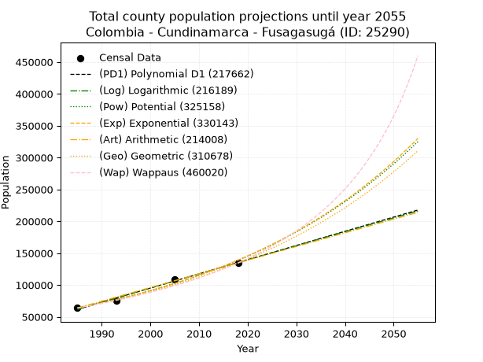
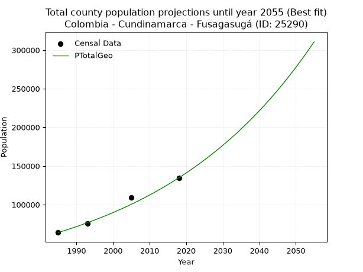
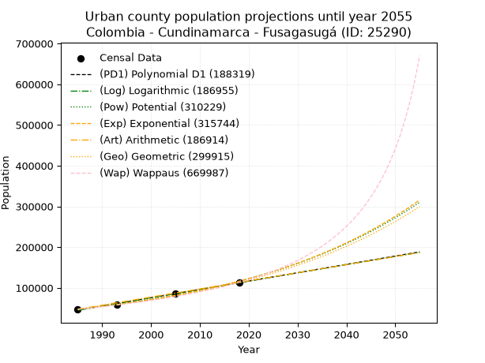
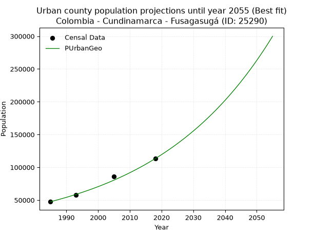
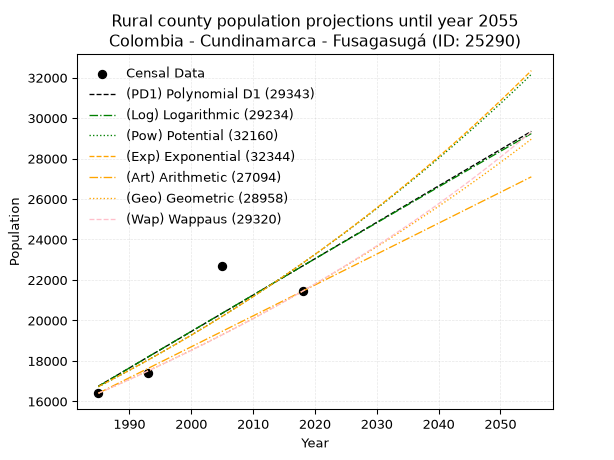
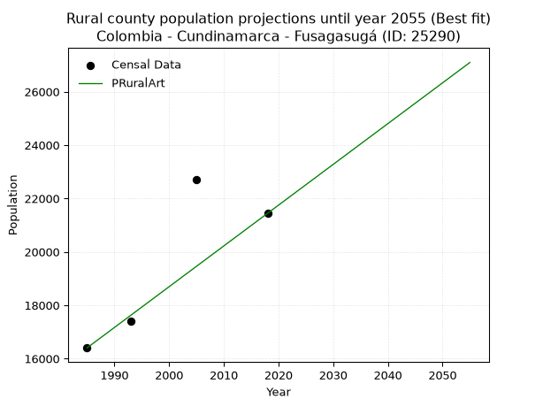

<div align="center">


</div>

# 📜 _“Population and Public Services Demand Projections (PPSD) until Year 2050 for Colombia - Cundinamarca - Fusagasugá (ID: 25290)”_
Keywords: `population` `public-service` `projection` `lineal` `polynomial` `logarithmic` `potential` `exponential` `arithmetic` `geometric` `wappaus` `dane` `colombia` `south-america`

PPSD are analytical estimates used by governments and planners to anticipate future changes in population size, age distribution, and the resulting community needs for utilities, healthcare, education, and infrastructure as sizing future water treatment facilities, electrical grids, and road networks based on spatial growth.

<div align="center">

</img>

</div>


> **General running parameters**: • app_version: _v20260806_. • Python version: _3.14.7_. • Pandas version: _3.0.5_. • NumPy version: _2.5.1_. • Creates, save and include plots into reports (create_plot): _False_. • Projection until year: _2050_. • Process polynomial degree 2 and up: _False_. • Process Wappaus: _True_. • Process Wappaus: _True_. • Set negative values to zero: _True_. • Set infinite values to zero: _True_. • Drop dataset notes: _True_. 
<div align="center">

Maps & GIS Layers: [:earth_americas:Google](http://maps.google.com/maps?q=4.336722985,-74.3754298) [:earth_americas:OSM](https://www.openstreetmap.org/#map=18/4.336722985/-74.3754298&layers=P) [:earth_americas:Bing](https://www.bing.com/maps?cp=4.336722985~-74.3754298&lvl=18) [:earth_americas:Apple](https://maps.apple.com/frame?center=4.336722985%2C-74.3754298&span=0.003%2C0.006) [:earth_americas:GISMobile](https://github.com/rcfdtools/R.GISMobile/blob/main/file/gis/CountyLayer_CO/Readme.md)

</div>


<div align="center">

```geojson
{
  "type": "Feature",
  "geometry": {
    "type": "Point", 
    "coordinates": [-74.3754298, 4.336722985]
  }, 
  "properties": {
    "Name": "Colombia - Cundinamarca - Fusagasugá (ID: 25290)"
  }
}
```

</div>


## 0. Census Data (4 records)

Census data are official statistics collected by a government about the people and housing in a country. They usually include counts of total population, age, sex, race, income, education, and jobs.

📅Global census file: [Population.xlsx](../data/Population.xlsx)

| Source   |   Year |   CountryID | CountryName   |   StateID | StateName    |   CountyID | CountyName   |   PTotal |   PUrban |   PRural |
|:---------|-------:|------------:|:--------------|----------:|:-------------|-----------:|:-------------|---------:|---------:|---------:|
| DANE     |   1985 |          57 | Colombia      |        25 | Cundinamarca |      25290 | Fusagasugá   |    63886 |    47485 |    16401 |
| DANE     |   1993 |          57 | Colombia      |        25 | Cundinamarca |      25290 | Fusagasugá   |    75333 |    57915 |    17418 |
| DANE     |   2005 |          57 | Colombia      |        25 | Cundinamarca |      25290 | Fusagasugá   |   108938 |    86232 |    22706 |
| DANE     |   2018 |          57 | Colombia      |        25 | Cundinamarca |      25290 | Fusagasugá   |   134658 |   113216 |    21442 |

> 🔥Some records could had specific notes about the registered values or the corresponding urban or rural distribution.

📅[SUI-RUPS](https://www.datos.gov.co/Hacienda-y-Cr-dito-P-blico/Registro-nico-de-Prestadores-de-Servicios-P-blicos/4qkq-csdn/about_data) - Local public utility companies: [RUPS.csv](../data/RUPS.csv)

 | SERVICIO       | ESTADO    | NOMBRE                                                                        | NIT         | DEPARTAMENTO_DOMICILIO   | MUNICIPIO_DOMICILIO   | DIRECCION                 |   TELEFONO | EMAIL                            | TIPO_PRESTADOR                            | CLASIFICACION                 |
|:---------------|:----------|:------------------------------------------------------------------------------|:------------|:-------------------------|:----------------------|:--------------------------|-----------:|:---------------------------------|:------------------------------------------|:------------------------------|
| ACUEDUCTO      | OPERATIVA | ASOCIACION DE USUARIOS DEL ACUEDUCTO DE LAS VEREDAS DEL NORTE DE FUSAGASUGA   | 800184323-5 | CUNDINAMARCA             | FUSAGASUGA            | CALLE 4 NUMERO 6-43       |    8676230 | administracion@aguasdelnorte.co  | ORGANIZACION AUTORIZADA                   | MENOR O IGUAL A 2500 USUARIOS |
| ACUEDUCTO      | OPERATIVA | EMPRESA DE SERVICIOS PUBLICOS DE FUSAGASUGA E.S.P                             | 890680053-6 | CUNDINAMARCA             | FUSAGASUGA            | Av Las Palmas  No  4 - 66 |    8679877 | gerente@emserfusa.com.co         | EMPRESA INDUSTRIAL Y COMERCIAL DEL ESTADO | MAYOR O IGUAL A 5001 USUARIOS |
| ALCANTARILLADO | OPERATIVA | EMPRESA DE SERVICIOS PUBLICOS DE FUSAGASUGA E.S.P                             | 890680053-6 | CUNDINAMARCA             | FUSAGASUGA            | Av Las Palmas  No  4 - 66 |    8679877 | gerente@emserfusa.com.co         | EMPRESA INDUSTRIAL Y COMERCIAL DEL ESTADO | MAYOR O IGUAL A 5001 USUARIOS |
| ACUEDUCTO      | OPERATIVA | COOPERATIVA DE USUARIOS DEL ACUEDUCTO COMUNAL DE LAS VEREDAS DEL SUR LIMITADA | 890680138-3 | CUNDINAMARCA             | FUSAGASUGA            | CALLE 10 7 07             |    8677502 | wperezcaicedo@hotmail.com        | ORGANIZACION AUTORIZADA                   | MENOR O IGUAL A 2500 USUARIOS |
| ACUEDUCTO      | OPERATIVA | ASOCIACION DE USUARIOS DEL ACUEDUCTO LEONARDO HOYOS DE FUSAGASUGA             | 800139880-5 | CUNDINAMARCA             | FUSAGASUGA            | KILOMETRO 4 VIA ARBELAEZ  |    8670000 | acueductoleonardohoyos@gmail.com | ORGANIZACION AUTORIZADA                   | MENOR O IGUAL A 2500 USUARIOS |

## 1. Total

### 1.1. Coefficients and Parameters

* (PD1) Polynomial Deg 1: 2227.553994379748, -4359961.127258091 (lineal)
* (Log) Logarithmic: 4458591.901976983, -33794089.02584022
* (Pow) Potential: 46.85536698049973, -149.71091915140676
* (Exp) Exponential: 0.02340444339517361, 4.2738402727942366e-16
* (Art) Arithmetic: Year diff. 2018 - 1985 = 33, Population diff. 134658 - 63886 = 70772, Annual growth = 2144.6060606060605
* (Geo) Geometric: Year diff. 2018 - 1985 = 33, Population diff. 134658 - 63886 = 70772, Annual growth % = 0.02285229305255876
* (Wap) Wappaus: i = 2.160333286934947, Condition values only valid for < 200)

<sub>
Wappaus condition values: ['0.00', '2.16', '4.32', '6.48', '8.64', '10.80', '12.96', '15.12', '17.28', '19.44', '21.60', '23.76', '25.92', '28.08', '30.24', '32.40', '34.57', '36.73', '38.89', '41.05', '43.21', '45.37', '47.53', '49.69', '51.85', '54.01', '56.17', '58.33', '60.49', '62.65', '64.81', '66.97', '69.13', '71.29', '73.45', '75.61', '77.77', '79.93', '82.09', '84.25', '86.41', '88.57', '90.73', '92.89', '95.05', '97.21', '99.38', '101.54', '103.70', '105.86', '108.02', '110.18', '112.34', '114.50', '116.66', '118.82', '120.98', '123.14', '125.30', '127.46', '129.62', '131.78', '133.94', '136.10', '138.26', '140.42']
</sub>


### 1.2. Projected Dataset

|   Year |   CountyID |   PTotalPD1 |   PTotalLog |   PTotalPow |   PTotalExp |   PTotalArt |   PTotalGeo |   PTotalWap |
|-------:|-----------:|------------:|------------:|------------:|------------:|------------:|------------:|------------:|
|   1985 |      25290 |       61734 |       61668 |       64100 |       64149 |       63886 |       63886 |       63886 |
|   1986 |      25290 |       63961 |       63913 |       65631 |       65669 |       66031 |       65346 |       65281 |
|   1987 |      25290 |       66189 |       66158 |       67197 |       67224 |       68175 |       66839 |       66707 |
|   1988 |      25290 |       68416 |       68401 |       68800 |       68816 |       70320 |       68367 |       68165 |
|   1989 |      25290 |       70644 |       70643 |       70441 |       70445 |       72464 |       69929 |       69656 |
|   1990 |      25290 |       72871 |       72884 |       72119 |       72113 |       74609 |       71527 |       71181 |
|   1991 |      25290 |       75099 |       75124 |       73837 |       73821 |       76754 |       73162 |       72741 |
|   1992 |      25290 |       77326 |       77363 |       75595 |       75569 |       78898 |       74834 |       74337 |
|   1993 |      25290 |       79554 |       79601 |       77394 |       77359 |       81043 |       76544 |       75972 |
|   1994 |      25290 |       81782 |       81837 |       79234 |       79190 |       83187 |       78293 |       77645 |
|   1995 |      25290 |       84009 |       84073 |       81118 |       81066 |       85332 |       80082 |       79359 |
|   1996 |      25290 |       86237 |       86307 |       83045 |       82985 |       87477 |       81912 |       81115 |
|   1997 |      25290 |       88464 |       88540 |       85017 |       84951 |       89621 |       83784 |       82914 |
|   1998 |      25290 |       90692 |       90772 |       87035 |       86962 |       91766 |       85699 |       84759 |
|   1999 |      25290 |       92919 |       93003 |       89100 |       89022 |       93910 |       87657 |       86651 |
|   2000 |      25290 |       95147 |       95233 |       91212 |       91130 |       96055 |       89660 |       88591 |
|   2001 |      25290 |       97374 |       97462 |       93374 |       93288 |       98200 |       91709 |       90582 |
|   2002 |      25290 |       99602 |       99689 |       95585 |       95497 |      100344 |       93805 |       92626 |
|   2003 |      25290 |      101830 |      101916 |       97848 |       97758 |      102489 |       95949 |       94725 |
|   2004 |      25290 |      104057 |      104141 |      100164 |      100073 |      104634 |       98141 |       96880 |
|   2005 |      25290 |      106285 |      106366 |      102533 |      102443 |      106778 |      100384 |       99095 |
|   2006 |      25290 |      108512 |      108589 |      104956 |      104869 |      108923 |      102678 |      101372 |
|   2007 |      25290 |      110740 |      110811 |      107436 |      107352 |      111067 |      105024 |      103714 |
|   2008 |      25290 |      112967 |      113032 |      109973 |      109894 |      113212 |      107424 |      106123 |
|   2009 |      25290 |      115195 |      115252 |      112569 |      112497 |      115357 |      109879 |      108602 |
|   2010 |      25290 |      117422 |      117471 |      115224 |      115161 |      117501 |      112390 |      111154 |
|   2011 |      25290 |      119650 |      119688 |      117941 |      117888 |      119646 |      114959 |      113783 |
|   2012 |      25290 |      121878 |      121905 |      120721 |      120679 |      121790 |      117586 |      116492 |
|   2013 |      25290 |      124105 |      124120 |      123564 |      123537 |      123935 |      120273 |      119286 |
|   2014 |      25290 |      126333 |      126335 |      126474 |      126462 |      126080 |      123021 |      122167 |
|   2015 |      25290 |      128560 |      128548 |      129450 |      129457 |      128224 |      125833 |      125140 |
|   2016 |      25290 |      130788 |      130760 |      132494 |      132523 |      130369 |      128708 |      128209 |
|   2017 |      25290 |      133015 |      132971 |      135609 |      135661 |      132513 |      131650 |      131381 |
|   2018 |      25290 |      135243 |      135181 |      138795 |      138873 |      134658 |      134658 |      134658 |
|   2019 |      25290 |      137470 |      137390 |      142055 |      142162 |      136803 |      137735 |      138047 |
|   2020 |      25290 |      139698 |      139598 |      145389 |      145528 |      138947 |      140883 |      141554 |
|   2021 |      25290 |      141925 |      141804 |      148800 |      148975 |      141092 |      144102 |      145186 |
|   2022 |      25290 |      144153 |      144010 |      152289 |      152502 |      143236 |      147395 |      148947 |
|   2023 |      25290 |      146381 |      146214 |      155859 |      156114 |      145381 |      150764 |      152847 |
|   2024 |      25290 |      148608 |      148418 |      159510 |      159811 |      147526 |      154209 |      156892 |
|   2025 |      25290 |      150836 |      150620 |      163245 |      163595 |      149670 |      157733 |      161091 |
|   2026 |      25290 |      153063 |      152821 |      167065 |      167469 |      151815 |      161338 |      165453 |
|   2027 |      25290 |      155291 |      155021 |      170973 |      171435 |      153959 |      165025 |      169987 |
|   2028 |      25290 |      157518 |      157221 |      174970 |      175494 |      156104 |      168796 |      174705 |
|   2029 |      25290 |      159746 |      159418 |      179058 |      179650 |      158249 |      172653 |      179616 |
|   2030 |      25290 |      161973 |      161615 |      183241 |      183904 |      160393 |      176599 |      184734 |
|   2031 |      25290 |      164201 |      163811 |      187518 |      188259 |      162538 |      180634 |      190072 |
|   2032 |      25290 |      166429 |      166006 |      191893 |      192717 |      164682 |      184762 |      195644 |
|   2033 |      25290 |      168656 |      168200 |      196368 |      197281 |      166827 |      188984 |      201465 |
|   2034 |      25290 |      170884 |      170392 |      200946 |      201953 |      168972 |      193303 |      207554 |
|   2035 |      25290 |      173111 |      172584 |      205627 |      206735 |      171116 |      197721 |      213930 |
|   2036 |      25290 |      175339 |      174774 |      210415 |      211631 |      173261 |      202239 |      220611 |
|   2037 |      25290 |      177566 |      176963 |      215313 |      216642 |      175406 |      206861 |      227622 |
|   2038 |      25290 |      179794 |      179152 |      220322 |      221772 |      177550 |      211588 |      234988 |
|   2039 |      25290 |      182021 |      181339 |      225444 |      227024 |      179695 |      216423 |      242735 |
|   2040 |      25290 |      184249 |      183525 |      230684 |      232400 |      181839 |      221369 |      250894 |
|   2041 |      25290 |      186477 |      185710 |      236042 |      237903 |      183984 |      226428 |      259500 |
|   2042 |      25290 |      188704 |      187894 |      241522 |      243537 |      186129 |      231602 |      268589 |
|   2043 |      25290 |      190932 |      190077 |      247127 |      249304 |      188273 |      236895 |      278205 |
|   2044 |      25290 |      193159 |      192259 |      252859 |      255208 |      190418 |      242308 |      288392 |
|   2045 |      25290 |      195387 |      194440 |      258721 |      261251 |      192562 |      247846 |      299206 |
|   2046 |      25290 |      197614 |      196619 |      264715 |      267438 |      194707 |      253509 |      310704 |
|   2047 |      25290 |      199842 |      198798 |      270846 |      273771 |      196852 |      259303 |      322954 |
|   2048 |      25290 |      202069 |      200975 |      277116 |      280254 |      198996 |      265228 |      336033 |
|   2049 |      25290 |      204297 |      203152 |      283527 |      286890 |      201141 |      271289 |      350026 |
|   2050 |      25290 |      206525 |      205327 |      290084 |      293684 |      203285 |      277489 |      365035 |
<div align="center">

</img>

</div>


### 1.3. Best fit with absolute and relative error (%)

Relative error puts that difference into context by dividing the absolute error by the true value, creating a unitless ratio or percentage that shows the scale of the mistake.

Absolute and relative error

|   Year | Source   |   CountryID | CountryName   |   StateID | StateName    |   CountyID_x | CountyName   |   PTotal |   PUrban |   PRural |   CountyID_y |   PTotalPD1 |   PTotalLog |   PTotalPow |   PTotalExp |   PTotalArt |   PTotalGeo |   PTotalWap |   PTotalPD1AbsError |   PTotalLogAbsError |   PTotalPowAbsError |   PTotalExpAbsError |   PTotalArtAbsError |   PTotalGeoAbsError |   PTotalWapAbsError |   PTotalPD1RelError |   PTotalLogRelError |   PTotalPowRelError |   PTotalExpRelError |   PTotalArtRelError |   PTotalGeoRelError |   PTotalWapRelError |
|-------:|:---------|------------:|:--------------|----------:|:-------------|-------------:|:-------------|---------:|---------:|---------:|-------------:|------------:|------------:|------------:|------------:|------------:|------------:|------------:|--------------------:|--------------------:|--------------------:|--------------------:|--------------------:|--------------------:|--------------------:|--------------------:|--------------------:|--------------------:|--------------------:|--------------------:|--------------------:|--------------------:|
|   1985 | DANE     |          57 | Colombia      |        25 | Cundinamarca |        25290 | Fusagasugá   |    63886 |    47485 |    16401 |        25290 |       61734 |       61668 |       64100 |       64149 |       63886 |       63886 |       63886 |                2152 |                2218 |                 214 |                 263 |                   0 |                   0 |                   0 |            3.3685   |            3.47181  |            0.334972 |            0.411671 |             0       |             0       |            0        |
|   1993 | DANE     |          57 | Colombia      |        25 | Cundinamarca |        25290 | Fusagasugá   |    75333 |    57915 |    17418 |        25290 |       79554 |       79601 |       77394 |       77359 |       81043 |       76544 |       75972 |                4221 |                4268 |                2061 |                2026 |                5710 |                1211 |                 639 |            5.60312  |            5.66551  |            2.73585  |            2.68939  |             7.57968 |             1.60753 |            0.848234 |
|   2005 | DANE     |          57 | Colombia      |        25 | Cundinamarca |        25290 | Fusagasugá   |   108938 |    86232 |    22706 |        25290 |      106285 |      106366 |      102533 |      102443 |      106778 |      100384 |       99095 |                2653 |                2572 |                6405 |                6495 |                2160 |                8554 |                9843 |            2.43533  |            2.36098  |            5.87949  |            5.96211  |             1.98278 |             7.85217 |            9.03541  |
|   2018 | DANE     |          57 | Colombia      |        25 | Cundinamarca |        25290 | Fusagasugá   |   134658 |   113216 |    21442 |        25290 |      135243 |      135181 |      138795 |      138873 |      134658 |      134658 |      134658 |                 585 |                 523 |                4137 |                4215 |                   0 |                   0 |                   0 |            0.434434 |            0.388391 |            3.07223  |            3.13015  |             0       |             0       |            0        |

Relative error mean

| Method    |   RelError | Best   |
|:----------|-----------:|:-------|
| PTotalPD1 |    2.96035 |        |
| PTotalLog |    2.97167 |        |
| PTotalPow |    3.00564 |        |
| PTotalExp |    3.04833 |        |
| PTotalArt |    2.39061 |        |
| PTotalGeo |    2.36493 | True   |
| PTotalWap |    2.47091 |        |

💙Best method: _**PTotalGeo**_
<div align="center">

</img>

</div>


### 1.4. Fresh water supply demand in liters per capita per day (lpcd)

The fresh water supply demand typically ranges from 100 to 300 liters per capita per day (lpcd) for standard domestic and municipal planning, though absolute survival minimums set by the World Health Organization are as low as 7.5 to 20 liters per day, and total consumption in high-income nations can exceed 400 liters.

> `CZ`: Level in meters above the sea level (masl)<br> `WS`: Fresh water supply demand in liters per capita per day (lpcd or l/h/d)<br> `WSAll`: Zonal fresh water supply demand in liters per second (l/s)<br> `A`: Zonal area in square meters<br> `DP`: Population density (people/hectare or p/ha)

Reference values (RAS Colombia)

|    CZ |   WS |
|------:|-----:|
|  1000 |  120 |
|  2000 |  130 |
| 99999 |  140 |

County shapefile geometry properties and water supply values

|   CountyID |      ATotal |   CZTotal |   WSTotal |
|-----------:|------------:|----------:|----------:|
|      25290 | 1.93478e+08 |   1636.79 |       130 |

Projected values for best method: PTotalGeo

|   CountyID |   Year |   PTotalGeo |   DPTotal |   WSTotal |   WSTotalAll |
|-----------:|-------:|------------:|----------:|----------:|-------------:|
|      25290 |   1985 |       63886 |      3.3  |       130 |      96.1248 |
|      25290 |   1986 |       65346 |      3.38 |       130 |      98.3215 |
|      25290 |   1987 |       66839 |      3.45 |       130 |     100.568  |
|      25290 |   1988 |       68367 |      3.53 |       130 |     102.867  |
|      25290 |   1989 |       69929 |      3.61 |       130 |     105.217  |
|      25290 |   1990 |       71527 |      3.7  |       130 |     107.622  |
|      25290 |   1991 |       73162 |      3.78 |       130 |     110.082  |
|      25290 |   1992 |       74834 |      3.87 |       130 |     112.597  |
|      25290 |   1993 |       76544 |      3.96 |       130 |     115.17   |
|      25290 |   1994 |       78293 |      4.05 |       130 |     117.802  |
|      25290 |   1995 |       80082 |      4.14 |       130 |     120.494  |
|      25290 |   1996 |       81912 |      4.23 |       130 |     123.247  |
|      25290 |   1997 |       83784 |      4.33 |       130 |     126.064  |
|      25290 |   1998 |       85699 |      4.43 |       130 |     128.945  |
|      25290 |   1999 |       87657 |      4.53 |       130 |     131.891  |
|      25290 |   2000 |       89660 |      4.63 |       130 |     134.905  |
|      25290 |   2001 |       91709 |      4.74 |       130 |     137.988  |
|      25290 |   2002 |       93805 |      4.85 |       130 |     141.142  |
|      25290 |   2003 |       95949 |      4.96 |       130 |     144.368  |
|      25290 |   2004 |       98141 |      5.07 |       130 |     147.666  |
|      25290 |   2005 |      100384 |      5.19 |       130 |     151.041  |
|      25290 |   2006 |      102678 |      5.31 |       130 |     154.492  |
|      25290 |   2007 |      105024 |      5.43 |       130 |     158.022  |
|      25290 |   2008 |      107424 |      5.55 |       130 |     161.633  |
|      25290 |   2009 |      109879 |      5.68 |       130 |     165.327  |
|      25290 |   2010 |      112390 |      5.81 |       130 |     169.105  |
|      25290 |   2011 |      114959 |      5.94 |       130 |     172.971  |
|      25290 |   2012 |      117586 |      6.08 |       130 |     176.923  |
|      25290 |   2013 |      120273 |      6.22 |       130 |     180.966  |
|      25290 |   2014 |      123021 |      6.36 |       130 |     185.101  |
|      25290 |   2015 |      125833 |      6.5  |       130 |     189.332  |
|      25290 |   2016 |      128708 |      6.65 |       130 |     193.658  |
|      25290 |   2017 |      131650 |      6.8  |       130 |     198.084  |
|      25290 |   2018 |      134658 |      6.96 |       130 |     202.61   |
|      25290 |   2019 |      137735 |      7.12 |       130 |     207.24   |
|      25290 |   2020 |      140883 |      7.28 |       130 |     211.977  |
|      25290 |   2021 |      144102 |      7.45 |       130 |     216.82   |
|      25290 |   2022 |      147395 |      7.62 |       130 |     221.775  |
|      25290 |   2023 |      150764 |      7.79 |       130 |     226.844  |
|      25290 |   2024 |      154209 |      7.97 |       130 |     232.027  |
|      25290 |   2025 |      157733 |      8.15 |       130 |     237.33   |
|      25290 |   2026 |      161338 |      8.34 |       130 |     242.754  |
|      25290 |   2027 |      165025 |      8.53 |       130 |     248.302  |
|      25290 |   2028 |      168796 |      8.72 |       130 |     253.975  |
|      25290 |   2029 |      172653 |      8.92 |       130 |     259.779  |
|      25290 |   2030 |      176599 |      9.13 |       130 |     265.716  |
|      25290 |   2031 |      180634 |      9.34 |       130 |     271.787  |
|      25290 |   2032 |      184762 |      9.55 |       130 |     277.998  |
|      25290 |   2033 |      188984 |      9.77 |       130 |     284.351  |
|      25290 |   2034 |      193303 |      9.99 |       130 |     290.849  |
|      25290 |   2035 |      197721 |     10.22 |       130 |     297.497  |
|      25290 |   2036 |      202239 |     10.45 |       130 |     304.295  |
|      25290 |   2037 |      206861 |     10.69 |       130 |     311.249  |
|      25290 |   2038 |      211588 |     10.94 |       130 |     318.362  |
|      25290 |   2039 |      216423 |     11.19 |       130 |     325.636  |
|      25290 |   2040 |      221369 |     11.44 |       130 |     333.078  |
|      25290 |   2041 |      226428 |     11.7  |       130 |     340.69   |
|      25290 |   2042 |      231602 |     11.97 |       130 |     348.475  |
|      25290 |   2043 |      236895 |     12.24 |       130 |     356.439  |
|      25290 |   2044 |      242308 |     12.52 |       130 |     364.584  |
|      25290 |   2045 |      247846 |     12.81 |       130 |     372.916  |
|      25290 |   2046 |      253509 |     13.1  |       130 |     381.437  |
|      25290 |   2047 |      259303 |     13.4  |       130 |     390.155  |
|      25290 |   2048 |      265228 |     13.71 |       130 |     399.07   |
|      25290 |   2049 |      271289 |     14.02 |       130 |     408.189  |
|      25290 |   2050 |      277489 |     14.34 |       130 |     417.518  |

## 2. Urban

### 2.1. Coefficients and Parameters

* (PD1) Polynomial Deg 1: 2047.6210357286045, -4019541.9767161417 (lineal)
* (Log) Logarithmic: 4098066.1747452635, -31073221.834080078
* (Pow) Potential: 54.06030194725845, -173.59992556568707
* (Exp) Exponential: 0.0270045546048661, 2.502884781577183e-19
* (Art) Arithmetic: Year diff. 2018 - 1985 = 33, Population diff. 113216 - 47485 = 65731, Annual growth = 1991.8484848484848
* (Geo) Geometric: Year diff. 2018 - 1985 = 33, Population diff. 113216 - 47485 = 65731, Annual growth % = 0.026679498598339402
* (Wap) Wappaus: i = 2.478949707653947, Condition values only valid for < 200)

<sub>
Wappaus condition values: ['0.00', '2.48', '4.96', '7.44', '9.92', '12.39', '14.87', '17.35', '19.83', '22.31', '24.79', '27.27', '29.75', '32.23', '34.71', '37.18', '39.66', '42.14', '44.62', '47.10', '49.58', '52.06', '54.54', '57.02', '59.49', '61.97', '64.45', '66.93', '69.41', '71.89', '74.37', '76.85', '79.33', '81.81', '84.28', '86.76', '89.24', '91.72', '94.20', '96.68', '99.16', '101.64', '104.12', '106.59', '109.07', '111.55', '114.03', '116.51', '118.99', '121.47', '123.95', '126.43', '128.91', '131.38', '133.86', '136.34', '138.82', '141.30', '143.78', '146.26', '148.74', '151.22', '153.69', '156.17', '158.65', '161.13']
</sub>


### 2.2. Projected Dataset

|   Year |   CountyID |   PUrbanPD1 |   PUrbanLog |   PUrbanPow |   PUrbanExp |   PUrbanArt |   PUrbanGeo |   PUrbanWap |
|-------:|-----------:|------------:|------------:|------------:|------------:|------------:|------------:|------------:|
|   1985 |      25290 |       44986 |       44928 |       47643 |       47685 |       47485 |       47485 |       47485 |
|   1986 |      25290 |       47033 |       46992 |       48959 |       48990 |       49477 |       48752 |       48677 |
|   1987 |      25290 |       49081 |       49055 |       50309 |       50331 |       51469 |       50053 |       49899 |
|   1988 |      25290 |       51129 |       51117 |       51696 |       51709 |       53461 |       51388 |       51153 |
|   1989 |      25290 |       53176 |       53178 |       53121 |       53124 |       55452 |       52759 |       52439 |
|   1990 |      25290 |       55224 |       55238 |       54584 |       54578 |       57444 |       54167 |       53760 |
|   1991 |      25290 |       57272 |       57297 |       56087 |       56072 |       59436 |       55612 |       55115 |
|   1992 |      25290 |       59319 |       59354 |       57630 |       57607 |       61428 |       57095 |       56508 |
|   1993 |      25290 |       61367 |       61411 |       59215 |       59184 |       63420 |       58619 |       57939 |
|   1994 |      25290 |       63414 |       63467 |       60843 |       60804 |       65412 |       60183 |       59409 |
|   1995 |      25290 |       65462 |       65521 |       62515 |       62468 |       67403 |       61788 |       60922 |
|   1996 |      25290 |       67510 |       67575 |       64232 |       64178 |       69395 |       63437 |       62478 |
|   1997 |      25290 |       69557 |       69628 |       65995 |       65935 |       71387 |       65129 |       64079 |
|   1998 |      25290 |       71605 |       71679 |       67805 |       67740 |       73379 |       66867 |       65727 |
|   1999 |      25290 |       73652 |       73730 |       69664 |       69594 |       75371 |       68651 |       67425 |
|   2000 |      25290 |       75700 |       75779 |       71574 |       71499 |       77363 |       70482 |       69174 |
|   2001 |      25290 |       77748 |       77828 |       73534 |       73456 |       79355 |       72363 |       70978 |
|   2002 |      25290 |       79795 |       79875 |       75547 |       75467 |       81346 |       74293 |       72838 |
|   2003 |      25290 |       81843 |       81922 |       77615 |       77532 |       83338 |       76275 |       74758 |
|   2004 |      25290 |       83891 |       83967 |       79737 |       79655 |       85330 |       78310 |       76740 |
|   2005 |      25290 |       85938 |       86012 |       81917 |       81835 |       87322 |       80400 |       78787 |
|   2006 |      25290 |       87986 |       88055 |       84155 |       84075 |       89314 |       82545 |       80903 |
|   2007 |      25290 |       90033 |       90098 |       86454 |       86376 |       91306 |       84747 |       83091 |
|   2008 |      25290 |       92081 |       92139 |       88813 |       88741 |       93298 |       87008 |       85355 |
|   2009 |      25290 |       94129 |       94179 |       91236 |       91170 |       95289 |       89329 |       87699 |
|   2010 |      25290 |       96176 |       96219 |       93724 |       93665 |       97281 |       91713 |       90126 |
|   2011 |      25290 |       98224 |       98257 |       96278 |       96229 |       99273 |       94159 |       92643 |
|   2012 |      25290 |      100272 |      100294 |       98901 |       98863 |      101265 |       96672 |       95254 |
|   2013 |      25290 |      102319 |      102331 |      101594 |      101569 |      103257 |       99251 |       97963 |
|   2014 |      25290 |      104367 |      104366 |      104358 |      104349 |      105249 |      101899 |      100778 |
|   2015 |      25290 |      106414 |      106400 |      107197 |      107206 |      107240 |      104617 |      103703 |
|   2016 |      25290 |      108462 |      108434 |      110111 |      110140 |      109232 |      107408 |      106746 |
|   2017 |      25290 |      110510 |      110466 |      113103 |      113155 |      111224 |      110274 |      109915 |
|   2018 |      25290 |      112557 |      112497 |      116174 |      116252 |      113216 |      113216 |      113216 |
|   2019 |      25290 |      114605 |      114527 |      119328 |      119434 |      115208 |      116237 |      116659 |
|   2020 |      25290 |      116653 |      116557 |      122565 |      122704 |      117200 |      119338 |      120252 |
|   2021 |      25290 |      118700 |      118585 |      125889 |      126062 |      119192 |      122522 |      124006 |
|   2022 |      25290 |      120748 |      120612 |      129301 |      129513 |      121183 |      125790 |      127932 |
|   2023 |      25290 |      122795 |      122638 |      132804 |      133058 |      123175 |      129146 |      132043 |
|   2024 |      25290 |      124843 |      124664 |      136400 |      136700 |      125167 |      132592 |      136350 |
|   2025 |      25290 |      126891 |      126688 |      140091 |      140442 |      127159 |      136129 |      140869 |
|   2026 |      25290 |      128938 |      128711 |      143880 |      144286 |      129151 |      139761 |      145616 |
|   2027 |      25290 |      130986 |      130733 |      147770 |      148236 |      131143 |      143490 |      150608 |
|   2028 |      25290 |      133033 |      132754 |      151763 |      152293 |      133134 |      147318 |      155866 |
|   2029 |      25290 |      135081 |      134775 |      155862 |      156462 |      135126 |      151249 |      161410 |
|   2030 |      25290 |      137129 |      136794 |      160070 |      160745 |      137118 |      155284 |      167264 |
|   2031 |      25290 |      139176 |      138812 |      164389 |      165145 |      139110 |      159427 |      173457 |
|   2032 |      25290 |      141224 |      140829 |      168822 |      169665 |      141102 |      163680 |      180017 |
|   2033 |      25290 |      143272 |      142846 |      173372 |      174309 |      143094 |      168047 |      186979 |
|   2034 |      25290 |      145319 |      144861 |      178043 |      179081 |      145086 |      172531 |      194380 |
|   2035 |      25290 |      147367 |      146875 |      182838 |      183982 |      147077 |      177134 |      202263 |
|   2036 |      25290 |      149414 |      148889 |      187759 |      189019 |      149069 |      181859 |      210678 |
|   2037 |      25290 |      151462 |      150901 |      192810 |      194192 |      151061 |      186711 |      219680 |
|   2038 |      25290 |      153510 |      152912 |      197994 |      199508 |      153053 |      191693 |      229332 |
|   2039 |      25290 |      155557 |      154923 |      203315 |      204969 |      155045 |      196807 |      239708 |
|   2040 |      25290 |      157605 |      156932 |      208776 |      210580 |      157037 |      202058 |      250892 |
|   2041 |      25290 |      159653 |      158940 |      214381 |      216344 |      159029 |      207448 |      262982 |
|   2042 |      25290 |      161700 |      160948 |      220134 |      222265 |      161020 |      212983 |      276093 |
|   2043 |      25290 |      163748 |      162954 |      226038 |      228349 |      163012 |      218665 |      290361 |
|   2044 |      25290 |      165795 |      164959 |      232098 |      234600 |      165004 |      224499 |      305945 |
|   2045 |      25290 |      167843 |      166964 |      238317 |      241021 |      166996 |      230489 |      323036 |
|   2046 |      25290 |      169891 |      168967 |      244699 |      247619 |      168988 |      236638 |      341863 |
|   2047 |      25290 |      171938 |      170970 |      251249 |      254397 |      170980 |      242952 |      362707 |
|   2048 |      25290 |      173986 |      172971 |      257971 |      261360 |      172971 |      249433 |      385909 |
|   2049 |      25290 |      176034 |      174972 |      264870 |      268514 |      174963 |      256088 |      411893 |
|   2050 |      25290 |      178081 |      176971 |      271949 |      275864 |      176955 |      262920 |      441191 |
<div align="center">

</img>

</div>


### 2.3. Best fit with absolute and relative error (%)

Relative error puts that difference into context by dividing the absolute error by the true value, creating a unitless ratio or percentage that shows the scale of the mistake.

Absolute and relative error

|   Year | Source   |   CountryID | CountryName   |   StateID | StateName    |   CountyID_x | CountyName   |   PTotal |   PUrban |   PRural |   CountyID_y |   PUrbanPD1 |   PUrbanLog |   PUrbanPow |   PUrbanExp |   PUrbanArt |   PUrbanGeo |   PUrbanWap |   PUrbanPD1AbsError |   PUrbanLogAbsError |   PUrbanPowAbsError |   PUrbanExpAbsError |   PUrbanArtAbsError |   PUrbanGeoAbsError |   PUrbanWapAbsError |   PUrbanPD1RelError |   PUrbanLogRelError |   PUrbanPowRelError |   PUrbanExpRelError |   PUrbanArtRelError |   PUrbanGeoRelError |   PUrbanWapRelError |
|-------:|:---------|------------:|:--------------|----------:|:-------------|-------------:|:-------------|---------:|---------:|---------:|-------------:|------------:|------------:|------------:|------------:|------------:|------------:|------------:|--------------------:|--------------------:|--------------------:|--------------------:|--------------------:|--------------------:|--------------------:|--------------------:|--------------------:|--------------------:|--------------------:|--------------------:|--------------------:|--------------------:|
|   1985 | DANE     |          57 | Colombia      |        25 | Cundinamarca |        25290 | Fusagasugá   |    63886 |    47485 |    16401 |        25290 |       44986 |       44928 |       47643 |       47685 |       47485 |       47485 |       47485 |                2499 |                2557 |                 158 |                 200 |                   0 |                   0 |                   0 |            5.26271  |            5.38486  |            0.332737 |            0.421186 |             0       |             0       |             0       |
|   1993 | DANE     |          57 | Colombia      |        25 | Cundinamarca |        25290 | Fusagasugá   |    75333 |    57915 |    17418 |        25290 |       61367 |       61411 |       59215 |       59184 |       63420 |       58619 |       57939 |                3452 |                3496 |                1300 |                1269 |                5505 |                 704 |                  24 |            5.96046  |            6.03643  |            2.24467  |            2.19114  |             9.50531 |             1.21557 |             0.04144 |
|   2005 | DANE     |          57 | Colombia      |        25 | Cundinamarca |        25290 | Fusagasugá   |   108938 |    86232 |    22706 |        25290 |       85938 |       86012 |       81917 |       81835 |       87322 |       80400 |       78787 |                 294 |                 220 |                4315 |                4397 |                1090 |                5832 |                7445 |            0.340941 |            0.255126 |            5.00394  |            5.09904  |             1.26403 |             6.76315 |             8.63369 |
|   2018 | DANE     |          57 | Colombia      |        25 | Cundinamarca |        25290 | Fusagasugá   |   134658 |   113216 |    21442 |        25290 |      112557 |      112497 |      116174 |      116252 |      113216 |      113216 |      113216 |                 659 |                 719 |                2958 |                3036 |                   0 |                   0 |                   0 |            0.582073 |            0.635069 |            2.6127   |            2.6816   |             0       |             0       |             0       |

Relative error mean

| Method    |   RelError | Best   |
|:----------|-----------:|:-------|
| PUrbanPD1 |    3.03655 |        |
| PUrbanLog |    3.07787 |        |
| PUrbanPow |    2.54851 |        |
| PUrbanExp |    2.59824 |        |
| PUrbanArt |    2.69234 |        |
| PUrbanGeo |    1.99468 | True   |
| PUrbanWap |    2.16878 |        |

💙Best method: _**PUrbanGeo**_
<div align="center">

</img>

</div>


### 2.4. Fresh water supply demand in liters per capita per day (lpcd)

The fresh water supply demand typically ranges from 100 to 300 liters per capita per day (lpcd) for standard domestic and municipal planning, though absolute survival minimums set by the World Health Organization are as low as 7.5 to 20 liters per day, and total consumption in high-income nations can exceed 400 liters.

> `CZ`: Level in meters above the sea level (masl)<br> `WS`: Fresh water supply demand in liters per capita per day (lpcd or l/h/d)<br> `WSAll`: Zonal fresh water supply demand in liters per second (l/s)<br> `A`: Zonal area in square meters<br> `DP`: Population density (people/hectare or p/ha)

Reference values (RAS Colombia)

|    CZ |   WS |
|------:|-----:|
|  1000 |  120 |
|  2000 |  130 |
| 99999 |  140 |

County shapefile geometry properties and water supply values

|   CountyID |      AUrban |   CZUrban |   WSUrban |
|-----------:|------------:|----------:|----------:|
|      25290 | 1.44574e+07 |   1668.76 |       130 |

Projected values for best method: PUrbanGeo

|   CountyID |   Year |   PUrbanGeo |   DPUrban |   WSUrban |   WSUrbanAll |
|-----------:|-------:|------------:|----------:|----------:|-------------:|
|      25290 |   1985 |       47485 |     32.84 |       130 |      71.4473 |
|      25290 |   1986 |       48752 |     33.72 |       130 |      73.3537 |
|      25290 |   1987 |       50053 |     34.62 |       130 |      75.3112 |
|      25290 |   1988 |       51388 |     35.54 |       130 |      77.3199 |
|      25290 |   1989 |       52759 |     36.49 |       130 |      79.3828 |
|      25290 |   1990 |       54167 |     37.47 |       130 |      81.5013 |
|      25290 |   1991 |       55612 |     38.47 |       130 |      83.6755 |
|      25290 |   1992 |       57095 |     39.49 |       130 |      85.9068 |
|      25290 |   1993 |       58619 |     40.55 |       130 |      88.1999 |
|      25290 |   1994 |       60183 |     41.63 |       130 |      90.5531 |
|      25290 |   1995 |       61788 |     42.74 |       130 |      92.9681 |
|      25290 |   1996 |       63437 |     43.88 |       130 |      95.4492 |
|      25290 |   1997 |       65129 |     45.05 |       130 |      97.995  |
|      25290 |   1998 |       66867 |     46.25 |       130 |     100.61   |
|      25290 |   1999 |       68651 |     47.48 |       130 |     103.294  |
|      25290 |   2000 |       70482 |     48.75 |       130 |     106.049  |
|      25290 |   2001 |       72363 |     50.05 |       130 |     108.88   |
|      25290 |   2002 |       74293 |     51.39 |       130 |     111.783  |
|      25290 |   2003 |       76275 |     52.76 |       130 |     114.766  |
|      25290 |   2004 |       78310 |     54.17 |       130 |     117.828  |
|      25290 |   2005 |       80400 |     55.61 |       130 |     120.972  |
|      25290 |   2006 |       82545 |     57.1  |       130 |     124.2    |
|      25290 |   2007 |       84747 |     58.62 |       130 |     127.513  |
|      25290 |   2008 |       87008 |     60.18 |       130 |     130.915  |
|      25290 |   2009 |       89329 |     61.79 |       130 |     134.407  |
|      25290 |   2010 |       91713 |     63.44 |       130 |     137.994  |
|      25290 |   2011 |       94159 |     65.13 |       130 |     141.674  |
|      25290 |   2012 |       96672 |     66.87 |       130 |     145.456  |
|      25290 |   2013 |       99251 |     68.65 |       130 |     149.336  |
|      25290 |   2014 |      101899 |     70.48 |       130 |     153.32   |
|      25290 |   2015 |      104617 |     72.36 |       130 |     157.41   |
|      25290 |   2016 |      107408 |     74.29 |       130 |     161.609  |
|      25290 |   2017 |      110274 |     76.27 |       130 |     165.922  |
|      25290 |   2018 |      113216 |     78.31 |       130 |     170.348  |
|      25290 |   2019 |      116237 |     80.4  |       130 |     174.894  |
|      25290 |   2020 |      119338 |     82.54 |       130 |     179.559  |
|      25290 |   2021 |      122522 |     84.75 |       130 |     184.35   |
|      25290 |   2022 |      125790 |     87.01 |       130 |     189.267  |
|      25290 |   2023 |      129146 |     89.33 |       130 |     194.317  |
|      25290 |   2024 |      132592 |     91.71 |       130 |     199.502  |
|      25290 |   2025 |      136129 |     94.16 |       130 |     204.824  |
|      25290 |   2026 |      139761 |     96.67 |       130 |     210.289  |
|      25290 |   2027 |      143490 |     99.25 |       130 |     215.899  |
|      25290 |   2028 |      147318 |    101.9  |       130 |     221.659  |
|      25290 |   2029 |      151249 |    104.62 |       130 |     227.574  |
|      25290 |   2030 |      155284 |    107.41 |       130 |     233.645  |
|      25290 |   2031 |      159427 |    110.27 |       130 |     239.879  |
|      25290 |   2032 |      163680 |    113.22 |       130 |     246.278  |
|      25290 |   2033 |      168047 |    116.24 |       130 |     252.848  |
|      25290 |   2034 |      172531 |    119.34 |       130 |     259.595  |
|      25290 |   2035 |      177134 |    122.52 |       130 |     266.521  |
|      25290 |   2036 |      181859 |    125.79 |       130 |     273.63   |
|      25290 |   2037 |      186711 |    129.15 |       130 |     280.931  |
|      25290 |   2038 |      191693 |    132.59 |       130 |     288.427  |
|      25290 |   2039 |      196807 |    136.13 |       130 |     296.122  |
|      25290 |   2040 |      202058 |    139.76 |       130 |     304.022  |
|      25290 |   2041 |      207448 |    143.49 |       130 |     312.132  |
|      25290 |   2042 |      212983 |    147.32 |       130 |     320.461  |
|      25290 |   2043 |      218665 |    151.25 |       130 |     329.01   |
|      25290 |   2044 |      224499 |    155.28 |       130 |     337.788  |
|      25290 |   2045 |      230489 |    159.43 |       130 |     346.801  |
|      25290 |   2046 |      236638 |    163.68 |       130 |     356.053  |
|      25290 |   2047 |      242952 |    168.05 |       130 |     365.553  |
|      25290 |   2048 |      249433 |    172.53 |       130 |     375.304  |
|      25290 |   2049 |      256088 |    177.13 |       130 |     385.318  |
|      25290 |   2050 |      262920 |    181.86 |       130 |     395.597  |

## 3. Rural

### 3.1. Coefficients and Parameters

* (PD1) Polynomial Deg 1: 179.93295865114465, -340419.15054195205 (lineal)
* (Log) Logarithmic: 360525.7272317196, -2720867.1917601633
* (Pow) Potential: 18.873437807727473, -58.0168308763048
* (Exp) Exponential: 0.00941967817207412, 0.0001267556724481021
* (Art) Arithmetic: Year diff. 2018 - 1985 = 33, Population diff. 21442 - 16401 = 5041, Annual growth = 152.75757575757575
* (Geo) Geometric: Year diff. 2018 - 1985 = 33, Population diff. 21442 - 16401 = 5041, Annual growth % = 0.00815456294270911
* (Wap) Wappaus: i = 0.8073227585422708, Condition values only valid for < 200)

<sub>
Wappaus condition values: ['0.00', '0.81', '1.61', '2.42', '3.23', '4.04', '4.84', '5.65', '6.46', '7.27', '8.07', '8.88', '9.69', '10.50', '11.30', '12.11', '12.92', '13.72', '14.53', '15.34', '16.15', '16.95', '17.76', '18.57', '19.38', '20.18', '20.99', '21.80', '22.61', '23.41', '24.22', '25.03', '25.83', '26.64', '27.45', '28.26', '29.06', '29.87', '30.68', '31.49', '32.29', '33.10', '33.91', '34.71', '35.52', '36.33', '37.14', '37.94', '38.75', '39.56', '40.37', '41.17', '41.98', '42.79', '43.60', '44.40', '45.21', '46.02', '46.82', '47.63', '48.44', '49.25', '50.05', '50.86', '51.67', '52.48']
</sub>


### 3.2. Projected Dataset

|   Year |   CountyID |   PRuralPD1 |   PRuralLog |   PRuralPow |   PRuralExp |   PRuralArt |   PRuralGeo |   PRuralWap |
|-------:|-----------:|------------:|------------:|------------:|------------:|------------:|------------:|------------:|
|   1985 |      25290 |       16748 |       16740 |       16720 |       16728 |       16401 |       16401 |       16401 |
|   1986 |      25290 |       16928 |       16921 |       16880 |       16886 |       16554 |       16535 |       16534 |
|   1987 |      25290 |       17108 |       17103 |       17041 |       17046 |       16707 |       16670 |       16668 |
|   1988 |      25290 |       17288 |       17284 |       17204 |       17207 |       16859 |       16806 |       16803 |
|   1989 |      25290 |       17468 |       17465 |       17368 |       17370 |       17012 |       16943 |       16939 |
|   1990 |      25290 |       17647 |       17647 |       17533 |       17534 |       17165 |       17081 |       17077 |
|   1991 |      25290 |       17827 |       17828 |       17700 |       17700 |       17318 |       17220 |       17215 |
|   1992 |      25290 |       18007 |       18009 |       17869 |       17868 |       17470 |       17360 |       17355 |
|   1993 |      25290 |       18187 |       18190 |       18039 |       18037 |       17623 |       17502 |       17496 |
|   1994 |      25290 |       18367 |       18370 |       18211 |       18208 |       17776 |       17645 |       17638 |
|   1995 |      25290 |       18547 |       18551 |       18384 |       18380 |       17929 |       17789 |       17781 |
|   1996 |      25290 |       18727 |       18732 |       18559 |       18554 |       18081 |       17934 |       17925 |
|   1997 |      25290 |       18907 |       18913 |       18735 |       18729 |       18234 |       18080 |       18071 |
|   1998 |      25290 |       19087 |       19093 |       18913 |       18907 |       18387 |       18227 |       18218 |
|   1999 |      25290 |       19267 |       19273 |       19092 |       19086 |       18540 |       18376 |       18366 |
|   2000 |      25290 |       19447 |       19454 |       19273 |       19266 |       18692 |       18526 |       18515 |
|   2001 |      25290 |       19627 |       19634 |       19456 |       19449 |       18845 |       18677 |       18666 |
|   2002 |      25290 |       19807 |       19814 |       19640 |       19633 |       18998 |       18829 |       18818 |
|   2003 |      25290 |       19987 |       19994 |       19826 |       19818 |       19151 |       18983 |       18971 |
|   2004 |      25290 |       20166 |       20174 |       20014 |       20006 |       19303 |       19138 |       19126 |
|   2005 |      25290 |       20346 |       20354 |       20203 |       20195 |       19456 |       19294 |       19282 |
|   2006 |      25290 |       20526 |       20534 |       20394 |       20386 |       19609 |       19451 |       19439 |
|   2007 |      25290 |       20706 |       20713 |       20587 |       20579 |       19762 |       19610 |       19598 |
|   2008 |      25290 |       20886 |       20893 |       20781 |       20774 |       19914 |       19769 |       19758 |
|   2009 |      25290 |       21066 |       21072 |       20978 |       20971 |       20067 |       19931 |       19920 |
|   2010 |      25290 |       21246 |       21252 |       21176 |       21169 |       20220 |       20093 |       20083 |
|   2011 |      25290 |       21426 |       21431 |       21375 |       21370 |       20373 |       20257 |       20247 |
|   2012 |      25290 |       21606 |       21610 |       21577 |       21572 |       20525 |       20422 |       20413 |
|   2013 |      25290 |       21786 |       21790 |       21780 |       21776 |       20678 |       20589 |       20581 |
|   2014 |      25290 |       21966 |       21969 |       21985 |       21982 |       20831 |       20757 |       20750 |
|   2015 |      25290 |       22146 |       22148 |       22192 |       22190 |       20984 |       20926 |       20921 |
|   2016 |      25290 |       22326 |       22326 |       22401 |       22400 |       21136 |       21097 |       21093 |
|   2017 |      25290 |       22506 |       22505 |       22612 |       22612 |       21289 |       21269 |       21267 |
|   2018 |      25290 |       22686 |       22684 |       22824 |       22826 |       21442 |       21442 |       21442 |
|   2019 |      25290 |       22865 |       22863 |       23038 |       23042 |       21595 |       21617 |       21619 |
|   2020 |      25290 |       23045 |       23041 |       23255 |       23260 |       21748 |       21793 |       21798 |
|   2021 |      25290 |       23225 |       23219 |       23473 |       23480 |       21900 |       21971 |       21978 |
|   2022 |      25290 |       23405 |       23398 |       23693 |       23703 |       22053 |       22150 |       22160 |
|   2023 |      25290 |       23585 |       23576 |       23915 |       23927 |       22206 |       22331 |       22344 |
|   2024 |      25290 |       23765 |       23754 |       24139 |       24153 |       22359 |       22513 |       22530 |
|   2025 |      25290 |       23945 |       23932 |       24366 |       24382 |       22511 |       22696 |       22717 |
|   2026 |      25290 |       24125 |       24110 |       24594 |       24613 |       22664 |       22881 |       22906 |
|   2027 |      25290 |       24305 |       24288 |       24824 |       24846 |       22817 |       23068 |       23097 |
|   2028 |      25290 |       24485 |       24466 |       25056 |       25081 |       22970 |       23256 |       23290 |
|   2029 |      25290 |       24665 |       24644 |       25290 |       25318 |       23122 |       23446 |       23485 |
|   2030 |      25290 |       24845 |       24821 |       25526 |       25558 |       23275 |       23637 |       23682 |
|   2031 |      25290 |       25025 |       24999 |       25765 |       25800 |       23428 |       23830 |       23881 |
|   2032 |      25290 |       25205 |       25176 |       26005 |       26044 |       23581 |       24024 |       24081 |
|   2033 |      25290 |       25385 |       25354 |       26248 |       26290 |       23733 |       24220 |       24284 |
|   2034 |      25290 |       25564 |       25531 |       26493 |       26539 |       23886 |       24417 |       24489 |
|   2035 |      25290 |       25744 |       25708 |       26740 |       26790 |       24039 |       24617 |       24696 |
|   2036 |      25290 |       25924 |       25885 |       26989 |       27044 |       24192 |       24817 |       24904 |
|   2037 |      25290 |       26104 |       26062 |       27240 |       27300 |       24344 |       25020 |       25115 |
|   2038 |      25290 |       26284 |       26239 |       27493 |       27558 |       24497 |       25224 |       25329 |
|   2039 |      25290 |       26464 |       26416 |       27749 |       27819 |       24650 |       25429 |       25544 |
|   2040 |      25290 |       26644 |       26593 |       28007 |       28082 |       24803 |       25637 |       25762 |
|   2041 |      25290 |       26824 |       26770 |       28267 |       28348 |       24955 |       25846 |       25982 |
|   2042 |      25290 |       27004 |       26946 |       28530 |       28616 |       25108 |       26057 |       26204 |
|   2043 |      25290 |       27184 |       27123 |       28795 |       28887 |       25261 |       26269 |       26428 |
|   2044 |      25290 |       27364 |       27299 |       29062 |       29161 |       25414 |       26483 |       26655 |
|   2045 |      25290 |       27544 |       27476 |       29331 |       29437 |       25566 |       26699 |       26885 |
|   2046 |      25290 |       27724 |       27652 |       29603 |       29715 |       25719 |       26917 |       27116 |
|   2047 |      25290 |       27904 |       27828 |       29878 |       29996 |       25872 |       27136 |       27351 |
|   2048 |      25290 |       28084 |       28004 |       30154 |       30280 |       26025 |       27358 |       27588 |
|   2049 |      25290 |       28263 |       28180 |       30433 |       30567 |       26177 |       27581 |       27827 |
|   2050 |      25290 |       28443 |       28356 |       30715 |       30856 |       26330 |       27806 |       28069 |
<div align="center">

</img>

</div>


### 3.3. Best fit with absolute and relative error (%)

Relative error puts that difference into context by dividing the absolute error by the true value, creating a unitless ratio or percentage that shows the scale of the mistake.

Absolute and relative error

|   Year | Source   |   CountryID | CountryName   |   StateID | StateName    |   CountyID_x | CountyName   |   PTotal |   PUrban |   PRural |   CountyID_y |   PRuralPD1 |   PRuralLog |   PRuralPow |   PRuralExp |   PRuralArt |   PRuralGeo |   PRuralWap |   PRuralPD1AbsError |   PRuralLogAbsError |   PRuralPowAbsError |   PRuralExpAbsError |   PRuralArtAbsError |   PRuralGeoAbsError |   PRuralWapAbsError |   PRuralPD1RelError |   PRuralLogRelError |   PRuralPowRelError |   PRuralExpRelError |   PRuralArtRelError |   PRuralGeoRelError |   PRuralWapRelError |
|-------:|:---------|------------:|:--------------|----------:|:-------------|-------------:|:-------------|---------:|---------:|---------:|-------------:|------------:|------------:|------------:|------------:|------------:|------------:|------------:|--------------------:|--------------------:|--------------------:|--------------------:|--------------------:|--------------------:|--------------------:|--------------------:|--------------------:|--------------------:|--------------------:|--------------------:|--------------------:|--------------------:|
|   1985 | DANE     |          57 | Colombia      |        25 | Cundinamarca |        25290 | Fusagasugá   |    63886 |    47485 |    16401 |        25290 |       16748 |       16740 |       16720 |       16728 |       16401 |       16401 |       16401 |                 347 |                 339 |                 319 |                 327 |                   0 |                   0 |                   0 |             2.11572 |             2.06695 |             1.945   |             1.99378 |             0       |             0       |            0        |
|   1993 | DANE     |          57 | Colombia      |        25 | Cundinamarca |        25290 | Fusagasugá   |    75333 |    57915 |    17418 |        25290 |       18187 |       18190 |       18039 |       18037 |       17623 |       17502 |       17496 |                 769 |                 772 |                 621 |                 619 |                 205 |                  84 |                  78 |             4.41497 |             4.4322  |             3.56528 |             3.55379 |             1.17694 |             0.48226 |            0.447813 |
|   2005 | DANE     |          57 | Colombia      |        25 | Cundinamarca |        25290 | Fusagasugá   |   108938 |    86232 |    22706 |        25290 |       20346 |       20354 |       20203 |       20195 |       19456 |       19294 |       19282 |                2360 |                2352 |                2503 |                2511 |                3250 |                3412 |                3424 |            10.3937  |            10.3585  |            11.0235  |            11.0588  |            14.3134  |            15.0269  |           15.0797   |
|   2018 | DANE     |          57 | Colombia      |        25 | Cundinamarca |        25290 | Fusagasugá   |   134658 |   113216 |    21442 |        25290 |       22686 |       22684 |       22824 |       22826 |       21442 |       21442 |       21442 |                1244 |                1242 |                1382 |                1384 |                   0 |                   0 |                   0 |             5.8017  |             5.79237 |             6.44529 |             6.45462 |             0       |             0       |            0        |

Relative error mean

| Method    |   RelError | Best   |
|:----------|-----------:|:-------|
| PRuralPD1 |    5.68153 |        |
| PRuralLog |    5.6625  |        |
| PRuralPow |    5.74477 |        |
| PRuralExp |    5.76524 |        |
| PRuralArt |    3.87259 | True   |
| PRuralGeo |    3.87728 |        |
| PRuralWap |    3.88188 |        |

💙Best method: _**PRuralArt**_
<div align="center">

</img>

</div>


### 3.4. Fresh water supply demand in liters per capita per day (lpcd)

The fresh water supply demand typically ranges from 100 to 300 liters per capita per day (lpcd) for standard domestic and municipal planning, though absolute survival minimums set by the World Health Organization are as low as 7.5 to 20 liters per day, and total consumption in high-income nations can exceed 400 liters.

> `CZ`: Level in meters above the sea level (masl)<br> `WS`: Fresh water supply demand in liters per capita per day (lpcd or l/h/d)<br> `WSAll`: Zonal fresh water supply demand in liters per second (l/s)<br> `A`: Zonal area in square meters<br> `DP`: Population density (people/hectare or p/ha)

Reference values (RAS Colombia)

|    CZ |   WS |
|------:|-----:|
|  1000 |  120 |
|  2000 |  130 |
| 99999 |  140 |

County shapefile geometry properties and water supply values

|   CountyID |      ARural |   CZRural |   WSRural |
|-----------:|------------:|----------:|----------:|
|      25290 | 1.79021e+08 |   1634.22 |       130 |

Projected values for best method: PRuralArt

|   CountyID |   Year |   PRuralArt |   DPRural |   WSRural |   WSRuralAll |
|-----------:|-------:|------------:|----------:|----------:|-------------:|
|      25290 |   1985 |       16401 |      0.92 |       130 |      24.6774 |
|      25290 |   1986 |       16554 |      0.92 |       130 |      24.9076 |
|      25290 |   1987 |       16707 |      0.93 |       130 |      25.1378 |
|      25290 |   1988 |       16859 |      0.94 |       130 |      25.3666 |
|      25290 |   1989 |       17012 |      0.95 |       130 |      25.5968 |
|      25290 |   1990 |       17165 |      0.96 |       130 |      25.827  |
|      25290 |   1991 |       17318 |      0.97 |       130 |      26.0572 |
|      25290 |   1992 |       17470 |      0.98 |       130 |      26.2859 |
|      25290 |   1993 |       17623 |      0.98 |       130 |      26.5161 |
|      25290 |   1994 |       17776 |      0.99 |       130 |      26.7463 |
|      25290 |   1995 |       17929 |      1    |       130 |      26.9765 |
|      25290 |   1996 |       18081 |      1.01 |       130 |      27.2052 |
|      25290 |   1997 |       18234 |      1.02 |       130 |      27.4354 |
|      25290 |   1998 |       18387 |      1.03 |       130 |      27.6656 |
|      25290 |   1999 |       18540 |      1.04 |       130 |      27.8958 |
|      25290 |   2000 |       18692 |      1.04 |       130 |      28.1245 |
|      25290 |   2001 |       18845 |      1.05 |       130 |      28.3547 |
|      25290 |   2002 |       18998 |      1.06 |       130 |      28.585  |
|      25290 |   2003 |       19151 |      1.07 |       130 |      28.8152 |
|      25290 |   2004 |       19303 |      1.08 |       130 |      29.0439 |
|      25290 |   2005 |       19456 |      1.09 |       130 |      29.2741 |
|      25290 |   2006 |       19609 |      1.1  |       130 |      29.5043 |
|      25290 |   2007 |       19762 |      1.1  |       130 |      29.7345 |
|      25290 |   2008 |       19914 |      1.11 |       130 |      29.9632 |
|      25290 |   2009 |       20067 |      1.12 |       130 |      30.1934 |
|      25290 |   2010 |       20220 |      1.13 |       130 |      30.4236 |
|      25290 |   2011 |       20373 |      1.14 |       130 |      30.6538 |
|      25290 |   2012 |       20525 |      1.15 |       130 |      30.8825 |
|      25290 |   2013 |       20678 |      1.16 |       130 |      31.1127 |
|      25290 |   2014 |       20831 |      1.16 |       130 |      31.3429 |
|      25290 |   2015 |       20984 |      1.17 |       130 |      31.5731 |
|      25290 |   2016 |       21136 |      1.18 |       130 |      31.8019 |
|      25290 |   2017 |       21289 |      1.19 |       130 |      32.0321 |
|      25290 |   2018 |       21442 |      1.2  |       130 |      32.2623 |
|      25290 |   2019 |       21595 |      1.21 |       130 |      32.4925 |
|      25290 |   2020 |       21748 |      1.21 |       130 |      32.7227 |
|      25290 |   2021 |       21900 |      1.22 |       130 |      32.9514 |
|      25290 |   2022 |       22053 |      1.23 |       130 |      33.1816 |
|      25290 |   2023 |       22206 |      1.24 |       130 |      33.4118 |
|      25290 |   2024 |       22359 |      1.25 |       130 |      33.642  |
|      25290 |   2025 |       22511 |      1.26 |       130 |      33.8707 |
|      25290 |   2026 |       22664 |      1.27 |       130 |      34.1009 |
|      25290 |   2027 |       22817 |      1.27 |       130 |      34.3311 |
|      25290 |   2028 |       22970 |      1.28 |       130 |      34.5613 |
|      25290 |   2029 |       23122 |      1.29 |       130 |      34.79   |
|      25290 |   2030 |       23275 |      1.3  |       130 |      35.0203 |
|      25290 |   2031 |       23428 |      1.31 |       130 |      35.2505 |
|      25290 |   2032 |       23581 |      1.32 |       130 |      35.4807 |
|      25290 |   2033 |       23733 |      1.33 |       130 |      35.7094 |
|      25290 |   2034 |       23886 |      1.33 |       130 |      35.9396 |
|      25290 |   2035 |       24039 |      1.34 |       130 |      36.1698 |
|      25290 |   2036 |       24192 |      1.35 |       130 |      36.4    |
|      25290 |   2037 |       24344 |      1.36 |       130 |      36.6287 |
|      25290 |   2038 |       24497 |      1.37 |       130 |      36.8589 |
|      25290 |   2039 |       24650 |      1.38 |       130 |      37.0891 |
|      25290 |   2040 |       24803 |      1.39 |       130 |      37.3193 |
|      25290 |   2041 |       24955 |      1.39 |       130 |      37.548  |
|      25290 |   2042 |       25108 |      1.4  |       130 |      37.7782 |
|      25290 |   2043 |       25261 |      1.41 |       130 |      38.0084 |
|      25290 |   2044 |       25414 |      1.42 |       130 |      38.2387 |
|      25290 |   2045 |       25566 |      1.43 |       130 |      38.4674 |
|      25290 |   2046 |       25719 |      1.44 |       130 |      38.6976 |
|      25290 |   2047 |       25872 |      1.45 |       130 |      38.9278 |
|      25290 |   2048 |       26025 |      1.45 |       130 |      39.158  |
|      25290 |   2049 |       26177 |      1.46 |       130 |      39.3867 |
|      25290 |   2050 |       26330 |      1.47 |       130 |      39.6169 |

#

<div align="center"><br><sub>Share this research</sub></div><br>

<sub>**APPS & TOOLS & CONTENT DISCLAIMER**: • NO WARRANTY - This content and software is provided by <a href="https://github.com/rcfdtools" target="_blank">github.com/rcfdtools</a> "as is", without any express or implied warranty, including warranties of merchantability, fitness for a particular purpose, or non-infringement. There is no guarantee that the software will be error-free or operate without interruption. • LIMITATION OF LIABILITY - Neither the authors nor copyright holders will be liable for claims or damages arising from the software or its use. You are responsible for determining if the software is appropriate for your use and assume all associated risks, including errors, legal compliance, and data loss. • NO PROFESSIONAL ADVICE - The software provides general information and does not offer professional advice. It should not replace consultation with professional advisors. [Clauses and global license for rcfdtools use.](https://github.com/rcfdtools/rcfdtools/blob/main/LICENSE.md)</sub>

| [:house: Home](Readme.md)  | [:beginner: Help / Collab](https://github.com/rcfdtools/R.HydroTools/discussions/31) |
|----------------------------|-------------------------------------------------------------------------------------------|