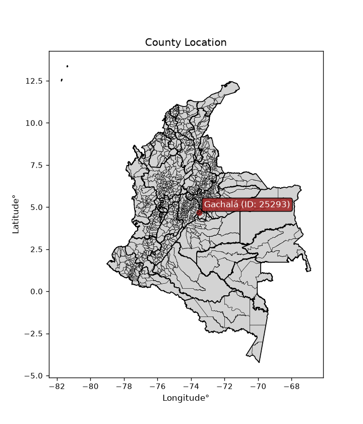
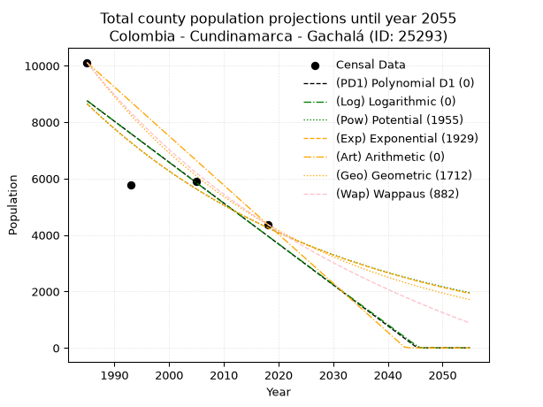
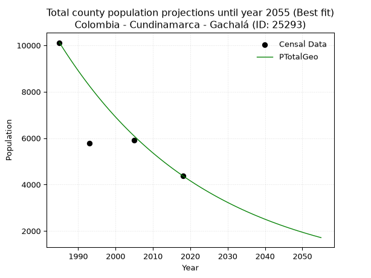
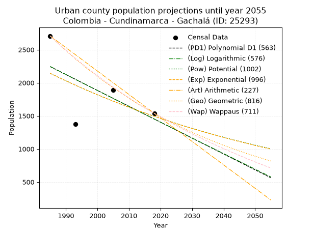
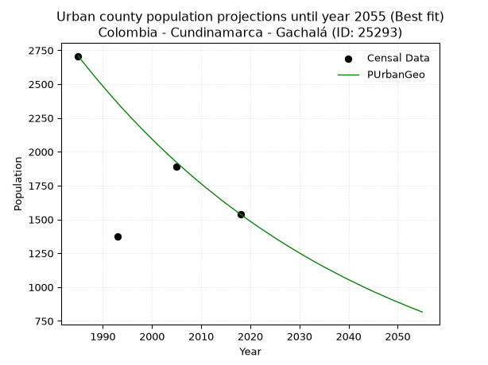
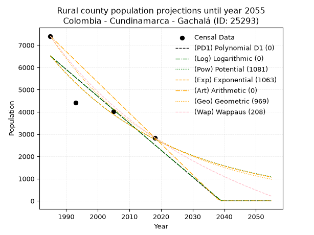
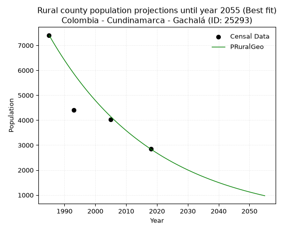

<div align="center">


</div>

# _“Population and Public Services Demand Projections (PPSD) until Year 2050 for Colombia - Cundinamarca - Gachalá (ID: 25293)”_
Keywords: `population` `public-service` `projection` `lineal` `polynomial` `logarithmic` `potential` `exponential` `arithmetic` `geometric` `wappaus` `dane` `colombia` `south-america`

PPSD are analytical estimates used by governments and planners to anticipate future changes in population size, age distribution, and the resulting community needs for utilities, healthcare, education, and infrastructure as sizing future water treatment facilities, electrical grids, and road networks based on spatial growth.

<div align="center">

</img>

</div>


> **General running parameters**: • app_version: _v20260806_. • Python version: _3.14.7_. • Pandas version: _3.0.5_. • NumPy version: _2.5.1_. • Creates, save and include plots into reports (create_plot): _False_. • Projection until year: _2050_. • Process polynomial degree 2 and up: _False_. • Process Wappaus: _True_. • Process Wappaus: _True_. • Set negative values to zero: _True_. • Set infinite values to zero: _True_. • Drop dataset notes: _True_. 
<div align="center">

Dynamic map: [:earth_americas:Google](http://maps.google.com/maps?q=4.693578672,-73.5201613) [:earth_americas:OSM](https://www.openstreetmap.org/#map=18/4.693578672/-73.5201613&layers=P) [:earth_americas:Bing](https://www.bing.com/maps?cp=4.693578672~-73.5201613&lvl=18) [:earth_americas:Apple](https://maps.apple.com/frame?center=4.693578672%2C-73.5201613&span=0.003%2C0.006)

</div>


<div align="center">

```geojson
{
  "type": "Feature",
  "geometry": {
    "type": "Point", 
    "coordinates": [-73.5201613, 4.693578672]
  }, 
  "properties": {
    "Name": "Colombia - Cundinamarca - Gachalá (ID: 25293)"
  }
}
```

</div>


## 0. Census Data (4 records)

Census data are official statistics collected by a government about the people and housing in a country. They usually include counts of total population, age, sex, race, income, education, and jobs.

📅Global census file: [Population.xlsx](../data/Population.xlsx)

| Source   |   Year |   CountryID | CountryName   |   StateID | StateName    |   CountyID | CountyName   |   PTotal |   PUrban |   PRural |
|:---------|-------:|------------:|:--------------|----------:|:-------------|-----------:|:-------------|---------:|---------:|---------:|
| DANE     |   1985 |          57 | Colombia      |        25 | Cundinamarca |      25293 | Gachalá      |    10114 |     2707 |     7407 |
| DANE     |   1993 |          57 | Colombia      |        25 | Cundinamarca |      25293 | Gachalá      |     5775 |     1373 |     4402 |
| DANE     |   2005 |          57 | Colombia      |        25 | Cundinamarca |      25293 | Gachalá      |     5916 |     1891 |     4025 |
| DANE     |   2018 |          57 | Colombia      |        25 | Cundinamarca |      25293 | Gachalá      |     4378 |     1538 |     2840 |

> 🔥Some records could had specific notes about the registered values or the corresponding urban or rural distribution.

📅[SUI-RUPS](https://www.datos.gov.co/Hacienda-y-Cr-dito-P-blico/Registro-nico-de-Prestadores-de-Servicios-P-blicos/4qkq-csdn/about_data) - Local public utility companies: [RUPS.csv](../data/RUPS.xlsx)

 | SERVICIO       | ESTADO    | NOMBRE                                    | NIT         | DEPARTAMENTO_DOMICILIO   | MUNICIPIO_DOMICILIO   | DIRECCION             |   TELEFONO | EMAIL                              | TIPO_PRESTADOR                 | CLASIFICACION                 |
|:---------------|:----------|:------------------------------------------|:------------|:-------------------------|:----------------------|:----------------------|-----------:|:-----------------------------------|:-------------------------------|:------------------------------|
| ACUEDUCTO      | OPERATIVA | OFICINA DE SERVICIOS PUBLICOS  DE GACHALA | 800094671-7 | CUNDINAMARCA             | GACHALA               | Carrera  4a  No. 5-18 |    8538503 | serviciospublicosgachala@gmail.com | MUNICIPIO (PRESTACIÓN DIRECTA) | MENOR O IGUAL A 2500 USUARIOS |
| ALCANTARILLADO | OPERATIVA | OFICINA DE SERVICIOS PUBLICOS  DE GACHALA | 800094671-7 | CUNDINAMARCA             | GACHALA               | Carrera  4a  No. 5-18 |    8538503 | serviciospublicosgachala@gmail.com | MUNICIPIO (PRESTACIÓN DIRECTA) | MENOR O IGUAL A 2500 USUARIOS |

## 1. Total

### 1.1. Coefficients and Parameters

* (PD1) Polynomial Deg 1: -144.99678843837714, 296575.57607386395 (lineal)
* (Log) Logarithmic: -290509.73351747537, 2214712.562465232
* (Pow) Potential: -42.926782125210096, 145.4995079558466
* (Exp) Exponential: -0.02143243031299986, 2.5896683503251632e+22
* (Art) Arithmetic: Year diff. 2018 - 1985 = 33, Population diff. 4378 - 10114 = -5736, Annual growth = -173.8181818181818
* (Geo) Geometric: Year diff. 2018 - 1985 = 33, Population diff. 4378 - 10114 = -5736, Annual growth % = -0.02505438989421005
* (Wap) Wappaus: i = -2.398815647504579, Condition values only valid for < 200)

<sub>
Wappaus condition values: ['-0.00', '-2.40', '-4.80', '-7.20', '-9.60', '-11.99', '-14.39', '-16.79', '-19.19', '-21.59', '-23.99', '-26.39', '-28.79', '-31.18', '-33.58', '-35.98', '-38.38', '-40.78', '-43.18', '-45.58', '-47.98', '-50.38', '-52.77', '-55.17', '-57.57', '-59.97', '-62.37', '-64.77', '-67.17', '-69.57', '-71.96', '-74.36', '-76.76', '-79.16', '-81.56', '-83.96', '-86.36', '-88.76', '-91.15', '-93.55', '-95.95', '-98.35', '-100.75', '-103.15', '-105.55', '-107.95', '-110.35', '-112.74', '-115.14', '-117.54', '-119.94', '-122.34', '-124.74', '-127.14', '-129.54', '-131.93', '-134.33', '-136.73', '-139.13', '-141.53', '-143.93', '-146.33', '-148.73', '-151.13', '-153.52', '-155.92']
</sub>


### 1.2. Projected Dataset

|   Year |   CountyID |   PTotalPD1 |   PTotalLog |   PTotalPow |   PTotalExp |   PTotalArt |   PTotalGeo |   PTotalWap |
|-------:|-----------:|------------:|------------:|------------:|------------:|------------:|------------:|------------:|
|   1985 |      25293 |        8757 |        8763 |        8655 |        8648 |       10114 |       10114 |       10114 |
|   1986 |      25293 |        8612 |        8617 |        8470 |        8464 |        9940 |        9861 |        9874 |
|   1987 |      25293 |        8467 |        8471 |        8289 |        8285 |        9766 |        9614 |        9640 |
|   1988 |      25293 |        8322 |        8325 |        8112 |        8109 |        9593 |        9373 |        9411 |
|   1989 |      25293 |        8177 |        8179 |        7938 |        7937 |        9419 |        9138 |        9188 |
|   1990 |      25293 |        8032 |        8033 |        7769 |        7769 |        9245 |        8909 |        8970 |
|   1991 |      25293 |        7887 |        7887 |        7603 |        7604 |        9071 |        8686 |        8756 |
|   1992 |      25293 |        7742 |        7741 |        7441 |        7443 |        8897 |        8468 |        8547 |
|   1993 |      25293 |        7597 |        7595 |        7282 |        7285 |        8723 |        8256 |        8343 |
|   1994 |      25293 |        7452 |        7449 |        7127 |        7130 |        8550 |        8049 |        8143 |
|   1995 |      25293 |        7307 |        7304 |        6976 |        6979 |        8376 |        7847 |        7948 |
|   1996 |      25293 |        7162 |        7158 |        6827 |        6831 |        8202 |        7651 |        7756 |
|   1997 |      25293 |        7017 |        7013 |        6682 |        6686 |        8028 |        7459 |        7569 |
|   1998 |      25293 |        6872 |        6867 |        6540 |        6545 |        7854 |        7272 |        7385 |
|   1999 |      25293 |        6727 |        6722 |        6401 |        6406 |        7681 |        7090 |        7206 |
|   2000 |      25293 |        6582 |        6576 |        6265 |        6270 |        7507 |        6912 |        7030 |
|   2001 |      25293 |        6437 |        6431 |        6132 |        6137 |        7333 |        6739 |        6857 |
|   2002 |      25293 |        6292 |        6286 |        6002 |        6007 |        7159 |        6570 |        6688 |
|   2003 |      25293 |        6147 |        6141 |        5874 |        5880 |        6985 |        6406 |        6522 |
|   2004 |      25293 |        6002 |        5996 |        5750 |        5755 |        6811 |        6245 |        6360 |
|   2005 |      25293 |        5857 |        5851 |        5628 |        5633 |        6638 |        6089 |        6200 |
|   2006 |      25293 |        5712 |        5706 |        5509 |        5513 |        6464 |        5936 |        6044 |
|   2007 |      25293 |        5567 |        5561 |        5392 |        5397 |        6290 |        5788 |        5891 |
|   2008 |      25293 |        5422 |        5417 |        5278 |        5282 |        6116 |        5643 |        5740 |
|   2009 |      25293 |        5277 |        5272 |        5167 |        5170 |        5942 |        5501 |        5593 |
|   2010 |      25293 |        5132 |        5127 |        5057 |        5060 |        5769 |        5363 |        5448 |
|   2011 |      25293 |        4987 |        4983 |        4951 |        4953 |        5595 |        5229 |        5305 |
|   2012 |      25293 |        4842 |        4839 |        4846 |        4848 |        5421 |        5098 |        5166 |
|   2013 |      25293 |        4697 |        4694 |        4744 |        4745 |        5247 |        4970 |        5029 |
|   2014 |      25293 |        4552 |        4550 |        4644 |        4645 |        5073 |        4846 |        4894 |
|   2015 |      25293 |        4407 |        4406 |        4546 |        4546 |        4899 |        4724 |        4761 |
|   2016 |      25293 |        4262 |        4262 |        4450 |        4450 |        4726 |        4606 |        4631 |
|   2017 |      25293 |        4117 |        4118 |        4356 |        4355 |        4552 |        4491 |        4504 |
|   2018 |      25293 |        3972 |        3974 |        4265 |        4263 |        4378 |        4378 |        4378 |
|   2019 |      25293 |        3827 |        3830 |        4175 |        4173 |        4204 |        4268 |        4255 |
|   2020 |      25293 |        3682 |        3686 |        4087 |        4084 |        4030 |        4161 |        4133 |
|   2021 |      25293 |        3537 |        3542 |        4001 |        3998 |        3857 |        4057 |        4014 |
|   2022 |      25293 |        3392 |        3398 |        3917 |        3913 |        3683 |        3955 |        3896 |
|   2023 |      25293 |        3247 |        3255 |        3835 |        3830 |        3509 |        3856 |        3781 |
|   2024 |      25293 |        3102 |        3111 |        3754 |        3749 |        3335 |        3760 |        3667 |
|   2025 |      25293 |        2957 |        2968 |        3676 |        3669 |        3161 |        3666 |        3556 |
|   2026 |      25293 |        2812 |        2824 |        3598 |        3591 |        2987 |        3574 |        3446 |
|   2027 |      25293 |        2667 |        2681 |        3523 |        3515 |        2814 |        3484 |        3338 |
|   2028 |      25293 |        2522 |        2537 |        3449 |        3441 |        2640 |        3397 |        3231 |
|   2029 |      25293 |        2377 |        2394 |        3377 |        3368 |        2466 |        3312 |        3126 |
|   2030 |      25293 |        2232 |        2251 |        3306 |        3296 |        2292 |        3229 |        3023 |
|   2031 |      25293 |        2087 |        2108 |        3237 |        3226 |        2118 |        3148 |        2922 |
|   2032 |      25293 |        1942 |        1965 |        3169 |        3158 |        1945 |        3069 |        2822 |
|   2033 |      25293 |        1797 |        1822 |        3103 |        3091 |        1771 |        2992 |        2723 |
|   2034 |      25293 |        1652 |        1679 |        3038 |        3026 |        1597 |        2917 |        2626 |
|   2035 |      25293 |        1507 |        1536 |        2975 |        2961 |        1423 |        2844 |        2531 |
|   2036 |      25293 |        1362 |        1394 |        2913 |        2899 |        1249 |        2773 |        2437 |
|   2037 |      25293 |        1217 |        1251 |        2852 |        2837 |        1075 |        2703 |        2344 |
|   2038 |      25293 |        1072 |        1109 |        2793 |        2777 |         902 |        2636 |        2253 |
|   2039 |      25293 |         927 |         966 |        2734 |        2718 |         728 |        2570 |        2163 |
|   2040 |      25293 |         782 |         824 |        2678 |        2660 |         554 |        2505 |        2074 |
|   2041 |      25293 |         637 |         681 |        2622 |        2604 |         380 |        2442 |        1986 |
|   2042 |      25293 |         492 |         539 |        2567 |        2549 |         206 |        2381 |        1900 |
|   2043 |      25293 |         347 |         397 |        2514 |        2495 |          33 |        2322 |        1815 |
|   2044 |      25293 |         202 |         254 |        2462 |        2442 |           0 |        2263 |        1732 |
|   2045 |      25293 |          57 |         112 |        2410 |        2390 |           0 |        2207 |        1649 |
|   2046 |      25293 |           0 |           0 |        2360 |        2339 |           0 |        2151 |        1567 |
|   2047 |      25293 |           0 |           0 |        2311 |        2290 |           0 |        2098 |        1487 |
|   2048 |      25293 |           0 |           0 |        2263 |        2241 |           0 |        2045 |        1408 |
|   2049 |      25293 |           0 |           0 |        2217 |        2194 |           0 |        1994 |        1330 |
|   2050 |      25293 |           0 |           0 |        2171 |        2147 |           0 |        1944 |        1253 |
<div align="center">

</img>

</div>


### 1.3. Best fit with absolute and relative error (%)

Relative error puts that difference into context by dividing the absolute error by the true value, creating a unitless ratio or percentage that shows the scale of the mistake.

Absolute and relative error

|   Year | Source   |   CountryID | CountryName   |   StateID | StateName    |   CountyID_x | CountyName   |   PTotal |   PUrban |   PRural |   CountyID_y |   PTotalPD1 |   PTotalLog |   PTotalPow |   PTotalExp |   PTotalArt |   PTotalGeo |   PTotalWap |   PTotalPD1AbsError |   PTotalLogAbsError |   PTotalPowAbsError |   PTotalExpAbsError |   PTotalArtAbsError |   PTotalGeoAbsError |   PTotalWapAbsError |   PTotalPD1RelError |   PTotalLogRelError |   PTotalPowRelError |   PTotalExpRelError |   PTotalArtRelError |   PTotalGeoRelError |   PTotalWapRelError |
|-------:|:---------|------------:|:--------------|----------:|:-------------|-------------:|:-------------|---------:|---------:|---------:|-------------:|------------:|------------:|------------:|------------:|------------:|------------:|------------:|--------------------:|--------------------:|--------------------:|--------------------:|--------------------:|--------------------:|--------------------:|--------------------:|--------------------:|--------------------:|--------------------:|--------------------:|--------------------:|--------------------:|
|   1985 | DANE     |          57 | Colombia      |        25 | Cundinamarca |        25293 | Gachalá      |    10114 |     2707 |     7407 |        25293 |        8757 |        8763 |        8655 |        8648 |       10114 |       10114 |       10114 |                1357 |                1351 |                1459 |                1466 |                   0 |                   0 |                   0 |           13.417    |            13.3577  |            14.4255  |            14.4948  |              0      |             0       |             0       |
|   1993 | DANE     |          57 | Colombia      |        25 | Cundinamarca |        25293 | Gachalá      |     5775 |     1373 |     4402 |        25293 |        7597 |        7595 |        7282 |        7285 |        8723 |        8256 |        8343 |                1822 |                1820 |                1507 |                1510 |                2948 |                2481 |                2568 |           31.5498   |            31.5152  |            26.0952  |            26.1472  |             51.0476 |            42.961   |            44.4675  |
|   2005 | DANE     |          57 | Colombia      |        25 | Cundinamarca |        25293 | Gachalá      |     5916 |     1891 |     4025 |        25293 |        5857 |        5851 |        5628 |        5633 |        6638 |        6089 |        6200 |                  59 |                  65 |                 288 |                 283 |                 722 |                 173 |                 284 |            0.997295 |             1.09872 |             4.86815 |             4.78364 |             12.2042 |             2.92427 |             4.80054 |
|   2018 | DANE     |          57 | Colombia      |        25 | Cundinamarca |        25293 | Gachalá      |     4378 |     1538 |     2840 |        25293 |        3972 |        3974 |        4265 |        4263 |        4378 |        4378 |        4378 |                 406 |                 404 |                 113 |                 115 |                   0 |                   0 |                   0 |            9.27364  |             9.22796 |             2.58109 |             2.62677 |              0      |             0       |             0       |

Relative error mean

| Method    |   RelError | Best   |
|:----------|-----------:|:-------|
| PTotalPD1 |    13.8094 |        |
| PTotalLog |    13.7999 |        |
| PTotalPow |    11.9925 |        |
| PTotalExp |    12.0131 |        |
| PTotalArt |    15.813  |        |
| PTotalGeo |    11.4713 | True   |
| PTotalWap |    12.317  |        |

💙Best method: _**PTotalGeo**_
<div align="center">

</img>

</div>


### 1.4. Fresh water supply demand in liters per capita per day (lpcd)

The fresh water supply demand typically ranges from 100 to 300 liters per capita per day (lpcd) for standard domestic and municipal planning, though absolute survival minimums set by the World Health Organization are as low as 7.5 to 20 liters per day, and total consumption in high-income nations can exceed 400 liters.

> `CZ`: Level in meters above the sea level (masl)<br> `WS`: Fresh water supply demand in liters per capita per day (lpcd or l/h/d)<br> `WSAll`: Zonal fresh water supply demand in liters per second (l/s)<br> `A`: Zonal area in square meters<br> `DP`: Population density (people/hectare or p/ha)

Reference values (RAS Colombia)

|    CZ |   WS |
|------:|-----:|
|  1000 |  120 |
|  2000 |  130 |
| 99999 |  140 |

County shapefile geometry properties and water supply values

|   CountyID |      ATotal |   CZTotal |   WSTotal |
|-----------:|------------:|----------:|----------:|
|      25293 | 3.84374e+08 |   2216.51 |       140 |

Projected values for best method: PTotalGeo

|   CountyID |   Year |   PTotalGeo |   DPTotal |   WSTotal |   WSTotalAll |
|-----------:|-------:|------------:|----------:|----------:|-------------:|
|      25293 |   1985 |       10114 |      0.26 |       140 |     16.3884  |
|      25293 |   1986 |        9861 |      0.26 |       140 |     15.9785  |
|      25293 |   1987 |        9614 |      0.25 |       140 |     15.5782  |
|      25293 |   1988 |        9373 |      0.24 |       140 |     15.1877  |
|      25293 |   1989 |        9138 |      0.24 |       140 |     14.8069  |
|      25293 |   1990 |        8909 |      0.23 |       140 |     14.4359  |
|      25293 |   1991 |        8686 |      0.23 |       140 |     14.0745  |
|      25293 |   1992 |        8468 |      0.22 |       140 |     13.7213  |
|      25293 |   1993 |        8256 |      0.21 |       140 |     13.3778  |
|      25293 |   1994 |        8049 |      0.21 |       140 |     13.0424  |
|      25293 |   1995 |        7847 |      0.2  |       140 |     12.715   |
|      25293 |   1996 |        7651 |      0.2  |       140 |     12.3975  |
|      25293 |   1997 |        7459 |      0.19 |       140 |     12.0863  |
|      25293 |   1998 |        7272 |      0.19 |       140 |     11.7833  |
|      25293 |   1999 |        7090 |      0.18 |       140 |     11.4884  |
|      25293 |   2000 |        6912 |      0.18 |       140 |     11.2     |
|      25293 |   2001 |        6739 |      0.18 |       140 |     10.9197  |
|      25293 |   2002 |        6570 |      0.17 |       140 |     10.6458  |
|      25293 |   2003 |        6406 |      0.17 |       140 |     10.3801  |
|      25293 |   2004 |        6245 |      0.16 |       140 |     10.1192  |
|      25293 |   2005 |        6089 |      0.16 |       140 |      9.86644 |
|      25293 |   2006 |        5936 |      0.15 |       140 |      9.61852 |
|      25293 |   2007 |        5788 |      0.15 |       140 |      9.3787  |
|      25293 |   2008 |        5643 |      0.15 |       140 |      9.14375 |
|      25293 |   2009 |        5501 |      0.14 |       140 |      8.91366 |
|      25293 |   2010 |        5363 |      0.14 |       140 |      8.69005 |
|      25293 |   2011 |        5229 |      0.14 |       140 |      8.47292 |
|      25293 |   2012 |        5098 |      0.13 |       140 |      8.26065 |
|      25293 |   2013 |        4970 |      0.13 |       140 |      8.05324 |
|      25293 |   2014 |        4846 |      0.13 |       140 |      7.85231 |
|      25293 |   2015 |        4724 |      0.12 |       140 |      7.65463 |
|      25293 |   2016 |        4606 |      0.12 |       140 |      7.46343 |
|      25293 |   2017 |        4491 |      0.12 |       140 |      7.27708 |
|      25293 |   2018 |        4378 |      0.11 |       140 |      7.09398 |
|      25293 |   2019 |        4268 |      0.11 |       140 |      6.91574 |
|      25293 |   2020 |        4161 |      0.11 |       140 |      6.74236 |
|      25293 |   2021 |        4057 |      0.11 |       140 |      6.57384 |
|      25293 |   2022 |        3955 |      0.1  |       140 |      6.40856 |
|      25293 |   2023 |        3856 |      0.1  |       140 |      6.24815 |
|      25293 |   2024 |        3760 |      0.1  |       140 |      6.09259 |
|      25293 |   2025 |        3666 |      0.1  |       140 |      5.94028 |
|      25293 |   2026 |        3574 |      0.09 |       140 |      5.7912  |
|      25293 |   2027 |        3484 |      0.09 |       140 |      5.64537 |
|      25293 |   2028 |        3397 |      0.09 |       140 |      5.5044  |
|      25293 |   2029 |        3312 |      0.09 |       140 |      5.36667 |
|      25293 |   2030 |        3229 |      0.08 |       140 |      5.23218 |
|      25293 |   2031 |        3148 |      0.08 |       140 |      5.10093 |
|      25293 |   2032 |        3069 |      0.08 |       140 |      4.97292 |
|      25293 |   2033 |        2992 |      0.08 |       140 |      4.84815 |
|      25293 |   2034 |        2917 |      0.08 |       140 |      4.72662 |
|      25293 |   2035 |        2844 |      0.07 |       140 |      4.60833 |
|      25293 |   2036 |        2773 |      0.07 |       140 |      4.49329 |
|      25293 |   2037 |        2703 |      0.07 |       140 |      4.37986 |
|      25293 |   2038 |        2636 |      0.07 |       140 |      4.2713  |
|      25293 |   2039 |        2570 |      0.07 |       140 |      4.16435 |
|      25293 |   2040 |        2505 |      0.07 |       140 |      4.05903 |
|      25293 |   2041 |        2442 |      0.06 |       140 |      3.95694 |
|      25293 |   2042 |        2381 |      0.06 |       140 |      3.8581  |
|      25293 |   2043 |        2322 |      0.06 |       140 |      3.7625  |
|      25293 |   2044 |        2263 |      0.06 |       140 |      3.6669  |
|      25293 |   2045 |        2207 |      0.06 |       140 |      3.57616 |
|      25293 |   2046 |        2151 |      0.06 |       140 |      3.48542 |
|      25293 |   2047 |        2098 |      0.05 |       140 |      3.39954 |
|      25293 |   2048 |        2045 |      0.05 |       140 |      3.31366 |
|      25293 |   2049 |        1994 |      0.05 |       140 |      3.23102 |
|      25293 |   2050 |        1944 |      0.05 |       140 |      3.15    |

## 2. Urban

### 2.1. Coefficients and Parameters

* (PD1) Polynomial Deg 1: -24.01324769168988, 49909.748695302675 (lineal)
* (Log) Logarithmic: -48148.015954234106, 367850.7051021187
* (Pow) Potential: -21.95050005190591, 75.71871699934708
* (Exp) Exponential: -0.010947392001034013, 5867108732491.023
* (Art) Arithmetic: Year diff. 2018 - 1985 = 33, Population diff. 1538 - 2707 = -1169, Annual growth = -35.42424242424242
* (Geo) Geometric: Year diff. 2018 - 1985 = 33, Population diff. 1538 - 2707 = -1169, Annual growth % = -0.01698614550020927
* (Wap) Wappaus: i = -1.668986686654531, Condition values only valid for < 200)

<sub>
Wappaus condition values: ['-0.00', '-1.67', '-3.34', '-5.01', '-6.68', '-8.34', '-10.01', '-11.68', '-13.35', '-15.02', '-16.69', '-18.36', '-20.03', '-21.70', '-23.37', '-25.03', '-26.70', '-28.37', '-30.04', '-31.71', '-33.38', '-35.05', '-36.72', '-38.39', '-40.06', '-41.72', '-43.39', '-45.06', '-46.73', '-48.40', '-50.07', '-51.74', '-53.41', '-55.08', '-56.75', '-58.41', '-60.08', '-61.75', '-63.42', '-65.09', '-66.76', '-68.43', '-70.10', '-71.77', '-73.44', '-75.10', '-76.77', '-78.44', '-80.11', '-81.78', '-83.45', '-85.12', '-86.79', '-88.46', '-90.13', '-91.79', '-93.46', '-95.13', '-96.80', '-98.47', '-100.14', '-101.81', '-103.48', '-105.15', '-106.82', '-108.48']
</sub>


### 2.2. Projected Dataset

|   Year |   CountyID |   PUrbanPD1 |   PUrbanLog |   PUrbanPow |   PUrbanExp |   PUrbanArt |   PUrbanGeo |   PUrbanWap |
|-------:|-----------:|------------:|------------:|------------:|------------:|------------:|------------:|------------:|
|   1985 |      25293 |        2243 |        2245 |        2144 |        2143 |        2707 |        2707 |        2707 |
|   1986 |      25293 |        2219 |        2221 |        2120 |        2119 |        2672 |        2661 |        2662 |
|   1987 |      25293 |        2195 |        2196 |        2097 |        2096 |        2636 |        2616 |        2618 |
|   1988 |      25293 |        2171 |        2172 |        2074 |        2073 |        2601 |        2571 |        2575 |
|   1989 |      25293 |        2147 |        2148 |        2051 |        2051 |        2565 |        2528 |        2532 |
|   1990 |      25293 |        2123 |        2124 |        2029 |        2029 |        2530 |        2485 |        2490 |
|   1991 |      25293 |        2099 |        2099 |        2007 |        2006 |        2494 |        2443 |        2449 |
|   1992 |      25293 |        2075 |        2075 |        1985 |        1985 |        2459 |        2401 |        2408 |
|   1993 |      25293 |        2051 |        2051 |        1963 |        1963 |        2424 |        2360 |        2368 |
|   1994 |      25293 |        2027 |        2027 |        1941 |        1942 |        2388 |        2320 |        2329 |
|   1995 |      25293 |        2003 |        2003 |        1920 |        1920 |        2353 |        2281 |        2290 |
|   1996 |      25293 |        1979 |        1979 |        1899 |        1900 |        2317 |        2242 |        2252 |
|   1997 |      25293 |        1955 |        1955 |        1878 |        1879 |        2282 |        2204 |        2214 |
|   1998 |      25293 |        1931 |        1931 |        1858 |        1858 |        2246 |        2167 |        2177 |
|   1999 |      25293 |        1907 |        1906 |        1837 |        1838 |        2211 |        2130 |        2141 |
|   2000 |      25293 |        1883 |        1882 |        1817 |        1818 |        2176 |        2094 |        2105 |
|   2001 |      25293 |        1859 |        1858 |        1798 |        1798 |        2140 |        2058 |        2069 |
|   2002 |      25293 |        1835 |        1834 |        1778 |        1779 |        2105 |        2023 |        2034 |
|   2003 |      25293 |        1811 |        1810 |        1759 |        1759 |        2069 |        1989 |        2000 |
|   2004 |      25293 |        1787 |        1786 |        1739 |        1740 |        2034 |        1955 |        1966 |
|   2005 |      25293 |        1763 |        1762 |        1721 |        1721 |        1999 |        1922 |        1933 |
|   2006 |      25293 |        1739 |        1738 |        1702 |        1703 |        1963 |        1889 |        1900 |
|   2007 |      25293 |        1715 |        1714 |        1683 |        1684 |        1928 |        1857 |        1867 |
|   2008 |      25293 |        1691 |        1690 |        1665 |        1666 |        1892 |        1825 |        1835 |
|   2009 |      25293 |        1667 |        1666 |        1647 |        1648 |        1857 |        1794 |        1804 |
|   2010 |      25293 |        1643 |        1642 |        1629 |        1630 |        1821 |        1764 |        1772 |
|   2011 |      25293 |        1619 |        1618 |        1611 |        1612 |        1786 |        1734 |        1742 |
|   2012 |      25293 |        1595 |        1594 |        1594 |        1594 |        1751 |        1705 |        1711 |
|   2013 |      25293 |        1571 |        1570 |        1577 |        1577 |        1715 |        1676 |        1682 |
|   2014 |      25293 |        1547 |        1546 |        1559 |        1560 |        1680 |        1647 |        1652 |
|   2015 |      25293 |        1523 |        1523 |        1543 |        1543 |        1644 |        1619 |        1623 |
|   2016 |      25293 |        1499 |        1499 |        1526 |        1526 |        1609 |        1592 |        1594 |
|   2017 |      25293 |        1475 |        1475 |        1509 |        1509 |        1573 |        1565 |        1566 |
|   2018 |      25293 |        1451 |        1451 |        1493 |        1493 |        1538 |        1538 |        1538 |
|   2019 |      25293 |        1427 |        1427 |        1477 |        1477 |        1503 |        1512 |        1510 |
|   2020 |      25293 |        1403 |        1403 |        1461 |        1461 |        1467 |        1486 |        1483 |
|   2021 |      25293 |        1379 |        1379 |        1445 |        1445 |        1432 |        1461 |        1456 |
|   2022 |      25293 |        1355 |        1356 |        1429 |        1429 |        1396 |        1436 |        1430 |
|   2023 |      25293 |        1331 |        1332 |        1414 |        1413 |        1361 |        1412 |        1404 |
|   2024 |      25293 |        1307 |        1308 |        1399 |        1398 |        1325 |        1388 |        1378 |
|   2025 |      25293 |        1283 |        1284 |        1384 |        1383 |        1290 |        1364 |        1352 |
|   2026 |      25293 |        1259 |        1260 |        1369 |        1368 |        1255 |        1341 |        1327 |
|   2027 |      25293 |        1235 |        1237 |        1354 |        1353 |        1219 |        1318 |        1302 |
|   2028 |      25293 |        1211 |        1213 |        1339 |        1338 |        1184 |        1296 |        1277 |
|   2029 |      25293 |        1187 |        1189 |        1325 |        1324 |        1148 |        1274 |        1253 |
|   2030 |      25293 |        1163 |        1165 |        1311 |        1309 |        1113 |        1252 |        1229 |
|   2031 |      25293 |        1139 |        1142 |        1297 |        1295 |        1077 |        1231 |        1205 |
|   2032 |      25293 |        1115 |        1118 |        1283 |        1281 |        1042 |        1210 |        1182 |
|   2033 |      25293 |        1091 |        1094 |        1269 |        1267 |        1007 |        1189 |        1159 |
|   2034 |      25293 |        1067 |        1071 |        1255 |        1253 |         971 |        1169 |        1136 |
|   2035 |      25293 |        1043 |        1047 |        1242 |        1239 |         936 |        1149 |        1113 |
|   2036 |      25293 |        1019 |        1023 |        1229 |        1226 |         900 |        1130 |        1091 |
|   2037 |      25293 |         995 |        1000 |        1215 |        1213 |         865 |        1111 |        1069 |
|   2038 |      25293 |         971 |         976 |        1202 |        1199 |         830 |        1092 |        1047 |
|   2039 |      25293 |         947 |         952 |        1189 |        1186 |         794 |        1073 |        1025 |
|   2040 |      25293 |         923 |         929 |        1177 |        1173 |         759 |        1055 |        1004 |
|   2041 |      25293 |         899 |         905 |        1164 |        1161 |         723 |        1037 |         983 |
|   2042 |      25293 |         875 |         882 |        1152 |        1148 |         688 |        1020 |         962 |
|   2043 |      25293 |         851 |         858 |        1139 |        1136 |         652 |        1002 |         941 |
|   2044 |      25293 |         827 |         835 |        1127 |        1123 |         617 |         985 |         921 |
|   2045 |      25293 |         803 |         811 |        1115 |        1111 |         582 |         968 |         901 |
|   2046 |      25293 |         779 |         787 |        1103 |        1099 |         546 |         952 |         881 |
|   2047 |      25293 |         755 |         764 |        1092 |        1087 |         511 |         936 |         861 |
|   2048 |      25293 |         731 |         740 |        1080 |        1075 |         475 |         920 |         841 |
|   2049 |      25293 |         707 |         717 |        1068 |        1063 |         440 |         904 |         822 |
|   2050 |      25293 |         683 |         693 |        1057 |        1052 |         404 |         889 |         803 |
<div align="center">

</img>

</div>


### 2.3. Best fit with absolute and relative error (%)

Relative error puts that difference into context by dividing the absolute error by the true value, creating a unitless ratio or percentage that shows the scale of the mistake.

Absolute and relative error

|   Year | Source   |   CountryID | CountryName   |   StateID | StateName    |   CountyID_x | CountyName   |   PTotal |   PUrban |   PRural |   CountyID_y |   PUrbanPD1 |   PUrbanLog |   PUrbanPow |   PUrbanExp |   PUrbanArt |   PUrbanGeo |   PUrbanWap |   PUrbanPD1AbsError |   PUrbanLogAbsError |   PUrbanPowAbsError |   PUrbanExpAbsError |   PUrbanArtAbsError |   PUrbanGeoAbsError |   PUrbanWapAbsError |   PUrbanPD1RelError |   PUrbanLogRelError |   PUrbanPowRelError |   PUrbanExpRelError |   PUrbanArtRelError |   PUrbanGeoRelError |   PUrbanWapRelError |
|-------:|:---------|------------:|:--------------|----------:|:-------------|-------------:|:-------------|---------:|---------:|---------:|-------------:|------------:|------------:|------------:|------------:|------------:|------------:|------------:|--------------------:|--------------------:|--------------------:|--------------------:|--------------------:|--------------------:|--------------------:|--------------------:|--------------------:|--------------------:|--------------------:|--------------------:|--------------------:|--------------------:|
|   1985 | DANE     |          57 | Colombia      |        25 | Cundinamarca |        25293 | Gachalá      |    10114 |     2707 |     7407 |        25293 |        2243 |        2245 |        2144 |        2143 |        2707 |        2707 |        2707 |                 464 |                 462 |                 563 |                 564 |                   0 |                   0 |                   0 |            17.1407  |            17.0669  |            20.7979  |            20.8349  |             0       |             0       |             0       |
|   1993 | DANE     |          57 | Colombia      |        25 | Cundinamarca |        25293 | Gachalá      |     5775 |     1373 |     4402 |        25293 |        2051 |        2051 |        1963 |        1963 |        2424 |        2360 |        2368 |                 678 |                 678 |                 590 |                 590 |                1051 |                 987 |                 995 |            49.3809  |            49.3809  |            42.9716  |            42.9716  |            76.5477  |            71.8864  |            72.469   |
|   2005 | DANE     |          57 | Colombia      |        25 | Cundinamarca |        25293 | Gachalá      |     5916 |     1891 |     4025 |        25293 |        1763 |        1762 |        1721 |        1721 |        1999 |        1922 |        1933 |                 128 |                 129 |                 170 |                 170 |                 108 |                  31 |                  42 |             6.76891 |             6.82179 |             8.98995 |             8.98995 |             5.71126 |             1.63934 |             2.22105 |
|   2018 | DANE     |          57 | Colombia      |        25 | Cundinamarca |        25293 | Gachalá      |     4378 |     1538 |     2840 |        25293 |        1451 |        1451 |        1493 |        1493 |        1538 |        1538 |        1538 |                  87 |                  87 |                  45 |                  45 |                   0 |                   0 |                   0 |             5.6567  |             5.6567  |             2.92588 |             2.92588 |             0       |             0       |             0       |

Relative error mean

| Method    |   RelError | Best   |
|:----------|-----------:|:-------|
| PUrbanPD1 |    19.7368 |        |
| PUrbanLog |    19.7316 |        |
| PUrbanPow |    18.9213 |        |
| PUrbanExp |    18.9306 |        |
| PUrbanArt |    20.5647 |        |
| PUrbanGeo |    18.3814 | True   |
| PUrbanWap |    18.6725 |        |

💙Best method: _**PUrbanGeo**_
<div align="center">

</img>

</div>


### 2.4. Fresh water supply demand in liters per capita per day (lpcd)

The fresh water supply demand typically ranges from 100 to 300 liters per capita per day (lpcd) for standard domestic and municipal planning, though absolute survival minimums set by the World Health Organization are as low as 7.5 to 20 liters per day, and total consumption in high-income nations can exceed 400 liters.

> `CZ`: Level in meters above the sea level (masl)<br> `WS`: Fresh water supply demand in liters per capita per day (lpcd or l/h/d)<br> `WSAll`: Zonal fresh water supply demand in liters per second (l/s)<br> `A`: Zonal area in square meters<br> `DP`: Population density (people/hectare or p/ha)

Reference values (RAS Colombia)

|    CZ |   WS |
|------:|-----:|
|  1000 |  120 |
|  2000 |  130 |
| 99999 |  140 |

County shapefile geometry properties and water supply values

|   CountyID |   AUrban |   CZUrban |   WSUrban |
|-----------:|---------:|----------:|----------:|
|      25293 |   330109 |   1713.06 |       130 |

Projected values for best method: PUrbanGeo

|   CountyID |   Year |   PUrbanGeo |   DPUrban |   WSUrban |   WSUrbanAll |
|-----------:|-------:|------------:|----------:|----------:|-------------:|
|      25293 |   1985 |        2707 |     82    |       130 |      4.07303 |
|      25293 |   1986 |        2661 |     80.61 |       130 |      4.00382 |
|      25293 |   1987 |        2616 |     79.25 |       130 |      3.93611 |
|      25293 |   1988 |        2571 |     77.88 |       130 |      3.8684  |
|      25293 |   1989 |        2528 |     76.58 |       130 |      3.8037  |
|      25293 |   1990 |        2485 |     75.28 |       130 |      3.739   |
|      25293 |   1991 |        2443 |     74.01 |       130 |      3.67581 |
|      25293 |   1992 |        2401 |     72.73 |       130 |      3.61262 |
|      25293 |   1993 |        2360 |     71.49 |       130 |      3.55093 |
|      25293 |   1994 |        2320 |     70.28 |       130 |      3.49074 |
|      25293 |   1995 |        2281 |     69.1  |       130 |      3.43206 |
|      25293 |   1996 |        2242 |     67.92 |       130 |      3.37338 |
|      25293 |   1997 |        2204 |     66.77 |       130 |      3.3162  |
|      25293 |   1998 |        2167 |     65.65 |       130 |      3.26053 |
|      25293 |   1999 |        2130 |     64.52 |       130 |      3.20486 |
|      25293 |   2000 |        2094 |     63.43 |       130 |      3.15069 |
|      25293 |   2001 |        2058 |     62.34 |       130 |      3.09653 |
|      25293 |   2002 |        2023 |     61.28 |       130 |      3.04387 |
|      25293 |   2003 |        1989 |     60.25 |       130 |      2.99271 |
|      25293 |   2004 |        1955 |     59.22 |       130 |      2.94155 |
|      25293 |   2005 |        1922 |     58.22 |       130 |      2.8919  |
|      25293 |   2006 |        1889 |     57.22 |       130 |      2.84225 |
|      25293 |   2007 |        1857 |     56.25 |       130 |      2.7941  |
|      25293 |   2008 |        1825 |     55.28 |       130 |      2.74595 |
|      25293 |   2009 |        1794 |     54.35 |       130 |      2.69931 |
|      25293 |   2010 |        1764 |     53.44 |       130 |      2.65417 |
|      25293 |   2011 |        1734 |     52.53 |       130 |      2.60903 |
|      25293 |   2012 |        1705 |     51.65 |       130 |      2.56539 |
|      25293 |   2013 |        1676 |     50.77 |       130 |      2.52176 |
|      25293 |   2014 |        1647 |     49.89 |       130 |      2.47812 |
|      25293 |   2015 |        1619 |     49.04 |       130 |      2.436   |
|      25293 |   2016 |        1592 |     48.23 |       130 |      2.39537 |
|      25293 |   2017 |        1565 |     47.41 |       130 |      2.35475 |
|      25293 |   2018 |        1538 |     46.59 |       130 |      2.31412 |
|      25293 |   2019 |        1512 |     45.8  |       130 |      2.275   |
|      25293 |   2020 |        1486 |     45.02 |       130 |      2.23588 |
|      25293 |   2021 |        1461 |     44.26 |       130 |      2.19826 |
|      25293 |   2022 |        1436 |     43.5  |       130 |      2.16065 |
|      25293 |   2023 |        1412 |     42.77 |       130 |      2.12454 |
|      25293 |   2024 |        1388 |     42.05 |       130 |      2.08843 |
|      25293 |   2025 |        1364 |     41.32 |       130 |      2.05231 |
|      25293 |   2026 |        1341 |     40.62 |       130 |      2.01771 |
|      25293 |   2027 |        1318 |     39.93 |       130 |      1.9831  |
|      25293 |   2028 |        1296 |     39.26 |       130 |      1.95    |
|      25293 |   2029 |        1274 |     38.59 |       130 |      1.9169  |
|      25293 |   2030 |        1252 |     37.93 |       130 |      1.8838  |
|      25293 |   2031 |        1231 |     37.29 |       130 |      1.8522  |
|      25293 |   2032 |        1210 |     36.65 |       130 |      1.8206  |
|      25293 |   2033 |        1189 |     36.02 |       130 |      1.789   |
|      25293 |   2034 |        1169 |     35.41 |       130 |      1.75891 |
|      25293 |   2035 |        1149 |     34.81 |       130 |      1.72882 |
|      25293 |   2036 |        1130 |     34.23 |       130 |      1.70023 |
|      25293 |   2037 |        1111 |     33.66 |       130 |      1.67164 |
|      25293 |   2038 |        1092 |     33.08 |       130 |      1.64306 |
|      25293 |   2039 |        1073 |     32.5  |       130 |      1.61447 |
|      25293 |   2040 |        1055 |     31.96 |       130 |      1.58738 |
|      25293 |   2041 |        1037 |     31.41 |       130 |      1.5603  |
|      25293 |   2042 |        1020 |     30.9  |       130 |      1.53472 |
|      25293 |   2043 |        1002 |     30.35 |       130 |      1.50764 |
|      25293 |   2044 |         985 |     29.84 |       130 |      1.48206 |
|      25293 |   2045 |         968 |     29.32 |       130 |      1.45648 |
|      25293 |   2046 |         952 |     28.84 |       130 |      1.43241 |
|      25293 |   2047 |         936 |     28.35 |       130 |      1.40833 |
|      25293 |   2048 |         920 |     27.87 |       130 |      1.38426 |
|      25293 |   2049 |         904 |     27.38 |       130 |      1.36019 |
|      25293 |   2050 |         889 |     26.93 |       130 |      1.33762 |

## 3. Rural

### 3.1. Coefficients and Parameters

* (PD1) Polynomial Deg 1: -120.98354074668728, 246665.82737856123 (lineal)
* (Log) Logarithmic: -242361.71756324128, 1846861.8573631132
* (Pow) Potential: -51.89886970775537, 174.96494892030813
* (Exp) Exponential: -0.02591714369333298, 1.4354995326616154e+26
* (Art) Arithmetic: Year diff. 2018 - 1985 = 33, Population diff. 2840 - 7407 = -4567, Annual growth = -138.3939393939394
* (Geo) Geometric: Year diff. 2018 - 1985 = 33, Population diff. 2840 - 7407 = -4567, Annual growth % = -0.0286312646691137
* (Wap) Wappaus: i = -2.7011601326034818, Condition values only valid for < 200)

<sub>
Wappaus condition values: ['-0.00', '-2.70', '-5.40', '-8.10', '-10.80', '-13.51', '-16.21', '-18.91', '-21.61', '-24.31', '-27.01', '-29.71', '-32.41', '-35.12', '-37.82', '-40.52', '-43.22', '-45.92', '-48.62', '-51.32', '-54.02', '-56.72', '-59.43', '-62.13', '-64.83', '-67.53', '-70.23', '-72.93', '-75.63', '-78.33', '-81.03', '-83.74', '-86.44', '-89.14', '-91.84', '-94.54', '-97.24', '-99.94', '-102.64', '-105.35', '-108.05', '-110.75', '-113.45', '-116.15', '-118.85', '-121.55', '-124.25', '-126.95', '-129.66', '-132.36', '-135.06', '-137.76', '-140.46', '-143.16', '-145.86', '-148.56', '-151.26', '-153.97', '-156.67', '-159.37', '-162.07', '-164.77', '-167.47', '-170.17', '-172.87', '-175.58']
</sub>


### 3.2. Projected Dataset

|   Year |   CountyID |   PRuralPD1 |   PRuralLog |   PRuralPow |   PRuralExp |   PRuralArt |   PRuralGeo |   PRuralWap |
|-------:|-----------:|------------:|------------:|------------:|------------:|------------:|------------:|------------:|
|   1985 |      25293 |        6513 |        6519 |        6530 |        6524 |        7407 |        7407 |        7407 |
|   1986 |      25293 |        6393 |        6397 |        6361 |        6357 |        7269 |        7195 |        7210 |
|   1987 |      25293 |        6272 |        6275 |        6197 |        6194 |        7130 |        6989 |        7017 |
|   1988 |      25293 |        6151 |        6153 |        6038 |        6036 |        6992 |        6789 |        6830 |
|   1989 |      25293 |        6030 |        6031 |        5882 |        5881 |        6853 |        6594 |        6648 |
|   1990 |      25293 |        5909 |        5909 |        5731 |        5731 |        6715 |        6406 |        6470 |
|   1991 |      25293 |        5788 |        5787 |        5583 |        5584 |        6577 |        6222 |        6297 |
|   1992 |      25293 |        5667 |        5665 |        5440 |        5441 |        6438 |        6044 |        6127 |
|   1993 |      25293 |        5546 |        5544 |        5300 |        5302 |        6300 |        5871 |        5962 |
|   1994 |      25293 |        5425 |        5422 |        5163 |        5166 |        6161 |        5703 |        5801 |
|   1995 |      25293 |        5304 |        5301 |        5031 |        5034 |        6023 |        5540 |        5644 |
|   1996 |      25293 |        5183 |        5179 |        4902 |        4905 |        5885 |        5381 |        5491 |
|   1997 |      25293 |        5062 |        5058 |        4776 |        4780 |        5746 |        5227 |        5341 |
|   1998 |      25293 |        4941 |        4937 |        4653 |        4658 |        5608 |        5077 |        5194 |
|   1999 |      25293 |        4820 |        4815 |        4534 |        4539 |        5469 |        4932 |        5051 |
|   2000 |      25293 |        4699 |        4694 |        4418 |        4422 |        5331 |        4791 |        4911 |
|   2001 |      25293 |        4578 |        4573 |        4305 |        4309 |        5193 |        4654 |        4775 |
|   2002 |      25293 |        4457 |        4452 |        4195 |        4199 |        5054 |        4520 |        4641 |
|   2003 |      25293 |        4336 |        4331 |        4087 |        4092 |        4916 |        4391 |        4510 |
|   2004 |      25293 |        4215 |        4210 |        3983 |        3987 |        4778 |        4265 |        4382 |
|   2005 |      25293 |        4094 |        4089 |        3881 |        3885 |        4639 |        4143 |        4257 |
|   2006 |      25293 |        3973 |        3968 |        3782 |        3786 |        4501 |        4024 |        4134 |
|   2007 |      25293 |        3852 |        3847 |        3685 |        3689 |        4362 |        3909 |        4014 |
|   2008 |      25293 |        3731 |        3727 |        3591 |        3594 |        4224 |        3797 |        3896 |
|   2009 |      25293 |        3610 |        3606 |        3500 |        3502 |        4086 |        3689 |        3781 |
|   2010 |      25293 |        3489 |        3485 |        3410 |        3413 |        3947 |        3583 |        3668 |
|   2011 |      25293 |        3368 |        3365 |        3324 |        3325 |        3809 |        3480 |        3557 |
|   2012 |      25293 |        3247 |        3244 |        3239 |        3240 |        3670 |        3381 |        3448 |
|   2013 |      25293 |        3126 |        3124 |        3156 |        3157 |        3532 |        3284 |        3342 |
|   2014 |      25293 |        3005 |        3003 |        3076 |        3077 |        3394 |        3190 |        3238 |
|   2015 |      25293 |        2884 |        2883 |        2998 |        2998 |        3255 |        3099 |        3135 |
|   2016 |      25293 |        2763 |        2763 |        2922 |        2921 |        3117 |        3010 |        3035 |
|   2017 |      25293 |        2642 |        2643 |        2847 |        2847 |        2978 |        2924 |        2937 |
|   2018 |      25293 |        2521 |        2523 |        2775 |        2774 |        2840 |        2840 |        2840 |
|   2019 |      25293 |        2400 |        2403 |        2705 |        2703 |        2702 |        2759 |        2745 |
|   2020 |      25293 |        2279 |        2283 |        2636 |        2634 |        2563 |        2680 |        2652 |
|   2021 |      25293 |        2158 |        2163 |        2569 |        2566 |        2425 |        2603 |        2561 |
|   2022 |      25293 |        2037 |        2043 |        2504 |        2501 |        2286 |        2528 |        2471 |
|   2023 |      25293 |        1916 |        1923 |        2441 |        2437 |        2148 |        2456 |        2383 |
|   2024 |      25293 |        1795 |        1803 |        2379 |        2374 |        2010 |        2386 |        2296 |
|   2025 |      25293 |        1674 |        1683 |        2319 |        2313 |        1871 |        2317 |        2211 |
|   2026 |      25293 |        1553 |        1564 |        2260 |        2254 |        1733 |        2251 |        2127 |
|   2027 |      25293 |        1432 |        1444 |        2203 |        2197 |        1594 |        2187 |        2045 |
|   2028 |      25293 |        1311 |        1325 |        2147 |        2140 |        1456 |        2124 |        1965 |
|   2029 |      25293 |        1190 |        1205 |        2093 |        2086 |        1318 |        2063 |        1885 |
|   2030 |      25293 |        1069 |        1086 |        2040 |        2032 |        1179 |        2004 |        1807 |
|   2031 |      25293 |         948 |         966 |        1989 |        1980 |        1041 |        1947 |        1730 |
|   2032 |      25293 |         827 |         847 |        1938 |        1930 |         902 |        1891 |        1655 |
|   2033 |      25293 |         706 |         728 |        1890 |        1880 |         764 |        1837 |        1581 |
|   2034 |      25293 |         585 |         609 |        1842 |        1832 |         626 |        1784 |        1508 |
|   2035 |      25293 |         464 |         489 |        1796 |        1785 |         487 |        1733 |        1436 |
|   2036 |      25293 |         343 |         370 |        1750 |        1740 |         349 |        1684 |        1365 |
|   2037 |      25293 |         222 |         251 |        1706 |        1695 |         211 |        1635 |        1295 |
|   2038 |      25293 |         101 |         132 |        1663 |        1652 |          72 |        1589 |        1227 |
|   2039 |      25293 |           0 |          14 |        1622 |        1609 |           0 |        1543 |        1159 |
|   2040 |      25293 |           0 |           0 |        1581 |        1568 |           0 |        1499 |        1093 |
|   2041 |      25293 |           0 |           0 |        1541 |        1528 |           0 |        1456 |        1028 |
|   2042 |      25293 |           0 |           0 |        1502 |        1489 |           0 |        1414 |         963 |
|   2043 |      25293 |           0 |           0 |        1465 |        1451 |           0 |        1374 |         900 |
|   2044 |      25293 |           0 |           0 |        1428 |        1414 |           0 |        1334 |         837 |
|   2045 |      25293 |           0 |           0 |        1392 |        1378 |           0 |        1296 |         776 |
|   2046 |      25293 |           0 |           0 |        1357 |        1342 |           0 |        1259 |         715 |
|   2047 |      25293 |           0 |           0 |        1323 |        1308 |           0 |        1223 |         656 |
|   2048 |      25293 |           0 |           0 |        1290 |        1275 |           0 |        1188 |         597 |
|   2049 |      25293 |           0 |           0 |        1258 |        1242 |           0 |        1154 |         539 |
|   2050 |      25293 |           0 |           0 |        1226 |        1210 |           0 |        1121 |         482 |
<div align="center">

</img>

</div>


### 3.3. Best fit with absolute and relative error (%)

Relative error puts that difference into context by dividing the absolute error by the true value, creating a unitless ratio or percentage that shows the scale of the mistake.

Absolute and relative error

|   Year | Source   |   CountryID | CountryName   |   StateID | StateName    |   CountyID_x | CountyName   |   PTotal |   PUrban |   PRural |   CountyID_y |   PRuralPD1 |   PRuralLog |   PRuralPow |   PRuralExp |   PRuralArt |   PRuralGeo |   PRuralWap |   PRuralPD1AbsError |   PRuralLogAbsError |   PRuralPowAbsError |   PRuralExpAbsError |   PRuralArtAbsError |   PRuralGeoAbsError |   PRuralWapAbsError |   PRuralPD1RelError |   PRuralLogRelError |   PRuralPowRelError |   PRuralExpRelError |   PRuralArtRelError |   PRuralGeoRelError |   PRuralWapRelError |
|-------:|:---------|------------:|:--------------|----------:|:-------------|-------------:|:-------------|---------:|---------:|---------:|-------------:|------------:|------------:|------------:|------------:|------------:|------------:|------------:|--------------------:|--------------------:|--------------------:|--------------------:|--------------------:|--------------------:|--------------------:|--------------------:|--------------------:|--------------------:|--------------------:|--------------------:|--------------------:|--------------------:|
|   1985 | DANE     |          57 | Colombia      |        25 | Cundinamarca |        25293 | Gachalá      |    10114 |     2707 |     7407 |        25293 |        6513 |        6519 |        6530 |        6524 |        7407 |        7407 |        7407 |                 894 |                 888 |                 877 |                 883 |                   0 |                   0 |                   0 |            12.0697  |            11.9887  |            11.8402  |            11.9212  |              0      |             0       |             0       |
|   1993 | DANE     |          57 | Colombia      |        25 | Cundinamarca |        25293 | Gachalá      |     5775 |     1373 |     4402 |        25293 |        5546 |        5544 |        5300 |        5302 |        6300 |        5871 |        5962 |                1144 |                1142 |                 898 |                 900 |                1898 |                1469 |                1560 |            25.9882  |            25.9428  |            20.3998  |            20.4453  |             43.1168 |            33.3712  |            35.4384  |
|   2005 | DANE     |          57 | Colombia      |        25 | Cundinamarca |        25293 | Gachalá      |     5916 |     1891 |     4025 |        25293 |        4094 |        4089 |        3881 |        3885 |        4639 |        4143 |        4257 |                  69 |                  64 |                 144 |                 140 |                 614 |                 118 |                 232 |             1.71429 |             1.59006 |             3.57764 |             3.47826 |             15.2547 |             2.93168 |             5.76398 |
|   2018 | DANE     |          57 | Colombia      |        25 | Cundinamarca |        25293 | Gachalá      |     4378 |     1538 |     2840 |        25293 |        2521 |        2523 |        2775 |        2774 |        2840 |        2840 |        2840 |                 319 |                 317 |                  65 |                  66 |                   0 |                   0 |                   0 |            11.2324  |            11.162   |             2.28873 |             2.32394 |              0      |             0       |             0       |

Relative error mean

| Method    |   RelError | Best   |
|:----------|-----------:|:-------|
| PRuralPD1 |   12.7511  |        |
| PRuralLog |   12.6709  |        |
| PRuralPow |    9.52659 |        |
| PRuralExp |    9.54215 |        |
| PRuralArt |   14.5929  |        |
| PRuralGeo |    9.07572 | True   |
| PRuralWap |   10.3006  |        |

💙Best method: _**PRuralGeo**_
<div align="center">

</img>

</div>


### 3.4. Fresh water supply demand in liters per capita per day (lpcd)

The fresh water supply demand typically ranges from 100 to 300 liters per capita per day (lpcd) for standard domestic and municipal planning, though absolute survival minimums set by the World Health Organization are as low as 7.5 to 20 liters per day, and total consumption in high-income nations can exceed 400 liters.

> `CZ`: Level in meters above the sea level (masl)<br> `WS`: Fresh water supply demand in liters per capita per day (lpcd or l/h/d)<br> `WSAll`: Zonal fresh water supply demand in liters per second (l/s)<br> `A`: Zonal area in square meters<br> `DP`: Population density (people/hectare or p/ha)

Reference values (RAS Colombia)

|    CZ |   WS |
|------:|-----:|
|  1000 |  120 |
|  2000 |  130 |
| 99999 |  140 |

County shapefile geometry properties and water supply values

|   CountyID |      ARural |   CZRural |   WSRural |
|-----------:|------------:|----------:|----------:|
|      25293 | 3.84044e+08 |   2216.95 |       140 |

Projected values for best method: PRuralGeo

|   CountyID |   Year |   PRuralGeo |   DPRural |   WSRural |   WSRuralAll |
|-----------:|-------:|------------:|----------:|----------:|-------------:|
|      25293 |   1985 |        7407 |      0.19 |       140 |     12.0021  |
|      25293 |   1986 |        7195 |      0.19 |       140 |     11.6586  |
|      25293 |   1987 |        6989 |      0.18 |       140 |     11.3248  |
|      25293 |   1988 |        6789 |      0.18 |       140 |     11.0007  |
|      25293 |   1989 |        6594 |      0.17 |       140 |     10.6847  |
|      25293 |   1990 |        6406 |      0.17 |       140 |     10.3801  |
|      25293 |   1991 |        6222 |      0.16 |       140 |     10.0819  |
|      25293 |   1992 |        6044 |      0.16 |       140 |      9.79352 |
|      25293 |   1993 |        5871 |      0.15 |       140 |      9.51319 |
|      25293 |   1994 |        5703 |      0.15 |       140 |      9.24097 |
|      25293 |   1995 |        5540 |      0.14 |       140 |      8.97685 |
|      25293 |   1996 |        5381 |      0.14 |       140 |      8.71921 |
|      25293 |   1997 |        5227 |      0.14 |       140 |      8.46968 |
|      25293 |   1998 |        5077 |      0.13 |       140 |      8.22662 |
|      25293 |   1999 |        4932 |      0.13 |       140 |      7.99167 |
|      25293 |   2000 |        4791 |      0.12 |       140 |      7.76319 |
|      25293 |   2001 |        4654 |      0.12 |       140 |      7.5412  |
|      25293 |   2002 |        4520 |      0.12 |       140 |      7.32407 |
|      25293 |   2003 |        4391 |      0.11 |       140 |      7.11505 |
|      25293 |   2004 |        4265 |      0.11 |       140 |      6.91088 |
|      25293 |   2005 |        4143 |      0.11 |       140 |      6.71319 |
|      25293 |   2006 |        4024 |      0.1  |       140 |      6.52037 |
|      25293 |   2007 |        3909 |      0.1  |       140 |      6.33403 |
|      25293 |   2008 |        3797 |      0.1  |       140 |      6.15255 |
|      25293 |   2009 |        3689 |      0.1  |       140 |      5.97755 |
|      25293 |   2010 |        3583 |      0.09 |       140 |      5.80579 |
|      25293 |   2011 |        3480 |      0.09 |       140 |      5.63889 |
|      25293 |   2012 |        3381 |      0.09 |       140 |      5.47847 |
|      25293 |   2013 |        3284 |      0.09 |       140 |      5.3213  |
|      25293 |   2014 |        3190 |      0.08 |       140 |      5.16898 |
|      25293 |   2015 |        3099 |      0.08 |       140 |      5.02153 |
|      25293 |   2016 |        3010 |      0.08 |       140 |      4.87731 |
|      25293 |   2017 |        2924 |      0.08 |       140 |      4.73796 |
|      25293 |   2018 |        2840 |      0.07 |       140 |      4.60185 |
|      25293 |   2019 |        2759 |      0.07 |       140 |      4.4706  |
|      25293 |   2020 |        2680 |      0.07 |       140 |      4.34259 |
|      25293 |   2021 |        2603 |      0.07 |       140 |      4.21782 |
|      25293 |   2022 |        2528 |      0.07 |       140 |      4.0963  |
|      25293 |   2023 |        2456 |      0.06 |       140 |      3.97963 |
|      25293 |   2024 |        2386 |      0.06 |       140 |      3.8662  |
|      25293 |   2025 |        2317 |      0.06 |       140 |      3.7544  |
|      25293 |   2026 |        2251 |      0.06 |       140 |      3.64745 |
|      25293 |   2027 |        2187 |      0.06 |       140 |      3.54375 |
|      25293 |   2028 |        2124 |      0.06 |       140 |      3.44167 |
|      25293 |   2029 |        2063 |      0.05 |       140 |      3.34282 |
|      25293 |   2030 |        2004 |      0.05 |       140 |      3.24722 |
|      25293 |   2031 |        1947 |      0.05 |       140 |      3.15486 |
|      25293 |   2032 |        1891 |      0.05 |       140 |      3.06412 |
|      25293 |   2033 |        1837 |      0.05 |       140 |      2.97662 |
|      25293 |   2034 |        1784 |      0.05 |       140 |      2.89074 |
|      25293 |   2035 |        1733 |      0.05 |       140 |      2.8081  |
|      25293 |   2036 |        1684 |      0.04 |       140 |      2.7287  |
|      25293 |   2037 |        1635 |      0.04 |       140 |      2.64931 |
|      25293 |   2038 |        1589 |      0.04 |       140 |      2.57477 |
|      25293 |   2039 |        1543 |      0.04 |       140 |      2.50023 |
|      25293 |   2040 |        1499 |      0.04 |       140 |      2.42894 |
|      25293 |   2041 |        1456 |      0.04 |       140 |      2.35926 |
|      25293 |   2042 |        1414 |      0.04 |       140 |      2.2912  |
|      25293 |   2043 |        1374 |      0.04 |       140 |      2.22639 |
|      25293 |   2044 |        1334 |      0.03 |       140 |      2.16157 |
|      25293 |   2045 |        1296 |      0.03 |       140 |      2.1     |
|      25293 |   2046 |        1259 |      0.03 |       140 |      2.04005 |
|      25293 |   2047 |        1223 |      0.03 |       140 |      1.98171 |
|      25293 |   2048 |        1188 |      0.03 |       140 |      1.925   |
|      25293 |   2049 |        1154 |      0.03 |       140 |      1.86991 |
|      25293 |   2050 |        1121 |      0.03 |       140 |      1.81644 |

#

<div align="center"><br><sub>Share this research</sub></div><br>

<sub>**APPS & TOOLS & CONTENT DISCLAIMER**: • NO WARRANTY - This content and software is provided by <a href="https://github.com/rcfdtools" target="_blank">github.com/rcfdtools</a> "as is", without any express or implied warranty, including warranties of merchantability, fitness for a particular purpose, or non-infringement. There is no guarantee that the software will be error-free or operate without interruption. • LIMITATION OF LIABILITY - Neither the authors nor copyright holders will be liable for claims or damages arising from the software or its use. You are responsible for determining if the software is appropriate for your use and assume all associated risks, including errors, legal compliance, and data loss. • NO PROFESSIONAL ADVICE - The software provides general information and does not offer professional advice. It should not replace consultation with professional advisors. [Clauses and global license for rcfdtools use.](https://github.com/rcfdtools/rcfdtools/blob/main/LICENSE.md)</sub>

| [:house: Home](Readme.md)  | [:beginner: Help / Collab](https://github.com/rcfdtools/R.HydroTools/discussions/31) |
|----------------------------|-------------------------------------------------------------------------------------------|