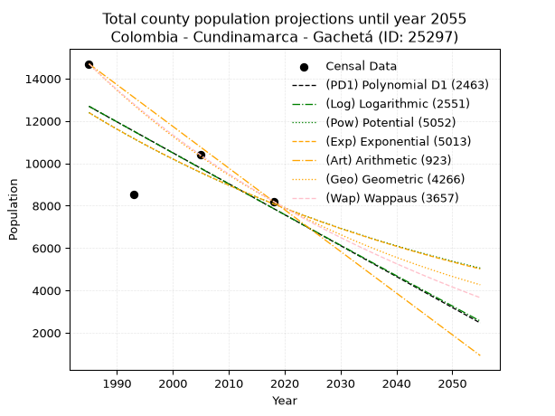
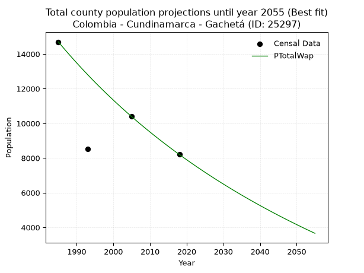
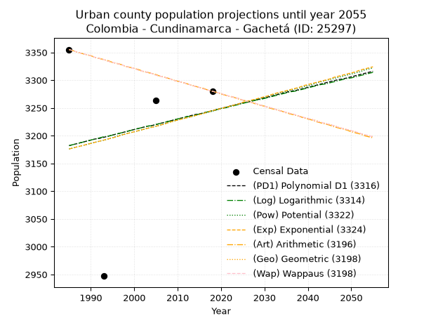
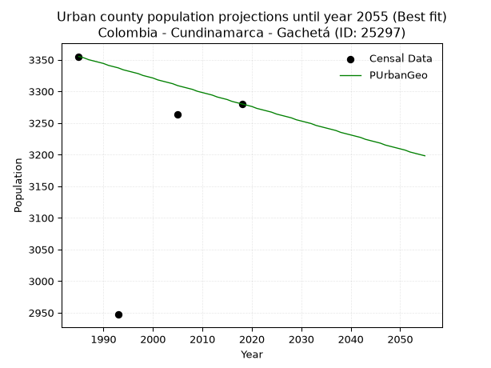
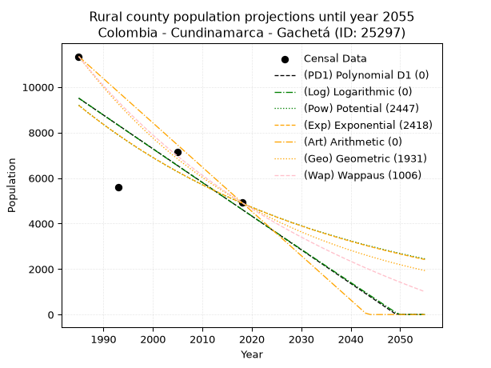
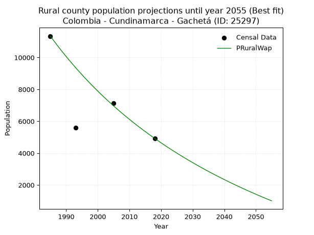

<div align="center">


</div>

# _“Population and Public Services Demand Projections (PPSD) until Year 2050 for Colombia - Cundinamarca - Gachetá (ID: 25297)”_
Keywords: `population` `public-service` `projection` `lineal` `polynomial` `logarithmic` `potential` `exponential` `arithmetic` `geometric` `wappaus` `dane` `colombia` `south-america`

PPSD are analytical estimates used by governments and planners to anticipate future changes in population size, age distribution, and the resulting community needs for utilities, healthcare, education, and infrastructure as sizing future water treatment facilities, electrical grids, and road networks based on spatial growth.

> **General running parameters**: • app_version: _v20260806_. • Python version: _3.14.7_. • Pandas version: _3.0.5_. • NumPy version: _2.5.1_. • Creates, save and include plots into reports (create_plot): _False_. • Projection until year: _2050_. • Process polynomial degree 2 and up: _False_. • Process Wappaus: _True_. • Process Wappaus: _True_. • Set negative values to zero: _True_. • Set infinite values to zero: _True_. • Drop dataset notes: _True_. 
<div align="center">

Dynamic map: [:earth_americas:Google](http://maps.google.com/maps?q=4.816410897,-73.6363765) [:earth_americas:OSM](https://www.openstreetmap.org/#map=18/4.816410897/-73.6363765&layers=P) [:earth_americas:Bing](https://www.bing.com/maps?cp=4.816410897~-73.6363765&lvl=18) [:earth_americas:Apple](https://maps.apple.com/frame?center=4.816410897%2C-73.6363765&span=0.003%2C0.006)

</div>


<div align="center">

```geojson
{
  "type": "Feature",
  "geometry": {
    "type": "Point", 
    "coordinates": [-73.6363765, 4.816410897]
  }, 
  "properties": {
    "Name": "Colombia - Cundinamarca - Gachetá (ID: 25297)"
  }
}
```

</div>


## 0. Census Data (4 records)

Census data are official statistics collected by a government about the people and housing in a country. They usually include counts of total population, age, sex, race, income, education, and jobs.

📅Global census file: [Population.xlsx](../data/Population.xlsx)

| Source   |   Year |   CountryID | CountryName   |   StateID | StateName    |   CountyID | CountyName   |   PTotal |   PUrban |   PRural |
|:---------|-------:|------------:|:--------------|----------:|:-------------|-----------:|:-------------|---------:|---------:|---------:|
| DANE     |   1985 |          57 | Colombia      |        25 | Cundinamarca |      25297 | Gachetá      |    14696 |     3355 |    11341 |
| DANE     |   1993 |          57 | Colombia      |        25 | Cundinamarca |      25297 | Gachetá      |     8539 |     2947 |     5592 |
| DANE     |   2005 |          57 | Colombia      |        25 | Cundinamarca |      25297 | Gachetá      |    10409 |     3263 |     7146 |
| DANE     |   2018 |          57 | Colombia      |        25 | Cundinamarca |      25297 | Gachetá      |     8203 |     3280 |     4923 |

> 🔥Some records could had specific notes about the registered values or the corresponding urban or rural distribution.

📅   [RUPS](https://www.datos.gov.co/Hacienda-y-Cr-dito-P-blico/Registro-nico-de-Prestadores-de-Servicios-P-blicos/4qkq-csdn/about_data) - Local public utility companies: [RUPS.csv](../data/RUPS.xlsx)

 | SERVICIO       | ESTADO    | NOMBRE                                                                           | NIT         | DEPARTAMENTO_DOMICILIO   | MUNICIPIO_DOMICILIO   | DIRECCION                           |   TELEFONO | EMAIL                 | TIPO_PRESTADOR          | CLASIFICACION                 |
|:---------------|:----------|:---------------------------------------------------------------------------------|:------------|:-------------------------|:----------------------|:------------------------------------|-----------:|:----------------------|:------------------------|:------------------------------|
| ACUEDUCTO      | OPERATIVA | ADMINISTRACION PUBLICA COOPERATIVA DE SERVICIOS PUBLICOS INTEGRALES DEL GUAVIO   | 900133072-6 | CUNDINAMARCA             | GACHETA               | CALLE 5 No. 2-11                    |    8535227 | serviguavio9@yahoo.es | ORGANIZACION AUTORIZADA | MENOR O IGUAL A 2500 USUARIOS |
| ALCANTARILLADO | OPERATIVA | ADMINISTRACION PUBLICA COOPERATIVA DE SERVICIOS PUBLICOS INTEGRALES DEL GUAVIO   | 900133072-6 | CUNDINAMARCA             | GACHETA               | CALLE 5 No. 2-11                    |    8535227 | serviguavio9@yahoo.es | ORGANIZACION AUTORIZADA | MENOR O IGUAL A 2500 USUARIOS |
| ACUEDUCTO      | OPERATIVA | ASOCIACION DE USUARIOS ACUEDUTO DE LA VEREDA MOQUENTIVA DEL MUNICIPIO DE GACHETA | 901124492-1 | CUNDINAMARCA             | GACHETA               | VEREDA MOQUENTIVA CUARTO DE ROMERAL |    3125834 | manuelg1951@gmail.com | ORGANIZACION AUTORIZADA | MENOR O IGUAL A 2500 USUARIOS |

## 1. Total

### 1.1. Coefficients and Parameters

* (PD1) Polynomial Deg 1: -146.08711360899107, 302672.4989963844 (lineal)
* (Log) Logarithmic: -292757.55658162927, 2235714.283588789
* (Pow) Potential: -25.905016497814565, 89.52192099151046
* (Exp) Exponential: -0.012929156217954041, 1733896367593564.0
* (Art) Arithmetic: Year diff. 2018 - 1985 = 33, Population diff. 8203 - 14696 = -6493, Annual growth = -196.75757575757575
* (Geo) Geometric: Year diff. 2018 - 1985 = 33, Population diff. 8203 - 14696 = -6493, Annual growth % = -0.01751377110028174
* (Wap) Wappaus: i = -1.7184818180494847, Condition values only valid for < 200)

<sub>
Wappaus condition values: ['-0.00', '-1.72', '-3.44', '-5.16', '-6.87', '-8.59', '-10.31', '-12.03', '-13.75', '-15.47', '-17.18', '-18.90', '-20.62', '-22.34', '-24.06', '-25.78', '-27.50', '-29.21', '-30.93', '-32.65', '-34.37', '-36.09', '-37.81', '-39.53', '-41.24', '-42.96', '-44.68', '-46.40', '-48.12', '-49.84', '-51.55', '-53.27', '-54.99', '-56.71', '-58.43', '-60.15', '-61.87', '-63.58', '-65.30', '-67.02', '-68.74', '-70.46', '-72.18', '-73.89', '-75.61', '-77.33', '-79.05', '-80.77', '-82.49', '-84.21', '-85.92', '-87.64', '-89.36', '-91.08', '-92.80', '-94.52', '-96.23', '-97.95', '-99.67', '-101.39', '-103.11', '-104.83', '-106.55', '-108.26', '-109.98', '-111.70']
</sub>


### 1.2. Projected Dataset

|   Year |   CountyID |   PTotalPD1 |   PTotalLog |   PTotalPow |   PTotalExp |   PTotalArt |   PTotalGeo |   PTotalWap |
|-------:|-----------:|------------:|------------:|------------:|------------:|------------:|------------:|------------:|
|   1985 |      25297 |       12690 |       12697 |       12399 |       12392 |       14696 |       14696 |       14696 |
|   1986 |      25297 |       12543 |       12549 |       12238 |       12232 |       14499 |       14439 |       14446 |
|   1987 |      25297 |       12397 |       12402 |       12080 |       12075 |       14302 |       14186 |       14199 |
|   1988 |      25297 |       12251 |       12254 |       11923 |       11920 |       14106 |       13937 |       13957 |
|   1989 |      25297 |       12105 |       12107 |       11769 |       11767 |       13909 |       13693 |       13719 |
|   1990 |      25297 |       11959 |       11960 |       11617 |       11616 |       13712 |       13453 |       13485 |
|   1991 |      25297 |       11813 |       11813 |       11466 |       11467 |       13515 |       13218 |       13255 |
|   1992 |      25297 |       11667 |       11666 |       11318 |       11319 |       13319 |       12986 |       13028 |
|   1993 |      25297 |       11521 |       11519 |       11172 |       11174 |       13122 |       12759 |       12806 |
|   1994 |      25297 |       11375 |       11372 |       11028 |       11030 |       12925 |       12535 |       12586 |
|   1995 |      25297 |       11229 |       11225 |       10885 |       10889 |       12728 |       12316 |       12370 |
|   1996 |      25297 |       11083 |       11079 |       10745 |       10749 |       12532 |       12100 |       12158 |
|   1997 |      25297 |       10937 |       10932 |       10607 |       10611 |       12335 |       11888 |       11949 |
|   1998 |      25297 |       10790 |       10786 |       10470 |       10474 |       12138 |       11680 |       11743 |
|   1999 |      25297 |       10644 |       10639 |       10335 |       10340 |       11941 |       11475 |       11540 |
|   2000 |      25297 |       10498 |       10493 |       10202 |       10207 |       11745 |       11274 |       11340 |
|   2001 |      25297 |       10352 |       10346 |       10071 |       10076 |       11548 |       11077 |       11144 |
|   2002 |      25297 |       10206 |       10200 |        9941 |        9947 |       11351 |       10883 |       10950 |
|   2003 |      25297 |       10060 |       10054 |        9813 |        9819 |       11154 |       10692 |       10759 |
|   2004 |      25297 |        9914 |        9908 |        9687 |        9693 |       10958 |       10505 |       10571 |
|   2005 |      25297 |        9768 |        9762 |        9563 |        9568 |       10761 |       10321 |       10386 |
|   2006 |      25297 |        9622 |        9616 |        9440 |        9445 |       10564 |       10140 |       10203 |
|   2007 |      25297 |        9476 |        9470 |        9319 |        9324 |       10367 |        9963 |       10023 |
|   2008 |      25297 |        9330 |        9324 |        9200 |        9204 |       10171 |        9788 |        9846 |
|   2009 |      25297 |        9183 |        9178 |        9082 |        9086 |        9974 |        9617 |        9671 |
|   2010 |      25297 |        9037 |        9033 |        8965 |        8969 |        9777 |        9448 |        9499 |
|   2011 |      25297 |        8891 |        8887 |        8851 |        8854 |        9580 |        9283 |        9329 |
|   2012 |      25297 |        8745 |        8741 |        8737 |        8740 |        9384 |        9120 |        9161 |
|   2013 |      25297 |        8599 |        8596 |        8626 |        8628 |        9187 |        8961 |        8996 |
|   2014 |      25297 |        8453 |        8450 |        8515 |        8517 |        8990 |        8804 |        8833 |
|   2015 |      25297 |        8307 |        8305 |        8407 |        8408 |        8793 |        8650 |        8672 |
|   2016 |      25297 |        8161 |        8160 |        8299 |        8300 |        8597 |        8498 |        8514 |
|   2017 |      25297 |        8015 |        8015 |        8193 |        8193 |        8400 |        8349 |        8357 |
|   2018 |      25297 |        7869 |        7870 |        8089 |        8088 |        8203 |        8203 |        8203 |
|   2019 |      25297 |        7723 |        7725 |        7986 |        7984 |        8006 |        8059 |        8051 |
|   2020 |      25297 |        7577 |        7580 |        7884 |        7881 |        7809 |        7918 |        7900 |
|   2021 |      25297 |        7430 |        7435 |        7783 |        7780 |        7613 |        7780 |        7752 |
|   2022 |      25297 |        7284 |        7290 |        7684 |        7680 |        7416 |        7643 |        7606 |
|   2023 |      25297 |        7138 |        7145 |        7587 |        7581 |        7219 |        7509 |        7461 |
|   2024 |      25297 |        6992 |        7000 |        7490 |        7484 |        7022 |        7378 |        7319 |
|   2025 |      25297 |        6846 |        6856 |        7395 |        7388 |        6826 |        7249 |        7178 |
|   2026 |      25297 |        6700 |        6711 |        7301 |        7293 |        6629 |        7122 |        7039 |
|   2027 |      25297 |        6554 |        6567 |        7208 |        7199 |        6432 |        6997 |        6902 |
|   2028 |      25297 |        6408 |        6422 |        7117 |        7107 |        6235 |        6874 |        6766 |
|   2029 |      25297 |        6262 |        6278 |        7026 |        7016 |        6039 |        6754 |        6632 |
|   2030 |      25297 |        6116 |        6134 |        6937 |        6925 |        5842 |        6636 |        6500 |
|   2031 |      25297 |        5970 |        5990 |        6849 |        6837 |        5645 |        6520 |        6370 |
|   2032 |      25297 |        5823 |        5846 |        6762 |        6749 |        5448 |        6405 |        6241 |
|   2033 |      25297 |        5677 |        5702 |        6677 |        6662 |        5252 |        6293 |        6113 |
|   2034 |      25297 |        5531 |        5558 |        6592 |        6576 |        5055 |        6183 |        5988 |
|   2035 |      25297 |        5385 |        5414 |        6509 |        6492 |        4858 |        6075 |        5863 |
|   2036 |      25297 |        5239 |        5270 |        6427 |        6409 |        4661 |        5968 |        5740 |
|   2037 |      25297 |        5093 |        5126 |        6345 |        6326 |        4465 |        5864 |        5619 |
|   2038 |      25297 |        4947 |        4982 |        6265 |        6245 |        4268 |        5761 |        5499 |
|   2039 |      25297 |        4801 |        4839 |        6186 |        6165 |        4071 |        5660 |        5381 |
|   2040 |      25297 |        4655 |        4695 |        6108 |        6086 |        3874 |        5561 |        5263 |
|   2041 |      25297 |        4509 |        4552 |        6031 |        6007 |        3678 |        5464 |        5148 |
|   2042 |      25297 |        4363 |        4408 |        5955 |        5930 |        3481 |        5368 |        5033 |
|   2043 |      25297 |        4217 |        4265 |        5880 |        5854 |        3284 |        5274 |        4920 |
|   2044 |      25297 |        4070 |        4122 |        5806 |        5779 |        3087 |        5182 |        4808 |
|   2045 |      25297 |        3924 |        3979 |        5733 |        5705 |        2891 |        5091 |        4698 |
|   2046 |      25297 |        3778 |        3835 |        5661 |        5631 |        2694 |        5002 |        4588 |
|   2047 |      25297 |        3632 |        3692 |        5589 |        5559 |        2497 |        4914 |        4480 |
|   2048 |      25297 |        3486 |        3549 |        5519 |        5488 |        2300 |        4828 |        4373 |
|   2049 |      25297 |        3340 |        3407 |        5450 |        5417 |        2104 |        4743 |        4268 |
|   2050 |      25297 |        3194 |        3264 |        5381 |        5347 |        1907 |        4660 |        4163 |
<div align="center">

</img>

</div>


### 1.3. Best fit with absolute and relative error (%)

Relative error puts that difference into context by dividing the absolute error by the true value, creating a unitless ratio or percentage that shows the scale of the mistake.

Absolute and relative error

|   Year | Source   |   CountryID | CountryName   |   StateID | StateName    |   CountyID_x | CountyName   |   PTotal |   PUrban |   PRural |   CountyID_y |   PTotalPD1 |   PTotalLog |   PTotalPow |   PTotalExp |   PTotalArt |   PTotalGeo |   PTotalWap |   PTotalPD1AbsError |   PTotalLogAbsError |   PTotalPowAbsError |   PTotalExpAbsError |   PTotalArtAbsError |   PTotalGeoAbsError |   PTotalWapAbsError |   PTotalPD1RelError |   PTotalLogRelError |   PTotalPowRelError |   PTotalExpRelError |   PTotalArtRelError |   PTotalGeoRelError |   PTotalWapRelError |
|-------:|:---------|------------:|:--------------|----------:|:-------------|-------------:|:-------------|---------:|---------:|---------:|-------------:|------------:|------------:|------------:|------------:|------------:|------------:|------------:|--------------------:|--------------------:|--------------------:|--------------------:|--------------------:|--------------------:|--------------------:|--------------------:|--------------------:|--------------------:|--------------------:|--------------------:|--------------------:|--------------------:|
|   1985 | DANE     |          57 | Colombia      |        25 | Cundinamarca |        25297 | Gachetá      |    14696 |     3355 |    11341 |        25297 |       12690 |       12697 |       12399 |       12392 |       14696 |       14696 |       14696 |                2006 |                1999 |                2297 |                2304 |                   0 |                   0 |                   0 |            13.65    |            13.6023  |            15.6301  |            15.6777  |             0       |            0        |            0        |
|   1993 | DANE     |          57 | Colombia      |        25 | Cundinamarca |        25297 | Gachetá      |     8539 |     2947 |     5592 |        25297 |       11521 |       11519 |       11172 |       11174 |       13122 |       12759 |       12806 |                2982 |                2980 |                2633 |                2635 |                4583 |                4220 |                4267 |            34.9221  |            34.8987  |            30.835   |            30.8584  |            53.6714  |           49.4203   |           49.9707   |
|   2005 | DANE     |          57 | Colombia      |        25 | Cundinamarca |        25297 | Gachetá      |    10409 |     3263 |     7146 |        25297 |        9768 |        9762 |        9563 |        9568 |       10761 |       10321 |       10386 |                 641 |                 647 |                 846 |                 841 |                 352 |                  88 |                  23 |             6.15813 |             6.21577 |             8.12758 |             8.07955 |             3.38169 |            0.845422 |            0.220963 |
|   2018 | DANE     |          57 | Colombia      |        25 | Cundinamarca |        25297 | Gachetá      |     8203 |     3280 |     4923 |        25297 |        7869 |        7870 |        8089 |        8088 |        8203 |        8203 |        8203 |                 334 |                 333 |                 114 |                 115 |                   0 |                   0 |                   0 |             4.07168 |             4.05949 |             1.38974 |             1.40193 |             0       |            0        |            0        |

Relative error mean

| Method    |   RelError | Best   |
|:----------|-----------:|:-------|
| PTotalPD1 |    14.7005 |        |
| PTotalLog |    14.6941 |        |
| PTotalPow |    13.9956 |        |
| PTotalExp |    14.0044 |        |
| PTotalArt |    14.2633 |        |
| PTotalGeo |    12.5664 |        |
| PTotalWap |    12.5479 | True   |

💙Best method: _**PTotalWap**_
<div align="center">

</img>

</div>


### 1.4. Fresh water supply demand in liters per capita per day (lpcd)

The fresh water supply demand typically ranges from 100 to 300 liters per capita per day (lpcd) for standard domestic and municipal planning, though absolute survival minimums set by the World Health Organization are as low as 7.5 to 20 liters per day, and total consumption in high-income nations can exceed 400 liters.

> `CZ`: Level in meters above the sea level (masl)<br> `WS`: Fresh water supply demand in liters per capita per day (lpcd or l/h/d)<br> `WSAll`: Zonal fresh water supply demand in liters per second (l/s)<br> `A`: Zonal area in square meters<br> `DP`: Population density (people/hectare or p/ha)

Reference values (RAS Colombia)

|    CZ |   WS |
|------:|-----:|
|  1000 |  120 |
|  2000 |  130 |
| 99999 |  140 |

County shapefile geometry properties and water supply values

|   CountyID |      ATotal |   CZTotal |   WSTotal |
|-----------:|------------:|----------:|----------:|
|      25297 | 2.58506e+08 |   2439.12 |       140 |

Projected values for best method: PTotalWap

|   CountyID |   Year |   PTotalWap |   DPTotal |   WSTotal |   WSTotalAll |
|-----------:|-------:|------------:|----------:|----------:|-------------:|
|      25297 |   1985 |       14696 |      0.57 |       140 |     23.813   |
|      25297 |   1986 |       14446 |      0.56 |       140 |     23.4079  |
|      25297 |   1987 |       14199 |      0.55 |       140 |     23.0076  |
|      25297 |   1988 |       13957 |      0.54 |       140 |     22.6155  |
|      25297 |   1989 |       13719 |      0.53 |       140 |     22.2299  |
|      25297 |   1990 |       13485 |      0.52 |       140 |     21.8507  |
|      25297 |   1991 |       13255 |      0.51 |       140 |     21.478   |
|      25297 |   1992 |       13028 |      0.5  |       140 |     21.1102  |
|      25297 |   1993 |       12806 |      0.5  |       140 |     20.7505  |
|      25297 |   1994 |       12586 |      0.49 |       140 |     20.394   |
|      25297 |   1995 |       12370 |      0.48 |       140 |     20.044   |
|      25297 |   1996 |       12158 |      0.47 |       140 |     19.7005  |
|      25297 |   1997 |       11949 |      0.46 |       140 |     19.3618  |
|      25297 |   1998 |       11743 |      0.45 |       140 |     19.028   |
|      25297 |   1999 |       11540 |      0.45 |       140 |     18.6991  |
|      25297 |   2000 |       11340 |      0.44 |       140 |     18.375   |
|      25297 |   2001 |       11144 |      0.43 |       140 |     18.0574  |
|      25297 |   2002 |       10950 |      0.42 |       140 |     17.7431  |
|      25297 |   2003 |       10759 |      0.42 |       140 |     17.4336  |
|      25297 |   2004 |       10571 |      0.41 |       140 |     17.1289  |
|      25297 |   2005 |       10386 |      0.4  |       140 |     16.8292  |
|      25297 |   2006 |       10203 |      0.39 |       140 |     16.5326  |
|      25297 |   2007 |       10023 |      0.39 |       140 |     16.241   |
|      25297 |   2008 |        9846 |      0.38 |       140 |     15.9542  |
|      25297 |   2009 |        9671 |      0.37 |       140 |     15.6706  |
|      25297 |   2010 |        9499 |      0.37 |       140 |     15.3919  |
|      25297 |   2011 |        9329 |      0.36 |       140 |     15.1164  |
|      25297 |   2012 |        9161 |      0.35 |       140 |     14.8442  |
|      25297 |   2013 |        8996 |      0.35 |       140 |     14.5769  |
|      25297 |   2014 |        8833 |      0.34 |       140 |     14.3127  |
|      25297 |   2015 |        8672 |      0.34 |       140 |     14.0519  |
|      25297 |   2016 |        8514 |      0.33 |       140 |     13.7958  |
|      25297 |   2017 |        8357 |      0.32 |       140 |     13.5414  |
|      25297 |   2018 |        8203 |      0.32 |       140 |     13.2919  |
|      25297 |   2019 |        8051 |      0.31 |       140 |     13.0456  |
|      25297 |   2020 |        7900 |      0.31 |       140 |     12.8009  |
|      25297 |   2021 |        7752 |      0.3  |       140 |     12.5611  |
|      25297 |   2022 |        7606 |      0.29 |       140 |     12.3245  |
|      25297 |   2023 |        7461 |      0.29 |       140 |     12.0896  |
|      25297 |   2024 |        7319 |      0.28 |       140 |     11.8595  |
|      25297 |   2025 |        7178 |      0.28 |       140 |     11.631   |
|      25297 |   2026 |        7039 |      0.27 |       140 |     11.4058  |
|      25297 |   2027 |        6902 |      0.27 |       140 |     11.1838  |
|      25297 |   2028 |        6766 |      0.26 |       140 |     10.9634  |
|      25297 |   2029 |        6632 |      0.26 |       140 |     10.7463  |
|      25297 |   2030 |        6500 |      0.25 |       140 |     10.5324  |
|      25297 |   2031 |        6370 |      0.25 |       140 |     10.3218  |
|      25297 |   2032 |        6241 |      0.24 |       140 |     10.1127  |
|      25297 |   2033 |        6113 |      0.24 |       140 |      9.90532 |
|      25297 |   2034 |        5988 |      0.23 |       140 |      9.70278 |
|      25297 |   2035 |        5863 |      0.23 |       140 |      9.50023 |
|      25297 |   2036 |        5740 |      0.22 |       140 |      9.30093 |
|      25297 |   2037 |        5619 |      0.22 |       140 |      9.10486 |
|      25297 |   2038 |        5499 |      0.21 |       140 |      8.91042 |
|      25297 |   2039 |        5381 |      0.21 |       140 |      8.71921 |
|      25297 |   2040 |        5263 |      0.2  |       140 |      8.52801 |
|      25297 |   2041 |        5148 |      0.2  |       140 |      8.34167 |
|      25297 |   2042 |        5033 |      0.19 |       140 |      8.15532 |
|      25297 |   2043 |        4920 |      0.19 |       140 |      7.97222 |
|      25297 |   2044 |        4808 |      0.19 |       140 |      7.79074 |
|      25297 |   2045 |        4698 |      0.18 |       140 |      7.6125  |
|      25297 |   2046 |        4588 |      0.18 |       140 |      7.43426 |
|      25297 |   2047 |        4480 |      0.17 |       140 |      7.25926 |
|      25297 |   2048 |        4373 |      0.17 |       140 |      7.08588 |
|      25297 |   2049 |        4268 |      0.17 |       140 |      6.91574 |
|      25297 |   2050 |        4163 |      0.16 |       140 |      6.7456  |

## 2. Urban

### 2.1. Coefficients and Parameters

* (PD1) Polynomial Deg 1: 1.9104777197912186, -610.1830590123851 (lineal)
* (Log) Logarithmic: 3792.6222435789728, -25616.50206561105
* (Pow) Potential: 1.2972531845695667, -0.7761902478032581
* (Exp) Exponential: 0.0006530609875465952, 868.6171959208066
* (Art) Arithmetic: Year diff. 2018 - 1985 = 33, Population diff. 3280 - 3355 = -75, Annual growth = -2.272727272727273
* (Geo) Geometric: Year diff. 2018 - 1985 = 33, Population diff. 3280 - 3355 = -75, Annual growth % = -0.0006848668269640035
* (Wap) Wappaus: i = -0.06850722751250257, Condition values only valid for < 200)

<sub>
Wappaus condition values: ['-0.00', '-0.07', '-0.14', '-0.21', '-0.27', '-0.34', '-0.41', '-0.48', '-0.55', '-0.62', '-0.69', '-0.75', '-0.82', '-0.89', '-0.96', '-1.03', '-1.10', '-1.16', '-1.23', '-1.30', '-1.37', '-1.44', '-1.51', '-1.58', '-1.64', '-1.71', '-1.78', '-1.85', '-1.92', '-1.99', '-2.06', '-2.12', '-2.19', '-2.26', '-2.33', '-2.40', '-2.47', '-2.53', '-2.60', '-2.67', '-2.74', '-2.81', '-2.88', '-2.95', '-3.01', '-3.08', '-3.15', '-3.22', '-3.29', '-3.36', '-3.43', '-3.49', '-3.56', '-3.63', '-3.70', '-3.77', '-3.84', '-3.90', '-3.97', '-4.04', '-4.11', '-4.18', '-4.25', '-4.32', '-4.38', '-4.45']
</sub>


### 2.2. Projected Dataset

|   Year |   CountyID |   PUrbanPD1 |   PUrbanLog |   PUrbanPow |   PUrbanExp |   PUrbanArt |   PUrbanGeo |   PUrbanWap |
|-------:|-----------:|------------:|------------:|------------:|------------:|------------:|------------:|------------:|
|   1985 |      25297 |        3182 |        3182 |        3176 |        3176 |        3355 |        3355 |        3355 |
|   1986 |      25297 |        3184 |        3184 |        3178 |        3178 |        3353 |        3353 |        3353 |
|   1987 |      25297 |        3186 |        3186 |        3180 |        3180 |        3350 |        3350 |        3350 |
|   1988 |      25297 |        3188 |        3188 |        3182 |        3182 |        3348 |        3348 |        3348 |
|   1989 |      25297 |        3190 |        3190 |        3184 |        3184 |        3346 |        3346 |        3346 |
|   1990 |      25297 |        3192 |        3192 |        3186 |        3186 |        3344 |        3344 |        3344 |
|   1991 |      25297 |        3194 |        3194 |        3188 |        3188 |        3341 |        3341 |        3341 |
|   1992 |      25297 |        3195 |        3196 |        3190 |        3190 |        3339 |        3339 |        3339 |
|   1993 |      25297 |        3197 |        3198 |        3192 |        3192 |        3337 |        3337 |        3337 |
|   1994 |      25297 |        3199 |        3199 |        3194 |        3194 |        3335 |        3334 |        3334 |
|   1995 |      25297 |        3201 |        3201 |        3196 |        3196 |        3332 |        3332 |        3332 |
|   1996 |      25297 |        3203 |        3203 |        3199 |        3198 |        3330 |        3330 |        3330 |
|   1997 |      25297 |        3205 |        3205 |        3201 |        3201 |        3328 |        3328 |        3328 |
|   1998 |      25297 |        3207 |        3207 |        3203 |        3203 |        3325 |        3325 |        3325 |
|   1999 |      25297 |        3209 |        3209 |        3205 |        3205 |        3323 |        3323 |        3323 |
|   2000 |      25297 |        3211 |        3211 |        3207 |        3207 |        3321 |        3321 |        3321 |
|   2001 |      25297 |        3213 |        3213 |        3209 |        3209 |        3319 |        3318 |        3318 |
|   2002 |      25297 |        3215 |        3215 |        3211 |        3211 |        3316 |        3316 |        3316 |
|   2003 |      25297 |        3217 |        3217 |        3213 |        3213 |        3314 |        3314 |        3314 |
|   2004 |      25297 |        3218 |        3218 |        3215 |        3215 |        3312 |        3312 |        3312 |
|   2005 |      25297 |        3220 |        3220 |        3217 |        3217 |        3310 |        3309 |        3309 |
|   2006 |      25297 |        3222 |        3222 |        3219 |        3219 |        3307 |        3307 |        3307 |
|   2007 |      25297 |        3224 |        3224 |        3221 |        3221 |        3305 |        3305 |        3305 |
|   2008 |      25297 |        3226 |        3226 |        3224 |        3224 |        3303 |        3303 |        3303 |
|   2009 |      25297 |        3228 |        3228 |        3226 |        3226 |        3300 |        3300 |        3300 |
|   2010 |      25297 |        3230 |        3230 |        3228 |        3228 |        3298 |        3298 |        3298 |
|   2011 |      25297 |        3232 |        3232 |        3230 |        3230 |        3296 |        3296 |        3296 |
|   2012 |      25297 |        3234 |        3234 |        3232 |        3232 |        3294 |        3294 |        3294 |
|   2013 |      25297 |        3236 |        3235 |        3234 |        3234 |        3291 |        3291 |        3291 |
|   2014 |      25297 |        3238 |        3237 |        3236 |        3236 |        3289 |        3289 |        3289 |
|   2015 |      25297 |        3239 |        3239 |        3238 |        3238 |        3287 |        3287 |        3287 |
|   2016 |      25297 |        3241 |        3241 |        3240 |        3240 |        3285 |        3284 |        3284 |
|   2017 |      25297 |        3243 |        3243 |        3242 |        3243 |        3282 |        3282 |        3282 |
|   2018 |      25297 |        3245 |        3245 |        3244 |        3245 |        3280 |        3280 |        3280 |
|   2019 |      25297 |        3247 |        3247 |        3246 |        3247 |        3278 |        3278 |        3278 |
|   2020 |      25297 |        3249 |        3249 |        3249 |        3249 |        3275 |        3276 |        3276 |
|   2021 |      25297 |        3251 |        3250 |        3251 |        3251 |        3273 |        3273 |        3273 |
|   2022 |      25297 |        3253 |        3252 |        3253 |        3253 |        3271 |        3271 |        3271 |
|   2023 |      25297 |        3255 |        3254 |        3255 |        3255 |        3269 |        3269 |        3269 |
|   2024 |      25297 |        3257 |        3256 |        3257 |        3257 |        3266 |        3267 |        3267 |
|   2025 |      25297 |        3259 |        3258 |        3259 |        3260 |        3264 |        3264 |        3264 |
|   2026 |      25297 |        3260 |        3260 |        3261 |        3262 |        3262 |        3262 |        3262 |
|   2027 |      25297 |        3262 |        3262 |        3263 |        3264 |        3260 |        3260 |        3260 |
|   2028 |      25297 |        3264 |        3264 |        3265 |        3266 |        3257 |        3258 |        3258 |
|   2029 |      25297 |        3266 |        3265 |        3267 |        3268 |        3255 |        3255 |        3255 |
|   2030 |      25297 |        3268 |        3267 |        3269 |        3270 |        3253 |        3253 |        3253 |
|   2031 |      25297 |        3270 |        3269 |        3272 |        3272 |        3250 |        3251 |        3251 |
|   2032 |      25297 |        3272 |        3271 |        3274 |        3275 |        3248 |        3249 |        3249 |
|   2033 |      25297 |        3274 |        3273 |        3276 |        3277 |        3246 |        3246 |        3246 |
|   2034 |      25297 |        3276 |        3275 |        3278 |        3279 |        3244 |        3244 |        3244 |
|   2035 |      25297 |        3278 |        3277 |        3280 |        3281 |        3241 |        3242 |        3242 |
|   2036 |      25297 |        3280 |        3279 |        3282 |        3283 |        3239 |        3240 |        3240 |
|   2037 |      25297 |        3281 |        3280 |        3284 |        3285 |        3237 |        3238 |        3238 |
|   2038 |      25297 |        3283 |        3282 |        3286 |        3287 |        3235 |        3235 |        3235 |
|   2039 |      25297 |        3285 |        3284 |        3288 |        3290 |        3232 |        3233 |        3233 |
|   2040 |      25297 |        3287 |        3286 |        3290 |        3292 |        3230 |        3231 |        3231 |
|   2041 |      25297 |        3289 |        3288 |        3292 |        3294 |        3228 |        3229 |        3229 |
|   2042 |      25297 |        3291 |        3290 |        3295 |        3296 |        3225 |        3227 |        3226 |
|   2043 |      25297 |        3293 |        3292 |        3297 |        3298 |        3223 |        3224 |        3224 |
|   2044 |      25297 |        3295 |        3293 |        3299 |        3300 |        3221 |        3222 |        3222 |
|   2045 |      25297 |        3297 |        3295 |        3301 |        3302 |        3219 |        3220 |        3220 |
|   2046 |      25297 |        3299 |        3297 |        3303 |        3305 |        3216 |        3218 |        3218 |
|   2047 |      25297 |        3301 |        3299 |        3305 |        3307 |        3214 |        3215 |        3215 |
|   2048 |      25297 |        3302 |        3301 |        3307 |        3309 |        3212 |        3213 |        3213 |
|   2049 |      25297 |        3304 |        3303 |        3309 |        3311 |        3210 |        3211 |        3211 |
|   2050 |      25297 |        3306 |        3304 |        3311 |        3313 |        3207 |        3209 |        3209 |
<div align="center">

</img>

</div>


### 2.3. Best fit with absolute and relative error (%)

Relative error puts that difference into context by dividing the absolute error by the true value, creating a unitless ratio or percentage that shows the scale of the mistake.

Absolute and relative error

|   Year | Source   |   CountryID | CountryName   |   StateID | StateName    |   CountyID_x | CountyName   |   PTotal |   PUrban |   PRural |   CountyID_y |   PUrbanPD1 |   PUrbanLog |   PUrbanPow |   PUrbanExp |   PUrbanArt |   PUrbanGeo |   PUrbanWap |   PUrbanPD1AbsError |   PUrbanLogAbsError |   PUrbanPowAbsError |   PUrbanExpAbsError |   PUrbanArtAbsError |   PUrbanGeoAbsError |   PUrbanWapAbsError |   PUrbanPD1RelError |   PUrbanLogRelError |   PUrbanPowRelError |   PUrbanExpRelError |   PUrbanArtRelError |   PUrbanGeoRelError |   PUrbanWapRelError |
|-------:|:---------|------------:|:--------------|----------:|:-------------|-------------:|:-------------|---------:|---------:|---------:|-------------:|------------:|------------:|------------:|------------:|------------:|------------:|------------:|--------------------:|--------------------:|--------------------:|--------------------:|--------------------:|--------------------:|--------------------:|--------------------:|--------------------:|--------------------:|--------------------:|--------------------:|--------------------:|--------------------:|
|   1985 | DANE     |          57 | Colombia      |        25 | Cundinamarca |        25297 | Gachetá      |    14696 |     3355 |    11341 |        25297 |        3182 |        3182 |        3176 |        3176 |        3355 |        3355 |        3355 |                 173 |                 173 |                 179 |                 179 |                   0 |                   0 |                   0 |             5.15648 |             5.15648 |             5.33532 |             5.33532 |             0       |             0       |             0       |
|   1993 | DANE     |          57 | Colombia      |        25 | Cundinamarca |        25297 | Gachetá      |     8539 |     2947 |     5592 |        25297 |        3197 |        3198 |        3192 |        3192 |        3337 |        3337 |        3337 |                 250 |                 251 |                 245 |                 245 |                 390 |                 390 |                 390 |             8.4832  |             8.51714 |             8.31354 |             8.31354 |            13.2338  |            13.2338  |            13.2338  |
|   2005 | DANE     |          57 | Colombia      |        25 | Cundinamarca |        25297 | Gachetá      |    10409 |     3263 |     7146 |        25297 |        3220 |        3220 |        3217 |        3217 |        3310 |        3309 |        3309 |                  43 |                  43 |                  46 |                  46 |                  47 |                  46 |                  46 |             1.31781 |             1.31781 |             1.40975 |             1.40975 |             1.44039 |             1.40975 |             1.40975 |
|   2018 | DANE     |          57 | Colombia      |        25 | Cundinamarca |        25297 | Gachetá      |     8203 |     3280 |     4923 |        25297 |        3245 |        3245 |        3244 |        3245 |        3280 |        3280 |        3280 |                  35 |                  35 |                  36 |                  35 |                   0 |                   0 |                   0 |             1.06707 |             1.06707 |             1.09756 |             1.06707 |             0       |             0       |             0       |

Relative error mean

| Method    |   RelError | Best   |
|:----------|-----------:|:-------|
| PUrbanPD1 |    4.00614 |        |
| PUrbanLog |    4.01462 |        |
| PUrbanPow |    4.03904 |        |
| PUrbanExp |    4.03142 |        |
| PUrbanArt |    3.66855 |        |
| PUrbanGeo |    3.66089 | True   |
| PUrbanWap |    3.66089 | True   |

💙Best method: _**PUrbanGeo**_
<div align="center">

</img>

</div>


### 2.4. Fresh water supply demand in liters per capita per day (lpcd)

The fresh water supply demand typically ranges from 100 to 300 liters per capita per day (lpcd) for standard domestic and municipal planning, though absolute survival minimums set by the World Health Organization are as low as 7.5 to 20 liters per day, and total consumption in high-income nations can exceed 400 liters.

> `CZ`: Level in meters above the sea level (masl)<br> `WS`: Fresh water supply demand in liters per capita per day (lpcd or l/h/d)<br> `WSAll`: Zonal fresh water supply demand in liters per second (l/s)<br> `A`: Zonal area in square meters<br> `DP`: Population density (people/hectare or p/ha)

Reference values (RAS Colombia)

|    CZ |   WS |
|------:|-----:|
|  1000 |  120 |
|  2000 |  130 |
| 99999 |  140 |

County shapefile geometry properties and water supply values

|   CountyID |      AUrban |   CZUrban |   WSUrban |
|-----------:|------------:|----------:|----------:|
|      25297 | 1.23676e+06 |   1729.81 |       130 |

Projected values for best method: PUrbanGeo

|   CountyID |   Year |   PUrbanGeo |   DPUrban |   WSUrban |   WSUrbanAll |
|-----------:|-------:|------------:|----------:|----------:|-------------:|
|      25297 |   1985 |        3355 |     27.13 |       130 |      5.04803 |
|      25297 |   1986 |        3353 |     27.11 |       130 |      5.04502 |
|      25297 |   1987 |        3350 |     27.09 |       130 |      5.04051 |
|      25297 |   1988 |        3348 |     27.07 |       130 |      5.0375  |
|      25297 |   1989 |        3346 |     27.05 |       130 |      5.03449 |
|      25297 |   1990 |        3344 |     27.04 |       130 |      5.03148 |
|      25297 |   1991 |        3341 |     27.01 |       130 |      5.02697 |
|      25297 |   1992 |        3339 |     27    |       130 |      5.02396 |
|      25297 |   1993 |        3337 |     26.98 |       130 |      5.02095 |
|      25297 |   1994 |        3334 |     26.96 |       130 |      5.01644 |
|      25297 |   1995 |        3332 |     26.94 |       130 |      5.01343 |
|      25297 |   1996 |        3330 |     26.93 |       130 |      5.01042 |
|      25297 |   1997 |        3328 |     26.91 |       130 |      5.00741 |
|      25297 |   1998 |        3325 |     26.88 |       130 |      5.00289 |
|      25297 |   1999 |        3323 |     26.87 |       130 |      4.99988 |
|      25297 |   2000 |        3321 |     26.85 |       130 |      4.99688 |
|      25297 |   2001 |        3318 |     26.83 |       130 |      4.99236 |
|      25297 |   2002 |        3316 |     26.81 |       130 |      4.98935 |
|      25297 |   2003 |        3314 |     26.8  |       130 |      4.98634 |
|      25297 |   2004 |        3312 |     26.78 |       130 |      4.98333 |
|      25297 |   2005 |        3309 |     26.76 |       130 |      4.97882 |
|      25297 |   2006 |        3307 |     26.74 |       130 |      4.97581 |
|      25297 |   2007 |        3305 |     26.72 |       130 |      4.9728  |
|      25297 |   2008 |        3303 |     26.71 |       130 |      4.96979 |
|      25297 |   2009 |        3300 |     26.68 |       130 |      4.96528 |
|      25297 |   2010 |        3298 |     26.67 |       130 |      4.96227 |
|      25297 |   2011 |        3296 |     26.65 |       130 |      4.95926 |
|      25297 |   2012 |        3294 |     26.63 |       130 |      4.95625 |
|      25297 |   2013 |        3291 |     26.61 |       130 |      4.95174 |
|      25297 |   2014 |        3289 |     26.59 |       130 |      4.94873 |
|      25297 |   2015 |        3287 |     26.58 |       130 |      4.94572 |
|      25297 |   2016 |        3284 |     26.55 |       130 |      4.9412  |
|      25297 |   2017 |        3282 |     26.54 |       130 |      4.93819 |
|      25297 |   2018 |        3280 |     26.52 |       130 |      4.93519 |
|      25297 |   2019 |        3278 |     26.5  |       130 |      4.93218 |
|      25297 |   2020 |        3276 |     26.49 |       130 |      4.92917 |
|      25297 |   2021 |        3273 |     26.46 |       130 |      4.92465 |
|      25297 |   2022 |        3271 |     26.45 |       130 |      4.92164 |
|      25297 |   2023 |        3269 |     26.43 |       130 |      4.91863 |
|      25297 |   2024 |        3267 |     26.42 |       130 |      4.91563 |
|      25297 |   2025 |        3264 |     26.39 |       130 |      4.91111 |
|      25297 |   2026 |        3262 |     26.38 |       130 |      4.9081  |
|      25297 |   2027 |        3260 |     26.36 |       130 |      4.90509 |
|      25297 |   2028 |        3258 |     26.34 |       130 |      4.90208 |
|      25297 |   2029 |        3255 |     26.32 |       130 |      4.89757 |
|      25297 |   2030 |        3253 |     26.3  |       130 |      4.89456 |
|      25297 |   2031 |        3251 |     26.29 |       130 |      4.89155 |
|      25297 |   2032 |        3249 |     26.27 |       130 |      4.88854 |
|      25297 |   2033 |        3246 |     26.25 |       130 |      4.88403 |
|      25297 |   2034 |        3244 |     26.23 |       130 |      4.88102 |
|      25297 |   2035 |        3242 |     26.21 |       130 |      4.87801 |
|      25297 |   2036 |        3240 |     26.2  |       130 |      4.875   |
|      25297 |   2037 |        3238 |     26.18 |       130 |      4.87199 |
|      25297 |   2038 |        3235 |     26.16 |       130 |      4.86748 |
|      25297 |   2039 |        3233 |     26.14 |       130 |      4.86447 |
|      25297 |   2040 |        3231 |     26.12 |       130 |      4.86146 |
|      25297 |   2041 |        3229 |     26.11 |       130 |      4.85845 |
|      25297 |   2042 |        3227 |     26.09 |       130 |      4.85544 |
|      25297 |   2043 |        3224 |     26.07 |       130 |      4.85093 |
|      25297 |   2044 |        3222 |     26.05 |       130 |      4.84792 |
|      25297 |   2045 |        3220 |     26.04 |       130 |      4.84491 |
|      25297 |   2046 |        3218 |     26.02 |       130 |      4.8419  |
|      25297 |   2047 |        3215 |     26    |       130 |      4.83738 |
|      25297 |   2048 |        3213 |     25.98 |       130 |      4.83437 |
|      25297 |   2049 |        3211 |     25.96 |       130 |      4.83137 |
|      25297 |   2050 |        3209 |     25.95 |       130 |      4.82836 |

## 3. Rural

### 3.1. Coefficients and Parameters

* (PD1) Polynomial Deg 1: -147.99759132878222, 303282.6820553966 (lineal)
* (Log) Logarithmic: -296550.17882520804, 2261330.785654399
* (Pow) Potential: -38.21271494043805, 129.98019780252727
* (Exp) Exponential: -0.0190766674842692, 2.5643771953158986e+20
* (Art) Arithmetic: Year diff. 2018 - 1985 = 33, Population diff. 4923 - 11341 = -6418, Annual growth = -194.4848484848485
* (Geo) Geometric: Year diff. 2018 - 1985 = 33, Population diff. 4923 - 11341 = -6418, Annual growth % = -0.024971007015485935
* (Wap) Wappaus: i = -2.3915992189479645, Condition values only valid for < 200)

<sub>
Wappaus condition values: ['-0.00', '-2.39', '-4.78', '-7.17', '-9.57', '-11.96', '-14.35', '-16.74', '-19.13', '-21.52', '-23.92', '-26.31', '-28.70', '-31.09', '-33.48', '-35.87', '-38.27', '-40.66', '-43.05', '-45.44', '-47.83', '-50.22', '-52.62', '-55.01', '-57.40', '-59.79', '-62.18', '-64.57', '-66.96', '-69.36', '-71.75', '-74.14', '-76.53', '-78.92', '-81.31', '-83.71', '-86.10', '-88.49', '-90.88', '-93.27', '-95.66', '-98.06', '-100.45', '-102.84', '-105.23', '-107.62', '-110.01', '-112.41', '-114.80', '-117.19', '-119.58', '-121.97', '-124.36', '-126.75', '-129.15', '-131.54', '-133.93', '-136.32', '-138.71', '-141.10', '-143.50', '-145.89', '-148.28', '-150.67', '-153.06', '-155.45']
</sub>


### 3.2. Projected Dataset

|   Year |   CountyID |   PRuralPD1 |   PRuralLog |   PRuralPow |   PRuralExp |   PRuralArt |   PRuralGeo |   PRuralWap |
|-------:|-----------:|------------:|------------:|------------:|------------:|------------:|------------:|------------:|
|   1985 |      25297 |        9507 |        9514 |        9201 |        9193 |       11341 |       11341 |       11341 |
|   1986 |      25297 |        9359 |        9365 |        9025 |        9020 |       11147 |       11058 |       11073 |
|   1987 |      25297 |        9211 |        9216 |        8853 |        8849 |       10952 |       10782 |       10811 |
|   1988 |      25297 |        9063 |        9066 |        8685 |        8682 |       10758 |       10512 |       10555 |
|   1989 |      25297 |        8915 |        8917 |        8519 |        8518 |       10563 |       10250 |       10306 |
|   1990 |      25297 |        8767 |        8768 |        8357 |        8357 |       10369 |        9994 |       10061 |
|   1991 |      25297 |        8619 |        8619 |        8198 |        8199 |       10174 |        9744 |        9823 |
|   1992 |      25297 |        8471 |        8470 |        8043 |        8044 |        9980 |        9501 |        9589 |
|   1993 |      25297 |        8323 |        8322 |        7890 |        7892 |        9785 |        9264 |        9361 |
|   1994 |      25297 |        8175 |        8173 |        7740 |        7743 |        9591 |        9033 |        9137 |
|   1995 |      25297 |        8027 |        8024 |        7593 |        7597 |        9396 |        8807 |        8918 |
|   1996 |      25297 |        7879 |        7875 |        7449 |        7453 |        9202 |        8587 |        8704 |
|   1997 |      25297 |        7731 |        7727 |        7308 |        7312 |        9007 |        8373 |        8495 |
|   1998 |      25297 |        7583 |        7579 |        7169 |        7174 |        8813 |        8164 |        8289 |
|   1999 |      25297 |        7435 |        7430 |        7034 |        7039 |        8618 |        7960 |        8088 |
|   2000 |      25297 |        7287 |        7282 |        6900 |        6906 |        8424 |        7761 |        7891 |
|   2001 |      25297 |        7140 |        7134 |        6770 |        6775 |        8229 |        7567 |        7698 |
|   2002 |      25297 |        6992 |        6985 |        6642 |        6647 |        8035 |        7378 |        7509 |
|   2003 |      25297 |        6844 |        6837 |        6516 |        6521 |        7840 |        7194 |        7324 |
|   2004 |      25297 |        6696 |        6689 |        6393 |        6398 |        7646 |        7014 |        7142 |
|   2005 |      25297 |        6548 |        6541 |        6273 |        6277 |        7451 |        6839 |        6963 |
|   2006 |      25297 |        6400 |        6393 |        6154 |        6159 |        7257 |        6668 |        6788 |
|   2007 |      25297 |        6252 |        6246 |        6038 |        6042 |        7062 |        6502 |        6617 |
|   2008 |      25297 |        6104 |        6098 |        5924 |        5928 |        6868 |        6339 |        6448 |
|   2009 |      25297 |        5956 |        5950 |        5813 |        5816 |        6673 |        6181 |        6283 |
|   2010 |      25297 |        5808 |        5803 |        5703 |        5706 |        6479 |        6027 |        6121 |
|   2011 |      25297 |        5660 |        5655 |        5596 |        5598 |        6284 |        5876 |        5962 |
|   2012 |      25297 |        5512 |        5508 |        5490 |        5493 |        6090 |        5730 |        5805 |
|   2013 |      25297 |        5364 |        5360 |        5387 |        5389 |        5895 |        5587 |        5652 |
|   2014 |      25297 |        5216 |        5213 |        5286 |        5287 |        5701 |        5447 |        5501 |
|   2015 |      25297 |        5068 |        5066 |        5187 |        5187 |        5506 |        5311 |        5352 |
|   2016 |      25297 |        4920 |        4919 |        5089 |        5089 |        5312 |        5178 |        5207 |
|   2017 |      25297 |        4772 |        4772 |        4994 |        4993 |        5117 |        5049 |        5064 |
|   2018 |      25297 |        4624 |        4625 |        4900 |        4899 |        4923 |        4923 |        4923 |
|   2019 |      25297 |        4476 |        4478 |        4808 |        4806 |        4729 |        4800 |        4785 |
|   2020 |      25297 |        4328 |        4331 |        4718 |        4715 |        4534 |        4680 |        4649 |
|   2021 |      25297 |        4180 |        4184 |        4630 |        4626 |        4340 |        4563 |        4515 |
|   2022 |      25297 |        4032 |        4038 |        4543 |        4539 |        4145 |        4449 |        4384 |
|   2023 |      25297 |        3884 |        3891 |        4458 |        4453 |        3951 |        4338 |        4254 |
|   2024 |      25297 |        3736 |        3744 |        4374 |        4369 |        3756 |        4230 |        4127 |
|   2025 |      25297 |        3588 |        3598 |        4293 |        4286 |        3562 |        4124 |        4002 |
|   2026 |      25297 |        3440 |        3451 |        4212 |        4205 |        3367 |        4021 |        3879 |
|   2027 |      25297 |        3292 |        3305 |        4134 |        4126 |        3173 |        3921 |        3758 |
|   2028 |      25297 |        3144 |        3159 |        4057 |        4048 |        2978 |        3823 |        3639 |
|   2029 |      25297 |        2996 |        3013 |        3981 |        3971 |        2784 |        3728 |        3521 |
|   2030 |      25297 |        2848 |        2867 |        3907 |        3896 |        2589 |        3634 |        3406 |
|   2031 |      25297 |        2700 |        2721 |        3834 |        3823 |        2395 |        3544 |        3292 |
|   2032 |      25297 |        2552 |        2575 |        3762 |        3750 |        2200 |        3455 |        3180 |
|   2033 |      25297 |        2404 |        2429 |        3692 |        3680 |        2006 |        3369 |        3070 |
|   2034 |      25297 |        2256 |        2283 |        3623 |        3610 |        1811 |        3285 |        2961 |
|   2035 |      25297 |        2108 |        2137 |        3556 |        3542 |        1617 |        3203 |        2854 |
|   2036 |      25297 |        1960 |        1991 |        3490 |        3475 |        1422 |        3123 |        2748 |
|   2037 |      25297 |        1812 |        1846 |        3425 |        3409 |        1228 |        3045 |        2645 |
|   2038 |      25297 |        1664 |        1700 |        3361 |        3345 |        1033 |        2969 |        2542 |
|   2039 |      25297 |        1516 |        1555 |        3299 |        3282 |         839 |        2895 |        2441 |
|   2040 |      25297 |        1368 |        1409 |        3238 |        3220 |         644 |        2822 |        2342 |
|   2041 |      25297 |        1220 |        1264 |        3178 |        3159 |         450 |        2752 |        2244 |
|   2042 |      25297 |        1072 |        1119 |        3119 |        3099 |         255 |        2683 |        2147 |
|   2043 |      25297 |         924 |         974 |        3061 |        3041 |          61 |        2616 |        2052 |
|   2044 |      25297 |         776 |         828 |        3004 |        2983 |           0 |        2551 |        1958 |
|   2045 |      25297 |         628 |         683 |        2949 |        2927 |           0 |        2487 |        1866 |
|   2046 |      25297 |         480 |         538 |        2894 |        2871 |           0 |        2425 |        1774 |
|   2047 |      25297 |         332 |         393 |        2841 |        2817 |           0 |        2364 |        1684 |
|   2048 |      25297 |         184 |         249 |        2788 |        2764 |           0 |        2305 |        1595 |
|   2049 |      25297 |          36 |         104 |        2736 |        2712 |           0 |        2248 |        1508 |
|   2050 |      25297 |           0 |           0 |        2686 |        2660 |           0 |        2192 |        1421 |
<div align="center">

</img>

</div>


### 3.3. Best fit with absolute and relative error (%)

Relative error puts that difference into context by dividing the absolute error by the true value, creating a unitless ratio or percentage that shows the scale of the mistake.

Absolute and relative error

|   Year | Source   |   CountryID | CountryName   |   StateID | StateName    |   CountyID_x | CountyName   |   PTotal |   PUrban |   PRural |   CountyID_y |   PRuralPD1 |   PRuralLog |   PRuralPow |   PRuralExp |   PRuralArt |   PRuralGeo |   PRuralWap |   PRuralPD1AbsError |   PRuralLogAbsError |   PRuralPowAbsError |   PRuralExpAbsError |   PRuralArtAbsError |   PRuralGeoAbsError |   PRuralWapAbsError |   PRuralPD1RelError |   PRuralLogRelError |   PRuralPowRelError |   PRuralExpRelError |   PRuralArtRelError |   PRuralGeoRelError |   PRuralWapRelError |
|-------:|:---------|------------:|:--------------|----------:|:-------------|-------------:|:-------------|---------:|---------:|---------:|-------------:|------------:|------------:|------------:|------------:|------------:|------------:|------------:|--------------------:|--------------------:|--------------------:|--------------------:|--------------------:|--------------------:|--------------------:|--------------------:|--------------------:|--------------------:|--------------------:|--------------------:|--------------------:|--------------------:|
|   1985 | DANE     |          57 | Colombia      |        25 | Cundinamarca |        25297 | Gachetá      |    14696 |     3355 |    11341 |        25297 |        9507 |        9514 |        9201 |        9193 |       11341 |       11341 |       11341 |                1834 |                1827 |                2140 |                2148 |                   0 |                   0 |                   0 |            16.1714  |            16.1097  |           18.8696   |           18.9401   |             0       |             0       |             0       |
|   1993 | DANE     |          57 | Colombia      |        25 | Cundinamarca |        25297 | Gachetá      |     8539 |     2947 |     5592 |        25297 |        8323 |        8322 |        7890 |        7892 |        9785 |        9264 |        9361 |                2731 |                2730 |                2298 |                2300 |                4193 |                3672 |                3769 |            48.8376  |            48.8197  |           41.0944   |           41.1302   |            74.9821  |            65.6652  |            67.3999  |
|   2005 | DANE     |          57 | Colombia      |        25 | Cundinamarca |        25297 | Gachetá      |    10409 |     3263 |     7146 |        25297 |        6548 |        6541 |        6273 |        6277 |        7451 |        6839 |        6963 |                 598 |                 605 |                 873 |                 869 |                 305 |                 307 |                 183 |             8.36832 |             8.46627 |           12.2166   |           12.1606   |             4.26812 |             4.29611 |             2.56087 |
|   2018 | DANE     |          57 | Colombia      |        25 | Cundinamarca |        25297 | Gachetá      |     8203 |     3280 |     4923 |        25297 |        4624 |        4625 |        4900 |        4899 |        4923 |        4923 |        4923 |                 299 |                 298 |                  23 |                  24 |                   0 |                   0 |                   0 |             6.07353 |             6.05322 |            0.467195 |            0.487508 |             0       |             0       |             0       |

Relative error mean

| Method    |   RelError | Best   |
|:----------|-----------:|:-------|
| PRuralPD1 |    19.8627 |        |
| PRuralLog |    19.8622 |        |
| PRuralPow |    18.162  |        |
| PRuralExp |    18.1796 |        |
| PRuralArt |    19.8126 |        |
| PRuralGeo |    17.4903 |        |
| PRuralWap |    17.4902 | True   |

💙Best method: _**PRuralWap**_
<div align="center">

</img>

</div>


### 3.4. Fresh water supply demand in liters per capita per day (lpcd)

The fresh water supply demand typically ranges from 100 to 300 liters per capita per day (lpcd) for standard domestic and municipal planning, though absolute survival minimums set by the World Health Organization are as low as 7.5 to 20 liters per day, and total consumption in high-income nations can exceed 400 liters.

> `CZ`: Level in meters above the sea level (masl)<br> `WS`: Fresh water supply demand in liters per capita per day (lpcd or l/h/d)<br> `WSAll`: Zonal fresh water supply demand in liters per second (l/s)<br> `A`: Zonal area in square meters<br> `DP`: Population density (people/hectare or p/ha)

Reference values (RAS Colombia)

|    CZ |   WS |
|------:|-----:|
|  1000 |  120 |
|  2000 |  130 |
| 99999 |  140 |

County shapefile geometry properties and water supply values

|   CountyID |      ARural |   CZRural |   WSRural |
|-----------:|------------:|----------:|----------:|
|      25297 | 2.57269e+08 |   2442.66 |       140 |

Projected values for best method: PRuralWap

|   CountyID |   Year |   PRuralWap |   DPRural |   WSRural |   WSRuralAll |
|-----------:|-------:|------------:|----------:|----------:|-------------:|
|      25297 |   1985 |       11341 |      0.44 |       140 |     18.3766  |
|      25297 |   1986 |       11073 |      0.43 |       140 |     17.9424  |
|      25297 |   1987 |       10811 |      0.42 |       140 |     17.5178  |
|      25297 |   1988 |       10555 |      0.41 |       140 |     17.103   |
|      25297 |   1989 |       10306 |      0.4  |       140 |     16.6995  |
|      25297 |   1990 |       10061 |      0.39 |       140 |     16.3025  |
|      25297 |   1991 |        9823 |      0.38 |       140 |     15.9169  |
|      25297 |   1992 |        9589 |      0.37 |       140 |     15.5377  |
|      25297 |   1993 |        9361 |      0.36 |       140 |     15.1683  |
|      25297 |   1994 |        9137 |      0.36 |       140 |     14.8053  |
|      25297 |   1995 |        8918 |      0.35 |       140 |     14.4505  |
|      25297 |   1996 |        8704 |      0.34 |       140 |     14.1037  |
|      25297 |   1997 |        8495 |      0.33 |       140 |     13.765   |
|      25297 |   1998 |        8289 |      0.32 |       140 |     13.4313  |
|      25297 |   1999 |        8088 |      0.31 |       140 |     13.1056  |
|      25297 |   2000 |        7891 |      0.31 |       140 |     12.7863  |
|      25297 |   2001 |        7698 |      0.3  |       140 |     12.4736  |
|      25297 |   2002 |        7509 |      0.29 |       140 |     12.1674  |
|      25297 |   2003 |        7324 |      0.28 |       140 |     11.8676  |
|      25297 |   2004 |        7142 |      0.28 |       140 |     11.5727  |
|      25297 |   2005 |        6963 |      0.27 |       140 |     11.2826  |
|      25297 |   2006 |        6788 |      0.26 |       140 |     10.9991  |
|      25297 |   2007 |        6617 |      0.26 |       140 |     10.722   |
|      25297 |   2008 |        6448 |      0.25 |       140 |     10.4481  |
|      25297 |   2009 |        6283 |      0.24 |       140 |     10.1808  |
|      25297 |   2010 |        6121 |      0.24 |       140 |      9.91829 |
|      25297 |   2011 |        5962 |      0.23 |       140 |      9.66065 |
|      25297 |   2012 |        5805 |      0.23 |       140 |      9.40625 |
|      25297 |   2013 |        5652 |      0.22 |       140 |      9.15833 |
|      25297 |   2014 |        5501 |      0.21 |       140 |      8.91366 |
|      25297 |   2015 |        5352 |      0.21 |       140 |      8.67222 |
|      25297 |   2016 |        5207 |      0.2  |       140 |      8.43727 |
|      25297 |   2017 |        5064 |      0.2  |       140 |      8.20556 |
|      25297 |   2018 |        4923 |      0.19 |       140 |      7.97708 |
|      25297 |   2019 |        4785 |      0.19 |       140 |      7.75347 |
|      25297 |   2020 |        4649 |      0.18 |       140 |      7.5331  |
|      25297 |   2021 |        4515 |      0.18 |       140 |      7.31597 |
|      25297 |   2022 |        4384 |      0.17 |       140 |      7.1037  |
|      25297 |   2023 |        4254 |      0.17 |       140 |      6.89306 |
|      25297 |   2024 |        4127 |      0.16 |       140 |      6.68727 |
|      25297 |   2025 |        4002 |      0.16 |       140 |      6.48472 |
|      25297 |   2026 |        3879 |      0.15 |       140 |      6.28542 |
|      25297 |   2027 |        3758 |      0.15 |       140 |      6.08935 |
|      25297 |   2028 |        3639 |      0.14 |       140 |      5.89653 |
|      25297 |   2029 |        3521 |      0.14 |       140 |      5.70532 |
|      25297 |   2030 |        3406 |      0.13 |       140 |      5.51898 |
|      25297 |   2031 |        3292 |      0.13 |       140 |      5.33426 |
|      25297 |   2032 |        3180 |      0.12 |       140 |      5.15278 |
|      25297 |   2033 |        3070 |      0.12 |       140 |      4.97454 |
|      25297 |   2034 |        2961 |      0.12 |       140 |      4.79792 |
|      25297 |   2035 |        2854 |      0.11 |       140 |      4.62454 |
|      25297 |   2036 |        2748 |      0.11 |       140 |      4.45278 |
|      25297 |   2037 |        2645 |      0.1  |       140 |      4.28588 |
|      25297 |   2038 |        2542 |      0.1  |       140 |      4.11898 |
|      25297 |   2039 |        2441 |      0.09 |       140 |      3.95532 |
|      25297 |   2040 |        2342 |      0.09 |       140 |      3.79491 |
|      25297 |   2041 |        2244 |      0.09 |       140 |      3.63611 |
|      25297 |   2042 |        2147 |      0.08 |       140 |      3.47894 |
|      25297 |   2043 |        2052 |      0.08 |       140 |      3.325   |
|      25297 |   2044 |        1958 |      0.08 |       140 |      3.17269 |
|      25297 |   2045 |        1866 |      0.07 |       140 |      3.02361 |
|      25297 |   2046 |        1774 |      0.07 |       140 |      2.87454 |
|      25297 |   2047 |        1684 |      0.07 |       140 |      2.7287  |
|      25297 |   2048 |        1595 |      0.06 |       140 |      2.58449 |
|      25297 |   2049 |        1508 |      0.06 |       140 |      2.44352 |
|      25297 |   2050 |        1421 |      0.06 |       140 |      2.30255 |

<div align="center"><br><sub>Share this research</sub></div><br>

<sub>**APPS & TOOLS & CONTENT DISCLAIMER**: • NO WARRANTY - This content and software is provided by <a href="https://github.com/rcfdtools" target="_blank">github.com/rcfdtools</a> "as is", without any express or implied warranty, including warranties of merchantability, fitness for a particular purpose, or non-infringement. There is no guarantee that the software will be error-free or operate without interruption. • LIMITATION OF LIABILITY - Neither the authors nor copyright holders will be liable for claims or damages arising from the software or its use. You are responsible for determining if the software is appropriate for your use and assume all associated risks, including errors, legal compliance, and data loss. • NO PROFESSIONAL ADVICE - The software provides general information and does not offer professional advice. It should not replace consultation with professional advisors. [Clauses and global license for rcfdtools use.](https://github.com/rcfdtools/rcfdtools/blob/main/LICENSE.md)</sub>

| [:house: Home](Readme.md)  | [:beginner: Help / Collab](https://github.com/rcfdtools/R.HydroTools/discussions/31) |
|----------------------------|-------------------------------------------------------------------------------------------|