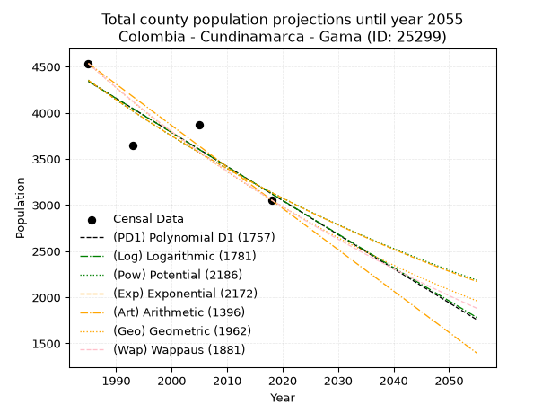
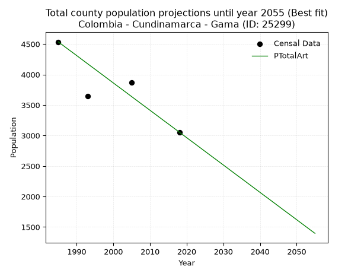
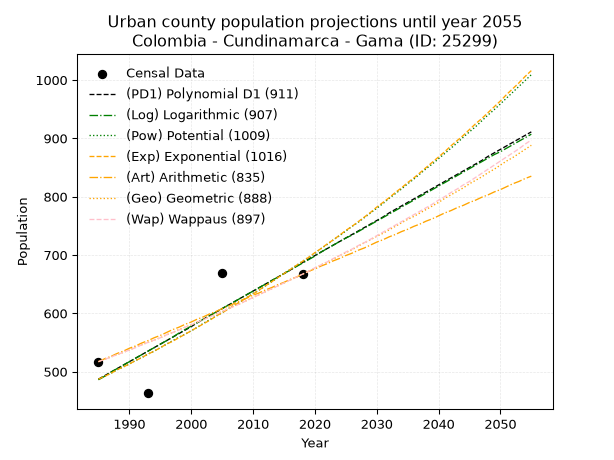
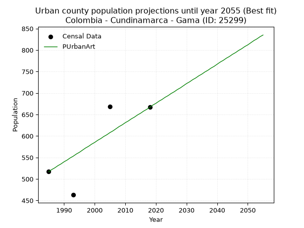
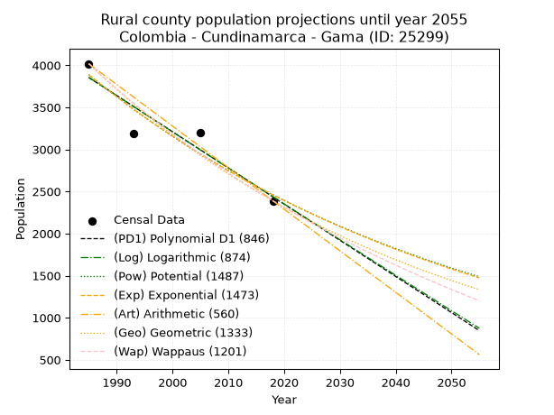
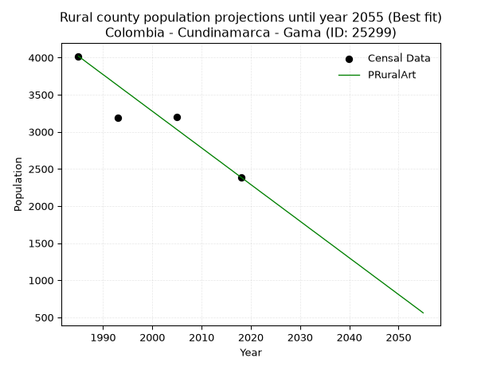

<div align="center">


</div>

# _“Population and Public Services Demand Projections (PPSD) until Year 2050 for Colombia - Cundinamarca - Gama (ID: 25299)”_
Keywords: `population` `public-service` `projection` `lineal` `polynomial` `logarithmic` `potential` `exponential` `arithmetic` `geometric` `wappaus` `dane` `colombia` `south-america`

PPSD are analytical estimates used by governments and planners to anticipate future changes in population size, age distribution, and the resulting community needs for utilities, healthcare, education, and infrastructure as sizing future water treatment facilities, electrical grids, and road networks based on spatial growth.

> **General running parameters**: • app_version: _v20260806_. • Python version: _3.14.7_. • Pandas version: _3.0.5_. • NumPy version: _2.5.1_. • Creates, save and include plots into reports (create_plot): _True_. • Projection until year: _2050_. • Process polynomial degree 2 and up: _False_. • Process Wappaus: _True_. • Process Wappaus: _True_. • Set negative values to zero: _True_. • Set infinite values to zero: _True_. • Drop dataset notes: _True_. 
<div align="center">

Dynamic map: [:earth_americas:Google](http://maps.google.com/maps?q=4.76332524,-73.6110366) [:earth_americas:OSM](https://www.openstreetmap.org/#map=18/4.76332524/-73.6110366&layers=P) [:earth_americas:Bing](https://www.bing.com/maps?cp=4.76332524~-73.6110366&lvl=18) [:earth_americas:Apple](https://maps.apple.com/frame?center=4.76332524%2C-73.6110366&span=0.003%2C0.006)

</div>


<div align="center">

```geojson
{
  "type": "Feature",
  "geometry": {
    "type": "Point", 
    "coordinates": [-73.6110366, 4.76332524]
  }, 
  "properties": {
    "Name": "Colombia - Cundinamarca - Gama (ID: 25299)"
  }
}
```

</div>


## 0. Census Data (4 records)

Census data are official statistics collected by a government about the people and housing in a country. They usually include counts of total population, age, sex, race, income, education, and jobs.

📅Global census file: [Population.xlsx](../data/Population.xlsx)

| Source   |   Year |   CountryID | CountryName   |   StateID | StateName    |   CountyID | CountyName   |   PTotal |   PUrban |   PRural |
|:---------|-------:|------------:|:--------------|----------:|:-------------|-----------:|:-------------|---------:|---------:|---------:|
| DANE     |   1985 |          57 | Colombia      |        25 | Cundinamarca |      25299 | Gama         |     4535 |      517 |     4018 |
| DANE     |   1993 |          57 | Colombia      |        25 | Cundinamarca |      25299 | Gama         |     3649 |      463 |     3186 |
| DANE     |   2005 |          57 | Colombia      |        25 | Cundinamarca |      25299 | Gama         |     3873 |      669 |     3204 |
| DANE     |   2018 |          57 | Colombia      |        25 | Cundinamarca |      25299 | Gama         |     3055 |      667 |     2388 |

> 🔥Some records has specific notes about the registered values or the corresponding urban or rural distribution.

## 1. Total

### 1.1. Coefficients and Parameters

* (PD1) Polynomial Deg 1: -36.91850662384533, 77624.24287434663 (lineal)
* (Log) Logarithmic: -73904.35447117571, 565525.5905677353
* (Pow) Potential: -19.880172695463298, 69.1989101902263
* (Exp) Exponential: -0.009932782809062823, 1590510104826.6616
* (Art) Arithmetic: Year diff. 2018 - 1985 = 33, Population diff. 3055 - 4535 = -1480, Annual growth = -44.84848484848485
* (Geo) Geometric: Year diff. 2018 - 1985 = 33, Population diff. 3055 - 4535 = -1480, Annual growth % = -0.011899707227821521
* (Wap) Wappaus: i = -1.1817782568770712, Condition values only valid for < 200)

<sub>
Wappaus condition values: ['-0.00', '-1.18', '-2.36', '-3.55', '-4.73', '-5.91', '-7.09', '-8.27', '-9.45', '-10.64', '-11.82', '-13.00', '-14.18', '-15.36', '-16.54', '-17.73', '-18.91', '-20.09', '-21.27', '-22.45', '-23.64', '-24.82', '-26.00', '-27.18', '-28.36', '-29.54', '-30.73', '-31.91', '-33.09', '-34.27', '-35.45', '-36.64', '-37.82', '-39.00', '-40.18', '-41.36', '-42.54', '-43.73', '-44.91', '-46.09', '-47.27', '-48.45', '-49.63', '-50.82', '-52.00', '-53.18', '-54.36', '-55.54', '-56.73', '-57.91', '-59.09', '-60.27', '-61.45', '-62.63', '-63.82', '-65.00', '-66.18', '-67.36', '-68.54', '-69.72', '-70.91', '-72.09', '-73.27', '-74.45', '-75.63', '-76.82']
</sub>


### 1.2. Projected Dataset

|   Year |   CountyID |   PTotalPD1 |   PTotalLog |   PTotalPow |   PTotalExp |   PTotalArt |   PTotalGeo |   PTotalWap |
|-------:|-----------:|------------:|------------:|------------:|------------:|------------:|------------:|------------:|
|   1985 |      25299 |        4341 |        4342 |        4354 |        4352 |        4535 |        4535 |        4535 |
|   1986 |      25299 |        4304 |        4305 |        4310 |        4309 |        4490 |        4481 |        4482 |
|   1987 |      25299 |        4267 |        4268 |        4267 |        4267 |        4445 |        4428 |        4429 |
|   1988 |      25299 |        4230 |        4231 |        4225 |        4225 |        4400 |        4375 |        4377 |
|   1989 |      25299 |        4193 |        4193 |        4183 |        4183 |        4356 |        4323 |        4326 |
|   1990 |      25299 |        4156 |        4156 |        4141 |        4142 |        4311 |        4272 |        4275 |
|   1991 |      25299 |        4119 |        4119 |        4100 |        4101 |        4266 |        4221 |        4224 |
|   1992 |      25299 |        4083 |        4082 |        4059 |        4060 |        4221 |        4170 |        4175 |
|   1993 |      25299 |        4046 |        4045 |        4019 |        4020 |        4176 |        4121 |        4126 |
|   1994 |      25299 |        4009 |        4008 |        3979 |        3980 |        4131 |        4072 |        4077 |
|   1995 |      25299 |        3972 |        3971 |        3940 |        3941 |        4087 |        4023 |        4029 |
|   1996 |      25299 |        3935 |        3934 |        3901 |        3902 |        4042 |        3975 |        3981 |
|   1997 |      25299 |        3898 |        3897 |        3862 |        3863 |        3997 |        3928 |        3934 |
|   1998 |      25299 |        3861 |        3860 |        3824 |        3825 |        3952 |        3881 |        3888 |
|   1999 |      25299 |        3824 |        3823 |        3786 |        3787 |        3907 |        3835 |        3842 |
|   2000 |      25299 |        3787 |        3786 |        3749 |        3750 |        3862 |        3790 |        3797 |
|   2001 |      25299 |        3750 |        3749 |        3711 |        3713 |        3817 |        3744 |        3752 |
|   2002 |      25299 |        3713 |        3712 |        3675 |        3676 |        3773 |        3700 |        3707 |
|   2003 |      25299 |        3676 |        3675 |        3639 |        3640 |        3728 |        3656 |        3663 |
|   2004 |      25299 |        3640 |        3638 |        3603 |        3604 |        3683 |        3612 |        3620 |
|   2005 |      25299 |        3603 |        3601 |        3567 |        3568 |        3638 |        3569 |        3576 |
|   2006 |      25299 |        3566 |        3564 |        3532 |        3533 |        3593 |        3527 |        3534 |
|   2007 |      25299 |        3529 |        3528 |        3497 |        3498 |        3548 |        3485 |        3492 |
|   2008 |      25299 |        3492 |        3491 |        3463 |        3464 |        3503 |        3444 |        3450 |
|   2009 |      25299 |        3455 |        3454 |        3428 |        3429 |        3459 |        3403 |        3409 |
|   2010 |      25299 |        3418 |        3417 |        3395 |        3395 |        3414 |        3362 |        3368 |
|   2011 |      25299 |        3381 |        3380 |        3361 |        3362 |        3369 |        3322 |        3327 |
|   2012 |      25299 |        3344 |        3344 |        3328 |        3329 |        3324 |        3283 |        3287 |
|   2013 |      25299 |        3307 |        3307 |        3296 |        3296 |        3279 |        3243 |        3247 |
|   2014 |      25299 |        3270 |        3270 |        3263 |        3263 |        3234 |        3205 |        3208 |
|   2015 |      25299 |        3233 |        3234 |        3231 |        3231 |        3190 |        3167 |        3169 |
|   2016 |      25299 |        3197 |        3197 |        3199 |        3199 |        3145 |        3129 |        3131 |
|   2017 |      25299 |        3160 |        3160 |        3168 |        3167 |        3100 |        3092 |        3093 |
|   2018 |      25299 |        3123 |        3124 |        3137 |        3136 |        3055 |        3055 |        3055 |
|   2019 |      25299 |        3086 |        3087 |        3106 |        3105 |        3010 |        3019 |        3018 |
|   2020 |      25299 |        3049 |        3050 |        3076 |        3074 |        2965 |        2983 |        2981 |
|   2021 |      25299 |        3012 |        3014 |        3046 |        3044 |        2920 |        2947 |        2944 |
|   2022 |      25299 |        2975 |        2977 |        3016 |        3014 |        2876 |        2912 |        2908 |
|   2023 |      25299 |        2938 |        2941 |        2986 |        2984 |        2831 |        2878 |        2872 |
|   2024 |      25299 |        2901 |        2904 |        2957 |        2955 |        2786 |        2843 |        2836 |
|   2025 |      25299 |        2864 |        2868 |        2928 |        2925 |        2741 |        2809 |        2801 |
|   2026 |      25299 |        2827 |        2831 |        2900 |        2896 |        2696 |        2776 |        2766 |
|   2027 |      25299 |        2790 |        2795 |        2871 |        2868 |        2651 |        2743 |        2732 |
|   2028 |      25299 |        2754 |        2758 |        2843 |        2840 |        2607 |        2710 |        2697 |
|   2029 |      25299 |        2717 |        2722 |        2816 |        2811 |        2562 |        2678 |        2663 |
|   2030 |      25299 |        2680 |        2685 |        2788 |        2784 |        2517 |        2646 |        2630 |
|   2031 |      25299 |        2643 |        2649 |        2761 |        2756 |        2472 |        2615 |        2597 |
|   2032 |      25299 |        2606 |        2613 |        2734 |        2729 |        2427 |        2584 |        2564 |
|   2033 |      25299 |        2569 |        2576 |        2707 |        2702 |        2382 |        2553 |        2531 |
|   2034 |      25299 |        2532 |        2540 |        2681 |        2675 |        2337 |        2522 |        2499 |
|   2035 |      25299 |        2495 |        2504 |        2655 |        2649 |        2293 |        2492 |        2466 |
|   2036 |      25299 |        2458 |        2467 |        2629 |        2623 |        2248 |        2463 |        2435 |
|   2037 |      25299 |        2421 |        2431 |        2604 |        2597 |        2203 |        2433 |        2403 |
|   2038 |      25299 |        2384 |        2395 |        2578 |        2571 |        2158 |        2405 |        2372 |
|   2039 |      25299 |        2347 |        2359 |        2553 |        2546 |        2113 |        2376 |        2341 |
|   2040 |      25299 |        2310 |        2322 |        2529 |        2520 |        2068 |        2348 |        2310 |
|   2041 |      25299 |        2274 |        2286 |        2504 |        2496 |        2023 |        2320 |        2280 |
|   2042 |      25299 |        2237 |        2250 |        2480 |        2471 |        1979 |        2292 |        2250 |
|   2043 |      25299 |        2200 |        2214 |        2456 |        2446 |        1934 |        2265 |        2220 |
|   2044 |      25299 |        2163 |        2178 |        2432 |        2422 |        1889 |        2238 |        2190 |
|   2045 |      25299 |        2126 |        2141 |        2409 |        2398 |        1844 |        2211 |        2161 |
|   2046 |      25299 |        2089 |        2105 |        2385 |        2375 |        1799 |        2185 |        2132 |
|   2047 |      25299 |        2052 |        2069 |        2362 |        2351 |        1754 |        2159 |        2103 |
|   2048 |      25299 |        2015 |        2033 |        2339 |        2328 |        1710 |        2133 |        2075 |
|   2049 |      25299 |        1978 |        1997 |        2317 |        2305 |        1665 |        2108 |        2046 |
|   2050 |      25299 |        1941 |        1961 |        2294 |        2282 |        1620 |        2083 |        2018 |
<div align="center">

</img>

</div>


### 1.3. Best fit with absolute error and relative error (%)

Relative error puts that difference into context by dividing the absolute error by the true value, creating a unitless ratio or percentage that shows the scale of the mistake.

Absolute and relative error

|   Year | Source   |   CountryID | CountryName   |   StateID | StateName    |   CountyID_x | CountyName   |   PTotal |   PUrban |   PRural |   CountyID_y |   PTotalPD1 |   PTotalLog |   PTotalPow |   PTotalExp |   PTotalArt |   PTotalGeo |   PTotalWap |   PTotalPD1AbsError |   PTotalLogAbsError |   PTotalPowAbsError |   PTotalExpAbsError |   PTotalArtAbsError |   PTotalGeoAbsError |   PTotalWapAbsError |   PTotalPD1RelError |   PTotalLogRelError |   PTotalPowRelError |   PTotalExpRelError |   PTotalArtRelError |   PTotalGeoRelError |   PTotalWapRelError |
|-------:|:---------|------------:|:--------------|----------:|:-------------|-------------:|:-------------|---------:|---------:|---------:|-------------:|------------:|------------:|------------:|------------:|------------:|------------:|------------:|--------------------:|--------------------:|--------------------:|--------------------:|--------------------:|--------------------:|--------------------:|--------------------:|--------------------:|--------------------:|--------------------:|--------------------:|--------------------:|--------------------:|
|   1985 | DANE     |          57 | Colombia      |        25 | Cundinamarca |        25299 | Gama         |     4535 |      517 |     4018 |        25299 |        4341 |        4342 |        4354 |        4352 |        4535 |        4535 |        4535 |                 194 |                 193 |                 181 |                 183 |                   0 |                   0 |                   0 |             4.27784 |             4.25579 |             3.99118 |             4.03528 |             0       |             0       |             0       |
|   1993 | DANE     |          57 | Colombia      |        25 | Cundinamarca |        25299 | Gama         |     3649 |      463 |     3186 |        25299 |        4046 |        4045 |        4019 |        4020 |        4176 |        4121 |        4126 |                 397 |                 396 |                 370 |                 371 |                 527 |                 472 |                 477 |            10.8797  |            10.8523  |            10.1398  |            10.1672  |            14.4423  |            12.9351  |            13.0721  |
|   2005 | DANE     |          57 | Colombia      |        25 | Cundinamarca |        25299 | Gama         |     3873 |      669 |     3204 |        25299 |        3603 |        3601 |        3567 |        3568 |        3638 |        3569 |        3576 |                 270 |                 272 |                 306 |                 305 |                 235 |                 304 |                 297 |             6.97134 |             7.02298 |             7.90085 |             7.87503 |             6.06765 |             7.84921 |             7.66847 |
|   2018 | DANE     |          57 | Colombia      |        25 | Cundinamarca |        25299 | Gama         |     3055 |      667 |     2388 |        25299 |        3123 |        3124 |        3137 |        3136 |        3055 |        3055 |        3055 |                  68 |                  69 |                  82 |                  81 |                   0 |                   0 |                   0 |             2.22586 |             2.25859 |             2.68412 |             2.65139 |             0       |             0       |             0       |

Relative error mean

| Method    |   RelError | Best   |
|:----------|-----------:|:-------|
| PTotalPD1 |    6.08868 |        |
| PTotalLog |    6.09741 |        |
| PTotalPow |    6.17898 |        |
| PTotalExp |    6.18222 |        |
| PTotalArt |    5.12749 | True   |
| PTotalGeo |    5.19607 |        |
| PTotalWap |    5.18514 |        |

💙Best method: _**PTotalArt**_
<div align="center">

</img>

</div>


### 1.4. Fresh water supply demand in liters per capita per day (lpcd)

The fresh water supply demand typically ranges from 100 to 300 liters per capita per day (lpcd) for standard domestic and municipal planning, though absolute survival minimums set by the World Health Organization are as low as 7.5 to 20 liters per day, and total consumption in high-income nations can exceed 400 liters.

> `CZ`: Level in meters above the sea level (masl).<br> `WS`: Fresh water supply demand in liters per capita per day (lpcd or l/h/d).<br> `WSAll`: Zonal fresh water supply demand in liters per second (l/s).<br> `A`: Zonal area in square meters.

Reference values (RAS Colombia)

|    CZ |   WS |
|------:|-----:|
|  1000 |  120 |
|  2000 |  130 |
| 99999 |  140 |

County shapefile geometry properties and water supply values

|   CountyID |      ATotal |   CZTotal |   WSTotal |
|-----------:|------------:|----------:|----------:|
|      25299 | 1.07519e+08 |   2369.44 |       140 |

Projected values for best method: PTotalArt

|   CountyID |   Year |   PTotalArt |   WSTotal |   WSTotalAll |
|-----------:|-------:|------------:|----------:|-------------:|
|      25299 |   1985 |        4535 |       140 |      7.34838 |
|      25299 |   1986 |        4490 |       140 |      7.27546 |
|      25299 |   1987 |        4445 |       140 |      7.20255 |
|      25299 |   1988 |        4400 |       140 |      7.12963 |
|      25299 |   1989 |        4356 |       140 |      7.05833 |
|      25299 |   1990 |        4311 |       140 |      6.98542 |
|      25299 |   1991 |        4266 |       140 |      6.9125  |
|      25299 |   1992 |        4221 |       140 |      6.83958 |
|      25299 |   1993 |        4176 |       140 |      6.76667 |
|      25299 |   1994 |        4131 |       140 |      6.69375 |
|      25299 |   1995 |        4087 |       140 |      6.62245 |
|      25299 |   1996 |        4042 |       140 |      6.54954 |
|      25299 |   1997 |        3997 |       140 |      6.47662 |
|      25299 |   1998 |        3952 |       140 |      6.4037  |
|      25299 |   1999 |        3907 |       140 |      6.33079 |
|      25299 |   2000 |        3862 |       140 |      6.25787 |
|      25299 |   2001 |        3817 |       140 |      6.18495 |
|      25299 |   2002 |        3773 |       140 |      6.11366 |
|      25299 |   2003 |        3728 |       140 |      6.04074 |
|      25299 |   2004 |        3683 |       140 |      5.96782 |
|      25299 |   2005 |        3638 |       140 |      5.89491 |
|      25299 |   2006 |        3593 |       140 |      5.82199 |
|      25299 |   2007 |        3548 |       140 |      5.74907 |
|      25299 |   2008 |        3503 |       140 |      5.67616 |
|      25299 |   2009 |        3459 |       140 |      5.60486 |
|      25299 |   2010 |        3414 |       140 |      5.53194 |
|      25299 |   2011 |        3369 |       140 |      5.45903 |
|      25299 |   2012 |        3324 |       140 |      5.38611 |
|      25299 |   2013 |        3279 |       140 |      5.31319 |
|      25299 |   2014 |        3234 |       140 |      5.24028 |
|      25299 |   2015 |        3190 |       140 |      5.16898 |
|      25299 |   2016 |        3145 |       140 |      5.09606 |
|      25299 |   2017 |        3100 |       140 |      5.02315 |
|      25299 |   2018 |        3055 |       140 |      4.95023 |
|      25299 |   2019 |        3010 |       140 |      4.87731 |
|      25299 |   2020 |        2965 |       140 |      4.8044  |
|      25299 |   2021 |        2920 |       140 |      4.73148 |
|      25299 |   2022 |        2876 |       140 |      4.66019 |
|      25299 |   2023 |        2831 |       140 |      4.58727 |
|      25299 |   2024 |        2786 |       140 |      4.51435 |
|      25299 |   2025 |        2741 |       140 |      4.44144 |
|      25299 |   2026 |        2696 |       140 |      4.36852 |
|      25299 |   2027 |        2651 |       140 |      4.2956  |
|      25299 |   2028 |        2607 |       140 |      4.22431 |
|      25299 |   2029 |        2562 |       140 |      4.15139 |
|      25299 |   2030 |        2517 |       140 |      4.07847 |
|      25299 |   2031 |        2472 |       140 |      4.00556 |
|      25299 |   2032 |        2427 |       140 |      3.93264 |
|      25299 |   2033 |        2382 |       140 |      3.85972 |
|      25299 |   2034 |        2337 |       140 |      3.78681 |
|      25299 |   2035 |        2293 |       140 |      3.71551 |
|      25299 |   2036 |        2248 |       140 |      3.64259 |
|      25299 |   2037 |        2203 |       140 |      3.56968 |
|      25299 |   2038 |        2158 |       140 |      3.49676 |
|      25299 |   2039 |        2113 |       140 |      3.42384 |
|      25299 |   2040 |        2068 |       140 |      3.35093 |
|      25299 |   2041 |        2023 |       140 |      3.27801 |
|      25299 |   2042 |        1979 |       140 |      3.20671 |
|      25299 |   2043 |        1934 |       140 |      3.1338  |
|      25299 |   2044 |        1889 |       140 |      3.06088 |
|      25299 |   2045 |        1844 |       140 |      2.98796 |
|      25299 |   2046 |        1799 |       140 |      2.91505 |
|      25299 |   2047 |        1754 |       140 |      2.84213 |
|      25299 |   2048 |        1710 |       140 |      2.77083 |
|      25299 |   2049 |        1665 |       140 |      2.69792 |
|      25299 |   2050 |        1620 |       140 |      2.625   |

## 2. Urban

### 2.1. Coefficients and Parameters

* (PD1) Polynomial Deg 1: 6.063428342031303, -11549.372541148114 (lineal)
* (Log) Logarithmic: 12137.843963648853, -91680.84923427209
* (Pow) Potential: 21.040032215727816, -66.69758608904591
* (Exp) Exponential: 0.010511156358462656, 4.2280510982045793e-07
* (Art) Arithmetic: Year diff. 2018 - 1985 = 33, Population diff. 667 - 517 = 150, Annual growth = 4.545454545454546
* (Geo) Geometric: Year diff. 2018 - 1985 = 33, Population diff. 667 - 517 = 150, Annual growth % = 0.007749484273614327
* (Wap) Wappaus: i = 0.7678132678132679, Condition values only valid for < 200)

<sub>
Wappaus condition values: ['0.00', '0.77', '1.54', '2.30', '3.07', '3.84', '4.61', '5.37', '6.14', '6.91', '7.68', '8.45', '9.21', '9.98', '10.75', '11.52', '12.29', '13.05', '13.82', '14.59', '15.36', '16.12', '16.89', '17.66', '18.43', '19.20', '19.96', '20.73', '21.50', '22.27', '23.03', '23.80', '24.57', '25.34', '26.11', '26.87', '27.64', '28.41', '29.18', '29.94', '30.71', '31.48', '32.25', '33.02', '33.78', '34.55', '35.32', '36.09', '36.86', '37.62', '38.39', '39.16', '39.93', '40.69', '41.46', '42.23', '43.00', '43.77', '44.53', '45.30', '46.07', '46.84', '47.60', '48.37', '49.14', '49.91']
</sub>


### 2.2. Projected Dataset

|   Year |   CountyID |   PUrbanPD1 |   PUrbanLog |   PUrbanPow |   PUrbanExp |   PUrbanArt |   PUrbanGeo |   PUrbanWap |
|-------:|-----------:|------------:|------------:|------------:|------------:|------------:|------------:|------------:|
|   1985 |      25299 |         487 |         486 |         487 |         487 |         517 |         517 |         517 |
|   1986 |      25299 |         493 |         492 |         492 |         492 |         522 |         521 |         521 |
|   1987 |      25299 |         499 |         499 |         497 |         497 |         526 |         525 |         525 |
|   1988 |      25299 |         505 |         505 |         503 |         503 |         531 |         529 |         529 |
|   1989 |      25299 |         511 |         511 |         508 |         508 |         535 |         533 |         533 |
|   1990 |      25299 |         517 |         517 |         513 |         513 |         540 |         537 |         537 |
|   1991 |      25299 |         523 |         523 |         519 |         519 |         544 |         542 |         541 |
|   1992 |      25299 |         529 |         529 |         524 |         524 |         549 |         546 |         546 |
|   1993 |      25299 |         535 |         535 |         530 |         530 |         553 |         550 |         550 |
|   1994 |      25299 |         541 |         541 |         535 |         535 |         558 |         554 |         554 |
|   1995 |      25299 |         547 |         547 |         541 |         541 |         562 |         558 |         558 |
|   1996 |      25299 |         553 |         553 |         547 |         547 |         567 |         563 |         563 |
|   1997 |      25299 |         559 |         559 |         553 |         552 |         572 |         567 |         567 |
|   1998 |      25299 |         565 |         566 |         559 |         558 |         576 |         572 |         571 |
|   1999 |      25299 |         571 |         572 |         564 |         564 |         581 |         576 |         576 |
|   2000 |      25299 |         577 |         578 |         570 |         570 |         585 |         580 |         580 |
|   2001 |      25299 |         584 |         584 |         576 |         576 |         590 |         585 |         585 |
|   2002 |      25299 |         590 |         590 |         583 |         582 |         594 |         590 |         589 |
|   2003 |      25299 |         596 |         596 |         589 |         588 |         599 |         594 |         594 |
|   2004 |      25299 |         602 |         602 |         595 |         595 |         603 |         599 |         598 |
|   2005 |      25299 |         608 |         608 |         601 |         601 |         608 |         603 |         603 |
|   2006 |      25299 |         614 |         614 |         608 |         607 |         612 |         608 |         608 |
|   2007 |      25299 |         620 |         620 |         614 |         614 |         617 |         613 |         612 |
|   2008 |      25299 |         626 |         626 |         620 |         620 |         622 |         617 |         617 |
|   2009 |      25299 |         632 |         632 |         627 |         627 |         626 |         622 |         622 |
|   2010 |      25299 |         638 |         638 |         634 |         633 |         631 |         627 |         627 |
|   2011 |      25299 |         644 |         644 |         640 |         640 |         635 |         632 |         632 |
|   2012 |      25299 |         650 |         650 |         647 |         647 |         640 |         637 |         637 |
|   2013 |      25299 |         656 |         656 |         654 |         654 |         644 |         642 |         642 |
|   2014 |      25299 |         662 |         662 |         661 |         661 |         649 |         647 |         647 |
|   2015 |      25299 |         668 |         668 |         668 |         668 |         653 |         652 |         652 |
|   2016 |      25299 |         674 |         674 |         675 |         675 |         658 |         657 |         657 |
|   2017 |      25299 |         681 |         680 |         682 |         682 |         662 |         662 |         662 |
|   2018 |      25299 |         687 |         686 |         689 |         689 |         667 |         667 |         667 |
|   2019 |      25299 |         693 |         692 |         696 |         696 |         672 |         672 |         672 |
|   2020 |      25299 |         699 |         698 |         703 |         704 |         676 |         677 |         678 |
|   2021 |      25299 |         705 |         705 |         711 |         711 |         681 |         683 |         683 |
|   2022 |      25299 |         711 |         711 |         718 |         719 |         685 |         688 |         688 |
|   2023 |      25299 |         717 |         717 |         726 |         726 |         690 |         693 |         694 |
|   2024 |      25299 |         723 |         723 |         733 |         734 |         694 |         699 |         699 |
|   2025 |      25299 |         729 |         729 |         741 |         742 |         699 |         704 |         705 |
|   2026 |      25299 |         735 |         734 |         749 |         749 |         703 |         709 |         710 |
|   2027 |      25299 |         741 |         740 |         756 |         757 |         708 |         715 |         716 |
|   2028 |      25299 |         747 |         746 |         764 |         765 |         712 |         721 |         721 |
|   2029 |      25299 |         753 |         752 |         772 |         773 |         717 |         726 |         727 |
|   2030 |      25299 |         759 |         758 |         780 |         782 |         722 |         732 |         733 |
|   2031 |      25299 |         765 |         764 |         788 |         790 |         726 |         737 |         739 |
|   2032 |      25299 |         772 |         770 |         797 |         798 |         731 |         743 |         745 |
|   2033 |      25299 |         778 |         776 |         805 |         807 |         735 |         749 |         751 |
|   2034 |      25299 |         784 |         782 |         813 |         815 |         740 |         755 |         757 |
|   2035 |      25299 |         790 |         788 |         822 |         824 |         744 |         761 |         763 |
|   2036 |      25299 |         796 |         794 |         830 |         832 |         749 |         766 |         769 |
|   2037 |      25299 |         802 |         800 |         839 |         841 |         753 |         772 |         775 |
|   2038 |      25299 |         808 |         806 |         848 |         850 |         758 |         778 |         781 |
|   2039 |      25299 |         814 |         812 |         856 |         859 |         762 |         784 |         787 |
|   2040 |      25299 |         820 |         818 |         865 |         868 |         767 |         790 |         794 |
|   2041 |      25299 |         826 |         824 |         874 |         877 |         772 |         797 |         800 |
|   2042 |      25299 |         832 |         830 |         883 |         887 |         776 |         803 |         807 |
|   2043 |      25299 |         838 |         836 |         892 |         896 |         781 |         809 |         813 |
|   2044 |      25299 |         844 |         842 |         902 |         905 |         785 |         815 |         820 |
|   2045 |      25299 |         850 |         848 |         911 |         915 |         790 |         822 |         826 |
|   2046 |      25299 |         856 |         854 |         920 |         925 |         794 |         828 |         833 |
|   2047 |      25299 |         862 |         860 |         930 |         934 |         799 |         834 |         840 |
|   2048 |      25299 |         869 |         866 |         940 |         944 |         803 |         841 |         847 |
|   2049 |      25299 |         875 |         872 |         949 |         954 |         808 |         847 |         854 |
|   2050 |      25299 |         881 |         877 |         959 |         964 |         812 |         854 |         861 |
<div align="center">

</img>

</div>


### 2.3. Best fit with absolute error and relative error (%)

Relative error puts that difference into context by dividing the absolute error by the true value, creating a unitless ratio or percentage that shows the scale of the mistake.

Absolute and relative error

|   Year | Source   |   CountryID | CountryName   |   StateID | StateName    |   CountyID_x | CountyName   |   PTotal |   PUrban |   PRural |   CountyID_y |   PUrbanPD1 |   PUrbanLog |   PUrbanPow |   PUrbanExp |   PUrbanArt |   PUrbanGeo |   PUrbanWap |   PUrbanPD1AbsError |   PUrbanLogAbsError |   PUrbanPowAbsError |   PUrbanExpAbsError |   PUrbanArtAbsError |   PUrbanGeoAbsError |   PUrbanWapAbsError |   PUrbanPD1RelError |   PUrbanLogRelError |   PUrbanPowRelError |   PUrbanExpRelError |   PUrbanArtRelError |   PUrbanGeoRelError |   PUrbanWapRelError |
|-------:|:---------|------------:|:--------------|----------:|:-------------|-------------:|:-------------|---------:|---------:|---------:|-------------:|------------:|------------:|------------:|------------:|------------:|------------:|------------:|--------------------:|--------------------:|--------------------:|--------------------:|--------------------:|--------------------:|--------------------:|--------------------:|--------------------:|--------------------:|--------------------:|--------------------:|--------------------:|--------------------:|
|   1985 | DANE     |          57 | Colombia      |        25 | Cundinamarca |        25299 | Gama         |     4535 |      517 |     4018 |        25299 |         487 |         486 |         487 |         487 |         517 |         517 |         517 |                  30 |                  31 |                  30 |                  30 |                   0 |                   0 |                   0 |             5.80271 |             5.99613 |             5.80271 |             5.80271 |             0       |             0       |             0       |
|   1993 | DANE     |          57 | Colombia      |        25 | Cundinamarca |        25299 | Gama         |     3649 |      463 |     3186 |        25299 |         535 |         535 |         530 |         530 |         553 |         550 |         550 |                  72 |                  72 |                  67 |                  67 |                  90 |                  87 |                  87 |            15.5508  |            15.5508  |            14.4708  |            14.4708  |            19.4384  |            18.7905  |            18.7905  |
|   2005 | DANE     |          57 | Colombia      |        25 | Cundinamarca |        25299 | Gama         |     3873 |      669 |     3204 |        25299 |         608 |         608 |         601 |         601 |         608 |         603 |         603 |                  61 |                  61 |                  68 |                  68 |                  61 |                  66 |                  66 |             9.11809 |             9.11809 |            10.1644  |            10.1644  |             9.11809 |             9.86547 |             9.86547 |
|   2018 | DANE     |          57 | Colombia      |        25 | Cundinamarca |        25299 | Gama         |     3055 |      667 |     2388 |        25299 |         687 |         686 |         689 |         689 |         667 |         667 |         667 |                  20 |                  19 |                  22 |                  22 |                   0 |                   0 |                   0 |             2.9985  |             2.84858 |             3.29835 |             3.29835 |             0       |             0       |             0       |

Relative error mean

| Method    |   RelError | Best   |
|:----------|-----------:|:-------|
| PUrbanPD1 |    8.36751 |        |
| PUrbanLog |    8.37839 |        |
| PUrbanPow |    8.43408 |        |
| PUrbanExp |    8.43408 |        |
| PUrbanArt |    7.13913 | True   |
| PUrbanGeo |    7.16399 |        |
| PUrbanWap |    7.16399 |        |

💙Best method: _**PUrbanArt**_
<div align="center">

</img>

</div>


### 2.4. Fresh water supply demand in liters per capita per day (lpcd)

The fresh water supply demand typically ranges from 100 to 300 liters per capita per day (lpcd) for standard domestic and municipal planning, though absolute survival minimums set by the World Health Organization are as low as 7.5 to 20 liters per day, and total consumption in high-income nations can exceed 400 liters.

> `CZ`: Level in meters above the sea level (masl).<br> `WS`: Fresh water supply demand in liters per capita per day (lpcd or l/h/d).<br> `WSAll`: Zonal fresh water supply demand in liters per second (l/s).<br> `A`: Zonal area in square meters.

Reference values (RAS Colombia)

|    CZ |   WS |
|------:|-----:|
|  1000 |  120 |
|  2000 |  130 |
| 99999 |  140 |

County shapefile geometry properties and water supply values

|   CountyID |   AUrban |   CZUrban |   WSUrban |
|-----------:|---------:|----------:|----------:|
|      25299 |   178490 |   2170.21 |       140 |

Projected values for best method: PUrbanArt

|   CountyID |   Year |   PUrbanArt |   WSUrban |   WSUrbanAll |
|-----------:|-------:|------------:|----------:|-------------:|
|      25299 |   1985 |         517 |       140 |     0.837731 |
|      25299 |   1986 |         522 |       140 |     0.845833 |
|      25299 |   1987 |         526 |       140 |     0.852315 |
|      25299 |   1988 |         531 |       140 |     0.860417 |
|      25299 |   1989 |         535 |       140 |     0.866898 |
|      25299 |   1990 |         540 |       140 |     0.875    |
|      25299 |   1991 |         544 |       140 |     0.881481 |
|      25299 |   1992 |         549 |       140 |     0.889583 |
|      25299 |   1993 |         553 |       140 |     0.896065 |
|      25299 |   1994 |         558 |       140 |     0.904167 |
|      25299 |   1995 |         562 |       140 |     0.910648 |
|      25299 |   1996 |         567 |       140 |     0.91875  |
|      25299 |   1997 |         572 |       140 |     0.926852 |
|      25299 |   1998 |         576 |       140 |     0.933333 |
|      25299 |   1999 |         581 |       140 |     0.941435 |
|      25299 |   2000 |         585 |       140 |     0.947917 |
|      25299 |   2001 |         590 |       140 |     0.956019 |
|      25299 |   2002 |         594 |       140 |     0.9625   |
|      25299 |   2003 |         599 |       140 |     0.970602 |
|      25299 |   2004 |         603 |       140 |     0.977083 |
|      25299 |   2005 |         608 |       140 |     0.985185 |
|      25299 |   2006 |         612 |       140 |     0.991667 |
|      25299 |   2007 |         617 |       140 |     0.999769 |
|      25299 |   2008 |         622 |       140 |     1.00787  |
|      25299 |   2009 |         626 |       140 |     1.01435  |
|      25299 |   2010 |         631 |       140 |     1.02245  |
|      25299 |   2011 |         635 |       140 |     1.02894  |
|      25299 |   2012 |         640 |       140 |     1.03704  |
|      25299 |   2013 |         644 |       140 |     1.04352  |
|      25299 |   2014 |         649 |       140 |     1.05162  |
|      25299 |   2015 |         653 |       140 |     1.0581   |
|      25299 |   2016 |         658 |       140 |     1.0662   |
|      25299 |   2017 |         662 |       140 |     1.07269  |
|      25299 |   2018 |         667 |       140 |     1.08079  |
|      25299 |   2019 |         672 |       140 |     1.08889  |
|      25299 |   2020 |         676 |       140 |     1.09537  |
|      25299 |   2021 |         681 |       140 |     1.10347  |
|      25299 |   2022 |         685 |       140 |     1.10995  |
|      25299 |   2023 |         690 |       140 |     1.11806  |
|      25299 |   2024 |         694 |       140 |     1.12454  |
|      25299 |   2025 |         699 |       140 |     1.13264  |
|      25299 |   2026 |         703 |       140 |     1.13912  |
|      25299 |   2027 |         708 |       140 |     1.14722  |
|      25299 |   2028 |         712 |       140 |     1.1537   |
|      25299 |   2029 |         717 |       140 |     1.16181  |
|      25299 |   2030 |         722 |       140 |     1.16991  |
|      25299 |   2031 |         726 |       140 |     1.17639  |
|      25299 |   2032 |         731 |       140 |     1.18449  |
|      25299 |   2033 |         735 |       140 |     1.19097  |
|      25299 |   2034 |         740 |       140 |     1.19907  |
|      25299 |   2035 |         744 |       140 |     1.20556  |
|      25299 |   2036 |         749 |       140 |     1.21366  |
|      25299 |   2037 |         753 |       140 |     1.22014  |
|      25299 |   2038 |         758 |       140 |     1.22824  |
|      25299 |   2039 |         762 |       140 |     1.23472  |
|      25299 |   2040 |         767 |       140 |     1.24282  |
|      25299 |   2041 |         772 |       140 |     1.25093  |
|      25299 |   2042 |         776 |       140 |     1.25741  |
|      25299 |   2043 |         781 |       140 |     1.26551  |
|      25299 |   2044 |         785 |       140 |     1.27199  |
|      25299 |   2045 |         790 |       140 |     1.28009  |
|      25299 |   2046 |         794 |       140 |     1.28657  |
|      25299 |   2047 |         799 |       140 |     1.29468  |
|      25299 |   2048 |         803 |       140 |     1.30116  |
|      25299 |   2049 |         808 |       140 |     1.30926  |
|      25299 |   2050 |         812 |       140 |     1.31574  |

## 3. Rural

### 3.1. Coefficients and Parameters

* (PD1) Polynomial Deg 1: -42.981934965876626, 89173.61541549471 (lineal)
* (Log) Logarithmic: -86042.19843482458, 657206.4398020074
* (Pow) Potential: -27.731678000497183, 95.0421178048954
* (Exp) Exponential: -0.013856310696721507, 3425221122153530.5
* (Art) Arithmetic: Year diff. 2018 - 1985 = 33, Population diff. 2388 - 4018 = -1630, Annual growth = -49.39393939393939
* (Geo) Geometric: Year diff. 2018 - 1985 = 33, Population diff. 2388 - 4018 = -1630, Annual growth % = -0.015643860769863682
* (Wap) Wappaus: i = -1.5421148733668246, Condition values only valid for < 200)

<sub>
Wappaus condition values: ['-0.00', '-1.54', '-3.08', '-4.63', '-6.17', '-7.71', '-9.25', '-10.79', '-12.34', '-13.88', '-15.42', '-16.96', '-18.51', '-20.05', '-21.59', '-23.13', '-24.67', '-26.22', '-27.76', '-29.30', '-30.84', '-32.38', '-33.93', '-35.47', '-37.01', '-38.55', '-40.09', '-41.64', '-43.18', '-44.72', '-46.26', '-47.81', '-49.35', '-50.89', '-52.43', '-53.97', '-55.52', '-57.06', '-58.60', '-60.14', '-61.68', '-63.23', '-64.77', '-66.31', '-67.85', '-69.40', '-70.94', '-72.48', '-74.02', '-75.56', '-77.11', '-78.65', '-80.19', '-81.73', '-83.27', '-84.82', '-86.36', '-87.90', '-89.44', '-90.98', '-92.53', '-94.07', '-95.61', '-97.15', '-98.70', '-100.24']
</sub>


### 3.2. Projected Dataset

|   Year |   CountyID |   PRuralPD1 |   PRuralLog |   PRuralPow |   PRuralExp |   PRuralArt |   PRuralGeo |   PRuralWap |
|-------:|-----------:|------------:|------------:|------------:|------------:|------------:|------------:|------------:|
|   1985 |      25299 |        3854 |        3856 |        3888 |        3886 |        4018 |        4018 |        4018 |
|   1986 |      25299 |        3811 |        3812 |        3834 |        3833 |        3969 |        3955 |        3957 |
|   1987 |      25299 |        3769 |        3769 |        3781 |        3780 |        3919 |        3893 |        3896 |
|   1988 |      25299 |        3726 |        3726 |        3728 |        3728 |        3870 |        3832 |        3836 |
|   1989 |      25299 |        3683 |        3683 |        3677 |        3677 |        3820 |        3772 |        3778 |
|   1990 |      25299 |        3640 |        3639 |        3626 |        3626 |        3771 |        3713 |        3720 |
|   1991 |      25299 |        3597 |        3596 |        3575 |        3576 |        3722 |        3655 |        3663 |
|   1992 |      25299 |        3554 |        3553 |        3526 |        3527 |        3672 |        3598 |        3606 |
|   1993 |      25299 |        3511 |        3510 |        3477 |        3478 |        3623 |        3542 |        3551 |
|   1994 |      25299 |        3468 |        3467 |        3429 |        3430 |        3573 |        3486 |        3497 |
|   1995 |      25299 |        3425 |        3423 |        3382 |        3383 |        3524 |        3432 |        3443 |
|   1996 |      25299 |        3382 |        3380 |        3335 |        3337 |        3475 |        3378 |        3390 |
|   1997 |      25299 |        3339 |        3337 |        3289 |        3291 |        3425 |        3325 |        3337 |
|   1998 |      25299 |        3296 |        3294 |        3244 |        3246 |        3376 |        3273 |        3286 |
|   1999 |      25299 |        3253 |        3251 |        3199 |        3201 |        3326 |        3222 |        3235 |
|   2000 |      25299 |        3210 |        3208 |        3155 |        3157 |        3277 |        3172 |        3185 |
|   2001 |      25299 |        3167 |        3165 |        3112 |        3113 |        3228 |        3122 |        3135 |
|   2002 |      25299 |        3124 |        3122 |        3069 |        3071 |        3178 |        3073 |        3087 |
|   2003 |      25299 |        3081 |        3079 |        3027 |        3028 |        3129 |        3025 |        3039 |
|   2004 |      25299 |        3038 |        3036 |        2985 |        2987 |        3080 |        2978 |        2991 |
|   2005 |      25299 |        2995 |        2993 |        2944 |        2946 |        3030 |        2931 |        2944 |
|   2006 |      25299 |        2952 |        2950 |        2904 |        2905 |        2981 |        2885 |        2898 |
|   2007 |      25299 |        2909 |        2907 |        2864 |        2865 |        2931 |        2840 |        2853 |
|   2008 |      25299 |        2866 |        2865 |        2824 |        2826 |        2882 |        2796 |        2808 |
|   2009 |      25299 |        2823 |        2822 |        2786 |        2787 |        2833 |        2752 |        2763 |
|   2010 |      25299 |        2780 |        2779 |        2748 |        2748 |        2783 |        2709 |        2719 |
|   2011 |      25299 |        2737 |        2736 |        2710 |        2711 |        2734 |        2667 |        2676 |
|   2012 |      25299 |        2694 |        2693 |        2673 |        2673 |        2684 |        2625 |        2633 |
|   2013 |      25299 |        2651 |        2651 |        2636 |        2636 |        2635 |        2584 |        2591 |
|   2014 |      25299 |        2608 |        2608 |        2600 |        2600 |        2586 |        2543 |        2549 |
|   2015 |      25299 |        2565 |        2565 |        2565 |        2564 |        2536 |        2504 |        2508 |
|   2016 |      25299 |        2522 |        2522 |        2530 |        2529 |        2487 |        2465 |        2468 |
|   2017 |      25299 |        2479 |        2480 |        2495 |        2494 |        2437 |        2426 |        2428 |
|   2018 |      25299 |        2436 |        2437 |        2461 |        2460 |        2388 |        2388 |        2388 |
|   2019 |      25299 |        2393 |        2395 |        2427 |        2426 |        2339 |        2351 |        2349 |
|   2020 |      25299 |        2350 |        2352 |        2394 |        2393 |        2289 |        2314 |        2310 |
|   2021 |      25299 |        2307 |        2309 |        2362 |        2360 |        2240 |        2278 |        2272 |
|   2022 |      25299 |        2264 |        2267 |        2329 |        2327 |        2190 |        2242 |        2234 |
|   2023 |      25299 |        2221 |        2224 |        2298 |        2295 |        2141 |        2207 |        2197 |
|   2024 |      25299 |        2178 |        2182 |        2266 |        2264 |        2092 |        2172 |        2160 |
|   2025 |      25299 |        2135 |        2139 |        2236 |        2233 |        2042 |        2138 |        2124 |
|   2026 |      25299 |        2092 |        2097 |        2205 |        2202 |        1993 |        2105 |        2088 |
|   2027 |      25299 |        2049 |        2054 |        2175 |        2172 |        1943 |        2072 |        2052 |
|   2028 |      25299 |        2006 |        2012 |        2146 |        2142 |        1894 |        2040 |        2017 |
|   2029 |      25299 |        1963 |        1969 |        2117 |        2112 |        1845 |        2008 |        1982 |
|   2030 |      25299 |        1920 |        1927 |        2088 |        2083 |        1795 |        1976 |        1948 |
|   2031 |      25299 |        1877 |        1885 |        2060 |        2054 |        1746 |        1945 |        1914 |
|   2032 |      25299 |        1834 |        1842 |        2032 |        2026 |        1696 |        1915 |        1880 |
|   2033 |      25299 |        1791 |        1800 |        2004 |        1998 |        1647 |        1885 |        1847 |
|   2034 |      25299 |        1748 |        1758 |        1977 |        1971 |        1598 |        1856 |        1814 |
|   2035 |      25299 |        1705 |        1715 |        1950 |        1944 |        1548 |        1827 |        1782 |
|   2036 |      25299 |        1662 |        1673 |        1924 |        1917 |        1499 |        1798 |        1750 |
|   2037 |      25299 |        1619 |        1631 |        1898 |        1891 |        1450 |        1770 |        1718 |
|   2038 |      25299 |        1576 |        1589 |        1872 |        1865 |        1400 |        1742 |        1687 |
|   2039 |      25299 |        1533 |        1546 |        1847 |        1839 |        1351 |        1715 |        1656 |
|   2040 |      25299 |        1490 |        1504 |        1822 |        1814 |        1301 |        1688 |        1625 |
|   2041 |      25299 |        1447 |        1462 |        1797 |        1789 |        1252 |        1662 |        1595 |
|   2042 |      25299 |        1405 |        1420 |        1773 |        1764 |        1203 |        1636 |        1564 |
|   2043 |      25299 |        1362 |        1378 |        1749 |        1740 |        1153 |        1610 |        1535 |
|   2044 |      25299 |        1319 |        1336 |        1726 |        1716 |        1104 |        1585 |        1505 |
|   2045 |      25299 |        1276 |        1294 |        1702 |        1692 |        1054 |        1560 |        1476 |
|   2046 |      25299 |        1233 |        1252 |        1679 |        1669 |        1005 |        1536 |        1447 |
|   2047 |      25299 |        1190 |        1209 |        1657 |        1646 |         956 |        1512 |        1419 |
|   2048 |      25299 |        1147 |        1167 |        1634 |        1623 |         906 |        1488 |        1391 |
|   2049 |      25299 |        1104 |        1125 |        1613 |        1601 |         857 |        1465 |        1363 |
|   2050 |      25299 |        1061 |        1083 |        1591 |        1579 |         807 |        1442 |        1335 |
<div align="center">

</img>

</div>


### 3.3. Best fit with absolute error and relative error (%)

Relative error puts that difference into context by dividing the absolute error by the true value, creating a unitless ratio or percentage that shows the scale of the mistake.

Absolute and relative error

|   Year | Source   |   CountryID | CountryName   |   StateID | StateName    |   CountyID_x | CountyName   |   PTotal |   PUrban |   PRural |   CountyID_y |   PRuralPD1 |   PRuralLog |   PRuralPow |   PRuralExp |   PRuralArt |   PRuralGeo |   PRuralWap |   PRuralPD1AbsError |   PRuralLogAbsError |   PRuralPowAbsError |   PRuralExpAbsError |   PRuralArtAbsError |   PRuralGeoAbsError |   PRuralWapAbsError |   PRuralPD1RelError |   PRuralLogRelError |   PRuralPowRelError |   PRuralExpRelError |   PRuralArtRelError |   PRuralGeoRelError |   PRuralWapRelError |
|-------:|:---------|------------:|:--------------|----------:|:-------------|-------------:|:-------------|---------:|---------:|---------:|-------------:|------------:|------------:|------------:|------------:|------------:|------------:|------------:|--------------------:|--------------------:|--------------------:|--------------------:|--------------------:|--------------------:|--------------------:|--------------------:|--------------------:|--------------------:|--------------------:|--------------------:|--------------------:|--------------------:|
|   1985 | DANE     |          57 | Colombia      |        25 | Cundinamarca |        25299 | Gama         |     4535 |      517 |     4018 |        25299 |        3854 |        3856 |        3888 |        3886 |        4018 |        4018 |        4018 |                 164 |                 162 |                 130 |                 132 |                   0 |                   0 |                   0 |             4.08163 |             4.03186 |             3.23544 |             3.28522 |             0       |              0      |             0       |
|   1993 | DANE     |          57 | Colombia      |        25 | Cundinamarca |        25299 | Gama         |     3649 |      463 |     3186 |        25299 |        3511 |        3510 |        3477 |        3478 |        3623 |        3542 |        3551 |                 325 |                 324 |                 291 |                 292 |                 437 |                 356 |                 365 |            10.2009  |            10.1695  |             9.13371 |             9.1651  |            13.7163  |             11.1739 |            11.4564  |
|   2005 | DANE     |          57 | Colombia      |        25 | Cundinamarca |        25299 | Gama         |     3873 |      669 |     3204 |        25299 |        2995 |        2993 |        2944 |        2946 |        3030 |        2931 |        2944 |                 209 |                 211 |                 260 |                 258 |                 174 |                 273 |                 260 |             6.5231  |             6.58552 |             8.11486 |             8.05243 |             5.43071 |              8.5206 |             8.11486 |
|   2018 | DANE     |          57 | Colombia      |        25 | Cundinamarca |        25299 | Gama         |     3055 |      667 |     2388 |        25299 |        2436 |        2437 |        2461 |        2460 |        2388 |        2388 |        2388 |                  48 |                  49 |                  73 |                  72 |                   0 |                   0 |                   0 |             2.01005 |             2.05193 |             3.05695 |             3.01508 |             0       |              0      |             0       |

Relative error mean

| Method    |   RelError | Best   |
|:----------|-----------:|:-------|
| PRuralPD1 |    5.70391 |        |
| PRuralLog |    5.7097  |        |
| PRuralPow |    5.88524 |        |
| PRuralExp |    5.87946 |        |
| PRuralArt |    4.78674 | True   |
| PRuralGeo |    4.92362 |        |
| PRuralWap |    4.89281 |        |

💙Best method: _**PRuralArt**_
<div align="center">

</img>

</div>


### 3.4. Fresh water supply demand in liters per capita per day (lpcd)

The fresh water supply demand typically ranges from 100 to 300 liters per capita per day (lpcd) for standard domestic and municipal planning, though absolute survival minimums set by the World Health Organization are as low as 7.5 to 20 liters per day, and total consumption in high-income nations can exceed 400 liters.

> `CZ`: Level in meters above the sea level (masl).<br> `WS`: Fresh water supply demand in liters per capita per day (lpcd or l/h/d).<br> `WSAll`: Zonal fresh water supply demand in liters per second (l/s).<br> `A`: Zonal area in square meters.

Reference values (RAS Colombia)

|    CZ |   WS |
|------:|-----:|
|  1000 |  120 |
|  2000 |  130 |
| 99999 |  140 |

County shapefile geometry properties and water supply values

|   CountyID |     ARural |   CZRural |   WSRural |
|-----------:|-----------:|----------:|----------:|
|      25299 | 1.0734e+08 |   2369.78 |       140 |

Projected values for best method: PRuralArt

|   CountyID |   Year |   PRuralArt |   WSRural |   WSRuralAll |
|-----------:|-------:|------------:|----------:|-------------:|
|      25299 |   1985 |        4018 |       140 |      6.51065 |
|      25299 |   1986 |        3969 |       140 |      6.43125 |
|      25299 |   1987 |        3919 |       140 |      6.35023 |
|      25299 |   1988 |        3870 |       140 |      6.27083 |
|      25299 |   1989 |        3820 |       140 |      6.18981 |
|      25299 |   1990 |        3771 |       140 |      6.11042 |
|      25299 |   1991 |        3722 |       140 |      6.03102 |
|      25299 |   1992 |        3672 |       140 |      5.95    |
|      25299 |   1993 |        3623 |       140 |      5.8706  |
|      25299 |   1994 |        3573 |       140 |      5.78958 |
|      25299 |   1995 |        3524 |       140 |      5.71019 |
|      25299 |   1996 |        3475 |       140 |      5.63079 |
|      25299 |   1997 |        3425 |       140 |      5.54977 |
|      25299 |   1998 |        3376 |       140 |      5.47037 |
|      25299 |   1999 |        3326 |       140 |      5.38935 |
|      25299 |   2000 |        3277 |       140 |      5.30995 |
|      25299 |   2001 |        3228 |       140 |      5.23056 |
|      25299 |   2002 |        3178 |       140 |      5.14954 |
|      25299 |   2003 |        3129 |       140 |      5.07014 |
|      25299 |   2004 |        3080 |       140 |      4.99074 |
|      25299 |   2005 |        3030 |       140 |      4.90972 |
|      25299 |   2006 |        2981 |       140 |      4.83032 |
|      25299 |   2007 |        2931 |       140 |      4.74931 |
|      25299 |   2008 |        2882 |       140 |      4.66991 |
|      25299 |   2009 |        2833 |       140 |      4.59051 |
|      25299 |   2010 |        2783 |       140 |      4.50949 |
|      25299 |   2011 |        2734 |       140 |      4.43009 |
|      25299 |   2012 |        2684 |       140 |      4.34907 |
|      25299 |   2013 |        2635 |       140 |      4.26968 |
|      25299 |   2014 |        2586 |       140 |      4.19028 |
|      25299 |   2015 |        2536 |       140 |      4.10926 |
|      25299 |   2016 |        2487 |       140 |      4.02986 |
|      25299 |   2017 |        2437 |       140 |      3.94884 |
|      25299 |   2018 |        2388 |       140 |      3.86944 |
|      25299 |   2019 |        2339 |       140 |      3.79005 |
|      25299 |   2020 |        2289 |       140 |      3.70903 |
|      25299 |   2021 |        2240 |       140 |      3.62963 |
|      25299 |   2022 |        2190 |       140 |      3.54861 |
|      25299 |   2023 |        2141 |       140 |      3.46921 |
|      25299 |   2024 |        2092 |       140 |      3.38981 |
|      25299 |   2025 |        2042 |       140 |      3.3088  |
|      25299 |   2026 |        1993 |       140 |      3.2294  |
|      25299 |   2027 |        1943 |       140 |      3.14838 |
|      25299 |   2028 |        1894 |       140 |      3.06898 |
|      25299 |   2029 |        1845 |       140 |      2.98958 |
|      25299 |   2030 |        1795 |       140 |      2.90856 |
|      25299 |   2031 |        1746 |       140 |      2.82917 |
|      25299 |   2032 |        1696 |       140 |      2.74815 |
|      25299 |   2033 |        1647 |       140 |      2.66875 |
|      25299 |   2034 |        1598 |       140 |      2.58935 |
|      25299 |   2035 |        1548 |       140 |      2.50833 |
|      25299 |   2036 |        1499 |       140 |      2.42894 |
|      25299 |   2037 |        1450 |       140 |      2.34954 |
|      25299 |   2038 |        1400 |       140 |      2.26852 |
|      25299 |   2039 |        1351 |       140 |      2.18912 |
|      25299 |   2040 |        1301 |       140 |      2.1081  |
|      25299 |   2041 |        1252 |       140 |      2.0287  |
|      25299 |   2042 |        1203 |       140 |      1.94931 |
|      25299 |   2043 |        1153 |       140 |      1.86829 |
|      25299 |   2044 |        1104 |       140 |      1.78889 |
|      25299 |   2045 |        1054 |       140 |      1.70787 |
|      25299 |   2046 |        1005 |       140 |      1.62847 |
|      25299 |   2047 |         956 |       140 |      1.54907 |
|      25299 |   2048 |         906 |       140 |      1.46806 |
|      25299 |   2049 |         857 |       140 |      1.38866 |
|      25299 |   2050 |         807 |       140 |      1.30764 |

<div align="center"><br><sub>Share this research</sub></div><br>

<sub>**APPS & TOOLS & CONTENT DISCLAIMER**: • NO WARRANTY - This content and software is provided by <a href="https://github.com/rcfdtools" target="_blank">github.com/rcfdtools</a> "as is", without any express or implied warranty, including warranties of merchantability, fitness for a particular purpose, or non-infringement. There is no guarantee that the software will be error-free or operate without interruption. • LIMITATION OF LIABILITY - Neither the authors nor copyright holders will be liable for claims or damages arising from the software or its use. You are responsible for determining if the software is appropriate for your use and assume all associated risks, including errors, legal compliance, and data loss. • NO PROFESSIONAL ADVICE - The software provides general information and does not offer professional advice. It should not replace consultation with professional advisors. [Clauses and global license for rcfdtools use.](https://github.com/rcfdtools/rcfdtools/blob/main/LICENSE.md)</sub>