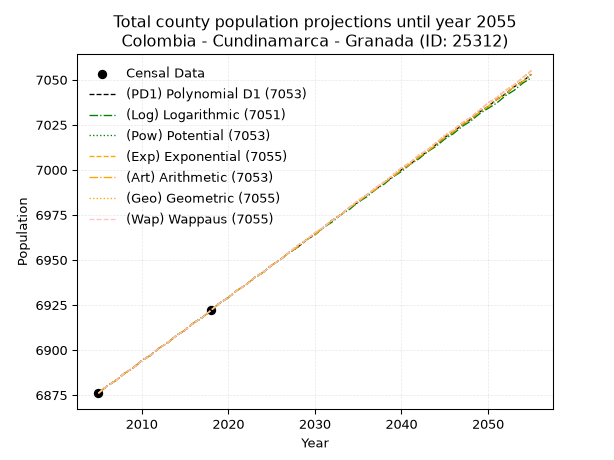
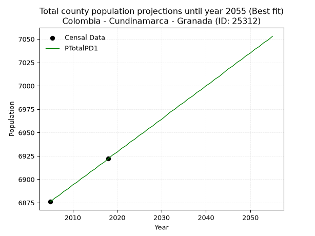
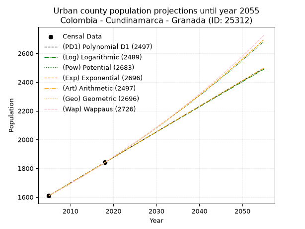
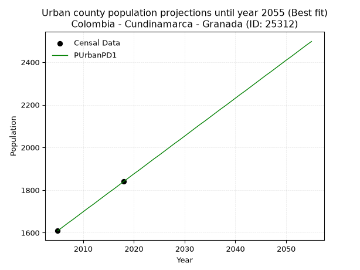
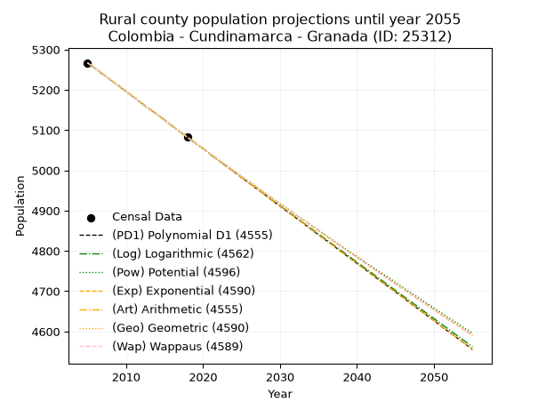
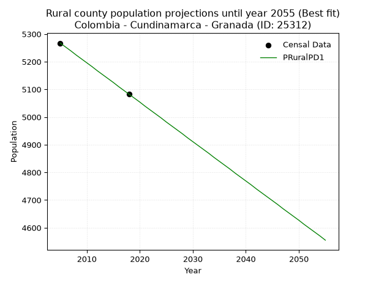

<div align="center">


</div>

# _“Population and Public Services Demand Projections (PPSD) until Year 2050 for Colombia - Cundinamarca - Granada (ID: 25312)”_
Keywords: `population` `public-service` `projection` `lineal` `polynomial` `logarithmic` `potential` `exponential` `arithmetic` `geometric` `wappaus` `dane` `colombia` `south-america`

PPSD are analytical estimates used by governments and planners to anticipate future changes in population size, age distribution, and the resulting community needs for utilities, healthcare, education, and infrastructure as sizing future water treatment facilities, electrical grids, and road networks based on spatial growth.

> **General running parameters**: • app_version: _v20260806_. • Python version: _3.14.7_. • Pandas version: _3.0.5_. • NumPy version: _2.5.1_. • Creates, save and include plots into reports (create_plot): _False_. • Projection until year: _2050_. • Process polynomial degree 2 and up: _False_. • Process Wappaus: _True_. • Process Wappaus: _True_. • Set negative values to zero: _True_. • Set infinite values to zero: _True_. • Drop dataset notes: _True_. 
<div align="center">

Dynamic map: [:earth_americas:Google](http://maps.google.com/maps?q=4.519763472,-74.3507661) [:earth_americas:OSM](https://www.openstreetmap.org/#map=18/4.519763472/-74.3507661&layers=P) [:earth_americas:Bing](https://www.bing.com/maps?cp=4.519763472~-74.3507661&lvl=18) [:earth_americas:Apple](https://maps.apple.com/frame?center=4.519763472%2C-74.3507661&span=0.003%2C0.006)

</div>


<div align="center">

```geojson
{
  "type": "Feature",
  "geometry": {
    "type": "Point", 
    "coordinates": [-74.3507661, 4.519763472]
  }, 
  "properties": {
    "Name": "Colombia - Cundinamarca - Granada (ID: 25312)"
  }
}
```

</div>


## 0. Census Data (2 records)

Census data are official statistics collected by a government about the people and housing in a country. They usually include counts of total population, age, sex, race, income, education, and jobs.

📅Global census file: [Population.xlsx](../data/Population.xlsx)

| Source   |   Year |   CountryID | CountryName   |   StateID | StateName    |   CountyID | CountyName   |   PTotal |   PUrban |   PRural |
|:---------|-------:|------------:|:--------------|----------:|:-------------|-----------:|:-------------|---------:|---------:|---------:|
| DANE     |   2005 |          57 | Colombia      |        25 | Cundinamarca |      25312 | Granada      |     6876 |     1609 |     5267 |
| DANE     |   2018 |          57 | Colombia      |        25 | Cundinamarca |      25312 | Granada      |     6922 |     1840 |     5082 |

> 🔥Some records could had specific notes about the registered values or the corresponding urban or rural distribution.

**Local public utility companies (RUPS)**

 | SERVICIO       | ESTADO    | NOMBRE                                                                                                                     | NIT         | DEPARTAMENTO_DOMICILIO   | MUNICIPIO_DOMICILIO   | DIRECCION                                    |   TELEFONO | EMAIL                                | TIPO_INSCRIPCION    | REPRESENTANTE_LEGAL                | TIPO_PRESTADOR                             | CLASIFICACION                 |
|:---------------|:----------|:---------------------------------------------------------------------------------------------------------------------------|:------------|:-------------------------|:----------------------|:---------------------------------------------|-----------:|:-------------------------------------|:--------------------|:-----------------------------------|:-------------------------------------------|:------------------------------|
| ACUEDUCTO      | OPERATIVA | ASOCIACION DE AFILIADOS DEL ACUEDUCTO REGIONAL  DE GRANADA CUNDINAMARCA                                                    | 832000061-8 | CUNDINAMARCA             | GRANADA               | CALLE 12 14 18                               |    5295084 | asoaguas.e.s.p@hotmail.com           | Registro por la ESP | CARLOS AUGUSTO BERMUDEZ VENEGAS    | ORGANIZACION AUTORIZADA                    | MENOR O IGUAL A 2500 USUARIOS |
| ACUEDUCTO      | OPERATIVA | ASOCIACION DE AFILIADOS ACUEDUCTO REGIONAL VEREDAS Y SECTORES DE LOS MUNICIPIOS DE SIBATÉ  SOACHA Y GRANADA                | 832001775-2 | CUNDINAMARCA             | SIBATE                | Calle 8  No.7 - 46                           |    5297175 | aguasiso_esp@hotmail.com             | Registro por la ESP | MARIO ARMANDO MEDINA  AGUILERA     | ORGANIZACION AUTORIZADA                    | MENOR O IGUAL A 2500 USUARIOS |
| ACUEDUCTO      | OPERATIVA | ASOCIACION DE USUARIOS DEL ACUEDUCTO RURAL DE LA VEREDA LA 22 SURORIENTAL                                                  | 832007752-0 | CUNDINAMARCA             | GRANADA               | Vereda la22, Granada, Cundinamarca           |    8669011 | jopalon@hotmail.com                  | Registro por la ESP | JOSE PABLO LONDOÑO FERNANDEZ       | ORGANIZACION AUTORIZADA                    | HASTA 2500 SUSCRIPTORES       |
| ACUEDUCTO      | OPERATIVA | ASOCIACION DE USUSARIOS DEL SERVICIO DE ACUEDUCTO DE LAS VEREDAS SAN JOSE SAN JOSE BAJO Y LA PLAYITA (SECTOR LA CONQUISTA) | 832007396-1 | CUNDINAMARCA             | GRANADA               | SAN JOSE CENTRO POBLADO GRANADA CUNDINAMARCA |    6339363 | wperezcaicedo@hotmail.com            | Registro por la ESP | ALFONSO LOPEZ INFANTE              | ORGANIZACION AUTORIZADA                    | MENOR O IGUAL A 2500 USUARIOS |
| ASEO           | OPERATIVA | SERVICIOS AMBIENTALES S.A.  E.S.P.                                                                                         | 830131031-1 | CUNDINAMARCA             | GIRARDOT              | Calle 21A No  2 - 07 Barrio San Antonio      |    6164821 | yeselis.aycardi@pacaribe.com         | Registro por la ESP | SANDRA FERNANDA MENESES VILLAMIZAR | SOCIEDADES (EMPRESA DE SERVICIOS PUBLICOS) | MAYOR O IGUAL A 5001 USUARIOS |
| ACUEDUCTO      | OPERATIVA | ASOCIACIÓN DE USUARIOS ACUEDUCTO LAGUNA VERDE VEREDA SAN REIMUNDO TERRITORIAL DEL MUNICIPIO DE GRANADA CUNDINAMARCA        | 832008994-0 | CUNDINAMARCA             | GRANADA               | AUT. SUR KM 32 VDA SAN RAIMUNDO              |    0000000 | asalav.s.r@gmail.com                 | Registro por la ESP | CARLOS AUGUSTO BERMUDEZ VENEGAS    | ORGANIZACION AUTORIZADA                    | MENOR O IGUAL A 2500 USUARIOS |
| ALCANTARILLADO | OPERATIVA | ALCALDIA MUNICIPAL DE GRANADA CUNDINAMARCA                                                                                 | 832000992-1 | CUNDINAMARCA             | GRANADA               | calle 11 No. 14-28                           |    8669334 | wperezcaicedo@hotmail.com            | Registro por la ESP | JORGE ALBERTO SIERRA PADILLA       | MUNICIPIO (PRESTACIÓN DIRECTA)             | MENOR O IGUAL A 2500 USUARIOS |
| ASEO           | OPERATIVA | ALCALDIA MUNICIPAL DE GRANADA CUNDINAMARCA                                                                                 | 832000992-1 | CUNDINAMARCA             | GRANADA               | calle 11 No. 14-28                           |    8669334 | wperezcaicedo@hotmail.com            | Registro por la ESP | JORGE ALBERTO SIERRA PADILLA       | MUNICIPIO (PRESTACIÓN DIRECTA)             | MENOR O IGUAL A 2500 USUARIOS |
| ASEO           | OPERATIVA | NUEVO MONDOÑEDO S.A. E.S.P.                                                                                                | 900108696-6 | CUNDINAMARCA             | BOJACA                | KILOMETRO 9 VIA MOSQUERA LA MESA             |    6373090 | direccion@nuevomondonedo.com         | Registro por la ESP | JAIME VELEZ RAMIREZ                | SOCIEDADES (EMPRESA DE SERVICIOS PUBLICOS) | MAYOR O IGUAL A 5001 USUARIOS |
| ASEO           | OPERATIVA | ECOSERVICIOS DE OCCIDENTE SAS ESP                                                                                          | 900324021-0 | CUNDINAMARCA             | EL ROSAL              | AUTOPISTA MEDELLIN KM 19+050 COSTADO SUR     |    5466607 | gerencia@ecoserviciosdeoccidente.com | Registro por la ESP | SARA VIVIANA ESPITIA PARRA         | SOCIEDADES (EMPRESA DE SERVICIOS PUBLICOS) | MENOR O IGUAL A 2500 USUARIOS |

> [📅RUPS Database: Registro Único de Prestadores de Servicios Públicos de Colombia Suramérica - RUPS](https://www.datos.gov.co/Hacienda-y-Cr-dito-P-blico/Registro-nico-de-Prestadores-de-Servicios-P-blicos/4qkq-csdn/about_data)

## 1. Total

### 1.1. Coefficients and Parameters

* (PD1) Polynomial Deg 1: 3.5384615384615636, -218.61538461543267 (lineal)
* (Log) Logarithmic: 7117.590610334823, -47241.88374716422
* (Pow) Potential: 1.0316882127260807, 0.43058338823597675
* (Exp) Exponential: 0.0005128967455807158, 2458.8139822040143
* (Art) Arithmetic: Year diff. 2018 - 2005 = 13, Population diff. 6922 - 6876 = 46, Annual growth = 3.5384615384615383
* (Geo) Geometric: Year diff. 2018 - 2005 = 13, Population diff. 6922 - 6876 = 46, Annual growth % = 0.0005130282996068658
* (Wap) Wappaus: i = 0.051289484540680365, Condition values only valid for < 200)

<sub>
Wappaus condition values: ['0.00', '0.05', '0.10', '0.15', '0.21', '0.26', '0.31', '0.36', '0.41', '0.46', '0.51', '0.56', '0.62', '0.67', '0.72', '0.77', '0.82', '0.87', '0.92', '0.97', '1.03', '1.08', '1.13', '1.18', '1.23', '1.28', '1.33', '1.38', '1.44', '1.49', '1.54', '1.59', '1.64', '1.69', '1.74', '1.80', '1.85', '1.90', '1.95', '2.00', '2.05', '2.10', '2.15', '2.21', '2.26', '2.31']
</sub>


### 1.2. Projected Dataset

|   Year |   CountyID |   PTotalPD1 |   PTotalLog |   PTotalPow |   PTotalExp |   PTotalArt |   PTotalGeo |   PTotalWap |
|-------:|-----------:|------------:|------------:|------------:|------------:|------------:|------------:|------------:|
|   2005 |      25312 |        6876 |        6876 |        6876 |        6876 |        6876 |        6876 |        6876 |
|   2006 |      25312 |        6880 |        6880 |        6880 |        6880 |        6880 |        6880 |        6880 |
|   2007 |      25312 |        6883 |        6883 |        6883 |        6883 |        6883 |        6883 |        6883 |
|   2008 |      25312 |        6887 |        6887 |        6887 |        6887 |        6887 |        6887 |        6887 |
|   2009 |      25312 |        6890 |        6890 |        6890 |        6890 |        6890 |        6890 |        6890 |
|   2010 |      25312 |        6894 |        6894 |        6894 |        6894 |        6894 |        6894 |        6894 |
|   2011 |      25312 |        6897 |        6897 |        6897 |        6897 |        6897 |        6897 |        6897 |
|   2012 |      25312 |        6901 |        6901 |        6901 |        6901 |        6901 |        6901 |        6901 |
|   2013 |      25312 |        6904 |        6904 |        6904 |        6904 |        6904 |        6904 |        6904 |
|   2014 |      25312 |        6908 |        6908 |        6908 |        6908 |        6908 |        6908 |        6908 |
|   2015 |      25312 |        6911 |        6911 |        6911 |        6911 |        6911 |        6911 |        6911 |
|   2016 |      25312 |        6915 |        6915 |        6915 |        6915 |        6915 |        6915 |        6915 |
|   2017 |      25312 |        6918 |        6918 |        6918 |        6918 |        6918 |        6918 |        6918 |
|   2018 |      25312 |        6922 |        6922 |        6922 |        6922 |        6922 |        6922 |        6922 |
|   2019 |      25312 |        6926 |        6926 |        6926 |        6926 |        6926 |        6926 |        6926 |
|   2020 |      25312 |        6929 |        6929 |        6929 |        6929 |        6929 |        6929 |        6929 |
|   2021 |      25312 |        6933 |        6933 |        6933 |        6933 |        6933 |        6933 |        6933 |
|   2022 |      25312 |        6936 |        6936 |        6936 |        6936 |        6936 |        6936 |        6936 |
|   2023 |      25312 |        6940 |        6940 |        6940 |        6940 |        6940 |        6940 |        6940 |
|   2024 |      25312 |        6943 |        6943 |        6943 |        6943 |        6943 |        6943 |        6943 |
|   2025 |      25312 |        6947 |        6947 |        6947 |        6947 |        6947 |        6947 |        6947 |
|   2026 |      25312 |        6950 |        6950 |        6950 |        6950 |        6950 |        6950 |        6950 |
|   2027 |      25312 |        6954 |        6954 |        6954 |        6954 |        6954 |        6954 |        6954 |
|   2028 |      25312 |        6957 |        6957 |        6957 |        6958 |        6957 |        6958 |        6958 |
|   2029 |      25312 |        6961 |        6961 |        6961 |        6961 |        6961 |        6961 |        6961 |
|   2030 |      25312 |        6964 |        6964 |        6964 |        6965 |        6964 |        6965 |        6965 |
|   2031 |      25312 |        6968 |        6968 |        6968 |        6968 |        6968 |        6968 |        6968 |
|   2032 |      25312 |        6972 |        6971 |        6972 |        6972 |        6972 |        6972 |        6972 |
|   2033 |      25312 |        6975 |        6975 |        6975 |        6975 |        6975 |        6975 |        6975 |
|   2034 |      25312 |        6979 |        6978 |        6979 |        6979 |        6979 |        6979 |        6979 |
|   2035 |      25312 |        6982 |        6982 |        6982 |        6983 |        6982 |        6983 |        6983 |
|   2036 |      25312 |        6986 |        6985 |        6986 |        6986 |        6986 |        6986 |        6986 |
|   2037 |      25312 |        6989 |        6989 |        6989 |        6990 |        6989 |        6990 |        6990 |
|   2038 |      25312 |        6993 |        6992 |        6993 |        6993 |        6993 |        6993 |        6993 |
|   2039 |      25312 |        6996 |        6996 |        6996 |        6997 |        6996 |        6997 |        6997 |
|   2040 |      25312 |        7000 |        6999 |        7000 |        7001 |        7000 |        7001 |        7001 |
|   2041 |      25312 |        7003 |        7003 |        7003 |        7004 |        7003 |        7004 |        7004 |
|   2042 |      25312 |        7007 |        7006 |        7007 |        7008 |        7007 |        7008 |        7008 |
|   2043 |      25312 |        7010 |        7010 |        7010 |        7011 |        7010 |        7011 |        7011 |
|   2044 |      25312 |        7014 |        7013 |        7014 |        7015 |        7014 |        7015 |        7015 |
|   2045 |      25312 |        7018 |        7017 |        7018 |        7019 |        7018 |        7019 |        7019 |
|   2046 |      25312 |        7021 |        7020 |        7021 |        7022 |        7021 |        7022 |        7022 |
|   2047 |      25312 |        7025 |        7024 |        7025 |        7026 |        7025 |        7026 |        7026 |
|   2048 |      25312 |        7028 |        7027 |        7028 |        7029 |        7028 |        7029 |        7029 |
|   2049 |      25312 |        7032 |        7031 |        7032 |        7033 |        7032 |        7033 |        7033 |
|   2050 |      25312 |        7035 |        7034 |        7035 |        7037 |        7035 |        7037 |        7037 |
<div align="center">

</img>

</div>


### 1.3. Best fit with absolute and relative error (%)

Relative error puts that difference into context by dividing the absolute error by the true value, creating a unitless ratio or percentage that shows the scale of the mistake.

Absolute and relative error

|   Year | Source   |   CountryID | CountryName   |   StateID | StateName    |   CountyID_x | CountyName   |   PTotal |   PUrban |   PRural |   CountyID_y |   PTotalPD1 |   PTotalLog |   PTotalPow |   PTotalExp |   PTotalArt |   PTotalGeo |   PTotalWap |   PTotalPD1AbsError |   PTotalLogAbsError |   PTotalPowAbsError |   PTotalExpAbsError |   PTotalArtAbsError |   PTotalGeoAbsError |   PTotalWapAbsError |   PTotalPD1RelError |   PTotalLogRelError |   PTotalPowRelError |   PTotalExpRelError |   PTotalArtRelError |   PTotalGeoRelError |   PTotalWapRelError |
|-------:|:---------|------------:|:--------------|----------:|:-------------|-------------:|:-------------|---------:|---------:|---------:|-------------:|------------:|------------:|------------:|------------:|------------:|------------:|------------:|--------------------:|--------------------:|--------------------:|--------------------:|--------------------:|--------------------:|--------------------:|--------------------:|--------------------:|--------------------:|--------------------:|--------------------:|--------------------:|--------------------:|
|   2005 | DANE     |          57 | Colombia      |        25 | Cundinamarca |        25312 | Granada      |     6876 |     1609 |     5267 |        25312 |        6876 |        6876 |        6876 |        6876 |        6876 |        6876 |        6876 |                   0 |                   0 |                   0 |                   0 |                   0 |                   0 |                   0 |                   0 |                   0 |                   0 |                   0 |                   0 |                   0 |                   0 |
|   2018 | DANE     |          57 | Colombia      |        25 | Cundinamarca |        25312 | Granada      |     6922 |     1840 |     5082 |        25312 |        6922 |        6922 |        6922 |        6922 |        6922 |        6922 |        6922 |                   0 |                   0 |                   0 |                   0 |                   0 |                   0 |                   0 |                   0 |                   0 |                   0 |                   0 |                   0 |                   0 |                   0 |

Relative error mean

| Method    |   RelError | Best   |
|:----------|-----------:|:-------|
| PTotalPD1 |          0 | True   |
| PTotalLog |          0 | True   |
| PTotalPow |          0 | True   |
| PTotalExp |          0 | True   |
| PTotalArt |          0 | True   |
| PTotalGeo |          0 | True   |
| PTotalWap |          0 | True   |

💙Best method: _**PTotalPD1**_
<div align="center">

</img>

</div>


### 1.4. Fresh water supply demand in liters per capita per day (lpcd)

The fresh water supply demand typically ranges from 100 to 300 liters per capita per day (lpcd) for standard domestic and municipal planning, though absolute survival minimums set by the World Health Organization are as low as 7.5 to 20 liters per day, and total consumption in high-income nations can exceed 400 liters.

> `CZ`: Level in meters above the sea level (masl)<br> `WS`: Fresh water supply demand in liters per capita per day (lpcd or l/h/d)<br> `WSAll`: Zonal fresh water supply demand in liters per second (l/s)<br> `A`: Zonal area in square meters<br> `DP`: Population density (people/hectare or p/ha)

Reference values (RAS Colombia)

|    CZ |   WS |
|------:|-----:|
|  1000 |  120 |
|  2000 |  130 |
| 99999 |  140 |

County shapefile geometry properties and water supply values

|   CountyID |      ATotal |   CZTotal |   WSTotal |
|-----------:|------------:|----------:|----------:|
|      25312 | 6.06406e+07 |   2574.51 |       140 |

Projected values for best method: PTotalPD1

|   CountyID |   Year |   PTotalPD1 |   DPTotal |   WSTotal |   WSTotalAll |
|-----------:|-------:|------------:|----------:|----------:|-------------:|
|      25312 |   2005 |        6876 |      1.13 |       140 |      11.1417 |
|      25312 |   2006 |        6880 |      1.13 |       140 |      11.1481 |
|      25312 |   2007 |        6883 |      1.14 |       140 |      11.153  |
|      25312 |   2008 |        6887 |      1.14 |       140 |      11.1595 |
|      25312 |   2009 |        6890 |      1.14 |       140 |      11.1644 |
|      25312 |   2010 |        6894 |      1.14 |       140 |      11.1708 |
|      25312 |   2011 |        6897 |      1.14 |       140 |      11.1757 |
|      25312 |   2012 |        6901 |      1.14 |       140 |      11.1822 |
|      25312 |   2013 |        6904 |      1.14 |       140 |      11.187  |
|      25312 |   2014 |        6908 |      1.14 |       140 |      11.1935 |
|      25312 |   2015 |        6911 |      1.14 |       140 |      11.1984 |
|      25312 |   2016 |        6915 |      1.14 |       140 |      11.2049 |
|      25312 |   2017 |        6918 |      1.14 |       140 |      11.2097 |
|      25312 |   2018 |        6922 |      1.14 |       140 |      11.2162 |
|      25312 |   2019 |        6926 |      1.14 |       140 |      11.2227 |
|      25312 |   2020 |        6929 |      1.14 |       140 |      11.2275 |
|      25312 |   2021 |        6933 |      1.14 |       140 |      11.234  |
|      25312 |   2022 |        6936 |      1.14 |       140 |      11.2389 |
|      25312 |   2023 |        6940 |      1.14 |       140 |      11.2454 |
|      25312 |   2024 |        6943 |      1.14 |       140 |      11.2502 |
|      25312 |   2025 |        6947 |      1.15 |       140 |      11.2567 |
|      25312 |   2026 |        6950 |      1.15 |       140 |      11.2616 |
|      25312 |   2027 |        6954 |      1.15 |       140 |      11.2681 |
|      25312 |   2028 |        6957 |      1.15 |       140 |      11.2729 |
|      25312 |   2029 |        6961 |      1.15 |       140 |      11.2794 |
|      25312 |   2030 |        6964 |      1.15 |       140 |      11.2843 |
|      25312 |   2031 |        6968 |      1.15 |       140 |      11.2907 |
|      25312 |   2032 |        6972 |      1.15 |       140 |      11.2972 |
|      25312 |   2033 |        6975 |      1.15 |       140 |      11.3021 |
|      25312 |   2034 |        6979 |      1.15 |       140 |      11.3086 |
|      25312 |   2035 |        6982 |      1.15 |       140 |      11.3134 |
|      25312 |   2036 |        6986 |      1.15 |       140 |      11.3199 |
|      25312 |   2037 |        6989 |      1.15 |       140 |      11.3248 |
|      25312 |   2038 |        6993 |      1.15 |       140 |      11.3313 |
|      25312 |   2039 |        6996 |      1.15 |       140 |      11.3361 |
|      25312 |   2040 |        7000 |      1.15 |       140 |      11.3426 |
|      25312 |   2041 |        7003 |      1.15 |       140 |      11.3475 |
|      25312 |   2042 |        7007 |      1.16 |       140 |      11.3539 |
|      25312 |   2043 |        7010 |      1.16 |       140 |      11.3588 |
|      25312 |   2044 |        7014 |      1.16 |       140 |      11.3653 |
|      25312 |   2045 |        7018 |      1.16 |       140 |      11.3718 |
|      25312 |   2046 |        7021 |      1.16 |       140 |      11.3766 |
|      25312 |   2047 |        7025 |      1.16 |       140 |      11.3831 |
|      25312 |   2048 |        7028 |      1.16 |       140 |      11.388  |
|      25312 |   2049 |        7032 |      1.16 |       140 |      11.3944 |
|      25312 |   2050 |        7035 |      1.16 |       140 |      11.3993 |

## 2. Urban

### 2.1. Coefficients and Parameters

* (PD1) Polynomial Deg 1: 17.76923076923082, -34018.307692307775 (lineal)
* (Log) Logarithmic: 35742.68328233493, -270156.8944694655
* (Pow) Potential: 20.757478773260182, -65.33701304244663
* (Exp) Exponential: 0.010319438739280604, 1.662635564365677e-06
* (Art) Arithmetic: Year diff. 2018 - 2005 = 13, Population diff. 1840 - 1609 = 231, Annual growth = 17.76923076923077
* (Geo) Geometric: Year diff. 2018 - 2005 = 13, Population diff. 1840 - 1609 = 231, Annual growth % = 0.010372867774958383
* (Wap) Wappaus: i = 1.0303990008252113, Condition values only valid for < 200)

<sub>
Wappaus condition values: ['0.00', '1.03', '2.06', '3.09', '4.12', '5.15', '6.18', '7.21', '8.24', '9.27', '10.30', '11.33', '12.36', '13.40', '14.43', '15.46', '16.49', '17.52', '18.55', '19.58', '20.61', '21.64', '22.67', '23.70', '24.73', '25.76', '26.79', '27.82', '28.85', '29.88', '30.91', '31.94', '32.97', '34.00', '35.03', '36.06', '37.09', '38.12', '39.16', '40.19', '41.22', '42.25', '43.28', '44.31', '45.34', '46.37']
</sub>


### 2.2. Projected Dataset

|   Year |   CountyID |   PUrbanPD1 |   PUrbanLog |   PUrbanPow |   PUrbanExp |   PUrbanArt |   PUrbanGeo |   PUrbanWap |
|-------:|-----------:|------------:|------------:|------------:|------------:|------------:|------------:|------------:|
|   2005 |      25312 |        1609 |        1609 |        1609 |        1609 |        1609 |        1609 |        1609 |
|   2006 |      25312 |        1627 |        1627 |        1626 |        1626 |        1627 |        1626 |        1626 |
|   2007 |      25312 |        1645 |        1645 |        1643 |        1643 |        1645 |        1643 |        1643 |
|   2008 |      25312 |        1662 |        1662 |        1660 |        1660 |        1662 |        1660 |        1660 |
|   2009 |      25312 |        1680 |        1680 |        1677 |        1677 |        1680 |        1677 |        1677 |
|   2010 |      25312 |        1698 |        1698 |        1694 |        1694 |        1698 |        1694 |        1694 |
|   2011 |      25312 |        1716 |        1716 |        1712 |        1712 |        1716 |        1712 |        1712 |
|   2012 |      25312 |        1733 |        1734 |        1730 |        1730 |        1733 |        1730 |        1729 |
|   2013 |      25312 |        1751 |        1751 |        1748 |        1747 |        1751 |        1747 |        1747 |
|   2014 |      25312 |        1769 |        1769 |        1766 |        1766 |        1769 |        1766 |        1765 |
|   2015 |      25312 |        1787 |        1787 |        1784 |        1784 |        1787 |        1784 |        1784 |
|   2016 |      25312 |        1804 |        1805 |        1803 |        1802 |        1804 |        1802 |        1802 |
|   2017 |      25312 |        1822 |        1822 |        1821 |        1821 |        1822 |        1821 |        1821 |
|   2018 |      25312 |        1840 |        1840 |        1840 |        1840 |        1840 |        1840 |        1840 |
|   2019 |      25312 |        1858 |        1858 |        1859 |        1859 |        1858 |        1859 |        1859 |
|   2020 |      25312 |        1876 |        1875 |        1878 |        1878 |        1876 |        1878 |        1879 |
|   2021 |      25312 |        1893 |        1893 |        1898 |        1898 |        1893 |        1898 |        1898 |
|   2022 |      25312 |        1911 |        1911 |        1917 |        1918 |        1911 |        1918 |        1918 |
|   2023 |      25312 |        1929 |        1928 |        1937 |        1937 |        1929 |        1937 |        1938 |
|   2024 |      25312 |        1947 |        1946 |        1957 |        1958 |        1947 |        1958 |        1958 |
|   2025 |      25312 |        1964 |        1964 |        1977 |        1978 |        1964 |        1978 |        1979 |
|   2026 |      25312 |        1982 |        1981 |        1997 |        1998 |        1982 |        1998 |        1999 |
|   2027 |      25312 |        2000 |        1999 |        2018 |        2019 |        2000 |        2019 |        2020 |
|   2028 |      25312 |        2018 |        2017 |        2039 |        2040 |        2018 |        2040 |        2042 |
|   2029 |      25312 |        2035 |        2034 |        2060 |        2061 |        2035 |        2061 |        2063 |
|   2030 |      25312 |        2053 |        2052 |        2081 |        2083 |        2053 |        2083 |        2085 |
|   2031 |      25312 |        2071 |        2070 |        2102 |        2104 |        2071 |        2104 |        2107 |
|   2032 |      25312 |        2089 |        2087 |        2124 |        2126 |        2089 |        2126 |        2129 |
|   2033 |      25312 |        2107 |        2105 |        2146 |        2148 |        2107 |        2148 |        2151 |
|   2034 |      25312 |        2124 |        2122 |        2168 |        2170 |        2124 |        2170 |        2174 |
|   2035 |      25312 |        2142 |        2140 |        2190 |        2193 |        2142 |        2193 |        2197 |
|   2036 |      25312 |        2160 |        2157 |        2212 |        2216 |        2160 |        2216 |        2221 |
|   2037 |      25312 |        2178 |        2175 |        2235 |        2239 |        2178 |        2239 |        2244 |
|   2038 |      25312 |        2195 |        2192 |        2258 |        2262 |        2195 |        2262 |        2268 |
|   2039 |      25312 |        2213 |        2210 |        2281 |        2285 |        2213 |        2285 |        2292 |
|   2040 |      25312 |        2231 |        2228 |        2304 |        2309 |        2231 |        2309 |        2317 |
|   2041 |      25312 |        2249 |        2245 |        2328 |        2333 |        2249 |        2333 |        2342 |
|   2042 |      25312 |        2266 |        2263 |        2352 |        2357 |        2266 |        2357 |        2367 |
|   2043 |      25312 |        2284 |        2280 |        2376 |        2382 |        2284 |        2382 |        2392 |
|   2044 |      25312 |        2302 |        2298 |        2400 |        2406 |        2302 |        2406 |        2418 |
|   2045 |      25312 |        2320 |        2315 |        2425 |        2431 |        2320 |        2431 |        2444 |
|   2046 |      25312 |        2338 |        2333 |        2449 |        2456 |        2338 |        2456 |        2471 |
|   2047 |      25312 |        2355 |        2350 |        2474 |        2482 |        2355 |        2482 |        2498 |
|   2048 |      25312 |        2373 |        2367 |        2499 |        2508 |        2373 |        2508 |        2525 |
|   2049 |      25312 |        2391 |        2385 |        2525 |        2534 |        2391 |        2534 |        2552 |
|   2050 |      25312 |        2409 |        2402 |        2551 |        2560 |        2409 |        2560 |        2580 |
<div align="center">

</img>

</div>


### 2.3. Best fit with absolute and relative error (%)

Relative error puts that difference into context by dividing the absolute error by the true value, creating a unitless ratio or percentage that shows the scale of the mistake.

Absolute and relative error

|   Year | Source   |   CountryID | CountryName   |   StateID | StateName    |   CountyID_x | CountyName   |   PTotal |   PUrban |   PRural |   CountyID_y |   PUrbanPD1 |   PUrbanLog |   PUrbanPow |   PUrbanExp |   PUrbanArt |   PUrbanGeo |   PUrbanWap |   PUrbanPD1AbsError |   PUrbanLogAbsError |   PUrbanPowAbsError |   PUrbanExpAbsError |   PUrbanArtAbsError |   PUrbanGeoAbsError |   PUrbanWapAbsError |   PUrbanPD1RelError |   PUrbanLogRelError |   PUrbanPowRelError |   PUrbanExpRelError |   PUrbanArtRelError |   PUrbanGeoRelError |   PUrbanWapRelError |
|-------:|:---------|------------:|:--------------|----------:|:-------------|-------------:|:-------------|---------:|---------:|---------:|-------------:|------------:|------------:|------------:|------------:|------------:|------------:|------------:|--------------------:|--------------------:|--------------------:|--------------------:|--------------------:|--------------------:|--------------------:|--------------------:|--------------------:|--------------------:|--------------------:|--------------------:|--------------------:|--------------------:|
|   2005 | DANE     |          57 | Colombia      |        25 | Cundinamarca |        25312 | Granada      |     6876 |     1609 |     5267 |        25312 |        1609 |        1609 |        1609 |        1609 |        1609 |        1609 |        1609 |                   0 |                   0 |                   0 |                   0 |                   0 |                   0 |                   0 |                   0 |                   0 |                   0 |                   0 |                   0 |                   0 |                   0 |
|   2018 | DANE     |          57 | Colombia      |        25 | Cundinamarca |        25312 | Granada      |     6922 |     1840 |     5082 |        25312 |        1840 |        1840 |        1840 |        1840 |        1840 |        1840 |        1840 |                   0 |                   0 |                   0 |                   0 |                   0 |                   0 |                   0 |                   0 |                   0 |                   0 |                   0 |                   0 |                   0 |                   0 |

Relative error mean

| Method    |   RelError | Best   |
|:----------|-----------:|:-------|
| PUrbanPD1 |          0 | True   |
| PUrbanLog |          0 | True   |
| PUrbanPow |          0 | True   |
| PUrbanExp |          0 | True   |
| PUrbanArt |          0 | True   |
| PUrbanGeo |          0 | True   |
| PUrbanWap |          0 | True   |

💙Best method: _**PUrbanPD1**_
<div align="center">

</img>

</div>


### 2.4. Fresh water supply demand in liters per capita per day (lpcd)

The fresh water supply demand typically ranges from 100 to 300 liters per capita per day (lpcd) for standard domestic and municipal planning, though absolute survival minimums set by the World Health Organization are as low as 7.5 to 20 liters per day, and total consumption in high-income nations can exceed 400 liters.

> `CZ`: Level in meters above the sea level (masl)<br> `WS`: Fresh water supply demand in liters per capita per day (lpcd or l/h/d)<br> `WSAll`: Zonal fresh water supply demand in liters per second (l/s)<br> `A`: Zonal area in square meters<br> `DP`: Population density (people/hectare or p/ha)

Reference values (RAS Colombia)

|    CZ |   WS |
|------:|-----:|
|  1000 |  120 |
|  2000 |  130 |
| 99999 |  140 |

County shapefile geometry properties and water supply values

|   CountyID |   AUrban |   CZUrban |   WSUrban |
|-----------:|---------:|----------:|----------:|
|      25312 |   302093 |   2279.91 |       140 |

Projected values for best method: PUrbanPD1

|   CountyID |   Year |   PUrbanPD1 |   DPUrban |   WSUrban |   WSUrbanAll |
|-----------:|-------:|------------:|----------:|----------:|-------------:|
|      25312 |   2005 |        1609 |     53.26 |       140 |      2.60718 |
|      25312 |   2006 |        1627 |     53.86 |       140 |      2.63634 |
|      25312 |   2007 |        1645 |     54.45 |       140 |      2.66551 |
|      25312 |   2008 |        1662 |     55.02 |       140 |      2.69306 |
|      25312 |   2009 |        1680 |     55.61 |       140 |      2.72222 |
|      25312 |   2010 |        1698 |     56.21 |       140 |      2.75139 |
|      25312 |   2011 |        1716 |     56.8  |       140 |      2.78056 |
|      25312 |   2012 |        1733 |     57.37 |       140 |      2.8081  |
|      25312 |   2013 |        1751 |     57.96 |       140 |      2.83727 |
|      25312 |   2014 |        1769 |     58.56 |       140 |      2.86644 |
|      25312 |   2015 |        1787 |     59.15 |       140 |      2.8956  |
|      25312 |   2016 |        1804 |     59.72 |       140 |      2.92315 |
|      25312 |   2017 |        1822 |     60.31 |       140 |      2.95231 |
|      25312 |   2018 |        1840 |     60.91 |       140 |      2.98148 |
|      25312 |   2019 |        1858 |     61.5  |       140 |      3.01065 |
|      25312 |   2020 |        1876 |     62.1  |       140 |      3.03981 |
|      25312 |   2021 |        1893 |     62.66 |       140 |      3.06736 |
|      25312 |   2022 |        1911 |     63.26 |       140 |      3.09653 |
|      25312 |   2023 |        1929 |     63.85 |       140 |      3.12569 |
|      25312 |   2024 |        1947 |     64.45 |       140 |      3.15486 |
|      25312 |   2025 |        1964 |     65.01 |       140 |      3.18241 |
|      25312 |   2026 |        1982 |     65.61 |       140 |      3.21157 |
|      25312 |   2027 |        2000 |     66.2  |       140 |      3.24074 |
|      25312 |   2028 |        2018 |     66.8  |       140 |      3.26991 |
|      25312 |   2029 |        2035 |     67.36 |       140 |      3.29745 |
|      25312 |   2030 |        2053 |     67.96 |       140 |      3.32662 |
|      25312 |   2031 |        2071 |     68.56 |       140 |      3.35579 |
|      25312 |   2032 |        2089 |     69.15 |       140 |      3.38495 |
|      25312 |   2033 |        2107 |     69.75 |       140 |      3.41412 |
|      25312 |   2034 |        2124 |     70.31 |       140 |      3.44167 |
|      25312 |   2035 |        2142 |     70.91 |       140 |      3.47083 |
|      25312 |   2036 |        2160 |     71.5  |       140 |      3.5     |
|      25312 |   2037 |        2178 |     72.1  |       140 |      3.52917 |
|      25312 |   2038 |        2195 |     72.66 |       140 |      3.55671 |
|      25312 |   2039 |        2213 |     73.26 |       140 |      3.58588 |
|      25312 |   2040 |        2231 |     73.85 |       140 |      3.61505 |
|      25312 |   2041 |        2249 |     74.45 |       140 |      3.64421 |
|      25312 |   2042 |        2266 |     75.01 |       140 |      3.67176 |
|      25312 |   2043 |        2284 |     75.61 |       140 |      3.70093 |
|      25312 |   2044 |        2302 |     76.2  |       140 |      3.73009 |
|      25312 |   2045 |        2320 |     76.8  |       140 |      3.75926 |
|      25312 |   2046 |        2338 |     77.39 |       140 |      3.78843 |
|      25312 |   2047 |        2355 |     77.96 |       140 |      3.81597 |
|      25312 |   2048 |        2373 |     78.55 |       140 |      3.84514 |
|      25312 |   2049 |        2391 |     79.15 |       140 |      3.87431 |
|      25312 |   2050 |        2409 |     79.74 |       140 |      3.90347 |

## 3. Rural

### 3.1. Coefficients and Parameters

* (PD1) Polynomial Deg 1: -14.230769230769205, 33799.69230769225 (lineal)
* (Log) Logarithmic: -28625.09267199997, 222915.01072230013
* (Pow) Potential: -5.532542730966656, 21.99065221140701
* (Exp) Exponential: -0.002750465815636789, 1307856.6102974492
* (Art) Arithmetic: Year diff. 2018 - 2005 = 13, Population diff. 5082 - 5267 = -185, Annual growth = -14.23076923076923
* (Geo) Geometric: Year diff. 2018 - 2005 = 13, Population diff. 5082 - 5267 = -185, Annual growth % = -0.0027466867500596237
* (Wap) Wappaus: i = -0.275017281491337, Condition values only valid for < 200)

<sub>
Wappaus condition values: ['-0.00', '-0.28', '-0.55', '-0.83', '-1.10', '-1.38', '-1.65', '-1.93', '-2.20', '-2.48', '-2.75', '-3.03', '-3.30', '-3.58', '-3.85', '-4.13', '-4.40', '-4.68', '-4.95', '-5.23', '-5.50', '-5.78', '-6.05', '-6.33', '-6.60', '-6.88', '-7.15', '-7.43', '-7.70', '-7.98', '-8.25', '-8.53', '-8.80', '-9.08', '-9.35', '-9.63', '-9.90', '-10.18', '-10.45', '-10.73', '-11.00', '-11.28', '-11.55', '-11.83', '-12.10', '-12.38']
</sub>


### 3.2. Projected Dataset

|   Year |   CountyID |   PRuralPD1 |   PRuralLog |   PRuralPow |   PRuralExp |   PRuralArt |   PRuralGeo |   PRuralWap |
|-------:|-----------:|------------:|------------:|------------:|------------:|------------:|------------:|------------:|
|   2005 |      25312 |        5267 |        5267 |        5267 |        5267 |        5267 |        5267 |        5267 |
|   2006 |      25312 |        5253 |        5253 |        5252 |        5253 |        5253 |        5253 |        5253 |
|   2007 |      25312 |        5239 |        5238 |        5238 |        5238 |        5239 |        5238 |        5238 |
|   2008 |      25312 |        5224 |        5224 |        5224 |        5224 |        5224 |        5224 |        5224 |
|   2009 |      25312 |        5210 |        5210 |        5209 |        5209 |        5210 |        5209 |        5209 |
|   2010 |      25312 |        5196 |        5196 |        5195 |        5195 |        5196 |        5195 |        5195 |
|   2011 |      25312 |        5182 |        5181 |        5181 |        5181 |        5182 |        5181 |        5181 |
|   2012 |      25312 |        5167 |        5167 |        5166 |        5167 |        5167 |        5167 |        5167 |
|   2013 |      25312 |        5153 |        5153 |        5152 |        5152 |        5153 |        5152 |        5152 |
|   2014 |      25312 |        5139 |        5139 |        5138 |        5138 |        5139 |        5138 |        5138 |
|   2015 |      25312 |        5125 |        5125 |        5124 |        5124 |        5125 |        5124 |        5124 |
|   2016 |      25312 |        5110 |        5110 |        5110 |        5110 |        5110 |        5110 |        5110 |
|   2017 |      25312 |        5096 |        5096 |        5096 |        5096 |        5096 |        5096 |        5096 |
|   2018 |      25312 |        5082 |        5082 |        5082 |        5082 |        5082 |        5082 |        5082 |
|   2019 |      25312 |        5068 |        5068 |        5068 |        5068 |        5068 |        5068 |        5068 |
|   2020 |      25312 |        5054 |        5054 |        5054 |        5054 |        5054 |        5054 |        5054 |
|   2021 |      25312 |        5039 |        5039 |        5040 |        5040 |        5039 |        5040 |        5040 |
|   2022 |      25312 |        5025 |        5025 |        5027 |        5026 |        5025 |        5026 |        5026 |
|   2023 |      25312 |        5011 |        5011 |        5013 |        5013 |        5011 |        5013 |        5013 |
|   2024 |      25312 |        4997 |        4997 |        4999 |        4999 |        4997 |        4999 |        4999 |
|   2025 |      25312 |        4982 |        4983 |        4986 |        4985 |        4982 |        4985 |        4985 |
|   2026 |      25312 |        4968 |        4969 |        4972 |        4971 |        4968 |        4971 |        4971 |
|   2027 |      25312 |        4954 |        4955 |        4958 |        4958 |        4954 |        4958 |        4958 |
|   2028 |      25312 |        4940 |        4941 |        4945 |        4944 |        4940 |        4944 |        4944 |
|   2029 |      25312 |        4925 |        4926 |        4931 |        4931 |        4925 |        4931 |        4930 |
|   2030 |      25312 |        4911 |        4912 |        4918 |        4917 |        4911 |        4917 |        4917 |
|   2031 |      25312 |        4897 |        4898 |        4905 |        4903 |        4897 |        4903 |        4903 |
|   2032 |      25312 |        4883 |        4884 |        4891 |        4890 |        4883 |        4890 |        4890 |
|   2033 |      25312 |        4869 |        4870 |        4878 |        4877 |        4869 |        4877 |        4876 |
|   2034 |      25312 |        4854 |        4856 |        4865 |        4863 |        4854 |        4863 |        4863 |
|   2035 |      25312 |        4840 |        4842 |        4852 |        4850 |        4840 |        4850 |        4850 |
|   2036 |      25312 |        4826 |        4828 |        4838 |        4837 |        4826 |        4837 |        4836 |
|   2037 |      25312 |        4812 |        4814 |        4825 |        4823 |        4812 |        4823 |        4823 |
|   2038 |      25312 |        4797 |        4800 |        4812 |        4810 |        4797 |        4810 |        4810 |
|   2039 |      25312 |        4783 |        4786 |        4799 |        4797 |        4783 |        4797 |        4797 |
|   2040 |      25312 |        4769 |        4772 |        4786 |        4784 |        4769 |        4784 |        4783 |
|   2041 |      25312 |        4755 |        4758 |        4773 |        4770 |        4755 |        4770 |        4770 |
|   2042 |      25312 |        4740 |        4744 |        4760 |        4757 |        4740 |        4757 |        4757 |
|   2043 |      25312 |        4726 |        4730 |        4747 |        4744 |        4726 |        4744 |        4744 |
|   2044 |      25312 |        4712 |        4716 |        4735 |        4731 |        4712 |        4731 |        4731 |
|   2045 |      25312 |        4698 |        4702 |        4722 |        4718 |        4698 |        4718 |        4718 |
|   2046 |      25312 |        4684 |        4688 |        4709 |        4705 |        4684 |        4705 |        4705 |
|   2047 |      25312 |        4669 |        4674 |        4696 |        4692 |        4669 |        4692 |        4692 |
|   2048 |      25312 |        4655 |        4660 |        4684 |        4679 |        4655 |        4679 |        4679 |
|   2049 |      25312 |        4641 |        4646 |        4671 |        4667 |        4641 |        4667 |        4666 |
|   2050 |      25312 |        4627 |        4632 |        4658 |        4654 |        4627 |        4654 |        4653 |
<div align="center">

</img>

</div>


### 3.3. Best fit with absolute and relative error (%)

Relative error puts that difference into context by dividing the absolute error by the true value, creating a unitless ratio or percentage that shows the scale of the mistake.

Absolute and relative error

|   Year | Source   |   CountryID | CountryName   |   StateID | StateName    |   CountyID_x | CountyName   |   PTotal |   PUrban |   PRural |   CountyID_y |   PRuralPD1 |   PRuralLog |   PRuralPow |   PRuralExp |   PRuralArt |   PRuralGeo |   PRuralWap |   PRuralPD1AbsError |   PRuralLogAbsError |   PRuralPowAbsError |   PRuralExpAbsError |   PRuralArtAbsError |   PRuralGeoAbsError |   PRuralWapAbsError |   PRuralPD1RelError |   PRuralLogRelError |   PRuralPowRelError |   PRuralExpRelError |   PRuralArtRelError |   PRuralGeoRelError |   PRuralWapRelError |
|-------:|:---------|------------:|:--------------|----------:|:-------------|-------------:|:-------------|---------:|---------:|---------:|-------------:|------------:|------------:|------------:|------------:|------------:|------------:|------------:|--------------------:|--------------------:|--------------------:|--------------------:|--------------------:|--------------------:|--------------------:|--------------------:|--------------------:|--------------------:|--------------------:|--------------------:|--------------------:|--------------------:|
|   2005 | DANE     |          57 | Colombia      |        25 | Cundinamarca |        25312 | Granada      |     6876 |     1609 |     5267 |        25312 |        5267 |        5267 |        5267 |        5267 |        5267 |        5267 |        5267 |                   0 |                   0 |                   0 |                   0 |                   0 |                   0 |                   0 |                   0 |                   0 |                   0 |                   0 |                   0 |                   0 |                   0 |
|   2018 | DANE     |          57 | Colombia      |        25 | Cundinamarca |        25312 | Granada      |     6922 |     1840 |     5082 |        25312 |        5082 |        5082 |        5082 |        5082 |        5082 |        5082 |        5082 |                   0 |                   0 |                   0 |                   0 |                   0 |                   0 |                   0 |                   0 |                   0 |                   0 |                   0 |                   0 |                   0 |                   0 |

Relative error mean

| Method    |   RelError | Best   |
|:----------|-----------:|:-------|
| PRuralPD1 |          0 | True   |
| PRuralLog |          0 | True   |
| PRuralPow |          0 | True   |
| PRuralExp |          0 | True   |
| PRuralArt |          0 | True   |
| PRuralGeo |          0 | True   |
| PRuralWap |          0 | True   |

💙Best method: _**PRuralPD1**_
<div align="center">

</img>

</div>


### 3.4. Fresh water supply demand in liters per capita per day (lpcd)

The fresh water supply demand typically ranges from 100 to 300 liters per capita per day (lpcd) for standard domestic and municipal planning, though absolute survival minimums set by the World Health Organization are as low as 7.5 to 20 liters per day, and total consumption in high-income nations can exceed 400 liters.

> `CZ`: Level in meters above the sea level (masl)<br> `WS`: Fresh water supply demand in liters per capita per day (lpcd or l/h/d)<br> `WSAll`: Zonal fresh water supply demand in liters per second (l/s)<br> `A`: Zonal area in square meters<br> `DP`: Population density (people/hectare or p/ha)

Reference values (RAS Colombia)

|    CZ |   WS |
|------:|-----:|
|  1000 |  120 |
|  2000 |  130 |
| 99999 |  140 |

County shapefile geometry properties and water supply values

|   CountyID |      ARural |   CZRural |   WSRural |
|-----------:|------------:|----------:|----------:|
|      25312 | 6.03385e+07 |   2575.92 |       140 |

Projected values for best method: PRuralPD1

|   CountyID |   Year |   PRuralPD1 |   DPRural |   WSRural |   WSRuralAll |
|-----------:|-------:|------------:|----------:|----------:|-------------:|
|      25312 |   2005 |        5267 |      0.87 |       140 |      8.53449 |
|      25312 |   2006 |        5253 |      0.87 |       140 |      8.51181 |
|      25312 |   2007 |        5239 |      0.87 |       140 |      8.48912 |
|      25312 |   2008 |        5224 |      0.87 |       140 |      8.46481 |
|      25312 |   2009 |        5210 |      0.86 |       140 |      8.44213 |
|      25312 |   2010 |        5196 |      0.86 |       140 |      8.41944 |
|      25312 |   2011 |        5182 |      0.86 |       140 |      8.39676 |
|      25312 |   2012 |        5167 |      0.86 |       140 |      8.37245 |
|      25312 |   2013 |        5153 |      0.85 |       140 |      8.34977 |
|      25312 |   2014 |        5139 |      0.85 |       140 |      8.32708 |
|      25312 |   2015 |        5125 |      0.85 |       140 |      8.3044  |
|      25312 |   2016 |        5110 |      0.85 |       140 |      8.28009 |
|      25312 |   2017 |        5096 |      0.84 |       140 |      8.25741 |
|      25312 |   2018 |        5082 |      0.84 |       140 |      8.23472 |
|      25312 |   2019 |        5068 |      0.84 |       140 |      8.21204 |
|      25312 |   2020 |        5054 |      0.84 |       140 |      8.18935 |
|      25312 |   2021 |        5039 |      0.84 |       140 |      8.16505 |
|      25312 |   2022 |        5025 |      0.83 |       140 |      8.14236 |
|      25312 |   2023 |        5011 |      0.83 |       140 |      8.11968 |
|      25312 |   2024 |        4997 |      0.83 |       140 |      8.09699 |
|      25312 |   2025 |        4982 |      0.83 |       140 |      8.07269 |
|      25312 |   2026 |        4968 |      0.82 |       140 |      8.05    |
|      25312 |   2027 |        4954 |      0.82 |       140 |      8.02731 |
|      25312 |   2028 |        4940 |      0.82 |       140 |      8.00463 |
|      25312 |   2029 |        4925 |      0.82 |       140 |      7.98032 |
|      25312 |   2030 |        4911 |      0.81 |       140 |      7.95764 |
|      25312 |   2031 |        4897 |      0.81 |       140 |      7.93495 |
|      25312 |   2032 |        4883 |      0.81 |       140 |      7.91227 |
|      25312 |   2033 |        4869 |      0.81 |       140 |      7.88958 |
|      25312 |   2034 |        4854 |      0.8  |       140 |      7.86528 |
|      25312 |   2035 |        4840 |      0.8  |       140 |      7.84259 |
|      25312 |   2036 |        4826 |      0.8  |       140 |      7.81991 |
|      25312 |   2037 |        4812 |      0.8  |       140 |      7.79722 |
|      25312 |   2038 |        4797 |      0.8  |       140 |      7.77292 |
|      25312 |   2039 |        4783 |      0.79 |       140 |      7.75023 |
|      25312 |   2040 |        4769 |      0.79 |       140 |      7.72755 |
|      25312 |   2041 |        4755 |      0.79 |       140 |      7.70486 |
|      25312 |   2042 |        4740 |      0.79 |       140 |      7.68056 |
|      25312 |   2043 |        4726 |      0.78 |       140 |      7.65787 |
|      25312 |   2044 |        4712 |      0.78 |       140 |      7.63519 |
|      25312 |   2045 |        4698 |      0.78 |       140 |      7.6125  |
|      25312 |   2046 |        4684 |      0.78 |       140 |      7.58981 |
|      25312 |   2047 |        4669 |      0.77 |       140 |      7.56551 |
|      25312 |   2048 |        4655 |      0.77 |       140 |      7.54282 |
|      25312 |   2049 |        4641 |      0.77 |       140 |      7.52014 |
|      25312 |   2050 |        4627 |      0.77 |       140 |      7.49745 |

<div align="center"><br><sub>Share this research</sub></div><br>

<sub>**APPS & TOOLS & CONTENT DISCLAIMER**: • NO WARRANTY - This content and software is provided by <a href="https://github.com/rcfdtools" target="_blank">github.com/rcfdtools</a> "as is", without any express or implied warranty, including warranties of merchantability, fitness for a particular purpose, or non-infringement. There is no guarantee that the software will be error-free or operate without interruption. • LIMITATION OF LIABILITY - Neither the authors nor copyright holders will be liable for claims or damages arising from the software or its use. You are responsible for determining if the software is appropriate for your use and assume all associated risks, including errors, legal compliance, and data loss. • NO PROFESSIONAL ADVICE - The software provides general information and does not offer professional advice. It should not replace consultation with professional advisors. [Clauses and global license for rcfdtools use.](https://github.com/rcfdtools/rcfdtools/blob/main/LICENSE.md)</sub>

| [:house: Home](Readme.md)  | [:beginner: Help / Collaborate](https://github.com/rcfdtools/R.HydroTools/discussions/31) |
|----------------------------|-------------------------------------------------------------------------------------------|