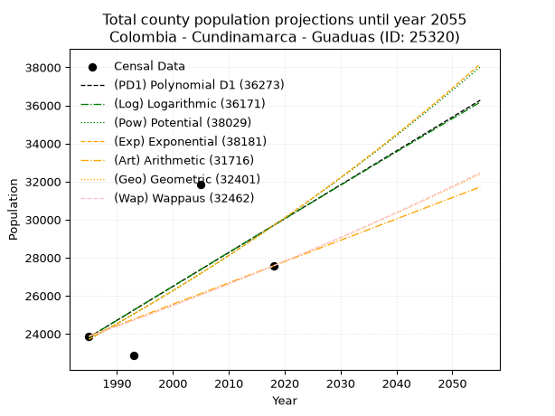
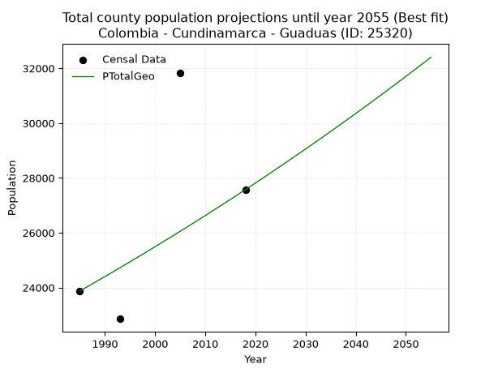
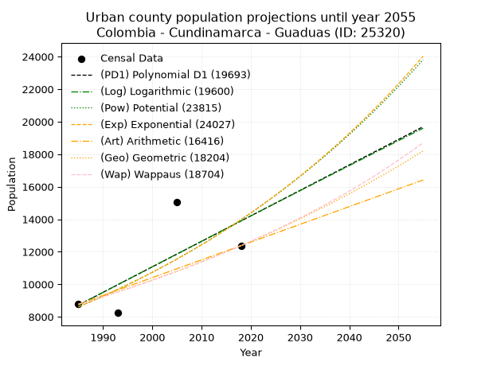
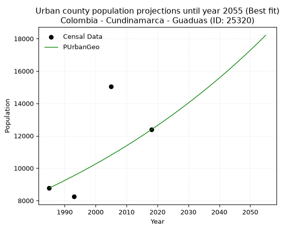
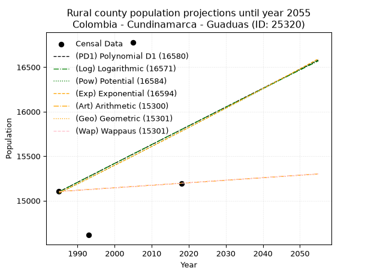
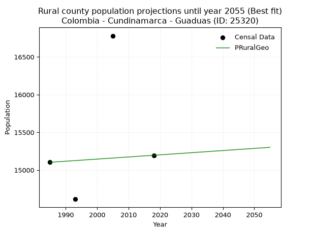

<div align="center">


</div>

# _“Population and Public Services Demand Projections (PPSD) until Year 2050 for Colombia - Cundinamarca - Guaduas (ID: 25320)”_
Keywords: `population` `public-service` `projection` `lineal` `polynomial` `logarithmic` `potential` `exponential` `arithmetic` `geometric` `wappaus` `dane` `colombia` `south-america`

PPSD are analytical estimates used by governments and planners to anticipate future changes in population size, age distribution, and the resulting community needs for utilities, healthcare, education, and infrastructure as sizing future water treatment facilities, electrical grids, and road networks based on spatial growth.

> **General running parameters**: • app_version: _v20260806_. • Python version: _3.14.7_. • Pandas version: _3.0.5_. • NumPy version: _2.5.1_. • Creates, save and include plots into reports (create_plot): _False_. • Projection until year: _2050_. • Process polynomial degree 2 and up: _False_. • Process Wappaus: _True_. • Process Wappaus: _True_. • Set negative values to zero: _True_. • Set infinite values to zero: _True_. • Drop dataset notes: _True_. 
<div align="center">

Dynamic map: [:earth_americas:Google](http://maps.google.com/maps?q=5.072076164,-74.6034024) [:earth_americas:OSM](https://www.openstreetmap.org/#map=18/5.072076164/-74.6034024&layers=P) [:earth_americas:Bing](https://www.bing.com/maps?cp=5.072076164~-74.6034024&lvl=18) [:earth_americas:Apple](https://maps.apple.com/frame?center=5.072076164%2C-74.6034024&span=0.003%2C0.006)

</div>


<div align="center">

```geojson
{
  "type": "Feature",
  "geometry": {
    "type": "Point", 
    "coordinates": [-74.6034024, 5.072076164]
  }, 
  "properties": {
    "Name": "Colombia - Cundinamarca - Guaduas (ID: 25320)"
  }
}
```

</div>


## 0. Census Data (4 records)

Census data are official statistics collected by a government about the people and housing in a country. They usually include counts of total population, age, sex, race, income, education, and jobs.

📅Global census file: [Population.xlsx](../data/Population.xlsx)

| Source   |   Year |   CountryID | CountryName   |   StateID | StateName    |   CountyID | CountyName   |   PTotal |   PUrban |   PRural |
|:---------|-------:|------------:|:--------------|----------:|:-------------|-----------:|:-------------|---------:|---------:|---------:|
| DANE     |   1985 |          57 | Colombia      |        25 | Cundinamarca |      25320 | Guaduas      |    23874 |     8771 |    15103 |
| DANE     |   1993 |          57 | Colombia      |        25 | Cundinamarca |      25320 | Guaduas      |    22858 |     8244 |    14614 |
| DANE     |   2005 |          57 | Colombia      |        25 | Cundinamarca |      25320 | Guaduas      |    31831 |    15051 |    16780 |
| DANE     |   2018 |          57 | Colombia      |        25 | Cundinamarca |      25320 | Guaduas      |    27571 |    12375 |    15196 |

> 🔥Some records could had specific notes about the registered values or the corresponding urban or rural distribution.

**Local public utility companies (RUPS)**

 | SERVICIO       | ESTADO    | NOMBRE                                                                                     | NIT         | DEPARTAMENTO_DOMICILIO   | MUNICIPIO_DOMICILIO   | DIRECCION                                  |   TELEFONO | EMAIL                          | TIPO_INSCRIPCION    | REPRESENTANTE_LEGAL           | TIPO_PRESTADOR                             | CLASIFICACION                 |
|:---------------|:----------|:-------------------------------------------------------------------------------------------|:------------|:-------------------------|:----------------------|:-------------------------------------------|-----------:|:-------------------------------|:--------------------|:------------------------------|:-------------------------------------------|:------------------------------|
| ACUEDUCTO      | OPERATIVA | OFICINA DE SERVICIOS PUBLICOS DE ACUEDUCTO, ALCANTARILLADO Y ASEO DEL MUNICIPIO DE GUADUAS | 899999701-4 | CUNDINAMARCA             | GUADUAS               | CALLE 4 No.1-88                            |    8466100 | mguaduas@cundinamarca.gov.co   | Registro por la ESP | JOSE RAUL PINILLA MARTINEZ    | MUNICIPIO (PRESTACIÓN DIRECTA)             | MAS DE 2500 SUSCRIPTORES      |
| ALCANTARILLADO | OPERATIVA | OFICINA DE SERVICIOS PUBLICOS DE ACUEDUCTO, ALCANTARILLADO Y ASEO DEL MUNICIPIO DE GUADUAS | 899999701-4 | CUNDINAMARCA             | GUADUAS               | CALLE 4 No.1-88                            |    8466100 | mguaduas@cundinamarca.gov.co   | Registro por la ESP | JOSE RAUL PINILLA MARTINEZ    | MUNICIPIO (PRESTACIÓN DIRECTA)             | MAS DE 2500 SUSCRIPTORES      |
| ASEO           | OPERATIVA | OFICINA DE SERVICIOS PUBLICOS DE ACUEDUCTO, ALCANTARILLADO Y ASEO DEL MUNICIPIO DE GUADUAS | 899999701-4 | CUNDINAMARCA             | GUADUAS               | CALLE 4 No.1-88                            |    8466100 | mguaduas@cundinamarca.gov.co   | Registro por la ESP | JOSE RAUL PINILLA MARTINEZ    | MUNICIPIO (PRESTACIÓN DIRECTA)             | MAS DE 2500 SUSCRIPTORES      |
| ASEO           | OPERATIVA | EMPRESA DE SERVICIOS PUBLICOS DE LA DORADA E.S.P.                                          | 810004450-8 | CALDAS                   | LA DORADA             | CENTRO COMERCIAL DORADA PLAZA LOCAL N202-1 |    8576097 | gerente.espladorada@gmail.com  | Registro por la ESP | ANGELA MARITZA GARCIA MAYORGA | EMPRESA INDUSTRIAL Y COMERCIAL DEL ESTADO  | MAYOR O IGUAL A 5001 USUARIOS |
| ACUEDUCTO      | OPERATIVA | EMPRESA DE SERVICOS PUBLICOS DE GUADUAS S.A. E.S.P. - AGUAS DEL CAPIRA S.A. E.S.P.         | 900407338-7 | CUNDINAMARCA             | GUADUAS               | CARRERA 3 N° 5-21                          |    8416717 | AGUASDELCAPIRA.ESP@HOTMAIL.COM | Registro por la ESP | JULIO ENRIQUE DIAZ CRUZ       | SOCIEDADES (EMPRESA DE SERVICIOS PUBLICOS) | MAYOR O IGUAL A 5001 USUARIOS |
| ALCANTARILLADO | OPERATIVA | EMPRESA DE SERVICOS PUBLICOS DE GUADUAS S.A. E.S.P. - AGUAS DEL CAPIRA S.A. E.S.P.         | 900407338-7 | CUNDINAMARCA             | GUADUAS               | CARRERA 3 N° 5-21                          |    8416717 | AGUASDELCAPIRA.ESP@HOTMAIL.COM | Registro por la ESP | JULIO ENRIQUE DIAZ CRUZ       | SOCIEDADES (EMPRESA DE SERVICIOS PUBLICOS) | MAYOR O IGUAL A 5001 USUARIOS |
| ASEO           | OPERATIVA | EMPRESA DE SERVICOS PUBLICOS DE GUADUAS S.A. E.S.P. - AGUAS DEL CAPIRA S.A. E.S.P.         | 900407338-7 | CUNDINAMARCA             | GUADUAS               | CARRERA 3 N° 5-21                          |    8416717 | AGUASDELCAPIRA.ESP@HOTMAIL.COM | Registro por la ESP | JULIO ENRIQUE DIAZ CRUZ       | SOCIEDADES (EMPRESA DE SERVICIOS PUBLICOS) | MAYOR O IGUAL A 5001 USUARIOS |
| ASEO           | OPERATIVA | AGUAS Y SERVICIOS AMBIENTALES DEL ALTO MAGDALENA S.A.S. E.S.P.                             | 900700883-5 | BOGOTA, D.C.             | BOGOTA, D.C.          | Calle 12C No. 8-79 Ofic. 703               |    3365015 | asemagcolombia@gmail.com       | Registro por la ESP | IVANHOE OCAMPO MARTINEZ       | SOCIEDADES (EMPRESA DE SERVICIOS PUBLICOS) | MAS DE 2500 SUSCRIPTORES      |

> [📅RUPS Database: Registro Único de Prestadores de Servicios Públicos de Colombia Suramérica - RUPS](https://www.datos.gov.co/Hacienda-y-Cr-dito-P-blico/Registro-nico-de-Prestadores-de-Servicios-P-blicos/4qkq-csdn/about_data)

## 1. Total

### 1.1. Coefficients and Parameters

* (PD1) Polynomial Deg 1: 177.89401846648164, -329299.01043757994 (lineal)
* (Log) Logarithmic: 356620.6480768222, -2684142.9038104475
* (Pow) Potential: 13.637322815197967, -40.59777027416953
* (Exp) Exponential: 0.006803985487885189, 0.03231923829294895
* (Art) Arithmetic: Year diff. 2018 - 1985 = 33, Population diff. 27571 - 23874 = 3697, Annual growth = 112.03030303030303
* (Geo) Geometric: Year diff. 2018 - 1985 = 33, Population diff. 27571 - 23874 = 3697, Annual growth % = 0.004372394630169474
* (Wap) Wappaus: i = 0.43553427166995057, Condition values only valid for < 200)

<sub>
Wappaus condition values: ['0.00', '0.44', '0.87', '1.31', '1.74', '2.18', '2.61', '3.05', '3.48', '3.92', '4.36', '4.79', '5.23', '5.66', '6.10', '6.53', '6.97', '7.40', '7.84', '8.28', '8.71', '9.15', '9.58', '10.02', '10.45', '10.89', '11.32', '11.76', '12.19', '12.63', '13.07', '13.50', '13.94', '14.37', '14.81', '15.24', '15.68', '16.11', '16.55', '16.99', '17.42', '17.86', '18.29', '18.73', '19.16', '19.60', '20.03', '20.47', '20.91', '21.34', '21.78', '22.21', '22.65', '23.08', '23.52', '23.95', '24.39', '24.83', '25.26', '25.70', '26.13', '26.57', '27.00', '27.44', '27.87', '28.31']
</sub>


### 1.2. Projected Dataset

|   Year |   CountyID |   PTotalPD1 |   PTotalLog |   PTotalPow |   PTotalExp |   PTotalArt |   PTotalGeo |   PTotalWap |
|-------:|-----------:|------------:|------------:|------------:|------------:|------------:|------------:|------------:|
|   1985 |      25320 |       23821 |       23811 |       23706 |       23714 |       23874 |       23874 |       23874 |
|   1986 |      25320 |       23999 |       23991 |       23869 |       23876 |       23986 |       23978 |       23978 |
|   1987 |      25320 |       24176 |       24170 |       24034 |       24039 |       24098 |       24083 |       24083 |
|   1988 |      25320 |       24354 |       24350 |       24199 |       24203 |       24210 |       24189 |       24188 |
|   1989 |      25320 |       24532 |       24529 |       24366 |       24368 |       24322 |       24294 |       24294 |
|   1990 |      25320 |       24710 |       24708 |       24533 |       24535 |       24434 |       24401 |       24400 |
|   1991 |      25320 |       24888 |       24887 |       24702 |       24702 |       24546 |       24507 |       24506 |
|   1992 |      25320 |       25066 |       25067 |       24872 |       24871 |       24658 |       24614 |       24613 |
|   1993 |      25320 |       25244 |       25245 |       25042 |       25041 |       24770 |       24722 |       24721 |
|   1994 |      25320 |       25422 |       25424 |       25214 |       25211 |       24882 |       24830 |       24829 |
|   1995 |      25320 |       25600 |       25603 |       25387 |       25384 |       24994 |       24939 |       24937 |
|   1996 |      25320 |       25777 |       25782 |       25561 |       25557 |       25106 |       25048 |       25046 |
|   1997 |      25320 |       25955 |       25961 |       25737 |       25731 |       25218 |       25157 |       25155 |
|   1998 |      25320 |       26133 |       26139 |       25913 |       25907 |       25330 |       25267 |       25265 |
|   1999 |      25320 |       26311 |       26318 |       26090 |       26084 |       25442 |       25378 |       25375 |
|   2000 |      25320 |       26489 |       26496 |       26269 |       26262 |       25554 |       25489 |       25486 |
|   2001 |      25320 |       26667 |       26674 |       26449 |       26441 |       25666 |       25600 |       25598 |
|   2002 |      25320 |       26845 |       26852 |       26629 |       26622 |       25779 |       25712 |       25710 |
|   2003 |      25320 |       27023 |       27030 |       26811 |       26804 |       25891 |       25824 |       25822 |
|   2004 |      25320 |       27201 |       27208 |       26994 |       26987 |       26003 |       25937 |       25935 |
|   2005 |      25320 |       27378 |       27386 |       27179 |       27171 |       26115 |       26051 |       26048 |
|   2006 |      25320 |       27556 |       27564 |       27364 |       27356 |       26227 |       26165 |       26162 |
|   2007 |      25320 |       27734 |       27742 |       27551 |       27543 |       26339 |       26279 |       26277 |
|   2008 |      25320 |       27912 |       27919 |       27739 |       27731 |       26451 |       26394 |       26392 |
|   2009 |      25320 |       28090 |       28097 |       27928 |       27920 |       26563 |       26509 |       26507 |
|   2010 |      25320 |       28268 |       28275 |       28118 |       28111 |       26675 |       26625 |       26623 |
|   2011 |      25320 |       28446 |       28452 |       28309 |       28303 |       26787 |       26742 |       26740 |
|   2012 |      25320 |       28624 |       28629 |       28502 |       28496 |       26899 |       26859 |       26857 |
|   2013 |      25320 |       28802 |       28806 |       28696 |       28691 |       27011 |       26976 |       26974 |
|   2014 |      25320 |       28980 |       28984 |       28891 |       28887 |       27123 |       27094 |       27093 |
|   2015 |      25320 |       29157 |       29161 |       29087 |       29084 |       27235 |       27212 |       27211 |
|   2016 |      25320 |       29335 |       29337 |       29284 |       29282 |       27347 |       27331 |       27331 |
|   2017 |      25320 |       29513 |       29514 |       29483 |       29482 |       27459 |       27451 |       27451 |
|   2018 |      25320 |       29691 |       29691 |       29683 |       29684 |       27571 |       27571 |       27571 |
|   2019 |      25320 |       29869 |       29868 |       29884 |       29886 |       27683 |       27692 |       27692 |
|   2020 |      25320 |       30047 |       30044 |       30087 |       30090 |       27795 |       27813 |       27814 |
|   2021 |      25320 |       30225 |       30221 |       30290 |       30296 |       27907 |       27934 |       27936 |
|   2022 |      25320 |       30403 |       30397 |       30495 |       30503 |       28019 |       28056 |       28058 |
|   2023 |      25320 |       30581 |       30574 |       30702 |       30711 |       28131 |       28179 |       28182 |
|   2024 |      25320 |       30758 |       30750 |       30909 |       30920 |       28243 |       28302 |       28306 |
|   2025 |      25320 |       30936 |       30926 |       31118 |       31132 |       28355 |       28426 |       28430 |
|   2026 |      25320 |       31114 |       31102 |       31328 |       31344 |       28467 |       28550 |       28555 |
|   2027 |      25320 |       31292 |       31278 |       31540 |       31558 |       28579 |       28675 |       28681 |
|   2028 |      25320 |       31470 |       31454 |       31753 |       31774 |       28691 |       28801 |       28807 |
|   2029 |      25320 |       31648 |       31630 |       31967 |       31990 |       28803 |       28926 |       28934 |
|   2030 |      25320 |       31826 |       31805 |       32183 |       32209 |       28915 |       29053 |       29061 |
|   2031 |      25320 |       32004 |       31981 |       32399 |       32429 |       29027 |       29180 |       29190 |
|   2032 |      25320 |       32182 |       32157 |       32618 |       32650 |       29139 |       29308 |       29318 |
|   2033 |      25320 |       32360 |       32332 |       32837 |       32873 |       29251 |       29436 |       29448 |
|   2034 |      25320 |       32537 |       32507 |       33058 |       33098 |       29363 |       29564 |       29578 |
|   2035 |      25320 |       32715 |       32683 |       33281 |       33323 |       29476 |       29694 |       29708 |
|   2036 |      25320 |       32893 |       32858 |       33504 |       33551 |       29588 |       29823 |       29839 |
|   2037 |      25320 |       33071 |       33033 |       33729 |       33780 |       29700 |       29954 |       29971 |
|   2038 |      25320 |       33249 |       33208 |       33956 |       34011 |       29812 |       30085 |       30104 |
|   2039 |      25320 |       33427 |       33383 |       34184 |       34243 |       29924 |       30216 |       30237 |
|   2040 |      25320 |       33605 |       33558 |       34413 |       34477 |       30036 |       30349 |       30371 |
|   2041 |      25320 |       33783 |       33733 |       34644 |       34712 |       30148 |       30481 |       30506 |
|   2042 |      25320 |       33961 |       33907 |       34876 |       34949 |       30260 |       30614 |       30641 |
|   2043 |      25320 |       34138 |       34082 |       35110 |       35188 |       30372 |       30748 |       30777 |
|   2044 |      25320 |       34316 |       34256 |       35345 |       35428 |       30484 |       30883 |       30913 |
|   2045 |      25320 |       34494 |       34431 |       35581 |       35670 |       30596 |       31018 |       31050 |
|   2046 |      25320 |       34672 |       34605 |       35819 |       35913 |       30708 |       31153 |       31188 |
|   2047 |      25320 |       34850 |       34779 |       36059 |       36158 |       30820 |       31290 |       31327 |
|   2048 |      25320 |       35028 |       34954 |       36300 |       36405 |       30932 |       31426 |       31466 |
|   2049 |      25320 |       35206 |       35128 |       36542 |       36654 |       31044 |       31564 |       31606 |
|   2050 |      25320 |       35384 |       35302 |       36786 |       36904 |       31156 |       31702 |       31747 |
<div align="center">

</img>

</div>


### 1.3. Best fit with absolute and relative error (%)

Relative error puts that difference into context by dividing the absolute error by the true value, creating a unitless ratio or percentage that shows the scale of the mistake.

Absolute and relative error

|   Year | Source   |   CountryID | CountryName   |   StateID | StateName    |   CountyID_x | CountyName   |   PTotal |   PUrban |   PRural |   CountyID_y |   PTotalPD1 |   PTotalLog |   PTotalPow |   PTotalExp |   PTotalArt |   PTotalGeo |   PTotalWap |   PTotalPD1AbsError |   PTotalLogAbsError |   PTotalPowAbsError |   PTotalExpAbsError |   PTotalArtAbsError |   PTotalGeoAbsError |   PTotalWapAbsError |   PTotalPD1RelError |   PTotalLogRelError |   PTotalPowRelError |   PTotalExpRelError |   PTotalArtRelError |   PTotalGeoRelError |   PTotalWapRelError |
|-------:|:---------|------------:|:--------------|----------:|:-------------|-------------:|:-------------|---------:|---------:|---------:|-------------:|------------:|------------:|------------:|------------:|------------:|------------:|------------:|--------------------:|--------------------:|--------------------:|--------------------:|--------------------:|--------------------:|--------------------:|--------------------:|--------------------:|--------------------:|--------------------:|--------------------:|--------------------:|--------------------:|
|   1985 | DANE     |          57 | Colombia      |        25 | Cundinamarca |        25320 | Guaduas      |    23874 |     8771 |    15103 |        25320 |       23821 |       23811 |       23706 |       23714 |       23874 |       23874 |       23874 |                  53 |                  63 |                 168 |                 160 |                   0 |                   0 |                   0 |            0.221999 |            0.263885 |            0.703694 |            0.670185 |             0       |             0       |             0       |
|   1993 | DANE     |          57 | Colombia      |        25 | Cundinamarca |        25320 | Guaduas      |    22858 |     8244 |    14614 |        25320 |       25244 |       25245 |       25042 |       25041 |       24770 |       24722 |       24721 |                2386 |                2387 |                2184 |                2183 |                1912 |                1864 |                1863 |           10.4384   |           10.4427   |            9.55464  |            9.55027  |             8.36469 |             8.15469 |             8.15032 |
|   2005 | DANE     |          57 | Colombia      |        25 | Cundinamarca |        25320 | Guaduas      |    31831 |    15051 |    16780 |        25320 |       27378 |       27386 |       27179 |       27171 |       26115 |       26051 |       26048 |                4453 |                4445 |                4652 |                4660 |                5716 |                5780 |                5783 |           13.9895   |           13.9644   |           14.6147   |           14.6398   |            17.9573  |            18.1584  |            18.1678  |
|   2018 | DANE     |          57 | Colombia      |        25 | Cundinamarca |        25320 | Guaduas      |    27571 |    12375 |    15196 |        25320 |       29691 |       29691 |       29683 |       29684 |       27571 |       27571 |       27571 |                2120 |                2120 |                2112 |                2113 |                   0 |                   0 |                   0 |            7.68924  |            7.68924  |            7.66022  |            7.66385  |             0       |             0       |             0       |

Relative error mean

| Method    |   RelError | Best   |
|:----------|-----------:|:-------|
| PTotalPD1 |    8.08478 |        |
| PTotalLog |    8.09006 |        |
| PTotalPow |    8.13331 |        |
| PTotalExp |    8.13103 |        |
| PTotalArt |    6.58051 |        |
| PTotalGeo |    6.57827 | True   |
| PTotalWap |    6.57954 |        |

💙Best method: _**PTotalGeo**_
<div align="center">

</img>

</div>


### 1.4. Fresh water supply demand in liters per capita per day (lpcd)

The fresh water supply demand typically ranges from 100 to 300 liters per capita per day (lpcd) for standard domestic and municipal planning, though absolute survival minimums set by the World Health Organization are as low as 7.5 to 20 liters per day, and total consumption in high-income nations can exceed 400 liters.

> `CZ`: Level in meters above the sea level (masl)<br> `WS`: Fresh water supply demand in liters per capita per day (lpcd or l/h/d)<br> `WSAll`: Zonal fresh water supply demand in liters per second (l/s)<br> `A`: Zonal area in square meters<br> `DP`: Population density (people/hectare or p/ha)

Reference values (RAS Colombia)

|    CZ |   WS |
|------:|-----:|
|  1000 |  120 |
|  2000 |  130 |
| 99999 |  140 |

County shapefile geometry properties and water supply values

|   CountyID |     ATotal |   CZTotal |   WSTotal |
|-----------:|-----------:|----------:|----------:|
|      25320 | 7.6282e+08 |   723.662 |       120 |

Projected values for best method: PTotalGeo

|   CountyID |   Year |   PTotalGeo |   DPTotal |   WSTotal |   WSTotalAll |
|-----------:|-------:|------------:|----------:|----------:|-------------:|
|      25320 |   1985 |       23874 |      0.31 |       120 |      33.1583 |
|      25320 |   1986 |       23978 |      0.31 |       120 |      33.3028 |
|      25320 |   1987 |       24083 |      0.32 |       120 |      33.4486 |
|      25320 |   1988 |       24189 |      0.32 |       120 |      33.5958 |
|      25320 |   1989 |       24294 |      0.32 |       120 |      33.7417 |
|      25320 |   1990 |       24401 |      0.32 |       120 |      33.8903 |
|      25320 |   1991 |       24507 |      0.32 |       120 |      34.0375 |
|      25320 |   1992 |       24614 |      0.32 |       120 |      34.1861 |
|      25320 |   1993 |       24722 |      0.32 |       120 |      34.3361 |
|      25320 |   1994 |       24830 |      0.33 |       120 |      34.4861 |
|      25320 |   1995 |       24939 |      0.33 |       120 |      34.6375 |
|      25320 |   1996 |       25048 |      0.33 |       120 |      34.7889 |
|      25320 |   1997 |       25157 |      0.33 |       120 |      34.9403 |
|      25320 |   1998 |       25267 |      0.33 |       120 |      35.0931 |
|      25320 |   1999 |       25378 |      0.33 |       120 |      35.2472 |
|      25320 |   2000 |       25489 |      0.33 |       120 |      35.4014 |
|      25320 |   2001 |       25600 |      0.34 |       120 |      35.5556 |
|      25320 |   2002 |       25712 |      0.34 |       120 |      35.7111 |
|      25320 |   2003 |       25824 |      0.34 |       120 |      35.8667 |
|      25320 |   2004 |       25937 |      0.34 |       120 |      36.0236 |
|      25320 |   2005 |       26051 |      0.34 |       120 |      36.1819 |
|      25320 |   2006 |       26165 |      0.34 |       120 |      36.3403 |
|      25320 |   2007 |       26279 |      0.34 |       120 |      36.4986 |
|      25320 |   2008 |       26394 |      0.35 |       120 |      36.6583 |
|      25320 |   2009 |       26509 |      0.35 |       120 |      36.8181 |
|      25320 |   2010 |       26625 |      0.35 |       120 |      36.9792 |
|      25320 |   2011 |       26742 |      0.35 |       120 |      37.1417 |
|      25320 |   2012 |       26859 |      0.35 |       120 |      37.3042 |
|      25320 |   2013 |       26976 |      0.35 |       120 |      37.4667 |
|      25320 |   2014 |       27094 |      0.36 |       120 |      37.6306 |
|      25320 |   2015 |       27212 |      0.36 |       120 |      37.7944 |
|      25320 |   2016 |       27331 |      0.36 |       120 |      37.9597 |
|      25320 |   2017 |       27451 |      0.36 |       120 |      38.1264 |
|      25320 |   2018 |       27571 |      0.36 |       120 |      38.2931 |
|      25320 |   2019 |       27692 |      0.36 |       120 |      38.4611 |
|      25320 |   2020 |       27813 |      0.36 |       120 |      38.6292 |
|      25320 |   2021 |       27934 |      0.37 |       120 |      38.7972 |
|      25320 |   2022 |       28056 |      0.37 |       120 |      38.9667 |
|      25320 |   2023 |       28179 |      0.37 |       120 |      39.1375 |
|      25320 |   2024 |       28302 |      0.37 |       120 |      39.3083 |
|      25320 |   2025 |       28426 |      0.37 |       120 |      39.4806 |
|      25320 |   2026 |       28550 |      0.37 |       120 |      39.6528 |
|      25320 |   2027 |       28675 |      0.38 |       120 |      39.8264 |
|      25320 |   2028 |       28801 |      0.38 |       120 |      40.0014 |
|      25320 |   2029 |       28926 |      0.38 |       120 |      40.175  |
|      25320 |   2030 |       29053 |      0.38 |       120 |      40.3514 |
|      25320 |   2031 |       29180 |      0.38 |       120 |      40.5278 |
|      25320 |   2032 |       29308 |      0.38 |       120 |      40.7056 |
|      25320 |   2033 |       29436 |      0.39 |       120 |      40.8833 |
|      25320 |   2034 |       29564 |      0.39 |       120 |      41.0611 |
|      25320 |   2035 |       29694 |      0.39 |       120 |      41.2417 |
|      25320 |   2036 |       29823 |      0.39 |       120 |      41.4208 |
|      25320 |   2037 |       29954 |      0.39 |       120 |      41.6028 |
|      25320 |   2038 |       30085 |      0.39 |       120 |      41.7847 |
|      25320 |   2039 |       30216 |      0.4  |       120 |      41.9667 |
|      25320 |   2040 |       30349 |      0.4  |       120 |      42.1514 |
|      25320 |   2041 |       30481 |      0.4  |       120 |      42.3347 |
|      25320 |   2042 |       30614 |      0.4  |       120 |      42.5194 |
|      25320 |   2043 |       30748 |      0.4  |       120 |      42.7056 |
|      25320 |   2044 |       30883 |      0.4  |       120 |      42.8931 |
|      25320 |   2045 |       31018 |      0.41 |       120 |      43.0806 |
|      25320 |   2046 |       31153 |      0.41 |       120 |      43.2681 |
|      25320 |   2047 |       31290 |      0.41 |       120 |      43.4583 |
|      25320 |   2048 |       31426 |      0.41 |       120 |      43.6472 |
|      25320 |   2049 |       31564 |      0.41 |       120 |      43.8389 |
|      25320 |   2050 |       31702 |      0.42 |       120 |      44.0306 |

## 2. Urban

### 2.1. Coefficients and Parameters

* (PD1) Polynomial Deg 1: 156.7591328783633, -302447.2055399462 (lineal)
* (Log) Logarithmic: 314160.2769920871, -2376824.5329393162
* (Pow) Potential: 29.35610330615194, -92.87439888286647
* (Exp) Exponential: 0.014651553431786386, 2.0163040789619844e-09
* (Art) Arithmetic: Year diff. 2018 - 1985 = 33, Population diff. 12375 - 8771 = 3604, Annual growth = 109.21212121212122
* (Geo) Geometric: Year diff. 2018 - 1985 = 33, Population diff. 12375 - 8771 = 3604, Annual growth % = 0.010485729821438028
* (Wap) Wappaus: i = 1.0329340888311853, Condition values only valid for < 200)

<sub>
Wappaus condition values: ['0.00', '1.03', '2.07', '3.10', '4.13', '5.16', '6.20', '7.23', '8.26', '9.30', '10.33', '11.36', '12.40', '13.43', '14.46', '15.49', '16.53', '17.56', '18.59', '19.63', '20.66', '21.69', '22.72', '23.76', '24.79', '25.82', '26.86', '27.89', '28.92', '29.96', '30.99', '32.02', '33.05', '34.09', '35.12', '36.15', '37.19', '38.22', '39.25', '40.28', '41.32', '42.35', '43.38', '44.42', '45.45', '46.48', '47.51', '48.55', '49.58', '50.61', '51.65', '52.68', '53.71', '54.75', '55.78', '56.81', '57.84', '58.88', '59.91', '60.94', '61.98', '63.01', '64.04', '65.07', '66.11', '67.14']
</sub>


### 2.2. Projected Dataset

|   Year |   CountyID |   PUrbanPD1 |   PUrbanLog |   PUrbanPow |   PUrbanExp |   PUrbanArt |   PUrbanGeo |   PUrbanWap |
|-------:|-----------:|------------:|------------:|------------:|------------:|------------:|------------:|------------:|
|   1985 |      25320 |        8720 |        8712 |        8610 |        8616 |        8771 |        8771 |        8771 |
|   1986 |      25320 |        8876 |        8870 |        8738 |        8743 |        8880 |        8863 |        8862 |
|   1987 |      25320 |        9033 |        9028 |        8868 |        8872 |        8989 |        8956 |        8954 |
|   1988 |      25320 |        9190 |        9186 |        9000 |        9003 |        9099 |        9050 |        9047 |
|   1989 |      25320 |        9347 |        9344 |        9134 |        9136 |        9208 |        9145 |        9141 |
|   1990 |      25320 |        9503 |        9502 |        9270 |        9270 |        9317 |        9241 |        9236 |
|   1991 |      25320 |        9660 |        9660 |        9408 |        9407 |        9426 |        9337 |        9332 |
|   1992 |      25320 |        9817 |        9818 |        9547 |        9546 |        9535 |        9435 |        9429 |
|   1993 |      25320 |        9974 |        9976 |        9689 |        9687 |        9645 |        9534 |        9527 |
|   1994 |      25320 |       10131 |       10133 |        9833 |        9830 |        9754 |        9634 |        9626 |
|   1995 |      25320 |       10287 |       10291 |        9979 |        9975 |        9863 |        9735 |        9726 |
|   1996 |      25320 |       10444 |       10448 |       10126 |       10122 |        9972 |        9837 |        9828 |
|   1997 |      25320 |       10601 |       10605 |       10276 |       10272 |       10082 |        9941 |        9930 |
|   1998 |      25320 |       10758 |       10763 |       10429 |       10423 |       10191 |       10045 |       10034 |
|   1999 |      25320 |       10914 |       10920 |       10583 |       10577 |       10300 |       10150 |       10138 |
|   2000 |      25320 |       11071 |       11077 |       10739 |       10733 |       10409 |       10257 |       10244 |
|   2001 |      25320 |       11228 |       11234 |       10898 |       10892 |       10518 |       10364 |       10351 |
|   2002 |      25320 |       11385 |       11391 |       11059 |       11052 |       10628 |       10473 |       10459 |
|   2003 |      25320 |       11541 |       11548 |       11222 |       11216 |       10737 |       10583 |       10569 |
|   2004 |      25320 |       11698 |       11705 |       11388 |       11381 |       10846 |       10694 |       10680 |
|   2005 |      25320 |       11855 |       11862 |       11556 |       11549 |       10955 |       10806 |       10792 |
|   2006 |      25320 |       12012 |       12018 |       11727 |       11720 |       11064 |       10919 |       10905 |
|   2007 |      25320 |       12168 |       12175 |       11899 |       11893 |       11174 |       11033 |       11020 |
|   2008 |      25320 |       12325 |       12331 |       12075 |       12068 |       11283 |       11149 |       11136 |
|   2009 |      25320 |       12482 |       12488 |       12252 |       12246 |       11392 |       11266 |       11253 |
|   2010 |      25320 |       12639 |       12644 |       12433 |       12427 |       11501 |       11384 |       11372 |
|   2011 |      25320 |       12795 |       12800 |       12616 |       12610 |       11611 |       11504 |       11492 |
|   2012 |      25320 |       12952 |       12956 |       12801 |       12796 |       11720 |       11624 |       11614 |
|   2013 |      25320 |       13109 |       13113 |       12989 |       12985 |       11829 |       11746 |       11737 |
|   2014 |      25320 |       13266 |       13269 |       13180 |       13177 |       11938 |       11869 |       11861 |
|   2015 |      25320 |       13422 |       13424 |       13373 |       13371 |       12047 |       11994 |       11987 |
|   2016 |      25320 |       13579 |       13580 |       13570 |       13569 |       12157 |       12120 |       12115 |
|   2017 |      25320 |       13736 |       13736 |       13769 |       13769 |       12266 |       12247 |       12244 |
|   2018 |      25320 |       13893 |       13892 |       13970 |       13972 |       12375 |       12375 |       12375 |
|   2019 |      25320 |       14049 |       14048 |       14175 |       14179 |       12484 |       12505 |       12507 |
|   2020 |      25320 |       14206 |       14203 |       14383 |       14388 |       12593 |       12636 |       12642 |
|   2021 |      25320 |       14363 |       14359 |       14593 |       14600 |       12703 |       12768 |       12777 |
|   2022 |      25320 |       14520 |       14514 |       14807 |       14816 |       12812 |       12902 |       12915 |
|   2023 |      25320 |       14677 |       14669 |       15023 |       15034 |       12921 |       13038 |       13054 |
|   2024 |      25320 |       14833 |       14825 |       15243 |       15256 |       13030 |       13174 |       13196 |
|   2025 |      25320 |       14990 |       14980 |       15465 |       15481 |       13139 |       13312 |       13339 |
|   2026 |      25320 |       15147 |       15135 |       15691 |       15710 |       13249 |       13452 |       13483 |
|   2027 |      25320 |       15304 |       15290 |       15920 |       15942 |       13358 |       13593 |       13630 |
|   2028 |      25320 |       15460 |       15445 |       16152 |       16177 |       13467 |       13736 |       13779 |
|   2029 |      25320 |       15617 |       15600 |       16388 |       16416 |       13576 |       13880 |       13930 |
|   2030 |      25320 |       15774 |       15754 |       16626 |       16658 |       13686 |       14025 |       14082 |
|   2031 |      25320 |       15931 |       15909 |       16868 |       16904 |       13795 |       14172 |       14237 |
|   2032 |      25320 |       16087 |       16064 |       17114 |       17153 |       13904 |       14321 |       14394 |
|   2033 |      25320 |       16244 |       16218 |       17363 |       17407 |       14013 |       14471 |       14553 |
|   2034 |      25320 |       16401 |       16373 |       17615 |       17664 |       14122 |       14623 |       14714 |
|   2035 |      25320 |       16558 |       16527 |       17871 |       17924 |       14232 |       14776 |       14878 |
|   2036 |      25320 |       16714 |       16682 |       18131 |       18189 |       14341 |       14931 |       15044 |
|   2037 |      25320 |       16871 |       16836 |       18394 |       18457 |       14450 |       15088 |       15212 |
|   2038 |      25320 |       17028 |       16990 |       18661 |       18730 |       14559 |       15246 |       15382 |
|   2039 |      25320 |       17185 |       17144 |       18932 |       19006 |       14668 |       15406 |       15555 |
|   2040 |      25320 |       17341 |       17298 |       19206 |       19287 |       14778 |       15567 |       15731 |
|   2041 |      25320 |       17498 |       17452 |       19485 |       19571 |       14887 |       15730 |       15909 |
|   2042 |      25320 |       17655 |       17606 |       19767 |       19860 |       14996 |       15895 |       16090 |
|   2043 |      25320 |       17812 |       17760 |       20053 |       20153 |       15105 |       16062 |       16273 |
|   2044 |      25320 |       17968 |       17914 |       20343 |       20451 |       15215 |       16230 |       16459 |
|   2045 |      25320 |       18125 |       18067 |       20637 |       20753 |       15324 |       16401 |       16648 |
|   2046 |      25320 |       18282 |       18221 |       20936 |       21059 |       15433 |       16573 |       16839 |
|   2047 |      25320 |       18439 |       18374 |       21238 |       21370 |       15542 |       16746 |       17034 |
|   2048 |      25320 |       18595 |       18528 |       21545 |       21685 |       15651 |       16922 |       17232 |
|   2049 |      25320 |       18752 |       18681 |       21856 |       22005 |       15761 |       17099 |       17432 |
|   2050 |      25320 |       18909 |       18835 |       22171 |       22330 |       15870 |       17279 |       17636 |
<div align="center">

</img>

</div>


### 2.3. Best fit with absolute and relative error (%)

Relative error puts that difference into context by dividing the absolute error by the true value, creating a unitless ratio or percentage that shows the scale of the mistake.

Absolute and relative error

|   Year | Source   |   CountryID | CountryName   |   StateID | StateName    |   CountyID_x | CountyName   |   PTotal |   PUrban |   PRural |   CountyID_y |   PUrbanPD1 |   PUrbanLog |   PUrbanPow |   PUrbanExp |   PUrbanArt |   PUrbanGeo |   PUrbanWap |   PUrbanPD1AbsError |   PUrbanLogAbsError |   PUrbanPowAbsError |   PUrbanExpAbsError |   PUrbanArtAbsError |   PUrbanGeoAbsError |   PUrbanWapAbsError |   PUrbanPD1RelError |   PUrbanLogRelError |   PUrbanPowRelError |   PUrbanExpRelError |   PUrbanArtRelError |   PUrbanGeoRelError |   PUrbanWapRelError |
|-------:|:---------|------------:|:--------------|----------:|:-------------|-------------:|:-------------|---------:|---------:|---------:|-------------:|------------:|------------:|------------:|------------:|------------:|------------:|------------:|--------------------:|--------------------:|--------------------:|--------------------:|--------------------:|--------------------:|--------------------:|--------------------:|--------------------:|--------------------:|--------------------:|--------------------:|--------------------:|--------------------:|
|   1985 | DANE     |          57 | Colombia      |        25 | Cundinamarca |        25320 | Guaduas      |    23874 |     8771 |    15103 |        25320 |        8720 |        8712 |        8610 |        8616 |        8771 |        8771 |        8771 |                  51 |                  59 |                 161 |                 155 |                   0 |                   0 |                   0 |            0.581462 |            0.672671 |             1.83559 |             1.76719 |              0      |              0      |              0      |
|   1993 | DANE     |          57 | Colombia      |        25 | Cundinamarca |        25320 | Guaduas      |    22858 |     8244 |    14614 |        25320 |        9974 |        9976 |        9689 |        9687 |        9645 |        9534 |        9527 |                1730 |                1732 |                1445 |                1443 |                1401 |                1290 |                1283 |           20.985    |           21.0092   |            17.5279  |            17.5036  |             16.9942 |             15.6477 |             15.5628 |
|   2005 | DANE     |          57 | Colombia      |        25 | Cundinamarca |        25320 | Guaduas      |    31831 |    15051 |    16780 |        25320 |       11855 |       11862 |       11556 |       11549 |       10955 |       10806 |       10792 |                3196 |                3189 |                3495 |                3502 |                4096 |                4245 |                4259 |           21.2345   |           21.188    |            23.221   |            23.2676  |             27.2141 |             28.2041 |             28.2971 |
|   2018 | DANE     |          57 | Colombia      |        25 | Cundinamarca |        25320 | Guaduas      |    27571 |    12375 |    15196 |        25320 |       13893 |       13892 |       13970 |       13972 |       12375 |       12375 |       12375 |                1518 |                1517 |                1595 |                1597 |                   0 |                   0 |                   0 |           12.2667   |           12.2586   |            12.8889  |            12.9051  |              0      |              0      |              0      |

Relative error mean

| Method    |   RelError | Best   |
|:----------|-----------:|:-------|
| PUrbanPD1 |    13.7669 |        |
| PUrbanLog |    13.7821 |        |
| PUrbanPow |    13.8684 |        |
| PUrbanExp |    13.8609 |        |
| PUrbanArt |    11.0521 |        |
| PUrbanGeo |    10.963  | True   |
| PUrbanWap |    10.965  |        |

💙Best method: _**PUrbanGeo**_
<div align="center">

</img>

</div>


### 2.4. Fresh water supply demand in liters per capita per day (lpcd)

The fresh water supply demand typically ranges from 100 to 300 liters per capita per day (lpcd) for standard domestic and municipal planning, though absolute survival minimums set by the World Health Organization are as low as 7.5 to 20 liters per day, and total consumption in high-income nations can exceed 400 liters.

> `CZ`: Level in meters above the sea level (masl)<br> `WS`: Fresh water supply demand in liters per capita per day (lpcd or l/h/d)<br> `WSAll`: Zonal fresh water supply demand in liters per second (l/s)<br> `A`: Zonal area in square meters<br> `DP`: Population density (people/hectare or p/ha)

Reference values (RAS Colombia)

|    CZ |   WS |
|------:|-----:|
|  1000 |  120 |
|  2000 |  130 |
| 99999 |  140 |

County shapefile geometry properties and water supply values

|   CountyID |      AUrban |   CZUrban |   WSUrban |
|-----------:|------------:|----------:|----------:|
|      25320 | 8.52076e+06 |   995.817 |       120 |

Projected values for best method: PUrbanGeo

|   CountyID |   Year |   PUrbanGeo |   DPUrban |   WSUrban |   WSUrbanAll |
|-----------:|-------:|------------:|----------:|----------:|-------------:|
|      25320 |   1985 |        8771 |     10.29 |       120 |      12.1819 |
|      25320 |   1986 |        8863 |     10.4  |       120 |      12.3097 |
|      25320 |   1987 |        8956 |     10.51 |       120 |      12.4389 |
|      25320 |   1988 |        9050 |     10.62 |       120 |      12.5694 |
|      25320 |   1989 |        9145 |     10.73 |       120 |      12.7014 |
|      25320 |   1990 |        9241 |     10.85 |       120 |      12.8347 |
|      25320 |   1991 |        9337 |     10.96 |       120 |      12.9681 |
|      25320 |   1992 |        9435 |     11.07 |       120 |      13.1042 |
|      25320 |   1993 |        9534 |     11.19 |       120 |      13.2417 |
|      25320 |   1994 |        9634 |     11.31 |       120 |      13.3806 |
|      25320 |   1995 |        9735 |     11.43 |       120 |      13.5208 |
|      25320 |   1996 |        9837 |     11.54 |       120 |      13.6625 |
|      25320 |   1997 |        9941 |     11.67 |       120 |      13.8069 |
|      25320 |   1998 |       10045 |     11.79 |       120 |      13.9514 |
|      25320 |   1999 |       10150 |     11.91 |       120 |      14.0972 |
|      25320 |   2000 |       10257 |     12.04 |       120 |      14.2458 |
|      25320 |   2001 |       10364 |     12.16 |       120 |      14.3944 |
|      25320 |   2002 |       10473 |     12.29 |       120 |      14.5458 |
|      25320 |   2003 |       10583 |     12.42 |       120 |      14.6986 |
|      25320 |   2004 |       10694 |     12.55 |       120 |      14.8528 |
|      25320 |   2005 |       10806 |     12.68 |       120 |      15.0083 |
|      25320 |   2006 |       10919 |     12.81 |       120 |      15.1653 |
|      25320 |   2007 |       11033 |     12.95 |       120 |      15.3236 |
|      25320 |   2008 |       11149 |     13.08 |       120 |      15.4847 |
|      25320 |   2009 |       11266 |     13.22 |       120 |      15.6472 |
|      25320 |   2010 |       11384 |     13.36 |       120 |      15.8111 |
|      25320 |   2011 |       11504 |     13.5  |       120 |      15.9778 |
|      25320 |   2012 |       11624 |     13.64 |       120 |      16.1444 |
|      25320 |   2013 |       11746 |     13.79 |       120 |      16.3139 |
|      25320 |   2014 |       11869 |     13.93 |       120 |      16.4847 |
|      25320 |   2015 |       11994 |     14.08 |       120 |      16.6583 |
|      25320 |   2016 |       12120 |     14.22 |       120 |      16.8333 |
|      25320 |   2017 |       12247 |     14.37 |       120 |      17.0097 |
|      25320 |   2018 |       12375 |     14.52 |       120 |      17.1875 |
|      25320 |   2019 |       12505 |     14.68 |       120 |      17.3681 |
|      25320 |   2020 |       12636 |     14.83 |       120 |      17.55   |
|      25320 |   2021 |       12768 |     14.98 |       120 |      17.7333 |
|      25320 |   2022 |       12902 |     15.14 |       120 |      17.9194 |
|      25320 |   2023 |       13038 |     15.3  |       120 |      18.1083 |
|      25320 |   2024 |       13174 |     15.46 |       120 |      18.2972 |
|      25320 |   2025 |       13312 |     15.62 |       120 |      18.4889 |
|      25320 |   2026 |       13452 |     15.79 |       120 |      18.6833 |
|      25320 |   2027 |       13593 |     15.95 |       120 |      18.8792 |
|      25320 |   2028 |       13736 |     16.12 |       120 |      19.0778 |
|      25320 |   2029 |       13880 |     16.29 |       120 |      19.2778 |
|      25320 |   2030 |       14025 |     16.46 |       120 |      19.4792 |
|      25320 |   2031 |       14172 |     16.63 |       120 |      19.6833 |
|      25320 |   2032 |       14321 |     16.81 |       120 |      19.8903 |
|      25320 |   2033 |       14471 |     16.98 |       120 |      20.0986 |
|      25320 |   2034 |       14623 |     17.16 |       120 |      20.3097 |
|      25320 |   2035 |       14776 |     17.34 |       120 |      20.5222 |
|      25320 |   2036 |       14931 |     17.52 |       120 |      20.7375 |
|      25320 |   2037 |       15088 |     17.71 |       120 |      20.9556 |
|      25320 |   2038 |       15246 |     17.89 |       120 |      21.175  |
|      25320 |   2039 |       15406 |     18.08 |       120 |      21.3972 |
|      25320 |   2040 |       15567 |     18.27 |       120 |      21.6208 |
|      25320 |   2041 |       15730 |     18.46 |       120 |      21.8472 |
|      25320 |   2042 |       15895 |     18.65 |       120 |      22.0764 |
|      25320 |   2043 |       16062 |     18.85 |       120 |      22.3083 |
|      25320 |   2044 |       16230 |     19.05 |       120 |      22.5417 |
|      25320 |   2045 |       16401 |     19.25 |       120 |      22.7792 |
|      25320 |   2046 |       16573 |     19.45 |       120 |      23.0181 |
|      25320 |   2047 |       16746 |     19.65 |       120 |      23.2583 |
|      25320 |   2048 |       16922 |     19.86 |       120 |      23.5028 |
|      25320 |   2049 |       17099 |     20.07 |       120 |      23.7486 |
|      25320 |   2050 |       17279 |     20.28 |       120 |      23.9986 |

## 3. Rural

### 3.1. Coefficients and Parameters

* (PD1) Polynomial Deg 1: 21.134885588118017, -26851.80489763307 (lineal)
* (Log) Logarithmic: 42460.371084734696, -307318.37087112817
* (Pow) Potential: 2.7344013492987447, -4.8388778315843295
* (Exp) Exponential: 0.0013612759636716083, 1011.6989850282413
* (Art) Arithmetic: Year diff. 2018 - 1985 = 33, Population diff. 15196 - 15103 = 93, Annual growth = 2.8181818181818183
* (Geo) Geometric: Year diff. 2018 - 1985 = 33, Population diff. 15196 - 15103 = 93, Annual growth % = 0.00018604262927390813
* (Wap) Wappaus: i = 0.018602474129059163, Condition values only valid for < 200)

<sub>
Wappaus condition values: ['0.00', '0.02', '0.04', '0.06', '0.07', '0.09', '0.11', '0.13', '0.15', '0.17', '0.19', '0.20', '0.22', '0.24', '0.26', '0.28', '0.30', '0.32', '0.33', '0.35', '0.37', '0.39', '0.41', '0.43', '0.45', '0.47', '0.48', '0.50', '0.52', '0.54', '0.56', '0.58', '0.60', '0.61', '0.63', '0.65', '0.67', '0.69', '0.71', '0.73', '0.74', '0.76', '0.78', '0.80', '0.82', '0.84', '0.86', '0.87', '0.89', '0.91', '0.93', '0.95', '0.97', '0.99', '1.00', '1.02', '1.04', '1.06', '1.08', '1.10', '1.12', '1.13', '1.15', '1.17', '1.19', '1.21']
</sub>


### 3.2. Projected Dataset

|   Year |   CountyID |   PRuralPD1 |   PRuralLog |   PRuralPow |   PRuralExp |   PRuralArt |   PRuralGeo |   PRuralWap |
|-------:|-----------:|------------:|------------:|------------:|------------:|------------:|------------:|------------:|
|   1985 |      25320 |       15101 |       15099 |       15084 |       15086 |       15103 |       15103 |       15103 |
|   1986 |      25320 |       15122 |       15121 |       15105 |       15107 |       15106 |       15106 |       15106 |
|   1987 |      25320 |       15143 |       15142 |       15126 |       15127 |       15109 |       15109 |       15109 |
|   1988 |      25320 |       15164 |       15163 |       15147 |       15148 |       15111 |       15111 |       15111 |
|   1989 |      25320 |       15185 |       15185 |       15167 |       15168 |       15114 |       15114 |       15114 |
|   1990 |      25320 |       15207 |       15206 |       15188 |       15189 |       15117 |       15117 |       15117 |
|   1991 |      25320 |       15228 |       15227 |       15209 |       15210 |       15120 |       15120 |       15120 |
|   1992 |      25320 |       15249 |       15249 |       15230 |       15230 |       15123 |       15123 |       15123 |
|   1993 |      25320 |       15270 |       15270 |       15251 |       15251 |       15126 |       15125 |       15125 |
|   1994 |      25320 |       15291 |       15291 |       15272 |       15272 |       15128 |       15128 |       15128 |
|   1995 |      25320 |       15312 |       15312 |       15293 |       15293 |       15131 |       15131 |       15131 |
|   1996 |      25320 |       15333 |       15334 |       15314 |       15314 |       15134 |       15134 |       15134 |
|   1997 |      25320 |       15355 |       15355 |       15335 |       15334 |       15137 |       15137 |       15137 |
|   1998 |      25320 |       15376 |       15376 |       15356 |       15355 |       15140 |       15140 |       15140 |
|   1999 |      25320 |       15397 |       15398 |       15377 |       15376 |       15142 |       15142 |       15142 |
|   2000 |      25320 |       15418 |       15419 |       15398 |       15397 |       15145 |       15145 |       15145 |
|   2001 |      25320 |       15439 |       15440 |       15419 |       15418 |       15148 |       15148 |       15148 |
|   2002 |      25320 |       15460 |       15461 |       15440 |       15439 |       15151 |       15151 |       15151 |
|   2003 |      25320 |       15481 |       15482 |       15461 |       15460 |       15154 |       15154 |       15154 |
|   2004 |      25320 |       15503 |       15504 |       15482 |       15481 |       15157 |       15156 |       15156 |
|   2005 |      25320 |       15524 |       15525 |       15503 |       15502 |       15159 |       15159 |       15159 |
|   2006 |      25320 |       15545 |       15546 |       15525 |       15523 |       15162 |       15162 |       15162 |
|   2007 |      25320 |       15566 |       15567 |       15546 |       15545 |       15165 |       15165 |       15165 |
|   2008 |      25320 |       15587 |       15588 |       15567 |       15566 |       15168 |       15168 |       15168 |
|   2009 |      25320 |       15608 |       15609 |       15588 |       15587 |       15171 |       15171 |       15171 |
|   2010 |      25320 |       15629 |       15631 |       15609 |       15608 |       15173 |       15173 |       15173 |
|   2011 |      25320 |       15650 |       15652 |       15631 |       15629 |       15176 |       15176 |       15176 |
|   2012 |      25320 |       15672 |       15673 |       15652 |       15651 |       15179 |       15179 |       15179 |
|   2013 |      25320 |       15693 |       15694 |       15673 |       15672 |       15182 |       15182 |       15182 |
|   2014 |      25320 |       15714 |       15715 |       15694 |       15693 |       15185 |       15185 |       15185 |
|   2015 |      25320 |       15735 |       15736 |       15716 |       15715 |       15188 |       15188 |       15188 |
|   2016 |      25320 |       15756 |       15757 |       15737 |       15736 |       15190 |       15190 |       15190 |
|   2017 |      25320 |       15777 |       15778 |       15758 |       15758 |       15193 |       15193 |       15193 |
|   2018 |      25320 |       15798 |       15799 |       15780 |       15779 |       15196 |       15196 |       15196 |
|   2019 |      25320 |       15820 |       15820 |       15801 |       15801 |       15199 |       15199 |       15199 |
|   2020 |      25320 |       15841 |       15841 |       15823 |       15822 |       15202 |       15202 |       15202 |
|   2021 |      25320 |       15862 |       15862 |       15844 |       15844 |       15204 |       15204 |       15204 |
|   2022 |      25320 |       15883 |       15883 |       15866 |       15865 |       15207 |       15207 |       15207 |
|   2023 |      25320 |       15904 |       15904 |       15887 |       15887 |       15210 |       15210 |       15210 |
|   2024 |      25320 |       15925 |       15925 |       15908 |       15909 |       15213 |       15213 |       15213 |
|   2025 |      25320 |       15946 |       15946 |       15930 |       15930 |       15216 |       15216 |       15216 |
|   2026 |      25320 |       15967 |       15967 |       15951 |       15952 |       15219 |       15219 |       15219 |
|   2027 |      25320 |       15989 |       15988 |       15973 |       15974 |       15221 |       15221 |       15221 |
|   2028 |      25320 |       16010 |       16009 |       15995 |       15995 |       15224 |       15224 |       15224 |
|   2029 |      25320 |       16031 |       16030 |       16016 |       16017 |       15227 |       15227 |       15227 |
|   2030 |      25320 |       16052 |       16051 |       16038 |       16039 |       15230 |       15230 |       15230 |
|   2031 |      25320 |       16073 |       16072 |       16059 |       16061 |       15233 |       15233 |       15233 |
|   2032 |      25320 |       16094 |       16093 |       16081 |       16083 |       15235 |       15236 |       15236 |
|   2033 |      25320 |       16115 |       16114 |       16103 |       16105 |       15238 |       15238 |       15238 |
|   2034 |      25320 |       16137 |       16135 |       16124 |       16127 |       15241 |       15241 |       15241 |
|   2035 |      25320 |       16158 |       16155 |       16146 |       16149 |       15244 |       15244 |       15244 |
|   2036 |      25320 |       16179 |       16176 |       16168 |       16171 |       15247 |       15247 |       15247 |
|   2037 |      25320 |       16200 |       16197 |       16189 |       16193 |       15250 |       15250 |       15250 |
|   2038 |      25320 |       16221 |       16218 |       16211 |       16215 |       15252 |       15253 |       15253 |
|   2039 |      25320 |       16242 |       16239 |       16233 |       16237 |       15255 |       15255 |       15255 |
|   2040 |      25320 |       16263 |       16260 |       16255 |       16259 |       15258 |       15258 |       15258 |
|   2041 |      25320 |       16284 |       16280 |       16277 |       16281 |       15261 |       15261 |       15261 |
|   2042 |      25320 |       16306 |       16301 |       16298 |       16303 |       15264 |       15264 |       15264 |
|   2043 |      25320 |       16327 |       16322 |       16320 |       16325 |       15266 |       15267 |       15267 |
|   2044 |      25320 |       16348 |       16343 |       16342 |       16348 |       15269 |       15270 |       15270 |
|   2045 |      25320 |       16369 |       16364 |       16364 |       16370 |       15272 |       15273 |       15273 |
|   2046 |      25320 |       16390 |       16384 |       16386 |       16392 |       15275 |       15275 |       15275 |
|   2047 |      25320 |       16411 |       16405 |       16408 |       16414 |       15278 |       15278 |       15278 |
|   2048 |      25320 |       16432 |       16426 |       16430 |       16437 |       15281 |       15281 |       15281 |
|   2049 |      25320 |       16454 |       16447 |       16452 |       16459 |       15283 |       15284 |       15284 |
|   2050 |      25320 |       16475 |       16467 |       16474 |       16482 |       15286 |       15287 |       15287 |
<div align="center">

</img>

</div>


### 3.3. Best fit with absolute and relative error (%)

Relative error puts that difference into context by dividing the absolute error by the true value, creating a unitless ratio or percentage that shows the scale of the mistake.

Absolute and relative error

|   Year | Source   |   CountryID | CountryName   |   StateID | StateName    |   CountyID_x | CountyName   |   PTotal |   PUrban |   PRural |   CountyID_y |   PRuralPD1 |   PRuralLog |   PRuralPow |   PRuralExp |   PRuralArt |   PRuralGeo |   PRuralWap |   PRuralPD1AbsError |   PRuralLogAbsError |   PRuralPowAbsError |   PRuralExpAbsError |   PRuralArtAbsError |   PRuralGeoAbsError |   PRuralWapAbsError |   PRuralPD1RelError |   PRuralLogRelError |   PRuralPowRelError |   PRuralExpRelError |   PRuralArtRelError |   PRuralGeoRelError |   PRuralWapRelError |
|-------:|:---------|------------:|:--------------|----------:|:-------------|-------------:|:-------------|---------:|---------:|---------:|-------------:|------------:|------------:|------------:|------------:|------------:|------------:|------------:|--------------------:|--------------------:|--------------------:|--------------------:|--------------------:|--------------------:|--------------------:|--------------------:|--------------------:|--------------------:|--------------------:|--------------------:|--------------------:|--------------------:|
|   1985 | DANE     |          57 | Colombia      |        25 | Cundinamarca |        25320 | Guaduas      |    23874 |     8771 |    15103 |        25320 |       15101 |       15099 |       15084 |       15086 |       15103 |       15103 |       15103 |                   2 |                   4 |                  19 |                  17 |                   0 |                   0 |                   0 |           0.0132424 |           0.0264848 |            0.125803 |             0.11256 |             0       |             0       |             0       |
|   1993 | DANE     |          57 | Colombia      |        25 | Cundinamarca |        25320 | Guaduas      |    22858 |     8244 |    14614 |        25320 |       15270 |       15270 |       15251 |       15251 |       15126 |       15125 |       15125 |                 656 |                 656 |                 637 |                 637 |                 512 |                 511 |                 511 |           4.48885   |           4.48885   |            4.35883  |             4.35883 |             3.50349 |             3.49665 |             3.49665 |
|   2005 | DANE     |          57 | Colombia      |        25 | Cundinamarca |        25320 | Guaduas      |    31831 |    15051 |    16780 |        25320 |       15524 |       15525 |       15503 |       15502 |       15159 |       15159 |       15159 |                1256 |                1255 |                1277 |                1278 |                1621 |                1621 |                1621 |           7.4851    |           7.47914   |            7.61025  |             7.61621 |             9.66031 |             9.66031 |             9.66031 |
|   2018 | DANE     |          57 | Colombia      |        25 | Cundinamarca |        25320 | Guaduas      |    27571 |    12375 |    15196 |        25320 |       15798 |       15799 |       15780 |       15779 |       15196 |       15196 |       15196 |                 602 |                 603 |                 584 |                 583 |                   0 |                   0 |                   0 |           3.96157   |           3.96815   |            3.84312  |             3.83654 |             0       |             0       |             0       |

Relative error mean

| Method    |   RelError | Best   |
|:----------|-----------:|:-------|
| PRuralPD1 |    3.98719 |        |
| PRuralLog |    3.99066 |        |
| PRuralPow |    3.9845  |        |
| PRuralExp |    3.98104 |        |
| PRuralArt |    3.29095 |        |
| PRuralGeo |    3.28924 | True   |
| PRuralWap |    3.28924 | True   |

💙Best method: _**PRuralGeo**_
<div align="center">

</img>

</div>


### 3.4. Fresh water supply demand in liters per capita per day (lpcd)

The fresh water supply demand typically ranges from 100 to 300 liters per capita per day (lpcd) for standard domestic and municipal planning, though absolute survival minimums set by the World Health Organization are as low as 7.5 to 20 liters per day, and total consumption in high-income nations can exceed 400 liters.

> `CZ`: Level in meters above the sea level (masl)<br> `WS`: Fresh water supply demand in liters per capita per day (lpcd or l/h/d)<br> `WSAll`: Zonal fresh water supply demand in liters per second (l/s)<br> `A`: Zonal area in square meters<br> `DP`: Population density (people/hectare or p/ha)

Reference values (RAS Colombia)

|    CZ |   WS |
|------:|-----:|
|  1000 |  120 |
|  2000 |  130 |
| 99999 |  140 |

County shapefile geometry properties and water supply values

|   CountyID |      ARural |   CZRural |   WSRural |
|-----------:|------------:|----------:|----------:|
|      25320 | 7.54299e+08 |   720.702 |       120 |

Projected values for best method: PRuralGeo

|   CountyID |   Year |   PRuralGeo |   DPRural |   WSRural |   WSRuralAll |
|-----------:|-------:|------------:|----------:|----------:|-------------:|
|      25320 |   1985 |       15103 |       0.2 |       120 |      20.9764 |
|      25320 |   1986 |       15106 |       0.2 |       120 |      20.9806 |
|      25320 |   1987 |       15109 |       0.2 |       120 |      20.9847 |
|      25320 |   1988 |       15111 |       0.2 |       120 |      20.9875 |
|      25320 |   1989 |       15114 |       0.2 |       120 |      20.9917 |
|      25320 |   1990 |       15117 |       0.2 |       120 |      20.9958 |
|      25320 |   1991 |       15120 |       0.2 |       120 |      21      |
|      25320 |   1992 |       15123 |       0.2 |       120 |      21.0042 |
|      25320 |   1993 |       15125 |       0.2 |       120 |      21.0069 |
|      25320 |   1994 |       15128 |       0.2 |       120 |      21.0111 |
|      25320 |   1995 |       15131 |       0.2 |       120 |      21.0153 |
|      25320 |   1996 |       15134 |       0.2 |       120 |      21.0194 |
|      25320 |   1997 |       15137 |       0.2 |       120 |      21.0236 |
|      25320 |   1998 |       15140 |       0.2 |       120 |      21.0278 |
|      25320 |   1999 |       15142 |       0.2 |       120 |      21.0306 |
|      25320 |   2000 |       15145 |       0.2 |       120 |      21.0347 |
|      25320 |   2001 |       15148 |       0.2 |       120 |      21.0389 |
|      25320 |   2002 |       15151 |       0.2 |       120 |      21.0431 |
|      25320 |   2003 |       15154 |       0.2 |       120 |      21.0472 |
|      25320 |   2004 |       15156 |       0.2 |       120 |      21.05   |
|      25320 |   2005 |       15159 |       0.2 |       120 |      21.0542 |
|      25320 |   2006 |       15162 |       0.2 |       120 |      21.0583 |
|      25320 |   2007 |       15165 |       0.2 |       120 |      21.0625 |
|      25320 |   2008 |       15168 |       0.2 |       120 |      21.0667 |
|      25320 |   2009 |       15171 |       0.2 |       120 |      21.0708 |
|      25320 |   2010 |       15173 |       0.2 |       120 |      21.0736 |
|      25320 |   2011 |       15176 |       0.2 |       120 |      21.0778 |
|      25320 |   2012 |       15179 |       0.2 |       120 |      21.0819 |
|      25320 |   2013 |       15182 |       0.2 |       120 |      21.0861 |
|      25320 |   2014 |       15185 |       0.2 |       120 |      21.0903 |
|      25320 |   2015 |       15188 |       0.2 |       120 |      21.0944 |
|      25320 |   2016 |       15190 |       0.2 |       120 |      21.0972 |
|      25320 |   2017 |       15193 |       0.2 |       120 |      21.1014 |
|      25320 |   2018 |       15196 |       0.2 |       120 |      21.1056 |
|      25320 |   2019 |       15199 |       0.2 |       120 |      21.1097 |
|      25320 |   2020 |       15202 |       0.2 |       120 |      21.1139 |
|      25320 |   2021 |       15204 |       0.2 |       120 |      21.1167 |
|      25320 |   2022 |       15207 |       0.2 |       120 |      21.1208 |
|      25320 |   2023 |       15210 |       0.2 |       120 |      21.125  |
|      25320 |   2024 |       15213 |       0.2 |       120 |      21.1292 |
|      25320 |   2025 |       15216 |       0.2 |       120 |      21.1333 |
|      25320 |   2026 |       15219 |       0.2 |       120 |      21.1375 |
|      25320 |   2027 |       15221 |       0.2 |       120 |      21.1403 |
|      25320 |   2028 |       15224 |       0.2 |       120 |      21.1444 |
|      25320 |   2029 |       15227 |       0.2 |       120 |      21.1486 |
|      25320 |   2030 |       15230 |       0.2 |       120 |      21.1528 |
|      25320 |   2031 |       15233 |       0.2 |       120 |      21.1569 |
|      25320 |   2032 |       15236 |       0.2 |       120 |      21.1611 |
|      25320 |   2033 |       15238 |       0.2 |       120 |      21.1639 |
|      25320 |   2034 |       15241 |       0.2 |       120 |      21.1681 |
|      25320 |   2035 |       15244 |       0.2 |       120 |      21.1722 |
|      25320 |   2036 |       15247 |       0.2 |       120 |      21.1764 |
|      25320 |   2037 |       15250 |       0.2 |       120 |      21.1806 |
|      25320 |   2038 |       15253 |       0.2 |       120 |      21.1847 |
|      25320 |   2039 |       15255 |       0.2 |       120 |      21.1875 |
|      25320 |   2040 |       15258 |       0.2 |       120 |      21.1917 |
|      25320 |   2041 |       15261 |       0.2 |       120 |      21.1958 |
|      25320 |   2042 |       15264 |       0.2 |       120 |      21.2    |
|      25320 |   2043 |       15267 |       0.2 |       120 |      21.2042 |
|      25320 |   2044 |       15270 |       0.2 |       120 |      21.2083 |
|      25320 |   2045 |       15273 |       0.2 |       120 |      21.2125 |
|      25320 |   2046 |       15275 |       0.2 |       120 |      21.2153 |
|      25320 |   2047 |       15278 |       0.2 |       120 |      21.2194 |
|      25320 |   2048 |       15281 |       0.2 |       120 |      21.2236 |
|      25320 |   2049 |       15284 |       0.2 |       120 |      21.2278 |
|      25320 |   2050 |       15287 |       0.2 |       120 |      21.2319 |

<div align="center"><br><sub>Share this research</sub></div><br>

<sub>**APPS & TOOLS & CONTENT DISCLAIMER**: • NO WARRANTY - This content and software is provided by <a href="https://github.com/rcfdtools" target="_blank">github.com/rcfdtools</a> "as is", without any express or implied warranty, including warranties of merchantability, fitness for a particular purpose, or non-infringement. There is no guarantee that the software will be error-free or operate without interruption. • LIMITATION OF LIABILITY - Neither the authors nor copyright holders will be liable for claims or damages arising from the software or its use. You are responsible for determining if the software is appropriate for your use and assume all associated risks, including errors, legal compliance, and data loss. • NO PROFESSIONAL ADVICE - The software provides general information and does not offer professional advice. It should not replace consultation with professional advisors. [Clauses and global license for rcfdtools use.](https://github.com/rcfdtools/rcfdtools/blob/main/LICENSE.md)</sub>

| [:house: Home](Readme.md)  | [:beginner: Help / Collaborate](https://github.com/rcfdtools/R.HydroTools/discussions/31) |
|----------------------------|-------------------------------------------------------------------------------------------|