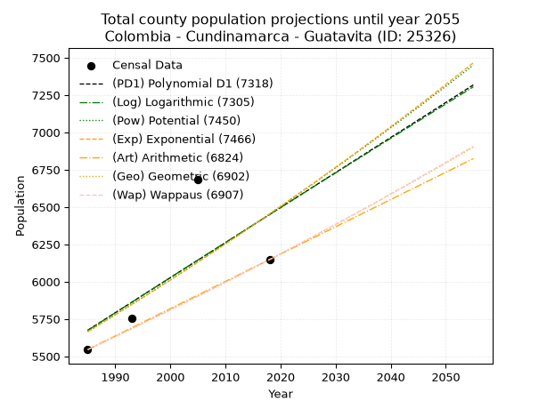
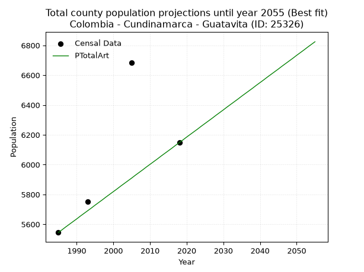
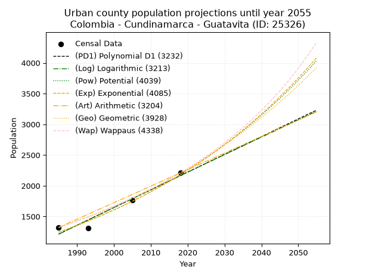
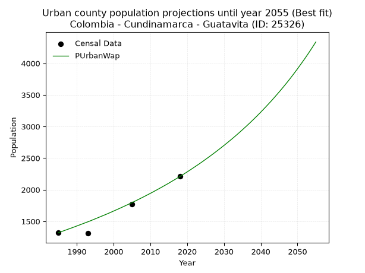
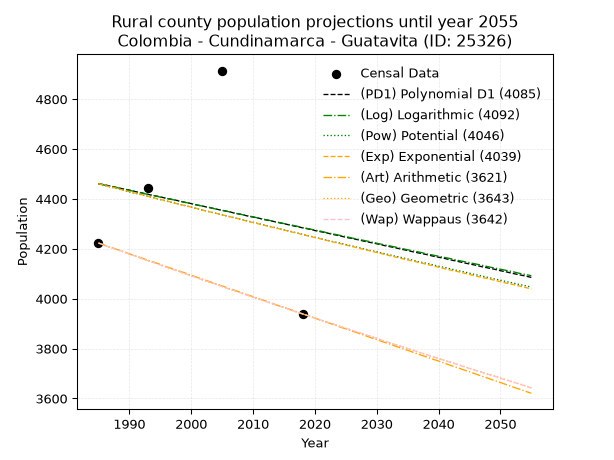
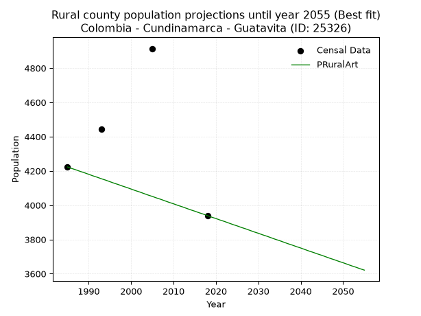

<div align="center">


</div>

# 📜 _“Population and Public Services Demand Projections (PPSD) until Year 2050 for Colombia - Cundinamarca - Guatavita (ID: 25326)”_
Keywords: `population` `public-service` `projection` `lineal` `polynomial` `logarithmic` `potential` `exponential` `arithmetic` `geometric` `wappaus` `dane` `colombia` `south-america`

PPSD are analytical estimates used by governments and planners to anticipate future changes in population size, age distribution, and the resulting community needs for utilities, healthcare, education, and infrastructure as sizing future water treatment facilities, electrical grids, and road networks based on spatial growth.

<div align="center">

</img>

</div>


> **General running parameters**: • app_version: _v20260806_. • Python version: _3.14.7_. • Pandas version: _3.0.5_. • NumPy version: _2.5.1_. • Creates, save and include plots into reports (create_plot): _False_. • Projection until year: _2050_. • Process polynomial degree 2 and up: _False_. • Process Wappaus: _True_. • Process Wappaus: _True_. • Set negative values to zero: _True_. • Set infinite values to zero: _True_. • Drop dataset notes: _True_. 
<div align="center">

Dynamic map: [:earth_americas:Google](http://maps.google.com/maps?q=4.935210999,-73.83293) [:earth_americas:OSM](https://www.openstreetmap.org/#map=18/4.935210999/-73.83293&layers=P) [:earth_americas:Bing](https://www.bing.com/maps?cp=4.935210999~-73.83293&lvl=18) [:earth_americas:Apple](https://maps.apple.com/frame?center=4.935210999%2C-73.83293&span=0.003%2C0.006)

</div>


<div align="center">

```geojson
{
  "type": "Feature",
  "geometry": {
    "type": "Point", 
    "coordinates": [-73.83293, 4.935210999]
  }, 
  "properties": {
    "Name": "Colombia - Cundinamarca - Guatavita (ID: 25326)"
  }
}
```

</div>


## 0. Census Data (4 records)

Census data are official statistics collected by a government about the people and housing in a country. They usually include counts of total population, age, sex, race, income, education, and jobs.

📅Global census file: [Population.xlsx](../data/Population.xlsx)

| Source   |   Year |   CountryID | CountryName   |   StateID | StateName    |   CountyID | CountyName   |   PTotal |   PUrban |   PRural |
|:---------|-------:|------------:|:--------------|----------:|:-------------|-----------:|:-------------|---------:|---------:|---------:|
| DANE     |   1985 |          57 | Colombia      |        25 | Cundinamarca |      25326 | Guatavita    |     5545 |     1322 |     4223 |
| DANE     |   1993 |          57 | Colombia      |        25 | Cundinamarca |      25326 | Guatavita    |     5752 |     1310 |     4442 |
| DANE     |   2005 |          57 | Colombia      |        25 | Cundinamarca |      25326 | Guatavita    |     6685 |     1771 |     4914 |
| DANE     |   2018 |          57 | Colombia      |        25 | Cundinamarca |      25326 | Guatavita    |     6148 |     2209 |     3939 |

> 🔥Some records could had specific notes about the registered values or the corresponding urban or rural distribution.

📅[SUI-RUPS](https://www.datos.gov.co/Hacienda-y-Cr-dito-P-blico/Registro-nico-de-Prestadores-de-Servicios-P-blicos/4qkq-csdn/about_data) - Local public utility companies: [RUPS.csv](../data/RUPS.xlsx)

 | SERVICIO       | ESTADO    | NOMBRE                                                                                      | NIT         | DEPARTAMENTO_DOMICILIO   | MUNICIPIO_DOMICILIO   | DIRECCION                                      |   TELEFONO | EMAIL                      | TIPO_PRESTADOR                             | CLASIFICACION                 |
|:---------------|:----------|:--------------------------------------------------------------------------------------------|:------------|:-------------------------|:----------------------|:-----------------------------------------------|-----------:|:---------------------------|:-------------------------------------------|:------------------------------|
| ACUEDUCTO      | OPERATIVA | EMPRESA DE SERVICIOS PUBLICOS DOMICILIARIOS DE GUATAVITA CUNDINAMARCA S.A. E.S.P.           | 900318086-4 | CUNDINAMARCA             | GUATAVITA             | CARRERA 7 A No.4-08 Palacio Municipal          |    0000000 | emserguatavitasa@gmail.com | SOCIEDADES (EMPRESA DE SERVICIOS PUBLICOS) | MENOR O IGUAL A 2500 USUARIOS |
| ALCANTARILLADO | OPERATIVA | EMPRESA DE SERVICIOS PUBLICOS DOMICILIARIOS DE GUATAVITA CUNDINAMARCA S.A. E.S.P.           | 900318086-4 | CUNDINAMARCA             | GUATAVITA             | CARRERA 7 A No.4-08 Palacio Municipal          |    0000000 | emserguatavitasa@gmail.com | SOCIEDADES (EMPRESA DE SERVICIOS PUBLICOS) | MENOR O IGUAL A 2500 USUARIOS |
| ACUEDUCTO      | OPERATIVA | ASOCIACION DE USUARIOS DEL ACUEDUCTO RURAL VEREDA CARBONERA ALTA DEL MUNICIPIO DE GUATAVITA | 832011548-1 | CUNDINAMARCA             | GUATAVITA             | Vereda Carbonera Alta - Casa Adriana Rodriguez |    2282117 | bernardo_cortes@yahoo.com  | ORGANIZACION AUTORIZADA                    | HASTA 2500 SUSCRIPTORES       |

## 1. Total

### 1.1. Coefficients and Parameters

* (PD1) Polynomial Deg 1: 23.472501003613246, -40918.3701324774 (lineal)
* (Log) Logarithmic: 47078.099576261884, -351808.51213938004
* (Pow) Potential: 7.905270492489826, -22.3165084844337
* (Exp) Exponential: 0.00394174538838194, 2.265710474973222
* (Art) Arithmetic: Year diff. 2018 - 1985 = 33, Population diff. 6148 - 5545 = 603, Annual growth = 18.272727272727273
* (Geo) Geometric: Year diff. 2018 - 1985 = 33, Population diff. 6148 - 5545 = 603, Annual growth % = 0.003133085912487843
* (Wap) Wappaus: i = 0.3125413028774014, Condition values only valid for < 200)

<sub>
Wappaus condition values: ['0.00', '0.31', '0.63', '0.94', '1.25', '1.56', '1.88', '2.19', '2.50', '2.81', '3.13', '3.44', '3.75', '4.06', '4.38', '4.69', '5.00', '5.31', '5.63', '5.94', '6.25', '6.56', '6.88', '7.19', '7.50', '7.81', '8.13', '8.44', '8.75', '9.06', '9.38', '9.69', '10.00', '10.31', '10.63', '10.94', '11.25', '11.56', '11.88', '12.19', '12.50', '12.81', '13.13', '13.44', '13.75', '14.06', '14.38', '14.69', '15.00', '15.31', '15.63', '15.94', '16.25', '16.56', '16.88', '17.19', '17.50', '17.81', '18.13', '18.44', '18.75', '19.07', '19.38', '19.69', '20.00', '20.32']
</sub>


### 1.2. Projected Dataset

|   Year |   CountyID |   PTotalPD1 |   PTotalLog |   PTotalPow |   PTotalExp |   PTotalArt |   PTotalGeo |   PTotalWap |
|-------:|-----------:|------------:|------------:|------------:|------------:|------------:|------------:|------------:|
|   1985 |      25326 |        5675 |        5673 |        5665 |        5666 |        5545 |        5545 |        5545 |
|   1986 |      25326 |        5698 |        5697 |        5687 |        5688 |        5563 |        5562 |        5562 |
|   1987 |      25326 |        5721 |        5721 |        5710 |        5711 |        5582 |        5580 |        5580 |
|   1988 |      25326 |        5745 |        5744 |        5733 |        5733 |        5600 |        5597 |        5597 |
|   1989 |      25326 |        5768 |        5768 |        5756 |        5756 |        5618 |        5615 |        5615 |
|   1990 |      25326 |        5792 |        5792 |        5779 |        5779 |        5636 |        5632 |        5632 |
|   1991 |      25326 |        5815 |        5815 |        5802 |        5802 |        5655 |        5650 |        5650 |
|   1992 |      25326 |        5839 |        5839 |        5825 |        5825 |        5673 |        5668 |        5668 |
|   1993 |      25326 |        5862 |        5862 |        5848 |        5848 |        5691 |        5686 |        5685 |
|   1994 |      25326 |        5886 |        5886 |        5871 |        5871 |        5709 |        5703 |        5703 |
|   1995 |      25326 |        5909 |        5910 |        5894 |        5894 |        5728 |        5721 |        5721 |
|   1996 |      25326 |        5933 |        5933 |        5918 |        5917 |        5746 |        5739 |        5739 |
|   1997 |      25326 |        5956 |        5957 |        5941 |        5941 |        5764 |        5757 |        5757 |
|   1998 |      25326 |        5980 |        5980 |        5965 |        5964 |        5783 |        5775 |        5775 |
|   1999 |      25326 |        6003 |        6004 |        5988 |        5988 |        5801 |        5793 |        5793 |
|   2000 |      25326 |        6027 |        6028 |        6012 |        6011 |        5819 |        5811 |        5811 |
|   2001 |      25326 |        6050 |        6051 |        6036 |        6035 |        5837 |        5830 |        5829 |
|   2002 |      25326 |        6074 |        6075 |        6060 |        6059 |        5856 |        5848 |        5848 |
|   2003 |      25326 |        6097 |        6098 |        6084 |        6083 |        5874 |        5866 |        5866 |
|   2004 |      25326 |        6121 |        6122 |        6108 |        6107 |        5892 |        5885 |        5884 |
|   2005 |      25326 |        6144 |        6145 |        6132 |        6131 |        5910 |        5903 |        5903 |
|   2006 |      25326 |        6167 |        6169 |        6156 |        6155 |        5929 |        5921 |        5921 |
|   2007 |      25326 |        6191 |        6192 |        6180 |        6179 |        5947 |        5940 |        5940 |
|   2008 |      25326 |        6214 |        6215 |        6205 |        6204 |        5965 |        5959 |        5958 |
|   2009 |      25326 |        6238 |        6239 |        6229 |        6228 |        5984 |        5977 |        5977 |
|   2010 |      25326 |        6261 |        6262 |        6254 |        6253 |        6002 |        5996 |        5996 |
|   2011 |      25326 |        6285 |        6286 |        6279 |        6278 |        6020 |        6015 |        6015 |
|   2012 |      25326 |        6308 |        6309 |        6303 |        6302 |        6038 |        6034 |        6034 |
|   2013 |      25326 |        6332 |        6333 |        6328 |        6327 |        6057 |        6053 |        6052 |
|   2014 |      25326 |        6355 |        6356 |        6353 |        6352 |        6075 |        6072 |        6071 |
|   2015 |      25326 |        6379 |        6379 |        6378 |        6377 |        6093 |        6091 |        6090 |
|   2016 |      25326 |        6402 |        6403 |        6403 |        6403 |        6111 |        6110 |        6110 |
|   2017 |      25326 |        6426 |        6426 |        6428 |        6428 |        6130 |        6129 |        6129 |
|   2018 |      25326 |        6449 |        6449 |        6453 |        6453 |        6148 |        6148 |        6148 |
|   2019 |      25326 |        6473 |        6473 |        6479 |        6479 |        6166 |        6167 |        6167 |
|   2020 |      25326 |        6496 |        6496 |        6504 |        6504 |        6185 |        6187 |        6187 |
|   2021 |      25326 |        6520 |        6519 |        6530 |        6530 |        6203 |        6206 |        6206 |
|   2022 |      25326 |        6543 |        6543 |        6555 |        6556 |        6221 |        6225 |        6226 |
|   2023 |      25326 |        6566 |        6566 |        6581 |        6582 |        6239 |        6245 |        6245 |
|   2024 |      25326 |        6590 |        6589 |        6607 |        6608 |        6258 |        6264 |        6265 |
|   2025 |      25326 |        6613 |        6612 |        6632 |        6634 |        6276 |        6284 |        6284 |
|   2026 |      25326 |        6637 |        6636 |        6658 |        6660 |        6294 |        6304 |        6304 |
|   2027 |      25326 |        6660 |        6659 |        6684 |        6686 |        6312 |        6324 |        6324 |
|   2028 |      25326 |        6684 |        6682 |        6711 |        6713 |        6331 |        6343 |        6344 |
|   2029 |      25326 |        6707 |        6705 |        6737 |        6739 |        6349 |        6363 |        6364 |
|   2030 |      25326 |        6731 |        6728 |        6763 |        6766 |        6367 |        6383 |        6384 |
|   2031 |      25326 |        6754 |        6752 |        6789 |        6792 |        6386 |        6403 |        6404 |
|   2032 |      25326 |        6778 |        6775 |        6816 |        6819 |        6404 |        6423 |        6424 |
|   2033 |      25326 |        6801 |        6798 |        6842 |        6846 |        6422 |        6443 |        6444 |
|   2034 |      25326 |        6825 |        6821 |        6869 |        6873 |        6440 |        6464 |        6465 |
|   2035 |      25326 |        6848 |        6844 |        6896 |        6900 |        6459 |        6484 |        6485 |
|   2036 |      25326 |        6872 |        6867 |        6923 |        6928 |        6477 |        6504 |        6505 |
|   2037 |      25326 |        6895 |        6891 |        6950 |        6955 |        6495 |        6524 |        6526 |
|   2038 |      25326 |        6919 |        6914 |        6977 |        6983 |        6513 |        6545 |        6546 |
|   2039 |      25326 |        6942 |        6937 |        7004 |        7010 |        6532 |        6565 |        6567 |
|   2040 |      25326 |        6966 |        6960 |        7031 |        7038 |        6550 |        6586 |        6588 |
|   2041 |      25326 |        6989 |        6983 |        7058 |        7066 |        6568 |        6607 |        6609 |
|   2042 |      25326 |        7012 |        7006 |        7086 |        7093 |        6587 |        6627 |        6629 |
|   2043 |      25326 |        7036 |        7029 |        7113 |        7122 |        6605 |        6648 |        6650 |
|   2044 |      25326 |        7059 |        7052 |        7141 |        7150 |        6623 |        6669 |        6671 |
|   2045 |      25326 |        7083 |        7075 |        7168 |        7178 |        6641 |        6690 |        6692 |
|   2046 |      25326 |        7106 |        7098 |        7196 |        7206 |        6660 |        6711 |        6714 |
|   2047 |      25326 |        7130 |        7121 |        7224 |        7235 |        6678 |        6732 |        6735 |
|   2048 |      25326 |        7153 |        7144 |        7252 |        7263 |        6696 |        6753 |        6756 |
|   2049 |      25326 |        7177 |        7167 |        7280 |        7292 |        6714 |        6774 |        6777 |
|   2050 |      25326 |        7200 |        7190 |        7308 |        7321 |        6733 |        6795 |        6799 |
<div align="center">

</img>

</div>


### 1.3. Best fit with absolute and relative error (%)

Relative error puts that difference into context by dividing the absolute error by the true value, creating a unitless ratio or percentage that shows the scale of the mistake.

Absolute and relative error

|   Year | Source   |   CountryID | CountryName   |   StateID | StateName    |   CountyID_x | CountyName   |   PTotal |   PUrban |   PRural |   CountyID_y |   PTotalPD1 |   PTotalLog |   PTotalPow |   PTotalExp |   PTotalArt |   PTotalGeo |   PTotalWap |   PTotalPD1AbsError |   PTotalLogAbsError |   PTotalPowAbsError |   PTotalExpAbsError |   PTotalArtAbsError |   PTotalGeoAbsError |   PTotalWapAbsError |   PTotalPD1RelError |   PTotalLogRelError |   PTotalPowRelError |   PTotalExpRelError |   PTotalArtRelError |   PTotalGeoRelError |   PTotalWapRelError |
|-------:|:---------|------------:|:--------------|----------:|:-------------|-------------:|:-------------|---------:|---------:|---------:|-------------:|------------:|------------:|------------:|------------:|------------:|------------:|------------:|--------------------:|--------------------:|--------------------:|--------------------:|--------------------:|--------------------:|--------------------:|--------------------:|--------------------:|--------------------:|--------------------:|--------------------:|--------------------:|--------------------:|
|   1985 | DANE     |          57 | Colombia      |        25 | Cundinamarca |        25326 | Guatavita    |     5545 |     1322 |     4223 |        25326 |        5675 |        5673 |        5665 |        5666 |        5545 |        5545 |        5545 |                 130 |                 128 |                 120 |                 121 |                   0 |                   0 |                   0 |             2.34445 |             2.30839 |             2.16411 |             2.18215 |              0      |             0       |             0       |
|   1993 | DANE     |          57 | Colombia      |        25 | Cundinamarca |        25326 | Guatavita    |     5752 |     1310 |     4442 |        25326 |        5862 |        5862 |        5848 |        5848 |        5691 |        5686 |        5685 |                 110 |                 110 |                  96 |                  96 |                  61 |                  66 |                  67 |             1.91238 |             1.91238 |             1.66898 |             1.66898 |              1.0605 |             1.14743 |             1.16481 |
|   2005 | DANE     |          57 | Colombia      |        25 | Cundinamarca |        25326 | Guatavita    |     6685 |     1771 |     4914 |        25326 |        6144 |        6145 |        6132 |        6131 |        5910 |        5903 |        5903 |                 541 |                 540 |                 553 |                 554 |                 775 |                 782 |                 782 |             8.09274 |             8.07779 |             8.27225 |             8.28721 |             11.5931 |            11.6978  |            11.6978  |
|   2018 | DANE     |          57 | Colombia      |        25 | Cundinamarca |        25326 | Guatavita    |     6148 |     2209 |     3939 |        25326 |        6449 |        6449 |        6453 |        6453 |        6148 |        6148 |        6148 |                 301 |                 301 |                 305 |                 305 |                   0 |                   0 |                   0 |             4.8959  |             4.8959  |             4.96096 |             4.96096 |              0      |             0       |             0       |

Relative error mean

| Method    |   RelError | Best   |
|:----------|-----------:|:-------|
| PTotalPD1 |    4.31137 |        |
| PTotalLog |    4.29861 |        |
| PTotalPow |    4.26658 |        |
| PTotalExp |    4.27483 |        |
| PTotalArt |    3.1634  | True   |
| PTotalGeo |    3.21131 |        |
| PTotalWap |    3.21566 |        |

💙Best method: _**PTotalArt**_
<div align="center">

</img>

</div>


### 1.4. Fresh water supply demand in liters per capita per day (lpcd)

The fresh water supply demand typically ranges from 100 to 300 liters per capita per day (lpcd) for standard domestic and municipal planning, though absolute survival minimums set by the World Health Organization are as low as 7.5 to 20 liters per day, and total consumption in high-income nations can exceed 400 liters.

> `CZ`: Level in meters above the sea level (masl)<br> `WS`: Fresh water supply demand in liters per capita per day (lpcd or l/h/d)<br> `WSAll`: Zonal fresh water supply demand in liters per second (l/s)<br> `A`: Zonal area in square meters<br> `DP`: Population density (people/hectare or p/ha)

Reference values (RAS Colombia)

|    CZ |   WS |
|------:|-----:|
|  1000 |  120 |
|  2000 |  130 |
| 99999 |  140 |

County shapefile geometry properties and water supply values

|   CountyID |      ATotal |   CZTotal |   WSTotal |
|-----------:|------------:|----------:|----------:|
|      25326 | 2.51998e+08 |   2920.49 |       140 |

Projected values for best method: PTotalArt

|   CountyID |   Year |   PTotalArt |   DPTotal |   WSTotal |   WSTotalAll |
|-----------:|-------:|------------:|----------:|----------:|-------------:|
|      25326 |   1985 |        5545 |      0.22 |       140 |      8.98495 |
|      25326 |   1986 |        5563 |      0.22 |       140 |      9.01412 |
|      25326 |   1987 |        5582 |      0.22 |       140 |      9.04491 |
|      25326 |   1988 |        5600 |      0.22 |       140 |      9.07407 |
|      25326 |   1989 |        5618 |      0.22 |       140 |      9.10324 |
|      25326 |   1990 |        5636 |      0.22 |       140 |      9.13241 |
|      25326 |   1991 |        5655 |      0.22 |       140 |      9.16319 |
|      25326 |   1992 |        5673 |      0.23 |       140 |      9.19236 |
|      25326 |   1993 |        5691 |      0.23 |       140 |      9.22153 |
|      25326 |   1994 |        5709 |      0.23 |       140 |      9.25069 |
|      25326 |   1995 |        5728 |      0.23 |       140 |      9.28148 |
|      25326 |   1996 |        5746 |      0.23 |       140 |      9.31065 |
|      25326 |   1997 |        5764 |      0.23 |       140 |      9.33981 |
|      25326 |   1998 |        5783 |      0.23 |       140 |      9.3706  |
|      25326 |   1999 |        5801 |      0.23 |       140 |      9.39977 |
|      25326 |   2000 |        5819 |      0.23 |       140 |      9.42894 |
|      25326 |   2001 |        5837 |      0.23 |       140 |      9.4581  |
|      25326 |   2002 |        5856 |      0.23 |       140 |      9.48889 |
|      25326 |   2003 |        5874 |      0.23 |       140 |      9.51806 |
|      25326 |   2004 |        5892 |      0.23 |       140 |      9.54722 |
|      25326 |   2005 |        5910 |      0.23 |       140 |      9.57639 |
|      25326 |   2006 |        5929 |      0.24 |       140 |      9.60718 |
|      25326 |   2007 |        5947 |      0.24 |       140 |      9.63634 |
|      25326 |   2008 |        5965 |      0.24 |       140 |      9.66551 |
|      25326 |   2009 |        5984 |      0.24 |       140 |      9.6963  |
|      25326 |   2010 |        6002 |      0.24 |       140 |      9.72546 |
|      25326 |   2011 |        6020 |      0.24 |       140 |      9.75463 |
|      25326 |   2012 |        6038 |      0.24 |       140 |      9.7838  |
|      25326 |   2013 |        6057 |      0.24 |       140 |      9.81458 |
|      25326 |   2014 |        6075 |      0.24 |       140 |      9.84375 |
|      25326 |   2015 |        6093 |      0.24 |       140 |      9.87292 |
|      25326 |   2016 |        6111 |      0.24 |       140 |      9.90208 |
|      25326 |   2017 |        6130 |      0.24 |       140 |      9.93287 |
|      25326 |   2018 |        6148 |      0.24 |       140 |      9.96204 |
|      25326 |   2019 |        6166 |      0.24 |       140 |      9.9912  |
|      25326 |   2020 |        6185 |      0.25 |       140 |     10.022   |
|      25326 |   2021 |        6203 |      0.25 |       140 |     10.0512  |
|      25326 |   2022 |        6221 |      0.25 |       140 |     10.0803  |
|      25326 |   2023 |        6239 |      0.25 |       140 |     10.1095  |
|      25326 |   2024 |        6258 |      0.25 |       140 |     10.1403  |
|      25326 |   2025 |        6276 |      0.25 |       140 |     10.1694  |
|      25326 |   2026 |        6294 |      0.25 |       140 |     10.1986  |
|      25326 |   2027 |        6312 |      0.25 |       140 |     10.2278  |
|      25326 |   2028 |        6331 |      0.25 |       140 |     10.2586  |
|      25326 |   2029 |        6349 |      0.25 |       140 |     10.2877  |
|      25326 |   2030 |        6367 |      0.25 |       140 |     10.3169  |
|      25326 |   2031 |        6386 |      0.25 |       140 |     10.3477  |
|      25326 |   2032 |        6404 |      0.25 |       140 |     10.3769  |
|      25326 |   2033 |        6422 |      0.25 |       140 |     10.406   |
|      25326 |   2034 |        6440 |      0.26 |       140 |     10.4352  |
|      25326 |   2035 |        6459 |      0.26 |       140 |     10.466   |
|      25326 |   2036 |        6477 |      0.26 |       140 |     10.4951  |
|      25326 |   2037 |        6495 |      0.26 |       140 |     10.5243  |
|      25326 |   2038 |        6513 |      0.26 |       140 |     10.5535  |
|      25326 |   2039 |        6532 |      0.26 |       140 |     10.5843  |
|      25326 |   2040 |        6550 |      0.26 |       140 |     10.6134  |
|      25326 |   2041 |        6568 |      0.26 |       140 |     10.6426  |
|      25326 |   2042 |        6587 |      0.26 |       140 |     10.6734  |
|      25326 |   2043 |        6605 |      0.26 |       140 |     10.7025  |
|      25326 |   2044 |        6623 |      0.26 |       140 |     10.7317  |
|      25326 |   2045 |        6641 |      0.26 |       140 |     10.7609  |
|      25326 |   2046 |        6660 |      0.26 |       140 |     10.7917  |
|      25326 |   2047 |        6678 |      0.27 |       140 |     10.8208  |
|      25326 |   2048 |        6696 |      0.27 |       140 |     10.85    |
|      25326 |   2049 |        6714 |      0.27 |       140 |     10.8792  |
|      25326 |   2050 |        6733 |      0.27 |       140 |     10.91    |

## 2. Urban

### 2.1. Coefficients and Parameters

* (PD1) Polynomial Deg 1: 28.846246487354176, -56046.704536330195 (lineal)
* (Log) Logarithmic: 57713.720156476506, -437029.4493981058
* (Pow) Potential: 33.95538570796691, -108.88157404519274
* (Exp) Exponential: 0.01696949026332055, 2.926677399344146e-12
* (Art) Arithmetic: Year diff. 2018 - 1985 = 33, Population diff. 2209 - 1322 = 887, Annual growth = 26.87878787878788
* (Geo) Geometric: Year diff. 2018 - 1985 = 33, Population diff. 2209 - 1322 = 887, Annual growth % = 0.01567904583942714
* (Wap) Wappaus: i = 1.522446212335762, Condition values only valid for < 200)

<sub>
Wappaus condition values: ['0.00', '1.52', '3.04', '4.57', '6.09', '7.61', '9.13', '10.66', '12.18', '13.70', '15.22', '16.75', '18.27', '19.79', '21.31', '22.84', '24.36', '25.88', '27.40', '28.93', '30.45', '31.97', '33.49', '35.02', '36.54', '38.06', '39.58', '41.11', '42.63', '44.15', '45.67', '47.20', '48.72', '50.24', '51.76', '53.29', '54.81', '56.33', '57.85', '59.38', '60.90', '62.42', '63.94', '65.47', '66.99', '68.51', '70.03', '71.55', '73.08', '74.60', '76.12', '77.64', '79.17', '80.69', '82.21', '83.73', '85.26', '86.78', '88.30', '89.82', '91.35', '92.87', '94.39', '95.91', '97.44', '98.96']
</sub>


### 2.2. Projected Dataset

|   Year |   CountyID |   PUrbanPD1 |   PUrbanLog |   PUrbanPow |   PUrbanExp |   PUrbanArt |   PUrbanGeo |   PUrbanWap |
|-------:|-----------:|------------:|------------:|------------:|------------:|------------:|------------:|------------:|
|   1985 |      25326 |        1213 |        1212 |        1245 |        1245 |        1322 |        1322 |        1322 |
|   1986 |      25326 |        1242 |        1241 |        1266 |        1267 |        1349 |        1343 |        1342 |
|   1987 |      25326 |        1271 |        1271 |        1288 |        1288 |        1376 |        1364 |        1363 |
|   1988 |      25326 |        1300 |        1300 |        1310 |        1311 |        1403 |        1385 |        1384 |
|   1989 |      25326 |        1328 |        1329 |        1333 |        1333 |        1430 |        1407 |        1405 |
|   1990 |      25326 |        1357 |        1358 |        1356 |        1356 |        1456 |        1429 |        1427 |
|   1991 |      25326 |        1386 |        1387 |        1379 |        1379 |        1483 |        1451 |        1449 |
|   1992 |      25326 |        1415 |        1416 |        1403 |        1403 |        1510 |        1474 |        1471 |
|   1993 |      25326 |        1444 |        1445 |        1427 |        1427 |        1537 |        1497 |        1493 |
|   1994 |      25326 |        1473 |        1474 |        1452 |        1451 |        1564 |        1521 |        1516 |
|   1995 |      25326 |        1502 |        1502 |        1477 |        1476 |        1591 |        1545 |        1540 |
|   1996 |      25326 |        1530 |        1531 |        1502 |        1501 |        1618 |        1569 |        1564 |
|   1997 |      25326 |        1559 |        1560 |        1528 |        1527 |        1645 |        1593 |        1588 |
|   1998 |      25326 |        1588 |        1589 |        1554 |        1553 |        1671 |        1618 |        1612 |
|   1999 |      25326 |        1617 |        1618 |        1581 |        1579 |        1698 |        1644 |        1637 |
|   2000 |      25326 |        1646 |        1647 |        1608 |        1607 |        1725 |        1669 |        1663 |
|   2001 |      25326 |        1675 |        1676 |        1635 |        1634 |        1752 |        1696 |        1689 |
|   2002 |      25326 |        1703 |        1705 |        1663 |        1662 |        1779 |        1722 |        1715 |
|   2003 |      25326 |        1732 |        1733 |        1692 |        1690 |        1806 |        1749 |        1742 |
|   2004 |      25326 |        1761 |        1762 |        1720 |        1719 |        1833 |        1777 |        1769 |
|   2005 |      25326 |        1790 |        1791 |        1750 |        1749 |        1860 |        1805 |        1797 |
|   2006 |      25326 |        1819 |        1820 |        1780 |        1779 |        1886 |        1833 |        1825 |
|   2007 |      25326 |        1848 |        1849 |        1810 |        1809 |        1913 |        1862 |        1854 |
|   2008 |      25326 |        1877 |        1877 |        1841 |        1840 |        1940 |        1891 |        1883 |
|   2009 |      25326 |        1905 |        1906 |        1872 |        1872 |        1967 |        1920 |        1913 |
|   2010 |      25326 |        1934 |        1935 |        1904 |        1904 |        1994 |        1950 |        1943 |
|   2011 |      25326 |        1963 |        1963 |        1937 |        1936 |        2021 |        1981 |        1974 |
|   2012 |      25326 |        1992 |        1992 |        1970 |        1969 |        2048 |        2012 |        2006 |
|   2013 |      25326 |        2021 |        2021 |        2003 |        2003 |        2075 |        2044 |        2038 |
|   2014 |      25326 |        2050 |        2049 |        2037 |        2037 |        2101 |        2076 |        2071 |
|   2015 |      25326 |        2078 |        2078 |        2072 |        2072 |        2128 |        2108 |        2104 |
|   2016 |      25326 |        2107 |        2107 |        2107 |        2108 |        2155 |        2141 |        2139 |
|   2017 |      25326 |        2136 |        2135 |        2143 |        2144 |        2182 |        2175 |        2173 |
|   2018 |      25326 |        2165 |        2164 |        2179 |        2180 |        2209 |        2209 |        2209 |
|   2019 |      25326 |        2194 |        2193 |        2216 |        2218 |        2236 |        2244 |        2245 |
|   2020 |      25326 |        2223 |        2221 |        2254 |        2256 |        2263 |        2279 |        2282 |
|   2021 |      25326 |        2252 |        2250 |        2292 |        2294 |        2290 |        2315 |        2320 |
|   2022 |      25326 |        2280 |        2278 |        2331 |        2334 |        2317 |        2351 |        2359 |
|   2023 |      25326 |        2309 |        2307 |        2370 |        2374 |        2343 |        2388 |        2398 |
|   2024 |      25326 |        2338 |        2335 |        2410 |        2414 |        2370 |        2425 |        2438 |
|   2025 |      25326 |        2367 |        2364 |        2451 |        2455 |        2397 |        2463 |        2480 |
|   2026 |      25326 |        2396 |        2392 |        2493 |        2497 |        2424 |        2502 |        2522 |
|   2027 |      25326 |        2425 |        2421 |        2535 |        2540 |        2451 |        2541 |        2565 |
|   2028 |      25326 |        2453 |        2449 |        2577 |        2584 |        2478 |        2581 |        2609 |
|   2029 |      25326 |        2482 |        2478 |        2621 |        2628 |        2505 |        2621 |        2654 |
|   2030 |      25326 |        2511 |        2506 |        2665 |        2673 |        2532 |        2662 |        2700 |
|   2031 |      25326 |        2540 |        2535 |        2710 |        2719 |        2558 |        2704 |        2747 |
|   2032 |      25326 |        2569 |        2563 |        2756 |        2765 |        2585 |        2747 |        2795 |
|   2033 |      25326 |        2598 |        2591 |        2802 |        2812 |        2612 |        2790 |        2844 |
|   2034 |      25326 |        2627 |        2620 |        2849 |        2861 |        2639 |        2833 |        2895 |
|   2035 |      25326 |        2655 |        2648 |        2897 |        2910 |        2666 |        2878 |        2947 |
|   2036 |      25326 |        2684 |        2677 |        2946 |        2959 |        2693 |        2923 |        3000 |
|   2037 |      25326 |        2713 |        2705 |        2996 |        3010 |        2720 |        2969 |        3054 |
|   2038 |      25326 |        2742 |        2733 |        3046 |        3062 |        2747 |        3015 |        3110 |
|   2039 |      25326 |        2771 |        2761 |        3097 |        3114 |        2773 |        3063 |        3167 |
|   2040 |      25326 |        2800 |        2790 |        3149 |        3167 |        2800 |        3111 |        3226 |
|   2041 |      25326 |        2828 |        2818 |        3202 |        3221 |        2827 |        3159 |        3287 |
|   2042 |      25326 |        2857 |        2846 |        3256 |        3277 |        2854 |        3209 |        3349 |
|   2043 |      25326 |        2886 |        2875 |        3310 |        3333 |        2881 |        3259 |        3412 |
|   2044 |      25326 |        2915 |        2903 |        3366 |        3390 |        2908 |        3310 |        3478 |
|   2045 |      25326 |        2944 |        2931 |        3422 |        3448 |        2935 |        3362 |        3545 |
|   2046 |      25326 |        2973 |        2959 |        3479 |        3507 |        2962 |        3415 |        3614 |
|   2047 |      25326 |        3002 |        2987 |        3538 |        3567 |        2988 |        3468 |        3685 |
|   2048 |      25326 |        3030 |        3016 |        3597 |        3628 |        3015 |        3523 |        3758 |
|   2049 |      25326 |        3059 |        3044 |        3657 |        3690 |        3042 |        3578 |        3834 |
|   2050 |      25326 |        3088 |        3072 |        3718 |        3753 |        3069 |        3634 |        3912 |
<div align="center">

</img>

</div>


### 2.3. Best fit with absolute and relative error (%)

Relative error puts that difference into context by dividing the absolute error by the true value, creating a unitless ratio or percentage that shows the scale of the mistake.

Absolute and relative error

|   Year | Source   |   CountryID | CountryName   |   StateID | StateName    |   CountyID_x | CountyName   |   PTotal |   PUrban |   PRural |   CountyID_y |   PUrbanPD1 |   PUrbanLog |   PUrbanPow |   PUrbanExp |   PUrbanArt |   PUrbanGeo |   PUrbanWap |   PUrbanPD1AbsError |   PUrbanLogAbsError |   PUrbanPowAbsError |   PUrbanExpAbsError |   PUrbanArtAbsError |   PUrbanGeoAbsError |   PUrbanWapAbsError |   PUrbanPD1RelError |   PUrbanLogRelError |   PUrbanPowRelError |   PUrbanExpRelError |   PUrbanArtRelError |   PUrbanGeoRelError |   PUrbanWapRelError |
|-------:|:---------|------------:|:--------------|----------:|:-------------|-------------:|:-------------|---------:|---------:|---------:|-------------:|------------:|------------:|------------:|------------:|------------:|------------:|------------:|--------------------:|--------------------:|--------------------:|--------------------:|--------------------:|--------------------:|--------------------:|--------------------:|--------------------:|--------------------:|--------------------:|--------------------:|--------------------:|--------------------:|
|   1985 | DANE     |          57 | Colombia      |        25 | Cundinamarca |        25326 | Guatavita    |     5545 |     1322 |     4223 |        25326 |        1213 |        1212 |        1245 |        1245 |        1322 |        1322 |        1322 |                 109 |                 110 |                  77 |                  77 |                   0 |                   0 |                   0 |             8.24508 |             8.32073 |             5.82451 |             5.82451 |             0       |             0       |              0      |
|   1993 | DANE     |          57 | Colombia      |        25 | Cundinamarca |        25326 | Guatavita    |     5752 |     1310 |     4442 |        25326 |        1444 |        1445 |        1427 |        1427 |        1537 |        1497 |        1493 |                 134 |                 135 |                 117 |                 117 |                 227 |                 187 |                 183 |            10.229   |            10.3053  |             8.9313  |             8.9313  |            17.3282  |            14.2748  |             13.9695 |
|   2005 | DANE     |          57 | Colombia      |        25 | Cundinamarca |        25326 | Guatavita    |     6685 |     1771 |     4914 |        25326 |        1790 |        1791 |        1750 |        1749 |        1860 |        1805 |        1797 |                  19 |                  20 |                  21 |                  22 |                  89 |                  34 |                  26 |             1.07284 |             1.12931 |             1.18577 |             1.24224 |             5.02541 |             1.91982 |              1.4681 |
|   2018 | DANE     |          57 | Colombia      |        25 | Cundinamarca |        25326 | Guatavita    |     6148 |     2209 |     3939 |        25326 |        2165 |        2164 |        2179 |        2180 |        2209 |        2209 |        2209 |                  44 |                  45 |                  30 |                  29 |                   0 |                   0 |                   0 |             1.99185 |             2.03712 |             1.35808 |             1.31281 |             0       |             0       |              0      |

Relative error mean

| Method    |   RelError | Best   |
|:----------|-----------:|:-------|
| PUrbanPD1 |    5.3847  |        |
| PUrbanLog |    5.44812 |        |
| PUrbanPow |    4.32491 |        |
| PUrbanExp |    4.32771 |        |
| PUrbanArt |    5.58841 |        |
| PUrbanGeo |    4.04866 |        |
| PUrbanWap |    3.85939 | True   |

💙Best method: _**PUrbanWap**_
<div align="center">

</img>

</div>


### 2.4. Fresh water supply demand in liters per capita per day (lpcd)

The fresh water supply demand typically ranges from 100 to 300 liters per capita per day (lpcd) for standard domestic and municipal planning, though absolute survival minimums set by the World Health Organization are as low as 7.5 to 20 liters per day, and total consumption in high-income nations can exceed 400 liters.

> `CZ`: Level in meters above the sea level (masl)<br> `WS`: Fresh water supply demand in liters per capita per day (lpcd or l/h/d)<br> `WSAll`: Zonal fresh water supply demand in liters per second (l/s)<br> `A`: Zonal area in square meters<br> `DP`: Population density (people/hectare or p/ha)

Reference values (RAS Colombia)

|    CZ |   WS |
|------:|-----:|
|  1000 |  120 |
|  2000 |  130 |
| 99999 |  140 |

County shapefile geometry properties and water supply values

|   CountyID |   AUrban |   CZUrban |   WSUrban |
|-----------:|---------:|----------:|----------:|
|      25326 |   826326 |   2705.44 |       140 |

Projected values for best method: PUrbanWap

|   CountyID |   Year |   PUrbanWap |   DPUrban |   WSUrban |   WSUrbanAll |
|-----------:|-------:|------------:|----------:|----------:|-------------:|
|      25326 |   1985 |        1322 |     16    |       140 |      2.14213 |
|      25326 |   1986 |        1342 |     16.24 |       140 |      2.17454 |
|      25326 |   1987 |        1363 |     16.49 |       140 |      2.20856 |
|      25326 |   1988 |        1384 |     16.75 |       140 |      2.24259 |
|      25326 |   1989 |        1405 |     17    |       140 |      2.27662 |
|      25326 |   1990 |        1427 |     17.27 |       140 |      2.31227 |
|      25326 |   1991 |        1449 |     17.54 |       140 |      2.34792 |
|      25326 |   1992 |        1471 |     17.8  |       140 |      2.38356 |
|      25326 |   1993 |        1493 |     18.07 |       140 |      2.41921 |
|      25326 |   1994 |        1516 |     18.35 |       140 |      2.45648 |
|      25326 |   1995 |        1540 |     18.64 |       140 |      2.49537 |
|      25326 |   1996 |        1564 |     18.93 |       140 |      2.53426 |
|      25326 |   1997 |        1588 |     19.22 |       140 |      2.57315 |
|      25326 |   1998 |        1612 |     19.51 |       140 |      2.61204 |
|      25326 |   1999 |        1637 |     19.81 |       140 |      2.65255 |
|      25326 |   2000 |        1663 |     20.13 |       140 |      2.69468 |
|      25326 |   2001 |        1689 |     20.44 |       140 |      2.73681 |
|      25326 |   2002 |        1715 |     20.75 |       140 |      2.77894 |
|      25326 |   2003 |        1742 |     21.08 |       140 |      2.82269 |
|      25326 |   2004 |        1769 |     21.41 |       140 |      2.86644 |
|      25326 |   2005 |        1797 |     21.75 |       140 |      2.91181 |
|      25326 |   2006 |        1825 |     22.09 |       140 |      2.95718 |
|      25326 |   2007 |        1854 |     22.44 |       140 |      3.00417 |
|      25326 |   2008 |        1883 |     22.79 |       140 |      3.05116 |
|      25326 |   2009 |        1913 |     23.15 |       140 |      3.09977 |
|      25326 |   2010 |        1943 |     23.51 |       140 |      3.14838 |
|      25326 |   2011 |        1974 |     23.89 |       140 |      3.19861 |
|      25326 |   2012 |        2006 |     24.28 |       140 |      3.25046 |
|      25326 |   2013 |        2038 |     24.66 |       140 |      3.30231 |
|      25326 |   2014 |        2071 |     25.06 |       140 |      3.35579 |
|      25326 |   2015 |        2104 |     25.46 |       140 |      3.40926 |
|      25326 |   2016 |        2139 |     25.89 |       140 |      3.46597 |
|      25326 |   2017 |        2173 |     26.3  |       140 |      3.52106 |
|      25326 |   2018 |        2209 |     26.73 |       140 |      3.5794  |
|      25326 |   2019 |        2245 |     27.17 |       140 |      3.63773 |
|      25326 |   2020 |        2282 |     27.62 |       140 |      3.69769 |
|      25326 |   2021 |        2320 |     28.08 |       140 |      3.75926 |
|      25326 |   2022 |        2359 |     28.55 |       140 |      3.82245 |
|      25326 |   2023 |        2398 |     29.02 |       140 |      3.88565 |
|      25326 |   2024 |        2438 |     29.5  |       140 |      3.95046 |
|      25326 |   2025 |        2480 |     30.01 |       140 |      4.01852 |
|      25326 |   2026 |        2522 |     30.52 |       140 |      4.08657 |
|      25326 |   2027 |        2565 |     31.04 |       140 |      4.15625 |
|      25326 |   2028 |        2609 |     31.57 |       140 |      4.22755 |
|      25326 |   2029 |        2654 |     32.12 |       140 |      4.30046 |
|      25326 |   2030 |        2700 |     32.67 |       140 |      4.375   |
|      25326 |   2031 |        2747 |     33.24 |       140 |      4.45116 |
|      25326 |   2032 |        2795 |     33.82 |       140 |      4.52894 |
|      25326 |   2033 |        2844 |     34.42 |       140 |      4.60833 |
|      25326 |   2034 |        2895 |     35.03 |       140 |      4.69097 |
|      25326 |   2035 |        2947 |     35.66 |       140 |      4.77523 |
|      25326 |   2036 |        3000 |     36.31 |       140 |      4.86111 |
|      25326 |   2037 |        3054 |     36.96 |       140 |      4.94861 |
|      25326 |   2038 |        3110 |     37.64 |       140 |      5.03935 |
|      25326 |   2039 |        3167 |     38.33 |       140 |      5.13171 |
|      25326 |   2040 |        3226 |     39.04 |       140 |      5.22731 |
|      25326 |   2041 |        3287 |     39.78 |       140 |      5.32616 |
|      25326 |   2042 |        3349 |     40.53 |       140 |      5.42662 |
|      25326 |   2043 |        3412 |     41.29 |       140 |      5.5287  |
|      25326 |   2044 |        3478 |     42.09 |       140 |      5.63565 |
|      25326 |   2045 |        3545 |     42.9  |       140 |      5.74421 |
|      25326 |   2046 |        3614 |     43.74 |       140 |      5.85602 |
|      25326 |   2047 |        3685 |     44.59 |       140 |      5.97106 |
|      25326 |   2048 |        3758 |     45.48 |       140 |      6.08935 |
|      25326 |   2049 |        3834 |     46.4  |       140 |      6.2125  |
|      25326 |   2050 |        3912 |     47.34 |       140 |      6.33889 |

## 3. Rural

### 3.1. Coefficients and Parameters

* (PD1) Polynomial Deg 1: -5.373745483740914, 15128.334403852763 (lineal)
* (Log) Logarithmic: -10635.620580214632, 85220.93725872587
* (Pow) Potential: -2.8091205718432515, 12.913125235540218
* (Exp) Exponential: -0.001417038699587052, 74299.0431710017
* (Art) Arithmetic: Year diff. 2018 - 1985 = 33, Population diff. 3939 - 4223 = -284, Annual growth = -8.606060606060606
* (Geo) Geometric: Year diff. 2018 - 1985 = 33, Population diff. 3939 - 4223 = -284, Annual growth % = -0.0021074396170848164
* (Wap) Wappaus: i = -0.2108811714300565, Condition values only valid for < 200)

<sub>
Wappaus condition values: ['-0.00', '-0.21', '-0.42', '-0.63', '-0.84', '-1.05', '-1.27', '-1.48', '-1.69', '-1.90', '-2.11', '-2.32', '-2.53', '-2.74', '-2.95', '-3.16', '-3.37', '-3.58', '-3.80', '-4.01', '-4.22', '-4.43', '-4.64', '-4.85', '-5.06', '-5.27', '-5.48', '-5.69', '-5.90', '-6.12', '-6.33', '-6.54', '-6.75', '-6.96', '-7.17', '-7.38', '-7.59', '-7.80', '-8.01', '-8.22', '-8.44', '-8.65', '-8.86', '-9.07', '-9.28', '-9.49', '-9.70', '-9.91', '-10.12', '-10.33', '-10.54', '-10.75', '-10.97', '-11.18', '-11.39', '-11.60', '-11.81', '-12.02', '-12.23', '-12.44', '-12.65', '-12.86', '-13.07', '-13.29', '-13.50', '-13.71']
</sub>


### 3.2. Projected Dataset

|   Year |   CountyID |   PRuralPD1 |   PRuralLog |   PRuralPow |   PRuralExp |   PRuralArt |   PRuralGeo |   PRuralWap |
|-------:|-----------:|------------:|------------:|------------:|------------:|------------:|------------:|------------:|
|   1985 |      25326 |        4461 |        4461 |        4460 |        4461 |        4223 |        4223 |        4223 |
|   1986 |      25326 |        4456 |        4455 |        4454 |        4454 |        4214 |        4214 |        4214 |
|   1987 |      25326 |        4451 |        4450 |        4447 |        4448 |        4206 |        4205 |        4205 |
|   1988 |      25326 |        4445 |        4445 |        4441 |        4442 |        4197 |        4196 |        4196 |
|   1989 |      25326 |        4440 |        4439 |        4435 |        4435 |        4189 |        4188 |        4188 |
|   1990 |      25326 |        4435 |        4434 |        4428 |        4429 |        4180 |        4179 |        4179 |
|   1991 |      25326 |        4429 |        4429 |        4422 |        4423 |        4171 |        4170 |        4170 |
|   1992 |      25326 |        4424 |        4423 |        4416 |        4417 |        4163 |        4161 |        4161 |
|   1993 |      25326 |        4418 |        4418 |        4410 |        4410 |        4154 |        4152 |        4152 |
|   1994 |      25326 |        4413 |        4413 |        4404 |        4404 |        4146 |        4144 |        4144 |
|   1995 |      25326 |        4408 |        4407 |        4397 |        4398 |        4137 |        4135 |        4135 |
|   1996 |      25326 |        4402 |        4402 |        4391 |        4392 |        4128 |        4126 |        4126 |
|   1997 |      25326 |        4397 |        4397 |        4385 |        4385 |        4120 |        4117 |        4117 |
|   1998 |      25326 |        4392 |        4391 |        4379 |        4379 |        4111 |        4109 |        4109 |
|   1999 |      25326 |        4386 |        4386 |        4373 |        4373 |        4103 |        4100 |        4100 |
|   2000 |      25326 |        4381 |        4381 |        4367 |        4367 |        4094 |        4091 |        4091 |
|   2001 |      25326 |        4375 |        4375 |        4360 |        4361 |        4085 |        4083 |        4083 |
|   2002 |      25326 |        4370 |        4370 |        4354 |        4354 |        4077 |        4074 |        4074 |
|   2003 |      25326 |        4365 |        4365 |        4348 |        4348 |        4068 |        4066 |        4066 |
|   2004 |      25326 |        4359 |        4359 |        4342 |        4342 |        4059 |        4057 |        4057 |
|   2005 |      25326 |        4354 |        4354 |        4336 |        4336 |        4051 |        4049 |        4049 |
|   2006 |      25326 |        4349 |        4349 |        4330 |        4330 |        4042 |        4040 |        4040 |
|   2007 |      25326 |        4343 |        4343 |        4324 |        4324 |        4034 |        4031 |        4032 |
|   2008 |      25326 |        4338 |        4338 |        4318 |        4318 |        4025 |        4023 |        4023 |
|   2009 |      25326 |        4332 |        4333 |        4312 |        4311 |        4016 |        4015 |        4015 |
|   2010 |      25326 |        4327 |        4328 |        4306 |        4305 |        4008 |        4006 |        4006 |
|   2011 |      25326 |        4322 |        4322 |        4300 |        4299 |        3999 |        3998 |        3998 |
|   2012 |      25326 |        4316 |        4317 |        4294 |        4293 |        3991 |        3989 |        3989 |
|   2013 |      25326 |        4311 |        4312 |        4288 |        4287 |        3982 |        3981 |        3981 |
|   2014 |      25326 |        4306 |        4306 |        4282 |        4281 |        3973 |        3972 |        3972 |
|   2015 |      25326 |        4300 |        4301 |        4276 |        4275 |        3965 |        3964 |        3964 |
|   2016 |      25326 |        4295 |        4296 |        4270 |        4269 |        3956 |        3956 |        3956 |
|   2017 |      25326 |        4289 |        4291 |        4264 |        4263 |        3948 |        3947 |        3947 |
|   2018 |      25326 |        4284 |        4285 |        4258 |        4257 |        3939 |        3939 |        3939 |
|   2019 |      25326 |        4279 |        4280 |        4252 |        4251 |        3930 |        3931 |        3931 |
|   2020 |      25326 |        4273 |        4275 |        4246 |        4245 |        3922 |        3922 |        3922 |
|   2021 |      25326 |        4268 |        4270 |        4240 |        4239 |        3913 |        3914 |        3914 |
|   2022 |      25326 |        4263 |        4264 |        4234 |        4233 |        3905 |        3906 |        3906 |
|   2023 |      25326 |        4257 |        4259 |        4228 |        4227 |        3896 |        3898 |        3898 |
|   2024 |      25326 |        4252 |        4254 |        4223 |        4221 |        3887 |        3889 |        3889 |
|   2025 |      25326 |        4246 |        4249 |        4217 |        4215 |        3879 |        3881 |        3881 |
|   2026 |      25326 |        4241 |        4243 |        4211 |        4209 |        3870 |        3873 |        3873 |
|   2027 |      25326 |        4236 |        4238 |        4205 |        4203 |        3862 |        3865 |        3865 |
|   2028 |      25326 |        4230 |        4233 |        4199 |        4197 |        3853 |        3857 |        3857 |
|   2029 |      25326 |        4225 |        4228 |        4193 |        4191 |        3844 |        3849 |        3849 |
|   2030 |      25326 |        4220 |        4222 |        4188 |        4185 |        3836 |        3841 |        3840 |
|   2031 |      25326 |        4214 |        4217 |        4182 |        4179 |        3827 |        3832 |        3832 |
|   2032 |      25326 |        4209 |        4212 |        4176 |        4173 |        3819 |        3824 |        3824 |
|   2033 |      25326 |        4204 |        4207 |        4170 |        4167 |        3810 |        3816 |        3816 |
|   2034 |      25326 |        4198 |        4201 |        4165 |        4161 |        3801 |        3808 |        3808 |
|   2035 |      25326 |        4193 |        4196 |        4159 |        4155 |        3793 |        3800 |        3800 |
|   2036 |      25326 |        4187 |        4191 |        4153 |        4150 |        3784 |        3792 |        3792 |
|   2037 |      25326 |        4182 |        4186 |        4147 |        4144 |        3775 |        3784 |        3784 |
|   2038 |      25326 |        4177 |        4180 |        4142 |        4138 |        3767 |        3776 |        3776 |
|   2039 |      25326 |        4171 |        4175 |        4136 |        4132 |        3758 |        3768 |        3768 |
|   2040 |      25326 |        4166 |        4170 |        4130 |        4126 |        3750 |        3760 |        3760 |
|   2041 |      25326 |        4161 |        4165 |        4125 |        4120 |        3741 |        3752 |        3752 |
|   2042 |      25326 |        4155 |        4160 |        4119 |        4114 |        3732 |        3745 |        3744 |
|   2043 |      25326 |        4150 |        4154 |        4113 |        4109 |        3724 |        3737 |        3736 |
|   2044 |      25326 |        4144 |        4149 |        4108 |        4103 |        3715 |        3729 |        3728 |
|   2045 |      25326 |        4139 |        4144 |        4102 |        4097 |        3707 |        3721 |        3720 |
|   2046 |      25326 |        4134 |        4139 |        4096 |        4091 |        3698 |        3713 |        3713 |
|   2047 |      25326 |        4128 |        4134 |        4091 |        4085 |        3689 |        3705 |        3705 |
|   2048 |      25326 |        4123 |        4128 |        4085 |        4080 |        3681 |        3697 |        3697 |
|   2049 |      25326 |        4118 |        4123 |        4079 |        4074 |        3672 |        3690 |        3689 |
|   2050 |      25326 |        4112 |        4118 |        4074 |        4068 |        3664 |        3682 |        3681 |
<div align="center">

</img>

</div>


### 3.3. Best fit with absolute and relative error (%)

Relative error puts that difference into context by dividing the absolute error by the true value, creating a unitless ratio or percentage that shows the scale of the mistake.

Absolute and relative error

|   Year | Source   |   CountryID | CountryName   |   StateID | StateName    |   CountyID_x | CountyName   |   PTotal |   PUrban |   PRural |   CountyID_y |   PRuralPD1 |   PRuralLog |   PRuralPow |   PRuralExp |   PRuralArt |   PRuralGeo |   PRuralWap |   PRuralPD1AbsError |   PRuralLogAbsError |   PRuralPowAbsError |   PRuralExpAbsError |   PRuralArtAbsError |   PRuralGeoAbsError |   PRuralWapAbsError |   PRuralPD1RelError |   PRuralLogRelError |   PRuralPowRelError |   PRuralExpRelError |   PRuralArtRelError |   PRuralGeoRelError |   PRuralWapRelError |
|-------:|:---------|------------:|:--------------|----------:|:-------------|-------------:|:-------------|---------:|---------:|---------:|-------------:|------------:|------------:|------------:|------------:|------------:|------------:|------------:|--------------------:|--------------------:|--------------------:|--------------------:|--------------------:|--------------------:|--------------------:|--------------------:|--------------------:|--------------------:|--------------------:|--------------------:|--------------------:|--------------------:|
|   1985 | DANE     |          57 | Colombia      |        25 | Cundinamarca |        25326 | Guatavita    |     5545 |     1322 |     4223 |        25326 |        4461 |        4461 |        4460 |        4461 |        4223 |        4223 |        4223 |                 238 |                 238 |                 237 |                 238 |                   0 |                   0 |                   0 |            5.6358   |            5.6358   |            5.61212  |            5.6358   |             0       |             0       |             0       |
|   1993 | DANE     |          57 | Colombia      |        25 | Cundinamarca |        25326 | Guatavita    |     5752 |     1310 |     4442 |        25326 |        4418 |        4418 |        4410 |        4410 |        4154 |        4152 |        4152 |                  24 |                  24 |                  32 |                  32 |                 288 |                 290 |                 290 |            0.540297 |            0.540297 |            0.720396 |            0.720396 |             6.48357 |             6.52859 |             6.52859 |
|   2005 | DANE     |          57 | Colombia      |        25 | Cundinamarca |        25326 | Guatavita    |     6685 |     1771 |     4914 |        25326 |        4354 |        4354 |        4336 |        4336 |        4051 |        4049 |        4049 |                 560 |                 560 |                 578 |                 578 |                 863 |                 865 |                 865 |           11.396    |           11.396    |           11.7623   |           11.7623   |            17.5621  |            17.6028  |            17.6028  |
|   2018 | DANE     |          57 | Colombia      |        25 | Cundinamarca |        25326 | Guatavita    |     6148 |     2209 |     3939 |        25326 |        4284 |        4285 |        4258 |        4257 |        3939 |        3939 |        3939 |                 345 |                 346 |                 319 |                 318 |                   0 |                   0 |                   0 |            8.75857  |            8.78396  |            8.0985   |            8.07312  |             0       |             0       |             0       |

Relative error mean

| Method    |   RelError | Best   |
|:----------|-----------:|:-------|
| PRuralPD1 |    6.58267 |        |
| PRuralLog |    6.58902 |        |
| PRuralPow |    6.54833 |        |
| PRuralExp |    6.54791 |        |
| PRuralArt |    6.01141 | True   |
| PRuralGeo |    6.03284 |        |
| PRuralWap |    6.03284 |        |

💙Best method: _**PRuralArt**_
<div align="center">

</img>

</div>


### 3.4. Fresh water supply demand in liters per capita per day (lpcd)

The fresh water supply demand typically ranges from 100 to 300 liters per capita per day (lpcd) for standard domestic and municipal planning, though absolute survival minimums set by the World Health Organization are as low as 7.5 to 20 liters per day, and total consumption in high-income nations can exceed 400 liters.

> `CZ`: Level in meters above the sea level (masl)<br> `WS`: Fresh water supply demand in liters per capita per day (lpcd or l/h/d)<br> `WSAll`: Zonal fresh water supply demand in liters per second (l/s)<br> `A`: Zonal area in square meters<br> `DP`: Population density (people/hectare or p/ha)

Reference values (RAS Colombia)

|    CZ |   WS |
|------:|-----:|
|  1000 |  120 |
|  2000 |  130 |
| 99999 |  140 |

County shapefile geometry properties and water supply values

|   CountyID |      ARural |   CZRural |   WSRural |
|-----------:|------------:|----------:|----------:|
|      25326 | 2.51172e+08 |    2921.2 |       140 |

Projected values for best method: PRuralArt

|   CountyID |   Year |   PRuralArt |   DPRural |   WSRural |   WSRuralAll |
|-----------:|-------:|------------:|----------:|----------:|-------------:|
|      25326 |   1985 |        4223 |      0.17 |       140 |      6.84282 |
|      25326 |   1986 |        4214 |      0.17 |       140 |      6.82824 |
|      25326 |   1987 |        4206 |      0.17 |       140 |      6.81528 |
|      25326 |   1988 |        4197 |      0.17 |       140 |      6.80069 |
|      25326 |   1989 |        4189 |      0.17 |       140 |      6.78773 |
|      25326 |   1990 |        4180 |      0.17 |       140 |      6.77315 |
|      25326 |   1991 |        4171 |      0.17 |       140 |      6.75856 |
|      25326 |   1992 |        4163 |      0.17 |       140 |      6.7456  |
|      25326 |   1993 |        4154 |      0.17 |       140 |      6.73102 |
|      25326 |   1994 |        4146 |      0.17 |       140 |      6.71806 |
|      25326 |   1995 |        4137 |      0.16 |       140 |      6.70347 |
|      25326 |   1996 |        4128 |      0.16 |       140 |      6.68889 |
|      25326 |   1997 |        4120 |      0.16 |       140 |      6.67593 |
|      25326 |   1998 |        4111 |      0.16 |       140 |      6.66134 |
|      25326 |   1999 |        4103 |      0.16 |       140 |      6.64838 |
|      25326 |   2000 |        4094 |      0.16 |       140 |      6.6338  |
|      25326 |   2001 |        4085 |      0.16 |       140 |      6.61921 |
|      25326 |   2002 |        4077 |      0.16 |       140 |      6.60625 |
|      25326 |   2003 |        4068 |      0.16 |       140 |      6.59167 |
|      25326 |   2004 |        4059 |      0.16 |       140 |      6.57708 |
|      25326 |   2005 |        4051 |      0.16 |       140 |      6.56412 |
|      25326 |   2006 |        4042 |      0.16 |       140 |      6.54954 |
|      25326 |   2007 |        4034 |      0.16 |       140 |      6.53657 |
|      25326 |   2008 |        4025 |      0.16 |       140 |      6.52199 |
|      25326 |   2009 |        4016 |      0.16 |       140 |      6.50741 |
|      25326 |   2010 |        4008 |      0.16 |       140 |      6.49444 |
|      25326 |   2011 |        3999 |      0.16 |       140 |      6.47986 |
|      25326 |   2012 |        3991 |      0.16 |       140 |      6.4669  |
|      25326 |   2013 |        3982 |      0.16 |       140 |      6.45231 |
|      25326 |   2014 |        3973 |      0.16 |       140 |      6.43773 |
|      25326 |   2015 |        3965 |      0.16 |       140 |      6.42477 |
|      25326 |   2016 |        3956 |      0.16 |       140 |      6.41019 |
|      25326 |   2017 |        3948 |      0.16 |       140 |      6.39722 |
|      25326 |   2018 |        3939 |      0.16 |       140 |      6.38264 |
|      25326 |   2019 |        3930 |      0.16 |       140 |      6.36806 |
|      25326 |   2020 |        3922 |      0.16 |       140 |      6.35509 |
|      25326 |   2021 |        3913 |      0.16 |       140 |      6.34051 |
|      25326 |   2022 |        3905 |      0.16 |       140 |      6.32755 |
|      25326 |   2023 |        3896 |      0.16 |       140 |      6.31296 |
|      25326 |   2024 |        3887 |      0.15 |       140 |      6.29838 |
|      25326 |   2025 |        3879 |      0.15 |       140 |      6.28542 |
|      25326 |   2026 |        3870 |      0.15 |       140 |      6.27083 |
|      25326 |   2027 |        3862 |      0.15 |       140 |      6.25787 |
|      25326 |   2028 |        3853 |      0.15 |       140 |      6.24329 |
|      25326 |   2029 |        3844 |      0.15 |       140 |      6.2287  |
|      25326 |   2030 |        3836 |      0.15 |       140 |      6.21574 |
|      25326 |   2031 |        3827 |      0.15 |       140 |      6.20116 |
|      25326 |   2032 |        3819 |      0.15 |       140 |      6.18819 |
|      25326 |   2033 |        3810 |      0.15 |       140 |      6.17361 |
|      25326 |   2034 |        3801 |      0.15 |       140 |      6.15903 |
|      25326 |   2035 |        3793 |      0.15 |       140 |      6.14606 |
|      25326 |   2036 |        3784 |      0.15 |       140 |      6.13148 |
|      25326 |   2037 |        3775 |      0.15 |       140 |      6.1169  |
|      25326 |   2038 |        3767 |      0.15 |       140 |      6.10394 |
|      25326 |   2039 |        3758 |      0.15 |       140 |      6.08935 |
|      25326 |   2040 |        3750 |      0.15 |       140 |      6.07639 |
|      25326 |   2041 |        3741 |      0.15 |       140 |      6.06181 |
|      25326 |   2042 |        3732 |      0.15 |       140 |      6.04722 |
|      25326 |   2043 |        3724 |      0.15 |       140 |      6.03426 |
|      25326 |   2044 |        3715 |      0.15 |       140 |      6.01968 |
|      25326 |   2045 |        3707 |      0.15 |       140 |      6.00671 |
|      25326 |   2046 |        3698 |      0.15 |       140 |      5.99213 |
|      25326 |   2047 |        3689 |      0.15 |       140 |      5.97755 |
|      25326 |   2048 |        3681 |      0.15 |       140 |      5.96458 |
|      25326 |   2049 |        3672 |      0.15 |       140 |      5.95    |
|      25326 |   2050 |        3664 |      0.15 |       140 |      5.93704 |

#

<div align="center"><br><sub>Share this research</sub></div><br>

<sub>**APPS & TOOLS & CONTENT DISCLAIMER**: • NO WARRANTY - This content and software is provided by <a href="https://github.com/rcfdtools" target="_blank">github.com/rcfdtools</a> "as is", without any express or implied warranty, including warranties of merchantability, fitness for a particular purpose, or non-infringement. There is no guarantee that the software will be error-free or operate without interruption. • LIMITATION OF LIABILITY - Neither the authors nor copyright holders will be liable for claims or damages arising from the software or its use. You are responsible for determining if the software is appropriate for your use and assume all associated risks, including errors, legal compliance, and data loss. • NO PROFESSIONAL ADVICE - The software provides general information and does not offer professional advice. It should not replace consultation with professional advisors. [Clauses and global license for rcfdtools use.](https://github.com/rcfdtools/rcfdtools/blob/main/LICENSE.md)</sub>

| [:house: Home](Readme.md)  | [:beginner: Help / Collab](https://github.com/rcfdtools/R.HydroTools/discussions/31) |
|----------------------------|-------------------------------------------------------------------------------------------|