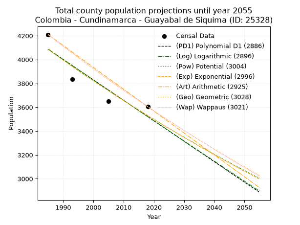
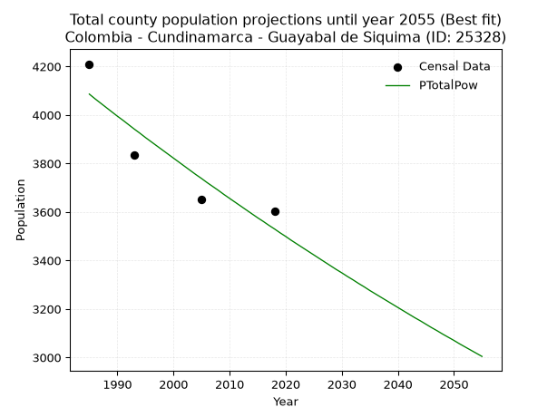
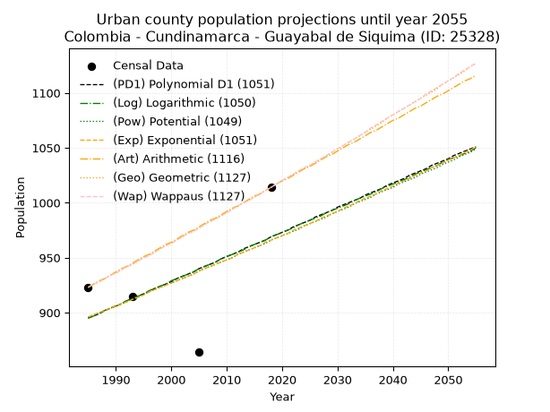
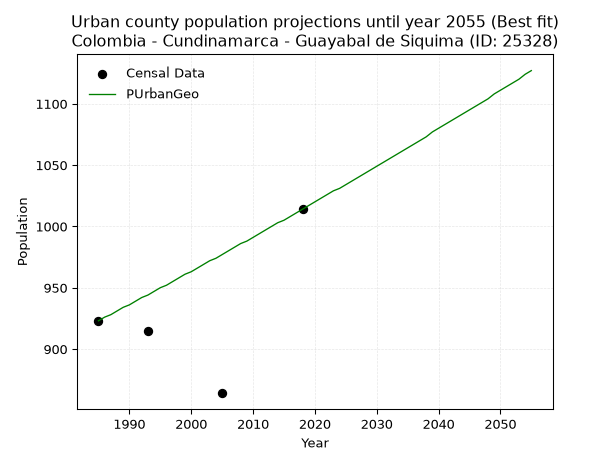
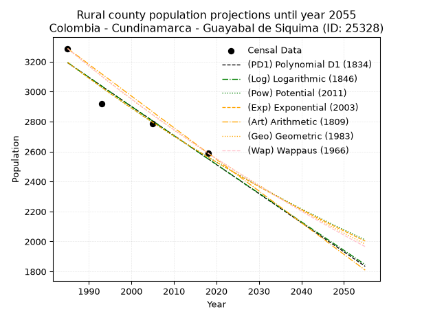
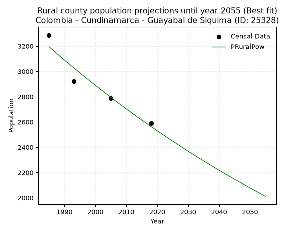

<div align="center">


</div>

# 📜 _“Population and Public Services Demand Projections (PPSD) until Year 2050 for Colombia - Cundinamarca - Guayabal de Siquima (ID: 25328)”_
Keywords: `population` `public-service` `projection` `lineal` `polynomial` `logarithmic` `potential` `exponential` `arithmetic` `geometric` `wappaus` `dane` `colombia` `south-america`

PPSD are analytical estimates used by governments and planners to anticipate future changes in population size, age distribution, and the resulting community needs for utilities, healthcare, education, and infrastructure as sizing future water treatment facilities, electrical grids, and road networks based on spatial growth.

<div align="center">

</img>

</div>


> **General running parameters**: • app_version: _v20260806_. • Python version: _3.14.7_. • Pandas version: _3.0.5_. • NumPy version: _2.5.1_. • Creates, save and include plots into reports (create_plot): _False_. • Projection until year: _2050_. • Process polynomial degree 2 and up: _False_. • Process Wappaus: _True_. • Process Wappaus: _True_. • Set negative values to zero: _True_. • Set infinite values to zero: _True_. • Drop dataset notes: _True_. 
<div align="center">

Maps & GIS Layers: [:earth_americas:Google](http://maps.google.com/maps?q=4.877968134,-74.4674373) [:earth_americas:OSM](https://www.openstreetmap.org/#map=18/4.877968134/-74.4674373&layers=P) [:earth_americas:Bing](https://www.bing.com/maps?cp=4.877968134~-74.4674373&lvl=18) [:earth_americas:Apple](https://maps.apple.com/frame?center=4.877968134%2C-74.4674373&span=0.003%2C0.006) [:earth_americas:GISMobile](https://github.com/rcfdtools/R.GISMobile/blob/main/file/gis/CountyLayer_CO/Readme.md)

</div>


<div align="center">

```geojson
{
  "type": "Feature",
  "geometry": {
    "type": "Point", 
    "coordinates": [-74.4674373, 4.877968134]
  }, 
  "properties": {
    "Name": "Colombia - Cundinamarca - Guayabal de Siquima (ID: 25328)"
  }
}
```

</div>


## 0. Census Data (4 records)

Census data are official statistics collected by a government about the people and housing in a country. They usually include counts of total population, age, sex, race, income, education, and jobs.

📅Global census file: [Population.xlsx](../data/Population.xlsx)

| Source   |   Year |   CountryID | CountryName   |   StateID | StateName    |   CountyID | CountyName          |   PTotal |   PUrban |   PRural |
|:---------|-------:|------------:|:--------------|----------:|:-------------|-----------:|:--------------------|---------:|---------:|---------:|
| DANE     |   1985 |          57 | Colombia      |        25 | Cundinamarca |      25328 | Guayabal de Siquima |     4210 |      923 |     3287 |
| DANE     |   1993 |          57 | Colombia      |        25 | Cundinamarca |      25328 | Guayabal de Siquima |     3835 |      915 |     2920 |
| DANE     |   2005 |          57 | Colombia      |        25 | Cundinamarca |      25328 | Guayabal de Siquima |     3652 |      864 |     2788 |
| DANE     |   2018 |          57 | Colombia      |        25 | Cundinamarca |      25328 | Guayabal de Siquima |     3604 |     1014 |     2590 |

> 🔥Some records could had specific notes about the registered values or the corresponding urban or rural distribution.

📅[SUI-RUPS](https://www.datos.gov.co/Hacienda-y-Cr-dito-P-blico/Registro-nico-de-Prestadores-de-Servicios-P-blicos/4qkq-csdn/about_data) - Local public utility companies: [RUPS.csv](../data/RUPS.csv)

 | SERVICIO       | ESTADO    | NOMBRE                                                                                                                                           | NIT         | DEPARTAMENTO_DOMICILIO   | MUNICIPIO_DOMICILIO   | DIRECCION                               |   TELEFONO | EMAIL                                                   | TIPO_PRESTADOR                 | CLASIFICACION                 |
|:---------------|:----------|:-------------------------------------------------------------------------------------------------------------------------------------------------|:------------|:-------------------------|:----------------------|:----------------------------------------|-----------:|:--------------------------------------------------------|:-------------------------------|:------------------------------|
| ACUEDUCTO      | OPERATIVA | ACUEDUCTO REGIONAL DE PAJONAL Y OTRAS VEREDAS DEL MUNICIPIO DE GUAYABAL DE SIQUIMA Y BITUIMA                                                     | 800187113-9 | CUNDINAMARCA             | GUAYABAL DE SIQUIMA   | CARRERA 9 No.12-13 BARRIO COPIGUI       |    8436411 | J.SEBASTIAN_HD@HOTMAIL.ES                               | ORGANIZACION AUTORIZADA        | HASTA 2500 SUSCRIPTORES       |
| ACUEDUCTO      | OPERATIVA | JUNTA DE SERVICIOS PUBLICOS DE GUAYABAL DE SIQUIMA                                                                                               | 800094685-1 | CUNDINAMARCA             | GUAYABAL DE SIQUIMA   | CALLE  3 No. 04 - 05                    |    0000000 | serviciospublicos@guayabaldesiquima-cundinamarca.gov.co | MUNICIPIO (PRESTACIÓN DIRECTA) | MENOR O IGUAL A 2500 USUARIOS |
| ALCANTARILLADO | OPERATIVA | JUNTA DE SERVICIOS PUBLICOS DE GUAYABAL DE SIQUIMA                                                                                               | 800094685-1 | CUNDINAMARCA             | GUAYABAL DE SIQUIMA   | CALLE  3 No. 04 - 05                    |    0000000 | serviciospublicos@guayabaldesiquima-cundinamarca.gov.co | MUNICIPIO (PRESTACIÓN DIRECTA) | MENOR O IGUAL A 2500 USUARIOS |
| ACUEDUCTO      | OPERATIVA | ASOCIACION DE USUARIOS DEL SERVICIO DE AGUA POTABLE DEL ACUEDUCTO DE LAS VEREDAS DE RESGUARDO Y PUEBLO VIEJO DE GUAYABAL DE SIQUIMA CUNDINAMARCA | 900026688-4 | CUNDINAMARCA             | GUAYABAL DE SIQUIMA   | GUAVABAL DE SIQUIMA, ALCALDIA MUNICIPAL |    3102261 | acupur2018@gmail.com                                    | ORGANIZACION AUTORIZADA        | MENOR O IGUAL A 2500 USUARIOS |
| ACUEDUCTO      | OPERATIVA | ASOCIACION DE AFILIADOS DEL ACUEDUCTO RURAL VEREDA DE LA TRINIDAD                                                                                | 832004131-3 | CUNDINAMARCA             | GUAYABAL DE SIQUIMA   | Cra 49c · 86a-36                        |    8138197 | mypines56@hotmail.com                                   | ORGANIZACION AUTORIZADA        | MENOR O IGUAL A 2500 USUARIOS |

## 1. Total

### 1.1. Coefficients and Parameters

* (PD1) Polynomial Deg 1: -17.162986752308253, 38155.514251304594 (lineal)
* (Log) Logarithmic: -34391.39046549299, 265234.48452351923
* (Pow) Potential: -8.873013728504853, 32.8723319758159
* (Exp) Exponential: -0.004428246770459676, 26831677.073377997
* (Art) Arithmetic: Year diff. 2018 - 1985 = 33, Population diff. 3604 - 4210 = -606, Annual growth = -18.363636363636363
* (Geo) Geometric: Year diff. 2018 - 1985 = 33, Population diff. 3604 - 4210 = -606, Annual growth % = -0.004698572704220583
* (Wap) Wappaus: i = -0.47001884729041116, Condition values only valid for < 200)

<sub>
Wappaus condition values: ['-0.00', '-0.47', '-0.94', '-1.41', '-1.88', '-2.35', '-2.82', '-3.29', '-3.76', '-4.23', '-4.70', '-5.17', '-5.64', '-6.11', '-6.58', '-7.05', '-7.52', '-7.99', '-8.46', '-8.93', '-9.40', '-9.87', '-10.34', '-10.81', '-11.28', '-11.75', '-12.22', '-12.69', '-13.16', '-13.63', '-14.10', '-14.57', '-15.04', '-15.51', '-15.98', '-16.45', '-16.92', '-17.39', '-17.86', '-18.33', '-18.80', '-19.27', '-19.74', '-20.21', '-20.68', '-21.15', '-21.62', '-22.09', '-22.56', '-23.03', '-23.50', '-23.97', '-24.44', '-24.91', '-25.38', '-25.85', '-26.32', '-26.79', '-27.26', '-27.73', '-28.20', '-28.67', '-29.14', '-29.61', '-30.08', '-30.55']
</sub>


### 1.2. Projected Dataset

|   Year |   CountyID |   PTotalPD1 |   PTotalLog |   PTotalPow |   PTotalExp |   PTotalArt |   PTotalGeo |   PTotalWap |
|-------:|-----------:|------------:|------------:|------------:|------------:|------------:|------------:|------------:|
|   1985 |      25328 |        4087 |        4088 |        4086 |        4085 |        4210 |        4210 |        4210 |
|   1986 |      25328 |        4070 |        4070 |        4067 |        4067 |        4192 |        4190 |        4190 |
|   1987 |      25328 |        4053 |        4053 |        4049 |        4049 |        4173 |        4171 |        4171 |
|   1988 |      25328 |        4035 |        4036 |        4031 |        4031 |        4155 |        4151 |        4151 |
|   1989 |      25328 |        4018 |        4019 |        4013 |        4013 |        4137 |        4131 |        4132 |
|   1990 |      25328 |        4001 |        4001 |        3995 |        3995 |        4118 |        4112 |        4112 |
|   1991 |      25328 |        3984 |        3984 |        3978 |        3978 |        4100 |        4093 |        4093 |
|   1992 |      25328 |        3967 |        3967 |        3960 |        3960 |        4081 |        4073 |        4074 |
|   1993 |      25328 |        3950 |        3949 |        3942 |        3943 |        4063 |        4054 |        4055 |
|   1994 |      25328 |        3933 |        3932 |        3925 |        3925 |        4045 |        4035 |        4036 |
|   1995 |      25328 |        3915 |        3915 |        3907 |        3908 |        4026 |        4016 |        4017 |
|   1996 |      25328 |        3898 |        3898 |        3890 |        3891 |        4008 |        3997 |        3998 |
|   1997 |      25328 |        3881 |        3881 |        3873 |        3873 |        3990 |        3979 |        3979 |
|   1998 |      25328 |        3864 |        3863 |        3856 |        3856 |        3971 |        3960 |        3960 |
|   1999 |      25328 |        3847 |        3846 |        3839 |        3839 |        3953 |        3941 |        3942 |
|   2000 |      25328 |        3830 |        3829 |        3822 |        3822 |        3935 |        3923 |        3923 |
|   2001 |      25328 |        3812 |        3812 |        3805 |        3805 |        3916 |        3904 |        3905 |
|   2002 |      25328 |        3795 |        3795 |        3788 |        3789 |        3898 |        3886 |        3887 |
|   2003 |      25328 |        3778 |        3777 |        3771 |        3772 |        3879 |        3868 |        3868 |
|   2004 |      25328 |        3761 |        3760 |        3754 |        3755 |        3861 |        3850 |        3850 |
|   2005 |      25328 |        3744 |        3743 |        3738 |        3739 |        3843 |        3832 |        3832 |
|   2006 |      25328 |        3727 |        3726 |        3721 |        3722 |        3824 |        3814 |        3814 |
|   2007 |      25328 |        3709 |        3709 |        3705 |        3706 |        3806 |        3796 |        3796 |
|   2008 |      25328 |        3692 |        3692 |        3689 |        3689 |        3788 |        3778 |        3778 |
|   2009 |      25328 |        3675 |        3674 |        3672 |        3673 |        3769 |        3760 |        3760 |
|   2010 |      25328 |        3658 |        3657 |        3656 |        3657 |        3751 |        3742 |        3743 |
|   2011 |      25328 |        3641 |        3640 |        3640 |        3641 |        3733 |        3725 |        3725 |
|   2012 |      25328 |        3624 |        3623 |        3624 |        3624 |        3714 |        3707 |        3708 |
|   2013 |      25328 |        3606 |        3606 |        3608 |        3608 |        3696 |        3690 |        3690 |
|   2014 |      25328 |        3589 |        3589 |        3592 |        3593 |        3677 |        3673 |        3673 |
|   2015 |      25328 |        3572 |        3572 |        3576 |        3577 |        3659 |        3655 |        3655 |
|   2016 |      25328 |        3555 |        3555 |        3561 |        3561 |        3641 |        3638 |        3638 |
|   2017 |      25328 |        3538 |        3538 |        3545 |        3545 |        3622 |        3621 |        3621 |
|   2018 |      25328 |        3521 |        3521 |        3530 |        3529 |        3604 |        3604 |        3604 |
|   2019 |      25328 |        3503 |        3504 |        3514 |        3514 |        3586 |        3587 |        3587 |
|   2020 |      25328 |        3486 |        3487 |        3499 |        3498 |        3567 |        3570 |        3570 |
|   2021 |      25328 |        3469 |        3470 |        3483 |        3483 |        3549 |        3553 |        3553 |
|   2022 |      25328 |        3452 |        3453 |        3468 |        3467 |        3531 |        3537 |        3536 |
|   2023 |      25328 |        3435 |        3436 |        3453 |        3452 |        3512 |        3520 |        3520 |
|   2024 |      25328 |        3418 |        3419 |        3438 |        3437 |        3494 |        3504 |        3503 |
|   2025 |      25328 |        3400 |        3402 |        3423 |        3422 |        3475 |        3487 |        3486 |
|   2026 |      25328 |        3383 |        3385 |        3408 |        3407 |        3457 |        3471 |        3470 |
|   2027 |      25328 |        3366 |        3368 |        3393 |        3392 |        3439 |        3454 |        3454 |
|   2028 |      25328 |        3349 |        3351 |        3378 |        3377 |        3420 |        3438 |        3437 |
|   2029 |      25328 |        3332 |        3334 |        3363 |        3362 |        3402 |        3422 |        3421 |
|   2030 |      25328 |        3315 |        3317 |        3349 |        3347 |        3384 |        3406 |        3405 |
|   2031 |      25328 |        3297 |        3300 |        3334 |        3332 |        3365 |        3390 |        3389 |
|   2032 |      25328 |        3280 |        3283 |        3320 |        3317 |        3347 |        3374 |        3372 |
|   2033 |      25328 |        3263 |        3266 |        3305 |        3303 |        3329 |        3358 |        3356 |
|   2034 |      25328 |        3246 |        3249 |        3291 |        3288 |        3310 |        3342 |        3341 |
|   2035 |      25328 |        3229 |        3232 |        3276 |        3273 |        3292 |        3327 |        3325 |
|   2036 |      25328 |        3212 |        3215 |        3262 |        3259 |        3273 |        3311 |        3309 |
|   2037 |      25328 |        3195 |        3198 |        3248 |        3245 |        3255 |        3296 |        3293 |
|   2038 |      25328 |        3177 |        3182 |        3234 |        3230 |        3237 |        3280 |        3277 |
|   2039 |      25328 |        3160 |        3165 |        3220 |        3216 |        3218 |        3265 |        3262 |
|   2040 |      25328 |        3143 |        3148 |        3206 |        3202 |        3200 |        3249 |        3246 |
|   2041 |      25328 |        3126 |        3131 |        3192 |        3188 |        3182 |        3234 |        3231 |
|   2042 |      25328 |        3109 |        3114 |        3178 |        3174 |        3163 |        3219 |        3215 |
|   2043 |      25328 |        3092 |        3097 |        3164 |        3160 |        3145 |        3204 |        3200 |
|   2044 |      25328 |        3074 |        3080 |        3151 |        3146 |        3127 |        3189 |        3185 |
|   2045 |      25328 |        3057 |        3064 |        3137 |        3132 |        3108 |        3174 |        3169 |
|   2046 |      25328 |        3040 |        3047 |        3123 |        3118 |        3090 |        3159 |        3154 |
|   2047 |      25328 |        3023 |        3030 |        3110 |        3104 |        3071 |        3144 |        3139 |
|   2048 |      25328 |        3006 |        3013 |        3096 |        3090 |        3053 |        3129 |        3124 |
|   2049 |      25328 |        2989 |        2996 |        3083 |        3077 |        3035 |        3114 |        3109 |
|   2050 |      25328 |        2971 |        2980 |        3070 |        3063 |        3016 |        3100 |        3094 |
<div align="center">

</img>

</div>


### 1.3. Best fit with absolute and relative error (%)

Relative error puts that difference into context by dividing the absolute error by the true value, creating a unitless ratio or percentage that shows the scale of the mistake.

Absolute and relative error

|   Year | Source   |   CountryID | CountryName   |   StateID | StateName    |   CountyID_x | CountyName          |   PTotal |   PUrban |   PRural |   CountyID_y |   PTotalPD1 |   PTotalLog |   PTotalPow |   PTotalExp |   PTotalArt |   PTotalGeo |   PTotalWap |   PTotalPD1AbsError |   PTotalLogAbsError |   PTotalPowAbsError |   PTotalExpAbsError |   PTotalArtAbsError |   PTotalGeoAbsError |   PTotalWapAbsError |   PTotalPD1RelError |   PTotalLogRelError |   PTotalPowRelError |   PTotalExpRelError |   PTotalArtRelError |   PTotalGeoRelError |   PTotalWapRelError |
|-------:|:---------|------------:|:--------------|----------:|:-------------|-------------:|:--------------------|---------:|---------:|---------:|-------------:|------------:|------------:|------------:|------------:|------------:|------------:|------------:|--------------------:|--------------------:|--------------------:|--------------------:|--------------------:|--------------------:|--------------------:|--------------------:|--------------------:|--------------------:|--------------------:|--------------------:|--------------------:|--------------------:|
|   1985 | DANE     |          57 | Colombia      |        25 | Cundinamarca |        25328 | Guayabal de Siquima |     4210 |      923 |     3287 |        25328 |        4087 |        4088 |        4086 |        4085 |        4210 |        4210 |        4210 |                 123 |                 122 |                 124 |                 125 |                   0 |                   0 |                   0 |             2.92162 |             2.89786 |             2.94537 |             2.96912 |             0       |             0       |             0       |
|   1993 | DANE     |          57 | Colombia      |        25 | Cundinamarca |        25328 | Guayabal de Siquima |     3835 |      915 |     2920 |        25328 |        3950 |        3949 |        3942 |        3943 |        4063 |        4054 |        4055 |                 115 |                 114 |                 107 |                 108 |                 228 |                 219 |                 220 |             2.9987  |             2.97262 |             2.79009 |             2.81617 |             5.94524 |             5.71056 |             5.73664 |
|   2005 | DANE     |          57 | Colombia      |        25 | Cundinamarca |        25328 | Guayabal de Siquima |     3652 |      864 |     2788 |        25328 |        3744 |        3743 |        3738 |        3739 |        3843 |        3832 |        3832 |                  92 |                  91 |                  86 |                  87 |                 191 |                 180 |                 180 |             2.51917 |             2.49179 |             2.35487 |             2.38226 |             5.23001 |             4.92881 |             4.92881 |
|   2018 | DANE     |          57 | Colombia      |        25 | Cundinamarca |        25328 | Guayabal de Siquima |     3604 |     1014 |     2590 |        25328 |        3521 |        3521 |        3530 |        3529 |        3604 |        3604 |        3604 |                  83 |                  83 |                  74 |                  75 |                   0 |                   0 |                   0 |             2.303   |             2.303   |             2.05327 |             2.08102 |             0       |             0       |             0       |

Relative error mean

| Method    |   RelError | Best   |
|:----------|-----------:|:-------|
| PTotalPD1 |    2.68562 |        |
| PTotalLog |    2.66632 |        |
| PTotalPow |    2.5359  | True   |
| PTotalExp |    2.56214 |        |
| PTotalArt |    2.79381 |        |
| PTotalGeo |    2.65984 |        |
| PTotalWap |    2.66636 |        |

💙Best method: _**PTotalPow**_
<div align="center">

</img>

</div>


### 1.4. Fresh water supply demand in liters per capita per day (lpcd)

The fresh water supply demand typically ranges from 100 to 300 liters per capita per day (lpcd) for standard domestic and municipal planning, though absolute survival minimums set by the World Health Organization are as low as 7.5 to 20 liters per day, and total consumption in high-income nations can exceed 400 liters.

> `CZ`: Level in meters above the sea level (masl)<br> `WS`: Fresh water supply demand in liters per capita per day (lpcd or l/h/d)<br> `WSAll`: Zonal fresh water supply demand in liters per second (l/s)<br> `A`: Zonal area in square meters<br> `DP`: Population density (people/hectare or p/ha)

Reference values (RAS Colombia)

|    CZ |   WS |
|------:|-----:|
|  1000 |  120 |
|  2000 |  130 |
| 99999 |  140 |

County shapefile geometry properties and water supply values

|   CountyID |      ATotal |   CZTotal |   WSTotal |
|-----------:|------------:|----------:|----------:|
|      25328 | 6.18397e+07 |    1583.5 |       130 |

Projected values for best method: PTotalPow

|   CountyID |   Year |   PTotalPow |   DPTotal |   WSTotal |   WSTotalAll |
|-----------:|-------:|------------:|----------:|----------:|-------------:|
|      25328 |   1985 |        4086 |      0.66 |       130 |      6.14792 |
|      25328 |   1986 |        4067 |      0.66 |       130 |      6.11933 |
|      25328 |   1987 |        4049 |      0.65 |       130 |      6.09225 |
|      25328 |   1988 |        4031 |      0.65 |       130 |      6.06516 |
|      25328 |   1989 |        4013 |      0.65 |       130 |      6.03808 |
|      25328 |   1990 |        3995 |      0.65 |       130 |      6.011   |
|      25328 |   1991 |        3978 |      0.64 |       130 |      5.98542 |
|      25328 |   1992 |        3960 |      0.64 |       130 |      5.95833 |
|      25328 |   1993 |        3942 |      0.64 |       130 |      5.93125 |
|      25328 |   1994 |        3925 |      0.63 |       130 |      5.90567 |
|      25328 |   1995 |        3907 |      0.63 |       130 |      5.87859 |
|      25328 |   1996 |        3890 |      0.63 |       130 |      5.85301 |
|      25328 |   1997 |        3873 |      0.63 |       130 |      5.82743 |
|      25328 |   1998 |        3856 |      0.62 |       130 |      5.80185 |
|      25328 |   1999 |        3839 |      0.62 |       130 |      5.77627 |
|      25328 |   2000 |        3822 |      0.62 |       130 |      5.75069 |
|      25328 |   2001 |        3805 |      0.62 |       130 |      5.72512 |
|      25328 |   2002 |        3788 |      0.61 |       130 |      5.69954 |
|      25328 |   2003 |        3771 |      0.61 |       130 |      5.67396 |
|      25328 |   2004 |        3754 |      0.61 |       130 |      5.64838 |
|      25328 |   2005 |        3738 |      0.6  |       130 |      5.62431 |
|      25328 |   2006 |        3721 |      0.6  |       130 |      5.59873 |
|      25328 |   2007 |        3705 |      0.6  |       130 |      5.57465 |
|      25328 |   2008 |        3689 |      0.6  |       130 |      5.55058 |
|      25328 |   2009 |        3672 |      0.59 |       130 |      5.525   |
|      25328 |   2010 |        3656 |      0.59 |       130 |      5.50093 |
|      25328 |   2011 |        3640 |      0.59 |       130 |      5.47685 |
|      25328 |   2012 |        3624 |      0.59 |       130 |      5.45278 |
|      25328 |   2013 |        3608 |      0.58 |       130 |      5.4287  |
|      25328 |   2014 |        3592 |      0.58 |       130 |      5.40463 |
|      25328 |   2015 |        3576 |      0.58 |       130 |      5.38056 |
|      25328 |   2016 |        3561 |      0.58 |       130 |      5.35799 |
|      25328 |   2017 |        3545 |      0.57 |       130 |      5.33391 |
|      25328 |   2018 |        3530 |      0.57 |       130 |      5.31134 |
|      25328 |   2019 |        3514 |      0.57 |       130 |      5.28727 |
|      25328 |   2020 |        3499 |      0.57 |       130 |      5.2647  |
|      25328 |   2021 |        3483 |      0.56 |       130 |      5.24062 |
|      25328 |   2022 |        3468 |      0.56 |       130 |      5.21806 |
|      25328 |   2023 |        3453 |      0.56 |       130 |      5.19549 |
|      25328 |   2024 |        3438 |      0.56 |       130 |      5.17292 |
|      25328 |   2025 |        3423 |      0.55 |       130 |      5.15035 |
|      25328 |   2026 |        3408 |      0.55 |       130 |      5.12778 |
|      25328 |   2027 |        3393 |      0.55 |       130 |      5.10521 |
|      25328 |   2028 |        3378 |      0.55 |       130 |      5.08264 |
|      25328 |   2029 |        3363 |      0.54 |       130 |      5.06007 |
|      25328 |   2030 |        3349 |      0.54 |       130 |      5.039   |
|      25328 |   2031 |        3334 |      0.54 |       130 |      5.01644 |
|      25328 |   2032 |        3320 |      0.54 |       130 |      4.99537 |
|      25328 |   2033 |        3305 |      0.53 |       130 |      4.9728  |
|      25328 |   2034 |        3291 |      0.53 |       130 |      4.95174 |
|      25328 |   2035 |        3276 |      0.53 |       130 |      4.92917 |
|      25328 |   2036 |        3262 |      0.53 |       130 |      4.9081  |
|      25328 |   2037 |        3248 |      0.53 |       130 |      4.88704 |
|      25328 |   2038 |        3234 |      0.52 |       130 |      4.86597 |
|      25328 |   2039 |        3220 |      0.52 |       130 |      4.84491 |
|      25328 |   2040 |        3206 |      0.52 |       130 |      4.82384 |
|      25328 |   2041 |        3192 |      0.52 |       130 |      4.80278 |
|      25328 |   2042 |        3178 |      0.51 |       130 |      4.78171 |
|      25328 |   2043 |        3164 |      0.51 |       130 |      4.76065 |
|      25328 |   2044 |        3151 |      0.51 |       130 |      4.74109 |
|      25328 |   2045 |        3137 |      0.51 |       130 |      4.72002 |
|      25328 |   2046 |        3123 |      0.51 |       130 |      4.69896 |
|      25328 |   2047 |        3110 |      0.5  |       130 |      4.6794  |
|      25328 |   2048 |        3096 |      0.5  |       130 |      4.65833 |
|      25328 |   2049 |        3083 |      0.5  |       130 |      4.63877 |
|      25328 |   2050 |        3070 |      0.5  |       130 |      4.61921 |

## 2. Urban

### 2.1. Coefficients and Parameters

* (PD1) Polynomial Deg 1: 2.2368526696105064, -3545.2645523884153 (lineal)
* (Log) Logarithmic: 4461.916927435904, -32986.06632099857
* (Pow) Potential: 4.542281465130668, -12.02712196699941
* (Exp) Exponential: 0.002277572253851082, 9.744783950465498
* (Art) Arithmetic: Year diff. 2018 - 1985 = 33, Population diff. 1014 - 923 = 91, Annual growth = 2.757575757575758
* (Geo) Geometric: Year diff. 2018 - 1985 = 33, Population diff. 1014 - 923 = 91, Annual growth % = 0.0028534254011178817
* (Wap) Wappaus: i = 0.2847264592231035, Condition values only valid for < 200)

<sub>
Wappaus condition values: ['0.00', '0.28', '0.57', '0.85', '1.14', '1.42', '1.71', '1.99', '2.28', '2.56', '2.85', '3.13', '3.42', '3.70', '3.99', '4.27', '4.56', '4.84', '5.13', '5.41', '5.69', '5.98', '6.26', '6.55', '6.83', '7.12', '7.40', '7.69', '7.97', '8.26', '8.54', '8.83', '9.11', '9.40', '9.68', '9.97', '10.25', '10.53', '10.82', '11.10', '11.39', '11.67', '11.96', '12.24', '12.53', '12.81', '13.10', '13.38', '13.67', '13.95', '14.24', '14.52', '14.81', '15.09', '15.38', '15.66', '15.94', '16.23', '16.51', '16.80', '17.08', '17.37', '17.65', '17.94', '18.22', '18.51']
</sub>


### 2.2. Projected Dataset

|   Year |   CountyID |   PUrbanPD1 |   PUrbanLog |   PUrbanPow |   PUrbanExp |   PUrbanArt |   PUrbanGeo |   PUrbanWap |
|-------:|-----------:|------------:|------------:|------------:|------------:|------------:|------------:|------------:|
|   1985 |      25328 |         895 |         895 |         896 |         896 |         923 |         923 |         923 |
|   1986 |      25328 |         897 |         897 |         898 |         898 |         926 |         926 |         926 |
|   1987 |      25328 |         899 |         899 |         900 |         900 |         929 |         928 |         928 |
|   1988 |      25328 |         902 |         902 |         902 |         902 |         931 |         931 |         931 |
|   1989 |      25328 |         904 |         904 |         904 |         904 |         934 |         934 |         934 |
|   1990 |      25328 |         906 |         906 |         906 |         906 |         937 |         936 |         936 |
|   1991 |      25328 |         908 |         908 |         908 |         908 |         940 |         939 |         939 |
|   1992 |      25328 |         911 |         911 |         910 |         910 |         942 |         942 |         942 |
|   1993 |      25328 |         913 |         913 |         912 |         912 |         945 |         944 |         944 |
|   1994 |      25328 |         915 |         915 |         914 |         914 |         948 |         947 |         947 |
|   1995 |      25328 |         917 |         917 |         917 |         916 |         951 |         950 |         950 |
|   1996 |      25328 |         919 |         920 |         919 |         919 |         953 |         952 |         952 |
|   1997 |      25328 |         922 |         922 |         921 |         921 |         956 |         955 |         955 |
|   1998 |      25328 |         924 |         924 |         923 |         923 |         959 |         958 |         958 |
|   1999 |      25328 |         926 |         926 |         925 |         925 |         962 |         961 |         961 |
|   2000 |      25328 |         928 |         929 |         927 |         927 |         964 |         963 |         963 |
|   2001 |      25328 |         931 |         931 |         929 |         929 |         967 |         966 |         966 |
|   2002 |      25328 |         933 |         933 |         931 |         931 |         970 |         969 |         969 |
|   2003 |      25328 |         935 |         935 |         933 |         933 |         973 |         972 |         972 |
|   2004 |      25328 |         937 |         937 |         935 |         935 |         975 |         974 |         974 |
|   2005 |      25328 |         940 |         940 |         938 |         938 |         978 |         977 |         977 |
|   2006 |      25328 |         942 |         942 |         940 |         940 |         981 |         980 |         980 |
|   2007 |      25328 |         944 |         944 |         942 |         942 |         984 |         983 |         983 |
|   2008 |      25328 |         946 |         946 |         944 |         944 |         986 |         986 |         985 |
|   2009 |      25328 |         949 |         949 |         946 |         946 |         989 |         988 |         988 |
|   2010 |      25328 |         951 |         951 |         948 |         948 |         992 |         991 |         991 |
|   2011 |      25328 |         953 |         953 |         950 |         950 |         995 |         994 |         994 |
|   2012 |      25328 |         955 |         955 |         953 |         953 |         997 |         997 |         997 |
|   2013 |      25328 |         958 |         957 |         955 |         955 |        1000 |        1000 |        1000 |
|   2014 |      25328 |         960 |         960 |         957 |         957 |        1003 |        1003 |        1002 |
|   2015 |      25328 |         962 |         962 |         959 |         959 |        1006 |        1005 |        1005 |
|   2016 |      25328 |         964 |         964 |         961 |         961 |        1008 |        1008 |        1008 |
|   2017 |      25328 |         966 |         966 |         963 |         964 |        1011 |        1011 |        1011 |
|   2018 |      25328 |         969 |         969 |         966 |         966 |        1014 |        1014 |        1014 |
|   2019 |      25328 |         971 |         971 |         968 |         968 |        1017 |        1017 |        1017 |
|   2020 |      25328 |         973 |         973 |         970 |         970 |        1020 |        1020 |        1020 |
|   2021 |      25328 |         975 |         975 |         972 |         972 |        1022 |        1023 |        1023 |
|   2022 |      25328 |         978 |         977 |         974 |         975 |        1025 |        1026 |        1026 |
|   2023 |      25328 |         980 |         980 |         976 |         977 |        1028 |        1029 |        1029 |
|   2024 |      25328 |         982 |         982 |         979 |         979 |        1031 |        1031 |        1032 |
|   2025 |      25328 |         984 |         984 |         981 |         981 |        1033 |        1034 |        1034 |
|   2026 |      25328 |         987 |         986 |         983 |         983 |        1036 |        1037 |        1037 |
|   2027 |      25328 |         989 |         988 |         985 |         986 |        1039 |        1040 |        1040 |
|   2028 |      25328 |         991 |         991 |         987 |         988 |        1042 |        1043 |        1043 |
|   2029 |      25328 |         993 |         993 |         990 |         990 |        1044 |        1046 |        1046 |
|   2030 |      25328 |         996 |         995 |         992 |         992 |        1047 |        1049 |        1049 |
|   2031 |      25328 |         998 |         997 |         994 |         995 |        1050 |        1052 |        1052 |
|   2032 |      25328 |        1000 |         999 |         996 |         997 |        1053 |        1055 |        1055 |
|   2033 |      25328 |        1002 |        1002 |         999 |         999 |        1055 |        1058 |        1058 |
|   2034 |      25328 |        1004 |        1004 |        1001 |        1002 |        1058 |        1061 |        1061 |
|   2035 |      25328 |        1007 |        1006 |        1003 |        1004 |        1061 |        1064 |        1064 |
|   2036 |      25328 |        1009 |        1008 |        1005 |        1006 |        1064 |        1067 |        1068 |
|   2037 |      25328 |        1011 |        1010 |        1008 |        1008 |        1066 |        1070 |        1071 |
|   2038 |      25328 |        1013 |        1013 |        1010 |        1011 |        1069 |        1073 |        1074 |
|   2039 |      25328 |        1016 |        1015 |        1012 |        1013 |        1072 |        1077 |        1077 |
|   2040 |      25328 |        1018 |        1017 |        1014 |        1015 |        1075 |        1080 |        1080 |
|   2041 |      25328 |        1020 |        1019 |        1017 |        1018 |        1077 |        1083 |        1083 |
|   2042 |      25328 |        1022 |        1021 |        1019 |        1020 |        1080 |        1086 |        1086 |
|   2043 |      25328 |        1025 |        1023 |        1021 |        1022 |        1083 |        1089 |        1089 |
|   2044 |      25328 |        1027 |        1026 |        1023 |        1025 |        1086 |        1092 |        1092 |
|   2045 |      25328 |        1029 |        1028 |        1026 |        1027 |        1088 |        1095 |        1095 |
|   2046 |      25328 |        1031 |        1030 |        1028 |        1029 |        1091 |        1098 |        1099 |
|   2047 |      25328 |        1034 |        1032 |        1030 |        1032 |        1094 |        1101 |        1102 |
|   2048 |      25328 |        1036 |        1034 |        1032 |        1034 |        1097 |        1104 |        1105 |
|   2049 |      25328 |        1038 |        1037 |        1035 |        1036 |        1099 |        1108 |        1108 |
|   2050 |      25328 |        1040 |        1039 |        1037 |        1039 |        1102 |        1111 |        1111 |
<div align="center">

</img>

</div>


### 2.3. Best fit with absolute and relative error (%)

Relative error puts that difference into context by dividing the absolute error by the true value, creating a unitless ratio or percentage that shows the scale of the mistake.

Absolute and relative error

|   Year | Source   |   CountryID | CountryName   |   StateID | StateName    |   CountyID_x | CountyName          |   PTotal |   PUrban |   PRural |   CountyID_y |   PUrbanPD1 |   PUrbanLog |   PUrbanPow |   PUrbanExp |   PUrbanArt |   PUrbanGeo |   PUrbanWap |   PUrbanPD1AbsError |   PUrbanLogAbsError |   PUrbanPowAbsError |   PUrbanExpAbsError |   PUrbanArtAbsError |   PUrbanGeoAbsError |   PUrbanWapAbsError |   PUrbanPD1RelError |   PUrbanLogRelError |   PUrbanPowRelError |   PUrbanExpRelError |   PUrbanArtRelError |   PUrbanGeoRelError |   PUrbanWapRelError |
|-------:|:---------|------------:|:--------------|----------:|:-------------|-------------:|:--------------------|---------:|---------:|---------:|-------------:|------------:|------------:|------------:|------------:|------------:|------------:|------------:|--------------------:|--------------------:|--------------------:|--------------------:|--------------------:|--------------------:|--------------------:|--------------------:|--------------------:|--------------------:|--------------------:|--------------------:|--------------------:|--------------------:|
|   1985 | DANE     |          57 | Colombia      |        25 | Cundinamarca |        25328 | Guayabal de Siquima |     4210 |      923 |     3287 |        25328 |         895 |         895 |         896 |         896 |         923 |         923 |         923 |                  28 |                  28 |                  27 |                  27 |                   0 |                   0 |                   0 |            3.03359  |            3.03359  |            2.92524  |            2.92524  |             0       |              0      |              0      |
|   1993 | DANE     |          57 | Colombia      |        25 | Cundinamarca |        25328 | Guayabal de Siquima |     3835 |      915 |     2920 |        25328 |         913 |         913 |         912 |         912 |         945 |         944 |         944 |                   2 |                   2 |                   3 |                   3 |                  30 |                  29 |                  29 |            0.218579 |            0.218579 |            0.327869 |            0.327869 |             3.27869 |              3.1694 |              3.1694 |
|   2005 | DANE     |          57 | Colombia      |        25 | Cundinamarca |        25328 | Guayabal de Siquima |     3652 |      864 |     2788 |        25328 |         940 |         940 |         938 |         938 |         978 |         977 |         977 |                  76 |                  76 |                  74 |                  74 |                 114 |                 113 |                 113 |            8.7963   |            8.7963   |            8.56481  |            8.56481  |            13.1944  |             13.0787 |             13.0787 |
|   2018 | DANE     |          57 | Colombia      |        25 | Cundinamarca |        25328 | Guayabal de Siquima |     3604 |     1014 |     2590 |        25328 |         969 |         969 |         966 |         966 |        1014 |        1014 |        1014 |                  45 |                  45 |                  48 |                  48 |                   0 |                   0 |                   0 |            4.43787  |            4.43787  |            4.73373  |            4.73373  |             0       |              0      |              0      |

Relative error mean

| Method    |   RelError | Best   |
|:----------|-----------:|:-------|
| PUrbanPD1 |    4.12158 |        |
| PUrbanLog |    4.12158 |        |
| PUrbanPow |    4.13791 |        |
| PUrbanExp |    4.13791 |        |
| PUrbanArt |    4.11828 |        |
| PUrbanGeo |    4.06203 | True   |
| PUrbanWap |    4.06203 | True   |

💙Best method: _**PUrbanGeo**_
<div align="center">

</img>

</div>


### 2.4. Fresh water supply demand in liters per capita per day (lpcd)

The fresh water supply demand typically ranges from 100 to 300 liters per capita per day (lpcd) for standard domestic and municipal planning, though absolute survival minimums set by the World Health Organization are as low as 7.5 to 20 liters per day, and total consumption in high-income nations can exceed 400 liters.

> `CZ`: Level in meters above the sea level (masl)<br> `WS`: Fresh water supply demand in liters per capita per day (lpcd or l/h/d)<br> `WSAll`: Zonal fresh water supply demand in liters per second (l/s)<br> `A`: Zonal area in square meters<br> `DP`: Population density (people/hectare or p/ha)

Reference values (RAS Colombia)

|    CZ |   WS |
|------:|-----:|
|  1000 |  120 |
|  2000 |  130 |
| 99999 |  140 |

County shapefile geometry properties and water supply values

|   CountyID |   AUrban |   CZUrban |   WSUrban |
|-----------:|---------:|----------:|----------:|
|      25328 |   251835 |   1606.93 |       130 |

Projected values for best method: PUrbanGeo

|   CountyID |   Year |   PUrbanGeo |   DPUrban |   WSUrban |   WSUrbanAll |
|-----------:|-------:|------------:|----------:|----------:|-------------:|
|      25328 |   1985 |         923 |     36.65 |       130 |      1.38877 |
|      25328 |   1986 |         926 |     36.77 |       130 |      1.39329 |
|      25328 |   1987 |         928 |     36.85 |       130 |      1.3963  |
|      25328 |   1988 |         931 |     36.97 |       130 |      1.40081 |
|      25328 |   1989 |         934 |     37.09 |       130 |      1.40532 |
|      25328 |   1990 |         936 |     37.17 |       130 |      1.40833 |
|      25328 |   1991 |         939 |     37.29 |       130 |      1.41285 |
|      25328 |   1992 |         942 |     37.41 |       130 |      1.41736 |
|      25328 |   1993 |         944 |     37.48 |       130 |      1.42037 |
|      25328 |   1994 |         947 |     37.6  |       130 |      1.42488 |
|      25328 |   1995 |         950 |     37.72 |       130 |      1.4294  |
|      25328 |   1996 |         952 |     37.8  |       130 |      1.43241 |
|      25328 |   1997 |         955 |     37.92 |       130 |      1.43692 |
|      25328 |   1998 |         958 |     38.04 |       130 |      1.44144 |
|      25328 |   1999 |         961 |     38.16 |       130 |      1.44595 |
|      25328 |   2000 |         963 |     38.24 |       130 |      1.44896 |
|      25328 |   2001 |         966 |     38.36 |       130 |      1.45347 |
|      25328 |   2002 |         969 |     38.48 |       130 |      1.45799 |
|      25328 |   2003 |         972 |     38.6  |       130 |      1.4625  |
|      25328 |   2004 |         974 |     38.68 |       130 |      1.46551 |
|      25328 |   2005 |         977 |     38.8  |       130 |      1.47002 |
|      25328 |   2006 |         980 |     38.91 |       130 |      1.47454 |
|      25328 |   2007 |         983 |     39.03 |       130 |      1.47905 |
|      25328 |   2008 |         986 |     39.15 |       130 |      1.48356 |
|      25328 |   2009 |         988 |     39.23 |       130 |      1.48657 |
|      25328 |   2010 |         991 |     39.35 |       130 |      1.49109 |
|      25328 |   2011 |         994 |     39.47 |       130 |      1.4956  |
|      25328 |   2012 |         997 |     39.59 |       130 |      1.50012 |
|      25328 |   2013 |        1000 |     39.71 |       130 |      1.50463 |
|      25328 |   2014 |        1003 |     39.83 |       130 |      1.50914 |
|      25328 |   2015 |        1005 |     39.91 |       130 |      1.51215 |
|      25328 |   2016 |        1008 |     40.03 |       130 |      1.51667 |
|      25328 |   2017 |        1011 |     40.15 |       130 |      1.52118 |
|      25328 |   2018 |        1014 |     40.26 |       130 |      1.52569 |
|      25328 |   2019 |        1017 |     40.38 |       130 |      1.53021 |
|      25328 |   2020 |        1020 |     40.5  |       130 |      1.53472 |
|      25328 |   2021 |        1023 |     40.62 |       130 |      1.53924 |
|      25328 |   2022 |        1026 |     40.74 |       130 |      1.54375 |
|      25328 |   2023 |        1029 |     40.86 |       130 |      1.54826 |
|      25328 |   2024 |        1031 |     40.94 |       130 |      1.55127 |
|      25328 |   2025 |        1034 |     41.06 |       130 |      1.55579 |
|      25328 |   2026 |        1037 |     41.18 |       130 |      1.5603  |
|      25328 |   2027 |        1040 |     41.3  |       130 |      1.56481 |
|      25328 |   2028 |        1043 |     41.42 |       130 |      1.56933 |
|      25328 |   2029 |        1046 |     41.54 |       130 |      1.57384 |
|      25328 |   2030 |        1049 |     41.65 |       130 |      1.57836 |
|      25328 |   2031 |        1052 |     41.77 |       130 |      1.58287 |
|      25328 |   2032 |        1055 |     41.89 |       130 |      1.58738 |
|      25328 |   2033 |        1058 |     42.01 |       130 |      1.5919  |
|      25328 |   2034 |        1061 |     42.13 |       130 |      1.59641 |
|      25328 |   2035 |        1064 |     42.25 |       130 |      1.60093 |
|      25328 |   2036 |        1067 |     42.37 |       130 |      1.60544 |
|      25328 |   2037 |        1070 |     42.49 |       130 |      1.60995 |
|      25328 |   2038 |        1073 |     42.61 |       130 |      1.61447 |
|      25328 |   2039 |        1077 |     42.77 |       130 |      1.62049 |
|      25328 |   2040 |        1080 |     42.89 |       130 |      1.625   |
|      25328 |   2041 |        1083 |     43    |       130 |      1.62951 |
|      25328 |   2042 |        1086 |     43.12 |       130 |      1.63403 |
|      25328 |   2043 |        1089 |     43.24 |       130 |      1.63854 |
|      25328 |   2044 |        1092 |     43.36 |       130 |      1.64306 |
|      25328 |   2045 |        1095 |     43.48 |       130 |      1.64757 |
|      25328 |   2046 |        1098 |     43.6  |       130 |      1.65208 |
|      25328 |   2047 |        1101 |     43.72 |       130 |      1.6566  |
|      25328 |   2048 |        1104 |     43.84 |       130 |      1.66111 |
|      25328 |   2049 |        1108 |     44    |       130 |      1.66713 |
|      25328 |   2050 |        1111 |     44.12 |       130 |      1.67164 |

## 3. Rural

### 3.1. Coefficients and Parameters

* (PD1) Polynomial Deg 1: -19.399839421918774, 41700.77880369302 (lineal)
* (Log) Logarithmic: -38853.3073929289, 298220.55084451794
* (Pow) Potential: -13.35768359398228, 47.554920324838584
* (Exp) Exponential: -0.006670230151406017, 1797240840.1531804
* (Art) Arithmetic: Year diff. 2018 - 1985 = 33, Population diff. 2590 - 3287 = -697, Annual growth = -21.12121212121212
* (Geo) Geometric: Year diff. 2018 - 1985 = 33, Population diff. 2590 - 3287 = -697, Annual growth % = -0.007195725864752367
* (Wap) Wappaus: i = -0.7187752976420664, Condition values only valid for < 200)

<sub>
Wappaus condition values: ['-0.00', '-0.72', '-1.44', '-2.16', '-2.88', '-3.59', '-4.31', '-5.03', '-5.75', '-6.47', '-7.19', '-7.91', '-8.63', '-9.34', '-10.06', '-10.78', '-11.50', '-12.22', '-12.94', '-13.66', '-14.38', '-15.09', '-15.81', '-16.53', '-17.25', '-17.97', '-18.69', '-19.41', '-20.13', '-20.84', '-21.56', '-22.28', '-23.00', '-23.72', '-24.44', '-25.16', '-25.88', '-26.59', '-27.31', '-28.03', '-28.75', '-29.47', '-30.19', '-30.91', '-31.63', '-32.34', '-33.06', '-33.78', '-34.50', '-35.22', '-35.94', '-36.66', '-37.38', '-38.10', '-38.81', '-39.53', '-40.25', '-40.97', '-41.69', '-42.41', '-43.13', '-43.85', '-44.56', '-45.28', '-46.00', '-46.72']
</sub>


### 3.2. Projected Dataset

|   Year |   CountyID |   PRuralPD1 |   PRuralLog |   PRuralPow |   PRuralExp |   PRuralArt |   PRuralGeo |   PRuralWap |
|-------:|-----------:|------------:|------------:|------------:|------------:|------------:|------------:|------------:|
|   1985 |      25328 |        3192 |        3193 |        3195 |        3194 |        3287 |        3287 |        3287 |
|   1986 |      25328 |        3173 |        3173 |        3174 |        3173 |        3266 |        3263 |        3263 |
|   1987 |      25328 |        3153 |        3154 |        3152 |        3152 |        3245 |        3240 |        3240 |
|   1988 |      25328 |        3134 |        3134 |        3131 |        3131 |        3224 |        3217 |        3217 |
|   1989 |      25328 |        3114 |        3115 |        3110 |        3110 |        3203 |        3193 |        3194 |
|   1990 |      25328 |        3095 |        3095 |        3089 |        3089 |        3181 |        3170 |        3171 |
|   1991 |      25328 |        3076 |        3076 |        3069 |        3069 |        3160 |        3148 |        3148 |
|   1992 |      25328 |        3056 |        3056 |        3048 |        3049 |        3139 |        3125 |        3126 |
|   1993 |      25328 |        3037 |        3037 |        3028 |        3028 |        3118 |        3102 |        3103 |
|   1994 |      25328 |        3017 |        3017 |        3008 |        3008 |        3097 |        3080 |        3081 |
|   1995 |      25328 |        2998 |        2998 |        2988 |        2988 |        3076 |        3058 |        3059 |
|   1996 |      25328 |        2979 |        2978 |        2968 |        2968 |        3055 |        3036 |        3037 |
|   1997 |      25328 |        2959 |        2959 |        2948 |        2949 |        3034 |        3014 |        3015 |
|   1998 |      25328 |        2940 |        2939 |        2928 |        2929 |        3012 |        2992 |        2994 |
|   1999 |      25328 |        2920 |        2920 |        2909 |        2909 |        2991 |        2971 |        2972 |
|   2000 |      25328 |        2901 |        2900 |        2889 |        2890 |        2970 |        2950 |        2951 |
|   2001 |      25328 |        2882 |        2881 |        2870 |        2871 |        2949 |        2928 |        2930 |
|   2002 |      25328 |        2862 |        2862 |        2851 |        2852 |        2928 |        2907 |        2908 |
|   2003 |      25328 |        2843 |        2842 |        2832 |        2833 |        2907 |        2886 |        2888 |
|   2004 |      25328 |        2824 |        2823 |        2813 |        2814 |        2886 |        2866 |        2867 |
|   2005 |      25328 |        2804 |        2803 |        2795 |        2795 |        2865 |        2845 |        2846 |
|   2006 |      25328 |        2785 |        2784 |        2776 |        2777 |        2843 |        2824 |        2826 |
|   2007 |      25328 |        2765 |        2765 |        2758 |        2758 |        2822 |        2804 |        2805 |
|   2008 |      25328 |        2746 |        2745 |        2739 |        2740 |        2801 |        2784 |        2785 |
|   2009 |      25328 |        2727 |        2726 |        2721 |        2722 |        2780 |        2764 |        2765 |
|   2010 |      25328 |        2707 |        2707 |        2703 |        2704 |        2759 |        2744 |        2745 |
|   2011 |      25328 |        2688 |        2687 |        2685 |        2686 |        2738 |        2724 |        2725 |
|   2012 |      25328 |        2668 |        2668 |        2667 |        2668 |        2717 |        2705 |        2706 |
|   2013 |      25328 |        2649 |        2649 |        2650 |        2650 |        2696 |        2685 |        2686 |
|   2014 |      25328 |        2630 |        2629 |        2632 |        2632 |        2674 |        2666 |        2667 |
|   2015 |      25328 |        2610 |        2610 |        2615 |        2615 |        2653 |        2647 |        2647 |
|   2016 |      25328 |        2591 |        2591 |        2598 |        2598 |        2632 |        2628 |        2628 |
|   2017 |      25328 |        2571 |        2571 |        2581 |        2580 |        2611 |        2609 |        2609 |
|   2018 |      25328 |        2552 |        2552 |        2563 |        2563 |        2590 |        2590 |        2590 |
|   2019 |      25328 |        2533 |        2533 |        2547 |        2546 |        2569 |        2571 |        2571 |
|   2020 |      25328 |        2513 |        2514 |        2530 |        2529 |        2548 |        2553 |        2552 |
|   2021 |      25328 |        2494 |        2495 |        2513 |        2512 |        2527 |        2534 |        2534 |
|   2022 |      25328 |        2474 |        2475 |        2497 |        2496 |        2506 |        2516 |        2515 |
|   2023 |      25328 |        2455 |        2456 |        2480 |        2479 |        2484 |        2498 |        2497 |
|   2024 |      25328 |        2436 |        2437 |        2464 |        2463 |        2463 |        2480 |        2479 |
|   2025 |      25328 |        2416 |        2418 |        2448 |        2446 |        2442 |        2462 |        2461 |
|   2026 |      25328 |        2397 |        2399 |        2432 |        2430 |        2421 |        2445 |        2443 |
|   2027 |      25328 |        2377 |        2379 |        2416 |        2414 |        2400 |        2427 |        2425 |
|   2028 |      25328 |        2358 |        2360 |        2400 |        2398 |        2379 |        2410 |        2407 |
|   2029 |      25328 |        2339 |        2341 |        2384 |        2382 |        2358 |        2392 |        2389 |
|   2030 |      25328 |        2319 |        2322 |        2368 |        2366 |        2337 |        2375 |        2372 |
|   2031 |      25328 |        2300 |        2303 |        2353 |        2350 |        2315 |        2358 |        2354 |
|   2032 |      25328 |        2280 |        2284 |        2337 |        2335 |        2294 |        2341 |        2337 |
|   2033 |      25328 |        2261 |        2265 |        2322 |        2319 |        2273 |        2324 |        2320 |
|   2034 |      25328 |        2242 |        2245 |        2307 |        2304 |        2252 |        2307 |        2303 |
|   2035 |      25328 |        2222 |        2226 |        2292 |        2288 |        2231 |        2291 |        2286 |
|   2036 |      25328 |        2203 |        2207 |        2277 |        2273 |        2210 |        2274 |        2269 |
|   2037 |      25328 |        2183 |        2188 |        2262 |        2258 |        2189 |        2258 |        2252 |
|   2038 |      25328 |        2164 |        2169 |        2247 |        2243 |        2168 |        2242 |        2235 |
|   2039 |      25328 |        2145 |        2150 |        2232 |        2228 |        2146 |        2226 |        2219 |
|   2040 |      25328 |        2125 |        2131 |        2218 |        2213 |        2125 |        2210 |        2202 |
|   2041 |      25328 |        2106 |        2112 |        2203 |        2199 |        2104 |        2194 |        2186 |
|   2042 |      25328 |        2086 |        2093 |        2189 |        2184 |        2083 |        2178 |        2169 |
|   2043 |      25328 |        2067 |        2074 |        2175 |        2169 |        2062 |        2162 |        2153 |
|   2044 |      25328 |        2048 |        2055 |        2161 |        2155 |        2041 |        2147 |        2137 |
|   2045 |      25328 |        2028 |        2036 |        2146 |        2141 |        2020 |        2131 |        2121 |
|   2046 |      25328 |        2009 |        2017 |        2133 |        2126 |        1999 |        2116 |        2105 |
|   2047 |      25328 |        1989 |        1998 |        2119 |        2112 |        1977 |        2101 |        2089 |
|   2048 |      25328 |        1970 |        1979 |        2105 |        2098 |        1956 |        2085 |        2073 |
|   2049 |      25328 |        1951 |        1960 |        2091 |        2084 |        1935 |        2070 |        2058 |
|   2050 |      25328 |        1931 |        1941 |        2078 |        2071 |        1914 |        2056 |        2042 |
<div align="center">

</img>

</div>


### 3.3. Best fit with absolute and relative error (%)

Relative error puts that difference into context by dividing the absolute error by the true value, creating a unitless ratio or percentage that shows the scale of the mistake.

Absolute and relative error

|   Year | Source   |   CountryID | CountryName   |   StateID | StateName    |   CountyID_x | CountyName          |   PTotal |   PUrban |   PRural |   CountyID_y |   PRuralPD1 |   PRuralLog |   PRuralPow |   PRuralExp |   PRuralArt |   PRuralGeo |   PRuralWap |   PRuralPD1AbsError |   PRuralLogAbsError |   PRuralPowAbsError |   PRuralExpAbsError |   PRuralArtAbsError |   PRuralGeoAbsError |   PRuralWapAbsError |   PRuralPD1RelError |   PRuralLogRelError |   PRuralPowRelError |   PRuralExpRelError |   PRuralArtRelError |   PRuralGeoRelError |   PRuralWapRelError |
|-------:|:---------|------------:|:--------------|----------:|:-------------|-------------:|:--------------------|---------:|---------:|---------:|-------------:|------------:|------------:|------------:|------------:|------------:|------------:|------------:|--------------------:|--------------------:|--------------------:|--------------------:|--------------------:|--------------------:|--------------------:|--------------------:|--------------------:|--------------------:|--------------------:|--------------------:|--------------------:|--------------------:|
|   1985 | DANE     |          57 | Colombia      |        25 | Cundinamarca |        25328 | Guayabal de Siquima |     4210 |      923 |     3287 |        25328 |        3192 |        3193 |        3195 |        3194 |        3287 |        3287 |        3287 |                  95 |                  94 |                  92 |                  93 |                   0 |                   0 |                   0 |            2.89017  |             2.85975 |            2.7989   |            2.82933  |             0       |             0       |             0       |
|   1993 | DANE     |          57 | Colombia      |        25 | Cundinamarca |        25328 | Guayabal de Siquima |     3835 |      915 |     2920 |        25328 |        3037 |        3037 |        3028 |        3028 |        3118 |        3102 |        3103 |                 117 |                 117 |                 108 |                 108 |                 198 |                 182 |                 183 |            4.00685  |             4.00685 |            3.69863  |            3.69863  |             6.78082 |             6.23288 |             6.26712 |
|   2005 | DANE     |          57 | Colombia      |        25 | Cundinamarca |        25328 | Guayabal de Siquima |     3652 |      864 |     2788 |        25328 |        2804 |        2803 |        2795 |        2795 |        2865 |        2845 |        2846 |                  16 |                  15 |                   7 |                   7 |                  77 |                  57 |                  58 |            0.573888 |             0.53802 |            0.251076 |            0.251076 |             2.76184 |             2.04448 |             2.08034 |
|   2018 | DANE     |          57 | Colombia      |        25 | Cundinamarca |        25328 | Guayabal de Siquima |     3604 |     1014 |     2590 |        25328 |        2552 |        2552 |        2563 |        2563 |        2590 |        2590 |        2590 |                  38 |                  38 |                  27 |                  27 |                   0 |                   0 |                   0 |            1.46718  |             1.46718 |            1.04247  |            1.04247  |             0       |             0       |             0       |

Relative error mean

| Method    |   RelError | Best   |
|:----------|-----------:|:-------|
| PRuralPD1 |    2.23452 |        |
| PRuralLog |    2.21795 |        |
| PRuralPow |    1.94777 | True   |
| PRuralExp |    1.95538 |        |
| PRuralArt |    2.38566 |        |
| PRuralGeo |    2.06934 |        |
| PRuralWap |    2.08687 |        |

💙Best method: _**PRuralPow**_
<div align="center">

</img>

</div>


### 3.4. Fresh water supply demand in liters per capita per day (lpcd)

The fresh water supply demand typically ranges from 100 to 300 liters per capita per day (lpcd) for standard domestic and municipal planning, though absolute survival minimums set by the World Health Organization are as low as 7.5 to 20 liters per day, and total consumption in high-income nations can exceed 400 liters.

> `CZ`: Level in meters above the sea level (masl)<br> `WS`: Fresh water supply demand in liters per capita per day (lpcd or l/h/d)<br> `WSAll`: Zonal fresh water supply demand in liters per second (l/s)<br> `A`: Zonal area in square meters<br> `DP`: Population density (people/hectare or p/ha)

Reference values (RAS Colombia)

|    CZ |   WS |
|------:|-----:|
|  1000 |  120 |
|  2000 |  130 |
| 99999 |  140 |

County shapefile geometry properties and water supply values

|   CountyID |      ARural |   CZRural |   WSRural |
|-----------:|------------:|----------:|----------:|
|      25328 | 6.15879e+07 |   1583.41 |       130 |

Projected values for best method: PRuralPow

|   CountyID |   Year |   PRuralPow |   DPRural |   WSRural |   WSRuralAll |
|-----------:|-------:|------------:|----------:|----------:|-------------:|
|      25328 |   1985 |        3195 |      0.52 |       130 |      4.80729 |
|      25328 |   1986 |        3174 |      0.52 |       130 |      4.77569 |
|      25328 |   1987 |        3152 |      0.51 |       130 |      4.74259 |
|      25328 |   1988 |        3131 |      0.51 |       130 |      4.711   |
|      25328 |   1989 |        3110 |      0.5  |       130 |      4.6794  |
|      25328 |   1990 |        3089 |      0.5  |       130 |      4.6478  |
|      25328 |   1991 |        3069 |      0.5  |       130 |      4.61771 |
|      25328 |   1992 |        3048 |      0.49 |       130 |      4.58611 |
|      25328 |   1993 |        3028 |      0.49 |       130 |      4.55602 |
|      25328 |   1994 |        3008 |      0.49 |       130 |      4.52593 |
|      25328 |   1995 |        2988 |      0.49 |       130 |      4.49583 |
|      25328 |   1996 |        2968 |      0.48 |       130 |      4.46574 |
|      25328 |   1997 |        2948 |      0.48 |       130 |      4.43565 |
|      25328 |   1998 |        2928 |      0.48 |       130 |      4.40556 |
|      25328 |   1999 |        2909 |      0.47 |       130 |      4.37697 |
|      25328 |   2000 |        2889 |      0.47 |       130 |      4.34687 |
|      25328 |   2001 |        2870 |      0.47 |       130 |      4.31829 |
|      25328 |   2002 |        2851 |      0.46 |       130 |      4.2897  |
|      25328 |   2003 |        2832 |      0.46 |       130 |      4.26111 |
|      25328 |   2004 |        2813 |      0.46 |       130 |      4.23252 |
|      25328 |   2005 |        2795 |      0.45 |       130 |      4.20544 |
|      25328 |   2006 |        2776 |      0.45 |       130 |      4.17685 |
|      25328 |   2007 |        2758 |      0.45 |       130 |      4.14977 |
|      25328 |   2008 |        2739 |      0.44 |       130 |      4.12118 |
|      25328 |   2009 |        2721 |      0.44 |       130 |      4.0941  |
|      25328 |   2010 |        2703 |      0.44 |       130 |      4.06701 |
|      25328 |   2011 |        2685 |      0.44 |       130 |      4.03993 |
|      25328 |   2012 |        2667 |      0.43 |       130 |      4.01285 |
|      25328 |   2013 |        2650 |      0.43 |       130 |      3.98727 |
|      25328 |   2014 |        2632 |      0.43 |       130 |      3.96019 |
|      25328 |   2015 |        2615 |      0.42 |       130 |      3.93461 |
|      25328 |   2016 |        2598 |      0.42 |       130 |      3.90903 |
|      25328 |   2017 |        2581 |      0.42 |       130 |      3.88345 |
|      25328 |   2018 |        2563 |      0.42 |       130 |      3.85637 |
|      25328 |   2019 |        2547 |      0.41 |       130 |      3.83229 |
|      25328 |   2020 |        2530 |      0.41 |       130 |      3.80671 |
|      25328 |   2021 |        2513 |      0.41 |       130 |      3.78113 |
|      25328 |   2022 |        2497 |      0.41 |       130 |      3.75706 |
|      25328 |   2023 |        2480 |      0.4  |       130 |      3.73148 |
|      25328 |   2024 |        2464 |      0.4  |       130 |      3.70741 |
|      25328 |   2025 |        2448 |      0.4  |       130 |      3.68333 |
|      25328 |   2026 |        2432 |      0.39 |       130 |      3.65926 |
|      25328 |   2027 |        2416 |      0.39 |       130 |      3.63519 |
|      25328 |   2028 |        2400 |      0.39 |       130 |      3.61111 |
|      25328 |   2029 |        2384 |      0.39 |       130 |      3.58704 |
|      25328 |   2030 |        2368 |      0.38 |       130 |      3.56296 |
|      25328 |   2031 |        2353 |      0.38 |       130 |      3.54039 |
|      25328 |   2032 |        2337 |      0.38 |       130 |      3.51632 |
|      25328 |   2033 |        2322 |      0.38 |       130 |      3.49375 |
|      25328 |   2034 |        2307 |      0.37 |       130 |      3.47118 |
|      25328 |   2035 |        2292 |      0.37 |       130 |      3.44861 |
|      25328 |   2036 |        2277 |      0.37 |       130 |      3.42604 |
|      25328 |   2037 |        2262 |      0.37 |       130 |      3.40347 |
|      25328 |   2038 |        2247 |      0.36 |       130 |      3.3809  |
|      25328 |   2039 |        2232 |      0.36 |       130 |      3.35833 |
|      25328 |   2040 |        2218 |      0.36 |       130 |      3.33727 |
|      25328 |   2041 |        2203 |      0.36 |       130 |      3.3147  |
|      25328 |   2042 |        2189 |      0.36 |       130 |      3.29363 |
|      25328 |   2043 |        2175 |      0.35 |       130 |      3.27257 |
|      25328 |   2044 |        2161 |      0.35 |       130 |      3.2515  |
|      25328 |   2045 |        2146 |      0.35 |       130 |      3.22894 |
|      25328 |   2046 |        2133 |      0.35 |       130 |      3.20938 |
|      25328 |   2047 |        2119 |      0.34 |       130 |      3.18831 |
|      25328 |   2048 |        2105 |      0.34 |       130 |      3.16725 |
|      25328 |   2049 |        2091 |      0.34 |       130 |      3.14618 |
|      25328 |   2050 |        2078 |      0.34 |       130 |      3.12662 |

#

<div align="center"><br><sub>Share this research</sub></div><br>

<sub>**APPS & TOOLS & CONTENT DISCLAIMER**: • NO WARRANTY - This content and software is provided by <a href="https://github.com/rcfdtools" target="_blank">github.com/rcfdtools</a> "as is", without any express or implied warranty, including warranties of merchantability, fitness for a particular purpose, or non-infringement. There is no guarantee that the software will be error-free or operate without interruption. • LIMITATION OF LIABILITY - Neither the authors nor copyright holders will be liable for claims or damages arising from the software or its use. You are responsible for determining if the software is appropriate for your use and assume all associated risks, including errors, legal compliance, and data loss. • NO PROFESSIONAL ADVICE - The software provides general information and does not offer professional advice. It should not replace consultation with professional advisors. [Clauses and global license for rcfdtools use.](https://github.com/rcfdtools/rcfdtools/blob/main/LICENSE.md)</sub>

| [:house: Home](Readme.md)  | [:beginner: Help / Collab](https://github.com/rcfdtools/R.HydroTools/discussions/31) |
|----------------------------|-------------------------------------------------------------------------------------------|