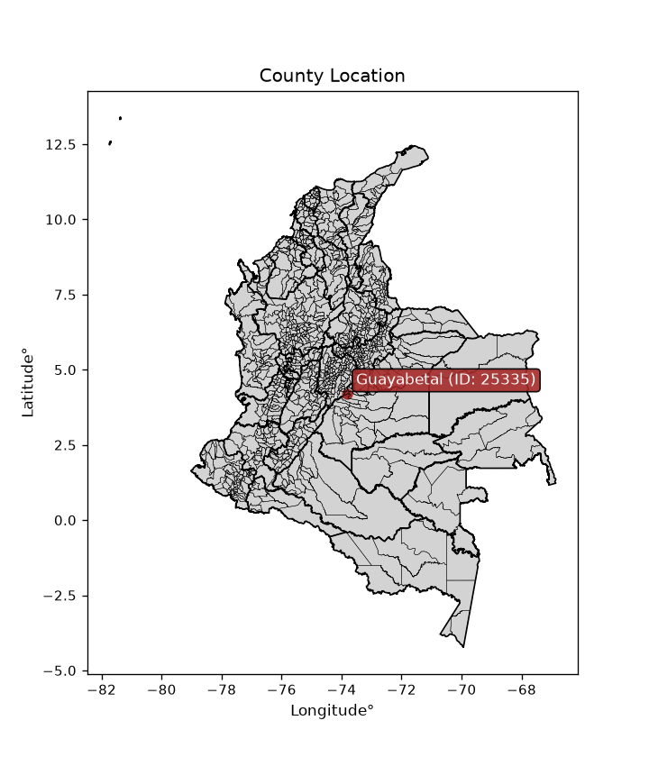
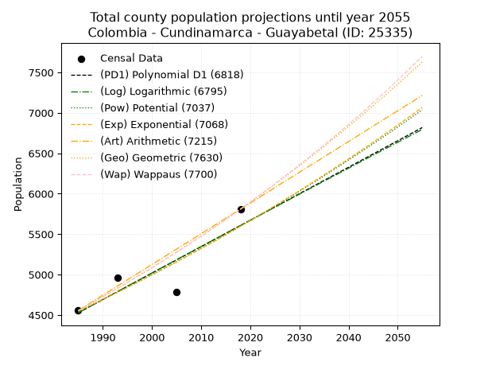
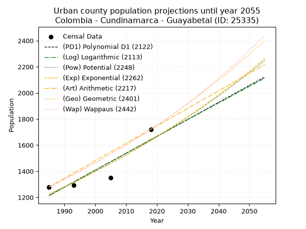
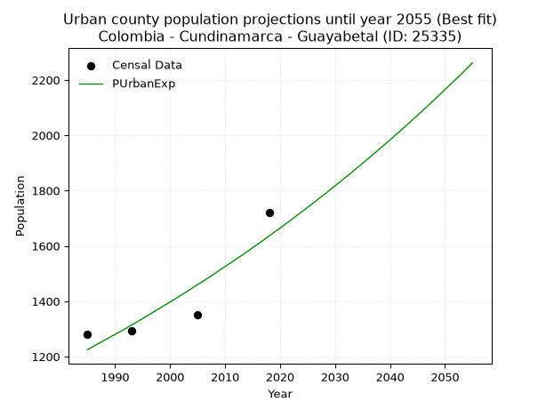
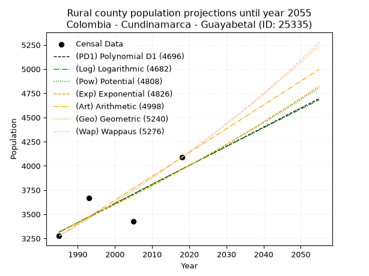

<div align="center">


</div>

# _“Population and Public Services Demand Projections (PPSD) until Year 2050 for Colombia - Cundinamarca - Guayabetal (ID: 25335)”_
Keywords: `population` `public-service` `projection` `lineal` `polynomial` `logarithmic` `potential` `exponential` `arithmetic` `geometric` `wappaus` `dane` `colombia` `south-america`

PPSD are analytical estimates used by governments and planners to anticipate future changes in population size, age distribution, and the resulting community needs for utilities, healthcare, education, and infrastructure as sizing future water treatment facilities, electrical grids, and road networks based on spatial growth.

<div align="center">

</img>

</div>


> **General running parameters**: • app_version: _v20260806_. • Python version: _3.14.7_. • Pandas version: _3.0.5_. • NumPy version: _2.5.1_. • Creates, save and include plots into reports (create_plot): _False_. • Projection until year: _2050_. • Process polynomial degree 2 and up: _False_. • Process Wappaus: _True_. • Process Wappaus: _True_. • Set negative values to zero: _True_. • Set infinite values to zero: _True_. • Drop dataset notes: _True_. 
<div align="center">

Dynamic map: [:earth_americas:Google](http://maps.google.com/maps?q=4.215306048,-73.8151066) [:earth_americas:OSM](https://www.openstreetmap.org/#map=18/4.215306048/-73.8151066&layers=P) [:earth_americas:Bing](https://www.bing.com/maps?cp=4.215306048~-73.8151066&lvl=18) [:earth_americas:Apple](https://maps.apple.com/frame?center=4.215306048%2C-73.8151066&span=0.003%2C0.006)

</div>


<div align="center">

```geojson
{
  "type": "Feature",
  "geometry": {
    "type": "Point", 
    "coordinates": [-73.8151066, 4.215306048]
  }, 
  "properties": {
    "Name": "Colombia - Cundinamarca - Guayabetal (ID: 25335)"
  }
}
```

</div>


## 0. Census Data (4 records)

Census data are official statistics collected by a government about the people and housing in a country. They usually include counts of total population, age, sex, race, income, education, and jobs.

📅Global census file: [Population.xlsx](../data/Population.xlsx)

| Source   |   Year |   CountryID | CountryName   |   StateID | StateName    |   CountyID | CountyName   |   PTotal |   PUrban |   PRural |
|:---------|-------:|------------:|:--------------|----------:|:-------------|-----------:|:-------------|---------:|---------:|---------:|
| DANE     |   1985 |          57 | Colombia      |        25 | Cundinamarca |      25335 | Guayabetal   |     4555 |     1279 |     3276 |
| DANE     |   1993 |          57 | Colombia      |        25 | Cundinamarca |      25335 | Guayabetal   |     4962 |     1292 |     3670 |
| DANE     |   2005 |          57 | Colombia      |        25 | Cundinamarca |      25335 | Guayabetal   |     4780 |     1351 |     3429 |
| DANE     |   2018 |          57 | Colombia      |        25 | Cundinamarca |      25335 | Guayabetal   |     5809 |     1721 |     4088 |

> 🔥Some records could had specific notes about the registered values or the corresponding urban or rural distribution.

📅[SUI-RUPS](https://www.datos.gov.co/Hacienda-y-Cr-dito-P-blico/Registro-nico-de-Prestadores-de-Servicios-P-blicos/4qkq-csdn/about_data) - Local public utility companies: [RUPS.csv](../data/RUPS.xlsx)

 | SERVICIO       | ESTADO    | NOMBRE                                                               | NIT         | DEPARTAMENTO_DOMICILIO   | MUNICIPIO_DOMICILIO   | DIRECCION       |   TELEFONO | EMAIL                                            | TIPO_PRESTADOR                 | CLASIFICACION                 |
|:---------------|:----------|:---------------------------------------------------------------------|:------------|:-------------------------|:----------------------|:----------------|-----------:|:-------------------------------------------------|:-------------------------------|:------------------------------|
| ACUEDUCTO      | OPERATIVA | DIRECCIÓN DE SERVICIOS PÚBLICOS MUNICIPIO DE GUAYABETAL CUNDINAMARCA | 800094701-1 | CUNDINAMARCA             | GUAYABETAL            | Cra. 3 No. 3-13 |    8495001 | serviciospublicos@guayabetal-cundinamarca.gov.co | MUNICIPIO (PRESTACIÓN DIRECTA) | MENOR O IGUAL A 2500 USUARIOS |
| ALCANTARILLADO | OPERATIVA | DIRECCIÓN DE SERVICIOS PÚBLICOS MUNICIPIO DE GUAYABETAL CUNDINAMARCA | 800094701-1 | CUNDINAMARCA             | GUAYABETAL            | Cra. 3 No. 3-13 |    8495001 | serviciospublicos@guayabetal-cundinamarca.gov.co | MUNICIPIO (PRESTACIÓN DIRECTA) | MENOR O IGUAL A 2500 USUARIOS |

## 1. Total

### 1.1. Coefficients and Parameters

* (PD1) Polynomial Deg 1: 32.7201926936967, -60422.06543556683 (lineal)
* (Log) Logarithmic: 65437.41924772088, -492363.8480844944
* (Pow) Potential: 12.60584082547072, -37.91341795251575
* (Exp) Exponential: 0.006302751708974705, 0.016758444868303256
* (Art) Arithmetic: Year diff. 2018 - 1985 = 33, Population diff. 5809 - 4555 = 1254, Annual growth = 38.0
* (Geo) Geometric: Year diff. 2018 - 1985 = 33, Population diff. 5809 - 4555 = 1254, Annual growth % = 0.007396398259226666
* (Wap) Wappaus: i = 0.7333076032419915, Condition values only valid for < 200)

<sub>
Wappaus condition values: ['0.00', '0.73', '1.47', '2.20', '2.93', '3.67', '4.40', '5.13', '5.87', '6.60', '7.33', '8.07', '8.80', '9.53', '10.27', '11.00', '11.73', '12.47', '13.20', '13.93', '14.67', '15.40', '16.13', '16.87', '17.60', '18.33', '19.07', '19.80', '20.53', '21.27', '22.00', '22.73', '23.47', '24.20', '24.93', '25.67', '26.40', '27.13', '27.87', '28.60', '29.33', '30.07', '30.80', '31.53', '32.27', '33.00', '33.73', '34.47', '35.20', '35.93', '36.67', '37.40', '38.13', '38.87', '39.60', '40.33', '41.07', '41.80', '42.53', '43.27', '44.00', '44.73', '45.47', '46.20', '46.93', '47.66']
</sub>


### 1.2. Projected Dataset

|   Year |   CountyID |   PTotalPD1 |   PTotalLog |   PTotalPow |   PTotalExp |   PTotalArt |   PTotalGeo |   PTotalWap |
|-------:|-----------:|------------:|------------:|------------:|------------:|------------:|------------:|------------:|
|   1985 |      25335 |        4528 |        4527 |        4546 |        4546 |        4555 |        4555 |        4555 |
|   1986 |      25335 |        4560 |        4560 |        4575 |        4575 |        4593 |        4589 |        4589 |
|   1987 |      25335 |        4593 |        4593 |        4604 |        4604 |        4631 |        4623 |        4622 |
|   1988 |      25335 |        4626 |        4626 |        4633 |        4633 |        4669 |        4657 |        4656 |
|   1989 |      25335 |        4658 |        4659 |        4663 |        4663 |        4707 |        4691 |        4691 |
|   1990 |      25335 |        4691 |        4692 |        4692 |        4692 |        4745 |        4726 |        4725 |
|   1991 |      25335 |        4724 |        4724 |        4722 |        4722 |        4783 |        4761 |        4760 |
|   1992 |      25335 |        4757 |        4757 |        4752 |        4752 |        4821 |        4796 |        4795 |
|   1993 |      25335 |        4789 |        4790 |        4782 |        4782 |        4859 |        4832 |        4830 |
|   1994 |      25335 |        4822 |        4823 |        4813 |        4812 |        4897 |        4867 |        4866 |
|   1995 |      25335 |        4855 |        4856 |        4843 |        4842 |        4935 |        4903 |        4902 |
|   1996 |      25335 |        4887 |        4889 |        4874 |        4873 |        4973 |        4940 |        4938 |
|   1997 |      25335 |        4920 |        4921 |        4905 |        4904 |        5011 |        4976 |        4974 |
|   1998 |      25335 |        4953 |        4954 |        4936 |        4935 |        5049 |        5013 |        5011 |
|   1999 |      25335 |        4986 |        4987 |        4967 |        4966 |        5087 |        5050 |        5048 |
|   2000 |      25335 |        5018 |        5020 |        4999 |        4997 |        5125 |        5087 |        5085 |
|   2001 |      25335 |        5051 |        5052 |        5030 |        5029 |        5163 |        5125 |        5123 |
|   2002 |      25335 |        5084 |        5085 |        5062 |        5061 |        5201 |        5163 |        5161 |
|   2003 |      25335 |        5116 |        5118 |        5094 |        5093 |        5239 |        5201 |        5199 |
|   2004 |      25335 |        5149 |        5150 |        5126 |        5125 |        5277 |        5240 |        5237 |
|   2005 |      25335 |        5182 |        5183 |        5158 |        5157 |        5315 |        5278 |        5276 |
|   2006 |      25335 |        5215 |        5216 |        5191 |        5190 |        5353 |        5317 |        5315 |
|   2007 |      25335 |        5247 |        5248 |        5224 |        5223 |        5391 |        5357 |        5354 |
|   2008 |      25335 |        5280 |        5281 |        5256 |        5256 |        5429 |        5396 |        5394 |
|   2009 |      25335 |        5313 |        5313 |        5290 |        5289 |        5467 |        5436 |        5434 |
|   2010 |      25335 |        5346 |        5346 |        5323 |        5322 |        5505 |        5476 |        5474 |
|   2011 |      25335 |        5378 |        5379 |        5356 |        5356 |        5543 |        5517 |        5515 |
|   2012 |      25335 |        5411 |        5411 |        5390 |        5390 |        5581 |        5558 |        5556 |
|   2013 |      25335 |        5444 |        5444 |        5424 |        5424 |        5619 |        5599 |        5597 |
|   2014 |      25335 |        5476 |        5476 |        5458 |        5458 |        5657 |        5640 |        5639 |
|   2015 |      25335 |        5509 |        5509 |        5492 |        5493 |        5695 |        5682 |        5681 |
|   2016 |      25335 |        5542 |        5541 |        5527 |        5528 |        5733 |        5724 |        5723 |
|   2017 |      25335 |        5575 |        5573 |        5561 |        5562 |        5771 |        5766 |        5766 |
|   2018 |      25335 |        5607 |        5606 |        5596 |        5598 |        5809 |        5809 |        5809 |
|   2019 |      25335 |        5640 |        5638 |        5631 |        5633 |        5847 |        5852 |        5852 |
|   2020 |      25335 |        5673 |        5671 |        5667 |        5669 |        5885 |        5895 |        5896 |
|   2021 |      25335 |        5705 |        5703 |        5702 |        5704 |        5923 |        5939 |        5940 |
|   2022 |      25335 |        5738 |        5735 |        5738 |        5741 |        5961 |        5983 |        5985 |
|   2023 |      25335 |        5771 |        5768 |        5774 |        5777 |        5999 |        6027 |        6030 |
|   2024 |      25335 |        5804 |        5800 |        5810 |        5813 |        6037 |        6072 |        6075 |
|   2025 |      25335 |        5836 |        5832 |        5846 |        5850 |        6075 |        6117 |        6121 |
|   2026 |      25335 |        5869 |        5865 |        5882 |        5887 |        6113 |        6162 |        6167 |
|   2027 |      25335 |        5902 |        5897 |        5919 |        5924 |        6151 |        6207 |        6213 |
|   2028 |      25335 |        5934 |        5929 |        5956 |        5962 |        6189 |        6253 |        6260 |
|   2029 |      25335 |        5967 |        5962 |        5993 |        5999 |        6227 |        6299 |        6307 |
|   2030 |      25335 |        6000 |        5994 |        6030 |        6037 |        6265 |        6346 |        6355 |
|   2031 |      25335 |        6033 |        6026 |        6068 |        6076 |        6303 |        6393 |        6403 |
|   2032 |      25335 |        6065 |        6058 |        6106 |        6114 |        6341 |        6440 |        6452 |
|   2033 |      25335 |        6098 |        6090 |        6144 |        6153 |        6379 |        6488 |        6501 |
|   2034 |      25335 |        6131 |        6123 |        6182 |        6192 |        6417 |        6536 |        6550 |
|   2035 |      25335 |        6164 |        6155 |        6220 |        6231 |        6455 |        6584 |        6600 |
|   2036 |      25335 |        6196 |        6187 |        6259 |        6270 |        6493 |        6633 |        6650 |
|   2037 |      25335 |        6229 |        6219 |        6298 |        6310 |        6531 |        6682 |        6701 |
|   2038 |      25335 |        6262 |        6251 |        6337 |        6350 |        6569 |        6731 |        6752 |
|   2039 |      25335 |        6294 |        6283 |        6376 |        6390 |        6607 |        6781 |        6804 |
|   2040 |      25335 |        6327 |        6315 |        6416 |        6430 |        6645 |        6831 |        6856 |
|   2041 |      25335 |        6360 |        6347 |        6456 |        6471 |        6683 |        6882 |        6909 |
|   2042 |      25335 |        6393 |        6380 |        6496 |        6512 |        6721 |        6933 |        6962 |
|   2043 |      25335 |        6425 |        6412 |        6536 |        6553 |        6759 |        6984 |        7016 |
|   2044 |      25335 |        6458 |        6444 |        6576 |        6594 |        6797 |        7036 |        7070 |
|   2045 |      25335 |        6491 |        6476 |        6617 |        6636 |        6835 |        7088 |        7124 |
|   2046 |      25335 |        6523 |        6508 |        6658 |        6678 |        6873 |        7140 |        7180 |
|   2047 |      25335 |        6556 |        6540 |        6699 |        6720 |        6911 |        7193 |        7235 |
|   2048 |      25335 |        6589 |        6572 |        6740 |        6763 |        6949 |        7246 |        7291 |
|   2049 |      25335 |        6622 |        6603 |        6782 |        6805 |        6987 |        7300 |        7348 |
|   2050 |      25335 |        6654 |        6635 |        6824 |        6849 |        7025 |        7354 |        7405 |
<div align="center">

</img>

</div>


### 1.3. Best fit with absolute and relative error (%)

Relative error puts that difference into context by dividing the absolute error by the true value, creating a unitless ratio or percentage that shows the scale of the mistake.

Absolute and relative error

|   Year | Source   |   CountryID | CountryName   |   StateID | StateName    |   CountyID_x | CountyName   |   PTotal |   PUrban |   PRural |   CountyID_y |   PTotalPD1 |   PTotalLog |   PTotalPow |   PTotalExp |   PTotalArt |   PTotalGeo |   PTotalWap |   PTotalPD1AbsError |   PTotalLogAbsError |   PTotalPowAbsError |   PTotalExpAbsError |   PTotalArtAbsError |   PTotalGeoAbsError |   PTotalWapAbsError |   PTotalPD1RelError |   PTotalLogRelError |   PTotalPowRelError |   PTotalExpRelError |   PTotalArtRelError |   PTotalGeoRelError |   PTotalWapRelError |
|-------:|:---------|------------:|:--------------|----------:|:-------------|-------------:|:-------------|---------:|---------:|---------:|-------------:|------------:|------------:|------------:|------------:|------------:|------------:|------------:|--------------------:|--------------------:|--------------------:|--------------------:|--------------------:|--------------------:|--------------------:|--------------------:|--------------------:|--------------------:|--------------------:|--------------------:|--------------------:|--------------------:|
|   1985 | DANE     |          57 | Colombia      |        25 | Cundinamarca |        25335 | Guayabetal   |     4555 |     1279 |     3276 |        25335 |        4528 |        4527 |        4546 |        4546 |        4555 |        4555 |        4555 |                  27 |                  28 |                   9 |                   9 |                   0 |                   0 |                   0 |            0.592755 |            0.614709 |            0.197585 |            0.197585 |             0       |             0       |             0       |
|   1993 | DANE     |          57 | Colombia      |        25 | Cundinamarca |        25335 | Guayabetal   |     4962 |     1292 |     3670 |        25335 |        4789 |        4790 |        4782 |        4782 |        4859 |        4832 |        4830 |                 173 |                 172 |                 180 |                 180 |                 103 |                 130 |                 132 |            3.4865   |            3.46634  |            3.62757  |            3.62757  |             2.07578 |             2.61991 |             2.66022 |
|   2005 | DANE     |          57 | Colombia      |        25 | Cundinamarca |        25335 | Guayabetal   |     4780 |     1351 |     3429 |        25335 |        5182 |        5183 |        5158 |        5157 |        5315 |        5278 |        5276 |                 402 |                 403 |                 378 |                 377 |                 535 |                 498 |                 496 |            8.41004  |            8.43096  |            7.90795  |            7.88703  |            11.1925  |            10.4184  |            10.3766  |
|   2018 | DANE     |          57 | Colombia      |        25 | Cundinamarca |        25335 | Guayabetal   |     5809 |     1721 |     4088 |        25335 |        5607 |        5606 |        5596 |        5598 |        5809 |        5809 |        5809 |                 202 |                 203 |                 213 |                 211 |                   0 |                   0 |                   0 |            3.47736  |            3.49458  |            3.66672  |            3.63229  |             0       |             0       |             0       |

Relative error mean

| Method    |   RelError | Best   |
|:----------|-----------:|:-------|
| PTotalPD1 |    3.99166 |        |
| PTotalLog |    4.00165 |        |
| PTotalPow |    3.84996 |        |
| PTotalExp |    3.83612 |        |
| PTotalArt |    3.31706 |        |
| PTotalGeo |    3.25958 |        |
| PTotalWap |    3.2592  | True   |

💙Best method: _**PTotalWap**_
<div align="center">

</img>

</div>


### 1.4. Fresh water supply demand in liters per capita per day (lpcd)

The fresh water supply demand typically ranges from 100 to 300 liters per capita per day (lpcd) for standard domestic and municipal planning, though absolute survival minimums set by the World Health Organization are as low as 7.5 to 20 liters per day, and total consumption in high-income nations can exceed 400 liters.

> `CZ`: Level in meters above the sea level (masl)<br> `WS`: Fresh water supply demand in liters per capita per day (lpcd or l/h/d)<br> `WSAll`: Zonal fresh water supply demand in liters per second (l/s)<br> `A`: Zonal area in square meters<br> `DP`: Population density (people/hectare or p/ha)

Reference values (RAS Colombia)

|    CZ |   WS |
|------:|-----:|
|  1000 |  120 |
|  2000 |  130 |
| 99999 |  140 |

County shapefile geometry properties and water supply values

|   CountyID |      ATotal |   CZTotal |   WSTotal |
|-----------:|------------:|----------:|----------:|
|      25335 | 2.22505e+08 |   2039.95 |       140 |

Projected values for best method: PTotalWap

|   CountyID |   Year |   PTotalWap |   DPTotal |   WSTotal |   WSTotalAll |
|-----------:|-------:|------------:|----------:|----------:|-------------:|
|      25335 |   1985 |        4555 |      0.2  |       140 |      7.38079 |
|      25335 |   1986 |        4589 |      0.21 |       140 |      7.43588 |
|      25335 |   1987 |        4622 |      0.21 |       140 |      7.48935 |
|      25335 |   1988 |        4656 |      0.21 |       140 |      7.54444 |
|      25335 |   1989 |        4691 |      0.21 |       140 |      7.60116 |
|      25335 |   1990 |        4725 |      0.21 |       140 |      7.65625 |
|      25335 |   1991 |        4760 |      0.21 |       140 |      7.71296 |
|      25335 |   1992 |        4795 |      0.22 |       140 |      7.76968 |
|      25335 |   1993 |        4830 |      0.22 |       140 |      7.82639 |
|      25335 |   1994 |        4866 |      0.22 |       140 |      7.88472 |
|      25335 |   1995 |        4902 |      0.22 |       140 |      7.94306 |
|      25335 |   1996 |        4938 |      0.22 |       140 |      8.00139 |
|      25335 |   1997 |        4974 |      0.22 |       140 |      8.05972 |
|      25335 |   1998 |        5011 |      0.23 |       140 |      8.11968 |
|      25335 |   1999 |        5048 |      0.23 |       140 |      8.17963 |
|      25335 |   2000 |        5085 |      0.23 |       140 |      8.23958 |
|      25335 |   2001 |        5123 |      0.23 |       140 |      8.30116 |
|      25335 |   2002 |        5161 |      0.23 |       140 |      8.36273 |
|      25335 |   2003 |        5199 |      0.23 |       140 |      8.42431 |
|      25335 |   2004 |        5237 |      0.24 |       140 |      8.48588 |
|      25335 |   2005 |        5276 |      0.24 |       140 |      8.54907 |
|      25335 |   2006 |        5315 |      0.24 |       140 |      8.61227 |
|      25335 |   2007 |        5354 |      0.24 |       140 |      8.67546 |
|      25335 |   2008 |        5394 |      0.24 |       140 |      8.74028 |
|      25335 |   2009 |        5434 |      0.24 |       140 |      8.80509 |
|      25335 |   2010 |        5474 |      0.25 |       140 |      8.86991 |
|      25335 |   2011 |        5515 |      0.25 |       140 |      8.93634 |
|      25335 |   2012 |        5556 |      0.25 |       140 |      9.00278 |
|      25335 |   2013 |        5597 |      0.25 |       140 |      9.06921 |
|      25335 |   2014 |        5639 |      0.25 |       140 |      9.13727 |
|      25335 |   2015 |        5681 |      0.26 |       140 |      9.20532 |
|      25335 |   2016 |        5723 |      0.26 |       140 |      9.27338 |
|      25335 |   2017 |        5766 |      0.26 |       140 |      9.34306 |
|      25335 |   2018 |        5809 |      0.26 |       140 |      9.41273 |
|      25335 |   2019 |        5852 |      0.26 |       140 |      9.48241 |
|      25335 |   2020 |        5896 |      0.26 |       140 |      9.5537  |
|      25335 |   2021 |        5940 |      0.27 |       140 |      9.625   |
|      25335 |   2022 |        5985 |      0.27 |       140 |      9.69792 |
|      25335 |   2023 |        6030 |      0.27 |       140 |      9.77083 |
|      25335 |   2024 |        6075 |      0.27 |       140 |      9.84375 |
|      25335 |   2025 |        6121 |      0.28 |       140 |      9.91829 |
|      25335 |   2026 |        6167 |      0.28 |       140 |      9.99282 |
|      25335 |   2027 |        6213 |      0.28 |       140 |     10.0674  |
|      25335 |   2028 |        6260 |      0.28 |       140 |     10.1435  |
|      25335 |   2029 |        6307 |      0.28 |       140 |     10.2197  |
|      25335 |   2030 |        6355 |      0.29 |       140 |     10.2975  |
|      25335 |   2031 |        6403 |      0.29 |       140 |     10.3752  |
|      25335 |   2032 |        6452 |      0.29 |       140 |     10.4546  |
|      25335 |   2033 |        6501 |      0.29 |       140 |     10.534   |
|      25335 |   2034 |        6550 |      0.29 |       140 |     10.6134  |
|      25335 |   2035 |        6600 |      0.3  |       140 |     10.6944  |
|      25335 |   2036 |        6650 |      0.3  |       140 |     10.7755  |
|      25335 |   2037 |        6701 |      0.3  |       140 |     10.8581  |
|      25335 |   2038 |        6752 |      0.3  |       140 |     10.9407  |
|      25335 |   2039 |        6804 |      0.31 |       140 |     11.025   |
|      25335 |   2040 |        6856 |      0.31 |       140 |     11.1093  |
|      25335 |   2041 |        6909 |      0.31 |       140 |     11.1951  |
|      25335 |   2042 |        6962 |      0.31 |       140 |     11.281   |
|      25335 |   2043 |        7016 |      0.32 |       140 |     11.3685  |
|      25335 |   2044 |        7070 |      0.32 |       140 |     11.456   |
|      25335 |   2045 |        7124 |      0.32 |       140 |     11.5435  |
|      25335 |   2046 |        7180 |      0.32 |       140 |     11.6343  |
|      25335 |   2047 |        7235 |      0.33 |       140 |     11.7234  |
|      25335 |   2048 |        7291 |      0.33 |       140 |     11.8141  |
|      25335 |   2049 |        7348 |      0.33 |       140 |     11.9065  |
|      25335 |   2050 |        7405 |      0.33 |       140 |     11.9988  |

## 2. Urban

### 2.1. Coefficients and Parameters

* (PD1) Polynomial Deg 1: 12.99598554797247, -24584.470092331932 (lineal)
* (Log) Logarithmic: 25983.750396154097, -196091.9449818752
* (Pow) Potential: 17.516058534174423, -54.675695270144764
* (Exp) Exponential: 0.00876034010839806, 3.4360259901681824e-05
* (Art) Arithmetic: Year diff. 2018 - 1985 = 33, Population diff. 1721 - 1279 = 442, Annual growth = 13.393939393939394
* (Geo) Geometric: Year diff. 2018 - 1985 = 33, Population diff. 1721 - 1279 = 442, Annual growth % = 0.009035331804601254
* (Wap) Wappaus: i = 0.8929292929292929, Condition values only valid for < 200)

<sub>
Wappaus condition values: ['0.00', '0.89', '1.79', '2.68', '3.57', '4.46', '5.36', '6.25', '7.14', '8.04', '8.93', '9.82', '10.72', '11.61', '12.50', '13.39', '14.29', '15.18', '16.07', '16.97', '17.86', '18.75', '19.64', '20.54', '21.43', '22.32', '23.22', '24.11', '25.00', '25.89', '26.79', '27.68', '28.57', '29.47', '30.36', '31.25', '32.15', '33.04', '33.93', '34.82', '35.72', '36.61', '37.50', '38.40', '39.29', '40.18', '41.07', '41.97', '42.86', '43.75', '44.65', '45.54', '46.43', '47.33', '48.22', '49.11', '50.00', '50.90', '51.79', '52.68', '53.58', '54.47', '55.36', '56.25', '57.15', '58.04']
</sub>


### 2.2. Projected Dataset

|   Year |   CountyID |   PUrbanPD1 |   PUrbanLog |   PUrbanPow |   PUrbanExp |   PUrbanArt |   PUrbanGeo |   PUrbanWap |
|-------:|-----------:|------------:|------------:|------------:|------------:|------------:|------------:|------------:|
|   1985 |      25335 |        1213 |        1212 |        1225 |        1225 |        1279 |        1279 |        1279 |
|   1986 |      25335 |        1226 |        1225 |        1236 |        1236 |        1292 |        1291 |        1290 |
|   1987 |      25335 |        1239 |        1239 |        1247 |        1247 |        1306 |        1302 |        1302 |
|   1988 |      25335 |        1252 |        1252 |        1258 |        1258 |        1319 |        1314 |        1314 |
|   1989 |      25335 |        1265 |        1265 |        1269 |        1269 |        1333 |        1326 |        1326 |
|   1990 |      25335 |        1278 |        1278 |        1280 |        1280 |        1346 |        1338 |        1337 |
|   1991 |      25335 |        1291 |        1291 |        1291 |        1291 |        1359 |        1350 |        1349 |
|   1992 |      25335 |        1304 |        1304 |        1303 |        1302 |        1373 |        1362 |        1362 |
|   1993 |      25335 |        1317 |        1317 |        1314 |        1314 |        1386 |        1374 |        1374 |
|   1994 |      25335 |        1330 |        1330 |        1326 |        1325 |        1400 |        1387 |        1386 |
|   1995 |      25335 |        1343 |        1343 |        1338 |        1337 |        1413 |        1399 |        1399 |
|   1996 |      25335 |        1356 |        1356 |        1349 |        1349 |        1426 |        1412 |        1411 |
|   1997 |      25335 |        1369 |        1369 |        1361 |        1361 |        1440 |        1425 |        1424 |
|   1998 |      25335 |        1382 |        1382 |        1373 |        1373 |        1453 |        1438 |        1437 |
|   1999 |      25335 |        1395 |        1395 |        1385 |        1385 |        1467 |        1451 |        1450 |
|   2000 |      25335 |        1408 |        1408 |        1397 |        1397 |        1480 |        1464 |        1463 |
|   2001 |      25335 |        1420 |        1421 |        1410 |        1409 |        1493 |        1477 |        1476 |
|   2002 |      25335 |        1433 |        1434 |        1422 |        1422 |        1507 |        1490 |        1489 |
|   2003 |      25335 |        1446 |        1447 |        1435 |        1434 |        1520 |        1504 |        1503 |
|   2004 |      25335 |        1459 |        1460 |        1447 |        1447 |        1533 |        1517 |        1516 |
|   2005 |      25335 |        1472 |        1473 |        1460 |        1460 |        1547 |        1531 |        1530 |
|   2006 |      25335 |        1485 |        1486 |        1473 |        1472 |        1560 |        1545 |        1544 |
|   2007 |      25335 |        1498 |        1499 |        1486 |        1485 |        1574 |        1559 |        1558 |
|   2008 |      25335 |        1511 |        1512 |        1499 |        1498 |        1587 |        1573 |        1572 |
|   2009 |      25335 |        1524 |        1525 |        1512 |        1512 |        1600 |        1587 |        1586 |
|   2010 |      25335 |        1537 |        1538 |        1525 |        1525 |        1614 |        1602 |        1600 |
|   2011 |      25335 |        1550 |        1551 |        1538 |        1538 |        1627 |        1616 |        1615 |
|   2012 |      25335 |        1563 |        1563 |        1552 |        1552 |        1641 |        1631 |        1630 |
|   2013 |      25335 |        1576 |        1576 |        1565 |        1565 |        1654 |        1645 |        1644 |
|   2014 |      25335 |        1589 |        1589 |        1579 |        1579 |        1667 |        1660 |        1659 |
|   2015 |      25335 |        1602 |        1602 |        1593 |        1593 |        1681 |        1675 |        1675 |
|   2016 |      25335 |        1615 |        1615 |        1607 |        1607 |        1694 |        1690 |        1690 |
|   2017 |      25335 |        1628 |        1628 |        1621 |        1621 |        1708 |        1706 |        1705 |
|   2018 |      25335 |        1641 |        1641 |        1635 |        1636 |        1721 |        1721 |        1721 |
|   2019 |      25335 |        1654 |        1654 |        1649 |        1650 |        1734 |        1737 |        1737 |
|   2020 |      25335 |        1667 |        1667 |        1664 |        1664 |        1748 |        1752 |        1753 |
|   2021 |      25335 |        1680 |        1679 |        1678 |        1679 |        1761 |        1768 |        1769 |
|   2022 |      25335 |        1693 |        1692 |        1693 |        1694 |        1775 |        1784 |        1785 |
|   2023 |      25335 |        1706 |        1705 |        1707 |        1709 |        1788 |        1800 |        1802 |
|   2024 |      25335 |        1719 |        1718 |        1722 |        1724 |        1801 |        1816 |        1818 |
|   2025 |      25335 |        1732 |        1731 |        1737 |        1739 |        1815 |        1833 |        1835 |
|   2026 |      25335 |        1745 |        1744 |        1752 |        1754 |        1828 |        1849 |        1852 |
|   2027 |      25335 |        1758 |        1756 |        1767 |        1770 |        1842 |        1866 |        1869 |
|   2028 |      25335 |        1771 |        1769 |        1783 |        1785 |        1855 |        1883 |        1887 |
|   2029 |      25335 |        1784 |        1782 |        1798 |        1801 |        1868 |        1900 |        1904 |
|   2030 |      25335 |        1797 |        1795 |        1814 |        1817 |        1882 |        1917 |        1922 |
|   2031 |      25335 |        1810 |        1808 |        1830 |        1833 |        1895 |        1934 |        1940 |
|   2032 |      25335 |        1823 |        1820 |        1845 |        1849 |        1909 |        1952 |        1958 |
|   2033 |      25335 |        1836 |        1833 |        1861 |        1865 |        1922 |        1970 |        1977 |
|   2034 |      25335 |        1849 |        1846 |        1877 |        1882 |        1935 |        1987 |        1995 |
|   2035 |      25335 |        1862 |        1859 |        1894 |        1898 |        1949 |        2005 |        2014 |
|   2036 |      25335 |        1875 |        1872 |        1910 |        1915 |        1962 |        2023 |        2033 |
|   2037 |      25335 |        1888 |        1884 |        1927 |        1932 |        1975 |        2042 |        2052 |
|   2038 |      25335 |        1901 |        1897 |        1943 |        1949 |        1989 |        2060 |        2072 |
|   2039 |      25335 |        1914 |        1910 |        1960 |        1966 |        2002 |        2079 |        2092 |
|   2040 |      25335 |        1927 |        1923 |        1977 |        1983 |        2016 |        2098 |        2112 |
|   2041 |      25335 |        1940 |        1935 |        1994 |        2001 |        2029 |        2117 |        2132 |
|   2042 |      25335 |        1953 |        1948 |        2011 |        2018 |        2042 |        2136 |        2152 |
|   2043 |      25335 |        1966 |        1961 |        2028 |        2036 |        2056 |        2155 |        2173 |
|   2044 |      25335 |        1979 |        1973 |        2046 |        2054 |        2069 |        2174 |        2194 |
|   2045 |      25335 |        1992 |        1986 |        2063 |        2072 |        2083 |        2194 |        2215 |
|   2046 |      25335 |        2005 |        1999 |        2081 |        2090 |        2096 |        2214 |        2236 |
|   2047 |      25335 |        2018 |        2012 |        2099 |        2109 |        2109 |        2234 |        2258 |
|   2048 |      25335 |        2031 |        2024 |        2117 |        2127 |        2123 |        2254 |        2280 |
|   2049 |      25335 |        2044 |        2037 |        2135 |        2146 |        2136 |        2274 |        2302 |
|   2050 |      25335 |        2057 |        2050 |        2154 |        2165 |        2150 |        2295 |        2325 |
<div align="center">

</img>

</div>


### 2.3. Best fit with absolute and relative error (%)

Relative error puts that difference into context by dividing the absolute error by the true value, creating a unitless ratio or percentage that shows the scale of the mistake.

Absolute and relative error

|   Year | Source   |   CountryID | CountryName   |   StateID | StateName    |   CountyID_x | CountyName   |   PTotal |   PUrban |   PRural |   CountyID_y |   PUrbanPD1 |   PUrbanLog |   PUrbanPow |   PUrbanExp |   PUrbanArt |   PUrbanGeo |   PUrbanWap |   PUrbanPD1AbsError |   PUrbanLogAbsError |   PUrbanPowAbsError |   PUrbanExpAbsError |   PUrbanArtAbsError |   PUrbanGeoAbsError |   PUrbanWapAbsError |   PUrbanPD1RelError |   PUrbanLogRelError |   PUrbanPowRelError |   PUrbanExpRelError |   PUrbanArtRelError |   PUrbanGeoRelError |   PUrbanWapRelError |
|-------:|:---------|------------:|:--------------|----------:|:-------------|-------------:|:-------------|---------:|---------:|---------:|-------------:|------------:|------------:|------------:|------------:|------------:|------------:|------------:|--------------------:|--------------------:|--------------------:|--------------------:|--------------------:|--------------------:|--------------------:|--------------------:|--------------------:|--------------------:|--------------------:|--------------------:|--------------------:|--------------------:|
|   1985 | DANE     |          57 | Colombia      |        25 | Cundinamarca |        25335 | Guayabetal   |     4555 |     1279 |     3276 |        25335 |        1213 |        1212 |        1225 |        1225 |        1279 |        1279 |        1279 |                  66 |                  67 |                  54 |                  54 |                   0 |                   0 |                   0 |             5.16028 |             5.23847 |             4.22205 |             4.22205 |             0       |             0       |             0       |
|   1993 | DANE     |          57 | Colombia      |        25 | Cundinamarca |        25335 | Guayabetal   |     4962 |     1292 |     3670 |        25335 |        1317 |        1317 |        1314 |        1314 |        1386 |        1374 |        1374 |                  25 |                  25 |                  22 |                  22 |                  94 |                  82 |                  82 |             1.93498 |             1.93498 |             1.70279 |             1.70279 |             7.27554 |             6.34675 |             6.34675 |
|   2005 | DANE     |          57 | Colombia      |        25 | Cundinamarca |        25335 | Guayabetal   |     4780 |     1351 |     3429 |        25335 |        1472 |        1473 |        1460 |        1460 |        1547 |        1531 |        1530 |                 121 |                 122 |                 109 |                 109 |                 196 |                 180 |                 179 |             8.95633 |             9.03035 |             8.0681  |             8.0681  |            14.5078  |            13.3235  |            13.2494  |
|   2018 | DANE     |          57 | Colombia      |        25 | Cundinamarca |        25335 | Guayabetal   |     5809 |     1721 |     4088 |        25335 |        1641 |        1641 |        1635 |        1636 |        1721 |        1721 |        1721 |                  80 |                  80 |                  86 |                  85 |                   0 |                   0 |                   0 |             4.64846 |             4.64846 |             4.99709 |             4.93899 |             0       |             0       |             0       |

Relative error mean

| Method    |   RelError | Best   |
|:----------|-----------:|:-------|
| PUrbanPD1 |    5.17501 |        |
| PUrbanLog |    5.21307 |        |
| PUrbanPow |    4.74751 |        |
| PUrbanExp |    4.73298 | True   |
| PUrbanArt |    5.44583 |        |
| PUrbanGeo |    4.91755 |        |
| PUrbanWap |    4.89905 |        |

💙Best method: _**PUrbanExp**_
<div align="center">

</img>

</div>


### 2.4. Fresh water supply demand in liters per capita per day (lpcd)

The fresh water supply demand typically ranges from 100 to 300 liters per capita per day (lpcd) for standard domestic and municipal planning, though absolute survival minimums set by the World Health Organization are as low as 7.5 to 20 liters per day, and total consumption in high-income nations can exceed 400 liters.

> `CZ`: Level in meters above the sea level (masl)<br> `WS`: Fresh water supply demand in liters per capita per day (lpcd or l/h/d)<br> `WSAll`: Zonal fresh water supply demand in liters per second (l/s)<br> `A`: Zonal area in square meters<br> `DP`: Population density (people/hectare or p/ha)

Reference values (RAS Colombia)

|    CZ |   WS |
|------:|-----:|
|  1000 |  120 |
|  2000 |  130 |
| 99999 |  140 |

County shapefile geometry properties and water supply values

|   CountyID |   AUrban |   CZUrban |   WSUrban |
|-----------:|---------:|----------:|----------:|
|      25335 |   439234 |   966.158 |       120 |

Projected values for best method: PUrbanExp

|   CountyID |   Year |   PUrbanExp |   DPUrban |   WSUrban |   WSUrbanAll |
|-----------:|-------:|------------:|----------:|----------:|-------------:|
|      25335 |   1985 |        1225 |     27.89 |       120 |      1.70139 |
|      25335 |   1986 |        1236 |     28.14 |       120 |      1.71667 |
|      25335 |   1987 |        1247 |     28.39 |       120 |      1.73194 |
|      25335 |   1988 |        1258 |     28.64 |       120 |      1.74722 |
|      25335 |   1989 |        1269 |     28.89 |       120 |      1.7625  |
|      25335 |   1990 |        1280 |     29.14 |       120 |      1.77778 |
|      25335 |   1991 |        1291 |     29.39 |       120 |      1.79306 |
|      25335 |   1992 |        1302 |     29.64 |       120 |      1.80833 |
|      25335 |   1993 |        1314 |     29.92 |       120 |      1.825   |
|      25335 |   1994 |        1325 |     30.17 |       120 |      1.84028 |
|      25335 |   1995 |        1337 |     30.44 |       120 |      1.85694 |
|      25335 |   1996 |        1349 |     30.71 |       120 |      1.87361 |
|      25335 |   1997 |        1361 |     30.99 |       120 |      1.89028 |
|      25335 |   1998 |        1373 |     31.26 |       120 |      1.90694 |
|      25335 |   1999 |        1385 |     31.53 |       120 |      1.92361 |
|      25335 |   2000 |        1397 |     31.81 |       120 |      1.94028 |
|      25335 |   2001 |        1409 |     32.08 |       120 |      1.95694 |
|      25335 |   2002 |        1422 |     32.37 |       120 |      1.975   |
|      25335 |   2003 |        1434 |     32.65 |       120 |      1.99167 |
|      25335 |   2004 |        1447 |     32.94 |       120 |      2.00972 |
|      25335 |   2005 |        1460 |     33.24 |       120 |      2.02778 |
|      25335 |   2006 |        1472 |     33.51 |       120 |      2.04444 |
|      25335 |   2007 |        1485 |     33.81 |       120 |      2.0625  |
|      25335 |   2008 |        1498 |     34.1  |       120 |      2.08056 |
|      25335 |   2009 |        1512 |     34.42 |       120 |      2.1     |
|      25335 |   2010 |        1525 |     34.72 |       120 |      2.11806 |
|      25335 |   2011 |        1538 |     35.02 |       120 |      2.13611 |
|      25335 |   2012 |        1552 |     35.33 |       120 |      2.15556 |
|      25335 |   2013 |        1565 |     35.63 |       120 |      2.17361 |
|      25335 |   2014 |        1579 |     35.95 |       120 |      2.19306 |
|      25335 |   2015 |        1593 |     36.27 |       120 |      2.2125  |
|      25335 |   2016 |        1607 |     36.59 |       120 |      2.23194 |
|      25335 |   2017 |        1621 |     36.91 |       120 |      2.25139 |
|      25335 |   2018 |        1636 |     37.25 |       120 |      2.27222 |
|      25335 |   2019 |        1650 |     37.57 |       120 |      2.29167 |
|      25335 |   2020 |        1664 |     37.88 |       120 |      2.31111 |
|      25335 |   2021 |        1679 |     38.23 |       120 |      2.33194 |
|      25335 |   2022 |        1694 |     38.57 |       120 |      2.35278 |
|      25335 |   2023 |        1709 |     38.91 |       120 |      2.37361 |
|      25335 |   2024 |        1724 |     39.25 |       120 |      2.39444 |
|      25335 |   2025 |        1739 |     39.59 |       120 |      2.41528 |
|      25335 |   2026 |        1754 |     39.93 |       120 |      2.43611 |
|      25335 |   2027 |        1770 |     40.3  |       120 |      2.45833 |
|      25335 |   2028 |        1785 |     40.64 |       120 |      2.47917 |
|      25335 |   2029 |        1801 |     41    |       120 |      2.50139 |
|      25335 |   2030 |        1817 |     41.37 |       120 |      2.52361 |
|      25335 |   2031 |        1833 |     41.73 |       120 |      2.54583 |
|      25335 |   2032 |        1849 |     42.1  |       120 |      2.56806 |
|      25335 |   2033 |        1865 |     42.46 |       120 |      2.59028 |
|      25335 |   2034 |        1882 |     42.85 |       120 |      2.61389 |
|      25335 |   2035 |        1898 |     43.21 |       120 |      2.63611 |
|      25335 |   2036 |        1915 |     43.6  |       120 |      2.65972 |
|      25335 |   2037 |        1932 |     43.99 |       120 |      2.68333 |
|      25335 |   2038 |        1949 |     44.37 |       120 |      2.70694 |
|      25335 |   2039 |        1966 |     44.76 |       120 |      2.73056 |
|      25335 |   2040 |        1983 |     45.15 |       120 |      2.75417 |
|      25335 |   2041 |        2001 |     45.56 |       120 |      2.77917 |
|      25335 |   2042 |        2018 |     45.94 |       120 |      2.80278 |
|      25335 |   2043 |        2036 |     46.35 |       120 |      2.82778 |
|      25335 |   2044 |        2054 |     46.76 |       120 |      2.85278 |
|      25335 |   2045 |        2072 |     47.17 |       120 |      2.87778 |
|      25335 |   2046 |        2090 |     47.58 |       120 |      2.90278 |
|      25335 |   2047 |        2109 |     48.02 |       120 |      2.92917 |
|      25335 |   2048 |        2127 |     48.43 |       120 |      2.95417 |
|      25335 |   2049 |        2146 |     48.86 |       120 |      2.98056 |
|      25335 |   2050 |        2165 |     49.29 |       120 |      3.00694 |

## 3. Rural

### 3.1. Coefficients and Parameters

* (PD1) Polynomial Deg 1: 19.724207145724208, -35837.595343234854 (lineal)
* (Log) Logarithmic: 39453.66885156669, -296271.9031026185
* (Pow) Potential: 10.677063177049249, -31.689123183237157
* (Exp) Exponential: 0.005337414302194373, 0.08319044010239038
* (Art) Arithmetic: Year diff. 2018 - 1985 = 33, Population diff. 4088 - 3276 = 812, Annual growth = 24.606060606060606
* (Geo) Geometric: Year diff. 2018 - 1985 = 33, Population diff. 4088 - 3276 = 812, Annual growth % = 0.0067326444562423315
* (Wap) Wappaus: i = 0.6682797557322272, Condition values only valid for < 200)

<sub>
Wappaus condition values: ['0.00', '0.67', '1.34', '2.00', '2.67', '3.34', '4.01', '4.68', '5.35', '6.01', '6.68', '7.35', '8.02', '8.69', '9.36', '10.02', '10.69', '11.36', '12.03', '12.70', '13.37', '14.03', '14.70', '15.37', '16.04', '16.71', '17.38', '18.04', '18.71', '19.38', '20.05', '20.72', '21.38', '22.05', '22.72', '23.39', '24.06', '24.73', '25.39', '26.06', '26.73', '27.40', '28.07', '28.74', '29.40', '30.07', '30.74', '31.41', '32.08', '32.75', '33.41', '34.08', '34.75', '35.42', '36.09', '36.76', '37.42', '38.09', '38.76', '39.43', '40.10', '40.77', '41.43', '42.10', '42.77', '43.44']
</sub>


### 3.2. Projected Dataset

|   Year |   CountyID |   PRuralPD1 |   PRuralLog |   PRuralPow |   PRuralExp |   PRuralArt |   PRuralGeo |   PRuralWap |
|-------:|-----------:|------------:|------------:|------------:|------------:|------------:|------------:|------------:|
|   1985 |      25335 |        3315 |        3315 |        3321 |        3321 |        3276 |        3276 |        3276 |
|   1986 |      25335 |        3335 |        3334 |        3339 |        3339 |        3301 |        3298 |        3298 |
|   1987 |      25335 |        3354 |        3354 |        3357 |        3357 |        3325 |        3320 |        3320 |
|   1988 |      25335 |        3374 |        3374 |        3375 |        3375 |        3350 |        3343 |        3342 |
|   1989 |      25335 |        3394 |        3394 |        3393 |        3393 |        3374 |        3365 |        3365 |
|   1990 |      25335 |        3414 |        3414 |        3411 |        3411 |        3399 |        3388 |        3387 |
|   1991 |      25335 |        3433 |        3434 |        3430 |        3429 |        3424 |        3411 |        3410 |
|   1992 |      25335 |        3453 |        3453 |        3448 |        3448 |        3448 |        3434 |        3433 |
|   1993 |      25335 |        3473 |        3473 |        3467 |        3466 |        3473 |        3457 |        3456 |
|   1994 |      25335 |        3492 |        3493 |        3485 |        3485 |        3497 |        3480 |        3479 |
|   1995 |      25335 |        3512 |        3513 |        3504 |        3504 |        3522 |        3503 |        3502 |
|   1996 |      25335 |        3532 |        3533 |        3523 |        3522 |        3547 |        3527 |        3526 |
|   1997 |      25335 |        3552 |        3552 |        3542 |        3541 |        3571 |        3551 |        3550 |
|   1998 |      25335 |        3571 |        3572 |        3561 |        3560 |        3596 |        3575 |        3574 |
|   1999 |      25335 |        3591 |        3592 |        3580 |        3579 |        3620 |        3599 |        3598 |
|   2000 |      25335 |        3611 |        3612 |        3599 |        3598 |        3645 |        3623 |        3622 |
|   2001 |      25335 |        3631 |        3631 |        3618 |        3618 |        3670 |        3647 |        3646 |
|   2002 |      25335 |        3650 |        3651 |        3638 |        3637 |        3694 |        3672 |        3671 |
|   2003 |      25335 |        3670 |        3671 |        3657 |        3656 |        3719 |        3697 |        3695 |
|   2004 |      25335 |        3690 |        3690 |        3677 |        3676 |        3744 |        3721 |        3720 |
|   2005 |      25335 |        3709 |        3710 |        3696 |        3696 |        3768 |        3747 |        3745 |
|   2006 |      25335 |        3729 |        3730 |        3716 |        3715 |        3793 |        3772 |        3770 |
|   2007 |      25335 |        3749 |        3749 |        3736 |        3735 |        3817 |        3797 |        3796 |
|   2008 |      25335 |        3769 |        3769 |        3756 |        3755 |        3842 |        3823 |        3821 |
|   2009 |      25335 |        3788 |        3789 |        3776 |        3775 |        3867 |        3848 |        3847 |
|   2010 |      25335 |        3808 |        3808 |        3796 |        3796 |        3891 |        3874 |        3873 |
|   2011 |      25335 |        3828 |        3828 |        3816 |        3816 |        3916 |        3900 |        3899 |
|   2012 |      25335 |        3848 |        3848 |        3836 |        3836 |        3940 |        3927 |        3926 |
|   2013 |      25335 |        3867 |        3867 |        3857 |        3857 |        3965 |        3953 |        3952 |
|   2014 |      25335 |        3887 |        3887 |        3877 |        3877 |        3990 |        3980 |        3979 |
|   2015 |      25335 |        3907 |        3906 |        3898 |        3898 |        4014 |        4007 |        4006 |
|   2016 |      25335 |        3926 |        3926 |        3919 |        3919 |        4039 |        4034 |        4033 |
|   2017 |      25335 |        3946 |        3946 |        3939 |        3940 |        4063 |        4061 |        4060 |
|   2018 |      25335 |        3966 |        3965 |        3960 |        3961 |        4088 |        4088 |        4088 |
|   2019 |      25335 |        3986 |        3985 |        3981 |        3982 |        4113 |        4116 |        4116 |
|   2020 |      25335 |        4005 |        4004 |        4002 |        4004 |        4137 |        4143 |        4144 |
|   2021 |      25335 |        4025 |        4024 |        4024 |        4025 |        4162 |        4171 |        4172 |
|   2022 |      25335 |        4045 |        4043 |        4045 |        4047 |        4186 |        4199 |        4200 |
|   2023 |      25335 |        4064 |        4063 |        4066 |        4068 |        4211 |        4227 |        4229 |
|   2024 |      25335 |        4084 |        4082 |        4088 |        4090 |        4236 |        4256 |        4258 |
|   2025 |      25335 |        4104 |        4102 |        4109 |        4112 |        4260 |        4285 |        4287 |
|   2026 |      25335 |        4124 |        4121 |        4131 |        4134 |        4285 |        4313 |        4316 |
|   2027 |      25335 |        4143 |        4141 |        4153 |        4156 |        4309 |        4342 |        4346 |
|   2028 |      25335 |        4163 |        4160 |        4175 |        4178 |        4334 |        4372 |        4375 |
|   2029 |      25335 |        4183 |        4180 |        4197 |        4201 |        4359 |        4401 |        4405 |
|   2030 |      25335 |        4203 |        4199 |        4219 |        4223 |        4383 |        4431 |        4436 |
|   2031 |      25335 |        4222 |        4218 |        4241 |        4246 |        4408 |        4461 |        4466 |
|   2032 |      25335 |        4242 |        4238 |        4264 |        4268 |        4432 |        4491 |        4497 |
|   2033 |      25335 |        4262 |        4257 |        4286 |        4291 |        4457 |        4521 |        4528 |
|   2034 |      25335 |        4281 |        4277 |        4309 |        4314 |        4482 |        4551 |        4559 |
|   2035 |      25335 |        4301 |        4296 |        4331 |        4337 |        4506 |        4582 |        4590 |
|   2036 |      25335 |        4321 |        4315 |        4354 |        4361 |        4531 |        4613 |        4622 |
|   2037 |      25335 |        4341 |        4335 |        4377 |        4384 |        4556 |        4644 |        4654 |
|   2038 |      25335 |        4360 |        4354 |        4400 |        4407 |        4580 |        4675 |        4686 |
|   2039 |      25335 |        4380 |        4374 |        4423 |        4431 |        4605 |        4707 |        4718 |
|   2040 |      25335 |        4400 |        4393 |        4446 |        4455 |        4629 |        4738 |        4751 |
|   2041 |      25335 |        4420 |        4412 |        4470 |        4478 |        4654 |        4770 |        4784 |
|   2042 |      25335 |        4439 |        4432 |        4493 |        4502 |        4679 |        4802 |        4817 |
|   2043 |      25335 |        4459 |        4451 |        4517 |        4527 |        4703 |        4835 |        4851 |
|   2044 |      25335 |        4479 |        4470 |        4540 |        4551 |        4728 |        4867 |        4885 |
|   2045 |      25335 |        4498 |        4489 |        4564 |        4575 |        4752 |        4900 |        4919 |
|   2046 |      25335 |        4518 |        4509 |        4588 |        4600 |        4777 |        4933 |        4953 |
|   2047 |      25335 |        4538 |        4528 |        4612 |        4624 |        4802 |        4966 |        4988 |
|   2048 |      25335 |        4558 |        4547 |        4636 |        4649 |        4826 |        5000 |        5023 |
|   2049 |      25335 |        4577 |        4567 |        4660 |        4674 |        4851 |        5033 |        5058 |
|   2050 |      25335 |        4597 |        4586 |        4685 |        4699 |        4875 |        5067 |        5094 |
<div align="center">

</img>

</div>


### 3.3. Best fit with absolute and relative error (%)

Relative error puts that difference into context by dividing the absolute error by the true value, creating a unitless ratio or percentage that shows the scale of the mistake.

Absolute and relative error

|   Year | Source   |   CountryID | CountryName   |   StateID | StateName    |   CountyID_x | CountyName   |   PTotal |   PUrban |   PRural |   CountyID_y |   PRuralPD1 |   PRuralLog |   PRuralPow |   PRuralExp |   PRuralArt |   PRuralGeo |   PRuralWap |   PRuralPD1AbsError |   PRuralLogAbsError |   PRuralPowAbsError |   PRuralExpAbsError |   PRuralArtAbsError |   PRuralGeoAbsError |   PRuralWapAbsError |   PRuralPD1RelError |   PRuralLogRelError |   PRuralPowRelError |   PRuralExpRelError |   PRuralArtRelError |   PRuralGeoRelError |   PRuralWapRelError |
|-------:|:---------|------------:|:--------------|----------:|:-------------|-------------:|:-------------|---------:|---------:|---------:|-------------:|------------:|------------:|------------:|------------:|------------:|------------:|------------:|--------------------:|--------------------:|--------------------:|--------------------:|--------------------:|--------------------:|--------------------:|--------------------:|--------------------:|--------------------:|--------------------:|--------------------:|--------------------:|--------------------:|
|   1985 | DANE     |          57 | Colombia      |        25 | Cundinamarca |        25335 | Guayabetal   |     4555 |     1279 |     3276 |        25335 |        3315 |        3315 |        3321 |        3321 |        3276 |        3276 |        3276 |                  39 |                  39 |                  45 |                  45 |                   0 |                   0 |                   0 |             1.19048 |             1.19048 |             1.37363 |             1.37363 |             0       |             0       |             0       |
|   1993 | DANE     |          57 | Colombia      |        25 | Cundinamarca |        25335 | Guayabetal   |     4962 |     1292 |     3670 |        25335 |        3473 |        3473 |        3467 |        3466 |        3473 |        3457 |        3456 |                 197 |                 197 |                 203 |                 204 |                 197 |                 213 |                 214 |             5.36785 |             5.36785 |             5.53134 |             5.55858 |             5.36785 |             5.80381 |             5.83106 |
|   2005 | DANE     |          57 | Colombia      |        25 | Cundinamarca |        25335 | Guayabetal   |     4780 |     1351 |     3429 |        25335 |        3709 |        3710 |        3696 |        3696 |        3768 |        3747 |        3745 |                 280 |                 281 |                 267 |                 267 |                 339 |                 318 |                 316 |             8.16565 |             8.19481 |             7.78653 |             7.78653 |             9.88626 |             9.27384 |             9.21551 |
|   2018 | DANE     |          57 | Colombia      |        25 | Cundinamarca |        25335 | Guayabetal   |     5809 |     1721 |     4088 |        25335 |        3966 |        3965 |        3960 |        3961 |        4088 |        4088 |        4088 |                 122 |                 123 |                 128 |                 127 |                   0 |                   0 |                   0 |             2.98434 |             3.00881 |             3.13112 |             3.10665 |             0       |             0       |             0       |

Relative error mean

| Method    |   RelError | Best   |
|:----------|-----------:|:-------|
| PRuralPD1 |    4.42708 |        |
| PRuralLog |    4.44048 |        |
| PRuralPow |    4.45565 |        |
| PRuralExp |    4.45635 |        |
| PRuralArt |    3.81353 |        |
| PRuralGeo |    3.76941 |        |
| PRuralWap |    3.76164 | True   |

💙Best method: _**PRuralWap**_
<div align="center">

</img>

</div>


### 3.4. Fresh water supply demand in liters per capita per day (lpcd)

The fresh water supply demand typically ranges from 100 to 300 liters per capita per day (lpcd) for standard domestic and municipal planning, though absolute survival minimums set by the World Health Organization are as low as 7.5 to 20 liters per day, and total consumption in high-income nations can exceed 400 liters.

> `CZ`: Level in meters above the sea level (masl)<br> `WS`: Fresh water supply demand in liters per capita per day (lpcd or l/h/d)<br> `WSAll`: Zonal fresh water supply demand in liters per second (l/s)<br> `A`: Zonal area in square meters<br> `DP`: Population density (people/hectare or p/ha)

Reference values (RAS Colombia)

|    CZ |   WS |
|------:|-----:|
|  1000 |  120 |
|  2000 |  130 |
| 99999 |  140 |

County shapefile geometry properties and water supply values

|   CountyID |      ARural |   CZRural |   WSRural |
|-----------:|------------:|----------:|----------:|
|      25335 | 2.22066e+08 |   2042.17 |       140 |

Projected values for best method: PRuralWap

|   CountyID |   Year |   PRuralWap |   DPRural |   WSRural |   WSRuralAll |
|-----------:|-------:|------------:|----------:|----------:|-------------:|
|      25335 |   1985 |        3276 |      0.15 |       140 |      5.30833 |
|      25335 |   1986 |        3298 |      0.15 |       140 |      5.34398 |
|      25335 |   1987 |        3320 |      0.15 |       140 |      5.37963 |
|      25335 |   1988 |        3342 |      0.15 |       140 |      5.41528 |
|      25335 |   1989 |        3365 |      0.15 |       140 |      5.45255 |
|      25335 |   1990 |        3387 |      0.15 |       140 |      5.48819 |
|      25335 |   1991 |        3410 |      0.15 |       140 |      5.52546 |
|      25335 |   1992 |        3433 |      0.15 |       140 |      5.56273 |
|      25335 |   1993 |        3456 |      0.16 |       140 |      5.6     |
|      25335 |   1994 |        3479 |      0.16 |       140 |      5.63727 |
|      25335 |   1995 |        3502 |      0.16 |       140 |      5.67454 |
|      25335 |   1996 |        3526 |      0.16 |       140 |      5.71343 |
|      25335 |   1997 |        3550 |      0.16 |       140 |      5.75231 |
|      25335 |   1998 |        3574 |      0.16 |       140 |      5.7912  |
|      25335 |   1999 |        3598 |      0.16 |       140 |      5.83009 |
|      25335 |   2000 |        3622 |      0.16 |       140 |      5.86898 |
|      25335 |   2001 |        3646 |      0.16 |       140 |      5.90787 |
|      25335 |   2002 |        3671 |      0.17 |       140 |      5.94838 |
|      25335 |   2003 |        3695 |      0.17 |       140 |      5.98727 |
|      25335 |   2004 |        3720 |      0.17 |       140 |      6.02778 |
|      25335 |   2005 |        3745 |      0.17 |       140 |      6.06829 |
|      25335 |   2006 |        3770 |      0.17 |       140 |      6.1088  |
|      25335 |   2007 |        3796 |      0.17 |       140 |      6.15093 |
|      25335 |   2008 |        3821 |      0.17 |       140 |      6.19144 |
|      25335 |   2009 |        3847 |      0.17 |       140 |      6.23356 |
|      25335 |   2010 |        3873 |      0.17 |       140 |      6.27569 |
|      25335 |   2011 |        3899 |      0.18 |       140 |      6.31782 |
|      25335 |   2012 |        3926 |      0.18 |       140 |      6.36157 |
|      25335 |   2013 |        3952 |      0.18 |       140 |      6.4037  |
|      25335 |   2014 |        3979 |      0.18 |       140 |      6.44745 |
|      25335 |   2015 |        4006 |      0.18 |       140 |      6.4912  |
|      25335 |   2016 |        4033 |      0.18 |       140 |      6.53495 |
|      25335 |   2017 |        4060 |      0.18 |       140 |      6.5787  |
|      25335 |   2018 |        4088 |      0.18 |       140 |      6.62407 |
|      25335 |   2019 |        4116 |      0.19 |       140 |      6.66944 |
|      25335 |   2020 |        4144 |      0.19 |       140 |      6.71481 |
|      25335 |   2021 |        4172 |      0.19 |       140 |      6.76019 |
|      25335 |   2022 |        4200 |      0.19 |       140 |      6.80556 |
|      25335 |   2023 |        4229 |      0.19 |       140 |      6.85255 |
|      25335 |   2024 |        4258 |      0.19 |       140 |      6.89954 |
|      25335 |   2025 |        4287 |      0.19 |       140 |      6.94653 |
|      25335 |   2026 |        4316 |      0.19 |       140 |      6.99352 |
|      25335 |   2027 |        4346 |      0.2  |       140 |      7.04213 |
|      25335 |   2028 |        4375 |      0.2  |       140 |      7.08912 |
|      25335 |   2029 |        4405 |      0.2  |       140 |      7.13773 |
|      25335 |   2030 |        4436 |      0.2  |       140 |      7.18796 |
|      25335 |   2031 |        4466 |      0.2  |       140 |      7.23657 |
|      25335 |   2032 |        4497 |      0.2  |       140 |      7.28681 |
|      25335 |   2033 |        4528 |      0.2  |       140 |      7.33704 |
|      25335 |   2034 |        4559 |      0.21 |       140 |      7.38727 |
|      25335 |   2035 |        4590 |      0.21 |       140 |      7.4375  |
|      25335 |   2036 |        4622 |      0.21 |       140 |      7.48935 |
|      25335 |   2037 |        4654 |      0.21 |       140 |      7.5412  |
|      25335 |   2038 |        4686 |      0.21 |       140 |      7.59306 |
|      25335 |   2039 |        4718 |      0.21 |       140 |      7.64491 |
|      25335 |   2040 |        4751 |      0.21 |       140 |      7.69838 |
|      25335 |   2041 |        4784 |      0.22 |       140 |      7.75185 |
|      25335 |   2042 |        4817 |      0.22 |       140 |      7.80532 |
|      25335 |   2043 |        4851 |      0.22 |       140 |      7.86042 |
|      25335 |   2044 |        4885 |      0.22 |       140 |      7.91551 |
|      25335 |   2045 |        4919 |      0.22 |       140 |      7.9706  |
|      25335 |   2046 |        4953 |      0.22 |       140 |      8.02569 |
|      25335 |   2047 |        4988 |      0.22 |       140 |      8.08241 |
|      25335 |   2048 |        5023 |      0.23 |       140 |      8.13912 |
|      25335 |   2049 |        5058 |      0.23 |       140 |      8.19583 |
|      25335 |   2050 |        5094 |      0.23 |       140 |      8.25417 |

<div align="center"><br><sub>Share this research</sub></div><br>

<sub>**APPS & TOOLS & CONTENT DISCLAIMER**: • NO WARRANTY - This content and software is provided by <a href="https://github.com/rcfdtools" target="_blank">github.com/rcfdtools</a> "as is", without any express or implied warranty, including warranties of merchantability, fitness for a particular purpose, or non-infringement. There is no guarantee that the software will be error-free or operate without interruption. • LIMITATION OF LIABILITY - Neither the authors nor copyright holders will be liable for claims or damages arising from the software or its use. You are responsible for determining if the software is appropriate for your use and assume all associated risks, including errors, legal compliance, and data loss. • NO PROFESSIONAL ADVICE - The software provides general information and does not offer professional advice. It should not replace consultation with professional advisors. [Clauses and global license for rcfdtools use.](https://github.com/rcfdtools/rcfdtools/blob/main/LICENSE.md)</sub>

| [:house: Home](Readme.md)  | [:beginner: Help / Collab](https://github.com/rcfdtools/R.HydroTools/discussions/31) |
|----------------------------|-------------------------------------------------------------------------------------------|