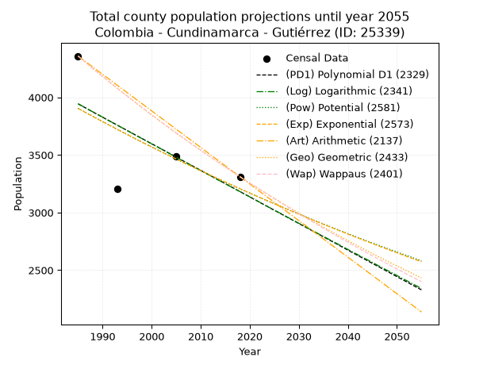
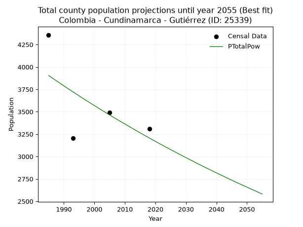
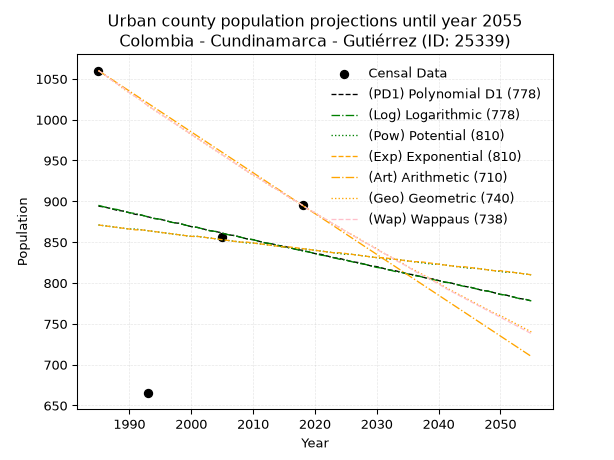
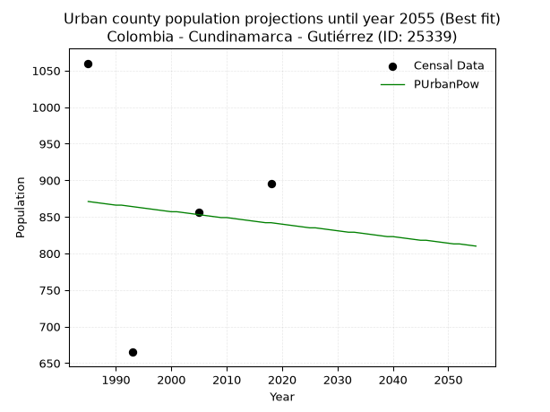
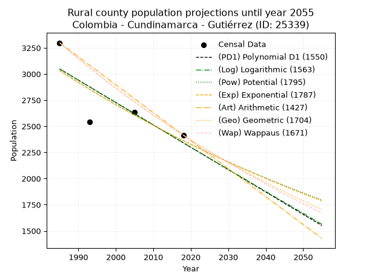
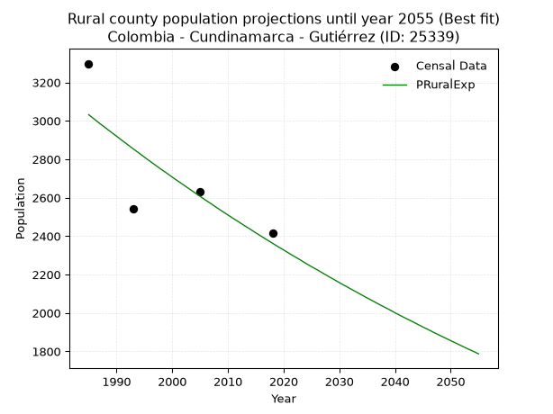

<div align="center">


</div>

# 📜 _“Population and Public Services Demand Projections (PPSD) until Year 2050 for Colombia - Cundinamarca - Gutiérrez (ID: 25339)”_
Keywords: `population` `public-service` `projection` `lineal` `polynomial` `logarithmic` `potential` `exponential` `arithmetic` `geometric` `wappaus` `dane` `colombia` `south-america`

PPSD are analytical estimates used by governments and planners to anticipate future changes in population size, age distribution, and the resulting community needs for utilities, healthcare, education, and infrastructure as sizing future water treatment facilities, electrical grids, and road networks based on spatial growth.

<div align="center">

</img>

</div>


> **General running parameters**: • app_version: _v20260806_. • Python version: _3.14.7_. • Pandas version: _3.0.5_. • NumPy version: _2.5.1_. • Creates, save and include plots into reports (create_plot): _False_. • Projection until year: _2050_. • Process polynomial degree 2 and up: _False_. • Process Wappaus: _True_. • Process Wappaus: _True_. • Set negative values to zero: _True_. • Set infinite values to zero: _True_. • Drop dataset notes: _True_. 
<div align="center">

Maps & GIS Layers: [:earth_americas:Google](http://maps.google.com/maps?q=4.254678867,-74.0030419) [:earth_americas:OSM](https://www.openstreetmap.org/#map=18/4.254678867/-74.0030419&layers=P) [:earth_americas:Bing](https://www.bing.com/maps?cp=4.254678867~-74.0030419&lvl=18) [:earth_americas:Apple](https://maps.apple.com/frame?center=4.254678867%2C-74.0030419&span=0.003%2C0.006) [:earth_americas:GISMobile](https://github.com/rcfdtools/R.GISMobile/blob/main/file/gis/CountyLayer_CO/Readme.md)

</div>


<div align="center">

```geojson
{
  "type": "Feature",
  "geometry": {
    "type": "Point", 
    "coordinates": [-74.0030419, 4.254678867]
  }, 
  "properties": {
    "Name": "Colombia - Cundinamarca - Gutiérrez (ID: 25339)"
  }
}
```

</div>


## 0. Census Data (4 records)

Census data are official statistics collected by a government about the people and housing in a country. They usually include counts of total population, age, sex, race, income, education, and jobs.

📅Global census file: [Population.xlsx](../data/Population.xlsx)

| Source   |   Year |   CountryID | CountryName   |   StateID | StateName    |   CountyID | CountyName   |   PTotal |   PUrban |   PRural |
|:---------|-------:|------------:|:--------------|----------:|:-------------|-----------:|:-------------|---------:|---------:|---------:|
| DANE     |   1985 |          57 | Colombia      |        25 | Cundinamarca |      25339 | Gutiérrez    |     4358 |     1060 |     3298 |
| DANE     |   1993 |          57 | Colombia      |        25 | Cundinamarca |      25339 | Gutiérrez    |     3206 |      665 |     2541 |
| DANE     |   2005 |          57 | Colombia      |        25 | Cundinamarca |      25339 | Gutiérrez    |     3489 |      856 |     2633 |
| DANE     |   2018 |          57 | Colombia      |        25 | Cundinamarca |      25339 | Gutiérrez    |     3311 |      895 |     2416 |

> 🔥Some records could had specific notes about the registered values or the corresponding urban or rural distribution.

📅[SUI-RUPS](https://www.datos.gov.co/Hacienda-y-Cr-dito-P-blico/Registro-nico-de-Prestadores-de-Servicios-P-blicos/4qkq-csdn/about_data) - Local public utility companies: [RUPS.csv](../data/RUPS.csv)

 | SERVICIO       | ESTADO    | NOMBRE                                                                                                       | NIT         | DEPARTAMENTO_DOMICILIO   | MUNICIPIO_DOMICILIO   | DIRECCION         |   TELEFONO | EMAIL                                              | TIPO_PRESTADOR                 | CLASIFICACION                 |
|:---------------|:----------|:-------------------------------------------------------------------------------------------------------------|:------------|:-------------------------|:----------------------|:------------------|-----------:|:---------------------------------------------------|:-------------------------------|:------------------------------|
| ACUEDUCTO      | OPERATIVA | OFICINA DE SERVICIOS PUBLICOS DOMICILIARIOS DE ACUEDUCTO,  ALCANTARILLADO Y ASEO  DEL MUNICIPIO DE GUTIERREZ | 800094704-1 | CUNDINAMARCA             | GUTIERREZ             | calle 5 N° 4 - 20 |    8489006 | of.serviciospublicos@gutierrez-cundinamarca.gov.co | MUNICIPIO (PRESTACIÓN DIRECTA) | MENOR O IGUAL A 2500 USUARIOS |
| ALCANTARILLADO | OPERATIVA | OFICINA DE SERVICIOS PUBLICOS DOMICILIARIOS DE ACUEDUCTO,  ALCANTARILLADO Y ASEO  DEL MUNICIPIO DE GUTIERREZ | 800094704-1 | CUNDINAMARCA             | GUTIERREZ             | calle 5 N° 4 - 20 |    8489006 | of.serviciospublicos@gutierrez-cundinamarca.gov.co | MUNICIPIO (PRESTACIÓN DIRECTA) | MENOR O IGUAL A 2500 USUARIOS |

## 1. Total

### 1.1. Coefficients and Parameters

* (PD1) Polynomial Deg 1: -23.059012444801198, 49714.78964271359 (lineal)
* (Log) Logarithmic: -46242.76215604308, 355082.6057143229
* (Pow) Potential: -11.939930179294645, 42.96659273582905
* (Exp) Exponential: -0.005953853295580391, 529755433.2625346
* (Art) Arithmetic: Year diff. 2018 - 1985 = 33, Population diff. 3311 - 4358 = -1047, Annual growth = -31.727272727272727
* (Geo) Geometric: Year diff. 2018 - 1985 = 33, Population diff. 3311 - 4358 = -1047, Annual growth % = -0.008291584454752754
* (Wap) Wappaus: i = -0.8274161618795861, Condition values only valid for < 200)

<sub>
Wappaus condition values: ['-0.00', '-0.83', '-1.65', '-2.48', '-3.31', '-4.14', '-4.96', '-5.79', '-6.62', '-7.45', '-8.27', '-9.10', '-9.93', '-10.76', '-11.58', '-12.41', '-13.24', '-14.07', '-14.89', '-15.72', '-16.55', '-17.38', '-18.20', '-19.03', '-19.86', '-20.69', '-21.51', '-22.34', '-23.17', '-24.00', '-24.82', '-25.65', '-26.48', '-27.30', '-28.13', '-28.96', '-29.79', '-30.61', '-31.44', '-32.27', '-33.10', '-33.92', '-34.75', '-35.58', '-36.41', '-37.23', '-38.06', '-38.89', '-39.72', '-40.54', '-41.37', '-42.20', '-43.03', '-43.85', '-44.68', '-45.51', '-46.34', '-47.16', '-47.99', '-48.82', '-49.64', '-50.47', '-51.30', '-52.13', '-52.95', '-53.78']
</sub>


### 1.2. Projected Dataset

|   Year |   CountyID |   PTotalPD1 |   PTotalLog |   PTotalPow |   PTotalExp |   PTotalArt |   PTotalGeo |   PTotalWap |
|-------:|-----------:|------------:|------------:|------------:|------------:|------------:|------------:|------------:|
|   1985 |      25339 |        3943 |        3944 |        3904 |        3903 |        4358 |        4358 |        4358 |
|   1986 |      25339 |        3920 |        3921 |        3881 |        3880 |        4326 |        4322 |        4322 |
|   1987 |      25339 |        3897 |        3897 |        3858 |        3857 |        4295 |        4286 |        4286 |
|   1988 |      25339 |        3873 |        3874 |        3835 |        3834 |        4263 |        4250 |        4251 |
|   1989 |      25339 |        3850 |        3851 |        3812 |        3811 |        4231 |        4215 |        4216 |
|   1990 |      25339 |        3827 |        3828 |        3789 |        3789 |        4199 |        4180 |        4181 |
|   1991 |      25339 |        3804 |        3804 |        3766 |        3766 |        4168 |        4146 |        4147 |
|   1992 |      25339 |        3781 |        3781 |        3744 |        3744 |        4136 |        4111 |        4113 |
|   1993 |      25339 |        3758 |        3758 |        3721 |        3722 |        4104 |        4077 |        4079 |
|   1994 |      25339 |        3735 |        3735 |        3699 |        3699 |        4072 |        4043 |        4045 |
|   1995 |      25339 |        3712 |        3712 |        3677 |        3678 |        4041 |        4010 |        4012 |
|   1996 |      25339 |        3689 |        3688 |        3655 |        3656 |        4009 |        3977 |        3979 |
|   1997 |      25339 |        3666 |        3665 |        3633 |        3634 |        3977 |        3944 |        3946 |
|   1998 |      25339 |        3643 |        3642 |        3612 |        3612 |        3946 |        3911 |        3913 |
|   1999 |      25339 |        3620 |        3619 |        3590 |        3591 |        3914 |        3878 |        3881 |
|   2000 |      25339 |        3597 |        3596 |        3569 |        3570 |        3882 |        3846 |        3849 |
|   2001 |      25339 |        3574 |        3573 |        3548 |        3548 |        3850 |        3814 |        3817 |
|   2002 |      25339 |        3551 |        3550 |        3526 |        3527 |        3819 |        3783 |        3785 |
|   2003 |      25339 |        3528 |        3527 |        3506 |        3506 |        3787 |        3751 |        3754 |
|   2004 |      25339 |        3505 |        3503 |        3485 |        3486 |        3755 |        3720 |        3723 |
|   2005 |      25339 |        3481 |        3480 |        3464 |        3465 |        3723 |        3689 |        3692 |
|   2006 |      25339 |        3458 |        3457 |        3443 |        3444 |        3692 |        3659 |        3661 |
|   2007 |      25339 |        3435 |        3434 |        3423 |        3424 |        3660 |        3629 |        3631 |
|   2008 |      25339 |        3412 |        3411 |        3403 |        3404 |        3628 |        3598 |        3601 |
|   2009 |      25339 |        3389 |        3388 |        3383 |        3383 |        3597 |        3569 |        3571 |
|   2010 |      25339 |        3366 |        3365 |        3363 |        3363 |        3565 |        3539 |        3541 |
|   2011 |      25339 |        3343 |        3342 |        3343 |        3343 |        3533 |        3510 |        3512 |
|   2012 |      25339 |        3320 |        3319 |        3323 |        3323 |        3501 |        3481 |        3482 |
|   2013 |      25339 |        3297 |        3296 |        3303 |        3304 |        3470 |        3452 |        3453 |
|   2014 |      25339 |        3274 |        3273 |        3284 |        3284 |        3438 |        3423 |        3424 |
|   2015 |      25339 |        3251 |        3250 |        3264 |        3265 |        3406 |        3395 |        3396 |
|   2016 |      25339 |        3228 |        3227 |        3245 |        3245 |        3374 |        3367 |        3367 |
|   2017 |      25339 |        3205 |        3204 |        3226 |        3226 |        3343 |        3339 |        3339 |
|   2018 |      25339 |        3182 |        3182 |        3207 |        3207 |        3311 |        3311 |        3311 |
|   2019 |      25339 |        3159 |        3159 |        3188 |        3188 |        3279 |        3284 |        3283 |
|   2020 |      25339 |        3136 |        3136 |        3169 |        3169 |        3248 |        3256 |        3256 |
|   2021 |      25339 |        3113 |        3113 |        3150 |        3150 |        3216 |        3229 |        3228 |
|   2022 |      25339 |        3089 |        3090 |        3132 |        3131 |        3184 |        3203 |        3201 |
|   2023 |      25339 |        3066 |        3067 |        3113 |        3113 |        3152 |        3176 |        3174 |
|   2024 |      25339 |        3043 |        3044 |        3095 |        3094 |        3121 |        3150 |        3147 |
|   2025 |      25339 |        3020 |        3021 |        3077 |        3076 |        3089 |        3124 |        3120 |
|   2026 |      25339 |        2997 |        2999 |        3059 |        3058 |        3057 |        3098 |        3094 |
|   2027 |      25339 |        2974 |        2976 |        3041 |        3040 |        3025 |        3072 |        3068 |
|   2028 |      25339 |        2951 |        2953 |        3023 |        3022 |        2994 |        3046 |        3042 |
|   2029 |      25339 |        2928 |        2930 |        3005 |        3004 |        2962 |        3021 |        3016 |
|   2030 |      25339 |        2905 |        2907 |        2988 |        2986 |        2930 |        2996 |        2990 |
|   2031 |      25339 |        2882 |        2885 |        2970 |        2968 |        2899 |        2971 |        2964 |
|   2032 |      25339 |        2859 |        2862 |        2953 |        2950 |        2867 |        2947 |        2939 |
|   2033 |      25339 |        2836 |        2839 |        2935 |        2933 |        2835 |        2922 |        2914 |
|   2034 |      25339 |        2813 |        2816 |        2918 |        2915 |        2803 |        2898 |        2889 |
|   2035 |      25339 |        2790 |        2794 |        2901 |        2898 |        2772 |        2874 |        2864 |
|   2036 |      25339 |        2767 |        2771 |        2884 |        2881 |        2740 |        2850 |        2839 |
|   2037 |      25339 |        2744 |        2748 |        2867 |        2864 |        2708 |        2827 |        2815 |
|   2038 |      25339 |        2721 |        2726 |        2851 |        2847 |        2676 |        2803 |        2791 |
|   2039 |      25339 |        2697 |        2703 |        2834 |        2830 |        2645 |        2780 |        2766 |
|   2040 |      25339 |        2674 |        2680 |        2817 |        2813 |        2613 |        2757 |        2742 |
|   2041 |      25339 |        2651 |        2657 |        2801 |        2796 |        2581 |        2734 |        2719 |
|   2042 |      25339 |        2628 |        2635 |        2785 |        2780 |        2550 |        2711 |        2695 |
|   2043 |      25339 |        2605 |        2612 |        2768 |        2763 |        2518 |        2689 |        2671 |
|   2044 |      25339 |        2582 |        2590 |        2752 |        2747 |        2486 |        2667 |        2648 |
|   2045 |      25339 |        2559 |        2567 |        2736 |        2731 |        2454 |        2644 |        2625 |
|   2046 |      25339 |        2536 |        2544 |        2720 |        2714 |        2423 |        2622 |        2602 |
|   2047 |      25339 |        2513 |        2522 |        2704 |        2698 |        2391 |        2601 |        2579 |
|   2048 |      25339 |        2490 |        2499 |        2689 |        2682 |        2359 |        2579 |        2556 |
|   2049 |      25339 |        2467 |        2477 |        2673 |        2666 |        2327 |        2558 |        2533 |
|   2050 |      25339 |        2444 |        2454 |        2658 |        2651 |        2296 |        2537 |        2511 |
<div align="center">

</img>

</div>


### 1.3. Best fit with absolute and relative error (%)

Relative error puts that difference into context by dividing the absolute error by the true value, creating a unitless ratio or percentage that shows the scale of the mistake.

Absolute and relative error

|   Year | Source   |   CountryID | CountryName   |   StateID | StateName    |   CountyID_x | CountyName   |   PTotal |   PUrban |   PRural |   CountyID_y |   PTotalPD1 |   PTotalLog |   PTotalPow |   PTotalExp |   PTotalArt |   PTotalGeo |   PTotalWap |   PTotalPD1AbsError |   PTotalLogAbsError |   PTotalPowAbsError |   PTotalExpAbsError |   PTotalArtAbsError |   PTotalGeoAbsError |   PTotalWapAbsError |   PTotalPD1RelError |   PTotalLogRelError |   PTotalPowRelError |   PTotalExpRelError |   PTotalArtRelError |   PTotalGeoRelError |   PTotalWapRelError |
|-------:|:---------|------------:|:--------------|----------:|:-------------|-------------:|:-------------|---------:|---------:|---------:|-------------:|------------:|------------:|------------:|------------:|------------:|------------:|------------:|--------------------:|--------------------:|--------------------:|--------------------:|--------------------:|--------------------:|--------------------:|--------------------:|--------------------:|--------------------:|--------------------:|--------------------:|--------------------:|--------------------:|
|   1985 | DANE     |          57 | Colombia      |        25 | Cundinamarca |        25339 | Gutiérrez    |     4358 |     1060 |     3298 |        25339 |        3943 |        3944 |        3904 |        3903 |        4358 |        4358 |        4358 |                 415 |                 414 |                 454 |                 455 |                   0 |                   0 |                   0 |            9.52272  |            9.49977  |           10.4176   |           10.4406   |             0       |              0      |             0       |
|   1993 | DANE     |          57 | Colombia      |        25 | Cundinamarca |        25339 | Gutiérrez    |     3206 |      665 |     2541 |        25339 |        3758 |        3758 |        3721 |        3722 |        4104 |        4077 |        4079 |                 552 |                 552 |                 515 |                 516 |                 898 |                 871 |                 873 |           17.2177   |           17.2177   |           16.0636   |           16.0948   |            28.01    |             27.1678 |            27.2302  |
|   2005 | DANE     |          57 | Colombia      |        25 | Cundinamarca |        25339 | Gutiérrez    |     3489 |      856 |     2633 |        25339 |        3481 |        3480 |        3464 |        3465 |        3723 |        3689 |        3692 |                   8 |                   9 |                  25 |                  24 |                 234 |                 200 |                 203 |            0.229292 |            0.257954 |            0.716538 |            0.687876 |             6.70679 |              5.7323 |             5.81829 |
|   2018 | DANE     |          57 | Colombia      |        25 | Cundinamarca |        25339 | Gutiérrez    |     3311 |      895 |     2416 |        25339 |        3182 |        3182 |        3207 |        3207 |        3311 |        3311 |        3311 |                 129 |                 129 |                 104 |                 104 |                   0 |                   0 |                   0 |            3.8961   |            3.8961   |            3.14105  |            3.14105  |             0       |              0      |             0       |

Relative error mean

| Method    |   RelError | Best   |
|:----------|-----------:|:-------|
| PTotalPD1 |    7.71646 |        |
| PTotalLog |    7.71789 |        |
| PTotalPow |    7.58471 | True   |
| PTotalExp |    7.59108 |        |
| PTotalArt |    8.67919 |        |
| PTotalGeo |    8.22503 |        |
| PTotalWap |    8.26212 |        |

💙Best method: _**PTotalPow**_
<div align="center">

</img>

</div>


### 1.4. Fresh water supply demand in liters per capita per day (lpcd)

The fresh water supply demand typically ranges from 100 to 300 liters per capita per day (lpcd) for standard domestic and municipal planning, though absolute survival minimums set by the World Health Organization are as low as 7.5 to 20 liters per day, and total consumption in high-income nations can exceed 400 liters.

> `CZ`: Level in meters above the sea level (masl)<br> `WS`: Fresh water supply demand in liters per capita per day (lpcd or l/h/d)<br> `WSAll`: Zonal fresh water supply demand in liters per second (l/s)<br> `A`: Zonal area in square meters<br> `DP`: Population density (people/hectare or p/ha)

Reference values (RAS Colombia)

|    CZ |   WS |
|------:|-----:|
|  1000 |  120 |
|  2000 |  130 |
| 99999 |  140 |

County shapefile geometry properties and water supply values

|   CountyID |      ATotal |   CZTotal |   WSTotal |
|-----------:|------------:|----------:|----------:|
|      25339 | 4.52645e+08 |   2840.09 |       140 |

Projected values for best method: PTotalPow

|   CountyID |   Year |   PTotalPow |   DPTotal |   WSTotal |   WSTotalAll |
|-----------:|-------:|------------:|----------:|----------:|-------------:|
|      25339 |   1985 |        3904 |      0.09 |       140 |      6.32593 |
|      25339 |   1986 |        3881 |      0.09 |       140 |      6.28866 |
|      25339 |   1987 |        3858 |      0.09 |       140 |      6.25139 |
|      25339 |   1988 |        3835 |      0.08 |       140 |      6.21412 |
|      25339 |   1989 |        3812 |      0.08 |       140 |      6.17685 |
|      25339 |   1990 |        3789 |      0.08 |       140 |      6.13958 |
|      25339 |   1991 |        3766 |      0.08 |       140 |      6.10231 |
|      25339 |   1992 |        3744 |      0.08 |       140 |      6.06667 |
|      25339 |   1993 |        3721 |      0.08 |       140 |      6.0294  |
|      25339 |   1994 |        3699 |      0.08 |       140 |      5.99375 |
|      25339 |   1995 |        3677 |      0.08 |       140 |      5.9581  |
|      25339 |   1996 |        3655 |      0.08 |       140 |      5.92245 |
|      25339 |   1997 |        3633 |      0.08 |       140 |      5.88681 |
|      25339 |   1998 |        3612 |      0.08 |       140 |      5.85278 |
|      25339 |   1999 |        3590 |      0.08 |       140 |      5.81713 |
|      25339 |   2000 |        3569 |      0.08 |       140 |      5.7831  |
|      25339 |   2001 |        3548 |      0.08 |       140 |      5.74907 |
|      25339 |   2002 |        3526 |      0.08 |       140 |      5.71343 |
|      25339 |   2003 |        3506 |      0.08 |       140 |      5.68102 |
|      25339 |   2004 |        3485 |      0.08 |       140 |      5.64699 |
|      25339 |   2005 |        3464 |      0.08 |       140 |      5.61296 |
|      25339 |   2006 |        3443 |      0.08 |       140 |      5.57894 |
|      25339 |   2007 |        3423 |      0.08 |       140 |      5.54653 |
|      25339 |   2008 |        3403 |      0.08 |       140 |      5.51412 |
|      25339 |   2009 |        3383 |      0.07 |       140 |      5.48171 |
|      25339 |   2010 |        3363 |      0.07 |       140 |      5.44931 |
|      25339 |   2011 |        3343 |      0.07 |       140 |      5.4169  |
|      25339 |   2012 |        3323 |      0.07 |       140 |      5.38449 |
|      25339 |   2013 |        3303 |      0.07 |       140 |      5.35208 |
|      25339 |   2014 |        3284 |      0.07 |       140 |      5.3213  |
|      25339 |   2015 |        3264 |      0.07 |       140 |      5.28889 |
|      25339 |   2016 |        3245 |      0.07 |       140 |      5.2581  |
|      25339 |   2017 |        3226 |      0.07 |       140 |      5.22731 |
|      25339 |   2018 |        3207 |      0.07 |       140 |      5.19653 |
|      25339 |   2019 |        3188 |      0.07 |       140 |      5.16574 |
|      25339 |   2020 |        3169 |      0.07 |       140 |      5.13495 |
|      25339 |   2021 |        3150 |      0.07 |       140 |      5.10417 |
|      25339 |   2022 |        3132 |      0.07 |       140 |      5.075   |
|      25339 |   2023 |        3113 |      0.07 |       140 |      5.04421 |
|      25339 |   2024 |        3095 |      0.07 |       140 |      5.01505 |
|      25339 |   2025 |        3077 |      0.07 |       140 |      4.98588 |
|      25339 |   2026 |        3059 |      0.07 |       140 |      4.95671 |
|      25339 |   2027 |        3041 |      0.07 |       140 |      4.92755 |
|      25339 |   2028 |        3023 |      0.07 |       140 |      4.89838 |
|      25339 |   2029 |        3005 |      0.07 |       140 |      4.86921 |
|      25339 |   2030 |        2988 |      0.07 |       140 |      4.84167 |
|      25339 |   2031 |        2970 |      0.07 |       140 |      4.8125  |
|      25339 |   2032 |        2953 |      0.07 |       140 |      4.78495 |
|      25339 |   2033 |        2935 |      0.06 |       140 |      4.75579 |
|      25339 |   2034 |        2918 |      0.06 |       140 |      4.72824 |
|      25339 |   2035 |        2901 |      0.06 |       140 |      4.70069 |
|      25339 |   2036 |        2884 |      0.06 |       140 |      4.67315 |
|      25339 |   2037 |        2867 |      0.06 |       140 |      4.6456  |
|      25339 |   2038 |        2851 |      0.06 |       140 |      4.61968 |
|      25339 |   2039 |        2834 |      0.06 |       140 |      4.59213 |
|      25339 |   2040 |        2817 |      0.06 |       140 |      4.56458 |
|      25339 |   2041 |        2801 |      0.06 |       140 |      4.53866 |
|      25339 |   2042 |        2785 |      0.06 |       140 |      4.51273 |
|      25339 |   2043 |        2768 |      0.06 |       140 |      4.48519 |
|      25339 |   2044 |        2752 |      0.06 |       140 |      4.45926 |
|      25339 |   2045 |        2736 |      0.06 |       140 |      4.43333 |
|      25339 |   2046 |        2720 |      0.06 |       140 |      4.40741 |
|      25339 |   2047 |        2704 |      0.06 |       140 |      4.38148 |
|      25339 |   2048 |        2689 |      0.06 |       140 |      4.35718 |
|      25339 |   2049 |        2673 |      0.06 |       140 |      4.33125 |
|      25339 |   2050 |        2658 |      0.06 |       140 |      4.30694 |

## 2. Urban

### 2.1. Coefficients and Parameters

* (PD1) Polynomial Deg 1: -1.6603773584906059, 4190.169811320835 (lineal)
* (Log) Logarithmic: -3359.307193665285, 26403.120898848214
* (Pow) Potential: -2.0933701478710782, 9.843479691018253
* (Exp) Exponential: -0.0010251619623785364, 6662.876290758418
* (Art) Arithmetic: Year diff. 2018 - 1985 = 33, Population diff. 895 - 1060 = -165, Annual growth = -5.0
* (Geo) Geometric: Year diff. 2018 - 1985 = 33, Population diff. 895 - 1060 = -165, Annual growth % = -0.005114164835128943
* (Wap) Wappaus: i = -0.5115089514066496, Condition values only valid for < 200)

<sub>
Wappaus condition values: ['-0.00', '-0.51', '-1.02', '-1.53', '-2.05', '-2.56', '-3.07', '-3.58', '-4.09', '-4.60', '-5.12', '-5.63', '-6.14', '-6.65', '-7.16', '-7.67', '-8.18', '-8.70', '-9.21', '-9.72', '-10.23', '-10.74', '-11.25', '-11.76', '-12.28', '-12.79', '-13.30', '-13.81', '-14.32', '-14.83', '-15.35', '-15.86', '-16.37', '-16.88', '-17.39', '-17.90', '-18.41', '-18.93', '-19.44', '-19.95', '-20.46', '-20.97', '-21.48', '-21.99', '-22.51', '-23.02', '-23.53', '-24.04', '-24.55', '-25.06', '-25.58', '-26.09', '-26.60', '-27.11', '-27.62', '-28.13', '-28.64', '-29.16', '-29.67', '-30.18', '-30.69', '-31.20', '-31.71', '-32.23', '-32.74', '-33.25']
</sub>


### 2.2. Projected Dataset

|   Year |   CountyID |   PUrbanPD1 |   PUrbanLog |   PUrbanPow |   PUrbanExp |   PUrbanArt |   PUrbanGeo |   PUrbanWap |
|-------:|-----------:|------------:|------------:|------------:|------------:|------------:|------------:|------------:|
|   1985 |      25339 |         894 |         895 |         871 |         871 |        1060 |        1060 |        1060 |
|   1986 |      25339 |         893 |         893 |         870 |         870 |        1055 |        1055 |        1055 |
|   1987 |      25339 |         891 |         891 |         869 |         869 |        1050 |        1049 |        1049 |
|   1988 |      25339 |         889 |         890 |         868 |         868 |        1045 |        1044 |        1044 |
|   1989 |      25339 |         888 |         888 |         867 |         867 |        1040 |        1038 |        1039 |
|   1990 |      25339 |         886 |         886 |         866 |         866 |        1035 |        1033 |        1033 |
|   1991 |      25339 |         884 |         885 |         866 |         865 |        1030 |        1028 |        1028 |
|   1992 |      25339 |         883 |         883 |         865 |         865 |        1025 |        1023 |        1023 |
|   1993 |      25339 |         881 |         881 |         864 |         864 |        1020 |        1017 |        1017 |
|   1994 |      25339 |         879 |         879 |         863 |         863 |        1015 |        1012 |        1012 |
|   1995 |      25339 |         878 |         878 |         862 |         862 |        1010 |        1007 |        1007 |
|   1996 |      25339 |         876 |         876 |         861 |         861 |        1005 |        1002 |        1002 |
|   1997 |      25339 |         874 |         874 |         860 |         860 |        1000 |         997 |         997 |
|   1998 |      25339 |         873 |         873 |         859 |         859 |         995 |         992 |         992 |
|   1999 |      25339 |         871 |         871 |         858 |         858 |         990 |         987 |         987 |
|   2000 |      25339 |         869 |         869 |         857 |         857 |         985 |         982 |         982 |
|   2001 |      25339 |         868 |         868 |         857 |         857 |         980 |         977 |         977 |
|   2002 |      25339 |         866 |         866 |         856 |         856 |         975 |         972 |         972 |
|   2003 |      25339 |         864 |         864 |         855 |         855 |         970 |         967 |         967 |
|   2004 |      25339 |         863 |         863 |         854 |         854 |         965 |         962 |         962 |
|   2005 |      25339 |         861 |         861 |         853 |         853 |         960 |         957 |         957 |
|   2006 |      25339 |         859 |         859 |         852 |         852 |         955 |         952 |         952 |
|   2007 |      25339 |         858 |         858 |         851 |         851 |         950 |         947 |         947 |
|   2008 |      25339 |         856 |         856 |         850 |         850 |         945 |         942 |         942 |
|   2009 |      25339 |         854 |         854 |         849 |         850 |         940 |         937 |         937 |
|   2010 |      25339 |         853 |         853 |         849 |         849 |         935 |         932 |         933 |
|   2011 |      25339 |         851 |         851 |         848 |         848 |         930 |         928 |         928 |
|   2012 |      25339 |         849 |         849 |         847 |         847 |         925 |         923 |         923 |
|   2013 |      25339 |         848 |         848 |         846 |         846 |         920 |         918 |         918 |
|   2014 |      25339 |         846 |         846 |         845 |         845 |         915 |         914 |         914 |
|   2015 |      25339 |         845 |         844 |         844 |         844 |         910 |         909 |         909 |
|   2016 |      25339 |         843 |         843 |         843 |         844 |         905 |         904 |         904 |
|   2017 |      25339 |         841 |         841 |         842 |         843 |         900 |         900 |         900 |
|   2018 |      25339 |         840 |         839 |         842 |         842 |         895 |         895 |         895 |
|   2019 |      25339 |         838 |         838 |         841 |         841 |         890 |         890 |         890 |
|   2020 |      25339 |         836 |         836 |         840 |         840 |         885 |         886 |         886 |
|   2021 |      25339 |         835 |         834 |         839 |         839 |         880 |         881 |         881 |
|   2022 |      25339 |         833 |         833 |         838 |         838 |         875 |         877 |         877 |
|   2023 |      25339 |         831 |         831 |         837 |         837 |         870 |         872 |         872 |
|   2024 |      25339 |         830 |         829 |         836 |         837 |         865 |         868 |         868 |
|   2025 |      25339 |         828 |         828 |         835 |         836 |         860 |         863 |         863 |
|   2026 |      25339 |         826 |         826 |         835 |         835 |         855 |         859 |         859 |
|   2027 |      25339 |         825 |         824 |         834 |         834 |         850 |         855 |         854 |
|   2028 |      25339 |         823 |         823 |         833 |         833 |         845 |         850 |         850 |
|   2029 |      25339 |         821 |         821 |         832 |         832 |         840 |         846 |         846 |
|   2030 |      25339 |         820 |         819 |         831 |         831 |         835 |         842 |         841 |
|   2031 |      25339 |         818 |         818 |         830 |         831 |         830 |         837 |         837 |
|   2032 |      25339 |         816 |         816 |         829 |         830 |         825 |         833 |         833 |
|   2033 |      25339 |         815 |         814 |         829 |         829 |         820 |         829 |         828 |
|   2034 |      25339 |         813 |         813 |         828 |         828 |         815 |         825 |         824 |
|   2035 |      25339 |         811 |         811 |         827 |         827 |         810 |         820 |         820 |
|   2036 |      25339 |         810 |         809 |         826 |         826 |         805 |         816 |         815 |
|   2037 |      25339 |         808 |         808 |         825 |         826 |         800 |         812 |         811 |
|   2038 |      25339 |         806 |         806 |         824 |         825 |         795 |         808 |         807 |
|   2039 |      25339 |         805 |         804 |         823 |         824 |         790 |         804 |         803 |
|   2040 |      25339 |         803 |         803 |         823 |         823 |         785 |         800 |         799 |
|   2041 |      25339 |         801 |         801 |         822 |         822 |         780 |         795 |         794 |
|   2042 |      25339 |         800 |         800 |         821 |         821 |         775 |         791 |         790 |
|   2043 |      25339 |         798 |         798 |         820 |         820 |         770 |         787 |         786 |
|   2044 |      25339 |         796 |         796 |         819 |         820 |         765 |         783 |         782 |
|   2045 |      25339 |         795 |         795 |         818 |         819 |         760 |         779 |         778 |
|   2046 |      25339 |         793 |         793 |         818 |         818 |         755 |         775 |         774 |
|   2047 |      25339 |         791 |         791 |         817 |         817 |         750 |         771 |         770 |
|   2048 |      25339 |         790 |         790 |         816 |         816 |         745 |         767 |         766 |
|   2049 |      25339 |         788 |         788 |         815 |         815 |         740 |         763 |         762 |
|   2050 |      25339 |         786 |         786 |         814 |         815 |         735 |         760 |         758 |
<div align="center">

</img>

</div>


### 2.3. Best fit with absolute and relative error (%)

Relative error puts that difference into context by dividing the absolute error by the true value, creating a unitless ratio or percentage that shows the scale of the mistake.

Absolute and relative error

|   Year | Source   |   CountryID | CountryName   |   StateID | StateName    |   CountyID_x | CountyName   |   PTotal |   PUrban |   PRural |   CountyID_y |   PUrbanPD1 |   PUrbanLog |   PUrbanPow |   PUrbanExp |   PUrbanArt |   PUrbanGeo |   PUrbanWap |   PUrbanPD1AbsError |   PUrbanLogAbsError |   PUrbanPowAbsError |   PUrbanExpAbsError |   PUrbanArtAbsError |   PUrbanGeoAbsError |   PUrbanWapAbsError |   PUrbanPD1RelError |   PUrbanLogRelError |   PUrbanPowRelError |   PUrbanExpRelError |   PUrbanArtRelError |   PUrbanGeoRelError |   PUrbanWapRelError |
|-------:|:---------|------------:|:--------------|----------:|:-------------|-------------:|:-------------|---------:|---------:|---------:|-------------:|------------:|------------:|------------:|------------:|------------:|------------:|------------:|--------------------:|--------------------:|--------------------:|--------------------:|--------------------:|--------------------:|--------------------:|--------------------:|--------------------:|--------------------:|--------------------:|--------------------:|--------------------:|--------------------:|
|   1985 | DANE     |          57 | Colombia      |        25 | Cundinamarca |        25339 | Gutiérrez    |     4358 |     1060 |     3298 |        25339 |         894 |         895 |         871 |         871 |        1060 |        1060 |        1060 |                 166 |                 165 |                 189 |                 189 |                   0 |                   0 |                   0 |           15.6604   |           15.566    |           17.8302   |           17.8302   |              0      |              0      |              0      |
|   1993 | DANE     |          57 | Colombia      |        25 | Cundinamarca |        25339 | Gutiérrez    |     3206 |      665 |     2541 |        25339 |         881 |         881 |         864 |         864 |        1020 |        1017 |        1017 |                 216 |                 216 |                 199 |                 199 |                 355 |                 352 |                 352 |           32.4812   |           32.4812   |           29.9248   |           29.9248   |             53.3835 |             52.9323 |             52.9323 |
|   2005 | DANE     |          57 | Colombia      |        25 | Cundinamarca |        25339 | Gutiérrez    |     3489 |      856 |     2633 |        25339 |         861 |         861 |         853 |         853 |         960 |         957 |         957 |                   5 |                   5 |                   3 |                   3 |                 104 |                 101 |                 101 |            0.584112 |            0.584112 |            0.350467 |            0.350467 |             12.1495 |             11.7991 |             11.7991 |
|   2018 | DANE     |          57 | Colombia      |        25 | Cundinamarca |        25339 | Gutiérrez    |     3311 |      895 |     2416 |        25339 |         840 |         839 |         842 |         842 |         895 |         895 |         895 |                  55 |                  56 |                  53 |                  53 |                   0 |                   0 |                   0 |            6.14525  |            6.25698  |            5.92179  |            5.92179  |              0      |              0      |              0      |

Relative error mean

| Method    |   RelError | Best   |
|:----------|-----------:|:-------|
| PUrbanPD1 |    13.7177 |        |
| PUrbanLog |    13.7221 |        |
| PUrbanPow |    13.5068 | True   |
| PUrbanExp |    13.5068 | True   |
| PUrbanArt |    16.3832 |        |
| PUrbanGeo |    16.1828 |        |
| PUrbanWap |    16.1828 |        |

💙Best method: _**PUrbanPow**_
<div align="center">

</img>

</div>


### 2.4. Fresh water supply demand in liters per capita per day (lpcd)

The fresh water supply demand typically ranges from 100 to 300 liters per capita per day (lpcd) for standard domestic and municipal planning, though absolute survival minimums set by the World Health Organization are as low as 7.5 to 20 liters per day, and total consumption in high-income nations can exceed 400 liters.

> `CZ`: Level in meters above the sea level (masl)<br> `WS`: Fresh water supply demand in liters per capita per day (lpcd or l/h/d)<br> `WSAll`: Zonal fresh water supply demand in liters per second (l/s)<br> `A`: Zonal area in square meters<br> `DP`: Population density (people/hectare or p/ha)

Reference values (RAS Colombia)

|    CZ |   WS |
|------:|-----:|
|  1000 |  120 |
|  2000 |  130 |
| 99999 |  140 |

County shapefile geometry properties and water supply values

|   CountyID |   AUrban |   CZUrban |   WSUrban |
|-----------:|---------:|----------:|----------:|
|      25339 |   168414 |   2296.64 |       140 |

Projected values for best method: PUrbanPow

|   CountyID |   Year |   PUrbanPow |   DPUrban |   WSUrban |   WSUrbanAll |
|-----------:|-------:|------------:|----------:|----------:|-------------:|
|      25339 |   1985 |         871 |     51.72 |       140 |      1.41134 |
|      25339 |   1986 |         870 |     51.66 |       140 |      1.40972 |
|      25339 |   1987 |         869 |     51.6  |       140 |      1.4081  |
|      25339 |   1988 |         868 |     51.54 |       140 |      1.40648 |
|      25339 |   1989 |         867 |     51.48 |       140 |      1.40486 |
|      25339 |   1990 |         866 |     51.42 |       140 |      1.40324 |
|      25339 |   1991 |         866 |     51.42 |       140 |      1.40324 |
|      25339 |   1992 |         865 |     51.36 |       140 |      1.40162 |
|      25339 |   1993 |         864 |     51.3  |       140 |      1.4     |
|      25339 |   1994 |         863 |     51.24 |       140 |      1.39838 |
|      25339 |   1995 |         862 |     51.18 |       140 |      1.39676 |
|      25339 |   1996 |         861 |     51.12 |       140 |      1.39514 |
|      25339 |   1997 |         860 |     51.06 |       140 |      1.39352 |
|      25339 |   1998 |         859 |     51.01 |       140 |      1.3919  |
|      25339 |   1999 |         858 |     50.95 |       140 |      1.39028 |
|      25339 |   2000 |         857 |     50.89 |       140 |      1.38866 |
|      25339 |   2001 |         857 |     50.89 |       140 |      1.38866 |
|      25339 |   2002 |         856 |     50.83 |       140 |      1.38704 |
|      25339 |   2003 |         855 |     50.77 |       140 |      1.38542 |
|      25339 |   2004 |         854 |     50.71 |       140 |      1.3838  |
|      25339 |   2005 |         853 |     50.65 |       140 |      1.38218 |
|      25339 |   2006 |         852 |     50.59 |       140 |      1.38056 |
|      25339 |   2007 |         851 |     50.53 |       140 |      1.37894 |
|      25339 |   2008 |         850 |     50.47 |       140 |      1.37731 |
|      25339 |   2009 |         849 |     50.41 |       140 |      1.37569 |
|      25339 |   2010 |         849 |     50.41 |       140 |      1.37569 |
|      25339 |   2011 |         848 |     50.35 |       140 |      1.37407 |
|      25339 |   2012 |         847 |     50.29 |       140 |      1.37245 |
|      25339 |   2013 |         846 |     50.23 |       140 |      1.37083 |
|      25339 |   2014 |         845 |     50.17 |       140 |      1.36921 |
|      25339 |   2015 |         844 |     50.11 |       140 |      1.36759 |
|      25339 |   2016 |         843 |     50.06 |       140 |      1.36597 |
|      25339 |   2017 |         842 |     50    |       140 |      1.36435 |
|      25339 |   2018 |         842 |     50    |       140 |      1.36435 |
|      25339 |   2019 |         841 |     49.94 |       140 |      1.36273 |
|      25339 |   2020 |         840 |     49.88 |       140 |      1.36111 |
|      25339 |   2021 |         839 |     49.82 |       140 |      1.35949 |
|      25339 |   2022 |         838 |     49.76 |       140 |      1.35787 |
|      25339 |   2023 |         837 |     49.7  |       140 |      1.35625 |
|      25339 |   2024 |         836 |     49.64 |       140 |      1.35463 |
|      25339 |   2025 |         835 |     49.58 |       140 |      1.35301 |
|      25339 |   2026 |         835 |     49.58 |       140 |      1.35301 |
|      25339 |   2027 |         834 |     49.52 |       140 |      1.35139 |
|      25339 |   2028 |         833 |     49.46 |       140 |      1.34977 |
|      25339 |   2029 |         832 |     49.4  |       140 |      1.34815 |
|      25339 |   2030 |         831 |     49.34 |       140 |      1.34653 |
|      25339 |   2031 |         830 |     49.28 |       140 |      1.34491 |
|      25339 |   2032 |         829 |     49.22 |       140 |      1.34329 |
|      25339 |   2033 |         829 |     49.22 |       140 |      1.34329 |
|      25339 |   2034 |         828 |     49.16 |       140 |      1.34167 |
|      25339 |   2035 |         827 |     49.11 |       140 |      1.34005 |
|      25339 |   2036 |         826 |     49.05 |       140 |      1.33843 |
|      25339 |   2037 |         825 |     48.99 |       140 |      1.33681 |
|      25339 |   2038 |         824 |     48.93 |       140 |      1.33519 |
|      25339 |   2039 |         823 |     48.87 |       140 |      1.33356 |
|      25339 |   2040 |         823 |     48.87 |       140 |      1.33356 |
|      25339 |   2041 |         822 |     48.81 |       140 |      1.33194 |
|      25339 |   2042 |         821 |     48.75 |       140 |      1.33032 |
|      25339 |   2043 |         820 |     48.69 |       140 |      1.3287  |
|      25339 |   2044 |         819 |     48.63 |       140 |      1.32708 |
|      25339 |   2045 |         818 |     48.57 |       140 |      1.32546 |
|      25339 |   2046 |         818 |     48.57 |       140 |      1.32546 |
|      25339 |   2047 |         817 |     48.51 |       140 |      1.32384 |
|      25339 |   2048 |         816 |     48.45 |       140 |      1.32222 |
|      25339 |   2049 |         815 |     48.39 |       140 |      1.3206  |
|      25339 |   2050 |         814 |     48.33 |       140 |      1.31898 |

## 3. Rural

### 3.1. Coefficients and Parameters

* (PD1) Polynomial Deg 1: -21.39863508631057, 45524.619831392716 (lineal)
* (Log) Logarithmic: -42883.4549623778, 328679.4848154748
* (Pow) Potential: -15.1329079016375, 53.38657739647992
* (Exp) Exponential: -0.0075520138431404175, 9820115696.744934
* (Art) Arithmetic: Year diff. 2018 - 1985 = 33, Population diff. 2416 - 3298 = -882, Annual growth = -26.727272727272727
* (Geo) Geometric: Year diff. 2018 - 1985 = 33, Population diff. 2416 - 3298 = -882, Annual growth % = -0.00938606554427035
* (Wap) Wappaus: i = -0.9355013205205714, Condition values only valid for < 200)

<sub>
Wappaus condition values: ['-0.00', '-0.94', '-1.87', '-2.81', '-3.74', '-4.68', '-5.61', '-6.55', '-7.48', '-8.42', '-9.36', '-10.29', '-11.23', '-12.16', '-13.10', '-14.03', '-14.97', '-15.90', '-16.84', '-17.77', '-18.71', '-19.65', '-20.58', '-21.52', '-22.45', '-23.39', '-24.32', '-25.26', '-26.19', '-27.13', '-28.07', '-29.00', '-29.94', '-30.87', '-31.81', '-32.74', '-33.68', '-34.61', '-35.55', '-36.48', '-37.42', '-38.36', '-39.29', '-40.23', '-41.16', '-42.10', '-43.03', '-43.97', '-44.90', '-45.84', '-46.78', '-47.71', '-48.65', '-49.58', '-50.52', '-51.45', '-52.39', '-53.32', '-54.26', '-55.19', '-56.13', '-57.07', '-58.00', '-58.94', '-59.87', '-60.81']
</sub>


### 3.2. Projected Dataset

|   Year |   CountyID |   PRuralPD1 |   PRuralLog |   PRuralPow |   PRuralExp |   PRuralArt |   PRuralGeo |   PRuralWap |
|-------:|-----------:|------------:|------------:|------------:|------------:|------------:|------------:|------------:|
|   1985 |      25339 |        3048 |        3049 |        3033 |        3032 |        3298 |        3298 |        3298 |
|   1986 |      25339 |        3027 |        3028 |        3010 |        3009 |        3271 |        3267 |        3267 |
|   1987 |      25339 |        3006 |        3006 |        2987 |        2986 |        3245 |        3236 |        3237 |
|   1988 |      25339 |        2984 |        2985 |        2964 |        2964 |        3218 |        3206 |        3207 |
|   1989 |      25339 |        2963 |        2963 |        2942 |        2942 |        3191 |        3176 |        3177 |
|   1990 |      25339 |        2941 |        2941 |        2920 |        2920 |        3164 |        3146 |        3147 |
|   1991 |      25339 |        2920 |        2920 |        2898 |        2898 |        3138 |        3117 |        3118 |
|   1992 |      25339 |        2899 |        2898 |        2876 |        2876 |        3111 |        3087 |        3089 |
|   1993 |      25339 |        2877 |        2877 |        2854 |        2854 |        3084 |        3058 |        3060 |
|   1994 |      25339 |        2856 |        2855 |        2832 |        2833 |        3057 |        3030 |        3032 |
|   1995 |      25339 |        2834 |        2834 |        2811 |        2811 |        3031 |        3001 |        3003 |
|   1996 |      25339 |        2813 |        2812 |        2790 |        2790 |        3004 |        2973 |        2975 |
|   1997 |      25339 |        2792 |        2791 |        2769 |        2769 |        2977 |        2945 |        2947 |
|   1998 |      25339 |        2770 |        2769 |        2748 |        2748 |        2951 |        2917 |        2920 |
|   1999 |      25339 |        2749 |        2748 |        2727 |        2728 |        2924 |        2890 |        2893 |
|   2000 |      25339 |        2727 |        2727 |        2706 |        2707 |        2897 |        2863 |        2866 |
|   2001 |      25339 |        2706 |        2705 |        2686 |        2687 |        2870 |        2836 |        2839 |
|   2002 |      25339 |        2685 |        2684 |        2666 |        2667 |        2844 |        2809 |        2812 |
|   2003 |      25339 |        2663 |        2662 |        2646 |        2647 |        2817 |        2783 |        2786 |
|   2004 |      25339 |        2642 |        2641 |        2626 |        2627 |        2790 |        2757 |        2760 |
|   2005 |      25339 |        2620 |        2619 |        2606 |        2607 |        2763 |        2731 |        2734 |
|   2006 |      25339 |        2599 |        2598 |        2586 |        2587 |        2737 |        2705 |        2708 |
|   2007 |      25339 |        2578 |        2577 |        2567 |        2568 |        2710 |        2680 |        2683 |
|   2008 |      25339 |        2556 |        2555 |        2548 |        2548 |        2683 |        2655 |        2657 |
|   2009 |      25339 |        2535 |        2534 |        2529 |        2529 |        2657 |        2630 |        2632 |
|   2010 |      25339 |        2513 |        2513 |        2510 |        2510 |        2630 |        2605 |        2607 |
|   2011 |      25339 |        2492 |        2491 |        2491 |        2491 |        2603 |        2581 |        2583 |
|   2012 |      25339 |        2471 |        2470 |        2472 |        2473 |        2576 |        2557 |        2558 |
|   2013 |      25339 |        2449 |        2449 |        2454 |        2454 |        2550 |        2533 |        2534 |
|   2014 |      25339 |        2428 |        2427 |        2435 |        2436 |        2523 |        2509 |        2510 |
|   2015 |      25339 |        2406 |        2406 |        2417 |        2417 |        2496 |        2485 |        2486 |
|   2016 |      25339 |        2385 |        2385 |        2399 |        2399 |        2469 |        2462 |        2463 |
|   2017 |      25339 |        2364 |        2364 |        2381 |        2381 |        2443 |        2439 |        2439 |
|   2018 |      25339 |        2342 |        2342 |        2363 |        2363 |        2416 |        2416 |        2416 |
|   2019 |      25339 |        2321 |        2321 |        2346 |        2345 |        2389 |        2393 |        2393 |
|   2020 |      25339 |        2299 |        2300 |        2328 |        2328 |        2363 |        2371 |        2370 |
|   2021 |      25339 |        2278 |        2279 |        2311 |        2310 |        2336 |        2349 |        2347 |
|   2022 |      25339 |        2257 |        2257 |        2293 |        2293 |        2309 |        2327 |        2325 |
|   2023 |      25339 |        2235 |        2236 |        2276 |        2276 |        2282 |        2305 |        2303 |
|   2024 |      25339 |        2214 |        2215 |        2259 |        2258 |        2256 |        2283 |        2280 |
|   2025 |      25339 |        2192 |        2194 |        2243 |        2241 |        2229 |        2262 |        2258 |
|   2026 |      25339 |        2171 |        2173 |        2226 |        2225 |        2202 |        2240 |        2237 |
|   2027 |      25339 |        2150 |        2151 |        2209 |        2208 |        2175 |        2219 |        2215 |
|   2028 |      25339 |        2128 |        2130 |        2193 |        2191 |        2149 |        2199 |        2193 |
|   2029 |      25339 |        2107 |        2109 |        2177 |        2175 |        2122 |        2178 |        2172 |
|   2030 |      25339 |        2085 |        2088 |        2160 |        2158 |        2095 |        2157 |        2151 |
|   2031 |      25339 |        2064 |        2067 |        2144 |        2142 |        2069 |        2137 |        2130 |
|   2032 |      25339 |        2043 |        2046 |        2128 |        2126 |        2042 |        2117 |        2109 |
|   2033 |      25339 |        2021 |        2025 |        2113 |        2110 |        2015 |        2097 |        2089 |
|   2034 |      25339 |        2000 |        2004 |        2097 |        2094 |        1988 |        2078 |        2068 |
|   2035 |      25339 |        1978 |        1983 |        2082 |        2078 |        1962 |        2058 |        2048 |
|   2036 |      25339 |        1957 |        1961 |        2066 |        2063 |        1935 |        2039 |        2028 |
|   2037 |      25339 |        1936 |        1940 |        2051 |        2047 |        1908 |        2020 |        2008 |
|   2038 |      25339 |        1914 |        1919 |        2036 |        2032 |        1881 |        2001 |        1988 |
|   2039 |      25339 |        1893 |        1898 |        2021 |        2017 |        1855 |        1982 |        1968 |
|   2040 |      25339 |        1871 |        1877 |        2006 |        2001 |        1828 |        1963 |        1948 |
|   2041 |      25339 |        1850 |        1856 |        1991 |        1986 |        1801 |        1945 |        1929 |
|   2042 |      25339 |        1829 |        1835 |        1976 |        1971 |        1775 |        1927 |        1910 |
|   2043 |      25339 |        1807 |        1814 |        1962 |        1957 |        1748 |        1909 |        1890 |
|   2044 |      25339 |        1786 |        1793 |        1947 |        1942 |        1721 |        1891 |        1871 |
|   2045 |      25339 |        1764 |        1772 |        1933 |        1927 |        1694 |        1873 |        1853 |
|   2046 |      25339 |        1743 |        1751 |        1918 |        1913 |        1668 |        1855 |        1834 |
|   2047 |      25339 |        1722 |        1730 |        1904 |        1898 |        1641 |        1838 |        1815 |
|   2048 |      25339 |        1700 |        1709 |        1890 |        1884 |        1614 |        1821 |        1797 |
|   2049 |      25339 |        1679 |        1689 |        1876 |        1870 |        1587 |        1804 |        1778 |
|   2050 |      25339 |        1657 |        1668 |        1863 |        1856 |        1561 |        1787 |        1760 |
<div align="center">

</img>

</div>


### 3.3. Best fit with absolute and relative error (%)

Relative error puts that difference into context by dividing the absolute error by the true value, creating a unitless ratio or percentage that shows the scale of the mistake.

Absolute and relative error

|   Year | Source   |   CountryID | CountryName   |   StateID | StateName    |   CountyID_x | CountyName   |   PTotal |   PUrban |   PRural |   CountyID_y |   PRuralPD1 |   PRuralLog |   PRuralPow |   PRuralExp |   PRuralArt |   PRuralGeo |   PRuralWap |   PRuralPD1AbsError |   PRuralLogAbsError |   PRuralPowAbsError |   PRuralExpAbsError |   PRuralArtAbsError |   PRuralGeoAbsError |   PRuralWapAbsError |   PRuralPD1RelError |   PRuralLogRelError |   PRuralPowRelError |   PRuralExpRelError |   PRuralArtRelError |   PRuralGeoRelError |   PRuralWapRelError |
|-------:|:---------|------------:|:--------------|----------:|:-------------|-------------:|:-------------|---------:|---------:|---------:|-------------:|------------:|------------:|------------:|------------:|------------:|------------:|------------:|--------------------:|--------------------:|--------------------:|--------------------:|--------------------:|--------------------:|--------------------:|--------------------:|--------------------:|--------------------:|--------------------:|--------------------:|--------------------:|--------------------:|
|   1985 | DANE     |          57 | Colombia      |        25 | Cundinamarca |        25339 | Gutiérrez    |     4358 |     1060 |     3298 |        25339 |        3048 |        3049 |        3033 |        3032 |        3298 |        3298 |        3298 |                 250 |                 249 |                 265 |                 266 |                   0 |                   0 |                   0 |            7.58035  |            7.55003  |             8.03517 |            8.06549  |             0       |             0       |             0       |
|   1993 | DANE     |          57 | Colombia      |        25 | Cundinamarca |        25339 | Gutiérrez    |     3206 |      665 |     2541 |        25339 |        2877 |        2877 |        2854 |        2854 |        3084 |        3058 |        3060 |                 336 |                 336 |                 313 |                 313 |                 543 |                 517 |                 519 |           13.2231   |           13.2231   |            12.318   |           12.318    |            21.3695  |            20.3463  |            20.425   |
|   2005 | DANE     |          57 | Colombia      |        25 | Cundinamarca |        25339 | Gutiérrez    |     3489 |      856 |     2633 |        25339 |        2620 |        2619 |        2606 |        2607 |        2763 |        2731 |        2734 |                  13 |                  14 |                  27 |                  26 |                 130 |                  98 |                 101 |            0.493733 |            0.531713 |             1.02545 |            0.987467 |             4.93733 |             3.72199 |             3.83593 |
|   2018 | DANE     |          57 | Colombia      |        25 | Cundinamarca |        25339 | Gutiérrez    |     3311 |      895 |     2416 |        25339 |        2342 |        2342 |        2363 |        2363 |        2416 |        2416 |        2416 |                  74 |                  74 |                  53 |                  53 |                   0 |                   0 |                   0 |            3.06291  |            3.06291  |             2.19371 |            2.19371  |             0       |             0       |             0       |

Relative error mean

| Method    |   RelError | Best   |
|:----------|-----------:|:-------|
| PRuralPD1 |    6.09003 |        |
| PRuralLog |    6.09195 |        |
| PRuralPow |    5.89308 |        |
| PRuralExp |    5.89116 | True   |
| PRuralArt |    6.57672 |        |
| PRuralGeo |    6.01708 |        |
| PRuralWap |    6.06524 |        |

💙Best method: _**PRuralExp**_
<div align="center">

</img>

</div>


### 3.4. Fresh water supply demand in liters per capita per day (lpcd)

The fresh water supply demand typically ranges from 100 to 300 liters per capita per day (lpcd) for standard domestic and municipal planning, though absolute survival minimums set by the World Health Organization are as low as 7.5 to 20 liters per day, and total consumption in high-income nations can exceed 400 liters.

> `CZ`: Level in meters above the sea level (masl)<br> `WS`: Fresh water supply demand in liters per capita per day (lpcd or l/h/d)<br> `WSAll`: Zonal fresh water supply demand in liters per second (l/s)<br> `A`: Zonal area in square meters<br> `DP`: Population density (people/hectare or p/ha)

Reference values (RAS Colombia)

|    CZ |   WS |
|------:|-----:|
|  1000 |  120 |
|  2000 |  130 |
| 99999 |  140 |

County shapefile geometry properties and water supply values

|   CountyID |      ARural |   CZRural |   WSRural |
|-----------:|------------:|----------:|----------:|
|      25339 | 4.52477e+08 |   2840.29 |       140 |

Projected values for best method: PRuralExp

|   CountyID |   Year |   PRuralExp |   DPRural |   WSRural |   WSRuralAll |
|-----------:|-------:|------------:|----------:|----------:|-------------:|
|      25339 |   1985 |        3032 |      0.07 |       140 |      4.91296 |
|      25339 |   1986 |        3009 |      0.07 |       140 |      4.87569 |
|      25339 |   1987 |        2986 |      0.07 |       140 |      4.83843 |
|      25339 |   1988 |        2964 |      0.07 |       140 |      4.80278 |
|      25339 |   1989 |        2942 |      0.07 |       140 |      4.76713 |
|      25339 |   1990 |        2920 |      0.06 |       140 |      4.73148 |
|      25339 |   1991 |        2898 |      0.06 |       140 |      4.69583 |
|      25339 |   1992 |        2876 |      0.06 |       140 |      4.66019 |
|      25339 |   1993 |        2854 |      0.06 |       140 |      4.62454 |
|      25339 |   1994 |        2833 |      0.06 |       140 |      4.59051 |
|      25339 |   1995 |        2811 |      0.06 |       140 |      4.55486 |
|      25339 |   1996 |        2790 |      0.06 |       140 |      4.52083 |
|      25339 |   1997 |        2769 |      0.06 |       140 |      4.48681 |
|      25339 |   1998 |        2748 |      0.06 |       140 |      4.45278 |
|      25339 |   1999 |        2728 |      0.06 |       140 |      4.42037 |
|      25339 |   2000 |        2707 |      0.06 |       140 |      4.38634 |
|      25339 |   2001 |        2687 |      0.06 |       140 |      4.35394 |
|      25339 |   2002 |        2667 |      0.06 |       140 |      4.32153 |
|      25339 |   2003 |        2647 |      0.06 |       140 |      4.28912 |
|      25339 |   2004 |        2627 |      0.06 |       140 |      4.25671 |
|      25339 |   2005 |        2607 |      0.06 |       140 |      4.22431 |
|      25339 |   2006 |        2587 |      0.06 |       140 |      4.1919  |
|      25339 |   2007 |        2568 |      0.06 |       140 |      4.16111 |
|      25339 |   2008 |        2548 |      0.06 |       140 |      4.1287  |
|      25339 |   2009 |        2529 |      0.06 |       140 |      4.09792 |
|      25339 |   2010 |        2510 |      0.06 |       140 |      4.06713 |
|      25339 |   2011 |        2491 |      0.06 |       140 |      4.03634 |
|      25339 |   2012 |        2473 |      0.05 |       140 |      4.00718 |
|      25339 |   2013 |        2454 |      0.05 |       140 |      3.97639 |
|      25339 |   2014 |        2436 |      0.05 |       140 |      3.94722 |
|      25339 |   2015 |        2417 |      0.05 |       140 |      3.91644 |
|      25339 |   2016 |        2399 |      0.05 |       140 |      3.88727 |
|      25339 |   2017 |        2381 |      0.05 |       140 |      3.8581  |
|      25339 |   2018 |        2363 |      0.05 |       140 |      3.82894 |
|      25339 |   2019 |        2345 |      0.05 |       140 |      3.79977 |
|      25339 |   2020 |        2328 |      0.05 |       140 |      3.77222 |
|      25339 |   2021 |        2310 |      0.05 |       140 |      3.74306 |
|      25339 |   2022 |        2293 |      0.05 |       140 |      3.71551 |
|      25339 |   2023 |        2276 |      0.05 |       140 |      3.68796 |
|      25339 |   2024 |        2258 |      0.05 |       140 |      3.6588  |
|      25339 |   2025 |        2241 |      0.05 |       140 |      3.63125 |
|      25339 |   2026 |        2225 |      0.05 |       140 |      3.60532 |
|      25339 |   2027 |        2208 |      0.05 |       140 |      3.57778 |
|      25339 |   2028 |        2191 |      0.05 |       140 |      3.55023 |
|      25339 |   2029 |        2175 |      0.05 |       140 |      3.52431 |
|      25339 |   2030 |        2158 |      0.05 |       140 |      3.49676 |
|      25339 |   2031 |        2142 |      0.05 |       140 |      3.47083 |
|      25339 |   2032 |        2126 |      0.05 |       140 |      3.44491 |
|      25339 |   2033 |        2110 |      0.05 |       140 |      3.41898 |
|      25339 |   2034 |        2094 |      0.05 |       140 |      3.39306 |
|      25339 |   2035 |        2078 |      0.05 |       140 |      3.36713 |
|      25339 |   2036 |        2063 |      0.05 |       140 |      3.34282 |
|      25339 |   2037 |        2047 |      0.05 |       140 |      3.3169  |
|      25339 |   2038 |        2032 |      0.04 |       140 |      3.29259 |
|      25339 |   2039 |        2017 |      0.04 |       140 |      3.26829 |
|      25339 |   2040 |        2001 |      0.04 |       140 |      3.24236 |
|      25339 |   2041 |        1986 |      0.04 |       140 |      3.21806 |
|      25339 |   2042 |        1971 |      0.04 |       140 |      3.19375 |
|      25339 |   2043 |        1957 |      0.04 |       140 |      3.17106 |
|      25339 |   2044 |        1942 |      0.04 |       140 |      3.14676 |
|      25339 |   2045 |        1927 |      0.04 |       140 |      3.12245 |
|      25339 |   2046 |        1913 |      0.04 |       140 |      3.09977 |
|      25339 |   2047 |        1898 |      0.04 |       140 |      3.07546 |
|      25339 |   2048 |        1884 |      0.04 |       140 |      3.05278 |
|      25339 |   2049 |        1870 |      0.04 |       140 |      3.03009 |
|      25339 |   2050 |        1856 |      0.04 |       140 |      3.00741 |

#

<div align="center"><br><sub>Share this research</sub></div><br>

<sub>**APPS & TOOLS & CONTENT DISCLAIMER**: • NO WARRANTY - This content and software is provided by <a href="https://github.com/rcfdtools" target="_blank">github.com/rcfdtools</a> "as is", without any express or implied warranty, including warranties of merchantability, fitness for a particular purpose, or non-infringement. There is no guarantee that the software will be error-free or operate without interruption. • LIMITATION OF LIABILITY - Neither the authors nor copyright holders will be liable for claims or damages arising from the software or its use. You are responsible for determining if the software is appropriate for your use and assume all associated risks, including errors, legal compliance, and data loss. • NO PROFESSIONAL ADVICE - The software provides general information and does not offer professional advice. It should not replace consultation with professional advisors. [Clauses and global license for rcfdtools use.](https://github.com/rcfdtools/rcfdtools/blob/main/LICENSE.md)</sub>

| [:house: Home](Readme.md)  | [:beginner: Help / Collab](https://github.com/rcfdtools/R.HydroTools/discussions/31) |
|----------------------------|-------------------------------------------------------------------------------------------|