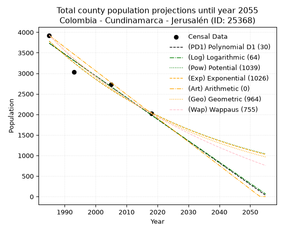
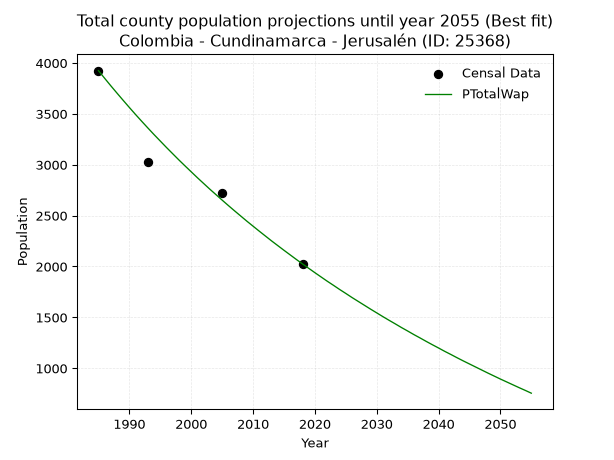
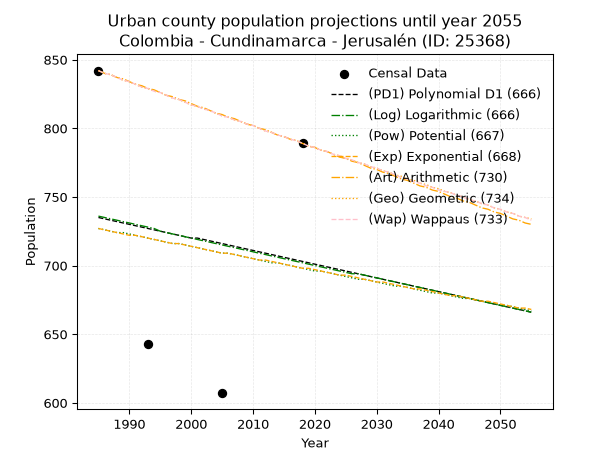
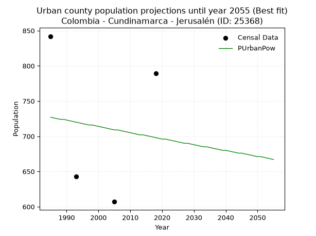
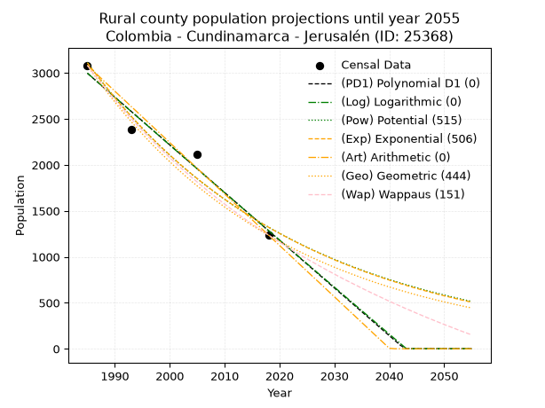
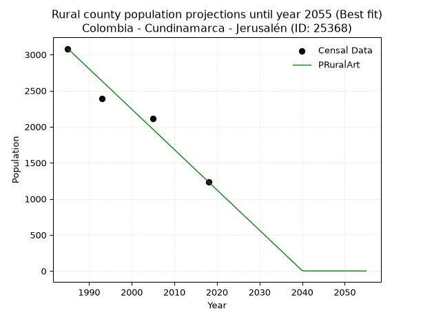

<div align="center">


</div>

# _“Population and Public Services Demand Projections (PPSD) until Year 2050 for Colombia - Cundinamarca - Jerusalén (ID: 25368)”_
Keywords: `population` `public-service` `projection` `lineal` `polynomial` `logarithmic` `potential` `exponential` `arithmetic` `geometric` `wappaus` `dane` `colombia` `south-america`

PPSD are analytical estimates used by governments and planners to anticipate future changes in population size, age distribution, and the resulting community needs for utilities, healthcare, education, and infrastructure as sizing future water treatment facilities, electrical grids, and road networks based on spatial growth.

> **General running parameters**: • app_version: _v20260806_. • Python version: _3.14.7_. • Pandas version: _3.0.5_. • NumPy version: _2.5.1_. • Creates, save and include plots into reports (create_plot): _False_. • Projection until year: _2050_. • Process polynomial degree 2 and up: _False_. • Process Wappaus: _True_. • Process Wappaus: _True_. • Set negative values to zero: _True_. • Set infinite values to zero: _True_. • Drop dataset notes: _True_. 
<div align="center">

Dynamic map: [:earth_americas:Google](http://maps.google.com/maps?q=4.562272821,-74.6954744) [:earth_americas:OSM](https://www.openstreetmap.org/#map=18/4.562272821/-74.6954744&layers=P) [:earth_americas:Bing](https://www.bing.com/maps?cp=4.562272821~-74.6954744&lvl=18) [:earth_americas:Apple](https://maps.apple.com/frame?center=4.562272821%2C-74.6954744&span=0.003%2C0.006)

</div>


<div align="center">

```geojson
{
  "type": "Feature",
  "geometry": {
    "type": "Point", 
    "coordinates": [-74.6954744, 4.562272821]
  }, 
  "properties": {
    "Name": "Colombia - Cundinamarca - Jerusalén (ID: 25368)"
  }
}
```

</div>


## 0. Census Data (4 records)

Census data are official statistics collected by a government about the people and housing in a country. They usually include counts of total population, age, sex, race, income, education, and jobs.

📅Global census file: [Population.xlsx](../data/Population.xlsx)

| Source   |   Year |   CountryID | CountryName   |   StateID | StateName    |   CountyID | CountyName   |   PTotal |   PUrban |   PRural |
|:---------|-------:|------------:|:--------------|----------:|:-------------|-----------:|:-------------|---------:|---------:|---------:|
| DANE     |   1985 |          57 | Colombia      |        25 | Cundinamarca |      25368 | Jerusalén    |     3924 |      842 |     3082 |
| DANE     |   1993 |          57 | Colombia      |        25 | Cundinamarca |      25368 | Jerusalén    |     3030 |      643 |     2387 |
| DANE     |   2005 |          57 | Colombia      |        25 | Cundinamarca |      25368 | Jerusalén    |     2723 |      607 |     2116 |
| DANE     |   2018 |          57 | Colombia      |        25 | Cundinamarca |      25368 | Jerusalén    |     2025 |      789 |     1236 |

> 🔥Some records could had specific notes about the registered values or the corresponding urban or rural distribution.

## 1. Total

### 1.1. Coefficients and Parameters

* (PD1) Polynomial Deg 1: -52.87916499397787, 108697.04977920424 (lineal)
* (Log) Logarithmic: -105878.8006599852, 807711.1122760073
* (Pow) Potential: -37.2976915332043, 126.57666937628889
* (Exp) Exponential: -0.01863256572067927, 4.3674207337674285e+19
* (Art) Arithmetic: Year diff. 2018 - 1985 = 33, Population diff. 2025 - 3924 = -1899, Annual growth = -57.54545454545455
* (Geo) Geometric: Year diff. 2018 - 1985 = 33, Population diff. 2025 - 3924 = -1899, Annual growth % = -0.01984712291563484
* (Wap) Wappaus: i = -1.9346261403750058, Condition values only valid for < 200)

<sub>
Wappaus condition values: ['-0.00', '-1.93', '-3.87', '-5.80', '-7.74', '-9.67', '-11.61', '-13.54', '-15.48', '-17.41', '-19.35', '-21.28', '-23.22', '-25.15', '-27.08', '-29.02', '-30.95', '-32.89', '-34.82', '-36.76', '-38.69', '-40.63', '-42.56', '-44.50', '-46.43', '-48.37', '-50.30', '-52.23', '-54.17', '-56.10', '-58.04', '-59.97', '-61.91', '-63.84', '-65.78', '-67.71', '-69.65', '-71.58', '-73.52', '-75.45', '-77.39', '-79.32', '-81.25', '-83.19', '-85.12', '-87.06', '-88.99', '-90.93', '-92.86', '-94.80', '-96.73', '-98.67', '-100.60', '-102.54', '-104.47', '-106.40', '-108.34', '-110.27', '-112.21', '-114.14', '-116.08', '-118.01', '-119.95', '-121.88', '-123.82', '-125.75']
</sub>


### 1.2. Projected Dataset

|   Year |   CountyID |   PTotalPD1 |   PTotalLog |   PTotalPow |   PTotalExp |   PTotalArt |   PTotalGeo |   PTotalWap |
|-------:|-----------:|------------:|------------:|------------:|------------:|------------:|------------:|------------:|
|   1985 |      25368 |        3732 |        3734 |        3783 |        3781 |        3924 |        3924 |        3924 |
|   1986 |      25368 |        3679 |        3680 |        3712 |        3711 |        3866 |        3846 |        3849 |
|   1987 |      25368 |        3626 |        3627 |        3643 |        3642 |        3809 |        3770 |        3775 |
|   1988 |      25368 |        3573 |        3574 |        3576 |        3575 |        3751 |        3695 |        3703 |
|   1989 |      25368 |        3520 |        3521 |        3509 |        3509 |        3694 |        3622 |        3632 |
|   1990 |      25368 |        3468 |        3467 |        3444 |        3444 |        3636 |        3550 |        3562 |
|   1991 |      25368 |        3415 |        3414 |        3380 |        3381 |        3579 |        3479 |        3493 |
|   1992 |      25368 |        3362 |        3361 |        3317 |        3318 |        3521 |        3410 |        3426 |
|   1993 |      25368 |        3309 |        3308 |        3256 |        3257 |        3464 |        3343 |        3360 |
|   1994 |      25368 |        3256 |        3255 |        3195 |        3197 |        3406 |        3276 |        3295 |
|   1995 |      25368 |        3203 |        3202 |        3136 |        3138 |        3349 |        3211 |        3232 |
|   1996 |      25368 |        3150 |        3149 |        3078 |        3080 |        3291 |        3147 |        3169 |
|   1997 |      25368 |        3097 |        3096 |        3021 |        3023 |        3233 |        3085 |        3108 |
|   1998 |      25368 |        3044 |        3043 |        2965 |        2967 |        3176 |        3024 |        3047 |
|   1999 |      25368 |        2992 |        2990 |        2911 |        2913 |        3118 |        2964 |        2988 |
|   2000 |      25368 |        2939 |        2937 |        2857 |        2859 |        3061 |        2905 |        2930 |
|   2001 |      25368 |        2886 |        2884 |        2804 |        2806 |        3003 |        2847 |        2872 |
|   2002 |      25368 |        2833 |        2831 |        2752 |        2754 |        2946 |        2791 |        2816 |
|   2003 |      25368 |        2780 |        2778 |        2701 |        2703 |        2888 |        2735 |        2760 |
|   2004 |      25368 |        2727 |        2725 |        2652 |        2653 |        2831 |        2681 |        2706 |
|   2005 |      25368 |        2674 |        2672 |        2603 |        2604 |        2773 |        2628 |        2652 |
|   2006 |      25368 |        2621 |        2620 |        2555 |        2556 |        2716 |        2576 |        2599 |
|   2007 |      25368 |        2569 |        2567 |        2508 |        2509 |        2658 |        2525 |        2547 |
|   2008 |      25368 |        2516 |        2514 |        2462 |        2463 |        2600 |        2474 |        2496 |
|   2009 |      25368 |        2463 |        2461 |        2416 |        2417 |        2543 |        2425 |        2445 |
|   2010 |      25368 |        2410 |        2409 |        2372 |        2373 |        2485 |        2377 |        2396 |
|   2011 |      25368 |        2357 |        2356 |        2328 |        2329 |        2428 |        2330 |        2347 |
|   2012 |      25368 |        2304 |        2303 |        2285 |        2286 |        2370 |        2284 |        2299 |
|   2013 |      25368 |        2251 |        2251 |        2243 |        2244 |        2313 |        2238 |        2251 |
|   2014 |      25368 |        2198 |        2198 |        2202 |        2202 |        2255 |        2194 |        2205 |
|   2015 |      25368 |        2146 |        2146 |        2162 |        2162 |        2198 |        2151 |        2159 |
|   2016 |      25368 |        2093 |        2093 |        2122 |        2122 |        2140 |        2108 |        2114 |
|   2017 |      25368 |        2040 |        2041 |        2083 |        2083 |        2083 |        2066 |        2069 |
|   2018 |      25368 |        1987 |        1988 |        2045 |        2044 |        2025 |        2025 |        2025 |
|   2019 |      25368 |        1934 |        1936 |        2008 |        2006 |        1967 |        1985 |        1982 |
|   2020 |      25368 |        1881 |        1883 |        1971 |        1969 |        1910 |        1945 |        1939 |
|   2021 |      25368 |        1828 |        1831 |        1935 |        1933 |        1852 |        1907 |        1897 |
|   2022 |      25368 |        1775 |        1778 |        1900 |        1897 |        1795 |        1869 |        1855 |
|   2023 |      25368 |        1722 |        1726 |        1865 |        1862 |        1737 |        1832 |        1815 |
|   2024 |      25368 |        1670 |        1674 |        1831 |        1828 |        1680 |        1796 |        1774 |
|   2025 |      25368 |        1617 |        1621 |        1797 |        1794 |        1622 |        1760 |        1735 |
|   2026 |      25368 |        1564 |        1569 |        1765 |        1761 |        1565 |        1725 |        1695 |
|   2027 |      25368 |        1511 |        1517 |        1732 |        1729 |        1507 |        1691 |        1657 |
|   2028 |      25368 |        1458 |        1465 |        1701 |        1697 |        1450 |        1657 |        1619 |
|   2029 |      25368 |        1405 |        1412 |        1670 |        1665 |        1392 |        1624 |        1581 |
|   2030 |      25368 |        1352 |        1360 |        1639 |        1635 |        1334 |        1592 |        1544 |
|   2031 |      25368 |        1299 |        1308 |        1610 |        1604 |        1277 |        1560 |        1507 |
|   2032 |      25368 |        1247 |        1256 |        1580 |        1575 |        1219 |        1529 |        1471 |
|   2033 |      25368 |        1194 |        1204 |        1552 |        1546 |        1162 |        1499 |        1436 |
|   2034 |      25368 |        1141 |        1152 |        1523 |        1517 |        1104 |        1469 |        1400 |
|   2035 |      25368 |        1088 |        1100 |        1496 |        1489 |        1047 |        1440 |        1366 |
|   2036 |      25368 |        1035 |        1048 |        1469 |        1462 |         989 |        1412 |        1331 |
|   2037 |      25368 |         982 |         996 |        1442 |        1435 |         932 |        1384 |        1298 |
|   2038 |      25368 |         929 |         944 |        1416 |        1408 |         874 |        1356 |        1264 |
|   2039 |      25368 |         876 |         892 |        1390 |        1382 |         817 |        1329 |        1231 |
|   2040 |      25368 |         824 |         840 |        1365 |        1357 |         759 |        1303 |        1199 |
|   2041 |      25368 |         771 |         788 |        1340 |        1332 |         701 |        1277 |        1166 |
|   2042 |      25368 |         718 |         736 |        1316 |        1307 |         644 |        1252 |        1135 |
|   2043 |      25368 |         665 |         684 |        1292 |        1283 |         586 |        1227 |        1103 |
|   2044 |      25368 |         612 |         633 |        1269 |        1259 |         529 |        1202 |        1072 |
|   2045 |      25368 |         559 |         581 |        1246 |        1236 |         471 |        1179 |        1042 |
|   2046 |      25368 |         506 |         529 |        1223 |        1213 |         414 |        1155 |        1012 |
|   2047 |      25368 |         453 |         477 |        1201 |        1191 |         356 |        1132 |         982 |
|   2048 |      25368 |         401 |         426 |        1180 |        1169 |         299 |        1110 |         952 |
|   2049 |      25368 |         348 |         374 |        1158 |        1147 |         241 |        1088 |         923 |
|   2050 |      25368 |         295 |         322 |        1137 |        1126 |         184 |        1066 |         894 |
<div align="center">

</img>

</div>


### 1.3. Best fit with absolute and relative error (%)

Relative error puts that difference into context by dividing the absolute error by the true value, creating a unitless ratio or percentage that shows the scale of the mistake.

Absolute and relative error

|   Year | Source   |   CountryID | CountryName   |   StateID | StateName    |   CountyID_x | CountyName   |   PTotal |   PUrban |   PRural |   CountyID_y |   PTotalPD1 |   PTotalLog |   PTotalPow |   PTotalExp |   PTotalArt |   PTotalGeo |   PTotalWap |   PTotalPD1AbsError |   PTotalLogAbsError |   PTotalPowAbsError |   PTotalExpAbsError |   PTotalArtAbsError |   PTotalGeoAbsError |   PTotalWapAbsError |   PTotalPD1RelError |   PTotalLogRelError |   PTotalPowRelError |   PTotalExpRelError |   PTotalArtRelError |   PTotalGeoRelError |   PTotalWapRelError |
|-------:|:---------|------------:|:--------------|----------:|:-------------|-------------:|:-------------|---------:|---------:|---------:|-------------:|------------:|------------:|------------:|------------:|------------:|------------:|------------:|--------------------:|--------------------:|--------------------:|--------------------:|--------------------:|--------------------:|--------------------:|--------------------:|--------------------:|--------------------:|--------------------:|--------------------:|--------------------:|--------------------:|
|   1985 | DANE     |          57 | Colombia      |        25 | Cundinamarca |        25368 | Jerusalén    |     3924 |      842 |     3082 |        25368 |        3732 |        3734 |        3783 |        3781 |        3924 |        3924 |        3924 |                 192 |                 190 |                 141 |                 143 |                   0 |                   0 |                   0 |             4.89297 |             4.842   |            3.59327  |            3.64424  |             0       |              0      |             0       |
|   1993 | DANE     |          57 | Colombia      |        25 | Cundinamarca |        25368 | Jerusalén    |     3030 |      643 |     2387 |        25368 |        3309 |        3308 |        3256 |        3257 |        3464 |        3343 |        3360 |                 279 |                 278 |                 226 |                 227 |                 434 |                 313 |                 330 |             9.20792 |             9.17492 |            7.45875  |            7.49175  |            14.3234  |             10.33   |            10.8911  |
|   2005 | DANE     |          57 | Colombia      |        25 | Cundinamarca |        25368 | Jerusalén    |     2723 |      607 |     2116 |        25368 |        2674 |        2672 |        2603 |        2604 |        2773 |        2628 |        2652 |                  49 |                  51 |                 120 |                 119 |                  50 |                  95 |                  71 |             1.79949 |             1.87293 |            4.4069   |            4.37018  |             1.83621 |              3.4888 |             2.60742 |
|   2018 | DANE     |          57 | Colombia      |        25 | Cundinamarca |        25368 | Jerusalén    |     2025 |      789 |     1236 |        25368 |        1987 |        1988 |        2045 |        2044 |        2025 |        2025 |        2025 |                  38 |                  37 |                  20 |                  19 |                   0 |                   0 |                   0 |             1.87654 |             1.82716 |            0.987654 |            0.938272 |             0       |              0      |             0       |

Relative error mean

| Method    |   RelError | Best   |
|:----------|-----------:|:-------|
| PTotalPD1 |    4.44423 |        |
| PTotalLog |    4.42925 |        |
| PTotalPow |    4.11164 |        |
| PTotalExp |    4.11111 |        |
| PTotalArt |    4.03991 |        |
| PTotalGeo |    3.45471 |        |
| PTotalWap |    3.37463 | True   |

💙Best method: _**PTotalWap**_
<div align="center">

</img>

</div>


### 1.4. Fresh water supply demand in liters per capita per day (lpcd)

The fresh water supply demand typically ranges from 100 to 300 liters per capita per day (lpcd) for standard domestic and municipal planning, though absolute survival minimums set by the World Health Organization are as low as 7.5 to 20 liters per day, and total consumption in high-income nations can exceed 400 liters.

> `CZ`: Level in meters above the sea level (masl).<br> `WS`: Fresh water supply demand in liters per capita per day (lpcd or l/h/d).<br> `WSAll`: Zonal fresh water supply demand in liters per second (l/s).<br> `A`: Zonal area in square meters.

Reference values (RAS Colombia)

|    CZ |   WS |
|------:|-----:|
|  1000 |  120 |
|  2000 |  130 |
| 99999 |  140 |

County shapefile geometry properties and water supply values

|   CountyID |      ATotal |   CZTotal |   WSTotal |
|-----------:|------------:|----------:|----------:|
|      25368 | 2.21673e+08 |   621.222 |       120 |

Projected values for best method: PTotalWap

|   CountyID |   Year |   PTotalWap |   WSTotal |   WSTotalAll |
|-----------:|-------:|------------:|----------:|-------------:|
|      25368 |   1985 |        3924 |       120 |      5.45    |
|      25368 |   1986 |        3849 |       120 |      5.34583 |
|      25368 |   1987 |        3775 |       120 |      5.24306 |
|      25368 |   1988 |        3703 |       120 |      5.14306 |
|      25368 |   1989 |        3632 |       120 |      5.04444 |
|      25368 |   1990 |        3562 |       120 |      4.94722 |
|      25368 |   1991 |        3493 |       120 |      4.85139 |
|      25368 |   1992 |        3426 |       120 |      4.75833 |
|      25368 |   1993 |        3360 |       120 |      4.66667 |
|      25368 |   1994 |        3295 |       120 |      4.57639 |
|      25368 |   1995 |        3232 |       120 |      4.48889 |
|      25368 |   1996 |        3169 |       120 |      4.40139 |
|      25368 |   1997 |        3108 |       120 |      4.31667 |
|      25368 |   1998 |        3047 |       120 |      4.23194 |
|      25368 |   1999 |        2988 |       120 |      4.15    |
|      25368 |   2000 |        2930 |       120 |      4.06944 |
|      25368 |   2001 |        2872 |       120 |      3.98889 |
|      25368 |   2002 |        2816 |       120 |      3.91111 |
|      25368 |   2003 |        2760 |       120 |      3.83333 |
|      25368 |   2004 |        2706 |       120 |      3.75833 |
|      25368 |   2005 |        2652 |       120 |      3.68333 |
|      25368 |   2006 |        2599 |       120 |      3.60972 |
|      25368 |   2007 |        2547 |       120 |      3.5375  |
|      25368 |   2008 |        2496 |       120 |      3.46667 |
|      25368 |   2009 |        2445 |       120 |      3.39583 |
|      25368 |   2010 |        2396 |       120 |      3.32778 |
|      25368 |   2011 |        2347 |       120 |      3.25972 |
|      25368 |   2012 |        2299 |       120 |      3.19306 |
|      25368 |   2013 |        2251 |       120 |      3.12639 |
|      25368 |   2014 |        2205 |       120 |      3.0625  |
|      25368 |   2015 |        2159 |       120 |      2.99861 |
|      25368 |   2016 |        2114 |       120 |      2.93611 |
|      25368 |   2017 |        2069 |       120 |      2.87361 |
|      25368 |   2018 |        2025 |       120 |      2.8125  |
|      25368 |   2019 |        1982 |       120 |      2.75278 |
|      25368 |   2020 |        1939 |       120 |      2.69306 |
|      25368 |   2021 |        1897 |       120 |      2.63472 |
|      25368 |   2022 |        1855 |       120 |      2.57639 |
|      25368 |   2023 |        1815 |       120 |      2.52083 |
|      25368 |   2024 |        1774 |       120 |      2.46389 |
|      25368 |   2025 |        1735 |       120 |      2.40972 |
|      25368 |   2026 |        1695 |       120 |      2.35417 |
|      25368 |   2027 |        1657 |       120 |      2.30139 |
|      25368 |   2028 |        1619 |       120 |      2.24861 |
|      25368 |   2029 |        1581 |       120 |      2.19583 |
|      25368 |   2030 |        1544 |       120 |      2.14444 |
|      25368 |   2031 |        1507 |       120 |      2.09306 |
|      25368 |   2032 |        1471 |       120 |      2.04306 |
|      25368 |   2033 |        1436 |       120 |      1.99444 |
|      25368 |   2034 |        1400 |       120 |      1.94444 |
|      25368 |   2035 |        1366 |       120 |      1.89722 |
|      25368 |   2036 |        1331 |       120 |      1.84861 |
|      25368 |   2037 |        1298 |       120 |      1.80278 |
|      25368 |   2038 |        1264 |       120 |      1.75556 |
|      25368 |   2039 |        1231 |       120 |      1.70972 |
|      25368 |   2040 |        1199 |       120 |      1.66528 |
|      25368 |   2041 |        1166 |       120 |      1.61944 |
|      25368 |   2042 |        1135 |       120 |      1.57639 |
|      25368 |   2043 |        1103 |       120 |      1.53194 |
|      25368 |   2044 |        1072 |       120 |      1.48889 |
|      25368 |   2045 |        1042 |       120 |      1.44722 |
|      25368 |   2046 |        1012 |       120 |      1.40556 |
|      25368 |   2047 |         982 |       120 |      1.36389 |
|      25368 |   2048 |         952 |       120 |      1.32222 |
|      25368 |   2049 |         923 |       120 |      1.28194 |
|      25368 |   2050 |         894 |       120 |      1.24167 |

## 2. Urban

### 2.1. Coefficients and Parameters

* (PD1) Polynomial Deg 1: -0.9863508631073042, 2693.1983139303857 (lineal)
* (Log) Logarithmic: -2010.5343386761353, 16002.337619688356
* (Pow) Potential: -2.472859027448963, 11.016542373902217
* (Exp) Exponential: -0.001210085131066136, 8028.69875617984
* (Art) Arithmetic: Year diff. 2018 - 1985 = 33, Population diff. 789 - 842 = -53, Annual growth = -1.606060606060606
* (Geo) Geometric: Year diff. 2018 - 1985 = 33, Population diff. 789 - 842 = -53, Annual growth % = -0.0019681725244323767
* (Wap) Wappaus: i = -0.1969418278431154, Condition values only valid for < 200)

<sub>
Wappaus condition values: ['-0.00', '-0.20', '-0.39', '-0.59', '-0.79', '-0.98', '-1.18', '-1.38', '-1.58', '-1.77', '-1.97', '-2.17', '-2.36', '-2.56', '-2.76', '-2.95', '-3.15', '-3.35', '-3.54', '-3.74', '-3.94', '-4.14', '-4.33', '-4.53', '-4.73', '-4.92', '-5.12', '-5.32', '-5.51', '-5.71', '-5.91', '-6.11', '-6.30', '-6.50', '-6.70', '-6.89', '-7.09', '-7.29', '-7.48', '-7.68', '-7.88', '-8.07', '-8.27', '-8.47', '-8.67', '-8.86', '-9.06', '-9.26', '-9.45', '-9.65', '-9.85', '-10.04', '-10.24', '-10.44', '-10.63', '-10.83', '-11.03', '-11.23', '-11.42', '-11.62', '-11.82', '-12.01', '-12.21', '-12.41', '-12.60', '-12.80']
</sub>


### 2.2. Projected Dataset

|   Year |   CountyID |   PUrbanPD1 |   PUrbanLog |   PUrbanPow |   PUrbanExp |   PUrbanArt |   PUrbanGeo |   PUrbanWap |
|-------:|-----------:|------------:|------------:|------------:|------------:|------------:|------------:|------------:|
|   1985 |      25368 |         735 |         736 |         727 |         727 |         842 |         842 |         842 |
|   1986 |      25368 |         734 |         735 |         726 |         726 |         840 |         840 |         840 |
|   1987 |      25368 |         733 |         734 |         725 |         725 |         839 |         839 |         839 |
|   1988 |      25368 |         732 |         733 |         724 |         724 |         837 |         837 |         837 |
|   1989 |      25368 |         731 |         732 |         724 |         723 |         836 |         835 |         835 |
|   1990 |      25368 |         730 |         731 |         723 |         722 |         834 |         834 |         834 |
|   1991 |      25368 |         729 |         730 |         722 |         722 |         832 |         832 |         832 |
|   1992 |      25368 |         728 |         729 |         721 |         721 |         831 |         830 |         830 |
|   1993 |      25368 |         727 |         728 |         720 |         720 |         829 |         829 |         829 |
|   1994 |      25368 |         726 |         727 |         719 |         719 |         828 |         827 |         827 |
|   1995 |      25368 |         725 |         725 |         718 |         718 |         826 |         826 |         826 |
|   1996 |      25368 |         724 |         724 |         717 |         717 |         824 |         824 |         824 |
|   1997 |      25368 |         723 |         723 |         716 |         716 |         823 |         822 |         822 |
|   1998 |      25368 |         722 |         722 |         716 |         716 |         821 |         821 |         821 |
|   1999 |      25368 |         721 |         721 |         715 |         715 |         820 |         819 |         819 |
|   2000 |      25368 |         720 |         720 |         714 |         714 |         818 |         817 |         817 |
|   2001 |      25368 |         720 |         719 |         713 |         713 |         816 |         816 |         816 |
|   2002 |      25368 |         719 |         718 |         712 |         712 |         815 |         814 |         814 |
|   2003 |      25368 |         718 |         717 |         711 |         711 |         813 |         813 |         813 |
|   2004 |      25368 |         717 |         716 |         710 |         710 |         811 |         811 |         811 |
|   2005 |      25368 |         716 |         715 |         709 |         709 |         810 |         809 |         809 |
|   2006 |      25368 |         715 |         714 |         709 |         709 |         808 |         808 |         808 |
|   2007 |      25368 |         714 |         713 |         708 |         708 |         807 |         806 |         806 |
|   2008 |      25368 |         713 |         712 |         707 |         707 |         805 |         805 |         805 |
|   2009 |      25368 |         712 |         711 |         706 |         706 |         803 |         803 |         803 |
|   2010 |      25368 |         711 |         710 |         705 |         705 |         802 |         802 |         802 |
|   2011 |      25368 |         710 |         709 |         704 |         704 |         800 |         800 |         800 |
|   2012 |      25368 |         709 |         708 |         703 |         704 |         799 |         798 |         798 |
|   2013 |      25368 |         708 |         707 |         702 |         703 |         797 |         797 |         797 |
|   2014 |      25368 |         707 |         706 |         702 |         702 |         795 |         795 |         795 |
|   2015 |      25368 |         706 |         705 |         701 |         701 |         794 |         794 |         794 |
|   2016 |      25368 |         705 |         704 |         700 |         700 |         792 |         792 |         792 |
|   2017 |      25368 |         704 |         703 |         699 |         699 |         791 |         791 |         791 |
|   2018 |      25368 |         703 |         702 |         698 |         698 |         789 |         789 |         789 |
|   2019 |      25368 |         702 |         701 |         697 |         698 |         787 |         787 |         787 |
|   2020 |      25368 |         701 |         700 |         696 |         697 |         786 |         786 |         786 |
|   2021 |      25368 |         700 |         699 |         696 |         696 |         784 |         784 |         784 |
|   2022 |      25368 |         699 |         698 |         695 |         695 |         783 |         783 |         783 |
|   2023 |      25368 |         698 |         697 |         694 |         694 |         781 |         781 |         781 |
|   2024 |      25368 |         697 |         696 |         693 |         693 |         779 |         780 |         780 |
|   2025 |      25368 |         696 |         695 |         692 |         693 |         778 |         778 |         778 |
|   2026 |      25368 |         695 |         694 |         691 |         692 |         776 |         777 |         777 |
|   2027 |      25368 |         694 |         694 |         690 |         691 |         775 |         775 |         775 |
|   2028 |      25368 |         693 |         693 |         690 |         690 |         773 |         774 |         774 |
|   2029 |      25368 |         692 |         692 |         689 |         689 |         771 |         772 |         772 |
|   2030 |      25368 |         691 |         691 |         688 |         688 |         770 |         771 |         771 |
|   2031 |      25368 |         690 |         690 |         687 |         688 |         768 |         769 |         769 |
|   2032 |      25368 |         689 |         689 |         686 |         687 |         767 |         768 |         768 |
|   2033 |      25368 |         688 |         688 |         685 |         686 |         765 |         766 |         766 |
|   2034 |      25368 |         687 |         687 |         685 |         685 |         763 |         765 |         764 |
|   2035 |      25368 |         686 |         686 |         684 |         684 |         762 |         763 |         763 |
|   2036 |      25368 |         685 |         685 |         683 |         683 |         760 |         762 |         761 |
|   2037 |      25368 |         684 |         684 |         682 |         683 |         758 |         760 |         760 |
|   2038 |      25368 |         683 |         683 |         681 |         682 |         757 |         759 |         758 |
|   2039 |      25368 |         682 |         682 |         680 |         681 |         755 |         757 |         757 |
|   2040 |      25368 |         681 |         681 |         680 |         680 |         754 |         756 |         755 |
|   2041 |      25368 |         680 |         680 |         679 |         679 |         752 |         754 |         754 |
|   2042 |      25368 |         679 |         679 |         678 |         678 |         750 |         753 |         753 |
|   2043 |      25368 |         678 |         678 |         677 |         678 |         749 |         751 |         751 |
|   2044 |      25368 |         677 |         677 |         676 |         677 |         747 |         750 |         750 |
|   2045 |      25368 |         676 |         676 |         676 |         676 |         746 |         748 |         748 |
|   2046 |      25368 |         675 |         675 |         675 |         675 |         744 |         747 |         747 |
|   2047 |      25368 |         674 |         674 |         674 |         674 |         742 |         745 |         745 |
|   2048 |      25368 |         673 |         673 |         673 |         674 |         741 |         744 |         744 |
|   2049 |      25368 |         672 |         672 |         672 |         673 |         739 |         742 |         742 |
|   2050 |      25368 |         671 |         671 |         671 |         672 |         738 |         741 |         741 |
<div align="center">

</img>

</div>


### 2.3. Best fit with absolute and relative error (%)

Relative error puts that difference into context by dividing the absolute error by the true value, creating a unitless ratio or percentage that shows the scale of the mistake.

Absolute and relative error

|   Year | Source   |   CountryID | CountryName   |   StateID | StateName    |   CountyID_x | CountyName   |   PTotal |   PUrban |   PRural |   CountyID_y |   PUrbanPD1 |   PUrbanLog |   PUrbanPow |   PUrbanExp |   PUrbanArt |   PUrbanGeo |   PUrbanWap |   PUrbanPD1AbsError |   PUrbanLogAbsError |   PUrbanPowAbsError |   PUrbanExpAbsError |   PUrbanArtAbsError |   PUrbanGeoAbsError |   PUrbanWapAbsError |   PUrbanPD1RelError |   PUrbanLogRelError |   PUrbanPowRelError |   PUrbanExpRelError |   PUrbanArtRelError |   PUrbanGeoRelError |   PUrbanWapRelError |
|-------:|:---------|------------:|:--------------|----------:|:-------------|-------------:|:-------------|---------:|---------:|---------:|-------------:|------------:|------------:|------------:|------------:|------------:|------------:|------------:|--------------------:|--------------------:|--------------------:|--------------------:|--------------------:|--------------------:|--------------------:|--------------------:|--------------------:|--------------------:|--------------------:|--------------------:|--------------------:|--------------------:|
|   1985 | DANE     |          57 | Colombia      |        25 | Cundinamarca |        25368 | Jerusalén    |     3924 |      842 |     3082 |        25368 |         735 |         736 |         727 |         727 |         842 |         842 |         842 |                 107 |                 106 |                 115 |                 115 |                   0 |                   0 |                   0 |             12.7078 |             12.5891 |             13.658  |             13.658  |              0      |              0      |              0      |
|   1993 | DANE     |          57 | Colombia      |        25 | Cundinamarca |        25368 | Jerusalén    |     3030 |      643 |     2387 |        25368 |         727 |         728 |         720 |         720 |         829 |         829 |         829 |                  84 |                  85 |                  77 |                  77 |                 186 |                 186 |                 186 |             13.0638 |             13.2193 |             11.9751 |             11.9751 |             28.9269 |             28.9269 |             28.9269 |
|   2005 | DANE     |          57 | Colombia      |        25 | Cundinamarca |        25368 | Jerusalén    |     2723 |      607 |     2116 |        25368 |         716 |         715 |         709 |         709 |         810 |         809 |         809 |                 109 |                 108 |                 102 |                 102 |                 203 |                 202 |                 202 |             17.9572 |             17.7924 |             16.804  |             16.804  |             33.4432 |             33.2784 |             33.2784 |
|   2018 | DANE     |          57 | Colombia      |        25 | Cundinamarca |        25368 | Jerusalén    |     2025 |      789 |     1236 |        25368 |         703 |         702 |         698 |         698 |         789 |         789 |         789 |                  86 |                  87 |                  91 |                  91 |                   0 |                   0 |                   0 |             10.8999 |             11.0266 |             11.5336 |             11.5336 |              0      |              0      |              0      |

Relative error mean

| Method    |   RelError | Best   |
|:----------|-----------:|:-------|
| PUrbanPD1 |    13.6572 |        |
| PUrbanLog |    13.6568 |        |
| PUrbanPow |    13.4927 | True   |
| PUrbanExp |    13.4927 | True   |
| PUrbanArt |    15.5925 |        |
| PUrbanGeo |    15.5513 |        |
| PUrbanWap |    15.5513 |        |

💙Best method: _**PUrbanPow**_
<div align="center">

</img>

</div>


### 2.4. Fresh water supply demand in liters per capita per day (lpcd)

The fresh water supply demand typically ranges from 100 to 300 liters per capita per day (lpcd) for standard domestic and municipal planning, though absolute survival minimums set by the World Health Organization are as low as 7.5 to 20 liters per day, and total consumption in high-income nations can exceed 400 liters.

> `CZ`: Level in meters above the sea level (masl).<br> `WS`: Fresh water supply demand in liters per capita per day (lpcd or l/h/d).<br> `WSAll`: Zonal fresh water supply demand in liters per second (l/s).<br> `A`: Zonal area in square meters.

Reference values (RAS Colombia)

|    CZ |   WS |
|------:|-----:|
|  1000 |  120 |
|  2000 |  130 |
| 99999 |  140 |

County shapefile geometry properties and water supply values

|   CountyID |   AUrban |   CZUrban |   WSUrban |
|-----------:|---------:|----------:|----------:|
|      25368 |   367477 |   301.937 |       120 |

Projected values for best method: PUrbanPow

|   CountyID |   Year |   PUrbanPow |   WSUrban |   WSUrbanAll |
|-----------:|-------:|------------:|----------:|-------------:|
|      25368 |   1985 |         727 |       120 |     1.00972  |
|      25368 |   1986 |         726 |       120 |     1.00833  |
|      25368 |   1987 |         725 |       120 |     1.00694  |
|      25368 |   1988 |         724 |       120 |     1.00556  |
|      25368 |   1989 |         724 |       120 |     1.00556  |
|      25368 |   1990 |         723 |       120 |     1.00417  |
|      25368 |   1991 |         722 |       120 |     1.00278  |
|      25368 |   1992 |         721 |       120 |     1.00139  |
|      25368 |   1993 |         720 |       120 |     1        |
|      25368 |   1994 |         719 |       120 |     0.998611 |
|      25368 |   1995 |         718 |       120 |     0.997222 |
|      25368 |   1996 |         717 |       120 |     0.995833 |
|      25368 |   1997 |         716 |       120 |     0.994444 |
|      25368 |   1998 |         716 |       120 |     0.994444 |
|      25368 |   1999 |         715 |       120 |     0.993056 |
|      25368 |   2000 |         714 |       120 |     0.991667 |
|      25368 |   2001 |         713 |       120 |     0.990278 |
|      25368 |   2002 |         712 |       120 |     0.988889 |
|      25368 |   2003 |         711 |       120 |     0.9875   |
|      25368 |   2004 |         710 |       120 |     0.986111 |
|      25368 |   2005 |         709 |       120 |     0.984722 |
|      25368 |   2006 |         709 |       120 |     0.984722 |
|      25368 |   2007 |         708 |       120 |     0.983333 |
|      25368 |   2008 |         707 |       120 |     0.981944 |
|      25368 |   2009 |         706 |       120 |     0.980556 |
|      25368 |   2010 |         705 |       120 |     0.979167 |
|      25368 |   2011 |         704 |       120 |     0.977778 |
|      25368 |   2012 |         703 |       120 |     0.976389 |
|      25368 |   2013 |         702 |       120 |     0.975    |
|      25368 |   2014 |         702 |       120 |     0.975    |
|      25368 |   2015 |         701 |       120 |     0.973611 |
|      25368 |   2016 |         700 |       120 |     0.972222 |
|      25368 |   2017 |         699 |       120 |     0.970833 |
|      25368 |   2018 |         698 |       120 |     0.969444 |
|      25368 |   2019 |         697 |       120 |     0.968056 |
|      25368 |   2020 |         696 |       120 |     0.966667 |
|      25368 |   2021 |         696 |       120 |     0.966667 |
|      25368 |   2022 |         695 |       120 |     0.965278 |
|      25368 |   2023 |         694 |       120 |     0.963889 |
|      25368 |   2024 |         693 |       120 |     0.9625   |
|      25368 |   2025 |         692 |       120 |     0.961111 |
|      25368 |   2026 |         691 |       120 |     0.959722 |
|      25368 |   2027 |         690 |       120 |     0.958333 |
|      25368 |   2028 |         690 |       120 |     0.958333 |
|      25368 |   2029 |         689 |       120 |     0.956944 |
|      25368 |   2030 |         688 |       120 |     0.955556 |
|      25368 |   2031 |         687 |       120 |     0.954167 |
|      25368 |   2032 |         686 |       120 |     0.952778 |
|      25368 |   2033 |         685 |       120 |     0.951389 |
|      25368 |   2034 |         685 |       120 |     0.951389 |
|      25368 |   2035 |         684 |       120 |     0.95     |
|      25368 |   2036 |         683 |       120 |     0.948611 |
|      25368 |   2037 |         682 |       120 |     0.947222 |
|      25368 |   2038 |         681 |       120 |     0.945833 |
|      25368 |   2039 |         680 |       120 |     0.944444 |
|      25368 |   2040 |         680 |       120 |     0.944444 |
|      25368 |   2041 |         679 |       120 |     0.943056 |
|      25368 |   2042 |         678 |       120 |     0.941667 |
|      25368 |   2043 |         677 |       120 |     0.940278 |
|      25368 |   2044 |         676 |       120 |     0.938889 |
|      25368 |   2045 |         676 |       120 |     0.938889 |
|      25368 |   2046 |         675 |       120 |     0.9375   |
|      25368 |   2047 |         674 |       120 |     0.936111 |
|      25368 |   2048 |         673 |       120 |     0.934722 |
|      25368 |   2049 |         672 |       120 |     0.933333 |
|      25368 |   2050 |         671 |       120 |     0.931944 |

## 3. Rural

### 3.1. Coefficients and Parameters

* (PD1) Polynomial Deg 1: -51.892814130870576, 106003.85146527387 (lineal)
* (Log) Logarithmic: -103868.26632130903, 791708.7746563187
* (Pow) Potential: -51.89565121028333, 174.63253506104252
* (Exp) Exponential: -0.025936113113878417, 7.107099396660456e+25
* (Art) Arithmetic: Year diff. 2018 - 1985 = 33, Population diff. 1236 - 3082 = -1846, Annual growth = -55.93939393939394
* (Geo) Geometric: Year diff. 2018 - 1985 = 33, Population diff. 1236 - 3082 = -1846, Annual growth % = -0.027308034979920848
* (Wap) Wappaus: i = -2.5909862871419147, Condition values only valid for < 200)

<sub>
Wappaus condition values: ['-0.00', '-2.59', '-5.18', '-7.77', '-10.36', '-12.95', '-15.55', '-18.14', '-20.73', '-23.32', '-25.91', '-28.50', '-31.09', '-33.68', '-36.27', '-38.86', '-41.46', '-44.05', '-46.64', '-49.23', '-51.82', '-54.41', '-57.00', '-59.59', '-62.18', '-64.77', '-67.37', '-69.96', '-72.55', '-75.14', '-77.73', '-80.32', '-82.91', '-85.50', '-88.09', '-90.68', '-93.28', '-95.87', '-98.46', '-101.05', '-103.64', '-106.23', '-108.82', '-111.41', '-114.00', '-116.59', '-119.19', '-121.78', '-124.37', '-126.96', '-129.55', '-132.14', '-134.73', '-137.32', '-139.91', '-142.50', '-145.10', '-147.69', '-150.28', '-152.87', '-155.46', '-158.05', '-160.64', '-163.23', '-165.82', '-168.41']
</sub>


### 3.2. Projected Dataset

|   Year |   CountyID |   PRuralPD1 |   PRuralLog |   PRuralPow |   PRuralExp |   PRuralArt |   PRuralGeo |   PRuralWap |
|-------:|-----------:|------------:|------------:|------------:|------------:|------------:|------------:|------------:|
|   1985 |      25368 |        2997 |        2998 |        3112 |        3110 |        3082 |        3082 |        3082 |
|   1986 |      25368 |        2945 |        2946 |        3032 |        3031 |        3026 |        2998 |        3003 |
|   1987 |      25368 |        2893 |        2894 |        2954 |        2953 |        2970 |        2916 |        2926 |
|   1988 |      25368 |        2841 |        2841 |        2878 |        2878 |        2914 |        2836 |        2851 |
|   1989 |      25368 |        2789 |        2789 |        2804 |        2804 |        2858 |        2759 |        2778 |
|   1990 |      25368 |        2737 |        2737 |        2732 |        2732 |        2802 |        2684 |        2707 |
|   1991 |      25368 |        2685 |        2685 |        2661 |        2662 |        2746 |        2610 |        2637 |
|   1992 |      25368 |        2633 |        2633 |        2593 |        2594 |        2690 |        2539 |        2569 |
|   1993 |      25368 |        2581 |        2580 |        2526 |        2528 |        2634 |        2470 |        2503 |
|   1994 |      25368 |        2530 |        2528 |        2461 |        2463 |        2579 |        2402 |        2438 |
|   1995 |      25368 |        2478 |        2476 |        2398 |        2400 |        2523 |        2337 |        2375 |
|   1996 |      25368 |        2426 |        2424 |        2336 |        2338 |        2467 |        2273 |        2313 |
|   1997 |      25368 |        2374 |        2372 |        2276 |        2279 |        2411 |        2211 |        2253 |
|   1998 |      25368 |        2322 |        2320 |        2218 |        2220 |        2355 |        2150 |        2194 |
|   1999 |      25368 |        2270 |        2268 |        2161 |        2163 |        2299 |        2092 |        2136 |
|   2000 |      25368 |        2218 |        2216 |        2106 |        2108 |        2243 |        2035 |        2079 |
|   2001 |      25368 |        2166 |        2164 |        2052 |        2054 |        2187 |        1979 |        2024 |
|   2002 |      25368 |        2114 |        2112 |        1999 |        2001 |        2131 |        1925 |        1969 |
|   2003 |      25368 |        2063 |        2061 |        1948 |        1950 |        2075 |        1872 |        1916 |
|   2004 |      25368 |        2011 |        2009 |        1898 |        1900 |        2019 |        1821 |        1864 |
|   2005 |      25368 |        1959 |        1957 |        1850 |        1852 |        1963 |        1771 |        1814 |
|   2006 |      25368 |        1907 |        1905 |        1803 |        1804 |        1907 |        1723 |        1764 |
|   2007 |      25368 |        1855 |        1853 |        1757 |        1758 |        1851 |        1676 |        1715 |
|   2008 |      25368 |        1803 |        1802 |        1712 |        1713 |        1795 |        1630 |        1667 |
|   2009 |      25368 |        1751 |        1750 |        1668 |        1669 |        1739 |        1586 |        1620 |
|   2010 |      25368 |        1699 |        1698 |        1626 |        1626 |        1684 |        1542 |        1574 |
|   2011 |      25368 |        1647 |        1647 |        1584 |        1585 |        1628 |        1500 |        1529 |
|   2012 |      25368 |        1596 |        1595 |        1544 |        1544 |        1572 |        1459 |        1485 |
|   2013 |      25368 |        1544 |        1543 |        1505 |        1505 |        1516 |        1420 |        1441 |
|   2014 |      25368 |        1492 |        1492 |        1466 |        1466 |        1460 |        1381 |        1399 |
|   2015 |      25368 |        1440 |        1440 |        1429 |        1429 |        1404 |        1343 |        1357 |
|   2016 |      25368 |        1388 |        1389 |        1393 |        1392 |        1348 |        1306 |        1316 |
|   2017 |      25368 |        1336 |        1337 |        1357 |        1356 |        1292 |        1271 |        1276 |
|   2018 |      25368 |        1284 |        1286 |        1323 |        1322 |        1236 |        1236 |        1236 |
|   2019 |      25368 |        1232 |        1234 |        1289 |        1288 |        1180 |        1202 |        1197 |
|   2020 |      25368 |        1180 |        1183 |        1257 |        1255 |        1124 |        1169 |        1159 |
|   2021 |      25368 |        1128 |        1131 |        1225 |        1223 |        1068 |        1137 |        1122 |
|   2022 |      25368 |        1077 |        1080 |        1194 |        1191 |        1012 |        1106 |        1085 |
|   2023 |      25368 |        1025 |        1029 |        1163 |        1161 |         956 |        1076 |        1049 |
|   2024 |      25368 |         973 |         977 |        1134 |        1131 |         900 |        1047 |        1013 |
|   2025 |      25368 |         921 |         926 |        1105 |        1102 |         844 |        1018 |         978 |
|   2026 |      25368 |         869 |         875 |        1077 |        1074 |         788 |         990 |         944 |
|   2027 |      25368 |         817 |         823 |        1050 |        1047 |         733 |         963 |         910 |
|   2028 |      25368 |         765 |         772 |        1024 |        1020 |         677 |         937 |         877 |
|   2029 |      25368 |         713 |         721 |         998 |         994 |         621 |         911 |         844 |
|   2030 |      25368 |         661 |         670 |         972 |         968 |         565 |         887 |         812 |
|   2031 |      25368 |         610 |         619 |         948 |         943 |         509 |         862 |         780 |
|   2032 |      25368 |         558 |         567 |         924 |         919 |         453 |         839 |         749 |
|   2033 |      25368 |         506 |         516 |         901 |         896 |         397 |         816 |         719 |
|   2034 |      25368 |         454 |         465 |         878 |         873 |         341 |         794 |         689 |
|   2035 |      25368 |         402 |         414 |         856 |         850 |         285 |         772 |         659 |
|   2036 |      25368 |         350 |         363 |         834 |         829 |         229 |         751 |         630 |
|   2037 |      25368 |         298 |         312 |         813 |         807 |         173 |         730 |         601 |
|   2038 |      25368 |         246 |         261 |         793 |         787 |         117 |         710 |         573 |
|   2039 |      25368 |         194 |         210 |         773 |         767 |          61 |         691 |         545 |
|   2040 |      25368 |         143 |         159 |         754 |         747 |           5 |         672 |         517 |
|   2041 |      25368 |          91 |         108 |         735 |         728 |           0 |         654 |         490 |
|   2042 |      25368 |          39 |          58 |         716 |         709 |           0 |         636 |         464 |
|   2043 |      25368 |           0 |           7 |         698 |         691 |           0 |         619 |         437 |
|   2044 |      25368 |           0 |           0 |         681 |         673 |           0 |         602 |         412 |
|   2045 |      25368 |           0 |           0 |         664 |         656 |           0 |         585 |         386 |
|   2046 |      25368 |           0 |           0 |         647 |         639 |           0 |         569 |         361 |
|   2047 |      25368 |           0 |           0 |         631 |         623 |           0 |         554 |         336 |
|   2048 |      25368 |           0 |           0 |         615 |         607 |           0 |         539 |         312 |
|   2049 |      25368 |           0 |           0 |         600 |         591 |           0 |         524 |         288 |
|   2050 |      25368 |           0 |           0 |         585 |         576 |           0 |         510 |         264 |
<div align="center">

</img>

</div>


### 3.3. Best fit with absolute and relative error (%)

Relative error puts that difference into context by dividing the absolute error by the true value, creating a unitless ratio or percentage that shows the scale of the mistake.

Absolute and relative error

|   Year | Source   |   CountryID | CountryName   |   StateID | StateName    |   CountyID_x | CountyName   |   PTotal |   PUrban |   PRural |   CountyID_y |   PRuralPD1 |   PRuralLog |   PRuralPow |   PRuralExp |   PRuralArt |   PRuralGeo |   PRuralWap |   PRuralPD1AbsError |   PRuralLogAbsError |   PRuralPowAbsError |   PRuralExpAbsError |   PRuralArtAbsError |   PRuralGeoAbsError |   PRuralWapAbsError |   PRuralPD1RelError |   PRuralLogRelError |   PRuralPowRelError |   PRuralExpRelError |   PRuralArtRelError |   PRuralGeoRelError |   PRuralWapRelError |
|-------:|:---------|------------:|:--------------|----------:|:-------------|-------------:|:-------------|---------:|---------:|---------:|-------------:|------------:|------------:|------------:|------------:|------------:|------------:|------------:|--------------------:|--------------------:|--------------------:|--------------------:|--------------------:|--------------------:|--------------------:|--------------------:|--------------------:|--------------------:|--------------------:|--------------------:|--------------------:|--------------------:|
|   1985 | DANE     |          57 | Colombia      |        25 | Cundinamarca |        25368 | Jerusalén    |     3924 |      842 |     3082 |        25368 |        2997 |        2998 |        3112 |        3110 |        3082 |        3082 |        3082 |                  85 |                  84 |                  30 |                  28 |                   0 |                   0 |                   0 |             2.75795 |             2.7255  |            0.973394 |            0.908501 |             0       |             0       |             0       |
|   1993 | DANE     |          57 | Colombia      |        25 | Cundinamarca |        25368 | Jerusalén    |     3030 |      643 |     2387 |        25368 |        2581 |        2580 |        2526 |        2528 |        2634 |        2470 |        2503 |                 194 |                 193 |                 139 |                 141 |                 247 |                  83 |                 116 |             8.12736 |             8.08546 |            5.82321  |            5.907    |            10.3477  |             3.47717 |             4.85966 |
|   2005 | DANE     |          57 | Colombia      |        25 | Cundinamarca |        25368 | Jerusalén    |     2723 |      607 |     2116 |        25368 |        1959 |        1957 |        1850 |        1852 |        1963 |        1771 |        1814 |                 157 |                 159 |                 266 |                 264 |                 153 |                 345 |                 302 |             7.41966 |             7.51418 |           12.5709   |           12.4764   |             7.23062 |            16.3043  |            14.2722  |
|   2018 | DANE     |          57 | Colombia      |        25 | Cundinamarca |        25368 | Jerusalén    |     2025 |      789 |     1236 |        25368 |        1284 |        1286 |        1323 |        1322 |        1236 |        1236 |        1236 |                  48 |                  50 |                  87 |                  86 |                   0 |                   0 |                   0 |             3.8835  |             4.04531 |            7.03883  |            6.95793  |             0       |             0       |             0       |

Relative error mean

| Method    |   RelError | Best   |
|:----------|-----------:|:-------|
| PRuralPD1 |    5.54712 |        |
| PRuralLog |    5.59261 |        |
| PRuralPow |    6.60158 |        |
| PRuralExp |    6.56245 |        |
| PRuralArt |    4.39459 | True   |
| PRuralGeo |    4.94538 |        |
| PRuralWap |    4.78297 |        |

💙Best method: _**PRuralArt**_
<div align="center">

</img>

</div>


### 3.4. Fresh water supply demand in liters per capita per day (lpcd)

The fresh water supply demand typically ranges from 100 to 300 liters per capita per day (lpcd) for standard domestic and municipal planning, though absolute survival minimums set by the World Health Organization are as low as 7.5 to 20 liters per day, and total consumption in high-income nations can exceed 400 liters.

> `CZ`: Level in meters above the sea level (masl).<br> `WS`: Fresh water supply demand in liters per capita per day (lpcd or l/h/d).<br> `WSAll`: Zonal fresh water supply demand in liters per second (l/s).<br> `A`: Zonal area in square meters.

Reference values (RAS Colombia)

|    CZ |   WS |
|------:|-----:|
|  1000 |  120 |
|  2000 |  130 |
| 99999 |  140 |

County shapefile geometry properties and water supply values

|   CountyID |      ARural |   CZRural |   WSRural |
|-----------:|------------:|----------:|----------:|
|      25368 | 2.21305e+08 |   621.812 |       120 |

Projected values for best method: PRuralArt

|   CountyID |   Year |   PRuralArt |   WSRural |   WSRuralAll |
|-----------:|-------:|------------:|----------:|-------------:|
|      25368 |   1985 |        3082 |       120 |   4.28056    |
|      25368 |   1986 |        3026 |       120 |   4.20278    |
|      25368 |   1987 |        2970 |       120 |   4.125      |
|      25368 |   1988 |        2914 |       120 |   4.04722    |
|      25368 |   1989 |        2858 |       120 |   3.96944    |
|      25368 |   1990 |        2802 |       120 |   3.89167    |
|      25368 |   1991 |        2746 |       120 |   3.81389    |
|      25368 |   1992 |        2690 |       120 |   3.73611    |
|      25368 |   1993 |        2634 |       120 |   3.65833    |
|      25368 |   1994 |        2579 |       120 |   3.58194    |
|      25368 |   1995 |        2523 |       120 |   3.50417    |
|      25368 |   1996 |        2467 |       120 |   3.42639    |
|      25368 |   1997 |        2411 |       120 |   3.34861    |
|      25368 |   1998 |        2355 |       120 |   3.27083    |
|      25368 |   1999 |        2299 |       120 |   3.19306    |
|      25368 |   2000 |        2243 |       120 |   3.11528    |
|      25368 |   2001 |        2187 |       120 |   3.0375     |
|      25368 |   2002 |        2131 |       120 |   2.95972    |
|      25368 |   2003 |        2075 |       120 |   2.88194    |
|      25368 |   2004 |        2019 |       120 |   2.80417    |
|      25368 |   2005 |        1963 |       120 |   2.72639    |
|      25368 |   2006 |        1907 |       120 |   2.64861    |
|      25368 |   2007 |        1851 |       120 |   2.57083    |
|      25368 |   2008 |        1795 |       120 |   2.49306    |
|      25368 |   2009 |        1739 |       120 |   2.41528    |
|      25368 |   2010 |        1684 |       120 |   2.33889    |
|      25368 |   2011 |        1628 |       120 |   2.26111    |
|      25368 |   2012 |        1572 |       120 |   2.18333    |
|      25368 |   2013 |        1516 |       120 |   2.10556    |
|      25368 |   2014 |        1460 |       120 |   2.02778    |
|      25368 |   2015 |        1404 |       120 |   1.95       |
|      25368 |   2016 |        1348 |       120 |   1.87222    |
|      25368 |   2017 |        1292 |       120 |   1.79444    |
|      25368 |   2018 |        1236 |       120 |   1.71667    |
|      25368 |   2019 |        1180 |       120 |   1.63889    |
|      25368 |   2020 |        1124 |       120 |   1.56111    |
|      25368 |   2021 |        1068 |       120 |   1.48333    |
|      25368 |   2022 |        1012 |       120 |   1.40556    |
|      25368 |   2023 |         956 |       120 |   1.32778    |
|      25368 |   2024 |         900 |       120 |   1.25       |
|      25368 |   2025 |         844 |       120 |   1.17222    |
|      25368 |   2026 |         788 |       120 |   1.09444    |
|      25368 |   2027 |         733 |       120 |   1.01806    |
|      25368 |   2028 |         677 |       120 |   0.940278   |
|      25368 |   2029 |         621 |       120 |   0.8625     |
|      25368 |   2030 |         565 |       120 |   0.784722   |
|      25368 |   2031 |         509 |       120 |   0.706944   |
|      25368 |   2032 |         453 |       120 |   0.629167   |
|      25368 |   2033 |         397 |       120 |   0.551389   |
|      25368 |   2034 |         341 |       120 |   0.473611   |
|      25368 |   2035 |         285 |       120 |   0.395833   |
|      25368 |   2036 |         229 |       120 |   0.318056   |
|      25368 |   2037 |         173 |       120 |   0.240278   |
|      25368 |   2038 |         117 |       120 |   0.1625     |
|      25368 |   2039 |          61 |       120 |   0.0847222  |
|      25368 |   2040 |           5 |       120 |   0.00694444 |
|      25368 |   2041 |           0 |       120 |   0          |
|      25368 |   2042 |           0 |       120 |   0          |
|      25368 |   2043 |           0 |       120 |   0          |
|      25368 |   2044 |           0 |       120 |   0          |
|      25368 |   2045 |           0 |       120 |   0          |
|      25368 |   2046 |           0 |       120 |   0          |
|      25368 |   2047 |           0 |       120 |   0          |
|      25368 |   2048 |           0 |       120 |   0          |
|      25368 |   2049 |           0 |       120 |   0          |
|      25368 |   2050 |           0 |       120 |   0          |

<div align="center"><br><sub>Share this research</sub></div><br>

<sub>**APPS & TOOLS & CONTENT DISCLAIMER**: • NO WARRANTY - This content and software is provided by <a href="https://github.com/rcfdtools" target="_blank">github.com/rcfdtools</a> "as is", without any express or implied warranty, including warranties of merchantability, fitness for a particular purpose, or non-infringement. There is no guarantee that the software will be error-free or operate without interruption. • LIMITATION OF LIABILITY - Neither the authors nor copyright holders will be liable for claims or damages arising from the software or its use. You are responsible for determining if the software is appropriate for your use and assume all associated risks, including errors, legal compliance, and data loss. • NO PROFESSIONAL ADVICE - The software provides general information and does not offer professional advice. It should not replace consultation with professional advisors. [Clauses and global license for rcfdtools use.](https://github.com/rcfdtools/rcfdtools/blob/main/LICENSE.md)</sub>

| [:house: Home](Readme.md)  | [:beginner: Help / Collaborate](https://github.com/rcfdtools/R.HydroTools/discussions/31) |
|----------------------------|-------------------------------------------------------------------------------------------|