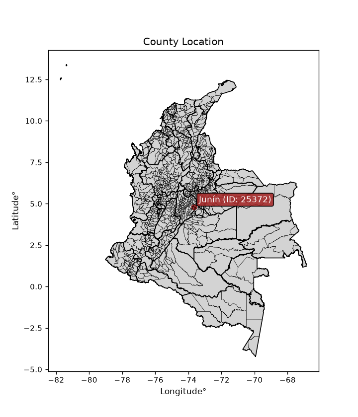
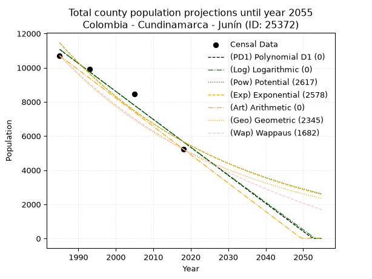
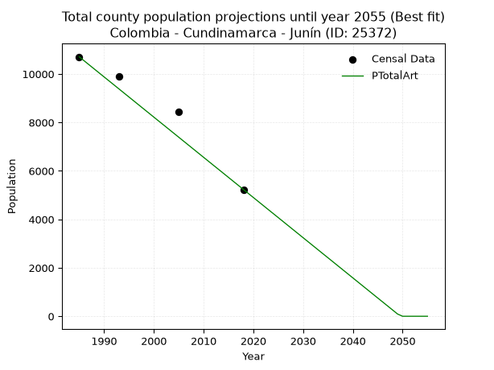
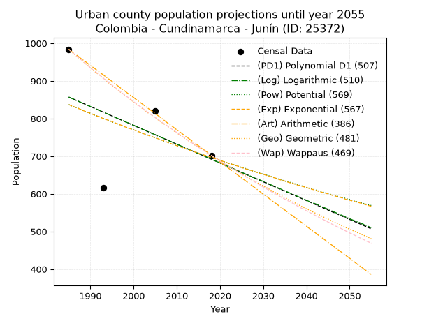
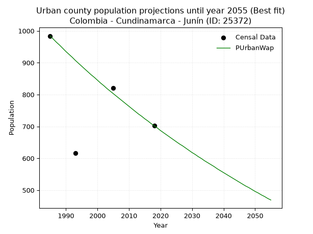
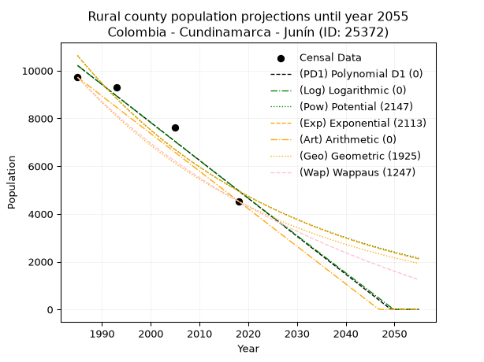
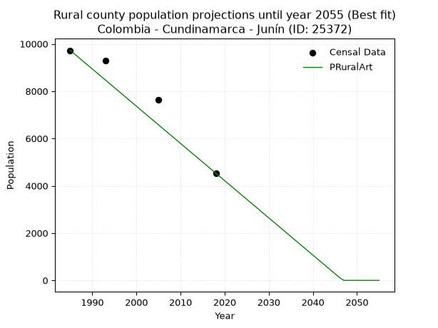

<div align="center">


</div>

# _“Population and Public Services Demand Projections (PPSD) until Year 2050 for Colombia - Cundinamarca - Junín (ID: 25372)”_
Keywords: `population` `public-service` `projection` `lineal` `polynomial` `logarithmic` `potential` `exponential` `arithmetic` `geometric` `wappaus` `dane` `colombia` `south-america`

PPSD are analytical estimates used by governments and planners to anticipate future changes in population size, age distribution, and the resulting community needs for utilities, healthcare, education, and infrastructure as sizing future water treatment facilities, electrical grids, and road networks based on spatial growth.

<div align="center">

</img>

</div>


> **General running parameters**: • app_version: _v20260806_. • Python version: _3.14.7_. • Pandas version: _3.0.5_. • NumPy version: _2.5.1_. • Creates, save and include plots into reports (create_plot): _False_. • Projection until year: _2050_. • Process polynomial degree 2 and up: _False_. • Process Wappaus: _True_. • Process Wappaus: _True_. • Set negative values to zero: _True_. • Set infinite values to zero: _True_. • Drop dataset notes: _True_. 
<div align="center">

Dynamic map: [:earth_americas:Google](http://maps.google.com/maps?q=4.790569638,-73.6629611) [:earth_americas:OSM](https://www.openstreetmap.org/#map=18/4.790569638/-73.6629611&layers=P) [:earth_americas:Bing](https://www.bing.com/maps?cp=4.790569638~-73.6629611&lvl=18) [:earth_americas:Apple](https://maps.apple.com/frame?center=4.790569638%2C-73.6629611&span=0.003%2C0.006)

</div>


<div align="center">

```geojson
{
  "type": "Feature",
  "geometry": {
    "type": "Point", 
    "coordinates": [-73.6629611, 4.790569638]
  }, 
  "properties": {
    "Name": "Colombia - Cundinamarca - Junín (ID: 25372)"
  }
}
```

</div>


## 0. Census Data (4 records)

Census data are official statistics collected by a government about the people and housing in a country. They usually include counts of total population, age, sex, race, income, education, and jobs.

📅Global census file: [Population.xlsx](../data/Population.xlsx)

| Source   |   Year |   CountryID | CountryName   |   StateID | StateName    |   CountyID | CountyName   |   PTotal |   PUrban |   PRural |
|:---------|-------:|------------:|:--------------|----------:|:-------------|-----------:|:-------------|---------:|---------:|---------:|
| DANE     |   1985 |          57 | Colombia      |        25 | Cundinamarca |      25372 | Junín        |    10709 |      984 |     9725 |
| DANE     |   1993 |          57 | Colombia      |        25 | Cundinamarca |      25372 | Junín        |     9900 |      616 |     9284 |
| DANE     |   2005 |          57 | Colombia      |        25 | Cundinamarca |      25372 | Junín        |     8448 |      821 |     7627 |
| DANE     |   2018 |          57 | Colombia      |        25 | Cundinamarca |      25372 | Junín        |     5234 |      702 |     4532 |

> 🔥Some records could had specific notes about the registered values or the corresponding urban or rural distribution.

📅[SUI-RUPS](https://www.datos.gov.co/Hacienda-y-Cr-dito-P-blico/Registro-nico-de-Prestadores-de-Servicios-P-blicos/4qkq-csdn/about_data) - Local public utility companies: [RUPS.csv](../data/RUPS.xlsx)

 | SERVICIO       | ESTADO    | NOMBRE                                | NIT         | DEPARTAMENTO_DOMICILIO   | MUNICIPIO_DOMICILIO   | DIRECCION         |   TELEFONO | EMAIL                                       | TIPO_PRESTADOR                 | CLASIFICACION                 |
|:---------------|:----------|:--------------------------------------|:------------|:-------------------------|:----------------------|:------------------|-----------:|:--------------------------------------------|:-------------------------------|:------------------------------|
| ACUEDUCTO      | OPERATIVA | OFICINA DE SERVICIOS PÚBLCOS DE JUNIN | 800094705-9 | CUNDINAMARCA             | JUNIN                 | Carrera 4 No 3 15 |    8533036 | serviciospublicos@junin-cundinamarca.gov.co | MUNICIPIO (PRESTACIÓN DIRECTA) | MENOR O IGUAL A 2500 USUARIOS |
| ALCANTARILLADO | OPERATIVA | OFICINA DE SERVICIOS PÚBLCOS DE JUNIN | 800094705-9 | CUNDINAMARCA             | JUNIN                 | Carrera 4 No 3 15 |    8533036 | serviciospublicos@junin-cundinamarca.gov.co | MUNICIPIO (PRESTACIÓN DIRECTA) | MENOR O IGUAL A 2500 USUARIOS |

## 1. Total

### 1.1. Coefficients and Parameters

* (PD1) Polynomial Deg 1: -163.87916499397616, 336372.04977920087 (lineal)
* (Log) Logarithmic: -327865.21791164565, 2500678.8986933846
* (Pow) Potential: -42.60445183232483, 144.55826943347708
* (Exp) Exponential: -0.021299685318201023, 2.6346754097567823e+22
* (Art) Arithmetic: Year diff. 2018 - 1985 = 33, Population diff. 5234 - 10709 = -5475, Annual growth = -165.9090909090909
* (Geo) Geometric: Year diff. 2018 - 1985 = 33, Population diff. 5234 - 10709 = -5475, Annual growth % = -0.021460576463596115
* (Wap) Wappaus: i = -2.081278189915209, Condition values only valid for < 200)

<sub>
Wappaus condition values: ['-0.00', '-2.08', '-4.16', '-6.24', '-8.33', '-10.41', '-12.49', '-14.57', '-16.65', '-18.73', '-20.81', '-22.89', '-24.98', '-27.06', '-29.14', '-31.22', '-33.30', '-35.38', '-37.46', '-39.54', '-41.63', '-43.71', '-45.79', '-47.87', '-49.95', '-52.03', '-54.11', '-56.19', '-58.28', '-60.36', '-62.44', '-64.52', '-66.60', '-68.68', '-70.76', '-72.84', '-74.93', '-77.01', '-79.09', '-81.17', '-83.25', '-85.33', '-87.41', '-89.49', '-91.58', '-93.66', '-95.74', '-97.82', '-99.90', '-101.98', '-104.06', '-106.15', '-108.23', '-110.31', '-112.39', '-114.47', '-116.55', '-118.63', '-120.71', '-122.80', '-124.88', '-126.96', '-129.04', '-131.12', '-133.20', '-135.28']
</sub>


### 1.2. Projected Dataset

|   Year |   CountyID |   PTotalPD1 |   PTotalLog |   PTotalPow |   PTotalExp |   PTotalArt |   PTotalGeo |   PTotalWap |
|-------:|-----------:|------------:|------------:|------------:|------------:|------------:|------------:|------------:|
|   1985 |      25372 |       11072 |       11076 |       11455 |       11450 |       10709 |       10709 |       10709 |
|   1986 |      25372 |       10908 |       10910 |       11212 |       11209 |       10543 |       10479 |       10488 |
|   1987 |      25372 |       10744 |       10745 |       10974 |       10973 |       10377 |       10254 |       10272 |
|   1988 |      25372 |       10580 |       10580 |       10741 |       10741 |       10211 |       10034 |       10061 |
|   1989 |      25372 |       10416 |       10416 |       10513 |       10515 |       10045 |        9819 |        9853 |
|   1990 |      25372 |       10253 |       10251 |       10291 |       10293 |        9879 |        9608 |        9650 |
|   1991 |      25372 |       10089 |       10086 |       10073 |       10076 |        9714 |        9402 |        9450 |
|   1992 |      25372 |        9925 |        9921 |        9860 |        9864 |        9548 |        9200 |        9255 |
|   1993 |      25372 |        9761 |        9757 |        9651 |        9656 |        9382 |        9003 |        9063 |
|   1994 |      25372 |        9597 |        9592 |        9447 |        9453 |        9216 |        8810 |        8875 |
|   1995 |      25372 |        9433 |        9428 |        9247 |        9254 |        9050 |        8620 |        8690 |
|   1996 |      25372 |        9269 |        9264 |        9052 |        9059 |        8884 |        8435 |        8509 |
|   1997 |      25372 |        9105 |        9100 |        8861 |        8868 |        8718 |        8254 |        8331 |
|   1998 |      25372 |        8941 |        8935 |        8674 |        8681 |        8552 |        8077 |        8157 |
|   1999 |      25372 |        8778 |        8771 |        8491 |        8498 |        8386 |        7904 |        7985 |
|   2000 |      25372 |        8614 |        8607 |        8312 |        8319 |        8220 |        7734 |        7817 |
|   2001 |      25372 |        8450 |        8443 |        8137 |        8143 |        8054 |        7568 |        7652 |
|   2002 |      25372 |        8286 |        8280 |        7965 |        7972 |        7889 |        7406 |        7490 |
|   2003 |      25372 |        8122 |        8116 |        7798 |        7804 |        7723 |        7247 |        7330 |
|   2004 |      25372 |        7958 |        7952 |        7634 |        7639 |        7557 |        7091 |        7173 |
|   2005 |      25372 |        7794 |        7789 |        7473 |        7478 |        7391 |        6939 |        7019 |
|   2006 |      25372 |        7630 |        7625 |        7316 |        7321 |        7225 |        6790 |        6868 |
|   2007 |      25372 |        7467 |        7462 |        7162 |        7166 |        7059 |        6645 |        6719 |
|   2008 |      25372 |        7303 |        7299 |        7012 |        7015 |        6893 |        6502 |        6573 |
|   2009 |      25372 |        7139 |        7135 |        6865 |        6868 |        6727 |        6363 |        6429 |
|   2010 |      25372 |        6975 |        6972 |        6721 |        6723 |        6561 |        6226 |        6287 |
|   2011 |      25372 |        6811 |        6809 |        6580 |        6581 |        6395 |        6092 |        6148 |
|   2012 |      25372 |        6647 |        6646 |        6442 |        6442 |        6229 |        5962 |        6011 |
|   2013 |      25372 |        6483 |        6483 |        6307 |        6307 |        6064 |        5834 |        5876 |
|   2014 |      25372 |        6319 |        6320 |        6175 |        6174 |        5898 |        5708 |        5744 |
|   2015 |      25372 |        6156 |        6158 |        6046 |        6044 |        5732 |        5586 |        5613 |
|   2016 |      25372 |        5992 |        5995 |        5919 |        5916 |        5566 |        5466 |        5485 |
|   2017 |      25372 |        5828 |        5832 |        5795 |        5792 |        5400 |        5349 |        5358 |
|   2018 |      25372 |        5664 |        5670 |        5674 |        5670 |        5234 |        5234 |        5234 |
|   2019 |      25372 |        5500 |        5507 |        5556 |        5550 |        5068 |        5122 |        5111 |
|   2020 |      25372 |        5336 |        5345 |        5440 |        5433 |        4902 |        5012 |        4991 |
|   2021 |      25372 |        5172 |        5183 |        5326 |        5319 |        4736 |        4904 |        4872 |
|   2022 |      25372 |        5008 |        5021 |        5215 |        5207 |        4570 |        4799 |        4755 |
|   2023 |      25372 |        4844 |        4858 |        5107 |        5097 |        4404 |        4696 |        4640 |
|   2024 |      25372 |        4681 |        4696 |        5000 |        4989 |        4239 |        4595 |        4526 |
|   2025 |      25372 |        4517 |        4534 |        4896 |        4884 |        4073 |        4497 |        4414 |
|   2026 |      25372 |        4353 |        4373 |        4794 |        4781 |        3907 |        4400 |        4304 |
|   2027 |      25372 |        4189 |        4211 |        4694 |        4681 |        3741 |        4306 |        4195 |
|   2028 |      25372 |        4025 |        4049 |        4597 |        4582 |        3575 |        4213 |        4088 |
|   2029 |      25372 |        3861 |        3887 |        4501 |        4485 |        3409 |        4123 |        3982 |
|   2030 |      25372 |        3697 |        3726 |        4408 |        4391 |        3243 |        4034 |        3878 |
|   2031 |      25372 |        3533 |        3564 |        4316 |        4298 |        3077 |        3948 |        3775 |
|   2032 |      25372 |        3370 |        3403 |        4227 |        4208 |        2911 |        3863 |        3674 |
|   2033 |      25372 |        3206 |        3242 |        4139 |        4119 |        2745 |        3780 |        3574 |
|   2034 |      25372 |        3042 |        3080 |        4053 |        4032 |        2579 |        3699 |        3476 |
|   2035 |      25372 |        2878 |        2919 |        3969 |        3947 |        2414 |        3620 |        3379 |
|   2036 |      25372 |        2714 |        2758 |        3887 |        3864 |        2248 |        3542 |        3283 |
|   2037 |      25372 |        2550 |        2597 |        3806 |        3783 |        2082 |        3466 |        3189 |
|   2038 |      25372 |        2386 |        2436 |        3728 |        3703 |        1916 |        3392 |        3095 |
|   2039 |      25372 |        2222 |        2276 |        3651 |        3625 |        1750 |        3319 |        3003 |
|   2040 |      25372 |        2059 |        2115 |        3575 |        3548 |        1584 |        3248 |        2913 |
|   2041 |      25372 |        1895 |        1954 |        3501 |        3474 |        1418 |        3178 |        2823 |
|   2042 |      25372 |        1731 |        1793 |        3429 |        3400 |        1252 |        3110 |        2735 |
|   2043 |      25372 |        1567 |        1633 |        3358 |        3329 |        1086 |        3043 |        2647 |
|   2044 |      25372 |        1403 |        1473 |        3289 |        3259 |         920 |        2978 |        2561 |
|   2045 |      25372 |        1239 |        1312 |        3221 |        3190 |         754 |        2914 |        2476 |
|   2046 |      25372 |        1075 |        1152 |        3155 |        3123 |         589 |        2851 |        2392 |
|   2047 |      25372 |         911 |         992 |        3090 |        3057 |         423 |        2790 |        2310 |
|   2048 |      25372 |         748 |         832 |        3026 |        2993 |         257 |        2730 |        2228 |
|   2049 |      25372 |         584 |         671 |        2964 |        2929 |          91 |        2672 |        2147 |
|   2050 |      25372 |         420 |         512 |        2903 |        2868 |           0 |        2614 |        2067 |
<div align="center">

</img>

</div>


### 1.3. Best fit with absolute and relative error (%)

Relative error puts that difference into context by dividing the absolute error by the true value, creating a unitless ratio or percentage that shows the scale of the mistake.

Absolute and relative error

|   Year | Source   |   CountryID | CountryName   |   StateID | StateName    |   CountyID_x | CountyName   |   PTotal |   PUrban |   PRural |   CountyID_y |   PTotalPD1 |   PTotalLog |   PTotalPow |   PTotalExp |   PTotalArt |   PTotalGeo |   PTotalWap |   PTotalPD1AbsError |   PTotalLogAbsError |   PTotalPowAbsError |   PTotalExpAbsError |   PTotalArtAbsError |   PTotalGeoAbsError |   PTotalWapAbsError |   PTotalPD1RelError |   PTotalLogRelError |   PTotalPowRelError |   PTotalExpRelError |   PTotalArtRelError |   PTotalGeoRelError |   PTotalWapRelError |
|-------:|:---------|------------:|:--------------|----------:|:-------------|-------------:|:-------------|---------:|---------:|---------:|-------------:|------------:|------------:|------------:|------------:|------------:|------------:|------------:|--------------------:|--------------------:|--------------------:|--------------------:|--------------------:|--------------------:|--------------------:|--------------------:|--------------------:|--------------------:|--------------------:|--------------------:|--------------------:|--------------------:|
|   1985 | DANE     |          57 | Colombia      |        25 | Cundinamarca |        25372 | Junín        |    10709 |      984 |     9725 |        25372 |       11072 |       11076 |       11455 |       11450 |       10709 |       10709 |       10709 |                 363 |                 367 |                 746 |                 741 |                   0 |                   0 |                   0 |             3.38967 |             3.42702 |             6.9661  |             6.91941 |             0       |             0       |             0       |
|   1993 | DANE     |          57 | Colombia      |        25 | Cundinamarca |        25372 | Junín        |     9900 |      616 |     9284 |        25372 |        9761 |        9757 |        9651 |        9656 |        9382 |        9003 |        9063 |                 139 |                 143 |                 249 |                 244 |                 518 |                 897 |                 837 |             1.40404 |             1.44444 |             2.51515 |             2.46465 |             5.23232 |             9.06061 |             8.45455 |
|   2005 | DANE     |          57 | Colombia      |        25 | Cundinamarca |        25372 | Junín        |     8448 |      821 |     7627 |        25372 |        7794 |        7789 |        7473 |        7478 |        7391 |        6939 |        7019 |                 654 |                 659 |                 975 |                 970 |                1057 |                1509 |                1429 |             7.74148 |             7.80066 |            11.5412  |            11.482   |            12.5118  |            17.8622  |            16.9152  |
|   2018 | DANE     |          57 | Colombia      |        25 | Cundinamarca |        25372 | Junín        |     5234 |      702 |     4532 |        25372 |        5664 |        5670 |        5674 |        5670 |        5234 |        5234 |        5234 |                 430 |                 436 |                 440 |                 436 |                   0 |                   0 |                   0 |             8.21551 |             8.33015 |             8.40657 |             8.33015 |             0       |             0       |             0       |

Relative error mean

| Method    |   RelError | Best   |
|:----------|-----------:|:-------|
| PTotalPD1 |    5.18768 |        |
| PTotalLog |    5.25057 |        |
| PTotalPow |    7.35726 |        |
| PTotalExp |    7.29905 |        |
| PTotalArt |    4.43604 | True   |
| PTotalGeo |    6.73071 |        |
| PTotalWap |    6.34245 |        |

💙Best method: _**PTotalArt**_
<div align="center">

</img>

</div>


### 1.4. Fresh water supply demand in liters per capita per day (lpcd)

The fresh water supply demand typically ranges from 100 to 300 liters per capita per day (lpcd) for standard domestic and municipal planning, though absolute survival minimums set by the World Health Organization are as low as 7.5 to 20 liters per day, and total consumption in high-income nations can exceed 400 liters.

> `CZ`: Level in meters above the sea level (masl)<br> `WS`: Fresh water supply demand in liters per capita per day (lpcd or l/h/d)<br> `WSAll`: Zonal fresh water supply demand in liters per second (l/s)<br> `A`: Zonal area in square meters<br> `DP`: Population density (people/hectare or p/ha)

Reference values (RAS Colombia)

|    CZ |   WS |
|------:|-----:|
|  1000 |  120 |
|  2000 |  130 |
| 99999 |  140 |

County shapefile geometry properties and water supply values

|   CountyID |      ATotal |   CZTotal |   WSTotal |
|-----------:|------------:|----------:|----------:|
|      25372 | 3.43266e+08 |   2717.72 |       140 |

Projected values for best method: PTotalArt

|   CountyID |   Year |   PTotalArt |   DPTotal |   WSTotal |   WSTotalAll |
|-----------:|-------:|------------:|----------:|----------:|-------------:|
|      25372 |   1985 |       10709 |      0.31 |       140 |    17.3525   |
|      25372 |   1986 |       10543 |      0.31 |       140 |    17.0836   |
|      25372 |   1987 |       10377 |      0.3  |       140 |    16.8146   |
|      25372 |   1988 |       10211 |      0.3  |       140 |    16.5456   |
|      25372 |   1989 |       10045 |      0.29 |       140 |    16.2766   |
|      25372 |   1990 |        9879 |      0.29 |       140 |    16.0076   |
|      25372 |   1991 |        9714 |      0.28 |       140 |    15.7403   |
|      25372 |   1992 |        9548 |      0.28 |       140 |    15.4713   |
|      25372 |   1993 |        9382 |      0.27 |       140 |    15.2023   |
|      25372 |   1994 |        9216 |      0.27 |       140 |    14.9333   |
|      25372 |   1995 |        9050 |      0.26 |       140 |    14.6644   |
|      25372 |   1996 |        8884 |      0.26 |       140 |    14.3954   |
|      25372 |   1997 |        8718 |      0.25 |       140 |    14.1264   |
|      25372 |   1998 |        8552 |      0.25 |       140 |    13.8574   |
|      25372 |   1999 |        8386 |      0.24 |       140 |    13.5884   |
|      25372 |   2000 |        8220 |      0.24 |       140 |    13.3194   |
|      25372 |   2001 |        8054 |      0.23 |       140 |    13.0505   |
|      25372 |   2002 |        7889 |      0.23 |       140 |    12.7831   |
|      25372 |   2003 |        7723 |      0.22 |       140 |    12.5141   |
|      25372 |   2004 |        7557 |      0.22 |       140 |    12.2451   |
|      25372 |   2005 |        7391 |      0.22 |       140 |    11.9762   |
|      25372 |   2006 |        7225 |      0.21 |       140 |    11.7072   |
|      25372 |   2007 |        7059 |      0.21 |       140 |    11.4382   |
|      25372 |   2008 |        6893 |      0.2  |       140 |    11.1692   |
|      25372 |   2009 |        6727 |      0.2  |       140 |    10.9002   |
|      25372 |   2010 |        6561 |      0.19 |       140 |    10.6312   |
|      25372 |   2011 |        6395 |      0.19 |       140 |    10.3623   |
|      25372 |   2012 |        6229 |      0.18 |       140 |    10.0933   |
|      25372 |   2013 |        6064 |      0.18 |       140 |     9.82593  |
|      25372 |   2014 |        5898 |      0.17 |       140 |     9.55694  |
|      25372 |   2015 |        5732 |      0.17 |       140 |     9.28796  |
|      25372 |   2016 |        5566 |      0.16 |       140 |     9.01898  |
|      25372 |   2017 |        5400 |      0.16 |       140 |     8.75     |
|      25372 |   2018 |        5234 |      0.15 |       140 |     8.48102  |
|      25372 |   2019 |        5068 |      0.15 |       140 |     8.21204  |
|      25372 |   2020 |        4902 |      0.14 |       140 |     7.94306  |
|      25372 |   2021 |        4736 |      0.14 |       140 |     7.67407  |
|      25372 |   2022 |        4570 |      0.13 |       140 |     7.40509  |
|      25372 |   2023 |        4404 |      0.13 |       140 |     7.13611  |
|      25372 |   2024 |        4239 |      0.12 |       140 |     6.86875  |
|      25372 |   2025 |        4073 |      0.12 |       140 |     6.59977  |
|      25372 |   2026 |        3907 |      0.11 |       140 |     6.33079  |
|      25372 |   2027 |        3741 |      0.11 |       140 |     6.06181  |
|      25372 |   2028 |        3575 |      0.1  |       140 |     5.79282  |
|      25372 |   2029 |        3409 |      0.1  |       140 |     5.52384  |
|      25372 |   2030 |        3243 |      0.09 |       140 |     5.25486  |
|      25372 |   2031 |        3077 |      0.09 |       140 |     4.98588  |
|      25372 |   2032 |        2911 |      0.08 |       140 |     4.7169   |
|      25372 |   2033 |        2745 |      0.08 |       140 |     4.44792  |
|      25372 |   2034 |        2579 |      0.08 |       140 |     4.17894  |
|      25372 |   2035 |        2414 |      0.07 |       140 |     3.91157  |
|      25372 |   2036 |        2248 |      0.07 |       140 |     3.64259  |
|      25372 |   2037 |        2082 |      0.06 |       140 |     3.37361  |
|      25372 |   2038 |        1916 |      0.06 |       140 |     3.10463  |
|      25372 |   2039 |        1750 |      0.05 |       140 |     2.83565  |
|      25372 |   2040 |        1584 |      0.05 |       140 |     2.56667  |
|      25372 |   2041 |        1418 |      0.04 |       140 |     2.29769  |
|      25372 |   2042 |        1252 |      0.04 |       140 |     2.0287   |
|      25372 |   2043 |        1086 |      0.03 |       140 |     1.75972  |
|      25372 |   2044 |         920 |      0.03 |       140 |     1.49074  |
|      25372 |   2045 |         754 |      0.02 |       140 |     1.22176  |
|      25372 |   2046 |         589 |      0.02 |       140 |     0.954398 |
|      25372 |   2047 |         423 |      0.01 |       140 |     0.685417 |
|      25372 |   2048 |         257 |      0.01 |       140 |     0.416435 |
|      25372 |   2049 |          91 |      0    |       140 |     0.147454 |
|      25372 |   2050 |           0 |      0    |       140 |     0        |

## 2. Urban

### 2.1. Coefficients and Parameters

* (PD1) Polynomial Deg 1: -4.996788438378092, 10775.576073865777 (lineal)
* (Log) Logarithmic: -10020.701445984198, 76948.18199178766
* (Pow) Potential: -11.139265149948283, 39.657373050220535
* (Exp) Exponential: -0.0055536454826297516, 51315926.50501041
* (Art) Arithmetic: Year diff. 2018 - 1985 = 33, Population diff. 702 - 984 = -282, Annual growth = -8.545454545454545
* (Geo) Geometric: Year diff. 2018 - 1985 = 33, Population diff. 702 - 984 = -282, Annual growth % = -0.010180925761422821
* (Wap) Wappaus: i = -1.0136956756173838, Condition values only valid for < 200)

<sub>
Wappaus condition values: ['-0.00', '-1.01', '-2.03', '-3.04', '-4.05', '-5.07', '-6.08', '-7.10', '-8.11', '-9.12', '-10.14', '-11.15', '-12.16', '-13.18', '-14.19', '-15.21', '-16.22', '-17.23', '-18.25', '-19.26', '-20.27', '-21.29', '-22.30', '-23.32', '-24.33', '-25.34', '-26.36', '-27.37', '-28.38', '-29.40', '-30.41', '-31.42', '-32.44', '-33.45', '-34.47', '-35.48', '-36.49', '-37.51', '-38.52', '-39.53', '-40.55', '-41.56', '-42.58', '-43.59', '-44.60', '-45.62', '-46.63', '-47.64', '-48.66', '-49.67', '-50.68', '-51.70', '-52.71', '-53.73', '-54.74', '-55.75', '-56.77', '-57.78', '-58.79', '-59.81', '-60.82', '-61.84', '-62.85', '-63.86', '-64.88', '-65.89']
</sub>


### 2.2. Projected Dataset

|   Year |   CountyID |   PUrbanPD1 |   PUrbanLog |   PUrbanPow |   PUrbanExp |   PUrbanArt |   PUrbanGeo |   PUrbanWap |
|-------:|-----------:|------------:|------------:|------------:|------------:|------------:|------------:|------------:|
|   1985 |      25372 |         857 |         857 |         837 |         837 |         984 |         984 |         984 |
|   1986 |      25372 |         852 |         852 |         832 |         832 |         975 |         974 |         974 |
|   1987 |      25372 |         847 |         847 |         828 |         828 |         967 |         964 |         964 |
|   1988 |      25372 |         842 |         842 |         823 |         823 |         958 |         954 |         955 |
|   1989 |      25372 |         837 |         837 |         818 |         818 |         950 |         945 |         945 |
|   1990 |      25372 |         832 |         832 |         814 |         814 |         941 |         935 |         935 |
|   1991 |      25372 |         827 |         827 |         809 |         809 |         933 |         925 |         926 |
|   1992 |      25372 |         822 |         822 |         805 |         805 |         924 |         916 |         917 |
|   1993 |      25372 |         817 |         817 |         800 |         800 |         916 |         907 |         907 |
|   1994 |      25372 |         812 |         812 |         796 |         796 |         907 |         897 |         898 |
|   1995 |      25372 |         807 |         807 |         791 |         792 |         899 |         888 |         889 |
|   1996 |      25372 |         802 |         802 |         787 |         787 |         890 |         879 |         880 |
|   1997 |      25372 |         797 |         797 |         783 |         783 |         881 |         870 |         871 |
|   1998 |      25372 |         792 |         792 |         778 |         778 |         873 |         861 |         862 |
|   1999 |      25372 |         787 |         787 |         774 |         774 |         864 |         853 |         854 |
|   2000 |      25372 |         782 |         782 |         770 |         770 |         856 |         844 |         845 |
|   2001 |      25372 |         777 |         777 |         765 |         766 |         847 |         835 |         836 |
|   2002 |      25372 |         772 |         772 |         761 |         761 |         839 |         827 |         828 |
|   2003 |      25372 |         767 |         767 |         757 |         757 |         830 |         818 |         819 |
|   2004 |      25372 |         762 |         762 |         753 |         753 |         822 |         810 |         811 |
|   2005 |      25372 |         757 |         757 |         749 |         749 |         813 |         802 |         803 |
|   2006 |      25372 |         752 |         752 |         744 |         745 |         805 |         794 |         795 |
|   2007 |      25372 |         747 |         747 |         740 |         741 |         796 |         786 |         787 |
|   2008 |      25372 |         742 |         742 |         736 |         736 |         787 |         778 |         779 |
|   2009 |      25372 |         737 |         737 |         732 |         732 |         779 |         770 |         771 |
|   2010 |      25372 |         732 |         732 |         728 |         728 |         770 |         762 |         763 |
|   2011 |      25372 |         727 |         727 |         724 |         724 |         762 |         754 |         755 |
|   2012 |      25372 |         722 |         722 |         720 |         720 |         753 |         746 |         747 |
|   2013 |      25372 |         717 |         717 |         716 |         716 |         745 |         739 |         739 |
|   2014 |      25372 |         712 |         712 |         712 |         712 |         736 |         731 |         732 |
|   2015 |      25372 |         707 |         707 |         708 |         708 |         728 |         724 |         724 |
|   2016 |      25372 |         702 |         702 |         704 |         704 |         719 |         717 |         717 |
|   2017 |      25372 |         697 |         697 |         700 |         701 |         711 |         709 |         709 |
|   2018 |      25372 |         692 |         692 |         697 |         697 |         702 |         702 |         702 |
|   2019 |      25372 |         687 |         687 |         693 |         693 |         693 |         695 |         695 |
|   2020 |      25372 |         682 |         682 |         689 |         689 |         685 |         688 |         687 |
|   2021 |      25372 |         677 |         677 |         685 |         685 |         676 |         681 |         680 |
|   2022 |      25372 |         672 |         672 |         681 |         681 |         668 |         674 |         673 |
|   2023 |      25372 |         667 |         667 |         678 |         678 |         659 |         667 |         666 |
|   2024 |      25372 |         662 |         662 |         674 |         674 |         651 |         660 |         659 |
|   2025 |      25372 |         657 |         657 |         670 |         670 |         642 |         653 |         652 |
|   2026 |      25372 |         652 |         652 |         667 |         666 |         634 |         647 |         645 |
|   2027 |      25372 |         647 |         647 |         663 |         663 |         625 |         640 |         639 |
|   2028 |      25372 |         642 |         642 |         659 |         659 |         617 |         634 |         632 |
|   2029 |      25372 |         637 |         638 |         656 |         655 |         608 |         627 |         625 |
|   2030 |      25372 |         632 |         633 |         652 |         652 |         599 |         621 |         618 |
|   2031 |      25372 |         627 |         628 |         649 |         648 |         591 |         615 |         612 |
|   2032 |      25372 |         622 |         623 |         645 |         645 |         582 |         608 |         605 |
|   2033 |      25372 |         617 |         618 |         641 |         641 |         574 |         602 |         599 |
|   2034 |      25372 |         612 |         613 |         638 |         637 |         565 |         596 |         592 |
|   2035 |      25372 |         607 |         608 |         634 |         634 |         557 |         590 |         586 |
|   2036 |      25372 |         602 |         603 |         631 |         630 |         548 |         584 |         580 |
|   2037 |      25372 |         597 |         598 |         628 |         627 |         540 |         578 |         574 |
|   2038 |      25372 |         592 |         593 |         624 |         623 |         531 |         572 |         567 |
|   2039 |      25372 |         587 |         588 |         621 |         620 |         523 |         566 |         561 |
|   2040 |      25372 |         582 |         583 |         617 |         617 |         514 |         560 |         555 |
|   2041 |      25372 |         577 |         578 |         614 |         613 |         505 |         555 |         549 |
|   2042 |      25372 |         572 |         574 |         611 |         610 |         497 |         549 |         543 |
|   2043 |      25372 |         567 |         569 |         607 |         606 |         488 |         544 |         537 |
|   2044 |      25372 |         562 |         564 |         604 |         603 |         480 |         538 |         531 |
|   2045 |      25372 |         557 |         559 |         601 |         600 |         471 |         533 |         525 |
|   2046 |      25372 |         552 |         554 |         597 |         596 |         463 |         527 |         519 |
|   2047 |      25372 |         547 |         549 |         594 |         593 |         454 |         522 |         513 |
|   2048 |      25372 |         542 |         544 |         591 |         590 |         446 |         516 |         508 |
|   2049 |      25372 |         537 |         539 |         588 |         586 |         437 |         511 |         502 |
|   2050 |      25372 |         532 |         534 |         585 |         583 |         429 |         506 |         496 |
<div align="center">

</img>

</div>


### 2.3. Best fit with absolute and relative error (%)

Relative error puts that difference into context by dividing the absolute error by the true value, creating a unitless ratio or percentage that shows the scale of the mistake.

Absolute and relative error

|   Year | Source   |   CountryID | CountryName   |   StateID | StateName    |   CountyID_x | CountyName   |   PTotal |   PUrban |   PRural |   CountyID_y |   PUrbanPD1 |   PUrbanLog |   PUrbanPow |   PUrbanExp |   PUrbanArt |   PUrbanGeo |   PUrbanWap |   PUrbanPD1AbsError |   PUrbanLogAbsError |   PUrbanPowAbsError |   PUrbanExpAbsError |   PUrbanArtAbsError |   PUrbanGeoAbsError |   PUrbanWapAbsError |   PUrbanPD1RelError |   PUrbanLogRelError |   PUrbanPowRelError |   PUrbanExpRelError |   PUrbanArtRelError |   PUrbanGeoRelError |   PUrbanWapRelError |
|-------:|:---------|------------:|:--------------|----------:|:-------------|-------------:|:-------------|---------:|---------:|---------:|-------------:|------------:|------------:|------------:|------------:|------------:|------------:|------------:|--------------------:|--------------------:|--------------------:|--------------------:|--------------------:|--------------------:|--------------------:|--------------------:|--------------------:|--------------------:|--------------------:|--------------------:|--------------------:|--------------------:|
|   1985 | DANE     |          57 | Colombia      |        25 | Cundinamarca |        25372 | Junín        |    10709 |      984 |     9725 |        25372 |         857 |         857 |         837 |         837 |         984 |         984 |         984 |                 127 |                 127 |                 147 |                 147 |                   0 |                   0 |                   0 |            12.9065  |            12.9065  |           14.939    |           14.939    |            0        |             0       |             0       |
|   1993 | DANE     |          57 | Colombia      |        25 | Cundinamarca |        25372 | Junín        |     9900 |      616 |     9284 |        25372 |         817 |         817 |         800 |         800 |         916 |         907 |         907 |                 201 |                 201 |                 184 |                 184 |                 300 |                 291 |                 291 |            32.6299  |            32.6299  |           29.8701   |           29.8701   |           48.7013   |            47.2403  |            47.2403  |
|   2005 | DANE     |          57 | Colombia      |        25 | Cundinamarca |        25372 | Junín        |     8448 |      821 |     7627 |        25372 |         757 |         757 |         749 |         749 |         813 |         802 |         803 |                  64 |                  64 |                  72 |                  72 |                   8 |                  19 |                  18 |             7.79537 |             7.79537 |            8.76979  |            8.76979  |            0.974421 |             2.31425 |             2.19245 |
|   2018 | DANE     |          57 | Colombia      |        25 | Cundinamarca |        25372 | Junín        |     5234 |      702 |     4532 |        25372 |         692 |         692 |         697 |         697 |         702 |         702 |         702 |                  10 |                  10 |                   5 |                   5 |                   0 |                   0 |                   0 |             1.4245  |             1.4245  |            0.712251 |            0.712251 |            0        |             0       |             0       |

Relative error mean

| Method    |   RelError | Best   |
|:----------|-----------:|:-------|
| PUrbanPD1 |    13.6891 |        |
| PUrbanLog |    13.6891 |        |
| PUrbanPow |    13.5728 |        |
| PUrbanExp |    13.5728 |        |
| PUrbanArt |    12.4189 |        |
| PUrbanGeo |    12.3886 |        |
| PUrbanWap |    12.3582 | True   |

💙Best method: _**PUrbanWap**_
<div align="center">

</img>

</div>


### 2.4. Fresh water supply demand in liters per capita per day (lpcd)

The fresh water supply demand typically ranges from 100 to 300 liters per capita per day (lpcd) for standard domestic and municipal planning, though absolute survival minimums set by the World Health Organization are as low as 7.5 to 20 liters per day, and total consumption in high-income nations can exceed 400 liters.

> `CZ`: Level in meters above the sea level (masl)<br> `WS`: Fresh water supply demand in liters per capita per day (lpcd or l/h/d)<br> `WSAll`: Zonal fresh water supply demand in liters per second (l/s)<br> `A`: Zonal area in square meters<br> `DP`: Population density (people/hectare or p/ha)

Reference values (RAS Colombia)

|    CZ |   WS |
|------:|-----:|
|  1000 |  120 |
|  2000 |  130 |
| 99999 |  140 |

County shapefile geometry properties and water supply values

|   CountyID |   AUrban |   CZUrban |   WSUrban |
|-----------:|---------:|----------:|----------:|
|      25372 |   339786 |   2336.87 |       140 |

Projected values for best method: PUrbanWap

|   CountyID |   Year |   PUrbanWap |   DPUrban |   WSUrban |   WSUrbanAll |
|-----------:|-------:|------------:|----------:|----------:|-------------:|
|      25372 |   1985 |         984 |     28.96 |       140 |     1.59444  |
|      25372 |   1986 |         974 |     28.67 |       140 |     1.57824  |
|      25372 |   1987 |         964 |     28.37 |       140 |     1.56204  |
|      25372 |   1988 |         955 |     28.11 |       140 |     1.54745  |
|      25372 |   1989 |         945 |     27.81 |       140 |     1.53125  |
|      25372 |   1990 |         935 |     27.52 |       140 |     1.51505  |
|      25372 |   1991 |         926 |     27.25 |       140 |     1.50046  |
|      25372 |   1992 |         917 |     26.99 |       140 |     1.48588  |
|      25372 |   1993 |         907 |     26.69 |       140 |     1.46968  |
|      25372 |   1994 |         898 |     26.43 |       140 |     1.45509  |
|      25372 |   1995 |         889 |     26.16 |       140 |     1.44051  |
|      25372 |   1996 |         880 |     25.9  |       140 |     1.42593  |
|      25372 |   1997 |         871 |     25.63 |       140 |     1.41134  |
|      25372 |   1998 |         862 |     25.37 |       140 |     1.39676  |
|      25372 |   1999 |         854 |     25.13 |       140 |     1.3838   |
|      25372 |   2000 |         845 |     24.87 |       140 |     1.36921  |
|      25372 |   2001 |         836 |     24.6  |       140 |     1.35463  |
|      25372 |   2002 |         828 |     24.37 |       140 |     1.34167  |
|      25372 |   2003 |         819 |     24.1  |       140 |     1.32708  |
|      25372 |   2004 |         811 |     23.87 |       140 |     1.31412  |
|      25372 |   2005 |         803 |     23.63 |       140 |     1.30116  |
|      25372 |   2006 |         795 |     23.4  |       140 |     1.28819  |
|      25372 |   2007 |         787 |     23.16 |       140 |     1.27523  |
|      25372 |   2008 |         779 |     22.93 |       140 |     1.26227  |
|      25372 |   2009 |         771 |     22.69 |       140 |     1.24931  |
|      25372 |   2010 |         763 |     22.46 |       140 |     1.23634  |
|      25372 |   2011 |         755 |     22.22 |       140 |     1.22338  |
|      25372 |   2012 |         747 |     21.98 |       140 |     1.21042  |
|      25372 |   2013 |         739 |     21.75 |       140 |     1.19745  |
|      25372 |   2014 |         732 |     21.54 |       140 |     1.18611  |
|      25372 |   2015 |         724 |     21.31 |       140 |     1.17315  |
|      25372 |   2016 |         717 |     21.1  |       140 |     1.16181  |
|      25372 |   2017 |         709 |     20.87 |       140 |     1.14884  |
|      25372 |   2018 |         702 |     20.66 |       140 |     1.1375   |
|      25372 |   2019 |         695 |     20.45 |       140 |     1.12616  |
|      25372 |   2020 |         687 |     20.22 |       140 |     1.11319  |
|      25372 |   2021 |         680 |     20.01 |       140 |     1.10185  |
|      25372 |   2022 |         673 |     19.81 |       140 |     1.09051  |
|      25372 |   2023 |         666 |     19.6  |       140 |     1.07917  |
|      25372 |   2024 |         659 |     19.39 |       140 |     1.06782  |
|      25372 |   2025 |         652 |     19.19 |       140 |     1.05648  |
|      25372 |   2026 |         645 |     18.98 |       140 |     1.04514  |
|      25372 |   2027 |         639 |     18.81 |       140 |     1.03542  |
|      25372 |   2028 |         632 |     18.6  |       140 |     1.02407  |
|      25372 |   2029 |         625 |     18.39 |       140 |     1.01273  |
|      25372 |   2030 |         618 |     18.19 |       140 |     1.00139  |
|      25372 |   2031 |         612 |     18.01 |       140 |     0.991667 |
|      25372 |   2032 |         605 |     17.81 |       140 |     0.980324 |
|      25372 |   2033 |         599 |     17.63 |       140 |     0.970602 |
|      25372 |   2034 |         592 |     17.42 |       140 |     0.959259 |
|      25372 |   2035 |         586 |     17.25 |       140 |     0.949537 |
|      25372 |   2036 |         580 |     17.07 |       140 |     0.939815 |
|      25372 |   2037 |         574 |     16.89 |       140 |     0.930093 |
|      25372 |   2038 |         567 |     16.69 |       140 |     0.91875  |
|      25372 |   2039 |         561 |     16.51 |       140 |     0.909028 |
|      25372 |   2040 |         555 |     16.33 |       140 |     0.899306 |
|      25372 |   2041 |         549 |     16.16 |       140 |     0.889583 |
|      25372 |   2042 |         543 |     15.98 |       140 |     0.879861 |
|      25372 |   2043 |         537 |     15.8  |       140 |     0.870139 |
|      25372 |   2044 |         531 |     15.63 |       140 |     0.860417 |
|      25372 |   2045 |         525 |     15.45 |       140 |     0.850694 |
|      25372 |   2046 |         519 |     15.27 |       140 |     0.840972 |
|      25372 |   2047 |         513 |     15.1  |       140 |     0.83125  |
|      25372 |   2048 |         508 |     14.95 |       140 |     0.823148 |
|      25372 |   2049 |         502 |     14.77 |       140 |     0.813426 |
|      25372 |   2050 |         496 |     14.6  |       140 |     0.803704 |

## 3. Rural

### 3.1. Coefficients and Parameters

* (PD1) Polynomial Deg 1: -158.8823765555981, 325596.4737053352 (lineal)
* (Log) Logarithmic: -317844.5164656613, 2423730.7167015965
* (Pow) Potential: -46.15439883431168, 156.23273786812524
* (Exp) Exponential: -0.023076026085306716, 8.311016245935629e+23
* (Art) Arithmetic: Year diff. 2018 - 1985 = 33, Population diff. 4532 - 9725 = -5193, Annual growth = -157.36363636363637
* (Geo) Geometric: Year diff. 2018 - 1985 = 33, Population diff. 4532 - 9725 = -5193, Annual growth % = -0.02287185234262512
* (Wap) Wappaus: i = -2.207528040452218, Condition values only valid for < 200)

<sub>
Wappaus condition values: ['-0.00', '-2.21', '-4.42', '-6.62', '-8.83', '-11.04', '-13.25', '-15.45', '-17.66', '-19.87', '-22.08', '-24.28', '-26.49', '-28.70', '-30.91', '-33.11', '-35.32', '-37.53', '-39.74', '-41.94', '-44.15', '-46.36', '-48.57', '-50.77', '-52.98', '-55.19', '-57.40', '-59.60', '-61.81', '-64.02', '-66.23', '-68.43', '-70.64', '-72.85', '-75.06', '-77.26', '-79.47', '-81.68', '-83.89', '-86.09', '-88.30', '-90.51', '-92.72', '-94.92', '-97.13', '-99.34', '-101.55', '-103.75', '-105.96', '-108.17', '-110.38', '-112.58', '-114.79', '-117.00', '-119.21', '-121.41', '-123.62', '-125.83', '-128.04', '-130.24', '-132.45', '-134.66', '-136.87', '-139.07', '-141.28', '-143.49']
</sub>


### 3.2. Projected Dataset

|   Year |   CountyID |   PRuralPD1 |   PRuralLog |   PRuralPow |   PRuralExp |   PRuralArt |   PRuralGeo |   PRuralWap |
|-------:|-----------:|------------:|------------:|------------:|------------:|------------:|------------:|------------:|
|   1985 |      25372 |       10215 |       10218 |       10631 |       10627 |        9725 |        9725 |        9725 |
|   1986 |      25372 |       10056 |       10058 |       10387 |       10384 |        9568 |        9503 |        9513 |
|   1987 |      25372 |        9897 |        9898 |       10148 |       10147 |        9410 |        9285 |        9305 |
|   1988 |      25372 |        9738 |        9738 |        9915 |        9916 |        9253 |        9073 |        9102 |
|   1989 |      25372 |        9579 |        9579 |        9688 |        9690 |        9096 |        8865 |        8903 |
|   1990 |      25372 |        9421 |        9419 |        9466 |        9469 |        8938 |        8663 |        8708 |
|   1991 |      25372 |        9262 |        9259 |        9249 |        9253 |        8781 |        8464 |        8517 |
|   1992 |      25372 |        9103 |        9099 |        9037 |        9042 |        8623 |        8271 |        8330 |
|   1993 |      25372 |        8944 |        8940 |        8830 |        8835 |        8466 |        8082 |        8147 |
|   1994 |      25372 |        8785 |        8781 |        8628 |        8634 |        8309 |        7897 |        7967 |
|   1995 |      25372 |        8626 |        8621 |        8431 |        8437 |        8151 |        7716 |        7792 |
|   1996 |      25372 |        8467 |        8462 |        8238 |        8244 |        7994 |        7540 |        7619 |
|   1997 |      25372 |        8308 |        8303 |        8050 |        8056 |        7837 |        7367 |        7450 |
|   1998 |      25372 |        8149 |        8144 |        7866 |        7873 |        7679 |        7199 |        7284 |
|   1999 |      25372 |        7991 |        7985 |        7686 |        7693 |        7522 |        7034 |        7122 |
|   2000 |      25372 |        7832 |        7826 |        7511 |        7517 |        7365 |        6873 |        6962 |
|   2001 |      25372 |        7673 |        7667 |        7339 |        7346 |        7207 |        6716 |        6806 |
|   2002 |      25372 |        7514 |        7508 |        7172 |        7178 |        7050 |        6562 |        6652 |
|   2003 |      25372 |        7355 |        7349 |        7009 |        7015 |        6892 |        6412 |        6501 |
|   2004 |      25372 |        7196 |        7190 |        6849 |        6855 |        6735 |        6266 |        6353 |
|   2005 |      25372 |        7037 |        7032 |        6693 |        6698 |        6578 |        6122 |        6208 |
|   2006 |      25372 |        6878 |        6873 |        6541 |        6545 |        6420 |        5982 |        6065 |
|   2007 |      25372 |        6720 |        6715 |        6392 |        6396 |        6263 |        5846 |        5925 |
|   2008 |      25372 |        6561 |        6557 |        6247 |        6250 |        6106 |        5712 |        5787 |
|   2009 |      25372 |        6402 |        6398 |        6105 |        6108 |        5948 |        5581 |        5652 |
|   2010 |      25372 |        6243 |        6240 |        5966 |        5968 |        5791 |        5454 |        5519 |
|   2011 |      25372 |        6084 |        6082 |        5831 |        5832 |        5634 |        5329 |        5388 |
|   2012 |      25372 |        5925 |        5924 |        5699 |        5699 |        5476 |        5207 |        5259 |
|   2013 |      25372 |        5766 |        5766 |        5569 |        5569 |        5319 |        5088 |        5133 |
|   2014 |      25372 |        5607 |        5608 |        5443 |        5442 |        5161 |        4971 |        5009 |
|   2015 |      25372 |        5448 |        5451 |        5320 |        5318 |        5004 |        4858 |        4887 |
|   2016 |      25372 |        5290 |        5293 |        5200 |        5197 |        4847 |        4747 |        4766 |
|   2017 |      25372 |        5131 |        5135 |        5082 |        5078 |        4689 |        4638 |        4648 |
|   2018 |      25372 |        4972 |        4978 |        4967 |        4962 |        4532 |        4532 |        4532 |
|   2019 |      25372 |        4813 |        4820 |        4855 |        4849 |        4375 |        4428 |        4418 |
|   2020 |      25372 |        4654 |        4663 |        4745 |        4738 |        4217 |        4327 |        4305 |
|   2021 |      25372 |        4495 |        4506 |        4638 |        4630 |        4060 |        4228 |        4194 |
|   2022 |      25372 |        4336 |        4348 |        4533 |        4525 |        3903 |        4131 |        4085 |
|   2023 |      25372 |        4177 |        4191 |        4431 |        4422 |        3745 |        4037 |        3978 |
|   2024 |      25372 |        4019 |        4034 |        4331 |        4321 |        3588 |        3945 |        3872 |
|   2025 |      25372 |        3860 |        3877 |        4233 |        4222 |        3430 |        3854 |        3768 |
|   2026 |      25372 |        3701 |        3720 |        4138 |        4126 |        3273 |        3766 |        3665 |
|   2027 |      25372 |        3542 |        3563 |        4045 |        4032 |        3116 |        3680 |        3564 |
|   2028 |      25372 |        3383 |        3407 |        3954 |        3940 |        2958 |        3596 |        3465 |
|   2029 |      25372 |        3224 |        3250 |        3865 |        3850 |        2801 |        3514 |        3367 |
|   2030 |      25372 |        3065 |        3093 |        3778 |        3762 |        2644 |        3433 |        3270 |
|   2031 |      25372 |        2906 |        2937 |        3693 |        3676 |        2486 |        3355 |        3175 |
|   2032 |      25372 |        2747 |        2780 |        3610 |        3592 |        2329 |        3278 |        3081 |
|   2033 |      25372 |        2589 |        2624 |        3529 |        3510 |        2172 |        3203 |        2989 |
|   2034 |      25372 |        2430 |        2468 |        3450 |        3430 |        2014 |        3130 |        2898 |
|   2035 |      25372 |        2271 |        2311 |        3372 |        3352 |        1857 |        3058 |        2808 |
|   2036 |      25372 |        2112 |        2155 |        3297 |        3276 |        1699 |        2988 |        2720 |
|   2037 |      25372 |        1953 |        1999 |        3223 |        3201 |        1542 |        2920 |        2632 |
|   2038 |      25372 |        1794 |        1843 |        3151 |        3128 |        1385 |        2853 |        2546 |
|   2039 |      25372 |        1635 |        1687 |        3080 |        3056 |        1227 |        2788 |        2461 |
|   2040 |      25372 |        1476 |        1531 |        3011 |        2987 |        1070 |        2724 |        2378 |
|   2041 |      25372 |        1318 |        1376 |        2944 |        2919 |         913 |        2662 |        2295 |
|   2042 |      25372 |        1159 |        1220 |        2878 |        2852 |         755 |        2601 |        2214 |
|   2043 |      25372 |        1000 |        1064 |        2814 |        2787 |         598 |        2541 |        2133 |
|   2044 |      25372 |         841 |         909 |        2751 |        2723 |         441 |        2483 |        2054 |
|   2045 |      25372 |         682 |         753 |        2690 |        2661 |         283 |        2427 |        1976 |
|   2046 |      25372 |         523 |         598 |        2630 |        2601 |         126 |        2371 |        1899 |
|   2047 |      25372 |         364 |         443 |        2571 |        2541 |           0 |        2317 |        1823 |
|   2048 |      25372 |         205 |         287 |        2514 |        2483 |           0 |        2264 |        1747 |
|   2049 |      25372 |          46 |         132 |        2458 |        2427 |           0 |        2212 |        1673 |
|   2050 |      25372 |           0 |           0 |        2403 |        2371 |           0 |        2161 |        1600 |
<div align="center">

</img>

</div>


### 3.3. Best fit with absolute and relative error (%)

Relative error puts that difference into context by dividing the absolute error by the true value, creating a unitless ratio or percentage that shows the scale of the mistake.

Absolute and relative error

|   Year | Source   |   CountryID | CountryName   |   StateID | StateName    |   CountyID_x | CountyName   |   PTotal |   PUrban |   PRural |   CountyID_y |   PRuralPD1 |   PRuralLog |   PRuralPow |   PRuralExp |   PRuralArt |   PRuralGeo |   PRuralWap |   PRuralPD1AbsError |   PRuralLogAbsError |   PRuralPowAbsError |   PRuralExpAbsError |   PRuralArtAbsError |   PRuralGeoAbsError |   PRuralWapAbsError |   PRuralPD1RelError |   PRuralLogRelError |   PRuralPowRelError |   PRuralExpRelError |   PRuralArtRelError |   PRuralGeoRelError |   PRuralWapRelError |
|-------:|:---------|------------:|:--------------|----------:|:-------------|-------------:|:-------------|---------:|---------:|---------:|-------------:|------------:|------------:|------------:|------------:|------------:|------------:|------------:|--------------------:|--------------------:|--------------------:|--------------------:|--------------------:|--------------------:|--------------------:|--------------------:|--------------------:|--------------------:|--------------------:|--------------------:|--------------------:|--------------------:|
|   1985 | DANE     |          57 | Colombia      |        25 | Cundinamarca |        25372 | Junín        |    10709 |      984 |     9725 |        25372 |       10215 |       10218 |       10631 |       10627 |        9725 |        9725 |        9725 |                 490 |                 493 |                 906 |                 902 |                   0 |                   0 |                   0 |             5.03856 |             5.06941 |             9.3162  |             9.27506 |             0       |              0      |              0      |
|   1993 | DANE     |          57 | Colombia      |        25 | Cundinamarca |        25372 | Junín        |     9900 |      616 |     9284 |        25372 |        8944 |        8940 |        8830 |        8835 |        8466 |        8082 |        8147 |                 340 |                 344 |                 454 |                 449 |                 818 |                1202 |                1137 |             3.66221 |             3.7053  |             4.89013 |             4.83628 |             8.81086 |             12.947  |             12.2469 |
|   2005 | DANE     |          57 | Colombia      |        25 | Cundinamarca |        25372 | Junín        |     8448 |      821 |     7627 |        25372 |        7037 |        7032 |        6693 |        6698 |        6578 |        6122 |        6208 |                 590 |                 595 |                 934 |                 929 |                1049 |                1505 |                1419 |             7.73568 |             7.80123 |            12.246   |            12.1804  |            13.7538  |             19.7325 |             18.605  |
|   2018 | DANE     |          57 | Colombia      |        25 | Cundinamarca |        25372 | Junín        |     5234 |      702 |     4532 |        25372 |        4972 |        4978 |        4967 |        4962 |        4532 |        4532 |        4532 |                 440 |                 446 |                 435 |                 430 |                   0 |                   0 |                   0 |             9.70874 |             9.84113 |             9.59841 |             9.48808 |             0       |              0      |              0      |

Relative error mean

| Method    |   RelError | Best   |
|:----------|-----------:|:-------|
| PRuralPD1 |    6.5363  |        |
| PRuralLog |    6.60427 |        |
| PRuralPow |    9.01268 |        |
| PRuralExp |    8.94496 |        |
| PRuralArt |    5.64116 | True   |
| PRuralGeo |    8.16988 |        |
| PRuralWap |    7.71296 |        |

💙Best method: _**PRuralArt**_
<div align="center">

</img>

</div>


### 3.4. Fresh water supply demand in liters per capita per day (lpcd)

The fresh water supply demand typically ranges from 100 to 300 liters per capita per day (lpcd) for standard domestic and municipal planning, though absolute survival minimums set by the World Health Organization are as low as 7.5 to 20 liters per day, and total consumption in high-income nations can exceed 400 liters.

> `CZ`: Level in meters above the sea level (masl)<br> `WS`: Fresh water supply demand in liters per capita per day (lpcd or l/h/d)<br> `WSAll`: Zonal fresh water supply demand in liters per second (l/s)<br> `A`: Zonal area in square meters<br> `DP`: Population density (people/hectare or p/ha)

Reference values (RAS Colombia)

|    CZ |   WS |
|------:|-----:|
|  1000 |  120 |
|  2000 |  130 |
| 99999 |  140 |

County shapefile geometry properties and water supply values

|   CountyID |      ARural |   CZRural |   WSRural |
|-----------:|------------:|----------:|----------:|
|      25372 | 3.42926e+08 |   2718.12 |       140 |

Projected values for best method: PRuralArt

|   CountyID |   Year |   PRuralArt |   DPRural |   WSRural |   WSRuralAll |
|-----------:|-------:|------------:|----------:|----------:|-------------:|
|      25372 |   1985 |        9725 |      0.28 |       140 |    15.7581   |
|      25372 |   1986 |        9568 |      0.28 |       140 |    15.5037   |
|      25372 |   1987 |        9410 |      0.27 |       140 |    15.2477   |
|      25372 |   1988 |        9253 |      0.27 |       140 |    14.9933   |
|      25372 |   1989 |        9096 |      0.27 |       140 |    14.7389   |
|      25372 |   1990 |        8938 |      0.26 |       140 |    14.4829   |
|      25372 |   1991 |        8781 |      0.26 |       140 |    14.2285   |
|      25372 |   1992 |        8623 |      0.25 |       140 |    13.9725   |
|      25372 |   1993 |        8466 |      0.25 |       140 |    13.7181   |
|      25372 |   1994 |        8309 |      0.24 |       140 |    13.4637   |
|      25372 |   1995 |        8151 |      0.24 |       140 |    13.2076   |
|      25372 |   1996 |        7994 |      0.23 |       140 |    12.9532   |
|      25372 |   1997 |        7837 |      0.23 |       140 |    12.6988   |
|      25372 |   1998 |        7679 |      0.22 |       140 |    12.4428   |
|      25372 |   1999 |        7522 |      0.22 |       140 |    12.1884   |
|      25372 |   2000 |        7365 |      0.21 |       140 |    11.934    |
|      25372 |   2001 |        7207 |      0.21 |       140 |    11.678    |
|      25372 |   2002 |        7050 |      0.21 |       140 |    11.4236   |
|      25372 |   2003 |        6892 |      0.2  |       140 |    11.1676   |
|      25372 |   2004 |        6735 |      0.2  |       140 |    10.9132   |
|      25372 |   2005 |        6578 |      0.19 |       140 |    10.6588   |
|      25372 |   2006 |        6420 |      0.19 |       140 |    10.4028   |
|      25372 |   2007 |        6263 |      0.18 |       140 |    10.1484   |
|      25372 |   2008 |        6106 |      0.18 |       140 |     9.89398  |
|      25372 |   2009 |        5948 |      0.17 |       140 |     9.63796  |
|      25372 |   2010 |        5791 |      0.17 |       140 |     9.38356  |
|      25372 |   2011 |        5634 |      0.16 |       140 |     9.12917  |
|      25372 |   2012 |        5476 |      0.16 |       140 |     8.87315  |
|      25372 |   2013 |        5319 |      0.16 |       140 |     8.61875  |
|      25372 |   2014 |        5161 |      0.15 |       140 |     8.36273  |
|      25372 |   2015 |        5004 |      0.15 |       140 |     8.10833  |
|      25372 |   2016 |        4847 |      0.14 |       140 |     7.85394  |
|      25372 |   2017 |        4689 |      0.14 |       140 |     7.59792  |
|      25372 |   2018 |        4532 |      0.13 |       140 |     7.34352  |
|      25372 |   2019 |        4375 |      0.13 |       140 |     7.08912  |
|      25372 |   2020 |        4217 |      0.12 |       140 |     6.8331   |
|      25372 |   2021 |        4060 |      0.12 |       140 |     6.5787   |
|      25372 |   2022 |        3903 |      0.11 |       140 |     6.32431  |
|      25372 |   2023 |        3745 |      0.11 |       140 |     6.06829  |
|      25372 |   2024 |        3588 |      0.1  |       140 |     5.81389  |
|      25372 |   2025 |        3430 |      0.1  |       140 |     5.55787  |
|      25372 |   2026 |        3273 |      0.1  |       140 |     5.30347  |
|      25372 |   2027 |        3116 |      0.09 |       140 |     5.04907  |
|      25372 |   2028 |        2958 |      0.09 |       140 |     4.79306  |
|      25372 |   2029 |        2801 |      0.08 |       140 |     4.53866  |
|      25372 |   2030 |        2644 |      0.08 |       140 |     4.28426  |
|      25372 |   2031 |        2486 |      0.07 |       140 |     4.02824  |
|      25372 |   2032 |        2329 |      0.07 |       140 |     3.77384  |
|      25372 |   2033 |        2172 |      0.06 |       140 |     3.51944  |
|      25372 |   2034 |        2014 |      0.06 |       140 |     3.26343  |
|      25372 |   2035 |        1857 |      0.05 |       140 |     3.00903  |
|      25372 |   2036 |        1699 |      0.05 |       140 |     2.75301  |
|      25372 |   2037 |        1542 |      0.04 |       140 |     2.49861  |
|      25372 |   2038 |        1385 |      0.04 |       140 |     2.24421  |
|      25372 |   2039 |        1227 |      0.04 |       140 |     1.98819  |
|      25372 |   2040 |        1070 |      0.03 |       140 |     1.7338   |
|      25372 |   2041 |         913 |      0.03 |       140 |     1.4794   |
|      25372 |   2042 |         755 |      0.02 |       140 |     1.22338  |
|      25372 |   2043 |         598 |      0.02 |       140 |     0.968981 |
|      25372 |   2044 |         441 |      0.01 |       140 |     0.714583 |
|      25372 |   2045 |         283 |      0.01 |       140 |     0.458565 |
|      25372 |   2046 |         126 |      0    |       140 |     0.204167 |
|      25372 |   2047 |           0 |      0    |       140 |     0        |
|      25372 |   2048 |           0 |      0    |       140 |     0        |
|      25372 |   2049 |           0 |      0    |       140 |     0        |
|      25372 |   2050 |           0 |      0    |       140 |     0        |

<div align="center"><br><sub>Share this research</sub></div><br>

<sub>**APPS & TOOLS & CONTENT DISCLAIMER**: • NO WARRANTY - This content and software is provided by <a href="https://github.com/rcfdtools" target="_blank">github.com/rcfdtools</a> "as is", without any express or implied warranty, including warranties of merchantability, fitness for a particular purpose, or non-infringement. There is no guarantee that the software will be error-free or operate without interruption. • LIMITATION OF LIABILITY - Neither the authors nor copyright holders will be liable for claims or damages arising from the software or its use. You are responsible for determining if the software is appropriate for your use and assume all associated risks, including errors, legal compliance, and data loss. • NO PROFESSIONAL ADVICE - The software provides general information and does not offer professional advice. It should not replace consultation with professional advisors. [Clauses and global license for rcfdtools use.](https://github.com/rcfdtools/rcfdtools/blob/main/LICENSE.md)</sub>

| [:house: Home](Readme.md)  | [:beginner: Help / Collab](https://github.com/rcfdtools/R.HydroTools/discussions/31) |
|----------------------------|-------------------------------------------------------------------------------------------|