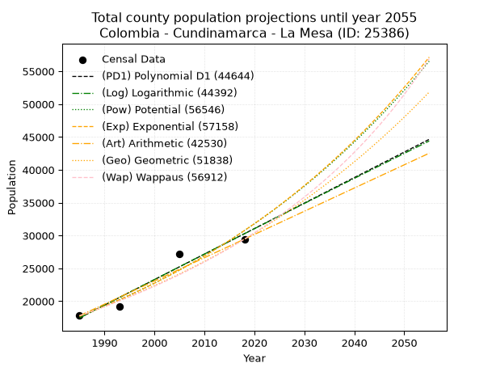
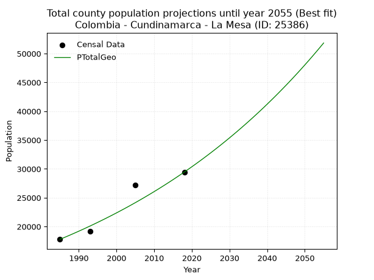
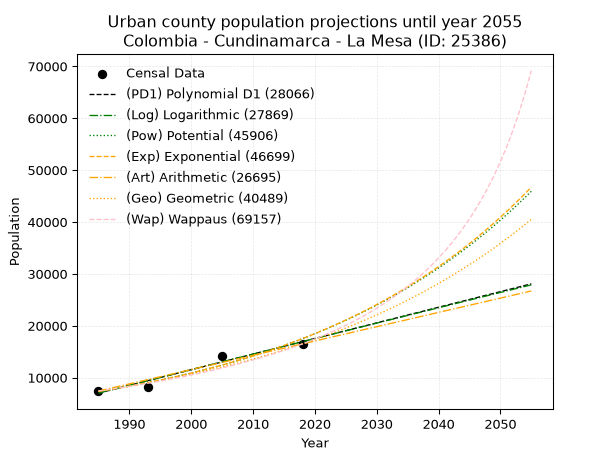
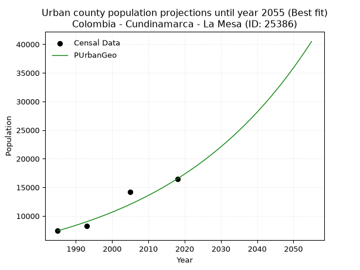
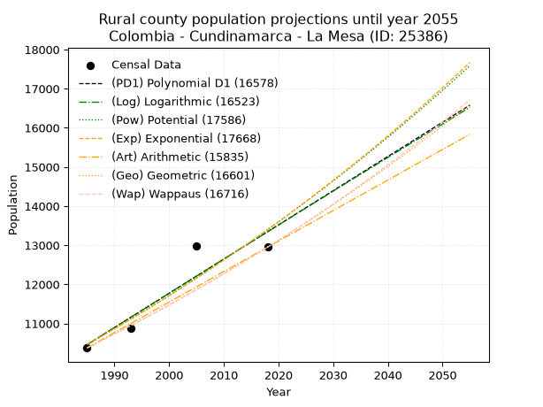
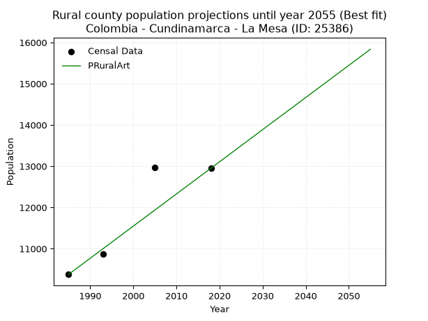

<div align="center">


</div>

# _“Population and Public Services Demand Projections (PPSD) until Year 2050 for Colombia - Cundinamarca - La Mesa (ID: 25386)”_
Keywords: `population` `public-service` `projection` `lineal` `polynomial` `logarithmic` `potential` `exponential` `arithmetic` `geometric` `wappaus` `dane` `colombia` `south-america`

PPSD are analytical estimates used by governments and planners to anticipate future changes in population size, age distribution, and the resulting community needs for utilities, healthcare, education, and infrastructure as sizing future water treatment facilities, electrical grids, and road networks based on spatial growth.

> **General running parameters**: • app_version: _v20260806_. • Python version: _3.14.7_. • Pandas version: _3.0.5_. • NumPy version: _2.5.1_. • Creates, save and include plots into reports (create_plot): _True_. • Projection until year: _2050_. • Process polynomial degree 2 and up: _False_. • Process Wappaus: _True_. • Process Wappaus: _True_. • Set negative values to zero: _True_. • Set infinite values to zero: _True_. • Drop dataset notes: _True_. 
<div align="center">

Dynamic map: [:earth_americas:Google](http://maps.google.com/maps?q=4.631027771,-74.4615883) [:earth_americas:OSM](https://www.openstreetmap.org/#map=18/4.631027771/-74.4615883&layers=P) [:earth_americas:Bing](https://www.bing.com/maps?cp=4.631027771~-74.4615883&lvl=18) [:earth_americas:Apple](https://maps.apple.com/frame?center=4.631027771%2C-74.4615883&span=0.003%2C0.006)

</div>


<div align="center">

```geojson
{
  "type": "Feature",
  "geometry": {
    "type": "Point", 
    "coordinates": [-74.4615883, 4.631027771]
  }, 
  "properties": {
    "Name": "Colombia - Cundinamarca - La Mesa (ID: 25386)"
  }
}
```

</div>


## 0. Census Data (4 records)

Census data are official statistics collected by a government about the people and housing in a country. They usually include counts of total population, age, sex, race, income, education, and jobs.

📅Global census file: [Population.xlsx](../data/Population.xlsx)

| Source   |   Year |   CountryID | CountryName   |   StateID | StateName    |   CountyID | CountyName   |   PTotal |   PUrban |   PRural |
|:---------|-------:|------------:|:--------------|----------:|:-------------|-----------:|:-------------|---------:|---------:|---------:|
| DANE     |   1985 |          57 | Colombia      |        25 | Cundinamarca |      25386 | La Mesa      |    17788 |     7411 |    10377 |
| DANE     |   1993 |          57 | Colombia      |        25 | Cundinamarca |      25386 | La Mesa      |    19136 |     8267 |    10869 |
| DANE     |   2005 |          57 | Colombia      |        25 | Cundinamarca |      25386 | La Mesa      |    27165 |    14192 |    12973 |
| DANE     |   2018 |          57 | Colombia      |        25 | Cundinamarca |      25386 | La Mesa      |    29452 |    16502 |    12950 |

> 🔥Some records has specific notes about the registered values or the corresponding urban or rural distribution.

## 1. Total

### 1.1. Coefficients and Parameters

* (PD1) Polynomial Deg 1: 388.28382175832803, -753279.4644720957 (lineal)
* (Log) Logarithmic: 777369.5929679669, -5885407.255598479
* (Pow) Potential: 33.54009129215716, -106.35960924475577
* (Exp) Exponential: 0.01675118788365777, 6.412982171532837e-11
* (Art) Arithmetic: Year diff. 2018 - 1985 = 33, Population diff. 29452 - 17788 = 11664, Annual growth = 353.45454545454544
* (Geo) Geometric: Year diff. 2018 - 1985 = 33, Population diff. 29452 - 17788 = 11664, Annual growth % = 0.015397266741645987
* (Wap) Wappaus: i = 1.496420598876145, Condition values only valid for < 200)

<sub>
Wappaus condition values: ['0.00', '1.50', '2.99', '4.49', '5.99', '7.48', '8.98', '10.47', '11.97', '13.47', '14.96', '16.46', '17.96', '19.45', '20.95', '22.45', '23.94', '25.44', '26.94', '28.43', '29.93', '31.42', '32.92', '34.42', '35.91', '37.41', '38.91', '40.40', '41.90', '43.40', '44.89', '46.39', '47.89', '49.38', '50.88', '52.37', '53.87', '55.37', '56.86', '58.36', '59.86', '61.35', '62.85', '64.35', '65.84', '67.34', '68.84', '70.33', '71.83', '73.32', '74.82', '76.32', '77.81', '79.31', '80.81', '82.30', '83.80', '85.30', '86.79', '88.29', '89.79', '91.28', '92.78', '94.27', '95.77', '97.27']
</sub>


### 1.2. Projected Dataset

|   Year |   CountyID |   PTotalPD1 |   PTotalLog |   PTotalPow |   PTotalExp |   PTotalArt |   PTotalGeo |   PTotalWap |
|-------:|-----------:|------------:|------------:|------------:|------------:|------------:|------------:|------------:|
|   1985 |      25386 |       17464 |       17451 |       17684 |       17694 |       17788 |       17788 |       17788 |
|   1986 |      25386 |       17852 |       17842 |       17985 |       17993 |       18141 |       18062 |       18056 |
|   1987 |      25386 |       18240 |       18234 |       18291 |       18297 |       18495 |       18340 |       18328 |
|   1988 |      25386 |       18629 |       18625 |       18603 |       18606 |       18848 |       18622 |       18605 |
|   1989 |      25386 |       19017 |       19016 |       18919 |       18920 |       19202 |       18909 |       18886 |
|   1990 |      25386 |       19405 |       19407 |       19241 |       19240 |       19555 |       19200 |       19171 |
|   1991 |      25386 |       19794 |       19797 |       19568 |       19565 |       19909 |       19496 |       19460 |
|   1992 |      25386 |       20182 |       20187 |       19900 |       19896 |       20262 |       19796 |       19754 |
|   1993 |      25386 |       20570 |       20578 |       20238 |       20232 |       20616 |       20101 |       20053 |
|   1994 |      25386 |       20958 |       20968 |       20581 |       20573 |       20969 |       20410 |       20357 |
|   1995 |      25386 |       21347 |       21357 |       20930 |       20921 |       21323 |       20725 |       20665 |
|   1996 |      25386 |       21735 |       21747 |       21285 |       21274 |       21676 |       21044 |       20979 |
|   1997 |      25386 |       22123 |       22136 |       21646 |       21634 |       22029 |       21368 |       21297 |
|   1998 |      25386 |       22512 |       22525 |       22012 |       21999 |       22383 |       21697 |       21621 |
|   1999 |      25386 |       22900 |       22914 |       22385 |       22371 |       22736 |       22031 |       21951 |
|   2000 |      25386 |       23288 |       23303 |       22763 |       22749 |       23090 |       22370 |       22286 |
|   2001 |      25386 |       23676 |       23692 |       23148 |       23133 |       23443 |       22714 |       22626 |
|   2002 |      25386 |       24065 |       24080 |       23539 |       23524 |       23797 |       23064 |       22973 |
|   2003 |      25386 |       24453 |       24468 |       23937 |       23921 |       24150 |       23419 |       23325 |
|   2004 |      25386 |       24841 |       24856 |       24341 |       24325 |       24504 |       23780 |       23684 |
|   2005 |      25386 |       25230 |       25244 |       24752 |       24736 |       24857 |       24146 |       24049 |
|   2006 |      25386 |       25618 |       25632 |       25169 |       25154 |       25211 |       24518 |       24420 |
|   2007 |      25386 |       26006 |       26019 |       25594 |       25579 |       25564 |       24895 |       24798 |
|   2008 |      25386 |       26394 |       26406 |       26025 |       26011 |       25917 |       25279 |       25183 |
|   2009 |      25386 |       26783 |       26794 |       26463 |       26450 |       26271 |       25668 |       25575 |
|   2010 |      25386 |       27171 |       27180 |       26908 |       26897 |       26624 |       26063 |       25974 |
|   2011 |      25386 |       27559 |       27567 |       27361 |       27352 |       26978 |       26464 |       26380 |
|   2012 |      25386 |       27948 |       27953 |       27821 |       27814 |       27331 |       26872 |       26794 |
|   2013 |      25386 |       28336 |       28340 |       28289 |       28283 |       27685 |       27286 |       27216 |
|   2014 |      25386 |       28724 |       28726 |       28764 |       28761 |       28038 |       27706 |       27646 |
|   2015 |      25386 |       29112 |       29112 |       29247 |       29247 |       28392 |       28132 |       28085 |
|   2016 |      25386 |       29501 |       29497 |       29738 |       29741 |       28745 |       28566 |       28532 |
|   2017 |      25386 |       29889 |       29883 |       30236 |       30243 |       29099 |       29005 |       28987 |
|   2018 |      25386 |       30277 |       30268 |       30743 |       30754 |       29452 |       29452 |       29452 |
|   2019 |      25386 |       30666 |       30653 |       31258 |       31274 |       29805 |       29905 |       29926 |
|   2020 |      25386 |       31054 |       31038 |       31782 |       31802 |       30159 |       30366 |       30410 |
|   2021 |      25386 |       31442 |       31423 |       32314 |       32339 |       30512 |       30833 |       30903 |
|   2022 |      25386 |       31830 |       31808 |       32854 |       32886 |       30866 |       31308 |       31407 |
|   2023 |      25386 |       32219 |       32192 |       33404 |       33441 |       31219 |       31790 |       31921 |
|   2024 |      25386 |       32607 |       32576 |       33962 |       34006 |       31573 |       32280 |       32447 |
|   2025 |      25386 |       32995 |       32960 |       34529 |       34580 |       31926 |       32777 |       32983 |
|   2026 |      25386 |       33384 |       33344 |       35106 |       35165 |       32280 |       33281 |       33531 |
|   2027 |      25386 |       33772 |       33727 |       35692 |       35759 |       32633 |       33794 |       34091 |
|   2028 |      25386 |       34160 |       34111 |       36287 |       36363 |       32987 |       34314 |       34663 |
|   2029 |      25386 |       34548 |       34494 |       36892 |       36977 |       33340 |       34843 |       35248 |
|   2030 |      25386 |       34937 |       34877 |       37507 |       37602 |       33693 |       35379 |       35846 |
|   2031 |      25386 |       35325 |       35260 |       38131 |       38237 |       34047 |       35924 |       36458 |
|   2032 |      25386 |       35713 |       35643 |       38766 |       38883 |       34400 |       36477 |       37084 |
|   2033 |      25386 |       36102 |       36025 |       39411 |       39539 |       34754 |       37039 |       37725 |
|   2034 |      25386 |       36490 |       36407 |       40067 |       40207 |       35107 |       37609 |       38381 |
|   2035 |      25386 |       36878 |       36789 |       40733 |       40887 |       35461 |       38188 |       39052 |
|   2036 |      25386 |       37266 |       37171 |       41409 |       41577 |       35814 |       38776 |       39740 |
|   2037 |      25386 |       37655 |       37553 |       42097 |       42280 |       36168 |       39373 |       40444 |
|   2038 |      25386 |       38043 |       37935 |       42796 |       42994 |       36521 |       39979 |       41166 |
|   2039 |      25386 |       38431 |       38316 |       43506 |       43720 |       36875 |       40595 |       41907 |
|   2040 |      25386 |       38820 |       38697 |       44227 |       44459 |       37228 |       41220 |       42666 |
|   2041 |      25386 |       39208 |       39078 |       44960 |       45210 |       37581 |       41855 |       43444 |
|   2042 |      25386 |       39596 |       39459 |       45705 |       45973 |       37935 |       42499 |       44243 |
|   2043 |      25386 |       39984 |       39840 |       46462 |       46750 |       38288 |       43153 |       45063 |
|   2044 |      25386 |       40373 |       40220 |       47230 |       47540 |       38642 |       43818 |       45905 |
|   2045 |      25386 |       40761 |       40600 |       48012 |       48343 |       38995 |       44492 |       46770 |
|   2046 |      25386 |       41149 |       40980 |       48805 |       49159 |       39349 |       45178 |       47658 |
|   2047 |      25386 |       41538 |       41360 |       49612 |       49990 |       39702 |       45873 |       48572 |
|   2048 |      25386 |       41926 |       41740 |       50431 |       50834 |       40056 |       46579 |       49511 |
|   2049 |      25386 |       42314 |       42119 |       51264 |       51693 |       40409 |       47297 |       50477 |
|   2050 |      25386 |       42702 |       42498 |       52110 |       52566 |       40763 |       48025 |       51471 |
<div align="center">

</img>

</div>


### 1.3. Best fit with absolute error and relative error (%)

Relative error puts that difference into context by dividing the absolute error by the true value, creating a unitless ratio or percentage that shows the scale of the mistake.

Absolute and relative error

|   Year | Source   |   CountryID | CountryName   |   StateID | StateName    |   CountyID_x | CountyName   |   PTotal |   PUrban |   PRural |   CountyID_y |   PTotalPD1 |   PTotalLog |   PTotalPow |   PTotalExp |   PTotalArt |   PTotalGeo |   PTotalWap |   PTotalPD1AbsError |   PTotalLogAbsError |   PTotalPowAbsError |   PTotalExpAbsError |   PTotalArtAbsError |   PTotalGeoAbsError |   PTotalWapAbsError |   PTotalPD1RelError |   PTotalLogRelError |   PTotalPowRelError |   PTotalExpRelError |   PTotalArtRelError |   PTotalGeoRelError |   PTotalWapRelError |
|-------:|:---------|------------:|:--------------|----------:|:-------------|-------------:|:-------------|---------:|---------:|---------:|-------------:|------------:|------------:|------------:|------------:|------------:|------------:|------------:|--------------------:|--------------------:|--------------------:|--------------------:|--------------------:|--------------------:|--------------------:|--------------------:|--------------------:|--------------------:|--------------------:|--------------------:|--------------------:|--------------------:|
|   1985 | DANE     |          57 | Colombia      |        25 | Cundinamarca |        25386 | La Mesa      |    17788 |     7411 |    10377 |        25386 |       17464 |       17451 |       17684 |       17694 |       17788 |       17788 |       17788 |                 324 |                 337 |                 104 |                  94 |                   0 |                   0 |                   0 |             1.82145 |             1.89454 |            0.584664 |            0.528446 |             0       |             0       |             0       |
|   1993 | DANE     |          57 | Colombia      |        25 | Cundinamarca |        25386 | La Mesa      |    19136 |     8267 |    10869 |        25386 |       20570 |       20578 |       20238 |       20232 |       20616 |       20101 |       20053 |                1434 |                1442 |                1102 |                1096 |                1480 |                 965 |                 917 |             7.49373 |             7.53554 |            5.75878  |            5.72742  |             7.73411 |             5.04285 |             4.79202 |
|   2005 | DANE     |          57 | Colombia      |        25 | Cundinamarca |        25386 | La Mesa      |    27165 |    14192 |    12973 |        25386 |       25230 |       25244 |       24752 |       24736 |       24857 |       24146 |       24049 |                1935 |                1921 |                2413 |                2429 |                2308 |                3019 |                3116 |             7.12314 |             7.0716  |            8.88275  |            8.94165  |             8.49623 |            11.1136  |            11.4706  |
|   2018 | DANE     |          57 | Colombia      |        25 | Cundinamarca |        25386 | La Mesa      |    29452 |    16502 |    12950 |        25386 |       30277 |       30268 |       30743 |       30754 |       29452 |       29452 |       29452 |                 825 |                 816 |                1291 |                1302 |                   0 |                   0 |                   0 |             2.80117 |             2.77061 |            4.3834   |            4.42075  |             0       |             0       |             0       |

Relative error mean

| Method    |   RelError | Best   |
|:----------|-----------:|:-------|
| PTotalPD1 |    4.80987 |        |
| PTotalLog |    4.81807 |        |
| PTotalPow |    4.9024  |        |
| PTotalExp |    4.90457 |        |
| PTotalArt |    4.05759 |        |
| PTotalGeo |    4.0391  | True   |
| PTotalWap |    4.06566 |        |

💙Best method: _**PTotalGeo**_
<div align="center">

</img>

</div>


### 1.4. Fresh water supply demand in liters per capita per day (lpcd)

The fresh water supply demand typically ranges from 100 to 300 liters per capita per day (lpcd) for standard domestic and municipal planning, though absolute survival minimums set by the World Health Organization are as low as 7.5 to 20 liters per day, and total consumption in high-income nations can exceed 400 liters.

> `CZ`: Level in meters above the sea level (masl).<br> `WS`: Fresh water supply demand in liters per capita per day (lpcd or l/h/d).<br> `WSAll`: Zonal fresh water supply demand in liters per second (l/s).<br> `A`: Zonal area in square meters.

Reference values (RAS Colombia)

|    CZ |   WS |
|------:|-----:|
|  1000 |  120 |
|  2000 |  130 |
| 99999 |  140 |

County shapefile geometry properties and water supply values

|   CountyID |      ATotal |   CZTotal |   WSTotal |
|-----------:|------------:|----------:|----------:|
|      25386 | 1.48129e+08 |   1048.86 |       130 |

Projected values for best method: PTotalGeo

|   CountyID |   Year |   PTotalGeo |   WSTotal |   WSTotalAll |
|-----------:|-------:|------------:|----------:|-------------:|
|      25386 |   1985 |       17788 |       130 |      26.7644 |
|      25386 |   1986 |       18062 |       130 |      27.1766 |
|      25386 |   1987 |       18340 |       130 |      27.5949 |
|      25386 |   1988 |       18622 |       130 |      28.0192 |
|      25386 |   1989 |       18909 |       130 |      28.451  |
|      25386 |   1990 |       19200 |       130 |      28.8889 |
|      25386 |   1991 |       19496 |       130 |      29.3343 |
|      25386 |   1992 |       19796 |       130 |      29.7856 |
|      25386 |   1993 |       20101 |       130 |      30.2446 |
|      25386 |   1994 |       20410 |       130 |      30.7095 |
|      25386 |   1995 |       20725 |       130 |      31.1834 |
|      25386 |   1996 |       21044 |       130 |      31.6634 |
|      25386 |   1997 |       21368 |       130 |      32.1509 |
|      25386 |   1998 |       21697 |       130 |      32.6459 |
|      25386 |   1999 |       22031 |       130 |      33.1485 |
|      25386 |   2000 |       22370 |       130 |      33.6586 |
|      25386 |   2001 |       22714 |       130 |      34.1762 |
|      25386 |   2002 |       23064 |       130 |      34.7028 |
|      25386 |   2003 |       23419 |       130 |      35.2369 |
|      25386 |   2004 |       23780 |       130 |      35.7801 |
|      25386 |   2005 |       24146 |       130 |      36.3308 |
|      25386 |   2006 |       24518 |       130 |      36.8905 |
|      25386 |   2007 |       24895 |       130 |      37.4578 |
|      25386 |   2008 |       25279 |       130 |      38.0355 |
|      25386 |   2009 |       25668 |       130 |      38.6208 |
|      25386 |   2010 |       26063 |       130 |      39.2152 |
|      25386 |   2011 |       26464 |       130 |      39.8185 |
|      25386 |   2012 |       26872 |       130 |      40.4324 |
|      25386 |   2013 |       27286 |       130 |      41.0553 |
|      25386 |   2014 |       27706 |       130 |      41.6873 |
|      25386 |   2015 |       28132 |       130 |      42.3282 |
|      25386 |   2016 |       28566 |       130 |      42.9813 |
|      25386 |   2017 |       29005 |       130 |      43.6418 |
|      25386 |   2018 |       29452 |       130 |      44.3144 |
|      25386 |   2019 |       29905 |       130 |      44.9959 |
|      25386 |   2020 |       30366 |       130 |      45.6896 |
|      25386 |   2021 |       30833 |       130 |      46.3922 |
|      25386 |   2022 |       31308 |       130 |      47.1069 |
|      25386 |   2023 |       31790 |       130 |      47.8322 |
|      25386 |   2024 |       32280 |       130 |      48.5694 |
|      25386 |   2025 |       32777 |       130 |      49.3172 |
|      25386 |   2026 |       33281 |       130 |      50.0756 |
|      25386 |   2027 |       33794 |       130 |      50.8475 |
|      25386 |   2028 |       34314 |       130 |      51.6299 |
|      25386 |   2029 |       34843 |       130 |      52.4258 |
|      25386 |   2030 |       35379 |       130 |      53.2323 |
|      25386 |   2031 |       35924 |       130 |      54.0523 |
|      25386 |   2032 |       36477 |       130 |      54.8844 |
|      25386 |   2033 |       37039 |       130 |      55.73   |
|      25386 |   2034 |       37609 |       130 |      56.5876 |
|      25386 |   2035 |       38188 |       130 |      57.4588 |
|      25386 |   2036 |       38776 |       130 |      58.3435 |
|      25386 |   2037 |       39373 |       130 |      59.2418 |
|      25386 |   2038 |       39979 |       130 |      60.1536 |
|      25386 |   2039 |       40595 |       130 |      61.0804 |
|      25386 |   2040 |       41220 |       130 |      62.0208 |
|      25386 |   2041 |       41855 |       130 |      62.9763 |
|      25386 |   2042 |       42499 |       130 |      63.9453 |
|      25386 |   2043 |       43153 |       130 |      64.9293 |
|      25386 |   2044 |       43818 |       130 |      65.9299 |
|      25386 |   2045 |       44492 |       130 |      66.944  |
|      25386 |   2046 |       45178 |       130 |      67.9762 |
|      25386 |   2047 |       45873 |       130 |      69.0219 |
|      25386 |   2048 |       46579 |       130 |      70.0841 |
|      25386 |   2049 |       47297 |       130 |      71.1645 |
|      25386 |   2050 |       48025 |       130 |      72.2598 |

## 2. Urban

### 2.1. Coefficients and Parameters

* (PD1) Polynomial Deg 1: 300.87354476113813, -590229.3079084667 (lineal)
* (Log) Logarithmic: 602294.3464145034, -4566451.1535806265
* (Pow) Potential: 53.05649157934386, -171.1043011232364
* (Exp) Exponential: 0.02649992589572119, 1.0441932138504822e-19
* (Art) Arithmetic: Year diff. 2018 - 1985 = 33, Population diff. 16502 - 7411 = 9091, Annual growth = 275.4848484848485
* (Geo) Geometric: Year diff. 2018 - 1985 = 33, Population diff. 16502 - 7411 = 9091, Annual growth % = 0.024554687273871778
* (Wap) Wappaus: i = 2.304059285617434, Condition values only valid for < 200)

<sub>
Wappaus condition values: ['0.00', '2.30', '4.61', '6.91', '9.22', '11.52', '13.82', '16.13', '18.43', '20.74', '23.04', '25.34', '27.65', '29.95', '32.26', '34.56', '36.86', '39.17', '41.47', '43.78', '46.08', '48.39', '50.69', '52.99', '55.30', '57.60', '59.91', '62.21', '64.51', '66.82', '69.12', '71.43', '73.73', '76.03', '78.34', '80.64', '82.95', '85.25', '87.55', '89.86', '92.16', '94.47', '96.77', '99.07', '101.38', '103.68', '105.99', '108.29', '110.59', '112.90', '115.20', '117.51', '119.81', '122.12', '124.42', '126.72', '129.03', '131.33', '133.64', '135.94', '138.24', '140.55', '142.85', '145.16', '147.46', '149.76']
</sub>


### 2.2. Projected Dataset

|   Year |   CountyID |   PUrbanPD1 |   PUrbanLog |   PUrbanPow |   PUrbanExp |   PUrbanArt |   PUrbanGeo |   PUrbanWap |
|-------:|-----------:|------------:|------------:|------------:|------------:|------------:|------------:|------------:|
|   1985 |      25386 |        7005 |        6995 |        7300 |        7306 |        7411 |        7411 |        7411 |
|   1986 |      25386 |        7306 |        7299 |        7497 |        7502 |        7686 |        7593 |        7584 |
|   1987 |      25386 |        7606 |        7602 |        7700 |        7704 |        7962 |        7779 |        7761 |
|   1988 |      25386 |        7907 |        7905 |        7909 |        7911 |        8237 |        7970 |        7942 |
|   1989 |      25386 |        8208 |        8208 |        8122 |        8123 |        8513 |        8166 |        8127 |
|   1990 |      25386 |        8509 |        8510 |        8342 |        8341 |        8788 |        8367 |        8317 |
|   1991 |      25386 |        8810 |        8813 |        8567 |        8565 |        9064 |        8572 |        8512 |
|   1992 |      25386 |        9111 |        9115 |        8799 |        8795 |        9339 |        8783 |        8711 |
|   1993 |      25386 |        9412 |        9418 |        9036 |        9032 |        9615 |        8998 |        8916 |
|   1994 |      25386 |        9713 |        9720 |        9280 |        9274 |        9890 |        9219 |        9126 |
|   1995 |      25386 |       10013 |       10022 |        9530 |        9523 |       10166 |        9446 |        9341 |
|   1996 |      25386 |       10314 |       10324 |        9787 |        9779 |       10441 |        9678 |        9562 |
|   1997 |      25386 |       10615 |       10625 |       10050 |       10041 |       10717 |        9915 |        9789 |
|   1998 |      25386 |       10916 |       10927 |       10321 |       10311 |       10992 |       10159 |       10022 |
|   1999 |      25386 |       11217 |       11228 |       10599 |       10588 |       11268 |       10408 |       10261 |
|   2000 |      25386 |       11518 |       11529 |       10884 |       10872 |       11543 |       10664 |       10507 |
|   2001 |      25386 |       11819 |       11830 |       11176 |       11164 |       11819 |       10925 |       10760 |
|   2002 |      25386 |       12120 |       12131 |       11476 |       11464 |       12094 |       11194 |       11021 |
|   2003 |      25386 |       12420 |       12432 |       11784 |       11772 |       12370 |       11469 |       11289 |
|   2004 |      25386 |       12721 |       12733 |       12101 |       12088 |       12645 |       11750 |       11564 |
|   2005 |      25386 |       13022 |       13033 |       12425 |       12413 |       12921 |       12039 |       11849 |
|   2006 |      25386 |       13323 |       13334 |       12758 |       12746 |       13196 |       12334 |       12141 |
|   2007 |      25386 |       13624 |       13634 |       13100 |       13088 |       13472 |       12637 |       12443 |
|   2008 |      25386 |       13925 |       13934 |       13451 |       13440 |       13747 |       12947 |       12754 |
|   2009 |      25386 |       14226 |       14234 |       13811 |       13801 |       14023 |       13265 |       13075 |
|   2010 |      25386 |       14527 |       14533 |       14181 |       14171 |       14298 |       13591 |       13407 |
|   2011 |      25386 |       14827 |       14833 |       14560 |       14552 |       14574 |       13925 |       13749 |
|   2012 |      25386 |       15128 |       15132 |       14949 |       14943 |       14849 |       14267 |       14103 |
|   2013 |      25386 |       15429 |       15432 |       15348 |       15344 |       15125 |       14617 |       14469 |
|   2014 |      25386 |       15730 |       15731 |       15758 |       15756 |       15400 |       14976 |       14847 |
|   2015 |      25386 |       16031 |       16030 |       16179 |       16179 |       15676 |       15344 |       15239 |
|   2016 |      25386 |       16332 |       16329 |       16610 |       16614 |       15951 |       15720 |       15645 |
|   2017 |      25386 |       16633 |       16627 |       17053 |       17060 |       16227 |       16107 |       16066 |
|   2018 |      25386 |       16934 |       16926 |       17507 |       17518 |       16502 |       16502 |       16502 |
|   2019 |      25386 |       17234 |       17224 |       17974 |       17988 |       16777 |       16907 |       16955 |
|   2020 |      25386 |       17535 |       17522 |       18452 |       18471 |       17053 |       17322 |       17425 |
|   2021 |      25386 |       17836 |       17821 |       18943 |       18967 |       17328 |       17748 |       17914 |
|   2022 |      25386 |       18137 |       18118 |       19447 |       19477 |       17604 |       18183 |       18423 |
|   2023 |      25386 |       18438 |       18416 |       19964 |       20000 |       17879 |       18630 |       18952 |
|   2024 |      25386 |       18739 |       18714 |       20494 |       20537 |       18155 |       19087 |       19503 |
|   2025 |      25386 |       19040 |       19011 |       21038 |       21088 |       18430 |       19556 |       20078 |
|   2026 |      25386 |       19340 |       19309 |       21597 |       21655 |       18706 |       20036 |       20679 |
|   2027 |      25386 |       19641 |       19606 |       22170 |       22236 |       18981 |       20528 |       21306 |
|   2028 |      25386 |       19942 |       19903 |       22757 |       22833 |       19257 |       21032 |       21961 |
|   2029 |      25386 |       20243 |       20200 |       23360 |       23447 |       19532 |       21549 |       22647 |
|   2030 |      25386 |       20544 |       20497 |       23979 |       24076 |       19808 |       22078 |       23366 |
|   2031 |      25386 |       20845 |       20793 |       24614 |       24723 |       20083 |       22620 |       24121 |
|   2032 |      25386 |       21146 |       21090 |       25265 |       25387 |       20359 |       23175 |       24913 |
|   2033 |      25386 |       21447 |       21386 |       25934 |       26068 |       20634 |       23745 |       25746 |
|   2034 |      25386 |       21747 |       21682 |       26619 |       26768 |       20910 |       24328 |       26623 |
|   2035 |      25386 |       22048 |       21978 |       27322 |       27487 |       21185 |       24925 |       27548 |
|   2036 |      25386 |       22349 |       22274 |       28044 |       28225 |       21461 |       25537 |       28524 |
|   2037 |      25386 |       22650 |       22570 |       28784 |       28983 |       21736 |       26164 |       29557 |
|   2038 |      25386 |       22951 |       22866 |       29544 |       29762 |       22012 |       26806 |       30650 |
|   2039 |      25386 |       23252 |       23161 |       30323 |       30561 |       22287 |       27465 |       31811 |
|   2040 |      25386 |       23553 |       23456 |       31122 |       31382 |       22563 |       28139 |       33044 |
|   2041 |      25386 |       23854 |       23752 |       31942 |       32224 |       22838 |       28830 |       34357 |
|   2042 |      25386 |       24154 |       24047 |       32783 |       33090 |       23114 |       29538 |       35759 |
|   2043 |      25386 |       24455 |       24342 |       33645 |       33978 |       23389 |       30263 |       37257 |
|   2044 |      25386 |       24756 |       24636 |       34530 |       34891 |       23665 |       31006 |       38864 |
|   2045 |      25386 |       25057 |       24931 |       35438 |       35828 |       23940 |       31768 |       40590 |
|   2046 |      25386 |       25358 |       25225 |       36369 |       36790 |       24216 |       32548 |       42451 |
|   2047 |      25386 |       25659 |       25520 |       37325 |       37778 |       24491 |       33347 |       44461 |
|   2048 |      25386 |       25960 |       25814 |       38304 |       38792 |       24767 |       34166 |       46640 |
|   2049 |      25386 |       26261 |       26108 |       39309 |       39834 |       25042 |       35005 |       49011 |
|   2050 |      25386 |       26561 |       26402 |       40340 |       40904 |       25318 |       35864 |       51598 |
<div align="center">

</img>

</div>


### 2.3. Best fit with absolute error and relative error (%)

Relative error puts that difference into context by dividing the absolute error by the true value, creating a unitless ratio or percentage that shows the scale of the mistake.

Absolute and relative error

|   Year | Source   |   CountryID | CountryName   |   StateID | StateName    |   CountyID_x | CountyName   |   PTotal |   PUrban |   PRural |   CountyID_y |   PUrbanPD1 |   PUrbanLog |   PUrbanPow |   PUrbanExp |   PUrbanArt |   PUrbanGeo |   PUrbanWap |   PUrbanPD1AbsError |   PUrbanLogAbsError |   PUrbanPowAbsError |   PUrbanExpAbsError |   PUrbanArtAbsError |   PUrbanGeoAbsError |   PUrbanWapAbsError |   PUrbanPD1RelError |   PUrbanLogRelError |   PUrbanPowRelError |   PUrbanExpRelError |   PUrbanArtRelError |   PUrbanGeoRelError |   PUrbanWapRelError |
|-------:|:---------|------------:|:--------------|----------:|:-------------|-------------:|:-------------|---------:|---------:|---------:|-------------:|------------:|------------:|------------:|------------:|------------:|------------:|------------:|--------------------:|--------------------:|--------------------:|--------------------:|--------------------:|--------------------:|--------------------:|--------------------:|--------------------:|--------------------:|--------------------:|--------------------:|--------------------:|--------------------:|
|   1985 | DANE     |          57 | Colombia      |        25 | Cundinamarca |        25386 | La Mesa      |    17788 |     7411 |    10377 |        25386 |        7005 |        6995 |        7300 |        7306 |        7411 |        7411 |        7411 |                 406 |                 416 |                 111 |                 105 |                   0 |                   0 |                   0 |             5.47834 |             5.61328 |             1.49777 |             1.41681 |             0       |             0       |             0       |
|   1993 | DANE     |          57 | Colombia      |        25 | Cundinamarca |        25386 | La Mesa      |    19136 |     8267 |    10869 |        25386 |        9412 |        9418 |        9036 |        9032 |        9615 |        8998 |        8916 |                1145 |                1151 |                 769 |                 765 |                1348 |                 731 |                 649 |            13.8502  |            13.9228  |             9.30204 |             9.25366 |            16.3058  |             8.84239 |             7.85049 |
|   2005 | DANE     |          57 | Colombia      |        25 | Cundinamarca |        25386 | La Mesa      |    27165 |    14192 |    12973 |        25386 |       13022 |       13033 |       12425 |       12413 |       12921 |       12039 |       11849 |                1170 |                1159 |                1767 |                1779 |                1271 |                2153 |                2343 |             8.24408 |             8.16657 |            12.4507  |            12.5352  |             8.95575 |            15.1705  |            16.5093  |
|   2018 | DANE     |          57 | Colombia      |        25 | Cundinamarca |        25386 | La Mesa      |    29452 |    16502 |    12950 |        25386 |       16934 |       16926 |       17507 |       17518 |       16502 |       16502 |       16502 |                 432 |                 424 |                1005 |                1016 |                   0 |                   0 |                   0 |             2.61786 |             2.56939 |             6.09017 |             6.15683 |             0       |             0       |             0       |

Relative error mean

| Method    |   RelError | Best   |
|:----------|-----------:|:-------|
| PUrbanPD1 |    7.54763 |        |
| PUrbanLog |    7.56802 |        |
| PUrbanPow |    7.33517 |        |
| PUrbanExp |    7.34063 |        |
| PUrbanArt |    6.31539 |        |
| PUrbanGeo |    6.00323 | True   |
| PUrbanWap |    6.08995 |        |

💙Best method: _**PUrbanGeo**_
<div align="center">

</img>

</div>


### 2.4. Fresh water supply demand in liters per capita per day (lpcd)

The fresh water supply demand typically ranges from 100 to 300 liters per capita per day (lpcd) for standard domestic and municipal planning, though absolute survival minimums set by the World Health Organization are as low as 7.5 to 20 liters per day, and total consumption in high-income nations can exceed 400 liters.

> `CZ`: Level in meters above the sea level (masl).<br> `WS`: Fresh water supply demand in liters per capita per day (lpcd or l/h/d).<br> `WSAll`: Zonal fresh water supply demand in liters per second (l/s).<br> `A`: Zonal area in square meters.

Reference values (RAS Colombia)

|    CZ |   WS |
|------:|-----:|
|  1000 |  120 |
|  2000 |  130 |
| 99999 |  140 |

County shapefile geometry properties and water supply values

|   CountyID |      AUrban |   CZUrban |   WSUrban |
|-----------:|------------:|----------:|----------:|
|      25386 | 3.90319e+06 |    1281.1 |       130 |

Projected values for best method: PUrbanGeo

|   CountyID |   Year |   PUrbanGeo |   WSUrban |   WSUrbanAll |
|-----------:|-------:|------------:|----------:|-------------:|
|      25386 |   1985 |        7411 |       130 |      11.1508 |
|      25386 |   1986 |        7593 |       130 |      11.4247 |
|      25386 |   1987 |        7779 |       130 |      11.7045 |
|      25386 |   1988 |        7970 |       130 |      11.9919 |
|      25386 |   1989 |        8166 |       130 |      12.2868 |
|      25386 |   1990 |        8367 |       130 |      12.5892 |
|      25386 |   1991 |        8572 |       130 |      12.8977 |
|      25386 |   1992 |        8783 |       130 |      13.2152 |
|      25386 |   1993 |        8998 |       130 |      13.5387 |
|      25386 |   1994 |        9219 |       130 |      13.8712 |
|      25386 |   1995 |        9446 |       130 |      14.2127 |
|      25386 |   1996 |        9678 |       130 |      14.5618 |
|      25386 |   1997 |        9915 |       130 |      14.9184 |
|      25386 |   1998 |       10159 |       130 |      15.2855 |
|      25386 |   1999 |       10408 |       130 |      15.6602 |
|      25386 |   2000 |       10664 |       130 |      16.0454 |
|      25386 |   2001 |       10925 |       130 |      16.4381 |
|      25386 |   2002 |       11194 |       130 |      16.8428 |
|      25386 |   2003 |       11469 |       130 |      17.2566 |
|      25386 |   2004 |       11750 |       130 |      17.6794 |
|      25386 |   2005 |       12039 |       130 |      18.1142 |
|      25386 |   2006 |       12334 |       130 |      18.5581 |
|      25386 |   2007 |       12637 |       130 |      19.014  |
|      25386 |   2008 |       12947 |       130 |      19.4804 |
|      25386 |   2009 |       13265 |       130 |      19.9589 |
|      25386 |   2010 |       13591 |       130 |      20.4494 |
|      25386 |   2011 |       13925 |       130 |      20.952  |
|      25386 |   2012 |       14267 |       130 |      21.4666 |
|      25386 |   2013 |       14617 |       130 |      21.9932 |
|      25386 |   2014 |       14976 |       130 |      22.5333 |
|      25386 |   2015 |       15344 |       130 |      23.087  |
|      25386 |   2016 |       15720 |       130 |      23.6528 |
|      25386 |   2017 |       16107 |       130 |      24.2351 |
|      25386 |   2018 |       16502 |       130 |      24.8294 |
|      25386 |   2019 |       16907 |       130 |      25.4388 |
|      25386 |   2020 |       17322 |       130 |      26.0632 |
|      25386 |   2021 |       17748 |       130 |      26.7042 |
|      25386 |   2022 |       18183 |       130 |      27.3587 |
|      25386 |   2023 |       18630 |       130 |      28.0312 |
|      25386 |   2024 |       19087 |       130 |      28.7189 |
|      25386 |   2025 |       19556 |       130 |      29.4245 |
|      25386 |   2026 |       20036 |       130 |      30.1468 |
|      25386 |   2027 |       20528 |       130 |      30.887  |
|      25386 |   2028 |       21032 |       130 |      31.6454 |
|      25386 |   2029 |       21549 |       130 |      32.4233 |
|      25386 |   2030 |       22078 |       130 |      33.2192 |
|      25386 |   2031 |       22620 |       130 |      34.0347 |
|      25386 |   2032 |       23175 |       130 |      34.8698 |
|      25386 |   2033 |       23745 |       130 |      35.7274 |
|      25386 |   2034 |       24328 |       130 |      36.6046 |
|      25386 |   2035 |       24925 |       130 |      37.5029 |
|      25386 |   2036 |       25537 |       130 |      38.4237 |
|      25386 |   2037 |       26164 |       130 |      39.3671 |
|      25386 |   2038 |       26806 |       130 |      40.3331 |
|      25386 |   2039 |       27465 |       130 |      41.3247 |
|      25386 |   2040 |       28139 |       130 |      42.3388 |
|      25386 |   2041 |       28830 |       130 |      43.3785 |
|      25386 |   2042 |       29538 |       130 |      44.4438 |
|      25386 |   2043 |       30263 |       130 |      45.5346 |
|      25386 |   2044 |       31006 |       130 |      46.6525 |
|      25386 |   2045 |       31768 |       130 |      47.7991 |
|      25386 |   2046 |       32548 |       130 |      48.9727 |
|      25386 |   2047 |       33347 |       130 |      50.1749 |
|      25386 |   2048 |       34166 |       130 |      51.4072 |
|      25386 |   2049 |       35005 |       130 |      52.6696 |
|      25386 |   2050 |       35864 |       130 |      53.962  |

## 3. Rural

### 3.1. Coefficients and Parameters

* (PD1) Polynomial Deg 1: 87.41027699718991, -163050.15656362913 (lineal)
* (Log) Logarithmic: 175075.24655346424, -1318956.102017859
* (Pow) Potential: 14.9764915983084, -45.36914164266986
* (Exp) Exponential: 0.00747720149444417, 0.0037494396951305037
* (Art) Arithmetic: Year diff. 2018 - 1985 = 33, Population diff. 12950 - 10377 = 2573, Annual growth = 77.96969696969697
* (Geo) Geometric: Year diff. 2018 - 1985 = 33, Population diff. 12950 - 10377 = 2573, Annual growth % = 0.006734819080782106
* (Wap) Wappaus: i = 0.6684931364487244, Condition values only valid for < 200)

<sub>
Wappaus condition values: ['0.00', '0.67', '1.34', '2.01', '2.67', '3.34', '4.01', '4.68', '5.35', '6.02', '6.68', '7.35', '8.02', '8.69', '9.36', '10.03', '10.70', '11.36', '12.03', '12.70', '13.37', '14.04', '14.71', '15.38', '16.04', '16.71', '17.38', '18.05', '18.72', '19.39', '20.05', '20.72', '21.39', '22.06', '22.73', '23.40', '24.07', '24.73', '25.40', '26.07', '26.74', '27.41', '28.08', '28.75', '29.41', '30.08', '30.75', '31.42', '32.09', '32.76', '33.42', '34.09', '34.76', '35.43', '36.10', '36.77', '37.44', '38.10', '38.77', '39.44', '40.11', '40.78', '41.45', '42.12', '42.78', '43.45']
</sub>


### 3.2. Projected Dataset

|   Year |   CountyID |   PRuralPD1 |   PRuralLog |   PRuralPow |   PRuralExp |   PRuralArt |   PRuralGeo |   PRuralWap |
|-------:|-----------:|------------:|------------:|------------:|------------:|------------:|------------:|------------:|
|   1985 |      25386 |       10459 |       10456 |       10465 |       10468 |       10377 |       10377 |       10377 |
|   1986 |      25386 |       10547 |       10544 |       10544 |       10547 |       10455 |       10447 |       10447 |
|   1987 |      25386 |       10634 |       10632 |       10624 |       10626 |       10533 |       10517 |       10517 |
|   1988 |      25386 |       10721 |       10720 |       10704 |       10706 |       10611 |       10588 |       10587 |
|   1989 |      25386 |       10809 |       10808 |       10785 |       10786 |       10689 |       10659 |       10658 |
|   1990 |      25386 |       10896 |       10896 |       10867 |       10867 |       10767 |       10731 |       10730 |
|   1991 |      25386 |       10984 |       10984 |       10949 |       10949 |       10845 |       10803 |       10802 |
|   1992 |      25386 |       11071 |       11072 |       11032 |       11031 |       10923 |       10876 |       10874 |
|   1993 |      25386 |       11159 |       11160 |       11115 |       11113 |       11001 |       10949 |       10947 |
|   1994 |      25386 |       11246 |       11248 |       11199 |       11197 |       11079 |       11023 |       11021 |
|   1995 |      25386 |       11333 |       11336 |       11283 |       11281 |       11157 |       11097 |       11095 |
|   1996 |      25386 |       11421 |       11423 |       11368 |       11366 |       11235 |       11172 |       11169 |
|   1997 |      25386 |       11508 |       11511 |       11454 |       11451 |       11313 |       11247 |       11244 |
|   1998 |      25386 |       11596 |       11599 |       11540 |       11537 |       11391 |       11323 |       11320 |
|   1999 |      25386 |       11683 |       11686 |       11627 |       11623 |       11469 |       11399 |       11396 |
|   2000 |      25386 |       11770 |       11774 |       11714 |       11711 |       11547 |       11476 |       11472 |
|   2001 |      25386 |       11858 |       11861 |       11802 |       11799 |       11625 |       11553 |       11550 |
|   2002 |      25386 |       11945 |       11949 |       11891 |       11887 |       11702 |       11631 |       11627 |
|   2003 |      25386 |       12033 |       12036 |       11980 |       11976 |       11780 |       11710 |       11706 |
|   2004 |      25386 |       12120 |       12124 |       12070 |       12066 |       11858 |       11788 |       11784 |
|   2005 |      25386 |       12207 |       12211 |       12160 |       12157 |       11936 |       11868 |       11864 |
|   2006 |      25386 |       12295 |       12298 |       12252 |       12248 |       12014 |       11948 |       11944 |
|   2007 |      25386 |       12382 |       12385 |       12343 |       12340 |       12092 |       12028 |       12024 |
|   2008 |      25386 |       12470 |       12473 |       12436 |       12433 |       12170 |       12109 |       12105 |
|   2009 |      25386 |       12557 |       12560 |       12529 |       12526 |       12248 |       12191 |       12187 |
|   2010 |      25386 |       12645 |       12647 |       12623 |       12620 |       12326 |       12273 |       12269 |
|   2011 |      25386 |       12732 |       12734 |       12717 |       12715 |       12404 |       12356 |       12352 |
|   2012 |      25386 |       12819 |       12821 |       12812 |       12810 |       12482 |       12439 |       12436 |
|   2013 |      25386 |       12907 |       12908 |       12908 |       12906 |       12560 |       12523 |       12520 |
|   2014 |      25386 |       12994 |       12995 |       13004 |       13003 |       12638 |       12607 |       12605 |
|   2015 |      25386 |       13082 |       13082 |       13101 |       13101 |       12716 |       12692 |       12690 |
|   2016 |      25386 |       13169 |       13169 |       13199 |       13199 |       12794 |       12777 |       12776 |
|   2017 |      25386 |       13256 |       13256 |       13297 |       13298 |       12872 |       12863 |       12863 |
|   2018 |      25386 |       13344 |       13342 |       13396 |       13398 |       12950 |       12950 |       12950 |
|   2019 |      25386 |       13431 |       13429 |       13496 |       13498 |       13028 |       13037 |       13038 |
|   2020 |      25386 |       13519 |       13516 |       13596 |       13600 |       13106 |       13125 |       13127 |
|   2021 |      25386 |       13606 |       13602 |       13698 |       13702 |       13184 |       13213 |       13216 |
|   2022 |      25386 |       13693 |       13689 |       13799 |       13805 |       13262 |       13302 |       13306 |
|   2023 |      25386 |       13781 |       13776 |       13902 |       13908 |       13340 |       13392 |       13397 |
|   2024 |      25386 |       13868 |       13862 |       14005 |       14013 |       13418 |       13482 |       13488 |
|   2025 |      25386 |       13956 |       13949 |       14109 |       14118 |       13496 |       13573 |       13580 |
|   2026 |      25386 |       14043 |       14035 |       14214 |       14224 |       13574 |       13664 |       13673 |
|   2027 |      25386 |       14130 |       14121 |       14319 |       14330 |       13652 |       13756 |       13766 |
|   2028 |      25386 |       14218 |       14208 |       14426 |       14438 |       13730 |       13849 |       13861 |
|   2029 |      25386 |       14305 |       14294 |       14532 |       14546 |       13808 |       13942 |       13956 |
|   2030 |      25386 |       14393 |       14380 |       14640 |       14655 |       13886 |       14036 |       14051 |
|   2031 |      25386 |       14480 |       14467 |       14749 |       14765 |       13964 |       14131 |       14148 |
|   2032 |      25386 |       14568 |       14553 |       14858 |       14876 |       14042 |       14226 |       14245 |
|   2033 |      25386 |       14655 |       14639 |       14968 |       14988 |       14120 |       14322 |       14343 |
|   2034 |      25386 |       14742 |       14725 |       15078 |       15100 |       14198 |       14418 |       14442 |
|   2035 |      25386 |       14830 |       14811 |       15190 |       15214 |       14275 |       14515 |       14541 |
|   2036 |      25386 |       14917 |       14897 |       15302 |       15328 |       14353 |       14613 |       14642 |
|   2037 |      25386 |       15005 |       14983 |       15415 |       15443 |       14431 |       14711 |       14743 |
|   2038 |      25386 |       15092 |       15069 |       15528 |       15559 |       14509 |       14811 |       14845 |
|   2039 |      25386 |       15179 |       15155 |       15643 |       15676 |       14587 |       14910 |       14948 |
|   2040 |      25386 |       15267 |       15241 |       15758 |       15793 |       14665 |       15011 |       15052 |
|   2041 |      25386 |       15354 |       15327 |       15874 |       15912 |       14743 |       15112 |       15156 |
|   2042 |      25386 |       15442 |       15412 |       15991 |       16031 |       14821 |       15214 |       15262 |
|   2043 |      25386 |       15529 |       15498 |       16109 |       16152 |       14899 |       15316 |       15368 |
|   2044 |      25386 |       15616 |       15584 |       16227 |       16273 |       14977 |       15419 |       15475 |
|   2045 |      25386 |       15704 |       15669 |       16347 |       16395 |       15055 |       15523 |       15583 |
|   2046 |      25386 |       15791 |       15755 |       16467 |       16518 |       15133 |       15628 |       15692 |
|   2047 |      25386 |       15879 |       15840 |       16588 |       16642 |       15211 |       15733 |       15802 |
|   2048 |      25386 |       15966 |       15926 |       16710 |       16767 |       15289 |       15839 |       15913 |
|   2049 |      25386 |       16054 |       16011 |       16832 |       16893 |       15367 |       15945 |       16025 |
|   2050 |      25386 |       16141 |       16097 |       16956 |       17019 |       15445 |       16053 |       16138 |
<div align="center">

</img>

</div>


### 3.3. Best fit with absolute error and relative error (%)

Relative error puts that difference into context by dividing the absolute error by the true value, creating a unitless ratio or percentage that shows the scale of the mistake.

Absolute and relative error

|   Year | Source   |   CountryID | CountryName   |   StateID | StateName    |   CountyID_x | CountyName   |   PTotal |   PUrban |   PRural |   CountyID_y |   PRuralPD1 |   PRuralLog |   PRuralPow |   PRuralExp |   PRuralArt |   PRuralGeo |   PRuralWap |   PRuralPD1AbsError |   PRuralLogAbsError |   PRuralPowAbsError |   PRuralExpAbsError |   PRuralArtAbsError |   PRuralGeoAbsError |   PRuralWapAbsError |   PRuralPD1RelError |   PRuralLogRelError |   PRuralPowRelError |   PRuralExpRelError |   PRuralArtRelError |   PRuralGeoRelError |   PRuralWapRelError |
|-------:|:---------|------------:|:--------------|----------:|:-------------|-------------:|:-------------|---------:|---------:|---------:|-------------:|------------:|------------:|------------:|------------:|------------:|------------:|------------:|--------------------:|--------------------:|--------------------:|--------------------:|--------------------:|--------------------:|--------------------:|--------------------:|--------------------:|--------------------:|--------------------:|--------------------:|--------------------:|--------------------:|
|   1985 | DANE     |          57 | Colombia      |        25 | Cundinamarca |        25386 | La Mesa      |    17788 |     7411 |    10377 |        25386 |       10459 |       10456 |       10465 |       10468 |       10377 |       10377 |       10377 |                  82 |                  79 |                  88 |                  91 |                   0 |                   0 |                   0 |            0.790209 |            0.761299 |            0.848029 |            0.876939 |             0       |            0        |            0        |
|   1993 | DANE     |          57 | Colombia      |        25 | Cundinamarca |        25386 | La Mesa      |    19136 |     8267 |    10869 |        25386 |       11159 |       11160 |       11115 |       11113 |       11001 |       10949 |       10947 |                 290 |                 291 |                 246 |                 244 |                 132 |                  80 |                  78 |            2.66814  |            2.67734  |            2.26332  |            2.24492  |             1.21446 |            0.736038 |            0.717637 |
|   2005 | DANE     |          57 | Colombia      |        25 | Cundinamarca |        25386 | La Mesa      |    27165 |    14192 |    12973 |        25386 |       12207 |       12211 |       12160 |       12157 |       11936 |       11868 |       11864 |                 766 |                 762 |                 813 |                 816 |                1037 |                1105 |                1109 |            5.90457  |            5.87374  |            6.26686  |            6.28999  |             7.99353 |            8.51769  |            8.54852  |
|   2018 | DANE     |          57 | Colombia      |        25 | Cundinamarca |        25386 | La Mesa      |    29452 |    16502 |    12950 |        25386 |       13344 |       13342 |       13396 |       13398 |       12950 |       12950 |       12950 |                 394 |                 392 |                 446 |                 448 |                   0 |                   0 |                   0 |            3.04247  |            3.02703  |            3.44402  |            3.45946  |             0       |            0        |            0        |

Relative error mean

| Method    |   RelError | Best   |
|:----------|-----------:|:-------|
| PRuralPD1 |    3.10135 |        |
| PRuralLog |    3.08485 |        |
| PRuralPow |    3.20556 |        |
| PRuralExp |    3.21783 |        |
| PRuralArt |    2.302   | True   |
| PRuralGeo |    2.31343 |        |
| PRuralWap |    2.31654 |        |

💙Best method: _**PRuralArt**_
<div align="center">

</img>

</div>


### 3.4. Fresh water supply demand in liters per capita per day (lpcd)

The fresh water supply demand typically ranges from 100 to 300 liters per capita per day (lpcd) for standard domestic and municipal planning, though absolute survival minimums set by the World Health Organization are as low as 7.5 to 20 liters per day, and total consumption in high-income nations can exceed 400 liters.

> `CZ`: Level in meters above the sea level (masl).<br> `WS`: Fresh water supply demand in liters per capita per day (lpcd or l/h/d).<br> `WSAll`: Zonal fresh water supply demand in liters per second (l/s).<br> `A`: Zonal area in square meters.

Reference values (RAS Colombia)

|    CZ |   WS |
|------:|-----:|
|  1000 |  120 |
|  2000 |  130 |
| 99999 |  140 |

County shapefile geometry properties and water supply values

|   CountyID |      ARural |   CZRural |   WSRural |
|-----------:|------------:|----------:|----------:|
|      25386 | 1.44226e+08 |   1042.48 |       130 |

Projected values for best method: PRuralArt

|   CountyID |   Year |   PRuralArt |   WSRural |   WSRuralAll |
|-----------:|-------:|------------:|----------:|-------------:|
|      25386 |   1985 |       10377 |       130 |      15.6135 |
|      25386 |   1986 |       10455 |       130 |      15.7309 |
|      25386 |   1987 |       10533 |       130 |      15.8483 |
|      25386 |   1988 |       10611 |       130 |      15.9656 |
|      25386 |   1989 |       10689 |       130 |      16.083  |
|      25386 |   1990 |       10767 |       130 |      16.2003 |
|      25386 |   1991 |       10845 |       130 |      16.3177 |
|      25386 |   1992 |       10923 |       130 |      16.4351 |
|      25386 |   1993 |       11001 |       130 |      16.5524 |
|      25386 |   1994 |       11079 |       130 |      16.6698 |
|      25386 |   1995 |       11157 |       130 |      16.7872 |
|      25386 |   1996 |       11235 |       130 |      16.9045 |
|      25386 |   1997 |       11313 |       130 |      17.0219 |
|      25386 |   1998 |       11391 |       130 |      17.1392 |
|      25386 |   1999 |       11469 |       130 |      17.2566 |
|      25386 |   2000 |       11547 |       130 |      17.374  |
|      25386 |   2001 |       11625 |       130 |      17.4913 |
|      25386 |   2002 |       11702 |       130 |      17.6072 |
|      25386 |   2003 |       11780 |       130 |      17.7245 |
|      25386 |   2004 |       11858 |       130 |      17.8419 |
|      25386 |   2005 |       11936 |       130 |      17.9593 |
|      25386 |   2006 |       12014 |       130 |      18.0766 |
|      25386 |   2007 |       12092 |       130 |      18.194  |
|      25386 |   2008 |       12170 |       130 |      18.3113 |
|      25386 |   2009 |       12248 |       130 |      18.4287 |
|      25386 |   2010 |       12326 |       130 |      18.5461 |
|      25386 |   2011 |       12404 |       130 |      18.6634 |
|      25386 |   2012 |       12482 |       130 |      18.7808 |
|      25386 |   2013 |       12560 |       130 |      18.8981 |
|      25386 |   2014 |       12638 |       130 |      19.0155 |
|      25386 |   2015 |       12716 |       130 |      19.1329 |
|      25386 |   2016 |       12794 |       130 |      19.2502 |
|      25386 |   2017 |       12872 |       130 |      19.3676 |
|      25386 |   2018 |       12950 |       130 |      19.485  |
|      25386 |   2019 |       13028 |       130 |      19.6023 |
|      25386 |   2020 |       13106 |       130 |      19.7197 |
|      25386 |   2021 |       13184 |       130 |      19.837  |
|      25386 |   2022 |       13262 |       130 |      19.9544 |
|      25386 |   2023 |       13340 |       130 |      20.0718 |
|      25386 |   2024 |       13418 |       130 |      20.1891 |
|      25386 |   2025 |       13496 |       130 |      20.3065 |
|      25386 |   2026 |       13574 |       130 |      20.4238 |
|      25386 |   2027 |       13652 |       130 |      20.5412 |
|      25386 |   2028 |       13730 |       130 |      20.6586 |
|      25386 |   2029 |       13808 |       130 |      20.7759 |
|      25386 |   2030 |       13886 |       130 |      20.8933 |
|      25386 |   2031 |       13964 |       130 |      21.0106 |
|      25386 |   2032 |       14042 |       130 |      21.128  |
|      25386 |   2033 |       14120 |       130 |      21.2454 |
|      25386 |   2034 |       14198 |       130 |      21.3627 |
|      25386 |   2035 |       14275 |       130 |      21.4786 |
|      25386 |   2036 |       14353 |       130 |      21.5959 |
|      25386 |   2037 |       14431 |       130 |      21.7133 |
|      25386 |   2038 |       14509 |       130 |      21.8307 |
|      25386 |   2039 |       14587 |       130 |      21.948  |
|      25386 |   2040 |       14665 |       130 |      22.0654 |
|      25386 |   2041 |       14743 |       130 |      22.1828 |
|      25386 |   2042 |       14821 |       130 |      22.3001 |
|      25386 |   2043 |       14899 |       130 |      22.4175 |
|      25386 |   2044 |       14977 |       130 |      22.5348 |
|      25386 |   2045 |       15055 |       130 |      22.6522 |
|      25386 |   2046 |       15133 |       130 |      22.7696 |
|      25386 |   2047 |       15211 |       130 |      22.8869 |
|      25386 |   2048 |       15289 |       130 |      23.0043 |
|      25386 |   2049 |       15367 |       130 |      23.1216 |
|      25386 |   2050 |       15445 |       130 |      23.239  |

<div align="center"><br><sub>Share this research</sub></div><br>

<sub>**APPS & TOOLS & CONTENT DISCLAIMER**: • NO WARRANTY - This content and software is provided by <a href="https://github.com/rcfdtools" target="_blank">github.com/rcfdtools</a> "as is", without any express or implied warranty, including warranties of merchantability, fitness for a particular purpose, or non-infringement. There is no guarantee that the software will be error-free or operate without interruption. • LIMITATION OF LIABILITY - Neither the authors nor copyright holders will be liable for claims or damages arising from the software or its use. You are responsible for determining if the software is appropriate for your use and assume all associated risks, including errors, legal compliance, and data loss. • NO PROFESSIONAL ADVICE - The software provides general information and does not offer professional advice. It should not replace consultation with professional advisors. [Clauses and global license for rcfdtools use.](https://github.com/rcfdtools/rcfdtools/blob/main/LICENSE.md)</sub>