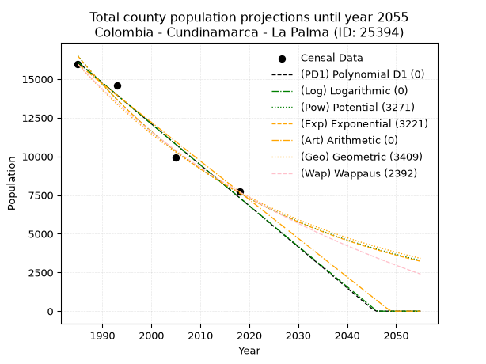
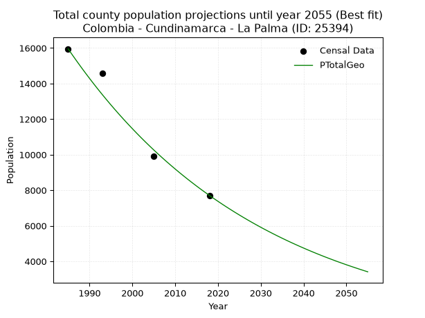
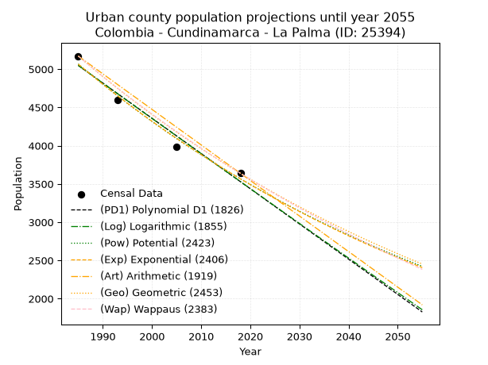
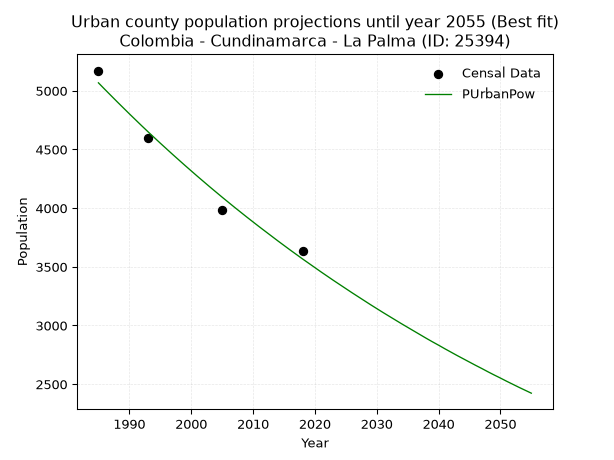
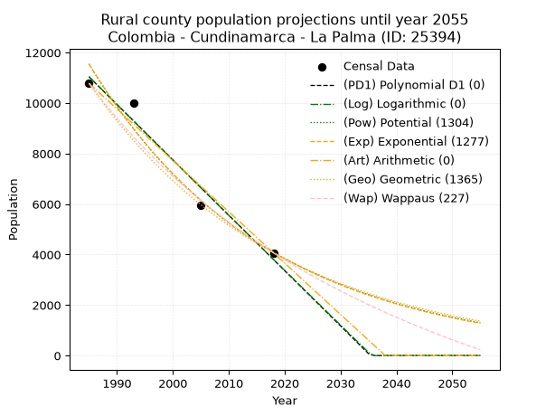
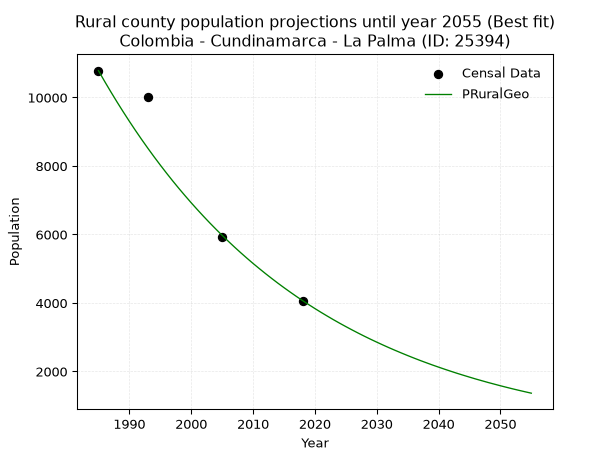

<div align="center">


</div>

# _“Population and Public Services Demand Projections (PPSD) until Year 2050 for Colombia - Cundinamarca - La Palma (ID: 25394)”_
Keywords: `population` `public-service` `projection` `lineal` `polynomial` `logarithmic` `potential` `exponential` `arithmetic` `geometric` `wappaus` `dane` `colombia` `south-america`

PPSD are analytical estimates used by governments and planners to anticipate future changes in population size, age distribution, and the resulting community needs for utilities, healthcare, education, and infrastructure as sizing future water treatment facilities, electrical grids, and road networks based on spatial growth.

> **General running parameters**: • app_version: _v20260806_. • Python version: _3.14.7_. • Pandas version: _3.0.5_. • NumPy version: _2.5.1_. • Creates, save and include plots into reports (create_plot): _False_. • Projection until year: _2050_. • Process polynomial degree 2 and up: _False_. • Process Wappaus: _True_. • Process Wappaus: _True_. • Set negative values to zero: _True_. • Set infinite values to zero: _True_. • Drop dataset notes: _True_. 
<div align="center">

Dynamic map: [:earth_americas:Google](http://maps.google.com/maps?q=5.358816482,-74.3910224) [:earth_americas:OSM](https://www.openstreetmap.org/#map=18/5.358816482/-74.3910224&layers=P) [:earth_americas:Bing](https://www.bing.com/maps?cp=5.358816482~-74.3910224&lvl=18) [:earth_americas:Apple](https://maps.apple.com/frame?center=5.358816482%2C-74.3910224&span=0.003%2C0.006)

</div>


<div align="center">

```geojson
{
  "type": "Feature",
  "geometry": {
    "type": "Point", 
    "coordinates": [-74.3910224, 5.358816482]
  }, 
  "properties": {
    "Name": "Colombia - Cundinamarca - La Palma (ID: 25394)"
  }
}
```

</div>


## 0. Census Data (4 records)

Census data are official statistics collected by a government about the people and housing in a country. They usually include counts of total population, age, sex, race, income, education, and jobs.

📅Global census file: [Population.xlsx](../data/Population.xlsx)

| Source   |   Year |   CountryID | CountryName   |   StateID | StateName    |   CountyID | CountyName   |   PTotal |   PUrban |   PRural |
|:---------|-------:|------------:|:--------------|----------:|:-------------|-----------:|:-------------|---------:|---------:|---------:|
| DANE     |   1985 |          57 | Colombia      |        25 | Cundinamarca |      25394 | La Palma     |    15955 |     5171 |    10784 |
| DANE     |   1993 |          57 | Colombia      |        25 | Cundinamarca |      25394 | La Palma     |    14596 |     4593 |    10003 |
| DANE     |   2005 |          57 | Colombia      |        25 | Cundinamarca |      25394 | La Palma     |     9918 |     3983 |     5935 |
| DANE     |   2018 |          57 | Colombia      |        25 | Cundinamarca |      25394 | La Palma     |     7708 |     3638 |     4070 |

> 🔥Some records could had specific notes about the registered values or the corresponding urban or rural distribution.

**Local public utility companies (RUPS)**

 | SERVICIO       | ESTADO    | NOMBRE                                                        | NIT         | DEPARTAMENTO_DOMICILIO   | MUNICIPIO_DOMICILIO   | DIRECCION                                  |   TELEFONO | EMAIL                                | TIPO_INSCRIPCION    | REPRESENTANTE_LEGAL              | TIPO_PRESTADOR                             | CLASIFICACION                 |
|:---------------|:----------|:--------------------------------------------------------------|:------------|:-------------------------|:----------------------|:-------------------------------------------|-----------:|:-------------------------------------|:--------------------|:---------------------------------|:-------------------------------------------|:------------------------------|
| ACUEDUCTO      | OPERATIVA | MUNICIPIO LA PALMA CUNDINAMARCA                               | 899999369-1 | CUNDINAMARCA             | LA PALMA              | CARRERA 4 No 4 - 45                        |    8505348 | alcaldia@lapalma-cundinamarca.gov.co | Registro por la ESP | WILMAR ALEXANDER MARTINEZ BARENO | MUNICIPIO (PRESTACIÓN DIRECTA)             | MENOR O IGUAL A 2500 USUARIOS |
| ALCANTARILLADO | OPERATIVA | MUNICIPIO LA PALMA CUNDINAMARCA                               | 899999369-1 | CUNDINAMARCA             | LA PALMA              | CARRERA 4 No 4 - 45                        |    8505348 | alcaldia@lapalma-cundinamarca.gov.co | Registro por la ESP | WILMAR ALEXANDER MARTINEZ BARENO | MUNICIPIO (PRESTACIÓN DIRECTA)             | MENOR O IGUAL A 2500 USUARIOS |
| ASEO           | OPERATIVA | MUNICIPIO LA PALMA CUNDINAMARCA                               | 899999369-1 | CUNDINAMARCA             | LA PALMA              | CARRERA 4 No 4 - 45                        |    8505348 | alcaldia@lapalma-cundinamarca.gov.co | Registro por la ESP | WILMAR ALEXANDER MARTINEZ BARENO | MUNICIPIO (PRESTACIÓN DIRECTA)             | MENOR O IGUAL A 2500 USUARIOS |
| ASEO           | OPERATIVA | EMPRESA DE SERVICIOS PUBLICOS DE LA DORADA E.S.P.             | 810004450-8 | CALDAS                   | LA DORADA             | CENTRO COMERCIAL DORADA PLAZA LOCAL N202-1 |    8576097 | gerente.espladorada@gmail.com        | Registro por la ESP | ANGELA MARITZA GARCIA MAYORGA    | EMPRESA INDUSTRIAL Y COMERCIAL DEL ESTADO  | MAYOR O IGUAL A 5001 USUARIOS |
| ASEO           | OPERATIVA | NUEVO MONDOÑEDO S.A. E.S.P.                                   | 900108696-6 | CUNDINAMARCA             | BOJACA                | KILOMETRO 9 VIA MOSQUERA LA MESA           |    6373090 | direccion@nuevomondonedo.com         | Registro por la ESP | JAIME VELEZ RAMIREZ              | SOCIEDADES (EMPRESA DE SERVICIOS PUBLICOS) | MAYOR O IGUAL A 5001 USUARIOS |
| ACUEDUCTO      | OPERATIVA | ASOCIACION DE USUARIOS DEL ACUEDUCTO VEREDA MINIPI DE QUIJANO | 832003272-9 | CUNDINAMARCA             | LA PALMA              | VEREDA MINIPI DE QUIJANO                   |    8505168 | asomiqui@gmail.com                   | Registro por la ESP | WILBER ALFONSO SERRATO  PEREZ    | ORGANIZACION AUTORIZADA                    | MENOR O IGUAL A 2500 USUARIOS |

> [📅RUPS Database: Registro Único de Prestadores de Servicios Públicos de Colombia Suramérica - RUPS](https://www.datos.gov.co/Hacienda-y-Cr-dito-P-blico/Registro-nico-de-Prestadores-de-Servicios-P-blicos/4qkq-csdn/about_data)

## 1. Total

### 1.1. Coefficients and Parameters

* (PD1) Polynomial Deg 1: -265.2866318747474, 542683.8354074635 (lineal)
* (Log) Logarithmic: -531082.6512661948, 4048807.738103621
* (Pow) Potential: -46.687781923796145, 158.18253291772413
* (Exp) Exponential: -0.02332586917692547, 2.1171383088652747e+24
* (Art) Arithmetic: Year diff. 2018 - 1985 = 33, Population diff. 7708 - 15955 = -8247, Annual growth = -249.9090909090909
* (Geo) Geometric: Year diff. 2018 - 1985 = 33, Population diff. 7708 - 15955 = -8247, Annual growth % = -0.021804629846430723
* (Wap) Wappaus: i = -2.1122350581844307, Condition values only valid for < 200)

<sub>
Wappaus condition values: ['-0.00', '-2.11', '-4.22', '-6.34', '-8.45', '-10.56', '-12.67', '-14.79', '-16.90', '-19.01', '-21.12', '-23.23', '-25.35', '-27.46', '-29.57', '-31.68', '-33.80', '-35.91', '-38.02', '-40.13', '-42.24', '-44.36', '-46.47', '-48.58', '-50.69', '-52.81', '-54.92', '-57.03', '-59.14', '-61.25', '-63.37', '-65.48', '-67.59', '-69.70', '-71.82', '-73.93', '-76.04', '-78.15', '-80.26', '-82.38', '-84.49', '-86.60', '-88.71', '-90.83', '-92.94', '-95.05', '-97.16', '-99.28', '-101.39', '-103.50', '-105.61', '-107.72', '-109.84', '-111.95', '-114.06', '-116.17', '-118.29', '-120.40', '-122.51', '-124.62', '-126.73', '-128.85', '-130.96', '-133.07', '-135.18', '-137.30']
</sub>


### 1.2. Projected Dataset

|   Year |   CountyID |   PTotalPD1 |   PTotalLog |   PTotalPow |   PTotalExp |   PTotalArt |   PTotalGeo |   PTotalWap |
|-------:|-----------:|------------:|------------:|------------:|------------:|------------:|------------:|------------:|
|   1985 |      25394 |       16090 |       16098 |       16497 |       16486 |       15955 |       15955 |       15955 |
|   1986 |      25394 |       15825 |       15831 |       16114 |       16106 |       15705 |       15607 |       15622 |
|   1987 |      25394 |       15559 |       15564 |       15739 |       15734 |       15455 |       15267 |       15295 |
|   1988 |      25394 |       15294 |       15296 |       15374 |       15372 |       15205 |       14934 |       14975 |
|   1989 |      25394 |       15029 |       15029 |       15017 |       15017 |       14955 |       14608 |       14662 |
|   1990 |      25394 |       14763 |       14762 |       14669 |       14671 |       14705 |       14290 |       14354 |
|   1991 |      25394 |       14498 |       14496 |       14329 |       14333 |       14456 |       13978 |       14053 |
|   1992 |      25394 |       14233 |       14229 |       13997 |       14002 |       14206 |       13673 |       13758 |
|   1993 |      25394 |       13968 |       13962 |       13673 |       13679 |       13956 |       13375 |       13469 |
|   1994 |      25394 |       13702 |       13696 |       13356 |       13364 |       13706 |       13084 |       13185 |
|   1995 |      25394 |       13437 |       13430 |       13047 |       13056 |       13456 |       12798 |       12907 |
|   1996 |      25394 |       13172 |       13164 |       12746 |       12755 |       13206 |       12519 |       12634 |
|   1997 |      25394 |       12906 |       12898 |       12451 |       12461 |       12956 |       12246 |       12366 |
|   1998 |      25394 |       12641 |       12632 |       12163 |       12174 |       12706 |       11979 |       12103 |
|   1999 |      25394 |       12376 |       12366 |       11882 |       11893 |       12456 |       11718 |       11845 |
|   2000 |      25394 |       12111 |       12100 |       11608 |       11619 |       12206 |       11463 |       11591 |
|   2001 |      25394 |       11845 |       11835 |       11340 |       11351 |       11956 |       11213 |       11342 |
|   2002 |      25394 |       11580 |       11569 |       11079 |       11089 |       11707 |       10968 |       11098 |
|   2003 |      25394 |       11315 |       11304 |       10824 |       10833 |       11457 |       10729 |       10858 |
|   2004 |      25394 |       11049 |       11039 |       10574 |       10584 |       11207 |       10495 |       10622 |
|   2005 |      25394 |       10784 |       10774 |       10331 |       10340 |       10957 |       10266 |       10390 |
|   2006 |      25394 |       10519 |       10509 |       10093 |       10101 |       10707 |       10042 |       10163 |
|   2007 |      25394 |       10254 |       10245 |        9861 |        9868 |       10457 |        9823 |        9939 |
|   2008 |      25394 |        9988 |        9980 |        9634 |        9641 |       10207 |        9609 |        9719 |
|   2009 |      25394 |        9723 |        9716 |        9413 |        9419 |        9957 |        9400 |        9502 |
|   2010 |      25394 |        9458 |        9452 |        9197 |        9201 |        9707 |        9195 |        9290 |
|   2011 |      25394 |        9192 |        9187 |        8986 |        8989 |        9457 |        8994 |        9080 |
|   2012 |      25394 |        8927 |        8923 |        8780 |        8782 |        9207 |        8798 |        8875 |
|   2013 |      25394 |        8662 |        8659 |        8578 |        8580 |        8958 |        8606 |        8672 |
|   2014 |      25394 |        8397 |        8396 |        8382 |        8382 |        8708 |        8419 |        8473 |
|   2015 |      25394 |        8131 |        8132 |        8190 |        8188 |        8458 |        8235 |        8277 |
|   2016 |      25394 |        7866 |        7869 |        8002 |        8000 |        8208 |        8055 |        8085 |
|   2017 |      25394 |        7601 |        7605 |        7819 |        7815 |        7958 |        7880 |        7895 |
|   2018 |      25394 |        7335 |        7342 |        7640 |        7635 |        7708 |        7708 |        7708 |
|   2019 |      25394 |        7070 |        7079 |        7465 |        7459 |        7458 |        7540 |        7524 |
|   2020 |      25394 |        6805 |        6816 |        7295 |        7287 |        7208 |        7376 |        7343 |
|   2021 |      25394 |        6540 |        6553 |        7128 |        7119 |        6958 |        7215 |        7165 |
|   2022 |      25394 |        6274 |        6290 |        6965 |        6955 |        6708 |        7057 |        6989 |
|   2023 |      25394 |        6009 |        6028 |        6806 |        6795 |        6458 |        6904 |        6816 |
|   2024 |      25394 |        5744 |        5765 |        6651 |        6638 |        6209 |        6753 |        6646 |
|   2025 |      25394 |        5478 |        5503 |        6500 |        6485 |        5959 |        6606 |        6478 |
|   2026 |      25394 |        5213 |        5241 |        6351 |        6335 |        5709 |        6462 |        6313 |
|   2027 |      25394 |        4948 |        4979 |        6207 |        6189 |        5459 |        6321 |        6150 |
|   2028 |      25394 |        4683 |        4717 |        6065 |        6047 |        5209 |        6183 |        5989 |
|   2029 |      25394 |        4417 |        4455 |        5927 |        5907 |        4959 |        6048 |        5831 |
|   2030 |      25394 |        4152 |        4193 |        5793 |        5771 |        4709 |        5916 |        5675 |
|   2031 |      25394 |        3887 |        3932 |        5661 |        5638 |        4459 |        5787 |        5521 |
|   2032 |      25394 |        3621 |        3670 |        5532 |        5508 |        4209 |        5661 |        5370 |
|   2033 |      25394 |        3356 |        3409 |        5407 |        5381 |        3959 |        5538 |        5220 |
|   2034 |      25394 |        3091 |        3148 |        5284 |        5257 |        3709 |        5417 |        5073 |
|   2035 |      25394 |        2826 |        2887 |        5164 |        5136 |        3460 |        5299 |        4928 |
|   2036 |      25394 |        2560 |        2626 |        5047 |        5017 |        3210 |        5183 |        4784 |
|   2037 |      25394 |        2295 |        2365 |        4933 |        4902 |        2960 |        5070 |        4643 |
|   2038 |      25394 |        2030 |        2104 |        4821 |        4789 |        2710 |        4960 |        4504 |
|   2039 |      25394 |        1764 |        1844 |        4712 |        4678 |        2460 |        4852 |        4366 |
|   2040 |      25394 |        1499 |        1583 |        4605 |        4570 |        2210 |        4746 |        4230 |
|   2041 |      25394 |        1234 |        1323 |        4501 |        4465 |        1960 |        4642 |        4096 |
|   2042 |      25394 |         969 |        1063 |        4399 |        4362 |        1710 |        4541 |        3964 |
|   2043 |      25394 |         703 |         803 |        4300 |        4261 |        1460 |        4442 |        3834 |
|   2044 |      25394 |         438 |         543 |        4203 |        4163 |        1210 |        4345 |        3705 |
|   2045 |      25394 |         173 |         283 |        4108 |        4067 |         960 |        4250 |        3578 |
|   2046 |      25394 |           0 |          24 |        4015 |        3973 |         711 |        4158 |        3452 |
|   2047 |      25394 |           0 |           0 |        3925 |        3882 |         461 |        4067 |        3328 |
|   2048 |      25394 |           0 |           0 |        3836 |        3792 |         211 |        3978 |        3206 |
|   2049 |      25394 |           0 |           0 |        3750 |        3705 |           0 |        3892 |        3085 |
|   2050 |      25394 |           0 |           0 |        3665 |        3619 |           0 |        3807 |        2966 |
<div align="center">

</img>

</div>


### 1.3. Best fit with absolute and relative error (%)

Relative error puts that difference into context by dividing the absolute error by the true value, creating a unitless ratio or percentage that shows the scale of the mistake.

Absolute and relative error

|   Year | Source   |   CountryID | CountryName   |   StateID | StateName    |   CountyID_x | CountyName   |   PTotal |   PUrban |   PRural |   CountyID_y |   PTotalPD1 |   PTotalLog |   PTotalPow |   PTotalExp |   PTotalArt |   PTotalGeo |   PTotalWap |   PTotalPD1AbsError |   PTotalLogAbsError |   PTotalPowAbsError |   PTotalExpAbsError |   PTotalArtAbsError |   PTotalGeoAbsError |   PTotalWapAbsError |   PTotalPD1RelError |   PTotalLogRelError |   PTotalPowRelError |   PTotalExpRelError |   PTotalArtRelError |   PTotalGeoRelError |   PTotalWapRelError |
|-------:|:---------|------------:|:--------------|----------:|:-------------|-------------:|:-------------|---------:|---------:|---------:|-------------:|------------:|------------:|------------:|------------:|------------:|------------:|------------:|--------------------:|--------------------:|--------------------:|--------------------:|--------------------:|--------------------:|--------------------:|--------------------:|--------------------:|--------------------:|--------------------:|--------------------:|--------------------:|--------------------:|
|   1985 | DANE     |          57 | Colombia      |        25 | Cundinamarca |        25394 | La Palma     |    15955 |     5171 |    10784 |        25394 |       16090 |       16098 |       16497 |       16486 |       15955 |       15955 |       15955 |                 135 |                 143 |                 542 |                 531 |                   0 |                   0 |                   0 |             0.84613 |            0.896271 |             3.39705 |            3.32811  |             0       |             0       |             0       |
|   1993 | DANE     |          57 | Colombia      |        25 | Cundinamarca |        25394 | La Palma     |    14596 |     4593 |    10003 |        25394 |       13968 |       13962 |       13673 |       13679 |       13956 |       13375 |       13469 |                 628 |                 634 |                 923 |                 917 |                 640 |                1221 |                1127 |             4.30255 |            4.34366  |             6.32365 |            6.28254  |             4.38476 |             8.36531 |             7.72129 |
|   2005 | DANE     |          57 | Colombia      |        25 | Cundinamarca |        25394 | La Palma     |     9918 |     3983 |     5935 |        25394 |       10784 |       10774 |       10331 |       10340 |       10957 |       10266 |       10390 |                 866 |                 856 |                 413 |                 422 |                1039 |                 348 |                 472 |             8.7316  |            8.63077  |             4.16415 |            4.25489  |            10.4759  |             3.50877 |             4.75902 |
|   2018 | DANE     |          57 | Colombia      |        25 | Cundinamarca |        25394 | La Palma     |     7708 |     3638 |     4070 |        25394 |        7335 |        7342 |        7640 |        7635 |        7708 |        7708 |        7708 |                 373 |                 366 |                  68 |                  73 |                   0 |                   0 |                   0 |             4.83913 |            4.74831  |             0.8822  |            0.947068 |             0       |             0       |             0       |

Relative error mean

| Method    |   RelError | Best   |
|:----------|-----------:|:-------|
| PTotalPD1 |    4.67985 |        |
| PTotalLog |    4.65475 |        |
| PTotalPow |    3.69176 |        |
| PTotalExp |    3.70315 |        |
| PTotalArt |    3.71517 |        |
| PTotalGeo |    2.96852 | True   |
| PTotalWap |    3.12008 |        |

💙Best method: _**PTotalGeo**_
<div align="center">

</img>

</div>


### 1.4. Fresh water supply demand in liters per capita per day (lpcd)

The fresh water supply demand typically ranges from 100 to 300 liters per capita per day (lpcd) for standard domestic and municipal planning, though absolute survival minimums set by the World Health Organization are as low as 7.5 to 20 liters per day, and total consumption in high-income nations can exceed 400 liters.

> `CZ`: Level in meters above the sea level (masl)<br> `WS`: Fresh water supply demand in liters per capita per day (lpcd or l/h/d)<br> `WSAll`: Zonal fresh water supply demand in liters per second (l/s)<br> `A`: Zonal area in square meters<br> `DP`: Population density (people/hectare or p/ha)

Reference values (RAS Colombia)

|    CZ |   WS |
|------:|-----:|
|  1000 |  120 |
|  2000 |  130 |
| 99999 |  140 |

County shapefile geometry properties and water supply values

|   CountyID |      ATotal |   CZTotal |   WSTotal |
|-----------:|------------:|----------:|----------:|
|      25394 | 1.90594e+08 |   1330.41 |       130 |

Projected values for best method: PTotalGeo

|   CountyID |   Year |   PTotalGeo |   DPTotal |   WSTotal |   WSTotalAll |
|-----------:|-------:|------------:|----------:|----------:|-------------:|
|      25394 |   1985 |       15955 |      0.84 |       130 |     24.0064  |
|      25394 |   1986 |       15607 |      0.82 |       130 |     23.4828  |
|      25394 |   1987 |       15267 |      0.8  |       130 |     22.9712  |
|      25394 |   1988 |       14934 |      0.78 |       130 |     22.4701  |
|      25394 |   1989 |       14608 |      0.77 |       130 |     21.9796  |
|      25394 |   1990 |       14290 |      0.75 |       130 |     21.5012  |
|      25394 |   1991 |       13978 |      0.73 |       130 |     21.0317  |
|      25394 |   1992 |       13673 |      0.72 |       130 |     20.5728  |
|      25394 |   1993 |       13375 |      0.7  |       130 |     20.1244  |
|      25394 |   1994 |       13084 |      0.69 |       130 |     19.6866  |
|      25394 |   1995 |       12798 |      0.67 |       130 |     19.2563  |
|      25394 |   1996 |       12519 |      0.66 |       130 |     18.8365  |
|      25394 |   1997 |       12246 |      0.64 |       130 |     18.4257  |
|      25394 |   1998 |       11979 |      0.63 |       130 |     18.024   |
|      25394 |   1999 |       11718 |      0.61 |       130 |     17.6313  |
|      25394 |   2000 |       11463 |      0.6  |       130 |     17.2476  |
|      25394 |   2001 |       11213 |      0.59 |       130 |     16.8714  |
|      25394 |   2002 |       10968 |      0.58 |       130 |     16.5028  |
|      25394 |   2003 |       10729 |      0.56 |       130 |     16.1432  |
|      25394 |   2004 |       10495 |      0.55 |       130 |     15.7911  |
|      25394 |   2005 |       10266 |      0.54 |       130 |     15.4465  |
|      25394 |   2006 |       10042 |      0.53 |       130 |     15.1095  |
|      25394 |   2007 |        9823 |      0.52 |       130 |     14.78    |
|      25394 |   2008 |        9609 |      0.5  |       130 |     14.458   |
|      25394 |   2009 |        9400 |      0.49 |       130 |     14.1435  |
|      25394 |   2010 |        9195 |      0.48 |       130 |     13.8351  |
|      25394 |   2011 |        8994 |      0.47 |       130 |     13.5326  |
|      25394 |   2012 |        8798 |      0.46 |       130 |     13.2377  |
|      25394 |   2013 |        8606 |      0.45 |       130 |     12.9488  |
|      25394 |   2014 |        8419 |      0.44 |       130 |     12.6675  |
|      25394 |   2015 |        8235 |      0.43 |       130 |     12.3906  |
|      25394 |   2016 |        8055 |      0.42 |       130 |     12.1198  |
|      25394 |   2017 |        7880 |      0.41 |       130 |     11.8565  |
|      25394 |   2018 |        7708 |      0.4  |       130 |     11.5977  |
|      25394 |   2019 |        7540 |      0.4  |       130 |     11.3449  |
|      25394 |   2020 |        7376 |      0.39 |       130 |     11.0981  |
|      25394 |   2021 |        7215 |      0.38 |       130 |     10.8559  |
|      25394 |   2022 |        7057 |      0.37 |       130 |     10.6182  |
|      25394 |   2023 |        6904 |      0.36 |       130 |     10.388   |
|      25394 |   2024 |        6753 |      0.35 |       130 |     10.1608  |
|      25394 |   2025 |        6606 |      0.35 |       130 |      9.93958 |
|      25394 |   2026 |        6462 |      0.34 |       130 |      9.72292 |
|      25394 |   2027 |        6321 |      0.33 |       130 |      9.51076 |
|      25394 |   2028 |        6183 |      0.32 |       130 |      9.30312 |
|      25394 |   2029 |        6048 |      0.32 |       130 |      9.1     |
|      25394 |   2030 |        5916 |      0.31 |       130 |      8.90139 |
|      25394 |   2031 |        5787 |      0.3  |       130 |      8.70729 |
|      25394 |   2032 |        5661 |      0.3  |       130 |      8.51771 |
|      25394 |   2033 |        5538 |      0.29 |       130 |      8.33264 |
|      25394 |   2034 |        5417 |      0.28 |       130 |      8.15058 |
|      25394 |   2035 |        5299 |      0.28 |       130 |      7.97303 |
|      25394 |   2036 |        5183 |      0.27 |       130 |      7.7985  |
|      25394 |   2037 |        5070 |      0.27 |       130 |      7.62847 |
|      25394 |   2038 |        4960 |      0.26 |       130 |      7.46296 |
|      25394 |   2039 |        4852 |      0.25 |       130 |      7.30046 |
|      25394 |   2040 |        4746 |      0.25 |       130 |      7.14097 |
|      25394 |   2041 |        4642 |      0.24 |       130 |      6.98449 |
|      25394 |   2042 |        4541 |      0.24 |       130 |      6.83252 |
|      25394 |   2043 |        4442 |      0.23 |       130 |      6.68356 |
|      25394 |   2044 |        4345 |      0.23 |       130 |      6.53762 |
|      25394 |   2045 |        4250 |      0.22 |       130 |      6.39468 |
|      25394 |   2046 |        4158 |      0.22 |       130 |      6.25625 |
|      25394 |   2047 |        4067 |      0.21 |       130 |      6.11933 |
|      25394 |   2048 |        3978 |      0.21 |       130 |      5.98542 |
|      25394 |   2049 |        3892 |      0.2  |       130 |      5.85602 |
|      25394 |   2050 |        3807 |      0.2  |       130 |      5.72813 |

## 2. Urban

### 2.1. Coefficients and Parameters

* (PD1) Polynomial Deg 1: -46.02689682858266, 96411.55038137246 (lineal)
* (Log) Logarithmic: -92172.55692684419, 704950.5938254583
* (Pow) Potential: -21.292050992407898, 73.92086105078697
* (Exp) Exponential: -0.01063348453898972, 7438199619469.54
* (Art) Arithmetic: Year diff. 2018 - 1985 = 33, Population diff. 3638 - 5171 = -1533, Annual growth = -46.45454545454545
* (Geo) Geometric: Year diff. 2018 - 1985 = 33, Population diff. 3638 - 5171 = -1533, Annual growth % = -0.010598946651120378
* (Wap) Wappaus: i = -1.0547064469189569, Condition values only valid for < 200)

<sub>
Wappaus condition values: ['-0.00', '-1.05', '-2.11', '-3.16', '-4.22', '-5.27', '-6.33', '-7.38', '-8.44', '-9.49', '-10.55', '-11.60', '-12.66', '-13.71', '-14.77', '-15.82', '-16.88', '-17.93', '-18.98', '-20.04', '-21.09', '-22.15', '-23.20', '-24.26', '-25.31', '-26.37', '-27.42', '-28.48', '-29.53', '-30.59', '-31.64', '-32.70', '-33.75', '-34.81', '-35.86', '-36.91', '-37.97', '-39.02', '-40.08', '-41.13', '-42.19', '-43.24', '-44.30', '-45.35', '-46.41', '-47.46', '-48.52', '-49.57', '-50.63', '-51.68', '-52.74', '-53.79', '-54.84', '-55.90', '-56.95', '-58.01', '-59.06', '-60.12', '-61.17', '-62.23', '-63.28', '-64.34', '-65.39', '-66.45', '-67.50', '-68.56']
</sub>


### 2.2. Projected Dataset

|   Year |   CountyID |   PUrbanPD1 |   PUrbanLog |   PUrbanPow |   PUrbanExp |   PUrbanArt |   PUrbanGeo |   PUrbanWap |
|-------:|-----------:|------------:|------------:|------------:|------------:|------------:|------------:|------------:|
|   1985 |      25394 |        5048 |        5050 |        5067 |        5065 |        5171 |        5171 |        5171 |
|   1986 |      25394 |        5002 |        5003 |        5013 |        5012 |        5125 |        5116 |        5117 |
|   1987 |      25394 |        4956 |        4957 |        4960 |        4959 |        5078 |        5062 |        5063 |
|   1988 |      25394 |        4910 |        4911 |        4907 |        4906 |        5032 |        5008 |        5010 |
|   1989 |      25394 |        4864 |        4864 |        4855 |        4854 |        4985 |        4955 |        4957 |
|   1990 |      25394 |        4818 |        4818 |        4803 |        4803 |        4939 |        4903 |        4905 |
|   1991 |      25394 |        4772 |        4772 |        4752 |        4752 |        4892 |        4851 |        4854 |
|   1992 |      25394 |        4726 |        4725 |        4701 |        4702 |        4846 |        4799 |        4803 |
|   1993 |      25394 |        4680 |        4679 |        4651 |        4652 |        4799 |        4748 |        4752 |
|   1994 |      25394 |        4634 |        4633 |        4602 |        4603 |        4753 |        4698 |        4702 |
|   1995 |      25394 |        4588 |        4587 |        4553 |        4554 |        4706 |        4648 |        4653 |
|   1996 |      25394 |        4542 |        4541 |        4505 |        4506 |        4660 |        4599 |        4604 |
|   1997 |      25394 |        4496 |        4494 |        4457 |        4459 |        4614 |        4550 |        4555 |
|   1998 |      25394 |        4450 |        4448 |        4410 |        4411 |        4567 |        4502 |        4507 |
|   1999 |      25394 |        4404 |        4402 |        4363 |        4365 |        4521 |        4454 |        4460 |
|   2000 |      25394 |        4358 |        4356 |        4317 |        4319 |        4474 |        4407 |        4413 |
|   2001 |      25394 |        4312 |        4310 |        4271 |        4273 |        4428 |        4360 |        4366 |
|   2002 |      25394 |        4266 |        4264 |        4226 |        4228 |        4381 |        4314 |        4320 |
|   2003 |      25394 |        4220 |        4218 |        4181 |        4183 |        4335 |        4269 |        4274 |
|   2004 |      25394 |        4174 |        4172 |        4137 |        4139 |        4288 |        4223 |        4229 |
|   2005 |      25394 |        4128 |        4126 |        4093 |        4095 |        4242 |        4179 |        4184 |
|   2006 |      25394 |        4082 |        4080 |        4050 |        4052 |        4195 |        4134 |        4140 |
|   2007 |      25394 |        4036 |        4034 |        4007 |        4009 |        4149 |        4090 |        4096 |
|   2008 |      25394 |        3990 |        3988 |        3965 |        3966 |        4103 |        4047 |        4052 |
|   2009 |      25394 |        3944 |        3942 |        3923 |        3924 |        4056 |        4004 |        4009 |
|   2010 |      25394 |        3897 |        3896 |        3882 |        3883 |        4010 |        3962 |        3966 |
|   2011 |      25394 |        3851 |        3850 |        3841 |        3842 |        3963 |        3920 |        3924 |
|   2012 |      25394 |        3805 |        3805 |        3801 |        3801 |        3917 |        3878 |        3882 |
|   2013 |      25394 |        3759 |        3759 |        3761 |        3761 |        3870 |        3837 |        3840 |
|   2014 |      25394 |        3713 |        3713 |        3721 |        3721 |        3824 |        3796 |        3799 |
|   2015 |      25394 |        3667 |        3667 |        3682 |        3682 |        3777 |        3756 |        3758 |
|   2016 |      25394 |        3621 |        3622 |        3643 |        3643 |        3731 |        3716 |        3718 |
|   2017 |      25394 |        3575 |        3576 |        3605 |        3604 |        3684 |        3677 |        3678 |
|   2018 |      25394 |        3529 |        3530 |        3567 |        3566 |        3638 |        3638 |        3638 |
|   2019 |      25394 |        3483 |        3484 |        3530 |        3529 |        3592 |        3599 |        3599 |
|   2020 |      25394 |        3437 |        3439 |        3493 |        3491 |        3545 |        3561 |        3560 |
|   2021 |      25394 |        3391 |        3393 |        3456 |        3454 |        3499 |        3524 |        3521 |
|   2022 |      25394 |        3345 |        3348 |        3420 |        3418 |        3452 |        3486 |        3483 |
|   2023 |      25394 |        3299 |        3302 |        3384 |        3382 |        3406 |        3449 |        3445 |
|   2024 |      25394 |        3253 |        3256 |        3349 |        3346 |        3359 |        3413 |        3407 |
|   2025 |      25394 |        3207 |        3211 |        3314 |        3310 |        3313 |        3377 |        3369 |
|   2026 |      25394 |        3161 |        3165 |        3279 |        3275 |        3266 |        3341 |        3332 |
|   2027 |      25394 |        3115 |        3120 |        3245 |        3241 |        3220 |        3305 |        3296 |
|   2028 |      25394 |        3069 |        3075 |        3211 |        3207 |        3173 |        3270 |        3259 |
|   2029 |      25394 |        3023 |        3029 |        3177 |        3173 |        3127 |        3236 |        3223 |
|   2030 |      25394 |        2977 |        2984 |        3144 |        3139 |        3081 |        3201 |        3187 |
|   2031 |      25394 |        2931 |        2938 |        3111 |        3106 |        3034 |        3167 |        3152 |
|   2032 |      25394 |        2885 |        2893 |        3079 |        3073 |        2988 |        3134 |        3117 |
|   2033 |      25394 |        2839 |        2848 |        3047 |        3040 |        2941 |        3101 |        3082 |
|   2034 |      25394 |        2793 |        2802 |        3015 |        3008 |        2895 |        3068 |        3047 |
|   2035 |      25394 |        2747 |        2757 |        2984 |        2977 |        2848 |        3035 |        3013 |
|   2036 |      25394 |        2701 |        2712 |        2953 |        2945 |        2802 |        3003 |        2979 |
|   2037 |      25394 |        2655 |        2666 |        2922 |        2914 |        2755 |        2971 |        2945 |
|   2038 |      25394 |        2609 |        2621 |        2891 |        2883 |        2709 |        2940 |        2912 |
|   2039 |      25394 |        2563 |        2576 |        2861 |        2853 |        2662 |        2909 |        2879 |
|   2040 |      25394 |        2517 |        2531 |        2832 |        2822 |        2616 |        2878 |        2846 |
|   2041 |      25394 |        2471 |        2486 |        2802 |        2793 |        2570 |        2847 |        2813 |
|   2042 |      25394 |        2425 |        2440 |        2773 |        2763 |        2523 |        2817 |        2781 |
|   2043 |      25394 |        2379 |        2395 |        2744 |        2734 |        2477 |        2787 |        2749 |
|   2044 |      25394 |        2333 |        2350 |        2716 |        2705 |        2430 |        2758 |        2717 |
|   2045 |      25394 |        2287 |        2305 |        2688 |        2676 |        2384 |        2728 |        2685 |
|   2046 |      25394 |        2241 |        2260 |        2660 |        2648 |        2337 |        2700 |        2654 |
|   2047 |      25394 |        2194 |        2215 |        2633 |        2620 |        2291 |        2671 |        2623 |
|   2048 |      25394 |        2148 |        2170 |        2605 |        2592 |        2244 |        2643 |        2592 |
|   2049 |      25394 |        2102 |        2125 |        2578 |        2565 |        2198 |        2615 |        2561 |
|   2050 |      25394 |        2056 |        2080 |        2552 |        2538 |        2151 |        2587 |        2531 |
<div align="center">

</img>

</div>


### 2.3. Best fit with absolute and relative error (%)

Relative error puts that difference into context by dividing the absolute error by the true value, creating a unitless ratio or percentage that shows the scale of the mistake.

Absolute and relative error

|   Year | Source   |   CountryID | CountryName   |   StateID | StateName    |   CountyID_x | CountyName   |   PTotal |   PUrban |   PRural |   CountyID_y |   PUrbanPD1 |   PUrbanLog |   PUrbanPow |   PUrbanExp |   PUrbanArt |   PUrbanGeo |   PUrbanWap |   PUrbanPD1AbsError |   PUrbanLogAbsError |   PUrbanPowAbsError |   PUrbanExpAbsError |   PUrbanArtAbsError |   PUrbanGeoAbsError |   PUrbanWapAbsError |   PUrbanPD1RelError |   PUrbanLogRelError |   PUrbanPowRelError |   PUrbanExpRelError |   PUrbanArtRelError |   PUrbanGeoRelError |   PUrbanWapRelError |
|-------:|:---------|------------:|:--------------|----------:|:-------------|-------------:|:-------------|---------:|---------:|---------:|-------------:|------------:|------------:|------------:|------------:|------------:|------------:|------------:|--------------------:|--------------------:|--------------------:|--------------------:|--------------------:|--------------------:|--------------------:|--------------------:|--------------------:|--------------------:|--------------------:|--------------------:|--------------------:|--------------------:|
|   1985 | DANE     |          57 | Colombia      |        25 | Cundinamarca |        25394 | La Palma     |    15955 |     5171 |    10784 |        25394 |        5048 |        5050 |        5067 |        5065 |        5171 |        5171 |        5171 |                 123 |                 121 |                 104 |                 106 |                   0 |                   0 |                   0 |             2.37865 |             2.33997 |             2.01122 |             2.04989 |             0       |             0       |             0       |
|   1993 | DANE     |          57 | Colombia      |        25 | Cundinamarca |        25394 | La Palma     |    14596 |     4593 |    10003 |        25394 |        4680 |        4679 |        4651 |        4652 |        4799 |        4748 |        4752 |                  87 |                  86 |                  58 |                  59 |                 206 |                 155 |                 159 |             1.89419 |             1.87241 |             1.26279 |             1.28456 |             4.48509 |             3.3747  |             3.46179 |
|   2005 | DANE     |          57 | Colombia      |        25 | Cundinamarca |        25394 | La Palma     |     9918 |     3983 |     5935 |        25394 |        4128 |        4126 |        4093 |        4095 |        4242 |        4179 |        4184 |                 145 |                 143 |                 110 |                 112 |                 259 |                 196 |                 201 |             3.64047 |             3.59026 |             2.76174 |             2.81195 |             6.50264 |             4.92091 |             5.04645 |
|   2018 | DANE     |          57 | Colombia      |        25 | Cundinamarca |        25394 | La Palma     |     7708 |     3638 |     4070 |        25394 |        3529 |        3530 |        3567 |        3566 |        3638 |        3638 |        3638 |                 109 |                 108 |                  71 |                  72 |                   0 |                   0 |                   0 |             2.99615 |             2.96866 |             1.95162 |             1.97911 |             0       |             0       |             0       |

Relative error mean

| Method    |   RelError | Best   |
|:----------|-----------:|:-------|
| PUrbanPD1 |    2.72737 |        |
| PUrbanLog |    2.69283 |        |
| PUrbanPow |    1.99684 | True   |
| PUrbanExp |    2.03138 |        |
| PUrbanArt |    2.74693 |        |
| PUrbanGeo |    2.0739  |        |
| PUrbanWap |    2.12706 |        |

💙Best method: _**PUrbanPow**_
<div align="center">

</img>

</div>


### 2.4. Fresh water supply demand in liters per capita per day (lpcd)

The fresh water supply demand typically ranges from 100 to 300 liters per capita per day (lpcd) for standard domestic and municipal planning, though absolute survival minimums set by the World Health Organization are as low as 7.5 to 20 liters per day, and total consumption in high-income nations can exceed 400 liters.

> `CZ`: Level in meters above the sea level (masl)<br> `WS`: Fresh water supply demand in liters per capita per day (lpcd or l/h/d)<br> `WSAll`: Zonal fresh water supply demand in liters per second (l/s)<br> `A`: Zonal area in square meters<br> `DP`: Population density (people/hectare or p/ha)

Reference values (RAS Colombia)

|    CZ |   WS |
|------:|-----:|
|  1000 |  120 |
|  2000 |  130 |
| 99999 |  140 |

County shapefile geometry properties and water supply values

|   CountyID |   AUrban |   CZUrban |   WSUrban |
|-----------:|---------:|----------:|----------:|
|      25394 |   815871 |   1451.22 |       130 |

Projected values for best method: PUrbanPow

|   CountyID |   Year |   PUrbanPow |   DPUrban |   WSUrban |   WSUrbanAll |
|-----------:|-------:|------------:|----------:|----------:|-------------:|
|      25394 |   1985 |        5067 |     62.11 |       130 |      7.62396 |
|      25394 |   1986 |        5013 |     61.44 |       130 |      7.54271 |
|      25394 |   1987 |        4960 |     60.79 |       130 |      7.46296 |
|      25394 |   1988 |        4907 |     60.14 |       130 |      7.38322 |
|      25394 |   1989 |        4855 |     59.51 |       130 |      7.30498 |
|      25394 |   1990 |        4803 |     58.87 |       130 |      7.22674 |
|      25394 |   1991 |        4752 |     58.24 |       130 |      7.15    |
|      25394 |   1992 |        4701 |     57.62 |       130 |      7.07326 |
|      25394 |   1993 |        4651 |     57.01 |       130 |      6.99803 |
|      25394 |   1994 |        4602 |     56.41 |       130 |      6.92431 |
|      25394 |   1995 |        4553 |     55.81 |       130 |      6.85058 |
|      25394 |   1996 |        4505 |     55.22 |       130 |      6.77836 |
|      25394 |   1997 |        4457 |     54.63 |       130 |      6.70613 |
|      25394 |   1998 |        4410 |     54.05 |       130 |      6.63542 |
|      25394 |   1999 |        4363 |     53.48 |       130 |      6.5647  |
|      25394 |   2000 |        4317 |     52.91 |       130 |      6.49549 |
|      25394 |   2001 |        4271 |     52.35 |       130 |      6.42627 |
|      25394 |   2002 |        4226 |     51.8  |       130 |      6.35856 |
|      25394 |   2003 |        4181 |     51.25 |       130 |      6.29086 |
|      25394 |   2004 |        4137 |     50.71 |       130 |      6.22465 |
|      25394 |   2005 |        4093 |     50.17 |       130 |      6.15845 |
|      25394 |   2006 |        4050 |     49.64 |       130 |      6.09375 |
|      25394 |   2007 |        4007 |     49.11 |       130 |      6.02905 |
|      25394 |   2008 |        3965 |     48.6  |       130 |      5.96586 |
|      25394 |   2009 |        3923 |     48.08 |       130 |      5.90266 |
|      25394 |   2010 |        3882 |     47.58 |       130 |      5.84097 |
|      25394 |   2011 |        3841 |     47.08 |       130 |      5.77928 |
|      25394 |   2012 |        3801 |     46.59 |       130 |      5.7191  |
|      25394 |   2013 |        3761 |     46.1  |       130 |      5.65891 |
|      25394 |   2014 |        3721 |     45.61 |       130 |      5.59873 |
|      25394 |   2015 |        3682 |     45.13 |       130 |      5.54005 |
|      25394 |   2016 |        3643 |     44.65 |       130 |      5.48137 |
|      25394 |   2017 |        3605 |     44.19 |       130 |      5.42419 |
|      25394 |   2018 |        3567 |     43.72 |       130 |      5.36701 |
|      25394 |   2019 |        3530 |     43.27 |       130 |      5.31134 |
|      25394 |   2020 |        3493 |     42.81 |       130 |      5.25567 |
|      25394 |   2021 |        3456 |     42.36 |       130 |      5.2     |
|      25394 |   2022 |        3420 |     41.92 |       130 |      5.14583 |
|      25394 |   2023 |        3384 |     41.48 |       130 |      5.09167 |
|      25394 |   2024 |        3349 |     41.05 |       130 |      5.039   |
|      25394 |   2025 |        3314 |     40.62 |       130 |      4.98634 |
|      25394 |   2026 |        3279 |     40.19 |       130 |      4.93368 |
|      25394 |   2027 |        3245 |     39.77 |       130 |      4.88252 |
|      25394 |   2028 |        3211 |     39.36 |       130 |      4.83137 |
|      25394 |   2029 |        3177 |     38.94 |       130 |      4.78021 |
|      25394 |   2030 |        3144 |     38.54 |       130 |      4.73056 |
|      25394 |   2031 |        3111 |     38.13 |       130 |      4.6809  |
|      25394 |   2032 |        3079 |     37.74 |       130 |      4.63275 |
|      25394 |   2033 |        3047 |     37.35 |       130 |      4.58461 |
|      25394 |   2034 |        3015 |     36.95 |       130 |      4.53646 |
|      25394 |   2035 |        2984 |     36.57 |       130 |      4.48981 |
|      25394 |   2036 |        2953 |     36.19 |       130 |      4.44317 |
|      25394 |   2037 |        2922 |     35.81 |       130 |      4.39653 |
|      25394 |   2038 |        2891 |     35.43 |       130 |      4.34988 |
|      25394 |   2039 |        2861 |     35.07 |       130 |      4.30475 |
|      25394 |   2040 |        2832 |     34.71 |       130 |      4.26111 |
|      25394 |   2041 |        2802 |     34.34 |       130 |      4.21597 |
|      25394 |   2042 |        2773 |     33.99 |       130 |      4.17234 |
|      25394 |   2043 |        2744 |     33.63 |       130 |      4.1287  |
|      25394 |   2044 |        2716 |     33.29 |       130 |      4.08657 |
|      25394 |   2045 |        2688 |     32.95 |       130 |      4.04444 |
|      25394 |   2046 |        2660 |     32.6  |       130 |      4.00231 |
|      25394 |   2047 |        2633 |     32.27 |       130 |      3.96169 |
|      25394 |   2048 |        2605 |     31.93 |       130 |      3.91956 |
|      25394 |   2049 |        2578 |     31.6  |       130 |      3.87894 |
|      25394 |   2050 |        2552 |     31.28 |       130 |      3.83981 |

## 3. Rural

### 3.1. Coefficients and Parameters

* (PD1) Polynomial Deg 1: -219.2597350461648, 446272.28502609115 (lineal)
* (Log) Logarithmic: -438910.09433935053, 3343857.144278162
* (Pow) Potential: -62.94783211448367, 211.64954891511744
* (Exp) Exponential: -0.03145339891690641, 1.5047747769439672e+31
* (Art) Arithmetic: Year diff. 2018 - 1985 = 33, Population diff. 4070 - 10784 = -6714, Annual growth = -203.45454545454547
* (Geo) Geometric: Year diff. 2018 - 1985 = 33, Population diff. 4070 - 10784 = -6714, Annual growth % = -0.029096206677939995
* (Wap) Wappaus: i = -2.7393906753001946, Condition values only valid for < 200)

<sub>
Wappaus condition values: ['-0.00', '-2.74', '-5.48', '-8.22', '-10.96', '-13.70', '-16.44', '-19.18', '-21.92', '-24.65', '-27.39', '-30.13', '-32.87', '-35.61', '-38.35', '-41.09', '-43.83', '-46.57', '-49.31', '-52.05', '-54.79', '-57.53', '-60.27', '-63.01', '-65.75', '-68.48', '-71.22', '-73.96', '-76.70', '-79.44', '-82.18', '-84.92', '-87.66', '-90.40', '-93.14', '-95.88', '-98.62', '-101.36', '-104.10', '-106.84', '-109.58', '-112.32', '-115.05', '-117.79', '-120.53', '-123.27', '-126.01', '-128.75', '-131.49', '-134.23', '-136.97', '-139.71', '-142.45', '-145.19', '-147.93', '-150.67', '-153.41', '-156.15', '-158.88', '-161.62', '-164.36', '-167.10', '-169.84', '-172.58', '-175.32', '-178.06']
</sub>


### 3.2. Projected Dataset

|   Year |   CountyID |   PRuralPD1 |   PRuralLog |   PRuralPow |   PRuralExp |   PRuralArt |   PRuralGeo |   PRuralWap |
|-------:|-----------:|------------:|------------:|------------:|------------:|------------:|------------:|------------:|
|   1985 |      25394 |       11042 |       11049 |       11552 |       11542 |       10784 |       10784 |       10784 |
|   1986 |      25394 |       10822 |       10828 |       11192 |       11185 |       10581 |       10470 |       10493 |
|   1987 |      25394 |       10603 |       10607 |       10843 |       10839 |       10377 |       10166 |       10209 |
|   1988 |      25394 |       10384 |       10386 |       10505 |       10503 |       10174 |        9870 |        9933 |
|   1989 |      25394 |       10165 |       10165 |       10177 |       10178 |        9970 |        9583 |        9664 |
|   1990 |      25394 |        9945 |        9944 |        9861 |        9863 |        9767 |        9304 |        9402 |
|   1991 |      25394 |        9726 |        9724 |        9554 |        9557 |        9563 |        9033 |        9146 |
|   1992 |      25394 |        9507 |        9503 |        9256 |        9261 |        9360 |        8770 |        8897 |
|   1993 |      25394 |        9288 |        9283 |        8968 |        8975 |        9156 |        8515 |        8654 |
|   1994 |      25394 |        9068 |        9063 |        8690 |        8697 |        8953 |        8267 |        8417 |
|   1995 |      25394 |        8849 |        8843 |        8420 |        8427 |        8749 |        8027 |        8186 |
|   1996 |      25394 |        8630 |        8623 |        8158 |        8167 |        8546 |        7793 |        7960 |
|   1997 |      25394 |        8411 |        8403 |        7905 |        7914 |        8343 |        7566 |        7739 |
|   1998 |      25394 |        8191 |        8183 |        7660 |        7669 |        8139 |        7346 |        7524 |
|   1999 |      25394 |        7972 |        7964 |        7422 |        7431 |        7936 |        7133 |        7314 |
|   2000 |      25394 |        7753 |        7744 |        7192 |        7201 |        7732 |        6925 |        7108 |
|   2001 |      25394 |        7534 |        7525 |        6969 |        6978 |        7529 |        6724 |        6907 |
|   2002 |      25394 |        7314 |        7306 |        6754 |        6762 |        7325 |        6528 |        6710 |
|   2003 |      25394 |        7095 |        7086 |        6545 |        6553 |        7122 |        6338 |        6518 |
|   2004 |      25394 |        6876 |        6867 |        6342 |        6350 |        6918 |        6154 |        6330 |
|   2005 |      25394 |        6657 |        6648 |        6146 |        6153 |        6715 |        5975 |        6146 |
|   2006 |      25394 |        6437 |        6430 |        5956 |        5963 |        6511 |        5801 |        5966 |
|   2007 |      25394 |        6218 |        6211 |        5772 |        5778 |        6308 |        5632 |        5790 |
|   2008 |      25394 |        5999 |        5992 |        5594 |        5599 |        6105 |        5468 |        5617 |
|   2009 |      25394 |        5779 |        5774 |        5422 |        5426 |        5901 |        5309 |        5448 |
|   2010 |      25394 |        5560 |        5555 |        5254 |        5258 |        5698 |        5154 |        5282 |
|   2011 |      25394 |        5341 |        5337 |        5092 |        5095 |        5494 |        5005 |        5120 |
|   2012 |      25394 |        5122 |        5119 |        4935 |        4937 |        5291 |        4859 |        4961 |
|   2013 |      25394 |        4902 |        4901 |        4783 |        4784 |        5087 |        4718 |        4805 |
|   2014 |      25394 |        4683 |        4683 |        4636 |        4636 |        4884 |        4580 |        4652 |
|   2015 |      25394 |        4464 |        4465 |        4494 |        4493 |        4680 |        4447 |        4503 |
|   2016 |      25394 |        4245 |        4247 |        4355 |        4353 |        4477 |        4318 |        4356 |
|   2017 |      25394 |        4025 |        4029 |        4222 |        4219 |        4273 |        4192 |        4211 |
|   2018 |      25394 |        3806 |        3812 |        4092 |        4088 |        4070 |        4070 |        4070 |
|   2019 |      25394 |        3587 |        3594 |        3966 |        3961 |        3867 |        3952 |        3931 |
|   2020 |      25394 |        3368 |        3377 |        3845 |        3839 |        3663 |        3837 |        3795 |
|   2021 |      25394 |        3148 |        3160 |        3727 |        3720 |        3460 |        3725 |        3661 |
|   2022 |      25394 |        2929 |        2943 |        3612 |        3605 |        3256 |        3617 |        3530 |
|   2023 |      25394 |        2710 |        2726 |        3502 |        3493 |        3053 |        3511 |        3401 |
|   2024 |      25394 |        2491 |        2509 |        3394 |        3385 |        2849 |        3409 |        3274 |
|   2025 |      25394 |        2271 |        2292 |        3290 |        3280 |        2646 |        3310 |        3150 |
|   2026 |      25394 |        2052 |        2075 |        3190 |        3179 |        2442 |        3214 |        3028 |
|   2027 |      25394 |        1833 |        1859 |        3092 |        3080 |        2239 |        3120 |        2908 |
|   2028 |      25394 |        1614 |        1642 |        2998 |        2985 |        2035 |        3029 |        2790 |
|   2029 |      25394 |        1394 |        1426 |        2906 |        2892 |        1832 |        2941 |        2674 |
|   2030 |      25394 |        1175 |        1210 |        2817 |        2803 |        1629 |        2856 |        2560 |
|   2031 |      25394 |         956 |         993 |        2731 |        2716 |        1425 |        2773 |        2447 |
|   2032 |      25394 |         737 |         777 |        2648 |        2632 |        1222 |        2692 |        2337 |
|   2033 |      25394 |         517 |         561 |        2567 |        2550 |        1018 |        2614 |        2229 |
|   2034 |      25394 |         298 |         346 |        2489 |        2471 |         815 |        2538 |        2122 |
|   2035 |      25394 |          79 |         130 |        2413 |        2395 |         611 |        2464 |        2017 |
|   2036 |      25394 |           0 |           0 |        2340 |        2321 |         408 |        2392 |        1914 |
|   2037 |      25394 |           0 |           0 |        2268 |        2249 |         204 |        2322 |        1812 |
|   2038 |      25394 |           0 |           0 |        2199 |        2179 |           1 |        2255 |        1712 |
|   2039 |      25394 |           0 |           0 |        2133 |        2112 |           0 |        2189 |        1614 |
|   2040 |      25394 |           0 |           0 |        2068 |        2046 |           0 |        2126 |        1517 |
|   2041 |      25394 |           0 |           0 |        2005 |        1983 |           0 |        2064 |        1422 |
|   2042 |      25394 |           0 |           0 |        1944 |        1922 |           0 |        2004 |        1328 |
|   2043 |      25394 |           0 |           0 |        1885 |        1862 |           0 |        1945 |        1235 |
|   2044 |      25394 |           0 |           0 |        1828 |        1804 |           0 |        1889 |        1144 |
|   2045 |      25394 |           0 |           0 |        1772 |        1749 |           0 |        1834 |        1055 |
|   2046 |      25394 |           0 |           0 |        1719 |        1694 |           0 |        1780 |         966 |
|   2047 |      25394 |           0 |           0 |        1667 |        1642 |           0 |        1729 |         879 |
|   2048 |      25394 |           0 |           0 |        1616 |        1591 |           0 |        1678 |         794 |
|   2049 |      25394 |           0 |           0 |        1567 |        1542 |           0 |        1630 |         709 |
|   2050 |      25394 |           0 |           0 |        1520 |        1494 |           0 |        1582 |         626 |
<div align="center">

</img>

</div>


### 3.3. Best fit with absolute and relative error (%)

Relative error puts that difference into context by dividing the absolute error by the true value, creating a unitless ratio or percentage that shows the scale of the mistake.

Absolute and relative error

|   Year | Source   |   CountryID | CountryName   |   StateID | StateName    |   CountyID_x | CountyName   |   PTotal |   PUrban |   PRural |   CountyID_y |   PRuralPD1 |   PRuralLog |   PRuralPow |   PRuralExp |   PRuralArt |   PRuralGeo |   PRuralWap |   PRuralPD1AbsError |   PRuralLogAbsError |   PRuralPowAbsError |   PRuralExpAbsError |   PRuralArtAbsError |   PRuralGeoAbsError |   PRuralWapAbsError |   PRuralPD1RelError |   PRuralLogRelError |   PRuralPowRelError |   PRuralExpRelError |   PRuralArtRelError |   PRuralGeoRelError |   PRuralWapRelError |
|-------:|:---------|------------:|:--------------|----------:|:-------------|-------------:|:-------------|---------:|---------:|---------:|-------------:|------------:|------------:|------------:|------------:|------------:|------------:|------------:|--------------------:|--------------------:|--------------------:|--------------------:|--------------------:|--------------------:|--------------------:|--------------------:|--------------------:|--------------------:|--------------------:|--------------------:|--------------------:|--------------------:|
|   1985 | DANE     |          57 | Colombia      |        25 | Cundinamarca |        25394 | La Palma     |    15955 |     5171 |    10784 |        25394 |       11042 |       11049 |       11552 |       11542 |       10784 |       10784 |       10784 |                 258 |                 265 |                 768 |                 758 |                   0 |                   0 |                   0 |             2.39243 |             2.45734 |            7.12166  |             7.02893 |             0       |            0        |             0       |
|   1993 | DANE     |          57 | Colombia      |        25 | Cundinamarca |        25394 | La Palma     |    14596 |     4593 |    10003 |        25394 |        9288 |        9283 |        8968 |        8975 |        9156 |        8515 |        8654 |                 715 |                 720 |                1035 |                1028 |                 847 |                1488 |                1349 |             7.14786 |             7.19784 |           10.3469   |            10.2769  |             8.46746 |           14.8755   |            13.486   |
|   2005 | DANE     |          57 | Colombia      |        25 | Cundinamarca |        25394 | La Palma     |     9918 |     3983 |     5935 |        25394 |        6657 |        6648 |        6146 |        6153 |        6715 |        5975 |        6146 |                 722 |                 713 |                 211 |                 218 |                 780 |                  40 |                 211 |            12.1651  |            12.0135  |            3.55518  |             3.67313 |            13.1424  |            0.673968 |             3.55518 |
|   2018 | DANE     |          57 | Colombia      |        25 | Cundinamarca |        25394 | La Palma     |     7708 |     3638 |     4070 |        25394 |        3806 |        3812 |        4092 |        4088 |        4070 |        4070 |        4070 |                 264 |                 258 |                  22 |                  18 |                   0 |                   0 |                   0 |             6.48649 |             6.33907 |            0.540541 |             0.44226 |             0       |            0        |             0       |

Relative error mean

| Method    |   RelError | Best   |
|:----------|-----------:|:-------|
| PRuralPD1 |    7.04797 |        |
| PRuralLog |    7.00193 |        |
| PRuralPow |    5.39107 |        |
| PRuralExp |    5.35531 |        |
| PRuralArt |    5.40246 |        |
| PRuralGeo |    3.88738 | True   |
| PRuralWap |    4.26028 |        |

💙Best method: _**PRuralGeo**_
<div align="center">

</img>

</div>


### 3.4. Fresh water supply demand in liters per capita per day (lpcd)

The fresh water supply demand typically ranges from 100 to 300 liters per capita per day (lpcd) for standard domestic and municipal planning, though absolute survival minimums set by the World Health Organization are as low as 7.5 to 20 liters per day, and total consumption in high-income nations can exceed 400 liters.

> `CZ`: Level in meters above the sea level (masl)<br> `WS`: Fresh water supply demand in liters per capita per day (lpcd or l/h/d)<br> `WSAll`: Zonal fresh water supply demand in liters per second (l/s)<br> `A`: Zonal area in square meters<br> `DP`: Population density (people/hectare or p/ha)

Reference values (RAS Colombia)

|    CZ |   WS |
|------:|-----:|
|  1000 |  120 |
|  2000 |  130 |
| 99999 |  140 |

County shapefile geometry properties and water supply values

|   CountyID |      ARural |   CZRural |   WSRural |
|-----------:|------------:|----------:|----------:|
|      25394 | 1.89778e+08 |   1329.89 |       130 |

Projected values for best method: PRuralGeo

|   CountyID |   Year |   PRuralGeo |   DPRural |   WSRural |   WSRuralAll |
|-----------:|-------:|------------:|----------:|----------:|-------------:|
|      25394 |   1985 |       10784 |      0.57 |       130 |     16.2259  |
|      25394 |   1986 |       10470 |      0.55 |       130 |     15.7535  |
|      25394 |   1987 |       10166 |      0.54 |       130 |     15.2961  |
|      25394 |   1988 |        9870 |      0.52 |       130 |     14.8507  |
|      25394 |   1989 |        9583 |      0.5  |       130 |     14.4189  |
|      25394 |   1990 |        9304 |      0.49 |       130 |     13.9991  |
|      25394 |   1991 |        9033 |      0.48 |       130 |     13.5913  |
|      25394 |   1992 |        8770 |      0.46 |       130 |     13.1956  |
|      25394 |   1993 |        8515 |      0.45 |       130 |     12.8119  |
|      25394 |   1994 |        8267 |      0.44 |       130 |     12.4388  |
|      25394 |   1995 |        8027 |      0.42 |       130 |     12.0777  |
|      25394 |   1996 |        7793 |      0.41 |       130 |     11.7256  |
|      25394 |   1997 |        7566 |      0.4  |       130 |     11.384   |
|      25394 |   1998 |        7346 |      0.39 |       130 |     11.053   |
|      25394 |   1999 |        7133 |      0.38 |       130 |     10.7325  |
|      25394 |   2000 |        6925 |      0.36 |       130 |     10.4196  |
|      25394 |   2001 |        6724 |      0.35 |       130 |     10.1171  |
|      25394 |   2002 |        6528 |      0.34 |       130 |      9.82222 |
|      25394 |   2003 |        6338 |      0.33 |       130 |      9.53634 |
|      25394 |   2004 |        6154 |      0.32 |       130 |      9.25949 |
|      25394 |   2005 |        5975 |      0.31 |       130 |      8.99016 |
|      25394 |   2006 |        5801 |      0.31 |       130 |      8.72836 |
|      25394 |   2007 |        5632 |      0.3  |       130 |      8.47407 |
|      25394 |   2008 |        5468 |      0.29 |       130 |      8.22731 |
|      25394 |   2009 |        5309 |      0.28 |       130 |      7.98808 |
|      25394 |   2010 |        5154 |      0.27 |       130 |      7.75486 |
|      25394 |   2011 |        5005 |      0.26 |       130 |      7.53067 |
|      25394 |   2012 |        4859 |      0.26 |       130 |      7.311   |
|      25394 |   2013 |        4718 |      0.25 |       130 |      7.09884 |
|      25394 |   2014 |        4580 |      0.24 |       130 |      6.8912  |
|      25394 |   2015 |        4447 |      0.23 |       130 |      6.69109 |
|      25394 |   2016 |        4318 |      0.23 |       130 |      6.49699 |
|      25394 |   2017 |        4192 |      0.22 |       130 |      6.30741 |
|      25394 |   2018 |        4070 |      0.21 |       130 |      6.12384 |
|      25394 |   2019 |        3952 |      0.21 |       130 |      5.9463  |
|      25394 |   2020 |        3837 |      0.2  |       130 |      5.77326 |
|      25394 |   2021 |        3725 |      0.2  |       130 |      5.60475 |
|      25394 |   2022 |        3617 |      0.19 |       130 |      5.44225 |
|      25394 |   2023 |        3511 |      0.19 |       130 |      5.28275 |
|      25394 |   2024 |        3409 |      0.18 |       130 |      5.12928 |
|      25394 |   2025 |        3310 |      0.17 |       130 |      4.98032 |
|      25394 |   2026 |        3214 |      0.17 |       130 |      4.83588 |
|      25394 |   2027 |        3120 |      0.16 |       130 |      4.69444 |
|      25394 |   2028 |        3029 |      0.16 |       130 |      4.55752 |
|      25394 |   2029 |        2941 |      0.15 |       130 |      4.42512 |
|      25394 |   2030 |        2856 |      0.15 |       130 |      4.29722 |
|      25394 |   2031 |        2773 |      0.15 |       130 |      4.17234 |
|      25394 |   2032 |        2692 |      0.14 |       130 |      4.05046 |
|      25394 |   2033 |        2614 |      0.14 |       130 |      3.9331  |
|      25394 |   2034 |        2538 |      0.13 |       130 |      3.81875 |
|      25394 |   2035 |        2464 |      0.13 |       130 |      3.70741 |
|      25394 |   2036 |        2392 |      0.13 |       130 |      3.59907 |
|      25394 |   2037 |        2322 |      0.12 |       130 |      3.49375 |
|      25394 |   2038 |        2255 |      0.12 |       130 |      3.39294 |
|      25394 |   2039 |        2189 |      0.12 |       130 |      3.29363 |
|      25394 |   2040 |        2126 |      0.11 |       130 |      3.19884 |
|      25394 |   2041 |        2064 |      0.11 |       130 |      3.10556 |
|      25394 |   2042 |        2004 |      0.11 |       130 |      3.01528 |
|      25394 |   2043 |        1945 |      0.1  |       130 |      2.9265  |
|      25394 |   2044 |        1889 |      0.1  |       130 |      2.84225 |
|      25394 |   2045 |        1834 |      0.1  |       130 |      2.75949 |
|      25394 |   2046 |        1780 |      0.09 |       130 |      2.67824 |
|      25394 |   2047 |        1729 |      0.09 |       130 |      2.6015  |
|      25394 |   2048 |        1678 |      0.09 |       130 |      2.52477 |
|      25394 |   2049 |        1630 |      0.09 |       130 |      2.45255 |
|      25394 |   2050 |        1582 |      0.08 |       130 |      2.38032 |

<div align="center"><br><sub>Share this research</sub></div><br>

<sub>**APPS & TOOLS & CONTENT DISCLAIMER**: • NO WARRANTY - This content and software is provided by <a href="https://github.com/rcfdtools" target="_blank">github.com/rcfdtools</a> "as is", without any express or implied warranty, including warranties of merchantability, fitness for a particular purpose, or non-infringement. There is no guarantee that the software will be error-free or operate without interruption. • LIMITATION OF LIABILITY - Neither the authors nor copyright holders will be liable for claims or damages arising from the software or its use. You are responsible for determining if the software is appropriate for your use and assume all associated risks, including errors, legal compliance, and data loss. • NO PROFESSIONAL ADVICE - The software provides general information and does not offer professional advice. It should not replace consultation with professional advisors. [Clauses and global license for rcfdtools use.](https://github.com/rcfdtools/rcfdtools/blob/main/LICENSE.md)</sub>

| [:house: Home](Readme.md)  | [:beginner: Help / Collaborate](https://github.com/rcfdtools/R.HydroTools/discussions/31) |
|----------------------------|-------------------------------------------------------------------------------------------|