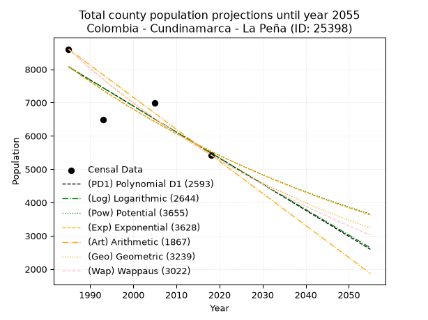
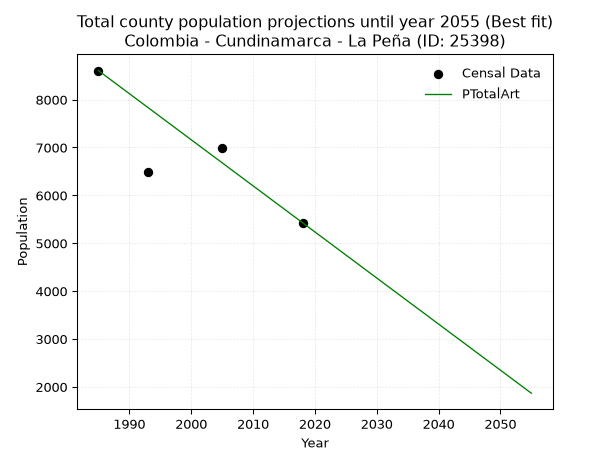
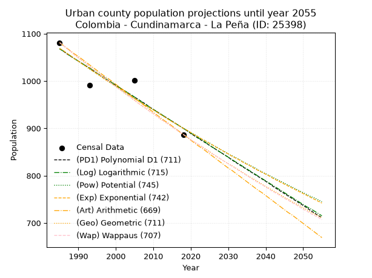
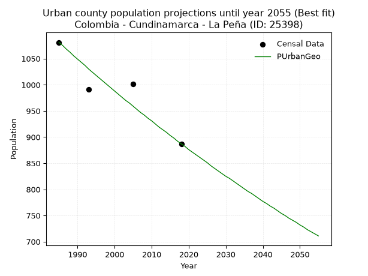
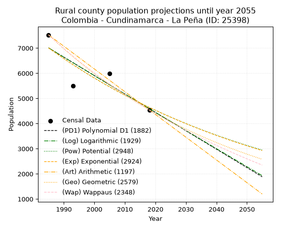
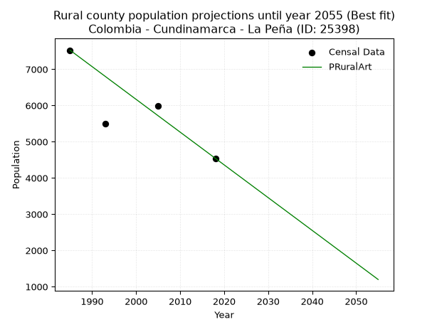

<div align="center">


</div>

# _“Population and Public Services Demand Projections (PPSD) until Year 2050 for Colombia - Cundinamarca - La Peña (ID: 25398)”_
Keywords: `population` `public-service` `projection` `lineal` `polynomial` `logarithmic` `potential` `exponential` `arithmetic` `geometric` `wappaus` `dane` `colombia` `south-america`

PPSD are analytical estimates used by governments and planners to anticipate future changes in population size, age distribution, and the resulting community needs for utilities, healthcare, education, and infrastructure as sizing future water treatment facilities, electrical grids, and road networks based on spatial growth.

> **General running parameters**: • app_version: _v20260806_. • Python version: _3.14.7_. • Pandas version: _3.0.5_. • NumPy version: _2.5.1_. • Creates, save and include plots into reports (create_plot): _True_. • Projection until year: _2050_. • Process polynomial degree 2 and up: _False_. • Process Wappaus: _True_. • Process Wappaus: _True_. • Set negative values to zero: _True_. • Set infinite values to zero: _True_. • Drop dataset notes: _True_. 
<div align="center">

Dynamic map: [:earth_americas:Google](http://maps.google.com/maps?q=5.198944853,-74.3941049) [:earth_americas:OSM](https://www.openstreetmap.org/#map=18/5.198944853/-74.3941049&layers=P) [:earth_americas:Bing](https://www.bing.com/maps?cp=5.198944853~-74.3941049&lvl=18) [:earth_americas:Apple](https://maps.apple.com/frame?center=5.198944853%2C-74.3941049&span=0.003%2C0.006)

</div>


<div align="center">

```geojson
{
  "type": "Feature",
  "geometry": {
    "type": "Point", 
    "coordinates": [-74.3941049, 5.198944853]
  }, 
  "properties": {
    "Name": "Colombia - Cundinamarca - La Peña (ID: 25398)"
  }
}
```

</div>


## 0. Census Data (4 records)

Census data are official statistics collected by a government about the people and housing in a country. They usually include counts of total population, age, sex, race, income, education, and jobs.

📅Global census file: [Population.xlsx](../data/Population.xlsx)

| Source   |   Year |   CountryID | CountryName   |   StateID | StateName    |   CountyID | CountyName   |   PTotal |   PUrban |   PRural |
|:---------|-------:|------------:|:--------------|----------:|:-------------|-----------:|:-------------|---------:|---------:|---------:|
| DANE     |   1985 |          57 | Colombia      |        25 | Cundinamarca |      25398 | La Peña      |     8606 |     1081 |     7525 |
| DANE     |   1993 |          57 | Colombia      |        25 | Cundinamarca |      25398 | La Peña      |     6492 |      991 |     5501 |
| DANE     |   2005 |          57 | Colombia      |        25 | Cundinamarca |      25398 | La Peña      |     6989 |     1001 |     5988 |
| DANE     |   2018 |          57 | Colombia      |        25 | Cundinamarca |      25398 | La Peña      |     5429 |      887 |     4542 |

> 🔥Some records has specific notes about the registered values or the corresponding urban or rural distribution.

## 1. Total

### 1.1. Coefficients and Parameters

* (PD1) Polynomial Deg 1: -78.27539140907173, 163449.35166599575 (lineal)
* (Log) Logarithmic: -156730.90513063374, 1198191.865860598
* (Pow) Potential: -22.895523721304908, 79.41143881937647
* (Exp) Exponential: -0.01143700222174152, 58462091635708.41
* (Art) Arithmetic: Year diff. 2018 - 1985 = 33, Population diff. 5429 - 8606 = -3177, Annual growth = -96.27272727272727
* (Geo) Geometric: Year diff. 2018 - 1985 = 33, Population diff. 5429 - 8606 = -3177, Annual growth % = -0.01386374854199135
* (Wap) Wappaus: i = -1.371894937979726, Condition values only valid for < 200)

<sub>
Wappaus condition values: ['-0.00', '-1.37', '-2.74', '-4.12', '-5.49', '-6.86', '-8.23', '-9.60', '-10.98', '-12.35', '-13.72', '-15.09', '-16.46', '-17.83', '-19.21', '-20.58', '-21.95', '-23.32', '-24.69', '-26.07', '-27.44', '-28.81', '-30.18', '-31.55', '-32.93', '-34.30', '-35.67', '-37.04', '-38.41', '-39.78', '-41.16', '-42.53', '-43.90', '-45.27', '-46.64', '-48.02', '-49.39', '-50.76', '-52.13', '-53.50', '-54.88', '-56.25', '-57.62', '-58.99', '-60.36', '-61.74', '-63.11', '-64.48', '-65.85', '-67.22', '-68.59', '-69.97', '-71.34', '-72.71', '-74.08', '-75.45', '-76.83', '-78.20', '-79.57', '-80.94', '-82.31', '-83.69', '-85.06', '-86.43', '-87.80', '-89.17']
</sub>


### 1.2. Projected Dataset

|   Year |   CountyID |   PTotalPD1 |   PTotalLog |   PTotalPow |   PTotalExp |   PTotalArt |   PTotalGeo |   PTotalWap |
|-------:|-----------:|------------:|------------:|------------:|------------:|------------:|------------:|------------:|
|   1985 |      25398 |        8073 |        8075 |        8081 |        8078 |        8606 |        8606 |        8606 |
|   1986 |      25398 |        7994 |        7997 |        7989 |        7987 |        8510 |        8487 |        8489 |
|   1987 |      25398 |        7916 |        7918 |        7897 |        7896 |        8413 |        8369 |        8373 |
|   1988 |      25398 |        7838 |        7839 |        7807 |        7806 |        8317 |        8253 |        8259 |
|   1989 |      25398 |        7760 |        7760 |        7717 |        7717 |        8221 |        8139 |        8146 |
|   1990 |      25398 |        7681 |        7681 |        7629 |        7629 |        8125 |        8026 |        8035 |
|   1991 |      25398 |        7603 |        7602 |        7542 |        7543 |        8028 |        7914 |        7926 |
|   1992 |      25398 |        7525 |        7524 |        7456 |        7457 |        7932 |        7805 |        7817 |
|   1993 |      25398 |        7446 |        7445 |        7370 |        7372 |        7836 |        7697 |        7711 |
|   1994 |      25398 |        7368 |        7366 |        7286 |        7288 |        7740 |        7590 |        7605 |
|   1995 |      25398 |        7290 |        7288 |        7203 |        7205 |        7643 |        7485 |        7501 |
|   1996 |      25398 |        7212 |        7209 |        7121 |        7123 |        7547 |        7381 |        7398 |
|   1997 |      25398 |        7133 |        7131 |        7040 |        7042 |        7451 |        7279 |        7297 |
|   1998 |      25398 |        7055 |        7052 |        6959 |        6962 |        7354 |        7178 |        7197 |
|   1999 |      25398 |        6977 |        6974 |        6880 |        6883 |        7258 |        7078 |        7098 |
|   2000 |      25398 |        6899 |        6896 |        6802 |        6805 |        7162 |        6980 |        7000 |
|   2001 |      25398 |        6820 |        6817 |        6724 |        6727 |        7066 |        6883 |        6904 |
|   2002 |      25398 |        6742 |        6739 |        6648 |        6651 |        6969 |        6788 |        6808 |
|   2003 |      25398 |        6664 |        6661 |        6572 |        6575 |        6873 |        6694 |        6714 |
|   2004 |      25398 |        6585 |        6582 |        6498 |        6501 |        6777 |        6601 |        6621 |
|   2005 |      25398 |        6507 |        6504 |        6424 |        6427 |        6681 |        6509 |        6530 |
|   2006 |      25398 |        6429 |        6426 |        6351 |        6354 |        6584 |        6419 |        6439 |
|   2007 |      25398 |        6351 |        6348 |        6279 |        6281 |        6488 |        6330 |        6349 |
|   2008 |      25398 |        6272 |        6270 |        6208 |        6210 |        6392 |        6242 |        6261 |
|   2009 |      25398 |        6194 |        6192 |        6137 |        6139 |        6295 |        6156 |        6173 |
|   2010 |      25398 |        6116 |        6114 |        6068 |        6069 |        6199 |        6070 |        6086 |
|   2011 |      25398 |        6038 |        6036 |        5999 |        6000 |        6103 |        5986 |        6001 |
|   2012 |      25398 |        5959 |        5958 |        5931 |        5932 |        6007 |        5903 |        5916 |
|   2013 |      25398 |        5881 |        5880 |        5864 |        5865 |        5910 |        5822 |        5833 |
|   2014 |      25398 |        5803 |        5802 |        5798 |        5798 |        5814 |        5741 |        5750 |
|   2015 |      25398 |        5724 |        5724 |        5732 |        5732 |        5718 |        5661 |        5669 |
|   2016 |      25398 |        5646 |        5647 |        5668 |        5667 |        5622 |        5583 |        5588 |
|   2017 |      25398 |        5568 |        5569 |        5604 |        5602 |        5525 |        5505 |        5508 |
|   2018 |      25398 |        5490 |        5491 |        5540 |        5539 |        5429 |        5429 |        5429 |
|   2019 |      25398 |        5411 |        5414 |        5478 |        5476 |        5333 |        5354 |        5351 |
|   2020 |      25398 |        5333 |        5336 |        5416 |        5414 |        5236 |        5280 |        5274 |
|   2021 |      25398 |        5255 |        5258 |        5355 |        5352 |        5140 |        5206 |        5197 |
|   2022 |      25398 |        5177 |        5181 |        5295 |        5291 |        5044 |        5134 |        5122 |
|   2023 |      25398 |        5098 |        5103 |        5235 |        5231 |        4948 |        5063 |        5047 |
|   2024 |      25398 |        5020 |        5026 |        5176 |        5171 |        4851 |        4993 |        4973 |
|   2025 |      25398 |        4942 |        4949 |        5118 |        5113 |        4755 |        4924 |        4900 |
|   2026 |      25398 |        4863 |        4871 |        5061 |        5054 |        4659 |        4855 |        4828 |
|   2027 |      25398 |        4785 |        4794 |        5004 |        4997 |        4563 |        4788 |        4756 |
|   2028 |      25398 |        4707 |        4717 |        4948 |        4940 |        4466 |        4722 |        4686 |
|   2029 |      25398 |        4629 |        4639 |        4892 |        4884 |        4370 |        4656 |        4616 |
|   2030 |      25398 |        4550 |        4562 |        4837 |        4828 |        4274 |        4592 |        4546 |
|   2031 |      25398 |        4472 |        4485 |        4783 |        4774 |        4177 |        4528 |        4478 |
|   2032 |      25398 |        4394 |        4408 |        4729 |        4719 |        4081 |        4465 |        4410 |
|   2033 |      25398 |        4315 |        4331 |        4676 |        4666 |        3985 |        4403 |        4343 |
|   2034 |      25398 |        4237 |        4254 |        4624 |        4613 |        3889 |        4342 |        4276 |
|   2035 |      25398 |        4159 |        4176 |        4572 |        4560 |        3792 |        4282 |        4210 |
|   2036 |      25398 |        4081 |        4099 |        4521 |        4508 |        3696 |        4223 |        4145 |
|   2037 |      25398 |        4002 |        4023 |        4471 |        4457 |        3600 |        4164 |        4081 |
|   2038 |      25398 |        3924 |        3946 |        4421 |        4406 |        3504 |        4106 |        4017 |
|   2039 |      25398 |        3846 |        3869 |        4371 |        4356 |        3407 |        4049 |        3954 |
|   2040 |      25398 |        3768 |        3792 |        4322 |        4307 |        3311 |        3993 |        3891 |
|   2041 |      25398 |        3689 |        3715 |        4274 |        4258 |        3215 |        3938 |        3829 |
|   2042 |      25398 |        3611 |        3638 |        4226 |        4209 |        3118 |        3883 |        3768 |
|   2043 |      25398 |        3533 |        3562 |        4179 |        4161 |        3022 |        3830 |        3707 |
|   2044 |      25398 |        3454 |        3485 |        4133 |        4114 |        2926 |        3776 |        3647 |
|   2045 |      25398 |        3376 |        3408 |        4087 |        4067 |        2830 |        3724 |        3588 |
|   2046 |      25398 |        3298 |        3332 |        4041 |        4021 |        2733 |        3672 |        3529 |
|   2047 |      25398 |        3220 |        3255 |        3996 |        3975 |        2637 |        3622 |        3470 |
|   2048 |      25398 |        3141 |        3178 |        3952 |        3930 |        2541 |        3571 |        3412 |
|   2049 |      25398 |        3063 |        3102 |        3908 |        3885 |        2445 |        3522 |        3355 |
|   2050 |      25398 |        2985 |        3025 |        3865 |        3841 |        2348 |        3473 |        3298 |
<div align="center">

</img>

</div>


### 1.3. Best fit with absolute error and relative error (%)

Relative error puts that difference into context by dividing the absolute error by the true value, creating a unitless ratio or percentage that shows the scale of the mistake.

Absolute and relative error

|   Year | Source   |   CountryID | CountryName   |   StateID | StateName    |   CountyID_x | CountyName   |   PTotal |   PUrban |   PRural |   CountyID_y |   PTotalPD1 |   PTotalLog |   PTotalPow |   PTotalExp |   PTotalArt |   PTotalGeo |   PTotalWap |   PTotalPD1AbsError |   PTotalLogAbsError |   PTotalPowAbsError |   PTotalExpAbsError |   PTotalArtAbsError |   PTotalGeoAbsError |   PTotalWapAbsError |   PTotalPD1RelError |   PTotalLogRelError |   PTotalPowRelError |   PTotalExpRelError |   PTotalArtRelError |   PTotalGeoRelError |   PTotalWapRelError |
|-------:|:---------|------------:|:--------------|----------:|:-------------|-------------:|:-------------|---------:|---------:|---------:|-------------:|------------:|------------:|------------:|------------:|------------:|------------:|------------:|--------------------:|--------------------:|--------------------:|--------------------:|--------------------:|--------------------:|--------------------:|--------------------:|--------------------:|--------------------:|--------------------:|--------------------:|--------------------:|--------------------:|
|   1985 | DANE     |          57 | Colombia      |        25 | Cundinamarca |        25398 | La Peña      |     8606 |     1081 |     7525 |        25398 |        8073 |        8075 |        8081 |        8078 |        8606 |        8606 |        8606 |                 533 |                 531 |                 525 |                 528 |                   0 |                   0 |                   0 |             6.19335 |             6.17011 |             6.1004  |             6.13525 |             0       |             0       |             0       |
|   1993 | DANE     |          57 | Colombia      |        25 | Cundinamarca |        25398 | La Peña      |     6492 |      991 |     5501 |        25398 |        7446 |        7445 |        7370 |        7372 |        7836 |        7697 |        7711 |                 954 |                 953 |                 878 |                 880 |                1344 |                1205 |                1219 |            14.695   |            14.6796  |            13.5243  |            13.5551  |            20.7024  |            18.5613  |            18.777   |
|   2005 | DANE     |          57 | Colombia      |        25 | Cundinamarca |        25398 | La Peña      |     6989 |     1001 |     5988 |        25398 |        6507 |        6504 |        6424 |        6427 |        6681 |        6509 |        6530 |                 482 |                 485 |                 565 |                 562 |                 308 |                 480 |                 459 |             6.89655 |             6.93948 |             8.08413 |             8.04121 |             4.40693 |             6.86794 |             6.56746 |
|   2018 | DANE     |          57 | Colombia      |        25 | Cundinamarca |        25398 | La Peña      |     5429 |      887 |     4542 |        25398 |        5490 |        5491 |        5540 |        5539 |        5429 |        5429 |        5429 |                  61 |                  62 |                 111 |                 110 |                   0 |                   0 |                   0 |             1.1236  |             1.14202 |             2.04458 |             2.02616 |             0       |             0       |             0       |

Relative error mean

| Method    |   RelError | Best   |
|:----------|-----------:|:-------|
| PTotalPD1 |    7.22713 |        |
| PTotalLog |    7.2328  |        |
| PTotalPow |    7.43836 |        |
| PTotalExp |    7.43944 |        |
| PTotalArt |    6.27733 | True   |
| PTotalGeo |    6.35731 |        |
| PTotalWap |    6.3361  |        |

💙Best method: _**PTotalArt**_
<div align="center">

</img>

</div>


### 1.4. Fresh water supply demand in liters per capita per day (lpcd)

The fresh water supply demand typically ranges from 100 to 300 liters per capita per day (lpcd) for standard domestic and municipal planning, though absolute survival minimums set by the World Health Organization are as low as 7.5 to 20 liters per day, and total consumption in high-income nations can exceed 400 liters.

> `CZ`: Level in meters above the sea level (masl).<br> `WS`: Fresh water supply demand in liters per capita per day (lpcd or l/h/d).<br> `WSAll`: Zonal fresh water supply demand in liters per second (l/s).<br> `A`: Zonal area in square meters.

Reference values (RAS Colombia)

|    CZ |   WS |
|------:|-----:|
|  1000 |  120 |
|  2000 |  130 |
| 99999 |  140 |

County shapefile geometry properties and water supply values

|   CountyID |      ATotal |   CZTotal |   WSTotal |
|-----------:|------------:|----------:|----------:|
|      25398 | 1.28338e+08 |    1078.8 |       130 |

Projected values for best method: PTotalArt

|   CountyID |   Year |   PTotalArt |   WSTotal |   WSTotalAll |
|-----------:|-------:|------------:|----------:|-------------:|
|      25398 |   1985 |        8606 |       130 |     12.9488  |
|      25398 |   1986 |        8510 |       130 |     12.8044  |
|      25398 |   1987 |        8413 |       130 |     12.6584  |
|      25398 |   1988 |        8317 |       130 |     12.514   |
|      25398 |   1989 |        8221 |       130 |     12.3696  |
|      25398 |   1990 |        8125 |       130 |     12.2251  |
|      25398 |   1991 |        8028 |       130 |     12.0792  |
|      25398 |   1992 |        7932 |       130 |     11.9347  |
|      25398 |   1993 |        7836 |       130 |     11.7903  |
|      25398 |   1994 |        7740 |       130 |     11.6458  |
|      25398 |   1995 |        7643 |       130 |     11.4999  |
|      25398 |   1996 |        7547 |       130 |     11.3554  |
|      25398 |   1997 |        7451 |       130 |     11.211   |
|      25398 |   1998 |        7354 |       130 |     11.065   |
|      25398 |   1999 |        7258 |       130 |     10.9206  |
|      25398 |   2000 |        7162 |       130 |     10.7762  |
|      25398 |   2001 |        7066 |       130 |     10.6317  |
|      25398 |   2002 |        6969 |       130 |     10.4858  |
|      25398 |   2003 |        6873 |       130 |     10.3413  |
|      25398 |   2004 |        6777 |       130 |     10.1969  |
|      25398 |   2005 |        6681 |       130 |     10.0524  |
|      25398 |   2006 |        6584 |       130 |      9.90648 |
|      25398 |   2007 |        6488 |       130 |      9.76204 |
|      25398 |   2008 |        6392 |       130 |      9.61759 |
|      25398 |   2009 |        6295 |       130 |      9.47164 |
|      25398 |   2010 |        6199 |       130 |      9.3272  |
|      25398 |   2011 |        6103 |       130 |      9.18275 |
|      25398 |   2012 |        6007 |       130 |      9.03831 |
|      25398 |   2013 |        5910 |       130 |      8.89236 |
|      25398 |   2014 |        5814 |       130 |      8.74792 |
|      25398 |   2015 |        5718 |       130 |      8.60347 |
|      25398 |   2016 |        5622 |       130 |      8.45903 |
|      25398 |   2017 |        5525 |       130 |      8.31308 |
|      25398 |   2018 |        5429 |       130 |      8.16863 |
|      25398 |   2019 |        5333 |       130 |      8.02419 |
|      25398 |   2020 |        5236 |       130 |      7.87824 |
|      25398 |   2021 |        5140 |       130 |      7.7338  |
|      25398 |   2022 |        5044 |       130 |      7.58935 |
|      25398 |   2023 |        4948 |       130 |      7.44491 |
|      25398 |   2024 |        4851 |       130 |      7.29896 |
|      25398 |   2025 |        4755 |       130 |      7.15451 |
|      25398 |   2026 |        4659 |       130 |      7.01007 |
|      25398 |   2027 |        4563 |       130 |      6.86562 |
|      25398 |   2028 |        4466 |       130 |      6.71968 |
|      25398 |   2029 |        4370 |       130 |      6.57523 |
|      25398 |   2030 |        4274 |       130 |      6.43079 |
|      25398 |   2031 |        4177 |       130 |      6.28484 |
|      25398 |   2032 |        4081 |       130 |      6.14039 |
|      25398 |   2033 |        3985 |       130 |      5.99595 |
|      25398 |   2034 |        3889 |       130 |      5.8515  |
|      25398 |   2035 |        3792 |       130 |      5.70556 |
|      25398 |   2036 |        3696 |       130 |      5.56111 |
|      25398 |   2037 |        3600 |       130 |      5.41667 |
|      25398 |   2038 |        3504 |       130 |      5.27222 |
|      25398 |   2039 |        3407 |       130 |      5.12627 |
|      25398 |   2040 |        3311 |       130 |      4.98183 |
|      25398 |   2041 |        3215 |       130 |      4.83738 |
|      25398 |   2042 |        3118 |       130 |      4.69144 |
|      25398 |   2043 |        3022 |       130 |      4.54699 |
|      25398 |   2044 |        2926 |       130 |      4.40255 |
|      25398 |   2045 |        2830 |       130 |      4.2581  |
|      25398 |   2046 |        2733 |       130 |      4.11215 |
|      25398 |   2047 |        2637 |       130 |      3.96771 |
|      25398 |   2048 |        2541 |       130 |      3.82326 |
|      25398 |   2049 |        2445 |       130 |      3.67882 |
|      25398 |   2050 |        2348 |       130 |      3.53287 |

## 2. Urban

### 2.1. Coefficients and Parameters

* (PD1) Polynomial Deg 1: -5.091930951425061, 11175.134885587977 (lineal)
* (Log) Logarithmic: -10190.561690221646, 78448.54106941109
* (Pow) Potential: -10.430350582698905, 37.425942543136074
* (Exp) Exponential: -0.005212178972537868, 33294408.17633056
* (Art) Arithmetic: Year diff. 2018 - 1985 = 33, Population diff. 887 - 1081 = -194, Annual growth = -5.878787878787879
* (Geo) Geometric: Year diff. 2018 - 1985 = 33, Population diff. 887 - 1081 = -194, Annual growth % = -0.0059759162504992025
* (Wap) Wappaus: i = -0.5974377925597438, Condition values only valid for < 200)

<sub>
Wappaus condition values: ['-0.00', '-0.60', '-1.19', '-1.79', '-2.39', '-2.99', '-3.58', '-4.18', '-4.78', '-5.38', '-5.97', '-6.57', '-7.17', '-7.77', '-8.36', '-8.96', '-9.56', '-10.16', '-10.75', '-11.35', '-11.95', '-12.55', '-13.14', '-13.74', '-14.34', '-14.94', '-15.53', '-16.13', '-16.73', '-17.33', '-17.92', '-18.52', '-19.12', '-19.72', '-20.31', '-20.91', '-21.51', '-22.11', '-22.70', '-23.30', '-23.90', '-24.49', '-25.09', '-25.69', '-26.29', '-26.88', '-27.48', '-28.08', '-28.68', '-29.27', '-29.87', '-30.47', '-31.07', '-31.66', '-32.26', '-32.86', '-33.46', '-34.05', '-34.65', '-35.25', '-35.85', '-36.44', '-37.04', '-37.64', '-38.24', '-38.83']
</sub>


### 2.2. Projected Dataset

|   Year |   CountyID |   PUrbanPD1 |   PUrbanLog |   PUrbanPow |   PUrbanExp |   PUrbanArt |   PUrbanGeo |   PUrbanWap |
|-------:|-----------:|------------:|------------:|------------:|------------:|------------:|------------:|------------:|
|   1985 |      25398 |        1068 |        1068 |        1069 |        1069 |        1081 |        1081 |        1081 |
|   1986 |      25398 |        1063 |        1063 |        1064 |        1064 |        1075 |        1075 |        1075 |
|   1987 |      25398 |        1057 |        1058 |        1058 |        1058 |        1069 |        1068 |        1068 |
|   1988 |      25398 |        1052 |        1052 |        1053 |        1053 |        1063 |        1062 |        1062 |
|   1989 |      25398 |        1047 |        1047 |        1047 |        1047 |        1057 |        1055 |        1055 |
|   1990 |      25398 |        1042 |        1042 |        1042 |        1042 |        1052 |        1049 |        1049 |
|   1991 |      25398 |        1037 |        1037 |        1036 |        1036 |        1046 |        1043 |        1043 |
|   1992 |      25398 |        1032 |        1032 |        1031 |        1031 |        1040 |        1037 |        1037 |
|   1993 |      25398 |        1027 |        1027 |        1025 |        1026 |        1034 |        1030 |        1031 |
|   1994 |      25398 |        1022 |        1022 |        1020 |        1020 |        1028 |        1024 |        1024 |
|   1995 |      25398 |        1017 |        1017 |        1015 |        1015 |        1022 |        1018 |        1018 |
|   1996 |      25398 |        1012 |        1011 |        1010 |        1010 |        1016 |        1012 |        1012 |
|   1997 |      25398 |        1007 |        1006 |        1004 |        1004 |        1010 |        1006 |        1006 |
|   1998 |      25398 |        1001 |        1001 |         999 |         999 |        1005 |        1000 |        1000 |
|   1999 |      25398 |         996 |         996 |         994 |         994 |         999 |         994 |         994 |
|   2000 |      25398 |         991 |         991 |         989 |         989 |         993 |         988 |         988 |
|   2001 |      25398 |         986 |         986 |         984 |         984 |         987 |         982 |         982 |
|   2002 |      25398 |         981 |         981 |         978 |         979 |         981 |         976 |         977 |
|   2003 |      25398 |         976 |         976 |         973 |         974 |         975 |         970 |         971 |
|   2004 |      25398 |         971 |         971 |         968 |         968 |         969 |         965 |         965 |
|   2005 |      25398 |         966 |         966 |         963 |         963 |         963 |         959 |         959 |
|   2006 |      25398 |         961 |         961 |         958 |         958 |         958 |         953 |         953 |
|   2007 |      25398 |         956 |         955 |         953 |         953 |         952 |         947 |         948 |
|   2008 |      25398 |         951 |         950 |         948 |         948 |         946 |         942 |         942 |
|   2009 |      25398 |         945 |         945 |         943 |         944 |         940 |         936 |         936 |
|   2010 |      25398 |         940 |         940 |         939 |         939 |         934 |         931 |         931 |
|   2011 |      25398 |         935 |         935 |         934 |         934 |         928 |         925 |         925 |
|   2012 |      25398 |         930 |         930 |         929 |         929 |         922 |         919 |         920 |
|   2013 |      25398 |         925 |         925 |         924 |         924 |         916 |         914 |         914 |
|   2014 |      25398 |         920 |         920 |         919 |         919 |         911 |         909 |         909 |
|   2015 |      25398 |         915 |         915 |         915 |         914 |         905 |         903 |         903 |
|   2016 |      25398 |         910 |         910 |         910 |         910 |         899 |         898 |         898 |
|   2017 |      25398 |         905 |         905 |         905 |         905 |         893 |         892 |         892 |
|   2018 |      25398 |         900 |         900 |         900 |         900 |         887 |         887 |         887 |
|   2019 |      25398 |         895 |         895 |         896 |         896 |         881 |         882 |         882 |
|   2020 |      25398 |         889 |         890 |         891 |         891 |         875 |         876 |         876 |
|   2021 |      25398 |         884 |         885 |         887 |         886 |         869 |         871 |         871 |
|   2022 |      25398 |         879 |         880 |         882 |         882 |         863 |         866 |         866 |
|   2023 |      25398 |         874 |         875 |         877 |         877 |         858 |         861 |         861 |
|   2024 |      25398 |         869 |         870 |         873 |         873 |         852 |         856 |         855 |
|   2025 |      25398 |         864 |         864 |         869 |         868 |         846 |         851 |         850 |
|   2026 |      25398 |         859 |         859 |         864 |         864 |         840 |         845 |         845 |
|   2027 |      25398 |         854 |         854 |         860 |         859 |         834 |         840 |         840 |
|   2028 |      25398 |         849 |         849 |         855 |         855 |         828 |         835 |         835 |
|   2029 |      25398 |         844 |         844 |         851 |         850 |         822 |         830 |         830 |
|   2030 |      25398 |         839 |         839 |         846 |         846 |         816 |         825 |         825 |
|   2031 |      25398 |         833 |         834 |         842 |         841 |         811 |         821 |         820 |
|   2032 |      25398 |         828 |         829 |         838 |         837 |         805 |         816 |         815 |
|   2033 |      25398 |         823 |         824 |         834 |         833 |         799 |         811 |         810 |
|   2034 |      25398 |         818 |         819 |         829 |         828 |         793 |         806 |         805 |
|   2035 |      25398 |         813 |         814 |         825 |         824 |         787 |         801 |         800 |
|   2036 |      25398 |         808 |         809 |         821 |         820 |         781 |         796 |         795 |
|   2037 |      25398 |         803 |         804 |         817 |         815 |         775 |         792 |         790 |
|   2038 |      25398 |         798 |         799 |         812 |         811 |         769 |         787 |         785 |
|   2039 |      25398 |         793 |         794 |         808 |         807 |         764 |         782 |         781 |
|   2040 |      25398 |         788 |         789 |         804 |         803 |         758 |         777 |         776 |
|   2041 |      25398 |         783 |         784 |         800 |         799 |         752 |         773 |         771 |
|   2042 |      25398 |         777 |         779 |         796 |         794 |         746 |         768 |         766 |
|   2043 |      25398 |         772 |         774 |         792 |         790 |         740 |         764 |         762 |
|   2044 |      25398 |         767 |         769 |         788 |         786 |         734 |         759 |         757 |
|   2045 |      25398 |         762 |         764 |         784 |         782 |         728 |         754 |         752 |
|   2046 |      25398 |         757 |         759 |         780 |         778 |         722 |         750 |         748 |
|   2047 |      25398 |         752 |         754 |         776 |         774 |         717 |         745 |         743 |
|   2048 |      25398 |         747 |         749 |         772 |         770 |         711 |         741 |         739 |
|   2049 |      25398 |         742 |         744 |         768 |         766 |         705 |         737 |         734 |
|   2050 |      25398 |         737 |         739 |         764 |         762 |         699 |         732 |         729 |
<div align="center">

</img>

</div>


### 2.3. Best fit with absolute error and relative error (%)

Relative error puts that difference into context by dividing the absolute error by the true value, creating a unitless ratio or percentage that shows the scale of the mistake.

Absolute and relative error

|   Year | Source   |   CountryID | CountryName   |   StateID | StateName    |   CountyID_x | CountyName   |   PTotal |   PUrban |   PRural |   CountyID_y |   PUrbanPD1 |   PUrbanLog |   PUrbanPow |   PUrbanExp |   PUrbanArt |   PUrbanGeo |   PUrbanWap |   PUrbanPD1AbsError |   PUrbanLogAbsError |   PUrbanPowAbsError |   PUrbanExpAbsError |   PUrbanArtAbsError |   PUrbanGeoAbsError |   PUrbanWapAbsError |   PUrbanPD1RelError |   PUrbanLogRelError |   PUrbanPowRelError |   PUrbanExpRelError |   PUrbanArtRelError |   PUrbanGeoRelError |   PUrbanWapRelError |
|-------:|:---------|------------:|:--------------|----------:|:-------------|-------------:|:-------------|---------:|---------:|---------:|-------------:|------------:|------------:|------------:|------------:|------------:|------------:|------------:|--------------------:|--------------------:|--------------------:|--------------------:|--------------------:|--------------------:|--------------------:|--------------------:|--------------------:|--------------------:|--------------------:|--------------------:|--------------------:|--------------------:|
|   1985 | DANE     |          57 | Colombia      |        25 | Cundinamarca |        25398 | La Peña      |     8606 |     1081 |     7525 |        25398 |        1068 |        1068 |        1069 |        1069 |        1081 |        1081 |        1081 |                  13 |                  13 |                  12 |                  12 |                   0 |                   0 |                   0 |             1.20259 |             1.20259 |             1.11008 |             1.11008 |             0       |             0       |             0       |
|   1993 | DANE     |          57 | Colombia      |        25 | Cundinamarca |        25398 | La Peña      |     6492 |      991 |     5501 |        25398 |        1027 |        1027 |        1025 |        1026 |        1034 |        1030 |        1031 |                  36 |                  36 |                  34 |                  35 |                  43 |                  39 |                  40 |             3.63269 |             3.63269 |             3.43088 |             3.53179 |             4.33905 |             3.93542 |             4.03633 |
|   2005 | DANE     |          57 | Colombia      |        25 | Cundinamarca |        25398 | La Peña      |     6989 |     1001 |     5988 |        25398 |         966 |         966 |         963 |         963 |         963 |         959 |         959 |                  35 |                  35 |                  38 |                  38 |                  38 |                  42 |                  42 |             3.4965  |             3.4965  |             3.7962  |             3.7962  |             3.7962  |             4.1958  |             4.1958  |
|   2018 | DANE     |          57 | Colombia      |        25 | Cundinamarca |        25398 | La Peña      |     5429 |      887 |     4542 |        25398 |         900 |         900 |         900 |         900 |         887 |         887 |         887 |                  13 |                  13 |                  13 |                  13 |                   0 |                   0 |                   0 |             1.46561 |             1.46561 |             1.46561 |             1.46561 |             0       |             0       |             0       |

Relative error mean

| Method    |   RelError | Best   |
|:----------|-----------:|:-------|
| PUrbanPD1 |    2.44935 |        |
| PUrbanLog |    2.44935 |        |
| PUrbanPow |    2.45069 |        |
| PUrbanExp |    2.47592 |        |
| PUrbanArt |    2.03381 |        |
| PUrbanGeo |    2.03281 | True   |
| PUrbanWap |    2.05803 |        |

💙Best method: _**PUrbanGeo**_
<div align="center">

</img>

</div>


### 2.4. Fresh water supply demand in liters per capita per day (lpcd)

The fresh water supply demand typically ranges from 100 to 300 liters per capita per day (lpcd) for standard domestic and municipal planning, though absolute survival minimums set by the World Health Organization are as low as 7.5 to 20 liters per day, and total consumption in high-income nations can exceed 400 liters.

> `CZ`: Level in meters above the sea level (masl).<br> `WS`: Fresh water supply demand in liters per capita per day (lpcd or l/h/d).<br> `WSAll`: Zonal fresh water supply demand in liters per second (l/s).<br> `A`: Zonal area in square meters.

Reference values (RAS Colombia)

|    CZ |   WS |
|------:|-----:|
|  1000 |  120 |
|  2000 |  130 |
| 99999 |  140 |

County shapefile geometry properties and water supply values

|   CountyID |   AUrban |   CZUrban |   WSUrban |
|-----------:|---------:|----------:|----------:|
|      25398 |   183566 |   1236.45 |       130 |

Projected values for best method: PUrbanGeo

|   CountyID |   Year |   PUrbanGeo |   WSUrban |   WSUrbanAll |
|-----------:|-------:|------------:|----------:|-------------:|
|      25398 |   1985 |        1081 |       130 |      1.6265  |
|      25398 |   1986 |        1075 |       130 |      1.61748 |
|      25398 |   1987 |        1068 |       130 |      1.60694 |
|      25398 |   1988 |        1062 |       130 |      1.59792 |
|      25398 |   1989 |        1055 |       130 |      1.58738 |
|      25398 |   1990 |        1049 |       130 |      1.57836 |
|      25398 |   1991 |        1043 |       130 |      1.56933 |
|      25398 |   1992 |        1037 |       130 |      1.5603  |
|      25398 |   1993 |        1030 |       130 |      1.54977 |
|      25398 |   1994 |        1024 |       130 |      1.54074 |
|      25398 |   1995 |        1018 |       130 |      1.53171 |
|      25398 |   1996 |        1012 |       130 |      1.52269 |
|      25398 |   1997 |        1006 |       130 |      1.51366 |
|      25398 |   1998 |        1000 |       130 |      1.50463 |
|      25398 |   1999 |         994 |       130 |      1.4956  |
|      25398 |   2000 |         988 |       130 |      1.48657 |
|      25398 |   2001 |         982 |       130 |      1.47755 |
|      25398 |   2002 |         976 |       130 |      1.46852 |
|      25398 |   2003 |         970 |       130 |      1.45949 |
|      25398 |   2004 |         965 |       130 |      1.45197 |
|      25398 |   2005 |         959 |       130 |      1.44294 |
|      25398 |   2006 |         953 |       130 |      1.43391 |
|      25398 |   2007 |         947 |       130 |      1.42488 |
|      25398 |   2008 |         942 |       130 |      1.41736 |
|      25398 |   2009 |         936 |       130 |      1.40833 |
|      25398 |   2010 |         931 |       130 |      1.40081 |
|      25398 |   2011 |         925 |       130 |      1.39178 |
|      25398 |   2012 |         919 |       130 |      1.38275 |
|      25398 |   2013 |         914 |       130 |      1.37523 |
|      25398 |   2014 |         909 |       130 |      1.36771 |
|      25398 |   2015 |         903 |       130 |      1.35868 |
|      25398 |   2016 |         898 |       130 |      1.35116 |
|      25398 |   2017 |         892 |       130 |      1.34213 |
|      25398 |   2018 |         887 |       130 |      1.33461 |
|      25398 |   2019 |         882 |       130 |      1.32708 |
|      25398 |   2020 |         876 |       130 |      1.31806 |
|      25398 |   2021 |         871 |       130 |      1.31053 |
|      25398 |   2022 |         866 |       130 |      1.30301 |
|      25398 |   2023 |         861 |       130 |      1.29549 |
|      25398 |   2024 |         856 |       130 |      1.28796 |
|      25398 |   2025 |         851 |       130 |      1.28044 |
|      25398 |   2026 |         845 |       130 |      1.27141 |
|      25398 |   2027 |         840 |       130 |      1.26389 |
|      25398 |   2028 |         835 |       130 |      1.25637 |
|      25398 |   2029 |         830 |       130 |      1.24884 |
|      25398 |   2030 |         825 |       130 |      1.24132 |
|      25398 |   2031 |         821 |       130 |      1.2353  |
|      25398 |   2032 |         816 |       130 |      1.22778 |
|      25398 |   2033 |         811 |       130 |      1.22025 |
|      25398 |   2034 |         806 |       130 |      1.21273 |
|      25398 |   2035 |         801 |       130 |      1.20521 |
|      25398 |   2036 |         796 |       130 |      1.19769 |
|      25398 |   2037 |         792 |       130 |      1.19167 |
|      25398 |   2038 |         787 |       130 |      1.18414 |
|      25398 |   2039 |         782 |       130 |      1.17662 |
|      25398 |   2040 |         777 |       130 |      1.1691  |
|      25398 |   2041 |         773 |       130 |      1.16308 |
|      25398 |   2042 |         768 |       130 |      1.15556 |
|      25398 |   2043 |         764 |       130 |      1.14954 |
|      25398 |   2044 |         759 |       130 |      1.14201 |
|      25398 |   2045 |         754 |       130 |      1.13449 |
|      25398 |   2046 |         750 |       130 |      1.12847 |
|      25398 |   2047 |         745 |       130 |      1.12095 |
|      25398 |   2048 |         741 |       130 |      1.11493 |
|      25398 |   2049 |         737 |       130 |      1.10891 |
|      25398 |   2050 |         732 |       130 |      1.10139 |

## 3. Rural

### 3.1. Coefficients and Parameters

* (PD1) Polynomial Deg 1: -73.18346045764667, 152274.21678040776 (lineal)
* (Log) Logarithmic: -146540.34344041217, 1119743.324791187
* (Pow) Potential: -24.994189900659876, 86.27058561825386
* (Exp) Exponential: -0.012485173025101569, 406170454516720.8
* (Art) Arithmetic: Year diff. 2018 - 1985 = 33, Population diff. 4542 - 7525 = -2983, Annual growth = -90.39393939393939
* (Geo) Geometric: Year diff. 2018 - 1985 = 33, Population diff. 4542 - 7525 = -2983, Annual growth % = -0.015182456415372969
* (Wap) Wappaus: i = -1.498200702642569, Condition values only valid for < 200)

<sub>
Wappaus condition values: ['-0.00', '-1.50', '-3.00', '-4.49', '-5.99', '-7.49', '-8.99', '-10.49', '-11.99', '-13.48', '-14.98', '-16.48', '-17.98', '-19.48', '-20.97', '-22.47', '-23.97', '-25.47', '-26.97', '-28.47', '-29.96', '-31.46', '-32.96', '-34.46', '-35.96', '-37.46', '-38.95', '-40.45', '-41.95', '-43.45', '-44.95', '-46.44', '-47.94', '-49.44', '-50.94', '-52.44', '-53.94', '-55.43', '-56.93', '-58.43', '-59.93', '-61.43', '-62.92', '-64.42', '-65.92', '-67.42', '-68.92', '-70.42', '-71.91', '-73.41', '-74.91', '-76.41', '-77.91', '-79.40', '-80.90', '-82.40', '-83.90', '-85.40', '-86.90', '-88.39', '-89.89', '-91.39', '-92.89', '-94.39', '-95.88', '-97.38']
</sub>


### 3.2. Projected Dataset

|   Year |   CountyID |   PRuralPD1 |   PRuralLog |   PRuralPow |   PRuralExp |   PRuralArt |   PRuralGeo |   PRuralWap |
|-------:|-----------:|------------:|------------:|------------:|------------:|------------:|------------:|------------:|
|   1985 |      25398 |        7005 |        7008 |        7010 |        7007 |        7525 |        7525 |        7525 |
|   1986 |      25398 |        6932 |        6934 |        6923 |        6920 |        7435 |        7411 |        7413 |
|   1987 |      25398 |        6859 |        6860 |        6836 |        6835 |        7344 |        7298 |        7303 |
|   1988 |      25398 |        6785 |        6786 |        6751 |        6750 |        7254 |        7187 |        7194 |
|   1989 |      25398 |        6712 |        6713 |        6666 |        6666 |        7163 |        7078 |        7087 |
|   1990 |      25398 |        6639 |        6639 |        6583 |        6583 |        7073 |        6971 |        6982 |
|   1991 |      25398 |        6566 |        6565 |        6501 |        6502 |        6983 |        6865 |        6878 |
|   1992 |      25398 |        6493 |        6492 |        6420 |        6421 |        6892 |        6761 |        6775 |
|   1993 |      25398 |        6420 |        6418 |        6340 |        6341 |        6802 |        6658 |        6674 |
|   1994 |      25398 |        6346 |        6345 |        6261 |        6263 |        6711 |        6557 |        6574 |
|   1995 |      25398 |        6273 |        6271 |        6183 |        6185 |        6621 |        6457 |        6476 |
|   1996 |      25398 |        6200 |        6198 |        6106 |        6108 |        6531 |        6359 |        6379 |
|   1997 |      25398 |        6127 |        6124 |        6030 |        6032 |        6440 |        6263 |        6284 |
|   1998 |      25398 |        6054 |        6051 |        5955 |        5958 |        6350 |        6168 |        6189 |
|   1999 |      25398 |        5980 |        5978 |        5881 |        5884 |        6259 |        6074 |        6096 |
|   2000 |      25398 |        5907 |        5904 |        5808 |        5811 |        6169 |        5982 |        6005 |
|   2001 |      25398 |        5834 |        5831 |        5736 |        5739 |        6079 |        5891 |        5914 |
|   2002 |      25398 |        5761 |        5758 |        5665 |        5667 |        5988 |        5802 |        5825 |
|   2003 |      25398 |        5688 |        5685 |        5594 |        5597 |        5898 |        5714 |        5737 |
|   2004 |      25398 |        5615 |        5612 |        5525 |        5528 |        5808 |        5627 |        5650 |
|   2005 |      25398 |        5541 |        5539 |        5456 |        5459 |        5717 |        5541 |        5564 |
|   2006 |      25398 |        5468 |        5466 |        5389 |        5391 |        5627 |        5457 |        5479 |
|   2007 |      25398 |        5395 |        5392 |        5322 |        5324 |        5536 |        5374 |        5396 |
|   2008 |      25398 |        5322 |        5319 |        5256 |        5258 |        5446 |        5293 |        5313 |
|   2009 |      25398 |        5249 |        5247 |        5191 |        5193 |        5356 |        5212 |        5232 |
|   2010 |      25398 |        5175 |        5174 |        5127 |        5129 |        5265 |        5133 |        5151 |
|   2011 |      25398 |        5102 |        5101 |        5064 |        5065 |        5175 |        5055 |        5072 |
|   2012 |      25398 |        5029 |        5028 |        5001 |        5002 |        5084 |        4979 |        4993 |
|   2013 |      25398 |        4956 |        4955 |        4940 |        4940 |        4994 |        4903 |        4916 |
|   2014 |      25398 |        4883 |        4882 |        4879 |        4879 |        4904 |        4829 |        4839 |
|   2015 |      25398 |        4810 |        4810 |        4818 |        4818 |        4813 |        4755 |        4763 |
|   2016 |      25398 |        4736 |        4737 |        4759 |        4758 |        4723 |        4683 |        4689 |
|   2017 |      25398 |        4663 |        4664 |        4700 |        4699 |        4632 |        4612 |        4615 |
|   2018 |      25398 |        4590 |        4592 |        4643 |        4641 |        4542 |        4542 |        4542 |
|   2019 |      25398 |        4517 |        4519 |        4585 |        4584 |        4452 |        4473 |        4470 |
|   2020 |      25398 |        4444 |        4446 |        4529 |        4527 |        4361 |        4405 |        4399 |
|   2021 |      25398 |        4370 |        4374 |        4473 |        4471 |        4271 |        4338 |        4328 |
|   2022 |      25398 |        4297 |        4301 |        4418 |        4415 |        4180 |        4272 |        4259 |
|   2023 |      25398 |        4224 |        4229 |        4364 |        4360 |        4090 |        4208 |        4190 |
|   2024 |      25398 |        4151 |        4156 |        4311 |        4306 |        4000 |        4144 |        4122 |
|   2025 |      25398 |        4078 |        4084 |        4258 |        4253 |        3909 |        4081 |        4055 |
|   2026 |      25398 |        4005 |        4012 |        4205 |        4200 |        3819 |        4019 |        3989 |
|   2027 |      25398 |        3931 |        3939 |        4154 |        4148 |        3728 |        3958 |        3923 |
|   2028 |      25398 |        3858 |        3867 |        4103 |        4096 |        3638 |        3898 |        3858 |
|   2029 |      25398 |        3785 |        3795 |        4053 |        4046 |        3548 |        3838 |        3794 |
|   2030 |      25398 |        3712 |        3723 |        4003 |        3995 |        3457 |        3780 |        3731 |
|   2031 |      25398 |        3639 |        3651 |        3954 |        3946 |        3367 |        3723 |        3668 |
|   2032 |      25398 |        3565 |        3578 |        3906 |        3897 |        3276 |        3666 |        3606 |
|   2033 |      25398 |        3492 |        3506 |        3858 |        3848 |        3186 |        3611 |        3545 |
|   2034 |      25398 |        3419 |        3434 |        3811 |        3801 |        3096 |        3556 |        3484 |
|   2035 |      25398 |        3346 |        3362 |        3764 |        3754 |        3005 |        3502 |        3424 |
|   2036 |      25398 |        3273 |        3290 |        3718 |        3707 |        2915 |        3449 |        3365 |
|   2037 |      25398 |        3200 |        3218 |        3673 |        3661 |        2825 |        3396 |        3306 |
|   2038 |      25398 |        3126 |        3146 |        3628 |        3616 |        2734 |        3345 |        3248 |
|   2039 |      25398 |        3053 |        3074 |        3584 |        3571 |        2644 |        3294 |        3190 |
|   2040 |      25398 |        2980 |        3003 |        3540 |        3526 |        2553 |        3244 |        3134 |
|   2041 |      25398 |        2907 |        2931 |        3497 |        3483 |        2463 |        3195 |        3077 |
|   2042 |      25398 |        2834 |        2859 |        3455 |        3439 |        2373 |        3146 |        3022 |
|   2043 |      25398 |        2760 |        2787 |        3413 |        3397 |        2282 |        3098 |        2967 |
|   2044 |      25398 |        2687 |        2716 |        3371 |        3355 |        2192 |        3051 |        2912 |
|   2045 |      25398 |        2614 |        2644 |        3330 |        3313 |        2101 |        3005 |        2858 |
|   2046 |      25398 |        2541 |        2572 |        3290 |        3272 |        2011 |        2959 |        2805 |
|   2047 |      25398 |        2468 |        2501 |        3250 |        3231 |        1921 |        2915 |        2752 |
|   2048 |      25398 |        2394 |        2429 |        3211 |        3191 |        1830 |        2870 |        2700 |
|   2049 |      25398 |        2321 |        2358 |        3172 |        3152 |        1740 |        2827 |        2648 |
|   2050 |      25398 |        2248 |        2286 |        3133 |        3113 |        1649 |        2784 |        2597 |
<div align="center">

</img>

</div>


### 3.3. Best fit with absolute error and relative error (%)

Relative error puts that difference into context by dividing the absolute error by the true value, creating a unitless ratio or percentage that shows the scale of the mistake.

Absolute and relative error

|   Year | Source   |   CountryID | CountryName   |   StateID | StateName    |   CountyID_x | CountyName   |   PTotal |   PUrban |   PRural |   CountyID_y |   PRuralPD1 |   PRuralLog |   PRuralPow |   PRuralExp |   PRuralArt |   PRuralGeo |   PRuralWap |   PRuralPD1AbsError |   PRuralLogAbsError |   PRuralPowAbsError |   PRuralExpAbsError |   PRuralArtAbsError |   PRuralGeoAbsError |   PRuralWapAbsError |   PRuralPD1RelError |   PRuralLogRelError |   PRuralPowRelError |   PRuralExpRelError |   PRuralArtRelError |   PRuralGeoRelError |   PRuralWapRelError |
|-------:|:---------|------------:|:--------------|----------:|:-------------|-------------:|:-------------|---------:|---------:|---------:|-------------:|------------:|------------:|------------:|------------:|------------:|------------:|------------:|--------------------:|--------------------:|--------------------:|--------------------:|--------------------:|--------------------:|--------------------:|--------------------:|--------------------:|--------------------:|--------------------:|--------------------:|--------------------:|--------------------:|
|   1985 | DANE     |          57 | Colombia      |        25 | Cundinamarca |        25398 | La Peña      |     8606 |     1081 |     7525 |        25398 |        7005 |        7008 |        7010 |        7007 |        7525 |        7525 |        7525 |                 520 |                 517 |                 515 |                 518 |                   0 |                   0 |                   0 |             6.9103  |             6.87043 |             6.84385 |             6.88372 |             0       |             0       |             0       |
|   1993 | DANE     |          57 | Colombia      |        25 | Cundinamarca |        25398 | La Peña      |     6492 |      991 |     5501 |        25398 |        6420 |        6418 |        6340 |        6341 |        6802 |        6658 |        6674 |                 919 |                 917 |                 839 |                 840 |                1301 |                1157 |                1173 |            16.7061  |            16.6697  |            15.2518  |            15.27    |            23.6502  |            21.0325  |            21.3234  |
|   2005 | DANE     |          57 | Colombia      |        25 | Cundinamarca |        25398 | La Peña      |     6989 |     1001 |     5988 |        25398 |        5541 |        5539 |        5456 |        5459 |        5717 |        5541 |        5564 |                 447 |                 449 |                 532 |                 529 |                 271 |                 447 |                 424 |             7.46493 |             7.49833 |             8.88444 |             8.83434 |             4.52572 |             7.46493 |             7.08083 |
|   2018 | DANE     |          57 | Colombia      |        25 | Cundinamarca |        25398 | La Peña      |     5429 |      887 |     4542 |        25398 |        4590 |        4592 |        4643 |        4641 |        4542 |        4542 |        4542 |                  48 |                  50 |                 101 |                  99 |                   0 |                   0 |                   0 |             1.0568  |             1.10084 |             2.22369 |             2.17966 |             0       |             0       |             0       |

Relative error mean

| Method    |   RelError | Best   |
|:----------|-----------:|:-------|
| PRuralPD1 |    8.03452 |        |
| PRuralLog |    8.03482 |        |
| PRuralPow |    8.30094 |        |
| PRuralExp |    8.29192 |        |
| PRuralArt |    7.04399 | True   |
| PRuralGeo |    7.12437 |        |
| PRuralWap |    7.10106 |        |

💙Best method: _**PRuralArt**_
<div align="center">

</img>

</div>


### 3.4. Fresh water supply demand in liters per capita per day (lpcd)

The fresh water supply demand typically ranges from 100 to 300 liters per capita per day (lpcd) for standard domestic and municipal planning, though absolute survival minimums set by the World Health Organization are as low as 7.5 to 20 liters per day, and total consumption in high-income nations can exceed 400 liters.

> `CZ`: Level in meters above the sea level (masl).<br> `WS`: Fresh water supply demand in liters per capita per day (lpcd or l/h/d).<br> `WSAll`: Zonal fresh water supply demand in liters per second (l/s).<br> `A`: Zonal area in square meters.

Reference values (RAS Colombia)

|    CZ |   WS |
|------:|-----:|
|  1000 |  120 |
|  2000 |  130 |
| 99999 |  140 |

County shapefile geometry properties and water supply values

|   CountyID |      ARural |   CZRural |   WSRural |
|-----------:|------------:|----------:|----------:|
|      25398 | 1.28155e+08 |   1078.56 |       130 |

Projected values for best method: PRuralArt

|   CountyID |   Year |   PRuralArt |   WSRural |   WSRuralAll |
|-----------:|-------:|------------:|----------:|-------------:|
|      25398 |   1985 |        7525 |       130 |     11.3223  |
|      25398 |   1986 |        7435 |       130 |     11.1869  |
|      25398 |   1987 |        7344 |       130 |     11.05    |
|      25398 |   1988 |        7254 |       130 |     10.9146  |
|      25398 |   1989 |        7163 |       130 |     10.7777  |
|      25398 |   1990 |        7073 |       130 |     10.6422  |
|      25398 |   1991 |        6983 |       130 |     10.5068  |
|      25398 |   1992 |        6892 |       130 |     10.3699  |
|      25398 |   1993 |        6802 |       130 |     10.2345  |
|      25398 |   1994 |        6711 |       130 |     10.0976  |
|      25398 |   1995 |        6621 |       130 |      9.96215 |
|      25398 |   1996 |        6531 |       130 |      9.82674 |
|      25398 |   1997 |        6440 |       130 |      9.68981 |
|      25398 |   1998 |        6350 |       130 |      9.5544  |
|      25398 |   1999 |        6259 |       130 |      9.41748 |
|      25398 |   2000 |        6169 |       130 |      9.28206 |
|      25398 |   2001 |        6079 |       130 |      9.14664 |
|      25398 |   2002 |        5988 |       130 |      9.00972 |
|      25398 |   2003 |        5898 |       130 |      8.87431 |
|      25398 |   2004 |        5808 |       130 |      8.73889 |
|      25398 |   2005 |        5717 |       130 |      8.60197 |
|      25398 |   2006 |        5627 |       130 |      8.46655 |
|      25398 |   2007 |        5536 |       130 |      8.32963 |
|      25398 |   2008 |        5446 |       130 |      8.19421 |
|      25398 |   2009 |        5356 |       130 |      8.0588  |
|      25398 |   2010 |        5265 |       130 |      7.92188 |
|      25398 |   2011 |        5175 |       130 |      7.78646 |
|      25398 |   2012 |        5084 |       130 |      7.64954 |
|      25398 |   2013 |        4994 |       130 |      7.51412 |
|      25398 |   2014 |        4904 |       130 |      7.3787  |
|      25398 |   2015 |        4813 |       130 |      7.24178 |
|      25398 |   2016 |        4723 |       130 |      7.10637 |
|      25398 |   2017 |        4632 |       130 |      6.96944 |
|      25398 |   2018 |        4542 |       130 |      6.83403 |
|      25398 |   2019 |        4452 |       130 |      6.69861 |
|      25398 |   2020 |        4361 |       130 |      6.56169 |
|      25398 |   2021 |        4271 |       130 |      6.42627 |
|      25398 |   2022 |        4180 |       130 |      6.28935 |
|      25398 |   2023 |        4090 |       130 |      6.15394 |
|      25398 |   2024 |        4000 |       130 |      6.01852 |
|      25398 |   2025 |        3909 |       130 |      5.8816  |
|      25398 |   2026 |        3819 |       130 |      5.74618 |
|      25398 |   2027 |        3728 |       130 |      5.60926 |
|      25398 |   2028 |        3638 |       130 |      5.47384 |
|      25398 |   2029 |        3548 |       130 |      5.33843 |
|      25398 |   2030 |        3457 |       130 |      5.2015  |
|      25398 |   2031 |        3367 |       130 |      5.06609 |
|      25398 |   2032 |        3276 |       130 |      4.92917 |
|      25398 |   2033 |        3186 |       130 |      4.79375 |
|      25398 |   2034 |        3096 |       130 |      4.65833 |
|      25398 |   2035 |        3005 |       130 |      4.52141 |
|      25398 |   2036 |        2915 |       130 |      4.386   |
|      25398 |   2037 |        2825 |       130 |      4.25058 |
|      25398 |   2038 |        2734 |       130 |      4.11366 |
|      25398 |   2039 |        2644 |       130 |      3.97824 |
|      25398 |   2040 |        2553 |       130 |      3.84132 |
|      25398 |   2041 |        2463 |       130 |      3.7059  |
|      25398 |   2042 |        2373 |       130 |      3.57049 |
|      25398 |   2043 |        2282 |       130 |      3.43356 |
|      25398 |   2044 |        2192 |       130 |      3.29815 |
|      25398 |   2045 |        2101 |       130 |      3.16123 |
|      25398 |   2046 |        2011 |       130 |      3.02581 |
|      25398 |   2047 |        1921 |       130 |      2.89039 |
|      25398 |   2048 |        1830 |       130 |      2.75347 |
|      25398 |   2049 |        1740 |       130 |      2.61806 |
|      25398 |   2050 |        1649 |       130 |      2.48113 |

<div align="center"><br><sub>Share this research</sub></div><br>

<sub>**APPS & TOOLS & CONTENT DISCLAIMER**: • NO WARRANTY - This content and software is provided by <a href="https://github.com/rcfdtools" target="_blank">github.com/rcfdtools</a> "as is", without any express or implied warranty, including warranties of merchantability, fitness for a particular purpose, or non-infringement. There is no guarantee that the software will be error-free or operate without interruption. • LIMITATION OF LIABILITY - Neither the authors nor copyright holders will be liable for claims or damages arising from the software or its use. You are responsible for determining if the software is appropriate for your use and assume all associated risks, including errors, legal compliance, and data loss. • NO PROFESSIONAL ADVICE - The software provides general information and does not offer professional advice. It should not replace consultation with professional advisors. [Clauses and global license for rcfdtools use.](https://github.com/rcfdtools/rcfdtools/blob/main/LICENSE.md)</sub>