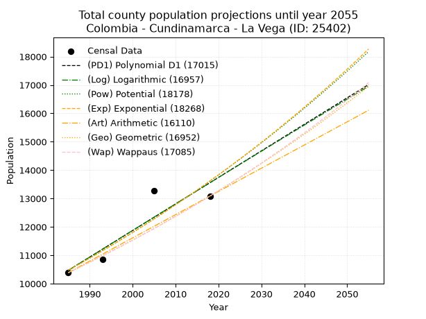
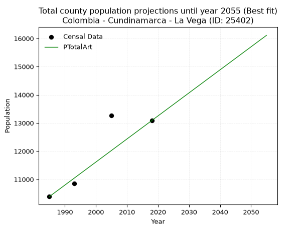
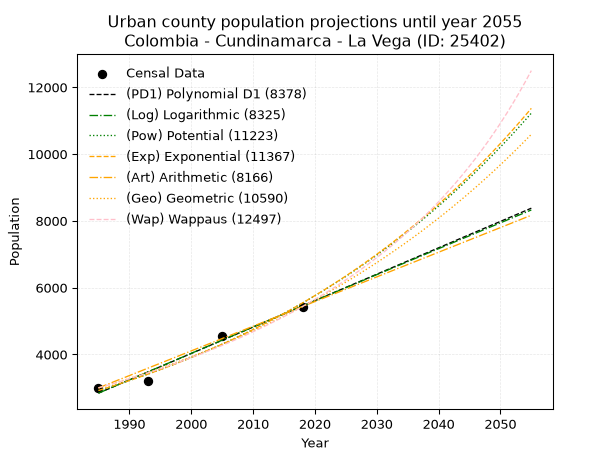
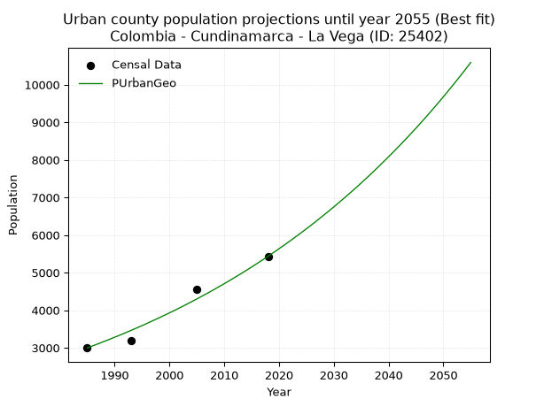
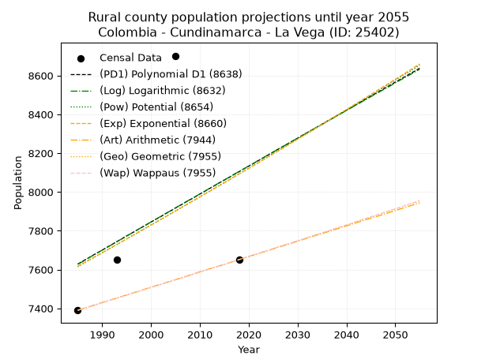
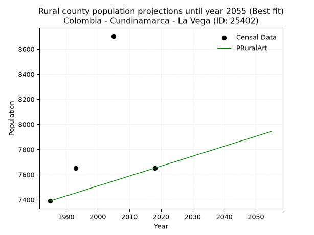

<div align="center">


</div>

# 📜 _“Population and Public Services Demand Projections (PPSD) until Year 2050 for Colombia - Cundinamarca - La Vega (ID: 25402)”_
Keywords: `population` `public-service` `projection` `lineal` `polynomial` `logarithmic` `potential` `exponential` `arithmetic` `geometric` `wappaus` `dane` `colombia` `south-america`

PPSD are analytical estimates used by governments and planners to anticipate future changes in population size, age distribution, and the resulting community needs for utilities, healthcare, education, and infrastructure as sizing future water treatment facilities, electrical grids, and road networks based on spatial growth.

<div align="center">

</img>

</div>


> **General running parameters**: • app_version: _v20260806_. • Python version: _3.14.7_. • Pandas version: _3.0.5_. • NumPy version: _2.5.1_. • Creates, save and include plots into reports (create_plot): _False_. • Projection until year: _2050_. • Process polynomial degree 2 and up: _False_. • Process Wappaus: _True_. • Process Wappaus: _True_. • Set negative values to zero: _True_. • Set infinite values to zero: _True_. • Drop dataset notes: _True_. 
<div align="center">

Maps & GIS Layers: [:earth_americas:Google](http://maps.google.com/maps?q=4.997768375,-74.3368851) [:earth_americas:OSM](https://www.openstreetmap.org/#map=18/4.997768375/-74.3368851&layers=P) [:earth_americas:Bing](https://www.bing.com/maps?cp=4.997768375~-74.3368851&lvl=18) [:earth_americas:Apple](https://maps.apple.com/frame?center=4.997768375%2C-74.3368851&span=0.003%2C0.006) [:earth_americas:GISMobile](https://github.com/rcfdtools/R.GISMobile/blob/main/file/gis/CountyLayer_CO/Readme.md)

</div>


<div align="center">

```geojson
{
  "type": "Feature",
  "geometry": {
    "type": "Point", 
    "coordinates": [-74.3368851, 4.997768375]
  }, 
  "properties": {
    "Name": "Colombia - Cundinamarca - La Vega (ID: 25402)"
  }
}
```

</div>


## 0. Census Data (4 records)

Census data are official statistics collected by a government about the people and housing in a country. They usually include counts of total population, age, sex, race, income, education, and jobs.

📅Global census file: [Population.xlsx](../data/Population.xlsx)

| Source   |   Year |   CountryID | CountryName   |   StateID | StateName    |   CountyID | CountyName   |   PTotal |   PUrban |   PRural |
|:---------|-------:|------------:|:--------------|----------:|:-------------|-----------:|:-------------|---------:|---------:|---------:|
| DANE     |   1985 |          57 | Colombia      |        25 | Cundinamarca |      25402 | La Vega      |    10387 |     2997 |     7390 |
| DANE     |   1993 |          57 | Colombia      |        25 | Cundinamarca |      25402 | La Vega      |    10846 |     3196 |     7650 |
| DANE     |   2005 |          57 | Colombia      |        25 | Cundinamarca |      25402 | La Vega      |    13265 |     4563 |     8702 |
| DANE     |   2018 |          57 | Colombia      |        25 | Cundinamarca |      25402 | La Vega      |    13085 |     5434 |     7651 |

> 🔥Some records could had specific notes about the registered values or the corresponding urban or rural distribution.

📅[SUI-RUPS](https://www.datos.gov.co/Hacienda-y-Cr-dito-P-blico/Registro-nico-de-Prestadores-de-Servicios-P-blicos/4qkq-csdn/about_data) - Local public utility companies: [RUPS.csv](../data/RUPS.csv)

 | SERVICIO       | ESTADO    | NOMBRE                                                     | NIT         | DEPARTAMENTO_DOMICILIO   | MUNICIPIO_DOMICILIO   | DIRECCION                     |   TELEFONO | EMAIL                     | TIPO_PRESTADOR                            | CLASIFICACION                  |
|:---------------|:----------|:-----------------------------------------------------------|:------------|:-------------------------|:----------------------|:------------------------------|-----------:|:--------------------------|:------------------------------------------|:-------------------------------|
| ACUEDUCTO      | OPERATIVA | EMPRESA DE ACUEDUCTO, ALCANTARILLADO Y ASEO DE LA VEGA ESP | 832002460-2 | CUNDINAMARCA             | LA VEGA               | Carrera 3 No. 11-89           |    8455882 | acueductolavega@gmail.com | EMPRESA INDUSTRIAL Y COMERCIAL DEL ESTADO | DESDE 2501 HASTA 5000 USUARIOS |
| ALCANTARILLADO | OPERATIVA | EMPRESA DE ACUEDUCTO, ALCANTARILLADO Y ASEO DE LA VEGA ESP | 832002460-2 | CUNDINAMARCA             | LA VEGA               | Carrera 3 No. 11-89           |    8455882 | acueductolavega@gmail.com | EMPRESA INDUSTRIAL Y COMERCIAL DEL ESTADO | DESDE 2501 HASTA 5000 USUARIOS |
| ACUEDUCTO      | OPERATIVA | ASOCIACION DE SUSCRIPTORES DEL ACUEDUCTO ACUAGUALIVA       | 832002516-6 | CUNDINAMARCA             | LA VEGA               | Carrera 3a nº 17-68 piso 2    |    0000000 | acuagualiva@hotmail.com   | ORGANIZACION AUTORIZADA                   | MENOR O IGUAL A 2500 USUARIOS  |
| ACUEDUCTO      | OPERATIVA | ASOCIACION DE USUARIOS DEL ACUEDUCTO DE PATIO BONITO       | 832009072-1 | CUNDINAMARCA             | LA VEGA               | Carrera 4 No 20 – 103 La Vega |    5553281 | asopab2016@gmail.com      | ORGANIZACION AUTORIZADA                   | MENOR O IGUAL A 2500 USUARIOS  |

## 1. Total

### 1.1. Coefficients and Parameters

* (PD1) Polynomial Deg 1: 93.5082296266559, -175144.08631071847 (lineal)
* (Log) Logarithmic: 187301.0514068303, -1411781.0426797455
* (Pow) Potential: 15.911613330249654, -48.45263211653295
* (Exp) Exponential: 0.007943646822882743, 0.001486564457666879
* (Art) Arithmetic: Year diff. 2018 - 1985 = 33, Population diff. 13085 - 10387 = 2698, Annual growth = 81.75757575757575
* (Geo) Geometric: Year diff. 2018 - 1985 = 33, Population diff. 13085 - 10387 = 2698, Annual growth % = 0.007021856971849427
* (Wap) Wappaus: i = 0.6966391935717089, Condition values only valid for < 200)

<sub>
Wappaus condition values: ['0.00', '0.70', '1.39', '2.09', '2.79', '3.48', '4.18', '4.88', '5.57', '6.27', '6.97', '7.66', '8.36', '9.06', '9.75', '10.45', '11.15', '11.84', '12.54', '13.24', '13.93', '14.63', '15.33', '16.02', '16.72', '17.42', '18.11', '18.81', '19.51', '20.20', '20.90', '21.60', '22.29', '22.99', '23.69', '24.38', '25.08', '25.78', '26.47', '27.17', '27.87', '28.56', '29.26', '29.96', '30.65', '31.35', '32.05', '32.74', '33.44', '34.14', '34.83', '35.53', '36.23', '36.92', '37.62', '38.32', '39.01', '39.71', '40.41', '41.10', '41.80', '42.49', '43.19', '43.89', '44.58', '45.28']
</sub>


### 1.2. Projected Dataset

|   Year |   CountyID |   PTotalPD1 |   PTotalLog |   PTotalPow |   PTotalExp |   PTotalArt |   PTotalGeo |   PTotalWap |
|-------:|-----------:|------------:|------------:|------------:|------------:|------------:|------------:|------------:|
|   1985 |      25402 |       10470 |       10466 |       10473 |       10476 |       10387 |       10387 |       10387 |
|   1986 |      25402 |       10563 |       10560 |       10557 |       10560 |       10469 |       10460 |       10460 |
|   1987 |      25402 |       10657 |       10655 |       10642 |       10644 |       10551 |       10533 |       10533 |
|   1988 |      25402 |       10750 |       10749 |       10727 |       10729 |       10632 |       10607 |       10606 |
|   1989 |      25402 |       10844 |       10843 |       10814 |       10814 |       10714 |       10682 |       10681 |
|   1990 |      25402 |       10937 |       10937 |       10900 |       10901 |       10796 |       10757 |       10755 |
|   1991 |      25402 |       11031 |       11031 |       10988 |       10987 |       10878 |       10832 |       10830 |
|   1992 |      25402 |       11124 |       11125 |       11076 |       11075 |       10959 |       10908 |       10906 |
|   1993 |      25402 |       11218 |       11219 |       11165 |       11163 |       11041 |       10985 |       10982 |
|   1994 |      25402 |       11311 |       11313 |       11254 |       11252 |       11123 |       11062 |       11059 |
|   1995 |      25402 |       11405 |       11407 |       11344 |       11342 |       11205 |       11140 |       11137 |
|   1996 |      25402 |       11498 |       11501 |       11435 |       11433 |       11286 |       11218 |       11215 |
|   1997 |      25402 |       11592 |       11595 |       11527 |       11524 |       11368 |       11297 |       11293 |
|   1998 |      25402 |       11685 |       11689 |       11619 |       11616 |       11450 |       11376 |       11372 |
|   1999 |      25402 |       11779 |       11782 |       11712 |       11708 |       11532 |       11456 |       11452 |
|   2000 |      25402 |       11872 |       11876 |       11805 |       11802 |       11613 |       11536 |       11532 |
|   2001 |      25402 |       11966 |       11970 |       11900 |       11896 |       11695 |       11617 |       11613 |
|   2002 |      25402 |       12059 |       12063 |       11995 |       11991 |       11777 |       11699 |       11695 |
|   2003 |      25402 |       12153 |       12157 |       12090 |       12086 |       11859 |       11781 |       11777 |
|   2004 |      25402 |       12246 |       12250 |       12187 |       12183 |       11940 |       11864 |       11859 |
|   2005 |      25402 |       12340 |       12344 |       12284 |       12280 |       12022 |       11947 |       11943 |
|   2006 |      25402 |       12433 |       12437 |       12382 |       12378 |       12104 |       12031 |       12026 |
|   2007 |      25402 |       12527 |       12530 |       12480 |       12477 |       12186 |       12116 |       12111 |
|   2008 |      25402 |       12620 |       12624 |       12580 |       12576 |       12267 |       12201 |       12196 |
|   2009 |      25402 |       12714 |       12717 |       12680 |       12676 |       12349 |       12286 |       12282 |
|   2010 |      25402 |       12807 |       12810 |       12780 |       12778 |       12431 |       12373 |       12369 |
|   2011 |      25402 |       12901 |       12903 |       12882 |       12879 |       12513 |       12460 |       12456 |
|   2012 |      25402 |       12994 |       12996 |       12984 |       12982 |       12594 |       12547 |       12544 |
|   2013 |      25402 |       13088 |       13089 |       13087 |       13086 |       12676 |       12635 |       12632 |
|   2014 |      25402 |       13181 |       13183 |       13191 |       13190 |       12758 |       12724 |       12721 |
|   2015 |      25402 |       13275 |       13275 |       13296 |       13295 |       12840 |       12813 |       12811 |
|   2016 |      25402 |       13369 |       13368 |       13401 |       13401 |       12921 |       12903 |       12902 |
|   2017 |      25402 |       13462 |       13461 |       13507 |       13508 |       13003 |       12994 |       12993 |
|   2018 |      25402 |       13556 |       13554 |       13614 |       13616 |       13085 |       13085 |       13085 |
|   2019 |      25402 |       13649 |       13647 |       13722 |       13724 |       13167 |       13177 |       13178 |
|   2020 |      25402 |       13743 |       13740 |       13831 |       13834 |       13249 |       13269 |       13271 |
|   2021 |      25402 |       13836 |       13832 |       13940 |       13944 |       13330 |       13363 |       13365 |
|   2022 |      25402 |       13930 |       13925 |       14050 |       14055 |       13412 |       13456 |       13460 |
|   2023 |      25402 |       14023 |       14018 |       14161 |       14168 |       13494 |       13551 |       13556 |
|   2024 |      25402 |       14117 |       14110 |       14273 |       14281 |       13576 |       13646 |       13653 |
|   2025 |      25402 |       14210 |       14203 |       14385 |       14394 |       13657 |       13742 |       13750 |
|   2026 |      25402 |       14304 |       14295 |       14499 |       14509 |       13739 |       13838 |       13848 |
|   2027 |      25402 |       14397 |       14388 |       14613 |       14625 |       13821 |       13936 |       13947 |
|   2028 |      25402 |       14491 |       14480 |       14728 |       14742 |       13903 |       14033 |       14047 |
|   2029 |      25402 |       14584 |       14572 |       14844 |       14859 |       13984 |       14132 |       14147 |
|   2030 |      25402 |       14678 |       14665 |       14961 |       14978 |       14066 |       14231 |       14248 |
|   2031 |      25402 |       14771 |       14757 |       15079 |       15097 |       14148 |       14331 |       14351 |
|   2032 |      25402 |       14865 |       14849 |       15197 |       15218 |       14230 |       14432 |       14454 |
|   2033 |      25402 |       14958 |       14941 |       15317 |       15339 |       14311 |       14533 |       14558 |
|   2034 |      25402 |       15052 |       15033 |       15437 |       15461 |       14393 |       14635 |       14662 |
|   2035 |      25402 |       15145 |       15125 |       15558 |       15585 |       14475 |       14738 |       14768 |
|   2036 |      25402 |       15239 |       15217 |       15681 |       15709 |       14557 |       14841 |       14875 |
|   2037 |      25402 |       15332 |       15309 |       15804 |       15834 |       14638 |       14946 |       14982 |
|   2038 |      25402 |       15426 |       15401 |       15927 |       15960 |       14720 |       15051 |       15090 |
|   2039 |      25402 |       15519 |       15493 |       16052 |       16088 |       14802 |       15156 |       15200 |
|   2040 |      25402 |       15613 |       15585 |       16178 |       16216 |       14884 |       15263 |       15310 |
|   2041 |      25402 |       15706 |       15677 |       16305 |       16345 |       14965 |       15370 |       15421 |
|   2042 |      25402 |       15800 |       15769 |       16432 |       16476 |       15047 |       15478 |       15533 |
|   2043 |      25402 |       15893 |       15860 |       16561 |       16607 |       15129 |       15586 |       15646 |
|   2044 |      25402 |       15987 |       15952 |       16690 |       16740 |       15211 |       15696 |       15761 |
|   2045 |      25402 |       16080 |       16044 |       16821 |       16873 |       15292 |       15806 |       15876 |
|   2046 |      25402 |       16174 |       16135 |       16952 |       17008 |       15374 |       15917 |       15992 |
|   2047 |      25402 |       16267 |       16227 |       17084 |       17143 |       15456 |       16029 |       16109 |
|   2048 |      25402 |       16361 |       16318 |       17217 |       17280 |       15538 |       16141 |       16227 |
|   2049 |      25402 |       16454 |       16410 |       17352 |       17418 |       15619 |       16255 |       16347 |
|   2050 |      25402 |       16548 |       16501 |       17487 |       17557 |       15701 |       16369 |       16467 |
<div align="center">

</img>

</div>


### 1.3. Best fit with absolute and relative error (%)

Relative error puts that difference into context by dividing the absolute error by the true value, creating a unitless ratio or percentage that shows the scale of the mistake.

Absolute and relative error

|   Year | Source   |   CountryID | CountryName   |   StateID | StateName    |   CountyID_x | CountyName   |   PTotal |   PUrban |   PRural |   CountyID_y |   PTotalPD1 |   PTotalLog |   PTotalPow |   PTotalExp |   PTotalArt |   PTotalGeo |   PTotalWap |   PTotalPD1AbsError |   PTotalLogAbsError |   PTotalPowAbsError |   PTotalExpAbsError |   PTotalArtAbsError |   PTotalGeoAbsError |   PTotalWapAbsError |   PTotalPD1RelError |   PTotalLogRelError |   PTotalPowRelError |   PTotalExpRelError |   PTotalArtRelError |   PTotalGeoRelError |   PTotalWapRelError |
|-------:|:---------|------------:|:--------------|----------:|:-------------|-------------:|:-------------|---------:|---------:|---------:|-------------:|------------:|------------:|------------:|------------:|------------:|------------:|------------:|--------------------:|--------------------:|--------------------:|--------------------:|--------------------:|--------------------:|--------------------:|--------------------:|--------------------:|--------------------:|--------------------:|--------------------:|--------------------:|--------------------:|
|   1985 | DANE     |          57 | Colombia      |        25 | Cundinamarca |        25402 | La Vega      |    10387 |     2997 |     7390 |        25402 |       10470 |       10466 |       10473 |       10476 |       10387 |       10387 |       10387 |                  83 |                  79 |                  86 |                  89 |                   0 |                   0 |                   0 |            0.799076 |            0.760566 |            0.827958 |             0.85684 |             0       |             0       |             0       |
|   1993 | DANE     |          57 | Colombia      |        25 | Cundinamarca |        25402 | La Vega      |    10846 |     3196 |     7650 |        25402 |       11218 |       11219 |       11165 |       11163 |       11041 |       10985 |       10982 |                 372 |                 373 |                 319 |                 317 |                 195 |                 139 |                 136 |            3.42984  |            3.43906  |            2.94118  |             2.92274 |             1.7979  |             1.28158 |             1.25392 |
|   2005 | DANE     |          57 | Colombia      |        25 | Cundinamarca |        25402 | La Vega      |    13265 |     4563 |     8702 |        25402 |       12340 |       12344 |       12284 |       12280 |       12022 |       11947 |       11943 |                 925 |                 921 |                 981 |                 985 |                1243 |                1318 |                1322 |            6.97324  |            6.94308  |            7.3954   |             7.42556 |             9.37052 |             9.93592 |             9.96608 |
|   2018 | DANE     |          57 | Colombia      |        25 | Cundinamarca |        25402 | La Vega      |    13085 |     5434 |     7651 |        25402 |       13556 |       13554 |       13614 |       13616 |       13085 |       13085 |       13085 |                 471 |                 469 |                 529 |                 531 |                   0 |                   0 |                   0 |            3.59954  |            3.58426  |            4.0428   |             4.05808 |             0       |             0       |             0       |

Relative error mean

| Method    |   RelError | Best   |
|:----------|-----------:|:-------|
| PTotalPD1 |    3.70042 |        |
| PTotalLog |    3.68174 |        |
| PTotalPow |    3.80183 |        |
| PTotalExp |    3.8158  |        |
| PTotalArt |    2.79211 | True   |
| PTotalGeo |    2.80438 |        |
| PTotalWap |    2.805   |        |

💙Best method: _**PTotalArt**_
<div align="center">

</img>

</div>


### 1.4. Fresh water supply demand in liters per capita per day (lpcd)

The fresh water supply demand typically ranges from 100 to 300 liters per capita per day (lpcd) for standard domestic and municipal planning, though absolute survival minimums set by the World Health Organization are as low as 7.5 to 20 liters per day, and total consumption in high-income nations can exceed 400 liters.

> `CZ`: Level in meters above the sea level (masl)<br> `WS`: Fresh water supply demand in liters per capita per day (lpcd or l/h/d)<br> `WSAll`: Zonal fresh water supply demand in liters per second (l/s)<br> `A`: Zonal area in square meters<br> `DP`: Population density (people/hectare or p/ha)

Reference values (RAS Colombia)

|    CZ |   WS |
|------:|-----:|
|  1000 |  120 |
|  2000 |  130 |
| 99999 |  140 |

County shapefile geometry properties and water supply values

|   CountyID |     ATotal |   CZTotal |   WSTotal |
|-----------:|-----------:|----------:|----------:|
|      25402 | 1.5527e+08 |   1652.21 |       130 |

Projected values for best method: PTotalArt

|   CountyID |   Year |   PTotalArt |   DPTotal |   WSTotal |   WSTotalAll |
|-----------:|-------:|------------:|----------:|----------:|-------------:|
|      25402 |   1985 |       10387 |      0.67 |       130 |      15.6286 |
|      25402 |   1986 |       10469 |      0.67 |       130 |      15.752  |
|      25402 |   1987 |       10551 |      0.68 |       130 |      15.8753 |
|      25402 |   1988 |       10632 |      0.68 |       130 |      15.9972 |
|      25402 |   1989 |       10714 |      0.69 |       130 |      16.1206 |
|      25402 |   1990 |       10796 |      0.7  |       130 |      16.244  |
|      25402 |   1991 |       10878 |      0.7  |       130 |      16.3674 |
|      25402 |   1992 |       10959 |      0.71 |       130 |      16.4892 |
|      25402 |   1993 |       11041 |      0.71 |       130 |      16.6126 |
|      25402 |   1994 |       11123 |      0.72 |       130 |      16.736  |
|      25402 |   1995 |       11205 |      0.72 |       130 |      16.8594 |
|      25402 |   1996 |       11286 |      0.73 |       130 |      16.9812 |
|      25402 |   1997 |       11368 |      0.73 |       130 |      17.1046 |
|      25402 |   1998 |       11450 |      0.74 |       130 |      17.228  |
|      25402 |   1999 |       11532 |      0.74 |       130 |      17.3514 |
|      25402 |   2000 |       11613 |      0.75 |       130 |      17.4733 |
|      25402 |   2001 |       11695 |      0.75 |       130 |      17.5966 |
|      25402 |   2002 |       11777 |      0.76 |       130 |      17.72   |
|      25402 |   2003 |       11859 |      0.76 |       130 |      17.8434 |
|      25402 |   2004 |       11940 |      0.77 |       130 |      17.9653 |
|      25402 |   2005 |       12022 |      0.77 |       130 |      18.0887 |
|      25402 |   2006 |       12104 |      0.78 |       130 |      18.212  |
|      25402 |   2007 |       12186 |      0.78 |       130 |      18.3354 |
|      25402 |   2008 |       12267 |      0.79 |       130 |      18.4573 |
|      25402 |   2009 |       12349 |      0.8  |       130 |      18.5807 |
|      25402 |   2010 |       12431 |      0.8  |       130 |      18.7041 |
|      25402 |   2011 |       12513 |      0.81 |       130 |      18.8274 |
|      25402 |   2012 |       12594 |      0.81 |       130 |      18.9493 |
|      25402 |   2013 |       12676 |      0.82 |       130 |      19.0727 |
|      25402 |   2014 |       12758 |      0.82 |       130 |      19.1961 |
|      25402 |   2015 |       12840 |      0.83 |       130 |      19.3194 |
|      25402 |   2016 |       12921 |      0.83 |       130 |      19.4413 |
|      25402 |   2017 |       13003 |      0.84 |       130 |      19.5647 |
|      25402 |   2018 |       13085 |      0.84 |       130 |      19.6881 |
|      25402 |   2019 |       13167 |      0.85 |       130 |      19.8115 |
|      25402 |   2020 |       13249 |      0.85 |       130 |      19.9348 |
|      25402 |   2021 |       13330 |      0.86 |       130 |      20.0567 |
|      25402 |   2022 |       13412 |      0.86 |       130 |      20.1801 |
|      25402 |   2023 |       13494 |      0.87 |       130 |      20.3035 |
|      25402 |   2024 |       13576 |      0.87 |       130 |      20.4269 |
|      25402 |   2025 |       13657 |      0.88 |       130 |      20.5487 |
|      25402 |   2026 |       13739 |      0.88 |       130 |      20.6721 |
|      25402 |   2027 |       13821 |      0.89 |       130 |      20.7955 |
|      25402 |   2028 |       13903 |      0.9  |       130 |      20.9189 |
|      25402 |   2029 |       13984 |      0.9  |       130 |      21.0407 |
|      25402 |   2030 |       14066 |      0.91 |       130 |      21.1641 |
|      25402 |   2031 |       14148 |      0.91 |       130 |      21.2875 |
|      25402 |   2032 |       14230 |      0.92 |       130 |      21.4109 |
|      25402 |   2033 |       14311 |      0.92 |       130 |      21.5328 |
|      25402 |   2034 |       14393 |      0.93 |       130 |      21.6561 |
|      25402 |   2035 |       14475 |      0.93 |       130 |      21.7795 |
|      25402 |   2036 |       14557 |      0.94 |       130 |      21.9029 |
|      25402 |   2037 |       14638 |      0.94 |       130 |      22.0248 |
|      25402 |   2038 |       14720 |      0.95 |       130 |      22.1481 |
|      25402 |   2039 |       14802 |      0.95 |       130 |      22.2715 |
|      25402 |   2040 |       14884 |      0.96 |       130 |      22.3949 |
|      25402 |   2041 |       14965 |      0.96 |       130 |      22.5168 |
|      25402 |   2042 |       15047 |      0.97 |       130 |      22.6402 |
|      25402 |   2043 |       15129 |      0.97 |       130 |      22.7635 |
|      25402 |   2044 |       15211 |      0.98 |       130 |      22.8869 |
|      25402 |   2045 |       15292 |      0.98 |       130 |      23.0088 |
|      25402 |   2046 |       15374 |      0.99 |       130 |      23.1322 |
|      25402 |   2047 |       15456 |      1    |       130 |      23.2556 |
|      25402 |   2048 |       15538 |      1    |       130 |      23.3789 |
|      25402 |   2049 |       15619 |      1.01 |       130 |      23.5008 |
|      25402 |   2050 |       15701 |      1.01 |       130 |      23.6242 |

## 2. Urban

### 2.1. Coefficients and Parameters

* (PD1) Polynomial Deg 1: 79.08871938980265, -154149.7109594528 (lineal)
* (Log) Logarithmic: 158289.99355012955, -1199116.0094309358
* (Pow) Potential: 38.870714012252066, -124.72125889505384
* (Exp) Exponential: 0.019418774436223116, 5.3073089734839566e-14
* (Art) Arithmetic: Year diff. 2018 - 1985 = 33, Population diff. 5434 - 2997 = 2437, Annual growth = 73.84848484848484
* (Geo) Geometric: Year diff. 2018 - 1985 = 33, Population diff. 5434 - 2997 = 2437, Annual growth % = 0.01819579640479274
* (Wap) Wappaus: i = 1.7518321634084888, Condition values only valid for < 200)

<sub>
Wappaus condition values: ['0.00', '1.75', '3.50', '5.26', '7.01', '8.76', '10.51', '12.26', '14.01', '15.77', '17.52', '19.27', '21.02', '22.77', '24.53', '26.28', '28.03', '29.78', '31.53', '33.28', '35.04', '36.79', '38.54', '40.29', '42.04', '43.80', '45.55', '47.30', '49.05', '50.80', '52.55', '54.31', '56.06', '57.81', '59.56', '61.31', '63.07', '64.82', '66.57', '68.32', '70.07', '71.83', '73.58', '75.33', '77.08', '78.83', '80.58', '82.34', '84.09', '85.84', '87.59', '89.34', '91.10', '92.85', '94.60', '96.35', '98.10', '99.85', '101.61', '103.36', '105.11', '106.86', '108.61', '110.37', '112.12', '113.87']
</sub>


### 2.2. Projected Dataset

|   Year |   CountyID |   PUrbanPD1 |   PUrbanLog |   PUrbanPow |   PUrbanExp |   PUrbanArt |   PUrbanGeo |   PUrbanWap |
|-------:|-----------:|------------:|------------:|------------:|------------:|------------:|------------:|------------:|
|   1985 |      25402 |        2841 |        2839 |        2918 |        2919 |        2997 |        2997 |        2997 |
|   1986 |      25402 |        2920 |        2919 |        2975 |        2977 |        3071 |        3052 |        3050 |
|   1987 |      25402 |        3000 |        2999 |        3034 |        3035 |        3145 |        3107 |        3104 |
|   1988 |      25402 |        3079 |        3078 |        3094 |        3095 |        3219 |        3164 |        3159 |
|   1989 |      25402 |        3158 |        3158 |        3155 |        3155 |        3292 |        3221 |        3215 |
|   1990 |      25402 |        3237 |        3237 |        3217 |        3217 |        3366 |        3280 |        3272 |
|   1991 |      25402 |        3316 |        3317 |        3281 |        3280 |        3440 |        3339 |        3329 |
|   1992 |      25402 |        3395 |        3396 |        3346 |        3345 |        3514 |        3400 |        3389 |
|   1993 |      25402 |        3474 |        3476 |        3412 |        3410 |        3588 |        3462 |        3449 |
|   1994 |      25402 |        3553 |        3555 |        3479 |        3477 |        3662 |        3525 |        3510 |
|   1995 |      25402 |        3632 |        3635 |        3547 |        3545 |        3735 |        3589 |        3572 |
|   1996 |      25402 |        3711 |        3714 |        3617 |        3615 |        3809 |        3655 |        3636 |
|   1997 |      25402 |        3790 |        3793 |        3688 |        3686 |        3883 |        3721 |        3701 |
|   1998 |      25402 |        3870 |        3872 |        3760 |        3758 |        3957 |        3789 |        3767 |
|   1999 |      25402 |        3949 |        3952 |        3834 |        3832 |        4031 |        3858 |        3835 |
|   2000 |      25402 |        4028 |        4031 |        3910 |        3907 |        4105 |        3928 |        3904 |
|   2001 |      25402 |        4107 |        4110 |        3986 |        3983 |        4179 |        3999 |        3974 |
|   2002 |      25402 |        4186 |        4189 |        4064 |        4061 |        4252 |        4072 |        4046 |
|   2003 |      25402 |        4265 |        4268 |        4144 |        4141 |        4326 |        4146 |        4119 |
|   2004 |      25402 |        4344 |        4347 |        4225 |        4222 |        4400 |        4222 |        4194 |
|   2005 |      25402 |        4423 |        4426 |        4308 |        4305 |        4474 |        4298 |        4270 |
|   2006 |      25402 |        4502 |        4505 |        4392 |        4389 |        4548 |        4377 |        4348 |
|   2007 |      25402 |        4581 |        4584 |        4478 |        4476 |        4622 |        4456 |        4428 |
|   2008 |      25402 |        4660 |        4663 |        4566 |        4563 |        4696 |        4537 |        4509 |
|   2009 |      25402 |        4740 |        4741 |        4655 |        4653 |        4769 |        4620 |        4592 |
|   2010 |      25402 |        4819 |        4820 |        4746 |        4744 |        4843 |        4704 |        4678 |
|   2011 |      25402 |        4898 |        4899 |        4839 |        4837 |        4917 |        4790 |        4765 |
|   2012 |      25402 |        4977 |        4978 |        4933 |        4932 |        4991 |        4877 |        4854 |
|   2013 |      25402 |        5056 |        5056 |        5029 |        5029 |        5065 |        4966 |        4945 |
|   2014 |      25402 |        5135 |        5135 |        5127 |        5127 |        5139 |        5056 |        5038 |
|   2015 |      25402 |        5214 |        5214 |        5227 |        5228 |        5212 |        5148 |        5133 |
|   2016 |      25402 |        5293 |        5292 |        5329 |        5330 |        5286 |        5242 |        5231 |
|   2017 |      25402 |        5372 |        5371 |        5433 |        5435 |        5360 |        5337 |        5331 |
|   2018 |      25402 |        5451 |        5449 |        5538 |        5541 |        5434 |        5434 |        5434 |
|   2019 |      25402 |        5530 |        5527 |        5646 |        5650 |        5508 |        5533 |        5539 |
|   2020 |      25402 |        5610 |        5606 |        5756 |        5761 |        5582 |        5634 |        5647 |
|   2021 |      25402 |        5689 |        5684 |        5868 |        5874 |        5656 |        5736 |        5758 |
|   2022 |      25402 |        5768 |        5762 |        5982 |        5989 |        5729 |        5840 |        5871 |
|   2023 |      25402 |        5847 |        5841 |        6098 |        6106 |        5803 |        5947 |        5987 |
|   2024 |      25402 |        5926 |        5919 |        6216 |        6226 |        5877 |        6055 |        6107 |
|   2025 |      25402 |        6005 |        5997 |        6336 |        6348 |        5951 |        6165 |        6230 |
|   2026 |      25402 |        6084 |        6075 |        6459 |        6473 |        6025 |        6277 |        6356 |
|   2027 |      25402 |        6163 |        6153 |        6584 |        6600 |        6099 |        6391 |        6485 |
|   2028 |      25402 |        6242 |        6231 |        6712 |        6729 |        6172 |        6508 |        6619 |
|   2029 |      25402 |        6321 |        6310 |        6842 |        6861 |        6246 |        6626 |        6756 |
|   2030 |      25402 |        6400 |        6388 |        6974 |        6995 |        6320 |        6747 |        6897 |
|   2031 |      25402 |        6479 |        6465 |        7109 |        7133 |        6394 |        6870 |        7042 |
|   2032 |      25402 |        6559 |        6543 |        7246 |        7272 |        6468 |        6995 |        7191 |
|   2033 |      25402 |        6638 |        6621 |        7386 |        7415 |        6542 |        7122 |        7345 |
|   2034 |      25402 |        6717 |        6699 |        7528 |        7560 |        6616 |        7251 |        7504 |
|   2035 |      25402 |        6796 |        6777 |        7674 |        7709 |        6689 |        7383 |        7668 |
|   2036 |      25402 |        6875 |        6855 |        7822 |        7860 |        6763 |        7518 |        7837 |
|   2037 |      25402 |        6954 |        6932 |        7972 |        8014 |        6837 |        7654 |        8011 |
|   2038 |      25402 |        7033 |        7010 |        8126 |        8171 |        6911 |        7794 |        8191 |
|   2039 |      25402 |        7112 |        7088 |        8282 |        8331 |        6985 |        7936 |        8377 |
|   2040 |      25402 |        7191 |        7165 |        8442 |        8495 |        7059 |        8080 |        8569 |
|   2041 |      25402 |        7270 |        7243 |        8604 |        8661 |        7133 |        8227 |        8768 |
|   2042 |      25402 |        7349 |        7320 |        8769 |        8831 |        7206 |        8377 |        8974 |
|   2043 |      25402 |        7429 |        7398 |        8938 |        9004 |        7280 |        8529 |        9187 |
|   2044 |      25402 |        7508 |        7475 |        9110 |        9181 |        7354 |        8684 |        9408 |
|   2045 |      25402 |        7587 |        7553 |        9284 |        9361 |        7428 |        8842 |        9637 |
|   2046 |      25402 |        7666 |        7630 |        9463 |        9544 |        7502 |        9003 |        9874 |
|   2047 |      25402 |        7745 |        7708 |        9644 |        9732 |        7576 |        9167 |       10121 |
|   2048 |      25402 |        7824 |        7785 |        9829 |        9922 |        7649 |        9334 |       10377 |
|   2049 |      25402 |        7903 |        7862 |       10017 |       10117 |        7723 |        9504 |       10644 |
|   2050 |      25402 |        7982 |        7939 |       10209 |       10315 |        7797 |        9677 |       10921 |
<div align="center">

</img>

</div>


### 2.3. Best fit with absolute and relative error (%)

Relative error puts that difference into context by dividing the absolute error by the true value, creating a unitless ratio or percentage that shows the scale of the mistake.

Absolute and relative error

|   Year | Source   |   CountryID | CountryName   |   StateID | StateName    |   CountyID_x | CountyName   |   PTotal |   PUrban |   PRural |   CountyID_y |   PUrbanPD1 |   PUrbanLog |   PUrbanPow |   PUrbanExp |   PUrbanArt |   PUrbanGeo |   PUrbanWap |   PUrbanPD1AbsError |   PUrbanLogAbsError |   PUrbanPowAbsError |   PUrbanExpAbsError |   PUrbanArtAbsError |   PUrbanGeoAbsError |   PUrbanWapAbsError |   PUrbanPD1RelError |   PUrbanLogRelError |   PUrbanPowRelError |   PUrbanExpRelError |   PUrbanArtRelError |   PUrbanGeoRelError |   PUrbanWapRelError |
|-------:|:---------|------------:|:--------------|----------:|:-------------|-------------:|:-------------|---------:|---------:|---------:|-------------:|------------:|------------:|------------:|------------:|------------:|------------:|------------:|--------------------:|--------------------:|--------------------:|--------------------:|--------------------:|--------------------:|--------------------:|--------------------:|--------------------:|--------------------:|--------------------:|--------------------:|--------------------:|--------------------:|
|   1985 | DANE     |          57 | Colombia      |        25 | Cundinamarca |        25402 | La Vega      |    10387 |     2997 |     7390 |        25402 |        2841 |        2839 |        2918 |        2919 |        2997 |        2997 |        2997 |                 156 |                 158 |                  79 |                  78 |                   0 |                   0 |                   0 |            5.20521  |             5.27194 |             2.63597 |             2.6026  |             0       |             0       |             0       |
|   1993 | DANE     |          57 | Colombia      |        25 | Cundinamarca |        25402 | La Vega      |    10846 |     3196 |     7650 |        25402 |        3474 |        3476 |        3412 |        3410 |        3588 |        3462 |        3449 |                 278 |                 280 |                 216 |                 214 |                 392 |                 266 |                 253 |            8.69837  |             8.76095 |             6.75845 |             6.69587 |            12.2653  |             8.3229  |             7.91615 |
|   2005 | DANE     |          57 | Colombia      |        25 | Cundinamarca |        25402 | La Vega      |    13265 |     4563 |     8702 |        25402 |        4423 |        4426 |        4308 |        4305 |        4474 |        4298 |        4270 |                 140 |                 137 |                 255 |                 258 |                  89 |                 265 |                 293 |            3.06816  |             3.00241 |             5.58843 |             5.65417 |             1.95047 |             5.80758 |             6.42121 |
|   2018 | DANE     |          57 | Colombia      |        25 | Cundinamarca |        25402 | La Vega      |    13085 |     5434 |     7651 |        25402 |        5451 |        5449 |        5538 |        5541 |        5434 |        5434 |        5434 |                  17 |                  15 |                 104 |                 107 |                   0 |                   0 |                   0 |            0.312845 |             0.27604 |             1.91388 |             1.96908 |             0       |             0       |             0       |

Relative error mean

| Method    |   RelError | Best   |
|:----------|-----------:|:-------|
| PUrbanPD1 |    4.32115 |        |
| PUrbanLog |    4.32784 |        |
| PUrbanPow |    4.22418 |        |
| PUrbanExp |    4.23043 |        |
| PUrbanArt |    3.55395 |        |
| PUrbanGeo |    3.53262 | True   |
| PUrbanWap |    3.58434 |        |

💙Best method: _**PUrbanGeo**_
<div align="center">

</img>

</div>


### 2.4. Fresh water supply demand in liters per capita per day (lpcd)

The fresh water supply demand typically ranges from 100 to 300 liters per capita per day (lpcd) for standard domestic and municipal planning, though absolute survival minimums set by the World Health Organization are as low as 7.5 to 20 liters per day, and total consumption in high-income nations can exceed 400 liters.

> `CZ`: Level in meters above the sea level (masl)<br> `WS`: Fresh water supply demand in liters per capita per day (lpcd or l/h/d)<br> `WSAll`: Zonal fresh water supply demand in liters per second (l/s)<br> `A`: Zonal area in square meters<br> `DP`: Population density (people/hectare or p/ha)

Reference values (RAS Colombia)

|    CZ |   WS |
|------:|-----:|
|  1000 |  120 |
|  2000 |  130 |
| 99999 |  140 |

County shapefile geometry properties and water supply values

|   CountyID |      AUrban |   CZUrban |   WSUrban |
|-----------:|------------:|----------:|----------:|
|      25402 | 1.88912e+06 |   1204.38 |       130 |

Projected values for best method: PUrbanGeo

|   CountyID |   Year |   PUrbanGeo |   DPUrban |   WSUrban |   WSUrbanAll |
|-----------:|-------:|------------:|----------:|----------:|-------------:|
|      25402 |   1985 |        2997 |     15.86 |       130 |      4.50938 |
|      25402 |   1986 |        3052 |     16.16 |       130 |      4.59213 |
|      25402 |   1987 |        3107 |     16.45 |       130 |      4.67488 |
|      25402 |   1988 |        3164 |     16.75 |       130 |      4.76065 |
|      25402 |   1989 |        3221 |     17.05 |       130 |      4.84641 |
|      25402 |   1990 |        3280 |     17.36 |       130 |      4.93519 |
|      25402 |   1991 |        3339 |     17.67 |       130 |      5.02396 |
|      25402 |   1992 |        3400 |     18    |       130 |      5.11574 |
|      25402 |   1993 |        3462 |     18.33 |       130 |      5.20903 |
|      25402 |   1994 |        3525 |     18.66 |       130 |      5.30382 |
|      25402 |   1995 |        3589 |     19    |       130 |      5.40012 |
|      25402 |   1996 |        3655 |     19.35 |       130 |      5.49942 |
|      25402 |   1997 |        3721 |     19.7  |       130 |      5.59873 |
|      25402 |   1998 |        3789 |     20.06 |       130 |      5.70104 |
|      25402 |   1999 |        3858 |     20.42 |       130 |      5.80486 |
|      25402 |   2000 |        3928 |     20.79 |       130 |      5.91019 |
|      25402 |   2001 |        3999 |     21.17 |       130 |      6.01701 |
|      25402 |   2002 |        4072 |     21.55 |       130 |      6.12685 |
|      25402 |   2003 |        4146 |     21.95 |       130 |      6.23819 |
|      25402 |   2004 |        4222 |     22.35 |       130 |      6.35255 |
|      25402 |   2005 |        4298 |     22.75 |       130 |      6.4669  |
|      25402 |   2006 |        4377 |     23.17 |       130 |      6.58576 |
|      25402 |   2007 |        4456 |     23.59 |       130 |      6.70463 |
|      25402 |   2008 |        4537 |     24.02 |       130 |      6.8265  |
|      25402 |   2009 |        4620 |     24.46 |       130 |      6.95139 |
|      25402 |   2010 |        4704 |     24.9  |       130 |      7.07778 |
|      25402 |   2011 |        4790 |     25.36 |       130 |      7.20718 |
|      25402 |   2012 |        4877 |     25.82 |       130 |      7.33808 |
|      25402 |   2013 |        4966 |     26.29 |       130 |      7.47199 |
|      25402 |   2014 |        5056 |     26.76 |       130 |      7.60741 |
|      25402 |   2015 |        5148 |     27.25 |       130 |      7.74583 |
|      25402 |   2016 |        5242 |     27.75 |       130 |      7.88727 |
|      25402 |   2017 |        5337 |     28.25 |       130 |      8.03021 |
|      25402 |   2018 |        5434 |     28.76 |       130 |      8.17616 |
|      25402 |   2019 |        5533 |     29.29 |       130 |      8.32512 |
|      25402 |   2020 |        5634 |     29.82 |       130 |      8.47708 |
|      25402 |   2021 |        5736 |     30.36 |       130 |      8.63056 |
|      25402 |   2022 |        5840 |     30.91 |       130 |      8.78704 |
|      25402 |   2023 |        5947 |     31.48 |       130 |      8.94803 |
|      25402 |   2024 |        6055 |     32.05 |       130 |      9.11053 |
|      25402 |   2025 |        6165 |     32.63 |       130 |      9.27604 |
|      25402 |   2026 |        6277 |     33.23 |       130 |      9.44456 |
|      25402 |   2027 |        6391 |     33.83 |       130 |      9.61609 |
|      25402 |   2028 |        6508 |     34.45 |       130 |      9.79213 |
|      25402 |   2029 |        6626 |     35.07 |       130 |      9.96968 |
|      25402 |   2030 |        6747 |     35.72 |       130 |     10.1517  |
|      25402 |   2031 |        6870 |     36.37 |       130 |     10.3368  |
|      25402 |   2032 |        6995 |     37.03 |       130 |     10.5249  |
|      25402 |   2033 |        7122 |     37.7  |       130 |     10.716   |
|      25402 |   2034 |        7251 |     38.38 |       130 |     10.9101  |
|      25402 |   2035 |        7383 |     39.08 |       130 |     11.1087  |
|      25402 |   2036 |        7518 |     39.8  |       130 |     11.3118  |
|      25402 |   2037 |        7654 |     40.52 |       130 |     11.5164  |
|      25402 |   2038 |        7794 |     41.26 |       130 |     11.7271  |
|      25402 |   2039 |        7936 |     42.01 |       130 |     11.9407  |
|      25402 |   2040 |        8080 |     42.77 |       130 |     12.1574  |
|      25402 |   2041 |        8227 |     43.55 |       130 |     12.3786  |
|      25402 |   2042 |        8377 |     44.34 |       130 |     12.6043  |
|      25402 |   2043 |        8529 |     45.15 |       130 |     12.833   |
|      25402 |   2044 |        8684 |     45.97 |       130 |     13.0662  |
|      25402 |   2045 |        8842 |     46.8  |       130 |     13.3039  |
|      25402 |   2046 |        9003 |     47.66 |       130 |     13.5462  |
|      25402 |   2047 |        9167 |     48.53 |       130 |     13.7929  |
|      25402 |   2048 |        9334 |     49.41 |       130 |     14.0442  |
|      25402 |   2049 |        9504 |     50.31 |       130 |     14.3     |
|      25402 |   2050 |        9677 |     51.22 |       130 |     14.5603  |

## 3. Rural

### 3.1. Coefficients and Parameters

* (PD1) Polynomial Deg 1: 14.419510236853217, -20994.375351265648 (lineal)
* (Log) Logarithmic: 29011.057856700834, -212665.03324881048
* (Pow) Potential: 3.6879473568872063, -8.280283119936582
* (Exp) Exponential: 0.0018332519540423251, 200.15633060585196
* (Art) Arithmetic: Year diff. 2018 - 1985 = 33, Population diff. 7651 - 7390 = 261, Annual growth = 7.909090909090909
* (Geo) Geometric: Year diff. 2018 - 1985 = 33, Population diff. 7651 - 7390 = 261, Annual growth % = 0.0010523297741551474
* (Wap) Wappaus: i = 0.10516708874530828, Condition values only valid for < 200)

<sub>
Wappaus condition values: ['0.00', '0.11', '0.21', '0.32', '0.42', '0.53', '0.63', '0.74', '0.84', '0.95', '1.05', '1.16', '1.26', '1.37', '1.47', '1.58', '1.68', '1.79', '1.89', '2.00', '2.10', '2.21', '2.31', '2.42', '2.52', '2.63', '2.73', '2.84', '2.94', '3.05', '3.16', '3.26', '3.37', '3.47', '3.58', '3.68', '3.79', '3.89', '4.00', '4.10', '4.21', '4.31', '4.42', '4.52', '4.63', '4.73', '4.84', '4.94', '5.05', '5.15', '5.26', '5.36', '5.47', '5.57', '5.68', '5.78', '5.89', '5.99', '6.10', '6.20', '6.31', '6.42', '6.52', '6.63', '6.73', '6.84']
</sub>


### 3.2. Projected Dataset

|   Year |   CountyID |   PRuralPD1 |   PRuralLog |   PRuralPow |   PRuralExp |   PRuralArt |   PRuralGeo |   PRuralWap |
|-------:|-----------:|------------:|------------:|------------:|------------:|------------:|------------:|------------:|
|   1985 |      25402 |        7628 |        7627 |        7615 |        7617 |        7390 |        7390 |        7390 |
|   1986 |      25402 |        7643 |        7641 |        7629 |        7631 |        7398 |        7398 |        7398 |
|   1987 |      25402 |        7657 |        7656 |        7644 |        7645 |        7406 |        7406 |        7406 |
|   1988 |      25402 |        7672 |        7671 |        7658 |        7659 |        7414 |        7413 |        7413 |
|   1989 |      25402 |        7686 |        7685 |        7672 |        7673 |        7422 |        7421 |        7421 |
|   1990 |      25402 |        7700 |        7700 |        7686 |        7687 |        7430 |        7429 |        7429 |
|   1991 |      25402 |        7715 |        7714 |        7700 |        7701 |        7437 |        7437 |        7437 |
|   1992 |      25402 |        7729 |        7729 |        7715 |        7715 |        7445 |        7445 |        7445 |
|   1993 |      25402 |        7744 |        7743 |        7729 |        7729 |        7453 |        7452 |        7452 |
|   1994 |      25402 |        7758 |        7758 |        7743 |        7743 |        7461 |        7460 |        7460 |
|   1995 |      25402 |        7773 |        7773 |        7758 |        7758 |        7469 |        7468 |        7468 |
|   1996 |      25402 |        7787 |        7787 |        7772 |        7772 |        7477 |        7476 |        7476 |
|   1997 |      25402 |        7801 |        7802 |        7786 |        7786 |        7485 |        7484 |        7484 |
|   1998 |      25402 |        7816 |        7816 |        7801 |        7800 |        7493 |        7492 |        7492 |
|   1999 |      25402 |        7830 |        7831 |        7815 |        7815 |        7501 |        7500 |        7500 |
|   2000 |      25402 |        7845 |        7845 |        7830 |        7829 |        7509 |        7508 |        7508 |
|   2001 |      25402 |        7859 |        7860 |        7844 |        7843 |        7517 |        7515 |        7515 |
|   2002 |      25402 |        7873 |        7874 |        7859 |        7858 |        7524 |        7523 |        7523 |
|   2003 |      25402 |        7888 |        7889 |        7873 |        7872 |        7532 |        7531 |        7531 |
|   2004 |      25402 |        7902 |        7903 |        7888 |        7887 |        7540 |        7539 |        7539 |
|   2005 |      25402 |        7917 |        7918 |        7902 |        7901 |        7548 |        7547 |        7547 |
|   2006 |      25402 |        7931 |        7932 |        7917 |        7916 |        7556 |        7555 |        7555 |
|   2007 |      25402 |        7946 |        7947 |        7931 |        7930 |        7564 |        7563 |        7563 |
|   2008 |      25402 |        7960 |        7961 |        7946 |        7945 |        7572 |        7571 |        7571 |
|   2009 |      25402 |        7974 |        7975 |        7960 |        7959 |        7580 |        7579 |        7579 |
|   2010 |      25402 |        7989 |        7990 |        7975 |        7974 |        7588 |        7587 |        7587 |
|   2011 |      25402 |        8003 |        8004 |        7990 |        7989 |        7596 |        7595 |        7595 |
|   2012 |      25402 |        8018 |        8019 |        8004 |        8003 |        7604 |        7603 |        7603 |
|   2013 |      25402 |        8032 |        8033 |        8019 |        8018 |        7611 |        7611 |        7611 |
|   2014 |      25402 |        8047 |        8048 |        8034 |        8033 |        7619 |        7619 |        7619 |
|   2015 |      25402 |        8061 |        8062 |        8048 |        8047 |        7627 |        7627 |        7627 |
|   2016 |      25402 |        8075 |        8076 |        8063 |        8062 |        7635 |        7635 |        7635 |
|   2017 |      25402 |        8090 |        8091 |        8078 |        8077 |        7643 |        7643 |        7643 |
|   2018 |      25402 |        8104 |        8105 |        8093 |        8092 |        7651 |        7651 |        7651 |
|   2019 |      25402 |        8119 |        8119 |        8107 |        8107 |        7659 |        7659 |        7659 |
|   2020 |      25402 |        8133 |        8134 |        8122 |        8121 |        7667 |        7667 |        7667 |
|   2021 |      25402 |        8147 |        8148 |        8137 |        8136 |        7675 |        7675 |        7675 |
|   2022 |      25402 |        8162 |        8163 |        8152 |        8151 |        7683 |        7683 |        7683 |
|   2023 |      25402 |        8176 |        8177 |        8167 |        8166 |        7691 |        7691 |        7691 |
|   2024 |      25402 |        8191 |        8191 |        8182 |        8181 |        7698 |        7699 |        7699 |
|   2025 |      25402 |        8205 |        8206 |        8197 |        8196 |        7706 |        7708 |        7708 |
|   2026 |      25402 |        8220 |        8220 |        8212 |        8211 |        7714 |        7716 |        7716 |
|   2027 |      25402 |        8234 |        8234 |        8227 |        8226 |        7722 |        7724 |        7724 |
|   2028 |      25402 |        8248 |        8249 |        8242 |        8241 |        7730 |        7732 |        7732 |
|   2029 |      25402 |        8263 |        8263 |        8257 |        8257 |        7738 |        7740 |        7740 |
|   2030 |      25402 |        8277 |        8277 |        8272 |        8272 |        7746 |        7748 |        7748 |
|   2031 |      25402 |        8292 |        8291 |        8287 |        8287 |        7754 |        7756 |        7756 |
|   2032 |      25402 |        8306 |        8306 |        8302 |        8302 |        7762 |        7764 |        7765 |
|   2033 |      25402 |        8320 |        8320 |        8317 |        8317 |        7770 |        7773 |        7773 |
|   2034 |      25402 |        8335 |        8334 |        8332 |        8333 |        7778 |        7781 |        7781 |
|   2035 |      25402 |        8349 |        8348 |        8347 |        8348 |        7785 |        7789 |        7789 |
|   2036 |      25402 |        8364 |        8363 |        8362 |        8363 |        7793 |        7797 |        7797 |
|   2037 |      25402 |        8378 |        8377 |        8377 |        8379 |        7801 |        7805 |        7805 |
|   2038 |      25402 |        8393 |        8391 |        8392 |        8394 |        7809 |        7814 |        7814 |
|   2039 |      25402 |        8407 |        8405 |        8408 |        8409 |        7817 |        7822 |        7822 |
|   2040 |      25402 |        8421 |        8420 |        8423 |        8425 |        7825 |        7830 |        7830 |
|   2041 |      25402 |        8436 |        8434 |        8438 |        8440 |        7833 |        7838 |        7838 |
|   2042 |      25402 |        8450 |        8448 |        8453 |        8456 |        7841 |        7847 |        7847 |
|   2043 |      25402 |        8465 |        8462 |        8469 |        8471 |        7849 |        7855 |        7855 |
|   2044 |      25402 |        8479 |        8477 |        8484 |        8487 |        7857 |        7863 |        7863 |
|   2045 |      25402 |        8494 |        8491 |        8499 |        8502 |        7865 |        7871 |        7872 |
|   2046 |      25402 |        8508 |        8505 |        8515 |        8518 |        7872 |        7880 |        7880 |
|   2047 |      25402 |        8522 |        8519 |        8530 |        8534 |        7880 |        7888 |        7888 |
|   2048 |      25402 |        8537 |        8533 |        8545 |        8549 |        7888 |        7896 |        7896 |
|   2049 |      25402 |        8551 |        8547 |        8561 |        8565 |        7896 |        7905 |        7905 |
|   2050 |      25402 |        8566 |        8562 |        8576 |        8581 |        7904 |        7913 |        7913 |
<div align="center">

</img>

</div>


### 3.3. Best fit with absolute and relative error (%)

Relative error puts that difference into context by dividing the absolute error by the true value, creating a unitless ratio or percentage that shows the scale of the mistake.

Absolute and relative error

|   Year | Source   |   CountryID | CountryName   |   StateID | StateName    |   CountyID_x | CountyName   |   PTotal |   PUrban |   PRural |   CountyID_y |   PRuralPD1 |   PRuralLog |   PRuralPow |   PRuralExp |   PRuralArt |   PRuralGeo |   PRuralWap |   PRuralPD1AbsError |   PRuralLogAbsError |   PRuralPowAbsError |   PRuralExpAbsError |   PRuralArtAbsError |   PRuralGeoAbsError |   PRuralWapAbsError |   PRuralPD1RelError |   PRuralLogRelError |   PRuralPowRelError |   PRuralExpRelError |   PRuralArtRelError |   PRuralGeoRelError |   PRuralWapRelError |
|-------:|:---------|------------:|:--------------|----------:|:-------------|-------------:|:-------------|---------:|---------:|---------:|-------------:|------------:|------------:|------------:|------------:|------------:|------------:|------------:|--------------------:|--------------------:|--------------------:|--------------------:|--------------------:|--------------------:|--------------------:|--------------------:|--------------------:|--------------------:|--------------------:|--------------------:|--------------------:|--------------------:|
|   1985 | DANE     |          57 | Colombia      |        25 | Cundinamarca |        25402 | La Vega      |    10387 |     2997 |     7390 |        25402 |        7628 |        7627 |        7615 |        7617 |        7390 |        7390 |        7390 |                 238 |                 237 |                 225 |                 227 |                   0 |                   0 |                   0 |             3.22057 |             3.20704 |             3.04465 |             3.07172 |             0       |             0       |             0       |
|   1993 | DANE     |          57 | Colombia      |        25 | Cundinamarca |        25402 | La Vega      |    10846 |     3196 |     7650 |        25402 |        7744 |        7743 |        7729 |        7729 |        7453 |        7452 |        7452 |                  94 |                  93 |                  79 |                  79 |                 197 |                 198 |                 198 |             1.22876 |             1.21569 |             1.03268 |             1.03268 |             2.57516 |             2.58824 |             2.58824 |
|   2005 | DANE     |          57 | Colombia      |        25 | Cundinamarca |        25402 | La Vega      |    13265 |     4563 |     8702 |        25402 |        7917 |        7918 |        7902 |        7901 |        7548 |        7547 |        7547 |                 785 |                 784 |                 800 |                 801 |                1154 |                1155 |                1155 |             9.02091 |             9.00942 |             9.19329 |             9.20478 |            13.2613  |            13.2728  |            13.2728  |
|   2018 | DANE     |          57 | Colombia      |        25 | Cundinamarca |        25402 | La Vega      |    13085 |     5434 |     7651 |        25402 |        8104 |        8105 |        8093 |        8092 |        7651 |        7651 |        7651 |                 453 |                 454 |                 442 |                 441 |                   0 |                   0 |                   0 |             5.92079 |             5.93386 |             5.77702 |             5.76395 |             0       |             0       |             0       |

Relative error mean

| Method    |   RelError | Best   |
|:----------|-----------:|:-------|
| PRuralPD1 |    4.84776 |        |
| PRuralLog |    4.8415  |        |
| PRuralPow |    4.76191 |        |
| PRuralExp |    4.76828 |        |
| PRuralArt |    3.95912 | True   |
| PRuralGeo |    3.96526 |        |
| PRuralWap |    3.96526 |        |

💙Best method: _**PRuralArt**_
<div align="center">

</img>

</div>


### 3.4. Fresh water supply demand in liters per capita per day (lpcd)

The fresh water supply demand typically ranges from 100 to 300 liters per capita per day (lpcd) for standard domestic and municipal planning, though absolute survival minimums set by the World Health Organization are as low as 7.5 to 20 liters per day, and total consumption in high-income nations can exceed 400 liters.

> `CZ`: Level in meters above the sea level (masl)<br> `WS`: Fresh water supply demand in liters per capita per day (lpcd or l/h/d)<br> `WSAll`: Zonal fresh water supply demand in liters per second (l/s)<br> `A`: Zonal area in square meters<br> `DP`: Population density (people/hectare or p/ha)

Reference values (RAS Colombia)

|    CZ |   WS |
|------:|-----:|
|  1000 |  120 |
|  2000 |  130 |
| 99999 |  140 |

County shapefile geometry properties and water supply values

|   CountyID |      ARural |   CZRural |   WSRural |
|-----------:|------------:|----------:|----------:|
|      25402 | 1.53381e+08 |    1657.7 |       130 |

Projected values for best method: PRuralArt

|   CountyID |   Year |   PRuralArt |   DPRural |   WSRural |   WSRuralAll |
|-----------:|-------:|------------:|----------:|----------:|-------------:|
|      25402 |   1985 |        7390 |      0.48 |       130 |      11.1192 |
|      25402 |   1986 |        7398 |      0.48 |       130 |      11.1312 |
|      25402 |   1987 |        7406 |      0.48 |       130 |      11.1433 |
|      25402 |   1988 |        7414 |      0.48 |       130 |      11.1553 |
|      25402 |   1989 |        7422 |      0.48 |       130 |      11.1674 |
|      25402 |   1990 |        7430 |      0.48 |       130 |      11.1794 |
|      25402 |   1991 |        7437 |      0.48 |       130 |      11.1899 |
|      25402 |   1992 |        7445 |      0.49 |       130 |      11.202  |
|      25402 |   1993 |        7453 |      0.49 |       130 |      11.214  |
|      25402 |   1994 |        7461 |      0.49 |       130 |      11.226  |
|      25402 |   1995 |        7469 |      0.49 |       130 |      11.2381 |
|      25402 |   1996 |        7477 |      0.49 |       130 |      11.2501 |
|      25402 |   1997 |        7485 |      0.49 |       130 |      11.2622 |
|      25402 |   1998 |        7493 |      0.49 |       130 |      11.2742 |
|      25402 |   1999 |        7501 |      0.49 |       130 |      11.2862 |
|      25402 |   2000 |        7509 |      0.49 |       130 |      11.2983 |
|      25402 |   2001 |        7517 |      0.49 |       130 |      11.3103 |
|      25402 |   2002 |        7524 |      0.49 |       130 |      11.3208 |
|      25402 |   2003 |        7532 |      0.49 |       130 |      11.3329 |
|      25402 |   2004 |        7540 |      0.49 |       130 |      11.3449 |
|      25402 |   2005 |        7548 |      0.49 |       130 |      11.3569 |
|      25402 |   2006 |        7556 |      0.49 |       130 |      11.369  |
|      25402 |   2007 |        7564 |      0.49 |       130 |      11.381  |
|      25402 |   2008 |        7572 |      0.49 |       130 |      11.3931 |
|      25402 |   2009 |        7580 |      0.49 |       130 |      11.4051 |
|      25402 |   2010 |        7588 |      0.49 |       130 |      11.4171 |
|      25402 |   2011 |        7596 |      0.5  |       130 |      11.4292 |
|      25402 |   2012 |        7604 |      0.5  |       130 |      11.4412 |
|      25402 |   2013 |        7611 |      0.5  |       130 |      11.4517 |
|      25402 |   2014 |        7619 |      0.5  |       130 |      11.4638 |
|      25402 |   2015 |        7627 |      0.5  |       130 |      11.4758 |
|      25402 |   2016 |        7635 |      0.5  |       130 |      11.4878 |
|      25402 |   2017 |        7643 |      0.5  |       130 |      11.4999 |
|      25402 |   2018 |        7651 |      0.5  |       130 |      11.5119 |
|      25402 |   2019 |        7659 |      0.5  |       130 |      11.524  |
|      25402 |   2020 |        7667 |      0.5  |       130 |      11.536  |
|      25402 |   2021 |        7675 |      0.5  |       130 |      11.548  |
|      25402 |   2022 |        7683 |      0.5  |       130 |      11.5601 |
|      25402 |   2023 |        7691 |      0.5  |       130 |      11.5721 |
|      25402 |   2024 |        7698 |      0.5  |       130 |      11.5826 |
|      25402 |   2025 |        7706 |      0.5  |       130 |      11.5947 |
|      25402 |   2026 |        7714 |      0.5  |       130 |      11.6067 |
|      25402 |   2027 |        7722 |      0.5  |       130 |      11.6188 |
|      25402 |   2028 |        7730 |      0.5  |       130 |      11.6308 |
|      25402 |   2029 |        7738 |      0.5  |       130 |      11.6428 |
|      25402 |   2030 |        7746 |      0.51 |       130 |      11.6549 |
|      25402 |   2031 |        7754 |      0.51 |       130 |      11.6669 |
|      25402 |   2032 |        7762 |      0.51 |       130 |      11.6789 |
|      25402 |   2033 |        7770 |      0.51 |       130 |      11.691  |
|      25402 |   2034 |        7778 |      0.51 |       130 |      11.703  |
|      25402 |   2035 |        7785 |      0.51 |       130 |      11.7135 |
|      25402 |   2036 |        7793 |      0.51 |       130 |      11.7256 |
|      25402 |   2037 |        7801 |      0.51 |       130 |      11.7376 |
|      25402 |   2038 |        7809 |      0.51 |       130 |      11.7497 |
|      25402 |   2039 |        7817 |      0.51 |       130 |      11.7617 |
|      25402 |   2040 |        7825 |      0.51 |       130 |      11.7737 |
|      25402 |   2041 |        7833 |      0.51 |       130 |      11.7858 |
|      25402 |   2042 |        7841 |      0.51 |       130 |      11.7978 |
|      25402 |   2043 |        7849 |      0.51 |       130 |      11.8098 |
|      25402 |   2044 |        7857 |      0.51 |       130 |      11.8219 |
|      25402 |   2045 |        7865 |      0.51 |       130 |      11.8339 |
|      25402 |   2046 |        7872 |      0.51 |       130 |      11.8444 |
|      25402 |   2047 |        7880 |      0.51 |       130 |      11.8565 |
|      25402 |   2048 |        7888 |      0.51 |       130 |      11.8685 |
|      25402 |   2049 |        7896 |      0.51 |       130 |      11.8806 |
|      25402 |   2050 |        7904 |      0.52 |       130 |      11.8926 |

#

<div align="center"><br><sub>Share this research</sub></div><br>

<sub>**APPS & TOOLS & CONTENT DISCLAIMER**: • NO WARRANTY - This content and software is provided by <a href="https://github.com/rcfdtools" target="_blank">github.com/rcfdtools</a> "as is", without any express or implied warranty, including warranties of merchantability, fitness for a particular purpose, or non-infringement. There is no guarantee that the software will be error-free or operate without interruption. • LIMITATION OF LIABILITY - Neither the authors nor copyright holders will be liable for claims or damages arising from the software or its use. You are responsible for determining if the software is appropriate for your use and assume all associated risks, including errors, legal compliance, and data loss. • NO PROFESSIONAL ADVICE - The software provides general information and does not offer professional advice. It should not replace consultation with professional advisors. [Clauses and global license for rcfdtools use.](https://github.com/rcfdtools/rcfdtools/blob/main/LICENSE.md)</sub>

| [:house: Home](Readme.md)  | [:beginner: Help / Collab](https://github.com/rcfdtools/R.HydroTools/discussions/31) |
|----------------------------|-------------------------------------------------------------------------------------------|