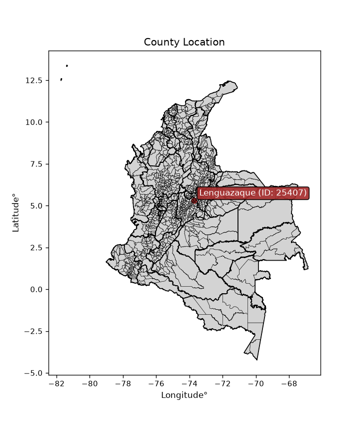
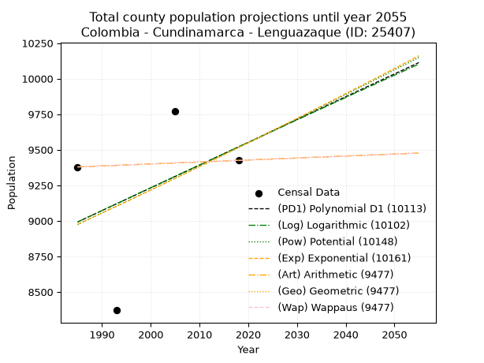
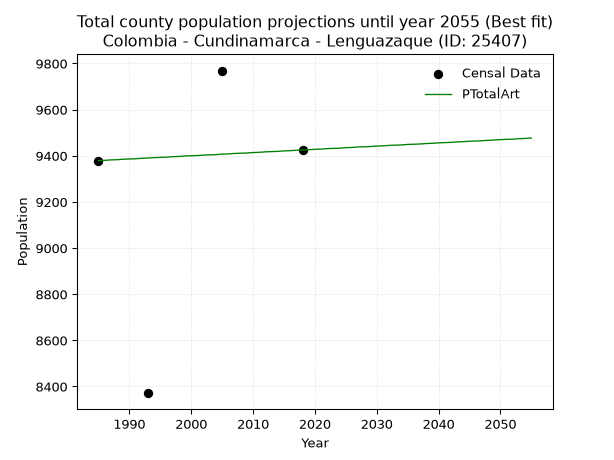
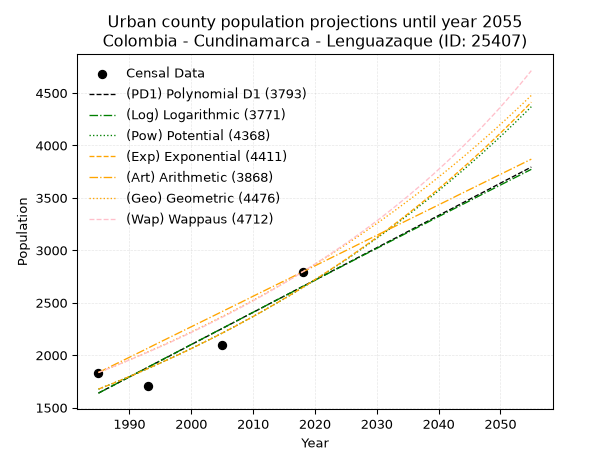
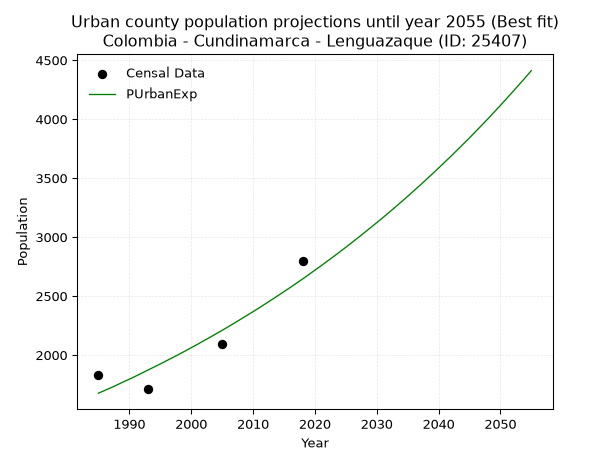
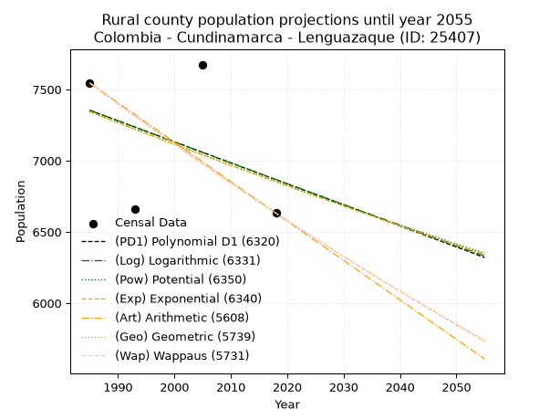
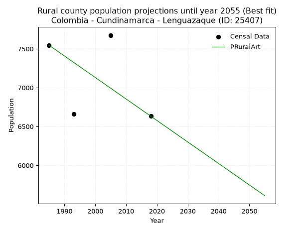

<div align="center">


</div>

# _“Population and Public Services Demand Projections (PPSD) until Year 2050 for Colombia - Cundinamarca - Lenguazaque (ID: 25407)”_
Keywords: `population` `public-service` `projection` `lineal` `polynomial` `logarithmic` `potential` `exponential` `arithmetic` `geometric` `wappaus` `dane` `colombia` `south-america`

PPSD are analytical estimates used by governments and planners to anticipate future changes in population size, age distribution, and the resulting community needs for utilities, healthcare, education, and infrastructure as sizing future water treatment facilities, electrical grids, and road networks based on spatial growth.

<div align="center">

</img>

</div>


> **General running parameters**: • app_version: _v20260806_. • Python version: _3.14.7_. • Pandas version: _3.0.5_. • NumPy version: _2.5.1_. • Creates, save and include plots into reports (create_plot): _False_. • Projection until year: _2050_. • Process polynomial degree 2 and up: _False_. • Process Wappaus: _True_. • Process Wappaus: _True_. • Set negative values to zero: _True_. • Set infinite values to zero: _True_. • Drop dataset notes: _True_. 
<div align="center">

Dynamic map: [:earth_americas:Google](http://maps.google.com/maps?q=5.306130732,-73.7115117) [:earth_americas:OSM](https://www.openstreetmap.org/#map=18/5.306130732/-73.7115117&layers=P) [:earth_americas:Bing](https://www.bing.com/maps?cp=5.306130732~-73.7115117&lvl=18) [:earth_americas:Apple](https://maps.apple.com/frame?center=5.306130732%2C-73.7115117&span=0.003%2C0.006)

</div>


<div align="center">

```geojson
{
  "type": "Feature",
  "geometry": {
    "type": "Point", 
    "coordinates": [-73.7115117, 5.306130732]
  }, 
  "properties": {
    "Name": "Colombia - Cundinamarca - Lenguazaque (ID: 25407)"
  }
}
```

</div>


## 0. Census Data (4 records)

Census data are official statistics collected by a government about the people and housing in a country. They usually include counts of total population, age, sex, race, income, education, and jobs.

📅Global census file: [Population.xlsx](../data/Population.xlsx)

| Source   |   Year |   CountryID | CountryName   |   StateID | StateName    |   CountyID | CountyName   |   PTotal |   PUrban |   PRural |
|:---------|-------:|------------:|:--------------|----------:|:-------------|-----------:|:-------------|---------:|---------:|---------:|
| DANE     |   1985 |          57 | Colombia      |        25 | Cundinamarca |      25407 | Lenguazaque  |     9379 |     1834 |     7545 |
| DANE     |   1993 |          57 | Colombia      |        25 | Cundinamarca |      25407 | Lenguazaque  |     8371 |     1708 |     6663 |
| DANE     |   2005 |          57 | Colombia      |        25 | Cundinamarca |      25407 | Lenguazaque  |     9769 |     2094 |     7675 |
| DANE     |   2018 |          57 | Colombia      |        25 | Cundinamarca |      25407 | Lenguazaque  |     9425 |     2793 |     6632 |

> 🔥Some records could had specific notes about the registered values or the corresponding urban or rural distribution.

📅   [RUPS](https://www.datos.gov.co/Hacienda-y-Cr-dito-P-blico/Registro-nico-de-Prestadores-de-Servicios-P-blicos/4qkq-csdn/about_data) - Local public utility companies: [RUPS.csv](../data/RUPS.xlsx)

 | SERVICIO       | ESTADO    | NOMBRE                                                     | NIT         | DEPARTAMENTO_DOMICILIO   | MUNICIPIO_DOMICILIO   | DIRECCION                        |   TELEFONO | EMAIL                                             | TIPO_PRESTADOR                 | CLASIFICACION                 |
|:---------------|:----------|:-----------------------------------------------------------|:------------|:-------------------------|:----------------------|:---------------------------------|-----------:|:--------------------------------------------------|:-------------------------------|:------------------------------|
| ACUEDUCTO      | OPERATIVA | OFICINA DE SERVICIOS PUBLICOS DEL MUNICIPIO DE LENGUAZAQUE | 899999330-5 | CUNDINAMARCA             | LENGUAZAQUE           | Cra 5 No. 3 - 09                 |    8557114 | serviciospublicos@lenguazaque-cundinamarca.gov.co | MUNICIPIO (PRESTACIÓN DIRECTA) | MENOR O IGUAL A 2500 USUARIOS |
| ALCANTARILLADO | OPERATIVA | OFICINA DE SERVICIOS PUBLICOS DEL MUNICIPIO DE LENGUAZAQUE | 899999330-5 | CUNDINAMARCA             | LENGUAZAQUE           | Cra 5 No. 3 - 09                 |    8557114 | serviciospublicos@lenguazaque-cundinamarca.gov.co | MUNICIPIO (PRESTACIÓN DIRECTA) | MENOR O IGUAL A 2500 USUARIOS |
| ACUEDUCTO      | OPERATIVA | ASOCIACION ACUEDUCTO EL GRANADILLO                         | 900256455-1 | CUNDINAMARCA             | LENGUAZAQUE           | VEREDA ESPINAL SITIO LAS PIEDRAS |    8557065 | acueductoelgranadillo@hotmail.com                 | ORGANIZACION AUTORIZADA        | MENOR O IGUAL A 2500 USUARIOS |

## 1. Total

### 1.1. Coefficients and Parameters

* (PD1) Polynomial Deg 1: 16.020875150542057, -22809.755519871745 (lineal)
* (Log) Logarithmic: 32042.390256431096, -234318.46511073346
* (Pow) Potential: 3.547431022466327, -7.745572495702883
* (Exp) Exponential: 0.0017738843418987592, 265.3367327328821
* (Art) Arithmetic: Year diff. 2018 - 1985 = 33, Population diff. 9425 - 9379 = 46, Annual growth = 1.393939393939394
* (Geo) Geometric: Year diff. 2018 - 1985 = 33, Population diff. 9425 - 9379 = 46, Annual growth % = 0.0001482711670610648
* (Wap) Wappaus: i = 0.01482598802318011, Condition values only valid for < 200)

<sub>
Wappaus condition values: ['0.00', '0.01', '0.03', '0.04', '0.06', '0.07', '0.09', '0.10', '0.12', '0.13', '0.15', '0.16', '0.18', '0.19', '0.21', '0.22', '0.24', '0.25', '0.27', '0.28', '0.30', '0.31', '0.33', '0.34', '0.36', '0.37', '0.39', '0.40', '0.42', '0.43', '0.44', '0.46', '0.47', '0.49', '0.50', '0.52', '0.53', '0.55', '0.56', '0.58', '0.59', '0.61', '0.62', '0.64', '0.65', '0.67', '0.68', '0.70', '0.71', '0.73', '0.74', '0.76', '0.77', '0.79', '0.80', '0.82', '0.83', '0.85', '0.86', '0.87', '0.89', '0.90', '0.92', '0.93', '0.95', '0.96']
</sub>


### 1.2. Projected Dataset

|   Year |   CountyID |   PTotalPD1 |   PTotalLog |   PTotalPow |   PTotalExp |   PTotalArt |   PTotalGeo |   PTotalWap |
|-------:|-----------:|------------:|------------:|------------:|------------:|------------:|------------:|------------:|
|   1985 |      25407 |        8992 |        8991 |        8974 |        8975 |        9379 |        9379 |        9379 |
|   1986 |      25407 |        9008 |        9008 |        8990 |        8991 |        9380 |        9380 |        9380 |
|   1987 |      25407 |        9024 |        9024 |        9007 |        9007 |        9382 |        9382 |        9382 |
|   1988 |      25407 |        9040 |        9040 |        9023 |        9023 |        9383 |        9383 |        9383 |
|   1989 |      25407 |        9056 |        9056 |        9039 |        9039 |        9385 |        9385 |        9385 |
|   1990 |      25407 |        9072 |        9072 |        9055 |        9055 |        9386 |        9386 |        9386 |
|   1991 |      25407 |        9088 |        9088 |        9071 |        9071 |        9387 |        9387 |        9387 |
|   1992 |      25407 |        9104 |        9104 |        9087 |        9087 |        9389 |        9389 |        9389 |
|   1993 |      25407 |        9120 |        9120 |        9103 |        9103 |        9390 |        9390 |        9390 |
|   1994 |      25407 |        9136 |        9136 |        9120 |        9119 |        9392 |        9392 |        9392 |
|   1995 |      25407 |        9152 |        9152 |        9136 |        9135 |        9393 |        9393 |        9393 |
|   1996 |      25407 |        9168 |        9168 |        9152 |        9151 |        9394 |        9394 |        9394 |
|   1997 |      25407 |        9184 |        9185 |        9168 |        9168 |        9396 |        9396 |        9396 |
|   1998 |      25407 |        9200 |        9201 |        9185 |        9184 |        9397 |        9397 |        9397 |
|   1999 |      25407 |        9216 |        9217 |        9201 |        9200 |        9399 |        9398 |        9398 |
|   2000 |      25407 |        9232 |        9233 |        9217 |        9217 |        9400 |        9400 |        9400 |
|   2001 |      25407 |        9248 |        9249 |        9234 |        9233 |        9401 |        9401 |        9401 |
|   2002 |      25407 |        9264 |        9265 |        9250 |        9249 |        9403 |        9403 |        9403 |
|   2003 |      25407 |        9280 |        9281 |        9266 |        9266 |        9404 |        9404 |        9404 |
|   2004 |      25407 |        9296 |        9297 |        9283 |        9282 |        9405 |        9405 |        9405 |
|   2005 |      25407 |        9312 |        9313 |        9299 |        9299 |        9407 |        9407 |        9407 |
|   2006 |      25407 |        9328 |        9329 |        9316 |        9315 |        9408 |        9408 |        9408 |
|   2007 |      25407 |        9344 |        9345 |        9332 |        9332 |        9410 |        9410 |        9410 |
|   2008 |      25407 |        9360 |        9361 |        9349 |        9348 |        9411 |        9411 |        9411 |
|   2009 |      25407 |        9376 |        9376 |        9365 |        9365 |        9412 |        9412 |        9412 |
|   2010 |      25407 |        9392 |        9392 |        9382 |        9382 |        9414 |        9414 |        9414 |
|   2011 |      25407 |        9408 |        9408 |        9398 |        9398 |        9415 |        9415 |        9415 |
|   2012 |      25407 |        9424 |        9424 |        9415 |        9415 |        9417 |        9417 |        9417 |
|   2013 |      25407 |        9440 |        9440 |        9432 |        9432 |        9418 |        9418 |        9418 |
|   2014 |      25407 |        9456 |        9456 |        9448 |        9448 |        9419 |        9419 |        9419 |
|   2015 |      25407 |        9472 |        9472 |        9465 |        9465 |        9421 |        9421 |        9421 |
|   2016 |      25407 |        9488 |        9488 |        9482 |        9482 |        9422 |        9422 |        9422 |
|   2017 |      25407 |        9504 |        9504 |        9498 |        9499 |        9424 |        9424 |        9424 |
|   2018 |      25407 |        9520 |        9520 |        9515 |        9516 |        9425 |        9425 |        9425 |
|   2019 |      25407 |        9536 |        9536 |        9532 |        9533 |        9426 |        9426 |        9426 |
|   2020 |      25407 |        9552 |        9551 |        9548 |        9550 |        9428 |        9428 |        9428 |
|   2021 |      25407 |        9568 |        9567 |        9565 |        9566 |        9429 |        9429 |        9429 |
|   2022 |      25407 |        9584 |        9583 |        9582 |        9583 |        9431 |        9431 |        9431 |
|   2023 |      25407 |        9600 |        9599 |        9599 |        9600 |        9432 |        9432 |        9432 |
|   2024 |      25407 |        9616 |        9615 |        9616 |        9618 |        9433 |        9433 |        9433 |
|   2025 |      25407 |        9633 |        9631 |        9633 |        9635 |        9435 |        9435 |        9435 |
|   2026 |      25407 |        9649 |        9646 |        9649 |        9652 |        9436 |        9436 |        9436 |
|   2027 |      25407 |        9665 |        9662 |        9666 |        9669 |        9438 |        9438 |        9438 |
|   2028 |      25407 |        9681 |        9678 |        9683 |        9686 |        9439 |        9439 |        9439 |
|   2029 |      25407 |        9697 |        9694 |        9700 |        9703 |        9440 |        9440 |        9440 |
|   2030 |      25407 |        9713 |        9710 |        9717 |        9720 |        9442 |        9442 |        9442 |
|   2031 |      25407 |        9729 |        9725 |        9734 |        9738 |        9443 |        9443 |        9443 |
|   2032 |      25407 |        9745 |        9741 |        9751 |        9755 |        9445 |        9445 |        9445 |
|   2033 |      25407 |        9761 |        9757 |        9768 |        9772 |        9446 |        9446 |        9446 |
|   2034 |      25407 |        9777 |        9773 |        9785 |        9790 |        9447 |        9447 |        9447 |
|   2035 |      25407 |        9793 |        9789 |        9802 |        9807 |        9449 |        9449 |        9449 |
|   2036 |      25407 |        9809 |        9804 |        9819 |        9824 |        9450 |        9450 |        9450 |
|   2037 |      25407 |        9825 |        9820 |        9837 |        9842 |        9451 |        9452 |        9452 |
|   2038 |      25407 |        9841 |        9836 |        9854 |        9859 |        9453 |        9453 |        9453 |
|   2039 |      25407 |        9857 |        9851 |        9871 |        9877 |        9454 |        9454 |        9454 |
|   2040 |      25407 |        9873 |        9867 |        9888 |        9894 |        9456 |        9456 |        9456 |
|   2041 |      25407 |        9889 |        9883 |        9905 |        9912 |        9457 |        9457 |        9457 |
|   2042 |      25407 |        9905 |        9899 |        9923 |        9930 |        9458 |        9459 |        9459 |
|   2043 |      25407 |        9921 |        9914 |        9940 |        9947 |        9460 |        9460 |        9460 |
|   2044 |      25407 |        9937 |        9930 |        9957 |        9965 |        9461 |        9461 |        9461 |
|   2045 |      25407 |        9953 |        9946 |        9974 |        9983 |        9463 |        9463 |        9463 |
|   2046 |      25407 |        9969 |        9961 |        9992 |       10000 |        9464 |        9464 |        9464 |
|   2047 |      25407 |        9985 |        9977 |       10009 |       10018 |        9465 |        9466 |        9466 |
|   2048 |      25407 |       10001 |        9993 |       10026 |       10036 |        9467 |        9467 |        9467 |
|   2049 |      25407 |       10017 |       10008 |       10044 |       10054 |        9468 |        9468 |        9468 |
|   2050 |      25407 |       10033 |       10024 |       10061 |       10071 |        9470 |        9470 |        9470 |
<div align="center">

</img>

</div>


### 1.3. Best fit with absolute and relative error (%)

Relative error puts that difference into context by dividing the absolute error by the true value, creating a unitless ratio or percentage that shows the scale of the mistake.

Absolute and relative error

|   Year | Source   |   CountryID | CountryName   |   StateID | StateName    |   CountyID_x | CountyName   |   PTotal |   PUrban |   PRural |   CountyID_y |   PTotalPD1 |   PTotalLog |   PTotalPow |   PTotalExp |   PTotalArt |   PTotalGeo |   PTotalWap |   PTotalPD1AbsError |   PTotalLogAbsError |   PTotalPowAbsError |   PTotalExpAbsError |   PTotalArtAbsError |   PTotalGeoAbsError |   PTotalWapAbsError |   PTotalPD1RelError |   PTotalLogRelError |   PTotalPowRelError |   PTotalExpRelError |   PTotalArtRelError |   PTotalGeoRelError |   PTotalWapRelError |
|-------:|:---------|------------:|:--------------|----------:|:-------------|-------------:|:-------------|---------:|---------:|---------:|-------------:|------------:|------------:|------------:|------------:|------------:|------------:|------------:|--------------------:|--------------------:|--------------------:|--------------------:|--------------------:|--------------------:|--------------------:|--------------------:|--------------------:|--------------------:|--------------------:|--------------------:|--------------------:|--------------------:|
|   1985 | DANE     |          57 | Colombia      |        25 | Cundinamarca |        25407 | Lenguazaque  |     9379 |     1834 |     7545 |        25407 |        8992 |        8991 |        8974 |        8975 |        9379 |        9379 |        9379 |                 387 |                 388 |                 405 |                 404 |                   0 |                   0 |                   0 |             4.12624 |             4.1369  |            4.31816  |            4.3075   |              0      |              0      |              0      |
|   1993 | DANE     |          57 | Colombia      |        25 | Cundinamarca |        25407 | Lenguazaque  |     8371 |     1708 |     6663 |        25407 |        9120 |        9120 |        9103 |        9103 |        9390 |        9390 |        9390 |                 749 |                 749 |                 732 |                 732 |                1019 |                1019 |                1019 |             8.94756 |             8.94756 |            8.74447  |            8.74447  |             12.173  |             12.173  |             12.173  |
|   2005 | DANE     |          57 | Colombia      |        25 | Cundinamarca |        25407 | Lenguazaque  |     9769 |     2094 |     7675 |        25407 |        9312 |        9313 |        9299 |        9299 |        9407 |        9407 |        9407 |                 457 |                 456 |                 470 |                 470 |                 362 |                 362 |                 362 |             4.67806 |             4.66783 |            4.81114  |            4.81114  |              3.7056 |              3.7056 |              3.7056 |
|   2018 | DANE     |          57 | Colombia      |        25 | Cundinamarca |        25407 | Lenguazaque  |     9425 |     2793 |     6632 |        25407 |        9520 |        9520 |        9515 |        9516 |        9425 |        9425 |        9425 |                  95 |                  95 |                  90 |                  91 |                   0 |                   0 |                   0 |             1.00796 |             1.00796 |            0.954907 |            0.965517 |              0      |              0      |              0      |

Relative error mean

| Method    |   RelError | Best   |
|:----------|-----------:|:-------|
| PTotalPD1 |    4.68995 |        |
| PTotalLog |    4.69006 |        |
| PTotalPow |    4.70717 |        |
| PTotalExp |    4.70716 |        |
| PTotalArt |    3.96964 | True   |
| PTotalGeo |    3.96964 | True   |
| PTotalWap |    3.96964 | True   |

💙Best method: _**PTotalArt**_
<div align="center">

</img>

</div>


### 1.4. Fresh water supply demand in liters per capita per day (lpcd)

The fresh water supply demand typically ranges from 100 to 300 liters per capita per day (lpcd) for standard domestic and municipal planning, though absolute survival minimums set by the World Health Organization are as low as 7.5 to 20 liters per day, and total consumption in high-income nations can exceed 400 liters.

> `CZ`: Level in meters above the sea level (masl)<br> `WS`: Fresh water supply demand in liters per capita per day (lpcd or l/h/d)<br> `WSAll`: Zonal fresh water supply demand in liters per second (l/s)<br> `A`: Zonal area in square meters<br> `DP`: Population density (people/hectare or p/ha)

Reference values (RAS Colombia)

|    CZ |   WS |
|------:|-----:|
|  1000 |  120 |
|  2000 |  130 |
| 99999 |  140 |

County shapefile geometry properties and water supply values

|   CountyID |      ATotal |   CZTotal |   WSTotal |
|-----------:|------------:|----------:|----------:|
|      25407 | 1.55396e+08 |   2882.07 |       140 |

Projected values for best method: PTotalArt

|   CountyID |   Year |   PTotalArt |   DPTotal |   WSTotal |   WSTotalAll |
|-----------:|-------:|------------:|----------:|----------:|-------------:|
|      25407 |   1985 |        9379 |      0.6  |       140 |      15.1975 |
|      25407 |   1986 |        9380 |      0.6  |       140 |      15.1991 |
|      25407 |   1987 |        9382 |      0.6  |       140 |      15.2023 |
|      25407 |   1988 |        9383 |      0.6  |       140 |      15.2039 |
|      25407 |   1989 |        9385 |      0.6  |       140 |      15.2072 |
|      25407 |   1990 |        9386 |      0.6  |       140 |      15.2088 |
|      25407 |   1991 |        9387 |      0.6  |       140 |      15.2104 |
|      25407 |   1992 |        9389 |      0.6  |       140 |      15.2137 |
|      25407 |   1993 |        9390 |      0.6  |       140 |      15.2153 |
|      25407 |   1994 |        9392 |      0.6  |       140 |      15.2185 |
|      25407 |   1995 |        9393 |      0.6  |       140 |      15.2201 |
|      25407 |   1996 |        9394 |      0.6  |       140 |      15.2218 |
|      25407 |   1997 |        9396 |      0.6  |       140 |      15.225  |
|      25407 |   1998 |        9397 |      0.6  |       140 |      15.2266 |
|      25407 |   1999 |        9399 |      0.6  |       140 |      15.2299 |
|      25407 |   2000 |        9400 |      0.6  |       140 |      15.2315 |
|      25407 |   2001 |        9401 |      0.6  |       140 |      15.2331 |
|      25407 |   2002 |        9403 |      0.61 |       140 |      15.2363 |
|      25407 |   2003 |        9404 |      0.61 |       140 |      15.238  |
|      25407 |   2004 |        9405 |      0.61 |       140 |      15.2396 |
|      25407 |   2005 |        9407 |      0.61 |       140 |      15.2428 |
|      25407 |   2006 |        9408 |      0.61 |       140 |      15.2444 |
|      25407 |   2007 |        9410 |      0.61 |       140 |      15.2477 |
|      25407 |   2008 |        9411 |      0.61 |       140 |      15.2493 |
|      25407 |   2009 |        9412 |      0.61 |       140 |      15.2509 |
|      25407 |   2010 |        9414 |      0.61 |       140 |      15.2542 |
|      25407 |   2011 |        9415 |      0.61 |       140 |      15.2558 |
|      25407 |   2012 |        9417 |      0.61 |       140 |      15.259  |
|      25407 |   2013 |        9418 |      0.61 |       140 |      15.2606 |
|      25407 |   2014 |        9419 |      0.61 |       140 |      15.2623 |
|      25407 |   2015 |        9421 |      0.61 |       140 |      15.2655 |
|      25407 |   2016 |        9422 |      0.61 |       140 |      15.2671 |
|      25407 |   2017 |        9424 |      0.61 |       140 |      15.2704 |
|      25407 |   2018 |        9425 |      0.61 |       140 |      15.272  |
|      25407 |   2019 |        9426 |      0.61 |       140 |      15.2736 |
|      25407 |   2020 |        9428 |      0.61 |       140 |      15.2769 |
|      25407 |   2021 |        9429 |      0.61 |       140 |      15.2785 |
|      25407 |   2022 |        9431 |      0.61 |       140 |      15.2817 |
|      25407 |   2023 |        9432 |      0.61 |       140 |      15.2833 |
|      25407 |   2024 |        9433 |      0.61 |       140 |      15.285  |
|      25407 |   2025 |        9435 |      0.61 |       140 |      15.2882 |
|      25407 |   2026 |        9436 |      0.61 |       140 |      15.2898 |
|      25407 |   2027 |        9438 |      0.61 |       140 |      15.2931 |
|      25407 |   2028 |        9439 |      0.61 |       140 |      15.2947 |
|      25407 |   2029 |        9440 |      0.61 |       140 |      15.2963 |
|      25407 |   2030 |        9442 |      0.61 |       140 |      15.2995 |
|      25407 |   2031 |        9443 |      0.61 |       140 |      15.3012 |
|      25407 |   2032 |        9445 |      0.61 |       140 |      15.3044 |
|      25407 |   2033 |        9446 |      0.61 |       140 |      15.306  |
|      25407 |   2034 |        9447 |      0.61 |       140 |      15.3076 |
|      25407 |   2035 |        9449 |      0.61 |       140 |      15.3109 |
|      25407 |   2036 |        9450 |      0.61 |       140 |      15.3125 |
|      25407 |   2037 |        9451 |      0.61 |       140 |      15.3141 |
|      25407 |   2038 |        9453 |      0.61 |       140 |      15.3174 |
|      25407 |   2039 |        9454 |      0.61 |       140 |      15.319  |
|      25407 |   2040 |        9456 |      0.61 |       140 |      15.3222 |
|      25407 |   2041 |        9457 |      0.61 |       140 |      15.3238 |
|      25407 |   2042 |        9458 |      0.61 |       140 |      15.3255 |
|      25407 |   2043 |        9460 |      0.61 |       140 |      15.3287 |
|      25407 |   2044 |        9461 |      0.61 |       140 |      15.3303 |
|      25407 |   2045 |        9463 |      0.61 |       140 |      15.3336 |
|      25407 |   2046 |        9464 |      0.61 |       140 |      15.3352 |
|      25407 |   2047 |        9465 |      0.61 |       140 |      15.3368 |
|      25407 |   2048 |        9467 |      0.61 |       140 |      15.34   |
|      25407 |   2049 |        9468 |      0.61 |       140 |      15.3417 |
|      25407 |   2050 |        9470 |      0.61 |       140 |      15.3449 |

## 2. Urban

### 2.1. Coefficients and Parameters

* (PD1) Polynomial Deg 1: 30.7840224809309, -59468.49096748204 (lineal)
* (Log) Logarithmic: 61556.32533898201, -465782.87218303554
* (Pow) Potential: 27.65357008761906, -87.97079832488268
* (Exp) Exponential: 0.013828531088469839, 2.0087357083975666e-09
* (Art) Arithmetic: Year diff. 2018 - 1985 = 33, Population diff. 2793 - 1834 = 959, Annual growth = 29.060606060606062
* (Geo) Geometric: Year diff. 2018 - 1985 = 33, Population diff. 2793 - 1834 = 959, Annual growth % = 0.012827543122850837
* (Wap) Wappaus: i = 1.2561316646036766, Condition values only valid for < 200)

<sub>
Wappaus condition values: ['0.00', '1.26', '2.51', '3.77', '5.02', '6.28', '7.54', '8.79', '10.05', '11.31', '12.56', '13.82', '15.07', '16.33', '17.59', '18.84', '20.10', '21.35', '22.61', '23.87', '25.12', '26.38', '27.63', '28.89', '30.15', '31.40', '32.66', '33.92', '35.17', '36.43', '37.68', '38.94', '40.20', '41.45', '42.71', '43.96', '45.22', '46.48', '47.73', '48.99', '50.25', '51.50', '52.76', '54.01', '55.27', '56.53', '57.78', '59.04', '60.29', '61.55', '62.81', '64.06', '65.32', '66.57', '67.83', '69.09', '70.34', '71.60', '72.86', '74.11', '75.37', '76.62', '77.88', '79.14', '80.39', '81.65']
</sub>


### 2.2. Projected Dataset

|   Year |   CountyID |   PUrbanPD1 |   PUrbanLog |   PUrbanPow |   PUrbanExp |   PUrbanArt |   PUrbanGeo |   PUrbanWap |
|-------:|-----------:|------------:|------------:|------------:|------------:|------------:|------------:|------------:|
|   1985 |      25407 |        1638 |        1637 |        1675 |        1676 |        1834 |        1834 |        1834 |
|   1986 |      25407 |        1669 |        1668 |        1699 |        1699 |        1863 |        1858 |        1857 |
|   1987 |      25407 |        1699 |        1699 |        1722 |        1722 |        1892 |        1881 |        1881 |
|   1988 |      25407 |        1730 |        1730 |        1747 |        1746 |        1921 |        1905 |        1904 |
|   1989 |      25407 |        1761 |        1761 |        1771 |        1771 |        1950 |        1930 |        1929 |
|   1990 |      25407 |        1792 |        1792 |        1796 |        1795 |        1979 |        1955 |        1953 |
|   1991 |      25407 |        1822 |        1823 |        1821 |        1820 |        2008 |        1980 |        1978 |
|   1992 |      25407 |        1853 |        1854 |        1846 |        1846 |        2037 |        2005 |        2003 |
|   1993 |      25407 |        1884 |        1885 |        1872 |        1872 |        2066 |        2031 |        2028 |
|   1994 |      25407 |        1915 |        1916 |        1898 |        1898 |        2096 |        2057 |        2054 |
|   1995 |      25407 |        1946 |        1947 |        1925 |        1924 |        2125 |        2083 |        2080 |
|   1996 |      25407 |        1976 |        1978 |        1952 |        1951 |        2154 |        2110 |        2106 |
|   1997 |      25407 |        2007 |        2008 |        1979 |        1978 |        2183 |        2137 |        2133 |
|   1998 |      25407 |        2038 |        2039 |        2007 |        2005 |        2212 |        2165 |        2160 |
|   1999 |      25407 |        2069 |        2070 |        2035 |        2033 |        2241 |        2192 |        2188 |
|   2000 |      25407 |        2100 |        2101 |        2063 |        2062 |        2270 |        2220 |        2216 |
|   2001 |      25407 |        2130 |        2132 |        2092 |        2090 |        2299 |        2249 |        2244 |
|   2002 |      25407 |        2161 |        2162 |        2121 |        2120 |        2328 |        2278 |        2272 |
|   2003 |      25407 |        2192 |        2193 |        2150 |        2149 |        2357 |        2307 |        2302 |
|   2004 |      25407 |        2223 |        2224 |        2180 |        2179 |        2386 |        2337 |        2331 |
|   2005 |      25407 |        2253 |        2254 |        2210 |        2209 |        2415 |        2367 |        2361 |
|   2006 |      25407 |        2284 |        2285 |        2241 |        2240 |        2444 |        2397 |        2391 |
|   2007 |      25407 |        2315 |        2316 |        2272 |        2271 |        2473 |        2428 |        2422 |
|   2008 |      25407 |        2346 |        2346 |        2304 |        2303 |        2502 |        2459 |        2453 |
|   2009 |      25407 |        2377 |        2377 |        2336 |        2335 |        2531 |        2490 |        2485 |
|   2010 |      25407 |        2407 |        2408 |        2368 |        2367 |        2561 |        2522 |        2517 |
|   2011 |      25407 |        2438 |        2438 |        2401 |        2400 |        2590 |        2555 |        2550 |
|   2012 |      25407 |        2469 |        2469 |        2434 |        2434 |        2619 |        2587 |        2583 |
|   2013 |      25407 |        2500 |        2500 |        2468 |        2468 |        2648 |        2621 |        2617 |
|   2014 |      25407 |        2531 |        2530 |        2502 |        2502 |        2677 |        2654 |        2651 |
|   2015 |      25407 |        2561 |        2561 |        2536 |        2537 |        2706 |        2688 |        2686 |
|   2016 |      25407 |        2592 |        2591 |        2571 |        2572 |        2735 |        2723 |        2721 |
|   2017 |      25407 |        2623 |        2622 |        2607 |        2608 |        2764 |        2758 |        2757 |
|   2018 |      25407 |        2654 |        2652 |        2643 |        2644 |        2793 |        2793 |        2793 |
|   2019 |      25407 |        2684 |        2683 |        2679 |        2681 |        2822 |        2829 |        2830 |
|   2020 |      25407 |        2715 |        2713 |        2716 |        2719 |        2851 |        2865 |        2867 |
|   2021 |      25407 |        2746 |        2744 |        2754 |        2756 |        2880 |        2902 |        2906 |
|   2022 |      25407 |        2777 |        2774 |        2792 |        2795 |        2909 |        2939 |        2944 |
|   2023 |      25407 |        2808 |        2805 |        2830 |        2834 |        2938 |        2977 |        2984 |
|   2024 |      25407 |        2838 |        2835 |        2869 |        2873 |        2967 |        3015 |        3024 |
|   2025 |      25407 |        2869 |        2865 |        2908 |        2913 |        2996 |        3054 |        3065 |
|   2026 |      25407 |        2900 |        2896 |        2948 |        2954 |        3025 |        3093 |        3106 |
|   2027 |      25407 |        2931 |        2926 |        2989 |        2995 |        3055 |        3132 |        3148 |
|   2028 |      25407 |        2962 |        2957 |        3030 |        3037 |        3084 |        3173 |        3191 |
|   2029 |      25407 |        2992 |        2987 |        3072 |        3079 |        3113 |        3213 |        3235 |
|   2030 |      25407 |        3023 |        3017 |        3114 |        3122 |        3142 |        3255 |        3279 |
|   2031 |      25407 |        3054 |        3048 |        3156 |        3165 |        3171 |        3296 |        3324 |
|   2032 |      25407 |        3085 |        3078 |        3200 |        3209 |        3200 |        3339 |        3370 |
|   2033 |      25407 |        3115 |        3108 |        3243 |        3254 |        3229 |        3381 |        3417 |
|   2034 |      25407 |        3146 |        3138 |        3288 |        3299 |        3258 |        3425 |        3465 |
|   2035 |      25407 |        3177 |        3169 |        3333 |        3345 |        3287 |        3469 |        3513 |
|   2036 |      25407 |        3208 |        3199 |        3378 |        3392 |        3316 |        3513 |        3563 |
|   2037 |      25407 |        3239 |        3229 |        3425 |        3439 |        3345 |        3558 |        3613 |
|   2038 |      25407 |        3269 |        3259 |        3471 |        3487 |        3374 |        3604 |        3664 |
|   2039 |      25407 |        3300 |        3290 |        3519 |        3536 |        3403 |        3650 |        3716 |
|   2040 |      25407 |        3331 |        3320 |        3567 |        3585 |        3432 |        3697 |        3770 |
|   2041 |      25407 |        3362 |        3350 |        3616 |        3635 |        3461 |        3744 |        3824 |
|   2042 |      25407 |        3392 |        3380 |        3665 |        3685 |        3490 |        3792 |        3879 |
|   2043 |      25407 |        3423 |        3410 |        3715 |        3737 |        3520 |        3841 |        3936 |
|   2044 |      25407 |        3454 |        3440 |        3765 |        3789 |        3549 |        3890 |        3993 |
|   2045 |      25407 |        3485 |        3470 |        3817 |        3841 |        3578 |        3940 |        4052 |
|   2046 |      25407 |        3516 |        3501 |        3869 |        3895 |        3607 |        3991 |        4112 |
|   2047 |      25407 |        3546 |        3531 |        3921 |        3949 |        3636 |        4042 |        4173 |
|   2048 |      25407 |        3577 |        3561 |        3975 |        4004 |        3665 |        4094 |        4236 |
|   2049 |      25407 |        3608 |        3591 |        4029 |        4060 |        3694 |        4146 |        4299 |
|   2050 |      25407 |        3639 |        3621 |        4083 |        4116 |        3723 |        4200 |        4364 |
<div align="center">

</img>

</div>


### 2.3. Best fit with absolute and relative error (%)

Relative error puts that difference into context by dividing the absolute error by the true value, creating a unitless ratio or percentage that shows the scale of the mistake.

Absolute and relative error

|   Year | Source   |   CountryID | CountryName   |   StateID | StateName    |   CountyID_x | CountyName   |   PTotal |   PUrban |   PRural |   CountyID_y |   PUrbanPD1 |   PUrbanLog |   PUrbanPow |   PUrbanExp |   PUrbanArt |   PUrbanGeo |   PUrbanWap |   PUrbanPD1AbsError |   PUrbanLogAbsError |   PUrbanPowAbsError |   PUrbanExpAbsError |   PUrbanArtAbsError |   PUrbanGeoAbsError |   PUrbanWapAbsError |   PUrbanPD1RelError |   PUrbanLogRelError |   PUrbanPowRelError |   PUrbanExpRelError |   PUrbanArtRelError |   PUrbanGeoRelError |   PUrbanWapRelError |
|-------:|:---------|------------:|:--------------|----------:|:-------------|-------------:|:-------------|---------:|---------:|---------:|-------------:|------------:|------------:|------------:|------------:|------------:|------------:|------------:|--------------------:|--------------------:|--------------------:|--------------------:|--------------------:|--------------------:|--------------------:|--------------------:|--------------------:|--------------------:|--------------------:|--------------------:|--------------------:|--------------------:|
|   1985 | DANE     |          57 | Colombia      |        25 | Cundinamarca |        25407 | Lenguazaque  |     9379 |     1834 |     7545 |        25407 |        1638 |        1637 |        1675 |        1676 |        1834 |        1834 |        1834 |                 196 |                 197 |                 159 |                 158 |                   0 |                   0 |                   0 |            10.687   |            10.7415  |             8.66957 |             8.61505 |              0      |              0      |              0      |
|   1993 | DANE     |          57 | Colombia      |        25 | Cundinamarca |        25407 | Lenguazaque  |     8371 |     1708 |     6663 |        25407 |        1884 |        1885 |        1872 |        1872 |        2066 |        2031 |        2028 |                 176 |                 177 |                 164 |                 164 |                 358 |                 323 |                 320 |            10.3044  |            10.363   |             9.60187 |             9.60187 |             20.9602 |             18.911  |             18.7354 |
|   2005 | DANE     |          57 | Colombia      |        25 | Cundinamarca |        25407 | Lenguazaque  |     9769 |     2094 |     7675 |        25407 |        2253 |        2254 |        2210 |        2209 |        2415 |        2367 |        2361 |                 159 |                 160 |                 116 |                 115 |                 321 |                 273 |                 267 |             7.59312 |             7.64088 |             5.53964 |             5.49188 |             15.3295 |             13.0372 |             12.7507 |
|   2018 | DANE     |          57 | Colombia      |        25 | Cundinamarca |        25407 | Lenguazaque  |     9425 |     2793 |     6632 |        25407 |        2654 |        2652 |        2643 |        2644 |        2793 |        2793 |        2793 |                 139 |                 141 |                 150 |                 149 |                   0 |                   0 |                   0 |             4.97673 |             5.04834 |             5.37057 |             5.33477 |              0      |              0      |              0      |

Relative error mean

| Method    |   RelError | Best   |
|:----------|-----------:|:-------|
| PUrbanPD1 |    8.39033 |        |
| PUrbanLog |    8.44844 |        |
| PUrbanPow |    7.29541 |        |
| PUrbanExp |    7.26089 | True   |
| PUrbanArt |    9.07243 |        |
| PUrbanGeo |    7.98706 |        |
| PUrbanWap |    7.87152 |        |

💙Best method: _**PUrbanExp**_
<div align="center">

</img>

</div>


### 2.4. Fresh water supply demand in liters per capita per day (lpcd)

The fresh water supply demand typically ranges from 100 to 300 liters per capita per day (lpcd) for standard domestic and municipal planning, though absolute survival minimums set by the World Health Organization are as low as 7.5 to 20 liters per day, and total consumption in high-income nations can exceed 400 liters.

> `CZ`: Level in meters above the sea level (masl)<br> `WS`: Fresh water supply demand in liters per capita per day (lpcd or l/h/d)<br> `WSAll`: Zonal fresh water supply demand in liters per second (l/s)<br> `A`: Zonal area in square meters<br> `DP`: Population density (people/hectare or p/ha)

Reference values (RAS Colombia)

|    CZ |   WS |
|------:|-----:|
|  1000 |  120 |
|  2000 |  130 |
| 99999 |  140 |

County shapefile geometry properties and water supply values

|   CountyID |   AUrban |   CZUrban |   WSUrban |
|-----------:|---------:|----------:|----------:|
|      25407 |   517897 |   2580.45 |       140 |

Projected values for best method: PUrbanExp

|   CountyID |   Year |   PUrbanExp |   DPUrban |   WSUrban |   WSUrbanAll |
|-----------:|-------:|------------:|----------:|----------:|-------------:|
|      25407 |   1985 |        1676 |     32.36 |       140 |      2.71574 |
|      25407 |   1986 |        1699 |     32.81 |       140 |      2.75301 |
|      25407 |   1987 |        1722 |     33.25 |       140 |      2.79028 |
|      25407 |   1988 |        1746 |     33.71 |       140 |      2.82917 |
|      25407 |   1989 |        1771 |     34.2  |       140 |      2.86968 |
|      25407 |   1990 |        1795 |     34.66 |       140 |      2.90856 |
|      25407 |   1991 |        1820 |     35.14 |       140 |      2.94907 |
|      25407 |   1992 |        1846 |     35.64 |       140 |      2.9912  |
|      25407 |   1993 |        1872 |     36.15 |       140 |      3.03333 |
|      25407 |   1994 |        1898 |     36.65 |       140 |      3.07546 |
|      25407 |   1995 |        1924 |     37.15 |       140 |      3.11759 |
|      25407 |   1996 |        1951 |     37.67 |       140 |      3.16134 |
|      25407 |   1997 |        1978 |     38.19 |       140 |      3.20509 |
|      25407 |   1998 |        2005 |     38.71 |       140 |      3.24884 |
|      25407 |   1999 |        2033 |     39.25 |       140 |      3.29421 |
|      25407 |   2000 |        2062 |     39.81 |       140 |      3.3412  |
|      25407 |   2001 |        2090 |     40.36 |       140 |      3.38657 |
|      25407 |   2002 |        2120 |     40.93 |       140 |      3.43519 |
|      25407 |   2003 |        2149 |     41.49 |       140 |      3.48218 |
|      25407 |   2004 |        2179 |     42.07 |       140 |      3.53079 |
|      25407 |   2005 |        2209 |     42.65 |       140 |      3.5794  |
|      25407 |   2006 |        2240 |     43.25 |       140 |      3.62963 |
|      25407 |   2007 |        2271 |     43.85 |       140 |      3.67986 |
|      25407 |   2008 |        2303 |     44.47 |       140 |      3.73171 |
|      25407 |   2009 |        2335 |     45.09 |       140 |      3.78356 |
|      25407 |   2010 |        2367 |     45.7  |       140 |      3.83542 |
|      25407 |   2011 |        2400 |     46.34 |       140 |      3.88889 |
|      25407 |   2012 |        2434 |     47    |       140 |      3.94398 |
|      25407 |   2013 |        2468 |     47.65 |       140 |      3.99907 |
|      25407 |   2014 |        2502 |     48.31 |       140 |      4.05417 |
|      25407 |   2015 |        2537 |     48.99 |       140 |      4.11088 |
|      25407 |   2016 |        2572 |     49.66 |       140 |      4.16759 |
|      25407 |   2017 |        2608 |     50.36 |       140 |      4.22593 |
|      25407 |   2018 |        2644 |     51.05 |       140 |      4.28426 |
|      25407 |   2019 |        2681 |     51.77 |       140 |      4.34421 |
|      25407 |   2020 |        2719 |     52.5  |       140 |      4.40579 |
|      25407 |   2021 |        2756 |     53.22 |       140 |      4.46574 |
|      25407 |   2022 |        2795 |     53.97 |       140 |      4.52894 |
|      25407 |   2023 |        2834 |     54.72 |       140 |      4.59213 |
|      25407 |   2024 |        2873 |     55.47 |       140 |      4.65532 |
|      25407 |   2025 |        2913 |     56.25 |       140 |      4.72014 |
|      25407 |   2026 |        2954 |     57.04 |       140 |      4.78657 |
|      25407 |   2027 |        2995 |     57.83 |       140 |      4.85301 |
|      25407 |   2028 |        3037 |     58.64 |       140 |      4.92106 |
|      25407 |   2029 |        3079 |     59.45 |       140 |      4.98912 |
|      25407 |   2030 |        3122 |     60.28 |       140 |      5.0588  |
|      25407 |   2031 |        3165 |     61.11 |       140 |      5.12847 |
|      25407 |   2032 |        3209 |     61.96 |       140 |      5.19977 |
|      25407 |   2033 |        3254 |     62.83 |       140 |      5.27269 |
|      25407 |   2034 |        3299 |     63.7  |       140 |      5.3456  |
|      25407 |   2035 |        3345 |     64.59 |       140 |      5.42014 |
|      25407 |   2036 |        3392 |     65.5  |       140 |      5.4963  |
|      25407 |   2037 |        3439 |     66.4  |       140 |      5.57245 |
|      25407 |   2038 |        3487 |     67.33 |       140 |      5.65023 |
|      25407 |   2039 |        3536 |     68.28 |       140 |      5.72963 |
|      25407 |   2040 |        3585 |     69.22 |       140 |      5.80903 |
|      25407 |   2041 |        3635 |     70.19 |       140 |      5.89005 |
|      25407 |   2042 |        3685 |     71.15 |       140 |      5.97106 |
|      25407 |   2043 |        3737 |     72.16 |       140 |      6.05532 |
|      25407 |   2044 |        3789 |     73.16 |       140 |      6.13958 |
|      25407 |   2045 |        3841 |     74.17 |       140 |      6.22384 |
|      25407 |   2046 |        3895 |     75.21 |       140 |      6.31134 |
|      25407 |   2047 |        3949 |     76.25 |       140 |      6.39884 |
|      25407 |   2048 |        4004 |     77.31 |       140 |      6.48796 |
|      25407 |   2049 |        4060 |     78.39 |       140 |      6.5787  |
|      25407 |   2050 |        4116 |     79.48 |       140 |      6.66944 |

## 3. Rural

### 3.1. Coefficients and Parameters

* (PD1) Polynomial Deg 1: -14.763147330388835, 36658.73544761027 (lineal)
* (Log) Logarithmic: -29513.935082550903, 231464.407072302
* (Pow) Potential: -4.195727259715854, 17.702426866146872
* (Exp) Exponential: -0.002098660199560651, 473275.40633129515
* (Art) Arithmetic: Year diff. 2018 - 1985 = 33, Population diff. 6632 - 7545 = -913, Annual growth = -27.666666666666668
* (Geo) Geometric: Year diff. 2018 - 1985 = 33, Population diff. 6632 - 7545 = -913, Annual growth % = -0.003900816649631822
* (Wap) Wappaus: i = -0.3903035432978298, Condition values only valid for < 200)

<sub>
Wappaus condition values: ['-0.00', '-0.39', '-0.78', '-1.17', '-1.56', '-1.95', '-2.34', '-2.73', '-3.12', '-3.51', '-3.90', '-4.29', '-4.68', '-5.07', '-5.46', '-5.85', '-6.24', '-6.64', '-7.03', '-7.42', '-7.81', '-8.20', '-8.59', '-8.98', '-9.37', '-9.76', '-10.15', '-10.54', '-10.93', '-11.32', '-11.71', '-12.10', '-12.49', '-12.88', '-13.27', '-13.66', '-14.05', '-14.44', '-14.83', '-15.22', '-15.61', '-16.00', '-16.39', '-16.78', '-17.17', '-17.56', '-17.95', '-18.34', '-18.73', '-19.12', '-19.52', '-19.91', '-20.30', '-20.69', '-21.08', '-21.47', '-21.86', '-22.25', '-22.64', '-23.03', '-23.42', '-23.81', '-24.20', '-24.59', '-24.98', '-25.37']
</sub>


### 3.2. Projected Dataset

|   Year |   CountyID |   PRuralPD1 |   PRuralLog |   PRuralPow |   PRuralExp |   PRuralArt |   PRuralGeo |   PRuralWap |
|-------:|-----------:|------------:|------------:|------------:|------------:|------------:|------------:|------------:|
|   1985 |      25407 |        7354 |        7354 |        7344 |        7344 |        7545 |        7545 |        7545 |
|   1986 |      25407 |        7339 |        7339 |        7328 |        7328 |        7517 |        7516 |        7516 |
|   1987 |      25407 |        7324 |        7324 |        7313 |        7313 |        7490 |        7486 |        7486 |
|   1988 |      25407 |        7310 |        7309 |        7297 |        7298 |        7462 |        7457 |        7457 |
|   1989 |      25407 |        7295 |        7295 |        7282 |        7282 |        7434 |        7428 |        7428 |
|   1990 |      25407 |        7280 |        7280 |        7267 |        7267 |        7407 |        7399 |        7399 |
|   1991 |      25407 |        7265 |        7265 |        7251 |        7252 |        7379 |        7370 |        7370 |
|   1992 |      25407 |        7251 |        7250 |        7236 |        7237 |        7351 |        7341 |        7342 |
|   1993 |      25407 |        7236 |        7235 |        7221 |        7221 |        7324 |        7313 |        7313 |
|   1994 |      25407 |        7221 |        7221 |        7206 |        7206 |        7296 |        7284 |        7285 |
|   1995 |      25407 |        7206 |        7206 |        7191 |        7191 |        7268 |        7256 |        7256 |
|   1996 |      25407 |        7191 |        7191 |        7176 |        7176 |        7241 |        7227 |        7228 |
|   1997 |      25407 |        7177 |        7176 |        7160 |        7161 |        7213 |        7199 |        7200 |
|   1998 |      25407 |        7162 |        7161 |        7145 |        7146 |        7185 |        7171 |        7172 |
|   1999 |      25407 |        7147 |        7147 |        7130 |        7131 |        7158 |        7143 |        7144 |
|   2000 |      25407 |        7132 |        7132 |        7115 |        7116 |        7130 |        7115 |        7116 |
|   2001 |      25407 |        7118 |        7117 |        7101 |        7101 |        7102 |        7088 |        7088 |
|   2002 |      25407 |        7103 |        7102 |        7086 |        7086 |        7075 |        7060 |        7060 |
|   2003 |      25407 |        7088 |        7088 |        7071 |        7071 |        7047 |        7032 |        7033 |
|   2004 |      25407 |        7073 |        7073 |        7056 |        7057 |        7019 |        7005 |        7005 |
|   2005 |      25407 |        7059 |        7058 |        7041 |        7042 |        6992 |        6978 |        6978 |
|   2006 |      25407 |        7044 |        7043 |        7027 |        7027 |        6964 |        6950 |        6951 |
|   2007 |      25407 |        7029 |        7029 |        7012 |        7012 |        6936 |        6923 |        6924 |
|   2008 |      25407 |        7014 |        7014 |        6997 |        6998 |        6909 |        6896 |        6897 |
|   2009 |      25407 |        7000 |        6999 |        6983 |        6983 |        6881 |        6869 |        6870 |
|   2010 |      25407 |        6985 |        6985 |        6968 |        6968 |        6853 |        6843 |        6843 |
|   2011 |      25407 |        6970 |        6970 |        6954 |        6954 |        6826 |        6816 |        6816 |
|   2012 |      25407 |        6955 |        6955 |        6939 |        6939 |        6798 |        6789 |        6790 |
|   2013 |      25407 |        6941 |        6941 |        6925 |        6925 |        6770 |        6763 |        6763 |
|   2014 |      25407 |        6926 |        6926 |        6910 |        6910 |        6743 |        6736 |        6737 |
|   2015 |      25407 |        6911 |        6911 |        6896 |        6896 |        6715 |        6710 |        6710 |
|   2016 |      25407 |        6896 |        6897 |        6882 |        6881 |        6687 |        6684 |        6684 |
|   2017 |      25407 |        6881 |        6882 |        6867 |        6867 |        6660 |        6658 |        6658 |
|   2018 |      25407 |        6867 |        6867 |        6853 |        6852 |        6632 |        6632 |        6632 |
|   2019 |      25407 |        6852 |        6853 |        6839 |        6838 |        6604 |        6606 |        6606 |
|   2020 |      25407 |        6837 |        6838 |        6825 |        6824 |        6577 |        6580 |        6580 |
|   2021 |      25407 |        6822 |        6824 |        6810 |        6809 |        6549 |        6555 |        6554 |
|   2022 |      25407 |        6808 |        6809 |        6796 |        6795 |        6521 |        6529 |        6529 |
|   2023 |      25407 |        6793 |        6794 |        6782 |        6781 |        6494 |        6504 |        6503 |
|   2024 |      25407 |        6778 |        6780 |        6768 |        6767 |        6466 |        6478 |        6478 |
|   2025 |      25407 |        6763 |        6765 |        6754 |        6752 |        6438 |        6453 |        6452 |
|   2026 |      25407 |        6749 |        6751 |        6740 |        6738 |        6411 |        6428 |        6427 |
|   2027 |      25407 |        6734 |        6736 |        6726 |        6724 |        6383 |        6403 |        6402 |
|   2028 |      25407 |        6719 |        6722 |        6712 |        6710 |        6355 |        6378 |        6377 |
|   2029 |      25407 |        6704 |        6707 |        6698 |        6696 |        6328 |        6353 |        6352 |
|   2030 |      25407 |        6690 |        6692 |        6685 |        6682 |        6300 |        6328 |        6327 |
|   2031 |      25407 |        6675 |        6678 |        6671 |        6668 |        6272 |        6303 |        6302 |
|   2032 |      25407 |        6660 |        6663 |        6657 |        6654 |        6245 |        6279 |        6277 |
|   2033 |      25407 |        6645 |        6649 |        6643 |        6640 |        6217 |        6254 |        6253 |
|   2034 |      25407 |        6630 |        6634 |        6630 |        6626 |        6189 |        6230 |        6228 |
|   2035 |      25407 |        6616 |        6620 |        6616 |        6612 |        6162 |        6206 |        6203 |
|   2036 |      25407 |        6601 |        6605 |        6602 |        6598 |        6134 |        6181 |        6179 |
|   2037 |      25407 |        6586 |        6591 |        6589 |        6584 |        6106 |        6157 |        6155 |
|   2038 |      25407 |        6571 |        6576 |        6575 |        6571 |        6079 |        6133 |        6131 |
|   2039 |      25407 |        6557 |        6562 |        6562 |        6557 |        6051 |        6109 |        6106 |
|   2040 |      25407 |        6542 |        6547 |        6548 |        6543 |        6023 |        6086 |        6082 |
|   2041 |      25407 |        6527 |        6533 |        6535 |        6529 |        5996 |        6062 |        6058 |
|   2042 |      25407 |        6512 |        6518 |        6521 |        6516 |        5968 |        6038 |        6034 |
|   2043 |      25407 |        6498 |        6504 |        6508 |        6502 |        5940 |        6015 |        6011 |
|   2044 |      25407 |        6483 |        6490 |        6495 |        6488 |        5913 |        5991 |        5987 |
|   2045 |      25407 |        6468 |        6475 |        6481 |        6475 |        5885 |        5968 |        5963 |
|   2046 |      25407 |        6453 |        6461 |        6468 |        6461 |        5857 |        5945 |        5940 |
|   2047 |      25407 |        6439 |        6446 |        6455 |        6448 |        5830 |        5921 |        5916 |
|   2048 |      25407 |        6424 |        6432 |        6442 |        6434 |        5802 |        5898 |        5893 |
|   2049 |      25407 |        6409 |        6417 |        6428 |        6421 |        5774 |        5875 |        5870 |
|   2050 |      25407 |        6394 |        6403 |        6415 |        6407 |        5747 |        5852 |        5846 |
<div align="center">

</img>

</div>


### 3.3. Best fit with absolute and relative error (%)

Relative error puts that difference into context by dividing the absolute error by the true value, creating a unitless ratio or percentage that shows the scale of the mistake.

Absolute and relative error

|   Year | Source   |   CountryID | CountryName   |   StateID | StateName    |   CountyID_x | CountyName   |   PTotal |   PUrban |   PRural |   CountyID_y |   PRuralPD1 |   PRuralLog |   PRuralPow |   PRuralExp |   PRuralArt |   PRuralGeo |   PRuralWap |   PRuralPD1AbsError |   PRuralLogAbsError |   PRuralPowAbsError |   PRuralExpAbsError |   PRuralArtAbsError |   PRuralGeoAbsError |   PRuralWapAbsError |   PRuralPD1RelError |   PRuralLogRelError |   PRuralPowRelError |   PRuralExpRelError |   PRuralArtRelError |   PRuralGeoRelError |   PRuralWapRelError |
|-------:|:---------|------------:|:--------------|----------:|:-------------|-------------:|:-------------|---------:|---------:|---------:|-------------:|------------:|------------:|------------:|------------:|------------:|------------:|------------:|--------------------:|--------------------:|--------------------:|--------------------:|--------------------:|--------------------:|--------------------:|--------------------:|--------------------:|--------------------:|--------------------:|--------------------:|--------------------:|--------------------:|
|   1985 | DANE     |          57 | Colombia      |        25 | Cundinamarca |        25407 | Lenguazaque  |     9379 |     1834 |     7545 |        25407 |        7354 |        7354 |        7344 |        7344 |        7545 |        7545 |        7545 |                 191 |                 191 |                 201 |                 201 |                   0 |                   0 |                   0 |             2.53148 |             2.53148 |             2.66402 |             2.66402 |             0       |             0       |             0       |
|   1993 | DANE     |          57 | Colombia      |        25 | Cundinamarca |        25407 | Lenguazaque  |     8371 |     1708 |     6663 |        25407 |        7236 |        7235 |        7221 |        7221 |        7324 |        7313 |        7313 |                 573 |                 572 |                 558 |                 558 |                 661 |                 650 |                 650 |             8.59973 |             8.58472 |             8.37461 |             8.37461 |             9.92046 |             9.75537 |             9.75537 |
|   2005 | DANE     |          57 | Colombia      |        25 | Cundinamarca |        25407 | Lenguazaque  |     9769 |     2094 |     7675 |        25407 |        7059 |        7058 |        7041 |        7042 |        6992 |        6978 |        6978 |                 616 |                 617 |                 634 |                 633 |                 683 |                 697 |                 697 |             8.02606 |             8.03909 |             8.26059 |             8.24756 |             8.89902 |             9.08143 |             9.08143 |
|   2018 | DANE     |          57 | Colombia      |        25 | Cundinamarca |        25407 | Lenguazaque  |     9425 |     2793 |     6632 |        25407 |        6867 |        6867 |        6853 |        6852 |        6632 |        6632 |        6632 |                 235 |                 235 |                 221 |                 220 |                   0 |                   0 |                   0 |             3.54343 |             3.54343 |             3.33233 |             3.31725 |             0       |             0       |             0       |

Relative error mean

| Method    |   RelError | Best   |
|:----------|-----------:|:-------|
| PRuralPD1 |    5.67517 |        |
| PRuralLog |    5.67468 |        |
| PRuralPow |    5.65788 |        |
| PRuralExp |    5.65086 |        |
| PRuralArt |    4.70487 | True   |
| PRuralGeo |    4.7092  |        |
| PRuralWap |    4.7092  |        |

💙Best method: _**PRuralArt**_
<div align="center">

</img>

</div>


### 3.4. Fresh water supply demand in liters per capita per day (lpcd)

The fresh water supply demand typically ranges from 100 to 300 liters per capita per day (lpcd) for standard domestic and municipal planning, though absolute survival minimums set by the World Health Organization are as low as 7.5 to 20 liters per day, and total consumption in high-income nations can exceed 400 liters.

> `CZ`: Level in meters above the sea level (masl)<br> `WS`: Fresh water supply demand in liters per capita per day (lpcd or l/h/d)<br> `WSAll`: Zonal fresh water supply demand in liters per second (l/s)<br> `A`: Zonal area in square meters<br> `DP`: Population density (people/hectare or p/ha)

Reference values (RAS Colombia)

|    CZ |   WS |
|------:|-----:|
|  1000 |  120 |
|  2000 |  130 |
| 99999 |  140 |

County shapefile geometry properties and water supply values

|   CountyID |      ARural |   CZRural |   WSRural |
|-----------:|------------:|----------:|----------:|
|      25407 | 1.54878e+08 |   2883.04 |       140 |

Projected values for best method: PRuralArt

|   CountyID |   Year |   PRuralArt |   DPRural |   WSRural |   WSRuralAll |
|-----------:|-------:|------------:|----------:|----------:|-------------:|
|      25407 |   1985 |        7545 |      0.49 |       140 |     12.2257  |
|      25407 |   1986 |        7517 |      0.49 |       140 |     12.1803  |
|      25407 |   1987 |        7490 |      0.48 |       140 |     12.1366  |
|      25407 |   1988 |        7462 |      0.48 |       140 |     12.0912  |
|      25407 |   1989 |        7434 |      0.48 |       140 |     12.0458  |
|      25407 |   1990 |        7407 |      0.48 |       140 |     12.0021  |
|      25407 |   1991 |        7379 |      0.48 |       140 |     11.9567  |
|      25407 |   1992 |        7351 |      0.47 |       140 |     11.9113  |
|      25407 |   1993 |        7324 |      0.47 |       140 |     11.8676  |
|      25407 |   1994 |        7296 |      0.47 |       140 |     11.8222  |
|      25407 |   1995 |        7268 |      0.47 |       140 |     11.7769  |
|      25407 |   1996 |        7241 |      0.47 |       140 |     11.7331  |
|      25407 |   1997 |        7213 |      0.47 |       140 |     11.6877  |
|      25407 |   1998 |        7185 |      0.46 |       140 |     11.6424  |
|      25407 |   1999 |        7158 |      0.46 |       140 |     11.5986  |
|      25407 |   2000 |        7130 |      0.46 |       140 |     11.5532  |
|      25407 |   2001 |        7102 |      0.46 |       140 |     11.5079  |
|      25407 |   2002 |        7075 |      0.46 |       140 |     11.4641  |
|      25407 |   2003 |        7047 |      0.46 |       140 |     11.4187  |
|      25407 |   2004 |        7019 |      0.45 |       140 |     11.3734  |
|      25407 |   2005 |        6992 |      0.45 |       140 |     11.3296  |
|      25407 |   2006 |        6964 |      0.45 |       140 |     11.2843  |
|      25407 |   2007 |        6936 |      0.45 |       140 |     11.2389  |
|      25407 |   2008 |        6909 |      0.45 |       140 |     11.1951  |
|      25407 |   2009 |        6881 |      0.44 |       140 |     11.1498  |
|      25407 |   2010 |        6853 |      0.44 |       140 |     11.1044  |
|      25407 |   2011 |        6826 |      0.44 |       140 |     11.0606  |
|      25407 |   2012 |        6798 |      0.44 |       140 |     11.0153  |
|      25407 |   2013 |        6770 |      0.44 |       140 |     10.9699  |
|      25407 |   2014 |        6743 |      0.44 |       140 |     10.9262  |
|      25407 |   2015 |        6715 |      0.43 |       140 |     10.8808  |
|      25407 |   2016 |        6687 |      0.43 |       140 |     10.8354  |
|      25407 |   2017 |        6660 |      0.43 |       140 |     10.7917  |
|      25407 |   2018 |        6632 |      0.43 |       140 |     10.7463  |
|      25407 |   2019 |        6604 |      0.43 |       140 |     10.7009  |
|      25407 |   2020 |        6577 |      0.42 |       140 |     10.6572  |
|      25407 |   2021 |        6549 |      0.42 |       140 |     10.6118  |
|      25407 |   2022 |        6521 |      0.42 |       140 |     10.5664  |
|      25407 |   2023 |        6494 |      0.42 |       140 |     10.5227  |
|      25407 |   2024 |        6466 |      0.42 |       140 |     10.4773  |
|      25407 |   2025 |        6438 |      0.42 |       140 |     10.4319  |
|      25407 |   2026 |        6411 |      0.41 |       140 |     10.3882  |
|      25407 |   2027 |        6383 |      0.41 |       140 |     10.3428  |
|      25407 |   2028 |        6355 |      0.41 |       140 |     10.2975  |
|      25407 |   2029 |        6328 |      0.41 |       140 |     10.2537  |
|      25407 |   2030 |        6300 |      0.41 |       140 |     10.2083  |
|      25407 |   2031 |        6272 |      0.4  |       140 |     10.163   |
|      25407 |   2032 |        6245 |      0.4  |       140 |     10.1192  |
|      25407 |   2033 |        6217 |      0.4  |       140 |     10.0738  |
|      25407 |   2034 |        6189 |      0.4  |       140 |     10.0285  |
|      25407 |   2035 |        6162 |      0.4  |       140 |      9.98472 |
|      25407 |   2036 |        6134 |      0.4  |       140 |      9.93935 |
|      25407 |   2037 |        6106 |      0.39 |       140 |      9.89398 |
|      25407 |   2038 |        6079 |      0.39 |       140 |      9.85023 |
|      25407 |   2039 |        6051 |      0.39 |       140 |      9.80486 |
|      25407 |   2040 |        6023 |      0.39 |       140 |      9.75949 |
|      25407 |   2041 |        5996 |      0.39 |       140 |      9.71574 |
|      25407 |   2042 |        5968 |      0.39 |       140 |      9.67037 |
|      25407 |   2043 |        5940 |      0.38 |       140 |      9.625   |
|      25407 |   2044 |        5913 |      0.38 |       140 |      9.58125 |
|      25407 |   2045 |        5885 |      0.38 |       140 |      9.53588 |
|      25407 |   2046 |        5857 |      0.38 |       140 |      9.49051 |
|      25407 |   2047 |        5830 |      0.38 |       140 |      9.44676 |
|      25407 |   2048 |        5802 |      0.37 |       140 |      9.40139 |
|      25407 |   2049 |        5774 |      0.37 |       140 |      9.35602 |
|      25407 |   2050 |        5747 |      0.37 |       140 |      9.31227 |

<div align="center"><br><sub>Share this research</sub></div><br>

<sub>**APPS & TOOLS & CONTENT DISCLAIMER**: • NO WARRANTY - This content and software is provided by <a href="https://github.com/rcfdtools" target="_blank">github.com/rcfdtools</a> "as is", without any express or implied warranty, including warranties of merchantability, fitness for a particular purpose, or non-infringement. There is no guarantee that the software will be error-free or operate without interruption. • LIMITATION OF LIABILITY - Neither the authors nor copyright holders will be liable for claims or damages arising from the software or its use. You are responsible for determining if the software is appropriate for your use and assume all associated risks, including errors, legal compliance, and data loss. • NO PROFESSIONAL ADVICE - The software provides general information and does not offer professional advice. It should not replace consultation with professional advisors. [Clauses and global license for rcfdtools use.](https://github.com/rcfdtools/rcfdtools/blob/main/LICENSE.md)</sub>

| [:house: Home](Readme.md)  | [:beginner: Help / Collab](https://github.com/rcfdtools/R.HydroTools/discussions/31) |
|----------------------------|-------------------------------------------------------------------------------------------|