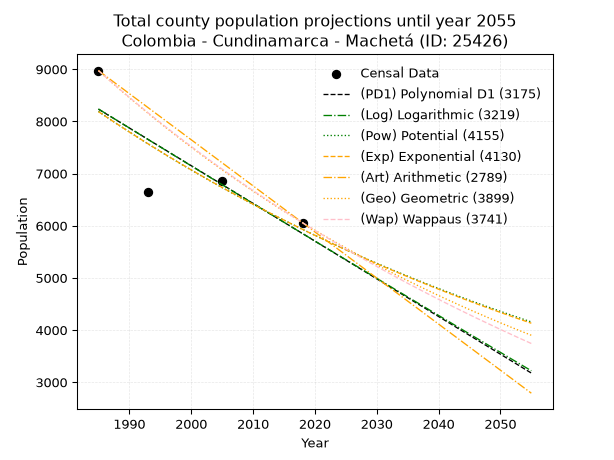
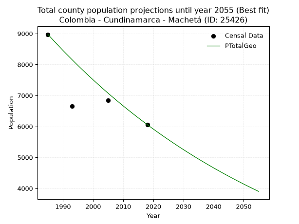
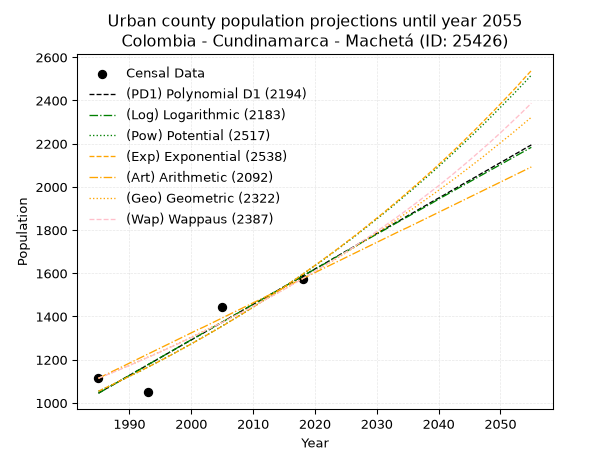
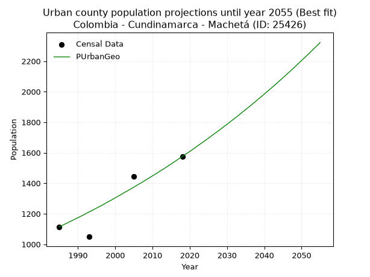
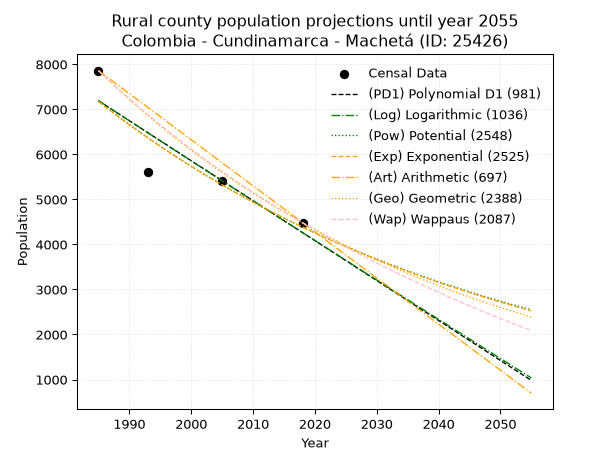
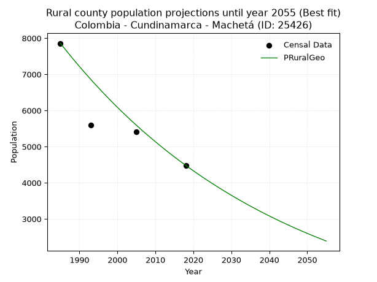

<div align="center">


</div>

# 📜 _“Population and Public Services Demand Projections (PPSD) until Year 2050 for Colombia - Cundinamarca - Machetá (ID: 25426)”_
Keywords: `population` `public-service` `projection` `lineal` `polynomial` `logarithmic` `potential` `exponential` `arithmetic` `geometric` `wappaus` `dane` `colombia` `south-america`

PPSD are analytical estimates used by governments and planners to anticipate future changes in population size, age distribution, and the resulting community needs for utilities, healthcare, education, and infrastructure as sizing future water treatment facilities, electrical grids, and road networks based on spatial growth.

<div align="center">

</img>

</div>


> **General running parameters**: • app_version: _v20260806_. • Python version: _3.14.7_. • Pandas version: _3.0.5_. • NumPy version: _2.5.1_. • Creates, save and include plots into reports (create_plot): _False_. • Projection until year: _2050_. • Process polynomial degree 2 and up: _False_. • Process Wappaus: _True_. • Process Wappaus: _True_. • Set negative values to zero: _True_. • Set infinite values to zero: _True_. • Drop dataset notes: _True_. 
<div align="center">

Dynamic map: [:earth_americas:Google](http://maps.google.com/maps?q=5.080070196,-73.608226) [:earth_americas:OSM](https://www.openstreetmap.org/#map=18/5.080070196/-73.608226&layers=P) [:earth_americas:Bing](https://www.bing.com/maps?cp=5.080070196~-73.608226&lvl=18) [:earth_americas:Apple](https://maps.apple.com/frame?center=5.080070196%2C-73.608226&span=0.003%2C0.006)

</div>


<div align="center">

```geojson
{
  "type": "Feature",
  "geometry": {
    "type": "Point", 
    "coordinates": [-73.608226, 5.080070196]
  }, 
  "properties": {
    "Name": "Colombia - Cundinamarca - Machetá (ID: 25426)"
  }
}
```

</div>


## 0. Census Data (4 records)

Census data are official statistics collected by a government about the people and housing in a country. They usually include counts of total population, age, sex, race, income, education, and jobs.

📅Global census file: [Population.xlsx](../data/Population.xlsx)

| Source   |   Year |   CountryID | CountryName   |   StateID | StateName    |   CountyID | CountyName   |   PTotal |   PUrban |   PRural |
|:---------|-------:|------------:|:--------------|----------:|:-------------|-----------:|:-------------|---------:|---------:|---------:|
| DANE     |   1985 |          57 | Colombia      |        25 | Cundinamarca |      25426 | Machetá      |     8972 |     1114 |     7858 |
| DANE     |   1993 |          57 | Colombia      |        25 | Cundinamarca |      25426 | Machetá      |     6650 |     1049 |     5601 |
| DANE     |   2005 |          57 | Colombia      |        25 | Cundinamarca |      25426 | Machetá      |     6847 |     1444 |     5403 |
| DANE     |   2018 |          57 | Colombia      |        25 | Cundinamarca |      25426 | Machetá      |     6057 |     1575 |     4482 |

> 🔥Some records could had specific notes about the registered values or the corresponding urban or rural distribution.

📅[SUI-RUPS](https://www.datos.gov.co/Hacienda-y-Cr-dito-P-blico/Registro-nico-de-Prestadores-de-Servicios-P-blicos/4qkq-csdn/about_data) - Local public utility companies: [RUPS.csv](../data/RUPS.csv)

 | SERVICIO       | ESTADO    | NOMBRE                                                               | NIT         | DEPARTAMENTO_DOMICILIO   | MUNICIPIO_DOMICILIO   | DIRECCION             |   TELEFONO | EMAIL                                         | TIPO_PRESTADOR                 | CLASIFICACION                 |
|:---------------|:----------|:---------------------------------------------------------------------|:------------|:-------------------------|:----------------------|:----------------------|-----------:|:----------------------------------------------|:-------------------------------|:------------------------------|
| ACUEDUCTO      | OPERATIVA | OFICINA DE SERVICIOS PUBLICOS DOMICILIARIOS DEL MUNICIPIO DE MACHETA | 899999401-1 | CUNDINAMARCA             | MACHETA               | CR 8 No 5-35          |    8569251 | serviciospublicos@macheta-cundinamarca.gov.co | MUNICIPIO (PRESTACIÓN DIRECTA) | MENOR O IGUAL A 2500 USUARIOS |
| ALCANTARILLADO | OPERATIVA | OFICINA DE SERVICIOS PUBLICOS DOMICILIARIOS DEL MUNICIPIO DE MACHETA | 899999401-1 | CUNDINAMARCA             | MACHETA               | CR 8 No 5-35          |    8569251 | serviciospublicos@macheta-cundinamarca.gov.co | MUNICIPIO (PRESTACIÓN DIRECTA) | MENOR O IGUAL A 2500 USUARIOS |
| ACUEDUCTO      | OPERATIVA | ASOCIACIÓN DE USUARIOS DEL SERVICIO DE ACUEDUCTO DE EL RETOÑO        | 832005702-3 | CUNDINAMARCA             | MACHETA               | VEREDA QUEBRADA HONDA |    2891029 | asoretono@hotmail.com                         | ORGANIZACION AUTORIZADA        | HASTA 2500 SUSCRIPTORES       |

## 1. Total

### 1.1. Coefficients and Parameters

* (PD1) Polynomial Deg 1: -72.26093938177387, 151671.44399839317 (lineal)
* (Log) Logarithmic: -144788.6775924144, 1107671.3986435868
* (Pow) Potential: -19.580293027118657, 68.48439939935183
* (Exp) Exponential: -0.009773534488536932, 2180783462304.6287
* (Art) Arithmetic: Year diff. 2018 - 1985 = 33, Population diff. 6057 - 8972 = -2915, Annual growth = -88.33333333333333
* (Geo) Geometric: Year diff. 2018 - 1985 = 33, Population diff. 6057 - 8972 = -2915, Annual growth % = -0.011835283914494066
* (Wap) Wappaus: i = -1.17550513451771, Condition values only valid for < 200)

<sub>
Wappaus condition values: ['-0.00', '-1.18', '-2.35', '-3.53', '-4.70', '-5.88', '-7.05', '-8.23', '-9.40', '-10.58', '-11.76', '-12.93', '-14.11', '-15.28', '-16.46', '-17.63', '-18.81', '-19.98', '-21.16', '-22.33', '-23.51', '-24.69', '-25.86', '-27.04', '-28.21', '-29.39', '-30.56', '-31.74', '-32.91', '-34.09', '-35.27', '-36.44', '-37.62', '-38.79', '-39.97', '-41.14', '-42.32', '-43.49', '-44.67', '-45.84', '-47.02', '-48.20', '-49.37', '-50.55', '-51.72', '-52.90', '-54.07', '-55.25', '-56.42', '-57.60', '-58.78', '-59.95', '-61.13', '-62.30', '-63.48', '-64.65', '-65.83', '-67.00', '-68.18', '-69.35', '-70.53', '-71.71', '-72.88', '-74.06', '-75.23', '-76.41']
</sub>


### 1.2. Projected Dataset

|   Year |   CountyID |   PTotalPD1 |   PTotalLog |   PTotalPow |   PTotalExp |   PTotalArt |   PTotalGeo |   PTotalWap |
|-------:|-----------:|------------:|------------:|------------:|------------:|------------:|------------:|------------:|
|   1985 |      25426 |        8233 |        8237 |        8190 |        8186 |        8972 |        8972 |        8972 |
|   1986 |      25426 |        8161 |        8164 |        8110 |        8107 |        8884 |        8866 |        8867 |
|   1987 |      25426 |        8089 |        8091 |        8030 |        8028 |        8795 |        8761 |        8764 |
|   1988 |      25426 |        8017 |        8018 |        7951 |        7950 |        8707 |        8657 |        8661 |
|   1989 |      25426 |        7944 |        7945 |        7873 |        7873 |        8619 |        8555 |        8560 |
|   1990 |      25426 |        7872 |        7873 |        7796 |        7796 |        8530 |        8453 |        8460 |
|   1991 |      25426 |        7800 |        7800 |        7720 |        7720 |        8442 |        8353 |        8361 |
|   1992 |      25426 |        7728 |        7727 |        7644 |        7645 |        8354 |        8255 |        8263 |
|   1993 |      25426 |        7655 |        7654 |        7570 |        7571 |        8265 |        8157 |        8166 |
|   1994 |      25426 |        7583 |        7582 |        7496 |        7497 |        8177 |        8060 |        8070 |
|   1995 |      25426 |        7511 |        7509 |        7423 |        7424 |        8089 |        7965 |        7976 |
|   1996 |      25426 |        7439 |        7437 |        7350 |        7352 |        8000 |        7871 |        7882 |
|   1997 |      25426 |        7366 |        7364 |        7278 |        7281 |        7912 |        7778 |        7790 |
|   1998 |      25426 |        7294 |        7292 |        7207 |        7210 |        7824 |        7685 |        7698 |
|   1999 |      25426 |        7222 |        7219 |        7137 |        7140 |        7735 |        7595 |        7608 |
|   2000 |      25426 |        7150 |        7147 |        7067 |        7070 |        7647 |        7505 |        7518 |
|   2001 |      25426 |        7077 |        7074 |        6999 |        7001 |        7559 |        7416 |        7430 |
|   2002 |      25426 |        7005 |        7002 |        6931 |        6933 |        7470 |        7328 |        7342 |
|   2003 |      25426 |        6933 |        6930 |        6863 |        6866 |        7382 |        7241 |        7255 |
|   2004 |      25426 |        6861 |        6857 |        6796 |        6799 |        7294 |        7156 |        7169 |
|   2005 |      25426 |        6788 |        6785 |        6730 |        6733 |        7205 |        7071 |        7085 |
|   2006 |      25426 |        6716 |        6713 |        6665 |        6667 |        7117 |        6987 |        7001 |
|   2007 |      25426 |        6644 |        6641 |        6600 |        6603 |        7029 |        6905 |        6917 |
|   2008 |      25426 |        6571 |        6569 |        6536 |        6538 |        6940 |        6823 |        6835 |
|   2009 |      25426 |        6499 |        6497 |        6473 |        6475 |        6852 |        6742 |        6754 |
|   2010 |      25426 |        6427 |        6425 |        6410 |        6412 |        6764 |        6662 |        6673 |
|   2011 |      25426 |        6355 |        6353 |        6348 |        6349 |        6675 |        6583 |        6593 |
|   2012 |      25426 |        6282 |        6281 |        6286 |        6288 |        6587 |        6506 |        6514 |
|   2013 |      25426 |        6210 |        6209 |        6225 |        6227 |        6499 |        6429 |        6436 |
|   2014 |      25426 |        6138 |        6137 |        6165 |        6166 |        6410 |        6352 |        6359 |
|   2015 |      25426 |        6066 |        6065 |        6106 |        6106 |        6322 |        6277 |        6282 |
|   2016 |      25426 |        5993 |        5993 |        6047 |        6047 |        6234 |        6203 |        6206 |
|   2017 |      25426 |        5921 |        5921 |        5988 |        5988 |        6145 |        6130 |        6131 |
|   2018 |      25426 |        5849 |        5850 |        5930 |        5930 |        6057 |        6057 |        6057 |
|   2019 |      25426 |        5777 |        5778 |        5873 |        5872 |        5969 |        5985 |        5983 |
|   2020 |      25426 |        5704 |        5706 |        5816 |        5815 |        5880 |        5914 |        5910 |
|   2021 |      25426 |        5632 |        5634 |        5760 |        5758 |        5792 |        5844 |        5838 |
|   2022 |      25426 |        5560 |        5563 |        5705 |        5702 |        5704 |        5775 |        5767 |
|   2023 |      25426 |        5488 |        5491 |        5650 |        5647 |        5615 |        5707 |        5696 |
|   2024 |      25426 |        5415 |        5420 |        5595 |        5592 |        5527 |        5639 |        5626 |
|   2025 |      25426 |        5343 |        5348 |        5542 |        5537 |        5439 |        5573 |        5556 |
|   2026 |      25426 |        5271 |        5277 |        5488 |        5484 |        5350 |        5507 |        5488 |
|   2027 |      25426 |        5199 |        5205 |        5435 |        5430 |        5262 |        5442 |        5419 |
|   2028 |      25426 |        5126 |        5134 |        5383 |        5377 |        5174 |        5377 |        5352 |
|   2029 |      25426 |        5054 |        5062 |        5331 |        5325 |        5085 |        5313 |        5285 |
|   2030 |      25426 |        4982 |        4991 |        5280 |        5273 |        4997 |        5251 |        5219 |
|   2031 |      25426 |        4909 |        4920 |        5230 |        5222 |        4909 |        5188 |        5153 |
|   2032 |      25426 |        4837 |        4849 |        5179 |        5171 |        4820 |        5127 |        5088 |
|   2033 |      25426 |        4765 |        4777 |        5130 |        5121 |        4732 |        5066 |        5024 |
|   2034 |      25426 |        4693 |        4706 |        5081 |        5071 |        4644 |        5006 |        4960 |
|   2035 |      25426 |        4620 |        4635 |        5032 |        5022 |        4555 |        4947 |        4896 |
|   2036 |      25426 |        4548 |        4564 |        4984 |        4973 |        4467 |        4889 |        4834 |
|   2037 |      25426 |        4476 |        4493 |        4936 |        4925 |        4379 |        4831 |        4772 |
|   2038 |      25426 |        4404 |        4422 |        4889 |        4877 |        4290 |        4774 |        4710 |
|   2039 |      25426 |        4331 |        4351 |        4842 |        4829 |        4202 |        4717 |        4649 |
|   2040 |      25426 |        4259 |        4280 |        4796 |        4782 |        4114 |        4661 |        4588 |
|   2041 |      25426 |        4187 |        4209 |        4750 |        4736 |        4025 |        4606 |        4528 |
|   2042 |      25426 |        4115 |        4138 |        4705 |        4690 |        3937 |        4552 |        4469 |
|   2043 |      25426 |        4042 |        4067 |        4660 |        4644 |        3849 |        4498 |        4410 |
|   2044 |      25426 |        3970 |        3996 |        4615 |        4599 |        3760 |        4444 |        4352 |
|   2045 |      25426 |        3898 |        3925 |        4571 |        4554 |        3672 |        4392 |        4294 |
|   2046 |      25426 |        3826 |        3854 |        4528 |        4510 |        3584 |        4340 |        4236 |
|   2047 |      25426 |        3753 |        3784 |        4485 |        4466 |        3495 |        4289 |        4180 |
|   2048 |      25426 |        3681 |        3713 |        4442 |        4423 |        3407 |        4238 |        4123 |
|   2049 |      25426 |        3609 |        3642 |        4400 |        4380 |        3319 |        4188 |        4067 |
|   2050 |      25426 |        3537 |        3572 |        4358 |        4337 |        3230 |        4138 |        4012 |
<div align="center">

</img>

</div>


### 1.3. Best fit with absolute and relative error (%)

Relative error puts that difference into context by dividing the absolute error by the true value, creating a unitless ratio or percentage that shows the scale of the mistake.

Absolute and relative error

|   Year | Source   |   CountryID | CountryName   |   StateID | StateName    |   CountyID_x | CountyName   |   PTotal |   PUrban |   PRural |   CountyID_y |   PTotalPD1 |   PTotalLog |   PTotalPow |   PTotalExp |   PTotalArt |   PTotalGeo |   PTotalWap |   PTotalPD1AbsError |   PTotalLogAbsError |   PTotalPowAbsError |   PTotalExpAbsError |   PTotalArtAbsError |   PTotalGeoAbsError |   PTotalWapAbsError |   PTotalPD1RelError |   PTotalLogRelError |   PTotalPowRelError |   PTotalExpRelError |   PTotalArtRelError |   PTotalGeoRelError |   PTotalWapRelError |
|-------:|:---------|------------:|:--------------|----------:|:-------------|-------------:|:-------------|---------:|---------:|---------:|-------------:|------------:|------------:|------------:|------------:|------------:|------------:|------------:|--------------------:|--------------------:|--------------------:|--------------------:|--------------------:|--------------------:|--------------------:|--------------------:|--------------------:|--------------------:|--------------------:|--------------------:|--------------------:|--------------------:|
|   1985 | DANE     |          57 | Colombia      |        25 | Cundinamarca |        25426 | Machetá      |     8972 |     1114 |     7858 |        25426 |        8233 |        8237 |        8190 |        8186 |        8972 |        8972 |        8972 |                 739 |                 735 |                 782 |                 786 |                   0 |                   0 |                   0 |            8.23674  |            8.19215  |             8.71601 |             8.76059 |             0       |             0       |             0       |
|   1993 | DANE     |          57 | Colombia      |        25 | Cundinamarca |        25426 | Machetá      |     6650 |     1049 |     5601 |        25426 |        7655 |        7654 |        7570 |        7571 |        8265 |        8157 |        8166 |                1005 |                1004 |                 920 |                 921 |                1615 |                1507 |                1516 |           15.1128   |           15.0977   |            13.8346  |            13.8496  |            24.2857  |            22.6617  |            22.797   |
|   2005 | DANE     |          57 | Colombia      |        25 | Cundinamarca |        25426 | Machetá      |     6847 |     1444 |     5403 |        25426 |        6788 |        6785 |        6730 |        6733 |        7205 |        7071 |        7085 |                  59 |                  62 |                 117 |                 114 |                 358 |                 224 |                 238 |            0.861691 |            0.905506 |             1.70878 |             1.66496 |             5.22857 |             3.27151 |             3.47597 |
|   2018 | DANE     |          57 | Colombia      |        25 | Cundinamarca |        25426 | Machetá      |     6057 |     1575 |     4482 |        25426 |        5849 |        5850 |        5930 |        5930 |        6057 |        6057 |        6057 |                 208 |                 207 |                 127 |                 127 |                   0 |                   0 |                   0 |            3.43404  |            3.41753  |             2.09675 |             2.09675 |             0       |             0       |             0       |

Relative error mean

| Method    |   RelError | Best   |
|:----------|-----------:|:-------|
| PTotalPD1 |    6.91131 |        |
| PTotalLog |    6.90323 |        |
| PTotalPow |    6.58903 |        |
| PTotalExp |    6.59298 |        |
| PTotalArt |    7.37857 |        |
| PTotalGeo |    6.48329 | True   |
| PTotalWap |    6.56824 |        |

💙Best method: _**PTotalGeo**_
<div align="center">

</img>

</div>


### 1.4. Fresh water supply demand in liters per capita per day (lpcd)

The fresh water supply demand typically ranges from 100 to 300 liters per capita per day (lpcd) for standard domestic and municipal planning, though absolute survival minimums set by the World Health Organization are as low as 7.5 to 20 liters per day, and total consumption in high-income nations can exceed 400 liters.

> `CZ`: Level in meters above the sea level (masl)<br> `WS`: Fresh water supply demand in liters per capita per day (lpcd or l/h/d)<br> `WSAll`: Zonal fresh water supply demand in liters per second (l/s)<br> `A`: Zonal area in square meters<br> `DP`: Population density (people/hectare or p/ha)

Reference values (RAS Colombia)

|    CZ |   WS |
|------:|-----:|
|  1000 |  120 |
|  2000 |  130 |
| 99999 |  140 |

County shapefile geometry properties and water supply values

|   CountyID |      ATotal |   CZTotal |   WSTotal |
|-----------:|------------:|----------:|----------:|
|      25426 | 2.28837e+08 |   2634.48 |       140 |

Projected values for best method: PTotalGeo

|   CountyID |   Year |   PTotalGeo |   DPTotal |   WSTotal |   WSTotalAll |
|-----------:|-------:|------------:|----------:|----------:|-------------:|
|      25426 |   1985 |        8972 |      0.39 |       140 |     14.538   |
|      25426 |   1986 |        8866 |      0.39 |       140 |     14.3662  |
|      25426 |   1987 |        8761 |      0.38 |       140 |     14.1961  |
|      25426 |   1988 |        8657 |      0.38 |       140 |     14.0275  |
|      25426 |   1989 |        8555 |      0.37 |       140 |     13.8623  |
|      25426 |   1990 |        8453 |      0.37 |       140 |     13.697   |
|      25426 |   1991 |        8353 |      0.37 |       140 |     13.535   |
|      25426 |   1992 |        8255 |      0.36 |       140 |     13.3762  |
|      25426 |   1993 |        8157 |      0.36 |       140 |     13.2174  |
|      25426 |   1994 |        8060 |      0.35 |       140 |     13.0602  |
|      25426 |   1995 |        7965 |      0.35 |       140 |     12.9062  |
|      25426 |   1996 |        7871 |      0.34 |       140 |     12.7539  |
|      25426 |   1997 |        7778 |      0.34 |       140 |     12.6032  |
|      25426 |   1998 |        7685 |      0.34 |       140 |     12.4525  |
|      25426 |   1999 |        7595 |      0.33 |       140 |     12.3067  |
|      25426 |   2000 |        7505 |      0.33 |       140 |     12.1609  |
|      25426 |   2001 |        7416 |      0.32 |       140 |     12.0167  |
|      25426 |   2002 |        7328 |      0.32 |       140 |     11.8741  |
|      25426 |   2003 |        7241 |      0.32 |       140 |     11.7331  |
|      25426 |   2004 |        7156 |      0.31 |       140 |     11.5954  |
|      25426 |   2005 |        7071 |      0.31 |       140 |     11.4576  |
|      25426 |   2006 |        6987 |      0.31 |       140 |     11.3215  |
|      25426 |   2007 |        6905 |      0.3  |       140 |     11.1887  |
|      25426 |   2008 |        6823 |      0.3  |       140 |     11.0558  |
|      25426 |   2009 |        6742 |      0.29 |       140 |     10.9245  |
|      25426 |   2010 |        6662 |      0.29 |       140 |     10.7949  |
|      25426 |   2011 |        6583 |      0.29 |       140 |     10.6669  |
|      25426 |   2012 |        6506 |      0.28 |       140 |     10.5421  |
|      25426 |   2013 |        6429 |      0.28 |       140 |     10.4174  |
|      25426 |   2014 |        6352 |      0.28 |       140 |     10.2926  |
|      25426 |   2015 |        6277 |      0.27 |       140 |     10.1711  |
|      25426 |   2016 |        6203 |      0.27 |       140 |     10.0512  |
|      25426 |   2017 |        6130 |      0.27 |       140 |      9.93287 |
|      25426 |   2018 |        6057 |      0.26 |       140 |      9.81458 |
|      25426 |   2019 |        5985 |      0.26 |       140 |      9.69792 |
|      25426 |   2020 |        5914 |      0.26 |       140 |      9.58287 |
|      25426 |   2021 |        5844 |      0.26 |       140 |      9.46944 |
|      25426 |   2022 |        5775 |      0.25 |       140 |      9.35764 |
|      25426 |   2023 |        5707 |      0.25 |       140 |      9.24745 |
|      25426 |   2024 |        5639 |      0.25 |       140 |      9.13727 |
|      25426 |   2025 |        5573 |      0.24 |       140 |      9.03032 |
|      25426 |   2026 |        5507 |      0.24 |       140 |      8.92338 |
|      25426 |   2027 |        5442 |      0.24 |       140 |      8.81806 |
|      25426 |   2028 |        5377 |      0.23 |       140 |      8.71273 |
|      25426 |   2029 |        5313 |      0.23 |       140 |      8.60903 |
|      25426 |   2030 |        5251 |      0.23 |       140 |      8.50856 |
|      25426 |   2031 |        5188 |      0.23 |       140 |      8.40648 |
|      25426 |   2032 |        5127 |      0.22 |       140 |      8.30764 |
|      25426 |   2033 |        5066 |      0.22 |       140 |      8.2088  |
|      25426 |   2034 |        5006 |      0.22 |       140 |      8.11157 |
|      25426 |   2035 |        4947 |      0.22 |       140 |      8.01597 |
|      25426 |   2036 |        4889 |      0.21 |       140 |      7.92199 |
|      25426 |   2037 |        4831 |      0.21 |       140 |      7.82801 |
|      25426 |   2038 |        4774 |      0.21 |       140 |      7.73565 |
|      25426 |   2039 |        4717 |      0.21 |       140 |      7.64329 |
|      25426 |   2040 |        4661 |      0.2  |       140 |      7.55255 |
|      25426 |   2041 |        4606 |      0.2  |       140 |      7.46343 |
|      25426 |   2042 |        4552 |      0.2  |       140 |      7.37593 |
|      25426 |   2043 |        4498 |      0.2  |       140 |      7.28843 |
|      25426 |   2044 |        4444 |      0.19 |       140 |      7.20093 |
|      25426 |   2045 |        4392 |      0.19 |       140 |      7.11667 |
|      25426 |   2046 |        4340 |      0.19 |       140 |      7.03241 |
|      25426 |   2047 |        4289 |      0.19 |       140 |      6.94977 |
|      25426 |   2048 |        4238 |      0.19 |       140 |      6.86713 |
|      25426 |   2049 |        4188 |      0.18 |       140 |      6.78611 |
|      25426 |   2050 |        4138 |      0.18 |       140 |      6.70509 |

## 2. Urban

### 2.1. Coefficients and Parameters

* (PD1) Polynomial Deg 1: 16.413488558811622, -31535.58048976295 (lineal)
* (Log) Logarithmic: 32847.754195427035, -248380.5428648232
* (Pow) Potential: 25.115229742512174, -79.80115094023641
* (Exp) Exponential: 0.01254932955272176, 1.601605047355621e-08
* (Art) Arithmetic: Year diff. 2018 - 1985 = 33, Population diff. 1575 - 1114 = 461, Annual growth = 13.969696969696969
* (Geo) Geometric: Year diff. 2018 - 1985 = 33, Population diff. 1575 - 1114 = 461, Annual growth % = 0.010549136645101598
* (Wap) Wappaus: i = 1.0390254347115633, Condition values only valid for < 200)

<sub>
Wappaus condition values: ['0.00', '1.04', '2.08', '3.12', '4.16', '5.20', '6.23', '7.27', '8.31', '9.35', '10.39', '11.43', '12.47', '13.51', '14.55', '15.59', '16.62', '17.66', '18.70', '19.74', '20.78', '21.82', '22.86', '23.90', '24.94', '25.98', '27.01', '28.05', '29.09', '30.13', '31.17', '32.21', '33.25', '34.29', '35.33', '36.37', '37.40', '38.44', '39.48', '40.52', '41.56', '42.60', '43.64', '44.68', '45.72', '46.76', '47.80', '48.83', '49.87', '50.91', '51.95', '52.99', '54.03', '55.07', '56.11', '57.15', '58.19', '59.22', '60.26', '61.30', '62.34', '63.38', '64.42', '65.46', '66.50', '67.54']
</sub>


### 2.2. Projected Dataset

|   Year |   CountyID |   PUrbanPD1 |   PUrbanLog |   PUrbanPow |   PUrbanExp |   PUrbanArt |   PUrbanGeo |   PUrbanWap |
|-------:|-----------:|------------:|------------:|------------:|------------:|------------:|------------:|------------:|
|   1985 |      25426 |        1045 |        1045 |        1054 |        1054 |        1114 |        1114 |        1114 |
|   1986 |      25426 |        1062 |        1061 |        1067 |        1068 |        1128 |        1126 |        1126 |
|   1987 |      25426 |        1078 |        1078 |        1081 |        1081 |        1142 |        1138 |        1137 |
|   1988 |      25426 |        1094 |        1094 |        1095 |        1095 |        1156 |        1150 |        1149 |
|   1989 |      25426 |        1111 |        1111 |        1109 |        1109 |        1170 |        1162 |        1161 |
|   1990 |      25426 |        1127 |        1127 |        1123 |        1123 |        1184 |        1174 |        1173 |
|   1991 |      25426 |        1144 |        1144 |        1137 |        1137 |        1198 |        1186 |        1186 |
|   1992 |      25426 |        1160 |        1160 |        1151 |        1151 |        1212 |        1199 |        1198 |
|   1993 |      25426 |        1177 |        1177 |        1166 |        1166 |        1226 |        1212 |        1211 |
|   1994 |      25426 |        1193 |        1193 |        1181 |        1180 |        1240 |        1224 |        1223 |
|   1995 |      25426 |        1209 |        1210 |        1196 |        1195 |        1254 |        1237 |        1236 |
|   1996 |      25426 |        1226 |        1226 |        1211 |        1210 |        1268 |        1250 |        1249 |
|   1997 |      25426 |        1242 |        1243 |        1226 |        1226 |        1282 |        1263 |        1262 |
|   1998 |      25426 |        1259 |        1259 |        1242 |        1241 |        1296 |        1277 |        1275 |
|   1999 |      25426 |        1275 |        1276 |        1258 |        1257 |        1310 |        1290 |        1289 |
|   2000 |      25426 |        1291 |        1292 |        1273 |        1273 |        1324 |        1304 |        1302 |
|   2001 |      25426 |        1308 |        1308 |        1290 |        1289 |        1338 |        1318 |        1316 |
|   2002 |      25426 |        1324 |        1325 |        1306 |        1305 |        1351 |        1332 |        1330 |
|   2003 |      25426 |        1341 |        1341 |        1322 |        1322 |        1365 |        1346 |        1344 |
|   2004 |      25426 |        1357 |        1358 |        1339 |        1338 |        1379 |        1360 |        1358 |
|   2005 |      25426 |        1373 |        1374 |        1356 |        1355 |        1393 |        1374 |        1372 |
|   2006 |      25426 |        1390 |        1390 |        1373 |        1372 |        1407 |        1389 |        1387 |
|   2007 |      25426 |        1406 |        1407 |        1390 |        1390 |        1421 |        1403 |        1402 |
|   2008 |      25426 |        1423 |        1423 |        1408 |        1407 |        1435 |        1418 |        1416 |
|   2009 |      25426 |        1439 |        1440 |        1425 |        1425 |        1449 |        1433 |        1431 |
|   2010 |      25426 |        1456 |        1456 |        1443 |        1443 |        1463 |        1448 |        1447 |
|   2011 |      25426 |        1472 |        1472 |        1462 |        1461 |        1477 |        1463 |        1462 |
|   2012 |      25426 |        1488 |        1489 |        1480 |        1480 |        1491 |        1479 |        1478 |
|   2013 |      25426 |        1505 |        1505 |        1498 |        1498 |        1505 |        1494 |        1493 |
|   2014 |      25426 |        1521 |        1521 |        1517 |        1517 |        1519 |        1510 |        1509 |
|   2015 |      25426 |        1538 |        1537 |        1536 |        1536 |        1533 |        1526 |        1525 |
|   2016 |      25426 |        1554 |        1554 |        1556 |        1556 |        1547 |        1542 |        1542 |
|   2017 |      25426 |        1570 |        1570 |        1575 |        1575 |        1561 |        1559 |        1558 |
|   2018 |      25426 |        1587 |        1586 |        1595 |        1595 |        1575 |        1575 |        1575 |
|   2019 |      25426 |        1603 |        1603 |        1615 |        1616 |        1589 |        1592 |        1592 |
|   2020 |      25426 |        1620 |        1619 |        1635 |        1636 |        1603 |        1608 |        1609 |
|   2021 |      25426 |        1636 |        1635 |        1655 |        1657 |        1617 |        1625 |        1627 |
|   2022 |      25426 |        1652 |        1651 |        1676 |        1678 |        1631 |        1643 |        1644 |
|   2023 |      25426 |        1669 |        1668 |        1697 |        1699 |        1645 |        1660 |        1662 |
|   2024 |      25426 |        1685 |        1684 |        1718 |        1720 |        1659 |        1677 |        1680 |
|   2025 |      25426 |        1702 |        1700 |        1740 |        1742 |        1673 |        1695 |        1698 |
|   2026 |      25426 |        1718 |        1716 |        1761 |        1764 |        1687 |        1713 |        1717 |
|   2027 |      25426 |        1735 |        1733 |        1783 |        1786 |        1701 |        1731 |        1736 |
|   2028 |      25426 |        1751 |        1749 |        1806 |        1809 |        1715 |        1749 |        1755 |
|   2029 |      25426 |        1767 |        1765 |        1828 |        1832 |        1729 |        1768 |        1774 |
|   2030 |      25426 |        1784 |        1781 |        1851 |        1855 |        1743 |        1786 |        1794 |
|   2031 |      25426 |        1800 |        1797 |        1874 |        1878 |        1757 |        1805 |        1814 |
|   2032 |      25426 |        1817 |        1813 |        1897 |        1902 |        1771 |        1824 |        1834 |
|   2033 |      25426 |        1833 |        1830 |        1921 |        1926 |        1785 |        1843 |        1854 |
|   2034 |      25426 |        1849 |        1846 |        1945 |        1950 |        1799 |        1863 |        1875 |
|   2035 |      25426 |        1866 |        1862 |        1969 |        1975 |        1812 |        1883 |        1896 |
|   2036 |      25426 |        1882 |        1878 |        1993 |        2000 |        1826 |        1902 |        1917 |
|   2037 |      25426 |        1899 |        1894 |        2018 |        2025 |        1840 |        1923 |        1939 |
|   2038 |      25426 |        1915 |        1910 |        2043 |        2051 |        1854 |        1943 |        1961 |
|   2039 |      25426 |        1932 |        1926 |        2068 |        2076 |        1868 |        1963 |        1983 |
|   2040 |      25426 |        1948 |        1943 |        2094 |        2103 |        1882 |        1984 |        2005 |
|   2041 |      25426 |        1964 |        1959 |        2120 |        2129 |        1896 |        2005 |        2028 |
|   2042 |      25426 |        1981 |        1975 |        2146 |        2156 |        1910 |        2026 |        2051 |
|   2043 |      25426 |        1997 |        1991 |        2173 |        2183 |        1924 |        2047 |        2075 |
|   2044 |      25426 |        2014 |        2007 |        2200 |        2211 |        1938 |        2069 |        2099 |
|   2045 |      25426 |        2030 |        2023 |        2227 |        2239 |        1952 |        2091 |        2123 |
|   2046 |      25426 |        2046 |        2039 |        2254 |        2267 |        1966 |        2113 |        2148 |
|   2047 |      25426 |        2063 |        2055 |        2282 |        2296 |        1980 |        2135 |        2173 |
|   2048 |      25426 |        2079 |        2071 |        2310 |        2325 |        1994 |        2158 |        2198 |
|   2049 |      25426 |        2096 |        2087 |        2339 |        2354 |        2008 |        2181 |        2224 |
|   2050 |      25426 |        2112 |        2103 |        2368 |        2384 |        2022 |        2204 |        2250 |
<div align="center">

</img>

</div>


### 2.3. Best fit with absolute and relative error (%)

Relative error puts that difference into context by dividing the absolute error by the true value, creating a unitless ratio or percentage that shows the scale of the mistake.

Absolute and relative error

|   Year | Source   |   CountryID | CountryName   |   StateID | StateName    |   CountyID_x | CountyName   |   PTotal |   PUrban |   PRural |   CountyID_y |   PUrbanPD1 |   PUrbanLog |   PUrbanPow |   PUrbanExp |   PUrbanArt |   PUrbanGeo |   PUrbanWap |   PUrbanPD1AbsError |   PUrbanLogAbsError |   PUrbanPowAbsError |   PUrbanExpAbsError |   PUrbanArtAbsError |   PUrbanGeoAbsError |   PUrbanWapAbsError |   PUrbanPD1RelError |   PUrbanLogRelError |   PUrbanPowRelError |   PUrbanExpRelError |   PUrbanArtRelError |   PUrbanGeoRelError |   PUrbanWapRelError |
|-------:|:---------|------------:|:--------------|----------:|:-------------|-------------:|:-------------|---------:|---------:|---------:|-------------:|------------:|------------:|------------:|------------:|------------:|------------:|------------:|--------------------:|--------------------:|--------------------:|--------------------:|--------------------:|--------------------:|--------------------:|--------------------:|--------------------:|--------------------:|--------------------:|--------------------:|--------------------:|--------------------:|
|   1985 | DANE     |          57 | Colombia      |        25 | Cundinamarca |        25426 | Machetá      |     8972 |     1114 |     7858 |        25426 |        1045 |        1045 |        1054 |        1054 |        1114 |        1114 |        1114 |                  69 |                  69 |                  60 |                  60 |                   0 |                   0 |                   0 |            6.1939   |            6.1939   |             5.386   |             5.386   |             0       |             0       |             0       |
|   1993 | DANE     |          57 | Colombia      |        25 | Cundinamarca |        25426 | Machetá      |     6650 |     1049 |     5601 |        25426 |        1177 |        1177 |        1166 |        1166 |        1226 |        1212 |        1211 |                 128 |                 128 |                 117 |                 117 |                 177 |                 163 |                 162 |           12.2021   |           12.2021   |            11.1535  |            11.1535  |            16.8732  |            15.5386  |            15.4433  |
|   2005 | DANE     |          57 | Colombia      |        25 | Cundinamarca |        25426 | Machetá      |     6847 |     1444 |     5403 |        25426 |        1373 |        1374 |        1356 |        1355 |        1393 |        1374 |        1372 |                  71 |                  70 |                  88 |                  89 |                  51 |                  70 |                  72 |            4.9169   |            4.84765  |             6.09418 |             6.16343 |             3.53186 |             4.84765 |             4.98615 |
|   2018 | DANE     |          57 | Colombia      |        25 | Cundinamarca |        25426 | Machetá      |     6057 |     1575 |     4482 |        25426 |        1587 |        1586 |        1595 |        1595 |        1575 |        1575 |        1575 |                  12 |                  11 |                  20 |                  20 |                   0 |                   0 |                   0 |            0.761905 |            0.698413 |             1.26984 |             1.26984 |             0       |             0       |             0       |

Relative error mean

| Method    |   RelError | Best   |
|:----------|-----------:|:-------|
| PUrbanPD1 |    6.0187  |        |
| PUrbanLog |    5.98551 |        |
| PUrbanPow |    5.97588 |        |
| PUrbanExp |    5.99319 |        |
| PUrbanArt |    5.10127 |        |
| PUrbanGeo |    5.09656 | True   |
| PUrbanWap |    5.10736 |        |

💙Best method: _**PUrbanGeo**_
<div align="center">

</img>

</div>


### 2.4. Fresh water supply demand in liters per capita per day (lpcd)

The fresh water supply demand typically ranges from 100 to 300 liters per capita per day (lpcd) for standard domestic and municipal planning, though absolute survival minimums set by the World Health Organization are as low as 7.5 to 20 liters per day, and total consumption in high-income nations can exceed 400 liters.

> `CZ`: Level in meters above the sea level (masl)<br> `WS`: Fresh water supply demand in liters per capita per day (lpcd or l/h/d)<br> `WSAll`: Zonal fresh water supply demand in liters per second (l/s)<br> `A`: Zonal area in square meters<br> `DP`: Population density (people/hectare or p/ha)

Reference values (RAS Colombia)

|    CZ |   WS |
|------:|-----:|
|  1000 |  120 |
|  2000 |  130 |
| 99999 |  140 |

County shapefile geometry properties and water supply values

|   CountyID |   AUrban |   CZUrban |   WSUrban |
|-----------:|---------:|----------:|----------:|
|      25426 |   405572 |   2084.26 |       140 |

Projected values for best method: PUrbanGeo

|   CountyID |   Year |   PUrbanGeo |   DPUrban |   WSUrban |   WSUrbanAll |
|-----------:|-------:|------------:|----------:|----------:|-------------:|
|      25426 |   1985 |        1114 |     27.47 |       140 |      1.80509 |
|      25426 |   1986 |        1126 |     27.76 |       140 |      1.82454 |
|      25426 |   1987 |        1138 |     28.06 |       140 |      1.84398 |
|      25426 |   1988 |        1150 |     28.36 |       140 |      1.86343 |
|      25426 |   1989 |        1162 |     28.65 |       140 |      1.88287 |
|      25426 |   1990 |        1174 |     28.95 |       140 |      1.90231 |
|      25426 |   1991 |        1186 |     29.24 |       140 |      1.92176 |
|      25426 |   1992 |        1199 |     29.56 |       140 |      1.94282 |
|      25426 |   1993 |        1212 |     29.88 |       140 |      1.96389 |
|      25426 |   1994 |        1224 |     30.18 |       140 |      1.98333 |
|      25426 |   1995 |        1237 |     30.5  |       140 |      2.0044  |
|      25426 |   1996 |        1250 |     30.82 |       140 |      2.02546 |
|      25426 |   1997 |        1263 |     31.14 |       140 |      2.04653 |
|      25426 |   1998 |        1277 |     31.49 |       140 |      2.06921 |
|      25426 |   1999 |        1290 |     31.81 |       140 |      2.09028 |
|      25426 |   2000 |        1304 |     32.15 |       140 |      2.11296 |
|      25426 |   2001 |        1318 |     32.5  |       140 |      2.13565 |
|      25426 |   2002 |        1332 |     32.84 |       140 |      2.15833 |
|      25426 |   2003 |        1346 |     33.19 |       140 |      2.18102 |
|      25426 |   2004 |        1360 |     33.53 |       140 |      2.2037  |
|      25426 |   2005 |        1374 |     33.88 |       140 |      2.22639 |
|      25426 |   2006 |        1389 |     34.25 |       140 |      2.25069 |
|      25426 |   2007 |        1403 |     34.59 |       140 |      2.27338 |
|      25426 |   2008 |        1418 |     34.96 |       140 |      2.29769 |
|      25426 |   2009 |        1433 |     35.33 |       140 |      2.32199 |
|      25426 |   2010 |        1448 |     35.7  |       140 |      2.3463  |
|      25426 |   2011 |        1463 |     36.07 |       140 |      2.3706  |
|      25426 |   2012 |        1479 |     36.47 |       140 |      2.39653 |
|      25426 |   2013 |        1494 |     36.84 |       140 |      2.42083 |
|      25426 |   2014 |        1510 |     37.23 |       140 |      2.44676 |
|      25426 |   2015 |        1526 |     37.63 |       140 |      2.47269 |
|      25426 |   2016 |        1542 |     38.02 |       140 |      2.49861 |
|      25426 |   2017 |        1559 |     38.44 |       140 |      2.52616 |
|      25426 |   2018 |        1575 |     38.83 |       140 |      2.55208 |
|      25426 |   2019 |        1592 |     39.25 |       140 |      2.57963 |
|      25426 |   2020 |        1608 |     39.65 |       140 |      2.60556 |
|      25426 |   2021 |        1625 |     40.07 |       140 |      2.6331  |
|      25426 |   2022 |        1643 |     40.51 |       140 |      2.66227 |
|      25426 |   2023 |        1660 |     40.93 |       140 |      2.68981 |
|      25426 |   2024 |        1677 |     41.35 |       140 |      2.71736 |
|      25426 |   2025 |        1695 |     41.79 |       140 |      2.74653 |
|      25426 |   2026 |        1713 |     42.24 |       140 |      2.77569 |
|      25426 |   2027 |        1731 |     42.68 |       140 |      2.80486 |
|      25426 |   2028 |        1749 |     43.12 |       140 |      2.83403 |
|      25426 |   2029 |        1768 |     43.59 |       140 |      2.86481 |
|      25426 |   2030 |        1786 |     44.04 |       140 |      2.89398 |
|      25426 |   2031 |        1805 |     44.51 |       140 |      2.92477 |
|      25426 |   2032 |        1824 |     44.97 |       140 |      2.95556 |
|      25426 |   2033 |        1843 |     45.44 |       140 |      2.98634 |
|      25426 |   2034 |        1863 |     45.94 |       140 |      3.01875 |
|      25426 |   2035 |        1883 |     46.43 |       140 |      3.05116 |
|      25426 |   2036 |        1902 |     46.9  |       140 |      3.08194 |
|      25426 |   2037 |        1923 |     47.41 |       140 |      3.11597 |
|      25426 |   2038 |        1943 |     47.91 |       140 |      3.14838 |
|      25426 |   2039 |        1963 |     48.4  |       140 |      3.18079 |
|      25426 |   2040 |        1984 |     48.92 |       140 |      3.21481 |
|      25426 |   2041 |        2005 |     49.44 |       140 |      3.24884 |
|      25426 |   2042 |        2026 |     49.95 |       140 |      3.28287 |
|      25426 |   2043 |        2047 |     50.47 |       140 |      3.3169  |
|      25426 |   2044 |        2069 |     51.01 |       140 |      3.35255 |
|      25426 |   2045 |        2091 |     51.56 |       140 |      3.38819 |
|      25426 |   2046 |        2113 |     52.1  |       140 |      3.42384 |
|      25426 |   2047 |        2135 |     52.64 |       140 |      3.45949 |
|      25426 |   2048 |        2158 |     53.21 |       140 |      3.49676 |
|      25426 |   2049 |        2181 |     53.78 |       140 |      3.53403 |
|      25426 |   2050 |        2204 |     54.34 |       140 |      3.5713  |

## 3. Rural

### 3.1. Coefficients and Parameters

* (PD1) Polynomial Deg 1: -88.67442794058547, 183207.0244881561 (lineal)
* (Log) Logarithmic: -177636.4317878414, 1356051.94150841
* (Pow) Potential: -29.878554758935266, 102.38829626832869
* (Exp) Exponential: -0.01491843052535065, 5.2062493420768e+16
* (Art) Arithmetic: Year diff. 2018 - 1985 = 33, Population diff. 4482 - 7858 = -3376, Annual growth = -102.3030303030303
* (Geo) Geometric: Year diff. 2018 - 1985 = 33, Population diff. 4482 - 7858 = -3376, Annual growth % = -0.01687010149779844
* (Wap) Wappaus: i = -1.6580718039389029, Condition values only valid for < 200)

<sub>
Wappaus condition values: ['-0.00', '-1.66', '-3.32', '-4.97', '-6.63', '-8.29', '-9.95', '-11.61', '-13.26', '-14.92', '-16.58', '-18.24', '-19.90', '-21.55', '-23.21', '-24.87', '-26.53', '-28.19', '-29.85', '-31.50', '-33.16', '-34.82', '-36.48', '-38.14', '-39.79', '-41.45', '-43.11', '-44.77', '-46.43', '-48.08', '-49.74', '-51.40', '-53.06', '-54.72', '-56.37', '-58.03', '-59.69', '-61.35', '-63.01', '-64.66', '-66.32', '-67.98', '-69.64', '-71.30', '-72.96', '-74.61', '-76.27', '-77.93', '-79.59', '-81.25', '-82.90', '-84.56', '-86.22', '-87.88', '-89.54', '-91.19', '-92.85', '-94.51', '-96.17', '-97.83', '-99.48', '-101.14', '-102.80', '-104.46', '-106.12', '-107.77']
</sub>


### 3.2. Projected Dataset

|   Year |   CountyID |   PRuralPD1 |   PRuralLog |   PRuralPow |   PRuralExp |   PRuralArt |   PRuralGeo |   PRuralWap |
|-------:|-----------:|------------:|------------:|------------:|------------:|------------:|------------:|------------:|
|   1985 |      25426 |        7188 |        7192 |        7178 |        7173 |        7858 |        7858 |        7858 |
|   1986 |      25426 |        7100 |        7103 |        7070 |        7067 |        7756 |        7725 |        7729 |
|   1987 |      25426 |        7011 |        7013 |        6965 |        6963 |        7653 |        7595 |        7602 |
|   1988 |      25426 |        6922 |        6924 |        6861 |        6859 |        7551 |        7467 |        7477 |
|   1989 |      25426 |        6834 |        6834 |        6759 |        6758 |        7449 |        7341 |        7354 |
|   1990 |      25426 |        6745 |        6745 |        6658 |        6658 |        7346 |        7217 |        7232 |
|   1991 |      25426 |        6656 |        6656 |        6559 |        6559 |        7244 |        7095 |        7113 |
|   1992 |      25426 |        6568 |        6567 |        6461 |        6462 |        7142 |        6976 |        6996 |
|   1993 |      25426 |        6479 |        6478 |        6365 |        6366 |        7040 |        6858 |        6881 |
|   1994 |      25426 |        6390 |        6388 |        6270 |        6272 |        6937 |        6742 |        6767 |
|   1995 |      25426 |        6302 |        6299 |        6177 |        6179 |        6835 |        6629 |        6655 |
|   1996 |      25426 |        6213 |        6210 |        6085 |        6088 |        6733 |        6517 |        6545 |
|   1997 |      25426 |        6124 |        6121 |        5995 |        5998 |        6630 |        6407 |        6436 |
|   1998 |      25426 |        6036 |        6032 |        5906 |        5909 |        6528 |        6299 |        6329 |
|   1999 |      25426 |        5947 |        5944 |        5818 |        5821 |        6426 |        6192 |        6224 |
|   2000 |      25426 |        5858 |        5855 |        5732 |        5735 |        6323 |        6088 |        6120 |
|   2001 |      25426 |        5769 |        5766 |        5647 |        5650 |        6221 |        5985 |        6017 |
|   2002 |      25426 |        5681 |        5677 |        5563 |        5567 |        6119 |        5884 |        5917 |
|   2003 |      25426 |        5592 |        5588 |        5481 |        5484 |        6017 |        5785 |        5817 |
|   2004 |      25426 |        5503 |        5500 |        5400 |        5403 |        5914 |        5687 |        5719 |
|   2005 |      25426 |        5415 |        5411 |        5320 |        5323 |        5812 |        5592 |        5623 |
|   2006 |      25426 |        5326 |        5323 |        5241 |        5244 |        5710 |        5497 |        5528 |
|   2007 |      25426 |        5237 |        5234 |        5164 |        5166 |        5607 |        5404 |        5434 |
|   2008 |      25426 |        5149 |        5146 |        5087 |        5090 |        5505 |        5313 |        5341 |
|   2009 |      25426 |        5060 |        5057 |        5012 |        5015 |        5403 |        5224 |        5250 |
|   2010 |      25426 |        4971 |        4969 |        4938 |        4940 |        5300 |        5136 |        5160 |
|   2011 |      25426 |        4883 |        4880 |        4865 |        4867 |        5198 |        5049 |        5071 |
|   2012 |      25426 |        4794 |        4792 |        4794 |        4795 |        5096 |        4964 |        4984 |
|   2013 |      25426 |        4705 |        4704 |        4723 |        4724 |        4994 |        4880 |        4897 |
|   2014 |      25426 |        4617 |        4616 |        4653 |        4654 |        4891 |        4798 |        4812 |
|   2015 |      25426 |        4528 |        4527 |        4585 |        4585 |        4789 |        4717 |        4728 |
|   2016 |      25426 |        4439 |        4439 |        4517 |        4517 |        4687 |        4637 |        4645 |
|   2017 |      25426 |        4351 |        4351 |        4451 |        4450 |        4584 |        4559 |        4563 |
|   2018 |      25426 |        4262 |        4263 |        4386 |        4384 |        4482 |        4482 |        4482 |
|   2019 |      25426 |        4173 |        4175 |        4321 |        4320 |        4380 |        4406 |        4402 |
|   2020 |      25426 |        4085 |        4087 |        4258 |        4256 |        4277 |        4332 |        4323 |
|   2021 |      25426 |        3996 |        3999 |        4195 |        4193 |        4175 |        4259 |        4246 |
|   2022 |      25426 |        3907 |        3911 |        4134 |        4131 |        4073 |        4187 |        4169 |
|   2023 |      25426 |        3819 |        3824 |        4073 |        4069 |        3970 |        4116 |        4093 |
|   2024 |      25426 |        3730 |        3736 |        4013 |        4009 |        3868 |        4047 |        4018 |
|   2025 |      25426 |        3641 |        3648 |        3955 |        3950 |        3766 |        3979 |        3944 |
|   2026 |      25426 |        3553 |        3560 |        3897 |        3891 |        3664 |        3912 |        3871 |
|   2027 |      25426 |        3464 |        3473 |        3840 |        3834 |        3561 |        3846 |        3799 |
|   2028 |      25426 |        3375 |        3385 |        3783 |        3777 |        3459 |        3781 |        3728 |
|   2029 |      25426 |        3287 |        3298 |        3728 |        3721 |        3357 |        3717 |        3657 |
|   2030 |      25426 |        3198 |        3210 |        3674 |        3666 |        3254 |        3654 |        3588 |
|   2031 |      25426 |        3109 |        3123 |        3620 |        3612 |        3152 |        3593 |        3519 |
|   2032 |      25426 |        3021 |        3035 |        3567 |        3558 |        3050 |        3532 |        3451 |
|   2033 |      25426 |        2932 |        2948 |        3515 |        3505 |        2947 |        3472 |        3384 |
|   2034 |      25426 |        2843 |        2860 |        3464 |        3453 |        2845 |        3414 |        3318 |
|   2035 |      25426 |        2755 |        2773 |        3413 |        3402 |        2743 |        3356 |        3252 |
|   2036 |      25426 |        2666 |        2686 |        3364 |        3352 |        2641 |        3300 |        3188 |
|   2037 |      25426 |        2577 |        2599 |        3315 |        3302 |        2538 |        3244 |        3124 |
|   2038 |      25426 |        2489 |        2511 |        3266 |        3253 |        2436 |        3189 |        3061 |
|   2039 |      25426 |        2400 |        2424 |        3219 |        3205 |        2334 |        3135 |        2998 |
|   2040 |      25426 |        2311 |        2337 |        3172 |        3158 |        2231 |        3083 |        2936 |
|   2041 |      25426 |        2223 |        2250 |        3126 |        3111 |        2129 |        3031 |        2875 |
|   2042 |      25426 |        2134 |        2163 |        3080 |        3065 |        2027 |        2979 |        2815 |
|   2043 |      25426 |        2045 |        2076 |        3036 |        3020 |        1924 |        2929 |        2755 |
|   2044 |      25426 |        1956 |        1989 |        2992 |        2975 |        1822 |        2880 |        2696 |
|   2045 |      25426 |        1868 |        1902 |        2948 |        2931 |        1720 |        2831 |        2637 |
|   2046 |      25426 |        1779 |        1815 |        2906 |        2887 |        1618 |        2783 |        2580 |
|   2047 |      25426 |        1690 |        1729 |        2863 |        2845 |        1515 |        2736 |        2522 |
|   2048 |      25426 |        1602 |        1642 |        2822 |        2803 |        1413 |        2690 |        2466 |
|   2049 |      25426 |        1513 |        1555 |        2781 |        2761 |        1311 |        2645 |        2410 |
|   2050 |      25426 |        1424 |        1468 |        2741 |        2720 |        1208 |        2600 |        2355 |
<div align="center">

</img>

</div>


### 3.3. Best fit with absolute and relative error (%)

Relative error puts that difference into context by dividing the absolute error by the true value, creating a unitless ratio or percentage that shows the scale of the mistake.

Absolute and relative error

|   Year | Source   |   CountryID | CountryName   |   StateID | StateName    |   CountyID_x | CountyName   |   PTotal |   PUrban |   PRural |   CountyID_y |   PRuralPD1 |   PRuralLog |   PRuralPow |   PRuralExp |   PRuralArt |   PRuralGeo |   PRuralWap |   PRuralPD1AbsError |   PRuralLogAbsError |   PRuralPowAbsError |   PRuralExpAbsError |   PRuralArtAbsError |   PRuralGeoAbsError |   PRuralWapAbsError |   PRuralPD1RelError |   PRuralLogRelError |   PRuralPowRelError |   PRuralExpRelError |   PRuralArtRelError |   PRuralGeoRelError |   PRuralWapRelError |
|-------:|:---------|------------:|:--------------|----------:|:-------------|-------------:|:-------------|---------:|---------:|---------:|-------------:|------------:|------------:|------------:|------------:|------------:|------------:|------------:|--------------------:|--------------------:|--------------------:|--------------------:|--------------------:|--------------------:|--------------------:|--------------------:|--------------------:|--------------------:|--------------------:|--------------------:|--------------------:|--------------------:|
|   1985 | DANE     |          57 | Colombia      |        25 | Cundinamarca |        25426 | Machetá      |     8972 |     1114 |     7858 |        25426 |        7188 |        7192 |        7178 |        7173 |        7858 |        7858 |        7858 |                 670 |                 666 |                 680 |                 685 |                   0 |                   0 |                   0 |            8.52634  |            8.47544  |             8.6536  |             8.71723 |             0       |             0       |             0       |
|   1993 | DANE     |          57 | Colombia      |        25 | Cundinamarca |        25426 | Machetá      |     6650 |     1049 |     5601 |        25426 |        6479 |        6478 |        6365 |        6366 |        7040 |        6858 |        6881 |                 878 |                 877 |                 764 |                 765 |                1439 |                1257 |                1280 |           15.6758   |           15.6579   |            13.6404  |            13.6583  |            25.6918  |            22.4424  |            22.8531  |
|   2005 | DANE     |          57 | Colombia      |        25 | Cundinamarca |        25426 | Machetá      |     6847 |     1444 |     5403 |        25426 |        5415 |        5411 |        5320 |        5323 |        5812 |        5592 |        5623 |                  12 |                   8 |                  83 |                  80 |                 409 |                 189 |                 220 |            0.222099 |            0.148066 |             1.53618 |             1.48066 |             7.56987 |             3.49806 |             4.07181 |
|   2018 | DANE     |          57 | Colombia      |        25 | Cundinamarca |        25426 | Machetá      |     6057 |     1575 |     4482 |        25426 |        4262 |        4263 |        4386 |        4384 |        4482 |        4482 |        4482 |                 220 |                 219 |                  96 |                  98 |                   0 |                   0 |                   0 |            4.90852  |            4.88621  |             2.1419  |             2.18652 |             0       |             0       |             0       |

Relative error mean

| Method    |   RelError | Best   |
|:----------|-----------:|:-------|
| PRuralPD1 |    7.33318 |        |
| PRuralLog |    7.29191 |        |
| PRuralPow |    6.49303 |        |
| PRuralExp |    6.51067 |        |
| PRuralArt |    8.31543 |        |
| PRuralGeo |    6.48512 | True   |
| PRuralWap |    6.73122 |        |

💙Best method: _**PRuralGeo**_
<div align="center">

</img>

</div>


### 3.4. Fresh water supply demand in liters per capita per day (lpcd)

The fresh water supply demand typically ranges from 100 to 300 liters per capita per day (lpcd) for standard domestic and municipal planning, though absolute survival minimums set by the World Health Organization are as low as 7.5 to 20 liters per day, and total consumption in high-income nations can exceed 400 liters.

> `CZ`: Level in meters above the sea level (masl)<br> `WS`: Fresh water supply demand in liters per capita per day (lpcd or l/h/d)<br> `WSAll`: Zonal fresh water supply demand in liters per second (l/s)<br> `A`: Zonal area in square meters<br> `DP`: Population density (people/hectare or p/ha)

Reference values (RAS Colombia)

|    CZ |   WS |
|------:|-----:|
|  1000 |  120 |
|  2000 |  130 |
| 99999 |  140 |

County shapefile geometry properties and water supply values

|   CountyID |      ARural |   CZRural |   WSRural |
|-----------:|------------:|----------:|----------:|
|      25426 | 2.28431e+08 |   2635.45 |       140 |

Projected values for best method: PRuralGeo

|   CountyID |   Year |   PRuralGeo |   DPRural |   WSRural |   WSRuralAll |
|-----------:|-------:|------------:|----------:|----------:|-------------:|
|      25426 |   1985 |        7858 |      0.34 |       140 |     12.7329  |
|      25426 |   1986 |        7725 |      0.34 |       140 |     12.5174  |
|      25426 |   1987 |        7595 |      0.33 |       140 |     12.3067  |
|      25426 |   1988 |        7467 |      0.33 |       140 |     12.0993  |
|      25426 |   1989 |        7341 |      0.32 |       140 |     11.8951  |
|      25426 |   1990 |        7217 |      0.32 |       140 |     11.6942  |
|      25426 |   1991 |        7095 |      0.31 |       140 |     11.4965  |
|      25426 |   1992 |        6976 |      0.31 |       140 |     11.3037  |
|      25426 |   1993 |        6858 |      0.3  |       140 |     11.1125  |
|      25426 |   1994 |        6742 |      0.3  |       140 |     10.9245  |
|      25426 |   1995 |        6629 |      0.29 |       140 |     10.7414  |
|      25426 |   1996 |        6517 |      0.29 |       140 |     10.56    |
|      25426 |   1997 |        6407 |      0.28 |       140 |     10.3817  |
|      25426 |   1998 |        6299 |      0.28 |       140 |     10.2067  |
|      25426 |   1999 |        6192 |      0.27 |       140 |     10.0333  |
|      25426 |   2000 |        6088 |      0.27 |       140 |      9.86481 |
|      25426 |   2001 |        5985 |      0.26 |       140 |      9.69792 |
|      25426 |   2002 |        5884 |      0.26 |       140 |      9.53426 |
|      25426 |   2003 |        5785 |      0.25 |       140 |      9.37384 |
|      25426 |   2004 |        5687 |      0.25 |       140 |      9.21505 |
|      25426 |   2005 |        5592 |      0.24 |       140 |      9.06111 |
|      25426 |   2006 |        5497 |      0.24 |       140 |      8.90718 |
|      25426 |   2007 |        5404 |      0.24 |       140 |      8.75648 |
|      25426 |   2008 |        5313 |      0.23 |       140 |      8.60903 |
|      25426 |   2009 |        5224 |      0.23 |       140 |      8.46481 |
|      25426 |   2010 |        5136 |      0.22 |       140 |      8.32222 |
|      25426 |   2011 |        5049 |      0.22 |       140 |      8.18125 |
|      25426 |   2012 |        4964 |      0.22 |       140 |      8.04352 |
|      25426 |   2013 |        4880 |      0.21 |       140 |      7.90741 |
|      25426 |   2014 |        4798 |      0.21 |       140 |      7.77454 |
|      25426 |   2015 |        4717 |      0.21 |       140 |      7.64329 |
|      25426 |   2016 |        4637 |      0.2  |       140 |      7.51366 |
|      25426 |   2017 |        4559 |      0.2  |       140 |      7.38727 |
|      25426 |   2018 |        4482 |      0.2  |       140 |      7.2625  |
|      25426 |   2019 |        4406 |      0.19 |       140 |      7.13935 |
|      25426 |   2020 |        4332 |      0.19 |       140 |      7.01944 |
|      25426 |   2021 |        4259 |      0.19 |       140 |      6.90116 |
|      25426 |   2022 |        4187 |      0.18 |       140 |      6.78449 |
|      25426 |   2023 |        4116 |      0.18 |       140 |      6.66944 |
|      25426 |   2024 |        4047 |      0.18 |       140 |      6.55764 |
|      25426 |   2025 |        3979 |      0.17 |       140 |      6.44745 |
|      25426 |   2026 |        3912 |      0.17 |       140 |      6.33889 |
|      25426 |   2027 |        3846 |      0.17 |       140 |      6.23194 |
|      25426 |   2028 |        3781 |      0.17 |       140 |      6.12662 |
|      25426 |   2029 |        3717 |      0.16 |       140 |      6.02292 |
|      25426 |   2030 |        3654 |      0.16 |       140 |      5.92083 |
|      25426 |   2031 |        3593 |      0.16 |       140 |      5.82199 |
|      25426 |   2032 |        3532 |      0.15 |       140 |      5.72315 |
|      25426 |   2033 |        3472 |      0.15 |       140 |      5.62593 |
|      25426 |   2034 |        3414 |      0.15 |       140 |      5.53194 |
|      25426 |   2035 |        3356 |      0.15 |       140 |      5.43796 |
|      25426 |   2036 |        3300 |      0.14 |       140 |      5.34722 |
|      25426 |   2037 |        3244 |      0.14 |       140 |      5.25648 |
|      25426 |   2038 |        3189 |      0.14 |       140 |      5.16736 |
|      25426 |   2039 |        3135 |      0.14 |       140 |      5.07986 |
|      25426 |   2040 |        3083 |      0.13 |       140 |      4.9956  |
|      25426 |   2041 |        3031 |      0.13 |       140 |      4.91134 |
|      25426 |   2042 |        2979 |      0.13 |       140 |      4.82708 |
|      25426 |   2043 |        2929 |      0.13 |       140 |      4.74606 |
|      25426 |   2044 |        2880 |      0.13 |       140 |      4.66667 |
|      25426 |   2045 |        2831 |      0.12 |       140 |      4.58727 |
|      25426 |   2046 |        2783 |      0.12 |       140 |      4.50949 |
|      25426 |   2047 |        2736 |      0.12 |       140 |      4.43333 |
|      25426 |   2048 |        2690 |      0.12 |       140 |      4.3588  |
|      25426 |   2049 |        2645 |      0.12 |       140 |      4.28588 |
|      25426 |   2050 |        2600 |      0.11 |       140 |      4.21296 |

#

<div align="center"><br><sub>Share this research</sub></div><br>

<sub>**APPS & TOOLS & CONTENT DISCLAIMER**: • NO WARRANTY - This content and software is provided by <a href="https://github.com/rcfdtools" target="_blank">github.com/rcfdtools</a> "as is", without any express or implied warranty, including warranties of merchantability, fitness for a particular purpose, or non-infringement. There is no guarantee that the software will be error-free or operate without interruption. • LIMITATION OF LIABILITY - Neither the authors nor copyright holders will be liable for claims or damages arising from the software or its use. You are responsible for determining if the software is appropriate for your use and assume all associated risks, including errors, legal compliance, and data loss. • NO PROFESSIONAL ADVICE - The software provides general information and does not offer professional advice. It should not replace consultation with professional advisors. [Clauses and global license for rcfdtools use.](https://github.com/rcfdtools/rcfdtools/blob/main/LICENSE.md)</sub>

| [:house: Home](Readme.md)  | [:beginner: Help / Collab](https://github.com/rcfdtools/R.HydroTools/discussions/31) |
|----------------------------|-------------------------------------------------------------------------------------------|