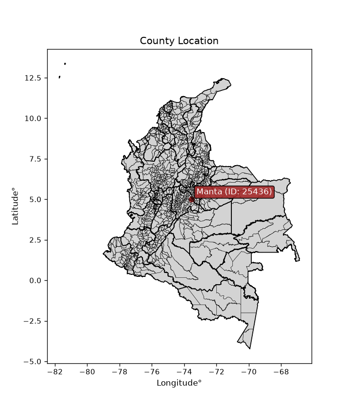
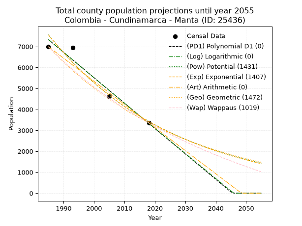
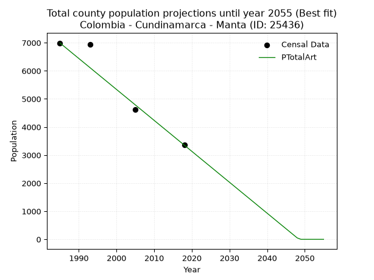
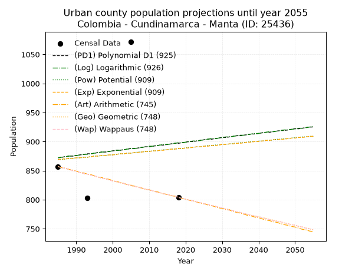
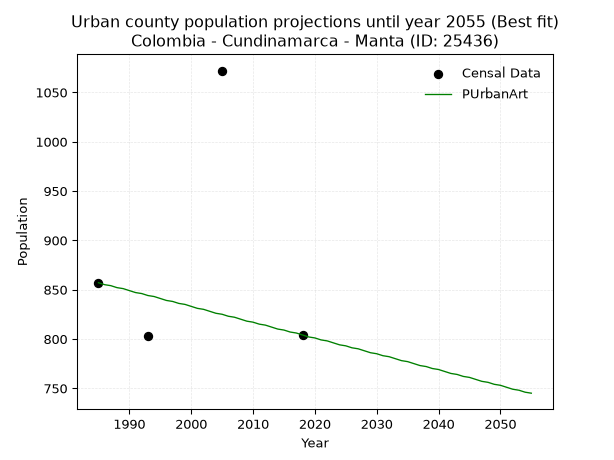
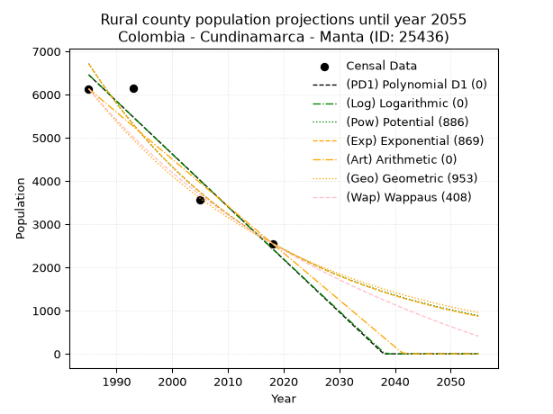
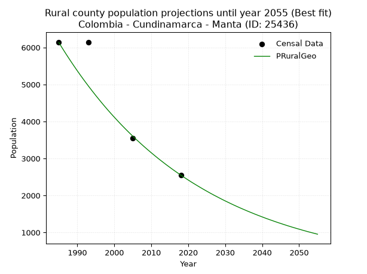

<div align="center">


</div>

# _“Population and Public Services Demand Projections (PPSD) until Year 2050 for Colombia - Cundinamarca - Manta (ID: 25436)”_
Keywords: `population` `public-service` `projection` `lineal` `polynomial` `logarithmic` `potential` `exponential` `arithmetic` `geometric` `wappaus` `dane` `colombia` `south-america`

PPSD are analytical estimates used by governments and planners to anticipate future changes in population size, age distribution, and the resulting community needs for utilities, healthcare, education, and infrastructure as sizing future water treatment facilities, electrical grids, and road networks based on spatial growth.

<div align="center">

</img>

</div>


> **General running parameters**: • app_version: _v20260806_. • Python version: _3.14.7_. • Pandas version: _3.0.5_. • NumPy version: _2.5.1_. • Creates, save and include plots into reports (create_plot): _False_. • Projection until year: _2050_. • Process polynomial degree 2 and up: _False_. • Process Wappaus: _True_. • Process Wappaus: _True_. • Set negative values to zero: _True_. • Set infinite values to zero: _True_. • Drop dataset notes: _True_. 
<div align="center">

Dynamic map: [:earth_americas:Google](http://maps.google.com/maps?q=5.009008418,-73.5404438) [:earth_americas:OSM](https://www.openstreetmap.org/#map=18/5.009008418/-73.5404438&layers=P) [:earth_americas:Bing](https://www.bing.com/maps?cp=5.009008418~-73.5404438&lvl=18) [:earth_americas:Apple](https://maps.apple.com/frame?center=5.009008418%2C-73.5404438&span=0.003%2C0.006)

</div>


<div align="center">

```geojson
{
  "type": "Feature",
  "geometry": {
    "type": "Point", 
    "coordinates": [-73.5404438, 5.009008418]
  }, 
  "properties": {
    "Name": "Colombia - Cundinamarca - Manta (ID: 25436)"
  }
}
```

</div>


## 0. Census Data (4 records)

Census data are official statistics collected by a government about the people and housing in a country. They usually include counts of total population, age, sex, race, income, education, and jobs.

📅Global census file: [Population.xlsx](../data/Population.xlsx)

| Source   |   Year |   CountryID | CountryName   |   StateID | StateName    |   CountyID | CountyName   |   PTotal |   PUrban |   PRural |
|:---------|-------:|------------:|:--------------|----------:|:-------------|-----------:|:-------------|---------:|---------:|---------:|
| DANE     |   1985 |          57 | Colombia      |        25 | Cundinamarca |      25436 | Manta        |     6990 |      857 |     6133 |
| DANE     |   1993 |          57 | Colombia      |        25 | Cundinamarca |      25436 | Manta        |     6949 |      803 |     6146 |
| DANE     |   2005 |          57 | Colombia      |        25 | Cundinamarca |      25436 | Manta        |     4627 |     1072 |     3555 |
| DANE     |   2018 |          57 | Colombia      |        25 | Cundinamarca |      25436 | Manta        |     3354 |      804 |     2550 |

> 🔥Some records could had specific notes about the registered values or the corresponding urban or rural distribution.

📅[SUI-RUPS](https://www.datos.gov.co/Hacienda-y-Cr-dito-P-blico/Registro-nico-de-Prestadores-de-Servicios-P-blicos/4qkq-csdn/about_data) - Local public utility companies: [RUPS.csv](../data/RUPS.xlsx)

 | SERVICIO       | ESTADO    | NOMBRE                                                                                      | NIT         | DEPARTAMENTO_DOMICILIO   | MUNICIPIO_DOMICILIO   | DIRECCION     |   TELEFONO | EMAIL                                       | TIPO_PRESTADOR                 | CLASIFICACION                 |
|:---------------|:----------|:--------------------------------------------------------------------------------------------|:------------|:-------------------------|:----------------------|:--------------|-----------:|:--------------------------------------------|:-------------------------------|:------------------------------|
| ACUEDUCTO      | OPERATIVA | OFICINA DE SERVICIOS PÚBLICOS DE AGUA POTABLE, ALCANTARILLADO Y ASEO DEL MUNICIPIO DE MANTA | 800094711-3 | CUNDINAMARCA             | MANTA                 | K 6 No. 2  27 |    8567600 | serviciospublicos@manta-cundinamarca.gov.co | MUNICIPIO (PRESTACIÓN DIRECTA) | MENOR O IGUAL A 2500 USUARIOS |
| ALCANTARILLADO | OPERATIVA | OFICINA DE SERVICIOS PÚBLICOS DE AGUA POTABLE, ALCANTARILLADO Y ASEO DEL MUNICIPIO DE MANTA | 800094711-3 | CUNDINAMARCA             | MANTA                 | K 6 No. 2  27 |    8567600 | serviciospublicos@manta-cundinamarca.gov.co | MUNICIPIO (PRESTACIÓN DIRECTA) | MENOR O IGUAL A 2500 USUARIOS |

## 1. Total

### 1.1. Coefficients and Parameters

* (PD1) Polynomial Deg 1: -121.1818546768356, 247874.00481734044 (lineal)
* (Log) Logarithmic: -242522.87193149538, 1848898.2930076222
* (Pow) Potential: -48.040874533689454, 162.30588563069696
* (Exp) Exponential: -0.024008620436201247, 3.763093084605422e+24
* (Art) Arithmetic: Year diff. 2018 - 1985 = 33, Population diff. 3354 - 6990 = -3636, Annual growth = -110.18181818181819
* (Geo) Geometric: Year diff. 2018 - 1985 = 33, Population diff. 3354 - 6990 = -3636, Annual growth % = -0.02200657325173805
* (Wap) Wappaus: i = -2.130352246361527, Condition values only valid for < 200)

<sub>
Wappaus condition values: ['-0.00', '-2.13', '-4.26', '-6.39', '-8.52', '-10.65', '-12.78', '-14.91', '-17.04', '-19.17', '-21.30', '-23.43', '-25.56', '-27.69', '-29.82', '-31.96', '-34.09', '-36.22', '-38.35', '-40.48', '-42.61', '-44.74', '-46.87', '-49.00', '-51.13', '-53.26', '-55.39', '-57.52', '-59.65', '-61.78', '-63.91', '-66.04', '-68.17', '-70.30', '-72.43', '-74.56', '-76.69', '-78.82', '-80.95', '-83.08', '-85.21', '-87.34', '-89.47', '-91.61', '-93.74', '-95.87', '-98.00', '-100.13', '-102.26', '-104.39', '-106.52', '-108.65', '-110.78', '-112.91', '-115.04', '-117.17', '-119.30', '-121.43', '-123.56', '-125.69', '-127.82', '-129.95', '-132.08', '-134.21', '-136.34', '-138.47']
</sub>


### 1.2. Projected Dataset

|   Year |   CountyID |   PTotalPD1 |   PTotalLog |   PTotalPow |   PTotalExp |   PTotalArt |   PTotalGeo |   PTotalWap |
|-------:|-----------:|------------:|------------:|------------:|------------:|------------:|------------:|------------:|
|   1985 |      25436 |        7328 |        7331 |        7561 |        7557 |        6990 |        6990 |        6990 |
|   1986 |      25436 |        7207 |        7209 |        7380 |        7377 |        6880 |        6836 |        6843 |
|   1987 |      25436 |        7086 |        7087 |        7204 |        7202 |        6770 |        6686 |        6698 |
|   1988 |      25436 |        6964 |        6965 |        7032 |        7031 |        6659 |        6539 |        6557 |
|   1989 |      25436 |        6843 |        6843 |        6864 |        6865 |        6549 |        6395 |        6419 |
|   1990 |      25436 |        6722 |        6721 |        6700 |        6702 |        6439 |        6254 |        6283 |
|   1991 |      25436 |        6601 |        6599 |        6541 |        6543 |        6329 |        6116 |        6150 |
|   1992 |      25436 |        6480 |        6478 |        6385 |        6388 |        6219 |        5982 |        6020 |
|   1993 |      25436 |        6359 |        6356 |        6233 |        6236 |        6109 |        5850 |        5892 |
|   1994 |      25436 |        6237 |        6234 |        6084 |        6088 |        5998 |        5721 |        5767 |
|   1995 |      25436 |        6116 |        6113 |        5939 |        5944 |        5888 |        5595 |        5644 |
|   1996 |      25436 |        5995 |        5991 |        5798 |        5803 |        5778 |        5472 |        5524 |
|   1997 |      25436 |        5874 |        5870 |        5660 |        5665 |        5668 |        5352 |        5406 |
|   1998 |      25436 |        5753 |        5748 |        5526 |        5531 |        5558 |        5234 |        5290 |
|   1999 |      25436 |        5631 |        5627 |        5395 |        5399 |        5447 |        5119 |        5176 |
|   2000 |      25436 |        5510 |        5506 |        5266 |        5271 |        5337 |        5006 |        5064 |
|   2001 |      25436 |        5389 |        5384 |        5141 |        5146 |        5227 |        4896 |        4954 |
|   2002 |      25436 |        5268 |        5263 |        5020 |        5024 |        5117 |        4788 |        4847 |
|   2003 |      25436 |        5147 |        5142 |        4901 |        4905 |        5007 |        4683 |        4741 |
|   2004 |      25436 |        5026 |        5021 |        4784 |        4789 |        4897 |        4580 |        4637 |
|   2005 |      25436 |        4904 |        4900 |        4671 |        4675 |        4786 |        4479 |        4535 |
|   2006 |      25436 |        4783 |        4779 |        4561 |        4564 |        4676 |        4381 |        4434 |
|   2007 |      25436 |        4662 |        4658 |        4453 |        4456 |        4566 |        4284 |        4336 |
|   2008 |      25436 |        4541 |        4537 |        4347 |        4350 |        4456 |        4190 |        4239 |
|   2009 |      25436 |        4420 |        4417 |        4245 |        4247 |        4346 |        4098 |        4144 |
|   2010 |      25436 |        4298 |        4296 |        4144 |        4146 |        4235 |        4008 |        4050 |
|   2011 |      25436 |        4177 |        4175 |        4047 |        4048 |        4125 |        3919 |        3958 |
|   2012 |      25436 |        4056 |        4055 |        3951 |        3952 |        4015 |        3833 |        3867 |
|   2013 |      25436 |        3935 |        3934 |        3858 |        3858 |        3905 |        3749 |        3778 |
|   2014 |      25436 |        3814 |        3814 |        3767 |        3767 |        3795 |        3666 |        3691 |
|   2015 |      25436 |        3693 |        3693 |        3678 |        3677 |        3685 |        3586 |        3604 |
|   2016 |      25436 |        3571 |        3573 |        3591 |        3590 |        3574 |        3507 |        3520 |
|   2017 |      25436 |        3450 |        3453 |        3507 |        3505 |        3464 |        3429 |        3436 |
|   2018 |      25436 |        3329 |        3333 |        3424 |        3422 |        3354 |        3354 |        3354 |
|   2019 |      25436 |        3208 |        3213 |        3344 |        3341 |        3244 |        3280 |        3273 |
|   2020 |      25436 |        3087 |        3092 |        3265 |        3261 |        3134 |        3208 |        3193 |
|   2021 |      25436 |        2965 |        2972 |        3189 |        3184 |        3023 |        3137 |        3115 |
|   2022 |      25436 |        2844 |        2852 |        3114 |        3108 |        2913 |        3068 |        3038 |
|   2023 |      25436 |        2723 |        2733 |        3041 |        3035 |        2803 |        3001 |        2962 |
|   2024 |      25436 |        2602 |        2613 |        2969 |        2963 |        2693 |        2935 |        2887 |
|   2025 |      25436 |        2481 |        2493 |        2900 |        2892 |        2583 |        2870 |        2813 |
|   2026 |      25436 |        2360 |        2373 |        2832 |        2824 |        2473 |        2807 |        2740 |
|   2027 |      25436 |        2238 |        2253 |        2765 |        2757 |        2362 |        2745 |        2669 |
|   2028 |      25436 |        2117 |        2134 |        2701 |        2691 |        2252 |        2685 |        2598 |
|   2029 |      25436 |        1996 |        2014 |        2637 |        2628 |        2142 |        2626 |        2529 |
|   2030 |      25436 |        1875 |        1895 |        2576 |        2565 |        2032 |        2568 |        2460 |
|   2031 |      25436 |        1754 |        1775 |        2515 |        2504 |        1922 |        2511 |        2393 |
|   2032 |      25436 |        1632 |        1656 |        2457 |        2445 |        1811 |        2456 |        2326 |
|   2033 |      25436 |        1511 |        1537 |        2399 |        2387 |        1701 |        2402 |        2260 |
|   2034 |      25436 |        1390 |        1417 |        2343 |        2330 |        1591 |        2349 |        2196 |
|   2035 |      25436 |        1269 |        1298 |        2289 |        2275 |        1481 |        2298 |        2132 |
|   2036 |      25436 |        1148 |        1179 |        2235 |        2221 |        1371 |        2247 |        2069 |
|   2037 |      25436 |        1027 |        1060 |        2183 |        2168 |        1261 |        2198 |        2007 |
|   2038 |      25436 |         905 |         941 |        2132 |        2117 |        1150 |        2149 |        1946 |
|   2039 |      25436 |         784 |         822 |        2083 |        2067 |        1040 |        2102 |        1885 |
|   2040 |      25436 |         663 |         703 |        2034 |        2018 |         930 |        2056 |        1825 |
|   2041 |      25436 |         542 |         584 |        1987 |        1970 |         820 |        2010 |        1767 |
|   2042 |      25436 |         421 |         465 |        1940 |        1923 |         710 |        1966 |        1709 |
|   2043 |      25436 |         299 |         347 |        1895 |        1877 |         599 |        1923 |        1651 |
|   2044 |      25436 |         178 |         228 |        1851 |        1833 |         489 |        1881 |        1595 |
|   2045 |      25436 |          57 |         109 |        1808 |        1789 |         379 |        1839 |        1539 |
|   2046 |      25436 |           0 |           0 |        1766 |        1747 |         269 |        1799 |        1484 |
|   2047 |      25436 |           0 |           0 |        1725 |        1706 |         159 |        1759 |        1430 |
|   2048 |      25436 |           0 |           0 |        1685 |        1665 |          49 |        1720 |        1376 |
|   2049 |      25436 |           0 |           0 |        1646 |        1626 |           0 |        1683 |        1323 |
|   2050 |      25436 |           0 |           0 |        1608 |        1587 |           0 |        1646 |        1271 |
<div align="center">

</img>

</div>


### 1.3. Best fit with absolute and relative error (%)

Relative error puts that difference into context by dividing the absolute error by the true value, creating a unitless ratio or percentage that shows the scale of the mistake.

Absolute and relative error

|   Year | Source   |   CountryID | CountryName   |   StateID | StateName    |   CountyID_x | CountyName   |   PTotal |   PUrban |   PRural |   CountyID_y |   PTotalPD1 |   PTotalLog |   PTotalPow |   PTotalExp |   PTotalArt |   PTotalGeo |   PTotalWap |   PTotalPD1AbsError |   PTotalLogAbsError |   PTotalPowAbsError |   PTotalExpAbsError |   PTotalArtAbsError |   PTotalGeoAbsError |   PTotalWapAbsError |   PTotalPD1RelError |   PTotalLogRelError |   PTotalPowRelError |   PTotalExpRelError |   PTotalArtRelError |   PTotalGeoRelError |   PTotalWapRelError |
|-------:|:---------|------------:|:--------------|----------:|:-------------|-------------:|:-------------|---------:|---------:|---------:|-------------:|------------:|------------:|------------:|------------:|------------:|------------:|------------:|--------------------:|--------------------:|--------------------:|--------------------:|--------------------:|--------------------:|--------------------:|--------------------:|--------------------:|--------------------:|--------------------:|--------------------:|--------------------:|--------------------:|
|   1985 | DANE     |          57 | Colombia      |        25 | Cundinamarca |        25436 | Manta        |     6990 |      857 |     6133 |        25436 |        7328 |        7331 |        7561 |        7557 |        6990 |        6990 |        6990 |                 338 |                 341 |                 571 |                 567 |                   0 |                   0 |                   0 |            4.83548  |            4.8784   |             8.16881 |             8.11159 |             0       |             0       |             0       |
|   1993 | DANE     |          57 | Colombia      |        25 | Cundinamarca |        25436 | Manta        |     6949 |      803 |     6146 |        25436 |        6359 |        6356 |        6233 |        6236 |        6109 |        5850 |        5892 |                 590 |                 593 |                 716 |                 713 |                 840 |                1099 |                1057 |            8.49043  |            8.5336   |            10.3036  |            10.2605  |            12.0881  |            15.8152  |            15.2108  |
|   2005 | DANE     |          57 | Colombia      |        25 | Cundinamarca |        25436 | Manta        |     4627 |     1072 |     3555 |        25436 |        4904 |        4900 |        4671 |        4675 |        4786 |        4479 |        4535 |                 277 |                 273 |                  44 |                  48 |                 159 |                 148 |                  92 |            5.9866   |            5.90015  |             0.95094 |             1.03739 |             3.43635 |             3.19862 |             1.98833 |
|   2018 | DANE     |          57 | Colombia      |        25 | Cundinamarca |        25436 | Manta        |     3354 |      804 |     2550 |        25436 |        3329 |        3333 |        3424 |        3422 |        3354 |        3354 |        3354 |                  25 |                  21 |                  70 |                  68 |                   0 |                   0 |                   0 |            0.745379 |            0.626118 |             2.08706 |             2.02743 |             0       |             0       |             0       |

Relative error mean

| Method    |   RelError | Best   |
|:----------|-----------:|:-------|
| PTotalPD1 |    5.01447 |        |
| PTotalLog |    4.98457 |        |
| PTotalPow |    5.37761 |        |
| PTotalExp |    5.35922 |        |
| PTotalArt |    3.88111 | True   |
| PTotalGeo |    4.75346 |        |
| PTotalWap |    4.29979 |        |

💙Best method: _**PTotalArt**_
<div align="center">

</img>

</div>


### 1.4. Fresh water supply demand in liters per capita per day (lpcd)

The fresh water supply demand typically ranges from 100 to 300 liters per capita per day (lpcd) for standard domestic and municipal planning, though absolute survival minimums set by the World Health Organization are as low as 7.5 to 20 liters per day, and total consumption in high-income nations can exceed 400 liters.

> `CZ`: Level in meters above the sea level (masl)<br> `WS`: Fresh water supply demand in liters per capita per day (lpcd or l/h/d)<br> `WSAll`: Zonal fresh water supply demand in liters per second (l/s)<br> `A`: Zonal area in square meters<br> `DP`: Population density (people/hectare or p/ha)

Reference values (RAS Colombia)

|    CZ |   WS |
|------:|-----:|
|  1000 |  120 |
|  2000 |  130 |
| 99999 |  140 |

County shapefile geometry properties and water supply values

|   CountyID |      ATotal |   CZTotal |   WSTotal |
|-----------:|------------:|----------:|----------:|
|      25436 | 1.07736e+08 |   2277.16 |       140 |

Projected values for best method: PTotalArt

|   CountyID |   Year |   PTotalArt |   DPTotal |   WSTotal |   WSTotalAll |
|-----------:|-------:|------------:|----------:|----------:|-------------:|
|      25436 |   1985 |        6990 |      0.65 |       140 |   11.3264    |
|      25436 |   1986 |        6880 |      0.64 |       140 |   11.1481    |
|      25436 |   1987 |        6770 |      0.63 |       140 |   10.9699    |
|      25436 |   1988 |        6659 |      0.62 |       140 |   10.79      |
|      25436 |   1989 |        6549 |      0.61 |       140 |   10.6118    |
|      25436 |   1990 |        6439 |      0.6  |       140 |   10.4336    |
|      25436 |   1991 |        6329 |      0.59 |       140 |   10.2553    |
|      25436 |   1992 |        6219 |      0.58 |       140 |   10.0771    |
|      25436 |   1993 |        6109 |      0.57 |       140 |    9.89884   |
|      25436 |   1994 |        5998 |      0.56 |       140 |    9.71898   |
|      25436 |   1995 |        5888 |      0.55 |       140 |    9.54074   |
|      25436 |   1996 |        5778 |      0.54 |       140 |    9.3625    |
|      25436 |   1997 |        5668 |      0.53 |       140 |    9.18426   |
|      25436 |   1998 |        5558 |      0.52 |       140 |    9.00602   |
|      25436 |   1999 |        5447 |      0.51 |       140 |    8.82616   |
|      25436 |   2000 |        5337 |      0.5  |       140 |    8.64792   |
|      25436 |   2001 |        5227 |      0.49 |       140 |    8.46968   |
|      25436 |   2002 |        5117 |      0.47 |       140 |    8.29144   |
|      25436 |   2003 |        5007 |      0.46 |       140 |    8.11319   |
|      25436 |   2004 |        4897 |      0.45 |       140 |    7.93495   |
|      25436 |   2005 |        4786 |      0.44 |       140 |    7.75509   |
|      25436 |   2006 |        4676 |      0.43 |       140 |    7.57685   |
|      25436 |   2007 |        4566 |      0.42 |       140 |    7.39861   |
|      25436 |   2008 |        4456 |      0.41 |       140 |    7.22037   |
|      25436 |   2009 |        4346 |      0.4  |       140 |    7.04213   |
|      25436 |   2010 |        4235 |      0.39 |       140 |    6.86227   |
|      25436 |   2011 |        4125 |      0.38 |       140 |    6.68403   |
|      25436 |   2012 |        4015 |      0.37 |       140 |    6.50579   |
|      25436 |   2013 |        3905 |      0.36 |       140 |    6.32755   |
|      25436 |   2014 |        3795 |      0.35 |       140 |    6.14931   |
|      25436 |   2015 |        3685 |      0.34 |       140 |    5.97106   |
|      25436 |   2016 |        3574 |      0.33 |       140 |    5.7912    |
|      25436 |   2017 |        3464 |      0.32 |       140 |    5.61296   |
|      25436 |   2018 |        3354 |      0.31 |       140 |    5.43472   |
|      25436 |   2019 |        3244 |      0.3  |       140 |    5.25648   |
|      25436 |   2020 |        3134 |      0.29 |       140 |    5.07824   |
|      25436 |   2021 |        3023 |      0.28 |       140 |    4.89838   |
|      25436 |   2022 |        2913 |      0.27 |       140 |    4.72014   |
|      25436 |   2023 |        2803 |      0.26 |       140 |    4.5419    |
|      25436 |   2024 |        2693 |      0.25 |       140 |    4.36366   |
|      25436 |   2025 |        2583 |      0.24 |       140 |    4.18542   |
|      25436 |   2026 |        2473 |      0.23 |       140 |    4.00718   |
|      25436 |   2027 |        2362 |      0.22 |       140 |    3.82731   |
|      25436 |   2028 |        2252 |      0.21 |       140 |    3.64907   |
|      25436 |   2029 |        2142 |      0.2  |       140 |    3.47083   |
|      25436 |   2030 |        2032 |      0.19 |       140 |    3.29259   |
|      25436 |   2031 |        1922 |      0.18 |       140 |    3.11435   |
|      25436 |   2032 |        1811 |      0.17 |       140 |    2.93449   |
|      25436 |   2033 |        1701 |      0.16 |       140 |    2.75625   |
|      25436 |   2034 |        1591 |      0.15 |       140 |    2.57801   |
|      25436 |   2035 |        1481 |      0.14 |       140 |    2.39977   |
|      25436 |   2036 |        1371 |      0.13 |       140 |    2.22153   |
|      25436 |   2037 |        1261 |      0.12 |       140 |    2.04329   |
|      25436 |   2038 |        1150 |      0.11 |       140 |    1.86343   |
|      25436 |   2039 |        1040 |      0.1  |       140 |    1.68519   |
|      25436 |   2040 |         930 |      0.09 |       140 |    1.50694   |
|      25436 |   2041 |         820 |      0.08 |       140 |    1.3287    |
|      25436 |   2042 |         710 |      0.07 |       140 |    1.15046   |
|      25436 |   2043 |         599 |      0.06 |       140 |    0.970602  |
|      25436 |   2044 |         489 |      0.05 |       140 |    0.792361  |
|      25436 |   2045 |         379 |      0.04 |       140 |    0.61412   |
|      25436 |   2046 |         269 |      0.02 |       140 |    0.43588   |
|      25436 |   2047 |         159 |      0.01 |       140 |    0.257639  |
|      25436 |   2048 |          49 |      0    |       140 |    0.0793981 |
|      25436 |   2049 |           0 |      0    |       140 |    0         |
|      25436 |   2050 |           0 |      0    |       140 |    0         |

## 2. Urban

### 2.1. Coefficients and Parameters

* (PD1) Polynomial Deg 1: 0.7579285427540601, -632.0465676438085 (lineal)
* (Log) Logarithmic: 1543.3797815577889, -10847.242087490125
* (Pow) Potential: 1.3195506991249057, -1.4126501284675554
* (Exp) Exponential: 0.0006454812781094298, 241.3008232371801
* (Art) Arithmetic: Year diff. 2018 - 1985 = 33, Population diff. 804 - 857 = -53, Annual growth = -1.606060606060606
* (Geo) Geometric: Year diff. 2018 - 1985 = 33, Population diff. 804 - 857 = -53, Annual growth % = -0.0019326345799606237
* (Wap) Wappaus: i = -0.1933847809826136, Condition values only valid for < 200)

<sub>
Wappaus condition values: ['-0.00', '-0.19', '-0.39', '-0.58', '-0.77', '-0.97', '-1.16', '-1.35', '-1.55', '-1.74', '-1.93', '-2.13', '-2.32', '-2.51', '-2.71', '-2.90', '-3.09', '-3.29', '-3.48', '-3.67', '-3.87', '-4.06', '-4.25', '-4.45', '-4.64', '-4.83', '-5.03', '-5.22', '-5.41', '-5.61', '-5.80', '-5.99', '-6.19', '-6.38', '-6.58', '-6.77', '-6.96', '-7.16', '-7.35', '-7.54', '-7.74', '-7.93', '-8.12', '-8.32', '-8.51', '-8.70', '-8.90', '-9.09', '-9.28', '-9.48', '-9.67', '-9.86', '-10.06', '-10.25', '-10.44', '-10.64', '-10.83', '-11.02', '-11.22', '-11.41', '-11.60', '-11.80', '-11.99', '-12.18', '-12.38', '-12.57']
</sub>


### 2.2. Projected Dataset

|   Year |   CountyID |   PUrbanPD1 |   PUrbanLog |   PUrbanPow |   PUrbanExp |   PUrbanArt |   PUrbanGeo |   PUrbanWap |
|-------:|-----------:|------------:|------------:|------------:|------------:|------------:|------------:|------------:|
|   1985 |      25436 |         872 |         872 |         869 |         869 |         857 |         857 |         857 |
|   1986 |      25436 |         873 |         873 |         869 |         870 |         855 |         855 |         855 |
|   1987 |      25436 |         874 |         874 |         870 |         870 |         854 |         854 |         854 |
|   1988 |      25436 |         875 |         875 |         871 |         871 |         852 |         852 |         852 |
|   1989 |      25436 |         875 |         875 |         871 |         871 |         851 |         850 |         850 |
|   1990 |      25436 |         876 |         876 |         872 |         872 |         849 |         849 |         849 |
|   1991 |      25436 |         877 |         877 |         872 |         872 |         847 |         847 |         847 |
|   1992 |      25436 |         878 |         878 |         873 |         873 |         846 |         845 |         845 |
|   1993 |      25436 |         879 |         878 |         873 |         873 |         844 |         844 |         844 |
|   1994 |      25436 |         879 |         879 |         874 |         874 |         843 |         842 |         842 |
|   1995 |      25436 |         880 |         880 |         875 |         875 |         841 |         841 |         841 |
|   1996 |      25436 |         881 |         881 |         875 |         875 |         839 |         839 |         839 |
|   1997 |      25436 |         882 |         882 |         876 |         876 |         838 |         837 |         837 |
|   1998 |      25436 |         882 |         882 |         876 |         876 |         836 |         836 |         836 |
|   1999 |      25436 |         883 |         883 |         877 |         877 |         835 |         834 |         834 |
|   2000 |      25436 |         884 |         884 |         877 |         877 |         833 |         832 |         832 |
|   2001 |      25436 |         885 |         885 |         878 |         878 |         831 |         831 |         831 |
|   2002 |      25436 |         885 |         885 |         879 |         879 |         830 |         829 |         829 |
|   2003 |      25436 |         886 |         886 |         879 |         879 |         828 |         828 |         828 |
|   2004 |      25436 |         887 |         887 |         880 |         880 |         826 |         826 |         826 |
|   2005 |      25436 |         888 |         888 |         880 |         880 |         825 |         824 |         824 |
|   2006 |      25436 |         888 |         888 |         881 |         881 |         823 |         823 |         823 |
|   2007 |      25436 |         889 |         889 |         882 |         881 |         822 |         821 |         821 |
|   2008 |      25436 |         890 |         890 |         882 |         882 |         820 |         820 |         820 |
|   2009 |      25436 |         891 |         891 |         883 |         883 |         818 |         818 |         818 |
|   2010 |      25436 |         891 |         892 |         883 |         883 |         817 |         817 |         817 |
|   2011 |      25436 |         892 |         892 |         884 |         884 |         815 |         815 |         815 |
|   2012 |      25436 |         893 |         893 |         884 |         884 |         814 |         813 |         813 |
|   2013 |      25436 |         894 |         894 |         885 |         885 |         812 |         812 |         812 |
|   2014 |      25436 |         894 |         895 |         886 |         885 |         810 |         810 |         810 |
|   2015 |      25436 |         895 |         895 |         886 |         886 |         809 |         809 |         809 |
|   2016 |      25436 |         896 |         896 |         887 |         887 |         807 |         807 |         807 |
|   2017 |      25436 |         897 |         897 |         887 |         887 |         806 |         806 |         806 |
|   2018 |      25436 |         897 |         898 |         888 |         888 |         804 |         804 |         804 |
|   2019 |      25436 |         898 |         898 |         888 |         888 |         802 |         802 |         802 |
|   2020 |      25436 |         899 |         899 |         889 |         889 |         801 |         801 |         801 |
|   2021 |      25436 |         900 |         900 |         890 |         889 |         799 |         799 |         799 |
|   2022 |      25436 |         900 |         901 |         890 |         890 |         798 |         798 |         798 |
|   2023 |      25436 |         901 |         901 |         891 |         891 |         796 |         796 |         796 |
|   2024 |      25436 |         902 |         902 |         891 |         891 |         794 |         795 |         795 |
|   2025 |      25436 |         903 |         903 |         892 |         892 |         793 |         793 |         793 |
|   2026 |      25436 |         904 |         904 |         893 |         892 |         791 |         792 |         792 |
|   2027 |      25436 |         904 |         905 |         893 |         893 |         790 |         790 |         790 |
|   2028 |      25436 |         905 |         905 |         894 |         893 |         788 |         789 |         789 |
|   2029 |      25436 |         906 |         906 |         894 |         894 |         786 |         787 |         787 |
|   2030 |      25436 |         907 |         907 |         895 |         895 |         785 |         786 |         786 |
|   2031 |      25436 |         907 |         908 |         895 |         895 |         783 |         784 |         784 |
|   2032 |      25436 |         908 |         908 |         896 |         896 |         782 |         783 |         782 |
|   2033 |      25436 |         909 |         909 |         897 |         896 |         780 |         781 |         781 |
|   2034 |      25436 |         910 |         910 |         897 |         897 |         778 |         779 |         779 |
|   2035 |      25436 |         910 |         911 |         898 |         897 |         777 |         778 |         778 |
|   2036 |      25436 |         911 |         911 |         898 |         898 |         775 |         776 |         776 |
|   2037 |      25436 |         912 |         912 |         899 |         899 |         773 |         775 |         775 |
|   2038 |      25436 |         913 |         913 |         900 |         899 |         772 |         773 |         773 |
|   2039 |      25436 |         913 |         914 |         900 |         900 |         770 |         772 |         772 |
|   2040 |      25436 |         914 |         914 |         901 |         900 |         769 |         771 |         770 |
|   2041 |      25436 |         915 |         915 |         901 |         901 |         767 |         769 |         769 |
|   2042 |      25436 |         916 |         916 |         902 |         902 |         765 |         768 |         767 |
|   2043 |      25436 |         916 |         917 |         902 |         902 |         764 |         766 |         766 |
|   2044 |      25436 |         917 |         917 |         903 |         903 |         762 |         765 |         764 |
|   2045 |      25436 |         918 |         918 |         904 |         903 |         761 |         763 |         763 |
|   2046 |      25436 |         919 |         919 |         904 |         904 |         759 |         762 |         762 |
|   2047 |      25436 |         919 |         920 |         905 |         904 |         757 |         760 |         760 |
|   2048 |      25436 |         920 |         920 |         905 |         905 |         756 |         759 |         759 |
|   2049 |      25436 |         921 |         921 |         906 |         906 |         754 |         757 |         757 |
|   2050 |      25436 |         922 |         922 |         907 |         906 |         753 |         756 |         756 |
<div align="center">

</img>

</div>


### 2.3. Best fit with absolute and relative error (%)

Relative error puts that difference into context by dividing the absolute error by the true value, creating a unitless ratio or percentage that shows the scale of the mistake.

Absolute and relative error

|   Year | Source   |   CountryID | CountryName   |   StateID | StateName    |   CountyID_x | CountyName   |   PTotal |   PUrban |   PRural |   CountyID_y |   PUrbanPD1 |   PUrbanLog |   PUrbanPow |   PUrbanExp |   PUrbanArt |   PUrbanGeo |   PUrbanWap |   PUrbanPD1AbsError |   PUrbanLogAbsError |   PUrbanPowAbsError |   PUrbanExpAbsError |   PUrbanArtAbsError |   PUrbanGeoAbsError |   PUrbanWapAbsError |   PUrbanPD1RelError |   PUrbanLogRelError |   PUrbanPowRelError |   PUrbanExpRelError |   PUrbanArtRelError |   PUrbanGeoRelError |   PUrbanWapRelError |
|-------:|:---------|------------:|:--------------|----------:|:-------------|-------------:|:-------------|---------:|---------:|---------:|-------------:|------------:|------------:|------------:|------------:|------------:|------------:|------------:|--------------------:|--------------------:|--------------------:|--------------------:|--------------------:|--------------------:|--------------------:|--------------------:|--------------------:|--------------------:|--------------------:|--------------------:|--------------------:|--------------------:|
|   1985 | DANE     |          57 | Colombia      |        25 | Cundinamarca |        25436 | Manta        |     6990 |      857 |     6133 |        25436 |         872 |         872 |         869 |         869 |         857 |         857 |         857 |                  15 |                  15 |                  12 |                  12 |                   0 |                   0 |                   0 |             1.75029 |             1.75029 |             1.40023 |             1.40023 |             0       |             0       |             0       |
|   1993 | DANE     |          57 | Colombia      |        25 | Cundinamarca |        25436 | Manta        |     6949 |      803 |     6146 |        25436 |         879 |         878 |         873 |         873 |         844 |         844 |         844 |                  76 |                  75 |                  70 |                  70 |                  41 |                  41 |                  41 |             9.46451 |             9.33998 |             8.71731 |             8.71731 |             5.10585 |             5.10585 |             5.10585 |
|   2005 | DANE     |          57 | Colombia      |        25 | Cundinamarca |        25436 | Manta        |     4627 |     1072 |     3555 |        25436 |         888 |         888 |         880 |         880 |         825 |         824 |         824 |                 184 |                 184 |                 192 |                 192 |                 247 |                 248 |                 248 |            17.1642  |            17.1642  |            17.9104  |            17.9104  |            23.041   |            23.1343  |            23.1343  |
|   2018 | DANE     |          57 | Colombia      |        25 | Cundinamarca |        25436 | Manta        |     3354 |      804 |     2550 |        25436 |         897 |         898 |         888 |         888 |         804 |         804 |         804 |                  93 |                  94 |                  84 |                  84 |                   0 |                   0 |                   0 |            11.5672  |            11.6915  |            10.4478  |            10.4478  |             0       |             0       |             0       |

Relative error mean

| Method    |   RelError | Best   |
|:----------|-----------:|:-------|
| PUrbanPD1 |    9.98654 |        |
| PUrbanLog |    9.9865  |        |
| PUrbanPow |    9.61894 |        |
| PUrbanExp |    9.61894 |        |
| PUrbanArt |    7.03672 | True   |
| PUrbanGeo |    7.06005 |        |
| PUrbanWap |    7.06005 |        |

💙Best method: _**PUrbanArt**_
<div align="center">

</img>

</div>


### 2.4. Fresh water supply demand in liters per capita per day (lpcd)

The fresh water supply demand typically ranges from 100 to 300 liters per capita per day (lpcd) for standard domestic and municipal planning, though absolute survival minimums set by the World Health Organization are as low as 7.5 to 20 liters per day, and total consumption in high-income nations can exceed 400 liters.

> `CZ`: Level in meters above the sea level (masl)<br> `WS`: Fresh water supply demand in liters per capita per day (lpcd or l/h/d)<br> `WSAll`: Zonal fresh water supply demand in liters per second (l/s)<br> `A`: Zonal area in square meters<br> `DP`: Population density (people/hectare or p/ha)

Reference values (RAS Colombia)

|    CZ |   WS |
|------:|-----:|
|  1000 |  120 |
|  2000 |  130 |
| 99999 |  140 |

County shapefile geometry properties and water supply values

|   CountyID |   AUrban |   CZUrban |   WSUrban |
|-----------:|---------:|----------:|----------:|
|      25436 |   467137 |   1901.83 |       130 |

Projected values for best method: PUrbanArt

|   CountyID |   Year |   PUrbanArt |   DPUrban |   WSUrban |   WSUrbanAll |
|-----------:|-------:|------------:|----------:|----------:|-------------:|
|      25436 |   1985 |         857 |     18.35 |       130 |      1.28947 |
|      25436 |   1986 |         855 |     18.3  |       130 |      1.28646 |
|      25436 |   1987 |         854 |     18.28 |       130 |      1.28495 |
|      25436 |   1988 |         852 |     18.24 |       130 |      1.28194 |
|      25436 |   1989 |         851 |     18.22 |       130 |      1.28044 |
|      25436 |   1990 |         849 |     18.17 |       130 |      1.27743 |
|      25436 |   1991 |         847 |     18.13 |       130 |      1.27442 |
|      25436 |   1992 |         846 |     18.11 |       130 |      1.27292 |
|      25436 |   1993 |         844 |     18.07 |       130 |      1.26991 |
|      25436 |   1994 |         843 |     18.05 |       130 |      1.2684  |
|      25436 |   1995 |         841 |     18    |       130 |      1.26539 |
|      25436 |   1996 |         839 |     17.96 |       130 |      1.26238 |
|      25436 |   1997 |         838 |     17.94 |       130 |      1.26088 |
|      25436 |   1998 |         836 |     17.9  |       130 |      1.25787 |
|      25436 |   1999 |         835 |     17.87 |       130 |      1.25637 |
|      25436 |   2000 |         833 |     17.83 |       130 |      1.25336 |
|      25436 |   2001 |         831 |     17.79 |       130 |      1.25035 |
|      25436 |   2002 |         830 |     17.77 |       130 |      1.24884 |
|      25436 |   2003 |         828 |     17.72 |       130 |      1.24583 |
|      25436 |   2004 |         826 |     17.68 |       130 |      1.24282 |
|      25436 |   2005 |         825 |     17.66 |       130 |      1.24132 |
|      25436 |   2006 |         823 |     17.62 |       130 |      1.23831 |
|      25436 |   2007 |         822 |     17.6  |       130 |      1.23681 |
|      25436 |   2008 |         820 |     17.55 |       130 |      1.2338  |
|      25436 |   2009 |         818 |     17.51 |       130 |      1.23079 |
|      25436 |   2010 |         817 |     17.49 |       130 |      1.22928 |
|      25436 |   2011 |         815 |     17.45 |       130 |      1.22627 |
|      25436 |   2012 |         814 |     17.43 |       130 |      1.22477 |
|      25436 |   2013 |         812 |     17.38 |       130 |      1.22176 |
|      25436 |   2014 |         810 |     17.34 |       130 |      1.21875 |
|      25436 |   2015 |         809 |     17.32 |       130 |      1.21725 |
|      25436 |   2016 |         807 |     17.28 |       130 |      1.21424 |
|      25436 |   2017 |         806 |     17.25 |       130 |      1.21273 |
|      25436 |   2018 |         804 |     17.21 |       130 |      1.20972 |
|      25436 |   2019 |         802 |     17.17 |       130 |      1.20671 |
|      25436 |   2020 |         801 |     17.15 |       130 |      1.20521 |
|      25436 |   2021 |         799 |     17.1  |       130 |      1.2022  |
|      25436 |   2022 |         798 |     17.08 |       130 |      1.20069 |
|      25436 |   2023 |         796 |     17.04 |       130 |      1.19769 |
|      25436 |   2024 |         794 |     17    |       130 |      1.19468 |
|      25436 |   2025 |         793 |     16.98 |       130 |      1.19317 |
|      25436 |   2026 |         791 |     16.93 |       130 |      1.19016 |
|      25436 |   2027 |         790 |     16.91 |       130 |      1.18866 |
|      25436 |   2028 |         788 |     16.87 |       130 |      1.18565 |
|      25436 |   2029 |         786 |     16.83 |       130 |      1.18264 |
|      25436 |   2030 |         785 |     16.8  |       130 |      1.18113 |
|      25436 |   2031 |         783 |     16.76 |       130 |      1.17813 |
|      25436 |   2032 |         782 |     16.74 |       130 |      1.17662 |
|      25436 |   2033 |         780 |     16.7  |       130 |      1.17361 |
|      25436 |   2034 |         778 |     16.65 |       130 |      1.1706  |
|      25436 |   2035 |         777 |     16.63 |       130 |      1.1691  |
|      25436 |   2036 |         775 |     16.59 |       130 |      1.16609 |
|      25436 |   2037 |         773 |     16.55 |       130 |      1.16308 |
|      25436 |   2038 |         772 |     16.53 |       130 |      1.16157 |
|      25436 |   2039 |         770 |     16.48 |       130 |      1.15856 |
|      25436 |   2040 |         769 |     16.46 |       130 |      1.15706 |
|      25436 |   2041 |         767 |     16.42 |       130 |      1.15405 |
|      25436 |   2042 |         765 |     16.38 |       130 |      1.15104 |
|      25436 |   2043 |         764 |     16.35 |       130 |      1.14954 |
|      25436 |   2044 |         762 |     16.31 |       130 |      1.14653 |
|      25436 |   2045 |         761 |     16.29 |       130 |      1.14502 |
|      25436 |   2046 |         759 |     16.25 |       130 |      1.14201 |
|      25436 |   2047 |         757 |     16.21 |       130 |      1.139   |
|      25436 |   2048 |         756 |     16.18 |       130 |      1.1375  |
|      25436 |   2049 |         754 |     16.14 |       130 |      1.13449 |
|      25436 |   2050 |         753 |     16.12 |       130 |      1.13299 |

## 3. Rural

### 3.1. Coefficients and Parameters

* (PD1) Polynomial Deg 1: -121.93978321958976, 248506.0513849844 (lineal)
* (Log) Logarithmic: -244066.2517130532, 1859745.5350951126
* (Pow) Potential: -58.43009338028105, 196.51558074741928
* (Exp) Exponential: -0.02919774924523161, 9.940865418537634e+28
* (Art) Arithmetic: Year diff. 2018 - 1985 = 33, Population diff. 2550 - 6133 = -3583, Annual growth = -108.57575757575758
* (Geo) Geometric: Year diff. 2018 - 1985 = 33, Population diff. 2550 - 6133 = -3583, Annual growth % = -0.026243159180583953
* (Wap) Wappaus: i = -2.500881206397733, Condition values only valid for < 200)

<sub>
Wappaus condition values: ['-0.00', '-2.50', '-5.00', '-7.50', '-10.00', '-12.50', '-15.01', '-17.51', '-20.01', '-22.51', '-25.01', '-27.51', '-30.01', '-32.51', '-35.01', '-37.51', '-40.01', '-42.51', '-45.02', '-47.52', '-50.02', '-52.52', '-55.02', '-57.52', '-60.02', '-62.52', '-65.02', '-67.52', '-70.02', '-72.53', '-75.03', '-77.53', '-80.03', '-82.53', '-85.03', '-87.53', '-90.03', '-92.53', '-95.03', '-97.53', '-100.04', '-102.54', '-105.04', '-107.54', '-110.04', '-112.54', '-115.04', '-117.54', '-120.04', '-122.54', '-125.04', '-127.54', '-130.05', '-132.55', '-135.05', '-137.55', '-140.05', '-142.55', '-145.05', '-147.55', '-150.05', '-152.55', '-155.05', '-157.56', '-160.06', '-162.56']
</sub>


### 3.2. Projected Dataset

|   Year |   CountyID |   PRuralPD1 |   PRuralLog |   PRuralPow |   PRuralExp |   PRuralArt |   PRuralGeo |   PRuralWap |
|-------:|-----------:|------------:|------------:|------------:|------------:|------------:|------------:|------------:|
|   1985 |      25436 |        6456 |        6459 |        6716 |        6711 |        6133 |        6133 |        6133 |
|   1986 |      25436 |        6334 |        6336 |        6521 |        6518 |        6024 |        5972 |        5982 |
|   1987 |      25436 |        6212 |        6213 |        6332 |        6330 |        5916 |        5815 |        5834 |
|   1988 |      25436 |        6090 |        6091 |        6149 |        6148 |        5807 |        5663 |        5689 |
|   1989 |      25436 |        5968 |        5968 |        5971 |        5971 |        5699 |        5514 |        5549 |
|   1990 |      25436 |        5846 |        5845 |        5798 |        5799 |        5590 |        5369 |        5411 |
|   1991 |      25436 |        5724 |        5723 |        5630 |        5633 |        5482 |        5228 |        5277 |
|   1992 |      25436 |        5602 |        5600 |        5468 |        5470 |        5373 |        5091 |        5146 |
|   1993 |      25436 |        5480 |        5477 |        5310 |        5313 |        5264 |        4958 |        5018 |
|   1994 |      25436 |        5358 |        5355 |        5156 |        5160 |        5156 |        4828 |        4892 |
|   1995 |      25436 |        5236 |        5233 |        5007 |        5012 |        5047 |        4701 |        4770 |
|   1996 |      25436 |        5114 |        5110 |        4863 |        4867 |        4939 |        4578 |        4650 |
|   1997 |      25436 |        4992 |        4988 |        4723 |        4727 |        4830 |        4457 |        4533 |
|   1998 |      25436 |        4870 |        4866 |        4586 |        4591 |        4722 |        4340 |        4418 |
|   1999 |      25436 |        4748 |        4744 |        4454 |        4459 |        4613 |        4226 |        4306 |
|   2000 |      25436 |        4626 |        4622 |        4326 |        4331 |        4504 |        4116 |        4196 |
|   2001 |      25436 |        4505 |        4500 |        4202 |        4206 |        4396 |        4008 |        4088 |
|   2002 |      25436 |        4383 |        4378 |        4081 |        4085 |        4287 |        3902 |        3983 |
|   2003 |      25436 |        4261 |        4256 |        3963 |        3968 |        4179 |        3800 |        3879 |
|   2004 |      25436 |        4139 |        4134 |        3849 |        3854 |        4070 |        3700 |        3778 |
|   2005 |      25436 |        4017 |        4012 |        3739 |        3743 |        3961 |        3603 |        3679 |
|   2006 |      25436 |        3895 |        3891 |        3631 |        3635 |        3853 |        3509 |        3582 |
|   2007 |      25436 |        3773 |        3769 |        3527 |        3530 |        3744 |        3417 |        3487 |
|   2008 |      25436 |        3651 |        3647 |        3426 |        3429 |        3636 |        3327 |        3393 |
|   2009 |      25436 |        3529 |        3526 |        3328 |        3330 |        3527 |        3240 |        3302 |
|   2010 |      25436 |        3407 |        3404 |        3232 |        3234 |        3419 |        3155 |        3212 |
|   2011 |      25436 |        3285 |        3283 |        3140 |        3141 |        3310 |        3072 |        3124 |
|   2012 |      25436 |        3163 |        3162 |        3050 |        3051 |        3201 |        2991 |        3037 |
|   2013 |      25436 |        3041 |        3040 |        2963 |        2963 |        3093 |        2913 |        2952 |
|   2014 |      25436 |        2919 |        2919 |        2878 |        2878 |        2984 |        2836 |        2869 |
|   2015 |      25436 |        2797 |        2798 |        2796 |        2795 |        2876 |        2762 |        2787 |
|   2016 |      25436 |        2675 |        2677 |        2716 |        2715 |        2767 |        2689 |        2706 |
|   2017 |      25436 |        2554 |        2556 |        2638 |        2636 |        2659 |        2619 |        2628 |
|   2018 |      25436 |        2432 |        2435 |        2563 |        2561 |        2550 |        2550 |        2550 |
|   2019 |      25436 |        2310 |        2314 |        2490 |        2487 |        2441 |        2483 |        2474 |
|   2020 |      25436 |        2188 |        2193 |        2419 |        2415 |        2333 |        2418 |        2399 |
|   2021 |      25436 |        2066 |        2072 |        2350 |        2346 |        2224 |        2354 |        2325 |
|   2022 |      25436 |        1944 |        1952 |        2283 |        2278 |        2116 |        2293 |        2253 |
|   2023 |      25436 |        1822 |        1831 |        2218 |        2213 |        2007 |        2233 |        2182 |
|   2024 |      25436 |        1700 |        1710 |        2155 |        2149 |        1899 |        2174 |        2112 |
|   2025 |      25436 |        1578 |        1590 |        2093 |        2087 |        1790 |        2117 |        2043 |
|   2026 |      25436 |        1456 |        1469 |        2034 |        2027 |        1681 |        2061 |        1976 |
|   2027 |      25436 |        1334 |        1349 |        1976 |        1969 |        1573 |        2007 |        1909 |
|   2028 |      25436 |        1212 |        1229 |        1920 |        1912 |        1464 |        1955 |        1844 |
|   2029 |      25436 |        1090 |        1108 |        1865 |        1857 |        1356 |        1903 |        1780 |
|   2030 |      25436 |         968 |         988 |        1813 |        1804 |        1247 |        1853 |        1716 |
|   2031 |      25436 |         846 |         868 |        1761 |        1752 |        1139 |        1805 |        1654 |
|   2032 |      25436 |         724 |         748 |        1711 |        1701 |        1030 |        1757 |        1593 |
|   2033 |      25436 |         602 |         628 |        1663 |        1652 |         921 |        1711 |        1532 |
|   2034 |      25436 |         481 |         508 |        1616 |        1605 |         813 |        1666 |        1473 |
|   2035 |      25436 |         359 |         388 |        1570 |        1559 |         704 |        1623 |        1414 |
|   2036 |      25436 |         237 |         268 |        1525 |        1514 |         596 |        1580 |        1357 |
|   2037 |      25436 |         115 |         148 |        1482 |        1470 |         487 |        1539 |        1300 |
|   2038 |      25436 |           0 |          28 |        1440 |        1428 |         378 |        1498 |        1244 |
|   2039 |      25436 |           0 |           0 |        1400 |        1387 |         270 |        1459 |        1189 |
|   2040 |      25436 |           0 |           0 |        1360 |        1347 |         161 |        1421 |        1135 |
|   2041 |      25436 |           0 |           0 |        1322 |        1308 |          53 |        1383 |        1081 |
|   2042 |      25436 |           0 |           0 |        1284 |        1271 |           0 |        1347 |        1029 |
|   2043 |      25436 |           0 |           0 |        1248 |        1234 |           0 |        1312 |         977 |
|   2044 |      25436 |           0 |           0 |        1213 |        1199 |           0 |        1277 |         926 |
|   2045 |      25436 |           0 |           0 |        1179 |        1164 |           0 |        1244 |         875 |
|   2046 |      25436 |           0 |           0 |        1146 |        1131 |           0 |        1211 |         825 |
|   2047 |      25436 |           0 |           0 |        1113 |        1098 |           0 |        1179 |         776 |
|   2048 |      25436 |           0 |           0 |        1082 |        1066 |           0 |        1148 |         728 |
|   2049 |      25436 |           0 |           0 |        1052 |        1036 |           0 |        1118 |         680 |
|   2050 |      25436 |           0 |           0 |        1022 |        1006 |           0 |        1089 |         633 |
<div align="center">

</img>

</div>


### 3.3. Best fit with absolute and relative error (%)

Relative error puts that difference into context by dividing the absolute error by the true value, creating a unitless ratio or percentage that shows the scale of the mistake.

Absolute and relative error

|   Year | Source   |   CountryID | CountryName   |   StateID | StateName    |   CountyID_x | CountyName   |   PTotal |   PUrban |   PRural |   CountyID_y |   PRuralPD1 |   PRuralLog |   PRuralPow |   PRuralExp |   PRuralArt |   PRuralGeo |   PRuralWap |   PRuralPD1AbsError |   PRuralLogAbsError |   PRuralPowAbsError |   PRuralExpAbsError |   PRuralArtAbsError |   PRuralGeoAbsError |   PRuralWapAbsError |   PRuralPD1RelError |   PRuralLogRelError |   PRuralPowRelError |   PRuralExpRelError |   PRuralArtRelError |   PRuralGeoRelError |   PRuralWapRelError |
|-------:|:---------|------------:|:--------------|----------:|:-------------|-------------:|:-------------|---------:|---------:|---------:|-------------:|------------:|------------:|------------:|------------:|------------:|------------:|------------:|--------------------:|--------------------:|--------------------:|--------------------:|--------------------:|--------------------:|--------------------:|--------------------:|--------------------:|--------------------:|--------------------:|--------------------:|--------------------:|--------------------:|
|   1985 | DANE     |          57 | Colombia      |        25 | Cundinamarca |        25436 | Manta        |     6990 |      857 |     6133 |        25436 |        6456 |        6459 |        6716 |        6711 |        6133 |        6133 |        6133 |                 323 |                 326 |                 583 |                 578 |                   0 |                   0 |                   0 |             5.26659 |             5.31551 |            9.50595  |            9.42443  |              0      |             0       |             0       |
|   1993 | DANE     |          57 | Colombia      |        25 | Cundinamarca |        25436 | Manta        |     6949 |      803 |     6146 |        25436 |        5480 |        5477 |        5310 |        5313 |        5264 |        4958 |        5018 |                 666 |                 669 |                 836 |                 833 |                 882 |                1188 |                1128 |            10.8363  |            10.8851  |           13.6023   |           13.5535   |             14.3508 |            19.3296  |            18.3534  |
|   2005 | DANE     |          57 | Colombia      |        25 | Cundinamarca |        25436 | Manta        |     4627 |     1072 |     3555 |        25436 |        4017 |        4012 |        3739 |        3743 |        3961 |        3603 |        3679 |                 462 |                 457 |                 184 |                 188 |                 406 |                  48 |                 124 |            12.9958  |            12.8551  |            5.17581  |            5.28833  |             11.4205 |             1.35021 |             3.48805 |
|   2018 | DANE     |          57 | Colombia      |        25 | Cundinamarca |        25436 | Manta        |     3354 |      804 |     2550 |        25436 |        2432 |        2435 |        2563 |        2561 |        2550 |        2550 |        2550 |                 118 |                 115 |                  13 |                  11 |                   0 |                   0 |                   0 |             4.62745 |             4.5098  |            0.509804 |            0.431373 |              0      |             0       |             0       |

Relative error mean

| Method    |   RelError | Best   |
|:----------|-----------:|:-------|
| PRuralPD1 |    8.43153 |        |
| PRuralLog |    8.39139 |        |
| PRuralPow |    7.19848 |        |
| PRuralExp |    7.17441 |        |
| PRuralArt |    6.44283 |        |
| PRuralGeo |    5.16996 | True   |
| PRuralWap |    5.46036 |        |

💙Best method: _**PRuralGeo**_
<div align="center">

</img>

</div>


### 3.4. Fresh water supply demand in liters per capita per day (lpcd)

The fresh water supply demand typically ranges from 100 to 300 liters per capita per day (lpcd) for standard domestic and municipal planning, though absolute survival minimums set by the World Health Organization are as low as 7.5 to 20 liters per day, and total consumption in high-income nations can exceed 400 liters.

> `CZ`: Level in meters above the sea level (masl)<br> `WS`: Fresh water supply demand in liters per capita per day (lpcd or l/h/d)<br> `WSAll`: Zonal fresh water supply demand in liters per second (l/s)<br> `A`: Zonal area in square meters<br> `DP`: Population density (people/hectare or p/ha)

Reference values (RAS Colombia)

|    CZ |   WS |
|------:|-----:|
|  1000 |  120 |
|  2000 |  130 |
| 99999 |  140 |

County shapefile geometry properties and water supply values

|   CountyID |      ARural |   CZRural |   WSRural |
|-----------:|------------:|----------:|----------:|
|      25436 | 1.07268e+08 |   2278.89 |       140 |

Projected values for best method: PRuralGeo

|   CountyID |   Year |   PRuralGeo |   DPRural |   WSRural |   WSRuralAll |
|-----------:|-------:|------------:|----------:|----------:|-------------:|
|      25436 |   1985 |        6133 |      0.57 |       140 |      9.93773 |
|      25436 |   1986 |        5972 |      0.56 |       140 |      9.67685 |
|      25436 |   1987 |        5815 |      0.54 |       140 |      9.42245 |
|      25436 |   1988 |        5663 |      0.53 |       140 |      9.17616 |
|      25436 |   1989 |        5514 |      0.51 |       140 |      8.93472 |
|      25436 |   1990 |        5369 |      0.5  |       140 |      8.69977 |
|      25436 |   1991 |        5228 |      0.49 |       140 |      8.4713  |
|      25436 |   1992 |        5091 |      0.47 |       140 |      8.24931 |
|      25436 |   1993 |        4958 |      0.46 |       140 |      8.0338  |
|      25436 |   1994 |        4828 |      0.45 |       140 |      7.82315 |
|      25436 |   1995 |        4701 |      0.44 |       140 |      7.61736 |
|      25436 |   1996 |        4578 |      0.43 |       140 |      7.41806 |
|      25436 |   1997 |        4457 |      0.42 |       140 |      7.22199 |
|      25436 |   1998 |        4340 |      0.4  |       140 |      7.03241 |
|      25436 |   1999 |        4226 |      0.39 |       140 |      6.84769 |
|      25436 |   2000 |        4116 |      0.38 |       140 |      6.66944 |
|      25436 |   2001 |        4008 |      0.37 |       140 |      6.49444 |
|      25436 |   2002 |        3902 |      0.36 |       140 |      6.32269 |
|      25436 |   2003 |        3800 |      0.35 |       140 |      6.15741 |
|      25436 |   2004 |        3700 |      0.34 |       140 |      5.99537 |
|      25436 |   2005 |        3603 |      0.34 |       140 |      5.83819 |
|      25436 |   2006 |        3509 |      0.33 |       140 |      5.68588 |
|      25436 |   2007 |        3417 |      0.32 |       140 |      5.53681 |
|      25436 |   2008 |        3327 |      0.31 |       140 |      5.39097 |
|      25436 |   2009 |        3240 |      0.3  |       140 |      5.25    |
|      25436 |   2010 |        3155 |      0.29 |       140 |      5.11227 |
|      25436 |   2011 |        3072 |      0.29 |       140 |      4.97778 |
|      25436 |   2012 |        2991 |      0.28 |       140 |      4.84653 |
|      25436 |   2013 |        2913 |      0.27 |       140 |      4.72014 |
|      25436 |   2014 |        2836 |      0.26 |       140 |      4.59537 |
|      25436 |   2015 |        2762 |      0.26 |       140 |      4.47546 |
|      25436 |   2016 |        2689 |      0.25 |       140 |      4.35718 |
|      25436 |   2017 |        2619 |      0.24 |       140 |      4.24375 |
|      25436 |   2018 |        2550 |      0.24 |       140 |      4.13194 |
|      25436 |   2019 |        2483 |      0.23 |       140 |      4.02338 |
|      25436 |   2020 |        2418 |      0.23 |       140 |      3.91806 |
|      25436 |   2021 |        2354 |      0.22 |       140 |      3.81435 |
|      25436 |   2022 |        2293 |      0.21 |       140 |      3.71551 |
|      25436 |   2023 |        2233 |      0.21 |       140 |      3.61829 |
|      25436 |   2024 |        2174 |      0.2  |       140 |      3.52269 |
|      25436 |   2025 |        2117 |      0.2  |       140 |      3.43032 |
|      25436 |   2026 |        2061 |      0.19 |       140 |      3.33958 |
|      25436 |   2027 |        2007 |      0.19 |       140 |      3.25208 |
|      25436 |   2028 |        1955 |      0.18 |       140 |      3.16782 |
|      25436 |   2029 |        1903 |      0.18 |       140 |      3.08356 |
|      25436 |   2030 |        1853 |      0.17 |       140 |      3.00255 |
|      25436 |   2031 |        1805 |      0.17 |       140 |      2.92477 |
|      25436 |   2032 |        1757 |      0.16 |       140 |      2.84699 |
|      25436 |   2033 |        1711 |      0.16 |       140 |      2.77245 |
|      25436 |   2034 |        1666 |      0.16 |       140 |      2.69954 |
|      25436 |   2035 |        1623 |      0.15 |       140 |      2.62986 |
|      25436 |   2036 |        1580 |      0.15 |       140 |      2.56019 |
|      25436 |   2037 |        1539 |      0.14 |       140 |      2.49375 |
|      25436 |   2038 |        1498 |      0.14 |       140 |      2.42731 |
|      25436 |   2039 |        1459 |      0.14 |       140 |      2.36412 |
|      25436 |   2040 |        1421 |      0.13 |       140 |      2.30255 |
|      25436 |   2041 |        1383 |      0.13 |       140 |      2.24097 |
|      25436 |   2042 |        1347 |      0.13 |       140 |      2.18264 |
|      25436 |   2043 |        1312 |      0.12 |       140 |      2.12593 |
|      25436 |   2044 |        1277 |      0.12 |       140 |      2.06921 |
|      25436 |   2045 |        1244 |      0.12 |       140 |      2.01574 |
|      25436 |   2046 |        1211 |      0.11 |       140 |      1.96227 |
|      25436 |   2047 |        1179 |      0.11 |       140 |      1.91042 |
|      25436 |   2048 |        1148 |      0.11 |       140 |      1.86019 |
|      25436 |   2049 |        1118 |      0.1  |       140 |      1.81157 |
|      25436 |   2050 |        1089 |      0.1  |       140 |      1.76458 |

#

<div align="center"><br><sub>Share this research</sub></div><br>

<sub>**APPS & TOOLS & CONTENT DISCLAIMER**: • NO WARRANTY - This content and software is provided by <a href="https://github.com/rcfdtools" target="_blank">github.com/rcfdtools</a> "as is", without any express or implied warranty, including warranties of merchantability, fitness for a particular purpose, or non-infringement. There is no guarantee that the software will be error-free or operate without interruption. • LIMITATION OF LIABILITY - Neither the authors nor copyright holders will be liable for claims or damages arising from the software or its use. You are responsible for determining if the software is appropriate for your use and assume all associated risks, including errors, legal compliance, and data loss. • NO PROFESSIONAL ADVICE - The software provides general information and does not offer professional advice. It should not replace consultation with professional advisors. [Clauses and global license for rcfdtools use.](https://github.com/rcfdtools/rcfdtools/blob/main/LICENSE.md)</sub>

| [:house: Home](Readme.md)  | [:beginner: Help / Collab](https://github.com/rcfdtools/R.HydroTools/discussions/31) |
|----------------------------|-------------------------------------------------------------------------------------------|