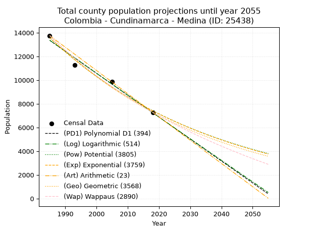
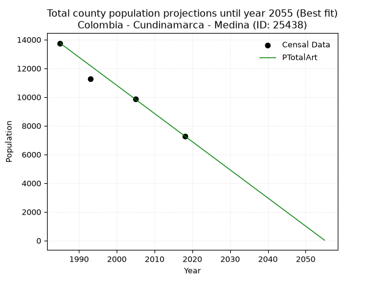
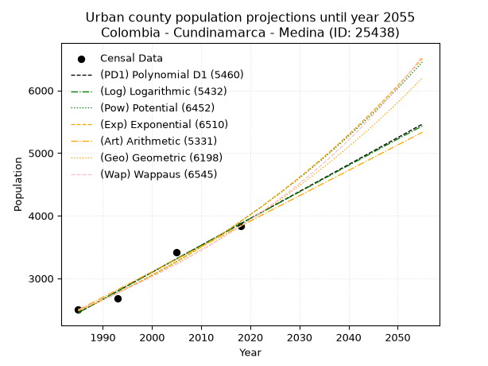
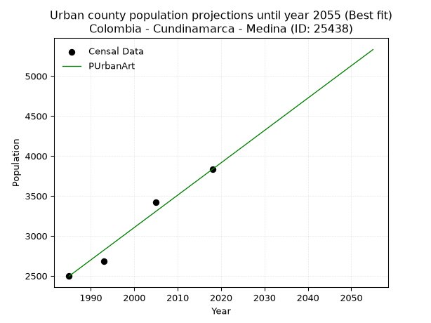
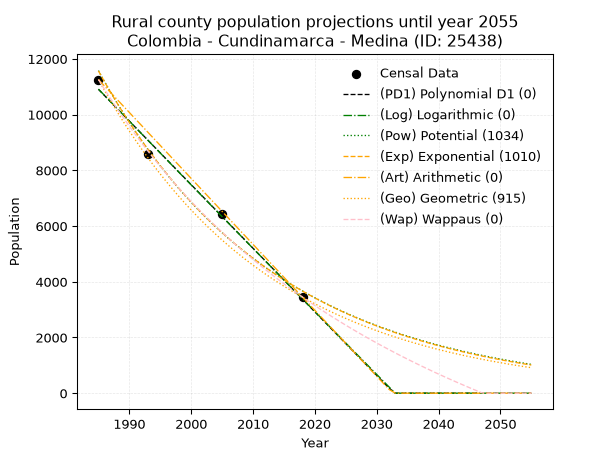
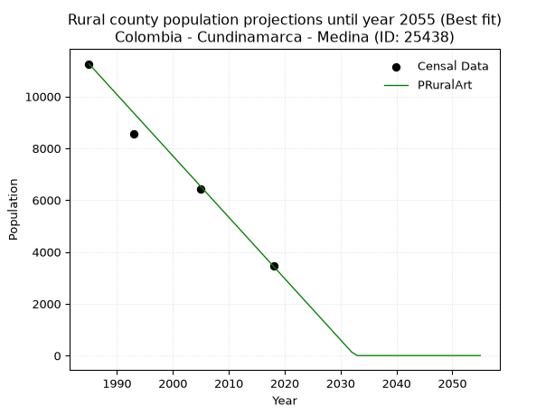

<div align="center">


</div>

# 📜 _“Population and Public Services Demand Projections (PPSD) until Year 2050 for Colombia - Cundinamarca - Medina (ID: 25438)”_
Keywords: `population` `public-service` `projection` `lineal` `polynomial` `logarithmic` `potential` `exponential` `arithmetic` `geometric` `wappaus` `dane` `colombia` `south-america`

PPSD are analytical estimates used by governments and planners to anticipate future changes in population size, age distribution, and the resulting community needs for utilities, healthcare, education, and infrastructure as sizing future water treatment facilities, electrical grids, and road networks based on spatial growth.

<div align="center">

</img>

</div>


> **General running parameters**: • app_version: _v20260806_. • Python version: _3.14.7_. • Pandas version: _3.0.5_. • NumPy version: _2.5.1_. • Creates, save and include plots into reports (create_plot): _False_. • Projection until year: _2050_. • Process polynomial degree 2 and up: _False_. • Process Wappaus: _True_. • Process Wappaus: _True_. • Set negative values to zero: _True_. • Set infinite values to zero: _True_. • Drop dataset notes: _True_. 
<div align="center">

Maps & GIS Layers: [:earth_americas:Google](http://maps.google.com/maps?q=4.506298009,-73.348449) [:earth_americas:OSM](https://www.openstreetmap.org/#map=18/4.506298009/-73.348449&layers=P) [:earth_americas:Bing](https://www.bing.com/maps?cp=4.506298009~-73.348449&lvl=18) [:earth_americas:Apple](https://maps.apple.com/frame?center=4.506298009%2C-73.348449&span=0.003%2C0.006) [:earth_americas:GISMobile](https://github.com/rcfdtools/R.GISMobile/blob/main/file/gis/CountyLayer_CO/Readme.md)

</div>


<div align="center">

```geojson
{
  "type": "Feature",
  "geometry": {
    "type": "Point", 
    "coordinates": [-73.348449, 4.506298009]
  }, 
  "properties": {
    "Name": "Colombia - Cundinamarca - Medina (ID: 25438)"
  }
}
```

</div>


## 0. Census Data (4 records)

Census data are official statistics collected by a government about the people and housing in a country. They usually include counts of total population, age, sex, race, income, education, and jobs.

📅Global census file: [Population.xlsx](../data/Population.xlsx)

| Source   |   Year |   CountryID | CountryName   |   StateID | StateName    |   CountyID | CountyName   |   PTotal |   PUrban |   PRural |
|:---------|-------:|------------:|:--------------|----------:|:-------------|-----------:|:-------------|---------:|---------:|---------:|
| DANE     |   1985 |          57 | Colombia      |        25 | Cundinamarca |      25438 | Medina       |    13754 |     2497 |    11257 |
| DANE     |   1993 |          57 | Colombia      |        25 | Cundinamarca |      25438 | Medina       |    11253 |     2680 |     8573 |
| DANE     |   2005 |          57 | Colombia      |        25 | Cundinamarca |      25438 | Medina       |     9845 |     3419 |     6426 |
| DANE     |   2018 |          57 | Colombia      |        25 | Cundinamarca |      25438 | Medina       |     7281 |     3833 |     3448 |

> 🔥Some records could had specific notes about the registered values or the corresponding urban or rural distribution.

📅[SUI-RUPS](https://www.datos.gov.co/Hacienda-y-Cr-dito-P-blico/Registro-nico-de-Prestadores-de-Servicios-P-blicos/4qkq-csdn/about_data) - Local public utility companies: [RUPS.csv](../data/RUPS.csv)

 | SERVICIO       | ESTADO    | NOMBRE                                                                     | NIT         | DEPARTAMENTO_DOMICILIO   | MUNICIPIO_DOMICILIO   | DIRECCION           |   TELEFONO | EMAIL                                        | TIPO_PRESTADOR                 | CLASIFICACION                 |
|:---------------|:----------|:---------------------------------------------------------------------------|:------------|:-------------------------|:----------------------|:--------------------|-----------:|:---------------------------------------------|:-------------------------------|:------------------------------|
| ACUEDUCTO      | OPERATIVA | OFICINA DE SERVICIOS PUBLICOS DEL MUNICIPIO DE MEDINA                      | 899999470-8 | CUNDINAMARCA             | MEDINA                | CALLE 13 No. 6 - 55 |    6768064 | serviciospublicos@medina-cundinamarca.gov.co | MUNICIPIO (PRESTACIÓN DIRECTA) | MENOR O IGUAL A 2500 USUARIOS |
| ALCANTARILLADO | OPERATIVA | OFICINA DE SERVICIOS PUBLICOS DEL MUNICIPIO DE MEDINA                      | 899999470-8 | CUNDINAMARCA             | MEDINA                | CALLE 13 No. 6 - 55 |    6768064 | serviciospublicos@medina-cundinamarca.gov.co | MUNICIPIO (PRESTACIÓN DIRECTA) | MENOR O IGUAL A 2500 USUARIOS |
| ACUEDUCTO      | OPERATIVA | JUNTA DE ACCION COMUNAL VEREDA PERIQUITO MUNICIPIO DE MEDINA  CUNDINAMARCA | 900299089-3 | CUNDINAMARCA             | MEDINA                | VEREDA PERIQUITO    |    0000000 | vitelganador100@hotmail.com                  | ORGANIZACION AUTORIZADA        | HASTA 2500 SUSCRIPTORES       |

## 1. Total

### 1.1. Coefficients and Parameters

* (PD1) Polynomial Deg 1: -185.19670814933596, 380972.9654757093 (lineal)
* (Log) Logarithmic: -370753.98840133636, 2828637.2868745616
* (Pow) Potential: -36.71342455035853, 125.20507470533923
* (Exp) Exponential: -0.018343302028904253, 8.831964675767384e+19
* (Art) Arithmetic: Year diff. 2018 - 1985 = 33, Population diff. 7281 - 13754 = -6473, Annual growth = -196.15151515151516
* (Geo) Geometric: Year diff. 2018 - 1985 = 33, Population diff. 7281 - 13754 = -6473, Annual growth % = -0.01909002297439988
* (Wap) Wappaus: i = -1.8650013325554091, Condition values only valid for < 200)

<sub>
Wappaus condition values: ['-0.00', '-1.87', '-3.73', '-5.60', '-7.46', '-9.33', '-11.19', '-13.06', '-14.92', '-16.79', '-18.65', '-20.52', '-22.38', '-24.25', '-26.11', '-27.98', '-29.84', '-31.71', '-33.57', '-35.44', '-37.30', '-39.17', '-41.03', '-42.90', '-44.76', '-46.63', '-48.49', '-50.36', '-52.22', '-54.09', '-55.95', '-57.82', '-59.68', '-61.55', '-63.41', '-65.28', '-67.14', '-69.01', '-70.87', '-72.74', '-74.60', '-76.47', '-78.33', '-80.20', '-82.06', '-83.93', '-85.79', '-87.66', '-89.52', '-91.39', '-93.25', '-95.12', '-96.98', '-98.85', '-100.71', '-102.58', '-104.44', '-106.31', '-108.17', '-110.04', '-111.90', '-113.77', '-115.63', '-117.50', '-119.36', '-121.23']
</sub>


### 1.2. Projected Dataset

|   Year |   CountyID |   PTotalPD1 |   PTotalLog |   PTotalPow |   PTotalExp |   PTotalArt |   PTotalGeo |   PTotalWap |
|-------:|-----------:|------------:|------------:|------------:|------------:|------------:|------------:|------------:|
|   1985 |      25438 |       13357 |       13364 |       13583 |       13576 |       13754 |       13754 |       13754 |
|   1986 |      25438 |       13172 |       13177 |       13334 |       13329 |       13558 |       13491 |       13500 |
|   1987 |      25438 |       12987 |       12990 |       13090 |       13087 |       13362 |       13234 |       13250 |
|   1988 |      25438 |       12802 |       12804 |       12850 |       12849 |       13166 |       12981 |       13005 |
|   1989 |      25438 |       12617 |       12617 |       12615 |       12615 |       12969 |       12733 |       12765 |
|   1990 |      25438 |       12432 |       12431 |       12385 |       12386 |       12773 |       12490 |       12529 |
|   1991 |      25438 |       12246 |       12245 |       12158 |       12161 |       12577 |       12252 |       12296 |
|   1992 |      25438 |       12061 |       12058 |       11936 |       11940 |       12381 |       12018 |       12068 |
|   1993 |      25438 |       11876 |       11872 |       11718 |       11723 |       12185 |       11789 |       11844 |
|   1994 |      25438 |       11691 |       11686 |       11504 |       11510 |       11989 |       11564 |       11624 |
|   1995 |      25438 |       11506 |       11500 |       11295 |       11301 |       11792 |       11343 |       11408 |
|   1996 |      25438 |       11320 |       11315 |       11089 |       11095 |       11596 |       11126 |       11195 |
|   1997 |      25438 |       11135 |       11129 |       10887 |       10893 |       11400 |       10914 |       10986 |
|   1998 |      25438 |       10950 |       10943 |       10688 |       10695 |       11204 |       10706 |       10780 |
|   1999 |      25438 |       10765 |       10758 |       10494 |       10501 |       11008 |       10501 |       10578 |
|   2000 |      25438 |       10580 |       10572 |       10303 |       10310 |       10812 |       10301 |       10378 |
|   2001 |      25438 |       10394 |       10387 |       10116 |       10123 |       10616 |       10104 |       10183 |
|   2002 |      25438 |       10209 |       10202 |        9932 |        9939 |       10419 |        9911 |        9990 |
|   2003 |      25438 |       10024 |       10017 |        9751 |        9758 |       10223 |        9722 |        9800 |
|   2004 |      25438 |        9839 |        9832 |        9574 |        9581 |       10027 |        9536 |        9614 |
|   2005 |      25438 |        9654 |        9647 |        9400 |        9407 |        9831 |        9354 |        9430 |
|   2006 |      25438 |        9468 |        9462 |        9230 |        9236 |        9635 |        9176 |        9249 |
|   2007 |      25438 |        9283 |        9277 |        9063 |        9068 |        9439 |        9001 |        9071 |
|   2008 |      25438 |        9098 |        9092 |        8898 |        8903 |        9243 |        8829 |        8896 |
|   2009 |      25438 |        8913 |        8908 |        8737 |        8741 |        9046 |        8660 |        8724 |
|   2010 |      25438 |        8728 |        8723 |        8579 |        8582 |        8850 |        8495 |        8554 |
|   2011 |      25438 |        8542 |        8539 |        8424 |        8426 |        8654 |        8333 |        8386 |
|   2012 |      25438 |        8357 |        8355 |        8271 |        8273 |        8458 |        8174 |        8221 |
|   2013 |      25438 |        8172 |        8170 |        8122 |        8123 |        8262 |        8018 |        8059 |
|   2014 |      25438 |        7987 |        7986 |        7975 |        7975 |        8066 |        7865 |        7899 |
|   2015 |      25438 |        7802 |        7802 |        7831 |        7830 |        7869 |        7714 |        7741 |
|   2016 |      25438 |        7616 |        7618 |        7690 |        7688 |        7673 |        7567 |        7585 |
|   2017 |      25438 |        7431 |        7434 |        7551 |        7548 |        7477 |        7423 |        7432 |
|   2018 |      25438 |        7246 |        7251 |        7415 |        7411 |        7281 |        7281 |        7281 |
|   2019 |      25438 |        7061 |        7067 |        7281 |        7276 |        7085 |        7142 |        7132 |
|   2020 |      25438 |        6876 |        6883 |        7150 |        7144 |        6889 |        7006 |        6985 |
|   2021 |      25438 |        6690 |        6700 |        7021 |        7014 |        6693 |        6872 |        6840 |
|   2022 |      25438 |        6505 |        6516 |        6895 |        6887 |        6496 |        6741 |        6698 |
|   2023 |      25438 |        6320 |        6333 |        6771 |        6761 |        6300 |        6612 |        6557 |
|   2024 |      25438 |        6135 |        6150 |        6649 |        6639 |        6104 |        6486 |        6418 |
|   2025 |      25438 |        5950 |        5967 |        6530 |        6518 |        5908 |        6362 |        6281 |
|   2026 |      25438 |        5764 |        5784 |        6412 |        6399 |        5712 |        6241 |        6146 |
|   2027 |      25438 |        5579 |        5601 |        6297 |        6283 |        5516 |        6121 |        6012 |
|   2028 |      25438 |        5394 |        5418 |        6184 |        6169 |        5319 |        6005 |        5881 |
|   2029 |      25438 |        5209 |        5235 |        6073 |        6057 |        5123 |        5890 |        5751 |
|   2030 |      25438 |        5024 |        5052 |        5964 |        5947 |        4927 |        5778 |        5623 |
|   2031 |      25438 |        4838 |        4870 |        5858 |        5839 |        4731 |        5667 |        5496 |
|   2032 |      25438 |        4653 |        4687 |        5753 |        5732 |        4535 |        5559 |        5372 |
|   2033 |      25438 |        4468 |        4505 |        5650 |        5628 |        4339 |        5453 |        5248 |
|   2034 |      25438 |        4283 |        4323 |        5549 |        5526 |        4143 |        5349 |        5127 |
|   2035 |      25438 |        4098 |        4140 |        5449 |        5426 |        3946 |        5247 |        5007 |
|   2036 |      25438 |        3912 |        3958 |        5352 |        5327 |        3750 |        5147 |        4888 |
|   2037 |      25438 |        3727 |        3776 |        5256 |        5230 |        3554 |        5048 |        4771 |
|   2038 |      25438 |        3542 |        3594 |        5162 |        5135 |        3358 |        4952 |        4656 |
|   2039 |      25438 |        3357 |        3412 |        5070 |        5042 |        3162 |        4857 |        4541 |
|   2040 |      25438 |        3172 |        3230 |        4980 |        4950 |        2966 |        4765 |        4429 |
|   2041 |      25438 |        2986 |        3049 |        4891 |        4860 |        2770 |        4674 |        4317 |
|   2042 |      25438 |        2801 |        2867 |        4804 |        4772 |        2573 |        4584 |        4207 |
|   2043 |      25438 |        2616 |        2686 |        4718 |        4685 |        2377 |        4497 |        4098 |
|   2044 |      25438 |        2431 |        2504 |        4634 |        4600 |        2181 |        4411 |        3991 |
|   2045 |      25438 |        2246 |        2323 |        4552 |        4516 |        1985 |        4327 |        3885 |
|   2046 |      25438 |        2061 |        2142 |        4471 |        4434 |        1789 |        4244 |        3780 |
|   2047 |      25438 |        1875 |        1960 |        4391 |        4354 |        1593 |        4163 |        3677 |
|   2048 |      25438 |        1690 |        1779 |        4313 |        4274 |        1396 |        4084 |        3574 |
|   2049 |      25438 |        1505 |        1598 |        4237 |        4197 |        1200 |        4006 |        3473 |
|   2050 |      25438 |        1320 |        1417 |        4161 |        4120 |        1004 |        3929 |        3373 |
<div align="center">

</img>

</div>


### 1.3. Best fit with absolute and relative error (%)

Relative error puts that difference into context by dividing the absolute error by the true value, creating a unitless ratio or percentage that shows the scale of the mistake.

Absolute and relative error

|   Year | Source   |   CountryID | CountryName   |   StateID | StateName    |   CountyID_x | CountyName   |   PTotal |   PUrban |   PRural |   CountyID_y |   PTotalPD1 |   PTotalLog |   PTotalPow |   PTotalExp |   PTotalArt |   PTotalGeo |   PTotalWap |   PTotalPD1AbsError |   PTotalLogAbsError |   PTotalPowAbsError |   PTotalExpAbsError |   PTotalArtAbsError |   PTotalGeoAbsError |   PTotalWapAbsError |   PTotalPD1RelError |   PTotalLogRelError |   PTotalPowRelError |   PTotalExpRelError |   PTotalArtRelError |   PTotalGeoRelError |   PTotalWapRelError |
|-------:|:---------|------------:|:--------------|----------:|:-------------|-------------:|:-------------|---------:|---------:|---------:|-------------:|------------:|------------:|------------:|------------:|------------:|------------:|------------:|--------------------:|--------------------:|--------------------:|--------------------:|--------------------:|--------------------:|--------------------:|--------------------:|--------------------:|--------------------:|--------------------:|--------------------:|--------------------:|--------------------:|
|   1985 | DANE     |          57 | Colombia      |        25 | Cundinamarca |        25438 | Medina       |    13754 |     2497 |    11257 |        25438 |       13357 |       13364 |       13583 |       13576 |       13754 |       13754 |       13754 |                 397 |                 390 |                 171 |                 178 |                   0 |                   0 |                   0 |            2.88643  |            2.83554  |             1.24327 |             1.29417 |            0        |             0       |             0       |
|   1993 | DANE     |          57 | Colombia      |        25 | Cundinamarca |        25438 | Medina       |    11253 |     2680 |     8573 |        25438 |       11876 |       11872 |       11718 |       11723 |       12185 |       11789 |       11844 |                 623 |                 619 |                 465 |                 470 |                 932 |                 536 |                 591 |            5.5363   |            5.50076  |             4.13223 |             4.17666 |            8.28224  |             4.76317 |             5.25193 |
|   2005 | DANE     |          57 | Colombia      |        25 | Cundinamarca |        25438 | Medina       |     9845 |     3419 |     6426 |        25438 |        9654 |        9647 |        9400 |        9407 |        9831 |        9354 |        9430 |                 191 |                 198 |                 445 |                 438 |                  14 |                 491 |                 415 |            1.94007  |            2.01117  |             4.52006 |             4.44896 |            0.142204 |             4.9873  |             4.21534 |
|   2018 | DANE     |          57 | Colombia      |        25 | Cundinamarca |        25438 | Medina       |     7281 |     3833 |     3448 |        25438 |        7246 |        7251 |        7415 |        7411 |        7281 |        7281 |        7281 |                  35 |                  30 |                 134 |                 130 |                   0 |                   0 |                   0 |            0.480703 |            0.412031 |             1.84041 |             1.78547 |            0        |             0       |             0       |

Relative error mean

| Method    |   RelError | Best   |
|:----------|-----------:|:-------|
| PTotalPD1 |    2.71088 |        |
| PTotalLog |    2.68987 |        |
| PTotalPow |    2.93399 |        |
| PTotalExp |    2.92632 |        |
| PTotalArt |    2.10611 | True   |
| PTotalGeo |    2.43762 |        |
| PTotalWap |    2.36682 |        |

💙Best method: _**PTotalArt**_
<div align="center">

</img>

</div>


### 1.4. Fresh water supply demand in liters per capita per day (lpcd)

The fresh water supply demand typically ranges from 100 to 300 liters per capita per day (lpcd) for standard domestic and municipal planning, though absolute survival minimums set by the World Health Organization are as low as 7.5 to 20 liters per day, and total consumption in high-income nations can exceed 400 liters.

> `CZ`: Level in meters above the sea level (masl)<br> `WS`: Fresh water supply demand in liters per capita per day (lpcd or l/h/d)<br> `WSAll`: Zonal fresh water supply demand in liters per second (l/s)<br> `A`: Zonal area in square meters<br> `DP`: Population density (people/hectare or p/ha)

Reference values (RAS Colombia)

|    CZ |   WS |
|------:|-----:|
|  1000 |  120 |
|  2000 |  130 |
| 99999 |  140 |

County shapefile geometry properties and water supply values

|   CountyID |      ATotal |   CZTotal |   WSTotal |
|-----------:|------------:|----------:|----------:|
|      25438 | 1.19493e+09 |   1044.93 |       130 |

Projected values for best method: PTotalArt

|   CountyID |   Year |   PTotalArt |   DPTotal |   WSTotal |   WSTotalAll |
|-----------:|-------:|------------:|----------:|----------:|-------------:|
|      25438 |   1985 |       13754 |      0.12 |       130 |     20.6947  |
|      25438 |   1986 |       13558 |      0.11 |       130 |     20.3998  |
|      25438 |   1987 |       13362 |      0.11 |       130 |     20.1049  |
|      25438 |   1988 |       13166 |      0.11 |       130 |     19.81    |
|      25438 |   1989 |       12969 |      0.11 |       130 |     19.5135  |
|      25438 |   1990 |       12773 |      0.11 |       130 |     19.2186  |
|      25438 |   1991 |       12577 |      0.11 |       130 |     18.9237  |
|      25438 |   1992 |       12381 |      0.1  |       130 |     18.6288  |
|      25438 |   1993 |       12185 |      0.1  |       130 |     18.3339  |
|      25438 |   1994 |       11989 |      0.1  |       130 |     18.039   |
|      25438 |   1995 |       11792 |      0.1  |       130 |     17.7426  |
|      25438 |   1996 |       11596 |      0.1  |       130 |     17.4477  |
|      25438 |   1997 |       11400 |      0.1  |       130 |     17.1528  |
|      25438 |   1998 |       11204 |      0.09 |       130 |     16.8579  |
|      25438 |   1999 |       11008 |      0.09 |       130 |     16.563   |
|      25438 |   2000 |       10812 |      0.09 |       130 |     16.2681  |
|      25438 |   2001 |       10616 |      0.09 |       130 |     15.9731  |
|      25438 |   2002 |       10419 |      0.09 |       130 |     15.6767  |
|      25438 |   2003 |       10223 |      0.09 |       130 |     15.3818  |
|      25438 |   2004 |       10027 |      0.08 |       130 |     15.0869  |
|      25438 |   2005 |        9831 |      0.08 |       130 |     14.792   |
|      25438 |   2006 |        9635 |      0.08 |       130 |     14.4971  |
|      25438 |   2007 |        9439 |      0.08 |       130 |     14.2022  |
|      25438 |   2008 |        9243 |      0.08 |       130 |     13.9073  |
|      25438 |   2009 |        9046 |      0.08 |       130 |     13.6109  |
|      25438 |   2010 |        8850 |      0.07 |       130 |     13.316   |
|      25438 |   2011 |        8654 |      0.07 |       130 |     13.0211  |
|      25438 |   2012 |        8458 |      0.07 |       130 |     12.7262  |
|      25438 |   2013 |        8262 |      0.07 |       130 |     12.4313  |
|      25438 |   2014 |        8066 |      0.07 |       130 |     12.1363  |
|      25438 |   2015 |        7869 |      0.07 |       130 |     11.8399  |
|      25438 |   2016 |        7673 |      0.06 |       130 |     11.545   |
|      25438 |   2017 |        7477 |      0.06 |       130 |     11.2501  |
|      25438 |   2018 |        7281 |      0.06 |       130 |     10.9552  |
|      25438 |   2019 |        7085 |      0.06 |       130 |     10.6603  |
|      25438 |   2020 |        6889 |      0.06 |       130 |     10.3654  |
|      25438 |   2021 |        6693 |      0.06 |       130 |     10.0705  |
|      25438 |   2022 |        6496 |      0.05 |       130 |      9.77407 |
|      25438 |   2023 |        6300 |      0.05 |       130 |      9.47917 |
|      25438 |   2024 |        6104 |      0.05 |       130 |      9.18426 |
|      25438 |   2025 |        5908 |      0.05 |       130 |      8.88935 |
|      25438 |   2026 |        5712 |      0.05 |       130 |      8.59444 |
|      25438 |   2027 |        5516 |      0.05 |       130 |      8.29954 |
|      25438 |   2028 |        5319 |      0.04 |       130 |      8.00313 |
|      25438 |   2029 |        5123 |      0.04 |       130 |      7.70822 |
|      25438 |   2030 |        4927 |      0.04 |       130 |      7.41331 |
|      25438 |   2031 |        4731 |      0.04 |       130 |      7.1184  |
|      25438 |   2032 |        4535 |      0.04 |       130 |      6.8235  |
|      25438 |   2033 |        4339 |      0.04 |       130 |      6.52859 |
|      25438 |   2034 |        4143 |      0.03 |       130 |      6.23368 |
|      25438 |   2035 |        3946 |      0.03 |       130 |      5.93727 |
|      25438 |   2036 |        3750 |      0.03 |       130 |      5.64236 |
|      25438 |   2037 |        3554 |      0.03 |       130 |      5.34745 |
|      25438 |   2038 |        3358 |      0.03 |       130 |      5.05255 |
|      25438 |   2039 |        3162 |      0.03 |       130 |      4.75764 |
|      25438 |   2040 |        2966 |      0.02 |       130 |      4.46273 |
|      25438 |   2041 |        2770 |      0.02 |       130 |      4.16782 |
|      25438 |   2042 |        2573 |      0.02 |       130 |      3.87141 |
|      25438 |   2043 |        2377 |      0.02 |       130 |      3.5765  |
|      25438 |   2044 |        2181 |      0.02 |       130 |      3.2816  |
|      25438 |   2045 |        1985 |      0.02 |       130 |      2.98669 |
|      25438 |   2046 |        1789 |      0.01 |       130 |      2.69178 |
|      25438 |   2047 |        1593 |      0.01 |       130 |      2.39688 |
|      25438 |   2048 |        1396 |      0.01 |       130 |      2.10046 |
|      25438 |   2049 |        1200 |      0.01 |       130 |      1.80556 |
|      25438 |   2050 |        1004 |      0.01 |       130 |      1.51065 |

## 2. Urban

### 2.1. Coefficients and Parameters

* (PD1) Polynomial Deg 1: 42.98153352067412, -82866.56242472841 (lineal)
* (Log) Logarithmic: 86036.5438087935, -650857.208944232
* (Pow) Potential: 27.60376748271238, -87.63638203777235
* (Exp) Exponential: 0.013788610681034775, 3.2182195662804546e-09
* (Art) Arithmetic: Year diff. 2018 - 1985 = 33, Population diff. 3833 - 2497 = 1336, Annual growth = 40.484848484848484
* (Geo) Geometric: Year diff. 2018 - 1985 = 33, Population diff. 3833 - 2497 = 1336, Annual growth % = 0.013071291349156633
* (Wap) Wappaus: i = 1.279142132222701, Condition values only valid for < 200)

<sub>
Wappaus condition values: ['0.00', '1.28', '2.56', '3.84', '5.12', '6.40', '7.67', '8.95', '10.23', '11.51', '12.79', '14.07', '15.35', '16.63', '17.91', '19.19', '20.47', '21.75', '23.02', '24.30', '25.58', '26.86', '28.14', '29.42', '30.70', '31.98', '33.26', '34.54', '35.82', '37.10', '38.37', '39.65', '40.93', '42.21', '43.49', '44.77', '46.05', '47.33', '48.61', '49.89', '51.17', '52.44', '53.72', '55.00', '56.28', '57.56', '58.84', '60.12', '61.40', '62.68', '63.96', '65.24', '66.52', '67.79', '69.07', '70.35', '71.63', '72.91', '74.19', '75.47', '76.75', '78.03', '79.31', '80.59', '81.87', '83.14']
</sub>


### 2.2. Projected Dataset

|   Year |   CountyID |   PUrbanPD1 |   PUrbanLog |   PUrbanPow |   PUrbanExp |   PUrbanArt |   PUrbanGeo |   PUrbanWap |
|-------:|-----------:|------------:|------------:|------------:|------------:|------------:|------------:|------------:|
|   1985 |      25438 |        2452 |        2450 |        2479 |        2480 |        2497 |        2497 |        2497 |
|   1986 |      25438 |        2495 |        2494 |        2513 |        2514 |        2537 |        2530 |        2529 |
|   1987 |      25438 |        2538 |        2537 |        2549 |        2549 |        2578 |        2563 |        2562 |
|   1988 |      25438 |        2581 |        2580 |        2584 |        2585 |        2618 |        2596 |        2595 |
|   1989 |      25438 |        2624 |        2624 |        2620 |        2620 |        2659 |        2630 |        2628 |
|   1990 |      25438 |        2667 |        2667 |        2657 |        2657 |        2699 |        2665 |        2662 |
|   1991 |      25438 |        2710 |        2710 |        2694 |        2694 |        2740 |        2699 |        2696 |
|   1992 |      25438 |        2753 |        2753 |        2732 |        2731 |        2780 |        2735 |        2731 |
|   1993 |      25438 |        2796 |        2797 |        2770 |        2769 |        2821 |        2770 |        2766 |
|   1994 |      25438 |        2839 |        2840 |        2808 |        2808 |        2861 |        2807 |        2802 |
|   1995 |      25438 |        2882 |        2883 |        2848 |        2846 |        2902 |        2843 |        2838 |
|   1996 |      25438 |        2925 |        2926 |        2887 |        2886 |        2942 |        2880 |        2875 |
|   1997 |      25438 |        2968 |        2969 |        2927 |        2926 |        2983 |        2918 |        2912 |
|   1998 |      25438 |        3011 |        3012 |        2968 |        2967 |        3023 |        2956 |        2950 |
|   1999 |      25438 |        3054 |        3055 |        3009 |        3008 |        3064 |        2995 |        2988 |
|   2000 |      25438 |        3097 |        3098 |        3051 |        3050 |        3104 |        3034 |        3027 |
|   2001 |      25438 |        3139 |        3141 |        3094 |        3092 |        3145 |        3074 |        3066 |
|   2002 |      25438 |        3182 |        3184 |        3137 |        3135 |        3185 |        3114 |        3106 |
|   2003 |      25438 |        3225 |        3227 |        3180 |        3178 |        3226 |        3155 |        3147 |
|   2004 |      25438 |        3268 |        3270 |        3224 |        3223 |        3266 |        3196 |        3188 |
|   2005 |      25438 |        3311 |        3313 |        3269 |        3267 |        3307 |        3238 |        3230 |
|   2006 |      25438 |        3354 |        3356 |        3314 |        3313 |        3347 |        3280 |        3272 |
|   2007 |      25438 |        3397 |        3399 |        3360 |        3359 |        3388 |        3323 |        3315 |
|   2008 |      25438 |        3440 |        3442 |        3407 |        3405 |        3428 |        3366 |        3358 |
|   2009 |      25438 |        3483 |        3484 |        3454 |        3453 |        3469 |        3410 |        3403 |
|   2010 |      25438 |        3526 |        3527 |        3502 |        3501 |        3509 |        3455 |        3447 |
|   2011 |      25438 |        3569 |        3570 |        3550 |        3549 |        3550 |        3500 |        3493 |
|   2012 |      25438 |        3612 |        3613 |        3599 |        3598 |        3590 |        3546 |        3539 |
|   2013 |      25438 |        3655 |        3656 |        3649 |        3648 |        3631 |        3592 |        3586 |
|   2014 |      25438 |        3698 |        3698 |        3699 |        3699 |        3671 |        3639 |        3634 |
|   2015 |      25438 |        3741 |        3741 |        3750 |        3750 |        3712 |        3687 |        3683 |
|   2016 |      25438 |        3784 |        3784 |        3802 |        3802 |        3752 |        3735 |        3732 |
|   2017 |      25438 |        3827 |        3826 |        3854 |        3855 |        3793 |        3784 |        3782 |
|   2018 |      25438 |        3870 |        3869 |        3907 |        3909 |        3833 |        3833 |        3833 |
|   2019 |      25438 |        3913 |        3912 |        3961 |        3963 |        3873 |        3883 |        3885 |
|   2020 |      25438 |        3956 |        3954 |        4016 |        4018 |        3914 |        3934 |        3937 |
|   2021 |      25438 |        3999 |        3997 |        4071 |        4074 |        3954 |        3985 |        3991 |
|   2022 |      25438 |        4042 |        4039 |        4127 |        4130 |        3995 |        4037 |        4045 |
|   2023 |      25438 |        4085 |        4082 |        4184 |        4188 |        4035 |        4090 |        4100 |
|   2024 |      25438 |        4128 |        4124 |        4241 |        4246 |        4076 |        4144 |        4157 |
|   2025 |      25438 |        4171 |        4167 |        4299 |        4305 |        4116 |        4198 |        4214 |
|   2026 |      25438 |        4214 |        4209 |        4358 |        4365 |        4157 |        4253 |        4272 |
|   2027 |      25438 |        4257 |        4252 |        4418 |        4425 |        4197 |        4308 |        4331 |
|   2028 |      25438 |        4300 |        4294 |        4479 |        4487 |        4238 |        4365 |        4391 |
|   2029 |      25438 |        4343 |        4337 |        4540 |        4549 |        4278 |        4422 |        4453 |
|   2030 |      25438 |        4386 |        4379 |        4602 |        4612 |        4319 |        4479 |        4515 |
|   2031 |      25438 |        4429 |        4422 |        4665 |        4676 |        4359 |        4538 |        4579 |
|   2032 |      25438 |        4472 |        4464 |        4729 |        4741 |        4400 |        4597 |        4643 |
|   2033 |      25438 |        4515 |        4506 |        4794 |        4807 |        4440 |        4657 |        4709 |
|   2034 |      25438 |        4558 |        4548 |        4859 |        4874 |        4481 |        4718 |        4776 |
|   2035 |      25438 |        4601 |        4591 |        4926 |        4941 |        4521 |        4780 |        4845 |
|   2036 |      25438 |        4644 |        4633 |        4993 |        5010 |        4562 |        4842 |        4914 |
|   2037 |      25438 |        4687 |        4675 |        5061 |        5079 |        4602 |        4906 |        4986 |
|   2038 |      25438 |        4730 |        4718 |        5130 |        5150 |        4643 |        4970 |        5058 |
|   2039 |      25438 |        4773 |        4760 |        5200 |        5221 |        4683 |        5035 |        5132 |
|   2040 |      25438 |        4816 |        4802 |        5271 |        5294 |        4724 |        5101 |        5207 |
|   2041 |      25438 |        4859 |        4844 |        5343 |        5367 |        4764 |        5167 |        5284 |
|   2042 |      25438 |        4902 |        4886 |        5415 |        5442 |        4805 |        5235 |        5362 |
|   2043 |      25438 |        4945 |        4928 |        5489 |        5518 |        4845 |        5303 |        5442 |
|   2044 |      25438 |        4988 |        4970 |        5564 |        5594 |        4886 |        5373 |        5524 |
|   2045 |      25438 |        5031 |        5013 |        5639 |        5672 |        4926 |        5443 |        5607 |
|   2046 |      25438 |        5074 |        5055 |        5716 |        5751 |        4967 |        5514 |        5692 |
|   2047 |      25438 |        5117 |        5097 |        5794 |        5830 |        5007 |        5586 |        5779 |
|   2048 |      25438 |        5160 |        5139 |        5872 |        5911 |        5048 |        5659 |        5867 |
|   2049 |      25438 |        5203 |        5181 |        5952 |        5993 |        5088 |        5733 |        5958 |
|   2050 |      25438 |        5246 |        5223 |        6033 |        6077 |        5129 |        5808 |        6050 |
<div align="center">

</img>

</div>


### 2.3. Best fit with absolute and relative error (%)

Relative error puts that difference into context by dividing the absolute error by the true value, creating a unitless ratio or percentage that shows the scale of the mistake.

Absolute and relative error

|   Year | Source   |   CountryID | CountryName   |   StateID | StateName    |   CountyID_x | CountyName   |   PTotal |   PUrban |   PRural |   CountyID_y |   PUrbanPD1 |   PUrbanLog |   PUrbanPow |   PUrbanExp |   PUrbanArt |   PUrbanGeo |   PUrbanWap |   PUrbanPD1AbsError |   PUrbanLogAbsError |   PUrbanPowAbsError |   PUrbanExpAbsError |   PUrbanArtAbsError |   PUrbanGeoAbsError |   PUrbanWapAbsError |   PUrbanPD1RelError |   PUrbanLogRelError |   PUrbanPowRelError |   PUrbanExpRelError |   PUrbanArtRelError |   PUrbanGeoRelError |   PUrbanWapRelError |
|-------:|:---------|------------:|:--------------|----------:|:-------------|-------------:|:-------------|---------:|---------:|---------:|-------------:|------------:|------------:|------------:|------------:|------------:|------------:|------------:|--------------------:|--------------------:|--------------------:|--------------------:|--------------------:|--------------------:|--------------------:|--------------------:|--------------------:|--------------------:|--------------------:|--------------------:|--------------------:|--------------------:|
|   1985 | DANE     |          57 | Colombia      |        25 | Cundinamarca |        25438 | Medina       |    13754 |     2497 |    11257 |        25438 |        2452 |        2450 |        2479 |        2480 |        2497 |        2497 |        2497 |                  45 |                  47 |                  18 |                  17 |                   0 |                   0 |                   0 |            1.80216  |            1.88226  |            0.720865 |            0.680817 |             0       |             0       |             0       |
|   1993 | DANE     |          57 | Colombia      |        25 | Cundinamarca |        25438 | Medina       |    11253 |     2680 |     8573 |        25438 |        2796 |        2797 |        2770 |        2769 |        2821 |        2770 |        2766 |                 116 |                 117 |                  90 |                  89 |                 141 |                  90 |                  86 |            4.32836  |            4.36567  |            3.35821  |            3.3209   |             5.26119 |             3.35821 |             3.20896 |
|   2005 | DANE     |          57 | Colombia      |        25 | Cundinamarca |        25438 | Medina       |     9845 |     3419 |     6426 |        25438 |        3311 |        3313 |        3269 |        3267 |        3307 |        3238 |        3230 |                 108 |                 106 |                 150 |                 152 |                 112 |                 181 |                 189 |            3.15882  |            3.10032  |            4.38725  |            4.44574  |             3.27581 |             5.29395 |             5.52793 |
|   2018 | DANE     |          57 | Colombia      |        25 | Cundinamarca |        25438 | Medina       |     7281 |     3833 |     3448 |        25438 |        3870 |        3869 |        3907 |        3909 |        3833 |        3833 |        3833 |                  37 |                  36 |                  74 |                  76 |                   0 |                   0 |                   0 |            0.965301 |            0.939212 |            1.9306   |            1.98278  |             0       |             0       |             0       |

Relative error mean

| Method    |   RelError | Best   |
|:----------|-----------:|:-------|
| PUrbanPD1 |    2.56366 |        |
| PUrbanLog |    2.57187 |        |
| PUrbanPow |    2.59923 |        |
| PUrbanExp |    2.60756 |        |
| PUrbanArt |    2.13425 | True   |
| PUrbanGeo |    2.16304 |        |
| PUrbanWap |    2.18422 |        |

💙Best method: _**PUrbanArt**_
<div align="center">

</img>

</div>


### 2.4. Fresh water supply demand in liters per capita per day (lpcd)

The fresh water supply demand typically ranges from 100 to 300 liters per capita per day (lpcd) for standard domestic and municipal planning, though absolute survival minimums set by the World Health Organization are as low as 7.5 to 20 liters per day, and total consumption in high-income nations can exceed 400 liters.

> `CZ`: Level in meters above the sea level (masl)<br> `WS`: Fresh water supply demand in liters per capita per day (lpcd or l/h/d)<br> `WSAll`: Zonal fresh water supply demand in liters per second (l/s)<br> `A`: Zonal area in square meters<br> `DP`: Population density (people/hectare or p/ha)

Reference values (RAS Colombia)

|    CZ |   WS |
|------:|-----:|
|  1000 |  120 |
|  2000 |  130 |
| 99999 |  140 |

County shapefile geometry properties and water supply values

|   CountyID |      AUrban |   CZUrban |   WSUrban |
|-----------:|------------:|----------:|----------:|
|      25438 | 1.55461e+06 |   532.241 |       120 |

Projected values for best method: PUrbanArt

|   CountyID |   Year |   PUrbanArt |   DPUrban |   WSUrban |   WSUrbanAll |
|-----------:|-------:|------------:|----------:|----------:|-------------:|
|      25438 |   1985 |        2497 |     16.06 |       120 |      3.46806 |
|      25438 |   1986 |        2537 |     16.32 |       120 |      3.52361 |
|      25438 |   1987 |        2578 |     16.58 |       120 |      3.58056 |
|      25438 |   1988 |        2618 |     16.84 |       120 |      3.63611 |
|      25438 |   1989 |        2659 |     17.1  |       120 |      3.69306 |
|      25438 |   1990 |        2699 |     17.36 |       120 |      3.74861 |
|      25438 |   1991 |        2740 |     17.63 |       120 |      3.80556 |
|      25438 |   1992 |        2780 |     17.88 |       120 |      3.86111 |
|      25438 |   1993 |        2821 |     18.15 |       120 |      3.91806 |
|      25438 |   1994 |        2861 |     18.4  |       120 |      3.97361 |
|      25438 |   1995 |        2902 |     18.67 |       120 |      4.03056 |
|      25438 |   1996 |        2942 |     18.92 |       120 |      4.08611 |
|      25438 |   1997 |        2983 |     19.19 |       120 |      4.14306 |
|      25438 |   1998 |        3023 |     19.45 |       120 |      4.19861 |
|      25438 |   1999 |        3064 |     19.71 |       120 |      4.25556 |
|      25438 |   2000 |        3104 |     19.97 |       120 |      4.31111 |
|      25438 |   2001 |        3145 |     20.23 |       120 |      4.36806 |
|      25438 |   2002 |        3185 |     20.49 |       120 |      4.42361 |
|      25438 |   2003 |        3226 |     20.75 |       120 |      4.48056 |
|      25438 |   2004 |        3266 |     21.01 |       120 |      4.53611 |
|      25438 |   2005 |        3307 |     21.27 |       120 |      4.59306 |
|      25438 |   2006 |        3347 |     21.53 |       120 |      4.64861 |
|      25438 |   2007 |        3388 |     21.79 |       120 |      4.70556 |
|      25438 |   2008 |        3428 |     22.05 |       120 |      4.76111 |
|      25438 |   2009 |        3469 |     22.31 |       120 |      4.81806 |
|      25438 |   2010 |        3509 |     22.57 |       120 |      4.87361 |
|      25438 |   2011 |        3550 |     22.84 |       120 |      4.93056 |
|      25438 |   2012 |        3590 |     23.09 |       120 |      4.98611 |
|      25438 |   2013 |        3631 |     23.36 |       120 |      5.04306 |
|      25438 |   2014 |        3671 |     23.61 |       120 |      5.09861 |
|      25438 |   2015 |        3712 |     23.88 |       120 |      5.15556 |
|      25438 |   2016 |        3752 |     24.13 |       120 |      5.21111 |
|      25438 |   2017 |        3793 |     24.4  |       120 |      5.26806 |
|      25438 |   2018 |        3833 |     24.66 |       120 |      5.32361 |
|      25438 |   2019 |        3873 |     24.91 |       120 |      5.37917 |
|      25438 |   2020 |        3914 |     25.18 |       120 |      5.43611 |
|      25438 |   2021 |        3954 |     25.43 |       120 |      5.49167 |
|      25438 |   2022 |        3995 |     25.7  |       120 |      5.54861 |
|      25438 |   2023 |        4035 |     25.96 |       120 |      5.60417 |
|      25438 |   2024 |        4076 |     26.22 |       120 |      5.66111 |
|      25438 |   2025 |        4116 |     26.48 |       120 |      5.71667 |
|      25438 |   2026 |        4157 |     26.74 |       120 |      5.77361 |
|      25438 |   2027 |        4197 |     27    |       120 |      5.82917 |
|      25438 |   2028 |        4238 |     27.26 |       120 |      5.88611 |
|      25438 |   2029 |        4278 |     27.52 |       120 |      5.94167 |
|      25438 |   2030 |        4319 |     27.78 |       120 |      5.99861 |
|      25438 |   2031 |        4359 |     28.04 |       120 |      6.05417 |
|      25438 |   2032 |        4400 |     28.3  |       120 |      6.11111 |
|      25438 |   2033 |        4440 |     28.56 |       120 |      6.16667 |
|      25438 |   2034 |        4481 |     28.82 |       120 |      6.22361 |
|      25438 |   2035 |        4521 |     29.08 |       120 |      6.27917 |
|      25438 |   2036 |        4562 |     29.35 |       120 |      6.33611 |
|      25438 |   2037 |        4602 |     29.6  |       120 |      6.39167 |
|      25438 |   2038 |        4643 |     29.87 |       120 |      6.44861 |
|      25438 |   2039 |        4683 |     30.12 |       120 |      6.50417 |
|      25438 |   2040 |        4724 |     30.39 |       120 |      6.56111 |
|      25438 |   2041 |        4764 |     30.64 |       120 |      6.61667 |
|      25438 |   2042 |        4805 |     30.91 |       120 |      6.67361 |
|      25438 |   2043 |        4845 |     31.17 |       120 |      6.72917 |
|      25438 |   2044 |        4886 |     31.43 |       120 |      6.78611 |
|      25438 |   2045 |        4926 |     31.69 |       120 |      6.84167 |
|      25438 |   2046 |        4967 |     31.95 |       120 |      6.89861 |
|      25438 |   2047 |        5007 |     32.21 |       120 |      6.95417 |
|      25438 |   2048 |        5048 |     32.47 |       120 |      7.01111 |
|      25438 |   2049 |        5088 |     32.73 |       120 |      7.06667 |
|      25438 |   2050 |        5129 |     32.99 |       120 |      7.12361 |

## 3. Rural

### 3.1. Coefficients and Parameters

* (PD1) Polynomial Deg 1: -228.17824167001, 463839.52790043753 (lineal)
* (Log) Logarithmic: -456790.5322101298, 3479494.495818792
* (Pow) Potential: -69.69605610852332, 233.90448263253114
* (Exp) Exponential: -0.03482947481286681, 1.226859603691265e+34
* (Art) Arithmetic: Year diff. 2018 - 1985 = 33, Population diff. 3448 - 11257 = -7809, Annual growth = -236.63636363636363
* (Geo) Geometric: Year diff. 2018 - 1985 = 33, Population diff. 3448 - 11257 = -7809, Annual growth % = -0.035219262339882484
* (Wap) Wappaus: i = -3.2184476523136842, Condition values only valid for < 200)

<sub>
Wappaus condition values: ['-0.00', '-3.22', '-6.44', '-9.66', '-12.87', '-16.09', '-19.31', '-22.53', '-25.75', '-28.97', '-32.18', '-35.40', '-38.62', '-41.84', '-45.06', '-48.28', '-51.50', '-54.71', '-57.93', '-61.15', '-64.37', '-67.59', '-70.81', '-74.02', '-77.24', '-80.46', '-83.68', '-86.90', '-90.12', '-93.33', '-96.55', '-99.77', '-102.99', '-106.21', '-109.43', '-112.65', '-115.86', '-119.08', '-122.30', '-125.52', '-128.74', '-131.96', '-135.17', '-138.39', '-141.61', '-144.83', '-148.05', '-151.27', '-154.49', '-157.70', '-160.92', '-164.14', '-167.36', '-170.58', '-173.80', '-177.01', '-180.23', '-183.45', '-186.67', '-189.89', '-193.11', '-196.33', '-199.54', '-202.76', '-205.98', '-209.20']
</sub>


### 3.2. Projected Dataset

|   Year |   CountyID |   PRuralPD1 |   PRuralLog |   PRuralPow |   PRuralExp |   PRuralArt |   PRuralGeo |   PRuralWap |
|-------:|-----------:|------------:|------------:|------------:|------------:|------------:|------------:|------------:|
|   1985 |      25438 |       10906 |       10913 |       11577 |       11566 |       11257 |       11257 |       11257 |
|   1986 |      25438 |       10678 |       10683 |       11177 |       11170 |       11020 |       10861 |       10900 |
|   1987 |      25438 |       10449 |       10453 |       10792 |       10788 |       10784 |       10478 |       10555 |
|   1988 |      25438 |       10221 |       10223 |       10420 |       10419 |       10547 |       10109 |       10220 |
|   1989 |      25438 |        9993 |        9993 |       10061 |       10062 |       10310 |        9753 |        9895 |
|   1990 |      25438 |        9765 |        9764 |        9715 |        9718 |       10074 |        9409 |        9580 |
|   1991 |      25438 |        9537 |        9534 |        9381 |        9385 |        9837 |        9078 |        9275 |
|   1992 |      25438 |        9308 |        9305 |        9058 |        9064 |        9601 |        8758 |        8978 |
|   1993 |      25438 |        9080 |        9076 |        8747 |        8753 |        9364 |        8450 |        8689 |
|   1994 |      25438 |        8852 |        8847 |        8446 |        8454 |        9127 |        8152 |        8409 |
|   1995 |      25438 |        8624 |        8618 |        8156 |        8164 |        8891 |        7865 |        8136 |
|   1996 |      25438 |        8396 |        8389 |        7876 |        7885 |        8654 |        7588 |        7871 |
|   1997 |      25438 |        8168 |        8160 |        7606 |        7615 |        8417 |        7321 |        7613 |
|   1998 |      25438 |        7939 |        7931 |        7345 |        7354 |        8181 |        7063 |        7362 |
|   1999 |      25438 |        7711 |        7703 |        7093 |        7103 |        7944 |        6814 |        7117 |
|   2000 |      25438 |        7483 |        7474 |        6850 |        6860 |        7707 |        6574 |        6879 |
|   2001 |      25438 |        7255 |        7246 |        6616 |        6625 |        7471 |        6343 |        6647 |
|   2002 |      25438 |        7027 |        7018 |        6389 |        6398 |        7234 |        6119 |        6421 |
|   2003 |      25438 |        6799 |        6790 |        6171 |        6179 |        6998 |        5904 |        6200 |
|   2004 |      25438 |        6570 |        6562 |        5960 |        5968 |        6761 |        5696 |        5985 |
|   2005 |      25438 |        6342 |        6334 |        5756 |        5763 |        6524 |        5495 |        5775 |
|   2006 |      25438 |        6114 |        6106 |        5560 |        5566 |        6288 |        5302 |        5570 |
|   2007 |      25438 |        5886 |        5878 |        5370 |        5375 |        6051 |        5115 |        5370 |
|   2008 |      25438 |        5658 |        5651 |        5187 |        5191 |        5814 |        4935 |        5175 |
|   2009 |      25438 |        5429 |        5423 |        5010 |        5014 |        5578 |        4761 |        4984 |
|   2010 |      25438 |        5201 |        5196 |        4839 |        4842 |        5341 |        4593 |        4798 |
|   2011 |      25438 |        4973 |        4969 |        4674 |        4676 |        5104 |        4432 |        4616 |
|   2012 |      25438 |        4745 |        4742 |        4515 |        4516 |        4868 |        4276 |        4438 |
|   2013 |      25438 |        4517 |        4515 |        4361 |        4362 |        4631 |        4125 |        4264 |
|   2014 |      25438 |        4289 |        4288 |        4213 |        4212 |        4395 |        3980 |        4093 |
|   2015 |      25438 |        4060 |        4061 |        4070 |        4068 |        4158 |        3840 |        3927 |
|   2016 |      25438 |        3832 |        3834 |        3931 |        3929 |        3921 |        3704 |        3764 |
|   2017 |      25438 |        3604 |        3608 |        3798 |        3794 |        3685 |        3574 |        3604 |
|   2018 |      25438 |        3376 |        3381 |        3669 |        3665 |        3448 |        3448 |        3448 |
|   2019 |      25438 |        3148 |        3155 |        3544 |        3539 |        3211 |        3327 |        3295 |
|   2020 |      25438 |        2919 |        2929 |        3424 |        3418 |        2975 |        3209 |        3145 |
|   2021 |      25438 |        2691 |        2703 |        3308 |        3301 |        2738 |        3096 |        2998 |
|   2022 |      25438 |        2463 |        2477 |        3196 |        3188 |        2501 |        2987 |        2855 |
|   2023 |      25438 |        2235 |        2251 |        3088 |        3079 |        2265 |        2882 |        2714 |
|   2024 |      25438 |        2007 |        2025 |        2983 |        2973 |        2028 |        2781 |        2576 |
|   2025 |      25438 |        1779 |        1800 |        2882 |        2872 |        1792 |        2683 |        2440 |
|   2026 |      25438 |        1550 |        1574 |        2785 |        2773 |        1555 |        2588 |        2307 |
|   2027 |      25438 |        1322 |        1349 |        2690 |        2678 |        1318 |        2497 |        2177 |
|   2028 |      25438 |        1094 |        1124 |        2599 |        2587 |        1082 |        2409 |        2049 |
|   2029 |      25438 |         866 |         898 |        2512 |        2498 |         845 |        2324 |        1924 |
|   2030 |      25438 |         638 |         673 |        2427 |        2413 |         608 |        2242 |        1801 |
|   2031 |      25438 |         410 |         448 |        2345 |        2330 |         372 |        2163 |        1680 |
|   2032 |      25438 |         181 |         223 |        2266 |        2250 |         135 |        2087 |        1562 |
|   2033 |      25438 |           0 |           0 |        2190 |        2173 |           0 |        2014 |        1445 |
|   2034 |      25438 |           0 |           0 |        2116 |        2099 |           0 |        1943 |        1331 |
|   2035 |      25438 |           0 |           0 |        2045 |        2027 |           0 |        1874 |        1219 |
|   2036 |      25438 |           0 |           0 |        1976 |        1958 |           0 |        1808 |        1109 |
|   2037 |      25438 |           0 |           0 |        1909 |        1891 |           0 |        1745 |        1000 |
|   2038 |      25438 |           0 |           0 |        1845 |        1826 |           0 |        1683 |         894 |
|   2039 |      25438 |           0 |           0 |        1783 |        1763 |           0 |        1624 |         789 |
|   2040 |      25438 |           0 |           0 |        1723 |        1703 |           0 |        1567 |         686 |
|   2041 |      25438 |           0 |           0 |        1665 |        1645 |           0 |        1512 |         585 |
|   2042 |      25438 |           0 |           0 |        1609 |        1589 |           0 |        1458 |         486 |
|   2043 |      25438 |           0 |           0 |        1555 |        1534 |           0 |        1407 |         388 |
|   2044 |      25438 |           0 |           0 |        1503 |        1482 |           0 |        1357 |         292 |
|   2045 |      25438 |           0 |           0 |        1453 |        1431 |           0 |        1310 |         197 |
|   2046 |      25438 |           0 |           0 |        1404 |        1382 |           0 |        1263 |         104 |
|   2047 |      25438 |           0 |           0 |        1357 |        1335 |           0 |        1219 |          13 |
|   2048 |      25438 |           0 |           0 |        1312 |        1289 |           0 |        1176 |           0 |
|   2049 |      25438 |           0 |           0 |        1268 |        1245 |           0 |        1135 |           0 |
|   2050 |      25438 |           0 |           0 |        1225 |        1202 |           0 |        1095 |           0 |
<div align="center">

</img>

</div>


### 3.3. Best fit with absolute and relative error (%)

Relative error puts that difference into context by dividing the absolute error by the true value, creating a unitless ratio or percentage that shows the scale of the mistake.

Absolute and relative error

|   Year | Source   |   CountryID | CountryName   |   StateID | StateName    |   CountyID_x | CountyName   |   PTotal |   PUrban |   PRural |   CountyID_y |   PRuralPD1 |   PRuralLog |   PRuralPow |   PRuralExp |   PRuralArt |   PRuralGeo |   PRuralWap |   PRuralPD1AbsError |   PRuralLogAbsError |   PRuralPowAbsError |   PRuralExpAbsError |   PRuralArtAbsError |   PRuralGeoAbsError |   PRuralWapAbsError |   PRuralPD1RelError |   PRuralLogRelError |   PRuralPowRelError |   PRuralExpRelError |   PRuralArtRelError |   PRuralGeoRelError |   PRuralWapRelError |
|-------:|:---------|------------:|:--------------|----------:|:-------------|-------------:|:-------------|---------:|---------:|---------:|-------------:|------------:|------------:|------------:|------------:|------------:|------------:|------------:|--------------------:|--------------------:|--------------------:|--------------------:|--------------------:|--------------------:|--------------------:|--------------------:|--------------------:|--------------------:|--------------------:|--------------------:|--------------------:|--------------------:|
|   1985 | DANE     |          57 | Colombia      |        25 | Cundinamarca |        25438 | Medina       |    13754 |     2497 |    11257 |        25438 |       10906 |       10913 |       11577 |       11566 |       11257 |       11257 |       11257 |                 351 |                 344 |                 320 |                 309 |                   0 |                   0 |                   0 |             3.11806 |             3.05588 |             2.84268 |             2.74496 |             0       |             0       |             0       |
|   1993 | DANE     |          57 | Colombia      |        25 | Cundinamarca |        25438 | Medina       |    11253 |     2680 |     8573 |        25438 |        9080 |        9076 |        8747 |        8753 |        9364 |        8450 |        8689 |                 507 |                 503 |                 174 |                 180 |                 791 |                 123 |                 116 |             5.91392 |             5.86726 |             2.02963 |             2.09962 |             9.22664 |             1.43474 |             1.35309 |
|   2005 | DANE     |          57 | Colombia      |        25 | Cundinamarca |        25438 | Medina       |     9845 |     3419 |     6426 |        25438 |        6342 |        6334 |        5756 |        5763 |        6524 |        5495 |        5775 |                  84 |                  92 |                 670 |                 663 |                  98 |                 931 |                 651 |             1.30719 |             1.43168 |            10.4264  |            10.3175  |             1.52505 |            14.488   |            10.1307  |
|   2018 | DANE     |          57 | Colombia      |        25 | Cundinamarca |        25438 | Medina       |     7281 |     3833 |     3448 |        25438 |        3376 |        3381 |        3669 |        3665 |        3448 |        3448 |        3448 |                  72 |                  67 |                 221 |                 217 |                   0 |                   0 |                   0 |             2.08817 |             1.94316 |             6.40951 |             6.2935  |             0       |             0       |             0       |

Relative error mean

| Method    |   RelError | Best   |
|:----------|-----------:|:-------|
| PRuralPD1 |    3.10683 |        |
| PRuralLog |    3.07449 |        |
| PRuralPow |    5.42705 |        |
| PRuralExp |    5.36388 |        |
| PRuralArt |    2.68792 | True   |
| PRuralGeo |    3.98069 |        |
| PRuralWap |    2.87095 |        |

💙Best method: _**PRuralArt**_
<div align="center">

</img>

</div>


### 3.4. Fresh water supply demand in liters per capita per day (lpcd)

The fresh water supply demand typically ranges from 100 to 300 liters per capita per day (lpcd) for standard domestic and municipal planning, though absolute survival minimums set by the World Health Organization are as low as 7.5 to 20 liters per day, and total consumption in high-income nations can exceed 400 liters.

> `CZ`: Level in meters above the sea level (masl)<br> `WS`: Fresh water supply demand in liters per capita per day (lpcd or l/h/d)<br> `WSAll`: Zonal fresh water supply demand in liters per second (l/s)<br> `A`: Zonal area in square meters<br> `DP`: Population density (people/hectare or p/ha)

Reference values (RAS Colombia)

|    CZ |   WS |
|------:|-----:|
|  1000 |  120 |
|  2000 |  130 |
| 99999 |  140 |

County shapefile geometry properties and water supply values

|   CountyID |      ARural |   CZRural |   WSRural |
|-----------:|------------:|----------:|----------:|
|      25438 | 1.19337e+09 |    1045.6 |       130 |

Projected values for best method: PRuralArt

|   CountyID |   Year |   PRuralArt |   DPRural |   WSRural |   WSRuralAll |
|-----------:|-------:|------------:|----------:|----------:|-------------:|
|      25438 |   1985 |       11257 |      0.09 |       130 |    16.9376   |
|      25438 |   1986 |       11020 |      0.09 |       130 |    16.581    |
|      25438 |   1987 |       10784 |      0.09 |       130 |    16.2259   |
|      25438 |   1988 |       10547 |      0.09 |       130 |    15.8693   |
|      25438 |   1989 |       10310 |      0.09 |       130 |    15.5127   |
|      25438 |   1990 |       10074 |      0.08 |       130 |    15.1576   |
|      25438 |   1991 |        9837 |      0.08 |       130 |    14.801    |
|      25438 |   1992 |        9601 |      0.08 |       130 |    14.4459   |
|      25438 |   1993 |        9364 |      0.08 |       130 |    14.0894   |
|      25438 |   1994 |        9127 |      0.08 |       130 |    13.7328   |
|      25438 |   1995 |        8891 |      0.07 |       130 |    13.3777   |
|      25438 |   1996 |        8654 |      0.07 |       130 |    13.0211   |
|      25438 |   1997 |        8417 |      0.07 |       130 |    12.6645   |
|      25438 |   1998 |        8181 |      0.07 |       130 |    12.3094   |
|      25438 |   1999 |        7944 |      0.07 |       130 |    11.9528   |
|      25438 |   2000 |        7707 |      0.06 |       130 |    11.5962   |
|      25438 |   2001 |        7471 |      0.06 |       130 |    11.2411   |
|      25438 |   2002 |        7234 |      0.06 |       130 |    10.8845   |
|      25438 |   2003 |        6998 |      0.06 |       130 |    10.5294   |
|      25438 |   2004 |        6761 |      0.06 |       130 |    10.1728   |
|      25438 |   2005 |        6524 |      0.05 |       130 |     9.8162   |
|      25438 |   2006 |        6288 |      0.05 |       130 |     9.46111  |
|      25438 |   2007 |        6051 |      0.05 |       130 |     9.10451  |
|      25438 |   2008 |        5814 |      0.05 |       130 |     8.74792  |
|      25438 |   2009 |        5578 |      0.05 |       130 |     8.39282  |
|      25438 |   2010 |        5341 |      0.04 |       130 |     8.03623  |
|      25438 |   2011 |        5104 |      0.04 |       130 |     7.67963  |
|      25438 |   2012 |        4868 |      0.04 |       130 |     7.32454  |
|      25438 |   2013 |        4631 |      0.04 |       130 |     6.96794  |
|      25438 |   2014 |        4395 |      0.04 |       130 |     6.61285  |
|      25438 |   2015 |        4158 |      0.03 |       130 |     6.25625  |
|      25438 |   2016 |        3921 |      0.03 |       130 |     5.89965  |
|      25438 |   2017 |        3685 |      0.03 |       130 |     5.54456  |
|      25438 |   2018 |        3448 |      0.03 |       130 |     5.18796  |
|      25438 |   2019 |        3211 |      0.03 |       130 |     4.83137  |
|      25438 |   2020 |        2975 |      0.02 |       130 |     4.47627  |
|      25438 |   2021 |        2738 |      0.02 |       130 |     4.11968  |
|      25438 |   2022 |        2501 |      0.02 |       130 |     3.76308  |
|      25438 |   2023 |        2265 |      0.02 |       130 |     3.40799  |
|      25438 |   2024 |        2028 |      0.02 |       130 |     3.05139  |
|      25438 |   2025 |        1792 |      0.02 |       130 |     2.6963   |
|      25438 |   2026 |        1555 |      0.01 |       130 |     2.3397   |
|      25438 |   2027 |        1318 |      0.01 |       130 |     1.9831   |
|      25438 |   2028 |        1082 |      0.01 |       130 |     1.62801  |
|      25438 |   2029 |         845 |      0.01 |       130 |     1.27141  |
|      25438 |   2030 |         608 |      0.01 |       130 |     0.914815 |
|      25438 |   2031 |         372 |      0    |       130 |     0.559722 |
|      25438 |   2032 |         135 |      0    |       130 |     0.203125 |
|      25438 |   2033 |           0 |      0    |       130 |     0        |
|      25438 |   2034 |           0 |      0    |       130 |     0        |
|      25438 |   2035 |           0 |      0    |       130 |     0        |
|      25438 |   2036 |           0 |      0    |       130 |     0        |
|      25438 |   2037 |           0 |      0    |       130 |     0        |
|      25438 |   2038 |           0 |      0    |       130 |     0        |
|      25438 |   2039 |           0 |      0    |       130 |     0        |
|      25438 |   2040 |           0 |      0    |       130 |     0        |
|      25438 |   2041 |           0 |      0    |       130 |     0        |
|      25438 |   2042 |           0 |      0    |       130 |     0        |
|      25438 |   2043 |           0 |      0    |       130 |     0        |
|      25438 |   2044 |           0 |      0    |       130 |     0        |
|      25438 |   2045 |           0 |      0    |       130 |     0        |
|      25438 |   2046 |           0 |      0    |       130 |     0        |
|      25438 |   2047 |           0 |      0    |       130 |     0        |
|      25438 |   2048 |           0 |      0    |       130 |     0        |
|      25438 |   2049 |           0 |      0    |       130 |     0        |
|      25438 |   2050 |           0 |      0    |       130 |     0        |

#

<div align="center"><br><sub>Share this research</sub></div><br>

<sub>**APPS & TOOLS & CONTENT DISCLAIMER**: • NO WARRANTY - This content and software is provided by <a href="https://github.com/rcfdtools" target="_blank">github.com/rcfdtools</a> "as is", without any express or implied warranty, including warranties of merchantability, fitness for a particular purpose, or non-infringement. There is no guarantee that the software will be error-free or operate without interruption. • LIMITATION OF LIABILITY - Neither the authors nor copyright holders will be liable for claims or damages arising from the software or its use. You are responsible for determining if the software is appropriate for your use and assume all associated risks, including errors, legal compliance, and data loss. • NO PROFESSIONAL ADVICE - The software provides general information and does not offer professional advice. It should not replace consultation with professional advisors. [Clauses and global license for rcfdtools use.](https://github.com/rcfdtools/rcfdtools/blob/main/LICENSE.md)</sub>

| [:house: Home](Readme.md)  | [:beginner: Help / Collab](https://github.com/rcfdtools/R.HydroTools/discussions/31) |
|----------------------------|-------------------------------------------------------------------------------------------|