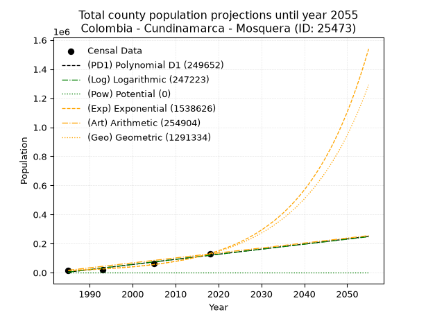
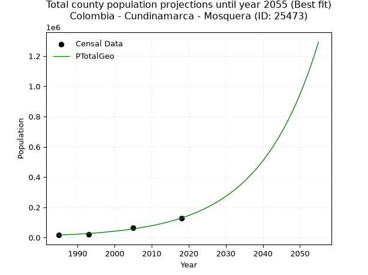
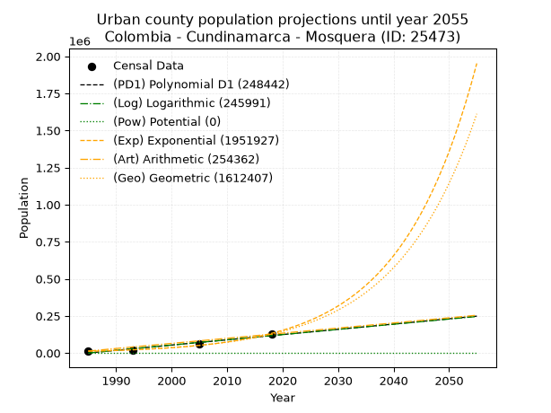
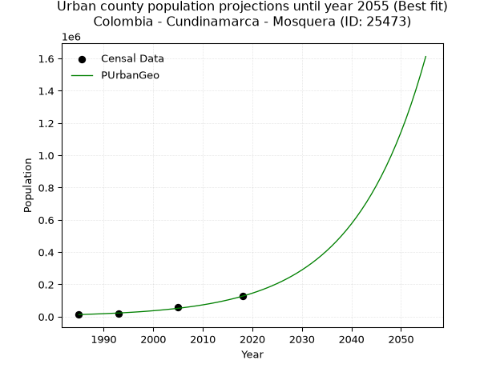
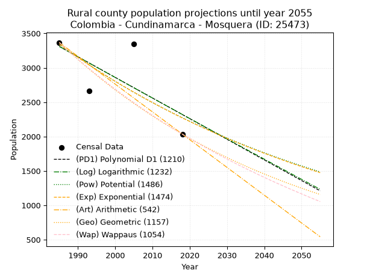
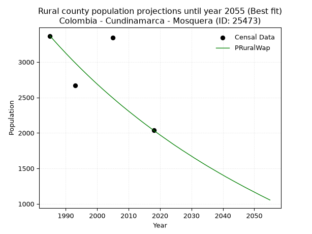

<div align="center">


</div>

# 📜 _“Population and Public Services Demand Projections (PPSD) until Year 2050 for Colombia - Cundinamarca - Mosquera (ID: 25473)”_
Keywords: `population` `public-service` `projection` `lineal` `polynomial` `logarithmic` `potential` `exponential` `arithmetic` `geometric` `wappaus` `dane` `colombia` `south-america`

PPSD are analytical estimates used by governments and planners to anticipate future changes in population size, age distribution, and the resulting community needs for utilities, healthcare, education, and infrastructure as sizing future water treatment facilities, electrical grids, and road networks based on spatial growth.

<div align="center">

</img>

</div>


> **General running parameters**: • app_version: _v20260806_. • Python version: _3.14.7_. • Pandas version: _3.0.5_. • NumPy version: _2.5.1_. • Creates, save and include plots into reports (create_plot): _False_. • Projection until year: _2050_. • Process polynomial degree 2 and up: _False_. • Process Wappaus: _True_. • Process Wappaus: _True_. • Set negative values to zero: _True_. • Set infinite values to zero: _True_. • Drop dataset notes: _True_. 
<div align="center">

Dynamic map: [:earth_americas:Google](http://maps.google.com/maps?q=4.70652967,-74.221154) [:earth_americas:OSM](https://www.openstreetmap.org/#map=18/4.70652967/-74.221154&layers=P) [:earth_americas:Bing](https://www.bing.com/maps?cp=4.70652967~-74.221154&lvl=18) [:earth_americas:Apple](https://maps.apple.com/frame?center=4.70652967%2C-74.221154&span=0.003%2C0.006)

</div>


<div align="center">

```geojson
{
  "type": "Feature",
  "geometry": {
    "type": "Point", 
    "coordinates": [-74.221154, 4.70652967]
  }, 
  "properties": {
    "Name": "Colombia - Cundinamarca - Mosquera (ID: 25473)"
  }
}
```

</div>


## 0. Census Data (4 records)

Census data are official statistics collected by a government about the people and housing in a country. They usually include counts of total population, age, sex, race, income, education, and jobs.

📅Global census file: [Population.xlsx](../data/Population.xlsx)

| Source   |   Year |   CountryID | CountryName   |   StateID | StateName    |   CountyID | CountyName   |   PTotal |   PUrban |   PRural |
|:---------|-------:|------------:|:--------------|----------:|:-------------|-----------:|:-------------|---------:|---------:|---------:|
| DANE     |   1985 |          57 | Colombia      |        25 | Cundinamarca |      25473 | Mosquera     |    16505 |    13138 |     3367 |
| DANE     |   1993 |          57 | Colombia      |        25 | Cundinamarca |      25473 | Mosquera     |    20440 |    17774 |     2666 |
| DANE     |   2005 |          57 | Colombia      |        25 | Cundinamarca |      25473 | Mosquera     |    63226 |    59884 |     3342 |
| DANE     |   2018 |          57 | Colombia      |        25 | Cundinamarca |      25473 | Mosquera     |   128893 |   126858 |     2035 |

> 🔥Some records could had specific notes about the registered values or the corresponding urban or rural distribution.

📅[SUI-RUPS](https://www.datos.gov.co/Hacienda-y-Cr-dito-P-blico/Registro-nico-de-Prestadores-de-Servicios-P-blicos/4qkq-csdn/about_data) - Local public utility companies: [RUPS.csv](../data/RUPS.xlsx)

 | SERVICIO       | ESTADO      | NOMBRE                                            | NIT         | DEPARTAMENTO_DOMICILIO   | MUNICIPIO_DOMICILIO   | DIRECCION            |   TELEFONO | EMAIL                             | TIPO_PRESTADOR                            | CLASIFICACION                 |
|:---------------|:------------|:--------------------------------------------------|:------------|:-------------------------|:----------------------|:---------------------|-----------:|:----------------------------------|:------------------------------------------|:------------------------------|
| ACUEDUCTO      | OPERATIVA   | EMPRESA DE ACUEDUCTO Y ALCANTARILLADO DE MOSQUERA | 832000850-2 | CUNDINAMARCA             | MOSQUERA              | CARRERA 1 4 12       |    8275457 | EAMOSESP.MOSQUERA@GMAIL.COM       | EMPRESA INDUSTRIAL Y COMERCIAL DEL ESTADO | MAYOR O IGUAL A 5001 USUARIOS |
| ALCANTARILLADO | OPERATIVA   | EMPRESA DE ACUEDUCTO Y ALCANTARILLADO DE MOSQUERA | 832000850-2 | CUNDINAMARCA             | MOSQUERA              | CARRERA 1 4 12       |    8275457 | EAMOSESP.MOSQUERA@GMAIL.COM       | EMPRESA INDUSTRIAL Y COMERCIAL DEL ESTADO | MAYOR O IGUAL A 5001 USUARIOS |
| ACUEDUCTO      | CANCELACION | HYDROS MOSQUERA S. EN C.A. E.S.P.                 | 830109584-0 | CUNDINAMARCA             | MOSQUERA              | CARRERA 1 No. 4 - 12 |    6195503 | bgarcia@caudalesdecolombia.com.co | nan                                       | nan                           |
| ALCANTARILLADO | CANCELACION | HYDROS MOSQUERA S. EN C.A. E.S.P.                 | 830109584-0 | CUNDINAMARCA             | MOSQUERA              | CARRERA 1 No. 4 - 12 |    6195503 | bgarcia@caudalesdecolombia.com.co | nan                                       | nan                           |

## 1. Total

### 1.1. Coefficients and Parameters

* (PD1) Polynomial Deg 1: 3513.9028502608953, -6971418.176234356 (lineal)
* (Log) Logarithmic: 7029435.079168984, -53373526.36712093
* (Pow) Potential: 132.7733053476073, -433.6849447386116
* (Exp) Exponential: 0.0663366426700896, 9.623371157042965e-54
* (Art) Arithmetic: Year diff. 2018 - 1985 = 33, Population diff. 128893 - 16505 = 112388, Annual growth = 3405.6969696969695
* (Geo) Geometric: Year diff. 2018 - 1985 = 33, Population diff. 128893 - 16505 = 112388, Annual growth % = 0.06426285133300613
* (Wap) Wappaus: i = 4.684654492767397, Condition values only valid for < 200)

<sub>
Wappaus condition values: ['0.00', '4.68', '9.37', '14.05', '18.74', '23.42', '28.11', '32.79', '37.48', '42.16', '46.85', '51.53', '56.22', '60.90', '65.59', '70.27', '74.95', '79.64', '84.32', '89.01', '93.69', '98.38', '103.06', '107.75', '112.43', '117.12', '121.80', '126.49', '131.17', '135.85', '140.54', '145.22', '149.91', '154.59', '159.28', '163.96', '168.65', '173.33', '178.02', '182.70', '187.39', '192.07', '196.76', '201.44', '206.12', '210.81', '215.49', '220.18', '224.86', '229.55', '234.23', '238.92', '243.60', '248.29', '252.97', '257.66', '262.34', '267.03', '271.71', '276.39', '281.08', '285.76', '290.45', '295.13', '299.82', '304.50']
</sub>


### 1.2. Projected Dataset

|   Year |   CountyID |   PTotalPD1 |   PTotalLog |   PTotalPow |        PTotalExp |   PTotalArt |   PTotalGeo |
|-------:|-----------:|------------:|------------:|------------:|-----------------:|------------:|------------:|
|   1985 |      25473 |        3679 |        3605 |           0 |  14807           |       16505 |       16505 |
|   1986 |      25473 |        7193 |        7145 |           0 |  15822           |       19911 |       17566 |
|   1987 |      25473 |       10707 |       10684 |           0 |  16907           |       23316 |       18694 |
|   1988 |      25473 |       14221 |       14220 |           0 |  18067           |       26722 |       19896 |
|   1989 |      25473 |       17735 |       17755 |           0 |  19306           |       30128 |       21174 |
|   1990 |      25473 |       21248 |       21289 |           0 |  20630           |       33533 |       22535 |
|   1991 |      25473 |       24762 |       24820 |           0 |  22045           |       36939 |       23983 |
|   1992 |      25473 |       28276 |       28350 |           0 |  23557           |       40345 |       25525 |
|   1993 |      25473 |       31790 |       31878 |           0 |  25173           |       43751 |       27165 |
|   1994 |      25473 |       35304 |       35404 |           0 |  26900           |       47156 |       28911 |
|   1995 |      25473 |       38818 |       38928 |           0 |  28745           |       50562 |       30768 |
|   1996 |      25473 |       42332 |       42451 |           0 |  30716           |       53968 |       32746 |
|   1997 |      25473 |       45846 |       45972 |           0 |  32823           |       57373 |       34850 |
|   1998 |      25473 |       49360 |       49491 |           0 |  35074           |       60779 |       37090 |
|   1999 |      25473 |       52874 |       53008 |           0 |  37479           |       64185 |       39473 |
|   2000 |      25473 |       56388 |       56524 |           0 |  40050           |       67590 |       42010 |
|   2001 |      25473 |       59901 |       60038 |           0 |  42797           |       70996 |       44709 |
|   2002 |      25473 |       63415 |       63550 |           0 |  45732           |       74402 |       47582 |
|   2003 |      25473 |       66929 |       67060 |           0 |  48869           |       77808 |       50640 |
|   2004 |      25473 |       70443 |       70569 |           0 |  52221           |       81213 |       53895 |
|   2005 |      25473 |       73957 |       74076 |           0 |  55802           |       84619 |       57358 |
|   2006 |      25473 |       77471 |       77581 |           0 |  59629           |       88025 |       61044 |
|   2007 |      25473 |       80985 |       81084 |           0 |  63719           |       91430 |       64967 |
|   2008 |      25473 |       84499 |       84586 |           0 |  68089           |       94836 |       69142 |
|   2009 |      25473 |       88013 |       88086 |           0 |  72759           |       98242 |       73585 |
|   2010 |      25473 |       91527 |       91584 |           0 |  77750           |      101647 |       78314 |
|   2011 |      25473 |       95040 |       95080 |           0 |  83082           |      105053 |       83346 |
|   2012 |      25473 |       98554 |       98575 |           0 |  88781           |      108459 |       88703 |
|   2013 |      25473 |      102068 |      102067 |           0 |  94870           |      111865 |       94403 |
|   2014 |      25473 |      105582 |      105559 |           0 | 101377           |      115270 |      100469 |
|   2015 |      25473 |      109096 |      109048 |           0 | 108330           |      118676 |      106926 |
|   2016 |      25473 |      112610 |      112536 |           0 | 115760           |      122082 |      113797 |
|   2017 |      25473 |      116124 |      116022 |           0 | 123699           |      125487 |      121110 |
|   2018 |      25473 |      119638 |      119506 |           0 | 132183           |      128893 |      128893 |
|   2019 |      25473 |      123152 |      122988 |           0 | 141249           |      132299 |      137176 |
|   2020 |      25473 |      126666 |      126469 |           0 | 150937           |      135704 |      145991 |
|   2021 |      25473 |      130179 |      129948 |           0 | 161289           |      139110 |      155373 |
|   2022 |      25473 |      133693 |      133426 |           0 | 172351           |      142516 |      165358 |
|   2023 |      25473 |      137207 |      136901 |           0 | 184172           |      145921 |      175984 |
|   2024 |      25473 |      140721 |      140375 |           0 | 196804           |      149327 |      187294 |
|   2025 |      25473 |      144235 |      143847 |           0 | 210302           |      152733 |      199330 |
|   2026 |      25473 |      147749 |      147318 |           0 | 224726           |      156139 |      212139 |
|   2027 |      25473 |      151263 |      150787 |           0 | 240139           |      159544 |      225772 |
|   2028 |      25473 |      154777 |      154254 |           0 | 256610           |      162950 |      240280 |
|   2029 |      25473 |      158291 |      157719 |           0 | 274209           |      166356 |      255722 |
|   2030 |      25473 |      161805 |      161183 |           0 | 293017           |      169761 |      272155 |
|   2031 |      25473 |      165319 |      164644 |           0 | 313113           |      173167 |      289644 |
|   2032 |      25473 |      168832 |      168105 |           0 | 334589           |      176573 |      308258 |
|   2033 |      25473 |      172346 |      171563 |           0 | 357537           |      179978 |      328067 |
|   2034 |      25473 |      175860 |      175020 |           0 | 382059           |      183384 |      349150 |
|   2035 |      25473 |      179374 |      178475 |           0 | 408263           |      186790 |      371587 |
|   2036 |      25473 |      182888 |      181929 |           0 | 436265           |      190196 |      395466 |
|   2037 |      25473 |      186402 |      185380 |           0 | 466186           |      193601 |      420880 |
|   2038 |      25473 |      189916 |      188830 |           0 | 498160           |      197007 |      447927 |
|   2039 |      25473 |      193430 |      192279 |           0 | 532327           |      200413 |      476712 |
|   2040 |      25473 |      196944 |      195725 |           0 | 568838           |      203818 |      507347 |
|   2041 |      25473 |      200458 |      199170 |           0 | 607852           |      207224 |      539951 |
|   2042 |      25473 |      203971 |      202614 |           0 | 649543           |      210630 |      574649 |
|   2043 |      25473 |      207485 |      206055 |           0 | 694093           |      214035 |      611578 |
|   2044 |      25473 |      210999 |      209495 |           0 | 741698           |      217441 |      650880 |
|   2045 |      25473 |      214513 |      212933 |           0 | 792568           |      220847 |      692707 |
|   2046 |      25473 |      218027 |      216370 |           0 | 846928           |      224253 |      737223 |
|   2047 |      25473 |      221541 |      219805 |           0 | 905015           |      227658 |      784599 |
|   2048 |      25473 |      225055 |      223238 |           0 | 967087           |      231064 |      835019 |
|   2049 |      25473 |      228569 |      226669 |           0 |      1.03342e+06 |      234470 |      888680 |
|   2050 |      25473 |      232083 |      230099 |           0 |      1.10429e+06 |      237875 |      945789 |
<div align="center">

</img>

</div>


### 1.3. Best fit with absolute and relative error (%)

Relative error puts that difference into context by dividing the absolute error by the true value, creating a unitless ratio or percentage that shows the scale of the mistake.

Absolute and relative error

|   Year | Source   |   CountryID | CountryName   |   StateID | StateName    |   CountyID_x | CountyName   |   PTotal |   PUrban |   PRural |   CountyID_y |   PTotalPD1 |   PTotalLog |   PTotalPow |   PTotalExp |   PTotalArt |   PTotalGeo |   PTotalPD1AbsError |   PTotalLogAbsError |   PTotalPowAbsError |   PTotalExpAbsError |   PTotalArtAbsError |   PTotalGeoAbsError |   PTotalPD1RelError |   PTotalLogRelError |   PTotalPowRelError |   PTotalExpRelError |   PTotalArtRelError |   PTotalGeoRelError |
|-------:|:---------|------------:|:--------------|----------:|:-------------|-------------:|:-------------|---------:|---------:|---------:|-------------:|------------:|------------:|------------:|------------:|------------:|------------:|--------------------:|--------------------:|--------------------:|--------------------:|--------------------:|--------------------:|--------------------:|--------------------:|--------------------:|--------------------:|--------------------:|--------------------:|
|   1985 | DANE     |          57 | Colombia      |        25 | Cundinamarca |        25473 | Mosquera     |    16505 |    13138 |     3367 |        25473 |        3679 |        3605 |           0 |       14807 |       16505 |       16505 |               12826 |               12900 |               16505 |                1698 |                   0 |                   0 |            77.7098  |            78.1581  |                 100 |             10.2878 |              0      |             0       |
|   1993 | DANE     |          57 | Colombia      |        25 | Cundinamarca |        25473 | Mosquera     |    20440 |    17774 |     2666 |        25473 |       31790 |       31878 |           0 |       25173 |       43751 |       27165 |               11350 |               11438 |               20440 |                4733 |               23311 |                6725 |            55.5284  |            55.9589  |                 100 |             23.1556 |            114.046  |            32.9012  |
|   2005 | DANE     |          57 | Colombia      |        25 | Cundinamarca |        25473 | Mosquera     |    63226 |    59884 |     3342 |        25473 |       73957 |       74076 |           0 |       55802 |       84619 |       57358 |               10731 |               10850 |               63226 |                7424 |               21393 |                5868 |            16.9724  |            17.1607  |                 100 |             11.742  |             33.8358 |             9.28099 |
|   2018 | DANE     |          57 | Colombia      |        25 | Cundinamarca |        25473 | Mosquera     |   128893 |   126858 |     2035 |        25473 |      119638 |      119506 |           0 |      132183 |      128893 |      128893 |                9255 |                9387 |              128893 |                3290 |                   0 |                   0 |             7.18037 |             7.28278 |                 100 |              2.5525 |              0      |             0       |

Relative error mean

| Method    |   RelError | Best   |
|:----------|-----------:|:-------|
| PTotalPD1 |    39.3477 |        |
| PTotalLog |    39.6401 |        |
| PTotalPow |   100      |        |
| PTotalExp |    11.9345 |        |
| PTotalArt |    36.9704 |        |
| PTotalGeo |    10.5455 | True   |

💙Best method: _**PTotalGeo**_
<div align="center">

</img>

</div>


### 1.4. Fresh water supply demand in liters per capita per day (lpcd)

The fresh water supply demand typically ranges from 100 to 300 liters per capita per day (lpcd) for standard domestic and municipal planning, though absolute survival minimums set by the World Health Organization are as low as 7.5 to 20 liters per day, and total consumption in high-income nations can exceed 400 liters.

> `CZ`: Level in meters above the sea level (masl)<br> `WS`: Fresh water supply demand in liters per capita per day (lpcd or l/h/d)<br> `WSAll`: Zonal fresh water supply demand in liters per second (l/s)<br> `A`: Zonal area in square meters<br> `DP`: Population density (people/hectare or p/ha)

Reference values (RAS Colombia)

|    CZ |   WS |
|------:|-----:|
|  1000 |  120 |
|  2000 |  130 |
| 99999 |  140 |

County shapefile geometry properties and water supply values

|   CountyID |     ATotal |   CZTotal |   WSTotal |
|-----------:|-----------:|----------:|----------:|
|      25473 | 1.0601e+08 |   2574.59 |       140 |

Projected values for best method: PTotalGeo

|   CountyID |   Year |   PTotalGeo |   DPTotal |   WSTotal |   WSTotalAll |
|-----------:|-------:|------------:|----------:|----------:|-------------:|
|      25473 |   1985 |       16505 |      1.56 |       140 |      26.7442 |
|      25473 |   1986 |       17566 |      1.66 |       140 |      28.4634 |
|      25473 |   1987 |       18694 |      1.76 |       140 |      30.2912 |
|      25473 |   1988 |       19896 |      1.88 |       140 |      32.2389 |
|      25473 |   1989 |       21174 |      2    |       140 |      34.3097 |
|      25473 |   1990 |       22535 |      2.13 |       140 |      36.515  |
|      25473 |   1991 |       23983 |      2.26 |       140 |      38.8613 |
|      25473 |   1992 |       25525 |      2.41 |       140 |      41.36   |
|      25473 |   1993 |       27165 |      2.56 |       140 |      44.0174 |
|      25473 |   1994 |       28911 |      2.73 |       140 |      46.8465 |
|      25473 |   1995 |       30768 |      2.9  |       140 |      49.8556 |
|      25473 |   1996 |       32746 |      3.09 |       140 |      53.0606 |
|      25473 |   1997 |       34850 |      3.29 |       140 |      56.4699 |
|      25473 |   1998 |       37090 |      3.5  |       140 |      60.0995 |
|      25473 |   1999 |       39473 |      3.72 |       140 |      63.9609 |
|      25473 |   2000 |       42010 |      3.96 |       140 |      68.0718 |
|      25473 |   2001 |       44709 |      4.22 |       140 |      72.4451 |
|      25473 |   2002 |       47582 |      4.49 |       140 |      77.1005 |
|      25473 |   2003 |       50640 |      4.78 |       140 |      82.0556 |
|      25473 |   2004 |       53895 |      5.08 |       140 |      87.3299 |
|      25473 |   2005 |       57358 |      5.41 |       140 |      92.9412 |
|      25473 |   2006 |       61044 |      5.76 |       140 |      98.9139 |
|      25473 |   2007 |       64967 |      6.13 |       140 |     105.271  |
|      25473 |   2008 |       69142 |      6.52 |       140 |     112.036  |
|      25473 |   2009 |       73585 |      6.94 |       140 |     119.235  |
|      25473 |   2010 |       78314 |      7.39 |       140 |     126.898  |
|      25473 |   2011 |       83346 |      7.86 |       140 |     135.051  |
|      25473 |   2012 |       88703 |      8.37 |       140 |     143.732  |
|      25473 |   2013 |       94403 |      8.91 |       140 |     152.968  |
|      25473 |   2014 |      100469 |      9.48 |       140 |     162.797  |
|      25473 |   2015 |      106926 |     10.09 |       140 |     173.26   |
|      25473 |   2016 |      113797 |     10.73 |       140 |     184.393  |
|      25473 |   2017 |      121110 |     11.42 |       140 |     196.243  |
|      25473 |   2018 |      128893 |     12.16 |       140 |     208.854  |
|      25473 |   2019 |      137176 |     12.94 |       140 |     222.276  |
|      25473 |   2020 |      145991 |     13.77 |       140 |     236.559  |
|      25473 |   2021 |      155373 |     14.66 |       140 |     251.762  |
|      25473 |   2022 |      165358 |     15.6  |       140 |     267.941  |
|      25473 |   2023 |      175984 |     16.6  |       140 |     285.159  |
|      25473 |   2024 |      187294 |     17.67 |       140 |     303.486  |
|      25473 |   2025 |      199330 |     18.8  |       140 |     322.988  |
|      25473 |   2026 |      212139 |     20.01 |       140 |     343.744  |
|      25473 |   2027 |      225772 |     21.3  |       140 |     365.834  |
|      25473 |   2028 |      240280 |     22.67 |       140 |     389.343  |
|      25473 |   2029 |      255722 |     24.12 |       140 |     414.364  |
|      25473 |   2030 |      272155 |     25.67 |       140 |     440.992  |
|      25473 |   2031 |      289644 |     27.32 |       140 |     469.331  |
|      25473 |   2032 |      308258 |     29.08 |       140 |     499.492  |
|      25473 |   2033 |      328067 |     30.95 |       140 |     531.59   |
|      25473 |   2034 |      349150 |     32.94 |       140 |     565.752  |
|      25473 |   2035 |      371587 |     35.05 |       140 |     602.109  |
|      25473 |   2036 |      395466 |     37.3  |       140 |     640.801  |
|      25473 |   2037 |      420880 |     39.7  |       140 |     681.981  |
|      25473 |   2038 |      447927 |     42.25 |       140 |     725.808  |
|      25473 |   2039 |      476712 |     44.97 |       140 |     772.45   |
|      25473 |   2040 |      507347 |     47.86 |       140 |     822.09   |
|      25473 |   2041 |      539951 |     50.93 |       140 |     874.921  |
|      25473 |   2042 |      574649 |     54.21 |       140 |     931.144  |
|      25473 |   2043 |      611578 |     57.69 |       140 |     990.983  |
|      25473 |   2044 |      650880 |     61.4  |       140 |    1054.67   |
|      25473 |   2045 |      692707 |     65.34 |       140 |    1122.44   |
|      25473 |   2046 |      737223 |     69.54 |       140 |    1194.57   |
|      25473 |   2047 |      784599 |     74.01 |       140 |    1271.34   |
|      25473 |   2048 |      835019 |     78.77 |       140 |    1353.04   |
|      25473 |   2049 |      888680 |     83.83 |       140 |    1439.99   |
|      25473 |   2050 |      945789 |     89.22 |       140 |    1532.53   |

## 2. Urban

### 2.1. Coefficients and Parameters

* (PD1) Polynomial Deg 1: 3543.8980329184624, -7034268.540345155 (lineal)
* (Log) Logarithmic: 7089407.329413905, -53832228.421820015
* (Pow) Potential: 145.48398011234548, -475.69141566953004
* (Exp) Exponential: 0.07268295041546745, 2.6468890357404325e-59
* (Art) Arithmetic: Year diff. 2018 - 1985 = 33, Population diff. 126858 - 13138 = 113720, Annual growth = 3446.060606060606
* (Geo) Geometric: Year diff. 2018 - 1985 = 33, Population diff. 126858 - 13138 = 113720, Annual growth % = 0.07112974288593787
* (Wap) Wappaus: i = 4.923084382497509, Condition values only valid for < 200)

<sub>
Wappaus condition values: ['0.00', '4.92', '9.85', '14.77', '19.69', '24.62', '29.54', '34.46', '39.38', '44.31', '49.23', '54.15', '59.08', '64.00', '68.92', '73.85', '78.77', '83.69', '88.62', '93.54', '98.46', '103.38', '108.31', '113.23', '118.15', '123.08', '128.00', '132.92', '137.85', '142.77', '147.69', '152.62', '157.54', '162.46', '167.38', '172.31', '177.23', '182.15', '187.08', '192.00', '196.92', '201.85', '206.77', '211.69', '216.62', '221.54', '226.46', '231.38', '236.31', '241.23', '246.15', '251.08', '256.00', '260.92', '265.85', '270.77', '275.69', '280.62', '285.54', '290.46', '295.39', '300.31', '305.23', '310.15', '315.08', '320.00']
</sub>


### 2.2. Projected Dataset

|   Year |   CountyID |   PUrbanPD1 |   PUrbanLog |   PUrbanPow |        PUrbanExp |   PUrbanArt |        PUrbanGeo |
|-------:|-----------:|------------:|------------:|------------:|-----------------:|------------:|-----------------:|
|   1985 |      25473 |         369 |         294 |           0 |  12046           |       13138 |  13138           |
|   1986 |      25473 |        3913 |        3865 |           0 |  12955           |       16584 |  14073           |
|   1987 |      25473 |        7457 |        7434 |           0 |  13931           |       20030 |  15073           |
|   1988 |      25473 |       11001 |       11001 |           0 |  14981           |       23476 |  16146           |
|   1989 |      25473 |       14545 |       14566 |           0 |  16111           |       26922 |  17294           |
|   1990 |      25473 |       18089 |       18129 |           0 |  17326           |       30368 |  18524           |
|   1991 |      25473 |       21632 |       21691 |           0 |  18632           |       33814 |  19842           |
|   1992 |      25473 |       25176 |       25251 |           0 |  20036           |       37260 |  21253           |
|   1993 |      25473 |       28720 |       28809 |           0 |  21547           |       40706 |  22765           |
|   1994 |      25473 |       32264 |       32365 |           0 |  23171           |       44153 |  24384           |
|   1995 |      25473 |       35808 |       35919 |           0 |  24918           |       47599 |  26119           |
|   1996 |      25473 |       39352 |       39472 |           0 |  26797           |       51045 |  27976           |
|   1997 |      25473 |       42896 |       43023 |           0 |  28817           |       54491 |  29966           |
|   1998 |      25473 |       46440 |       46572 |           0 |  30989           |       57937 |  32098           |
|   1999 |      25473 |       49984 |       50120 |           0 |  33326           |       61383 |  34381           |
|   2000 |      25473 |       53528 |       53665 |           0 |  35838           |       64829 |  36826           |
|   2001 |      25473 |       57071 |       57209 |           0 |  38540           |       68275 |  39446           |
|   2002 |      25473 |       60615 |       60751 |           0 |  41445           |       71721 |  42252           |
|   2003 |      25473 |       64159 |       64291 |           0 |  44570           |       75167 |  45257           |
|   2004 |      25473 |       67703 |       67830 |           0 |  47930           |       78613 |  48476           |
|   2005 |      25473 |       71247 |       71367 |           0 |  51543           |       82059 |  51924           |
|   2006 |      25473 |       74791 |       74902 |           0 |  55429           |       85505 |  55618           |
|   2007 |      25473 |       78335 |       78435 |           0 |  59608           |       88951 |  59574           |
|   2008 |      25473 |       81879 |       81966 |           0 |  64102           |       92397 |  63811           |
|   2009 |      25473 |       85423 |       85496 |           0 |  68934           |       95843 |  68350           |
|   2010 |      25473 |       88967 |       89024 |           0 |  74131           |       99290 |  73212           |
|   2011 |      25473 |       92510 |       92550 |           0 |  79720           |      102736 |  78419           |
|   2012 |      25473 |       96054 |       96075 |           0 |  85730           |      106182 |  83997           |
|   2013 |      25473 |       99598 |       99597 |           0 |  92193           |      109628 |  89972           |
|   2014 |      25473 |      103142 |      103118 |           0 |  99144           |      113074 |  96372           |
|   2015 |      25473 |      106686 |      106637 |           0 | 106618           |      116520 | 103227           |
|   2016 |      25473 |      110230 |      110155 |           0 | 114656           |      119966 | 110569           |
|   2017 |      25473 |      113774 |      113670 |           0 | 123300           |      123412 | 118434           |
|   2018 |      25473 |      117318 |      117184 |           0 | 132596           |      126858 | 126858           |
|   2019 |      25473 |      120862 |      120697 |           0 | 142592           |      130304 | 135881           |
|   2020 |      25473 |      124405 |      124207 |           0 | 153342           |      133750 | 145547           |
|   2021 |      25473 |      127949 |      127716 |           0 | 164902           |      137196 | 155899           |
|   2022 |      25473 |      131493 |      131223 |           0 | 177334           |      140642 | 166988           |
|   2023 |      25473 |      135037 |      134728 |           0 | 190703           |      144088 | 178866           |
|   2024 |      25473 |      138581 |      138232 |           0 | 205080           |      147534 | 191589           |
|   2025 |      25473 |      142125 |      141733 |           0 | 220541           |      150980 | 205217           |
|   2026 |      25473 |      145669 |      145234 |           0 | 237168           |      154426 | 219814           |
|   2027 |      25473 |      149213 |      148732 |           0 | 255047           |      157873 | 235449           |
|   2028 |      25473 |      152757 |      152229 |           0 | 274275           |      161319 | 252196           |
|   2029 |      25473 |      156301 |      155723 |           0 | 294953           |      164765 | 270135           |
|   2030 |      25473 |      159844 |      159217 |           0 | 317189           |      168211 | 289350           |
|   2031 |      25473 |      163388 |      162708 |           0 | 341102           |      171657 | 309931           |
|   2032 |      25473 |      166932 |      166198 |           0 | 366818           |      175103 | 331976           |
|   2033 |      25473 |      170476 |      169686 |           0 | 394472           |      178549 | 355590           |
|   2034 |      25473 |      174020 |      173172 |           0 | 424211           |      181995 | 380883           |
|   2035 |      25473 |      177564 |      176657 |           0 | 456192           |      185441 | 407975           |
|   2036 |      25473 |      181108 |      180140 |           0 | 490584           |      188887 | 436994           |
|   2037 |      25473 |      184652 |      183621 |           0 | 527569           |      192333 | 468077           |
|   2038 |      25473 |      188196 |      187100 |           0 | 567342           |      195779 | 501371           |
|   2039 |      25473 |      191740 |      190578 |           0 | 610114           |      199225 | 537034           |
|   2040 |      25473 |      195283 |      194054 |           0 | 656110           |      202671 | 575233           |
|   2041 |      25473 |      198827 |      197528 |           0 | 705574           |      206117 | 616149           |
|   2042 |      25473 |      202371 |      201001 |           0 | 758766           |      209563 | 659975           |
|   2043 |      25473 |      205915 |      204472 |           0 | 815969           |      213010 | 706919           |
|   2044 |      25473 |      209459 |      207941 |           0 | 877485           |      216456 | 757202           |
|   2045 |      25473 |      213003 |      211409 |           0 | 943638           |      219902 | 811062           |
|   2046 |      25473 |      216547 |      214875 |           0 |      1.01478e+06 |      223348 | 868753           |
|   2047 |      25473 |      220091 |      218339 |           0 |      1.09128e+06 |      226794 | 930547           |
|   2048 |      25473 |      223635 |      221801 |           0 |      1.17355e+06 |      230240 | 996736           |
|   2049 |      25473 |      227179 |      225262 |           0 |      1.26203e+06 |      233686 |      1.06763e+06 |
|   2050 |      25473 |      230722 |      228721 |           0 |      1.35717e+06 |      237132 |      1.14357e+06 |
<div align="center">

</img>

</div>


### 2.3. Best fit with absolute and relative error (%)

Relative error puts that difference into context by dividing the absolute error by the true value, creating a unitless ratio or percentage that shows the scale of the mistake.

Absolute and relative error

|   Year | Source   |   CountryID | CountryName   |   StateID | StateName    |   CountyID_x | CountyName   |   PTotal |   PUrban |   PRural |   CountyID_y |   PUrbanPD1 |   PUrbanLog |   PUrbanPow |   PUrbanExp |   PUrbanArt |   PUrbanGeo |   PUrbanPD1AbsError |   PUrbanLogAbsError |   PUrbanPowAbsError |   PUrbanExpAbsError |   PUrbanArtAbsError |   PUrbanGeoAbsError |   PUrbanPD1RelError |   PUrbanLogRelError |   PUrbanPowRelError |   PUrbanExpRelError |   PUrbanArtRelError |   PUrbanGeoRelError |
|-------:|:---------|------------:|:--------------|----------:|:-------------|-------------:|:-------------|---------:|---------:|---------:|-------------:|------------:|------------:|------------:|------------:|------------:|------------:|--------------------:|--------------------:|--------------------:|--------------------:|--------------------:|--------------------:|--------------------:|--------------------:|--------------------:|--------------------:|--------------------:|--------------------:|
|   1985 | DANE     |          57 | Colombia      |        25 | Cundinamarca |        25473 | Mosquera     |    16505 |    13138 |     3367 |        25473 |         369 |         294 |           0 |       12046 |       13138 |       13138 |               12769 |               12844 |               13138 |                1092 |                   0 |                   0 |            97.1914  |            97.7622  |                 100 |             8.31177 |              0      |              0      |
|   1993 | DANE     |          57 | Colombia      |        25 | Cundinamarca |        25473 | Mosquera     |    20440 |    17774 |     2666 |        25473 |       28720 |       28809 |           0 |       21547 |       40706 |       22765 |               10946 |               11035 |               17774 |                3773 |               22932 |                4991 |            61.5843  |            62.0851  |                 100 |            21.2276  |            129.02   |             28.0803 |
|   2005 | DANE     |          57 | Colombia      |        25 | Cundinamarca |        25473 | Mosquera     |    63226 |    59884 |     3342 |        25473 |       71247 |       71367 |           0 |       51543 |       82059 |       51924 |               11363 |               11483 |               59884 |                8341 |               22175 |                7960 |            18.975   |            19.1754  |                 100 |            13.9286  |             37.0299 |             13.2924 |
|   2018 | DANE     |          57 | Colombia      |        25 | Cundinamarca |        25473 | Mosquera     |   128893 |   126858 |     2035 |        25473 |      117318 |      117184 |           0 |      132596 |      126858 |      126858 |                9540 |                9674 |              126858 |                5738 |                   0 |                   0 |             7.52022 |             7.62585 |                 100 |             4.52317 |              0      |              0      |

Relative error mean

| Method    |   RelError | Best   |
|:----------|-----------:|:-------|
| PUrbanPD1 |    46.3177 |        |
| PUrbanLog |    46.6621 |        |
| PUrbanPow |   100      |        |
| PUrbanExp |    11.9978 |        |
| PUrbanArt |    41.5125 |        |
| PUrbanGeo |    10.3432 | True   |

💙Best method: _**PUrbanGeo**_
<div align="center">

</img>

</div>


### 2.4. Fresh water supply demand in liters per capita per day (lpcd)

The fresh water supply demand typically ranges from 100 to 300 liters per capita per day (lpcd) for standard domestic and municipal planning, though absolute survival minimums set by the World Health Organization are as low as 7.5 to 20 liters per day, and total consumption in high-income nations can exceed 400 liters.

> `CZ`: Level in meters above the sea level (masl)<br> `WS`: Fresh water supply demand in liters per capita per day (lpcd or l/h/d)<br> `WSAll`: Zonal fresh water supply demand in liters per second (l/s)<br> `A`: Zonal area in square meters<br> `DP`: Population density (people/hectare or p/ha)

Reference values (RAS Colombia)

|    CZ |   WS |
|------:|-----:|
|  1000 |  120 |
|  2000 |  130 |
| 99999 |  140 |

County shapefile geometry properties and water supply values

|   CountyID |      AUrban |   CZUrban |   WSUrban |
|-----------:|------------:|----------:|----------:|
|      25473 | 1.49606e+07 |    2546.5 |       140 |

Projected values for best method: PUrbanGeo

|   CountyID |   Year |        PUrbanGeo |   DPUrban |   WSUrban |   WSUrbanAll |
|-----------:|-------:|-----------------:|----------:|----------:|-------------:|
|      25473 |   1985 |  13138           |      8.78 |       140 |      21.2884 |
|      25473 |   1986 |  14073           |      9.41 |       140 |      22.8035 |
|      25473 |   1987 |  15073           |     10.08 |       140 |      24.4238 |
|      25473 |   1988 |  16146           |     10.79 |       140 |      26.1625 |
|      25473 |   1989 |  17294           |     11.56 |       140 |      28.0227 |
|      25473 |   1990 |  18524           |     12.38 |       140 |      30.0157 |
|      25473 |   1991 |  19842           |     13.26 |       140 |      32.1514 |
|      25473 |   1992 |  21253           |     14.21 |       140 |      34.4377 |
|      25473 |   1993 |  22765           |     15.22 |       140 |      36.8877 |
|      25473 |   1994 |  24384           |     16.3  |       140 |      39.5111 |
|      25473 |   1995 |  26119           |     17.46 |       140 |      42.3225 |
|      25473 |   1996 |  27976           |     18.7  |       140 |      45.3315 |
|      25473 |   1997 |  29966           |     20.03 |       140 |      48.556  |
|      25473 |   1998 |  32098           |     21.46 |       140 |      52.0106 |
|      25473 |   1999 |  34381           |     22.98 |       140 |      55.71   |
|      25473 |   2000 |  36826           |     24.62 |       140 |      59.6718 |
|      25473 |   2001 |  39446           |     26.37 |       140 |      63.9171 |
|      25473 |   2002 |  42252           |     28.24 |       140 |      68.4639 |
|      25473 |   2003 |  45257           |     30.25 |       140 |      73.3331 |
|      25473 |   2004 |  48476           |     32.4  |       140 |      78.5491 |
|      25473 |   2005 |  51924           |     34.71 |       140 |      84.1361 |
|      25473 |   2006 |  55618           |     37.18 |       140 |      90.1218 |
|      25473 |   2007 |  59574           |     39.82 |       140 |      96.5319 |
|      25473 |   2008 |  63811           |     42.65 |       140 |     103.397  |
|      25473 |   2009 |  68350           |     45.69 |       140 |     110.752  |
|      25473 |   2010 |  73212           |     48.94 |       140 |     118.631  |
|      25473 |   2011 |  78419           |     52.42 |       140 |     127.068  |
|      25473 |   2012 |  83997           |     56.15 |       140 |     136.106  |
|      25473 |   2013 |  89972           |     60.14 |       140 |     145.788  |
|      25473 |   2014 |  96372           |     64.42 |       140 |     156.158  |
|      25473 |   2015 | 103227           |     69    |       140 |     167.266  |
|      25473 |   2016 | 110569           |     73.91 |       140 |     179.163  |
|      25473 |   2017 | 118434           |     79.16 |       140 |     191.907  |
|      25473 |   2018 | 126858           |     84.79 |       140 |     205.557  |
|      25473 |   2019 | 135881           |     90.83 |       140 |     220.178  |
|      25473 |   2020 | 145547           |     97.29 |       140 |     235.84   |
|      25473 |   2021 | 155899           |    104.21 |       140 |     252.614  |
|      25473 |   2022 | 166988           |    111.62 |       140 |     270.582  |
|      25473 |   2023 | 178866           |    119.56 |       140 |     289.829  |
|      25473 |   2024 | 191589           |    128.06 |       140 |     310.445  |
|      25473 |   2025 | 205217           |    137.17 |       140 |     332.528  |
|      25473 |   2026 | 219814           |    146.93 |       140 |     356.18   |
|      25473 |   2027 | 235449           |    157.38 |       140 |     381.515  |
|      25473 |   2028 | 252196           |    168.57 |       140 |     408.651  |
|      25473 |   2029 | 270135           |    180.56 |       140 |     437.719  |
|      25473 |   2030 | 289350           |    193.41 |       140 |     468.854  |
|      25473 |   2031 | 309931           |    207.16 |       140 |     502.203  |
|      25473 |   2032 | 331976           |    221.9  |       140 |     537.924  |
|      25473 |   2033 | 355590           |    237.68 |       140 |     576.188  |
|      25473 |   2034 | 380883           |    254.59 |       140 |     617.172  |
|      25473 |   2035 | 407975           |    272.7  |       140 |     661.071  |
|      25473 |   2036 | 436994           |    292.1  |       140 |     708.092  |
|      25473 |   2037 | 468077           |    312.87 |       140 |     758.458  |
|      25473 |   2038 | 501371           |    335.13 |       140 |     812.407  |
|      25473 |   2039 | 537034           |    358.97 |       140 |     870.194  |
|      25473 |   2040 | 575233           |    384.5  |       140 |     932.091  |
|      25473 |   2041 | 616149           |    411.85 |       140 |     998.39   |
|      25473 |   2042 | 659975           |    441.14 |       140 |    1069.4    |
|      25473 |   2043 | 706919           |    472.52 |       140 |    1145.47   |
|      25473 |   2044 | 757202           |    506.13 |       140 |    1226.95   |
|      25473 |   2045 | 811062           |    542.13 |       140 |    1314.22   |
|      25473 |   2046 | 868753           |    580.69 |       140 |    1407.7    |
|      25473 |   2047 | 930547           |    622    |       140 |    1507.83   |
|      25473 |   2048 | 996736           |    666.24 |       140 |    1615.08   |
|      25473 |   2049 |      1.06763e+06 |    713.63 |       140 |    1729.96   |
|      25473 |   2050 |      1.14357e+06 |    764.39 |       140 |    1853.01   |

## 3. Rural

### 3.1. Coefficients and Parameters

* (PD1) Polynomial Deg 1: -29.995182657566453, 62850.3641107973 (lineal)
* (Log) Logarithmic: -59972.250244920826, 458702.0546990954
* (Pow) Potential: -23.37326206167022, 80.6033291576319
* (Exp) Exponential: -0.011690937642331985, 40022781715720.2
* (Art) Arithmetic: Year diff. 2018 - 1985 = 33, Population diff. 2035 - 3367 = -1332, Annual growth = -40.36363636363637
* (Geo) Geometric: Year diff. 2018 - 1985 = 33, Population diff. 2035 - 3367 = -1332, Annual growth % = -0.015142554212191794
* (Wap) Wappaus: i = -1.4943960149439601, Condition values only valid for < 200)

<sub>
Wappaus condition values: ['-0.00', '-1.49', '-2.99', '-4.48', '-5.98', '-7.47', '-8.97', '-10.46', '-11.96', '-13.45', '-14.94', '-16.44', '-17.93', '-19.43', '-20.92', '-22.42', '-23.91', '-25.40', '-26.90', '-28.39', '-29.89', '-31.38', '-32.88', '-34.37', '-35.87', '-37.36', '-38.85', '-40.35', '-41.84', '-43.34', '-44.83', '-46.33', '-47.82', '-49.32', '-50.81', '-52.30', '-53.80', '-55.29', '-56.79', '-58.28', '-59.78', '-61.27', '-62.76', '-64.26', '-65.75', '-67.25', '-68.74', '-70.24', '-71.73', '-73.23', '-74.72', '-76.21', '-77.71', '-79.20', '-80.70', '-82.19', '-83.69', '-85.18', '-86.67', '-88.17', '-89.66', '-91.16', '-92.65', '-94.15', '-95.64', '-97.14']
</sub>


### 3.2. Projected Dataset

|   Year |   CountyID |   PRuralPD1 |   PRuralLog |   PRuralPow |   PRuralExp |   PRuralArt |   PRuralGeo |   PRuralWap |
|-------:|-----------:|------------:|------------:|------------:|------------:|------------:|------------:|------------:|
|   1985 |      25473 |        3310 |        3310 |        3341 |        3341 |        3367 |        3367 |        3367 |
|   1986 |      25473 |        3280 |        3280 |        3302 |        3302 |        3327 |        3316 |        3317 |
|   1987 |      25473 |        3250 |        3250 |        3264 |        3264 |        3286 |        3266 |        3268 |
|   1988 |      25473 |        3220 |        3220 |        3225 |        3226 |        3246 |        3216 |        3219 |
|   1989 |      25473 |        3190 |        3190 |        3188 |        3188 |        3206 |        3168 |        3172 |
|   1990 |      25473 |        3160 |        3159 |        3150 |        3151 |        3165 |        3120 |        3124 |
|   1991 |      25473 |        3130 |        3129 |        3114 |        3114 |        3125 |        3072 |        3078 |
|   1992 |      25473 |        3100 |        3099 |        3077 |        3078 |        3084 |        3026 |        3032 |
|   1993 |      25473 |        3070 |        3069 |        3041 |        3042 |        3044 |        2980 |        2987 |
|   1994 |      25473 |        3040 |        3039 |        3006 |        3007 |        3004 |        2935 |        2943 |
|   1995 |      25473 |        3010 |        3009 |        2971 |        2972 |        2963 |        2891 |        2899 |
|   1996 |      25473 |        2980 |        2979 |        2936 |        2938 |        2923 |        2847 |        2856 |
|   1997 |      25473 |        2950 |        2949 |        2902 |        2903 |        2883 |        2804 |        2813 |
|   1998 |      25473 |        2920 |        2919 |        2868 |        2870 |        2842 |        2761 |        2771 |
|   1999 |      25473 |        2890 |        2889 |        2835 |        2836 |        2802 |        2719 |        2729 |
|   2000 |      25473 |        2860 |        2859 |        2802 |        2803 |        2762 |        2678 |        2688 |
|   2001 |      25473 |        2830 |        2829 |        2770 |        2771 |        2721 |        2638 |        2648 |
|   2002 |      25473 |        2800 |        2799 |        2737 |        2739 |        2681 |        2598 |        2608 |
|   2003 |      25473 |        2770 |        2769 |        2706 |        2707 |        2640 |        2558 |        2569 |
|   2004 |      25473 |        2740 |        2739 |        2674 |        2675 |        2600 |        2520 |        2530 |
|   2005 |      25473 |        2710 |        2709 |        2643 |        2644 |        2560 |        2481 |        2492 |
|   2006 |      25473 |        2680 |        2679 |        2613 |        2614 |        2519 |        2444 |        2454 |
|   2007 |      25473 |        2650 |        2649 |        2582 |        2583 |        2479 |        2407 |        2416 |
|   2008 |      25473 |        2620 |        2619 |        2553 |        2553 |        2439 |        2370 |        2379 |
|   2009 |      25473 |        2590 |        2590 |        2523 |        2523 |        2398 |        2335 |        2343 |
|   2010 |      25473 |        2560 |        2560 |        2494 |        2494 |        2358 |        2299 |        2307 |
|   2011 |      25473 |        2530 |        2530 |        2465 |        2465 |        2318 |        2264 |        2272 |
|   2012 |      25473 |        2500 |        2500 |        2437 |        2436 |        2277 |        2230 |        2237 |
|   2013 |      25473 |        2470 |        2470 |        2408 |        2408 |        2237 |        2196 |        2202 |
|   2014 |      25473 |        2440 |        2440 |        2381 |        2380 |        2196 |        2163 |        2168 |
|   2015 |      25473 |        2410 |        2411 |        2353 |        2352 |        2156 |        2130 |        2134 |
|   2016 |      25473 |        2380 |        2381 |        2326 |        2325 |        2116 |        2098 |        2101 |
|   2017 |      25473 |        2350 |        2351 |        2299 |        2298 |        2075 |        2066 |        2068 |
|   2018 |      25473 |        2320 |        2321 |        2273 |        2271 |        2035 |        2035 |        2035 |
|   2019 |      25473 |        2290 |        2292 |        2247 |        2245 |        1995 |        2004 |        2003 |
|   2020 |      25473 |        2260 |        2262 |        2221 |        2219 |        1954 |        1974 |        1971 |
|   2021 |      25473 |        2230 |        2232 |        2195 |        2193 |        1914 |        1944 |        1940 |
|   2022 |      25473 |        2200 |        2203 |        2170 |        2168 |        1874 |        1915 |        1909 |
|   2023 |      25473 |        2170 |        2173 |        2145 |        2142 |        1833 |        1886 |        1878 |
|   2024 |      25473 |        2140 |        2143 |        2120 |        2118 |        1793 |        1857 |        1847 |
|   2025 |      25473 |        2110 |        2114 |        2096 |        2093 |        1752 |        1829 |        1817 |
|   2026 |      25473 |        2080 |        2084 |        2072 |        2069 |        1712 |        1801 |        1788 |
|   2027 |      25473 |        2050 |        2055 |        2048 |        2045 |        1672 |        1774 |        1758 |
|   2028 |      25473 |        2020 |        2025 |        2025 |        2021 |        1631 |        1747 |        1730 |
|   2029 |      25473 |        1990 |        1995 |        2002 |        1997 |        1591 |        1721 |        1701 |
|   2030 |      25473 |        1960 |        1966 |        1979 |        1974 |        1551 |        1695 |        1673 |
|   2031 |      25473 |        1930 |        1936 |        1956 |        1951 |        1510 |        1669 |        1644 |
|   2032 |      25473 |        1900 |        1907 |        1934 |        1928 |        1470 |        1644 |        1617 |
|   2033 |      25473 |        1870 |        1877 |        1911 |        1906 |        1430 |        1619 |        1589 |
|   2034 |      25473 |        1840 |        1848 |        1890 |        1884 |        1389 |        1594 |        1562 |
|   2035 |      25473 |        1810 |        1818 |        1868 |        1862 |        1349 |        1570 |        1535 |
|   2036 |      25473 |        1780 |        1789 |        1847 |        1840 |        1308 |        1546 |        1509 |
|   2037 |      25473 |        1750 |        1759 |        1826 |        1819 |        1268 |        1523 |        1483 |
|   2038 |      25473 |        1720 |        1730 |        1805 |        1798 |        1228 |        1500 |        1457 |
|   2039 |      25473 |        1690 |        1701 |        1784 |        1777 |        1187 |        1477 |        1431 |
|   2040 |      25473 |        1660 |        1671 |        1764 |        1756 |        1147 |        1455 |        1406 |
|   2041 |      25473 |        1630 |        1642 |        1744 |        1736 |        1107 |        1433 |        1380 |
|   2042 |      25473 |        1600 |        1612 |        1724 |        1716 |        1066 |        1411 |        1356 |
|   2043 |      25473 |        1570 |        1583 |        1704 |        1696 |        1026 |        1390 |        1331 |
|   2044 |      25473 |        1540 |        1554 |        1685 |        1676 |         986 |        1369 |        1307 |
|   2045 |      25473 |        1510 |        1524 |        1666 |        1657 |         945 |        1348 |        1283 |
|   2046 |      25473 |        1480 |        1495 |        1647 |        1637 |         905 |        1327 |        1259 |
|   2047 |      25473 |        1450 |        1466 |        1628 |        1618 |         864 |        1307 |        1235 |
|   2048 |      25473 |        1420 |        1436 |        1610 |        1599 |         824 |        1288 |        1212 |
|   2049 |      25473 |        1390 |        1407 |        1591 |        1581 |         784 |        1268 |        1189 |
|   2050 |      25473 |        1360 |        1378 |        1573 |        1563 |         743 |        1249 |        1166 |
<div align="center">

</img>

</div>


### 3.3. Best fit with absolute and relative error (%)

Relative error puts that difference into context by dividing the absolute error by the true value, creating a unitless ratio or percentage that shows the scale of the mistake.

Absolute and relative error

|   Year | Source   |   CountryID | CountryName   |   StateID | StateName    |   CountyID_x | CountyName   |   PTotal |   PUrban |   PRural |   CountyID_y |   PRuralPD1 |   PRuralLog |   PRuralPow |   PRuralExp |   PRuralArt |   PRuralGeo |   PRuralWap |   PRuralPD1AbsError |   PRuralLogAbsError |   PRuralPowAbsError |   PRuralExpAbsError |   PRuralArtAbsError |   PRuralGeoAbsError |   PRuralWapAbsError |   PRuralPD1RelError |   PRuralLogRelError |   PRuralPowRelError |   PRuralExpRelError |   PRuralArtRelError |   PRuralGeoRelError |   PRuralWapRelError |
|-------:|:---------|------------:|:--------------|----------:|:-------------|-------------:|:-------------|---------:|---------:|---------:|-------------:|------------:|------------:|------------:|------------:|------------:|------------:|------------:|--------------------:|--------------------:|--------------------:|--------------------:|--------------------:|--------------------:|--------------------:|--------------------:|--------------------:|--------------------:|--------------------:|--------------------:|--------------------:|--------------------:|
|   1985 | DANE     |          57 | Colombia      |        25 | Cundinamarca |        25473 | Mosquera     |    16505 |    13138 |     3367 |        25473 |        3310 |        3310 |        3341 |        3341 |        3367 |        3367 |        3367 |                  57 |                  57 |                  26 |                  26 |                   0 |                   0 |                   0 |              1.6929 |              1.6929 |            0.772201 |            0.772201 |              0      |              0      |              0      |
|   1993 | DANE     |          57 | Colombia      |        25 | Cundinamarca |        25473 | Mosquera     |    20440 |    17774 |     2666 |        25473 |        3070 |        3069 |        3041 |        3042 |        3044 |        2980 |        2987 |                 404 |                 403 |                 375 |                 376 |                 378 |                 314 |                 321 |             15.1538 |             15.1163 |           14.066    |           14.1035   |             14.1785 |             11.7779 |             12.0405 |
|   2005 | DANE     |          57 | Colombia      |        25 | Cundinamarca |        25473 | Mosquera     |    63226 |    59884 |     3342 |        25473 |        2710 |        2709 |        2643 |        2644 |        2560 |        2481 |        2492 |                 632 |                 633 |                 699 |                 698 |                 782 |                 861 |                 850 |             18.9108 |             18.9408 |           20.9156   |           20.8857   |             23.3992 |             25.763  |             25.4339 |
|   2018 | DANE     |          57 | Colombia      |        25 | Cundinamarca |        25473 | Mosquera     |   128893 |   126858 |     2035 |        25473 |        2320 |        2321 |        2273 |        2271 |        2035 |        2035 |        2035 |                 285 |                 286 |                 238 |                 236 |                   0 |                   0 |                   0 |             14.0049 |             14.0541 |           11.6953   |           11.5971   |              0      |              0      |              0      |

Relative error mean

| Method    |   RelError | Best   |
|:----------|-----------:|:-------|
| PRuralPD1 |   12.4406  |        |
| PRuralLog |   12.451   |        |
| PRuralPow |   11.8623  |        |
| PRuralExp |   11.8396  |        |
| PRuralArt |    9.39443 |        |
| PRuralGeo |    9.38524 |        |
| PRuralWap |    9.3686  | True   |

💙Best method: _**PRuralWap**_
<div align="center">

</img>

</div>


### 3.4. Fresh water supply demand in liters per capita per day (lpcd)

The fresh water supply demand typically ranges from 100 to 300 liters per capita per day (lpcd) for standard domestic and municipal planning, though absolute survival minimums set by the World Health Organization are as low as 7.5 to 20 liters per day, and total consumption in high-income nations can exceed 400 liters.

> `CZ`: Level in meters above the sea level (masl)<br> `WS`: Fresh water supply demand in liters per capita per day (lpcd or l/h/d)<br> `WSAll`: Zonal fresh water supply demand in liters per second (l/s)<br> `A`: Zonal area in square meters<br> `DP`: Population density (people/hectare or p/ha)

Reference values (RAS Colombia)

|    CZ |   WS |
|------:|-----:|
|  1000 |  120 |
|  2000 |  130 |
| 99999 |  140 |

County shapefile geometry properties and water supply values

|   CountyID |      ARural |   CZRural |   WSRural |
|-----------:|------------:|----------:|----------:|
|      25473 | 9.10496e+07 |   2579.55 |       140 |

Projected values for best method: PRuralWap

|   CountyID |   Year |   PRuralWap |   DPRural |   WSRural |   WSRuralAll |
|-----------:|-------:|------------:|----------:|----------:|-------------:|
|      25473 |   1985 |        3367 |      0.37 |       140 |      5.45579 |
|      25473 |   1986 |        3317 |      0.36 |       140 |      5.37477 |
|      25473 |   1987 |        3268 |      0.36 |       140 |      5.29537 |
|      25473 |   1988 |        3219 |      0.35 |       140 |      5.21597 |
|      25473 |   1989 |        3172 |      0.35 |       140 |      5.13981 |
|      25473 |   1990 |        3124 |      0.34 |       140 |      5.06204 |
|      25473 |   1991 |        3078 |      0.34 |       140 |      4.9875  |
|      25473 |   1992 |        3032 |      0.33 |       140 |      4.91296 |
|      25473 |   1993 |        2987 |      0.33 |       140 |      4.84005 |
|      25473 |   1994 |        2943 |      0.32 |       140 |      4.76875 |
|      25473 |   1995 |        2899 |      0.32 |       140 |      4.69745 |
|      25473 |   1996 |        2856 |      0.31 |       140 |      4.62778 |
|      25473 |   1997 |        2813 |      0.31 |       140 |      4.5581  |
|      25473 |   1998 |        2771 |      0.3  |       140 |      4.49005 |
|      25473 |   1999 |        2729 |      0.3  |       140 |      4.42199 |
|      25473 |   2000 |        2688 |      0.3  |       140 |      4.35556 |
|      25473 |   2001 |        2648 |      0.29 |       140 |      4.29074 |
|      25473 |   2002 |        2608 |      0.29 |       140 |      4.22593 |
|      25473 |   2003 |        2569 |      0.28 |       140 |      4.16273 |
|      25473 |   2004 |        2530 |      0.28 |       140 |      4.09954 |
|      25473 |   2005 |        2492 |      0.27 |       140 |      4.03796 |
|      25473 |   2006 |        2454 |      0.27 |       140 |      3.97639 |
|      25473 |   2007 |        2416 |      0.27 |       140 |      3.91481 |
|      25473 |   2008 |        2379 |      0.26 |       140 |      3.85486 |
|      25473 |   2009 |        2343 |      0.26 |       140 |      3.79653 |
|      25473 |   2010 |        2307 |      0.25 |       140 |      3.73819 |
|      25473 |   2011 |        2272 |      0.25 |       140 |      3.68148 |
|      25473 |   2012 |        2237 |      0.25 |       140 |      3.62477 |
|      25473 |   2013 |        2202 |      0.24 |       140 |      3.56806 |
|      25473 |   2014 |        2168 |      0.24 |       140 |      3.51296 |
|      25473 |   2015 |        2134 |      0.23 |       140 |      3.45787 |
|      25473 |   2016 |        2101 |      0.23 |       140 |      3.4044  |
|      25473 |   2017 |        2068 |      0.23 |       140 |      3.35093 |
|      25473 |   2018 |        2035 |      0.22 |       140 |      3.29745 |
|      25473 |   2019 |        2003 |      0.22 |       140 |      3.2456  |
|      25473 |   2020 |        1971 |      0.22 |       140 |      3.19375 |
|      25473 |   2021 |        1940 |      0.21 |       140 |      3.14352 |
|      25473 |   2022 |        1909 |      0.21 |       140 |      3.09329 |
|      25473 |   2023 |        1878 |      0.21 |       140 |      3.04306 |
|      25473 |   2024 |        1847 |      0.2  |       140 |      2.99282 |
|      25473 |   2025 |        1817 |      0.2  |       140 |      2.94421 |
|      25473 |   2026 |        1788 |      0.2  |       140 |      2.89722 |
|      25473 |   2027 |        1758 |      0.19 |       140 |      2.84861 |
|      25473 |   2028 |        1730 |      0.19 |       140 |      2.80324 |
|      25473 |   2029 |        1701 |      0.19 |       140 |      2.75625 |
|      25473 |   2030 |        1673 |      0.18 |       140 |      2.71088 |
|      25473 |   2031 |        1644 |      0.18 |       140 |      2.66389 |
|      25473 |   2032 |        1617 |      0.18 |       140 |      2.62014 |
|      25473 |   2033 |        1589 |      0.17 |       140 |      2.57477 |
|      25473 |   2034 |        1562 |      0.17 |       140 |      2.53102 |
|      25473 |   2035 |        1535 |      0.17 |       140 |      2.48727 |
|      25473 |   2036 |        1509 |      0.17 |       140 |      2.44514 |
|      25473 |   2037 |        1483 |      0.16 |       140 |      2.40301 |
|      25473 |   2038 |        1457 |      0.16 |       140 |      2.36088 |
|      25473 |   2039 |        1431 |      0.16 |       140 |      2.31875 |
|      25473 |   2040 |        1406 |      0.15 |       140 |      2.27824 |
|      25473 |   2041 |        1380 |      0.15 |       140 |      2.23611 |
|      25473 |   2042 |        1356 |      0.15 |       140 |      2.19722 |
|      25473 |   2043 |        1331 |      0.15 |       140 |      2.15671 |
|      25473 |   2044 |        1307 |      0.14 |       140 |      2.11782 |
|      25473 |   2045 |        1283 |      0.14 |       140 |      2.07894 |
|      25473 |   2046 |        1259 |      0.14 |       140 |      2.04005 |
|      25473 |   2047 |        1235 |      0.14 |       140 |      2.00116 |
|      25473 |   2048 |        1212 |      0.13 |       140 |      1.96389 |
|      25473 |   2049 |        1189 |      0.13 |       140 |      1.92662 |
|      25473 |   2050 |        1166 |      0.13 |       140 |      1.88935 |

#

<div align="center"><br><sub>Share this research</sub></div><br>

<sub>**APPS & TOOLS & CONTENT DISCLAIMER**: • NO WARRANTY - This content and software is provided by <a href="https://github.com/rcfdtools" target="_blank">github.com/rcfdtools</a> "as is", without any express or implied warranty, including warranties of merchantability, fitness for a particular purpose, or non-infringement. There is no guarantee that the software will be error-free or operate without interruption. • LIMITATION OF LIABILITY - Neither the authors nor copyright holders will be liable for claims or damages arising from the software or its use. You are responsible for determining if the software is appropriate for your use and assume all associated risks, including errors, legal compliance, and data loss. • NO PROFESSIONAL ADVICE - The software provides general information and does not offer professional advice. It should not replace consultation with professional advisors. [Clauses and global license for rcfdtools use.](https://github.com/rcfdtools/rcfdtools/blob/main/LICENSE.md)</sub>

| [:house: Home](Readme.md)  | [:beginner: Help / Collab](https://github.com/rcfdtools/R.HydroTools/discussions/31) |
|----------------------------|-------------------------------------------------------------------------------------------|